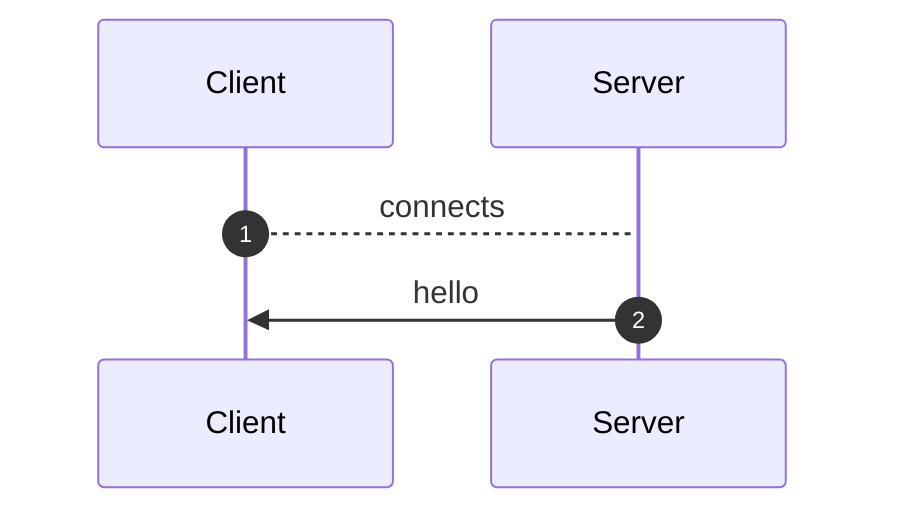
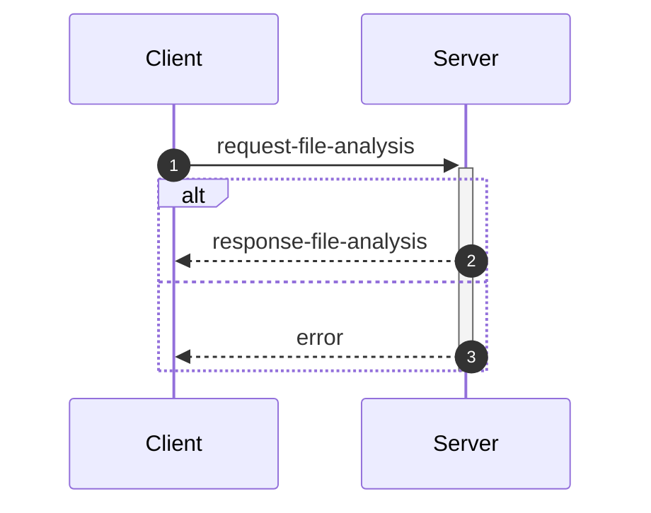
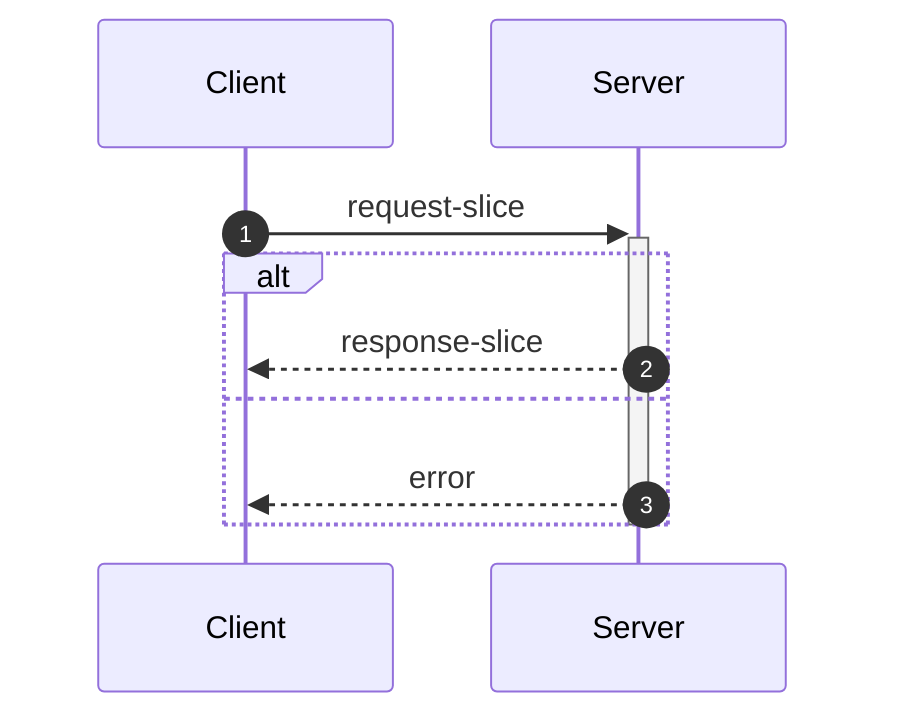
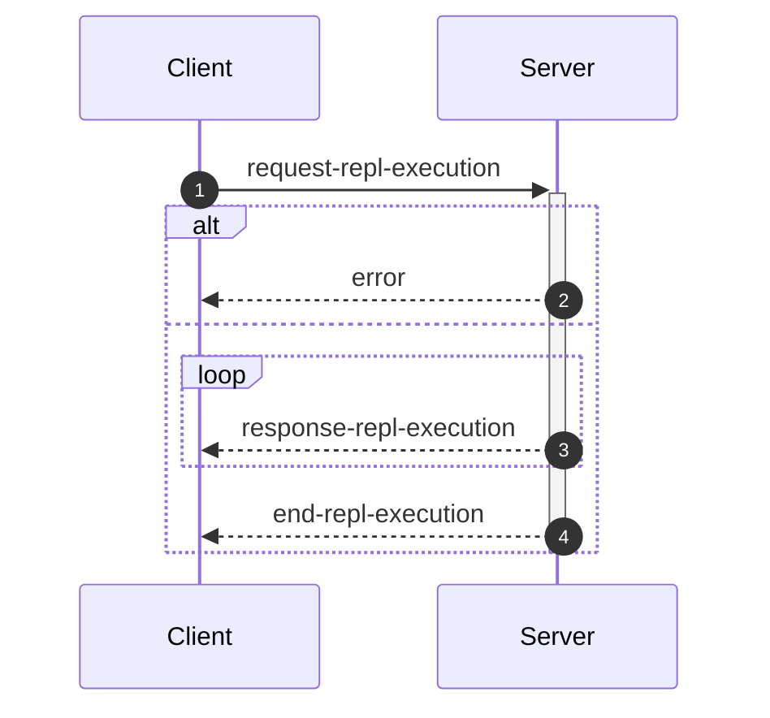

_This document was generated from '[src/documentation/wiki-interface.ts](https://github.com/flowr-analysis/flowr/tree/main//src/documentation/wiki-interface.ts)' on 2026-07-06, 08:49:42 UTC presenting an overview of flowR's interface (v2.10.10, using R v4.5.0). Please do not edit this file/wiki page directly._

Although far from being as detailed as the in-depth explanation of [_flowR_](https://github.com/flowr-analysis/flowr/wiki/core),
this wiki page explains how to interface with _flowR_ in more detail.
In general, command line arguments and other options provide short descriptions on hover over.

* [💻 Using the REPL](#using-the-repl)
* [⚙️ Configuring FlowR](#configuring-flowr)
* [⚒️ Writing Code](#writing-code)
* [💬 Communicating with the Server](#communicating-with-the-server)

<a id='using-the-repl'></a>
## 💻 Using the REPL


> [!NOTE]
> To execute arbitrary R commands with a repl request, _flowR_ has to be started explicitly with <span title="Description (Command Line Argument): Allow to access the underlying R session when using flowR (security warning: this allows the execution of arbitrary R code!)">`--r-session-access`</span>.
> Please be aware that this introduces a security risk and note that this relies on the [`r-shell` engine](https://github.com/flowr-analysis/flowr/wiki/engines) .

Although primarily meant for users to explore,
there is nothing which forbids simply calling _flowR_ as a subprocess to use standard-in, -output, and -error
for communication (although you can access the REPL using the server as well,
with the [REPL Request](#message-request-repl-execution) message).

The read-eval-print loop&nbsp;(REPL) works relatively simple.
You can submit an expression (using <kbd>Enter</kbd>),
which is interpreted as an R&nbsp;expression by default but interpreted as a *command* if it starts with a colon (`:`).
The best command to get started with the REPL is <span title="Description (Repl Command): Show help information (aliases: :h, :?)">`:help`</span>.
Besides, you can leave the REPL either with the command <span title="Description (Repl Command): End the repl (aliases: :q, :exit)">`:quit`</span> or by pressing <kbd>Ctrl</kbd>+<kbd>C</kbd> twice.
When writing a *command*, you may press <kbd>Tab</kbd> to get a list of completions, if available.
Multiple commands can be entered in a single line by separating them with a semicolon (`;`), e.g. `:parse "x<-2"; :df*`.
If a command is given without R code, the REPL will re-use R code given in a previous command.
The prior example will hence return first the parsed AST of the program and then the dataflow graph for `"x <- 2"`.

> [!NOTE]
> If you develop flowR, you may want to launch the repl using the `npm run main-dev` command, this way, you get a non-minified version of flowR with debug information and hot-reloading of source files.

<details>
<summary>Available Commands</summary>

We currently offer the following commands (this with a `[*]` suffix are available with and without the star):


| Command | Description |
| ------- | ----------- |
| **<span title="Description (Repl Command): End the repl (aliases: :q, :exit)">:quit</span>** | End the repl (aliases: **:<span title="Alias of ':quit'. End the repl">q</span>**, **:<span title="Alias of ':quit'. End the repl">exit</span>**) |
| **<span title="Description (Repl Command): Execute the given code as R code. This requires the `--r-session-access` flag to be set and requires the r-shell engine. (aliases: :e, :r)">:execute</span>** | Execute the given code as R code. This requires the `--r-session-access` flag to be set and requires the r-shell engine. (aliases: **:<span title="Alias of ':execute'. Execute the given code as R code. This requires the `--r-session-access` flag to be set and requires the r-shell engine.">e</span>**, **:<span title="Alias of ':execute'. Execute the given code as R code. This requires the `--r-session-access` flag to be set and requires the r-shell engine.">r</span>**) |
| **<span title="Description (Repl Command): Get mermaid code for the control-flow graph of R code (aliases: :cfg, :cf)">:controlflow[*]</span>** | Get mermaid code for the control-flow graph of R code (star: Returns the URL to mermaid.live) (aliases: **:<span title="Alias of ':controlflow'. Get mermaid code for the control-flow graph of R code">cfg</span>**, **:<span title="Alias of ':controlflow'. Get mermaid code for the control-flow graph of R code">cf</span>**) |
| **<span title="Description (Repl Command): Get mermaid code for the control-flow graph with basic blocks (aliases: :cfgb, :cfb)">:controlflowbb[*]</span>** | Get mermaid code for the control-flow graph with basic blocks (star: Returns the URL to mermaid.live) (aliases: **:<span title="Alias of ':controlflowbb'. Get mermaid code for the control-flow graph with basic blocks">cfgb</span>**, **:<span title="Alias of ':controlflowbb'. Get mermaid code for the control-flow graph with basic blocks">cfb</span>**) |
| **<span title="Description (Repl Command): Get mermaid code for the dataflow graph (aliases: :d, :df)">:dataflow[*]</span>** | Get mermaid code for the dataflow graph (star: Returns the URL to mermaid.live) (aliases: **:<span title="Alias of ':dataflow'. Get mermaid code for the dataflow graph">d</span>**, **:<span title="Alias of ':dataflow'. Get mermaid code for the dataflow graph">df</span>**) |
| **<span title="Description (Repl Command): Get mermaid code for the normalized AST of R code (aliases: :n)">:normalize[*]</span>** | Get mermaid code for the normalized AST of R code (star: Returns the URL to mermaid.live) (alias: **:<span title="Alias of ':normalize'. Get mermaid code for the normalized AST of R code">n</span>**) |
| **<span title="Description (Repl Command): Get mermaid code for the simplified dataflow graph (aliases: :ds, :dfs)">:dataflowsimple[*]</span>** | Get mermaid code for the simplified dataflow graph (star: Returns the URL to mermaid.live) (aliases: **:<span title="Alias of ':dataflowsimple'. Get mermaid code for the simplified dataflow graph">ds</span>**, **:<span title="Alias of ':dataflowsimple'. Get mermaid code for the simplified dataflow graph">dfs</span>**) |
| **<span title="Description (Repl Command): Just calculates the DFG, but only prints summary info (aliases: :d#, :df#)">:dataflowsilent</span>** | Just calculates the DFG, but only prints summary info (aliases: **:<span title="Alias of ':dataflowsilent'. Just calculates the DFG, but only prints summary info">d#</span>**, **:<span title="Alias of ':dataflowsilent'. Just calculates the DFG, but only prints summary info">df#</span>**) |
| **<span title="Description (Repl Command): Prints ASCII Art of the parsed, unmodified AST (aliases: :p)">:parse</span>** | Prints ASCII Art of the parsed, unmodified AST (alias: **:<span title="Alias of ':parse'. Prints ASCII Art of the parsed, unmodified AST">p</span>**) |
| **<span title="Description (Repl Command): Prints the version of flowR as well as the current version of R">:version</span>** | Prints the version of flowR as well as the current version of R
| **<span title="Description (Repl Command): Query the given R code (use 'help' for more information)">:query[*]</span>** | Query the given R code (use 'help' for more information) (star: Similar to query, but returns the output in json format.)
| **<span title="Description (Repl Command): Returns an ASCII representation of the dataflow graph (aliases: :df!)">:dataflowascii</span>** | Returns an ASCII representation of the dataflow graph (alias: **:<span title="Alias of ':dataflowascii'. Returns an ASCII representation of the dataflow graph">df!</span>**) |
| **<span title="Description (Repl Command): Returns summarization stats for the normalized AST (aliases: :n#)">:normalize#</span>** | Returns summarization stats for the normalized AST (alias: **:<span title="Alias of ':normalize#'. Returns summarization stats for the normalized AST">n#</span>**) |
| **<span title="Description (Repl Command): Show help information (aliases: :h, :?)">:help</span>** | Show help information (aliases: **:<span title="Alias of ':help'. Show help information">h</span>**, **:<span title="Alias of ':help'. Show help information">?</span>**) |


</details>


> [!TIP]
> 
> As indicated by the examples before, all REPL commands that operate on code keep track of the state.
> Hence, if you run a command like <span title="Description (Repl Command, starred version): Returns the URL to mermaid.live; Base Command: Get mermaid code for the dataflow graph (aliases: :d*, :df*)">`:dataflow*`</span> without providing R code,
> the REPL will re-use the R code provided in a previous command.
> Likewise, doing this will benefit from incrementality!
> If you request the dataflow graph with `:df* x <- 2 * y` and then want to see the parsed AST with `:parse`,
> the REPL will re-use previously obtained information and not re-parse the code again.
> 		


Generally, many commands offer shortcut versions in the REPL. Many queries, for example, offer a shortened format (see the example below).
Of special note, the [Config Query](https://github.com/flowr-analysis/flowr/wiki/query-api#Config-Query)
can be used to also modify the currently active configuration of _flowR_ within the REPL (see the [wiki page](https://github.com/flowr-analysis/flowr/wiki/query-api#Config-Query) for more information).

### Example: Retrieving the Dataflow Graph

To retrieve a URL to the [mermaid](https://mermaid.js.org/) diagram of the dataflow of a given expression,
use <span title="Description (Repl Command, starred version): Returns the URL to mermaid.live; Base Command: Get mermaid code for the dataflow graph (aliases: :d*, :df*)">`:dataflow*`</span> (or <span title="Description (Repl Command): Get mermaid code for the dataflow graph (aliases: :d, :df)">`:dataflow`</span> to get the mermaid code in the cli):


```shell
$ docker run -it --rm eagleoutice/flowr # or npm run flowr 
flowR repl v2.10.10, R grammar v14 (tree-sitter engine, pkg-db: latest/2026-05-23)
R> :dataflow* y <- 1 + x
```

<details>
<summary style='color:gray'>Output</summary>


```text
https://mermaid.live/view#base64:eyJjb2RlIjoiZmxvd2NoYXJ0IEJUXG4gICAgMXt7XCJgIzkxO1JOdW1iZXIjOTM7IDFcbiAgICAgICgxKVxuICAgICAgKjEuNipgXCJ9fVxuICAgJSUgTm8gZWRnZXMgZm91bmQgZm9yIDFcbiAgICAyKFtcImAjOTE7UlN5bWJvbCM5MzsgeFxuICAgICAgKDIpXG4gICAgICAqMS4xMCpgXCJdKVxuICAgJSUgTm8gZWRnZXMgZm91bmQgZm9yIDJcbiAgICAzW1tcImAjOTE7UkJpbmFyeU9wIzkzOyAjNDM7XG4gICAgICAoMylcbiAgICAgICoxLjYtMTAqXG4gICAgKDEsIDIpYFwiXV1cbiAgICBidWlsdC1pbjpfW1wiYEJ1aWx0LUluOlxuIzQzO2BcIl1cbiAgICBzdHlsZSBidWlsdC1pbjpfIHN0cm9rZTpncmF5LGZpbGw6Z3JheSxzdHJva2Utd2lkdGg6MnB4LG9wYWNpdHk6Ljg7XG4gICAgMFtcImAjOTE7UlN5bWJvbCM5MzsgeVxuICAgICAgKDAsIHNvdXJjZXM6IFszXSlcbiAgICAgICoxLjEqYFwiXVxuICAgIDRbW1wiYCM5MTtSQmluYXJ5T3AjOTM7ICM2MDsjNDU7XG4gICAgICAoNClcbiAgICAgICoxLjEtMTAqXG4gICAgKDAsIDMpYFwiXV1cbiAgICBidWlsdC1pbjpfLVtcImBCdWlsdC1JbjpcbiM2MDsjNDU7YFwiXVxuICAgIHN0eWxlIGJ1aWx0LWluOl8tIHN0cm9rZTpncmF5LGZpbGw6Z3JheSxzdHJva2Utd2lkdGg6MnB4LG9wYWNpdHk6Ljg7XG4gICAgMyAtLT58XCJyZWFkcywgYXJndW1lbnRcInwgMVxuICAgIDMgLS0+fFwicmVhZHMsIGFyZ3VtZW50XCJ8IDJcbiAgICAzIC0uLT58XCJyZWFkcywgY2FsbHNcInwgYnVpbHQtaW46X1xuICAgIGxpbmtTdHlsZSAyIHN0cm9rZTpncmF5O1xuICAgIDAgLS0+fFwiZGVmaW5lZC1ieVwifCAzXG4gICAgMCAtLT58XCJkZWZpbmVkLWJ5XCJ8IDRcbiAgICA0IC0tPnxcInJlYWRzLCBhcmd1bWVudFwifCAzXG4gICAgNCAtLT58XCJyZXR1cm5zLCBhcmd1bWVudFwifCAwXG4gICAgNCAtLi0+fFwicmVhZHMsIGNhbGxzXCJ8IGJ1aWx0LWluOl8tXG4gICAgbGlua1N0eWxlIDcgc3Ryb2tlOmdyYXk7IiwibWVybWFpZCI6eyJhdXRvU3luYyI6dHJ1ZX19
```


Retrieve the dataflow graph of the expression `y <- 1 + x`. It looks like this:


```mermaid
flowchart LR
    1{{"`#91;RNumber#93; 1
      (1)
      *1.6*`"}}
   %% No edges found for 1
    2(["`#91;RSymbol#93; x
      (2)
      *1.10*`"])
   %% No edges found for 2
    3[["`#91;RBinaryOp#93; #43;
      (3)
      *1.6-10*
    (1, 2)`"]]
    built-in:_["`Built-In:
#43;`"]
    style built-in:_ stroke:gray,fill:gray,stroke-width:2px,opacity:.8;
    0["`#91;RSymbol#93; y
      (0, sources: [3])
      *1.1*`"]
    4[["`#91;RBinaryOp#93; #60;#45;
      (4)
      *1.1-10*
    (0, 3)`"]]
    built-in:_-["`Built-In:
#60;#45;`"]
    style built-in:_- stroke:gray,fill:gray,stroke-width:2px,opacity:.8;
    3 -->|"reads, argument"| 1
    3 -->|"reads, argument"| 2
    3 -.->|"reads, calls"| built-in:_
    linkStyle 2 stroke:gray;
    0 -->|"defined-by"| 3
    0 -->|"defined-by"| 4
    4 -->|"reads, argument"| 3
    4 -->|"returns, argument"| 0
    4 -.->|"reads, calls"| built-in:_-
    linkStyle 7 stroke:gray;
```

	
<details>

<summary style="color:gray">R Code of the Dataflow Graph</summary>

The analysis required _0.8 ms_ (including parse and normalize, using the [tree-sitter](https://github.com/flowr-analysis/flowr/wiki/Engines) engine) within the generation environment. 
We encountered no unknown side effects during the analysis.


```r
y <- 1 + x
```


</details>


</details>


For small graphs like this, <span title="Description (Repl Command): Returns an ASCII representation of the dataflow graph (aliases: :df!)">`:dataflowascii`</span> also provides an ASCII representation directly in the REPL:


```shell
$ docker run -it --rm eagleoutice/flowr # or npm run flowr 
flowR repl v2.10.10, R grammar v14 (tree-sitter engine, pkg-db: latest/2026-05-23)
R> :df! y <- 1 + x
```

<details open>
<summary style='color:gray'>Output</summary>


```text
                        0<1>0
                   ┌────| 1 |
    ┌────────┐     │    0---0
 c<4>c       └──c<3>c
 |<- |  v<0>v┌──| + |
 c---c──| y |┘  c---c   u<2>u
        v---v      └────| x |
                        u---u
Edges:
3 -> 1: reads, argument  3 -> 2: reads, argument
4 -> 3: reads, argument  4 -> 0: returns, argument
0 -> 3: defined-by       0 -> 4: defined-by
```


Retrieve the dataflow graph of the expression `y <- 1 + x` as ASCII art.

</details>


For the slicing with <span title="Description (Repl Command): Static backwards executable slicer for R">`:slicer`</span>, you have access to the same [magic comments](#slice-magic-comments) as with the [slice request](#message-request-slice).

### Example: Interfacing with the File System

Many commands that allow for an R-expression (like <span title="Description (Repl Command, starred version): Returns the URL to mermaid.live; Base Command: Get mermaid code for the dataflow graph (aliases: :d*, :df*)">`:dataflow*`</span>) allow for a file as well
if the argument starts with `file://`.
If you are working from the root directory of the _flowR_ repository, the following gives you the parsed AST of the example file using the <span title="Description (Repl Command): Prints ASCII Art of the parsed, unmodified AST (aliases: :p)">`:parse`</span> command:

> **Watch mode**: Replace `file://` with `watch://` to enter watch mode.
> flowR runs the command immediately and then re-runs it every time the file (or any file inside the folder) changes.
> Enter any other command to leave watch mode.
> For example: `:df watch://analysis.R`


```shell
$ docker run -it --rm eagleoutice/flowr # or npm run flowr 
flowR repl v2.10.10, R grammar v14 (tree-sitter engine, pkg-db: latest/2026-05-23)
R> :parse file://test/testfiles/example.R
```

<details>
<summary style='color:gray'>Output</summary>


```text
File: test/testfiles/example.R

program
├ binaryoperator
│ ├ identifier "sum" (1:1─4)
│ ├ <- "<-" (1:5─7)
│ ╰ float "0" (1:8─9)
├ binaryoperator
│ ├ identifier "product" (2:1─8)
│ ├ <- "<-" (2:9─11)
│ ╰ float "1" (2:12─13)
├ binaryoperator
│ ├ identifier "w" (3:1─2)
│ ├ <- "<-" (3:3─5)
│ ╰ float "7" (3:6─7)
├ binaryoperator
│ ├ identifier "N" (4:1─2)
│ ├ <- "<-" (4:3─5)
│ ╰ float "10" (4:6─8)
├ forstatement
│ ├ for "for" (6:1─4)
│ ├ ( "(" (6:5─6)
│ ├ identifier "i" (6:6─7)
│ ├ in "in" (6:8─10)
│ ├ binaryoperator
│ │ ├ float "1" (6:11─12)
│ │ ├ : ":" (6:12─13)
│ │ ╰ parenthesizedexpression
│ │   ├ ( "(" (6:13─14)
│ │   ├ binaryoperator
│ │   │ ├ identifier "N" (6:14─15)
│ │   │ ├ - "-" (6:15─16)
│ │   │ ╰ float "1" (6:16─17)
│ │   ╰ ) ")" (6:17─18)
│ ├ ) ")" (6:18─19)
│ ╰ bracedexpression
│   ├ { "{" (6:20─21)
│   ├ binaryoperator
│   │ ├ identifier "sum" (7:3─6)
│   │ ├ <- "<-" (7:7─9)
│   │ ╰ binaryoperator
│   │   ├ binaryoperator
│   │   │ ├ identifier "sum" (7:10─13)
│   │   │ ├ + "+" (7:14─15)
│   │   │ ╰ identifier "i" (7:16─17)
│   │   ├ + "+" (7:18─19)
│   │   ╰ identifier "w" (7:20─21)
│   ├ binaryoperator
│   │ ├ identifier "product" (8:3─10)
│   │ ├ <- "<-" (8:11─13)
│   │ ╰ binaryoperator
│   │   ├ identifier "product" (8:14─21)
│   │   ├  "" (8:22─23)
│   │   ╰ identifier "i" (8:24─25)
│   ╰ } "}" (9:1─2)
├ call
│ ├ identifier "cat" (11:1─4)
│ ╰ arguments
│   ├ ( "(" (11:4─5)
│   ├ argument
│   │ ╰ string
│   │   ├ " "\"" (11:5─6)
│   │   ├ stringcontent "Sum:" (11:6─10)
│   │   ╰ " "\"" (11:10─11)
│   ├ comma "," (11:11─12)
│   ├ argument
│   │ ╰ identifier "sum" (11:13─16)
│   ├ comma "," (11:16─17)
│   ├ argument
│   │ ╰ string
│   │   ├ " "\"" (11:18─19)
│   │   ├ stringcontent
│   │   │ ╰ escapesequence "\\n" (11:19─21)
│   │   ╰ " "\"" (11:21─22)
│   ╰ ) ")" (11:22─23)
╰ call
  ├ identifier "cat" (12:1─4)
  ╰ arguments
    ├ ( "(" (12:4─5)
    ├ argument
    │ ╰ string
    │   ├ " "\"" (12:5─6)
    │   ├ stringcontent "Product:" (12:6─14)
    │   ╰ " "\"" (12:14─15)
    ├ comma "," (12:15─16)
    ├ argument
    │ ╰ identifier "product" (12:17─24)
    ├ comma "," (12:24─25)
    ├ argument
    │ ╰ string
    │   ├ " "\"" (12:26─27)
    │   ├ stringcontent
    │   │ ╰ escapesequence "\\n" (12:27─29)
    │   ╰ " "\"" (12:29─30)
    ╰ ) ")" (12:30─31)
```


Retrieve the parsed AST of the example file.

<details>

<summary>File Content</summary>


```r
sum <- 0
product <- 1
w <- 7
N <- 10

for (i in 1:(N-1)) {
  sum <- sum + i + w
  product <- product * i
}

cat("Sum:", sum, "\n")
cat("Product:", product, "\n")
```


</details>

As _flowR_ directly transforms this AST the output focuses on being human-readable instead of being machine-readable.
		

</details>


### Example: Run a Query

You can run any query supported by _flowR_ using the <span title="Description (Repl Command): Query the given R code (use 'help' for more information)">`:query`</span> command.
For example, to obtain the shapes of all data frames in a given piece of code, you can run:


```shell
$ docker run -it --rm eagleoutice/flowr # or npm run flowr 
flowR repl v2.10.10, R grammar v14 (tree-sitter engine, pkg-db: latest/2026-05-23)
R> :query @df-shape "x <- data.frame(a = 1:10, b = 1:10)\ny <- x$a"
```

<details open>
<summary style='color:gray'>Output</summary>


```text
Query: df-shape (1 ms)
   ╰ 12: (colnames: [{"a", "b"}, {}], cols: [2, 2], rows: [10, 10])
   ╰ 0: (colnames: [{"a", "b"}, {}], cols: [2, 2], rows: [10, 10])
All queries together required ≈4 ms (1ms accuracy, total 4 ms)
```


Retrieve the shapes of all data frames in the given code.

</details>


To run the linter on a file, you can use (in this example, we just issue the `dead-code` linter on a small piece of code):


```shell
$ docker run -it --rm eagleoutice/flowr # or npm run flowr 
flowR repl v2.10.10, R grammar v14 (tree-sitter engine, pkg-db: latest/2026-05-23)
R> :query @linter rules:dead-code "if(FALSE) x <- 2"
```

<details open>
<summary style='color:gray'>Output</summary>


```text
Query: linter (1 ms)
   ╰ Dead Code (dead-code):
       ╰ certain:
           ╰ Code at 1.11-16
       ╰ Metadata: searchTimeMs: 1, processTimeMs: 0
All queries together required ≈1 ms (1ms accuracy, total 1 ms)
```


Run the linter on the given code, with only the `dead-code` rule enabled.

</details>


For more information on the available queries, please check out the [Query API](https://github.com/flowr-analysis/flowr/wiki/query-api).


<a id='configuring-flowr'></a>
## ⚙️ Configuring FlowR


When running _flowR_, you may want to specify some behaviors with a dedicated configuration file.
By default, flowR looks for a file named `flowr.json` in the current working directory (or any higher directory).
You can also specify a different file with <span title="Description (Command Line Argument): The name of the configuration file to use">`--config-file`</span> or pass the configuration inline using <span title="Description (Command Line Argument): The flowR configuration to use, as a JSON string">`--config-json`</span>.
To inspect the current configuration, you can run flowr with the <span title="Description (Command Line Argument): Run with verbose logging (will be passed to the corresponding script)">`--verbose`</span> flag, or use the `config` [Query](https://github.com/flowr-analysis/flowr/wiki/query-api).
Within the REPL this works by running the following:


```shell
:query @config
```


To work with the <a href="https://github.com/flowr-analysis/flowr/tree/main/src/config.ts#L109"><code><span title="The configuration file format for flowR.">FlowrConfig</span></code></a> you can use the provided helper objects alongside its methods like
<a href="https://github.com/flowr-analysis/flowr/tree/main/src/config.ts#L479"><code><span title="Creates a new flowr config that has the updated values.">FlowrConfig::<b>amend</b></span></code></a>.
The following summarizes the configuration options:

- `ignoreSourceCalls`: If set to `true`, _flowR_ will ignore source calls when analyzing the code, i.e., ignoring the inclusion of other files.
- `semantics`: allows to configure the way _flowR_ handles R, although we currently only support `semantics/environment/overwriteBuiltIns`.
  You may use this to overwrite _flowR_'s handling of built-in function and even completely clear the preset definitions shipped with flowR.
  See [Configure BuiltIn Semantics](#configure-builtin-semantics) for more information.
- `solver`: allows to configure how _flowR_ resolves variables and their values (currently we support: `disabled`, `alias`, `builtin`), as well as if pointer analysis should be active.
- `engines`: allows to configure the engines used by _flowR_ to interact with R code. See the [Engines wiki page](https://github.com/flowr-analysis/flowr/wiki/engines) for more information.
- `defaultEngine`: allows to specify the default engine to use for interacting with R code. If not set, an arbitrary engine from the specified list will be used.
- `abstractInterpretation`: allows to configure how _flowR_ performs abstract interpretation, although we currently only support data frame shape inference through abstract interpretation.
- `defaultPlugins`: allows to configure which plugins to load by default when creating a new <a href="https://github.com/flowr-analysis/flowr/tree/main/src/project/flowr-analyzer.ts#L162"><code><span title="Central class for conducting analyses with FlowR. Use the FlowrAnalyzerBuilder to create a new instance. If you want the original pattern of creating a pipeline and running all steps, you can still do this with FlowrAnalyzer#runFull . To inspect the context of the analyzer, use FlowrAnalyzer#inspectContext (if you are a plugin and need to modify it, use FlowrAnalyzer#context instead).">FlowrAnalyzer</span></code></a> instance.
- `repl.plugins`: allows to configure which plugins to load in the _flowR_ REPL. Use `flowr:default` to reference the plugins specified by `defaultPlugins`.

So you can configure _flowR_ by adding a file like the following:

<details>

<summary>Example Configuration File</summary>


```json
{
  "ignoreSourceCalls": true,
  "semantics": {
    "environment": {
      "overwriteBuiltIns": {
        "definitions": [
          {
            "type": "function",
            "names": [
              "foo"
            ],
            "processor": "builtin:assign",
            "config": {}
          }
        ]
      }
    }
  },
  "defaultPlugins": [
    "file:description",
    "versions:description"
  ],
  "repl": {
    "quickStats": false,
    "dfProcessorHeat": false,
    "plugins": [
      "flowr:default"
    ]
  },
  "project": {
    "resolveUnknownPathsOnDisk": true
  },
  "engines": [
    {
      "type": "r-shell"
    }
  ],
  "solver": {
    "variables": "alias",
    "evalStrings": true,
    "trackEnvironments": true,
    "eagerlyLoadPackages": false,
    "eagerlyLoadPackageDatabase": false,
    "resolveSource": {
      "dropPaths": "no",
      "ignoreCapitalization": true,
      "inferWorkingDirectory": "active-script",
      "searchPath": []
    },
    "instrument": {},
    "slicer": {
      "threshold": 50
    }
  },
  "abstractInterpretation": {
    "wideningThreshold": 4,
    "dataFrame": {
      "maxColNames": 20,
      "readLoadedData": {
        "readExternalFiles": true,
        "maxReadLines": 1000000
      }
    }
  },
  "gas": {
    "thresholds": {
      "memory": {
        "problematic": 0.7,
        "critical": 0.9
      },
      "timeMs": {
        "problematic": 100000,
        "critical": 120000
      }
    },
    "features": {}
  }
}
```


</details>

<details>
<a id='configure-builtin-semantics'></a>
<summary>Configure Built-In Semantics</summary>


`semantics/environment/overwriteBuiltins` accepts two keys:

- `loadDefaults` (boolean, initially `true`): If set to `true`, the default built-in definitions are loaded before applying the custom definitions. Setting this flag to `false` explicitly disables the loading of the default definitions.
- `definitions` (array, initially empty): Allows to overwrite or define new built-in elements. Each object within must have a `type` which is one of the below. Furthermore, they may define a string array of `names` which specifies the identifiers to bind the definitions to. You may use `assumePrimitive` to specify whether _flowR_ should assume that this is a primitive non-library definition (so you probably just do not want to specify the key).

  | Type            | Description                                                                                                                                                                                                                                                                                              | Example                                                                                                    |
  | --------------- | -------------------------------------------------------------------------------------------------------------------------------------------------------------------------------------------------------------------------------------------------------------------------------------------------------- | ---------------------------------------------------------------------------------------------------------- |
  | `constant`    | Additionally allows for a `value` this should resolve to.                                                                                                                                                                                                                                                | `{ type: 'constant', names: ['NULL', 'NA'],  value: null }`                                                |
  | `function`    | Is a rather flexible way to define and bind built-in functions. For the time, we do not have extensive documentation to cover all the cases, so please either consult the sources with the `default-builtin-config.ts` or open a [new issue](https://github.com/flowr-analysis/flowr/issues/new/choose). | `{ type: 'function', names: ['next'], processor: 'builtin:d', config: { cfg: ExitPointType.Next } }` |
  | `replacement` | A comfortable way to specify replacement functions like `$<-` or `names<-`. `suffixes` describes the... suffixes to attach automatically. | `{ type: 'replacement', suffixes: ['<-', '<<-'], names: ['[', '[['] }` |


</details>

<details>

<summary style='color:gray'>Full Configuration-File Schema</summary>

- _The configuration file format for flowR._ (object)
    - **ignoreSourceCalls** [optional] _Whether source calls should be ignored, causing {@link processSourceCall}'s behavior to be skipped._ (boolean)
    - **semantics** _Configure language semantics and how flowR handles them._ (object)
        - **environment** [optional] _Semantics regarding how to handle the R environment._ (object)
            - **overwriteBuiltIns** [optional] _Do you want to overwrite (parts) of the builtin definition?_ (object)
                - **loadDefaults** [optional] _Should the default configuration still be loaded?_ (boolean)
                - **definitions** [optional] _The definitions to load/overwrite._ (array)
                Valid item types:
                    - (object)
    - **defaultPlugins** [optional] _The default plugins to load when creating a new instance of FlowrAnalyzer_ (array)
    Valid item types:
        - (alternatives)
            - (string)
            - (array)
    - **repl** _Configuration options for the REPL._ (object)
        - **quickStats** [optional] _Whether to show quick stats in the REPL after each evaluation._ (boolean)
        - **dfProcessorHeat** [optional] _This instruments the dataflow processors to count how often each processor is called._ (boolean)
        - **plugins** [optional] _The plugins to load in REPL mode_ (array)
        Valid item types:
            - (alternatives)
                - (string)
                - (array)
    - **project** _Project specific configuration options._ (object)
        - **resolveUnknownPathsOnDisk** [optional] _Whether to resolve unknown paths loaded by the r project disk when trying to source/analyze files._ (boolean)
    - **engines** _The engine or set of engines to use for interacting with R code. An empty array means all available engines will be used._ (array)
    Valid item types:
        - (alternatives)
            - _The configuration for the tree sitter engine._ (object)
                - **type** [required] _Use the tree sitter engine._ (string)
                    Only allows: 'tree-sitter'
                - **wasmPath** [optional] _The path to the tree-sitter-r WASM binary to use. If this is undefined, this uses the default path._ (string)
                - **treeSitterWasmPath** [optional] _The path to the tree-sitter WASM binary to use. If this is undefined, this uses the default path._ (string)
                - **lax** [optional] _Whether to use the lax parser for parsing R code (allowing for syntax errors). If this is undefined, the strict parser will be used._ (boolean)
            - _The configuration for the R shell engine._ (object)
                - **type** [required] _Use the R shell engine._ (string)
                    Only allows: 'r-shell'
                - **rPath** [optional] _The path to the R executable to use. If this is undefined, this uses the default path._ (string)
    - **defaultEngine** [optional] _The default engine to use for interacting with R code. If this is undefined, an arbitrary engine from the specified list will be used._ (string)
        Only allows: 'tree-sitter', 'r-shell'
    - **solver** _How to resolve constants, constraints, cells, ..._ (object)
        - **variables** _How to resolve variables and their values._ (string)
            Only allows: 'disabled', 'alias', 'builtin'
        - **evalStrings** _Should we include eval(parse(text="...")) calls in the dataflow graph?_ (boolean)
        - **trackEnvironments** [optional] _Track user-created environments (new.env, assign/get/local with envir=, dollar-assign, attach). When false, all envir-style calls fall through conservatively._ (boolean)
        - **eagerlyLoadPackages** [optional] _Create a built-in vertex for every export when a package is loaded. When false (default), export vertices are created on demand as calls resolve to them, keeping the dataflow graph small._ (boolean)
        - **eagerlyLoadPackageDatabase** [optional] _Mount the package database up front instead of lazily on the first package load. When false (default), it is parsed only when a library()/use() call first needs it._ (boolean)
        - **instrument** (object)
            - **dataflowExtractors** [optional] _These keys are only intended for use within code, allowing to instrument the dataflow analyzer!_ (any)
        - **resolveSource** [optional] _If lax source calls are active, flowR searches for sourced files much more freely, based on the configurations you give it. This option is only in effect if `ignoreSourceCalls` is set to false._ (object)
            - **dropPaths** _Allow to drop the first or all parts of the sourced path, if it is relative._ (string)
                Only allows: 'no', 'once', 'all'
            - **ignoreCapitalization** _Search for filenames matching in the lowercase._ (boolean)
            - **inferWorkingDirectory** _Try to infer the working directory from the main or any script to analyze._ (string)
                Only allows: 'no', 'main-script', 'active-script', 'any-script'
            - **searchPath** _Additionally search in these paths._ (array)
            Valid item types:
                - (string)
            - **repeatedSourceLimit** [optional] _How often the same file can be sourced within a single run? Please be aware: in case of cyclic sources this may not reach a fixpoint so give this a sensible limit._ (number)
            - **applyReplacements** _Provide name replacements for loaded files_ (array)
            Valid item types:
                - (object)
        - **slicer** [optional] _The configuration for the slicer._ (object)
            - **threshold** [optional] _The maximum number of iterations to perform on a single function call during slicing._ (number)
            - **autoExtend** [optional] _If set, the slicer will gain an additional post-pass._ (boolean)
    - **abstractInterpretation** _The configuration options for abstract interpretation._ (object)
        - **wideningThreshold** _The threshold for the number of visitations of a node at which widening should be performed to ensure the termination of the fixpoint iteration._ (number)
        - **dataFrame** _The configuration of the shape inference for data frames._ (object)
            - **maxColNames** _The maximum number of columns names to infer for data frames before over-approximating the column names to top._ (number)
            - **readLoadedData** _Configuration options for reading data frame shapes from loaded external data files, such as CSV files._ (object)
                - **readExternalFiles** _Whether data frame shapes should be extracted from loaded external files, such as CSV files._ (boolean)
                - **maxReadLines** _The maximum number of lines to read when extracting data frame shapes from loaded files, such as CSV files._ (number)
    - **gas** [optional] _Resource-usage guard (gas) configuration. All feature factors default to 0 (disabled). See https://github.com/flowr-analysis/flowr/wiki/Core#gas-resource-guard._ (object)
        - **thresholds** [optional] _Shared thresholds for all gas checks (scaled by per-feature factor)._ (object)
            - **memory** [optional] _Heap-usage fraction thresholds (0-1)._ (object)
                - **problematic** [optional] _Heap fraction (0-1) above which Problematic is returned._ (number)
                - **critical** [optional] _Heap fraction (0-1) above which Critical is returned._ (number)
            - **timeMs** [optional] _Elapsed analysis time thresholds in milliseconds._ (object)
                - **problematic** [optional] _Elapsed ms above which Problematic is returned._ (number)
                - **critical** [optional] _Elapsed ms above which Critical is returned._ (number)
        - **features** [optional] _Per-feature sensitivity factors. 0 or absent disables gas checking for that feature. A factor of 2 makes the feature twice as sensitive. Recognised keys: `source`, `side-effect-linking`, `linter`._ (object)
        - **heapProvider** [optional] _Custom heap statistics source (programmatic configs only), overriding the built-in v8/performance.memory detection._ (function)

</details>

	

<a id='writing-code'></a>
## ⚒️ Writing Code

_flowR_ can be used as a [module](https://www.npmjs.com/package/@eagleoutice/flowr) and offers several main classes and interfaces that are interesting for extension writers 
(see the [Visual Studio Code extension](https://marketplace.visualstudio.com/items?itemName=code-inspect.vscode-flowr) or the [Core](https://github.com/flowr-analysis/flowr/wiki/core) wiki page for more information).

### Creating Analyses with _flowR_

Nowadays, instances of the <a href="https://github.com/flowr-analysis/flowr/tree/main/src/project/flowr-analyzer.ts#L162"><code><span title="Central class for conducting analyses with FlowR. Use the FlowrAnalyzerBuilder to create a new instance. If you want the original pattern of creating a pipeline and running all steps, you can still do this with FlowrAnalyzer#runFull . To inspect the context of the analyzer, use FlowrAnalyzer#inspectContext (if you are a plugin and need to modify it, use FlowrAnalyzer#context instead).">FlowrAnalyzer</span></code></a> should be used as central frontend to get analysis results from _flowR_.
For example, a program slice can be created like this:


```ts
const analyzer = await new FlowrAnalyzerBuilder()
    .setEngine('tree-sitter')
    .build();
analyzer.addRequest('x <- 1\ny <- x\nx');
const result = await analyzer.query([
    {
        type:     'static-slice',
        criteria: ['3@x']
    }
]);
//console.log(result['static-slice']);
```


For more information, please have a look at the [Analyzer](https://github.com/flowr-analysis/flowr/wiki/analyzer) wiki page, which explains how to construct and use the <a href="https://github.com/flowr-analysis/flowr/tree/main/src/project/flowr-analyzer.ts#L162"><code><span title="Central class for conducting analyses with FlowR. Use the FlowrAnalyzerBuilder to create a new instance. If you want the original pattern of creating a pipeline and running all steps, you can still do this with FlowrAnalyzer#runFull . To inspect the context of the analyzer, use FlowrAnalyzer#inspectContext (if you are a plugin and need to modify it, use FlowrAnalyzer#context instead).">FlowrAnalyzer</span></code></a> in more detail.
To work with specific perspectives, you can also consult the respective pages like the [Dataflow Graph](https://github.com/flowr-analysis/flowr/wiki/dataflow-graph) or the [Abstract Interpretation](https://github.com/flowr-analysis/flowr/wiki/abstract-interpretation) wiki pages.
### The Pipeline Executor (Low-Level Interface)

Once, in the beginning, _flowR_ was meant to produce a dataflow graph merely to provide *program slices*. 
However, with continuous updates, the [Dataflow Graph](https://github.com/flowr-analysis/flowr/wiki/dataflow-graph) repeatedly proves to be the more interesting part.
With this, we restructured _flowR_'s originally *hardcoded* pipeline to be far more flexible. 
Now, it can be theoretically extended or replaced with arbitrary steps, optional steps, and what we call 'decorations' of these steps. 
In short, a slicing pipeline using the <a href="https://github.com/flowr-analysis/flowr/tree/main/src/core/pipeline-executor.ts#L97"><code><span title="**Please note:** The PipelineExecutor is now considered to be a rather low-level API for flowR. While it still works and is the basis for all other layers, we strongly recommend using the FlowrAnalyzer and its builder to create and use an analyzer instance that is pre-configured for your use-case. The pipeline executor allows to execute arbitrary pipelines in a step-by-step fashion. If you are not...">PipelineExecutor</span></code></a> looks like this:


```ts

const slicer = new PipelineExecutor(DEFAULT_SLICING_PIPELINE, {
  parser:    new RShell(),
  request:   requestFromInput('x <- 1\nx + 1'),
  criterion: ['2@x']
})
const slice = await slicer.allRemainingSteps()
// console.log(slice.reconstruct.code)
```


<details><summary>More Information</summary>


If you compare this, with what you would have done with the old (and removed) `SteppingSlicer`, 
this essentially just requires you to replace the `SteppingSlicer` with the <a href="https://github.com/flowr-analysis/flowr/tree/main/src/core/pipeline-executor.ts#L97"><code><span title="**Please note:** The PipelineExecutor is now considered to be a rather low-level API for flowR. While it still works and is the basis for all other layers, we strongly recommend using the FlowrAnalyzer and its builder to create and use an analyzer instance that is pre-configured for your use-case. The pipeline executor allows to execute arbitrary pipelines in a step-by-step fashion. If you are not...">PipelineExecutor</span></code></a>
and to pass the <a href="https://github.com/flowr-analysis/flowr/tree/main/src/core/steps/pipeline/default-pipelines.ts#L18"><code>DEFAULT_SLICING_PIPELINE</code></a> as the first argument.
The <a href="https://github.com/flowr-analysis/flowr/tree/main/src/core/pipeline-executor.ts#L97"><code><span title="**Please note:** The PipelineExecutor is now considered to be a rather low-level API for flowR. While it still works and is the basis for all other layers, we strongly recommend using the FlowrAnalyzer and its builder to create and use an analyzer instance that is pre-configured for your use-case. The pipeline executor allows to execute arbitrary pipelines in a step-by-step fashion. If you are not...">PipelineExecutor</span></code></a>...

1. Provides structures to investigate the results of all intermediate steps
2. Can be executed step-by-step
3. Can repeat steps (e.g., to calculate multiple slices on the same input)

See the in-code documentation for more information.


</details>

### Using the <a href="https://github.com/flowr-analysis/flowr/tree/main/src/r-bridge/shell.ts#L143"><code><span title="The RShell represents an interactive session with the R interpreter. You can configure it by RShellOptions . At the moment we are using a live R session (and not networking etc.) to communicate with R easily, which allows us to install packages etc. However, this might and probably will change in the future (leaving this as a legacy mode :D)">RShell</span></code></a> to Interact with R

The <a href="https://github.com/flowr-analysis/flowr/tree/main/src/r-bridge/shell.ts#L143"><code><span title="The RShell represents an interactive session with the R interpreter. You can configure it by RShellOptions . At the moment we are using a live R session (and not networking etc.) to communicate with R easily, which allows us to install packages etc. However, this might and probably will change in the future (leaving this as a legacy mode :D)">RShell</span></code></a> class allows interfacing with the `R`&nbsp;ecosystem installed on the host system.
Please have a look at [flowR's Engines](https://github.com/flowr-analysis/flowr/wiki/engines) for more information on alternatives (for example, the <a href="https://github.com/flowr-analysis/flowr/tree/main/src/r-bridge/lang-4.x/tree-sitter/tree-sitter-executor.ts#L18"><code><span title="Synchronous and (way) faster alternative to the RShell using tree-sitter.">TreeSitterExecutor</span></code></a>).


> [!IMPORTANT]
> 
> Each <a href="https://github.com/flowr-analysis/flowr/tree/main/src/r-bridge/shell.ts#L143"><code><span title="The RShell represents an interactive session with the R interpreter. You can configure it by RShellOptions . At the moment we are using a live R session (and not networking etc.) to communicate with R easily, which allows us to install packages etc. However, this might and probably will change in the future (leaving this as a legacy mode :D)">RShell</span></code></a> controls a new instance of the R&nbsp;interpreter, 
> make sure to call <code><a href="https://github.com/flowr-analysis/flowr/tree/main/src/r-bridge/shell.ts#L333"><span title="Close the current R session, makes the object effectively invalid (can no longer be reopened etc.)">RShell::<i>close</i></span></a>()</code> when you are done.


You can start a new "session" simply by constructing a new object with <code>new <a href="https://github.com/flowr-analysis/flowr/tree/main/src/r-bridge/shell.ts#L143"><span title="The RShell represents an interactive session with the R interpreter. You can configure it by RShellOptions . At the moment we are using a live R session (and not networking etc.) to communicate with R easily, which allows us to install packages etc. However, this might and probably will change in the future (leaving this as a legacy mode :D)">RShell</span></a>()</code>.

However, there are several options that may be of interest 
(e.g., to automatically revive the shell in case of errors or to control the name location of the R process on the system).

With a shell object (let's call it `shell`), you can execute R code by using <a href="https://github.com/flowr-analysis/flowr/tree/main/src/r-bridge/shell.ts#L211"><code><span title="sends the given command directly to the current R session will not do anything to alter input markers!">RShell::<i>sendCommand</i></span></code></a>,
for example <code>shell.<a href="https://github.com/flowr-analysis/flowr/tree/main/src/r-bridge/shell.ts#L211"><span title="sends the given command directly to the current R session will not do anything to alter input markers!">sendCommand</span></a>("1 + 1")</code>.
However, this does not return anything, so if you want to collect the output of your command, use
<a href="https://github.com/flowr-analysis/flowr/tree/main/src/r-bridge/shell.ts#L277"><code><span title="Send a command and collect the output">RShell::<i>sendCommandWithOutput</i></span></code></a> instead.


<a id='communicating-with-the-server'></a>
## 💬 Communicating with the Server


As explained in the [Overview](https://github.com/flowr-analysis/flowr/wiki/overview), you can simply run the [TCP](https://de.wikipedia.org/wiki/Transmission_Control_Protocol)&nbsp;server by adding the <span title="Description (Command Line Argument): Do not drop into a repl, but instead start a server on the given port (default: 1042) and listen for messages.">`--server`</span> flag (and, due to the interactive mode, exit with the conventional <kbd>CTRL</kbd>+<kbd>C</kbd>).
Currently, every connection is handled by the same underlying `RShell` - so the server is not designed to handle many clients at a time.
Additionally, the server is not well guarded against attacks (e.g., you can theoretically spawn an arbitrary number of&nbsp;RShell sessions on the target machine).

Every message has to be given in a single line (i.e., without a newline in-between) and end with a newline character. Nevertheless, we will pretty-print example given in the following segments for the ease of reading.


> [!NOTE]
> 
> The default <span title="Description (Command Line Argument): Do not drop into a repl, but instead start a server on the given port (default: 1042) and listen for messages.">`--server`</span> uses a simple [TCP](https://de.wikipedia.org/wiki/Transmission_Control_Protocol)
> connection. If you want _flowR_ to expose a [WebSocket](https://de.wikipedia.org/wiki/WebSocket) server instead, add the <span title="Description (Command Line Argument): If the server flag is set, use websocket for messaging">`--ws`</span> flag (i.e., <span title="Description (Command Line Argument): Do not drop into a repl, but instead start a server on the given port (default: 1042) and listen for messages.">`--server`</span> <span title="Description (Command Line Argument): If the server flag is set, use websocket for messaging">`--ws`</span>) when starting _flowR_ from the command line.


<ul><li>
<a id="message-hello"></a>
<b>Hello</b> Message (<code>hello</code>) 
<details>

<summary style="color:gray"> View Details. <i>The server informs the client about the successful connection and provides Meta-Information.</i> </summary>


```mermaid
sequenceDiagram
    autonumber
    participant Client
    participant Server

    
    Client-->Server: connects
    Server->>Client: hello
	
```


	
After launching _flowR_, for example, with <code>docker run -it --rm eagleoutice/flowr <span title="Description (Command Line Argument): Do not drop into a repl, but instead start a server on the given port (default: 1042) and listen for messages.">-<span/>-server</span></code>&nbsp;(🐳️), simply connecting should present you with a `hello` message, that amongst others should reveal the versions of&nbsp;_flowR_ and&nbsp;R, using the [semver 2.0](https://semver.org/spec/v2.0.0.html) versioning scheme.
The message looks like this:


```json
{
  "type": "hello",
  "clientName": "client-0",
  "versions": {
    "flowr": "2.10.10",
    "r": "4.5.0",
    "engine": "r-shell"
  }
}
```


There are currently a few messages that you can send after the hello message.
If you want to _slice_ a piece of R code you first have to send an [analysis request](#message-request-file-analysis), so that you can send one or multiple slice requests afterward.
Requests for the [REPL](#message-request-repl) are independent of that.
	

<hr>


<details>
<summary style="color:gray">Message schema (<code>hello</code>)</summary>

For the definition of the hello message, please see it's implementation at [`./src/cli/repl/server/messages/message-hello.ts`](https://github.com/flowr-analysis/flowr/tree/main/./src/cli/repl/server/messages/message-hello.ts).

- [required] (object)
    - **type** [required] _The type of the hello message._ (string)
        Only allows: 'hello'
    - **id** [forbidden] _The id of the message is always undefined (as it is the initial message and not requested)._ (any)
    - **clientName** [required] _A unique name that is assigned to each client. It has no semantic meaning and is only used/useful for debugging._ (string)
    - **versions** [required] (object)
        - **flowr** [required] _The version of the flowr server running in semver format._ (string)
        - **r** [required] _The version of the underlying R shell running in semver format._ (string)
        - **engine** [required] _The parser backend that is used to parse the R code._ (string)

</details>


<hr>

</details>
	</li>

<li>
<a id="message-request-file-analysis"></a>
<b>Analysis</b> Message (<code>request-file-analysis</code>) 
<details>

<summary style="color:gray"> View Details. <i>The server builds the dataflow graph for a given input file (or a set of files).</i> </summary>


```mermaid
sequenceDiagram
    autonumber
    participant Client
    participant Server

    
    Client->>+Server: request-file-analysis
    alt
        Server-->>Client: response-file-analysis
    else
        Server-->>Client: error
    end
    deactivate  Server
	
```


	
The request allows the server to analyze a file and prepare it for slicing.
The message can contain a `filetoken`, which is used to identify the file in later slice or query requests (if you do not add one, the request will not be stored and therefore, it is not available for subsequent requests).

> **Please note!**\
> If you want to send and process a lot of analysis requests, but do not want to slice them, please do not pass the `filetoken` field. This will save the server a lot of memory allocation.

Furthermore, the request must contain either a `content` field to directly pass the file's content or a `filepath` field which contains the path to the file (this path must be accessible for the server to be useful).
If you add the `id` field, the answer will use the same `id` so you can match requests and the corresponding answers.
See the implementation of the request-file-analysis message for more information.

You can drop one or more stored file tokens by adding the `invalidateToken` field (a single token or an array of tokens).
The server frees the corresponding analyses _after_ it has answered the request.

> **Tip!**\
> If you only want to drop tokens, you do not need a separate message: send a `request-file-analysis` that contains _just_ the `invalidateToken` field (and no `content` or `filepath`).
> Such a request behaves like an empty file analysis and the server replies with an empty `results` object.
> Because invalidation happens after the response, you may even pass the _current_ `filetoken` in `invalidateToken` to analyze a file once and have the server forget it right after you received the results.


<details>
<summary>Example of the <code>request-file-analysis</code> Message</summary>

_Note:_ even though we pretty-print these messages, they are sent as a single line, ending with a newline.

The following lists all messages that were sent and received in case you want to reproduce the scenario:

<ol>
<li> <code>hello</code> (response)
<details> 

<summary> Show Details </summary>

The first message is always a hello message.


```json
{
  "type": "hello",
  "clientName": "client-0",
  "versions": {
    "flowr": "2.10.10",
    "r": "4.5.0",
    "engine": "r-shell"
  }
}
```


</details>
</li>

<li> <b><code>request-file-analysis</code> (request)</b>
<details open> 

<summary> Show Details </summary>

Let's suppose you simply want to analyze the following script:
 
```r
x <- 1
x + 1
```

 For this, you can send the following request:


```json
{
  "type": "request-file-analysis",
  "id": "1",
  "filetoken": "x",
  "content": "x <- 1\nx + 1"
}
```


</details>
</li>

<li> <code>response-file-analysis</code> (response)
<details> 

<summary> Show Details </summary>


The `results` field of the response effectively contains three keys of importance:

- `parse`: which contains 1:1 the parse result in CSV format that we received from the `RShell` (i.e., the AST produced by the parser of the R interpreter).
- `normalize`: which contains the normalized AST, including ids (see the `info` field and the [Normalized AST](https://github.com/flowr-analysis/flowr/wiki/normalized-ast) wiki page).
- `dataflow`: especially important is the `graph` field which contains the dataflow graph as a set of root vertices (see the [Dataflow Graph](https://github.com/flowr-analysis/flowr/wiki/dataflow-graph) wiki page).
			


_As the code is pretty long, we inhibit pretty printing and syntax highlighting (JSON, hiding built-in):_

```text
{"type":"response-file-analysis","format":"json","id":"1","results":{"parse":{"files":[{"parsed":"[1,1,1,6,7,0,\"expr\",false,\"x <- 1\"],[1,1,1,1,1,3,\"SYMBOL\",true,\"x\"],[1,1,1,1,3,7,\"expr\",false,\"x\"],[1,3,1,4,2,7,\"LEFT_ASSIGN\",true,\"<-\"],[1,6,1,6,4,5,\"NUM_CONST\",true,\"1\"],[1,6,1,6,5,7,\"expr\",false,\"1\"],[2,1,2,5,16,0,\"expr\",false,\"x + 1\"],[2,1,2,1,10,12,\"SYMBOL\",true,\"x\"],[2,1,2,1,12,16,\"expr\",false,\"x\"],[2,3,2,3,11,16,\"'+'\",true,\"+\"],[2,5,2,5,13,14,\"NUM_CONST\",true,\"1\"],[2,5,2,5,14,16,\"expr\",false,\"1\"]","filePath":"/tmp/tmp-8805-kmkhp0HT1UMF-.R"}],".meta":{"timing":5}},"normalize":{"ast":{"type":"RProject","files":[{"root":{"type":"RExpressionList","children":[{"type":"RBinaryOp","location":[1,3,1,4],"lhs":{"type":"RSymbol","location":[1,1,1,1],"content":"x","lexeme":"x","info":{"fullRange":[1,1,1,1],"adToks":[],"id":0,"parent":2,"role":"bin-l","index":0,"nest":0,"file":"/tmp/tmp-8805-kmkhp0HT1UMF-.R"}},"rhs":{"location":[1,6,1,6],"lexeme":"1","info":{"fullRange":[1,6,1,6],"adToks":[],"id":1,"parent":2,"role":"bin-r","index":1,"nest":0,"file":"/tmp/tmp-8805-kmkhp0HT1UMF-.R"},"type":"RNumber","content":{"num":1,"complexNumber":false,"markedAsInt":false}},"operator":"<-","lexeme":"<-","info":{"fullRange":[1,1,1,6],"adToks":[],"id":2,"parent":6,"nest":0,"file":"/tmp/tmp-8805-kmkhp0HT1UMF-.R","index":0,"role":"el-c"}},{"type":"RBinaryOp","location":[2,3,2,3],"lhs":{"type":"RSymbol","location":[2,1,2,1],"content":"x","lexeme":"x","info":{"fullRange":[2,1,2,1],"adToks":[],"id":3,"parent":5,"role":"bin-l","index":0,"nest":0,"file":"/tmp/tmp-8805-kmkhp0HT1UMF-.R"}},"rhs":{"location":[2,5,2,5],"lexeme":"1","info":{"fullRange":[2,5,2,5],"adToks":[],"id":4,"parent":5,"role":"bin-r","index":1,"nest":0,"file":"/tmp/tmp-8805-kmkhp0HT1UMF-.R"},"type":"RNumber","content":{"num":1,"complexNumber":false,"markedAsInt":false}},"operator":"+","lexeme":"+","info":{"fullRange":[2,1,2,5],"adToks":[],"id":5,"parent":6,"nest":0,"file":"/tmp/tmp-8805-kmkhp0HT1UMF-.R","index":1,"role":"el-c"}}],"info":{"adToks":[],"id":6,"nest":0,"file":"/tmp/tmp-8805-kmkhp0HT1UMF-.R","role":"root","index":0}},"filePath":"/tmp/tmp-8805-kmkhp0HT1UMF-.R"}],"info":{"id":7}},".meta":{"timing":0}},"dataflow":{"unknownReferences":[],"in":[{"nodeId":2,"name":"<-","type":2},{"nodeId":5,"name":"+","type":2}],"out":[{"nodeId":0,"name":"x","type":4,"definedAt":2,"value":[1]}],"environment":{"current":{"id":4192,"parent":"<BuiltInEnvironment>","memory":[["x",[{"nodeId":0,"name":"x","type":4,"definedAt":2,"value":[1]}]]],"globalEnv":true},"level":0},"graph":{"rootVertices":[1,0,2,3,4,5],"vertexInformation":[[1,{"tag":"value","id":1}],[0,{"tag":"vdef","id":0,"source":[1]}],[2,{"tag":"fcall","id":2,"name":"<-","onlyBuiltin":true,"args":[{"nodeId":0,"type":32},{"nodeId":1,"type":32}],"origin":["builtin:assign"]}],[3,{"tag":"use","id":3}],[4,{"tag":"value","id":4}],[5,{"tag":"fcall","id":5,"name":"+","onlyBuiltin":true,"args":[{"nodeId":3,"type":32},{"nodeId":4,"type":32}],"origin":["builtin:d"]}]],"edgeInformation":[[2,[[1,{"types":65}],[0,{"types":72}],["built-in:<-",{"types":5}]]],[0,[[1,{"types":2}],[2,{"types":2}]]],[3,[[0,{"types":1}]]],[5,[[3,{"types":65}],[4,{"types":65}],["built-in:+",{"types":5}]]]],"_unknownSideEffects":[]},"entryPoint":2,"exitPoints":[{"type":0,"nodeId":5}],"hooks":[],".meta":{"timing":1}}}}
```


</details>
</li>
</ol>

The complete round-trip took 19.7 ms (including time required to validate the messages, start, and stop the internal mock server).

</details>


You receive an error if, for whatever reason, the analysis fails (e.g., the message or code you sent contained syntax errors).
It contains a human-readable description *why* the analysis failed (see the error message implementation for more details).


<details>
<summary>Example Error Message</summary>

_Note:_ even though we pretty-print these messages, they are sent as a single line, ending with a newline.

The following lists all messages that were sent and received in case you want to reproduce the scenario:

<ol>
<li> <code>hello</code> (response)
<details> 

<summary> Show Details </summary>

The first message is always a hello message.


```json
{
  "type": "hello",
  "clientName": "client-0",
  "versions": {
    "flowr": "2.10.10",
    "r": "4.5.0",
    "engine": "r-shell"
  }
}
```


</details>
</li>

<li> <code>request-file-analysis</code> (request)
<details> 

<summary> Show Details </summary>


```json
{
  "type": "request-file-analysis",
  "id": "1",
  "filename": "sample.R",
  "content": "x <-"
}
```


</details>
</li>

<li> <b><code>error</code> (response)</b>
<details open> 

<summary> Show Details </summary>


```json
{
  "id": "1",
  "type": "error",
  "fatal": false,
  "reason": "Error while analyzing file sample.R: GuardError: unable to parse R code (see the log for more information) for request {\"request\":\"text\",\"content\":\"x <-\"}}\n Report a Bug: https://github.com/flowr-analysis/flowr/issues/new?body=%3C!%2D%2D%20Please%20describe%20your%20issue%20in%20more%20detail%20below!%20%2D%2D%3E%0A%0A%0A%3C!%2D%2D%20Automatically%20generated%20issue%20metadata%2C%20please%20do%20not%20edit%20or%20delete%20content%20below%20this%20line%20%2D%2D%3E%0A%2D%2D%2D%0A%0AflowR%20version%3A%202.10.10%0Anode%20version%3A%20v25.6.1%0Anode%20arch%3A%20x64%0Anode%20platform%3A%20linux%0Amessage%3A%20%60unable%20to%20parse%20R%20code%20%28see%20the%20log%20for%20more%20information%29%20for%20request%20%7B%22request%22%3A%22text%22%2C%22content%22%3A%22x%20%3C%2D%22%7D%7D%60%0Astack%20trace%3A%0A%60%60%60%0A%20%20%20%20at%20guard%20%28%3C%3E%2Fsrc%2Futil%2Fassert.ts%3A128%3A9%29%0A%20%20%20%20at%20guardRetrievedOutput%20%28%3C%3E%2Fsrc%2Fr%2Dbridge%2Fretriever.ts%3A221%3A7%29%0A%20%20%20%20at%20%2Fhome%2Frunner%2Fwork%2Fflowr%2Fflowr%2Fsrc%2Fr%2Dbridge%2Fretriever.ts%3A182%3A4%0A%20%20%20%20at%20processTicksAndRejections%20%28node%3Ainternal%2Fprocess%2Ftask_queues%3A104%3A5%29%0A%20%20%20%20at%20async%20Object.parseRequests%20%5Bas%20processor%5D%20%28%3C%3E%2Fsrc%2Fr%2Dbridge%2Fparser.ts%3A96%3A19%29%0A%20%20%20%20at%20async%20PipelineExecutor.nextStep%20%28%3C%3E%2Fsrc%2Fcore%2Fpipeline%2Dexecutor.ts%3A192%3A25%29%0A%20%20%20%20at%20async%20FlowrAnalyzerCache.runTapeUntil%20%28%3C%3E%2Fsrc%2Fproject%2Fcache%2Fflowr%2Danalyzer%2Dcache.ts%3A101%3A4%29%0A%20%20%20%20at%20async%20FlowRServerConnection.sendFileAnalysisResponse%20%28%3C%3E%2Fsrc%2Fcli%2Frepl%2Fserver%2Fconnection.ts%3A198%3A52%29%0A%60%60%60%0A%0A%2D%2D%2D%0A%09"
}
```


</details>
</li>
</ol>

The complete round-trip took 17.1 ms (including time required to validate the messages, start, and stop the internal mock server).

</details>


&nbsp;

<a id="analysis-include-cfg"></a>
**Including the Control Flow Graph**

While _flowR_ does (for the time being) not use an explicit control flow graph but instead relies on control-dependency edges within the dataflow graph, 
the respective structure can still be exposed using the server (note that, as this feature is not needed within _flowR_, it is tested significantly less - 
so please create a [new issue](https://github.com/flowr-analysis/flowr/issues/new/choose) for any bug you may encounter).
For this, the analysis request may add `cfg: true` to its list of options.


<details>
<summary>Requesting a Control Flow Graph</summary>

_Note:_ even though we pretty-print these messages, they are sent as a single line, ending with a newline.

The following lists all messages that were sent and received in case you want to reproduce the scenario:

<ol>
<li> <code>hello</code> (response)
<details> 

<summary> Show Details </summary>

The first message is always a hello message.


```json
{
  "type": "hello",
  "clientName": "client-0",
  "versions": {
    "flowr": "2.10.10",
    "r": "4.5.0",
    "engine": "r-shell"
  }
}
```


</details>
</li>

<li> <b><code>request-file-analysis</code> (request)</b>
<details open> 

<summary> Show Details </summary>


```json
{
  "type": "request-file-analysis",
  "id": "1",
  "filetoken": "x",
  "content": "if(unknown > 0) { x <- 2 } else { x <- 5 }\nfor(i in 1:x) { print(x); print(i) }",
  "cfg": true
}
```


</details>
</li>

<li> <code>response-file-analysis</code> (response)
<details> 

<summary> Show Details </summary>


The response looks basically the same as a response sent without the `cfg` flag. However, additionally it contains a `cfg` field. 
If you are interested in a visual representation of the control flow graph, see the 
[visualization with mermaid](https://mermaid.live/view#base64:eyJjb2RlIjoiZmxvd2NoYXJ0IEJUXG4gICAgbjMyKFtcImBSRXhwcmVzc2lvbkxpc3QgKDMyKWBcIl0pXG4gICAgbjE1W1wiYFJJZlRoZW5FbHNlICgxNSlcbiMzNDtpZih1bmtub3duICM2MjsgMCkgIzEyMzsgeCAjNjA7IzQ1OyAyICMxMjU7IGVsc2UgIzEyMzsgeCAjNjA7IzQ1OyA1ICMxMjU7IzM0O2BcIl1cbiAgICBuMTUtZVtbMTUtZV1dXG4gICAgbjAoW1wiYFJTeW1ib2wgKDApXG4jMzQ7dW5rbm93biMzNDtgXCJdKVxuICAgIG4xKFtcImBSTnVtYmVyICgxKVxuIzM0OzAjMzQ7YFwiXSlcbiAgICBuMihbXCJgUkJpbmFyeU9wICgyKVxuIzM0O3Vua25vd24gIzYyOyAwIzM0O2BcIl0pXG4gICAgbjItZVtbMi1lXV1cbiAgICBuOChbXCJgUkV4cHJlc3Npb25MaXN0ICg4KWBcIl0pXG4gICAgbjUoW1wiYFJTeW1ib2wgKDUpXG4jMzQ7eCMzNDtgXCJdKVxuICAgIG42KFtcImBSTnVtYmVyICg2KVxuIzM0OzIjMzQ7YFwiXSlcbiAgICBuNyhbXCJgUkJpbmFyeU9wICg3KVxuIzM0O3ggIzYwOyM0NTsgMiMzNDtgXCJdKVxuICAgIG43LWVbWzctZV1dXG4gICAgbjgtZVtbOC1lXV1cbiAgICBuMTQoW1wiYFJFeHByZXNzaW9uTGlzdCAoMTQpYFwiXSlcbiAgICBuMTEoW1wiYFJTeW1ib2wgKDExKVxuIzM0O3gjMzQ7YFwiXSlcbiAgICBuMTIoW1wiYFJOdW1iZXIgKDEyKVxuIzM0OzUjMzQ7YFwiXSlcbiAgICBuMTMoW1wiYFJCaW5hcnlPcCAoMTMpXG4jMzQ7eCAjNjA7IzQ1OyA1IzM0O2BcIl0pXG4gICAgbjEzLWVbWzEzLWVdXVxuICAgIG4xNC1lW1sxNC1lXV1cbiAgICBuMTYoW1wiYFJTeW1ib2wgKDE2KVxuIzM0O2kjMzQ7YFwiXSlcbiAgICBuMzFbXCJgUkZvckxvb3AgKDMxKVxuIzM0O2ZvcihpIGluIDEjNTg7eCkgIzEyMzsgcHJpbnQoeCk7IHByaW50KGkpICMxMjU7IzM0O2BcIl1cbiAgICBuMTcoW1wiYFJOdW1iZXIgKDE3KVxuIzM0OzEjMzQ7YFwiXSlcbiAgICBuMTgoW1wiYFJTeW1ib2wgKDE4KVxuIzM0O3gjMzQ7YFwiXSlcbiAgICBuMTkoW1wiYFJCaW5hcnlPcCAoMTkpXG4jMzQ7MSM1ODt4IzM0O2BcIl0pXG4gICAgbjE5LWVbWzE5LWVdXVxuICAgIG4zMChbXCJgUkV4cHJlc3Npb25MaXN0ICgzMClgXCJdKVxuICAgIG4yMihbXCJgUlN5bWJvbCAoMjIpXG4jMzQ7cHJpbnQoeCkjMzQ7YFwiXSlcbiAgICBuMjVbXCJgUkZ1bmN0aW9uQ2FsbCAoMjUpXG4jMzQ7cHJpbnQoeCkjMzQ7YFwiXVxuICAgIG4yNS1lW1syNS1lXV1cbiAgICBuMjQoW1wiYFJBcmd1bWVudCAoMjQpXG4jMzQ7eCMzNDtgXCJdKVxuICAgIG4yMyhbXCJgUlN5bWJvbCAoMjMpXG4jMzQ7eCMzNDtgXCJdKVxuICAgIG4yNC1lW1syNC1lXV1cbiAgICBuMjYoW1wiYFJTeW1ib2wgKDI2KVxuIzM0O3ByaW50KGkpIzM0O2BcIl0pXG4gICAgbjI5W1wiYFJGdW5jdGlvbkNhbGwgKDI5KVxuIzM0O3ByaW50KGkpIzM0O2BcIl1cbiAgICBuMjktZVtbMjktZV1dXG4gICAgbjI4KFtcImBSQXJndW1lbnQgKDI4KVxuIzM0O2kjMzQ7YFwiXSlcbiAgICBuMjcoW1wiYFJTeW1ib2wgKDI3KVxuIzM0O2kjMzQ7YFwiXSlcbiAgICBuMjgtZVtbMjgtZV1dXG4gICAgbjMwLWVbWzMwLWVdXVxuICAgIG4zMS1lW1szMS1lXV1cbiAgICBuMzItZVtbMzItZV1dXG4gICAgbjE1IC0uLT58XCJGRFwifCBuMzJcbiAgICBuMSAtLi0+fFwiRkRcInwgbjBcbiAgICBuMCAtLi0+fFwiRkRcInwgbjJcbiAgICBuMi1lIC0uLT58XCJGRFwifCBuMVxuICAgIG43IC0uLT58XCJGRFwifCBuOFxuICAgIG42IC0uLT58XCJGRFwifCBuNVxuICAgIG41IC0uLT58XCJGRFwifCBuN1xuICAgIG43LWUgLS4tPnxcIkZEXCJ8IG42XG4gICAgbjgtZSAtLi0+fFwiRkRcInwgbjctZVxuICAgIG4xMyAtLi0+fFwiRkRcInwgbjE0XG4gICAgbjEyIC0uLT58XCJGRFwifCBuMTFcbiAgICBuMTEgLS4tPnxcIkZEXCJ8IG4xM1xuICAgIG4xMy1lIC0uLT58XCJGRFwifCBuMTJcbiAgICBuMTQtZSAtLi0+fFwiRkRcInwgbjEzLWVcbiAgICBuOCAtLT58XCJDRCAoVFJVRSlcInwgbjItZVxuICAgIG4xNCAtLT58XCJDRCAoRkFMU0UpXCJ8IG4yLWVcbiAgICBuMiAtLi0+fFwiRkRcInwgbjE1XG4gICAgbjE1LWUgLS4tPnxcIkZEXCJ8IG44LWVcbiAgICBuMTUtZSAtLi0+fFwiRkRcInwgbjE0LWVcbiAgICBuMzEgLS4tPnxcIkZEXCJ8IG4xNS1lXG4gICAgbjMxIC0uLT58XCJGRFwifCBuMzAtZVxuICAgIG4xOCAtLi0+fFwiRkRcInwgbjE3XG4gICAgbjE3IC0uLT58XCJGRFwifCBuMTlcbiAgICBuMTktZSAtLi0+fFwiRkRcInwgbjE4XG4gICAgbjI1IC0uLT58XCJGRFwifCBuMzBcbiAgICBuMjIgLS4tPnxcIkZEXCJ8IG4yNVxuICAgIG4yMyAtLi0+fFwiRkRcInwgbjI0XG4gICAgbjI0LWUgLS4tPnxcIkZEXCJ8IG4yM1xuICAgIG4yNCAtLi0+fFwiRkRcInwgbjIyXG4gICAgbjI1LWUgLS4tPnxcIkZEXCJ8IG4yNC1lXG4gICAgbjI5IC0uLT58XCJGRFwifCBuMjUtZVxuICAgIG4yNiAtLi0+fFwiRkRcInwgbjI5XG4gICAgbjI3IC0uLT58XCJGRFwifCBuMjhcbiAgICBuMjgtZSAtLi0+fFwiRkRcInwgbjI3XG4gICAgbjI4IC0uLT58XCJGRFwifCBuMjZcbiAgICBuMjktZSAtLi0+fFwiRkRcInwgbjI4LWVcbiAgICBuMzAtZSAtLi0+fFwiRkRcInwgbjI5LWVcbiAgICBuMTkgLS4tPnxcIkZEXCJ8IG4zMVxuICAgIG4xNiAtLi0+fFwiRkRcInwgbjE5LWVcbiAgICBuMzAgLS0+fFwiQ0QgKFRSVUUpXCJ8IG4xNlxuICAgIG4zMS1lIC0tPnxcIkNEIChGQUxTRSlcInwgbjE2XG4gICAgbjMyLWUgLS4tPnxcIkZEXCJ8IG4zMS1lXG4gICAgc3R5bGUgbjMyIHN0cm9rZTpjeWFuLHN0cm9rZS13aWR0aDo2LjVweDsgICAgc3R5bGUgbjMyLWUgc3Ryb2tlOmdyZWVuLHN0cm9rZS13aWR0aDo2LjVweDsiLCJtZXJtYWlkIjp7ImF1dG9TeW5jIjp0cnVlfX0=).
			


_As the code is pretty long, we inhibit pretty printing and syntax highlighting (JSON, hiding built-in):_

```text
{"type":"response-file-analysis","format":"json","id":"1","cfg":{"returns":[],"entryPoints":[32],"exitPoints":["32-e"],"breaks":[],"nexts":[],"graph":{"roots":[32,15,"15-e",0,1,2,"2-e",8,5,6,7,"7-e","8-e",14,11,12,13,"13-e","14-e",16,31,17,18,19,"19-e",30,22,25,"25-e",24,23,"24-e",26,29,"29-e",28,27,"28-e","30-e","31-e","32-e"],"vtxInfos":[[32,[2,32,null,["32-e"]]],[15,[1,15,["2-e"],["15-e"]]],["15-e","15-e"],[0,[2,0]],[1,[2,1]],[2,[2,2,null,["2-e"]]],["2-e","2-e"],[8,[2,8,null,["8-e"]]],[5,[2,5]],[6,[2,6]],[7,[2,7,null,["7-e"]]],["7-e","7-e"],["8-e","8-e"],[14,[2,14,null,["14-e"]]],[11,[2,11]],[12,[2,12]],[13,[2,13,null,["13-e"]]],["13-e","13-e"],["14-e","14-e"],[16,[2,16]],[31,[1,31,[16],["31-e"]]],[17,[2,17]],[18,[2,18]],[19,[2,19,null,["19-e"]]],["19-e","19-e"],[30,[2,30,null,["30-e"]]],[22,[2,22]],[25,[1,25,[22],["25-e"]]],["25-e","25-e"],[24,[2,24,[24],["24-e"]]],[23,[2,23]],["24-e","24-e"],[26,[2,26]],[29,[1,29,[26],["29-e"]]],["29-e","29-e"],[28,[2,28,[28],["28-e"]]],[27,[2,27]],["28-e","28-e"],["30-e","30-e"],["31-e","31-e"],["32-e","32-e"]],"bbChildren":[],"edgeInfos":[[15,[[32,0]]],[1,[[0,0]]],[0,[[2,0]]],["2-e",[[1,0]]],[7,[[8,0]]],[6,[[5,0]]],[5,[[7,0]]],["7-e",[[6,0]]],["8-e",[["7-e",0]]],[13,[[14,0]]],[12,[[11,0]]],[11,[[13,0]]],["13-e",[[12,0]]],["14-e",[["13-e",0]]],[8,[["2-e",[15,"TRUE"]]]],[14,[["2-e",[15,"FALSE"]]]],[2,[[15,0]]],["15-e",[["8-e",0],["14-e",0]]],[31,[["15-e",0],["30-e",0]]],[18,[[17,0]]],[17,[[19,0]]],["19-e",[[18,0]]],[25,[[30,0]]],[22,[[25,0]]],[23,[[24,0]]],["24-e",[[23,0]]],[24,[[22,0]]],["25-e",[["24-e",0]]],[29,[["25-e",0]]],[26,[[29,0]]],[27,[[28,0]]],["28-e",[[27,0]]],[28,[[26,0]]],["29-e",[["28-e",0]]],["30-e",[["29-e",0]]],[19,[[31,0]]],[16,[["19-e",0]]],[30,[[16,[31,"TRUE"]]]],["31-e",[[16,[31,"FALSE"]]]],["32-e",[["31-e",0]]]],"revEdgeInfos":[[32,[[15,0]]],[0,[[1,0]]],[2,[[0,0]]],[1,[["2-e",0]]],[8,[[7,0]]],[5,[[6,0]]],[7,[[5,0]]],[6,[["7-e",0]]],["7-e",[["8-e",0]]],[14,[[13,0]]],[11,[[12,0]]],[13,[[11,0]]],[12,[["13-e",0]]],["13-e",[["14-e",0]]],["2-e",[[8,[15,"TRUE"]],[14,[15,"FALSE"]]]],[15,[[2,0]]],["8-e",[["15-e",0]]],["14-e",[["15-e",0]]],["15-e",[[31,0]]],[17,[[18,0]]],[19,[[17,0]]],[18,[["19-e",0]]],[30,[[25,0]]],[25,[[22,0]]],[24,[[23,0]]],[23,[["24-e",0]]],[22,[[24,0]]],["24-e",[["25-e",0]]],["25-e",[[29,0]]],[29,[[26,0]]],[28,[[27,0]]],[27,[["28-e",0]]],[26,[[28,0]]],["28-e",[["29-e",0]]],["29-e",[["30-e",0]]],[31,[[19,0]]],["19-e",[[16,0]]],[16,[[30,[31,"TRUE"]],["31-e",[31,"FALSE"]]]],["30-e",[[31,0]]],["31-e",[["32-e",0]]]],"_mayBB":false}},"results":{"parse":{"files":[{"parsed":"[1,1,1,42,38,0,\"expr\",false,\"if(unknown > 0) { x <- 2 } else { x <- 5 }\"],[1,1,1,2,1,38,\"IF\",true,\"if\"],[1,3,1,3,2,38,\"'('\",true,\"(\"],[1,4,1,14,9,38,\"expr\",false,\"unknown > 0\"],[1,4,1,10,3,5,\"SYMBOL\",true,\"unknown\"],[1,4,1,10,5,9,\"expr\",false,\"unknown\"],[1,12,1,12,4,9,\"GT\",true,\">\"],[1,14,1,14,6,7,\"NUM_CONST\",true,\"0\"],[1,14,1,14,7,9,\"expr\",false,\"0\"],[1,15,1,15,8,38,\"')'\",true,\")\"],[1,17,1,26,22,38,\"expr\",false,\"{ x <- 2 }\"],[1,17,1,17,12,22,\"'{'\",true,\"{\"],[1,19,1,24,19,22,\"expr\",false,\"x <- 2\"],[1,19,1,19,13,15,\"SYMBOL\",true,\"x\"],[1,19,1,19,15,19,\"expr\",false,\"x\"],[1,21,1,22,14,19,\"LEFT_ASSIGN\",true,\"<-\"],[1,24,1,24,16,17,\"NUM_CONST\",true,\"2\"],[1,24,1,24,17,19,\"expr\",false,\"2\"],[1,26,1,26,18,22,\"'}'\",true,\"}\"],[1,28,1,31,23,38,\"ELSE\",true,\"else\"],[1,33,1,42,35,38,\"expr\",false,\"{ x <- 5 }\"],[1,33,1,33,25,35,\"'{'\",true,\"{\"],[1,35,1,40,32,35,\"expr\",false,\"x <- 5\"],[1,35,1,35,26,28,\"SYMBOL\",true,\"x\"],[1,35,1,35,28,32,\"expr\",false,\"x\"],[1,37,1,38,27,32,\"LEFT_ASSIGN\",true,\"<-\"],[1,40,1,40,29,30,\"NUM_CONST\",true,\"5\"],[1,40,1,40,30,32,\"expr\",false,\"5\"],[1,42,1,42,31,35,\"'}'\",true,\"}\"],[2,1,2,36,84,0,\"expr\",false,\"for(i in 1:x) { print(x); print(i) }\"],[2,1,2,3,41,84,\"FOR\",true,\"for\"],[2,4,2,13,53,84,\"forcond\",false,\"(i in 1:x)\"],[2,4,2,4,42,53,\"'('\",true,\"(\"],[2,5,2,5,43,53,\"SYMBOL\",true,\"i\"],[2,7,2,8,44,53,\"IN\",true,\"in\"],[2,10,2,12,51,53,\"expr\",false,\"1:x\"],[2,10,2,10,45,46,\"NUM_CONST\",true,\"1\"],[2,10,2,10,46,51,\"expr\",false,\"1\"],[2,11,2,11,47,51,\"':'\",true,\":\"],[2,12,2,12,48,50,\"SYMBOL\",true,\"x\"],[2,12,2,12,50,51,\"expr\",false,\"x\"],[2,13,2,13,49,53,\"')'\",true,\")\"],[2,15,2,36,81,84,\"expr\",false,\"{ print(x); print(i) }\"],[2,15,2,15,54,81,\"'{'\",true,\"{\"],[2,17,2,24,64,81,\"expr\",false,\"print(x)\"],[2,17,2,21,55,57,\"SYMBOL_FUNCTION_CALL\",true,\"print\"],[2,17,2,21,57,64,\"expr\",false,\"print\"],[2,22,2,22,56,64,\"'('\",true,\"(\"],[2,23,2,23,58,60,\"SYMBOL\",true,\"x\"],[2,23,2,23,60,64,\"expr\",false,\"x\"],[2,24,2,24,59,64,\"')'\",true,\")\"],[2,25,2,25,65,81,\"';'\",true,\";\"],[2,27,2,34,77,81,\"expr\",false,\"print(i)\"],[2,27,2,31,68,70,\"SYMBOL_FUNCTION_CALL\",true,\"print\"],[2,27,2,31,70,77,\"expr\",false,\"print\"],[2,32,2,32,69,77,\"'('\",true,\"(\"],[2,33,2,33,71,73,\"SYMBOL\",true,\"i\"],[2,33,2,33,73,77,\"expr\",false,\"i\"],[2,34,2,34,72,77,\"')'\",true,\")\"],[2,36,2,36,78,81,\"'}'\",true,\"}\"]","filePath":"/tmp/tmp-8805-V2WYAu3ZYgO1-.R"}],".meta":{"timing":5}},"normalize":{"ast":{"type":"RProject","files":[{"root":{"type":"RExpressionList","children":[{"type":"RIfThenElse","condition":{"type":"RBinaryOp","location":[1,12,1,12],"lhs":{"type":"RSymbol","location":[1,4,1,10],"content":"unknown","lexeme":"unknown","info":{"fullRange":[1,4,1,10],"adToks":[],"id":0,"parent":2,"role":"bin-l","index":0,"nest":1,"file":"/tmp/tmp-8805-V2WYAu3ZYgO1-.R"}},"rhs":{"location":[1,14,1,14],"lexeme":"0","info":{"fullRange":[1,14,1,14],"adToks":[],"id":1,"parent":2,"role":"bin-r","index":1,"nest":1,"file":"/tmp/tmp-8805-V2WYAu3ZYgO1-.R"},"type":"RNumber","content":{"num":0,"complexNumber":false,"markedAsInt":false}},"operator":">","lexeme":">","info":{"fullRange":[1,4,1,14],"adToks":[],"id":2,"parent":15,"nest":1,"file":"/tmp/tmp-8805-V2WYAu3ZYgO1-.R","role":"if-c"}},"then":{"type":"RExpressionList","children":[{"type":"RBinaryOp","location":[1,21,1,22],"lhs":{"type":"RSymbol","location":[1,19,1,19],"content":"x","lexeme":"x","info":{"fullRange":[1,19,1,19],"adToks":[],"id":5,"parent":7,"role":"bin-l","index":0,"nest":1,"file":"/tmp/tmp-8805-V2WYAu3ZYgO1-.R"}},"rhs":{"location":[1,24,1,24],"lexeme":"2","info":{"fullRange":[1,24,1,24],"adToks":[],"id":6,"parent":7,"role":"bin-r","index":1,"nest":1,"file":"/tmp/tmp-8805-V2WYAu3ZYgO1-.R"},"type":"RNumber","content":{"num":2,"complexNumber":false,"markedAsInt":false}},"operator":"<-","lexeme":"<-","info":{"fullRange":[1,19,1,24],"adToks":[],"id":7,"parent":8,"nest":1,"file":"/tmp/tmp-8805-V2WYAu3ZYgO1-.R","index":0,"role":"el-c"}}],"grouping":[{"type":"RSymbol","location":[1,17,1,17],"content":"{","lexeme":"{","info":{"fullRange":[1,17,1,26],"adToks":[],"id":3,"role":"el-g","index":0,"nest":1,"file":"/tmp/tmp-8805-V2WYAu3ZYgO1-.R"}},{"type":"RSymbol","location":[1,26,1,26],"content":"}","lexeme":"}","info":{"fullRange":[1,17,1,26],"adToks":[],"id":4,"role":"el-g","index":0,"nest":1,"file":"/tmp/tmp-8805-V2WYAu3ZYgO1-.R"}}],"info":{"adToks":[],"id":8,"parent":15,"nest":1,"file":"/tmp/tmp-8805-V2WYAu3ZYgO1-.R","index":1,"role":"if-then"}},"location":[1,1,1,2],"lexeme":"if","info":{"fullRange":[1,1,1,42],"adToks":[],"id":15,"parent":32,"nest":1,"file":"/tmp/tmp-8805-V2WYAu3ZYgO1-.R","index":0,"role":"el-c"},"otherwise":{"type":"RExpressionList","children":[{"type":"RBinaryOp","location":[1,37,1,38],"lhs":{"type":"RSymbol","location":[1,35,1,35],"content":"x","lexeme":"x","info":{"fullRange":[1,35,1,35],"adToks":[],"id":11,"parent":13,"role":"bin-l","index":0,"nest":1,"file":"/tmp/tmp-8805-V2WYAu3ZYgO1-.R"}},"rhs":{"location":[1,40,1,40],"lexeme":"5","info":{"fullRange":[1,40,1,40],"adToks":[],"id":12,"parent":13,"role":"bin-r","index":1,"nest":1,"file":"/tmp/tmp-8805-V2WYAu3ZYgO1-.R"},"type":"RNumber","content":{"num":5,"complexNumber":false,"markedAsInt":false}},"operator":"<-","lexeme":"<-","info":{"fullRange":[1,35,1,40],"adToks":[],"id":13,"parent":14,"nest":1,"file":"/tmp/tmp-8805-V2WYAu3ZYgO1-.R","index":0,"role":"el-c"}}],"grouping":[{"type":"RSymbol","location":[1,33,1,33],"content":"{","lexeme":"{","info":{"fullRange":[1,33,1,42],"adToks":[],"id":9,"role":"el-g","index":0,"nest":1,"file":"/tmp/tmp-8805-V2WYAu3ZYgO1-.R"}},{"type":"RSymbol","location":[1,42,1,42],"content":"}","lexeme":"}","info":{"fullRange":[1,33,1,42],"adToks":[],"id":10,"role":"el-g","index":0,"nest":1,"file":"/tmp/tmp-8805-V2WYAu3ZYgO1-.R"}}],"info":{"adToks":[],"id":14,"parent":15,"nest":1,"file":"/tmp/tmp-8805-V2WYAu3ZYgO1-.R","index":2,"role":"if-other"}}},{"type":"RForLoop","variable":{"type":"RSymbol","location":[2,5,2,5],"content":"i","lexeme":"i","info":{"adToks":[],"id":16,"parent":31,"role":"for-var","index":0,"nest":1,"file":"/tmp/tmp-8805-V2WYAu3ZYgO1-.R"}},"vector":{"type":"RBinaryOp","location":[2,11,2,11],"lhs":{"location":[2,10,2,10],"lexeme":"1","info":{"fullRange":[2,10,2,10],"adToks":[],"id":17,"parent":19,"role":"bin-l","index":0,"nest":1,"file":"/tmp/tmp-8805-V2WYAu3ZYgO1-.R"},"type":"RNumber","content":{"num":1,"complexNumber":false,"markedAsInt":false}},"rhs":{"type":"RSymbol","location":[2,12,2,12],"content":"x","lexeme":"x","info":{"fullRange":[2,12,2,12],"adToks":[],"id":18,"parent":19,"role":"bin-r","index":1,"nest":1,"file":"/tmp/tmp-8805-V2WYAu3ZYgO1-.R"}},"operator":":","lexeme":":","info":{"fullRange":[2,10,2,12],"adToks":[],"id":19,"parent":31,"nest":1,"file":"/tmp/tmp-8805-V2WYAu3ZYgO1-.R","index":1,"role":"for-vec"}},"body":{"type":"RExpressionList","children":[{"type":"RFunctionCall","named":true,"location":[2,17,2,21],"lexeme":"print","functionName":{"type":"RSymbol","location":[2,17,2,21],"content":"print","lexeme":"print","info":{"fullRange":[2,17,2,24],"adToks":[],"id":22,"parent":25,"role":"call-name","index":0,"nest":1,"file":"/tmp/tmp-8805-V2WYAu3ZYgO1-.R"}},"arguments":[{"type":"RArgument","location":[2,23,2,23],"lexeme":"x","value":{"type":"RSymbol","location":[2,23,2,23],"content":"x","lexeme":"x","info":{"fullRange":[2,23,2,23],"adToks":[],"id":23,"parent":24,"role":"arg-v","index":0,"nest":1,"file":"/tmp/tmp-8805-V2WYAu3ZYgO1-.R"}},"info":{"fullRange":[2,23,2,23],"adToks":[],"id":24,"parent":25,"nest":1,"file":"/tmp/tmp-8805-V2WYAu3ZYgO1-.R","index":1,"role":"call-arg"}}],"info":{"fullRange":[2,17,2,24],"adToks":[],"id":25,"parent":30,"nest":1,"file":"/tmp/tmp-8805-V2WYAu3ZYgO1-.R","index":0,"role":"el-c"}},{"type":"RFunctionCall","named":true,"location":[2,27,2,31],"lexeme":"print","functionName":{"type":"RSymbol","location":[2,27,2,31],"content":"print","lexeme":"print","info":{"fullRange":[2,27,2,34],"adToks":[],"id":26,"parent":29,"role":"call-name","index":0,"nest":1,"file":"/tmp/tmp-8805-V2WYAu3ZYgO1-.R"}},"arguments":[{"type":"RArgument","location":[2,33,2,33],"lexeme":"i","value":{"type":"RSymbol","location":[2,33,2,33],"content":"i","lexeme":"i","info":{"fullRange":[2,33,2,33],"adToks":[],"id":27,"parent":28,"role":"arg-v","index":0,"nest":1,"file":"/tmp/tmp-8805-V2WYAu3ZYgO1-.R"}},"info":{"fullRange":[2,33,2,33],"adToks":[],"id":28,"parent":29,"nest":1,"file":"/tmp/tmp-8805-V2WYAu3ZYgO1-.R","index":1,"role":"call-arg"}}],"info":{"fullRange":[2,27,2,34],"adToks":[],"id":29,"parent":30,"nest":1,"file":"/tmp/tmp-8805-V2WYAu3ZYgO1-.R","index":1,"role":"el-c"}}],"grouping":[{"type":"RSymbol","location":[2,15,2,15],"content":"{","lexeme":"{","info":{"fullRange":[2,15,2,36],"adToks":[],"id":20,"role":"el-g","index":0,"nest":1,"file":"/tmp/tmp-8805-V2WYAu3ZYgO1-.R"}},{"type":"RSymbol","location":[2,36,2,36],"content":"}","lexeme":"}","info":{"fullRange":[2,15,2,36],"adToks":[],"id":21,"role":"el-g","index":0,"nest":1,"file":"/tmp/tmp-8805-V2WYAu3ZYgO1-.R"}}],"info":{"adToks":[],"id":30,"parent":31,"nest":1,"file":"/tmp/tmp-8805-V2WYAu3ZYgO1-.R","index":2,"role":"for-b"}},"lexeme":"for","info":{"fullRange":[2,1,2,36],"adToks":[],"id":31,"parent":32,"nest":1,"file":"/tmp/tmp-8805-V2WYAu3ZYgO1-.R","index":1,"role":"el-c"},"location":[2,1,2,3]}],"info":{"adToks":[],"id":32,"nest":0,"file":"/tmp/tmp-8805-V2WYAu3ZYgO1-.R","role":"root","index":0}},"filePath":"/tmp/tmp-8805-V2WYAu3ZYgO1-.R"}],"info":{"id":33}},".meta":{"timing":1}},"dataflow":{"unknownReferences":[],"in":[{"nodeId":15,"name":"if","type":2},{"nodeId":0,"name":"unknown","type":1},{"nodeId":2,"name":">","type":2},{"nodeId":7,"name":"<-","cds":[{"id":15,"when":true}],"type":2},{"nodeId":13,"name":"<-","cds":[{"id":15,"when":false}],"type":2},{"nodeId":8,"name":"{","cds":[{"id":15,"when":true}],"type":2},{"nodeId":14,"name":"{","cds":[{"id":15,"when":false}],"type":2},{"nodeId":31,"name":"for","type":2},{"nodeId":27,"name":"i","type":4},{"nodeId":19,"name":":","type":2},{"nodeId":25,"name":"print","type":2},{"nodeId":29,"name":"print","type":2}],"out":[{"nodeId":5,"name":"x","type":4,"definedAt":7,"cds":[{"id":15,"when":true}],"value":[6]},{"nodeId":11,"name":"x","type":4,"definedAt":13,"cds":[{"id":15,"when":false}],"value":[12]},{"nodeId":16,"name":"i","type":1}],"environment":{"current":{"id":4265,"parent":"<BuiltInEnvironment>","memory":[["x",[{"nodeId":5,"name":"x","type":4,"definedAt":7,"cds":[{"id":15,"when":true},{"id":15,"when":false}],"value":[6]},{"nodeId":11,"name":"x","type":4,"definedAt":13,"cds":[{"id":15,"when":true},{"id":15,"when":false}],"value":[12]}]],["i",[{"nodeId":16,"name":"i","type":4,"definedAt":31}]]],"globalEnv":true},"level":0},"graph":{"rootVertices":[0,1,2,6,5,7,8,12,11,13,14,15,16,17,18,19,23,25,27,29,30,31],"vertexInformation":[[0,{"tag":"use","id":0}],[1,{"tag":"value","id":1}],[2,{"tag":"fcall","id":2,"name":">","onlyBuiltin":true,"args":[{"nodeId":0,"type":32},{"nodeId":1,"type":32}],"origin":["builtin:d"]}],[6,{"tag":"value","id":6}],[5,{"tag":"vdef","id":5,"cds":[{"id":15,"when":true}],"source":[6]}],[7,{"tag":"fcall","id":7,"name":"<-","onlyBuiltin":true,"cds":[{"id":15,"when":true}],"args":[{"nodeId":5,"type":32},{"nodeId":6,"type":32}],"origin":["builtin:assign"]}],[8,{"tag":"fcall","id":8,"name":"{","onlyBuiltin":true,"cds":[{"id":15,"when":true}],"args":[{"nodeId":7,"type":32}],"origin":["builtin:el"]}],[12,{"tag":"value","id":12}],[11,{"tag":"vdef","id":11,"cds":[{"id":15,"when":false}],"source":[12]}],[13,{"tag":"fcall","id":13,"name":"<-","onlyBuiltin":true,"cds":[{"id":15,"when":false}],"args":[{"nodeId":11,"type":32},{"nodeId":12,"type":32}],"origin":["builtin:assign"]}],[14,{"tag":"fcall","id":14,"name":"{","onlyBuiltin":true,"cds":[{"id":15,"when":false}],"args":[{"nodeId":13,"type":32}],"origin":["builtin:el"]}],[15,{"tag":"fcall","id":15,"name":"if","onlyBuiltin":true,"args":[{"nodeId":2,"type":32},{"nodeId":8,"type":32},{"nodeId":14,"type":32}],"origin":["builtin:ite"]}],[16,{"tag":"vdef","id":16,"source":[19]}],[17,{"tag":"value","id":17}],[18,{"tag":"use","id":18}],[19,{"tag":"fcall","id":19,"name":":","onlyBuiltin":true,"args":[{"nodeId":17,"type":32},{"nodeId":18,"type":32}],"origin":["builtin:d"]}],[23,{"tag":"use","id":23,"cds":[{"id":31,"when":true}]}],[25,{"tag":"fcall","id":25,"name":"print","onlyBuiltin":true,"cds":[{"id":31,"when":true}],"args":[{"nodeId":23,"type":32}],"origin":["builtin:d"]}],[27,{"tag":"use","id":27,"cds":[{"id":31,"when":true}]}],[29,{"tag":"fcall","id":29,"name":"print","onlyBuiltin":true,"cds":[{"id":31,"when":true}],"args":[{"nodeId":27,"type":32}],"origin":["builtin:d"]}],[30,{"tag":"fcall","id":30,"name":"{","onlyBuiltin":true,"cds":[{"id":31,"when":true}],"args":[{"nodeId":25,"type":32},{"nodeId":29,"type":32}],"origin":["builtin:el"]}],[31,{"tag":"fcall","id":31,"name":"for","onlyBuiltin":true,"args":[{"nodeId":16,"type":32},{"nodeId":19,"type":32},{"nodeId":30,"type":32}],"origin":["builtin:fl"]}]],"edgeInformation":[[2,[[0,{"types":65}],[1,{"types":65}],["built-in:>",{"types":5}]]],[7,[[6,{"types":65}],[5,{"types":72}],["built-in:<-",{"types":5}]]],[5,[[6,{"types":2}],[7,{"types":2}]]],[8,[[7,{"types":72}],["built-in:{",{"types":5}]]],[15,[[8,{"types":72}],[14,{"types":72}],[2,{"types":65}],["built-in:if",{"types":5}]]],[13,[[12,{"types":65}],[11,{"types":72}],["built-in:<-",{"types":5}]]],[11,[[12,{"types":2}],[13,{"types":2}]]],[14,[[13,{"types":72}],["built-in:{",{"types":5}]]],[19,[[17,{"types":65}],[18,{"types":65}],["built-in::",{"types":5}]]],[18,[[5,{"types":1}],[11,{"types":1}]]],[25,[[23,{"types":73}],["built-in:print",{"types":5}]]],[23,[[5,{"types":1}],[11,{"types":1}]]],[29,[[27,{"types":73}],["built-in:print",{"types":5}]]],[27,[[16,{"types":1}]]],[30,[[25,{"types":64}],[29,{"types":72}],["built-in:{",{"types":5}]]],[16,[[19,{"types":2}]]],[31,[[16,{"types":64}],[19,{"types":65}],[30,{"types":320}],["built-in:for",{"types":5}]]]],"_unknownSideEffects":[{"id":25,"linkTo":{"type":"link-to-last-call","callName":{}}},{"id":29,"linkTo":{"type":"link-to-last-call","callName":{}}}]},"entryPoint":15,"exitPoints":[{"type":0,"nodeId":31}],"hooks":[],"cfgQuick":{"graph":{"roots":[32,15,"15-e",0,1,2,"2-e",8,5,6,7,"7-e","8-e",14,11,12,13,"13-e","14-e",16,31,17,18,19,"19-e",30,22,25,"25-e",24,23,"24-e",26,29,"29-e",28,27,"28-e","30-e","31-e","32-e"],"vtxInfos":[[32,[2,32,null,["32-e"]]],[15,[1,15,["2-e"],["15-e"]]],["15-e","15-e"],[0,[2,0]],[1,[2,1]],[2,[2,2,null,["2-e"]]],["2-e","2-e"],[8,[2,8,null,["8-e"]]],[5,[2,5]],[6,[2,6]],[7,[2,7,null,["7-e"]]],["7-e","7-e"],["8-e","8-e"],[14,[2,14,null,["14-e"]]],[11,[2,11]],[12,[2,12]],[13,[2,13,null,["13-e"]]],["13-e","13-e"],["14-e","14-e"],[16,[2,16]],[31,[1,31,[16],["31-e"]]],[17,[2,17]],[18,[2,18]],[19,[2,19,null,["19-e"]]],["19-e","19-e"],[30,[2,30,null,["30-e"]]],[22,[2,22]],[25,[1,25,[22],["25-e"]]],["25-e","25-e"],[24,[2,24,[24],["24-e"]]],[23,[2,23]],["24-e","24-e"],[26,[2,26]],[29,[1,29,[26],["29-e"]]],["29-e","29-e"],[28,[2,28,[28],["28-e"]]],[27,[2,27]],["28-e","28-e"],["30-e","30-e"],["31-e","31-e"],["32-e","32-e"]],"bbChildren":[],"edgeInfos":[[15,[[32,0]]],[1,[[0,0]]],[0,[[2,0]]],["2-e",[[1,0]]],[7,[[8,0]]],[6,[[5,0]]],[5,[[7,0]]],["7-e",[[6,0]]],["8-e",[["7-e",0]]],[13,[[14,0]]],[12,[[11,0]]],[11,[[13,0]]],["13-e",[[12,0]]],["14-e",[["13-e",0]]],[8,[["2-e",[15,"TRUE"]]]],[14,[["2-e",[15,"FALSE"]]]],[2,[[15,0]]],["15-e",[["8-e",0],["14-e",0]]],[31,[["15-e",0],["30-e",0]]],[18,[[17,0]]],[17,[[19,0]]],["19-e",[[18,0]]],[25,[[30,0]]],[22,[[25,0]]],[23,[[24,0]]],["24-e",[[23,0]]],[24,[[22,0]]],["25-e",[["24-e",0]]],[29,[["25-e",0]]],[26,[[29,0]]],[27,[[28,0]]],["28-e",[[27,0]]],[28,[[26,0]]],["29-e",[["28-e",0]]],["30-e",[["29-e",0]]],[19,[[31,0]]],[16,[["19-e",0]]],[30,[[16,[31,"TRUE"]]]],["31-e",[[16,[31,"FALSE"]]]],["32-e",[["31-e",0]]]],"revEdgeInfos":[[32,[[15,0]]],[0,[[1,0]]],[2,[[0,0]]],[1,[["2-e",0]]],[8,[[7,0]]],[5,[[6,0]]],[7,[[5,0]]],[6,[["7-e",0]]],["7-e",[["8-e",0]]],[14,[[13,0]]],[11,[[12,0]]],[13,[[11,0]]],[12,[["13-e",0]]],["13-e",[["14-e",0]]],["2-e",[[8,[15,"TRUE"]],[14,[15,"FALSE"]]]],[15,[[2,0]]],["8-e",[["15-e",0]]],["14-e",[["15-e",0]]],["15-e",[[31,0]]],[17,[[18,0]]],[19,[[17,0]]],[18,[["19-e",0]]],[30,[[25,0]]],[25,[[22,0]]],[24,[[23,0]]],[23,[["24-e",0]]],[22,[[24,0]]],["24-e",[["25-e",0]]],["25-e",[[29,0]]],[29,[[26,0]]],[28,[[27,0]]],[27,[["28-e",0]]],[26,[[28,0]]],["28-e",[["29-e",0]]],["29-e",[["30-e",0]]],[31,[[19,0]]],["19-e",[[16,0]]],[16,[[30,[31,"TRUE"]],["31-e",[31,"FALSE"]]]],["30-e",[[31,0]]],["31-e",[["32-e",0]]]],"_mayBB":false},"breaks":[],"nexts":[],"returns":[],"exitPoints":["32-e"],"entryPoints":[32]},".meta":{"timing":2}}}}
```


</details>
</li>
</ol>

The complete round-trip took 20.9 ms (including time required to validate the messages, start, and stop the internal mock server).

</details>


&nbsp;

<a id="analysis-format-n-quads"></a>
**Retrieve the Output as RDF N-Quads**

The default response is formatted as JSON.
However, by specifying `format: "n-quads"`, you can retrieve the individual results (e.g., the [Normalized AST](https://github.com/flowr-analysis/flowr/wiki/normalized-ast)),
as [RDF N-Quads](https://www.w3.org/TR/n-quads/).
This works with and without the control flow graph as described [above](#analysis-include-cfg).


<details>
<summary>Requesting RDF N-Quads</summary>

_Note:_ even though we pretty-print these messages, they are sent as a single line, ending with a newline.

The following lists all messages that were sent and received in case you want to reproduce the scenario:

<ol>
<li> <code>hello</code> (response)
<details> 

<summary> Show Details </summary>

The first message is always a hello message.


```json
{
  "type": "hello",
  "clientName": "client-0",
  "versions": {
    "flowr": "2.10.10",
    "r": "4.5.0",
    "engine": "r-shell"
  }
}
```


</details>
</li>

<li> <b><code>request-file-analysis</code> (request)</b>
<details open> 

<summary> Show Details </summary>


```json
{
  "type": "request-file-analysis",
  "id": "1",
  "filetoken": "x",
  "content": "x <- 1\nx + 1",
  "format": "n-quads",
  "cfg": true
}
```


</details>
</li>

<li> <code>response-file-analysis</code> (response)
<details> 

<summary> Show Details </summary>


Please note, that the base message format is still JSON. Only the individual results get converted. 
While the context is derived from the `filename`, we currently offer no way to customize other parts of the quads 
(please open a [new issue](https://github.com/flowr-analysis/flowr/issues/new/choose) if you require this).

			


_As the code is pretty long, we inhibit pretty printing and syntax highlighting (JSON, hiding built-in):_

```text
{"type":"response-file-analysis","format":"n-quads","id":"1","cfg":"<https://uni-ulm.de/r-ast/unknown/0> <https://uni-ulm.de/r-ast/rootIds> \"6\"^^<http://www.w3.org/2001/XMLSchema#integer> <unknown> .\n<https://uni-ulm.de/r-ast/unknown/0> <https://uni-ulm.de/r-ast/rootIds> \"0\"^^<http://www.w3.org/2001/XMLSchema#integer> <unknown> .\n<https://uni-ulm.de/r-ast/unknown/0> <https://uni-ulm.de/r-ast/rootIds> \"1\"^^<http://www.w3.org/2001/XMLSchema#integer> <unknown> .\n<https://uni-ulm.de/r-ast/unknown/0> <https://uni-ulm.de/r-ast/rootIds> \"2\"^^<http://www.w3.org/2001/XMLSchema#integer> <unknown> .\n<https://uni-ulm.de/r-ast/unknown/0> <https://uni-ulm.de/r-ast/rootIds> \"2-e\" <unknown> .\n<https://uni-ulm.de/r-ast/unknown/0> <https://uni-ulm.de/r-ast/rootIds> \"3\"^^<http://www.w3.org/2001/XMLSchema#integer> <unknown> .\n<https://uni-ulm.de/r-ast/unknown/0> <https://uni-ulm.de/r-ast/rootIds> \"4\"^^<http://www.w3.org/2001/XMLSchema#integer> <unknown> .\n<https://uni-ulm.de/r-ast/unknown/0> <https://uni-ulm.de/r-ast/rootIds> \"5\"^^<http://www.w3.org/2001/XMLSchema#integer> <unknown> .\n<https://uni-ulm.de/r-ast/unknown/0> <https://uni-ulm.de/r-ast/rootIds> \"5-e\" <unknown> .\n<https://uni-ulm.de/r-ast/unknown/0> <https://uni-ulm.de/r-ast/rootIds> \"6-e\" <unknown> .\n<https://uni-ulm.de/r-ast/unknown/0> <https://uni-ulm.de/r-ast/vertices> <https://uni-ulm.de/r-ast/unknown/1> <unknown> .\n<https://uni-ulm.de/r-ast/unknown/1> <https://uni-ulm.de/r-ast/next> <https://uni-ulm.de/r-ast/unknown/2> <unknown> .\n<https://uni-ulm.de/r-ast/unknown/1> <https://uni-ulm.de/r-ast/id> \"6\"^^<http://www.w3.org/2001/XMLSchema#integer> <unknown> .\n<https://uni-ulm.de/r-ast/unknown/0> <https://uni-ulm.de/r-ast/vertices> <https://uni-ulm.de/r-ast/unknown/2> <unknown> .\n<https://uni-ulm.de/r-ast/unknown/2> <https://uni-ulm.de/r-ast/next> <https://uni-ulm.de/r-ast/unknown/3> <unknown> .\n<https://uni-ulm.de/r-ast/unknown/2> <https://uni-ulm.de/r-ast/id> \"0\"^^<http://www.w3.org/2001/XMLSchema#integer> <unknown> .\n<https://uni-ulm.de/r-ast/unknown/0> <https://uni-ulm.de/r-ast/vertices> <https://uni-ulm.de/r-ast/unknown/3> <unknown> .\n<https://uni-ulm.de/r-ast/unknown/3> <https://uni-ulm.de/r-ast/next> <https://uni-ulm.de/r-ast/unknown/4> <unknown> .\n<https://uni-ulm.de/r-ast/unknown/3> <https://uni-ulm.de/r-ast/id> \"1\"^^<http://www.w3.org/2001/XMLSchema#integer> <unknown> .\n<https://uni-ulm.de/r-ast/unknown/0> <https://uni-ulm.de/r-ast/vertices> <https://uni-ulm.de/r-ast/unknown/4> <unknown> .\n<https://uni-ulm.de/r-ast/unknown/4> <https://uni-ulm.de/r-ast/next> <https://uni-ulm.de/r-ast/unknown/5> <unknown> .\n<https://uni-ulm.de/r-ast/unknown/4> <https://uni-ulm.de/r-ast/id> \"2\"^^<http://www.w3.org/2001/XMLSchema#integer> <unknown> .\n<https://uni-ulm.de/r-ast/unknown/0> <https://uni-ulm.de/r-ast/vertices> <https://uni-ulm.de/r-ast/unknown/5> <unknown> .\n<https://uni-ulm.de/r-ast/unknown/5> <https://uni-ulm.de/r-ast/next> <https://uni-ulm.de/r-ast/unknown/6> <unknown> .\n<https://uni-ulm.de/r-ast/unknown/5> <https://uni-ulm.de/r-ast/id> \"2-e\" <unknown> .\n<https://uni-ulm.de/r-ast/unknown/0> <https://uni-ulm.de/r-ast/vertices> <https://uni-ulm.de/r-ast/unknown/6> <unknown> .\n<https://uni-ulm.de/r-ast/unknown/6> <https://uni-ulm.de/r-ast/next> <https://uni-ulm.de/r-ast/unknown/7> <unknown> .\n<https://uni-ulm.de/r-ast/unknown/6> <https://uni-ulm.de/r-ast/id> \"3\"^^<http://www.w3.org/2001/XMLSchema#integer> <unknown> .\n<https://uni-ulm.de/r-ast/unknown/0> <https://uni-ulm.de/r-ast/vertices> <https://uni-ulm.de/r-ast/unknown/7> <unknown> .\n<https://uni-ulm.de/r-ast/unknown/7> <https://uni-ulm.de/r-ast/next> <https://uni-ulm.de/r-ast/unknown/8> <unknown> .\n<https://uni-ulm.de/r-ast/unknown/7> <https://uni-ulm.de/r-ast/id> \"4\"^^<http://www.w3.org/2001/XMLSchema#integer> <unknown> .\n<https://uni-ulm.de/r-ast/unknown/0> <https://uni-ulm.de/r-ast/vertices> <https://uni-ulm.de/r-ast/unknown/8> <unknown> .\n<https://uni-ulm.de/r-ast/unknown/8> <https://uni-ulm.de/r-ast/next> <https://uni-ulm.de/r-ast/unknown/9> <unknown> .\n<https://uni-ulm.de/r-ast/unknown/8> <https://uni-ulm.de/r-ast/id> \"5\"^^<http://www.w3.org/2001/XMLSchema#integer> <unknown> .\n<https://uni-ulm.de/r-ast/unknown/0> <https://uni-ulm.de/r-ast/vertices> <https://uni-ulm.de/r-ast/unknown/9> <unknown> .\n<https://uni-ulm.de/r-ast/unknown/9> <https://uni-ulm.de/r-ast/next> <https://uni-ulm.de/r-ast/unknown/10> <unknown> .\n<https://uni-ulm.de/r-ast/unknown/9> <https://uni-ulm.de/r-ast/id> \"5-e\" <unknown> .\n<https://uni-ulm.de/r-ast/unknown/0> <https://uni-ulm.de/r-ast/vertices> <https://uni-ulm.de/r-ast/unknown/10> <unknown> .\n<https://uni-ulm.de/r-ast/unknown/10> <https://uni-ulm.de/r-ast/id> \"6-e\" <unknown> .\n<https://uni-ulm.de/r-ast/unknown/0> <https://uni-ulm.de/r-ast/edges> <https://uni-ulm.de/r-ast/unknown/11> <unknown> .\n<https://uni-ulm.de/r-ast/unknown/11> <https://uni-ulm.de/r-ast/next> <https://uni-ulm.de/r-ast/unknown/12> <unknown> .\n<https://uni-ulm.de/r-ast/unknown/11> <https://uni-ulm.de/r-ast/from> \"2\"^^<http://www.w3.org/2001/XMLSchema#integer> <unknown> .\n<https://uni-ulm.de/r-ast/unknown/11> <https://uni-ulm.de/r-ast/to> \"6\"^^<http://www.w3.org/2001/XMLSchema#integer> <unknown> .\n<https://uni-ulm.de/r-ast/unknown/11> <https://uni-ulm.de/r-ast/type> \"0\"^^<http://www.w3.org/2001/XMLSchema#integer> <unknown> .\n<https://uni-ulm.de/r-ast/unknown/0> <https://uni-ulm.de/r-ast/edges> <https://uni-ulm.de/r-ast/unknown/12> <unknown> .\n<https://uni-ulm.de/r-ast/unknown/12> <https://uni-ulm.de/r-ast/next> <https://uni-ulm.de/r-ast/unknown/13> <unknown> .\n<https://uni-ulm.de/r-ast/unknown/12> <https://uni-ulm.de/r-ast/from> \"1\"^^<http://www.w3.org/2001/XMLSchema#integer> <unknown> .\n<https://uni-ulm.de/r-ast/unknown/12> <https://uni-ulm.de/r-ast/to> \"0\"^^<http://www.w3.org/2001/XMLSchema#integer> <unknown> .\n<https://uni-ulm.de/r-ast/unknown/12> <https://uni-ulm.de/r-ast/type> \"0\"^^<http://www.w3.org/2001/XMLSchema#integer> <unknown> .\n<https://uni-ulm.de/r-ast/unknown/0> <https://uni-ulm.de/r-ast/edges> <https://uni-ulm.de/r-ast/unknown/13> <unknown> .\n<https://uni-ulm.de/r-ast/unknown/13> <https://uni-ulm.de/r-ast/next> <https://uni-ulm.de/r-ast/unknown/14> <unknown> .\n<https://uni-ulm.de/r-ast/unknown/13> <https://uni-ulm.de/r-ast/from> \"0\"^^<http://www.w3.org/2001/XMLSchema#integer> <unknown> .\n<https://uni-ulm.de/r-ast/unknown/13> <https://uni-ulm.de/r-ast/to> \"2\"^^<http://www.w3.org/2001/XMLSchema#integer> <unknown> .\n<https://uni-ulm.de/r-ast/unknown/13> <https://uni-ulm.de/r-ast/type> \"0\"^^<http://www.w3.org/2001/XMLSchema#integer> <unknown> .\n<https://uni-ulm.de/r-ast/unknown/0> <https://uni-ulm.de/r-ast/edges> <https://uni-ulm.de/r-ast/unknown/14> <unknown> .\n<https://uni-ulm.de/r-ast/unknown/14> <https://uni-ulm.de/r-ast/next> <https://uni-ulm.de/r-ast/unknown/15> <unknown> .\n<https://uni-ulm.de/r-ast/unknown/14> <https://uni-ulm.de/r-ast/from> \"2-e\" <unknown> .\n<https://uni-ulm.de/r-ast/unknown/14> <https://uni-ulm.de/r-ast/to> \"1\"^^<http://www.w3.org/2001/XMLSchema#integer> <unknown> .\n<https://uni-ulm.de/r-ast/unknown/14> <https://uni-ulm.de/r-ast/type> \"0\"^^<http://www.w3.org/2001/XMLSchema#integer> <unknown> .\n<https://uni-ulm.de/r-ast/unknown/0> <https://uni-ulm.de/r-ast/edges> <https://uni-ulm.de/r-ast/unknown/15> <unknown> .\n<https://uni-ulm.de/r-ast/unknown/15> <https://uni-ulm.de/r-ast/next> <https://uni-ulm.de/r-ast/unknown/16> <unknown> .\n<https://uni-ulm.de/r-ast/unknown/15> <https://uni-ulm.de/r-ast/from> \"5\"^^<http://www.w3.org/2001/XMLSchema#integer> <unknown> .\n<https://uni-ulm.de/r-ast/unknown/15> <https://uni-ulm.de/r-ast/to> \"2-e\" <unknown> .\n<https://uni-ulm.de/r-ast/unknown/15> <https://uni-ulm.de/r-ast/type> \"0\"^^<http://www.w3.org/2001/XMLSchema#integer> <unknown> .\n<https://uni-ulm.de/r-ast/unknown/0> <https://uni-ulm.de/r-ast/edges> <https://uni-ulm.de/r-ast/unknown/16> <unknown> .\n<https://uni-ulm.de/r-ast/unknown/16> <https://uni-ulm.de/r-ast/next> <https://uni-ulm.de/r-ast/unknown/17> <unknown> .\n<https://uni-ulm.de/r-ast/unknown/16> <https://uni-ulm.de/r-ast/from> \"4\"^^<http://www.w3.org/2001/XMLSchema#integer> <unknown> .\n<https://uni-ulm.de/r-ast/unknown/16> <https://uni-ulm.de/r-ast/to> \"3\"^^<http://www.w3.org/2001/XMLSchema#integer> <unknown> .\n<https://uni-ulm.de/r-ast/unknown/16> <https://uni-ulm.de/r-ast/type> \"0\"^^<http://www.w3.org/2001/XMLSchema#integer> <unknown> .\n<https://uni-ulm.de/r-ast/unknown/0> <https://uni-ulm.de/r-ast/edges> <https://uni-ulm.de/r-ast/unknown/17> <unknown> .\n<https://uni-ulm.de/r-ast/unknown/17> <https://uni-ulm.de/r-ast/next> <https://uni-ulm.de/r-ast/unknown/18> <unknown> .\n<https://uni-ulm.de/r-ast/unknown/17> <https://uni-ulm.de/r-ast/from> \"3\"^^<http://www.w3.org/2001/XMLSchema#integer> <unknown> .\n<https://uni-ulm.de/r-ast/unknown/17> <https://uni-ulm.de/r-ast/to> \"5\"^^<http://www.w3.org/2001/XMLSchema#integer> <unknown> .\n<https://uni-ulm.de/r-ast/unknown/17> <https://uni-ulm.de/r-ast/type> \"0\"^^<http://www.w3.org/2001/XMLSchema#integer> <unknown> .\n<https://uni-ulm.de/r-ast/unknown/0> <https://uni-ulm.de/r-ast/edges> <https://uni-ulm.de/r-ast/unknown/18> <unknown> .\n<https://uni-ulm.de/r-ast/unknown/18> <https://uni-ulm.de/r-ast/next> <https://uni-ulm.de/r-ast/unknown/19> <unknown> .\n<https://uni-ulm.de/r-ast/unknown/18> <https://uni-ulm.de/r-ast/from> \"5-e\" <unknown> .\n<https://uni-ulm.de/r-ast/unknown/18> <https://uni-ulm.de/r-ast/to> \"4\"^^<http://www.w3.org/2001/XMLSchema#integer> <unknown> .\n<https://uni-ulm.de/r-ast/unknown/18> <https://uni-ulm.de/r-ast/type> \"0\"^^<http://www.w3.org/2001/XMLSchema#integer> <unknown> .\n<https://uni-ulm.de/r-ast/unknown/0> <https://uni-ulm.de/r-ast/edges> <https://uni-ulm.de/r-ast/unknown/19> <unknown> .\n<https://uni-ulm.de/r-ast/unknown/19> <https://uni-ulm.de/r-ast/from> \"6-e\" <unknown> .\n<https://uni-ulm.de/r-ast/unknown/19> <https://uni-ulm.de/r-ast/to> \"5-e\" <unknown> .\n<https://uni-ulm.de/r-ast/unknown/19> <https://uni-ulm.de/r-ast/type> \"0\"^^<http://www.w3.org/2001/XMLSchema#integer> <unknown> .\n<https://uni-ulm.de/r-ast/unknown/0> <https://uni-ulm.de/r-ast/entryPoints> \"6\"^^<http://www.w3.org/2001/XMLSchema#integer> <unknown> .\n<https://uni-ulm.de/r-ast/unknown/0> <https://uni-ulm.de/r-ast/exitPoints> \"6-e\" <unknown> .\n","results":{"parse":"<https://uni-ulm.de/r-ast/unknown/0> <https://uni-ulm.de/r-ast/token> \"exprlist\" <unknown> .\n<https://uni-ulm.de/r-ast/unknown/0> <https://uni-ulm.de/r-ast/text> \"\" <unknown> .\n<https://uni-ulm.de/r-ast/unknown/0> <https://uni-ulm.de/r-ast/id> \"0\"^^<http://www.w3.org/2001/XMLSchema#integer> <unknown> .\n<https://uni-ulm.de/r-ast/unknown/0> <https://uni-ulm.de/r-ast/parent> \"0\"^^<http://www.w3.org/2001/XMLSchema#integer> <unknown> .\n<https://uni-ulm.de/r-ast/unknown/0> <https://uni-ulm.de/r-ast/line1> \"1\"^^<http://www.w3.org/2001/XMLSchema#integer> <unknown> .\n<https://uni-ulm.de/r-ast/unknown/0> <https://uni-ulm.de/r-ast/col1> \"1\"^^<http://www.w3.org/2001/XMLSchema#integer> <unknown> .\n<https://uni-ulm.de/r-ast/unknown/0> <https://uni-ulm.de/r-ast/line2> \"2\"^^<http://www.w3.org/2001/XMLSchema#integer> <unknown> .\n<https://uni-ulm.de/r-ast/unknown/0> <https://uni-ulm.de/r-ast/col2> \"5\"^^<http://www.w3.org/2001/XMLSchema#integer> <unknown> .\n<https://uni-ulm.de/r-ast/unknown/0> <https://uni-ulm.de/r-ast/children> <https://uni-ulm.de/r-ast/unknown/1> <unknown> .\n<https://uni-ulm.de/r-ast/unknown/1> <https://uni-ulm.de/r-ast/next> <https://uni-ulm.de/r-ast/unknown/2> <unknown> .\n<https://uni-ulm.de/r-ast/unknown/1> <https://uni-ulm.de/r-ast/line1> \"1\"^^<http://www.w3.org/2001/XMLSchema#integer> <unknown> .\n<https://uni-ulm.de/r-ast/unknown/1> <https://uni-ulm.de/r-ast/col1> \"1\"^^<http://www.w3.org/2001/XMLSchema#integer> <unknown> .\n<https://uni-ulm.de/r-ast/unknown/1> <https://uni-ulm.de/r-ast/line2> \"1\"^^<http://www.w3.org/2001/XMLSchema#integer> <unknown> .\n<https://uni-ulm.de/r-ast/unknown/1> <https://uni-ulm.de/r-ast/col2> \"6\"^^<http://www.w3.org/2001/XMLSchema#integer> <unknown> .\n<https://uni-ulm.de/r-ast/unknown/1> <https://uni-ulm.de/r-ast/id> \"7\"^^<http://www.w3.org/2001/XMLSchema#integer> <unknown> .\n<https://uni-ulm.de/r-ast/unknown/1> <https://uni-ulm.de/r-ast/parent> \"0\"^^<http://www.w3.org/2001/XMLSchema#integer> <unknown> .\n<https://uni-ulm.de/r-ast/unknown/1> <https://uni-ulm.de/r-ast/token> \"expr\" <unknown> .\n<https://uni-ulm.de/r-ast/unknown/1> <https://uni-ulm.de/r-ast/terminal> \"false\"^^<http://www.w3.org/2001/XMLSchema#boolean> <unknown> .\n<https://uni-ulm.de/r-ast/unknown/1> <https://uni-ulm.de/r-ast/text> \"x <- 1\" <unknown> .\n<https://uni-ulm.de/r-ast/unknown/1> <https://uni-ulm.de/r-ast/children> <https://uni-ulm.de/r-ast/unknown/3> <unknown> .\n<https://uni-ulm.de/r-ast/unknown/3> <https://uni-ulm.de/r-ast/next> <https://uni-ulm.de/r-ast/unknown/4> <unknown> .\n<https://uni-ulm.de/r-ast/unknown/3> <https://uni-ulm.de/r-ast/line1> \"1\"^^<http://www.w3.org/2001/XMLSchema#integer> <unknown> .\n<https://uni-ulm.de/r-ast/unknown/3> <https://uni-ulm.de/r-ast/col1> \"1\"^^<http://www.w3.org/2001/XMLSchema#integer> <unknown> .\n<https://uni-ulm.de/r-ast/unknown/3> <https://uni-ulm.de/r-ast/line2> \"1\"^^<http://www.w3.org/2001/XMLSchema#integer> <unknown> .\n<https://uni-ulm.de/r-ast/unknown/3> <https://uni-ulm.de/r-ast/col2> \"1\"^^<http://www.w3.org/2001/XMLSchema#integer> <unknown> .\n<https://uni-ulm.de/r-ast/unknown/3> <https://uni-ulm.de/r-ast/id> \"3\"^^<http://www.w3.org/2001/XMLSchema#integer> <unknown> .\n<https://uni-ulm.de/r-ast/unknown/3> <https://uni-ulm.de/r-ast/parent> \"7\"^^<http://www.w3.org/2001/XMLSchema#integer> <unknown> .\n<https://uni-ulm.de/r-ast/unknown/3> <https://uni-ulm.de/r-ast/token> \"expr\" <unknown> .\n<https://uni-ulm.de/r-ast/unknown/3> <https://uni-ulm.de/r-ast/terminal> \"false\"^^<http://www.w3.org/2001/XMLSchema#boolean> <unknown> .\n<https://uni-ulm.de/r-ast/unknown/3> <https://uni-ulm.de/r-ast/text> \"x\" <unknown> .\n<https://uni-ulm.de/r-ast/unknown/3> <https://uni-ulm.de/r-ast/children> <https://uni-ulm.de/r-ast/unknown/5> <unknown> .\n<https://uni-ulm.de/r-ast/unknown/5> <https://uni-ulm.de/r-ast/line1> \"1\"^^<http://www.w3.org/2001/XMLSchema#integer> <unknown> .\n<https://uni-ulm.de/r-ast/unknown/5> <https://uni-ulm.de/r-ast/col1> \"1\"^^<http://www.w3.org/2001/XMLSchema#integer> <unknown> .\n<https://uni-ulm.de/r-ast/unknown/5> <https://uni-ulm.de/r-ast/line2> \"1\"^^<http://www.w3.org/2001/XMLSchema#integer> <unknown> .\n<https://uni-ulm.de/r-ast/unknown/5> <https://uni-ulm.de/r-ast/col2> \"1\"^^<http://www.w3.org/2001/XMLSchema#integer> <unknown> .\n<https://uni-ulm.de/r-ast/unknown/5> <https://uni-ulm.de/r-ast/id> \"1\"^^<http://www.w3.org/2001/XMLSchema#integer> <unknown> .\n<https://uni-ulm.de/r-ast/unknown/5> <https://uni-ulm.de/r-ast/parent> \"3\"^^<http://www.w3.org/2001/XMLSchema#integer> <unknown> .\n<https://uni-ulm.de/r-ast/unknown/5> <https://uni-ulm.de/r-ast/token> \"SYMBOL\" <unknown> .\n<https://uni-ulm.de/r-ast/unknown/5> <https://uni-ulm.de/r-ast/terminal> \"true\"^^<http://www.w3.org/2001/XMLSchema#boolean> <unknown> .\n<https://uni-ulm.de/r-ast/unknown/5> <https://uni-ulm.de/r-ast/text> \"x\" <unknown> .\n<https://uni-ulm.de/r-ast/unknown/1> <https://uni-ulm.de/r-ast/children> <https://uni-ulm.de/r-ast/unknown/4> <unknown> .\n<https://uni-ulm.de/r-ast/unknown/4> <https://uni-ulm.de/r-ast/next> <https://uni-ulm.de/r-ast/unknown/6> <unknown> .\n<https://uni-ulm.de/r-ast/unknown/4> <https://uni-ulm.de/r-ast/line1> \"1\"^^<http://www.w3.org/2001/XMLSchema#integer> <unknown> .\n<https://uni-ulm.de/r-ast/unknown/4> <https://uni-ulm.de/r-ast/col1> \"3\"^^<http://www.w3.org/2001/XMLSchema#integer> <unknown> .\n<https://uni-ulm.de/r-ast/unknown/4> <https://uni-ulm.de/r-ast/line2> \"1\"^^<http://www.w3.org/2001/XMLSchema#integer> <unknown> .\n<https://uni-ulm.de/r-ast/unknown/4> <https://uni-ulm.de/r-ast/col2> \"4\"^^<http://www.w3.org/2001/XMLSchema#integer> <unknown> .\n<https://uni-ulm.de/r-ast/unknown/4> <https://uni-ulm.de/r-ast/id> \"2\"^^<http://www.w3.org/2001/XMLSchema#integer> <unknown> .\n<https://uni-ulm.de/r-ast/unknown/4> <https://uni-ulm.de/r-ast/parent> \"7\"^^<http://www.w3.org/2001/XMLSchema#integer> <unknown> .\n<https://uni-ulm.de/r-ast/unknown/4> <https://uni-ulm.de/r-ast/token> \"LEFT_ASSIGN\" <unknown> .\n<https://uni-ulm.de/r-ast/unknown/4> <https://uni-ulm.de/r-ast/terminal> \"true\"^^<http://www.w3.org/2001/XMLSchema#boolean> <unknown> .\n<https://uni-ulm.de/r-ast/unknown/4> <https://uni-ulm.de/r-ast/text> \"<-\" <unknown> .\n<https://uni-ulm.de/r-ast/unknown/1> <https://uni-ulm.de/r-ast/children> <https://uni-ulm.de/r-ast/unknown/6> <unknown> .\n<https://uni-ulm.de/r-ast/unknown/6> <https://uni-ulm.de/r-ast/line1> \"1\"^^<http://www.w3.org/2001/XMLSchema#integer> <unknown> .\n<https://uni-ulm.de/r-ast/unknown/6> <https://uni-ulm.de/r-ast/col1> \"6\"^^<http://www.w3.org/2001/XMLSchema#integer> <unknown> .\n<https://uni-ulm.de/r-ast/unknown/6> <https://uni-ulm.de/r-ast/line2> \"1\"^^<http://www.w3.org/2001/XMLSchema#integer> <unknown> .\n<https://uni-ulm.de/r-ast/unknown/6> <https://uni-ulm.de/r-ast/col2> \"6\"^^<http://www.w3.org/2001/XMLSchema#integer> <unknown> .\n<https://uni-ulm.de/r-ast/unknown/6> <https://uni-ulm.de/r-ast/id> \"5\"^^<http://www.w3.org/2001/XMLSchema#integer> <unknown> .\n<https://uni-ulm.de/r-ast/unknown/6> <https://uni-ulm.de/r-ast/parent> \"7\"^^<http://www.w3.org/2001/XMLSchema#integer> <unknown> .\n<https://uni-ulm.de/r-ast/unknown/6> <https://uni-ulm.de/r-ast/token> \"expr\" <unknown> .\n<https://uni-ulm.de/r-ast/unknown/6> <https://uni-ulm.de/r-ast/terminal> \"false\"^^<http://www.w3.org/2001/XMLSchema#boolean> <unknown> .\n<https://uni-ulm.de/r-ast/unknown/6> <https://uni-ulm.de/r-ast/text> \"1\" <unknown> .\n<https://uni-ulm.de/r-ast/unknown/6> <https://uni-ulm.de/r-ast/children> <https://uni-ulm.de/r-ast/unknown/7> <unknown> .\n<https://uni-ulm.de/r-ast/unknown/7> <https://uni-ulm.de/r-ast/line1> \"1\"^^<http://www.w3.org/2001/XMLSchema#integer> <unknown> .\n<https://uni-ulm.de/r-ast/unknown/7> <https://uni-ulm.de/r-ast/col1> \"6\"^^<http://www.w3.org/2001/XMLSchema#integer> <unknown> .\n<https://uni-ulm.de/r-ast/unknown/7> <https://uni-ulm.de/r-ast/line2> \"1\"^^<http://www.w3.org/2001/XMLSchema#integer> <unknown> .\n<https://uni-ulm.de/r-ast/unknown/7> <https://uni-ulm.de/r-ast/col2> \"6\"^^<http://www.w3.org/2001/XMLSchema#integer> <unknown> .\n<https://uni-ulm.de/r-ast/unknown/7> <https://uni-ulm.de/r-ast/id> \"4\"^^<http://www.w3.org/2001/XMLSchema#integer> <unknown> .\n<https://uni-ulm.de/r-ast/unknown/7> <https://uni-ulm.de/r-ast/parent> \"5\"^^<http://www.w3.org/2001/XMLSchema#integer> <unknown> .\n<https://uni-ulm.de/r-ast/unknown/7> <https://uni-ulm.de/r-ast/token> \"NUM_CONST\" <unknown> .\n<https://uni-ulm.de/r-ast/unknown/7> <https://uni-ulm.de/r-ast/terminal> \"true\"^^<http://www.w3.org/2001/XMLSchema#boolean> <unknown> .\n<https://uni-ulm.de/r-ast/unknown/7> <https://uni-ulm.de/r-ast/text> \"1\" <unknown> .\n<https://uni-ulm.de/r-ast/unknown/0> <https://uni-ulm.de/r-ast/children> <https://uni-ulm.de/r-ast/unknown/2> <unknown> .\n<https://uni-ulm.de/r-ast/unknown/2> <https://uni-ulm.de/r-ast/line1> \"2\"^^<http://www.w3.org/2001/XMLSchema#integer> <unknown> .\n<https://uni-ulm.de/r-ast/unknown/2> <https://uni-ulm.de/r-ast/col1> \"1\"^^<http://www.w3.org/2001/XMLSchema#integer> <unknown> .\n<https://uni-ulm.de/r-ast/unknown/2> <https://uni-ulm.de/r-ast/line2> \"2\"^^<http://www.w3.org/2001/XMLSchema#integer> <unknown> .\n<https://uni-ulm.de/r-ast/unknown/2> <https://uni-ulm.de/r-ast/col2> \"5\"^^<http://www.w3.org/2001/XMLSchema#integer> <unknown> .\n<https://uni-ulm.de/r-ast/unknown/2> <https://uni-ulm.de/r-ast/id> \"16\"^^<http://www.w3.org/2001/XMLSchema#integer> <unknown> .\n<https://uni-ulm.de/r-ast/unknown/2> <https://uni-ulm.de/r-ast/parent> \"0\"^^<http://www.w3.org/2001/XMLSchema#integer> <unknown> .\n<https://uni-ulm.de/r-ast/unknown/2> <https://uni-ulm.de/r-ast/token> \"expr\" <unknown> .\n<https://uni-ulm.de/r-ast/unknown/2> <https://uni-ulm.de/r-ast/terminal> \"false\"^^<http://www.w3.org/2001/XMLSchema#boolean> <unknown> .\n<https://uni-ulm.de/r-ast/unknown/2> <https://uni-ulm.de/r-ast/text> \"x + 1\" <unknown> .\n<https://uni-ulm.de/r-ast/unknown/2> <https://uni-ulm.de/r-ast/children> <https://uni-ulm.de/r-ast/unknown/8> <unknown> .\n<https://uni-ulm.de/r-ast/unknown/8> <https://uni-ulm.de/r-ast/next> <https://uni-ulm.de/r-ast/unknown/9> <unknown> .\n<https://uni-ulm.de/r-ast/unknown/8> <https://uni-ulm.de/r-ast/line1> \"2\"^^<http://www.w3.org/2001/XMLSchema#integer> <unknown> .\n<https://uni-ulm.de/r-ast/unknown/8> <https://uni-ulm.de/r-ast/col1> \"1\"^^<http://www.w3.org/2001/XMLSchema#integer> <unknown> .\n<https://uni-ulm.de/r-ast/unknown/8> <https://uni-ulm.de/r-ast/line2> \"2\"^^<http://www.w3.org/2001/XMLSchema#integer> <unknown> .\n<https://uni-ulm.de/r-ast/unknown/8> <https://uni-ulm.de/r-ast/col2> \"1\"^^<http://www.w3.org/2001/XMLSchema#integer> <unknown> .\n<https://uni-ulm.de/r-ast/unknown/8> <https://uni-ulm.de/r-ast/id> \"12\"^^<http://www.w3.org/2001/XMLSchema#integer> <unknown> .\n<https://uni-ulm.de/r-ast/unknown/8> <https://uni-ulm.de/r-ast/parent> \"16\"^^<http://www.w3.org/2001/XMLSchema#integer> <unknown> .\n<https://uni-ulm.de/r-ast/unknown/8> <https://uni-ulm.de/r-ast/token> \"expr\" <unknown> .\n<https://uni-ulm.de/r-ast/unknown/8> <https://uni-ulm.de/r-ast/terminal> \"false\"^^<http://www.w3.org/2001/XMLSchema#boolean> <unknown> .\n<https://uni-ulm.de/r-ast/unknown/8> <https://uni-ulm.de/r-ast/text> \"x\" <unknown> .\n<https://uni-ulm.de/r-ast/unknown/8> <https://uni-ulm.de/r-ast/children> <https://uni-ulm.de/r-ast/unknown/10> <unknown> .\n<https://uni-ulm.de/r-ast/unknown/10> <https://uni-ulm.de/r-ast/line1> \"2\"^^<http://www.w3.org/2001/XMLSchema#integer> <unknown> .\n<https://uni-ulm.de/r-ast/unknown/10> <https://uni-ulm.de/r-ast/col1> \"1\"^^<http://www.w3.org/2001/XMLSchema#integer> <unknown> .\n<https://uni-ulm.de/r-ast/unknown/10> <https://uni-ulm.de/r-ast/line2> \"2\"^^<http://www.w3.org/2001/XMLSchema#integer> <unknown> .\n<https://uni-ulm.de/r-ast/unknown/10> <https://uni-ulm.de/r-ast/col2> \"1\"^^<http://www.w3.org/2001/XMLSchema#integer> <unknown> .\n<https://uni-ulm.de/r-ast/unknown/10> <https://uni-ulm.de/r-ast/id> \"10\"^^<http://www.w3.org/2001/XMLSchema#integer> <unknown> .\n<https://uni-ulm.de/r-ast/unknown/10> <https://uni-ulm.de/r-ast/parent> \"12\"^^<http://www.w3.org/2001/XMLSchema#integer> <unknown> .\n<https://uni-ulm.de/r-ast/unknown/10> <https://uni-ulm.de/r-ast/token> \"SYMBOL\" <unknown> .\n<https://uni-ulm.de/r-ast/unknown/10> <https://uni-ulm.de/r-ast/terminal> \"true\"^^<http://www.w3.org/2001/XMLSchema#boolean> <unknown> .\n<https://uni-ulm.de/r-ast/unknown/10> <https://uni-ulm.de/r-ast/text> \"x\" <unknown> .\n<https://uni-ulm.de/r-ast/unknown/2> <https://uni-ulm.de/r-ast/children> <https://uni-ulm.de/r-ast/unknown/9> <unknown> .\n<https://uni-ulm.de/r-ast/unknown/9> <https://uni-ulm.de/r-ast/next> <https://uni-ulm.de/r-ast/unknown/11> <unknown> .\n<https://uni-ulm.de/r-ast/unknown/9> <https://uni-ulm.de/r-ast/line1> \"2\"^^<http://www.w3.org/2001/XMLSchema#integer> <unknown> .\n<https://uni-ulm.de/r-ast/unknown/9> <https://uni-ulm.de/r-ast/col1> \"3\"^^<http://www.w3.org/2001/XMLSchema#integer> <unknown> .\n<https://uni-ulm.de/r-ast/unknown/9> <https://uni-ulm.de/r-ast/line2> \"2\"^^<http://www.w3.org/2001/XMLSchema#integer> <unknown> .\n<https://uni-ulm.de/r-ast/unknown/9> <https://uni-ulm.de/r-ast/col2> \"3\"^^<http://www.w3.org/2001/XMLSchema#integer> <unknown> .\n<https://uni-ulm.de/r-ast/unknown/9> <https://uni-ulm.de/r-ast/id> \"11\"^^<http://www.w3.org/2001/XMLSchema#integer> <unknown> .\n<https://uni-ulm.de/r-ast/unknown/9> <https://uni-ulm.de/r-ast/parent> \"16\"^^<http://www.w3.org/2001/XMLSchema#integer> <unknown> .\n<https://uni-ulm.de/r-ast/unknown/9> <https://uni-ulm.de/r-ast/token> \"+\" <unknown> .\n<https://uni-ulm.de/r-ast/unknown/9> <https://uni-ulm.de/r-ast/terminal> \"true\"^^<http://www.w3.org/2001/XMLSchema#boolean> <unknown> .\n<https://uni-ulm.de/r-ast/unknown/9> <https://uni-ulm.de/r-ast/text> \"+\" <unknown> .\n<https://uni-ulm.de/r-ast/unknown/2> <https://uni-ulm.de/r-ast/children> <https://uni-ulm.de/r-ast/unknown/11> <unknown> .\n<https://uni-ulm.de/r-ast/unknown/11> <https://uni-ulm.de/r-ast/line1> \"2\"^^<http://www.w3.org/2001/XMLSchema#integer> <unknown> .\n<https://uni-ulm.de/r-ast/unknown/11> <https://uni-ulm.de/r-ast/col1> \"5\"^^<http://www.w3.org/2001/XMLSchema#integer> <unknown> .\n<https://uni-ulm.de/r-ast/unknown/11> <https://uni-ulm.de/r-ast/line2> \"2\"^^<http://www.w3.org/2001/XMLSchema#integer> <unknown> .\n<https://uni-ulm.de/r-ast/unknown/11> <https://uni-ulm.de/r-ast/col2> \"5\"^^<http://www.w3.org/2001/XMLSchema#integer> <unknown> .\n<https://uni-ulm.de/r-ast/unknown/11> <https://uni-ulm.de/r-ast/id> \"14\"^^<http://www.w3.org/2001/XMLSchema#integer> <unknown> .\n<https://uni-ulm.de/r-ast/unknown/11> <https://uni-ulm.de/r-ast/parent> \"16\"^^<http://www.w3.org/2001/XMLSchema#integer> <unknown> .\n<https://uni-ulm.de/r-ast/unknown/11> <https://uni-ulm.de/r-ast/token> \"expr\" <unknown> .\n<https://uni-ulm.de/r-ast/unknown/11> <https://uni-ulm.de/r-ast/terminal> \"false\"^^<http://www.w3.org/2001/XMLSchema#boolean> <unknown> .\n<https://uni-ulm.de/r-ast/unknown/11> <https://uni-ulm.de/r-ast/text> \"1\" <unknown> .\n<https://uni-ulm.de/r-ast/unknown/11> <https://uni-ulm.de/r-ast/children> <https://uni-ulm.de/r-ast/unknown/12> <unknown> .\n<https://uni-ulm.de/r-ast/unknown/12> <https://uni-ulm.de/r-ast/line1> \"2\"^^<http://www.w3.org/2001/XMLSchema#integer> <unknown> .\n<https://uni-ulm.de/r-ast/unknown/12> <https://uni-ulm.de/r-ast/col1> \"5\"^^<http://www.w3.org/2001/XMLSchema#integer> <unknown> .\n<https://uni-ulm.de/r-ast/unknown/12> <https://uni-ulm.de/r-ast/line2> \"2\"^^<http://www.w3.org/2001/XMLSchema#integer> <unknown> .\n<https://uni-ulm.de/r-ast/unknown/12> <https://uni-ulm.de/r-ast/col2> \"5\"^^<http://www.w3.org/2001/XMLSchema#integer> <unknown> .\n<https://uni-ulm.de/r-ast/unknown/12> <https://uni-ulm.de/r-ast/id> \"13\"^^<http://www.w3.org/2001/XMLSchema#integer> <unknown> .\n<https://uni-ulm.de/r-ast/unknown/12> <https://uni-ulm.de/r-ast/parent> \"14\"^^<http://www.w3.org/2001/XMLSchema#integer> <unknown> .\n<https://uni-ulm.de/r-ast/unknown/12> <https://uni-ulm.de/r-ast/token> \"NUM_CONST\" <unknown> .\n<https://uni-ulm.de/r-ast/unknown/12> <https://uni-ulm.de/r-ast/terminal> \"true\"^^<http://www.w3.org/2001/XMLSchema#boolean> <unknown> .\n<https://uni-ulm.de/r-ast/unknown/12> <https://uni-ulm.de/r-ast/text> \"1\" <unknown> .\n<https://uni-ulm.de/r-ast/unknown/0> <https://uni-ulm.de/r-ast/terminal> \"false\"^^<http://www.w3.org/2001/XMLSchema#boolean> <unknown> .\n","normalize":"<https://uni-ulm.de/r-ast/unknown/0> <https://uni-ulm.de/r-ast/type> \"RExpressionList\" <unknown> .\n<https://uni-ulm.de/r-ast/unknown/0> <https://uni-ulm.de/r-ast/children> <https://uni-ulm.de/r-ast/unknown/1> <unknown> .\n<https://uni-ulm.de/r-ast/unknown/1> <https://uni-ulm.de/r-ast/next> <https://uni-ulm.de/r-ast/unknown/2> <unknown> .\n<https://uni-ulm.de/r-ast/unknown/1> <https://uni-ulm.de/r-ast/type> \"RBinaryOp\" <unknown> .\n<https://uni-ulm.de/r-ast/unknown/1> <https://uni-ulm.de/r-ast/location> \"1\"^^<http://www.w3.org/2001/XMLSchema#integer> <unknown> .\n<https://uni-ulm.de/r-ast/unknown/1> <https://uni-ulm.de/r-ast/location> \"3\"^^<http://www.w3.org/2001/XMLSchema#integer> <unknown> .\n<https://uni-ulm.de/r-ast/unknown/1> <https://uni-ulm.de/r-ast/location> \"1\"^^<http://www.w3.org/2001/XMLSchema#integer> <unknown> .\n<https://uni-ulm.de/r-ast/unknown/1> <https://uni-ulm.de/r-ast/location> \"4\"^^<http://www.w3.org/2001/XMLSchema#integer> <unknown> .\n<https://uni-ulm.de/r-ast/unknown/1> <https://uni-ulm.de/r-ast/lhs> <https://uni-ulm.de/r-ast/unknown/3> <unknown> .\n<https://uni-ulm.de/r-ast/unknown/3> <https://uni-ulm.de/r-ast/type> \"RSymbol\" <unknown> .\n<https://uni-ulm.de/r-ast/unknown/3> <https://uni-ulm.de/r-ast/location> \"1\"^^<http://www.w3.org/2001/XMLSchema#integer> <unknown> .\n<https://uni-ulm.de/r-ast/unknown/3> <https://uni-ulm.de/r-ast/location> \"1\"^^<http://www.w3.org/2001/XMLSchema#integer> <unknown> .\n<https://uni-ulm.de/r-ast/unknown/3> <https://uni-ulm.de/r-ast/location> \"1\"^^<http://www.w3.org/2001/XMLSchema#integer> <unknown> .\n<https://uni-ulm.de/r-ast/unknown/3> <https://uni-ulm.de/r-ast/location> \"1\"^^<http://www.w3.org/2001/XMLSchema#integer> <unknown> .\n<https://uni-ulm.de/r-ast/unknown/3> <https://uni-ulm.de/r-ast/content> \"x\" <unknown> .\n<https://uni-ulm.de/r-ast/unknown/3> <https://uni-ulm.de/r-ast/lexeme> \"x\" <unknown> .\n<https://uni-ulm.de/r-ast/unknown/1> <https://uni-ulm.de/r-ast/rhs> <https://uni-ulm.de/r-ast/unknown/4> <unknown> .\n<https://uni-ulm.de/r-ast/unknown/4> <https://uni-ulm.de/r-ast/location> \"1\"^^<http://www.w3.org/2001/XMLSchema#integer> <unknown> .\n<https://uni-ulm.de/r-ast/unknown/4> <https://uni-ulm.de/r-ast/location> \"6\"^^<http://www.w3.org/2001/XMLSchema#integer> <unknown> .\n<https://uni-ulm.de/r-ast/unknown/4> <https://uni-ulm.de/r-ast/location> \"1\"^^<http://www.w3.org/2001/XMLSchema#integer> <unknown> .\n<https://uni-ulm.de/r-ast/unknown/4> <https://uni-ulm.de/r-ast/location> \"6\"^^<http://www.w3.org/2001/XMLSchema#integer> <unknown> .\n<https://uni-ulm.de/r-ast/unknown/4> <https://uni-ulm.de/r-ast/lexeme> \"1\" <unknown> .\n<https://uni-ulm.de/r-ast/unknown/4> <https://uni-ulm.de/r-ast/type> \"RNumber\" <unknown> .\n<https://uni-ulm.de/r-ast/unknown/4> <https://uni-ulm.de/r-ast/content> <https://uni-ulm.de/r-ast/unknown/5> <unknown> .\n<https://uni-ulm.de/r-ast/unknown/5> <https://uni-ulm.de/r-ast/num> \"1\"^^<http://www.w3.org/2001/XMLSchema#integer> <unknown> .\n<https://uni-ulm.de/r-ast/unknown/1> <https://uni-ulm.de/r-ast/operator> \"<-\" <unknown> .\n<https://uni-ulm.de/r-ast/unknown/1> <https://uni-ulm.de/r-ast/lexeme> \"<-\" <unknown> .\n<https://uni-ulm.de/r-ast/unknown/0> <https://uni-ulm.de/r-ast/children> <https://uni-ulm.de/r-ast/unknown/2> <unknown> .\n<https://uni-ulm.de/r-ast/unknown/2> <https://uni-ulm.de/r-ast/type> \"RBinaryOp\" <unknown> .\n<https://uni-ulm.de/r-ast/unknown/2> <https://uni-ulm.de/r-ast/location> \"2\"^^<http://www.w3.org/2001/XMLSchema#integer> <unknown> .\n<https://uni-ulm.de/r-ast/unknown/2> <https://uni-ulm.de/r-ast/location> \"3\"^^<http://www.w3.org/2001/XMLSchema#integer> <unknown> .\n<https://uni-ulm.de/r-ast/unknown/2> <https://uni-ulm.de/r-ast/location> \"2\"^^<http://www.w3.org/2001/XMLSchema#integer> <unknown> .\n<https://uni-ulm.de/r-ast/unknown/2> <https://uni-ulm.de/r-ast/location> \"3\"^^<http://www.w3.org/2001/XMLSchema#integer> <unknown> .\n<https://uni-ulm.de/r-ast/unknown/2> <https://uni-ulm.de/r-ast/lhs> <https://uni-ulm.de/r-ast/unknown/6> <unknown> .\n<https://uni-ulm.de/r-ast/unknown/6> <https://uni-ulm.de/r-ast/type> \"RSymbol\" <unknown> .\n<https://uni-ulm.de/r-ast/unknown/6> <https://uni-ulm.de/r-ast/location> \"2\"^^<http://www.w3.org/2001/XMLSchema#integer> <unknown> .\n<https://uni-ulm.de/r-ast/unknown/6> <https://uni-ulm.de/r-ast/location> \"1\"^^<http://www.w3.org/2001/XMLSchema#integer> <unknown> .\n<https://uni-ulm.de/r-ast/unknown/6> <https://uni-ulm.de/r-ast/location> \"2\"^^<http://www.w3.org/2001/XMLSchema#integer> <unknown> .\n<https://uni-ulm.de/r-ast/unknown/6> <https://uni-ulm.de/r-ast/location> \"1\"^^<http://www.w3.org/2001/XMLSchema#integer> <unknown> .\n<https://uni-ulm.de/r-ast/unknown/6> <https://uni-ulm.de/r-ast/content> \"x\" <unknown> .\n<https://uni-ulm.de/r-ast/unknown/6> <https://uni-ulm.de/r-ast/lexeme> \"x\" <unknown> .\n<https://uni-ulm.de/r-ast/unknown/2> <https://uni-ulm.de/r-ast/rhs> <https://uni-ulm.de/r-ast/unknown/7> <unknown> .\n<https://uni-ulm.de/r-ast/unknown/7> <https://uni-ulm.de/r-ast/location> \"2\"^^<http://www.w3.org/2001/XMLSchema#integer> <unknown> .\n<https://uni-ulm.de/r-ast/unknown/7> <https://uni-ulm.de/r-ast/location> \"5\"^^<http://www.w3.org/2001/XMLSchema#integer> <unknown> .\n<https://uni-ulm.de/r-ast/unknown/7> <https://uni-ulm.de/r-ast/location> \"2\"^^<http://www.w3.org/2001/XMLSchema#integer> <unknown> .\n<https://uni-ulm.de/r-ast/unknown/7> <https://uni-ulm.de/r-ast/location> \"5\"^^<http://www.w3.org/2001/XMLSchema#integer> <unknown> .\n<https://uni-ulm.de/r-ast/unknown/7> <https://uni-ulm.de/r-ast/lexeme> \"1\" <unknown> .\n<https://uni-ulm.de/r-ast/unknown/7> <https://uni-ulm.de/r-ast/type> \"RNumber\" <unknown> .\n<https://uni-ulm.de/r-ast/unknown/7> <https://uni-ulm.de/r-ast/content> <https://uni-ulm.de/r-ast/unknown/8> <unknown> .\n<https://uni-ulm.de/r-ast/unknown/8> <https://uni-ulm.de/r-ast/num> \"1\"^^<http://www.w3.org/2001/XMLSchema#integer> <unknown> .\n<https://uni-ulm.de/r-ast/unknown/2> <https://uni-ulm.de/r-ast/operator> \"+\" <unknown> .\n<https://uni-ulm.de/r-ast/unknown/2> <https://uni-ulm.de/r-ast/lexeme> \"+\" <unknown> .\n","dataflow":"<https://uni-ulm.de/r-ast/unknown/0> <https://uni-ulm.de/r-ast/rootIds> \"1\"^^<http://www.w3.org/2001/XMLSchema#integer> <unknown> .\n<https://uni-ulm.de/r-ast/unknown/0> <https://uni-ulm.de/r-ast/rootIds> \"0\"^^<http://www.w3.org/2001/XMLSchema#integer> <unknown> .\n<https://uni-ulm.de/r-ast/unknown/0> <https://uni-ulm.de/r-ast/rootIds> \"2\"^^<http://www.w3.org/2001/XMLSchema#integer> <unknown> .\n<https://uni-ulm.de/r-ast/unknown/0> <https://uni-ulm.de/r-ast/rootIds> \"3\"^^<http://www.w3.org/2001/XMLSchema#integer> <unknown> .\n<https://uni-ulm.de/r-ast/unknown/0> <https://uni-ulm.de/r-ast/rootIds> \"4\"^^<http://www.w3.org/2001/XMLSchema#integer> <unknown> .\n<https://uni-ulm.de/r-ast/unknown/0> <https://uni-ulm.de/r-ast/rootIds> \"5\"^^<http://www.w3.org/2001/XMLSchema#integer> <unknown> .\n<https://uni-ulm.de/r-ast/unknown/0> <https://uni-ulm.de/r-ast/vertices> <https://uni-ulm.de/r-ast/unknown/1> <unknown> .\n<https://uni-ulm.de/r-ast/unknown/1> <https://uni-ulm.de/r-ast/next> <https://uni-ulm.de/r-ast/unknown/2> <unknown> .\n<https://uni-ulm.de/r-ast/unknown/1> <https://uni-ulm.de/r-ast/tag> \"value\" <unknown> .\n<https://uni-ulm.de/r-ast/unknown/1> <https://uni-ulm.de/r-ast/id> \"1\"^^<http://www.w3.org/2001/XMLSchema#integer> <unknown> .\n<https://uni-ulm.de/r-ast/unknown/0> <https://uni-ulm.de/r-ast/vertices> <https://uni-ulm.de/r-ast/unknown/2> <unknown> .\n<https://uni-ulm.de/r-ast/unknown/2> <https://uni-ulm.de/r-ast/next> <https://uni-ulm.de/r-ast/unknown/3> <unknown> .\n<https://uni-ulm.de/r-ast/unknown/2> <https://uni-ulm.de/r-ast/tag> \"vdef\" <unknown> .\n<https://uni-ulm.de/r-ast/unknown/2> <https://uni-ulm.de/r-ast/id> \"0\"^^<http://www.w3.org/2001/XMLSchema#integer> <unknown> .\n<https://uni-ulm.de/r-ast/unknown/2> <https://uni-ulm.de/r-ast/source> \"1\"^^<http://www.w3.org/2001/XMLSchema#integer> <unknown> .\n<https://uni-ulm.de/r-ast/unknown/0> <https://uni-ulm.de/r-ast/vertices> <https://uni-ulm.de/r-ast/unknown/3> <unknown> .\n<https://uni-ulm.de/r-ast/unknown/3> <https://uni-ulm.de/r-ast/next> <https://uni-ulm.de/r-ast/unknown/4> <unknown> .\n<https://uni-ulm.de/r-ast/unknown/3> <https://uni-ulm.de/r-ast/tag> \"fcall\" <unknown> .\n<https://uni-ulm.de/r-ast/unknown/3> <https://uni-ulm.de/r-ast/id> \"2\"^^<http://www.w3.org/2001/XMLSchema#integer> <unknown> .\n<https://uni-ulm.de/r-ast/unknown/3> <https://uni-ulm.de/r-ast/name> \"<-\" <unknown> .\n<https://uni-ulm.de/r-ast/unknown/3> <https://uni-ulm.de/r-ast/onlyBuiltin> \"true\"^^<http://www.w3.org/2001/XMLSchema#boolean> <unknown> .\n<https://uni-ulm.de/r-ast/unknown/3> <https://uni-ulm.de/r-ast/args> <https://uni-ulm.de/r-ast/unknown/5> <unknown> .\n<https://uni-ulm.de/r-ast/unknown/5> <https://uni-ulm.de/r-ast/next> <https://uni-ulm.de/r-ast/unknown/6> <unknown> .\n<https://uni-ulm.de/r-ast/unknown/5> <https://uni-ulm.de/r-ast/nodeId> \"0\"^^<http://www.w3.org/2001/XMLSchema#integer> <unknown> .\n<https://uni-ulm.de/r-ast/unknown/5> <https://uni-ulm.de/r-ast/type> \"32\"^^<http://www.w3.org/2001/XMLSchema#integer> <unknown> .\n<https://uni-ulm.de/r-ast/unknown/3> <https://uni-ulm.de/r-ast/args> <https://uni-ulm.de/r-ast/unknown/6> <unknown> .\n<https://uni-ulm.de/r-ast/unknown/6> <https://uni-ulm.de/r-ast/nodeId> \"1\"^^<http://www.w3.org/2001/XMLSchema#integer> <unknown> .\n<https://uni-ulm.de/r-ast/unknown/6> <https://uni-ulm.de/r-ast/type> \"32\"^^<http://www.w3.org/2001/XMLSchema#integer> <unknown> .\n<https://uni-ulm.de/r-ast/unknown/3> <https://uni-ulm.de/r-ast/origin> \"builtin:assign\" <unknown> .\n<https://uni-ulm.de/r-ast/unknown/0> <https://uni-ulm.de/r-ast/vertices> <https://uni-ulm.de/r-ast/unknown/4> <unknown> .\n<https://uni-ulm.de/r-ast/unknown/4> <https://uni-ulm.de/r-ast/next> <https://uni-ulm.de/r-ast/unknown/7> <unknown> .\n<https://uni-ulm.de/r-ast/unknown/4> <https://uni-ulm.de/r-ast/tag> \"use\" <unknown> .\n<https://uni-ulm.de/r-ast/unknown/4> <https://uni-ulm.de/r-ast/id> \"3\"^^<http://www.w3.org/2001/XMLSchema#integer> <unknown> .\n<https://uni-ulm.de/r-ast/unknown/0> <https://uni-ulm.de/r-ast/vertices> <https://uni-ulm.de/r-ast/unknown/7> <unknown> .\n<https://uni-ulm.de/r-ast/unknown/7> <https://uni-ulm.de/r-ast/next> <https://uni-ulm.de/r-ast/unknown/8> <unknown> .\n<https://uni-ulm.de/r-ast/unknown/7> <https://uni-ulm.de/r-ast/tag> \"value\" <unknown> .\n<https://uni-ulm.de/r-ast/unknown/7> <https://uni-ulm.de/r-ast/id> \"4\"^^<http://www.w3.org/2001/XMLSchema#integer> <unknown> .\n<https://uni-ulm.de/r-ast/unknown/0> <https://uni-ulm.de/r-ast/vertices> <https://uni-ulm.de/r-ast/unknown/8> <unknown> .\n<https://uni-ulm.de/r-ast/unknown/8> <https://uni-ulm.de/r-ast/tag> \"fcall\" <unknown> .\n<https://uni-ulm.de/r-ast/unknown/8> <https://uni-ulm.de/r-ast/id> \"5\"^^<http://www.w3.org/2001/XMLSchema#integer> <unknown> .\n<https://uni-ulm.de/r-ast/unknown/8> <https://uni-ulm.de/r-ast/name> \"+\" <unknown> .\n<https://uni-ulm.de/r-ast/unknown/8> <https://uni-ulm.de/r-ast/onlyBuiltin> \"true\"^^<http://www.w3.org/2001/XMLSchema#boolean> <unknown> .\n<https://uni-ulm.de/r-ast/unknown/8> <https://uni-ulm.de/r-ast/args> <https://uni-ulm.de/r-ast/unknown/9> <unknown> .\n<https://uni-ulm.de/r-ast/unknown/9> <https://uni-ulm.de/r-ast/next> <https://uni-ulm.de/r-ast/unknown/10> <unknown> .\n<https://uni-ulm.de/r-ast/unknown/9> <https://uni-ulm.de/r-ast/nodeId> \"3\"^^<http://www.w3.org/2001/XMLSchema#integer> <unknown> .\n<https://uni-ulm.de/r-ast/unknown/9> <https://uni-ulm.de/r-ast/type> \"32\"^^<http://www.w3.org/2001/XMLSchema#integer> <unknown> .\n<https://uni-ulm.de/r-ast/unknown/8> <https://uni-ulm.de/r-ast/args> <https://uni-ulm.de/r-ast/unknown/10> <unknown> .\n<https://uni-ulm.de/r-ast/unknown/10> <https://uni-ulm.de/r-ast/nodeId> \"4\"^^<http://www.w3.org/2001/XMLSchema#integer> <unknown> .\n<https://uni-ulm.de/r-ast/unknown/10> <https://uni-ulm.de/r-ast/type> \"32\"^^<http://www.w3.org/2001/XMLSchema#integer> <unknown> .\n<https://uni-ulm.de/r-ast/unknown/8> <https://uni-ulm.de/r-ast/origin> \"builtin:d\" <unknown> .\n<https://uni-ulm.de/r-ast/unknown/0> <https://uni-ulm.de/r-ast/edges> <https://uni-ulm.de/r-ast/unknown/11> <unknown> .\n<https://uni-ulm.de/r-ast/unknown/11> <https://uni-ulm.de/r-ast/next> <https://uni-ulm.de/r-ast/unknown/12> <unknown> .\n<https://uni-ulm.de/r-ast/unknown/11> <https://uni-ulm.de/r-ast/from> \"2\"^^<http://www.w3.org/2001/XMLSchema#integer> <unknown> .\n<https://uni-ulm.de/r-ast/unknown/11> <https://uni-ulm.de/r-ast/to> \"1\"^^<http://www.w3.org/2001/XMLSchema#integer> <unknown> .\n<https://uni-ulm.de/r-ast/unknown/11> <https://uni-ulm.de/r-ast/type> \"reads\" <unknown> .\n<https://uni-ulm.de/r-ast/unknown/11> <https://uni-ulm.de/r-ast/type> \"argument\" <unknown> .\n<https://uni-ulm.de/r-ast/unknown/0> <https://uni-ulm.de/r-ast/edges> <https://uni-ulm.de/r-ast/unknown/12> <unknown> .\n<https://uni-ulm.de/r-ast/unknown/12> <https://uni-ulm.de/r-ast/next> <https://uni-ulm.de/r-ast/unknown/13> <unknown> .\n<https://uni-ulm.de/r-ast/unknown/12> <https://uni-ulm.de/r-ast/from> \"2\"^^<http://www.w3.org/2001/XMLSchema#integer> <unknown> .\n<https://uni-ulm.de/r-ast/unknown/12> <https://uni-ulm.de/r-ast/to> \"0\"^^<http://www.w3.org/2001/XMLSchema#integer> <unknown> .\n<https://uni-ulm.de/r-ast/unknown/12> <https://uni-ulm.de/r-ast/type> \"returns\" <unknown> .\n<https://uni-ulm.de/r-ast/unknown/12> <https://uni-ulm.de/r-ast/type> \"argument\" <unknown> .\n<https://uni-ulm.de/r-ast/unknown/0> <https://uni-ulm.de/r-ast/edges> <https://uni-ulm.de/r-ast/unknown/13> <unknown> .\n<https://uni-ulm.de/r-ast/unknown/13> <https://uni-ulm.de/r-ast/next> <https://uni-ulm.de/r-ast/unknown/14> <unknown> .\n<https://uni-ulm.de/r-ast/unknown/13> <https://uni-ulm.de/r-ast/from> \"2\"^^<http://www.w3.org/2001/XMLSchema#integer> <unknown> .\n<https://uni-ulm.de/r-ast/unknown/13> <https://uni-ulm.de/r-ast/to> \"built-in:<-\" <unknown> .\n<https://uni-ulm.de/r-ast/unknown/13> <https://uni-ulm.de/r-ast/type> \"reads\" <unknown> .\n<https://uni-ulm.de/r-ast/unknown/13> <https://uni-ulm.de/r-ast/type> \"calls\" <unknown> .\n<https://uni-ulm.de/r-ast/unknown/0> <https://uni-ulm.de/r-ast/edges> <https://uni-ulm.de/r-ast/unknown/14> <unknown> .\n<https://uni-ulm.de/r-ast/unknown/14> <https://uni-ulm.de/r-ast/next> <https://uni-ulm.de/r-ast/unknown/15> <unknown> .\n<https://uni-ulm.de/r-ast/unknown/14> <https://uni-ulm.de/r-ast/from> \"0\"^^<http://www.w3.org/2001/XMLSchema#integer> <unknown> .\n<https://uni-ulm.de/r-ast/unknown/14> <https://uni-ulm.de/r-ast/to> \"1\"^^<http://www.w3.org/2001/XMLSchema#integer> <unknown> .\n<https://uni-ulm.de/r-ast/unknown/14> <https://uni-ulm.de/r-ast/type> \"defined-by\" <unknown> .\n<https://uni-ulm.de/r-ast/unknown/0> <https://uni-ulm.de/r-ast/edges> <https://uni-ulm.de/r-ast/unknown/15> <unknown> .\n<https://uni-ulm.de/r-ast/unknown/15> <https://uni-ulm.de/r-ast/next> <https://uni-ulm.de/r-ast/unknown/16> <unknown> .\n<https://uni-ulm.de/r-ast/unknown/15> <https://uni-ulm.de/r-ast/from> \"0\"^^<http://www.w3.org/2001/XMLSchema#integer> <unknown> .\n<https://uni-ulm.de/r-ast/unknown/15> <https://uni-ulm.de/r-ast/to> \"2\"^^<http://www.w3.org/2001/XMLSchema#integer> <unknown> .\n<https://uni-ulm.de/r-ast/unknown/15> <https://uni-ulm.de/r-ast/type> \"defined-by\" <unknown> .\n<https://uni-ulm.de/r-ast/unknown/0> <https://uni-ulm.de/r-ast/edges> <https://uni-ulm.de/r-ast/unknown/16> <unknown> .\n<https://uni-ulm.de/r-ast/unknown/16> <https://uni-ulm.de/r-ast/next> <https://uni-ulm.de/r-ast/unknown/17> <unknown> .\n<https://uni-ulm.de/r-ast/unknown/16> <https://uni-ulm.de/r-ast/from> \"3\"^^<http://www.w3.org/2001/XMLSchema#integer> <unknown> .\n<https://uni-ulm.de/r-ast/unknown/16> <https://uni-ulm.de/r-ast/to> \"0\"^^<http://www.w3.org/2001/XMLSchema#integer> <unknown> .\n<https://uni-ulm.de/r-ast/unknown/16> <https://uni-ulm.de/r-ast/type> \"reads\" <unknown> .\n<https://uni-ulm.de/r-ast/unknown/0> <https://uni-ulm.de/r-ast/edges> <https://uni-ulm.de/r-ast/unknown/17> <unknown> .\n<https://uni-ulm.de/r-ast/unknown/17> <https://uni-ulm.de/r-ast/next> <https://uni-ulm.de/r-ast/unknown/18> <unknown> .\n<https://uni-ulm.de/r-ast/unknown/17> <https://uni-ulm.de/r-ast/from> \"5\"^^<http://www.w3.org/2001/XMLSchema#integer> <unknown> .\n<https://uni-ulm.de/r-ast/unknown/17> <https://uni-ulm.de/r-ast/to> \"3\"^^<http://www.w3.org/2001/XMLSchema#integer> <unknown> .\n<https://uni-ulm.de/r-ast/unknown/17> <https://uni-ulm.de/r-ast/type> \"reads\" <unknown> .\n<https://uni-ulm.de/r-ast/unknown/17> <https://uni-ulm.de/r-ast/type> \"argument\" <unknown> .\n<https://uni-ulm.de/r-ast/unknown/0> <https://uni-ulm.de/r-ast/edges> <https://uni-ulm.de/r-ast/unknown/18> <unknown> .\n<https://uni-ulm.de/r-ast/unknown/18> <https://uni-ulm.de/r-ast/next> <https://uni-ulm.de/r-ast/unknown/19> <unknown> .\n<https://uni-ulm.de/r-ast/unknown/18> <https://uni-ulm.de/r-ast/from> \"5\"^^<http://www.w3.org/2001/XMLSchema#integer> <unknown> .\n<https://uni-ulm.de/r-ast/unknown/18> <https://uni-ulm.de/r-ast/to> \"4\"^^<http://www.w3.org/2001/XMLSchema#integer> <unknown> .\n<https://uni-ulm.de/r-ast/unknown/18> <https://uni-ulm.de/r-ast/type> \"reads\" <unknown> .\n<https://uni-ulm.de/r-ast/unknown/18> <https://uni-ulm.de/r-ast/type> \"argument\" <unknown> .\n<https://uni-ulm.de/r-ast/unknown/0> <https://uni-ulm.de/r-ast/edges> <https://uni-ulm.de/r-ast/unknown/19> <unknown> .\n<https://uni-ulm.de/r-ast/unknown/19> <https://uni-ulm.de/r-ast/from> \"5\"^^<http://www.w3.org/2001/XMLSchema#integer> <unknown> .\n<https://uni-ulm.de/r-ast/unknown/19> <https://uni-ulm.de/r-ast/to> \"built-in:+\" <unknown> .\n<https://uni-ulm.de/r-ast/unknown/19> <https://uni-ulm.de/r-ast/type> \"reads\" <unknown> .\n<https://uni-ulm.de/r-ast/unknown/19> <https://uni-ulm.de/r-ast/type> \"calls\" <unknown> .\n"}}
```


</details>
</li>
</ol>

The complete round-trip took 13.9 ms (including time required to validate the messages, start, and stop the internal mock server).

</details>


<a id="analysis-format-compact"></a>
**Retrieve the Output in a Compacted Form**

The default response is formatted as JSON. But this can get very big quickly.
By specifying `format: "compact"`, you can retrieve the results heavily compacted (using [lz-string](https://www.npmjs.com/package/lz-string)).
This works with and without the control flow graph as described [above](#analysis-include-cfg).


<details>
<summary>Requesting Compacted Results</summary>

_Note:_ even though we pretty-print these messages, they are sent as a single line, ending with a newline.

The following lists all messages that were sent and received in case you want to reproduce the scenario:

<ol>
<li> <code>hello</code> (response)
<details> 

<summary> Show Details </summary>

The first message is always a hello message.


```json
{
  "type": "hello",
  "clientName": "client-0",
  "versions": {
    "flowr": "2.10.10",
    "r": "4.5.0",
    "engine": "r-shell"
  }
}
```


</details>
</li>

<li> <b><code>request-file-analysis</code> (request)</b>
<details open> 

<summary> Show Details </summary>


```json
{
  "type": "request-file-analysis",
  "id": "1",
  "filetoken": "x",
  "content": "x <- 1\nx + 1",
  "format": "compact",
  "cfg": true
}
```


</details>
</li>

<li> <code>response-file-analysis</code> (response)
<details> 

<summary> Show Details </summary>


Please note, that the base message format is still JSON. Only the individual results are printed as binary objects.
			


_As the code is pretty long, we inhibit pretty printing and syntax highlighting (JSON, hiding built-in):_

```text
{"type":"response-file-analysis","format":"compact","id":"1","cfg":"ᯡ࠳䅬̀坐ᶡ乀஠洢琣℥犸ŜHߐএ妔Ǔ㗠ߙ⣬啕㑡偍ȱ琢᩠ѐې矏ġ巊☼Ćモ<M⥡䊵ᖻ■ƫCଠጮ᧾ၸƸ堠壐ː獞姣柾䀻䨣D帠ڊ℃⃱ヰᚱ砸-幊ᗭャ╥ස܉㑳ᚑ䝂斱㎬❅ⷜ㥀઻㖊⩞斻㇪㦄Დ⹹坲劇ᷲ嶧椑З禲廕ਔ䠠䁠ె均䐠䵁炒稨㋢䈨ᨾੈ䞄猒桦͔愆⭂畳⪭朾ݛᴗ寡歺ỽ烰綑紬簧䧠ӄ䃔ဳ㏝瑨ߠʫ㛛࡬Ꮁะ䖠໚䰠懼瓙⋇ᵨധ渰翿ଛůᑥ眘⦿ࣣ攦䘯ᡊ೛栠㺠஌ሰA㽕ثԑ∢\"籅† ","results":"ᯡࠣ䄬Ԁ朥ᢠ⹰ڀ■㚑䤦檲ⲐŒ≎ĸó⻀ᬵǸ吠拀ຨ㠠禥Ꮚᐰᨀ㢦瀠‣怫₱⧠ᝪ劭᫺⨡䲂ƴŔƄ¤Ȅ„Ƞ峀˙憮牲凃㮓✾㸢䉧溔㤦⫋㗈L⨠ጳ౬怪ဣࠠ吡稠䄽ຠበเβ嫹籡㉮唦㴵᱀૦ᗨˈ඲â፼仂⃎晀吮㥳䰚呕睎⽟аⱊᔁ甥⏈兕ਦᬧ䲛敔Ⲱͳ敫玱畖Դ㎿Ⲏ㔊瀍吮❔ٕ垤柺㹃㻲䒦椾†犍倅㦩嬻䛈声←厯⩔ⵖ䏁᭸崹䰸㥍憅䱩玭፿ᯄ偬ₔଠH₶\"晠ȉᘠ᛬φᥒ#䫩ナᤠຄ㊈I㜮߆䥌#⊥ኄ=$儠Þ攨൏匀䬤ҥŌ㑝ᚠč峄ી告吰ὰϹ℔炭!㰰搨ġ䅌⵨ঀŜ恇␫ᚲ偫‥㎠æ瞙剮愐倰㦏㮽澏噥䮂㇖̣⅍絹䚣㪩ㄅᦦჀ㡞嬼窝㾌咀ᯀ⽩䘢ቐ䭸ㅮ晋䑐⛅ֵ౅Ꭲ⟋哮䘏删⍫⌢淖ᶼ漢烱䫐杙㎷਑ד挪缎ࢰ㓁ᚯ┣む᡹∨㕛⨷ᥱ̱५‭㈾烪娴䑡夀㐣㩡∰йげŘഹ͛䴣Ⱡ硄Л疌ࢸ羈歨᥆⚥央◪礡⑈䖑⥈料⪋䵈ࡘ㵶滸甥淸⪚࿸睕♠⠣濉༳暘⽋淨潚ῳ潧挙弯昛⡿晻畤栧ß☧甹Ԣ墸ῚၑႤஏ攺たⳫ傶⻪㤾⟪ց⩈╉❊ᖓⲸ歼䎂❘ࣇ䵵楇羇⿋泄ن坦▣㡛ᄆᓤଓ氰உ₇扢券লⓄȴ䢰ঊ絈ūⵒୃ㝜᠊㋈ᛧ྇⪛佫涚ផ࿧䴧攚彜Ʉē⡡岦Ɗიᗄ䃤Ȣ瓽ᦦ಼ኇ焓ᑥᓸᧅĉ栉怬́䍥⚋㔱槶殚攢ᮆ溊⤙旺灏䢒㒞湧ܴ擕䝩浚杊᧹瀣佐坕朅㜭壥睶Ủ૮ቴ礋宓ᝪ塄欎杶ႍๅ岺乔㪰݄₱勇惶噔僮巴ィᶧ೜ᚆ࣫ᢵ䣁樢㜊ᷔⅥ䃧㌆ᬔ૴ȗ㢻扭ءᵷӈᘛ䉰㜶႐㍆䄐ᔄ䂈ᩕ咤㲧㓴ᣨ竔㒆烳ၤⴂᶆᜟ‴❧᡻溮㨠㴚☇ᳫⰄ碅㫏˭事䋨屣⋸墸ዓ⒴勔吴䂍䖶睒഍狗嵯ૺ㸔ᘦ㠕᧺勯ദ堘㨆廅ᄖ叅傩㖥□喭旸㏌⇩嵖曳∛犯╵Ӏ翭㼨籏⏑㟅䁾庯◡嶯敲ᅕ䢘椻稝ⳅ惤崻䥊♽揞冬旁厯㏯㡽ၦࢶ喕⧉፽₉ඏ梷ࠪ℠偶怣屝ද喿ᗆ怕ⳇp⎾ⳣಈܒ斅㒀晥素绁¸杻䫋ㇱਆ䗉㗏堎ࠏ搔皩ධŅ❔䭣ォ侠Ύ糺䋰ᾫ桋ㇳ㌸ᝠс㙲⺈-汀瘱㤴ᠥ㡞叀娢ڝ⍴ං䎀倢┳ᐢ㼲ʤѤぶ┮樱璔ᙔᎦ慐ዢ拌‰刦≰却穭㑾䞡㠤Ȋೡ䰤恠怬⁚ѡ䐀㑱⧙ᱛ䊄òဴ䓨䘪惇ℒ珮㓟掙቎凄⢰❋偀㋂彘Ǟ偅愸ঁ᩟⧔㳤摲儤⒭⑹ࡺ揈分䒢⩕̼⍥㒎⌘庨悌ౠ䌱䃦ᬢ砧捌㫦穄߸堂䍇঑ࢻ煾ዀ㹙ိᶐ碴̈́ᾩ㽇␩ာै᪰橇፼㭦剑⛙ᥨ唈䶩碸䦯慃ᅍ卪㇪㩴ᧄ涬罬䬩朼椣ቲ瀣匵ᅣ㱠斶イ瓙౺᪷⧊ᕓ㥍扶⸡噱ኀ䱨ᣮᘉ匰㥧Ẉ噞Dz⻤ᲇ⯈瓫攄䕹డ⤥ῳⵇ擠࿫嚟䝴劮₽䪙⚺租–䝟⊰߄恿┴摉瀱䷙ᬼㄳᤓ奜ᐖ⠅疿杂拮ⲿ䳄校1䱓ᕞ⋖㥧檃➂䭮⑂故牾⧰媓ボ琁㌇ও៎⭉峑佥⠶ؔ偒䳕ᑹ㐅ᚁ✄Х摪⳹恲भᯒ㍎⫹㯆㥩䝄泏䪡⯙熼ᕸ匓筝⫞╳㉋ㅸ䘣焔ࡵ´嗔嫊婚⥍㋳ⶍ咊姪ᣎ⹩坵㗢਋竍੒㌷Ṿ晀㿏㫠瀁獽ᑦඃ㋍⢀ሢ侰㒌䏊Һⴥ捱ฑ墻ぅ᫩⸡ͨ¼曉笍⼌ᕠ丐һ堵ᩫ㾧Ν撂噯܆俭㫸ⶭ娊燖媻⻴呀ᕀ㕉˰䤵፹ണ婻旛樲㟷⭷㘮橨᫁ⲹ䧷䵓嬻勂⌲ᙱ橌⏺偊朑極䷼樛墚廀〉̇ት甾䮌᪭淭䯰㵧庋स筧ㇴ獧㖈砊瓇␱篽ⵠ㩒比᯻㰵岗瞺籥⑓ǰ⟱䵇孳姂㫿⭦ᄒ൞妉䌃㟤䗱ᇘ㊧⯄ᨾ☯楹ພ漉˜䈝Է絸〦湑䞠繈䶩౑䔽㛃⮃䐨搆嬴⠩䛧㥵楴皩下䓍⩩櫳Ꮿ廚懖ܰٯ䵬䅉娽绳河杶煺㛥㊎ો≥೸佉琸᧤Ó䉸⦀ڡ抅䟯㬭岃仩暦䨪Ԩਥ⠠ৡ࢔ձᨪ兹΅ᡟ䲣ᦿG᫓⩓㌾㺊焱ᄲᙂ攮䍙庺㪫櫱ᓖ䬹㭆ቊበ࣡ळℲ!ल㸸熰ۨ≠2≩䡤俨䒠DŽ䒷≠áा咠ঢቲ≄(剄㬂¹㺈ႎ傩!咩#咩౱ा䄲\"毼䊸䤜彫槙δ㛺㚟㜪糵ぅ䈒並໊䷳ౖ㵲ㄻរ皪旲ⲁㄲ⤧ᨤʬ≤㔆䵨偨䦣ࢳἫㄲ㛖ᣂ♜ۄ␠ऄ⒜掗Ẩ䢌ᤅद箺㼇ᩑཔ筣嬨北๥ཱ㾮往伳氧妩ऱ䥉⓲䄠Ꭲ㣒戏甎ⷘ嵚剦㺇㟟摷䑩焮y糰౔IJ⩣灂⌷㲒Ĝ䗜涌硅曠Ǵ淠㫴ඨ栋䭤ᵀॷ憰佬⮼᧳Ძ凿Ᏽ῅掓杌纋圛⮎檴峳潔線⓮ọ纑爭䡏䌖悝瑿‱に弤悉㢠妟ᜨ⣎ᠶ⽲ռ氡㎺ວⰕ搪≢〱伋⫼榒ݿԪ娓㻝ᾔ緑巖ઋ䃮༜湿㋽❻嵑㧈_ጹᲆஇ᳖玨˿㫭䓰ẛM壥侙垵ể⧲瀆弌㪕⑂ᷟ㚋෉篗Ⴜ杠Ȕ 糞攖忧扗᷆仗崞星歳ᤦ嚝绞悜朘果泹羺䀢刿紜懷ᰳ⠛澋痈ᰁ੟璟⳧ᴰԞ獱剓綯棞穵‡縛渞Ⱂ甭糧掆倯᪠Ĕ怱漳篲䴣倹㼾ᮀ䀜ঈÔٟ䐜㐆澐ן䵬ဇ缷ᆟ夠䀊ㆊр•帄愓⠠Ⴝī瓀絊㡇ǐਃἤࡄ皠ഀ秈?䗡堑㮶䕄ῡ稫䁼䉠آ䰡恍素᥁獰Oୢ券笻ᤈ㴜琸὘ظ㹌∵潣Ґ㝣༈媒Ҁ∢収悻ӏ䌜ȳஇݐア帉焓⠠ྯ∌猏g摄慜ㄨ炤ӭ☡ཕᒢɓ庢㎨桤ᡙቩನ䕙哮ሞ৐夥࿡慜ઽᾤ屖䅐ࡰ硤屛㺨ఠ兤槸偙ऽⴘ忿↠રㅦ埴冁ফ⭥㱂憩෰秈4䁑碬恴璦ᒁຩ⒕㗦ẁ⢯勘挦፨憭墑樌ᷡᤫ㢠抶ᅑ尩䖶掶ằ㬐䛞掊ၑࠖⲎ⊺ᐱ䅓ᱡ扪ᯑ猕屯⌆ᙑ玭ᱡ偎ჱ㖮䡭䰦ሑᶯ㢃搞᭑ಯ䲟揭⧴ᖪ㩗掺ᗾ䡭㢑䋆ᅂ硬呫̤槴獳ᙚ楎ᅡඬ‶ሡᙱᣐቨኮᳲɯ᫜ı攩⽃撚抌敩䉬璙㴹ᩩ帖㓃ፉᜠ碖␶Kͩ䚭扣Ꮩᯩ狢㉲በթ兯犁揹ᗂ⥫犍⋅᱀᳠ήᐒឩ敭㙁凥ᜡ⵭⪓捡ᕚ絩橷ᐁ浈኱ಃ䉃╩୫䕒⌕ᷩ㭮㝊Ꮬᡆ孬媙嗍̤❇⪝ጠḉᴐ⊄挀ᠹ㺅㪏⋴昹媮爬ŒɎ㽩粀΃Ἱ嵩熪㋭愹ឨ䚦㎊ᤠ㝥緂㎁ᡆ糯⸺㊂橹忕䪂⵽ٹ獴噫Íၱࣰ㚙㏫櫹㙩噡㌻Ẋ絧ળ㌑៹ታ獝挡Ⴊ⇯ே㌠ᅙ䕄劜᳀स⋮屺䲀ཙ朅๱ቹᛙ䍫ኜ受Ẋ⚑嶲爲ᛆ䏫㙢ᓯᕙ⼓Ẇ፠⫼ǩ妰プ世惨㱢ᒿᾙ⯬ধ獨ຊ嘄婚⠥ጩ旯募猠嬙㇭ᢸ௣ᡊ㑫⧔ஊ᪜䰣伣猠ᒥడⅣ劘溥䱎噺଀ಥ卯冶㇙࿈㐤姑獦ᎉ缓ᆅ䱀姙ѱᆍગᝉ㜲㆙ஊᲨ㻭ⅷ㳘孔ⱉ䖿੸历ⅈ巅僵ᘑ㩪♷㵻૎෮㉱ᷤ居䀭䦍⎄兠䛪Ŵ䮫ᛆ界榝਴媂㵎⥬䯤凅㕏।ₘ奮䭏ṱ䮌嘙嵍妅፜䗅⮩ẝᔃᔮ͈䩷䩬弉佃寁昙ᥥ歭㯐⬌岲㕠௃䫍愵㮐ᩕ䫴柈᥯䥤割怅擌╽局ή僎㚋嶒夵櫵娮ᴐ嗾勍咐ヰ֖ᴗ敾Ꮚ孵ᇯ㑻獬⣵㹲ሻ偉ہ⪪矛⭵䯹筄㤺Ș彵᭒歐氘吅㠨䵴f妵穵䶜樯ጠ楧હᑚ圅Ⅼ‹僶屙්ٺ⬀ᯕ痉㊢櫇⊕緋ᵪ殽ὒ㫌䦛䫈峲巋䲹▪兂៏㒰㋓ᒉࣴ絰文ὦ巍䥨殤ҵ究Θ䭡夤槉燄ᯙഭ珋綊橡廸᧡嵲武儕淎床歑引ᝣ捰欆啕῍湻䖖徭ᯍ婕䃰޵沈橭䶖卭㧋ᕱ欁嫕ᚋ卲ᮾ姭੥㎍⎖哜൦䨪Ų䓤ⷌ㍮歶屍ࠥ஘嫋ửᣒஒ稅弎狌প婥噍Ⓑ᪶磰༮水䮟勛濍䎌⭫⭀岲㎊᭦嫴掍Ч᪼撨׎掎䦀䶽张垍䍬ⵝ常᝭䅻勴栍ⶑ㥤爀ࣙډ᭠⯣廈ʋ䚌㨣唦ℌ禜㉃孱᪎޻媔喎੢杯寫榽ₓ宎㭌ా獳⽑ビ噕䀬坨殫响猓垞㫩嫥䐦㞕ုῈ㲑垕珛偭⯥䯋㪹忽ௗᙗᇛ䶽၊亿ቇ僽䮈ㅱ䯧奝ጉ侒筛彦ᱤ昵棇刅⧲潬ÓØŏឡ窯卉戌y竎䠙෌Ə㬤摀ⴖ㕻䌷岲⠌塘୏嗾ဏ┢⬯妥ࠊ敠ڕኝѳ樨ݵ渝䅐䃶エ市妋⭤媠㽪䐹此娫傪㐸⭯᫔ⶣ嶏冷ᰉ垖䅪䭥Ⱉ巭〺ᮥ۪崣擉儂଄世ᐺ亸ジね㘾䅎ۼ⧣篬抛ޗ唕ⴲ䀠䝐㪂ᄺ焌⫇⅃㸿凑ƕอ⧷䤗䬻喣Ժ䣤㖴㭱絢ضᱸㄺᴼ娶᳤㲲䌾᣽ܶ寃洽⹄ਔ㳲㻯ᴵݬ㎃渻䒫䟭ⳃጲṴ㯽囆似ᚡᰜ㲺场Ӭ㆏ៜ¼ࣸ⮤㒃⼸ᎎ䜂㇃牭䓠➛ᤳ㬺棂♬㵺Ⲹ壴甂㺊ム恋凜㉣恋潤㒪㉳฾ᔁ筼㕳㪺㭱ᯯࣃࣷ晔刂皼瓲⛔ⷳ久咊斨ەᠢ຦⛼⑓ᆽ毊䟤㢒憻و曱揈ᄠ宻㭆ビ㭳└儕䍵嚿壼媖㻙،ᦉ䘮㟈朂疅䂚圥䗋ᴎ栋ᱠ੉磮㫇☠䞸፻月巨⠧毁կ䶓ᔍ㴛柭ⰸ彠䥹⟔嵝̜ࣵ搩匫喖紏晦匸甫畸ᜓᨣ熼‸Š㶳ऱ拢᚞㜠㾹⌏⩫ἣ䊳⽔ࢬ㩳礷ᓰ䛼╫圁勡᪹㱠ᙿᩂឩ㲫|䚝ᓹ㋫竬娻傀ظ㧋D㩁㤕梿㧐囎㙋㐠䫧朅㩋煾㜷ᙩ㯫泮㒸uニ╿᫗ß攳ˊ梱嚀ᔃ櫷ᬁᚱ䀓喹姕垊ᘤ٠䁖Ꮎ㔫暶㬍偕捓撲笋堞摫䵿嬀Н㳸竩ක熨㝫䡸哮坃㬤䭿拢㛪凋ṹ۷㴼湪緤ᓤ¨⦈撤糾曔⻸糼᜛暳㹢㳺ٙ㛞㐻瓽⌀䵫㍻⋼劚ס㌻楽᫻௻㼽廼猝㜍㣻ᗭ眙呇ࣨ拻㣘皝㲓८伀㞍㩫ᮺ仜短⏈ᐢ㳴嚑塆痻冏埋⯛׾狰盩㛆䏿᪸偈ˤ፻抅矏㞫ဣ廱瞣㱛穲㼙唭崠䬠Ꭽ皌樛ש绣砟㸛柸㜉砉Ⱗʐ礑ᙚ㜠㴿㫼㜐㌧цᤞ癄⌤琵䈑䛳㊛旼椒ༀ秥㋧ṛ♐粫䧼⁕䃆䆥ᦎụ孿劓Ͼᇭ࿅٧吁㘥႕໧基亵๨筧ቼ഍㎦⑻忼Š⠫Ṳ兘㻤伙⭻⒖৴«㏧ࣵ䧨価㐭湦牜令継ⵙ槣癀࿇楝┶乓㧍捘樗䖕҇㠦⑗杽㐮ⱹ姯਌窴〧佣ๅጇ㭘㧧佁撇ᇏΪ侺␇㝜㨍⋢穸ࠧ䇶盨㈍孥㨔⽰筛㠪䘊⦬㢷⃟ᨐ㬲瞇擜煥ຮ㘇㠪➑淕㗂睠Ṫ⣁斫坼㤪䝲眭᫝㤝⺍ࡓ嫘⇣᠑᣷ዙ燛⾚ㅓ涂穤坛୫㬭䜗⾲䑬ᒗ䥨i⌠㪦潎稕π信ᚦ砝员偖ቕ兯䪰⠥䙹Ƥອ僭෮ㅩ栽㹺仔滦熽坻粯㫚獋䐦笃溹ዼ敁ᠪȂל࣢崸桬⸗忛癱ᠮ編⇈猣ഊཊ瓈㸌㵼㜗ҟ᪸峠༗嵜৊῱炅俙灐἞瑬栲ϯ温秸炜䐆爂̯⭁熶ḱ甸ʘŪ晢痂㪛ࢥ渁甗㣞䞎䭙爗Ɔ灞ὡ瀯㕅䂰怞玸犝ჅΈ煉抻␝ί崖㺜剿ṑ狙㖙揠忥硯啀岮廩碗છဵᾁ矉䶛擭創罦䰰⯷Ὓ㷛㕕尖ἆ総ኞ௭॥盈Μ䯱必犏妛䂓張福暶ࠛ 暀㖚拴㼍翯圃搛幅痸⾛䀯怕Տ߅ᯭẂ欿沝Ṉẹ痋忎㒾㾱罦ᴦ䠓濛㢠䬛䠈⎑硏┝氊㿳禿⢞柤匋羿䚞乑㿩孿殞磜泋緯弿动耋痏Ԛ㟨ᾳ窼抛俸Ἕ疿䄙燄纛硿㼙旤级硲刘㰜⽯ᕟ垙倚䀊䗪㜙⿧㻷糍⨝߶䔗煂൧埶ᙿ猏掼㠙缰ޜ㆞㠁幁砗又会䬁㞵渵㧘伟㦝幄␠缩峛㏤嘡ᐚ䀆瞲縠笟渏䀝㼔U㽓㲘扠㎞ⴓ㠂枼౯箠ݕ㷄壕޾椼㳫Ӑኤ絠怫䠵ᄍ祧ௗᐡ箔ᷨ㠷⁺㐧ᗰ◘瞫঺湐⋤ৗҁ磡ფ,ᗗ䆰ᐚࡂ歃ᨩ溥䂽潺㠙ॠ噢䃒岗疙卡ഊ㌫㎥໩僠€䎜琨ぉ䂶Ϗ玀⤐ล怮ߗŪؐᣗ㋼䈯ⷴ⃃燤औṤ⤤ബ籌䆶䏨ᜈ⊣㰪囼硵Јᝰペ紥㺨ᯋ滱ٛ⽦ᬑ倣ᅳஊ紑ቨ⨠ᒥ擉羹䆹Ѹᥨ⬣偁塓䃃嵚䒐㺎縤尷幐䄻㢘ᖓឣ૦䡏惙Ί㆑ഺᢋ娾ࢀ粱т䆰噣⹓瑅Ԫ疲ࣃ俁࿚爸悓ĥոᑰ廼瘪灘眰䈶瀰▎ᪧ尵宣⇧℘ፀ䭢ਯ㑙⃐䈴月≲ㆧ䴫ᑔ偊୓渧ᔈ挪㭧Ვ㸉⑜ᘼ娧售ぴ憥كݐ綣଩䍹ナ䍶玐ⱡ窥ວ琳∞ؤᛰ祣ᴪ᱔梏Ḏପؠ澻㐶榮㢗ذ䖸Ԁ⁠㱊㨣⇱ୠጱ穛ౄɋ憙ߜፐ柣㘮籌傶䴁௤₱场焿䱞ᅀ⏶⫸Ⓧࠑ現䩟䠳ě壁禦䨳悏憵بᵰ恂用䡛惐⎖ਨ㾁杀吳ѯ↞䎒᳼⁌ⶳ㉏ᥖ⋐烃奱ⵤᰇ摵ᆢ䔲ࠐ䣂©ࡈࢩ⌺ฐ㰱嚧ȱ梜冯挼ᘦ㠡᪩⇨䡵⊕㆔ギ䍸卭ႁ㊉њ搈䪩㲪籁ㄊ⊥ຐ⓱㖧䴹墈ᅶ䝪ᤨ䡣储㩖ࣇ⏘Ь㩜殤⍦䱿摡䔅✋ᤜ⽐䚻欯巀Ո㐠楠咫ℬ繤硉䋈ຍ㛥୭䊊挕瑽հㅒ涣⋕僆፪ߠ㢴斣哷ɘ֫ࢊኤ⨳ᄸ⫘㜔ば䔠㨨纨ᙃ欲浈▼㡑䩦䌸㒕䣋ቸഴ㱡窢㐩⃢冫ⓐ෮瘰⑬⦪备䋋ࡘ䕢ᆭⱌ⢭䉡ୀੱ¤活ᒈℸƔኸ殃厮⹓ᤆ䧟ࡨ㫮㳘⤃玪煅јሰ唼ᒦ湗㤝捰ќ㤑⿢伴杕ື䛻ಈ渂暯੆ᣧ挃ຜ⾁⡧洴瑃凍䒡ᰘ彬䁫໲桾ǵ໤≔⧣⢳摾允䐪Ṱ搲宩䀧㣝扺ぜ㔘⏧㺂㱴䇨⑾ᣄᘃ桭㡓ԛ戺ᛸ㧁㱄攰⊁懩䙊ᨤᔳ䪫㩚睚ቴ佴⏦ӣ䕮撜Ʈ竀揄焅䖒቟⣕揪ଲ㑱ॆ㰰粇⡯䑢ᮈ䇣澨⩊ㅺ䢬䬝䵩ࠦီ方㫦╊◜䀄毤㤵⓺቙ဪ㶘惄梳䞹䥌╌᱈䘳㔬䥒ℛቿྲ㧩䕆岷಻࠱╉攴篃犷Ո捨劙ଽ娠Ⴥㆅㅎ⦬❥᳤砲ンㅚӎኇȂ㵰чቦ㱪ू◁ἴ碳३奊⒴吐䱬ォ㔦岹⩨⦘㪚晴嚳ѐ刼唟⌠ᇆ䊉㧘抷⩠һ䙕ᬤ煁灯煑ӡᏯૠ௉✤嘻檚戝❅ᮤ䎳⾪♈䓯拋〉ຉ㳇咸⫅䃊➺䱸ኘ壐組撮䗸ଢ⠁⍤窵㉿⧠䐭ᦔ橳䍨⥖瓅ፚ䜚㏩ጙ㑧څ኉灱恹⽽♭啀ഃ吞બ⬩孇Ⓗ㑰榖䕣ᩔ参棯䍀㾒㏀璀⛊箛璴㿊܅䆆จ⠳粫ⵛ೨挏ཚ㉱炅঴牧煐撁䍬䭒摫㢦ҁ㉃眑ؠᄰጩ␮䁴⊍▫㓒r刾ⳮᴮ唟喉ⲇ⼲㪐ᦇ⚣ᆔ代㉨♘䴔叁䳪♹善ᖴೞ⦌⩻ᝌ痓ö碥摯畈⃃䗹倰忁䚊燑➦ᯌ槂⃨婋メ匄䲦⳹劅㼶屇头旗∌寓疱Ꮏ᢮⏧疙兙嚄റ㉰ᤡ栋ᐼ沂䛪嵍ᒡ㍼䥪Քᤆዦ乥皚ʲͤ噌抢坊ᒵ卑䬬〹᯦亽ಞ᥁撻Ῥ䮲享坚崊厍䱠࿙ᧇ㱭怯偕摍ᗾᤓ䭬歉崕投䧦⮹΄禿乤ᧆ攷᪸礒Ϯ㵌歍狊療嚺֚ᢴ嚁祓摑栔孓嫬奛ᴖ狡䵾⾹㥤䦱ࢆ⧇敝ᘄ寁拓㵞䘩惷䞺㺑䑙➋繣㧓攛Ử䌓ᳮ奙㳫␏䴮㶙ἆ嬳繤榣晀剜慨㹯睏⓵䕆熛崥怷侵嚓㤼摅Ꮌ瘲癭獖̎牒䪔㜥清㲳↞礨ᡆࠜ犓֮㒧擓珝倚ゥ瀷ࡻ㺁奒␷ᘼ䜓⶯ネ粤㋥䪁㔥ळ㺱䅥๒ᘀ姢易屎彗ೄ剷䠱⶙䨷䶴璜䗔ឨ墠⺪ో⃉䳺㎄⴪⤮অ䱳⪈շ文᫂睓偈棁糗掤⿚㱹暅㴥ㆀ税ᚸ啂䠡焃ᣋଠ䨴⸚₥稄呴庎㥘ⓠ嗼搓懮㽉椀䬔⠿䥅⌴⑯ݜᳬ៳᧨唈᥈烔ዙ獓䶎⽹㸷呸♥֑ᛘ學幪扉ⓓዟ੒Ⱙ㊙䅒ᩲॠ簷撇᜴煪㟫捎糇੊⦑㸥篆婼䥻㩃ᗄ唬ᔲ䵏罛垚ዌⲎ⛥攵汹উԤ柦ᤄ敪䍍噎㋺䫻凹Ⓣ瀆砡⎤灧ᕑᣒ硫䭌䃊ዒં⣹ゅ⨴ၺ㦄楺Ⴜ奘瞨╓㘫ዌਰઆ儚侵婲㱁╽᠛ᾂ含䇯ზጛ䯔ⶌ␅メၳ幥᪟ᗢ堂䢩䘩൫猈◐⧏唵㳻ᅽ⩢敼ᑼ已桋坋Ⳙ泛䪎䢮㼉ᱷ养奭䱔嘂兒䠓૕楕ೣ獹⭙サ⊴䅲奧㤰呲剔䉫ⶮ㋌.⮾⮂嶵㽅罉癱瀸̰ƪ浄㽌h硪অ⾵‵䋁ŷ皂祷ᛌ姼䃊修ᅞ璵⫀͵㸵⽄䵶㕿䕚䖯᷈曃㛌狉⋂⪙ⷵ⾵宷⺸ᕱ嗕䓺孎ℒ㻈橁ᡱ㗍߄ഐ䵣䱾獆兖Ҧ屳㪓普ˇ⫠猕々⏵䍵溽疄㗡嚦噼怤㪪䛋᫶⌣⩡Ƞ㏢べ䕲喹媊ᑺ䦋㇍筅岷⬳⮕㿅䡶⥴ᖝ楚䕶崂㚊ᗌᛐ粂歛⡍㋠噛〣⊽啝啑⍺堪ᅍ㫏匒䮻ⴕⵕ䀃孼ᶉ੽咶⥺猊ᖦ⍚‘州⡒㣲ൣ⧨疇◺呠僺䴋歉⛞ዏ⬟䌊儕煶ါ㵮¥ᡆӮˋ⑑擒匷橇ߩ㷅シ㥰䵩֭囮傊嘊ோ稵㠭⇟⯅⴪⿵㾽焧产ლ撼癪⧩㙲䡤ᮧ໑⮵磶佸Ι瘄噾啲挋梈刳۟⩨橣⥲䝐Ⴆ綝ᙏ㣆䋂ဋÏ᳟竼᭪ⲑ㠭䉕㙳㶕ช獡嗾̺㒋磃˴减ǽⳕ㷴⍢ᎍᣓ㢠嶦䨋㱍瓟䋮ᬫ伃⿰楕䓺嵺䰺㔑Ԛ紸斦糳ᡞ房䃃䃭绤怬㎚ᤥᓑ厦抺橈燂竵ᨾ⿚Ⳮ⍔ᴍ狀秎㘜弆双⫯繘狟᪷ౄ㫭祕歰Λ฀埚唆瑋睪丧Ⓚ嫔濅ํ㌈ዴવ烔㖂垩㑵窢㇓⪻ᨴ殎⥭㊶᳴ᅺ䶄΅床纪ᖋ磐䊄假䦹☎嫖狺䀶喁㗑呶䎺Ҏ䗊䫺抺瀃ぬ㻔๿Ε㜂㙊奆仌⎈他挂⮙⿣づ㠷᳽疄淂枂楖琋㫗嗅䊥折㙪᪐籵擴疋ඖ㑘夶厊₊ᇜ۽尚歳ᖐ෕۸⥗榶㗨徸⠔㺊Ỏ᪢婪⤋㔍ᕖ䫸孿碯㗝徚恛拲凕塮尺槏䟱㶁⛴奬淳坉剶䋺ㆍ噚ຯᨱ⢝㮱懛棥䀪碷ぱ殮欐燷㷖嫂ପ濓⠍⒕㑳歿碤砃勖嵚燳⻾䢄䂀ŅՐ烶⤂杻ḕ㫣崊硻律杌盎ᰞ气ư嚗姵Ⳁ稂甓劸ċ㲳南㪦㍾㎄ⅽ㺕໾❩浢眝岮䵚䪭⯑⽟⨭沶⇬㙦̩㐪™䎣䧮狃朌寍‹㫐汛㛭䶕䅽坵ᶻᚫ噠ⷚ䆧寑滃㨳ϗ⫽öⰦ寔㔴䂰œᚁ䐡堪ぱ正淴ᑕ痣ࠥ྇烑瓌扮攋ᝋố໎嬞楧㆕㙥䏴侄㷣哧圾䫻䪮៘厄筳潏▆Ƿ㋺ᮛ痈㒚Ⴘ᎛欉㯋皪㯽毯㝽囷卾澐⩈瀧僨ㄛ㔷枪哲櫦湷≔䨗᫱楧涍㜽圎瑫䌎痀㻟爇滛㺴渗滱ᅟㆿ䂅幺砄昈⿏竎窚⨏⶝ᶗ⧹彿傧矊婒搄栋磂䜏ⷅ˒厽砖嶉羇㶿㕿嗎业Ἂ䋏⻒Ÿ欠ဝᗔ⁗罥泞⁆؞噌ᠧ䂒恏窽湝㦝垖䥿啨崥皢ኡ娧Ϯₙ⣋ᕉᘐ㤝燗敎⃦啍㠅妡瞚䀹峝㼜章ᴊฦ柢⫹⚕Л皚Ϡ⯳ᮉ⇕䋪崘Ὗ㗍㊔ᡚ彳ϗ皛垡夠凗炙绠؄ᮣツ穄䡐ୣৈဟ彡性ሻዞ㛛篏ⶲ፩Юዲ嶩䍺࿶Ⰾ嗚䴥㖦漋ؽ淐筣焮瑝䄒㔻甸㸎䎧侢㢒式ڼ᭽䃰㸅଄ई䎔೘㉪劊冉ゞ给ݢ᧿㞮碬硗祔絍用ㄺ俳㿋ࢇ䋌ۂẀ翝伮㪢䣹䎊䑬嗇ԧ㐎㒼冺ܷ浇❃भ屝࣡⎀㖰൱抦布㒌刎↵࿇䬶亮ᘀ▓崠๤㐦䠦ⷌᒄž䞝⣧⪃ᣫ㤦ᝁ漕䋸泲媸媐ⲁඛ灚࡛⌣ࢮ曻佡䍒໐㥑糧▪Ⲅ凊䙮ᱸ玃㦮圥℥⌿呼㮑唛丿咕懜䟄ᴠ癃仁㔄礇΍検㶈㏧曂槾wₓߘ痝ⴰ䅘㤥䵙㓴㆞烦笾ᗏ廣ٺἘ癒ᡯ䅐䣮㈸䶢㜩伦媗୔塇孙汄糐扭Ǹᣮ描ಬ㝖暫ܺ粘燂⚣ȧ゙㉮客攈ᴿ嬮ᐲ昺咺⿗ㆤ㮱ᡘ球য懦⍦Ḃ䰦戛ч椼‾匝尐⻨檕ᴗ՟┈厈倘堑怌⨿Ⓥ䉐恘ᠰ楽ޭ㑨㚰⺁ລ塉櫇ᶉજ㇭⛭ᡔ筳䀨ᵘ㓯ϥ嚟⭉盻ࠧ㪎囥✴⻄敳㱗癞哽厢攚㔉瘄恅窌凙喦㚠ᑭᢥ穛ഃᱴᄛা瓻痊ڍ⨇ୣᶒ㞉ᓬፕᝬ揩俦㐌 ч娰宖憲̢Ᏻ7ʡ⳵㌰ö㣋㱇䪾柋ᦻ♣᾽べᐢ᭚ᖓ㏕侂㳲ᾆຢ㚅姽➩ࠌ緐ਗ਼䝙Ⳡ獏ฦㄶ澛㚹皕擙暻὘此෬᝞⳸猣䷔䳣૧⁶亙姩෰ᠴ暳⑭㭓䳺獮䔎㵹稇Ϩ㺌秹ො↜祀䰲経㳴琿䶞㣙䞇䮾…দ♆ᰜ犒篷䃔皁␻今朠Ἳ䟩纂᩸ᛥ㞢拳↬瑛┐㏗仆对掆灸ↅ⢬㩰孌Ⴋ媨㝟⑕㍣乁㤮幄ᑺ冕姟♢棢櫳仮⧲˦厘ⶮ㥥愇౺ᆂ櫦暘墼濥積䍵䗈䬠⿣嶉笷⮽憝㧡ᚇ᥻≫㷮⭔ጄ䜂ⱉ㬙䰅粻咉㧡㮠嶲琭⹎哘紇犰⺉㢙礶ᙿ纓仱᝟ᢢ杫ⴕⓖ拪珽䷩㾙疶ၾ㺓昈ᙄ⃼棆䔒ᖴ䋨玭䰥㥇ⒷᦺƊ⇑䜏ᶌ㿫ᢳ䋔匈⬩ⲕ⋅牠䒽云妬埳ᮧ㉋絏⋑挎㌾ⶮ㶵禶╿኎㇘撇ௌ篎ၭ᜾䋠㎠々㿁家䙻暅ᦊ垧᪤揋琲❛喩⓭痱卿㽷ብ䧉⨐䝝ú⎩ᡇ㢷ʏ঍❶䇴炳Ħ留旈噺姢淋❤䛟⢅㶶䀭㡍♂䆬珉乿≾ᢊ㪋⛄伣媌㐍┩ᢔ䫷ⱿⶇƯݕᵚ礋篷廝༽崒ุᰕ乷珨嶓䓍势喊㞉㯌຺䉳毭ⳝ㌱䓧璧綞窤㜘᭲䕤䇎㋳㍏冃〚㦙偖㍾㕎㗐㞎屺缋⢍⽔ᓭ猣ᔵ㫸噖宻㢶䷕汱崇ㄻ䝏㖷䛵歍☑ᱭ刳ჺᵜ三᝼峺挍㤭᧟㶏殃椑ਙሦ睳ᦕ与௹夦朋Ņᛐ笈䥭⽿偵憷䋻奆⶷撨᷶玪᫉ㄶ羱寡㖄ㅕ䋗㍾浞㘐㙩帆爋續峐㌋⯺溚ઍ嵗ᒗ㮀禎ȓÃ坊後ǚ扴毠浻㨭块䫽ᎏ䷝ᙕ壺檻壏溿盨紸癇㞹㔀度爸絊˳壮畊涮燜༞᯷⳻㷭绳ᵨ㮚ᷦރ宽㷫囤㛾休笗嗷㎽檗㈄䀲㵌睻壄Ꮾ᲍橙㛡᯶洳ㄽ緖櫻ⶆท܁峴滛㜏ே畺㯳渆⚠ᴂ宏嚑晓㞸泔犋䑖㚺໲宛Ⓥ㙭䖖稽䎙凡㍷外洛䱫緊㍵管污ၽ䝗ӿޏ㷨矫彶狛搎兘ᙹヾ檙喝坅岦䯽ඳ穷ឹဧ珏濘圑㭣涷㉝并ㇸ羔׭⠀!掐┏徺Ȋޢ楰䇫ᵽ塛⼻ฆ៉ᰎ棛䈏῜Ἂ殐῟㹝䨗⹯䚃䭯圐㯳⩹燡✡佲奌ᾏ殝絲ၙ澊ϒ຀㣁恽砿⢙缆⤼ᲇ徚䰡扚ㄐ刬䫮崇⹧࿍旘ۯࠝ涧フ佖ɞ䎘⏆䝤㱩㸼礿潸列气や喈ü䅏䎼揋ᯭ壾碧二㒚⼒毐ᴨ畣溯࡜ୌ搀橝嬑緎䱪ᔉ䠰়痉攠☨店巵๨㪞戻ⴾᷜ竨䜾ộሳ塮ㄯ廅Ꭺᐈ懴ငⅅ™℄Ǎ伄縣圗᝼䄔䏸侼㰱緍ᴿ牗刋ㇹᵍ㚣纪൚ᔓव㥬澉殧痄䪒໺䟛汴竍啮Ⰼ㒖叄亽ැᕼ佗媜ԍ毄们焳堫癜㾑搝盃实椛䒾㣗䴜枌份㥤璍Ⱥ窞䔂什䵉瞧犽淗ਁ筃Ნ㵭決周箘珢䱐噣㣳䡬碂秩栌✔紳䫮⿹㤚受ས㫹槱⊺ᖁ相តᘴ䓔绷⍼ᡎ㓸⾖塹涻⢼Მ㜆䞵ᾈ琫淯燽噆ண噶濥渷᳊Ⱛ✇ᵔ榲粫糗⣞ⴝே༦㫥掇眼䆚汥ឈ沛㛫窰ㆳ䀯ⱦ⤏ᕨ梋㱨碫昊灻抄㻝䬷᯽ᴇ珔⹫嵹瘛刌檓䗭㰗✪狮棎㐫㊇䰕〙㼅瞷㥃ሡ࠱珔⳹䛋䮇窤ᬛ◜睂㨉烛奿ₙ䘜➃潒瞓涂曘ᬈ殯㟽㡔ዷ㵿㧻嗄⠴㦺犺ఀ毻旎掺⸧妩猇䝿⺞磬⭊巚緋歚ǚᚋ攀潳㰕祀方៘㨝㎆崆瘓眖絛焀㎣矶㧙慗ⷎ嬰⸈塋㛶狨紸曞羀⮬㞳᙭旗⋽互ⷥ朸屒甋勎嗝㮙宻砏⤽瑚⛿᎐⿜组䵮穯Η䩚ޖ殧盃㰙粧䙾⮘⬎ស憺絛慝痛伃潭歇㤵桐䐊⪴ฒ㞂嬪挠؎嵘湙㯒促㰍糗䕿㆔᷹ⷿൾ皛渎幹䲛箻湏㸤祗ἷ㴩瘌矜庡瘈㠾哙⤑簓便㿅瘗䨽ᦜ؋坛岡犂堾竿缒ߌ῀縜䔗ᚕ㻛䷻枒䶺牧垎㋝匎Ⱏ亦㷨璃ⷾ᎑䐏឴㰾竧凶♞碬毧Ⴃı劒㺯᎛搕傗廡瓛瓎盙刁氞漃㲃死俾♔ᐖࠜ㸓׋潏䊙⨋ᮭὊ䪓塋⡭ᔗ揮佴㹩竛嵏狘̘㐘溸绍畷͜䔝,篘㳓巇䎾姟畻禳⿻㸅緯捜垞凹侔㲎疇精弊缛枺啖匽祗Ὗě昜䞢㷥瓃痏ଡ଼䜟柺ῷ㠽縗歟ޜ丁䞊㳓嚕汾ⴊ䈒篜ṅ专樗㗽⺑⸐⽎汉皋䥿沞ᘟߌ潟㒲໗Ӝ姶氁㠗嵪縓䦾榞䨙߷཰繵曯⓾禝毽㝱㹭笾筿ෞ爙ᮬ䭪笋窲ㅝ濟ϯ㞨㾹罧䍧㖚ஞ埅延翫祀旝ଚ㯯጑㸉眂᧎᥍物᠑噃㳻砇Ü㌛ᏽጧ㺥磇擿ម綄矛弪穃疽ా⠽㰂á岣繋碏ዚⴔ栔忊箝璏࿽㼑ߪ޺嵙簯婞攽昈⒵徙ᗧ矏增ܟ戌㝕㷩睷䩞㤟ṋ毊㻆䋭樯彼ℜ毤妬翍緣珿盙ᐆ⟒㹞箮禯㽠ᬟ䐋὇㱓程秿㖎䡏ྩ㼲呇畏纼掝栂Ά岥筁塾ⴎ䰆⤳幕竭湙ཟ៛⫵睱旛᭏䝞劚琘㟠⺱绫焏ᅽบ另Ὶ綆盁准ኌ咟⠝⹌ᣋ愯⫞䨔堞澜羭狧䭛伟㒐⚗⽝罛旦⚝禕夃潐緫穻䋞᜜娜俯彵缛杷ᢈ伞熰Ᾰ䕾ඎ松㖾ᓻ㱏㻖稗煿ᑟᘑ⠚䀎強耎䙞稙᠜瞰㩬溯旟ᬼ▔⇢㿝嵁盓忟⨘ࠇ៾⿻秇碟៕Ỽ濵澾㲔㲻敁ٜ⼃㞩Ἔ羷昗㼞Ⱏ砕㮡簫筟幾ᤛ倗ᣀ㼟̲氿ਫ਼噪⿫瀐缛统䄟ᰚဘ䟓纺繨ट⳼怢䁖㝬渷笟簟尢䐖䇇康糋欗䄿㘞庝㠘渖珆翱ඩ潏缂没筋ᖶ➯帠䬔؝洘.簄J羨潊纉粮ᬦ矖⩟宽㸡珝罺఑㎌䯥௉彘㹣㳷禀ࣿ準尠砞繍穈஑⎎㯪ޱ垄䁄䃐̺矷挗ၿӒย尤䠧 柬宭ë㻸̧硐ྀᱠᎠ映渢Ч勗戈ၞₐ䄓库⦹抇ㅟ懻弱ᔀ崌爙㰔值⟬⁢地ǸⳄٳ瘅懀⽠抡欢ண伕䀈䁏㭙Ċ⹦ɷ笗畐᭠✟㴡䬢ဦᐬ㠶恒⊭୾ŕ砺礤ฟ歱䕏ᮡ䔝Ⱊ㰨䠷⁗ǎ°ἁ̴ڨ偄敛䳐♪㔌礙䗆牧⻤⁹弳Ķ㰸窠ਐ፿䍀幡沣ယ爪搽p剐㞕惏ᵽ確㇛治䃒ഌ̣移∩砃寨ៗ䃤䆬䰺ߋ䠐ᣰ⭗ཆ洣㳙祑㠷ϭy㼬ĵ糜ڴ࠸ᅑ䳷ӆ瓽䧛ଷḇሼ߁㾍䅶嵚Ӻ疸ᆟ媠屡ᔜ䬦廔୍痿⠬༳庛˓㡬珧愐⓿ᇡ儢䨛䐫᰾が䃗䢽ᲆ磓傘Ềㅮ⏡⁣伧笖〃ࡃ悑⃝弝Ɏ؆ㄍ戨　寨⁣枘盔ᚇ䟵ࡺ㍖㻽᱾ش஘᪐Ⓚ柡㊢䤦禐戺⨱翉჏偈䌱㯂ໄᨨ㣗㇡玝漤म暁ぜ偩ჺ↨䊖妆督ₓ䲯ំ㍼㲤ਪ倸摟࢔ᄓ䄳济ۯ瑭䢨ば撞㮜爤⼱瀷䷠濍彩Ⴞ搵ш௄᷻䆰兡巜漸愨䨷ѕ⢋妒䡢ʐ篌๔Ỉ⳰叞ŜጧА㦍ᡜ➸რƷ簶ߤࡔ፣䧱㯎㿼ᚧ洭禁俳禴缰䅢嶳㯀䞿椈㆟㏁琣⺧ᐖ㈹⛫灻ᄕ㻛綝ئ࡟棗兏Ȱ㑣刚紲昵䑁箮ᄁ⇚䌚ުഔ፻坏ન峢➘猫ᚄ߿曔㽚憙䌚篲඘ᬰ⨰绁ዢ畚洑଀䭱翟䴴ⅽ深Ю૴ᵧ僐幁㛢塸夨☼⑅仜箒℣䋉ۧ䚎洿䧛ࣣ̎⠥⌫䰳౉䡸僢⇫͕ᦺ煼᧏䌿∁᠜瀙ᛒ㠿䟺俐炡弎Κڅ狗拏媐歚㏢Ԛᄪ耎㱍䁰張ƪ䌑窫疰ᶈ㬐硁ảƛ漬䠵᱐ゆ༶㻿䍕قజᇈⵠ偞ᤕᎠີ縿㈹乕แ⇦˧؊ࢼἸ⢰䐱䡜桤催䀄䉝ѭᅀ㹇您ℴ敃泰㸇㡞⅜綱⢪扈汈俍炰ሏ㶗ۢଔფⱐጱ㓽䰤碫焴咣⠱焭⻍嶠㪙Ⅎ៫䱷☱㙂澘稔焸㑌䲴䣑ᄾ济㍩பך䤑⍾ᐄᒡᐯᘈɅ桩愑懷䲄孷牘滄㇏⒮⥂▙㒯ᬌ䠰⢇ᶕᄦ崼䓑༏淗嶨䊱䧣硤♖㤳痵撀祟ᄶ嶅пᏲላ䥰彁竬䅦娑‽䑃㡮儌ᇥ䌴䚶࿚ⴴ✀䙚㓃ҙ▲䤵犼ᐷ傓⺌唔䜅ࢌtヨ璁捂㡦䲬ஊ摂摮⤛႙⍪䝹੊ὴⓈ岰慂穧圇㘂ᙷ⑱煮党䁥䧙༈ሄ㹨羞໢捛ղ䤷橖䲺䣩刂昚䒻傱ໄ㦏Ꮁ⥃䭦ڨᘵ䉕墅⢪㚆⊐ْ㉺Თ䍈櫱䒐癥撤㤳橜毋䣸则䐂䓖ತᷔ⁻㏖㷃㹥⒫ᴽᑐᒋ梣⁁⏒䖥ഗ拔㠈暦奂Ⴅ漨焽牏㢀妇ᆟ⊺䔾ᄯ擪䩨弎Ḉᝤᆭ⸰㡊ၦ棙ᇠ̶݅ഌ᪮常紎⏣濩熪Ἆ橈碽倵欟⍩䒁❆Ổ㜈湁ⷂ䥥䆪焱ᩏ⑹ᢢ㈚ᗴ䛓ॆ៫䵰攨硂ᅦ梫䪎剗⾿ᣀ㇠≦䖸ಆᓄ㦸梱祢g↮猲㑄ⱽ䤂凋ℹ硽ॶᾴ☯㗱⛣媥溩̵牏Ҙᢷ狭␉Uཪᡬ⓸姑ⳃՀຯ币䱢瑠ἧ幝泱䛳഼Ὤ㐨䉡⚃⥧ຫ嬿扒䲯壠㹟⊅䔓௷泈㺭઱㮝⋧ڬ挾瑌㑫ត㆚⌽磍制᤼⻨埀ᵂ愛咯✲毬咆炪儬挭䖛෦ោ㭘䆱禃◤㱲猱噁撂㚕ㅍ⍵䕽୼᜴㧐嵑篂צ皩唿婎咉墲儡⊮䙻ฎᬤ᥸綑ɝե༰欵噉屭梶熎拻䒛औᎬ✕㞑㳃曧妮⼰氬⿈⤑熏絷Κ⟌໘ཇᯞॴ䕤瞨ť>⍝砣煱揫竦ৼ᥌╈熑渂糙瞬弳హᱮ⣳煏扃棨瑺ᎄⰐ老唣糤柱㐰絯籴ࢠय़䎓䑅ྖᨬヘ哑ԃ婧義ା繏⑼ऋ⇪搐ѳඇ⦢⚸䴑䷂珦恨眾Ʌ瑱⢼ि⍨Ⓥჾ䐼㽨䞪ᶣ᧥䁭傿塙汥Ĕ㇠捜䚭໦Ṕℤ䴩媅⯧維₼做沏磝ሁ䁋ぽറᴀ㔸䬩垃硇疨炿㹑㱿傕ᄲኆ䒨䬬և۸䠑㈃侧⾯䰻㹝墇Ԙ熯抔Ⓚ仾ᗬ⪏㇖稲穤Ⱬ܇翾ᾰ梻燻䈬⑈䬁ᲂ⛤檩⏥湅沨㭭兇扴ӝ㈌ቅ䗠䢞ᓜ⽨復禂㹅沫總党ኟ䓶熒ኢ┰䨒ᒣ䆤浒憝緦ၯµ晚䝂噛䡸ኒ■ϩᮢ㝸籩䂲壤屪ᢺै碡Ⓜ䨄Ꮚ⒱摉ဤ卤䄑嗁婄㖭梵屔⢓䔀䦪የωྉ᪂㖽ऑ⺂㈧ၨ崺᥎Ⲗ壶ᆌᏥ䞴䨉ᬂ⫄伩汝䡇斨䲸ŋ䱻⣌঻Ꭺ⒮නᙲ㙘憩瑜䩆㺫㌿慆ಖ⩍煣ቁ欦ࢄ䷼⏄纑稂燥๫璷㥐㉿䪅ㆹ峐⒦琭朲㚘䉩㦲䥅ථ⤴⩓犜夏䥭Ꭴ➼付ᐢⵃំ⃃Ꮵ⑭㠺慌ⱬ㢯䄵Ꮎ◐ㅙ២ⷚ㱉ℳ筪ྩ¶㱠䏍䞛২參䚀࡙Ẫ㮗⡂䯩矉६煮䍭⡇玝噐匥㢩⒅ជᴤ୉箲⊤䲩洽⩘䊆半⃛䆹◰䅻ⱊ⦴坉㨰毐㥯䀉穬ྤ哛ᰧ扂т㚎ቲ〄绩㑳獆⩫ோᕙ⩧孥⦒剆⨺䥪䎇ᦃ㔞᷹㋆䵭娫࿹䉲ᒹस扉▊䰥ᑼ〘৉͠曄൪媱畆橣ᒱ⥴捉Ω࿩楧ᙴ䂉ᕳ夻♩⊴畎ᡫ唘৕䔭▦䬕 㿜₉㽳䡐ᕨ犳效境擣䧴匄᪆伵ᦺ♴䣉Ṁ䇅ྩڲⵘ亮撻慓፱ⓦ䠵Ჲべ⇉勲䧅ᥩ㚼ⵍ媊⡥㨢拝᭖䬍ᖺㅈ争⩳紛獩ᚿ浐婸璨碉吒獠O憺⑴匐ࣀτ恨ᬻൄ኎咥槓卻⓮䩽ᇺ⻮ͬⳠ声⵫ừᕀ窜橿䦛ᎆ♲仵ᆪ㏰⨉媹߇㝬㊠絙㔶❰楁ၒ焵枝ኢᐔ䘉䝲溧ᵨ㚴՞受璲ß勥媡䡋䟚㥀ච㞸ሉ㽩઻͘ⵍ䓨䇲ጐ⠞俱ᮤⶔ潩仁ۅჯ䆱ᵉ䪞೚撏剥▂♉仧ᦻⳉ牓䗃ᝨႺ嵈ڋ咭楬劈晱䢣ᙦ⾭ⴹ桓ڋ㭮·≏婼y㡳ᏼ䙘䬉ᖦㆬ岉㝳㋄磪㺳ፚٯ礤ᥬ刴昞䷍ᴺ⼘三㳳㢆敮⦾捉♦碈ᨔѰƶ⋃ቊレ熹櫲䁧䥨ƿⵉ璇㢩䚦勬昛எ䄆⛠ᆹࡲ矄䕪喎䄥ᕝ檃樔儭▙䨓ᘌ傧ᝡ㉳⊅祬㴹囼撃ጠ奫䒢敞䰫ᅸ㲫㰲ẹ扸勨ೢ半᪕䴕᧸㈶☚ݱ揳ራ㩹牃澻窕妆⭂晱䣾⤯⊽奥亚ᧉ壠劶纽㟳曓⼮玶㧜ॖ夡奒敹䳣ᕴ㛬惉廭ᶇ嫪㖺歝嚁噓戴㧘ɭ䨋Ḷ⛌䉮᝽᪇䐡䶿㵺㙳ᱺ䓳㏴ㆂ擻ᇿ娿↡ヒ穅ᱯর᭑媋䤽夾淮枺䌔͖⬶㗹痓㎆໫ি歎噽䳭⚗㋭戯ល᭱ᬌ囹゜㾆盫墿孁檊䴌姽᎒攊䭀ဖ⏻ᑙ䩨棱洅穅▸䀵ႄ䁿揭⓼䰠䩋ᡠ㱙ᔱइᇭ⎷⍟犕甐㧗卑斀ؖᮮ㊰ਖ਼琂朻Ꭻ䎾❓砾ᴊ㧷ඁ斃䣴᫮净䅉㩃┅洂瀾杝⹑ᓮ绁㎡斅䰋Ὺ┌瀹哂甆积㐴槲䲴崙Ɯ猪╊⏇ᎃ᫰㡼礸ᮢၔ朲坏㛙␧᰺獄䇀㘳ᄂ㈌䑹嫒嗺仫ፃ坕堾峴倦狔᫳䶇ᫎ㛼䐀䘍܇ᗭ㎵䰱桒⁻⃾烱斧ધ❮⯼嶼従樈৬檳㍅皀泬剡爽§䫜ؾㇼ奙愒㼄Ꮻ͢杌亊峾㈒ᤀ嬹䩶ⶎ㵰亙呍暇෨ᶹ楌湢泔ṫ㏙擧瑏Ᾰᣜ厹٨؇㏯垷⁽晭㴇㧥ᄆ䝭઒ၾ㳄ᓱǃ☇׭疴㭙癥岩㧈甛斗䣼Ͼ㉧ᔙȒ୦╇䮾㰳䁣⸭惞㏱搩噿ሒघව瘓䆄䥪ξ䍄ຈ峨娃犸昔仿᫞⾜殰箝濩⿭澽ហ㕑ਗ਼㧢\\獖㔯ᘭៜ歙㠒Ⓜ叫箾ཊ窀഑㤷狸᫟䣠༞䀜抙㨒䀄⁋羹罝ഫ糶㧜琕旛䭍ሢ⛜䨥㮒栶K嚳䭂⚚瓫秨ਵ曀〜Ҿ➼䤥氫羠㏫姢余ڊ᥸秾琈ᑝ住ὖ㧷ᖙᇲ怶㷫䞾䫠䙬̄祜ఈᓰ⮇ᡢᙓ㺀᫬షࡉ⾺დ硘䋓㡣环撫䴿ᙎ⩜旙慴堄摉枱ნ䅨䋂࣒઀h⸰巠᭗⻀ᩂ粆֫厼デ⠦إ؊协☀⬧ၡ✬匙嚒嘶䱋⤹ツ憃㱄ք玝ࣹʠ嘞㽜歙㼫喠ɍ媲୐炐糙娍押ᘅ䩀封╤㾥ЪḷɌ⑺ࣙᆐ䋿秜⸕À䒰噮⭂秎岪ⰴṬႻࣂ๷̜䖐௒ᔴ　垇Â岰岫䈶㯩䦽罓Ẏ峗Ტ㎐ᗉ䲐刡㉬助⨒ⴶ橍垻㝓关⋝嫜捨ᚣ琓Ᲊ᧜䯙箒崶䇮ᶺ僂㹭畹䘊犐ᔈ⫯ᝑ✢炥Ғആ⧮ぴࣁᅪຝ䗜੫敯৶ᯒ⌬犥㐒࡛䩉㡼㣎݉挆գଖᕃ䡘弦Ⲃ䷙䖒〡㗮䱳㒪㹬峃㤷ୃ⒯䪛዁㴜彥碫篇婊ɲ䣍冗拘╿૵暈⮰垱☲知呪ط摉ɲፔ湻ˡ滶糞碗侈喩㭢僥伒撶淡硻⃇䅣⌁Ǎஉល俄哢≂䯑䔪悴⯯ぶ᯵涭㲴祌䰁ᕒ⯓䁉㤲䓥⨫በ䋆殴睜㆖抭愚̍⓬ન復♂潥䈪ᔴㅏ⨹ᣒ恉撼⦋૕᜾状❮⸂牙撫ಷ槯㱶ࣁㆉ紓㦗੩攺⧧᪑㓲毥ݪᚴ㉉剻僌Ⅱ䋃榻珽ႈ⯰嗁⪊ⶥ⮪⠄湉婹姮楴䊯䢄䫆別ఔ娉ㆴߙ㊓㴆䵊ᱱ⃅㹳勀敕労អⷘ帹㫜嘙❫ㆶ⍌婼䓜剔㌔◣ୟᰚ⼰堹㜲䧙嘪⪷ᙍp磃⥹㌊敾䬥ᙶ⽌屁㞼写㜒ᖶ筍㞾吥ڊ唉熖௎ᔆ⬬壖㎢䮅㚒綷݌癸᳗ẛ㳦ؙ㢧ᘇ䪴偁⦢笅ᇪᇅ煈㙴ᵃ♬狞▢ગᚖ⯀嚙⟒䋙Ū暶秩幹⭜咕⳦新䫵ᛮ⯜傈ۂ内⓫垴㽈ℸ㓘她ዶ⦍峗搡⾌庵䫲梅䬒㲴ᔔ恰坐ւ狘ᖀ⬑⒲ⶌ௬㈜缙૪嬷⿪㾰㽐⺄⊮◱ଯᜳ俬嵉㔪槁㘓㠆㭊慾䋒䖉㋊昑䪠呩স婥┲刵ࡋᎵ⃎␎俥֋દᕴ⭩ᗑ⩐嚑㵰㮥㍫䘷ხ塻峂淞犲䔬㍵᝘⧏ṅ≝⒵仪䩷圡⥼ჅṢ粪敺⯛是䯌噾㙪粩⏪尛⅍㏃惛╮䋽ᕓ特䬌⦔岮㋪檅獪๵瓊র㋉⥡狲䘒⬂៊⺒奮㋪珅Ꭺᚷ㓌楹ᝪ乥磠䖻䮈ᖥ⿧ᱱ⨒儵㊪ᆷᏩ䕴杋繰拹㪖㨑旹⨪岮㺒䜅羪Ჳ浉数㣌祼⬌楾⪻ᕢ⸒岉Ⓤ猅仪㕷勔幾瓗二⫇ᕍ⭲垤ⱟᑎ₪狅Ӌ幷湍䅲彖ᕰ挖唱⬰᠞⭇ᾴ╪姅⧋≴Ὃ朿ૂ啫犥ᖔ玆咀挜垇ඊ䬅ᙋ敂嫊䕹Ⳙ㖆㋫ᦤ⪶固⥂傩⵼烵්ݴ㫌♴ᓜᕭ᳇ᕉ献埙⨊娅⹪敵埪➷㷪嵱䩕㥣欆㨎䫐唇乹䄕䳲灕៕⨦烋涽櫜㥨㊮ᗼ䫘呹୸刭⨺缵㉋൵崣⍽䫉煥助ᗂ⪼呕⿦厁㘊展泪岶ौ㸿婈喎᫼嗪⬆坽⩆彭㯢䓵㪪唷⟪画捖ੴ⤐ְਢ唽⫋ṵ␊狵Ὃ㎴ੈս㫜ⶋ䫛喵䪅暁ⶤ凮㶪䕕Ⳝ哶粬ɸ囓ㅢ嬞㥒横ᘅ⭐巭㯎඙嶋╷曎䂿⍘斑ଃ旜欟昋ⴌ岍⻊嘅ᘓܷ盍癷惀ⶃ狁㔶欲垽⭬划؂痵垊⒆姎␬ヌ塌煂5䭣圲慇Յ䀟޵⍋े㷊孺烍牔㪨畚ૃ垧⯙ऍ␄㻅ǫᐶ巫䩴囀䥪嬈妊殫ᘇ⧰喡ペ䓅ᦊ琷᧏歶敃ຟ欂㗑歩⟧ⱺ屍ⴊ犕ⷪ㏇哈㍷竛䅳ʦ畒氒䓛ၔ΀ᐤ❙ଫⴅ䟋⸡Ị㶑㬇旽歬圙⮾廷䏨⌕ᴫ毴甤潸伦⵶૙㘀檅ᔜ⩾埵㐊䫵ᙋ㳥࿈割㻎⵽૴㗫⶯垜Ⲟ嘭㓺䁩‫ሄ䗈൵ὕ絭奡男⯪∟〔Ꮵ㞸廵ˋ犱噉㵸䕑⥻檤甠劳囏ⶼ喥㠊縙Ⰻ㭶滎ࡿ䩕嵥㌌ൃ櫪嘮䵚垹⟚曵態卵ً惿滅䵭墺㘞஍喺⤨專ጺ䎙㐊䑗❊⃳⽑䍺狚啚૘㝐瀌婉ⷒ粅ө筵ナ剺懋嶑ڮඋ௤㚋⣦幃㍂筕᰺暶痏惾绔劇笜؝⪲嗓Ⲡ峃⢂檭⨻孵婈潹ốḧᬙ划歬㕯⣑孞㷺䋵例৷㒉筰噁㶙䚩㔠᪁᝸澑嵍❚䶆㋠䅪䎬䔸㛊繤瀠䴺撀㕚஡姽⯺玭ሺ洅䊋䇯绍Η犵禩ᬢ㗷⬪夅㾊䙵嬻究⊌䘽৑换ۘ䷲᭝斄溶喅⋆䶵䘒㱵ᕴ狓庝ܕഺ協㔔⣞婍⻆缭ת牕嗭學ᇞ䖞䊤旯毵޶⡁勚㙆䝭​桖ڈپ䛔㍸૬焎䬘㞄梡囥ᚦ桥纋⓷͏፲⻁硹㫄฻᪸㒘楩嶮ℨ㾥჊䃴俌判㚱厕曻㔖᫭嘳丠啓❦涙庂㝖ᯮ㝳᧓獬媦啗䬩培ⳇᾙ㈆䠕ܪ䬷㿋㳿秗禙儖ㅔ橉昴Ⱌ卣➊䎱宻≗婍糾᧜浳䛷䵎᭛暂淞帑㠆桵站⹕矎佷ՈṸ⬑瘄婄㙬沥匃㝆䵍㌻㌆畏ᓺ◙䮂窡丐⩦㜓ਅ勳㻢睥ࡺ⯶祉䣶拗卿ᛡᘎ䩳暒濾嚉♶紕婺壗Ẋ署ᗆ֟櫹ⷌ媻支⬑寝▶䈕皪⦷冎籱䳛㍶㋮▛᫠䗈ⲷካヒ枭䫪溷ό᣸滘֏勸֚᫽喺湚寵ⶦ䜥㊻ᔴ㶏ᦹᛉ⎇挗☙⍷၎◡嫮宒㋍ऒ婖熏䓾ෆ᭥܈涱婩㕐栥厳ⱊ䡍⽻˶ࢌ䣾懔⮛ᚬ浐寯ឆ浍姅⹜亵⫻㇕媎૵ᇈ宏㬓敵嬈哱⨪曓∕ᔙ㛺ᅔᕊ䓶⛂殒窦渊婱㞖毟ᜫ⒖䔵哌坖ᅈ玹ᓃ孷⚹㨒䫹ᗁ倍劕⃖忍䛻ⶴ繉橽嗐Ζ盚畜ி篪汝償䁶䔅斋筗櫨䌿竈箚⪳涧ᅧ噂沂尺⛜繱ᳺ՗圪ᓿ䷞䭺圂○⪿㚖⮝养ⱖ睭糊㺴均综槔୦䜐ⶃ玟㞑ⲣ劍㬊瘭⛊仗姌櫱Ⳁ兦໺淐㩁១湦弋〜瘽̻梖ᖏ櫷燛ݻ⪥㧤㯀盔淣容ブ焍咺ὃईݽ⏌䝷ᜅ䶉સ㙱濺埣⚮溍ྋ忔熈㋿য়䝧໙ⶡ⯵ʤ⣣偓⸲潍犱犕侏䍱㷊歪挞䕓᪴睽ⱞ凮㒣㔍䌓硕溈捿凖䞀囥䖐㪧㘞榹心㭮䨕᰺͔婊᧹哌堻䪯涊劖㐮潞婇㿶䛅ㅫᴴ▉౻⧓憑䩑ᗜ䣬吉╓庛㋶柑⫋㎷౉״ᣞម⺹㘂⨺㠍⵫口㥮滭䇻ಕⴋᎱ䯅䍦㫰ᷦ᫗㜑澽啞宽㇪ẕ垉绹㏁ݪᛶḖ孛曩澔堢ೲ筽ⳛẖ綎䅷䯉⩨瀽֠ა㛇⫮匋⦪䁅娊⎔揋勲Ꮯޕ᫩嶁毆瞏⪻儽⇮磅ޒ井䕉坰睋垍⻹帕㨨瑽⫻徎ィ㍽ᐊ媵甎ݴ槐枑回䶊ᭂ瓉溫僜㏆瀕㔻㚔忉཰绀䙳什඾嫊發⽕埗Ⓠ䊍Ὓᖷ緋ᷱ篈ᶒ᜜嶄尕㚥泋寻テ欍ύ毖笈㗳߉垉暰痐筘畽楞咋㳎䳭卻羖䅊ϴ❑Ά眗丅ᄍ㖃櫢夋㨾濕疫ᬇ珉⾱㯆㞐Ἇᶴ篋咽桢嫯㶎旽ښ洆ᴉ㭹⃟枎溴㶕㮒矃沇塑ⶮ彝冫窗⿍仿ᛃං眖㸄筪㙳槳忮➖短⏛ગᘈ೹䷐侞庠ᵘ㪥㑹檷増㟮票篫澗唩੿取澉㚱䷮窒ᑒ⼷引㉾䜍♚寕済䏶坑潾Ἇ䖵檞畓淎序㳮帽ϛ玕瞌坸◍⹾㪡䷮橭瓻渲廏☆杝徚唗合׾俏掐ڶ㶞歁啟ⴗ弣⍾䡝⺚ଆఊ坽⿄彣歚ᕺ䩵癇潻冿㕶䲝猊爖對瓻ᓓ⑷༂啘笅㘢栿傯㦖緉⿺ፗ眊寻࿌玍᫪㦸篧㙜⡥嫷㡚䙵ᵋጉ小䛵俏坤嵾㩵ᮙ樘泥啧▜䅍ߛ妕㴋䷹濑佡ᛙ㴿ᆩ㠗溳凮增搝㜊䠇ሊ篵ῇ潮绎ต⯘璵槯嫓㰮枴㖪孔䨉䥳৓罺Ἃ㴠݊㑇渆ᦓ㡚廕䭪暵ှᏸ䟓箛缒綹筏瘼涇᪠浜嚞筻砬K磸€Ẇ剋秀߰࿙氧兏㈡剕ᨚ洄二⿸柁Ā弜允㪼咐ṫ夿㫲朵≫北ሦ灝搼敒漃ᑘ氜᜻樠㳥㈂撣រ昔‸珳䂚箊⌓䷁ఝ疃氁吿ま罅᡺倘‒㵷Ⓩℍ盓緽㭱瑐᫟庅㦲熣叻坶琿㯻ၙ翐溴緲ن癭ⷯ僀磆䖝減Ȯ⢊糲˝惰䌗◦ૄྰ᷽垇с粣匦攗〸矻䂆ས䆶ϸ篔ํૅ婫㺦叵ナ傖Ԉ㣼Ꮙ⃼↵ϩ⯲ു濕害㿆拝宛慕ʉ皳曆㎚⚾涃简㚀ᱰ㸀祡䲙㪦唯暍猿⢄·䊷΁ܕ瑤ᤐ㴰溡繣樛ᘭ哏硖痆཰⇤͛䬒㖓⪎倰箦䎙֧ᰗ媉硝‰ēǙ㦘ࠆැᵨ㡧㤟⪝⠜唷嘿图ᢞᄎ䚲⢖櫮ธ澳岟␄ኽᆦ―䘺翸ႚ⺎仾㵯۞෱⨈㳿㋁剭梋Ć應嗺ᢕ僡∖䎛尞ഗ瀑吨智悕ᅋ槄丼≞⇅烶Ȗ綷ܪ๓槓律㔱箥瓻爄O䫶્ă⇞涀䝾ౢ᫤㔨穊楍᪚䤮犏司㢔潹⻷Υ⪆㚯權徥㧁垣墦㒭ⷬ牑Ꮛ⮀憼絋笥琴⼡廨爦凣Š楷儹㑟撝焔ǩ⏗⪔ᛊᬺ堓⠶䖅᫋朮⸎⩘悗⤏܍⍢⩃㟀⬇ᨁ⳱廃椚ʯ呉❵㒈坵创䏪箏ᑋ䭷寠爪払ħ倮㸹毽碟㮐䌌գ簖唦ᠷጭ➱敃౦尕娼੖❔ᤇ㌘揗䡤䗠Ѩߡ䶌の៵殢匹耎䲓惾∊⌦䙆ᤦ٬㶸狠⺃何᦬医♘ᦸ⡞㲌䃑䷳ං捌ɂᚑ㶃信㦬ᔻ牙䒐夆历掕䘻ಛ㐌㫸悑昖ᛦ瀡嬾အ嬸Ꮝ㈁掿䃇ฆᲿ圐模捆⇧掮捗乛绬㣤熭壃䠛ඪ䪌㍘涑壉ק壕᜸塛沐磤燡掷䜖㥮፞ᭀ㫠ᘀ੻疺瞯Ἵ䷴⚸ㆰ⌱䞈൲ᩴ㳘抃Ⰳߦᾬ↗幞粉礂ੰᎮ͙模ᥑኘ敶璃䡧⃚₻全ṦӠ⃛揾䤹↞昽⌵ଶళ盠ர為⻽撝䦏ሜ掟䟯ห២㶤歐౴篵呮ࢽ児㓐刬ਔb䆿㞶䶂㝭Ͼ枃片嶯缼檅抝䓨৬ᎌ⚱㑨䖂㨓娩栳嘁惘㴸⍹⛀獵হ፲⠈䳉ἥ洚匩䯆熢ᷔ悾楝歎Ӽ㚭䍑䝃䦉ῴ洘඀纪㵇普㘨慖粛䥂㳜Ꮐ☼俪᧨㔓⣩䗣ủ䩮ス㥘₋撬৿ጰ❐䴉Ẵ㏖塉䆳幇஬ସढ़犍礅䦡籐➌佛ᔢ㇖困溳ᓇ厠ᴫ_Ⳋᤑ䧤Ꮖ⛿໅ᬽ傴捉煬罣७缅樎䪘ᔅ⨋⌬㫜仙჊㑙ѩ屳嫇ᩭ弾恹૚哧⧷㧎⟒丹ⱴ㿤犩捳假ᵭ粺奚᪗唘欝籙ୋป㖺㲸滉唅ۆ亩⼢娨媅㚺槙卽槶䶍҅࠵䘽৶׆筬⡣㨨㪐擽㜝⍑➈㬽ᩆ࿔洉穚⽄孬䒬瘯㪓絖ᶗ䫗❾䲤瞺㯔漉俳祇⪔挍㹼窏㓠᧯噿⚓ł༪揔獑毳჆̭篃絟ڂᓻ䧐ⴶ窍್ᦥ⤬拷㱳㜉⃭溺╓᪙೴᧹ᑼ㢊䄽᥆ㆋ䲹偼俧⢇䠋ᅕં䔗処☤松䳳ᡔ扈椹屓劇扳䦹缹᥼籩ᰠ婢朏⩥ᵜ㴴碉参⧡⋭㦼ণᚇ椠姍ᴝ⍌⒖湶㼍倹叽➲䮇喽ጅᢕㆤ穏㚻榘Şᱦᘯ叠⧓ᒃ启⬉繛䪓攕槇∶暉䡗㐾┌級ⵤ➇㈤デᳬ粛均娛幞暶倐ᵶ姉忹矓᫈狭哣ݛḾ僙咟㏼版珧ᮧᐼ毱䢓䆄䧭㇨箁亁㟝⃎ࡐ↝丐௮㜜⌉紽旆໬殒᝙ພ䨤ẕ尢曚斠nj棐痶媸笇෬厼⥕㷕擋㦩想೜䮗᱿ံ㪐㼃秲䳄⳰慪擄䓪盨掣☰仺Ὶ⡜粙䉹∆磆൬刭瓑അ咱⦋査亷ⴎ㔈喙䲅ಔ߯❮␣怴簧摷≆㊹▿᪺ರጙ䦓ಇ畯䮿佛ᕆ糥秢Ფ㌌營ᯞ㘈咬卉␁㆒䊸嚿纃糣秈絯曅䲡䤵ဢ樔䰫桓呦点ཟ嵗໑ড়ᗄ⟇䶖ᶾ㖬昙䣉з㬖磇庿ય糽亜ເ烏䲰妠٢氥弣唆䩮岴᪺↉窃ؘ௢Ƿ伤榛䢊ⴺⶅ细᷶ほ敗ẞ᪉瓶୯勘ⲿ᱀ࣆ⻮㢫䶆㦗ぼ࣒ᕊ⌎䳩ం燀栗䜽ᜟᙴ檫⧳剌』敓䆉䪆䗾班᱔ⱙ怾㭊ⲙ琠㤓㈥繊Ð庂挃偋୛杏㛝䪍ᚂ獉峴笷ۙុᕙ㆓挔೗猲ᝯ侐ݞ㤂浮玅䍳繎㾼Ӝএ拫䠽䴒剛㞤嶩ㄣ᱔璵᳆㏯硽䣕ፄ⪘〼悑ᚸЯ摩㮲祅䨓䮹䜬汻ᣒቌ᫕ׯ⌽枼⿰壉㳜Ō敫ᐆ࣯塹埢㕕೯֩紲枹䷇Έ㉊⼹等Ʒ劻ࡻ䠻ᱪ䠱ҏ․⧙ˆ佁㙒絰ㆀר庣♽䳝⦁┎秚䰛枅⟀ܹ㣒檅䪉粷亇㙻‫妒㌒斣䭇暒⵺٩㲰໚ᠽฆ⟇㉺ⓒ筶猑ん䕽᜹䴔娺㋬绬氓架溢幹啯嚟晿旂䭏ᜎ⿙䱕᙮຅瑋㖶䃯Ἇ屵֍ቄ◒㣰㉵⫗˺2紵烔Ḉ烍㖽暳᳐檖ᗬ⮱ឩ⸳會ừƆk湡ᓍ榽๰ߛ殏爏䮝ᛖⲶ䷅㭆㶵琹䠠ਓ⨿᡻浖⪗ᖿ⑁ឡ佘ⱕᡊ祆冫礶垡վ䆾㆝拣ጕா㋼⹸帵オ眔涫祷ピ੽㣝熞挆⛲ⶰ㖑毃䅄り甋⇨捶磌摾㽙὘孲哓⯥哫㚺塄ℊ濦磋并۷棲徶疕⬖娘䷜珝⻷楿Ḋ炱欙䀶ཏ=嫚ඇ櫡ᗰ㷙᪀』檁圢拁呫將៮㜏ᒭ纞紘娘ጹ៍⻌⦹妺琥緝広׏瓮⛝庁❣䤎௶昹⸆檆㳪溥沃㔚ᗍ怿ᒭ底欇窟㦍ᙈ༶⢵䤃ድ享ķ秏ᤌᛩ涟棿㘉卌䚅砓滭澊磵揣焛⠺松㫑㖛᫧䧋厰ᚍ㒮壛峚棵翃᷷ۏ䵿櫓揘⋩喳欸Nj⾲ᩧ冢澩嘫㳶᪕ਿỘ㺋ཱིᜁ௮䜺⻚᥿ᩲ穕焉傛Ἤ㽹൶璙勠曣欮坋⺡嵽㚬昮搓㌇ᯌ浽ᯱ΋儙⑤ᬣᮽ暑焂ㆡⶂ娻椤Ꮽ偺佛㚝ጝ姘ᯣ図瞁媜怿㞸夻㟭̖㯮绚矝习෕殷❑俾孒学秅汃濶͕⹻擜濄嬟斴䮑毚ⴆ婃㐒欁亝ṗ䕍琌䧒筡क໳欫坤⾈娋屦戕捝╗Œ埭ࣗ燋⦎痃殿垓埍毳㘦悕䪻ㅗ墭؊᧘䎐ᬁ不左㟱悦廂᭘壟ػ୧ᇍᳺ䴭ᖇ竩䫪㵬嫐͙嬓ズ礥璕᝖ۗ㹈ۖ࿀ᬉ专І㞉๶⪫㾏⩮㓋栓䈗唨䗛㯗䱴ⷆᯅ枣乖寔㪏⅍䔻ⓖ㳍䋻⮳妁㋹斵䰆䚇嘎潋ㅒ榅啻潗ᛶ䈌瞷⮏㌙方䮧២๶⮋㥶挅崵䘷璎۾䗝矕䜏䫮秣㜲滼峁㲚皢䜻䲧ⓕ棹ෟₖᛳ㗽絬᪶淸ᬪ嗦祕䵋㛠׮ϩ䳷宊䬒䶸孌堒淇湛㕼晡旻乶伖ࠈ᡽㎌ᾆ圛᭭㙉瞇榋屈瘍汃៖⢏᫈⮱ঁ㫤★宇䝶汽宇ᰮ眞䪋䧷䡗婏䛖࿞᫨ᷩ㎀盗ⶎ汧㕖楕炕㸺璏‏硴宛᛬෼宛柡澃夃㕇⼽瀻楺慵⤅ᬷ⟬竲唆掊䅚嘁墆㎚绕帋啖晶犉叔枑櫳ھ㮔紈啝巛岦溕寻䶚ᾏ婎姐俔⻪痲尅჈滙始㩷㝼稻熗ᘖ◾籸垞㍢巵㭘㜄涉寷㻅䑾懛ᮒ欎份ෙ林斏ᴍ㭖㞦ᗋ害彖捍䇝䙖傍椌Ꮫ↘伊ᶼ綻㚪汑壴Ž搄⃻׷䎌৿Û΅༜෦㶳㜑ో亁㲺業窋ⱆ៏嗼汘悋զ丂欪盿⽆帋ヶ挅斋㴗筎㫽⟒㊛漕ળ䬵㠓沷寯呾揍檉䐚汌樹Ӽⳅ嫸㶺௕ៃ旍帇ዺ樽箋⪖᳕碪瀾忐㻧Ōã癍泍彛㸎榶儛礢紏睫俒⭐⾏ᳲ步篁洟ᥫ䈒涽埫ທሌ䣸䏔ক᫱㗸筋狷深⮵㋊纭昛㵷ᐎ䇾俕ྖⶒ嗻筒睹歟弲㬮簂恛ᆗ儎䯽棘羓庄ᶠ紹嚯泣崡刡硅斋悗渌橸法澜໶ીߔ穯堘少屎攱䋙榖〿噺㣟ě漏ᴉ㭰眞滅峫㙚狕䔋䀖䏍哹柱ℏὥϴ᭷䅐∑廯ぢૅ瘧硷㻌嫹὾氵䇲෌Ꮬ༻瓮彠琢毆䈋㆖砏ᇸ㿐㾙兰䐑ߏ盤ᷫ害弞楽敍䵛䨾⡜擝ℐ続䏜絗癟澠㱽㄰ᰍ力Ԯ篌⑝瓗䮜弙滹ޒ眓皸㩝ㅧㆣ奫烶㞍姩炔愜懣㗏㮯皍浘䀔㼁獰ᴵ娯ᆍ䡚⏑ㄛ戔䐖䗔ཿ濰㿛㛞纭籧ギ帾㙸₞棑ᇴ渓箑ฤ氢ᵞ㶱珣弛⤮娽剛撚羆⛡たඅ࿊滈㤽㥱捣壻㟪Č䩚䏛⤏捽㷦嬦㠆⿵幏㫒綣繋忶嘔埫㒐⾓⛮糪筽ဋ浒叴喆籣䦧榯㘽ቘᒙ㄀ȕ䏛ᮤ༝漉幀獦攚籛枖减牝曕㞓绵傳篨๑嚃嫸痎慭倛ൗ㴽⵼Ვ槓ἐЄ筫ᮣ圓䧸熡炃栫宯ώ㑛᥶礄燲∟䞅坾Ჰ⾅ㇱ欍嵧箮堄⅛寑Ԏ䕥㗐綍盽涹椏㜡競狧≻俍ሿ拲礂爂㻐➁突᱌㡘翞棃䢝は爽滽◒愃戓淟ࠛཤ渴㮃㻱⁃仛縮䰾ѝⲓᤇ绦揙߿໬浒㼻㻱㞳糧⧖⊽睿屓儁㫾䏼ᰁ䟰ⰱ封㣩榃䈛榒㨼䙛㿛喟⇵糿导乞᳑欛㖡礳命㮯Ⓗ繟ㇽ燑盼䏈㭚伴὆帯㯑瑝凇䟚⚾՚Მ晆Ἁ搕∑矘礹店ᐻ埳滙䡯⚿㹐ړ㝋毈㏟瑭岚孊ኟ池ᇡ漢㺭冾嗰㸯ങ仼吜ᮬ圍䲎帬粑䯬䲇ᓯ✯䚸࿧⫳喢へ柉乣欘㋀⛨埣ㅇ╮ᄿ痰☫ⴔ㺠⎏狲嚊壝拑ૼNj⡃կ㟌䥝㪕洉纷ⷰ洍伜⮭ᎄⶂ旣崲槅☸ᥞ暘ᴖ㧮漄੫严瑨䔁೮ଠއᬘᮼऱ皝粓ᨁඥ柪侄䏦⏼痵䪖ᨇⷮ繊ॕ纸䴀圣㸬ᐳ䂗૾䌈ཬ羽⒧Ꮿⴸ楿ƶ擧秬⹕ᓕ䤫ホ琅㽹嗁〷♍浉Ὑ㺙⎮穛玭㪫฻Ṟሢ焹劼਷㼵㯵瞷ᚒࣻ嵞㏘朿㧀嶖ǻ佪恳堇屒䤺䦯憞ᕂ䘖௶⊴⹴᳏㚑ඥ爓繂ᡏ䑿孔寓䴅ᇓ௦癬⹳ṥ揫䮒溊㷫滶㚁䌃㖴ր䘋ூថ⹨嶽孂煂ᱫ炷⫨妐ൗ๎≶朰䯩ᝮ椤忖µ䥢ಎ炉ヘ穿栳ᘥጙ秬䯗枒⽘帪㱲篅痶⦷ᕏƑ哙၈䀸旣䮣៕ࡐ燍ℒ皅玽㞷ፏṼ壘妚純ᑕ䯉笪⹐抁搪砅犃ℌ◹幈愁䖞獛日嵭池ᝲ岎杒盥癫䜷࣎䡿⭤斗ⶱ㭟㹖瑥⾊ဠÀ凥⬔悩ᅩ䊶Ґ࢓ƀ଄䛋縊⫎扰ἤᚐ❲桇⯈⊿禄篑㱹⮠ၤᘂᣑⶢ站с䎳絑Ħ㩝⹋ᶒⓐۜƫ懕畠䭼㼀ඛ䬈㗨毿ᓋ⹿ၟ掂䯕楲㫀楡瀠ᕼ朼㬔瘌台;⻌嵗ᘺ硰ᒋ䭄௏灹盟N晙痧緉惤»侭洕䨜ᗮ兂ᯎ慽滞涗«痰穗圣秡徱㘭ⅾ屫ⱗ़玑ǚ䘢܁痤剈樵璵炮て灌糐⢥᳡缒㧳掟䶤䈹ʼ㳨瀉俽㯐क愴ㅗ戱ӽ㇚梧✀丕̚ᣲ䃎媓垆矵紙՗ȴ哽怦⨫߫丗ऩࣲ䅂‸ɝೈᩰ㪀㹱圹ᝧங᜜桛ᯟ⠪濲⍪ިඈሑ盰ᕡ⫾灠䩬ᜆ൞毨桷ⴃ⃫㲒එ去姗䲤絮Ǜᐈᬋ䋟ᯡ㞱尭峋㵨ō浻嗗㦏⋾痚⮑⬾ⷻ寥㝊䁕屎┳⬍緻廗㠩勼耗ᮖ䫈淴㯹㠉狹屵䔆粽粻巗䷎໼䛙孒工渟尐睪潝嶣⏮砽祻熗㖏䇽㗛ޙᜆೈ寴瞑湊懦䃎稽玻厗㩆䣿叝嶕嬁瘖㯍務濝尧㤖紽竻獲缏秼唣箚ἄ帋㰍㞂渧屧㨃ໍ獻玗䚎湂៙ސᜮᳩ摤獻渻瀺*挤ഡ຀ຌ㮑捃⏩圐緽圤傐঩㋧㲦盽ܛ䱛ࠏ▯㟞ࠬ缗㷿㈸䠧瀑䜿㮢窝睶̄ఎ㿽氠䩤缔ⶮ䁫₵㆜⋙㴡琟優Հ瞅灞笕ᆐ⬂│޵瞨È䅊⋅䰄唹㘯紈狺ᷝ祧䈘崱宸äẋູ㮽吢抁㣢㫏礨㸱縦థ\\硑Ⴉ焌࣠ݗ〓˭⏐烱䉑櫙柫ⱦ䏪洺࿨斲䇒匱烿ට瑰举䚈碙撯ᒣ槁ゆနၱ崭㱔⍭瓤᧳එ⑞ᒘṣᚊ初㍆㢺湞煨礁琸஧穰䷰ੜ⒟Ⴌ刑;ᡞ㠊ṅᄸ粭婤ᣟᇀ坎⹜♳̄翿␛夬ᓞᾬ㹨羠ൃ糧沯嶱噜綃夐爎痳䟘ўỜ㸶â仅搇ᨠ䂾槕彪壥⍋Ꮾṳདྷ἞⧨缁ळ楧紐ᢾ橝ᐰ検䤪䠮⠓䈠⡲㲦䫑䩃懙喨ߦΔ侶┣ⳳ嘇⻙岙Ợ㰴碩煊䛧匯势⩜ᷛ䔓挫␇⟶似痠ʮᄲ⼜⏇䭯泼⎡᪚䴚㺋T庅佯簈♌紊畔ថ⒰ⶾ⢆窛㘮ਊ搀柈佃Ὁ徬禫॓榇绯䶿ᶕ䀣䴟⨎現枭伻䂮㼩෹筀∇柯娉淸皞㔞稀珱焠⿽涞䢼磑硳秤ㅯ杁兞䚚⣁窥卅⠊梏ᾞ㲜籙縫械㏯⨱獟ⲩ紞娔ఔ剙瑤㢞弦仐-砉♂㛡愂㪡戨ٵ屁榜さ潆塣㹮䒜痄嬌嗀箨炞㎃昏ᴤ᠖䩔廴忲笸࣫碠㍏འ᪙䠡䬕刳ㆢṮ僨ၮ珓悴䥫瞷䮔㰎≰֙愝昋栦埪₆´吒翵硋棷癢琄⋝榝థᜯ䂳᠁㏮䂅㿲繳摨᥷稀㄰䫝ᙖ⏦嘇⯱ん》╭㼙᠕笅絷姏╈䵟䣇ⵞሑ昪H澵壔㹦绊⏃祈⊏঴╒Ტṅ␱Ͻ⹣琹忓㢲䘟洃睗䌄糾桟厘⹥丝桇䠂澹師㵚敹ݚ⏖扭ࠡ༈窙Ԗ㈔琟⠓侨ƻ㻖篑眜᩹䎏䞼䏞筀耆ߡьަ糣Ằʈ֒⅛撓垘秿㔲䀤珂帛ጨU澣敠ɲ┖⥦⥹⼏ᑒ篾㿛䀨ȟ㣝害濳䇷䆑䘐అė殬୕ᑃ备᪡ᄳ享瞼㲌▂䏨栙䴴ݠⵔᵨ䒃急㥆縐㲤䒇潏廑㌀Ν睗З殐Ṹ㿝羟伥㼕壄ྯ㙈㿭†ŀ凩䐁弬࿏濸Ȁ籰ើࡂᗩ㘿篵ᢟ䵠 Ⴣ䕧术朂俾炜急缘␔ᘋ䤺‗哈籢⒤䖫ᄠ㱄吘৿᪲∟㩧䟧宁ᾼ㻘綣爃篧攡⸙㦏䒝ᴴ䨒ᐔ⠝మᒼ瑴翎筳硜䎪Ꮤ␁㸣±樔⥎㝉ㄩɎ⃒␊䷧ڜР㋫┌搡ⴣ䴦䮿⟵㉃㠄⣆䎇⿃ຠǯ洆束㪜ᰂᨑ琤柨孄碶㹌絹筲⎇礐⭏睞⺝⭄⃨㶞各⿽ὂばˤܓ疫ፀቿ潞㤒紞㨯琗ڋ⢓ῼѢ翂䌫瞇痑᩿擟㕄ㇳᘐ䰙⟻罈徚㿶㰹紟䖷琠๿圩牓瞒؝恰≈⿅⾻j缛○熷絵ៀ籿᪞ܝ㨘寠握形澐ࡻ⛤ឍᎮ弱⩰嚳ᴉ὞⸕☕啛⥅弡燰㷍稗ঝ䳳ᾷϧޞ汨䩩䡋䉌⯃㠇㺨⏙䴃䙪ኰ㶈⋰篝䈓帔ⰱ砃㐯峇⤙₸ߴ࣋湯屔⯑瞟弝冻ࡵ矣澾桼㐔桙᧛簯稏䞍毞斢戙↵熱娯濟徐⻞繙ͧ爋耏煄梟ज∛ㆵ㰟࿼D㼶⠿Ƴ絻睕犿乜ᒟ䗃㈝֜爪畗濿彘缪ǫ曇硯燯囏ᕉᴟ፠縗粨ᡕ攉权䲥缒ሷ砳怛灂岟昁䗇ᵛ吪⿼⿑㾚椒▂掁爗ẩᵠ㮱み›䁮堖ლ忸䒇煙歟λ䏡棠ᰠЀ㥘䯣㤣᠏籓硡犹⇔ၱ授亜峿旟乒㜜㦣尗琥慀禞䔔㄰ϴℍ吿悺⢟₱⫲挝㦚စ㕘申嘠ᧉ䝡経⻈Ҟ᳴㍷ജẲ稨欢L焣}䓉ऍ暆穭牨㡜奾сࡠऑ㲡ῥ稾㿘槧⡍㤿乜柜勒ᔞ皣嬘渕灹 䁴羈dz紋稱ľ᭟溟紟↪ట᠟✃㡉䀚〃罋纈綏瓿悈嫀⩡ῢ䫞੭瀍怔梥圦6⺟զ⻈ᮟ猟⯏ạ㰙砗瀇㝛忋㼴㍡㽾細ಟ焎Ე条ᾡ憧広➡簍䅖ࣤt䂀ᐔݲۊด厀ፀᱩ嚠ぽ୥℠໹㝝簜㰜⾰䰝ᒠⰝ⽝ဣࠜ幽ẍ䭌ᛡ嘜ᒐち䕐⠣兠爜㤑۰ঠ瀡恝࿜₀灼߉◅⠝璩縜ኰᠢሀ兠栣ㄩ吢堢栣ㄱ㥠壐刡✝‑⟽๡堢㑰䀩栜垠᜝᠝䗁㰣洜亨氣䜝矈戣㔰㈠ℰ壑刢ᾐ摝⻑Уᒩⷡ〩砝ঠ簣窠ȣἝ堝ᐢ亨爢⮈爣᪀縰㈢愙刢ᄰ玑ᰢ倡尣⑱䈢澼ਢ怠䨣箐⨢帜᨜᠝娣㘢瀡⹨昢ỹ帣曀 撞Ĵ㠡Ĥ⸰Ė䂌纏丯滒䂣䁫ㄈ㒶⺾Ɛ࣡ǑӡȞšŁƁĹ纱DZǑŌ㸩ǎᢡȆ倠^ʡ੘⊡㒡炡僀䲡ᠠᢡㅨ^碡Ṑ务墤务䊡ኡ㊡ಡᎰ⢡⪡没媡२抡䚡媨ʡጡ໺ơ࿘䝐彠欄拰堡㥴䝀炤ဠ侰❤憡ᗔ憡䆨㼨侨໺ƨᖡᆡ䕸㠠熡吀䦡Ὠᦡ楠⒐䇠̠ζஞ叀嘼ᲡṐ疡Ψ䓘慎欠窾殡厨瘨ඡ五ƨ枡㮨倘冡涡Ⱎ㶡榡嫤䎡剀採厡ȡ焼䮡範㞡ឡ篴ࡡ憨䆨⤠ឡⱸƨ㡡ྡ琄⾡ᶡ㠠御⠠Ρ≠ኸᩈ㌠䏀ᷘ㲀Ꭱ他㎡偡崡⮡②Ø繄⯐凞ಔ䑡ඡ䆨䒠硡゜ƨ䙡摡≤呡ᾡ槠綡羡⒐㫎㱡淘㡎䉡恡玡珀㉡㶨噡䩡㮡ᩡ⽄ᙡ穡姄܆ఠ湠⻶朖៘潸幨╡ዤ僤狤䫤䜘᫤䀀૤ዞ䛤䠞曤唘㈠䛤໤剈⻤㽰廤䍔Ǥ㢘աൡᇤ㱾窾㕡䕡ᢖ㕡䭨牼坸䆰䵡㋤㫤⛤㜀䂘羡竤▎ㅐ捡䃡卡什獡⡀䭡㍎◰᭡獔瀡䌈潡佡妾条坎ཡ㼚漰㕡戠䱤硼܆峡㓮倠曞罡烡净础惡䍡メ⫤࣡❤棡纀壡滤ӡ䳠ⓡ瀸潡䋡᱾ើೡ盡㳡㳤䙰䩠睶▦ᠸ潡⋠恦ᝠⵡ勡᫡狡㫡ს㛤á䆀㫡盤ᣡ猼⛡乬ᛡ呾媐ᇡǡ仡瓡䉼ⷡ罢〠嚶ᕡ懌⦢琄ዡ楠缌Ƙ㵡㽠௡⫡秡ᕀ䣡㧡ୡᗡ歡㗡㭡㠨䏡͆屾㇤坎信⡼籸坡䝡⨤䁁⋡燡㽡寡㋡栞囤寡਀櫡嵡ᛤ範竡令㣡冎曡矡Ṑ㿡畡ᢈ濡楡紴䱁㝡㳨䳡⧞៘䱁員䍞ৡࡁ⧡⡁䑁璈ۤ㡁⯡с羡◡ۡ១磡㟡㔨२剁ᨤ᱁窾⹁঴䱁໡ᮔ᳡㳡὞ੁ䯡曤ૡ絡婁僡篡ؘ♁᪘摁嗡㻤痡乁慁汁⻡䬔㕁䉁緡浤㕡凡彡त䩁硁䥁ᯡ楁㧡䡁㥁絡晁䕁埡敁瑁૨㵁淡❡ῡ䵁ᵁ㳤⧮兎䗄坸恪㏡ੁᵡفፁ㍡᳸▎ཾ⩁䭁ᯡ啾᥁ୁ‘䗡Ձ䛡孁孡แ⇤潁ᷡᝁ⒌ᓁ睁ⱁ糡⌮Ɂ允灁罁ु᧡᪘楠僁硁䟡዁㯡棁瀞㍡歁磁㙁㭁ⓁṐ潸᳁䝡㓡㓁䈄曁ⳁ䳁佡ⱸ仁㉁⛞㽁奁⃡絡惁ᕠ勁ف狁䣁獁チᣁ桁嫁噁呁癁囡樸〠⌮員ṁ满嗁ὡ䳁䅁廁潁瓌ᅁ䳞䇁棁䃁⣡凁ુ棁䧁䫁ᧁ櫁⣡私⭡竁䓁旁⣈緁䅁㛁屁Ș仁໡䳁絁⽡ⷁ忁⏁糁⇁叁罡ۤ燁፡㫡⧁⍡ᯁ壁柡߁䗁ہ柁ወ緁ශ㷡翁淡㮐倀版牾狲ᄰ礸ᐠ༞杠珡ˁ䃡ႁ͡塁⇁狁篁ᑁ෡ଐʁ妐㒁⒌沁䊁Ŏᚁ岁ဲ嵠皁́འ͡Ꮑ⋁䪁䯁墁旡碁㪁⺁ځ品࿁㜈熁ᲁŎ滒杘叡≤ኁ悁Ɓ㩁⪁憁ᙁ冁潘䱔⚁䵞⊆㭎潡峁ց䎁囁牁₁纁桁姡梁㋁ඁᭁ䂀涁ᎁ畁巡篴᭘ݡᢖ垁ὡ啞≁ẁ杠㺁ᧁ犁⮁穁ࢁ㧁㣁ׁㆁ澁杁⦁ㅎ澁ᵎỡ敡偎滘ཱྀ㟁㎁䍁劁槡䮁毁ᮁᄁ㢁媁ށˡ䏁嶁ಔ━廡敞䝁䇡朆䞤㌁ᾁ浡ᖁഁ䆁ᧁ檁儁ⶁ㓘⬁䤁窾ཱྀ絁夁܆姤✖ԁ៘ཱྀἁ欁䧡捁喁⣁܁宁㫁矠㴁俬ΐ㜁坎ȁΐ㠬禁゜搬亶▁揁羁刁槁ⴁ䑁᪁ᯠ㪁嘁ඐ䌁⽄䐁ഈ皁ཁ握Ⳕ琁∁㾁ሁ㬁Ⴡ疁桁⢁℁䃡寁⟡ᆁ崁⇤氁㨁䉼氁㻡泾゜㕡㐾ᔁ庁㔁橁䫡ۤ砾ↁ桁砾笁硁㠁⑁䨁ᕠ㑁䛁ᣐ‱最搁⫔潡報䈸皁⠜扁汴㰱怱ǁ玁丁簁ᕠ⠱爁ᠱ⫘㖁⫁ਁׁ搱◁㪁粁ᲁ簱䦁ᝡ∱঴䐁㘱嗞琱ᰁ〱毡⃁拁䨱ḁ羡報娱ᢁ洁ခ縁㦘㸱 㩲㸱㻡ᕞ㷁܆㕞ေ征ı懁ᯡ珁曠栱䑁烸ऱ砱稱碁ᕠ㫞昱ᓡ㩈䰱俁଱㐁ځ抰瓎ᆞⴰᘱ䊁笱縱嬁䑁ᴱ䠁紱䴁فб㸁㽰㌱瓈㰱㕞⬱㜈朱糂ⵞᲔཡܱ佁᥈梱㜱஁༱拁崱⨱漱㠱弱挱ᑁ匱嵞Ё碱礱∬碱憤ఠ䛾‶⒤抱ұ㈱⒱璱愁币✁ⲱỤ☱剀㫎⨞傁㠨㊱䞔傱᭐皱䣘溱啞庱䂁唁眱࠱䌱ু䲱縁⚱䨾ᚱઁ㓘纱亱䀨㐠溱竨庱⨤纱由狤煁㊁㫡㍁殁冱⤱䶁窱ᐱ環ত⦱变ు妱ു䜌䖱䒤愠柠ఁ㼁ᬘ皱ὁ瘁刱㰁⪱ࠁ㴱羡栁⇁㼱㪱╁⟁敠掱䏘ℱᎤ᮱㐬㦱⼐䞱篘漁威ᔱᨁ䯶皴斁䒱憱㈁儱⭁徱Ӂ䓡▎ॸᇠ猱桱⧈灱懡㱱流≱⅁潡䈁㳁䍁න甁ᩁἱ᪱祁ᴁ㾱䱱搱䀰㪁䱁牱矁幁㕡䈁㻡ᡀॸ⫆‶᳡唐ⅾ崀ก垱࠱▎幱漀㨱桁䥱伈ᆱ曤ᾱٱ㽰単Ṁ៨୨̪㬰⒁䷡ˡⅱ瘱䷁┢㹱嬱嘱奱䌤㰱፱ੱ倱↱ᇁ拁፱楱䑁፱檱堁ㆱ敱⍘啱≠畱㰆র⵱突捱嵱粱ಔ炱ͱ漀䳁牱ᔱ⌮癱㖱戁ÁƁ瞱咱侱婱❱㶱㮁ҁ⟁ⱱᙱ筡烱威๱䷁䳱屮࿈毼㪸Ꮜ˱㪆䑱䪱羡ᬸ⟴祱嫡㧁䘤瑱◰Ⲹத᳔㉰惘朾拱⿐䟘⤁᷈㛱㿨渰ฒ䜱㜰በ䣜䣱封棱ᥱ䚶䝱ס桁楠䎡╱◰ἆ睱㸠氠䝀旤㪁䇱⃨懞仱 廱罢㗱巊〰佞朰憰倰ࢢ勱ㅱ絡妈ӱ䧱䑁槱㫱冎秱ⱱ绤旱ᬰ璎深ᒒ緱獠惠⯠᫈瓀坎己㟱঴ी堰家᫈繱绱籨狠⁑氾慱抁共凱筱燱⫱⯱♁䷴椱㽰૱潱䁑♲⡑盱夐䷱吔ጰ恑惱㝞粂姬ቑ䭸扠㉑䡌ቑ獰瘠Ġⱸ婑拈ဠّᗔّ࿸䨊ᅎ䰁㿸癑ᑒ㰡痠嘤⪡ၑ俾狡२幑溞๾⽄兑❸䥑五ৠ楑尡湑繑◐䅑ु㧸㥑⎎契湑罄焈绂〰䍎狲ԈⲊ稤瞶≤兑䕑救䶱簰琰炘⅑ߡ彈㔈ᵑ獒刾筑᫈嵑྆絠㰡䔆睑䨊࿘卑⬤ő⩠᭑栰䉎ち合⽑枤⠠眾窾狠ད㤆パϖ㱨棑䨊㪆彑䛎⮸║Ñ䋁ἤ჎ㅡ僑㰡ᒐ࣑湀⣑㣑媨དԼ潑ܘᓑઘ网䩠䃑㇀惑᳑Ѱ勑⁀䣑坎ᣑ匼ⓑ੘㳑ὑՑ㽑瓑᫑䳑竑ᾞ撰⻑㜾䋑囑໑䩨燠咄⧑૑ố哑櫑嫑ῠ䇑ᄡা᧑曑㇑攂⧑䧑穠磑٨燠擑㧑⫑㻑䗑ව楎ბ䙈緑⒐ᛑ䷑᷑㝑⤼憞墱䅐⚄㗑㧘䫑䀼揑Ǒ㏑ۑ匰柑潈ˑᵨ栾䘤ⷑ丈ₑ寑⊎傑ϑ簡㍑೑୑旑嶞Ṑ忑糑毑篴䒑྆煾⊎璑祑⢑廑獑甁㢑㪡ᣐپ凑‘ᗔپ㤆ㆠ巑Ⰸઑ滑沑科࿑墑⿑⇑櫰ᱠ⒑ෑᒑ檑㙑˸ސ₴䨊㰆疈埑䏑矑岑⡁粑ᅑ庑欐翑༾ᗔ㰡㺑樺࿈൱瞐᳾妑ṑ䆑吼窑㲑䚑ᗑ斈֑స䦑窾坠斑䆈̪珢礞䯢㪖ⲑ㹑Ბᢑඑ泑⚑禑㎑ᢈ㶑櫾ޑ⎑皒晞厑晴屸Ƒ媑⏑憑⃑䶑碑涑㞑屈➑䷆̪侑⍠峸珠㮱ྲྀᬘ皤➱忄粑㺢ᷘ⸀兑ఎ珑匰礑⯑㚑呆Ꮨ㗮冠ᡱ玆Ⅰ硱ੀđ僀઎唑湑甑濑撰ᷠ⧈儑皑䘁敞Ȱ僼恄ᜑᾲᲘ┑稂ᔑパ痠欑㮑ᜀ⹲༑ɱ愈眑睒層僼唒⚢箱㱨਑䣀⨑泎㢡攑㡎䬑簡缑ⶑ猐㨑礒␁ற䵞㈑ؑㅈ㒈滎␑ୱ䝾縰樞優≠پㅾ⦐噾䷀䎎嬞ᭈ␑ଈၑ冤堑䫸汑墤汑᠑শ⨾け⡑ᦜ߸)ᬞ煑紴怩洸㡘楠㲎੘ᑘ⠩曰߸堩栩墤䐩ᷰ漰ᑘ吆爞ᚎ⦪‶琩⌞ڎ㑘ᛀ㘀఩粎挞最ܑ䈄尩䰩利ᣨð㹨ㆸᐜ娩␩߸╡棰㨩圸ᘩ歰栩勄収曰ૄ欰☩ȩ呰☩畑縩吩䊰慠汱␩ⱸऩ⦶砩ȩᤩ斶砩⎎ԩ⸩穐䛀䥀㠩稩໺甩䇴ĩ⛘૨㄀崩┩䠑㕐ᴩ䴩㳨䌩␸㵑ဲ㌩琸叞࿡䬩㬩圸嬩᰸壑ሩ榘唤炑眩෠伩߸㰩Ἡ疈攩⨩༩ȸ瞴嗈缩氩け巈ࢩ᧞ຈ䴩኎ڎ⎎梩悩嚎硔慸楠倈猩ᮔ璩䲩㴩㻘૨Ჩ䭠ⲩ琾嵸嗈岩ㄩ䗂⽠嗈✩❂⪩⬩礈㪩᪩琾⤼檩圩扈䚩ֈ䪑Ŕຩ䢸߸ᚩ⬩䯘倩䪄ẩ悸㗸擀⤩ղ熩㤩紩猐ཬ愩ጩ罒⦩䶸Ე㧎滎ߠ痎༎ʑ猐燎城↩㜈ᶩ犞夢剄␬㧎抰₼㔎缜⚑⤤厩剄㩲ᮩ䲼瞴䂞欈៞➩桑䙘࿈垩囘侩楴猁忎淬灈緸瘤ྌᬤ᫦彠1碞疐䑔䙑ⱨ⡩愾䡩ᰱ漰㬈喆励拠時䁩⑩恶ᮤ呩ᓎ⊩奤ⱸ癸὎䓤楞⿘Ⱔ⻠ῠ嘑㼑ቑᬑ䋎屩犤⎎ɩ綤獰⶞㠠О堡旎៘晩噩帞向倠䦌䧈嚬狠繩ူৠ僠ⶐ什睰兩ᨱ㠨乩⠡圸ᥩ䐡獰岠㸬⹩癩ᬘ╩“ᕩ∁㹩ኈũ䳢珲ⓀᅩⰌ煩䍩儈ྀ䝀碠↞⚠因⫌戡䄑猐畩䬠䵩墤ݩ䵩凾∩浩珲ⱸ琩ཀྵ጑ᡑ㽡範欐ᴒ㜌⋠ᚱ⃩䅾紦⏘ژ⻠ੑ䷴२潩䅩ᵩ攐䘠窾磩㵩㳱䥨畠沠ө佩珎䬠⳩㓩∁é疈̘㈠ዩ噾ई糩Ⅹダ⠡嘞ಒ䳩泩瓩ᴠ䘠䲊惩偑䟑㕐⛩ᛩ䅾䘑഑撰仩ラ㹾⧐擩坎绩糠囩媨楠䃠ᤆ䬖੘䧩㧈玸᧩砎ቩ欑物弑᏾⩩ɡ氠槠姤帰ᒩ⢘ษ甒䤎⧩שῤ琾㧩槩旤㣰⮀ᤎ礁夑㱨楠毩戎礘早⩩嗩㔑෩䅡ⷩఠᷩ絠孰ҩ߀ϩ厱ᣐߩᥞ導㶩᭐၉繞䣘尒帒᐀欩㩂枈塉㻨掾㗩瘑㟮䘘粂ྤ爤⦩༴䆰禰兔៨冑㓘ᡉ搀摉埀䝀⑉湘ᗔ䑉剉⟾㤸懞琡ى䤾呉࿩㟮吤⩩瀞Ⱈ哑᫁֐发宑ฑⰸ♉杤ᇞ窾㣮矘ௐ奖嗞䥉߸ᩘⴤ坎奉媨Ѐ㱩゜╉溎≤≉Ṑ啉Ⴄ⎎ⵉ〮䚩㉑瘼檩䩑㧘⼑⸀፤῞㴐絠䷐䝀䭠⨞ȑ纩撂ဩ狘皂絉抂䊸瞄ุ窸䑈䙠ዩ框Ὁ幉ឤ䨾稾牤曎碾罉崌䙠浀㱑ᯔ烉ࡆ䣉摩け徰槜㧘ত惉湉؀碾㱰擉ⳉ喌ᗔⓉᴆ古㧎ム৸⪞ߠ拉ຢ宎䮩ʼn筈㋉ዉᘐ磉䯤姎嫉翡೩浪璸峩Ⲹ㎞縡ྞ殞ᴡჀ歀ᐞଶ㼞绉߄䣀ᦐᖀഞ孠ⴞᴞᙩሞ劤等畠Ⲹᣞ甞坎ईʸ扈畠䟞㸞䬠ⷉ⧾滉䄡⾞殀湐刡圞㔞ਡᇉ孠㇉ऐ৉缞厀䈞ᧉ㴞㋠̞櫉撰ई巉暩䷉咸෉䬠䣀ກ⺒畠忉俞緉眡㝀ᇉᏉ瘞㏉ເ௉᛾ᙩ毉孩Ȟ槉戞⟉刞៉㑾‰㆚旉穤嗉璉媺Ᲊ⴩ᄮ㲉₉䴡ỉⰞ․ら䇉䢉❠梉⯉⽠ᯉᷘ⧉∞姉撉秉咉䗂䊉ञᆈ⤞攂䊉׎⯡❂ᅊ櫤㷉抉ω㻉揉ઉ弞珉湐䯉墉媉碉㯉䒉⚉┴׉帊㜀ຉ㦈⺉䤼Ɖ㜀庉ᨘ粉けईƘ榸倘㜡廉㊉ㆉ㔡爡⢉⦉ᢉ燉㦉䴞䚉䟉▉嚉囉䎉⿐䤞ᗉ溉ᖉḠ斩⦄⨀橡淉乘㇡ᎉ劉傉玉㈡⇉䦉扐榉安䧉築⒉➉㭩䙈㾉管㖉಩ྉ䶉ᅂ管䧑嗈᳠⠩ᾌȱ䵨㪩崉Ḡ嶸ܘ₎彈⌉絠㴉匉暩䬉欉繁㓆‶Զ眎⫉䔉匰Զ㽘⬈嫩䳸收Ⲽ⤶㠘有绎䶩㕾Զ䱎啄ჾ然㈬ጜ❂弤ඩ圉ⶩ䙈娉墤瘬⎑䪞᳾᪞ᜉ氜ȑ坠᪞⒩☤⺞媨⸀溑゜␉纑∉稉२吉స⎎Ⰹᓎ࿶籩垖Ẏ戉㠨௱獠䮤漉䅐௱༸∰㗈䷤硉㥬礸⠠怉䑔ᑒ猉᠉ 呌㸪穩࠹䀉⽎∰䙰堹罎砹䠹捑忄〹Ṑ䀹й္坾ဉ㼸搹堹獰㇠嗈⋠粁੘∹㷈刹㌉栉Ṑ爹ሹ湩琾娹䩠刹㶈忞☉㖞嘹樉ன⸉枉⸀⚤圸帹娉ựⰠ楠嗦ϱ㠠ᄹ䏦㨉渹㜉砈浀ह㇦圸棠礹紐牌㤹䱑耉⽬┹甹⤹⼢ȑⴹࡑ氉֩忬㔹̹睒┹寔㿉㥬猹擀⊁毎樹ᣐ欹〠百杉Ș䜹䘒┹㸹孌㤹伹⸹崹枉༹☉琾¹✜㝞㤹ߘૌ⼹愹点妌琉椹؉⡈ス㒘ࢹ₹䒹彠橖र爹惠͉゜䲹捉墹㼹᤹櫰岹抂墤抹稘䂬漈䕲ᱎ⽠⪹⨹稉㹉᳎䊹栘€媹㞌屎畤ჾᚹ⋲冶甈㦶庹弹睢ᷘ൉䅈㌶⫲京⭈ჾ冹漾節䧾❆址䧾ƹᔜ↹㌑२ង册敲䫾窾㖹堾ॉズ۠噘⽠怀ʔ淞嗀ι⎹㪹㢹ڹ㢡㦘Ꮉ⽠㎹圜州容箹࿆䊰͠⻈珠Ụ曱存⺩ྈ䘤ൠྐྵ哰柠澹ᴹ䆹㡎憹丑㾹Ꮨ侹ͬ恹㠉斸尹䞤䡹y⾹嵔桉瞹審⇡刑瑹ၹ▹べᖹ扉汹⳰琰槎⮤ខ⑹瞁特筘ၑ哨啞䩹҈⩠᩹䖹ٜ方繉⚹ᜀ瑹⩹ٹ㎐⧎⌘省㩹橹橪歘繹剼篒杘慹ᗒ三ʹ僀灹Ѱ㞹羹崊⎌篒⣎ቹѹᱤ煹痒㮤๹杸丰ͬ抔ㅹ⵹᫈ᵹ䣀ࢢ઎᥹匰㥹Ꮨ᛬䬠⍹⫲ṹ᧎㉹͹歹ᬠ嵹঴୹ᘒ䨰౹ଁ㕹๹ཹᱹ晹㱹噹碹撰㝹ྰ役≹ᕹ㹹ό࣑㑹祹乹㜑๹穹㽹桢ᙹ䚹⃹櫰ჹ㣹烹幹稁慹᣹䭹冸䀑盩䑹๹˹⓹絢ᓹ殹ɹ壹勹⳹筹㸑ዹ琰晆䕎䩹簑磹壹囹ஹ⥹⮹廩瓹᛹㧠ᢈ㭹剹竹盹绹㳹椪ነ㎆໺೹ⴊ屶䥹偹㟮㍹惹䩹᧹܌䇹啹ᑤ๹ᗹ⛹攨㡒痠䋸ᑹ㠂㖞巹┶᡹呹仹秹楹籹Ṑ扒ᏹ⁹㏹敹泹ᗔ᯹緹叹ジ穐按紉੘࿹ᬉ⒎H歾壾ᤠጉ最ዡ民娰倞䄱ᰑ姨㿀⿠すߡ嗆⩎ߐ㻴⏉᯾䫀㝒⃀塙ఘԌ㑙⿐廴櫴䨡噾濹㥉ᗔ䉙媨尠ᘡ゜㉙無ᓉ㦸穞㭸寉䊈♈榘⛠䝀ހೀ無椉㢉ỹ爠呞➞穐㉙牙໺繙⩙Ფᩙ塞㩙ᷘᱡᬡ෠晙哀倈䞀䤡㯉᪉㪉咉湙ᗔ⅙剙䩙੘䡞瘡琄↸婙㐀ख़欞♙简㥙㙙Ø╙碉⁞恞ಔ浙簐㹙留埾ݙឤߠ絙š㟮䥙利ᥙ噙⠀栀๙妉⹙ᑞ㕙留㒸擰řᰩ䋰ᵙ≤㵙ㅙ͙㡎ཙ捙ᙙ卙⠀癙ᮉ乙橩र岸⌹̸ࣙ㭙㐩ࣙベけ⼸ՙ杙戠坙ഞ磙楙ፙ䬾抠彙哙罙瓙⹰䆩᜹㜈⋙幙и嵠⋙掞籩໙᳙娾᝙ᣙ㝙僀૙䥀⽙ⓙ抠ᓙ୙ỹ瑘ộ悸稡᧙氠㛙㐴秙ᠠՙ滙穠囙慙嵙兙㱞䇙䫀⍙䫙䓙櫙拙㽙教㙹傸⛙光旙䤡Ϩ橡籤嵑ᗙ⻙ឩ媈丰Ђ䣙忄棙ᷙ狙緙ᇙ⫙祙৙ᦉ叙㓹ྩ柙篙⾩႙埙峙縘寙៙י˙⋹ை梙篙拙橙给俙穙懙䬠凙⏙嫙䧙ۙ䄉㯙Ⰲ傞䒙埙䗙悙⠠㢙乑᷈橡㟙皴࿙瓸璙濙䲙忙㍙䕙™䭙揈羉⊙欠劙ᝠ檙ઙᨑ⚈㺙䷙⣙淙窙䍙䙙ϙ奙沙翙ᤉ㲙亙琾䄉毙⧤߲纙㯩᭐ϲ᪙འ㪙煙㣙䚙ⲙ㿙獙㚙⧙爰߲窸ᖙ䢙ॆᖙ喙䱹穰඙䶙杠涙壙睙㶙暙Ὑᦙ㓙ȑϲ㎙ኸ▙漰罖᝞殙⽹某ზߙ㻙務Ǚ⿙ঙῙ䏙Ι嚙妙ȑ羙़⎎䔙儙㈈杖ᗙ䄙㾩窌ᄙ撙ᅙ咙㆙嶙⤙⚙ᤙೀᲙ⎙ۙᔙ圸ᔙ徙䊰Ҹ廙೦ࢸ僙憙矙写ᶙ枙⌙継ᚙ凉猙ȑ㬙姙琾㼙יங燀䜙墙䟙碞ᒸ僙箙㣠圙➙⇙យጙ㞙䎙礙枉䈙௙坎㘙ᬙॆ槠仙瞄ḙ笙ዙ㋙ڙ༙垙燙昙ྙ枉ᬸ䳙灉ᡔఠ帙柴㰙糙爙‶Ⱉ⠙ㄙ␙熙ḡ䦙潙᫙瞙站侙縙缙⎎堙⨙戙炎䴙惲瀥朙媙娙巙ٙ〙椙⦙夙漙ᘙ㙹梎墤⠥彔濎嗙゜瀥標扤紙㜙稙ᐙ䘙怙琙耙枉琥琾㰥戙ᢩࠥ狲㨥栥⶙堥䤙Х挙␥⼙Ꮩ皙ґ㷩≙ᒑ帥ẙ㨥稥ဲ℥☥ޙᘥ搙㘥伙☙㤙ఙ㙹ᢩ圸儥ᢎ᭠⦠愥㩂ಎᄠ簥䞙㠥ಙ椥㐙夥ਥ㙹ഥ瘙╌᲎ẙ挥ᰥ໺ଥⴥथ候⥙䐥’揙㫙䂙璎᲎䔹㌥ẙᠡ倀㔥㥬⼥戠ᬥ䈥㨙弐င杹᷉咔擩㷙ሥล擙爥ᜥ⇤奩ⓩᝡ⠡伥撥ἥ⽬㼥崙ⷙ䂥㠥ᝀႥ࣠ᦡᠠࢥ砥笥瘥䜥㌙吥ₙ櫩䐡䒥ೡ咥戙瑞㒥竬ڥㄥᨙ沥ᰞ戥⤥吙犥㤥㓹ဠ剞䈄暥媨ڥ䚥滘憥ᚥȥ焙㒙ᇉ崥⺥溥䌥庥纥ಔㆥ媨ਫ਼ᆥ៘喥熥津皥䢥亥別㦥㢥囤㙞䈄ඥᖥ䬥‶喥¥䦥窙榥ؙ梥㈥̥Υ範⎥ಔ஥峙⯤愰儰焰䟀࠰䈨ႁ㋈礰析ఘ㧰ᰰ⼰敠䁉佰㉡䔙眀Ǹࣘޙᖄ秐೾窙唠㘠巀檠敠焊⣸児墎嶘䡞樠浠⍘㈠恥愀啀怰尠㘠籥稀㋰␰Ϡ⿠ῠ㠞癘婀尰㦠⨠੥勩埤瘰㠁栀᳠夐⌠社☑ぁ㟠䶀ᄨῠ礰䴠ǾⅥ慰ㅀ入㠀敠歠缐䓈櫰帾䑴燴♥ᔠ洠噥什綞刀悀剥炠൥ɐ癰扥傠剥᪠絥ᐠ癥瀀❤昐湥⽠幥⊾繥Ⳟᾥᄨႀ楥砀䈨㚀坥奥㧈ඬ㽸㹥潄ᗌ楰⸠戠Ṁⱥᔥᱥ᷀ᔠ唠䁰⇠惐剥牥⪰⇠䘠ᥥ唬䲨掞棥捠健ᔠ㘠履ᙥӥ‰晥瓥‘䳥尠洠䡞磥ᭀ⇠ਠ拥᪠䡞略㳥԰፠₠㵥童壥漰䅐瞀䋥䛥▰敠ᡒ⼢⨁ῐ䥀嗀剠橢姁⁙懥ό滠ڨ础ᄨ䛥䂐㿹暀ᕠ☞樀浠娀翾⫥占†  "}
```


</details>
</li>
</ol>

The complete round-trip took 162.2 ms (including time required to validate the messages, start, and stop the internal mock server).

</details>

	

<hr>

<details>
<summary style="color:gray">Message schema (<code>request-file-analysis</code>)</summary>

For the definition of the hello message, please see it's implementation at [`./src/cli/repl/server/messages/message-analysis.ts`](https://github.com/flowr-analysis/flowr/tree/main/./src/cli/repl/server/messages/message-analysis.ts).

- (object)
    - **type** [required] _The type of the message._ (string)
        Only allows: 'request-file-analysis'
    - **id** [optional] _You may pass an id to link requests with responses (they get the same id)._ (string)
    - **filetoken** [optional] _A unique token to identify the file for subsequent requests. Only use this if you plan to send more queries!_ (string)
    - **filename** [optional] _A human-readable name of the file, only for debugging purposes._ (string)
    - **content** [optional] _The content of the file or an R expression (either give this or the filepath)._ (string)
    - **filepath** [optional] _The path to the file(s) on the local machine (either give this or the content)._ (alternatives)
        - (string)
        - (array)
        Valid item types:
            - (string)
    - **cfg** [optional] _If you want to extract the control flow information of the file._ (boolean)
    - **format** [optional] _The format of the results, if missing we assume json._ (string)
        Only allows: 'json', 'n-quads', 'compact'
    - **invalidateToken** [optional] _One or more file tokens to drop from the server store after this request has been answered._ (alternatives)
        - (string)
        - (array)
        Valid item types:
            - (string)

</details>

<details>
<summary style="color:gray">Message schema (<code>response-file-analysis</code>)</summary>

For the definition of the hello message, please see it's implementation at [`./src/cli/repl/server/messages/message-analysis.ts`](https://github.com/flowr-analysis/flowr/tree/main/./src/cli/repl/server/messages/message-analysis.ts).

- [required] _The response to a file analysis request (based on the `format` field)._ (alternatives)
    - _The response in JSON format._ (object)
        - **type** [required] _The type of the message._ (string)
            Only allows: 'response-file-analysis'
        - **id** [optional] _The id of the message, if you passed one in the request._ (string)
        - **format** [required] _The format of the results in json format._ (string)
            Only allows: 'json'
        - **results** [required] _The results of the analysis (one field per step)._ (object)
        - **cfg** [optional] _The control flow information of the file, only present if requested._ (object)
    - _The response as n-quads._ (object)
        - **type** [required] _The type of the message._ (string)
            Only allows: 'response-file-analysis'
        - **id** [optional] _The id of the message, if you passed one in the request._ (string)
        - **format** [required] _The format of the results in n-quads format._ (string)
            Only allows: 'n-quads'
        - **results** [required] _The results of the analysis (one field per step). Quads are presented as string._ (object)
        - **cfg** [optional] _The control flow information of the file, only present if requested._ (string)
    - (object)
        - **type** [required] _The type of the message._ (string)
            Only allows: 'response-file-analysis'
        - **id** [optional] _The id of the message, if you passed one in the request._ (string)
        - **format** [required] _The format of the results in bson format._ (string)
            Only allows: 'bson'
        - **results** [required] _The results of the analysis (one field per step)._ (string)
        - **cfg** [optional] _The control flow information of the file, only present if requested._ (string)

</details>


<hr>

</details>
	</li>

<li>
<a id="message-request-slice"></a>
<b>Slice</b> Message (<code>request-slice</code>) 
<details>

<summary style="color:gray"> View Details. <i>(<a href="https://github.com/flowr-analysis/flowr/wiki/Query%20API">deprecated</a>) The server slices a file based on the given criteria.</i> </summary>


```mermaid
sequenceDiagram
    autonumber
    participant Client
    participant Server

    
    Client->>+Server: request-slice

    alt
        Server-->>Client: response-slice
    else
        Server-->>Client: error
    end
    deactivate  Server
	
```


**We deprecated the slice request in favor of the `static-slice` [Query](https://github.com/flowr-analysis/flowr/wiki/query-api).**

To slice, you have to send a file analysis request first. The `filetoken` you assign is of use here as you can re-use it to repeatedly slice the same file.
Besides that, you only need to add an array of slicing criteria, using one of the formats described on the [terminology wiki page](https://github.com/flowr-analysis/flowr/wiki/Terminology#slicing-criterion) 
(however, instead of using `;`, you can simply pass separate array elements).
See the implementation of the request-slice message for more information.

Additionally, you may pass `"noMagicComments": true` to disable the automatic selection of elements based on magic comments (see below).


<details>
<summary>Example of the <code>request-slice</code> Message</summary>

_Note:_ even though we pretty-print these messages, they are sent as a single line, ending with a newline.

The following lists all messages that were sent and received in case you want to reproduce the scenario:

<ol>
<li> <code>hello</code> (response)
<details> 

<summary> Show Details </summary>

The first message is always a hello message.


```json
{
  "type": "hello",
  "clientName": "client-0",
  "versions": {
    "flowr": "2.10.10",
    "r": "4.5.0",
    "engine": "r-shell"
  }
}
```


</details>
</li>

<li> <code>request-file-analysis</code> (request)
<details> 

<summary> Show Details </summary>

Let's assume you want to slice the following script:

```r
x <- 1
x + 1
```


For this we first request the analysis, using a `filetoken` of `x` to slice the file in the next request.


```json
{
  "type": "request-file-analysis",
  "id": "1",
  "filetoken": "x",
  "content": "x <- 1\nx + 1"
}
```


</details>
</li>

<li> <code>response-file-analysis</code> (response)
<details> 

<summary> Show Details </summary>


See [above](#message-request-file-analysis) for the general structure of the response.
			


_As the code is pretty long, we inhibit pretty printing and syntax highlighting (JSON, hiding built-in):_

```text
{"type":"response-file-analysis","format":"json","id":"1","results":{"parse":{"files":[{"parsed":"[1,1,1,6,7,0,\"expr\",false,\"x <- 1\"],[1,1,1,1,1,3,\"SYMBOL\",true,\"x\"],[1,1,1,1,3,7,\"expr\",false,\"x\"],[1,3,1,4,2,7,\"LEFT_ASSIGN\",true,\"<-\"],[1,6,1,6,4,5,\"NUM_CONST\",true,\"1\"],[1,6,1,6,5,7,\"expr\",false,\"1\"],[2,1,2,5,16,0,\"expr\",false,\"x + 1\"],[2,1,2,1,10,12,\"SYMBOL\",true,\"x\"],[2,1,2,1,12,16,\"expr\",false,\"x\"],[2,3,2,3,11,16,\"'+'\",true,\"+\"],[2,5,2,5,13,14,\"NUM_CONST\",true,\"1\"],[2,5,2,5,14,16,\"expr\",false,\"1\"]","filePath":"/tmp/tmp-8805-efi6iq7NF3Ov-.R"}],".meta":{"timing":5}},"normalize":{"ast":{"type":"RProject","files":[{"root":{"type":"RExpressionList","children":[{"type":"RBinaryOp","location":[1,3,1,4],"lhs":{"type":"RSymbol","location":[1,1,1,1],"content":"x","lexeme":"x","info":{"fullRange":[1,1,1,1],"adToks":[],"id":0,"parent":2,"role":"bin-l","index":0,"nest":0,"file":"/tmp/tmp-8805-efi6iq7NF3Ov-.R"}},"rhs":{"location":[1,6,1,6],"lexeme":"1","info":{"fullRange":[1,6,1,6],"adToks":[],"id":1,"parent":2,"role":"bin-r","index":1,"nest":0,"file":"/tmp/tmp-8805-efi6iq7NF3Ov-.R"},"type":"RNumber","content":{"num":1,"complexNumber":false,"markedAsInt":false}},"operator":"<-","lexeme":"<-","info":{"fullRange":[1,1,1,6],"adToks":[],"id":2,"parent":6,"nest":0,"file":"/tmp/tmp-8805-efi6iq7NF3Ov-.R","index":0,"role":"el-c"}},{"type":"RBinaryOp","location":[2,3,2,3],"lhs":{"type":"RSymbol","location":[2,1,2,1],"content":"x","lexeme":"x","info":{"fullRange":[2,1,2,1],"adToks":[],"id":3,"parent":5,"role":"bin-l","index":0,"nest":0,"file":"/tmp/tmp-8805-efi6iq7NF3Ov-.R"}},"rhs":{"location":[2,5,2,5],"lexeme":"1","info":{"fullRange":[2,5,2,5],"adToks":[],"id":4,"parent":5,"role":"bin-r","index":1,"nest":0,"file":"/tmp/tmp-8805-efi6iq7NF3Ov-.R"},"type":"RNumber","content":{"num":1,"complexNumber":false,"markedAsInt":false}},"operator":"+","lexeme":"+","info":{"fullRange":[2,1,2,5],"adToks":[],"id":5,"parent":6,"nest":0,"file":"/tmp/tmp-8805-efi6iq7NF3Ov-.R","index":1,"role":"el-c"}}],"info":{"adToks":[],"id":6,"nest":0,"file":"/tmp/tmp-8805-efi6iq7NF3Ov-.R","role":"root","index":0}},"filePath":"/tmp/tmp-8805-efi6iq7NF3Ov-.R"}],"info":{"id":7}},".meta":{"timing":0}},"dataflow":{"unknownReferences":[],"in":[{"nodeId":2,"name":"<-","type":2},{"nodeId":5,"name":"+","type":2}],"out":[{"nodeId":0,"name":"x","type":4,"definedAt":2,"value":[1]}],"environment":{"current":{"id":4286,"parent":"<BuiltInEnvironment>","memory":[["x",[{"nodeId":0,"name":"x","type":4,"definedAt":2,"value":[1]}]]],"globalEnv":true},"level":0},"graph":{"rootVertices":[1,0,2,3,4,5],"vertexInformation":[[1,{"tag":"value","id":1}],[0,{"tag":"vdef","id":0,"source":[1]}],[2,{"tag":"fcall","id":2,"name":"<-","onlyBuiltin":true,"args":[{"nodeId":0,"type":32},{"nodeId":1,"type":32}],"origin":["builtin:assign"]}],[3,{"tag":"use","id":3}],[4,{"tag":"value","id":4}],[5,{"tag":"fcall","id":5,"name":"+","onlyBuiltin":true,"args":[{"nodeId":3,"type":32},{"nodeId":4,"type":32}],"origin":["builtin:d"]}]],"edgeInformation":[[2,[[1,{"types":65}],[0,{"types":72}],["built-in:<-",{"types":5}]]],[0,[[1,{"types":2}],[2,{"types":2}]]],[3,[[0,{"types":1}]]],[5,[[3,{"types":65}],[4,{"types":65}],["built-in:+",{"types":5}]]]],"_unknownSideEffects":[]},"entryPoint":2,"exitPoints":[{"type":0,"nodeId":5}],"hooks":[],".meta":{"timing":0}}}}
```


</details>
</li>

<li> <b><code>request-slice</code> (request)</b>
<details open> 

<summary> Show Details </summary>

Of course, the second slice criterion `2:1` is redundant for the input, as they refer to the same variable. It is only for demonstration purposes.


```json
{
  "type": "request-slice",
  "id": "2",
  "filetoken": "x",
  "criterion": [
    "2@x",
    "2:1"
  ]
}
```


</details>
</li>

<li> <code>response-slice</code> (response)
<details> 

<summary> Show Details </summary>


The `results` field of the response contains two keys of importance:

- `slice`: which contains the result of the slicing (e.g., the ids included in the slice in `result`).
- `reconstruct`: contains the reconstructed code, as well as additional meta information. 
                   The automatically selected lines correspond to additional filters (e.g., magic comments) which force the unconditiojnal inclusion of certain elements.


```json
{
  "type": "response-slice",
  "id": "2",
  "results": {}
}
```


</details>
</li>
</ol>

The complete round-trip took 13.3 ms (including time required to validate the messages, start, and stop the internal mock server).

</details>


The semantics of the error message are similar. If, for example, the slicing criterion is invalid or the `filetoken` is unknown, _flowR_ will respond with an error.

&nbsp;

<a id="slice-magic-comments"></a>
**Magic Comments**


Within a document that is to be sliced, you can use magic comments to influence the slicing process:

- `# flowr@include_next_line` will cause the next line to be included, independent of if it is important for the slice.
- `# flowr@include_this_line` will cause the current line to be included, independent of if it is important for the slice.
- `# flowr@include_start` and `# flowr@include_end` will cause the lines between them to be included, independent of if they are important for the slice. These magic comments can be nested but should appear on a separate line.

	

<hr>

<details>
<summary style="color:gray">Message schema (<code>request-slice</code>)</summary>

For the definition of the hello message, please see it's implementation at [`./src/cli/repl/server/messages/message-slice.ts`](https://github.com/flowr-analysis/flowr/tree/main/./src/cli/repl/server/messages/message-slice.ts).

- (object)
    - **type** [required] _The type of the message._ (string)
        Only allows: 'request-slice'
    - **id** [optional] _The id of the message, if you passed one in the request._ (string)
    - **filetoken** [required] _The filetoken of the file to slice must be the same as with the analysis request._ (string)
    - **criterion** [required] _The slicing criteria to use._ (array)
    Valid item types:
        - (string)
    - **direction** _The direction to slice in. Defaults to backward slicing if unset._ (string)
        Only allows: 'backward', 'forward'

</details>

<details>
<summary style="color:gray">Message schema (<code>response-slice</code>)</summary>

For the definition of the hello message, please see it's implementation at [`./src/cli/repl/server/messages/message-slice.ts`](https://github.com/flowr-analysis/flowr/tree/main/./src/cli/repl/server/messages/message-slice.ts).

- _The response to a slice request._ (object)
    - **type** [required] _The type of the message._ (string)
        Only allows: 'response-slice'
    - **id** [optional] _The id of the message, if you passed one in the request._ (string)
    - **results** [required] _The results of the slice (one field per step slicing step)._ (object)

</details>


<hr>

</details>
	</li>

<li>
<a id="message-request-repl-execution"></a>
<b>REPL</b> Message (<code>request-repl-execution</code>) 
<details>

<summary style="color:gray"> View Details. <i>Access the read evaluate print loop of flowR.</i> </summary>


```mermaid
sequenceDiagram
    autonumber
    participant Client
    participant Server

    
    Client->>+Server: request-repl-execution

    alt
        Server-->>Client: error
    else

    loop
        Server-->>Client: response-repl-execution
    end
        Server-->>Client: end-repl-execution

    end

    deactivate  Server
	
```


> [!WARNING]
> To execute arbitrary R commands with a request, the server has to be started explicitly with <span title="Description (Command Line Argument): Allow to access the underlying R session when using flowR (security warning: this allows the execution of arbitrary R code!)">`--r-session-access`</span>.
> Please be aware that this introduces a security risk.


The REPL execution message allows to send a REPL command to receive its output. 
For more on the REPL, see the [introduction](https://github.com/flowr-analysis/flowr/wiki/overview#the-read-eval-print-loop-repl), or the [description below](#using-the-repl).
You only have to pass the command you want to execute in the `expression` field. 
Furthermore, you can set the `ansi` field to `true` if you are interested in output formatted using [ANSI escape codes](https://en.wikipedia.org/wiki/ANSI_escape_code).
We strongly recommend you to make use of the `id` field to link answers with requests as you can theoretically request the execution of multiple scripts at the same time, which then happens in parallel.

> [!WARNING]
> There is currently no automatic sandboxing or safeguarding against such requests. They simply execute the respective&nbsp;R code on your machine. 
> Please be very careful (and do not use <span title="Description (Command Line Argument): Allow to access the underlying R session when using flowR (security warning: this allows the execution of arbitrary R code!)">`--r-session-access`</span> if you are unsure).


The answer on such a request is different from the other messages as the `response-repl-execution` message may be sent multiple times. 
This allows to better handle requests that require more time but already output intermediate results.
You can detect the end of the execution by receiving the `end-repl-execution` message.

The semantics of the error message are similar to that of the other messages.

<details>
<summary>Example of the <code>request-slice</code> Message</summary>

_Note:_ even though we pretty-print these messages, they are sent as a single line, ending with a newline.

The following lists all messages that were sent and received in case you want to reproduce the scenario:

<ol>
<li> <code>hello</code> (response)
<details> 

<summary> Show Details </summary>

The first message is always a hello message.


```json
{
  "type": "hello",
  "clientName": "client-0",
  "versions": {
    "flowr": "2.10.10",
    "r": "4.5.0",
    "engine": "r-shell"
  }
}
```


</details>
</li>

<li> <b><code>request-repl-execution</code> (request)</b>
<details open> 

<summary> Show Details </summary>


```json
{
  "type": "request-repl-execution",
  "id": "1",
  "expression": ":help"
}
```


</details>
</li>

<li> <code>response-repl-execution</code> (response)
<details> 

<summary> Show Details </summary>


The `stream` field (either `stdout` or `stderr`) informs you of the output's origin: either the standard output or the standard error channel. After this message follows the end marker.


<details>
<summary>Pretty-Printed Result</summary>


```text

If enabled ('--r-session-access' and if using the 'r-shell' engine), you can just enter R expressions which get evaluated right away:
R> 1 + 1
[1] 2

Besides that, you can use the following commands. The scripts can accept further arguments. In general, those ending with [*] may be called with and without the star. 
There are the following basic commands:
  :controlflow[*]     Get mermaid code for the control-flow graph of R code (star: Returns the URL to mermaid.live) (aliases: :cfg, :cf)
  :controlflowbb[*]   Get mermaid code for the control-flow graph with basic blocks (star: Returns the URL to mermaid.live) (aliases: :cfgb, :cfb)
  :dataflow[*]        Get mermaid code for the dataflow graph (star: Returns the URL to mermaid.live) (aliases: :d, :df)
  :dataflowascii      Returns an ASCII representation of the dataflow graph (alias: :df!)
  :dataflowsilent     Just calculates the DFG, but only prints summary info (aliases: :d#, :df#)
  :dataflowsimple[*]  Get mermaid code for the simplified dataflow graph (star: Returns the URL to mermaid.live) (aliases: :ds, :dfs)
  :execute            Execute the given code as R code. This requires the `--r-session-access` flag to be set and requires the r-shell engine. (aliases: :e, :r)
  :help               Show help information (aliases: :h, :?)
  :normalize#         Returns summarization stats for the normalized AST (alias: :n#)
  :normalize[*]       Get mermaid code for the normalized AST of R code (star: Returns the URL to mermaid.live) (alias: :n)
  :parse              Prints ASCII Art of the parsed, unmodified AST (alias: :p)
  :query[*]           Query the given R code (use 'help' for more information) (star: Similar to query, but returns the output in json format.)
  :quit               End the repl (aliases: :q, :exit)
  :version            Prints the version of flowR as well as the current version of R

Furthermore, you can directly call the following scripts which accept arguments. If you are unsure, try to add --help after the command.
  :benchmark          Benchmark the static backwards slicer
  :export-quads       Export quads of the normalized AST of a given R code file
  :slicer             Static backwards executable slicer for R
  :summarizer         Summarize the results of the benchmark

You can combine commands by separating them with a semicolon ;.

Commands that accept a file path support two path prefixes:
  file://<path>   run the command once on the given file or folder
  watch://<path>  re-run the command whenever the file (or any file in the folder) changes
                     Press Ctrl+C or enter any other command to leave watch mode.
```


</details>
				


```json
{
  "type": "response-repl-execution",
  "id": "1",
  "result": "\nIf enabled ('--r-session-access' and if using the 'r-shell' engine), you can just enter R expressions which get evaluated right away:\nR> 1 + 1\n[1] 2\n\nBesides that, you can use the following commands. The scripts can accept further arguments. In general, those ending with [*] may be called with and without the star. \nThere are the following basic commands:\n  :controlflow[*]     Get mermaid code for the control-flow graph of R code (star: Returns the URL to mermaid.live) (aliases: :cfg, :cf)\n  :controlflowbb[*]   Get mermaid code for the control-flow graph with basic blocks (star: Returns the URL to mermaid.live) (aliases: :cfgb, :cfb)\n  :dataflow[*]        Get mermaid code for the dataflow graph (star: Returns the URL to mermaid.live) (aliases: :d, :df)\n  :dataflowascii      Returns an ASCII representation of the dataflow graph (alias: :df!)\n  :dataflowsilent     Just calculates the DFG, but only prints summary info (aliases: :d#, :df#)\n  :dataflowsimple[*]  Get mermaid code for the simplified dataflow graph (star: Returns the URL to mermaid.live) (aliases: :ds, :dfs)\n  :execute            Execute the given code as R code. This requires the `--r-session-access` flag to be set and requires the r-shell engine. (aliases: :e, :r)\n  :help               Show help information (aliases: :h, :?)\n  :normalize#         Returns summarization stats for the normalized AST (alias: :n#)\n  :normalize[*]       Get mermaid code for the normalized AST of R code (star: Returns the URL to mermaid.live) (alias: :n)\n  :parse              Prints ASCII Art of the parsed, unmodified AST (alias: :p)\n  :query[*]           Query the given R code (use 'help' for more information) (star: Similar to query, but returns the output in json format.)\n  :quit               End the repl (aliases: :q, :exit)\n  :version            Prints the version of flowR as well as the current version of R\n\nFurthermore, you can directly call the following scripts which accept arguments. If you are unsure, try to add --help after the command.\n  :benchmark          Benchmark the static backwards slicer\n  :export-quads       Export quads of the normalized AST of a given R code file\n  :slicer             Static backwards executable slicer for R\n  :summarizer         Summarize the results of the benchmark\n\nYou can combine commands by separating them with a semicolon ;.\n\nCommands that accept a file path support two path prefixes:\n  file://<path>   run the command once on the given file or folder\n  watch://<path>  re-run the command whenever the file (or any file in the folder) changes\n                     Press Ctrl+C or enter any other command to leave watch mode.\n",
  "stream": "stdout"
}
```


</details>
</li>

<li> <code>end-repl-execution</code> (response)
<details> 

<summary> Show Details </summary>


```json
{
  "type": "end-repl-execution",
  "id": "1"
}
```


</details>
</li>
</ol>

The complete round-trip took 1.6 ms (including time required to validate the messages, start, and stop the internal mock server).

</details>

	

<hr>

<details>
<summary style="color:gray">Message schema (<code>request-repl-execution</code>)</summary>

For the definition of the hello message, please see it's implementation at [`./src/cli/repl/server/messages/message-repl.ts`](https://github.com/flowr-analysis/flowr/tree/main/./src/cli/repl/server/messages/message-repl.ts).

- (object)
    - **type** [required] _The type of the message._ (string)
        Only allows: 'request-repl-execution'
    - **id** [optional] _The id of the message, will be the same for the request._ (string)
    - **ansi** [optional] _Should ansi formatting be enabled for the response? Is `false` by default._ (boolean)
    - **expression** [required] _The expression to execute._ (string)

</details>

<details>
<summary style="color:gray">Message schema (<code>response-repl-execution</code>)</summary>

For the definition of the hello message, please see it's implementation at [`./src/cli/repl/server/messages/message-repl.ts`](https://github.com/flowr-analysis/flowr/tree/main/./src/cli/repl/server/messages/message-repl.ts).

- (object)
    - **type** [required] _The type of the message._ (string)
        Only allows: 'response-repl-execution'
    - **id** [optional] _The id of the message, will be the same for the request._ (string)
    - **stream** [required] _The stream the message is from._ (string)
        Only allows: 'stdout', 'stderr'
    - **result** [required] _The output of the execution._ (string)

</details>

<details>
<summary style="color:gray">Message schema (<code>end-repl-execution</code>)</summary>

For the definition of the hello message, please see it's implementation at [`./src/cli/repl/server/messages/message-repl.ts`](https://github.com/flowr-analysis/flowr/tree/main/./src/cli/repl/server/messages/message-repl.ts).

- (object)
    - **type** [required] _The type of the message._ (string)
        Only allows: 'end-repl-execution'
    - **id** [optional] _The id of the message, will be the same for the request._ (string)

</details>


<hr>

</details>
	</li>

<li>
<a id="message-request-query"></a>
<b>Query</b> Message (<code>request-query</code>) 
<details>

<summary style="color:gray"> View Details. <i>Query an analysis result for specific information.</i> </summary>


```mermaid
sequenceDiagram
    autonumber
    participant Client
    participant Server

    
    Client->>+Server: request-query

    alt
        Server-->>Client: response-query
    else
        Server-->>Client: error
    end
    deactivate  Server
	
```


To send queries, you have to send an [analysis request](#message-request-file-analysis) first. The `filetoken` you assign is of use here as you can re-use it to repeatedly query the same file.
This message provides direct access to _flowR_'s Query API. Please consult the [Query API documentation](https://github.com/flowr-analysis/flowr/wiki/query-api) for more information.


<details>
<summary>Example of the <code>request-query</code> Message</summary>

_Note:_ even though we pretty-print these messages, they are sent as a single line, ending with a newline.

The following lists all messages that were sent and received in case you want to reproduce the scenario:

<ol>
<li> <code>hello</code> (response)
<details> 

<summary> Show Details </summary>

The first message is always a hello message.


```json
{
  "type": "hello",
  "clientName": "client-0",
  "versions": {
    "flowr": "2.10.10",
    "r": "4.5.0",
    "engine": "r-shell"
  }
}
```


</details>
</li>

<li> <code>request-file-analysis</code> (request)
<details> 

<summary> Show Details </summary>

Let's assume you want to query the following script:

```r
library(ggplot)
library(dplyr)
library(readr)

# read data with read_csv
data <- read_csv('data.csv')
data2 <- read_csv('data2.csv')

m <- mean(data$x) 
print(m)

data %>%
	ggplot(aes(x = x, y = y)) +
	geom_point()
	
plot(data2$x, data2$y)
points(data2$x, data2$y)
	
print(mean(data2$k))
```
.

For this we first request the analysis, using a dummy `filetoken` of `x` to slice the file in the next request.


```json
{
  "type": "request-file-analysis",
  "id": "1",
  "filetoken": "x",
  "content": "library(ggplot)\nlibrary(dplyr)\nlibrary(readr)\n\n# read data with read_csv\ndata <- read_csv('data.csv')\ndata2 <- read_csv('data2.csv')\n\nm <- mean(data$x) \nprint(m)\n\ndata %>%\n\tggplot(aes(x = x, y = y)) +\n\tgeom_point()\n\t\nplot(data2$x, data2$y)\npoints(data2$x, data2$y)\n\t\nprint(mean(data2$k))"
}
```


</details>
</li>

<li> <code>response-file-analysis</code> (response)
<details> 

<summary> Show Details </summary>


See [above](#message-request-file-analysis) for the general structure of the response.
			


_As the code is pretty long, we inhibit pretty printing and syntax highlighting (JSON, hiding built-in):_

```text
{"type":"response-file-analysis","format":"json","id":"1","results":{"parse":{"files":[{"parsed":"[1,1,1,15,10,0,\"expr\",false,\"library(ggplot)\"],[1,1,1,7,1,3,\"SYMBOL_FUNCTION_CALL\",true,\"library\"],[1,1,1,7,3,10,\"expr\",false,\"library\"],[1,8,1,8,2,10,\"'('\",true,\"(\"],[1,9,1,14,4,6,\"SYMBOL\",true,\"ggplot\"],[1,9,1,14,6,10,\"expr\",false,\"ggplot\"],[1,15,1,15,5,10,\"')'\",true,\")\"],[2,1,2,14,23,0,\"expr\",false,\"library(dplyr)\"],[2,1,2,7,14,16,\"SYMBOL_FUNCTION_CALL\",true,\"library\"],[2,1,2,7,16,23,\"expr\",false,\"library\"],[2,8,2,8,15,23,\"'('\",true,\"(\"],[2,9,2,13,17,19,\"SYMBOL\",true,\"dplyr\"],[2,9,2,13,19,23,\"expr\",false,\"dplyr\"],[2,14,2,14,18,23,\"')'\",true,\")\"],[3,1,3,14,36,0,\"expr\",false,\"library(readr)\"],[3,1,3,7,27,29,\"SYMBOL_FUNCTION_CALL\",true,\"library\"],[3,1,3,7,29,36,\"expr\",false,\"library\"],[3,8,3,8,28,36,\"'('\",true,\"(\"],[3,9,3,13,30,32,\"SYMBOL\",true,\"readr\"],[3,9,3,13,32,36,\"expr\",false,\"readr\"],[3,14,3,14,31,36,\"')'\",true,\")\"],[5,1,5,25,42,-59,\"COMMENT\",true,\"# read data with read_csv\"],[6,1,6,28,59,0,\"expr\",false,\"data <- read_csv('data.csv')\"],[6,1,6,4,45,47,\"SYMBOL\",true,\"data\"],[6,1,6,4,47,59,\"expr\",false,\"data\"],[6,6,6,7,46,59,\"LEFT_ASSIGN\",true,\"<-\"],[6,9,6,28,57,59,\"expr\",false,\"read_csv('data.csv')\"],[6,9,6,16,48,50,\"SYMBOL_FUNCTION_CALL\",true,\"read_csv\"],[6,9,6,16,50,57,\"expr\",false,\"read_csv\"],[6,17,6,17,49,57,\"'('\",true,\"(\"],[6,18,6,27,51,53,\"STR_CONST\",true,\"'data.csv'\"],[6,18,6,27,53,57,\"expr\",false,\"'data.csv'\"],[6,28,6,28,52,57,\"')'\",true,\")\"],[7,1,7,30,76,0,\"expr\",false,\"data2 <- read_csv('data2.csv')\"],[7,1,7,5,62,64,\"SYMBOL\",true,\"data2\"],[7,1,7,5,64,76,\"expr\",false,\"data2\"],[7,7,7,8,63,76,\"LEFT_ASSIGN\",true,\"<-\"],[7,10,7,30,74,76,\"expr\",false,\"read_csv('data2.csv')\"],[7,10,7,17,65,67,\"SYMBOL_FUNCTION_CALL\",true,\"read_csv\"],[7,10,7,17,67,74,\"expr\",false,\"read_csv\"],[7,18,7,18,66,74,\"'('\",true,\"(\"],[7,19,7,29,68,70,\"STR_CONST\",true,\"'data2.csv'\"],[7,19,7,29,70,74,\"expr\",false,\"'data2.csv'\"],[7,30,7,30,69,74,\"')'\",true,\")\"],[9,1,9,17,98,0,\"expr\",false,\"m <- mean(data$x)\"],[9,1,9,1,81,83,\"SYMBOL\",true,\"m\"],[9,1,9,1,83,98,\"expr\",false,\"m\"],[9,3,9,4,82,98,\"LEFT_ASSIGN\",true,\"<-\"],[9,6,9,17,96,98,\"expr\",false,\"mean(data$x)\"],[9,6,9,9,84,86,\"SYMBOL_FUNCTION_CALL\",true,\"mean\"],[9,6,9,9,86,96,\"expr\",false,\"mean\"],[9,10,9,10,85,96,\"'('\",true,\"(\"],[9,11,9,16,91,96,\"expr\",false,\"data$x\"],[9,11,9,14,87,89,\"SYMBOL\",true,\"data\"],[9,11,9,14,89,91,\"expr\",false,\"data\"],[9,15,9,15,88,91,\"'$'\",true,\"$\"],[9,16,9,16,90,91,\"SYMBOL\",true,\"x\"],[9,17,9,17,92,96,\"')'\",true,\")\"],[10,1,10,8,110,0,\"expr\",false,\"print(m)\"],[10,1,10,5,101,103,\"SYMBOL_FUNCTION_CALL\",true,\"print\"],[10,1,10,5,103,110,\"expr\",false,\"print\"],[10,6,10,6,102,110,\"'('\",true,\"(\"],[10,7,10,7,104,106,\"SYMBOL\",true,\"m\"],[10,7,10,7,106,110,\"expr\",false,\"m\"],[10,8,10,8,105,110,\"')'\",true,\")\"],[12,1,14,20,158,0,\"expr\",false,\"data %>%\\n\\tggplot(aes(x = x, y = y)) +\\n\\tgeom_point()\"],[12,1,13,33,149,158,\"expr\",false,\"data %>%\\n\\tggplot(aes(x = x, y = y))\"],[12,1,12,4,116,118,\"SYMBOL\",true,\"data\"],[12,1,12,4,118,149,\"expr\",false,\"data\"],[12,6,12,8,117,149,\"SPECIAL\",true,\"%>%\"],[13,9,13,33,147,149,\"expr\",false,\"ggplot(aes(x = x, y = y))\"],[13,9,13,14,120,122,\"SYMBOL_FUNCTION_CALL\",true,\"ggplot\"],[13,9,13,14,122,147,\"expr\",false,\"ggplot\"],[13,15,13,15,121,147,\"'('\",true,\"(\"],[13,16,13,32,142,147,\"expr\",false,\"aes(x = x, y = y)\"],[13,16,13,18,123,125,\"SYMBOL_FUNCTION_CALL\",true,\"aes\"],[13,16,13,18,125,142,\"expr\",false,\"aes\"],[13,19,13,19,124,142,\"'('\",true,\"(\"],[13,20,13,20,126,142,\"SYMBOL_SUB\",true,\"x\"],[13,22,13,22,127,142,\"EQ_SUB\",true,\"=\"],[13,24,13,24,128,130,\"SYMBOL\",true,\"x\"],[13,24,13,24,130,142,\"expr\",false,\"x\"],[13,25,13,25,129,142,\"','\",true,\",\"],[13,27,13,27,134,142,\"SYMBOL_SUB\",true,\"y\"],[13,29,13,29,135,142,\"EQ_SUB\",true,\"=\"],[13,31,13,31,136,138,\"SYMBOL\",true,\"y\"],[13,31,13,31,138,142,\"expr\",false,\"y\"],[13,32,13,32,137,142,\"')'\",true,\")\"],[13,33,13,33,143,147,\"')'\",true,\")\"],[13,35,13,35,148,158,\"'+'\",true,\"+\"],[14,9,14,20,156,158,\"expr\",false,\"geom_point()\"],[14,9,14,18,151,153,\"SYMBOL_FUNCTION_CALL\",true,\"geom_point\"],[14,9,14,18,153,156,\"expr\",false,\"geom_point\"],[14,19,14,19,152,156,\"'('\",true,\"(\"],[14,20,14,20,154,156,\"')'\",true,\")\"],[16,1,16,22,184,0,\"expr\",false,\"plot(data2$x, data2$y)\"],[16,1,16,4,163,165,\"SYMBOL_FUNCTION_CALL\",true,\"plot\"],[16,1,16,4,165,184,\"expr\",false,\"plot\"],[16,5,16,5,164,184,\"'('\",true,\"(\"],[16,6,16,12,170,184,\"expr\",false,\"data2$x\"],[16,6,16,10,166,168,\"SYMBOL\",true,\"data2\"],[16,6,16,10,168,170,\"expr\",false,\"data2\"],[16,11,16,11,167,170,\"'$'\",true,\"$\"],[16,12,16,12,169,170,\"SYMBOL\",true,\"x\"],[16,13,16,13,171,184,\"','\",true,\",\"],[16,15,16,21,179,184,\"expr\",false,\"data2$y\"],[16,15,16,19,175,177,\"SYMBOL\",true,\"data2\"],[16,15,16,19,177,179,\"expr\",false,\"data2\"],[16,20,16,20,176,179,\"'$'\",true,\"$\"],[16,21,16,21,178,179,\"SYMBOL\",true,\"y\"],[16,22,16,22,180,184,\"')'\",true,\")\"],[17,1,17,24,209,0,\"expr\",false,\"points(data2$x, data2$y)\"],[17,1,17,6,188,190,\"SYMBOL_FUNCTION_CALL\",true,\"points\"],[17,1,17,6,190,209,\"expr\",false,\"points\"],[17,7,17,7,189,209,\"'('\",true,\"(\"],[17,8,17,14,195,209,\"expr\",false,\"data2$x\"],[17,8,17,12,191,193,\"SYMBOL\",true,\"data2\"],[17,8,17,12,193,195,\"expr\",false,\"data2\"],[17,13,17,13,192,195,\"'$'\",true,\"$\"],[17,14,17,14,194,195,\"SYMBOL\",true,\"x\"],[17,15,17,15,196,209,\"','\",true,\",\"],[17,17,17,23,204,209,\"expr\",false,\"data2$y\"],[17,17,17,21,200,202,\"SYMBOL\",true,\"data2\"],[17,17,17,21,202,204,\"expr\",false,\"data2\"],[17,22,17,22,201,204,\"'$'\",true,\"$\"],[17,23,17,23,203,204,\"SYMBOL\",true,\"y\"],[17,24,17,24,205,209,\"')'\",true,\")\"],[19,1,19,20,235,0,\"expr\",false,\"print(mean(data2$k))\"],[19,1,19,5,215,217,\"SYMBOL_FUNCTION_CALL\",true,\"print\"],[19,1,19,5,217,235,\"expr\",false,\"print\"],[19,6,19,6,216,235,\"'('\",true,\"(\"],[19,7,19,19,230,235,\"expr\",false,\"mean(data2$k)\"],[19,7,19,10,218,220,\"SYMBOL_FUNCTION_CALL\",true,\"mean\"],[19,7,19,10,220,230,\"expr\",false,\"mean\"],[19,11,19,11,219,230,\"'('\",true,\"(\"],[19,12,19,18,225,230,\"expr\",false,\"data2$k\"],[19,12,19,16,221,223,\"SYMBOL\",true,\"data2\"],[19,12,19,16,223,225,\"expr\",false,\"data2\"],[19,17,19,17,222,225,\"'$'\",true,\"$\"],[19,18,19,18,224,225,\"SYMBOL\",true,\"k\"],[19,19,19,19,226,230,\"')'\",true,\")\"],[19,20,19,20,231,235,\"')'\",true,\")\"]","filePath":"/tmp/tmp-8805-4UXfx22bGTop-.R"}],".meta":{"timing":8}},"normalize":{"ast":{"type":"RProject","files":[{"root":{"type":"RExpressionList","children":[{"type":"RFunctionCall","named":true,"location":[1,1,1,7],"lexeme":"library","functionName":{"type":"RSymbol","location":[1,1,1,7],"content":"library","lexeme":"library","info":{"fullRange":[1,1,1,15],"adToks":[],"id":0,"parent":3,"role":"call-name","index":0,"nest":0,"file":"/tmp/tmp-8805-4UXfx22bGTop-.R"}},"arguments":[{"type":"RArgument","location":[1,9,1,14],"lexeme":"ggplot","value":{"type":"RSymbol","location":[1,9,1,14],"content":"ggplot","lexeme":"ggplot","info":{"fullRange":[1,9,1,14],"adToks":[],"id":1,"parent":2,"role":"arg-v","index":0,"nest":0,"file":"/tmp/tmp-8805-4UXfx22bGTop-.R"}},"info":{"fullRange":[1,9,1,14],"adToks":[],"id":2,"parent":3,"nest":0,"file":"/tmp/tmp-8805-4UXfx22bGTop-.R","index":1,"role":"call-arg"}}],"info":{"fullRange":[1,1,1,15],"adToks":[],"id":3,"parent":90,"nest":0,"file":"/tmp/tmp-8805-4UXfx22bGTop-.R","index":0,"role":"el-c"}},{"type":"RFunctionCall","named":true,"location":[2,1,2,7],"lexeme":"library","functionName":{"type":"RSymbol","location":[2,1,2,7],"content":"library","lexeme":"library","info":{"fullRange":[2,1,2,14],"adToks":[],"id":4,"parent":7,"role":"call-name","index":0,"nest":0,"file":"/tmp/tmp-8805-4UXfx22bGTop-.R"}},"arguments":[{"type":"RArgument","location":[2,9,2,13],"lexeme":"dplyr","value":{"type":"RSymbol","location":[2,9,2,13],"content":"dplyr","lexeme":"dplyr","info":{"fullRange":[2,9,2,13],"adToks":[],"id":5,"parent":6,"role":"arg-v","index":0,"nest":0,"file":"/tmp/tmp-8805-4UXfx22bGTop-.R"}},"info":{"fullRange":[2,9,2,13],"adToks":[],"id":6,"parent":7,"nest":0,"file":"/tmp/tmp-8805-4UXfx22bGTop-.R","index":1,"role":"call-arg"}}],"info":{"fullRange":[2,1,2,14],"adToks":[],"id":7,"parent":90,"nest":0,"file":"/tmp/tmp-8805-4UXfx22bGTop-.R","index":1,"role":"el-c"}},{"type":"RFunctionCall","named":true,"location":[3,1,3,7],"lexeme":"library","functionName":{"type":"RSymbol","location":[3,1,3,7],"content":"library","lexeme":"library","info":{"fullRange":[3,1,3,14],"adToks":[],"id":8,"parent":11,"role":"call-name","index":0,"nest":0,"file":"/tmp/tmp-8805-4UXfx22bGTop-.R"}},"arguments":[{"type":"RArgument","location":[3,9,3,13],"lexeme":"readr","value":{"type":"RSymbol","location":[3,9,3,13],"content":"readr","lexeme":"readr","info":{"fullRange":[3,9,3,13],"adToks":[],"id":9,"parent":10,"role":"arg-v","index":0,"nest":0,"file":"/tmp/tmp-8805-4UXfx22bGTop-.R"}},"info":{"fullRange":[3,9,3,13],"adToks":[],"id":10,"parent":11,"nest":0,"file":"/tmp/tmp-8805-4UXfx22bGTop-.R","index":1,"role":"call-arg"}}],"info":{"fullRange":[3,1,3,14],"adToks":[],"id":11,"parent":90,"nest":0,"file":"/tmp/tmp-8805-4UXfx22bGTop-.R","index":2,"role":"el-c"}},{"type":"RBinaryOp","location":[6,6,6,7],"lhs":{"type":"RSymbol","location":[6,1,6,4],"content":"data","lexeme":"data","info":{"fullRange":[6,1,6,4],"adToks":[],"id":12,"parent":17,"role":"bin-l","index":0,"nest":0,"file":"/tmp/tmp-8805-4UXfx22bGTop-.R"}},"rhs":{"type":"RFunctionCall","named":true,"location":[6,9,6,16],"lexeme":"read_csv","functionName":{"type":"RSymbol","location":[6,9,6,16],"content":"read_csv","lexeme":"read_csv","info":{"fullRange":[6,9,6,28],"adToks":[],"id":13,"parent":16,"role":"call-name","index":0,"nest":0,"file":"/tmp/tmp-8805-4UXfx22bGTop-.R"}},"arguments":[{"type":"RArgument","location":[6,18,6,27],"lexeme":"'data.csv'","value":{"type":"RString","location":[6,18,6,27],"content":{"str":"data.csv","quotes":"'"},"lexeme":"'data.csv'","info":{"fullRange":[6,18,6,27],"adToks":[],"id":14,"parent":15,"role":"arg-v","index":0,"nest":0,"file":"/tmp/tmp-8805-4UXfx22bGTop-.R"}},"info":{"fullRange":[6,18,6,27],"adToks":[],"id":15,"parent":16,"nest":0,"file":"/tmp/tmp-8805-4UXfx22bGTop-.R","index":1,"role":"call-arg"}}],"info":{"fullRange":[6,9,6,28],"adToks":[],"id":16,"parent":17,"nest":0,"file":"/tmp/tmp-8805-4UXfx22bGTop-.R","index":1,"role":"bin-r"}},"operator":"<-","lexeme":"<-","info":{"fullRange":[6,1,6,28],"adToks":[{"type":"RComment","location":[5,1,5,25],"lexeme":"# read data with read_csv","info":{"fullRange":[6,1,6,28],"adToks":[]}}],"id":17,"parent":90,"nest":0,"file":"/tmp/tmp-8805-4UXfx22bGTop-.R","index":3,"role":"el-c"}},{"type":"RBinaryOp","location":[7,7,7,8],"lhs":{"type":"RSymbol","location":[7,1,7,5],"content":"data2","lexeme":"data2","info":{"fullRange":[7,1,7,5],"adToks":[],"id":18,"parent":23,"role":"bin-l","index":0,"nest":0,"file":"/tmp/tmp-8805-4UXfx22bGTop-.R"}},"rhs":{"type":"RFunctionCall","named":true,"location":[7,10,7,17],"lexeme":"read_csv","functionName":{"type":"RSymbol","location":[7,10,7,17],"content":"read_csv","lexeme":"read_csv","info":{"fullRange":[7,10,7,30],"adToks":[],"id":19,"parent":22,"role":"call-name","index":0,"nest":0,"file":"/tmp/tmp-8805-4UXfx22bGTop-.R"}},"arguments":[{"type":"RArgument","location":[7,19,7,29],"lexeme":"'data2.csv'","value":{"type":"RString","location":[7,19,7,29],"content":{"str":"data2.csv","quotes":"'"},"lexeme":"'data2.csv'","info":{"fullRange":[7,19,7,29],"adToks":[],"id":20,"parent":21,"role":"arg-v","index":0,"nest":0,"file":"/tmp/tmp-8805-4UXfx22bGTop-.R"}},"info":{"fullRange":[7,19,7,29],"adToks":[],"id":21,"parent":22,"nest":0,"file":"/tmp/tmp-8805-4UXfx22bGTop-.R","index":1,"role":"call-arg"}}],"info":{"fullRange":[7,10,7,30],"adToks":[],"id":22,"parent":23,"nest":0,"file":"/tmp/tmp-8805-4UXfx22bGTop-.R","index":1,"role":"bin-r"}},"operator":"<-","lexeme":"<-","info":{"fullRange":[7,1,7,30],"adToks":[],"id":23,"parent":90,"nest":0,"file":"/tmp/tmp-8805-4UXfx22bGTop-.R","index":4,"role":"el-c"}},{"type":"RBinaryOp","location":[9,3,9,4],"lhs":{"type":"RSymbol","location":[9,1,9,1],"content":"m","lexeme":"m","info":{"fullRange":[9,1,9,1],"adToks":[],"id":24,"parent":32,"role":"bin-l","index":0,"nest":0,"file":"/tmp/tmp-8805-4UXfx22bGTop-.R"}},"rhs":{"type":"RFunctionCall","named":true,"location":[9,6,9,9],"lexeme":"mean","functionName":{"type":"RSymbol","location":[9,6,9,9],"content":"mean","lexeme":"mean","info":{"fullRange":[9,6,9,17],"adToks":[],"id":25,"parent":31,"role":"call-name","index":0,"nest":0,"file":"/tmp/tmp-8805-4UXfx22bGTop-.R"}},"arguments":[{"type":"RArgument","location":[9,11,9,16],"lexeme":"data$x","value":{"type":"RAccess","location":[9,15,9,15],"lexeme":"$","accessed":{"type":"RSymbol","location":[9,11,9,14],"content":"data","lexeme":"data","info":{"fullRange":[9,11,9,14],"adToks":[],"id":26,"parent":29,"role":"acc","index":0,"nest":0,"file":"/tmp/tmp-8805-4UXfx22bGTop-.R"}},"operator":"$","access":[{"type":"RArgument","location":[9,16,9,16],"lexeme":"x","value":{"type":"RSymbol","location":[9,16,9,16],"content":"x","lexeme":"x","info":{"fullRange":[9,11,9,16],"adToks":[],"id":27,"parent":28,"role":"arg-v","index":0,"nest":0,"file":"/tmp/tmp-8805-4UXfx22bGTop-.R"}},"info":{"fullRange":[9,16,9,16],"adToks":[],"id":28,"parent":29,"nest":0,"file":"/tmp/tmp-8805-4UXfx22bGTop-.R","index":1,"role":"idx-acc"}}],"info":{"fullRange":[9,11,9,16],"adToks":[],"id":29,"parent":30,"nest":0,"file":"/tmp/tmp-8805-4UXfx22bGTop-.R","index":0,"role":"arg-v"}},"info":{"fullRange":[9,11,9,16],"adToks":[],"id":30,"parent":31,"nest":0,"file":"/tmp/tmp-8805-4UXfx22bGTop-.R","index":1,"role":"call-arg"}}],"info":{"fullRange":[9,6,9,17],"adToks":[],"id":31,"parent":32,"nest":0,"file":"/tmp/tmp-8805-4UXfx22bGTop-.R","index":1,"role":"bin-r"}},"operator":"<-","lexeme":"<-","info":{"fullRange":[9,1,9,17],"adToks":[],"id":32,"parent":90,"nest":0,"file":"/tmp/tmp-8805-4UXfx22bGTop-.R","index":5,"role":"el-c"}},{"type":"RFunctionCall","named":true,"location":[10,1,10,5],"lexeme":"print","functionName":{"type":"RSymbol","location":[10,1,10,5],"content":"print","lexeme":"print","info":{"fullRange":[10,1,10,8],"adToks":[],"id":33,"parent":36,"role":"call-name","index":0,"nest":0,"file":"/tmp/tmp-8805-4UXfx22bGTop-.R"}},"arguments":[{"type":"RArgument","location":[10,7,10,7],"lexeme":"m","value":{"type":"RSymbol","location":[10,7,10,7],"content":"m","lexeme":"m","info":{"fullRange":[10,7,10,7],"adToks":[],"id":34,"parent":35,"role":"arg-v","index":0,"nest":0,"file":"/tmp/tmp-8805-4UXfx22bGTop-.R"}},"info":{"fullRange":[10,7,10,7],"adToks":[],"id":35,"parent":36,"nest":0,"file":"/tmp/tmp-8805-4UXfx22bGTop-.R","index":1,"role":"call-arg"}}],"info":{"fullRange":[10,1,10,8],"adToks":[],"id":36,"parent":90,"nest":0,"file":"/tmp/tmp-8805-4UXfx22bGTop-.R","index":6,"role":"el-c"}},{"type":"RBinaryOp","location":[13,35,13,35],"lhs":{"type":"RFunctionCall","named":true,"infixSpecial":true,"lexeme":"data %>%\n\tggplot(aes(x = x, y = y))","location":[12,6,12,8],"functionName":{"type":"RSymbol","location":[12,6,12,8],"lexeme":"%>%","content":"%>%","info":{"id":37,"parent":52,"role":"call-name","index":0,"nest":0,"file":"/tmp/tmp-8805-4UXfx22bGTop-.R"}},"arguments":[{"type":"RArgument","location":[12,1,12,4],"value":{"type":"RSymbol","location":[12,1,12,4],"content":"data","lexeme":"data","info":{"fullRange":[12,1,12,4],"adToks":[],"id":38,"parent":39,"role":"arg-v","index":0,"nest":0,"file":"/tmp/tmp-8805-4UXfx22bGTop-.R"}},"lexeme":"data","info":{"id":39,"parent":52,"nest":0,"file":"/tmp/tmp-8805-4UXfx22bGTop-.R","index":1,"role":"call-arg"}},{"type":"RArgument","location":[13,9,13,14],"value":{"type":"RFunctionCall","named":true,"location":[13,9,13,14],"lexeme":"ggplot","functionName":{"type":"RSymbol","location":[13,9,13,14],"content":"ggplot","lexeme":"ggplot","info":{"fullRange":[13,9,13,33],"adToks":[],"id":40,"parent":50,"role":"call-name","index":0,"nest":0,"file":"/tmp/tmp-8805-4UXfx22bGTop-.R"}},"arguments":[{"type":"RArgument","location":[13,16,13,32],"lexeme":"aes(x = x, y = y)","value":{"type":"RFunctionCall","named":true,"location":[13,16,13,18],"lexeme":"aes","functionName":{"type":"RSymbol","location":[13,16,13,18],"content":"aes","lexeme":"aes","info":{"fullRange":[13,16,13,32],"adToks":[],"id":41,"parent":48,"role":"call-name","index":0,"nest":0,"file":"/tmp/tmp-8805-4UXfx22bGTop-.R"}},"arguments":[{"type":"RArgument","location":[13,20,13,20],"lexeme":"x","name":{"type":"RSymbol","location":[13,20,13,20],"content":"x","lexeme":"x","info":{"fullRange":[13,20,13,20],"adToks":[],"id":42,"parent":44,"role":"arg-n","index":0,"nest":0,"file":"/tmp/tmp-8805-4UXfx22bGTop-.R"}},"value":{"type":"RSymbol","location":[13,24,13,24],"content":"x","lexeme":"x","info":{"fullRange":[13,24,13,24],"adToks":[],"id":43,"parent":44,"role":"arg-v","index":1,"nest":0,"file":"/tmp/tmp-8805-4UXfx22bGTop-.R"}},"info":{"fullRange":[13,20,13,20],"adToks":[],"id":44,"parent":48,"nest":0,"file":"/tmp/tmp-8805-4UXfx22bGTop-.R","index":1,"role":"call-arg"}},{"type":"RArgument","location":[13,27,13,27],"lexeme":"y","name":{"type":"RSymbol","location":[13,27,13,27],"content":"y","lexeme":"y","info":{"fullRange":[13,27,13,27],"adToks":[],"id":45,"parent":47,"role":"arg-n","index":0,"nest":0,"file":"/tmp/tmp-8805-4UXfx22bGTop-.R"}},"value":{"type":"RSymbol","location":[13,31,13,31],"content":"y","lexeme":"y","info":{"fullRange":[13,31,13,31],"adToks":[],"id":46,"parent":47,"role":"arg-v","index":1,"nest":0,"file":"/tmp/tmp-8805-4UXfx22bGTop-.R"}},"info":{"fullRange":[13,27,13,27],"adToks":[],"id":47,"parent":48,"nest":0,"file":"/tmp/tmp-8805-4UXfx22bGTop-.R","index":2,"role":"call-arg"}}],"info":{"fullRange":[13,16,13,32],"adToks":[],"id":48,"parent":49,"nest":0,"file":"/tmp/tmp-8805-4UXfx22bGTop-.R","index":0,"role":"arg-v"}},"info":{"fullRange":[13,16,13,32],"adToks":[],"id":49,"parent":50,"nest":0,"file":"/tmp/tmp-8805-4UXfx22bGTop-.R","index":1,"role":"call-arg"}}],"info":{"fullRange":[13,9,13,33],"adToks":[],"id":50,"parent":51,"nest":0,"file":"/tmp/tmp-8805-4UXfx22bGTop-.R","index":0,"role":"arg-v"}},"lexeme":"ggplot","info":{"id":51,"parent":52,"nest":0,"file":"/tmp/tmp-8805-4UXfx22bGTop-.R","index":2,"role":"call-arg"}}],"info":{"adToks":[],"id":52,"parent":55,"nest":0,"file":"/tmp/tmp-8805-4UXfx22bGTop-.R","role":"bin-l"}},"rhs":{"type":"RFunctionCall","named":true,"location":[14,9,14,18],"lexeme":"geom_point","functionName":{"type":"RSymbol","location":[14,9,14,18],"content":"geom_point","lexeme":"geom_point","info":{"fullRange":[14,9,14,20],"adToks":[],"id":53,"parent":54,"role":"call-name","index":0,"nest":0,"file":"/tmp/tmp-8805-4UXfx22bGTop-.R"}},"arguments":[],"info":{"fullRange":[14,9,14,20],"adToks":[],"id":54,"parent":55,"nest":0,"file":"/tmp/tmp-8805-4UXfx22bGTop-.R","index":1,"role":"bin-r"}},"operator":"+","lexeme":"+","info":{"fullRange":[12,1,14,20],"adToks":[],"id":55,"parent":90,"nest":0,"file":"/tmp/tmp-8805-4UXfx22bGTop-.R","index":7,"role":"el-c"}},{"type":"RFunctionCall","named":true,"location":[16,1,16,4],"lexeme":"plot","functionName":{"type":"RSymbol","location":[16,1,16,4],"content":"plot","lexeme":"plot","info":{"fullRange":[16,1,16,22],"adToks":[],"id":56,"parent":67,"role":"call-name","index":0,"nest":0,"file":"/tmp/tmp-8805-4UXfx22bGTop-.R"}},"arguments":[{"type":"RArgument","location":[16,6,16,12],"lexeme":"data2$x","value":{"type":"RAccess","location":[16,11,16,11],"lexeme":"$","accessed":{"type":"RSymbol","location":[16,6,16,10],"content":"data2","lexeme":"data2","info":{"fullRange":[16,6,16,10],"adToks":[],"id":57,"parent":60,"role":"acc","index":0,"nest":0,"file":"/tmp/tmp-8805-4UXfx22bGTop-.R"}},"operator":"$","access":[{"type":"RArgument","location":[16,12,16,12],"lexeme":"x","value":{"type":"RSymbol","location":[16,12,16,12],"content":"x","lexeme":"x","info":{"fullRange":[16,6,16,12],"adToks":[],"id":58,"parent":59,"role":"arg-v","index":0,"nest":0,"file":"/tmp/tmp-8805-4UXfx22bGTop-.R"}},"info":{"fullRange":[16,12,16,12],"adToks":[],"id":59,"parent":60,"nest":0,"file":"/tmp/tmp-8805-4UXfx22bGTop-.R","index":1,"role":"idx-acc"}}],"info":{"fullRange":[16,6,16,12],"adToks":[],"id":60,"parent":61,"nest":0,"file":"/tmp/tmp-8805-4UXfx22bGTop-.R","index":0,"role":"arg-v"}},"info":{"fullRange":[16,6,16,12],"adToks":[],"id":61,"parent":67,"nest":0,"file":"/tmp/tmp-8805-4UXfx22bGTop-.R","index":1,"role":"call-arg"}},{"type":"RArgument","location":[16,15,16,21],"lexeme":"data2$y","value":{"type":"RAccess","location":[16,20,16,20],"lexeme":"$","accessed":{"type":"RSymbol","location":[16,15,16,19],"content":"data2","lexeme":"data2","info":{"fullRange":[16,15,16,19],"adToks":[],"id":62,"parent":65,"role":"acc","index":0,"nest":0,"file":"/tmp/tmp-8805-4UXfx22bGTop-.R"}},"operator":"$","access":[{"type":"RArgument","location":[16,21,16,21],"lexeme":"y","value":{"type":"RSymbol","location":[16,21,16,21],"content":"y","lexeme":"y","info":{"fullRange":[16,15,16,21],"adToks":[],"id":63,"parent":64,"role":"arg-v","index":0,"nest":0,"file":"/tmp/tmp-8805-4UXfx22bGTop-.R"}},"info":{"fullRange":[16,21,16,21],"adToks":[],"id":64,"parent":65,"nest":0,"file":"/tmp/tmp-8805-4UXfx22bGTop-.R","index":1,"role":"idx-acc"}}],"info":{"fullRange":[16,15,16,21],"adToks":[],"id":65,"parent":66,"nest":0,"file":"/tmp/tmp-8805-4UXfx22bGTop-.R","index":0,"role":"arg-v"}},"info":{"fullRange":[16,15,16,21],"adToks":[],"id":66,"parent":67,"nest":0,"file":"/tmp/tmp-8805-4UXfx22bGTop-.R","index":2,"role":"call-arg"}}],"info":{"fullRange":[16,1,16,22],"adToks":[],"id":67,"parent":90,"nest":0,"file":"/tmp/tmp-8805-4UXfx22bGTop-.R","index":8,"role":"el-c"}},{"type":"RFunctionCall","named":true,"location":[17,1,17,6],"lexeme":"points","functionName":{"type":"RSymbol","location":[17,1,17,6],"content":"points","lexeme":"points","info":{"fullRange":[17,1,17,24],"adToks":[],"id":68,"parent":79,"role":"call-name","index":0,"nest":0,"file":"/tmp/tmp-8805-4UXfx22bGTop-.R"}},"arguments":[{"type":"RArgument","location":[17,8,17,14],"lexeme":"data2$x","value":{"type":"RAccess","location":[17,13,17,13],"lexeme":"$","accessed":{"type":"RSymbol","location":[17,8,17,12],"content":"data2","lexeme":"data2","info":{"fullRange":[17,8,17,12],"adToks":[],"id":69,"parent":72,"role":"acc","index":0,"nest":0,"file":"/tmp/tmp-8805-4UXfx22bGTop-.R"}},"operator":"$","access":[{"type":"RArgument","location":[17,14,17,14],"lexeme":"x","value":{"type":"RSymbol","location":[17,14,17,14],"content":"x","lexeme":"x","info":{"fullRange":[17,8,17,14],"adToks":[],"id":70,"parent":71,"role":"arg-v","index":0,"nest":0,"file":"/tmp/tmp-8805-4UXfx22bGTop-.R"}},"info":{"fullRange":[17,14,17,14],"adToks":[],"id":71,"parent":72,"nest":0,"file":"/tmp/tmp-8805-4UXfx22bGTop-.R","index":1,"role":"idx-acc"}}],"info":{"fullRange":[17,8,17,14],"adToks":[],"id":72,"parent":73,"nest":0,"file":"/tmp/tmp-8805-4UXfx22bGTop-.R","index":0,"role":"arg-v"}},"info":{"fullRange":[17,8,17,14],"adToks":[],"id":73,"parent":79,"nest":0,"file":"/tmp/tmp-8805-4UXfx22bGTop-.R","index":1,"role":"call-arg"}},{"type":"RArgument","location":[17,17,17,23],"lexeme":"data2$y","value":{"type":"RAccess","location":[17,22,17,22],"lexeme":"$","accessed":{"type":"RSymbol","location":[17,17,17,21],"content":"data2","lexeme":"data2","info":{"fullRange":[17,17,17,21],"adToks":[],"id":74,"parent":77,"role":"acc","index":0,"nest":0,"file":"/tmp/tmp-8805-4UXfx22bGTop-.R"}},"operator":"$","access":[{"type":"RArgument","location":[17,23,17,23],"lexeme":"y","value":{"type":"RSymbol","location":[17,23,17,23],"content":"y","lexeme":"y","info":{"fullRange":[17,17,17,23],"adToks":[],"id":75,"parent":76,"role":"arg-v","index":0,"nest":0,"file":"/tmp/tmp-8805-4UXfx22bGTop-.R"}},"info":{"fullRange":[17,23,17,23],"adToks":[],"id":76,"parent":77,"nest":0,"file":"/tmp/tmp-8805-4UXfx22bGTop-.R","index":1,"role":"idx-acc"}}],"info":{"fullRange":[17,17,17,23],"adToks":[],"id":77,"parent":78,"nest":0,"file":"/tmp/tmp-8805-4UXfx22bGTop-.R","index":0,"role":"arg-v"}},"info":{"fullRange":[17,17,17,23],"adToks":[],"id":78,"parent":79,"nest":0,"file":"/tmp/tmp-8805-4UXfx22bGTop-.R","index":2,"role":"call-arg"}}],"info":{"fullRange":[17,1,17,24],"adToks":[],"id":79,"parent":90,"nest":0,"file":"/tmp/tmp-8805-4UXfx22bGTop-.R","index":9,"role":"el-c"}},{"type":"RFunctionCall","named":true,"location":[19,1,19,5],"lexeme":"print","functionName":{"type":"RSymbol","location":[19,1,19,5],"content":"print","lexeme":"print","info":{"fullRange":[19,1,19,20],"adToks":[],"id":80,"parent":89,"role":"call-name","index":0,"nest":0,"file":"/tmp/tmp-8805-4UXfx22bGTop-.R"}},"arguments":[{"type":"RArgument","location":[19,7,19,19],"lexeme":"mean(data2$k)","value":{"type":"RFunctionCall","named":true,"location":[19,7,19,10],"lexeme":"mean","functionName":{"type":"RSymbol","location":[19,7,19,10],"content":"mean","lexeme":"mean","info":{"fullRange":[19,7,19,19],"adToks":[],"id":81,"parent":87,"role":"call-name","index":0,"nest":0,"file":"/tmp/tmp-8805-4UXfx22bGTop-.R"}},"arguments":[{"type":"RArgument","location":[19,12,19,18],"lexeme":"data2$k","value":{"type":"RAccess","location":[19,17,19,17],"lexeme":"$","accessed":{"type":"RSymbol","location":[19,12,19,16],"content":"data2","lexeme":"data2","info":{"fullRange":[19,12,19,16],"adToks":[],"id":82,"parent":85,"role":"acc","index":0,"nest":0,"file":"/tmp/tmp-8805-4UXfx22bGTop-.R"}},"operator":"$","access":[{"type":"RArgument","location":[19,18,19,18],"lexeme":"k","value":{"type":"RSymbol","location":[19,18,19,18],"content":"k","lexeme":"k","info":{"fullRange":[19,12,19,18],"adToks":[],"id":83,"parent":84,"role":"arg-v","index":0,"nest":0,"file":"/tmp/tmp-8805-4UXfx22bGTop-.R"}},"info":{"fullRange":[19,18,19,18],"adToks":[],"id":84,"parent":85,"nest":0,"file":"/tmp/tmp-8805-4UXfx22bGTop-.R","index":1,"role":"idx-acc"}}],"info":{"fullRange":[19,12,19,18],"adToks":[],"id":85,"parent":86,"nest":0,"file":"/tmp/tmp-8805-4UXfx22bGTop-.R","index":0,"role":"arg-v"}},"info":{"fullRange":[19,12,19,18],"adToks":[],"id":86,"parent":87,"nest":0,"file":"/tmp/tmp-8805-4UXfx22bGTop-.R","index":1,"role":"call-arg"}}],"info":{"fullRange":[19,7,19,19],"adToks":[],"id":87,"parent":88,"nest":0,"file":"/tmp/tmp-8805-4UXfx22bGTop-.R","index":0,"role":"arg-v"}},"info":{"fullRange":[19,7,19,19],"adToks":[],"id":88,"parent":89,"nest":0,"file":"/tmp/tmp-8805-4UXfx22bGTop-.R","index":1,"role":"call-arg"}}],"info":{"fullRange":[19,1,19,20],"adToks":[],"id":89,"parent":90,"nest":0,"file":"/tmp/tmp-8805-4UXfx22bGTop-.R","index":10,"role":"el-c"}}],"info":{"adToks":[],"id":90,"nest":0,"file":"/tmp/tmp-8805-4UXfx22bGTop-.R","role":"root","index":0}},"filePath":"/tmp/tmp-8805-4UXfx22bGTop-.R"}],"info":{"id":91}},".meta":{"timing":0}},"dataflow":{"unknownReferences":[],"in":[{"nodeId":3,"name":"library","type":2},{"nodeId":7,"name":"library","type":2},{"nodeId":11,"name":"library","type":2},{"nodeId":17,"name":"<-","type":2},{"nodeId":23,"name":"<-","type":2},{"nodeId":32,"name":"<-","type":2},{"nodeId":16,"name":"read_csv","type":2},{"nodeId":22,"name":"read_csv","type":2},{"nodeId":29,"name":"$","type":2},{"nodeId":60,"name":"$","type":2},{"nodeId":65,"name":"$","type":2},{"nodeId":72,"name":"$","type":2},{"nodeId":77,"name":"$","type":2},{"nodeId":85,"name":"$","type":2},{"nodeId":31,"name":"mean","type":2},{"nodeId":87,"name":"mean","type":2},{"nodeId":36,"name":"print","type":2},{"nodeId":89,"name":"print","type":2},{"nodeId":43,"name":"x","type":1},{"nodeId":46,"name":"y","type":1},{"nodeId":48,"name":"aes","type":2},{"nodeId":50,"name":"ggplot","type":2},{"nodeId":54,"name":"geom_point","type":2},{"nodeId":55,"name":"+","type":2},{"nodeId":67,"name":"plot","type":2},{"nodeId":79,"name":"points","type":2}],"out":[{"nodeId":12,"name":"data","type":1,"definedAt":17,"value":[16]},{"nodeId":18,"name":"data2","type":1,"definedAt":23,"value":[22]},{"nodeId":24,"name":"m","type":1,"definedAt":32,"value":[31]}],"environment":{"current":{"id":4734,"parent":{"id":4690,"parent":{"id":4586,"parent":{"id":4582,"parent":{"id":4297,"parent":"<BuiltInEnvironment>","memory":[],"n":"dplyr","t":"imp"},"memory":[["%>%",[{"name":["%>%","dplyr",false],"type":2,"nodeId":"built-in:dplyr:%>%","definedAt":7}]],[".data",[{"name":[".data","dplyr",false],"type":2,"nodeId":"built-in:dplyr:.data","definedAt":7}]],["across",[{"name":["across","dplyr",false],"type":2,"nodeId":"built-in:dplyr:across","definedAt":7}]],["add_count",[{"name":["add_count","dplyr",false],"type":2,"nodeId":"built-in:dplyr:add_count","definedAt":7}]],["add_count_",[{"name":["add_count_","dplyr",false],"type":2,"nodeId":"built-in:dplyr:add_count_","definedAt":7}]],["add_row",[{"name":["add_row","dplyr",false],"type":2,"nodeId":"built-in:dplyr:add_row","definedAt":7}]],["add_rownames",[{"name":["add_rownames","dplyr",false],"type":2,"nodeId":"built-in:dplyr:add_rownames","definedAt":7}]],["add_tally",[{"name":["add_tally","dplyr",false],"type":2,"nodeId":"built-in:dplyr:add_tally","definedAt":7}]],["add_tally_",[{"name":["add_tally_","dplyr",false],"type":2,"nodeId":"built-in:dplyr:add_tally_","definedAt":7}]],["all_equal",[{"name":["all_equal","dplyr",false],"type":2,"nodeId":"built-in:dplyr:all_equal","definedAt":7}]],["all_of",[{"name":["all_of","dplyr",false],"type":2,"nodeId":"built-in:dplyr:all_of","definedAt":7}]],["all_vars",[{"name":["all_vars","dplyr",false],"type":2,"nodeId":"built-in:dplyr:all_vars","definedAt":7}]],["anti_join",[{"name":["anti_join","dplyr",false],"type":2,"nodeId":"built-in:dplyr:anti_join","definedAt":7}]],["any_of",[{"name":["any_of","dplyr",false],"type":2,"nodeId":"built-in:dplyr:any_of","definedAt":7}]],["any_vars",[{"name":["any_vars","dplyr",false],"type":2,"nodeId":"built-in:dplyr:any_vars","definedAt":7}]],["arrange",[{"name":["arrange","dplyr",false],"type":2,"nodeId":"built-in:dplyr:arrange","definedAt":7}]],["arrange_",[{"name":["arrange_","dplyr",false],"type":2,"nodeId":"built-in:dplyr:arrange_","definedAt":7}]],["arrange_all",[{"name":["arrange_all","dplyr",false],"type":2,"nodeId":"built-in:dplyr:arrange_all","definedAt":7}]],["arrange_at",[{"name":["arrange_at","dplyr",false],"type":2,"nodeId":"built-in:dplyr:arrange_at","definedAt":7}]],["arrange_if",[{"name":["arrange_if","dplyr",false],"type":2,"nodeId":"built-in:dplyr:arrange_if","definedAt":7}]],["as.tbl",[{"name":["as.tbl","dplyr",false],"type":2,"nodeId":"built-in:dplyr:as.tbl","definedAt":7}]],["as_data_frame",[{"name":["as_data_frame","dplyr",false],"type":2,"nodeId":"built-in:dplyr:as_data_frame","definedAt":7}]],["as_label",[{"name":["as_label","dplyr",false],"type":2,"nodeId":"built-in:dplyr:as_label","definedAt":7}]],["as_tibble",[{"name":["as_tibble","dplyr",false],"type":2,"nodeId":"built-in:dplyr:as_tibble","definedAt":7}]],["auto_copy",[{"name":["auto_copy","dplyr",false],"type":2,"nodeId":"built-in:dplyr:auto_copy","definedAt":7}]],["between",[{"name":["between","dplyr",false],"type":2,"nodeId":"built-in:dplyr:between","definedAt":7}]],["bind_cols",[{"name":["bind_cols","dplyr",false],"type":2,"nodeId":"built-in:dplyr:bind_cols","definedAt":7}]],["bind_rows",[{"name":["bind_rows","dplyr",false],"type":2,"nodeId":"built-in:dplyr:bind_rows","definedAt":7}]],["c_across",[{"name":["c_across","dplyr",false],"type":2,"nodeId":"built-in:dplyr:c_across","definedAt":7}]],["case_match",[{"name":["case_match","dplyr",false],"type":2,"nodeId":"built-in:dplyr:case_match","definedAt":7}]],["case_when",[{"name":["case_when","dplyr",false],"type":2,"nodeId":"built-in:dplyr:case_when","definedAt":7}]],["check_dbplyr",[{"name":["check_dbplyr","dplyr",false],"type":2,"nodeId":"built-in:dplyr:check_dbplyr","definedAt":7}]],["coalesce",[{"name":["coalesce","dplyr",false],"type":2,"nodeId":"built-in:dplyr:coalesce","definedAt":7}]],["collapse",[{"name":["collapse","dplyr",false],"type":2,"nodeId":"built-in:dplyr:collapse","definedAt":7}]],["collect",[{"name":["collect","dplyr",false],"type":2,"nodeId":"built-in:dplyr:collect","definedAt":7}]],["combine",[{"name":["combine","dplyr",false],"type":2,"nodeId":"built-in:dplyr:combine","definedAt":7}]],["common_by",[{"name":["common_by","dplyr",false],"type":2,"nodeId":"built-in:dplyr:common_by","definedAt":7}]],["compute",[{"name":["compute","dplyr",false],"type":2,"nodeId":"built-in:dplyr:compute","definedAt":7}]],["consecutive_id",[{"name":["consecutive_id","dplyr",false],"type":2,"nodeId":"built-in:dplyr:consecutive_id","definedAt":7}]],["contains",[{"name":["contains","dplyr",false],"type":2,"nodeId":"built-in:dplyr:contains","definedAt":7}]],["copy_to",[{"name":["copy_to","dplyr",false],"type":2,"nodeId":"built-in:dplyr:copy_to","definedAt":7}]],["count",[{"name":["count","dplyr",false],"type":2,"nodeId":"built-in:dplyr:count","definedAt":7}]],["count_",[{"name":["count_","dplyr",false],"type":2,"nodeId":"built-in:dplyr:count_","definedAt":7}]],["cross_join",[{"name":["cross_join","dplyr",false],"type":2,"nodeId":"built-in:dplyr:cross_join","definedAt":7}]],["cumall",[{"name":["cumall","dplyr",false],"type":2,"nodeId":"built-in:dplyr:cumall","definedAt":7}]],["cumany",[{"name":["cumany","dplyr",false],"type":2,"nodeId":"built-in:dplyr:cumany","definedAt":7}]],["cume_dist",[{"name":["cume_dist","dplyr",false],"type":2,"nodeId":"built-in:dplyr:cume_dist","definedAt":7}]],["cummean",[{"name":["cummean","dplyr",false],"type":2,"nodeId":"built-in:dplyr:cummean","definedAt":7}]],["cur_column",[{"name":["cur_column","dplyr",false],"type":2,"nodeId":"built-in:dplyr:cur_column","definedAt":7}]],["cur_data",[{"name":["cur_data","dplyr",false],"type":2,"nodeId":"built-in:dplyr:cur_data","definedAt":7}]],["cur_data_all",[{"name":["cur_data_all","dplyr",false],"type":2,"nodeId":"built-in:dplyr:cur_data_all","definedAt":7}]],["cur_group",[{"name":["cur_group","dplyr",false],"type":2,"nodeId":"built-in:dplyr:cur_group","definedAt":7}]],["cur_group_id",[{"name":["cur_group_id","dplyr",false],"type":2,"nodeId":"built-in:dplyr:cur_group_id","definedAt":7}]],["cur_group_rows",[{"name":["cur_group_rows","dplyr",false],"type":2,"nodeId":"built-in:dplyr:cur_group_rows","definedAt":7}]],["data_frame",[{"name":["data_frame","dplyr",false],"type":2,"nodeId":"built-in:dplyr:data_frame","definedAt":7}]],["db_analyze",[{"name":["db_analyze","dplyr",false],"type":2,"nodeId":"built-in:dplyr:db_analyze","definedAt":7}]],["db_begin",[{"name":["db_begin","dplyr",false],"type":2,"nodeId":"built-in:dplyr:db_begin","definedAt":7}]],["db_commit",[{"name":["db_commit","dplyr",false],"type":2,"nodeId":"built-in:dplyr:db_commit","definedAt":7}]],["db_create_index",[{"name":["db_create_index","dplyr",false],"type":2,"nodeId":"built-in:dplyr:db_create_index","definedAt":7}]],["db_create_indexes",[{"name":["db_create_indexes","dplyr",false],"type":2,"nodeId":"built-in:dplyr:db_create_indexes","definedAt":7}]],["db_create_table",[{"name":["db_create_table","dplyr",false],"type":2,"nodeId":"built-in:dplyr:db_create_table","definedAt":7}]],["db_data_type",[{"name":["db_data_type","dplyr",false],"type":2,"nodeId":"built-in:dplyr:db_data_type","definedAt":7}]],["db_desc",[{"name":["db_desc","dplyr",false],"type":2,"nodeId":"built-in:dplyr:db_desc","definedAt":7}]],["db_drop_table",[{"name":["db_drop_table","dplyr",false],"type":2,"nodeId":"built-in:dplyr:db_drop_table","definedAt":7}]],["db_explain",[{"name":["db_explain","dplyr",false],"type":2,"nodeId":"built-in:dplyr:db_explain","definedAt":7}]],["db_has_table",[{"name":["db_has_table","dplyr",false],"type":2,"nodeId":"built-in:dplyr:db_has_table","definedAt":7}]],["db_insert_into",[{"name":["db_insert_into","dplyr",false],"type":2,"nodeId":"built-in:dplyr:db_insert_into","definedAt":7}]],["db_list_tables",[{"name":["db_list_tables","dplyr",false],"type":2,"nodeId":"built-in:dplyr:db_list_tables","definedAt":7}]],["db_query_fields",[{"name":["db_query_fields","dplyr",false],"type":2,"nodeId":"built-in:dplyr:db_query_fields","definedAt":7}]],["db_query_rows",[{"name":["db_query_rows","dplyr",false],"type":2,"nodeId":"built-in:dplyr:db_query_rows","definedAt":7}]],["db_rollback",[{"name":["db_rollback","dplyr",false],"type":2,"nodeId":"built-in:dplyr:db_rollback","definedAt":7}]],["db_save_query",[{"name":["db_save_query","dplyr",false],"type":2,"nodeId":"built-in:dplyr:db_save_query","definedAt":7}]],["db_write_table",[{"name":["db_write_table","dplyr",false],"type":2,"nodeId":"built-in:dplyr:db_write_table","definedAt":7}]],["dense_rank",[{"name":["dense_rank","dplyr",false],"type":2,"nodeId":"built-in:dplyr:dense_rank","definedAt":7}]],["desc",[{"name":["desc","dplyr",false],"type":2,"nodeId":"built-in:dplyr:desc","definedAt":7}]],["dim_desc",[{"name":["dim_desc","dplyr",false],"type":2,"nodeId":"built-in:dplyr:dim_desc","definedAt":7}]],["distinct",[{"name":["distinct","dplyr",false],"type":2,"nodeId":"built-in:dplyr:distinct","definedAt":7}]],["distinct_",[{"name":["distinct_","dplyr",false],"type":2,"nodeId":"built-in:dplyr:distinct_","definedAt":7}]],["distinct_all",[{"name":["distinct_all","dplyr",false],"type":2,"nodeId":"built-in:dplyr:distinct_all","definedAt":7}]],["distinct_at",[{"name":["distinct_at","dplyr",false],"type":2,"nodeId":"built-in:dplyr:distinct_at","definedAt":7}]],["distinct_if",[{"name":["distinct_if","dplyr",false],"type":2,"nodeId":"built-in:dplyr:distinct_if","definedAt":7}]],["distinct_prepare",[{"name":["distinct_prepare","dplyr",false],"type":2,"nodeId":"built-in:dplyr:distinct_prepare","definedAt":7}]],["do",[{"name":["do","dplyr",false],"type":2,"nodeId":"built-in:dplyr:do","definedAt":7}]],["do_",[{"name":["do_","dplyr",false],"type":2,"nodeId":"built-in:dplyr:do_","definedAt":7}]],["dplyr_col_modify",[{"name":["dplyr_col_modify","dplyr",false],"type":2,"nodeId":"built-in:dplyr:dplyr_col_modify","definedAt":7}]],["dplyr_reconstruct",[{"name":["dplyr_reconstruct","dplyr",false],"type":2,"nodeId":"built-in:dplyr:dplyr_reconstruct","definedAt":7}]],["dplyr_row_slice",[{"name":["dplyr_row_slice","dplyr",false],"type":2,"nodeId":"built-in:dplyr:dplyr_row_slice","definedAt":7}]],["ends_with",[{"name":["ends_with","dplyr",false],"type":2,"nodeId":"built-in:dplyr:ends_with","definedAt":7}]],["enexpr",[{"name":["enexpr","dplyr",false],"type":2,"nodeId":"built-in:dplyr:enexpr","definedAt":7}]],["enexprs",[{"name":["enexprs","dplyr",false],"type":2,"nodeId":"built-in:dplyr:enexprs","definedAt":7}]],["enquo",[{"name":["enquo","dplyr",false],"type":2,"nodeId":"built-in:dplyr:enquo","definedAt":7}]],["enquos",[{"name":["enquos","dplyr",false],"type":2,"nodeId":"built-in:dplyr:enquos","definedAt":7}]],["ensym",[{"name":["ensym","dplyr",false],"type":2,"nodeId":"built-in:dplyr:ensym","definedAt":7}]],["ensyms",[{"name":["ensyms","dplyr",false],"type":2,"nodeId":"built-in:dplyr:ensyms","definedAt":7}]],["everything",[{"name":["everything","dplyr",false],"type":2,"nodeId":"built-in:dplyr:everything","definedAt":7}]],["explain",[{"name":["explain","dplyr",false],"type":2,"nodeId":"built-in:dplyr:explain","definedAt":7}]],["expr",[{"name":["expr","dplyr",false],"type":2,"nodeId":"built-in:dplyr:expr","definedAt":7}]],["filter",[{"name":["filter","dplyr",false],"type":2,"nodeId":"built-in:dplyr:filter","definedAt":7}]],["filter_",[{"name":["filter_","dplyr",false],"type":2,"nodeId":"built-in:dplyr:filter_","definedAt":7}]],["filter_all",[{"name":["filter_all","dplyr",false],"type":2,"nodeId":"built-in:dplyr:filter_all","definedAt":7}]],["filter_at",[{"name":["filter_at","dplyr",false],"type":2,"nodeId":"built-in:dplyr:filter_at","definedAt":7}]],["filter_if",[{"name":["filter_if","dplyr",false],"type":2,"nodeId":"built-in:dplyr:filter_if","definedAt":7}]],["filter_out",[{"name":["filter_out","dplyr",false],"type":2,"nodeId":"built-in:dplyr:filter_out","definedAt":7}]],["first",[{"name":["first","dplyr",false],"type":2,"nodeId":"built-in:dplyr:first","definedAt":7}]],["full_join",[{"name":["full_join","dplyr",false],"type":2,"nodeId":"built-in:dplyr:full_join","definedAt":7}]],["funs",[{"name":["funs","dplyr",false],"type":2,"nodeId":"built-in:dplyr:funs","definedAt":7}]],["funs_",[{"name":["funs_","dplyr",false],"type":2,"nodeId":"built-in:dplyr:funs_","definedAt":7}]],["glimpse",[{"name":["glimpse","dplyr",false],"type":2,"nodeId":"built-in:dplyr:glimpse","definedAt":7}]],["group_by",[{"name":["group_by","dplyr",false],"type":2,"nodeId":"built-in:dplyr:group_by","definedAt":7}]],["group_by_",[{"name":["group_by_","dplyr",false],"type":2,"nodeId":"built-in:dplyr:group_by_","definedAt":7}]],["group_by_all",[{"name":["group_by_all","dplyr",false],"type":2,"nodeId":"built-in:dplyr:group_by_all","definedAt":7}]],["group_by_at",[{"name":["group_by_at","dplyr",false],"type":2,"nodeId":"built-in:dplyr:group_by_at","definedAt":7}]],["group_by_drop_default",[{"name":["group_by_drop_default","dplyr",false],"type":2,"nodeId":"built-in:dplyr:group_by_drop_default","definedAt":7}]],["group_by_if",[{"name":["group_by_if","dplyr",false],"type":2,"nodeId":"built-in:dplyr:group_by_if","definedAt":7}]],["group_by_prepare",[{"name":["group_by_prepare","dplyr",false],"type":2,"nodeId":"built-in:dplyr:group_by_prepare","definedAt":7}]],["group_cols",[{"name":["group_cols","dplyr",false],"type":2,"nodeId":"built-in:dplyr:group_cols","definedAt":7}]],["group_data",[{"name":["group_data","dplyr",false],"type":2,"nodeId":"built-in:dplyr:group_data","definedAt":7}]],["group_indices",[{"name":["group_indices","dplyr",false],"type":2,"nodeId":"built-in:dplyr:group_indices","definedAt":7}]],["group_indices_",[{"name":["group_indices_","dplyr",false],"type":2,"nodeId":"built-in:dplyr:group_indices_","definedAt":7}]],["group_keys",[{"name":["group_keys","dplyr",false],"type":2,"nodeId":"built-in:dplyr:group_keys","definedAt":7}]],["group_map",[{"name":["group_map","dplyr",false],"type":2,"nodeId":"built-in:dplyr:group_map","definedAt":7}]],["group_modify",[{"name":["group_modify","dplyr",false],"type":2,"nodeId":"built-in:dplyr:group_modify","definedAt":7}]],["group_nest",[{"name":["group_nest","dplyr",false],"type":2,"nodeId":"built-in:dplyr:group_nest","definedAt":7}]],["group_rows",[{"name":["group_rows","dplyr",false],"type":2,"nodeId":"built-in:dplyr:group_rows","definedAt":7}]],["group_size",[{"name":["group_size","dplyr",false],"type":2,"nodeId":"built-in:dplyr:group_size","definedAt":7}]],["group_split",[{"name":["group_split","dplyr",false],"type":2,"nodeId":"built-in:dplyr:group_split","definedAt":7}]],["group_trim",[{"name":["group_trim","dplyr",false],"type":2,"nodeId":"built-in:dplyr:group_trim","definedAt":7}]],["group_vars",[{"name":["group_vars","dplyr",false],"type":2,"nodeId":"built-in:dplyr:group_vars","definedAt":7}]],["group_walk",[{"name":["group_walk","dplyr",false],"type":2,"nodeId":"built-in:dplyr:group_walk","definedAt":7}]],["grouped_df",[{"name":["grouped_df","dplyr",false],"type":2,"nodeId":"built-in:dplyr:grouped_df","definedAt":7}]],["groups",[{"name":["groups","dplyr",false],"type":2,"nodeId":"built-in:dplyr:groups","definedAt":7}]],["ident",[{"name":["ident","dplyr",false],"type":2,"nodeId":"built-in:dplyr:ident","definedAt":7}]],["if_all",[{"name":["if_all","dplyr",false],"type":2,"nodeId":"built-in:dplyr:if_all","definedAt":7}]],["if_any",[{"name":["if_any","dplyr",false],"type":2,"nodeId":"built-in:dplyr:if_any","definedAt":7}]],["if_else",[{"name":["if_else","dplyr",false],"type":2,"nodeId":"built-in:dplyr:if_else","definedAt":7}]],["inner_join",[{"name":["inner_join","dplyr",false],"type":2,"nodeId":"built-in:dplyr:inner_join","definedAt":7}]],["intersect",[{"name":["intersect","dplyr",false],"type":2,"nodeId":"built-in:dplyr:intersect","definedAt":7}]],["is.grouped_df",[{"name":["is.grouped_df","dplyr",false],"type":2,"nodeId":"built-in:dplyr:is.grouped_df","definedAt":7}]],["is.src",[{"name":["is.src","dplyr",false],"type":2,"nodeId":"built-in:dplyr:is.src","definedAt":7}]],["is.tbl",[{"name":["is.tbl","dplyr",false],"type":2,"nodeId":"built-in:dplyr:is.tbl","definedAt":7}]],["is_grouped_df",[{"name":["is_grouped_df","dplyr",false],"type":2,"nodeId":"built-in:dplyr:is_grouped_df","definedAt":7}]],["join_by",[{"name":["join_by","dplyr",false],"type":2,"nodeId":"built-in:dplyr:join_by","definedAt":7}]],["lag",[{"name":["lag","dplyr",false],"type":2,"nodeId":"built-in:dplyr:lag","definedAt":7}]],["last",[{"name":["last","dplyr",false],"type":2,"nodeId":"built-in:dplyr:last","definedAt":7}]],["last_col",[{"name":["last_col","dplyr",false],"type":2,"nodeId":"built-in:dplyr:last_col","definedAt":7}]],["last_dplyr_warnings",[{"name":["last_dplyr_warnings","dplyr",false],"type":2,"nodeId":"built-in:dplyr:last_dplyr_warnings","definedAt":7}]],["lead",[{"name":["lead","dplyr",false],"type":2,"nodeId":"built-in:dplyr:lead","definedAt":7}]],["left_join",[{"name":["left_join","dplyr",false],"type":2,"nodeId":"built-in:dplyr:left_join","definedAt":7}]],["lst",[{"name":["lst","dplyr",false],"type":2,"nodeId":"built-in:dplyr:lst","definedAt":7}]],["make_tbl",[{"name":["make_tbl","dplyr",false],"type":2,"nodeId":"built-in:dplyr:make_tbl","definedAt":7}]],["matches",[{"name":["matches","dplyr",false],"type":2,"nodeId":"built-in:dplyr:matches","definedAt":7}]],["min_rank",[{"name":["min_rank","dplyr",false],"type":2,"nodeId":"built-in:dplyr:min_rank","definedAt":7}]],["mutate",[{"name":["mutate","dplyr",false],"type":2,"nodeId":"built-in:dplyr:mutate","definedAt":7}]],["mutate_",[{"name":["mutate_","dplyr",false],"type":2,"nodeId":"built-in:dplyr:mutate_","definedAt":7}]],["mutate_all",[{"name":["mutate_all","dplyr",false],"type":2,"nodeId":"built-in:dplyr:mutate_all","definedAt":7}]],["mutate_at",[{"name":["mutate_at","dplyr",false],"type":2,"nodeId":"built-in:dplyr:mutate_at","definedAt":7}]],["mutate_each",[{"name":["mutate_each","dplyr",false],"type":2,"nodeId":"built-in:dplyr:mutate_each","definedAt":7}]],["mutate_each_",[{"name":["mutate_each_","dplyr",false],"type":2,"nodeId":"built-in:dplyr:mutate_each_","definedAt":7}]],["mutate_if",[{"name":["mutate_if","dplyr",false],"type":2,"nodeId":"built-in:dplyr:mutate_if","definedAt":7}]],["n",[{"name":["n","dplyr",false],"type":2,"nodeId":"built-in:dplyr:n","definedAt":7}]],["n_distinct",[{"name":["n_distinct","dplyr",false],"type":2,"nodeId":"built-in:dplyr:n_distinct","definedAt":7}]],["n_groups",[{"name":["n_groups","dplyr",false],"type":2,"nodeId":"built-in:dplyr:n_groups","definedAt":7}]],["na_if",[{"name":["na_if","dplyr",false],"type":2,"nodeId":"built-in:dplyr:na_if","definedAt":7}]],["near",[{"name":["near","dplyr",false],"type":2,"nodeId":"built-in:dplyr:near","definedAt":7}]],["nest_by",[{"name":["nest_by","dplyr",false],"type":2,"nodeId":"built-in:dplyr:nest_by","definedAt":7}]],["nest_join",[{"name":["nest_join","dplyr",false],"type":2,"nodeId":"built-in:dplyr:nest_join","definedAt":7}]],["new_grouped_df",[{"name":["new_grouped_df","dplyr",false],"type":2,"nodeId":"built-in:dplyr:new_grouped_df","definedAt":7}]],["new_rowwise_df",[{"name":["new_rowwise_df","dplyr",false],"type":2,"nodeId":"built-in:dplyr:new_rowwise_df","definedAt":7}]],["nth",[{"name":["nth","dplyr",false],"type":2,"nodeId":"built-in:dplyr:nth","definedAt":7}]],["ntile",[{"name":["ntile","dplyr",false],"type":2,"nodeId":"built-in:dplyr:ntile","definedAt":7}]],["num_range",[{"name":["num_range","dplyr",false],"type":2,"nodeId":"built-in:dplyr:num_range","definedAt":7}]],["one_of",[{"name":["one_of","dplyr",false],"type":2,"nodeId":"built-in:dplyr:one_of","definedAt":7}]],["order_by",[{"name":["order_by","dplyr",false],"type":2,"nodeId":"built-in:dplyr:order_by","definedAt":7}]],["percent_rank",[{"name":["percent_rank","dplyr",false],"type":2,"nodeId":"built-in:dplyr:percent_rank","definedAt":7}]],["pick",[{"name":["pick","dplyr",false],"type":2,"nodeId":"built-in:dplyr:pick","definedAt":7}]],["progress_estimated",[{"name":["progress_estimated","dplyr",false],"type":2,"nodeId":"built-in:dplyr:progress_estimated","definedAt":7}]],["pull",[{"name":["pull","dplyr",false],"type":2,"nodeId":"built-in:dplyr:pull","definedAt":7}]],["quo",[{"name":["quo","dplyr",false],"type":2,"nodeId":"built-in:dplyr:quo","definedAt":7}]],["quo_name",[{"name":["quo_name","dplyr",false],"type":2,"nodeId":"built-in:dplyr:quo_name","definedAt":7}]],["quos",[{"name":["quos","dplyr",false],"type":2,"nodeId":"built-in:dplyr:quos","definedAt":7}]],["recode",[{"name":["recode","dplyr",false],"type":2,"nodeId":"built-in:dplyr:recode","definedAt":7}]],["recode_factor",[{"name":["recode_factor","dplyr",false],"type":2,"nodeId":"built-in:dplyr:recode_factor","definedAt":7}]],["recode_values",[{"name":["recode_values","dplyr",false],"type":2,"nodeId":"built-in:dplyr:recode_values","definedAt":7}]],["reframe",[{"name":["reframe","dplyr",false],"type":2,"nodeId":"built-in:dplyr:reframe","definedAt":7}]],["relocate",[{"name":["relocate","dplyr",false],"type":2,"nodeId":"built-in:dplyr:relocate","definedAt":7}]],["rename",[{"name":["rename","dplyr",false],"type":2,"nodeId":"built-in:dplyr:rename","definedAt":7}]],["rename_",[{"name":["rename_","dplyr",false],"type":2,"nodeId":"built-in:dplyr:rename_","definedAt":7}]],["rename_all",[{"name":["rename_all","dplyr",false],"type":2,"nodeId":"built-in:dplyr:rename_all","definedAt":7}]],["rename_at",[{"name":["rename_at","dplyr",false],"type":2,"nodeId":"built-in:dplyr:rename_at","definedAt":7}]],["rename_if",[{"name":["rename_if","dplyr",false],"type":2,"nodeId":"built-in:dplyr:rename_if","definedAt":7}]],["rename_with",[{"name":["rename_with","dplyr",false],"type":2,"nodeId":"built-in:dplyr:rename_with","definedAt":7}]],["replace_values",[{"name":["replace_values","dplyr",false],"type":2,"nodeId":"built-in:dplyr:replace_values","definedAt":7}]],["replace_when",[{"name":["replace_when","dplyr",false],"type":2,"nodeId":"built-in:dplyr:replace_when","definedAt":7}]],["right_join",[{"name":["right_join","dplyr",false],"type":2,"nodeId":"built-in:dplyr:right_join","definedAt":7}]],["row_number",[{"name":["row_number","dplyr",false],"type":2,"nodeId":"built-in:dplyr:row_number","definedAt":7}]],["rows_append",[{"name":["rows_append","dplyr",false],"type":2,"nodeId":"built-in:dplyr:rows_append","definedAt":7}]],["rows_delete",[{"name":["rows_delete","dplyr",false],"type":2,"nodeId":"built-in:dplyr:rows_delete","definedAt":7}]],["rows_insert",[{"name":["rows_insert","dplyr",false],"type":2,"nodeId":"built-in:dplyr:rows_insert","definedAt":7}]],["rows_patch",[{"name":["rows_patch","dplyr",false],"type":2,"nodeId":"built-in:dplyr:rows_patch","definedAt":7}]],["rows_update",[{"name":["rows_update","dplyr",false],"type":2,"nodeId":"built-in:dplyr:rows_update","definedAt":7}]],["rows_upsert",[{"name":["rows_upsert","dplyr",false],"type":2,"nodeId":"built-in:dplyr:rows_upsert","definedAt":7}]],["rowwise",[{"name":["rowwise","dplyr",false],"type":2,"nodeId":"built-in:dplyr:rowwise","definedAt":7}]],["same_src",[{"name":["same_src","dplyr",false],"type":2,"nodeId":"built-in:dplyr:same_src","definedAt":7}]],["sample_frac",[{"name":["sample_frac","dplyr",false],"type":2,"nodeId":"built-in:dplyr:sample_frac","definedAt":7}]],["sample_n",[{"name":["sample_n","dplyr",false],"type":2,"nodeId":"built-in:dplyr:sample_n","definedAt":7}]],["select",[{"name":["select","dplyr",false],"type":2,"nodeId":"built-in:dplyr:select","definedAt":7}]],["select_",[{"name":["select_","dplyr",false],"type":2,"nodeId":"built-in:dplyr:select_","definedAt":7}]],["select_all",[{"name":["select_all","dplyr",false],"type":2,"nodeId":"built-in:dplyr:select_all","definedAt":7}]],["select_at",[{"name":["select_at","dplyr",false],"type":2,"nodeId":"built-in:dplyr:select_at","definedAt":7}]],["select_if",[{"name":["select_if","dplyr",false],"type":2,"nodeId":"built-in:dplyr:select_if","definedAt":7}]],["semi_join",[{"name":["semi_join","dplyr",false],"type":2,"nodeId":"built-in:dplyr:semi_join","definedAt":7}]],["setdiff",[{"name":["setdiff","dplyr",false],"type":2,"nodeId":"built-in:dplyr:setdiff","definedAt":7}]],["setequal",[{"name":["setequal","dplyr",false],"type":2,"nodeId":"built-in:dplyr:setequal","definedAt":7}]],["show_query",[{"name":["show_query","dplyr",false],"type":2,"nodeId":"built-in:dplyr:show_query","definedAt":7}]],["slice",[{"name":["slice","dplyr",false],"type":2,"nodeId":"built-in:dplyr:slice","definedAt":7}]],["slice_",[{"name":["slice_","dplyr",false],"type":2,"nodeId":"built-in:dplyr:slice_","definedAt":7}]],["slice_head",[{"name":["slice_head","dplyr",false],"type":2,"nodeId":"built-in:dplyr:slice_head","definedAt":7}]],["slice_max",[{"name":["slice_max","dplyr",false],"type":2,"nodeId":"built-in:dplyr:slice_max","definedAt":7}]],["slice_min",[{"name":["slice_min","dplyr",false],"type":2,"nodeId":"built-in:dplyr:slice_min","definedAt":7}]],["slice_sample",[{"name":["slice_sample","dplyr",false],"type":2,"nodeId":"built-in:dplyr:slice_sample","definedAt":7}]],["slice_tail",[{"name":["slice_tail","dplyr",false],"type":2,"nodeId":"built-in:dplyr:slice_tail","definedAt":7}]],["sql",[{"name":["sql","dplyr",false],"type":2,"nodeId":"built-in:dplyr:sql","definedAt":7}]],["sql_escape_ident",[{"name":["sql_escape_ident","dplyr",false],"type":2,"nodeId":"built-in:dplyr:sql_escape_ident","definedAt":7}]],["sql_escape_string",[{"name":["sql_escape_string","dplyr",false],"type":2,"nodeId":"built-in:dplyr:sql_escape_string","definedAt":7}]],["sql_join",[{"name":["sql_join","dplyr",false],"type":2,"nodeId":"built-in:dplyr:sql_join","definedAt":7}]],["sql_select",[{"name":["sql_select","dplyr",false],"type":2,"nodeId":"built-in:dplyr:sql_select","definedAt":7}]],["sql_semi_join",[{"name":["sql_semi_join","dplyr",false],"type":2,"nodeId":"built-in:dplyr:sql_semi_join","definedAt":7}]],["sql_set_op",[{"name":["sql_set_op","dplyr",false],"type":2,"nodeId":"built-in:dplyr:sql_set_op","definedAt":7}]],["sql_subquery",[{"name":["sql_subquery","dplyr",false],"type":2,"nodeId":"built-in:dplyr:sql_subquery","definedAt":7}]],["sql_translate_env",[{"name":["sql_translate_env","dplyr",false],"type":2,"nodeId":"built-in:dplyr:sql_translate_env","definedAt":7}]],["src",[{"name":["src","dplyr",false],"type":2,"nodeId":"built-in:dplyr:src","definedAt":7}]],["src_df",[{"name":["src_df","dplyr",false],"type":2,"nodeId":"built-in:dplyr:src_df","definedAt":7}]],["src_local",[{"name":["src_local","dplyr",false],"type":2,"nodeId":"built-in:dplyr:src_local","definedAt":7}]],["src_mysql",[{"name":["src_mysql","dplyr",false],"type":2,"nodeId":"built-in:dplyr:src_mysql","definedAt":7}]],["src_postgres",[{"name":["src_postgres","dplyr",false],"type":2,"nodeId":"built-in:dplyr:src_postgres","definedAt":7}]],["src_sqlite",[{"name":["src_sqlite","dplyr",false],"type":2,"nodeId":"built-in:dplyr:src_sqlite","definedAt":7}]],["src_tbls",[{"name":["src_tbls","dplyr",false],"type":2,"nodeId":"built-in:dplyr:src_tbls","definedAt":7}]],["starts_with",[{"name":["starts_with","dplyr",false],"type":2,"nodeId":"built-in:dplyr:starts_with","definedAt":7}]],["summarise",[{"name":["summarise","dplyr",false],"type":2,"nodeId":"built-in:dplyr:summarise","definedAt":7}]],["summarise_",[{"name":["summarise_","dplyr",false],"type":2,"nodeId":"built-in:dplyr:summarise_","definedAt":7}]],["summarise_all",[{"name":["summarise_all","dplyr",false],"type":2,"nodeId":"built-in:dplyr:summarise_all","definedAt":7}]],["summarise_at",[{"name":["summarise_at","dplyr",false],"type":2,"nodeId":"built-in:dplyr:summarise_at","definedAt":7}]],["summarise_each",[{"name":["summarise_each","dplyr",false],"type":2,"nodeId":"built-in:dplyr:summarise_each","definedAt":7}]],["summarise_each_",[{"name":["summarise_each_","dplyr",false],"type":2,"nodeId":"built-in:dplyr:summarise_each_","definedAt":7}]],["summarise_if",[{"name":["summarise_if","dplyr",false],"type":2,"nodeId":"built-in:dplyr:summarise_if","definedAt":7}]],["summarize",[{"name":["summarize","dplyr",false],"type":2,"nodeId":"built-in:dplyr:summarize","definedAt":7}]],["summarize_",[{"name":["summarize_","dplyr",false],"type":2,"nodeId":"built-in:dplyr:summarize_","definedAt":7}]],["summarize_all",[{"name":["summarize_all","dplyr",false],"type":2,"nodeId":"built-in:dplyr:summarize_all","definedAt":7}]],["summarize_at",[{"name":["summarize_at","dplyr",false],"type":2,"nodeId":"built-in:dplyr:summarize_at","definedAt":7}]],["summarize_each",[{"name":["summarize_each","dplyr",false],"type":2,"nodeId":"built-in:dplyr:summarize_each","definedAt":7}]],["summarize_each_",[{"name":["summarize_each_","dplyr",false],"type":2,"nodeId":"built-in:dplyr:summarize_each_","definedAt":7}]],["summarize_if",[{"name":["summarize_if","dplyr",false],"type":2,"nodeId":"built-in:dplyr:summarize_if","definedAt":7}]],["sym",[{"name":["sym","dplyr",false],"type":2,"nodeId":"built-in:dplyr:sym","definedAt":7}]],["symdiff",[{"name":["symdiff","dplyr",false],"type":2,"nodeId":"built-in:dplyr:symdiff","definedAt":7}]],["syms",[{"name":["syms","dplyr",false],"type":2,"nodeId":"built-in:dplyr:syms","definedAt":7}]],["tally",[{"name":["tally","dplyr",false],"type":2,"nodeId":"built-in:dplyr:tally","definedAt":7}]],["tally_",[{"name":["tally_","dplyr",false],"type":2,"nodeId":"built-in:dplyr:tally_","definedAt":7}]],["tbl",[{"name":["tbl","dplyr",false],"type":2,"nodeId":"built-in:dplyr:tbl","definedAt":7}]],["tbl_df",[{"name":["tbl_df","dplyr",false],"type":2,"nodeId":"built-in:dplyr:tbl_df","definedAt":7}]],["tbl_nongroup_vars",[{"name":["tbl_nongroup_vars","dplyr",false],"type":2,"nodeId":"built-in:dplyr:tbl_nongroup_vars","definedAt":7}]],["tbl_ptype",[{"name":["tbl_ptype","dplyr",false],"type":2,"nodeId":"built-in:dplyr:tbl_ptype","definedAt":7}]],["tbl_vars",[{"name":["tbl_vars","dplyr",false],"type":2,"nodeId":"built-in:dplyr:tbl_vars","definedAt":7}]],["tibble",[{"name":["tibble","dplyr",false],"type":2,"nodeId":"built-in:dplyr:tibble","definedAt":7}]],["top_frac",[{"name":["top_frac","dplyr",false],"type":2,"nodeId":"built-in:dplyr:top_frac","definedAt":7}]],["top_n",[{"name":["top_n","dplyr",false],"type":2,"nodeId":"built-in:dplyr:top_n","definedAt":7}]],["transmute",[{"name":["transmute","dplyr",false],"type":2,"nodeId":"built-in:dplyr:transmute","definedAt":7}]],["transmute_",[{"name":["transmute_","dplyr",false],"type":2,"nodeId":"built-in:dplyr:transmute_","definedAt":7}]],["transmute_all",[{"name":["transmute_all","dplyr",false],"type":2,"nodeId":"built-in:dplyr:transmute_all","definedAt":7}]],["transmute_at",[{"name":["transmute_at","dplyr",false],"type":2,"nodeId":"built-in:dplyr:transmute_at","definedAt":7}]],["transmute_if",[{"name":["transmute_if","dplyr",false],"type":2,"nodeId":"built-in:dplyr:transmute_if","definedAt":7}]],["tribble",[{"name":["tribble","dplyr",false],"type":2,"nodeId":"built-in:dplyr:tribble","definedAt":7}]],["type_sum",[{"name":["type_sum","dplyr",false],"type":2,"nodeId":"built-in:dplyr:type_sum","definedAt":7}]],["ungroup",[{"name":["ungroup","dplyr",false],"type":2,"nodeId":"built-in:dplyr:ungroup","definedAt":7}]],["union",[{"name":["union","dplyr",false],"type":2,"nodeId":"built-in:dplyr:union","definedAt":7}]],["union_all",[{"name":["union_all","dplyr",false],"type":2,"nodeId":"built-in:dplyr:union_all","definedAt":7}]],["validate_grouped_df",[{"name":["validate_grouped_df","dplyr",false],"type":2,"nodeId":"built-in:dplyr:validate_grouped_df","definedAt":7}]],["validate_rowwise_df",[{"name":["validate_rowwise_df","dplyr",false],"type":2,"nodeId":"built-in:dplyr:validate_rowwise_df","definedAt":7}]],["vars",[{"name":["vars","dplyr",false],"type":2,"nodeId":"built-in:dplyr:vars","definedAt":7}]],["when_all",[{"name":["when_all","dplyr",false],"type":2,"nodeId":"built-in:dplyr:when_all","definedAt":7}]],["when_any",[{"name":["when_any","dplyr",false],"type":2,"nodeId":"built-in:dplyr:when_any","definedAt":7}]],["where",[{"name":["where","dplyr",false],"type":2,"nodeId":"built-in:dplyr:where","definedAt":7}]],["with_groups",[{"name":["with_groups","dplyr",false],"type":2,"nodeId":"built-in:dplyr:with_groups","definedAt":7}]],["with_order",[{"name":["with_order","dplyr",false],"type":2,"nodeId":"built-in:dplyr:with_order","definedAt":7}]],["wrap_dbplyr_obj",[{"name":["wrap_dbplyr_obj","dplyr",false],"type":2,"nodeId":"built-in:dplyr:wrap_dbplyr_obj","definedAt":7}]]],"n":"dplyr","t":"ns"},"memory":[],"n":"readr","t":"imp"},"memory":[["AccumulateCallback",[{"name":["AccumulateCallback","readr",false],"type":2,"nodeId":"built-in:readr:AccumulateCallback","definedAt":11}]],["ChunkCallback",[{"name":["ChunkCallback","readr",false],"type":2,"nodeId":"built-in:readr:ChunkCallback","definedAt":11}]],["DataFrameCallback",[{"name":["DataFrameCallback","readr",false],"type":2,"nodeId":"built-in:readr:DataFrameCallback","definedAt":11}]],["ListCallback",[{"name":["ListCallback","readr",false],"type":2,"nodeId":"built-in:readr:ListCallback","definedAt":11}]],["SideEffectChunkCallback",[{"name":["SideEffectChunkCallback","readr",false],"type":2,"nodeId":"built-in:readr:SideEffectChunkCallback","definedAt":11}]],["as.col_spec",[{"name":["as.col_spec","readr",false],"type":2,"nodeId":"built-in:readr:as.col_spec","definedAt":11}]],["clipboard",[{"name":["clipboard","readr",false],"type":2,"nodeId":"built-in:readr:clipboard","definedAt":11}]],["col_character",[{"name":["col_character","readr",false],"type":2,"nodeId":"built-in:readr:col_character","definedAt":11}]],["col_date",[{"name":["col_date","readr",false],"type":2,"nodeId":"built-in:readr:col_date","definedAt":11}]],["col_datetime",[{"name":["col_datetime","readr",false],"type":2,"nodeId":"built-in:readr:col_datetime","definedAt":11}]],["col_double",[{"name":["col_double","readr",false],"type":2,"nodeId":"built-in:readr:col_double","definedAt":11}]],["col_factor",[{"name":["col_factor","readr",false],"type":2,"nodeId":"built-in:readr:col_factor","definedAt":11}]],["col_guess",[{"name":["col_guess","readr",false],"type":2,"nodeId":"built-in:readr:col_guess","definedAt":11}]],["col_integer",[{"name":["col_integer","readr",false],"type":2,"nodeId":"built-in:readr:col_integer","definedAt":11}]],["col_logical",[{"name":["col_logical","readr",false],"type":2,"nodeId":"built-in:readr:col_logical","definedAt":11}]],["col_number",[{"name":["col_number","readr",false],"type":2,"nodeId":"built-in:readr:col_number","definedAt":11}]],["col_skip",[{"name":["col_skip","readr",false],"type":2,"nodeId":"built-in:readr:col_skip","definedAt":11}]],["col_time",[{"name":["col_time","readr",false],"type":2,"nodeId":"built-in:readr:col_time","definedAt":11}]],["cols",[{"name":["cols","readr",false],"type":2,"nodeId":"built-in:readr:cols","definedAt":11}]],["cols_condense",[{"name":["cols_condense","readr",false],"type":2,"nodeId":"built-in:readr:cols_condense","definedAt":11}]],["cols_only",[{"name":["cols_only","readr",false],"type":2,"nodeId":"built-in:readr:cols_only","definedAt":11}]],["count_fields",[{"name":["count_fields","readr",false],"type":2,"nodeId":"built-in:readr:count_fields","definedAt":11}]],["datasource",[{"name":["datasource","readr",false],"type":2,"nodeId":"built-in:readr:datasource","definedAt":11}]],["date_names",[{"name":["date_names","readr",false],"type":2,"nodeId":"built-in:readr:date_names","definedAt":11}]],["date_names_lang",[{"name":["date_names_lang","readr",false],"type":2,"nodeId":"built-in:readr:date_names_lang","definedAt":11}]],["date_names_langs",[{"name":["date_names_langs","readr",false],"type":2,"nodeId":"built-in:readr:date_names_langs","definedAt":11}]],["default_locale",[{"name":["default_locale","readr",false],"type":2,"nodeId":"built-in:readr:default_locale","definedAt":11}]],["edition_get",[{"name":["edition_get","readr",false],"type":2,"nodeId":"built-in:readr:edition_get","definedAt":11}]],["format_csv",[{"name":["format_csv","readr",false],"type":2,"nodeId":"built-in:readr:format_csv","definedAt":11}]],["format_csv2",[{"name":["format_csv2","readr",false],"type":2,"nodeId":"built-in:readr:format_csv2","definedAt":11}]],["format_delim",[{"name":["format_delim","readr",false],"type":2,"nodeId":"built-in:readr:format_delim","definedAt":11}]],["format_tsv",[{"name":["format_tsv","readr",false],"type":2,"nodeId":"built-in:readr:format_tsv","definedAt":11}]],["fwf_cols",[{"name":["fwf_cols","readr",false],"type":2,"nodeId":"built-in:readr:fwf_cols","definedAt":11}]],["fwf_empty",[{"name":["fwf_empty","readr",false],"type":2,"nodeId":"built-in:readr:fwf_empty","definedAt":11}]],["fwf_positions",[{"name":["fwf_positions","readr",false],"type":2,"nodeId":"built-in:readr:fwf_positions","definedAt":11}]],["fwf_widths",[{"name":["fwf_widths","readr",false],"type":2,"nodeId":"built-in:readr:fwf_widths","definedAt":11}]],["guess_encoding",[{"name":["guess_encoding","readr",false],"type":2,"nodeId":"built-in:readr:guess_encoding","definedAt":11}]],["guess_parser",[{"name":["guess_parser","readr",false],"type":2,"nodeId":"built-in:readr:guess_parser","definedAt":11}]],["local_edition",[{"name":["local_edition","readr",false],"type":2,"nodeId":"built-in:readr:local_edition","definedAt":11}]],["locale",[{"name":["locale","readr",false],"type":2,"nodeId":"built-in:readr:locale","definedAt":11}]],["output_column",[{"name":["output_column","readr",false],"type":2,"nodeId":"built-in:readr:output_column","definedAt":11}]],["parse_character",[{"name":["parse_character","readr",false],"type":2,"nodeId":"built-in:readr:parse_character","definedAt":11}]],["parse_date",[{"name":["parse_date","readr",false],"type":2,"nodeId":"built-in:readr:parse_date","definedAt":11}]],["parse_datetime",[{"name":["parse_datetime","readr",false],"type":2,"nodeId":"built-in:readr:parse_datetime","definedAt":11}]],["parse_double",[{"name":["parse_double","readr",false],"type":2,"nodeId":"built-in:readr:parse_double","definedAt":11}]],["parse_factor",[{"name":["parse_factor","readr",false],"type":2,"nodeId":"built-in:readr:parse_factor","definedAt":11}]],["parse_guess",[{"name":["parse_guess","readr",false],"type":2,"nodeId":"built-in:readr:parse_guess","definedAt":11}]],["parse_integer",[{"name":["parse_integer","readr",false],"type":2,"nodeId":"built-in:readr:parse_integer","definedAt":11}]],["parse_logical",[{"name":["parse_logical","readr",false],"type":2,"nodeId":"built-in:readr:parse_logical","definedAt":11}]],["parse_number",[{"name":["parse_number","readr",false],"type":2,"nodeId":"built-in:readr:parse_number","definedAt":11}]],["parse_time",[{"name":["parse_time","readr",false],"type":2,"nodeId":"built-in:readr:parse_time","definedAt":11}]],["parse_vector",[{"name":["parse_vector","readr",false],"type":2,"nodeId":"built-in:readr:parse_vector","definedAt":11}]],["problems",[{"name":["problems","readr",false],"type":2,"nodeId":"built-in:readr:problems","definedAt":11}]],["read_builtin",[{"name":["read_builtin","readr",false],"type":2,"nodeId":"built-in:readr:read_builtin","definedAt":11}]],["read_csv",[{"name":["read_csv","readr",false],"type":2,"nodeId":"built-in:readr:read_csv","definedAt":11}]],["read_csv2",[{"name":["read_csv2","readr",false],"type":2,"nodeId":"built-in:readr:read_csv2","definedAt":11}]],["read_csv2_chunked",[{"name":["read_csv2_chunked","readr",false],"type":2,"nodeId":"built-in:readr:read_csv2_chunked","definedAt":11}]],["read_csv_chunked",[{"name":["read_csv_chunked","readr",false],"type":2,"nodeId":"built-in:readr:read_csv_chunked","definedAt":11}]],["read_delim",[{"name":["read_delim","readr",false],"type":2,"nodeId":"built-in:readr:read_delim","definedAt":11}]],["read_delim_chunked",[{"name":["read_delim_chunked","readr",false],"type":2,"nodeId":"built-in:readr:read_delim_chunked","definedAt":11}]],["read_file",[{"name":["read_file","readr",false],"type":2,"nodeId":"built-in:readr:read_file","definedAt":11}]],["read_file_raw",[{"name":["read_file_raw","readr",false],"type":2,"nodeId":"built-in:readr:read_file_raw","definedAt":11}]],["read_fwf",[{"name":["read_fwf","readr",false],"type":2,"nodeId":"built-in:readr:read_fwf","definedAt":11}]],["read_lines",[{"name":["read_lines","readr",false],"type":2,"nodeId":"built-in:readr:read_lines","definedAt":11}]],["read_lines_chunked",[{"name":["read_lines_chunked","readr",false],"type":2,"nodeId":"built-in:readr:read_lines_chunked","definedAt":11}]],["read_lines_raw",[{"name":["read_lines_raw","readr",false],"type":2,"nodeId":"built-in:readr:read_lines_raw","definedAt":11}]],["read_lines_raw_chunked",[{"name":["read_lines_raw_chunked","readr",false],"type":2,"nodeId":"built-in:readr:read_lines_raw_chunked","definedAt":11}]],["read_log",[{"name":["read_log","readr",false],"type":2,"nodeId":"built-in:readr:read_log","definedAt":11}]],["read_rds",[{"name":["read_rds","readr",false],"type":2,"nodeId":"built-in:readr:read_rds","definedAt":11}]],["read_table",[{"name":["read_table","readr",false],"type":2,"nodeId":"built-in:readr:read_table","definedAt":11}]],["read_tsv",[{"name":["read_tsv","readr",false],"type":2,"nodeId":"built-in:readr:read_tsv","definedAt":11}]],["read_tsv_chunked",[{"name":["read_tsv_chunked","readr",false],"type":2,"nodeId":"built-in:readr:read_tsv_chunked","definedAt":11}]],["readr_example",[{"name":["readr_example","readr",false],"type":2,"nodeId":"built-in:readr:readr_example","definedAt":11}]],["readr_threads",[{"name":["readr_threads","readr",false],"type":2,"nodeId":"built-in:readr:readr_threads","definedAt":11}]],["should_read_lazy",[{"name":["should_read_lazy","readr",false],"type":2,"nodeId":"built-in:readr:should_read_lazy","definedAt":11}]],["should_show_types",[{"name":["should_show_types","readr",false],"type":2,"nodeId":"built-in:readr:should_show_types","definedAt":11}]],["show_progress",[{"name":["show_progress","readr",false],"type":2,"nodeId":"built-in:readr:show_progress","definedAt":11}]],["spec",[{"name":["spec","readr",false],"type":2,"nodeId":"built-in:readr:spec","definedAt":11}]],["spec_csv",[{"name":["spec_csv","readr",false],"type":2,"nodeId":"built-in:readr:spec_csv","definedAt":11}]],["spec_csv2",[{"name":["spec_csv2","readr",false],"type":2,"nodeId":"built-in:readr:spec_csv2","definedAt":11}]],["spec_delim",[{"name":["spec_delim","readr",false],"type":2,"nodeId":"built-in:readr:spec_delim","definedAt":11}]],["spec_table",[{"name":["spec_table","readr",false],"type":2,"nodeId":"built-in:readr:spec_table","definedAt":11}]],["spec_tsv",[{"name":["spec_tsv","readr",false],"type":2,"nodeId":"built-in:readr:spec_tsv","definedAt":11}]],["stop_for_problems",[{"name":["stop_for_problems","readr",false],"type":2,"nodeId":"built-in:readr:stop_for_problems","definedAt":11}]],["tokenize",[{"name":["tokenize","readr",false],"type":2,"nodeId":"built-in:readr:tokenize","definedAt":11}]],["tokenizer_csv",[{"name":["tokenizer_csv","readr",false],"type":2,"nodeId":"built-in:readr:tokenizer_csv","definedAt":11}]],["tokenizer_delim",[{"name":["tokenizer_delim","readr",false],"type":2,"nodeId":"built-in:readr:tokenizer_delim","definedAt":11}]],["tokenizer_fwf",[{"name":["tokenizer_fwf","readr",false],"type":2,"nodeId":"built-in:readr:tokenizer_fwf","definedAt":11}]],["tokenizer_line",[{"name":["tokenizer_line","readr",false],"type":2,"nodeId":"built-in:readr:tokenizer_line","definedAt":11}]],["tokenizer_log",[{"name":["tokenizer_log","readr",false],"type":2,"nodeId":"built-in:readr:tokenizer_log","definedAt":11}]],["tokenizer_tsv",[{"name":["tokenizer_tsv","readr",false],"type":2,"nodeId":"built-in:readr:tokenizer_tsv","definedAt":11}]],["tokenizer_ws",[{"name":["tokenizer_ws","readr",false],"type":2,"nodeId":"built-in:readr:tokenizer_ws","definedAt":11}]],["type_convert",[{"name":["type_convert","readr",false],"type":2,"nodeId":"built-in:readr:type_convert","definedAt":11}]],["with_edition",[{"name":["with_edition","readr",false],"type":2,"nodeId":"built-in:readr:with_edition","definedAt":11}]],["write_csv",[{"name":["write_csv","readr",false],"type":2,"nodeId":"built-in:readr:write_csv","definedAt":11}]],["write_csv2",[{"name":["write_csv2","readr",false],"type":2,"nodeId":"built-in:readr:write_csv2","definedAt":11}]],["write_delim",[{"name":["write_delim","readr",false],"type":2,"nodeId":"built-in:readr:write_delim","definedAt":11}]],["write_excel_csv",[{"name":["write_excel_csv","readr",false],"type":2,"nodeId":"built-in:readr:write_excel_csv","definedAt":11}]],["write_excel_csv2",[{"name":["write_excel_csv2","readr",false],"type":2,"nodeId":"built-in:readr:write_excel_csv2","definedAt":11}]],["write_file",[{"name":["write_file","readr",false],"type":2,"nodeId":"built-in:readr:write_file","definedAt":11}]],["write_lines",[{"name":["write_lines","readr",false],"type":2,"nodeId":"built-in:readr:write_lines","definedAt":11}]],["write_rds",[{"name":["write_rds","readr",false],"type":2,"nodeId":"built-in:readr:write_rds","definedAt":11}]],["write_tsv",[{"name":["write_tsv","readr",false],"type":2,"nodeId":"built-in:readr:write_tsv","definedAt":11}]]],"n":"readr","t":"ns"},"memory":[["data",[{"nodeId":12,"name":"data","type":1,"definedAt":17,"value":[16]}]],["data2",[{"nodeId":18,"name":"data2","type":1,"definedAt":23,"value":[22]}]],["m",[{"nodeId":24,"name":"m","type":1,"definedAt":32,"value":[31]}]]],"globalEnv":true},"level":0},"graph":{"rootVertices":[1,3,5,7,9,11,14,16,"built-in:readr:read_csv",12,17,20,22,18,23,26,27,29,31,24,32,34,36,38,43,44,46,47,48,50,52,"built-in:dplyr:%>%",54,55,57,58,60,62,63,65,67,69,70,72,74,75,77,79,82,83,85,87,89],"vertexInformation":[[1,{"tag":"value","id":1}],[3,{"tag":"fcall","id":3,"name":"library","onlyBuiltin":true,"args":[{"nodeId":1,"type":32}],"origin":["builtin:lib"]}],[5,{"tag":"value","id":5}],[7,{"tag":"fcall","id":7,"name":"library","onlyBuiltin":true,"args":[{"nodeId":5,"type":32}],"origin":["builtin:lib"]}],[9,{"tag":"value","id":9}],[11,{"tag":"fcall","id":11,"name":"library","onlyBuiltin":true,"args":[{"nodeId":9,"type":32}],"origin":["builtin:lib"]}],[14,{"tag":"value","id":14}],[16,{"tag":"fcall","id":16,"environment":{"current":{"id":4699,"parent":{"id":4698,"parent":{"id":4697,"parent":{"id":4696,"parent":{"id":4695,"parent":"<BuiltInEnvironment>","memory":[],"n":"dplyr","t":"imp"},"memory":[["%>%",[{"name":["%>%","dplyr",false],"type":2,"nodeId":"built-in:dplyr:%>%","definedAt":7}]],[".data",[{"name":[".data","dplyr",false],"type":2,"nodeId":"built-in:dplyr:.data","definedAt":7}]],["across",[{"name":["across","dplyr",false],"type":2,"nodeId":"built-in:dplyr:across","definedAt":7}]],["add_count",[{"name":["add_count","dplyr",false],"type":2,"nodeId":"built-in:dplyr:add_count","definedAt":7}]],["add_count_",[{"name":["add_count_","dplyr",false],"type":2,"nodeId":"built-in:dplyr:add_count_","definedAt":7}]],["add_row",[{"name":["add_row","dplyr",false],"type":2,"nodeId":"built-in:dplyr:add_row","definedAt":7}]],["add_rownames",[{"name":["add_rownames","dplyr",false],"type":2,"nodeId":"built-in:dplyr:add_rownames","definedAt":7}]],["add_tally",[{"name":["add_tally","dplyr",false],"type":2,"nodeId":"built-in:dplyr:add_tally","definedAt":7}]],["add_tally_",[{"name":["add_tally_","dplyr",false],"type":2,"nodeId":"built-in:dplyr:add_tally_","definedAt":7}]],["all_equal",[{"name":["all_equal","dplyr",false],"type":2,"nodeId":"built-in:dplyr:all_equal","definedAt":7}]],["all_of",[{"name":["all_of","dplyr",false],"type":2,"nodeId":"built-in:dplyr:all_of","definedAt":7}]],["all_vars",[{"name":["all_vars","dplyr",false],"type":2,"nodeId":"built-in:dplyr:all_vars","definedAt":7}]],["anti_join",[{"name":["anti_join","dplyr",false],"type":2,"nodeId":"built-in:dplyr:anti_join","definedAt":7}]],["any_of",[{"name":["any_of","dplyr",false],"type":2,"nodeId":"built-in:dplyr:any_of","definedAt":7}]],["any_vars",[{"name":["any_vars","dplyr",false],"type":2,"nodeId":"built-in:dplyr:any_vars","definedAt":7}]],["arrange",[{"name":["arrange","dplyr",false],"type":2,"nodeId":"built-in:dplyr:arrange","definedAt":7}]],["arrange_",[{"name":["arrange_","dplyr",false],"type":2,"nodeId":"built-in:dplyr:arrange_","definedAt":7}]],["arrange_all",[{"name":["arrange_all","dplyr",false],"type":2,"nodeId":"built-in:dplyr:arrange_all","definedAt":7}]],["arrange_at",[{"name":["arrange_at","dplyr",false],"type":2,"nodeId":"built-in:dplyr:arrange_at","definedAt":7}]],["arrange_if",[{"name":["arrange_if","dplyr",false],"type":2,"nodeId":"built-in:dplyr:arrange_if","definedAt":7}]],["as.tbl",[{"name":["as.tbl","dplyr",false],"type":2,"nodeId":"built-in:dplyr:as.tbl","definedAt":7}]],["as_data_frame",[{"name":["as_data_frame","dplyr",false],"type":2,"nodeId":"built-in:dplyr:as_data_frame","definedAt":7}]],["as_label",[{"name":["as_label","dplyr",false],"type":2,"nodeId":"built-in:dplyr:as_label","definedAt":7}]],["as_tibble",[{"name":["as_tibble","dplyr",false],"type":2,"nodeId":"built-in:dplyr:as_tibble","definedAt":7}]],["auto_copy",[{"name":["auto_copy","dplyr",false],"type":2,"nodeId":"built-in:dplyr:auto_copy","definedAt":7}]],["between",[{"name":["between","dplyr",false],"type":2,"nodeId":"built-in:dplyr:between","definedAt":7}]],["bind_cols",[{"name":["bind_cols","dplyr",false],"type":2,"nodeId":"built-in:dplyr:bind_cols","definedAt":7}]],["bind_rows",[{"name":["bind_rows","dplyr",false],"type":2,"nodeId":"built-in:dplyr:bind_rows","definedAt":7}]],["c_across",[{"name":["c_across","dplyr",false],"type":2,"nodeId":"built-in:dplyr:c_across","definedAt":7}]],["case_match",[{"name":["case_match","dplyr",false],"type":2,"nodeId":"built-in:dplyr:case_match","definedAt":7}]],["case_when",[{"name":["case_when","dplyr",false],"type":2,"nodeId":"built-in:dplyr:case_when","definedAt":7}]],["check_dbplyr",[{"name":["check_dbplyr","dplyr",false],"type":2,"nodeId":"built-in:dplyr:check_dbplyr","definedAt":7}]],["coalesce",[{"name":["coalesce","dplyr",false],"type":2,"nodeId":"built-in:dplyr:coalesce","definedAt":7}]],["collapse",[{"name":["collapse","dplyr",false],"type":2,"nodeId":"built-in:dplyr:collapse","definedAt":7}]],["collect",[{"name":["collect","dplyr",false],"type":2,"nodeId":"built-in:dplyr:collect","definedAt":7}]],["combine",[{"name":["combine","dplyr",false],"type":2,"nodeId":"built-in:dplyr:combine","definedAt":7}]],["common_by",[{"name":["common_by","dplyr",false],"type":2,"nodeId":"built-in:dplyr:common_by","definedAt":7}]],["compute",[{"name":["compute","dplyr",false],"type":2,"nodeId":"built-in:dplyr:compute","definedAt":7}]],["consecutive_id",[{"name":["consecutive_id","dplyr",false],"type":2,"nodeId":"built-in:dplyr:consecutive_id","definedAt":7}]],["contains",[{"name":["contains","dplyr",false],"type":2,"nodeId":"built-in:dplyr:contains","definedAt":7}]],["copy_to",[{"name":["copy_to","dplyr",false],"type":2,"nodeId":"built-in:dplyr:copy_to","definedAt":7}]],["count",[{"name":["count","dplyr",false],"type":2,"nodeId":"built-in:dplyr:count","definedAt":7}]],["count_",[{"name":["count_","dplyr",false],"type":2,"nodeId":"built-in:dplyr:count_","definedAt":7}]],["cross_join",[{"name":["cross_join","dplyr",false],"type":2,"nodeId":"built-in:dplyr:cross_join","definedAt":7}]],["cumall",[{"name":["cumall","dplyr",false],"type":2,"nodeId":"built-in:dplyr:cumall","definedAt":7}]],["cumany",[{"name":["cumany","dplyr",false],"type":2,"nodeId":"built-in:dplyr:cumany","definedAt":7}]],["cume_dist",[{"name":["cume_dist","dplyr",false],"type":2,"nodeId":"built-in:dplyr:cume_dist","definedAt":7}]],["cummean",[{"name":["cummean","dplyr",false],"type":2,"nodeId":"built-in:dplyr:cummean","definedAt":7}]],["cur_column",[{"name":["cur_column","dplyr",false],"type":2,"nodeId":"built-in:dplyr:cur_column","definedAt":7}]],["cur_data",[{"name":["cur_data","dplyr",false],"type":2,"nodeId":"built-in:dplyr:cur_data","definedAt":7}]],["cur_data_all",[{"name":["cur_data_all","dplyr",false],"type":2,"nodeId":"built-in:dplyr:cur_data_all","definedAt":7}]],["cur_group",[{"name":["cur_group","dplyr",false],"type":2,"nodeId":"built-in:dplyr:cur_group","definedAt":7}]],["cur_group_id",[{"name":["cur_group_id","dplyr",false],"type":2,"nodeId":"built-in:dplyr:cur_group_id","definedAt":7}]],["cur_group_rows",[{"name":["cur_group_rows","dplyr",false],"type":2,"nodeId":"built-in:dplyr:cur_group_rows","definedAt":7}]],["data_frame",[{"name":["data_frame","dplyr",false],"type":2,"nodeId":"built-in:dplyr:data_frame","definedAt":7}]],["db_analyze",[{"name":["db_analyze","dplyr",false],"type":2,"nodeId":"built-in:dplyr:db_analyze","definedAt":7}]],["db_begin",[{"name":["db_begin","dplyr",false],"type":2,"nodeId":"built-in:dplyr:db_begin","definedAt":7}]],["db_commit",[{"name":["db_commit","dplyr",false],"type":2,"nodeId":"built-in:dplyr:db_commit","definedAt":7}]],["db_create_index",[{"name":["db_create_index","dplyr",false],"type":2,"nodeId":"built-in:dplyr:db_create_index","definedAt":7}]],["db_create_indexes",[{"name":["db_create_indexes","dplyr",false],"type":2,"nodeId":"built-in:dplyr:db_create_indexes","definedAt":7}]],["db_create_table",[{"name":["db_create_table","dplyr",false],"type":2,"nodeId":"built-in:dplyr:db_create_table","definedAt":7}]],["db_data_type",[{"name":["db_data_type","dplyr",false],"type":2,"nodeId":"built-in:dplyr:db_data_type","definedAt":7}]],["db_desc",[{"name":["db_desc","dplyr",false],"type":2,"nodeId":"built-in:dplyr:db_desc","definedAt":7}]],["db_drop_table",[{"name":["db_drop_table","dplyr",false],"type":2,"nodeId":"built-in:dplyr:db_drop_table","definedAt":7}]],["db_explain",[{"name":["db_explain","dplyr",false],"type":2,"nodeId":"built-in:dplyr:db_explain","definedAt":7}]],["db_has_table",[{"name":["db_has_table","dplyr",false],"type":2,"nodeId":"built-in:dplyr:db_has_table","definedAt":7}]],["db_insert_into",[{"name":["db_insert_into","dplyr",false],"type":2,"nodeId":"built-in:dplyr:db_insert_into","definedAt":7}]],["db_list_tables",[{"name":["db_list_tables","dplyr",false],"type":2,"nodeId":"built-in:dplyr:db_list_tables","definedAt":7}]],["db_query_fields",[{"name":["db_query_fields","dplyr",false],"type":2,"nodeId":"built-in:dplyr:db_query_fields","definedAt":7}]],["db_query_rows",[{"name":["db_query_rows","dplyr",false],"type":2,"nodeId":"built-in:dplyr:db_query_rows","definedAt":7}]],["db_rollback",[{"name":["db_rollback","dplyr",false],"type":2,"nodeId":"built-in:dplyr:db_rollback","definedAt":7}]],["db_save_query",[{"name":["db_save_query","dplyr",false],"type":2,"nodeId":"built-in:dplyr:db_save_query","definedAt":7}]],["db_write_table",[{"name":["db_write_table","dplyr",false],"type":2,"nodeId":"built-in:dplyr:db_write_table","definedAt":7}]],["dense_rank",[{"name":["dense_rank","dplyr",false],"type":2,"nodeId":"built-in:dplyr:dense_rank","definedAt":7}]],["desc",[{"name":["desc","dplyr",false],"type":2,"nodeId":"built-in:dplyr:desc","definedAt":7}]],["dim_desc",[{"name":["dim_desc","dplyr",false],"type":2,"nodeId":"built-in:dplyr:dim_desc","definedAt":7}]],["distinct",[{"name":["distinct","dplyr",false],"type":2,"nodeId":"built-in:dplyr:distinct","definedAt":7}]],["distinct_",[{"name":["distinct_","dplyr",false],"type":2,"nodeId":"built-in:dplyr:distinct_","definedAt":7}]],["distinct_all",[{"name":["distinct_all","dplyr",false],"type":2,"nodeId":"built-in:dplyr:distinct_all","definedAt":7}]],["distinct_at",[{"name":["distinct_at","dplyr",false],"type":2,"nodeId":"built-in:dplyr:distinct_at","definedAt":7}]],["distinct_if",[{"name":["distinct_if","dplyr",false],"type":2,"nodeId":"built-in:dplyr:distinct_if","definedAt":7}]],["distinct_prepare",[{"name":["distinct_prepare","dplyr",false],"type":2,"nodeId":"built-in:dplyr:distinct_prepare","definedAt":7}]],["do",[{"name":["do","dplyr",false],"type":2,"nodeId":"built-in:dplyr:do","definedAt":7}]],["do_",[{"name":["do_","dplyr",false],"type":2,"nodeId":"built-in:dplyr:do_","definedAt":7}]],["dplyr_col_modify",[{"name":["dplyr_col_modify","dplyr",false],"type":2,"nodeId":"built-in:dplyr:dplyr_col_modify","definedAt":7}]],["dplyr_reconstruct",[{"name":["dplyr_reconstruct","dplyr",false],"type":2,"nodeId":"built-in:dplyr:dplyr_reconstruct","definedAt":7}]],["dplyr_row_slice",[{"name":["dplyr_row_slice","dplyr",false],"type":2,"nodeId":"built-in:dplyr:dplyr_row_slice","definedAt":7}]],["ends_with",[{"name":["ends_with","dplyr",false],"type":2,"nodeId":"built-in:dplyr:ends_with","definedAt":7}]],["enexpr",[{"name":["enexpr","dplyr",false],"type":2,"nodeId":"built-in:dplyr:enexpr","definedAt":7}]],["enexprs",[{"name":["enexprs","dplyr",false],"type":2,"nodeId":"built-in:dplyr:enexprs","definedAt":7}]],["enquo",[{"name":["enquo","dplyr",false],"type":2,"nodeId":"built-in:dplyr:enquo","definedAt":7}]],["enquos",[{"name":["enquos","dplyr",false],"type":2,"nodeId":"built-in:dplyr:enquos","definedAt":7}]],["ensym",[{"name":["ensym","dplyr",false],"type":2,"nodeId":"built-in:dplyr:ensym","definedAt":7}]],["ensyms",[{"name":["ensyms","dplyr",false],"type":2,"nodeId":"built-in:dplyr:ensyms","definedAt":7}]],["everything",[{"name":["everything","dplyr",false],"type":2,"nodeId":"built-in:dplyr:everything","definedAt":7}]],["explain",[{"name":["explain","dplyr",false],"type":2,"nodeId":"built-in:dplyr:explain","definedAt":7}]],["expr",[{"name":["expr","dplyr",false],"type":2,"nodeId":"built-in:dplyr:expr","definedAt":7}]],["filter",[{"name":["filter","dplyr",false],"type":2,"nodeId":"built-in:dplyr:filter","definedAt":7}]],["filter_",[{"name":["filter_","dplyr",false],"type":2,"nodeId":"built-in:dplyr:filter_","definedAt":7}]],["filter_all",[{"name":["filter_all","dplyr",false],"type":2,"nodeId":"built-in:dplyr:filter_all","definedAt":7}]],["filter_at",[{"name":["filter_at","dplyr",false],"type":2,"nodeId":"built-in:dplyr:filter_at","definedAt":7}]],["filter_if",[{"name":["filter_if","dplyr",false],"type":2,"nodeId":"built-in:dplyr:filter_if","definedAt":7}]],["filter_out",[{"name":["filter_out","dplyr",false],"type":2,"nodeId":"built-in:dplyr:filter_out","definedAt":7}]],["first",[{"name":["first","dplyr",false],"type":2,"nodeId":"built-in:dplyr:first","definedAt":7}]],["full_join",[{"name":["full_join","dplyr",false],"type":2,"nodeId":"built-in:dplyr:full_join","definedAt":7}]],["funs",[{"name":["funs","dplyr",false],"type":2,"nodeId":"built-in:dplyr:funs","definedAt":7}]],["funs_",[{"name":["funs_","dplyr",false],"type":2,"nodeId":"built-in:dplyr:funs_","definedAt":7}]],["glimpse",[{"name":["glimpse","dplyr",false],"type":2,"nodeId":"built-in:dplyr:glimpse","definedAt":7}]],["group_by",[{"name":["group_by","dplyr",false],"type":2,"nodeId":"built-in:dplyr:group_by","definedAt":7}]],["group_by_",[{"name":["group_by_","dplyr",false],"type":2,"nodeId":"built-in:dplyr:group_by_","definedAt":7}]],["group_by_all",[{"name":["group_by_all","dplyr",false],"type":2,"nodeId":"built-in:dplyr:group_by_all","definedAt":7}]],["group_by_at",[{"name":["group_by_at","dplyr",false],"type":2,"nodeId":"built-in:dplyr:group_by_at","definedAt":7}]],["group_by_drop_default",[{"name":["group_by_drop_default","dplyr",false],"type":2,"nodeId":"built-in:dplyr:group_by_drop_default","definedAt":7}]],["group_by_if",[{"name":["group_by_if","dplyr",false],"type":2,"nodeId":"built-in:dplyr:group_by_if","definedAt":7}]],["group_by_prepare",[{"name":["group_by_prepare","dplyr",false],"type":2,"nodeId":"built-in:dplyr:group_by_prepare","definedAt":7}]],["group_cols",[{"name":["group_cols","dplyr",false],"type":2,"nodeId":"built-in:dplyr:group_cols","definedAt":7}]],["group_data",[{"name":["group_data","dplyr",false],"type":2,"nodeId":"built-in:dplyr:group_data","definedAt":7}]],["group_indices",[{"name":["group_indices","dplyr",false],"type":2,"nodeId":"built-in:dplyr:group_indices","definedAt":7}]],["group_indices_",[{"name":["group_indices_","dplyr",false],"type":2,"nodeId":"built-in:dplyr:group_indices_","definedAt":7}]],["group_keys",[{"name":["group_keys","dplyr",false],"type":2,"nodeId":"built-in:dplyr:group_keys","definedAt":7}]],["group_map",[{"name":["group_map","dplyr",false],"type":2,"nodeId":"built-in:dplyr:group_map","definedAt":7}]],["group_modify",[{"name":["group_modify","dplyr",false],"type":2,"nodeId":"built-in:dplyr:group_modify","definedAt":7}]],["group_nest",[{"name":["group_nest","dplyr",false],"type":2,"nodeId":"built-in:dplyr:group_nest","definedAt":7}]],["group_rows",[{"name":["group_rows","dplyr",false],"type":2,"nodeId":"built-in:dplyr:group_rows","definedAt":7}]],["group_size",[{"name":["group_size","dplyr",false],"type":2,"nodeId":"built-in:dplyr:group_size","definedAt":7}]],["group_split",[{"name":["group_split","dplyr",false],"type":2,"nodeId":"built-in:dplyr:group_split","definedAt":7}]],["group_trim",[{"name":["group_trim","dplyr",false],"type":2,"nodeId":"built-in:dplyr:group_trim","definedAt":7}]],["group_vars",[{"name":["group_vars","dplyr",false],"type":2,"nodeId":"built-in:dplyr:group_vars","definedAt":7}]],["group_walk",[{"name":["group_walk","dplyr",false],"type":2,"nodeId":"built-in:dplyr:group_walk","definedAt":7}]],["grouped_df",[{"name":["grouped_df","dplyr",false],"type":2,"nodeId":"built-in:dplyr:grouped_df","definedAt":7}]],["groups",[{"name":["groups","dplyr",false],"type":2,"nodeId":"built-in:dplyr:groups","definedAt":7}]],["ident",[{"name":["ident","dplyr",false],"type":2,"nodeId":"built-in:dplyr:ident","definedAt":7}]],["if_all",[{"name":["if_all","dplyr",false],"type":2,"nodeId":"built-in:dplyr:if_all","definedAt":7}]],["if_any",[{"name":["if_any","dplyr",false],"type":2,"nodeId":"built-in:dplyr:if_any","definedAt":7}]],["if_else",[{"name":["if_else","dplyr",false],"type":2,"nodeId":"built-in:dplyr:if_else","definedAt":7}]],["inner_join",[{"name":["inner_join","dplyr",false],"type":2,"nodeId":"built-in:dplyr:inner_join","definedAt":7}]],["intersect",[{"name":["intersect","dplyr",false],"type":2,"nodeId":"built-in:dplyr:intersect","definedAt":7}]],["is.grouped_df",[{"name":["is.grouped_df","dplyr",false],"type":2,"nodeId":"built-in:dplyr:is.grouped_df","definedAt":7}]],["is.src",[{"name":["is.src","dplyr",false],"type":2,"nodeId":"built-in:dplyr:is.src","definedAt":7}]],["is.tbl",[{"name":["is.tbl","dplyr",false],"type":2,"nodeId":"built-in:dplyr:is.tbl","definedAt":7}]],["is_grouped_df",[{"name":["is_grouped_df","dplyr",false],"type":2,"nodeId":"built-in:dplyr:is_grouped_df","definedAt":7}]],["join_by",[{"name":["join_by","dplyr",false],"type":2,"nodeId":"built-in:dplyr:join_by","definedAt":7}]],["lag",[{"name":["lag","dplyr",false],"type":2,"nodeId":"built-in:dplyr:lag","definedAt":7}]],["last",[{"name":["last","dplyr",false],"type":2,"nodeId":"built-in:dplyr:last","definedAt":7}]],["last_col",[{"name":["last_col","dplyr",false],"type":2,"nodeId":"built-in:dplyr:last_col","definedAt":7}]],["last_dplyr_warnings",[{"name":["last_dplyr_warnings","dplyr",false],"type":2,"nodeId":"built-in:dplyr:last_dplyr_warnings","definedAt":7}]],["lead",[{"name":["lead","dplyr",false],"type":2,"nodeId":"built-in:dplyr:lead","definedAt":7}]],["left_join",[{"name":["left_join","dplyr",false],"type":2,"nodeId":"built-in:dplyr:left_join","definedAt":7}]],["lst",[{"name":["lst","dplyr",false],"type":2,"nodeId":"built-in:dplyr:lst","definedAt":7}]],["make_tbl",[{"name":["make_tbl","dplyr",false],"type":2,"nodeId":"built-in:dplyr:make_tbl","definedAt":7}]],["matches",[{"name":["matches","dplyr",false],"type":2,"nodeId":"built-in:dplyr:matches","definedAt":7}]],["min_rank",[{"name":["min_rank","dplyr",false],"type":2,"nodeId":"built-in:dplyr:min_rank","definedAt":7}]],["mutate",[{"name":["mutate","dplyr",false],"type":2,"nodeId":"built-in:dplyr:mutate","definedAt":7}]],["mutate_",[{"name":["mutate_","dplyr",false],"type":2,"nodeId":"built-in:dplyr:mutate_","definedAt":7}]],["mutate_all",[{"name":["mutate_all","dplyr",false],"type":2,"nodeId":"built-in:dplyr:mutate_all","definedAt":7}]],["mutate_at",[{"name":["mutate_at","dplyr",false],"type":2,"nodeId":"built-in:dplyr:mutate_at","definedAt":7}]],["mutate_each",[{"name":["mutate_each","dplyr",false],"type":2,"nodeId":"built-in:dplyr:mutate_each","definedAt":7}]],["mutate_each_",[{"name":["mutate_each_","dplyr",false],"type":2,"nodeId":"built-in:dplyr:mutate_each_","definedAt":7}]],["mutate_if",[{"name":["mutate_if","dplyr",false],"type":2,"nodeId":"built-in:dplyr:mutate_if","definedAt":7}]],["n",[{"name":["n","dplyr",false],"type":2,"nodeId":"built-in:dplyr:n","definedAt":7}]],["n_distinct",[{"name":["n_distinct","dplyr",false],"type":2,"nodeId":"built-in:dplyr:n_distinct","definedAt":7}]],["n_groups",[{"name":["n_groups","dplyr",false],"type":2,"nodeId":"built-in:dplyr:n_groups","definedAt":7}]],["na_if",[{"name":["na_if","dplyr",false],"type":2,"nodeId":"built-in:dplyr:na_if","definedAt":7}]],["near",[{"name":["near","dplyr",false],"type":2,"nodeId":"built-in:dplyr:near","definedAt":7}]],["nest_by",[{"name":["nest_by","dplyr",false],"type":2,"nodeId":"built-in:dplyr:nest_by","definedAt":7}]],["nest_join",[{"name":["nest_join","dplyr",false],"type":2,"nodeId":"built-in:dplyr:nest_join","definedAt":7}]],["new_grouped_df",[{"name":["new_grouped_df","dplyr",false],"type":2,"nodeId":"built-in:dplyr:new_grouped_df","definedAt":7}]],["new_rowwise_df",[{"name":["new_rowwise_df","dplyr",false],"type":2,"nodeId":"built-in:dplyr:new_rowwise_df","definedAt":7}]],["nth",[{"name":["nth","dplyr",false],"type":2,"nodeId":"built-in:dplyr:nth","definedAt":7}]],["ntile",[{"name":["ntile","dplyr",false],"type":2,"nodeId":"built-in:dplyr:ntile","definedAt":7}]],["num_range",[{"name":["num_range","dplyr",false],"type":2,"nodeId":"built-in:dplyr:num_range","definedAt":7}]],["one_of",[{"name":["one_of","dplyr",false],"type":2,"nodeId":"built-in:dplyr:one_of","definedAt":7}]],["order_by",[{"name":["order_by","dplyr",false],"type":2,"nodeId":"built-in:dplyr:order_by","definedAt":7}]],["percent_rank",[{"name":["percent_rank","dplyr",false],"type":2,"nodeId":"built-in:dplyr:percent_rank","definedAt":7}]],["pick",[{"name":["pick","dplyr",false],"type":2,"nodeId":"built-in:dplyr:pick","definedAt":7}]],["progress_estimated",[{"name":["progress_estimated","dplyr",false],"type":2,"nodeId":"built-in:dplyr:progress_estimated","definedAt":7}]],["pull",[{"name":["pull","dplyr",false],"type":2,"nodeId":"built-in:dplyr:pull","definedAt":7}]],["quo",[{"name":["quo","dplyr",false],"type":2,"nodeId":"built-in:dplyr:quo","definedAt":7}]],["quo_name",[{"name":["quo_name","dplyr",false],"type":2,"nodeId":"built-in:dplyr:quo_name","definedAt":7}]],["quos",[{"name":["quos","dplyr",false],"type":2,"nodeId":"built-in:dplyr:quos","definedAt":7}]],["recode",[{"name":["recode","dplyr",false],"type":2,"nodeId":"built-in:dplyr:recode","definedAt":7}]],["recode_factor",[{"name":["recode_factor","dplyr",false],"type":2,"nodeId":"built-in:dplyr:recode_factor","definedAt":7}]],["recode_values",[{"name":["recode_values","dplyr",false],"type":2,"nodeId":"built-in:dplyr:recode_values","definedAt":7}]],["reframe",[{"name":["reframe","dplyr",false],"type":2,"nodeId":"built-in:dplyr:reframe","definedAt":7}]],["relocate",[{"name":["relocate","dplyr",false],"type":2,"nodeId":"built-in:dplyr:relocate","definedAt":7}]],["rename",[{"name":["rename","dplyr",false],"type":2,"nodeId":"built-in:dplyr:rename","definedAt":7}]],["rename_",[{"name":["rename_","dplyr",false],"type":2,"nodeId":"built-in:dplyr:rename_","definedAt":7}]],["rename_all",[{"name":["rename_all","dplyr",false],"type":2,"nodeId":"built-in:dplyr:rename_all","definedAt":7}]],["rename_at",[{"name":["rename_at","dplyr",false],"type":2,"nodeId":"built-in:dplyr:rename_at","definedAt":7}]],["rename_if",[{"name":["rename_if","dplyr",false],"type":2,"nodeId":"built-in:dplyr:rename_if","definedAt":7}]],["rename_with",[{"name":["rename_with","dplyr",false],"type":2,"nodeId":"built-in:dplyr:rename_with","definedAt":7}]],["replace_values",[{"name":["replace_values","dplyr",false],"type":2,"nodeId":"built-in:dplyr:replace_values","definedAt":7}]],["replace_when",[{"name":["replace_when","dplyr",false],"type":2,"nodeId":"built-in:dplyr:replace_when","definedAt":7}]],["right_join",[{"name":["right_join","dplyr",false],"type":2,"nodeId":"built-in:dplyr:right_join","definedAt":7}]],["row_number",[{"name":["row_number","dplyr",false],"type":2,"nodeId":"built-in:dplyr:row_number","definedAt":7}]],["rows_append",[{"name":["rows_append","dplyr",false],"type":2,"nodeId":"built-in:dplyr:rows_append","definedAt":7}]],["rows_delete",[{"name":["rows_delete","dplyr",false],"type":2,"nodeId":"built-in:dplyr:rows_delete","definedAt":7}]],["rows_insert",[{"name":["rows_insert","dplyr",false],"type":2,"nodeId":"built-in:dplyr:rows_insert","definedAt":7}]],["rows_patch",[{"name":["rows_patch","dplyr",false],"type":2,"nodeId":"built-in:dplyr:rows_patch","definedAt":7}]],["rows_update",[{"name":["rows_update","dplyr",false],"type":2,"nodeId":"built-in:dplyr:rows_update","definedAt":7}]],["rows_upsert",[{"name":["rows_upsert","dplyr",false],"type":2,"nodeId":"built-in:dplyr:rows_upsert","definedAt":7}]],["rowwise",[{"name":["rowwise","dplyr",false],"type":2,"nodeId":"built-in:dplyr:rowwise","definedAt":7}]],["same_src",[{"name":["same_src","dplyr",false],"type":2,"nodeId":"built-in:dplyr:same_src","definedAt":7}]],["sample_frac",[{"name":["sample_frac","dplyr",false],"type":2,"nodeId":"built-in:dplyr:sample_frac","definedAt":7}]],["sample_n",[{"name":["sample_n","dplyr",false],"type":2,"nodeId":"built-in:dplyr:sample_n","definedAt":7}]],["select",[{"name":["select","dplyr",false],"type":2,"nodeId":"built-in:dplyr:select","definedAt":7}]],["select_",[{"name":["select_","dplyr",false],"type":2,"nodeId":"built-in:dplyr:select_","definedAt":7}]],["select_all",[{"name":["select_all","dplyr",false],"type":2,"nodeId":"built-in:dplyr:select_all","definedAt":7}]],["select_at",[{"name":["select_at","dplyr",false],"type":2,"nodeId":"built-in:dplyr:select_at","definedAt":7}]],["select_if",[{"name":["select_if","dplyr",false],"type":2,"nodeId":"built-in:dplyr:select_if","definedAt":7}]],["semi_join",[{"name":["semi_join","dplyr",false],"type":2,"nodeId":"built-in:dplyr:semi_join","definedAt":7}]],["setdiff",[{"name":["setdiff","dplyr",false],"type":2,"nodeId":"built-in:dplyr:setdiff","definedAt":7}]],["setequal",[{"name":["setequal","dplyr",false],"type":2,"nodeId":"built-in:dplyr:setequal","definedAt":7}]],["show_query",[{"name":["show_query","dplyr",false],"type":2,"nodeId":"built-in:dplyr:show_query","definedAt":7}]],["slice",[{"name":["slice","dplyr",false],"type":2,"nodeId":"built-in:dplyr:slice","definedAt":7}]],["slice_",[{"name":["slice_","dplyr",false],"type":2,"nodeId":"built-in:dplyr:slice_","definedAt":7}]],["slice_head",[{"name":["slice_head","dplyr",false],"type":2,"nodeId":"built-in:dplyr:slice_head","definedAt":7}]],["slice_max",[{"name":["slice_max","dplyr",false],"type":2,"nodeId":"built-in:dplyr:slice_max","definedAt":7}]],["slice_min",[{"name":["slice_min","dplyr",false],"type":2,"nodeId":"built-in:dplyr:slice_min","definedAt":7}]],["slice_sample",[{"name":["slice_sample","dplyr",false],"type":2,"nodeId":"built-in:dplyr:slice_sample","definedAt":7}]],["slice_tail",[{"name":["slice_tail","dplyr",false],"type":2,"nodeId":"built-in:dplyr:slice_tail","definedAt":7}]],["sql",[{"name":["sql","dplyr",false],"type":2,"nodeId":"built-in:dplyr:sql","definedAt":7}]],["sql_escape_ident",[{"name":["sql_escape_ident","dplyr",false],"type":2,"nodeId":"built-in:dplyr:sql_escape_ident","definedAt":7}]],["sql_escape_string",[{"name":["sql_escape_string","dplyr",false],"type":2,"nodeId":"built-in:dplyr:sql_escape_string","definedAt":7}]],["sql_join",[{"name":["sql_join","dplyr",false],"type":2,"nodeId":"built-in:dplyr:sql_join","definedAt":7}]],["sql_select",[{"name":["sql_select","dplyr",false],"type":2,"nodeId":"built-in:dplyr:sql_select","definedAt":7}]],["sql_semi_join",[{"name":["sql_semi_join","dplyr",false],"type":2,"nodeId":"built-in:dplyr:sql_semi_join","definedAt":7}]],["sql_set_op",[{"name":["sql_set_op","dplyr",false],"type":2,"nodeId":"built-in:dplyr:sql_set_op","definedAt":7}]],["sql_subquery",[{"name":["sql_subquery","dplyr",false],"type":2,"nodeId":"built-in:dplyr:sql_subquery","definedAt":7}]],["sql_translate_env",[{"name":["sql_translate_env","dplyr",false],"type":2,"nodeId":"built-in:dplyr:sql_translate_env","definedAt":7}]],["src",[{"name":["src","dplyr",false],"type":2,"nodeId":"built-in:dplyr:src","definedAt":7}]],["src_df",[{"name":["src_df","dplyr",false],"type":2,"nodeId":"built-in:dplyr:src_df","definedAt":7}]],["src_local",[{"name":["src_local","dplyr",false],"type":2,"nodeId":"built-in:dplyr:src_local","definedAt":7}]],["src_mysql",[{"name":["src_mysql","dplyr",false],"type":2,"nodeId":"built-in:dplyr:src_mysql","definedAt":7}]],["src_postgres",[{"name":["src_postgres","dplyr",false],"type":2,"nodeId":"built-in:dplyr:src_postgres","definedAt":7}]],["src_sqlite",[{"name":["src_sqlite","dplyr",false],"type":2,"nodeId":"built-in:dplyr:src_sqlite","definedAt":7}]],["src_tbls",[{"name":["src_tbls","dplyr",false],"type":2,"nodeId":"built-in:dplyr:src_tbls","definedAt":7}]],["starts_with",[{"name":["starts_with","dplyr",false],"type":2,"nodeId":"built-in:dplyr:starts_with","definedAt":7}]],["summarise",[{"name":["summarise","dplyr",false],"type":2,"nodeId":"built-in:dplyr:summarise","definedAt":7}]],["summarise_",[{"name":["summarise_","dplyr",false],"type":2,"nodeId":"built-in:dplyr:summarise_","definedAt":7}]],["summarise_all",[{"name":["summarise_all","dplyr",false],"type":2,"nodeId":"built-in:dplyr:summarise_all","definedAt":7}]],["summarise_at",[{"name":["summarise_at","dplyr",false],"type":2,"nodeId":"built-in:dplyr:summarise_at","definedAt":7}]],["summarise_each",[{"name":["summarise_each","dplyr",false],"type":2,"nodeId":"built-in:dplyr:summarise_each","definedAt":7}]],["summarise_each_",[{"name":["summarise_each_","dplyr",false],"type":2,"nodeId":"built-in:dplyr:summarise_each_","definedAt":7}]],["summarise_if",[{"name":["summarise_if","dplyr",false],"type":2,"nodeId":"built-in:dplyr:summarise_if","definedAt":7}]],["summarize",[{"name":["summarize","dplyr",false],"type":2,"nodeId":"built-in:dplyr:summarize","definedAt":7}]],["summarize_",[{"name":["summarize_","dplyr",false],"type":2,"nodeId":"built-in:dplyr:summarize_","definedAt":7}]],["summarize_all",[{"name":["summarize_all","dplyr",false],"type":2,"nodeId":"built-in:dplyr:summarize_all","definedAt":7}]],["summarize_at",[{"name":["summarize_at","dplyr",false],"type":2,"nodeId":"built-in:dplyr:summarize_at","definedAt":7}]],["summarize_each",[{"name":["summarize_each","dplyr",false],"type":2,"nodeId":"built-in:dplyr:summarize_each","definedAt":7}]],["summarize_each_",[{"name":["summarize_each_","dplyr",false],"type":2,"nodeId":"built-in:dplyr:summarize_each_","definedAt":7}]],["summarize_if",[{"name":["summarize_if","dplyr",false],"type":2,"nodeId":"built-in:dplyr:summarize_if","definedAt":7}]],["sym",[{"name":["sym","dplyr",false],"type":2,"nodeId":"built-in:dplyr:sym","definedAt":7}]],["symdiff",[{"name":["symdiff","dplyr",false],"type":2,"nodeId":"built-in:dplyr:symdiff","definedAt":7}]],["syms",[{"name":["syms","dplyr",false],"type":2,"nodeId":"built-in:dplyr:syms","definedAt":7}]],["tally",[{"name":["tally","dplyr",false],"type":2,"nodeId":"built-in:dplyr:tally","definedAt":7}]],["tally_",[{"name":["tally_","dplyr",false],"type":2,"nodeId":"built-in:dplyr:tally_","definedAt":7}]],["tbl",[{"name":["tbl","dplyr",false],"type":2,"nodeId":"built-in:dplyr:tbl","definedAt":7}]],["tbl_df",[{"name":["tbl_df","dplyr",false],"type":2,"nodeId":"built-in:dplyr:tbl_df","definedAt":7}]],["tbl_nongroup_vars",[{"name":["tbl_nongroup_vars","dplyr",false],"type":2,"nodeId":"built-in:dplyr:tbl_nongroup_vars","definedAt":7}]],["tbl_ptype",[{"name":["tbl_ptype","dplyr",false],"type":2,"nodeId":"built-in:dplyr:tbl_ptype","definedAt":7}]],["tbl_vars",[{"name":["tbl_vars","dplyr",false],"type":2,"nodeId":"built-in:dplyr:tbl_vars","definedAt":7}]],["tibble",[{"name":["tibble","dplyr",false],"type":2,"nodeId":"built-in:dplyr:tibble","definedAt":7}]],["top_frac",[{"name":["top_frac","dplyr",false],"type":2,"nodeId":"built-in:dplyr:top_frac","definedAt":7}]],["top_n",[{"name":["top_n","dplyr",false],"type":2,"nodeId":"built-in:dplyr:top_n","definedAt":7}]],["transmute",[{"name":["transmute","dplyr",false],"type":2,"nodeId":"built-in:dplyr:transmute","definedAt":7}]],["transmute_",[{"name":["transmute_","dplyr",false],"type":2,"nodeId":"built-in:dplyr:transmute_","definedAt":7}]],["transmute_all",[{"name":["transmute_all","dplyr",false],"type":2,"nodeId":"built-in:dplyr:transmute_all","definedAt":7}]],["transmute_at",[{"name":["transmute_at","dplyr",false],"type":2,"nodeId":"built-in:dplyr:transmute_at","definedAt":7}]],["transmute_if",[{"name":["transmute_if","dplyr",false],"type":2,"nodeId":"built-in:dplyr:transmute_if","definedAt":7}]],["tribble",[{"name":["tribble","dplyr",false],"type":2,"nodeId":"built-in:dplyr:tribble","definedAt":7}]],["type_sum",[{"name":["type_sum","dplyr",false],"type":2,"nodeId":"built-in:dplyr:type_sum","definedAt":7}]],["ungroup",[{"name":["ungroup","dplyr",false],"type":2,"nodeId":"built-in:dplyr:ungroup","definedAt":7}]],["union",[{"name":["union","dplyr",false],"type":2,"nodeId":"built-in:dplyr:union","definedAt":7}]],["union_all",[{"name":["union_all","dplyr",false],"type":2,"nodeId":"built-in:dplyr:union_all","definedAt":7}]],["validate_grouped_df",[{"name":["validate_grouped_df","dplyr",false],"type":2,"nodeId":"built-in:dplyr:validate_grouped_df","definedAt":7}]],["validate_rowwise_df",[{"name":["validate_rowwise_df","dplyr",false],"type":2,"nodeId":"built-in:dplyr:validate_rowwise_df","definedAt":7}]],["vars",[{"name":["vars","dplyr",false],"type":2,"nodeId":"built-in:dplyr:vars","definedAt":7}]],["when_all",[{"name":["when_all","dplyr",false],"type":2,"nodeId":"built-in:dplyr:when_all","definedAt":7}]],["when_any",[{"name":["when_any","dplyr",false],"type":2,"nodeId":"built-in:dplyr:when_any","definedAt":7}]],["where",[{"name":["where","dplyr",false],"type":2,"nodeId":"built-in:dplyr:where","definedAt":7}]],["with_groups",[{"name":["with_groups","dplyr",false],"type":2,"nodeId":"built-in:dplyr:with_groups","definedAt":7}]],["with_order",[{"name":["with_order","dplyr",false],"type":2,"nodeId":"built-in:dplyr:with_order","definedAt":7}]],["wrap_dbplyr_obj",[{"name":["wrap_dbplyr_obj","dplyr",false],"type":2,"nodeId":"built-in:dplyr:wrap_dbplyr_obj","definedAt":7}]]],"n":"dplyr","t":"ns"},"memory":[],"n":"readr","t":"imp"},"memory":[["AccumulateCallback",[{"name":["AccumulateCallback","readr",false],"type":2,"nodeId":"built-in:readr:AccumulateCallback","definedAt":11}]],["ChunkCallback",[{"name":["ChunkCallback","readr",false],"type":2,"nodeId":"built-in:readr:ChunkCallback","definedAt":11}]],["DataFrameCallback",[{"name":["DataFrameCallback","readr",false],"type":2,"nodeId":"built-in:readr:DataFrameCallback","definedAt":11}]],["ListCallback",[{"name":["ListCallback","readr",false],"type":2,"nodeId":"built-in:readr:ListCallback","definedAt":11}]],["SideEffectChunkCallback",[{"name":["SideEffectChunkCallback","readr",false],"type":2,"nodeId":"built-in:readr:SideEffectChunkCallback","definedAt":11}]],["as.col_spec",[{"name":["as.col_spec","readr",false],"type":2,"nodeId":"built-in:readr:as.col_spec","definedAt":11}]],["clipboard",[{"name":["clipboard","readr",false],"type":2,"nodeId":"built-in:readr:clipboard","definedAt":11}]],["col_character",[{"name":["col_character","readr",false],"type":2,"nodeId":"built-in:readr:col_character","definedAt":11}]],["col_date",[{"name":["col_date","readr",false],"type":2,"nodeId":"built-in:readr:col_date","definedAt":11}]],["col_datetime",[{"name":["col_datetime","readr",false],"type":2,"nodeId":"built-in:readr:col_datetime","definedAt":11}]],["col_double",[{"name":["col_double","readr",false],"type":2,"nodeId":"built-in:readr:col_double","definedAt":11}]],["col_factor",[{"name":["col_factor","readr",false],"type":2,"nodeId":"built-in:readr:col_factor","definedAt":11}]],["col_guess",[{"name":["col_guess","readr",false],"type":2,"nodeId":"built-in:readr:col_guess","definedAt":11}]],["col_integer",[{"name":["col_integer","readr",false],"type":2,"nodeId":"built-in:readr:col_integer","definedAt":11}]],["col_logical",[{"name":["col_logical","readr",false],"type":2,"nodeId":"built-in:readr:col_logical","definedAt":11}]],["col_number",[{"name":["col_number","readr",false],"type":2,"nodeId":"built-in:readr:col_number","definedAt":11}]],["col_skip",[{"name":["col_skip","readr",false],"type":2,"nodeId":"built-in:readr:col_skip","definedAt":11}]],["col_time",[{"name":["col_time","readr",false],"type":2,"nodeId":"built-in:readr:col_time","definedAt":11}]],["cols",[{"name":["cols","readr",false],"type":2,"nodeId":"built-in:readr:cols","definedAt":11}]],["cols_condense",[{"name":["cols_condense","readr",false],"type":2,"nodeId":"built-in:readr:cols_condense","definedAt":11}]],["cols_only",[{"name":["cols_only","readr",false],"type":2,"nodeId":"built-in:readr:cols_only","definedAt":11}]],["count_fields",[{"name":["count_fields","readr",false],"type":2,"nodeId":"built-in:readr:count_fields","definedAt":11}]],["datasource",[{"name":["datasource","readr",false],"type":2,"nodeId":"built-in:readr:datasource","definedAt":11}]],["date_names",[{"name":["date_names","readr",false],"type":2,"nodeId":"built-in:readr:date_names","definedAt":11}]],["date_names_lang",[{"name":["date_names_lang","readr",false],"type":2,"nodeId":"built-in:readr:date_names_lang","definedAt":11}]],["date_names_langs",[{"name":["date_names_langs","readr",false],"type":2,"nodeId":"built-in:readr:date_names_langs","definedAt":11}]],["default_locale",[{"name":["default_locale","readr",false],"type":2,"nodeId":"built-in:readr:default_locale","definedAt":11}]],["edition_get",[{"name":["edition_get","readr",false],"type":2,"nodeId":"built-in:readr:edition_get","definedAt":11}]],["format_csv",[{"name":["format_csv","readr",false],"type":2,"nodeId":"built-in:readr:format_csv","definedAt":11}]],["format_csv2",[{"name":["format_csv2","readr",false],"type":2,"nodeId":"built-in:readr:format_csv2","definedAt":11}]],["format_delim",[{"name":["format_delim","readr",false],"type":2,"nodeId":"built-in:readr:format_delim","definedAt":11}]],["format_tsv",[{"name":["format_tsv","readr",false],"type":2,"nodeId":"built-in:readr:format_tsv","definedAt":11}]],["fwf_cols",[{"name":["fwf_cols","readr",false],"type":2,"nodeId":"built-in:readr:fwf_cols","definedAt":11}]],["fwf_empty",[{"name":["fwf_empty","readr",false],"type":2,"nodeId":"built-in:readr:fwf_empty","definedAt":11}]],["fwf_positions",[{"name":["fwf_positions","readr",false],"type":2,"nodeId":"built-in:readr:fwf_positions","definedAt":11}]],["fwf_widths",[{"name":["fwf_widths","readr",false],"type":2,"nodeId":"built-in:readr:fwf_widths","definedAt":11}]],["guess_encoding",[{"name":["guess_encoding","readr",false],"type":2,"nodeId":"built-in:readr:guess_encoding","definedAt":11}]],["guess_parser",[{"name":["guess_parser","readr",false],"type":2,"nodeId":"built-in:readr:guess_parser","definedAt":11}]],["local_edition",[{"name":["local_edition","readr",false],"type":2,"nodeId":"built-in:readr:local_edition","definedAt":11}]],["locale",[{"name":["locale","readr",false],"type":2,"nodeId":"built-in:readr:locale","definedAt":11}]],["output_column",[{"name":["output_column","readr",false],"type":2,"nodeId":"built-in:readr:output_column","definedAt":11}]],["parse_character",[{"name":["parse_character","readr",false],"type":2,"nodeId":"built-in:readr:parse_character","definedAt":11}]],["parse_date",[{"name":["parse_date","readr",false],"type":2,"nodeId":"built-in:readr:parse_date","definedAt":11}]],["parse_datetime",[{"name":["parse_datetime","readr",false],"type":2,"nodeId":"built-in:readr:parse_datetime","definedAt":11}]],["parse_double",[{"name":["parse_double","readr",false],"type":2,"nodeId":"built-in:readr:parse_double","definedAt":11}]],["parse_factor",[{"name":["parse_factor","readr",false],"type":2,"nodeId":"built-in:readr:parse_factor","definedAt":11}]],["parse_guess",[{"name":["parse_guess","readr",false],"type":2,"nodeId":"built-in:readr:parse_guess","definedAt":11}]],["parse_integer",[{"name":["parse_integer","readr",false],"type":2,"nodeId":"built-in:readr:parse_integer","definedAt":11}]],["parse_logical",[{"name":["parse_logical","readr",false],"type":2,"nodeId":"built-in:readr:parse_logical","definedAt":11}]],["parse_number",[{"name":["parse_number","readr",false],"type":2,"nodeId":"built-in:readr:parse_number","definedAt":11}]],["parse_time",[{"name":["parse_time","readr",false],"type":2,"nodeId":"built-in:readr:parse_time","definedAt":11}]],["parse_vector",[{"name":["parse_vector","readr",false],"type":2,"nodeId":"built-in:readr:parse_vector","definedAt":11}]],["problems",[{"name":["problems","readr",false],"type":2,"nodeId":"built-in:readr:problems","definedAt":11}]],["read_builtin",[{"name":["read_builtin","readr",false],"type":2,"nodeId":"built-in:readr:read_builtin","definedAt":11}]],["read_csv",[{"name":["read_csv","readr",false],"type":2,"nodeId":"built-in:readr:read_csv","definedAt":11}]],["read_csv2",[{"name":["read_csv2","readr",false],"type":2,"nodeId":"built-in:readr:read_csv2","definedAt":11}]],["read_csv2_chunked",[{"name":["read_csv2_chunked","readr",false],"type":2,"nodeId":"built-in:readr:read_csv2_chunked","definedAt":11}]],["read_csv_chunked",[{"name":["read_csv_chunked","readr",false],"type":2,"nodeId":"built-in:readr:read_csv_chunked","definedAt":11}]],["read_delim",[{"name":["read_delim","readr",false],"type":2,"nodeId":"built-in:readr:read_delim","definedAt":11}]],["read_delim_chunked",[{"name":["read_delim_chunked","readr",false],"type":2,"nodeId":"built-in:readr:read_delim_chunked","definedAt":11}]],["read_file",[{"name":["read_file","readr",false],"type":2,"nodeId":"built-in:readr:read_file","definedAt":11}]],["read_file_raw",[{"name":["read_file_raw","readr",false],"type":2,"nodeId":"built-in:readr:read_file_raw","definedAt":11}]],["read_fwf",[{"name":["read_fwf","readr",false],"type":2,"nodeId":"built-in:readr:read_fwf","definedAt":11}]],["read_lines",[{"name":["read_lines","readr",false],"type":2,"nodeId":"built-in:readr:read_lines","definedAt":11}]],["read_lines_chunked",[{"name":["read_lines_chunked","readr",false],"type":2,"nodeId":"built-in:readr:read_lines_chunked","definedAt":11}]],["read_lines_raw",[{"name":["read_lines_raw","readr",false],"type":2,"nodeId":"built-in:readr:read_lines_raw","definedAt":11}]],["read_lines_raw_chunked",[{"name":["read_lines_raw_chunked","readr",false],"type":2,"nodeId":"built-in:readr:read_lines_raw_chunked","definedAt":11}]],["read_log",[{"name":["read_log","readr",false],"type":2,"nodeId":"built-in:readr:read_log","definedAt":11}]],["read_rds",[{"name":["read_rds","readr",false],"type":2,"nodeId":"built-in:readr:read_rds","definedAt":11}]],["read_table",[{"name":["read_table","readr",false],"type":2,"nodeId":"built-in:readr:read_table","definedAt":11}]],["read_tsv",[{"name":["read_tsv","readr",false],"type":2,"nodeId":"built-in:readr:read_tsv","definedAt":11}]],["read_tsv_chunked",[{"name":["read_tsv_chunked","readr",false],"type":2,"nodeId":"built-in:readr:read_tsv_chunked","definedAt":11}]],["readr_example",[{"name":["readr_example","readr",false],"type":2,"nodeId":"built-in:readr:readr_example","definedAt":11}]],["readr_threads",[{"name":["readr_threads","readr",false],"type":2,"nodeId":"built-in:readr:readr_threads","definedAt":11}]],["should_read_lazy",[{"name":["should_read_lazy","readr",false],"type":2,"nodeId":"built-in:readr:should_read_lazy","definedAt":11}]],["should_show_types",[{"name":["should_show_types","readr",false],"type":2,"nodeId":"built-in:readr:should_show_types","definedAt":11}]],["show_progress",[{"name":["show_progress","readr",false],"type":2,"nodeId":"built-in:readr:show_progress","definedAt":11}]],["spec",[{"name":["spec","readr",false],"type":2,"nodeId":"built-in:readr:spec","definedAt":11}]],["spec_csv",[{"name":["spec_csv","readr",false],"type":2,"nodeId":"built-in:readr:spec_csv","definedAt":11}]],["spec_csv2",[{"name":["spec_csv2","readr",false],"type":2,"nodeId":"built-in:readr:spec_csv2","definedAt":11}]],["spec_delim",[{"name":["spec_delim","readr",false],"type":2,"nodeId":"built-in:readr:spec_delim","definedAt":11}]],["spec_table",[{"name":["spec_table","readr",false],"type":2,"nodeId":"built-in:readr:spec_table","definedAt":11}]],["spec_tsv",[{"name":["spec_tsv","readr",false],"type":2,"nodeId":"built-in:readr:spec_tsv","definedAt":11}]],["stop_for_problems",[{"name":["stop_for_problems","readr",false],"type":2,"nodeId":"built-in:readr:stop_for_problems","definedAt":11}]],["tokenize",[{"name":["tokenize","readr",false],"type":2,"nodeId":"built-in:readr:tokenize","definedAt":11}]],["tokenizer_csv",[{"name":["tokenizer_csv","readr",false],"type":2,"nodeId":"built-in:readr:tokenizer_csv","definedAt":11}]],["tokenizer_delim",[{"name":["tokenizer_delim","readr",false],"type":2,"nodeId":"built-in:readr:tokenizer_delim","definedAt":11}]],["tokenizer_fwf",[{"name":["tokenizer_fwf","readr",false],"type":2,"nodeId":"built-in:readr:tokenizer_fwf","definedAt":11}]],["tokenizer_line",[{"name":["tokenizer_line","readr",false],"type":2,"nodeId":"built-in:readr:tokenizer_line","definedAt":11}]],["tokenizer_log",[{"name":["tokenizer_log","readr",false],"type":2,"nodeId":"built-in:readr:tokenizer_log","definedAt":11}]],["tokenizer_tsv",[{"name":["tokenizer_tsv","readr",false],"type":2,"nodeId":"built-in:readr:tokenizer_tsv","definedAt":11}]],["tokenizer_ws",[{"name":["tokenizer_ws","readr",false],"type":2,"nodeId":"built-in:readr:tokenizer_ws","definedAt":11}]],["type_convert",[{"name":["type_convert","readr",false],"type":2,"nodeId":"built-in:readr:type_convert","definedAt":11}]],["with_edition",[{"name":["with_edition","readr",false],"type":2,"nodeId":"built-in:readr:with_edition","definedAt":11}]],["write_csv",[{"name":["write_csv","readr",false],"type":2,"nodeId":"built-in:readr:write_csv","definedAt":11}]],["write_csv2",[{"name":["write_csv2","readr",false],"type":2,"nodeId":"built-in:readr:write_csv2","definedAt":11}]],["write_delim",[{"name":["write_delim","readr",false],"type":2,"nodeId":"built-in:readr:write_delim","definedAt":11}]],["write_excel_csv",[{"name":["write_excel_csv","readr",false],"type":2,"nodeId":"built-in:readr:write_excel_csv","definedAt":11}]],["write_excel_csv2",[{"name":["write_excel_csv2","readr",false],"type":2,"nodeId":"built-in:readr:write_excel_csv2","definedAt":11}]],["write_file",[{"name":["write_file","readr",false],"type":2,"nodeId":"built-in:readr:write_file","definedAt":11}]],["write_lines",[{"name":["write_lines","readr",false],"type":2,"nodeId":"built-in:readr:write_lines","definedAt":11}]],["write_rds",[{"name":["write_rds","readr",false],"type":2,"nodeId":"built-in:readr:write_rds","definedAt":11}]],["write_tsv",[{"name":["write_tsv","readr",false],"type":2,"nodeId":"built-in:readr:write_tsv","definedAt":11}]]],"n":"readr","t":"ns"},"memory":[],"globalEnv":true},"level":0},"name":"read_csv","onlyBuiltin":false,"args":[{"nodeId":14,"type":32}],"origin":["function"]}],["built-in:readr:read_csv",{"tag":"fdef","id":"built-in:readr:read_csv","environment":{"current":{"id":4705,"parent":{"id":4704,"parent":{"id":4703,"parent":{"id":4702,"parent":{"id":4701,"parent":"<BuiltInEnvironment>","memory":[],"n":"dplyr","t":"imp"},"memory":[["%>%",[{"name":["%>%","dplyr",false],"type":2,"nodeId":"built-in:dplyr:%>%","definedAt":7}]],[".data",[{"name":[".data","dplyr",false],"type":2,"nodeId":"built-in:dplyr:.data","definedAt":7}]],["across",[{"name":["across","dplyr",false],"type":2,"nodeId":"built-in:dplyr:across","definedAt":7}]],["add_count",[{"name":["add_count","dplyr",false],"type":2,"nodeId":"built-in:dplyr:add_count","definedAt":7}]],["add_count_",[{"name":["add_count_","dplyr",false],"type":2,"nodeId":"built-in:dplyr:add_count_","definedAt":7}]],["add_row",[{"name":["add_row","dplyr",false],"type":2,"nodeId":"built-in:dplyr:add_row","definedAt":7}]],["add_rownames",[{"name":["add_rownames","dplyr",false],"type":2,"nodeId":"built-in:dplyr:add_rownames","definedAt":7}]],["add_tally",[{"name":["add_tally","dplyr",false],"type":2,"nodeId":"built-in:dplyr:add_tally","definedAt":7}]],["add_tally_",[{"name":["add_tally_","dplyr",false],"type":2,"nodeId":"built-in:dplyr:add_tally_","definedAt":7}]],["all_equal",[{"name":["all_equal","dplyr",false],"type":2,"nodeId":"built-in:dplyr:all_equal","definedAt":7}]],["all_of",[{"name":["all_of","dplyr",false],"type":2,"nodeId":"built-in:dplyr:all_of","definedAt":7}]],["all_vars",[{"name":["all_vars","dplyr",false],"type":2,"nodeId":"built-in:dplyr:all_vars","definedAt":7}]],["anti_join",[{"name":["anti_join","dplyr",false],"type":2,"nodeId":"built-in:dplyr:anti_join","definedAt":7}]],["any_of",[{"name":["any_of","dplyr",false],"type":2,"nodeId":"built-in:dplyr:any_of","definedAt":7}]],["any_vars",[{"name":["any_vars","dplyr",false],"type":2,"nodeId":"built-in:dplyr:any_vars","definedAt":7}]],["arrange",[{"name":["arrange","dplyr",false],"type":2,"nodeId":"built-in:dplyr:arrange","definedAt":7}]],["arrange_",[{"name":["arrange_","dplyr",false],"type":2,"nodeId":"built-in:dplyr:arrange_","definedAt":7}]],["arrange_all",[{"name":["arrange_all","dplyr",false],"type":2,"nodeId":"built-in:dplyr:arrange_all","definedAt":7}]],["arrange_at",[{"name":["arrange_at","dplyr",false],"type":2,"nodeId":"built-in:dplyr:arrange_at","definedAt":7}]],["arrange_if",[{"name":["arrange_if","dplyr",false],"type":2,"nodeId":"built-in:dplyr:arrange_if","definedAt":7}]],["as.tbl",[{"name":["as.tbl","dplyr",false],"type":2,"nodeId":"built-in:dplyr:as.tbl","definedAt":7}]],["as_data_frame",[{"name":["as_data_frame","dplyr",false],"type":2,"nodeId":"built-in:dplyr:as_data_frame","definedAt":7}]],["as_label",[{"name":["as_label","dplyr",false],"type":2,"nodeId":"built-in:dplyr:as_label","definedAt":7}]],["as_tibble",[{"name":["as_tibble","dplyr",false],"type":2,"nodeId":"built-in:dplyr:as_tibble","definedAt":7}]],["auto_copy",[{"name":["auto_copy","dplyr",false],"type":2,"nodeId":"built-in:dplyr:auto_copy","definedAt":7}]],["between",[{"name":["between","dplyr",false],"type":2,"nodeId":"built-in:dplyr:between","definedAt":7}]],["bind_cols",[{"name":["bind_cols","dplyr",false],"type":2,"nodeId":"built-in:dplyr:bind_cols","definedAt":7}]],["bind_rows",[{"name":["bind_rows","dplyr",false],"type":2,"nodeId":"built-in:dplyr:bind_rows","definedAt":7}]],["c_across",[{"name":["c_across","dplyr",false],"type":2,"nodeId":"built-in:dplyr:c_across","definedAt":7}]],["case_match",[{"name":["case_match","dplyr",false],"type":2,"nodeId":"built-in:dplyr:case_match","definedAt":7}]],["case_when",[{"name":["case_when","dplyr",false],"type":2,"nodeId":"built-in:dplyr:case_when","definedAt":7}]],["check_dbplyr",[{"name":["check_dbplyr","dplyr",false],"type":2,"nodeId":"built-in:dplyr:check_dbplyr","definedAt":7}]],["coalesce",[{"name":["coalesce","dplyr",false],"type":2,"nodeId":"built-in:dplyr:coalesce","definedAt":7}]],["collapse",[{"name":["collapse","dplyr",false],"type":2,"nodeId":"built-in:dplyr:collapse","definedAt":7}]],["collect",[{"name":["collect","dplyr",false],"type":2,"nodeId":"built-in:dplyr:collect","definedAt":7}]],["combine",[{"name":["combine","dplyr",false],"type":2,"nodeId":"built-in:dplyr:combine","definedAt":7}]],["common_by",[{"name":["common_by","dplyr",false],"type":2,"nodeId":"built-in:dplyr:common_by","definedAt":7}]],["compute",[{"name":["compute","dplyr",false],"type":2,"nodeId":"built-in:dplyr:compute","definedAt":7}]],["consecutive_id",[{"name":["consecutive_id","dplyr",false],"type":2,"nodeId":"built-in:dplyr:consecutive_id","definedAt":7}]],["contains",[{"name":["contains","dplyr",false],"type":2,"nodeId":"built-in:dplyr:contains","definedAt":7}]],["copy_to",[{"name":["copy_to","dplyr",false],"type":2,"nodeId":"built-in:dplyr:copy_to","definedAt":7}]],["count",[{"name":["count","dplyr",false],"type":2,"nodeId":"built-in:dplyr:count","definedAt":7}]],["count_",[{"name":["count_","dplyr",false],"type":2,"nodeId":"built-in:dplyr:count_","definedAt":7}]],["cross_join",[{"name":["cross_join","dplyr",false],"type":2,"nodeId":"built-in:dplyr:cross_join","definedAt":7}]],["cumall",[{"name":["cumall","dplyr",false],"type":2,"nodeId":"built-in:dplyr:cumall","definedAt":7}]],["cumany",[{"name":["cumany","dplyr",false],"type":2,"nodeId":"built-in:dplyr:cumany","definedAt":7}]],["cume_dist",[{"name":["cume_dist","dplyr",false],"type":2,"nodeId":"built-in:dplyr:cume_dist","definedAt":7}]],["cummean",[{"name":["cummean","dplyr",false],"type":2,"nodeId":"built-in:dplyr:cummean","definedAt":7}]],["cur_column",[{"name":["cur_column","dplyr",false],"type":2,"nodeId":"built-in:dplyr:cur_column","definedAt":7}]],["cur_data",[{"name":["cur_data","dplyr",false],"type":2,"nodeId":"built-in:dplyr:cur_data","definedAt":7}]],["cur_data_all",[{"name":["cur_data_all","dplyr",false],"type":2,"nodeId":"built-in:dplyr:cur_data_all","definedAt":7}]],["cur_group",[{"name":["cur_group","dplyr",false],"type":2,"nodeId":"built-in:dplyr:cur_group","definedAt":7}]],["cur_group_id",[{"name":["cur_group_id","dplyr",false],"type":2,"nodeId":"built-in:dplyr:cur_group_id","definedAt":7}]],["cur_group_rows",[{"name":["cur_group_rows","dplyr",false],"type":2,"nodeId":"built-in:dplyr:cur_group_rows","definedAt":7}]],["data_frame",[{"name":["data_frame","dplyr",false],"type":2,"nodeId":"built-in:dplyr:data_frame","definedAt":7}]],["db_analyze",[{"name":["db_analyze","dplyr",false],"type":2,"nodeId":"built-in:dplyr:db_analyze","definedAt":7}]],["db_begin",[{"name":["db_begin","dplyr",false],"type":2,"nodeId":"built-in:dplyr:db_begin","definedAt":7}]],["db_commit",[{"name":["db_commit","dplyr",false],"type":2,"nodeId":"built-in:dplyr:db_commit","definedAt":7}]],["db_create_index",[{"name":["db_create_index","dplyr",false],"type":2,"nodeId":"built-in:dplyr:db_create_index","definedAt":7}]],["db_create_indexes",[{"name":["db_create_indexes","dplyr",false],"type":2,"nodeId":"built-in:dplyr:db_create_indexes","definedAt":7}]],["db_create_table",[{"name":["db_create_table","dplyr",false],"type":2,"nodeId":"built-in:dplyr:db_create_table","definedAt":7}]],["db_data_type",[{"name":["db_data_type","dplyr",false],"type":2,"nodeId":"built-in:dplyr:db_data_type","definedAt":7}]],["db_desc",[{"name":["db_desc","dplyr",false],"type":2,"nodeId":"built-in:dplyr:db_desc","definedAt":7}]],["db_drop_table",[{"name":["db_drop_table","dplyr",false],"type":2,"nodeId":"built-in:dplyr:db_drop_table","definedAt":7}]],["db_explain",[{"name":["db_explain","dplyr",false],"type":2,"nodeId":"built-in:dplyr:db_explain","definedAt":7}]],["db_has_table",[{"name":["db_has_table","dplyr",false],"type":2,"nodeId":"built-in:dplyr:db_has_table","definedAt":7}]],["db_insert_into",[{"name":["db_insert_into","dplyr",false],"type":2,"nodeId":"built-in:dplyr:db_insert_into","definedAt":7}]],["db_list_tables",[{"name":["db_list_tables","dplyr",false],"type":2,"nodeId":"built-in:dplyr:db_list_tables","definedAt":7}]],["db_query_fields",[{"name":["db_query_fields","dplyr",false],"type":2,"nodeId":"built-in:dplyr:db_query_fields","definedAt":7}]],["db_query_rows",[{"name":["db_query_rows","dplyr",false],"type":2,"nodeId":"built-in:dplyr:db_query_rows","definedAt":7}]],["db_rollback",[{"name":["db_rollback","dplyr",false],"type":2,"nodeId":"built-in:dplyr:db_rollback","definedAt":7}]],["db_save_query",[{"name":["db_save_query","dplyr",false],"type":2,"nodeId":"built-in:dplyr:db_save_query","definedAt":7}]],["db_write_table",[{"name":["db_write_table","dplyr",false],"type":2,"nodeId":"built-in:dplyr:db_write_table","definedAt":7}]],["dense_rank",[{"name":["dense_rank","dplyr",false],"type":2,"nodeId":"built-in:dplyr:dense_rank","definedAt":7}]],["desc",[{"name":["desc","dplyr",false],"type":2,"nodeId":"built-in:dplyr:desc","definedAt":7}]],["dim_desc",[{"name":["dim_desc","dplyr",false],"type":2,"nodeId":"built-in:dplyr:dim_desc","definedAt":7}]],["distinct",[{"name":["distinct","dplyr",false],"type":2,"nodeId":"built-in:dplyr:distinct","definedAt":7}]],["distinct_",[{"name":["distinct_","dplyr",false],"type":2,"nodeId":"built-in:dplyr:distinct_","definedAt":7}]],["distinct_all",[{"name":["distinct_all","dplyr",false],"type":2,"nodeId":"built-in:dplyr:distinct_all","definedAt":7}]],["distinct_at",[{"name":["distinct_at","dplyr",false],"type":2,"nodeId":"built-in:dplyr:distinct_at","definedAt":7}]],["distinct_if",[{"name":["distinct_if","dplyr",false],"type":2,"nodeId":"built-in:dplyr:distinct_if","definedAt":7}]],["distinct_prepare",[{"name":["distinct_prepare","dplyr",false],"type":2,"nodeId":"built-in:dplyr:distinct_prepare","definedAt":7}]],["do",[{"name":["do","dplyr",false],"type":2,"nodeId":"built-in:dplyr:do","definedAt":7}]],["do_",[{"name":["do_","dplyr",false],"type":2,"nodeId":"built-in:dplyr:do_","definedAt":7}]],["dplyr_col_modify",[{"name":["dplyr_col_modify","dplyr",false],"type":2,"nodeId":"built-in:dplyr:dplyr_col_modify","definedAt":7}]],["dplyr_reconstruct",[{"name":["dplyr_reconstruct","dplyr",false],"type":2,"nodeId":"built-in:dplyr:dplyr_reconstruct","definedAt":7}]],["dplyr_row_slice",[{"name":["dplyr_row_slice","dplyr",false],"type":2,"nodeId":"built-in:dplyr:dplyr_row_slice","definedAt":7}]],["ends_with",[{"name":["ends_with","dplyr",false],"type":2,"nodeId":"built-in:dplyr:ends_with","definedAt":7}]],["enexpr",[{"name":["enexpr","dplyr",false],"type":2,"nodeId":"built-in:dplyr:enexpr","definedAt":7}]],["enexprs",[{"name":["enexprs","dplyr",false],"type":2,"nodeId":"built-in:dplyr:enexprs","definedAt":7}]],["enquo",[{"name":["enquo","dplyr",false],"type":2,"nodeId":"built-in:dplyr:enquo","definedAt":7}]],["enquos",[{"name":["enquos","dplyr",false],"type":2,"nodeId":"built-in:dplyr:enquos","definedAt":7}]],["ensym",[{"name":["ensym","dplyr",false],"type":2,"nodeId":"built-in:dplyr:ensym","definedAt":7}]],["ensyms",[{"name":["ensyms","dplyr",false],"type":2,"nodeId":"built-in:dplyr:ensyms","definedAt":7}]],["everything",[{"name":["everything","dplyr",false],"type":2,"nodeId":"built-in:dplyr:everything","definedAt":7}]],["explain",[{"name":["explain","dplyr",false],"type":2,"nodeId":"built-in:dplyr:explain","definedAt":7}]],["expr",[{"name":["expr","dplyr",false],"type":2,"nodeId":"built-in:dplyr:expr","definedAt":7}]],["filter",[{"name":["filter","dplyr",false],"type":2,"nodeId":"built-in:dplyr:filter","definedAt":7}]],["filter_",[{"name":["filter_","dplyr",false],"type":2,"nodeId":"built-in:dplyr:filter_","definedAt":7}]],["filter_all",[{"name":["filter_all","dplyr",false],"type":2,"nodeId":"built-in:dplyr:filter_all","definedAt":7}]],["filter_at",[{"name":["filter_at","dplyr",false],"type":2,"nodeId":"built-in:dplyr:filter_at","definedAt":7}]],["filter_if",[{"name":["filter_if","dplyr",false],"type":2,"nodeId":"built-in:dplyr:filter_if","definedAt":7}]],["filter_out",[{"name":["filter_out","dplyr",false],"type":2,"nodeId":"built-in:dplyr:filter_out","definedAt":7}]],["first",[{"name":["first","dplyr",false],"type":2,"nodeId":"built-in:dplyr:first","definedAt":7}]],["full_join",[{"name":["full_join","dplyr",false],"type":2,"nodeId":"built-in:dplyr:full_join","definedAt":7}]],["funs",[{"name":["funs","dplyr",false],"type":2,"nodeId":"built-in:dplyr:funs","definedAt":7}]],["funs_",[{"name":["funs_","dplyr",false],"type":2,"nodeId":"built-in:dplyr:funs_","definedAt":7}]],["glimpse",[{"name":["glimpse","dplyr",false],"type":2,"nodeId":"built-in:dplyr:glimpse","definedAt":7}]],["group_by",[{"name":["group_by","dplyr",false],"type":2,"nodeId":"built-in:dplyr:group_by","definedAt":7}]],["group_by_",[{"name":["group_by_","dplyr",false],"type":2,"nodeId":"built-in:dplyr:group_by_","definedAt":7}]],["group_by_all",[{"name":["group_by_all","dplyr",false],"type":2,"nodeId":"built-in:dplyr:group_by_all","definedAt":7}]],["group_by_at",[{"name":["group_by_at","dplyr",false],"type":2,"nodeId":"built-in:dplyr:group_by_at","definedAt":7}]],["group_by_drop_default",[{"name":["group_by_drop_default","dplyr",false],"type":2,"nodeId":"built-in:dplyr:group_by_drop_default","definedAt":7}]],["group_by_if",[{"name":["group_by_if","dplyr",false],"type":2,"nodeId":"built-in:dplyr:group_by_if","definedAt":7}]],["group_by_prepare",[{"name":["group_by_prepare","dplyr",false],"type":2,"nodeId":"built-in:dplyr:group_by_prepare","definedAt":7}]],["group_cols",[{"name":["group_cols","dplyr",false],"type":2,"nodeId":"built-in:dplyr:group_cols","definedAt":7}]],["group_data",[{"name":["group_data","dplyr",false],"type":2,"nodeId":"built-in:dplyr:group_data","definedAt":7}]],["group_indices",[{"name":["group_indices","dplyr",false],"type":2,"nodeId":"built-in:dplyr:group_indices","definedAt":7}]],["group_indices_",[{"name":["group_indices_","dplyr",false],"type":2,"nodeId":"built-in:dplyr:group_indices_","definedAt":7}]],["group_keys",[{"name":["group_keys","dplyr",false],"type":2,"nodeId":"built-in:dplyr:group_keys","definedAt":7}]],["group_map",[{"name":["group_map","dplyr",false],"type":2,"nodeId":"built-in:dplyr:group_map","definedAt":7}]],["group_modify",[{"name":["group_modify","dplyr",false],"type":2,"nodeId":"built-in:dplyr:group_modify","definedAt":7}]],["group_nest",[{"name":["group_nest","dplyr",false],"type":2,"nodeId":"built-in:dplyr:group_nest","definedAt":7}]],["group_rows",[{"name":["group_rows","dplyr",false],"type":2,"nodeId":"built-in:dplyr:group_rows","definedAt":7}]],["group_size",[{"name":["group_size","dplyr",false],"type":2,"nodeId":"built-in:dplyr:group_size","definedAt":7}]],["group_split",[{"name":["group_split","dplyr",false],"type":2,"nodeId":"built-in:dplyr:group_split","definedAt":7}]],["group_trim",[{"name":["group_trim","dplyr",false],"type":2,"nodeId":"built-in:dplyr:group_trim","definedAt":7}]],["group_vars",[{"name":["group_vars","dplyr",false],"type":2,"nodeId":"built-in:dplyr:group_vars","definedAt":7}]],["group_walk",[{"name":["group_walk","dplyr",false],"type":2,"nodeId":"built-in:dplyr:group_walk","definedAt":7}]],["grouped_df",[{"name":["grouped_df","dplyr",false],"type":2,"nodeId":"built-in:dplyr:grouped_df","definedAt":7}]],["groups",[{"name":["groups","dplyr",false],"type":2,"nodeId":"built-in:dplyr:groups","definedAt":7}]],["ident",[{"name":["ident","dplyr",false],"type":2,"nodeId":"built-in:dplyr:ident","definedAt":7}]],["if_all",[{"name":["if_all","dplyr",false],"type":2,"nodeId":"built-in:dplyr:if_all","definedAt":7}]],["if_any",[{"name":["if_any","dplyr",false],"type":2,"nodeId":"built-in:dplyr:if_any","definedAt":7}]],["if_else",[{"name":["if_else","dplyr",false],"type":2,"nodeId":"built-in:dplyr:if_else","definedAt":7}]],["inner_join",[{"name":["inner_join","dplyr",false],"type":2,"nodeId":"built-in:dplyr:inner_join","definedAt":7}]],["intersect",[{"name":["intersect","dplyr",false],"type":2,"nodeId":"built-in:dplyr:intersect","definedAt":7}]],["is.grouped_df",[{"name":["is.grouped_df","dplyr",false],"type":2,"nodeId":"built-in:dplyr:is.grouped_df","definedAt":7}]],["is.src",[{"name":["is.src","dplyr",false],"type":2,"nodeId":"built-in:dplyr:is.src","definedAt":7}]],["is.tbl",[{"name":["is.tbl","dplyr",false],"type":2,"nodeId":"built-in:dplyr:is.tbl","definedAt":7}]],["is_grouped_df",[{"name":["is_grouped_df","dplyr",false],"type":2,"nodeId":"built-in:dplyr:is_grouped_df","definedAt":7}]],["join_by",[{"name":["join_by","dplyr",false],"type":2,"nodeId":"built-in:dplyr:join_by","definedAt":7}]],["lag",[{"name":["lag","dplyr",false],"type":2,"nodeId":"built-in:dplyr:lag","definedAt":7}]],["last",[{"name":["last","dplyr",false],"type":2,"nodeId":"built-in:dplyr:last","definedAt":7}]],["last_col",[{"name":["last_col","dplyr",false],"type":2,"nodeId":"built-in:dplyr:last_col","definedAt":7}]],["last_dplyr_warnings",[{"name":["last_dplyr_warnings","dplyr",false],"type":2,"nodeId":"built-in:dplyr:last_dplyr_warnings","definedAt":7}]],["lead",[{"name":["lead","dplyr",false],"type":2,"nodeId":"built-in:dplyr:lead","definedAt":7}]],["left_join",[{"name":["left_join","dplyr",false],"type":2,"nodeId":"built-in:dplyr:left_join","definedAt":7}]],["lst",[{"name":["lst","dplyr",false],"type":2,"nodeId":"built-in:dplyr:lst","definedAt":7}]],["make_tbl",[{"name":["make_tbl","dplyr",false],"type":2,"nodeId":"built-in:dplyr:make_tbl","definedAt":7}]],["matches",[{"name":["matches","dplyr",false],"type":2,"nodeId":"built-in:dplyr:matches","definedAt":7}]],["min_rank",[{"name":["min_rank","dplyr",false],"type":2,"nodeId":"built-in:dplyr:min_rank","definedAt":7}]],["mutate",[{"name":["mutate","dplyr",false],"type":2,"nodeId":"built-in:dplyr:mutate","definedAt":7}]],["mutate_",[{"name":["mutate_","dplyr",false],"type":2,"nodeId":"built-in:dplyr:mutate_","definedAt":7}]],["mutate_all",[{"name":["mutate_all","dplyr",false],"type":2,"nodeId":"built-in:dplyr:mutate_all","definedAt":7}]],["mutate_at",[{"name":["mutate_at","dplyr",false],"type":2,"nodeId":"built-in:dplyr:mutate_at","definedAt":7}]],["mutate_each",[{"name":["mutate_each","dplyr",false],"type":2,"nodeId":"built-in:dplyr:mutate_each","definedAt":7}]],["mutate_each_",[{"name":["mutate_each_","dplyr",false],"type":2,"nodeId":"built-in:dplyr:mutate_each_","definedAt":7}]],["mutate_if",[{"name":["mutate_if","dplyr",false],"type":2,"nodeId":"built-in:dplyr:mutate_if","definedAt":7}]],["n",[{"name":["n","dplyr",false],"type":2,"nodeId":"built-in:dplyr:n","definedAt":7}]],["n_distinct",[{"name":["n_distinct","dplyr",false],"type":2,"nodeId":"built-in:dplyr:n_distinct","definedAt":7}]],["n_groups",[{"name":["n_groups","dplyr",false],"type":2,"nodeId":"built-in:dplyr:n_groups","definedAt":7}]],["na_if",[{"name":["na_if","dplyr",false],"type":2,"nodeId":"built-in:dplyr:na_if","definedAt":7}]],["near",[{"name":["near","dplyr",false],"type":2,"nodeId":"built-in:dplyr:near","definedAt":7}]],["nest_by",[{"name":["nest_by","dplyr",false],"type":2,"nodeId":"built-in:dplyr:nest_by","definedAt":7}]],["nest_join",[{"name":["nest_join","dplyr",false],"type":2,"nodeId":"built-in:dplyr:nest_join","definedAt":7}]],["new_grouped_df",[{"name":["new_grouped_df","dplyr",false],"type":2,"nodeId":"built-in:dplyr:new_grouped_df","definedAt":7}]],["new_rowwise_df",[{"name":["new_rowwise_df","dplyr",false],"type":2,"nodeId":"built-in:dplyr:new_rowwise_df","definedAt":7}]],["nth",[{"name":["nth","dplyr",false],"type":2,"nodeId":"built-in:dplyr:nth","definedAt":7}]],["ntile",[{"name":["ntile","dplyr",false],"type":2,"nodeId":"built-in:dplyr:ntile","definedAt":7}]],["num_range",[{"name":["num_range","dplyr",false],"type":2,"nodeId":"built-in:dplyr:num_range","definedAt":7}]],["one_of",[{"name":["one_of","dplyr",false],"type":2,"nodeId":"built-in:dplyr:one_of","definedAt":7}]],["order_by",[{"name":["order_by","dplyr",false],"type":2,"nodeId":"built-in:dplyr:order_by","definedAt":7}]],["percent_rank",[{"name":["percent_rank","dplyr",false],"type":2,"nodeId":"built-in:dplyr:percent_rank","definedAt":7}]],["pick",[{"name":["pick","dplyr",false],"type":2,"nodeId":"built-in:dplyr:pick","definedAt":7}]],["progress_estimated",[{"name":["progress_estimated","dplyr",false],"type":2,"nodeId":"built-in:dplyr:progress_estimated","definedAt":7}]],["pull",[{"name":["pull","dplyr",false],"type":2,"nodeId":"built-in:dplyr:pull","definedAt":7}]],["quo",[{"name":["quo","dplyr",false],"type":2,"nodeId":"built-in:dplyr:quo","definedAt":7}]],["quo_name",[{"name":["quo_name","dplyr",false],"type":2,"nodeId":"built-in:dplyr:quo_name","definedAt":7}]],["quos",[{"name":["quos","dplyr",false],"type":2,"nodeId":"built-in:dplyr:quos","definedAt":7}]],["recode",[{"name":["recode","dplyr",false],"type":2,"nodeId":"built-in:dplyr:recode","definedAt":7}]],["recode_factor",[{"name":["recode_factor","dplyr",false],"type":2,"nodeId":"built-in:dplyr:recode_factor","definedAt":7}]],["recode_values",[{"name":["recode_values","dplyr",false],"type":2,"nodeId":"built-in:dplyr:recode_values","definedAt":7}]],["reframe",[{"name":["reframe","dplyr",false],"type":2,"nodeId":"built-in:dplyr:reframe","definedAt":7}]],["relocate",[{"name":["relocate","dplyr",false],"type":2,"nodeId":"built-in:dplyr:relocate","definedAt":7}]],["rename",[{"name":["rename","dplyr",false],"type":2,"nodeId":"built-in:dplyr:rename","definedAt":7}]],["rename_",[{"name":["rename_","dplyr",false],"type":2,"nodeId":"built-in:dplyr:rename_","definedAt":7}]],["rename_all",[{"name":["rename_all","dplyr",false],"type":2,"nodeId":"built-in:dplyr:rename_all","definedAt":7}]],["rename_at",[{"name":["rename_at","dplyr",false],"type":2,"nodeId":"built-in:dplyr:rename_at","definedAt":7}]],["rename_if",[{"name":["rename_if","dplyr",false],"type":2,"nodeId":"built-in:dplyr:rename_if","definedAt":7}]],["rename_with",[{"name":["rename_with","dplyr",false],"type":2,"nodeId":"built-in:dplyr:rename_with","definedAt":7}]],["replace_values",[{"name":["replace_values","dplyr",false],"type":2,"nodeId":"built-in:dplyr:replace_values","definedAt":7}]],["replace_when",[{"name":["replace_when","dplyr",false],"type":2,"nodeId":"built-in:dplyr:replace_when","definedAt":7}]],["right_join",[{"name":["right_join","dplyr",false],"type":2,"nodeId":"built-in:dplyr:right_join","definedAt":7}]],["row_number",[{"name":["row_number","dplyr",false],"type":2,"nodeId":"built-in:dplyr:row_number","definedAt":7}]],["rows_append",[{"name":["rows_append","dplyr",false],"type":2,"nodeId":"built-in:dplyr:rows_append","definedAt":7}]],["rows_delete",[{"name":["rows_delete","dplyr",false],"type":2,"nodeId":"built-in:dplyr:rows_delete","definedAt":7}]],["rows_insert",[{"name":["rows_insert","dplyr",false],"type":2,"nodeId":"built-in:dplyr:rows_insert","definedAt":7}]],["rows_patch",[{"name":["rows_patch","dplyr",false],"type":2,"nodeId":"built-in:dplyr:rows_patch","definedAt":7}]],["rows_update",[{"name":["rows_update","dplyr",false],"type":2,"nodeId":"built-in:dplyr:rows_update","definedAt":7}]],["rows_upsert",[{"name":["rows_upsert","dplyr",false],"type":2,"nodeId":"built-in:dplyr:rows_upsert","definedAt":7}]],["rowwise",[{"name":["rowwise","dplyr",false],"type":2,"nodeId":"built-in:dplyr:rowwise","definedAt":7}]],["same_src",[{"name":["same_src","dplyr",false],"type":2,"nodeId":"built-in:dplyr:same_src","definedAt":7}]],["sample_frac",[{"name":["sample_frac","dplyr",false],"type":2,"nodeId":"built-in:dplyr:sample_frac","definedAt":7}]],["sample_n",[{"name":["sample_n","dplyr",false],"type":2,"nodeId":"built-in:dplyr:sample_n","definedAt":7}]],["select",[{"name":["select","dplyr",false],"type":2,"nodeId":"built-in:dplyr:select","definedAt":7}]],["select_",[{"name":["select_","dplyr",false],"type":2,"nodeId":"built-in:dplyr:select_","definedAt":7}]],["select_all",[{"name":["select_all","dplyr",false],"type":2,"nodeId":"built-in:dplyr:select_all","definedAt":7}]],["select_at",[{"name":["select_at","dplyr",false],"type":2,"nodeId":"built-in:dplyr:select_at","definedAt":7}]],["select_if",[{"name":["select_if","dplyr",false],"type":2,"nodeId":"built-in:dplyr:select_if","definedAt":7}]],["semi_join",[{"name":["semi_join","dplyr",false],"type":2,"nodeId":"built-in:dplyr:semi_join","definedAt":7}]],["setdiff",[{"name":["setdiff","dplyr",false],"type":2,"nodeId":"built-in:dplyr:setdiff","definedAt":7}]],["setequal",[{"name":["setequal","dplyr",false],"type":2,"nodeId":"built-in:dplyr:setequal","definedAt":7}]],["show_query",[{"name":["show_query","dplyr",false],"type":2,"nodeId":"built-in:dplyr:show_query","definedAt":7}]],["slice",[{"name":["slice","dplyr",false],"type":2,"nodeId":"built-in:dplyr:slice","definedAt":7}]],["slice_",[{"name":["slice_","dplyr",false],"type":2,"nodeId":"built-in:dplyr:slice_","definedAt":7}]],["slice_head",[{"name":["slice_head","dplyr",false],"type":2,"nodeId":"built-in:dplyr:slice_head","definedAt":7}]],["slice_max",[{"name":["slice_max","dplyr",false],"type":2,"nodeId":"built-in:dplyr:slice_max","definedAt":7}]],["slice_min",[{"name":["slice_min","dplyr",false],"type":2,"nodeId":"built-in:dplyr:slice_min","definedAt":7}]],["slice_sample",[{"name":["slice_sample","dplyr",false],"type":2,"nodeId":"built-in:dplyr:slice_sample","definedAt":7}]],["slice_tail",[{"name":["slice_tail","dplyr",false],"type":2,"nodeId":"built-in:dplyr:slice_tail","definedAt":7}]],["sql",[{"name":["sql","dplyr",false],"type":2,"nodeId":"built-in:dplyr:sql","definedAt":7}]],["sql_escape_ident",[{"name":["sql_escape_ident","dplyr",false],"type":2,"nodeId":"built-in:dplyr:sql_escape_ident","definedAt":7}]],["sql_escape_string",[{"name":["sql_escape_string","dplyr",false],"type":2,"nodeId":"built-in:dplyr:sql_escape_string","definedAt":7}]],["sql_join",[{"name":["sql_join","dplyr",false],"type":2,"nodeId":"built-in:dplyr:sql_join","definedAt":7}]],["sql_select",[{"name":["sql_select","dplyr",false],"type":2,"nodeId":"built-in:dplyr:sql_select","definedAt":7}]],["sql_semi_join",[{"name":["sql_semi_join","dplyr",false],"type":2,"nodeId":"built-in:dplyr:sql_semi_join","definedAt":7}]],["sql_set_op",[{"name":["sql_set_op","dplyr",false],"type":2,"nodeId":"built-in:dplyr:sql_set_op","definedAt":7}]],["sql_subquery",[{"name":["sql_subquery","dplyr",false],"type":2,"nodeId":"built-in:dplyr:sql_subquery","definedAt":7}]],["sql_translate_env",[{"name":["sql_translate_env","dplyr",false],"type":2,"nodeId":"built-in:dplyr:sql_translate_env","definedAt":7}]],["src",[{"name":["src","dplyr",false],"type":2,"nodeId":"built-in:dplyr:src","definedAt":7}]],["src_df",[{"name":["src_df","dplyr",false],"type":2,"nodeId":"built-in:dplyr:src_df","definedAt":7}]],["src_local",[{"name":["src_local","dplyr",false],"type":2,"nodeId":"built-in:dplyr:src_local","definedAt":7}]],["src_mysql",[{"name":["src_mysql","dplyr",false],"type":2,"nodeId":"built-in:dplyr:src_mysql","definedAt":7}]],["src_postgres",[{"name":["src_postgres","dplyr",false],"type":2,"nodeId":"built-in:dplyr:src_postgres","definedAt":7}]],["src_sqlite",[{"name":["src_sqlite","dplyr",false],"type":2,"nodeId":"built-in:dplyr:src_sqlite","definedAt":7}]],["src_tbls",[{"name":["src_tbls","dplyr",false],"type":2,"nodeId":"built-in:dplyr:src_tbls","definedAt":7}]],["starts_with",[{"name":["starts_with","dplyr",false],"type":2,"nodeId":"built-in:dplyr:starts_with","definedAt":7}]],["summarise",[{"name":["summarise","dplyr",false],"type":2,"nodeId":"built-in:dplyr:summarise","definedAt":7}]],["summarise_",[{"name":["summarise_","dplyr",false],"type":2,"nodeId":"built-in:dplyr:summarise_","definedAt":7}]],["summarise_all",[{"name":["summarise_all","dplyr",false],"type":2,"nodeId":"built-in:dplyr:summarise_all","definedAt":7}]],["summarise_at",[{"name":["summarise_at","dplyr",false],"type":2,"nodeId":"built-in:dplyr:summarise_at","definedAt":7}]],["summarise_each",[{"name":["summarise_each","dplyr",false],"type":2,"nodeId":"built-in:dplyr:summarise_each","definedAt":7}]],["summarise_each_",[{"name":["summarise_each_","dplyr",false],"type":2,"nodeId":"built-in:dplyr:summarise_each_","definedAt":7}]],["summarise_if",[{"name":["summarise_if","dplyr",false],"type":2,"nodeId":"built-in:dplyr:summarise_if","definedAt":7}]],["summarize",[{"name":["summarize","dplyr",false],"type":2,"nodeId":"built-in:dplyr:summarize","definedAt":7}]],["summarize_",[{"name":["summarize_","dplyr",false],"type":2,"nodeId":"built-in:dplyr:summarize_","definedAt":7}]],["summarize_all",[{"name":["summarize_all","dplyr",false],"type":2,"nodeId":"built-in:dplyr:summarize_all","definedAt":7}]],["summarize_at",[{"name":["summarize_at","dplyr",false],"type":2,"nodeId":"built-in:dplyr:summarize_at","definedAt":7}]],["summarize_each",[{"name":["summarize_each","dplyr",false],"type":2,"nodeId":"built-in:dplyr:summarize_each","definedAt":7}]],["summarize_each_",[{"name":["summarize_each_","dplyr",false],"type":2,"nodeId":"built-in:dplyr:summarize_each_","definedAt":7}]],["summarize_if",[{"name":["summarize_if","dplyr",false],"type":2,"nodeId":"built-in:dplyr:summarize_if","definedAt":7}]],["sym",[{"name":["sym","dplyr",false],"type":2,"nodeId":"built-in:dplyr:sym","definedAt":7}]],["symdiff",[{"name":["symdiff","dplyr",false],"type":2,"nodeId":"built-in:dplyr:symdiff","definedAt":7}]],["syms",[{"name":["syms","dplyr",false],"type":2,"nodeId":"built-in:dplyr:syms","definedAt":7}]],["tally",[{"name":["tally","dplyr",false],"type":2,"nodeId":"built-in:dplyr:tally","definedAt":7}]],["tally_",[{"name":["tally_","dplyr",false],"type":2,"nodeId":"built-in:dplyr:tally_","definedAt":7}]],["tbl",[{"name":["tbl","dplyr",false],"type":2,"nodeId":"built-in:dplyr:tbl","definedAt":7}]],["tbl_df",[{"name":["tbl_df","dplyr",false],"type":2,"nodeId":"built-in:dplyr:tbl_df","definedAt":7}]],["tbl_nongroup_vars",[{"name":["tbl_nongroup_vars","dplyr",false],"type":2,"nodeId":"built-in:dplyr:tbl_nongroup_vars","definedAt":7}]],["tbl_ptype",[{"name":["tbl_ptype","dplyr",false],"type":2,"nodeId":"built-in:dplyr:tbl_ptype","definedAt":7}]],["tbl_vars",[{"name":["tbl_vars","dplyr",false],"type":2,"nodeId":"built-in:dplyr:tbl_vars","definedAt":7}]],["tibble",[{"name":["tibble","dplyr",false],"type":2,"nodeId":"built-in:dplyr:tibble","definedAt":7}]],["top_frac",[{"name":["top_frac","dplyr",false],"type":2,"nodeId":"built-in:dplyr:top_frac","definedAt":7}]],["top_n",[{"name":["top_n","dplyr",false],"type":2,"nodeId":"built-in:dplyr:top_n","definedAt":7}]],["transmute",[{"name":["transmute","dplyr",false],"type":2,"nodeId":"built-in:dplyr:transmute","definedAt":7}]],["transmute_",[{"name":["transmute_","dplyr",false],"type":2,"nodeId":"built-in:dplyr:transmute_","definedAt":7}]],["transmute_all",[{"name":["transmute_all","dplyr",false],"type":2,"nodeId":"built-in:dplyr:transmute_all","definedAt":7}]],["transmute_at",[{"name":["transmute_at","dplyr",false],"type":2,"nodeId":"built-in:dplyr:transmute_at","definedAt":7}]],["transmute_if",[{"name":["transmute_if","dplyr",false],"type":2,"nodeId":"built-in:dplyr:transmute_if","definedAt":7}]],["tribble",[{"name":["tribble","dplyr",false],"type":2,"nodeId":"built-in:dplyr:tribble","definedAt":7}]],["type_sum",[{"name":["type_sum","dplyr",false],"type":2,"nodeId":"built-in:dplyr:type_sum","definedAt":7}]],["ungroup",[{"name":["ungroup","dplyr",false],"type":2,"nodeId":"built-in:dplyr:ungroup","definedAt":7}]],["union",[{"name":["union","dplyr",false],"type":2,"nodeId":"built-in:dplyr:union","definedAt":7}]],["union_all",[{"name":["union_all","dplyr",false],"type":2,"nodeId":"built-in:dplyr:union_all","definedAt":7}]],["validate_grouped_df",[{"name":["validate_grouped_df","dplyr",false],"type":2,"nodeId":"built-in:dplyr:validate_grouped_df","definedAt":7}]],["validate_rowwise_df",[{"name":["validate_rowwise_df","dplyr",false],"type":2,"nodeId":"built-in:dplyr:validate_rowwise_df","definedAt":7}]],["vars",[{"name":["vars","dplyr",false],"type":2,"nodeId":"built-in:dplyr:vars","definedAt":7}]],["when_all",[{"name":["when_all","dplyr",false],"type":2,"nodeId":"built-in:dplyr:when_all","definedAt":7}]],["when_any",[{"name":["when_any","dplyr",false],"type":2,"nodeId":"built-in:dplyr:when_any","definedAt":7}]],["where",[{"name":["where","dplyr",false],"type":2,"nodeId":"built-in:dplyr:where","definedAt":7}]],["with_groups",[{"name":["with_groups","dplyr",false],"type":2,"nodeId":"built-in:dplyr:with_groups","definedAt":7}]],["with_order",[{"name":["with_order","dplyr",false],"type":2,"nodeId":"built-in:dplyr:with_order","definedAt":7}]],["wrap_dbplyr_obj",[{"name":["wrap_dbplyr_obj","dplyr",false],"type":2,"nodeId":"built-in:dplyr:wrap_dbplyr_obj","definedAt":7}]]],"n":"dplyr","t":"ns"},"memory":[],"n":"readr","t":"imp"},"memory":[["AccumulateCallback",[{"name":["AccumulateCallback","readr",false],"type":2,"nodeId":"built-in:readr:AccumulateCallback","definedAt":11}]],["ChunkCallback",[{"name":["ChunkCallback","readr",false],"type":2,"nodeId":"built-in:readr:ChunkCallback","definedAt":11}]],["DataFrameCallback",[{"name":["DataFrameCallback","readr",false],"type":2,"nodeId":"built-in:readr:DataFrameCallback","definedAt":11}]],["ListCallback",[{"name":["ListCallback","readr",false],"type":2,"nodeId":"built-in:readr:ListCallback","definedAt":11}]],["SideEffectChunkCallback",[{"name":["SideEffectChunkCallback","readr",false],"type":2,"nodeId":"built-in:readr:SideEffectChunkCallback","definedAt":11}]],["as.col_spec",[{"name":["as.col_spec","readr",false],"type":2,"nodeId":"built-in:readr:as.col_spec","definedAt":11}]],["clipboard",[{"name":["clipboard","readr",false],"type":2,"nodeId":"built-in:readr:clipboard","definedAt":11}]],["col_character",[{"name":["col_character","readr",false],"type":2,"nodeId":"built-in:readr:col_character","definedAt":11}]],["col_date",[{"name":["col_date","readr",false],"type":2,"nodeId":"built-in:readr:col_date","definedAt":11}]],["col_datetime",[{"name":["col_datetime","readr",false],"type":2,"nodeId":"built-in:readr:col_datetime","definedAt":11}]],["col_double",[{"name":["col_double","readr",false],"type":2,"nodeId":"built-in:readr:col_double","definedAt":11}]],["col_factor",[{"name":["col_factor","readr",false],"type":2,"nodeId":"built-in:readr:col_factor","definedAt":11}]],["col_guess",[{"name":["col_guess","readr",false],"type":2,"nodeId":"built-in:readr:col_guess","definedAt":11}]],["col_integer",[{"name":["col_integer","readr",false],"type":2,"nodeId":"built-in:readr:col_integer","definedAt":11}]],["col_logical",[{"name":["col_logical","readr",false],"type":2,"nodeId":"built-in:readr:col_logical","definedAt":11}]],["col_number",[{"name":["col_number","readr",false],"type":2,"nodeId":"built-in:readr:col_number","definedAt":11}]],["col_skip",[{"name":["col_skip","readr",false],"type":2,"nodeId":"built-in:readr:col_skip","definedAt":11}]],["col_time",[{"name":["col_time","readr",false],"type":2,"nodeId":"built-in:readr:col_time","definedAt":11}]],["cols",[{"name":["cols","readr",false],"type":2,"nodeId":"built-in:readr:cols","definedAt":11}]],["cols_condense",[{"name":["cols_condense","readr",false],"type":2,"nodeId":"built-in:readr:cols_condense","definedAt":11}]],["cols_only",[{"name":["cols_only","readr",false],"type":2,"nodeId":"built-in:readr:cols_only","definedAt":11}]],["count_fields",[{"name":["count_fields","readr",false],"type":2,"nodeId":"built-in:readr:count_fields","definedAt":11}]],["datasource",[{"name":["datasource","readr",false],"type":2,"nodeId":"built-in:readr:datasource","definedAt":11}]],["date_names",[{"name":["date_names","readr",false],"type":2,"nodeId":"built-in:readr:date_names","definedAt":11}]],["date_names_lang",[{"name":["date_names_lang","readr",false],"type":2,"nodeId":"built-in:readr:date_names_lang","definedAt":11}]],["date_names_langs",[{"name":["date_names_langs","readr",false],"type":2,"nodeId":"built-in:readr:date_names_langs","definedAt":11}]],["default_locale",[{"name":["default_locale","readr",false],"type":2,"nodeId":"built-in:readr:default_locale","definedAt":11}]],["edition_get",[{"name":["edition_get","readr",false],"type":2,"nodeId":"built-in:readr:edition_get","definedAt":11}]],["format_csv",[{"name":["format_csv","readr",false],"type":2,"nodeId":"built-in:readr:format_csv","definedAt":11}]],["format_csv2",[{"name":["format_csv2","readr",false],"type":2,"nodeId":"built-in:readr:format_csv2","definedAt":11}]],["format_delim",[{"name":["format_delim","readr",false],"type":2,"nodeId":"built-in:readr:format_delim","definedAt":11}]],["format_tsv",[{"name":["format_tsv","readr",false],"type":2,"nodeId":"built-in:readr:format_tsv","definedAt":11}]],["fwf_cols",[{"name":["fwf_cols","readr",false],"type":2,"nodeId":"built-in:readr:fwf_cols","definedAt":11}]],["fwf_empty",[{"name":["fwf_empty","readr",false],"type":2,"nodeId":"built-in:readr:fwf_empty","definedAt":11}]],["fwf_positions",[{"name":["fwf_positions","readr",false],"type":2,"nodeId":"built-in:readr:fwf_positions","definedAt":11}]],["fwf_widths",[{"name":["fwf_widths","readr",false],"type":2,"nodeId":"built-in:readr:fwf_widths","definedAt":11}]],["guess_encoding",[{"name":["guess_encoding","readr",false],"type":2,"nodeId":"built-in:readr:guess_encoding","definedAt":11}]],["guess_parser",[{"name":["guess_parser","readr",false],"type":2,"nodeId":"built-in:readr:guess_parser","definedAt":11}]],["local_edition",[{"name":["local_edition","readr",false],"type":2,"nodeId":"built-in:readr:local_edition","definedAt":11}]],["locale",[{"name":["locale","readr",false],"type":2,"nodeId":"built-in:readr:locale","definedAt":11}]],["output_column",[{"name":["output_column","readr",false],"type":2,"nodeId":"built-in:readr:output_column","definedAt":11}]],["parse_character",[{"name":["parse_character","readr",false],"type":2,"nodeId":"built-in:readr:parse_character","definedAt":11}]],["parse_date",[{"name":["parse_date","readr",false],"type":2,"nodeId":"built-in:readr:parse_date","definedAt":11}]],["parse_datetime",[{"name":["parse_datetime","readr",false],"type":2,"nodeId":"built-in:readr:parse_datetime","definedAt":11}]],["parse_double",[{"name":["parse_double","readr",false],"type":2,"nodeId":"built-in:readr:parse_double","definedAt":11}]],["parse_factor",[{"name":["parse_factor","readr",false],"type":2,"nodeId":"built-in:readr:parse_factor","definedAt":11}]],["parse_guess",[{"name":["parse_guess","readr",false],"type":2,"nodeId":"built-in:readr:parse_guess","definedAt":11}]],["parse_integer",[{"name":["parse_integer","readr",false],"type":2,"nodeId":"built-in:readr:parse_integer","definedAt":11}]],["parse_logical",[{"name":["parse_logical","readr",false],"type":2,"nodeId":"built-in:readr:parse_logical","definedAt":11}]],["parse_number",[{"name":["parse_number","readr",false],"type":2,"nodeId":"built-in:readr:parse_number","definedAt":11}]],["parse_time",[{"name":["parse_time","readr",false],"type":2,"nodeId":"built-in:readr:parse_time","definedAt":11}]],["parse_vector",[{"name":["parse_vector","readr",false],"type":2,"nodeId":"built-in:readr:parse_vector","definedAt":11}]],["problems",[{"name":["problems","readr",false],"type":2,"nodeId":"built-in:readr:problems","definedAt":11}]],["read_builtin",[{"name":["read_builtin","readr",false],"type":2,"nodeId":"built-in:readr:read_builtin","definedAt":11}]],["read_csv",[{"name":["read_csv","readr",false],"type":2,"nodeId":"built-in:readr:read_csv","definedAt":11}]],["read_csv2",[{"name":["read_csv2","readr",false],"type":2,"nodeId":"built-in:readr:read_csv2","definedAt":11}]],["read_csv2_chunked",[{"name":["read_csv2_chunked","readr",false],"type":2,"nodeId":"built-in:readr:read_csv2_chunked","definedAt":11}]],["read_csv_chunked",[{"name":["read_csv_chunked","readr",false],"type":2,"nodeId":"built-in:readr:read_csv_chunked","definedAt":11}]],["read_delim",[{"name":["read_delim","readr",false],"type":2,"nodeId":"built-in:readr:read_delim","definedAt":11}]],["read_delim_chunked",[{"name":["read_delim_chunked","readr",false],"type":2,"nodeId":"built-in:readr:read_delim_chunked","definedAt":11}]],["read_file",[{"name":["read_file","readr",false],"type":2,"nodeId":"built-in:readr:read_file","definedAt":11}]],["read_file_raw",[{"name":["read_file_raw","readr",false],"type":2,"nodeId":"built-in:readr:read_file_raw","definedAt":11}]],["read_fwf",[{"name":["read_fwf","readr",false],"type":2,"nodeId":"built-in:readr:read_fwf","definedAt":11}]],["read_lines",[{"name":["read_lines","readr",false],"type":2,"nodeId":"built-in:readr:read_lines","definedAt":11}]],["read_lines_chunked",[{"name":["read_lines_chunked","readr",false],"type":2,"nodeId":"built-in:readr:read_lines_chunked","definedAt":11}]],["read_lines_raw",[{"name":["read_lines_raw","readr",false],"type":2,"nodeId":"built-in:readr:read_lines_raw","definedAt":11}]],["read_lines_raw_chunked",[{"name":["read_lines_raw_chunked","readr",false],"type":2,"nodeId":"built-in:readr:read_lines_raw_chunked","definedAt":11}]],["read_log",[{"name":["read_log","readr",false],"type":2,"nodeId":"built-in:readr:read_log","definedAt":11}]],["read_rds",[{"name":["read_rds","readr",false],"type":2,"nodeId":"built-in:readr:read_rds","definedAt":11}]],["read_table",[{"name":["read_table","readr",false],"type":2,"nodeId":"built-in:readr:read_table","definedAt":11}]],["read_tsv",[{"name":["read_tsv","readr",false],"type":2,"nodeId":"built-in:readr:read_tsv","definedAt":11}]],["read_tsv_chunked",[{"name":["read_tsv_chunked","readr",false],"type":2,"nodeId":"built-in:readr:read_tsv_chunked","definedAt":11}]],["readr_example",[{"name":["readr_example","readr",false],"type":2,"nodeId":"built-in:readr:readr_example","definedAt":11}]],["readr_threads",[{"name":["readr_threads","readr",false],"type":2,"nodeId":"built-in:readr:readr_threads","definedAt":11}]],["should_read_lazy",[{"name":["should_read_lazy","readr",false],"type":2,"nodeId":"built-in:readr:should_read_lazy","definedAt":11}]],["should_show_types",[{"name":["should_show_types","readr",false],"type":2,"nodeId":"built-in:readr:should_show_types","definedAt":11}]],["show_progress",[{"name":["show_progress","readr",false],"type":2,"nodeId":"built-in:readr:show_progress","definedAt":11}]],["spec",[{"name":["spec","readr",false],"type":2,"nodeId":"built-in:readr:spec","definedAt":11}]],["spec_csv",[{"name":["spec_csv","readr",false],"type":2,"nodeId":"built-in:readr:spec_csv","definedAt":11}]],["spec_csv2",[{"name":["spec_csv2","readr",false],"type":2,"nodeId":"built-in:readr:spec_csv2","definedAt":11}]],["spec_delim",[{"name":["spec_delim","readr",false],"type":2,"nodeId":"built-in:readr:spec_delim","definedAt":11}]],["spec_table",[{"name":["spec_table","readr",false],"type":2,"nodeId":"built-in:readr:spec_table","definedAt":11}]],["spec_tsv",[{"name":["spec_tsv","readr",false],"type":2,"nodeId":"built-in:readr:spec_tsv","definedAt":11}]],["stop_for_problems",[{"name":["stop_for_problems","readr",false],"type":2,"nodeId":"built-in:readr:stop_for_problems","definedAt":11}]],["tokenize",[{"name":["tokenize","readr",false],"type":2,"nodeId":"built-in:readr:tokenize","definedAt":11}]],["tokenizer_csv",[{"name":["tokenizer_csv","readr",false],"type":2,"nodeId":"built-in:readr:tokenizer_csv","definedAt":11}]],["tokenizer_delim",[{"name":["tokenizer_delim","readr",false],"type":2,"nodeId":"built-in:readr:tokenizer_delim","definedAt":11}]],["tokenizer_fwf",[{"name":["tokenizer_fwf","readr",false],"type":2,"nodeId":"built-in:readr:tokenizer_fwf","definedAt":11}]],["tokenizer_line",[{"name":["tokenizer_line","readr",false],"type":2,"nodeId":"built-in:readr:tokenizer_line","definedAt":11}]],["tokenizer_log",[{"name":["tokenizer_log","readr",false],"type":2,"nodeId":"built-in:readr:tokenizer_log","definedAt":11}]],["tokenizer_tsv",[{"name":["tokenizer_tsv","readr",false],"type":2,"nodeId":"built-in:readr:tokenizer_tsv","definedAt":11}]],["tokenizer_ws",[{"name":["tokenizer_ws","readr",false],"type":2,"nodeId":"built-in:readr:tokenizer_ws","definedAt":11}]],["type_convert",[{"name":["type_convert","readr",false],"type":2,"nodeId":"built-in:readr:type_convert","definedAt":11}]],["with_edition",[{"name":["with_edition","readr",false],"type":2,"nodeId":"built-in:readr:with_edition","definedAt":11}]],["write_csv",[{"name":["write_csv","readr",false],"type":2,"nodeId":"built-in:readr:write_csv","definedAt":11}]],["write_csv2",[{"name":["write_csv2","readr",false],"type":2,"nodeId":"built-in:readr:write_csv2","definedAt":11}]],["write_delim",[{"name":["write_delim","readr",false],"type":2,"nodeId":"built-in:readr:write_delim","definedAt":11}]],["write_excel_csv",[{"name":["write_excel_csv","readr",false],"type":2,"nodeId":"built-in:readr:write_excel_csv","definedAt":11}]],["write_excel_csv2",[{"name":["write_excel_csv2","readr",false],"type":2,"nodeId":"built-in:readr:write_excel_csv2","definedAt":11}]],["write_file",[{"name":["write_file","readr",false],"type":2,"nodeId":"built-in:readr:write_file","definedAt":11}]],["write_lines",[{"name":["write_lines","readr",false],"type":2,"nodeId":"built-in:readr:write_lines","definedAt":11}]],["write_rds",[{"name":["write_rds","readr",false],"type":2,"nodeId":"built-in:readr:write_rds","definedAt":11}]],["write_tsv",[{"name":["write_tsv","readr",false],"type":2,"nodeId":"built-in:readr:write_tsv","definedAt":11}]]],"n":"readr","t":"ns"},"memory":[],"globalEnv":true},"level":0},"params":{},"subflow":{"graph":[],"unknownReferences":[],"in":[],"out":[],"environment":{"level":0,"current":{"id":4691,"parent":{"id":4690,"parent":{"id":4586,"parent":{"id":4582,"parent":{"id":4297,"parent":"<BuiltInEnvironment>","memory":[],"n":"dplyr","t":"imp"},"memory":[["%>%",[{"name":["%>%","dplyr",false],"type":2,"nodeId":"built-in:dplyr:%>%","definedAt":7}]],[".data",[{"name":[".data","dplyr",false],"type":2,"nodeId":"built-in:dplyr:.data","definedAt":7}]],["across",[{"name":["across","dplyr",false],"type":2,"nodeId":"built-in:dplyr:across","definedAt":7}]],["add_count",[{"name":["add_count","dplyr",false],"type":2,"nodeId":"built-in:dplyr:add_count","definedAt":7}]],["add_count_",[{"name":["add_count_","dplyr",false],"type":2,"nodeId":"built-in:dplyr:add_count_","definedAt":7}]],["add_row",[{"name":["add_row","dplyr",false],"type":2,"nodeId":"built-in:dplyr:add_row","definedAt":7}]],["add_rownames",[{"name":["add_rownames","dplyr",false],"type":2,"nodeId":"built-in:dplyr:add_rownames","definedAt":7}]],["add_tally",[{"name":["add_tally","dplyr",false],"type":2,"nodeId":"built-in:dplyr:add_tally","definedAt":7}]],["add_tally_",[{"name":["add_tally_","dplyr",false],"type":2,"nodeId":"built-in:dplyr:add_tally_","definedAt":7}]],["all_equal",[{"name":["all_equal","dplyr",false],"type":2,"nodeId":"built-in:dplyr:all_equal","definedAt":7}]],["all_of",[{"name":["all_of","dplyr",false],"type":2,"nodeId":"built-in:dplyr:all_of","definedAt":7}]],["all_vars",[{"name":["all_vars","dplyr",false],"type":2,"nodeId":"built-in:dplyr:all_vars","definedAt":7}]],["anti_join",[{"name":["anti_join","dplyr",false],"type":2,"nodeId":"built-in:dplyr:anti_join","definedAt":7}]],["any_of",[{"name":["any_of","dplyr",false],"type":2,"nodeId":"built-in:dplyr:any_of","definedAt":7}]],["any_vars",[{"name":["any_vars","dplyr",false],"type":2,"nodeId":"built-in:dplyr:any_vars","definedAt":7}]],["arrange",[{"name":["arrange","dplyr",false],"type":2,"nodeId":"built-in:dplyr:arrange","definedAt":7}]],["arrange_",[{"name":["arrange_","dplyr",false],"type":2,"nodeId":"built-in:dplyr:arrange_","definedAt":7}]],["arrange_all",[{"name":["arrange_all","dplyr",false],"type":2,"nodeId":"built-in:dplyr:arrange_all","definedAt":7}]],["arrange_at",[{"name":["arrange_at","dplyr",false],"type":2,"nodeId":"built-in:dplyr:arrange_at","definedAt":7}]],["arrange_if",[{"name":["arrange_if","dplyr",false],"type":2,"nodeId":"built-in:dplyr:arrange_if","definedAt":7}]],["as.tbl",[{"name":["as.tbl","dplyr",false],"type":2,"nodeId":"built-in:dplyr:as.tbl","definedAt":7}]],["as_data_frame",[{"name":["as_data_frame","dplyr",false],"type":2,"nodeId":"built-in:dplyr:as_data_frame","definedAt":7}]],["as_label",[{"name":["as_label","dplyr",false],"type":2,"nodeId":"built-in:dplyr:as_label","definedAt":7}]],["as_tibble",[{"name":["as_tibble","dplyr",false],"type":2,"nodeId":"built-in:dplyr:as_tibble","definedAt":7}]],["auto_copy",[{"name":["auto_copy","dplyr",false],"type":2,"nodeId":"built-in:dplyr:auto_copy","definedAt":7}]],["between",[{"name":["between","dplyr",false],"type":2,"nodeId":"built-in:dplyr:between","definedAt":7}]],["bind_cols",[{"name":["bind_cols","dplyr",false],"type":2,"nodeId":"built-in:dplyr:bind_cols","definedAt":7}]],["bind_rows",[{"name":["bind_rows","dplyr",false],"type":2,"nodeId":"built-in:dplyr:bind_rows","definedAt":7}]],["c_across",[{"name":["c_across","dplyr",false],"type":2,"nodeId":"built-in:dplyr:c_across","definedAt":7}]],["case_match",[{"name":["case_match","dplyr",false],"type":2,"nodeId":"built-in:dplyr:case_match","definedAt":7}]],["case_when",[{"name":["case_when","dplyr",false],"type":2,"nodeId":"built-in:dplyr:case_when","definedAt":7}]],["check_dbplyr",[{"name":["check_dbplyr","dplyr",false],"type":2,"nodeId":"built-in:dplyr:check_dbplyr","definedAt":7}]],["coalesce",[{"name":["coalesce","dplyr",false],"type":2,"nodeId":"built-in:dplyr:coalesce","definedAt":7}]],["collapse",[{"name":["collapse","dplyr",false],"type":2,"nodeId":"built-in:dplyr:collapse","definedAt":7}]],["collect",[{"name":["collect","dplyr",false],"type":2,"nodeId":"built-in:dplyr:collect","definedAt":7}]],["combine",[{"name":["combine","dplyr",false],"type":2,"nodeId":"built-in:dplyr:combine","definedAt":7}]],["common_by",[{"name":["common_by","dplyr",false],"type":2,"nodeId":"built-in:dplyr:common_by","definedAt":7}]],["compute",[{"name":["compute","dplyr",false],"type":2,"nodeId":"built-in:dplyr:compute","definedAt":7}]],["consecutive_id",[{"name":["consecutive_id","dplyr",false],"type":2,"nodeId":"built-in:dplyr:consecutive_id","definedAt":7}]],["contains",[{"name":["contains","dplyr",false],"type":2,"nodeId":"built-in:dplyr:contains","definedAt":7}]],["copy_to",[{"name":["copy_to","dplyr",false],"type":2,"nodeId":"built-in:dplyr:copy_to","definedAt":7}]],["count",[{"name":["count","dplyr",false],"type":2,"nodeId":"built-in:dplyr:count","definedAt":7}]],["count_",[{"name":["count_","dplyr",false],"type":2,"nodeId":"built-in:dplyr:count_","definedAt":7}]],["cross_join",[{"name":["cross_join","dplyr",false],"type":2,"nodeId":"built-in:dplyr:cross_join","definedAt":7}]],["cumall",[{"name":["cumall","dplyr",false],"type":2,"nodeId":"built-in:dplyr:cumall","definedAt":7}]],["cumany",[{"name":["cumany","dplyr",false],"type":2,"nodeId":"built-in:dplyr:cumany","definedAt":7}]],["cume_dist",[{"name":["cume_dist","dplyr",false],"type":2,"nodeId":"built-in:dplyr:cume_dist","definedAt":7}]],["cummean",[{"name":["cummean","dplyr",false],"type":2,"nodeId":"built-in:dplyr:cummean","definedAt":7}]],["cur_column",[{"name":["cur_column","dplyr",false],"type":2,"nodeId":"built-in:dplyr:cur_column","definedAt":7}]],["cur_data",[{"name":["cur_data","dplyr",false],"type":2,"nodeId":"built-in:dplyr:cur_data","definedAt":7}]],["cur_data_all",[{"name":["cur_data_all","dplyr",false],"type":2,"nodeId":"built-in:dplyr:cur_data_all","definedAt":7}]],["cur_group",[{"name":["cur_group","dplyr",false],"type":2,"nodeId":"built-in:dplyr:cur_group","definedAt":7}]],["cur_group_id",[{"name":["cur_group_id","dplyr",false],"type":2,"nodeId":"built-in:dplyr:cur_group_id","definedAt":7}]],["cur_group_rows",[{"name":["cur_group_rows","dplyr",false],"type":2,"nodeId":"built-in:dplyr:cur_group_rows","definedAt":7}]],["data_frame",[{"name":["data_frame","dplyr",false],"type":2,"nodeId":"built-in:dplyr:data_frame","definedAt":7}]],["db_analyze",[{"name":["db_analyze","dplyr",false],"type":2,"nodeId":"built-in:dplyr:db_analyze","definedAt":7}]],["db_begin",[{"name":["db_begin","dplyr",false],"type":2,"nodeId":"built-in:dplyr:db_begin","definedAt":7}]],["db_commit",[{"name":["db_commit","dplyr",false],"type":2,"nodeId":"built-in:dplyr:db_commit","definedAt":7}]],["db_create_index",[{"name":["db_create_index","dplyr",false],"type":2,"nodeId":"built-in:dplyr:db_create_index","definedAt":7}]],["db_create_indexes",[{"name":["db_create_indexes","dplyr",false],"type":2,"nodeId":"built-in:dplyr:db_create_indexes","definedAt":7}]],["db_create_table",[{"name":["db_create_table","dplyr",false],"type":2,"nodeId":"built-in:dplyr:db_create_table","definedAt":7}]],["db_data_type",[{"name":["db_data_type","dplyr",false],"type":2,"nodeId":"built-in:dplyr:db_data_type","definedAt":7}]],["db_desc",[{"name":["db_desc","dplyr",false],"type":2,"nodeId":"built-in:dplyr:db_desc","definedAt":7}]],["db_drop_table",[{"name":["db_drop_table","dplyr",false],"type":2,"nodeId":"built-in:dplyr:db_drop_table","definedAt":7}]],["db_explain",[{"name":["db_explain","dplyr",false],"type":2,"nodeId":"built-in:dplyr:db_explain","definedAt":7}]],["db_has_table",[{"name":["db_has_table","dplyr",false],"type":2,"nodeId":"built-in:dplyr:db_has_table","definedAt":7}]],["db_insert_into",[{"name":["db_insert_into","dplyr",false],"type":2,"nodeId":"built-in:dplyr:db_insert_into","definedAt":7}]],["db_list_tables",[{"name":["db_list_tables","dplyr",false],"type":2,"nodeId":"built-in:dplyr:db_list_tables","definedAt":7}]],["db_query_fields",[{"name":["db_query_fields","dplyr",false],"type":2,"nodeId":"built-in:dplyr:db_query_fields","definedAt":7}]],["db_query_rows",[{"name":["db_query_rows","dplyr",false],"type":2,"nodeId":"built-in:dplyr:db_query_rows","definedAt":7}]],["db_rollback",[{"name":["db_rollback","dplyr",false],"type":2,"nodeId":"built-in:dplyr:db_rollback","definedAt":7}]],["db_save_query",[{"name":["db_save_query","dplyr",false],"type":2,"nodeId":"built-in:dplyr:db_save_query","definedAt":7}]],["db_write_table",[{"name":["db_write_table","dplyr",false],"type":2,"nodeId":"built-in:dplyr:db_write_table","definedAt":7}]],["dense_rank",[{"name":["dense_rank","dplyr",false],"type":2,"nodeId":"built-in:dplyr:dense_rank","definedAt":7}]],["desc",[{"name":["desc","dplyr",false],"type":2,"nodeId":"built-in:dplyr:desc","definedAt":7}]],["dim_desc",[{"name":["dim_desc","dplyr",false],"type":2,"nodeId":"built-in:dplyr:dim_desc","definedAt":7}]],["distinct",[{"name":["distinct","dplyr",false],"type":2,"nodeId":"built-in:dplyr:distinct","definedAt":7}]],["distinct_",[{"name":["distinct_","dplyr",false],"type":2,"nodeId":"built-in:dplyr:distinct_","definedAt":7}]],["distinct_all",[{"name":["distinct_all","dplyr",false],"type":2,"nodeId":"built-in:dplyr:distinct_all","definedAt":7}]],["distinct_at",[{"name":["distinct_at","dplyr",false],"type":2,"nodeId":"built-in:dplyr:distinct_at","definedAt":7}]],["distinct_if",[{"name":["distinct_if","dplyr",false],"type":2,"nodeId":"built-in:dplyr:distinct_if","definedAt":7}]],["distinct_prepare",[{"name":["distinct_prepare","dplyr",false],"type":2,"nodeId":"built-in:dplyr:distinct_prepare","definedAt":7}]],["do",[{"name":["do","dplyr",false],"type":2,"nodeId":"built-in:dplyr:do","definedAt":7}]],["do_",[{"name":["do_","dplyr",false],"type":2,"nodeId":"built-in:dplyr:do_","definedAt":7}]],["dplyr_col_modify",[{"name":["dplyr_col_modify","dplyr",false],"type":2,"nodeId":"built-in:dplyr:dplyr_col_modify","definedAt":7}]],["dplyr_reconstruct",[{"name":["dplyr_reconstruct","dplyr",false],"type":2,"nodeId":"built-in:dplyr:dplyr_reconstruct","definedAt":7}]],["dplyr_row_slice",[{"name":["dplyr_row_slice","dplyr",false],"type":2,"nodeId":"built-in:dplyr:dplyr_row_slice","definedAt":7}]],["ends_with",[{"name":["ends_with","dplyr",false],"type":2,"nodeId":"built-in:dplyr:ends_with","definedAt":7}]],["enexpr",[{"name":["enexpr","dplyr",false],"type":2,"nodeId":"built-in:dplyr:enexpr","definedAt":7}]],["enexprs",[{"name":["enexprs","dplyr",false],"type":2,"nodeId":"built-in:dplyr:enexprs","definedAt":7}]],["enquo",[{"name":["enquo","dplyr",false],"type":2,"nodeId":"built-in:dplyr:enquo","definedAt":7}]],["enquos",[{"name":["enquos","dplyr",false],"type":2,"nodeId":"built-in:dplyr:enquos","definedAt":7}]],["ensym",[{"name":["ensym","dplyr",false],"type":2,"nodeId":"built-in:dplyr:ensym","definedAt":7}]],["ensyms",[{"name":["ensyms","dplyr",false],"type":2,"nodeId":"built-in:dplyr:ensyms","definedAt":7}]],["everything",[{"name":["everything","dplyr",false],"type":2,"nodeId":"built-in:dplyr:everything","definedAt":7}]],["explain",[{"name":["explain","dplyr",false],"type":2,"nodeId":"built-in:dplyr:explain","definedAt":7}]],["expr",[{"name":["expr","dplyr",false],"type":2,"nodeId":"built-in:dplyr:expr","definedAt":7}]],["filter",[{"name":["filter","dplyr",false],"type":2,"nodeId":"built-in:dplyr:filter","definedAt":7}]],["filter_",[{"name":["filter_","dplyr",false],"type":2,"nodeId":"built-in:dplyr:filter_","definedAt":7}]],["filter_all",[{"name":["filter_all","dplyr",false],"type":2,"nodeId":"built-in:dplyr:filter_all","definedAt":7}]],["filter_at",[{"name":["filter_at","dplyr",false],"type":2,"nodeId":"built-in:dplyr:filter_at","definedAt":7}]],["filter_if",[{"name":["filter_if","dplyr",false],"type":2,"nodeId":"built-in:dplyr:filter_if","definedAt":7}]],["filter_out",[{"name":["filter_out","dplyr",false],"type":2,"nodeId":"built-in:dplyr:filter_out","definedAt":7}]],["first",[{"name":["first","dplyr",false],"type":2,"nodeId":"built-in:dplyr:first","definedAt":7}]],["full_join",[{"name":["full_join","dplyr",false],"type":2,"nodeId":"built-in:dplyr:full_join","definedAt":7}]],["funs",[{"name":["funs","dplyr",false],"type":2,"nodeId":"built-in:dplyr:funs","definedAt":7}]],["funs_",[{"name":["funs_","dplyr",false],"type":2,"nodeId":"built-in:dplyr:funs_","definedAt":7}]],["glimpse",[{"name":["glimpse","dplyr",false],"type":2,"nodeId":"built-in:dplyr:glimpse","definedAt":7}]],["group_by",[{"name":["group_by","dplyr",false],"type":2,"nodeId":"built-in:dplyr:group_by","definedAt":7}]],["group_by_",[{"name":["group_by_","dplyr",false],"type":2,"nodeId":"built-in:dplyr:group_by_","definedAt":7}]],["group_by_all",[{"name":["group_by_all","dplyr",false],"type":2,"nodeId":"built-in:dplyr:group_by_all","definedAt":7}]],["group_by_at",[{"name":["group_by_at","dplyr",false],"type":2,"nodeId":"built-in:dplyr:group_by_at","definedAt":7}]],["group_by_drop_default",[{"name":["group_by_drop_default","dplyr",false],"type":2,"nodeId":"built-in:dplyr:group_by_drop_default","definedAt":7}]],["group_by_if",[{"name":["group_by_if","dplyr",false],"type":2,"nodeId":"built-in:dplyr:group_by_if","definedAt":7}]],["group_by_prepare",[{"name":["group_by_prepare","dplyr",false],"type":2,"nodeId":"built-in:dplyr:group_by_prepare","definedAt":7}]],["group_cols",[{"name":["group_cols","dplyr",false],"type":2,"nodeId":"built-in:dplyr:group_cols","definedAt":7}]],["group_data",[{"name":["group_data","dplyr",false],"type":2,"nodeId":"built-in:dplyr:group_data","definedAt":7}]],["group_indices",[{"name":["group_indices","dplyr",false],"type":2,"nodeId":"built-in:dplyr:group_indices","definedAt":7}]],["group_indices_",[{"name":["group_indices_","dplyr",false],"type":2,"nodeId":"built-in:dplyr:group_indices_","definedAt":7}]],["group_keys",[{"name":["group_keys","dplyr",false],"type":2,"nodeId":"built-in:dplyr:group_keys","definedAt":7}]],["group_map",[{"name":["group_map","dplyr",false],"type":2,"nodeId":"built-in:dplyr:group_map","definedAt":7}]],["group_modify",[{"name":["group_modify","dplyr",false],"type":2,"nodeId":"built-in:dplyr:group_modify","definedAt":7}]],["group_nest",[{"name":["group_nest","dplyr",false],"type":2,"nodeId":"built-in:dplyr:group_nest","definedAt":7}]],["group_rows",[{"name":["group_rows","dplyr",false],"type":2,"nodeId":"built-in:dplyr:group_rows","definedAt":7}]],["group_size",[{"name":["group_size","dplyr",false],"type":2,"nodeId":"built-in:dplyr:group_size","definedAt":7}]],["group_split",[{"name":["group_split","dplyr",false],"type":2,"nodeId":"built-in:dplyr:group_split","definedAt":7}]],["group_trim",[{"name":["group_trim","dplyr",false],"type":2,"nodeId":"built-in:dplyr:group_trim","definedAt":7}]],["group_vars",[{"name":["group_vars","dplyr",false],"type":2,"nodeId":"built-in:dplyr:group_vars","definedAt":7}]],["group_walk",[{"name":["group_walk","dplyr",false],"type":2,"nodeId":"built-in:dplyr:group_walk","definedAt":7}]],["grouped_df",[{"name":["grouped_df","dplyr",false],"type":2,"nodeId":"built-in:dplyr:grouped_df","definedAt":7}]],["groups",[{"name":["groups","dplyr",false],"type":2,"nodeId":"built-in:dplyr:groups","definedAt":7}]],["ident",[{"name":["ident","dplyr",false],"type":2,"nodeId":"built-in:dplyr:ident","definedAt":7}]],["if_all",[{"name":["if_all","dplyr",false],"type":2,"nodeId":"built-in:dplyr:if_all","definedAt":7}]],["if_any",[{"name":["if_any","dplyr",false],"type":2,"nodeId":"built-in:dplyr:if_any","definedAt":7}]],["if_else",[{"name":["if_else","dplyr",false],"type":2,"nodeId":"built-in:dplyr:if_else","definedAt":7}]],["inner_join",[{"name":["inner_join","dplyr",false],"type":2,"nodeId":"built-in:dplyr:inner_join","definedAt":7}]],["intersect",[{"name":["intersect","dplyr",false],"type":2,"nodeId":"built-in:dplyr:intersect","definedAt":7}]],["is.grouped_df",[{"name":["is.grouped_df","dplyr",false],"type":2,"nodeId":"built-in:dplyr:is.grouped_df","definedAt":7}]],["is.src",[{"name":["is.src","dplyr",false],"type":2,"nodeId":"built-in:dplyr:is.src","definedAt":7}]],["is.tbl",[{"name":["is.tbl","dplyr",false],"type":2,"nodeId":"built-in:dplyr:is.tbl","definedAt":7}]],["is_grouped_df",[{"name":["is_grouped_df","dplyr",false],"type":2,"nodeId":"built-in:dplyr:is_grouped_df","definedAt":7}]],["join_by",[{"name":["join_by","dplyr",false],"type":2,"nodeId":"built-in:dplyr:join_by","definedAt":7}]],["lag",[{"name":["lag","dplyr",false],"type":2,"nodeId":"built-in:dplyr:lag","definedAt":7}]],["last",[{"name":["last","dplyr",false],"type":2,"nodeId":"built-in:dplyr:last","definedAt":7}]],["last_col",[{"name":["last_col","dplyr",false],"type":2,"nodeId":"built-in:dplyr:last_col","definedAt":7}]],["last_dplyr_warnings",[{"name":["last_dplyr_warnings","dplyr",false],"type":2,"nodeId":"built-in:dplyr:last_dplyr_warnings","definedAt":7}]],["lead",[{"name":["lead","dplyr",false],"type":2,"nodeId":"built-in:dplyr:lead","definedAt":7}]],["left_join",[{"name":["left_join","dplyr",false],"type":2,"nodeId":"built-in:dplyr:left_join","definedAt":7}]],["lst",[{"name":["lst","dplyr",false],"type":2,"nodeId":"built-in:dplyr:lst","definedAt":7}]],["make_tbl",[{"name":["make_tbl","dplyr",false],"type":2,"nodeId":"built-in:dplyr:make_tbl","definedAt":7}]],["matches",[{"name":["matches","dplyr",false],"type":2,"nodeId":"built-in:dplyr:matches","definedAt":7}]],["min_rank",[{"name":["min_rank","dplyr",false],"type":2,"nodeId":"built-in:dplyr:min_rank","definedAt":7}]],["mutate",[{"name":["mutate","dplyr",false],"type":2,"nodeId":"built-in:dplyr:mutate","definedAt":7}]],["mutate_",[{"name":["mutate_","dplyr",false],"type":2,"nodeId":"built-in:dplyr:mutate_","definedAt":7}]],["mutate_all",[{"name":["mutate_all","dplyr",false],"type":2,"nodeId":"built-in:dplyr:mutate_all","definedAt":7}]],["mutate_at",[{"name":["mutate_at","dplyr",false],"type":2,"nodeId":"built-in:dplyr:mutate_at","definedAt":7}]],["mutate_each",[{"name":["mutate_each","dplyr",false],"type":2,"nodeId":"built-in:dplyr:mutate_each","definedAt":7}]],["mutate_each_",[{"name":["mutate_each_","dplyr",false],"type":2,"nodeId":"built-in:dplyr:mutate_each_","definedAt":7}]],["mutate_if",[{"name":["mutate_if","dplyr",false],"type":2,"nodeId":"built-in:dplyr:mutate_if","definedAt":7}]],["n",[{"name":["n","dplyr",false],"type":2,"nodeId":"built-in:dplyr:n","definedAt":7}]],["n_distinct",[{"name":["n_distinct","dplyr",false],"type":2,"nodeId":"built-in:dplyr:n_distinct","definedAt":7}]],["n_groups",[{"name":["n_groups","dplyr",false],"type":2,"nodeId":"built-in:dplyr:n_groups","definedAt":7}]],["na_if",[{"name":["na_if","dplyr",false],"type":2,"nodeId":"built-in:dplyr:na_if","definedAt":7}]],["near",[{"name":["near","dplyr",false],"type":2,"nodeId":"built-in:dplyr:near","definedAt":7}]],["nest_by",[{"name":["nest_by","dplyr",false],"type":2,"nodeId":"built-in:dplyr:nest_by","definedAt":7}]],["nest_join",[{"name":["nest_join","dplyr",false],"type":2,"nodeId":"built-in:dplyr:nest_join","definedAt":7}]],["new_grouped_df",[{"name":["new_grouped_df","dplyr",false],"type":2,"nodeId":"built-in:dplyr:new_grouped_df","definedAt":7}]],["new_rowwise_df",[{"name":["new_rowwise_df","dplyr",false],"type":2,"nodeId":"built-in:dplyr:new_rowwise_df","definedAt":7}]],["nth",[{"name":["nth","dplyr",false],"type":2,"nodeId":"built-in:dplyr:nth","definedAt":7}]],["ntile",[{"name":["ntile","dplyr",false],"type":2,"nodeId":"built-in:dplyr:ntile","definedAt":7}]],["num_range",[{"name":["num_range","dplyr",false],"type":2,"nodeId":"built-in:dplyr:num_range","definedAt":7}]],["one_of",[{"name":["one_of","dplyr",false],"type":2,"nodeId":"built-in:dplyr:one_of","definedAt":7}]],["order_by",[{"name":["order_by","dplyr",false],"type":2,"nodeId":"built-in:dplyr:order_by","definedAt":7}]],["percent_rank",[{"name":["percent_rank","dplyr",false],"type":2,"nodeId":"built-in:dplyr:percent_rank","definedAt":7}]],["pick",[{"name":["pick","dplyr",false],"type":2,"nodeId":"built-in:dplyr:pick","definedAt":7}]],["progress_estimated",[{"name":["progress_estimated","dplyr",false],"type":2,"nodeId":"built-in:dplyr:progress_estimated","definedAt":7}]],["pull",[{"name":["pull","dplyr",false],"type":2,"nodeId":"built-in:dplyr:pull","definedAt":7}]],["quo",[{"name":["quo","dplyr",false],"type":2,"nodeId":"built-in:dplyr:quo","definedAt":7}]],["quo_name",[{"name":["quo_name","dplyr",false],"type":2,"nodeId":"built-in:dplyr:quo_name","definedAt":7}]],["quos",[{"name":["quos","dplyr",false],"type":2,"nodeId":"built-in:dplyr:quos","definedAt":7}]],["recode",[{"name":["recode","dplyr",false],"type":2,"nodeId":"built-in:dplyr:recode","definedAt":7}]],["recode_factor",[{"name":["recode_factor","dplyr",false],"type":2,"nodeId":"built-in:dplyr:recode_factor","definedAt":7}]],["recode_values",[{"name":["recode_values","dplyr",false],"type":2,"nodeId":"built-in:dplyr:recode_values","definedAt":7}]],["reframe",[{"name":["reframe","dplyr",false],"type":2,"nodeId":"built-in:dplyr:reframe","definedAt":7}]],["relocate",[{"name":["relocate","dplyr",false],"type":2,"nodeId":"built-in:dplyr:relocate","definedAt":7}]],["rename",[{"name":["rename","dplyr",false],"type":2,"nodeId":"built-in:dplyr:rename","definedAt":7}]],["rename_",[{"name":["rename_","dplyr",false],"type":2,"nodeId":"built-in:dplyr:rename_","definedAt":7}]],["rename_all",[{"name":["rename_all","dplyr",false],"type":2,"nodeId":"built-in:dplyr:rename_all","definedAt":7}]],["rename_at",[{"name":["rename_at","dplyr",false],"type":2,"nodeId":"built-in:dplyr:rename_at","definedAt":7}]],["rename_if",[{"name":["rename_if","dplyr",false],"type":2,"nodeId":"built-in:dplyr:rename_if","definedAt":7}]],["rename_with",[{"name":["rename_with","dplyr",false],"type":2,"nodeId":"built-in:dplyr:rename_with","definedAt":7}]],["replace_values",[{"name":["replace_values","dplyr",false],"type":2,"nodeId":"built-in:dplyr:replace_values","definedAt":7}]],["replace_when",[{"name":["replace_when","dplyr",false],"type":2,"nodeId":"built-in:dplyr:replace_when","definedAt":7}]],["right_join",[{"name":["right_join","dplyr",false],"type":2,"nodeId":"built-in:dplyr:right_join","definedAt":7}]],["row_number",[{"name":["row_number","dplyr",false],"type":2,"nodeId":"built-in:dplyr:row_number","definedAt":7}]],["rows_append",[{"name":["rows_append","dplyr",false],"type":2,"nodeId":"built-in:dplyr:rows_append","definedAt":7}]],["rows_delete",[{"name":["rows_delete","dplyr",false],"type":2,"nodeId":"built-in:dplyr:rows_delete","definedAt":7}]],["rows_insert",[{"name":["rows_insert","dplyr",false],"type":2,"nodeId":"built-in:dplyr:rows_insert","definedAt":7}]],["rows_patch",[{"name":["rows_patch","dplyr",false],"type":2,"nodeId":"built-in:dplyr:rows_patch","definedAt":7}]],["rows_update",[{"name":["rows_update","dplyr",false],"type":2,"nodeId":"built-in:dplyr:rows_update","definedAt":7}]],["rows_upsert",[{"name":["rows_upsert","dplyr",false],"type":2,"nodeId":"built-in:dplyr:rows_upsert","definedAt":7}]],["rowwise",[{"name":["rowwise","dplyr",false],"type":2,"nodeId":"built-in:dplyr:rowwise","definedAt":7}]],["same_src",[{"name":["same_src","dplyr",false],"type":2,"nodeId":"built-in:dplyr:same_src","definedAt":7}]],["sample_frac",[{"name":["sample_frac","dplyr",false],"type":2,"nodeId":"built-in:dplyr:sample_frac","definedAt":7}]],["sample_n",[{"name":["sample_n","dplyr",false],"type":2,"nodeId":"built-in:dplyr:sample_n","definedAt":7}]],["select",[{"name":["select","dplyr",false],"type":2,"nodeId":"built-in:dplyr:select","definedAt":7}]],["select_",[{"name":["select_","dplyr",false],"type":2,"nodeId":"built-in:dplyr:select_","definedAt":7}]],["select_all",[{"name":["select_all","dplyr",false],"type":2,"nodeId":"built-in:dplyr:select_all","definedAt":7}]],["select_at",[{"name":["select_at","dplyr",false],"type":2,"nodeId":"built-in:dplyr:select_at","definedAt":7}]],["select_if",[{"name":["select_if","dplyr",false],"type":2,"nodeId":"built-in:dplyr:select_if","definedAt":7}]],["semi_join",[{"name":["semi_join","dplyr",false],"type":2,"nodeId":"built-in:dplyr:semi_join","definedAt":7}]],["setdiff",[{"name":["setdiff","dplyr",false],"type":2,"nodeId":"built-in:dplyr:setdiff","definedAt":7}]],["setequal",[{"name":["setequal","dplyr",false],"type":2,"nodeId":"built-in:dplyr:setequal","definedAt":7}]],["show_query",[{"name":["show_query","dplyr",false],"type":2,"nodeId":"built-in:dplyr:show_query","definedAt":7}]],["slice",[{"name":["slice","dplyr",false],"type":2,"nodeId":"built-in:dplyr:slice","definedAt":7}]],["slice_",[{"name":["slice_","dplyr",false],"type":2,"nodeId":"built-in:dplyr:slice_","definedAt":7}]],["slice_head",[{"name":["slice_head","dplyr",false],"type":2,"nodeId":"built-in:dplyr:slice_head","definedAt":7}]],["slice_max",[{"name":["slice_max","dplyr",false],"type":2,"nodeId":"built-in:dplyr:slice_max","definedAt":7}]],["slice_min",[{"name":["slice_min","dplyr",false],"type":2,"nodeId":"built-in:dplyr:slice_min","definedAt":7}]],["slice_sample",[{"name":["slice_sample","dplyr",false],"type":2,"nodeId":"built-in:dplyr:slice_sample","definedAt":7}]],["slice_tail",[{"name":["slice_tail","dplyr",false],"type":2,"nodeId":"built-in:dplyr:slice_tail","definedAt":7}]],["sql",[{"name":["sql","dplyr",false],"type":2,"nodeId":"built-in:dplyr:sql","definedAt":7}]],["sql_escape_ident",[{"name":["sql_escape_ident","dplyr",false],"type":2,"nodeId":"built-in:dplyr:sql_escape_ident","definedAt":7}]],["sql_escape_string",[{"name":["sql_escape_string","dplyr",false],"type":2,"nodeId":"built-in:dplyr:sql_escape_string","definedAt":7}]],["sql_join",[{"name":["sql_join","dplyr",false],"type":2,"nodeId":"built-in:dplyr:sql_join","definedAt":7}]],["sql_select",[{"name":["sql_select","dplyr",false],"type":2,"nodeId":"built-in:dplyr:sql_select","definedAt":7}]],["sql_semi_join",[{"name":["sql_semi_join","dplyr",false],"type":2,"nodeId":"built-in:dplyr:sql_semi_join","definedAt":7}]],["sql_set_op",[{"name":["sql_set_op","dplyr",false],"type":2,"nodeId":"built-in:dplyr:sql_set_op","definedAt":7}]],["sql_subquery",[{"name":["sql_subquery","dplyr",false],"type":2,"nodeId":"built-in:dplyr:sql_subquery","definedAt":7}]],["sql_translate_env",[{"name":["sql_translate_env","dplyr",false],"type":2,"nodeId":"built-in:dplyr:sql_translate_env","definedAt":7}]],["src",[{"name":["src","dplyr",false],"type":2,"nodeId":"built-in:dplyr:src","definedAt":7}]],["src_df",[{"name":["src_df","dplyr",false],"type":2,"nodeId":"built-in:dplyr:src_df","definedAt":7}]],["src_local",[{"name":["src_local","dplyr",false],"type":2,"nodeId":"built-in:dplyr:src_local","definedAt":7}]],["src_mysql",[{"name":["src_mysql","dplyr",false],"type":2,"nodeId":"built-in:dplyr:src_mysql","definedAt":7}]],["src_postgres",[{"name":["src_postgres","dplyr",false],"type":2,"nodeId":"built-in:dplyr:src_postgres","definedAt":7}]],["src_sqlite",[{"name":["src_sqlite","dplyr",false],"type":2,"nodeId":"built-in:dplyr:src_sqlite","definedAt":7}]],["src_tbls",[{"name":["src_tbls","dplyr",false],"type":2,"nodeId":"built-in:dplyr:src_tbls","definedAt":7}]],["starts_with",[{"name":["starts_with","dplyr",false],"type":2,"nodeId":"built-in:dplyr:starts_with","definedAt":7}]],["summarise",[{"name":["summarise","dplyr",false],"type":2,"nodeId":"built-in:dplyr:summarise","definedAt":7}]],["summarise_",[{"name":["summarise_","dplyr",false],"type":2,"nodeId":"built-in:dplyr:summarise_","definedAt":7}]],["summarise_all",[{"name":["summarise_all","dplyr",false],"type":2,"nodeId":"built-in:dplyr:summarise_all","definedAt":7}]],["summarise_at",[{"name":["summarise_at","dplyr",false],"type":2,"nodeId":"built-in:dplyr:summarise_at","definedAt":7}]],["summarise_each",[{"name":["summarise_each","dplyr",false],"type":2,"nodeId":"built-in:dplyr:summarise_each","definedAt":7}]],["summarise_each_",[{"name":["summarise_each_","dplyr",false],"type":2,"nodeId":"built-in:dplyr:summarise_each_","definedAt":7}]],["summarise_if",[{"name":["summarise_if","dplyr",false],"type":2,"nodeId":"built-in:dplyr:summarise_if","definedAt":7}]],["summarize",[{"name":["summarize","dplyr",false],"type":2,"nodeId":"built-in:dplyr:summarize","definedAt":7}]],["summarize_",[{"name":["summarize_","dplyr",false],"type":2,"nodeId":"built-in:dplyr:summarize_","definedAt":7}]],["summarize_all",[{"name":["summarize_all","dplyr",false],"type":2,"nodeId":"built-in:dplyr:summarize_all","definedAt":7}]],["summarize_at",[{"name":["summarize_at","dplyr",false],"type":2,"nodeId":"built-in:dplyr:summarize_at","definedAt":7}]],["summarize_each",[{"name":["summarize_each","dplyr",false],"type":2,"nodeId":"built-in:dplyr:summarize_each","definedAt":7}]],["summarize_each_",[{"name":["summarize_each_","dplyr",false],"type":2,"nodeId":"built-in:dplyr:summarize_each_","definedAt":7}]],["summarize_if",[{"name":["summarize_if","dplyr",false],"type":2,"nodeId":"built-in:dplyr:summarize_if","definedAt":7}]],["sym",[{"name":["sym","dplyr",false],"type":2,"nodeId":"built-in:dplyr:sym","definedAt":7}]],["symdiff",[{"name":["symdiff","dplyr",false],"type":2,"nodeId":"built-in:dplyr:symdiff","definedAt":7}]],["syms",[{"name":["syms","dplyr",false],"type":2,"nodeId":"built-in:dplyr:syms","definedAt":7}]],["tally",[{"name":["tally","dplyr",false],"type":2,"nodeId":"built-in:dplyr:tally","definedAt":7}]],["tally_",[{"name":["tally_","dplyr",false],"type":2,"nodeId":"built-in:dplyr:tally_","definedAt":7}]],["tbl",[{"name":["tbl","dplyr",false],"type":2,"nodeId":"built-in:dplyr:tbl","definedAt":7}]],["tbl_df",[{"name":["tbl_df","dplyr",false],"type":2,"nodeId":"built-in:dplyr:tbl_df","definedAt":7}]],["tbl_nongroup_vars",[{"name":["tbl_nongroup_vars","dplyr",false],"type":2,"nodeId":"built-in:dplyr:tbl_nongroup_vars","definedAt":7}]],["tbl_ptype",[{"name":["tbl_ptype","dplyr",false],"type":2,"nodeId":"built-in:dplyr:tbl_ptype","definedAt":7}]],["tbl_vars",[{"name":["tbl_vars","dplyr",false],"type":2,"nodeId":"built-in:dplyr:tbl_vars","definedAt":7}]],["tibble",[{"name":["tibble","dplyr",false],"type":2,"nodeId":"built-in:dplyr:tibble","definedAt":7}]],["top_frac",[{"name":["top_frac","dplyr",false],"type":2,"nodeId":"built-in:dplyr:top_frac","definedAt":7}]],["top_n",[{"name":["top_n","dplyr",false],"type":2,"nodeId":"built-in:dplyr:top_n","definedAt":7}]],["transmute",[{"name":["transmute","dplyr",false],"type":2,"nodeId":"built-in:dplyr:transmute","definedAt":7}]],["transmute_",[{"name":["transmute_","dplyr",false],"type":2,"nodeId":"built-in:dplyr:transmute_","definedAt":7}]],["transmute_all",[{"name":["transmute_all","dplyr",false],"type":2,"nodeId":"built-in:dplyr:transmute_all","definedAt":7}]],["transmute_at",[{"name":["transmute_at","dplyr",false],"type":2,"nodeId":"built-in:dplyr:transmute_at","definedAt":7}]],["transmute_if",[{"name":["transmute_if","dplyr",false],"type":2,"nodeId":"built-in:dplyr:transmute_if","definedAt":7}]],["tribble",[{"name":["tribble","dplyr",false],"type":2,"nodeId":"built-in:dplyr:tribble","definedAt":7}]],["type_sum",[{"name":["type_sum","dplyr",false],"type":2,"nodeId":"built-in:dplyr:type_sum","definedAt":7}]],["ungroup",[{"name":["ungroup","dplyr",false],"type":2,"nodeId":"built-in:dplyr:ungroup","definedAt":7}]],["union",[{"name":["union","dplyr",false],"type":2,"nodeId":"built-in:dplyr:union","definedAt":7}]],["union_all",[{"name":["union_all","dplyr",false],"type":2,"nodeId":"built-in:dplyr:union_all","definedAt":7}]],["validate_grouped_df",[{"name":["validate_grouped_df","dplyr",false],"type":2,"nodeId":"built-in:dplyr:validate_grouped_df","definedAt":7}]],["validate_rowwise_df",[{"name":["validate_rowwise_df","dplyr",false],"type":2,"nodeId":"built-in:dplyr:validate_rowwise_df","definedAt":7}]],["vars",[{"name":["vars","dplyr",false],"type":2,"nodeId":"built-in:dplyr:vars","definedAt":7}]],["when_all",[{"name":["when_all","dplyr",false],"type":2,"nodeId":"built-in:dplyr:when_all","definedAt":7}]],["when_any",[{"name":["when_any","dplyr",false],"type":2,"nodeId":"built-in:dplyr:when_any","definedAt":7}]],["where",[{"name":["where","dplyr",false],"type":2,"nodeId":"built-in:dplyr:where","definedAt":7}]],["with_groups",[{"name":["with_groups","dplyr",false],"type":2,"nodeId":"built-in:dplyr:with_groups","definedAt":7}]],["with_order",[{"name":["with_order","dplyr",false],"type":2,"nodeId":"built-in:dplyr:with_order","definedAt":7}]],["wrap_dbplyr_obj",[{"name":["wrap_dbplyr_obj","dplyr",false],"type":2,"nodeId":"built-in:dplyr:wrap_dbplyr_obj","definedAt":7}]]],"n":"dplyr","t":"ns"},"memory":[],"n":"readr","t":"imp"},"memory":[["AccumulateCallback",[{"name":["AccumulateCallback","readr",false],"type":2,"nodeId":"built-in:readr:AccumulateCallback","definedAt":11}]],["ChunkCallback",[{"name":["ChunkCallback","readr",false],"type":2,"nodeId":"built-in:readr:ChunkCallback","definedAt":11}]],["DataFrameCallback",[{"name":["DataFrameCallback","readr",false],"type":2,"nodeId":"built-in:readr:DataFrameCallback","definedAt":11}]],["ListCallback",[{"name":["ListCallback","readr",false],"type":2,"nodeId":"built-in:readr:ListCallback","definedAt":11}]],["SideEffectChunkCallback",[{"name":["SideEffectChunkCallback","readr",false],"type":2,"nodeId":"built-in:readr:SideEffectChunkCallback","definedAt":11}]],["as.col_spec",[{"name":["as.col_spec","readr",false],"type":2,"nodeId":"built-in:readr:as.col_spec","definedAt":11}]],["clipboard",[{"name":["clipboard","readr",false],"type":2,"nodeId":"built-in:readr:clipboard","definedAt":11}]],["col_character",[{"name":["col_character","readr",false],"type":2,"nodeId":"built-in:readr:col_character","definedAt":11}]],["col_date",[{"name":["col_date","readr",false],"type":2,"nodeId":"built-in:readr:col_date","definedAt":11}]],["col_datetime",[{"name":["col_datetime","readr",false],"type":2,"nodeId":"built-in:readr:col_datetime","definedAt":11}]],["col_double",[{"name":["col_double","readr",false],"type":2,"nodeId":"built-in:readr:col_double","definedAt":11}]],["col_factor",[{"name":["col_factor","readr",false],"type":2,"nodeId":"built-in:readr:col_factor","definedAt":11}]],["col_guess",[{"name":["col_guess","readr",false],"type":2,"nodeId":"built-in:readr:col_guess","definedAt":11}]],["col_integer",[{"name":["col_integer","readr",false],"type":2,"nodeId":"built-in:readr:col_integer","definedAt":11}]],["col_logical",[{"name":["col_logical","readr",false],"type":2,"nodeId":"built-in:readr:col_logical","definedAt":11}]],["col_number",[{"name":["col_number","readr",false],"type":2,"nodeId":"built-in:readr:col_number","definedAt":11}]],["col_skip",[{"name":["col_skip","readr",false],"type":2,"nodeId":"built-in:readr:col_skip","definedAt":11}]],["col_time",[{"name":["col_time","readr",false],"type":2,"nodeId":"built-in:readr:col_time","definedAt":11}]],["cols",[{"name":["cols","readr",false],"type":2,"nodeId":"built-in:readr:cols","definedAt":11}]],["cols_condense",[{"name":["cols_condense","readr",false],"type":2,"nodeId":"built-in:readr:cols_condense","definedAt":11}]],["cols_only",[{"name":["cols_only","readr",false],"type":2,"nodeId":"built-in:readr:cols_only","definedAt":11}]],["count_fields",[{"name":["count_fields","readr",false],"type":2,"nodeId":"built-in:readr:count_fields","definedAt":11}]],["datasource",[{"name":["datasource","readr",false],"type":2,"nodeId":"built-in:readr:datasource","definedAt":11}]],["date_names",[{"name":["date_names","readr",false],"type":2,"nodeId":"built-in:readr:date_names","definedAt":11}]],["date_names_lang",[{"name":["date_names_lang","readr",false],"type":2,"nodeId":"built-in:readr:date_names_lang","definedAt":11}]],["date_names_langs",[{"name":["date_names_langs","readr",false],"type":2,"nodeId":"built-in:readr:date_names_langs","definedAt":11}]],["default_locale",[{"name":["default_locale","readr",false],"type":2,"nodeId":"built-in:readr:default_locale","definedAt":11}]],["edition_get",[{"name":["edition_get","readr",false],"type":2,"nodeId":"built-in:readr:edition_get","definedAt":11}]],["format_csv",[{"name":["format_csv","readr",false],"type":2,"nodeId":"built-in:readr:format_csv","definedAt":11}]],["format_csv2",[{"name":["format_csv2","readr",false],"type":2,"nodeId":"built-in:readr:format_csv2","definedAt":11}]],["format_delim",[{"name":["format_delim","readr",false],"type":2,"nodeId":"built-in:readr:format_delim","definedAt":11}]],["format_tsv",[{"name":["format_tsv","readr",false],"type":2,"nodeId":"built-in:readr:format_tsv","definedAt":11}]],["fwf_cols",[{"name":["fwf_cols","readr",false],"type":2,"nodeId":"built-in:readr:fwf_cols","definedAt":11}]],["fwf_empty",[{"name":["fwf_empty","readr",false],"type":2,"nodeId":"built-in:readr:fwf_empty","definedAt":11}]],["fwf_positions",[{"name":["fwf_positions","readr",false],"type":2,"nodeId":"built-in:readr:fwf_positions","definedAt":11}]],["fwf_widths",[{"name":["fwf_widths","readr",false],"type":2,"nodeId":"built-in:readr:fwf_widths","definedAt":11}]],["guess_encoding",[{"name":["guess_encoding","readr",false],"type":2,"nodeId":"built-in:readr:guess_encoding","definedAt":11}]],["guess_parser",[{"name":["guess_parser","readr",false],"type":2,"nodeId":"built-in:readr:guess_parser","definedAt":11}]],["local_edition",[{"name":["local_edition","readr",false],"type":2,"nodeId":"built-in:readr:local_edition","definedAt":11}]],["locale",[{"name":["locale","readr",false],"type":2,"nodeId":"built-in:readr:locale","definedAt":11}]],["output_column",[{"name":["output_column","readr",false],"type":2,"nodeId":"built-in:readr:output_column","definedAt":11}]],["parse_character",[{"name":["parse_character","readr",false],"type":2,"nodeId":"built-in:readr:parse_character","definedAt":11}]],["parse_date",[{"name":["parse_date","readr",false],"type":2,"nodeId":"built-in:readr:parse_date","definedAt":11}]],["parse_datetime",[{"name":["parse_datetime","readr",false],"type":2,"nodeId":"built-in:readr:parse_datetime","definedAt":11}]],["parse_double",[{"name":["parse_double","readr",false],"type":2,"nodeId":"built-in:readr:parse_double","definedAt":11}]],["parse_factor",[{"name":["parse_factor","readr",false],"type":2,"nodeId":"built-in:readr:parse_factor","definedAt":11}]],["parse_guess",[{"name":["parse_guess","readr",false],"type":2,"nodeId":"built-in:readr:parse_guess","definedAt":11}]],["parse_integer",[{"name":["parse_integer","readr",false],"type":2,"nodeId":"built-in:readr:parse_integer","definedAt":11}]],["parse_logical",[{"name":["parse_logical","readr",false],"type":2,"nodeId":"built-in:readr:parse_logical","definedAt":11}]],["parse_number",[{"name":["parse_number","readr",false],"type":2,"nodeId":"built-in:readr:parse_number","definedAt":11}]],["parse_time",[{"name":["parse_time","readr",false],"type":2,"nodeId":"built-in:readr:parse_time","definedAt":11}]],["parse_vector",[{"name":["parse_vector","readr",false],"type":2,"nodeId":"built-in:readr:parse_vector","definedAt":11}]],["problems",[{"name":["problems","readr",false],"type":2,"nodeId":"built-in:readr:problems","definedAt":11}]],["read_builtin",[{"name":["read_builtin","readr",false],"type":2,"nodeId":"built-in:readr:read_builtin","definedAt":11}]],["read_csv",[{"name":["read_csv","readr",false],"type":2,"nodeId":"built-in:readr:read_csv","definedAt":11}]],["read_csv2",[{"name":["read_csv2","readr",false],"type":2,"nodeId":"built-in:readr:read_csv2","definedAt":11}]],["read_csv2_chunked",[{"name":["read_csv2_chunked","readr",false],"type":2,"nodeId":"built-in:readr:read_csv2_chunked","definedAt":11}]],["read_csv_chunked",[{"name":["read_csv_chunked","readr",false],"type":2,"nodeId":"built-in:readr:read_csv_chunked","definedAt":11}]],["read_delim",[{"name":["read_delim","readr",false],"type":2,"nodeId":"built-in:readr:read_delim","definedAt":11}]],["read_delim_chunked",[{"name":["read_delim_chunked","readr",false],"type":2,"nodeId":"built-in:readr:read_delim_chunked","definedAt":11}]],["read_file",[{"name":["read_file","readr",false],"type":2,"nodeId":"built-in:readr:read_file","definedAt":11}]],["read_file_raw",[{"name":["read_file_raw","readr",false],"type":2,"nodeId":"built-in:readr:read_file_raw","definedAt":11}]],["read_fwf",[{"name":["read_fwf","readr",false],"type":2,"nodeId":"built-in:readr:read_fwf","definedAt":11}]],["read_lines",[{"name":["read_lines","readr",false],"type":2,"nodeId":"built-in:readr:read_lines","definedAt":11}]],["read_lines_chunked",[{"name":["read_lines_chunked","readr",false],"type":2,"nodeId":"built-in:readr:read_lines_chunked","definedAt":11}]],["read_lines_raw",[{"name":["read_lines_raw","readr",false],"type":2,"nodeId":"built-in:readr:read_lines_raw","definedAt":11}]],["read_lines_raw_chunked",[{"name":["read_lines_raw_chunked","readr",false],"type":2,"nodeId":"built-in:readr:read_lines_raw_chunked","definedAt":11}]],["read_log",[{"name":["read_log","readr",false],"type":2,"nodeId":"built-in:readr:read_log","definedAt":11}]],["read_rds",[{"name":["read_rds","readr",false],"type":2,"nodeId":"built-in:readr:read_rds","definedAt":11}]],["read_table",[{"name":["read_table","readr",false],"type":2,"nodeId":"built-in:readr:read_table","definedAt":11}]],["read_tsv",[{"name":["read_tsv","readr",false],"type":2,"nodeId":"built-in:readr:read_tsv","definedAt":11}]],["read_tsv_chunked",[{"name":["read_tsv_chunked","readr",false],"type":2,"nodeId":"built-in:readr:read_tsv_chunked","definedAt":11}]],["readr_example",[{"name":["readr_example","readr",false],"type":2,"nodeId":"built-in:readr:readr_example","definedAt":11}]],["readr_threads",[{"name":["readr_threads","readr",false],"type":2,"nodeId":"built-in:readr:readr_threads","definedAt":11}]],["should_read_lazy",[{"name":["should_read_lazy","readr",false],"type":2,"nodeId":"built-in:readr:should_read_lazy","definedAt":11}]],["should_show_types",[{"name":["should_show_types","readr",false],"type":2,"nodeId":"built-in:readr:should_show_types","definedAt":11}]],["show_progress",[{"name":["show_progress","readr",false],"type":2,"nodeId":"built-in:readr:show_progress","definedAt":11}]],["spec",[{"name":["spec","readr",false],"type":2,"nodeId":"built-in:readr:spec","definedAt":11}]],["spec_csv",[{"name":["spec_csv","readr",false],"type":2,"nodeId":"built-in:readr:spec_csv","definedAt":11}]],["spec_csv2",[{"name":["spec_csv2","readr",false],"type":2,"nodeId":"built-in:readr:spec_csv2","definedAt":11}]],["spec_delim",[{"name":["spec_delim","readr",false],"type":2,"nodeId":"built-in:readr:spec_delim","definedAt":11}]],["spec_table",[{"name":["spec_table","readr",false],"type":2,"nodeId":"built-in:readr:spec_table","definedAt":11}]],["spec_tsv",[{"name":["spec_tsv","readr",false],"type":2,"nodeId":"built-in:readr:spec_tsv","definedAt":11}]],["stop_for_problems",[{"name":["stop_for_problems","readr",false],"type":2,"nodeId":"built-in:readr:stop_for_problems","definedAt":11}]],["tokenize",[{"name":["tokenize","readr",false],"type":2,"nodeId":"built-in:readr:tokenize","definedAt":11}]],["tokenizer_csv",[{"name":["tokenizer_csv","readr",false],"type":2,"nodeId":"built-in:readr:tokenizer_csv","definedAt":11}]],["tokenizer_delim",[{"name":["tokenizer_delim","readr",false],"type":2,"nodeId":"built-in:readr:tokenizer_delim","definedAt":11}]],["tokenizer_fwf",[{"name":["tokenizer_fwf","readr",false],"type":2,"nodeId":"built-in:readr:tokenizer_fwf","definedAt":11}]],["tokenizer_line",[{"name":["tokenizer_line","readr",false],"type":2,"nodeId":"built-in:readr:tokenizer_line","definedAt":11}]],["tokenizer_log",[{"name":["tokenizer_log","readr",false],"type":2,"nodeId":"built-in:readr:tokenizer_log","definedAt":11}]],["tokenizer_tsv",[{"name":["tokenizer_tsv","readr",false],"type":2,"nodeId":"built-in:readr:tokenizer_tsv","definedAt":11}]],["tokenizer_ws",[{"name":["tokenizer_ws","readr",false],"type":2,"nodeId":"built-in:readr:tokenizer_ws","definedAt":11}]],["type_convert",[{"name":["type_convert","readr",false],"type":2,"nodeId":"built-in:readr:type_convert","definedAt":11}]],["with_edition",[{"name":["with_edition","readr",false],"type":2,"nodeId":"built-in:readr:with_edition","definedAt":11}]],["write_csv",[{"name":["write_csv","readr",false],"type":2,"nodeId":"built-in:readr:write_csv","definedAt":11}]],["write_csv2",[{"name":["write_csv2","readr",false],"type":2,"nodeId":"built-in:readr:write_csv2","definedAt":11}]],["write_delim",[{"name":["write_delim","readr",false],"type":2,"nodeId":"built-in:readr:write_delim","definedAt":11}]],["write_excel_csv",[{"name":["write_excel_csv","readr",false],"type":2,"nodeId":"built-in:readr:write_excel_csv","definedAt":11}]],["write_excel_csv2",[{"name":["write_excel_csv2","readr",false],"type":2,"nodeId":"built-in:readr:write_excel_csv2","definedAt":11}]],["write_file",[{"name":["write_file","readr",false],"type":2,"nodeId":"built-in:readr:write_file","definedAt":11}]],["write_lines",[{"name":["write_lines","readr",false],"type":2,"nodeId":"built-in:readr:write_lines","definedAt":11}]],["write_rds",[{"name":["write_rds","readr",false],"type":2,"nodeId":"built-in:readr:write_rds","definedAt":11}]],["write_tsv",[{"name":["write_tsv","readr",false],"type":2,"nodeId":"built-in:readr:write_tsv","definedAt":11}]]],"n":"readr","t":"ns"},"memory":[],"globalEnv":true}},"entryPoint":"built-in:readr:read_csv","hooks":[]},"exitPoints":[]}],[12,{"tag":"vdef","id":12,"source":[16]}],[17,{"tag":"fcall","id":17,"name":"<-","onlyBuiltin":true,"args":[{"nodeId":12,"type":32},{"nodeId":16,"type":32}],"origin":["builtin:assign"]}],[20,{"tag":"value","id":20}],[22,{"tag":"fcall","id":22,"environment":{"current":{"id":4716,"parent":{"id":4715,"parent":{"id":4714,"parent":{"id":4713,"parent":{"id":4712,"parent":"<BuiltInEnvironment>","memory":[],"n":"dplyr","t":"imp"},"memory":[["%>%",[{"name":["%>%","dplyr",false],"type":2,"nodeId":"built-in:dplyr:%>%","definedAt":7}]],[".data",[{"name":[".data","dplyr",false],"type":2,"nodeId":"built-in:dplyr:.data","definedAt":7}]],["across",[{"name":["across","dplyr",false],"type":2,"nodeId":"built-in:dplyr:across","definedAt":7}]],["add_count",[{"name":["add_count","dplyr",false],"type":2,"nodeId":"built-in:dplyr:add_count","definedAt":7}]],["add_count_",[{"name":["add_count_","dplyr",false],"type":2,"nodeId":"built-in:dplyr:add_count_","definedAt":7}]],["add_row",[{"name":["add_row","dplyr",false],"type":2,"nodeId":"built-in:dplyr:add_row","definedAt":7}]],["add_rownames",[{"name":["add_rownames","dplyr",false],"type":2,"nodeId":"built-in:dplyr:add_rownames","definedAt":7}]],["add_tally",[{"name":["add_tally","dplyr",false],"type":2,"nodeId":"built-in:dplyr:add_tally","definedAt":7}]],["add_tally_",[{"name":["add_tally_","dplyr",false],"type":2,"nodeId":"built-in:dplyr:add_tally_","definedAt":7}]],["all_equal",[{"name":["all_equal","dplyr",false],"type":2,"nodeId":"built-in:dplyr:all_equal","definedAt":7}]],["all_of",[{"name":["all_of","dplyr",false],"type":2,"nodeId":"built-in:dplyr:all_of","definedAt":7}]],["all_vars",[{"name":["all_vars","dplyr",false],"type":2,"nodeId":"built-in:dplyr:all_vars","definedAt":7}]],["anti_join",[{"name":["anti_join","dplyr",false],"type":2,"nodeId":"built-in:dplyr:anti_join","definedAt":7}]],["any_of",[{"name":["any_of","dplyr",false],"type":2,"nodeId":"built-in:dplyr:any_of","definedAt":7}]],["any_vars",[{"name":["any_vars","dplyr",false],"type":2,"nodeId":"built-in:dplyr:any_vars","definedAt":7}]],["arrange",[{"name":["arrange","dplyr",false],"type":2,"nodeId":"built-in:dplyr:arrange","definedAt":7}]],["arrange_",[{"name":["arrange_","dplyr",false],"type":2,"nodeId":"built-in:dplyr:arrange_","definedAt":7}]],["arrange_all",[{"name":["arrange_all","dplyr",false],"type":2,"nodeId":"built-in:dplyr:arrange_all","definedAt":7}]],["arrange_at",[{"name":["arrange_at","dplyr",false],"type":2,"nodeId":"built-in:dplyr:arrange_at","definedAt":7}]],["arrange_if",[{"name":["arrange_if","dplyr",false],"type":2,"nodeId":"built-in:dplyr:arrange_if","definedAt":7}]],["as.tbl",[{"name":["as.tbl","dplyr",false],"type":2,"nodeId":"built-in:dplyr:as.tbl","definedAt":7}]],["as_data_frame",[{"name":["as_data_frame","dplyr",false],"type":2,"nodeId":"built-in:dplyr:as_data_frame","definedAt":7}]],["as_label",[{"name":["as_label","dplyr",false],"type":2,"nodeId":"built-in:dplyr:as_label","definedAt":7}]],["as_tibble",[{"name":["as_tibble","dplyr",false],"type":2,"nodeId":"built-in:dplyr:as_tibble","definedAt":7}]],["auto_copy",[{"name":["auto_copy","dplyr",false],"type":2,"nodeId":"built-in:dplyr:auto_copy","definedAt":7}]],["between",[{"name":["between","dplyr",false],"type":2,"nodeId":"built-in:dplyr:between","definedAt":7}]],["bind_cols",[{"name":["bind_cols","dplyr",false],"type":2,"nodeId":"built-in:dplyr:bind_cols","definedAt":7}]],["bind_rows",[{"name":["bind_rows","dplyr",false],"type":2,"nodeId":"built-in:dplyr:bind_rows","definedAt":7}]],["c_across",[{"name":["c_across","dplyr",false],"type":2,"nodeId":"built-in:dplyr:c_across","definedAt":7}]],["case_match",[{"name":["case_match","dplyr",false],"type":2,"nodeId":"built-in:dplyr:case_match","definedAt":7}]],["case_when",[{"name":["case_when","dplyr",false],"type":2,"nodeId":"built-in:dplyr:case_when","definedAt":7}]],["check_dbplyr",[{"name":["check_dbplyr","dplyr",false],"type":2,"nodeId":"built-in:dplyr:check_dbplyr","definedAt":7}]],["coalesce",[{"name":["coalesce","dplyr",false],"type":2,"nodeId":"built-in:dplyr:coalesce","definedAt":7}]],["collapse",[{"name":["collapse","dplyr",false],"type":2,"nodeId":"built-in:dplyr:collapse","definedAt":7}]],["collect",[{"name":["collect","dplyr",false],"type":2,"nodeId":"built-in:dplyr:collect","definedAt":7}]],["combine",[{"name":["combine","dplyr",false],"type":2,"nodeId":"built-in:dplyr:combine","definedAt":7}]],["common_by",[{"name":["common_by","dplyr",false],"type":2,"nodeId":"built-in:dplyr:common_by","definedAt":7}]],["compute",[{"name":["compute","dplyr",false],"type":2,"nodeId":"built-in:dplyr:compute","definedAt":7}]],["consecutive_id",[{"name":["consecutive_id","dplyr",false],"type":2,"nodeId":"built-in:dplyr:consecutive_id","definedAt":7}]],["contains",[{"name":["contains","dplyr",false],"type":2,"nodeId":"built-in:dplyr:contains","definedAt":7}]],["copy_to",[{"name":["copy_to","dplyr",false],"type":2,"nodeId":"built-in:dplyr:copy_to","definedAt":7}]],["count",[{"name":["count","dplyr",false],"type":2,"nodeId":"built-in:dplyr:count","definedAt":7}]],["count_",[{"name":["count_","dplyr",false],"type":2,"nodeId":"built-in:dplyr:count_","definedAt":7}]],["cross_join",[{"name":["cross_join","dplyr",false],"type":2,"nodeId":"built-in:dplyr:cross_join","definedAt":7}]],["cumall",[{"name":["cumall","dplyr",false],"type":2,"nodeId":"built-in:dplyr:cumall","definedAt":7}]],["cumany",[{"name":["cumany","dplyr",false],"type":2,"nodeId":"built-in:dplyr:cumany","definedAt":7}]],["cume_dist",[{"name":["cume_dist","dplyr",false],"type":2,"nodeId":"built-in:dplyr:cume_dist","definedAt":7}]],["cummean",[{"name":["cummean","dplyr",false],"type":2,"nodeId":"built-in:dplyr:cummean","definedAt":7}]],["cur_column",[{"name":["cur_column","dplyr",false],"type":2,"nodeId":"built-in:dplyr:cur_column","definedAt":7}]],["cur_data",[{"name":["cur_data","dplyr",false],"type":2,"nodeId":"built-in:dplyr:cur_data","definedAt":7}]],["cur_data_all",[{"name":["cur_data_all","dplyr",false],"type":2,"nodeId":"built-in:dplyr:cur_data_all","definedAt":7}]],["cur_group",[{"name":["cur_group","dplyr",false],"type":2,"nodeId":"built-in:dplyr:cur_group","definedAt":7}]],["cur_group_id",[{"name":["cur_group_id","dplyr",false],"type":2,"nodeId":"built-in:dplyr:cur_group_id","definedAt":7}]],["cur_group_rows",[{"name":["cur_group_rows","dplyr",false],"type":2,"nodeId":"built-in:dplyr:cur_group_rows","definedAt":7}]],["data_frame",[{"name":["data_frame","dplyr",false],"type":2,"nodeId":"built-in:dplyr:data_frame","definedAt":7}]],["db_analyze",[{"name":["db_analyze","dplyr",false],"type":2,"nodeId":"built-in:dplyr:db_analyze","definedAt":7}]],["db_begin",[{"name":["db_begin","dplyr",false],"type":2,"nodeId":"built-in:dplyr:db_begin","definedAt":7}]],["db_commit",[{"name":["db_commit","dplyr",false],"type":2,"nodeId":"built-in:dplyr:db_commit","definedAt":7}]],["db_create_index",[{"name":["db_create_index","dplyr",false],"type":2,"nodeId":"built-in:dplyr:db_create_index","definedAt":7}]],["db_create_indexes",[{"name":["db_create_indexes","dplyr",false],"type":2,"nodeId":"built-in:dplyr:db_create_indexes","definedAt":7}]],["db_create_table",[{"name":["db_create_table","dplyr",false],"type":2,"nodeId":"built-in:dplyr:db_create_table","definedAt":7}]],["db_data_type",[{"name":["db_data_type","dplyr",false],"type":2,"nodeId":"built-in:dplyr:db_data_type","definedAt":7}]],["db_desc",[{"name":["db_desc","dplyr",false],"type":2,"nodeId":"built-in:dplyr:db_desc","definedAt":7}]],["db_drop_table",[{"name":["db_drop_table","dplyr",false],"type":2,"nodeId":"built-in:dplyr:db_drop_table","definedAt":7}]],["db_explain",[{"name":["db_explain","dplyr",false],"type":2,"nodeId":"built-in:dplyr:db_explain","definedAt":7}]],["db_has_table",[{"name":["db_has_table","dplyr",false],"type":2,"nodeId":"built-in:dplyr:db_has_table","definedAt":7}]],["db_insert_into",[{"name":["db_insert_into","dplyr",false],"type":2,"nodeId":"built-in:dplyr:db_insert_into","definedAt":7}]],["db_list_tables",[{"name":["db_list_tables","dplyr",false],"type":2,"nodeId":"built-in:dplyr:db_list_tables","definedAt":7}]],["db_query_fields",[{"name":["db_query_fields","dplyr",false],"type":2,"nodeId":"built-in:dplyr:db_query_fields","definedAt":7}]],["db_query_rows",[{"name":["db_query_rows","dplyr",false],"type":2,"nodeId":"built-in:dplyr:db_query_rows","definedAt":7}]],["db_rollback",[{"name":["db_rollback","dplyr",false],"type":2,"nodeId":"built-in:dplyr:db_rollback","definedAt":7}]],["db_save_query",[{"name":["db_save_query","dplyr",false],"type":2,"nodeId":"built-in:dplyr:db_save_query","definedAt":7}]],["db_write_table",[{"name":["db_write_table","dplyr",false],"type":2,"nodeId":"built-in:dplyr:db_write_table","definedAt":7}]],["dense_rank",[{"name":["dense_rank","dplyr",false],"type":2,"nodeId":"built-in:dplyr:dense_rank","definedAt":7}]],["desc",[{"name":["desc","dplyr",false],"type":2,"nodeId":"built-in:dplyr:desc","definedAt":7}]],["dim_desc",[{"name":["dim_desc","dplyr",false],"type":2,"nodeId":"built-in:dplyr:dim_desc","definedAt":7}]],["distinct",[{"name":["distinct","dplyr",false],"type":2,"nodeId":"built-in:dplyr:distinct","definedAt":7}]],["distinct_",[{"name":["distinct_","dplyr",false],"type":2,"nodeId":"built-in:dplyr:distinct_","definedAt":7}]],["distinct_all",[{"name":["distinct_all","dplyr",false],"type":2,"nodeId":"built-in:dplyr:distinct_all","definedAt":7}]],["distinct_at",[{"name":["distinct_at","dplyr",false],"type":2,"nodeId":"built-in:dplyr:distinct_at","definedAt":7}]],["distinct_if",[{"name":["distinct_if","dplyr",false],"type":2,"nodeId":"built-in:dplyr:distinct_if","definedAt":7}]],["distinct_prepare",[{"name":["distinct_prepare","dplyr",false],"type":2,"nodeId":"built-in:dplyr:distinct_prepare","definedAt":7}]],["do",[{"name":["do","dplyr",false],"type":2,"nodeId":"built-in:dplyr:do","definedAt":7}]],["do_",[{"name":["do_","dplyr",false],"type":2,"nodeId":"built-in:dplyr:do_","definedAt":7}]],["dplyr_col_modify",[{"name":["dplyr_col_modify","dplyr",false],"type":2,"nodeId":"built-in:dplyr:dplyr_col_modify","definedAt":7}]],["dplyr_reconstruct",[{"name":["dplyr_reconstruct","dplyr",false],"type":2,"nodeId":"built-in:dplyr:dplyr_reconstruct","definedAt":7}]],["dplyr_row_slice",[{"name":["dplyr_row_slice","dplyr",false],"type":2,"nodeId":"built-in:dplyr:dplyr_row_slice","definedAt":7}]],["ends_with",[{"name":["ends_with","dplyr",false],"type":2,"nodeId":"built-in:dplyr:ends_with","definedAt":7}]],["enexpr",[{"name":["enexpr","dplyr",false],"type":2,"nodeId":"built-in:dplyr:enexpr","definedAt":7}]],["enexprs",[{"name":["enexprs","dplyr",false],"type":2,"nodeId":"built-in:dplyr:enexprs","definedAt":7}]],["enquo",[{"name":["enquo","dplyr",false],"type":2,"nodeId":"built-in:dplyr:enquo","definedAt":7}]],["enquos",[{"name":["enquos","dplyr",false],"type":2,"nodeId":"built-in:dplyr:enquos","definedAt":7}]],["ensym",[{"name":["ensym","dplyr",false],"type":2,"nodeId":"built-in:dplyr:ensym","definedAt":7}]],["ensyms",[{"name":["ensyms","dplyr",false],"type":2,"nodeId":"built-in:dplyr:ensyms","definedAt":7}]],["everything",[{"name":["everything","dplyr",false],"type":2,"nodeId":"built-in:dplyr:everything","definedAt":7}]],["explain",[{"name":["explain","dplyr",false],"type":2,"nodeId":"built-in:dplyr:explain","definedAt":7}]],["expr",[{"name":["expr","dplyr",false],"type":2,"nodeId":"built-in:dplyr:expr","definedAt":7}]],["filter",[{"name":["filter","dplyr",false],"type":2,"nodeId":"built-in:dplyr:filter","definedAt":7}]],["filter_",[{"name":["filter_","dplyr",false],"type":2,"nodeId":"built-in:dplyr:filter_","definedAt":7}]],["filter_all",[{"name":["filter_all","dplyr",false],"type":2,"nodeId":"built-in:dplyr:filter_all","definedAt":7}]],["filter_at",[{"name":["filter_at","dplyr",false],"type":2,"nodeId":"built-in:dplyr:filter_at","definedAt":7}]],["filter_if",[{"name":["filter_if","dplyr",false],"type":2,"nodeId":"built-in:dplyr:filter_if","definedAt":7}]],["filter_out",[{"name":["filter_out","dplyr",false],"type":2,"nodeId":"built-in:dplyr:filter_out","definedAt":7}]],["first",[{"name":["first","dplyr",false],"type":2,"nodeId":"built-in:dplyr:first","definedAt":7}]],["full_join",[{"name":["full_join","dplyr",false],"type":2,"nodeId":"built-in:dplyr:full_join","definedAt":7}]],["funs",[{"name":["funs","dplyr",false],"type":2,"nodeId":"built-in:dplyr:funs","definedAt":7}]],["funs_",[{"name":["funs_","dplyr",false],"type":2,"nodeId":"built-in:dplyr:funs_","definedAt":7}]],["glimpse",[{"name":["glimpse","dplyr",false],"type":2,"nodeId":"built-in:dplyr:glimpse","definedAt":7}]],["group_by",[{"name":["group_by","dplyr",false],"type":2,"nodeId":"built-in:dplyr:group_by","definedAt":7}]],["group_by_",[{"name":["group_by_","dplyr",false],"type":2,"nodeId":"built-in:dplyr:group_by_","definedAt":7}]],["group_by_all",[{"name":["group_by_all","dplyr",false],"type":2,"nodeId":"built-in:dplyr:group_by_all","definedAt":7}]],["group_by_at",[{"name":["group_by_at","dplyr",false],"type":2,"nodeId":"built-in:dplyr:group_by_at","definedAt":7}]],["group_by_drop_default",[{"name":["group_by_drop_default","dplyr",false],"type":2,"nodeId":"built-in:dplyr:group_by_drop_default","definedAt":7}]],["group_by_if",[{"name":["group_by_if","dplyr",false],"type":2,"nodeId":"built-in:dplyr:group_by_if","definedAt":7}]],["group_by_prepare",[{"name":["group_by_prepare","dplyr",false],"type":2,"nodeId":"built-in:dplyr:group_by_prepare","definedAt":7}]],["group_cols",[{"name":["group_cols","dplyr",false],"type":2,"nodeId":"built-in:dplyr:group_cols","definedAt":7}]],["group_data",[{"name":["group_data","dplyr",false],"type":2,"nodeId":"built-in:dplyr:group_data","definedAt":7}]],["group_indices",[{"name":["group_indices","dplyr",false],"type":2,"nodeId":"built-in:dplyr:group_indices","definedAt":7}]],["group_indices_",[{"name":["group_indices_","dplyr",false],"type":2,"nodeId":"built-in:dplyr:group_indices_","definedAt":7}]],["group_keys",[{"name":["group_keys","dplyr",false],"type":2,"nodeId":"built-in:dplyr:group_keys","definedAt":7}]],["group_map",[{"name":["group_map","dplyr",false],"type":2,"nodeId":"built-in:dplyr:group_map","definedAt":7}]],["group_modify",[{"name":["group_modify","dplyr",false],"type":2,"nodeId":"built-in:dplyr:group_modify","definedAt":7}]],["group_nest",[{"name":["group_nest","dplyr",false],"type":2,"nodeId":"built-in:dplyr:group_nest","definedAt":7}]],["group_rows",[{"name":["group_rows","dplyr",false],"type":2,"nodeId":"built-in:dplyr:group_rows","definedAt":7}]],["group_size",[{"name":["group_size","dplyr",false],"type":2,"nodeId":"built-in:dplyr:group_size","definedAt":7}]],["group_split",[{"name":["group_split","dplyr",false],"type":2,"nodeId":"built-in:dplyr:group_split","definedAt":7}]],["group_trim",[{"name":["group_trim","dplyr",false],"type":2,"nodeId":"built-in:dplyr:group_trim","definedAt":7}]],["group_vars",[{"name":["group_vars","dplyr",false],"type":2,"nodeId":"built-in:dplyr:group_vars","definedAt":7}]],["group_walk",[{"name":["group_walk","dplyr",false],"type":2,"nodeId":"built-in:dplyr:group_walk","definedAt":7}]],["grouped_df",[{"name":["grouped_df","dplyr",false],"type":2,"nodeId":"built-in:dplyr:grouped_df","definedAt":7}]],["groups",[{"name":["groups","dplyr",false],"type":2,"nodeId":"built-in:dplyr:groups","definedAt":7}]],["ident",[{"name":["ident","dplyr",false],"type":2,"nodeId":"built-in:dplyr:ident","definedAt":7}]],["if_all",[{"name":["if_all","dplyr",false],"type":2,"nodeId":"built-in:dplyr:if_all","definedAt":7}]],["if_any",[{"name":["if_any","dplyr",false],"type":2,"nodeId":"built-in:dplyr:if_any","definedAt":7}]],["if_else",[{"name":["if_else","dplyr",false],"type":2,"nodeId":"built-in:dplyr:if_else","definedAt":7}]],["inner_join",[{"name":["inner_join","dplyr",false],"type":2,"nodeId":"built-in:dplyr:inner_join","definedAt":7}]],["intersect",[{"name":["intersect","dplyr",false],"type":2,"nodeId":"built-in:dplyr:intersect","definedAt":7}]],["is.grouped_df",[{"name":["is.grouped_df","dplyr",false],"type":2,"nodeId":"built-in:dplyr:is.grouped_df","definedAt":7}]],["is.src",[{"name":["is.src","dplyr",false],"type":2,"nodeId":"built-in:dplyr:is.src","definedAt":7}]],["is.tbl",[{"name":["is.tbl","dplyr",false],"type":2,"nodeId":"built-in:dplyr:is.tbl","definedAt":7}]],["is_grouped_df",[{"name":["is_grouped_df","dplyr",false],"type":2,"nodeId":"built-in:dplyr:is_grouped_df","definedAt":7}]],["join_by",[{"name":["join_by","dplyr",false],"type":2,"nodeId":"built-in:dplyr:join_by","definedAt":7}]],["lag",[{"name":["lag","dplyr",false],"type":2,"nodeId":"built-in:dplyr:lag","definedAt":7}]],["last",[{"name":["last","dplyr",false],"type":2,"nodeId":"built-in:dplyr:last","definedAt":7}]],["last_col",[{"name":["last_col","dplyr",false],"type":2,"nodeId":"built-in:dplyr:last_col","definedAt":7}]],["last_dplyr_warnings",[{"name":["last_dplyr_warnings","dplyr",false],"type":2,"nodeId":"built-in:dplyr:last_dplyr_warnings","definedAt":7}]],["lead",[{"name":["lead","dplyr",false],"type":2,"nodeId":"built-in:dplyr:lead","definedAt":7}]],["left_join",[{"name":["left_join","dplyr",false],"type":2,"nodeId":"built-in:dplyr:left_join","definedAt":7}]],["lst",[{"name":["lst","dplyr",false],"type":2,"nodeId":"built-in:dplyr:lst","definedAt":7}]],["make_tbl",[{"name":["make_tbl","dplyr",false],"type":2,"nodeId":"built-in:dplyr:make_tbl","definedAt":7}]],["matches",[{"name":["matches","dplyr",false],"type":2,"nodeId":"built-in:dplyr:matches","definedAt":7}]],["min_rank",[{"name":["min_rank","dplyr",false],"type":2,"nodeId":"built-in:dplyr:min_rank","definedAt":7}]],["mutate",[{"name":["mutate","dplyr",false],"type":2,"nodeId":"built-in:dplyr:mutate","definedAt":7}]],["mutate_",[{"name":["mutate_","dplyr",false],"type":2,"nodeId":"built-in:dplyr:mutate_","definedAt":7}]],["mutate_all",[{"name":["mutate_all","dplyr",false],"type":2,"nodeId":"built-in:dplyr:mutate_all","definedAt":7}]],["mutate_at",[{"name":["mutate_at","dplyr",false],"type":2,"nodeId":"built-in:dplyr:mutate_at","definedAt":7}]],["mutate_each",[{"name":["mutate_each","dplyr",false],"type":2,"nodeId":"built-in:dplyr:mutate_each","definedAt":7}]],["mutate_each_",[{"name":["mutate_each_","dplyr",false],"type":2,"nodeId":"built-in:dplyr:mutate_each_","definedAt":7}]],["mutate_if",[{"name":["mutate_if","dplyr",false],"type":2,"nodeId":"built-in:dplyr:mutate_if","definedAt":7}]],["n",[{"name":["n","dplyr",false],"type":2,"nodeId":"built-in:dplyr:n","definedAt":7}]],["n_distinct",[{"name":["n_distinct","dplyr",false],"type":2,"nodeId":"built-in:dplyr:n_distinct","definedAt":7}]],["n_groups",[{"name":["n_groups","dplyr",false],"type":2,"nodeId":"built-in:dplyr:n_groups","definedAt":7}]],["na_if",[{"name":["na_if","dplyr",false],"type":2,"nodeId":"built-in:dplyr:na_if","definedAt":7}]],["near",[{"name":["near","dplyr",false],"type":2,"nodeId":"built-in:dplyr:near","definedAt":7}]],["nest_by",[{"name":["nest_by","dplyr",false],"type":2,"nodeId":"built-in:dplyr:nest_by","definedAt":7}]],["nest_join",[{"name":["nest_join","dplyr",false],"type":2,"nodeId":"built-in:dplyr:nest_join","definedAt":7}]],["new_grouped_df",[{"name":["new_grouped_df","dplyr",false],"type":2,"nodeId":"built-in:dplyr:new_grouped_df","definedAt":7}]],["new_rowwise_df",[{"name":["new_rowwise_df","dplyr",false],"type":2,"nodeId":"built-in:dplyr:new_rowwise_df","definedAt":7}]],["nth",[{"name":["nth","dplyr",false],"type":2,"nodeId":"built-in:dplyr:nth","definedAt":7}]],["ntile",[{"name":["ntile","dplyr",false],"type":2,"nodeId":"built-in:dplyr:ntile","definedAt":7}]],["num_range",[{"name":["num_range","dplyr",false],"type":2,"nodeId":"built-in:dplyr:num_range","definedAt":7}]],["one_of",[{"name":["one_of","dplyr",false],"type":2,"nodeId":"built-in:dplyr:one_of","definedAt":7}]],["order_by",[{"name":["order_by","dplyr",false],"type":2,"nodeId":"built-in:dplyr:order_by","definedAt":7}]],["percent_rank",[{"name":["percent_rank","dplyr",false],"type":2,"nodeId":"built-in:dplyr:percent_rank","definedAt":7}]],["pick",[{"name":["pick","dplyr",false],"type":2,"nodeId":"built-in:dplyr:pick","definedAt":7}]],["progress_estimated",[{"name":["progress_estimated","dplyr",false],"type":2,"nodeId":"built-in:dplyr:progress_estimated","definedAt":7}]],["pull",[{"name":["pull","dplyr",false],"type":2,"nodeId":"built-in:dplyr:pull","definedAt":7}]],["quo",[{"name":["quo","dplyr",false],"type":2,"nodeId":"built-in:dplyr:quo","definedAt":7}]],["quo_name",[{"name":["quo_name","dplyr",false],"type":2,"nodeId":"built-in:dplyr:quo_name","definedAt":7}]],["quos",[{"name":["quos","dplyr",false],"type":2,"nodeId":"built-in:dplyr:quos","definedAt":7}]],["recode",[{"name":["recode","dplyr",false],"type":2,"nodeId":"built-in:dplyr:recode","definedAt":7}]],["recode_factor",[{"name":["recode_factor","dplyr",false],"type":2,"nodeId":"built-in:dplyr:recode_factor","definedAt":7}]],["recode_values",[{"name":["recode_values","dplyr",false],"type":2,"nodeId":"built-in:dplyr:recode_values","definedAt":7}]],["reframe",[{"name":["reframe","dplyr",false],"type":2,"nodeId":"built-in:dplyr:reframe","definedAt":7}]],["relocate",[{"name":["relocate","dplyr",false],"type":2,"nodeId":"built-in:dplyr:relocate","definedAt":7}]],["rename",[{"name":["rename","dplyr",false],"type":2,"nodeId":"built-in:dplyr:rename","definedAt":7}]],["rename_",[{"name":["rename_","dplyr",false],"type":2,"nodeId":"built-in:dplyr:rename_","definedAt":7}]],["rename_all",[{"name":["rename_all","dplyr",false],"type":2,"nodeId":"built-in:dplyr:rename_all","definedAt":7}]],["rename_at",[{"name":["rename_at","dplyr",false],"type":2,"nodeId":"built-in:dplyr:rename_at","definedAt":7}]],["rename_if",[{"name":["rename_if","dplyr",false],"type":2,"nodeId":"built-in:dplyr:rename_if","definedAt":7}]],["rename_with",[{"name":["rename_with","dplyr",false],"type":2,"nodeId":"built-in:dplyr:rename_with","definedAt":7}]],["replace_values",[{"name":["replace_values","dplyr",false],"type":2,"nodeId":"built-in:dplyr:replace_values","definedAt":7}]],["replace_when",[{"name":["replace_when","dplyr",false],"type":2,"nodeId":"built-in:dplyr:replace_when","definedAt":7}]],["right_join",[{"name":["right_join","dplyr",false],"type":2,"nodeId":"built-in:dplyr:right_join","definedAt":7}]],["row_number",[{"name":["row_number","dplyr",false],"type":2,"nodeId":"built-in:dplyr:row_number","definedAt":7}]],["rows_append",[{"name":["rows_append","dplyr",false],"type":2,"nodeId":"built-in:dplyr:rows_append","definedAt":7}]],["rows_delete",[{"name":["rows_delete","dplyr",false],"type":2,"nodeId":"built-in:dplyr:rows_delete","definedAt":7}]],["rows_insert",[{"name":["rows_insert","dplyr",false],"type":2,"nodeId":"built-in:dplyr:rows_insert","definedAt":7}]],["rows_patch",[{"name":["rows_patch","dplyr",false],"type":2,"nodeId":"built-in:dplyr:rows_patch","definedAt":7}]],["rows_update",[{"name":["rows_update","dplyr",false],"type":2,"nodeId":"built-in:dplyr:rows_update","definedAt":7}]],["rows_upsert",[{"name":["rows_upsert","dplyr",false],"type":2,"nodeId":"built-in:dplyr:rows_upsert","definedAt":7}]],["rowwise",[{"name":["rowwise","dplyr",false],"type":2,"nodeId":"built-in:dplyr:rowwise","definedAt":7}]],["same_src",[{"name":["same_src","dplyr",false],"type":2,"nodeId":"built-in:dplyr:same_src","definedAt":7}]],["sample_frac",[{"name":["sample_frac","dplyr",false],"type":2,"nodeId":"built-in:dplyr:sample_frac","definedAt":7}]],["sample_n",[{"name":["sample_n","dplyr",false],"type":2,"nodeId":"built-in:dplyr:sample_n","definedAt":7}]],["select",[{"name":["select","dplyr",false],"type":2,"nodeId":"built-in:dplyr:select","definedAt":7}]],["select_",[{"name":["select_","dplyr",false],"type":2,"nodeId":"built-in:dplyr:select_","definedAt":7}]],["select_all",[{"name":["select_all","dplyr",false],"type":2,"nodeId":"built-in:dplyr:select_all","definedAt":7}]],["select_at",[{"name":["select_at","dplyr",false],"type":2,"nodeId":"built-in:dplyr:select_at","definedAt":7}]],["select_if",[{"name":["select_if","dplyr",false],"type":2,"nodeId":"built-in:dplyr:select_if","definedAt":7}]],["semi_join",[{"name":["semi_join","dplyr",false],"type":2,"nodeId":"built-in:dplyr:semi_join","definedAt":7}]],["setdiff",[{"name":["setdiff","dplyr",false],"type":2,"nodeId":"built-in:dplyr:setdiff","definedAt":7}]],["setequal",[{"name":["setequal","dplyr",false],"type":2,"nodeId":"built-in:dplyr:setequal","definedAt":7}]],["show_query",[{"name":["show_query","dplyr",false],"type":2,"nodeId":"built-in:dplyr:show_query","definedAt":7}]],["slice",[{"name":["slice","dplyr",false],"type":2,"nodeId":"built-in:dplyr:slice","definedAt":7}]],["slice_",[{"name":["slice_","dplyr",false],"type":2,"nodeId":"built-in:dplyr:slice_","definedAt":7}]],["slice_head",[{"name":["slice_head","dplyr",false],"type":2,"nodeId":"built-in:dplyr:slice_head","definedAt":7}]],["slice_max",[{"name":["slice_max","dplyr",false],"type":2,"nodeId":"built-in:dplyr:slice_max","definedAt":7}]],["slice_min",[{"name":["slice_min","dplyr",false],"type":2,"nodeId":"built-in:dplyr:slice_min","definedAt":7}]],["slice_sample",[{"name":["slice_sample","dplyr",false],"type":2,"nodeId":"built-in:dplyr:slice_sample","definedAt":7}]],["slice_tail",[{"name":["slice_tail","dplyr",false],"type":2,"nodeId":"built-in:dplyr:slice_tail","definedAt":7}]],["sql",[{"name":["sql","dplyr",false],"type":2,"nodeId":"built-in:dplyr:sql","definedAt":7}]],["sql_escape_ident",[{"name":["sql_escape_ident","dplyr",false],"type":2,"nodeId":"built-in:dplyr:sql_escape_ident","definedAt":7}]],["sql_escape_string",[{"name":["sql_escape_string","dplyr",false],"type":2,"nodeId":"built-in:dplyr:sql_escape_string","definedAt":7}]],["sql_join",[{"name":["sql_join","dplyr",false],"type":2,"nodeId":"built-in:dplyr:sql_join","definedAt":7}]],["sql_select",[{"name":["sql_select","dplyr",false],"type":2,"nodeId":"built-in:dplyr:sql_select","definedAt":7}]],["sql_semi_join",[{"name":["sql_semi_join","dplyr",false],"type":2,"nodeId":"built-in:dplyr:sql_semi_join","definedAt":7}]],["sql_set_op",[{"name":["sql_set_op","dplyr",false],"type":2,"nodeId":"built-in:dplyr:sql_set_op","definedAt":7}]],["sql_subquery",[{"name":["sql_subquery","dplyr",false],"type":2,"nodeId":"built-in:dplyr:sql_subquery","definedAt":7}]],["sql_translate_env",[{"name":["sql_translate_env","dplyr",false],"type":2,"nodeId":"built-in:dplyr:sql_translate_env","definedAt":7}]],["src",[{"name":["src","dplyr",false],"type":2,"nodeId":"built-in:dplyr:src","definedAt":7}]],["src_df",[{"name":["src_df","dplyr",false],"type":2,"nodeId":"built-in:dplyr:src_df","definedAt":7}]],["src_local",[{"name":["src_local","dplyr",false],"type":2,"nodeId":"built-in:dplyr:src_local","definedAt":7}]],["src_mysql",[{"name":["src_mysql","dplyr",false],"type":2,"nodeId":"built-in:dplyr:src_mysql","definedAt":7}]],["src_postgres",[{"name":["src_postgres","dplyr",false],"type":2,"nodeId":"built-in:dplyr:src_postgres","definedAt":7}]],["src_sqlite",[{"name":["src_sqlite","dplyr",false],"type":2,"nodeId":"built-in:dplyr:src_sqlite","definedAt":7}]],["src_tbls",[{"name":["src_tbls","dplyr",false],"type":2,"nodeId":"built-in:dplyr:src_tbls","definedAt":7}]],["starts_with",[{"name":["starts_with","dplyr",false],"type":2,"nodeId":"built-in:dplyr:starts_with","definedAt":7}]],["summarise",[{"name":["summarise","dplyr",false],"type":2,"nodeId":"built-in:dplyr:summarise","definedAt":7}]],["summarise_",[{"name":["summarise_","dplyr",false],"type":2,"nodeId":"built-in:dplyr:summarise_","definedAt":7}]],["summarise_all",[{"name":["summarise_all","dplyr",false],"type":2,"nodeId":"built-in:dplyr:summarise_all","definedAt":7}]],["summarise_at",[{"name":["summarise_at","dplyr",false],"type":2,"nodeId":"built-in:dplyr:summarise_at","definedAt":7}]],["summarise_each",[{"name":["summarise_each","dplyr",false],"type":2,"nodeId":"built-in:dplyr:summarise_each","definedAt":7}]],["summarise_each_",[{"name":["summarise_each_","dplyr",false],"type":2,"nodeId":"built-in:dplyr:summarise_each_","definedAt":7}]],["summarise_if",[{"name":["summarise_if","dplyr",false],"type":2,"nodeId":"built-in:dplyr:summarise_if","definedAt":7}]],["summarize",[{"name":["summarize","dplyr",false],"type":2,"nodeId":"built-in:dplyr:summarize","definedAt":7}]],["summarize_",[{"name":["summarize_","dplyr",false],"type":2,"nodeId":"built-in:dplyr:summarize_","definedAt":7}]],["summarize_all",[{"name":["summarize_all","dplyr",false],"type":2,"nodeId":"built-in:dplyr:summarize_all","definedAt":7}]],["summarize_at",[{"name":["summarize_at","dplyr",false],"type":2,"nodeId":"built-in:dplyr:summarize_at","definedAt":7}]],["summarize_each",[{"name":["summarize_each","dplyr",false],"type":2,"nodeId":"built-in:dplyr:summarize_each","definedAt":7}]],["summarize_each_",[{"name":["summarize_each_","dplyr",false],"type":2,"nodeId":"built-in:dplyr:summarize_each_","definedAt":7}]],["summarize_if",[{"name":["summarize_if","dplyr",false],"type":2,"nodeId":"built-in:dplyr:summarize_if","definedAt":7}]],["sym",[{"name":["sym","dplyr",false],"type":2,"nodeId":"built-in:dplyr:sym","definedAt":7}]],["symdiff",[{"name":["symdiff","dplyr",false],"type":2,"nodeId":"built-in:dplyr:symdiff","definedAt":7}]],["syms",[{"name":["syms","dplyr",false],"type":2,"nodeId":"built-in:dplyr:syms","definedAt":7}]],["tally",[{"name":["tally","dplyr",false],"type":2,"nodeId":"built-in:dplyr:tally","definedAt":7}]],["tally_",[{"name":["tally_","dplyr",false],"type":2,"nodeId":"built-in:dplyr:tally_","definedAt":7}]],["tbl",[{"name":["tbl","dplyr",false],"type":2,"nodeId":"built-in:dplyr:tbl","definedAt":7}]],["tbl_df",[{"name":["tbl_df","dplyr",false],"type":2,"nodeId":"built-in:dplyr:tbl_df","definedAt":7}]],["tbl_nongroup_vars",[{"name":["tbl_nongroup_vars","dplyr",false],"type":2,"nodeId":"built-in:dplyr:tbl_nongroup_vars","definedAt":7}]],["tbl_ptype",[{"name":["tbl_ptype","dplyr",false],"type":2,"nodeId":"built-in:dplyr:tbl_ptype","definedAt":7}]],["tbl_vars",[{"name":["tbl_vars","dplyr",false],"type":2,"nodeId":"built-in:dplyr:tbl_vars","definedAt":7}]],["tibble",[{"name":["tibble","dplyr",false],"type":2,"nodeId":"built-in:dplyr:tibble","definedAt":7}]],["top_frac",[{"name":["top_frac","dplyr",false],"type":2,"nodeId":"built-in:dplyr:top_frac","definedAt":7}]],["top_n",[{"name":["top_n","dplyr",false],"type":2,"nodeId":"built-in:dplyr:top_n","definedAt":7}]],["transmute",[{"name":["transmute","dplyr",false],"type":2,"nodeId":"built-in:dplyr:transmute","definedAt":7}]],["transmute_",[{"name":["transmute_","dplyr",false],"type":2,"nodeId":"built-in:dplyr:transmute_","definedAt":7}]],["transmute_all",[{"name":["transmute_all","dplyr",false],"type":2,"nodeId":"built-in:dplyr:transmute_all","definedAt":7}]],["transmute_at",[{"name":["transmute_at","dplyr",false],"type":2,"nodeId":"built-in:dplyr:transmute_at","definedAt":7}]],["transmute_if",[{"name":["transmute_if","dplyr",false],"type":2,"nodeId":"built-in:dplyr:transmute_if","definedAt":7}]],["tribble",[{"name":["tribble","dplyr",false],"type":2,"nodeId":"built-in:dplyr:tribble","definedAt":7}]],["type_sum",[{"name":["type_sum","dplyr",false],"type":2,"nodeId":"built-in:dplyr:type_sum","definedAt":7}]],["ungroup",[{"name":["ungroup","dplyr",false],"type":2,"nodeId":"built-in:dplyr:ungroup","definedAt":7}]],["union",[{"name":["union","dplyr",false],"type":2,"nodeId":"built-in:dplyr:union","definedAt":7}]],["union_all",[{"name":["union_all","dplyr",false],"type":2,"nodeId":"built-in:dplyr:union_all","definedAt":7}]],["validate_grouped_df",[{"name":["validate_grouped_df","dplyr",false],"type":2,"nodeId":"built-in:dplyr:validate_grouped_df","definedAt":7}]],["validate_rowwise_df",[{"name":["validate_rowwise_df","dplyr",false],"type":2,"nodeId":"built-in:dplyr:validate_rowwise_df","definedAt":7}]],["vars",[{"name":["vars","dplyr",false],"type":2,"nodeId":"built-in:dplyr:vars","definedAt":7}]],["when_all",[{"name":["when_all","dplyr",false],"type":2,"nodeId":"built-in:dplyr:when_all","definedAt":7}]],["when_any",[{"name":["when_any","dplyr",false],"type":2,"nodeId":"built-in:dplyr:when_any","definedAt":7}]],["where",[{"name":["where","dplyr",false],"type":2,"nodeId":"built-in:dplyr:where","definedAt":7}]],["with_groups",[{"name":["with_groups","dplyr",false],"type":2,"nodeId":"built-in:dplyr:with_groups","definedAt":7}]],["with_order",[{"name":["with_order","dplyr",false],"type":2,"nodeId":"built-in:dplyr:with_order","definedAt":7}]],["wrap_dbplyr_obj",[{"name":["wrap_dbplyr_obj","dplyr",false],"type":2,"nodeId":"built-in:dplyr:wrap_dbplyr_obj","definedAt":7}]]],"n":"dplyr","t":"ns"},"memory":[],"n":"readr","t":"imp"},"memory":[["AccumulateCallback",[{"name":["AccumulateCallback","readr",false],"type":2,"nodeId":"built-in:readr:AccumulateCallback","definedAt":11}]],["ChunkCallback",[{"name":["ChunkCallback","readr",false],"type":2,"nodeId":"built-in:readr:ChunkCallback","definedAt":11}]],["DataFrameCallback",[{"name":["DataFrameCallback","readr",false],"type":2,"nodeId":"built-in:readr:DataFrameCallback","definedAt":11}]],["ListCallback",[{"name":["ListCallback","readr",false],"type":2,"nodeId":"built-in:readr:ListCallback","definedAt":11}]],["SideEffectChunkCallback",[{"name":["SideEffectChunkCallback","readr",false],"type":2,"nodeId":"built-in:readr:SideEffectChunkCallback","definedAt":11}]],["as.col_spec",[{"name":["as.col_spec","readr",false],"type":2,"nodeId":"built-in:readr:as.col_spec","definedAt":11}]],["clipboard",[{"name":["clipboard","readr",false],"type":2,"nodeId":"built-in:readr:clipboard","definedAt":11}]],["col_character",[{"name":["col_character","readr",false],"type":2,"nodeId":"built-in:readr:col_character","definedAt":11}]],["col_date",[{"name":["col_date","readr",false],"type":2,"nodeId":"built-in:readr:col_date","definedAt":11}]],["col_datetime",[{"name":["col_datetime","readr",false],"type":2,"nodeId":"built-in:readr:col_datetime","definedAt":11}]],["col_double",[{"name":["col_double","readr",false],"type":2,"nodeId":"built-in:readr:col_double","definedAt":11}]],["col_factor",[{"name":["col_factor","readr",false],"type":2,"nodeId":"built-in:readr:col_factor","definedAt":11}]],["col_guess",[{"name":["col_guess","readr",false],"type":2,"nodeId":"built-in:readr:col_guess","definedAt":11}]],["col_integer",[{"name":["col_integer","readr",false],"type":2,"nodeId":"built-in:readr:col_integer","definedAt":11}]],["col_logical",[{"name":["col_logical","readr",false],"type":2,"nodeId":"built-in:readr:col_logical","definedAt":11}]],["col_number",[{"name":["col_number","readr",false],"type":2,"nodeId":"built-in:readr:col_number","definedAt":11}]],["col_skip",[{"name":["col_skip","readr",false],"type":2,"nodeId":"built-in:readr:col_skip","definedAt":11}]],["col_time",[{"name":["col_time","readr",false],"type":2,"nodeId":"built-in:readr:col_time","definedAt":11}]],["cols",[{"name":["cols","readr",false],"type":2,"nodeId":"built-in:readr:cols","definedAt":11}]],["cols_condense",[{"name":["cols_condense","readr",false],"type":2,"nodeId":"built-in:readr:cols_condense","definedAt":11}]],["cols_only",[{"name":["cols_only","readr",false],"type":2,"nodeId":"built-in:readr:cols_only","definedAt":11}]],["count_fields",[{"name":["count_fields","readr",false],"type":2,"nodeId":"built-in:readr:count_fields","definedAt":11}]],["datasource",[{"name":["datasource","readr",false],"type":2,"nodeId":"built-in:readr:datasource","definedAt":11}]],["date_names",[{"name":["date_names","readr",false],"type":2,"nodeId":"built-in:readr:date_names","definedAt":11}]],["date_names_lang",[{"name":["date_names_lang","readr",false],"type":2,"nodeId":"built-in:readr:date_names_lang","definedAt":11}]],["date_names_langs",[{"name":["date_names_langs","readr",false],"type":2,"nodeId":"built-in:readr:date_names_langs","definedAt":11}]],["default_locale",[{"name":["default_locale","readr",false],"type":2,"nodeId":"built-in:readr:default_locale","definedAt":11}]],["edition_get",[{"name":["edition_get","readr",false],"type":2,"nodeId":"built-in:readr:edition_get","definedAt":11}]],["format_csv",[{"name":["format_csv","readr",false],"type":2,"nodeId":"built-in:readr:format_csv","definedAt":11}]],["format_csv2",[{"name":["format_csv2","readr",false],"type":2,"nodeId":"built-in:readr:format_csv2","definedAt":11}]],["format_delim",[{"name":["format_delim","readr",false],"type":2,"nodeId":"built-in:readr:format_delim","definedAt":11}]],["format_tsv",[{"name":["format_tsv","readr",false],"type":2,"nodeId":"built-in:readr:format_tsv","definedAt":11}]],["fwf_cols",[{"name":["fwf_cols","readr",false],"type":2,"nodeId":"built-in:readr:fwf_cols","definedAt":11}]],["fwf_empty",[{"name":["fwf_empty","readr",false],"type":2,"nodeId":"built-in:readr:fwf_empty","definedAt":11}]],["fwf_positions",[{"name":["fwf_positions","readr",false],"type":2,"nodeId":"built-in:readr:fwf_positions","definedAt":11}]],["fwf_widths",[{"name":["fwf_widths","readr",false],"type":2,"nodeId":"built-in:readr:fwf_widths","definedAt":11}]],["guess_encoding",[{"name":["guess_encoding","readr",false],"type":2,"nodeId":"built-in:readr:guess_encoding","definedAt":11}]],["guess_parser",[{"name":["guess_parser","readr",false],"type":2,"nodeId":"built-in:readr:guess_parser","definedAt":11}]],["local_edition",[{"name":["local_edition","readr",false],"type":2,"nodeId":"built-in:readr:local_edition","definedAt":11}]],["locale",[{"name":["locale","readr",false],"type":2,"nodeId":"built-in:readr:locale","definedAt":11}]],["output_column",[{"name":["output_column","readr",false],"type":2,"nodeId":"built-in:readr:output_column","definedAt":11}]],["parse_character",[{"name":["parse_character","readr",false],"type":2,"nodeId":"built-in:readr:parse_character","definedAt":11}]],["parse_date",[{"name":["parse_date","readr",false],"type":2,"nodeId":"built-in:readr:parse_date","definedAt":11}]],["parse_datetime",[{"name":["parse_datetime","readr",false],"type":2,"nodeId":"built-in:readr:parse_datetime","definedAt":11}]],["parse_double",[{"name":["parse_double","readr",false],"type":2,"nodeId":"built-in:readr:parse_double","definedAt":11}]],["parse_factor",[{"name":["parse_factor","readr",false],"type":2,"nodeId":"built-in:readr:parse_factor","definedAt":11}]],["parse_guess",[{"name":["parse_guess","readr",false],"type":2,"nodeId":"built-in:readr:parse_guess","definedAt":11}]],["parse_integer",[{"name":["parse_integer","readr",false],"type":2,"nodeId":"built-in:readr:parse_integer","definedAt":11}]],["parse_logical",[{"name":["parse_logical","readr",false],"type":2,"nodeId":"built-in:readr:parse_logical","definedAt":11}]],["parse_number",[{"name":["parse_number","readr",false],"type":2,"nodeId":"built-in:readr:parse_number","definedAt":11}]],["parse_time",[{"name":["parse_time","readr",false],"type":2,"nodeId":"built-in:readr:parse_time","definedAt":11}]],["parse_vector",[{"name":["parse_vector","readr",false],"type":2,"nodeId":"built-in:readr:parse_vector","definedAt":11}]],["problems",[{"name":["problems","readr",false],"type":2,"nodeId":"built-in:readr:problems","definedAt":11}]],["read_builtin",[{"name":["read_builtin","readr",false],"type":2,"nodeId":"built-in:readr:read_builtin","definedAt":11}]],["read_csv",[{"name":["read_csv","readr",false],"type":2,"nodeId":"built-in:readr:read_csv","definedAt":11}]],["read_csv2",[{"name":["read_csv2","readr",false],"type":2,"nodeId":"built-in:readr:read_csv2","definedAt":11}]],["read_csv2_chunked",[{"name":["read_csv2_chunked","readr",false],"type":2,"nodeId":"built-in:readr:read_csv2_chunked","definedAt":11}]],["read_csv_chunked",[{"name":["read_csv_chunked","readr",false],"type":2,"nodeId":"built-in:readr:read_csv_chunked","definedAt":11}]],["read_delim",[{"name":["read_delim","readr",false],"type":2,"nodeId":"built-in:readr:read_delim","definedAt":11}]],["read_delim_chunked",[{"name":["read_delim_chunked","readr",false],"type":2,"nodeId":"built-in:readr:read_delim_chunked","definedAt":11}]],["read_file",[{"name":["read_file","readr",false],"type":2,"nodeId":"built-in:readr:read_file","definedAt":11}]],["read_file_raw",[{"name":["read_file_raw","readr",false],"type":2,"nodeId":"built-in:readr:read_file_raw","definedAt":11}]],["read_fwf",[{"name":["read_fwf","readr",false],"type":2,"nodeId":"built-in:readr:read_fwf","definedAt":11}]],["read_lines",[{"name":["read_lines","readr",false],"type":2,"nodeId":"built-in:readr:read_lines","definedAt":11}]],["read_lines_chunked",[{"name":["read_lines_chunked","readr",false],"type":2,"nodeId":"built-in:readr:read_lines_chunked","definedAt":11}]],["read_lines_raw",[{"name":["read_lines_raw","readr",false],"type":2,"nodeId":"built-in:readr:read_lines_raw","definedAt":11}]],["read_lines_raw_chunked",[{"name":["read_lines_raw_chunked","readr",false],"type":2,"nodeId":"built-in:readr:read_lines_raw_chunked","definedAt":11}]],["read_log",[{"name":["read_log","readr",false],"type":2,"nodeId":"built-in:readr:read_log","definedAt":11}]],["read_rds",[{"name":["read_rds","readr",false],"type":2,"nodeId":"built-in:readr:read_rds","definedAt":11}]],["read_table",[{"name":["read_table","readr",false],"type":2,"nodeId":"built-in:readr:read_table","definedAt":11}]],["read_tsv",[{"name":["read_tsv","readr",false],"type":2,"nodeId":"built-in:readr:read_tsv","definedAt":11}]],["read_tsv_chunked",[{"name":["read_tsv_chunked","readr",false],"type":2,"nodeId":"built-in:readr:read_tsv_chunked","definedAt":11}]],["readr_example",[{"name":["readr_example","readr",false],"type":2,"nodeId":"built-in:readr:readr_example","definedAt":11}]],["readr_threads",[{"name":["readr_threads","readr",false],"type":2,"nodeId":"built-in:readr:readr_threads","definedAt":11}]],["should_read_lazy",[{"name":["should_read_lazy","readr",false],"type":2,"nodeId":"built-in:readr:should_read_lazy","definedAt":11}]],["should_show_types",[{"name":["should_show_types","readr",false],"type":2,"nodeId":"built-in:readr:should_show_types","definedAt":11}]],["show_progress",[{"name":["show_progress","readr",false],"type":2,"nodeId":"built-in:readr:show_progress","definedAt":11}]],["spec",[{"name":["spec","readr",false],"type":2,"nodeId":"built-in:readr:spec","definedAt":11}]],["spec_csv",[{"name":["spec_csv","readr",false],"type":2,"nodeId":"built-in:readr:spec_csv","definedAt":11}]],["spec_csv2",[{"name":["spec_csv2","readr",false],"type":2,"nodeId":"built-in:readr:spec_csv2","definedAt":11}]],["spec_delim",[{"name":["spec_delim","readr",false],"type":2,"nodeId":"built-in:readr:spec_delim","definedAt":11}]],["spec_table",[{"name":["spec_table","readr",false],"type":2,"nodeId":"built-in:readr:spec_table","definedAt":11}]],["spec_tsv",[{"name":["spec_tsv","readr",false],"type":2,"nodeId":"built-in:readr:spec_tsv","definedAt":11}]],["stop_for_problems",[{"name":["stop_for_problems","readr",false],"type":2,"nodeId":"built-in:readr:stop_for_problems","definedAt":11}]],["tokenize",[{"name":["tokenize","readr",false],"type":2,"nodeId":"built-in:readr:tokenize","definedAt":11}]],["tokenizer_csv",[{"name":["tokenizer_csv","readr",false],"type":2,"nodeId":"built-in:readr:tokenizer_csv","definedAt":11}]],["tokenizer_delim",[{"name":["tokenizer_delim","readr",false],"type":2,"nodeId":"built-in:readr:tokenizer_delim","definedAt":11}]],["tokenizer_fwf",[{"name":["tokenizer_fwf","readr",false],"type":2,"nodeId":"built-in:readr:tokenizer_fwf","definedAt":11}]],["tokenizer_line",[{"name":["tokenizer_line","readr",false],"type":2,"nodeId":"built-in:readr:tokenizer_line","definedAt":11}]],["tokenizer_log",[{"name":["tokenizer_log","readr",false],"type":2,"nodeId":"built-in:readr:tokenizer_log","definedAt":11}]],["tokenizer_tsv",[{"name":["tokenizer_tsv","readr",false],"type":2,"nodeId":"built-in:readr:tokenizer_tsv","definedAt":11}]],["tokenizer_ws",[{"name":["tokenizer_ws","readr",false],"type":2,"nodeId":"built-in:readr:tokenizer_ws","definedAt":11}]],["type_convert",[{"name":["type_convert","readr",false],"type":2,"nodeId":"built-in:readr:type_convert","definedAt":11}]],["with_edition",[{"name":["with_edition","readr",false],"type":2,"nodeId":"built-in:readr:with_edition","definedAt":11}]],["write_csv",[{"name":["write_csv","readr",false],"type":2,"nodeId":"built-in:readr:write_csv","definedAt":11}]],["write_csv2",[{"name":["write_csv2","readr",false],"type":2,"nodeId":"built-in:readr:write_csv2","definedAt":11}]],["write_delim",[{"name":["write_delim","readr",false],"type":2,"nodeId":"built-in:readr:write_delim","definedAt":11}]],["write_excel_csv",[{"name":["write_excel_csv","readr",false],"type":2,"nodeId":"built-in:readr:write_excel_csv","definedAt":11}]],["write_excel_csv2",[{"name":["write_excel_csv2","readr",false],"type":2,"nodeId":"built-in:readr:write_excel_csv2","definedAt":11}]],["write_file",[{"name":["write_file","readr",false],"type":2,"nodeId":"built-in:readr:write_file","definedAt":11}]],["write_lines",[{"name":["write_lines","readr",false],"type":2,"nodeId":"built-in:readr:write_lines","definedAt":11}]],["write_rds",[{"name":["write_rds","readr",false],"type":2,"nodeId":"built-in:readr:write_rds","definedAt":11}]],["write_tsv",[{"name":["write_tsv","readr",false],"type":2,"nodeId":"built-in:readr:write_tsv","definedAt":11}]]],"n":"readr","t":"ns"},"memory":[["data",[{"nodeId":12,"name":"data","type":1,"definedAt":17,"value":[16]}]]],"globalEnv":true},"level":0},"name":"read_csv","onlyBuiltin":false,"args":[{"nodeId":20,"type":32}],"origin":["function"]}],[18,{"tag":"vdef","id":18,"source":[22]}],[23,{"tag":"fcall","id":23,"name":"<-","onlyBuiltin":true,"args":[{"nodeId":18,"type":32},{"nodeId":22,"type":32}],"origin":["builtin:assign"]}],[26,{"tag":"use","id":26}],[27,{"tag":"value","id":27}],[29,{"tag":"fcall","id":29,"name":"$","onlyBuiltin":true,"args":[{"nodeId":26,"type":32},{"nodeId":27,"type":32}],"origin":["builtin:acc"]}],[31,{"tag":"fcall","id":31,"name":"mean","onlyBuiltin":true,"args":[{"nodeId":29,"type":32}],"origin":["builtin:d"]}],[24,{"tag":"vdef","id":24,"source":[31]}],[32,{"tag":"fcall","id":32,"name":"<-","onlyBuiltin":true,"args":[{"nodeId":24,"type":32},{"nodeId":31,"type":32}],"origin":["builtin:assign"]}],[34,{"tag":"use","id":34}],[36,{"tag":"fcall","id":36,"name":"print","onlyBuiltin":true,"args":[{"nodeId":34,"type":32}],"origin":["builtin:d"]}],[38,{"tag":"use","id":38}],[43,{"tag":"use","id":43}],[44,{"tag":"use","id":44}],[46,{"tag":"use","id":46}],[47,{"tag":"use","id":47}],[48,{"tag":"fcall","id":48,"environment":{"current":{"id":4754,"parent":{"id":4753,"parent":{"id":4752,"parent":{"id":4751,"parent":{"id":4750,"parent":"<BuiltInEnvironment>","memory":[],"n":"dplyr","t":"imp"},"memory":[["%>%",[{"name":["%>%","dplyr",false],"type":2,"nodeId":"built-in:dplyr:%>%","definedAt":7}]],[".data",[{"name":[".data","dplyr",false],"type":2,"nodeId":"built-in:dplyr:.data","definedAt":7}]],["across",[{"name":["across","dplyr",false],"type":2,"nodeId":"built-in:dplyr:across","definedAt":7}]],["add_count",[{"name":["add_count","dplyr",false],"type":2,"nodeId":"built-in:dplyr:add_count","definedAt":7}]],["add_count_",[{"name":["add_count_","dplyr",false],"type":2,"nodeId":"built-in:dplyr:add_count_","definedAt":7}]],["add_row",[{"name":["add_row","dplyr",false],"type":2,"nodeId":"built-in:dplyr:add_row","definedAt":7}]],["add_rownames",[{"name":["add_rownames","dplyr",false],"type":2,"nodeId":"built-in:dplyr:add_rownames","definedAt":7}]],["add_tally",[{"name":["add_tally","dplyr",false],"type":2,"nodeId":"built-in:dplyr:add_tally","definedAt":7}]],["add_tally_",[{"name":["add_tally_","dplyr",false],"type":2,"nodeId":"built-in:dplyr:add_tally_","definedAt":7}]],["all_equal",[{"name":["all_equal","dplyr",false],"type":2,"nodeId":"built-in:dplyr:all_equal","definedAt":7}]],["all_of",[{"name":["all_of","dplyr",false],"type":2,"nodeId":"built-in:dplyr:all_of","definedAt":7}]],["all_vars",[{"name":["all_vars","dplyr",false],"type":2,"nodeId":"built-in:dplyr:all_vars","definedAt":7}]],["anti_join",[{"name":["anti_join","dplyr",false],"type":2,"nodeId":"built-in:dplyr:anti_join","definedAt":7}]],["any_of",[{"name":["any_of","dplyr",false],"type":2,"nodeId":"built-in:dplyr:any_of","definedAt":7}]],["any_vars",[{"name":["any_vars","dplyr",false],"type":2,"nodeId":"built-in:dplyr:any_vars","definedAt":7}]],["arrange",[{"name":["arrange","dplyr",false],"type":2,"nodeId":"built-in:dplyr:arrange","definedAt":7}]],["arrange_",[{"name":["arrange_","dplyr",false],"type":2,"nodeId":"built-in:dplyr:arrange_","definedAt":7}]],["arrange_all",[{"name":["arrange_all","dplyr",false],"type":2,"nodeId":"built-in:dplyr:arrange_all","definedAt":7}]],["arrange_at",[{"name":["arrange_at","dplyr",false],"type":2,"nodeId":"built-in:dplyr:arrange_at","definedAt":7}]],["arrange_if",[{"name":["arrange_if","dplyr",false],"type":2,"nodeId":"built-in:dplyr:arrange_if","definedAt":7}]],["as.tbl",[{"name":["as.tbl","dplyr",false],"type":2,"nodeId":"built-in:dplyr:as.tbl","definedAt":7}]],["as_data_frame",[{"name":["as_data_frame","dplyr",false],"type":2,"nodeId":"built-in:dplyr:as_data_frame","definedAt":7}]],["as_label",[{"name":["as_label","dplyr",false],"type":2,"nodeId":"built-in:dplyr:as_label","definedAt":7}]],["as_tibble",[{"name":["as_tibble","dplyr",false],"type":2,"nodeId":"built-in:dplyr:as_tibble","definedAt":7}]],["auto_copy",[{"name":["auto_copy","dplyr",false],"type":2,"nodeId":"built-in:dplyr:auto_copy","definedAt":7}]],["between",[{"name":["between","dplyr",false],"type":2,"nodeId":"built-in:dplyr:between","definedAt":7}]],["bind_cols",[{"name":["bind_cols","dplyr",false],"type":2,"nodeId":"built-in:dplyr:bind_cols","definedAt":7}]],["bind_rows",[{"name":["bind_rows","dplyr",false],"type":2,"nodeId":"built-in:dplyr:bind_rows","definedAt":7}]],["c_across",[{"name":["c_across","dplyr",false],"type":2,"nodeId":"built-in:dplyr:c_across","definedAt":7}]],["case_match",[{"name":["case_match","dplyr",false],"type":2,"nodeId":"built-in:dplyr:case_match","definedAt":7}]],["case_when",[{"name":["case_when","dplyr",false],"type":2,"nodeId":"built-in:dplyr:case_when","definedAt":7}]],["check_dbplyr",[{"name":["check_dbplyr","dplyr",false],"type":2,"nodeId":"built-in:dplyr:check_dbplyr","definedAt":7}]],["coalesce",[{"name":["coalesce","dplyr",false],"type":2,"nodeId":"built-in:dplyr:coalesce","definedAt":7}]],["collapse",[{"name":["collapse","dplyr",false],"type":2,"nodeId":"built-in:dplyr:collapse","definedAt":7}]],["collect",[{"name":["collect","dplyr",false],"type":2,"nodeId":"built-in:dplyr:collect","definedAt":7}]],["combine",[{"name":["combine","dplyr",false],"type":2,"nodeId":"built-in:dplyr:combine","definedAt":7}]],["common_by",[{"name":["common_by","dplyr",false],"type":2,"nodeId":"built-in:dplyr:common_by","definedAt":7}]],["compute",[{"name":["compute","dplyr",false],"type":2,"nodeId":"built-in:dplyr:compute","definedAt":7}]],["consecutive_id",[{"name":["consecutive_id","dplyr",false],"type":2,"nodeId":"built-in:dplyr:consecutive_id","definedAt":7}]],["contains",[{"name":["contains","dplyr",false],"type":2,"nodeId":"built-in:dplyr:contains","definedAt":7}]],["copy_to",[{"name":["copy_to","dplyr",false],"type":2,"nodeId":"built-in:dplyr:copy_to","definedAt":7}]],["count",[{"name":["count","dplyr",false],"type":2,"nodeId":"built-in:dplyr:count","definedAt":7}]],["count_",[{"name":["count_","dplyr",false],"type":2,"nodeId":"built-in:dplyr:count_","definedAt":7}]],["cross_join",[{"name":["cross_join","dplyr",false],"type":2,"nodeId":"built-in:dplyr:cross_join","definedAt":7}]],["cumall",[{"name":["cumall","dplyr",false],"type":2,"nodeId":"built-in:dplyr:cumall","definedAt":7}]],["cumany",[{"name":["cumany","dplyr",false],"type":2,"nodeId":"built-in:dplyr:cumany","definedAt":7}]],["cume_dist",[{"name":["cume_dist","dplyr",false],"type":2,"nodeId":"built-in:dplyr:cume_dist","definedAt":7}]],["cummean",[{"name":["cummean","dplyr",false],"type":2,"nodeId":"built-in:dplyr:cummean","definedAt":7}]],["cur_column",[{"name":["cur_column","dplyr",false],"type":2,"nodeId":"built-in:dplyr:cur_column","definedAt":7}]],["cur_data",[{"name":["cur_data","dplyr",false],"type":2,"nodeId":"built-in:dplyr:cur_data","definedAt":7}]],["cur_data_all",[{"name":["cur_data_all","dplyr",false],"type":2,"nodeId":"built-in:dplyr:cur_data_all","definedAt":7}]],["cur_group",[{"name":["cur_group","dplyr",false],"type":2,"nodeId":"built-in:dplyr:cur_group","definedAt":7}]],["cur_group_id",[{"name":["cur_group_id","dplyr",false],"type":2,"nodeId":"built-in:dplyr:cur_group_id","definedAt":7}]],["cur_group_rows",[{"name":["cur_group_rows","dplyr",false],"type":2,"nodeId":"built-in:dplyr:cur_group_rows","definedAt":7}]],["data_frame",[{"name":["data_frame","dplyr",false],"type":2,"nodeId":"built-in:dplyr:data_frame","definedAt":7}]],["db_analyze",[{"name":["db_analyze","dplyr",false],"type":2,"nodeId":"built-in:dplyr:db_analyze","definedAt":7}]],["db_begin",[{"name":["db_begin","dplyr",false],"type":2,"nodeId":"built-in:dplyr:db_begin","definedAt":7}]],["db_commit",[{"name":["db_commit","dplyr",false],"type":2,"nodeId":"built-in:dplyr:db_commit","definedAt":7}]],["db_create_index",[{"name":["db_create_index","dplyr",false],"type":2,"nodeId":"built-in:dplyr:db_create_index","definedAt":7}]],["db_create_indexes",[{"name":["db_create_indexes","dplyr",false],"type":2,"nodeId":"built-in:dplyr:db_create_indexes","definedAt":7}]],["db_create_table",[{"name":["db_create_table","dplyr",false],"type":2,"nodeId":"built-in:dplyr:db_create_table","definedAt":7}]],["db_data_type",[{"name":["db_data_type","dplyr",false],"type":2,"nodeId":"built-in:dplyr:db_data_type","definedAt":7}]],["db_desc",[{"name":["db_desc","dplyr",false],"type":2,"nodeId":"built-in:dplyr:db_desc","definedAt":7}]],["db_drop_table",[{"name":["db_drop_table","dplyr",false],"type":2,"nodeId":"built-in:dplyr:db_drop_table","definedAt":7}]],["db_explain",[{"name":["db_explain","dplyr",false],"type":2,"nodeId":"built-in:dplyr:db_explain","definedAt":7}]],["db_has_table",[{"name":["db_has_table","dplyr",false],"type":2,"nodeId":"built-in:dplyr:db_has_table","definedAt":7}]],["db_insert_into",[{"name":["db_insert_into","dplyr",false],"type":2,"nodeId":"built-in:dplyr:db_insert_into","definedAt":7}]],["db_list_tables",[{"name":["db_list_tables","dplyr",false],"type":2,"nodeId":"built-in:dplyr:db_list_tables","definedAt":7}]],["db_query_fields",[{"name":["db_query_fields","dplyr",false],"type":2,"nodeId":"built-in:dplyr:db_query_fields","definedAt":7}]],["db_query_rows",[{"name":["db_query_rows","dplyr",false],"type":2,"nodeId":"built-in:dplyr:db_query_rows","definedAt":7}]],["db_rollback",[{"name":["db_rollback","dplyr",false],"type":2,"nodeId":"built-in:dplyr:db_rollback","definedAt":7}]],["db_save_query",[{"name":["db_save_query","dplyr",false],"type":2,"nodeId":"built-in:dplyr:db_save_query","definedAt":7}]],["db_write_table",[{"name":["db_write_table","dplyr",false],"type":2,"nodeId":"built-in:dplyr:db_write_table","definedAt":7}]],["dense_rank",[{"name":["dense_rank","dplyr",false],"type":2,"nodeId":"built-in:dplyr:dense_rank","definedAt":7}]],["desc",[{"name":["desc","dplyr",false],"type":2,"nodeId":"built-in:dplyr:desc","definedAt":7}]],["dim_desc",[{"name":["dim_desc","dplyr",false],"type":2,"nodeId":"built-in:dplyr:dim_desc","definedAt":7}]],["distinct",[{"name":["distinct","dplyr",false],"type":2,"nodeId":"built-in:dplyr:distinct","definedAt":7}]],["distinct_",[{"name":["distinct_","dplyr",false],"type":2,"nodeId":"built-in:dplyr:distinct_","definedAt":7}]],["distinct_all",[{"name":["distinct_all","dplyr",false],"type":2,"nodeId":"built-in:dplyr:distinct_all","definedAt":7}]],["distinct_at",[{"name":["distinct_at","dplyr",false],"type":2,"nodeId":"built-in:dplyr:distinct_at","definedAt":7}]],["distinct_if",[{"name":["distinct_if","dplyr",false],"type":2,"nodeId":"built-in:dplyr:distinct_if","definedAt":7}]],["distinct_prepare",[{"name":["distinct_prepare","dplyr",false],"type":2,"nodeId":"built-in:dplyr:distinct_prepare","definedAt":7}]],["do",[{"name":["do","dplyr",false],"type":2,"nodeId":"built-in:dplyr:do","definedAt":7}]],["do_",[{"name":["do_","dplyr",false],"type":2,"nodeId":"built-in:dplyr:do_","definedAt":7}]],["dplyr_col_modify",[{"name":["dplyr_col_modify","dplyr",false],"type":2,"nodeId":"built-in:dplyr:dplyr_col_modify","definedAt":7}]],["dplyr_reconstruct",[{"name":["dplyr_reconstruct","dplyr",false],"type":2,"nodeId":"built-in:dplyr:dplyr_reconstruct","definedAt":7}]],["dplyr_row_slice",[{"name":["dplyr_row_slice","dplyr",false],"type":2,"nodeId":"built-in:dplyr:dplyr_row_slice","definedAt":7}]],["ends_with",[{"name":["ends_with","dplyr",false],"type":2,"nodeId":"built-in:dplyr:ends_with","definedAt":7}]],["enexpr",[{"name":["enexpr","dplyr",false],"type":2,"nodeId":"built-in:dplyr:enexpr","definedAt":7}]],["enexprs",[{"name":["enexprs","dplyr",false],"type":2,"nodeId":"built-in:dplyr:enexprs","definedAt":7}]],["enquo",[{"name":["enquo","dplyr",false],"type":2,"nodeId":"built-in:dplyr:enquo","definedAt":7}]],["enquos",[{"name":["enquos","dplyr",false],"type":2,"nodeId":"built-in:dplyr:enquos","definedAt":7}]],["ensym",[{"name":["ensym","dplyr",false],"type":2,"nodeId":"built-in:dplyr:ensym","definedAt":7}]],["ensyms",[{"name":["ensyms","dplyr",false],"type":2,"nodeId":"built-in:dplyr:ensyms","definedAt":7}]],["everything",[{"name":["everything","dplyr",false],"type":2,"nodeId":"built-in:dplyr:everything","definedAt":7}]],["explain",[{"name":["explain","dplyr",false],"type":2,"nodeId":"built-in:dplyr:explain","definedAt":7}]],["expr",[{"name":["expr","dplyr",false],"type":2,"nodeId":"built-in:dplyr:expr","definedAt":7}]],["filter",[{"name":["filter","dplyr",false],"type":2,"nodeId":"built-in:dplyr:filter","definedAt":7}]],["filter_",[{"name":["filter_","dplyr",false],"type":2,"nodeId":"built-in:dplyr:filter_","definedAt":7}]],["filter_all",[{"name":["filter_all","dplyr",false],"type":2,"nodeId":"built-in:dplyr:filter_all","definedAt":7}]],["filter_at",[{"name":["filter_at","dplyr",false],"type":2,"nodeId":"built-in:dplyr:filter_at","definedAt":7}]],["filter_if",[{"name":["filter_if","dplyr",false],"type":2,"nodeId":"built-in:dplyr:filter_if","definedAt":7}]],["filter_out",[{"name":["filter_out","dplyr",false],"type":2,"nodeId":"built-in:dplyr:filter_out","definedAt":7}]],["first",[{"name":["first","dplyr",false],"type":2,"nodeId":"built-in:dplyr:first","definedAt":7}]],["full_join",[{"name":["full_join","dplyr",false],"type":2,"nodeId":"built-in:dplyr:full_join","definedAt":7}]],["funs",[{"name":["funs","dplyr",false],"type":2,"nodeId":"built-in:dplyr:funs","definedAt":7}]],["funs_",[{"name":["funs_","dplyr",false],"type":2,"nodeId":"built-in:dplyr:funs_","definedAt":7}]],["glimpse",[{"name":["glimpse","dplyr",false],"type":2,"nodeId":"built-in:dplyr:glimpse","definedAt":7}]],["group_by",[{"name":["group_by","dplyr",false],"type":2,"nodeId":"built-in:dplyr:group_by","definedAt":7}]],["group_by_",[{"name":["group_by_","dplyr",false],"type":2,"nodeId":"built-in:dplyr:group_by_","definedAt":7}]],["group_by_all",[{"name":["group_by_all","dplyr",false],"type":2,"nodeId":"built-in:dplyr:group_by_all","definedAt":7}]],["group_by_at",[{"name":["group_by_at","dplyr",false],"type":2,"nodeId":"built-in:dplyr:group_by_at","definedAt":7}]],["group_by_drop_default",[{"name":["group_by_drop_default","dplyr",false],"type":2,"nodeId":"built-in:dplyr:group_by_drop_default","definedAt":7}]],["group_by_if",[{"name":["group_by_if","dplyr",false],"type":2,"nodeId":"built-in:dplyr:group_by_if","definedAt":7}]],["group_by_prepare",[{"name":["group_by_prepare","dplyr",false],"type":2,"nodeId":"built-in:dplyr:group_by_prepare","definedAt":7}]],["group_cols",[{"name":["group_cols","dplyr",false],"type":2,"nodeId":"built-in:dplyr:group_cols","definedAt":7}]],["group_data",[{"name":["group_data","dplyr",false],"type":2,"nodeId":"built-in:dplyr:group_data","definedAt":7}]],["group_indices",[{"name":["group_indices","dplyr",false],"type":2,"nodeId":"built-in:dplyr:group_indices","definedAt":7}]],["group_indices_",[{"name":["group_indices_","dplyr",false],"type":2,"nodeId":"built-in:dplyr:group_indices_","definedAt":7}]],["group_keys",[{"name":["group_keys","dplyr",false],"type":2,"nodeId":"built-in:dplyr:group_keys","definedAt":7}]],["group_map",[{"name":["group_map","dplyr",false],"type":2,"nodeId":"built-in:dplyr:group_map","definedAt":7}]],["group_modify",[{"name":["group_modify","dplyr",false],"type":2,"nodeId":"built-in:dplyr:group_modify","definedAt":7}]],["group_nest",[{"name":["group_nest","dplyr",false],"type":2,"nodeId":"built-in:dplyr:group_nest","definedAt":7}]],["group_rows",[{"name":["group_rows","dplyr",false],"type":2,"nodeId":"built-in:dplyr:group_rows","definedAt":7}]],["group_size",[{"name":["group_size","dplyr",false],"type":2,"nodeId":"built-in:dplyr:group_size","definedAt":7}]],["group_split",[{"name":["group_split","dplyr",false],"type":2,"nodeId":"built-in:dplyr:group_split","definedAt":7}]],["group_trim",[{"name":["group_trim","dplyr",false],"type":2,"nodeId":"built-in:dplyr:group_trim","definedAt":7}]],["group_vars",[{"name":["group_vars","dplyr",false],"type":2,"nodeId":"built-in:dplyr:group_vars","definedAt":7}]],["group_walk",[{"name":["group_walk","dplyr",false],"type":2,"nodeId":"built-in:dplyr:group_walk","definedAt":7}]],["grouped_df",[{"name":["grouped_df","dplyr",false],"type":2,"nodeId":"built-in:dplyr:grouped_df","definedAt":7}]],["groups",[{"name":["groups","dplyr",false],"type":2,"nodeId":"built-in:dplyr:groups","definedAt":7}]],["ident",[{"name":["ident","dplyr",false],"type":2,"nodeId":"built-in:dplyr:ident","definedAt":7}]],["if_all",[{"name":["if_all","dplyr",false],"type":2,"nodeId":"built-in:dplyr:if_all","definedAt":7}]],["if_any",[{"name":["if_any","dplyr",false],"type":2,"nodeId":"built-in:dplyr:if_any","definedAt":7}]],["if_else",[{"name":["if_else","dplyr",false],"type":2,"nodeId":"built-in:dplyr:if_else","definedAt":7}]],["inner_join",[{"name":["inner_join","dplyr",false],"type":2,"nodeId":"built-in:dplyr:inner_join","definedAt":7}]],["intersect",[{"name":["intersect","dplyr",false],"type":2,"nodeId":"built-in:dplyr:intersect","definedAt":7}]],["is.grouped_df",[{"name":["is.grouped_df","dplyr",false],"type":2,"nodeId":"built-in:dplyr:is.grouped_df","definedAt":7}]],["is.src",[{"name":["is.src","dplyr",false],"type":2,"nodeId":"built-in:dplyr:is.src","definedAt":7}]],["is.tbl",[{"name":["is.tbl","dplyr",false],"type":2,"nodeId":"built-in:dplyr:is.tbl","definedAt":7}]],["is_grouped_df",[{"name":["is_grouped_df","dplyr",false],"type":2,"nodeId":"built-in:dplyr:is_grouped_df","definedAt":7}]],["join_by",[{"name":["join_by","dplyr",false],"type":2,"nodeId":"built-in:dplyr:join_by","definedAt":7}]],["lag",[{"name":["lag","dplyr",false],"type":2,"nodeId":"built-in:dplyr:lag","definedAt":7}]],["last",[{"name":["last","dplyr",false],"type":2,"nodeId":"built-in:dplyr:last","definedAt":7}]],["last_col",[{"name":["last_col","dplyr",false],"type":2,"nodeId":"built-in:dplyr:last_col","definedAt":7}]],["last_dplyr_warnings",[{"name":["last_dplyr_warnings","dplyr",false],"type":2,"nodeId":"built-in:dplyr:last_dplyr_warnings","definedAt":7}]],["lead",[{"name":["lead","dplyr",false],"type":2,"nodeId":"built-in:dplyr:lead","definedAt":7}]],["left_join",[{"name":["left_join","dplyr",false],"type":2,"nodeId":"built-in:dplyr:left_join","definedAt":7}]],["lst",[{"name":["lst","dplyr",false],"type":2,"nodeId":"built-in:dplyr:lst","definedAt":7}]],["make_tbl",[{"name":["make_tbl","dplyr",false],"type":2,"nodeId":"built-in:dplyr:make_tbl","definedAt":7}]],["matches",[{"name":["matches","dplyr",false],"type":2,"nodeId":"built-in:dplyr:matches","definedAt":7}]],["min_rank",[{"name":["min_rank","dplyr",false],"type":2,"nodeId":"built-in:dplyr:min_rank","definedAt":7}]],["mutate",[{"name":["mutate","dplyr",false],"type":2,"nodeId":"built-in:dplyr:mutate","definedAt":7}]],["mutate_",[{"name":["mutate_","dplyr",false],"type":2,"nodeId":"built-in:dplyr:mutate_","definedAt":7}]],["mutate_all",[{"name":["mutate_all","dplyr",false],"type":2,"nodeId":"built-in:dplyr:mutate_all","definedAt":7}]],["mutate_at",[{"name":["mutate_at","dplyr",false],"type":2,"nodeId":"built-in:dplyr:mutate_at","definedAt":7}]],["mutate_each",[{"name":["mutate_each","dplyr",false],"type":2,"nodeId":"built-in:dplyr:mutate_each","definedAt":7}]],["mutate_each_",[{"name":["mutate_each_","dplyr",false],"type":2,"nodeId":"built-in:dplyr:mutate_each_","definedAt":7}]],["mutate_if",[{"name":["mutate_if","dplyr",false],"type":2,"nodeId":"built-in:dplyr:mutate_if","definedAt":7}]],["n",[{"name":["n","dplyr",false],"type":2,"nodeId":"built-in:dplyr:n","definedAt":7}]],["n_distinct",[{"name":["n_distinct","dplyr",false],"type":2,"nodeId":"built-in:dplyr:n_distinct","definedAt":7}]],["n_groups",[{"name":["n_groups","dplyr",false],"type":2,"nodeId":"built-in:dplyr:n_groups","definedAt":7}]],["na_if",[{"name":["na_if","dplyr",false],"type":2,"nodeId":"built-in:dplyr:na_if","definedAt":7}]],["near",[{"name":["near","dplyr",false],"type":2,"nodeId":"built-in:dplyr:near","definedAt":7}]],["nest_by",[{"name":["nest_by","dplyr",false],"type":2,"nodeId":"built-in:dplyr:nest_by","definedAt":7}]],["nest_join",[{"name":["nest_join","dplyr",false],"type":2,"nodeId":"built-in:dplyr:nest_join","definedAt":7}]],["new_grouped_df",[{"name":["new_grouped_df","dplyr",false],"type":2,"nodeId":"built-in:dplyr:new_grouped_df","definedAt":7}]],["new_rowwise_df",[{"name":["new_rowwise_df","dplyr",false],"type":2,"nodeId":"built-in:dplyr:new_rowwise_df","definedAt":7}]],["nth",[{"name":["nth","dplyr",false],"type":2,"nodeId":"built-in:dplyr:nth","definedAt":7}]],["ntile",[{"name":["ntile","dplyr",false],"type":2,"nodeId":"built-in:dplyr:ntile","definedAt":7}]],["num_range",[{"name":["num_range","dplyr",false],"type":2,"nodeId":"built-in:dplyr:num_range","definedAt":7}]],["one_of",[{"name":["one_of","dplyr",false],"type":2,"nodeId":"built-in:dplyr:one_of","definedAt":7}]],["order_by",[{"name":["order_by","dplyr",false],"type":2,"nodeId":"built-in:dplyr:order_by","definedAt":7}]],["percent_rank",[{"name":["percent_rank","dplyr",false],"type":2,"nodeId":"built-in:dplyr:percent_rank","definedAt":7}]],["pick",[{"name":["pick","dplyr",false],"type":2,"nodeId":"built-in:dplyr:pick","definedAt":7}]],["progress_estimated",[{"name":["progress_estimated","dplyr",false],"type":2,"nodeId":"built-in:dplyr:progress_estimated","definedAt":7}]],["pull",[{"name":["pull","dplyr",false],"type":2,"nodeId":"built-in:dplyr:pull","definedAt":7}]],["quo",[{"name":["quo","dplyr",false],"type":2,"nodeId":"built-in:dplyr:quo","definedAt":7}]],["quo_name",[{"name":["quo_name","dplyr",false],"type":2,"nodeId":"built-in:dplyr:quo_name","definedAt":7}]],["quos",[{"name":["quos","dplyr",false],"type":2,"nodeId":"built-in:dplyr:quos","definedAt":7}]],["recode",[{"name":["recode","dplyr",false],"type":2,"nodeId":"built-in:dplyr:recode","definedAt":7}]],["recode_factor",[{"name":["recode_factor","dplyr",false],"type":2,"nodeId":"built-in:dplyr:recode_factor","definedAt":7}]],["recode_values",[{"name":["recode_values","dplyr",false],"type":2,"nodeId":"built-in:dplyr:recode_values","definedAt":7}]],["reframe",[{"name":["reframe","dplyr",false],"type":2,"nodeId":"built-in:dplyr:reframe","definedAt":7}]],["relocate",[{"name":["relocate","dplyr",false],"type":2,"nodeId":"built-in:dplyr:relocate","definedAt":7}]],["rename",[{"name":["rename","dplyr",false],"type":2,"nodeId":"built-in:dplyr:rename","definedAt":7}]],["rename_",[{"name":["rename_","dplyr",false],"type":2,"nodeId":"built-in:dplyr:rename_","definedAt":7}]],["rename_all",[{"name":["rename_all","dplyr",false],"type":2,"nodeId":"built-in:dplyr:rename_all","definedAt":7}]],["rename_at",[{"name":["rename_at","dplyr",false],"type":2,"nodeId":"built-in:dplyr:rename_at","definedAt":7}]],["rename_if",[{"name":["rename_if","dplyr",false],"type":2,"nodeId":"built-in:dplyr:rename_if","definedAt":7}]],["rename_with",[{"name":["rename_with","dplyr",false],"type":2,"nodeId":"built-in:dplyr:rename_with","definedAt":7}]],["replace_values",[{"name":["replace_values","dplyr",false],"type":2,"nodeId":"built-in:dplyr:replace_values","definedAt":7}]],["replace_when",[{"name":["replace_when","dplyr",false],"type":2,"nodeId":"built-in:dplyr:replace_when","definedAt":7}]],["right_join",[{"name":["right_join","dplyr",false],"type":2,"nodeId":"built-in:dplyr:right_join","definedAt":7}]],["row_number",[{"name":["row_number","dplyr",false],"type":2,"nodeId":"built-in:dplyr:row_number","definedAt":7}]],["rows_append",[{"name":["rows_append","dplyr",false],"type":2,"nodeId":"built-in:dplyr:rows_append","definedAt":7}]],["rows_delete",[{"name":["rows_delete","dplyr",false],"type":2,"nodeId":"built-in:dplyr:rows_delete","definedAt":7}]],["rows_insert",[{"name":["rows_insert","dplyr",false],"type":2,"nodeId":"built-in:dplyr:rows_insert","definedAt":7}]],["rows_patch",[{"name":["rows_patch","dplyr",false],"type":2,"nodeId":"built-in:dplyr:rows_patch","definedAt":7}]],["rows_update",[{"name":["rows_update","dplyr",false],"type":2,"nodeId":"built-in:dplyr:rows_update","definedAt":7}]],["rows_upsert",[{"name":["rows_upsert","dplyr",false],"type":2,"nodeId":"built-in:dplyr:rows_upsert","definedAt":7}]],["rowwise",[{"name":["rowwise","dplyr",false],"type":2,"nodeId":"built-in:dplyr:rowwise","definedAt":7}]],["same_src",[{"name":["same_src","dplyr",false],"type":2,"nodeId":"built-in:dplyr:same_src","definedAt":7}]],["sample_frac",[{"name":["sample_frac","dplyr",false],"type":2,"nodeId":"built-in:dplyr:sample_frac","definedAt":7}]],["sample_n",[{"name":["sample_n","dplyr",false],"type":2,"nodeId":"built-in:dplyr:sample_n","definedAt":7}]],["select",[{"name":["select","dplyr",false],"type":2,"nodeId":"built-in:dplyr:select","definedAt":7}]],["select_",[{"name":["select_","dplyr",false],"type":2,"nodeId":"built-in:dplyr:select_","definedAt":7}]],["select_all",[{"name":["select_all","dplyr",false],"type":2,"nodeId":"built-in:dplyr:select_all","definedAt":7}]],["select_at",[{"name":["select_at","dplyr",false],"type":2,"nodeId":"built-in:dplyr:select_at","definedAt":7}]],["select_if",[{"name":["select_if","dplyr",false],"type":2,"nodeId":"built-in:dplyr:select_if","definedAt":7}]],["semi_join",[{"name":["semi_join","dplyr",false],"type":2,"nodeId":"built-in:dplyr:semi_join","definedAt":7}]],["setdiff",[{"name":["setdiff","dplyr",false],"type":2,"nodeId":"built-in:dplyr:setdiff","definedAt":7}]],["setequal",[{"name":["setequal","dplyr",false],"type":2,"nodeId":"built-in:dplyr:setequal","definedAt":7}]],["show_query",[{"name":["show_query","dplyr",false],"type":2,"nodeId":"built-in:dplyr:show_query","definedAt":7}]],["slice",[{"name":["slice","dplyr",false],"type":2,"nodeId":"built-in:dplyr:slice","definedAt":7}]],["slice_",[{"name":["slice_","dplyr",false],"type":2,"nodeId":"built-in:dplyr:slice_","definedAt":7}]],["slice_head",[{"name":["slice_head","dplyr",false],"type":2,"nodeId":"built-in:dplyr:slice_head","definedAt":7}]],["slice_max",[{"name":["slice_max","dplyr",false],"type":2,"nodeId":"built-in:dplyr:slice_max","definedAt":7}]],["slice_min",[{"name":["slice_min","dplyr",false],"type":2,"nodeId":"built-in:dplyr:slice_min","definedAt":7}]],["slice_sample",[{"name":["slice_sample","dplyr",false],"type":2,"nodeId":"built-in:dplyr:slice_sample","definedAt":7}]],["slice_tail",[{"name":["slice_tail","dplyr",false],"type":2,"nodeId":"built-in:dplyr:slice_tail","definedAt":7}]],["sql",[{"name":["sql","dplyr",false],"type":2,"nodeId":"built-in:dplyr:sql","definedAt":7}]],["sql_escape_ident",[{"name":["sql_escape_ident","dplyr",false],"type":2,"nodeId":"built-in:dplyr:sql_escape_ident","definedAt":7}]],["sql_escape_string",[{"name":["sql_escape_string","dplyr",false],"type":2,"nodeId":"built-in:dplyr:sql_escape_string","definedAt":7}]],["sql_join",[{"name":["sql_join","dplyr",false],"type":2,"nodeId":"built-in:dplyr:sql_join","definedAt":7}]],["sql_select",[{"name":["sql_select","dplyr",false],"type":2,"nodeId":"built-in:dplyr:sql_select","definedAt":7}]],["sql_semi_join",[{"name":["sql_semi_join","dplyr",false],"type":2,"nodeId":"built-in:dplyr:sql_semi_join","definedAt":7}]],["sql_set_op",[{"name":["sql_set_op","dplyr",false],"type":2,"nodeId":"built-in:dplyr:sql_set_op","definedAt":7}]],["sql_subquery",[{"name":["sql_subquery","dplyr",false],"type":2,"nodeId":"built-in:dplyr:sql_subquery","definedAt":7}]],["sql_translate_env",[{"name":["sql_translate_env","dplyr",false],"type":2,"nodeId":"built-in:dplyr:sql_translate_env","definedAt":7}]],["src",[{"name":["src","dplyr",false],"type":2,"nodeId":"built-in:dplyr:src","definedAt":7}]],["src_df",[{"name":["src_df","dplyr",false],"type":2,"nodeId":"built-in:dplyr:src_df","definedAt":7}]],["src_local",[{"name":["src_local","dplyr",false],"type":2,"nodeId":"built-in:dplyr:src_local","definedAt":7}]],["src_mysql",[{"name":["src_mysql","dplyr",false],"type":2,"nodeId":"built-in:dplyr:src_mysql","definedAt":7}]],["src_postgres",[{"name":["src_postgres","dplyr",false],"type":2,"nodeId":"built-in:dplyr:src_postgres","definedAt":7}]],["src_sqlite",[{"name":["src_sqlite","dplyr",false],"type":2,"nodeId":"built-in:dplyr:src_sqlite","definedAt":7}]],["src_tbls",[{"name":["src_tbls","dplyr",false],"type":2,"nodeId":"built-in:dplyr:src_tbls","definedAt":7}]],["starts_with",[{"name":["starts_with","dplyr",false],"type":2,"nodeId":"built-in:dplyr:starts_with","definedAt":7}]],["summarise",[{"name":["summarise","dplyr",false],"type":2,"nodeId":"built-in:dplyr:summarise","definedAt":7}]],["summarise_",[{"name":["summarise_","dplyr",false],"type":2,"nodeId":"built-in:dplyr:summarise_","definedAt":7}]],["summarise_all",[{"name":["summarise_all","dplyr",false],"type":2,"nodeId":"built-in:dplyr:summarise_all","definedAt":7}]],["summarise_at",[{"name":["summarise_at","dplyr",false],"type":2,"nodeId":"built-in:dplyr:summarise_at","definedAt":7}]],["summarise_each",[{"name":["summarise_each","dplyr",false],"type":2,"nodeId":"built-in:dplyr:summarise_each","definedAt":7}]],["summarise_each_",[{"name":["summarise_each_","dplyr",false],"type":2,"nodeId":"built-in:dplyr:summarise_each_","definedAt":7}]],["summarise_if",[{"name":["summarise_if","dplyr",false],"type":2,"nodeId":"built-in:dplyr:summarise_if","definedAt":7}]],["summarize",[{"name":["summarize","dplyr",false],"type":2,"nodeId":"built-in:dplyr:summarize","definedAt":7}]],["summarize_",[{"name":["summarize_","dplyr",false],"type":2,"nodeId":"built-in:dplyr:summarize_","definedAt":7}]],["summarize_all",[{"name":["summarize_all","dplyr",false],"type":2,"nodeId":"built-in:dplyr:summarize_all","definedAt":7}]],["summarize_at",[{"name":["summarize_at","dplyr",false],"type":2,"nodeId":"built-in:dplyr:summarize_at","definedAt":7}]],["summarize_each",[{"name":["summarize_each","dplyr",false],"type":2,"nodeId":"built-in:dplyr:summarize_each","definedAt":7}]],["summarize_each_",[{"name":["summarize_each_","dplyr",false],"type":2,"nodeId":"built-in:dplyr:summarize_each_","definedAt":7}]],["summarize_if",[{"name":["summarize_if","dplyr",false],"type":2,"nodeId":"built-in:dplyr:summarize_if","definedAt":7}]],["sym",[{"name":["sym","dplyr",false],"type":2,"nodeId":"built-in:dplyr:sym","definedAt":7}]],["symdiff",[{"name":["symdiff","dplyr",false],"type":2,"nodeId":"built-in:dplyr:symdiff","definedAt":7}]],["syms",[{"name":["syms","dplyr",false],"type":2,"nodeId":"built-in:dplyr:syms","definedAt":7}]],["tally",[{"name":["tally","dplyr",false],"type":2,"nodeId":"built-in:dplyr:tally","definedAt":7}]],["tally_",[{"name":["tally_","dplyr",false],"type":2,"nodeId":"built-in:dplyr:tally_","definedAt":7}]],["tbl",[{"name":["tbl","dplyr",false],"type":2,"nodeId":"built-in:dplyr:tbl","definedAt":7}]],["tbl_df",[{"name":["tbl_df","dplyr",false],"type":2,"nodeId":"built-in:dplyr:tbl_df","definedAt":7}]],["tbl_nongroup_vars",[{"name":["tbl_nongroup_vars","dplyr",false],"type":2,"nodeId":"built-in:dplyr:tbl_nongroup_vars","definedAt":7}]],["tbl_ptype",[{"name":["tbl_ptype","dplyr",false],"type":2,"nodeId":"built-in:dplyr:tbl_ptype","definedAt":7}]],["tbl_vars",[{"name":["tbl_vars","dplyr",false],"type":2,"nodeId":"built-in:dplyr:tbl_vars","definedAt":7}]],["tibble",[{"name":["tibble","dplyr",false],"type":2,"nodeId":"built-in:dplyr:tibble","definedAt":7}]],["top_frac",[{"name":["top_frac","dplyr",false],"type":2,"nodeId":"built-in:dplyr:top_frac","definedAt":7}]],["top_n",[{"name":["top_n","dplyr",false],"type":2,"nodeId":"built-in:dplyr:top_n","definedAt":7}]],["transmute",[{"name":["transmute","dplyr",false],"type":2,"nodeId":"built-in:dplyr:transmute","definedAt":7}]],["transmute_",[{"name":["transmute_","dplyr",false],"type":2,"nodeId":"built-in:dplyr:transmute_","definedAt":7}]],["transmute_all",[{"name":["transmute_all","dplyr",false],"type":2,"nodeId":"built-in:dplyr:transmute_all","definedAt":7}]],["transmute_at",[{"name":["transmute_at","dplyr",false],"type":2,"nodeId":"built-in:dplyr:transmute_at","definedAt":7}]],["transmute_if",[{"name":["transmute_if","dplyr",false],"type":2,"nodeId":"built-in:dplyr:transmute_if","definedAt":7}]],["tribble",[{"name":["tribble","dplyr",false],"type":2,"nodeId":"built-in:dplyr:tribble","definedAt":7}]],["type_sum",[{"name":["type_sum","dplyr",false],"type":2,"nodeId":"built-in:dplyr:type_sum","definedAt":7}]],["ungroup",[{"name":["ungroup","dplyr",false],"type":2,"nodeId":"built-in:dplyr:ungroup","definedAt":7}]],["union",[{"name":["union","dplyr",false],"type":2,"nodeId":"built-in:dplyr:union","definedAt":7}]],["union_all",[{"name":["union_all","dplyr",false],"type":2,"nodeId":"built-in:dplyr:union_all","definedAt":7}]],["validate_grouped_df",[{"name":["validate_grouped_df","dplyr",false],"type":2,"nodeId":"built-in:dplyr:validate_grouped_df","definedAt":7}]],["validate_rowwise_df",[{"name":["validate_rowwise_df","dplyr",false],"type":2,"nodeId":"built-in:dplyr:validate_rowwise_df","definedAt":7}]],["vars",[{"name":["vars","dplyr",false],"type":2,"nodeId":"built-in:dplyr:vars","definedAt":7}]],["when_all",[{"name":["when_all","dplyr",false],"type":2,"nodeId":"built-in:dplyr:when_all","definedAt":7}]],["when_any",[{"name":["when_any","dplyr",false],"type":2,"nodeId":"built-in:dplyr:when_any","definedAt":7}]],["where",[{"name":["where","dplyr",false],"type":2,"nodeId":"built-in:dplyr:where","definedAt":7}]],["with_groups",[{"name":["with_groups","dplyr",false],"type":2,"nodeId":"built-in:dplyr:with_groups","definedAt":7}]],["with_order",[{"name":["with_order","dplyr",false],"type":2,"nodeId":"built-in:dplyr:with_order","definedAt":7}]],["wrap_dbplyr_obj",[{"name":["wrap_dbplyr_obj","dplyr",false],"type":2,"nodeId":"built-in:dplyr:wrap_dbplyr_obj","definedAt":7}]]],"n":"dplyr","t":"ns"},"memory":[],"n":"readr","t":"imp"},"memory":[["AccumulateCallback",[{"name":["AccumulateCallback","readr",false],"type":2,"nodeId":"built-in:readr:AccumulateCallback","definedAt":11}]],["ChunkCallback",[{"name":["ChunkCallback","readr",false],"type":2,"nodeId":"built-in:readr:ChunkCallback","definedAt":11}]],["DataFrameCallback",[{"name":["DataFrameCallback","readr",false],"type":2,"nodeId":"built-in:readr:DataFrameCallback","definedAt":11}]],["ListCallback",[{"name":["ListCallback","readr",false],"type":2,"nodeId":"built-in:readr:ListCallback","definedAt":11}]],["SideEffectChunkCallback",[{"name":["SideEffectChunkCallback","readr",false],"type":2,"nodeId":"built-in:readr:SideEffectChunkCallback","definedAt":11}]],["as.col_spec",[{"name":["as.col_spec","readr",false],"type":2,"nodeId":"built-in:readr:as.col_spec","definedAt":11}]],["clipboard",[{"name":["clipboard","readr",false],"type":2,"nodeId":"built-in:readr:clipboard","definedAt":11}]],["col_character",[{"name":["col_character","readr",false],"type":2,"nodeId":"built-in:readr:col_character","definedAt":11}]],["col_date",[{"name":["col_date","readr",false],"type":2,"nodeId":"built-in:readr:col_date","definedAt":11}]],["col_datetime",[{"name":["col_datetime","readr",false],"type":2,"nodeId":"built-in:readr:col_datetime","definedAt":11}]],["col_double",[{"name":["col_double","readr",false],"type":2,"nodeId":"built-in:readr:col_double","definedAt":11}]],["col_factor",[{"name":["col_factor","readr",false],"type":2,"nodeId":"built-in:readr:col_factor","definedAt":11}]],["col_guess",[{"name":["col_guess","readr",false],"type":2,"nodeId":"built-in:readr:col_guess","definedAt":11}]],["col_integer",[{"name":["col_integer","readr",false],"type":2,"nodeId":"built-in:readr:col_integer","definedAt":11}]],["col_logical",[{"name":["col_logical","readr",false],"type":2,"nodeId":"built-in:readr:col_logical","definedAt":11}]],["col_number",[{"name":["col_number","readr",false],"type":2,"nodeId":"built-in:readr:col_number","definedAt":11}]],["col_skip",[{"name":["col_skip","readr",false],"type":2,"nodeId":"built-in:readr:col_skip","definedAt":11}]],["col_time",[{"name":["col_time","readr",false],"type":2,"nodeId":"built-in:readr:col_time","definedAt":11}]],["cols",[{"name":["cols","readr",false],"type":2,"nodeId":"built-in:readr:cols","definedAt":11}]],["cols_condense",[{"name":["cols_condense","readr",false],"type":2,"nodeId":"built-in:readr:cols_condense","definedAt":11}]],["cols_only",[{"name":["cols_only","readr",false],"type":2,"nodeId":"built-in:readr:cols_only","definedAt":11}]],["count_fields",[{"name":["count_fields","readr",false],"type":2,"nodeId":"built-in:readr:count_fields","definedAt":11}]],["datasource",[{"name":["datasource","readr",false],"type":2,"nodeId":"built-in:readr:datasource","definedAt":11}]],["date_names",[{"name":["date_names","readr",false],"type":2,"nodeId":"built-in:readr:date_names","definedAt":11}]],["date_names_lang",[{"name":["date_names_lang","readr",false],"type":2,"nodeId":"built-in:readr:date_names_lang","definedAt":11}]],["date_names_langs",[{"name":["date_names_langs","readr",false],"type":2,"nodeId":"built-in:readr:date_names_langs","definedAt":11}]],["default_locale",[{"name":["default_locale","readr",false],"type":2,"nodeId":"built-in:readr:default_locale","definedAt":11}]],["edition_get",[{"name":["edition_get","readr",false],"type":2,"nodeId":"built-in:readr:edition_get","definedAt":11}]],["format_csv",[{"name":["format_csv","readr",false],"type":2,"nodeId":"built-in:readr:format_csv","definedAt":11}]],["format_csv2",[{"name":["format_csv2","readr",false],"type":2,"nodeId":"built-in:readr:format_csv2","definedAt":11}]],["format_delim",[{"name":["format_delim","readr",false],"type":2,"nodeId":"built-in:readr:format_delim","definedAt":11}]],["format_tsv",[{"name":["format_tsv","readr",false],"type":2,"nodeId":"built-in:readr:format_tsv","definedAt":11}]],["fwf_cols",[{"name":["fwf_cols","readr",false],"type":2,"nodeId":"built-in:readr:fwf_cols","definedAt":11}]],["fwf_empty",[{"name":["fwf_empty","readr",false],"type":2,"nodeId":"built-in:readr:fwf_empty","definedAt":11}]],["fwf_positions",[{"name":["fwf_positions","readr",false],"type":2,"nodeId":"built-in:readr:fwf_positions","definedAt":11}]],["fwf_widths",[{"name":["fwf_widths","readr",false],"type":2,"nodeId":"built-in:readr:fwf_widths","definedAt":11}]],["guess_encoding",[{"name":["guess_encoding","readr",false],"type":2,"nodeId":"built-in:readr:guess_encoding","definedAt":11}]],["guess_parser",[{"name":["guess_parser","readr",false],"type":2,"nodeId":"built-in:readr:guess_parser","definedAt":11}]],["local_edition",[{"name":["local_edition","readr",false],"type":2,"nodeId":"built-in:readr:local_edition","definedAt":11}]],["locale",[{"name":["locale","readr",false],"type":2,"nodeId":"built-in:readr:locale","definedAt":11}]],["output_column",[{"name":["output_column","readr",false],"type":2,"nodeId":"built-in:readr:output_column","definedAt":11}]],["parse_character",[{"name":["parse_character","readr",false],"type":2,"nodeId":"built-in:readr:parse_character","definedAt":11}]],["parse_date",[{"name":["parse_date","readr",false],"type":2,"nodeId":"built-in:readr:parse_date","definedAt":11}]],["parse_datetime",[{"name":["parse_datetime","readr",false],"type":2,"nodeId":"built-in:readr:parse_datetime","definedAt":11}]],["parse_double",[{"name":["parse_double","readr",false],"type":2,"nodeId":"built-in:readr:parse_double","definedAt":11}]],["parse_factor",[{"name":["parse_factor","readr",false],"type":2,"nodeId":"built-in:readr:parse_factor","definedAt":11}]],["parse_guess",[{"name":["parse_guess","readr",false],"type":2,"nodeId":"built-in:readr:parse_guess","definedAt":11}]],["parse_integer",[{"name":["parse_integer","readr",false],"type":2,"nodeId":"built-in:readr:parse_integer","definedAt":11}]],["parse_logical",[{"name":["parse_logical","readr",false],"type":2,"nodeId":"built-in:readr:parse_logical","definedAt":11}]],["parse_number",[{"name":["parse_number","readr",false],"type":2,"nodeId":"built-in:readr:parse_number","definedAt":11}]],["parse_time",[{"name":["parse_time","readr",false],"type":2,"nodeId":"built-in:readr:parse_time","definedAt":11}]],["parse_vector",[{"name":["parse_vector","readr",false],"type":2,"nodeId":"built-in:readr:parse_vector","definedAt":11}]],["problems",[{"name":["problems","readr",false],"type":2,"nodeId":"built-in:readr:problems","definedAt":11}]],["read_builtin",[{"name":["read_builtin","readr",false],"type":2,"nodeId":"built-in:readr:read_builtin","definedAt":11}]],["read_csv",[{"name":["read_csv","readr",false],"type":2,"nodeId":"built-in:readr:read_csv","definedAt":11}]],["read_csv2",[{"name":["read_csv2","readr",false],"type":2,"nodeId":"built-in:readr:read_csv2","definedAt":11}]],["read_csv2_chunked",[{"name":["read_csv2_chunked","readr",false],"type":2,"nodeId":"built-in:readr:read_csv2_chunked","definedAt":11}]],["read_csv_chunked",[{"name":["read_csv_chunked","readr",false],"type":2,"nodeId":"built-in:readr:read_csv_chunked","definedAt":11}]],["read_delim",[{"name":["read_delim","readr",false],"type":2,"nodeId":"built-in:readr:read_delim","definedAt":11}]],["read_delim_chunked",[{"name":["read_delim_chunked","readr",false],"type":2,"nodeId":"built-in:readr:read_delim_chunked","definedAt":11}]],["read_file",[{"name":["read_file","readr",false],"type":2,"nodeId":"built-in:readr:read_file","definedAt":11}]],["read_file_raw",[{"name":["read_file_raw","readr",false],"type":2,"nodeId":"built-in:readr:read_file_raw","definedAt":11}]],["read_fwf",[{"name":["read_fwf","readr",false],"type":2,"nodeId":"built-in:readr:read_fwf","definedAt":11}]],["read_lines",[{"name":["read_lines","readr",false],"type":2,"nodeId":"built-in:readr:read_lines","definedAt":11}]],["read_lines_chunked",[{"name":["read_lines_chunked","readr",false],"type":2,"nodeId":"built-in:readr:read_lines_chunked","definedAt":11}]],["read_lines_raw",[{"name":["read_lines_raw","readr",false],"type":2,"nodeId":"built-in:readr:read_lines_raw","definedAt":11}]],["read_lines_raw_chunked",[{"name":["read_lines_raw_chunked","readr",false],"type":2,"nodeId":"built-in:readr:read_lines_raw_chunked","definedAt":11}]],["read_log",[{"name":["read_log","readr",false],"type":2,"nodeId":"built-in:readr:read_log","definedAt":11}]],["read_rds",[{"name":["read_rds","readr",false],"type":2,"nodeId":"built-in:readr:read_rds","definedAt":11}]],["read_table",[{"name":["read_table","readr",false],"type":2,"nodeId":"built-in:readr:read_table","definedAt":11}]],["read_tsv",[{"name":["read_tsv","readr",false],"type":2,"nodeId":"built-in:readr:read_tsv","definedAt":11}]],["read_tsv_chunked",[{"name":["read_tsv_chunked","readr",false],"type":2,"nodeId":"built-in:readr:read_tsv_chunked","definedAt":11}]],["readr_example",[{"name":["readr_example","readr",false],"type":2,"nodeId":"built-in:readr:readr_example","definedAt":11}]],["readr_threads",[{"name":["readr_threads","readr",false],"type":2,"nodeId":"built-in:readr:readr_threads","definedAt":11}]],["should_read_lazy",[{"name":["should_read_lazy","readr",false],"type":2,"nodeId":"built-in:readr:should_read_lazy","definedAt":11}]],["should_show_types",[{"name":["should_show_types","readr",false],"type":2,"nodeId":"built-in:readr:should_show_types","definedAt":11}]],["show_progress",[{"name":["show_progress","readr",false],"type":2,"nodeId":"built-in:readr:show_progress","definedAt":11}]],["spec",[{"name":["spec","readr",false],"type":2,"nodeId":"built-in:readr:spec","definedAt":11}]],["spec_csv",[{"name":["spec_csv","readr",false],"type":2,"nodeId":"built-in:readr:spec_csv","definedAt":11}]],["spec_csv2",[{"name":["spec_csv2","readr",false],"type":2,"nodeId":"built-in:readr:spec_csv2","definedAt":11}]],["spec_delim",[{"name":["spec_delim","readr",false],"type":2,"nodeId":"built-in:readr:spec_delim","definedAt":11}]],["spec_table",[{"name":["spec_table","readr",false],"type":2,"nodeId":"built-in:readr:spec_table","definedAt":11}]],["spec_tsv",[{"name":["spec_tsv","readr",false],"type":2,"nodeId":"built-in:readr:spec_tsv","definedAt":11}]],["stop_for_problems",[{"name":["stop_for_problems","readr",false],"type":2,"nodeId":"built-in:readr:stop_for_problems","definedAt":11}]],["tokenize",[{"name":["tokenize","readr",false],"type":2,"nodeId":"built-in:readr:tokenize","definedAt":11}]],["tokenizer_csv",[{"name":["tokenizer_csv","readr",false],"type":2,"nodeId":"built-in:readr:tokenizer_csv","definedAt":11}]],["tokenizer_delim",[{"name":["tokenizer_delim","readr",false],"type":2,"nodeId":"built-in:readr:tokenizer_delim","definedAt":11}]],["tokenizer_fwf",[{"name":["tokenizer_fwf","readr",false],"type":2,"nodeId":"built-in:readr:tokenizer_fwf","definedAt":11}]],["tokenizer_line",[{"name":["tokenizer_line","readr",false],"type":2,"nodeId":"built-in:readr:tokenizer_line","definedAt":11}]],["tokenizer_log",[{"name":["tokenizer_log","readr",false],"type":2,"nodeId":"built-in:readr:tokenizer_log","definedAt":11}]],["tokenizer_tsv",[{"name":["tokenizer_tsv","readr",false],"type":2,"nodeId":"built-in:readr:tokenizer_tsv","definedAt":11}]],["tokenizer_ws",[{"name":["tokenizer_ws","readr",false],"type":2,"nodeId":"built-in:readr:tokenizer_ws","definedAt":11}]],["type_convert",[{"name":["type_convert","readr",false],"type":2,"nodeId":"built-in:readr:type_convert","definedAt":11}]],["with_edition",[{"name":["with_edition","readr",false],"type":2,"nodeId":"built-in:readr:with_edition","definedAt":11}]],["write_csv",[{"name":["write_csv","readr",false],"type":2,"nodeId":"built-in:readr:write_csv","definedAt":11}]],["write_csv2",[{"name":["write_csv2","readr",false],"type":2,"nodeId":"built-in:readr:write_csv2","definedAt":11}]],["write_delim",[{"name":["write_delim","readr",false],"type":2,"nodeId":"built-in:readr:write_delim","definedAt":11}]],["write_excel_csv",[{"name":["write_excel_csv","readr",false],"type":2,"nodeId":"built-in:readr:write_excel_csv","definedAt":11}]],["write_excel_csv2",[{"name":["write_excel_csv2","readr",false],"type":2,"nodeId":"built-in:readr:write_excel_csv2","definedAt":11}]],["write_file",[{"name":["write_file","readr",false],"type":2,"nodeId":"built-in:readr:write_file","definedAt":11}]],["write_lines",[{"name":["write_lines","readr",false],"type":2,"nodeId":"built-in:readr:write_lines","definedAt":11}]],["write_rds",[{"name":["write_rds","readr",false],"type":2,"nodeId":"built-in:readr:write_rds","definedAt":11}]],["write_tsv",[{"name":["write_tsv","readr",false],"type":2,"nodeId":"built-in:readr:write_tsv","definedAt":11}]]],"n":"readr","t":"ns"},"memory":[["data",[{"nodeId":12,"name":"data","type":1,"definedAt":17,"value":[16]}]],["data2",[{"nodeId":18,"name":"data2","type":1,"definedAt":23,"value":[22]}]],["m",[{"nodeId":24,"name":"m","type":1,"definedAt":32,"value":[31]}]]],"globalEnv":true},"level":0},"name":"aes","onlyBuiltin":false,"args":[{"nodeId":44,"valueId":43,"name":"x","type":32},{"nodeId":47,"valueId":46,"name":"y","type":32}],"origin":["function"]}],[50,{"tag":"fcall","id":50,"name":"ggplot","onlyBuiltin":true,"args":[{"nodeId":48,"type":32}],"origin":["builtin:d"]}],[52,{"tag":"fcall","id":52,"environment":{"current":{"id":4761,"parent":{"id":4760,"parent":{"id":4759,"parent":{"id":4758,"parent":{"id":4757,"parent":"<BuiltInEnvironment>","memory":[],"n":"dplyr","t":"imp"},"memory":[["%>%",[{"name":["%>%","dplyr",false],"type":2,"nodeId":"built-in:dplyr:%>%","definedAt":7}]],[".data",[{"name":[".data","dplyr",false],"type":2,"nodeId":"built-in:dplyr:.data","definedAt":7}]],["across",[{"name":["across","dplyr",false],"type":2,"nodeId":"built-in:dplyr:across","definedAt":7}]],["add_count",[{"name":["add_count","dplyr",false],"type":2,"nodeId":"built-in:dplyr:add_count","definedAt":7}]],["add_count_",[{"name":["add_count_","dplyr",false],"type":2,"nodeId":"built-in:dplyr:add_count_","definedAt":7}]],["add_row",[{"name":["add_row","dplyr",false],"type":2,"nodeId":"built-in:dplyr:add_row","definedAt":7}]],["add_rownames",[{"name":["add_rownames","dplyr",false],"type":2,"nodeId":"built-in:dplyr:add_rownames","definedAt":7}]],["add_tally",[{"name":["add_tally","dplyr",false],"type":2,"nodeId":"built-in:dplyr:add_tally","definedAt":7}]],["add_tally_",[{"name":["add_tally_","dplyr",false],"type":2,"nodeId":"built-in:dplyr:add_tally_","definedAt":7}]],["all_equal",[{"name":["all_equal","dplyr",false],"type":2,"nodeId":"built-in:dplyr:all_equal","definedAt":7}]],["all_of",[{"name":["all_of","dplyr",false],"type":2,"nodeId":"built-in:dplyr:all_of","definedAt":7}]],["all_vars",[{"name":["all_vars","dplyr",false],"type":2,"nodeId":"built-in:dplyr:all_vars","definedAt":7}]],["anti_join",[{"name":["anti_join","dplyr",false],"type":2,"nodeId":"built-in:dplyr:anti_join","definedAt":7}]],["any_of",[{"name":["any_of","dplyr",false],"type":2,"nodeId":"built-in:dplyr:any_of","definedAt":7}]],["any_vars",[{"name":["any_vars","dplyr",false],"type":2,"nodeId":"built-in:dplyr:any_vars","definedAt":7}]],["arrange",[{"name":["arrange","dplyr",false],"type":2,"nodeId":"built-in:dplyr:arrange","definedAt":7}]],["arrange_",[{"name":["arrange_","dplyr",false],"type":2,"nodeId":"built-in:dplyr:arrange_","definedAt":7}]],["arrange_all",[{"name":["arrange_all","dplyr",false],"type":2,"nodeId":"built-in:dplyr:arrange_all","definedAt":7}]],["arrange_at",[{"name":["arrange_at","dplyr",false],"type":2,"nodeId":"built-in:dplyr:arrange_at","definedAt":7}]],["arrange_if",[{"name":["arrange_if","dplyr",false],"type":2,"nodeId":"built-in:dplyr:arrange_if","definedAt":7}]],["as.tbl",[{"name":["as.tbl","dplyr",false],"type":2,"nodeId":"built-in:dplyr:as.tbl","definedAt":7}]],["as_data_frame",[{"name":["as_data_frame","dplyr",false],"type":2,"nodeId":"built-in:dplyr:as_data_frame","definedAt":7}]],["as_label",[{"name":["as_label","dplyr",false],"type":2,"nodeId":"built-in:dplyr:as_label","definedAt":7}]],["as_tibble",[{"name":["as_tibble","dplyr",false],"type":2,"nodeId":"built-in:dplyr:as_tibble","definedAt":7}]],["auto_copy",[{"name":["auto_copy","dplyr",false],"type":2,"nodeId":"built-in:dplyr:auto_copy","definedAt":7}]],["between",[{"name":["between","dplyr",false],"type":2,"nodeId":"built-in:dplyr:between","definedAt":7}]],["bind_cols",[{"name":["bind_cols","dplyr",false],"type":2,"nodeId":"built-in:dplyr:bind_cols","definedAt":7}]],["bind_rows",[{"name":["bind_rows","dplyr",false],"type":2,"nodeId":"built-in:dplyr:bind_rows","definedAt":7}]],["c_across",[{"name":["c_across","dplyr",false],"type":2,"nodeId":"built-in:dplyr:c_across","definedAt":7}]],["case_match",[{"name":["case_match","dplyr",false],"type":2,"nodeId":"built-in:dplyr:case_match","definedAt":7}]],["case_when",[{"name":["case_when","dplyr",false],"type":2,"nodeId":"built-in:dplyr:case_when","definedAt":7}]],["check_dbplyr",[{"name":["check_dbplyr","dplyr",false],"type":2,"nodeId":"built-in:dplyr:check_dbplyr","definedAt":7}]],["coalesce",[{"name":["coalesce","dplyr",false],"type":2,"nodeId":"built-in:dplyr:coalesce","definedAt":7}]],["collapse",[{"name":["collapse","dplyr",false],"type":2,"nodeId":"built-in:dplyr:collapse","definedAt":7}]],["collect",[{"name":["collect","dplyr",false],"type":2,"nodeId":"built-in:dplyr:collect","definedAt":7}]],["combine",[{"name":["combine","dplyr",false],"type":2,"nodeId":"built-in:dplyr:combine","definedAt":7}]],["common_by",[{"name":["common_by","dplyr",false],"type":2,"nodeId":"built-in:dplyr:common_by","definedAt":7}]],["compute",[{"name":["compute","dplyr",false],"type":2,"nodeId":"built-in:dplyr:compute","definedAt":7}]],["consecutive_id",[{"name":["consecutive_id","dplyr",false],"type":2,"nodeId":"built-in:dplyr:consecutive_id","definedAt":7}]],["contains",[{"name":["contains","dplyr",false],"type":2,"nodeId":"built-in:dplyr:contains","definedAt":7}]],["copy_to",[{"name":["copy_to","dplyr",false],"type":2,"nodeId":"built-in:dplyr:copy_to","definedAt":7}]],["count",[{"name":["count","dplyr",false],"type":2,"nodeId":"built-in:dplyr:count","definedAt":7}]],["count_",[{"name":["count_","dplyr",false],"type":2,"nodeId":"built-in:dplyr:count_","definedAt":7}]],["cross_join",[{"name":["cross_join","dplyr",false],"type":2,"nodeId":"built-in:dplyr:cross_join","definedAt":7}]],["cumall",[{"name":["cumall","dplyr",false],"type":2,"nodeId":"built-in:dplyr:cumall","definedAt":7}]],["cumany",[{"name":["cumany","dplyr",false],"type":2,"nodeId":"built-in:dplyr:cumany","definedAt":7}]],["cume_dist",[{"name":["cume_dist","dplyr",false],"type":2,"nodeId":"built-in:dplyr:cume_dist","definedAt":7}]],["cummean",[{"name":["cummean","dplyr",false],"type":2,"nodeId":"built-in:dplyr:cummean","definedAt":7}]],["cur_column",[{"name":["cur_column","dplyr",false],"type":2,"nodeId":"built-in:dplyr:cur_column","definedAt":7}]],["cur_data",[{"name":["cur_data","dplyr",false],"type":2,"nodeId":"built-in:dplyr:cur_data","definedAt":7}]],["cur_data_all",[{"name":["cur_data_all","dplyr",false],"type":2,"nodeId":"built-in:dplyr:cur_data_all","definedAt":7}]],["cur_group",[{"name":["cur_group","dplyr",false],"type":2,"nodeId":"built-in:dplyr:cur_group","definedAt":7}]],["cur_group_id",[{"name":["cur_group_id","dplyr",false],"type":2,"nodeId":"built-in:dplyr:cur_group_id","definedAt":7}]],["cur_group_rows",[{"name":["cur_group_rows","dplyr",false],"type":2,"nodeId":"built-in:dplyr:cur_group_rows","definedAt":7}]],["data_frame",[{"name":["data_frame","dplyr",false],"type":2,"nodeId":"built-in:dplyr:data_frame","definedAt":7}]],["db_analyze",[{"name":["db_analyze","dplyr",false],"type":2,"nodeId":"built-in:dplyr:db_analyze","definedAt":7}]],["db_begin",[{"name":["db_begin","dplyr",false],"type":2,"nodeId":"built-in:dplyr:db_begin","definedAt":7}]],["db_commit",[{"name":["db_commit","dplyr",false],"type":2,"nodeId":"built-in:dplyr:db_commit","definedAt":7}]],["db_create_index",[{"name":["db_create_index","dplyr",false],"type":2,"nodeId":"built-in:dplyr:db_create_index","definedAt":7}]],["db_create_indexes",[{"name":["db_create_indexes","dplyr",false],"type":2,"nodeId":"built-in:dplyr:db_create_indexes","definedAt":7}]],["db_create_table",[{"name":["db_create_table","dplyr",false],"type":2,"nodeId":"built-in:dplyr:db_create_table","definedAt":7}]],["db_data_type",[{"name":["db_data_type","dplyr",false],"type":2,"nodeId":"built-in:dplyr:db_data_type","definedAt":7}]],["db_desc",[{"name":["db_desc","dplyr",false],"type":2,"nodeId":"built-in:dplyr:db_desc","definedAt":7}]],["db_drop_table",[{"name":["db_drop_table","dplyr",false],"type":2,"nodeId":"built-in:dplyr:db_drop_table","definedAt":7}]],["db_explain",[{"name":["db_explain","dplyr",false],"type":2,"nodeId":"built-in:dplyr:db_explain","definedAt":7}]],["db_has_table",[{"name":["db_has_table","dplyr",false],"type":2,"nodeId":"built-in:dplyr:db_has_table","definedAt":7}]],["db_insert_into",[{"name":["db_insert_into","dplyr",false],"type":2,"nodeId":"built-in:dplyr:db_insert_into","definedAt":7}]],["db_list_tables",[{"name":["db_list_tables","dplyr",false],"type":2,"nodeId":"built-in:dplyr:db_list_tables","definedAt":7}]],["db_query_fields",[{"name":["db_query_fields","dplyr",false],"type":2,"nodeId":"built-in:dplyr:db_query_fields","definedAt":7}]],["db_query_rows",[{"name":["db_query_rows","dplyr",false],"type":2,"nodeId":"built-in:dplyr:db_query_rows","definedAt":7}]],["db_rollback",[{"name":["db_rollback","dplyr",false],"type":2,"nodeId":"built-in:dplyr:db_rollback","definedAt":7}]],["db_save_query",[{"name":["db_save_query","dplyr",false],"type":2,"nodeId":"built-in:dplyr:db_save_query","definedAt":7}]],["db_write_table",[{"name":["db_write_table","dplyr",false],"type":2,"nodeId":"built-in:dplyr:db_write_table","definedAt":7}]],["dense_rank",[{"name":["dense_rank","dplyr",false],"type":2,"nodeId":"built-in:dplyr:dense_rank","definedAt":7}]],["desc",[{"name":["desc","dplyr",false],"type":2,"nodeId":"built-in:dplyr:desc","definedAt":7}]],["dim_desc",[{"name":["dim_desc","dplyr",false],"type":2,"nodeId":"built-in:dplyr:dim_desc","definedAt":7}]],["distinct",[{"name":["distinct","dplyr",false],"type":2,"nodeId":"built-in:dplyr:distinct","definedAt":7}]],["distinct_",[{"name":["distinct_","dplyr",false],"type":2,"nodeId":"built-in:dplyr:distinct_","definedAt":7}]],["distinct_all",[{"name":["distinct_all","dplyr",false],"type":2,"nodeId":"built-in:dplyr:distinct_all","definedAt":7}]],["distinct_at",[{"name":["distinct_at","dplyr",false],"type":2,"nodeId":"built-in:dplyr:distinct_at","definedAt":7}]],["distinct_if",[{"name":["distinct_if","dplyr",false],"type":2,"nodeId":"built-in:dplyr:distinct_if","definedAt":7}]],["distinct_prepare",[{"name":["distinct_prepare","dplyr",false],"type":2,"nodeId":"built-in:dplyr:distinct_prepare","definedAt":7}]],["do",[{"name":["do","dplyr",false],"type":2,"nodeId":"built-in:dplyr:do","definedAt":7}]],["do_",[{"name":["do_","dplyr",false],"type":2,"nodeId":"built-in:dplyr:do_","definedAt":7}]],["dplyr_col_modify",[{"name":["dplyr_col_modify","dplyr",false],"type":2,"nodeId":"built-in:dplyr:dplyr_col_modify","definedAt":7}]],["dplyr_reconstruct",[{"name":["dplyr_reconstruct","dplyr",false],"type":2,"nodeId":"built-in:dplyr:dplyr_reconstruct","definedAt":7}]],["dplyr_row_slice",[{"name":["dplyr_row_slice","dplyr",false],"type":2,"nodeId":"built-in:dplyr:dplyr_row_slice","definedAt":7}]],["ends_with",[{"name":["ends_with","dplyr",false],"type":2,"nodeId":"built-in:dplyr:ends_with","definedAt":7}]],["enexpr",[{"name":["enexpr","dplyr",false],"type":2,"nodeId":"built-in:dplyr:enexpr","definedAt":7}]],["enexprs",[{"name":["enexprs","dplyr",false],"type":2,"nodeId":"built-in:dplyr:enexprs","definedAt":7}]],["enquo",[{"name":["enquo","dplyr",false],"type":2,"nodeId":"built-in:dplyr:enquo","definedAt":7}]],["enquos",[{"name":["enquos","dplyr",false],"type":2,"nodeId":"built-in:dplyr:enquos","definedAt":7}]],["ensym",[{"name":["ensym","dplyr",false],"type":2,"nodeId":"built-in:dplyr:ensym","definedAt":7}]],["ensyms",[{"name":["ensyms","dplyr",false],"type":2,"nodeId":"built-in:dplyr:ensyms","definedAt":7}]],["everything",[{"name":["everything","dplyr",false],"type":2,"nodeId":"built-in:dplyr:everything","definedAt":7}]],["explain",[{"name":["explain","dplyr",false],"type":2,"nodeId":"built-in:dplyr:explain","definedAt":7}]],["expr",[{"name":["expr","dplyr",false],"type":2,"nodeId":"built-in:dplyr:expr","definedAt":7}]],["filter",[{"name":["filter","dplyr",false],"type":2,"nodeId":"built-in:dplyr:filter","definedAt":7}]],["filter_",[{"name":["filter_","dplyr",false],"type":2,"nodeId":"built-in:dplyr:filter_","definedAt":7}]],["filter_all",[{"name":["filter_all","dplyr",false],"type":2,"nodeId":"built-in:dplyr:filter_all","definedAt":7}]],["filter_at",[{"name":["filter_at","dplyr",false],"type":2,"nodeId":"built-in:dplyr:filter_at","definedAt":7}]],["filter_if",[{"name":["filter_if","dplyr",false],"type":2,"nodeId":"built-in:dplyr:filter_if","definedAt":7}]],["filter_out",[{"name":["filter_out","dplyr",false],"type":2,"nodeId":"built-in:dplyr:filter_out","definedAt":7}]],["first",[{"name":["first","dplyr",false],"type":2,"nodeId":"built-in:dplyr:first","definedAt":7}]],["full_join",[{"name":["full_join","dplyr",false],"type":2,"nodeId":"built-in:dplyr:full_join","definedAt":7}]],["funs",[{"name":["funs","dplyr",false],"type":2,"nodeId":"built-in:dplyr:funs","definedAt":7}]],["funs_",[{"name":["funs_","dplyr",false],"type":2,"nodeId":"built-in:dplyr:funs_","definedAt":7}]],["glimpse",[{"name":["glimpse","dplyr",false],"type":2,"nodeId":"built-in:dplyr:glimpse","definedAt":7}]],["group_by",[{"name":["group_by","dplyr",false],"type":2,"nodeId":"built-in:dplyr:group_by","definedAt":7}]],["group_by_",[{"name":["group_by_","dplyr",false],"type":2,"nodeId":"built-in:dplyr:group_by_","definedAt":7}]],["group_by_all",[{"name":["group_by_all","dplyr",false],"type":2,"nodeId":"built-in:dplyr:group_by_all","definedAt":7}]],["group_by_at",[{"name":["group_by_at","dplyr",false],"type":2,"nodeId":"built-in:dplyr:group_by_at","definedAt":7}]],["group_by_drop_default",[{"name":["group_by_drop_default","dplyr",false],"type":2,"nodeId":"built-in:dplyr:group_by_drop_default","definedAt":7}]],["group_by_if",[{"name":["group_by_if","dplyr",false],"type":2,"nodeId":"built-in:dplyr:group_by_if","definedAt":7}]],["group_by_prepare",[{"name":["group_by_prepare","dplyr",false],"type":2,"nodeId":"built-in:dplyr:group_by_prepare","definedAt":7}]],["group_cols",[{"name":["group_cols","dplyr",false],"type":2,"nodeId":"built-in:dplyr:group_cols","definedAt":7}]],["group_data",[{"name":["group_data","dplyr",false],"type":2,"nodeId":"built-in:dplyr:group_data","definedAt":7}]],["group_indices",[{"name":["group_indices","dplyr",false],"type":2,"nodeId":"built-in:dplyr:group_indices","definedAt":7}]],["group_indices_",[{"name":["group_indices_","dplyr",false],"type":2,"nodeId":"built-in:dplyr:group_indices_","definedAt":7}]],["group_keys",[{"name":["group_keys","dplyr",false],"type":2,"nodeId":"built-in:dplyr:group_keys","definedAt":7}]],["group_map",[{"name":["group_map","dplyr",false],"type":2,"nodeId":"built-in:dplyr:group_map","definedAt":7}]],["group_modify",[{"name":["group_modify","dplyr",false],"type":2,"nodeId":"built-in:dplyr:group_modify","definedAt":7}]],["group_nest",[{"name":["group_nest","dplyr",false],"type":2,"nodeId":"built-in:dplyr:group_nest","definedAt":7}]],["group_rows",[{"name":["group_rows","dplyr",false],"type":2,"nodeId":"built-in:dplyr:group_rows","definedAt":7}]],["group_size",[{"name":["group_size","dplyr",false],"type":2,"nodeId":"built-in:dplyr:group_size","definedAt":7}]],["group_split",[{"name":["group_split","dplyr",false],"type":2,"nodeId":"built-in:dplyr:group_split","definedAt":7}]],["group_trim",[{"name":["group_trim","dplyr",false],"type":2,"nodeId":"built-in:dplyr:group_trim","definedAt":7}]],["group_vars",[{"name":["group_vars","dplyr",false],"type":2,"nodeId":"built-in:dplyr:group_vars","definedAt":7}]],["group_walk",[{"name":["group_walk","dplyr",false],"type":2,"nodeId":"built-in:dplyr:group_walk","definedAt":7}]],["grouped_df",[{"name":["grouped_df","dplyr",false],"type":2,"nodeId":"built-in:dplyr:grouped_df","definedAt":7}]],["groups",[{"name":["groups","dplyr",false],"type":2,"nodeId":"built-in:dplyr:groups","definedAt":7}]],["ident",[{"name":["ident","dplyr",false],"type":2,"nodeId":"built-in:dplyr:ident","definedAt":7}]],["if_all",[{"name":["if_all","dplyr",false],"type":2,"nodeId":"built-in:dplyr:if_all","definedAt":7}]],["if_any",[{"name":["if_any","dplyr",false],"type":2,"nodeId":"built-in:dplyr:if_any","definedAt":7}]],["if_else",[{"name":["if_else","dplyr",false],"type":2,"nodeId":"built-in:dplyr:if_else","definedAt":7}]],["inner_join",[{"name":["inner_join","dplyr",false],"type":2,"nodeId":"built-in:dplyr:inner_join","definedAt":7}]],["intersect",[{"name":["intersect","dplyr",false],"type":2,"nodeId":"built-in:dplyr:intersect","definedAt":7}]],["is.grouped_df",[{"name":["is.grouped_df","dplyr",false],"type":2,"nodeId":"built-in:dplyr:is.grouped_df","definedAt":7}]],["is.src",[{"name":["is.src","dplyr",false],"type":2,"nodeId":"built-in:dplyr:is.src","definedAt":7}]],["is.tbl",[{"name":["is.tbl","dplyr",false],"type":2,"nodeId":"built-in:dplyr:is.tbl","definedAt":7}]],["is_grouped_df",[{"name":["is_grouped_df","dplyr",false],"type":2,"nodeId":"built-in:dplyr:is_grouped_df","definedAt":7}]],["join_by",[{"name":["join_by","dplyr",false],"type":2,"nodeId":"built-in:dplyr:join_by","definedAt":7}]],["lag",[{"name":["lag","dplyr",false],"type":2,"nodeId":"built-in:dplyr:lag","definedAt":7}]],["last",[{"name":["last","dplyr",false],"type":2,"nodeId":"built-in:dplyr:last","definedAt":7}]],["last_col",[{"name":["last_col","dplyr",false],"type":2,"nodeId":"built-in:dplyr:last_col","definedAt":7}]],["last_dplyr_warnings",[{"name":["last_dplyr_warnings","dplyr",false],"type":2,"nodeId":"built-in:dplyr:last_dplyr_warnings","definedAt":7}]],["lead",[{"name":["lead","dplyr",false],"type":2,"nodeId":"built-in:dplyr:lead","definedAt":7}]],["left_join",[{"name":["left_join","dplyr",false],"type":2,"nodeId":"built-in:dplyr:left_join","definedAt":7}]],["lst",[{"name":["lst","dplyr",false],"type":2,"nodeId":"built-in:dplyr:lst","definedAt":7}]],["make_tbl",[{"name":["make_tbl","dplyr",false],"type":2,"nodeId":"built-in:dplyr:make_tbl","definedAt":7}]],["matches",[{"name":["matches","dplyr",false],"type":2,"nodeId":"built-in:dplyr:matches","definedAt":7}]],["min_rank",[{"name":["min_rank","dplyr",false],"type":2,"nodeId":"built-in:dplyr:min_rank","definedAt":7}]],["mutate",[{"name":["mutate","dplyr",false],"type":2,"nodeId":"built-in:dplyr:mutate","definedAt":7}]],["mutate_",[{"name":["mutate_","dplyr",false],"type":2,"nodeId":"built-in:dplyr:mutate_","definedAt":7}]],["mutate_all",[{"name":["mutate_all","dplyr",false],"type":2,"nodeId":"built-in:dplyr:mutate_all","definedAt":7}]],["mutate_at",[{"name":["mutate_at","dplyr",false],"type":2,"nodeId":"built-in:dplyr:mutate_at","definedAt":7}]],["mutate_each",[{"name":["mutate_each","dplyr",false],"type":2,"nodeId":"built-in:dplyr:mutate_each","definedAt":7}]],["mutate_each_",[{"name":["mutate_each_","dplyr",false],"type":2,"nodeId":"built-in:dplyr:mutate_each_","definedAt":7}]],["mutate_if",[{"name":["mutate_if","dplyr",false],"type":2,"nodeId":"built-in:dplyr:mutate_if","definedAt":7}]],["n",[{"name":["n","dplyr",false],"type":2,"nodeId":"built-in:dplyr:n","definedAt":7}]],["n_distinct",[{"name":["n_distinct","dplyr",false],"type":2,"nodeId":"built-in:dplyr:n_distinct","definedAt":7}]],["n_groups",[{"name":["n_groups","dplyr",false],"type":2,"nodeId":"built-in:dplyr:n_groups","definedAt":7}]],["na_if",[{"name":["na_if","dplyr",false],"type":2,"nodeId":"built-in:dplyr:na_if","definedAt":7}]],["near",[{"name":["near","dplyr",false],"type":2,"nodeId":"built-in:dplyr:near","definedAt":7}]],["nest_by",[{"name":["nest_by","dplyr",false],"type":2,"nodeId":"built-in:dplyr:nest_by","definedAt":7}]],["nest_join",[{"name":["nest_join","dplyr",false],"type":2,"nodeId":"built-in:dplyr:nest_join","definedAt":7}]],["new_grouped_df",[{"name":["new_grouped_df","dplyr",false],"type":2,"nodeId":"built-in:dplyr:new_grouped_df","definedAt":7}]],["new_rowwise_df",[{"name":["new_rowwise_df","dplyr",false],"type":2,"nodeId":"built-in:dplyr:new_rowwise_df","definedAt":7}]],["nth",[{"name":["nth","dplyr",false],"type":2,"nodeId":"built-in:dplyr:nth","definedAt":7}]],["ntile",[{"name":["ntile","dplyr",false],"type":2,"nodeId":"built-in:dplyr:ntile","definedAt":7}]],["num_range",[{"name":["num_range","dplyr",false],"type":2,"nodeId":"built-in:dplyr:num_range","definedAt":7}]],["one_of",[{"name":["one_of","dplyr",false],"type":2,"nodeId":"built-in:dplyr:one_of","definedAt":7}]],["order_by",[{"name":["order_by","dplyr",false],"type":2,"nodeId":"built-in:dplyr:order_by","definedAt":7}]],["percent_rank",[{"name":["percent_rank","dplyr",false],"type":2,"nodeId":"built-in:dplyr:percent_rank","definedAt":7}]],["pick",[{"name":["pick","dplyr",false],"type":2,"nodeId":"built-in:dplyr:pick","definedAt":7}]],["progress_estimated",[{"name":["progress_estimated","dplyr",false],"type":2,"nodeId":"built-in:dplyr:progress_estimated","definedAt":7}]],["pull",[{"name":["pull","dplyr",false],"type":2,"nodeId":"built-in:dplyr:pull","definedAt":7}]],["quo",[{"name":["quo","dplyr",false],"type":2,"nodeId":"built-in:dplyr:quo","definedAt":7}]],["quo_name",[{"name":["quo_name","dplyr",false],"type":2,"nodeId":"built-in:dplyr:quo_name","definedAt":7}]],["quos",[{"name":["quos","dplyr",false],"type":2,"nodeId":"built-in:dplyr:quos","definedAt":7}]],["recode",[{"name":["recode","dplyr",false],"type":2,"nodeId":"built-in:dplyr:recode","definedAt":7}]],["recode_factor",[{"name":["recode_factor","dplyr",false],"type":2,"nodeId":"built-in:dplyr:recode_factor","definedAt":7}]],["recode_values",[{"name":["recode_values","dplyr",false],"type":2,"nodeId":"built-in:dplyr:recode_values","definedAt":7}]],["reframe",[{"name":["reframe","dplyr",false],"type":2,"nodeId":"built-in:dplyr:reframe","definedAt":7}]],["relocate",[{"name":["relocate","dplyr",false],"type":2,"nodeId":"built-in:dplyr:relocate","definedAt":7}]],["rename",[{"name":["rename","dplyr",false],"type":2,"nodeId":"built-in:dplyr:rename","definedAt":7}]],["rename_",[{"name":["rename_","dplyr",false],"type":2,"nodeId":"built-in:dplyr:rename_","definedAt":7}]],["rename_all",[{"name":["rename_all","dplyr",false],"type":2,"nodeId":"built-in:dplyr:rename_all","definedAt":7}]],["rename_at",[{"name":["rename_at","dplyr",false],"type":2,"nodeId":"built-in:dplyr:rename_at","definedAt":7}]],["rename_if",[{"name":["rename_if","dplyr",false],"type":2,"nodeId":"built-in:dplyr:rename_if","definedAt":7}]],["rename_with",[{"name":["rename_with","dplyr",false],"type":2,"nodeId":"built-in:dplyr:rename_with","definedAt":7}]],["replace_values",[{"name":["replace_values","dplyr",false],"type":2,"nodeId":"built-in:dplyr:replace_values","definedAt":7}]],["replace_when",[{"name":["replace_when","dplyr",false],"type":2,"nodeId":"built-in:dplyr:replace_when","definedAt":7}]],["right_join",[{"name":["right_join","dplyr",false],"type":2,"nodeId":"built-in:dplyr:right_join","definedAt":7}]],["row_number",[{"name":["row_number","dplyr",false],"type":2,"nodeId":"built-in:dplyr:row_number","definedAt":7}]],["rows_append",[{"name":["rows_append","dplyr",false],"type":2,"nodeId":"built-in:dplyr:rows_append","definedAt":7}]],["rows_delete",[{"name":["rows_delete","dplyr",false],"type":2,"nodeId":"built-in:dplyr:rows_delete","definedAt":7}]],["rows_insert",[{"name":["rows_insert","dplyr",false],"type":2,"nodeId":"built-in:dplyr:rows_insert","definedAt":7}]],["rows_patch",[{"name":["rows_patch","dplyr",false],"type":2,"nodeId":"built-in:dplyr:rows_patch","definedAt":7}]],["rows_update",[{"name":["rows_update","dplyr",false],"type":2,"nodeId":"built-in:dplyr:rows_update","definedAt":7}]],["rows_upsert",[{"name":["rows_upsert","dplyr",false],"type":2,"nodeId":"built-in:dplyr:rows_upsert","definedAt":7}]],["rowwise",[{"name":["rowwise","dplyr",false],"type":2,"nodeId":"built-in:dplyr:rowwise","definedAt":7}]],["same_src",[{"name":["same_src","dplyr",false],"type":2,"nodeId":"built-in:dplyr:same_src","definedAt":7}]],["sample_frac",[{"name":["sample_frac","dplyr",false],"type":2,"nodeId":"built-in:dplyr:sample_frac","definedAt":7}]],["sample_n",[{"name":["sample_n","dplyr",false],"type":2,"nodeId":"built-in:dplyr:sample_n","definedAt":7}]],["select",[{"name":["select","dplyr",false],"type":2,"nodeId":"built-in:dplyr:select","definedAt":7}]],["select_",[{"name":["select_","dplyr",false],"type":2,"nodeId":"built-in:dplyr:select_","definedAt":7}]],["select_all",[{"name":["select_all","dplyr",false],"type":2,"nodeId":"built-in:dplyr:select_all","definedAt":7}]],["select_at",[{"name":["select_at","dplyr",false],"type":2,"nodeId":"built-in:dplyr:select_at","definedAt":7}]],["select_if",[{"name":["select_if","dplyr",false],"type":2,"nodeId":"built-in:dplyr:select_if","definedAt":7}]],["semi_join",[{"name":["semi_join","dplyr",false],"type":2,"nodeId":"built-in:dplyr:semi_join","definedAt":7}]],["setdiff",[{"name":["setdiff","dplyr",false],"type":2,"nodeId":"built-in:dplyr:setdiff","definedAt":7}]],["setequal",[{"name":["setequal","dplyr",false],"type":2,"nodeId":"built-in:dplyr:setequal","definedAt":7}]],["show_query",[{"name":["show_query","dplyr",false],"type":2,"nodeId":"built-in:dplyr:show_query","definedAt":7}]],["slice",[{"name":["slice","dplyr",false],"type":2,"nodeId":"built-in:dplyr:slice","definedAt":7}]],["slice_",[{"name":["slice_","dplyr",false],"type":2,"nodeId":"built-in:dplyr:slice_","definedAt":7}]],["slice_head",[{"name":["slice_head","dplyr",false],"type":2,"nodeId":"built-in:dplyr:slice_head","definedAt":7}]],["slice_max",[{"name":["slice_max","dplyr",false],"type":2,"nodeId":"built-in:dplyr:slice_max","definedAt":7}]],["slice_min",[{"name":["slice_min","dplyr",false],"type":2,"nodeId":"built-in:dplyr:slice_min","definedAt":7}]],["slice_sample",[{"name":["slice_sample","dplyr",false],"type":2,"nodeId":"built-in:dplyr:slice_sample","definedAt":7}]],["slice_tail",[{"name":["slice_tail","dplyr",false],"type":2,"nodeId":"built-in:dplyr:slice_tail","definedAt":7}]],["sql",[{"name":["sql","dplyr",false],"type":2,"nodeId":"built-in:dplyr:sql","definedAt":7}]],["sql_escape_ident",[{"name":["sql_escape_ident","dplyr",false],"type":2,"nodeId":"built-in:dplyr:sql_escape_ident","definedAt":7}]],["sql_escape_string",[{"name":["sql_escape_string","dplyr",false],"type":2,"nodeId":"built-in:dplyr:sql_escape_string","definedAt":7}]],["sql_join",[{"name":["sql_join","dplyr",false],"type":2,"nodeId":"built-in:dplyr:sql_join","definedAt":7}]],["sql_select",[{"name":["sql_select","dplyr",false],"type":2,"nodeId":"built-in:dplyr:sql_select","definedAt":7}]],["sql_semi_join",[{"name":["sql_semi_join","dplyr",false],"type":2,"nodeId":"built-in:dplyr:sql_semi_join","definedAt":7}]],["sql_set_op",[{"name":["sql_set_op","dplyr",false],"type":2,"nodeId":"built-in:dplyr:sql_set_op","definedAt":7}]],["sql_subquery",[{"name":["sql_subquery","dplyr",false],"type":2,"nodeId":"built-in:dplyr:sql_subquery","definedAt":7}]],["sql_translate_env",[{"name":["sql_translate_env","dplyr",false],"type":2,"nodeId":"built-in:dplyr:sql_translate_env","definedAt":7}]],["src",[{"name":["src","dplyr",false],"type":2,"nodeId":"built-in:dplyr:src","definedAt":7}]],["src_df",[{"name":["src_df","dplyr",false],"type":2,"nodeId":"built-in:dplyr:src_df","definedAt":7}]],["src_local",[{"name":["src_local","dplyr",false],"type":2,"nodeId":"built-in:dplyr:src_local","definedAt":7}]],["src_mysql",[{"name":["src_mysql","dplyr",false],"type":2,"nodeId":"built-in:dplyr:src_mysql","definedAt":7}]],["src_postgres",[{"name":["src_postgres","dplyr",false],"type":2,"nodeId":"built-in:dplyr:src_postgres","definedAt":7}]],["src_sqlite",[{"name":["src_sqlite","dplyr",false],"type":2,"nodeId":"built-in:dplyr:src_sqlite","definedAt":7}]],["src_tbls",[{"name":["src_tbls","dplyr",false],"type":2,"nodeId":"built-in:dplyr:src_tbls","definedAt":7}]],["starts_with",[{"name":["starts_with","dplyr",false],"type":2,"nodeId":"built-in:dplyr:starts_with","definedAt":7}]],["summarise",[{"name":["summarise","dplyr",false],"type":2,"nodeId":"built-in:dplyr:summarise","definedAt":7}]],["summarise_",[{"name":["summarise_","dplyr",false],"type":2,"nodeId":"built-in:dplyr:summarise_","definedAt":7}]],["summarise_all",[{"name":["summarise_all","dplyr",false],"type":2,"nodeId":"built-in:dplyr:summarise_all","definedAt":7}]],["summarise_at",[{"name":["summarise_at","dplyr",false],"type":2,"nodeId":"built-in:dplyr:summarise_at","definedAt":7}]],["summarise_each",[{"name":["summarise_each","dplyr",false],"type":2,"nodeId":"built-in:dplyr:summarise_each","definedAt":7}]],["summarise_each_",[{"name":["summarise_each_","dplyr",false],"type":2,"nodeId":"built-in:dplyr:summarise_each_","definedAt":7}]],["summarise_if",[{"name":["summarise_if","dplyr",false],"type":2,"nodeId":"built-in:dplyr:summarise_if","definedAt":7}]],["summarize",[{"name":["summarize","dplyr",false],"type":2,"nodeId":"built-in:dplyr:summarize","definedAt":7}]],["summarize_",[{"name":["summarize_","dplyr",false],"type":2,"nodeId":"built-in:dplyr:summarize_","definedAt":7}]],["summarize_all",[{"name":["summarize_all","dplyr",false],"type":2,"nodeId":"built-in:dplyr:summarize_all","definedAt":7}]],["summarize_at",[{"name":["summarize_at","dplyr",false],"type":2,"nodeId":"built-in:dplyr:summarize_at","definedAt":7}]],["summarize_each",[{"name":["summarize_each","dplyr",false],"type":2,"nodeId":"built-in:dplyr:summarize_each","definedAt":7}]],["summarize_each_",[{"name":["summarize_each_","dplyr",false],"type":2,"nodeId":"built-in:dplyr:summarize_each_","definedAt":7}]],["summarize_if",[{"name":["summarize_if","dplyr",false],"type":2,"nodeId":"built-in:dplyr:summarize_if","definedAt":7}]],["sym",[{"name":["sym","dplyr",false],"type":2,"nodeId":"built-in:dplyr:sym","definedAt":7}]],["symdiff",[{"name":["symdiff","dplyr",false],"type":2,"nodeId":"built-in:dplyr:symdiff","definedAt":7}]],["syms",[{"name":["syms","dplyr",false],"type":2,"nodeId":"built-in:dplyr:syms","definedAt":7}]],["tally",[{"name":["tally","dplyr",false],"type":2,"nodeId":"built-in:dplyr:tally","definedAt":7}]],["tally_",[{"name":["tally_","dplyr",false],"type":2,"nodeId":"built-in:dplyr:tally_","definedAt":7}]],["tbl",[{"name":["tbl","dplyr",false],"type":2,"nodeId":"built-in:dplyr:tbl","definedAt":7}]],["tbl_df",[{"name":["tbl_df","dplyr",false],"type":2,"nodeId":"built-in:dplyr:tbl_df","definedAt":7}]],["tbl_nongroup_vars",[{"name":["tbl_nongroup_vars","dplyr",false],"type":2,"nodeId":"built-in:dplyr:tbl_nongroup_vars","definedAt":7}]],["tbl_ptype",[{"name":["tbl_ptype","dplyr",false],"type":2,"nodeId":"built-in:dplyr:tbl_ptype","definedAt":7}]],["tbl_vars",[{"name":["tbl_vars","dplyr",false],"type":2,"nodeId":"built-in:dplyr:tbl_vars","definedAt":7}]],["tibble",[{"name":["tibble","dplyr",false],"type":2,"nodeId":"built-in:dplyr:tibble","definedAt":7}]],["top_frac",[{"name":["top_frac","dplyr",false],"type":2,"nodeId":"built-in:dplyr:top_frac","definedAt":7}]],["top_n",[{"name":["top_n","dplyr",false],"type":2,"nodeId":"built-in:dplyr:top_n","definedAt":7}]],["transmute",[{"name":["transmute","dplyr",false],"type":2,"nodeId":"built-in:dplyr:transmute","definedAt":7}]],["transmute_",[{"name":["transmute_","dplyr",false],"type":2,"nodeId":"built-in:dplyr:transmute_","definedAt":7}]],["transmute_all",[{"name":["transmute_all","dplyr",false],"type":2,"nodeId":"built-in:dplyr:transmute_all","definedAt":7}]],["transmute_at",[{"name":["transmute_at","dplyr",false],"type":2,"nodeId":"built-in:dplyr:transmute_at","definedAt":7}]],["transmute_if",[{"name":["transmute_if","dplyr",false],"type":2,"nodeId":"built-in:dplyr:transmute_if","definedAt":7}]],["tribble",[{"name":["tribble","dplyr",false],"type":2,"nodeId":"built-in:dplyr:tribble","definedAt":7}]],["type_sum",[{"name":["type_sum","dplyr",false],"type":2,"nodeId":"built-in:dplyr:type_sum","definedAt":7}]],["ungroup",[{"name":["ungroup","dplyr",false],"type":2,"nodeId":"built-in:dplyr:ungroup","definedAt":7}]],["union",[{"name":["union","dplyr",false],"type":2,"nodeId":"built-in:dplyr:union","definedAt":7}]],["union_all",[{"name":["union_all","dplyr",false],"type":2,"nodeId":"built-in:dplyr:union_all","definedAt":7}]],["validate_grouped_df",[{"name":["validate_grouped_df","dplyr",false],"type":2,"nodeId":"built-in:dplyr:validate_grouped_df","definedAt":7}]],["validate_rowwise_df",[{"name":["validate_rowwise_df","dplyr",false],"type":2,"nodeId":"built-in:dplyr:validate_rowwise_df","definedAt":7}]],["vars",[{"name":["vars","dplyr",false],"type":2,"nodeId":"built-in:dplyr:vars","definedAt":7}]],["when_all",[{"name":["when_all","dplyr",false],"type":2,"nodeId":"built-in:dplyr:when_all","definedAt":7}]],["when_any",[{"name":["when_any","dplyr",false],"type":2,"nodeId":"built-in:dplyr:when_any","definedAt":7}]],["where",[{"name":["where","dplyr",false],"type":2,"nodeId":"built-in:dplyr:where","definedAt":7}]],["with_groups",[{"name":["with_groups","dplyr",false],"type":2,"nodeId":"built-in:dplyr:with_groups","definedAt":7}]],["with_order",[{"name":["with_order","dplyr",false],"type":2,"nodeId":"built-in:dplyr:with_order","definedAt":7}]],["wrap_dbplyr_obj",[{"name":["wrap_dbplyr_obj","dplyr",false],"type":2,"nodeId":"built-in:dplyr:wrap_dbplyr_obj","definedAt":7}]]],"n":"dplyr","t":"ns"},"memory":[],"n":"readr","t":"imp"},"memory":[["AccumulateCallback",[{"name":["AccumulateCallback","readr",false],"type":2,"nodeId":"built-in:readr:AccumulateCallback","definedAt":11}]],["ChunkCallback",[{"name":["ChunkCallback","readr",false],"type":2,"nodeId":"built-in:readr:ChunkCallback","definedAt":11}]],["DataFrameCallback",[{"name":["DataFrameCallback","readr",false],"type":2,"nodeId":"built-in:readr:DataFrameCallback","definedAt":11}]],["ListCallback",[{"name":["ListCallback","readr",false],"type":2,"nodeId":"built-in:readr:ListCallback","definedAt":11}]],["SideEffectChunkCallback",[{"name":["SideEffectChunkCallback","readr",false],"type":2,"nodeId":"built-in:readr:SideEffectChunkCallback","definedAt":11}]],["as.col_spec",[{"name":["as.col_spec","readr",false],"type":2,"nodeId":"built-in:readr:as.col_spec","definedAt":11}]],["clipboard",[{"name":["clipboard","readr",false],"type":2,"nodeId":"built-in:readr:clipboard","definedAt":11}]],["col_character",[{"name":["col_character","readr",false],"type":2,"nodeId":"built-in:readr:col_character","definedAt":11}]],["col_date",[{"name":["col_date","readr",false],"type":2,"nodeId":"built-in:readr:col_date","definedAt":11}]],["col_datetime",[{"name":["col_datetime","readr",false],"type":2,"nodeId":"built-in:readr:col_datetime","definedAt":11}]],["col_double",[{"name":["col_double","readr",false],"type":2,"nodeId":"built-in:readr:col_double","definedAt":11}]],["col_factor",[{"name":["col_factor","readr",false],"type":2,"nodeId":"built-in:readr:col_factor","definedAt":11}]],["col_guess",[{"name":["col_guess","readr",false],"type":2,"nodeId":"built-in:readr:col_guess","definedAt":11}]],["col_integer",[{"name":["col_integer","readr",false],"type":2,"nodeId":"built-in:readr:col_integer","definedAt":11}]],["col_logical",[{"name":["col_logical","readr",false],"type":2,"nodeId":"built-in:readr:col_logical","definedAt":11}]],["col_number",[{"name":["col_number","readr",false],"type":2,"nodeId":"built-in:readr:col_number","definedAt":11}]],["col_skip",[{"name":["col_skip","readr",false],"type":2,"nodeId":"built-in:readr:col_skip","definedAt":11}]],["col_time",[{"name":["col_time","readr",false],"type":2,"nodeId":"built-in:readr:col_time","definedAt":11}]],["cols",[{"name":["cols","readr",false],"type":2,"nodeId":"built-in:readr:cols","definedAt":11}]],["cols_condense",[{"name":["cols_condense","readr",false],"type":2,"nodeId":"built-in:readr:cols_condense","definedAt":11}]],["cols_only",[{"name":["cols_only","readr",false],"type":2,"nodeId":"built-in:readr:cols_only","definedAt":11}]],["count_fields",[{"name":["count_fields","readr",false],"type":2,"nodeId":"built-in:readr:count_fields","definedAt":11}]],["datasource",[{"name":["datasource","readr",false],"type":2,"nodeId":"built-in:readr:datasource","definedAt":11}]],["date_names",[{"name":["date_names","readr",false],"type":2,"nodeId":"built-in:readr:date_names","definedAt":11}]],["date_names_lang",[{"name":["date_names_lang","readr",false],"type":2,"nodeId":"built-in:readr:date_names_lang","definedAt":11}]],["date_names_langs",[{"name":["date_names_langs","readr",false],"type":2,"nodeId":"built-in:readr:date_names_langs","definedAt":11}]],["default_locale",[{"name":["default_locale","readr",false],"type":2,"nodeId":"built-in:readr:default_locale","definedAt":11}]],["edition_get",[{"name":["edition_get","readr",false],"type":2,"nodeId":"built-in:readr:edition_get","definedAt":11}]],["format_csv",[{"name":["format_csv","readr",false],"type":2,"nodeId":"built-in:readr:format_csv","definedAt":11}]],["format_csv2",[{"name":["format_csv2","readr",false],"type":2,"nodeId":"built-in:readr:format_csv2","definedAt":11}]],["format_delim",[{"name":["format_delim","readr",false],"type":2,"nodeId":"built-in:readr:format_delim","definedAt":11}]],["format_tsv",[{"name":["format_tsv","readr",false],"type":2,"nodeId":"built-in:readr:format_tsv","definedAt":11}]],["fwf_cols",[{"name":["fwf_cols","readr",false],"type":2,"nodeId":"built-in:readr:fwf_cols","definedAt":11}]],["fwf_empty",[{"name":["fwf_empty","readr",false],"type":2,"nodeId":"built-in:readr:fwf_empty","definedAt":11}]],["fwf_positions",[{"name":["fwf_positions","readr",false],"type":2,"nodeId":"built-in:readr:fwf_positions","definedAt":11}]],["fwf_widths",[{"name":["fwf_widths","readr",false],"type":2,"nodeId":"built-in:readr:fwf_widths","definedAt":11}]],["guess_encoding",[{"name":["guess_encoding","readr",false],"type":2,"nodeId":"built-in:readr:guess_encoding","definedAt":11}]],["guess_parser",[{"name":["guess_parser","readr",false],"type":2,"nodeId":"built-in:readr:guess_parser","definedAt":11}]],["local_edition",[{"name":["local_edition","readr",false],"type":2,"nodeId":"built-in:readr:local_edition","definedAt":11}]],["locale",[{"name":["locale","readr",false],"type":2,"nodeId":"built-in:readr:locale","definedAt":11}]],["output_column",[{"name":["output_column","readr",false],"type":2,"nodeId":"built-in:readr:output_column","definedAt":11}]],["parse_character",[{"name":["parse_character","readr",false],"type":2,"nodeId":"built-in:readr:parse_character","definedAt":11}]],["parse_date",[{"name":["parse_date","readr",false],"type":2,"nodeId":"built-in:readr:parse_date","definedAt":11}]],["parse_datetime",[{"name":["parse_datetime","readr",false],"type":2,"nodeId":"built-in:readr:parse_datetime","definedAt":11}]],["parse_double",[{"name":["parse_double","readr",false],"type":2,"nodeId":"built-in:readr:parse_double","definedAt":11}]],["parse_factor",[{"name":["parse_factor","readr",false],"type":2,"nodeId":"built-in:readr:parse_factor","definedAt":11}]],["parse_guess",[{"name":["parse_guess","readr",false],"type":2,"nodeId":"built-in:readr:parse_guess","definedAt":11}]],["parse_integer",[{"name":["parse_integer","readr",false],"type":2,"nodeId":"built-in:readr:parse_integer","definedAt":11}]],["parse_logical",[{"name":["parse_logical","readr",false],"type":2,"nodeId":"built-in:readr:parse_logical","definedAt":11}]],["parse_number",[{"name":["parse_number","readr",false],"type":2,"nodeId":"built-in:readr:parse_number","definedAt":11}]],["parse_time",[{"name":["parse_time","readr",false],"type":2,"nodeId":"built-in:readr:parse_time","definedAt":11}]],["parse_vector",[{"name":["parse_vector","readr",false],"type":2,"nodeId":"built-in:readr:parse_vector","definedAt":11}]],["problems",[{"name":["problems","readr",false],"type":2,"nodeId":"built-in:readr:problems","definedAt":11}]],["read_builtin",[{"name":["read_builtin","readr",false],"type":2,"nodeId":"built-in:readr:read_builtin","definedAt":11}]],["read_csv",[{"name":["read_csv","readr",false],"type":2,"nodeId":"built-in:readr:read_csv","definedAt":11}]],["read_csv2",[{"name":["read_csv2","readr",false],"type":2,"nodeId":"built-in:readr:read_csv2","definedAt":11}]],["read_csv2_chunked",[{"name":["read_csv2_chunked","readr",false],"type":2,"nodeId":"built-in:readr:read_csv2_chunked","definedAt":11}]],["read_csv_chunked",[{"name":["read_csv_chunked","readr",false],"type":2,"nodeId":"built-in:readr:read_csv_chunked","definedAt":11}]],["read_delim",[{"name":["read_delim","readr",false],"type":2,"nodeId":"built-in:readr:read_delim","definedAt":11}]],["read_delim_chunked",[{"name":["read_delim_chunked","readr",false],"type":2,"nodeId":"built-in:readr:read_delim_chunked","definedAt":11}]],["read_file",[{"name":["read_file","readr",false],"type":2,"nodeId":"built-in:readr:read_file","definedAt":11}]],["read_file_raw",[{"name":["read_file_raw","readr",false],"type":2,"nodeId":"built-in:readr:read_file_raw","definedAt":11}]],["read_fwf",[{"name":["read_fwf","readr",false],"type":2,"nodeId":"built-in:readr:read_fwf","definedAt":11}]],["read_lines",[{"name":["read_lines","readr",false],"type":2,"nodeId":"built-in:readr:read_lines","definedAt":11}]],["read_lines_chunked",[{"name":["read_lines_chunked","readr",false],"type":2,"nodeId":"built-in:readr:read_lines_chunked","definedAt":11}]],["read_lines_raw",[{"name":["read_lines_raw","readr",false],"type":2,"nodeId":"built-in:readr:read_lines_raw","definedAt":11}]],["read_lines_raw_chunked",[{"name":["read_lines_raw_chunked","readr",false],"type":2,"nodeId":"built-in:readr:read_lines_raw_chunked","definedAt":11}]],["read_log",[{"name":["read_log","readr",false],"type":2,"nodeId":"built-in:readr:read_log","definedAt":11}]],["read_rds",[{"name":["read_rds","readr",false],"type":2,"nodeId":"built-in:readr:read_rds","definedAt":11}]],["read_table",[{"name":["read_table","readr",false],"type":2,"nodeId":"built-in:readr:read_table","definedAt":11}]],["read_tsv",[{"name":["read_tsv","readr",false],"type":2,"nodeId":"built-in:readr:read_tsv","definedAt":11}]],["read_tsv_chunked",[{"name":["read_tsv_chunked","readr",false],"type":2,"nodeId":"built-in:readr:read_tsv_chunked","definedAt":11}]],["readr_example",[{"name":["readr_example","readr",false],"type":2,"nodeId":"built-in:readr:readr_example","definedAt":11}]],["readr_threads",[{"name":["readr_threads","readr",false],"type":2,"nodeId":"built-in:readr:readr_threads","definedAt":11}]],["should_read_lazy",[{"name":["should_read_lazy","readr",false],"type":2,"nodeId":"built-in:readr:should_read_lazy","definedAt":11}]],["should_show_types",[{"name":["should_show_types","readr",false],"type":2,"nodeId":"built-in:readr:should_show_types","definedAt":11}]],["show_progress",[{"name":["show_progress","readr",false],"type":2,"nodeId":"built-in:readr:show_progress","definedAt":11}]],["spec",[{"name":["spec","readr",false],"type":2,"nodeId":"built-in:readr:spec","definedAt":11}]],["spec_csv",[{"name":["spec_csv","readr",false],"type":2,"nodeId":"built-in:readr:spec_csv","definedAt":11}]],["spec_csv2",[{"name":["spec_csv2","readr",false],"type":2,"nodeId":"built-in:readr:spec_csv2","definedAt":11}]],["spec_delim",[{"name":["spec_delim","readr",false],"type":2,"nodeId":"built-in:readr:spec_delim","definedAt":11}]],["spec_table",[{"name":["spec_table","readr",false],"type":2,"nodeId":"built-in:readr:spec_table","definedAt":11}]],["spec_tsv",[{"name":["spec_tsv","readr",false],"type":2,"nodeId":"built-in:readr:spec_tsv","definedAt":11}]],["stop_for_problems",[{"name":["stop_for_problems","readr",false],"type":2,"nodeId":"built-in:readr:stop_for_problems","definedAt":11}]],["tokenize",[{"name":["tokenize","readr",false],"type":2,"nodeId":"built-in:readr:tokenize","definedAt":11}]],["tokenizer_csv",[{"name":["tokenizer_csv","readr",false],"type":2,"nodeId":"built-in:readr:tokenizer_csv","definedAt":11}]],["tokenizer_delim",[{"name":["tokenizer_delim","readr",false],"type":2,"nodeId":"built-in:readr:tokenizer_delim","definedAt":11}]],["tokenizer_fwf",[{"name":["tokenizer_fwf","readr",false],"type":2,"nodeId":"built-in:readr:tokenizer_fwf","definedAt":11}]],["tokenizer_line",[{"name":["tokenizer_line","readr",false],"type":2,"nodeId":"built-in:readr:tokenizer_line","definedAt":11}]],["tokenizer_log",[{"name":["tokenizer_log","readr",false],"type":2,"nodeId":"built-in:readr:tokenizer_log","definedAt":11}]],["tokenizer_tsv",[{"name":["tokenizer_tsv","readr",false],"type":2,"nodeId":"built-in:readr:tokenizer_tsv","definedAt":11}]],["tokenizer_ws",[{"name":["tokenizer_ws","readr",false],"type":2,"nodeId":"built-in:readr:tokenizer_ws","definedAt":11}]],["type_convert",[{"name":["type_convert","readr",false],"type":2,"nodeId":"built-in:readr:type_convert","definedAt":11}]],["with_edition",[{"name":["with_edition","readr",false],"type":2,"nodeId":"built-in:readr:with_edition","definedAt":11}]],["write_csv",[{"name":["write_csv","readr",false],"type":2,"nodeId":"built-in:readr:write_csv","definedAt":11}]],["write_csv2",[{"name":["write_csv2","readr",false],"type":2,"nodeId":"built-in:readr:write_csv2","definedAt":11}]],["write_delim",[{"name":["write_delim","readr",false],"type":2,"nodeId":"built-in:readr:write_delim","definedAt":11}]],["write_excel_csv",[{"name":["write_excel_csv","readr",false],"type":2,"nodeId":"built-in:readr:write_excel_csv","definedAt":11}]],["write_excel_csv2",[{"name":["write_excel_csv2","readr",false],"type":2,"nodeId":"built-in:readr:write_excel_csv2","definedAt":11}]],["write_file",[{"name":["write_file","readr",false],"type":2,"nodeId":"built-in:readr:write_file","definedAt":11}]],["write_lines",[{"name":["write_lines","readr",false],"type":2,"nodeId":"built-in:readr:write_lines","definedAt":11}]],["write_rds",[{"name":["write_rds","readr",false],"type":2,"nodeId":"built-in:readr:write_rds","definedAt":11}]],["write_tsv",[{"name":["write_tsv","readr",false],"type":2,"nodeId":"built-in:readr:write_tsv","definedAt":11}]]],"n":"readr","t":"ns"},"memory":[["data",[{"nodeId":12,"name":"data","type":1,"definedAt":17,"value":[16]}]],["data2",[{"nodeId":18,"name":"data2","type":1,"definedAt":23,"value":[22]}]],["m",[{"nodeId":24,"name":"m","type":1,"definedAt":32,"value":[31]}]]],"globalEnv":true},"level":0},"name":"%>%","onlyBuiltin":false,"args":[{"nodeId":38,"type":32},{"nodeId":50,"type":32}],"origin":["function"]}],["built-in:dplyr:%>%",{"tag":"fdef","id":"built-in:dplyr:%>%","environment":{"current":{"id":4767,"parent":{"id":4766,"parent":{"id":4765,"parent":{"id":4764,"parent":{"id":4763,"parent":"<BuiltInEnvironment>","memory":[],"n":"dplyr","t":"imp"},"memory":[["%>%",[{"name":["%>%","dplyr",false],"type":2,"nodeId":"built-in:dplyr:%>%","definedAt":7}]],[".data",[{"name":[".data","dplyr",false],"type":2,"nodeId":"built-in:dplyr:.data","definedAt":7}]],["across",[{"name":["across","dplyr",false],"type":2,"nodeId":"built-in:dplyr:across","definedAt":7}]],["add_count",[{"name":["add_count","dplyr",false],"type":2,"nodeId":"built-in:dplyr:add_count","definedAt":7}]],["add_count_",[{"name":["add_count_","dplyr",false],"type":2,"nodeId":"built-in:dplyr:add_count_","definedAt":7}]],["add_row",[{"name":["add_row","dplyr",false],"type":2,"nodeId":"built-in:dplyr:add_row","definedAt":7}]],["add_rownames",[{"name":["add_rownames","dplyr",false],"type":2,"nodeId":"built-in:dplyr:add_rownames","definedAt":7}]],["add_tally",[{"name":["add_tally","dplyr",false],"type":2,"nodeId":"built-in:dplyr:add_tally","definedAt":7}]],["add_tally_",[{"name":["add_tally_","dplyr",false],"type":2,"nodeId":"built-in:dplyr:add_tally_","definedAt":7}]],["all_equal",[{"name":["all_equal","dplyr",false],"type":2,"nodeId":"built-in:dplyr:all_equal","definedAt":7}]],["all_of",[{"name":["all_of","dplyr",false],"type":2,"nodeId":"built-in:dplyr:all_of","definedAt":7}]],["all_vars",[{"name":["all_vars","dplyr",false],"type":2,"nodeId":"built-in:dplyr:all_vars","definedAt":7}]],["anti_join",[{"name":["anti_join","dplyr",false],"type":2,"nodeId":"built-in:dplyr:anti_join","definedAt":7}]],["any_of",[{"name":["any_of","dplyr",false],"type":2,"nodeId":"built-in:dplyr:any_of","definedAt":7}]],["any_vars",[{"name":["any_vars","dplyr",false],"type":2,"nodeId":"built-in:dplyr:any_vars","definedAt":7}]],["arrange",[{"name":["arrange","dplyr",false],"type":2,"nodeId":"built-in:dplyr:arrange","definedAt":7}]],["arrange_",[{"name":["arrange_","dplyr",false],"type":2,"nodeId":"built-in:dplyr:arrange_","definedAt":7}]],["arrange_all",[{"name":["arrange_all","dplyr",false],"type":2,"nodeId":"built-in:dplyr:arrange_all","definedAt":7}]],["arrange_at",[{"name":["arrange_at","dplyr",false],"type":2,"nodeId":"built-in:dplyr:arrange_at","definedAt":7}]],["arrange_if",[{"name":["arrange_if","dplyr",false],"type":2,"nodeId":"built-in:dplyr:arrange_if","definedAt":7}]],["as.tbl",[{"name":["as.tbl","dplyr",false],"type":2,"nodeId":"built-in:dplyr:as.tbl","definedAt":7}]],["as_data_frame",[{"name":["as_data_frame","dplyr",false],"type":2,"nodeId":"built-in:dplyr:as_data_frame","definedAt":7}]],["as_label",[{"name":["as_label","dplyr",false],"type":2,"nodeId":"built-in:dplyr:as_label","definedAt":7}]],["as_tibble",[{"name":["as_tibble","dplyr",false],"type":2,"nodeId":"built-in:dplyr:as_tibble","definedAt":7}]],["auto_copy",[{"name":["auto_copy","dplyr",false],"type":2,"nodeId":"built-in:dplyr:auto_copy","definedAt":7}]],["between",[{"name":["between","dplyr",false],"type":2,"nodeId":"built-in:dplyr:between","definedAt":7}]],["bind_cols",[{"name":["bind_cols","dplyr",false],"type":2,"nodeId":"built-in:dplyr:bind_cols","definedAt":7}]],["bind_rows",[{"name":["bind_rows","dplyr",false],"type":2,"nodeId":"built-in:dplyr:bind_rows","definedAt":7}]],["c_across",[{"name":["c_across","dplyr",false],"type":2,"nodeId":"built-in:dplyr:c_across","definedAt":7}]],["case_match",[{"name":["case_match","dplyr",false],"type":2,"nodeId":"built-in:dplyr:case_match","definedAt":7}]],["case_when",[{"name":["case_when","dplyr",false],"type":2,"nodeId":"built-in:dplyr:case_when","definedAt":7}]],["check_dbplyr",[{"name":["check_dbplyr","dplyr",false],"type":2,"nodeId":"built-in:dplyr:check_dbplyr","definedAt":7}]],["coalesce",[{"name":["coalesce","dplyr",false],"type":2,"nodeId":"built-in:dplyr:coalesce","definedAt":7}]],["collapse",[{"name":["collapse","dplyr",false],"type":2,"nodeId":"built-in:dplyr:collapse","definedAt":7}]],["collect",[{"name":["collect","dplyr",false],"type":2,"nodeId":"built-in:dplyr:collect","definedAt":7}]],["combine",[{"name":["combine","dplyr",false],"type":2,"nodeId":"built-in:dplyr:combine","definedAt":7}]],["common_by",[{"name":["common_by","dplyr",false],"type":2,"nodeId":"built-in:dplyr:common_by","definedAt":7}]],["compute",[{"name":["compute","dplyr",false],"type":2,"nodeId":"built-in:dplyr:compute","definedAt":7}]],["consecutive_id",[{"name":["consecutive_id","dplyr",false],"type":2,"nodeId":"built-in:dplyr:consecutive_id","definedAt":7}]],["contains",[{"name":["contains","dplyr",false],"type":2,"nodeId":"built-in:dplyr:contains","definedAt":7}]],["copy_to",[{"name":["copy_to","dplyr",false],"type":2,"nodeId":"built-in:dplyr:copy_to","definedAt":7}]],["count",[{"name":["count","dplyr",false],"type":2,"nodeId":"built-in:dplyr:count","definedAt":7}]],["count_",[{"name":["count_","dplyr",false],"type":2,"nodeId":"built-in:dplyr:count_","definedAt":7}]],["cross_join",[{"name":["cross_join","dplyr",false],"type":2,"nodeId":"built-in:dplyr:cross_join","definedAt":7}]],["cumall",[{"name":["cumall","dplyr",false],"type":2,"nodeId":"built-in:dplyr:cumall","definedAt":7}]],["cumany",[{"name":["cumany","dplyr",false],"type":2,"nodeId":"built-in:dplyr:cumany","definedAt":7}]],["cume_dist",[{"name":["cume_dist","dplyr",false],"type":2,"nodeId":"built-in:dplyr:cume_dist","definedAt":7}]],["cummean",[{"name":["cummean","dplyr",false],"type":2,"nodeId":"built-in:dplyr:cummean","definedAt":7}]],["cur_column",[{"name":["cur_column","dplyr",false],"type":2,"nodeId":"built-in:dplyr:cur_column","definedAt":7}]],["cur_data",[{"name":["cur_data","dplyr",false],"type":2,"nodeId":"built-in:dplyr:cur_data","definedAt":7}]],["cur_data_all",[{"name":["cur_data_all","dplyr",false],"type":2,"nodeId":"built-in:dplyr:cur_data_all","definedAt":7}]],["cur_group",[{"name":["cur_group","dplyr",false],"type":2,"nodeId":"built-in:dplyr:cur_group","definedAt":7}]],["cur_group_id",[{"name":["cur_group_id","dplyr",false],"type":2,"nodeId":"built-in:dplyr:cur_group_id","definedAt":7}]],["cur_group_rows",[{"name":["cur_group_rows","dplyr",false],"type":2,"nodeId":"built-in:dplyr:cur_group_rows","definedAt":7}]],["data_frame",[{"name":["data_frame","dplyr",false],"type":2,"nodeId":"built-in:dplyr:data_frame","definedAt":7}]],["db_analyze",[{"name":["db_analyze","dplyr",false],"type":2,"nodeId":"built-in:dplyr:db_analyze","definedAt":7}]],["db_begin",[{"name":["db_begin","dplyr",false],"type":2,"nodeId":"built-in:dplyr:db_begin","definedAt":7}]],["db_commit",[{"name":["db_commit","dplyr",false],"type":2,"nodeId":"built-in:dplyr:db_commit","definedAt":7}]],["db_create_index",[{"name":["db_create_index","dplyr",false],"type":2,"nodeId":"built-in:dplyr:db_create_index","definedAt":7}]],["db_create_indexes",[{"name":["db_create_indexes","dplyr",false],"type":2,"nodeId":"built-in:dplyr:db_create_indexes","definedAt":7}]],["db_create_table",[{"name":["db_create_table","dplyr",false],"type":2,"nodeId":"built-in:dplyr:db_create_table","definedAt":7}]],["db_data_type",[{"name":["db_data_type","dplyr",false],"type":2,"nodeId":"built-in:dplyr:db_data_type","definedAt":7}]],["db_desc",[{"name":["db_desc","dplyr",false],"type":2,"nodeId":"built-in:dplyr:db_desc","definedAt":7}]],["db_drop_table",[{"name":["db_drop_table","dplyr",false],"type":2,"nodeId":"built-in:dplyr:db_drop_table","definedAt":7}]],["db_explain",[{"name":["db_explain","dplyr",false],"type":2,"nodeId":"built-in:dplyr:db_explain","definedAt":7}]],["db_has_table",[{"name":["db_has_table","dplyr",false],"type":2,"nodeId":"built-in:dplyr:db_has_table","definedAt":7}]],["db_insert_into",[{"name":["db_insert_into","dplyr",false],"type":2,"nodeId":"built-in:dplyr:db_insert_into","definedAt":7}]],["db_list_tables",[{"name":["db_list_tables","dplyr",false],"type":2,"nodeId":"built-in:dplyr:db_list_tables","definedAt":7}]],["db_query_fields",[{"name":["db_query_fields","dplyr",false],"type":2,"nodeId":"built-in:dplyr:db_query_fields","definedAt":7}]],["db_query_rows",[{"name":["db_query_rows","dplyr",false],"type":2,"nodeId":"built-in:dplyr:db_query_rows","definedAt":7}]],["db_rollback",[{"name":["db_rollback","dplyr",false],"type":2,"nodeId":"built-in:dplyr:db_rollback","definedAt":7}]],["db_save_query",[{"name":["db_save_query","dplyr",false],"type":2,"nodeId":"built-in:dplyr:db_save_query","definedAt":7}]],["db_write_table",[{"name":["db_write_table","dplyr",false],"type":2,"nodeId":"built-in:dplyr:db_write_table","definedAt":7}]],["dense_rank",[{"name":["dense_rank","dplyr",false],"type":2,"nodeId":"built-in:dplyr:dense_rank","definedAt":7}]],["desc",[{"name":["desc","dplyr",false],"type":2,"nodeId":"built-in:dplyr:desc","definedAt":7}]],["dim_desc",[{"name":["dim_desc","dplyr",false],"type":2,"nodeId":"built-in:dplyr:dim_desc","definedAt":7}]],["distinct",[{"name":["distinct","dplyr",false],"type":2,"nodeId":"built-in:dplyr:distinct","definedAt":7}]],["distinct_",[{"name":["distinct_","dplyr",false],"type":2,"nodeId":"built-in:dplyr:distinct_","definedAt":7}]],["distinct_all",[{"name":["distinct_all","dplyr",false],"type":2,"nodeId":"built-in:dplyr:distinct_all","definedAt":7}]],["distinct_at",[{"name":["distinct_at","dplyr",false],"type":2,"nodeId":"built-in:dplyr:distinct_at","definedAt":7}]],["distinct_if",[{"name":["distinct_if","dplyr",false],"type":2,"nodeId":"built-in:dplyr:distinct_if","definedAt":7}]],["distinct_prepare",[{"name":["distinct_prepare","dplyr",false],"type":2,"nodeId":"built-in:dplyr:distinct_prepare","definedAt":7}]],["do",[{"name":["do","dplyr",false],"type":2,"nodeId":"built-in:dplyr:do","definedAt":7}]],["do_",[{"name":["do_","dplyr",false],"type":2,"nodeId":"built-in:dplyr:do_","definedAt":7}]],["dplyr_col_modify",[{"name":["dplyr_col_modify","dplyr",false],"type":2,"nodeId":"built-in:dplyr:dplyr_col_modify","definedAt":7}]],["dplyr_reconstruct",[{"name":["dplyr_reconstruct","dplyr",false],"type":2,"nodeId":"built-in:dplyr:dplyr_reconstruct","definedAt":7}]],["dplyr_row_slice",[{"name":["dplyr_row_slice","dplyr",false],"type":2,"nodeId":"built-in:dplyr:dplyr_row_slice","definedAt":7}]],["ends_with",[{"name":["ends_with","dplyr",false],"type":2,"nodeId":"built-in:dplyr:ends_with","definedAt":7}]],["enexpr",[{"name":["enexpr","dplyr",false],"type":2,"nodeId":"built-in:dplyr:enexpr","definedAt":7}]],["enexprs",[{"name":["enexprs","dplyr",false],"type":2,"nodeId":"built-in:dplyr:enexprs","definedAt":7}]],["enquo",[{"name":["enquo","dplyr",false],"type":2,"nodeId":"built-in:dplyr:enquo","definedAt":7}]],["enquos",[{"name":["enquos","dplyr",false],"type":2,"nodeId":"built-in:dplyr:enquos","definedAt":7}]],["ensym",[{"name":["ensym","dplyr",false],"type":2,"nodeId":"built-in:dplyr:ensym","definedAt":7}]],["ensyms",[{"name":["ensyms","dplyr",false],"type":2,"nodeId":"built-in:dplyr:ensyms","definedAt":7}]],["everything",[{"name":["everything","dplyr",false],"type":2,"nodeId":"built-in:dplyr:everything","definedAt":7}]],["explain",[{"name":["explain","dplyr",false],"type":2,"nodeId":"built-in:dplyr:explain","definedAt":7}]],["expr",[{"name":["expr","dplyr",false],"type":2,"nodeId":"built-in:dplyr:expr","definedAt":7}]],["filter",[{"name":["filter","dplyr",false],"type":2,"nodeId":"built-in:dplyr:filter","definedAt":7}]],["filter_",[{"name":["filter_","dplyr",false],"type":2,"nodeId":"built-in:dplyr:filter_","definedAt":7}]],["filter_all",[{"name":["filter_all","dplyr",false],"type":2,"nodeId":"built-in:dplyr:filter_all","definedAt":7}]],["filter_at",[{"name":["filter_at","dplyr",false],"type":2,"nodeId":"built-in:dplyr:filter_at","definedAt":7}]],["filter_if",[{"name":["filter_if","dplyr",false],"type":2,"nodeId":"built-in:dplyr:filter_if","definedAt":7}]],["filter_out",[{"name":["filter_out","dplyr",false],"type":2,"nodeId":"built-in:dplyr:filter_out","definedAt":7}]],["first",[{"name":["first","dplyr",false],"type":2,"nodeId":"built-in:dplyr:first","definedAt":7}]],["full_join",[{"name":["full_join","dplyr",false],"type":2,"nodeId":"built-in:dplyr:full_join","definedAt":7}]],["funs",[{"name":["funs","dplyr",false],"type":2,"nodeId":"built-in:dplyr:funs","definedAt":7}]],["funs_",[{"name":["funs_","dplyr",false],"type":2,"nodeId":"built-in:dplyr:funs_","definedAt":7}]],["glimpse",[{"name":["glimpse","dplyr",false],"type":2,"nodeId":"built-in:dplyr:glimpse","definedAt":7}]],["group_by",[{"name":["group_by","dplyr",false],"type":2,"nodeId":"built-in:dplyr:group_by","definedAt":7}]],["group_by_",[{"name":["group_by_","dplyr",false],"type":2,"nodeId":"built-in:dplyr:group_by_","definedAt":7}]],["group_by_all",[{"name":["group_by_all","dplyr",false],"type":2,"nodeId":"built-in:dplyr:group_by_all","definedAt":7}]],["group_by_at",[{"name":["group_by_at","dplyr",false],"type":2,"nodeId":"built-in:dplyr:group_by_at","definedAt":7}]],["group_by_drop_default",[{"name":["group_by_drop_default","dplyr",false],"type":2,"nodeId":"built-in:dplyr:group_by_drop_default","definedAt":7}]],["group_by_if",[{"name":["group_by_if","dplyr",false],"type":2,"nodeId":"built-in:dplyr:group_by_if","definedAt":7}]],["group_by_prepare",[{"name":["group_by_prepare","dplyr",false],"type":2,"nodeId":"built-in:dplyr:group_by_prepare","definedAt":7}]],["group_cols",[{"name":["group_cols","dplyr",false],"type":2,"nodeId":"built-in:dplyr:group_cols","definedAt":7}]],["group_data",[{"name":["group_data","dplyr",false],"type":2,"nodeId":"built-in:dplyr:group_data","definedAt":7}]],["group_indices",[{"name":["group_indices","dplyr",false],"type":2,"nodeId":"built-in:dplyr:group_indices","definedAt":7}]],["group_indices_",[{"name":["group_indices_","dplyr",false],"type":2,"nodeId":"built-in:dplyr:group_indices_","definedAt":7}]],["group_keys",[{"name":["group_keys","dplyr",false],"type":2,"nodeId":"built-in:dplyr:group_keys","definedAt":7}]],["group_map",[{"name":["group_map","dplyr",false],"type":2,"nodeId":"built-in:dplyr:group_map","definedAt":7}]],["group_modify",[{"name":["group_modify","dplyr",false],"type":2,"nodeId":"built-in:dplyr:group_modify","definedAt":7}]],["group_nest",[{"name":["group_nest","dplyr",false],"type":2,"nodeId":"built-in:dplyr:group_nest","definedAt":7}]],["group_rows",[{"name":["group_rows","dplyr",false],"type":2,"nodeId":"built-in:dplyr:group_rows","definedAt":7}]],["group_size",[{"name":["group_size","dplyr",false],"type":2,"nodeId":"built-in:dplyr:group_size","definedAt":7}]],["group_split",[{"name":["group_split","dplyr",false],"type":2,"nodeId":"built-in:dplyr:group_split","definedAt":7}]],["group_trim",[{"name":["group_trim","dplyr",false],"type":2,"nodeId":"built-in:dplyr:group_trim","definedAt":7}]],["group_vars",[{"name":["group_vars","dplyr",false],"type":2,"nodeId":"built-in:dplyr:group_vars","definedAt":7}]],["group_walk",[{"name":["group_walk","dplyr",false],"type":2,"nodeId":"built-in:dplyr:group_walk","definedAt":7}]],["grouped_df",[{"name":["grouped_df","dplyr",false],"type":2,"nodeId":"built-in:dplyr:grouped_df","definedAt":7}]],["groups",[{"name":["groups","dplyr",false],"type":2,"nodeId":"built-in:dplyr:groups","definedAt":7}]],["ident",[{"name":["ident","dplyr",false],"type":2,"nodeId":"built-in:dplyr:ident","definedAt":7}]],["if_all",[{"name":["if_all","dplyr",false],"type":2,"nodeId":"built-in:dplyr:if_all","definedAt":7}]],["if_any",[{"name":["if_any","dplyr",false],"type":2,"nodeId":"built-in:dplyr:if_any","definedAt":7}]],["if_else",[{"name":["if_else","dplyr",false],"type":2,"nodeId":"built-in:dplyr:if_else","definedAt":7}]],["inner_join",[{"name":["inner_join","dplyr",false],"type":2,"nodeId":"built-in:dplyr:inner_join","definedAt":7}]],["intersect",[{"name":["intersect","dplyr",false],"type":2,"nodeId":"built-in:dplyr:intersect","definedAt":7}]],["is.grouped_df",[{"name":["is.grouped_df","dplyr",false],"type":2,"nodeId":"built-in:dplyr:is.grouped_df","definedAt":7}]],["is.src",[{"name":["is.src","dplyr",false],"type":2,"nodeId":"built-in:dplyr:is.src","definedAt":7}]],["is.tbl",[{"name":["is.tbl","dplyr",false],"type":2,"nodeId":"built-in:dplyr:is.tbl","definedAt":7}]],["is_grouped_df",[{"name":["is_grouped_df","dplyr",false],"type":2,"nodeId":"built-in:dplyr:is_grouped_df","definedAt":7}]],["join_by",[{"name":["join_by","dplyr",false],"type":2,"nodeId":"built-in:dplyr:join_by","definedAt":7}]],["lag",[{"name":["lag","dplyr",false],"type":2,"nodeId":"built-in:dplyr:lag","definedAt":7}]],["last",[{"name":["last","dplyr",false],"type":2,"nodeId":"built-in:dplyr:last","definedAt":7}]],["last_col",[{"name":["last_col","dplyr",false],"type":2,"nodeId":"built-in:dplyr:last_col","definedAt":7}]],["last_dplyr_warnings",[{"name":["last_dplyr_warnings","dplyr",false],"type":2,"nodeId":"built-in:dplyr:last_dplyr_warnings","definedAt":7}]],["lead",[{"name":["lead","dplyr",false],"type":2,"nodeId":"built-in:dplyr:lead","definedAt":7}]],["left_join",[{"name":["left_join","dplyr",false],"type":2,"nodeId":"built-in:dplyr:left_join","definedAt":7}]],["lst",[{"name":["lst","dplyr",false],"type":2,"nodeId":"built-in:dplyr:lst","definedAt":7}]],["make_tbl",[{"name":["make_tbl","dplyr",false],"type":2,"nodeId":"built-in:dplyr:make_tbl","definedAt":7}]],["matches",[{"name":["matches","dplyr",false],"type":2,"nodeId":"built-in:dplyr:matches","definedAt":7}]],["min_rank",[{"name":["min_rank","dplyr",false],"type":2,"nodeId":"built-in:dplyr:min_rank","definedAt":7}]],["mutate",[{"name":["mutate","dplyr",false],"type":2,"nodeId":"built-in:dplyr:mutate","definedAt":7}]],["mutate_",[{"name":["mutate_","dplyr",false],"type":2,"nodeId":"built-in:dplyr:mutate_","definedAt":7}]],["mutate_all",[{"name":["mutate_all","dplyr",false],"type":2,"nodeId":"built-in:dplyr:mutate_all","definedAt":7}]],["mutate_at",[{"name":["mutate_at","dplyr",false],"type":2,"nodeId":"built-in:dplyr:mutate_at","definedAt":7}]],["mutate_each",[{"name":["mutate_each","dplyr",false],"type":2,"nodeId":"built-in:dplyr:mutate_each","definedAt":7}]],["mutate_each_",[{"name":["mutate_each_","dplyr",false],"type":2,"nodeId":"built-in:dplyr:mutate_each_","definedAt":7}]],["mutate_if",[{"name":["mutate_if","dplyr",false],"type":2,"nodeId":"built-in:dplyr:mutate_if","definedAt":7}]],["n",[{"name":["n","dplyr",false],"type":2,"nodeId":"built-in:dplyr:n","definedAt":7}]],["n_distinct",[{"name":["n_distinct","dplyr",false],"type":2,"nodeId":"built-in:dplyr:n_distinct","definedAt":7}]],["n_groups",[{"name":["n_groups","dplyr",false],"type":2,"nodeId":"built-in:dplyr:n_groups","definedAt":7}]],["na_if",[{"name":["na_if","dplyr",false],"type":2,"nodeId":"built-in:dplyr:na_if","definedAt":7}]],["near",[{"name":["near","dplyr",false],"type":2,"nodeId":"built-in:dplyr:near","definedAt":7}]],["nest_by",[{"name":["nest_by","dplyr",false],"type":2,"nodeId":"built-in:dplyr:nest_by","definedAt":7}]],["nest_join",[{"name":["nest_join","dplyr",false],"type":2,"nodeId":"built-in:dplyr:nest_join","definedAt":7}]],["new_grouped_df",[{"name":["new_grouped_df","dplyr",false],"type":2,"nodeId":"built-in:dplyr:new_grouped_df","definedAt":7}]],["new_rowwise_df",[{"name":["new_rowwise_df","dplyr",false],"type":2,"nodeId":"built-in:dplyr:new_rowwise_df","definedAt":7}]],["nth",[{"name":["nth","dplyr",false],"type":2,"nodeId":"built-in:dplyr:nth","definedAt":7}]],["ntile",[{"name":["ntile","dplyr",false],"type":2,"nodeId":"built-in:dplyr:ntile","definedAt":7}]],["num_range",[{"name":["num_range","dplyr",false],"type":2,"nodeId":"built-in:dplyr:num_range","definedAt":7}]],["one_of",[{"name":["one_of","dplyr",false],"type":2,"nodeId":"built-in:dplyr:one_of","definedAt":7}]],["order_by",[{"name":["order_by","dplyr",false],"type":2,"nodeId":"built-in:dplyr:order_by","definedAt":7}]],["percent_rank",[{"name":["percent_rank","dplyr",false],"type":2,"nodeId":"built-in:dplyr:percent_rank","definedAt":7}]],["pick",[{"name":["pick","dplyr",false],"type":2,"nodeId":"built-in:dplyr:pick","definedAt":7}]],["progress_estimated",[{"name":["progress_estimated","dplyr",false],"type":2,"nodeId":"built-in:dplyr:progress_estimated","definedAt":7}]],["pull",[{"name":["pull","dplyr",false],"type":2,"nodeId":"built-in:dplyr:pull","definedAt":7}]],["quo",[{"name":["quo","dplyr",false],"type":2,"nodeId":"built-in:dplyr:quo","definedAt":7}]],["quo_name",[{"name":["quo_name","dplyr",false],"type":2,"nodeId":"built-in:dplyr:quo_name","definedAt":7}]],["quos",[{"name":["quos","dplyr",false],"type":2,"nodeId":"built-in:dplyr:quos","definedAt":7}]],["recode",[{"name":["recode","dplyr",false],"type":2,"nodeId":"built-in:dplyr:recode","definedAt":7}]],["recode_factor",[{"name":["recode_factor","dplyr",false],"type":2,"nodeId":"built-in:dplyr:recode_factor","definedAt":7}]],["recode_values",[{"name":["recode_values","dplyr",false],"type":2,"nodeId":"built-in:dplyr:recode_values","definedAt":7}]],["reframe",[{"name":["reframe","dplyr",false],"type":2,"nodeId":"built-in:dplyr:reframe","definedAt":7}]],["relocate",[{"name":["relocate","dplyr",false],"type":2,"nodeId":"built-in:dplyr:relocate","definedAt":7}]],["rename",[{"name":["rename","dplyr",false],"type":2,"nodeId":"built-in:dplyr:rename","definedAt":7}]],["rename_",[{"name":["rename_","dplyr",false],"type":2,"nodeId":"built-in:dplyr:rename_","definedAt":7}]],["rename_all",[{"name":["rename_all","dplyr",false],"type":2,"nodeId":"built-in:dplyr:rename_all","definedAt":7}]],["rename_at",[{"name":["rename_at","dplyr",false],"type":2,"nodeId":"built-in:dplyr:rename_at","definedAt":7}]],["rename_if",[{"name":["rename_if","dplyr",false],"type":2,"nodeId":"built-in:dplyr:rename_if","definedAt":7}]],["rename_with",[{"name":["rename_with","dplyr",false],"type":2,"nodeId":"built-in:dplyr:rename_with","definedAt":7}]],["replace_values",[{"name":["replace_values","dplyr",false],"type":2,"nodeId":"built-in:dplyr:replace_values","definedAt":7}]],["replace_when",[{"name":["replace_when","dplyr",false],"type":2,"nodeId":"built-in:dplyr:replace_when","definedAt":7}]],["right_join",[{"name":["right_join","dplyr",false],"type":2,"nodeId":"built-in:dplyr:right_join","definedAt":7}]],["row_number",[{"name":["row_number","dplyr",false],"type":2,"nodeId":"built-in:dplyr:row_number","definedAt":7}]],["rows_append",[{"name":["rows_append","dplyr",false],"type":2,"nodeId":"built-in:dplyr:rows_append","definedAt":7}]],["rows_delete",[{"name":["rows_delete","dplyr",false],"type":2,"nodeId":"built-in:dplyr:rows_delete","definedAt":7}]],["rows_insert",[{"name":["rows_insert","dplyr",false],"type":2,"nodeId":"built-in:dplyr:rows_insert","definedAt":7}]],["rows_patch",[{"name":["rows_patch","dplyr",false],"type":2,"nodeId":"built-in:dplyr:rows_patch","definedAt":7}]],["rows_update",[{"name":["rows_update","dplyr",false],"type":2,"nodeId":"built-in:dplyr:rows_update","definedAt":7}]],["rows_upsert",[{"name":["rows_upsert","dplyr",false],"type":2,"nodeId":"built-in:dplyr:rows_upsert","definedAt":7}]],["rowwise",[{"name":["rowwise","dplyr",false],"type":2,"nodeId":"built-in:dplyr:rowwise","definedAt":7}]],["same_src",[{"name":["same_src","dplyr",false],"type":2,"nodeId":"built-in:dplyr:same_src","definedAt":7}]],["sample_frac",[{"name":["sample_frac","dplyr",false],"type":2,"nodeId":"built-in:dplyr:sample_frac","definedAt":7}]],["sample_n",[{"name":["sample_n","dplyr",false],"type":2,"nodeId":"built-in:dplyr:sample_n","definedAt":7}]],["select",[{"name":["select","dplyr",false],"type":2,"nodeId":"built-in:dplyr:select","definedAt":7}]],["select_",[{"name":["select_","dplyr",false],"type":2,"nodeId":"built-in:dplyr:select_","definedAt":7}]],["select_all",[{"name":["select_all","dplyr",false],"type":2,"nodeId":"built-in:dplyr:select_all","definedAt":7}]],["select_at",[{"name":["select_at","dplyr",false],"type":2,"nodeId":"built-in:dplyr:select_at","definedAt":7}]],["select_if",[{"name":["select_if","dplyr",false],"type":2,"nodeId":"built-in:dplyr:select_if","definedAt":7}]],["semi_join",[{"name":["semi_join","dplyr",false],"type":2,"nodeId":"built-in:dplyr:semi_join","definedAt":7}]],["setdiff",[{"name":["setdiff","dplyr",false],"type":2,"nodeId":"built-in:dplyr:setdiff","definedAt":7}]],["setequal",[{"name":["setequal","dplyr",false],"type":2,"nodeId":"built-in:dplyr:setequal","definedAt":7}]],["show_query",[{"name":["show_query","dplyr",false],"type":2,"nodeId":"built-in:dplyr:show_query","definedAt":7}]],["slice",[{"name":["slice","dplyr",false],"type":2,"nodeId":"built-in:dplyr:slice","definedAt":7}]],["slice_",[{"name":["slice_","dplyr",false],"type":2,"nodeId":"built-in:dplyr:slice_","definedAt":7}]],["slice_head",[{"name":["slice_head","dplyr",false],"type":2,"nodeId":"built-in:dplyr:slice_head","definedAt":7}]],["slice_max",[{"name":["slice_max","dplyr",false],"type":2,"nodeId":"built-in:dplyr:slice_max","definedAt":7}]],["slice_min",[{"name":["slice_min","dplyr",false],"type":2,"nodeId":"built-in:dplyr:slice_min","definedAt":7}]],["slice_sample",[{"name":["slice_sample","dplyr",false],"type":2,"nodeId":"built-in:dplyr:slice_sample","definedAt":7}]],["slice_tail",[{"name":["slice_tail","dplyr",false],"type":2,"nodeId":"built-in:dplyr:slice_tail","definedAt":7}]],["sql",[{"name":["sql","dplyr",false],"type":2,"nodeId":"built-in:dplyr:sql","definedAt":7}]],["sql_escape_ident",[{"name":["sql_escape_ident","dplyr",false],"type":2,"nodeId":"built-in:dplyr:sql_escape_ident","definedAt":7}]],["sql_escape_string",[{"name":["sql_escape_string","dplyr",false],"type":2,"nodeId":"built-in:dplyr:sql_escape_string","definedAt":7}]],["sql_join",[{"name":["sql_join","dplyr",false],"type":2,"nodeId":"built-in:dplyr:sql_join","definedAt":7}]],["sql_select",[{"name":["sql_select","dplyr",false],"type":2,"nodeId":"built-in:dplyr:sql_select","definedAt":7}]],["sql_semi_join",[{"name":["sql_semi_join","dplyr",false],"type":2,"nodeId":"built-in:dplyr:sql_semi_join","definedAt":7}]],["sql_set_op",[{"name":["sql_set_op","dplyr",false],"type":2,"nodeId":"built-in:dplyr:sql_set_op","definedAt":7}]],["sql_subquery",[{"name":["sql_subquery","dplyr",false],"type":2,"nodeId":"built-in:dplyr:sql_subquery","definedAt":7}]],["sql_translate_env",[{"name":["sql_translate_env","dplyr",false],"type":2,"nodeId":"built-in:dplyr:sql_translate_env","definedAt":7}]],["src",[{"name":["src","dplyr",false],"type":2,"nodeId":"built-in:dplyr:src","definedAt":7}]],["src_df",[{"name":["src_df","dplyr",false],"type":2,"nodeId":"built-in:dplyr:src_df","definedAt":7}]],["src_local",[{"name":["src_local","dplyr",false],"type":2,"nodeId":"built-in:dplyr:src_local","definedAt":7}]],["src_mysql",[{"name":["src_mysql","dplyr",false],"type":2,"nodeId":"built-in:dplyr:src_mysql","definedAt":7}]],["src_postgres",[{"name":["src_postgres","dplyr",false],"type":2,"nodeId":"built-in:dplyr:src_postgres","definedAt":7}]],["src_sqlite",[{"name":["src_sqlite","dplyr",false],"type":2,"nodeId":"built-in:dplyr:src_sqlite","definedAt":7}]],["src_tbls",[{"name":["src_tbls","dplyr",false],"type":2,"nodeId":"built-in:dplyr:src_tbls","definedAt":7}]],["starts_with",[{"name":["starts_with","dplyr",false],"type":2,"nodeId":"built-in:dplyr:starts_with","definedAt":7}]],["summarise",[{"name":["summarise","dplyr",false],"type":2,"nodeId":"built-in:dplyr:summarise","definedAt":7}]],["summarise_",[{"name":["summarise_","dplyr",false],"type":2,"nodeId":"built-in:dplyr:summarise_","definedAt":7}]],["summarise_all",[{"name":["summarise_all","dplyr",false],"type":2,"nodeId":"built-in:dplyr:summarise_all","definedAt":7}]],["summarise_at",[{"name":["summarise_at","dplyr",false],"type":2,"nodeId":"built-in:dplyr:summarise_at","definedAt":7}]],["summarise_each",[{"name":["summarise_each","dplyr",false],"type":2,"nodeId":"built-in:dplyr:summarise_each","definedAt":7}]],["summarise_each_",[{"name":["summarise_each_","dplyr",false],"type":2,"nodeId":"built-in:dplyr:summarise_each_","definedAt":7}]],["summarise_if",[{"name":["summarise_if","dplyr",false],"type":2,"nodeId":"built-in:dplyr:summarise_if","definedAt":7}]],["summarize",[{"name":["summarize","dplyr",false],"type":2,"nodeId":"built-in:dplyr:summarize","definedAt":7}]],["summarize_",[{"name":["summarize_","dplyr",false],"type":2,"nodeId":"built-in:dplyr:summarize_","definedAt":7}]],["summarize_all",[{"name":["summarize_all","dplyr",false],"type":2,"nodeId":"built-in:dplyr:summarize_all","definedAt":7}]],["summarize_at",[{"name":["summarize_at","dplyr",false],"type":2,"nodeId":"built-in:dplyr:summarize_at","definedAt":7}]],["summarize_each",[{"name":["summarize_each","dplyr",false],"type":2,"nodeId":"built-in:dplyr:summarize_each","definedAt":7}]],["summarize_each_",[{"name":["summarize_each_","dplyr",false],"type":2,"nodeId":"built-in:dplyr:summarize_each_","definedAt":7}]],["summarize_if",[{"name":["summarize_if","dplyr",false],"type":2,"nodeId":"built-in:dplyr:summarize_if","definedAt":7}]],["sym",[{"name":["sym","dplyr",false],"type":2,"nodeId":"built-in:dplyr:sym","definedAt":7}]],["symdiff",[{"name":["symdiff","dplyr",false],"type":2,"nodeId":"built-in:dplyr:symdiff","definedAt":7}]],["syms",[{"name":["syms","dplyr",false],"type":2,"nodeId":"built-in:dplyr:syms","definedAt":7}]],["tally",[{"name":["tally","dplyr",false],"type":2,"nodeId":"built-in:dplyr:tally","definedAt":7}]],["tally_",[{"name":["tally_","dplyr",false],"type":2,"nodeId":"built-in:dplyr:tally_","definedAt":7}]],["tbl",[{"name":["tbl","dplyr",false],"type":2,"nodeId":"built-in:dplyr:tbl","definedAt":7}]],["tbl_df",[{"name":["tbl_df","dplyr",false],"type":2,"nodeId":"built-in:dplyr:tbl_df","definedAt":7}]],["tbl_nongroup_vars",[{"name":["tbl_nongroup_vars","dplyr",false],"type":2,"nodeId":"built-in:dplyr:tbl_nongroup_vars","definedAt":7}]],["tbl_ptype",[{"name":["tbl_ptype","dplyr",false],"type":2,"nodeId":"built-in:dplyr:tbl_ptype","definedAt":7}]],["tbl_vars",[{"name":["tbl_vars","dplyr",false],"type":2,"nodeId":"built-in:dplyr:tbl_vars","definedAt":7}]],["tibble",[{"name":["tibble","dplyr",false],"type":2,"nodeId":"built-in:dplyr:tibble","definedAt":7}]],["top_frac",[{"name":["top_frac","dplyr",false],"type":2,"nodeId":"built-in:dplyr:top_frac","definedAt":7}]],["top_n",[{"name":["top_n","dplyr",false],"type":2,"nodeId":"built-in:dplyr:top_n","definedAt":7}]],["transmute",[{"name":["transmute","dplyr",false],"type":2,"nodeId":"built-in:dplyr:transmute","definedAt":7}]],["transmute_",[{"name":["transmute_","dplyr",false],"type":2,"nodeId":"built-in:dplyr:transmute_","definedAt":7}]],["transmute_all",[{"name":["transmute_all","dplyr",false],"type":2,"nodeId":"built-in:dplyr:transmute_all","definedAt":7}]],["transmute_at",[{"name":["transmute_at","dplyr",false],"type":2,"nodeId":"built-in:dplyr:transmute_at","definedAt":7}]],["transmute_if",[{"name":["transmute_if","dplyr",false],"type":2,"nodeId":"built-in:dplyr:transmute_if","definedAt":7}]],["tribble",[{"name":["tribble","dplyr",false],"type":2,"nodeId":"built-in:dplyr:tribble","definedAt":7}]],["type_sum",[{"name":["type_sum","dplyr",false],"type":2,"nodeId":"built-in:dplyr:type_sum","definedAt":7}]],["ungroup",[{"name":["ungroup","dplyr",false],"type":2,"nodeId":"built-in:dplyr:ungroup","definedAt":7}]],["union",[{"name":["union","dplyr",false],"type":2,"nodeId":"built-in:dplyr:union","definedAt":7}]],["union_all",[{"name":["union_all","dplyr",false],"type":2,"nodeId":"built-in:dplyr:union_all","definedAt":7}]],["validate_grouped_df",[{"name":["validate_grouped_df","dplyr",false],"type":2,"nodeId":"built-in:dplyr:validate_grouped_df","definedAt":7}]],["validate_rowwise_df",[{"name":["validate_rowwise_df","dplyr",false],"type":2,"nodeId":"built-in:dplyr:validate_rowwise_df","definedAt":7}]],["vars",[{"name":["vars","dplyr",false],"type":2,"nodeId":"built-in:dplyr:vars","definedAt":7}]],["when_all",[{"name":["when_all","dplyr",false],"type":2,"nodeId":"built-in:dplyr:when_all","definedAt":7}]],["when_any",[{"name":["when_any","dplyr",false],"type":2,"nodeId":"built-in:dplyr:when_any","definedAt":7}]],["where",[{"name":["where","dplyr",false],"type":2,"nodeId":"built-in:dplyr:where","definedAt":7}]],["with_groups",[{"name":["with_groups","dplyr",false],"type":2,"nodeId":"built-in:dplyr:with_groups","definedAt":7}]],["with_order",[{"name":["with_order","dplyr",false],"type":2,"nodeId":"built-in:dplyr:with_order","definedAt":7}]],["wrap_dbplyr_obj",[{"name":["wrap_dbplyr_obj","dplyr",false],"type":2,"nodeId":"built-in:dplyr:wrap_dbplyr_obj","definedAt":7}]]],"n":"dplyr","t":"ns"},"memory":[],"n":"readr","t":"imp"},"memory":[["AccumulateCallback",[{"name":["AccumulateCallback","readr",false],"type":2,"nodeId":"built-in:readr:AccumulateCallback","definedAt":11}]],["ChunkCallback",[{"name":["ChunkCallback","readr",false],"type":2,"nodeId":"built-in:readr:ChunkCallback","definedAt":11}]],["DataFrameCallback",[{"name":["DataFrameCallback","readr",false],"type":2,"nodeId":"built-in:readr:DataFrameCallback","definedAt":11}]],["ListCallback",[{"name":["ListCallback","readr",false],"type":2,"nodeId":"built-in:readr:ListCallback","definedAt":11}]],["SideEffectChunkCallback",[{"name":["SideEffectChunkCallback","readr",false],"type":2,"nodeId":"built-in:readr:SideEffectChunkCallback","definedAt":11}]],["as.col_spec",[{"name":["as.col_spec","readr",false],"type":2,"nodeId":"built-in:readr:as.col_spec","definedAt":11}]],["clipboard",[{"name":["clipboard","readr",false],"type":2,"nodeId":"built-in:readr:clipboard","definedAt":11}]],["col_character",[{"name":["col_character","readr",false],"type":2,"nodeId":"built-in:readr:col_character","definedAt":11}]],["col_date",[{"name":["col_date","readr",false],"type":2,"nodeId":"built-in:readr:col_date","definedAt":11}]],["col_datetime",[{"name":["col_datetime","readr",false],"type":2,"nodeId":"built-in:readr:col_datetime","definedAt":11}]],["col_double",[{"name":["col_double","readr",false],"type":2,"nodeId":"built-in:readr:col_double","definedAt":11}]],["col_factor",[{"name":["col_factor","readr",false],"type":2,"nodeId":"built-in:readr:col_factor","definedAt":11}]],["col_guess",[{"name":["col_guess","readr",false],"type":2,"nodeId":"built-in:readr:col_guess","definedAt":11}]],["col_integer",[{"name":["col_integer","readr",false],"type":2,"nodeId":"built-in:readr:col_integer","definedAt":11}]],["col_logical",[{"name":["col_logical","readr",false],"type":2,"nodeId":"built-in:readr:col_logical","definedAt":11}]],["col_number",[{"name":["col_number","readr",false],"type":2,"nodeId":"built-in:readr:col_number","definedAt":11}]],["col_skip",[{"name":["col_skip","readr",false],"type":2,"nodeId":"built-in:readr:col_skip","definedAt":11}]],["col_time",[{"name":["col_time","readr",false],"type":2,"nodeId":"built-in:readr:col_time","definedAt":11}]],["cols",[{"name":["cols","readr",false],"type":2,"nodeId":"built-in:readr:cols","definedAt":11}]],["cols_condense",[{"name":["cols_condense","readr",false],"type":2,"nodeId":"built-in:readr:cols_condense","definedAt":11}]],["cols_only",[{"name":["cols_only","readr",false],"type":2,"nodeId":"built-in:readr:cols_only","definedAt":11}]],["count_fields",[{"name":["count_fields","readr",false],"type":2,"nodeId":"built-in:readr:count_fields","definedAt":11}]],["datasource",[{"name":["datasource","readr",false],"type":2,"nodeId":"built-in:readr:datasource","definedAt":11}]],["date_names",[{"name":["date_names","readr",false],"type":2,"nodeId":"built-in:readr:date_names","definedAt":11}]],["date_names_lang",[{"name":["date_names_lang","readr",false],"type":2,"nodeId":"built-in:readr:date_names_lang","definedAt":11}]],["date_names_langs",[{"name":["date_names_langs","readr",false],"type":2,"nodeId":"built-in:readr:date_names_langs","definedAt":11}]],["default_locale",[{"name":["default_locale","readr",false],"type":2,"nodeId":"built-in:readr:default_locale","definedAt":11}]],["edition_get",[{"name":["edition_get","readr",false],"type":2,"nodeId":"built-in:readr:edition_get","definedAt":11}]],["format_csv",[{"name":["format_csv","readr",false],"type":2,"nodeId":"built-in:readr:format_csv","definedAt":11}]],["format_csv2",[{"name":["format_csv2","readr",false],"type":2,"nodeId":"built-in:readr:format_csv2","definedAt":11}]],["format_delim",[{"name":["format_delim","readr",false],"type":2,"nodeId":"built-in:readr:format_delim","definedAt":11}]],["format_tsv",[{"name":["format_tsv","readr",false],"type":2,"nodeId":"built-in:readr:format_tsv","definedAt":11}]],["fwf_cols",[{"name":["fwf_cols","readr",false],"type":2,"nodeId":"built-in:readr:fwf_cols","definedAt":11}]],["fwf_empty",[{"name":["fwf_empty","readr",false],"type":2,"nodeId":"built-in:readr:fwf_empty","definedAt":11}]],["fwf_positions",[{"name":["fwf_positions","readr",false],"type":2,"nodeId":"built-in:readr:fwf_positions","definedAt":11}]],["fwf_widths",[{"name":["fwf_widths","readr",false],"type":2,"nodeId":"built-in:readr:fwf_widths","definedAt":11}]],["guess_encoding",[{"name":["guess_encoding","readr",false],"type":2,"nodeId":"built-in:readr:guess_encoding","definedAt":11}]],["guess_parser",[{"name":["guess_parser","readr",false],"type":2,"nodeId":"built-in:readr:guess_parser","definedAt":11}]],["local_edition",[{"name":["local_edition","readr",false],"type":2,"nodeId":"built-in:readr:local_edition","definedAt":11}]],["locale",[{"name":["locale","readr",false],"type":2,"nodeId":"built-in:readr:locale","definedAt":11}]],["output_column",[{"name":["output_column","readr",false],"type":2,"nodeId":"built-in:readr:output_column","definedAt":11}]],["parse_character",[{"name":["parse_character","readr",false],"type":2,"nodeId":"built-in:readr:parse_character","definedAt":11}]],["parse_date",[{"name":["parse_date","readr",false],"type":2,"nodeId":"built-in:readr:parse_date","definedAt":11}]],["parse_datetime",[{"name":["parse_datetime","readr",false],"type":2,"nodeId":"built-in:readr:parse_datetime","definedAt":11}]],["parse_double",[{"name":["parse_double","readr",false],"type":2,"nodeId":"built-in:readr:parse_double","definedAt":11}]],["parse_factor",[{"name":["parse_factor","readr",false],"type":2,"nodeId":"built-in:readr:parse_factor","definedAt":11}]],["parse_guess",[{"name":["parse_guess","readr",false],"type":2,"nodeId":"built-in:readr:parse_guess","definedAt":11}]],["parse_integer",[{"name":["parse_integer","readr",false],"type":2,"nodeId":"built-in:readr:parse_integer","definedAt":11}]],["parse_logical",[{"name":["parse_logical","readr",false],"type":2,"nodeId":"built-in:readr:parse_logical","definedAt":11}]],["parse_number",[{"name":["parse_number","readr",false],"type":2,"nodeId":"built-in:readr:parse_number","definedAt":11}]],["parse_time",[{"name":["parse_time","readr",false],"type":2,"nodeId":"built-in:readr:parse_time","definedAt":11}]],["parse_vector",[{"name":["parse_vector","readr",false],"type":2,"nodeId":"built-in:readr:parse_vector","definedAt":11}]],["problems",[{"name":["problems","readr",false],"type":2,"nodeId":"built-in:readr:problems","definedAt":11}]],["read_builtin",[{"name":["read_builtin","readr",false],"type":2,"nodeId":"built-in:readr:read_builtin","definedAt":11}]],["read_csv",[{"name":["read_csv","readr",false],"type":2,"nodeId":"built-in:readr:read_csv","definedAt":11}]],["read_csv2",[{"name":["read_csv2","readr",false],"type":2,"nodeId":"built-in:readr:read_csv2","definedAt":11}]],["read_csv2_chunked",[{"name":["read_csv2_chunked","readr",false],"type":2,"nodeId":"built-in:readr:read_csv2_chunked","definedAt":11}]],["read_csv_chunked",[{"name":["read_csv_chunked","readr",false],"type":2,"nodeId":"built-in:readr:read_csv_chunked","definedAt":11}]],["read_delim",[{"name":["read_delim","readr",false],"type":2,"nodeId":"built-in:readr:read_delim","definedAt":11}]],["read_delim_chunked",[{"name":["read_delim_chunked","readr",false],"type":2,"nodeId":"built-in:readr:read_delim_chunked","definedAt":11}]],["read_file",[{"name":["read_file","readr",false],"type":2,"nodeId":"built-in:readr:read_file","definedAt":11}]],["read_file_raw",[{"name":["read_file_raw","readr",false],"type":2,"nodeId":"built-in:readr:read_file_raw","definedAt":11}]],["read_fwf",[{"name":["read_fwf","readr",false],"type":2,"nodeId":"built-in:readr:read_fwf","definedAt":11}]],["read_lines",[{"name":["read_lines","readr",false],"type":2,"nodeId":"built-in:readr:read_lines","definedAt":11}]],["read_lines_chunked",[{"name":["read_lines_chunked","readr",false],"type":2,"nodeId":"built-in:readr:read_lines_chunked","definedAt":11}]],["read_lines_raw",[{"name":["read_lines_raw","readr",false],"type":2,"nodeId":"built-in:readr:read_lines_raw","definedAt":11}]],["read_lines_raw_chunked",[{"name":["read_lines_raw_chunked","readr",false],"type":2,"nodeId":"built-in:readr:read_lines_raw_chunked","definedAt":11}]],["read_log",[{"name":["read_log","readr",false],"type":2,"nodeId":"built-in:readr:read_log","definedAt":11}]],["read_rds",[{"name":["read_rds","readr",false],"type":2,"nodeId":"built-in:readr:read_rds","definedAt":11}]],["read_table",[{"name":["read_table","readr",false],"type":2,"nodeId":"built-in:readr:read_table","definedAt":11}]],["read_tsv",[{"name":["read_tsv","readr",false],"type":2,"nodeId":"built-in:readr:read_tsv","definedAt":11}]],["read_tsv_chunked",[{"name":["read_tsv_chunked","readr",false],"type":2,"nodeId":"built-in:readr:read_tsv_chunked","definedAt":11}]],["readr_example",[{"name":["readr_example","readr",false],"type":2,"nodeId":"built-in:readr:readr_example","definedAt":11}]],["readr_threads",[{"name":["readr_threads","readr",false],"type":2,"nodeId":"built-in:readr:readr_threads","definedAt":11}]],["should_read_lazy",[{"name":["should_read_lazy","readr",false],"type":2,"nodeId":"built-in:readr:should_read_lazy","definedAt":11}]],["should_show_types",[{"name":["should_show_types","readr",false],"type":2,"nodeId":"built-in:readr:should_show_types","definedAt":11}]],["show_progress",[{"name":["show_progress","readr",false],"type":2,"nodeId":"built-in:readr:show_progress","definedAt":11}]],["spec",[{"name":["spec","readr",false],"type":2,"nodeId":"built-in:readr:spec","definedAt":11}]],["spec_csv",[{"name":["spec_csv","readr",false],"type":2,"nodeId":"built-in:readr:spec_csv","definedAt":11}]],["spec_csv2",[{"name":["spec_csv2","readr",false],"type":2,"nodeId":"built-in:readr:spec_csv2","definedAt":11}]],["spec_delim",[{"name":["spec_delim","readr",false],"type":2,"nodeId":"built-in:readr:spec_delim","definedAt":11}]],["spec_table",[{"name":["spec_table","readr",false],"type":2,"nodeId":"built-in:readr:spec_table","definedAt":11}]],["spec_tsv",[{"name":["spec_tsv","readr",false],"type":2,"nodeId":"built-in:readr:spec_tsv","definedAt":11}]],["stop_for_problems",[{"name":["stop_for_problems","readr",false],"type":2,"nodeId":"built-in:readr:stop_for_problems","definedAt":11}]],["tokenize",[{"name":["tokenize","readr",false],"type":2,"nodeId":"built-in:readr:tokenize","definedAt":11}]],["tokenizer_csv",[{"name":["tokenizer_csv","readr",false],"type":2,"nodeId":"built-in:readr:tokenizer_csv","definedAt":11}]],["tokenizer_delim",[{"name":["tokenizer_delim","readr",false],"type":2,"nodeId":"built-in:readr:tokenizer_delim","definedAt":11}]],["tokenizer_fwf",[{"name":["tokenizer_fwf","readr",false],"type":2,"nodeId":"built-in:readr:tokenizer_fwf","definedAt":11}]],["tokenizer_line",[{"name":["tokenizer_line","readr",false],"type":2,"nodeId":"built-in:readr:tokenizer_line","definedAt":11}]],["tokenizer_log",[{"name":["tokenizer_log","readr",false],"type":2,"nodeId":"built-in:readr:tokenizer_log","definedAt":11}]],["tokenizer_tsv",[{"name":["tokenizer_tsv","readr",false],"type":2,"nodeId":"built-in:readr:tokenizer_tsv","definedAt":11}]],["tokenizer_ws",[{"name":["tokenizer_ws","readr",false],"type":2,"nodeId":"built-in:readr:tokenizer_ws","definedAt":11}]],["type_convert",[{"name":["type_convert","readr",false],"type":2,"nodeId":"built-in:readr:type_convert","definedAt":11}]],["with_edition",[{"name":["with_edition","readr",false],"type":2,"nodeId":"built-in:readr:with_edition","definedAt":11}]],["write_csv",[{"name":["write_csv","readr",false],"type":2,"nodeId":"built-in:readr:write_csv","definedAt":11}]],["write_csv2",[{"name":["write_csv2","readr",false],"type":2,"nodeId":"built-in:readr:write_csv2","definedAt":11}]],["write_delim",[{"name":["write_delim","readr",false],"type":2,"nodeId":"built-in:readr:write_delim","definedAt":11}]],["write_excel_csv",[{"name":["write_excel_csv","readr",false],"type":2,"nodeId":"built-in:readr:write_excel_csv","definedAt":11}]],["write_excel_csv2",[{"name":["write_excel_csv2","readr",false],"type":2,"nodeId":"built-in:readr:write_excel_csv2","definedAt":11}]],["write_file",[{"name":["write_file","readr",false],"type":2,"nodeId":"built-in:readr:write_file","definedAt":11}]],["write_lines",[{"name":["write_lines","readr",false],"type":2,"nodeId":"built-in:readr:write_lines","definedAt":11}]],["write_rds",[{"name":["write_rds","readr",false],"type":2,"nodeId":"built-in:readr:write_rds","definedAt":11}]],["write_tsv",[{"name":["write_tsv","readr",false],"type":2,"nodeId":"built-in:readr:write_tsv","definedAt":11}]]],"n":"readr","t":"ns"},"memory":[["data",[{"nodeId":12,"name":"data","type":1,"definedAt":17,"value":[16]}]],["data2",[{"nodeId":18,"name":"data2","type":1,"definedAt":23,"value":[22]}]],["m",[{"nodeId":24,"name":"m","type":1,"definedAt":32,"value":[31]}]]],"globalEnv":true},"level":0},"params":{},"subflow":{"graph":[],"unknownReferences":[],"in":[],"out":[],"environment":{"current":{"id":4734,"parent":{"id":4690,"parent":{"id":4586,"parent":{"id":4582,"parent":{"id":4297,"parent":"<BuiltInEnvironment>","memory":[],"n":"dplyr","t":"imp"},"memory":[["%>%",[{"name":["%>%","dplyr",false],"type":2,"nodeId":"built-in:dplyr:%>%","definedAt":7}]],[".data",[{"name":[".data","dplyr",false],"type":2,"nodeId":"built-in:dplyr:.data","definedAt":7}]],["across",[{"name":["across","dplyr",false],"type":2,"nodeId":"built-in:dplyr:across","definedAt":7}]],["add_count",[{"name":["add_count","dplyr",false],"type":2,"nodeId":"built-in:dplyr:add_count","definedAt":7}]],["add_count_",[{"name":["add_count_","dplyr",false],"type":2,"nodeId":"built-in:dplyr:add_count_","definedAt":7}]],["add_row",[{"name":["add_row","dplyr",false],"type":2,"nodeId":"built-in:dplyr:add_row","definedAt":7}]],["add_rownames",[{"name":["add_rownames","dplyr",false],"type":2,"nodeId":"built-in:dplyr:add_rownames","definedAt":7}]],["add_tally",[{"name":["add_tally","dplyr",false],"type":2,"nodeId":"built-in:dplyr:add_tally","definedAt":7}]],["add_tally_",[{"name":["add_tally_","dplyr",false],"type":2,"nodeId":"built-in:dplyr:add_tally_","definedAt":7}]],["all_equal",[{"name":["all_equal","dplyr",false],"type":2,"nodeId":"built-in:dplyr:all_equal","definedAt":7}]],["all_of",[{"name":["all_of","dplyr",false],"type":2,"nodeId":"built-in:dplyr:all_of","definedAt":7}]],["all_vars",[{"name":["all_vars","dplyr",false],"type":2,"nodeId":"built-in:dplyr:all_vars","definedAt":7}]],["anti_join",[{"name":["anti_join","dplyr",false],"type":2,"nodeId":"built-in:dplyr:anti_join","definedAt":7}]],["any_of",[{"name":["any_of","dplyr",false],"type":2,"nodeId":"built-in:dplyr:any_of","definedAt":7}]],["any_vars",[{"name":["any_vars","dplyr",false],"type":2,"nodeId":"built-in:dplyr:any_vars","definedAt":7}]],["arrange",[{"name":["arrange","dplyr",false],"type":2,"nodeId":"built-in:dplyr:arrange","definedAt":7}]],["arrange_",[{"name":["arrange_","dplyr",false],"type":2,"nodeId":"built-in:dplyr:arrange_","definedAt":7}]],["arrange_all",[{"name":["arrange_all","dplyr",false],"type":2,"nodeId":"built-in:dplyr:arrange_all","definedAt":7}]],["arrange_at",[{"name":["arrange_at","dplyr",false],"type":2,"nodeId":"built-in:dplyr:arrange_at","definedAt":7}]],["arrange_if",[{"name":["arrange_if","dplyr",false],"type":2,"nodeId":"built-in:dplyr:arrange_if","definedAt":7}]],["as.tbl",[{"name":["as.tbl","dplyr",false],"type":2,"nodeId":"built-in:dplyr:as.tbl","definedAt":7}]],["as_data_frame",[{"name":["as_data_frame","dplyr",false],"type":2,"nodeId":"built-in:dplyr:as_data_frame","definedAt":7}]],["as_label",[{"name":["as_label","dplyr",false],"type":2,"nodeId":"built-in:dplyr:as_label","definedAt":7}]],["as_tibble",[{"name":["as_tibble","dplyr",false],"type":2,"nodeId":"built-in:dplyr:as_tibble","definedAt":7}]],["auto_copy",[{"name":["auto_copy","dplyr",false],"type":2,"nodeId":"built-in:dplyr:auto_copy","definedAt":7}]],["between",[{"name":["between","dplyr",false],"type":2,"nodeId":"built-in:dplyr:between","definedAt":7}]],["bind_cols",[{"name":["bind_cols","dplyr",false],"type":2,"nodeId":"built-in:dplyr:bind_cols","definedAt":7}]],["bind_rows",[{"name":["bind_rows","dplyr",false],"type":2,"nodeId":"built-in:dplyr:bind_rows","definedAt":7}]],["c_across",[{"name":["c_across","dplyr",false],"type":2,"nodeId":"built-in:dplyr:c_across","definedAt":7}]],["case_match",[{"name":["case_match","dplyr",false],"type":2,"nodeId":"built-in:dplyr:case_match","definedAt":7}]],["case_when",[{"name":["case_when","dplyr",false],"type":2,"nodeId":"built-in:dplyr:case_when","definedAt":7}]],["check_dbplyr",[{"name":["check_dbplyr","dplyr",false],"type":2,"nodeId":"built-in:dplyr:check_dbplyr","definedAt":7}]],["coalesce",[{"name":["coalesce","dplyr",false],"type":2,"nodeId":"built-in:dplyr:coalesce","definedAt":7}]],["collapse",[{"name":["collapse","dplyr",false],"type":2,"nodeId":"built-in:dplyr:collapse","definedAt":7}]],["collect",[{"name":["collect","dplyr",false],"type":2,"nodeId":"built-in:dplyr:collect","definedAt":7}]],["combine",[{"name":["combine","dplyr",false],"type":2,"nodeId":"built-in:dplyr:combine","definedAt":7}]],["common_by",[{"name":["common_by","dplyr",false],"type":2,"nodeId":"built-in:dplyr:common_by","definedAt":7}]],["compute",[{"name":["compute","dplyr",false],"type":2,"nodeId":"built-in:dplyr:compute","definedAt":7}]],["consecutive_id",[{"name":["consecutive_id","dplyr",false],"type":2,"nodeId":"built-in:dplyr:consecutive_id","definedAt":7}]],["contains",[{"name":["contains","dplyr",false],"type":2,"nodeId":"built-in:dplyr:contains","definedAt":7}]],["copy_to",[{"name":["copy_to","dplyr",false],"type":2,"nodeId":"built-in:dplyr:copy_to","definedAt":7}]],["count",[{"name":["count","dplyr",false],"type":2,"nodeId":"built-in:dplyr:count","definedAt":7}]],["count_",[{"name":["count_","dplyr",false],"type":2,"nodeId":"built-in:dplyr:count_","definedAt":7}]],["cross_join",[{"name":["cross_join","dplyr",false],"type":2,"nodeId":"built-in:dplyr:cross_join","definedAt":7}]],["cumall",[{"name":["cumall","dplyr",false],"type":2,"nodeId":"built-in:dplyr:cumall","definedAt":7}]],["cumany",[{"name":["cumany","dplyr",false],"type":2,"nodeId":"built-in:dplyr:cumany","definedAt":7}]],["cume_dist",[{"name":["cume_dist","dplyr",false],"type":2,"nodeId":"built-in:dplyr:cume_dist","definedAt":7}]],["cummean",[{"name":["cummean","dplyr",false],"type":2,"nodeId":"built-in:dplyr:cummean","definedAt":7}]],["cur_column",[{"name":["cur_column","dplyr",false],"type":2,"nodeId":"built-in:dplyr:cur_column","definedAt":7}]],["cur_data",[{"name":["cur_data","dplyr",false],"type":2,"nodeId":"built-in:dplyr:cur_data","definedAt":7}]],["cur_data_all",[{"name":["cur_data_all","dplyr",false],"type":2,"nodeId":"built-in:dplyr:cur_data_all","definedAt":7}]],["cur_group",[{"name":["cur_group","dplyr",false],"type":2,"nodeId":"built-in:dplyr:cur_group","definedAt":7}]],["cur_group_id",[{"name":["cur_group_id","dplyr",false],"type":2,"nodeId":"built-in:dplyr:cur_group_id","definedAt":7}]],["cur_group_rows",[{"name":["cur_group_rows","dplyr",false],"type":2,"nodeId":"built-in:dplyr:cur_group_rows","definedAt":7}]],["data_frame",[{"name":["data_frame","dplyr",false],"type":2,"nodeId":"built-in:dplyr:data_frame","definedAt":7}]],["db_analyze",[{"name":["db_analyze","dplyr",false],"type":2,"nodeId":"built-in:dplyr:db_analyze","definedAt":7}]],["db_begin",[{"name":["db_begin","dplyr",false],"type":2,"nodeId":"built-in:dplyr:db_begin","definedAt":7}]],["db_commit",[{"name":["db_commit","dplyr",false],"type":2,"nodeId":"built-in:dplyr:db_commit","definedAt":7}]],["db_create_index",[{"name":["db_create_index","dplyr",false],"type":2,"nodeId":"built-in:dplyr:db_create_index","definedAt":7}]],["db_create_indexes",[{"name":["db_create_indexes","dplyr",false],"type":2,"nodeId":"built-in:dplyr:db_create_indexes","definedAt":7}]],["db_create_table",[{"name":["db_create_table","dplyr",false],"type":2,"nodeId":"built-in:dplyr:db_create_table","definedAt":7}]],["db_data_type",[{"name":["db_data_type","dplyr",false],"type":2,"nodeId":"built-in:dplyr:db_data_type","definedAt":7}]],["db_desc",[{"name":["db_desc","dplyr",false],"type":2,"nodeId":"built-in:dplyr:db_desc","definedAt":7}]],["db_drop_table",[{"name":["db_drop_table","dplyr",false],"type":2,"nodeId":"built-in:dplyr:db_drop_table","definedAt":7}]],["db_explain",[{"name":["db_explain","dplyr",false],"type":2,"nodeId":"built-in:dplyr:db_explain","definedAt":7}]],["db_has_table",[{"name":["db_has_table","dplyr",false],"type":2,"nodeId":"built-in:dplyr:db_has_table","definedAt":7}]],["db_insert_into",[{"name":["db_insert_into","dplyr",false],"type":2,"nodeId":"built-in:dplyr:db_insert_into","definedAt":7}]],["db_list_tables",[{"name":["db_list_tables","dplyr",false],"type":2,"nodeId":"built-in:dplyr:db_list_tables","definedAt":7}]],["db_query_fields",[{"name":["db_query_fields","dplyr",false],"type":2,"nodeId":"built-in:dplyr:db_query_fields","definedAt":7}]],["db_query_rows",[{"name":["db_query_rows","dplyr",false],"type":2,"nodeId":"built-in:dplyr:db_query_rows","definedAt":7}]],["db_rollback",[{"name":["db_rollback","dplyr",false],"type":2,"nodeId":"built-in:dplyr:db_rollback","definedAt":7}]],["db_save_query",[{"name":["db_save_query","dplyr",false],"type":2,"nodeId":"built-in:dplyr:db_save_query","definedAt":7}]],["db_write_table",[{"name":["db_write_table","dplyr",false],"type":2,"nodeId":"built-in:dplyr:db_write_table","definedAt":7}]],["dense_rank",[{"name":["dense_rank","dplyr",false],"type":2,"nodeId":"built-in:dplyr:dense_rank","definedAt":7}]],["desc",[{"name":["desc","dplyr",false],"type":2,"nodeId":"built-in:dplyr:desc","definedAt":7}]],["dim_desc",[{"name":["dim_desc","dplyr",false],"type":2,"nodeId":"built-in:dplyr:dim_desc","definedAt":7}]],["distinct",[{"name":["distinct","dplyr",false],"type":2,"nodeId":"built-in:dplyr:distinct","definedAt":7}]],["distinct_",[{"name":["distinct_","dplyr",false],"type":2,"nodeId":"built-in:dplyr:distinct_","definedAt":7}]],["distinct_all",[{"name":["distinct_all","dplyr",false],"type":2,"nodeId":"built-in:dplyr:distinct_all","definedAt":7}]],["distinct_at",[{"name":["distinct_at","dplyr",false],"type":2,"nodeId":"built-in:dplyr:distinct_at","definedAt":7}]],["distinct_if",[{"name":["distinct_if","dplyr",false],"type":2,"nodeId":"built-in:dplyr:distinct_if","definedAt":7}]],["distinct_prepare",[{"name":["distinct_prepare","dplyr",false],"type":2,"nodeId":"built-in:dplyr:distinct_prepare","definedAt":7}]],["do",[{"name":["do","dplyr",false],"type":2,"nodeId":"built-in:dplyr:do","definedAt":7}]],["do_",[{"name":["do_","dplyr",false],"type":2,"nodeId":"built-in:dplyr:do_","definedAt":7}]],["dplyr_col_modify",[{"name":["dplyr_col_modify","dplyr",false],"type":2,"nodeId":"built-in:dplyr:dplyr_col_modify","definedAt":7}]],["dplyr_reconstruct",[{"name":["dplyr_reconstruct","dplyr",false],"type":2,"nodeId":"built-in:dplyr:dplyr_reconstruct","definedAt":7}]],["dplyr_row_slice",[{"name":["dplyr_row_slice","dplyr",false],"type":2,"nodeId":"built-in:dplyr:dplyr_row_slice","definedAt":7}]],["ends_with",[{"name":["ends_with","dplyr",false],"type":2,"nodeId":"built-in:dplyr:ends_with","definedAt":7}]],["enexpr",[{"name":["enexpr","dplyr",false],"type":2,"nodeId":"built-in:dplyr:enexpr","definedAt":7}]],["enexprs",[{"name":["enexprs","dplyr",false],"type":2,"nodeId":"built-in:dplyr:enexprs","definedAt":7}]],["enquo",[{"name":["enquo","dplyr",false],"type":2,"nodeId":"built-in:dplyr:enquo","definedAt":7}]],["enquos",[{"name":["enquos","dplyr",false],"type":2,"nodeId":"built-in:dplyr:enquos","definedAt":7}]],["ensym",[{"name":["ensym","dplyr",false],"type":2,"nodeId":"built-in:dplyr:ensym","definedAt":7}]],["ensyms",[{"name":["ensyms","dplyr",false],"type":2,"nodeId":"built-in:dplyr:ensyms","definedAt":7}]],["everything",[{"name":["everything","dplyr",false],"type":2,"nodeId":"built-in:dplyr:everything","definedAt":7}]],["explain",[{"name":["explain","dplyr",false],"type":2,"nodeId":"built-in:dplyr:explain","definedAt":7}]],["expr",[{"name":["expr","dplyr",false],"type":2,"nodeId":"built-in:dplyr:expr","definedAt":7}]],["filter",[{"name":["filter","dplyr",false],"type":2,"nodeId":"built-in:dplyr:filter","definedAt":7}]],["filter_",[{"name":["filter_","dplyr",false],"type":2,"nodeId":"built-in:dplyr:filter_","definedAt":7}]],["filter_all",[{"name":["filter_all","dplyr",false],"type":2,"nodeId":"built-in:dplyr:filter_all","definedAt":7}]],["filter_at",[{"name":["filter_at","dplyr",false],"type":2,"nodeId":"built-in:dplyr:filter_at","definedAt":7}]],["filter_if",[{"name":["filter_if","dplyr",false],"type":2,"nodeId":"built-in:dplyr:filter_if","definedAt":7}]],["filter_out",[{"name":["filter_out","dplyr",false],"type":2,"nodeId":"built-in:dplyr:filter_out","definedAt":7}]],["first",[{"name":["first","dplyr",false],"type":2,"nodeId":"built-in:dplyr:first","definedAt":7}]],["full_join",[{"name":["full_join","dplyr",false],"type":2,"nodeId":"built-in:dplyr:full_join","definedAt":7}]],["funs",[{"name":["funs","dplyr",false],"type":2,"nodeId":"built-in:dplyr:funs","definedAt":7}]],["funs_",[{"name":["funs_","dplyr",false],"type":2,"nodeId":"built-in:dplyr:funs_","definedAt":7}]],["glimpse",[{"name":["glimpse","dplyr",false],"type":2,"nodeId":"built-in:dplyr:glimpse","definedAt":7}]],["group_by",[{"name":["group_by","dplyr",false],"type":2,"nodeId":"built-in:dplyr:group_by","definedAt":7}]],["group_by_",[{"name":["group_by_","dplyr",false],"type":2,"nodeId":"built-in:dplyr:group_by_","definedAt":7}]],["group_by_all",[{"name":["group_by_all","dplyr",false],"type":2,"nodeId":"built-in:dplyr:group_by_all","definedAt":7}]],["group_by_at",[{"name":["group_by_at","dplyr",false],"type":2,"nodeId":"built-in:dplyr:group_by_at","definedAt":7}]],["group_by_drop_default",[{"name":["group_by_drop_default","dplyr",false],"type":2,"nodeId":"built-in:dplyr:group_by_drop_default","definedAt":7}]],["group_by_if",[{"name":["group_by_if","dplyr",false],"type":2,"nodeId":"built-in:dplyr:group_by_if","definedAt":7}]],["group_by_prepare",[{"name":["group_by_prepare","dplyr",false],"type":2,"nodeId":"built-in:dplyr:group_by_prepare","definedAt":7}]],["group_cols",[{"name":["group_cols","dplyr",false],"type":2,"nodeId":"built-in:dplyr:group_cols","definedAt":7}]],["group_data",[{"name":["group_data","dplyr",false],"type":2,"nodeId":"built-in:dplyr:group_data","definedAt":7}]],["group_indices",[{"name":["group_indices","dplyr",false],"type":2,"nodeId":"built-in:dplyr:group_indices","definedAt":7}]],["group_indices_",[{"name":["group_indices_","dplyr",false],"type":2,"nodeId":"built-in:dplyr:group_indices_","definedAt":7}]],["group_keys",[{"name":["group_keys","dplyr",false],"type":2,"nodeId":"built-in:dplyr:group_keys","definedAt":7}]],["group_map",[{"name":["group_map","dplyr",false],"type":2,"nodeId":"built-in:dplyr:group_map","definedAt":7}]],["group_modify",[{"name":["group_modify","dplyr",false],"type":2,"nodeId":"built-in:dplyr:group_modify","definedAt":7}]],["group_nest",[{"name":["group_nest","dplyr",false],"type":2,"nodeId":"built-in:dplyr:group_nest","definedAt":7}]],["group_rows",[{"name":["group_rows","dplyr",false],"type":2,"nodeId":"built-in:dplyr:group_rows","definedAt":7}]],["group_size",[{"name":["group_size","dplyr",false],"type":2,"nodeId":"built-in:dplyr:group_size","definedAt":7}]],["group_split",[{"name":["group_split","dplyr",false],"type":2,"nodeId":"built-in:dplyr:group_split","definedAt":7}]],["group_trim",[{"name":["group_trim","dplyr",false],"type":2,"nodeId":"built-in:dplyr:group_trim","definedAt":7}]],["group_vars",[{"name":["group_vars","dplyr",false],"type":2,"nodeId":"built-in:dplyr:group_vars","definedAt":7}]],["group_walk",[{"name":["group_walk","dplyr",false],"type":2,"nodeId":"built-in:dplyr:group_walk","definedAt":7}]],["grouped_df",[{"name":["grouped_df","dplyr",false],"type":2,"nodeId":"built-in:dplyr:grouped_df","definedAt":7}]],["groups",[{"name":["groups","dplyr",false],"type":2,"nodeId":"built-in:dplyr:groups","definedAt":7}]],["ident",[{"name":["ident","dplyr",false],"type":2,"nodeId":"built-in:dplyr:ident","definedAt":7}]],["if_all",[{"name":["if_all","dplyr",false],"type":2,"nodeId":"built-in:dplyr:if_all","definedAt":7}]],["if_any",[{"name":["if_any","dplyr",false],"type":2,"nodeId":"built-in:dplyr:if_any","definedAt":7}]],["if_else",[{"name":["if_else","dplyr",false],"type":2,"nodeId":"built-in:dplyr:if_else","definedAt":7}]],["inner_join",[{"name":["inner_join","dplyr",false],"type":2,"nodeId":"built-in:dplyr:inner_join","definedAt":7}]],["intersect",[{"name":["intersect","dplyr",false],"type":2,"nodeId":"built-in:dplyr:intersect","definedAt":7}]],["is.grouped_df",[{"name":["is.grouped_df","dplyr",false],"type":2,"nodeId":"built-in:dplyr:is.grouped_df","definedAt":7}]],["is.src",[{"name":["is.src","dplyr",false],"type":2,"nodeId":"built-in:dplyr:is.src","definedAt":7}]],["is.tbl",[{"name":["is.tbl","dplyr",false],"type":2,"nodeId":"built-in:dplyr:is.tbl","definedAt":7}]],["is_grouped_df",[{"name":["is_grouped_df","dplyr",false],"type":2,"nodeId":"built-in:dplyr:is_grouped_df","definedAt":7}]],["join_by",[{"name":["join_by","dplyr",false],"type":2,"nodeId":"built-in:dplyr:join_by","definedAt":7}]],["lag",[{"name":["lag","dplyr",false],"type":2,"nodeId":"built-in:dplyr:lag","definedAt":7}]],["last",[{"name":["last","dplyr",false],"type":2,"nodeId":"built-in:dplyr:last","definedAt":7}]],["last_col",[{"name":["last_col","dplyr",false],"type":2,"nodeId":"built-in:dplyr:last_col","definedAt":7}]],["last_dplyr_warnings",[{"name":["last_dplyr_warnings","dplyr",false],"type":2,"nodeId":"built-in:dplyr:last_dplyr_warnings","definedAt":7}]],["lead",[{"name":["lead","dplyr",false],"type":2,"nodeId":"built-in:dplyr:lead","definedAt":7}]],["left_join",[{"name":["left_join","dplyr",false],"type":2,"nodeId":"built-in:dplyr:left_join","definedAt":7}]],["lst",[{"name":["lst","dplyr",false],"type":2,"nodeId":"built-in:dplyr:lst","definedAt":7}]],["make_tbl",[{"name":["make_tbl","dplyr",false],"type":2,"nodeId":"built-in:dplyr:make_tbl","definedAt":7}]],["matches",[{"name":["matches","dplyr",false],"type":2,"nodeId":"built-in:dplyr:matches","definedAt":7}]],["min_rank",[{"name":["min_rank","dplyr",false],"type":2,"nodeId":"built-in:dplyr:min_rank","definedAt":7}]],["mutate",[{"name":["mutate","dplyr",false],"type":2,"nodeId":"built-in:dplyr:mutate","definedAt":7}]],["mutate_",[{"name":["mutate_","dplyr",false],"type":2,"nodeId":"built-in:dplyr:mutate_","definedAt":7}]],["mutate_all",[{"name":["mutate_all","dplyr",false],"type":2,"nodeId":"built-in:dplyr:mutate_all","definedAt":7}]],["mutate_at",[{"name":["mutate_at","dplyr",false],"type":2,"nodeId":"built-in:dplyr:mutate_at","definedAt":7}]],["mutate_each",[{"name":["mutate_each","dplyr",false],"type":2,"nodeId":"built-in:dplyr:mutate_each","definedAt":7}]],["mutate_each_",[{"name":["mutate_each_","dplyr",false],"type":2,"nodeId":"built-in:dplyr:mutate_each_","definedAt":7}]],["mutate_if",[{"name":["mutate_if","dplyr",false],"type":2,"nodeId":"built-in:dplyr:mutate_if","definedAt":7}]],["n",[{"name":["n","dplyr",false],"type":2,"nodeId":"built-in:dplyr:n","definedAt":7}]],["n_distinct",[{"name":["n_distinct","dplyr",false],"type":2,"nodeId":"built-in:dplyr:n_distinct","definedAt":7}]],["n_groups",[{"name":["n_groups","dplyr",false],"type":2,"nodeId":"built-in:dplyr:n_groups","definedAt":7}]],["na_if",[{"name":["na_if","dplyr",false],"type":2,"nodeId":"built-in:dplyr:na_if","definedAt":7}]],["near",[{"name":["near","dplyr",false],"type":2,"nodeId":"built-in:dplyr:near","definedAt":7}]],["nest_by",[{"name":["nest_by","dplyr",false],"type":2,"nodeId":"built-in:dplyr:nest_by","definedAt":7}]],["nest_join",[{"name":["nest_join","dplyr",false],"type":2,"nodeId":"built-in:dplyr:nest_join","definedAt":7}]],["new_grouped_df",[{"name":["new_grouped_df","dplyr",false],"type":2,"nodeId":"built-in:dplyr:new_grouped_df","definedAt":7}]],["new_rowwise_df",[{"name":["new_rowwise_df","dplyr",false],"type":2,"nodeId":"built-in:dplyr:new_rowwise_df","definedAt":7}]],["nth",[{"name":["nth","dplyr",false],"type":2,"nodeId":"built-in:dplyr:nth","definedAt":7}]],["ntile",[{"name":["ntile","dplyr",false],"type":2,"nodeId":"built-in:dplyr:ntile","definedAt":7}]],["num_range",[{"name":["num_range","dplyr",false],"type":2,"nodeId":"built-in:dplyr:num_range","definedAt":7}]],["one_of",[{"name":["one_of","dplyr",false],"type":2,"nodeId":"built-in:dplyr:one_of","definedAt":7}]],["order_by",[{"name":["order_by","dplyr",false],"type":2,"nodeId":"built-in:dplyr:order_by","definedAt":7}]],["percent_rank",[{"name":["percent_rank","dplyr",false],"type":2,"nodeId":"built-in:dplyr:percent_rank","definedAt":7}]],["pick",[{"name":["pick","dplyr",false],"type":2,"nodeId":"built-in:dplyr:pick","definedAt":7}]],["progress_estimated",[{"name":["progress_estimated","dplyr",false],"type":2,"nodeId":"built-in:dplyr:progress_estimated","definedAt":7}]],["pull",[{"name":["pull","dplyr",false],"type":2,"nodeId":"built-in:dplyr:pull","definedAt":7}]],["quo",[{"name":["quo","dplyr",false],"type":2,"nodeId":"built-in:dplyr:quo","definedAt":7}]],["quo_name",[{"name":["quo_name","dplyr",false],"type":2,"nodeId":"built-in:dplyr:quo_name","definedAt":7}]],["quos",[{"name":["quos","dplyr",false],"type":2,"nodeId":"built-in:dplyr:quos","definedAt":7}]],["recode",[{"name":["recode","dplyr",false],"type":2,"nodeId":"built-in:dplyr:recode","definedAt":7}]],["recode_factor",[{"name":["recode_factor","dplyr",false],"type":2,"nodeId":"built-in:dplyr:recode_factor","definedAt":7}]],["recode_values",[{"name":["recode_values","dplyr",false],"type":2,"nodeId":"built-in:dplyr:recode_values","definedAt":7}]],["reframe",[{"name":["reframe","dplyr",false],"type":2,"nodeId":"built-in:dplyr:reframe","definedAt":7}]],["relocate",[{"name":["relocate","dplyr",false],"type":2,"nodeId":"built-in:dplyr:relocate","definedAt":7}]],["rename",[{"name":["rename","dplyr",false],"type":2,"nodeId":"built-in:dplyr:rename","definedAt":7}]],["rename_",[{"name":["rename_","dplyr",false],"type":2,"nodeId":"built-in:dplyr:rename_","definedAt":7}]],["rename_all",[{"name":["rename_all","dplyr",false],"type":2,"nodeId":"built-in:dplyr:rename_all","definedAt":7}]],["rename_at",[{"name":["rename_at","dplyr",false],"type":2,"nodeId":"built-in:dplyr:rename_at","definedAt":7}]],["rename_if",[{"name":["rename_if","dplyr",false],"type":2,"nodeId":"built-in:dplyr:rename_if","definedAt":7}]],["rename_with",[{"name":["rename_with","dplyr",false],"type":2,"nodeId":"built-in:dplyr:rename_with","definedAt":7}]],["replace_values",[{"name":["replace_values","dplyr",false],"type":2,"nodeId":"built-in:dplyr:replace_values","definedAt":7}]],["replace_when",[{"name":["replace_when","dplyr",false],"type":2,"nodeId":"built-in:dplyr:replace_when","definedAt":7}]],["right_join",[{"name":["right_join","dplyr",false],"type":2,"nodeId":"built-in:dplyr:right_join","definedAt":7}]],["row_number",[{"name":["row_number","dplyr",false],"type":2,"nodeId":"built-in:dplyr:row_number","definedAt":7}]],["rows_append",[{"name":["rows_append","dplyr",false],"type":2,"nodeId":"built-in:dplyr:rows_append","definedAt":7}]],["rows_delete",[{"name":["rows_delete","dplyr",false],"type":2,"nodeId":"built-in:dplyr:rows_delete","definedAt":7}]],["rows_insert",[{"name":["rows_insert","dplyr",false],"type":2,"nodeId":"built-in:dplyr:rows_insert","definedAt":7}]],["rows_patch",[{"name":["rows_patch","dplyr",false],"type":2,"nodeId":"built-in:dplyr:rows_patch","definedAt":7}]],["rows_update",[{"name":["rows_update","dplyr",false],"type":2,"nodeId":"built-in:dplyr:rows_update","definedAt":7}]],["rows_upsert",[{"name":["rows_upsert","dplyr",false],"type":2,"nodeId":"built-in:dplyr:rows_upsert","definedAt":7}]],["rowwise",[{"name":["rowwise","dplyr",false],"type":2,"nodeId":"built-in:dplyr:rowwise","definedAt":7}]],["same_src",[{"name":["same_src","dplyr",false],"type":2,"nodeId":"built-in:dplyr:same_src","definedAt":7}]],["sample_frac",[{"name":["sample_frac","dplyr",false],"type":2,"nodeId":"built-in:dplyr:sample_frac","definedAt":7}]],["sample_n",[{"name":["sample_n","dplyr",false],"type":2,"nodeId":"built-in:dplyr:sample_n","definedAt":7}]],["select",[{"name":["select","dplyr",false],"type":2,"nodeId":"built-in:dplyr:select","definedAt":7}]],["select_",[{"name":["select_","dplyr",false],"type":2,"nodeId":"built-in:dplyr:select_","definedAt":7}]],["select_all",[{"name":["select_all","dplyr",false],"type":2,"nodeId":"built-in:dplyr:select_all","definedAt":7}]],["select_at",[{"name":["select_at","dplyr",false],"type":2,"nodeId":"built-in:dplyr:select_at","definedAt":7}]],["select_if",[{"name":["select_if","dplyr",false],"type":2,"nodeId":"built-in:dplyr:select_if","definedAt":7}]],["semi_join",[{"name":["semi_join","dplyr",false],"type":2,"nodeId":"built-in:dplyr:semi_join","definedAt":7}]],["setdiff",[{"name":["setdiff","dplyr",false],"type":2,"nodeId":"built-in:dplyr:setdiff","definedAt":7}]],["setequal",[{"name":["setequal","dplyr",false],"type":2,"nodeId":"built-in:dplyr:setequal","definedAt":7}]],["show_query",[{"name":["show_query","dplyr",false],"type":2,"nodeId":"built-in:dplyr:show_query","definedAt":7}]],["slice",[{"name":["slice","dplyr",false],"type":2,"nodeId":"built-in:dplyr:slice","definedAt":7}]],["slice_",[{"name":["slice_","dplyr",false],"type":2,"nodeId":"built-in:dplyr:slice_","definedAt":7}]],["slice_head",[{"name":["slice_head","dplyr",false],"type":2,"nodeId":"built-in:dplyr:slice_head","definedAt":7}]],["slice_max",[{"name":["slice_max","dplyr",false],"type":2,"nodeId":"built-in:dplyr:slice_max","definedAt":7}]],["slice_min",[{"name":["slice_min","dplyr",false],"type":2,"nodeId":"built-in:dplyr:slice_min","definedAt":7}]],["slice_sample",[{"name":["slice_sample","dplyr",false],"type":2,"nodeId":"built-in:dplyr:slice_sample","definedAt":7}]],["slice_tail",[{"name":["slice_tail","dplyr",false],"type":2,"nodeId":"built-in:dplyr:slice_tail","definedAt":7}]],["sql",[{"name":["sql","dplyr",false],"type":2,"nodeId":"built-in:dplyr:sql","definedAt":7}]],["sql_escape_ident",[{"name":["sql_escape_ident","dplyr",false],"type":2,"nodeId":"built-in:dplyr:sql_escape_ident","definedAt":7}]],["sql_escape_string",[{"name":["sql_escape_string","dplyr",false],"type":2,"nodeId":"built-in:dplyr:sql_escape_string","definedAt":7}]],["sql_join",[{"name":["sql_join","dplyr",false],"type":2,"nodeId":"built-in:dplyr:sql_join","definedAt":7}]],["sql_select",[{"name":["sql_select","dplyr",false],"type":2,"nodeId":"built-in:dplyr:sql_select","definedAt":7}]],["sql_semi_join",[{"name":["sql_semi_join","dplyr",false],"type":2,"nodeId":"built-in:dplyr:sql_semi_join","definedAt":7}]],["sql_set_op",[{"name":["sql_set_op","dplyr",false],"type":2,"nodeId":"built-in:dplyr:sql_set_op","definedAt":7}]],["sql_subquery",[{"name":["sql_subquery","dplyr",false],"type":2,"nodeId":"built-in:dplyr:sql_subquery","definedAt":7}]],["sql_translate_env",[{"name":["sql_translate_env","dplyr",false],"type":2,"nodeId":"built-in:dplyr:sql_translate_env","definedAt":7}]],["src",[{"name":["src","dplyr",false],"type":2,"nodeId":"built-in:dplyr:src","definedAt":7}]],["src_df",[{"name":["src_df","dplyr",false],"type":2,"nodeId":"built-in:dplyr:src_df","definedAt":7}]],["src_local",[{"name":["src_local","dplyr",false],"type":2,"nodeId":"built-in:dplyr:src_local","definedAt":7}]],["src_mysql",[{"name":["src_mysql","dplyr",false],"type":2,"nodeId":"built-in:dplyr:src_mysql","definedAt":7}]],["src_postgres",[{"name":["src_postgres","dplyr",false],"type":2,"nodeId":"built-in:dplyr:src_postgres","definedAt":7}]],["src_sqlite",[{"name":["src_sqlite","dplyr",false],"type":2,"nodeId":"built-in:dplyr:src_sqlite","definedAt":7}]],["src_tbls",[{"name":["src_tbls","dplyr",false],"type":2,"nodeId":"built-in:dplyr:src_tbls","definedAt":7}]],["starts_with",[{"name":["starts_with","dplyr",false],"type":2,"nodeId":"built-in:dplyr:starts_with","definedAt":7}]],["summarise",[{"name":["summarise","dplyr",false],"type":2,"nodeId":"built-in:dplyr:summarise","definedAt":7}]],["summarise_",[{"name":["summarise_","dplyr",false],"type":2,"nodeId":"built-in:dplyr:summarise_","definedAt":7}]],["summarise_all",[{"name":["summarise_all","dplyr",false],"type":2,"nodeId":"built-in:dplyr:summarise_all","definedAt":7}]],["summarise_at",[{"name":["summarise_at","dplyr",false],"type":2,"nodeId":"built-in:dplyr:summarise_at","definedAt":7}]],["summarise_each",[{"name":["summarise_each","dplyr",false],"type":2,"nodeId":"built-in:dplyr:summarise_each","definedAt":7}]],["summarise_each_",[{"name":["summarise_each_","dplyr",false],"type":2,"nodeId":"built-in:dplyr:summarise_each_","definedAt":7}]],["summarise_if",[{"name":["summarise_if","dplyr",false],"type":2,"nodeId":"built-in:dplyr:summarise_if","definedAt":7}]],["summarize",[{"name":["summarize","dplyr",false],"type":2,"nodeId":"built-in:dplyr:summarize","definedAt":7}]],["summarize_",[{"name":["summarize_","dplyr",false],"type":2,"nodeId":"built-in:dplyr:summarize_","definedAt":7}]],["summarize_all",[{"name":["summarize_all","dplyr",false],"type":2,"nodeId":"built-in:dplyr:summarize_all","definedAt":7}]],["summarize_at",[{"name":["summarize_at","dplyr",false],"type":2,"nodeId":"built-in:dplyr:summarize_at","definedAt":7}]],["summarize_each",[{"name":["summarize_each","dplyr",false],"type":2,"nodeId":"built-in:dplyr:summarize_each","definedAt":7}]],["summarize_each_",[{"name":["summarize_each_","dplyr",false],"type":2,"nodeId":"built-in:dplyr:summarize_each_","definedAt":7}]],["summarize_if",[{"name":["summarize_if","dplyr",false],"type":2,"nodeId":"built-in:dplyr:summarize_if","definedAt":7}]],["sym",[{"name":["sym","dplyr",false],"type":2,"nodeId":"built-in:dplyr:sym","definedAt":7}]],["symdiff",[{"name":["symdiff","dplyr",false],"type":2,"nodeId":"built-in:dplyr:symdiff","definedAt":7}]],["syms",[{"name":["syms","dplyr",false],"type":2,"nodeId":"built-in:dplyr:syms","definedAt":7}]],["tally",[{"name":["tally","dplyr",false],"type":2,"nodeId":"built-in:dplyr:tally","definedAt":7}]],["tally_",[{"name":["tally_","dplyr",false],"type":2,"nodeId":"built-in:dplyr:tally_","definedAt":7}]],["tbl",[{"name":["tbl","dplyr",false],"type":2,"nodeId":"built-in:dplyr:tbl","definedAt":7}]],["tbl_df",[{"name":["tbl_df","dplyr",false],"type":2,"nodeId":"built-in:dplyr:tbl_df","definedAt":7}]],["tbl_nongroup_vars",[{"name":["tbl_nongroup_vars","dplyr",false],"type":2,"nodeId":"built-in:dplyr:tbl_nongroup_vars","definedAt":7}]],["tbl_ptype",[{"name":["tbl_ptype","dplyr",false],"type":2,"nodeId":"built-in:dplyr:tbl_ptype","definedAt":7}]],["tbl_vars",[{"name":["tbl_vars","dplyr",false],"type":2,"nodeId":"built-in:dplyr:tbl_vars","definedAt":7}]],["tibble",[{"name":["tibble","dplyr",false],"type":2,"nodeId":"built-in:dplyr:tibble","definedAt":7}]],["top_frac",[{"name":["top_frac","dplyr",false],"type":2,"nodeId":"built-in:dplyr:top_frac","definedAt":7}]],["top_n",[{"name":["top_n","dplyr",false],"type":2,"nodeId":"built-in:dplyr:top_n","definedAt":7}]],["transmute",[{"name":["transmute","dplyr",false],"type":2,"nodeId":"built-in:dplyr:transmute","definedAt":7}]],["transmute_",[{"name":["transmute_","dplyr",false],"type":2,"nodeId":"built-in:dplyr:transmute_","definedAt":7}]],["transmute_all",[{"name":["transmute_all","dplyr",false],"type":2,"nodeId":"built-in:dplyr:transmute_all","definedAt":7}]],["transmute_at",[{"name":["transmute_at","dplyr",false],"type":2,"nodeId":"built-in:dplyr:transmute_at","definedAt":7}]],["transmute_if",[{"name":["transmute_if","dplyr",false],"type":2,"nodeId":"built-in:dplyr:transmute_if","definedAt":7}]],["tribble",[{"name":["tribble","dplyr",false],"type":2,"nodeId":"built-in:dplyr:tribble","definedAt":7}]],["type_sum",[{"name":["type_sum","dplyr",false],"type":2,"nodeId":"built-in:dplyr:type_sum","definedAt":7}]],["ungroup",[{"name":["ungroup","dplyr",false],"type":2,"nodeId":"built-in:dplyr:ungroup","definedAt":7}]],["union",[{"name":["union","dplyr",false],"type":2,"nodeId":"built-in:dplyr:union","definedAt":7}]],["union_all",[{"name":["union_all","dplyr",false],"type":2,"nodeId":"built-in:dplyr:union_all","definedAt":7}]],["validate_grouped_df",[{"name":["validate_grouped_df","dplyr",false],"type":2,"nodeId":"built-in:dplyr:validate_grouped_df","definedAt":7}]],["validate_rowwise_df",[{"name":["validate_rowwise_df","dplyr",false],"type":2,"nodeId":"built-in:dplyr:validate_rowwise_df","definedAt":7}]],["vars",[{"name":["vars","dplyr",false],"type":2,"nodeId":"built-in:dplyr:vars","definedAt":7}]],["when_all",[{"name":["when_all","dplyr",false],"type":2,"nodeId":"built-in:dplyr:when_all","definedAt":7}]],["when_any",[{"name":["when_any","dplyr",false],"type":2,"nodeId":"built-in:dplyr:when_any","definedAt":7}]],["where",[{"name":["where","dplyr",false],"type":2,"nodeId":"built-in:dplyr:where","definedAt":7}]],["with_groups",[{"name":["with_groups","dplyr",false],"type":2,"nodeId":"built-in:dplyr:with_groups","definedAt":7}]],["with_order",[{"name":["with_order","dplyr",false],"type":2,"nodeId":"built-in:dplyr:with_order","definedAt":7}]],["wrap_dbplyr_obj",[{"name":["wrap_dbplyr_obj","dplyr",false],"type":2,"nodeId":"built-in:dplyr:wrap_dbplyr_obj","definedAt":7}]]],"n":"dplyr","t":"ns"},"memory":[],"n":"readr","t":"imp"},"memory":[["AccumulateCallback",[{"name":["AccumulateCallback","readr",false],"type":2,"nodeId":"built-in:readr:AccumulateCallback","definedAt":11}]],["ChunkCallback",[{"name":["ChunkCallback","readr",false],"type":2,"nodeId":"built-in:readr:ChunkCallback","definedAt":11}]],["DataFrameCallback",[{"name":["DataFrameCallback","readr",false],"type":2,"nodeId":"built-in:readr:DataFrameCallback","definedAt":11}]],["ListCallback",[{"name":["ListCallback","readr",false],"type":2,"nodeId":"built-in:readr:ListCallback","definedAt":11}]],["SideEffectChunkCallback",[{"name":["SideEffectChunkCallback","readr",false],"type":2,"nodeId":"built-in:readr:SideEffectChunkCallback","definedAt":11}]],["as.col_spec",[{"name":["as.col_spec","readr",false],"type":2,"nodeId":"built-in:readr:as.col_spec","definedAt":11}]],["clipboard",[{"name":["clipboard","readr",false],"type":2,"nodeId":"built-in:readr:clipboard","definedAt":11}]],["col_character",[{"name":["col_character","readr",false],"type":2,"nodeId":"built-in:readr:col_character","definedAt":11}]],["col_date",[{"name":["col_date","readr",false],"type":2,"nodeId":"built-in:readr:col_date","definedAt":11}]],["col_datetime",[{"name":["col_datetime","readr",false],"type":2,"nodeId":"built-in:readr:col_datetime","definedAt":11}]],["col_double",[{"name":["col_double","readr",false],"type":2,"nodeId":"built-in:readr:col_double","definedAt":11}]],["col_factor",[{"name":["col_factor","readr",false],"type":2,"nodeId":"built-in:readr:col_factor","definedAt":11}]],["col_guess",[{"name":["col_guess","readr",false],"type":2,"nodeId":"built-in:readr:col_guess","definedAt":11}]],["col_integer",[{"name":["col_integer","readr",false],"type":2,"nodeId":"built-in:readr:col_integer","definedAt":11}]],["col_logical",[{"name":["col_logical","readr",false],"type":2,"nodeId":"built-in:readr:col_logical","definedAt":11}]],["col_number",[{"name":["col_number","readr",false],"type":2,"nodeId":"built-in:readr:col_number","definedAt":11}]],["col_skip",[{"name":["col_skip","readr",false],"type":2,"nodeId":"built-in:readr:col_skip","definedAt":11}]],["col_time",[{"name":["col_time","readr",false],"type":2,"nodeId":"built-in:readr:col_time","definedAt":11}]],["cols",[{"name":["cols","readr",false],"type":2,"nodeId":"built-in:readr:cols","definedAt":11}]],["cols_condense",[{"name":["cols_condense","readr",false],"type":2,"nodeId":"built-in:readr:cols_condense","definedAt":11}]],["cols_only",[{"name":["cols_only","readr",false],"type":2,"nodeId":"built-in:readr:cols_only","definedAt":11}]],["count_fields",[{"name":["count_fields","readr",false],"type":2,"nodeId":"built-in:readr:count_fields","definedAt":11}]],["datasource",[{"name":["datasource","readr",false],"type":2,"nodeId":"built-in:readr:datasource","definedAt":11}]],["date_names",[{"name":["date_names","readr",false],"type":2,"nodeId":"built-in:readr:date_names","definedAt":11}]],["date_names_lang",[{"name":["date_names_lang","readr",false],"type":2,"nodeId":"built-in:readr:date_names_lang","definedAt":11}]],["date_names_langs",[{"name":["date_names_langs","readr",false],"type":2,"nodeId":"built-in:readr:date_names_langs","definedAt":11}]],["default_locale",[{"name":["default_locale","readr",false],"type":2,"nodeId":"built-in:readr:default_locale","definedAt":11}]],["edition_get",[{"name":["edition_get","readr",false],"type":2,"nodeId":"built-in:readr:edition_get","definedAt":11}]],["format_csv",[{"name":["format_csv","readr",false],"type":2,"nodeId":"built-in:readr:format_csv","definedAt":11}]],["format_csv2",[{"name":["format_csv2","readr",false],"type":2,"nodeId":"built-in:readr:format_csv2","definedAt":11}]],["format_delim",[{"name":["format_delim","readr",false],"type":2,"nodeId":"built-in:readr:format_delim","definedAt":11}]],["format_tsv",[{"name":["format_tsv","readr",false],"type":2,"nodeId":"built-in:readr:format_tsv","definedAt":11}]],["fwf_cols",[{"name":["fwf_cols","readr",false],"type":2,"nodeId":"built-in:readr:fwf_cols","definedAt":11}]],["fwf_empty",[{"name":["fwf_empty","readr",false],"type":2,"nodeId":"built-in:readr:fwf_empty","definedAt":11}]],["fwf_positions",[{"name":["fwf_positions","readr",false],"type":2,"nodeId":"built-in:readr:fwf_positions","definedAt":11}]],["fwf_widths",[{"name":["fwf_widths","readr",false],"type":2,"nodeId":"built-in:readr:fwf_widths","definedAt":11}]],["guess_encoding",[{"name":["guess_encoding","readr",false],"type":2,"nodeId":"built-in:readr:guess_encoding","definedAt":11}]],["guess_parser",[{"name":["guess_parser","readr",false],"type":2,"nodeId":"built-in:readr:guess_parser","definedAt":11}]],["local_edition",[{"name":["local_edition","readr",false],"type":2,"nodeId":"built-in:readr:local_edition","definedAt":11}]],["locale",[{"name":["locale","readr",false],"type":2,"nodeId":"built-in:readr:locale","definedAt":11}]],["output_column",[{"name":["output_column","readr",false],"type":2,"nodeId":"built-in:readr:output_column","definedAt":11}]],["parse_character",[{"name":["parse_character","readr",false],"type":2,"nodeId":"built-in:readr:parse_character","definedAt":11}]],["parse_date",[{"name":["parse_date","readr",false],"type":2,"nodeId":"built-in:readr:parse_date","definedAt":11}]],["parse_datetime",[{"name":["parse_datetime","readr",false],"type":2,"nodeId":"built-in:readr:parse_datetime","definedAt":11}]],["parse_double",[{"name":["parse_double","readr",false],"type":2,"nodeId":"built-in:readr:parse_double","definedAt":11}]],["parse_factor",[{"name":["parse_factor","readr",false],"type":2,"nodeId":"built-in:readr:parse_factor","definedAt":11}]],["parse_guess",[{"name":["parse_guess","readr",false],"type":2,"nodeId":"built-in:readr:parse_guess","definedAt":11}]],["parse_integer",[{"name":["parse_integer","readr",false],"type":2,"nodeId":"built-in:readr:parse_integer","definedAt":11}]],["parse_logical",[{"name":["parse_logical","readr",false],"type":2,"nodeId":"built-in:readr:parse_logical","definedAt":11}]],["parse_number",[{"name":["parse_number","readr",false],"type":2,"nodeId":"built-in:readr:parse_number","definedAt":11}]],["parse_time",[{"name":["parse_time","readr",false],"type":2,"nodeId":"built-in:readr:parse_time","definedAt":11}]],["parse_vector",[{"name":["parse_vector","readr",false],"type":2,"nodeId":"built-in:readr:parse_vector","definedAt":11}]],["problems",[{"name":["problems","readr",false],"type":2,"nodeId":"built-in:readr:problems","definedAt":11}]],["read_builtin",[{"name":["read_builtin","readr",false],"type":2,"nodeId":"built-in:readr:read_builtin","definedAt":11}]],["read_csv",[{"name":["read_csv","readr",false],"type":2,"nodeId":"built-in:readr:read_csv","definedAt":11}]],["read_csv2",[{"name":["read_csv2","readr",false],"type":2,"nodeId":"built-in:readr:read_csv2","definedAt":11}]],["read_csv2_chunked",[{"name":["read_csv2_chunked","readr",false],"type":2,"nodeId":"built-in:readr:read_csv2_chunked","definedAt":11}]],["read_csv_chunked",[{"name":["read_csv_chunked","readr",false],"type":2,"nodeId":"built-in:readr:read_csv_chunked","definedAt":11}]],["read_delim",[{"name":["read_delim","readr",false],"type":2,"nodeId":"built-in:readr:read_delim","definedAt":11}]],["read_delim_chunked",[{"name":["read_delim_chunked","readr",false],"type":2,"nodeId":"built-in:readr:read_delim_chunked","definedAt":11}]],["read_file",[{"name":["read_file","readr",false],"type":2,"nodeId":"built-in:readr:read_file","definedAt":11}]],["read_file_raw",[{"name":["read_file_raw","readr",false],"type":2,"nodeId":"built-in:readr:read_file_raw","definedAt":11}]],["read_fwf",[{"name":["read_fwf","readr",false],"type":2,"nodeId":"built-in:readr:read_fwf","definedAt":11}]],["read_lines",[{"name":["read_lines","readr",false],"type":2,"nodeId":"built-in:readr:read_lines","definedAt":11}]],["read_lines_chunked",[{"name":["read_lines_chunked","readr",false],"type":2,"nodeId":"built-in:readr:read_lines_chunked","definedAt":11}]],["read_lines_raw",[{"name":["read_lines_raw","readr",false],"type":2,"nodeId":"built-in:readr:read_lines_raw","definedAt":11}]],["read_lines_raw_chunked",[{"name":["read_lines_raw_chunked","readr",false],"type":2,"nodeId":"built-in:readr:read_lines_raw_chunked","definedAt":11}]],["read_log",[{"name":["read_log","readr",false],"type":2,"nodeId":"built-in:readr:read_log","definedAt":11}]],["read_rds",[{"name":["read_rds","readr",false],"type":2,"nodeId":"built-in:readr:read_rds","definedAt":11}]],["read_table",[{"name":["read_table","readr",false],"type":2,"nodeId":"built-in:readr:read_table","definedAt":11}]],["read_tsv",[{"name":["read_tsv","readr",false],"type":2,"nodeId":"built-in:readr:read_tsv","definedAt":11}]],["read_tsv_chunked",[{"name":["read_tsv_chunked","readr",false],"type":2,"nodeId":"built-in:readr:read_tsv_chunked","definedAt":11}]],["readr_example",[{"name":["readr_example","readr",false],"type":2,"nodeId":"built-in:readr:readr_example","definedAt":11}]],["readr_threads",[{"name":["readr_threads","readr",false],"type":2,"nodeId":"built-in:readr:readr_threads","definedAt":11}]],["should_read_lazy",[{"name":["should_read_lazy","readr",false],"type":2,"nodeId":"built-in:readr:should_read_lazy","definedAt":11}]],["should_show_types",[{"name":["should_show_types","readr",false],"type":2,"nodeId":"built-in:readr:should_show_types","definedAt":11}]],["show_progress",[{"name":["show_progress","readr",false],"type":2,"nodeId":"built-in:readr:show_progress","definedAt":11}]],["spec",[{"name":["spec","readr",false],"type":2,"nodeId":"built-in:readr:spec","definedAt":11}]],["spec_csv",[{"name":["spec_csv","readr",false],"type":2,"nodeId":"built-in:readr:spec_csv","definedAt":11}]],["spec_csv2",[{"name":["spec_csv2","readr",false],"type":2,"nodeId":"built-in:readr:spec_csv2","definedAt":11}]],["spec_delim",[{"name":["spec_delim","readr",false],"type":2,"nodeId":"built-in:readr:spec_delim","definedAt":11}]],["spec_table",[{"name":["spec_table","readr",false],"type":2,"nodeId":"built-in:readr:spec_table","definedAt":11}]],["spec_tsv",[{"name":["spec_tsv","readr",false],"type":2,"nodeId":"built-in:readr:spec_tsv","definedAt":11}]],["stop_for_problems",[{"name":["stop_for_problems","readr",false],"type":2,"nodeId":"built-in:readr:stop_for_problems","definedAt":11}]],["tokenize",[{"name":["tokenize","readr",false],"type":2,"nodeId":"built-in:readr:tokenize","definedAt":11}]],["tokenizer_csv",[{"name":["tokenizer_csv","readr",false],"type":2,"nodeId":"built-in:readr:tokenizer_csv","definedAt":11}]],["tokenizer_delim",[{"name":["tokenizer_delim","readr",false],"type":2,"nodeId":"built-in:readr:tokenizer_delim","definedAt":11}]],["tokenizer_fwf",[{"name":["tokenizer_fwf","readr",false],"type":2,"nodeId":"built-in:readr:tokenizer_fwf","definedAt":11}]],["tokenizer_line",[{"name":["tokenizer_line","readr",false],"type":2,"nodeId":"built-in:readr:tokenizer_line","definedAt":11}]],["tokenizer_log",[{"name":["tokenizer_log","readr",false],"type":2,"nodeId":"built-in:readr:tokenizer_log","definedAt":11}]],["tokenizer_tsv",[{"name":["tokenizer_tsv","readr",false],"type":2,"nodeId":"built-in:readr:tokenizer_tsv","definedAt":11}]],["tokenizer_ws",[{"name":["tokenizer_ws","readr",false],"type":2,"nodeId":"built-in:readr:tokenizer_ws","definedAt":11}]],["type_convert",[{"name":["type_convert","readr",false],"type":2,"nodeId":"built-in:readr:type_convert","definedAt":11}]],["with_edition",[{"name":["with_edition","readr",false],"type":2,"nodeId":"built-in:readr:with_edition","definedAt":11}]],["write_csv",[{"name":["write_csv","readr",false],"type":2,"nodeId":"built-in:readr:write_csv","definedAt":11}]],["write_csv2",[{"name":["write_csv2","readr",false],"type":2,"nodeId":"built-in:readr:write_csv2","definedAt":11}]],["write_delim",[{"name":["write_delim","readr",false],"type":2,"nodeId":"built-in:readr:write_delim","definedAt":11}]],["write_excel_csv",[{"name":["write_excel_csv","readr",false],"type":2,"nodeId":"built-in:readr:write_excel_csv","definedAt":11}]],["write_excel_csv2",[{"name":["write_excel_csv2","readr",false],"type":2,"nodeId":"built-in:readr:write_excel_csv2","definedAt":11}]],["write_file",[{"name":["write_file","readr",false],"type":2,"nodeId":"built-in:readr:write_file","definedAt":11}]],["write_lines",[{"name":["write_lines","readr",false],"type":2,"nodeId":"built-in:readr:write_lines","definedAt":11}]],["write_rds",[{"name":["write_rds","readr",false],"type":2,"nodeId":"built-in:readr:write_rds","definedAt":11}]],["write_tsv",[{"name":["write_tsv","readr",false],"type":2,"nodeId":"built-in:readr:write_tsv","definedAt":11}]]],"n":"readr","t":"ns"},"memory":[["data",[{"nodeId":12,"name":"data","type":1,"definedAt":17,"value":[16]}]],["data2",[{"nodeId":18,"name":"data2","type":1,"definedAt":23,"value":[22]}]],["m",[{"nodeId":24,"name":"m","type":1,"definedAt":32,"value":[31]}]]],"globalEnv":true},"level":0},"entryPoint":"built-in:dplyr:%>%","hooks":[]},"exitPoints":[]}],[54,{"tag":"fcall","id":54,"name":"geom_point","onlyBuiltin":true,"args":[],"origin":["builtin:d"]}],[55,{"tag":"fcall","id":55,"name":"+","onlyBuiltin":true,"args":[{"nodeId":52,"type":32},{"nodeId":54,"type":32}],"origin":["builtin:d"]}],[57,{"tag":"use","id":57}],[58,{"tag":"value","id":58}],[60,{"tag":"fcall","id":60,"name":"$","onlyBuiltin":true,"args":[{"nodeId":57,"type":32},{"nodeId":58,"type":32}],"origin":["builtin:acc"]}],[62,{"tag":"use","id":62}],[63,{"tag":"value","id":63}],[65,{"tag":"fcall","id":65,"name":"$","onlyBuiltin":true,"args":[{"nodeId":62,"type":32},{"nodeId":63,"type":32}],"origin":["builtin:acc"]}],[67,{"tag":"fcall","id":67,"name":"plot","onlyBuiltin":true,"args":[{"nodeId":60,"type":32},{"nodeId":65,"type":32}],"origin":["builtin:d"]}],[69,{"tag":"use","id":69}],[70,{"tag":"value","id":70}],[72,{"tag":"fcall","id":72,"name":"$","onlyBuiltin":true,"args":[{"nodeId":69,"type":32},{"nodeId":70,"type":32}],"origin":["builtin:acc"]}],[74,{"tag":"use","id":74}],[75,{"tag":"value","id":75}],[77,{"tag":"fcall","id":77,"name":"$","onlyBuiltin":true,"args":[{"nodeId":74,"type":32},{"nodeId":75,"type":32}],"origin":["builtin:acc"]}],[79,{"tag":"fcall","id":79,"name":"points","onlyBuiltin":true,"args":[{"nodeId":72,"type":32},{"nodeId":77,"type":32}],"origin":["builtin:d"]}],[82,{"tag":"use","id":82}],[83,{"tag":"value","id":83}],[85,{"tag":"fcall","id":85,"name":"$","onlyBuiltin":true,"args":[{"nodeId":82,"type":32},{"nodeId":83,"type":32}],"origin":["builtin:acc"]}],[87,{"tag":"fcall","id":87,"name":"mean","onlyBuiltin":true,"args":[{"nodeId":85,"type":32}],"origin":["builtin:d"]}],[89,{"tag":"fcall","id":89,"name":"print","onlyBuiltin":true,"args":[{"nodeId":87,"type":32}],"origin":["builtin:d"]}]],"edgeInformation":[[3,[[1,{"types":64}],["built-in:library",{"types":5}]]],[7,[[5,{"types":64}],["built-in:library",{"types":5}]]],[11,[[9,{"types":64}],["built-in:library",{"types":5}]]],[16,[[14,{"types":64}],["built-in:readr:read_csv",{"types":5}]]],["built-in:readr:read_csv",[[11,{"types":5}]]],[17,[[16,{"types":65}],[12,{"types":72}],["built-in:<-",{"types":5}]]],[12,[[16,{"types":2}],[17,{"types":2}]]],[22,[[20,{"types":64}],["built-in:readr:read_csv",{"types":5}]]],[23,[[22,{"types":65}],[18,{"types":72}],["built-in:<-",{"types":5}]]],[18,[[22,{"types":2}],[23,{"types":2}]]],[26,[[12,{"types":1}]]],[29,[[26,{"types":73}],[27,{"types":65}],["built-in:$",{"types":5}]]],[31,[[29,{"types":65}],["built-in:mean",{"types":5}]]],[32,[[31,{"types":65}],[24,{"types":72}],["built-in:<-",{"types":5}]]],[24,[[31,{"types":2}],[32,{"types":2}]]],[36,[[34,{"types":73}],["built-in:print",{"types":5}]]],[34,[[24,{"types":1}]]],[38,[[12,{"types":1}]]],[52,[[38,{"types":64}],[50,{"types":64}],["built-in:dplyr:%>%",{"types":5}]]],[44,[[43,{"types":1}]]],[48,[[43,{"types":1}],[44,{"types":64}],[46,{"types":1}],[47,{"types":64}]]],[47,[[46,{"types":1}]]],[50,[[48,{"types":65}],["built-in:ggplot",{"types":5}]]],["built-in:dplyr:%>%",[[7,{"types":5}]]],[55,[[52,{"types":65}],[54,{"types":65}],["built-in:+",{"types":5}]]],[54,[["built-in:geom_point",{"types":5}],[50,{"types":1}]]],[57,[[18,{"types":1}]]],[60,[[57,{"types":73}],[58,{"types":65}],["built-in:$",{"types":5}]]],[67,[[60,{"types":65}],[65,{"types":65}],["built-in:plot",{"types":5}]]],[62,[[18,{"types":1}]]],[65,[[62,{"types":73}],[63,{"types":65}],["built-in:$",{"types":5}]]],[69,[[18,{"types":1}]]],[72,[[69,{"types":73}],[70,{"types":65}],["built-in:$",{"types":5}]]],[79,[[72,{"types":65}],[77,{"types":65}],["built-in:points",{"types":5}],[67,{"types":1}]]],[74,[[18,{"types":1}]]],[77,[[74,{"types":73}],[75,{"types":65}],["built-in:$",{"types":5}]]],[82,[[18,{"types":1}]]],[85,[[82,{"types":73}],[83,{"types":65}],["built-in:$",{"types":5}]]],[87,[[85,{"types":65}],["built-in:mean",{"types":5}]]],[89,[[87,{"types":73}],["built-in:print",{"types":5}]]]],"_unknownSideEffects":[3,{"id":36,"linkTo":{"type":"link-to-last-call","callName":{}}},{"id":50,"linkTo":{"type":"link-to-last-call","callName":{}}},{"id":67,"linkTo":{"type":"link-to-last-call","callName":{}}},{"id":89,"linkTo":{"type":"link-to-last-call","callName":{}}}]},"entryPoint":3,"exitPoints":[{"type":0,"nodeId":89}],"hooks":[],"cfgQuick":{"graph":{"roots":[90,0,3,"3-e",2,1,"2-e",4,7,"7-e",6,5,"6-e",8,11,"11-e",10,9,"10-e",12,13,16,"16-e",15,14,"15-e",17,"17-e",18,19,22,"22-e",21,20,"21-e",23,"23-e",24,25,31,"31-e",30,26,29,28,27,"28-e","29-e","30-e",32,"32-e",33,36,"36-e",35,34,"35-e",37,52,"52-e",39,38,"39-e",51,40,50,"50-e",49,41,48,"48-e",44,42,43,"44-e",47,45,46,"47-e","49-e","51-e",53,54,"54-e",55,"55-e",56,67,"67-e",61,57,60,59,58,"59-e","60-e","61-e",66,62,65,64,63,"64-e","65-e","66-e",68,79,"79-e",73,69,72,71,70,"71-e","72-e","73-e",78,74,77,76,75,"76-e","77-e","78-e",80,89,"89-e",88,81,87,"87-e",86,82,85,84,83,"84-e","85-e","86-e","88-e","90-e"],"vtxInfos":[[90,[2,90,null,["90-e"]]],[0,[2,0]],[3,[1,3,[0],["3-e"]]],["3-e","3-e"],[2,[2,2,[2],["2-e"]]],[1,[2,1]],["2-e","2-e"],[4,[2,4]],[7,[1,7,[4],["7-e"]]],["7-e","7-e"],[6,[2,6,[6],["6-e"]]],[5,[2,5]],["6-e","6-e"],[8,[2,8]],[11,[1,11,[8],["11-e"]]],["11-e","11-e"],[10,[2,10,[10],["10-e"]]],[9,[2,9]],["10-e","10-e"],[12,[2,12]],[13,[2,13]],[16,[2,16,[13],["16-e"]]],["16-e","16-e"],[15,[2,15,[15],["15-e"]]],[14,[2,14]],["15-e","15-e"],[17,[2,17,null,["17-e"]]],["17-e","17-e"],[18,[2,18]],[19,[2,19]],[22,[2,22,[19],["22-e"]]],["22-e","22-e"],[21,[2,21,[21],["21-e"]]],[20,[2,20]],["21-e","21-e"],[23,[2,23,null,["23-e"]]],["23-e","23-e"],[24,[2,24]],[25,[2,25]],[31,[2,31,[25],["31-e"]]],["31-e","31-e"],[30,[2,30,[30],["30-e"]]],[26,[2,26]],[29,[2,29,[26],["29-e"]]],[28,[2,28,[28],["28-e"]]],[27,[2,27]],["28-e","28-e"],["29-e","29-e"],["30-e","30-e"],[32,[2,32,null,["32-e"]]],["32-e","32-e"],[33,[2,33]],[36,[1,36,[33],["36-e"]]],["36-e","36-e"],[35,[2,35,[35],["35-e"]]],[34,[2,34]],["35-e","35-e"],[37,[2,37]],[52,[2,52,[37],["52-e"]]],["52-e","52-e"],[39,[2,39,[39],["39-e"]]],[38,[2,38]],["39-e","39-e"],[51,[2,51,[51],["51-e"]]],[40,[2,40]],[50,[2,50,[40],["50-e"]]],["50-e","50-e"],[49,[2,49,[49],["49-e"]]],[41,[2,41]],[48,[2,48,[41],["48-e"]]],["48-e","48-e"],[44,[2,44,[42],["44-e"]]],[42,[2,42]],[43,[2,43]],["44-e","44-e"],[47,[2,47,[45],["47-e"]]],[45,[2,45]],[46,[2,46]],["47-e","47-e"],["49-e","49-e"],["51-e","51-e"],[53,[2,53]],[54,[2,54,[53],["54-e"]]],["54-e","54-e"],[55,[2,55,null,["55-e"]]],["55-e","55-e"],[56,[2,56]],[67,[1,67,[56],["67-e"]]],["67-e","67-e"],[61,[2,61,[61],["61-e"]]],[57,[2,57]],[60,[2,60,[57],["60-e"]]],[59,[2,59,[59],["59-e"]]],[58,[2,58]],["59-e","59-e"],["60-e","60-e"],["61-e","61-e"],[66,[2,66,[66],["66-e"]]],[62,[2,62]],[65,[2,65,[62],["65-e"]]],[64,[2,64,[64],["64-e"]]],[63,[2,63]],["64-e","64-e"],["65-e","65-e"],["66-e","66-e"],[68,[2,68]],[79,[1,79,[68],["79-e"]]],["79-e","79-e"],[73,[2,73,[73],["73-e"]]],[69,[2,69]],[72,[2,72,[69],["72-e"]]],[71,[2,71,[71],["71-e"]]],[70,[2,70]],["71-e","71-e"],["72-e","72-e"],["73-e","73-e"],[78,[2,78,[78],["78-e"]]],[74,[2,74]],[77,[2,77,[74],["77-e"]]],[76,[2,76,[76],["76-e"]]],[75,[2,75]],["76-e","76-e"],["77-e","77-e"],["78-e","78-e"],[80,[2,80]],[89,[1,89,[80],["89-e"]]],["89-e","89-e"],[88,[2,88,[88],["88-e"]]],[81,[2,81]],[87,[2,87,[81],["87-e"]]],["87-e","87-e"],[86,[2,86,[86],["86-e"]]],[82,[2,82]],[85,[2,85,[82],["85-e"]]],[84,[2,84,[84],["84-e"]]],[83,[2,83]],["84-e","84-e"],["85-e","85-e"],["86-e","86-e"],["88-e","88-e"],["90-e","90-e"]],"bbChildren":[],"edgeInfos":[[3,[[90,0]]],[0,[[3,0]]],[1,[[2,0]]],["2-e",[[1,0]]],[2,[[0,0]]],["3-e",[["2-e",0]]],[7,[["3-e",0]]],[4,[[7,0]]],[5,[[6,0]]],["6-e",[[5,0]]],[6,[[4,0]]],["7-e",[["6-e",0]]],[11,[["7-e",0]]],[8,[[11,0]]],[9,[[10,0]]],["10-e",[[9,0]]],[10,[[8,0]]],["11-e",[["10-e",0]]],[17,[["11-e",0]]],[13,[[16,0]]],[14,[[15,0]]],["15-e",[[14,0]]],[15,[[13,0]]],["16-e",[["15-e",0]]],[16,[[12,0]]],[12,[[17,0]]],["17-e",[["16-e",0]]],[23,[["17-e",0]]],[19,[[22,0]]],[20,[[21,0]]],["21-e",[[20,0]]],[21,[[19,0]]],["22-e",[["21-e",0]]],[22,[[18,0]]],[18,[[23,0]]],["23-e",[["22-e",0]]],[32,[["23-e",0]]],[25,[[31,0]]],[26,[[29,0]]],[27,[[28,0]]],["28-e",[[27,0]]],[28,[[26,0]]],["29-e",[["28-e",0]]],[29,[[30,0]]],["30-e",[["29-e",0]]],[30,[[25,0]]],["31-e",[["30-e",0]]],[31,[[24,0]]],[24,[[32,0]]],["32-e",[["31-e",0]]],[36,[["32-e",0]]],[33,[[36,0]]],[34,[[35,0]]],["35-e",[[34,0]]],[35,[[33,0]]],["36-e",[["35-e",0]]],[55,[["36-e",0]]],[37,[[52,0]]],[38,[[39,0]]],["39-e",[[38,0]]],[39,[[37,0]]],[40,[[50,0]]],[41,[[48,0]]],[42,[[44,0]]],[43,[[42,0]]],["44-e",[[43,0]]],[44,[[41,0]]],[45,[[47,0]]],[46,[[45,0]]],["47-e",[[46,0]]],[47,[["44-e",0]]],["48-e",[["47-e",0]]],[48,[[49,0]]],["49-e",[["48-e",0]]],[49,[[40,0]]],["50-e",[["49-e",0]]],[50,[[51,0]]],["51-e",[["50-e",0]]],[51,[["39-e",0]]],["52-e",[["51-e",0]]],[53,[[54,0]]],["54-e",[[53,0]]],[54,[["52-e",0]]],[52,[[55,0]]],["55-e",[["54-e",0]]],[67,[["55-e",0]]],[56,[[67,0]]],[57,[[60,0]]],[58,[[59,0]]],["59-e",[[58,0]]],[59,[[57,0]]],["60-e",[["59-e",0]]],[60,[[61,0]]],["61-e",[["60-e",0]]],[61,[[56,0]]],[62,[[65,0]]],[63,[[64,0]]],["64-e",[[63,0]]],[64,[[62,0]]],["65-e",[["64-e",0]]],[65,[[66,0]]],["66-e",[["65-e",0]]],[66,[["61-e",0]]],["67-e",[["66-e",0]]],[79,[["67-e",0]]],[68,[[79,0]]],[69,[[72,0]]],[70,[[71,0]]],["71-e",[[70,0]]],[71,[[69,0]]],["72-e",[["71-e",0]]],[72,[[73,0]]],["73-e",[["72-e",0]]],[73,[[68,0]]],[74,[[77,0]]],[75,[[76,0]]],["76-e",[[75,0]]],[76,[[74,0]]],["77-e",[["76-e",0]]],[77,[[78,0]]],["78-e",[["77-e",0]]],[78,[["73-e",0]]],["79-e",[["78-e",0]]],[89,[["79-e",0]]],[80,[[89,0]]],[81,[[87,0]]],[82,[[85,0]]],[83,[[84,0]]],["84-e",[[83,0]]],[84,[[82,0]]],["85-e",[["84-e",0]]],[85,[[86,0]]],["86-e",[["85-e",0]]],[86,[[81,0]]],["87-e",[["86-e",0]]],[87,[[88,0]]],["88-e",[["87-e",0]]],[88,[[80,0]]],["89-e",[["88-e",0]]],["90-e",[["89-e",0]]]],"revEdgeInfos":[[90,[[3,0]]],[3,[[0,0]]],[2,[[1,0]]],[1,[["2-e",0]]],[0,[[2,0]]],["2-e",[["3-e",0]]],["3-e",[[7,0]]],[7,[[4,0]]],[6,[[5,0]]],[5,[["6-e",0]]],[4,[[6,0]]],["6-e",[["7-e",0]]],["7-e",[[11,0]]],[11,[[8,0]]],[10,[[9,0]]],[9,[["10-e",0]]],[8,[[10,0]]],["10-e",[["11-e",0]]],["11-e",[[17,0]]],[16,[[13,0]]],[15,[[14,0]]],[14,[["15-e",0]]],[13,[[15,0]]],["15-e",[["16-e",0]]],[12,[[16,0]]],[17,[[12,0]]],["16-e",[["17-e",0]]],["17-e",[[23,0]]],[22,[[19,0]]],[21,[[20,0]]],[20,[["21-e",0]]],[19,[[21,0]]],["21-e",[["22-e",0]]],[18,[[22,0]]],[23,[[18,0]]],["22-e",[["23-e",0]]],["23-e",[[32,0]]],[31,[[25,0]]],[29,[[26,0]]],[28,[[27,0]]],[27,[["28-e",0]]],[26,[[28,0]]],["28-e",[["29-e",0]]],[30,[[29,0]]],["29-e",[["30-e",0]]],[25,[[30,0]]],["30-e",[["31-e",0]]],[24,[[31,0]]],[32,[[24,0]]],["31-e",[["32-e",0]]],["32-e",[[36,0]]],[36,[[33,0]]],[35,[[34,0]]],[34,[["35-e",0]]],[33,[[35,0]]],["35-e",[["36-e",0]]],["36-e",[[55,0]]],[52,[[37,0]]],[39,[[38,0]]],[38,[["39-e",0]]],[37,[[39,0]]],[50,[[40,0]]],[48,[[41,0]]],[44,[[42,0]]],[42,[[43,0]]],[43,[["44-e",0]]],[41,[[44,0]]],[47,[[45,0]]],[45,[[46,0]]],[46,[["47-e",0]]],["44-e",[[47,0]]],["47-e",[["48-e",0]]],[49,[[48,0]]],["48-e",[["49-e",0]]],[40,[[49,0]]],["49-e",[["50-e",0]]],[51,[[50,0]]],["50-e",[["51-e",0]]],["39-e",[[51,0]]],["51-e",[["52-e",0]]],[54,[[53,0]]],[53,[["54-e",0]]],["52-e",[[54,0]]],[55,[[52,0]]],["54-e",[["55-e",0]]],["55-e",[[67,0]]],[67,[[56,0]]],[60,[[57,0]]],[59,[[58,0]]],[58,[["59-e",0]]],[57,[[59,0]]],["59-e",[["60-e",0]]],[61,[[60,0]]],["60-e",[["61-e",0]]],[56,[[61,0]]],[65,[[62,0]]],[64,[[63,0]]],[63,[["64-e",0]]],[62,[[64,0]]],["64-e",[["65-e",0]]],[66,[[65,0]]],["65-e",[["66-e",0]]],["61-e",[[66,0]]],["66-e",[["67-e",0]]],["67-e",[[79,0]]],[79,[[68,0]]],[72,[[69,0]]],[71,[[70,0]]],[70,[["71-e",0]]],[69,[[71,0]]],["71-e",[["72-e",0]]],[73,[[72,0]]],["72-e",[["73-e",0]]],[68,[[73,0]]],[77,[[74,0]]],[76,[[75,0]]],[75,[["76-e",0]]],[74,[[76,0]]],["76-e",[["77-e",0]]],[78,[[77,0]]],["77-e",[["78-e",0]]],["73-e",[[78,0]]],["78-e",[["79-e",0]]],["79-e",[[89,0]]],[89,[[80,0]]],[87,[[81,0]]],[85,[[82,0]]],[84,[[83,0]]],[83,[["84-e",0]]],[82,[[84,0]]],["84-e",[["85-e",0]]],[86,[[85,0]]],["85-e",[["86-e",0]]],[81,[[86,0]]],["86-e",[["87-e",0]]],[88,[[87,0]]],["87-e",[["88-e",0]]],[80,[[88,0]]],["88-e",[["89-e",0]]],["89-e",[["90-e",0]]]],"_mayBB":false},"breaks":[],"nexts":[],"returns":[],"exitPoints":["90-e"],"entryPoints":[90]},".meta":{"timing":9}}}}
```


</details>
</li>

<li> <b><code>request-query</code> (request)</b>
<details open> 

<summary> Show Details </summary>


```json
{
  "type": "request-query",
  "id": "2",
  "filetoken": "x",
  "query": [
    {
      "type": "compound",
      "query": "call-context",
      "commonArguments": {
        "kind": "visualize",
        "subkind": "text",
        "callTargets": "global"
      },
      "arguments": [
        {
          "callName": "^mean$"
        },
        {
          "callName": "^print$",
          "callTargets": "local"
        }
      ]
    }
  ]
}
```


</details>
</li>

<li> <code>response-query</code> (response)
<details> 

<summary> Show Details </summary>


```json
{
  "type": "response-query",
  "id": "2",
  "results": {
    "call-context": {
      ".meta": {
        "timing": 0
      },
      "kinds": {
        "visualize": {
          "subkinds": {
            "text": [
              {
                "id": 31,
                "name": "mean",
                "calls": [
                  "built-in"
                ]
              },
              {
                "id": 87,
                "name": "mean",
                "calls": [
                  "built-in"
                ]
              }
            ]
          }
        }
      }
    },
    ".meta": {
      "timing": 0
    }
  }
}
```


</details>
</li>
</ol>

The complete round-trip took 60.3 ms (including time required to validate the messages, start, and stop the internal mock server).

</details>


	

<hr>

<details>
<summary style="color:gray">Message schema (<code>request-query</code>)</summary>

For the definition of the hello message, please see it's implementation at [`./src/cli/repl/server/messages/message-query.ts`](https://github.com/flowr-analysis/flowr/tree/main/./src/cli/repl/server/messages/message-query.ts).

- _Request a query to be run on the file analysis information._ (object)
    - **type** [required] _The type of the message._ (string)
        Only allows: 'request-query'
    - **id** [optional] _If you give the id, the response will be sent to the client with the same id._ (string)
    - **filetoken** [required] _The filetoken of the file/data retrieved from the analysis request._ (string)
    - **query** [required] _The query to run on the file analysis information._ (array)
    Valid item types:
        - _A virtual or an active query!_ (alternatives)
            - _Supported queries_ (alternatives)
                - _Call context query used to find calls in the dataflow graph_ (object)
                    - **type** [required] _The type of the query._ (string)
                        Only allows: 'call-context'
                    - **callName** [required] _Regex regarding the function name!_ (string)
                    - **callNameExact** [optional] _Should we automatically add the `^` and `$` anchors to the regex to make it an exact match?_ (boolean)
                    - **kind** [optional] _The kind of the call, this can be used to group calls together (e.g., linking `plot` to `visualize`). Defaults to `.`_ (string)
                    - **subkind** [optional] _The subkind of the call, this can be used to uniquely identify the respective call type when grouping the output (e.g., the normalized name, linking `ggplot` to `plot`). Defaults to `.`_ (string)
                    - **callTargets** [optional] _Call targets the function may have. This defaults to `any`. Request this specifically to gain all call targets we can resolve._ (string)
                        Only allows: 'global', 'must-include-global', 'local', 'must-include-local', 'any'
                    - **callTargetNamespace** [optional] _Only keep calls that resolve to (or are explicitly qualified with) this package (e.g. `bar` to find `bar::foo`)._ (string)
                    - **ignoreParameterValues** [optional] _Should we ignore default values for parameters in the results?_ (boolean)
                    - **includeAliases** [optional] _Consider a case like `f <- function_of_interest`, do you want uses of `f` to be included in the results?_ (boolean)
                    - **fileFilter** [optional] _Filter that, when set, a node's file attribute must match to be considered_ (object)
                        - **fileFilter** [required] _Regex that a node's file attribute must match to be considered_ (string)
                        - **includeUndefinedFiles** [optional] _If `fileFilter` is set, but a nodes `file` attribute is `undefined`, should we include it in the results? Defaults to `true`._ (boolean)
                    - **linkTo** [optional] _Links the current call to the last call of the given kind. This way, you can link a call like `points` to the latest graphics plot etc._ (alternatives)
                        - (alternatives)
                            - _Links the current call to the last call of the given kind. This way, you can link a call like `points` to the latest graphics plot etc._ (object)
                                - **type** [required] _The type of the linkTo sub-query._ (string)
                                    Only allows: 'link-to-last-call'
                                - **callName** [required] _Test regarding the function name of the last call. Similar to `callName`, strings are interpreted as a regular expression, and string arrays are checked for containment._ (alternatives)
                                    - (string)
                                    - (array)
                                    Valid item types:
                                        - (string)
                                - **ignoreIf** [optional] _Should we ignore this (source) call? Currently, there is no well working serialization for this._ (function)
                                - **cascadeIf** [optional] _Should we continue searching after the link was created? Currently, there is no well working serialization for this._ (function)
                                - **attachLinkInfo** [optional] _Additional information to attach to the link._ (object)
                            - _Allows to link nested calls to their parent calls. This way, you can link an `assert_equal` call to the parent `test_that` call etc._ (object)
                                - **type** [required] _The type of the linkTo sub-query._ (string)
                                    Only allows: 'link-to-nested-call'
                                - **callName** [required] _Test regarding the function name of the last call. Similar to `callName`, strings are interpreted as a regular expression, and string arrays are checked for containment._ (alternatives)
                                    - (string)
                                    - (array)
                                    Valid item types:
                                        - (string)
                                - **ignoreIf** [optional] _Should we ignore this (source) call? Currently, there is no well working serialization for this._ (function)
                                - **attachLinkInfo** [optional] _Additional information to attach to the link._ (object)
                        - (array)
                        Valid item types:
                            - (alternatives)
                                - _Links the current call to the last call of the given kind. This way, you can link a call like `points` to the latest graphics plot etc._ (object)
                                    - **type** [required] _The type of the linkTo sub-query._ (string)
                                        Only allows: 'link-to-last-call'
                                    - **callName** [required] _Test regarding the function name of the last call. Similar to `callName`, strings are interpreted as a regular expression, and string arrays are checked for containment._ (alternatives)
                                        - (string)
                                        - (array)
                                        Valid item types:
                                            - (string)
                                    - **ignoreIf** [optional] _Should we ignore this (source) call? Currently, there is no well working serialization for this._ (function)
                                    - **cascadeIf** [optional] _Should we continue searching after the link was created? Currently, there is no well working serialization for this._ (function)
                                    - **attachLinkInfo** [optional] _Additional information to attach to the link._ (object)
                                - _Allows to link nested calls to their parent calls. This way, you can link an `assert_equal` call to the parent `test_that` call etc._ (object)
                                    - **type** [required] _The type of the linkTo sub-query._ (string)
                                        Only allows: 'link-to-nested-call'
                                    - **callName** [required] _Test regarding the function name of the last call. Similar to `callName`, strings are interpreted as a regular expression, and string arrays are checked for containment._ (alternatives)
                                        - (string)
                                        - (array)
                                        Valid item types:
                                            - (string)
                                    - **ignoreIf** [optional] _Should we ignore this (source) call? Currently, there is no well working serialization for this._ (function)
                                    - **attachLinkInfo** [optional] _Additional information to attach to the link._ (object)
                - _The config query retrieves the current configuration of the flowR instance and optionally also updates it._ (object)
                    - **type** [required] _The type of the query._ (string)
                        Only allows: 'config'
                    - **update** [optional] _An optional partial configuration to update the current configuration with before returning it. Only the provided fields will be updated, all other fields will remain unchanged._ (object)
                - _The control flow query provides the control flow graph of the analysis, optionally simplified._ (object)
                    - **type** [required] _The type of the query._ (string)
                        Only allows: 'control-flow'
                    - **config** [optional] _Optional configuration for the control flow query._ (object)
                        - **simplificationPasses** _The simplification passes to apply to the control flow graph. If unset, the default simplification order will be used._ (array)
                        Valid item types:
                            - (string)
                                Only allows: 'unique-cf-sets', 'analyze-dead-code', 'remove-dead-code', 'to-basic-blocks'
                - _A query to compute the Call Graph of the analyzed project._ (object)
                    - **type** [required] _The type of the query._ (string)
                        Only allows: 'call-graph'
                - _The dataflow query simply returns the dataflow graph, there is no need to pass it multiple times!_ (object)
                    - **type** [required] _The type of the query._ (string)
                        Only allows: 'dataflow'
                - _Either returns all function definitions alongside whether they are recursive, or just those matching the filters._ (object)
                    - **type** [required] _The type of the query._ (string)
                        Only allows: 'does-call'
                    - **queryId** [optional] _An optional unique identifier for this query, to identify it in the output._ (string)
                    - **call** _The function from which calls are being made. This is a slicing criterion that resolves to a function definition node._ (string)
                    - **calls** [required] _The constraints on which functions are being called. This can be a combination of name-based or id-based constraints, combined with logical operators (and, or, one-of)._ (object)
                - _The dataflow-lens query returns a simplified view on the dataflow graph_ (object)
                    - **type** [required] _The type of the query._ (string)
                        Only allows: 'dataflow-lens'
                - _The df-shape query retrieves information on the shape of dataframes_ (object)
                    - **type** [required] _The type of the query._ (string)
                        Only allows: 'df-shape'
                    - **criterion** [optional] _The slicing criterion of the node to get the dataframe shape for._ (string)
                - _The file query finds files in the project based on their roles and path patterns._ (object)
                    - **type** [required] _The type of the query._ (string)
                        Only allows: 'files'
                    - **roles** [optional] _Optional roles of the files to query. If not provided, all roles are considered._ (array)
                    Valid item types:
                        - (string)
                            Only allows: 'description', 'namespace', 'news', 'vignette', 'test', 'data', 'license', 'virtual-env', 'source', 'other'
                    - **matchesPathRegex** [optional] _An optional regular expression to match the file paths against._ (string)
                - _The id map query retrieves the id map from the normalized AST._ (object)
                    - **type** [required] _The type of the query._ (string)
                        Only allows: 'id-map'
                - _The normalized AST query simply returns the normalized AST, there is no need to pass it multiple times!_ (object)
                    - **type** [required] _The type of the query._ (string)
                        Only allows: 'normalized-ast'
                - _The cluster query calculates and returns all clusters in the dataflow graph._ (object)
                    - **type** [required] _The type of the query._ (string)
                        Only allows: 'dataflow-cluster'
                - _Slice query used to slice the dataflow graph_ (object)
                    - **type** [required] _The type of the query._ (string)
                        Only allows: 'static-slice'
                    - **criteria** [required] _The slicing criteria to use._ (array)
                    Valid item types:
                        - (string)
                    - **noReconstruction** [optional] _Do not reconstruct the slice into readable code._ (boolean)
                    - **noMagicComments** [optional] _Should the magic comments (force-including lines within the slice) be ignored?_ (boolean)
                    - **direction** [optional] _The direction to slice in. Defaults to backward slicing if unset._ (string)
                        Only allows: 'backward', 'forward'
                - _Provenance query definition_ (object)
                    - **type** [required] _The type of the query._ (string)
                        Only allows: 'provenance'
                    - **criterion** [required] _The slicing criterion to use._ (string)
                    - **restrictFdef** [required] _Whether to stop on fdef boundaries._ (boolean)
                - _Input Sources query definition_ (object)
                    - **type** [required] _The type of the query._ (string)
                        Only allows: 'input-sources'
                    - **criterion** [required] _The slicing criterion or array of criteria to use._ (alternatives)
                        - (string)
                        - (array)
                        Valid item types:
                            - (string)
                    - **config** [optional] (object)
                        - **pure** [optional] _Deterministic/pure functions: functions that preserve constantness of their inputs (e.g., arithmetic, parse)._ (array)
                        Valid item types:
                            - (string)
                        - **file** [optional] _Functions that read from the filesystem and produce data (e.g., read.csv, readRDS)._ (array)
                        Valid item types:
                            - (string)
                        - **tempfile** [optional] _Functions that produce temporary file paths (sub-type of File; e.g., tempfile, tempdir)._ (array)
                        Valid item types:
                            - (string)
                        - **net** [optional] _Functions that fetch data from the network (e.g., download.file, url connections)._ (array)
                        Valid item types:
                            - (string)
                        - **rand** [optional] _Functions that produce randomness (e.g., runif, rnorm)._ (array)
                        Valid item types:
                            - (string)
                        - **system** [optional] _Functions that execute system commands (e.g., system, system2, shell, pipe)._ (array)
                        Valid item types:
                            - (string)
                        - **ffi** [optional] _Functions that call native code via the R FFI (.C, .Call, .Fortran, .External, dyn.load)._ (array)
                        Valid item types:
                            - (string)
                        - **lang** [optional] _Functions that produce language objects (e.g., substitute, quote, bquote, expression)._ (array)
                        Valid item types:
                            - (string)
                        - **options** [optional] _Functions that access or set global options (e.g., options, getOption)._ (array)
                        Valid item types:
                            - (string)
                        - **user** [optional] _Functions that read interactive user input (e.g., file.choose, readline, menu, askYesNo)._ (array)
                        Valid item types:
                            - (string)
                - _The dependencies query retrieves and returns the set of all dependencies in the dataflow graph, which includes libraries, sourced files, read data, and written data._ (object)
                    - **type** [required] _The type of the query._ (string)
                        Only allows: 'dependencies'
                    - **ignoreDefaultFunctions** [optional] _Should the set of functions that are detected by default be ignored/skipped? Defaults to false._ (boolean)
                    - **libraryFunctions** [optional] _The set of library functions to search for._ (array)
                    Valid item types:
                        - (object)
                            - **name** [required] _The name of the library function._ (string)
                            - **package** [optional] _The package name of the library function_ (string)
                            - **argIdx** [optional] _The index of the argument that contains the library name._ (number)
                            - **argName** [optional] _The name of the argument that contains the library name._ (string)
                    - **sourceFunctions** [optional] _The set of source functions to search for._ (array)
                    Valid item types:
                        - (object)
                            - **name** [required] _The name of the library function._ (string)
                            - **package** [optional] _The package name of the library function_ (string)
                            - **argIdx** [optional] _The index of the argument that contains the library name._ (number)
                            - **argName** [optional] _The name of the argument that contains the library name._ (string)
                    - **readFunctions** [optional] _The set of read functions to search for._ (array)
                    Valid item types:
                        - (object)
                            - **name** [required] _The name of the library function._ (string)
                            - **package** [optional] _The package name of the library function_ (string)
                            - **argIdx** [optional] _The index of the argument that contains the library name._ (number)
                            - **argName** [optional] _The name of the argument that contains the library name._ (string)
                    - **writeFunctions** [optional] _The set of write functions to search for._ (array)
                    Valid item types:
                        - (object)
                            - **name** [required] _The name of the library function._ (string)
                            - **package** [optional] _The package name of the library function_ (string)
                            - **argIdx** [optional] _The index of the argument that contains the library name._ (number)
                            - **argName** [optional] _The name of the argument that contains the library name._ (string)
                    - **visualizeFunctions** [optional] _The set of visualize functions to search for._ (array)
                    Valid item types:
                        - (object)
                            - **name** [required] _The name of the library function._ (string)
                            - **package** [optional] _The package name of the library function_ (string)
                            - **argIdx** [optional] _The index of the argument that contains the library name._ (number)
                            - **argName** [optional] _The name of the argument that contains the library name._ (string)
                    - **testFunctions** [optional] _The set of test functions to search for._ (array)
                    Valid item types:
                        - (object)
                            - **name** [required] _The name of the library function._ (string)
                            - **package** [optional] _The package name of the library function_ (string)
                            - **argIdx** [optional] _The index of the argument that contains the library name._ (number)
                            - **argName** [optional] _The name of the argument that contains the library name._ (string)
                    - **enabledCategories** [optional] _A set of flags that determines what types of dependencies are searched for. If unset, all dependency types are searched for._ (array)
                    Valid item types:
                        - (string)
                    - **additionalCategories** [optional] _A set of additional, user-supplied dependency categories, whose results will be included in the query return value._ (object)
                        Only allows: '[object Object]'
                - _The location map query retrieves the location of every id in the ast._ (object)
                    - **type** [required] _The type of the query._ (string)
                        Only allows: 'location-map'
                    - **ids** [optional] _Optional list of ids to filter the results by._ (array)
                    Valid item types:
                        - (string)
                - _The search query searches the normalized AST and dataflow graph for nodes that match the given search query._ (object)
                    - **type** [required] _The type of the query._ (string)
                        Only allows: 'search'
                    - **search** [required] _The search query to execute._ (object)
                - _Happens-Before tracks whether a always happens before b._ (object)
                    - **type** [required] _The type of the query._ (string)
                        Only allows: 'happens-before'
                    - **a** [required] _The first slicing criterion._ (string)
                    - **b** [required] _The second slicing criterion._ (string)
                - _Query to inspect which functions throw exceptions._ (object)
                    - **type** [required] _The type of the query._ (string)
                        Only allows: 'inspect-exception'
                    - **filter** [optional] _If given, only function definitions that match one of the given slicing criteria are considered. Each criterion can be either `line:column`, `line@variable-name`, or `$id`, where the latter directly specifies the node id of the function definition to be considered._ (array)
                    Valid item types:
                        - [required] (string)
                - _Either returns all function definitions alongside whether they are higher-order functions, or just those matching the filters._ (object)
                    - **type** [required] _The type of the query._ (string)
                        Only allows: 'inspect-higher-order'
                    - **filter** [optional] _If given, only function definitions that match one of the given slicing criteria are considered. Each criterion can be either `line:column`, `line@variable-name`, or `$id`, where the latter directly specifies the node id of the function definition to be considered._ (array)
                    Valid item types:
                        - [required] (string)
                - _Either returns all function definitions alongside whether they are recursive, or just those matching the filters._ (object)
                    - **type** [required] _The type of the query._ (string)
                        Only allows: 'inspect-recursion'
                    - **filter** [optional] _If given, only function definitions that match one of the given slicing criteria are considered. Each criterion can be either `line:column`, `line@variable-name`, or `$id`, where the latter directly specifies the node id of the function definition to be considered._ (array)
                    Valid item types:
                        - [required] (string)
                - _The resolve value query used to get definitions of an identifier_ (object)
                    - **type** [required] _The type of the query._ (string)
                        Only allows: 'resolve-value'
                    - **criteria** [required] _The slicing criteria to use._ (array)
                    Valid item types:
                        - (string)
                - _The project query provides information on the analyzed project._ (object)
                    - **type** [required] _The type of the query._ (string)
                        Only allows: 'project'
                    - **withDf** [optional] _Whether to include Dataflow information in the result._ (boolean)
                - _The resolve value query used to get definitions of an identifier_ (object)
                    - **type** [required] _The type of the query._ (string)
                        Only allows: 'origin'
                    - **criterion** [required] _The slicing criteria to use_ (string)
                - _The linter query lints for the given set of rules and returns the result._ (object)
                    - **type** [required] _The type of the query._ (string)
                        Only allows: 'linter'
                    - **rules** _The rules to lint for. If unset, all rules will be included._ (array)
                    Valid item types:
                        - (string)
                            Only allows: 'deprecated-functions', 'file-path-validity', 'seeded-randomness', 'absolute-file-paths', 'unused-definitions', 'naming-convention', 'network-functions', 'dataframe-access-validation', 'dead-code', 'useless-loop', 'problematic-inputs', 'stop-call', 'roxygen-arguments', 'software-has-license', 'software-has-tests', 'no-leaked-credentials', 'undefined-symbol'
                        - (object)
                            - **name** [required] (string)
                                Only allows: 'deprecated-functions', 'file-path-validity', 'seeded-randomness', 'absolute-file-paths', 'unused-definitions', 'naming-convention', 'network-functions', 'dataframe-access-validation', 'dead-code', 'useless-loop', 'problematic-inputs', 'stop-call', 'roxygen-arguments', 'software-has-license', 'software-has-tests', 'no-leaked-credentials', 'undefined-symbol'
                            - **config** (object)
                - _Dice query: selects only paths from the given start nodes that reach the given end nodes._ (object)
                    - **type** [required] _The type of the query._ (string)
                        Only allows: 'dice'
                    - **from** [required] _Slicing criteria for the start of the dice (forward slice seeds)._ (array)
                    Valid item types:
                        - (string)
                    - **to** [required] _Slicing criteria for the end of the dice (backward slice seeds)._ (array)
                    Valid item types:
                        - (string)
                    - **noReconstruction** [optional] _Do not reconstruct the dice into readable code._ (boolean)
                    - **noMagicComments** [optional] _Should the magic comments be ignored?_ (boolean)
            - _Virtual queries (used for structure)_ (alternatives)
                - _Compound query used to combine queries of the same type_ (object)
                    - **type** [required] _The type of the query._ (string)
                        Only allows: 'compound'
                    - **query** [required] _The query to run on the file analysis information._ (string)
                    - **commonArguments** [required] _Common arguments for all queries._ (object)
                    - **arguments** [required] _Arguments for each query._ (array)
                    Valid item types:
                        - (object)

</details>

<details>
<summary style="color:gray">Message schema (<code>response-query</code>)</summary>

For the definition of the hello message, please see it's implementation at [`./src/cli/repl/server/messages/message-query.ts`](https://github.com/flowr-analysis/flowr/tree/main/./src/cli/repl/server/messages/message-query.ts).

- _The response to a query request._ (object)
    - **type** [required] (string)
        Only allows: 'response-query'
    - **id** [optional] _The id of the message, will be the same for the request._ (string)
    - **results** [required] _The results of the query._ (object)

</details>


<hr>

</details>
	</li>

</ul>

### 📡 Ways of Connecting

If you are interested in clients that communicate with _flowR_, please check out the [R adapter](https://github.com/flowr-analysis/flowr-r-adapter)
as well as the [Visual Studio Code extension](https://github.com/flowr-analysis/vscode-flowr).

<ol>

<li>
<a id="using-netcat-without-websocket"></a>Using Netcat

<details>

<summary>Without Websocket</summary>

Suppose, you want to launch the server using a docker container. Then, start the server by (forwarding the internal default port):


```shell
docker run -p1042:1042 -it --rm eagleoutice/flowr --server
```


Now, using a tool like [_netcat_](https://linux.die.net/man/1/nc) to connect:


```shell
nc 127.0.0.1 1042
```


Within the started session, type the following message (as a single line) and press enter to see the response:


```json
{"type":"request-file-analysis","content":"x <- 1","id":"1"}
```


</details>
</li>

<li> Using Python
<details>
<summary>Without Websocket</summary>

In Python, a similar process would look like this. After starting the server as with using [netcat](#using-netcat-without-websocket), you can use the following script to connect:


```python

import socket

with socket.socket(socket.AF_INET, socket.SOCK_STREAM) as s:
    s.connect(('127.0.0.1', 1042))
    print(s.recv(4096))  # for the hello message

    s.send(b'{"type":"request-file-analysis","content":"x <- 1","id":"1"}\n')

    print(s.recv(65536))  # for the response (please use a more sophisticated mechanism)
```


</details>
</li>

</ol>


