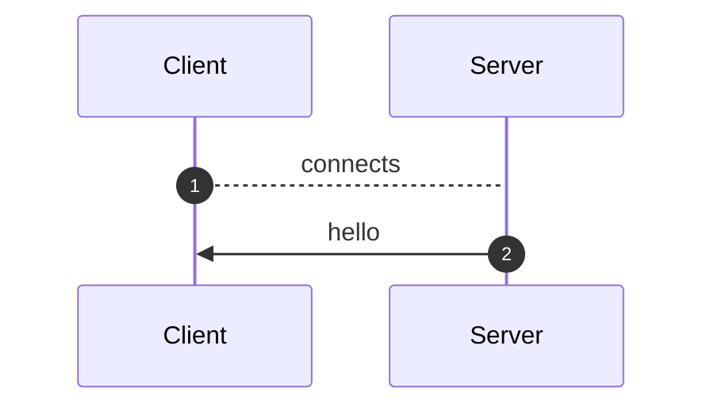
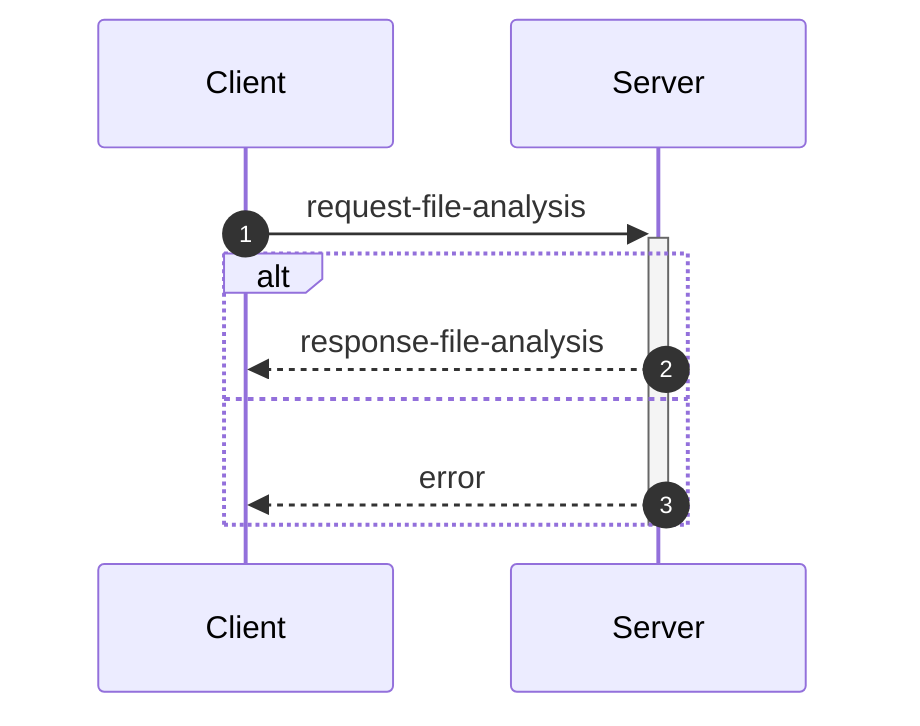
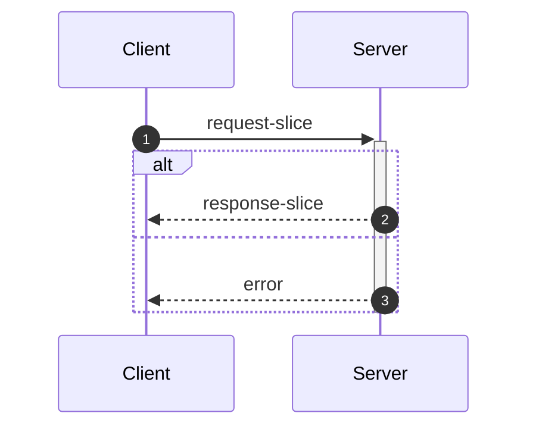
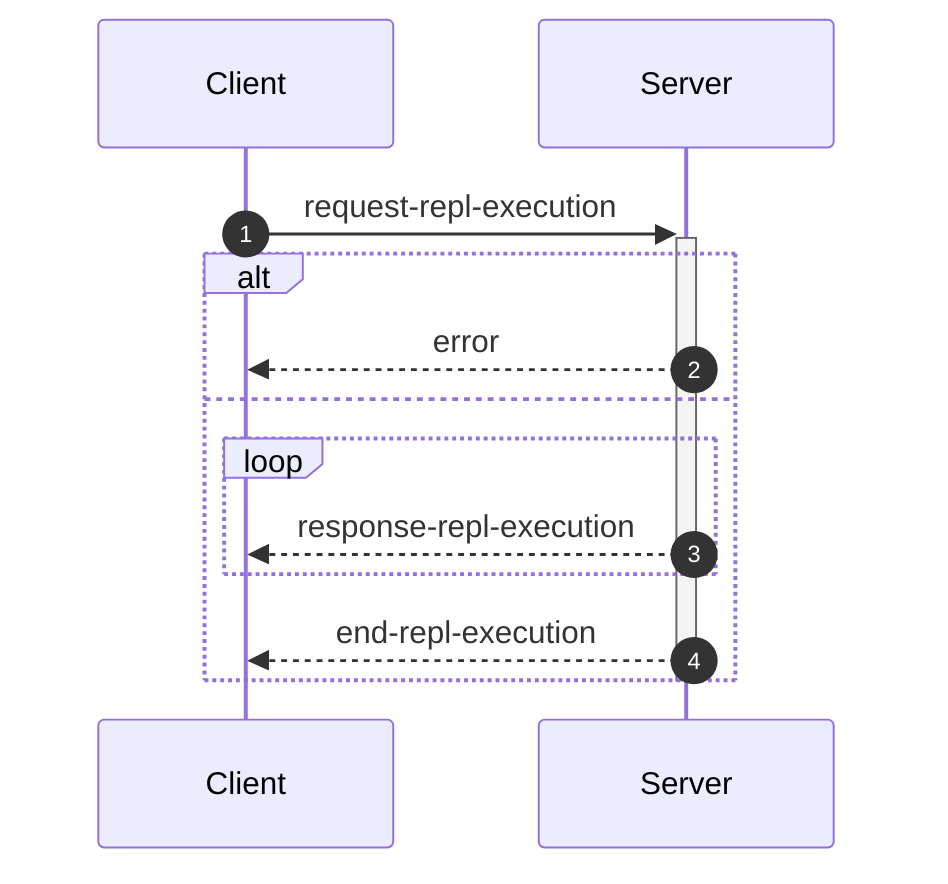

_This document was generated from '[src/documentation/wiki-interface.ts](https://github.com/flowr-analysis/flowr/tree/main//src/documentation/wiki-interface.ts)' on 2026-07-15, 10:11:50 UTC presenting an overview of flowR's interface (v2.12.2, using R v4.6.0). Please do not edit this file/wiki page directly._

Although far from being as detailed as the in-depth explanation of [_flowR_](https://github.com/flowr-analysis/flowr/wiki/core),
this wiki page explains how to interface with _flowR_ in more detail.
In general, command line arguments and other options provide short descriptions on hover over.

* [💻 Using the REPL](#using-the-repl)
* [⚙️ Configuring FlowR](#configuring-flowr)
* [⚒️ Writing Code](#writing-code)
* [💬 Communicating with the Server](#communicating-with-the-server)

<a id='using-the-repl'></a>
## 💻 Using the REPL


> [!NOTE]
> To execute arbitrary R commands with a repl request, _flowR_ has to be started explicitly with <span title="Description (Command Line Argument): Allow to access the underlying R session when using flowR (security warning: this allows the execution of arbitrary R code!)">`--r-session-access`</span>.
> Please be aware that this introduces a security risk and note that this relies on the [`r-shell` engine](https://github.com/flowr-analysis/flowr/wiki/engines) .

Although primarily meant for users to explore,
there is nothing which forbids simply calling _flowR_ as a subprocess to use standard-in, -output, and -error
for communication (although you can access the REPL using the server as well,
with the [REPL Request](#message-request-repl-execution) message).

The read-eval-print loop&nbsp;(REPL) works relatively simple.
You can submit an expression (using <kbd>Enter</kbd>),
which is interpreted as an R&nbsp;expression by default but interpreted as a *command* if it starts with a colon (`:`).
The best command to get started with the REPL is <span title="Description (Repl Command): Show help information (aliases: :h, :?)">`:help`</span>.
Besides, you can leave the REPL either with the command <span title="Description (Repl Command): End the repl (aliases: :q, :exit)">`:quit`</span> or by pressing <kbd>Ctrl</kbd>+<kbd>C</kbd> twice.
When writing a *command*, you may press <kbd>Tab</kbd> to get a list of completions, if available.
Multiple commands can be entered in a single line by separating them with a semicolon (`;`), e.g. `:parse "x<-2"; :df*`.
If a command is given without R code, the REPL will re-use R code given in a previous command.
The prior example will hence return first the parsed AST of the program and then the dataflow graph for `"x <- 2"`.

> [!NOTE]
> If you develop flowR, you may want to launch the repl using the `npm run main-dev` command, this way, you get a non-minified version of flowR with debug information and hot-reloading of source files.

<details>
<summary>Available Commands</summary>

We currently offer the following commands (this with a `[*]` suffix are available with and without the star):


| Command | Description |
| ------- | ----------- |
| **<span title="Description (Repl Command): End the repl (aliases: :q, :exit)">:quit</span>** | End the repl (aliases: **:<span title="Alias of ':quit'. End the repl">q</span>**, **:<span title="Alias of ':quit'. End the repl">exit</span>**) |
| **<span title="Description (Repl Command): Execute the given code as R code. This requires the `--r-session-access` flag to be set and requires the r-shell engine. (aliases: :e, :r)">:execute</span>** | Execute the given code as R code. This requires the `--r-session-access` flag to be set and requires the r-shell engine. (aliases: **:<span title="Alias of ':execute'. Execute the given code as R code. This requires the `--r-session-access` flag to be set and requires the r-shell engine.">e</span>**, **:<span title="Alias of ':execute'. Execute the given code as R code. This requires the `--r-session-access` flag to be set and requires the r-shell engine.">r</span>**) |
| **<span title="Description (Repl Command): Get mermaid code for the control-flow graph of R code (aliases: :cfg, :cf)">:controlflow[*]</span>** | Get mermaid code for the control-flow graph of R code (star: Returns the URL to mermaid.live) (aliases: **:<span title="Alias of ':controlflow'. Get mermaid code for the control-flow graph of R code">cfg</span>**, **:<span title="Alias of ':controlflow'. Get mermaid code for the control-flow graph of R code">cf</span>**) |
| **<span title="Description (Repl Command): Get mermaid code for the control-flow graph with basic blocks (aliases: :cfgb, :cfb)">:controlflowbb[*]</span>** | Get mermaid code for the control-flow graph with basic blocks (star: Returns the URL to mermaid.live) (aliases: **:<span title="Alias of ':controlflowbb'. Get mermaid code for the control-flow graph with basic blocks">cfgb</span>**, **:<span title="Alias of ':controlflowbb'. Get mermaid code for the control-flow graph with basic blocks">cfb</span>**) |
| **<span title="Description (Repl Command): Get mermaid code for the dataflow graph (aliases: :d, :df)">:dataflow[*]</span>** | Get mermaid code for the dataflow graph (star: Returns the URL to mermaid.live) (aliases: **:<span title="Alias of ':dataflow'. Get mermaid code for the dataflow graph">d</span>**, **:<span title="Alias of ':dataflow'. Get mermaid code for the dataflow graph">df</span>**) |
| **<span title="Description (Repl Command): Get mermaid code for the normalized AST of R code (aliases: :n)">:normalize[*]</span>** | Get mermaid code for the normalized AST of R code (star: Returns the URL to mermaid.live) (alias: **:<span title="Alias of ':normalize'. Get mermaid code for the normalized AST of R code">n</span>**) |
| **<span title="Description (Repl Command): Get mermaid code for the simplified dataflow graph (aliases: :ds, :dfs)">:dataflowsimple[*]</span>** | Get mermaid code for the simplified dataflow graph (star: Returns the URL to mermaid.live) (aliases: **:<span title="Alias of ':dataflowsimple'. Get mermaid code for the simplified dataflow graph">ds</span>**, **:<span title="Alias of ':dataflowsimple'. Get mermaid code for the simplified dataflow graph">dfs</span>**) |
| **<span title="Description (Repl Command): Inspect and extend the signature database: `query` (identical to :query @signature), `add <path>` to mount another database/source, `download` to fetch the full-history database. (aliases: :sig)">:signature</span>** | Inspect and extend the signature database: `query` (identical to :query @signature), `add <path>` to mount another database/source, `download` to fetch the full-history database. (alias: **:<span title="Alias of ':signature'. Inspect and extend the signature database: `query` (identical to :query @signature), `add <path>` to mount another database/source, `download` to fetch the full-history database.">sig</span>**) |
| **<span title="Description (Repl Command): Just calculates the DFG, but only prints summary info (aliases: :d#, :df#)">:dataflowsilent</span>** | Just calculates the DFG, but only prints summary info (aliases: **:<span title="Alias of ':dataflowsilent'. Just calculates the DFG, but only prints summary info">d#</span>**, **:<span title="Alias of ':dataflowsilent'. Just calculates the DFG, but only prints summary info">df#</span>**) |
| **<span title="Description (Repl Command): Prints ASCII Art of the parsed, unmodified AST (aliases: :p)">:parse</span>** | Prints ASCII Art of the parsed, unmodified AST (alias: **:<span title="Alias of ':parse'. Prints ASCII Art of the parsed, unmodified AST">p</span>**) |
| **<span title="Description (Repl Command): Prints the version of flowR as well as the current version of R">:version</span>** | Prints the version of flowR as well as the current version of R
| **<span title="Description (Repl Command): Query the given R code (use 'help' for more information)">:query[*]</span>** | Query the given R code (use 'help' for more information) (star: Similar to query, but returns the output in json format.)
| **<span title="Description (Repl Command): Returns an ASCII representation of the dataflow graph (aliases: :df!)">:dataflowascii</span>** | Returns an ASCII representation of the dataflow graph (alias: **:<span title="Alias of ':dataflowascii'. Returns an ASCII representation of the dataflow graph">df!</span>**) |
| **<span title="Description (Repl Command): Returns summarization stats for the normalized AST (aliases: :n#)">:normalize#</span>** | Returns summarization stats for the normalized AST (alias: **:<span title="Alias of ':normalize#'. Returns summarization stats for the normalized AST">n#</span>**) |
| **<span title="Description (Repl Command): Show help information (aliases: :h, :?)">:help</span>** | Show help information (aliases: **:<span title="Alias of ':help'. Show help information">h</span>**, **:<span title="Alias of ':help'. Show help information">?</span>**) |


</details>


> [!TIP]
> 
> As indicated by the examples before, all REPL commands that operate on code keep track of the state.
> Hence, if you run a command like <span title="Description (Repl Command, starred version): Returns the URL to mermaid.live; Base Command: Get mermaid code for the dataflow graph (aliases: :d*, :df*)">`:dataflow*`</span> without providing R code,
> the REPL will re-use the R code provided in a previous command.
> Likewise, doing this will benefit from incrementality!
> If you request the dataflow graph with `:df* x <- 2 * y` and then want to see the parsed AST with `:parse`,
> the REPL will re-use previously obtained information and not re-parse the code again.
> 		


Generally, many commands offer shortcut versions in the REPL. Many queries, for example, offer a shortened format (see the example below).
Of special note, the [Config Query](https://github.com/flowr-analysis/flowr/wiki/query-api#Config-Query)
can be used to also modify the currently active configuration of _flowR_ within the REPL (see the [wiki page](https://github.com/flowr-analysis/flowr/wiki/query-api#Config-Query) for more information).

### Example: Retrieving the Dataflow Graph

To retrieve a URL to the [mermaid](https://mermaid.js.org/) diagram of the dataflow of a given expression,
use <span title="Description (Repl Command, starred version): Returns the URL to mermaid.live; Base Command: Get mermaid code for the dataflow graph (aliases: :d*, :df*)">`:dataflow*`</span> (or <span title="Description (Repl Command): Get mermaid code for the dataflow graph (aliases: :d, :df)">`:dataflow`</span> to get the mermaid code in the cli):


```shell
$ docker run -it --rm eagleoutice/flowr # or npm run flowr 
flowR repl v2.12.2, R grammar v14 (tree-sitter engine)
R> :dataflow* y <- 1 + x
```

<details>
<summary style='color:gray'>Output</summary>


```text
https://mermaid.live/view#base64:eyJjb2RlIjoiZmxvd2NoYXJ0IEJUXG4gICAgMXt7XCJgKiM5MTtSTnVtYmVyIzkzOyogKioxKipcbiAgICAgICoxLjYqICgqKmlkOiAxKiopYFwifX1cbiAgICUlIE5vIGVkZ2VzIGZvdW5kIGZvciAxXG4gICAgMihbXCJgKiM5MTtSU3ltYm9sIzkzOyogKip4KipcbiAgICAgICoxLjEwKiAoKippZDogMioqKWBcIl0pXG4gICAlJSBObyBlZGdlcyBmb3VuZCBmb3IgMlxuICAgIDNbW1wiYCojOTE7UkJpbmFyeU9wIzkzOyogYmFzZSM1ODsjNTg7KiojNDM7KipcbiAgICAgICoxLjYtMTAqICgqKmlkOiAzKiopXG4gICAgYXJnOiAoMSwgMilgXCJdXVxuICAgIGJ1aWx0LWluOl9bXCJgQnVpbHQtSW46XG4jNDM7YFwiXVxuICAgIHN0eWxlIGJ1aWx0LWluOl8gc3Ryb2tlOmdyYXksZmlsbDpncmF5LHN0cm9rZS13aWR0aDoycHgsb3BhY2l0eTouODtcbiAgICAwW1wiYCojOTE7UlN5bWJvbCM5MzsqICoqeSoqXG4gICAgICAqMS4xKiAoKippZDogMCoqLCB2OiBbM10pYFwiXVxuICAgIDRbW1wiYCojOTE7UkJpbmFyeU9wIzkzOyogYmFzZSM1ODsjNTg7KiojNjA7IzQ1OyoqXG4gICAgICAqMS4xLTEwKiAoKippZDogNCoqKVxuICAgIGFyZzogKDAsIDMpYFwiXV1cbiAgICBidWlsdC1pbjpfLVtcImBCdWlsdC1JbjpcbiM2MDsjNDU7YFwiXVxuICAgIHN0eWxlIGJ1aWx0LWluOl8tIHN0cm9rZTpncmF5LGZpbGw6Z3JheSxzdHJva2Utd2lkdGg6MnB4LG9wYWNpdHk6Ljg7XG4gICAgMyAtLT58XCJyZWFkcywgYXJnXCJ8IDFcbiAgICAzIC0tPnxcInJlYWRzLCBhcmdcInwgMlxuICAgIDMgLS4tPnxcInJlYWRzLCBjYWxsc1wifCBidWlsdC1pbjpfXG4gICAgbGlua1N0eWxlIDIgc3Ryb2tlOmdyYXk7XG4gICAgMCAtLT58XCJkZWZpbmVkLWJ5XCJ8IDNcbiAgICAwIC0tPnxcImRlZmluZWQtYnlcInwgNFxuICAgIDQgLS0+fFwicmVhZHMsIGFyZ1wifCAzXG4gICAgNCAtLT58XCJyZXR1cm5zLCBhcmdcInwgMFxuICAgIDQgLS4tPnxcInJlYWRzLCBjYWxsc1wifCBidWlsdC1pbjpfLVxuICAgIGxpbmtTdHlsZSA3IHN0cm9rZTpncmF5OyIsIm1lcm1haWQiOnsiYXV0b1N5bmMiOnRydWV9fQ==
```


Retrieve the dataflow graph of the expression `y <- 1 + x`. It looks like this:


```mermaid
flowchart LR
    1{{"`*#91;RNumber#93;* **1**
      *1.6* (**id: 1**)`"}}
   %% No edges found for 1
    2(["`*#91;RSymbol#93;* **x**
      *1.10* (**id: 2**)`"])
   %% No edges found for 2
    3[["`*#91;RBinaryOp#93;* base#58;#58;**#43;**
      *1.6-10* (**id: 3**)
    arg: (1, 2)`"]]
    built-in:_["`Built-In:
#43;`"]
    style built-in:_ stroke:gray,fill:gray,stroke-width:2px,opacity:.8;
    0["`*#91;RSymbol#93;* **y**
      *1.1* (**id: 0**, v: [3])`"]
    4[["`*#91;RBinaryOp#93;* base#58;#58;**#60;#45;**
      *1.1-10* (**id: 4**)
    arg: (0, 3)`"]]
    built-in:_-["`Built-In:
#60;#45;`"]
    style built-in:_- stroke:gray,fill:gray,stroke-width:2px,opacity:.8;
    3 -->|"reads, arg"| 1
    3 -->|"reads, arg"| 2
    3 -.->|"reads, calls"| built-in:_
    linkStyle 2 stroke:gray;
    0 -->|"defined-by"| 3
    0 -->|"defined-by"| 4
    4 -->|"reads, arg"| 3
    4 -->|"returns, arg"| 0
    4 -.->|"reads, calls"| built-in:_-
    linkStyle 7 stroke:gray;
```

	
<details>

<summary style="color:gray">R Code of the Dataflow Graph</summary>

The analysis required _6.7 ms_ (including parse and normalize, using the [tree-sitter](https://github.com/flowr-analysis/flowr/wiki/Engines) engine) within the generation environment. No [signature database](https://github.com/flowr-analysis/flowr/wiki/Signature-Database) is mounted for these generated graphs, so `library()` calls attach no package exports; base-R names are still qualified via the generated base-package store (e.g. `acf` as `stats::acf`). 
We encountered no unknown side effects during the analysis.


```r
y <- 1 + x
```


</details>


</details>


For small graphs like this, <span title="Description (Repl Command): Returns an ASCII representation of the dataflow graph (aliases: :df!)">`:dataflowascii`</span> also provides an ASCII representation directly in the REPL:


```shell
$ docker run -it --rm eagleoutice/flowr # or npm run flowr 
flowR repl v2.12.2, R grammar v14 (tree-sitter engine)
R> :df! y <- 1 + x
```

<details open>
<summary style='color:gray'>Output</summary>


```text
                        0<1>0
                   ┌────| 1 |
    ┌────────┐     │    0---0
 c<4>c       └──c<3>c
 |<- |  v<0>v┌──| + |
 c---c──| y |┘  c---c   u<2>u
        v---v      └────| x |
                        u---u
Edges:
3 -> 1: reads, arg  3 -> 2: reads, arg
4 -> 3: reads, arg  4 -> 0: returns, arg
0 -> 3: defined-by  0 -> 4: defined-by
```


Retrieve the dataflow graph of the expression `y <- 1 + x` as ASCII art.

</details>


For the slicing with <span title="Description (Repl Command): Static backwards executable slicer for R">`:slicer`</span>, you have access to the same [magic comments](#slice-magic-comments) as with the [slice request](#message-request-slice).
Pass `--inline` to splice resolvable `source()` calls into the reconstruction so the slice is a single self-contained R text (the same as the static slice query's `inlineSources` flag).

### Example: Interfacing with the File System

Many commands that allow for an R-expression (like <span title="Description (Repl Command, starred version): Returns the URL to mermaid.live; Base Command: Get mermaid code for the dataflow graph (aliases: :d*, :df*)">`:dataflow*`</span>) allow for a file as well
if the argument starts with `file://`.
If you are working from the root directory of the _flowR_ repository, the following gives you the parsed AST of the example file using the <span title="Description (Repl Command): Prints ASCII Art of the parsed, unmodified AST (aliases: :p)">`:parse`</span> command:

> **Watch mode**: Replace `file://` with `watch://` to enter watch mode.
> flowR runs the command immediately and then re-runs it every time the file (or any file inside the folder) changes.
> Enter any other command to leave watch mode.
> For example: `:df watch://analysis.R`


```shell
$ docker run -it --rm eagleoutice/flowr # or npm run flowr 
flowR repl v2.12.2, R grammar v14 (tree-sitter engine)
R> :parse file://test/testfiles/example.R
```

<details>
<summary style='color:gray'>Output</summary>


```text
File: test/testfiles/example.R

program
├ binaryoperator
│ ├ identifier "sum" (1:1─4)
│ ├ <- "<-" (1:5─7)
│ ╰ float "0" (1:8─9)
├ binaryoperator
│ ├ identifier "product" (2:1─8)
│ ├ <- "<-" (2:9─11)
│ ╰ float "1" (2:12─13)
├ binaryoperator
│ ├ identifier "w" (3:1─2)
│ ├ <- "<-" (3:3─5)
│ ╰ float "7" (3:6─7)
├ binaryoperator
│ ├ identifier "N" (4:1─2)
│ ├ <- "<-" (4:3─5)
│ ╰ float "10" (4:6─8)
├ forstatement
│ ├ for "for" (6:1─4)
│ ├ ( "(" (6:5─6)
│ ├ identifier "i" (6:6─7)
│ ├ in "in" (6:8─10)
│ ├ binaryoperator
│ │ ├ float "1" (6:11─12)
│ │ ├ : ":" (6:12─13)
│ │ ╰ parenthesizedexpression
│ │   ├ ( "(" (6:13─14)
│ │   ├ binaryoperator
│ │   │ ├ identifier "N" (6:14─15)
│ │   │ ├ - "-" (6:15─16)
│ │   │ ╰ float "1" (6:16─17)
│ │   ╰ ) ")" (6:17─18)
│ ├ ) ")" (6:18─19)
│ ╰ bracedexpression
│   ├ { "{" (6:20─21)
│   ├ binaryoperator
│   │ ├ identifier "sum" (7:3─6)
│   │ ├ <- "<-" (7:7─9)
│   │ ╰ binaryoperator
│   │   ├ binaryoperator
│   │   │ ├ identifier "sum" (7:10─13)
│   │   │ ├ + "+" (7:14─15)
│   │   │ ╰ identifier "i" (7:16─17)
│   │   ├ + "+" (7:18─19)
│   │   ╰ identifier "w" (7:20─21)
│   ├ binaryoperator
│   │ ├ identifier "product" (8:3─10)
│   │ ├ <- "<-" (8:11─13)
│   │ ╰ binaryoperator
│   │   ├ identifier "product" (8:14─21)
│   │   ├  "" (8:22─23)
│   │   ╰ identifier "i" (8:24─25)
│   ╰ } "}" (9:1─2)
├ call
│ ├ identifier "cat" (11:1─4)
│ ╰ arguments
│   ├ ( "(" (11:4─5)
│   ├ argument
│   │ ╰ string
│   │   ├ " "\"" (11:5─6)
│   │   ├ stringcontent "Sum:" (11:6─10)
│   │   ╰ " "\"" (11:10─11)
│   ├ comma "," (11:11─12)
│   ├ argument
│   │ ╰ identifier "sum" (11:13─16)
│   ├ comma "," (11:16─17)
│   ├ argument
│   │ ╰ string
│   │   ├ " "\"" (11:18─19)
│   │   ├ stringcontent
│   │   │ ╰ escapesequence "\\n" (11:19─21)
│   │   ╰ " "\"" (11:21─22)
│   ╰ ) ")" (11:22─23)
╰ call
  ├ identifier "cat" (12:1─4)
  ╰ arguments
    ├ ( "(" (12:4─5)
    ├ argument
    │ ╰ string
    │   ├ " "\"" (12:5─6)
    │   ├ stringcontent "Product:" (12:6─14)
    │   ╰ " "\"" (12:14─15)
    ├ comma "," (12:15─16)
    ├ argument
    │ ╰ identifier "product" (12:17─24)
    ├ comma "," (12:24─25)
    ├ argument
    │ ╰ string
    │   ├ " "\"" (12:26─27)
    │   ├ stringcontent
    │   │ ╰ escapesequence "\\n" (12:27─29)
    │   ╰ " "\"" (12:29─30)
    ╰ ) ")" (12:30─31)
```


Retrieve the parsed AST of the example file.

<details>

<summary>File Content</summary>


```r
sum <- 0
product <- 1
w <- 7
N <- 10

for (i in 1:(N-1)) {
  sum <- sum + i + w
  product <- product * i
}

cat("Sum:", sum, "\n")
cat("Product:", product, "\n")
```


</details>

As _flowR_ directly transforms this AST the output focuses on being human-readable instead of being machine-readable.
		

</details>


### Example: Run a Query

You can run any query supported by _flowR_ using the <span title="Description (Repl Command): Query the given R code (use 'help' for more information)">`:query`</span> command.
For example, to obtain the shapes of all data frames in a given piece of code, you can run:


```shell
$ docker run -it --rm eagleoutice/flowr # or npm run flowr 
flowR repl v2.12.2, R grammar v14 (tree-sitter engine)
R> :query @absint df-shape "x <- data.frame(a = 1:10, b = 1:10)\ny <- x$a"
```

<details open>
<summary style='color:gray'>Output</summary>


```text
Query: absint (2 ms)
   ╰ $12: (colnames: [{"a", "b"}, {}], cols: [2, 2], rows: [10, 10])
   ╰ $0: (colnames: [{"a", "b"}, {}], cols: [2, 2], rows: [10, 10])
All queries together required ≈4 ms (1ms accuracy, total 5 ms)
```


Retrieve the shapes of all data frames in the given code.

</details>


To run the linter on a file, you can use (in this example, we just issue the `dead-code` linter on a small piece of code):


```shell
$ docker run -it --rm eagleoutice/flowr # or npm run flowr 
flowR repl v2.12.2, R grammar v14 (tree-sitter engine)
R> :query @linter rules:dead-code "if(FALSE) x <- 2"
```

<details open>
<summary style='color:gray'>Output</summary>


```text
Query: linter (2 ms)
   ╰ Dead Code (dead-code):
       ╰ certain:
           ╰ Code at 1.11-16
       ╰ Metadata: searchTimeMs: 2, processTimeMs: 0
All queries together required ≈2 ms (1ms accuracy, total 3 ms)
```


Run the linter on the given code, with only the `dead-code` rule enabled.

</details>


For more information on the available queries, please check out the [Query API](https://github.com/flowr-analysis/flowr/wiki/query-api).


<a id='configuring-flowr'></a>
## ⚙️ Configuring FlowR


When running _flowR_, you may want to specify some behaviors with a dedicated configuration file.
By default, flowR looks for a file named `flowr.json` in the current working directory (or any higher directory).
You can also specify a different file with <span title="Description (Command Line Argument): The name of the configuration file to use">`--config-file`</span> or pass the configuration inline using <span title="Description (Command Line Argument): The flowR configuration to use, as a JSON string">`--config-json`</span>.
To inspect the current configuration, you can run flowr with the <span title="Description (Command Line Argument): Run with verbose logging (will be passed to the corresponding script)">`--verbose`</span> flag, or use the `config` [Query](https://github.com/flowr-analysis/flowr/wiki/query-api).
Within the REPL this works by running the following:


```shell
:query @config
```


To work with the <a href="https://github.com/flowr-analysis/flowr/tree/main/src/config.ts#L122"><code><span title="The configuration file format for flowR.">FlowrConfig</span></code></a> you can use the provided helper objects alongside its methods like
<a href="https://github.com/flowr-analysis/flowr/tree/main/src/config.ts#L569"><code><span title="Creates a new flowr config that has the updated values.">FlowrConfig::<b>amend</b></span></code></a>.
The following summarizes the configuration options:

- `ignoreSourceCalls`: If set to `true`, _flowR_ will ignore source calls when analyzing the code, i.e., ignoring the inclusion of other files.
- `semantics`: allows to configure the way _flowR_ handles R, although we currently only support `semantics/environment/overwriteBuiltIns`.
  You may use this to overwrite _flowR_'s handling of built-in function and even completely clear the preset definitions shipped with flowR.
  See [Configure BuiltIn Semantics](#configure-builtin-semantics) for more information.
- `solver`: allows to configure how _flowR_ resolves variables and their values (currently we support: `disabled`, `alias`, `builtin`), as well as if pointer analysis should be active.
- `engines`: allows to configure the engines used by _flowR_ to interact with R code. See the [Engines wiki page](https://github.com/flowr-analysis/flowr/wiki/engines) for more information.
- `defaultEngine`: allows to specify the default engine to use for interacting with R code. If not set, an arbitrary engine from the specified list will be used.
- `abstractInterpretation`: allows to configure how _flowR_ performs abstract interpretation, although we currently only support data frame shape inference through abstract interpretation.
- `defaultPlugins`: allows to configure which plugins to load by default when creating a new <a href="https://github.com/flowr-analysis/flowr/tree/main/src/project/flowr-analyzer.ts#L162"><code><span title="Central class for conducting analyses with FlowR. Use the FlowrAnalyzerBuilder to create a new instance. If you want the original pattern of creating a pipeline and running all steps, you can still do this with FlowrAnalyzer#runFull . To inspect the context of the analyzer, use FlowrAnalyzer#inspectContext (if you are a plugin and need to modify it, use FlowrAnalyzer#context instead).">FlowrAnalyzer</span></code></a> instance.
- `repl.plugins`: allows to configure which plugins to load in the _flowR_ REPL. Use `flowr:default` to reference the plugins specified by `defaultPlugins`.

So you can configure _flowR_ by adding a file like the following:

<details>

<summary>Example Configuration File</summary>


```json
{
  "ignoreSourceCalls": true,
  "semantics": {
    "environment": {
      "overwriteBuiltIns": {
        "definitions": [
          {
            "type": "function",
            "names": [
              "foo"
            ],
            "processor": "builtin:assign",
            "config": {}
          }
        ]
      }
    }
  },
  "defaultPlugins": [
    "file:description",
    "versions:description"
  ],
  "repl": {
    "quickStats": false,
    "dfProcessorHeat": false,
    "hints": true,
    "plugins": [
      "flowr:default"
    ]
  },
  "project": {
    "resolveUnknownPathsOnDisk": true
  },
  "engines": [
    {
      "type": "r-shell"
    }
  ],
  "solver": {
    "variables": "alias",
    "evalStrings": true,
    "trackEnvironments": true,
    "sigdb": {
      "enabled": true,
      "loadProjectDependencies": true,
      "eagerlyLoad": false,
      "eagerlyLoadExports": false,
      "linkBaseR": false,
      "linkDescriptionDependencies": false
    },
    "resolveSource": {
      "dropPaths": "no",
      "ignoreCapitalization": true,
      "inferWorkingDirectory": "active-script",
      "searchPath": []
    },
    "instrument": {},
    "slicer": {
      "threshold": 50
    }
  },
  "abstractInterpretation": {
    "wideningThreshold": 4,
    "dataFrame": {
      "maxColNames": 20,
      "readLoadedData": {
        "readExternalFiles": true,
        "maxReadLines": 1000000
      }
    }
  },
  "gas": {
    "thresholds": {
      "memory": {
        "problematic": 0.7,
        "critical": 0.9
      },
      "timeMs": {
        "problematic": 100000,
        "critical": 120000
      }
    },
    "features": {}
  }
}
```


</details>

<details>
<a id='configure-builtin-semantics'></a>
<summary>Configure Built-In Semantics</summary>


`semantics/environment/overwriteBuiltins` accepts two keys:

- `loadDefaults` (boolean, initially `true`): If set to `true`, the default built-in definitions are loaded before applying the custom definitions. Setting this flag to `false` explicitly disables the loading of the default definitions.
- `definitions` (array, initially empty): Allows to overwrite or define new built-in elements. Each object within must have a `type` which is one of the below. Furthermore, they may define a string array of `names` which specifies the identifiers to bind the definitions to. You may use `assumePrimitive` to specify whether _flowR_ should assume that this is a primitive non-library definition (so you probably just do not want to specify the key).

  | Type            | Description                                                                                                                                                                                                                                                                                              | Example                                                                                                    |
  | --------------- | -------------------------------------------------------------------------------------------------------------------------------------------------------------------------------------------------------------------------------------------------------------------------------------------------------- | ---------------------------------------------------------------------------------------------------------- |
  | `constant`    | Additionally allows for a `value` this should resolve to.                                                                                                                                                                                                                                                | `{ type: 'constant', names: ['NULL', 'NA'],  value: null }`                                                |
  | `function`    | Is a rather flexible way to define and bind built-in functions. For the time, we do not have extensive documentation to cover all the cases, so please either consult the sources with the `default-builtin-config.ts` or open a [new issue](https://github.com/flowr-analysis/flowr/issues/new/choose). | `{ type: 'function', names: ['next'], processor: 'builtin:d', config: { cfg: ExitPointType.Next } }` |
  | `replacement` | A comfortable way to specify replacement functions like `$<-` or `names<-`. `suffixes` describes the... suffixes to attach automatically. | `{ type: 'replacement', suffixes: ['<-', '<<-'], names: ['[', '[['] }` |


</details>

<details>

<summary style='color:gray'>Full Configuration-File Schema</summary>

- _The configuration file format for flowR._ (object)
    - **ignoreSourceCalls** [optional] _Whether source calls should be ignored, causing {@link processSourceCall}'s behavior to be skipped._ (boolean)
    - **semantics** _Configure language semantics and how flowR handles them._ (object)
        - **environment** [optional] _Semantics regarding how to handle the R environment._ (object)
            - **overwriteBuiltIns** [optional] _Do you want to overwrite (parts) of the builtin definition?_ (object)
                - **loadDefaults** [optional] _Should the default configuration still be loaded?_ (boolean)
                - **definitions** [optional] _The definitions to load/overwrite._ (array)
                Valid item types:
                    - (object)
    - **defaultPlugins** [optional] _The default plugins to load when creating a new instance of FlowrAnalyzer_ (array)
    Valid item types:
        - (alternatives)
            - (string)
            - (array)
    - **repl** _Configuration options for the REPL._ (object)
        - **quickStats** [optional] _Whether to show quick stats in the REPL after each evaluation._ (boolean)
        - **dfProcessorHeat** [optional] _This instruments the dataflow processors to count how often each processor is called._ (boolean)
        - **hints** [optional] _Whether to show dim inline hints on the empty prompt (automatically disabled on non-interactive terminals)._ (boolean)
        - **plugins** [optional] _The plugins to load in REPL mode_ (array)
        Valid item types:
            - (alternatives)
                - (string)
                - (array)
    - **project** _Project specific configuration options._ (object)
        - **resolveUnknownPathsOnDisk** [optional] _Whether to resolve unknown paths loaded by the r project disk when trying to source/analyze files._ (boolean)
        - **basePackages** [optional] _The packages considered part of R itself (base and recommended); if unset, flowR uses its built-in list._ (array)
        Valid item types:
            - (string)
    - **engines** _The engine or set of engines to use for interacting with R code. An empty array means all available engines will be used._ (array)
    Valid item types:
        - (alternatives)
            - _The configuration for the tree sitter engine._ (object)
                - **type** [required] _Use the tree sitter engine._ (string)
                    Only allows: 'tree-sitter'
                - **wasmPath** [optional] _The path to the tree-sitter-r WASM binary to use. If this is undefined, this uses the default path._ (string)
                - **treeSitterWasmPath** [optional] _The path to the tree-sitter WASM binary to use. If this is undefined, this uses the default path._ (string)
                - **lax** [optional] _Whether to use the lax parser for parsing R code (allowing for syntax errors). If this is undefined, the strict parser will be used._ (boolean)
            - _The configuration for the R shell engine._ (object)
                - **type** [required] _Use the R shell engine._ (string)
                    Only allows: 'r-shell'
                - **rPath** [optional] _The path to the R executable to use. If this is undefined, this uses the default path._ (string)
    - **defaultEngine** [optional] _The default engine to use for interacting with R code. If this is undefined, an arbitrary engine from the specified list will be used._ (string)
        Only allows: 'tree-sitter', 'r-shell'
    - **solver** _How to resolve constants, constraints, cells, ..._ (object)
        - **variables** _How to resolve variables and their values._ (string)
            Only allows: 'disabled', 'alias', 'builtin'
        - **evalStrings** _Should we include eval(parse(text="...")) calls in the dataflow graph?_ (boolean)
        - **trackEnvironments** [optional] _Track user-created environments (new.env, assign/get/local with envir=, dollar-assign, attach). When false, all envir-style calls fall through conservatively._ (boolean)
        - **sigdb** _Resolving library exports from a signature database._ (object)
            - **enabled** [optional] _Resolve library()/use() exports from a signature database (default true); when false no database is consulted._ (boolean)
            - **loadProjectDependencies** [optional] _Load the project's declared dependencies from its metadata files (DESCRIPTION Imports/Depends, renv.lock, rv.lock) (default true); when false these files are not read for dependencies._ (boolean)
            - **eagerlyLoad** [optional] _Parse the database up front rather than on the first package load (default false, ignored if disabled)._ (boolean)
            - **eagerlyLoadExports** [optional] _Add a vertex for every export on load rather than on demand (default false); keeps the dataflow graph small._ (boolean)
            - **assumedRVersion** [optional] _R version assumed when resolving versioned (base-R) exports: a pin like "4.5" or "auto" to detect the installed R (default "auto")._ (string)
            - **linkBaseR** [optional] _Eagerly attach base-R namespaces so bare base calls resolve without library() (default false)._ (boolean)
            - **linkBaseRCalls** [optional] _Add a lightweight Reads edge from a bare base-R call to its signature-database function vertex (default false; base-R qualification is edge-free otherwise)._ (boolean)
            - **linkPackageCalls** [optional] _Add a lightweight Reads edge from a resolved package call to its signature-database function vertex (default false)._ (boolean)
            - **linkDescriptionDependencies** [optional] _Eagerly attach the namespaces of the project's declared DESCRIPTION dependencies (Imports/Depends) so their exports resolve without an explicit library() (default false)._ (boolean)
            - **warmInBackground** [optional] _Decompress the hot shards (base + most-downloaded) in a background task on startup so the first library() lookup is warm (default false; for long-running servers/REPLs)._ (boolean)
            - **additionalPaths** [optional] _Extra directories or bundle/manifest files searched for signature databases (alongside the shipped default and $FLOWR_SIGDB_DIR); a downloaded full-history bundle placed here is mounted automatically._ (array)
            Valid item types:
                - (string)
            - **downloadRepo** [optional] _GitHub owner/repo the full-history bundle is downloaded from via ":signature download" (default "flowr-analysis/flowr", release tag "sigdb-v<flowR-version>")._ (string)
            - **autoSync** [optional] _On startup, re-download shards whose committed sigdb.remote.json hash no longer matches the cache, in the background (default false; opt-in network sync after a git pull)._ (boolean)
            - **versionSelection** [optional] _When a project constrains a dependency, resolve to the newest (default), oldest, or system-installed version satisfying it; system needs R and falls back to newest. Base-R packages always resolve against the assumed R version._ (string)
                Only allows: 'newest', 'oldest', 'system'
            - **versionOverrides** [optional] _Force an exact version for specific packages (name -> version), overriding both the project constraint and the versionSelection policy (default {})._ (object)
        - **instrument** (object)
            - **dataflowExtractors** [optional] _These keys are only intended for use within code, allowing to instrument the dataflow analyzer!_ (any)
        - **resolveSource** [optional] _If lax source calls are active, flowR searches for sourced files much more freely, based on the configurations you give it. This option is only in effect if `ignoreSourceCalls` is set to false._ (object)
            - **dropPaths** _Allow to drop the first or all parts of the sourced path, if it is relative._ (string)
                Only allows: 'no', 'once', 'all'
            - **ignoreCapitalization** _Search for filenames matching in the lowercase._ (boolean)
            - **inferWorkingDirectory** _Try to infer the working directory from the main or any script to analyze._ (string)
                Only allows: 'no', 'main-script', 'active-script', 'any-script'
            - **searchPath** _Additionally search in these paths._ (array)
            Valid item types:
                - (string)
            - **repeatedSourceLimit** [optional] _How often the same file can be sourced within a single run? Please be aware: in case of cyclic sources this may not reach a fixpoint so give this a sensible limit._ (number)
            - **applyReplacements** _Provide name replacements for loaded files_ (array)
            Valid item types:
                - (object)
        - **slicer** [optional] _The configuration for the slicer._ (object)
            - **threshold** [optional] _The maximum number of iterations to perform on a single function call during slicing._ (number)
            - **autoExtend** [optional] _If set, the slicer will gain an additional post-pass._ (boolean)
    - **abstractInterpretation** _The configuration options for abstract interpretation._ (object)
        - **wideningThreshold** _The threshold for the number of visitations of a node at which widening should be performed to ensure the termination of the fixpoint iteration._ (number)
        - **dataFrame** _The configuration of the shape inference for data frames._ (object)
            - **maxColNames** _The maximum number of columns names to infer for data frames before over-approximating the column names to top._ (number)
            - **readLoadedData** _Configuration options for reading data frame shapes from loaded external data files, such as CSV files._ (object)
                - **readExternalFiles** _Whether data frame shapes should be extracted from loaded external files, such as CSV files._ (boolean)
                - **maxReadLines** _The maximum number of lines to read when extracting data frame shapes from loaded files, such as CSV files._ (number)
    - **gas** [optional] _Resource-usage guard (gas) configuration. All feature factors default to 0 (disabled). See https://github.com/flowr-analysis/flowr/wiki/Core#gas-resource-guard._ (object)
        - **thresholds** [optional] _Shared thresholds for all gas checks (scaled by per-feature factor)._ (object)
            - **memory** [optional] _Heap-usage fraction thresholds (0-1)._ (object)
                - **problematic** [optional] _Heap fraction (0-1) above which Problematic is returned._ (number)
                - **critical** [optional] _Heap fraction (0-1) above which Critical is returned._ (number)
            - **timeMs** [optional] _Elapsed analysis time thresholds in milliseconds._ (object)
                - **problematic** [optional] _Elapsed ms above which Problematic is returned._ (number)
                - **critical** [optional] _Elapsed ms above which Critical is returned._ (number)
        - **features** [optional] _Per-feature sensitivity factors. 0 or absent disables gas checking for that feature. A factor of 2 makes the feature twice as sensitive. Recognised keys: `source`, `side-effect-linking`, `linter`._ (object)
        - **heapProvider** [optional] _Custom heap statistics source (programmatic configs only), overriding the built-in v8/performance.memory detection._ (function)

</details>

	

<a id='writing-code'></a>
## ⚒️ Writing Code

_flowR_ can be used as a [module](https://www.npmjs.com/package/@eagleoutice/flowr) and offers several main classes and interfaces that are interesting for extension writers 
(see the [Visual Studio Code extension](https://marketplace.visualstudio.com/items?itemName=code-inspect.vscode-flowr) or the [Core](https://github.com/flowr-analysis/flowr/wiki/core) wiki page for more information).

### Creating Analyses with _flowR_

Nowadays, instances of the <a href="https://github.com/flowr-analysis/flowr/tree/main/src/project/flowr-analyzer.ts#L162"><code><span title="Central class for conducting analyses with FlowR. Use the FlowrAnalyzerBuilder to create a new instance. If you want the original pattern of creating a pipeline and running all steps, you can still do this with FlowrAnalyzer#runFull . To inspect the context of the analyzer, use FlowrAnalyzer#inspectContext (if you are a plugin and need to modify it, use FlowrAnalyzer#context instead).">FlowrAnalyzer</span></code></a> should be used as central frontend to get analysis results from _flowR_.
For example, a program slice can be created like this:


```ts
const analyzer = await new FlowrAnalyzerBuilder()
    .setEngine('tree-sitter')
    .build();
analyzer.addRequest('x <- 1\ny <- x\nx');
const result = await analyzer.query([
    {
        type:     'static-slice',
        criteria: ['3@x']
    }
]);
//console.log(result['static-slice']);
```


For more information, please have a look at the [Analyzer](https://github.com/flowr-analysis/flowr/wiki/analyzer) wiki page, which explains how to construct and use the <a href="https://github.com/flowr-analysis/flowr/tree/main/src/project/flowr-analyzer.ts#L162"><code><span title="Central class for conducting analyses with FlowR. Use the FlowrAnalyzerBuilder to create a new instance. If you want the original pattern of creating a pipeline and running all steps, you can still do this with FlowrAnalyzer#runFull . To inspect the context of the analyzer, use FlowrAnalyzer#inspectContext (if you are a plugin and need to modify it, use FlowrAnalyzer#context instead).">FlowrAnalyzer</span></code></a> in more detail.
To work with specific perspectives, you can also consult the respective pages like the [Dataflow Graph](https://github.com/flowr-analysis/flowr/wiki/dataflow-graph) or the [Abstract Interpretation](https://github.com/flowr-analysis/flowr/wiki/abstract-interpretation) wiki pages.
### The Pipeline Executor (Low-Level Interface)

Once, in the beginning, _flowR_ was meant to produce a dataflow graph merely to provide *program slices*. 
However, with continuous updates, the [Dataflow Graph](https://github.com/flowr-analysis/flowr/wiki/dataflow-graph) repeatedly proves to be the more interesting part.
With this, we restructured _flowR_'s originally *hardcoded* pipeline to be far more flexible. 
Now, it can be theoretically extended or replaced with arbitrary steps, optional steps, and what we call 'decorations' of these steps. 
In short, a slicing pipeline using the <a href="https://github.com/flowr-analysis/flowr/tree/main/src/core/pipeline-executor.ts#L97"><code><span title="**Please note:** The PipelineExecutor is now considered to be a rather low-level API for flowR. While it still works and is the basis for all other layers, we strongly recommend using the FlowrAnalyzer and its builder to create and use an analyzer instance that is pre-configured for your use-case. The pipeline executor allows to execute arbitrary pipelines in a step-by-step fashion. If you are not...">PipelineExecutor</span></code></a> looks like this:


```ts

const slicer = new PipelineExecutor(DEFAULT_SLICING_PIPELINE, {
  parser:    new RShell(),
  request:   requestFromInput('x <- 1\nx + 1'),
  criterion: ['2@x']
})
const slice = await slicer.allRemainingSteps()
// console.log(slice.reconstruct.code)
```


<details><summary>More Information</summary>


If you compare this, with what you would have done with the old (and removed) `SteppingSlicer`, 
this essentially just requires you to replace the `SteppingSlicer` with the <a href="https://github.com/flowr-analysis/flowr/tree/main/src/core/pipeline-executor.ts#L97"><code><span title="**Please note:** The PipelineExecutor is now considered to be a rather low-level API for flowR. While it still works and is the basis for all other layers, we strongly recommend using the FlowrAnalyzer and its builder to create and use an analyzer instance that is pre-configured for your use-case. The pipeline executor allows to execute arbitrary pipelines in a step-by-step fashion. If you are not...">PipelineExecutor</span></code></a>
and to pass the <a href="https://github.com/flowr-analysis/flowr/tree/main/src/core/steps/pipeline/default-pipelines.ts#L18"><code>DEFAULT_SLICING_PIPELINE</code></a> as the first argument.
The <a href="https://github.com/flowr-analysis/flowr/tree/main/src/core/pipeline-executor.ts#L97"><code><span title="**Please note:** The PipelineExecutor is now considered to be a rather low-level API for flowR. While it still works and is the basis for all other layers, we strongly recommend using the FlowrAnalyzer and its builder to create and use an analyzer instance that is pre-configured for your use-case. The pipeline executor allows to execute arbitrary pipelines in a step-by-step fashion. If you are not...">PipelineExecutor</span></code></a>...

1. Provides structures to investigate the results of all intermediate steps
2. Can be executed step-by-step
3. Can repeat steps (e.g., to calculate multiple slices on the same input)

See the in-code documentation for more information.


</details>

### Using the <a href="https://github.com/flowr-analysis/flowr/tree/main/src/r-bridge/shell.ts#L143"><code><span title="The RShell represents an interactive session with the R interpreter. You can configure it by RShellOptions . At the moment we are using a live R session (and not networking etc.) to communicate with R easily, which allows us to install packages etc. However, this might and probably will change in the future (leaving this as a legacy mode :D)">RShell</span></code></a> to Interact with R

The <a href="https://github.com/flowr-analysis/flowr/tree/main/src/r-bridge/shell.ts#L143"><code><span title="The RShell represents an interactive session with the R interpreter. You can configure it by RShellOptions . At the moment we are using a live R session (and not networking etc.) to communicate with R easily, which allows us to install packages etc. However, this might and probably will change in the future (leaving this as a legacy mode :D)">RShell</span></code></a> class allows interfacing with the `R`&nbsp;ecosystem installed on the host system.
Please have a look at [flowR's Engines](https://github.com/flowr-analysis/flowr/wiki/engines) for more information on alternatives (for example, the <a href="https://github.com/flowr-analysis/flowr/tree/main/src/r-bridge/lang-4.x/tree-sitter/tree-sitter-executor.ts#L18"><code><span title="Synchronous and (way) faster alternative to the RShell using tree-sitter.">TreeSitterExecutor</span></code></a>).


> [!IMPORTANT]
> 
> Each <a href="https://github.com/flowr-analysis/flowr/tree/main/src/r-bridge/shell.ts#L143"><code><span title="The RShell represents an interactive session with the R interpreter. You can configure it by RShellOptions . At the moment we are using a live R session (and not networking etc.) to communicate with R easily, which allows us to install packages etc. However, this might and probably will change in the future (leaving this as a legacy mode :D)">RShell</span></code></a> controls a new instance of the R&nbsp;interpreter, 
> make sure to call <code><a href="https://github.com/flowr-analysis/flowr/tree/main/src/r-bridge/shell.ts#L351"><span title="Close the current R session, makes the object effectively invalid (can no longer be reopened etc.)">RShell::<i>close</i></span></a>()</code> when you are done.


You can start a new "session" simply by constructing a new object with <code>new <a href="https://github.com/flowr-analysis/flowr/tree/main/src/r-bridge/shell.ts#L143"><span title="The RShell represents an interactive session with the R interpreter. You can configure it by RShellOptions . At the moment we are using a live R session (and not networking etc.) to communicate with R easily, which allows us to install packages etc. However, this might and probably will change in the future (leaving this as a legacy mode :D)">RShell</span></a>()</code>.

However, there are several options that may be of interest 
(e.g., to automatically revive the shell in case of errors or to control the name location of the R process on the system).

With a shell object (let's call it `shell`), you can execute R code by using <a href="https://github.com/flowr-analysis/flowr/tree/main/src/r-bridge/shell.ts#L212"><code><span title="sends the given command directly to the current R session will not do anything to alter input markers!">RShell::<i>sendCommand</i></span></code></a>,
for example <code>shell.<a href="https://github.com/flowr-analysis/flowr/tree/main/src/r-bridge/shell.ts#L212"><span title="sends the given command directly to the current R session will not do anything to alter input markers!">sendCommand</span></a>("1 + 1")</code>.
However, this does not return anything, so if you want to collect the output of your command, use
<a href="https://github.com/flowr-analysis/flowr/tree/main/src/r-bridge/shell.ts#L295"><code><span title="Send a command and collect the output">RShell::<i>sendCommandWithOutput</i></span></code></a> instead.


<a id='communicating-with-the-server'></a>
## 💬 Communicating with the Server


As explained in the [Overview](https://github.com/flowr-analysis/flowr/wiki/overview), you can simply run the [TCP](https://de.wikipedia.org/wiki/Transmission_Control_Protocol)&nbsp;server by adding the <span title="Description (Command Line Argument): Do not drop into a repl, but instead start a server on the given port (default: 1042) and listen for messages.">`--server`</span> flag (and, due to the interactive mode, exit with the conventional <kbd>CTRL</kbd>+<kbd>C</kbd>).
Currently, every connection is handled by the same underlying `RShell` - so the server is not designed to handle many clients at a time.
Additionally, the server is not well guarded against attacks (e.g., you can theoretically spawn an arbitrary number of&nbsp;RShell sessions on the target machine).

Every message has to be given in a single line (i.e., without a newline in-between) and end with a newline character. Nevertheless, we will pretty-print example given in the following segments for the ease of reading.


> [!NOTE]
> 
> The default <span title="Description (Command Line Argument): Do not drop into a repl, but instead start a server on the given port (default: 1042) and listen for messages.">`--server`</span> uses a simple [TCP](https://de.wikipedia.org/wiki/Transmission_Control_Protocol)
> connection. If you want _flowR_ to expose a [WebSocket](https://de.wikipedia.org/wiki/WebSocket) server instead, add the <span title="Description (Command Line Argument): If the server flag is set, use websocket for messaging">`--ws`</span> flag (i.e., <span title="Description (Command Line Argument): Do not drop into a repl, but instead start a server on the given port (default: 1042) and listen for messages.">`--server`</span> <span title="Description (Command Line Argument): If the server flag is set, use websocket for messaging">`--ws`</span>) when starting _flowR_ from the command line.


<ul><li>
<a id="message-hello"></a>
<b>Hello</b> Message (<code>hello</code>) 
<details>

<summary style="color:gray"> View Details. <i>The server informs the client about the successful connection and provides Meta-Information.</i> </summary>


```mermaid
sequenceDiagram
    autonumber
    participant Client
    participant Server

    
    Client-->Server: connects
    Server->>Client: hello
	
```


	
After launching _flowR_, for example, with <code>docker run -it --rm eagleoutice/flowr <span title="Description (Command Line Argument): Do not drop into a repl, but instead start a server on the given port (default: 1042) and listen for messages.">-<span/>-server</span></code>&nbsp;(🐳️), simply connecting should present you with a `hello` message, that amongst others should reveal the versions of&nbsp;_flowR_ and&nbsp;R, using the [semver 2.0](https://semver.org/spec/v2.0.0.html) versioning scheme.
The message looks like this:


```json
{
  "type": "hello",
  "clientName": "client-0",
  "versions": {
    "flowr": "2.12.2",
    "r": "4.6.0",
    "engine": "r-shell"
  }
}
```


There are currently a few messages that you can send after the hello message.
If you want to _slice_ a piece of R code you first have to send an [analysis request](#message-request-file-analysis), so that you can send one or multiple slice requests afterward.
Requests for the [REPL](#message-request-repl) are independent of that.
	

<hr>


<details>
<summary style="color:gray">Message schema (<code>hello</code>)</summary>

For the definition of the hello message, please see it's implementation at [`./src/cli/repl/server/messages/message-hello.ts`](https://github.com/flowr-analysis/flowr/tree/main/./src/cli/repl/server/messages/message-hello.ts).

- [required] (object)
    - **type** [required] _The type of the hello message._ (string)
        Only allows: 'hello'
    - **id** [forbidden] _The id of the message is always undefined (as it is the initial message and not requested)._ (any)
    - **clientName** [required] _A unique name that is assigned to each client. It has no semantic meaning and is only used/useful for debugging._ (string)
    - **versions** [required] (object)
        - **flowr** [required] _The version of the flowr server running in semver format._ (string)
        - **r** [required] _The version of the underlying R shell running in semver format._ (string)
        - **engine** [required] _The parser backend that is used to parse the R code._ (string)

</details>


<hr>

</details>
	</li>

<li>
<a id="message-request-file-analysis"></a>
<b>Analysis</b> Message (<code>request-file-analysis</code>) 
<details>

<summary style="color:gray"> View Details. <i>The server builds the dataflow graph for a given input file (or a set of files).</i> </summary>


```mermaid
sequenceDiagram
    autonumber
    participant Client
    participant Server

    
    Client->>+Server: request-file-analysis
    alt
        Server-->>Client: response-file-analysis
    else
        Server-->>Client: error
    end
    deactivate  Server
	
```


	
The request allows the server to analyze a file and prepare it for slicing.
The message can contain a `filetoken`, which is used to identify the file in later slice or query requests (if you do not add one, the request will not be stored and therefore, it is not available for subsequent requests).

> **Please note!**\
> If you want to send and process a lot of analysis requests, but do not want to slice them, please do not pass the `filetoken` field. This will save the server a lot of memory allocation.

Furthermore, the request must contain either a `content` field to directly pass the file's content or a `filepath` field which contains the path to the file (this path must be accessible for the server to be useful).
If you add the `id` field, the answer will use the same `id` so you can match requests and the corresponding answers.
See the implementation of the request-file-analysis message for more information.

You can drop one or more stored file tokens by adding the `invalidateToken` field (a single token or an array of tokens).
The server frees the corresponding analyses _after_ it has answered the request.

> **Tip!**\
> If you only want to drop tokens, you do not need a separate message: send a `request-file-analysis` that contains _just_ the `invalidateToken` field (and no `content` or `filepath`).
> Such a request behaves like an empty file analysis and the server replies with an empty `results` object.
> Because invalidation happens after the response, you may even pass the _current_ `filetoken` in `invalidateToken` to analyze a file once and have the server forget it right after you received the results.


<details>
<summary>Example of the <code>request-file-analysis</code> Message</summary>

_Note:_ even though we pretty-print these messages, they are sent as a single line, ending with a newline.

The following lists all messages that were sent and received in case you want to reproduce the scenario:

<ol>
<li> <code>hello</code> (response)
<details> 

<summary> Show Details </summary>

The first message is always a hello message.


```json
{
  "type": "hello",
  "clientName": "client-0",
  "versions": {
    "flowr": "2.12.2",
    "r": "4.6.0",
    "engine": "r-shell"
  }
}
```


</details>
</li>

<li> <b><code>request-file-analysis</code> (request)</b>
<details open> 

<summary> Show Details </summary>

Let's suppose you simply want to analyze the following script:
 
```r
x <- 1
x + 1
```

 For this, you can send the following request:


```json
{
  "type": "request-file-analysis",
  "id": "1",
  "filetoken": "x",
  "content": "x <- 1\nx + 1"
}
```


</details>
</li>

<li> <code>response-file-analysis</code> (response)
<details> 

<summary> Show Details </summary>


The `results` field of the response effectively contains three keys of importance:

- `parse`: which contains 1:1 the parse result in CSV format that we received from the `RShell` (i.e., the AST produced by the parser of the R interpreter).
- `normalize`: which contains the normalized AST, including ids (see the `info` field and the [Normalized AST](https://github.com/flowr-analysis/flowr/wiki/normalized-ast) wiki page).
- `dataflow`: especially important is the `graph` field which contains the dataflow graph as a set of root vertices (see the [Dataflow Graph](https://github.com/flowr-analysis/flowr/wiki/dataflow-graph) wiki page).
			


_As the code is pretty long, we inhibit pretty printing and syntax highlighting (JSON, hiding built-in):_

```text
{"type":"response-file-analysis","format":"json","id":"1","results":{"parse":{"files":[{"parsed":"[1,1,1,6,7,0,\"expr\",false,\"x <- 1\"],[1,1,1,1,1,3,\"SYMBOL\",true,\"x\"],[1,1,1,1,3,7,\"expr\",false,\"x\"],[1,3,1,4,2,7,\"LEFT_ASSIGN\",true,\"<-\"],[1,6,1,6,4,5,\"NUM_CONST\",true,\"1\"],[1,6,1,6,5,7,\"expr\",false,\"1\"],[2,1,2,5,16,0,\"expr\",false,\"x + 1\"],[2,1,2,1,10,12,\"SYMBOL\",true,\"x\"],[2,1,2,1,12,16,\"expr\",false,\"x\"],[2,3,2,3,11,16,\"'+'\",true,\"+\"],[2,5,2,5,13,14,\"NUM_CONST\",true,\"1\"],[2,5,2,5,14,16,\"expr\",false,\"1\"]","filePath":"/tmp/tmp-459099-lEynjW2Tw49j-.R"}],".meta":{"timing":2}},"normalize":{"ast":{"type":"RProject","files":[{"root":{"type":"RExpressionList","children":[{"type":"RBinaryOp","location":[1,3,1,4],"lhs":{"type":"RSymbol","location":[1,1,1,1],"content":"x","lexeme":"x","info":{"fullRange":[1,1,1,1],"adToks":[],"id":0,"parent":2,"role":"bin-l","index":0,"nest":0,"file":"/tmp/tmp-459099-lEynjW2Tw49j-.R"}},"rhs":{"location":[1,6,1,6],"lexeme":"1","info":{"fullRange":[1,6,1,6],"adToks":[],"id":1,"parent":2,"role":"bin-r","index":1,"nest":0,"file":"/tmp/tmp-459099-lEynjW2Tw49j-.R"},"type":"RNumber","content":{"num":1,"complexNumber":false,"markedAsInt":false}},"operator":"<-","lexeme":"<-","info":{"fullRange":[1,1,1,6],"adToks":[],"id":2,"parent":6,"nest":0,"file":"/tmp/tmp-459099-lEynjW2Tw49j-.R","index":0,"role":"el-c"}},{"type":"RBinaryOp","location":[2,3,2,3],"lhs":{"type":"RSymbol","location":[2,1,2,1],"content":"x","lexeme":"x","info":{"fullRange":[2,1,2,1],"adToks":[],"id":3,"parent":5,"role":"bin-l","index":0,"nest":0,"file":"/tmp/tmp-459099-lEynjW2Tw49j-.R"}},"rhs":{"location":[2,5,2,5],"lexeme":"1","info":{"fullRange":[2,5,2,5],"adToks":[],"id":4,"parent":5,"role":"bin-r","index":1,"nest":0,"file":"/tmp/tmp-459099-lEynjW2Tw49j-.R"},"type":"RNumber","content":{"num":1,"complexNumber":false,"markedAsInt":false}},"operator":"+","lexeme":"+","info":{"fullRange":[2,1,2,5],"adToks":[],"id":5,"parent":6,"nest":0,"file":"/tmp/tmp-459099-lEynjW2Tw49j-.R","index":1,"role":"el-c"}}],"info":{"adToks":[],"id":6,"nest":0,"file":"/tmp/tmp-459099-lEynjW2Tw49j-.R","role":"root","index":0}},"filePath":"/tmp/tmp-459099-lEynjW2Tw49j-.R"}],"info":{"id":7}},".meta":{"timing":0}},"dataflow":{"unknownReferences":[],"in":[{"nodeId":2,"name":"<-","type":2},{"nodeId":5,"name":"+","type":2}],"out":[{"nodeId":0,"name":"x","type":4,"definedAt":2,"value":[1]}],"environment":{"current":{"id":5067,"parent":"<BuiltInEnvironment>","memory":[["x",[{"nodeId":0,"name":"x","type":4,"definedAt":2,"value":[1]}]]],"globalEnv":true},"level":0},"graph":{"rootVertices":[1,0,2,3,4,5],"vertexInformation":[[1,{"tag":"value","id":1}],[0,{"tag":"vdef","id":0,"source":[1]}],[2,{"tag":"fcall","id":2,"name":"<-","onlyBuiltin":true,"args":[{"nodeId":0,"type":32},{"nodeId":1,"type":32}],"origin":["builtin:assign"]}],[3,{"tag":"use","id":3}],[4,{"tag":"value","id":4}],[5,{"tag":"fcall","id":5,"name":"+","onlyBuiltin":true,"args":[{"nodeId":3,"type":32},{"nodeId":4,"type":32}],"origin":["builtin:d"]}]],"edgeInformation":[[2,[[1,{"types":65}],[0,{"types":72}],["built-in:<-",{"types":5}]]],[0,[[1,{"types":2}],[2,{"types":2}]]],[3,[[0,{"types":1}]]],[5,[[3,{"types":65}],[4,{"types":65}],["built-in:+",{"types":5}]]]],"_unknownSideEffects":[]},"entryPoint":2,"exitPoints":[{"type":0,"nodeId":5}],"hooks":[],".meta":{"timing":1}}}}
```


</details>
</li>
</ol>

The complete round-trip took 11.4 ms (including time required to validate the messages, start, and stop the internal mock server).

</details>


You receive an error if, for whatever reason, the analysis fails (e.g., the message or code you sent contained syntax errors).
It contains a human-readable description *why* the analysis failed (see the error message implementation for more details).


<details>
<summary>Example Error Message</summary>

_Note:_ even though we pretty-print these messages, they are sent as a single line, ending with a newline.

The following lists all messages that were sent and received in case you want to reproduce the scenario:

<ol>
<li> <code>hello</code> (response)
<details> 

<summary> Show Details </summary>

The first message is always a hello message.


```json
{
  "type": "hello",
  "clientName": "client-0",
  "versions": {
    "flowr": "2.12.2",
    "r": "4.6.0",
    "engine": "r-shell"
  }
}
```


</details>
</li>

<li> <code>request-file-analysis</code> (request)
<details> 

<summary> Show Details </summary>


```json
{
  "type": "request-file-analysis",
  "id": "1",
  "filename": "sample.R",
  "content": "x <-"
}
```


</details>
</li>

<li> <b><code>error</code> (response)</b>
<details open> 

<summary> Show Details </summary>


```json
{
  "id": "1",
  "type": "error",
  "fatal": false,
  "reason": "Error while analyzing file sample.R: GuardError: unable to parse R code (see the log for more information) for request {\"request\":\"text\",\"content\":\"x <-\"}}\n Report a Bug: https://github.com/flowr-analysis/flowr/issues/new?body=%3C!%2D%2D%20Please%20describe%20your%20issue%20in%20more%20detail%20below!%20%2D%2D%3E%0A%0A%0A%3C!%2D%2D%20Automatically%20generated%20issue%20metadata%2C%20please%20do%20not%20edit%20or%20delete%20content%20below%20this%20line%20%2D%2D%3E%0A%2D%2D%2D%0A%0AflowR%20version%3A%202.12.2%0Anode%20version%3A%20v24.16.0%0Anode%20arch%3A%20x64%0Anode%20platform%3A%20linux%0Amessage%3A%20%60unable%20to%20parse%20R%20code%20%28see%20the%20log%20for%20more%20information%29%20for%20request%20%7B%22request%22%3A%22text%22%2C%22content%22%3A%22x%20%3C%2D%22%7D%7D%60%0Astack%20trace%3A%0A%60%60%60%0A%20%20%20%20at%20guard%20%28%3C%3E%2Fsrc%2Futil%2Fassert.ts%3A128%3A9%29%0A%20%20%20%20at%20guardRetrievedOutput%20%28%3C%3E%2Fsrc%2Fr%2Dbridge%2Fretriever.ts%3A224%3A7%29%0A%20%20%20%20at%20%2Fhome%2Fostwind%2Fgit%2Fphd%2Fflowr%2Dfield%2Fflowr%2Fsrc%2Fr%2Dbridge%2Fretriever.ts%3A185%3A4%0A%20%20%20%20at%20processTicksAndRejections%20%28node%3Ainternal%2Fprocess%2Ftask_queues%3A104%3A5%29%0A%20%20%20%20at%20async%20Object.parseRequests%20%5Bas%20processor%5D%20%28%3C%3E%2Fsrc%2Fr%2Dbridge%2Fparser.ts%3A98%3A19%29%0A%20%20%20%20at%20async%20PipelineExecutor.nextStep%20%28%3C%3E%2Fsrc%2Fcore%2Fpipeline%2Dexecutor.ts%3A192%3A25%29%0A%20%20%20%20at%20async%20FlowrAnalyzerCache.runTapeUntil%20%28%3C%3E%2Fsrc%2Fproject%2Fcache%2Fflowr%2Danalyzer%2Dcache.ts%3A101%3A4%29%0A%20%20%20%20at%20async%20FlowRServerConnection.sendFileAnalysisResponse%20%28%3C%3E%2Fsrc%2Fcli%2Frepl%2Fserver%2Fconnection.ts%3A211%3A53%29%0A%60%60%60%0A%0A%2D%2D%2D%0A%09"
}
```


</details>
</li>
</ol>

The complete round-trip took 5.7 ms (including time required to validate the messages, start, and stop the internal mock server).

</details>


&nbsp;

<a id="analysis-include-cfg"></a>
**Including the Control Flow Graph**

While _flowR_ does (for the time being) not use an explicit control flow graph but instead relies on control-dependency edges within the dataflow graph, 
the respective structure can still be exposed using the server (note that, as this feature is not needed within _flowR_, it is tested significantly less - 
so please create a [new issue](https://github.com/flowr-analysis/flowr/issues/new/choose) for any bug you may encounter).
For this, the analysis request may add `cfg: true` to its list of options.


<details>
<summary>Requesting a Control Flow Graph</summary>

_Note:_ even though we pretty-print these messages, they are sent as a single line, ending with a newline.

The following lists all messages that were sent and received in case you want to reproduce the scenario:

<ol>
<li> <code>hello</code> (response)
<details> 

<summary> Show Details </summary>

The first message is always a hello message.


```json
{
  "type": "hello",
  "clientName": "client-0",
  "versions": {
    "flowr": "2.12.2",
    "r": "4.6.0",
    "engine": "r-shell"
  }
}
```


</details>
</li>

<li> <b><code>request-file-analysis</code> (request)</b>
<details open> 

<summary> Show Details </summary>


```json
{
  "type": "request-file-analysis",
  "id": "1",
  "filetoken": "x",
  "content": "if(unknown > 0) { x <- 2 } else { x <- 5 }\nfor(i in 1:x) { print(x); print(i) }",
  "cfg": true
}
```


</details>
</li>

<li> <code>response-file-analysis</code> (response)
<details> 

<summary> Show Details </summary>


The response looks basically the same as a response sent without the `cfg` flag. However, additionally it contains a `cfg` field. 
If you are interested in a visual representation of the control flow graph, see the 
[visualization with mermaid](https://mermaid.live/view#base64:eyJjb2RlIjoiZmxvd2NoYXJ0IEJUXG4gICAgbjMyKFtcImBSRXhwcmVzc2lvbkxpc3QgKDMyKWBcIl0pXG4gICAgbjE1W1wiYFJJZlRoZW5FbHNlICgxNSlcbiMzNDtpZih1bmtub3duICM2MjsgMCkgIzEyMzsgeCAjNjA7IzQ1OyAyICMxMjU7IGVsc2UgIzEyMzsgeCAjNjA7IzQ1OyA1ICMxMjU7IzM0O2BcIl1cbiAgICBuMTUtZVtbMTUtZV1dXG4gICAgbjAoW1wiYFJTeW1ib2wgKDApXG4jMzQ7dW5rbm93biMzNDtgXCJdKVxuICAgIG4xKFtcImBSTnVtYmVyICgxKVxuIzM0OzAjMzQ7YFwiXSlcbiAgICBuMihbXCJgUkJpbmFyeU9wICgyKVxuIzM0O3Vua25vd24gIzYyOyAwIzM0O2BcIl0pXG4gICAgbjItZVtbMi1lXV1cbiAgICBuOChbXCJgUkV4cHJlc3Npb25MaXN0ICg4KWBcIl0pXG4gICAgbjUoW1wiYFJTeW1ib2wgKDUpXG4jMzQ7eCMzNDtgXCJdKVxuICAgIG42KFtcImBSTnVtYmVyICg2KVxuIzM0OzIjMzQ7YFwiXSlcbiAgICBuNyhbXCJgUkJpbmFyeU9wICg3KVxuIzM0O3ggIzYwOyM0NTsgMiMzNDtgXCJdKVxuICAgIG43LWVbWzctZV1dXG4gICAgbjgtZVtbOC1lXV1cbiAgICBuMTQoW1wiYFJFeHByZXNzaW9uTGlzdCAoMTQpYFwiXSlcbiAgICBuMTEoW1wiYFJTeW1ib2wgKDExKVxuIzM0O3gjMzQ7YFwiXSlcbiAgICBuMTIoW1wiYFJOdW1iZXIgKDEyKVxuIzM0OzUjMzQ7YFwiXSlcbiAgICBuMTMoW1wiYFJCaW5hcnlPcCAoMTMpXG4jMzQ7eCAjNjA7IzQ1OyA1IzM0O2BcIl0pXG4gICAgbjEzLWVbWzEzLWVdXVxuICAgIG4xNC1lW1sxNC1lXV1cbiAgICBuMTYoW1wiYFJTeW1ib2wgKDE2KVxuIzM0O2kjMzQ7YFwiXSlcbiAgICBuMzFbXCJgUkZvckxvb3AgKDMxKVxuIzM0O2ZvcihpIGluIDEjNTg7eCkgIzEyMzsgcHJpbnQoeCk7IHByaW50KGkpICMxMjU7IzM0O2BcIl1cbiAgICBuMTcoW1wiYFJOdW1iZXIgKDE3KVxuIzM0OzEjMzQ7YFwiXSlcbiAgICBuMTgoW1wiYFJTeW1ib2wgKDE4KVxuIzM0O3gjMzQ7YFwiXSlcbiAgICBuMTkoW1wiYFJCaW5hcnlPcCAoMTkpXG4jMzQ7MSM1ODt4IzM0O2BcIl0pXG4gICAgbjE5LWVbWzE5LWVdXVxuICAgIG4zMChbXCJgUkV4cHJlc3Npb25MaXN0ICgzMClgXCJdKVxuICAgIG4yMihbXCJgUlN5bWJvbCAoMjIpXG4jMzQ7cHJpbnQoeCkjMzQ7YFwiXSlcbiAgICBuMjVbXCJgUkZ1bmN0aW9uQ2FsbCAoMjUpXG4jMzQ7cHJpbnQoeCkjMzQ7YFwiXVxuICAgIG4yNS1lW1syNS1lXV1cbiAgICBuMjQoW1wiYFJBcmd1bWVudCAoMjQpXG4jMzQ7eCMzNDtgXCJdKVxuICAgIG4yMyhbXCJgUlN5bWJvbCAoMjMpXG4jMzQ7eCMzNDtgXCJdKVxuICAgIG4yNC1lW1syNC1lXV1cbiAgICBuMjYoW1wiYFJTeW1ib2wgKDI2KVxuIzM0O3ByaW50KGkpIzM0O2BcIl0pXG4gICAgbjI5W1wiYFJGdW5jdGlvbkNhbGwgKDI5KVxuIzM0O3ByaW50KGkpIzM0O2BcIl1cbiAgICBuMjktZVtbMjktZV1dXG4gICAgbjI4KFtcImBSQXJndW1lbnQgKDI4KVxuIzM0O2kjMzQ7YFwiXSlcbiAgICBuMjcoW1wiYFJTeW1ib2wgKDI3KVxuIzM0O2kjMzQ7YFwiXSlcbiAgICBuMjgtZVtbMjgtZV1dXG4gICAgbjMwLWVbWzMwLWVdXVxuICAgIG4zMS1lW1szMS1lXV1cbiAgICBuMzItZVtbMzItZV1dXG4gICAgbjE1IC0uLT58XCJGRFwifCBuMzJcbiAgICBuMSAtLi0+fFwiRkRcInwgbjBcbiAgICBuMCAtLi0+fFwiRkRcInwgbjJcbiAgICBuMi1lIC0uLT58XCJGRFwifCBuMVxuICAgIG43IC0uLT58XCJGRFwifCBuOFxuICAgIG42IC0uLT58XCJGRFwifCBuNVxuICAgIG41IC0uLT58XCJGRFwifCBuN1xuICAgIG43LWUgLS4tPnxcIkZEXCJ8IG42XG4gICAgbjgtZSAtLi0+fFwiRkRcInwgbjctZVxuICAgIG4xMyAtLi0+fFwiRkRcInwgbjE0XG4gICAgbjEyIC0uLT58XCJGRFwifCBuMTFcbiAgICBuMTEgLS4tPnxcIkZEXCJ8IG4xM1xuICAgIG4xMy1lIC0uLT58XCJGRFwifCBuMTJcbiAgICBuMTQtZSAtLi0+fFwiRkRcInwgbjEzLWVcbiAgICBuOCAtLT58XCJDRCAoVFJVRSlcInwgbjItZVxuICAgIG4xNCAtLT58XCJDRCAoRkFMU0UpXCJ8IG4yLWVcbiAgICBuMiAtLi0+fFwiRkRcInwgbjE1XG4gICAgbjE1LWUgLS4tPnxcIkZEXCJ8IG44LWVcbiAgICBuMTUtZSAtLi0+fFwiRkRcInwgbjE0LWVcbiAgICBuMzEgLS4tPnxcIkZEXCJ8IG4xNS1lXG4gICAgbjMxIC0uLT58XCJGRFwifCBuMzAtZVxuICAgIG4xOCAtLi0+fFwiRkRcInwgbjE3XG4gICAgbjE3IC0uLT58XCJGRFwifCBuMTlcbiAgICBuMTktZSAtLi0+fFwiRkRcInwgbjE4XG4gICAgbjI1IC0uLT58XCJGRFwifCBuMzBcbiAgICBuMjIgLS4tPnxcIkZEXCJ8IG4yNVxuICAgIG4yMyAtLi0+fFwiRkRcInwgbjI0XG4gICAgbjI0LWUgLS4tPnxcIkZEXCJ8IG4yM1xuICAgIG4yNCAtLi0+fFwiRkRcInwgbjIyXG4gICAgbjI1LWUgLS4tPnxcIkZEXCJ8IG4yNC1lXG4gICAgbjI5IC0uLT58XCJGRFwifCBuMjUtZVxuICAgIG4yNiAtLi0+fFwiRkRcInwgbjI5XG4gICAgbjI3IC0uLT58XCJGRFwifCBuMjhcbiAgICBuMjgtZSAtLi0+fFwiRkRcInwgbjI3XG4gICAgbjI4IC0uLT58XCJGRFwifCBuMjZcbiAgICBuMjktZSAtLi0+fFwiRkRcInwgbjI4LWVcbiAgICBuMzAtZSAtLi0+fFwiRkRcInwgbjI5LWVcbiAgICBuMTkgLS4tPnxcIkZEXCJ8IG4zMVxuICAgIG4xNiAtLi0+fFwiRkRcInwgbjE5LWVcbiAgICBuMzAgLS0+fFwiQ0QgKFRSVUUpXCJ8IG4xNlxuICAgIG4zMS1lIC0tPnxcIkNEIChGQUxTRSlcInwgbjE2XG4gICAgbjMyLWUgLS4tPnxcIkZEXCJ8IG4zMS1lXG4gICAgc3R5bGUgbjMyIHN0cm9rZTpjeWFuLHN0cm9rZS13aWR0aDo2LjVweDsgICAgc3R5bGUgbjMyLWUgc3Ryb2tlOmdyZWVuLHN0cm9rZS13aWR0aDo2LjVweDsiLCJtZXJtYWlkIjp7ImF1dG9TeW5jIjp0cnVlfX0=).
			


_As the code is pretty long, we inhibit pretty printing and syntax highlighting (JSON, hiding built-in):_

```text
{"type":"response-file-analysis","format":"json","id":"1","cfg":{"returns":[],"entryPoints":[32],"exitPoints":["32-e"],"breaks":[],"nexts":[],"graph":{"roots":[32,15,"15-e",0,1,2,"2-e",8,5,6,7,"7-e","8-e",14,11,12,13,"13-e","14-e",16,31,17,18,19,"19-e",30,22,25,"25-e",24,23,"24-e",26,29,"29-e",28,27,"28-e","30-e","31-e","32-e"],"vtxInfos":[[32,[2,32,null,["32-e"]]],[15,[1,15,["2-e"],["15-e"]]],["15-e","15-e"],[0,[2,0]],[1,[2,1]],[2,[2,2,null,["2-e"]]],["2-e","2-e"],[8,[2,8,null,["8-e"]]],[5,[2,5]],[6,[2,6]],[7,[2,7,null,["7-e"]]],["7-e","7-e"],["8-e","8-e"],[14,[2,14,null,["14-e"]]],[11,[2,11]],[12,[2,12]],[13,[2,13,null,["13-e"]]],["13-e","13-e"],["14-e","14-e"],[16,[2,16]],[31,[1,31,[16],["31-e"]]],[17,[2,17]],[18,[2,18]],[19,[2,19,null,["19-e"]]],["19-e","19-e"],[30,[2,30,null,["30-e"]]],[22,[2,22]],[25,[1,25,[22],["25-e"]]],["25-e","25-e"],[24,[2,24,[24],["24-e"]]],[23,[2,23]],["24-e","24-e"],[26,[2,26]],[29,[1,29,[26],["29-e"]]],["29-e","29-e"],[28,[2,28,[28],["28-e"]]],[27,[2,27]],["28-e","28-e"],["30-e","30-e"],["31-e","31-e"],["32-e","32-e"]],"bbChildren":[],"edgeInfos":[[15,[[32,0]]],[1,[[0,0]]],[0,[[2,0]]],["2-e",[[1,0]]],[7,[[8,0]]],[6,[[5,0]]],[5,[[7,0]]],["7-e",[[6,0]]],["8-e",[["7-e",0]]],[13,[[14,0]]],[12,[[11,0]]],[11,[[13,0]]],["13-e",[[12,0]]],["14-e",[["13-e",0]]],[8,[["2-e",[15,"TRUE"]]]],[14,[["2-e",[15,"FALSE"]]]],[2,[[15,0]]],["15-e",[["8-e",0],["14-e",0]]],[31,[["15-e",0],["30-e",0]]],[18,[[17,0]]],[17,[[19,0]]],["19-e",[[18,0]]],[25,[[30,0]]],[22,[[25,0]]],[23,[[24,0]]],["24-e",[[23,0]]],[24,[[22,0]]],["25-e",[["24-e",0]]],[29,[["25-e",0]]],[26,[[29,0]]],[27,[[28,0]]],["28-e",[[27,0]]],[28,[[26,0]]],["29-e",[["28-e",0]]],["30-e",[["29-e",0]]],[19,[[31,0]]],[16,[["19-e",0]]],[30,[[16,[31,"TRUE"]]]],["31-e",[[16,[31,"FALSE"]]]],["32-e",[["31-e",0]]]],"revEdgeInfos":[[32,[[15,0]]],[0,[[1,0]]],[2,[[0,0]]],[1,[["2-e",0]]],[8,[[7,0]]],[5,[[6,0]]],[7,[[5,0]]],[6,[["7-e",0]]],["7-e",[["8-e",0]]],[14,[[13,0]]],[11,[[12,0]]],[13,[[11,0]]],[12,[["13-e",0]]],["13-e",[["14-e",0]]],["2-e",[[8,[15,"TRUE"]],[14,[15,"FALSE"]]]],[15,[[2,0]]],["8-e",[["15-e",0]]],["14-e",[["15-e",0]]],["15-e",[[31,0]]],[17,[[18,0]]],[19,[[17,0]]],[18,[["19-e",0]]],[30,[[25,0]]],[25,[[22,0]]],[24,[[23,0]]],[23,[["24-e",0]]],[22,[[24,0]]],["24-e",[["25-e",0]]],["25-e",[[29,0]]],[29,[[26,0]]],[28,[[27,0]]],[27,[["28-e",0]]],[26,[[28,0]]],["28-e",[["29-e",0]]],["29-e",[["30-e",0]]],[31,[[19,0]]],["19-e",[[16,0]]],[16,[[30,[31,"TRUE"]],["31-e",[31,"FALSE"]]]],["30-e",[[31,0]]],["31-e",[["32-e",0]]]],"_mayBB":false}},"results":{"parse":{"files":[{"parsed":"[1,1,1,42,38,0,\"expr\",false,\"if(unknown > 0) { x <- 2 } else { x <- 5 }\"],[1,1,1,2,1,38,\"IF\",true,\"if\"],[1,3,1,3,2,38,\"'('\",true,\"(\"],[1,4,1,14,9,38,\"expr\",false,\"unknown > 0\"],[1,4,1,10,3,5,\"SYMBOL\",true,\"unknown\"],[1,4,1,10,5,9,\"expr\",false,\"unknown\"],[1,12,1,12,4,9,\"GT\",true,\">\"],[1,14,1,14,6,7,\"NUM_CONST\",true,\"0\"],[1,14,1,14,7,9,\"expr\",false,\"0\"],[1,15,1,15,8,38,\"')'\",true,\")\"],[1,17,1,26,22,38,\"expr\",false,\"{ x <- 2 }\"],[1,17,1,17,12,22,\"'{'\",true,\"{\"],[1,19,1,24,19,22,\"expr\",false,\"x <- 2\"],[1,19,1,19,13,15,\"SYMBOL\",true,\"x\"],[1,19,1,19,15,19,\"expr\",false,\"x\"],[1,21,1,22,14,19,\"LEFT_ASSIGN\",true,\"<-\"],[1,24,1,24,16,17,\"NUM_CONST\",true,\"2\"],[1,24,1,24,17,19,\"expr\",false,\"2\"],[1,26,1,26,18,22,\"'}'\",true,\"}\"],[1,28,1,31,23,38,\"ELSE\",true,\"else\"],[1,33,1,42,35,38,\"expr\",false,\"{ x <- 5 }\"],[1,33,1,33,25,35,\"'{'\",true,\"{\"],[1,35,1,40,32,35,\"expr\",false,\"x <- 5\"],[1,35,1,35,26,28,\"SYMBOL\",true,\"x\"],[1,35,1,35,28,32,\"expr\",false,\"x\"],[1,37,1,38,27,32,\"LEFT_ASSIGN\",true,\"<-\"],[1,40,1,40,29,30,\"NUM_CONST\",true,\"5\"],[1,40,1,40,30,32,\"expr\",false,\"5\"],[1,42,1,42,31,35,\"'}'\",true,\"}\"],[2,1,2,36,84,0,\"expr\",false,\"for(i in 1:x) { print(x); print(i) }\"],[2,1,2,3,41,84,\"FOR\",true,\"for\"],[2,4,2,13,53,84,\"forcond\",false,\"(i in 1:x)\"],[2,4,2,4,42,53,\"'('\",true,\"(\"],[2,5,2,5,43,53,\"SYMBOL\",true,\"i\"],[2,7,2,8,44,53,\"IN\",true,\"in\"],[2,10,2,12,51,53,\"expr\",false,\"1:x\"],[2,10,2,10,45,46,\"NUM_CONST\",true,\"1\"],[2,10,2,10,46,51,\"expr\",false,\"1\"],[2,11,2,11,47,51,\"':'\",true,\":\"],[2,12,2,12,48,50,\"SYMBOL\",true,\"x\"],[2,12,2,12,50,51,\"expr\",false,\"x\"],[2,13,2,13,49,53,\"')'\",true,\")\"],[2,15,2,36,81,84,\"expr\",false,\"{ print(x); print(i) }\"],[2,15,2,15,54,81,\"'{'\",true,\"{\"],[2,17,2,24,64,81,\"expr\",false,\"print(x)\"],[2,17,2,21,55,57,\"SYMBOL_FUNCTION_CALL\",true,\"print\"],[2,17,2,21,57,64,\"expr\",false,\"print\"],[2,22,2,22,56,64,\"'('\",true,\"(\"],[2,23,2,23,58,60,\"SYMBOL\",true,\"x\"],[2,23,2,23,60,64,\"expr\",false,\"x\"],[2,24,2,24,59,64,\"')'\",true,\")\"],[2,25,2,25,65,81,\"';'\",true,\";\"],[2,27,2,34,77,81,\"expr\",false,\"print(i)\"],[2,27,2,31,68,70,\"SYMBOL_FUNCTION_CALL\",true,\"print\"],[2,27,2,31,70,77,\"expr\",false,\"print\"],[2,32,2,32,69,77,\"'('\",true,\"(\"],[2,33,2,33,71,73,\"SYMBOL\",true,\"i\"],[2,33,2,33,73,77,\"expr\",false,\"i\"],[2,34,2,34,72,77,\"')'\",true,\")\"],[2,36,2,36,78,81,\"'}'\",true,\"}\"]","filePath":"/tmp/tmp-459099-9JZVJOn190fs-.R"}],".meta":{"timing":2}},"normalize":{"ast":{"type":"RProject","files":[{"root":{"type":"RExpressionList","children":[{"type":"RIfThenElse","condition":{"type":"RBinaryOp","location":[1,12,1,12],"lhs":{"type":"RSymbol","location":[1,4,1,10],"content":"unknown","lexeme":"unknown","info":{"fullRange":[1,4,1,10],"adToks":[],"id":0,"parent":2,"role":"bin-l","index":0,"nest":1,"file":"/tmp/tmp-459099-9JZVJOn190fs-.R"}},"rhs":{"location":[1,14,1,14],"lexeme":"0","info":{"fullRange":[1,14,1,14],"adToks":[],"id":1,"parent":2,"role":"bin-r","index":1,"nest":1,"file":"/tmp/tmp-459099-9JZVJOn190fs-.R"},"type":"RNumber","content":{"num":0,"complexNumber":false,"markedAsInt":false}},"operator":">","lexeme":">","info":{"fullRange":[1,4,1,14],"adToks":[],"id":2,"parent":15,"nest":1,"file":"/tmp/tmp-459099-9JZVJOn190fs-.R","role":"if-c"}},"then":{"type":"RExpressionList","children":[{"type":"RBinaryOp","location":[1,21,1,22],"lhs":{"type":"RSymbol","location":[1,19,1,19],"content":"x","lexeme":"x","info":{"fullRange":[1,19,1,19],"adToks":[],"id":5,"parent":7,"role":"bin-l","index":0,"nest":1,"file":"/tmp/tmp-459099-9JZVJOn190fs-.R"}},"rhs":{"location":[1,24,1,24],"lexeme":"2","info":{"fullRange":[1,24,1,24],"adToks":[],"id":6,"parent":7,"role":"bin-r","index":1,"nest":1,"file":"/tmp/tmp-459099-9JZVJOn190fs-.R"},"type":"RNumber","content":{"num":2,"complexNumber":false,"markedAsInt":false}},"operator":"<-","lexeme":"<-","info":{"fullRange":[1,19,1,24],"adToks":[],"id":7,"parent":8,"nest":1,"file":"/tmp/tmp-459099-9JZVJOn190fs-.R","index":0,"role":"el-c"}}],"grouping":[{"type":"RSymbol","location":[1,17,1,17],"content":"{","lexeme":"{","info":{"fullRange":[1,17,1,26],"adToks":[],"id":3,"role":"el-g","index":0,"nest":1,"file":"/tmp/tmp-459099-9JZVJOn190fs-.R"}},{"type":"RSymbol","location":[1,26,1,26],"content":"}","lexeme":"}","info":{"fullRange":[1,17,1,26],"adToks":[],"id":4,"role":"el-g","index":0,"nest":1,"file":"/tmp/tmp-459099-9JZVJOn190fs-.R"}}],"info":{"adToks":[],"id":8,"parent":15,"nest":1,"file":"/tmp/tmp-459099-9JZVJOn190fs-.R","index":1,"role":"if-then"}},"location":[1,1,1,2],"lexeme":"if","info":{"fullRange":[1,1,1,42],"adToks":[],"id":15,"parent":32,"nest":1,"file":"/tmp/tmp-459099-9JZVJOn190fs-.R","index":0,"role":"el-c"},"otherwise":{"type":"RExpressionList","children":[{"type":"RBinaryOp","location":[1,37,1,38],"lhs":{"type":"RSymbol","location":[1,35,1,35],"content":"x","lexeme":"x","info":{"fullRange":[1,35,1,35],"adToks":[],"id":11,"parent":13,"role":"bin-l","index":0,"nest":1,"file":"/tmp/tmp-459099-9JZVJOn190fs-.R"}},"rhs":{"location":[1,40,1,40],"lexeme":"5","info":{"fullRange":[1,40,1,40],"adToks":[],"id":12,"parent":13,"role":"bin-r","index":1,"nest":1,"file":"/tmp/tmp-459099-9JZVJOn190fs-.R"},"type":"RNumber","content":{"num":5,"complexNumber":false,"markedAsInt":false}},"operator":"<-","lexeme":"<-","info":{"fullRange":[1,35,1,40],"adToks":[],"id":13,"parent":14,"nest":1,"file":"/tmp/tmp-459099-9JZVJOn190fs-.R","index":0,"role":"el-c"}}],"grouping":[{"type":"RSymbol","location":[1,33,1,33],"content":"{","lexeme":"{","info":{"fullRange":[1,33,1,42],"adToks":[],"id":9,"role":"el-g","index":0,"nest":1,"file":"/tmp/tmp-459099-9JZVJOn190fs-.R"}},{"type":"RSymbol","location":[1,42,1,42],"content":"}","lexeme":"}","info":{"fullRange":[1,33,1,42],"adToks":[],"id":10,"role":"el-g","index":0,"nest":1,"file":"/tmp/tmp-459099-9JZVJOn190fs-.R"}}],"info":{"adToks":[],"id":14,"parent":15,"nest":1,"file":"/tmp/tmp-459099-9JZVJOn190fs-.R","index":2,"role":"if-other"}}},{"type":"RForLoop","variable":{"type":"RSymbol","location":[2,5,2,5],"content":"i","lexeme":"i","info":{"adToks":[],"id":16,"parent":31,"role":"for-var","index":0,"nest":1,"file":"/tmp/tmp-459099-9JZVJOn190fs-.R"}},"vector":{"type":"RBinaryOp","location":[2,11,2,11],"lhs":{"location":[2,10,2,10],"lexeme":"1","info":{"fullRange":[2,10,2,10],"adToks":[],"id":17,"parent":19,"role":"bin-l","index":0,"nest":1,"file":"/tmp/tmp-459099-9JZVJOn190fs-.R"},"type":"RNumber","content":{"num":1,"complexNumber":false,"markedAsInt":false}},"rhs":{"type":"RSymbol","location":[2,12,2,12],"content":"x","lexeme":"x","info":{"fullRange":[2,12,2,12],"adToks":[],"id":18,"parent":19,"role":"bin-r","index":1,"nest":1,"file":"/tmp/tmp-459099-9JZVJOn190fs-.R"}},"operator":":","lexeme":":","info":{"fullRange":[2,10,2,12],"adToks":[],"id":19,"parent":31,"nest":1,"file":"/tmp/tmp-459099-9JZVJOn190fs-.R","index":1,"role":"for-vec"}},"body":{"type":"RExpressionList","children":[{"type":"RFunctionCall","named":true,"location":[2,17,2,21],"lexeme":"print","functionName":{"type":"RSymbol","location":[2,17,2,21],"content":"print","lexeme":"print","info":{"fullRange":[2,17,2,24],"adToks":[],"id":22,"parent":25,"role":"call-name","index":0,"nest":1,"file":"/tmp/tmp-459099-9JZVJOn190fs-.R"}},"arguments":[{"type":"RArgument","location":[2,23,2,23],"lexeme":"x","value":{"type":"RSymbol","location":[2,23,2,23],"content":"x","lexeme":"x","info":{"fullRange":[2,23,2,23],"adToks":[],"id":23,"parent":24,"role":"arg-v","index":0,"nest":1,"file":"/tmp/tmp-459099-9JZVJOn190fs-.R"}},"info":{"fullRange":[2,23,2,23],"adToks":[],"id":24,"parent":25,"nest":1,"file":"/tmp/tmp-459099-9JZVJOn190fs-.R","index":1,"role":"call-arg"}}],"info":{"fullRange":[2,17,2,24],"adToks":[],"id":25,"parent":30,"nest":1,"file":"/tmp/tmp-459099-9JZVJOn190fs-.R","index":0,"role":"el-c"}},{"type":"RFunctionCall","named":true,"location":[2,27,2,31],"lexeme":"print","functionName":{"type":"RSymbol","location":[2,27,2,31],"content":"print","lexeme":"print","info":{"fullRange":[2,27,2,34],"adToks":[],"id":26,"parent":29,"role":"call-name","index":0,"nest":1,"file":"/tmp/tmp-459099-9JZVJOn190fs-.R"}},"arguments":[{"type":"RArgument","location":[2,33,2,33],"lexeme":"i","value":{"type":"RSymbol","location":[2,33,2,33],"content":"i","lexeme":"i","info":{"fullRange":[2,33,2,33],"adToks":[],"id":27,"parent":28,"role":"arg-v","index":0,"nest":1,"file":"/tmp/tmp-459099-9JZVJOn190fs-.R"}},"info":{"fullRange":[2,33,2,33],"adToks":[],"id":28,"parent":29,"nest":1,"file":"/tmp/tmp-459099-9JZVJOn190fs-.R","index":1,"role":"call-arg"}}],"info":{"fullRange":[2,27,2,34],"adToks":[],"id":29,"parent":30,"nest":1,"file":"/tmp/tmp-459099-9JZVJOn190fs-.R","index":1,"role":"el-c"}}],"grouping":[{"type":"RSymbol","location":[2,15,2,15],"content":"{","lexeme":"{","info":{"fullRange":[2,15,2,36],"adToks":[],"id":20,"role":"el-g","index":0,"nest":1,"file":"/tmp/tmp-459099-9JZVJOn190fs-.R"}},{"type":"RSymbol","location":[2,36,2,36],"content":"}","lexeme":"}","info":{"fullRange":[2,15,2,36],"adToks":[],"id":21,"role":"el-g","index":0,"nest":1,"file":"/tmp/tmp-459099-9JZVJOn190fs-.R"}}],"info":{"adToks":[],"id":30,"parent":31,"nest":1,"file":"/tmp/tmp-459099-9JZVJOn190fs-.R","index":2,"role":"for-b"}},"lexeme":"for","info":{"fullRange":[2,1,2,36],"adToks":[],"id":31,"parent":32,"nest":1,"file":"/tmp/tmp-459099-9JZVJOn190fs-.R","index":1,"role":"el-c"},"location":[2,1,2,3]}],"info":{"adToks":[],"id":32,"nest":0,"file":"/tmp/tmp-459099-9JZVJOn190fs-.R","role":"root","index":0}},"filePath":"/tmp/tmp-459099-9JZVJOn190fs-.R"}],"info":{"id":33}},".meta":{"timing":1}},"dataflow":{"unknownReferences":[],"in":[{"nodeId":15,"name":"if","type":2},{"nodeId":0,"name":"unknown","type":1},{"nodeId":2,"name":">","type":2},{"nodeId":7,"name":"<-","cds":[{"id":15,"when":true}],"type":2},{"nodeId":13,"name":"<-","cds":[{"id":15,"when":false}],"type":2},{"nodeId":8,"name":"{","cds":[{"id":15,"when":true}],"type":2},{"nodeId":14,"name":"{","cds":[{"id":15,"when":false}],"type":2},{"nodeId":31,"name":"for","type":2},{"nodeId":27,"name":"i","type":4},{"nodeId":19,"name":":","type":2},{"nodeId":25,"name":"print","type":2},{"nodeId":29,"name":"print","type":2}],"out":[{"nodeId":5,"name":"x","type":4,"definedAt":7,"cds":[{"id":15,"when":true}],"value":[6]},{"nodeId":11,"name":"x","type":4,"definedAt":13,"cds":[{"id":15,"when":false}],"value":[12]},{"nodeId":16,"name":"i","type":1}],"environment":{"current":{"id":5140,"parent":"<BuiltInEnvironment>","memory":[["x",[{"nodeId":5,"name":"x","type":4,"definedAt":7,"cds":[{"id":15,"when":true},{"id":15,"when":false}],"value":[6]},{"nodeId":11,"name":"x","type":4,"definedAt":13,"cds":[{"id":15,"when":true},{"id":15,"when":false}],"value":[12]}]],["i",[{"nodeId":16,"name":"i","type":4,"definedAt":31}]]],"globalEnv":true},"level":0},"graph":{"rootVertices":[0,1,2,6,5,7,8,12,11,13,14,15,16,17,18,19,23,25,27,29,30,31],"vertexInformation":[[0,{"tag":"use","id":0}],[1,{"tag":"value","id":1}],[2,{"tag":"fcall","id":2,"name":">","onlyBuiltin":true,"args":[{"nodeId":0,"type":32},{"nodeId":1,"type":32}],"origin":["builtin:d"]}],[6,{"tag":"value","id":6}],[5,{"tag":"vdef","id":5,"cds":[{"id":15,"when":true}],"source":[6]}],[7,{"tag":"fcall","id":7,"name":"<-","onlyBuiltin":true,"cds":[{"id":15,"when":true}],"args":[{"nodeId":5,"type":32},{"nodeId":6,"type":32}],"origin":["builtin:assign"]}],[8,{"tag":"fcall","id":8,"name":"{","onlyBuiltin":true,"cds":[{"id":15,"when":true}],"args":[{"nodeId":7,"type":32}],"origin":["builtin:el"]}],[12,{"tag":"value","id":12}],[11,{"tag":"vdef","id":11,"cds":[{"id":15,"when":false}],"source":[12]}],[13,{"tag":"fcall","id":13,"name":"<-","onlyBuiltin":true,"cds":[{"id":15,"when":false}],"args":[{"nodeId":11,"type":32},{"nodeId":12,"type":32}],"origin":["builtin:assign"]}],[14,{"tag":"fcall","id":14,"name":"{","onlyBuiltin":true,"cds":[{"id":15,"when":false}],"args":[{"nodeId":13,"type":32}],"origin":["builtin:el"]}],[15,{"tag":"fcall","id":15,"name":"if","onlyBuiltin":true,"args":[{"nodeId":2,"type":32},{"nodeId":8,"type":32},{"nodeId":14,"type":32}],"origin":["builtin:ite"]}],[16,{"tag":"vdef","id":16,"source":[19]}],[17,{"tag":"value","id":17}],[18,{"tag":"use","id":18}],[19,{"tag":"fcall","id":19,"name":":","onlyBuiltin":true,"args":[{"nodeId":17,"type":32},{"nodeId":18,"type":32}],"origin":["builtin:d"]}],[23,{"tag":"use","id":23,"cds":[{"id":31,"when":true}]}],[25,{"tag":"fcall","id":25,"name":"print","onlyBuiltin":true,"cds":[{"id":31,"when":true}],"args":[{"nodeId":23,"type":32}],"origin":["builtin:d"]}],[27,{"tag":"use","id":27,"cds":[{"id":31,"when":true}]}],[29,{"tag":"fcall","id":29,"name":"print","onlyBuiltin":true,"cds":[{"id":31,"when":true}],"args":[{"nodeId":27,"type":32}],"origin":["builtin:d"]}],[30,{"tag":"fcall","id":30,"name":"{","onlyBuiltin":true,"cds":[{"id":31,"when":true}],"args":[{"nodeId":25,"type":32},{"nodeId":29,"type":32}],"origin":["builtin:el"]}],[31,{"tag":"fcall","id":31,"name":"for","onlyBuiltin":true,"args":[{"nodeId":16,"type":32},{"nodeId":19,"type":32},{"nodeId":30,"type":32}],"origin":["builtin:fl"]}]],"edgeInformation":[[2,[[0,{"types":65}],[1,{"types":65}],["built-in:>",{"types":5}]]],[7,[[6,{"types":65}],[5,{"types":72}],["built-in:<-",{"types":5}]]],[5,[[6,{"types":2}],[7,{"types":2}]]],[8,[[7,{"types":72}],["built-in:{",{"types":5}]]],[15,[[8,{"types":72}],[14,{"types":72}],[2,{"types":65}],["built-in:if",{"types":5}]]],[13,[[12,{"types":65}],[11,{"types":72}],["built-in:<-",{"types":5}]]],[11,[[12,{"types":2}],[13,{"types":2}]]],[14,[[13,{"types":72}],["built-in:{",{"types":5}]]],[19,[[17,{"types":65}],[18,{"types":65}],["built-in::",{"types":5}]]],[18,[[5,{"types":1}],[11,{"types":1}]]],[25,[[23,{"types":73}],["built-in:print",{"types":5}]]],[23,[[5,{"types":1}],[11,{"types":1}]]],[29,[[27,{"types":73}],["built-in:print",{"types":5}]]],[27,[[16,{"types":1}]]],[30,[[25,{"types":64}],[29,{"types":72}],["built-in:{",{"types":5}]]],[16,[[19,{"types":2}]]],[31,[[16,{"types":64}],[19,{"types":65}],[30,{"types":320}],["built-in:for",{"types":5}]]]],"_unknownSideEffects":[{"id":25,"linkTo":{"type":"link-to-last-call","callName":{}}},{"id":29,"linkTo":{"type":"link-to-last-call","callName":{}}}]},"entryPoint":15,"exitPoints":[{"type":0,"nodeId":31}],"hooks":[],"cfgQuick":{"graph":{"roots":[32,15,"15-e",0,1,2,"2-e",8,5,6,7,"7-e","8-e",14,11,12,13,"13-e","14-e",16,31,17,18,19,"19-e",30,22,25,"25-e",24,23,"24-e",26,29,"29-e",28,27,"28-e","30-e","31-e","32-e"],"vtxInfos":[[32,[2,32,null,["32-e"]]],[15,[1,15,["2-e"],["15-e"]]],["15-e","15-e"],[0,[2,0]],[1,[2,1]],[2,[2,2,null,["2-e"]]],["2-e","2-e"],[8,[2,8,null,["8-e"]]],[5,[2,5]],[6,[2,6]],[7,[2,7,null,["7-e"]]],["7-e","7-e"],["8-e","8-e"],[14,[2,14,null,["14-e"]]],[11,[2,11]],[12,[2,12]],[13,[2,13,null,["13-e"]]],["13-e","13-e"],["14-e","14-e"],[16,[2,16]],[31,[1,31,[16],["31-e"]]],[17,[2,17]],[18,[2,18]],[19,[2,19,null,["19-e"]]],["19-e","19-e"],[30,[2,30,null,["30-e"]]],[22,[2,22]],[25,[1,25,[22],["25-e"]]],["25-e","25-e"],[24,[2,24,[24],["24-e"]]],[23,[2,23]],["24-e","24-e"],[26,[2,26]],[29,[1,29,[26],["29-e"]]],["29-e","29-e"],[28,[2,28,[28],["28-e"]]],[27,[2,27]],["28-e","28-e"],["30-e","30-e"],["31-e","31-e"],["32-e","32-e"]],"bbChildren":[],"edgeInfos":[[15,[[32,0]]],[1,[[0,0]]],[0,[[2,0]]],["2-e",[[1,0]]],[7,[[8,0]]],[6,[[5,0]]],[5,[[7,0]]],["7-e",[[6,0]]],["8-e",[["7-e",0]]],[13,[[14,0]]],[12,[[11,0]]],[11,[[13,0]]],["13-e",[[12,0]]],["14-e",[["13-e",0]]],[8,[["2-e",[15,"TRUE"]]]],[14,[["2-e",[15,"FALSE"]]]],[2,[[15,0]]],["15-e",[["8-e",0],["14-e",0]]],[31,[["15-e",0],["30-e",0]]],[18,[[17,0]]],[17,[[19,0]]],["19-e",[[18,0]]],[25,[[30,0]]],[22,[[25,0]]],[23,[[24,0]]],["24-e",[[23,0]]],[24,[[22,0]]],["25-e",[["24-e",0]]],[29,[["25-e",0]]],[26,[[29,0]]],[27,[[28,0]]],["28-e",[[27,0]]],[28,[[26,0]]],["29-e",[["28-e",0]]],["30-e",[["29-e",0]]],[19,[[31,0]]],[16,[["19-e",0]]],[30,[[16,[31,"TRUE"]]]],["31-e",[[16,[31,"FALSE"]]]],["32-e",[["31-e",0]]]],"revEdgeInfos":[[32,[[15,0]]],[0,[[1,0]]],[2,[[0,0]]],[1,[["2-e",0]]],[8,[[7,0]]],[5,[[6,0]]],[7,[[5,0]]],[6,[["7-e",0]]],["7-e",[["8-e",0]]],[14,[[13,0]]],[11,[[12,0]]],[13,[[11,0]]],[12,[["13-e",0]]],["13-e",[["14-e",0]]],["2-e",[[8,[15,"TRUE"]],[14,[15,"FALSE"]]]],[15,[[2,0]]],["8-e",[["15-e",0]]],["14-e",[["15-e",0]]],["15-e",[[31,0]]],[17,[[18,0]]],[19,[[17,0]]],[18,[["19-e",0]]],[30,[[25,0]]],[25,[[22,0]]],[24,[[23,0]]],[23,[["24-e",0]]],[22,[[24,0]]],["24-e",[["25-e",0]]],["25-e",[[29,0]]],[29,[[26,0]]],[28,[[27,0]]],[27,[["28-e",0]]],[26,[[28,0]]],["28-e",[["29-e",0]]],["29-e",[["30-e",0]]],[31,[[19,0]]],["19-e",[[16,0]]],[16,[[30,[31,"TRUE"]],["31-e",[31,"FALSE"]]]],["30-e",[[31,0]]],["31-e",[["32-e",0]]]],"_mayBB":false},"breaks":[],"nexts":[],"returns":[],"exitPoints":["32-e"],"entryPoints":[32]},".meta":{"timing":1}}}}
```


</details>
</li>
</ol>

The complete round-trip took 10.7 ms (including time required to validate the messages, start, and stop the internal mock server).

</details>


&nbsp;

<a id="analysis-format-n-quads"></a>
**Retrieve the Output as RDF N-Quads**

The default response is formatted as JSON.
However, by specifying `format: "n-quads"`, you can retrieve the individual results (e.g., the [Normalized AST](https://github.com/flowr-analysis/flowr/wiki/normalized-ast)),
as [RDF N-Quads](https://www.w3.org/TR/n-quads/).
This works with and without the control flow graph as described [above](#analysis-include-cfg).


<details>
<summary>Requesting RDF N-Quads</summary>

_Note:_ even though we pretty-print these messages, they are sent as a single line, ending with a newline.

The following lists all messages that were sent and received in case you want to reproduce the scenario:

<ol>
<li> <code>hello</code> (response)
<details> 

<summary> Show Details </summary>

The first message is always a hello message.


```json
{
  "type": "hello",
  "clientName": "client-0",
  "versions": {
    "flowr": "2.12.2",
    "r": "4.6.0",
    "engine": "r-shell"
  }
}
```


</details>
</li>

<li> <b><code>request-file-analysis</code> (request)</b>
<details open> 

<summary> Show Details </summary>


```json
{
  "type": "request-file-analysis",
  "id": "1",
  "filetoken": "x",
  "content": "x <- 1\nx + 1",
  "format": "n-quads",
  "cfg": true
}
```


</details>
</li>

<li> <code>response-file-analysis</code> (response)
<details> 

<summary> Show Details </summary>


Please note, that the base message format is still JSON. Only the individual results get converted. 
While the context is derived from the `filename`, we currently offer no way to customize other parts of the quads 
(please open a [new issue](https://github.com/flowr-analysis/flowr/issues/new/choose) if you require this).

			


_As the code is pretty long, we inhibit pretty printing and syntax highlighting (JSON, hiding built-in):_

```text
{"type":"response-file-analysis","format":"n-quads","id":"1","cfg":"<https://uni-ulm.de/r-ast/unknown/0> <https://uni-ulm.de/r-ast/rootIds> \"6\"^^<http://www.w3.org/2001/XMLSchema#integer> <unknown> .\n<https://uni-ulm.de/r-ast/unknown/0> <https://uni-ulm.de/r-ast/rootIds> \"0\"^^<http://www.w3.org/2001/XMLSchema#integer> <unknown> .\n<https://uni-ulm.de/r-ast/unknown/0> <https://uni-ulm.de/r-ast/rootIds> \"1\"^^<http://www.w3.org/2001/XMLSchema#integer> <unknown> .\n<https://uni-ulm.de/r-ast/unknown/0> <https://uni-ulm.de/r-ast/rootIds> \"2\"^^<http://www.w3.org/2001/XMLSchema#integer> <unknown> .\n<https://uni-ulm.de/r-ast/unknown/0> <https://uni-ulm.de/r-ast/rootIds> \"2-e\" <unknown> .\n<https://uni-ulm.de/r-ast/unknown/0> <https://uni-ulm.de/r-ast/rootIds> \"3\"^^<http://www.w3.org/2001/XMLSchema#integer> <unknown> .\n<https://uni-ulm.de/r-ast/unknown/0> <https://uni-ulm.de/r-ast/rootIds> \"4\"^^<http://www.w3.org/2001/XMLSchema#integer> <unknown> .\n<https://uni-ulm.de/r-ast/unknown/0> <https://uni-ulm.de/r-ast/rootIds> \"5\"^^<http://www.w3.org/2001/XMLSchema#integer> <unknown> .\n<https://uni-ulm.de/r-ast/unknown/0> <https://uni-ulm.de/r-ast/rootIds> \"5-e\" <unknown> .\n<https://uni-ulm.de/r-ast/unknown/0> <https://uni-ulm.de/r-ast/rootIds> \"6-e\" <unknown> .\n<https://uni-ulm.de/r-ast/unknown/0> <https://uni-ulm.de/r-ast/vertices> <https://uni-ulm.de/r-ast/unknown/1> <unknown> .\n<https://uni-ulm.de/r-ast/unknown/1> <https://uni-ulm.de/r-ast/next> <https://uni-ulm.de/r-ast/unknown/2> <unknown> .\n<https://uni-ulm.de/r-ast/unknown/1> <https://uni-ulm.de/r-ast/id> \"6\"^^<http://www.w3.org/2001/XMLSchema#integer> <unknown> .\n<https://uni-ulm.de/r-ast/unknown/0> <https://uni-ulm.de/r-ast/vertices> <https://uni-ulm.de/r-ast/unknown/2> <unknown> .\n<https://uni-ulm.de/r-ast/unknown/2> <https://uni-ulm.de/r-ast/next> <https://uni-ulm.de/r-ast/unknown/3> <unknown> .\n<https://uni-ulm.de/r-ast/unknown/2> <https://uni-ulm.de/r-ast/id> \"0\"^^<http://www.w3.org/2001/XMLSchema#integer> <unknown> .\n<https://uni-ulm.de/r-ast/unknown/0> <https://uni-ulm.de/r-ast/vertices> <https://uni-ulm.de/r-ast/unknown/3> <unknown> .\n<https://uni-ulm.de/r-ast/unknown/3> <https://uni-ulm.de/r-ast/next> <https://uni-ulm.de/r-ast/unknown/4> <unknown> .\n<https://uni-ulm.de/r-ast/unknown/3> <https://uni-ulm.de/r-ast/id> \"1\"^^<http://www.w3.org/2001/XMLSchema#integer> <unknown> .\n<https://uni-ulm.de/r-ast/unknown/0> <https://uni-ulm.de/r-ast/vertices> <https://uni-ulm.de/r-ast/unknown/4> <unknown> .\n<https://uni-ulm.de/r-ast/unknown/4> <https://uni-ulm.de/r-ast/next> <https://uni-ulm.de/r-ast/unknown/5> <unknown> .\n<https://uni-ulm.de/r-ast/unknown/4> <https://uni-ulm.de/r-ast/id> \"2\"^^<http://www.w3.org/2001/XMLSchema#integer> <unknown> .\n<https://uni-ulm.de/r-ast/unknown/0> <https://uni-ulm.de/r-ast/vertices> <https://uni-ulm.de/r-ast/unknown/5> <unknown> .\n<https://uni-ulm.de/r-ast/unknown/5> <https://uni-ulm.de/r-ast/next> <https://uni-ulm.de/r-ast/unknown/6> <unknown> .\n<https://uni-ulm.de/r-ast/unknown/5> <https://uni-ulm.de/r-ast/id> \"2-e\" <unknown> .\n<https://uni-ulm.de/r-ast/unknown/0> <https://uni-ulm.de/r-ast/vertices> <https://uni-ulm.de/r-ast/unknown/6> <unknown> .\n<https://uni-ulm.de/r-ast/unknown/6> <https://uni-ulm.de/r-ast/next> <https://uni-ulm.de/r-ast/unknown/7> <unknown> .\n<https://uni-ulm.de/r-ast/unknown/6> <https://uni-ulm.de/r-ast/id> \"3\"^^<http://www.w3.org/2001/XMLSchema#integer> <unknown> .\n<https://uni-ulm.de/r-ast/unknown/0> <https://uni-ulm.de/r-ast/vertices> <https://uni-ulm.de/r-ast/unknown/7> <unknown> .\n<https://uni-ulm.de/r-ast/unknown/7> <https://uni-ulm.de/r-ast/next> <https://uni-ulm.de/r-ast/unknown/8> <unknown> .\n<https://uni-ulm.de/r-ast/unknown/7> <https://uni-ulm.de/r-ast/id> \"4\"^^<http://www.w3.org/2001/XMLSchema#integer> <unknown> .\n<https://uni-ulm.de/r-ast/unknown/0> <https://uni-ulm.de/r-ast/vertices> <https://uni-ulm.de/r-ast/unknown/8> <unknown> .\n<https://uni-ulm.de/r-ast/unknown/8> <https://uni-ulm.de/r-ast/next> <https://uni-ulm.de/r-ast/unknown/9> <unknown> .\n<https://uni-ulm.de/r-ast/unknown/8> <https://uni-ulm.de/r-ast/id> \"5\"^^<http://www.w3.org/2001/XMLSchema#integer> <unknown> .\n<https://uni-ulm.de/r-ast/unknown/0> <https://uni-ulm.de/r-ast/vertices> <https://uni-ulm.de/r-ast/unknown/9> <unknown> .\n<https://uni-ulm.de/r-ast/unknown/9> <https://uni-ulm.de/r-ast/next> <https://uni-ulm.de/r-ast/unknown/10> <unknown> .\n<https://uni-ulm.de/r-ast/unknown/9> <https://uni-ulm.de/r-ast/id> \"5-e\" <unknown> .\n<https://uni-ulm.de/r-ast/unknown/0> <https://uni-ulm.de/r-ast/vertices> <https://uni-ulm.de/r-ast/unknown/10> <unknown> .\n<https://uni-ulm.de/r-ast/unknown/10> <https://uni-ulm.de/r-ast/id> \"6-e\" <unknown> .\n<https://uni-ulm.de/r-ast/unknown/0> <https://uni-ulm.de/r-ast/edges> <https://uni-ulm.de/r-ast/unknown/11> <unknown> .\n<https://uni-ulm.de/r-ast/unknown/11> <https://uni-ulm.de/r-ast/next> <https://uni-ulm.de/r-ast/unknown/12> <unknown> .\n<https://uni-ulm.de/r-ast/unknown/11> <https://uni-ulm.de/r-ast/from> \"2\"^^<http://www.w3.org/2001/XMLSchema#integer> <unknown> .\n<https://uni-ulm.de/r-ast/unknown/11> <https://uni-ulm.de/r-ast/to> \"6\"^^<http://www.w3.org/2001/XMLSchema#integer> <unknown> .\n<https://uni-ulm.de/r-ast/unknown/11> <https://uni-ulm.de/r-ast/type> \"0\"^^<http://www.w3.org/2001/XMLSchema#integer> <unknown> .\n<https://uni-ulm.de/r-ast/unknown/0> <https://uni-ulm.de/r-ast/edges> <https://uni-ulm.de/r-ast/unknown/12> <unknown> .\n<https://uni-ulm.de/r-ast/unknown/12> <https://uni-ulm.de/r-ast/next> <https://uni-ulm.de/r-ast/unknown/13> <unknown> .\n<https://uni-ulm.de/r-ast/unknown/12> <https://uni-ulm.de/r-ast/from> \"1\"^^<http://www.w3.org/2001/XMLSchema#integer> <unknown> .\n<https://uni-ulm.de/r-ast/unknown/12> <https://uni-ulm.de/r-ast/to> \"0\"^^<http://www.w3.org/2001/XMLSchema#integer> <unknown> .\n<https://uni-ulm.de/r-ast/unknown/12> <https://uni-ulm.de/r-ast/type> \"0\"^^<http://www.w3.org/2001/XMLSchema#integer> <unknown> .\n<https://uni-ulm.de/r-ast/unknown/0> <https://uni-ulm.de/r-ast/edges> <https://uni-ulm.de/r-ast/unknown/13> <unknown> .\n<https://uni-ulm.de/r-ast/unknown/13> <https://uni-ulm.de/r-ast/next> <https://uni-ulm.de/r-ast/unknown/14> <unknown> .\n<https://uni-ulm.de/r-ast/unknown/13> <https://uni-ulm.de/r-ast/from> \"0\"^^<http://www.w3.org/2001/XMLSchema#integer> <unknown> .\n<https://uni-ulm.de/r-ast/unknown/13> <https://uni-ulm.de/r-ast/to> \"2\"^^<http://www.w3.org/2001/XMLSchema#integer> <unknown> .\n<https://uni-ulm.de/r-ast/unknown/13> <https://uni-ulm.de/r-ast/type> \"0\"^^<http://www.w3.org/2001/XMLSchema#integer> <unknown> .\n<https://uni-ulm.de/r-ast/unknown/0> <https://uni-ulm.de/r-ast/edges> <https://uni-ulm.de/r-ast/unknown/14> <unknown> .\n<https://uni-ulm.de/r-ast/unknown/14> <https://uni-ulm.de/r-ast/next> <https://uni-ulm.de/r-ast/unknown/15> <unknown> .\n<https://uni-ulm.de/r-ast/unknown/14> <https://uni-ulm.de/r-ast/from> \"2-e\" <unknown> .\n<https://uni-ulm.de/r-ast/unknown/14> <https://uni-ulm.de/r-ast/to> \"1\"^^<http://www.w3.org/2001/XMLSchema#integer> <unknown> .\n<https://uni-ulm.de/r-ast/unknown/14> <https://uni-ulm.de/r-ast/type> \"0\"^^<http://www.w3.org/2001/XMLSchema#integer> <unknown> .\n<https://uni-ulm.de/r-ast/unknown/0> <https://uni-ulm.de/r-ast/edges> <https://uni-ulm.de/r-ast/unknown/15> <unknown> .\n<https://uni-ulm.de/r-ast/unknown/15> <https://uni-ulm.de/r-ast/next> <https://uni-ulm.de/r-ast/unknown/16> <unknown> .\n<https://uni-ulm.de/r-ast/unknown/15> <https://uni-ulm.de/r-ast/from> \"5\"^^<http://www.w3.org/2001/XMLSchema#integer> <unknown> .\n<https://uni-ulm.de/r-ast/unknown/15> <https://uni-ulm.de/r-ast/to> \"2-e\" <unknown> .\n<https://uni-ulm.de/r-ast/unknown/15> <https://uni-ulm.de/r-ast/type> \"0\"^^<http://www.w3.org/2001/XMLSchema#integer> <unknown> .\n<https://uni-ulm.de/r-ast/unknown/0> <https://uni-ulm.de/r-ast/edges> <https://uni-ulm.de/r-ast/unknown/16> <unknown> .\n<https://uni-ulm.de/r-ast/unknown/16> <https://uni-ulm.de/r-ast/next> <https://uni-ulm.de/r-ast/unknown/17> <unknown> .\n<https://uni-ulm.de/r-ast/unknown/16> <https://uni-ulm.de/r-ast/from> \"4\"^^<http://www.w3.org/2001/XMLSchema#integer> <unknown> .\n<https://uni-ulm.de/r-ast/unknown/16> <https://uni-ulm.de/r-ast/to> \"3\"^^<http://www.w3.org/2001/XMLSchema#integer> <unknown> .\n<https://uni-ulm.de/r-ast/unknown/16> <https://uni-ulm.de/r-ast/type> \"0\"^^<http://www.w3.org/2001/XMLSchema#integer> <unknown> .\n<https://uni-ulm.de/r-ast/unknown/0> <https://uni-ulm.de/r-ast/edges> <https://uni-ulm.de/r-ast/unknown/17> <unknown> .\n<https://uni-ulm.de/r-ast/unknown/17> <https://uni-ulm.de/r-ast/next> <https://uni-ulm.de/r-ast/unknown/18> <unknown> .\n<https://uni-ulm.de/r-ast/unknown/17> <https://uni-ulm.de/r-ast/from> \"3\"^^<http://www.w3.org/2001/XMLSchema#integer> <unknown> .\n<https://uni-ulm.de/r-ast/unknown/17> <https://uni-ulm.de/r-ast/to> \"5\"^^<http://www.w3.org/2001/XMLSchema#integer> <unknown> .\n<https://uni-ulm.de/r-ast/unknown/17> <https://uni-ulm.de/r-ast/type> \"0\"^^<http://www.w3.org/2001/XMLSchema#integer> <unknown> .\n<https://uni-ulm.de/r-ast/unknown/0> <https://uni-ulm.de/r-ast/edges> <https://uni-ulm.de/r-ast/unknown/18> <unknown> .\n<https://uni-ulm.de/r-ast/unknown/18> <https://uni-ulm.de/r-ast/next> <https://uni-ulm.de/r-ast/unknown/19> <unknown> .\n<https://uni-ulm.de/r-ast/unknown/18> <https://uni-ulm.de/r-ast/from> \"5-e\" <unknown> .\n<https://uni-ulm.de/r-ast/unknown/18> <https://uni-ulm.de/r-ast/to> \"4\"^^<http://www.w3.org/2001/XMLSchema#integer> <unknown> .\n<https://uni-ulm.de/r-ast/unknown/18> <https://uni-ulm.de/r-ast/type> \"0\"^^<http://www.w3.org/2001/XMLSchema#integer> <unknown> .\n<https://uni-ulm.de/r-ast/unknown/0> <https://uni-ulm.de/r-ast/edges> <https://uni-ulm.de/r-ast/unknown/19> <unknown> .\n<https://uni-ulm.de/r-ast/unknown/19> <https://uni-ulm.de/r-ast/from> \"6-e\" <unknown> .\n<https://uni-ulm.de/r-ast/unknown/19> <https://uni-ulm.de/r-ast/to> \"5-e\" <unknown> .\n<https://uni-ulm.de/r-ast/unknown/19> <https://uni-ulm.de/r-ast/type> \"0\"^^<http://www.w3.org/2001/XMLSchema#integer> <unknown> .\n<https://uni-ulm.de/r-ast/unknown/0> <https://uni-ulm.de/r-ast/entryPoints> \"6\"^^<http://www.w3.org/2001/XMLSchema#integer> <unknown> .\n<https://uni-ulm.de/r-ast/unknown/0> <https://uni-ulm.de/r-ast/exitPoints> \"6-e\" <unknown> .\n","results":{"parse":"<https://uni-ulm.de/r-ast/unknown/0> <https://uni-ulm.de/r-ast/token> \"exprlist\" <unknown> .\n<https://uni-ulm.de/r-ast/unknown/0> <https://uni-ulm.de/r-ast/text> \"\" <unknown> .\n<https://uni-ulm.de/r-ast/unknown/0> <https://uni-ulm.de/r-ast/id> \"0\"^^<http://www.w3.org/2001/XMLSchema#integer> <unknown> .\n<https://uni-ulm.de/r-ast/unknown/0> <https://uni-ulm.de/r-ast/parent> \"0\"^^<http://www.w3.org/2001/XMLSchema#integer> <unknown> .\n<https://uni-ulm.de/r-ast/unknown/0> <https://uni-ulm.de/r-ast/line1> \"1\"^^<http://www.w3.org/2001/XMLSchema#integer> <unknown> .\n<https://uni-ulm.de/r-ast/unknown/0> <https://uni-ulm.de/r-ast/col1> \"1\"^^<http://www.w3.org/2001/XMLSchema#integer> <unknown> .\n<https://uni-ulm.de/r-ast/unknown/0> <https://uni-ulm.de/r-ast/line2> \"2\"^^<http://www.w3.org/2001/XMLSchema#integer> <unknown> .\n<https://uni-ulm.de/r-ast/unknown/0> <https://uni-ulm.de/r-ast/col2> \"5\"^^<http://www.w3.org/2001/XMLSchema#integer> <unknown> .\n<https://uni-ulm.de/r-ast/unknown/0> <https://uni-ulm.de/r-ast/children> <https://uni-ulm.de/r-ast/unknown/1> <unknown> .\n<https://uni-ulm.de/r-ast/unknown/1> <https://uni-ulm.de/r-ast/next> <https://uni-ulm.de/r-ast/unknown/2> <unknown> .\n<https://uni-ulm.de/r-ast/unknown/1> <https://uni-ulm.de/r-ast/line1> \"1\"^^<http://www.w3.org/2001/XMLSchema#integer> <unknown> .\n<https://uni-ulm.de/r-ast/unknown/1> <https://uni-ulm.de/r-ast/col1> \"1\"^^<http://www.w3.org/2001/XMLSchema#integer> <unknown> .\n<https://uni-ulm.de/r-ast/unknown/1> <https://uni-ulm.de/r-ast/line2> \"1\"^^<http://www.w3.org/2001/XMLSchema#integer> <unknown> .\n<https://uni-ulm.de/r-ast/unknown/1> <https://uni-ulm.de/r-ast/col2> \"6\"^^<http://www.w3.org/2001/XMLSchema#integer> <unknown> .\n<https://uni-ulm.de/r-ast/unknown/1> <https://uni-ulm.de/r-ast/id> \"7\"^^<http://www.w3.org/2001/XMLSchema#integer> <unknown> .\n<https://uni-ulm.de/r-ast/unknown/1> <https://uni-ulm.de/r-ast/parent> \"0\"^^<http://www.w3.org/2001/XMLSchema#integer> <unknown> .\n<https://uni-ulm.de/r-ast/unknown/1> <https://uni-ulm.de/r-ast/token> \"expr\" <unknown> .\n<https://uni-ulm.de/r-ast/unknown/1> <https://uni-ulm.de/r-ast/terminal> \"false\"^^<http://www.w3.org/2001/XMLSchema#boolean> <unknown> .\n<https://uni-ulm.de/r-ast/unknown/1> <https://uni-ulm.de/r-ast/text> \"x <- 1\" <unknown> .\n<https://uni-ulm.de/r-ast/unknown/1> <https://uni-ulm.de/r-ast/children> <https://uni-ulm.de/r-ast/unknown/3> <unknown> .\n<https://uni-ulm.de/r-ast/unknown/3> <https://uni-ulm.de/r-ast/next> <https://uni-ulm.de/r-ast/unknown/4> <unknown> .\n<https://uni-ulm.de/r-ast/unknown/3> <https://uni-ulm.de/r-ast/line1> \"1\"^^<http://www.w3.org/2001/XMLSchema#integer> <unknown> .\n<https://uni-ulm.de/r-ast/unknown/3> <https://uni-ulm.de/r-ast/col1> \"1\"^^<http://www.w3.org/2001/XMLSchema#integer> <unknown> .\n<https://uni-ulm.de/r-ast/unknown/3> <https://uni-ulm.de/r-ast/line2> \"1\"^^<http://www.w3.org/2001/XMLSchema#integer> <unknown> .\n<https://uni-ulm.de/r-ast/unknown/3> <https://uni-ulm.de/r-ast/col2> \"1\"^^<http://www.w3.org/2001/XMLSchema#integer> <unknown> .\n<https://uni-ulm.de/r-ast/unknown/3> <https://uni-ulm.de/r-ast/id> \"3\"^^<http://www.w3.org/2001/XMLSchema#integer> <unknown> .\n<https://uni-ulm.de/r-ast/unknown/3> <https://uni-ulm.de/r-ast/parent> \"7\"^^<http://www.w3.org/2001/XMLSchema#integer> <unknown> .\n<https://uni-ulm.de/r-ast/unknown/3> <https://uni-ulm.de/r-ast/token> \"expr\" <unknown> .\n<https://uni-ulm.de/r-ast/unknown/3> <https://uni-ulm.de/r-ast/terminal> \"false\"^^<http://www.w3.org/2001/XMLSchema#boolean> <unknown> .\n<https://uni-ulm.de/r-ast/unknown/3> <https://uni-ulm.de/r-ast/text> \"x\" <unknown> .\n<https://uni-ulm.de/r-ast/unknown/3> <https://uni-ulm.de/r-ast/children> <https://uni-ulm.de/r-ast/unknown/5> <unknown> .\n<https://uni-ulm.de/r-ast/unknown/5> <https://uni-ulm.de/r-ast/line1> \"1\"^^<http://www.w3.org/2001/XMLSchema#integer> <unknown> .\n<https://uni-ulm.de/r-ast/unknown/5> <https://uni-ulm.de/r-ast/col1> \"1\"^^<http://www.w3.org/2001/XMLSchema#integer> <unknown> .\n<https://uni-ulm.de/r-ast/unknown/5> <https://uni-ulm.de/r-ast/line2> \"1\"^^<http://www.w3.org/2001/XMLSchema#integer> <unknown> .\n<https://uni-ulm.de/r-ast/unknown/5> <https://uni-ulm.de/r-ast/col2> \"1\"^^<http://www.w3.org/2001/XMLSchema#integer> <unknown> .\n<https://uni-ulm.de/r-ast/unknown/5> <https://uni-ulm.de/r-ast/id> \"1\"^^<http://www.w3.org/2001/XMLSchema#integer> <unknown> .\n<https://uni-ulm.de/r-ast/unknown/5> <https://uni-ulm.de/r-ast/parent> \"3\"^^<http://www.w3.org/2001/XMLSchema#integer> <unknown> .\n<https://uni-ulm.de/r-ast/unknown/5> <https://uni-ulm.de/r-ast/token> \"SYMBOL\" <unknown> .\n<https://uni-ulm.de/r-ast/unknown/5> <https://uni-ulm.de/r-ast/terminal> \"true\"^^<http://www.w3.org/2001/XMLSchema#boolean> <unknown> .\n<https://uni-ulm.de/r-ast/unknown/5> <https://uni-ulm.de/r-ast/text> \"x\" <unknown> .\n<https://uni-ulm.de/r-ast/unknown/1> <https://uni-ulm.de/r-ast/children> <https://uni-ulm.de/r-ast/unknown/4> <unknown> .\n<https://uni-ulm.de/r-ast/unknown/4> <https://uni-ulm.de/r-ast/next> <https://uni-ulm.de/r-ast/unknown/6> <unknown> .\n<https://uni-ulm.de/r-ast/unknown/4> <https://uni-ulm.de/r-ast/line1> \"1\"^^<http://www.w3.org/2001/XMLSchema#integer> <unknown> .\n<https://uni-ulm.de/r-ast/unknown/4> <https://uni-ulm.de/r-ast/col1> \"3\"^^<http://www.w3.org/2001/XMLSchema#integer> <unknown> .\n<https://uni-ulm.de/r-ast/unknown/4> <https://uni-ulm.de/r-ast/line2> \"1\"^^<http://www.w3.org/2001/XMLSchema#integer> <unknown> .\n<https://uni-ulm.de/r-ast/unknown/4> <https://uni-ulm.de/r-ast/col2> \"4\"^^<http://www.w3.org/2001/XMLSchema#integer> <unknown> .\n<https://uni-ulm.de/r-ast/unknown/4> <https://uni-ulm.de/r-ast/id> \"2\"^^<http://www.w3.org/2001/XMLSchema#integer> <unknown> .\n<https://uni-ulm.de/r-ast/unknown/4> <https://uni-ulm.de/r-ast/parent> \"7\"^^<http://www.w3.org/2001/XMLSchema#integer> <unknown> .\n<https://uni-ulm.de/r-ast/unknown/4> <https://uni-ulm.de/r-ast/token> \"LEFT_ASSIGN\" <unknown> .\n<https://uni-ulm.de/r-ast/unknown/4> <https://uni-ulm.de/r-ast/terminal> \"true\"^^<http://www.w3.org/2001/XMLSchema#boolean> <unknown> .\n<https://uni-ulm.de/r-ast/unknown/4> <https://uni-ulm.de/r-ast/text> \"<-\" <unknown> .\n<https://uni-ulm.de/r-ast/unknown/1> <https://uni-ulm.de/r-ast/children> <https://uni-ulm.de/r-ast/unknown/6> <unknown> .\n<https://uni-ulm.de/r-ast/unknown/6> <https://uni-ulm.de/r-ast/line1> \"1\"^^<http://www.w3.org/2001/XMLSchema#integer> <unknown> .\n<https://uni-ulm.de/r-ast/unknown/6> <https://uni-ulm.de/r-ast/col1> \"6\"^^<http://www.w3.org/2001/XMLSchema#integer> <unknown> .\n<https://uni-ulm.de/r-ast/unknown/6> <https://uni-ulm.de/r-ast/line2> \"1\"^^<http://www.w3.org/2001/XMLSchema#integer> <unknown> .\n<https://uni-ulm.de/r-ast/unknown/6> <https://uni-ulm.de/r-ast/col2> \"6\"^^<http://www.w3.org/2001/XMLSchema#integer> <unknown> .\n<https://uni-ulm.de/r-ast/unknown/6> <https://uni-ulm.de/r-ast/id> \"5\"^^<http://www.w3.org/2001/XMLSchema#integer> <unknown> .\n<https://uni-ulm.de/r-ast/unknown/6> <https://uni-ulm.de/r-ast/parent> \"7\"^^<http://www.w3.org/2001/XMLSchema#integer> <unknown> .\n<https://uni-ulm.de/r-ast/unknown/6> <https://uni-ulm.de/r-ast/token> \"expr\" <unknown> .\n<https://uni-ulm.de/r-ast/unknown/6> <https://uni-ulm.de/r-ast/terminal> \"false\"^^<http://www.w3.org/2001/XMLSchema#boolean> <unknown> .\n<https://uni-ulm.de/r-ast/unknown/6> <https://uni-ulm.de/r-ast/text> \"1\" <unknown> .\n<https://uni-ulm.de/r-ast/unknown/6> <https://uni-ulm.de/r-ast/children> <https://uni-ulm.de/r-ast/unknown/7> <unknown> .\n<https://uni-ulm.de/r-ast/unknown/7> <https://uni-ulm.de/r-ast/line1> \"1\"^^<http://www.w3.org/2001/XMLSchema#integer> <unknown> .\n<https://uni-ulm.de/r-ast/unknown/7> <https://uni-ulm.de/r-ast/col1> \"6\"^^<http://www.w3.org/2001/XMLSchema#integer> <unknown> .\n<https://uni-ulm.de/r-ast/unknown/7> <https://uni-ulm.de/r-ast/line2> \"1\"^^<http://www.w3.org/2001/XMLSchema#integer> <unknown> .\n<https://uni-ulm.de/r-ast/unknown/7> <https://uni-ulm.de/r-ast/col2> \"6\"^^<http://www.w3.org/2001/XMLSchema#integer> <unknown> .\n<https://uni-ulm.de/r-ast/unknown/7> <https://uni-ulm.de/r-ast/id> \"4\"^^<http://www.w3.org/2001/XMLSchema#integer> <unknown> .\n<https://uni-ulm.de/r-ast/unknown/7> <https://uni-ulm.de/r-ast/parent> \"5\"^^<http://www.w3.org/2001/XMLSchema#integer> <unknown> .\n<https://uni-ulm.de/r-ast/unknown/7> <https://uni-ulm.de/r-ast/token> \"NUM_CONST\" <unknown> .\n<https://uni-ulm.de/r-ast/unknown/7> <https://uni-ulm.de/r-ast/terminal> \"true\"^^<http://www.w3.org/2001/XMLSchema#boolean> <unknown> .\n<https://uni-ulm.de/r-ast/unknown/7> <https://uni-ulm.de/r-ast/text> \"1\" <unknown> .\n<https://uni-ulm.de/r-ast/unknown/0> <https://uni-ulm.de/r-ast/children> <https://uni-ulm.de/r-ast/unknown/2> <unknown> .\n<https://uni-ulm.de/r-ast/unknown/2> <https://uni-ulm.de/r-ast/line1> \"2\"^^<http://www.w3.org/2001/XMLSchema#integer> <unknown> .\n<https://uni-ulm.de/r-ast/unknown/2> <https://uni-ulm.de/r-ast/col1> \"1\"^^<http://www.w3.org/2001/XMLSchema#integer> <unknown> .\n<https://uni-ulm.de/r-ast/unknown/2> <https://uni-ulm.de/r-ast/line2> \"2\"^^<http://www.w3.org/2001/XMLSchema#integer> <unknown> .\n<https://uni-ulm.de/r-ast/unknown/2> <https://uni-ulm.de/r-ast/col2> \"5\"^^<http://www.w3.org/2001/XMLSchema#integer> <unknown> .\n<https://uni-ulm.de/r-ast/unknown/2> <https://uni-ulm.de/r-ast/id> \"16\"^^<http://www.w3.org/2001/XMLSchema#integer> <unknown> .\n<https://uni-ulm.de/r-ast/unknown/2> <https://uni-ulm.de/r-ast/parent> \"0\"^^<http://www.w3.org/2001/XMLSchema#integer> <unknown> .\n<https://uni-ulm.de/r-ast/unknown/2> <https://uni-ulm.de/r-ast/token> \"expr\" <unknown> .\n<https://uni-ulm.de/r-ast/unknown/2> <https://uni-ulm.de/r-ast/terminal> \"false\"^^<http://www.w3.org/2001/XMLSchema#boolean> <unknown> .\n<https://uni-ulm.de/r-ast/unknown/2> <https://uni-ulm.de/r-ast/text> \"x + 1\" <unknown> .\n<https://uni-ulm.de/r-ast/unknown/2> <https://uni-ulm.de/r-ast/children> <https://uni-ulm.de/r-ast/unknown/8> <unknown> .\n<https://uni-ulm.de/r-ast/unknown/8> <https://uni-ulm.de/r-ast/next> <https://uni-ulm.de/r-ast/unknown/9> <unknown> .\n<https://uni-ulm.de/r-ast/unknown/8> <https://uni-ulm.de/r-ast/line1> \"2\"^^<http://www.w3.org/2001/XMLSchema#integer> <unknown> .\n<https://uni-ulm.de/r-ast/unknown/8> <https://uni-ulm.de/r-ast/col1> \"1\"^^<http://www.w3.org/2001/XMLSchema#integer> <unknown> .\n<https://uni-ulm.de/r-ast/unknown/8> <https://uni-ulm.de/r-ast/line2> \"2\"^^<http://www.w3.org/2001/XMLSchema#integer> <unknown> .\n<https://uni-ulm.de/r-ast/unknown/8> <https://uni-ulm.de/r-ast/col2> \"1\"^^<http://www.w3.org/2001/XMLSchema#integer> <unknown> .\n<https://uni-ulm.de/r-ast/unknown/8> <https://uni-ulm.de/r-ast/id> \"12\"^^<http://www.w3.org/2001/XMLSchema#integer> <unknown> .\n<https://uni-ulm.de/r-ast/unknown/8> <https://uni-ulm.de/r-ast/parent> \"16\"^^<http://www.w3.org/2001/XMLSchema#integer> <unknown> .\n<https://uni-ulm.de/r-ast/unknown/8> <https://uni-ulm.de/r-ast/token> \"expr\" <unknown> .\n<https://uni-ulm.de/r-ast/unknown/8> <https://uni-ulm.de/r-ast/terminal> \"false\"^^<http://www.w3.org/2001/XMLSchema#boolean> <unknown> .\n<https://uni-ulm.de/r-ast/unknown/8> <https://uni-ulm.de/r-ast/text> \"x\" <unknown> .\n<https://uni-ulm.de/r-ast/unknown/8> <https://uni-ulm.de/r-ast/children> <https://uni-ulm.de/r-ast/unknown/10> <unknown> .\n<https://uni-ulm.de/r-ast/unknown/10> <https://uni-ulm.de/r-ast/line1> \"2\"^^<http://www.w3.org/2001/XMLSchema#integer> <unknown> .\n<https://uni-ulm.de/r-ast/unknown/10> <https://uni-ulm.de/r-ast/col1> \"1\"^^<http://www.w3.org/2001/XMLSchema#integer> <unknown> .\n<https://uni-ulm.de/r-ast/unknown/10> <https://uni-ulm.de/r-ast/line2> \"2\"^^<http://www.w3.org/2001/XMLSchema#integer> <unknown> .\n<https://uni-ulm.de/r-ast/unknown/10> <https://uni-ulm.de/r-ast/col2> \"1\"^^<http://www.w3.org/2001/XMLSchema#integer> <unknown> .\n<https://uni-ulm.de/r-ast/unknown/10> <https://uni-ulm.de/r-ast/id> \"10\"^^<http://www.w3.org/2001/XMLSchema#integer> <unknown> .\n<https://uni-ulm.de/r-ast/unknown/10> <https://uni-ulm.de/r-ast/parent> \"12\"^^<http://www.w3.org/2001/XMLSchema#integer> <unknown> .\n<https://uni-ulm.de/r-ast/unknown/10> <https://uni-ulm.de/r-ast/token> \"SYMBOL\" <unknown> .\n<https://uni-ulm.de/r-ast/unknown/10> <https://uni-ulm.de/r-ast/terminal> \"true\"^^<http://www.w3.org/2001/XMLSchema#boolean> <unknown> .\n<https://uni-ulm.de/r-ast/unknown/10> <https://uni-ulm.de/r-ast/text> \"x\" <unknown> .\n<https://uni-ulm.de/r-ast/unknown/2> <https://uni-ulm.de/r-ast/children> <https://uni-ulm.de/r-ast/unknown/9> <unknown> .\n<https://uni-ulm.de/r-ast/unknown/9> <https://uni-ulm.de/r-ast/next> <https://uni-ulm.de/r-ast/unknown/11> <unknown> .\n<https://uni-ulm.de/r-ast/unknown/9> <https://uni-ulm.de/r-ast/line1> \"2\"^^<http://www.w3.org/2001/XMLSchema#integer> <unknown> .\n<https://uni-ulm.de/r-ast/unknown/9> <https://uni-ulm.de/r-ast/col1> \"3\"^^<http://www.w3.org/2001/XMLSchema#integer> <unknown> .\n<https://uni-ulm.de/r-ast/unknown/9> <https://uni-ulm.de/r-ast/line2> \"2\"^^<http://www.w3.org/2001/XMLSchema#integer> <unknown> .\n<https://uni-ulm.de/r-ast/unknown/9> <https://uni-ulm.de/r-ast/col2> \"3\"^^<http://www.w3.org/2001/XMLSchema#integer> <unknown> .\n<https://uni-ulm.de/r-ast/unknown/9> <https://uni-ulm.de/r-ast/id> \"11\"^^<http://www.w3.org/2001/XMLSchema#integer> <unknown> .\n<https://uni-ulm.de/r-ast/unknown/9> <https://uni-ulm.de/r-ast/parent> \"16\"^^<http://www.w3.org/2001/XMLSchema#integer> <unknown> .\n<https://uni-ulm.de/r-ast/unknown/9> <https://uni-ulm.de/r-ast/token> \"+\" <unknown> .\n<https://uni-ulm.de/r-ast/unknown/9> <https://uni-ulm.de/r-ast/terminal> \"true\"^^<http://www.w3.org/2001/XMLSchema#boolean> <unknown> .\n<https://uni-ulm.de/r-ast/unknown/9> <https://uni-ulm.de/r-ast/text> \"+\" <unknown> .\n<https://uni-ulm.de/r-ast/unknown/2> <https://uni-ulm.de/r-ast/children> <https://uni-ulm.de/r-ast/unknown/11> <unknown> .\n<https://uni-ulm.de/r-ast/unknown/11> <https://uni-ulm.de/r-ast/line1> \"2\"^^<http://www.w3.org/2001/XMLSchema#integer> <unknown> .\n<https://uni-ulm.de/r-ast/unknown/11> <https://uni-ulm.de/r-ast/col1> \"5\"^^<http://www.w3.org/2001/XMLSchema#integer> <unknown> .\n<https://uni-ulm.de/r-ast/unknown/11> <https://uni-ulm.de/r-ast/line2> \"2\"^^<http://www.w3.org/2001/XMLSchema#integer> <unknown> .\n<https://uni-ulm.de/r-ast/unknown/11> <https://uni-ulm.de/r-ast/col2> \"5\"^^<http://www.w3.org/2001/XMLSchema#integer> <unknown> .\n<https://uni-ulm.de/r-ast/unknown/11> <https://uni-ulm.de/r-ast/id> \"14\"^^<http://www.w3.org/2001/XMLSchema#integer> <unknown> .\n<https://uni-ulm.de/r-ast/unknown/11> <https://uni-ulm.de/r-ast/parent> \"16\"^^<http://www.w3.org/2001/XMLSchema#integer> <unknown> .\n<https://uni-ulm.de/r-ast/unknown/11> <https://uni-ulm.de/r-ast/token> \"expr\" <unknown> .\n<https://uni-ulm.de/r-ast/unknown/11> <https://uni-ulm.de/r-ast/terminal> \"false\"^^<http://www.w3.org/2001/XMLSchema#boolean> <unknown> .\n<https://uni-ulm.de/r-ast/unknown/11> <https://uni-ulm.de/r-ast/text> \"1\" <unknown> .\n<https://uni-ulm.de/r-ast/unknown/11> <https://uni-ulm.de/r-ast/children> <https://uni-ulm.de/r-ast/unknown/12> <unknown> .\n<https://uni-ulm.de/r-ast/unknown/12> <https://uni-ulm.de/r-ast/line1> \"2\"^^<http://www.w3.org/2001/XMLSchema#integer> <unknown> .\n<https://uni-ulm.de/r-ast/unknown/12> <https://uni-ulm.de/r-ast/col1> \"5\"^^<http://www.w3.org/2001/XMLSchema#integer> <unknown> .\n<https://uni-ulm.de/r-ast/unknown/12> <https://uni-ulm.de/r-ast/line2> \"2\"^^<http://www.w3.org/2001/XMLSchema#integer> <unknown> .\n<https://uni-ulm.de/r-ast/unknown/12> <https://uni-ulm.de/r-ast/col2> \"5\"^^<http://www.w3.org/2001/XMLSchema#integer> <unknown> .\n<https://uni-ulm.de/r-ast/unknown/12> <https://uni-ulm.de/r-ast/id> \"13\"^^<http://www.w3.org/2001/XMLSchema#integer> <unknown> .\n<https://uni-ulm.de/r-ast/unknown/12> <https://uni-ulm.de/r-ast/parent> \"14\"^^<http://www.w3.org/2001/XMLSchema#integer> <unknown> .\n<https://uni-ulm.de/r-ast/unknown/12> <https://uni-ulm.de/r-ast/token> \"NUM_CONST\" <unknown> .\n<https://uni-ulm.de/r-ast/unknown/12> <https://uni-ulm.de/r-ast/terminal> \"true\"^^<http://www.w3.org/2001/XMLSchema#boolean> <unknown> .\n<https://uni-ulm.de/r-ast/unknown/12> <https://uni-ulm.de/r-ast/text> \"1\" <unknown> .\n<https://uni-ulm.de/r-ast/unknown/0> <https://uni-ulm.de/r-ast/terminal> \"false\"^^<http://www.w3.org/2001/XMLSchema#boolean> <unknown> .\n","normalize":"<https://uni-ulm.de/r-ast/unknown/0> <https://uni-ulm.de/r-ast/type> \"RExpressionList\" <unknown> .\n<https://uni-ulm.de/r-ast/unknown/0> <https://uni-ulm.de/r-ast/children> <https://uni-ulm.de/r-ast/unknown/1> <unknown> .\n<https://uni-ulm.de/r-ast/unknown/1> <https://uni-ulm.de/r-ast/next> <https://uni-ulm.de/r-ast/unknown/2> <unknown> .\n<https://uni-ulm.de/r-ast/unknown/1> <https://uni-ulm.de/r-ast/type> \"RBinaryOp\" <unknown> .\n<https://uni-ulm.de/r-ast/unknown/1> <https://uni-ulm.de/r-ast/location> \"1\"^^<http://www.w3.org/2001/XMLSchema#integer> <unknown> .\n<https://uni-ulm.de/r-ast/unknown/1> <https://uni-ulm.de/r-ast/location> \"3\"^^<http://www.w3.org/2001/XMLSchema#integer> <unknown> .\n<https://uni-ulm.de/r-ast/unknown/1> <https://uni-ulm.de/r-ast/location> \"1\"^^<http://www.w3.org/2001/XMLSchema#integer> <unknown> .\n<https://uni-ulm.de/r-ast/unknown/1> <https://uni-ulm.de/r-ast/location> \"4\"^^<http://www.w3.org/2001/XMLSchema#integer> <unknown> .\n<https://uni-ulm.de/r-ast/unknown/1> <https://uni-ulm.de/r-ast/lhs> <https://uni-ulm.de/r-ast/unknown/3> <unknown> .\n<https://uni-ulm.de/r-ast/unknown/3> <https://uni-ulm.de/r-ast/type> \"RSymbol\" <unknown> .\n<https://uni-ulm.de/r-ast/unknown/3> <https://uni-ulm.de/r-ast/location> \"1\"^^<http://www.w3.org/2001/XMLSchema#integer> <unknown> .\n<https://uni-ulm.de/r-ast/unknown/3> <https://uni-ulm.de/r-ast/location> \"1\"^^<http://www.w3.org/2001/XMLSchema#integer> <unknown> .\n<https://uni-ulm.de/r-ast/unknown/3> <https://uni-ulm.de/r-ast/location> \"1\"^^<http://www.w3.org/2001/XMLSchema#integer> <unknown> .\n<https://uni-ulm.de/r-ast/unknown/3> <https://uni-ulm.de/r-ast/location> \"1\"^^<http://www.w3.org/2001/XMLSchema#integer> <unknown> .\n<https://uni-ulm.de/r-ast/unknown/3> <https://uni-ulm.de/r-ast/content> \"x\" <unknown> .\n<https://uni-ulm.de/r-ast/unknown/3> <https://uni-ulm.de/r-ast/lexeme> \"x\" <unknown> .\n<https://uni-ulm.de/r-ast/unknown/1> <https://uni-ulm.de/r-ast/rhs> <https://uni-ulm.de/r-ast/unknown/4> <unknown> .\n<https://uni-ulm.de/r-ast/unknown/4> <https://uni-ulm.de/r-ast/location> \"1\"^^<http://www.w3.org/2001/XMLSchema#integer> <unknown> .\n<https://uni-ulm.de/r-ast/unknown/4> <https://uni-ulm.de/r-ast/location> \"6\"^^<http://www.w3.org/2001/XMLSchema#integer> <unknown> .\n<https://uni-ulm.de/r-ast/unknown/4> <https://uni-ulm.de/r-ast/location> \"1\"^^<http://www.w3.org/2001/XMLSchema#integer> <unknown> .\n<https://uni-ulm.de/r-ast/unknown/4> <https://uni-ulm.de/r-ast/location> \"6\"^^<http://www.w3.org/2001/XMLSchema#integer> <unknown> .\n<https://uni-ulm.de/r-ast/unknown/4> <https://uni-ulm.de/r-ast/lexeme> \"1\" <unknown> .\n<https://uni-ulm.de/r-ast/unknown/4> <https://uni-ulm.de/r-ast/type> \"RNumber\" <unknown> .\n<https://uni-ulm.de/r-ast/unknown/4> <https://uni-ulm.de/r-ast/content> <https://uni-ulm.de/r-ast/unknown/5> <unknown> .\n<https://uni-ulm.de/r-ast/unknown/5> <https://uni-ulm.de/r-ast/num> \"1\"^^<http://www.w3.org/2001/XMLSchema#integer> <unknown> .\n<https://uni-ulm.de/r-ast/unknown/1> <https://uni-ulm.de/r-ast/operator> \"<-\" <unknown> .\n<https://uni-ulm.de/r-ast/unknown/1> <https://uni-ulm.de/r-ast/lexeme> \"<-\" <unknown> .\n<https://uni-ulm.de/r-ast/unknown/0> <https://uni-ulm.de/r-ast/children> <https://uni-ulm.de/r-ast/unknown/2> <unknown> .\n<https://uni-ulm.de/r-ast/unknown/2> <https://uni-ulm.de/r-ast/type> \"RBinaryOp\" <unknown> .\n<https://uni-ulm.de/r-ast/unknown/2> <https://uni-ulm.de/r-ast/location> \"2\"^^<http://www.w3.org/2001/XMLSchema#integer> <unknown> .\n<https://uni-ulm.de/r-ast/unknown/2> <https://uni-ulm.de/r-ast/location> \"3\"^^<http://www.w3.org/2001/XMLSchema#integer> <unknown> .\n<https://uni-ulm.de/r-ast/unknown/2> <https://uni-ulm.de/r-ast/location> \"2\"^^<http://www.w3.org/2001/XMLSchema#integer> <unknown> .\n<https://uni-ulm.de/r-ast/unknown/2> <https://uni-ulm.de/r-ast/location> \"3\"^^<http://www.w3.org/2001/XMLSchema#integer> <unknown> .\n<https://uni-ulm.de/r-ast/unknown/2> <https://uni-ulm.de/r-ast/lhs> <https://uni-ulm.de/r-ast/unknown/6> <unknown> .\n<https://uni-ulm.de/r-ast/unknown/6> <https://uni-ulm.de/r-ast/type> \"RSymbol\" <unknown> .\n<https://uni-ulm.de/r-ast/unknown/6> <https://uni-ulm.de/r-ast/location> \"2\"^^<http://www.w3.org/2001/XMLSchema#integer> <unknown> .\n<https://uni-ulm.de/r-ast/unknown/6> <https://uni-ulm.de/r-ast/location> \"1\"^^<http://www.w3.org/2001/XMLSchema#integer> <unknown> .\n<https://uni-ulm.de/r-ast/unknown/6> <https://uni-ulm.de/r-ast/location> \"2\"^^<http://www.w3.org/2001/XMLSchema#integer> <unknown> .\n<https://uni-ulm.de/r-ast/unknown/6> <https://uni-ulm.de/r-ast/location> \"1\"^^<http://www.w3.org/2001/XMLSchema#integer> <unknown> .\n<https://uni-ulm.de/r-ast/unknown/6> <https://uni-ulm.de/r-ast/content> \"x\" <unknown> .\n<https://uni-ulm.de/r-ast/unknown/6> <https://uni-ulm.de/r-ast/lexeme> \"x\" <unknown> .\n<https://uni-ulm.de/r-ast/unknown/2> <https://uni-ulm.de/r-ast/rhs> <https://uni-ulm.de/r-ast/unknown/7> <unknown> .\n<https://uni-ulm.de/r-ast/unknown/7> <https://uni-ulm.de/r-ast/location> \"2\"^^<http://www.w3.org/2001/XMLSchema#integer> <unknown> .\n<https://uni-ulm.de/r-ast/unknown/7> <https://uni-ulm.de/r-ast/location> \"5\"^^<http://www.w3.org/2001/XMLSchema#integer> <unknown> .\n<https://uni-ulm.de/r-ast/unknown/7> <https://uni-ulm.de/r-ast/location> \"2\"^^<http://www.w3.org/2001/XMLSchema#integer> <unknown> .\n<https://uni-ulm.de/r-ast/unknown/7> <https://uni-ulm.de/r-ast/location> \"5\"^^<http://www.w3.org/2001/XMLSchema#integer> <unknown> .\n<https://uni-ulm.de/r-ast/unknown/7> <https://uni-ulm.de/r-ast/lexeme> \"1\" <unknown> .\n<https://uni-ulm.de/r-ast/unknown/7> <https://uni-ulm.de/r-ast/type> \"RNumber\" <unknown> .\n<https://uni-ulm.de/r-ast/unknown/7> <https://uni-ulm.de/r-ast/content> <https://uni-ulm.de/r-ast/unknown/8> <unknown> .\n<https://uni-ulm.de/r-ast/unknown/8> <https://uni-ulm.de/r-ast/num> \"1\"^^<http://www.w3.org/2001/XMLSchema#integer> <unknown> .\n<https://uni-ulm.de/r-ast/unknown/2> <https://uni-ulm.de/r-ast/operator> \"+\" <unknown> .\n<https://uni-ulm.de/r-ast/unknown/2> <https://uni-ulm.de/r-ast/lexeme> \"+\" <unknown> .\n","dataflow":"<https://uni-ulm.de/r-ast/unknown/0> <https://uni-ulm.de/r-ast/rootIds> \"1\"^^<http://www.w3.org/2001/XMLSchema#integer> <unknown> .\n<https://uni-ulm.de/r-ast/unknown/0> <https://uni-ulm.de/r-ast/rootIds> \"0\"^^<http://www.w3.org/2001/XMLSchema#integer> <unknown> .\n<https://uni-ulm.de/r-ast/unknown/0> <https://uni-ulm.de/r-ast/rootIds> \"2\"^^<http://www.w3.org/2001/XMLSchema#integer> <unknown> .\n<https://uni-ulm.de/r-ast/unknown/0> <https://uni-ulm.de/r-ast/rootIds> \"3\"^^<http://www.w3.org/2001/XMLSchema#integer> <unknown> .\n<https://uni-ulm.de/r-ast/unknown/0> <https://uni-ulm.de/r-ast/rootIds> \"4\"^^<http://www.w3.org/2001/XMLSchema#integer> <unknown> .\n<https://uni-ulm.de/r-ast/unknown/0> <https://uni-ulm.de/r-ast/rootIds> \"5\"^^<http://www.w3.org/2001/XMLSchema#integer> <unknown> .\n<https://uni-ulm.de/r-ast/unknown/0> <https://uni-ulm.de/r-ast/vertices> <https://uni-ulm.de/r-ast/unknown/1> <unknown> .\n<https://uni-ulm.de/r-ast/unknown/1> <https://uni-ulm.de/r-ast/next> <https://uni-ulm.de/r-ast/unknown/2> <unknown> .\n<https://uni-ulm.de/r-ast/unknown/1> <https://uni-ulm.de/r-ast/tag> \"value\" <unknown> .\n<https://uni-ulm.de/r-ast/unknown/1> <https://uni-ulm.de/r-ast/id> \"1\"^^<http://www.w3.org/2001/XMLSchema#integer> <unknown> .\n<https://uni-ulm.de/r-ast/unknown/0> <https://uni-ulm.de/r-ast/vertices> <https://uni-ulm.de/r-ast/unknown/2> <unknown> .\n<https://uni-ulm.de/r-ast/unknown/2> <https://uni-ulm.de/r-ast/next> <https://uni-ulm.de/r-ast/unknown/3> <unknown> .\n<https://uni-ulm.de/r-ast/unknown/2> <https://uni-ulm.de/r-ast/tag> \"vdef\" <unknown> .\n<https://uni-ulm.de/r-ast/unknown/2> <https://uni-ulm.de/r-ast/id> \"0\"^^<http://www.w3.org/2001/XMLSchema#integer> <unknown> .\n<https://uni-ulm.de/r-ast/unknown/2> <https://uni-ulm.de/r-ast/source> \"1\"^^<http://www.w3.org/2001/XMLSchema#integer> <unknown> .\n<https://uni-ulm.de/r-ast/unknown/0> <https://uni-ulm.de/r-ast/vertices> <https://uni-ulm.de/r-ast/unknown/3> <unknown> .\n<https://uni-ulm.de/r-ast/unknown/3> <https://uni-ulm.de/r-ast/next> <https://uni-ulm.de/r-ast/unknown/4> <unknown> .\n<https://uni-ulm.de/r-ast/unknown/3> <https://uni-ulm.de/r-ast/tag> \"fcall\" <unknown> .\n<https://uni-ulm.de/r-ast/unknown/3> <https://uni-ulm.de/r-ast/id> \"2\"^^<http://www.w3.org/2001/XMLSchema#integer> <unknown> .\n<https://uni-ulm.de/r-ast/unknown/3> <https://uni-ulm.de/r-ast/name> \"<-\" <unknown> .\n<https://uni-ulm.de/r-ast/unknown/3> <https://uni-ulm.de/r-ast/onlyBuiltin> \"true\"^^<http://www.w3.org/2001/XMLSchema#boolean> <unknown> .\n<https://uni-ulm.de/r-ast/unknown/3> <https://uni-ulm.de/r-ast/args> <https://uni-ulm.de/r-ast/unknown/5> <unknown> .\n<https://uni-ulm.de/r-ast/unknown/5> <https://uni-ulm.de/r-ast/next> <https://uni-ulm.de/r-ast/unknown/6> <unknown> .\n<https://uni-ulm.de/r-ast/unknown/5> <https://uni-ulm.de/r-ast/nodeId> \"0\"^^<http://www.w3.org/2001/XMLSchema#integer> <unknown> .\n<https://uni-ulm.de/r-ast/unknown/5> <https://uni-ulm.de/r-ast/type> \"32\"^^<http://www.w3.org/2001/XMLSchema#integer> <unknown> .\n<https://uni-ulm.de/r-ast/unknown/3> <https://uni-ulm.de/r-ast/args> <https://uni-ulm.de/r-ast/unknown/6> <unknown> .\n<https://uni-ulm.de/r-ast/unknown/6> <https://uni-ulm.de/r-ast/nodeId> \"1\"^^<http://www.w3.org/2001/XMLSchema#integer> <unknown> .\n<https://uni-ulm.de/r-ast/unknown/6> <https://uni-ulm.de/r-ast/type> \"32\"^^<http://www.w3.org/2001/XMLSchema#integer> <unknown> .\n<https://uni-ulm.de/r-ast/unknown/3> <https://uni-ulm.de/r-ast/origin> \"builtin:assign\" <unknown> .\n<https://uni-ulm.de/r-ast/unknown/0> <https://uni-ulm.de/r-ast/vertices> <https://uni-ulm.de/r-ast/unknown/4> <unknown> .\n<https://uni-ulm.de/r-ast/unknown/4> <https://uni-ulm.de/r-ast/next> <https://uni-ulm.de/r-ast/unknown/7> <unknown> .\n<https://uni-ulm.de/r-ast/unknown/4> <https://uni-ulm.de/r-ast/tag> \"use\" <unknown> .\n<https://uni-ulm.de/r-ast/unknown/4> <https://uni-ulm.de/r-ast/id> \"3\"^^<http://www.w3.org/2001/XMLSchema#integer> <unknown> .\n<https://uni-ulm.de/r-ast/unknown/0> <https://uni-ulm.de/r-ast/vertices> <https://uni-ulm.de/r-ast/unknown/7> <unknown> .\n<https://uni-ulm.de/r-ast/unknown/7> <https://uni-ulm.de/r-ast/next> <https://uni-ulm.de/r-ast/unknown/8> <unknown> .\n<https://uni-ulm.de/r-ast/unknown/7> <https://uni-ulm.de/r-ast/tag> \"value\" <unknown> .\n<https://uni-ulm.de/r-ast/unknown/7> <https://uni-ulm.de/r-ast/id> \"4\"^^<http://www.w3.org/2001/XMLSchema#integer> <unknown> .\n<https://uni-ulm.de/r-ast/unknown/0> <https://uni-ulm.de/r-ast/vertices> <https://uni-ulm.de/r-ast/unknown/8> <unknown> .\n<https://uni-ulm.de/r-ast/unknown/8> <https://uni-ulm.de/r-ast/tag> \"fcall\" <unknown> .\n<https://uni-ulm.de/r-ast/unknown/8> <https://uni-ulm.de/r-ast/id> \"5\"^^<http://www.w3.org/2001/XMLSchema#integer> <unknown> .\n<https://uni-ulm.de/r-ast/unknown/8> <https://uni-ulm.de/r-ast/name> \"+\" <unknown> .\n<https://uni-ulm.de/r-ast/unknown/8> <https://uni-ulm.de/r-ast/onlyBuiltin> \"true\"^^<http://www.w3.org/2001/XMLSchema#boolean> <unknown> .\n<https://uni-ulm.de/r-ast/unknown/8> <https://uni-ulm.de/r-ast/args> <https://uni-ulm.de/r-ast/unknown/9> <unknown> .\n<https://uni-ulm.de/r-ast/unknown/9> <https://uni-ulm.de/r-ast/next> <https://uni-ulm.de/r-ast/unknown/10> <unknown> .\n<https://uni-ulm.de/r-ast/unknown/9> <https://uni-ulm.de/r-ast/nodeId> \"3\"^^<http://www.w3.org/2001/XMLSchema#integer> <unknown> .\n<https://uni-ulm.de/r-ast/unknown/9> <https://uni-ulm.de/r-ast/type> \"32\"^^<http://www.w3.org/2001/XMLSchema#integer> <unknown> .\n<https://uni-ulm.de/r-ast/unknown/8> <https://uni-ulm.de/r-ast/args> <https://uni-ulm.de/r-ast/unknown/10> <unknown> .\n<https://uni-ulm.de/r-ast/unknown/10> <https://uni-ulm.de/r-ast/nodeId> \"4\"^^<http://www.w3.org/2001/XMLSchema#integer> <unknown> .\n<https://uni-ulm.de/r-ast/unknown/10> <https://uni-ulm.de/r-ast/type> \"32\"^^<http://www.w3.org/2001/XMLSchema#integer> <unknown> .\n<https://uni-ulm.de/r-ast/unknown/8> <https://uni-ulm.de/r-ast/origin> \"builtin:d\" <unknown> .\n<https://uni-ulm.de/r-ast/unknown/0> <https://uni-ulm.de/r-ast/edges> <https://uni-ulm.de/r-ast/unknown/11> <unknown> .\n<https://uni-ulm.de/r-ast/unknown/11> <https://uni-ulm.de/r-ast/next> <https://uni-ulm.de/r-ast/unknown/12> <unknown> .\n<https://uni-ulm.de/r-ast/unknown/11> <https://uni-ulm.de/r-ast/from> \"2\"^^<http://www.w3.org/2001/XMLSchema#integer> <unknown> .\n<https://uni-ulm.de/r-ast/unknown/11> <https://uni-ulm.de/r-ast/to> \"1\"^^<http://www.w3.org/2001/XMLSchema#integer> <unknown> .\n<https://uni-ulm.de/r-ast/unknown/11> <https://uni-ulm.de/r-ast/type> \"reads\" <unknown> .\n<https://uni-ulm.de/r-ast/unknown/11> <https://uni-ulm.de/r-ast/type> \"arg\" <unknown> .\n<https://uni-ulm.de/r-ast/unknown/0> <https://uni-ulm.de/r-ast/edges> <https://uni-ulm.de/r-ast/unknown/12> <unknown> .\n<https://uni-ulm.de/r-ast/unknown/12> <https://uni-ulm.de/r-ast/next> <https://uni-ulm.de/r-ast/unknown/13> <unknown> .\n<https://uni-ulm.de/r-ast/unknown/12> <https://uni-ulm.de/r-ast/from> \"2\"^^<http://www.w3.org/2001/XMLSchema#integer> <unknown> .\n<https://uni-ulm.de/r-ast/unknown/12> <https://uni-ulm.de/r-ast/to> \"0\"^^<http://www.w3.org/2001/XMLSchema#integer> <unknown> .\n<https://uni-ulm.de/r-ast/unknown/12> <https://uni-ulm.de/r-ast/type> \"returns\" <unknown> .\n<https://uni-ulm.de/r-ast/unknown/12> <https://uni-ulm.de/r-ast/type> \"arg\" <unknown> .\n<https://uni-ulm.de/r-ast/unknown/0> <https://uni-ulm.de/r-ast/edges> <https://uni-ulm.de/r-ast/unknown/13> <unknown> .\n<https://uni-ulm.de/r-ast/unknown/13> <https://uni-ulm.de/r-ast/next> <https://uni-ulm.de/r-ast/unknown/14> <unknown> .\n<https://uni-ulm.de/r-ast/unknown/13> <https://uni-ulm.de/r-ast/from> \"2\"^^<http://www.w3.org/2001/XMLSchema#integer> <unknown> .\n<https://uni-ulm.de/r-ast/unknown/13> <https://uni-ulm.de/r-ast/to> \"built-in:<-\" <unknown> .\n<https://uni-ulm.de/r-ast/unknown/13> <https://uni-ulm.de/r-ast/type> \"reads\" <unknown> .\n<https://uni-ulm.de/r-ast/unknown/13> <https://uni-ulm.de/r-ast/type> \"calls\" <unknown> .\n<https://uni-ulm.de/r-ast/unknown/0> <https://uni-ulm.de/r-ast/edges> <https://uni-ulm.de/r-ast/unknown/14> <unknown> .\n<https://uni-ulm.de/r-ast/unknown/14> <https://uni-ulm.de/r-ast/next> <https://uni-ulm.de/r-ast/unknown/15> <unknown> .\n<https://uni-ulm.de/r-ast/unknown/14> <https://uni-ulm.de/r-ast/from> \"0\"^^<http://www.w3.org/2001/XMLSchema#integer> <unknown> .\n<https://uni-ulm.de/r-ast/unknown/14> <https://uni-ulm.de/r-ast/to> \"1\"^^<http://www.w3.org/2001/XMLSchema#integer> <unknown> .\n<https://uni-ulm.de/r-ast/unknown/14> <https://uni-ulm.de/r-ast/type> \"defined-by\" <unknown> .\n<https://uni-ulm.de/r-ast/unknown/0> <https://uni-ulm.de/r-ast/edges> <https://uni-ulm.de/r-ast/unknown/15> <unknown> .\n<https://uni-ulm.de/r-ast/unknown/15> <https://uni-ulm.de/r-ast/next> <https://uni-ulm.de/r-ast/unknown/16> <unknown> .\n<https://uni-ulm.de/r-ast/unknown/15> <https://uni-ulm.de/r-ast/from> \"0\"^^<http://www.w3.org/2001/XMLSchema#integer> <unknown> .\n<https://uni-ulm.de/r-ast/unknown/15> <https://uni-ulm.de/r-ast/to> \"2\"^^<http://www.w3.org/2001/XMLSchema#integer> <unknown> .\n<https://uni-ulm.de/r-ast/unknown/15> <https://uni-ulm.de/r-ast/type> \"defined-by\" <unknown> .\n<https://uni-ulm.de/r-ast/unknown/0> <https://uni-ulm.de/r-ast/edges> <https://uni-ulm.de/r-ast/unknown/16> <unknown> .\n<https://uni-ulm.de/r-ast/unknown/16> <https://uni-ulm.de/r-ast/next> <https://uni-ulm.de/r-ast/unknown/17> <unknown> .\n<https://uni-ulm.de/r-ast/unknown/16> <https://uni-ulm.de/r-ast/from> \"3\"^^<http://www.w3.org/2001/XMLSchema#integer> <unknown> .\n<https://uni-ulm.de/r-ast/unknown/16> <https://uni-ulm.de/r-ast/to> \"0\"^^<http://www.w3.org/2001/XMLSchema#integer> <unknown> .\n<https://uni-ulm.de/r-ast/unknown/16> <https://uni-ulm.de/r-ast/type> \"reads\" <unknown> .\n<https://uni-ulm.de/r-ast/unknown/0> <https://uni-ulm.de/r-ast/edges> <https://uni-ulm.de/r-ast/unknown/17> <unknown> .\n<https://uni-ulm.de/r-ast/unknown/17> <https://uni-ulm.de/r-ast/next> <https://uni-ulm.de/r-ast/unknown/18> <unknown> .\n<https://uni-ulm.de/r-ast/unknown/17> <https://uni-ulm.de/r-ast/from> \"5\"^^<http://www.w3.org/2001/XMLSchema#integer> <unknown> .\n<https://uni-ulm.de/r-ast/unknown/17> <https://uni-ulm.de/r-ast/to> \"3\"^^<http://www.w3.org/2001/XMLSchema#integer> <unknown> .\n<https://uni-ulm.de/r-ast/unknown/17> <https://uni-ulm.de/r-ast/type> \"reads\" <unknown> .\n<https://uni-ulm.de/r-ast/unknown/17> <https://uni-ulm.de/r-ast/type> \"arg\" <unknown> .\n<https://uni-ulm.de/r-ast/unknown/0> <https://uni-ulm.de/r-ast/edges> <https://uni-ulm.de/r-ast/unknown/18> <unknown> .\n<https://uni-ulm.de/r-ast/unknown/18> <https://uni-ulm.de/r-ast/next> <https://uni-ulm.de/r-ast/unknown/19> <unknown> .\n<https://uni-ulm.de/r-ast/unknown/18> <https://uni-ulm.de/r-ast/from> \"5\"^^<http://www.w3.org/2001/XMLSchema#integer> <unknown> .\n<https://uni-ulm.de/r-ast/unknown/18> <https://uni-ulm.de/r-ast/to> \"4\"^^<http://www.w3.org/2001/XMLSchema#integer> <unknown> .\n<https://uni-ulm.de/r-ast/unknown/18> <https://uni-ulm.de/r-ast/type> \"reads\" <unknown> .\n<https://uni-ulm.de/r-ast/unknown/18> <https://uni-ulm.de/r-ast/type> \"arg\" <unknown> .\n<https://uni-ulm.de/r-ast/unknown/0> <https://uni-ulm.de/r-ast/edges> <https://uni-ulm.de/r-ast/unknown/19> <unknown> .\n<https://uni-ulm.de/r-ast/unknown/19> <https://uni-ulm.de/r-ast/from> \"5\"^^<http://www.w3.org/2001/XMLSchema#integer> <unknown> .\n<https://uni-ulm.de/r-ast/unknown/19> <https://uni-ulm.de/r-ast/to> \"built-in:+\" <unknown> .\n<https://uni-ulm.de/r-ast/unknown/19> <https://uni-ulm.de/r-ast/type> \"reads\" <unknown> .\n<https://uni-ulm.de/r-ast/unknown/19> <https://uni-ulm.de/r-ast/type> \"calls\" <unknown> .\n"}}
```


</details>
</li>
</ol>

The complete round-trip took 11.4 ms (including time required to validate the messages, start, and stop the internal mock server).

</details>


<a id="analysis-format-compact"></a>
**Retrieve the Output in a Compacted Form**

The default response is formatted as JSON. But this can get very big quickly.
By specifying `format: "compact"`, you can retrieve the results heavily compacted (using [lz-string](https://www.npmjs.com/package/lz-string)).
This works with and without the control flow graph as described [above](#analysis-include-cfg).


<details>
<summary>Requesting Compacted Results</summary>

_Note:_ even though we pretty-print these messages, they are sent as a single line, ending with a newline.

The following lists all messages that were sent and received in case you want to reproduce the scenario:

<ol>
<li> <code>hello</code> (response)
<details> 

<summary> Show Details </summary>

The first message is always a hello message.


```json
{
  "type": "hello",
  "clientName": "client-0",
  "versions": {
    "flowr": "2.12.2",
    "r": "4.6.0",
    "engine": "r-shell"
  }
}
```


</details>
</li>

<li> <b><code>request-file-analysis</code> (request)</b>
<details open> 

<summary> Show Details </summary>


```json
{
  "type": "request-file-analysis",
  "id": "1",
  "filetoken": "x",
  "content": "x <- 1\nx + 1",
  "format": "compact",
  "cfg": true
}
```


</details>
</li>

<li> <code>response-file-analysis</code> (response)
<details> 

<summary> Show Details </summary>


Please note, that the base message format is still JSON. Only the individual results are printed as binary objects.
			


_As the code is pretty long, we inhibit pretty printing and syntax highlighting (JSON, hiding built-in):_

```text
{"type":"response-file-analysis","format":"compact","id":"1","cfg":"ᯡ࠳䅬̀坐ᶡ乀஠洢琣℥犸ŜHߐএ妔Ǔ㗠ߙ⣬啕㑡偍ȱ琢᩠ѐې矏ġ巊☼Ćモ<M⥡䊵ᖻ■ƫCଠጮ᧾ၸƸ堠壐ː獞姣柾䀻䨣D帠ڊ℃⃱ヰᚱ砸-幊ᗭャ╥ස܉㑳ᚑ䝂斱㎬❅ⷜ㥀઻㖊⩞斻㇪㦄Დ⹹坲劇ᷲ嶧椑З禲廕ਔ䠠䁠ె均䐠䵁炒稨㋢䈨ᨾੈ䞄猒桦͔愆⭂畳⪭朾ݛᴗ寡歺ỽ烰綑紬簧䧠ӄ䃔ဳ㏝瑨ߠʫ㛛࡬Ꮁะ䖠໚䰠懼瓙⋇ᵨധ渰翿ଛůᑥ眘⦿ࣣ攦䘯ᡊ೛栠㺠஌ሰA㽕ثԑ∢\"籅† ","results":"ᯡࠣ䄬Ԁ朥ᢠ⹰ڀ■㚑䤦檲ⲐŒ≎ĸó⻀ᬵǸ吠拀ຨ㠠禥Ꮚᐰᨀ㢦瀠‣怫₱⧠ᝪ劭᫺⨡䲂ƴŔƄ¤Ȅ„Ƞ峀˙憮牲凃㮓✾㸢䉧溔㤦⫋㗈L⨠ጳ౬怪ဣࠠ吡稠䄽ຠበเβ嫹籡㉮唦㴵᱀૦ᗨˈ඲â፼仂⃎晀吮㥳䰚呕睎⽟аⱊᔁ甥⏈兕ਦᬧ䲛敔Ⲱͳ敫玱畖Դ㎿Ⲏ㔊瀍吮❔ٕ垤柺㹃㻲䒦椾†犍倅㦩嬻䛈声←厯⩔ⵖ䏁᭸崹䰸㥍憅䱩玭፿ᯄ偬ₔଠH₶\"晠ȉᘠ᛬φᥒ⡪倢㡸皛ፀEᥭຠNJ䈱-抠ƭ泔٠ǰjဠఌ傠猚⸩だ䡰ዦ䏲栠໠ݒⅢ斒啡­]䨯✨栠௡٠䀰ల旴䂶3昣㩠։ᔥ娠⭘ች睺┌༪Ƨ㜏㷿瘦搥㙆ᮀごᛴ㖸桏⢹ᙳᢂਧĺ৿⁔ొ䚃㨧璸恂⌫㙪ᓜ竘䌤橰䵱䉲㡴滑䴈缚․㗔ㄍ枛忭灎ഭⲷ玶ᖅἳ孜ᰳ⭃㡤燅ה絈ඣàᔰ⧍浰岊䐸䑪洠㗈箣⫰剂ۧðᮒⁱУٸದ仦䙧件壶ၜठŦ嬡☠⹕刬䦲懌䎲牜徴ੂ屲䩒干⪶嫲䁃䟰白彶⺝䋇偣徔ẨР假䣳ḷ䬑店䓰㻬㿆㻏䐒繟倖傠㋒ᩉ启š䨪ᩒਦ焨㤔⁒┮ᜟ噔恡妶慌䶴狼侰ૢ呰䫲噴⩊嫳✕坁塓丧⧶䎗䧠㷲᪎⤡䤻冲惼ᗯ㨊ㄥ㴖Ф㩰ḑ჉ؤ攒⤦䖴␥媡䨠化䲥䢛宠ṡ䃋䅜㴗㪷嬕弗䖗⣂㫱㺏吓恲␮媤៨ざ唪Ω∨燦㣭戆₪姤㛫ᄮⳌ榝Ⱛ乡丠恒ቱ⩶佷฼⇒㙰ד㛶亪⻝圢粧።๔ⲗ♻㊑亓䆗兝传ᴓᶔ滞㞐ᶌ⡖ẅ㞬嘜⛊৯㜃⺭㱩㖝䷌⃺᙭祕Ẉീթ䄺ㄯ楝⽯↦㌬㋣⳯憶⢩姄㻨其䰬巀ᄈ㇧∴Ⳍ⣏ㆼ㮯緈ြय庺ಂ㧌䦐〗Ґ界
楬䇰㏩Đ㴹槝⌸憣⬯掘⋬ᇶ⒫娄㇭囷㡗׳䏩ᜏ⑽Ğ㺴վ㛱՜ú᭱㎆媑ⅎၩ╉✉⊺放㝌䕀ᮄᗥⲠޟ⋏㏵㎹̫޿Μ痈୨ļ畂篍榈㿊᧪木ᎊ粉፺窎䭦嚎楴↋ၫ▋ⵟ峉穭≯䟲瀕⠒笺⍣㭝⮃㢼歳⥳ᝨ楑䙥擙〹⹗ቴ圹ᦀҌᐊ抍ᏺ畵ݞ堒€͈橺䝵☦壳ᬟ䍎ဴ䈡‽䀧㤚ᬨ毞㭢紺ծÀཊ婪磪ඵ᫮桁䲯窡⍡ì橵㫭桂ᶈ浍匟 ⍠ຆᄊŀ⋝ᥦ恳ἢₔ׭ᰩ終⚒獭㐨⺠⡵水嫱䕐䇸଄⢄ૌㅦ䂁䒉᪴池ተ水ǩઅ•甶ਥ⣐沽᱉崆媐汆ɸੵ䑃⌴␬䑑⧉璾椝༢瀨ϴᦣᠩ䝡㰸䂔эј椲䞐䑸䓨㇄⁕ࣱ㈱↎倅垺槐⼢命⏈兆乯⁠㕣纐ࠝၴ≐ዢ䱱厸玨棵∨唺䢺ᇕ坷∨㨘౩ܘ䦫᣼䒩⬱䂴ᢡ㙃Ȍ⠤ἤ⛘箭琬༑㿬䚞ဲ⥒ዢ╠⊒⌺ᜂै٨⢸䅚ៃ煘䍲ࣤ⪀➸橧咿኉ᚾ䦹ᶳ㥝䑴㕆ڃ⒙࣮⍂䴑⠺⥩ 絚㈺⸣٪剈㡮䳪昰ᆵ冻⬲‿⋚⟇ተ⠌尤᳂❁ಳ㈜⅓祆猎㫱岜̴垩碮ᙑ㖵⧩’ᠥ劊⪄ڐ⦠⡲ᴈ䮔厾㦦᫓ᕚ牁㫹ⅯϬ䏫ഇ䧔㲸燳ᤫ僐勞⦆み朔恌ኬ⧹㶱ִ䴠်ᤆ㗇㒜ᚔ扏ዋ倉撪Ⱜ哫䵞珌⤣䚎ᙬ嵭犼堅禹社ᾃ䭗珪⮴ঝᙪ圀ૐ⵱ࠫ䡌劒ᵈ䉙ㅴƕ斊惌㴁⧥ܷ沺巊ὑ㌅Ⲷඒី䧈櫙⛨໦焸ृ剅ↁ⤡妞噄杊᫤Εོჾ媋壎捥㽅䎍劚撍媲⿕ᖼ൮弻৊⊉㛅攱䏘湣撸Ҡ砄䷧ጲ竁Ꮪ⤵穾㐶冉ᛘɭဥ䕯ጻᛅ⌋㸢ஆ匶捊㜌湭奲⤪怒᧟ᯛ⇗箄㛚䔈຿⽍㡹ⴷ፺晋將⩕孮⛦掯⼆榵澿ᖅᙛ㗎㪇㞆檂⁊ᵥ䐽⣍㢸෵庺絊窏㎔撁⃜掭㻻樽䏰畇嚂㿇ᩴㅁ潲瑞喌岰欣冶瓒ᘚ囖ض╔䞑瑲偫ƭ⾨咦ずఛ௟殷⃶ð━帽纶樵ޏ䑛喋撟ީ㢔纚ඒ䌽弌ἣ≙͋崚晞ᇿ⚮䐽ೈ䂻绲⭭䝷椢㇊⥥Ø緄磩ಁ戣䧡ᤵ໲Š㹇⧔㩴浬㕬䎉愼⧓侅⃵ᎆᒆ㱽♍⼵ⶕ俩亻⇵権䝒Ѐڠ઀ᫀ痮းƙ尺δਪࣜỨᄮ䄘⫀'ᶲᡛዣ⚸׆”䥚␞㘆ᫎᄲᅂ戢儈㞾ᆫᳫ峟䮥㡆⩍በ࣡ळℲ!ल┻রۨ≫摤䦰䒠Ä䒠DŽ䒲扠áभ咠ঢቲ≄(剄缂e㶉䢎傩ࡱठωठ‰ा䄲\"殜綹⤒塋旒䏬㒚纜睊捵ぅ䇊严竖䨓幙㍡ᤗ侊噝ᗤ䬱ኰ㗀⁸扄㍭㓴䜤䒼ᢩḓ嬱ၻ㶪ና愊≠®≥ᙏ㰈䒦戎⢱⿕匝ࠢ⤋⚔Ꮦᗿ㈅夀穄潭㥵Ỡ޸⤙ᓄ㥡ó䵙䖉❪敬姵Ꮣ杝緾寜≯࢐ׯ嚠懀ࢲ刿IJ㓝Ꮀ؋ᰇ歷䭎㘼ຶ渣盄潦㣽娿⤠䛕ఴ羳納乙牽⼚⿳䢈寡㬇൰眮ᬗⳄ嚿㐎ါ市偺媱䀒曦ᜲ简䈊⿀ᓒ旿ʀ˘䁅㥷ᑆ圸ӏ⤳⺌ᣓ⴮䄋圀䕂⅐棠䵦涉㤰港ჹ▩忟⺜磳嶪䷦柎玎甕䠍绝攣䒊䀣硉䧥䖾㴗䳝潶揤栰絠᧺刴ºఢ╖䗝์ᄓ䅭᪈㺻睬寳垗䛉䀻ڼ砣ె㯿縚ڽ➝矶医छ࿸嚠矩ῳ筟ಁ㿏٠䑠⟀Ⱖ窅総㐟徉㳾纋缫碊嫠瞣S恚ߜᄧ潓ᩞ䔜絊Ã⎠㻱ं憜揀ᬜᐅἹ磠ຜ搨彷竀䙠‌ⲏ禪儣䠹ćᣑ俬ᐱ«り䒰櫅¸т垼峄惂秀⬜㺥䂧笀⨜Ả罗笰㺥␸䌵ઐ⩹䐥՟⏉\"粄ॉҙ䩣䤫㑴࣐㤜纊儕ܯᯨᠻ惻篿䜢砼羅储⒢态ᄂ↨亅㨽ݛ懀ዠ祠像㤈⍣伊䄪₣儝倵僥ޛ䯢宩㼣ߚྡྷ☸ႢѸⱢ嘲፸儤␼杋ᄙߏ俭璠䢯ᡰ㵃䄶睭儿嘣㺀࣌䛀元稺ὣߥᣣဏὁ޸⢣ᘳ噭᬴❂䤼伴䓙䣂㥤䄌䑀ᮜ湧ੂ愘⿵婧炢䒝卌㰏␡䖜墝ℾὃހ㫃砼ᄚ䓤㇂䀏椈Ȭ〽䤻㜭稔劃医梫棈儂嬺瑭֬㥬峆㣈Úᓃ栾⣐䑌㾣☻⣢ߟ䶂搿䥻䟼➂洷壠ڌ⼂ᜱ喈Ɣ㠹㤽㪜䗐ₜ⪎Ө独⨃猹⣥䐨⛂儺壯篌ⱴࢻ⨢ଌ㗣ᦇ䔀り䓰憣ぐ̈́᪑┋烶޹串峎┕ղ⚲ℼ䒻竂㘃ᄲ壯䞂㰃์擪❲⥼㈰ӂⓉ䡳Ⲵ儭⬰࣑窤㒝㥢ⷰグ攘ָ乲庬㑅➐⺃Ჷ㽔◜㌲精ი䚊ⅲ㪶ᓙآ⁃暽哏碼ⴢ㟠㾁䛊⸢纁岇⟒㌢⼱ࢬ✒㑣粽ワ⛅³抺䢠䒦⇳慍咋拲㗳⌻ԕ┤噓䨍璪䐺㮳纷⢳⛤⧃ఊᓢ⑦⯽⦳ᓧ♶Ԡ㥨㲅☥ᅒ檷猪敶∂㰼磎☚㦂㦸ೳ⚉凓㼊椋⑪⮵㶸㲍碀ഡ濩㣄映ⲒᎴ䒿◖⦂昱磎昆⠜㎸䣋⟔⚢ij•撙垓掷„䉲ᜄ䄇┟֛䄓濬㳳柆㗓ᦾ泅杤⡒焵㳃撾☑缰ᴂ摬㶒㞹糱显㥁媣༺撬㺳溳峟撡㘩㪱攐䙎㸃侽法攡☪徵岻奡⴪ဣའ᝾ヱ喦˗☴㌒羸⋛擂∓ࡼ㒵攂⠃摼㐬ᓺⲪ䁱⌜ᔾㇱ㽮㳋䟐⑔澼䡎ᙱ㽲唾䒮李⇂ʵ㔡ᔩⱓ徱棶ᐱ∡䞡挄䃠ࠥ棉ᴚ极㬓橳㚁ᑁⱪ侵䒴ᖪ䁪穹務ᚁ‬⪎㊭ᑡʹ怯才ᙡ⯼乽㰣᜚⚪ƹጋߙ㘫᮲括尙⏬牫眾ᕮ⁂慽Ⳙ៮㪪䙴䊳ᛎⱵ共峂摉㍍⥺ૅ剎݂ᅽ勏㩶ڹ䶷哣ᔺ⟪弽ヂ圅ⵋ憱䪵᭵㺩䜾ঘƀॳ祺犩䕍੐稸磘嚩㳋ᶻ狷枕㋳楽峫暭㩓㕅ᓕᕢ䧢⹺⋬嫭㣔掻檶敱₊㲴᫪嗤▋獼Ṡ嘮⑕筶媯ᣞᢠ㳎僰撕⦋炼啦㏪ர䫺ᜭ㍬᝵㫏╹⡋睸笋坭╥ὺ⳥垬》䁰ⴇ埥りቻ媯呝∺熼挃啚堻ჱ啔炪㐻圲൬㗒⺒ᦵ嬌曣☓᪇䛢旵⊋ᦎ⚯ᠥ䱱䦬䠮揾Ꮹ㝶ێ⧳↺䳴楈㔳㱫䡼䬜䢓㋡೿䲎㕙᠑牵⚵ᤫ⑻䳻⛔ϳ㡺៫籂竓✺仃ᜅ㑁੸政櫣➍Ⓕ♸ᚥ㑓⭺尿咂ɫ⬪湲㛅㓋㵨撱␳擓⅒ၷ㫆╛⮣㫸✝㜳㾻瑸ᓯ㕫˺図㊯㕲ࣹ將恻朱⻓ᵻ㌈皞₻瞻會ᜆ⁛剸什㬚ɻ噱䬤琼咡尃圦⨅㗺឵櫢Θ➻㻷曄咇㔂◳䨶䒧⽚眊㽆睷㣚嗵局⫺̘⾆回ᒗ⟚䞶డ瓷⭒痾仉ᙗ㒚緱ἑ㙻ⷛ笶㆘ϯ㲚㠭滲甾⳻䵀䉑晃䢛ಿ拮眗⾛䤠㺣≯㈓ॳἋߏ➛䤡㻋盀㗛㽳㣓眏㻻៴媋瞏㧛忽囀⦌儩ㇶ盖㚿㺚៹ⱁጳ寺⧻⻔痱㚚
绠ཟ⠛ざƼ睏␚偔纸ຠ敫຾䈏ڀ砦怫㑼拳ᬻ䏰㣏瑰溄呓⇇升㎊䡗㺴౟ㆦ៲懇א眧⇿仯睠栛籛↭⣿ৢ䌶椲ᙠ槵剒梤ಐ檛䡞竺祈煃濲䛞䦈揬㰪Ė垷㞪⟴畣໊䜛平嫲㛷䋧ೌḽഞ╭癟圬㜕ᰦᗲ協煸瘊ᕻ㇑⤘榛䉞滞䤘橦䚤ਃ睆ㄠ㟤৸唛ⵦ屑凑⧤揦䉒廟ᧄ璣ຽ䨁㖓㕺♙૏㨄発拰䧤ൄ渊烹凨仁ೇ曻伜่滆庠榧㜄痆盽囚ම潦嵔憽㘕ㅇ㟽⦠倄哆篻䅆伈泥፟㚯ᩲᛱ犻榸䵌文汒ዮඬ棻๎妬碄秆絏姠㓐䦇筭য➼矦ヿ直ຶ୉南䇹䴤䈆涡ৗ仌歇ઽ㧭䶵⃺睝セ犜硇ᥐऀ⽼燫ೇݯຸ晆◃֪仈璇繛始⡂樆⅚廀䢂扆ᣛ؂亅䜙磔䗍䵴甶˸熂⽢猶惒⧃⌂燲ᖥ䪄䈠䰇㚶ొ◒瀆幷熻ෂ敥䳕施⊢椆᪹时ⴊᆣᠫɫ䰤⒱ひ凒Ⳃ羷ᓕ㔥⻲汶䨳ᘌ啢忕ዞ既唋䌡竝旲〜濻痺䇪戊笒曔爚售㣷⛕ᗧ╲䳚牗༗㒦巶╿˾⻼櫷䆶䕧守暇乕敿ⰸ瞠瞦㳂䰵㍍ḫර䰢桖焴丂犊昇ࠡ䷂痚汐〫䱳∺獍አⷂ涋䥶ᛝἎ෤ⳗ呑ⷌ汦柷旐㸯ᧇූӐ丏ແᏗ曐෴濿⹂ᷜⷱ⾆撖暡啼潄Ჳ毥渘疒媗㏝今氮狶䏙卅淼㭚໕ᛥ泦磘㏝嶯ᬢ怺◒即澝㿖⽸ත滴樊揜涶䵝ⰳ熯ḏ⻃⸗埝܍呗⏰忒㐳Ⅲ奐ᄥ嗤`ṑ⿓U᝸Ꮦ狕眨ὡ毰眺ḏ滇㛂翘䎸᳁歽œϫʡ策墜䏖沊岤䴎綥ด岯夊嶻漞甦㒖݀Ზ®悔掭⢧ḯᦀ䄵ເ愥㔄緞䠧ჭ柕改ɱ㔦ኝℋ㚅䉮ᫀJᢼ䍩⠌ᵡ檽埱歊㤓ൃᔉ櫚㭳疤ഓ➛夭⺼㕠š㵛璵伬眱孙ᨌ乴文䕝⨗๴惇൛爕䍜耞⅛ᣏ乕†䊋ᶸ䑎皙厐幙汚⇂஭⠠ᾴᝡᑫ䑾毥ᝀա☠瀻ᮩ㣵\"礒璷䐠ᘄ俌ቷᥙ䗳呪簷䋜刚嬚␷嫚⌊ܺ砇ⵚ㫋⹕†㹂崕畎拇氈岨摔㶑啉ĵ粏綟䥩崭瑆晎ᰎ廵緮峅毆徙湃⮖毳ᵚ厎掔尘汎摔刦封佀ᔧ䞕寇ᶒ䌎ᫀrⷽଞ矅㮨叼⬘㝮力巼椡瞕㿁妪漛矯㳳\\编㟸屠࡜㳶眪㨛狼䍺࿀罻灜戒瞵㰉ɝ∘棐硛䠏刋འ総ⷿ爍瞓㨩ᅝഡ眺儂⿽窌拴纋疧樐⠍㰉ܰ㕦步㤇哾ᱫ侀碌仛睎8燇䱯怸⼬示磟ᨛ㜬ᣧ㆕凱䵵䉋壞ᘈ䔲糳૝〭⿲竛樔ᘋ⾢硷炢䗙⽢繨㇞儉ཟ獗䗝㗧⾈签䷝㧐澒䂉⧝凵濁佷痜㸍潄缧壞㸔琖䈉䣝糤὾浛瀢傂ὲ柗篽究Ἶ㚿⼙ଅῶ狗壋吕༩筑㚝↋棒ự㲯欌抰я䅝䕼彍ྯ楟糳棡ࡏ圀堨埵箠ட㨝ଭ羏亝氍彍磦䓉ଇ獒甏䪨䠎ᾖ冇妨⠟㦈犠ெ㶂υ稩ణ栝㖓ൡ嬜᠗弡罿秵矨圼痃咞傘翛簓㨟娚疑婿垭݆羵翩Ն㎟漭䲟挤㬯ᒁ羵堝ڃ㗈ᮿஈ㠜紕翸®䷢➞ጠ㡘爅⎹䑰֮⦏⨝䆳䀺ôᶋ眧䄡剚䢊ἱ傈ř䜯⨙㠯恉罧ওŔ༡❒䀹㳑Ȓ゠⮀⋄䖖∱䃑綝€㖈㠚㩌֧䰽䎣䡠彩㰭၊橡͘ଗၡߒ洢㐥=簐ᚂ⼣刪ࡅ⊙ɛ盀㍌攤砹ႈ๟禨ᧀ抢‥灋⃵ɴ恐㾒Ã㐱ᢹ䇾禹⦀䘢䂰ぱ業Ⅵ材⾼宱嘉俙峎ѿ怱⎣喦㮩䖇˙⃂喡₥సࡳ૮獉⑷Ⲵ嘯᮲ჱ͒戲䍴烡᱌悠⅁卄ᔖ⒜.塣ჴ䋰㛴ዠ泛約ॎ↱橚⺌ޱ掶࿭摪䉘ন㇤થ湇⢍䄡੔ᕰ塄〣䨢⨧പ㏟丶䰚㨽梟ᒚښװ䫈㴬俵ع㳬┸⢁昨㨴࿈َ樔ᡫ㱅ᴬ沼厗̼┸⎁⸨娰䏚慣ᆴḲ⣣㰯๸⁃絚୘⯐䕻့ࣉ憲޼ᬥ㻣䒲屑炻䏮唈ⷁฦ搴ै懿Ҭᘐ䵢䴪础焖禡ྈㇲ冦ᴫϗૐӏ渧❢カ屾͛䉞剤⊰ᑦ䄺硦傸䗀ɣৣᴩἻ⡙⅋ᜪ帱㿙縴⒉磄䕖⠨峁䒨䀶䣞摾୸↱ᩥ䤲᳇⚈ǃ䥢ᩢⵑ牏䤚䋍⚱垱䒪夵效冴ႊ䧒ᄡ䙑ⱛ孎⦅ྠݲⶥ⵬呯⫸䓉䇈宬ศ刲ẞ⌚↤⃱慤呬㒄᳁߻俈畀ᫀ弬堣⎞ౠ໱燨ⴶ呪䓮䒺ᅈ䢈ẩ婊ࣃ∃ၴㄎ咋紲ᡨ㈑ߢ∸䏸喡ᨪ㱣⌄ຬ㙑卧琰䱥兾䕚䗏ಃ㺯ҧ࠼惸㒔❑䋺҆璈惱樶᳘㢃篕ᙗᢅ愸႑尞䝥Р⽟纻筸⣸玥ጮ嶡潅ԋࢠ㛄䍢଺᷃初䙖氰冀⎬婉檁提༩ᆱ晧⭈璌熼䘚晞⨭஫剂墰棷௥Ɂ塥∷䒊ᇹפⲨ繂媬џ㢯᥅Ų᜞挙㶇‹晷䘈ᦘ簱➩竡礖㰿஬⡄⠠㼴䲗燯䒎ᔊ ᧕䩺絯挰δ唢拤₲米哰⒃⹝ㄜ࡭え桄ቇ଩䄩䈛溦ʂ剸╆Ꭴ珢吖䱈ኜቜ悢㬤䈈⤻➰⒄┶䟀䴳㷁䅏劚ፀ睌忚牆㨆抍ৌޯ⻤䀲絁煖䒬㓘䲔㞩㱅㢶䉬红◚抋↌䖔䨦⒳累ೳṩ你槨⊎幮僉᭄䳂䂨祬ӂ懡௲⥑͇㉨批䑆❙⻯⨄崩䀡㩪ኂ㑎䛩⎓ସ犄僖✃俈ࢠ悕㥝擁ጅۖƊ汅ᤰ੦绨䫀栢㾳ڦ༫株₪຿墩情⊻⛑$߹᠆ᠠ⥫桃ᓊϩᅗ຤码抴⊟䲹╄ᠸἢ楨Ѽᡒ匔૊⮄ゑ‧䪁犥⒉៲⵳Ꮤ㩬a扊䮒䤡╆毩檎อ◠ྴ粁姐ൃ暅㖫䠎䊩䃦爆ㅄ槤ͭៀ䋲䭮娷ᔁ劺䬣䖉ਊ᳍⇁ↅ姀ؠ⌜㞮⿲䤟ᤖ䦠ĉ⏅㊱㩵槣揍ቔ獲嶯ᵋ桫匎ᛚ⍴渠ెɷ樅ૐᰔ想൨ᕌܠ㉜抢ưࠠ⺍檆ⴀ晚௎ㆃレ䍞哀㍦么ㄠ䒇庁檘牻䇢᭔市如㊠碶挂ါႹ撄㚼ٸ槸晁NJខ瑅娹ႌ匄䷢䱐䚆㊺恽᧌敓ᛔ僳ཫdz䲦㊹仿౰狅熰䒍䦵姂ᐞ࣓擫獛ᬩ㋡䲄࣎槡ᖺ恪姚灝᧔皍櫬摿ô勥䭚㽰ᐡ⠼ⱱ奙✓ᗌ婒曨禧㘪Ø䌢㛹箅ጸ皌妶查ᢠ௒᫅牚kǩ挢㯹ؙ綴䱠㧞曛ᥬ婒⇯Ꮆ⦁叻掠Ⴜפ掲䉁ᱩ䑁وⲓ䧬歜ᴗ㍳佮㍂⋉䝄⑥ᥥ稄⮘䉃嘢ⴠ岦⊫䯰㳙毠಺亁猍䁲࿈ԅ姕坒岦片ជ寞暳㦸瑮⢥笗Ử瀂㷫㍊䂡狵⊆㭖ਇᢂ⩴ᆠ㦯ᒟ̓峪♂…玧䧪ီす垲㑂祒䙚фልწ䎱梣⃷䩜岲搅琶㺁禷斠ƈ䈓掳䎻ᬻ牏䧪Ἑདྷ徹㺮⤑杣᷈䈒䞰嘢„玫ଞ⠥攆Ᾱᑓ禈斠吜晤䰩坌撴旮囪च䀅㥩٧䢰╫ᮩ⨪䡏ǯ̖㳰⡖⪩䐡⡋粊ʉ䠑ᾀ硨奥匦㒳吏焭ລỢᒷ哝ᑐǴஜ㸐䚡栥⵸䆭䨊咐ѓय㑛磦࢖⠛ଫ禣⥊ザ勬⚱⤢暒↻Ⴞ熀ˈ姓೑尡ᠥ˜䆡㗁䌸氰瑷冂勔揿䍰䣐‧䐮傍⥰㎦⍥ॅɯㅺ㈺卫仂媄恫㣁担Ⳕ⹑㽥⟂౷䤿䗆ᔖຂ匨㮦壖挋Ӝ⤑㢰紷5犖㙑ᖶ⸲্湈ّ䌞䈢፩㯥⤘䞣恐◱䀤叄ၫ㩏磟ᡐ䩞䒩〖Ჶ扵ⅼ䅊ᓘ婣⍪᥉᝔瓲௴坩㡪張䩲ঃࡅᚊࡲ妪吀壂ኻଟ㔉⇥窶堂楧䴄ᆔ嘤糫㥈浿ግச⩉㿅ឱٺ२昁ᖰ൲挽㍋煌扅䪺⼩ೠ⎶ᴱ㥢旄夔劂䛫㶠೎䩊ⷹ⫅熶傍㥣䖷䊸傲右㨒ҫ狓䮊⇰ጅ琴䍪խ敞᜷r竪ي㳅狃⅊ⳑ℅欪ⅽ禜▓䐜坿㩋䃉⢨⡐⩨⦩䂵⡵牷㦙▯ᖌ圪仪⚥೟㊯䯌ᅅ⌵徵ㅶγᖘ咚Ò揂䝍峆૕䰎⡑․労ճ╽ᔼ⋂徐䷫午ვ⊰ԩ⳩㖁⹳㔪╪昄嘔寸჋͎動狺⬖⼵↵㢫ᕵᦚ䧯┺凪扡狋㓉䋇⡍⥵⽲㕴Ṿ橌㒨坂噒呪焵嫙䪢祹⻭叵๷⏣㫘ᔺ棁樴瘙ᖤ堭䉄֒˄ᗵ㧀⁎ᆖʲ᝺´໙⻉ᠣⅤd⤁⮥㰁墷慢ࠢᓟസ⤁䌷桘梗悄ڐ䘨ܘ嚨弩カ焖䜈㒜ᥡ▤ᬜਣⵙ埔畊⅄ᱮㄇ朩⸺撋㠱䛍犱ㇰ䌱⸠व䱋ܼÉ嚮妀㪊⦢曓格檘⿭⧔䄷୳瑖䒅囿ॺ淁嗊稶嫃኎࣠ᇕ嵢ⴧㅿ㖰䩘帎㘋䵵咢粈Đଊ⢵㽑ή+疲擌塚栋䏌制᪥ぇ⪽⌮擶杶:㔹坎姢眪秏烓㫢䏗⳺ផ૵⭳በⓇ埶嶘㨊枑㛖帯櫟⿡₭槦ὼ統⸤㐮嗈ᄋ凈Ǟ㫘殠汭㪕さ杻喖炫咞䗰ࠡ姍䇁粕欫⨱⤭㶂်䍡瘈㜾壋΋皆㛕̪ᯍt๰䳚ቶ䙥൒䛷࿄媻ⓕ绊᪱歸欽㙐ٗ⟤䵨I呡彚笻᧌纫䚵檘渁㸭⋶ჵ㨰モ㠎墚䘺痊礲✖ᇄ滐唐ᒒ抣Yኀ㬙娜咨䖣›㠨ᇴ毁ᝐࣗᜳ琶丟嘡幚吠ৌᧉ䜃ᯠ沣⦕䊢傌㑔⸁㙥定幺憍䗅℩檪瞭⹍睠ዳ⍲⸚㓅奚挻₈旅䛱䯬涱အ狗๴僙ⵒ䑁ངᎥⵎ䉴峓創倻㿰䩔⍷綍ⶔ㔡僶䠻溉㗔曽ᨷ⪣❍ὗ竿吤淽㙀ٖ固⥍咿ݶ絸瘲勍וಽ掎㗜㗹偆掺搦㧍ں歐椓㬭⥖⽸䍘G㗃ᒖ掵ⲕ杌ԜḞ浅䴍⛖᛹㭺畗㖎垖䜰ྍ৉盥孯⧣㯭㩒㻼䰰ᵥ☣咼䞹尥ⵠ扂岑澺兜䶸䇶䮓⸀痡偺䈺○㒥ڷ᫤溛▤何᭾筪ᴤ癀ᢱᅲ洋揂჈㋿⼐⤹䶻…䮈’䆉עὊ塇妽⠵ᑉ䕄⶘খ䮢䝼崴挀ᾈᲈ簤䡒塹Ꮘ⛐丹≡᳎愽ᘩՃ᭬嬨抦᝘㜖䪂㖁ਠ玖仰㎈热㞷ᅨቱ焢ᨩ做歊䠍᡺旺ᱢ㗁壷䄻ώ喺り巖曪㰌滇➕墖峾፶ඇ嗝垦獐㜋寍಴稿⥱ᘙ⋙㏼❣嵦㝛妀⯛漌篕㪯㜁ॡຐ⮴ཥᤄ睽儾添◉䟞交㪹棝⥝⃠現癶㴺勮௠៻ຫ矈盼簆洧⣩̕௱睧䩾矟Ў爍䈪埐Ἑ֋滓ⱝ㹕⧸፳丅嗳弮䨊渍懊▄ㆍࠏ㥐≡઴Ὡ淒䭆Ŋㇲ囊擋湥卌ǟ㻽刖䧶ފ細瑗售厛尌㷈窦㬱汯ㄝ䠗ῶ䙨͊劼揞༱០礸㻧⋀ᨠ⌘堭㻼ݾ㸉㗷帾䜋ሌ濞盿笁瀟㗝埕㳲枅咈᣿ࢡ爧⠋⍁Ƹۀțㇲ㜱桐ὰ㖝ቐ㱞樧「㯑㚩窀Η⪝秠柵呙㶟䉷倾嘡䰈䎣纪㫐᲏⚽朖矱፱Ϭ璗夤㐡氿῍⇫笕೐รᘭ䱣қͪ墳嗡礚݄ៗ䈂篇浏㚝愭緸徘䎡Ï娾栚㈾翎⇜ރ栠羝撖䡐リͥ☘㪞䛈斠枱械䝣⣜ണ㊕⑟⾋䌮㔟埚怚溋濉∖笯漨洝礵ɡ䤖籙獋枱䤛⦉ᢖԬ߷滠稽媕቗ཫ洩眰㋁䜱ؕ⁨哦䝨䫌ڦ⇔啂ᮉ؝㟔㌞兦䚍ᒒ༘䟼ᱨ缣撮ᑛ⤒䏠ු㡖晧佩璖㈍破♬ኰᴣ梪䢜ϫ൲ۑ玒夫橸憡䚂᳠羭㜯⏱烫㵉๬㚱䟺〢沕㈕䛘ᚈ漃ᶮ㈻汪䓾⍘⛢Ჳᮧ⡹墮␮ὠ椃㊮摖㤈掾ะ㖑䈚ᾈ粗燙䘡Ⱡس⾮᳍❏ᴪ噊ሺ㙱䗃璑囗穎樤梃⤗ჿსηൃ剡哛ᢽ殣ິ⚍䯰ᒰ昭秵眮沔䳀㒁呧瀎㢚↳䞦ᴤ摭灮䥔ç淬俲㕡篓䊺梜኎#„洳⃥穥ᔁ䎙ᐢ㴱杇ㄾ犐䧁ᯮᡰ繝㉯橞ၔ参亓傉搧゗㣊䈘ݭᱴ斅敬㥚嵷ጻ瑴㱩磦㪼અາ᳭Ḿᧃ䭬╛⥔瀷挈㣩䱓纽㊉⨖✑ᵴ礃ݬ቗擥挳༊㢞忇樺撝ഀ暢᪅奐ᅮ濹㞕啬⒆㈹痆憹ᒟ৏窙ᩄ歳ቭ捚甉ί皆㜩嶜㖹窐⮄怣ᶴ溉橇᭟䴞接䴲ࡑ䦆᪺濌৸晽ᯈ砣໮൜䴃縔ྤ丱涆恩亓娟䟛Ჰ打恮乖ⴀ珺䳴㼹䟻玿ນ瓽杮へ翰姬Ꮄ䃀淓䲐㿱恆⮸ኇƸ㯫Ẕ殓⫭◴㳿倷䴵ᬙ涆廩ẏ⇀䣱惜涳丮๓㳿㎗乴㙑畧഍⒊঴㰟‐祓㡍卞ऺᲈ烖㞞拊⇁↊槎暠廜滳㕭⍒ᣬ㎻䵡㤩侦匊憞؇午婢盄ᑌ罘೪䴔ⱎ㶞෇憿憒ᨒ䟃᧿⋓懭♑箓஛俢㡅槬縈㆕娜㋤如牃屌啑挊珅亊㇙漶侹຃盉ᚤ寏䍫兎砬嚎䮥ം㱱侇䖻䒟姼޴岜璫淬函ᱞ䰎曹㦬慂〤瘭،栏涘㧫䥣ヘ崌䯖䳹僅妷瞸妒נ۴奧㕩ᝍ⣟Ӥ⭾⹖㝾㪵掵㦓凋㫲ᛁ圪壎䕘˵玒〙㮙揆ྐྵ֛戒➹䁱ŋ೎㵜䴉Ⰹ⵮㭲㯇‸媝瓰ݏ᱒砫祍狝拵⍾ཡ㹥獐畸䂎妠絭ẟㆢ徭伡䀸匆伞㔴⣶玠䶂ᇪ傷᤯ⷋ偏狜૷⮄⼵㐸ᨀ汃ඎ㖡埔ᆺ粋ᫌ周ݴ叧㗃嚕䆷枊ᚄ׳ᛠ媔烋滎㛖⁉歪炃堖姷㾋⏞䅋恥㒔〽ῌ䶍䔕毦⻽㻉緶տ⶚旲ء奠堋緌ɋۣ儐涝㦀ᖒ䈢師ᨄ嚓᭏倍䈰
䜐ᮃ瓽㳕巷⭾ᆅ○ឿẆွ粎ঢ়签ᯯ怳䀂ⵕ೿၈䖟囹巠⢻屬䧛䫪欽ⱡ㔭畖䆥厛Ž㘹孧ℨ皏睍吥ึ你ۢ侷奻禍㼖嚨娂狫像磖瓼寸熚㣍䘃䦠玩ᗺ摲岬壻槣㳚挂毝䶳㡍罇ᖻ֔䆭懕˖橋㬚巒㛼Ⱇ曼䄬橇桿⊃⴯昝娆棫旮䧞ܙᮺ湝㇕廇㻸刯⼏婣寷⩚̲䷞ʮᯋ砥䊤㗖㉹⮝䘞㠍壶珋࡯⇕ទ㔉沛〿ທ䛕内≬晁᎝凱䜎㦤园寞⸷㛍䃖◺஌嶱㛨֎缐綏ፔỰ䡻殶◒ᛛ乼彘䊩ᘱඡ媛䶕f་⭥浧ㄍ儇⩹殔䇥皓پ槃擭矘ⶡ简朠ᔞ姚ᜎ掝斵ᦇ۟㌛嘍烞弁௜䳧㱍珖匋徂緻㩙湬氛甗᧪灦㭅禽᐀庖୼瞏与瞫嶞瓛Ŭ㿒⫰ߵ淄⒣綖ⷃ昸ώ䚂㏁ୈ楌ₐ⻴ݎಏ㯽揖籾岅ຼຳẚ㊧ᾌ妰憀㮒䶷杣搖㥾䄘䏸༛御枛੯ᢝ箓ߔ斅ݘ⓷౼䛰⏜཰ז擫瘿坑⛶孥⸊㇘ᔭ䡘安⏔࿢ᵞ溓票㒜櫨ᬱ潟㗥䤮寺厁π懴㶾愻⾑䲕Ⳟ狠㧯ャ宇ࠥ⵺氶ཱུ婁昛᤽忟滩䞄Ř碝珳㹙灖犓灏挢⬠㐂Ợ燷㮎᰸燣椯寿ᄔ䇐侢㣊稉Ⓖ⊒Ýႊ⯲亸ᠲಢ攓˨伨㿔晇༽悔眗߬戄猠㙯㿽᫓ᐊ个㵦熺ອ䷕伟䳌㭔硳桗ᇿ㤉◹ྃ彎暻຾找笇ᨧ㒽㫧⢁㚡‰堸ⵙ壬汐ᦽ倨䖶⭍ⵟ㛣潮ο甝綪佥岹熇妼Ⲝ૞柳Ḽ窭弫椱᫫㢂¿䗬ᢠᬡ☮㬅䀷Ἕ㶓淯㾠㴋擋垩弉罧ၮ䪙戙✩ᱲ㫧௮坙ွ琛伾㲶稇͢庑ؘ孰嶙᪭侣瑛㦃֭㕸略毇㴼㚒⧿➾ᶐ簫僯䦦挆ఌ⹕╏ণ愿柖㩵᠀ᱨ礣濮磟紀䯒仨㦢璣穿ᒕ睗ឈᶋ尘☯曺᫮玦⽤⪅眷梾妕威ᝠ庒畎䃎筻⍑Ⰳ囘氖渹㥡㐶च垰暊玫勶罛⺍䯠⹙㨊瓧ᵽ䀧嗺᥉漊稧ϸⅡǨ圬=㮃將序ᦕᗱ坒忒缳糏䳦㬟ݣʪ䠭疮㭼瀻㸰垍ᴶ漘ᣎ決ᔀ䘜⿝㥕矷㍼粞⵵ࠐ佦立乒㨹䪞搜㊓㶭牧ゎ㚞㌖松Ἄ癠↎㳜斺寔๏沕氩۾嶓凯枲弴絋妏㋝ᬙ痟䦯氭椇小箚ญᨧὌ瓰ླྀċ༝砩瀕㯖穧捽抜㈅㜼₋哓䴏Ꮯ㭍㯹侇㤠声捭ᠿ己㜲尺狫城巙笙㰂⺣t䄗⮅ྒྷ盫ᬠ畞竻篏淘✓寀埫㩅濷㶼功Ӵᓇᨁ枻穎䇻璸߬坣ᥝ纗勽㾝淪㟝岠ħ耎瘖∙ἶᶳđㇱ摞扺娎䟇庚磅劎䯞殚篒箚祓੟儝᜴籭䋪敕怽㒙ᨾ䟙滄㶣簫቟撘㽳ར监皬漾璜©㹧┠烼ᶤ䣼濔撩儂㽲罕捎ј笃尓漀糝璯忿䤓ᐝ傒㸮絇沿⫝̸Ǿo∓ҳ挷灟⟫㥓䬬宨繋抿濜熓篮Ậ㽳畗โങ㏩何幪ↇ熿嚛ℐޞ容㝑氩Ý⬤క䞎徧で犾䒘弙ᯋ湔箓擰䃝䌬ఛ姁㼷ષ疮廪➑棔㢳嶝橏ᡞ᎗௷཯⸊㾷䃛滬嘑旚ᝬ笣泤呌洗ෲ伿峉甇䤶⺜∉埭១爋甆幥᾿Ⰳޟ亨䔢爎皞䘍埸彴羫每૝䜓෷佼刭繗屶Ӿ㡸㞧๖緡爯˯℞揩⿓㶵眽戚㮘朎従异幽嶼瘲ᅍ䐖盗㵗㛧䦎䞘瘒丙庘粛撲媿慓㯯潊ৰ䴈⍒嶦剰環῏孓泤ᐡȒߤ€籭盓欯Ҝ֝矙࿪籟☿ᝡ成䠒潁冃簯堡ℚ䄵⮢㼁磋㘿⊜䖈⯺箇峭皯䃮ϸ焬俊㾔翧犿⻢ȝ䟵ᾣ፾Ά䉂ⴝП確㿶㥧戻㗌⮖␓Ἴ翣籏关̝䰘ӧ␵繨Ხટ㨚ߺ徱㻳癏璖檞爃皵㻕羖⣿ᦒᡋ߻樀㑣竳咿洞搒濚砄緓椿圼挚䟣歛ᵫ籨מ旒尗堍ҝ糌ᇿ⺟ȟ⑑ 糲翯姲攛ࠞྲ㾺繍柇㟜㸙᠂⿾羃笿湟缟䫶࿬考筡晟亝䂸〕ᾘ㷖畗䎿涙⠇篷ῳ累棟᎞琙栙弹紫笟΂东Ⰵ㭈὆繋燯欝斛⿩㿜緓甊ㄟ侩㠞怘㻕礏痟樞䠂᠒ᾎ羫縛感࢞ဘ瀙㽛絷泿斞戟ኚ㰻൭㙯䈟ϩ㸉„罁嵯梟縜㉦㿺᥇緿罐弟夜؝　㻿绷瑿昝瘗ᯡ彈疳生棿嘟᡾瑜㰂淲渏䙰枹嵤㼘㴛祷狟捿儯㐡ࠢ礙ᵡ‶ᐵ⮵ئ䢈嵁硕燥䳓Ṩ㮖紌⼚䱓箉ὤ廑ၒ竞琷榨㇏⾇䁋ଞ硜চ氖怴⁔㾿⑖ƨ㓡ၥ叧☤䎼㭚絼㰹硔倸汨↭ñ۵瑄ᡷ璀ᰟ䔏⃮⃠ȥ砯㭄偑ṓ尼湱є֟犗⚁䊠喦⨢㘸␯桏ヾ䁬䄕㛑ᶼ簟瘐旀㷹㵀ഢྀ౥怳㟪ྷ汧ŢΔѸ㠀憘᪠級䤢䰊᱐〾぀௜䃆㻛哟㌦玐ሡღጢ梣娧㡐砲ၟ⁸䃙稵疬װະἠ㺿ĞỼ窸氪ᕏけ椶Aᄍ糆头ഠᜰⲠ䯚伣∤簭␿睪⁠⃓ŝ汌ڕ狐ᕎ䳀氜瞄ᴥ玁䙤炲ᛃ免媥㓫秞玀⹠㫀剡媢∹刨㐼ཱིႛ彤Ƌ綒ؔป板ႀ䚚ཡ尡ଢῩ塘䂞ݲǐ⦤ٸ〰涁屠澡榣縦昬ḉ㿢⾲Ý⛪⣖׃៘ᅝ屄ኮ㽠⚣䬷綇ᰭ炙ㅥ缑˦ل๘ႀ㔀嵡ጢᤥ⸨″㡑め絷䈏˵炃匘ᬨ㚺១䠡ㆪ㸮➢䑕梯㾝䇘ဲԼ༐ᢀⴀ絡஢丸【䈺忧႔ᄄⅮ桘ַ拄ᕜᇪᨠⰍ丧瀪斥⭡⟖Ⴧი䋜بㅨᕐ⢰䎦䮣⾛ⸯሰ䏾᷃Ⴚ⅘姥չ឴⭫咥▀啤墧焔᰽摄炏მ܉̺׬઀῏䌿ߺ祢⢛䈇樸ឤ桘╇ƹ涍碗⅔ᷘក筁╢岤樨ሲу⢀僲ⅹȶѲ৘旒ᓰ䓁䜼座⴯ᵮ愵㓗ᕠ憫榞ٴཐ怨㼰灁㹣₦㔯ȶ瑒ࡧ儐噁䉧孝ᜤ䓔宜ᔀ姠彛恒昺敢偡愛ℳ̽ӦດቨヷʁᅢⰦᄑ䀧䱋珛奺憗↱㩚Ⅲ桀㿹ᩘ㛢憦ଯ簷䑇䢍䍺œϫ׳瞸ᢸ㑰戚団䨥ર丶偅塺ᱛ⁴ऒ秮ॠ伀⟐䫁⁢檤ܮሸ࡙傐⃫ǚ䎀奎ཁ╘ㄐ䴪媰㏩․搠ų伯㥫戝含Ԃർᄈ㩐竁䇣室悕渺桟㢎笻慷䎵㤞ဍ⟛佶š㍢⁚䡷樤ɉ㐭儇㺖䌿ܶຜ᧘⁰儁嶝᯺㼭ḁ筼ѱჴ成䱐䙏嚘ᚘ㍼❜Ƀ瞦㤭䄸љ႟ミƨ⋿ю癃柘⴨䩚嬠嬁઴ㄼ侸笨⽖ᅽ䈿մಬ៸⣠罁匢媥搫儰停䞧ࣂ勞疛欿噶╄㢨棡湃㶦唨儾㡊䑳℗憫嶤䚤ఏ␈⭨浒㇨Ǻ䄑฀䓯⑪焙ᆋ䏨䘑ඬገ⋐䤁⫣ᾛ⅖ᤶ佸摮煎ŀ⋐㧄⃄̄ⓨ䒁Ճ殥ᒯ然ш⡹ᄆƖ≱核㑀ᢦ䴹ᡱᰣ䩊Ⱗ㏊牘⯑嵸冎΄䝊જᇘ㊨䂱磢㙧ʫ㐲⫢䠼⢿⅐䐪䖲⎠ඌఊ₊ᄼ❲䪬攀綳䑩ࣳᆉ⌜䙹੢ᐟ䔨䟾峂䆡ңᔻ⩜⒕⤒兠㴚䓉٨İ྿Ʊܼ嵦㊒ലᩋ摾䃒ᆳɿ֎൲፤㓏ڱ漼溚ڮᨬᩛᵏ⣒关⊚ӭ␊ᱺАፁ獢⸦ဠ䴷᪸瑬椑䆓≫эॲᡄⷈ穞穃␸⺪ᴰ䨧桻棊ి≪䖵ഒ⊔㐨䱬௃罧⺩焸剂摹ㄊᄼ㷒֮छⰬ✸¾㻂⃦纬攄㑄ឿ⣔㆕⌄䞙୒ὔℨ晱䃃ᖤ犪縵ᝢ璆ᢽ凈捕ࣃ๨В凵㩑㋃㓦梁┴ⱖ璜ࢬ儡⍽ޅ৴ጔ㒸影䚃ɐ⦩匱╹Ἷ⤚沥夸ᧇ收ṻɸ獑剂冧劮⤰♓䲖僟繄掹䁽ଶጠٸ穾⦂ැ▮区糺㒝ᣬ亦換簍璻檴⸨䋑罂熦প猺噇䲚壞准捞䝛স瀈᪈畑唢å岨ѡ㩛沈ᢿሆ〈ݕદᲿ巰汑ᒕ绦砪Ꮓ噌呠㤊ㄾ⃣Ξᔿ䶧俈劑筡嫧ت䘉㙕䲕声煫⏁䑧໌៉䌈䚑ᔂ勢֯᜿噔⟚㣠愵扯䩑珎᲼ㆣ♁玂Ყㆭ䴿ᙉ咄ᣢ爁捧ҷਃ泼㍘琠୤嗧殭㜲ᙌ咉ↅ䋒䊡䘕াᠼ㜸己粂᳧ⲩ⬲ࡍ㑲༥煉Ծᥱ燾ᬑ䪘普㛢槥䪬瘽也ẫᤎ焰捿ؗิᱬㇸ東㻃ᶦ֬࠰㙝汫❳兌䉎䛞㉾ᣴ✘拱䟃ٚ傩ा婌咏磤㈀቟䔿๨ฌ䂍㽡✂敥恩̻ᙁ呵墾燗抠ⓔྊᛌ⨘利޽灄嘯ϡ㩙ɮᢊㅈⵅ䕀伷䆜㵍⺑氂⇦箪悱籇ʃ礒ẝ≈♠䳩慢㲤络㸣⟥㡭炻ๆ䉮䃙㇜∸⚀䫪ᇜ㖈䬎渂呆ᧄ丿幎≻磺熅␀ź࣊᝜⿬ᯱ㽢弓ѫ簶䅏ᱦӠলኤ䒠䴨᷂㵤䇁ⴳݤ瑨ശ㹑㻅ԃ焮፰┃သṂ㣤巑⤲晅㞨崴⑕沝䒠穐፿ᦍ಑ᰝഓ㿀Ⴒ⹅㮫ࢴ瑂⊇䓳ौ፠⛨䥖ሜ㉄岑ᒳ慅紡ҽ♇ςŰ䧙ᐜঃுጲ㓐屩斂ेẪ⒱㩀剼ქহᲊⓠ䱤歜⩟⤪ං㼹㹒䒳㩞䊌⒯ਅኾ䙓爑ᩌ㷄斑㪲坳撥䊍♙寈Ⓣ䦽ዡ䜙ࠡᄔⓤ罩侜樘⺩䲾䥚䥐瞟ṣሸ穵འᏒ〘稩ֲ䫧垨咰᥆≻⓸ᒢ扗©眩ے⓶⸐榲ང嚔⨾⿸劘ᤗফᐂ❌仟沠よ珩缳፤Ů匵㇥㷑夃摺ᳲ稈伬ᴲ␄佩⾲絇lⒾㅏ咈ᓟຟ㵱♢仫拂㍇╀ᐃࡆ煯Ἲ祄゛攙䦿ቮ✮଑Ცや奱㱲ੇẰ崷╆㡽擞兠℞堲佗䂒ᄄ憩掲毦⥫Ჲ奖忟壎⦼ፙ⛼䆡ḡᠪⱡ縲橰倢䪽怩澫⾚凎ኮ➲䰅Ფ⤴敩ᑳ⩅敫携ᥒ⩡₶⧊ጎ᪤䷘溝䷘丶ஂ埤䩯崱╃⪖Ӎ⥔吊㢺䴵ᚊ▃఩ⴢ㋄氮䊽汀抗⓲䧝፮├䷘ᑜ〈污ඳۄສ䂹䥄㑭ᢹⱄŢ⚻஭ᠾ䳸旉༃Ⓡί䊷㕕咆唓䥾粟䒟ත჋Ŕ棉⓳䗇皩⢦♜ᛌ瀮㘼匎ና䈘ᐊ⮨䫉Ṳ櫆涬⊰畏᪊撬ㇵ办ث࿍፺≴绒䴲绦ຩᭌ╇Ვ哘⤡刱┦䷭ᡊ〄仉䁳㋅ɫ຅䛹䢁䢿熋叙⠚䷕Ị❔枉׳◧ᶮ溺ⵛ㪕ᣪ摢祾ڤ䳝᪥䰀伉᭳⯧孫亸㵗犑璦ㆵ䄏⒬甹ᮚ㬔畑䌙穥瀬溸㩋㡜ᤩ榷捤❮䯽ᴚ㾴炉⡢烤䃨௪畔٬Ӽ帼刪祖乵ᬪⲴ嚉緳厛涬漱㥏呡⽡㇉沑▣牔Ҍ♴䪰⎂䕅❩憳ᵛ᪞ೊ⦮动服๔୦へ䴹૳䥅Ţᄳᕅ䒌擀熘揹䓡俕᳢㖬纉ಂ䑤㙩ㄽ♜碈⒥ᥢ㎷䗓౶ឦ㋟ᅑ溂啄ㆩ睌嵁⚕ᣎǯ㷡☹䱤䝦㈬䌹桒噦惯亶絔᪆✳ᨘ䡖⑙䵄书⮠桩㝓䪅屭憶ፀ穤䳎楢匚䒙䪓Ḵ☤䨄岄⏅㷤㊳䆳ڇ㣎䦯卤敹伳Ễ㯤嬹屲㡒ָ֫楘㊒㓌Ã⊠枭ਹṒⶤ๹ዲ暅絯䖶升暓ಡ⧖㈰枕໫Ṻ㦔卩ዒ㲅噭✱敋Ი೺ਔ㍓♑佳ᭀ⸬劁埃ͤ᠒熻忨檝├⦛Ꮰ稕଴Ѫ㷘䰱狒傅Ὤ▻獙ᚕᓴ姊籿䚬䮻ᷮ岬筚⍒㋄໭ᦳୃᩨ䳪始㏊昭䲮᱖ⴘ䆨⍒ᭇ໭唭♀Ϙᓷ妅㉻✎䥻ዴ⬌䶹ჲ疄檨㾊ᕀΡ䴊⇦㋡撝代᯶㋬俹൒҇⑪䦶⩃࢒甄㤦㈱Ҝअጨ㇔坹ᄲ䮄ⳮ綶๞籶䴍⨖㏱更䢅ᠶⲼ儉䚉乄敬䪷煓暊唏ᦷ㌁擑倓ᣚ㻇᳉ڒᭇ槨㢾繓ቶ梶妩卲┶侭᪺㥻㪉ồ构涩㎰᭏皜ೈ熎戥暫䥭᳚㡄䫙峒䅅岤玡⹱᪖峑د厶摅䶧ᝎ㘔翹䖓恇痭殺ⵊ湧䩤熪䨈⏩ሖႴ㉲㪑ޒ⦉ة掿兓癥ⲹ㥆犢ߍ䲳᷺Ⳉ尐䞓։⮯㮴睖ⶥ႞则ಃ曵൛ᕎ▘燙䊒䅧৪漳੸⴯⤄暹玃朄ㆯᄢⅻピ࠳ᄅ拪᮱㭟湮烠稌猕ᬇ䥏ႍ壜琩紓䋱ڬ斶ɷẋ㴈奾犁▷俧ኾ⼘媙ނ䥄㯬洶潁塡Kᥗ䠩૵タ។⹜䮙䷃㒆Ꮿᦽ݀习糭ᥣ獢ү䩔ڲ⇜攙侃⑐⟭履䥅⑜糕ᓠ䡯昴乿ឮ㖜羙☳嘅ཬΉ佘繥ಿ⇯牏曟亏ὲᎍ⳦眒ᐅ盵羺⽎㊍粪秉牗昱䬗殾•盺爒㈇⁏ഏ䡦ṧӂ秐Ꮘ➗丕ᐎ㳜忙〫焄勬䁱ὃ䊌́㓼ጯ擧䥲۾┢礥⼒அ幪➺卛ƚ糼Ի㐐ᖰ⹔ٞ⾜唥樓✲柪沾嵋粁䢮秜ଭ昗䴠壡ⶼ搙ᮬ㰴俲墳岪↊坼稜扑杭䭾䅞ㅢ客琫䷅⇮䮰⹞纍ࣜ։簴ᜫເ櫁㡸堙❠ᐩ俯᡾僆䅩ᓚؙ挸╌侷ᑖ⋛ԙ⬪瀆屋๡ニ纓⳦妟球摕䬷᱁␢䌥崪⭧瑍堋佇憀⌃؞પ杔䒋ᘞ☜唹⧍瀅♆㘦䥚纆ʱՁ଼ᖻ䡷ᩡ啂屰ⲳᲄ珪ᾱ罀繫⨢֢Ꮍ敦狈彂⡤䚥ⱓ㸇ɉ桻䣏晤䋽㙨ொ៘⬈影㶀摥憲栅ᩪѽ僁憗擇՗㉼ᛤⴘ扒㿧ԙ憪怅紤ឲ䣂㹲挈ব獻❓䳏ᛄ⽢猥̫⬷毭ᑳཌྷㆆ┈秢桿摰⥸匾⌂甥㓳அ㉉㑶ᣃ媛⋺妽௮ᒟ侀咑㸂婥巀吅乏ᾳ磏桒⌅׋磪ᘢ⩿ᣱ㙌瀥冪敄彩㱾㝀典ዂ䕅ଆ᝼⣟ᅱ⚜痥㥲ᮠ䐂㘥尾ᒍ⋌╷⦑ᘠ䟤剑㥜梥傫䞘ᇯ汴ⓇॴYⓄ䯢֜ⶵᱩ↲幅ᙅᔴ௩ஹ㪷慪̕㧜䯂ᔠ⸳ᅩ❂磥㲫丶竐侰ᓈ⹬⋦秪猥ᛋ䱨匊┢寉䓥ᤵ㑍੺棜⦜ጜ䕳௮ᓚ䩀囅Ӵ堙គ縷敏㒁ӆ憄璵祐䬣❹䢴契⩲睅ᣳ孤奉㬵罊ᡛᤴվ䯧❺⢣᎞⻲洉ݫ㪶╊ث佗楯⌁㒱䬲ᜮ䦉ᩏज必㮫㐶浊橴磎ॣ糷䖨䫑ᕦ⥽ᘞ㒤䈩ၫ๘ࡈႲ䅘⥪䴛א䩣ᚆ⡤忉㘤榅҂䚴୏瑱Ὂ⢭⊫℧ॻᘀጴ⹩㺢盅枪㖵畎㩼ᚭ妎㋱旆䪙ᖿ䠴对㋒緅ⓓ㬵Ϩ䑽ᓒ㥼勐䨍ි⚰⺬坼䰠೤Ὣ宴晇ᙵ獏噵⳶㥕㎋ᜮ⹨ż儉ȅ㸒垴睉㙶䓐ॹ紃祓䪬✦⾼嘱⾂包䟪䔶獉㹱᳕榌匞▥匵ᚋ䣸嘖⼜孥䇪憴粖⹸˗慱勒榡૟暿佔嬞㰪濙绪ᦴᝉ垴罖㺁⒮؁՗ᐢ⺜妀䍲獥⃪䲆低嶸ṒↃ狟攡Ⅎឝྌ嚔㨜猵埫㳄位ᮺ೉榘㋃稌⭷៝࢜僞㊬幹ෲ๛㟪婼䳖憊㋞昉䯋ᔁ⤈嶹⑪䩅䳽硶䓉灎㾴Ꮆ䫣敬环᛫䠯ᣅ⭒筡ᵋ䇙〄㩡ຳ⡊待䲂Ⱈᑘ瓒咙Ẻᴌ嵋ᬷ瓎汼婚䦘⋤Ḯ⯌坙⿨ኙ૪厵Ṓ㹷煋灸ٖ䄠⫃擁⩘嗖䡒啾⣪稅᯽ᅵ╨ᳯ狘吪⫳䱞⬨冿ᗹᄶ㛗㉵泋ຢ渷穽歖▌猗斋㈲售⩪庵ナ䗢⮄շഡ敹䢹ᖇ䋪₁⮝䒶▊婞᷊䱵ⶪ㠷䑎᥹⧻啩偾唭⯲嗕⳪夵⦡㓵ొ堵ト⥹糑㦗䫹嘎搼哕⽪呄ϊ䯙╵䥵㛋當狀㕹猊啵崖咤獺嚕⪊曵᳁ῧ䋊ᑧ嫆畡檸㥧⪈咥ീ搅㌙┾却ཱུ揠浵㋄籜⠹嘉⨡哜䥊宮∂攵结ٵᛍ慾䉙ᕨᪿ⅞⨱咠♪嗄坐࿢⧌㹵凊呇᫛ᅢ檯斾⫟ᓍ⽪嶭⻁᩵⭋⓵绊Ṯ杼ʰ᫋ᕔ欀⬃Ⲙ啹₺䍞╊匈糈㍼ű඗⬂࢐ᑱ埅Ⳅ䱨䖪䭁Ὂ䋷⯂㍹ۋ䖔᫢㗫⮒݅⼶勱Ჺ刄䖋欤糉嫢㖶㤠愄唺氛⅝⭿ᕩⶺ僵᫊噶痍乡㫝ᕹ嫕㔯⬀˽ⴊ徵㬊淕綋ၴ畎䅻拔疃嫏嗸⊍呀⨒堉人刄羋ድ卉㍹⫆ඛᬁ嘉⪣呻⫒怍⁺喵ࣴ⠠㶃敲匤ᕭ䁄疌䏀䓆Ⱜ刽⺒墕妋ヴ凳❱仇䶚⫤疭硌坅⼠ᙈႪ⽢ᔋ㭷勎坻⻏熧㭋⦅⫿ᕱ⼂圍㚪冕⬊朋ᯍ᝵㋉嶝沵҅畬䬷猾崅ᡚ岵儋㾆ᵉ睺⃼䒘窳㺳欍杋瞺ᅝ⼈甕狋ᷴ旊᭸䫌䁔Ყ缓⎋ࣸマ༜䋍ᦚ琊喛䣎䉻仂啼窾ᔫ櫅殱ໞ啩奓ⰕఋὫ緷揃绛㵧㫈㘑⯣圻⩜ࠝ㷹㜠​忶䂴㩁ǔҫ䪨ᖴ䫀啵⦢凤ᘦ穉㬘桔㳣稧绑棖ڮ㣮欰㛛⹡弍⎨ḭ殐䕩䢊惸㺨坖ۘ෗橥ᓯ⯮夝㯚寵⦕㑗傏Ϯ懟㤭憊㔦ვ兲Ͱ仩㡯㋜Ḻ紷碌刨ᇑ䦝⬘මⰄ囓⦦ᴝ㟋⢭皕扖⒏爀汙⍿ۿ怢ᩩᑼ᛿੃ⅶ఼ᶐҴ㭋⽠㇆⬱䚽攤᫥ᐮ⹁壃㱒禭毡ᙕカ埩㩸‱牣ഠ㌐䚼┱厒㻰ሒ㥩审㖑⑻燈⏓⑫犡ᰄ䈸េ兹…瓕›״⏈㣾燊甧ゐ䵙⅂㓖皈樳ⵆ䁭䙢兗㢉⓻䰵桀䩛悿ᱤ㔴濘䩳ぜㅵ楊㚴珌ヰ绚䕤挛൞ᵤ㜴洂䙳㩦癭䪺╖ᴡ哸⧋J⛿䚷梫̛癮弹〢๭ᆻ᪳䚌杴啊ॣڽ疠᪖ᜠ桞僱媆煹妻應ࡪ䳲䧏捶曑䵛ᬦ㔾␑峲Ḣ䕭↺杗㿮渨Æ፱猇喂ம哀歡䵓㴆候ᠪ㵕⺋ӳ㧜㚢˗ൣᬬ㓟”ෘ໚擭ᷩ๔䅦˾९ㆤ崛䖺䬺㜏⡩忝┊䛭ᒺ䃕ふ˻ᣓᯄᚺㆸ媜䇜㖙劳㡠㸒碝絗䪏㞺ᇄ䮝ᒊ䴴媄㟭⮱徽┶䯭z䞳⦋ድ槊牮㳊ⴸũ㛲毱婣᜶䑭粻孵⎒૱䧄⮕䜜㕬娴㛐橱庫⋦烍恁吻䖉㸩ᗟ⎏⛠ਲ氀ᯔ櫉屍⩶捍昺癕斎⓴ᧃ厅稩㔺᭕㑺棎勵᜶崨淸䖣⥄峱燂捣囿恮婓牢⭛ᾝ⤶櫭䒺⁕册˶痞䈧圈ᴄᯙ㑊檑弋㍲㏍ൺ䍗㠦Š㐤ⵠ䋱ඩ尕å⟙埅㈆懕奺ᵥ媉⓾䷙᭻糔浩嫙৺楩廮姨㽍峋惖⽄棲䈺宙ᜉ൹孼唆橡囓㔶免↺嗕次囲ⷒ孡䑆涼婮㞻昅卫╨ㄨ᝺揕禌仺⭕孢ڻ෸⭛㓒樅孛㣰ᔍᕻ䓗䞋䠁巁᪜㛳䵟ᯩᅛⳅ忓⤖斀▐௖撍佼槞㵩嚢淿ᮒ㜾欖嬃⸆刌➊ߗڎᖴ嗃≽㚩䒻᯲㗊湵彫⼺懍寺俷澊۸㷃塗皩ⷠ㫞㝡椹君㈣΍㤅婔⒏櫺㷇孶䜂\"᭐璡溆哣㰮䬭糺傕䒏⇳㗗㍤ᛡ浩摈砊洝嶓⯦灭⋫ⳗڎ㒤揀歭盎痦孨瞖汣廧㐬䰠⃽ᇖᾏ磱揁䝯暸涾寇㝼檳帻㎮儽湚⯔䢋燶揕⿈㛸洱尜㧞殳圻ぶ痍㧻㙵滏困㏏㮘島疲珻嚑⮪怋㦶䪽噛曖ഈ໶㗊即亩ᵐ㬠的淍ዧ‮幭淡嘵檈ٱۗ歪暯ᖖ㭺㖱桙娇⑶祙ᱺ柔㴋秿ሷ惞伌ᷔ㮐瑨溍孻Ⲉ繒噚⩔⤌旰叉卲亠渋᭴瘅潫忻⮖橽㑚ᖔଌ绸㇗❦ᪿᵱ婡≕汋堋ⱎ庍尲࿖嶎䛱叉歹᪱ᷝ㭺砕溣䫔Ỏ䖭˚増܌嗰⏊⵭仮工捀盉汑啗⫶炍✺疔匏燾发歸溹ᶲ㭦甒䞋娷⣘䄑旛Ⲗ攊᷸ᯛ➜⼟ඍ㩆畘滹嗈Ֆ䒵屻侗ᒆ竷ノ።滓巖⎘监汑列⪮䦽ේ⃃ȍ໾㗂ྔ滕ᒚ媮㓝楛弳㛮坽嘲撕∏䏴囈㞌Ẳ䴰笾璢䊓匯ユ䅝㧚↕ሌⷾ㯀ྎᜂ㴨㪒摱䪽垯㞎墍䰉叔ᬊ᷾㏄䂜ᚪᗄ箞砗ရ巷Ⲯ歝㷛䴕⬉䷻叇䚅滁໥㏁㖂桛傷㩾䅍䒚㴕৬澱佗果廜䉔竂瘂椥像㷮緽㚛㌗瘊௾柏ょớ疨孮眓梞ᱞ❮䇝ᆚ檕䘍໸䷘ⵦ㛷嵙㭫㓛湍思㫮箵㿛圕㟨篽炵澓仃擮窣眶洝庋⌆䱝⤚ὖ⾊緵㏖ᖏ廋㸉犄⑙櫉崿㶎刄夛㝔⛴绾⯀⎔㺽ⵔ㪊瘷殯壏㥞狝ࠪض儍⣹俆佡㺩ഷᭃ瓴獱屃♞殝崻㕕憎杼ூ潹ở㷉筀។洏呃㯆噝ڽơ專૱ⷚ垊䜈㷥笇痱棧当ㆋ࿍缚䬖߮埱ࣖ徒绫㺸箎畏棋宯㮎浝⼚ⴔⲏ´矉Ὣ檶䴷㮑㕿櫯嚟Ⲟ淩嫍≕㉮߳߃罷庲㴻筋疏槄叟╆砝ᣈ㔔䀿瑶緊羂纽嶯竏㑒欃埝┾䷝㯛䵂‌毳秜羄㻊䵰٢㝺涠タ⇆狭Ț⨔嘋⟻嗄卺Ʃ緸ٿ皮櫷垉ῠ䱝㨧犳捩㝱柗形ᛂλ篠ᘠ᧌ᰇ㺡䎦箚䰭㕇砿俇ݾ༐縓䖐ി漰㗘ᐞ瀝丧耗㠺祻⽗㾑纩̀簟㒷澿廀璖筍徻箋➋桙俎Ĉ຤Ϩ媰ధ滽埫㻞噝⌧昕瘈ৼ㇐澃䇋෷簚啜涚奯┡玭ᄚ檕㲍桓巔㎞绗㸂擷㓲溧彀栎抣☪狵Ύџߢჭờ͇箇瓭泣崠皾總ጧҕଌ⁔寋惸Ừᷞڡ疗╟墻㋐㧚∡受䨾്✵㽩瞕紪ޏ痾案㨿␦╣ᯪ夔樸瑑…垂⻫þ㰋堑╵嘇⋞獣࡛⴮樎⇻௕筿∉䎰笕㔈᦯壐癡倝沧玗∼ൺ⯝Ὦễ䍯竁甈ᴝ喲␃㇀ᬡ樰䲍ㅾ翌㉢剓䐉烦ಘᯟ奐礁最厧朮簾㱐᭿搻懝㷥㐜๐Ჷ匀樨䋭䚦儯䘹ᇿ柕❶廟䍯竁ษ淀㐓㾡塍泛ℯ㰼≚悔澛ǎ㶟竡഑梤ㅏ㝆婃弧坖ह籚䂆䄟憤帘ۡ垛䤀㨨戁䭣㱧㺖⠼Ὸ䏘嚆dz絹፝癨ẋ呓㎱廣疧崖㘾㳿㏊烷ᆭϖ⥥฼ᵟ寻⪞䌝⤧㱖ᮋ盱ࢀ⤖ሚ⌳ܹಷ滍墰款䳃䀴Ⱇ愸◻叒⸦⇍㵦䠎༆濨㇈瑮煹㍧Ȭļ㏹叀ჿᛑ⎦ܢ೚ᮐ㢕⵱硃咛⪗ሻ汔䢍棴凴䏷ݾ࿇䟰㰞⓱䯣⾦憯సၗ濉僷凼⍞䙅皜ᷘ㴧ۡ䭃ყ冯匿塚㿈侅いۭᎱලᐧ冃㪐ƃ塺ᚕ上⳷⒂棥ị⍓㯫෧᏾ᦸ网玃䉺ຖ尊៿ᒟᎴ绸援䚛枻桬㝸澾犃ማᡋ䌼糱Ή夎㈀揤䠕౲‑峈湑浃ᾚ㢯ᔈ䗹ҁ࣢熸⏻䞢఺᤹囷㆑䷃毛暬㮉ᗵ淟ँ燳掖䜭຾ᴰ㣈濑禝ᢛ㪮✿䟰ᲃƊ熻綩䙗࿿泴㟻⍑屽櫛嗗ᰍ῵埒䠿ᅨ挩㩀俴ᮎ塠监稃烚羯ⴾ㒣ʈ䤝凔ጯ䝫瑨桇冰燞嵝秺⮭ㄾ๘䊂愊廍̴㯉甊ᬰ㎤泮䈃呇ၬ笾島䊃椛㛂ෟ䝆དᨴ⺠睆昳君ᐖྍ♖碃彤熳䏹䛯࿑ᣜ㫛⣆殝ㅆ榮簸ॕ䲞┉ᆧ⍮媬矻⢴㞗┑燝े㙔㢸㙕緙剃廻揷䚔䶀᥉坄硩䙣獻᙭渽ㅐ㛔䔅凑揶完䳘栯习灩䷣澦恬纊䷵ʟ捺溵⍄❄䵁ᴂ㰄撖䦳暰宗̻穑᧘壧▘䍥ࠌ䳛⯲㕄摱喣炧ᛔ̾㩚⢘᣶┍糂孬㛏拘ぴ睩猍㓇ᮮ夏敟徾澕⦽籍穇༁ᨌ㣄碾偳цⅭ䢻ၓኑ哽ਛ㵍✈侹ᤨ㉸揩女䗊ᕯႾ柷碯哿戧Ϻ突㔶ΎἏ㯡竝䫦氬擏䅖岇礘槐叙᩶侂涸㩇㹂繍栜玬纊磸ᢏ箆䧣叮ᨢ甗潺㼸緉橳僆ٮᤌ৳ᢝ攗䈓匫٪㗒亽庋㠉牳䈺佮㪾࿽㗀ഞ懊䷟⚮ఱὲ㏕㢁瀣ᢇ⍯撊㥜䂗䤂᧺厨柁䷪ᨄ㒙Ꮁ伃㛇᭬䜿篾⊍ഖ凬掘栗ພ毰㬄痱彍᪇íឋ൜窙擰朊㍱䠄俻殆㑄漁䍝窆᤮ಏ卙࢐䴃䨚捌暆瘫ᧇ偌綹瞳惧⾭禹癗ᚚ⳽䧁㏿䚩䴯槏怘檞䓓橇ྮ㲽ٝ燋㣢⺮ᷧ䜡ཤ橂㑘爉祳暇⣮夽᭞䊈洀仐滇☲矚‒㗓㾱秓᫧䋬㪹⍙ゅԅ໙͜⚆㔦ᮟ嗄絆䨍㞇懯弼׺⫃㔊妱㏃䚍丹ᾝ匛␉翓柺伔䗂䡃ၧ夂㜕Ȭ柅㔺濲㙌祀ẓ䤤ਫ渋᝝亓ᴖᧁ䏇灝砃ᴖ㬳㯹灓徆⓭娻ፔʃ崞凹吒暑䷉氶ぬ繙俓円䧯⺎歙䲜㳲妣㏌㬐⃣殾㋌緡嫓刧⃭ڈ⽓⟏ɔᦪ䎕߇㖄仾㕰惙堽招园綽捞梇㳦᨝獿ၴ佁溃坼愂⾽将䣬斋㝕檝᳼ຢ䵆➀甡桉孔痹匳ѦỬ㼼桼⊒泳ᦰ㌺柎俚᷼と摙侭呧嫔}䃙篘˳⊫㍍曍䱠娠㔢歉噝执㥮䎸⛴劊攎㨂௪暧䵏ᡮ㱬渙季ਆ差䮻დẗ板䧄ୃᬢ䵗ᢙ億撙抓吇䧭圊ݜ⭚ᔁֹ嵯朩癊椞㋻䊥柃昇尖砻䱑ᆘ➋㈑ୟ書灓森㙂槦窫䘇前⡿⭝䆄⋥眂䐂ᙟ㔙ᢖ㲃⌉米写㺕㺼ὖ゙ྋ秵珖暎俻᤹嘔敩即缆嬖媸烝䷋䌋㧱珜ᛜ⼕ᦡ㉓ⷮ榫缺ṏ澻᣽炛挊ץ䷭枧倘威㻼浮唳䨆㽕䉾㭟燞㄂爈帞㮿䴷Ỻ㌔紖䪫矆筗⺿䱒劝ᄋؗ㍈ᚃ侣⬜㥢箥甫䜷䧯焈ࣟ庠䌜ע䎤䙔⾣満ム筥嬳Ⓐⵎ⁻⑐ᦀ⃳绀㴳ឮନ孳岧㧡罣ʷ䒕ጻདྷ⦓፫䗜䯉⃐仈氎㔲磉䔳૛Ϭ类㛷熓ˣ䗑䰄㪮⽯Ḑ㾤暹䍳Ჽ噬檖Ⳝ㺋˼䗓ⷯ᜚作墇勤羹䖭ᙆ䍍乿Ñ㦟⌍Ạ⮲栞⽪ᚴ㑛㲐ఃᡶ㥚Ź╞㦀ዪ◽⏗᠁⼔‖㷸珥緃继界椽Ñ䆘૪ᖺ௩朠䰽᪑㨤硑灝䫚᤬楿プ঄ࣱᘄ㍄坺⿲墪㔟㶵䃭ڛ壏發㤋䗏૽樚䴯➹ⳟᶅ㦒烦祋㔆㎕⥻䳕䥟᳦∙Ⰵ晴२帹㲪祅楋╷嗬ㆿ⡅䊚宄◫南॰砊帩㫊栵䭋൷ⵎ弻ⓟ↚櫠樞Ꮞ㫬疪侅ῼ燮友炆曍ᅾዙ㖒狻嗚䲷⧡䳳氕㱢᧵植㹦煮ᚹ≚⚒殇嗀㐊坦⺢弭㹈棵䉓穚支冸摘䷖ጞᗡ捾朲⿦寱㼒淁䷋੶౎㉻䳘劖崁嘘㌿ᙇཎᲅ㸗㑵慫ᐆ⥎⭹湔ඕ彪⇙䭾ᙋ్ἲ哔翹厃䋦⽍爿૚և嬛ㆷ௥㊧⻬弉ㇼ焥羓ㄚ畍պ׸榇⌓◢歊ܫ㕅᪟哚猵廃悦澯➉勘ᖊ夆ሔఙ埝ⱆ婍㐰溆刋箚⟎朻䳞旖䴝ᐱ氆١⳾妝㧬枖植伻໬《㣼㚑ૼ㗋殻圂ดḣㄪ栭䀻姆㏍筻奰ᶇ㞜ท氖ᛧ⳾廙劦牉畄延翌ⲏ罟溄儊懬浇᜷㘷᥹㱼楙儻ⵠ䀗⃿Ϸƕ➂䦶௎坻瑒姭㨘炵昋୷埍㝽囕῟䌔熩换ᜇ⽇᯹㵺给墓䘷⢏䨉竞ᶞ棽ײ歺簎⺿毰㎠翙檻牦₎ᦾ燞Ά燂⨆␔ᙔ浨涟剆燞甍㍗㙎ᔍ໛ᎆ童䷇綆㝟㙆浊㌯⧭䵳ⵗ撎幼绛掍儓䷽殊⨗灓槑㠒昭禫楗Д垸䫑㇆拴旈宏❧㑪毒ㆰ慍偃㘛෍㣻૓㎛曰ᑕⷪ暉睅崪䲍䮐≠䌸箁䂳ؠ⡮Qⶥ⧅㟼洿ồ㏦焝㥻漨喎Ⱑ嗜扐圅ⶲ对⠴⎻囨ෛᓍ羒ϡ☁竽縣⮖ᬖ䶬嬭㜕ԭ帋㿶柰斀Ỗ瀠䛾ဧ嬪擂清嬧リ泭婻㷛ᎍ浻㬶㊍⛸ㄽ它㜜涳寛㟚漭宂ᡖ綍䜱燖ẏ櫽槜㮖盿䫃眇㟷䀨焯䰥ூףᙣ璶⻀偦஄䄌䖥ༀС洝娔‖簍堤⎌徏䁆粇މᥪ痸獂埲潖宙㨮焽摛ゖ禵嶁揕氡㽘孇ʮ䓁氳忤嚠ৡ㻻⭖῏僼提擇䨯奂㮅ᙍ妝孇㓮瘽絛琠䕢憻㔅ދ企দ殩窺Ⲭ媛㌍䜽罛㝫佩秿扏巏໷渓炧␱溓墒ᕮ睁䵛䳗ࠉ秹⯔⩫⼂巯尔睶篞ͣᑹ⨽懛౓⒏⾎取䎃⼔ጼ㮆益礋寗㣗䲬搢Ზ䌐⦉Ꮦ瞛泗㻓気⛷ⷊ嬣ㄶ盟ᑛ瞗搕◺篞⧟⼅檃㮜囁澻尷㜼硽䆋℗࢙揸㯜䳭Ἅ⾗䙘皴㯕䥗㎾源̞篖疏嗺ᷖឋ眎㸝厸Ы沺摅圾戶ዛ椖ฎ⳻⯝㞌廴嶚筟᧑涝彨䗾橝登㥩當㷺緑ᗅ孥帘Ͷ眮溫夏㎮璝坍焖␍喉俻⤮砽倪孧祂ゕ娧㕿➡巡丗氎ḯ濕榃栱緺ぜ儯筘砀᪞某㨛⽡᠎嗸痾஄໹澋簙䆏潘℁妟ᘝ伙嘰砎伪ͭ羛᜝美⪠ິ摟峗叞祡䰛㘖䝡X毼䳵㼁ⶻ簚㌝࣠㭟㌾籭彨䐮Ԩ濿䟞掄˥痄管瞿沝因笡撬䈧䀮⼌埼›恥岫⡋箈ຏ淰㪞⊶懁婻∮㪌叻濔愍绫ψ઎⛟漐㧿ῡ旈⒱٫唃⒨䢑⎼ȑǨݤ欕᫮ڰ硁恂ኧ消ۮăⰶ侦ᣒ愍笠ۀᷣৰ笴㥕䧴⌮๲ᵀ曭Ɫ挄㗓劶ຫய嵐㥞樝漛䐔瘽筮⚆焙ពㄣ沷⤯兘☛㢄㪖ᾧࣃ㈽㠹䑘⻔䆰␝灁ສ䥤㪪₌窖⭍⋙़碋梔傁∋䎿ފ⥲᷃ᅨ缃㥞⢨榌樒ਗ਼绬⾀眓䎣ݱ扪᳈㲫ᵱ抉㰒Ⲉ恩忌㒚ई⤇䆨⏭ထ叛ᔈ簍⫚崀㧹嫶ᯏ璒㟖梙痜殼ཆ潯岮呝㢃愕洛㌿描㹤每䫯䫪ₕӪᵘ㸧㌁渺穵㖮猿ཇ෹⻝ᕯ—灀僑欄癪劑榈⭌㤄椿䉚⓱益敵揓䟗࿦啜㼀ઑ會嘐䖮磖羲ᙳ狅簨ԧݙܿ涌㳈缕㥊恇綮傼繚㮼➓ඊ᫐仗➝漪怗㺊犃眧䐔壵ᅟ沗ԋ戍␿ᔣ梁恼㽪呩漃団⻻Ҽ怦ና໗㵕Ꮚ㔬癐͌㳠皂଺炠疯䂼㘿⹔⦇棻Ꮖ⟘俹᱒㱀=ㆹᆛ乯ʯ㥙㛓ᅇ斐受䝧䦥ᴜ㴿क⒳喵╯㽴寽ʟᄖხ揵➿Ⱆ᷊㸈瑑盝緤䯈矬奙♧椘樋偳⠄侥ຎᨒ崅䫳䤠懃笾ᵟᱬ甉泡Ꮻ䜿ຶ䂪㺘箉緃潇潯✿癟窓礊ᡞ〠勁ఱἼ㼒Թ煴橻↗毌䗼抓唈礤㏛ℝ䒄ᖕⶬ礹歓䍇䴒⻌噚坰⡴忘叵⍒៖἗Ⲏ婹痳涇ᾮᠾⱸ䕻⫆継㐀卉乨ὶ㫒兡簊䮇ⴗ㺢⅘⭥听堢繟⃈զ嘵᭚ဩ梓啀稱纣䝛ൺ椒⧦᷌➣俭櫮㴼烙筓䏕⭋栣坙ຟᴇ啵櫇䞑仓Ὗ⍌ĺ翕妒䮯➿敇ẓᆠᨃ憨⍞⩓ῦ㿜炟㯺溇䳮瞿ᴵ嫵甊ᵱ␵➡欠嵎㫺㕉毿῕၏䫷⥂ᒣ礛㗑㡃偂倀弲័炾甽䓧璖庎坟╼䌑׼厺ㅗ礰崜㹫槸C綵㷋୩岴㺐撈ᨆ櫪᝕ທ᱿ែ瑉癖ቃᬮ恧ዌ䀣սई揟㮼㙐山娄璲♳欷⬗䶽Ⳋ熓榧燻厰⑅匦ᳬ㪔牑歚強䈯䦿ᏼ皑Ԉ樛叩㮿临徉㲧嫿ⷻᡮ㲐≭⠊ᦛ㤤昈௪栀之宮᭒灀⋫䊳䍎๼৓懔燒◻ோ柣✚ಙ㨂糅申缷㕏䐽⭘ᑻ䗗旱䘗ែ⸬屮᪤窅揦毧⭏㩎卛㪇㌞ᘒ㤮歑⾎᳉ẘ瘑烾煹᳏朾ዘ滜䬔ᘄ䶢圩⹚⹾⨔猑簃硫拒笼䶸Ო⌝⣩㨐ፗ㰈ⷕ㮒爪उᘲ惗嵿᱁篖媀ᘊ䮠筼๔廹㨒灕手罷節橌ᑸ䍫୵旿☞䌱6弹㺊縈檭犫䲻⭿䳚ⶓஓ⌜毝垘瀾⺼水眵熳䝇㑎梽㵻ඒଂ㗿ී堜仞⺩ᰴ砶盓狷䋮᭾噽烟綔籔殸ᴟ⹴伽㯪糲л䛇࠯稼㉛槙᎜෨☂奀湴䶼榮Ꮾ棉罋䥗䣾ဲ⦜҃䇰⯛坖々㠛᳦睏伥粻ズ⣿梼Ν吱㋷殨㞒ແ徊㥪稔搋䡫Ś䃽櫞㒪紟ᨃ⯎㜻ᢪ岖㿚硭槥潗哋⓼ጉஒ䏏僭憆❭俈瘴Ặ縕犭濷଺૿済ୖ笏ᤖ殱ⶋ⼼彍㹣反羋䛧圖同䫘㶐ㆅ⋡寫ប㠚๻㺪痌欠㧚޳⣾⸾畟㜖僳寥㝢⾘⹉᪗ᤍ祖௷㞎绽ᘒ擛湪ᘎ◱⟼⽝御㳙㶓㱋瘻烎⩭揜䝑༔Ὗᰕអ潭㕘宮缭瑛撗姆箿ݛ亖ᴈ稂斢眻伯ᱮ㪮狙昻痳㌎޿௜垝䎎己㯍枴滩ᾧ㾎皽硋䅗䴎檖㯚ݜ椬䨉毊㝥俭ῃ㲚牝櫛嘷ᬏ娖對原墎㸝㎮㝓妸幕㥂略溻塧੯副厽⾓伅㸉௪㟎➍徧㹞眭棻曇ڎᄽ䷘ཝẄ縋᯦௖渹砚㹺猝毛繗梎䳾਻㾝㜌ᨘ◃原༙⵾ᠡ畝皽䐻嬎ᕽ䗟磳Ԛ଎姩瞐圀㿯㣞礭絃捗勏䁭箏侐濃଄簁砅擆ጚ㣚羣獰⃷౦⩿䙛掑䔜㗰対捱⨶沰窒煘碧濇姇惿粻Β猒昒ࠚ㟈῏峰给圭悛吗耎沔⧝ᾞ✋จ޻㭿準眳㴈ᑃ湧磝屻ਫ਼ùʢ刓㷻⏇杅曅䷄欱炕浧䒯ਝ䯾槞➔䈍姸֯瞈ẏ廢‚瘜涻畗ڛ淽竞㽯┃␒琉睒ᾉ砗㫧境⢛猗喏䧾嗟㾕∃ᷯ⻱ᰇ〗屋㥲㳽玓䦗䛎ㅜ⯜⺝戋㷽厩叩昲㱗㱼祵捇殗ᾶ㋿壚壗梁嘐⟬កẇ嶢徊空烦廧戏ኡ䏯䒧剩猈䨚伺壼㶡㻎稃査䭯ᵸǾ于甖廘ᤁ䜒垠ủ庶᪑屓橧箛ᨾ䍟⫝斖圂捤柹卒⹭ᳳ㱏㭅笻抇䔗ᑞ䪞䤞䈇㞒栋➻ᛴ凌祹答昛笯⫎↽媞妙缏㏺亿睰Ὑ彵㡜㾵稇佗㞾╞Ӟ䞗᎜ⷧ柪垟漦㱸殁珸烦稗猾䷍㺘甗㨔ఇޠ㞨澷崕㫫偳糅嚗⧏坝ዞ儛漋⾂៉毝擆嵃㯜๢ᐻ䍛⤰斿⻜֚ᬄᏯ㯐佪㜩㽳瓊痸ᒷ敗将⟼⺙㌖؜䯨气❛Ệ㶂罹㉋㞋汏汗泞憙⥐㨎◭☖ᵇἮ㿂繊禫暷緃煾㩾ᓼ⬝ᘖ⻶☏獛⽹㹪祺羝祇暯ᩎ歌ጉଘ嬊淴߭⼢徤㸢窑士梷狷孾擟灛⃑−䯯៉䟝濵嵒羹王溷敗᱿懿綜紙玌吇䟸瞈帿崂筙筓紃䗯ি㋜מ匙ே獼㞧瞫Ṥ㱫㱹ㆻ繗窗䓿ۯ粊朚世秮⚋⽀僓㽘硍翋緧䢏桾ଢ଼ஞ溕㪆㝦㞦㵙ἂ㽘禍磽桗揻厏卜ⲏ㜕䨇搏㞹栕澒㽏㿶簫朵燏श竟䆛⏙؃揽柍㶃庥䀏㩽窋昇䠯碾ॾ⮟㔟Ḛ搝凸堛満㲧㳚磒桇眏ᮾ噟碙糴ਁ⏦宲濟ུ㱞续緽眇丗౻楼ޚ㣴㸎㌁䜕瞄⺰浬᯾纛挷桯ƛ૕矞宗縒䷣⮫俥ᾠ緪紣瞻甩敯楶檔檙कМḆ࿮濅矽㱊窝儧爇䈗⩏㷮綝ᾖ␇߻㷜Ὡ徒㑚穙睧皉欏痎墝➘猔瘞ጇ׻坴彿㵾窝嫧禗傯♟๾˻⬜眅䡸枰⡪彆㽱祻唶瑯䁗⥟㳭濟༔ș␒倅瀐㸳㴑礕狍絯嬏潾ٟ㦾䇯؃Ⰰ篷࿩潛庉秭緇缯䣭漿楌ጋ礗㥊㯹曔籎㻢㝩缍秴㷯婭係㺝犣ቢ侵cᩯ唎㗐礥糠ᇳ呏䨊᧾ɿΝ洚♂᠞ຓ㰨椶殩੫男畏䃯䏕Ⲓ枖㼌䰯᠅ླ㠒彷㬅糽橓勠⼎ح㇒
≆焸屌Ñ䜩ᜂ綖祋烒Ǐ娡嘬㖝拓もᷩ密䍦湥㹊᳹簙W歆怖㇟Ẽ呡ࢩ末M⿓剓㾂橕罁糷箇崏櫿Ὼ矢⸙氌扂濙忷㶲穓⼫筭㎆ᤄ槠漈㣱䔠姂篿߮冧㿙吩矛筵畅Μ䚅圚ჸ≎䍭矾潝⒇㹎籹唃⶗搯溏⿞ល䈅З૶篒⾫咧帝ୣ碚䱅ဏ澀ᄴ䄜ᄝ朕ࠓ᠒堐㰸繢籃縛ⱍؿ琎ʞञ伟׏簅ဂ㾋ᾷ弟㣅竧纴忤ⵟ倄Kῃ屩㴃砈涆䀇樿ẳ罛粯狭⩟ⵟ唞ᱢ罅栅兄ֈ૽留结罸ᘜ䯐ᇲ㘰䍮䡵䰙٪㛆㫄㾷䀊欗瘧牗獝㍟㦟⬜ᇣ⽄繨ᚾ徵㼪罺ᧇ៷纏氩ຒ⮟ᖢማᐗ栐စᾷ潢绍⋻筗羏枹੒汵愐㸟䰟㠚Ჺ㦉云䮅屟冮∿懿潟ඟ繼瘖爖砐⬤䀃㊁敱䮇ቯ睠凲 ੂ峹罖ヵ凳♊䀨঺ⳕឞ࿵栞登ῤ䄷悃媱㶙㵁⇸᫟䉚㲵ɤ⨝憋䀶≐㵭ᠭ縣ⴹᕮⴁߵᩒ漞㘞؄堡㸬⟠䋍₃群僗耇皡巟慠伟園䠞杭ᕿ㸴耂璈渀j禃嗈๰ᜟ╎㐟ḛ㠑瀋㽎耝耘ᘗ戏綽⏦㚐◔楂砞㚄―㰎㿩耋ӗ纵捪垟癶䇰㑎ۤ⠳↕ዢ䀔氓ⴇ倓堤〓ધ偠.䫄䀮㘶晅׀ィ泃Ņ傧卄ウDz⫢-䠓瘥䀗⛧䀯昤‭廆
‮ĥ㪢砳Ń䨥ာ)ᢵ㠒庅+䀣⨦囦㐃ⱦ㬓⸷ာ範皥⒠ᠥ庣⨣䨢昣⪦ࣲ媣䨠瀪瀮娧ိ溢࠮ᒣ䨧䐧娤⁣࠭␤瀬㢅⃥〪᥆䫂⠩᧗⨥瀨礧㟴㩁瀨⪴栫࿑Ⳁ怨ʅ倯倫⻤ὲ〨爗栵⠭䠯䠮瀨栬绀局࠯࠮瀨㖤㠫䠮࠯⨢䠨⿢瑦堪瀯咄皣堯㟵廁栫瀮⿔皠㖣ုЬ倯䒶倩(砒㬥ᠬ〮扦〬倲堭㠩堩ࠨШ㠯〫㠨䠩㠮搯␨砮䠮砫␭砬⠬䐩⠨㖥㪤砩䠫ီ吮砬䀒倭倖‐〗䐯凡呠㑦␬堮爷搯㠮Ы栨ࢁ琭搩砨䠫吭஡ᐨ⠮塤䠪ᐬ发⠭య抑⢦ൂ࿒䶄Ⱝᄗீ ℡ે昦爱ࣁ澧⣆䠬氭瘷┦塡Ⱟ惁ᰪ仠㲡㗖⒐尯ڶ䋇Ⱛ䀠ᰮ氬姅氪僠⿠㰬節痆ᰮ尨⪲ሡ栥娤㖤䒦曡Ⱜ尭區刦㍀⚐ḃ␑气㏆༦䫇儧湦⭢㿄㜱ㇰ∩ᩁ傶ᠪ濡∭♁᫄朄戮敢䷆墓堐㥂凄组䷆净᠓櫀Ĥ䨡․ἡ䤦᠓ᧃⷄ燇➤仁䀢䴀ᕆ㦃笣ຣᢢ槀杣Ħሮ㏒᫧戭䮄㳣羶ਭዢ㈪┥㈯澀爨咡⡵ਪ刬ἢଢᠨ懧)籤渀怓⨩瀶䠪ῢ⢒㰇਩㈫أ㈫攧⚥䨯䍆刯悤怪͠祡⨮汁樬掠㲳ᨢᇥ娭椳‧ᯥ娫Ň䥁㨨玢樬泣樬䨩ᾆ䨫ࢡᨩᘣᨬ․⨫倖⨯峣๥㨮稩ィ๧獂䘪稯啔坲ⅆ歵⅂⫥稨ᨪ䨪⊢ت礡ثث㠐䘮塢別ⅇ䧆CǦᘯ睢ਭ㉦堓佐媁㋣㢠ϕ䋓ਯ䀠䨬是種昭ɳ䨫昮*仄娯並娮䥤渁䆔㘨⋐ᯇィǣ忖嘩ษ㙷嘮堖畧ӆť䋓嘪丬干怠⸨⽗☩㘯樬瘢昮ᨬ瘭ᨨ⨩瘬㇃瘬㐰毢ศ㘭⸮ᔧ䤤⸭หェฯ䭇ḫ丫⸮渡帩丩ⸯ丩㸨晅∱Ⱶ丬嵠縮帪縨媰牠昩港㘫渮ᙲ瘬Ḩ娬ᘭ㹤㸫縮㸨ĩ♇毃帪ᯅ奣䄬帨⸬ī权孳䍒㪦堦䝐牠䗄瘣䎠無戦ᦆᜧࢁᛃ砫぀耖戭ⰵ洦愨範∪ぅ洢ㄭ∫擂ᄪ䃀圣ధᄮဤ儩稧ᜰ圧圲ሢႤ䍤〮ਁ㣅⃧愫ㄪ戫䣅᫅ㄮ婄ㄮ婃ᠤ䡁ㄫ稡䤩⤮练橤焩ᄩᙂ䬧加儬䢗㨤भᄮनᤠ䤪⢧य⍢䤨⤬∬椩户⤮⤭⤫㝅夭ᘧ夭撂攧恃⿗撄礩…礭い个礭અ〔渂ԭ᳥⥀礦ୢ別ȯ瀴ᛤ䔮ŧ劧䨃ΰ䔨⿠┩䔨稡┪㶤┮潄攫┭ঀᲣ䴂䶂㙐䀥ͳ橡Ĭᨨد碥渐ᔮجἧ§⦁唫⍆ᔫ䎧㣦簮慁尫擇䨮֤῁℣㔯㭅甭᳥#łമੁ!പᕅ&澥粂歱⑶䴬杶橠撠氨勄㰪‗㼢䠮帤嘪ণ䀢濣䴨怕洨檡⢣ńᴭዠេ┣䩠ᕂ┡栥䇦ᛢ洬ῆᴪᕁ⢠ᴬᴬ㩅怦ᴪ⫥ᴮᜢ㕄崮崬ἢᰩ⏅㴩稰̨檠!ᄵ抣ڌ悝޽ހΝԁ抷碝厣ߛኣҊ䀠)ଂ冤↥䱑亥㺤怡⺦憤ț㚤㻳冧嶲冥⨃⨂ᴲဣ樃ⅰ䈤ё约䡐⦤紫榦䦥䦥⛐⦦⦥䥰ঋ砤㸤凲妤ᦦᦦᵀ䠳璱ᇸ地㻰֧㯰㐛䉣瀲₪ᘘ抂▦簣Ӂ׳⧳㲡䩣⋋ⴡ䝚ᷱ喦㉑䠡洡嚠糰御斤盲斧⾻ᘒට▧㑀䶧斦ᣲ䀡ᖥ⮓劀㖦䢋᥉㖧伣⢧倡疤ཊ朳䳙䄀嶥▤㳢㈠倢戣疦ᴲ綧綤ཉᖀᖤ紣ⶤ㢠喤䧠㾣⎤䟒ᶤ疤凱Χ疧嶱Ꭵඤ▥敫㶦֦圤䎥牱䎧崠⎧㡁敁ᦪ接⮒ਢ㖧ᨒ㘠Ꭶ㓣瀳㎦櫁ㆁ糠殧㶤䪪❛㾫介ଳ盈盳盈ᰫ䬹䏢ᴱ优犠ᢦ堳箥䏢潳ޤᢥⲲܑ㸚ۺ➥夫ⶃ巻档䔱梦ഫ枦ЙℱỢᥢ⤢᭱筠暥ୋ᮰㞥㞦᭣Ӂ昰㲠䰡ഡ千熥倃垦䬠ྥ痈盱瞧⾥❡㮲⟐枤澤瞥祺㽪䑢⬢徦㏋䢲᭢侧侤䑳ྥ‣羦ⲥ㦤筀垥怣㾧灰㾤ឥ⁥Ⱋࠡ⁦䊒洠弢ၦ䦂羧筠䁤搙fつ⾧ⱃ㰚偧╳灦ᾧ嘪⭂⿸ᬱ䌣びⵐ⡦⼨帤ᳱ䁦毢䡦偀ഢ桦㶤⡤侂睉⛑ᤧӁ篱模㹢灥扁㡤盱㡥䜃│ᴰ䁡ᖂᦙడ怡ᾢ涁⼧㋱氢࿰䁡રણ猁଀伀噲⑧⑧ᶁ⯢粣桧ᦡᬁલଁ⨃省ୋଁ琱䱤ࡠ椰㶧㎁䱤㨰旒抧汤亥ױ㔠ॱ湀᳘搚ᴡ索礠‣䷰డ嗱❰䑲ࠥ瀧㜣濠⮣怦㄂ରⱉ澦≧春傀履ᴡத炥⎓扥䝂ቧӁ旑㛊層⧺䫳熧戥㱤籥怡籦⬠ɦ⳱ɦ倧撢䉦䢧䉦倚Ⱐॲ剦J㔡⤡⁢縚@剤㶉琊䢁㔠ణݙ⁢丂Ⱓ㩥ᩥᓘ㉧扥層牦e漡⑤摦㗉摥劢ᶢ紣ᱦѢ缡㒣Ⴀ忈疣᳑塠❃崡ᙥᵳ⭒㩠Ҁ欱ᶣᙢ硓洣缚乂䈢伥᠘٥ᚃ㏂ᩧ⹤婤睁㩤穤磨࿁揢አ扥଀幥䝚嶣幦㚂礳ጡ怢縤㙧惢ⳳ٦橥㙃屧硦㓢㹥幦ᱧ╳Ⅷ㹤旑䜂䪡䑧䑥牲瘤㲡ኣ姑畳䙥ഢ♧㑤晦Ⅵ◱␡ᑧፓ१攂ᵀ搡笂ᴲ⥧Ӏ怡ά䀢ŧ曳஠⵱⟠⿢牦᧲煥㑦摧ㅧ困凰楥冰楦ೡ㬁⥥⛒⥦܁ᖃ入•ㅦ瀰祦㣱楦↲ᥧ䑳ᥤᙥつ♥㥧♦敤থ祧դ紩䕦䢲沘ᜲ沚䦂╧╤⠲㕦圱൦ᓳ湤ῳ姘奪Ⱒ礢ᤲ▫浦ᵦ㚀䵤执䵧ⱁ㛈ᵥ൦礣笲嚣㎁㵦ᵤ㕠!䦣⊪煣⌱籀ƽŠ⍪∾‵gŖ息Ⴝ糕⍔恃⊖桃≣⏣⍃⏃⊃籶Ѓ⊀ij⊵焩⋥⃣⏳≜怠旂䖑ᗃ姂㇃ᲈ秂ূ䧃㍃㸡⡐㗂㮈㗂ᫀ嗂恨巃ⓐ⛐㧃泂ෂׂ䷃㝣嘰㷃勈嗃᷂⋂䖵旃拂祈Ɓơ璹緀䭑捸Ṡ㢈‡⃀ᾈ㏂㺤寂瞐嶑夐䖵㞐篃䉱珂瀡௃濡䯃嫰毂犡ᤀ⎠ؠ䞼剃㝡妤烢⾐䟃焣㏐侁⡢峁߃ᔑັ㞐䆑⿃ຨ翃⿃ⓐ⟂柂瀠ៃ⯂匉埂呡㟃矂Â疥促␸䂃ℐ䕩䢂儐删‚卹㞐ᢃऐ珃ݩ⟃卂ႂ倠埂䒡⩩㠨昡ᝠ≉呠〠矂Ꮌ࿂ࢃ䗃祁境䂂ߩⴝ嘠悑䲂㿃慁㞑डᢂ߃㲃㢂⭉₃҃㍹ႃ䳡傃㲣碢ᒃ䉉ᚉ咃㒃浵璂䶥ࢃԐʃܝ濃沃姐㲂䟂㴉೰⚡㘝洝⑈烩㪃⬢ạᛣ匉猉⏠ᾉ⌈ৢ猈孂ଈ佈搡䬈灠ᐨ欉㯀ᬉ䟕嬈癉ჩ䚃䡣܈悐䚂ᠠ窃䩈咰缐䎩庂缑ⓐ秢⌈按⭉ጉ抂㌈∣犀皂◠ຂᱠ亃勠⺃眜ȣ溃司ᝂ拀䚂ᆂ掣ῂ嚨Ↄ孌窨咱䐠ᆈ橉៰喃̈暃嚃䦃棠⭃熂㚂䦃挈⦂嚂琩亃玥欈妘㦠禃ㄨᖃ㖃怠⡣纃広ᖂ樢䚃■ࢍ䚕䜈咱厂ᛣ䌉暃ඃ䭂嚂ঃ檠涃ㆃଉ␹榃⬈妃᷀㦃綂΢暩庂ஂᵡ⎃姐厃ᒡӔ怡ල䣝ࣸ砼Ჰ冃檡¤婈熂䆠犠䰁㌉ᮂ澃宂傂嶂ᦂ㶂溂綃Ẃ繰֘䖂悑㞂✈ᵨƂ䆂ĉ㄂⚃侃ᾂᚂ䶂嚂徃ং⤂婡⦂ᮂ㫠箃㶃ᬈ䞃⡐儂咱ƃばᄂ捨ः㓰փ㿔戝䅱唂优䤃⾂ଉ䶂ᾃ椂㤂⮃ᛠ䬈Ă礃䄂ԃℂⓩ甃㺃瞣徉̃๰䚂ᎃ⸑挃䎃⇣疂䴃ᚂ䬈洃㚃涃㋡ᶃ㤃ᦃ礂ẃ妐䔂匂攂គ⌃掂喂挃➃垃ጃ䜂繽ഃᤃ澃຃ଂ㾃皃⬂⬉欃㴃ᬂ΃แ䔂㳀✃枂纂ᔂ會䆂暽㔂紁შ曬⭈䤂ㆃ㾂ⴃຂ⩰∣ᙣ䬂夂嚂㊱徃ᜃࠡ᫈ᾃ崃༃如ℂ嬃㬉Ȃ䌃䖃Ꭹ娂㴉⭽│橉؂焃ᆃ疃∃䴂殂㫠犡刂它夂㘃ⶃਃ䨃຃⨂䄃樂紃ᨂ䞩Ȃ㺃ἃ䌃㘥市䘂؂㍁䘃䐂疂䮂ං㈂圂榃ሃ檡㘃㾃瘃爂ᤂᴂ䨃眃嶃⺃渃伃䞂㠀怡⭽ւ笃縂㰃䐂䐂ጂ恨烩⭼⠂昃搂ᘃ猂㮂㐂ฃ䰂ఃฃ䰃丂榃⸃氂ނᨂ⼂囀栂㖃㬂弃ᅥ市ጂ䐂枂憃ࠂ枃᠃唈ᐂ它戃吃嘂琂眂䬉ః洃ᐂⰂ崂欂渂 Ḃ怂➂怲ἂ⎃耂ࠃ⭼ஃ伀偁砨䥂棼ੀ犰⠠ѣ堀∃ਂ〳暂寡㜂ᶂ栲༂ᠲ尃ᐲ搲㨃纃␳吲䴝㰳搲杤ڠȳஃဳ堃⤂䬉殂䬂瘃Ⰳă瀂尃䈲吲䬁攂ぉᰲ簳篨̉⟩ྃ㐳昃琲嘂䰳ਃ瘂瀃箂ਲ਼愃簂䕨柩綽ᘲ㸂娳庂䘂搂戲稳ሲ倂⠲䘳栳爳㦉ᔃ㸃㨂絁嘳Ѓ糣̃穩IJဲ㺠倲戃稲ਂဃ㈲㴂僡ḳ憂弐⨳ጝ焳❑嘲⠃㘲䎃ः㨳䰂ళ嚂ز儳ⰲ氂☲焲ᤳ尲⿨㬂䴜㼂䄳ᔲℳ溠愳ᘃ串礳⸳儲樃御䔳漂勡लᘲ垃ӕ嘳有祝Ң෢䚂紳∳ℳ戳⮂ളᄲ䴲Բ爲䔲㺈䌳✁帲✝広䌳盙ᨳ┥娲痠夲⠲㤲刳䰲⬃匲ㄳⴲ硂昲г䇙吼暨Ȳ缃瞂开樲䂴⌳㔲挲吃ల刃ز爂⸲宂。㤂氲ḳ㬉ᜳ┳ᅤ缲㪂ㅣ″朐ം嬳倳稲∣₣礲㮃₣ലἳ䴲ᠳ檡ރ紃᪀䚃楣ᴳᕹ庂炲ศȳ₲儨碳楢㌂堂丳㠃嘃傲匳ゲ态ጲࢲܲⴳ䢳 ᰳҳ䏡ᢳ佩㜳碳⬲咱䂳欳墲悲⒳夳Ⴓ檠ᒲ㈲䬈炲㒳㾃ἳ㮂ⴲ尃仙㲳缲崥梳᷉憃∝圲玃畀䋣ᬳ粳嬳ʲ犠涠ゲ傃潑抲ଉኳ䘲燁廢ᰳ䪳犲Ĺᚲ␲䨳檲Ҳ皳⋣䒳าʲല∢窳ᒲڳ漲ኳࢳ瀃檡暲癈碳⋣ⲳ点沲␩Ჳ皳⅘ւ᪳溠琳⺲撳㌈Ẳ⊲㮃ڲ䰂⠲⚳渳箃纲狢㊳冲嚳䦹㊲Ↄ拣⒈ᠡբ䖴俉△眳冃⒲傃㬳⼲璲䢳㪳ಲ呠粣ᕃ伲焰ᖳ࣐↲瘑ᶳῩ㶳穩網㔳喳熳㖳庲࠲㮃⚳෠媈涳㤲㺉γ嶳愐校㶳๱綳罹γ亳Ⅎ猂ሲ㮂㜃疲Ꮃᦲᬃ㦂檡厲吁圂翐怡玳昳䦸ឳ䈠ⵣັᶲ圲̲İྲ喳䮃媲溳㐂箲傂䠳刲㺲඲纲䶲堳䞳ⶳ➳〲㊉㞳بள濈ၳ䆃⬘ଲ₳䌲ำ⌲㖲ⶃ炳球㺲妳s伃溲础ᚲ咱ࡳ砲縃嚳硳✀䜂⑳紲ڃ烑猲坼窰ᜂ⎳抃㮳窳抃Ꮂᰃ㦂㡳掠専漂Ѳ偲ྃ䬳⑳斃㿰䝨䢢糍挃娀䁢㨲媲Ⴒᾲ嗨䉲丂嚂ࡡ㉲桳䚲ᡲ燁ᯨ䉡姱⼑傐幁堳尃ɳন㱲㜳掂扳䴀碲ੳ徢䖵沲晳扳᪲⺳澲ল∢噲牲䬉๲䩲◠ᦳ弳ᡲ橳▅ᩳⳑ䭀㩳ᙳ䙳ଳឃ♳䙲䐃ࡳ″⭼Ѳ᮲༲⡲ᾂ砃瀲ⰲ㮂㾲笲婡湳Գ޳綃汳榠硳ᅲଳѲ㸳稹市⬲傩᫤䠑╲䡲ㅳ瑲ᾂ㝄寰䚳ॳ羂䩈Ṳ燁≨ઈ೐㓐尃ು旑䣱༥╲噩塁ᡑ晳濢喠祀ͳ噳ㆳ悳愳乲䃼畳笲Ꮃ㸩楳㯀㕲㩳⥱⍳嵳滨⭲ࢢ妩㕀樴ᖈ䘵⍢㭲မ☵ັ氠ȡຨ❲䈨‡杲棩杲廨本洝㎂䱸睳᧴罂审⻈ׂ丱ᒠ杢䶃⡐⽳௢牣䉸佲惩㽳䫩䃳㽂佲潳ᮀὲ彳䭃⡑厡⃳㟈烳ò細簀守┱䬑㰀媰ᇉ䯍堁㽲ჲ僳申㑁码僳Š尐ᣳ⣲㘐䯢䂰⣲丰棲叐䚠罃䤽瓲札䉱㣳珉潲咡䓲ᣡ欝ಃเ喠ೲ呡皢悐糳䳲瓲罃翜ࢩ䋳呐ⳳ惲泳ჲᳳ申峲穃祁ዳ夀倡˳¢䳲勳㝲⤀禙䳲想罂磳狳猃૳㳃᪁糲恡櫲ᇨ⋲ⶤ札拲杨拳勲۳㋳磳䛳༝䪂拀໲˳ɠ悐໳ᦤ癙缂㜰厡໳⽳仲䛲ሲ⛲ੂ࿰䇲廳䗑狨䇲绲盲ᵈ厠健Ⳳ⮉泳ὲ૲滲㳳剱䧲皣廲燳璠़䠱凳禩䗳ᑂ窱⧳⍉槳ᳲ`ᇲ⧂癐旲秳ㇳ㤽ෲ瓳ඥ৲ㅐ洹㧳竲⇲槲狲᧳⻳初姲ଢ旳⫳ᛳ滨巳׳凑猀䠢㱢㷲㢸嗳緲㗲ݠ姲䫳㳲珲ᛳ秳㤼㱢叐挠ᷲ纀㢠⧲㋲緲⻳懳⯳⛲癐篲䷲ຣ寲簠۬罃ዑ岬糌࿳฀䫑ᗳ⚤䯳᧲䏲毲囀⿲綰櫲寳喘札࿳欥Ạ⁓ᜩ恓珳۲ϲ柳忲៳㢰婳翳揲䕨恒Ḁ傩傐അ峈ᡓ久ⓑ濳嚥ῳϳ攝灓祀恓崄S䷲⨥塓ńᴩ墐〩㯢䢐㽣䇲௲ῳ⟳挲痳䥣㑓⢑摒㟳ᑓ᱓浩ဩఁླᑲằɒ刜䑓ᲈᠢ㟡㽲ܣ滳祁⟉ة屓糩≓㯳灳䬢䕠㑲Ჰ痲䝴≈剒佲㉓䏳⌠祳੓£橒↉瓰ὤ冈坤㴝扒ㅡቓ᫲审穒㿳ᨈ剀噓祲䆈⹒㽥糢ṓᵕ„侲开禉䝥╔悄⭈婒佔㩓癓眣䋤ْŒॠ䅓禳佨ㅒ㹒ᨨἨ䡂⥒䎲尡姀啂໔䒠摣③㯳⡑ݠѩ署瘑Ւ፨έ撉敓Ⱙ᭲䒉敓㚨έ縩ຩ᭲堄㡉祀䵓嬑ᓳ侳畓ㅂ䧨犡㑁䐐燩㵓π硨͒絒㮈㵒絓湐១឵㠣敂ⷣ٤䧩卒໕䅃㩄ⵒന燩୒⠣砣䙒棨୒敂筈撱懀嬐癨䖴窂ু湔䍓淣ݓ⍓㟉❓Ềፓ喜尝ρЉ湁坒ࣨ⽒䍓”潓剀发ಡ玼体䬣㽒掼ᝓ⭒囀ޠ䝨䃒䜁勈惒罓归ᵨ䁡牡͓䝒糌Ɂ࣒奩烒棹坓勈⣓睒⼥棒玩⛣ࣸ磒䮨棒᱁磓淈䓒璨瓲䭓㍓柈䠢㍓慉㓒䦨筓审೒僓瓒ⳓ宩桓࣓᭓䫔塓峒䐢⭒絨ࡓ糓䭒アᵒ悩䳒斂⼥呐犡丱⣒Ĉ㋒狓⽒⃒❹૓㚡狓㟈ⱑ㋓櫒㣓㕸纡ᴩ䓓清竒擒ţ䛓ۓ㟉㖤ۓᓓ⑐曒䶱篲㮱㛓扩䖩ᛓ磓㉉ᶩ᧙໒౨‱廡罓缼㻓乨⫓㺡结硉ᮙ㫒䨩䡃搜๙帝吝ണᇲ焱凒㮉凓灃畁㾤緢ᇒ⧒瞤儣敄㿳稩槒帉䇘秒垤悰埣䉲揽矢捳刑嘱旓硉嗒⍸㎂ᩬᰰ
檩拘㺤ေ㫐绹ᴐ㬀ᷓḑ㲣ơ楣䱤巒㢳慁亩ִ糌⏓㏢ᾉ插㺤叒堈崨憜卹୨珒㆝⫈糉ࣈ獡㩓罃๓䑓แ௒ഈ烃櫓ᢈ᫁㱃Ղ佂䖑䟒坃㵂ᕳ‡䔥㔨汄⡠₩嚠ুᆡ笀ᱠ俒哥⡑染⟒㮉ΐ͂ẁ㤡ِ៓ᇓ磩習ૅ“⾲㟒₩步矒㣵ᥡ厡俒㮠濒湐罠ṡ焠ᑂ䴠ᶡ急䃂燓᪀ₓ終忓㟉㢒悓ፒ㏐喡㟓浢卒႒ん兲曠匉ก᪰⢥■涳璓嚩᳅ډㆡ⬁䴙⬁呢୓ᒒ用㨡ఠ悐㲓⒒₨ᰝ夡䊒㣵瀸媠抓傒ᩒታ唉␹฀㽉ߴ岒㕃劒撓ㅠ佃囂嵱ᘠ檒⊓ັ粒䄬ಓ◒Dz჉డړ੣噓䧃⡐ړ䲓䱣ᨀʓ姐㚒䖠䚓䩉ㅓ幡䢐㘠䶨箨溒㉉䢠庒罐繳剰ຒ庂㺒䠰纓涩䲐ϙគ╣ɬẒ库䒒棵絒卓঒ƒࡠ搩䆓嘰୒⦒䮀ຒ㭓歓঒ᰝ梓⩨終䖓㉩⦒㼱杂尃簁▓夁㝃䵂Ꭲ媠㖒習孀ௌ糍習⚠㇍Ǔ涓ᛕ勉嶒羽磈㵱皠卭ຨ䊡Γ㉼稩⎒䶨卭㟉᎓涨㍬烒ఐᔍ窂ཱི泰㻨䮒ⓓ窡剔ٳ䅰殓℣檡↡儼䎼䖐犠ޒ全䞓ᩉ⯓嫉㶠`ᯒ๒兒咃堠玡月ቁ泓ᙉ㝒穕ጣ➒ɑ⨈䄢従窠眉⻁满紣䞒䄓瘢⚂່و㞒ᅒ寓ᲈ嬈侓幀䚡廀㳒澓ݒ翐犡ℓĢ⨢ᤒ箓㊩䃔濠ӓ繒Ӕ礓઱᧵㞓ᅓ櫈㈜䙈垓‰怡᳑⥄ᬨ崱姱汒㺈䔓⿠┓Ⳡṡ䔓ⷨぉⴒ牠俢㎨嚰ὃ̒㺣儓瞓ᚈᄒʼn䨂⻉㎈ᮃ⬀⯲灓墓㘀཰้捰Ꮉ̒ล冼䖴ר䥢硂糽т⭐ᫀ信侉ຨ䜒东⅓柳଒拁✓䨣拓ᦁ園樢⻒ݳ㦤ے筲䫑⅒㟠戉⟢☀䚡ހṡ㚡ᕂ乒桐曒筳Ⱍ䈒ᔓ㓨物ྩ硉ܽဩಠ䪓溢爒猓᪈粣উ㎈握䆱ਓ樵ಡ٠ճ⽑ᨒ䛹娓⏒揽Ⴡප䫑稝㒈⮈䡡睐棁☒㘒ʤ樈瘓欥帝ኡ⫨槒⾠⸓䅓汉㇓痳ᔀᇒḓ䛡ؒ䈉М縒䫨ᰝ㱩ኒ̬仓ᵢ櫂千緀竉兠习ୂ奂Ⴢఒ㠀ॡଁ۠Ṃ爁幃㹃繃ಉȓ簁≩滣湃狨媡汨ᰜ寢絃᠓᭑ᩃ㐒㩂⋡Ⱃ⃃䰒㥃Ⱃມ氒爁ᰓ泃Ṃ㰓Ղ簒榈ࠒ媡堒ᛓ*剨⵰媠ॡȳ抝怪⟕ⓑ㠓磃琒獂倓惂〒獂瀓Ղ‒墒牁尒Ղ䕂歘+ᘠါĀ噂⠓吹倫罔搪䣓⍜ᐪ䟢㐓瀫㹡ဒ䰓䠪͡〒㆒ᰓᠪ祂䀓㠪╃ᜒ㼱含ᙂ⒩噃␪Ы㛵ヒ怪઱㍡渄㒌ገ㠓㐫峃琫ࠫఫ⍃䰫⠫Ⱚᠪ尓祃㰓䕃簓寓剰刪ሪ杁䐫▉⠓截㓩ᵂ☫尡ᐪ⚒ᷱ昪ǒᩃ㈪᫃爫㒀䠪䨪溠Ⱛ瀒纡‒≉怒㠪耒㊂㰪搨稪㰠䜁䠒䘪䈪婉∫㕸㯠ῂ絃䷨繼瀪爪ဒਫⳂ惂⸫䷃䊀株氫樫ᰫ㸫㉒Īԩ沃簪䲩Ȫඤ儫沃ᦥᴩ禡㵓ᬤ獒ት䛓ᔪ㰡Ũ姓❄ࠒ甪䚠唫ഫ−ᔪ洪ഫ❑㊽罸押أ帒䔂ఘ矩皨媓勱掄Ҽ紫ᣵ㊼䴫糅Ȓ㨸ఘ㤝庠淨ઽ懘斲䁝旈㇓儢㨫✰嬪㮉凙Ἡࡂ塓⡃栢䌪嗓㠱䑂㗓ᜫ㷁ߢᅑ⼁ຨ煐綰未㬫縪⊩ᅐⲩ㜒័Ἣ旕㕀犰倠崨昸ԓᦁ缫ª绹᧴倝⮩瑀悪㶒弪峁₫㼙䠍缪㳀䂪ὃ瑀⢫悫嬫姓㬪杁梫ࢪⴰ⠡挫炪碫⢪᫁Ꭱ̩ᒡᐲ䖑撪挨咪ണ⼪㸓祀㒫■璫㟉䲫ᒫ㵂ᅑ䊈䖐㟡岫璫墪漪⩁㲫笫㟉䊫ཅ勐堠犠஍☀ᖉ٠劫完墫䴪㢪熡犫஍硈⪫努ē䛣ኪ奱䘘犫㪪猫㬙Ȓ᪫䍲ㅱ倣窫⚪⑂犫ਖ਼ါ٤⪪㚫ફ猫䪫嚪奡㑣䕓愑皫⺪⨰犪粪ඨ㺪⊪⼪ʫಫเ⪪粫㟉↪嬪ኪ瀡洁橉攤纫ኪ⩉攥ڪ䀙䚪犫ফᴥ暪ফㆫ䇼⃉䛓憠䘵ຨ㒫禪ᔓ粪䪫ʪ䮀禪−炪჉ᖫ戒ᙵ篙歵㥘ණ⭵ƪ斪ㅡ䴓ۉ䶪䇡拰焜➈淨嶫㼪⩀ຼ⅙牽娔淣丝帓猒㙒剢嗵杵䢙ґ硼耀ɘ㹠浣Ἄ⮪优ᠢᶫ䩩潠絣ⅵ兢⬪ณ殪㰩憈Ϣ纠ನ纠灀付➫䶡枫ឫ▪享ᲈ宫㘀揢枫ᛰ瞫⏣垫㭡㞪⯹⪈ㅩ垡㪳僑柩盓Ԓ羪ᠠj偈䁫ສ䚫ᚈ侪拁䚡恫澡ၫ嚠囃湒ࡪ࣑ၫ㾫⦱娈憒朒帒ಪ厪嚒ⴓā䍩縜䪉帉㡫妝乓㏐έ⨑檉㑪Ⲙ咠౫䦫善≉に祁火⦰瑪Ⱬ圀縜罈桪㱫䱪ၬ伀幒䱪紥硕౫䉫ቪ廕̪Ѫ旈ଓ䆫檨呪⃁䱪恔ɪНᑪቫㅥ硔填ఀ愙ᘠ≀偈⎪卹屪٫惩䙪ॠ᮫Ꭻ੫厫䑪㱫ᙫẓ噫⑪抡摪䒪⇁晪乔乪♪⤳⩫䤠汁䮒ීṫ繫Ū偪⦪なᜓ䩪㑪㱪慪煀湫ɪ⿩Ⅺ櫲ↈ㩪㡪楫瞫偫ྪ八㦉繫䱫⹫湪䉪٫祫穪䂌抠ң䉒İ幫ኝ敫慫汫ᅪ䩫㥫㑫㙨欑ᩪᑪᘳ繪⵫⥪㱫╓剪٫㵪汫➴ᱪ㥪๫絫஠Ű摫४㴓㑫╓╫ⶕ唀禨晫繪ᴭ⡽硪䆫ѫ㤪⩫㑪⭪㼤浪Ṫ仁啪灳〠你剐ᥩ摐ᡫ揸㲪杫㷰ᝫ┼Ꭺ੫ᱪ哑坫犽kᝫ煫ի姑⫵⊼ၫᝫᓙ崫唪䖑甪ëဝ䀩㩢繢㈠㴫⒂暃㥒屁䐡挳ᄼ㯳惠羡ル㈃慸┝〱䳸ỡᬠᓠ柡䰰孂烪㭂匉㣪尰瓸⳸៣呢䃪ᴫ喪仁ᓫ❑㠡䣂卹瓫劑䨒⾠壣䃩泂撂曂沉奡㻡祡䳪ᤪ樫姳搡â⩃ັ瓪೪䖵拫䳪易➰泪ῠ≉ᳫ㍓ⶠ㻠ᆒᱠ擃ܝ渫Ḫ㨫䋪棨勪ẁ⽢ዪ糌۫勪祉װ狪縪ㅡ૫慉䫫䷰䚣䔡糫⨪ḫᠪ督督䦹䛫竪竪䝣ỪⳫ䐡曪㈜囫峪⫪盫櫫焣᫫仪ᾈã㫪竪䉩㷁۪揽摩⣂㿉㋫ὣ泪૫滃ǫ㛪绠⁀˪仫᭫搑扩勈৫擃慀৪燪嘪慐䗀⇪㻪绪ᳫ槫牠㛫㳪櫫姫໪嫫斫≩׫ᗫ⋪㎨ڠ䗪梫璡㷪稝䧪僢᛫ൠ痪ை㳫⫫盪᫫栫㧪ٓ䱨滒悑珪巪缪㷫ᷫ≂௓⯫㇫৪窰曪⧫狫ᚈǫ痪Ꮻ䇫䷪懪秫㢫緪׫哪䱩ᯫ堡櫫䗓ゐ瀀矫毫㯢ῃ憈┰〡寪Ჱ㯫䏫绪揪෫Ꮻ⟪㏫ⷫ兪Ạ濪俪௪䒑恊Ύ䯪䃱偋碴⇫峉灊矪忪懈䏫᭩㗪壂᧫෫䔠䁋ᤪٓㄫ濪撴矣䡋Ύお恋嘠旫⪳炰ῃ⡋熉桋⧪߫翫䟪姪໪柪ы優⑋ᑋ䗪Ⰽ㑊告繓䒰籊⛪䧫⳪篪⏪ᥢ塊䟪䇪姪硋˫ȓㄪ㗒䉊ឨ੩籋ᕪ开棴瑋喈ో篫Ᲊ߫揫削糫叫硋ȓ妓ア⩊㱋漸⩋⩊⮒㻐噋䉊㯫婋扊穊J⟪汋䁋懪痐੩划癋ř໽Ὺ⿪糌໽ၥᩋড๊翫ቋ穋᧫ً⇫湋柪䅋疥у滽繋㹋䅋噋䅫榨䥊嗪㋫≋㿫ᡊ㋃塋K㉋㏫ȓ煋။Н᥋摊ɩ㇪Ŋ揼啋俫ᒈ㥊ᡊ槪ᅊ⹋ⱊ䙊牊㢪畊敋歳ᱩ啊֌࿠毪ᱨ͊寫癋忪慊祊峪削兊䷪湋䙋ᵋ㵊忑勈嵋矪礌ᠠϫἌ歋ᗫ⍊桋ോో㩋䱊ي櫫㍊ᵋ斪㝅淫埫瀨玡㷪əᭊ⍋弹㝊⡋孋瑋㭊㩋ᛪ݋卋㡋䝋䕊㢪杊埫溪Ằ坋͋ብᛰ楋㡣ⰸ偀纠⅋㲢⽊之潊㡊䕊⁋ヲ჋硉瀝摋⣋⃊浙棊佊婊ニ態祊卋烊࣊ṋ᪀怜㮈壊ّ⾓ᘠᣊ棽ዒ哋壋⅋㣊ፊ䫪ⱋ兊氓ㅊٓ㓋✣ᓋ摋㓋ࡋ䬣峊僊㿪䵊䱊ⵊⳊ㍋测彋斫᳊㮉㳋摊〣䥋䘙耜∡ˋ捋䵋磋ᅋ烊彋࣋ⶨ䫋嵋猙㫊狊ۋ哊来狊奋⛫⫊⋋櫋ⵋ祠䓋柫狋檪䛊ᙊ᪓̓䛊Ⲥ疓䐠⫋ೋC㺓㘡冠毂〠ʓ⏫⋋݊只ㅊ獋斫滊㼣㦓㘤佃摋滊糊ᙳ㇋ị㻪扊塂㻋ẓᘡ绋NJቊ囊拋Ὂዋ嫊䞩碓粓纂䧊介䃣⻋٤ᗋ瓋僊⧋㥋Ⱃ乊秋㛊䋪࣢䕩嗊Ẁᗋᗊ๙᷊㗊䋋泪්烋Պ嫋䓊匉ⷋ䦸㷊ẁ䣢巋磨友㷋捊ϋ䇊Ὃ䷊㧒䓢䕩㏋Ꮚ৊糌友䧊㗪ோ㧊⇊嗪㧫׋␹⯋䦹寋䗫䈉牁ੁ䩁ὡ桁宰ళ䔁婀ἁ⑀咀曀䱡呁㭀檡澒廁ᥒ峣煊嘒㳨埩喉柹⎓ஓ泫⨠氡❡唠檡ᔬ㣨犁耜ى⽣吠窠毨搡ⷀ➡剠⯡㠠氠⢋ߠⷁрᢊ獡歂ඈ呀墊儡㢋ߴഉ屁ἲ⁁禡䨀䘠㊣䧃ൡ䞢曠塰a婁ᨡ畣Ⲋ擀㉠᲋恀檠䎒ⲙ䝡ເ㌩潂Ὴ⨡娠ᒊᱡɂ䉀ム墋愠劋⿊䊩局ᚠ䄠㔡ઊ务உ屁぀匈ࡀ璊纠ಋƢ䲋⚂榈矊塱ム粊၁宰䋡ᚊʊ眰䊋แᲣ呩ุៀ尡䐠䉡炊䀝ࢊ❠⨡⨡チ⎡冀墊㢋⁁⎡డ粋㺸⪁╡纋ৠ慀䄠氠䢊吡冊䨂撋ঊ↊䡁Ὴኋ㺋䆋乡⎠ᐡㆊ⨠㔡⽣ኊ榊㩀唡犋⦊㦋绀斋慀㲐ጠ䦋喊ᦋ毂ἓ㬘䜲ᥓ硣⒠ↅ⠲㴪ᶋ兤綡䌱䡠塱喊ᄁ⃫糡檡ൃ㯠窡篠㝢禋ᚠ䀠 "}
```


</details>
</li>
</ol>

The complete round-trip took 77.2 ms (including time required to validate the messages, start, and stop the internal mock server).

</details>

	

<hr>

<details>
<summary style="color:gray">Message schema (<code>request-file-analysis</code>)</summary>

For the definition of the hello message, please see it's implementation at [`./src/cli/repl/server/messages/message-analysis.ts`](https://github.com/flowr-analysis/flowr/tree/main/./src/cli/repl/server/messages/message-analysis.ts).

- (object)
    - **type** [required] _The type of the message._ (string)
        Only allows: 'request-file-analysis'
    - **id** [optional] _You may pass an id to link requests with responses (they get the same id)._ (string)
    - **filetoken** [optional] _A unique token to identify the file for subsequent requests. Only use this if you plan to send more queries!_ (string)
    - **filename** [optional] _A human-readable name of the file, only for debugging purposes._ (string)
    - **content** [optional] _The content of the file or an R expression (either give this or the filepath)._ (string)
    - **filepath** [optional] _The path to the file(s) on the local machine (either give this or the content)._ (alternatives)
        - (string)
        - (array)
        Valid item types:
            - (string)
    - **cfg** [optional] _If you want to extract the control flow information of the file._ (boolean)
    - **format** [optional] _The format of the results, if missing we assume json._ (string)
        Only allows: 'json', 'n-quads', 'compact'
    - **invalidateToken** [optional] _One or more file tokens to drop from the server store after this request has been answered._ (alternatives)
        - (string)
        - (array)
        Valid item types:
            - (string)

</details>

<details>
<summary style="color:gray">Message schema (<code>response-file-analysis</code>)</summary>

For the definition of the hello message, please see it's implementation at [`./src/cli/repl/server/messages/message-analysis.ts`](https://github.com/flowr-analysis/flowr/tree/main/./src/cli/repl/server/messages/message-analysis.ts).

- [required] _The response to a file analysis request (based on the `format` field)._ (alternatives)
    - _The response in JSON format._ (object)
        - **type** [required] _The type of the message._ (string)
            Only allows: 'response-file-analysis'
        - **id** [optional] _The id of the message, if you passed one in the request._ (string)
        - **format** [required] _The format of the results in json format._ (string)
            Only allows: 'json'
        - **results** [required] _The results of the analysis (one field per step)._ (object)
        - **cfg** [optional] _The control flow information of the file, only present if requested._ (object)
    - _The response as n-quads._ (object)
        - **type** [required] _The type of the message._ (string)
            Only allows: 'response-file-analysis'
        - **id** [optional] _The id of the message, if you passed one in the request._ (string)
        - **format** [required] _The format of the results in n-quads format._ (string)
            Only allows: 'n-quads'
        - **results** [required] _The results of the analysis (one field per step). Quads are presented as string._ (object)
        - **cfg** [optional] _The control flow information of the file, only present if requested._ (string)
    - (object)
        - **type** [required] _The type of the message._ (string)
            Only allows: 'response-file-analysis'
        - **id** [optional] _The id of the message, if you passed one in the request._ (string)
        - **format** [required] _The format of the results in bson format._ (string)
            Only allows: 'bson'
        - **results** [required] _The results of the analysis (one field per step)._ (string)
        - **cfg** [optional] _The control flow information of the file, only present if requested._ (string)

</details>


<hr>

</details>
	</li>

<li>
<a id="message-request-slice"></a>
<b>Slice</b> Message (<code>request-slice</code>) 
<details>

<summary style="color:gray"> View Details. <i>(<a href="https://github.com/flowr-analysis/flowr/wiki/Query%20API">deprecated</a>) The server slices a file based on the given criteria.</i> </summary>


```mermaid
sequenceDiagram
    autonumber
    participant Client
    participant Server

    
    Client->>+Server: request-slice

    alt
        Server-->>Client: response-slice
    else
        Server-->>Client: error
    end
    deactivate  Server
	
```


**We deprecated the slice request in favor of the `static-slice` [Query](https://github.com/flowr-analysis/flowr/wiki/query-api).**

To slice, you have to send a file analysis request first. The `filetoken` you assign is of use here as you can re-use it to repeatedly slice the same file.
Besides that, you only need to add an array of slicing criteria, using one of the formats described on the [terminology wiki page](https://github.com/flowr-analysis/flowr/wiki/Terminology#slicing-criterion) 
(however, instead of using `;`, you can simply pass separate array elements).
See the implementation of the request-slice message for more information.

Additionally, you may pass `"noMagicComments": true` to disable the automatic selection of elements based on magic comments (see below).


<details>
<summary>Example of the <code>request-slice</code> Message</summary>

_Note:_ even though we pretty-print these messages, they are sent as a single line, ending with a newline.

The following lists all messages that were sent and received in case you want to reproduce the scenario:

<ol>
<li> <code>hello</code> (response)
<details> 

<summary> Show Details </summary>

The first message is always a hello message.


```json
{
  "type": "hello",
  "clientName": "client-0",
  "versions": {
    "flowr": "2.12.2",
    "r": "4.6.0",
    "engine": "r-shell"
  }
}
```


</details>
</li>

<li> <code>request-file-analysis</code> (request)
<details> 

<summary> Show Details </summary>

Let's assume you want to slice the following script:

```r
x <- 1
x + 1
```


For this we first request the analysis, using a `filetoken` of `x` to slice the file in the next request.


```json
{
  "type": "request-file-analysis",
  "id": "1",
  "filetoken": "x",
  "content": "x <- 1\nx + 1"
}
```


</details>
</li>

<li> <code>response-file-analysis</code> (response)
<details> 

<summary> Show Details </summary>


See [above](#message-request-file-analysis) for the general structure of the response.
			


_As the code is pretty long, we inhibit pretty printing and syntax highlighting (JSON, hiding built-in):_

```text
{"type":"response-file-analysis","format":"json","id":"1","results":{"parse":{"files":[{"parsed":"[1,1,1,6,7,0,\"expr\",false,\"x <- 1\"],[1,1,1,1,1,3,\"SYMBOL\",true,\"x\"],[1,1,1,1,3,7,\"expr\",false,\"x\"],[1,3,1,4,2,7,\"LEFT_ASSIGN\",true,\"<-\"],[1,6,1,6,4,5,\"NUM_CONST\",true,\"1\"],[1,6,1,6,5,7,\"expr\",false,\"1\"],[2,1,2,5,16,0,\"expr\",false,\"x + 1\"],[2,1,2,1,10,12,\"SYMBOL\",true,\"x\"],[2,1,2,1,12,16,\"expr\",false,\"x\"],[2,3,2,3,11,16,\"'+'\",true,\"+\"],[2,5,2,5,13,14,\"NUM_CONST\",true,\"1\"],[2,5,2,5,14,16,\"expr\",false,\"1\"]","filePath":"/tmp/tmp-459099-v6IswCYdSTeh-.R"}],".meta":{"timing":2}},"normalize":{"ast":{"type":"RProject","files":[{"root":{"type":"RExpressionList","children":[{"type":"RBinaryOp","location":[1,3,1,4],"lhs":{"type":"RSymbol","location":[1,1,1,1],"content":"x","lexeme":"x","info":{"fullRange":[1,1,1,1],"adToks":[],"id":0,"parent":2,"role":"bin-l","index":0,"nest":0,"file":"/tmp/tmp-459099-v6IswCYdSTeh-.R"}},"rhs":{"location":[1,6,1,6],"lexeme":"1","info":{"fullRange":[1,6,1,6],"adToks":[],"id":1,"parent":2,"role":"bin-r","index":1,"nest":0,"file":"/tmp/tmp-459099-v6IswCYdSTeh-.R"},"type":"RNumber","content":{"num":1,"complexNumber":false,"markedAsInt":false}},"operator":"<-","lexeme":"<-","info":{"fullRange":[1,1,1,6],"adToks":[],"id":2,"parent":6,"nest":0,"file":"/tmp/tmp-459099-v6IswCYdSTeh-.R","index":0,"role":"el-c"}},{"type":"RBinaryOp","location":[2,3,2,3],"lhs":{"type":"RSymbol","location":[2,1,2,1],"content":"x","lexeme":"x","info":{"fullRange":[2,1,2,1],"adToks":[],"id":3,"parent":5,"role":"bin-l","index":0,"nest":0,"file":"/tmp/tmp-459099-v6IswCYdSTeh-.R"}},"rhs":{"location":[2,5,2,5],"lexeme":"1","info":{"fullRange":[2,5,2,5],"adToks":[],"id":4,"parent":5,"role":"bin-r","index":1,"nest":0,"file":"/tmp/tmp-459099-v6IswCYdSTeh-.R"},"type":"RNumber","content":{"num":1,"complexNumber":false,"markedAsInt":false}},"operator":"+","lexeme":"+","info":{"fullRange":[2,1,2,5],"adToks":[],"id":5,"parent":6,"nest":0,"file":"/tmp/tmp-459099-v6IswCYdSTeh-.R","index":1,"role":"el-c"}}],"info":{"adToks":[],"id":6,"nest":0,"file":"/tmp/tmp-459099-v6IswCYdSTeh-.R","role":"root","index":0}},"filePath":"/tmp/tmp-459099-v6IswCYdSTeh-.R"}],"info":{"id":7}},".meta":{"timing":0}},"dataflow":{"unknownReferences":[],"in":[{"nodeId":2,"name":"<-","type":2},{"nodeId":5,"name":"+","type":2}],"out":[{"nodeId":0,"name":"x","type":4,"definedAt":2,"value":[1]}],"environment":{"current":{"id":5161,"parent":"<BuiltInEnvironment>","memory":[["x",[{"nodeId":0,"name":"x","type":4,"definedAt":2,"value":[1]}]]],"globalEnv":true},"level":0},"graph":{"rootVertices":[1,0,2,3,4,5],"vertexInformation":[[1,{"tag":"value","id":1}],[0,{"tag":"vdef","id":0,"source":[1]}],[2,{"tag":"fcall","id":2,"name":"<-","onlyBuiltin":true,"args":[{"nodeId":0,"type":32},{"nodeId":1,"type":32}],"origin":["builtin:assign"]}],[3,{"tag":"use","id":3}],[4,{"tag":"value","id":4}],[5,{"tag":"fcall","id":5,"name":"+","onlyBuiltin":true,"args":[{"nodeId":3,"type":32},{"nodeId":4,"type":32}],"origin":["builtin:d"]}]],"edgeInformation":[[2,[[1,{"types":65}],[0,{"types":72}],["built-in:<-",{"types":5}]]],[0,[[1,{"types":2}],[2,{"types":2}]]],[3,[[0,{"types":1}]]],[5,[[3,{"types":65}],[4,{"types":65}],["built-in:+",{"types":5}]]]],"_unknownSideEffects":[]},"entryPoint":2,"exitPoints":[{"type":0,"nodeId":5}],"hooks":[],".meta":{"timing":1}}}}
```


</details>
</li>

<li> <b><code>request-slice</code> (request)</b>
<details open> 

<summary> Show Details </summary>

Of course, the second slice criterion `2:1` is redundant for the input, as they refer to the same variable. It is only for demonstration purposes.


```json
{
  "type": "request-slice",
  "id": "2",
  "filetoken": "x",
  "criterion": [
    "2@x",
    "2:1"
  ]
}
```


</details>
</li>

<li> <code>response-slice</code> (response)
<details> 

<summary> Show Details </summary>


The `results` field of the response contains two keys of importance:

- `slice`: which contains the result of the slicing (e.g., the ids included in the slice in `result`).
- `reconstruct`: contains the reconstructed code, as well as additional meta information. 
                   The automatically selected lines correspond to additional filters (e.g., magic comments) which force the unconditiojnal inclusion of certain elements.


```json
{
  "type": "response-slice",
  "id": "2",
  "results": {}
}
```


</details>
</li>
</ol>

The complete round-trip took 8.7 ms (including time required to validate the messages, start, and stop the internal mock server).

</details>


The semantics of the error message are similar. If, for example, the slicing criterion is invalid or the `filetoken` is unknown, _flowR_ will respond with an error.

&nbsp;

<a id="slice-magic-comments"></a>
**Magic Comments**


Within a document that is to be sliced, you can use magic comments to influence the slicing process:

- `# flowr@include_next_line` will cause the next line to be included, independent of if it is important for the slice.
- `# flowr@include_this_line` will cause the current line to be included, independent of if it is important for the slice.
- `# flowr@include_start` and `# flowr@include_end` will cause the lines between them to be included, independent of if they are important for the slice. These magic comments can be nested but should appear on a separate line.

	

<hr>

<details>
<summary style="color:gray">Message schema (<code>request-slice</code>)</summary>

For the definition of the hello message, please see it's implementation at [`./src/cli/repl/server/messages/message-slice.ts`](https://github.com/flowr-analysis/flowr/tree/main/./src/cli/repl/server/messages/message-slice.ts).

- (object)
    - **type** [required] _The type of the message._ (string)
        Only allows: 'request-slice'
    - **id** [optional] _The id of the message, if you passed one in the request._ (string)
    - **filetoken** [required] _The filetoken of the file to slice must be the same as with the analysis request._ (string)
    - **criterion** [required] _The slicing criteria to use._ (array)
    Valid item types:
        - (string)
    - **direction** _The direction to slice in. Defaults to backward slicing if unset._ (string)
        Only allows: 'backward', 'forward'

</details>

<details>
<summary style="color:gray">Message schema (<code>response-slice</code>)</summary>

For the definition of the hello message, please see it's implementation at [`./src/cli/repl/server/messages/message-slice.ts`](https://github.com/flowr-analysis/flowr/tree/main/./src/cli/repl/server/messages/message-slice.ts).

- _The response to a slice request._ (object)
    - **type** [required] _The type of the message._ (string)
        Only allows: 'response-slice'
    - **id** [optional] _The id of the message, if you passed one in the request._ (string)
    - **results** [required] _The results of the slice (one field per step slicing step)._ (object)

</details>


<hr>

</details>
	</li>

<li>
<a id="message-request-repl-execution"></a>
<b>REPL</b> Message (<code>request-repl-execution</code>) 
<details>

<summary style="color:gray"> View Details. <i>Access the read evaluate print loop of flowR.</i> </summary>


```mermaid
sequenceDiagram
    autonumber
    participant Client
    participant Server

    
    Client->>+Server: request-repl-execution

    alt
        Server-->>Client: error
    else

    loop
        Server-->>Client: response-repl-execution
    end
        Server-->>Client: end-repl-execution

    end

    deactivate  Server
	
```


> [!WARNING]
> To execute arbitrary R commands with a request, the server has to be started explicitly with <span title="Description (Command Line Argument): Allow to access the underlying R session when using flowR (security warning: this allows the execution of arbitrary R code!)">`--r-session-access`</span>.
> Please be aware that this introduces a security risk.


The REPL execution message allows to send a REPL command to receive its output. 
For more on the REPL, see the [introduction](https://github.com/flowr-analysis/flowr/wiki/overview#the-read-eval-print-loop-repl), or the [description below](#using-the-repl).
You only have to pass the command you want to execute in the `expression` field. 
Furthermore, you can set the `ansi` field to `true` if you are interested in output formatted using [ANSI escape codes](https://en.wikipedia.org/wiki/ANSI_escape_code).
We strongly recommend you to make use of the `id` field to link answers with requests as you can theoretically request the execution of multiple scripts at the same time, which then happens in parallel.

> [!WARNING]
> There is currently no automatic sandboxing or safeguarding against such requests. They simply execute the respective&nbsp;R code on your machine. 
> Please be very careful (and do not use <span title="Description (Command Line Argument): Allow to access the underlying R session when using flowR (security warning: this allows the execution of arbitrary R code!)">`--r-session-access`</span> if you are unsure).


The answer on such a request is different from the other messages as the `response-repl-execution` message may be sent multiple times. 
This allows to better handle requests that require more time but already output intermediate results.
You can detect the end of the execution by receiving the `end-repl-execution` message.

The semantics of the error message are similar to that of the other messages.

<details>
<summary>Example of the <code>request-slice</code> Message</summary>

_Note:_ even though we pretty-print these messages, they are sent as a single line, ending with a newline.

The following lists all messages that were sent and received in case you want to reproduce the scenario:

<ol>
<li> <code>hello</code> (response)
<details> 

<summary> Show Details </summary>

The first message is always a hello message.


```json
{
  "type": "hello",
  "clientName": "client-0",
  "versions": {
    "flowr": "2.12.2",
    "r": "4.6.0",
    "engine": "r-shell"
  }
}
```


</details>
</li>

<li> <b><code>request-repl-execution</code> (request)</b>
<details open> 

<summary> Show Details </summary>


```json
{
  "type": "request-repl-execution",
  "id": "1",
  "expression": ":help"
}
```


</details>
</li>

<li> <code>response-repl-execution</code> (response)
<details> 

<summary> Show Details </summary>


The `stream` field (either `stdout` or `stderr`) informs you of the output's origin: either the standard output or the standard error channel. After this message follows the end marker.


<details>
<summary>Pretty-Printed Result</summary>


```text

If enabled ('--r-session-access' and if using the 'r-shell' engine), you can just enter R expressions which get evaluated right away:
R> 1 + 1
[1] 2

Besides that, you can use the following commands. The scripts can accept further arguments. In general, those ending with [*] may be called with and without the star. 
There are the following basic commands:
  :controlflow[*]     Get mermaid code for the control-flow graph of R code (star: Returns the URL to mermaid.live) (aliases: :cfg, :cf)
     variants: :controlflowbb[*] (:cfgb, :cfb)
  :dataflow[*]        Get mermaid code for the dataflow graph (star: Returns the URL to mermaid.live) (aliases: :d, :df)
     variants: :dataflowascii (:df!), :dataflowsilent (:d#, :df#), :dataflowsimple[*] (:ds, :dfs)
  :execute            Execute the given code as R code. This requires the `--r-session-access` flag to be set and requires the r-shell engine. (aliases: :e, :r)
  :help               Show help information (aliases: :h, :?)
  :normalize[*]       Get mermaid code for the normalized AST of R code (star: Returns the URL to mermaid.live) (alias: :n)
     variants: :normalize# (:n#)
  :parse              Prints ASCII Art of the parsed, unmodified AST (alias: :p)
  :query[*]           Query the given R code (use 'help' for more information) (star: Similar to query, but returns the output in json format.)
  :quit               End the repl (aliases: :q, :exit)
  :signature          Inspect and extend the signature database: `query` (identical to :query @signature), `add <path>` to mount another database/source, `download` to fetch the full-history database. (alias: :sig)
  :version            Prints the version of flowR as well as the current version of R

Furthermore, you can directly call the following scripts which accept arguments. If you are unsure, try to add --help after the command.
  :benchmark          Benchmark the static backwards slicer
  :export-quads       Export quads of the normalized AST of a given R code file
  :slicer             Static backwards executable slicer for R
  :summarizer         Summarize the results of the benchmark

You can combine commands by separating them with a semicolon ;.

Commands that accept a file path support two path prefixes:
  file://<path>   run the command once on the given file or folder
  watch://<path>  re-run the command whenever the file (or any file in the folder) changes
                     Press Ctrl+C or enter any other command to leave watch mode.

You are running flowR v2.12.2 (use :version for details). Check for newer releases and per-install upgrade steps (Docker, npm, source) at:
  https://github.com/flowr-analysis/flowr/releases
```


</details>
				


```json
{
  "type": "response-repl-execution",
  "id": "1",
  "result": "\nIf enabled ('--r-session-access' and if using the 'r-shell' engine), you can just enter R expressions which get evaluated right away:\nR> 1 + 1\n[1] 2\n\nBesides that, you can use the following commands. The scripts can accept further arguments. In general, those ending with [*] may be called with and without the star. \nThere are the following basic commands:\n  :controlflow[*]     Get mermaid code for the control-flow graph of R code (star: Returns the URL to mermaid.live) (aliases: :cfg, :cf)\n     variants: :controlflowbb[*] (:cfgb, :cfb)\n  :dataflow[*]        Get mermaid code for the dataflow graph (star: Returns the URL to mermaid.live) (aliases: :d, :df)\n     variants: :dataflowascii (:df!), :dataflowsilent (:d#, :df#), :dataflowsimple[*] (:ds, :dfs)\n  :execute            Execute the given code as R code. This requires the `--r-session-access` flag to be set and requires the r-shell engine. (aliases: :e, :r)\n  :help               Show help information (aliases: :h, :?)\n  :normalize[*]       Get mermaid code for the normalized AST of R code (star: Returns the URL to mermaid.live) (alias: :n)\n     variants: :normalize# (:n#)\n  :parse              Prints ASCII Art of the parsed, unmodified AST (alias: :p)\n  :query[*]           Query the given R code (use 'help' for more information) (star: Similar to query, but returns the output in json format.)\n  :quit               End the repl (aliases: :q, :exit)\n  :signature          Inspect and extend the signature database: `query` (identical to :query @signature), `add <path>` to mount another database/source, `download` to fetch the full-history database. (alias: :sig)\n  :version            Prints the version of flowR as well as the current version of R\n\nFurthermore, you can directly call the following scripts which accept arguments. If you are unsure, try to add --help after the command.\n  :benchmark          Benchmark the static backwards slicer\n  :export-quads       Export quads of the normalized AST of a given R code file\n  :slicer             Static backwards executable slicer for R\n  :summarizer         Summarize the results of the benchmark\n\nYou can combine commands by separating them with a semicolon ;.\n\nCommands that accept a file path support two path prefixes:\n  file://<path>   run the command once on the given file or folder\n  watch://<path>  re-run the command whenever the file (or any file in the folder) changes\n                     Press Ctrl+C or enter any other command to leave watch mode.\n\nYou are running flowR v2.12.2 (use :version for details). Check for newer releases and per-install upgrade steps (Docker, npm, source) at:\n  https://github.com/flowr-analysis/flowr/releases\n",
  "stream": "stdout"
}
```


</details>
</li>

<li> <code>end-repl-execution</code> (response)
<details> 

<summary> Show Details </summary>


```json
{
  "type": "end-repl-execution",
  "id": "1"
}
```


</details>
</li>
</ol>

The complete round-trip took 1.9 ms (including time required to validate the messages, start, and stop the internal mock server).

</details>

	

<hr>

<details>
<summary style="color:gray">Message schema (<code>request-repl-execution</code>)</summary>

For the definition of the hello message, please see it's implementation at [`./src/cli/repl/server/messages/message-repl.ts`](https://github.com/flowr-analysis/flowr/tree/main/./src/cli/repl/server/messages/message-repl.ts).

- (object)
    - **type** [required] _The type of the message._ (string)
        Only allows: 'request-repl-execution'
    - **id** [optional] _The id of the message, will be the same for the request._ (string)
    - **ansi** [optional] _Should ansi formatting be enabled for the response? Is `false` by default._ (boolean)
    - **expression** [required] _The expression to execute._ (string)

</details>

<details>
<summary style="color:gray">Message schema (<code>response-repl-execution</code>)</summary>

For the definition of the hello message, please see it's implementation at [`./src/cli/repl/server/messages/message-repl.ts`](https://github.com/flowr-analysis/flowr/tree/main/./src/cli/repl/server/messages/message-repl.ts).

- (object)
    - **type** [required] _The type of the message._ (string)
        Only allows: 'response-repl-execution'
    - **id** [optional] _The id of the message, will be the same for the request._ (string)
    - **stream** [required] _The stream the message is from._ (string)
        Only allows: 'stdout', 'stderr'
    - **result** [required] _The output of the execution._ (string)

</details>

<details>
<summary style="color:gray">Message schema (<code>end-repl-execution</code>)</summary>

For the definition of the hello message, please see it's implementation at [`./src/cli/repl/server/messages/message-repl.ts`](https://github.com/flowr-analysis/flowr/tree/main/./src/cli/repl/server/messages/message-repl.ts).

- (object)
    - **type** [required] _The type of the message._ (string)
        Only allows: 'end-repl-execution'
    - **id** [optional] _The id of the message, will be the same for the request._ (string)

</details>


<hr>

</details>
	</li>

<li>
<a id="message-request-query"></a>
<b>Query</b> Message (<code>request-query</code>) 
<details>

<summary style="color:gray"> View Details. <i>Query an analysis result for specific information.</i> </summary>


```mermaid
sequenceDiagram
    autonumber
    participant Client
    participant Server

    
    Client->>+Server: request-query

    alt
        Server-->>Client: response-query
    else
        Server-->>Client: error
    end
    deactivate  Server
	
```


To send queries, you have to send an [analysis request](#message-request-file-analysis) first. The `filetoken` you assign is of use here as you can re-use it to repeatedly query the same file.
This message provides direct access to _flowR_'s Query API. Please consult the [Query API documentation](https://github.com/flowr-analysis/flowr/wiki/query-api) for more information.


<details>
<summary>Example of the <code>request-query</code> Message</summary>

_Note:_ even though we pretty-print these messages, they are sent as a single line, ending with a newline.

The following lists all messages that were sent and received in case you want to reproduce the scenario:

<ol>
<li> <code>hello</code> (response)
<details> 

<summary> Show Details </summary>

The first message is always a hello message.


```json
{
  "type": "hello",
  "clientName": "client-0",
  "versions": {
    "flowr": "2.12.2",
    "r": "4.6.0",
    "engine": "r-shell"
  }
}
```


</details>
</li>

<li> <code>request-file-analysis</code> (request)
<details> 

<summary> Show Details </summary>

Let's assume you want to query the following script:

```r
library(ggplot)
library(dplyr)
library(readr)

# read data with read_csv
data <- read_csv('data.csv')
data2 <- read_csv('data2.csv')

m <- mean(data$x) 
print(m)

data %>%
	ggplot(aes(x = x, y = y)) +
	geom_point()
	
plot(data2$x, data2$y)
points(data2$x, data2$y)
	
print(mean(data2$k))
```
.

For this we first request the analysis, using a dummy `filetoken` of `x` to slice the file in the next request.


```json
{
  "type": "request-file-analysis",
  "id": "1",
  "filetoken": "x",
  "content": "library(ggplot)\nlibrary(dplyr)\nlibrary(readr)\n\n# read data with read_csv\ndata <- read_csv('data.csv')\ndata2 <- read_csv('data2.csv')\n\nm <- mean(data$x) \nprint(m)\n\ndata %>%\n\tggplot(aes(x = x, y = y)) +\n\tgeom_point()\n\t\nplot(data2$x, data2$y)\npoints(data2$x, data2$y)\n\t\nprint(mean(data2$k))"
}
```


</details>
</li>

<li> <code>response-file-analysis</code> (response)
<details> 

<summary> Show Details </summary>


See [above](#message-request-file-analysis) for the general structure of the response.
			


_As the code is pretty long, we inhibit pretty printing and syntax highlighting (JSON, hiding built-in):_

```text
{"type":"response-file-analysis","format":"json","id":"1","results":{"parse":{"files":[{"parsed":"[1,1,1,15,10,0,\"expr\",false,\"library(ggplot)\"],[1,1,1,7,1,3,\"SYMBOL_FUNCTION_CALL\",true,\"library\"],[1,1,1,7,3,10,\"expr\",false,\"library\"],[1,8,1,8,2,10,\"'('\",true,\"(\"],[1,9,1,14,4,6,\"SYMBOL\",true,\"ggplot\"],[1,9,1,14,6,10,\"expr\",false,\"ggplot\"],[1,15,1,15,5,10,\"')'\",true,\")\"],[2,1,2,14,23,0,\"expr\",false,\"library(dplyr)\"],[2,1,2,7,14,16,\"SYMBOL_FUNCTION_CALL\",true,\"library\"],[2,1,2,7,16,23,\"expr\",false,\"library\"],[2,8,2,8,15,23,\"'('\",true,\"(\"],[2,9,2,13,17,19,\"SYMBOL\",true,\"dplyr\"],[2,9,2,13,19,23,\"expr\",false,\"dplyr\"],[2,14,2,14,18,23,\"')'\",true,\")\"],[3,1,3,14,36,0,\"expr\",false,\"library(readr)\"],[3,1,3,7,27,29,\"SYMBOL_FUNCTION_CALL\",true,\"library\"],[3,1,3,7,29,36,\"expr\",false,\"library\"],[3,8,3,8,28,36,\"'('\",true,\"(\"],[3,9,3,13,30,32,\"SYMBOL\",true,\"readr\"],[3,9,3,13,32,36,\"expr\",false,\"readr\"],[3,14,3,14,31,36,\"')'\",true,\")\"],[5,1,5,25,42,-59,\"COMMENT\",true,\"# read data with read_csv\"],[6,1,6,28,59,0,\"expr\",false,\"data <- read_csv('data.csv')\"],[6,1,6,4,45,47,\"SYMBOL\",true,\"data\"],[6,1,6,4,47,59,\"expr\",false,\"data\"],[6,6,6,7,46,59,\"LEFT_ASSIGN\",true,\"<-\"],[6,9,6,28,57,59,\"expr\",false,\"read_csv('data.csv')\"],[6,9,6,16,48,50,\"SYMBOL_FUNCTION_CALL\",true,\"read_csv\"],[6,9,6,16,50,57,\"expr\",false,\"read_csv\"],[6,17,6,17,49,57,\"'('\",true,\"(\"],[6,18,6,27,51,53,\"STR_CONST\",true,\"'data.csv'\"],[6,18,6,27,53,57,\"expr\",false,\"'data.csv'\"],[6,28,6,28,52,57,\"')'\",true,\")\"],[7,1,7,30,76,0,\"expr\",false,\"data2 <- read_csv('data2.csv')\"],[7,1,7,5,62,64,\"SYMBOL\",true,\"data2\"],[7,1,7,5,64,76,\"expr\",false,\"data2\"],[7,7,7,8,63,76,\"LEFT_ASSIGN\",true,\"<-\"],[7,10,7,30,74,76,\"expr\",false,\"read_csv('data2.csv')\"],[7,10,7,17,65,67,\"SYMBOL_FUNCTION_CALL\",true,\"read_csv\"],[7,10,7,17,67,74,\"expr\",false,\"read_csv\"],[7,18,7,18,66,74,\"'('\",true,\"(\"],[7,19,7,29,68,70,\"STR_CONST\",true,\"'data2.csv'\"],[7,19,7,29,70,74,\"expr\",false,\"'data2.csv'\"],[7,30,7,30,69,74,\"')'\",true,\")\"],[9,1,9,17,98,0,\"expr\",false,\"m <- mean(data$x)\"],[9,1,9,1,81,83,\"SYMBOL\",true,\"m\"],[9,1,9,1,83,98,\"expr\",false,\"m\"],[9,3,9,4,82,98,\"LEFT_ASSIGN\",true,\"<-\"],[9,6,9,17,96,98,\"expr\",false,\"mean(data$x)\"],[9,6,9,9,84,86,\"SYMBOL_FUNCTION_CALL\",true,\"mean\"],[9,6,9,9,86,96,\"expr\",false,\"mean\"],[9,10,9,10,85,96,\"'('\",true,\"(\"],[9,11,9,16,91,96,\"expr\",false,\"data$x\"],[9,11,9,14,87,89,\"SYMBOL\",true,\"data\"],[9,11,9,14,89,91,\"expr\",false,\"data\"],[9,15,9,15,88,91,\"'$'\",true,\"$\"],[9,16,9,16,90,91,\"SYMBOL\",true,\"x\"],[9,17,9,17,92,96,\"')'\",true,\")\"],[10,1,10,8,110,0,\"expr\",false,\"print(m)\"],[10,1,10,5,101,103,\"SYMBOL_FUNCTION_CALL\",true,\"print\"],[10,1,10,5,103,110,\"expr\",false,\"print\"],[10,6,10,6,102,110,\"'('\",true,\"(\"],[10,7,10,7,104,106,\"SYMBOL\",true,\"m\"],[10,7,10,7,106,110,\"expr\",false,\"m\"],[10,8,10,8,105,110,\"')'\",true,\")\"],[12,1,14,20,158,0,\"expr\",false,\"data %>%\\n\\tggplot(aes(x = x, y = y)) +\\n\\tgeom_point()\"],[12,1,13,33,149,158,\"expr\",false,\"data %>%\\n\\tggplot(aes(x = x, y = y))\"],[12,1,12,4,116,118,\"SYMBOL\",true,\"data\"],[12,1,12,4,118,149,\"expr\",false,\"data\"],[12,6,12,8,117,149,\"SPECIAL\",true,\"%>%\"],[13,9,13,33,147,149,\"expr\",false,\"ggplot(aes(x = x, y = y))\"],[13,9,13,14,120,122,\"SYMBOL_FUNCTION_CALL\",true,\"ggplot\"],[13,9,13,14,122,147,\"expr\",false,\"ggplot\"],[13,15,13,15,121,147,\"'('\",true,\"(\"],[13,16,13,32,142,147,\"expr\",false,\"aes(x = x, y = y)\"],[13,16,13,18,123,125,\"SYMBOL_FUNCTION_CALL\",true,\"aes\"],[13,16,13,18,125,142,\"expr\",false,\"aes\"],[13,19,13,19,124,142,\"'('\",true,\"(\"],[13,20,13,20,126,142,\"SYMBOL_SUB\",true,\"x\"],[13,22,13,22,127,142,\"EQ_SUB\",true,\"=\"],[13,24,13,24,128,130,\"SYMBOL\",true,\"x\"],[13,24,13,24,130,142,\"expr\",false,\"x\"],[13,25,13,25,129,142,\"','\",true,\",\"],[13,27,13,27,134,142,\"SYMBOL_SUB\",true,\"y\"],[13,29,13,29,135,142,\"EQ_SUB\",true,\"=\"],[13,31,13,31,136,138,\"SYMBOL\",true,\"y\"],[13,31,13,31,138,142,\"expr\",false,\"y\"],[13,32,13,32,137,142,\"')'\",true,\")\"],[13,33,13,33,143,147,\"')'\",true,\")\"],[13,35,13,35,148,158,\"'+'\",true,\"+\"],[14,9,14,20,156,158,\"expr\",false,\"geom_point()\"],[14,9,14,18,151,153,\"SYMBOL_FUNCTION_CALL\",true,\"geom_point\"],[14,9,14,18,153,156,\"expr\",false,\"geom_point\"],[14,19,14,19,152,156,\"'('\",true,\"(\"],[14,20,14,20,154,156,\"')'\",true,\")\"],[16,1,16,22,184,0,\"expr\",false,\"plot(data2$x, data2$y)\"],[16,1,16,4,163,165,\"SYMBOL_FUNCTION_CALL\",true,\"plot\"],[16,1,16,4,165,184,\"expr\",false,\"plot\"],[16,5,16,5,164,184,\"'('\",true,\"(\"],[16,6,16,12,170,184,\"expr\",false,\"data2$x\"],[16,6,16,10,166,168,\"SYMBOL\",true,\"data2\"],[16,6,16,10,168,170,\"expr\",false,\"data2\"],[16,11,16,11,167,170,\"'$'\",true,\"$\"],[16,12,16,12,169,170,\"SYMBOL\",true,\"x\"],[16,13,16,13,171,184,\"','\",true,\",\"],[16,15,16,21,179,184,\"expr\",false,\"data2$y\"],[16,15,16,19,175,177,\"SYMBOL\",true,\"data2\"],[16,15,16,19,177,179,\"expr\",false,\"data2\"],[16,20,16,20,176,179,\"'$'\",true,\"$\"],[16,21,16,21,178,179,\"SYMBOL\",true,\"y\"],[16,22,16,22,180,184,\"')'\",true,\")\"],[17,1,17,24,209,0,\"expr\",false,\"points(data2$x, data2$y)\"],[17,1,17,6,188,190,\"SYMBOL_FUNCTION_CALL\",true,\"points\"],[17,1,17,6,190,209,\"expr\",false,\"points\"],[17,7,17,7,189,209,\"'('\",true,\"(\"],[17,8,17,14,195,209,\"expr\",false,\"data2$x\"],[17,8,17,12,191,193,\"SYMBOL\",true,\"data2\"],[17,8,17,12,193,195,\"expr\",false,\"data2\"],[17,13,17,13,192,195,\"'$'\",true,\"$\"],[17,14,17,14,194,195,\"SYMBOL\",true,\"x\"],[17,15,17,15,196,209,\"','\",true,\",\"],[17,17,17,23,204,209,\"expr\",false,\"data2$y\"],[17,17,17,21,200,202,\"SYMBOL\",true,\"data2\"],[17,17,17,21,202,204,\"expr\",false,\"data2\"],[17,22,17,22,201,204,\"'$'\",true,\"$\"],[17,23,17,23,203,204,\"SYMBOL\",true,\"y\"],[17,24,17,24,205,209,\"')'\",true,\")\"],[19,1,19,20,235,0,\"expr\",false,\"print(mean(data2$k))\"],[19,1,19,5,215,217,\"SYMBOL_FUNCTION_CALL\",true,\"print\"],[19,1,19,5,217,235,\"expr\",false,\"print\"],[19,6,19,6,216,235,\"'('\",true,\"(\"],[19,7,19,19,230,235,\"expr\",false,\"mean(data2$k)\"],[19,7,19,10,218,220,\"SYMBOL_FUNCTION_CALL\",true,\"mean\"],[19,7,19,10,220,230,\"expr\",false,\"mean\"],[19,11,19,11,219,230,\"'('\",true,\"(\"],[19,12,19,18,225,230,\"expr\",false,\"data2$k\"],[19,12,19,16,221,223,\"SYMBOL\",true,\"data2\"],[19,12,19,16,223,225,\"expr\",false,\"data2\"],[19,17,19,17,222,225,\"'$'\",true,\"$\"],[19,18,19,18,224,225,\"SYMBOL\",true,\"k\"],[19,19,19,19,226,230,\"')'\",true,\")\"],[19,20,19,20,231,235,\"')'\",true,\")\"]","filePath":"/tmp/tmp-459099-Siokv4hM64Li-.R"}],".meta":{"timing":5}},"normalize":{"ast":{"type":"RProject","files":[{"root":{"type":"RExpressionList","children":[{"type":"RFunctionCall","named":true,"location":[1,1,1,7],"lexeme":"library","functionName":{"type":"RSymbol","location":[1,1,1,7],"content":"library","lexeme":"library","info":{"fullRange":[1,1,1,15],"adToks":[],"id":0,"parent":3,"role":"call-name","index":0,"nest":0,"file":"/tmp/tmp-459099-Siokv4hM64Li-.R"}},"arguments":[{"type":"RArgument","location":[1,9,1,14],"lexeme":"ggplot","value":{"type":"RSymbol","location":[1,9,1,14],"content":"ggplot","lexeme":"ggplot","info":{"fullRange":[1,9,1,14],"adToks":[],"id":1,"parent":2,"role":"arg-v","index":0,"nest":0,"file":"/tmp/tmp-459099-Siokv4hM64Li-.R"}},"info":{"fullRange":[1,9,1,14],"adToks":[],"id":2,"parent":3,"nest":0,"file":"/tmp/tmp-459099-Siokv4hM64Li-.R","index":1,"role":"call-arg"}}],"info":{"fullRange":[1,1,1,15],"adToks":[],"id":3,"parent":90,"nest":0,"file":"/tmp/tmp-459099-Siokv4hM64Li-.R","index":0,"role":"el-c"}},{"type":"RFunctionCall","named":true,"location":[2,1,2,7],"lexeme":"library","functionName":{"type":"RSymbol","location":[2,1,2,7],"content":"library","lexeme":"library","info":{"fullRange":[2,1,2,14],"adToks":[],"id":4,"parent":7,"role":"call-name","index":0,"nest":0,"file":"/tmp/tmp-459099-Siokv4hM64Li-.R"}},"arguments":[{"type":"RArgument","location":[2,9,2,13],"lexeme":"dplyr","value":{"type":"RSymbol","location":[2,9,2,13],"content":"dplyr","lexeme":"dplyr","info":{"fullRange":[2,9,2,13],"adToks":[],"id":5,"parent":6,"role":"arg-v","index":0,"nest":0,"file":"/tmp/tmp-459099-Siokv4hM64Li-.R"}},"info":{"fullRange":[2,9,2,13],"adToks":[],"id":6,"parent":7,"nest":0,"file":"/tmp/tmp-459099-Siokv4hM64Li-.R","index":1,"role":"call-arg"}}],"info":{"fullRange":[2,1,2,14],"adToks":[],"id":7,"parent":90,"nest":0,"file":"/tmp/tmp-459099-Siokv4hM64Li-.R","index":1,"role":"el-c"}},{"type":"RFunctionCall","named":true,"location":[3,1,3,7],"lexeme":"library","functionName":{"type":"RSymbol","location":[3,1,3,7],"content":"library","lexeme":"library","info":{"fullRange":[3,1,3,14],"adToks":[],"id":8,"parent":11,"role":"call-name","index":0,"nest":0,"file":"/tmp/tmp-459099-Siokv4hM64Li-.R"}},"arguments":[{"type":"RArgument","location":[3,9,3,13],"lexeme":"readr","value":{"type":"RSymbol","location":[3,9,3,13],"content":"readr","lexeme":"readr","info":{"fullRange":[3,9,3,13],"adToks":[],"id":9,"parent":10,"role":"arg-v","index":0,"nest":0,"file":"/tmp/tmp-459099-Siokv4hM64Li-.R"}},"info":{"fullRange":[3,9,3,13],"adToks":[],"id":10,"parent":11,"nest":0,"file":"/tmp/tmp-459099-Siokv4hM64Li-.R","index":1,"role":"call-arg"}}],"info":{"fullRange":[3,1,3,14],"adToks":[],"id":11,"parent":90,"nest":0,"file":"/tmp/tmp-459099-Siokv4hM64Li-.R","index":2,"role":"el-c"}},{"type":"RBinaryOp","location":[6,6,6,7],"lhs":{"type":"RSymbol","location":[6,1,6,4],"content":"data","lexeme":"data","info":{"fullRange":[6,1,6,4],"adToks":[],"id":12,"parent":17,"role":"bin-l","index":0,"nest":0,"file":"/tmp/tmp-459099-Siokv4hM64Li-.R"}},"rhs":{"type":"RFunctionCall","named":true,"location":[6,9,6,16],"lexeme":"read_csv","functionName":{"type":"RSymbol","location":[6,9,6,16],"content":"read_csv","lexeme":"read_csv","info":{"fullRange":[6,9,6,28],"adToks":[],"id":13,"parent":16,"role":"call-name","index":0,"nest":0,"file":"/tmp/tmp-459099-Siokv4hM64Li-.R"}},"arguments":[{"type":"RArgument","location":[6,18,6,27],"lexeme":"'data.csv'","value":{"type":"RString","location":[6,18,6,27],"content":{"str":"data.csv","quotes":"'"},"lexeme":"'data.csv'","info":{"fullRange":[6,18,6,27],"adToks":[],"id":14,"parent":15,"role":"arg-v","index":0,"nest":0,"file":"/tmp/tmp-459099-Siokv4hM64Li-.R"}},"info":{"fullRange":[6,18,6,27],"adToks":[],"id":15,"parent":16,"nest":0,"file":"/tmp/tmp-459099-Siokv4hM64Li-.R","index":1,"role":"call-arg"}}],"info":{"fullRange":[6,9,6,28],"adToks":[],"id":16,"parent":17,"nest":0,"file":"/tmp/tmp-459099-Siokv4hM64Li-.R","index":1,"role":"bin-r"}},"operator":"<-","lexeme":"<-","info":{"fullRange":[6,1,6,28],"adToks":[{"type":"RComment","location":[5,1,5,25],"lexeme":"# read data with read_csv","info":{"fullRange":[6,1,6,28],"adToks":[]}}],"id":17,"parent":90,"nest":0,"file":"/tmp/tmp-459099-Siokv4hM64Li-.R","index":3,"role":"el-c"}},{"type":"RBinaryOp","location":[7,7,7,8],"lhs":{"type":"RSymbol","location":[7,1,7,5],"content":"data2","lexeme":"data2","info":{"fullRange":[7,1,7,5],"adToks":[],"id":18,"parent":23,"role":"bin-l","index":0,"nest":0,"file":"/tmp/tmp-459099-Siokv4hM64Li-.R"}},"rhs":{"type":"RFunctionCall","named":true,"location":[7,10,7,17],"lexeme":"read_csv","functionName":{"type":"RSymbol","location":[7,10,7,17],"content":"read_csv","lexeme":"read_csv","info":{"fullRange":[7,10,7,30],"adToks":[],"id":19,"parent":22,"role":"call-name","index":0,"nest":0,"file":"/tmp/tmp-459099-Siokv4hM64Li-.R"}},"arguments":[{"type":"RArgument","location":[7,19,7,29],"lexeme":"'data2.csv'","value":{"type":"RString","location":[7,19,7,29],"content":{"str":"data2.csv","quotes":"'"},"lexeme":"'data2.csv'","info":{"fullRange":[7,19,7,29],"adToks":[],"id":20,"parent":21,"role":"arg-v","index":0,"nest":0,"file":"/tmp/tmp-459099-Siokv4hM64Li-.R"}},"info":{"fullRange":[7,19,7,29],"adToks":[],"id":21,"parent":22,"nest":0,"file":"/tmp/tmp-459099-Siokv4hM64Li-.R","index":1,"role":"call-arg"}}],"info":{"fullRange":[7,10,7,30],"adToks":[],"id":22,"parent":23,"nest":0,"file":"/tmp/tmp-459099-Siokv4hM64Li-.R","index":1,"role":"bin-r"}},"operator":"<-","lexeme":"<-","info":{"fullRange":[7,1,7,30],"adToks":[],"id":23,"parent":90,"nest":0,"file":"/tmp/tmp-459099-Siokv4hM64Li-.R","index":4,"role":"el-c"}},{"type":"RBinaryOp","location":[9,3,9,4],"lhs":{"type":"RSymbol","location":[9,1,9,1],"content":"m","lexeme":"m","info":{"fullRange":[9,1,9,1],"adToks":[],"id":24,"parent":32,"role":"bin-l","index":0,"nest":0,"file":"/tmp/tmp-459099-Siokv4hM64Li-.R"}},"rhs":{"type":"RFunctionCall","named":true,"location":[9,6,9,9],"lexeme":"mean","functionName":{"type":"RSymbol","location":[9,6,9,9],"content":"mean","lexeme":"mean","info":{"fullRange":[9,6,9,17],"adToks":[],"id":25,"parent":31,"role":"call-name","index":0,"nest":0,"file":"/tmp/tmp-459099-Siokv4hM64Li-.R"}},"arguments":[{"type":"RArgument","location":[9,11,9,16],"lexeme":"data$x","value":{"type":"RAccess","location":[9,15,9,15],"lexeme":"$","accessed":{"type":"RSymbol","location":[9,11,9,14],"content":"data","lexeme":"data","info":{"fullRange":[9,11,9,14],"adToks":[],"id":26,"parent":29,"role":"acc","index":0,"nest":0,"file":"/tmp/tmp-459099-Siokv4hM64Li-.R"}},"operator":"$","access":[{"type":"RArgument","location":[9,16,9,16],"lexeme":"x","value":{"type":"RSymbol","location":[9,16,9,16],"content":"x","lexeme":"x","info":{"fullRange":[9,11,9,16],"adToks":[],"id":27,"parent":28,"role":"arg-v","index":0,"nest":0,"file":"/tmp/tmp-459099-Siokv4hM64Li-.R"}},"info":{"fullRange":[9,16,9,16],"adToks":[],"id":28,"parent":29,"nest":0,"file":"/tmp/tmp-459099-Siokv4hM64Li-.R","index":1,"role":"idx-acc"}}],"info":{"fullRange":[9,11,9,16],"adToks":[],"id":29,"parent":30,"nest":0,"file":"/tmp/tmp-459099-Siokv4hM64Li-.R","index":0,"role":"arg-v"}},"info":{"fullRange":[9,11,9,16],"adToks":[],"id":30,"parent":31,"nest":0,"file":"/tmp/tmp-459099-Siokv4hM64Li-.R","index":1,"role":"call-arg"}}],"info":{"fullRange":[9,6,9,17],"adToks":[],"id":31,"parent":32,"nest":0,"file":"/tmp/tmp-459099-Siokv4hM64Li-.R","index":1,"role":"bin-r"}},"operator":"<-","lexeme":"<-","info":{"fullRange":[9,1,9,17],"adToks":[],"id":32,"parent":90,"nest":0,"file":"/tmp/tmp-459099-Siokv4hM64Li-.R","index":5,"role":"el-c"}},{"type":"RFunctionCall","named":true,"location":[10,1,10,5],"lexeme":"print","functionName":{"type":"RSymbol","location":[10,1,10,5],"content":"print","lexeme":"print","info":{"fullRange":[10,1,10,8],"adToks":[],"id":33,"parent":36,"role":"call-name","index":0,"nest":0,"file":"/tmp/tmp-459099-Siokv4hM64Li-.R"}},"arguments":[{"type":"RArgument","location":[10,7,10,7],"lexeme":"m","value":{"type":"RSymbol","location":[10,7,10,7],"content":"m","lexeme":"m","info":{"fullRange":[10,7,10,7],"adToks":[],"id":34,"parent":35,"role":"arg-v","index":0,"nest":0,"file":"/tmp/tmp-459099-Siokv4hM64Li-.R"}},"info":{"fullRange":[10,7,10,7],"adToks":[],"id":35,"parent":36,"nest":0,"file":"/tmp/tmp-459099-Siokv4hM64Li-.R","index":1,"role":"call-arg"}}],"info":{"fullRange":[10,1,10,8],"adToks":[],"id":36,"parent":90,"nest":0,"file":"/tmp/tmp-459099-Siokv4hM64Li-.R","index":6,"role":"el-c"}},{"type":"RBinaryOp","location":[13,35,13,35],"lhs":{"type":"RFunctionCall","named":true,"infixSpecial":true,"lexeme":"data %>%\n\tggplot(aes(x = x, y = y))","location":[12,6,12,8],"functionName":{"type":"RSymbol","location":[12,6,12,8],"lexeme":"%>%","content":"%>%","info":{"id":37,"parent":52,"role":"call-name","index":0,"nest":0,"file":"/tmp/tmp-459099-Siokv4hM64Li-.R"}},"arguments":[{"type":"RArgument","location":[12,1,12,4],"value":{"type":"RSymbol","location":[12,1,12,4],"content":"data","lexeme":"data","info":{"fullRange":[12,1,12,4],"adToks":[],"id":38,"parent":39,"role":"arg-v","index":0,"nest":0,"file":"/tmp/tmp-459099-Siokv4hM64Li-.R"}},"lexeme":"data","info":{"id":39,"parent":52,"nest":0,"file":"/tmp/tmp-459099-Siokv4hM64Li-.R","index":1,"role":"call-arg"}},{"type":"RArgument","location":[13,9,13,14],"value":{"type":"RFunctionCall","named":true,"location":[13,9,13,14],"lexeme":"ggplot","functionName":{"type":"RSymbol","location":[13,9,13,14],"content":"ggplot","lexeme":"ggplot","info":{"fullRange":[13,9,13,33],"adToks":[],"id":40,"parent":50,"role":"call-name","index":0,"nest":0,"file":"/tmp/tmp-459099-Siokv4hM64Li-.R"}},"arguments":[{"type":"RArgument","location":[13,16,13,32],"lexeme":"aes(x = x, y = y)","value":{"type":"RFunctionCall","named":true,"location":[13,16,13,18],"lexeme":"aes","functionName":{"type":"RSymbol","location":[13,16,13,18],"content":"aes","lexeme":"aes","info":{"fullRange":[13,16,13,32],"adToks":[],"id":41,"parent":48,"role":"call-name","index":0,"nest":0,"file":"/tmp/tmp-459099-Siokv4hM64Li-.R"}},"arguments":[{"type":"RArgument","location":[13,20,13,20],"lexeme":"x","name":{"type":"RSymbol","location":[13,20,13,20],"content":"x","lexeme":"x","info":{"fullRange":[13,20,13,20],"adToks":[],"id":42,"parent":44,"role":"arg-n","index":0,"nest":0,"file":"/tmp/tmp-459099-Siokv4hM64Li-.R"}},"value":{"type":"RSymbol","location":[13,24,13,24],"content":"x","lexeme":"x","info":{"fullRange":[13,24,13,24],"adToks":[],"id":43,"parent":44,"role":"arg-v","index":1,"nest":0,"file":"/tmp/tmp-459099-Siokv4hM64Li-.R"}},"info":{"fullRange":[13,20,13,20],"adToks":[],"id":44,"parent":48,"nest":0,"file":"/tmp/tmp-459099-Siokv4hM64Li-.R","index":1,"role":"call-arg"}},{"type":"RArgument","location":[13,27,13,27],"lexeme":"y","name":{"type":"RSymbol","location":[13,27,13,27],"content":"y","lexeme":"y","info":{"fullRange":[13,27,13,27],"adToks":[],"id":45,"parent":47,"role":"arg-n","index":0,"nest":0,"file":"/tmp/tmp-459099-Siokv4hM64Li-.R"}},"value":{"type":"RSymbol","location":[13,31,13,31],"content":"y","lexeme":"y","info":{"fullRange":[13,31,13,31],"adToks":[],"id":46,"parent":47,"role":"arg-v","index":1,"nest":0,"file":"/tmp/tmp-459099-Siokv4hM64Li-.R"}},"info":{"fullRange":[13,27,13,27],"adToks":[],"id":47,"parent":48,"nest":0,"file":"/tmp/tmp-459099-Siokv4hM64Li-.R","index":2,"role":"call-arg"}}],"info":{"fullRange":[13,16,13,32],"adToks":[],"id":48,"parent":49,"nest":0,"file":"/tmp/tmp-459099-Siokv4hM64Li-.R","index":0,"role":"arg-v"}},"info":{"fullRange":[13,16,13,32],"adToks":[],"id":49,"parent":50,"nest":0,"file":"/tmp/tmp-459099-Siokv4hM64Li-.R","index":1,"role":"call-arg"}}],"info":{"fullRange":[13,9,13,33],"adToks":[],"id":50,"parent":51,"nest":0,"file":"/tmp/tmp-459099-Siokv4hM64Li-.R","index":0,"role":"arg-v"}},"lexeme":"ggplot","info":{"id":51,"parent":52,"nest":0,"file":"/tmp/tmp-459099-Siokv4hM64Li-.R","index":2,"role":"call-arg"}}],"info":{"adToks":[],"id":52,"parent":55,"nest":0,"file":"/tmp/tmp-459099-Siokv4hM64Li-.R","role":"bin-l"}},"rhs":{"type":"RFunctionCall","named":true,"location":[14,9,14,18],"lexeme":"geom_point","functionName":{"type":"RSymbol","location":[14,9,14,18],"content":"geom_point","lexeme":"geom_point","info":{"fullRange":[14,9,14,20],"adToks":[],"id":53,"parent":54,"role":"call-name","index":0,"nest":0,"file":"/tmp/tmp-459099-Siokv4hM64Li-.R"}},"arguments":[],"info":{"fullRange":[14,9,14,20],"adToks":[],"id":54,"parent":55,"nest":0,"file":"/tmp/tmp-459099-Siokv4hM64Li-.R","index":1,"role":"bin-r"}},"operator":"+","lexeme":"+","info":{"fullRange":[12,1,14,20],"adToks":[],"id":55,"parent":90,"nest":0,"file":"/tmp/tmp-459099-Siokv4hM64Li-.R","index":7,"role":"el-c"}},{"type":"RFunctionCall","named":true,"location":[16,1,16,4],"lexeme":"plot","functionName":{"type":"RSymbol","location":[16,1,16,4],"content":"plot","lexeme":"plot","info":{"fullRange":[16,1,16,22],"adToks":[],"id":56,"parent":67,"role":"call-name","index":0,"nest":0,"file":"/tmp/tmp-459099-Siokv4hM64Li-.R"}},"arguments":[{"type":"RArgument","location":[16,6,16,12],"lexeme":"data2$x","value":{"type":"RAccess","location":[16,11,16,11],"lexeme":"$","accessed":{"type":"RSymbol","location":[16,6,16,10],"content":"data2","lexeme":"data2","info":{"fullRange":[16,6,16,10],"adToks":[],"id":57,"parent":60,"role":"acc","index":0,"nest":0,"file":"/tmp/tmp-459099-Siokv4hM64Li-.R"}},"operator":"$","access":[{"type":"RArgument","location":[16,12,16,12],"lexeme":"x","value":{"type":"RSymbol","location":[16,12,16,12],"content":"x","lexeme":"x","info":{"fullRange":[16,6,16,12],"adToks":[],"id":58,"parent":59,"role":"arg-v","index":0,"nest":0,"file":"/tmp/tmp-459099-Siokv4hM64Li-.R"}},"info":{"fullRange":[16,12,16,12],"adToks":[],"id":59,"parent":60,"nest":0,"file":"/tmp/tmp-459099-Siokv4hM64Li-.R","index":1,"role":"idx-acc"}}],"info":{"fullRange":[16,6,16,12],"adToks":[],"id":60,"parent":61,"nest":0,"file":"/tmp/tmp-459099-Siokv4hM64Li-.R","index":0,"role":"arg-v"}},"info":{"fullRange":[16,6,16,12],"adToks":[],"id":61,"parent":67,"nest":0,"file":"/tmp/tmp-459099-Siokv4hM64Li-.R","index":1,"role":"call-arg"}},{"type":"RArgument","location":[16,15,16,21],"lexeme":"data2$y","value":{"type":"RAccess","location":[16,20,16,20],"lexeme":"$","accessed":{"type":"RSymbol","location":[16,15,16,19],"content":"data2","lexeme":"data2","info":{"fullRange":[16,15,16,19],"adToks":[],"id":62,"parent":65,"role":"acc","index":0,"nest":0,"file":"/tmp/tmp-459099-Siokv4hM64Li-.R"}},"operator":"$","access":[{"type":"RArgument","location":[16,21,16,21],"lexeme":"y","value":{"type":"RSymbol","location":[16,21,16,21],"content":"y","lexeme":"y","info":{"fullRange":[16,15,16,21],"adToks":[],"id":63,"parent":64,"role":"arg-v","index":0,"nest":0,"file":"/tmp/tmp-459099-Siokv4hM64Li-.R"}},"info":{"fullRange":[16,21,16,21],"adToks":[],"id":64,"parent":65,"nest":0,"file":"/tmp/tmp-459099-Siokv4hM64Li-.R","index":1,"role":"idx-acc"}}],"info":{"fullRange":[16,15,16,21],"adToks":[],"id":65,"parent":66,"nest":0,"file":"/tmp/tmp-459099-Siokv4hM64Li-.R","index":0,"role":"arg-v"}},"info":{"fullRange":[16,15,16,21],"adToks":[],"id":66,"parent":67,"nest":0,"file":"/tmp/tmp-459099-Siokv4hM64Li-.R","index":2,"role":"call-arg"}}],"info":{"fullRange":[16,1,16,22],"adToks":[],"id":67,"parent":90,"nest":0,"file":"/tmp/tmp-459099-Siokv4hM64Li-.R","index":8,"role":"el-c"}},{"type":"RFunctionCall","named":true,"location":[17,1,17,6],"lexeme":"points","functionName":{"type":"RSymbol","location":[17,1,17,6],"content":"points","lexeme":"points","info":{"fullRange":[17,1,17,24],"adToks":[],"id":68,"parent":79,"role":"call-name","index":0,"nest":0,"file":"/tmp/tmp-459099-Siokv4hM64Li-.R"}},"arguments":[{"type":"RArgument","location":[17,8,17,14],"lexeme":"data2$x","value":{"type":"RAccess","location":[17,13,17,13],"lexeme":"$","accessed":{"type":"RSymbol","location":[17,8,17,12],"content":"data2","lexeme":"data2","info":{"fullRange":[17,8,17,12],"adToks":[],"id":69,"parent":72,"role":"acc","index":0,"nest":0,"file":"/tmp/tmp-459099-Siokv4hM64Li-.R"}},"operator":"$","access":[{"type":"RArgument","location":[17,14,17,14],"lexeme":"x","value":{"type":"RSymbol","location":[17,14,17,14],"content":"x","lexeme":"x","info":{"fullRange":[17,8,17,14],"adToks":[],"id":70,"parent":71,"role":"arg-v","index":0,"nest":0,"file":"/tmp/tmp-459099-Siokv4hM64Li-.R"}},"info":{"fullRange":[17,14,17,14],"adToks":[],"id":71,"parent":72,"nest":0,"file":"/tmp/tmp-459099-Siokv4hM64Li-.R","index":1,"role":"idx-acc"}}],"info":{"fullRange":[17,8,17,14],"adToks":[],"id":72,"parent":73,"nest":0,"file":"/tmp/tmp-459099-Siokv4hM64Li-.R","index":0,"role":"arg-v"}},"info":{"fullRange":[17,8,17,14],"adToks":[],"id":73,"parent":79,"nest":0,"file":"/tmp/tmp-459099-Siokv4hM64Li-.R","index":1,"role":"call-arg"}},{"type":"RArgument","location":[17,17,17,23],"lexeme":"data2$y","value":{"type":"RAccess","location":[17,22,17,22],"lexeme":"$","accessed":{"type":"RSymbol","location":[17,17,17,21],"content":"data2","lexeme":"data2","info":{"fullRange":[17,17,17,21],"adToks":[],"id":74,"parent":77,"role":"acc","index":0,"nest":0,"file":"/tmp/tmp-459099-Siokv4hM64Li-.R"}},"operator":"$","access":[{"type":"RArgument","location":[17,23,17,23],"lexeme":"y","value":{"type":"RSymbol","location":[17,23,17,23],"content":"y","lexeme":"y","info":{"fullRange":[17,17,17,23],"adToks":[],"id":75,"parent":76,"role":"arg-v","index":0,"nest":0,"file":"/tmp/tmp-459099-Siokv4hM64Li-.R"}},"info":{"fullRange":[17,23,17,23],"adToks":[],"id":76,"parent":77,"nest":0,"file":"/tmp/tmp-459099-Siokv4hM64Li-.R","index":1,"role":"idx-acc"}}],"info":{"fullRange":[17,17,17,23],"adToks":[],"id":77,"parent":78,"nest":0,"file":"/tmp/tmp-459099-Siokv4hM64Li-.R","index":0,"role":"arg-v"}},"info":{"fullRange":[17,17,17,23],"adToks":[],"id":78,"parent":79,"nest":0,"file":"/tmp/tmp-459099-Siokv4hM64Li-.R","index":2,"role":"call-arg"}}],"info":{"fullRange":[17,1,17,24],"adToks":[],"id":79,"parent":90,"nest":0,"file":"/tmp/tmp-459099-Siokv4hM64Li-.R","index":9,"role":"el-c"}},{"type":"RFunctionCall","named":true,"location":[19,1,19,5],"lexeme":"print","functionName":{"type":"RSymbol","location":[19,1,19,5],"content":"print","lexeme":"print","info":{"fullRange":[19,1,19,20],"adToks":[],"id":80,"parent":89,"role":"call-name","index":0,"nest":0,"file":"/tmp/tmp-459099-Siokv4hM64Li-.R"}},"arguments":[{"type":"RArgument","location":[19,7,19,19],"lexeme":"mean(data2$k)","value":{"type":"RFunctionCall","named":true,"location":[19,7,19,10],"lexeme":"mean","functionName":{"type":"RSymbol","location":[19,7,19,10],"content":"mean","lexeme":"mean","info":{"fullRange":[19,7,19,19],"adToks":[],"id":81,"parent":87,"role":"call-name","index":0,"nest":0,"file":"/tmp/tmp-459099-Siokv4hM64Li-.R"}},"arguments":[{"type":"RArgument","location":[19,12,19,18],"lexeme":"data2$k","value":{"type":"RAccess","location":[19,17,19,17],"lexeme":"$","accessed":{"type":"RSymbol","location":[19,12,19,16],"content":"data2","lexeme":"data2","info":{"fullRange":[19,12,19,16],"adToks":[],"id":82,"parent":85,"role":"acc","index":0,"nest":0,"file":"/tmp/tmp-459099-Siokv4hM64Li-.R"}},"operator":"$","access":[{"type":"RArgument","location":[19,18,19,18],"lexeme":"k","value":{"type":"RSymbol","location":[19,18,19,18],"content":"k","lexeme":"k","info":{"fullRange":[19,12,19,18],"adToks":[],"id":83,"parent":84,"role":"arg-v","index":0,"nest":0,"file":"/tmp/tmp-459099-Siokv4hM64Li-.R"}},"info":{"fullRange":[19,18,19,18],"adToks":[],"id":84,"parent":85,"nest":0,"file":"/tmp/tmp-459099-Siokv4hM64Li-.R","index":1,"role":"idx-acc"}}],"info":{"fullRange":[19,12,19,18],"adToks":[],"id":85,"parent":86,"nest":0,"file":"/tmp/tmp-459099-Siokv4hM64Li-.R","index":0,"role":"arg-v"}},"info":{"fullRange":[19,12,19,18],"adToks":[],"id":86,"parent":87,"nest":0,"file":"/tmp/tmp-459099-Siokv4hM64Li-.R","index":1,"role":"call-arg"}}],"info":{"fullRange":[19,7,19,19],"adToks":[],"id":87,"parent":88,"nest":0,"file":"/tmp/tmp-459099-Siokv4hM64Li-.R","index":0,"role":"arg-v"}},"info":{"fullRange":[19,7,19,19],"adToks":[],"id":88,"parent":89,"nest":0,"file":"/tmp/tmp-459099-Siokv4hM64Li-.R","index":1,"role":"call-arg"}}],"info":{"fullRange":[19,1,19,20],"adToks":[],"id":89,"parent":90,"nest":0,"file":"/tmp/tmp-459099-Siokv4hM64Li-.R","index":10,"role":"el-c"}}],"info":{"adToks":[],"id":90,"nest":0,"file":"/tmp/tmp-459099-Siokv4hM64Li-.R","role":"root","index":0}},"filePath":"/tmp/tmp-459099-Siokv4hM64Li-.R"}],"info":{"id":91}},".meta":{"timing":1}},"dataflow":{"unknownReferences":[],"in":[{"nodeId":3,"name":"library","type":2},{"nodeId":7,"name":"library","type":2},{"nodeId":11,"name":"library","type":2},{"nodeId":17,"name":"<-","type":2},{"nodeId":23,"name":"<-","type":2},{"nodeId":32,"name":"<-","type":2},{"nodeId":16,"name":"read_csv","type":2},{"nodeId":22,"name":"read_csv","type":2},{"nodeId":29,"name":"$","type":2},{"nodeId":60,"name":"$","type":2},{"nodeId":65,"name":"$","type":2},{"nodeId":72,"name":"$","type":2},{"nodeId":77,"name":"$","type":2},{"nodeId":85,"name":"$","type":2},{"nodeId":31,"name":"mean","type":2},{"nodeId":87,"name":"mean","type":2},{"nodeId":36,"name":"print","type":2},{"nodeId":89,"name":"print","type":2},{"nodeId":43,"name":"x","type":1},{"nodeId":46,"name":"y","type":1},{"nodeId":48,"name":"aes","type":2},{"nodeId":50,"name":"ggplot","type":2},{"nodeId":52,"name":"%>%","type":2},{"nodeId":54,"name":"geom_point","type":2},{"nodeId":55,"name":"+","type":2},{"nodeId":67,"name":"plot","type":2},{"nodeId":79,"name":"points","type":2}],"out":[{"nodeId":12,"name":"data","type":1,"definedAt":17,"value":[16]},{"nodeId":18,"name":"data2","type":1,"definedAt":23,"value":[22]},{"nodeId":24,"name":"m","type":1,"definedAt":32,"value":[31]}],"environment":{"current":{"id":5780,"parent":{"id":5732,"parent":{"id":5578,"parent":{"id":5574,"parent":{"id":5175,"parent":{"id":5171,"parent":"<BuiltInEnvironment>","memory":[[" library-load",[{"name":[" library-load","ggplot",false],"type":2,"nodeId":3,"definedAt":3}]]],"n":"ggplot","t":"lns"},"memory":[],"n":"dplyr","t":"imp"},"memory":[["[.fun_list",[{"name":["[.fun_list","dplyr",false],"type":2,"nodeId":"built-in:dplyr:[.fun_list","definedAt":7}]],["[.grouped_df",[{"name":["[.grouped_df","dplyr",false],"type":2,"nodeId":"built-in:dplyr:[.grouped_df","definedAt":7}]],["[.rowwise_df",[{"name":["[.rowwise_df","dplyr",false],"type":2,"nodeId":"built-in:dplyr:[.rowwise_df","definedAt":7}]],["[[<-.grouped_df",[{"name":["[[<-.grouped_df","dplyr",false],"type":2,"nodeId":"built-in:dplyr:[[<-.grouped_df","definedAt":7}]],["[<-.grouped_df",[{"name":["[<-.grouped_df","dplyr",false],"type":2,"nodeId":"built-in:dplyr:[<-.grouped_df","definedAt":7}]],["[<-.rowwise_df",[{"name":["[<-.rowwise_df","dplyr",false],"type":2,"nodeId":"built-in:dplyr:[<-.rowwise_df","definedAt":7}]],["$<-.grouped_df",[{"name":["$<-.grouped_df","dplyr",false],"type":2,"nodeId":"built-in:dplyr:$<-.grouped_df","definedAt":7}]],["across",[{"name":["across","dplyr",false],"type":2,"nodeId":"built-in:dplyr:across","definedAt":7}]],["add_count",[{"name":["add_count","dplyr",false],"type":2,"nodeId":"built-in:dplyr:add_count","definedAt":7}]],["add_count_",[{"name":["add_count_","dplyr",false],"type":2,"nodeId":"built-in:dplyr:add_count_","definedAt":7}]],["add_count.data.frame",[{"name":["add_count.data.frame","dplyr",false],"type":2,"nodeId":"built-in:dplyr:add_count.data.frame","definedAt":7}]],["add_count.default",[{"name":["add_count.default","dplyr",false],"type":2,"nodeId":"built-in:dplyr:add_count.default","definedAt":7}]],["add_rownames",[{"name":["add_rownames","dplyr",false],"type":2,"nodeId":"built-in:dplyr:add_rownames","definedAt":7}]],["add_tally",[{"name":["add_tally","dplyr",false],"type":2,"nodeId":"built-in:dplyr:add_tally","definedAt":7}]],["add_tally_",[{"name":["add_tally_","dplyr",false],"type":2,"nodeId":"built-in:dplyr:add_tally_","definedAt":7}]],["all_equal",[{"name":["all_equal","dplyr",false],"type":2,"nodeId":"built-in:dplyr:all_equal","definedAt":7}]],["all_vars",[{"name":["all_vars","dplyr",false],"type":2,"nodeId":"built-in:dplyr:all_vars","definedAt":7}]],["anti_join",[{"name":["anti_join","dplyr",false],"type":2,"nodeId":"built-in:dplyr:anti_join","definedAt":7}]],["anti_join.data.frame",[{"name":["anti_join.data.frame","dplyr",false],"type":2,"nodeId":"built-in:dplyr:anti_join.data.frame","definedAt":7}]],["any_vars",[{"name":["any_vars","dplyr",false],"type":2,"nodeId":"built-in:dplyr:any_vars","definedAt":7}]],["arrange",[{"name":["arrange","dplyr",false],"type":2,"nodeId":"built-in:dplyr:arrange","definedAt":7}]],["arrange_",[{"name":["arrange_","dplyr",false],"type":2,"nodeId":"built-in:dplyr:arrange_","definedAt":7}]],["arrange_all",[{"name":["arrange_all","dplyr",false],"type":2,"nodeId":"built-in:dplyr:arrange_all","definedAt":7}]],["arrange_at",[{"name":["arrange_at","dplyr",false],"type":2,"nodeId":"built-in:dplyr:arrange_at","definedAt":7}]],["arrange_if",[{"name":["arrange_if","dplyr",false],"type":2,"nodeId":"built-in:dplyr:arrange_if","definedAt":7}]],["arrange.data.frame",[{"name":["arrange.data.frame","dplyr",false],"type":2,"nodeId":"built-in:dplyr:arrange.data.frame","definedAt":7}]],["as_join_by.character",[{"name":["as_join_by.character","dplyr",false],"type":2,"nodeId":"built-in:dplyr:as_join_by.character","definedAt":7}]],["as_join_by.default",[{"name":["as_join_by.default","dplyr",false],"type":2,"nodeId":"built-in:dplyr:as_join_by.default","definedAt":7}]],["as_join_by.dplyr_join_by",[{"name":["as_join_by.dplyr_join_by","dplyr",false],"type":2,"nodeId":"built-in:dplyr:as_join_by.dplyr_join_by","definedAt":7}]],["as_join_by.list",[{"name":["as_join_by.list","dplyr",false],"type":2,"nodeId":"built-in:dplyr:as_join_by.list","definedAt":7}]],["as_tibble.grouped_df",[{"name":["as_tibble.grouped_df","dplyr",false],"type":2,"nodeId":"built-in:dplyr:as_tibble.grouped_df","definedAt":7}]],["as_tibble.rowwise_df",[{"name":["as_tibble.rowwise_df","dplyr",false],"type":2,"nodeId":"built-in:dplyr:as_tibble.rowwise_df","definedAt":7}]],["as.data.frame.grouped_df",[{"name":["as.data.frame.grouped_df","dplyr",false],"type":2,"nodeId":"built-in:dplyr:as.data.frame.grouped_df","definedAt":7}]],["as.tbl",[{"name":["as.tbl","dplyr",false],"type":2,"nodeId":"built-in:dplyr:as.tbl","definedAt":7}]],["auto_copy",[{"name":["auto_copy","dplyr",false],"type":2,"nodeId":"built-in:dplyr:auto_copy","definedAt":7}]],["auto_copy.data.frame",[{"name":["auto_copy.data.frame","dplyr",false],"type":2,"nodeId":"built-in:dplyr:auto_copy.data.frame","definedAt":7}]],["between",[{"name":["between","dplyr",false],"type":2,"nodeId":"built-in:dplyr:between","definedAt":7}]],["bind_cols",[{"name":["bind_cols","dplyr",false],"type":2,"nodeId":"built-in:dplyr:bind_cols","definedAt":7}]],["bind_rows",[{"name":["bind_rows","dplyr",false],"type":2,"nodeId":"built-in:dplyr:bind_rows","definedAt":7}]],["c_across",[{"name":["c_across","dplyr",false],"type":2,"nodeId":"built-in:dplyr:c_across","definedAt":7}]],["case_match",[{"name":["case_match","dplyr",false],"type":2,"nodeId":"built-in:dplyr:case_match","definedAt":7}]],["case_when",[{"name":["case_when","dplyr",false],"type":2,"nodeId":"built-in:dplyr:case_when","definedAt":7}]],["cbind.grouped_df",[{"name":["cbind.grouped_df","dplyr",false],"type":2,"nodeId":"built-in:dplyr:cbind.grouped_df","definedAt":7}]],["check_dbplyr",[{"name":["check_dbplyr","dplyr",false],"type":2,"nodeId":"built-in:dplyr:check_dbplyr","definedAt":7}]],["coalesce",[{"name":["coalesce","dplyr",false],"type":2,"nodeId":"built-in:dplyr:coalesce","definedAt":7}]],["collapse",[{"name":["collapse","dplyr",false],"type":2,"nodeId":"built-in:dplyr:collapse","definedAt":7}]],["collapse.data.frame",[{"name":["collapse.data.frame","dplyr",false],"type":2,"nodeId":"built-in:dplyr:collapse.data.frame","definedAt":7}]],["collect",[{"name":["collect","dplyr",false],"type":2,"nodeId":"built-in:dplyr:collect","definedAt":7}]],["collect.data.frame",[{"name":["collect.data.frame","dplyr",false],"type":2,"nodeId":"built-in:dplyr:collect.data.frame","definedAt":7}]],["combine",[{"name":["combine","dplyr",false],"type":2,"nodeId":"built-in:dplyr:combine","definedAt":7}]],["common_by",[{"name":["common_by","dplyr",false],"type":2,"nodeId":"built-in:dplyr:common_by","definedAt":7}]],["common_by.character",[{"name":["common_by.character","dplyr",false],"type":2,"nodeId":"built-in:dplyr:common_by.character","definedAt":7}]],["common_by.default",[{"name":["common_by.default","dplyr",false],"type":2,"nodeId":"built-in:dplyr:common_by.default","definedAt":7}]],["common_by.list",[{"name":["common_by.list","dplyr",false],"type":2,"nodeId":"built-in:dplyr:common_by.list","definedAt":7}]],["common_by.NULL",[{"name":["common_by.NULL","dplyr",false],"type":2,"nodeId":"built-in:dplyr:common_by.NULL","definedAt":7}]],["compute",[{"name":["compute","dplyr",false],"type":2,"nodeId":"built-in:dplyr:compute","definedAt":7}]],["compute.data.frame",[{"name":["compute.data.frame","dplyr",false],"type":2,"nodeId":"built-in:dplyr:compute.data.frame","definedAt":7}]],["consecutive_id",[{"name":["consecutive_id","dplyr",false],"type":2,"nodeId":"built-in:dplyr:consecutive_id","definedAt":7}]],["copy_to",[{"name":["copy_to","dplyr",false],"type":2,"nodeId":"built-in:dplyr:copy_to","definedAt":7}]],["copy_to.DBIConnection",[{"name":["copy_to.DBIConnection","dplyr",false],"type":2,"nodeId":"built-in:dplyr:copy_to.DBIConnection","definedAt":7}]],["count",[{"name":["count","dplyr",false],"type":2,"nodeId":"built-in:dplyr:count","definedAt":7}]],["count_",[{"name":["count_","dplyr",false],"type":2,"nodeId":"built-in:dplyr:count_","definedAt":7}]],["count.data.frame",[{"name":["count.data.frame","dplyr",false],"type":2,"nodeId":"built-in:dplyr:count.data.frame","definedAt":7}]],["cross_join",[{"name":["cross_join","dplyr",false],"type":2,"nodeId":"built-in:dplyr:cross_join","definedAt":7}]],["cross_join.data.frame",[{"name":["cross_join.data.frame","dplyr",false],"type":2,"nodeId":"built-in:dplyr:cross_join.data.frame","definedAt":7}]],["cumall",[{"name":["cumall","dplyr",false],"type":2,"nodeId":"built-in:dplyr:cumall","definedAt":7}]],["cumany",[{"name":["cumany","dplyr",false],"type":2,"nodeId":"built-in:dplyr:cumany","definedAt":7}]],["cume_dist",[{"name":["cume_dist","dplyr",false],"type":2,"nodeId":"built-in:dplyr:cume_dist","definedAt":7}]],["cummean",[{"name":["cummean","dplyr",false],"type":2,"nodeId":"built-in:dplyr:cummean","definedAt":7}]],["cur_column",[{"name":["cur_column","dplyr",false],"type":2,"nodeId":"built-in:dplyr:cur_column","definedAt":7}]],["cur_data",[{"name":["cur_data","dplyr",false],"type":2,"nodeId":"built-in:dplyr:cur_data","definedAt":7}]],["cur_data_all",[{"name":["cur_data_all","dplyr",false],"type":2,"nodeId":"built-in:dplyr:cur_data_all","definedAt":7}]],["cur_group",[{"name":["cur_group","dplyr",false],"type":2,"nodeId":"built-in:dplyr:cur_group","definedAt":7}]],["cur_group_id",[{"name":["cur_group_id","dplyr",false],"type":2,"nodeId":"built-in:dplyr:cur_group_id","definedAt":7}]],["cur_group_rows",[{"name":["cur_group_rows","dplyr",false],"type":2,"nodeId":"built-in:dplyr:cur_group_rows","definedAt":7}]],["db_analyze",[{"name":["db_analyze","dplyr",false],"type":2,"nodeId":"built-in:dplyr:db_analyze","definedAt":7}]],["db_begin",[{"name":["db_begin","dplyr",false],"type":2,"nodeId":"built-in:dplyr:db_begin","definedAt":7}]],["db_commit",[{"name":["db_commit","dplyr",false],"type":2,"nodeId":"built-in:dplyr:db_commit","definedAt":7}]],["db_create_index",[{"name":["db_create_index","dplyr",false],"type":2,"nodeId":"built-in:dplyr:db_create_index","definedAt":7}]],["db_create_indexes",[{"name":["db_create_indexes","dplyr",false],"type":2,"nodeId":"built-in:dplyr:db_create_indexes","definedAt":7}]],["db_create_table",[{"name":["db_create_table","dplyr",false],"type":2,"nodeId":"built-in:dplyr:db_create_table","definedAt":7}]],["db_data_type",[{"name":["db_data_type","dplyr",false],"type":2,"nodeId":"built-in:dplyr:db_data_type","definedAt":7}]],["db_desc",[{"name":["db_desc","dplyr",false],"type":2,"nodeId":"built-in:dplyr:db_desc","definedAt":7}]],["db_drop_table",[{"name":["db_drop_table","dplyr",false],"type":2,"nodeId":"built-in:dplyr:db_drop_table","definedAt":7}]],["db_explain",[{"name":["db_explain","dplyr",false],"type":2,"nodeId":"built-in:dplyr:db_explain","definedAt":7}]],["db_has_table",[{"name":["db_has_table","dplyr",false],"type":2,"nodeId":"built-in:dplyr:db_has_table","definedAt":7}]],["db_insert_into",[{"name":["db_insert_into","dplyr",false],"type":2,"nodeId":"built-in:dplyr:db_insert_into","definedAt":7}]],["db_list_tables",[{"name":["db_list_tables","dplyr",false],"type":2,"nodeId":"built-in:dplyr:db_list_tables","definedAt":7}]],["db_query_fields",[{"name":["db_query_fields","dplyr",false],"type":2,"nodeId":"built-in:dplyr:db_query_fields","definedAt":7}]],["db_query_rows",[{"name":["db_query_rows","dplyr",false],"type":2,"nodeId":"built-in:dplyr:db_query_rows","definedAt":7}]],["db_rollback",[{"name":["db_rollback","dplyr",false],"type":2,"nodeId":"built-in:dplyr:db_rollback","definedAt":7}]],["db_save_query",[{"name":["db_save_query","dplyr",false],"type":2,"nodeId":"built-in:dplyr:db_save_query","definedAt":7}]],["db_write_table",[{"name":["db_write_table","dplyr",false],"type":2,"nodeId":"built-in:dplyr:db_write_table","definedAt":7}]],["dense_rank",[{"name":["dense_rank","dplyr",false],"type":2,"nodeId":"built-in:dplyr:dense_rank","definedAt":7}]],["desc",[{"name":["desc","dplyr",false],"type":2,"nodeId":"built-in:dplyr:desc","definedAt":7}]],["dim_desc",[{"name":["dim_desc","dplyr",false],"type":2,"nodeId":"built-in:dplyr:dim_desc","definedAt":7}]],["distinct",[{"name":["distinct","dplyr",false],"type":2,"nodeId":"built-in:dplyr:distinct","definedAt":7}]],["distinct_",[{"name":["distinct_","dplyr",false],"type":2,"nodeId":"built-in:dplyr:distinct_","definedAt":7}]],["distinct_all",[{"name":["distinct_all","dplyr",false],"type":2,"nodeId":"built-in:dplyr:distinct_all","definedAt":7}]],["distinct_at",[{"name":["distinct_at","dplyr",false],"type":2,"nodeId":"built-in:dplyr:distinct_at","definedAt":7}]],["distinct_if",[{"name":["distinct_if","dplyr",false],"type":2,"nodeId":"built-in:dplyr:distinct_if","definedAt":7}]],["distinct_prepare",[{"name":["distinct_prepare","dplyr",false],"type":2,"nodeId":"built-in:dplyr:distinct_prepare","definedAt":7}]],["distinct.data.frame",[{"name":["distinct.data.frame","dplyr",false],"type":2,"nodeId":"built-in:dplyr:distinct.data.frame","definedAt":7}]],["do",[{"name":["do","dplyr",false],"type":2,"nodeId":"built-in:dplyr:do","definedAt":7}]],["do_",[{"name":["do_","dplyr",false],"type":2,"nodeId":"built-in:dplyr:do_","definedAt":7}]],["do.data.frame",[{"name":["do.data.frame","dplyr",false],"type":2,"nodeId":"built-in:dplyr:do.data.frame","definedAt":7}]],["do.grouped_df",[{"name":["do.grouped_df","dplyr",false],"type":2,"nodeId":"built-in:dplyr:do.grouped_df","definedAt":7}]],["do.NULL",[{"name":["do.NULL","dplyr",false],"type":2,"nodeId":"built-in:dplyr:do.NULL","definedAt":7}]],["do.rowwise_df",[{"name":["do.rowwise_df","dplyr",false],"type":2,"nodeId":"built-in:dplyr:do.rowwise_df","definedAt":7}]],["dplyr_col_modify",[{"name":["dplyr_col_modify","dplyr",false],"type":2,"nodeId":"built-in:dplyr:dplyr_col_modify","definedAt":7}]],["dplyr_col_modify.data.frame",[{"name":["dplyr_col_modify.data.frame","dplyr",false],"type":2,"nodeId":"built-in:dplyr:dplyr_col_modify.data.frame","definedAt":7}]],["dplyr_col_modify.grouped_df",[{"name":["dplyr_col_modify.grouped_df","dplyr",false],"type":2,"nodeId":"built-in:dplyr:dplyr_col_modify.grouped_df","definedAt":7}]],["dplyr_col_modify.rowwise_df",[{"name":["dplyr_col_modify.rowwise_df","dplyr",false],"type":2,"nodeId":"built-in:dplyr:dplyr_col_modify.rowwise_df","definedAt":7}]],["dplyr_reconstruct",[{"name":["dplyr_reconstruct","dplyr",false],"type":2,"nodeId":"built-in:dplyr:dplyr_reconstruct","definedAt":7}]],["dplyr_reconstruct.data.frame",[{"name":["dplyr_reconstruct.data.frame","dplyr",false],"type":2,"nodeId":"built-in:dplyr:dplyr_reconstruct.data.frame","definedAt":7}]],["dplyr_reconstruct.grouped_df",[{"name":["dplyr_reconstruct.grouped_df","dplyr",false],"type":2,"nodeId":"built-in:dplyr:dplyr_reconstruct.grouped_df","definedAt":7}]],["dplyr_reconstruct.rowwise_df",[{"name":["dplyr_reconstruct.rowwise_df","dplyr",false],"type":2,"nodeId":"built-in:dplyr:dplyr_reconstruct.rowwise_df","definedAt":7}]],["dplyr_row_slice",[{"name":["dplyr_row_slice","dplyr",false],"type":2,"nodeId":"built-in:dplyr:dplyr_row_slice","definedAt":7}]],["dplyr_row_slice.data.frame",[{"name":["dplyr_row_slice.data.frame","dplyr",false],"type":2,"nodeId":"built-in:dplyr:dplyr_row_slice.data.frame","definedAt":7}]],["dplyr_row_slice.grouped_df",[{"name":["dplyr_row_slice.grouped_df","dplyr",false],"type":2,"nodeId":"built-in:dplyr:dplyr_row_slice.grouped_df","definedAt":7}]],["dplyr_row_slice.rowwise_df",[{"name":["dplyr_row_slice.rowwise_df","dplyr",false],"type":2,"nodeId":"built-in:dplyr:dplyr_row_slice.rowwise_df","definedAt":7}]],["explain",[{"name":["explain","dplyr",false],"type":2,"nodeId":"built-in:dplyr:explain","definedAt":7}]],["filter",[{"name":["filter","dplyr",false],"type":2,"nodeId":"built-in:dplyr:filter","definedAt":7}]],["filter_",[{"name":["filter_","dplyr",false],"type":2,"nodeId":"built-in:dplyr:filter_","definedAt":7}]],["filter_all",[{"name":["filter_all","dplyr",false],"type":2,"nodeId":"built-in:dplyr:filter_all","definedAt":7}]],["filter_at",[{"name":["filter_at","dplyr",false],"type":2,"nodeId":"built-in:dplyr:filter_at","definedAt":7}]],["filter_bullets.dplyr:::filter_incompatible_size",[{"name":["filter_bullets.dplyr:::filter_incompatible_size","dplyr",false],"type":2,"nodeId":"built-in:dplyr:filter_bullets.dplyr:::filter_incompatible_size","definedAt":7}]],["filter_bullets.dplyr:::filter_incompatible_type",[{"name":["filter_bullets.dplyr:::filter_incompatible_type","dplyr",false],"type":2,"nodeId":"built-in:dplyr:filter_bullets.dplyr:::filter_incompatible_type","definedAt":7}]],["filter_if",[{"name":["filter_if","dplyr",false],"type":2,"nodeId":"built-in:dplyr:filter_if","definedAt":7}]],["filter_out",[{"name":["filter_out","dplyr",false],"type":2,"nodeId":"built-in:dplyr:filter_out","definedAt":7}]],["filter_out.data.frame",[{"name":["filter_out.data.frame","dplyr",false],"type":2,"nodeId":"built-in:dplyr:filter_out.data.frame","definedAt":7}]],["filter.data.frame",[{"name":["filter.data.frame","dplyr",false],"type":2,"nodeId":"built-in:dplyr:filter.data.frame","definedAt":7}]],["filter.ts",[{"name":["filter.ts","dplyr",false],"type":2,"nodeId":"built-in:dplyr:filter.ts","definedAt":7}]],["first",[{"name":["first","dplyr",false],"type":2,"nodeId":"built-in:dplyr:first","definedAt":7}]],["full_join",[{"name":["full_join","dplyr",false],"type":2,"nodeId":"built-in:dplyr:full_join","definedAt":7}]],["full_join.data.frame",[{"name":["full_join.data.frame","dplyr",false],"type":2,"nodeId":"built-in:dplyr:full_join.data.frame","definedAt":7}]],["funs",[{"name":["funs","dplyr",false],"type":2,"nodeId":"built-in:dplyr:funs","definedAt":7}]],["funs_",[{"name":["funs_","dplyr",false],"type":2,"nodeId":"built-in:dplyr:funs_","definedAt":7}]],["group_by",[{"name":["group_by","dplyr",false],"type":2,"nodeId":"built-in:dplyr:group_by","definedAt":7}]],["group_by_",[{"name":["group_by_","dplyr",false],"type":2,"nodeId":"built-in:dplyr:group_by_","definedAt":7}]],["group_by_all",[{"name":["group_by_all","dplyr",false],"type":2,"nodeId":"built-in:dplyr:group_by_all","definedAt":7}]],["group_by_at",[{"name":["group_by_at","dplyr",false],"type":2,"nodeId":"built-in:dplyr:group_by_at","definedAt":7}]],["group_by_drop_default",[{"name":["group_by_drop_default","dplyr",false],"type":2,"nodeId":"built-in:dplyr:group_by_drop_default","definedAt":7}]],["group_by_drop_default.default",[{"name":["group_by_drop_default.default","dplyr",false],"type":2,"nodeId":"built-in:dplyr:group_by_drop_default.default","definedAt":7}]],["group_by_drop_default.grouped_df",[{"name":["group_by_drop_default.grouped_df","dplyr",false],"type":2,"nodeId":"built-in:dplyr:group_by_drop_default.grouped_df","definedAt":7}]],["group_by_if",[{"name":["group_by_if","dplyr",false],"type":2,"nodeId":"built-in:dplyr:group_by_if","definedAt":7}]],["group_by_prepare",[{"name":["group_by_prepare","dplyr",false],"type":2,"nodeId":"built-in:dplyr:group_by_prepare","definedAt":7}]],["group_by.data.frame",[{"name":["group_by.data.frame","dplyr",false],"type":2,"nodeId":"built-in:dplyr:group_by.data.frame","definedAt":7}]],["group_cols",[{"name":["group_cols","dplyr",false],"type":2,"nodeId":"built-in:dplyr:group_cols","definedAt":7}]],["group_data",[{"name":["group_data","dplyr",false],"type":2,"nodeId":"built-in:dplyr:group_data","definedAt":7}]],["group_data.data.frame",[{"name":["group_data.data.frame","dplyr",false],"type":2,"nodeId":"built-in:dplyr:group_data.data.frame","definedAt":7}]],["group_data.grouped_df",[{"name":["group_data.grouped_df","dplyr",false],"type":2,"nodeId":"built-in:dplyr:group_data.grouped_df","definedAt":7}]],["group_data.rowwise_df",[{"name":["group_data.rowwise_df","dplyr",false],"type":2,"nodeId":"built-in:dplyr:group_data.rowwise_df","definedAt":7}]],["group_data.tbl_df",[{"name":["group_data.tbl_df","dplyr",false],"type":2,"nodeId":"built-in:dplyr:group_data.tbl_df","definedAt":7}]],["group_indices",[{"name":["group_indices","dplyr",false],"type":2,"nodeId":"built-in:dplyr:group_indices","definedAt":7}]],["group_indices_",[{"name":["group_indices_","dplyr",false],"type":2,"nodeId":"built-in:dplyr:group_indices_","definedAt":7}]],["group_indices.data.frame",[{"name":["group_indices.data.frame","dplyr",false],"type":2,"nodeId":"built-in:dplyr:group_indices.data.frame","definedAt":7}]],["group_keys",[{"name":["group_keys","dplyr",false],"type":2,"nodeId":"built-in:dplyr:group_keys","definedAt":7}]],["group_keys.data.frame",[{"name":["group_keys.data.frame","dplyr",false],"type":2,"nodeId":"built-in:dplyr:group_keys.data.frame","definedAt":7}]],["group_map",[{"name":["group_map","dplyr",false],"type":2,"nodeId":"built-in:dplyr:group_map","definedAt":7}]],["group_map.data.frame",[{"name":["group_map.data.frame","dplyr",false],"type":2,"nodeId":"built-in:dplyr:group_map.data.frame","definedAt":7}]],["group_modify",[{"name":["group_modify","dplyr",false],"type":2,"nodeId":"built-in:dplyr:group_modify","definedAt":7}]],["group_modify.data.frame",[{"name":["group_modify.data.frame","dplyr",false],"type":2,"nodeId":"built-in:dplyr:group_modify.data.frame","definedAt":7}]],["group_modify.grouped_df",[{"name":["group_modify.grouped_df","dplyr",false],"type":2,"nodeId":"built-in:dplyr:group_modify.grouped_df","definedAt":7}]],["group_nest",[{"name":["group_nest","dplyr",false],"type":2,"nodeId":"built-in:dplyr:group_nest","definedAt":7}]],["group_nest.data.frame",[{"name":["group_nest.data.frame","dplyr",false],"type":2,"nodeId":"built-in:dplyr:group_nest.data.frame","definedAt":7}]],["group_nest.grouped_df",[{"name":["group_nest.grouped_df","dplyr",false],"type":2,"nodeId":"built-in:dplyr:group_nest.grouped_df","definedAt":7}]],["group_rows",[{"name":["group_rows","dplyr",false],"type":2,"nodeId":"built-in:dplyr:group_rows","definedAt":7}]],["group_size",[{"name":["group_size","dplyr",false],"type":2,"nodeId":"built-in:dplyr:group_size","definedAt":7}]],["group_size.data.frame",[{"name":["group_size.data.frame","dplyr",false],"type":2,"nodeId":"built-in:dplyr:group_size.data.frame","definedAt":7}]],["group_split",[{"name":["group_split","dplyr",false],"type":2,"nodeId":"built-in:dplyr:group_split","definedAt":7}]],["group_split.data.frame",[{"name":["group_split.data.frame","dplyr",false],"type":2,"nodeId":"built-in:dplyr:group_split.data.frame","definedAt":7}]],["group_split.grouped_df",[{"name":["group_split.grouped_df","dplyr",false],"type":2,"nodeId":"built-in:dplyr:group_split.grouped_df","definedAt":7}]],["group_split.rowwise_df",[{"name":["group_split.rowwise_df","dplyr",false],"type":2,"nodeId":"built-in:dplyr:group_split.rowwise_df","definedAt":7}]],["group_trim",[{"name":["group_trim","dplyr",false],"type":2,"nodeId":"built-in:dplyr:group_trim","definedAt":7}]],["group_trim.data.frame",[{"name":["group_trim.data.frame","dplyr",false],"type":2,"nodeId":"built-in:dplyr:group_trim.data.frame","definedAt":7}]],["group_trim.grouped_df",[{"name":["group_trim.grouped_df","dplyr",false],"type":2,"nodeId":"built-in:dplyr:group_trim.grouped_df","definedAt":7}]],["group_vars",[{"name":["group_vars","dplyr",false],"type":2,"nodeId":"built-in:dplyr:group_vars","definedAt":7}]],["group_vars.data.frame",[{"name":["group_vars.data.frame","dplyr",false],"type":2,"nodeId":"built-in:dplyr:group_vars.data.frame","definedAt":7}]],["group_walk",[{"name":["group_walk","dplyr",false],"type":2,"nodeId":"built-in:dplyr:group_walk","definedAt":7}]],["grouped_df",[{"name":["grouped_df","dplyr",false],"type":2,"nodeId":"built-in:dplyr:grouped_df","definedAt":7}]],["groups",[{"name":["groups","dplyr",false],"type":2,"nodeId":"built-in:dplyr:groups","definedAt":7}]],["groups.data.frame",[{"name":["groups.data.frame","dplyr",false],"type":2,"nodeId":"built-in:dplyr:groups.data.frame","definedAt":7}]],["ident",[{"name":["ident","dplyr",false],"type":2,"nodeId":"built-in:dplyr:ident","definedAt":7}]],["if_all",[{"name":["if_all","dplyr",false],"type":2,"nodeId":"built-in:dplyr:if_all","definedAt":7}]],["if_any",[{"name":["if_any","dplyr",false],"type":2,"nodeId":"built-in:dplyr:if_any","definedAt":7}]],["if_else",[{"name":["if_else","dplyr",false],"type":2,"nodeId":"built-in:dplyr:if_else","definedAt":7}]],["inner_join",[{"name":["inner_join","dplyr",false],"type":2,"nodeId":"built-in:dplyr:inner_join","definedAt":7}]],["inner_join.data.frame",[{"name":["inner_join.data.frame","dplyr",false],"type":2,"nodeId":"built-in:dplyr:inner_join.data.frame","definedAt":7}]],["intersect.data.frame",[{"name":["intersect.data.frame","dplyr",false],"type":2,"nodeId":"built-in:dplyr:intersect.data.frame","definedAt":7}]],["is_grouped_df",[{"name":["is_grouped_df","dplyr",false],"type":2,"nodeId":"built-in:dplyr:is_grouped_df","definedAt":7}]],["is.grouped_df",[{"name":["is.grouped_df","dplyr",false],"type":2,"nodeId":"built-in:dplyr:is.grouped_df","definedAt":7}]],["is.src",[{"name":["is.src","dplyr",false],"type":2,"nodeId":"built-in:dplyr:is.src","definedAt":7}]],["is.tbl",[{"name":["is.tbl","dplyr",false],"type":2,"nodeId":"built-in:dplyr:is.tbl","definedAt":7}]],["join_by",[{"name":["join_by","dplyr",false],"type":2,"nodeId":"built-in:dplyr:join_by","definedAt":7}]],["lag",[{"name":["lag","dplyr",false],"type":2,"nodeId":"built-in:dplyr:lag","definedAt":7}]],["last",[{"name":["last","dplyr",false],"type":2,"nodeId":"built-in:dplyr:last","definedAt":7}]],["last_dplyr_warnings",[{"name":["last_dplyr_warnings","dplyr",false],"type":2,"nodeId":"built-in:dplyr:last_dplyr_warnings","definedAt":7}]],["lead",[{"name":["lead","dplyr",false],"type":2,"nodeId":"built-in:dplyr:lead","definedAt":7}]],["left_join",[{"name":["left_join","dplyr",false],"type":2,"nodeId":"built-in:dplyr:left_join","definedAt":7}]],["left_join.data.frame",[{"name":["left_join.data.frame","dplyr",false],"type":2,"nodeId":"built-in:dplyr:left_join.data.frame","definedAt":7}]],["make_tbl",[{"name":["make_tbl","dplyr",false],"type":2,"nodeId":"built-in:dplyr:make_tbl","definedAt":7}]],["min_rank",[{"name":["min_rank","dplyr",false],"type":2,"nodeId":"built-in:dplyr:min_rank","definedAt":7}]],["mutate",[{"name":["mutate","dplyr",false],"type":2,"nodeId":"built-in:dplyr:mutate","definedAt":7}]],["mutate_",[{"name":["mutate_","dplyr",false],"type":2,"nodeId":"built-in:dplyr:mutate_","definedAt":7}]],["mutate_all",[{"name":["mutate_all","dplyr",false],"type":2,"nodeId":"built-in:dplyr:mutate_all","definedAt":7}]],["mutate_at",[{"name":["mutate_at","dplyr",false],"type":2,"nodeId":"built-in:dplyr:mutate_at","definedAt":7}]],["mutate_bullets.dplyr:::error_incompatible_combine",[{"name":["mutate_bullets.dplyr:::error_incompatible_combine","dplyr",false],"type":2,"nodeId":"built-in:dplyr:mutate_bullets.dplyr:::error_incompatible_combine","definedAt":7}]],["mutate_bullets.dplyr:::mutate_constant_recycle_error",[{"name":["mutate_bullets.dplyr:::mutate_constant_recycle_error","dplyr",false],"type":2,"nodeId":"built-in:dplyr:mutate_bullets.dplyr:::mutate_constant_recycle_error","definedAt":7}]],["mutate_bullets.dplyr:::mutate_incompatible_size",[{"name":["mutate_bullets.dplyr:::mutate_incompatible_size","dplyr",false],"type":2,"nodeId":"built-in:dplyr:mutate_bullets.dplyr:::mutate_incompatible_size","definedAt":7}]],["mutate_bullets.dplyr:::mutate_mixed_null",[{"name":["mutate_bullets.dplyr:::mutate_mixed_null","dplyr",false],"type":2,"nodeId":"built-in:dplyr:mutate_bullets.dplyr:::mutate_mixed_null","definedAt":7}]],["mutate_bullets.dplyr:::mutate_not_vector",[{"name":["mutate_bullets.dplyr:::mutate_not_vector","dplyr",false],"type":2,"nodeId":"built-in:dplyr:mutate_bullets.dplyr:::mutate_not_vector","definedAt":7}]],["mutate_each",[{"name":["mutate_each","dplyr",false],"type":2,"nodeId":"built-in:dplyr:mutate_each","definedAt":7}]],["mutate_each_",[{"name":["mutate_each_","dplyr",false],"type":2,"nodeId":"built-in:dplyr:mutate_each_","definedAt":7}]],["mutate_if",[{"name":["mutate_if","dplyr",false],"type":2,"nodeId":"built-in:dplyr:mutate_if","definedAt":7}]],["mutate.data.frame",[{"name":["mutate.data.frame","dplyr",false],"type":2,"nodeId":"built-in:dplyr:mutate.data.frame","definedAt":7}]],["n",[{"name":["n","dplyr",false],"type":2,"nodeId":"built-in:dplyr:n","definedAt":7}]],["n_distinct",[{"name":["n_distinct","dplyr",false],"type":2,"nodeId":"built-in:dplyr:n_distinct","definedAt":7}]],["n_groups",[{"name":["n_groups","dplyr",false],"type":2,"nodeId":"built-in:dplyr:n_groups","definedAt":7}]],["n_groups.data.frame",[{"name":["n_groups.data.frame","dplyr",false],"type":2,"nodeId":"built-in:dplyr:n_groups.data.frame","definedAt":7}]],["na_if",[{"name":["na_if","dplyr",false],"type":2,"nodeId":"built-in:dplyr:na_if","definedAt":7}]],["names<-.grouped_df",[{"name":["names<-.grouped_df","dplyr",false],"type":2,"nodeId":"built-in:dplyr:names<-.grouped_df","definedAt":7}]],["names<-.rowwise_df",[{"name":["names<-.rowwise_df","dplyr",false],"type":2,"nodeId":"built-in:dplyr:names<-.rowwise_df","definedAt":7}]],["near",[{"name":["near","dplyr",false],"type":2,"nodeId":"built-in:dplyr:near","definedAt":7}]],["nest_by",[{"name":["nest_by","dplyr",false],"type":2,"nodeId":"built-in:dplyr:nest_by","definedAt":7}]],["nest_by.data.frame",[{"name":["nest_by.data.frame","dplyr",false],"type":2,"nodeId":"built-in:dplyr:nest_by.data.frame","definedAt":7}]],["nest_by.grouped_df",[{"name":["nest_by.grouped_df","dplyr",false],"type":2,"nodeId":"built-in:dplyr:nest_by.grouped_df","definedAt":7}]],["nest_join",[{"name":["nest_join","dplyr",false],"type":2,"nodeId":"built-in:dplyr:nest_join","definedAt":7}]],["nest_join.data.frame",[{"name":["nest_join.data.frame","dplyr",false],"type":2,"nodeId":"built-in:dplyr:nest_join.data.frame","definedAt":7}]],["new_grouped_df",[{"name":["new_grouped_df","dplyr",false],"type":2,"nodeId":"built-in:dplyr:new_grouped_df","definedAt":7}]],["new_rowwise_df",[{"name":["new_rowwise_df","dplyr",false],"type":2,"nodeId":"built-in:dplyr:new_rowwise_df","definedAt":7}]],["nth",[{"name":["nth","dplyr",false],"type":2,"nodeId":"built-in:dplyr:nth","definedAt":7}]],["ntile",[{"name":["ntile","dplyr",false],"type":2,"nodeId":"built-in:dplyr:ntile","definedAt":7}]],["order_by",[{"name":["order_by","dplyr",false],"type":2,"nodeId":"built-in:dplyr:order_by","definedAt":7}]],["percent_rank",[{"name":["percent_rank","dplyr",false],"type":2,"nodeId":"built-in:dplyr:percent_rank","definedAt":7}]],["pick",[{"name":["pick","dplyr",false],"type":2,"nodeId":"built-in:dplyr:pick","definedAt":7}]],["print.all_vars",[{"name":["print.all_vars","dplyr",false],"type":2,"nodeId":"built-in:dplyr:print.all_vars","definedAt":7}]],["print.any_vars",[{"name":["print.any_vars","dplyr",false],"type":2,"nodeId":"built-in:dplyr:print.any_vars","definedAt":7}]],["print.dplyr_join_by",[{"name":["print.dplyr_join_by","dplyr",false],"type":2,"nodeId":"built-in:dplyr:print.dplyr_join_by","definedAt":7}]],["print.dplyr_sel_vars",[{"name":["print.dplyr_sel_vars","dplyr",false],"type":2,"nodeId":"built-in:dplyr:print.dplyr_sel_vars","definedAt":7}]],["print.fun_list",[{"name":["print.fun_list","dplyr",false],"type":2,"nodeId":"built-in:dplyr:print.fun_list","definedAt":7}]],["print.last_dplyr_warnings",[{"name":["print.last_dplyr_warnings","dplyr",false],"type":2,"nodeId":"built-in:dplyr:print.last_dplyr_warnings","definedAt":7}]],["print.src",[{"name":["print.src","dplyr",false],"type":2,"nodeId":"built-in:dplyr:print.src","definedAt":7}]],["progress_estimated",[{"name":["progress_estimated","dplyr",false],"type":2,"nodeId":"built-in:dplyr:progress_estimated","definedAt":7}]],["pull",[{"name":["pull","dplyr",false],"type":2,"nodeId":"built-in:dplyr:pull","definedAt":7}]],["pull.data.frame",[{"name":["pull.data.frame","dplyr",false],"type":2,"nodeId":"built-in:dplyr:pull.data.frame","definedAt":7}]],["rbind.grouped_df",[{"name":["rbind.grouped_df","dplyr",false],"type":2,"nodeId":"built-in:dplyr:rbind.grouped_df","definedAt":7}]],["rbind.rowwise_df",[{"name":["rbind.rowwise_df","dplyr",false],"type":2,"nodeId":"built-in:dplyr:rbind.rowwise_df","definedAt":7}]],["recode",[{"name":["recode","dplyr",false],"type":2,"nodeId":"built-in:dplyr:recode","definedAt":7}]],["recode_default.default",[{"name":["recode_default.default","dplyr",false],"type":2,"nodeId":"built-in:dplyr:recode_default.default","definedAt":7}]],["recode_default.factor",[{"name":["recode_default.factor","dplyr",false],"type":2,"nodeId":"built-in:dplyr:recode_default.factor","definedAt":7}]],["recode_factor",[{"name":["recode_factor","dplyr",false],"type":2,"nodeId":"built-in:dplyr:recode_factor","definedAt":7}]],["recode_values",[{"name":["recode_values","dplyr",false],"type":2,"nodeId":"built-in:dplyr:recode_values","definedAt":7}]],["recode.character",[{"name":["recode.character","dplyr",false],"type":2,"nodeId":"built-in:dplyr:recode.character","definedAt":7}]],["recode.factor",[{"name":["recode.factor","dplyr",false],"type":2,"nodeId":"built-in:dplyr:recode.factor","definedAt":7}]],["recode.numeric",[{"name":["recode.numeric","dplyr",false],"type":2,"nodeId":"built-in:dplyr:recode.numeric","definedAt":7}]],["reframe",[{"name":["reframe","dplyr",false],"type":2,"nodeId":"built-in:dplyr:reframe","definedAt":7}]],["reframe.data.frame",[{"name":["reframe.data.frame","dplyr",false],"type":2,"nodeId":"built-in:dplyr:reframe.data.frame","definedAt":7}]],["relocate",[{"name":["relocate","dplyr",false],"type":2,"nodeId":"built-in:dplyr:relocate","definedAt":7}]],["relocate.data.frame",[{"name":["relocate.data.frame","dplyr",false],"type":2,"nodeId":"built-in:dplyr:relocate.data.frame","definedAt":7}]],["rename",[{"name":["rename","dplyr",false],"type":2,"nodeId":"built-in:dplyr:rename","definedAt":7}]],["rename_",[{"name":["rename_","dplyr",false],"type":2,"nodeId":"built-in:dplyr:rename_","definedAt":7}]],["rename_all",[{"name":["rename_all","dplyr",false],"type":2,"nodeId":"built-in:dplyr:rename_all","definedAt":7}]],["rename_at",[{"name":["rename_at","dplyr",false],"type":2,"nodeId":"built-in:dplyr:rename_at","definedAt":7}]],["rename_if",[{"name":["rename_if","dplyr",false],"type":2,"nodeId":"built-in:dplyr:rename_if","definedAt":7}]],["rename_with",[{"name":["rename_with","dplyr",false],"type":2,"nodeId":"built-in:dplyr:rename_with","definedAt":7}]],["rename_with.data.frame",[{"name":["rename_with.data.frame","dplyr",false],"type":2,"nodeId":"built-in:dplyr:rename_with.data.frame","definedAt":7}]],["rename.data.frame",[{"name":["rename.data.frame","dplyr",false],"type":2,"nodeId":"built-in:dplyr:rename.data.frame","definedAt":7}]],["replace_values",[{"name":["replace_values","dplyr",false],"type":2,"nodeId":"built-in:dplyr:replace_values","definedAt":7}]],["replace_when",[{"name":["replace_when","dplyr",false],"type":2,"nodeId":"built-in:dplyr:replace_when","definedAt":7}]],["right_join",[{"name":["right_join","dplyr",false],"type":2,"nodeId":"built-in:dplyr:right_join","definedAt":7}]],["right_join.data.frame",[{"name":["right_join.data.frame","dplyr",false],"type":2,"nodeId":"built-in:dplyr:right_join.data.frame","definedAt":7}]],["row_number",[{"name":["row_number","dplyr",false],"type":2,"nodeId":"built-in:dplyr:row_number","definedAt":7}]],["rows_append",[{"name":["rows_append","dplyr",false],"type":2,"nodeId":"built-in:dplyr:rows_append","definedAt":7}]],["rows_append.data.frame",[{"name":["rows_append.data.frame","dplyr",false],"type":2,"nodeId":"built-in:dplyr:rows_append.data.frame","definedAt":7}]],["rows_delete",[{"name":["rows_delete","dplyr",false],"type":2,"nodeId":"built-in:dplyr:rows_delete","definedAt":7}]],["rows_delete.data.frame",[{"name":["rows_delete.data.frame","dplyr",false],"type":2,"nodeId":"built-in:dplyr:rows_delete.data.frame","definedAt":7}]],["rows_insert",[{"name":["rows_insert","dplyr",false],"type":2,"nodeId":"built-in:dplyr:rows_insert","definedAt":7}]],["rows_insert.data.frame",[{"name":["rows_insert.data.frame","dplyr",false],"type":2,"nodeId":"built-in:dplyr:rows_insert.data.frame","definedAt":7}]],["rows_patch",[{"name":["rows_patch","dplyr",false],"type":2,"nodeId":"built-in:dplyr:rows_patch","definedAt":7}]],["rows_patch.data.frame",[{"name":["rows_patch.data.frame","dplyr",false],"type":2,"nodeId":"built-in:dplyr:rows_patch.data.frame","definedAt":7}]],["rows_update",[{"name":["rows_update","dplyr",false],"type":2,"nodeId":"built-in:dplyr:rows_update","definedAt":7}]],["rows_update.data.frame",[{"name":["rows_update.data.frame","dplyr",false],"type":2,"nodeId":"built-in:dplyr:rows_update.data.frame","definedAt":7}]],["rows_upsert",[{"name":["rows_upsert","dplyr",false],"type":2,"nodeId":"built-in:dplyr:rows_upsert","definedAt":7}]],["rows_upsert.data.frame",[{"name":["rows_upsert.data.frame","dplyr",false],"type":2,"nodeId":"built-in:dplyr:rows_upsert.data.frame","definedAt":7}]],["rowwise",[{"name":["rowwise","dplyr",false],"type":2,"nodeId":"built-in:dplyr:rowwise","definedAt":7}]],["rowwise.data.frame",[{"name":["rowwise.data.frame","dplyr",false],"type":2,"nodeId":"built-in:dplyr:rowwise.data.frame","definedAt":7}]],["rowwise.grouped_df",[{"name":["rowwise.grouped_df","dplyr",false],"type":2,"nodeId":"built-in:dplyr:rowwise.grouped_df","definedAt":7}]],["same_src",[{"name":["same_src","dplyr",false],"type":2,"nodeId":"built-in:dplyr:same_src","definedAt":7}]],["same_src.data.frame",[{"name":["same_src.data.frame","dplyr",false],"type":2,"nodeId":"built-in:dplyr:same_src.data.frame","definedAt":7}]],["sample_frac",[{"name":["sample_frac","dplyr",false],"type":2,"nodeId":"built-in:dplyr:sample_frac","definedAt":7}]],["sample_frac.data.frame",[{"name":["sample_frac.data.frame","dplyr",false],"type":2,"nodeId":"built-in:dplyr:sample_frac.data.frame","definedAt":7}]],["sample_frac.default",[{"name":["sample_frac.default","dplyr",false],"type":2,"nodeId":"built-in:dplyr:sample_frac.default","definedAt":7}]],["sample_n",[{"name":["sample_n","dplyr",false],"type":2,"nodeId":"built-in:dplyr:sample_n","definedAt":7}]],["sample_n.data.frame",[{"name":["sample_n.data.frame","dplyr",false],"type":2,"nodeId":"built-in:dplyr:sample_n.data.frame","definedAt":7}]],["sample_n.default",[{"name":["sample_n.default","dplyr",false],"type":2,"nodeId":"built-in:dplyr:sample_n.default","definedAt":7}]],["select",[{"name":["select","dplyr",false],"type":2,"nodeId":"built-in:dplyr:select","definedAt":7}]],["select_",[{"name":["select_","dplyr",false],"type":2,"nodeId":"built-in:dplyr:select_","definedAt":7}]],["select_all",[{"name":["select_all","dplyr",false],"type":2,"nodeId":"built-in:dplyr:select_all","definedAt":7}]],["select_at",[{"name":["select_at","dplyr",false],"type":2,"nodeId":"built-in:dplyr:select_at","definedAt":7}]],["select_if",[{"name":["select_if","dplyr",false],"type":2,"nodeId":"built-in:dplyr:select_if","definedAt":7}]],["select.data.frame",[{"name":["select.data.frame","dplyr",false],"type":2,"nodeId":"built-in:dplyr:select.data.frame","definedAt":7}]],["select.list",[{"name":["select.list","dplyr",false],"type":2,"nodeId":"built-in:dplyr:select.list","definedAt":7}]],["semi_join",[{"name":["semi_join","dplyr",false],"type":2,"nodeId":"built-in:dplyr:semi_join","definedAt":7}]],["semi_join.data.frame",[{"name":["semi_join.data.frame","dplyr",false],"type":2,"nodeId":"built-in:dplyr:semi_join.data.frame","definedAt":7}]],["setdiff.data.frame",[{"name":["setdiff.data.frame","dplyr",false],"type":2,"nodeId":"built-in:dplyr:setdiff.data.frame","definedAt":7}]],["setequal.data.frame",[{"name":["setequal.data.frame","dplyr",false],"type":2,"nodeId":"built-in:dplyr:setequal.data.frame","definedAt":7}]],["show_query",[{"name":["show_query","dplyr",false],"type":2,"nodeId":"built-in:dplyr:show_query","definedAt":7}]],["slice",[{"name":["slice","dplyr",false],"type":2,"nodeId":"built-in:dplyr:slice","definedAt":7}]],["slice_",[{"name":["slice_","dplyr",false],"type":2,"nodeId":"built-in:dplyr:slice_","definedAt":7}]],["slice_head",[{"name":["slice_head","dplyr",false],"type":2,"nodeId":"built-in:dplyr:slice_head","definedAt":7}]],["slice_head.data.frame",[{"name":["slice_head.data.frame","dplyr",false],"type":2,"nodeId":"built-in:dplyr:slice_head.data.frame","definedAt":7}]],["slice_max",[{"name":["slice_max","dplyr",false],"type":2,"nodeId":"built-in:dplyr:slice_max","definedAt":7}]],["slice_max.data.frame",[{"name":["slice_max.data.frame","dplyr",false],"type":2,"nodeId":"built-in:dplyr:slice_max.data.frame","definedAt":7}]],["slice_min",[{"name":["slice_min","dplyr",false],"type":2,"nodeId":"built-in:dplyr:slice_min","definedAt":7}]],["slice_min.data.frame",[{"name":["slice_min.data.frame","dplyr",false],"type":2,"nodeId":"built-in:dplyr:slice_min.data.frame","definedAt":7}]],["slice_sample",[{"name":["slice_sample","dplyr",false],"type":2,"nodeId":"built-in:dplyr:slice_sample","definedAt":7}]],["slice_sample.data.frame",[{"name":["slice_sample.data.frame","dplyr",false],"type":2,"nodeId":"built-in:dplyr:slice_sample.data.frame","definedAt":7}]],["slice_tail",[{"name":["slice_tail","dplyr",false],"type":2,"nodeId":"built-in:dplyr:slice_tail","definedAt":7}]],["slice_tail.data.frame",[{"name":["slice_tail.data.frame","dplyr",false],"type":2,"nodeId":"built-in:dplyr:slice_tail.data.frame","definedAt":7}]],["slice.data.frame",[{"name":["slice.data.frame","dplyr",false],"type":2,"nodeId":"built-in:dplyr:slice.data.frame","definedAt":7}]],["sql",[{"name":["sql","dplyr",false],"type":2,"nodeId":"built-in:dplyr:sql","definedAt":7}]],["sql_escape_ident",[{"name":["sql_escape_ident","dplyr",false],"type":2,"nodeId":"built-in:dplyr:sql_escape_ident","definedAt":7}]],["sql_escape_string",[{"name":["sql_escape_string","dplyr",false],"type":2,"nodeId":"built-in:dplyr:sql_escape_string","definedAt":7}]],["sql_join",[{"name":["sql_join","dplyr",false],"type":2,"nodeId":"built-in:dplyr:sql_join","definedAt":7}]],["sql_select",[{"name":["sql_select","dplyr",false],"type":2,"nodeId":"built-in:dplyr:sql_select","definedAt":7}]],["sql_semi_join",[{"name":["sql_semi_join","dplyr",false],"type":2,"nodeId":"built-in:dplyr:sql_semi_join","definedAt":7}]],["sql_set_op",[{"name":["sql_set_op","dplyr",false],"type":2,"nodeId":"built-in:dplyr:sql_set_op","definedAt":7}]],["sql_subquery",[{"name":["sql_subquery","dplyr",false],"type":2,"nodeId":"built-in:dplyr:sql_subquery","definedAt":7}]],["sql_translate_env",[{"name":["sql_translate_env","dplyr",false],"type":2,"nodeId":"built-in:dplyr:sql_translate_env","definedAt":7}]],["src",[{"name":["src","dplyr",false],"type":2,"nodeId":"built-in:dplyr:src","definedAt":7}]],["src_df",[{"name":["src_df","dplyr",false],"type":2,"nodeId":"built-in:dplyr:src_df","definedAt":7}]],["src_local",[{"name":["src_local","dplyr",false],"type":2,"nodeId":"built-in:dplyr:src_local","definedAt":7}]],["src_mysql",[{"name":["src_mysql","dplyr",false],"type":2,"nodeId":"built-in:dplyr:src_mysql","definedAt":7}]],["src_postgres",[{"name":["src_postgres","dplyr",false],"type":2,"nodeId":"built-in:dplyr:src_postgres","definedAt":7}]],["src_sqlite",[{"name":["src_sqlite","dplyr",false],"type":2,"nodeId":"built-in:dplyr:src_sqlite","definedAt":7}]],["src_tbls",[{"name":["src_tbls","dplyr",false],"type":2,"nodeId":"built-in:dplyr:src_tbls","definedAt":7}]],["summarise",[{"name":["summarise","dplyr",false],"type":2,"nodeId":"built-in:dplyr:summarise","definedAt":7}]],["summarise_",[{"name":["summarise_","dplyr",false],"type":2,"nodeId":"built-in:dplyr:summarise_","definedAt":7}]],["summarise_all",[{"name":["summarise_all","dplyr",false],"type":2,"nodeId":"built-in:dplyr:summarise_all","definedAt":7}]],["summarise_at",[{"name":["summarise_at","dplyr",false],"type":2,"nodeId":"built-in:dplyr:summarise_at","definedAt":7}]],["summarise_bullets.dplyr:::reframe_incompatible_size",[{"name":["summarise_bullets.dplyr:::reframe_incompatible_size","dplyr",false],"type":2,"nodeId":"built-in:dplyr:summarise_bullets.dplyr:::reframe_incompatible_size","definedAt":7}]],["summarise_bullets.dplyr:::summarise_incompatible_size",[{"name":["summarise_bullets.dplyr:::summarise_incompatible_size","dplyr",false],"type":2,"nodeId":"built-in:dplyr:summarise_bullets.dplyr:::summarise_incompatible_size","definedAt":7}]],["summarise_bullets.dplyr:::summarise_mixed_null",[{"name":["summarise_bullets.dplyr:::summarise_mixed_null","dplyr",false],"type":2,"nodeId":"built-in:dplyr:summarise_bullets.dplyr:::summarise_mixed_null","definedAt":7}]],["summarise_bullets.dplyr:::summarise_unsupported_type",[{"name":["summarise_bullets.dplyr:::summarise_unsupported_type","dplyr",false],"type":2,"nodeId":"built-in:dplyr:summarise_bullets.dplyr:::summarise_unsupported_type","definedAt":7}]],["summarise_each",[{"name":["summarise_each","dplyr",false],"type":2,"nodeId":"built-in:dplyr:summarise_each","definedAt":7}]],["summarise_each_",[{"name":["summarise_each_","dplyr",false],"type":2,"nodeId":"built-in:dplyr:summarise_each_","definedAt":7}]],["summarise_if",[{"name":["summarise_if","dplyr",false],"type":2,"nodeId":"built-in:dplyr:summarise_if","definedAt":7}]],["summarise.data.frame",[{"name":["summarise.data.frame","dplyr",false],"type":2,"nodeId":"built-in:dplyr:summarise.data.frame","definedAt":7}]],["summarise.grouped_df",[{"name":["summarise.grouped_df","dplyr",false],"type":2,"nodeId":"built-in:dplyr:summarise.grouped_df","definedAt":7}]],["summarise.rowwise_df",[{"name":["summarise.rowwise_df","dplyr",false],"type":2,"nodeId":"built-in:dplyr:summarise.rowwise_df","definedAt":7}]],["summarize",[{"name":["summarize","dplyr",false],"type":2,"nodeId":"built-in:dplyr:summarize","definedAt":7}]],["summarize_",[{"name":["summarize_","dplyr",false],"type":2,"nodeId":"built-in:dplyr:summarize_","definedAt":7}]],["summarize_all",[{"name":["summarize_all","dplyr",false],"type":2,"nodeId":"built-in:dplyr:summarize_all","definedAt":7}]],["summarize_at",[{"name":["summarize_at","dplyr",false],"type":2,"nodeId":"built-in:dplyr:summarize_at","definedAt":7}]],["summarize_each",[{"name":["summarize_each","dplyr",false],"type":2,"nodeId":"built-in:dplyr:summarize_each","definedAt":7}]],["summarize_each_",[{"name":["summarize_each_","dplyr",false],"type":2,"nodeId":"built-in:dplyr:summarize_each_","definedAt":7}]],["summarize_if",[{"name":["summarize_if","dplyr",false],"type":2,"nodeId":"built-in:dplyr:summarize_if","definedAt":7}]],["symdiff",[{"name":["symdiff","dplyr",false],"type":2,"nodeId":"built-in:dplyr:symdiff","definedAt":7}]],["symdiff.data.frame",[{"name":["symdiff.data.frame","dplyr",false],"type":2,"nodeId":"built-in:dplyr:symdiff.data.frame","definedAt":7}]],["symdiff.default",[{"name":["symdiff.default","dplyr",false],"type":2,"nodeId":"built-in:dplyr:symdiff.default","definedAt":7}]],["tally",[{"name":["tally","dplyr",false],"type":2,"nodeId":"built-in:dplyr:tally","definedAt":7}]],["tally_",[{"name":["tally_","dplyr",false],"type":2,"nodeId":"built-in:dplyr:tally_","definedAt":7}]],["tally.data.frame",[{"name":["tally.data.frame","dplyr",false],"type":2,"nodeId":"built-in:dplyr:tally.data.frame","definedAt":7}]],["tbl",[{"name":["tbl","dplyr",false],"type":2,"nodeId":"built-in:dplyr:tbl","definedAt":7}]],["tbl_df",[{"name":["tbl_df","dplyr",false],"type":2,"nodeId":"built-in:dplyr:tbl_df","definedAt":7}]],["tbl_nongroup_vars",[{"name":["tbl_nongroup_vars","dplyr",false],"type":2,"nodeId":"built-in:dplyr:tbl_nongroup_vars","definedAt":7}]],["tbl_ptype",[{"name":["tbl_ptype","dplyr",false],"type":2,"nodeId":"built-in:dplyr:tbl_ptype","definedAt":7}]],["tbl_ptype.default",[{"name":["tbl_ptype.default","dplyr",false],"type":2,"nodeId":"built-in:dplyr:tbl_ptype.default","definedAt":7}]],["tbl_sum.grouped_df",[{"name":["tbl_sum.grouped_df","dplyr",false],"type":2,"nodeId":"built-in:dplyr:tbl_sum.grouped_df","definedAt":7}]],["tbl_sum.rowwise_df",[{"name":["tbl_sum.rowwise_df","dplyr",false],"type":2,"nodeId":"built-in:dplyr:tbl_sum.rowwise_df","definedAt":7}]],["tbl_vars",[{"name":["tbl_vars","dplyr",false],"type":2,"nodeId":"built-in:dplyr:tbl_vars","definedAt":7}]],["tbl_vars.data.frame",[{"name":["tbl_vars.data.frame","dplyr",false],"type":2,"nodeId":"built-in:dplyr:tbl_vars.data.frame","definedAt":7}]],["tbl.DBIConnection",[{"name":["tbl.DBIConnection","dplyr",false],"type":2,"nodeId":"built-in:dplyr:tbl.DBIConnection","definedAt":7}]],["top_frac",[{"name":["top_frac","dplyr",false],"type":2,"nodeId":"built-in:dplyr:top_frac","definedAt":7}]],["top_n",[{"name":["top_n","dplyr",false],"type":2,"nodeId":"built-in:dplyr:top_n","definedAt":7}]],["transmute",[{"name":["transmute","dplyr",false],"type":2,"nodeId":"built-in:dplyr:transmute","definedAt":7}]],["transmute_",[{"name":["transmute_","dplyr",false],"type":2,"nodeId":"built-in:dplyr:transmute_","definedAt":7}]],["transmute_all",[{"name":["transmute_all","dplyr",false],"type":2,"nodeId":"built-in:dplyr:transmute_all","definedAt":7}]],["transmute_at",[{"name":["transmute_at","dplyr",false],"type":2,"nodeId":"built-in:dplyr:transmute_at","definedAt":7}]],["transmute_if",[{"name":["transmute_if","dplyr",false],"type":2,"nodeId":"built-in:dplyr:transmute_if","definedAt":7}]],["transmute.data.frame",[{"name":["transmute.data.frame","dplyr",false],"type":2,"nodeId":"built-in:dplyr:transmute.data.frame","definedAt":7}]],["ungroup",[{"name":["ungroup","dplyr",false],"type":2,"nodeId":"built-in:dplyr:ungroup","definedAt":7}]],["ungroup.data.frame",[{"name":["ungroup.data.frame","dplyr",false],"type":2,"nodeId":"built-in:dplyr:ungroup.data.frame","definedAt":7}]],["ungroup.grouped_df",[{"name":["ungroup.grouped_df","dplyr",false],"type":2,"nodeId":"built-in:dplyr:ungroup.grouped_df","definedAt":7}]],["ungroup.rowwise_df",[{"name":["ungroup.rowwise_df","dplyr",false],"type":2,"nodeId":"built-in:dplyr:ungroup.rowwise_df","definedAt":7}]],["union_all",[{"name":["union_all","dplyr",false],"type":2,"nodeId":"built-in:dplyr:union_all","definedAt":7}]],["union_all.data.frame",[{"name":["union_all.data.frame","dplyr",false],"type":2,"nodeId":"built-in:dplyr:union_all.data.frame","definedAt":7}]],["union_all.default",[{"name":["union_all.default","dplyr",false],"type":2,"nodeId":"built-in:dplyr:union_all.default","definedAt":7}]],["union.data.frame",[{"name":["union.data.frame","dplyr",false],"type":2,"nodeId":"built-in:dplyr:union.data.frame","definedAt":7}]],["validate_grouped_df",[{"name":["validate_grouped_df","dplyr",false],"type":2,"nodeId":"built-in:dplyr:validate_grouped_df","definedAt":7}]],["validate_rowwise_df",[{"name":["validate_rowwise_df","dplyr",false],"type":2,"nodeId":"built-in:dplyr:validate_rowwise_df","definedAt":7}]],["vars",[{"name":["vars","dplyr",false],"type":2,"nodeId":"built-in:dplyr:vars","definedAt":7}]],["when_all",[{"name":["when_all","dplyr",false],"type":2,"nodeId":"built-in:dplyr:when_all","definedAt":7}]],["when_any",[{"name":["when_any","dplyr",false],"type":2,"nodeId":"built-in:dplyr:when_any","definedAt":7}]],["with_groups",[{"name":["with_groups","dplyr",false],"type":2,"nodeId":"built-in:dplyr:with_groups","definedAt":7}]],["with_order",[{"name":["with_order","dplyr",false],"type":2,"nodeId":"built-in:dplyr:with_order","definedAt":7}]],["wrap_dbplyr_obj",[{"name":["wrap_dbplyr_obj","dplyr",false],"type":2,"nodeId":"built-in:dplyr:wrap_dbplyr_obj","definedAt":7}]]],"n":"dplyr","t":"ns"},"memory":[],"n":"readr","t":"imp"},"memory":[["[.spec_tbl_df",[{"name":["[.spec_tbl_df","readr",false],"type":2,"nodeId":"built-in:readr:[.spec_tbl_df","definedAt":11}]],["AccumulateCallback",[{"name":["AccumulateCallback","readr",false],"type":2,"nodeId":"built-in:readr:AccumulateCallback","definedAt":11}]],["as_chunk_callback.ChunkCallback",[{"name":["as_chunk_callback.ChunkCallback","readr",false],"type":2,"nodeId":"built-in:readr:as_chunk_callback.ChunkCallback","definedAt":11}]],["as_chunk_callback.function",[{"name":["as_chunk_callback.function","readr",false],"type":2,"nodeId":"built-in:readr:as_chunk_callback.function","definedAt":11}]],["as_chunk_callback.R6ClassGenerator",[{"name":["as_chunk_callback.R6ClassGenerator","readr",false],"type":2,"nodeId":"built-in:readr:as_chunk_callback.R6ClassGenerator","definedAt":11}]],["as_tibble.spec_tbl_df",[{"name":["as_tibble.spec_tbl_df","readr",false],"type":2,"nodeId":"built-in:readr:as_tibble.spec_tbl_df","definedAt":11}]],["as.character.col_spec",[{"name":["as.character.col_spec","readr",false],"type":2,"nodeId":"built-in:readr:as.character.col_spec","definedAt":11}]],["as.col_spec",[{"name":["as.col_spec","readr",false],"type":2,"nodeId":"built-in:readr:as.col_spec","definedAt":11}]],["as.col_spec.character",[{"name":["as.col_spec.character","readr",false],"type":2,"nodeId":"built-in:readr:as.col_spec.character","definedAt":11}]],["as.col_spec.col_spec",[{"name":["as.col_spec.col_spec","readr",false],"type":2,"nodeId":"built-in:readr:as.col_spec.col_spec","definedAt":11}]],["as.col_spec.data.frame",[{"name":["as.col_spec.data.frame","readr",false],"type":2,"nodeId":"built-in:readr:as.col_spec.data.frame","definedAt":11}]],["as.col_spec.default",[{"name":["as.col_spec.default","readr",false],"type":2,"nodeId":"built-in:readr:as.col_spec.default","definedAt":11}]],["as.col_spec.list",[{"name":["as.col_spec.list","readr",false],"type":2,"nodeId":"built-in:readr:as.col_spec.list","definedAt":11}]],["as.col_spec.NULL",[{"name":["as.col_spec.NULL","readr",false],"type":2,"nodeId":"built-in:readr:as.col_spec.NULL","definedAt":11}]],["as.data.frame.spec_tbl_df",[{"name":["as.data.frame.spec_tbl_df","readr",false],"type":2,"nodeId":"built-in:readr:as.data.frame.spec_tbl_df","definedAt":11}]],["ChunkCallback",[{"name":["ChunkCallback","readr",false],"type":2,"nodeId":"built-in:readr:ChunkCallback","definedAt":11}]],["clipboard",[{"name":["clipboard","readr",false],"type":2,"nodeId":"built-in:readr:clipboard","definedAt":11}]],["col_character",[{"name":["col_character","readr",false],"type":2,"nodeId":"built-in:readr:col_character","definedAt":11}]],["col_date",[{"name":["col_date","readr",false],"type":2,"nodeId":"built-in:readr:col_date","definedAt":11}]],["col_datetime",[{"name":["col_datetime","readr",false],"type":2,"nodeId":"built-in:readr:col_datetime","definedAt":11}]],["col_double",[{"name":["col_double","readr",false],"type":2,"nodeId":"built-in:readr:col_double","definedAt":11}]],["col_factor",[{"name":["col_factor","readr",false],"type":2,"nodeId":"built-in:readr:col_factor","definedAt":11}]],["col_guess",[{"name":["col_guess","readr",false],"type":2,"nodeId":"built-in:readr:col_guess","definedAt":11}]],["col_integer",[{"name":["col_integer","readr",false],"type":2,"nodeId":"built-in:readr:col_integer","definedAt":11}]],["col_logical",[{"name":["col_logical","readr",false],"type":2,"nodeId":"built-in:readr:col_logical","definedAt":11}]],["col_number",[{"name":["col_number","readr",false],"type":2,"nodeId":"built-in:readr:col_number","definedAt":11}]],["col_skip",[{"name":["col_skip","readr",false],"type":2,"nodeId":"built-in:readr:col_skip","definedAt":11}]],["col_time",[{"name":["col_time","readr",false],"type":2,"nodeId":"built-in:readr:col_time","definedAt":11}]],["cols",[{"name":["cols","readr",false],"type":2,"nodeId":"built-in:readr:cols","definedAt":11}]],["cols_condense",[{"name":["cols_condense","readr",false],"type":2,"nodeId":"built-in:readr:cols_condense","definedAt":11}]],["cols_only",[{"name":["cols_only","readr",false],"type":2,"nodeId":"built-in:readr:cols_only","definedAt":11}]],["count_fields",[{"name":["count_fields","readr",false],"type":2,"nodeId":"built-in:readr:count_fields","definedAt":11}]],["DataFrameCallback",[{"name":["DataFrameCallback","readr",false],"type":2,"nodeId":"built-in:readr:DataFrameCallback","definedAt":11}]],["datasource",[{"name":["datasource","readr",false],"type":2,"nodeId":"built-in:readr:datasource","definedAt":11}]],["date_names",[{"name":["date_names","readr",false],"type":2,"nodeId":"built-in:readr:date_names","definedAt":11}]],["date_names_lang",[{"name":["date_names_lang","readr",false],"type":2,"nodeId":"built-in:readr:date_names_lang","definedAt":11}]],["date_names_langs",[{"name":["date_names_langs","readr",false],"type":2,"nodeId":"built-in:readr:date_names_langs","definedAt":11}]],["default_locale",[{"name":["default_locale","readr",false],"type":2,"nodeId":"built-in:readr:default_locale","definedAt":11}]],["edition_get",[{"name":["edition_get","readr",false],"type":2,"nodeId":"built-in:readr:edition_get","definedAt":11}]],["format_csv",[{"name":["format_csv","readr",false],"type":2,"nodeId":"built-in:readr:format_csv","definedAt":11}]],["format_csv2",[{"name":["format_csv2","readr",false],"type":2,"nodeId":"built-in:readr:format_csv2","definedAt":11}]],["format_delim",[{"name":["format_delim","readr",false],"type":2,"nodeId":"built-in:readr:format_delim","definedAt":11}]],["format_tsv",[{"name":["format_tsv","readr",false],"type":2,"nodeId":"built-in:readr:format_tsv","definedAt":11}]],["format.col_spec",[{"name":["format.col_spec","readr",false],"type":2,"nodeId":"built-in:readr:format.col_spec","definedAt":11}]],["fwf_cols",[{"name":["fwf_cols","readr",false],"type":2,"nodeId":"built-in:readr:fwf_cols","definedAt":11}]],["fwf_empty",[{"name":["fwf_empty","readr",false],"type":2,"nodeId":"built-in:readr:fwf_empty","definedAt":11}]],["fwf_positions",[{"name":["fwf_positions","readr",false],"type":2,"nodeId":"built-in:readr:fwf_positions","definedAt":11}]],["fwf_widths",[{"name":["fwf_widths","readr",false],"type":2,"nodeId":"built-in:readr:fwf_widths","definedAt":11}]],["guess_encoding",[{"name":["guess_encoding","readr",false],"type":2,"nodeId":"built-in:readr:guess_encoding","definedAt":11}]],["guess_parser",[{"name":["guess_parser","readr",false],"type":2,"nodeId":"built-in:readr:guess_parser","definedAt":11}]],["ListCallback",[{"name":["ListCallback","readr",false],"type":2,"nodeId":"built-in:readr:ListCallback","definedAt":11}]],["local_edition",[{"name":["local_edition","readr",false],"type":2,"nodeId":"built-in:readr:local_edition","definedAt":11}]],["locale",[{"name":["locale","readr",false],"type":2,"nodeId":"built-in:readr:locale","definedAt":11}]],["output_column",[{"name":["output_column","readr",false],"type":2,"nodeId":"built-in:readr:output_column","definedAt":11}]],["output_column.default",[{"name":["output_column.default","readr",false],"type":2,"nodeId":"built-in:readr:output_column.default","definedAt":11}]],["output_column.double",[{"name":["output_column.double","readr",false],"type":2,"nodeId":"built-in:readr:output_column.double","definedAt":11}]],["output_column.POSIXt",[{"name":["output_column.POSIXt","readr",false],"type":2,"nodeId":"built-in:readr:output_column.POSIXt","definedAt":11}]],["parse_character",[{"name":["parse_character","readr",false],"type":2,"nodeId":"built-in:readr:parse_character","definedAt":11}]],["parse_date",[{"name":["parse_date","readr",false],"type":2,"nodeId":"built-in:readr:parse_date","definedAt":11}]],["parse_datetime",[{"name":["parse_datetime","readr",false],"type":2,"nodeId":"built-in:readr:parse_datetime","definedAt":11}]],["parse_double",[{"name":["parse_double","readr",false],"type":2,"nodeId":"built-in:readr:parse_double","definedAt":11}]],["parse_factor",[{"name":["parse_factor","readr",false],"type":2,"nodeId":"built-in:readr:parse_factor","definedAt":11}]],["parse_guess",[{"name":["parse_guess","readr",false],"type":2,"nodeId":"built-in:readr:parse_guess","definedAt":11}]],["parse_integer",[{"name":["parse_integer","readr",false],"type":2,"nodeId":"built-in:readr:parse_integer","definedAt":11}]],["parse_logical",[{"name":["parse_logical","readr",false],"type":2,"nodeId":"built-in:readr:parse_logical","definedAt":11}]],["parse_number",[{"name":["parse_number","readr",false],"type":2,"nodeId":"built-in:readr:parse_number","definedAt":11}]],["parse_time",[{"name":["parse_time","readr",false],"type":2,"nodeId":"built-in:readr:parse_time","definedAt":11}]],["parse_vector",[{"name":["parse_vector","readr",false],"type":2,"nodeId":"built-in:readr:parse_vector","definedAt":11}]],["print.col_spec",[{"name":["print.col_spec","readr",false],"type":2,"nodeId":"built-in:readr:print.col_spec","definedAt":11}]],["print.collector",[{"name":["print.collector","readr",false],"type":2,"nodeId":"built-in:readr:print.collector","definedAt":11}]],["print.date_names",[{"name":["print.date_names","readr",false],"type":2,"nodeId":"built-in:readr:print.date_names","definedAt":11}]],["print.locale",[{"name":["print.locale","readr",false],"type":2,"nodeId":"built-in:readr:print.locale","definedAt":11}]],["problems",[{"name":["problems","readr",false],"type":2,"nodeId":"built-in:readr:problems","definedAt":11}]],["read_builtin",[{"name":["read_builtin","readr",false],"type":2,"nodeId":"built-in:readr:read_builtin","definedAt":11}]],["read_csv",[{"name":["read_csv","readr",false],"type":2,"nodeId":"built-in:readr:read_csv","definedAt":11}]],["read_csv_chunked",[{"name":["read_csv_chunked","readr",false],"type":2,"nodeId":"built-in:readr:read_csv_chunked","definedAt":11}]],["read_csv2",[{"name":["read_csv2","readr",false],"type":2,"nodeId":"built-in:readr:read_csv2","definedAt":11}]],["read_csv2_chunked",[{"name":["read_csv2_chunked","readr",false],"type":2,"nodeId":"built-in:readr:read_csv2_chunked","definedAt":11}]],["read_delim",[{"name":["read_delim","readr",false],"type":2,"nodeId":"built-in:readr:read_delim","definedAt":11}]],["read_delim_chunked",[{"name":["read_delim_chunked","readr",false],"type":2,"nodeId":"built-in:readr:read_delim_chunked","definedAt":11}]],["read_file",[{"name":["read_file","readr",false],"type":2,"nodeId":"built-in:readr:read_file","definedAt":11}]],["read_file_raw",[{"name":["read_file_raw","readr",false],"type":2,"nodeId":"built-in:readr:read_file_raw","definedAt":11}]],["read_fwf",[{"name":["read_fwf","readr",false],"type":2,"nodeId":"built-in:readr:read_fwf","definedAt":11}]],["read_lines",[{"name":["read_lines","readr",false],"type":2,"nodeId":"built-in:readr:read_lines","definedAt":11}]],["read_lines_chunked",[{"name":["read_lines_chunked","readr",false],"type":2,"nodeId":"built-in:readr:read_lines_chunked","definedAt":11}]],["read_lines_raw",[{"name":["read_lines_raw","readr",false],"type":2,"nodeId":"built-in:readr:read_lines_raw","definedAt":11}]],["read_lines_raw_chunked",[{"name":["read_lines_raw_chunked","readr",false],"type":2,"nodeId":"built-in:readr:read_lines_raw_chunked","definedAt":11}]],["read_log",[{"name":["read_log","readr",false],"type":2,"nodeId":"built-in:readr:read_log","definedAt":11}]],["read_rds",[{"name":["read_rds","readr",false],"type":2,"nodeId":"built-in:readr:read_rds","definedAt":11}]],["read_table",[{"name":["read_table","readr",false],"type":2,"nodeId":"built-in:readr:read_table","definedAt":11}]],["read_tsv",[{"name":["read_tsv","readr",false],"type":2,"nodeId":"built-in:readr:read_tsv","definedAt":11}]],["read_tsv_chunked",[{"name":["read_tsv_chunked","readr",false],"type":2,"nodeId":"built-in:readr:read_tsv_chunked","definedAt":11}]],["readr_example",[{"name":["readr_example","readr",false],"type":2,"nodeId":"built-in:readr:readr_example","definedAt":11}]],["readr_threads",[{"name":["readr_threads","readr",false],"type":2,"nodeId":"built-in:readr:readr_threads","definedAt":11}]],["should_read_lazy",[{"name":["should_read_lazy","readr",false],"type":2,"nodeId":"built-in:readr:should_read_lazy","definedAt":11}]],["should_show_types",[{"name":["should_show_types","readr",false],"type":2,"nodeId":"built-in:readr:should_show_types","definedAt":11}]],["show_progress",[{"name":["show_progress","readr",false],"type":2,"nodeId":"built-in:readr:show_progress","definedAt":11}]],["SideEffectChunkCallback",[{"name":["SideEffectChunkCallback","readr",false],"type":2,"nodeId":"built-in:readr:SideEffectChunkCallback","definedAt":11}]],["spec",[{"name":["spec","readr",false],"type":2,"nodeId":"built-in:readr:spec","definedAt":11}]],["spec_csv",[{"name":["spec_csv","readr",false],"type":2,"nodeId":"built-in:readr:spec_csv","definedAt":11}]],["spec_csv2",[{"name":["spec_csv2","readr",false],"type":2,"nodeId":"built-in:readr:spec_csv2","definedAt":11}]],["spec_delim",[{"name":["spec_delim","readr",false],"type":2,"nodeId":"built-in:readr:spec_delim","definedAt":11}]],["spec_table",[{"name":["spec_table","readr",false],"type":2,"nodeId":"built-in:readr:spec_table","definedAt":11}]],["spec_tsv",[{"name":["spec_tsv","readr",false],"type":2,"nodeId":"built-in:readr:spec_tsv","definedAt":11}]],["stop_for_problems",[{"name":["stop_for_problems","readr",false],"type":2,"nodeId":"built-in:readr:stop_for_problems","definedAt":11}]],["str.col_spec",[{"name":["str.col_spec","readr",false],"type":2,"nodeId":"built-in:readr:str.col_spec","definedAt":11}]],["tokenize",[{"name":["tokenize","readr",false],"type":2,"nodeId":"built-in:readr:tokenize","definedAt":11}]],["tokenizer_csv",[{"name":["tokenizer_csv","readr",false],"type":2,"nodeId":"built-in:readr:tokenizer_csv","definedAt":11}]],["tokenizer_delim",[{"name":["tokenizer_delim","readr",false],"type":2,"nodeId":"built-in:readr:tokenizer_delim","definedAt":11}]],["tokenizer_fwf",[{"name":["tokenizer_fwf","readr",false],"type":2,"nodeId":"built-in:readr:tokenizer_fwf","definedAt":11}]],["tokenizer_line",[{"name":["tokenizer_line","readr",false],"type":2,"nodeId":"built-in:readr:tokenizer_line","definedAt":11}]],["tokenizer_log",[{"name":["tokenizer_log","readr",false],"type":2,"nodeId":"built-in:readr:tokenizer_log","definedAt":11}]],["tokenizer_tsv",[{"name":["tokenizer_tsv","readr",false],"type":2,"nodeId":"built-in:readr:tokenizer_tsv","definedAt":11}]],["tokenizer_ws",[{"name":["tokenizer_ws","readr",false],"type":2,"nodeId":"built-in:readr:tokenizer_ws","definedAt":11}]],["type_convert",[{"name":["type_convert","readr",false],"type":2,"nodeId":"built-in:readr:type_convert","definedAt":11}]],["type_to_col.Date",[{"name":["type_to_col.Date","readr",false],"type":2,"nodeId":"built-in:readr:type_to_col.Date","definedAt":11}]],["type_to_col.default",[{"name":["type_to_col.default","readr",false],"type":2,"nodeId":"built-in:readr:type_to_col.default","definedAt":11}]],["type_to_col.double",[{"name":["type_to_col.double","readr",false],"type":2,"nodeId":"built-in:readr:type_to_col.double","definedAt":11}]],["type_to_col.factor",[{"name":["type_to_col.factor","readr",false],"type":2,"nodeId":"built-in:readr:type_to_col.factor","definedAt":11}]],["type_to_col.hms",[{"name":["type_to_col.hms","readr",false],"type":2,"nodeId":"built-in:readr:type_to_col.hms","definedAt":11}]],["type_to_col.integer",[{"name":["type_to_col.integer","readr",false],"type":2,"nodeId":"built-in:readr:type_to_col.integer","definedAt":11}]],["type_to_col.logical",[{"name":["type_to_col.logical","readr",false],"type":2,"nodeId":"built-in:readr:type_to_col.logical","definedAt":11}]],["type_to_col.POSIXct",[{"name":["type_to_col.POSIXct","readr",false],"type":2,"nodeId":"built-in:readr:type_to_col.POSIXct","definedAt":11}]],["with_edition",[{"name":["with_edition","readr",false],"type":2,"nodeId":"built-in:readr:with_edition","definedAt":11}]],["write_csv",[{"name":["write_csv","readr",false],"type":2,"nodeId":"built-in:readr:write_csv","definedAt":11}]],["write_csv2",[{"name":["write_csv2","readr",false],"type":2,"nodeId":"built-in:readr:write_csv2","definedAt":11}]],["write_delim",[{"name":["write_delim","readr",false],"type":2,"nodeId":"built-in:readr:write_delim","definedAt":11}]],["write_excel_csv",[{"name":["write_excel_csv","readr",false],"type":2,"nodeId":"built-in:readr:write_excel_csv","definedAt":11}]],["write_excel_csv2",[{"name":["write_excel_csv2","readr",false],"type":2,"nodeId":"built-in:readr:write_excel_csv2","definedAt":11}]],["write_file",[{"name":["write_file","readr",false],"type":2,"nodeId":"built-in:readr:write_file","definedAt":11}]],["write_lines",[{"name":["write_lines","readr",false],"type":2,"nodeId":"built-in:readr:write_lines","definedAt":11}]],["write_rds",[{"name":["write_rds","readr",false],"type":2,"nodeId":"built-in:readr:write_rds","definedAt":11}]],["write_tsv",[{"name":["write_tsv","readr",false],"type":2,"nodeId":"built-in:readr:write_tsv","definedAt":11}]]],"n":"readr","t":"ns"},"memory":[["data",[{"nodeId":12,"name":"data","type":1,"definedAt":17,"value":[16]}]],["data2",[{"nodeId":18,"name":"data2","type":1,"definedAt":23,"value":[22]}]],["m",[{"nodeId":24,"name":"m","type":1,"definedAt":32,"value":[31]}]]],"globalEnv":true},"level":0},"graph":{"rootVertices":[1,3,5,7,9,11,14,16,"built-in:readr:read_csv",12,17,20,22,18,23,26,27,29,31,24,32,34,36,38,43,44,46,47,48,50,52,54,55,57,58,60,62,63,65,67,69,70,72,74,75,77,79,82,83,85,87,89],"vertexInformation":[[1,{"tag":"value","id":1}],[3,{"tag":"fcall","id":3,"name":"library","onlyBuiltin":true,"args":[{"nodeId":1,"type":32}],"origin":["builtin:lib"]}],[5,{"tag":"value","id":5}],[7,{"tag":"fcall","id":7,"name":"library","onlyBuiltin":true,"args":[{"nodeId":5,"type":32}],"origin":["builtin:lib"]}],[9,{"tag":"value","id":9}],[11,{"tag":"fcall","id":11,"name":"library","onlyBuiltin":true,"args":[{"nodeId":9,"type":32}],"origin":["builtin:lib"]}],[14,{"tag":"value","id":14}],[16,{"tag":"fcall","id":16,"environment":{"current":{"id":5742,"parent":{"id":5741,"parent":{"id":5740,"parent":{"id":5739,"parent":{"id":5738,"parent":{"id":5737,"parent":"<BuiltInEnvironment>","memory":[[" library-load",[{"name":[" library-load","ggplot",false],"type":2,"nodeId":3,"definedAt":3}]]],"n":"ggplot","t":"lns"},"memory":[],"n":"dplyr","t":"imp"},"memory":[["[.fun_list",[{"name":["[.fun_list","dplyr",false],"type":2,"nodeId":"built-in:dplyr:[.fun_list","definedAt":7}]],["[.grouped_df",[{"name":["[.grouped_df","dplyr",false],"type":2,"nodeId":"built-in:dplyr:[.grouped_df","definedAt":7}]],["[.rowwise_df",[{"name":["[.rowwise_df","dplyr",false],"type":2,"nodeId":"built-in:dplyr:[.rowwise_df","definedAt":7}]],["[[<-.grouped_df",[{"name":["[[<-.grouped_df","dplyr",false],"type":2,"nodeId":"built-in:dplyr:[[<-.grouped_df","definedAt":7}]],["[<-.grouped_df",[{"name":["[<-.grouped_df","dplyr",false],"type":2,"nodeId":"built-in:dplyr:[<-.grouped_df","definedAt":7}]],["[<-.rowwise_df",[{"name":["[<-.rowwise_df","dplyr",false],"type":2,"nodeId":"built-in:dplyr:[<-.rowwise_df","definedAt":7}]],["$<-.grouped_df",[{"name":["$<-.grouped_df","dplyr",false],"type":2,"nodeId":"built-in:dplyr:$<-.grouped_df","definedAt":7}]],["across",[{"name":["across","dplyr",false],"type":2,"nodeId":"built-in:dplyr:across","definedAt":7}]],["add_count",[{"name":["add_count","dplyr",false],"type":2,"nodeId":"built-in:dplyr:add_count","definedAt":7}]],["add_count_",[{"name":["add_count_","dplyr",false],"type":2,"nodeId":"built-in:dplyr:add_count_","definedAt":7}]],["add_count.data.frame",[{"name":["add_count.data.frame","dplyr",false],"type":2,"nodeId":"built-in:dplyr:add_count.data.frame","definedAt":7}]],["add_count.default",[{"name":["add_count.default","dplyr",false],"type":2,"nodeId":"built-in:dplyr:add_count.default","definedAt":7}]],["add_rownames",[{"name":["add_rownames","dplyr",false],"type":2,"nodeId":"built-in:dplyr:add_rownames","definedAt":7}]],["add_tally",[{"name":["add_tally","dplyr",false],"type":2,"nodeId":"built-in:dplyr:add_tally","definedAt":7}]],["add_tally_",[{"name":["add_tally_","dplyr",false],"type":2,"nodeId":"built-in:dplyr:add_tally_","definedAt":7}]],["all_equal",[{"name":["all_equal","dplyr",false],"type":2,"nodeId":"built-in:dplyr:all_equal","definedAt":7}]],["all_vars",[{"name":["all_vars","dplyr",false],"type":2,"nodeId":"built-in:dplyr:all_vars","definedAt":7}]],["anti_join",[{"name":["anti_join","dplyr",false],"type":2,"nodeId":"built-in:dplyr:anti_join","definedAt":7}]],["anti_join.data.frame",[{"name":["anti_join.data.frame","dplyr",false],"type":2,"nodeId":"built-in:dplyr:anti_join.data.frame","definedAt":7}]],["any_vars",[{"name":["any_vars","dplyr",false],"type":2,"nodeId":"built-in:dplyr:any_vars","definedAt":7}]],["arrange",[{"name":["arrange","dplyr",false],"type":2,"nodeId":"built-in:dplyr:arrange","definedAt":7}]],["arrange_",[{"name":["arrange_","dplyr",false],"type":2,"nodeId":"built-in:dplyr:arrange_","definedAt":7}]],["arrange_all",[{"name":["arrange_all","dplyr",false],"type":2,"nodeId":"built-in:dplyr:arrange_all","definedAt":7}]],["arrange_at",[{"name":["arrange_at","dplyr",false],"type":2,"nodeId":"built-in:dplyr:arrange_at","definedAt":7}]],["arrange_if",[{"name":["arrange_if","dplyr",false],"type":2,"nodeId":"built-in:dplyr:arrange_if","definedAt":7}]],["arrange.data.frame",[{"name":["arrange.data.frame","dplyr",false],"type":2,"nodeId":"built-in:dplyr:arrange.data.frame","definedAt":7}]],["as_join_by.character",[{"name":["as_join_by.character","dplyr",false],"type":2,"nodeId":"built-in:dplyr:as_join_by.character","definedAt":7}]],["as_join_by.default",[{"name":["as_join_by.default","dplyr",false],"type":2,"nodeId":"built-in:dplyr:as_join_by.default","definedAt":7}]],["as_join_by.dplyr_join_by",[{"name":["as_join_by.dplyr_join_by","dplyr",false],"type":2,"nodeId":"built-in:dplyr:as_join_by.dplyr_join_by","definedAt":7}]],["as_join_by.list",[{"name":["as_join_by.list","dplyr",false],"type":2,"nodeId":"built-in:dplyr:as_join_by.list","definedAt":7}]],["as_tibble.grouped_df",[{"name":["as_tibble.grouped_df","dplyr",false],"type":2,"nodeId":"built-in:dplyr:as_tibble.grouped_df","definedAt":7}]],["as_tibble.rowwise_df",[{"name":["as_tibble.rowwise_df","dplyr",false],"type":2,"nodeId":"built-in:dplyr:as_tibble.rowwise_df","definedAt":7}]],["as.data.frame.grouped_df",[{"name":["as.data.frame.grouped_df","dplyr",false],"type":2,"nodeId":"built-in:dplyr:as.data.frame.grouped_df","definedAt":7}]],["as.tbl",[{"name":["as.tbl","dplyr",false],"type":2,"nodeId":"built-in:dplyr:as.tbl","definedAt":7}]],["auto_copy",[{"name":["auto_copy","dplyr",false],"type":2,"nodeId":"built-in:dplyr:auto_copy","definedAt":7}]],["auto_copy.data.frame",[{"name":["auto_copy.data.frame","dplyr",false],"type":2,"nodeId":"built-in:dplyr:auto_copy.data.frame","definedAt":7}]],["between",[{"name":["between","dplyr",false],"type":2,"nodeId":"built-in:dplyr:between","definedAt":7}]],["bind_cols",[{"name":["bind_cols","dplyr",false],"type":2,"nodeId":"built-in:dplyr:bind_cols","definedAt":7}]],["bind_rows",[{"name":["bind_rows","dplyr",false],"type":2,"nodeId":"built-in:dplyr:bind_rows","definedAt":7}]],["c_across",[{"name":["c_across","dplyr",false],"type":2,"nodeId":"built-in:dplyr:c_across","definedAt":7}]],["case_match",[{"name":["case_match","dplyr",false],"type":2,"nodeId":"built-in:dplyr:case_match","definedAt":7}]],["case_when",[{"name":["case_when","dplyr",false],"type":2,"nodeId":"built-in:dplyr:case_when","definedAt":7}]],["cbind.grouped_df",[{"name":["cbind.grouped_df","dplyr",false],"type":2,"nodeId":"built-in:dplyr:cbind.grouped_df","definedAt":7}]],["check_dbplyr",[{"name":["check_dbplyr","dplyr",false],"type":2,"nodeId":"built-in:dplyr:check_dbplyr","definedAt":7}]],["coalesce",[{"name":["coalesce","dplyr",false],"type":2,"nodeId":"built-in:dplyr:coalesce","definedAt":7}]],["collapse",[{"name":["collapse","dplyr",false],"type":2,"nodeId":"built-in:dplyr:collapse","definedAt":7}]],["collapse.data.frame",[{"name":["collapse.data.frame","dplyr",false],"type":2,"nodeId":"built-in:dplyr:collapse.data.frame","definedAt":7}]],["collect",[{"name":["collect","dplyr",false],"type":2,"nodeId":"built-in:dplyr:collect","definedAt":7}]],["collect.data.frame",[{"name":["collect.data.frame","dplyr",false],"type":2,"nodeId":"built-in:dplyr:collect.data.frame","definedAt":7}]],["combine",[{"name":["combine","dplyr",false],"type":2,"nodeId":"built-in:dplyr:combine","definedAt":7}]],["common_by",[{"name":["common_by","dplyr",false],"type":2,"nodeId":"built-in:dplyr:common_by","definedAt":7}]],["common_by.character",[{"name":["common_by.character","dplyr",false],"type":2,"nodeId":"built-in:dplyr:common_by.character","definedAt":7}]],["common_by.default",[{"name":["common_by.default","dplyr",false],"type":2,"nodeId":"built-in:dplyr:common_by.default","definedAt":7}]],["common_by.list",[{"name":["common_by.list","dplyr",false],"type":2,"nodeId":"built-in:dplyr:common_by.list","definedAt":7}]],["common_by.NULL",[{"name":["common_by.NULL","dplyr",false],"type":2,"nodeId":"built-in:dplyr:common_by.NULL","definedAt":7}]],["compute",[{"name":["compute","dplyr",false],"type":2,"nodeId":"built-in:dplyr:compute","definedAt":7}]],["compute.data.frame",[{"name":["compute.data.frame","dplyr",false],"type":2,"nodeId":"built-in:dplyr:compute.data.frame","definedAt":7}]],["consecutive_id",[{"name":["consecutive_id","dplyr",false],"type":2,"nodeId":"built-in:dplyr:consecutive_id","definedAt":7}]],["copy_to",[{"name":["copy_to","dplyr",false],"type":2,"nodeId":"built-in:dplyr:copy_to","definedAt":7}]],["copy_to.DBIConnection",[{"name":["copy_to.DBIConnection","dplyr",false],"type":2,"nodeId":"built-in:dplyr:copy_to.DBIConnection","definedAt":7}]],["count",[{"name":["count","dplyr",false],"type":2,"nodeId":"built-in:dplyr:count","definedAt":7}]],["count_",[{"name":["count_","dplyr",false],"type":2,"nodeId":"built-in:dplyr:count_","definedAt":7}]],["count.data.frame",[{"name":["count.data.frame","dplyr",false],"type":2,"nodeId":"built-in:dplyr:count.data.frame","definedAt":7}]],["cross_join",[{"name":["cross_join","dplyr",false],"type":2,"nodeId":"built-in:dplyr:cross_join","definedAt":7}]],["cross_join.data.frame",[{"name":["cross_join.data.frame","dplyr",false],"type":2,"nodeId":"built-in:dplyr:cross_join.data.frame","definedAt":7}]],["cumall",[{"name":["cumall","dplyr",false],"type":2,"nodeId":"built-in:dplyr:cumall","definedAt":7}]],["cumany",[{"name":["cumany","dplyr",false],"type":2,"nodeId":"built-in:dplyr:cumany","definedAt":7}]],["cume_dist",[{"name":["cume_dist","dplyr",false],"type":2,"nodeId":"built-in:dplyr:cume_dist","definedAt":7}]],["cummean",[{"name":["cummean","dplyr",false],"type":2,"nodeId":"built-in:dplyr:cummean","definedAt":7}]],["cur_column",[{"name":["cur_column","dplyr",false],"type":2,"nodeId":"built-in:dplyr:cur_column","definedAt":7}]],["cur_data",[{"name":["cur_data","dplyr",false],"type":2,"nodeId":"built-in:dplyr:cur_data","definedAt":7}]],["cur_data_all",[{"name":["cur_data_all","dplyr",false],"type":2,"nodeId":"built-in:dplyr:cur_data_all","definedAt":7}]],["cur_group",[{"name":["cur_group","dplyr",false],"type":2,"nodeId":"built-in:dplyr:cur_group","definedAt":7}]],["cur_group_id",[{"name":["cur_group_id","dplyr",false],"type":2,"nodeId":"built-in:dplyr:cur_group_id","definedAt":7}]],["cur_group_rows",[{"name":["cur_group_rows","dplyr",false],"type":2,"nodeId":"built-in:dplyr:cur_group_rows","definedAt":7}]],["db_analyze",[{"name":["db_analyze","dplyr",false],"type":2,"nodeId":"built-in:dplyr:db_analyze","definedAt":7}]],["db_begin",[{"name":["db_begin","dplyr",false],"type":2,"nodeId":"built-in:dplyr:db_begin","definedAt":7}]],["db_commit",[{"name":["db_commit","dplyr",false],"type":2,"nodeId":"built-in:dplyr:db_commit","definedAt":7}]],["db_create_index",[{"name":["db_create_index","dplyr",false],"type":2,"nodeId":"built-in:dplyr:db_create_index","definedAt":7}]],["db_create_indexes",[{"name":["db_create_indexes","dplyr",false],"type":2,"nodeId":"built-in:dplyr:db_create_indexes","definedAt":7}]],["db_create_table",[{"name":["db_create_table","dplyr",false],"type":2,"nodeId":"built-in:dplyr:db_create_table","definedAt":7}]],["db_data_type",[{"name":["db_data_type","dplyr",false],"type":2,"nodeId":"built-in:dplyr:db_data_type","definedAt":7}]],["db_desc",[{"name":["db_desc","dplyr",false],"type":2,"nodeId":"built-in:dplyr:db_desc","definedAt":7}]],["db_drop_table",[{"name":["db_drop_table","dplyr",false],"type":2,"nodeId":"built-in:dplyr:db_drop_table","definedAt":7}]],["db_explain",[{"name":["db_explain","dplyr",false],"type":2,"nodeId":"built-in:dplyr:db_explain","definedAt":7}]],["db_has_table",[{"name":["db_has_table","dplyr",false],"type":2,"nodeId":"built-in:dplyr:db_has_table","definedAt":7}]],["db_insert_into",[{"name":["db_insert_into","dplyr",false],"type":2,"nodeId":"built-in:dplyr:db_insert_into","definedAt":7}]],["db_list_tables",[{"name":["db_list_tables","dplyr",false],"type":2,"nodeId":"built-in:dplyr:db_list_tables","definedAt":7}]],["db_query_fields",[{"name":["db_query_fields","dplyr",false],"type":2,"nodeId":"built-in:dplyr:db_query_fields","definedAt":7}]],["db_query_rows",[{"name":["db_query_rows","dplyr",false],"type":2,"nodeId":"built-in:dplyr:db_query_rows","definedAt":7}]],["db_rollback",[{"name":["db_rollback","dplyr",false],"type":2,"nodeId":"built-in:dplyr:db_rollback","definedAt":7}]],["db_save_query",[{"name":["db_save_query","dplyr",false],"type":2,"nodeId":"built-in:dplyr:db_save_query","definedAt":7}]],["db_write_table",[{"name":["db_write_table","dplyr",false],"type":2,"nodeId":"built-in:dplyr:db_write_table","definedAt":7}]],["dense_rank",[{"name":["dense_rank","dplyr",false],"type":2,"nodeId":"built-in:dplyr:dense_rank","definedAt":7}]],["desc",[{"name":["desc","dplyr",false],"type":2,"nodeId":"built-in:dplyr:desc","definedAt":7}]],["dim_desc",[{"name":["dim_desc","dplyr",false],"type":2,"nodeId":"built-in:dplyr:dim_desc","definedAt":7}]],["distinct",[{"name":["distinct","dplyr",false],"type":2,"nodeId":"built-in:dplyr:distinct","definedAt":7}]],["distinct_",[{"name":["distinct_","dplyr",false],"type":2,"nodeId":"built-in:dplyr:distinct_","definedAt":7}]],["distinct_all",[{"name":["distinct_all","dplyr",false],"type":2,"nodeId":"built-in:dplyr:distinct_all","definedAt":7}]],["distinct_at",[{"name":["distinct_at","dplyr",false],"type":2,"nodeId":"built-in:dplyr:distinct_at","definedAt":7}]],["distinct_if",[{"name":["distinct_if","dplyr",false],"type":2,"nodeId":"built-in:dplyr:distinct_if","definedAt":7}]],["distinct_prepare",[{"name":["distinct_prepare","dplyr",false],"type":2,"nodeId":"built-in:dplyr:distinct_prepare","definedAt":7}]],["distinct.data.frame",[{"name":["distinct.data.frame","dplyr",false],"type":2,"nodeId":"built-in:dplyr:distinct.data.frame","definedAt":7}]],["do",[{"name":["do","dplyr",false],"type":2,"nodeId":"built-in:dplyr:do","definedAt":7}]],["do_",[{"name":["do_","dplyr",false],"type":2,"nodeId":"built-in:dplyr:do_","definedAt":7}]],["do.data.frame",[{"name":["do.data.frame","dplyr",false],"type":2,"nodeId":"built-in:dplyr:do.data.frame","definedAt":7}]],["do.grouped_df",[{"name":["do.grouped_df","dplyr",false],"type":2,"nodeId":"built-in:dplyr:do.grouped_df","definedAt":7}]],["do.NULL",[{"name":["do.NULL","dplyr",false],"type":2,"nodeId":"built-in:dplyr:do.NULL","definedAt":7}]],["do.rowwise_df",[{"name":["do.rowwise_df","dplyr",false],"type":2,"nodeId":"built-in:dplyr:do.rowwise_df","definedAt":7}]],["dplyr_col_modify",[{"name":["dplyr_col_modify","dplyr",false],"type":2,"nodeId":"built-in:dplyr:dplyr_col_modify","definedAt":7}]],["dplyr_col_modify.data.frame",[{"name":["dplyr_col_modify.data.frame","dplyr",false],"type":2,"nodeId":"built-in:dplyr:dplyr_col_modify.data.frame","definedAt":7}]],["dplyr_col_modify.grouped_df",[{"name":["dplyr_col_modify.grouped_df","dplyr",false],"type":2,"nodeId":"built-in:dplyr:dplyr_col_modify.grouped_df","definedAt":7}]],["dplyr_col_modify.rowwise_df",[{"name":["dplyr_col_modify.rowwise_df","dplyr",false],"type":2,"nodeId":"built-in:dplyr:dplyr_col_modify.rowwise_df","definedAt":7}]],["dplyr_reconstruct",[{"name":["dplyr_reconstruct","dplyr",false],"type":2,"nodeId":"built-in:dplyr:dplyr_reconstruct","definedAt":7}]],["dplyr_reconstruct.data.frame",[{"name":["dplyr_reconstruct.data.frame","dplyr",false],"type":2,"nodeId":"built-in:dplyr:dplyr_reconstruct.data.frame","definedAt":7}]],["dplyr_reconstruct.grouped_df",[{"name":["dplyr_reconstruct.grouped_df","dplyr",false],"type":2,"nodeId":"built-in:dplyr:dplyr_reconstruct.grouped_df","definedAt":7}]],["dplyr_reconstruct.rowwise_df",[{"name":["dplyr_reconstruct.rowwise_df","dplyr",false],"type":2,"nodeId":"built-in:dplyr:dplyr_reconstruct.rowwise_df","definedAt":7}]],["dplyr_row_slice",[{"name":["dplyr_row_slice","dplyr",false],"type":2,"nodeId":"built-in:dplyr:dplyr_row_slice","definedAt":7}]],["dplyr_row_slice.data.frame",[{"name":["dplyr_row_slice.data.frame","dplyr",false],"type":2,"nodeId":"built-in:dplyr:dplyr_row_slice.data.frame","definedAt":7}]],["dplyr_row_slice.grouped_df",[{"name":["dplyr_row_slice.grouped_df","dplyr",false],"type":2,"nodeId":"built-in:dplyr:dplyr_row_slice.grouped_df","definedAt":7}]],["dplyr_row_slice.rowwise_df",[{"name":["dplyr_row_slice.rowwise_df","dplyr",false],"type":2,"nodeId":"built-in:dplyr:dplyr_row_slice.rowwise_df","definedAt":7}]],["explain",[{"name":["explain","dplyr",false],"type":2,"nodeId":"built-in:dplyr:explain","definedAt":7}]],["filter",[{"name":["filter","dplyr",false],"type":2,"nodeId":"built-in:dplyr:filter","definedAt":7}]],["filter_",[{"name":["filter_","dplyr",false],"type":2,"nodeId":"built-in:dplyr:filter_","definedAt":7}]],["filter_all",[{"name":["filter_all","dplyr",false],"type":2,"nodeId":"built-in:dplyr:filter_all","definedAt":7}]],["filter_at",[{"name":["filter_at","dplyr",false],"type":2,"nodeId":"built-in:dplyr:filter_at","definedAt":7}]],["filter_bullets.dplyr:::filter_incompatible_size",[{"name":["filter_bullets.dplyr:::filter_incompatible_size","dplyr",false],"type":2,"nodeId":"built-in:dplyr:filter_bullets.dplyr:::filter_incompatible_size","definedAt":7}]],["filter_bullets.dplyr:::filter_incompatible_type",[{"name":["filter_bullets.dplyr:::filter_incompatible_type","dplyr",false],"type":2,"nodeId":"built-in:dplyr:filter_bullets.dplyr:::filter_incompatible_type","definedAt":7}]],["filter_if",[{"name":["filter_if","dplyr",false],"type":2,"nodeId":"built-in:dplyr:filter_if","definedAt":7}]],["filter_out",[{"name":["filter_out","dplyr",false],"type":2,"nodeId":"built-in:dplyr:filter_out","definedAt":7}]],["filter_out.data.frame",[{"name":["filter_out.data.frame","dplyr",false],"type":2,"nodeId":"built-in:dplyr:filter_out.data.frame","definedAt":7}]],["filter.data.frame",[{"name":["filter.data.frame","dplyr",false],"type":2,"nodeId":"built-in:dplyr:filter.data.frame","definedAt":7}]],["filter.ts",[{"name":["filter.ts","dplyr",false],"type":2,"nodeId":"built-in:dplyr:filter.ts","definedAt":7}]],["first",[{"name":["first","dplyr",false],"type":2,"nodeId":"built-in:dplyr:first","definedAt":7}]],["full_join",[{"name":["full_join","dplyr",false],"type":2,"nodeId":"built-in:dplyr:full_join","definedAt":7}]],["full_join.data.frame",[{"name":["full_join.data.frame","dplyr",false],"type":2,"nodeId":"built-in:dplyr:full_join.data.frame","definedAt":7}]],["funs",[{"name":["funs","dplyr",false],"type":2,"nodeId":"built-in:dplyr:funs","definedAt":7}]],["funs_",[{"name":["funs_","dplyr",false],"type":2,"nodeId":"built-in:dplyr:funs_","definedAt":7}]],["group_by",[{"name":["group_by","dplyr",false],"type":2,"nodeId":"built-in:dplyr:group_by","definedAt":7}]],["group_by_",[{"name":["group_by_","dplyr",false],"type":2,"nodeId":"built-in:dplyr:group_by_","definedAt":7}]],["group_by_all",[{"name":["group_by_all","dplyr",false],"type":2,"nodeId":"built-in:dplyr:group_by_all","definedAt":7}]],["group_by_at",[{"name":["group_by_at","dplyr",false],"type":2,"nodeId":"built-in:dplyr:group_by_at","definedAt":7}]],["group_by_drop_default",[{"name":["group_by_drop_default","dplyr",false],"type":2,"nodeId":"built-in:dplyr:group_by_drop_default","definedAt":7}]],["group_by_drop_default.default",[{"name":["group_by_drop_default.default","dplyr",false],"type":2,"nodeId":"built-in:dplyr:group_by_drop_default.default","definedAt":7}]],["group_by_drop_default.grouped_df",[{"name":["group_by_drop_default.grouped_df","dplyr",false],"type":2,"nodeId":"built-in:dplyr:group_by_drop_default.grouped_df","definedAt":7}]],["group_by_if",[{"name":["group_by_if","dplyr",false],"type":2,"nodeId":"built-in:dplyr:group_by_if","definedAt":7}]],["group_by_prepare",[{"name":["group_by_prepare","dplyr",false],"type":2,"nodeId":"built-in:dplyr:group_by_prepare","definedAt":7}]],["group_by.data.frame",[{"name":["group_by.data.frame","dplyr",false],"type":2,"nodeId":"built-in:dplyr:group_by.data.frame","definedAt":7}]],["group_cols",[{"name":["group_cols","dplyr",false],"type":2,"nodeId":"built-in:dplyr:group_cols","definedAt":7}]],["group_data",[{"name":["group_data","dplyr",false],"type":2,"nodeId":"built-in:dplyr:group_data","definedAt":7}]],["group_data.data.frame",[{"name":["group_data.data.frame","dplyr",false],"type":2,"nodeId":"built-in:dplyr:group_data.data.frame","definedAt":7}]],["group_data.grouped_df",[{"name":["group_data.grouped_df","dplyr",false],"type":2,"nodeId":"built-in:dplyr:group_data.grouped_df","definedAt":7}]],["group_data.rowwise_df",[{"name":["group_data.rowwise_df","dplyr",false],"type":2,"nodeId":"built-in:dplyr:group_data.rowwise_df","definedAt":7}]],["group_data.tbl_df",[{"name":["group_data.tbl_df","dplyr",false],"type":2,"nodeId":"built-in:dplyr:group_data.tbl_df","definedAt":7}]],["group_indices",[{"name":["group_indices","dplyr",false],"type":2,"nodeId":"built-in:dplyr:group_indices","definedAt":7}]],["group_indices_",[{"name":["group_indices_","dplyr",false],"type":2,"nodeId":"built-in:dplyr:group_indices_","definedAt":7}]],["group_indices.data.frame",[{"name":["group_indices.data.frame","dplyr",false],"type":2,"nodeId":"built-in:dplyr:group_indices.data.frame","definedAt":7}]],["group_keys",[{"name":["group_keys","dplyr",false],"type":2,"nodeId":"built-in:dplyr:group_keys","definedAt":7}]],["group_keys.data.frame",[{"name":["group_keys.data.frame","dplyr",false],"type":2,"nodeId":"built-in:dplyr:group_keys.data.frame","definedAt":7}]],["group_map",[{"name":["group_map","dplyr",false],"type":2,"nodeId":"built-in:dplyr:group_map","definedAt":7}]],["group_map.data.frame",[{"name":["group_map.data.frame","dplyr",false],"type":2,"nodeId":"built-in:dplyr:group_map.data.frame","definedAt":7}]],["group_modify",[{"name":["group_modify","dplyr",false],"type":2,"nodeId":"built-in:dplyr:group_modify","definedAt":7}]],["group_modify.data.frame",[{"name":["group_modify.data.frame","dplyr",false],"type":2,"nodeId":"built-in:dplyr:group_modify.data.frame","definedAt":7}]],["group_modify.grouped_df",[{"name":["group_modify.grouped_df","dplyr",false],"type":2,"nodeId":"built-in:dplyr:group_modify.grouped_df","definedAt":7}]],["group_nest",[{"name":["group_nest","dplyr",false],"type":2,"nodeId":"built-in:dplyr:group_nest","definedAt":7}]],["group_nest.data.frame",[{"name":["group_nest.data.frame","dplyr",false],"type":2,"nodeId":"built-in:dplyr:group_nest.data.frame","definedAt":7}]],["group_nest.grouped_df",[{"name":["group_nest.grouped_df","dplyr",false],"type":2,"nodeId":"built-in:dplyr:group_nest.grouped_df","definedAt":7}]],["group_rows",[{"name":["group_rows","dplyr",false],"type":2,"nodeId":"built-in:dplyr:group_rows","definedAt":7}]],["group_size",[{"name":["group_size","dplyr",false],"type":2,"nodeId":"built-in:dplyr:group_size","definedAt":7}]],["group_size.data.frame",[{"name":["group_size.data.frame","dplyr",false],"type":2,"nodeId":"built-in:dplyr:group_size.data.frame","definedAt":7}]],["group_split",[{"name":["group_split","dplyr",false],"type":2,"nodeId":"built-in:dplyr:group_split","definedAt":7}]],["group_split.data.frame",[{"name":["group_split.data.frame","dplyr",false],"type":2,"nodeId":"built-in:dplyr:group_split.data.frame","definedAt":7}]],["group_split.grouped_df",[{"name":["group_split.grouped_df","dplyr",false],"type":2,"nodeId":"built-in:dplyr:group_split.grouped_df","definedAt":7}]],["group_split.rowwise_df",[{"name":["group_split.rowwise_df","dplyr",false],"type":2,"nodeId":"built-in:dplyr:group_split.rowwise_df","definedAt":7}]],["group_trim",[{"name":["group_trim","dplyr",false],"type":2,"nodeId":"built-in:dplyr:group_trim","definedAt":7}]],["group_trim.data.frame",[{"name":["group_trim.data.frame","dplyr",false],"type":2,"nodeId":"built-in:dplyr:group_trim.data.frame","definedAt":7}]],["group_trim.grouped_df",[{"name":["group_trim.grouped_df","dplyr",false],"type":2,"nodeId":"built-in:dplyr:group_trim.grouped_df","definedAt":7}]],["group_vars",[{"name":["group_vars","dplyr",false],"type":2,"nodeId":"built-in:dplyr:group_vars","definedAt":7}]],["group_vars.data.frame",[{"name":["group_vars.data.frame","dplyr",false],"type":2,"nodeId":"built-in:dplyr:group_vars.data.frame","definedAt":7}]],["group_walk",[{"name":["group_walk","dplyr",false],"type":2,"nodeId":"built-in:dplyr:group_walk","definedAt":7}]],["grouped_df",[{"name":["grouped_df","dplyr",false],"type":2,"nodeId":"built-in:dplyr:grouped_df","definedAt":7}]],["groups",[{"name":["groups","dplyr",false],"type":2,"nodeId":"built-in:dplyr:groups","definedAt":7}]],["groups.data.frame",[{"name":["groups.data.frame","dplyr",false],"type":2,"nodeId":"built-in:dplyr:groups.data.frame","definedAt":7}]],["ident",[{"name":["ident","dplyr",false],"type":2,"nodeId":"built-in:dplyr:ident","definedAt":7}]],["if_all",[{"name":["if_all","dplyr",false],"type":2,"nodeId":"built-in:dplyr:if_all","definedAt":7}]],["if_any",[{"name":["if_any","dplyr",false],"type":2,"nodeId":"built-in:dplyr:if_any","definedAt":7}]],["if_else",[{"name":["if_else","dplyr",false],"type":2,"nodeId":"built-in:dplyr:if_else","definedAt":7}]],["inner_join",[{"name":["inner_join","dplyr",false],"type":2,"nodeId":"built-in:dplyr:inner_join","definedAt":7}]],["inner_join.data.frame",[{"name":["inner_join.data.frame","dplyr",false],"type":2,"nodeId":"built-in:dplyr:inner_join.data.frame","definedAt":7}]],["intersect.data.frame",[{"name":["intersect.data.frame","dplyr",false],"type":2,"nodeId":"built-in:dplyr:intersect.data.frame","definedAt":7}]],["is_grouped_df",[{"name":["is_grouped_df","dplyr",false],"type":2,"nodeId":"built-in:dplyr:is_grouped_df","definedAt":7}]],["is.grouped_df",[{"name":["is.grouped_df","dplyr",false],"type":2,"nodeId":"built-in:dplyr:is.grouped_df","definedAt":7}]],["is.src",[{"name":["is.src","dplyr",false],"type":2,"nodeId":"built-in:dplyr:is.src","definedAt":7}]],["is.tbl",[{"name":["is.tbl","dplyr",false],"type":2,"nodeId":"built-in:dplyr:is.tbl","definedAt":7}]],["join_by",[{"name":["join_by","dplyr",false],"type":2,"nodeId":"built-in:dplyr:join_by","definedAt":7}]],["lag",[{"name":["lag","dplyr",false],"type":2,"nodeId":"built-in:dplyr:lag","definedAt":7}]],["last",[{"name":["last","dplyr",false],"type":2,"nodeId":"built-in:dplyr:last","definedAt":7}]],["last_dplyr_warnings",[{"name":["last_dplyr_warnings","dplyr",false],"type":2,"nodeId":"built-in:dplyr:last_dplyr_warnings","definedAt":7}]],["lead",[{"name":["lead","dplyr",false],"type":2,"nodeId":"built-in:dplyr:lead","definedAt":7}]],["left_join",[{"name":["left_join","dplyr",false],"type":2,"nodeId":"built-in:dplyr:left_join","definedAt":7}]],["left_join.data.frame",[{"name":["left_join.data.frame","dplyr",false],"type":2,"nodeId":"built-in:dplyr:left_join.data.frame","definedAt":7}]],["make_tbl",[{"name":["make_tbl","dplyr",false],"type":2,"nodeId":"built-in:dplyr:make_tbl","definedAt":7}]],["min_rank",[{"name":["min_rank","dplyr",false],"type":2,"nodeId":"built-in:dplyr:min_rank","definedAt":7}]],["mutate",[{"name":["mutate","dplyr",false],"type":2,"nodeId":"built-in:dplyr:mutate","definedAt":7}]],["mutate_",[{"name":["mutate_","dplyr",false],"type":2,"nodeId":"built-in:dplyr:mutate_","definedAt":7}]],["mutate_all",[{"name":["mutate_all","dplyr",false],"type":2,"nodeId":"built-in:dplyr:mutate_all","definedAt":7}]],["mutate_at",[{"name":["mutate_at","dplyr",false],"type":2,"nodeId":"built-in:dplyr:mutate_at","definedAt":7}]],["mutate_bullets.dplyr:::error_incompatible_combine",[{"name":["mutate_bullets.dplyr:::error_incompatible_combine","dplyr",false],"type":2,"nodeId":"built-in:dplyr:mutate_bullets.dplyr:::error_incompatible_combine","definedAt":7}]],["mutate_bullets.dplyr:::mutate_constant_recycle_error",[{"name":["mutate_bullets.dplyr:::mutate_constant_recycle_error","dplyr",false],"type":2,"nodeId":"built-in:dplyr:mutate_bullets.dplyr:::mutate_constant_recycle_error","definedAt":7}]],["mutate_bullets.dplyr:::mutate_incompatible_size",[{"name":["mutate_bullets.dplyr:::mutate_incompatible_size","dplyr",false],"type":2,"nodeId":"built-in:dplyr:mutate_bullets.dplyr:::mutate_incompatible_size","definedAt":7}]],["mutate_bullets.dplyr:::mutate_mixed_null",[{"name":["mutate_bullets.dplyr:::mutate_mixed_null","dplyr",false],"type":2,"nodeId":"built-in:dplyr:mutate_bullets.dplyr:::mutate_mixed_null","definedAt":7}]],["mutate_bullets.dplyr:::mutate_not_vector",[{"name":["mutate_bullets.dplyr:::mutate_not_vector","dplyr",false],"type":2,"nodeId":"built-in:dplyr:mutate_bullets.dplyr:::mutate_not_vector","definedAt":7}]],["mutate_each",[{"name":["mutate_each","dplyr",false],"type":2,"nodeId":"built-in:dplyr:mutate_each","definedAt":7}]],["mutate_each_",[{"name":["mutate_each_","dplyr",false],"type":2,"nodeId":"built-in:dplyr:mutate_each_","definedAt":7}]],["mutate_if",[{"name":["mutate_if","dplyr",false],"type":2,"nodeId":"built-in:dplyr:mutate_if","definedAt":7}]],["mutate.data.frame",[{"name":["mutate.data.frame","dplyr",false],"type":2,"nodeId":"built-in:dplyr:mutate.data.frame","definedAt":7}]],["n",[{"name":["n","dplyr",false],"type":2,"nodeId":"built-in:dplyr:n","definedAt":7}]],["n_distinct",[{"name":["n_distinct","dplyr",false],"type":2,"nodeId":"built-in:dplyr:n_distinct","definedAt":7}]],["n_groups",[{"name":["n_groups","dplyr",false],"type":2,"nodeId":"built-in:dplyr:n_groups","definedAt":7}]],["n_groups.data.frame",[{"name":["n_groups.data.frame","dplyr",false],"type":2,"nodeId":"built-in:dplyr:n_groups.data.frame","definedAt":7}]],["na_if",[{"name":["na_if","dplyr",false],"type":2,"nodeId":"built-in:dplyr:na_if","definedAt":7}]],["names<-.grouped_df",[{"name":["names<-.grouped_df","dplyr",false],"type":2,"nodeId":"built-in:dplyr:names<-.grouped_df","definedAt":7}]],["names<-.rowwise_df",[{"name":["names<-.rowwise_df","dplyr",false],"type":2,"nodeId":"built-in:dplyr:names<-.rowwise_df","definedAt":7}]],["near",[{"name":["near","dplyr",false],"type":2,"nodeId":"built-in:dplyr:near","definedAt":7}]],["nest_by",[{"name":["nest_by","dplyr",false],"type":2,"nodeId":"built-in:dplyr:nest_by","definedAt":7}]],["nest_by.data.frame",[{"name":["nest_by.data.frame","dplyr",false],"type":2,"nodeId":"built-in:dplyr:nest_by.data.frame","definedAt":7}]],["nest_by.grouped_df",[{"name":["nest_by.grouped_df","dplyr",false],"type":2,"nodeId":"built-in:dplyr:nest_by.grouped_df","definedAt":7}]],["nest_join",[{"name":["nest_join","dplyr",false],"type":2,"nodeId":"built-in:dplyr:nest_join","definedAt":7}]],["nest_join.data.frame",[{"name":["nest_join.data.frame","dplyr",false],"type":2,"nodeId":"built-in:dplyr:nest_join.data.frame","definedAt":7}]],["new_grouped_df",[{"name":["new_grouped_df","dplyr",false],"type":2,"nodeId":"built-in:dplyr:new_grouped_df","definedAt":7}]],["new_rowwise_df",[{"name":["new_rowwise_df","dplyr",false],"type":2,"nodeId":"built-in:dplyr:new_rowwise_df","definedAt":7}]],["nth",[{"name":["nth","dplyr",false],"type":2,"nodeId":"built-in:dplyr:nth","definedAt":7}]],["ntile",[{"name":["ntile","dplyr",false],"type":2,"nodeId":"built-in:dplyr:ntile","definedAt":7}]],["order_by",[{"name":["order_by","dplyr",false],"type":2,"nodeId":"built-in:dplyr:order_by","definedAt":7}]],["percent_rank",[{"name":["percent_rank","dplyr",false],"type":2,"nodeId":"built-in:dplyr:percent_rank","definedAt":7}]],["pick",[{"name":["pick","dplyr",false],"type":2,"nodeId":"built-in:dplyr:pick","definedAt":7}]],["print.all_vars",[{"name":["print.all_vars","dplyr",false],"type":2,"nodeId":"built-in:dplyr:print.all_vars","definedAt":7}]],["print.any_vars",[{"name":["print.any_vars","dplyr",false],"type":2,"nodeId":"built-in:dplyr:print.any_vars","definedAt":7}]],["print.dplyr_join_by",[{"name":["print.dplyr_join_by","dplyr",false],"type":2,"nodeId":"built-in:dplyr:print.dplyr_join_by","definedAt":7}]],["print.dplyr_sel_vars",[{"name":["print.dplyr_sel_vars","dplyr",false],"type":2,"nodeId":"built-in:dplyr:print.dplyr_sel_vars","definedAt":7}]],["print.fun_list",[{"name":["print.fun_list","dplyr",false],"type":2,"nodeId":"built-in:dplyr:print.fun_list","definedAt":7}]],["print.last_dplyr_warnings",[{"name":["print.last_dplyr_warnings","dplyr",false],"type":2,"nodeId":"built-in:dplyr:print.last_dplyr_warnings","definedAt":7}]],["print.src",[{"name":["print.src","dplyr",false],"type":2,"nodeId":"built-in:dplyr:print.src","definedAt":7}]],["progress_estimated",[{"name":["progress_estimated","dplyr",false],"type":2,"nodeId":"built-in:dplyr:progress_estimated","definedAt":7}]],["pull",[{"name":["pull","dplyr",false],"type":2,"nodeId":"built-in:dplyr:pull","definedAt":7}]],["pull.data.frame",[{"name":["pull.data.frame","dplyr",false],"type":2,"nodeId":"built-in:dplyr:pull.data.frame","definedAt":7}]],["rbind.grouped_df",[{"name":["rbind.grouped_df","dplyr",false],"type":2,"nodeId":"built-in:dplyr:rbind.grouped_df","definedAt":7}]],["rbind.rowwise_df",[{"name":["rbind.rowwise_df","dplyr",false],"type":2,"nodeId":"built-in:dplyr:rbind.rowwise_df","definedAt":7}]],["recode",[{"name":["recode","dplyr",false],"type":2,"nodeId":"built-in:dplyr:recode","definedAt":7}]],["recode_default.default",[{"name":["recode_default.default","dplyr",false],"type":2,"nodeId":"built-in:dplyr:recode_default.default","definedAt":7}]],["recode_default.factor",[{"name":["recode_default.factor","dplyr",false],"type":2,"nodeId":"built-in:dplyr:recode_default.factor","definedAt":7}]],["recode_factor",[{"name":["recode_factor","dplyr",false],"type":2,"nodeId":"built-in:dplyr:recode_factor","definedAt":7}]],["recode_values",[{"name":["recode_values","dplyr",false],"type":2,"nodeId":"built-in:dplyr:recode_values","definedAt":7}]],["recode.character",[{"name":["recode.character","dplyr",false],"type":2,"nodeId":"built-in:dplyr:recode.character","definedAt":7}]],["recode.factor",[{"name":["recode.factor","dplyr",false],"type":2,"nodeId":"built-in:dplyr:recode.factor","definedAt":7}]],["recode.numeric",[{"name":["recode.numeric","dplyr",false],"type":2,"nodeId":"built-in:dplyr:recode.numeric","definedAt":7}]],["reframe",[{"name":["reframe","dplyr",false],"type":2,"nodeId":"built-in:dplyr:reframe","definedAt":7}]],["reframe.data.frame",[{"name":["reframe.data.frame","dplyr",false],"type":2,"nodeId":"built-in:dplyr:reframe.data.frame","definedAt":7}]],["relocate",[{"name":["relocate","dplyr",false],"type":2,"nodeId":"built-in:dplyr:relocate","definedAt":7}]],["relocate.data.frame",[{"name":["relocate.data.frame","dplyr",false],"type":2,"nodeId":"built-in:dplyr:relocate.data.frame","definedAt":7}]],["rename",[{"name":["rename","dplyr",false],"type":2,"nodeId":"built-in:dplyr:rename","definedAt":7}]],["rename_",[{"name":["rename_","dplyr",false],"type":2,"nodeId":"built-in:dplyr:rename_","definedAt":7}]],["rename_all",[{"name":["rename_all","dplyr",false],"type":2,"nodeId":"built-in:dplyr:rename_all","definedAt":7}]],["rename_at",[{"name":["rename_at","dplyr",false],"type":2,"nodeId":"built-in:dplyr:rename_at","definedAt":7}]],["rename_if",[{"name":["rename_if","dplyr",false],"type":2,"nodeId":"built-in:dplyr:rename_if","definedAt":7}]],["rename_with",[{"name":["rename_with","dplyr",false],"type":2,"nodeId":"built-in:dplyr:rename_with","definedAt":7}]],["rename_with.data.frame",[{"name":["rename_with.data.frame","dplyr",false],"type":2,"nodeId":"built-in:dplyr:rename_with.data.frame","definedAt":7}]],["rename.data.frame",[{"name":["rename.data.frame","dplyr",false],"type":2,"nodeId":"built-in:dplyr:rename.data.frame","definedAt":7}]],["replace_values",[{"name":["replace_values","dplyr",false],"type":2,"nodeId":"built-in:dplyr:replace_values","definedAt":7}]],["replace_when",[{"name":["replace_when","dplyr",false],"type":2,"nodeId":"built-in:dplyr:replace_when","definedAt":7}]],["right_join",[{"name":["right_join","dplyr",false],"type":2,"nodeId":"built-in:dplyr:right_join","definedAt":7}]],["right_join.data.frame",[{"name":["right_join.data.frame","dplyr",false],"type":2,"nodeId":"built-in:dplyr:right_join.data.frame","definedAt":7}]],["row_number",[{"name":["row_number","dplyr",false],"type":2,"nodeId":"built-in:dplyr:row_number","definedAt":7}]],["rows_append",[{"name":["rows_append","dplyr",false],"type":2,"nodeId":"built-in:dplyr:rows_append","definedAt":7}]],["rows_append.data.frame",[{"name":["rows_append.data.frame","dplyr",false],"type":2,"nodeId":"built-in:dplyr:rows_append.data.frame","definedAt":7}]],["rows_delete",[{"name":["rows_delete","dplyr",false],"type":2,"nodeId":"built-in:dplyr:rows_delete","definedAt":7}]],["rows_delete.data.frame",[{"name":["rows_delete.data.frame","dplyr",false],"type":2,"nodeId":"built-in:dplyr:rows_delete.data.frame","definedAt":7}]],["rows_insert",[{"name":["rows_insert","dplyr",false],"type":2,"nodeId":"built-in:dplyr:rows_insert","definedAt":7}]],["rows_insert.data.frame",[{"name":["rows_insert.data.frame","dplyr",false],"type":2,"nodeId":"built-in:dplyr:rows_insert.data.frame","definedAt":7}]],["rows_patch",[{"name":["rows_patch","dplyr",false],"type":2,"nodeId":"built-in:dplyr:rows_patch","definedAt":7}]],["rows_patch.data.frame",[{"name":["rows_patch.data.frame","dplyr",false],"type":2,"nodeId":"built-in:dplyr:rows_patch.data.frame","definedAt":7}]],["rows_update",[{"name":["rows_update","dplyr",false],"type":2,"nodeId":"built-in:dplyr:rows_update","definedAt":7}]],["rows_update.data.frame",[{"name":["rows_update.data.frame","dplyr",false],"type":2,"nodeId":"built-in:dplyr:rows_update.data.frame","definedAt":7}]],["rows_upsert",[{"name":["rows_upsert","dplyr",false],"type":2,"nodeId":"built-in:dplyr:rows_upsert","definedAt":7}]],["rows_upsert.data.frame",[{"name":["rows_upsert.data.frame","dplyr",false],"type":2,"nodeId":"built-in:dplyr:rows_upsert.data.frame","definedAt":7}]],["rowwise",[{"name":["rowwise","dplyr",false],"type":2,"nodeId":"built-in:dplyr:rowwise","definedAt":7}]],["rowwise.data.frame",[{"name":["rowwise.data.frame","dplyr",false],"type":2,"nodeId":"built-in:dplyr:rowwise.data.frame","definedAt":7}]],["rowwise.grouped_df",[{"name":["rowwise.grouped_df","dplyr",false],"type":2,"nodeId":"built-in:dplyr:rowwise.grouped_df","definedAt":7}]],["same_src",[{"name":["same_src","dplyr",false],"type":2,"nodeId":"built-in:dplyr:same_src","definedAt":7}]],["same_src.data.frame",[{"name":["same_src.data.frame","dplyr",false],"type":2,"nodeId":"built-in:dplyr:same_src.data.frame","definedAt":7}]],["sample_frac",[{"name":["sample_frac","dplyr",false],"type":2,"nodeId":"built-in:dplyr:sample_frac","definedAt":7}]],["sample_frac.data.frame",[{"name":["sample_frac.data.frame","dplyr",false],"type":2,"nodeId":"built-in:dplyr:sample_frac.data.frame","definedAt":7}]],["sample_frac.default",[{"name":["sample_frac.default","dplyr",false],"type":2,"nodeId":"built-in:dplyr:sample_frac.default","definedAt":7}]],["sample_n",[{"name":["sample_n","dplyr",false],"type":2,"nodeId":"built-in:dplyr:sample_n","definedAt":7}]],["sample_n.data.frame",[{"name":["sample_n.data.frame","dplyr",false],"type":2,"nodeId":"built-in:dplyr:sample_n.data.frame","definedAt":7}]],["sample_n.default",[{"name":["sample_n.default","dplyr",false],"type":2,"nodeId":"built-in:dplyr:sample_n.default","definedAt":7}]],["select",[{"name":["select","dplyr",false],"type":2,"nodeId":"built-in:dplyr:select","definedAt":7}]],["select_",[{"name":["select_","dplyr",false],"type":2,"nodeId":"built-in:dplyr:select_","definedAt":7}]],["select_all",[{"name":["select_all","dplyr",false],"type":2,"nodeId":"built-in:dplyr:select_all","definedAt":7}]],["select_at",[{"name":["select_at","dplyr",false],"type":2,"nodeId":"built-in:dplyr:select_at","definedAt":7}]],["select_if",[{"name":["select_if","dplyr",false],"type":2,"nodeId":"built-in:dplyr:select_if","definedAt":7}]],["select.data.frame",[{"name":["select.data.frame","dplyr",false],"type":2,"nodeId":"built-in:dplyr:select.data.frame","definedAt":7}]],["select.list",[{"name":["select.list","dplyr",false],"type":2,"nodeId":"built-in:dplyr:select.list","definedAt":7}]],["semi_join",[{"name":["semi_join","dplyr",false],"type":2,"nodeId":"built-in:dplyr:semi_join","definedAt":7}]],["semi_join.data.frame",[{"name":["semi_join.data.frame","dplyr",false],"type":2,"nodeId":"built-in:dplyr:semi_join.data.frame","definedAt":7}]],["setdiff.data.frame",[{"name":["setdiff.data.frame","dplyr",false],"type":2,"nodeId":"built-in:dplyr:setdiff.data.frame","definedAt":7}]],["setequal.data.frame",[{"name":["setequal.data.frame","dplyr",false],"type":2,"nodeId":"built-in:dplyr:setequal.data.frame","definedAt":7}]],["show_query",[{"name":["show_query","dplyr",false],"type":2,"nodeId":"built-in:dplyr:show_query","definedAt":7}]],["slice",[{"name":["slice","dplyr",false],"type":2,"nodeId":"built-in:dplyr:slice","definedAt":7}]],["slice_",[{"name":["slice_","dplyr",false],"type":2,"nodeId":"built-in:dplyr:slice_","definedAt":7}]],["slice_head",[{"name":["slice_head","dplyr",false],"type":2,"nodeId":"built-in:dplyr:slice_head","definedAt":7}]],["slice_head.data.frame",[{"name":["slice_head.data.frame","dplyr",false],"type":2,"nodeId":"built-in:dplyr:slice_head.data.frame","definedAt":7}]],["slice_max",[{"name":["slice_max","dplyr",false],"type":2,"nodeId":"built-in:dplyr:slice_max","definedAt":7}]],["slice_max.data.frame",[{"name":["slice_max.data.frame","dplyr",false],"type":2,"nodeId":"built-in:dplyr:slice_max.data.frame","definedAt":7}]],["slice_min",[{"name":["slice_min","dplyr",false],"type":2,"nodeId":"built-in:dplyr:slice_min","definedAt":7}]],["slice_min.data.frame",[{"name":["slice_min.data.frame","dplyr",false],"type":2,"nodeId":"built-in:dplyr:slice_min.data.frame","definedAt":7}]],["slice_sample",[{"name":["slice_sample","dplyr",false],"type":2,"nodeId":"built-in:dplyr:slice_sample","definedAt":7}]],["slice_sample.data.frame",[{"name":["slice_sample.data.frame","dplyr",false],"type":2,"nodeId":"built-in:dplyr:slice_sample.data.frame","definedAt":7}]],["slice_tail",[{"name":["slice_tail","dplyr",false],"type":2,"nodeId":"built-in:dplyr:slice_tail","definedAt":7}]],["slice_tail.data.frame",[{"name":["slice_tail.data.frame","dplyr",false],"type":2,"nodeId":"built-in:dplyr:slice_tail.data.frame","definedAt":7}]],["slice.data.frame",[{"name":["slice.data.frame","dplyr",false],"type":2,"nodeId":"built-in:dplyr:slice.data.frame","definedAt":7}]],["sql",[{"name":["sql","dplyr",false],"type":2,"nodeId":"built-in:dplyr:sql","definedAt":7}]],["sql_escape_ident",[{"name":["sql_escape_ident","dplyr",false],"type":2,"nodeId":"built-in:dplyr:sql_escape_ident","definedAt":7}]],["sql_escape_string",[{"name":["sql_escape_string","dplyr",false],"type":2,"nodeId":"built-in:dplyr:sql_escape_string","definedAt":7}]],["sql_join",[{"name":["sql_join","dplyr",false],"type":2,"nodeId":"built-in:dplyr:sql_join","definedAt":7}]],["sql_select",[{"name":["sql_select","dplyr",false],"type":2,"nodeId":"built-in:dplyr:sql_select","definedAt":7}]],["sql_semi_join",[{"name":["sql_semi_join","dplyr",false],"type":2,"nodeId":"built-in:dplyr:sql_semi_join","definedAt":7}]],["sql_set_op",[{"name":["sql_set_op","dplyr",false],"type":2,"nodeId":"built-in:dplyr:sql_set_op","definedAt":7}]],["sql_subquery",[{"name":["sql_subquery","dplyr",false],"type":2,"nodeId":"built-in:dplyr:sql_subquery","definedAt":7}]],["sql_translate_env",[{"name":["sql_translate_env","dplyr",false],"type":2,"nodeId":"built-in:dplyr:sql_translate_env","definedAt":7}]],["src",[{"name":["src","dplyr",false],"type":2,"nodeId":"built-in:dplyr:src","definedAt":7}]],["src_df",[{"name":["src_df","dplyr",false],"type":2,"nodeId":"built-in:dplyr:src_df","definedAt":7}]],["src_local",[{"name":["src_local","dplyr",false],"type":2,"nodeId":"built-in:dplyr:src_local","definedAt":7}]],["src_mysql",[{"name":["src_mysql","dplyr",false],"type":2,"nodeId":"built-in:dplyr:src_mysql","definedAt":7}]],["src_postgres",[{"name":["src_postgres","dplyr",false],"type":2,"nodeId":"built-in:dplyr:src_postgres","definedAt":7}]],["src_sqlite",[{"name":["src_sqlite","dplyr",false],"type":2,"nodeId":"built-in:dplyr:src_sqlite","definedAt":7}]],["src_tbls",[{"name":["src_tbls","dplyr",false],"type":2,"nodeId":"built-in:dplyr:src_tbls","definedAt":7}]],["summarise",[{"name":["summarise","dplyr",false],"type":2,"nodeId":"built-in:dplyr:summarise","definedAt":7}]],["summarise_",[{"name":["summarise_","dplyr",false],"type":2,"nodeId":"built-in:dplyr:summarise_","definedAt":7}]],["summarise_all",[{"name":["summarise_all","dplyr",false],"type":2,"nodeId":"built-in:dplyr:summarise_all","definedAt":7}]],["summarise_at",[{"name":["summarise_at","dplyr",false],"type":2,"nodeId":"built-in:dplyr:summarise_at","definedAt":7}]],["summarise_bullets.dplyr:::reframe_incompatible_size",[{"name":["summarise_bullets.dplyr:::reframe_incompatible_size","dplyr",false],"type":2,"nodeId":"built-in:dplyr:summarise_bullets.dplyr:::reframe_incompatible_size","definedAt":7}]],["summarise_bullets.dplyr:::summarise_incompatible_size",[{"name":["summarise_bullets.dplyr:::summarise_incompatible_size","dplyr",false],"type":2,"nodeId":"built-in:dplyr:summarise_bullets.dplyr:::summarise_incompatible_size","definedAt":7}]],["summarise_bullets.dplyr:::summarise_mixed_null",[{"name":["summarise_bullets.dplyr:::summarise_mixed_null","dplyr",false],"type":2,"nodeId":"built-in:dplyr:summarise_bullets.dplyr:::summarise_mixed_null","definedAt":7}]],["summarise_bullets.dplyr:::summarise_unsupported_type",[{"name":["summarise_bullets.dplyr:::summarise_unsupported_type","dplyr",false],"type":2,"nodeId":"built-in:dplyr:summarise_bullets.dplyr:::summarise_unsupported_type","definedAt":7}]],["summarise_each",[{"name":["summarise_each","dplyr",false],"type":2,"nodeId":"built-in:dplyr:summarise_each","definedAt":7}]],["summarise_each_",[{"name":["summarise_each_","dplyr",false],"type":2,"nodeId":"built-in:dplyr:summarise_each_","definedAt":7}]],["summarise_if",[{"name":["summarise_if","dplyr",false],"type":2,"nodeId":"built-in:dplyr:summarise_if","definedAt":7}]],["summarise.data.frame",[{"name":["summarise.data.frame","dplyr",false],"type":2,"nodeId":"built-in:dplyr:summarise.data.frame","definedAt":7}]],["summarise.grouped_df",[{"name":["summarise.grouped_df","dplyr",false],"type":2,"nodeId":"built-in:dplyr:summarise.grouped_df","definedAt":7}]],["summarise.rowwise_df",[{"name":["summarise.rowwise_df","dplyr",false],"type":2,"nodeId":"built-in:dplyr:summarise.rowwise_df","definedAt":7}]],["summarize",[{"name":["summarize","dplyr",false],"type":2,"nodeId":"built-in:dplyr:summarize","definedAt":7}]],["summarize_",[{"name":["summarize_","dplyr",false],"type":2,"nodeId":"built-in:dplyr:summarize_","definedAt":7}]],["summarize_all",[{"name":["summarize_all","dplyr",false],"type":2,"nodeId":"built-in:dplyr:summarize_all","definedAt":7}]],["summarize_at",[{"name":["summarize_at","dplyr",false],"type":2,"nodeId":"built-in:dplyr:summarize_at","definedAt":7}]],["summarize_each",[{"name":["summarize_each","dplyr",false],"type":2,"nodeId":"built-in:dplyr:summarize_each","definedAt":7}]],["summarize_each_",[{"name":["summarize_each_","dplyr",false],"type":2,"nodeId":"built-in:dplyr:summarize_each_","definedAt":7}]],["summarize_if",[{"name":["summarize_if","dplyr",false],"type":2,"nodeId":"built-in:dplyr:summarize_if","definedAt":7}]],["symdiff",[{"name":["symdiff","dplyr",false],"type":2,"nodeId":"built-in:dplyr:symdiff","definedAt":7}]],["symdiff.data.frame",[{"name":["symdiff.data.frame","dplyr",false],"type":2,"nodeId":"built-in:dplyr:symdiff.data.frame","definedAt":7}]],["symdiff.default",[{"name":["symdiff.default","dplyr",false],"type":2,"nodeId":"built-in:dplyr:symdiff.default","definedAt":7}]],["tally",[{"name":["tally","dplyr",false],"type":2,"nodeId":"built-in:dplyr:tally","definedAt":7}]],["tally_",[{"name":["tally_","dplyr",false],"type":2,"nodeId":"built-in:dplyr:tally_","definedAt":7}]],["tally.data.frame",[{"name":["tally.data.frame","dplyr",false],"type":2,"nodeId":"built-in:dplyr:tally.data.frame","definedAt":7}]],["tbl",[{"name":["tbl","dplyr",false],"type":2,"nodeId":"built-in:dplyr:tbl","definedAt":7}]],["tbl_df",[{"name":["tbl_df","dplyr",false],"type":2,"nodeId":"built-in:dplyr:tbl_df","definedAt":7}]],["tbl_nongroup_vars",[{"name":["tbl_nongroup_vars","dplyr",false],"type":2,"nodeId":"built-in:dplyr:tbl_nongroup_vars","definedAt":7}]],["tbl_ptype",[{"name":["tbl_ptype","dplyr",false],"type":2,"nodeId":"built-in:dplyr:tbl_ptype","definedAt":7}]],["tbl_ptype.default",[{"name":["tbl_ptype.default","dplyr",false],"type":2,"nodeId":"built-in:dplyr:tbl_ptype.default","definedAt":7}]],["tbl_sum.grouped_df",[{"name":["tbl_sum.grouped_df","dplyr",false],"type":2,"nodeId":"built-in:dplyr:tbl_sum.grouped_df","definedAt":7}]],["tbl_sum.rowwise_df",[{"name":["tbl_sum.rowwise_df","dplyr",false],"type":2,"nodeId":"built-in:dplyr:tbl_sum.rowwise_df","definedAt":7}]],["tbl_vars",[{"name":["tbl_vars","dplyr",false],"type":2,"nodeId":"built-in:dplyr:tbl_vars","definedAt":7}]],["tbl_vars.data.frame",[{"name":["tbl_vars.data.frame","dplyr",false],"type":2,"nodeId":"built-in:dplyr:tbl_vars.data.frame","definedAt":7}]],["tbl.DBIConnection",[{"name":["tbl.DBIConnection","dplyr",false],"type":2,"nodeId":"built-in:dplyr:tbl.DBIConnection","definedAt":7}]],["top_frac",[{"name":["top_frac","dplyr",false],"type":2,"nodeId":"built-in:dplyr:top_frac","definedAt":7}]],["top_n",[{"name":["top_n","dplyr",false],"type":2,"nodeId":"built-in:dplyr:top_n","definedAt":7}]],["transmute",[{"name":["transmute","dplyr",false],"type":2,"nodeId":"built-in:dplyr:transmute","definedAt":7}]],["transmute_",[{"name":["transmute_","dplyr",false],"type":2,"nodeId":"built-in:dplyr:transmute_","definedAt":7}]],["transmute_all",[{"name":["transmute_all","dplyr",false],"type":2,"nodeId":"built-in:dplyr:transmute_all","definedAt":7}]],["transmute_at",[{"name":["transmute_at","dplyr",false],"type":2,"nodeId":"built-in:dplyr:transmute_at","definedAt":7}]],["transmute_if",[{"name":["transmute_if","dplyr",false],"type":2,"nodeId":"built-in:dplyr:transmute_if","definedAt":7}]],["transmute.data.frame",[{"name":["transmute.data.frame","dplyr",false],"type":2,"nodeId":"built-in:dplyr:transmute.data.frame","definedAt":7}]],["ungroup",[{"name":["ungroup","dplyr",false],"type":2,"nodeId":"built-in:dplyr:ungroup","definedAt":7}]],["ungroup.data.frame",[{"name":["ungroup.data.frame","dplyr",false],"type":2,"nodeId":"built-in:dplyr:ungroup.data.frame","definedAt":7}]],["ungroup.grouped_df",[{"name":["ungroup.grouped_df","dplyr",false],"type":2,"nodeId":"built-in:dplyr:ungroup.grouped_df","definedAt":7}]],["ungroup.rowwise_df",[{"name":["ungroup.rowwise_df","dplyr",false],"type":2,"nodeId":"built-in:dplyr:ungroup.rowwise_df","definedAt":7}]],["union_all",[{"name":["union_all","dplyr",false],"type":2,"nodeId":"built-in:dplyr:union_all","definedAt":7}]],["union_all.data.frame",[{"name":["union_all.data.frame","dplyr",false],"type":2,"nodeId":"built-in:dplyr:union_all.data.frame","definedAt":7}]],["union_all.default",[{"name":["union_all.default","dplyr",false],"type":2,"nodeId":"built-in:dplyr:union_all.default","definedAt":7}]],["union.data.frame",[{"name":["union.data.frame","dplyr",false],"type":2,"nodeId":"built-in:dplyr:union.data.frame","definedAt":7}]],["validate_grouped_df",[{"name":["validate_grouped_df","dplyr",false],"type":2,"nodeId":"built-in:dplyr:validate_grouped_df","definedAt":7}]],["validate_rowwise_df",[{"name":["validate_rowwise_df","dplyr",false],"type":2,"nodeId":"built-in:dplyr:validate_rowwise_df","definedAt":7}]],["vars",[{"name":["vars","dplyr",false],"type":2,"nodeId":"built-in:dplyr:vars","definedAt":7}]],["when_all",[{"name":["when_all","dplyr",false],"type":2,"nodeId":"built-in:dplyr:when_all","definedAt":7}]],["when_any",[{"name":["when_any","dplyr",false],"type":2,"nodeId":"built-in:dplyr:when_any","definedAt":7}]],["with_groups",[{"name":["with_groups","dplyr",false],"type":2,"nodeId":"built-in:dplyr:with_groups","definedAt":7}]],["with_order",[{"name":["with_order","dplyr",false],"type":2,"nodeId":"built-in:dplyr:with_order","definedAt":7}]],["wrap_dbplyr_obj",[{"name":["wrap_dbplyr_obj","dplyr",false],"type":2,"nodeId":"built-in:dplyr:wrap_dbplyr_obj","definedAt":7}]]],"n":"dplyr","t":"ns"},"memory":[],"n":"readr","t":"imp"},"memory":[["[.spec_tbl_df",[{"name":["[.spec_tbl_df","readr",false],"type":2,"nodeId":"built-in:readr:[.spec_tbl_df","definedAt":11}]],["AccumulateCallback",[{"name":["AccumulateCallback","readr",false],"type":2,"nodeId":"built-in:readr:AccumulateCallback","definedAt":11}]],["as_chunk_callback.ChunkCallback",[{"name":["as_chunk_callback.ChunkCallback","readr",false],"type":2,"nodeId":"built-in:readr:as_chunk_callback.ChunkCallback","definedAt":11}]],["as_chunk_callback.function",[{"name":["as_chunk_callback.function","readr",false],"type":2,"nodeId":"built-in:readr:as_chunk_callback.function","definedAt":11}]],["as_chunk_callback.R6ClassGenerator",[{"name":["as_chunk_callback.R6ClassGenerator","readr",false],"type":2,"nodeId":"built-in:readr:as_chunk_callback.R6ClassGenerator","definedAt":11}]],["as_tibble.spec_tbl_df",[{"name":["as_tibble.spec_tbl_df","readr",false],"type":2,"nodeId":"built-in:readr:as_tibble.spec_tbl_df","definedAt":11}]],["as.character.col_spec",[{"name":["as.character.col_spec","readr",false],"type":2,"nodeId":"built-in:readr:as.character.col_spec","definedAt":11}]],["as.col_spec",[{"name":["as.col_spec","readr",false],"type":2,"nodeId":"built-in:readr:as.col_spec","definedAt":11}]],["as.col_spec.character",[{"name":["as.col_spec.character","readr",false],"type":2,"nodeId":"built-in:readr:as.col_spec.character","definedAt":11}]],["as.col_spec.col_spec",[{"name":["as.col_spec.col_spec","readr",false],"type":2,"nodeId":"built-in:readr:as.col_spec.col_spec","definedAt":11}]],["as.col_spec.data.frame",[{"name":["as.col_spec.data.frame","readr",false],"type":2,"nodeId":"built-in:readr:as.col_spec.data.frame","definedAt":11}]],["as.col_spec.default",[{"name":["as.col_spec.default","readr",false],"type":2,"nodeId":"built-in:readr:as.col_spec.default","definedAt":11}]],["as.col_spec.list",[{"name":["as.col_spec.list","readr",false],"type":2,"nodeId":"built-in:readr:as.col_spec.list","definedAt":11}]],["as.col_spec.NULL",[{"name":["as.col_spec.NULL","readr",false],"type":2,"nodeId":"built-in:readr:as.col_spec.NULL","definedAt":11}]],["as.data.frame.spec_tbl_df",[{"name":["as.data.frame.spec_tbl_df","readr",false],"type":2,"nodeId":"built-in:readr:as.data.frame.spec_tbl_df","definedAt":11}]],["ChunkCallback",[{"name":["ChunkCallback","readr",false],"type":2,"nodeId":"built-in:readr:ChunkCallback","definedAt":11}]],["clipboard",[{"name":["clipboard","readr",false],"type":2,"nodeId":"built-in:readr:clipboard","definedAt":11}]],["col_character",[{"name":["col_character","readr",false],"type":2,"nodeId":"built-in:readr:col_character","definedAt":11}]],["col_date",[{"name":["col_date","readr",false],"type":2,"nodeId":"built-in:readr:col_date","definedAt":11}]],["col_datetime",[{"name":["col_datetime","readr",false],"type":2,"nodeId":"built-in:readr:col_datetime","definedAt":11}]],["col_double",[{"name":["col_double","readr",false],"type":2,"nodeId":"built-in:readr:col_double","definedAt":11}]],["col_factor",[{"name":["col_factor","readr",false],"type":2,"nodeId":"built-in:readr:col_factor","definedAt":11}]],["col_guess",[{"name":["col_guess","readr",false],"type":2,"nodeId":"built-in:readr:col_guess","definedAt":11}]],["col_integer",[{"name":["col_integer","readr",false],"type":2,"nodeId":"built-in:readr:col_integer","definedAt":11}]],["col_logical",[{"name":["col_logical","readr",false],"type":2,"nodeId":"built-in:readr:col_logical","definedAt":11}]],["col_number",[{"name":["col_number","readr",false],"type":2,"nodeId":"built-in:readr:col_number","definedAt":11}]],["col_skip",[{"name":["col_skip","readr",false],"type":2,"nodeId":"built-in:readr:col_skip","definedAt":11}]],["col_time",[{"name":["col_time","readr",false],"type":2,"nodeId":"built-in:readr:col_time","definedAt":11}]],["cols",[{"name":["cols","readr",false],"type":2,"nodeId":"built-in:readr:cols","definedAt":11}]],["cols_condense",[{"name":["cols_condense","readr",false],"type":2,"nodeId":"built-in:readr:cols_condense","definedAt":11}]],["cols_only",[{"name":["cols_only","readr",false],"type":2,"nodeId":"built-in:readr:cols_only","definedAt":11}]],["count_fields",[{"name":["count_fields","readr",false],"type":2,"nodeId":"built-in:readr:count_fields","definedAt":11}]],["DataFrameCallback",[{"name":["DataFrameCallback","readr",false],"type":2,"nodeId":"built-in:readr:DataFrameCallback","definedAt":11}]],["datasource",[{"name":["datasource","readr",false],"type":2,"nodeId":"built-in:readr:datasource","definedAt":11}]],["date_names",[{"name":["date_names","readr",false],"type":2,"nodeId":"built-in:readr:date_names","definedAt":11}]],["date_names_lang",[{"name":["date_names_lang","readr",false],"type":2,"nodeId":"built-in:readr:date_names_lang","definedAt":11}]],["date_names_langs",[{"name":["date_names_langs","readr",false],"type":2,"nodeId":"built-in:readr:date_names_langs","definedAt":11}]],["default_locale",[{"name":["default_locale","readr",false],"type":2,"nodeId":"built-in:readr:default_locale","definedAt":11}]],["edition_get",[{"name":["edition_get","readr",false],"type":2,"nodeId":"built-in:readr:edition_get","definedAt":11}]],["format_csv",[{"name":["format_csv","readr",false],"type":2,"nodeId":"built-in:readr:format_csv","definedAt":11}]],["format_csv2",[{"name":["format_csv2","readr",false],"type":2,"nodeId":"built-in:readr:format_csv2","definedAt":11}]],["format_delim",[{"name":["format_delim","readr",false],"type":2,"nodeId":"built-in:readr:format_delim","definedAt":11}]],["format_tsv",[{"name":["format_tsv","readr",false],"type":2,"nodeId":"built-in:readr:format_tsv","definedAt":11}]],["format.col_spec",[{"name":["format.col_spec","readr",false],"type":2,"nodeId":"built-in:readr:format.col_spec","definedAt":11}]],["fwf_cols",[{"name":["fwf_cols","readr",false],"type":2,"nodeId":"built-in:readr:fwf_cols","definedAt":11}]],["fwf_empty",[{"name":["fwf_empty","readr",false],"type":2,"nodeId":"built-in:readr:fwf_empty","definedAt":11}]],["fwf_positions",[{"name":["fwf_positions","readr",false],"type":2,"nodeId":"built-in:readr:fwf_positions","definedAt":11}]],["fwf_widths",[{"name":["fwf_widths","readr",false],"type":2,"nodeId":"built-in:readr:fwf_widths","definedAt":11}]],["guess_encoding",[{"name":["guess_encoding","readr",false],"type":2,"nodeId":"built-in:readr:guess_encoding","definedAt":11}]],["guess_parser",[{"name":["guess_parser","readr",false],"type":2,"nodeId":"built-in:readr:guess_parser","definedAt":11}]],["ListCallback",[{"name":["ListCallback","readr",false],"type":2,"nodeId":"built-in:readr:ListCallback","definedAt":11}]],["local_edition",[{"name":["local_edition","readr",false],"type":2,"nodeId":"built-in:readr:local_edition","definedAt":11}]],["locale",[{"name":["locale","readr",false],"type":2,"nodeId":"built-in:readr:locale","definedAt":11}]],["output_column",[{"name":["output_column","readr",false],"type":2,"nodeId":"built-in:readr:output_column","definedAt":11}]],["output_column.default",[{"name":["output_column.default","readr",false],"type":2,"nodeId":"built-in:readr:output_column.default","definedAt":11}]],["output_column.double",[{"name":["output_column.double","readr",false],"type":2,"nodeId":"built-in:readr:output_column.double","definedAt":11}]],["output_column.POSIXt",[{"name":["output_column.POSIXt","readr",false],"type":2,"nodeId":"built-in:readr:output_column.POSIXt","definedAt":11}]],["parse_character",[{"name":["parse_character","readr",false],"type":2,"nodeId":"built-in:readr:parse_character","definedAt":11}]],["parse_date",[{"name":["parse_date","readr",false],"type":2,"nodeId":"built-in:readr:parse_date","definedAt":11}]],["parse_datetime",[{"name":["parse_datetime","readr",false],"type":2,"nodeId":"built-in:readr:parse_datetime","definedAt":11}]],["parse_double",[{"name":["parse_double","readr",false],"type":2,"nodeId":"built-in:readr:parse_double","definedAt":11}]],["parse_factor",[{"name":["parse_factor","readr",false],"type":2,"nodeId":"built-in:readr:parse_factor","definedAt":11}]],["parse_guess",[{"name":["parse_guess","readr",false],"type":2,"nodeId":"built-in:readr:parse_guess","definedAt":11}]],["parse_integer",[{"name":["parse_integer","readr",false],"type":2,"nodeId":"built-in:readr:parse_integer","definedAt":11}]],["parse_logical",[{"name":["parse_logical","readr",false],"type":2,"nodeId":"built-in:readr:parse_logical","definedAt":11}]],["parse_number",[{"name":["parse_number","readr",false],"type":2,"nodeId":"built-in:readr:parse_number","definedAt":11}]],["parse_time",[{"name":["parse_time","readr",false],"type":2,"nodeId":"built-in:readr:parse_time","definedAt":11}]],["parse_vector",[{"name":["parse_vector","readr",false],"type":2,"nodeId":"built-in:readr:parse_vector","definedAt":11}]],["print.col_spec",[{"name":["print.col_spec","readr",false],"type":2,"nodeId":"built-in:readr:print.col_spec","definedAt":11}]],["print.collector",[{"name":["print.collector","readr",false],"type":2,"nodeId":"built-in:readr:print.collector","definedAt":11}]],["print.date_names",[{"name":["print.date_names","readr",false],"type":2,"nodeId":"built-in:readr:print.date_names","definedAt":11}]],["print.locale",[{"name":["print.locale","readr",false],"type":2,"nodeId":"built-in:readr:print.locale","definedAt":11}]],["problems",[{"name":["problems","readr",false],"type":2,"nodeId":"built-in:readr:problems","definedAt":11}]],["read_builtin",[{"name":["read_builtin","readr",false],"type":2,"nodeId":"built-in:readr:read_builtin","definedAt":11}]],["read_csv",[{"name":["read_csv","readr",false],"type":2,"nodeId":"built-in:readr:read_csv","definedAt":11}]],["read_csv_chunked",[{"name":["read_csv_chunked","readr",false],"type":2,"nodeId":"built-in:readr:read_csv_chunked","definedAt":11}]],["read_csv2",[{"name":["read_csv2","readr",false],"type":2,"nodeId":"built-in:readr:read_csv2","definedAt":11}]],["read_csv2_chunked",[{"name":["read_csv2_chunked","readr",false],"type":2,"nodeId":"built-in:readr:read_csv2_chunked","definedAt":11}]],["read_delim",[{"name":["read_delim","readr",false],"type":2,"nodeId":"built-in:readr:read_delim","definedAt":11}]],["read_delim_chunked",[{"name":["read_delim_chunked","readr",false],"type":2,"nodeId":"built-in:readr:read_delim_chunked","definedAt":11}]],["read_file",[{"name":["read_file","readr",false],"type":2,"nodeId":"built-in:readr:read_file","definedAt":11}]],["read_file_raw",[{"name":["read_file_raw","readr",false],"type":2,"nodeId":"built-in:readr:read_file_raw","definedAt":11}]],["read_fwf",[{"name":["read_fwf","readr",false],"type":2,"nodeId":"built-in:readr:read_fwf","definedAt":11}]],["read_lines",[{"name":["read_lines","readr",false],"type":2,"nodeId":"built-in:readr:read_lines","definedAt":11}]],["read_lines_chunked",[{"name":["read_lines_chunked","readr",false],"type":2,"nodeId":"built-in:readr:read_lines_chunked","definedAt":11}]],["read_lines_raw",[{"name":["read_lines_raw","readr",false],"type":2,"nodeId":"built-in:readr:read_lines_raw","definedAt":11}]],["read_lines_raw_chunked",[{"name":["read_lines_raw_chunked","readr",false],"type":2,"nodeId":"built-in:readr:read_lines_raw_chunked","definedAt":11}]],["read_log",[{"name":["read_log","readr",false],"type":2,"nodeId":"built-in:readr:read_log","definedAt":11}]],["read_rds",[{"name":["read_rds","readr",false],"type":2,"nodeId":"built-in:readr:read_rds","definedAt":11}]],["read_table",[{"name":["read_table","readr",false],"type":2,"nodeId":"built-in:readr:read_table","definedAt":11}]],["read_tsv",[{"name":["read_tsv","readr",false],"type":2,"nodeId":"built-in:readr:read_tsv","definedAt":11}]],["read_tsv_chunked",[{"name":["read_tsv_chunked","readr",false],"type":2,"nodeId":"built-in:readr:read_tsv_chunked","definedAt":11}]],["readr_example",[{"name":["readr_example","readr",false],"type":2,"nodeId":"built-in:readr:readr_example","definedAt":11}]],["readr_threads",[{"name":["readr_threads","readr",false],"type":2,"nodeId":"built-in:readr:readr_threads","definedAt":11}]],["should_read_lazy",[{"name":["should_read_lazy","readr",false],"type":2,"nodeId":"built-in:readr:should_read_lazy","definedAt":11}]],["should_show_types",[{"name":["should_show_types","readr",false],"type":2,"nodeId":"built-in:readr:should_show_types","definedAt":11}]],["show_progress",[{"name":["show_progress","readr",false],"type":2,"nodeId":"built-in:readr:show_progress","definedAt":11}]],["SideEffectChunkCallback",[{"name":["SideEffectChunkCallback","readr",false],"type":2,"nodeId":"built-in:readr:SideEffectChunkCallback","definedAt":11}]],["spec",[{"name":["spec","readr",false],"type":2,"nodeId":"built-in:readr:spec","definedAt":11}]],["spec_csv",[{"name":["spec_csv","readr",false],"type":2,"nodeId":"built-in:readr:spec_csv","definedAt":11}]],["spec_csv2",[{"name":["spec_csv2","readr",false],"type":2,"nodeId":"built-in:readr:spec_csv2","definedAt":11}]],["spec_delim",[{"name":["spec_delim","readr",false],"type":2,"nodeId":"built-in:readr:spec_delim","definedAt":11}]],["spec_table",[{"name":["spec_table","readr",false],"type":2,"nodeId":"built-in:readr:spec_table","definedAt":11}]],["spec_tsv",[{"name":["spec_tsv","readr",false],"type":2,"nodeId":"built-in:readr:spec_tsv","definedAt":11}]],["stop_for_problems",[{"name":["stop_for_problems","readr",false],"type":2,"nodeId":"built-in:readr:stop_for_problems","definedAt":11}]],["str.col_spec",[{"name":["str.col_spec","readr",false],"type":2,"nodeId":"built-in:readr:str.col_spec","definedAt":11}]],["tokenize",[{"name":["tokenize","readr",false],"type":2,"nodeId":"built-in:readr:tokenize","definedAt":11}]],["tokenizer_csv",[{"name":["tokenizer_csv","readr",false],"type":2,"nodeId":"built-in:readr:tokenizer_csv","definedAt":11}]],["tokenizer_delim",[{"name":["tokenizer_delim","readr",false],"type":2,"nodeId":"built-in:readr:tokenizer_delim","definedAt":11}]],["tokenizer_fwf",[{"name":["tokenizer_fwf","readr",false],"type":2,"nodeId":"built-in:readr:tokenizer_fwf","definedAt":11}]],["tokenizer_line",[{"name":["tokenizer_line","readr",false],"type":2,"nodeId":"built-in:readr:tokenizer_line","definedAt":11}]],["tokenizer_log",[{"name":["tokenizer_log","readr",false],"type":2,"nodeId":"built-in:readr:tokenizer_log","definedAt":11}]],["tokenizer_tsv",[{"name":["tokenizer_tsv","readr",false],"type":2,"nodeId":"built-in:readr:tokenizer_tsv","definedAt":11}]],["tokenizer_ws",[{"name":["tokenizer_ws","readr",false],"type":2,"nodeId":"built-in:readr:tokenizer_ws","definedAt":11}]],["type_convert",[{"name":["type_convert","readr",false],"type":2,"nodeId":"built-in:readr:type_convert","definedAt":11}]],["type_to_col.Date",[{"name":["type_to_col.Date","readr",false],"type":2,"nodeId":"built-in:readr:type_to_col.Date","definedAt":11}]],["type_to_col.default",[{"name":["type_to_col.default","readr",false],"type":2,"nodeId":"built-in:readr:type_to_col.default","definedAt":11}]],["type_to_col.double",[{"name":["type_to_col.double","readr",false],"type":2,"nodeId":"built-in:readr:type_to_col.double","definedAt":11}]],["type_to_col.factor",[{"name":["type_to_col.factor","readr",false],"type":2,"nodeId":"built-in:readr:type_to_col.factor","definedAt":11}]],["type_to_col.hms",[{"name":["type_to_col.hms","readr",false],"type":2,"nodeId":"built-in:readr:type_to_col.hms","definedAt":11}]],["type_to_col.integer",[{"name":["type_to_col.integer","readr",false],"type":2,"nodeId":"built-in:readr:type_to_col.integer","definedAt":11}]],["type_to_col.logical",[{"name":["type_to_col.logical","readr",false],"type":2,"nodeId":"built-in:readr:type_to_col.logical","definedAt":11}]],["type_to_col.POSIXct",[{"name":["type_to_col.POSIXct","readr",false],"type":2,"nodeId":"built-in:readr:type_to_col.POSIXct","definedAt":11}]],["with_edition",[{"name":["with_edition","readr",false],"type":2,"nodeId":"built-in:readr:with_edition","definedAt":11}]],["write_csv",[{"name":["write_csv","readr",false],"type":2,"nodeId":"built-in:readr:write_csv","definedAt":11}]],["write_csv2",[{"name":["write_csv2","readr",false],"type":2,"nodeId":"built-in:readr:write_csv2","definedAt":11}]],["write_delim",[{"name":["write_delim","readr",false],"type":2,"nodeId":"built-in:readr:write_delim","definedAt":11}]],["write_excel_csv",[{"name":["write_excel_csv","readr",false],"type":2,"nodeId":"built-in:readr:write_excel_csv","definedAt":11}]],["write_excel_csv2",[{"name":["write_excel_csv2","readr",false],"type":2,"nodeId":"built-in:readr:write_excel_csv2","definedAt":11}]],["write_file",[{"name":["write_file","readr",false],"type":2,"nodeId":"built-in:readr:write_file","definedAt":11}]],["write_lines",[{"name":["write_lines","readr",false],"type":2,"nodeId":"built-in:readr:write_lines","definedAt":11}]],["write_rds",[{"name":["write_rds","readr",false],"type":2,"nodeId":"built-in:readr:write_rds","definedAt":11}]],["write_tsv",[{"name":["write_tsv","readr",false],"type":2,"nodeId":"built-in:readr:write_tsv","definedAt":11}]]],"n":"readr","t":"ns"},"memory":[],"globalEnv":true},"level":0},"name":"read_csv","onlyBuiltin":false,"args":[{"nodeId":14,"type":32}],"origin":["function"]}],["built-in:readr:read_csv",{"tag":"fdef","id":"built-in:readr:read_csv","environment":{"current":{"id":5749,"parent":{"id":5748,"parent":{"id":5747,"parent":{"id":5746,"parent":{"id":5745,"parent":{"id":5744,"parent":"<BuiltInEnvironment>","memory":[[" library-load",[{"name":[" library-load","ggplot",false],"type":2,"nodeId":3,"definedAt":3}]]],"n":"ggplot","t":"lns"},"memory":[],"n":"dplyr","t":"imp"},"memory":[["[.fun_list",[{"name":["[.fun_list","dplyr",false],"type":2,"nodeId":"built-in:dplyr:[.fun_list","definedAt":7}]],["[.grouped_df",[{"name":["[.grouped_df","dplyr",false],"type":2,"nodeId":"built-in:dplyr:[.grouped_df","definedAt":7}]],["[.rowwise_df",[{"name":["[.rowwise_df","dplyr",false],"type":2,"nodeId":"built-in:dplyr:[.rowwise_df","definedAt":7}]],["[[<-.grouped_df",[{"name":["[[<-.grouped_df","dplyr",false],"type":2,"nodeId":"built-in:dplyr:[[<-.grouped_df","definedAt":7}]],["[<-.grouped_df",[{"name":["[<-.grouped_df","dplyr",false],"type":2,"nodeId":"built-in:dplyr:[<-.grouped_df","definedAt":7}]],["[<-.rowwise_df",[{"name":["[<-.rowwise_df","dplyr",false],"type":2,"nodeId":"built-in:dplyr:[<-.rowwise_df","definedAt":7}]],["$<-.grouped_df",[{"name":["$<-.grouped_df","dplyr",false],"type":2,"nodeId":"built-in:dplyr:$<-.grouped_df","definedAt":7}]],["across",[{"name":["across","dplyr",false],"type":2,"nodeId":"built-in:dplyr:across","definedAt":7}]],["add_count",[{"name":["add_count","dplyr",false],"type":2,"nodeId":"built-in:dplyr:add_count","definedAt":7}]],["add_count_",[{"name":["add_count_","dplyr",false],"type":2,"nodeId":"built-in:dplyr:add_count_","definedAt":7}]],["add_count.data.frame",[{"name":["add_count.data.frame","dplyr",false],"type":2,"nodeId":"built-in:dplyr:add_count.data.frame","definedAt":7}]],["add_count.default",[{"name":["add_count.default","dplyr",false],"type":2,"nodeId":"built-in:dplyr:add_count.default","definedAt":7}]],["add_rownames",[{"name":["add_rownames","dplyr",false],"type":2,"nodeId":"built-in:dplyr:add_rownames","definedAt":7}]],["add_tally",[{"name":["add_tally","dplyr",false],"type":2,"nodeId":"built-in:dplyr:add_tally","definedAt":7}]],["add_tally_",[{"name":["add_tally_","dplyr",false],"type":2,"nodeId":"built-in:dplyr:add_tally_","definedAt":7}]],["all_equal",[{"name":["all_equal","dplyr",false],"type":2,"nodeId":"built-in:dplyr:all_equal","definedAt":7}]],["all_vars",[{"name":["all_vars","dplyr",false],"type":2,"nodeId":"built-in:dplyr:all_vars","definedAt":7}]],["anti_join",[{"name":["anti_join","dplyr",false],"type":2,"nodeId":"built-in:dplyr:anti_join","definedAt":7}]],["anti_join.data.frame",[{"name":["anti_join.data.frame","dplyr",false],"type":2,"nodeId":"built-in:dplyr:anti_join.data.frame","definedAt":7}]],["any_vars",[{"name":["any_vars","dplyr",false],"type":2,"nodeId":"built-in:dplyr:any_vars","definedAt":7}]],["arrange",[{"name":["arrange","dplyr",false],"type":2,"nodeId":"built-in:dplyr:arrange","definedAt":7}]],["arrange_",[{"name":["arrange_","dplyr",false],"type":2,"nodeId":"built-in:dplyr:arrange_","definedAt":7}]],["arrange_all",[{"name":["arrange_all","dplyr",false],"type":2,"nodeId":"built-in:dplyr:arrange_all","definedAt":7}]],["arrange_at",[{"name":["arrange_at","dplyr",false],"type":2,"nodeId":"built-in:dplyr:arrange_at","definedAt":7}]],["arrange_if",[{"name":["arrange_if","dplyr",false],"type":2,"nodeId":"built-in:dplyr:arrange_if","definedAt":7}]],["arrange.data.frame",[{"name":["arrange.data.frame","dplyr",false],"type":2,"nodeId":"built-in:dplyr:arrange.data.frame","definedAt":7}]],["as_join_by.character",[{"name":["as_join_by.character","dplyr",false],"type":2,"nodeId":"built-in:dplyr:as_join_by.character","definedAt":7}]],["as_join_by.default",[{"name":["as_join_by.default","dplyr",false],"type":2,"nodeId":"built-in:dplyr:as_join_by.default","definedAt":7}]],["as_join_by.dplyr_join_by",[{"name":["as_join_by.dplyr_join_by","dplyr",false],"type":2,"nodeId":"built-in:dplyr:as_join_by.dplyr_join_by","definedAt":7}]],["as_join_by.list",[{"name":["as_join_by.list","dplyr",false],"type":2,"nodeId":"built-in:dplyr:as_join_by.list","definedAt":7}]],["as_tibble.grouped_df",[{"name":["as_tibble.grouped_df","dplyr",false],"type":2,"nodeId":"built-in:dplyr:as_tibble.grouped_df","definedAt":7}]],["as_tibble.rowwise_df",[{"name":["as_tibble.rowwise_df","dplyr",false],"type":2,"nodeId":"built-in:dplyr:as_tibble.rowwise_df","definedAt":7}]],["as.data.frame.grouped_df",[{"name":["as.data.frame.grouped_df","dplyr",false],"type":2,"nodeId":"built-in:dplyr:as.data.frame.grouped_df","definedAt":7}]],["as.tbl",[{"name":["as.tbl","dplyr",false],"type":2,"nodeId":"built-in:dplyr:as.tbl","definedAt":7}]],["auto_copy",[{"name":["auto_copy","dplyr",false],"type":2,"nodeId":"built-in:dplyr:auto_copy","definedAt":7}]],["auto_copy.data.frame",[{"name":["auto_copy.data.frame","dplyr",false],"type":2,"nodeId":"built-in:dplyr:auto_copy.data.frame","definedAt":7}]],["between",[{"name":["between","dplyr",false],"type":2,"nodeId":"built-in:dplyr:between","definedAt":7}]],["bind_cols",[{"name":["bind_cols","dplyr",false],"type":2,"nodeId":"built-in:dplyr:bind_cols","definedAt":7}]],["bind_rows",[{"name":["bind_rows","dplyr",false],"type":2,"nodeId":"built-in:dplyr:bind_rows","definedAt":7}]],["c_across",[{"name":["c_across","dplyr",false],"type":2,"nodeId":"built-in:dplyr:c_across","definedAt":7}]],["case_match",[{"name":["case_match","dplyr",false],"type":2,"nodeId":"built-in:dplyr:case_match","definedAt":7}]],["case_when",[{"name":["case_when","dplyr",false],"type":2,"nodeId":"built-in:dplyr:case_when","definedAt":7}]],["cbind.grouped_df",[{"name":["cbind.grouped_df","dplyr",false],"type":2,"nodeId":"built-in:dplyr:cbind.grouped_df","definedAt":7}]],["check_dbplyr",[{"name":["check_dbplyr","dplyr",false],"type":2,"nodeId":"built-in:dplyr:check_dbplyr","definedAt":7}]],["coalesce",[{"name":["coalesce","dplyr",false],"type":2,"nodeId":"built-in:dplyr:coalesce","definedAt":7}]],["collapse",[{"name":["collapse","dplyr",false],"type":2,"nodeId":"built-in:dplyr:collapse","definedAt":7}]],["collapse.data.frame",[{"name":["collapse.data.frame","dplyr",false],"type":2,"nodeId":"built-in:dplyr:collapse.data.frame","definedAt":7}]],["collect",[{"name":["collect","dplyr",false],"type":2,"nodeId":"built-in:dplyr:collect","definedAt":7}]],["collect.data.frame",[{"name":["collect.data.frame","dplyr",false],"type":2,"nodeId":"built-in:dplyr:collect.data.frame","definedAt":7}]],["combine",[{"name":["combine","dplyr",false],"type":2,"nodeId":"built-in:dplyr:combine","definedAt":7}]],["common_by",[{"name":["common_by","dplyr",false],"type":2,"nodeId":"built-in:dplyr:common_by","definedAt":7}]],["common_by.character",[{"name":["common_by.character","dplyr",false],"type":2,"nodeId":"built-in:dplyr:common_by.character","definedAt":7}]],["common_by.default",[{"name":["common_by.default","dplyr",false],"type":2,"nodeId":"built-in:dplyr:common_by.default","definedAt":7}]],["common_by.list",[{"name":["common_by.list","dplyr",false],"type":2,"nodeId":"built-in:dplyr:common_by.list","definedAt":7}]],["common_by.NULL",[{"name":["common_by.NULL","dplyr",false],"type":2,"nodeId":"built-in:dplyr:common_by.NULL","definedAt":7}]],["compute",[{"name":["compute","dplyr",false],"type":2,"nodeId":"built-in:dplyr:compute","definedAt":7}]],["compute.data.frame",[{"name":["compute.data.frame","dplyr",false],"type":2,"nodeId":"built-in:dplyr:compute.data.frame","definedAt":7}]],["consecutive_id",[{"name":["consecutive_id","dplyr",false],"type":2,"nodeId":"built-in:dplyr:consecutive_id","definedAt":7}]],["copy_to",[{"name":["copy_to","dplyr",false],"type":2,"nodeId":"built-in:dplyr:copy_to","definedAt":7}]],["copy_to.DBIConnection",[{"name":["copy_to.DBIConnection","dplyr",false],"type":2,"nodeId":"built-in:dplyr:copy_to.DBIConnection","definedAt":7}]],["count",[{"name":["count","dplyr",false],"type":2,"nodeId":"built-in:dplyr:count","definedAt":7}]],["count_",[{"name":["count_","dplyr",false],"type":2,"nodeId":"built-in:dplyr:count_","definedAt":7}]],["count.data.frame",[{"name":["count.data.frame","dplyr",false],"type":2,"nodeId":"built-in:dplyr:count.data.frame","definedAt":7}]],["cross_join",[{"name":["cross_join","dplyr",false],"type":2,"nodeId":"built-in:dplyr:cross_join","definedAt":7}]],["cross_join.data.frame",[{"name":["cross_join.data.frame","dplyr",false],"type":2,"nodeId":"built-in:dplyr:cross_join.data.frame","definedAt":7}]],["cumall",[{"name":["cumall","dplyr",false],"type":2,"nodeId":"built-in:dplyr:cumall","definedAt":7}]],["cumany",[{"name":["cumany","dplyr",false],"type":2,"nodeId":"built-in:dplyr:cumany","definedAt":7}]],["cume_dist",[{"name":["cume_dist","dplyr",false],"type":2,"nodeId":"built-in:dplyr:cume_dist","definedAt":7}]],["cummean",[{"name":["cummean","dplyr",false],"type":2,"nodeId":"built-in:dplyr:cummean","definedAt":7}]],["cur_column",[{"name":["cur_column","dplyr",false],"type":2,"nodeId":"built-in:dplyr:cur_column","definedAt":7}]],["cur_data",[{"name":["cur_data","dplyr",false],"type":2,"nodeId":"built-in:dplyr:cur_data","definedAt":7}]],["cur_data_all",[{"name":["cur_data_all","dplyr",false],"type":2,"nodeId":"built-in:dplyr:cur_data_all","definedAt":7}]],["cur_group",[{"name":["cur_group","dplyr",false],"type":2,"nodeId":"built-in:dplyr:cur_group","definedAt":7}]],["cur_group_id",[{"name":["cur_group_id","dplyr",false],"type":2,"nodeId":"built-in:dplyr:cur_group_id","definedAt":7}]],["cur_group_rows",[{"name":["cur_group_rows","dplyr",false],"type":2,"nodeId":"built-in:dplyr:cur_group_rows","definedAt":7}]],["db_analyze",[{"name":["db_analyze","dplyr",false],"type":2,"nodeId":"built-in:dplyr:db_analyze","definedAt":7}]],["db_begin",[{"name":["db_begin","dplyr",false],"type":2,"nodeId":"built-in:dplyr:db_begin","definedAt":7}]],["db_commit",[{"name":["db_commit","dplyr",false],"type":2,"nodeId":"built-in:dplyr:db_commit","definedAt":7}]],["db_create_index",[{"name":["db_create_index","dplyr",false],"type":2,"nodeId":"built-in:dplyr:db_create_index","definedAt":7}]],["db_create_indexes",[{"name":["db_create_indexes","dplyr",false],"type":2,"nodeId":"built-in:dplyr:db_create_indexes","definedAt":7}]],["db_create_table",[{"name":["db_create_table","dplyr",false],"type":2,"nodeId":"built-in:dplyr:db_create_table","definedAt":7}]],["db_data_type",[{"name":["db_data_type","dplyr",false],"type":2,"nodeId":"built-in:dplyr:db_data_type","definedAt":7}]],["db_desc",[{"name":["db_desc","dplyr",false],"type":2,"nodeId":"built-in:dplyr:db_desc","definedAt":7}]],["db_drop_table",[{"name":["db_drop_table","dplyr",false],"type":2,"nodeId":"built-in:dplyr:db_drop_table","definedAt":7}]],["db_explain",[{"name":["db_explain","dplyr",false],"type":2,"nodeId":"built-in:dplyr:db_explain","definedAt":7}]],["db_has_table",[{"name":["db_has_table","dplyr",false],"type":2,"nodeId":"built-in:dplyr:db_has_table","definedAt":7}]],["db_insert_into",[{"name":["db_insert_into","dplyr",false],"type":2,"nodeId":"built-in:dplyr:db_insert_into","definedAt":7}]],["db_list_tables",[{"name":["db_list_tables","dplyr",false],"type":2,"nodeId":"built-in:dplyr:db_list_tables","definedAt":7}]],["db_query_fields",[{"name":["db_query_fields","dplyr",false],"type":2,"nodeId":"built-in:dplyr:db_query_fields","definedAt":7}]],["db_query_rows",[{"name":["db_query_rows","dplyr",false],"type":2,"nodeId":"built-in:dplyr:db_query_rows","definedAt":7}]],["db_rollback",[{"name":["db_rollback","dplyr",false],"type":2,"nodeId":"built-in:dplyr:db_rollback","definedAt":7}]],["db_save_query",[{"name":["db_save_query","dplyr",false],"type":2,"nodeId":"built-in:dplyr:db_save_query","definedAt":7}]],["db_write_table",[{"name":["db_write_table","dplyr",false],"type":2,"nodeId":"built-in:dplyr:db_write_table","definedAt":7}]],["dense_rank",[{"name":["dense_rank","dplyr",false],"type":2,"nodeId":"built-in:dplyr:dense_rank","definedAt":7}]],["desc",[{"name":["desc","dplyr",false],"type":2,"nodeId":"built-in:dplyr:desc","definedAt":7}]],["dim_desc",[{"name":["dim_desc","dplyr",false],"type":2,"nodeId":"built-in:dplyr:dim_desc","definedAt":7}]],["distinct",[{"name":["distinct","dplyr",false],"type":2,"nodeId":"built-in:dplyr:distinct","definedAt":7}]],["distinct_",[{"name":["distinct_","dplyr",false],"type":2,"nodeId":"built-in:dplyr:distinct_","definedAt":7}]],["distinct_all",[{"name":["distinct_all","dplyr",false],"type":2,"nodeId":"built-in:dplyr:distinct_all","definedAt":7}]],["distinct_at",[{"name":["distinct_at","dplyr",false],"type":2,"nodeId":"built-in:dplyr:distinct_at","definedAt":7}]],["distinct_if",[{"name":["distinct_if","dplyr",false],"type":2,"nodeId":"built-in:dplyr:distinct_if","definedAt":7}]],["distinct_prepare",[{"name":["distinct_prepare","dplyr",false],"type":2,"nodeId":"built-in:dplyr:distinct_prepare","definedAt":7}]],["distinct.data.frame",[{"name":["distinct.data.frame","dplyr",false],"type":2,"nodeId":"built-in:dplyr:distinct.data.frame","definedAt":7}]],["do",[{"name":["do","dplyr",false],"type":2,"nodeId":"built-in:dplyr:do","definedAt":7}]],["do_",[{"name":["do_","dplyr",false],"type":2,"nodeId":"built-in:dplyr:do_","definedAt":7}]],["do.data.frame",[{"name":["do.data.frame","dplyr",false],"type":2,"nodeId":"built-in:dplyr:do.data.frame","definedAt":7}]],["do.grouped_df",[{"name":["do.grouped_df","dplyr",false],"type":2,"nodeId":"built-in:dplyr:do.grouped_df","definedAt":7}]],["do.NULL",[{"name":["do.NULL","dplyr",false],"type":2,"nodeId":"built-in:dplyr:do.NULL","definedAt":7}]],["do.rowwise_df",[{"name":["do.rowwise_df","dplyr",false],"type":2,"nodeId":"built-in:dplyr:do.rowwise_df","definedAt":7}]],["dplyr_col_modify",[{"name":["dplyr_col_modify","dplyr",false],"type":2,"nodeId":"built-in:dplyr:dplyr_col_modify","definedAt":7}]],["dplyr_col_modify.data.frame",[{"name":["dplyr_col_modify.data.frame","dplyr",false],"type":2,"nodeId":"built-in:dplyr:dplyr_col_modify.data.frame","definedAt":7}]],["dplyr_col_modify.grouped_df",[{"name":["dplyr_col_modify.grouped_df","dplyr",false],"type":2,"nodeId":"built-in:dplyr:dplyr_col_modify.grouped_df","definedAt":7}]],["dplyr_col_modify.rowwise_df",[{"name":["dplyr_col_modify.rowwise_df","dplyr",false],"type":2,"nodeId":"built-in:dplyr:dplyr_col_modify.rowwise_df","definedAt":7}]],["dplyr_reconstruct",[{"name":["dplyr_reconstruct","dplyr",false],"type":2,"nodeId":"built-in:dplyr:dplyr_reconstruct","definedAt":7}]],["dplyr_reconstruct.data.frame",[{"name":["dplyr_reconstruct.data.frame","dplyr",false],"type":2,"nodeId":"built-in:dplyr:dplyr_reconstruct.data.frame","definedAt":7}]],["dplyr_reconstruct.grouped_df",[{"name":["dplyr_reconstruct.grouped_df","dplyr",false],"type":2,"nodeId":"built-in:dplyr:dplyr_reconstruct.grouped_df","definedAt":7}]],["dplyr_reconstruct.rowwise_df",[{"name":["dplyr_reconstruct.rowwise_df","dplyr",false],"type":2,"nodeId":"built-in:dplyr:dplyr_reconstruct.rowwise_df","definedAt":7}]],["dplyr_row_slice",[{"name":["dplyr_row_slice","dplyr",false],"type":2,"nodeId":"built-in:dplyr:dplyr_row_slice","definedAt":7}]],["dplyr_row_slice.data.frame",[{"name":["dplyr_row_slice.data.frame","dplyr",false],"type":2,"nodeId":"built-in:dplyr:dplyr_row_slice.data.frame","definedAt":7}]],["dplyr_row_slice.grouped_df",[{"name":["dplyr_row_slice.grouped_df","dplyr",false],"type":2,"nodeId":"built-in:dplyr:dplyr_row_slice.grouped_df","definedAt":7}]],["dplyr_row_slice.rowwise_df",[{"name":["dplyr_row_slice.rowwise_df","dplyr",false],"type":2,"nodeId":"built-in:dplyr:dplyr_row_slice.rowwise_df","definedAt":7}]],["explain",[{"name":["explain","dplyr",false],"type":2,"nodeId":"built-in:dplyr:explain","definedAt":7}]],["filter",[{"name":["filter","dplyr",false],"type":2,"nodeId":"built-in:dplyr:filter","definedAt":7}]],["filter_",[{"name":["filter_","dplyr",false],"type":2,"nodeId":"built-in:dplyr:filter_","definedAt":7}]],["filter_all",[{"name":["filter_all","dplyr",false],"type":2,"nodeId":"built-in:dplyr:filter_all","definedAt":7}]],["filter_at",[{"name":["filter_at","dplyr",false],"type":2,"nodeId":"built-in:dplyr:filter_at","definedAt":7}]],["filter_bullets.dplyr:::filter_incompatible_size",[{"name":["filter_bullets.dplyr:::filter_incompatible_size","dplyr",false],"type":2,"nodeId":"built-in:dplyr:filter_bullets.dplyr:::filter_incompatible_size","definedAt":7}]],["filter_bullets.dplyr:::filter_incompatible_type",[{"name":["filter_bullets.dplyr:::filter_incompatible_type","dplyr",false],"type":2,"nodeId":"built-in:dplyr:filter_bullets.dplyr:::filter_incompatible_type","definedAt":7}]],["filter_if",[{"name":["filter_if","dplyr",false],"type":2,"nodeId":"built-in:dplyr:filter_if","definedAt":7}]],["filter_out",[{"name":["filter_out","dplyr",false],"type":2,"nodeId":"built-in:dplyr:filter_out","definedAt":7}]],["filter_out.data.frame",[{"name":["filter_out.data.frame","dplyr",false],"type":2,"nodeId":"built-in:dplyr:filter_out.data.frame","definedAt":7}]],["filter.data.frame",[{"name":["filter.data.frame","dplyr",false],"type":2,"nodeId":"built-in:dplyr:filter.data.frame","definedAt":7}]],["filter.ts",[{"name":["filter.ts","dplyr",false],"type":2,"nodeId":"built-in:dplyr:filter.ts","definedAt":7}]],["first",[{"name":["first","dplyr",false],"type":2,"nodeId":"built-in:dplyr:first","definedAt":7}]],["full_join",[{"name":["full_join","dplyr",false],"type":2,"nodeId":"built-in:dplyr:full_join","definedAt":7}]],["full_join.data.frame",[{"name":["full_join.data.frame","dplyr",false],"type":2,"nodeId":"built-in:dplyr:full_join.data.frame","definedAt":7}]],["funs",[{"name":["funs","dplyr",false],"type":2,"nodeId":"built-in:dplyr:funs","definedAt":7}]],["funs_",[{"name":["funs_","dplyr",false],"type":2,"nodeId":"built-in:dplyr:funs_","definedAt":7}]],["group_by",[{"name":["group_by","dplyr",false],"type":2,"nodeId":"built-in:dplyr:group_by","definedAt":7}]],["group_by_",[{"name":["group_by_","dplyr",false],"type":2,"nodeId":"built-in:dplyr:group_by_","definedAt":7}]],["group_by_all",[{"name":["group_by_all","dplyr",false],"type":2,"nodeId":"built-in:dplyr:group_by_all","definedAt":7}]],["group_by_at",[{"name":["group_by_at","dplyr",false],"type":2,"nodeId":"built-in:dplyr:group_by_at","definedAt":7}]],["group_by_drop_default",[{"name":["group_by_drop_default","dplyr",false],"type":2,"nodeId":"built-in:dplyr:group_by_drop_default","definedAt":7}]],["group_by_drop_default.default",[{"name":["group_by_drop_default.default","dplyr",false],"type":2,"nodeId":"built-in:dplyr:group_by_drop_default.default","definedAt":7}]],["group_by_drop_default.grouped_df",[{"name":["group_by_drop_default.grouped_df","dplyr",false],"type":2,"nodeId":"built-in:dplyr:group_by_drop_default.grouped_df","definedAt":7}]],["group_by_if",[{"name":["group_by_if","dplyr",false],"type":2,"nodeId":"built-in:dplyr:group_by_if","definedAt":7}]],["group_by_prepare",[{"name":["group_by_prepare","dplyr",false],"type":2,"nodeId":"built-in:dplyr:group_by_prepare","definedAt":7}]],["group_by.data.frame",[{"name":["group_by.data.frame","dplyr",false],"type":2,"nodeId":"built-in:dplyr:group_by.data.frame","definedAt":7}]],["group_cols",[{"name":["group_cols","dplyr",false],"type":2,"nodeId":"built-in:dplyr:group_cols","definedAt":7}]],["group_data",[{"name":["group_data","dplyr",false],"type":2,"nodeId":"built-in:dplyr:group_data","definedAt":7}]],["group_data.data.frame",[{"name":["group_data.data.frame","dplyr",false],"type":2,"nodeId":"built-in:dplyr:group_data.data.frame","definedAt":7}]],["group_data.grouped_df",[{"name":["group_data.grouped_df","dplyr",false],"type":2,"nodeId":"built-in:dplyr:group_data.grouped_df","definedAt":7}]],["group_data.rowwise_df",[{"name":["group_data.rowwise_df","dplyr",false],"type":2,"nodeId":"built-in:dplyr:group_data.rowwise_df","definedAt":7}]],["group_data.tbl_df",[{"name":["group_data.tbl_df","dplyr",false],"type":2,"nodeId":"built-in:dplyr:group_data.tbl_df","definedAt":7}]],["group_indices",[{"name":["group_indices","dplyr",false],"type":2,"nodeId":"built-in:dplyr:group_indices","definedAt":7}]],["group_indices_",[{"name":["group_indices_","dplyr",false],"type":2,"nodeId":"built-in:dplyr:group_indices_","definedAt":7}]],["group_indices.data.frame",[{"name":["group_indices.data.frame","dplyr",false],"type":2,"nodeId":"built-in:dplyr:group_indices.data.frame","definedAt":7}]],["group_keys",[{"name":["group_keys","dplyr",false],"type":2,"nodeId":"built-in:dplyr:group_keys","definedAt":7}]],["group_keys.data.frame",[{"name":["group_keys.data.frame","dplyr",false],"type":2,"nodeId":"built-in:dplyr:group_keys.data.frame","definedAt":7}]],["group_map",[{"name":["group_map","dplyr",false],"type":2,"nodeId":"built-in:dplyr:group_map","definedAt":7}]],["group_map.data.frame",[{"name":["group_map.data.frame","dplyr",false],"type":2,"nodeId":"built-in:dplyr:group_map.data.frame","definedAt":7}]],["group_modify",[{"name":["group_modify","dplyr",false],"type":2,"nodeId":"built-in:dplyr:group_modify","definedAt":7}]],["group_modify.data.frame",[{"name":["group_modify.data.frame","dplyr",false],"type":2,"nodeId":"built-in:dplyr:group_modify.data.frame","definedAt":7}]],["group_modify.grouped_df",[{"name":["group_modify.grouped_df","dplyr",false],"type":2,"nodeId":"built-in:dplyr:group_modify.grouped_df","definedAt":7}]],["group_nest",[{"name":["group_nest","dplyr",false],"type":2,"nodeId":"built-in:dplyr:group_nest","definedAt":7}]],["group_nest.data.frame",[{"name":["group_nest.data.frame","dplyr",false],"type":2,"nodeId":"built-in:dplyr:group_nest.data.frame","definedAt":7}]],["group_nest.grouped_df",[{"name":["group_nest.grouped_df","dplyr",false],"type":2,"nodeId":"built-in:dplyr:group_nest.grouped_df","definedAt":7}]],["group_rows",[{"name":["group_rows","dplyr",false],"type":2,"nodeId":"built-in:dplyr:group_rows","definedAt":7}]],["group_size",[{"name":["group_size","dplyr",false],"type":2,"nodeId":"built-in:dplyr:group_size","definedAt":7}]],["group_size.data.frame",[{"name":["group_size.data.frame","dplyr",false],"type":2,"nodeId":"built-in:dplyr:group_size.data.frame","definedAt":7}]],["group_split",[{"name":["group_split","dplyr",false],"type":2,"nodeId":"built-in:dplyr:group_split","definedAt":7}]],["group_split.data.frame",[{"name":["group_split.data.frame","dplyr",false],"type":2,"nodeId":"built-in:dplyr:group_split.data.frame","definedAt":7}]],["group_split.grouped_df",[{"name":["group_split.grouped_df","dplyr",false],"type":2,"nodeId":"built-in:dplyr:group_split.grouped_df","definedAt":7}]],["group_split.rowwise_df",[{"name":["group_split.rowwise_df","dplyr",false],"type":2,"nodeId":"built-in:dplyr:group_split.rowwise_df","definedAt":7}]],["group_trim",[{"name":["group_trim","dplyr",false],"type":2,"nodeId":"built-in:dplyr:group_trim","definedAt":7}]],["group_trim.data.frame",[{"name":["group_trim.data.frame","dplyr",false],"type":2,"nodeId":"built-in:dplyr:group_trim.data.frame","definedAt":7}]],["group_trim.grouped_df",[{"name":["group_trim.grouped_df","dplyr",false],"type":2,"nodeId":"built-in:dplyr:group_trim.grouped_df","definedAt":7}]],["group_vars",[{"name":["group_vars","dplyr",false],"type":2,"nodeId":"built-in:dplyr:group_vars","definedAt":7}]],["group_vars.data.frame",[{"name":["group_vars.data.frame","dplyr",false],"type":2,"nodeId":"built-in:dplyr:group_vars.data.frame","definedAt":7}]],["group_walk",[{"name":["group_walk","dplyr",false],"type":2,"nodeId":"built-in:dplyr:group_walk","definedAt":7}]],["grouped_df",[{"name":["grouped_df","dplyr",false],"type":2,"nodeId":"built-in:dplyr:grouped_df","definedAt":7}]],["groups",[{"name":["groups","dplyr",false],"type":2,"nodeId":"built-in:dplyr:groups","definedAt":7}]],["groups.data.frame",[{"name":["groups.data.frame","dplyr",false],"type":2,"nodeId":"built-in:dplyr:groups.data.frame","definedAt":7}]],["ident",[{"name":["ident","dplyr",false],"type":2,"nodeId":"built-in:dplyr:ident","definedAt":7}]],["if_all",[{"name":["if_all","dplyr",false],"type":2,"nodeId":"built-in:dplyr:if_all","definedAt":7}]],["if_any",[{"name":["if_any","dplyr",false],"type":2,"nodeId":"built-in:dplyr:if_any","definedAt":7}]],["if_else",[{"name":["if_else","dplyr",false],"type":2,"nodeId":"built-in:dplyr:if_else","definedAt":7}]],["inner_join",[{"name":["inner_join","dplyr",false],"type":2,"nodeId":"built-in:dplyr:inner_join","definedAt":7}]],["inner_join.data.frame",[{"name":["inner_join.data.frame","dplyr",false],"type":2,"nodeId":"built-in:dplyr:inner_join.data.frame","definedAt":7}]],["intersect.data.frame",[{"name":["intersect.data.frame","dplyr",false],"type":2,"nodeId":"built-in:dplyr:intersect.data.frame","definedAt":7}]],["is_grouped_df",[{"name":["is_grouped_df","dplyr",false],"type":2,"nodeId":"built-in:dplyr:is_grouped_df","definedAt":7}]],["is.grouped_df",[{"name":["is.grouped_df","dplyr",false],"type":2,"nodeId":"built-in:dplyr:is.grouped_df","definedAt":7}]],["is.src",[{"name":["is.src","dplyr",false],"type":2,"nodeId":"built-in:dplyr:is.src","definedAt":7}]],["is.tbl",[{"name":["is.tbl","dplyr",false],"type":2,"nodeId":"built-in:dplyr:is.tbl","definedAt":7}]],["join_by",[{"name":["join_by","dplyr",false],"type":2,"nodeId":"built-in:dplyr:join_by","definedAt":7}]],["lag",[{"name":["lag","dplyr",false],"type":2,"nodeId":"built-in:dplyr:lag","definedAt":7}]],["last",[{"name":["last","dplyr",false],"type":2,"nodeId":"built-in:dplyr:last","definedAt":7}]],["last_dplyr_warnings",[{"name":["last_dplyr_warnings","dplyr",false],"type":2,"nodeId":"built-in:dplyr:last_dplyr_warnings","definedAt":7}]],["lead",[{"name":["lead","dplyr",false],"type":2,"nodeId":"built-in:dplyr:lead","definedAt":7}]],["left_join",[{"name":["left_join","dplyr",false],"type":2,"nodeId":"built-in:dplyr:left_join","definedAt":7}]],["left_join.data.frame",[{"name":["left_join.data.frame","dplyr",false],"type":2,"nodeId":"built-in:dplyr:left_join.data.frame","definedAt":7}]],["make_tbl",[{"name":["make_tbl","dplyr",false],"type":2,"nodeId":"built-in:dplyr:make_tbl","definedAt":7}]],["min_rank",[{"name":["min_rank","dplyr",false],"type":2,"nodeId":"built-in:dplyr:min_rank","definedAt":7}]],["mutate",[{"name":["mutate","dplyr",false],"type":2,"nodeId":"built-in:dplyr:mutate","definedAt":7}]],["mutate_",[{"name":["mutate_","dplyr",false],"type":2,"nodeId":"built-in:dplyr:mutate_","definedAt":7}]],["mutate_all",[{"name":["mutate_all","dplyr",false],"type":2,"nodeId":"built-in:dplyr:mutate_all","definedAt":7}]],["mutate_at",[{"name":["mutate_at","dplyr",false],"type":2,"nodeId":"built-in:dplyr:mutate_at","definedAt":7}]],["mutate_bullets.dplyr:::error_incompatible_combine",[{"name":["mutate_bullets.dplyr:::error_incompatible_combine","dplyr",false],"type":2,"nodeId":"built-in:dplyr:mutate_bullets.dplyr:::error_incompatible_combine","definedAt":7}]],["mutate_bullets.dplyr:::mutate_constant_recycle_error",[{"name":["mutate_bullets.dplyr:::mutate_constant_recycle_error","dplyr",false],"type":2,"nodeId":"built-in:dplyr:mutate_bullets.dplyr:::mutate_constant_recycle_error","definedAt":7}]],["mutate_bullets.dplyr:::mutate_incompatible_size",[{"name":["mutate_bullets.dplyr:::mutate_incompatible_size","dplyr",false],"type":2,"nodeId":"built-in:dplyr:mutate_bullets.dplyr:::mutate_incompatible_size","definedAt":7}]],["mutate_bullets.dplyr:::mutate_mixed_null",[{"name":["mutate_bullets.dplyr:::mutate_mixed_null","dplyr",false],"type":2,"nodeId":"built-in:dplyr:mutate_bullets.dplyr:::mutate_mixed_null","definedAt":7}]],["mutate_bullets.dplyr:::mutate_not_vector",[{"name":["mutate_bullets.dplyr:::mutate_not_vector","dplyr",false],"type":2,"nodeId":"built-in:dplyr:mutate_bullets.dplyr:::mutate_not_vector","definedAt":7}]],["mutate_each",[{"name":["mutate_each","dplyr",false],"type":2,"nodeId":"built-in:dplyr:mutate_each","definedAt":7}]],["mutate_each_",[{"name":["mutate_each_","dplyr",false],"type":2,"nodeId":"built-in:dplyr:mutate_each_","definedAt":7}]],["mutate_if",[{"name":["mutate_if","dplyr",false],"type":2,"nodeId":"built-in:dplyr:mutate_if","definedAt":7}]],["mutate.data.frame",[{"name":["mutate.data.frame","dplyr",false],"type":2,"nodeId":"built-in:dplyr:mutate.data.frame","definedAt":7}]],["n",[{"name":["n","dplyr",false],"type":2,"nodeId":"built-in:dplyr:n","definedAt":7}]],["n_distinct",[{"name":["n_distinct","dplyr",false],"type":2,"nodeId":"built-in:dplyr:n_distinct","definedAt":7}]],["n_groups",[{"name":["n_groups","dplyr",false],"type":2,"nodeId":"built-in:dplyr:n_groups","definedAt":7}]],["n_groups.data.frame",[{"name":["n_groups.data.frame","dplyr",false],"type":2,"nodeId":"built-in:dplyr:n_groups.data.frame","definedAt":7}]],["na_if",[{"name":["na_if","dplyr",false],"type":2,"nodeId":"built-in:dplyr:na_if","definedAt":7}]],["names<-.grouped_df",[{"name":["names<-.grouped_df","dplyr",false],"type":2,"nodeId":"built-in:dplyr:names<-.grouped_df","definedAt":7}]],["names<-.rowwise_df",[{"name":["names<-.rowwise_df","dplyr",false],"type":2,"nodeId":"built-in:dplyr:names<-.rowwise_df","definedAt":7}]],["near",[{"name":["near","dplyr",false],"type":2,"nodeId":"built-in:dplyr:near","definedAt":7}]],["nest_by",[{"name":["nest_by","dplyr",false],"type":2,"nodeId":"built-in:dplyr:nest_by","definedAt":7}]],["nest_by.data.frame",[{"name":["nest_by.data.frame","dplyr",false],"type":2,"nodeId":"built-in:dplyr:nest_by.data.frame","definedAt":7}]],["nest_by.grouped_df",[{"name":["nest_by.grouped_df","dplyr",false],"type":2,"nodeId":"built-in:dplyr:nest_by.grouped_df","definedAt":7}]],["nest_join",[{"name":["nest_join","dplyr",false],"type":2,"nodeId":"built-in:dplyr:nest_join","definedAt":7}]],["nest_join.data.frame",[{"name":["nest_join.data.frame","dplyr",false],"type":2,"nodeId":"built-in:dplyr:nest_join.data.frame","definedAt":7}]],["new_grouped_df",[{"name":["new_grouped_df","dplyr",false],"type":2,"nodeId":"built-in:dplyr:new_grouped_df","definedAt":7}]],["new_rowwise_df",[{"name":["new_rowwise_df","dplyr",false],"type":2,"nodeId":"built-in:dplyr:new_rowwise_df","definedAt":7}]],["nth",[{"name":["nth","dplyr",false],"type":2,"nodeId":"built-in:dplyr:nth","definedAt":7}]],["ntile",[{"name":["ntile","dplyr",false],"type":2,"nodeId":"built-in:dplyr:ntile","definedAt":7}]],["order_by",[{"name":["order_by","dplyr",false],"type":2,"nodeId":"built-in:dplyr:order_by","definedAt":7}]],["percent_rank",[{"name":["percent_rank","dplyr",false],"type":2,"nodeId":"built-in:dplyr:percent_rank","definedAt":7}]],["pick",[{"name":["pick","dplyr",false],"type":2,"nodeId":"built-in:dplyr:pick","definedAt":7}]],["print.all_vars",[{"name":["print.all_vars","dplyr",false],"type":2,"nodeId":"built-in:dplyr:print.all_vars","definedAt":7}]],["print.any_vars",[{"name":["print.any_vars","dplyr",false],"type":2,"nodeId":"built-in:dplyr:print.any_vars","definedAt":7}]],["print.dplyr_join_by",[{"name":["print.dplyr_join_by","dplyr",false],"type":2,"nodeId":"built-in:dplyr:print.dplyr_join_by","definedAt":7}]],["print.dplyr_sel_vars",[{"name":["print.dplyr_sel_vars","dplyr",false],"type":2,"nodeId":"built-in:dplyr:print.dplyr_sel_vars","definedAt":7}]],["print.fun_list",[{"name":["print.fun_list","dplyr",false],"type":2,"nodeId":"built-in:dplyr:print.fun_list","definedAt":7}]],["print.last_dplyr_warnings",[{"name":["print.last_dplyr_warnings","dplyr",false],"type":2,"nodeId":"built-in:dplyr:print.last_dplyr_warnings","definedAt":7}]],["print.src",[{"name":["print.src","dplyr",false],"type":2,"nodeId":"built-in:dplyr:print.src","definedAt":7}]],["progress_estimated",[{"name":["progress_estimated","dplyr",false],"type":2,"nodeId":"built-in:dplyr:progress_estimated","definedAt":7}]],["pull",[{"name":["pull","dplyr",false],"type":2,"nodeId":"built-in:dplyr:pull","definedAt":7}]],["pull.data.frame",[{"name":["pull.data.frame","dplyr",false],"type":2,"nodeId":"built-in:dplyr:pull.data.frame","definedAt":7}]],["rbind.grouped_df",[{"name":["rbind.grouped_df","dplyr",false],"type":2,"nodeId":"built-in:dplyr:rbind.grouped_df","definedAt":7}]],["rbind.rowwise_df",[{"name":["rbind.rowwise_df","dplyr",false],"type":2,"nodeId":"built-in:dplyr:rbind.rowwise_df","definedAt":7}]],["recode",[{"name":["recode","dplyr",false],"type":2,"nodeId":"built-in:dplyr:recode","definedAt":7}]],["recode_default.default",[{"name":["recode_default.default","dplyr",false],"type":2,"nodeId":"built-in:dplyr:recode_default.default","definedAt":7}]],["recode_default.factor",[{"name":["recode_default.factor","dplyr",false],"type":2,"nodeId":"built-in:dplyr:recode_default.factor","definedAt":7}]],["recode_factor",[{"name":["recode_factor","dplyr",false],"type":2,"nodeId":"built-in:dplyr:recode_factor","definedAt":7}]],["recode_values",[{"name":["recode_values","dplyr",false],"type":2,"nodeId":"built-in:dplyr:recode_values","definedAt":7}]],["recode.character",[{"name":["recode.character","dplyr",false],"type":2,"nodeId":"built-in:dplyr:recode.character","definedAt":7}]],["recode.factor",[{"name":["recode.factor","dplyr",false],"type":2,"nodeId":"built-in:dplyr:recode.factor","definedAt":7}]],["recode.numeric",[{"name":["recode.numeric","dplyr",false],"type":2,"nodeId":"built-in:dplyr:recode.numeric","definedAt":7}]],["reframe",[{"name":["reframe","dplyr",false],"type":2,"nodeId":"built-in:dplyr:reframe","definedAt":7}]],["reframe.data.frame",[{"name":["reframe.data.frame","dplyr",false],"type":2,"nodeId":"built-in:dplyr:reframe.data.frame","definedAt":7}]],["relocate",[{"name":["relocate","dplyr",false],"type":2,"nodeId":"built-in:dplyr:relocate","definedAt":7}]],["relocate.data.frame",[{"name":["relocate.data.frame","dplyr",false],"type":2,"nodeId":"built-in:dplyr:relocate.data.frame","definedAt":7}]],["rename",[{"name":["rename","dplyr",false],"type":2,"nodeId":"built-in:dplyr:rename","definedAt":7}]],["rename_",[{"name":["rename_","dplyr",false],"type":2,"nodeId":"built-in:dplyr:rename_","definedAt":7}]],["rename_all",[{"name":["rename_all","dplyr",false],"type":2,"nodeId":"built-in:dplyr:rename_all","definedAt":7}]],["rename_at",[{"name":["rename_at","dplyr",false],"type":2,"nodeId":"built-in:dplyr:rename_at","definedAt":7}]],["rename_if",[{"name":["rename_if","dplyr",false],"type":2,"nodeId":"built-in:dplyr:rename_if","definedAt":7}]],["rename_with",[{"name":["rename_with","dplyr",false],"type":2,"nodeId":"built-in:dplyr:rename_with","definedAt":7}]],["rename_with.data.frame",[{"name":["rename_with.data.frame","dplyr",false],"type":2,"nodeId":"built-in:dplyr:rename_with.data.frame","definedAt":7}]],["rename.data.frame",[{"name":["rename.data.frame","dplyr",false],"type":2,"nodeId":"built-in:dplyr:rename.data.frame","definedAt":7}]],["replace_values",[{"name":["replace_values","dplyr",false],"type":2,"nodeId":"built-in:dplyr:replace_values","definedAt":7}]],["replace_when",[{"name":["replace_when","dplyr",false],"type":2,"nodeId":"built-in:dplyr:replace_when","definedAt":7}]],["right_join",[{"name":["right_join","dplyr",false],"type":2,"nodeId":"built-in:dplyr:right_join","definedAt":7}]],["right_join.data.frame",[{"name":["right_join.data.frame","dplyr",false],"type":2,"nodeId":"built-in:dplyr:right_join.data.frame","definedAt":7}]],["row_number",[{"name":["row_number","dplyr",false],"type":2,"nodeId":"built-in:dplyr:row_number","definedAt":7}]],["rows_append",[{"name":["rows_append","dplyr",false],"type":2,"nodeId":"built-in:dplyr:rows_append","definedAt":7}]],["rows_append.data.frame",[{"name":["rows_append.data.frame","dplyr",false],"type":2,"nodeId":"built-in:dplyr:rows_append.data.frame","definedAt":7}]],["rows_delete",[{"name":["rows_delete","dplyr",false],"type":2,"nodeId":"built-in:dplyr:rows_delete","definedAt":7}]],["rows_delete.data.frame",[{"name":["rows_delete.data.frame","dplyr",false],"type":2,"nodeId":"built-in:dplyr:rows_delete.data.frame","definedAt":7}]],["rows_insert",[{"name":["rows_insert","dplyr",false],"type":2,"nodeId":"built-in:dplyr:rows_insert","definedAt":7}]],["rows_insert.data.frame",[{"name":["rows_insert.data.frame","dplyr",false],"type":2,"nodeId":"built-in:dplyr:rows_insert.data.frame","definedAt":7}]],["rows_patch",[{"name":["rows_patch","dplyr",false],"type":2,"nodeId":"built-in:dplyr:rows_patch","definedAt":7}]],["rows_patch.data.frame",[{"name":["rows_patch.data.frame","dplyr",false],"type":2,"nodeId":"built-in:dplyr:rows_patch.data.frame","definedAt":7}]],["rows_update",[{"name":["rows_update","dplyr",false],"type":2,"nodeId":"built-in:dplyr:rows_update","definedAt":7}]],["rows_update.data.frame",[{"name":["rows_update.data.frame","dplyr",false],"type":2,"nodeId":"built-in:dplyr:rows_update.data.frame","definedAt":7}]],["rows_upsert",[{"name":["rows_upsert","dplyr",false],"type":2,"nodeId":"built-in:dplyr:rows_upsert","definedAt":7}]],["rows_upsert.data.frame",[{"name":["rows_upsert.data.frame","dplyr",false],"type":2,"nodeId":"built-in:dplyr:rows_upsert.data.frame","definedAt":7}]],["rowwise",[{"name":["rowwise","dplyr",false],"type":2,"nodeId":"built-in:dplyr:rowwise","definedAt":7}]],["rowwise.data.frame",[{"name":["rowwise.data.frame","dplyr",false],"type":2,"nodeId":"built-in:dplyr:rowwise.data.frame","definedAt":7}]],["rowwise.grouped_df",[{"name":["rowwise.grouped_df","dplyr",false],"type":2,"nodeId":"built-in:dplyr:rowwise.grouped_df","definedAt":7}]],["same_src",[{"name":["same_src","dplyr",false],"type":2,"nodeId":"built-in:dplyr:same_src","definedAt":7}]],["same_src.data.frame",[{"name":["same_src.data.frame","dplyr",false],"type":2,"nodeId":"built-in:dplyr:same_src.data.frame","definedAt":7}]],["sample_frac",[{"name":["sample_frac","dplyr",false],"type":2,"nodeId":"built-in:dplyr:sample_frac","definedAt":7}]],["sample_frac.data.frame",[{"name":["sample_frac.data.frame","dplyr",false],"type":2,"nodeId":"built-in:dplyr:sample_frac.data.frame","definedAt":7}]],["sample_frac.default",[{"name":["sample_frac.default","dplyr",false],"type":2,"nodeId":"built-in:dplyr:sample_frac.default","definedAt":7}]],["sample_n",[{"name":["sample_n","dplyr",false],"type":2,"nodeId":"built-in:dplyr:sample_n","definedAt":7}]],["sample_n.data.frame",[{"name":["sample_n.data.frame","dplyr",false],"type":2,"nodeId":"built-in:dplyr:sample_n.data.frame","definedAt":7}]],["sample_n.default",[{"name":["sample_n.default","dplyr",false],"type":2,"nodeId":"built-in:dplyr:sample_n.default","definedAt":7}]],["select",[{"name":["select","dplyr",false],"type":2,"nodeId":"built-in:dplyr:select","definedAt":7}]],["select_",[{"name":["select_","dplyr",false],"type":2,"nodeId":"built-in:dplyr:select_","definedAt":7}]],["select_all",[{"name":["select_all","dplyr",false],"type":2,"nodeId":"built-in:dplyr:select_all","definedAt":7}]],["select_at",[{"name":["select_at","dplyr",false],"type":2,"nodeId":"built-in:dplyr:select_at","definedAt":7}]],["select_if",[{"name":["select_if","dplyr",false],"type":2,"nodeId":"built-in:dplyr:select_if","definedAt":7}]],["select.data.frame",[{"name":["select.data.frame","dplyr",false],"type":2,"nodeId":"built-in:dplyr:select.data.frame","definedAt":7}]],["select.list",[{"name":["select.list","dplyr",false],"type":2,"nodeId":"built-in:dplyr:select.list","definedAt":7}]],["semi_join",[{"name":["semi_join","dplyr",false],"type":2,"nodeId":"built-in:dplyr:semi_join","definedAt":7}]],["semi_join.data.frame",[{"name":["semi_join.data.frame","dplyr",false],"type":2,"nodeId":"built-in:dplyr:semi_join.data.frame","definedAt":7}]],["setdiff.data.frame",[{"name":["setdiff.data.frame","dplyr",false],"type":2,"nodeId":"built-in:dplyr:setdiff.data.frame","definedAt":7}]],["setequal.data.frame",[{"name":["setequal.data.frame","dplyr",false],"type":2,"nodeId":"built-in:dplyr:setequal.data.frame","definedAt":7}]],["show_query",[{"name":["show_query","dplyr",false],"type":2,"nodeId":"built-in:dplyr:show_query","definedAt":7}]],["slice",[{"name":["slice","dplyr",false],"type":2,"nodeId":"built-in:dplyr:slice","definedAt":7}]],["slice_",[{"name":["slice_","dplyr",false],"type":2,"nodeId":"built-in:dplyr:slice_","definedAt":7}]],["slice_head",[{"name":["slice_head","dplyr",false],"type":2,"nodeId":"built-in:dplyr:slice_head","definedAt":7}]],["slice_head.data.frame",[{"name":["slice_head.data.frame","dplyr",false],"type":2,"nodeId":"built-in:dplyr:slice_head.data.frame","definedAt":7}]],["slice_max",[{"name":["slice_max","dplyr",false],"type":2,"nodeId":"built-in:dplyr:slice_max","definedAt":7}]],["slice_max.data.frame",[{"name":["slice_max.data.frame","dplyr",false],"type":2,"nodeId":"built-in:dplyr:slice_max.data.frame","definedAt":7}]],["slice_min",[{"name":["slice_min","dplyr",false],"type":2,"nodeId":"built-in:dplyr:slice_min","definedAt":7}]],["slice_min.data.frame",[{"name":["slice_min.data.frame","dplyr",false],"type":2,"nodeId":"built-in:dplyr:slice_min.data.frame","definedAt":7}]],["slice_sample",[{"name":["slice_sample","dplyr",false],"type":2,"nodeId":"built-in:dplyr:slice_sample","definedAt":7}]],["slice_sample.data.frame",[{"name":["slice_sample.data.frame","dplyr",false],"type":2,"nodeId":"built-in:dplyr:slice_sample.data.frame","definedAt":7}]],["slice_tail",[{"name":["slice_tail","dplyr",false],"type":2,"nodeId":"built-in:dplyr:slice_tail","definedAt":7}]],["slice_tail.data.frame",[{"name":["slice_tail.data.frame","dplyr",false],"type":2,"nodeId":"built-in:dplyr:slice_tail.data.frame","definedAt":7}]],["slice.data.frame",[{"name":["slice.data.frame","dplyr",false],"type":2,"nodeId":"built-in:dplyr:slice.data.frame","definedAt":7}]],["sql",[{"name":["sql","dplyr",false],"type":2,"nodeId":"built-in:dplyr:sql","definedAt":7}]],["sql_escape_ident",[{"name":["sql_escape_ident","dplyr",false],"type":2,"nodeId":"built-in:dplyr:sql_escape_ident","definedAt":7}]],["sql_escape_string",[{"name":["sql_escape_string","dplyr",false],"type":2,"nodeId":"built-in:dplyr:sql_escape_string","definedAt":7}]],["sql_join",[{"name":["sql_join","dplyr",false],"type":2,"nodeId":"built-in:dplyr:sql_join","definedAt":7}]],["sql_select",[{"name":["sql_select","dplyr",false],"type":2,"nodeId":"built-in:dplyr:sql_select","definedAt":7}]],["sql_semi_join",[{"name":["sql_semi_join","dplyr",false],"type":2,"nodeId":"built-in:dplyr:sql_semi_join","definedAt":7}]],["sql_set_op",[{"name":["sql_set_op","dplyr",false],"type":2,"nodeId":"built-in:dplyr:sql_set_op","definedAt":7}]],["sql_subquery",[{"name":["sql_subquery","dplyr",false],"type":2,"nodeId":"built-in:dplyr:sql_subquery","definedAt":7}]],["sql_translate_env",[{"name":["sql_translate_env","dplyr",false],"type":2,"nodeId":"built-in:dplyr:sql_translate_env","definedAt":7}]],["src",[{"name":["src","dplyr",false],"type":2,"nodeId":"built-in:dplyr:src","definedAt":7}]],["src_df",[{"name":["src_df","dplyr",false],"type":2,"nodeId":"built-in:dplyr:src_df","definedAt":7}]],["src_local",[{"name":["src_local","dplyr",false],"type":2,"nodeId":"built-in:dplyr:src_local","definedAt":7}]],["src_mysql",[{"name":["src_mysql","dplyr",false],"type":2,"nodeId":"built-in:dplyr:src_mysql","definedAt":7}]],["src_postgres",[{"name":["src_postgres","dplyr",false],"type":2,"nodeId":"built-in:dplyr:src_postgres","definedAt":7}]],["src_sqlite",[{"name":["src_sqlite","dplyr",false],"type":2,"nodeId":"built-in:dplyr:src_sqlite","definedAt":7}]],["src_tbls",[{"name":["src_tbls","dplyr",false],"type":2,"nodeId":"built-in:dplyr:src_tbls","definedAt":7}]],["summarise",[{"name":["summarise","dplyr",false],"type":2,"nodeId":"built-in:dplyr:summarise","definedAt":7}]],["summarise_",[{"name":["summarise_","dplyr",false],"type":2,"nodeId":"built-in:dplyr:summarise_","definedAt":7}]],["summarise_all",[{"name":["summarise_all","dplyr",false],"type":2,"nodeId":"built-in:dplyr:summarise_all","definedAt":7}]],["summarise_at",[{"name":["summarise_at","dplyr",false],"type":2,"nodeId":"built-in:dplyr:summarise_at","definedAt":7}]],["summarise_bullets.dplyr:::reframe_incompatible_size",[{"name":["summarise_bullets.dplyr:::reframe_incompatible_size","dplyr",false],"type":2,"nodeId":"built-in:dplyr:summarise_bullets.dplyr:::reframe_incompatible_size","definedAt":7}]],["summarise_bullets.dplyr:::summarise_incompatible_size",[{"name":["summarise_bullets.dplyr:::summarise_incompatible_size","dplyr",false],"type":2,"nodeId":"built-in:dplyr:summarise_bullets.dplyr:::summarise_incompatible_size","definedAt":7}]],["summarise_bullets.dplyr:::summarise_mixed_null",[{"name":["summarise_bullets.dplyr:::summarise_mixed_null","dplyr",false],"type":2,"nodeId":"built-in:dplyr:summarise_bullets.dplyr:::summarise_mixed_null","definedAt":7}]],["summarise_bullets.dplyr:::summarise_unsupported_type",[{"name":["summarise_bullets.dplyr:::summarise_unsupported_type","dplyr",false],"type":2,"nodeId":"built-in:dplyr:summarise_bullets.dplyr:::summarise_unsupported_type","definedAt":7}]],["summarise_each",[{"name":["summarise_each","dplyr",false],"type":2,"nodeId":"built-in:dplyr:summarise_each","definedAt":7}]],["summarise_each_",[{"name":["summarise_each_","dplyr",false],"type":2,"nodeId":"built-in:dplyr:summarise_each_","definedAt":7}]],["summarise_if",[{"name":["summarise_if","dplyr",false],"type":2,"nodeId":"built-in:dplyr:summarise_if","definedAt":7}]],["summarise.data.frame",[{"name":["summarise.data.frame","dplyr",false],"type":2,"nodeId":"built-in:dplyr:summarise.data.frame","definedAt":7}]],["summarise.grouped_df",[{"name":["summarise.grouped_df","dplyr",false],"type":2,"nodeId":"built-in:dplyr:summarise.grouped_df","definedAt":7}]],["summarise.rowwise_df",[{"name":["summarise.rowwise_df","dplyr",false],"type":2,"nodeId":"built-in:dplyr:summarise.rowwise_df","definedAt":7}]],["summarize",[{"name":["summarize","dplyr",false],"type":2,"nodeId":"built-in:dplyr:summarize","definedAt":7}]],["summarize_",[{"name":["summarize_","dplyr",false],"type":2,"nodeId":"built-in:dplyr:summarize_","definedAt":7}]],["summarize_all",[{"name":["summarize_all","dplyr",false],"type":2,"nodeId":"built-in:dplyr:summarize_all","definedAt":7}]],["summarize_at",[{"name":["summarize_at","dplyr",false],"type":2,"nodeId":"built-in:dplyr:summarize_at","definedAt":7}]],["summarize_each",[{"name":["summarize_each","dplyr",false],"type":2,"nodeId":"built-in:dplyr:summarize_each","definedAt":7}]],["summarize_each_",[{"name":["summarize_each_","dplyr",false],"type":2,"nodeId":"built-in:dplyr:summarize_each_","definedAt":7}]],["summarize_if",[{"name":["summarize_if","dplyr",false],"type":2,"nodeId":"built-in:dplyr:summarize_if","definedAt":7}]],["symdiff",[{"name":["symdiff","dplyr",false],"type":2,"nodeId":"built-in:dplyr:symdiff","definedAt":7}]],["symdiff.data.frame",[{"name":["symdiff.data.frame","dplyr",false],"type":2,"nodeId":"built-in:dplyr:symdiff.data.frame","definedAt":7}]],["symdiff.default",[{"name":["symdiff.default","dplyr",false],"type":2,"nodeId":"built-in:dplyr:symdiff.default","definedAt":7}]],["tally",[{"name":["tally","dplyr",false],"type":2,"nodeId":"built-in:dplyr:tally","definedAt":7}]],["tally_",[{"name":["tally_","dplyr",false],"type":2,"nodeId":"built-in:dplyr:tally_","definedAt":7}]],["tally.data.frame",[{"name":["tally.data.frame","dplyr",false],"type":2,"nodeId":"built-in:dplyr:tally.data.frame","definedAt":7}]],["tbl",[{"name":["tbl","dplyr",false],"type":2,"nodeId":"built-in:dplyr:tbl","definedAt":7}]],["tbl_df",[{"name":["tbl_df","dplyr",false],"type":2,"nodeId":"built-in:dplyr:tbl_df","definedAt":7}]],["tbl_nongroup_vars",[{"name":["tbl_nongroup_vars","dplyr",false],"type":2,"nodeId":"built-in:dplyr:tbl_nongroup_vars","definedAt":7}]],["tbl_ptype",[{"name":["tbl_ptype","dplyr",false],"type":2,"nodeId":"built-in:dplyr:tbl_ptype","definedAt":7}]],["tbl_ptype.default",[{"name":["tbl_ptype.default","dplyr",false],"type":2,"nodeId":"built-in:dplyr:tbl_ptype.default","definedAt":7}]],["tbl_sum.grouped_df",[{"name":["tbl_sum.grouped_df","dplyr",false],"type":2,"nodeId":"built-in:dplyr:tbl_sum.grouped_df","definedAt":7}]],["tbl_sum.rowwise_df",[{"name":["tbl_sum.rowwise_df","dplyr",false],"type":2,"nodeId":"built-in:dplyr:tbl_sum.rowwise_df","definedAt":7}]],["tbl_vars",[{"name":["tbl_vars","dplyr",false],"type":2,"nodeId":"built-in:dplyr:tbl_vars","definedAt":7}]],["tbl_vars.data.frame",[{"name":["tbl_vars.data.frame","dplyr",false],"type":2,"nodeId":"built-in:dplyr:tbl_vars.data.frame","definedAt":7}]],["tbl.DBIConnection",[{"name":["tbl.DBIConnection","dplyr",false],"type":2,"nodeId":"built-in:dplyr:tbl.DBIConnection","definedAt":7}]],["top_frac",[{"name":["top_frac","dplyr",false],"type":2,"nodeId":"built-in:dplyr:top_frac","definedAt":7}]],["top_n",[{"name":["top_n","dplyr",false],"type":2,"nodeId":"built-in:dplyr:top_n","definedAt":7}]],["transmute",[{"name":["transmute","dplyr",false],"type":2,"nodeId":"built-in:dplyr:transmute","definedAt":7}]],["transmute_",[{"name":["transmute_","dplyr",false],"type":2,"nodeId":"built-in:dplyr:transmute_","definedAt":7}]],["transmute_all",[{"name":["transmute_all","dplyr",false],"type":2,"nodeId":"built-in:dplyr:transmute_all","definedAt":7}]],["transmute_at",[{"name":["transmute_at","dplyr",false],"type":2,"nodeId":"built-in:dplyr:transmute_at","definedAt":7}]],["transmute_if",[{"name":["transmute_if","dplyr",false],"type":2,"nodeId":"built-in:dplyr:transmute_if","definedAt":7}]],["transmute.data.frame",[{"name":["transmute.data.frame","dplyr",false],"type":2,"nodeId":"built-in:dplyr:transmute.data.frame","definedAt":7}]],["ungroup",[{"name":["ungroup","dplyr",false],"type":2,"nodeId":"built-in:dplyr:ungroup","definedAt":7}]],["ungroup.data.frame",[{"name":["ungroup.data.frame","dplyr",false],"type":2,"nodeId":"built-in:dplyr:ungroup.data.frame","definedAt":7}]],["ungroup.grouped_df",[{"name":["ungroup.grouped_df","dplyr",false],"type":2,"nodeId":"built-in:dplyr:ungroup.grouped_df","definedAt":7}]],["ungroup.rowwise_df",[{"name":["ungroup.rowwise_df","dplyr",false],"type":2,"nodeId":"built-in:dplyr:ungroup.rowwise_df","definedAt":7}]],["union_all",[{"name":["union_all","dplyr",false],"type":2,"nodeId":"built-in:dplyr:union_all","definedAt":7}]],["union_all.data.frame",[{"name":["union_all.data.frame","dplyr",false],"type":2,"nodeId":"built-in:dplyr:union_all.data.frame","definedAt":7}]],["union_all.default",[{"name":["union_all.default","dplyr",false],"type":2,"nodeId":"built-in:dplyr:union_all.default","definedAt":7}]],["union.data.frame",[{"name":["union.data.frame","dplyr",false],"type":2,"nodeId":"built-in:dplyr:union.data.frame","definedAt":7}]],["validate_grouped_df",[{"name":["validate_grouped_df","dplyr",false],"type":2,"nodeId":"built-in:dplyr:validate_grouped_df","definedAt":7}]],["validate_rowwise_df",[{"name":["validate_rowwise_df","dplyr",false],"type":2,"nodeId":"built-in:dplyr:validate_rowwise_df","definedAt":7}]],["vars",[{"name":["vars","dplyr",false],"type":2,"nodeId":"built-in:dplyr:vars","definedAt":7}]],["when_all",[{"name":["when_all","dplyr",false],"type":2,"nodeId":"built-in:dplyr:when_all","definedAt":7}]],["when_any",[{"name":["when_any","dplyr",false],"type":2,"nodeId":"built-in:dplyr:when_any","definedAt":7}]],["with_groups",[{"name":["with_groups","dplyr",false],"type":2,"nodeId":"built-in:dplyr:with_groups","definedAt":7}]],["with_order",[{"name":["with_order","dplyr",false],"type":2,"nodeId":"built-in:dplyr:with_order","definedAt":7}]],["wrap_dbplyr_obj",[{"name":["wrap_dbplyr_obj","dplyr",false],"type":2,"nodeId":"built-in:dplyr:wrap_dbplyr_obj","definedAt":7}]]],"n":"dplyr","t":"ns"},"memory":[],"n":"readr","t":"imp"},"memory":[["[.spec_tbl_df",[{"name":["[.spec_tbl_df","readr",false],"type":2,"nodeId":"built-in:readr:[.spec_tbl_df","definedAt":11}]],["AccumulateCallback",[{"name":["AccumulateCallback","readr",false],"type":2,"nodeId":"built-in:readr:AccumulateCallback","definedAt":11}]],["as_chunk_callback.ChunkCallback",[{"name":["as_chunk_callback.ChunkCallback","readr",false],"type":2,"nodeId":"built-in:readr:as_chunk_callback.ChunkCallback","definedAt":11}]],["as_chunk_callback.function",[{"name":["as_chunk_callback.function","readr",false],"type":2,"nodeId":"built-in:readr:as_chunk_callback.function","definedAt":11}]],["as_chunk_callback.R6ClassGenerator",[{"name":["as_chunk_callback.R6ClassGenerator","readr",false],"type":2,"nodeId":"built-in:readr:as_chunk_callback.R6ClassGenerator","definedAt":11}]],["as_tibble.spec_tbl_df",[{"name":["as_tibble.spec_tbl_df","readr",false],"type":2,"nodeId":"built-in:readr:as_tibble.spec_tbl_df","definedAt":11}]],["as.character.col_spec",[{"name":["as.character.col_spec","readr",false],"type":2,"nodeId":"built-in:readr:as.character.col_spec","definedAt":11}]],["as.col_spec",[{"name":["as.col_spec","readr",false],"type":2,"nodeId":"built-in:readr:as.col_spec","definedAt":11}]],["as.col_spec.character",[{"name":["as.col_spec.character","readr",false],"type":2,"nodeId":"built-in:readr:as.col_spec.character","definedAt":11}]],["as.col_spec.col_spec",[{"name":["as.col_spec.col_spec","readr",false],"type":2,"nodeId":"built-in:readr:as.col_spec.col_spec","definedAt":11}]],["as.col_spec.data.frame",[{"name":["as.col_spec.data.frame","readr",false],"type":2,"nodeId":"built-in:readr:as.col_spec.data.frame","definedAt":11}]],["as.col_spec.default",[{"name":["as.col_spec.default","readr",false],"type":2,"nodeId":"built-in:readr:as.col_spec.default","definedAt":11}]],["as.col_spec.list",[{"name":["as.col_spec.list","readr",false],"type":2,"nodeId":"built-in:readr:as.col_spec.list","definedAt":11}]],["as.col_spec.NULL",[{"name":["as.col_spec.NULL","readr",false],"type":2,"nodeId":"built-in:readr:as.col_spec.NULL","definedAt":11}]],["as.data.frame.spec_tbl_df",[{"name":["as.data.frame.spec_tbl_df","readr",false],"type":2,"nodeId":"built-in:readr:as.data.frame.spec_tbl_df","definedAt":11}]],["ChunkCallback",[{"name":["ChunkCallback","readr",false],"type":2,"nodeId":"built-in:readr:ChunkCallback","definedAt":11}]],["clipboard",[{"name":["clipboard","readr",false],"type":2,"nodeId":"built-in:readr:clipboard","definedAt":11}]],["col_character",[{"name":["col_character","readr",false],"type":2,"nodeId":"built-in:readr:col_character","definedAt":11}]],["col_date",[{"name":["col_date","readr",false],"type":2,"nodeId":"built-in:readr:col_date","definedAt":11}]],["col_datetime",[{"name":["col_datetime","readr",false],"type":2,"nodeId":"built-in:readr:col_datetime","definedAt":11}]],["col_double",[{"name":["col_double","readr",false],"type":2,"nodeId":"built-in:readr:col_double","definedAt":11}]],["col_factor",[{"name":["col_factor","readr",false],"type":2,"nodeId":"built-in:readr:col_factor","definedAt":11}]],["col_guess",[{"name":["col_guess","readr",false],"type":2,"nodeId":"built-in:readr:col_guess","definedAt":11}]],["col_integer",[{"name":["col_integer","readr",false],"type":2,"nodeId":"built-in:readr:col_integer","definedAt":11}]],["col_logical",[{"name":["col_logical","readr",false],"type":2,"nodeId":"built-in:readr:col_logical","definedAt":11}]],["col_number",[{"name":["col_number","readr",false],"type":2,"nodeId":"built-in:readr:col_number","definedAt":11}]],["col_skip",[{"name":["col_skip","readr",false],"type":2,"nodeId":"built-in:readr:col_skip","definedAt":11}]],["col_time",[{"name":["col_time","readr",false],"type":2,"nodeId":"built-in:readr:col_time","definedAt":11}]],["cols",[{"name":["cols","readr",false],"type":2,"nodeId":"built-in:readr:cols","definedAt":11}]],["cols_condense",[{"name":["cols_condense","readr",false],"type":2,"nodeId":"built-in:readr:cols_condense","definedAt":11}]],["cols_only",[{"name":["cols_only","readr",false],"type":2,"nodeId":"built-in:readr:cols_only","definedAt":11}]],["count_fields",[{"name":["count_fields","readr",false],"type":2,"nodeId":"built-in:readr:count_fields","definedAt":11}]],["DataFrameCallback",[{"name":["DataFrameCallback","readr",false],"type":2,"nodeId":"built-in:readr:DataFrameCallback","definedAt":11}]],["datasource",[{"name":["datasource","readr",false],"type":2,"nodeId":"built-in:readr:datasource","definedAt":11}]],["date_names",[{"name":["date_names","readr",false],"type":2,"nodeId":"built-in:readr:date_names","definedAt":11}]],["date_names_lang",[{"name":["date_names_lang","readr",false],"type":2,"nodeId":"built-in:readr:date_names_lang","definedAt":11}]],["date_names_langs",[{"name":["date_names_langs","readr",false],"type":2,"nodeId":"built-in:readr:date_names_langs","definedAt":11}]],["default_locale",[{"name":["default_locale","readr",false],"type":2,"nodeId":"built-in:readr:default_locale","definedAt":11}]],["edition_get",[{"name":["edition_get","readr",false],"type":2,"nodeId":"built-in:readr:edition_get","definedAt":11}]],["format_csv",[{"name":["format_csv","readr",false],"type":2,"nodeId":"built-in:readr:format_csv","definedAt":11}]],["format_csv2",[{"name":["format_csv2","readr",false],"type":2,"nodeId":"built-in:readr:format_csv2","definedAt":11}]],["format_delim",[{"name":["format_delim","readr",false],"type":2,"nodeId":"built-in:readr:format_delim","definedAt":11}]],["format_tsv",[{"name":["format_tsv","readr",false],"type":2,"nodeId":"built-in:readr:format_tsv","definedAt":11}]],["format.col_spec",[{"name":["format.col_spec","readr",false],"type":2,"nodeId":"built-in:readr:format.col_spec","definedAt":11}]],["fwf_cols",[{"name":["fwf_cols","readr",false],"type":2,"nodeId":"built-in:readr:fwf_cols","definedAt":11}]],["fwf_empty",[{"name":["fwf_empty","readr",false],"type":2,"nodeId":"built-in:readr:fwf_empty","definedAt":11}]],["fwf_positions",[{"name":["fwf_positions","readr",false],"type":2,"nodeId":"built-in:readr:fwf_positions","definedAt":11}]],["fwf_widths",[{"name":["fwf_widths","readr",false],"type":2,"nodeId":"built-in:readr:fwf_widths","definedAt":11}]],["guess_encoding",[{"name":["guess_encoding","readr",false],"type":2,"nodeId":"built-in:readr:guess_encoding","definedAt":11}]],["guess_parser",[{"name":["guess_parser","readr",false],"type":2,"nodeId":"built-in:readr:guess_parser","definedAt":11}]],["ListCallback",[{"name":["ListCallback","readr",false],"type":2,"nodeId":"built-in:readr:ListCallback","definedAt":11}]],["local_edition",[{"name":["local_edition","readr",false],"type":2,"nodeId":"built-in:readr:local_edition","definedAt":11}]],["locale",[{"name":["locale","readr",false],"type":2,"nodeId":"built-in:readr:locale","definedAt":11}]],["output_column",[{"name":["output_column","readr",false],"type":2,"nodeId":"built-in:readr:output_column","definedAt":11}]],["output_column.default",[{"name":["output_column.default","readr",false],"type":2,"nodeId":"built-in:readr:output_column.default","definedAt":11}]],["output_column.double",[{"name":["output_column.double","readr",false],"type":2,"nodeId":"built-in:readr:output_column.double","definedAt":11}]],["output_column.POSIXt",[{"name":["output_column.POSIXt","readr",false],"type":2,"nodeId":"built-in:readr:output_column.POSIXt","definedAt":11}]],["parse_character",[{"name":["parse_character","readr",false],"type":2,"nodeId":"built-in:readr:parse_character","definedAt":11}]],["parse_date",[{"name":["parse_date","readr",false],"type":2,"nodeId":"built-in:readr:parse_date","definedAt":11}]],["parse_datetime",[{"name":["parse_datetime","readr",false],"type":2,"nodeId":"built-in:readr:parse_datetime","definedAt":11}]],["parse_double",[{"name":["parse_double","readr",false],"type":2,"nodeId":"built-in:readr:parse_double","definedAt":11}]],["parse_factor",[{"name":["parse_factor","readr",false],"type":2,"nodeId":"built-in:readr:parse_factor","definedAt":11}]],["parse_guess",[{"name":["parse_guess","readr",false],"type":2,"nodeId":"built-in:readr:parse_guess","definedAt":11}]],["parse_integer",[{"name":["parse_integer","readr",false],"type":2,"nodeId":"built-in:readr:parse_integer","definedAt":11}]],["parse_logical",[{"name":["parse_logical","readr",false],"type":2,"nodeId":"built-in:readr:parse_logical","definedAt":11}]],["parse_number",[{"name":["parse_number","readr",false],"type":2,"nodeId":"built-in:readr:parse_number","definedAt":11}]],["parse_time",[{"name":["parse_time","readr",false],"type":2,"nodeId":"built-in:readr:parse_time","definedAt":11}]],["parse_vector",[{"name":["parse_vector","readr",false],"type":2,"nodeId":"built-in:readr:parse_vector","definedAt":11}]],["print.col_spec",[{"name":["print.col_spec","readr",false],"type":2,"nodeId":"built-in:readr:print.col_spec","definedAt":11}]],["print.collector",[{"name":["print.collector","readr",false],"type":2,"nodeId":"built-in:readr:print.collector","definedAt":11}]],["print.date_names",[{"name":["print.date_names","readr",false],"type":2,"nodeId":"built-in:readr:print.date_names","definedAt":11}]],["print.locale",[{"name":["print.locale","readr",false],"type":2,"nodeId":"built-in:readr:print.locale","definedAt":11}]],["problems",[{"name":["problems","readr",false],"type":2,"nodeId":"built-in:readr:problems","definedAt":11}]],["read_builtin",[{"name":["read_builtin","readr",false],"type":2,"nodeId":"built-in:readr:read_builtin","definedAt":11}]],["read_csv",[{"name":["read_csv","readr",false],"type":2,"nodeId":"built-in:readr:read_csv","definedAt":11}]],["read_csv_chunked",[{"name":["read_csv_chunked","readr",false],"type":2,"nodeId":"built-in:readr:read_csv_chunked","definedAt":11}]],["read_csv2",[{"name":["read_csv2","readr",false],"type":2,"nodeId":"built-in:readr:read_csv2","definedAt":11}]],["read_csv2_chunked",[{"name":["read_csv2_chunked","readr",false],"type":2,"nodeId":"built-in:readr:read_csv2_chunked","definedAt":11}]],["read_delim",[{"name":["read_delim","readr",false],"type":2,"nodeId":"built-in:readr:read_delim","definedAt":11}]],["read_delim_chunked",[{"name":["read_delim_chunked","readr",false],"type":2,"nodeId":"built-in:readr:read_delim_chunked","definedAt":11}]],["read_file",[{"name":["read_file","readr",false],"type":2,"nodeId":"built-in:readr:read_file","definedAt":11}]],["read_file_raw",[{"name":["read_file_raw","readr",false],"type":2,"nodeId":"built-in:readr:read_file_raw","definedAt":11}]],["read_fwf",[{"name":["read_fwf","readr",false],"type":2,"nodeId":"built-in:readr:read_fwf","definedAt":11}]],["read_lines",[{"name":["read_lines","readr",false],"type":2,"nodeId":"built-in:readr:read_lines","definedAt":11}]],["read_lines_chunked",[{"name":["read_lines_chunked","readr",false],"type":2,"nodeId":"built-in:readr:read_lines_chunked","definedAt":11}]],["read_lines_raw",[{"name":["read_lines_raw","readr",false],"type":2,"nodeId":"built-in:readr:read_lines_raw","definedAt":11}]],["read_lines_raw_chunked",[{"name":["read_lines_raw_chunked","readr",false],"type":2,"nodeId":"built-in:readr:read_lines_raw_chunked","definedAt":11}]],["read_log",[{"name":["read_log","readr",false],"type":2,"nodeId":"built-in:readr:read_log","definedAt":11}]],["read_rds",[{"name":["read_rds","readr",false],"type":2,"nodeId":"built-in:readr:read_rds","definedAt":11}]],["read_table",[{"name":["read_table","readr",false],"type":2,"nodeId":"built-in:readr:read_table","definedAt":11}]],["read_tsv",[{"name":["read_tsv","readr",false],"type":2,"nodeId":"built-in:readr:read_tsv","definedAt":11}]],["read_tsv_chunked",[{"name":["read_tsv_chunked","readr",false],"type":2,"nodeId":"built-in:readr:read_tsv_chunked","definedAt":11}]],["readr_example",[{"name":["readr_example","readr",false],"type":2,"nodeId":"built-in:readr:readr_example","definedAt":11}]],["readr_threads",[{"name":["readr_threads","readr",false],"type":2,"nodeId":"built-in:readr:readr_threads","definedAt":11}]],["should_read_lazy",[{"name":["should_read_lazy","readr",false],"type":2,"nodeId":"built-in:readr:should_read_lazy","definedAt":11}]],["should_show_types",[{"name":["should_show_types","readr",false],"type":2,"nodeId":"built-in:readr:should_show_types","definedAt":11}]],["show_progress",[{"name":["show_progress","readr",false],"type":2,"nodeId":"built-in:readr:show_progress","definedAt":11}]],["SideEffectChunkCallback",[{"name":["SideEffectChunkCallback","readr",false],"type":2,"nodeId":"built-in:readr:SideEffectChunkCallback","definedAt":11}]],["spec",[{"name":["spec","readr",false],"type":2,"nodeId":"built-in:readr:spec","definedAt":11}]],["spec_csv",[{"name":["spec_csv","readr",false],"type":2,"nodeId":"built-in:readr:spec_csv","definedAt":11}]],["spec_csv2",[{"name":["spec_csv2","readr",false],"type":2,"nodeId":"built-in:readr:spec_csv2","definedAt":11}]],["spec_delim",[{"name":["spec_delim","readr",false],"type":2,"nodeId":"built-in:readr:spec_delim","definedAt":11}]],["spec_table",[{"name":["spec_table","readr",false],"type":2,"nodeId":"built-in:readr:spec_table","definedAt":11}]],["spec_tsv",[{"name":["spec_tsv","readr",false],"type":2,"nodeId":"built-in:readr:spec_tsv","definedAt":11}]],["stop_for_problems",[{"name":["stop_for_problems","readr",false],"type":2,"nodeId":"built-in:readr:stop_for_problems","definedAt":11}]],["str.col_spec",[{"name":["str.col_spec","readr",false],"type":2,"nodeId":"built-in:readr:str.col_spec","definedAt":11}]],["tokenize",[{"name":["tokenize","readr",false],"type":2,"nodeId":"built-in:readr:tokenize","definedAt":11}]],["tokenizer_csv",[{"name":["tokenizer_csv","readr",false],"type":2,"nodeId":"built-in:readr:tokenizer_csv","definedAt":11}]],["tokenizer_delim",[{"name":["tokenizer_delim","readr",false],"type":2,"nodeId":"built-in:readr:tokenizer_delim","definedAt":11}]],["tokenizer_fwf",[{"name":["tokenizer_fwf","readr",false],"type":2,"nodeId":"built-in:readr:tokenizer_fwf","definedAt":11}]],["tokenizer_line",[{"name":["tokenizer_line","readr",false],"type":2,"nodeId":"built-in:readr:tokenizer_line","definedAt":11}]],["tokenizer_log",[{"name":["tokenizer_log","readr",false],"type":2,"nodeId":"built-in:readr:tokenizer_log","definedAt":11}]],["tokenizer_tsv",[{"name":["tokenizer_tsv","readr",false],"type":2,"nodeId":"built-in:readr:tokenizer_tsv","definedAt":11}]],["tokenizer_ws",[{"name":["tokenizer_ws","readr",false],"type":2,"nodeId":"built-in:readr:tokenizer_ws","definedAt":11}]],["type_convert",[{"name":["type_convert","readr",false],"type":2,"nodeId":"built-in:readr:type_convert","definedAt":11}]],["type_to_col.Date",[{"name":["type_to_col.Date","readr",false],"type":2,"nodeId":"built-in:readr:type_to_col.Date","definedAt":11}]],["type_to_col.default",[{"name":["type_to_col.default","readr",false],"type":2,"nodeId":"built-in:readr:type_to_col.default","definedAt":11}]],["type_to_col.double",[{"name":["type_to_col.double","readr",false],"type":2,"nodeId":"built-in:readr:type_to_col.double","definedAt":11}]],["type_to_col.factor",[{"name":["type_to_col.factor","readr",false],"type":2,"nodeId":"built-in:readr:type_to_col.factor","definedAt":11}]],["type_to_col.hms",[{"name":["type_to_col.hms","readr",false],"type":2,"nodeId":"built-in:readr:type_to_col.hms","definedAt":11}]],["type_to_col.integer",[{"name":["type_to_col.integer","readr",false],"type":2,"nodeId":"built-in:readr:type_to_col.integer","definedAt":11}]],["type_to_col.logical",[{"name":["type_to_col.logical","readr",false],"type":2,"nodeId":"built-in:readr:type_to_col.logical","definedAt":11}]],["type_to_col.POSIXct",[{"name":["type_to_col.POSIXct","readr",false],"type":2,"nodeId":"built-in:readr:type_to_col.POSIXct","definedAt":11}]],["with_edition",[{"name":["with_edition","readr",false],"type":2,"nodeId":"built-in:readr:with_edition","definedAt":11}]],["write_csv",[{"name":["write_csv","readr",false],"type":2,"nodeId":"built-in:readr:write_csv","definedAt":11}]],["write_csv2",[{"name":["write_csv2","readr",false],"type":2,"nodeId":"built-in:readr:write_csv2","definedAt":11}]],["write_delim",[{"name":["write_delim","readr",false],"type":2,"nodeId":"built-in:readr:write_delim","definedAt":11}]],["write_excel_csv",[{"name":["write_excel_csv","readr",false],"type":2,"nodeId":"built-in:readr:write_excel_csv","definedAt":11}]],["write_excel_csv2",[{"name":["write_excel_csv2","readr",false],"type":2,"nodeId":"built-in:readr:write_excel_csv2","definedAt":11}]],["write_file",[{"name":["write_file","readr",false],"type":2,"nodeId":"built-in:readr:write_file","definedAt":11}]],["write_lines",[{"name":["write_lines","readr",false],"type":2,"nodeId":"built-in:readr:write_lines","definedAt":11}]],["write_rds",[{"name":["write_rds","readr",false],"type":2,"nodeId":"built-in:readr:write_rds","definedAt":11}]],["write_tsv",[{"name":["write_tsv","readr",false],"type":2,"nodeId":"built-in:readr:write_tsv","definedAt":11}]]],"n":"readr","t":"ns"},"memory":[],"globalEnv":true},"level":0},"params":{},"subflow":{"graph":[],"unknownReferences":[],"in":[],"out":[],"environment":{"level":0,"current":{"id":5733,"parent":{"id":5732,"parent":{"id":5578,"parent":{"id":5574,"parent":{"id":5175,"parent":{"id":5171,"parent":"<BuiltInEnvironment>","memory":[[" library-load",[{"name":[" library-load","ggplot",false],"type":2,"nodeId":3,"definedAt":3}]]],"n":"ggplot","t":"lns"},"memory":[],"n":"dplyr","t":"imp"},"memory":[["[.fun_list",[{"name":["[.fun_list","dplyr",false],"type":2,"nodeId":"built-in:dplyr:[.fun_list","definedAt":7}]],["[.grouped_df",[{"name":["[.grouped_df","dplyr",false],"type":2,"nodeId":"built-in:dplyr:[.grouped_df","definedAt":7}]],["[.rowwise_df",[{"name":["[.rowwise_df","dplyr",false],"type":2,"nodeId":"built-in:dplyr:[.rowwise_df","definedAt":7}]],["[[<-.grouped_df",[{"name":["[[<-.grouped_df","dplyr",false],"type":2,"nodeId":"built-in:dplyr:[[<-.grouped_df","definedAt":7}]],["[<-.grouped_df",[{"name":["[<-.grouped_df","dplyr",false],"type":2,"nodeId":"built-in:dplyr:[<-.grouped_df","definedAt":7}]],["[<-.rowwise_df",[{"name":["[<-.rowwise_df","dplyr",false],"type":2,"nodeId":"built-in:dplyr:[<-.rowwise_df","definedAt":7}]],["$<-.grouped_df",[{"name":["$<-.grouped_df","dplyr",false],"type":2,"nodeId":"built-in:dplyr:$<-.grouped_df","definedAt":7}]],["across",[{"name":["across","dplyr",false],"type":2,"nodeId":"built-in:dplyr:across","definedAt":7}]],["add_count",[{"name":["add_count","dplyr",false],"type":2,"nodeId":"built-in:dplyr:add_count","definedAt":7}]],["add_count_",[{"name":["add_count_","dplyr",false],"type":2,"nodeId":"built-in:dplyr:add_count_","definedAt":7}]],["add_count.data.frame",[{"name":["add_count.data.frame","dplyr",false],"type":2,"nodeId":"built-in:dplyr:add_count.data.frame","definedAt":7}]],["add_count.default",[{"name":["add_count.default","dplyr",false],"type":2,"nodeId":"built-in:dplyr:add_count.default","definedAt":7}]],["add_rownames",[{"name":["add_rownames","dplyr",false],"type":2,"nodeId":"built-in:dplyr:add_rownames","definedAt":7}]],["add_tally",[{"name":["add_tally","dplyr",false],"type":2,"nodeId":"built-in:dplyr:add_tally","definedAt":7}]],["add_tally_",[{"name":["add_tally_","dplyr",false],"type":2,"nodeId":"built-in:dplyr:add_tally_","definedAt":7}]],["all_equal",[{"name":["all_equal","dplyr",false],"type":2,"nodeId":"built-in:dplyr:all_equal","definedAt":7}]],["all_vars",[{"name":["all_vars","dplyr",false],"type":2,"nodeId":"built-in:dplyr:all_vars","definedAt":7}]],["anti_join",[{"name":["anti_join","dplyr",false],"type":2,"nodeId":"built-in:dplyr:anti_join","definedAt":7}]],["anti_join.data.frame",[{"name":["anti_join.data.frame","dplyr",false],"type":2,"nodeId":"built-in:dplyr:anti_join.data.frame","definedAt":7}]],["any_vars",[{"name":["any_vars","dplyr",false],"type":2,"nodeId":"built-in:dplyr:any_vars","definedAt":7}]],["arrange",[{"name":["arrange","dplyr",false],"type":2,"nodeId":"built-in:dplyr:arrange","definedAt":7}]],["arrange_",[{"name":["arrange_","dplyr",false],"type":2,"nodeId":"built-in:dplyr:arrange_","definedAt":7}]],["arrange_all",[{"name":["arrange_all","dplyr",false],"type":2,"nodeId":"built-in:dplyr:arrange_all","definedAt":7}]],["arrange_at",[{"name":["arrange_at","dplyr",false],"type":2,"nodeId":"built-in:dplyr:arrange_at","definedAt":7}]],["arrange_if",[{"name":["arrange_if","dplyr",false],"type":2,"nodeId":"built-in:dplyr:arrange_if","definedAt":7}]],["arrange.data.frame",[{"name":["arrange.data.frame","dplyr",false],"type":2,"nodeId":"built-in:dplyr:arrange.data.frame","definedAt":7}]],["as_join_by.character",[{"name":["as_join_by.character","dplyr",false],"type":2,"nodeId":"built-in:dplyr:as_join_by.character","definedAt":7}]],["as_join_by.default",[{"name":["as_join_by.default","dplyr",false],"type":2,"nodeId":"built-in:dplyr:as_join_by.default","definedAt":7}]],["as_join_by.dplyr_join_by",[{"name":["as_join_by.dplyr_join_by","dplyr",false],"type":2,"nodeId":"built-in:dplyr:as_join_by.dplyr_join_by","definedAt":7}]],["as_join_by.list",[{"name":["as_join_by.list","dplyr",false],"type":2,"nodeId":"built-in:dplyr:as_join_by.list","definedAt":7}]],["as_tibble.grouped_df",[{"name":["as_tibble.grouped_df","dplyr",false],"type":2,"nodeId":"built-in:dplyr:as_tibble.grouped_df","definedAt":7}]],["as_tibble.rowwise_df",[{"name":["as_tibble.rowwise_df","dplyr",false],"type":2,"nodeId":"built-in:dplyr:as_tibble.rowwise_df","definedAt":7}]],["as.data.frame.grouped_df",[{"name":["as.data.frame.grouped_df","dplyr",false],"type":2,"nodeId":"built-in:dplyr:as.data.frame.grouped_df","definedAt":7}]],["as.tbl",[{"name":["as.tbl","dplyr",false],"type":2,"nodeId":"built-in:dplyr:as.tbl","definedAt":7}]],["auto_copy",[{"name":["auto_copy","dplyr",false],"type":2,"nodeId":"built-in:dplyr:auto_copy","definedAt":7}]],["auto_copy.data.frame",[{"name":["auto_copy.data.frame","dplyr",false],"type":2,"nodeId":"built-in:dplyr:auto_copy.data.frame","definedAt":7}]],["between",[{"name":["between","dplyr",false],"type":2,"nodeId":"built-in:dplyr:between","definedAt":7}]],["bind_cols",[{"name":["bind_cols","dplyr",false],"type":2,"nodeId":"built-in:dplyr:bind_cols","definedAt":7}]],["bind_rows",[{"name":["bind_rows","dplyr",false],"type":2,"nodeId":"built-in:dplyr:bind_rows","definedAt":7}]],["c_across",[{"name":["c_across","dplyr",false],"type":2,"nodeId":"built-in:dplyr:c_across","definedAt":7}]],["case_match",[{"name":["case_match","dplyr",false],"type":2,"nodeId":"built-in:dplyr:case_match","definedAt":7}]],["case_when",[{"name":["case_when","dplyr",false],"type":2,"nodeId":"built-in:dplyr:case_when","definedAt":7}]],["cbind.grouped_df",[{"name":["cbind.grouped_df","dplyr",false],"type":2,"nodeId":"built-in:dplyr:cbind.grouped_df","definedAt":7}]],["check_dbplyr",[{"name":["check_dbplyr","dplyr",false],"type":2,"nodeId":"built-in:dplyr:check_dbplyr","definedAt":7}]],["coalesce",[{"name":["coalesce","dplyr",false],"type":2,"nodeId":"built-in:dplyr:coalesce","definedAt":7}]],["collapse",[{"name":["collapse","dplyr",false],"type":2,"nodeId":"built-in:dplyr:collapse","definedAt":7}]],["collapse.data.frame",[{"name":["collapse.data.frame","dplyr",false],"type":2,"nodeId":"built-in:dplyr:collapse.data.frame","definedAt":7}]],["collect",[{"name":["collect","dplyr",false],"type":2,"nodeId":"built-in:dplyr:collect","definedAt":7}]],["collect.data.frame",[{"name":["collect.data.frame","dplyr",false],"type":2,"nodeId":"built-in:dplyr:collect.data.frame","definedAt":7}]],["combine",[{"name":["combine","dplyr",false],"type":2,"nodeId":"built-in:dplyr:combine","definedAt":7}]],["common_by",[{"name":["common_by","dplyr",false],"type":2,"nodeId":"built-in:dplyr:common_by","definedAt":7}]],["common_by.character",[{"name":["common_by.character","dplyr",false],"type":2,"nodeId":"built-in:dplyr:common_by.character","definedAt":7}]],["common_by.default",[{"name":["common_by.default","dplyr",false],"type":2,"nodeId":"built-in:dplyr:common_by.default","definedAt":7}]],["common_by.list",[{"name":["common_by.list","dplyr",false],"type":2,"nodeId":"built-in:dplyr:common_by.list","definedAt":7}]],["common_by.NULL",[{"name":["common_by.NULL","dplyr",false],"type":2,"nodeId":"built-in:dplyr:common_by.NULL","definedAt":7}]],["compute",[{"name":["compute","dplyr",false],"type":2,"nodeId":"built-in:dplyr:compute","definedAt":7}]],["compute.data.frame",[{"name":["compute.data.frame","dplyr",false],"type":2,"nodeId":"built-in:dplyr:compute.data.frame","definedAt":7}]],["consecutive_id",[{"name":["consecutive_id","dplyr",false],"type":2,"nodeId":"built-in:dplyr:consecutive_id","definedAt":7}]],["copy_to",[{"name":["copy_to","dplyr",false],"type":2,"nodeId":"built-in:dplyr:copy_to","definedAt":7}]],["copy_to.DBIConnection",[{"name":["copy_to.DBIConnection","dplyr",false],"type":2,"nodeId":"built-in:dplyr:copy_to.DBIConnection","definedAt":7}]],["count",[{"name":["count","dplyr",false],"type":2,"nodeId":"built-in:dplyr:count","definedAt":7}]],["count_",[{"name":["count_","dplyr",false],"type":2,"nodeId":"built-in:dplyr:count_","definedAt":7}]],["count.data.frame",[{"name":["count.data.frame","dplyr",false],"type":2,"nodeId":"built-in:dplyr:count.data.frame","definedAt":7}]],["cross_join",[{"name":["cross_join","dplyr",false],"type":2,"nodeId":"built-in:dplyr:cross_join","definedAt":7}]],["cross_join.data.frame",[{"name":["cross_join.data.frame","dplyr",false],"type":2,"nodeId":"built-in:dplyr:cross_join.data.frame","definedAt":7}]],["cumall",[{"name":["cumall","dplyr",false],"type":2,"nodeId":"built-in:dplyr:cumall","definedAt":7}]],["cumany",[{"name":["cumany","dplyr",false],"type":2,"nodeId":"built-in:dplyr:cumany","definedAt":7}]],["cume_dist",[{"name":["cume_dist","dplyr",false],"type":2,"nodeId":"built-in:dplyr:cume_dist","definedAt":7}]],["cummean",[{"name":["cummean","dplyr",false],"type":2,"nodeId":"built-in:dplyr:cummean","definedAt":7}]],["cur_column",[{"name":["cur_column","dplyr",false],"type":2,"nodeId":"built-in:dplyr:cur_column","definedAt":7}]],["cur_data",[{"name":["cur_data","dplyr",false],"type":2,"nodeId":"built-in:dplyr:cur_data","definedAt":7}]],["cur_data_all",[{"name":["cur_data_all","dplyr",false],"type":2,"nodeId":"built-in:dplyr:cur_data_all","definedAt":7}]],["cur_group",[{"name":["cur_group","dplyr",false],"type":2,"nodeId":"built-in:dplyr:cur_group","definedAt":7}]],["cur_group_id",[{"name":["cur_group_id","dplyr",false],"type":2,"nodeId":"built-in:dplyr:cur_group_id","definedAt":7}]],["cur_group_rows",[{"name":["cur_group_rows","dplyr",false],"type":2,"nodeId":"built-in:dplyr:cur_group_rows","definedAt":7}]],["db_analyze",[{"name":["db_analyze","dplyr",false],"type":2,"nodeId":"built-in:dplyr:db_analyze","definedAt":7}]],["db_begin",[{"name":["db_begin","dplyr",false],"type":2,"nodeId":"built-in:dplyr:db_begin","definedAt":7}]],["db_commit",[{"name":["db_commit","dplyr",false],"type":2,"nodeId":"built-in:dplyr:db_commit","definedAt":7}]],["db_create_index",[{"name":["db_create_index","dplyr",false],"type":2,"nodeId":"built-in:dplyr:db_create_index","definedAt":7}]],["db_create_indexes",[{"name":["db_create_indexes","dplyr",false],"type":2,"nodeId":"built-in:dplyr:db_create_indexes","definedAt":7}]],["db_create_table",[{"name":["db_create_table","dplyr",false],"type":2,"nodeId":"built-in:dplyr:db_create_table","definedAt":7}]],["db_data_type",[{"name":["db_data_type","dplyr",false],"type":2,"nodeId":"built-in:dplyr:db_data_type","definedAt":7}]],["db_desc",[{"name":["db_desc","dplyr",false],"type":2,"nodeId":"built-in:dplyr:db_desc","definedAt":7}]],["db_drop_table",[{"name":["db_drop_table","dplyr",false],"type":2,"nodeId":"built-in:dplyr:db_drop_table","definedAt":7}]],["db_explain",[{"name":["db_explain","dplyr",false],"type":2,"nodeId":"built-in:dplyr:db_explain","definedAt":7}]],["db_has_table",[{"name":["db_has_table","dplyr",false],"type":2,"nodeId":"built-in:dplyr:db_has_table","definedAt":7}]],["db_insert_into",[{"name":["db_insert_into","dplyr",false],"type":2,"nodeId":"built-in:dplyr:db_insert_into","definedAt":7}]],["db_list_tables",[{"name":["db_list_tables","dplyr",false],"type":2,"nodeId":"built-in:dplyr:db_list_tables","definedAt":7}]],["db_query_fields",[{"name":["db_query_fields","dplyr",false],"type":2,"nodeId":"built-in:dplyr:db_query_fields","definedAt":7}]],["db_query_rows",[{"name":["db_query_rows","dplyr",false],"type":2,"nodeId":"built-in:dplyr:db_query_rows","definedAt":7}]],["db_rollback",[{"name":["db_rollback","dplyr",false],"type":2,"nodeId":"built-in:dplyr:db_rollback","definedAt":7}]],["db_save_query",[{"name":["db_save_query","dplyr",false],"type":2,"nodeId":"built-in:dplyr:db_save_query","definedAt":7}]],["db_write_table",[{"name":["db_write_table","dplyr",false],"type":2,"nodeId":"built-in:dplyr:db_write_table","definedAt":7}]],["dense_rank",[{"name":["dense_rank","dplyr",false],"type":2,"nodeId":"built-in:dplyr:dense_rank","definedAt":7}]],["desc",[{"name":["desc","dplyr",false],"type":2,"nodeId":"built-in:dplyr:desc","definedAt":7}]],["dim_desc",[{"name":["dim_desc","dplyr",false],"type":2,"nodeId":"built-in:dplyr:dim_desc","definedAt":7}]],["distinct",[{"name":["distinct","dplyr",false],"type":2,"nodeId":"built-in:dplyr:distinct","definedAt":7}]],["distinct_",[{"name":["distinct_","dplyr",false],"type":2,"nodeId":"built-in:dplyr:distinct_","definedAt":7}]],["distinct_all",[{"name":["distinct_all","dplyr",false],"type":2,"nodeId":"built-in:dplyr:distinct_all","definedAt":7}]],["distinct_at",[{"name":["distinct_at","dplyr",false],"type":2,"nodeId":"built-in:dplyr:distinct_at","definedAt":7}]],["distinct_if",[{"name":["distinct_if","dplyr",false],"type":2,"nodeId":"built-in:dplyr:distinct_if","definedAt":7}]],["distinct_prepare",[{"name":["distinct_prepare","dplyr",false],"type":2,"nodeId":"built-in:dplyr:distinct_prepare","definedAt":7}]],["distinct.data.frame",[{"name":["distinct.data.frame","dplyr",false],"type":2,"nodeId":"built-in:dplyr:distinct.data.frame","definedAt":7}]],["do",[{"name":["do","dplyr",false],"type":2,"nodeId":"built-in:dplyr:do","definedAt":7}]],["do_",[{"name":["do_","dplyr",false],"type":2,"nodeId":"built-in:dplyr:do_","definedAt":7}]],["do.data.frame",[{"name":["do.data.frame","dplyr",false],"type":2,"nodeId":"built-in:dplyr:do.data.frame","definedAt":7}]],["do.grouped_df",[{"name":["do.grouped_df","dplyr",false],"type":2,"nodeId":"built-in:dplyr:do.grouped_df","definedAt":7}]],["do.NULL",[{"name":["do.NULL","dplyr",false],"type":2,"nodeId":"built-in:dplyr:do.NULL","definedAt":7}]],["do.rowwise_df",[{"name":["do.rowwise_df","dplyr",false],"type":2,"nodeId":"built-in:dplyr:do.rowwise_df","definedAt":7}]],["dplyr_col_modify",[{"name":["dplyr_col_modify","dplyr",false],"type":2,"nodeId":"built-in:dplyr:dplyr_col_modify","definedAt":7}]],["dplyr_col_modify.data.frame",[{"name":["dplyr_col_modify.data.frame","dplyr",false],"type":2,"nodeId":"built-in:dplyr:dplyr_col_modify.data.frame","definedAt":7}]],["dplyr_col_modify.grouped_df",[{"name":["dplyr_col_modify.grouped_df","dplyr",false],"type":2,"nodeId":"built-in:dplyr:dplyr_col_modify.grouped_df","definedAt":7}]],["dplyr_col_modify.rowwise_df",[{"name":["dplyr_col_modify.rowwise_df","dplyr",false],"type":2,"nodeId":"built-in:dplyr:dplyr_col_modify.rowwise_df","definedAt":7}]],["dplyr_reconstruct",[{"name":["dplyr_reconstruct","dplyr",false],"type":2,"nodeId":"built-in:dplyr:dplyr_reconstruct","definedAt":7}]],["dplyr_reconstruct.data.frame",[{"name":["dplyr_reconstruct.data.frame","dplyr",false],"type":2,"nodeId":"built-in:dplyr:dplyr_reconstruct.data.frame","definedAt":7}]],["dplyr_reconstruct.grouped_df",[{"name":["dplyr_reconstruct.grouped_df","dplyr",false],"type":2,"nodeId":"built-in:dplyr:dplyr_reconstruct.grouped_df","definedAt":7}]],["dplyr_reconstruct.rowwise_df",[{"name":["dplyr_reconstruct.rowwise_df","dplyr",false],"type":2,"nodeId":"built-in:dplyr:dplyr_reconstruct.rowwise_df","definedAt":7}]],["dplyr_row_slice",[{"name":["dplyr_row_slice","dplyr",false],"type":2,"nodeId":"built-in:dplyr:dplyr_row_slice","definedAt":7}]],["dplyr_row_slice.data.frame",[{"name":["dplyr_row_slice.data.frame","dplyr",false],"type":2,"nodeId":"built-in:dplyr:dplyr_row_slice.data.frame","definedAt":7}]],["dplyr_row_slice.grouped_df",[{"name":["dplyr_row_slice.grouped_df","dplyr",false],"type":2,"nodeId":"built-in:dplyr:dplyr_row_slice.grouped_df","definedAt":7}]],["dplyr_row_slice.rowwise_df",[{"name":["dplyr_row_slice.rowwise_df","dplyr",false],"type":2,"nodeId":"built-in:dplyr:dplyr_row_slice.rowwise_df","definedAt":7}]],["explain",[{"name":["explain","dplyr",false],"type":2,"nodeId":"built-in:dplyr:explain","definedAt":7}]],["filter",[{"name":["filter","dplyr",false],"type":2,"nodeId":"built-in:dplyr:filter","definedAt":7}]],["filter_",[{"name":["filter_","dplyr",false],"type":2,"nodeId":"built-in:dplyr:filter_","definedAt":7}]],["filter_all",[{"name":["filter_all","dplyr",false],"type":2,"nodeId":"built-in:dplyr:filter_all","definedAt":7}]],["filter_at",[{"name":["filter_at","dplyr",false],"type":2,"nodeId":"built-in:dplyr:filter_at","definedAt":7}]],["filter_bullets.dplyr:::filter_incompatible_size",[{"name":["filter_bullets.dplyr:::filter_incompatible_size","dplyr",false],"type":2,"nodeId":"built-in:dplyr:filter_bullets.dplyr:::filter_incompatible_size","definedAt":7}]],["filter_bullets.dplyr:::filter_incompatible_type",[{"name":["filter_bullets.dplyr:::filter_incompatible_type","dplyr",false],"type":2,"nodeId":"built-in:dplyr:filter_bullets.dplyr:::filter_incompatible_type","definedAt":7}]],["filter_if",[{"name":["filter_if","dplyr",false],"type":2,"nodeId":"built-in:dplyr:filter_if","definedAt":7}]],["filter_out",[{"name":["filter_out","dplyr",false],"type":2,"nodeId":"built-in:dplyr:filter_out","definedAt":7}]],["filter_out.data.frame",[{"name":["filter_out.data.frame","dplyr",false],"type":2,"nodeId":"built-in:dplyr:filter_out.data.frame","definedAt":7}]],["filter.data.frame",[{"name":["filter.data.frame","dplyr",false],"type":2,"nodeId":"built-in:dplyr:filter.data.frame","definedAt":7}]],["filter.ts",[{"name":["filter.ts","dplyr",false],"type":2,"nodeId":"built-in:dplyr:filter.ts","definedAt":7}]],["first",[{"name":["first","dplyr",false],"type":2,"nodeId":"built-in:dplyr:first","definedAt":7}]],["full_join",[{"name":["full_join","dplyr",false],"type":2,"nodeId":"built-in:dplyr:full_join","definedAt":7}]],["full_join.data.frame",[{"name":["full_join.data.frame","dplyr",false],"type":2,"nodeId":"built-in:dplyr:full_join.data.frame","definedAt":7}]],["funs",[{"name":["funs","dplyr",false],"type":2,"nodeId":"built-in:dplyr:funs","definedAt":7}]],["funs_",[{"name":["funs_","dplyr",false],"type":2,"nodeId":"built-in:dplyr:funs_","definedAt":7}]],["group_by",[{"name":["group_by","dplyr",false],"type":2,"nodeId":"built-in:dplyr:group_by","definedAt":7}]],["group_by_",[{"name":["group_by_","dplyr",false],"type":2,"nodeId":"built-in:dplyr:group_by_","definedAt":7}]],["group_by_all",[{"name":["group_by_all","dplyr",false],"type":2,"nodeId":"built-in:dplyr:group_by_all","definedAt":7}]],["group_by_at",[{"name":["group_by_at","dplyr",false],"type":2,"nodeId":"built-in:dplyr:group_by_at","definedAt":7}]],["group_by_drop_default",[{"name":["group_by_drop_default","dplyr",false],"type":2,"nodeId":"built-in:dplyr:group_by_drop_default","definedAt":7}]],["group_by_drop_default.default",[{"name":["group_by_drop_default.default","dplyr",false],"type":2,"nodeId":"built-in:dplyr:group_by_drop_default.default","definedAt":7}]],["group_by_drop_default.grouped_df",[{"name":["group_by_drop_default.grouped_df","dplyr",false],"type":2,"nodeId":"built-in:dplyr:group_by_drop_default.grouped_df","definedAt":7}]],["group_by_if",[{"name":["group_by_if","dplyr",false],"type":2,"nodeId":"built-in:dplyr:group_by_if","definedAt":7}]],["group_by_prepare",[{"name":["group_by_prepare","dplyr",false],"type":2,"nodeId":"built-in:dplyr:group_by_prepare","definedAt":7}]],["group_by.data.frame",[{"name":["group_by.data.frame","dplyr",false],"type":2,"nodeId":"built-in:dplyr:group_by.data.frame","definedAt":7}]],["group_cols",[{"name":["group_cols","dplyr",false],"type":2,"nodeId":"built-in:dplyr:group_cols","definedAt":7}]],["group_data",[{"name":["group_data","dplyr",false],"type":2,"nodeId":"built-in:dplyr:group_data","definedAt":7}]],["group_data.data.frame",[{"name":["group_data.data.frame","dplyr",false],"type":2,"nodeId":"built-in:dplyr:group_data.data.frame","definedAt":7}]],["group_data.grouped_df",[{"name":["group_data.grouped_df","dplyr",false],"type":2,"nodeId":"built-in:dplyr:group_data.grouped_df","definedAt":7}]],["group_data.rowwise_df",[{"name":["group_data.rowwise_df","dplyr",false],"type":2,"nodeId":"built-in:dplyr:group_data.rowwise_df","definedAt":7}]],["group_data.tbl_df",[{"name":["group_data.tbl_df","dplyr",false],"type":2,"nodeId":"built-in:dplyr:group_data.tbl_df","definedAt":7}]],["group_indices",[{"name":["group_indices","dplyr",false],"type":2,"nodeId":"built-in:dplyr:group_indices","definedAt":7}]],["group_indices_",[{"name":["group_indices_","dplyr",false],"type":2,"nodeId":"built-in:dplyr:group_indices_","definedAt":7}]],["group_indices.data.frame",[{"name":["group_indices.data.frame","dplyr",false],"type":2,"nodeId":"built-in:dplyr:group_indices.data.frame","definedAt":7}]],["group_keys",[{"name":["group_keys","dplyr",false],"type":2,"nodeId":"built-in:dplyr:group_keys","definedAt":7}]],["group_keys.data.frame",[{"name":["group_keys.data.frame","dplyr",false],"type":2,"nodeId":"built-in:dplyr:group_keys.data.frame","definedAt":7}]],["group_map",[{"name":["group_map","dplyr",false],"type":2,"nodeId":"built-in:dplyr:group_map","definedAt":7}]],["group_map.data.frame",[{"name":["group_map.data.frame","dplyr",false],"type":2,"nodeId":"built-in:dplyr:group_map.data.frame","definedAt":7}]],["group_modify",[{"name":["group_modify","dplyr",false],"type":2,"nodeId":"built-in:dplyr:group_modify","definedAt":7}]],["group_modify.data.frame",[{"name":["group_modify.data.frame","dplyr",false],"type":2,"nodeId":"built-in:dplyr:group_modify.data.frame","definedAt":7}]],["group_modify.grouped_df",[{"name":["group_modify.grouped_df","dplyr",false],"type":2,"nodeId":"built-in:dplyr:group_modify.grouped_df","definedAt":7}]],["group_nest",[{"name":["group_nest","dplyr",false],"type":2,"nodeId":"built-in:dplyr:group_nest","definedAt":7}]],["group_nest.data.frame",[{"name":["group_nest.data.frame","dplyr",false],"type":2,"nodeId":"built-in:dplyr:group_nest.data.frame","definedAt":7}]],["group_nest.grouped_df",[{"name":["group_nest.grouped_df","dplyr",false],"type":2,"nodeId":"built-in:dplyr:group_nest.grouped_df","definedAt":7}]],["group_rows",[{"name":["group_rows","dplyr",false],"type":2,"nodeId":"built-in:dplyr:group_rows","definedAt":7}]],["group_size",[{"name":["group_size","dplyr",false],"type":2,"nodeId":"built-in:dplyr:group_size","definedAt":7}]],["group_size.data.frame",[{"name":["group_size.data.frame","dplyr",false],"type":2,"nodeId":"built-in:dplyr:group_size.data.frame","definedAt":7}]],["group_split",[{"name":["group_split","dplyr",false],"type":2,"nodeId":"built-in:dplyr:group_split","definedAt":7}]],["group_split.data.frame",[{"name":["group_split.data.frame","dplyr",false],"type":2,"nodeId":"built-in:dplyr:group_split.data.frame","definedAt":7}]],["group_split.grouped_df",[{"name":["group_split.grouped_df","dplyr",false],"type":2,"nodeId":"built-in:dplyr:group_split.grouped_df","definedAt":7}]],["group_split.rowwise_df",[{"name":["group_split.rowwise_df","dplyr",false],"type":2,"nodeId":"built-in:dplyr:group_split.rowwise_df","definedAt":7}]],["group_trim",[{"name":["group_trim","dplyr",false],"type":2,"nodeId":"built-in:dplyr:group_trim","definedAt":7}]],["group_trim.data.frame",[{"name":["group_trim.data.frame","dplyr",false],"type":2,"nodeId":"built-in:dplyr:group_trim.data.frame","definedAt":7}]],["group_trim.grouped_df",[{"name":["group_trim.grouped_df","dplyr",false],"type":2,"nodeId":"built-in:dplyr:group_trim.grouped_df","definedAt":7}]],["group_vars",[{"name":["group_vars","dplyr",false],"type":2,"nodeId":"built-in:dplyr:group_vars","definedAt":7}]],["group_vars.data.frame",[{"name":["group_vars.data.frame","dplyr",false],"type":2,"nodeId":"built-in:dplyr:group_vars.data.frame","definedAt":7}]],["group_walk",[{"name":["group_walk","dplyr",false],"type":2,"nodeId":"built-in:dplyr:group_walk","definedAt":7}]],["grouped_df",[{"name":["grouped_df","dplyr",false],"type":2,"nodeId":"built-in:dplyr:grouped_df","definedAt":7}]],["groups",[{"name":["groups","dplyr",false],"type":2,"nodeId":"built-in:dplyr:groups","definedAt":7}]],["groups.data.frame",[{"name":["groups.data.frame","dplyr",false],"type":2,"nodeId":"built-in:dplyr:groups.data.frame","definedAt":7}]],["ident",[{"name":["ident","dplyr",false],"type":2,"nodeId":"built-in:dplyr:ident","definedAt":7}]],["if_all",[{"name":["if_all","dplyr",false],"type":2,"nodeId":"built-in:dplyr:if_all","definedAt":7}]],["if_any",[{"name":["if_any","dplyr",false],"type":2,"nodeId":"built-in:dplyr:if_any","definedAt":7}]],["if_else",[{"name":["if_else","dplyr",false],"type":2,"nodeId":"built-in:dplyr:if_else","definedAt":7}]],["inner_join",[{"name":["inner_join","dplyr",false],"type":2,"nodeId":"built-in:dplyr:inner_join","definedAt":7}]],["inner_join.data.frame",[{"name":["inner_join.data.frame","dplyr",false],"type":2,"nodeId":"built-in:dplyr:inner_join.data.frame","definedAt":7}]],["intersect.data.frame",[{"name":["intersect.data.frame","dplyr",false],"type":2,"nodeId":"built-in:dplyr:intersect.data.frame","definedAt":7}]],["is_grouped_df",[{"name":["is_grouped_df","dplyr",false],"type":2,"nodeId":"built-in:dplyr:is_grouped_df","definedAt":7}]],["is.grouped_df",[{"name":["is.grouped_df","dplyr",false],"type":2,"nodeId":"built-in:dplyr:is.grouped_df","definedAt":7}]],["is.src",[{"name":["is.src","dplyr",false],"type":2,"nodeId":"built-in:dplyr:is.src","definedAt":7}]],["is.tbl",[{"name":["is.tbl","dplyr",false],"type":2,"nodeId":"built-in:dplyr:is.tbl","definedAt":7}]],["join_by",[{"name":["join_by","dplyr",false],"type":2,"nodeId":"built-in:dplyr:join_by","definedAt":7}]],["lag",[{"name":["lag","dplyr",false],"type":2,"nodeId":"built-in:dplyr:lag","definedAt":7}]],["last",[{"name":["last","dplyr",false],"type":2,"nodeId":"built-in:dplyr:last","definedAt":7}]],["last_dplyr_warnings",[{"name":["last_dplyr_warnings","dplyr",false],"type":2,"nodeId":"built-in:dplyr:last_dplyr_warnings","definedAt":7}]],["lead",[{"name":["lead","dplyr",false],"type":2,"nodeId":"built-in:dplyr:lead","definedAt":7}]],["left_join",[{"name":["left_join","dplyr",false],"type":2,"nodeId":"built-in:dplyr:left_join","definedAt":7}]],["left_join.data.frame",[{"name":["left_join.data.frame","dplyr",false],"type":2,"nodeId":"built-in:dplyr:left_join.data.frame","definedAt":7}]],["make_tbl",[{"name":["make_tbl","dplyr",false],"type":2,"nodeId":"built-in:dplyr:make_tbl","definedAt":7}]],["min_rank",[{"name":["min_rank","dplyr",false],"type":2,"nodeId":"built-in:dplyr:min_rank","definedAt":7}]],["mutate",[{"name":["mutate","dplyr",false],"type":2,"nodeId":"built-in:dplyr:mutate","definedAt":7}]],["mutate_",[{"name":["mutate_","dplyr",false],"type":2,"nodeId":"built-in:dplyr:mutate_","definedAt":7}]],["mutate_all",[{"name":["mutate_all","dplyr",false],"type":2,"nodeId":"built-in:dplyr:mutate_all","definedAt":7}]],["mutate_at",[{"name":["mutate_at","dplyr",false],"type":2,"nodeId":"built-in:dplyr:mutate_at","definedAt":7}]],["mutate_bullets.dplyr:::error_incompatible_combine",[{"name":["mutate_bullets.dplyr:::error_incompatible_combine","dplyr",false],"type":2,"nodeId":"built-in:dplyr:mutate_bullets.dplyr:::error_incompatible_combine","definedAt":7}]],["mutate_bullets.dplyr:::mutate_constant_recycle_error",[{"name":["mutate_bullets.dplyr:::mutate_constant_recycle_error","dplyr",false],"type":2,"nodeId":"built-in:dplyr:mutate_bullets.dplyr:::mutate_constant_recycle_error","definedAt":7}]],["mutate_bullets.dplyr:::mutate_incompatible_size",[{"name":["mutate_bullets.dplyr:::mutate_incompatible_size","dplyr",false],"type":2,"nodeId":"built-in:dplyr:mutate_bullets.dplyr:::mutate_incompatible_size","definedAt":7}]],["mutate_bullets.dplyr:::mutate_mixed_null",[{"name":["mutate_bullets.dplyr:::mutate_mixed_null","dplyr",false],"type":2,"nodeId":"built-in:dplyr:mutate_bullets.dplyr:::mutate_mixed_null","definedAt":7}]],["mutate_bullets.dplyr:::mutate_not_vector",[{"name":["mutate_bullets.dplyr:::mutate_not_vector","dplyr",false],"type":2,"nodeId":"built-in:dplyr:mutate_bullets.dplyr:::mutate_not_vector","definedAt":7}]],["mutate_each",[{"name":["mutate_each","dplyr",false],"type":2,"nodeId":"built-in:dplyr:mutate_each","definedAt":7}]],["mutate_each_",[{"name":["mutate_each_","dplyr",false],"type":2,"nodeId":"built-in:dplyr:mutate_each_","definedAt":7}]],["mutate_if",[{"name":["mutate_if","dplyr",false],"type":2,"nodeId":"built-in:dplyr:mutate_if","definedAt":7}]],["mutate.data.frame",[{"name":["mutate.data.frame","dplyr",false],"type":2,"nodeId":"built-in:dplyr:mutate.data.frame","definedAt":7}]],["n",[{"name":["n","dplyr",false],"type":2,"nodeId":"built-in:dplyr:n","definedAt":7}]],["n_distinct",[{"name":["n_distinct","dplyr",false],"type":2,"nodeId":"built-in:dplyr:n_distinct","definedAt":7}]],["n_groups",[{"name":["n_groups","dplyr",false],"type":2,"nodeId":"built-in:dplyr:n_groups","definedAt":7}]],["n_groups.data.frame",[{"name":["n_groups.data.frame","dplyr",false],"type":2,"nodeId":"built-in:dplyr:n_groups.data.frame","definedAt":7}]],["na_if",[{"name":["na_if","dplyr",false],"type":2,"nodeId":"built-in:dplyr:na_if","definedAt":7}]],["names<-.grouped_df",[{"name":["names<-.grouped_df","dplyr",false],"type":2,"nodeId":"built-in:dplyr:names<-.grouped_df","definedAt":7}]],["names<-.rowwise_df",[{"name":["names<-.rowwise_df","dplyr",false],"type":2,"nodeId":"built-in:dplyr:names<-.rowwise_df","definedAt":7}]],["near",[{"name":["near","dplyr",false],"type":2,"nodeId":"built-in:dplyr:near","definedAt":7}]],["nest_by",[{"name":["nest_by","dplyr",false],"type":2,"nodeId":"built-in:dplyr:nest_by","definedAt":7}]],["nest_by.data.frame",[{"name":["nest_by.data.frame","dplyr",false],"type":2,"nodeId":"built-in:dplyr:nest_by.data.frame","definedAt":7}]],["nest_by.grouped_df",[{"name":["nest_by.grouped_df","dplyr",false],"type":2,"nodeId":"built-in:dplyr:nest_by.grouped_df","definedAt":7}]],["nest_join",[{"name":["nest_join","dplyr",false],"type":2,"nodeId":"built-in:dplyr:nest_join","definedAt":7}]],["nest_join.data.frame",[{"name":["nest_join.data.frame","dplyr",false],"type":2,"nodeId":"built-in:dplyr:nest_join.data.frame","definedAt":7}]],["new_grouped_df",[{"name":["new_grouped_df","dplyr",false],"type":2,"nodeId":"built-in:dplyr:new_grouped_df","definedAt":7}]],["new_rowwise_df",[{"name":["new_rowwise_df","dplyr",false],"type":2,"nodeId":"built-in:dplyr:new_rowwise_df","definedAt":7}]],["nth",[{"name":["nth","dplyr",false],"type":2,"nodeId":"built-in:dplyr:nth","definedAt":7}]],["ntile",[{"name":["ntile","dplyr",false],"type":2,"nodeId":"built-in:dplyr:ntile","definedAt":7}]],["order_by",[{"name":["order_by","dplyr",false],"type":2,"nodeId":"built-in:dplyr:order_by","definedAt":7}]],["percent_rank",[{"name":["percent_rank","dplyr",false],"type":2,"nodeId":"built-in:dplyr:percent_rank","definedAt":7}]],["pick",[{"name":["pick","dplyr",false],"type":2,"nodeId":"built-in:dplyr:pick","definedAt":7}]],["print.all_vars",[{"name":["print.all_vars","dplyr",false],"type":2,"nodeId":"built-in:dplyr:print.all_vars","definedAt":7}]],["print.any_vars",[{"name":["print.any_vars","dplyr",false],"type":2,"nodeId":"built-in:dplyr:print.any_vars","definedAt":7}]],["print.dplyr_join_by",[{"name":["print.dplyr_join_by","dplyr",false],"type":2,"nodeId":"built-in:dplyr:print.dplyr_join_by","definedAt":7}]],["print.dplyr_sel_vars",[{"name":["print.dplyr_sel_vars","dplyr",false],"type":2,"nodeId":"built-in:dplyr:print.dplyr_sel_vars","definedAt":7}]],["print.fun_list",[{"name":["print.fun_list","dplyr",false],"type":2,"nodeId":"built-in:dplyr:print.fun_list","definedAt":7}]],["print.last_dplyr_warnings",[{"name":["print.last_dplyr_warnings","dplyr",false],"type":2,"nodeId":"built-in:dplyr:print.last_dplyr_warnings","definedAt":7}]],["print.src",[{"name":["print.src","dplyr",false],"type":2,"nodeId":"built-in:dplyr:print.src","definedAt":7}]],["progress_estimated",[{"name":["progress_estimated","dplyr",false],"type":2,"nodeId":"built-in:dplyr:progress_estimated","definedAt":7}]],["pull",[{"name":["pull","dplyr",false],"type":2,"nodeId":"built-in:dplyr:pull","definedAt":7}]],["pull.data.frame",[{"name":["pull.data.frame","dplyr",false],"type":2,"nodeId":"built-in:dplyr:pull.data.frame","definedAt":7}]],["rbind.grouped_df",[{"name":["rbind.grouped_df","dplyr",false],"type":2,"nodeId":"built-in:dplyr:rbind.grouped_df","definedAt":7}]],["rbind.rowwise_df",[{"name":["rbind.rowwise_df","dplyr",false],"type":2,"nodeId":"built-in:dplyr:rbind.rowwise_df","definedAt":7}]],["recode",[{"name":["recode","dplyr",false],"type":2,"nodeId":"built-in:dplyr:recode","definedAt":7}]],["recode_default.default",[{"name":["recode_default.default","dplyr",false],"type":2,"nodeId":"built-in:dplyr:recode_default.default","definedAt":7}]],["recode_default.factor",[{"name":["recode_default.factor","dplyr",false],"type":2,"nodeId":"built-in:dplyr:recode_default.factor","definedAt":7}]],["recode_factor",[{"name":["recode_factor","dplyr",false],"type":2,"nodeId":"built-in:dplyr:recode_factor","definedAt":7}]],["recode_values",[{"name":["recode_values","dplyr",false],"type":2,"nodeId":"built-in:dplyr:recode_values","definedAt":7}]],["recode.character",[{"name":["recode.character","dplyr",false],"type":2,"nodeId":"built-in:dplyr:recode.character","definedAt":7}]],["recode.factor",[{"name":["recode.factor","dplyr",false],"type":2,"nodeId":"built-in:dplyr:recode.factor","definedAt":7}]],["recode.numeric",[{"name":["recode.numeric","dplyr",false],"type":2,"nodeId":"built-in:dplyr:recode.numeric","definedAt":7}]],["reframe",[{"name":["reframe","dplyr",false],"type":2,"nodeId":"built-in:dplyr:reframe","definedAt":7}]],["reframe.data.frame",[{"name":["reframe.data.frame","dplyr",false],"type":2,"nodeId":"built-in:dplyr:reframe.data.frame","definedAt":7}]],["relocate",[{"name":["relocate","dplyr",false],"type":2,"nodeId":"built-in:dplyr:relocate","definedAt":7}]],["relocate.data.frame",[{"name":["relocate.data.frame","dplyr",false],"type":2,"nodeId":"built-in:dplyr:relocate.data.frame","definedAt":7}]],["rename",[{"name":["rename","dplyr",false],"type":2,"nodeId":"built-in:dplyr:rename","definedAt":7}]],["rename_",[{"name":["rename_","dplyr",false],"type":2,"nodeId":"built-in:dplyr:rename_","definedAt":7}]],["rename_all",[{"name":["rename_all","dplyr",false],"type":2,"nodeId":"built-in:dplyr:rename_all","definedAt":7}]],["rename_at",[{"name":["rename_at","dplyr",false],"type":2,"nodeId":"built-in:dplyr:rename_at","definedAt":7}]],["rename_if",[{"name":["rename_if","dplyr",false],"type":2,"nodeId":"built-in:dplyr:rename_if","definedAt":7}]],["rename_with",[{"name":["rename_with","dplyr",false],"type":2,"nodeId":"built-in:dplyr:rename_with","definedAt":7}]],["rename_with.data.frame",[{"name":["rename_with.data.frame","dplyr",false],"type":2,"nodeId":"built-in:dplyr:rename_with.data.frame","definedAt":7}]],["rename.data.frame",[{"name":["rename.data.frame","dplyr",false],"type":2,"nodeId":"built-in:dplyr:rename.data.frame","definedAt":7}]],["replace_values",[{"name":["replace_values","dplyr",false],"type":2,"nodeId":"built-in:dplyr:replace_values","definedAt":7}]],["replace_when",[{"name":["replace_when","dplyr",false],"type":2,"nodeId":"built-in:dplyr:replace_when","definedAt":7}]],["right_join",[{"name":["right_join","dplyr",false],"type":2,"nodeId":"built-in:dplyr:right_join","definedAt":7}]],["right_join.data.frame",[{"name":["right_join.data.frame","dplyr",false],"type":2,"nodeId":"built-in:dplyr:right_join.data.frame","definedAt":7}]],["row_number",[{"name":["row_number","dplyr",false],"type":2,"nodeId":"built-in:dplyr:row_number","definedAt":7}]],["rows_append",[{"name":["rows_append","dplyr",false],"type":2,"nodeId":"built-in:dplyr:rows_append","definedAt":7}]],["rows_append.data.frame",[{"name":["rows_append.data.frame","dplyr",false],"type":2,"nodeId":"built-in:dplyr:rows_append.data.frame","definedAt":7}]],["rows_delete",[{"name":["rows_delete","dplyr",false],"type":2,"nodeId":"built-in:dplyr:rows_delete","definedAt":7}]],["rows_delete.data.frame",[{"name":["rows_delete.data.frame","dplyr",false],"type":2,"nodeId":"built-in:dplyr:rows_delete.data.frame","definedAt":7}]],["rows_insert",[{"name":["rows_insert","dplyr",false],"type":2,"nodeId":"built-in:dplyr:rows_insert","definedAt":7}]],["rows_insert.data.frame",[{"name":["rows_insert.data.frame","dplyr",false],"type":2,"nodeId":"built-in:dplyr:rows_insert.data.frame","definedAt":7}]],["rows_patch",[{"name":["rows_patch","dplyr",false],"type":2,"nodeId":"built-in:dplyr:rows_patch","definedAt":7}]],["rows_patch.data.frame",[{"name":["rows_patch.data.frame","dplyr",false],"type":2,"nodeId":"built-in:dplyr:rows_patch.data.frame","definedAt":7}]],["rows_update",[{"name":["rows_update","dplyr",false],"type":2,"nodeId":"built-in:dplyr:rows_update","definedAt":7}]],["rows_update.data.frame",[{"name":["rows_update.data.frame","dplyr",false],"type":2,"nodeId":"built-in:dplyr:rows_update.data.frame","definedAt":7}]],["rows_upsert",[{"name":["rows_upsert","dplyr",false],"type":2,"nodeId":"built-in:dplyr:rows_upsert","definedAt":7}]],["rows_upsert.data.frame",[{"name":["rows_upsert.data.frame","dplyr",false],"type":2,"nodeId":"built-in:dplyr:rows_upsert.data.frame","definedAt":7}]],["rowwise",[{"name":["rowwise","dplyr",false],"type":2,"nodeId":"built-in:dplyr:rowwise","definedAt":7}]],["rowwise.data.frame",[{"name":["rowwise.data.frame","dplyr",false],"type":2,"nodeId":"built-in:dplyr:rowwise.data.frame","definedAt":7}]],["rowwise.grouped_df",[{"name":["rowwise.grouped_df","dplyr",false],"type":2,"nodeId":"built-in:dplyr:rowwise.grouped_df","definedAt":7}]],["same_src",[{"name":["same_src","dplyr",false],"type":2,"nodeId":"built-in:dplyr:same_src","definedAt":7}]],["same_src.data.frame",[{"name":["same_src.data.frame","dplyr",false],"type":2,"nodeId":"built-in:dplyr:same_src.data.frame","definedAt":7}]],["sample_frac",[{"name":["sample_frac","dplyr",false],"type":2,"nodeId":"built-in:dplyr:sample_frac","definedAt":7}]],["sample_frac.data.frame",[{"name":["sample_frac.data.frame","dplyr",false],"type":2,"nodeId":"built-in:dplyr:sample_frac.data.frame","definedAt":7}]],["sample_frac.default",[{"name":["sample_frac.default","dplyr",false],"type":2,"nodeId":"built-in:dplyr:sample_frac.default","definedAt":7}]],["sample_n",[{"name":["sample_n","dplyr",false],"type":2,"nodeId":"built-in:dplyr:sample_n","definedAt":7}]],["sample_n.data.frame",[{"name":["sample_n.data.frame","dplyr",false],"type":2,"nodeId":"built-in:dplyr:sample_n.data.frame","definedAt":7}]],["sample_n.default",[{"name":["sample_n.default","dplyr",false],"type":2,"nodeId":"built-in:dplyr:sample_n.default","definedAt":7}]],["select",[{"name":["select","dplyr",false],"type":2,"nodeId":"built-in:dplyr:select","definedAt":7}]],["select_",[{"name":["select_","dplyr",false],"type":2,"nodeId":"built-in:dplyr:select_","definedAt":7}]],["select_all",[{"name":["select_all","dplyr",false],"type":2,"nodeId":"built-in:dplyr:select_all","definedAt":7}]],["select_at",[{"name":["select_at","dplyr",false],"type":2,"nodeId":"built-in:dplyr:select_at","definedAt":7}]],["select_if",[{"name":["select_if","dplyr",false],"type":2,"nodeId":"built-in:dplyr:select_if","definedAt":7}]],["select.data.frame",[{"name":["select.data.frame","dplyr",false],"type":2,"nodeId":"built-in:dplyr:select.data.frame","definedAt":7}]],["select.list",[{"name":["select.list","dplyr",false],"type":2,"nodeId":"built-in:dplyr:select.list","definedAt":7}]],["semi_join",[{"name":["semi_join","dplyr",false],"type":2,"nodeId":"built-in:dplyr:semi_join","definedAt":7}]],["semi_join.data.frame",[{"name":["semi_join.data.frame","dplyr",false],"type":2,"nodeId":"built-in:dplyr:semi_join.data.frame","definedAt":7}]],["setdiff.data.frame",[{"name":["setdiff.data.frame","dplyr",false],"type":2,"nodeId":"built-in:dplyr:setdiff.data.frame","definedAt":7}]],["setequal.data.frame",[{"name":["setequal.data.frame","dplyr",false],"type":2,"nodeId":"built-in:dplyr:setequal.data.frame","definedAt":7}]],["show_query",[{"name":["show_query","dplyr",false],"type":2,"nodeId":"built-in:dplyr:show_query","definedAt":7}]],["slice",[{"name":["slice","dplyr",false],"type":2,"nodeId":"built-in:dplyr:slice","definedAt":7}]],["slice_",[{"name":["slice_","dplyr",false],"type":2,"nodeId":"built-in:dplyr:slice_","definedAt":7}]],["slice_head",[{"name":["slice_head","dplyr",false],"type":2,"nodeId":"built-in:dplyr:slice_head","definedAt":7}]],["slice_head.data.frame",[{"name":["slice_head.data.frame","dplyr",false],"type":2,"nodeId":"built-in:dplyr:slice_head.data.frame","definedAt":7}]],["slice_max",[{"name":["slice_max","dplyr",false],"type":2,"nodeId":"built-in:dplyr:slice_max","definedAt":7}]],["slice_max.data.frame",[{"name":["slice_max.data.frame","dplyr",false],"type":2,"nodeId":"built-in:dplyr:slice_max.data.frame","definedAt":7}]],["slice_min",[{"name":["slice_min","dplyr",false],"type":2,"nodeId":"built-in:dplyr:slice_min","definedAt":7}]],["slice_min.data.frame",[{"name":["slice_min.data.frame","dplyr",false],"type":2,"nodeId":"built-in:dplyr:slice_min.data.frame","definedAt":7}]],["slice_sample",[{"name":["slice_sample","dplyr",false],"type":2,"nodeId":"built-in:dplyr:slice_sample","definedAt":7}]],["slice_sample.data.frame",[{"name":["slice_sample.data.frame","dplyr",false],"type":2,"nodeId":"built-in:dplyr:slice_sample.data.frame","definedAt":7}]],["slice_tail",[{"name":["slice_tail","dplyr",false],"type":2,"nodeId":"built-in:dplyr:slice_tail","definedAt":7}]],["slice_tail.data.frame",[{"name":["slice_tail.data.frame","dplyr",false],"type":2,"nodeId":"built-in:dplyr:slice_tail.data.frame","definedAt":7}]],["slice.data.frame",[{"name":["slice.data.frame","dplyr",false],"type":2,"nodeId":"built-in:dplyr:slice.data.frame","definedAt":7}]],["sql",[{"name":["sql","dplyr",false],"type":2,"nodeId":"built-in:dplyr:sql","definedAt":7}]],["sql_escape_ident",[{"name":["sql_escape_ident","dplyr",false],"type":2,"nodeId":"built-in:dplyr:sql_escape_ident","definedAt":7}]],["sql_escape_string",[{"name":["sql_escape_string","dplyr",false],"type":2,"nodeId":"built-in:dplyr:sql_escape_string","definedAt":7}]],["sql_join",[{"name":["sql_join","dplyr",false],"type":2,"nodeId":"built-in:dplyr:sql_join","definedAt":7}]],["sql_select",[{"name":["sql_select","dplyr",false],"type":2,"nodeId":"built-in:dplyr:sql_select","definedAt":7}]],["sql_semi_join",[{"name":["sql_semi_join","dplyr",false],"type":2,"nodeId":"built-in:dplyr:sql_semi_join","definedAt":7}]],["sql_set_op",[{"name":["sql_set_op","dplyr",false],"type":2,"nodeId":"built-in:dplyr:sql_set_op","definedAt":7}]],["sql_subquery",[{"name":["sql_subquery","dplyr",false],"type":2,"nodeId":"built-in:dplyr:sql_subquery","definedAt":7}]],["sql_translate_env",[{"name":["sql_translate_env","dplyr",false],"type":2,"nodeId":"built-in:dplyr:sql_translate_env","definedAt":7}]],["src",[{"name":["src","dplyr",false],"type":2,"nodeId":"built-in:dplyr:src","definedAt":7}]],["src_df",[{"name":["src_df","dplyr",false],"type":2,"nodeId":"built-in:dplyr:src_df","definedAt":7}]],["src_local",[{"name":["src_local","dplyr",false],"type":2,"nodeId":"built-in:dplyr:src_local","definedAt":7}]],["src_mysql",[{"name":["src_mysql","dplyr",false],"type":2,"nodeId":"built-in:dplyr:src_mysql","definedAt":7}]],["src_postgres",[{"name":["src_postgres","dplyr",false],"type":2,"nodeId":"built-in:dplyr:src_postgres","definedAt":7}]],["src_sqlite",[{"name":["src_sqlite","dplyr",false],"type":2,"nodeId":"built-in:dplyr:src_sqlite","definedAt":7}]],["src_tbls",[{"name":["src_tbls","dplyr",false],"type":2,"nodeId":"built-in:dplyr:src_tbls","definedAt":7}]],["summarise",[{"name":["summarise","dplyr",false],"type":2,"nodeId":"built-in:dplyr:summarise","definedAt":7}]],["summarise_",[{"name":["summarise_","dplyr",false],"type":2,"nodeId":"built-in:dplyr:summarise_","definedAt":7}]],["summarise_all",[{"name":["summarise_all","dplyr",false],"type":2,"nodeId":"built-in:dplyr:summarise_all","definedAt":7}]],["summarise_at",[{"name":["summarise_at","dplyr",false],"type":2,"nodeId":"built-in:dplyr:summarise_at","definedAt":7}]],["summarise_bullets.dplyr:::reframe_incompatible_size",[{"name":["summarise_bullets.dplyr:::reframe_incompatible_size","dplyr",false],"type":2,"nodeId":"built-in:dplyr:summarise_bullets.dplyr:::reframe_incompatible_size","definedAt":7}]],["summarise_bullets.dplyr:::summarise_incompatible_size",[{"name":["summarise_bullets.dplyr:::summarise_incompatible_size","dplyr",false],"type":2,"nodeId":"built-in:dplyr:summarise_bullets.dplyr:::summarise_incompatible_size","definedAt":7}]],["summarise_bullets.dplyr:::summarise_mixed_null",[{"name":["summarise_bullets.dplyr:::summarise_mixed_null","dplyr",false],"type":2,"nodeId":"built-in:dplyr:summarise_bullets.dplyr:::summarise_mixed_null","definedAt":7}]],["summarise_bullets.dplyr:::summarise_unsupported_type",[{"name":["summarise_bullets.dplyr:::summarise_unsupported_type","dplyr",false],"type":2,"nodeId":"built-in:dplyr:summarise_bullets.dplyr:::summarise_unsupported_type","definedAt":7}]],["summarise_each",[{"name":["summarise_each","dplyr",false],"type":2,"nodeId":"built-in:dplyr:summarise_each","definedAt":7}]],["summarise_each_",[{"name":["summarise_each_","dplyr",false],"type":2,"nodeId":"built-in:dplyr:summarise_each_","definedAt":7}]],["summarise_if",[{"name":["summarise_if","dplyr",false],"type":2,"nodeId":"built-in:dplyr:summarise_if","definedAt":7}]],["summarise.data.frame",[{"name":["summarise.data.frame","dplyr",false],"type":2,"nodeId":"built-in:dplyr:summarise.data.frame","definedAt":7}]],["summarise.grouped_df",[{"name":["summarise.grouped_df","dplyr",false],"type":2,"nodeId":"built-in:dplyr:summarise.grouped_df","definedAt":7}]],["summarise.rowwise_df",[{"name":["summarise.rowwise_df","dplyr",false],"type":2,"nodeId":"built-in:dplyr:summarise.rowwise_df","definedAt":7}]],["summarize",[{"name":["summarize","dplyr",false],"type":2,"nodeId":"built-in:dplyr:summarize","definedAt":7}]],["summarize_",[{"name":["summarize_","dplyr",false],"type":2,"nodeId":"built-in:dplyr:summarize_","definedAt":7}]],["summarize_all",[{"name":["summarize_all","dplyr",false],"type":2,"nodeId":"built-in:dplyr:summarize_all","definedAt":7}]],["summarize_at",[{"name":["summarize_at","dplyr",false],"type":2,"nodeId":"built-in:dplyr:summarize_at","definedAt":7}]],["summarize_each",[{"name":["summarize_each","dplyr",false],"type":2,"nodeId":"built-in:dplyr:summarize_each","definedAt":7}]],["summarize_each_",[{"name":["summarize_each_","dplyr",false],"type":2,"nodeId":"built-in:dplyr:summarize_each_","definedAt":7}]],["summarize_if",[{"name":["summarize_if","dplyr",false],"type":2,"nodeId":"built-in:dplyr:summarize_if","definedAt":7}]],["symdiff",[{"name":["symdiff","dplyr",false],"type":2,"nodeId":"built-in:dplyr:symdiff","definedAt":7}]],["symdiff.data.frame",[{"name":["symdiff.data.frame","dplyr",false],"type":2,"nodeId":"built-in:dplyr:symdiff.data.frame","definedAt":7}]],["symdiff.default",[{"name":["symdiff.default","dplyr",false],"type":2,"nodeId":"built-in:dplyr:symdiff.default","definedAt":7}]],["tally",[{"name":["tally","dplyr",false],"type":2,"nodeId":"built-in:dplyr:tally","definedAt":7}]],["tally_",[{"name":["tally_","dplyr",false],"type":2,"nodeId":"built-in:dplyr:tally_","definedAt":7}]],["tally.data.frame",[{"name":["tally.data.frame","dplyr",false],"type":2,"nodeId":"built-in:dplyr:tally.data.frame","definedAt":7}]],["tbl",[{"name":["tbl","dplyr",false],"type":2,"nodeId":"built-in:dplyr:tbl","definedAt":7}]],["tbl_df",[{"name":["tbl_df","dplyr",false],"type":2,"nodeId":"built-in:dplyr:tbl_df","definedAt":7}]],["tbl_nongroup_vars",[{"name":["tbl_nongroup_vars","dplyr",false],"type":2,"nodeId":"built-in:dplyr:tbl_nongroup_vars","definedAt":7}]],["tbl_ptype",[{"name":["tbl_ptype","dplyr",false],"type":2,"nodeId":"built-in:dplyr:tbl_ptype","definedAt":7}]],["tbl_ptype.default",[{"name":["tbl_ptype.default","dplyr",false],"type":2,"nodeId":"built-in:dplyr:tbl_ptype.default","definedAt":7}]],["tbl_sum.grouped_df",[{"name":["tbl_sum.grouped_df","dplyr",false],"type":2,"nodeId":"built-in:dplyr:tbl_sum.grouped_df","definedAt":7}]],["tbl_sum.rowwise_df",[{"name":["tbl_sum.rowwise_df","dplyr",false],"type":2,"nodeId":"built-in:dplyr:tbl_sum.rowwise_df","definedAt":7}]],["tbl_vars",[{"name":["tbl_vars","dplyr",false],"type":2,"nodeId":"built-in:dplyr:tbl_vars","definedAt":7}]],["tbl_vars.data.frame",[{"name":["tbl_vars.data.frame","dplyr",false],"type":2,"nodeId":"built-in:dplyr:tbl_vars.data.frame","definedAt":7}]],["tbl.DBIConnection",[{"name":["tbl.DBIConnection","dplyr",false],"type":2,"nodeId":"built-in:dplyr:tbl.DBIConnection","definedAt":7}]],["top_frac",[{"name":["top_frac","dplyr",false],"type":2,"nodeId":"built-in:dplyr:top_frac","definedAt":7}]],["top_n",[{"name":["top_n","dplyr",false],"type":2,"nodeId":"built-in:dplyr:top_n","definedAt":7}]],["transmute",[{"name":["transmute","dplyr",false],"type":2,"nodeId":"built-in:dplyr:transmute","definedAt":7}]],["transmute_",[{"name":["transmute_","dplyr",false],"type":2,"nodeId":"built-in:dplyr:transmute_","definedAt":7}]],["transmute_all",[{"name":["transmute_all","dplyr",false],"type":2,"nodeId":"built-in:dplyr:transmute_all","definedAt":7}]],["transmute_at",[{"name":["transmute_at","dplyr",false],"type":2,"nodeId":"built-in:dplyr:transmute_at","definedAt":7}]],["transmute_if",[{"name":["transmute_if","dplyr",false],"type":2,"nodeId":"built-in:dplyr:transmute_if","definedAt":7}]],["transmute.data.frame",[{"name":["transmute.data.frame","dplyr",false],"type":2,"nodeId":"built-in:dplyr:transmute.data.frame","definedAt":7}]],["ungroup",[{"name":["ungroup","dplyr",false],"type":2,"nodeId":"built-in:dplyr:ungroup","definedAt":7}]],["ungroup.data.frame",[{"name":["ungroup.data.frame","dplyr",false],"type":2,"nodeId":"built-in:dplyr:ungroup.data.frame","definedAt":7}]],["ungroup.grouped_df",[{"name":["ungroup.grouped_df","dplyr",false],"type":2,"nodeId":"built-in:dplyr:ungroup.grouped_df","definedAt":7}]],["ungroup.rowwise_df",[{"name":["ungroup.rowwise_df","dplyr",false],"type":2,"nodeId":"built-in:dplyr:ungroup.rowwise_df","definedAt":7}]],["union_all",[{"name":["union_all","dplyr",false],"type":2,"nodeId":"built-in:dplyr:union_all","definedAt":7}]],["union_all.data.frame",[{"name":["union_all.data.frame","dplyr",false],"type":2,"nodeId":"built-in:dplyr:union_all.data.frame","definedAt":7}]],["union_all.default",[{"name":["union_all.default","dplyr",false],"type":2,"nodeId":"built-in:dplyr:union_all.default","definedAt":7}]],["union.data.frame",[{"name":["union.data.frame","dplyr",false],"type":2,"nodeId":"built-in:dplyr:union.data.frame","definedAt":7}]],["validate_grouped_df",[{"name":["validate_grouped_df","dplyr",false],"type":2,"nodeId":"built-in:dplyr:validate_grouped_df","definedAt":7}]],["validate_rowwise_df",[{"name":["validate_rowwise_df","dplyr",false],"type":2,"nodeId":"built-in:dplyr:validate_rowwise_df","definedAt":7}]],["vars",[{"name":["vars","dplyr",false],"type":2,"nodeId":"built-in:dplyr:vars","definedAt":7}]],["when_all",[{"name":["when_all","dplyr",false],"type":2,"nodeId":"built-in:dplyr:when_all","definedAt":7}]],["when_any",[{"name":["when_any","dplyr",false],"type":2,"nodeId":"built-in:dplyr:when_any","definedAt":7}]],["with_groups",[{"name":["with_groups","dplyr",false],"type":2,"nodeId":"built-in:dplyr:with_groups","definedAt":7}]],["with_order",[{"name":["with_order","dplyr",false],"type":2,"nodeId":"built-in:dplyr:with_order","definedAt":7}]],["wrap_dbplyr_obj",[{"name":["wrap_dbplyr_obj","dplyr",false],"type":2,"nodeId":"built-in:dplyr:wrap_dbplyr_obj","definedAt":7}]]],"n":"dplyr","t":"ns"},"memory":[],"n":"readr","t":"imp"},"memory":[["[.spec_tbl_df",[{"name":["[.spec_tbl_df","readr",false],"type":2,"nodeId":"built-in:readr:[.spec_tbl_df","definedAt":11}]],["AccumulateCallback",[{"name":["AccumulateCallback","readr",false],"type":2,"nodeId":"built-in:readr:AccumulateCallback","definedAt":11}]],["as_chunk_callback.ChunkCallback",[{"name":["as_chunk_callback.ChunkCallback","readr",false],"type":2,"nodeId":"built-in:readr:as_chunk_callback.ChunkCallback","definedAt":11}]],["as_chunk_callback.function",[{"name":["as_chunk_callback.function","readr",false],"type":2,"nodeId":"built-in:readr:as_chunk_callback.function","definedAt":11}]],["as_chunk_callback.R6ClassGenerator",[{"name":["as_chunk_callback.R6ClassGenerator","readr",false],"type":2,"nodeId":"built-in:readr:as_chunk_callback.R6ClassGenerator","definedAt":11}]],["as_tibble.spec_tbl_df",[{"name":["as_tibble.spec_tbl_df","readr",false],"type":2,"nodeId":"built-in:readr:as_tibble.spec_tbl_df","definedAt":11}]],["as.character.col_spec",[{"name":["as.character.col_spec","readr",false],"type":2,"nodeId":"built-in:readr:as.character.col_spec","definedAt":11}]],["as.col_spec",[{"name":["as.col_spec","readr",false],"type":2,"nodeId":"built-in:readr:as.col_spec","definedAt":11}]],["as.col_spec.character",[{"name":["as.col_spec.character","readr",false],"type":2,"nodeId":"built-in:readr:as.col_spec.character","definedAt":11}]],["as.col_spec.col_spec",[{"name":["as.col_spec.col_spec","readr",false],"type":2,"nodeId":"built-in:readr:as.col_spec.col_spec","definedAt":11}]],["as.col_spec.data.frame",[{"name":["as.col_spec.data.frame","readr",false],"type":2,"nodeId":"built-in:readr:as.col_spec.data.frame","definedAt":11}]],["as.col_spec.default",[{"name":["as.col_spec.default","readr",false],"type":2,"nodeId":"built-in:readr:as.col_spec.default","definedAt":11}]],["as.col_spec.list",[{"name":["as.col_spec.list","readr",false],"type":2,"nodeId":"built-in:readr:as.col_spec.list","definedAt":11}]],["as.col_spec.NULL",[{"name":["as.col_spec.NULL","readr",false],"type":2,"nodeId":"built-in:readr:as.col_spec.NULL","definedAt":11}]],["as.data.frame.spec_tbl_df",[{"name":["as.data.frame.spec_tbl_df","readr",false],"type":2,"nodeId":"built-in:readr:as.data.frame.spec_tbl_df","definedAt":11}]],["ChunkCallback",[{"name":["ChunkCallback","readr",false],"type":2,"nodeId":"built-in:readr:ChunkCallback","definedAt":11}]],["clipboard",[{"name":["clipboard","readr",false],"type":2,"nodeId":"built-in:readr:clipboard","definedAt":11}]],["col_character",[{"name":["col_character","readr",false],"type":2,"nodeId":"built-in:readr:col_character","definedAt":11}]],["col_date",[{"name":["col_date","readr",false],"type":2,"nodeId":"built-in:readr:col_date","definedAt":11}]],["col_datetime",[{"name":["col_datetime","readr",false],"type":2,"nodeId":"built-in:readr:col_datetime","definedAt":11}]],["col_double",[{"name":["col_double","readr",false],"type":2,"nodeId":"built-in:readr:col_double","definedAt":11}]],["col_factor",[{"name":["col_factor","readr",false],"type":2,"nodeId":"built-in:readr:col_factor","definedAt":11}]],["col_guess",[{"name":["col_guess","readr",false],"type":2,"nodeId":"built-in:readr:col_guess","definedAt":11}]],["col_integer",[{"name":["col_integer","readr",false],"type":2,"nodeId":"built-in:readr:col_integer","definedAt":11}]],["col_logical",[{"name":["col_logical","readr",false],"type":2,"nodeId":"built-in:readr:col_logical","definedAt":11}]],["col_number",[{"name":["col_number","readr",false],"type":2,"nodeId":"built-in:readr:col_number","definedAt":11}]],["col_skip",[{"name":["col_skip","readr",false],"type":2,"nodeId":"built-in:readr:col_skip","definedAt":11}]],["col_time",[{"name":["col_time","readr",false],"type":2,"nodeId":"built-in:readr:col_time","definedAt":11}]],["cols",[{"name":["cols","readr",false],"type":2,"nodeId":"built-in:readr:cols","definedAt":11}]],["cols_condense",[{"name":["cols_condense","readr",false],"type":2,"nodeId":"built-in:readr:cols_condense","definedAt":11}]],["cols_only",[{"name":["cols_only","readr",false],"type":2,"nodeId":"built-in:readr:cols_only","definedAt":11}]],["count_fields",[{"name":["count_fields","readr",false],"type":2,"nodeId":"built-in:readr:count_fields","definedAt":11}]],["DataFrameCallback",[{"name":["DataFrameCallback","readr",false],"type":2,"nodeId":"built-in:readr:DataFrameCallback","definedAt":11}]],["datasource",[{"name":["datasource","readr",false],"type":2,"nodeId":"built-in:readr:datasource","definedAt":11}]],["date_names",[{"name":["date_names","readr",false],"type":2,"nodeId":"built-in:readr:date_names","definedAt":11}]],["date_names_lang",[{"name":["date_names_lang","readr",false],"type":2,"nodeId":"built-in:readr:date_names_lang","definedAt":11}]],["date_names_langs",[{"name":["date_names_langs","readr",false],"type":2,"nodeId":"built-in:readr:date_names_langs","definedAt":11}]],["default_locale",[{"name":["default_locale","readr",false],"type":2,"nodeId":"built-in:readr:default_locale","definedAt":11}]],["edition_get",[{"name":["edition_get","readr",false],"type":2,"nodeId":"built-in:readr:edition_get","definedAt":11}]],["format_csv",[{"name":["format_csv","readr",false],"type":2,"nodeId":"built-in:readr:format_csv","definedAt":11}]],["format_csv2",[{"name":["format_csv2","readr",false],"type":2,"nodeId":"built-in:readr:format_csv2","definedAt":11}]],["format_delim",[{"name":["format_delim","readr",false],"type":2,"nodeId":"built-in:readr:format_delim","definedAt":11}]],["format_tsv",[{"name":["format_tsv","readr",false],"type":2,"nodeId":"built-in:readr:format_tsv","definedAt":11}]],["format.col_spec",[{"name":["format.col_spec","readr",false],"type":2,"nodeId":"built-in:readr:format.col_spec","definedAt":11}]],["fwf_cols",[{"name":["fwf_cols","readr",false],"type":2,"nodeId":"built-in:readr:fwf_cols","definedAt":11}]],["fwf_empty",[{"name":["fwf_empty","readr",false],"type":2,"nodeId":"built-in:readr:fwf_empty","definedAt":11}]],["fwf_positions",[{"name":["fwf_positions","readr",false],"type":2,"nodeId":"built-in:readr:fwf_positions","definedAt":11}]],["fwf_widths",[{"name":["fwf_widths","readr",false],"type":2,"nodeId":"built-in:readr:fwf_widths","definedAt":11}]],["guess_encoding",[{"name":["guess_encoding","readr",false],"type":2,"nodeId":"built-in:readr:guess_encoding","definedAt":11}]],["guess_parser",[{"name":["guess_parser","readr",false],"type":2,"nodeId":"built-in:readr:guess_parser","definedAt":11}]],["ListCallback",[{"name":["ListCallback","readr",false],"type":2,"nodeId":"built-in:readr:ListCallback","definedAt":11}]],["local_edition",[{"name":["local_edition","readr",false],"type":2,"nodeId":"built-in:readr:local_edition","definedAt":11}]],["locale",[{"name":["locale","readr",false],"type":2,"nodeId":"built-in:readr:locale","definedAt":11}]],["output_column",[{"name":["output_column","readr",false],"type":2,"nodeId":"built-in:readr:output_column","definedAt":11}]],["output_column.default",[{"name":["output_column.default","readr",false],"type":2,"nodeId":"built-in:readr:output_column.default","definedAt":11}]],["output_column.double",[{"name":["output_column.double","readr",false],"type":2,"nodeId":"built-in:readr:output_column.double","definedAt":11}]],["output_column.POSIXt",[{"name":["output_column.POSIXt","readr",false],"type":2,"nodeId":"built-in:readr:output_column.POSIXt","definedAt":11}]],["parse_character",[{"name":["parse_character","readr",false],"type":2,"nodeId":"built-in:readr:parse_character","definedAt":11}]],["parse_date",[{"name":["parse_date","readr",false],"type":2,"nodeId":"built-in:readr:parse_date","definedAt":11}]],["parse_datetime",[{"name":["parse_datetime","readr",false],"type":2,"nodeId":"built-in:readr:parse_datetime","definedAt":11}]],["parse_double",[{"name":["parse_double","readr",false],"type":2,"nodeId":"built-in:readr:parse_double","definedAt":11}]],["parse_factor",[{"name":["parse_factor","readr",false],"type":2,"nodeId":"built-in:readr:parse_factor","definedAt":11}]],["parse_guess",[{"name":["parse_guess","readr",false],"type":2,"nodeId":"built-in:readr:parse_guess","definedAt":11}]],["parse_integer",[{"name":["parse_integer","readr",false],"type":2,"nodeId":"built-in:readr:parse_integer","definedAt":11}]],["parse_logical",[{"name":["parse_logical","readr",false],"type":2,"nodeId":"built-in:readr:parse_logical","definedAt":11}]],["parse_number",[{"name":["parse_number","readr",false],"type":2,"nodeId":"built-in:readr:parse_number","definedAt":11}]],["parse_time",[{"name":["parse_time","readr",false],"type":2,"nodeId":"built-in:readr:parse_time","definedAt":11}]],["parse_vector",[{"name":["parse_vector","readr",false],"type":2,"nodeId":"built-in:readr:parse_vector","definedAt":11}]],["print.col_spec",[{"name":["print.col_spec","readr",false],"type":2,"nodeId":"built-in:readr:print.col_spec","definedAt":11}]],["print.collector",[{"name":["print.collector","readr",false],"type":2,"nodeId":"built-in:readr:print.collector","definedAt":11}]],["print.date_names",[{"name":["print.date_names","readr",false],"type":2,"nodeId":"built-in:readr:print.date_names","definedAt":11}]],["print.locale",[{"name":["print.locale","readr",false],"type":2,"nodeId":"built-in:readr:print.locale","definedAt":11}]],["problems",[{"name":["problems","readr",false],"type":2,"nodeId":"built-in:readr:problems","definedAt":11}]],["read_builtin",[{"name":["read_builtin","readr",false],"type":2,"nodeId":"built-in:readr:read_builtin","definedAt":11}]],["read_csv",[{"name":["read_csv","readr",false],"type":2,"nodeId":"built-in:readr:read_csv","definedAt":11}]],["read_csv_chunked",[{"name":["read_csv_chunked","readr",false],"type":2,"nodeId":"built-in:readr:read_csv_chunked","definedAt":11}]],["read_csv2",[{"name":["read_csv2","readr",false],"type":2,"nodeId":"built-in:readr:read_csv2","definedAt":11}]],["read_csv2_chunked",[{"name":["read_csv2_chunked","readr",false],"type":2,"nodeId":"built-in:readr:read_csv2_chunked","definedAt":11}]],["read_delim",[{"name":["read_delim","readr",false],"type":2,"nodeId":"built-in:readr:read_delim","definedAt":11}]],["read_delim_chunked",[{"name":["read_delim_chunked","readr",false],"type":2,"nodeId":"built-in:readr:read_delim_chunked","definedAt":11}]],["read_file",[{"name":["read_file","readr",false],"type":2,"nodeId":"built-in:readr:read_file","definedAt":11}]],["read_file_raw",[{"name":["read_file_raw","readr",false],"type":2,"nodeId":"built-in:readr:read_file_raw","definedAt":11}]],["read_fwf",[{"name":["read_fwf","readr",false],"type":2,"nodeId":"built-in:readr:read_fwf","definedAt":11}]],["read_lines",[{"name":["read_lines","readr",false],"type":2,"nodeId":"built-in:readr:read_lines","definedAt":11}]],["read_lines_chunked",[{"name":["read_lines_chunked","readr",false],"type":2,"nodeId":"built-in:readr:read_lines_chunked","definedAt":11}]],["read_lines_raw",[{"name":["read_lines_raw","readr",false],"type":2,"nodeId":"built-in:readr:read_lines_raw","definedAt":11}]],["read_lines_raw_chunked",[{"name":["read_lines_raw_chunked","readr",false],"type":2,"nodeId":"built-in:readr:read_lines_raw_chunked","definedAt":11}]],["read_log",[{"name":["read_log","readr",false],"type":2,"nodeId":"built-in:readr:read_log","definedAt":11}]],["read_rds",[{"name":["read_rds","readr",false],"type":2,"nodeId":"built-in:readr:read_rds","definedAt":11}]],["read_table",[{"name":["read_table","readr",false],"type":2,"nodeId":"built-in:readr:read_table","definedAt":11}]],["read_tsv",[{"name":["read_tsv","readr",false],"type":2,"nodeId":"built-in:readr:read_tsv","definedAt":11}]],["read_tsv_chunked",[{"name":["read_tsv_chunked","readr",false],"type":2,"nodeId":"built-in:readr:read_tsv_chunked","definedAt":11}]],["readr_example",[{"name":["readr_example","readr",false],"type":2,"nodeId":"built-in:readr:readr_example","definedAt":11}]],["readr_threads",[{"name":["readr_threads","readr",false],"type":2,"nodeId":"built-in:readr:readr_threads","definedAt":11}]],["should_read_lazy",[{"name":["should_read_lazy","readr",false],"type":2,"nodeId":"built-in:readr:should_read_lazy","definedAt":11}]],["should_show_types",[{"name":["should_show_types","readr",false],"type":2,"nodeId":"built-in:readr:should_show_types","definedAt":11}]],["show_progress",[{"name":["show_progress","readr",false],"type":2,"nodeId":"built-in:readr:show_progress","definedAt":11}]],["SideEffectChunkCallback",[{"name":["SideEffectChunkCallback","readr",false],"type":2,"nodeId":"built-in:readr:SideEffectChunkCallback","definedAt":11}]],["spec",[{"name":["spec","readr",false],"type":2,"nodeId":"built-in:readr:spec","definedAt":11}]],["spec_csv",[{"name":["spec_csv","readr",false],"type":2,"nodeId":"built-in:readr:spec_csv","definedAt":11}]],["spec_csv2",[{"name":["spec_csv2","readr",false],"type":2,"nodeId":"built-in:readr:spec_csv2","definedAt":11}]],["spec_delim",[{"name":["spec_delim","readr",false],"type":2,"nodeId":"built-in:readr:spec_delim","definedAt":11}]],["spec_table",[{"name":["spec_table","readr",false],"type":2,"nodeId":"built-in:readr:spec_table","definedAt":11}]],["spec_tsv",[{"name":["spec_tsv","readr",false],"type":2,"nodeId":"built-in:readr:spec_tsv","definedAt":11}]],["stop_for_problems",[{"name":["stop_for_problems","readr",false],"type":2,"nodeId":"built-in:readr:stop_for_problems","definedAt":11}]],["str.col_spec",[{"name":["str.col_spec","readr",false],"type":2,"nodeId":"built-in:readr:str.col_spec","definedAt":11}]],["tokenize",[{"name":["tokenize","readr",false],"type":2,"nodeId":"built-in:readr:tokenize","definedAt":11}]],["tokenizer_csv",[{"name":["tokenizer_csv","readr",false],"type":2,"nodeId":"built-in:readr:tokenizer_csv","definedAt":11}]],["tokenizer_delim",[{"name":["tokenizer_delim","readr",false],"type":2,"nodeId":"built-in:readr:tokenizer_delim","definedAt":11}]],["tokenizer_fwf",[{"name":["tokenizer_fwf","readr",false],"type":2,"nodeId":"built-in:readr:tokenizer_fwf","definedAt":11}]],["tokenizer_line",[{"name":["tokenizer_line","readr",false],"type":2,"nodeId":"built-in:readr:tokenizer_line","definedAt":11}]],["tokenizer_log",[{"name":["tokenizer_log","readr",false],"type":2,"nodeId":"built-in:readr:tokenizer_log","definedAt":11}]],["tokenizer_tsv",[{"name":["tokenizer_tsv","readr",false],"type":2,"nodeId":"built-in:readr:tokenizer_tsv","definedAt":11}]],["tokenizer_ws",[{"name":["tokenizer_ws","readr",false],"type":2,"nodeId":"built-in:readr:tokenizer_ws","definedAt":11}]],["type_convert",[{"name":["type_convert","readr",false],"type":2,"nodeId":"built-in:readr:type_convert","definedAt":11}]],["type_to_col.Date",[{"name":["type_to_col.Date","readr",false],"type":2,"nodeId":"built-in:readr:type_to_col.Date","definedAt":11}]],["type_to_col.default",[{"name":["type_to_col.default","readr",false],"type":2,"nodeId":"built-in:readr:type_to_col.default","definedAt":11}]],["type_to_col.double",[{"name":["type_to_col.double","readr",false],"type":2,"nodeId":"built-in:readr:type_to_col.double","definedAt":11}]],["type_to_col.factor",[{"name":["type_to_col.factor","readr",false],"type":2,"nodeId":"built-in:readr:type_to_col.factor","definedAt":11}]],["type_to_col.hms",[{"name":["type_to_col.hms","readr",false],"type":2,"nodeId":"built-in:readr:type_to_col.hms","definedAt":11}]],["type_to_col.integer",[{"name":["type_to_col.integer","readr",false],"type":2,"nodeId":"built-in:readr:type_to_col.integer","definedAt":11}]],["type_to_col.logical",[{"name":["type_to_col.logical","readr",false],"type":2,"nodeId":"built-in:readr:type_to_col.logical","definedAt":11}]],["type_to_col.POSIXct",[{"name":["type_to_col.POSIXct","readr",false],"type":2,"nodeId":"built-in:readr:type_to_col.POSIXct","definedAt":11}]],["with_edition",[{"name":["with_edition","readr",false],"type":2,"nodeId":"built-in:readr:with_edition","definedAt":11}]],["write_csv",[{"name":["write_csv","readr",false],"type":2,"nodeId":"built-in:readr:write_csv","definedAt":11}]],["write_csv2",[{"name":["write_csv2","readr",false],"type":2,"nodeId":"built-in:readr:write_csv2","definedAt":11}]],["write_delim",[{"name":["write_delim","readr",false],"type":2,"nodeId":"built-in:readr:write_delim","definedAt":11}]],["write_excel_csv",[{"name":["write_excel_csv","readr",false],"type":2,"nodeId":"built-in:readr:write_excel_csv","definedAt":11}]],["write_excel_csv2",[{"name":["write_excel_csv2","readr",false],"type":2,"nodeId":"built-in:readr:write_excel_csv2","definedAt":11}]],["write_file",[{"name":["write_file","readr",false],"type":2,"nodeId":"built-in:readr:write_file","definedAt":11}]],["write_lines",[{"name":["write_lines","readr",false],"type":2,"nodeId":"built-in:readr:write_lines","definedAt":11}]],["write_rds",[{"name":["write_rds","readr",false],"type":2,"nodeId":"built-in:readr:write_rds","definedAt":11}]],["write_tsv",[{"name":["write_tsv","readr",false],"type":2,"nodeId":"built-in:readr:write_tsv","definedAt":11}]]],"n":"readr","t":"ns"},"memory":[],"globalEnv":true}},"entryPoint":"built-in:readr:read_csv","hooks":[]},"exitPoints":[]}],[12,{"tag":"vdef","id":12,"source":[16]}],[17,{"tag":"fcall","id":17,"name":"<-","onlyBuiltin":true,"args":[{"nodeId":12,"type":32},{"nodeId":16,"type":32}],"origin":["builtin:assign"]}],[20,{"tag":"value","id":20}],[22,{"tag":"fcall","id":22,"environment":{"current":{"id":5761,"parent":{"id":5760,"parent":{"id":5759,"parent":{"id":5758,"parent":{"id":5757,"parent":{"id":5756,"parent":"<BuiltInEnvironment>","memory":[[" library-load",[{"name":[" library-load","ggplot",false],"type":2,"nodeId":3,"definedAt":3}]]],"n":"ggplot","t":"lns"},"memory":[],"n":"dplyr","t":"imp"},"memory":[["[.fun_list",[{"name":["[.fun_list","dplyr",false],"type":2,"nodeId":"built-in:dplyr:[.fun_list","definedAt":7}]],["[.grouped_df",[{"name":["[.grouped_df","dplyr",false],"type":2,"nodeId":"built-in:dplyr:[.grouped_df","definedAt":7}]],["[.rowwise_df",[{"name":["[.rowwise_df","dplyr",false],"type":2,"nodeId":"built-in:dplyr:[.rowwise_df","definedAt":7}]],["[[<-.grouped_df",[{"name":["[[<-.grouped_df","dplyr",false],"type":2,"nodeId":"built-in:dplyr:[[<-.grouped_df","definedAt":7}]],["[<-.grouped_df",[{"name":["[<-.grouped_df","dplyr",false],"type":2,"nodeId":"built-in:dplyr:[<-.grouped_df","definedAt":7}]],["[<-.rowwise_df",[{"name":["[<-.rowwise_df","dplyr",false],"type":2,"nodeId":"built-in:dplyr:[<-.rowwise_df","definedAt":7}]],["$<-.grouped_df",[{"name":["$<-.grouped_df","dplyr",false],"type":2,"nodeId":"built-in:dplyr:$<-.grouped_df","definedAt":7}]],["across",[{"name":["across","dplyr",false],"type":2,"nodeId":"built-in:dplyr:across","definedAt":7}]],["add_count",[{"name":["add_count","dplyr",false],"type":2,"nodeId":"built-in:dplyr:add_count","definedAt":7}]],["add_count_",[{"name":["add_count_","dplyr",false],"type":2,"nodeId":"built-in:dplyr:add_count_","definedAt":7}]],["add_count.data.frame",[{"name":["add_count.data.frame","dplyr",false],"type":2,"nodeId":"built-in:dplyr:add_count.data.frame","definedAt":7}]],["add_count.default",[{"name":["add_count.default","dplyr",false],"type":2,"nodeId":"built-in:dplyr:add_count.default","definedAt":7}]],["add_rownames",[{"name":["add_rownames","dplyr",false],"type":2,"nodeId":"built-in:dplyr:add_rownames","definedAt":7}]],["add_tally",[{"name":["add_tally","dplyr",false],"type":2,"nodeId":"built-in:dplyr:add_tally","definedAt":7}]],["add_tally_",[{"name":["add_tally_","dplyr",false],"type":2,"nodeId":"built-in:dplyr:add_tally_","definedAt":7}]],["all_equal",[{"name":["all_equal","dplyr",false],"type":2,"nodeId":"built-in:dplyr:all_equal","definedAt":7}]],["all_vars",[{"name":["all_vars","dplyr",false],"type":2,"nodeId":"built-in:dplyr:all_vars","definedAt":7}]],["anti_join",[{"name":["anti_join","dplyr",false],"type":2,"nodeId":"built-in:dplyr:anti_join","definedAt":7}]],["anti_join.data.frame",[{"name":["anti_join.data.frame","dplyr",false],"type":2,"nodeId":"built-in:dplyr:anti_join.data.frame","definedAt":7}]],["any_vars",[{"name":["any_vars","dplyr",false],"type":2,"nodeId":"built-in:dplyr:any_vars","definedAt":7}]],["arrange",[{"name":["arrange","dplyr",false],"type":2,"nodeId":"built-in:dplyr:arrange","definedAt":7}]],["arrange_",[{"name":["arrange_","dplyr",false],"type":2,"nodeId":"built-in:dplyr:arrange_","definedAt":7}]],["arrange_all",[{"name":["arrange_all","dplyr",false],"type":2,"nodeId":"built-in:dplyr:arrange_all","definedAt":7}]],["arrange_at",[{"name":["arrange_at","dplyr",false],"type":2,"nodeId":"built-in:dplyr:arrange_at","definedAt":7}]],["arrange_if",[{"name":["arrange_if","dplyr",false],"type":2,"nodeId":"built-in:dplyr:arrange_if","definedAt":7}]],["arrange.data.frame",[{"name":["arrange.data.frame","dplyr",false],"type":2,"nodeId":"built-in:dplyr:arrange.data.frame","definedAt":7}]],["as_join_by.character",[{"name":["as_join_by.character","dplyr",false],"type":2,"nodeId":"built-in:dplyr:as_join_by.character","definedAt":7}]],["as_join_by.default",[{"name":["as_join_by.default","dplyr",false],"type":2,"nodeId":"built-in:dplyr:as_join_by.default","definedAt":7}]],["as_join_by.dplyr_join_by",[{"name":["as_join_by.dplyr_join_by","dplyr",false],"type":2,"nodeId":"built-in:dplyr:as_join_by.dplyr_join_by","definedAt":7}]],["as_join_by.list",[{"name":["as_join_by.list","dplyr",false],"type":2,"nodeId":"built-in:dplyr:as_join_by.list","definedAt":7}]],["as_tibble.grouped_df",[{"name":["as_tibble.grouped_df","dplyr",false],"type":2,"nodeId":"built-in:dplyr:as_tibble.grouped_df","definedAt":7}]],["as_tibble.rowwise_df",[{"name":["as_tibble.rowwise_df","dplyr",false],"type":2,"nodeId":"built-in:dplyr:as_tibble.rowwise_df","definedAt":7}]],["as.data.frame.grouped_df",[{"name":["as.data.frame.grouped_df","dplyr",false],"type":2,"nodeId":"built-in:dplyr:as.data.frame.grouped_df","definedAt":7}]],["as.tbl",[{"name":["as.tbl","dplyr",false],"type":2,"nodeId":"built-in:dplyr:as.tbl","definedAt":7}]],["auto_copy",[{"name":["auto_copy","dplyr",false],"type":2,"nodeId":"built-in:dplyr:auto_copy","definedAt":7}]],["auto_copy.data.frame",[{"name":["auto_copy.data.frame","dplyr",false],"type":2,"nodeId":"built-in:dplyr:auto_copy.data.frame","definedAt":7}]],["between",[{"name":["between","dplyr",false],"type":2,"nodeId":"built-in:dplyr:between","definedAt":7}]],["bind_cols",[{"name":["bind_cols","dplyr",false],"type":2,"nodeId":"built-in:dplyr:bind_cols","definedAt":7}]],["bind_rows",[{"name":["bind_rows","dplyr",false],"type":2,"nodeId":"built-in:dplyr:bind_rows","definedAt":7}]],["c_across",[{"name":["c_across","dplyr",false],"type":2,"nodeId":"built-in:dplyr:c_across","definedAt":7}]],["case_match",[{"name":["case_match","dplyr",false],"type":2,"nodeId":"built-in:dplyr:case_match","definedAt":7}]],["case_when",[{"name":["case_when","dplyr",false],"type":2,"nodeId":"built-in:dplyr:case_when","definedAt":7}]],["cbind.grouped_df",[{"name":["cbind.grouped_df","dplyr",false],"type":2,"nodeId":"built-in:dplyr:cbind.grouped_df","definedAt":7}]],["check_dbplyr",[{"name":["check_dbplyr","dplyr",false],"type":2,"nodeId":"built-in:dplyr:check_dbplyr","definedAt":7}]],["coalesce",[{"name":["coalesce","dplyr",false],"type":2,"nodeId":"built-in:dplyr:coalesce","definedAt":7}]],["collapse",[{"name":["collapse","dplyr",false],"type":2,"nodeId":"built-in:dplyr:collapse","definedAt":7}]],["collapse.data.frame",[{"name":["collapse.data.frame","dplyr",false],"type":2,"nodeId":"built-in:dplyr:collapse.data.frame","definedAt":7}]],["collect",[{"name":["collect","dplyr",false],"type":2,"nodeId":"built-in:dplyr:collect","definedAt":7}]],["collect.data.frame",[{"name":["collect.data.frame","dplyr",false],"type":2,"nodeId":"built-in:dplyr:collect.data.frame","definedAt":7}]],["combine",[{"name":["combine","dplyr",false],"type":2,"nodeId":"built-in:dplyr:combine","definedAt":7}]],["common_by",[{"name":["common_by","dplyr",false],"type":2,"nodeId":"built-in:dplyr:common_by","definedAt":7}]],["common_by.character",[{"name":["common_by.character","dplyr",false],"type":2,"nodeId":"built-in:dplyr:common_by.character","definedAt":7}]],["common_by.default",[{"name":["common_by.default","dplyr",false],"type":2,"nodeId":"built-in:dplyr:common_by.default","definedAt":7}]],["common_by.list",[{"name":["common_by.list","dplyr",false],"type":2,"nodeId":"built-in:dplyr:common_by.list","definedAt":7}]],["common_by.NULL",[{"name":["common_by.NULL","dplyr",false],"type":2,"nodeId":"built-in:dplyr:common_by.NULL","definedAt":7}]],["compute",[{"name":["compute","dplyr",false],"type":2,"nodeId":"built-in:dplyr:compute","definedAt":7}]],["compute.data.frame",[{"name":["compute.data.frame","dplyr",false],"type":2,"nodeId":"built-in:dplyr:compute.data.frame","definedAt":7}]],["consecutive_id",[{"name":["consecutive_id","dplyr",false],"type":2,"nodeId":"built-in:dplyr:consecutive_id","definedAt":7}]],["copy_to",[{"name":["copy_to","dplyr",false],"type":2,"nodeId":"built-in:dplyr:copy_to","definedAt":7}]],["copy_to.DBIConnection",[{"name":["copy_to.DBIConnection","dplyr",false],"type":2,"nodeId":"built-in:dplyr:copy_to.DBIConnection","definedAt":7}]],["count",[{"name":["count","dplyr",false],"type":2,"nodeId":"built-in:dplyr:count","definedAt":7}]],["count_",[{"name":["count_","dplyr",false],"type":2,"nodeId":"built-in:dplyr:count_","definedAt":7}]],["count.data.frame",[{"name":["count.data.frame","dplyr",false],"type":2,"nodeId":"built-in:dplyr:count.data.frame","definedAt":7}]],["cross_join",[{"name":["cross_join","dplyr",false],"type":2,"nodeId":"built-in:dplyr:cross_join","definedAt":7}]],["cross_join.data.frame",[{"name":["cross_join.data.frame","dplyr",false],"type":2,"nodeId":"built-in:dplyr:cross_join.data.frame","definedAt":7}]],["cumall",[{"name":["cumall","dplyr",false],"type":2,"nodeId":"built-in:dplyr:cumall","definedAt":7}]],["cumany",[{"name":["cumany","dplyr",false],"type":2,"nodeId":"built-in:dplyr:cumany","definedAt":7}]],["cume_dist",[{"name":["cume_dist","dplyr",false],"type":2,"nodeId":"built-in:dplyr:cume_dist","definedAt":7}]],["cummean",[{"name":["cummean","dplyr",false],"type":2,"nodeId":"built-in:dplyr:cummean","definedAt":7}]],["cur_column",[{"name":["cur_column","dplyr",false],"type":2,"nodeId":"built-in:dplyr:cur_column","definedAt":7}]],["cur_data",[{"name":["cur_data","dplyr",false],"type":2,"nodeId":"built-in:dplyr:cur_data","definedAt":7}]],["cur_data_all",[{"name":["cur_data_all","dplyr",false],"type":2,"nodeId":"built-in:dplyr:cur_data_all","definedAt":7}]],["cur_group",[{"name":["cur_group","dplyr",false],"type":2,"nodeId":"built-in:dplyr:cur_group","definedAt":7}]],["cur_group_id",[{"name":["cur_group_id","dplyr",false],"type":2,"nodeId":"built-in:dplyr:cur_group_id","definedAt":7}]],["cur_group_rows",[{"name":["cur_group_rows","dplyr",false],"type":2,"nodeId":"built-in:dplyr:cur_group_rows","definedAt":7}]],["db_analyze",[{"name":["db_analyze","dplyr",false],"type":2,"nodeId":"built-in:dplyr:db_analyze","definedAt":7}]],["db_begin",[{"name":["db_begin","dplyr",false],"type":2,"nodeId":"built-in:dplyr:db_begin","definedAt":7}]],["db_commit",[{"name":["db_commit","dplyr",false],"type":2,"nodeId":"built-in:dplyr:db_commit","definedAt":7}]],["db_create_index",[{"name":["db_create_index","dplyr",false],"type":2,"nodeId":"built-in:dplyr:db_create_index","definedAt":7}]],["db_create_indexes",[{"name":["db_create_indexes","dplyr",false],"type":2,"nodeId":"built-in:dplyr:db_create_indexes","definedAt":7}]],["db_create_table",[{"name":["db_create_table","dplyr",false],"type":2,"nodeId":"built-in:dplyr:db_create_table","definedAt":7}]],["db_data_type",[{"name":["db_data_type","dplyr",false],"type":2,"nodeId":"built-in:dplyr:db_data_type","definedAt":7}]],["db_desc",[{"name":["db_desc","dplyr",false],"type":2,"nodeId":"built-in:dplyr:db_desc","definedAt":7}]],["db_drop_table",[{"name":["db_drop_table","dplyr",false],"type":2,"nodeId":"built-in:dplyr:db_drop_table","definedAt":7}]],["db_explain",[{"name":["db_explain","dplyr",false],"type":2,"nodeId":"built-in:dplyr:db_explain","definedAt":7}]],["db_has_table",[{"name":["db_has_table","dplyr",false],"type":2,"nodeId":"built-in:dplyr:db_has_table","definedAt":7}]],["db_insert_into",[{"name":["db_insert_into","dplyr",false],"type":2,"nodeId":"built-in:dplyr:db_insert_into","definedAt":7}]],["db_list_tables",[{"name":["db_list_tables","dplyr",false],"type":2,"nodeId":"built-in:dplyr:db_list_tables","definedAt":7}]],["db_query_fields",[{"name":["db_query_fields","dplyr",false],"type":2,"nodeId":"built-in:dplyr:db_query_fields","definedAt":7}]],["db_query_rows",[{"name":["db_query_rows","dplyr",false],"type":2,"nodeId":"built-in:dplyr:db_query_rows","definedAt":7}]],["db_rollback",[{"name":["db_rollback","dplyr",false],"type":2,"nodeId":"built-in:dplyr:db_rollback","definedAt":7}]],["db_save_query",[{"name":["db_save_query","dplyr",false],"type":2,"nodeId":"built-in:dplyr:db_save_query","definedAt":7}]],["db_write_table",[{"name":["db_write_table","dplyr",false],"type":2,"nodeId":"built-in:dplyr:db_write_table","definedAt":7}]],["dense_rank",[{"name":["dense_rank","dplyr",false],"type":2,"nodeId":"built-in:dplyr:dense_rank","definedAt":7}]],["desc",[{"name":["desc","dplyr",false],"type":2,"nodeId":"built-in:dplyr:desc","definedAt":7}]],["dim_desc",[{"name":["dim_desc","dplyr",false],"type":2,"nodeId":"built-in:dplyr:dim_desc","definedAt":7}]],["distinct",[{"name":["distinct","dplyr",false],"type":2,"nodeId":"built-in:dplyr:distinct","definedAt":7}]],["distinct_",[{"name":["distinct_","dplyr",false],"type":2,"nodeId":"built-in:dplyr:distinct_","definedAt":7}]],["distinct_all",[{"name":["distinct_all","dplyr",false],"type":2,"nodeId":"built-in:dplyr:distinct_all","definedAt":7}]],["distinct_at",[{"name":["distinct_at","dplyr",false],"type":2,"nodeId":"built-in:dplyr:distinct_at","definedAt":7}]],["distinct_if",[{"name":["distinct_if","dplyr",false],"type":2,"nodeId":"built-in:dplyr:distinct_if","definedAt":7}]],["distinct_prepare",[{"name":["distinct_prepare","dplyr",false],"type":2,"nodeId":"built-in:dplyr:distinct_prepare","definedAt":7}]],["distinct.data.frame",[{"name":["distinct.data.frame","dplyr",false],"type":2,"nodeId":"built-in:dplyr:distinct.data.frame","definedAt":7}]],["do",[{"name":["do","dplyr",false],"type":2,"nodeId":"built-in:dplyr:do","definedAt":7}]],["do_",[{"name":["do_","dplyr",false],"type":2,"nodeId":"built-in:dplyr:do_","definedAt":7}]],["do.data.frame",[{"name":["do.data.frame","dplyr",false],"type":2,"nodeId":"built-in:dplyr:do.data.frame","definedAt":7}]],["do.grouped_df",[{"name":["do.grouped_df","dplyr",false],"type":2,"nodeId":"built-in:dplyr:do.grouped_df","definedAt":7}]],["do.NULL",[{"name":["do.NULL","dplyr",false],"type":2,"nodeId":"built-in:dplyr:do.NULL","definedAt":7}]],["do.rowwise_df",[{"name":["do.rowwise_df","dplyr",false],"type":2,"nodeId":"built-in:dplyr:do.rowwise_df","definedAt":7}]],["dplyr_col_modify",[{"name":["dplyr_col_modify","dplyr",false],"type":2,"nodeId":"built-in:dplyr:dplyr_col_modify","definedAt":7}]],["dplyr_col_modify.data.frame",[{"name":["dplyr_col_modify.data.frame","dplyr",false],"type":2,"nodeId":"built-in:dplyr:dplyr_col_modify.data.frame","definedAt":7}]],["dplyr_col_modify.grouped_df",[{"name":["dplyr_col_modify.grouped_df","dplyr",false],"type":2,"nodeId":"built-in:dplyr:dplyr_col_modify.grouped_df","definedAt":7}]],["dplyr_col_modify.rowwise_df",[{"name":["dplyr_col_modify.rowwise_df","dplyr",false],"type":2,"nodeId":"built-in:dplyr:dplyr_col_modify.rowwise_df","definedAt":7}]],["dplyr_reconstruct",[{"name":["dplyr_reconstruct","dplyr",false],"type":2,"nodeId":"built-in:dplyr:dplyr_reconstruct","definedAt":7}]],["dplyr_reconstruct.data.frame",[{"name":["dplyr_reconstruct.data.frame","dplyr",false],"type":2,"nodeId":"built-in:dplyr:dplyr_reconstruct.data.frame","definedAt":7}]],["dplyr_reconstruct.grouped_df",[{"name":["dplyr_reconstruct.grouped_df","dplyr",false],"type":2,"nodeId":"built-in:dplyr:dplyr_reconstruct.grouped_df","definedAt":7}]],["dplyr_reconstruct.rowwise_df",[{"name":["dplyr_reconstruct.rowwise_df","dplyr",false],"type":2,"nodeId":"built-in:dplyr:dplyr_reconstruct.rowwise_df","definedAt":7}]],["dplyr_row_slice",[{"name":["dplyr_row_slice","dplyr",false],"type":2,"nodeId":"built-in:dplyr:dplyr_row_slice","definedAt":7}]],["dplyr_row_slice.data.frame",[{"name":["dplyr_row_slice.data.frame","dplyr",false],"type":2,"nodeId":"built-in:dplyr:dplyr_row_slice.data.frame","definedAt":7}]],["dplyr_row_slice.grouped_df",[{"name":["dplyr_row_slice.grouped_df","dplyr",false],"type":2,"nodeId":"built-in:dplyr:dplyr_row_slice.grouped_df","definedAt":7}]],["dplyr_row_slice.rowwise_df",[{"name":["dplyr_row_slice.rowwise_df","dplyr",false],"type":2,"nodeId":"built-in:dplyr:dplyr_row_slice.rowwise_df","definedAt":7}]],["explain",[{"name":["explain","dplyr",false],"type":2,"nodeId":"built-in:dplyr:explain","definedAt":7}]],["filter",[{"name":["filter","dplyr",false],"type":2,"nodeId":"built-in:dplyr:filter","definedAt":7}]],["filter_",[{"name":["filter_","dplyr",false],"type":2,"nodeId":"built-in:dplyr:filter_","definedAt":7}]],["filter_all",[{"name":["filter_all","dplyr",false],"type":2,"nodeId":"built-in:dplyr:filter_all","definedAt":7}]],["filter_at",[{"name":["filter_at","dplyr",false],"type":2,"nodeId":"built-in:dplyr:filter_at","definedAt":7}]],["filter_bullets.dplyr:::filter_incompatible_size",[{"name":["filter_bullets.dplyr:::filter_incompatible_size","dplyr",false],"type":2,"nodeId":"built-in:dplyr:filter_bullets.dplyr:::filter_incompatible_size","definedAt":7}]],["filter_bullets.dplyr:::filter_incompatible_type",[{"name":["filter_bullets.dplyr:::filter_incompatible_type","dplyr",false],"type":2,"nodeId":"built-in:dplyr:filter_bullets.dplyr:::filter_incompatible_type","definedAt":7}]],["filter_if",[{"name":["filter_if","dplyr",false],"type":2,"nodeId":"built-in:dplyr:filter_if","definedAt":7}]],["filter_out",[{"name":["filter_out","dplyr",false],"type":2,"nodeId":"built-in:dplyr:filter_out","definedAt":7}]],["filter_out.data.frame",[{"name":["filter_out.data.frame","dplyr",false],"type":2,"nodeId":"built-in:dplyr:filter_out.data.frame","definedAt":7}]],["filter.data.frame",[{"name":["filter.data.frame","dplyr",false],"type":2,"nodeId":"built-in:dplyr:filter.data.frame","definedAt":7}]],["filter.ts",[{"name":["filter.ts","dplyr",false],"type":2,"nodeId":"built-in:dplyr:filter.ts","definedAt":7}]],["first",[{"name":["first","dplyr",false],"type":2,"nodeId":"built-in:dplyr:first","definedAt":7}]],["full_join",[{"name":["full_join","dplyr",false],"type":2,"nodeId":"built-in:dplyr:full_join","definedAt":7}]],["full_join.data.frame",[{"name":["full_join.data.frame","dplyr",false],"type":2,"nodeId":"built-in:dplyr:full_join.data.frame","definedAt":7}]],["funs",[{"name":["funs","dplyr",false],"type":2,"nodeId":"built-in:dplyr:funs","definedAt":7}]],["funs_",[{"name":["funs_","dplyr",false],"type":2,"nodeId":"built-in:dplyr:funs_","definedAt":7}]],["group_by",[{"name":["group_by","dplyr",false],"type":2,"nodeId":"built-in:dplyr:group_by","definedAt":7}]],["group_by_",[{"name":["group_by_","dplyr",false],"type":2,"nodeId":"built-in:dplyr:group_by_","definedAt":7}]],["group_by_all",[{"name":["group_by_all","dplyr",false],"type":2,"nodeId":"built-in:dplyr:group_by_all","definedAt":7}]],["group_by_at",[{"name":["group_by_at","dplyr",false],"type":2,"nodeId":"built-in:dplyr:group_by_at","definedAt":7}]],["group_by_drop_default",[{"name":["group_by_drop_default","dplyr",false],"type":2,"nodeId":"built-in:dplyr:group_by_drop_default","definedAt":7}]],["group_by_drop_default.default",[{"name":["group_by_drop_default.default","dplyr",false],"type":2,"nodeId":"built-in:dplyr:group_by_drop_default.default","definedAt":7}]],["group_by_drop_default.grouped_df",[{"name":["group_by_drop_default.grouped_df","dplyr",false],"type":2,"nodeId":"built-in:dplyr:group_by_drop_default.grouped_df","definedAt":7}]],["group_by_if",[{"name":["group_by_if","dplyr",false],"type":2,"nodeId":"built-in:dplyr:group_by_if","definedAt":7}]],["group_by_prepare",[{"name":["group_by_prepare","dplyr",false],"type":2,"nodeId":"built-in:dplyr:group_by_prepare","definedAt":7}]],["group_by.data.frame",[{"name":["group_by.data.frame","dplyr",false],"type":2,"nodeId":"built-in:dplyr:group_by.data.frame","definedAt":7}]],["group_cols",[{"name":["group_cols","dplyr",false],"type":2,"nodeId":"built-in:dplyr:group_cols","definedAt":7}]],["group_data",[{"name":["group_data","dplyr",false],"type":2,"nodeId":"built-in:dplyr:group_data","definedAt":7}]],["group_data.data.frame",[{"name":["group_data.data.frame","dplyr",false],"type":2,"nodeId":"built-in:dplyr:group_data.data.frame","definedAt":7}]],["group_data.grouped_df",[{"name":["group_data.grouped_df","dplyr",false],"type":2,"nodeId":"built-in:dplyr:group_data.grouped_df","definedAt":7}]],["group_data.rowwise_df",[{"name":["group_data.rowwise_df","dplyr",false],"type":2,"nodeId":"built-in:dplyr:group_data.rowwise_df","definedAt":7}]],["group_data.tbl_df",[{"name":["group_data.tbl_df","dplyr",false],"type":2,"nodeId":"built-in:dplyr:group_data.tbl_df","definedAt":7}]],["group_indices",[{"name":["group_indices","dplyr",false],"type":2,"nodeId":"built-in:dplyr:group_indices","definedAt":7}]],["group_indices_",[{"name":["group_indices_","dplyr",false],"type":2,"nodeId":"built-in:dplyr:group_indices_","definedAt":7}]],["group_indices.data.frame",[{"name":["group_indices.data.frame","dplyr",false],"type":2,"nodeId":"built-in:dplyr:group_indices.data.frame","definedAt":7}]],["group_keys",[{"name":["group_keys","dplyr",false],"type":2,"nodeId":"built-in:dplyr:group_keys","definedAt":7}]],["group_keys.data.frame",[{"name":["group_keys.data.frame","dplyr",false],"type":2,"nodeId":"built-in:dplyr:group_keys.data.frame","definedAt":7}]],["group_map",[{"name":["group_map","dplyr",false],"type":2,"nodeId":"built-in:dplyr:group_map","definedAt":7}]],["group_map.data.frame",[{"name":["group_map.data.frame","dplyr",false],"type":2,"nodeId":"built-in:dplyr:group_map.data.frame","definedAt":7}]],["group_modify",[{"name":["group_modify","dplyr",false],"type":2,"nodeId":"built-in:dplyr:group_modify","definedAt":7}]],["group_modify.data.frame",[{"name":["group_modify.data.frame","dplyr",false],"type":2,"nodeId":"built-in:dplyr:group_modify.data.frame","definedAt":7}]],["group_modify.grouped_df",[{"name":["group_modify.grouped_df","dplyr",false],"type":2,"nodeId":"built-in:dplyr:group_modify.grouped_df","definedAt":7}]],["group_nest",[{"name":["group_nest","dplyr",false],"type":2,"nodeId":"built-in:dplyr:group_nest","definedAt":7}]],["group_nest.data.frame",[{"name":["group_nest.data.frame","dplyr",false],"type":2,"nodeId":"built-in:dplyr:group_nest.data.frame","definedAt":7}]],["group_nest.grouped_df",[{"name":["group_nest.grouped_df","dplyr",false],"type":2,"nodeId":"built-in:dplyr:group_nest.grouped_df","definedAt":7}]],["group_rows",[{"name":["group_rows","dplyr",false],"type":2,"nodeId":"built-in:dplyr:group_rows","definedAt":7}]],["group_size",[{"name":["group_size","dplyr",false],"type":2,"nodeId":"built-in:dplyr:group_size","definedAt":7}]],["group_size.data.frame",[{"name":["group_size.data.frame","dplyr",false],"type":2,"nodeId":"built-in:dplyr:group_size.data.frame","definedAt":7}]],["group_split",[{"name":["group_split","dplyr",false],"type":2,"nodeId":"built-in:dplyr:group_split","definedAt":7}]],["group_split.data.frame",[{"name":["group_split.data.frame","dplyr",false],"type":2,"nodeId":"built-in:dplyr:group_split.data.frame","definedAt":7}]],["group_split.grouped_df",[{"name":["group_split.grouped_df","dplyr",false],"type":2,"nodeId":"built-in:dplyr:group_split.grouped_df","definedAt":7}]],["group_split.rowwise_df",[{"name":["group_split.rowwise_df","dplyr",false],"type":2,"nodeId":"built-in:dplyr:group_split.rowwise_df","definedAt":7}]],["group_trim",[{"name":["group_trim","dplyr",false],"type":2,"nodeId":"built-in:dplyr:group_trim","definedAt":7}]],["group_trim.data.frame",[{"name":["group_trim.data.frame","dplyr",false],"type":2,"nodeId":"built-in:dplyr:group_trim.data.frame","definedAt":7}]],["group_trim.grouped_df",[{"name":["group_trim.grouped_df","dplyr",false],"type":2,"nodeId":"built-in:dplyr:group_trim.grouped_df","definedAt":7}]],["group_vars",[{"name":["group_vars","dplyr",false],"type":2,"nodeId":"built-in:dplyr:group_vars","definedAt":7}]],["group_vars.data.frame",[{"name":["group_vars.data.frame","dplyr",false],"type":2,"nodeId":"built-in:dplyr:group_vars.data.frame","definedAt":7}]],["group_walk",[{"name":["group_walk","dplyr",false],"type":2,"nodeId":"built-in:dplyr:group_walk","definedAt":7}]],["grouped_df",[{"name":["grouped_df","dplyr",false],"type":2,"nodeId":"built-in:dplyr:grouped_df","definedAt":7}]],["groups",[{"name":["groups","dplyr",false],"type":2,"nodeId":"built-in:dplyr:groups","definedAt":7}]],["groups.data.frame",[{"name":["groups.data.frame","dplyr",false],"type":2,"nodeId":"built-in:dplyr:groups.data.frame","definedAt":7}]],["ident",[{"name":["ident","dplyr",false],"type":2,"nodeId":"built-in:dplyr:ident","definedAt":7}]],["if_all",[{"name":["if_all","dplyr",false],"type":2,"nodeId":"built-in:dplyr:if_all","definedAt":7}]],["if_any",[{"name":["if_any","dplyr",false],"type":2,"nodeId":"built-in:dplyr:if_any","definedAt":7}]],["if_else",[{"name":["if_else","dplyr",false],"type":2,"nodeId":"built-in:dplyr:if_else","definedAt":7}]],["inner_join",[{"name":["inner_join","dplyr",false],"type":2,"nodeId":"built-in:dplyr:inner_join","definedAt":7}]],["inner_join.data.frame",[{"name":["inner_join.data.frame","dplyr",false],"type":2,"nodeId":"built-in:dplyr:inner_join.data.frame","definedAt":7}]],["intersect.data.frame",[{"name":["intersect.data.frame","dplyr",false],"type":2,"nodeId":"built-in:dplyr:intersect.data.frame","definedAt":7}]],["is_grouped_df",[{"name":["is_grouped_df","dplyr",false],"type":2,"nodeId":"built-in:dplyr:is_grouped_df","definedAt":7}]],["is.grouped_df",[{"name":["is.grouped_df","dplyr",false],"type":2,"nodeId":"built-in:dplyr:is.grouped_df","definedAt":7}]],["is.src",[{"name":["is.src","dplyr",false],"type":2,"nodeId":"built-in:dplyr:is.src","definedAt":7}]],["is.tbl",[{"name":["is.tbl","dplyr",false],"type":2,"nodeId":"built-in:dplyr:is.tbl","definedAt":7}]],["join_by",[{"name":["join_by","dplyr",false],"type":2,"nodeId":"built-in:dplyr:join_by","definedAt":7}]],["lag",[{"name":["lag","dplyr",false],"type":2,"nodeId":"built-in:dplyr:lag","definedAt":7}]],["last",[{"name":["last","dplyr",false],"type":2,"nodeId":"built-in:dplyr:last","definedAt":7}]],["last_dplyr_warnings",[{"name":["last_dplyr_warnings","dplyr",false],"type":2,"nodeId":"built-in:dplyr:last_dplyr_warnings","definedAt":7}]],["lead",[{"name":["lead","dplyr",false],"type":2,"nodeId":"built-in:dplyr:lead","definedAt":7}]],["left_join",[{"name":["left_join","dplyr",false],"type":2,"nodeId":"built-in:dplyr:left_join","definedAt":7}]],["left_join.data.frame",[{"name":["left_join.data.frame","dplyr",false],"type":2,"nodeId":"built-in:dplyr:left_join.data.frame","definedAt":7}]],["make_tbl",[{"name":["make_tbl","dplyr",false],"type":2,"nodeId":"built-in:dplyr:make_tbl","definedAt":7}]],["min_rank",[{"name":["min_rank","dplyr",false],"type":2,"nodeId":"built-in:dplyr:min_rank","definedAt":7}]],["mutate",[{"name":["mutate","dplyr",false],"type":2,"nodeId":"built-in:dplyr:mutate","definedAt":7}]],["mutate_",[{"name":["mutate_","dplyr",false],"type":2,"nodeId":"built-in:dplyr:mutate_","definedAt":7}]],["mutate_all",[{"name":["mutate_all","dplyr",false],"type":2,"nodeId":"built-in:dplyr:mutate_all","definedAt":7}]],["mutate_at",[{"name":["mutate_at","dplyr",false],"type":2,"nodeId":"built-in:dplyr:mutate_at","definedAt":7}]],["mutate_bullets.dplyr:::error_incompatible_combine",[{"name":["mutate_bullets.dplyr:::error_incompatible_combine","dplyr",false],"type":2,"nodeId":"built-in:dplyr:mutate_bullets.dplyr:::error_incompatible_combine","definedAt":7}]],["mutate_bullets.dplyr:::mutate_constant_recycle_error",[{"name":["mutate_bullets.dplyr:::mutate_constant_recycle_error","dplyr",false],"type":2,"nodeId":"built-in:dplyr:mutate_bullets.dplyr:::mutate_constant_recycle_error","definedAt":7}]],["mutate_bullets.dplyr:::mutate_incompatible_size",[{"name":["mutate_bullets.dplyr:::mutate_incompatible_size","dplyr",false],"type":2,"nodeId":"built-in:dplyr:mutate_bullets.dplyr:::mutate_incompatible_size","definedAt":7}]],["mutate_bullets.dplyr:::mutate_mixed_null",[{"name":["mutate_bullets.dplyr:::mutate_mixed_null","dplyr",false],"type":2,"nodeId":"built-in:dplyr:mutate_bullets.dplyr:::mutate_mixed_null","definedAt":7}]],["mutate_bullets.dplyr:::mutate_not_vector",[{"name":["mutate_bullets.dplyr:::mutate_not_vector","dplyr",false],"type":2,"nodeId":"built-in:dplyr:mutate_bullets.dplyr:::mutate_not_vector","definedAt":7}]],["mutate_each",[{"name":["mutate_each","dplyr",false],"type":2,"nodeId":"built-in:dplyr:mutate_each","definedAt":7}]],["mutate_each_",[{"name":["mutate_each_","dplyr",false],"type":2,"nodeId":"built-in:dplyr:mutate_each_","definedAt":7}]],["mutate_if",[{"name":["mutate_if","dplyr",false],"type":2,"nodeId":"built-in:dplyr:mutate_if","definedAt":7}]],["mutate.data.frame",[{"name":["mutate.data.frame","dplyr",false],"type":2,"nodeId":"built-in:dplyr:mutate.data.frame","definedAt":7}]],["n",[{"name":["n","dplyr",false],"type":2,"nodeId":"built-in:dplyr:n","definedAt":7}]],["n_distinct",[{"name":["n_distinct","dplyr",false],"type":2,"nodeId":"built-in:dplyr:n_distinct","definedAt":7}]],["n_groups",[{"name":["n_groups","dplyr",false],"type":2,"nodeId":"built-in:dplyr:n_groups","definedAt":7}]],["n_groups.data.frame",[{"name":["n_groups.data.frame","dplyr",false],"type":2,"nodeId":"built-in:dplyr:n_groups.data.frame","definedAt":7}]],["na_if",[{"name":["na_if","dplyr",false],"type":2,"nodeId":"built-in:dplyr:na_if","definedAt":7}]],["names<-.grouped_df",[{"name":["names<-.grouped_df","dplyr",false],"type":2,"nodeId":"built-in:dplyr:names<-.grouped_df","definedAt":7}]],["names<-.rowwise_df",[{"name":["names<-.rowwise_df","dplyr",false],"type":2,"nodeId":"built-in:dplyr:names<-.rowwise_df","definedAt":7}]],["near",[{"name":["near","dplyr",false],"type":2,"nodeId":"built-in:dplyr:near","definedAt":7}]],["nest_by",[{"name":["nest_by","dplyr",false],"type":2,"nodeId":"built-in:dplyr:nest_by","definedAt":7}]],["nest_by.data.frame",[{"name":["nest_by.data.frame","dplyr",false],"type":2,"nodeId":"built-in:dplyr:nest_by.data.frame","definedAt":7}]],["nest_by.grouped_df",[{"name":["nest_by.grouped_df","dplyr",false],"type":2,"nodeId":"built-in:dplyr:nest_by.grouped_df","definedAt":7}]],["nest_join",[{"name":["nest_join","dplyr",false],"type":2,"nodeId":"built-in:dplyr:nest_join","definedAt":7}]],["nest_join.data.frame",[{"name":["nest_join.data.frame","dplyr",false],"type":2,"nodeId":"built-in:dplyr:nest_join.data.frame","definedAt":7}]],["new_grouped_df",[{"name":["new_grouped_df","dplyr",false],"type":2,"nodeId":"built-in:dplyr:new_grouped_df","definedAt":7}]],["new_rowwise_df",[{"name":["new_rowwise_df","dplyr",false],"type":2,"nodeId":"built-in:dplyr:new_rowwise_df","definedAt":7}]],["nth",[{"name":["nth","dplyr",false],"type":2,"nodeId":"built-in:dplyr:nth","definedAt":7}]],["ntile",[{"name":["ntile","dplyr",false],"type":2,"nodeId":"built-in:dplyr:ntile","definedAt":7}]],["order_by",[{"name":["order_by","dplyr",false],"type":2,"nodeId":"built-in:dplyr:order_by","definedAt":7}]],["percent_rank",[{"name":["percent_rank","dplyr",false],"type":2,"nodeId":"built-in:dplyr:percent_rank","definedAt":7}]],["pick",[{"name":["pick","dplyr",false],"type":2,"nodeId":"built-in:dplyr:pick","definedAt":7}]],["print.all_vars",[{"name":["print.all_vars","dplyr",false],"type":2,"nodeId":"built-in:dplyr:print.all_vars","definedAt":7}]],["print.any_vars",[{"name":["print.any_vars","dplyr",false],"type":2,"nodeId":"built-in:dplyr:print.any_vars","definedAt":7}]],["print.dplyr_join_by",[{"name":["print.dplyr_join_by","dplyr",false],"type":2,"nodeId":"built-in:dplyr:print.dplyr_join_by","definedAt":7}]],["print.dplyr_sel_vars",[{"name":["print.dplyr_sel_vars","dplyr",false],"type":2,"nodeId":"built-in:dplyr:print.dplyr_sel_vars","definedAt":7}]],["print.fun_list",[{"name":["print.fun_list","dplyr",false],"type":2,"nodeId":"built-in:dplyr:print.fun_list","definedAt":7}]],["print.last_dplyr_warnings",[{"name":["print.last_dplyr_warnings","dplyr",false],"type":2,"nodeId":"built-in:dplyr:print.last_dplyr_warnings","definedAt":7}]],["print.src",[{"name":["print.src","dplyr",false],"type":2,"nodeId":"built-in:dplyr:print.src","definedAt":7}]],["progress_estimated",[{"name":["progress_estimated","dplyr",false],"type":2,"nodeId":"built-in:dplyr:progress_estimated","definedAt":7}]],["pull",[{"name":["pull","dplyr",false],"type":2,"nodeId":"built-in:dplyr:pull","definedAt":7}]],["pull.data.frame",[{"name":["pull.data.frame","dplyr",false],"type":2,"nodeId":"built-in:dplyr:pull.data.frame","definedAt":7}]],["rbind.grouped_df",[{"name":["rbind.grouped_df","dplyr",false],"type":2,"nodeId":"built-in:dplyr:rbind.grouped_df","definedAt":7}]],["rbind.rowwise_df",[{"name":["rbind.rowwise_df","dplyr",false],"type":2,"nodeId":"built-in:dplyr:rbind.rowwise_df","definedAt":7}]],["recode",[{"name":["recode","dplyr",false],"type":2,"nodeId":"built-in:dplyr:recode","definedAt":7}]],["recode_default.default",[{"name":["recode_default.default","dplyr",false],"type":2,"nodeId":"built-in:dplyr:recode_default.default","definedAt":7}]],["recode_default.factor",[{"name":["recode_default.factor","dplyr",false],"type":2,"nodeId":"built-in:dplyr:recode_default.factor","definedAt":7}]],["recode_factor",[{"name":["recode_factor","dplyr",false],"type":2,"nodeId":"built-in:dplyr:recode_factor","definedAt":7}]],["recode_values",[{"name":["recode_values","dplyr",false],"type":2,"nodeId":"built-in:dplyr:recode_values","definedAt":7}]],["recode.character",[{"name":["recode.character","dplyr",false],"type":2,"nodeId":"built-in:dplyr:recode.character","definedAt":7}]],["recode.factor",[{"name":["recode.factor","dplyr",false],"type":2,"nodeId":"built-in:dplyr:recode.factor","definedAt":7}]],["recode.numeric",[{"name":["recode.numeric","dplyr",false],"type":2,"nodeId":"built-in:dplyr:recode.numeric","definedAt":7}]],["reframe",[{"name":["reframe","dplyr",false],"type":2,"nodeId":"built-in:dplyr:reframe","definedAt":7}]],["reframe.data.frame",[{"name":["reframe.data.frame","dplyr",false],"type":2,"nodeId":"built-in:dplyr:reframe.data.frame","definedAt":7}]],["relocate",[{"name":["relocate","dplyr",false],"type":2,"nodeId":"built-in:dplyr:relocate","definedAt":7}]],["relocate.data.frame",[{"name":["relocate.data.frame","dplyr",false],"type":2,"nodeId":"built-in:dplyr:relocate.data.frame","definedAt":7}]],["rename",[{"name":["rename","dplyr",false],"type":2,"nodeId":"built-in:dplyr:rename","definedAt":7}]],["rename_",[{"name":["rename_","dplyr",false],"type":2,"nodeId":"built-in:dplyr:rename_","definedAt":7}]],["rename_all",[{"name":["rename_all","dplyr",false],"type":2,"nodeId":"built-in:dplyr:rename_all","definedAt":7}]],["rename_at",[{"name":["rename_at","dplyr",false],"type":2,"nodeId":"built-in:dplyr:rename_at","definedAt":7}]],["rename_if",[{"name":["rename_if","dplyr",false],"type":2,"nodeId":"built-in:dplyr:rename_if","definedAt":7}]],["rename_with",[{"name":["rename_with","dplyr",false],"type":2,"nodeId":"built-in:dplyr:rename_with","definedAt":7}]],["rename_with.data.frame",[{"name":["rename_with.data.frame","dplyr",false],"type":2,"nodeId":"built-in:dplyr:rename_with.data.frame","definedAt":7}]],["rename.data.frame",[{"name":["rename.data.frame","dplyr",false],"type":2,"nodeId":"built-in:dplyr:rename.data.frame","definedAt":7}]],["replace_values",[{"name":["replace_values","dplyr",false],"type":2,"nodeId":"built-in:dplyr:replace_values","definedAt":7}]],["replace_when",[{"name":["replace_when","dplyr",false],"type":2,"nodeId":"built-in:dplyr:replace_when","definedAt":7}]],["right_join",[{"name":["right_join","dplyr",false],"type":2,"nodeId":"built-in:dplyr:right_join","definedAt":7}]],["right_join.data.frame",[{"name":["right_join.data.frame","dplyr",false],"type":2,"nodeId":"built-in:dplyr:right_join.data.frame","definedAt":7}]],["row_number",[{"name":["row_number","dplyr",false],"type":2,"nodeId":"built-in:dplyr:row_number","definedAt":7}]],["rows_append",[{"name":["rows_append","dplyr",false],"type":2,"nodeId":"built-in:dplyr:rows_append","definedAt":7}]],["rows_append.data.frame",[{"name":["rows_append.data.frame","dplyr",false],"type":2,"nodeId":"built-in:dplyr:rows_append.data.frame","definedAt":7}]],["rows_delete",[{"name":["rows_delete","dplyr",false],"type":2,"nodeId":"built-in:dplyr:rows_delete","definedAt":7}]],["rows_delete.data.frame",[{"name":["rows_delete.data.frame","dplyr",false],"type":2,"nodeId":"built-in:dplyr:rows_delete.data.frame","definedAt":7}]],["rows_insert",[{"name":["rows_insert","dplyr",false],"type":2,"nodeId":"built-in:dplyr:rows_insert","definedAt":7}]],["rows_insert.data.frame",[{"name":["rows_insert.data.frame","dplyr",false],"type":2,"nodeId":"built-in:dplyr:rows_insert.data.frame","definedAt":7}]],["rows_patch",[{"name":["rows_patch","dplyr",false],"type":2,"nodeId":"built-in:dplyr:rows_patch","definedAt":7}]],["rows_patch.data.frame",[{"name":["rows_patch.data.frame","dplyr",false],"type":2,"nodeId":"built-in:dplyr:rows_patch.data.frame","definedAt":7}]],["rows_update",[{"name":["rows_update","dplyr",false],"type":2,"nodeId":"built-in:dplyr:rows_update","definedAt":7}]],["rows_update.data.frame",[{"name":["rows_update.data.frame","dplyr",false],"type":2,"nodeId":"built-in:dplyr:rows_update.data.frame","definedAt":7}]],["rows_upsert",[{"name":["rows_upsert","dplyr",false],"type":2,"nodeId":"built-in:dplyr:rows_upsert","definedAt":7}]],["rows_upsert.data.frame",[{"name":["rows_upsert.data.frame","dplyr",false],"type":2,"nodeId":"built-in:dplyr:rows_upsert.data.frame","definedAt":7}]],["rowwise",[{"name":["rowwise","dplyr",false],"type":2,"nodeId":"built-in:dplyr:rowwise","definedAt":7}]],["rowwise.data.frame",[{"name":["rowwise.data.frame","dplyr",false],"type":2,"nodeId":"built-in:dplyr:rowwise.data.frame","definedAt":7}]],["rowwise.grouped_df",[{"name":["rowwise.grouped_df","dplyr",false],"type":2,"nodeId":"built-in:dplyr:rowwise.grouped_df","definedAt":7}]],["same_src",[{"name":["same_src","dplyr",false],"type":2,"nodeId":"built-in:dplyr:same_src","definedAt":7}]],["same_src.data.frame",[{"name":["same_src.data.frame","dplyr",false],"type":2,"nodeId":"built-in:dplyr:same_src.data.frame","definedAt":7}]],["sample_frac",[{"name":["sample_frac","dplyr",false],"type":2,"nodeId":"built-in:dplyr:sample_frac","definedAt":7}]],["sample_frac.data.frame",[{"name":["sample_frac.data.frame","dplyr",false],"type":2,"nodeId":"built-in:dplyr:sample_frac.data.frame","definedAt":7}]],["sample_frac.default",[{"name":["sample_frac.default","dplyr",false],"type":2,"nodeId":"built-in:dplyr:sample_frac.default","definedAt":7}]],["sample_n",[{"name":["sample_n","dplyr",false],"type":2,"nodeId":"built-in:dplyr:sample_n","definedAt":7}]],["sample_n.data.frame",[{"name":["sample_n.data.frame","dplyr",false],"type":2,"nodeId":"built-in:dplyr:sample_n.data.frame","definedAt":7}]],["sample_n.default",[{"name":["sample_n.default","dplyr",false],"type":2,"nodeId":"built-in:dplyr:sample_n.default","definedAt":7}]],["select",[{"name":["select","dplyr",false],"type":2,"nodeId":"built-in:dplyr:select","definedAt":7}]],["select_",[{"name":["select_","dplyr",false],"type":2,"nodeId":"built-in:dplyr:select_","definedAt":7}]],["select_all",[{"name":["select_all","dplyr",false],"type":2,"nodeId":"built-in:dplyr:select_all","definedAt":7}]],["select_at",[{"name":["select_at","dplyr",false],"type":2,"nodeId":"built-in:dplyr:select_at","definedAt":7}]],["select_if",[{"name":["select_if","dplyr",false],"type":2,"nodeId":"built-in:dplyr:select_if","definedAt":7}]],["select.data.frame",[{"name":["select.data.frame","dplyr",false],"type":2,"nodeId":"built-in:dplyr:select.data.frame","definedAt":7}]],["select.list",[{"name":["select.list","dplyr",false],"type":2,"nodeId":"built-in:dplyr:select.list","definedAt":7}]],["semi_join",[{"name":["semi_join","dplyr",false],"type":2,"nodeId":"built-in:dplyr:semi_join","definedAt":7}]],["semi_join.data.frame",[{"name":["semi_join.data.frame","dplyr",false],"type":2,"nodeId":"built-in:dplyr:semi_join.data.frame","definedAt":7}]],["setdiff.data.frame",[{"name":["setdiff.data.frame","dplyr",false],"type":2,"nodeId":"built-in:dplyr:setdiff.data.frame","definedAt":7}]],["setequal.data.frame",[{"name":["setequal.data.frame","dplyr",false],"type":2,"nodeId":"built-in:dplyr:setequal.data.frame","definedAt":7}]],["show_query",[{"name":["show_query","dplyr",false],"type":2,"nodeId":"built-in:dplyr:show_query","definedAt":7}]],["slice",[{"name":["slice","dplyr",false],"type":2,"nodeId":"built-in:dplyr:slice","definedAt":7}]],["slice_",[{"name":["slice_","dplyr",false],"type":2,"nodeId":"built-in:dplyr:slice_","definedAt":7}]],["slice_head",[{"name":["slice_head","dplyr",false],"type":2,"nodeId":"built-in:dplyr:slice_head","definedAt":7}]],["slice_head.data.frame",[{"name":["slice_head.data.frame","dplyr",false],"type":2,"nodeId":"built-in:dplyr:slice_head.data.frame","definedAt":7}]],["slice_max",[{"name":["slice_max","dplyr",false],"type":2,"nodeId":"built-in:dplyr:slice_max","definedAt":7}]],["slice_max.data.frame",[{"name":["slice_max.data.frame","dplyr",false],"type":2,"nodeId":"built-in:dplyr:slice_max.data.frame","definedAt":7}]],["slice_min",[{"name":["slice_min","dplyr",false],"type":2,"nodeId":"built-in:dplyr:slice_min","definedAt":7}]],["slice_min.data.frame",[{"name":["slice_min.data.frame","dplyr",false],"type":2,"nodeId":"built-in:dplyr:slice_min.data.frame","definedAt":7}]],["slice_sample",[{"name":["slice_sample","dplyr",false],"type":2,"nodeId":"built-in:dplyr:slice_sample","definedAt":7}]],["slice_sample.data.frame",[{"name":["slice_sample.data.frame","dplyr",false],"type":2,"nodeId":"built-in:dplyr:slice_sample.data.frame","definedAt":7}]],["slice_tail",[{"name":["slice_tail","dplyr",false],"type":2,"nodeId":"built-in:dplyr:slice_tail","definedAt":7}]],["slice_tail.data.frame",[{"name":["slice_tail.data.frame","dplyr",false],"type":2,"nodeId":"built-in:dplyr:slice_tail.data.frame","definedAt":7}]],["slice.data.frame",[{"name":["slice.data.frame","dplyr",false],"type":2,"nodeId":"built-in:dplyr:slice.data.frame","definedAt":7}]],["sql",[{"name":["sql","dplyr",false],"type":2,"nodeId":"built-in:dplyr:sql","definedAt":7}]],["sql_escape_ident",[{"name":["sql_escape_ident","dplyr",false],"type":2,"nodeId":"built-in:dplyr:sql_escape_ident","definedAt":7}]],["sql_escape_string",[{"name":["sql_escape_string","dplyr",false],"type":2,"nodeId":"built-in:dplyr:sql_escape_string","definedAt":7}]],["sql_join",[{"name":["sql_join","dplyr",false],"type":2,"nodeId":"built-in:dplyr:sql_join","definedAt":7}]],["sql_select",[{"name":["sql_select","dplyr",false],"type":2,"nodeId":"built-in:dplyr:sql_select","definedAt":7}]],["sql_semi_join",[{"name":["sql_semi_join","dplyr",false],"type":2,"nodeId":"built-in:dplyr:sql_semi_join","definedAt":7}]],["sql_set_op",[{"name":["sql_set_op","dplyr",false],"type":2,"nodeId":"built-in:dplyr:sql_set_op","definedAt":7}]],["sql_subquery",[{"name":["sql_subquery","dplyr",false],"type":2,"nodeId":"built-in:dplyr:sql_subquery","definedAt":7}]],["sql_translate_env",[{"name":["sql_translate_env","dplyr",false],"type":2,"nodeId":"built-in:dplyr:sql_translate_env","definedAt":7}]],["src",[{"name":["src","dplyr",false],"type":2,"nodeId":"built-in:dplyr:src","definedAt":7}]],["src_df",[{"name":["src_df","dplyr",false],"type":2,"nodeId":"built-in:dplyr:src_df","definedAt":7}]],["src_local",[{"name":["src_local","dplyr",false],"type":2,"nodeId":"built-in:dplyr:src_local","definedAt":7}]],["src_mysql",[{"name":["src_mysql","dplyr",false],"type":2,"nodeId":"built-in:dplyr:src_mysql","definedAt":7}]],["src_postgres",[{"name":["src_postgres","dplyr",false],"type":2,"nodeId":"built-in:dplyr:src_postgres","definedAt":7}]],["src_sqlite",[{"name":["src_sqlite","dplyr",false],"type":2,"nodeId":"built-in:dplyr:src_sqlite","definedAt":7}]],["src_tbls",[{"name":["src_tbls","dplyr",false],"type":2,"nodeId":"built-in:dplyr:src_tbls","definedAt":7}]],["summarise",[{"name":["summarise","dplyr",false],"type":2,"nodeId":"built-in:dplyr:summarise","definedAt":7}]],["summarise_",[{"name":["summarise_","dplyr",false],"type":2,"nodeId":"built-in:dplyr:summarise_","definedAt":7}]],["summarise_all",[{"name":["summarise_all","dplyr",false],"type":2,"nodeId":"built-in:dplyr:summarise_all","definedAt":7}]],["summarise_at",[{"name":["summarise_at","dplyr",false],"type":2,"nodeId":"built-in:dplyr:summarise_at","definedAt":7}]],["summarise_bullets.dplyr:::reframe_incompatible_size",[{"name":["summarise_bullets.dplyr:::reframe_incompatible_size","dplyr",false],"type":2,"nodeId":"built-in:dplyr:summarise_bullets.dplyr:::reframe_incompatible_size","definedAt":7}]],["summarise_bullets.dplyr:::summarise_incompatible_size",[{"name":["summarise_bullets.dplyr:::summarise_incompatible_size","dplyr",false],"type":2,"nodeId":"built-in:dplyr:summarise_bullets.dplyr:::summarise_incompatible_size","definedAt":7}]],["summarise_bullets.dplyr:::summarise_mixed_null",[{"name":["summarise_bullets.dplyr:::summarise_mixed_null","dplyr",false],"type":2,"nodeId":"built-in:dplyr:summarise_bullets.dplyr:::summarise_mixed_null","definedAt":7}]],["summarise_bullets.dplyr:::summarise_unsupported_type",[{"name":["summarise_bullets.dplyr:::summarise_unsupported_type","dplyr",false],"type":2,"nodeId":"built-in:dplyr:summarise_bullets.dplyr:::summarise_unsupported_type","definedAt":7}]],["summarise_each",[{"name":["summarise_each","dplyr",false],"type":2,"nodeId":"built-in:dplyr:summarise_each","definedAt":7}]],["summarise_each_",[{"name":["summarise_each_","dplyr",false],"type":2,"nodeId":"built-in:dplyr:summarise_each_","definedAt":7}]],["summarise_if",[{"name":["summarise_if","dplyr",false],"type":2,"nodeId":"built-in:dplyr:summarise_if","definedAt":7}]],["summarise.data.frame",[{"name":["summarise.data.frame","dplyr",false],"type":2,"nodeId":"built-in:dplyr:summarise.data.frame","definedAt":7}]],["summarise.grouped_df",[{"name":["summarise.grouped_df","dplyr",false],"type":2,"nodeId":"built-in:dplyr:summarise.grouped_df","definedAt":7}]],["summarise.rowwise_df",[{"name":["summarise.rowwise_df","dplyr",false],"type":2,"nodeId":"built-in:dplyr:summarise.rowwise_df","definedAt":7}]],["summarize",[{"name":["summarize","dplyr",false],"type":2,"nodeId":"built-in:dplyr:summarize","definedAt":7}]],["summarize_",[{"name":["summarize_","dplyr",false],"type":2,"nodeId":"built-in:dplyr:summarize_","definedAt":7}]],["summarize_all",[{"name":["summarize_all","dplyr",false],"type":2,"nodeId":"built-in:dplyr:summarize_all","definedAt":7}]],["summarize_at",[{"name":["summarize_at","dplyr",false],"type":2,"nodeId":"built-in:dplyr:summarize_at","definedAt":7}]],["summarize_each",[{"name":["summarize_each","dplyr",false],"type":2,"nodeId":"built-in:dplyr:summarize_each","definedAt":7}]],["summarize_each_",[{"name":["summarize_each_","dplyr",false],"type":2,"nodeId":"built-in:dplyr:summarize_each_","definedAt":7}]],["summarize_if",[{"name":["summarize_if","dplyr",false],"type":2,"nodeId":"built-in:dplyr:summarize_if","definedAt":7}]],["symdiff",[{"name":["symdiff","dplyr",false],"type":2,"nodeId":"built-in:dplyr:symdiff","definedAt":7}]],["symdiff.data.frame",[{"name":["symdiff.data.frame","dplyr",false],"type":2,"nodeId":"built-in:dplyr:symdiff.data.frame","definedAt":7}]],["symdiff.default",[{"name":["symdiff.default","dplyr",false],"type":2,"nodeId":"built-in:dplyr:symdiff.default","definedAt":7}]],["tally",[{"name":["tally","dplyr",false],"type":2,"nodeId":"built-in:dplyr:tally","definedAt":7}]],["tally_",[{"name":["tally_","dplyr",false],"type":2,"nodeId":"built-in:dplyr:tally_","definedAt":7}]],["tally.data.frame",[{"name":["tally.data.frame","dplyr",false],"type":2,"nodeId":"built-in:dplyr:tally.data.frame","definedAt":7}]],["tbl",[{"name":["tbl","dplyr",false],"type":2,"nodeId":"built-in:dplyr:tbl","definedAt":7}]],["tbl_df",[{"name":["tbl_df","dplyr",false],"type":2,"nodeId":"built-in:dplyr:tbl_df","definedAt":7}]],["tbl_nongroup_vars",[{"name":["tbl_nongroup_vars","dplyr",false],"type":2,"nodeId":"built-in:dplyr:tbl_nongroup_vars","definedAt":7}]],["tbl_ptype",[{"name":["tbl_ptype","dplyr",false],"type":2,"nodeId":"built-in:dplyr:tbl_ptype","definedAt":7}]],["tbl_ptype.default",[{"name":["tbl_ptype.default","dplyr",false],"type":2,"nodeId":"built-in:dplyr:tbl_ptype.default","definedAt":7}]],["tbl_sum.grouped_df",[{"name":["tbl_sum.grouped_df","dplyr",false],"type":2,"nodeId":"built-in:dplyr:tbl_sum.grouped_df","definedAt":7}]],["tbl_sum.rowwise_df",[{"name":["tbl_sum.rowwise_df","dplyr",false],"type":2,"nodeId":"built-in:dplyr:tbl_sum.rowwise_df","definedAt":7}]],["tbl_vars",[{"name":["tbl_vars","dplyr",false],"type":2,"nodeId":"built-in:dplyr:tbl_vars","definedAt":7}]],["tbl_vars.data.frame",[{"name":["tbl_vars.data.frame","dplyr",false],"type":2,"nodeId":"built-in:dplyr:tbl_vars.data.frame","definedAt":7}]],["tbl.DBIConnection",[{"name":["tbl.DBIConnection","dplyr",false],"type":2,"nodeId":"built-in:dplyr:tbl.DBIConnection","definedAt":7}]],["top_frac",[{"name":["top_frac","dplyr",false],"type":2,"nodeId":"built-in:dplyr:top_frac","definedAt":7}]],["top_n",[{"name":["top_n","dplyr",false],"type":2,"nodeId":"built-in:dplyr:top_n","definedAt":7}]],["transmute",[{"name":["transmute","dplyr",false],"type":2,"nodeId":"built-in:dplyr:transmute","definedAt":7}]],["transmute_",[{"name":["transmute_","dplyr",false],"type":2,"nodeId":"built-in:dplyr:transmute_","definedAt":7}]],["transmute_all",[{"name":["transmute_all","dplyr",false],"type":2,"nodeId":"built-in:dplyr:transmute_all","definedAt":7}]],["transmute_at",[{"name":["transmute_at","dplyr",false],"type":2,"nodeId":"built-in:dplyr:transmute_at","definedAt":7}]],["transmute_if",[{"name":["transmute_if","dplyr",false],"type":2,"nodeId":"built-in:dplyr:transmute_if","definedAt":7}]],["transmute.data.frame",[{"name":["transmute.data.frame","dplyr",false],"type":2,"nodeId":"built-in:dplyr:transmute.data.frame","definedAt":7}]],["ungroup",[{"name":["ungroup","dplyr",false],"type":2,"nodeId":"built-in:dplyr:ungroup","definedAt":7}]],["ungroup.data.frame",[{"name":["ungroup.data.frame","dplyr",false],"type":2,"nodeId":"built-in:dplyr:ungroup.data.frame","definedAt":7}]],["ungroup.grouped_df",[{"name":["ungroup.grouped_df","dplyr",false],"type":2,"nodeId":"built-in:dplyr:ungroup.grouped_df","definedAt":7}]],["ungroup.rowwise_df",[{"name":["ungroup.rowwise_df","dplyr",false],"type":2,"nodeId":"built-in:dplyr:ungroup.rowwise_df","definedAt":7}]],["union_all",[{"name":["union_all","dplyr",false],"type":2,"nodeId":"built-in:dplyr:union_all","definedAt":7}]],["union_all.data.frame",[{"name":["union_all.data.frame","dplyr",false],"type":2,"nodeId":"built-in:dplyr:union_all.data.frame","definedAt":7}]],["union_all.default",[{"name":["union_all.default","dplyr",false],"type":2,"nodeId":"built-in:dplyr:union_all.default","definedAt":7}]],["union.data.frame",[{"name":["union.data.frame","dplyr",false],"type":2,"nodeId":"built-in:dplyr:union.data.frame","definedAt":7}]],["validate_grouped_df",[{"name":["validate_grouped_df","dplyr",false],"type":2,"nodeId":"built-in:dplyr:validate_grouped_df","definedAt":7}]],["validate_rowwise_df",[{"name":["validate_rowwise_df","dplyr",false],"type":2,"nodeId":"built-in:dplyr:validate_rowwise_df","definedAt":7}]],["vars",[{"name":["vars","dplyr",false],"type":2,"nodeId":"built-in:dplyr:vars","definedAt":7}]],["when_all",[{"name":["when_all","dplyr",false],"type":2,"nodeId":"built-in:dplyr:when_all","definedAt":7}]],["when_any",[{"name":["when_any","dplyr",false],"type":2,"nodeId":"built-in:dplyr:when_any","definedAt":7}]],["with_groups",[{"name":["with_groups","dplyr",false],"type":2,"nodeId":"built-in:dplyr:with_groups","definedAt":7}]],["with_order",[{"name":["with_order","dplyr",false],"type":2,"nodeId":"built-in:dplyr:with_order","definedAt":7}]],["wrap_dbplyr_obj",[{"name":["wrap_dbplyr_obj","dplyr",false],"type":2,"nodeId":"built-in:dplyr:wrap_dbplyr_obj","definedAt":7}]]],"n":"dplyr","t":"ns"},"memory":[],"n":"readr","t":"imp"},"memory":[["[.spec_tbl_df",[{"name":["[.spec_tbl_df","readr",false],"type":2,"nodeId":"built-in:readr:[.spec_tbl_df","definedAt":11}]],["AccumulateCallback",[{"name":["AccumulateCallback","readr",false],"type":2,"nodeId":"built-in:readr:AccumulateCallback","definedAt":11}]],["as_chunk_callback.ChunkCallback",[{"name":["as_chunk_callback.ChunkCallback","readr",false],"type":2,"nodeId":"built-in:readr:as_chunk_callback.ChunkCallback","definedAt":11}]],["as_chunk_callback.function",[{"name":["as_chunk_callback.function","readr",false],"type":2,"nodeId":"built-in:readr:as_chunk_callback.function","definedAt":11}]],["as_chunk_callback.R6ClassGenerator",[{"name":["as_chunk_callback.R6ClassGenerator","readr",false],"type":2,"nodeId":"built-in:readr:as_chunk_callback.R6ClassGenerator","definedAt":11}]],["as_tibble.spec_tbl_df",[{"name":["as_tibble.spec_tbl_df","readr",false],"type":2,"nodeId":"built-in:readr:as_tibble.spec_tbl_df","definedAt":11}]],["as.character.col_spec",[{"name":["as.character.col_spec","readr",false],"type":2,"nodeId":"built-in:readr:as.character.col_spec","definedAt":11}]],["as.col_spec",[{"name":["as.col_spec","readr",false],"type":2,"nodeId":"built-in:readr:as.col_spec","definedAt":11}]],["as.col_spec.character",[{"name":["as.col_spec.character","readr",false],"type":2,"nodeId":"built-in:readr:as.col_spec.character","definedAt":11}]],["as.col_spec.col_spec",[{"name":["as.col_spec.col_spec","readr",false],"type":2,"nodeId":"built-in:readr:as.col_spec.col_spec","definedAt":11}]],["as.col_spec.data.frame",[{"name":["as.col_spec.data.frame","readr",false],"type":2,"nodeId":"built-in:readr:as.col_spec.data.frame","definedAt":11}]],["as.col_spec.default",[{"name":["as.col_spec.default","readr",false],"type":2,"nodeId":"built-in:readr:as.col_spec.default","definedAt":11}]],["as.col_spec.list",[{"name":["as.col_spec.list","readr",false],"type":2,"nodeId":"built-in:readr:as.col_spec.list","definedAt":11}]],["as.col_spec.NULL",[{"name":["as.col_spec.NULL","readr",false],"type":2,"nodeId":"built-in:readr:as.col_spec.NULL","definedAt":11}]],["as.data.frame.spec_tbl_df",[{"name":["as.data.frame.spec_tbl_df","readr",false],"type":2,"nodeId":"built-in:readr:as.data.frame.spec_tbl_df","definedAt":11}]],["ChunkCallback",[{"name":["ChunkCallback","readr",false],"type":2,"nodeId":"built-in:readr:ChunkCallback","definedAt":11}]],["clipboard",[{"name":["clipboard","readr",false],"type":2,"nodeId":"built-in:readr:clipboard","definedAt":11}]],["col_character",[{"name":["col_character","readr",false],"type":2,"nodeId":"built-in:readr:col_character","definedAt":11}]],["col_date",[{"name":["col_date","readr",false],"type":2,"nodeId":"built-in:readr:col_date","definedAt":11}]],["col_datetime",[{"name":["col_datetime","readr",false],"type":2,"nodeId":"built-in:readr:col_datetime","definedAt":11}]],["col_double",[{"name":["col_double","readr",false],"type":2,"nodeId":"built-in:readr:col_double","definedAt":11}]],["col_factor",[{"name":["col_factor","readr",false],"type":2,"nodeId":"built-in:readr:col_factor","definedAt":11}]],["col_guess",[{"name":["col_guess","readr",false],"type":2,"nodeId":"built-in:readr:col_guess","definedAt":11}]],["col_integer",[{"name":["col_integer","readr",false],"type":2,"nodeId":"built-in:readr:col_integer","definedAt":11}]],["col_logical",[{"name":["col_logical","readr",false],"type":2,"nodeId":"built-in:readr:col_logical","definedAt":11}]],["col_number",[{"name":["col_number","readr",false],"type":2,"nodeId":"built-in:readr:col_number","definedAt":11}]],["col_skip",[{"name":["col_skip","readr",false],"type":2,"nodeId":"built-in:readr:col_skip","definedAt":11}]],["col_time",[{"name":["col_time","readr",false],"type":2,"nodeId":"built-in:readr:col_time","definedAt":11}]],["cols",[{"name":["cols","readr",false],"type":2,"nodeId":"built-in:readr:cols","definedAt":11}]],["cols_condense",[{"name":["cols_condense","readr",false],"type":2,"nodeId":"built-in:readr:cols_condense","definedAt":11}]],["cols_only",[{"name":["cols_only","readr",false],"type":2,"nodeId":"built-in:readr:cols_only","definedAt":11}]],["count_fields",[{"name":["count_fields","readr",false],"type":2,"nodeId":"built-in:readr:count_fields","definedAt":11}]],["DataFrameCallback",[{"name":["DataFrameCallback","readr",false],"type":2,"nodeId":"built-in:readr:DataFrameCallback","definedAt":11}]],["datasource",[{"name":["datasource","readr",false],"type":2,"nodeId":"built-in:readr:datasource","definedAt":11}]],["date_names",[{"name":["date_names","readr",false],"type":2,"nodeId":"built-in:readr:date_names","definedAt":11}]],["date_names_lang",[{"name":["date_names_lang","readr",false],"type":2,"nodeId":"built-in:readr:date_names_lang","definedAt":11}]],["date_names_langs",[{"name":["date_names_langs","readr",false],"type":2,"nodeId":"built-in:readr:date_names_langs","definedAt":11}]],["default_locale",[{"name":["default_locale","readr",false],"type":2,"nodeId":"built-in:readr:default_locale","definedAt":11}]],["edition_get",[{"name":["edition_get","readr",false],"type":2,"nodeId":"built-in:readr:edition_get","definedAt":11}]],["format_csv",[{"name":["format_csv","readr",false],"type":2,"nodeId":"built-in:readr:format_csv","definedAt":11}]],["format_csv2",[{"name":["format_csv2","readr",false],"type":2,"nodeId":"built-in:readr:format_csv2","definedAt":11}]],["format_delim",[{"name":["format_delim","readr",false],"type":2,"nodeId":"built-in:readr:format_delim","definedAt":11}]],["format_tsv",[{"name":["format_tsv","readr",false],"type":2,"nodeId":"built-in:readr:format_tsv","definedAt":11}]],["format.col_spec",[{"name":["format.col_spec","readr",false],"type":2,"nodeId":"built-in:readr:format.col_spec","definedAt":11}]],["fwf_cols",[{"name":["fwf_cols","readr",false],"type":2,"nodeId":"built-in:readr:fwf_cols","definedAt":11}]],["fwf_empty",[{"name":["fwf_empty","readr",false],"type":2,"nodeId":"built-in:readr:fwf_empty","definedAt":11}]],["fwf_positions",[{"name":["fwf_positions","readr",false],"type":2,"nodeId":"built-in:readr:fwf_positions","definedAt":11}]],["fwf_widths",[{"name":["fwf_widths","readr",false],"type":2,"nodeId":"built-in:readr:fwf_widths","definedAt":11}]],["guess_encoding",[{"name":["guess_encoding","readr",false],"type":2,"nodeId":"built-in:readr:guess_encoding","definedAt":11}]],["guess_parser",[{"name":["guess_parser","readr",false],"type":2,"nodeId":"built-in:readr:guess_parser","definedAt":11}]],["ListCallback",[{"name":["ListCallback","readr",false],"type":2,"nodeId":"built-in:readr:ListCallback","definedAt":11}]],["local_edition",[{"name":["local_edition","readr",false],"type":2,"nodeId":"built-in:readr:local_edition","definedAt":11}]],["locale",[{"name":["locale","readr",false],"type":2,"nodeId":"built-in:readr:locale","definedAt":11}]],["output_column",[{"name":["output_column","readr",false],"type":2,"nodeId":"built-in:readr:output_column","definedAt":11}]],["output_column.default",[{"name":["output_column.default","readr",false],"type":2,"nodeId":"built-in:readr:output_column.default","definedAt":11}]],["output_column.double",[{"name":["output_column.double","readr",false],"type":2,"nodeId":"built-in:readr:output_column.double","definedAt":11}]],["output_column.POSIXt",[{"name":["output_column.POSIXt","readr",false],"type":2,"nodeId":"built-in:readr:output_column.POSIXt","definedAt":11}]],["parse_character",[{"name":["parse_character","readr",false],"type":2,"nodeId":"built-in:readr:parse_character","definedAt":11}]],["parse_date",[{"name":["parse_date","readr",false],"type":2,"nodeId":"built-in:readr:parse_date","definedAt":11}]],["parse_datetime",[{"name":["parse_datetime","readr",false],"type":2,"nodeId":"built-in:readr:parse_datetime","definedAt":11}]],["parse_double",[{"name":["parse_double","readr",false],"type":2,"nodeId":"built-in:readr:parse_double","definedAt":11}]],["parse_factor",[{"name":["parse_factor","readr",false],"type":2,"nodeId":"built-in:readr:parse_factor","definedAt":11}]],["parse_guess",[{"name":["parse_guess","readr",false],"type":2,"nodeId":"built-in:readr:parse_guess","definedAt":11}]],["parse_integer",[{"name":["parse_integer","readr",false],"type":2,"nodeId":"built-in:readr:parse_integer","definedAt":11}]],["parse_logical",[{"name":["parse_logical","readr",false],"type":2,"nodeId":"built-in:readr:parse_logical","definedAt":11}]],["parse_number",[{"name":["parse_number","readr",false],"type":2,"nodeId":"built-in:readr:parse_number","definedAt":11}]],["parse_time",[{"name":["parse_time","readr",false],"type":2,"nodeId":"built-in:readr:parse_time","definedAt":11}]],["parse_vector",[{"name":["parse_vector","readr",false],"type":2,"nodeId":"built-in:readr:parse_vector","definedAt":11}]],["print.col_spec",[{"name":["print.col_spec","readr",false],"type":2,"nodeId":"built-in:readr:print.col_spec","definedAt":11}]],["print.collector",[{"name":["print.collector","readr",false],"type":2,"nodeId":"built-in:readr:print.collector","definedAt":11}]],["print.date_names",[{"name":["print.date_names","readr",false],"type":2,"nodeId":"built-in:readr:print.date_names","definedAt":11}]],["print.locale",[{"name":["print.locale","readr",false],"type":2,"nodeId":"built-in:readr:print.locale","definedAt":11}]],["problems",[{"name":["problems","readr",false],"type":2,"nodeId":"built-in:readr:problems","definedAt":11}]],["read_builtin",[{"name":["read_builtin","readr",false],"type":2,"nodeId":"built-in:readr:read_builtin","definedAt":11}]],["read_csv",[{"name":["read_csv","readr",false],"type":2,"nodeId":"built-in:readr:read_csv","definedAt":11}]],["read_csv_chunked",[{"name":["read_csv_chunked","readr",false],"type":2,"nodeId":"built-in:readr:read_csv_chunked","definedAt":11}]],["read_csv2",[{"name":["read_csv2","readr",false],"type":2,"nodeId":"built-in:readr:read_csv2","definedAt":11}]],["read_csv2_chunked",[{"name":["read_csv2_chunked","readr",false],"type":2,"nodeId":"built-in:readr:read_csv2_chunked","definedAt":11}]],["read_delim",[{"name":["read_delim","readr",false],"type":2,"nodeId":"built-in:readr:read_delim","definedAt":11}]],["read_delim_chunked",[{"name":["read_delim_chunked","readr",false],"type":2,"nodeId":"built-in:readr:read_delim_chunked","definedAt":11}]],["read_file",[{"name":["read_file","readr",false],"type":2,"nodeId":"built-in:readr:read_file","definedAt":11}]],["read_file_raw",[{"name":["read_file_raw","readr",false],"type":2,"nodeId":"built-in:readr:read_file_raw","definedAt":11}]],["read_fwf",[{"name":["read_fwf","readr",false],"type":2,"nodeId":"built-in:readr:read_fwf","definedAt":11}]],["read_lines",[{"name":["read_lines","readr",false],"type":2,"nodeId":"built-in:readr:read_lines","definedAt":11}]],["read_lines_chunked",[{"name":["read_lines_chunked","readr",false],"type":2,"nodeId":"built-in:readr:read_lines_chunked","definedAt":11}]],["read_lines_raw",[{"name":["read_lines_raw","readr",false],"type":2,"nodeId":"built-in:readr:read_lines_raw","definedAt":11}]],["read_lines_raw_chunked",[{"name":["read_lines_raw_chunked","readr",false],"type":2,"nodeId":"built-in:readr:read_lines_raw_chunked","definedAt":11}]],["read_log",[{"name":["read_log","readr",false],"type":2,"nodeId":"built-in:readr:read_log","definedAt":11}]],["read_rds",[{"name":["read_rds","readr",false],"type":2,"nodeId":"built-in:readr:read_rds","definedAt":11}]],["read_table",[{"name":["read_table","readr",false],"type":2,"nodeId":"built-in:readr:read_table","definedAt":11}]],["read_tsv",[{"name":["read_tsv","readr",false],"type":2,"nodeId":"built-in:readr:read_tsv","definedAt":11}]],["read_tsv_chunked",[{"name":["read_tsv_chunked","readr",false],"type":2,"nodeId":"built-in:readr:read_tsv_chunked","definedAt":11}]],["readr_example",[{"name":["readr_example","readr",false],"type":2,"nodeId":"built-in:readr:readr_example","definedAt":11}]],["readr_threads",[{"name":["readr_threads","readr",false],"type":2,"nodeId":"built-in:readr:readr_threads","definedAt":11}]],["should_read_lazy",[{"name":["should_read_lazy","readr",false],"type":2,"nodeId":"built-in:readr:should_read_lazy","definedAt":11}]],["should_show_types",[{"name":["should_show_types","readr",false],"type":2,"nodeId":"built-in:readr:should_show_types","definedAt":11}]],["show_progress",[{"name":["show_progress","readr",false],"type":2,"nodeId":"built-in:readr:show_progress","definedAt":11}]],["SideEffectChunkCallback",[{"name":["SideEffectChunkCallback","readr",false],"type":2,"nodeId":"built-in:readr:SideEffectChunkCallback","definedAt":11}]],["spec",[{"name":["spec","readr",false],"type":2,"nodeId":"built-in:readr:spec","definedAt":11}]],["spec_csv",[{"name":["spec_csv","readr",false],"type":2,"nodeId":"built-in:readr:spec_csv","definedAt":11}]],["spec_csv2",[{"name":["spec_csv2","readr",false],"type":2,"nodeId":"built-in:readr:spec_csv2","definedAt":11}]],["spec_delim",[{"name":["spec_delim","readr",false],"type":2,"nodeId":"built-in:readr:spec_delim","definedAt":11}]],["spec_table",[{"name":["spec_table","readr",false],"type":2,"nodeId":"built-in:readr:spec_table","definedAt":11}]],["spec_tsv",[{"name":["spec_tsv","readr",false],"type":2,"nodeId":"built-in:readr:spec_tsv","definedAt":11}]],["stop_for_problems",[{"name":["stop_for_problems","readr",false],"type":2,"nodeId":"built-in:readr:stop_for_problems","definedAt":11}]],["str.col_spec",[{"name":["str.col_spec","readr",false],"type":2,"nodeId":"built-in:readr:str.col_spec","definedAt":11}]],["tokenize",[{"name":["tokenize","readr",false],"type":2,"nodeId":"built-in:readr:tokenize","definedAt":11}]],["tokenizer_csv",[{"name":["tokenizer_csv","readr",false],"type":2,"nodeId":"built-in:readr:tokenizer_csv","definedAt":11}]],["tokenizer_delim",[{"name":["tokenizer_delim","readr",false],"type":2,"nodeId":"built-in:readr:tokenizer_delim","definedAt":11}]],["tokenizer_fwf",[{"name":["tokenizer_fwf","readr",false],"type":2,"nodeId":"built-in:readr:tokenizer_fwf","definedAt":11}]],["tokenizer_line",[{"name":["tokenizer_line","readr",false],"type":2,"nodeId":"built-in:readr:tokenizer_line","definedAt":11}]],["tokenizer_log",[{"name":["tokenizer_log","readr",false],"type":2,"nodeId":"built-in:readr:tokenizer_log","definedAt":11}]],["tokenizer_tsv",[{"name":["tokenizer_tsv","readr",false],"type":2,"nodeId":"built-in:readr:tokenizer_tsv","definedAt":11}]],["tokenizer_ws",[{"name":["tokenizer_ws","readr",false],"type":2,"nodeId":"built-in:readr:tokenizer_ws","definedAt":11}]],["type_convert",[{"name":["type_convert","readr",false],"type":2,"nodeId":"built-in:readr:type_convert","definedAt":11}]],["type_to_col.Date",[{"name":["type_to_col.Date","readr",false],"type":2,"nodeId":"built-in:readr:type_to_col.Date","definedAt":11}]],["type_to_col.default",[{"name":["type_to_col.default","readr",false],"type":2,"nodeId":"built-in:readr:type_to_col.default","definedAt":11}]],["type_to_col.double",[{"name":["type_to_col.double","readr",false],"type":2,"nodeId":"built-in:readr:type_to_col.double","definedAt":11}]],["type_to_col.factor",[{"name":["type_to_col.factor","readr",false],"type":2,"nodeId":"built-in:readr:type_to_col.factor","definedAt":11}]],["type_to_col.hms",[{"name":["type_to_col.hms","readr",false],"type":2,"nodeId":"built-in:readr:type_to_col.hms","definedAt":11}]],["type_to_col.integer",[{"name":["type_to_col.integer","readr",false],"type":2,"nodeId":"built-in:readr:type_to_col.integer","definedAt":11}]],["type_to_col.logical",[{"name":["type_to_col.logical","readr",false],"type":2,"nodeId":"built-in:readr:type_to_col.logical","definedAt":11}]],["type_to_col.POSIXct",[{"name":["type_to_col.POSIXct","readr",false],"type":2,"nodeId":"built-in:readr:type_to_col.POSIXct","definedAt":11}]],["with_edition",[{"name":["with_edition","readr",false],"type":2,"nodeId":"built-in:readr:with_edition","definedAt":11}]],["write_csv",[{"name":["write_csv","readr",false],"type":2,"nodeId":"built-in:readr:write_csv","definedAt":11}]],["write_csv2",[{"name":["write_csv2","readr",false],"type":2,"nodeId":"built-in:readr:write_csv2","definedAt":11}]],["write_delim",[{"name":["write_delim","readr",false],"type":2,"nodeId":"built-in:readr:write_delim","definedAt":11}]],["write_excel_csv",[{"name":["write_excel_csv","readr",false],"type":2,"nodeId":"built-in:readr:write_excel_csv","definedAt":11}]],["write_excel_csv2",[{"name":["write_excel_csv2","readr",false],"type":2,"nodeId":"built-in:readr:write_excel_csv2","definedAt":11}]],["write_file",[{"name":["write_file","readr",false],"type":2,"nodeId":"built-in:readr:write_file","definedAt":11}]],["write_lines",[{"name":["write_lines","readr",false],"type":2,"nodeId":"built-in:readr:write_lines","definedAt":11}]],["write_rds",[{"name":["write_rds","readr",false],"type":2,"nodeId":"built-in:readr:write_rds","definedAt":11}]],["write_tsv",[{"name":["write_tsv","readr",false],"type":2,"nodeId":"built-in:readr:write_tsv","definedAt":11}]]],"n":"readr","t":"ns"},"memory":[["data",[{"nodeId":12,"name":"data","type":1,"definedAt":17,"value":[16]}]]],"globalEnv":true},"level":0},"name":"read_csv","onlyBuiltin":false,"args":[{"nodeId":20,"type":32}],"origin":["function"]}],[18,{"tag":"vdef","id":18,"source":[22]}],[23,{"tag":"fcall","id":23,"name":"<-","onlyBuiltin":true,"args":[{"nodeId":18,"type":32},{"nodeId":22,"type":32}],"origin":["builtin:assign"]}],[26,{"tag":"use","id":26}],[27,{"tag":"value","id":27}],[29,{"tag":"fcall","id":29,"name":"$","onlyBuiltin":true,"args":[{"nodeId":26,"type":32},{"nodeId":27,"type":32}],"origin":["builtin:acc"]}],[31,{"tag":"fcall","id":31,"name":"mean","onlyBuiltin":true,"args":[{"nodeId":29,"type":32}],"origin":["builtin:d"]}],[24,{"tag":"vdef","id":24,"source":[31]}],[32,{"tag":"fcall","id":32,"name":"<-","onlyBuiltin":true,"args":[{"nodeId":24,"type":32},{"nodeId":31,"type":32}],"origin":["builtin:assign"]}],[34,{"tag":"use","id":34}],[36,{"tag":"fcall","id":36,"name":"print","onlyBuiltin":true,"args":[{"nodeId":34,"type":32}],"origin":["builtin:d"]}],[38,{"tag":"use","id":38}],[43,{"tag":"use","id":43}],[44,{"tag":"use","id":44}],[46,{"tag":"use","id":46}],[47,{"tag":"use","id":47}],[48,{"tag":"fcall","id":48,"name":"aes","onlyBuiltin":true,"args":[{"nodeId":44,"valueId":43,"name":"x","type":32},{"nodeId":47,"valueId":46,"name":"y","type":32}],"origin":["builtin:d"]}],[50,{"tag":"fcall","id":50,"name":"ggplot","onlyBuiltin":true,"args":[{"nodeId":38,"type":2},{"nodeId":48,"type":32}],"origin":["builtin:d"]}],[52,{"tag":"fcall","id":52,"name":"%>%","onlyBuiltin":true,"args":[{"nodeId":38,"type":32},{"nodeId":50,"type":32}],"origin":["builtin:pipe"]}],[54,{"tag":"fcall","id":54,"name":"geom_point","onlyBuiltin":true,"args":[],"origin":["builtin:d"]}],[55,{"tag":"fcall","id":55,"name":"+","onlyBuiltin":true,"args":[{"nodeId":52,"type":32},{"nodeId":54,"type":32}],"origin":["builtin:d"]}],[57,{"tag":"use","id":57}],[58,{"tag":"value","id":58}],[60,{"tag":"fcall","id":60,"name":"$","onlyBuiltin":true,"args":[{"nodeId":57,"type":32},{"nodeId":58,"type":32}],"origin":["builtin:acc"]}],[62,{"tag":"use","id":62}],[63,{"tag":"value","id":63}],[65,{"tag":"fcall","id":65,"name":"$","onlyBuiltin":true,"args":[{"nodeId":62,"type":32},{"nodeId":63,"type":32}],"origin":["builtin:acc"]}],[67,{"tag":"fcall","id":67,"name":"plot","onlyBuiltin":true,"args":[{"nodeId":60,"type":32},{"nodeId":65,"type":32}],"origin":["builtin:d"]}],[69,{"tag":"use","id":69}],[70,{"tag":"value","id":70}],[72,{"tag":"fcall","id":72,"name":"$","onlyBuiltin":true,"args":[{"nodeId":69,"type":32},{"nodeId":70,"type":32}],"origin":["builtin:acc"]}],[74,{"tag":"use","id":74}],[75,{"tag":"value","id":75}],[77,{"tag":"fcall","id":77,"name":"$","onlyBuiltin":true,"args":[{"nodeId":74,"type":32},{"nodeId":75,"type":32}],"origin":["builtin:acc"]}],[79,{"tag":"fcall","id":79,"name":"points","onlyBuiltin":true,"args":[{"nodeId":72,"type":32},{"nodeId":77,"type":32}],"origin":["builtin:d"]}],[82,{"tag":"use","id":82}],[83,{"tag":"value","id":83}],[85,{"tag":"fcall","id":85,"name":"$","onlyBuiltin":true,"args":[{"nodeId":82,"type":32},{"nodeId":83,"type":32}],"origin":["builtin:acc"]}],[87,{"tag":"fcall","id":87,"name":"mean","onlyBuiltin":true,"args":[{"nodeId":85,"type":32}],"origin":["builtin:d"]}],[89,{"tag":"fcall","id":89,"name":"print","onlyBuiltin":true,"args":[{"nodeId":87,"type":32}],"origin":["builtin:d"]}]],"edgeInformation":[[3,[[1,{"types":64}],["built-in:library",{"types":5}],[16,{"types":128}],[22,{"types":128}]]],[7,[[5,{"types":64}],["built-in:library",{"types":5}]]],[11,[[9,{"types":64}],["built-in:library",{"types":5}]]],[16,[[14,{"types":64}],[11,{"types":1}],["built-in:readr:read_csv",{"types":5}]]],["built-in:readr:read_csv",[[11,{"types":5}]]],[17,[[16,{"types":65}],[12,{"types":72}],["built-in:<-",{"types":5}]]],[12,[[16,{"types":2}],[17,{"types":2}]]],[22,[[20,{"types":64}],[11,{"types":1}],["built-in:readr:read_csv",{"types":5}]]],[23,[[22,{"types":65}],[18,{"types":72}],["built-in:<-",{"types":5}]]],[18,[[22,{"types":2}],[23,{"types":2}]]],[26,[[12,{"types":1}]]],[29,[[26,{"types":73}],[27,{"types":65}],["built-in:$",{"types":5}]]],[31,[[29,{"types":65}],["built-in:mean",{"types":5}]]],[32,[[31,{"types":65}],[24,{"types":72}],["built-in:<-",{"types":5}]]],[24,[[31,{"types":2}],[32,{"types":2}]]],[36,[[34,{"types":73}],["built-in:print",{"types":5}]]],[34,[[24,{"types":1}]]],[38,[[12,{"types":1}]]],[52,[[38,{"types":64}],[50,{"types":72}],["built-in:%>%",{"types":5}]]],[44,[[43,{"types":1}]]],[48,[[44,{"types":321}],[47,{"types":321}],[43,{"types":256}],[46,{"types":256}],["built-in:aes",{"types":5}]]],[47,[[46,{"types":1}]]],[50,[[48,{"types":65}],[38,{"types":65}],["built-in:ggplot",{"types":5}]]],[55,[[52,{"types":65}],[54,{"types":65}],["built-in:+",{"types":5}]]],[54,[["built-in:geom_point",{"types":5}],[50,{"types":1}]]],[57,[[18,{"types":1}]]],[60,[[57,{"types":73}],[58,{"types":65}],["built-in:$",{"types":5}]]],[67,[[60,{"types":65}],[65,{"types":65}],["built-in:plot",{"types":5}]]],[62,[[18,{"types":1}]]],[65,[[62,{"types":73}],[63,{"types":65}],["built-in:$",{"types":5}]]],[69,[[18,{"types":1}]]],[72,[[69,{"types":73}],[70,{"types":65}],["built-in:$",{"types":5}]]],[79,[[72,{"types":65}],[77,{"types":65}],["built-in:points",{"types":5}],[67,{"types":1}]]],[74,[[18,{"types":1}]]],[77,[[74,{"types":73}],[75,{"types":65}],["built-in:$",{"types":5}]]],[82,[[18,{"types":1}]]],[85,[[82,{"types":73}],[83,{"types":65}],["built-in:$",{"types":5}]]],[87,[[85,{"types":65}],["built-in:mean",{"types":5}]]],[89,[[87,{"types":73}],["built-in:print",{"types":5}]]]],"_unknownSideEffects":[3,{"id":36,"linkTo":{"type":"link-to-last-call","callName":{}}},{"id":50,"linkTo":{"type":"link-to-last-call","callName":{}}},{"id":67,"linkTo":{"type":"link-to-last-call","callName":{}}},{"id":89,"linkTo":{"type":"link-to-last-call","callName":{}}}]},"entryPoint":3,"exitPoints":[{"type":0,"nodeId":89}],"hooks":[],"cfgQuick":{"graph":{"roots":[90,0,3,"3-e",2,1,"2-e",4,7,"7-e",6,5,"6-e",8,11,"11-e",10,9,"10-e",12,13,16,"16-e",15,14,"15-e",17,"17-e",18,19,22,"22-e",21,20,"21-e",23,"23-e",24,25,31,"31-e",30,26,29,28,27,"28-e","29-e","30-e",32,"32-e",33,36,"36-e",35,34,"35-e",37,52,"52-e",39,38,"39-e",51,40,50,"50-e",49,41,48,"48-e",44,42,43,"44-e",47,45,46,"47-e","49-e","51-e",53,54,"54-e",55,"55-e",56,67,"67-e",61,57,60,59,58,"59-e","60-e","61-e",66,62,65,64,63,"64-e","65-e","66-e",68,79,"79-e",73,69,72,71,70,"71-e","72-e","73-e",78,74,77,76,75,"76-e","77-e","78-e",80,89,"89-e",88,81,87,"87-e",86,82,85,84,83,"84-e","85-e","86-e","88-e","90-e"],"vtxInfos":[[90,[2,90,null,["90-e"]]],[0,[2,0]],[3,[1,3,[0],["3-e"]]],["3-e","3-e"],[2,[2,2,[2],["2-e"]]],[1,[2,1]],["2-e","2-e"],[4,[2,4]],[7,[1,7,[4],["7-e"]]],["7-e","7-e"],[6,[2,6,[6],["6-e"]]],[5,[2,5]],["6-e","6-e"],[8,[2,8]],[11,[1,11,[8],["11-e"]]],["11-e","11-e"],[10,[2,10,[10],["10-e"]]],[9,[2,9]],["10-e","10-e"],[12,[2,12]],[13,[2,13]],[16,[2,16,[13],["16-e"]]],["16-e","16-e"],[15,[2,15,[15],["15-e"]]],[14,[2,14]],["15-e","15-e"],[17,[2,17,null,["17-e"]]],["17-e","17-e"],[18,[2,18]],[19,[2,19]],[22,[2,22,[19],["22-e"]]],["22-e","22-e"],[21,[2,21,[21],["21-e"]]],[20,[2,20]],["21-e","21-e"],[23,[2,23,null,["23-e"]]],["23-e","23-e"],[24,[2,24]],[25,[2,25]],[31,[2,31,[25],["31-e"]]],["31-e","31-e"],[30,[2,30,[30],["30-e"]]],[26,[2,26]],[29,[2,29,[26],["29-e"]]],[28,[2,28,[28],["28-e"]]],[27,[2,27]],["28-e","28-e"],["29-e","29-e"],["30-e","30-e"],[32,[2,32,null,["32-e"]]],["32-e","32-e"],[33,[2,33]],[36,[1,36,[33],["36-e"]]],["36-e","36-e"],[35,[2,35,[35],["35-e"]]],[34,[2,34]],["35-e","35-e"],[37,[2,37]],[52,[2,52,[37],["52-e"]]],["52-e","52-e"],[39,[2,39,[39],["39-e"]]],[38,[2,38]],["39-e","39-e"],[51,[2,51,[51],["51-e"]]],[40,[2,40]],[50,[2,50,[40],["50-e"]]],["50-e","50-e"],[49,[2,49,[49],["49-e"]]],[41,[2,41]],[48,[2,48,[41],["48-e"]]],["48-e","48-e"],[44,[2,44,[42],["44-e"]]],[42,[2,42]],[43,[2,43]],["44-e","44-e"],[47,[2,47,[45],["47-e"]]],[45,[2,45]],[46,[2,46]],["47-e","47-e"],["49-e","49-e"],["51-e","51-e"],[53,[2,53]],[54,[2,54,[53],["54-e"]]],["54-e","54-e"],[55,[2,55,null,["55-e"]]],["55-e","55-e"],[56,[2,56]],[67,[1,67,[56],["67-e"]]],["67-e","67-e"],[61,[2,61,[61],["61-e"]]],[57,[2,57]],[60,[2,60,[57],["60-e"]]],[59,[2,59,[59],["59-e"]]],[58,[2,58]],["59-e","59-e"],["60-e","60-e"],["61-e","61-e"],[66,[2,66,[66],["66-e"]]],[62,[2,62]],[65,[2,65,[62],["65-e"]]],[64,[2,64,[64],["64-e"]]],[63,[2,63]],["64-e","64-e"],["65-e","65-e"],["66-e","66-e"],[68,[2,68]],[79,[1,79,[68],["79-e"]]],["79-e","79-e"],[73,[2,73,[73],["73-e"]]],[69,[2,69]],[72,[2,72,[69],["72-e"]]],[71,[2,71,[71],["71-e"]]],[70,[2,70]],["71-e","71-e"],["72-e","72-e"],["73-e","73-e"],[78,[2,78,[78],["78-e"]]],[74,[2,74]],[77,[2,77,[74],["77-e"]]],[76,[2,76,[76],["76-e"]]],[75,[2,75]],["76-e","76-e"],["77-e","77-e"],["78-e","78-e"],[80,[2,80]],[89,[1,89,[80],["89-e"]]],["89-e","89-e"],[88,[2,88,[88],["88-e"]]],[81,[2,81]],[87,[2,87,[81],["87-e"]]],["87-e","87-e"],[86,[2,86,[86],["86-e"]]],[82,[2,82]],[85,[2,85,[82],["85-e"]]],[84,[2,84,[84],["84-e"]]],[83,[2,83]],["84-e","84-e"],["85-e","85-e"],["86-e","86-e"],["88-e","88-e"],["90-e","90-e"]],"bbChildren":[],"edgeInfos":[[3,[[90,0]]],[0,[[3,0]]],[1,[[2,0]]],["2-e",[[1,0]]],[2,[[0,0]]],["3-e",[["2-e",0]]],[7,[["3-e",0]]],[4,[[7,0]]],[5,[[6,0]]],["6-e",[[5,0]]],[6,[[4,0]]],["7-e",[["6-e",0]]],[11,[["7-e",0]]],[8,[[11,0]]],[9,[[10,0]]],["10-e",[[9,0]]],[10,[[8,0]]],["11-e",[["10-e",0]]],[17,[["11-e",0]]],[13,[[16,0]]],[14,[[15,0]]],["15-e",[[14,0]]],[15,[[13,0]]],["16-e",[["15-e",0]]],[16,[[12,0]]],[12,[[17,0]]],["17-e",[["16-e",0]]],[23,[["17-e",0]]],[19,[[22,0]]],[20,[[21,0]]],["21-e",[[20,0]]],[21,[[19,0]]],["22-e",[["21-e",0]]],[22,[[18,0]]],[18,[[23,0]]],["23-e",[["22-e",0]]],[32,[["23-e",0]]],[25,[[31,0]]],[26,[[29,0]]],[27,[[28,0]]],["28-e",[[27,0]]],[28,[[26,0]]],["29-e",[["28-e",0]]],[29,[[30,0]]],["30-e",[["29-e",0]]],[30,[[25,0]]],["31-e",[["30-e",0]]],[31,[[24,0]]],[24,[[32,0]]],["32-e",[["31-e",0]]],[36,[["32-e",0]]],[33,[[36,0]]],[34,[[35,0]]],["35-e",[[34,0]]],[35,[[33,0]]],["36-e",[["35-e",0]]],[55,[["36-e",0]]],[37,[[52,0]]],[38,[[39,0]]],["39-e",[[38,0]]],[39,[[37,0]]],[40,[[50,0]]],[41,[[48,0]]],[42,[[44,0]]],[43,[[42,0]]],["44-e",[[43,0]]],[44,[[41,0]]],[45,[[47,0]]],[46,[[45,0]]],["47-e",[[46,0]]],[47,[["44-e",0]]],["48-e",[["47-e",0]]],[48,[[49,0]]],["49-e",[["48-e",0]]],[49,[[40,0]]],["50-e",[["49-e",0]]],[50,[[51,0]]],["51-e",[["50-e",0]]],[51,[["39-e",0]]],["52-e",[["51-e",0]]],[53,[[54,0]]],["54-e",[[53,0]]],[54,[["52-e",0]]],[52,[[55,0]]],["55-e",[["54-e",0]]],[67,[["55-e",0]]],[56,[[67,0]]],[57,[[60,0]]],[58,[[59,0]]],["59-e",[[58,0]]],[59,[[57,0]]],["60-e",[["59-e",0]]],[60,[[61,0]]],["61-e",[["60-e",0]]],[61,[[56,0]]],[62,[[65,0]]],[63,[[64,0]]],["64-e",[[63,0]]],[64,[[62,0]]],["65-e",[["64-e",0]]],[65,[[66,0]]],["66-e",[["65-e",0]]],[66,[["61-e",0]]],["67-e",[["66-e",0]]],[79,[["67-e",0]]],[68,[[79,0]]],[69,[[72,0]]],[70,[[71,0]]],["71-e",[[70,0]]],[71,[[69,0]]],["72-e",[["71-e",0]]],[72,[[73,0]]],["73-e",[["72-e",0]]],[73,[[68,0]]],[74,[[77,0]]],[75,[[76,0]]],["76-e",[[75,0]]],[76,[[74,0]]],["77-e",[["76-e",0]]],[77,[[78,0]]],["78-e",[["77-e",0]]],[78,[["73-e",0]]],["79-e",[["78-e",0]]],[89,[["79-e",0]]],[80,[[89,0]]],[81,[[87,0]]],[82,[[85,0]]],[83,[[84,0]]],["84-e",[[83,0]]],[84,[[82,0]]],["85-e",[["84-e",0]]],[85,[[86,0]]],["86-e",[["85-e",0]]],[86,[[81,0]]],["87-e",[["86-e",0]]],[87,[[88,0]]],["88-e",[["87-e",0]]],[88,[[80,0]]],["89-e",[["88-e",0]]],["90-e",[["89-e",0]]]],"revEdgeInfos":[[90,[[3,0]]],[3,[[0,0]]],[2,[[1,0]]],[1,[["2-e",0]]],[0,[[2,0]]],["2-e",[["3-e",0]]],["3-e",[[7,0]]],[7,[[4,0]]],[6,[[5,0]]],[5,[["6-e",0]]],[4,[[6,0]]],["6-e",[["7-e",0]]],["7-e",[[11,0]]],[11,[[8,0]]],[10,[[9,0]]],[9,[["10-e",0]]],[8,[[10,0]]],["10-e",[["11-e",0]]],["11-e",[[17,0]]],[16,[[13,0]]],[15,[[14,0]]],[14,[["15-e",0]]],[13,[[15,0]]],["15-e",[["16-e",0]]],[12,[[16,0]]],[17,[[12,0]]],["16-e",[["17-e",0]]],["17-e",[[23,0]]],[22,[[19,0]]],[21,[[20,0]]],[20,[["21-e",0]]],[19,[[21,0]]],["21-e",[["22-e",0]]],[18,[[22,0]]],[23,[[18,0]]],["22-e",[["23-e",0]]],["23-e",[[32,0]]],[31,[[25,0]]],[29,[[26,0]]],[28,[[27,0]]],[27,[["28-e",0]]],[26,[[28,0]]],["28-e",[["29-e",0]]],[30,[[29,0]]],["29-e",[["30-e",0]]],[25,[[30,0]]],["30-e",[["31-e",0]]],[24,[[31,0]]],[32,[[24,0]]],["31-e",[["32-e",0]]],["32-e",[[36,0]]],[36,[[33,0]]],[35,[[34,0]]],[34,[["35-e",0]]],[33,[[35,0]]],["35-e",[["36-e",0]]],["36-e",[[55,0]]],[52,[[37,0]]],[39,[[38,0]]],[38,[["39-e",0]]],[37,[[39,0]]],[50,[[40,0]]],[48,[[41,0]]],[44,[[42,0]]],[42,[[43,0]]],[43,[["44-e",0]]],[41,[[44,0]]],[47,[[45,0]]],[45,[[46,0]]],[46,[["47-e",0]]],["44-e",[[47,0]]],["47-e",[["48-e",0]]],[49,[[48,0]]],["48-e",[["49-e",0]]],[40,[[49,0]]],["49-e",[["50-e",0]]],[51,[[50,0]]],["50-e",[["51-e",0]]],["39-e",[[51,0]]],["51-e",[["52-e",0]]],[54,[[53,0]]],[53,[["54-e",0]]],["52-e",[[54,0]]],[55,[[52,0]]],["54-e",[["55-e",0]]],["55-e",[[67,0]]],[67,[[56,0]]],[60,[[57,0]]],[59,[[58,0]]],[58,[["59-e",0]]],[57,[[59,0]]],["59-e",[["60-e",0]]],[61,[[60,0]]],["60-e",[["61-e",0]]],[56,[[61,0]]],[65,[[62,0]]],[64,[[63,0]]],[63,[["64-e",0]]],[62,[[64,0]]],["64-e",[["65-e",0]]],[66,[[65,0]]],["65-e",[["66-e",0]]],["61-e",[[66,0]]],["66-e",[["67-e",0]]],["67-e",[[79,0]]],[79,[[68,0]]],[72,[[69,0]]],[71,[[70,0]]],[70,[["71-e",0]]],[69,[[71,0]]],["71-e",[["72-e",0]]],[73,[[72,0]]],["72-e",[["73-e",0]]],[68,[[73,0]]],[77,[[74,0]]],[76,[[75,0]]],[75,[["76-e",0]]],[74,[[76,0]]],["76-e",[["77-e",0]]],[78,[[77,0]]],["77-e",[["78-e",0]]],["73-e",[[78,0]]],["78-e",[["79-e",0]]],["79-e",[[89,0]]],[89,[[80,0]]],[87,[[81,0]]],[85,[[82,0]]],[84,[[83,0]]],[83,[["84-e",0]]],[82,[[84,0]]],["84-e",[["85-e",0]]],[86,[[85,0]]],["85-e",[["86-e",0]]],[81,[[86,0]]],["86-e",[["87-e",0]]],[88,[[87,0]]],["87-e",[["88-e",0]]],[80,[[88,0]]],["88-e",[["89-e",0]]],["89-e",[["90-e",0]]]],"_mayBB":false},"breaks":[],"nexts":[],"returns":[],"exitPoints":["90-e"],"entryPoints":[90]},".meta":{"timing":16}}}}
```


</details>
</li>

<li> <b><code>request-query</code> (request)</b>
<details open> 

<summary> Show Details </summary>


```json
{
  "type": "request-query",
  "id": "2",
  "filetoken": "x",
  "query": [
    {
      "type": "compound",
      "query": "call-context",
      "commonArguments": {
        "kind": "visualize",
        "subkind": "text",
        "callTargets": "global"
      },
      "arguments": [
        {
          "callName": "^mean$"
        },
        {
          "callName": "^print$",
          "callTargets": "local"
        }
      ]
    }
  ]
}
```


</details>
</li>

<li> <code>response-query</code> (response)
<details> 

<summary> Show Details </summary>


```json
{
  "type": "response-query",
  "id": "2",
  "results": {
    "call-context": {
      ".meta": {
        "timing": 0
      },
      "kinds": {
        "visualize": {
          "subkinds": {
            "text": [
              {
                "id": 31,
                "name": "mean",
                "calls": [
                  "built-in"
                ]
              },
              {
                "id": 87,
                "name": "mean",
                "calls": [
                  "built-in"
                ]
              }
            ]
          }
        }
      }
    },
    ".meta": {
      "timing": 0
    }
  }
}
```


</details>
</li>
</ol>

The complete round-trip took 42.9 ms (including time required to validate the messages, start, and stop the internal mock server).

</details>


	

<hr>

<details>
<summary style="color:gray">Message schema (<code>request-query</code>)</summary>

For the definition of the hello message, please see it's implementation at [`./src/cli/repl/server/messages/message-query.ts`](https://github.com/flowr-analysis/flowr/tree/main/./src/cli/repl/server/messages/message-query.ts).

- _Request a query to be run on the file analysis information._ (object)
    - **type** [required] _The type of the message._ (string)
        Only allows: 'request-query'
    - **id** [optional] _If you give the id, the response will be sent to the client with the same id._ (string)
    - **filetoken** [required] _The filetoken of the file/data retrieved from the analysis request._ (string)
    - **query** [required] _The query to run on the file analysis information._ (array)
    Valid item types:
        - _A virtual or an active query!_ (alternatives)
            - _Supported queries_ (alternatives)
                - _Call context query used to find calls in the dataflow graph_ (object)
                    - **type** [required] _The type of the query._ (string)
                        Only allows: 'call-context'
                    - **callName** [required] _Regex regarding the function name!_ (string)
                    - **callNameExact** [optional] _Should we automatically add the `^` and `$` anchors to the regex to make it an exact match?_ (boolean)
                    - **kind** [optional] _The kind of the call, this can be used to group calls together (e.g., linking `plot` to `visualize`). Defaults to `.`_ (string)
                    - **subkind** [optional] _The subkind of the call, this can be used to uniquely identify the respective call type when grouping the output (e.g., the normalized name, linking `ggplot` to `plot`). Defaults to `.`_ (string)
                    - **callTargets** [optional] _Call targets the function may have. This defaults to `any`. Request this specifically to gain all call targets we can resolve._ (string)
                        Only allows: 'global', 'must-include-global', 'local', 'must-include-local', 'any'
                    - **callTargetNamespace** [optional] _Only keep calls that resolve to (or are explicitly qualified with) this package (e.g. `bar` to find `bar::foo`)._ (string)
                    - **ignoreParameterValues** [optional] _Should we ignore default values for parameters in the results?_ (boolean)
                    - **includeAliases** [optional] _Consider a case like `f <- function_of_interest`, do you want uses of `f` to be included in the results?_ (boolean)
                    - **fileFilter** [optional] _Filter that, when set, a node's file attribute must match to be considered_ (object)
                        - **fileFilter** [required] _Regex that a node's file attribute must match to be considered_ (string)
                        - **includeUndefinedFiles** [optional] _If `fileFilter` is set, but a nodes `file` attribute is `undefined`, should we include it in the results? Defaults to `true`._ (boolean)
                    - **linkTo** [optional] _Links the current call to the last call of the given kind. This way, you can link a call like `points` to the latest graphics plot etc._ (alternatives)
                        - (alternatives)
                            - _Links the current call to the last call of the given kind. This way, you can link a call like `points` to the latest graphics plot etc._ (object)
                                - **type** [required] _The type of the linkTo sub-query._ (string)
                                    Only allows: 'link-to-last-call'
                                - **callName** [required] _Test regarding the function name of the last call. Similar to `callName`, strings are interpreted as a regular expression, and string arrays are checked for containment._ (alternatives)
                                    - (string)
                                    - (array)
                                    Valid item types:
                                        - (string)
                                - **ignoreIf** [optional] _Should we ignore this (source) call? Currently, there is no well working serialization for this._ (function)
                                - **cascadeIf** [optional] _Should we continue searching after the link was created? Currently, there is no well working serialization for this._ (function)
                                - **attachLinkInfo** [optional] _Additional information to attach to the link._ (object)
                            - _Allows to link nested calls to their parent calls. This way, you can link an `assert_equal` call to the parent `test_that` call etc._ (object)
                                - **type** [required] _The type of the linkTo sub-query._ (string)
                                    Only allows: 'link-to-nested-call'
                                - **callName** [required] _Test regarding the function name of the last call. Similar to `callName`, strings are interpreted as a regular expression, and string arrays are checked for containment._ (alternatives)
                                    - (string)
                                    - (array)
                                    Valid item types:
                                        - (string)
                                - **ignoreIf** [optional] _Should we ignore this (source) call? Currently, there is no well working serialization for this._ (function)
                                - **attachLinkInfo** [optional] _Additional information to attach to the link._ (object)
                        - (array)
                        Valid item types:
                            - (alternatives)
                                - _Links the current call to the last call of the given kind. This way, you can link a call like `points` to the latest graphics plot etc._ (object)
                                    - **type** [required] _The type of the linkTo sub-query._ (string)
                                        Only allows: 'link-to-last-call'
                                    - **callName** [required] _Test regarding the function name of the last call. Similar to `callName`, strings are interpreted as a regular expression, and string arrays are checked for containment._ (alternatives)
                                        - (string)
                                        - (array)
                                        Valid item types:
                                            - (string)
                                    - **ignoreIf** [optional] _Should we ignore this (source) call? Currently, there is no well working serialization for this._ (function)
                                    - **cascadeIf** [optional] _Should we continue searching after the link was created? Currently, there is no well working serialization for this._ (function)
                                    - **attachLinkInfo** [optional] _Additional information to attach to the link._ (object)
                                - _Allows to link nested calls to their parent calls. This way, you can link an `assert_equal` call to the parent `test_that` call etc._ (object)
                                    - **type** [required] _The type of the linkTo sub-query._ (string)
                                        Only allows: 'link-to-nested-call'
                                    - **callName** [required] _Test regarding the function name of the last call. Similar to `callName`, strings are interpreted as a regular expression, and string arrays are checked for containment._ (alternatives)
                                        - (string)
                                        - (array)
                                        Valid item types:
                                            - (string)
                                    - **ignoreIf** [optional] _Should we ignore this (source) call? Currently, there is no well working serialization for this._ (function)
                                    - **attachLinkInfo** [optional] _Additional information to attach to the link._ (object)
                - _The config query retrieves the current configuration of the flowR instance and optionally also updates it._ (object)
                    - **type** [required] _The type of the query._ (string)
                        Only allows: 'config'
                    - **update** [optional] _An optional partial configuration to update the current configuration with before returning it. Only the provided fields will be updated, all other fields will remain unchanged._ (object)
                    - **inspect** [optional] _An optional `.`-separated path (as a string array) to read a single configuration value instead of returning the whole configuration._ (array)
                    Valid item types:
                        - (string)
                - _The control flow query provides the control flow graph of the analysis, optionally simplified._ (object)
                    - **type** [required] _The type of the query._ (string)
                        Only allows: 'control-flow'
                    - **config** [optional] _Optional configuration for the control flow query._ (object)
                        - **simplificationPasses** _The simplification passes to apply to the control flow graph. If unset, the default simplification order will be used._ (array)
                        Valid item types:
                            - (string)
                                Only allows: 'unique-cf-sets', 'analyze-dead-code', 'remove-dead-code', 'to-basic-blocks'
                - _A query to compute the Call Graph of the analyzed project._ (object)
                    - **type** [required] _The type of the query._ (string)
                        Only allows: 'call-graph'
                - _The dataflow query simply returns the dataflow graph, there is no need to pass it multiple times!_ (object)
                    - **type** [required] _The type of the query._ (string)
                        Only allows: 'dataflow'
                - _Either returns all function definitions alongside whether they are recursive, or just those matching the filters._ (object)
                    - **type** [required] _The type of the query._ (string)
                        Only allows: 'does-call'
                    - **queryId** [optional] _An optional unique identifier for this query, to identify it in the output._ (string)
                    - **call** _The function from which calls are being made. This is a slicing criterion that resolves to a function definition node._ (string)
                    - **calls** [required] _The constraints on which functions are being called. This can be a combination of name-based or id-based constraints, combined with logical operators (and, or, one-of)._ (object)
                - _The dataflow-lens query returns a simplified view on the dataflow graph_ (object)
                    - **type** [required] _The type of the query._ (string)
                        Only allows: 'dataflow-lens'
                - _The abstract interpretation query retrieves inferred abstract values_ (object)
                    - **type** [required] _The type of the query._ (string)
                        Only allows: 'absint'
                    - **inference** [required] _The type of abstract interpretation inference._ (string)
                        Only allows: 'df-shape'
                    - **criteria** [optional] _The slicing criteria of the nodes to get the inferred abstract values for._ (array)
                    Valid item types:
                        - (string)
                - _The file query finds files in the project based on their roles and path patterns._ (object)
                    - **type** [required] _The type of the query._ (string)
                        Only allows: 'files'
                    - **roles** [optional] _Optional roles of the files to query. If not provided, all roles are considered._ (array)
                    Valid item types:
                        - (string)
                            Only allows: 'description', 'namespace', 'news', 'vignette', 'test', 'install', 'data', 'license', 'virtual-env', 'source', 'other'
                    - **matchesPathRegex** [optional] _An optional regular expression to match the file paths against._ (string)
                - _The id map query retrieves the id map from the normalized AST._ (object)
                    - **type** [required] _The type of the query._ (string)
                        Only allows: 'id-map'
                - _The normalized AST query simply returns the normalized AST, there is no need to pass it multiple times!_ (object)
                    - **type** [required] _The type of the query._ (string)
                        Only allows: 'normalized-ast'
                - _The cluster query calculates and returns all clusters in the dataflow graph._ (object)
                    - **type** [required] _The type of the query._ (string)
                        Only allows: 'dataflow-cluster'
                - _Slice query used to slice the dataflow graph_ (object)
                    - **type** [required] _The type of the query._ (string)
                        Only allows: 'static-slice'
                    - **criteria** [required] _The slicing criteria to use._ (array)
                    Valid item types:
                        - (string)
                    - **noReconstruction** [optional] _Do not reconstruct the slice into readable code._ (boolean)
                    - **noMagicComments** [optional] _Should the magic comments (force-including lines within the slice) be ignored?_ (boolean)
                    - **direction** [optional] _The direction to slice in. Defaults to backward slicing if unset._ (string)
                        Only allows: 'backward', 'forward'
                    - **inlineSources** [optional] _Inline resolvable source() calls into the reconstruction so the result is a single self-contained R text._ (boolean)
                    - **includeCallees** [optional] _If set (and slicing backward), continue the slice past a function-definition boundary, also including the definition's binding and call sites._ (boolean)
                - _Provenance query definition_ (object)
                    - **type** [required] _The type of the query._ (string)
                        Only allows: 'provenance'
                    - **criterion** [required] _The slicing criterion to use._ (string)
                    - **restrictFdef** [required] _Whether to stop on fdef boundaries._ (boolean)
                - _Input Sources query definition_ (object)
                    - **type** [required] _The type of the query._ (string)
                        Only allows: 'input-sources'
                    - **criterion** [required] _The slicing criterion or array of criteria to use._ (alternatives)
                        - (string)
                        - (array)
                        Valid item types:
                            - (string)
                    - **config** [optional] (object)
                        - **pure** [optional] _Deterministic/pure functions: functions that preserve constantness of their inputs (e.g., arithmetic, parse)._ (array)
                        Valid item types:
                            - (string)
                        - **file** [optional] _Functions that read from the filesystem and produce data (e.g., read.csv, readRDS)._ (array)
                        Valid item types:
                            - (string)
                        - **tempfile** [optional] _Functions that produce temporary file paths (sub-type of File; e.g., tempfile, tempdir)._ (array)
                        Valid item types:
                            - (string)
                        - **net** [optional] _Functions that fetch data from the network (e.g., download.file, url connections)._ (array)
                        Valid item types:
                            - (string)
                        - **rand** [optional] _Functions that produce randomness (e.g., runif, rnorm)._ (array)
                        Valid item types:
                            - (string)
                        - **system** [optional] _Functions that execute system commands (e.g., system, system2, shell, pipe)._ (array)
                        Valid item types:
                            - (string)
                        - **ffi** [optional] _Functions that call native code via the R FFI (.C, .Call, .Fortran, .External, dyn.load)._ (array)
                        Valid item types:
                            - (string)
                        - **lang** [optional] _Functions that produce language objects (e.g., substitute, quote, bquote, expression)._ (array)
                        Valid item types:
                            - (string)
                        - **options** [optional] _Functions that access or set global options (e.g., options, getOption)._ (array)
                        Valid item types:
                            - (string)
                        - **user** [optional] _Functions that read interactive user input (e.g., file.choose, readline, menu, askYesNo)._ (array)
                        Valid item types:
                            - (string)
                - _The dependencies query retrieves and returns the set of all dependencies in the dataflow graph, which includes libraries, sourced files, read data, and written data._ (object)
                    - **type** [required] _The type of the query._ (string)
                        Only allows: 'dependencies'
                    - **ignoreDefaultFunctions** [optional] _Should the set of functions that are detected by default be ignored/skipped? Defaults to false._ (boolean)
                    - **libraryFunctions** [optional] _The set of library functions to search for._ (array)
                    Valid item types:
                        - (object)
                            - **name** [required] _The name of the library function._ (string)
                            - **package** [optional] _The package name of the library function_ (string)
                            - **argIdx** [optional] _The index of the argument that contains the library name._ (number)
                            - **argName** [optional] _The name of the argument that contains the library name._ (string)
                    - **sourceFunctions** [optional] _The set of source functions to search for._ (array)
                    Valid item types:
                        - (object)
                            - **name** [required] _The name of the library function._ (string)
                            - **package** [optional] _The package name of the library function_ (string)
                            - **argIdx** [optional] _The index of the argument that contains the library name._ (number)
                            - **argName** [optional] _The name of the argument that contains the library name._ (string)
                    - **readFunctions** [optional] _The set of read functions to search for._ (array)
                    Valid item types:
                        - (object)
                            - **name** [required] _The name of the library function._ (string)
                            - **package** [optional] _The package name of the library function_ (string)
                            - **argIdx** [optional] _The index of the argument that contains the library name._ (number)
                            - **argName** [optional] _The name of the argument that contains the library name._ (string)
                    - **writeFunctions** [optional] _The set of write functions to search for._ (array)
                    Valid item types:
                        - (object)
                            - **name** [required] _The name of the library function._ (string)
                            - **package** [optional] _The package name of the library function_ (string)
                            - **argIdx** [optional] _The index of the argument that contains the library name._ (number)
                            - **argName** [optional] _The name of the argument that contains the library name._ (string)
                    - **visualizeFunctions** [optional] _The set of visualize functions to search for._ (array)
                    Valid item types:
                        - (object)
                            - **name** [required] _The name of the library function._ (string)
                            - **package** [optional] _The package name of the library function_ (string)
                            - **argIdx** [optional] _The index of the argument that contains the library name._ (number)
                            - **argName** [optional] _The name of the argument that contains the library name._ (string)
                    - **testFunctions** [optional] _The set of test functions to search for._ (array)
                    Valid item types:
                        - (object)
                            - **name** [required] _The name of the library function._ (string)
                            - **package** [optional] _The package name of the library function_ (string)
                            - **argIdx** [optional] _The index of the argument that contains the library name._ (number)
                            - **argName** [optional] _The name of the argument that contains the library name._ (string)
                    - **enabledCategories** [optional] _A set of flags that determines what types of dependencies are searched for. If unset, all dependency types are searched for._ (array)
                    Valid item types:
                        - (string)
                    - **additionalCategories** [optional] _A set of additional, user-supplied dependency categories, whose results will be included in the query return value._ (object)
                        Only allows: '[object Object]'
                - _The location map query retrieves the location of every id in the ast._ (object)
                    - **type** [required] _The type of the query._ (string)
                        Only allows: 'location-map'
                    - **ids** [optional] _Optional list of ids to filter the results by._ (array)
                    Valid item types:
                        - (string)
                - _The search query searches the normalized AST and dataflow graph for nodes that match the given search query._ (object)
                    - **type** [required] _The type of the query._ (string)
                        Only allows: 'search'
                    - **search** [required] _The search query to execute._ (object)
                - _Happens-Before tracks whether a always happens before b._ (object)
                    - **type** [required] _The type of the query._ (string)
                        Only allows: 'happens-before'
                    - **a** [required] _The first slicing criterion._ (string)
                    - **b** [required] _The second slicing criterion._ (string)
                - _Query to inspect which functions throw exceptions._ (object)
                    - **type** [required] _The type of the query._ (string)
                        Only allows: 'inspect-exception'
                    - **filter** [optional] _If given, only function definitions that match one of the given slicing criteria are considered. Each criterion can be either `line:column`, `line@variable-name`, or `$id`, where the latter directly specifies the node id of the function definition to be considered._ (array)
                    Valid item types:
                        - [required] (string)
                - _Either returns all function definitions alongside whether they are higher-order functions, or just those matching the filters._ (object)
                    - **type** [required] _The type of the query._ (string)
                        Only allows: 'inspect-higher-order'
                    - **filter** [optional] _If given, only function definitions that match one of the given slicing criteria are considered. Each criterion can be either `line:column`, `line@variable-name`, or `$id`, where the latter directly specifies the node id of the function definition to be considered._ (array)
                    Valid item types:
                        - [required] (string)
                - _Either returns all function definitions alongside whether they are recursive, or just those matching the filters._ (object)
                    - **type** [required] _The type of the query._ (string)
                        Only allows: 'inspect-recursion'
                    - **filter** [optional] _If given, only function definitions that match one of the given slicing criteria are considered. Each criterion can be either `line:column`, `line@variable-name`, or `$id`, where the latter directly specifies the node id of the function definition to be considered._ (array)
                    Valid item types:
                        - [required] (string)
                - _The resolve value query used to get definitions of an identifier_ (object)
                    - **type** [required] _The type of the query._ (string)
                        Only allows: 'resolve-value'
                    - **criteria** [required] _The slicing criteria to use._ (array)
                    Valid item types:
                        - (string)
                - _The project query provides information on the analyzed project._ (object)
                    - **type** [required] _The type of the query._ (string)
                        Only allows: 'project'
                    - **withDf** [optional] _Whether to include Dataflow information in the result._ (boolean)
                - _Inspects the loaded signature database(s): loaded databases, a package, a function, or wildcard matches._ (object)
                    - **type** [required] _The type of the query._ (string)
                        Only allows: 'signature'
                    - **package** [optional] _The package to inspect (glob wildcards allowed); omit for a summary of the loaded databases._ (string)
                    - **function** [optional] _A function/symbol to inspect (glob wildcards allowed)._ (string)
                    - **version** [optional] _A version spec: an exact version, a glob (3.*), or a semver range (>=3.0.0, 3.x)._ (string)
                - _The resolve value query used to get definitions of an identifier_ (object)
                    - **type** [required] _The type of the query._ (string)
                        Only allows: 'origin'
                    - **criterion** [required] _The slicing criteria to use_ (string)
                - _The linter query lints for the given set of rules and returns the result._ (object)
                    - **type** [required] _The type of the query._ (string)
                        Only allows: 'linter'
                    - **rules** _The rules to lint for. If unset, all rules will be included._ (array)
                    Valid item types:
                        - (string)
                            Only allows: 'deprecated-functions', 'file-path-validity', 'seeded-randomness', 'absolute-file-paths', 'unused-definitions', 'naming-convention', 'network-functions', 'dataframe-access-validation', 'dead-code', 'useless-loop', 'problematic-inputs', 'stop-call', 'roxygen-arguments', 'software-has-license', 'software-has-tests', 'no-leaked-credentials', 'undefined-symbol'
                        - (object)
                            - **name** [required] (string)
                                Only allows: 'deprecated-functions', 'file-path-validity', 'seeded-randomness', 'absolute-file-paths', 'unused-definitions', 'naming-convention', 'network-functions', 'dataframe-access-validation', 'dead-code', 'useless-loop', 'problematic-inputs', 'stop-call', 'roxygen-arguments', 'software-has-license', 'software-has-tests', 'no-leaked-credentials', 'undefined-symbol'
                            - **config** (object)
                - _Dice query: selects only paths from the given start nodes that reach the given end nodes._ (object)
                    - **type** [required] _The type of the query._ (string)
                        Only allows: 'dice'
                    - **from** [required] _Slicing criteria for the start of the dice (forward slice seeds)._ (array)
                    Valid item types:
                        - (string)
                    - **to** [required] _Slicing criteria for the end of the dice (backward slice seeds)._ (array)
                    Valid item types:
                        - (string)
                    - **noReconstruction** [optional] _Do not reconstruct the dice into readable code._ (boolean)
                    - **noMagicComments** [optional] _Should the magic comments be ignored?_ (boolean)
            - _Virtual queries (used for structure)_ (alternatives)
                - _Compound query used to combine queries of the same type_ (object)
                    - **type** [required] _The type of the query._ (string)
                        Only allows: 'compound'
                    - **query** [required] _The query to run on the file analysis information._ (string)
                    - **commonArguments** [required] _Common arguments for all queries._ (object)
                    - **arguments** [required] _Arguments for each query._ (array)
                    Valid item types:
                        - (object)

</details>

<details>
<summary style="color:gray">Message schema (<code>response-query</code>)</summary>

For the definition of the hello message, please see it's implementation at [`./src/cli/repl/server/messages/message-query.ts`](https://github.com/flowr-analysis/flowr/tree/main/./src/cli/repl/server/messages/message-query.ts).

- _The response to a query request._ (object)
    - **type** [required] (string)
        Only allows: 'response-query'
    - **id** [optional] _The id of the message, will be the same for the request._ (string)
    - **results** [required] _The results of the query._ (object)

</details>


<hr>

</details>
	</li>

</ul>

### 📡 Ways of Connecting

If you are interested in clients that communicate with _flowR_, please check out the [R adapter](https://github.com/flowr-analysis/flowr-r-adapter)
as well as the [Visual Studio Code extension](https://github.com/flowr-analysis/vscode-flowr).

<ol>

<li>
<a id="using-netcat-without-websocket"></a>Using Netcat

<details>

<summary>Without Websocket</summary>

Suppose, you want to launch the server using a docker container. Then, start the server by (forwarding the internal default port):


```shell
docker run -p1042:1042 -it --rm eagleoutice/flowr --server
```


Now, using a tool like [_netcat_](https://linux.die.net/man/1/nc) to connect:


```shell
nc 127.0.0.1 1042
```


Within the started session, type the following message (as a single line) and press enter to see the response:


```json
{"type":"request-file-analysis","content":"x <- 1","id":"1"}
```


</details>
</li>

<li> Using Python
<details>
<summary>Without Websocket</summary>

In Python, a similar process would look like this. After starting the server as with using [netcat](#using-netcat-without-websocket), you can use the following script to connect:


```python

import socket

with socket.socket(socket.AF_INET, socket.SOCK_STREAM) as s:
    s.connect(('127.0.0.1', 1042))
    print(s.recv(4096))  # for the hello message

    s.send(b'{"type":"request-file-analysis","content":"x <- 1","id":"1"}\n')

    print(s.recv(65536))  # for the response (please use a more sophisticated mechanism)
```


</details>
</li>

</ol>


