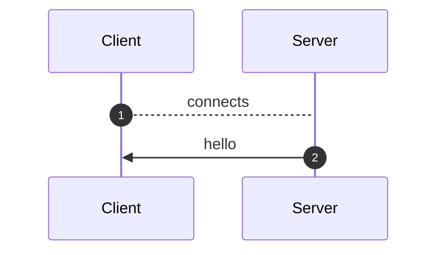
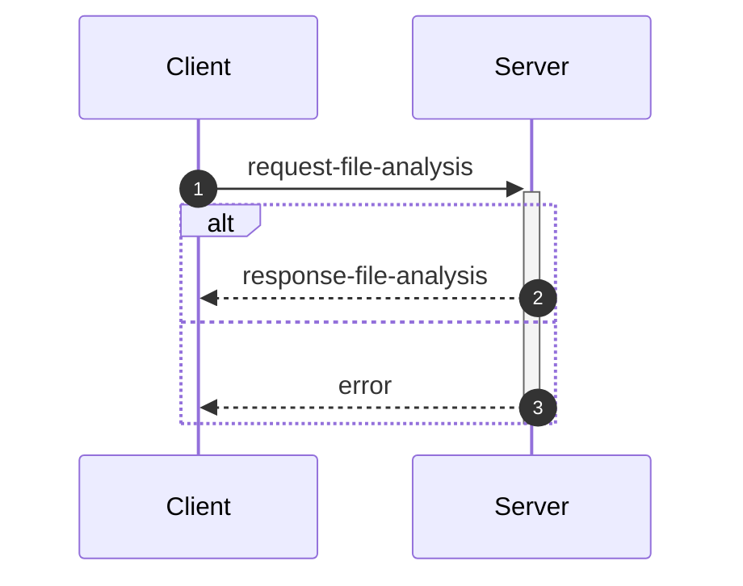
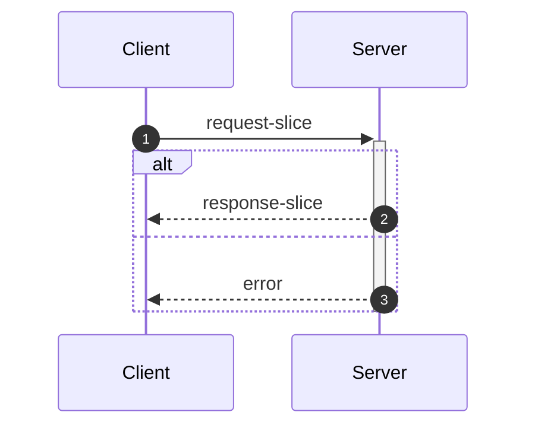
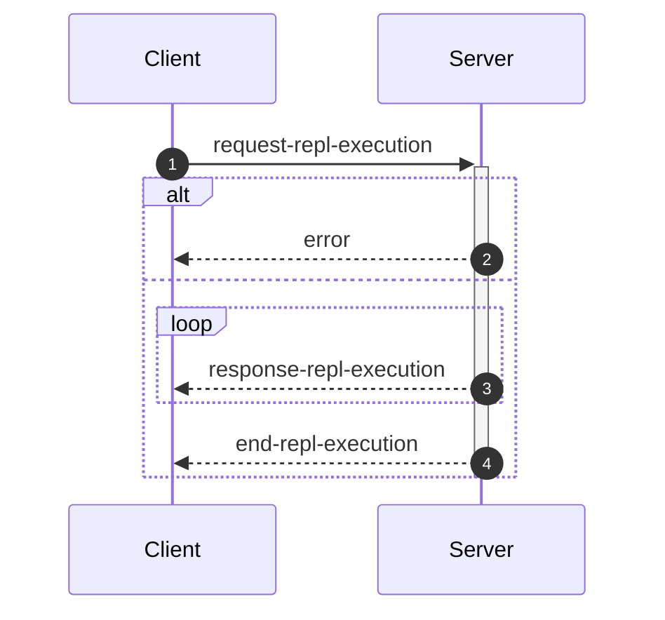

_This document was generated from '[src/documentation/wiki-interface.ts](https://github.com/flowr-analysis/flowr/tree/main//src/documentation/wiki-interface.ts)' on 2026-07-15, 07:42:53 UTC presenting an overview of flowR's interface (v2.11.1, using R v4.6.0). Please do not edit this file/wiki page directly._

Although far from being as detailed as the in-depth explanation of [_flowR_](https://github.com/flowr-analysis/flowr/wiki/core),
this wiki page explains how to interface with _flowR_ in more detail.
In general, command line arguments and other options provide short descriptions on hover over.

* [💻 Using the REPL](#using-the-repl)
* [⚙️ Configuring FlowR](#configuring-flowr)
* [⚒️ Writing Code](#writing-code)
* [💬 Communicating with the Server](#communicating-with-the-server)

<a id='using-the-repl'></a>
## 💻 Using the REPL


> [!NOTE]
> To execute arbitrary R commands with a repl request, _flowR_ has to be started explicitly with <span title="Description (Command Line Argument): Allow to access the underlying R session when using flowR (security warning: this allows the execution of arbitrary R code!)">`--r-session-access`</span>.
> Please be aware that this introduces a security risk and note that this relies on the [`r-shell` engine](https://github.com/flowr-analysis/flowr/wiki/engines) .

Although primarily meant for users to explore,
there is nothing which forbids simply calling _flowR_ as a subprocess to use standard-in, -output, and -error
for communication (although you can access the REPL using the server as well,
with the [REPL Request](#message-request-repl-execution) message).

The read-eval-print loop&nbsp;(REPL) works relatively simple.
You can submit an expression (using <kbd>Enter</kbd>),
which is interpreted as an R&nbsp;expression by default but interpreted as a *command* if it starts with a colon (`:`).
The best command to get started with the REPL is <span title="Description (Repl Command): Show help information (aliases: :h, :?)">`:help`</span>.
Besides, you can leave the REPL either with the command <span title="Description (Repl Command): End the repl (aliases: :q, :exit)">`:quit`</span> or by pressing <kbd>Ctrl</kbd>+<kbd>C</kbd> twice.
When writing a *command*, you may press <kbd>Tab</kbd> to get a list of completions, if available.
Multiple commands can be entered in a single line by separating them with a semicolon (`;`), e.g. `:parse "x<-2"; :df*`.
If a command is given without R code, the REPL will re-use R code given in a previous command.
The prior example will hence return first the parsed AST of the program and then the dataflow graph for `"x <- 2"`.

> [!NOTE]
> If you develop flowR, you may want to launch the repl using the `npm run main-dev` command, this way, you get a non-minified version of flowR with debug information and hot-reloading of source files.

<details>
<summary>Available Commands</summary>

We currently offer the following commands (this with a `[*]` suffix are available with and without the star):


| Command | Description |
| ------- | ----------- |
| **<span title="Description (Repl Command): End the repl (aliases: :q, :exit)">:quit</span>** | End the repl (aliases: **:<span title="Alias of ':quit'. End the repl">q</span>**, **:<span title="Alias of ':quit'. End the repl">exit</span>**) |
| **<span title="Description (Repl Command): Execute the given code as R code. This requires the `--r-session-access` flag to be set and requires the r-shell engine. (aliases: :e, :r)">:execute</span>** | Execute the given code as R code. This requires the `--r-session-access` flag to be set and requires the r-shell engine. (aliases: **:<span title="Alias of ':execute'. Execute the given code as R code. This requires the `--r-session-access` flag to be set and requires the r-shell engine.">e</span>**, **:<span title="Alias of ':execute'. Execute the given code as R code. This requires the `--r-session-access` flag to be set and requires the r-shell engine.">r</span>**) |
| **<span title="Description (Repl Command): Get mermaid code for the control-flow graph of R code (aliases: :cfg, :cf)">:controlflow[*]</span>** | Get mermaid code for the control-flow graph of R code (star: Returns the URL to mermaid.live) (aliases: **:<span title="Alias of ':controlflow'. Get mermaid code for the control-flow graph of R code">cfg</span>**, **:<span title="Alias of ':controlflow'. Get mermaid code for the control-flow graph of R code">cf</span>**) |
| **<span title="Description (Repl Command): Get mermaid code for the control-flow graph with basic blocks (aliases: :cfgb, :cfb)">:controlflowbb[*]</span>** | Get mermaid code for the control-flow graph with basic blocks (star: Returns the URL to mermaid.live) (aliases: **:<span title="Alias of ':controlflowbb'. Get mermaid code for the control-flow graph with basic blocks">cfgb</span>**, **:<span title="Alias of ':controlflowbb'. Get mermaid code for the control-flow graph with basic blocks">cfb</span>**) |
| **<span title="Description (Repl Command): Get mermaid code for the dataflow graph (aliases: :d, :df)">:dataflow[*]</span>** | Get mermaid code for the dataflow graph (star: Returns the URL to mermaid.live) (aliases: **:<span title="Alias of ':dataflow'. Get mermaid code for the dataflow graph">d</span>**, **:<span title="Alias of ':dataflow'. Get mermaid code for the dataflow graph">df</span>**) |
| **<span title="Description (Repl Command): Get mermaid code for the normalized AST of R code (aliases: :n)">:normalize[*]</span>** | Get mermaid code for the normalized AST of R code (star: Returns the URL to mermaid.live) (alias: **:<span title="Alias of ':normalize'. Get mermaid code for the normalized AST of R code">n</span>**) |
| **<span title="Description (Repl Command): Get mermaid code for the simplified dataflow graph (aliases: :ds, :dfs)">:dataflowsimple[*]</span>** | Get mermaid code for the simplified dataflow graph (star: Returns the URL to mermaid.live) (aliases: **:<span title="Alias of ':dataflowsimple'. Get mermaid code for the simplified dataflow graph">ds</span>**, **:<span title="Alias of ':dataflowsimple'. Get mermaid code for the simplified dataflow graph">dfs</span>**) |
| **<span title="Description (Repl Command): Inspect and extend the signature database: `query` (identical to :query @signature), `add <path>` to mount another database/source, `download` to fetch the full-history database. (aliases: :sig)">:signature</span>** | Inspect and extend the signature database: `query` (identical to :query @signature), `add <path>` to mount another database/source, `download` to fetch the full-history database. (alias: **:<span title="Alias of ':signature'. Inspect and extend the signature database: `query` (identical to :query @signature), `add <path>` to mount another database/source, `download` to fetch the full-history database.">sig</span>**) |
| **<span title="Description (Repl Command): Just calculates the DFG, but only prints summary info (aliases: :d#, :df#)">:dataflowsilent</span>** | Just calculates the DFG, but only prints summary info (aliases: **:<span title="Alias of ':dataflowsilent'. Just calculates the DFG, but only prints summary info">d#</span>**, **:<span title="Alias of ':dataflowsilent'. Just calculates the DFG, but only prints summary info">df#</span>**) |
| **<span title="Description (Repl Command): Prints ASCII Art of the parsed, unmodified AST (aliases: :p)">:parse</span>** | Prints ASCII Art of the parsed, unmodified AST (alias: **:<span title="Alias of ':parse'. Prints ASCII Art of the parsed, unmodified AST">p</span>**) |
| **<span title="Description (Repl Command): Prints the version of flowR as well as the current version of R">:version</span>** | Prints the version of flowR as well as the current version of R
| **<span title="Description (Repl Command): Query the given R code (use 'help' for more information)">:query[*]</span>** | Query the given R code (use 'help' for more information) (star: Similar to query, but returns the output in json format.)
| **<span title="Description (Repl Command): Returns an ASCII representation of the dataflow graph (aliases: :df!)">:dataflowascii</span>** | Returns an ASCII representation of the dataflow graph (alias: **:<span title="Alias of ':dataflowascii'. Returns an ASCII representation of the dataflow graph">df!</span>**) |
| **<span title="Description (Repl Command): Returns summarization stats for the normalized AST (aliases: :n#)">:normalize#</span>** | Returns summarization stats for the normalized AST (alias: **:<span title="Alias of ':normalize#'. Returns summarization stats for the normalized AST">n#</span>**) |
| **<span title="Description (Repl Command): Show help information (aliases: :h, :?)">:help</span>** | Show help information (aliases: **:<span title="Alias of ':help'. Show help information">h</span>**, **:<span title="Alias of ':help'. Show help information">?</span>**) |


</details>


> [!TIP]
> 
> As indicated by the examples before, all REPL commands that operate on code keep track of the state.
> Hence, if you run a command like <span title="Description (Repl Command, starred version): Returns the URL to mermaid.live; Base Command: Get mermaid code for the dataflow graph (aliases: :d*, :df*)">`:dataflow*`</span> without providing R code,
> the REPL will re-use the R code provided in a previous command.
> Likewise, doing this will benefit from incrementality!
> If you request the dataflow graph with `:df* x <- 2 * y` and then want to see the parsed AST with `:parse`,
> the REPL will re-use previously obtained information and not re-parse the code again.
> 		


Generally, many commands offer shortcut versions in the REPL. Many queries, for example, offer a shortened format (see the example below).
Of special note, the [Config Query](https://github.com/flowr-analysis/flowr/wiki/query-api#Config-Query)
can be used to also modify the currently active configuration of _flowR_ within the REPL (see the [wiki page](https://github.com/flowr-analysis/flowr/wiki/query-api#Config-Query) for more information).

### Example: Retrieving the Dataflow Graph

To retrieve a URL to the [mermaid](https://mermaid.js.org/) diagram of the dataflow of a given expression,
use <span title="Description (Repl Command, starred version): Returns the URL to mermaid.live; Base Command: Get mermaid code for the dataflow graph (aliases: :d*, :df*)">`:dataflow*`</span> (or <span title="Description (Repl Command): Get mermaid code for the dataflow graph (aliases: :d, :df)">`:dataflow`</span> to get the mermaid code in the cli):


```shell
$ docker run -it --rm eagleoutice/flowr # or npm run flowr 
flowR repl v2.11.1, R grammar v14 (tree-sitter engine)
R> :dataflow* y <- 1 + x
```

<details>
<summary style='color:gray'>Output</summary>


```text
https://mermaid.live/view#base64:eyJjb2RlIjoiZmxvd2NoYXJ0IEJUXG4gICAgMXt7XCJgKiM5MTtSTnVtYmVyIzkzOyogKioxKipcbiAgICAgICoxLjYqICgqKmlkOiAxKiopYFwifX1cbiAgICUlIE5vIGVkZ2VzIGZvdW5kIGZvciAxXG4gICAgMihbXCJgKiM5MTtSU3ltYm9sIzkzOyogKip4KipcbiAgICAgICoxLjEwKiAoKippZDogMioqKWBcIl0pXG4gICAlJSBObyBlZGdlcyBmb3VuZCBmb3IgMlxuICAgIDNbW1wiYCojOTE7UkJpbmFyeU9wIzkzOyogYmFzZSM1ODsjNTg7KiojNDM7KipcbiAgICAgICoxLjYtMTAqICgqKmlkOiAzKiopXG4gICAgYXJnOiAoMSwgMilgXCJdXVxuICAgIGJ1aWx0LWluOl9bXCJgQnVpbHQtSW46XG4jNDM7YFwiXVxuICAgIHN0eWxlIGJ1aWx0LWluOl8gc3Ryb2tlOmdyYXksZmlsbDpncmF5LHN0cm9rZS13aWR0aDoycHgsb3BhY2l0eTouODtcbiAgICAwW1wiYCojOTE7UlN5bWJvbCM5MzsqICoqeSoqXG4gICAgICAqMS4xKiAoKippZDogMCoqLCB2OiBbM10pYFwiXVxuICAgIDRbW1wiYCojOTE7UkJpbmFyeU9wIzkzOyogYmFzZSM1ODsjNTg7KiojNjA7IzQ1OyoqXG4gICAgICAqMS4xLTEwKiAoKippZDogNCoqKVxuICAgIGFyZzogKDAsIDMpYFwiXV1cbiAgICBidWlsdC1pbjpfLVtcImBCdWlsdC1JbjpcbiM2MDsjNDU7YFwiXVxuICAgIHN0eWxlIGJ1aWx0LWluOl8tIHN0cm9rZTpncmF5LGZpbGw6Z3JheSxzdHJva2Utd2lkdGg6MnB4LG9wYWNpdHk6Ljg7XG4gICAgMyAtLT58XCJyZWFkcywgYXJnXCJ8IDFcbiAgICAzIC0tPnxcInJlYWRzLCBhcmdcInwgMlxuICAgIDMgLS4tPnxcInJlYWRzLCBjYWxsc1wifCBidWlsdC1pbjpfXG4gICAgbGlua1N0eWxlIDIgc3Ryb2tlOmdyYXk7XG4gICAgMCAtLT58XCJkZWZpbmVkLWJ5XCJ8IDNcbiAgICAwIC0tPnxcImRlZmluZWQtYnlcInwgNFxuICAgIDQgLS0+fFwicmVhZHMsIGFyZ1wifCAzXG4gICAgNCAtLT58XCJyZXR1cm5zLCBhcmdcInwgMFxuICAgIDQgLS4tPnxcInJlYWRzLCBjYWxsc1wifCBidWlsdC1pbjpfLVxuICAgIGxpbmtTdHlsZSA3IHN0cm9rZTpncmF5OyIsIm1lcm1haWQiOnsiYXV0b1N5bmMiOnRydWV9fQ==
```


Retrieve the dataflow graph of the expression `y <- 1 + x`. It looks like this:


```mermaid
flowchart LR
    1{{"`*#91;RNumber#93;* **1**
      *1.6* (**id: 1**)`"}}
   %% No edges found for 1
    2(["`*#91;RSymbol#93;* **x**
      *1.10* (**id: 2**)`"])
   %% No edges found for 2
    3[["`*#91;RBinaryOp#93;* base#58;#58;**#43;**
      *1.6-10* (**id: 3**)
    arg: (1, 2)`"]]
    built-in:_["`Built-In:
#43;`"]
    style built-in:_ stroke:gray,fill:gray,stroke-width:2px,opacity:.8;
    0["`*#91;RSymbol#93;* **y**
      *1.1* (**id: 0**, v: [3])`"]
    4[["`*#91;RBinaryOp#93;* base#58;#58;**#60;#45;**
      *1.1-10* (**id: 4**)
    arg: (0, 3)`"]]
    built-in:_-["`Built-In:
#60;#45;`"]
    style built-in:_- stroke:gray,fill:gray,stroke-width:2px,opacity:.8;
    3 -->|"reads, arg"| 1
    3 -->|"reads, arg"| 2
    3 -.->|"reads, calls"| built-in:_
    linkStyle 2 stroke:gray;
    0 -->|"defined-by"| 3
    0 -->|"defined-by"| 4
    4 -->|"reads, arg"| 3
    4 -->|"returns, arg"| 0
    4 -.->|"reads, calls"| built-in:_-
    linkStyle 7 stroke:gray;
```

	
<details>

<summary style="color:gray">R Code of the Dataflow Graph</summary>

The analysis required _7.2 ms_ (including parse and normalize, using the [tree-sitter](https://github.com/flowr-analysis/flowr/wiki/Engines) engine) within the generation environment. No [signature database](https://github.com/flowr-analysis/flowr/wiki/Signature-Database) is mounted for these generated graphs, so `library()` calls attach no package exports; base-R names are still qualified via the generated base-package store (e.g. `acf` as `stats::acf`). 
We encountered no unknown side effects during the analysis.


```r
y <- 1 + x
```


</details>


</details>


For small graphs like this, <span title="Description (Repl Command): Returns an ASCII representation of the dataflow graph (aliases: :df!)">`:dataflowascii`</span> also provides an ASCII representation directly in the REPL:


```shell
$ docker run -it --rm eagleoutice/flowr # or npm run flowr 
flowR repl v2.11.1, R grammar v14 (tree-sitter engine)
R> :df! y <- 1 + x
```

<details open>
<summary style='color:gray'>Output</summary>


```text
                        0<1>0
                   ┌────| 1 |
    ┌────────┐     │    0---0
 c<4>c       └──c<3>c
 |<- |  v<0>v┌──| + |
 c---c──| y |┘  c---c   u<2>u
        v---v      └────| x |
                        u---u
Edges:
3 -> 1: reads, arg  3 -> 2: reads, arg
4 -> 3: reads, arg  4 -> 0: returns, arg
0 -> 3: defined-by  0 -> 4: defined-by
```


Retrieve the dataflow graph of the expression `y <- 1 + x` as ASCII art.

</details>


For the slicing with <span title="Description (Repl Command): Static backwards executable slicer for R">`:slicer`</span>, you have access to the same [magic comments](#slice-magic-comments) as with the [slice request](#message-request-slice).
Pass `--inline` to splice resolvable `source()` calls into the reconstruction so the slice is a single self-contained R text (the same as the static slice query's `inlineSources` flag).

### Example: Interfacing with the File System

Many commands that allow for an R-expression (like <span title="Description (Repl Command, starred version): Returns the URL to mermaid.live; Base Command: Get mermaid code for the dataflow graph (aliases: :d*, :df*)">`:dataflow*`</span>) allow for a file as well
if the argument starts with `file://`.
If you are working from the root directory of the _flowR_ repository, the following gives you the parsed AST of the example file using the <span title="Description (Repl Command): Prints ASCII Art of the parsed, unmodified AST (aliases: :p)">`:parse`</span> command:

> **Watch mode**: Replace `file://` with `watch://` to enter watch mode.
> flowR runs the command immediately and then re-runs it every time the file (or any file inside the folder) changes.
> Enter any other command to leave watch mode.
> For example: `:df watch://analysis.R`


```shell
$ docker run -it --rm eagleoutice/flowr # or npm run flowr 
flowR repl v2.11.1, R grammar v14 (tree-sitter engine)
R> :parse file://test/testfiles/example.R
```

<details>
<summary style='color:gray'>Output</summary>


```text
File: test/testfiles/example.R

program
├ binaryoperator
│ ├ identifier "sum" (1:1─4)
│ ├ <- "<-" (1:5─7)
│ ╰ float "0" (1:8─9)
├ binaryoperator
│ ├ identifier "product" (2:1─8)
│ ├ <- "<-" (2:9─11)
│ ╰ float "1" (2:12─13)
├ binaryoperator
│ ├ identifier "w" (3:1─2)
│ ├ <- "<-" (3:3─5)
│ ╰ float "7" (3:6─7)
├ binaryoperator
│ ├ identifier "N" (4:1─2)
│ ├ <- "<-" (4:3─5)
│ ╰ float "10" (4:6─8)
├ forstatement
│ ├ for "for" (6:1─4)
│ ├ ( "(" (6:5─6)
│ ├ identifier "i" (6:6─7)
│ ├ in "in" (6:8─10)
│ ├ binaryoperator
│ │ ├ float "1" (6:11─12)
│ │ ├ : ":" (6:12─13)
│ │ ╰ parenthesizedexpression
│ │   ├ ( "(" (6:13─14)
│ │   ├ binaryoperator
│ │   │ ├ identifier "N" (6:14─15)
│ │   │ ├ - "-" (6:15─16)
│ │   │ ╰ float "1" (6:16─17)
│ │   ╰ ) ")" (6:17─18)
│ ├ ) ")" (6:18─19)
│ ╰ bracedexpression
│   ├ { "{" (6:20─21)
│   ├ binaryoperator
│   │ ├ identifier "sum" (7:3─6)
│   │ ├ <- "<-" (7:7─9)
│   │ ╰ binaryoperator
│   │   ├ binaryoperator
│   │   │ ├ identifier "sum" (7:10─13)
│   │   │ ├ + "+" (7:14─15)
│   │   │ ╰ identifier "i" (7:16─17)
│   │   ├ + "+" (7:18─19)
│   │   ╰ identifier "w" (7:20─21)
│   ├ binaryoperator
│   │ ├ identifier "product" (8:3─10)
│   │ ├ <- "<-" (8:11─13)
│   │ ╰ binaryoperator
│   │   ├ identifier "product" (8:14─21)
│   │   ├  "" (8:22─23)
│   │   ╰ identifier "i" (8:24─25)
│   ╰ } "}" (9:1─2)
├ call
│ ├ identifier "cat" (11:1─4)
│ ╰ arguments
│   ├ ( "(" (11:4─5)
│   ├ argument
│   │ ╰ string
│   │   ├ " "\"" (11:5─6)
│   │   ├ stringcontent "Sum:" (11:6─10)
│   │   ╰ " "\"" (11:10─11)
│   ├ comma "," (11:11─12)
│   ├ argument
│   │ ╰ identifier "sum" (11:13─16)
│   ├ comma "," (11:16─17)
│   ├ argument
│   │ ╰ string
│   │   ├ " "\"" (11:18─19)
│   │   ├ stringcontent
│   │   │ ╰ escapesequence "\\n" (11:19─21)
│   │   ╰ " "\"" (11:21─22)
│   ╰ ) ")" (11:22─23)
╰ call
  ├ identifier "cat" (12:1─4)
  ╰ arguments
    ├ ( "(" (12:4─5)
    ├ argument
    │ ╰ string
    │   ├ " "\"" (12:5─6)
    │   ├ stringcontent "Product:" (12:6─14)
    │   ╰ " "\"" (12:14─15)
    ├ comma "," (12:15─16)
    ├ argument
    │ ╰ identifier "product" (12:17─24)
    ├ comma "," (12:24─25)
    ├ argument
    │ ╰ string
    │   ├ " "\"" (12:26─27)
    │   ├ stringcontent
    │   │ ╰ escapesequence "\\n" (12:27─29)
    │   ╰ " "\"" (12:29─30)
    ╰ ) ")" (12:30─31)
```


Retrieve the parsed AST of the example file.

<details>

<summary>File Content</summary>


```r
sum <- 0
product <- 1
w <- 7
N <- 10

for (i in 1:(N-1)) {
  sum <- sum + i + w
  product <- product * i
}

cat("Sum:", sum, "\n")
cat("Product:", product, "\n")
```


</details>

As _flowR_ directly transforms this AST the output focuses on being human-readable instead of being machine-readable.
		

</details>


### Example: Run a Query

You can run any query supported by _flowR_ using the <span title="Description (Repl Command): Query the given R code (use 'help' for more information)">`:query`</span> command.
For example, to obtain the shapes of all data frames in a given piece of code, you can run:


```shell
$ docker run -it --rm eagleoutice/flowr # or npm run flowr 
flowR repl v2.11.1, R grammar v14 (tree-sitter engine)
R> :query @df-shape "x <- data.frame(a = 1:10, b = 1:10)\ny <- x$a"
```

<details open>
<summary style='color:gray'>Output</summary>


```text
Query: df-shape (1 ms)
   ╰ 12: (colnames: [{"a", "b"}, {}], cols: [2, 2], rows: [10, 10])
   ╰ 0: (colnames: [{"a", "b"}, {}], cols: [2, 2], rows: [10, 10])
All queries together required ≈4 ms (1ms accuracy, total 5 ms)
```


Retrieve the shapes of all data frames in the given code.

</details>


To run the linter on a file, you can use (in this example, we just issue the `dead-code` linter on a small piece of code):


```shell
$ docker run -it --rm eagleoutice/flowr # or npm run flowr 
flowR repl v2.11.1, R grammar v14 (tree-sitter engine)
R> :query @linter rules:dead-code "if(FALSE) x <- 2"
```

<details open>
<summary style='color:gray'>Output</summary>


```text
Query: linter (2 ms)
   ╰ Dead Code (dead-code):
       ╰ certain:
           ╰ Code at 1.11-16
       ╰ Metadata: searchTimeMs: 2, processTimeMs: 0
All queries together required ≈2 ms (1ms accuracy, total 2 ms)
```


Run the linter on the given code, with only the `dead-code` rule enabled.

</details>


For more information on the available queries, please check out the [Query API](https://github.com/flowr-analysis/flowr/wiki/query-api).


<a id='configuring-flowr'></a>
## ⚙️ Configuring FlowR


When running _flowR_, you may want to specify some behaviors with a dedicated configuration file.
By default, flowR looks for a file named `flowr.json` in the current working directory (or any higher directory).
You can also specify a different file with <span title="Description (Command Line Argument): The name of the configuration file to use">`--config-file`</span> or pass the configuration inline using <span title="Description (Command Line Argument): The flowR configuration to use, as a JSON string">`--config-json`</span>.
To inspect the current configuration, you can run flowr with the <span title="Description (Command Line Argument): Run with verbose logging (will be passed to the corresponding script)">`--verbose`</span> flag, or use the `config` [Query](https://github.com/flowr-analysis/flowr/wiki/query-api).
Within the REPL this works by running the following:


```shell
:query @config
```


To work with the <a href="https://github.com/flowr-analysis/flowr/tree/main/src/config.ts#L122"><code><span title="The configuration file format for flowR.">FlowrConfig</span></code></a> you can use the provided helper objects alongside its methods like
<a href="https://github.com/flowr-analysis/flowr/tree/main/src/config.ts#L569"><code><span title="Creates a new flowr config that has the updated values.">FlowrConfig::<b>amend</b></span></code></a>.
The following summarizes the configuration options:

- `ignoreSourceCalls`: If set to `true`, _flowR_ will ignore source calls when analyzing the code, i.e., ignoring the inclusion of other files.
- `semantics`: allows to configure the way _flowR_ handles R, although we currently only support `semantics/environment/overwriteBuiltIns`.
  You may use this to overwrite _flowR_'s handling of built-in function and even completely clear the preset definitions shipped with flowR.
  See [Configure BuiltIn Semantics](#configure-builtin-semantics) for more information.
- `solver`: allows to configure how _flowR_ resolves variables and their values (currently we support: `disabled`, `alias`, `builtin`), as well as if pointer analysis should be active.
- `engines`: allows to configure the engines used by _flowR_ to interact with R code. See the [Engines wiki page](https://github.com/flowr-analysis/flowr/wiki/engines) for more information.
- `defaultEngine`: allows to specify the default engine to use for interacting with R code. If not set, an arbitrary engine from the specified list will be used.
- `abstractInterpretation`: allows to configure how _flowR_ performs abstract interpretation, although we currently only support data frame shape inference through abstract interpretation.
- `defaultPlugins`: allows to configure which plugins to load by default when creating a new <a href="https://github.com/flowr-analysis/flowr/tree/main/src/project/flowr-analyzer.ts#L162"><code><span title="Central class for conducting analyses with FlowR. Use the FlowrAnalyzerBuilder to create a new instance. If you want the original pattern of creating a pipeline and running all steps, you can still do this with FlowrAnalyzer#runFull . To inspect the context of the analyzer, use FlowrAnalyzer#inspectContext (if you are a plugin and need to modify it, use FlowrAnalyzer#context instead).">FlowrAnalyzer</span></code></a> instance.
- `repl.plugins`: allows to configure which plugins to load in the _flowR_ REPL. Use `flowr:default` to reference the plugins specified by `defaultPlugins`.

So you can configure _flowR_ by adding a file like the following:

<details>

<summary>Example Configuration File</summary>


```json
{
  "ignoreSourceCalls": true,
  "semantics": {
    "environment": {
      "overwriteBuiltIns": {
        "definitions": [
          {
            "type": "function",
            "names": [
              "foo"
            ],
            "processor": "builtin:assign",
            "config": {}
          }
        ]
      }
    }
  },
  "defaultPlugins": [
    "file:description",
    "versions:description"
  ],
  "repl": {
    "quickStats": false,
    "dfProcessorHeat": false,
    "hints": true,
    "plugins": [
      "flowr:default"
    ]
  },
  "project": {
    "resolveUnknownPathsOnDisk": true
  },
  "engines": [
    {
      "type": "r-shell"
    }
  ],
  "solver": {
    "variables": "alias",
    "evalStrings": true,
    "trackEnvironments": true,
    "sigdb": {
      "enabled": true,
      "loadProjectDependencies": true,
      "eagerlyLoad": false,
      "eagerlyLoadExports": false,
      "linkBaseR": false,
      "linkDescriptionDependencies": false
    },
    "resolveSource": {
      "dropPaths": "no",
      "ignoreCapitalization": true,
      "inferWorkingDirectory": "active-script",
      "searchPath": []
    },
    "instrument": {},
    "slicer": {
      "threshold": 50
    }
  },
  "abstractInterpretation": {
    "wideningThreshold": 4,
    "dataFrame": {
      "maxColNames": 20,
      "readLoadedData": {
        "readExternalFiles": true,
        "maxReadLines": 1000000
      }
    }
  },
  "gas": {
    "thresholds": {
      "memory": {
        "problematic": 0.7,
        "critical": 0.9
      },
      "timeMs": {
        "problematic": 100000,
        "critical": 120000
      }
    },
    "features": {}
  }
}
```


</details>

<details>
<a id='configure-builtin-semantics'></a>
<summary>Configure Built-In Semantics</summary>


`semantics/environment/overwriteBuiltins` accepts two keys:

- `loadDefaults` (boolean, initially `true`): If set to `true`, the default built-in definitions are loaded before applying the custom definitions. Setting this flag to `false` explicitly disables the loading of the default definitions.
- `definitions` (array, initially empty): Allows to overwrite or define new built-in elements. Each object within must have a `type` which is one of the below. Furthermore, they may define a string array of `names` which specifies the identifiers to bind the definitions to. You may use `assumePrimitive` to specify whether _flowR_ should assume that this is a primitive non-library definition (so you probably just do not want to specify the key).

  | Type            | Description                                                                                                                                                                                                                                                                                              | Example                                                                                                    |
  | --------------- | -------------------------------------------------------------------------------------------------------------------------------------------------------------------------------------------------------------------------------------------------------------------------------------------------------- | ---------------------------------------------------------------------------------------------------------- |
  | `constant`    | Additionally allows for a `value` this should resolve to.                                                                                                                                                                                                                                                | `{ type: 'constant', names: ['NULL', 'NA'],  value: null }`                                                |
  | `function`    | Is a rather flexible way to define and bind built-in functions. For the time, we do not have extensive documentation to cover all the cases, so please either consult the sources with the `default-builtin-config.ts` or open a [new issue](https://github.com/flowr-analysis/flowr/issues/new/choose). | `{ type: 'function', names: ['next'], processor: 'builtin:d', config: { cfg: ExitPointType.Next } }` |
  | `replacement` | A comfortable way to specify replacement functions like `$<-` or `names<-`. `suffixes` describes the... suffixes to attach automatically. | `{ type: 'replacement', suffixes: ['<-', '<<-'], names: ['[', '[['] }` |


</details>

<details>

<summary style='color:gray'>Full Configuration-File Schema</summary>

- _The configuration file format for flowR._ (object)
    - **ignoreSourceCalls** [optional] _Whether source calls should be ignored, causing {@link processSourceCall}'s behavior to be skipped._ (boolean)
    - **semantics** _Configure language semantics and how flowR handles them._ (object)
        - **environment** [optional] _Semantics regarding how to handle the R environment._ (object)
            - **overwriteBuiltIns** [optional] _Do you want to overwrite (parts) of the builtin definition?_ (object)
                - **loadDefaults** [optional] _Should the default configuration still be loaded?_ (boolean)
                - **definitions** [optional] _The definitions to load/overwrite._ (array)
                Valid item types:
                    - (object)
    - **defaultPlugins** [optional] _The default plugins to load when creating a new instance of FlowrAnalyzer_ (array)
    Valid item types:
        - (alternatives)
            - (string)
            - (array)
    - **repl** _Configuration options for the REPL._ (object)
        - **quickStats** [optional] _Whether to show quick stats in the REPL after each evaluation._ (boolean)
        - **dfProcessorHeat** [optional] _This instruments the dataflow processors to count how often each processor is called._ (boolean)
        - **hints** [optional] _Whether to show dim inline hints on the empty prompt (automatically disabled on non-interactive terminals)._ (boolean)
        - **plugins** [optional] _The plugins to load in REPL mode_ (array)
        Valid item types:
            - (alternatives)
                - (string)
                - (array)
    - **project** _Project specific configuration options._ (object)
        - **resolveUnknownPathsOnDisk** [optional] _Whether to resolve unknown paths loaded by the r project disk when trying to source/analyze files._ (boolean)
        - **basePackages** [optional] _The packages considered part of R itself (base and recommended); if unset, flowR uses its built-in list._ (array)
        Valid item types:
            - (string)
    - **engines** _The engine or set of engines to use for interacting with R code. An empty array means all available engines will be used._ (array)
    Valid item types:
        - (alternatives)
            - _The configuration for the tree sitter engine._ (object)
                - **type** [required] _Use the tree sitter engine._ (string)
                    Only allows: 'tree-sitter'
                - **wasmPath** [optional] _The path to the tree-sitter-r WASM binary to use. If this is undefined, this uses the default path._ (string)
                - **treeSitterWasmPath** [optional] _The path to the tree-sitter WASM binary to use. If this is undefined, this uses the default path._ (string)
                - **lax** [optional] _Whether to use the lax parser for parsing R code (allowing for syntax errors). If this is undefined, the strict parser will be used._ (boolean)
            - _The configuration for the R shell engine._ (object)
                - **type** [required] _Use the R shell engine._ (string)
                    Only allows: 'r-shell'
                - **rPath** [optional] _The path to the R executable to use. If this is undefined, this uses the default path._ (string)
    - **defaultEngine** [optional] _The default engine to use for interacting with R code. If this is undefined, an arbitrary engine from the specified list will be used._ (string)
        Only allows: 'tree-sitter', 'r-shell'
    - **solver** _How to resolve constants, constraints, cells, ..._ (object)
        - **variables** _How to resolve variables and their values._ (string)
            Only allows: 'disabled', 'alias', 'builtin'
        - **evalStrings** _Should we include eval(parse(text="...")) calls in the dataflow graph?_ (boolean)
        - **trackEnvironments** [optional] _Track user-created environments (new.env, assign/get/local with envir=, dollar-assign, attach). When false, all envir-style calls fall through conservatively._ (boolean)
        - **sigdb** _Resolving library exports from a signature database._ (object)
            - **enabled** [optional] _Resolve library()/use() exports from a signature database (default true); when false no database is consulted._ (boolean)
            - **loadProjectDependencies** [optional] _Load the project's declared dependencies from its metadata files (DESCRIPTION Imports/Depends, renv.lock, rv.lock) (default true); when false these files are not read for dependencies._ (boolean)
            - **eagerlyLoad** [optional] _Parse the database up front rather than on the first package load (default false, ignored if disabled)._ (boolean)
            - **eagerlyLoadExports** [optional] _Add a vertex for every export on load rather than on demand (default false); keeps the dataflow graph small._ (boolean)
            - **assumedRVersion** [optional] _R version assumed when resolving versioned (base-R) exports: a pin like "4.5" or "auto" to detect the installed R (default "auto")._ (string)
            - **linkBaseR** [optional] _Eagerly attach base-R namespaces so bare base calls resolve without library() (default false)._ (boolean)
            - **linkBaseRCalls** [optional] _Add a lightweight Reads edge from a bare base-R call to its signature-database function vertex (default false; base-R qualification is edge-free otherwise)._ (boolean)
            - **linkPackageCalls** [optional] _Add a lightweight Reads edge from a resolved package call to its signature-database function vertex (default false)._ (boolean)
            - **linkDescriptionDependencies** [optional] _Eagerly attach the namespaces of the project's declared DESCRIPTION dependencies (Imports/Depends) so their exports resolve without an explicit library() (default false)._ (boolean)
            - **warmInBackground** [optional] _Decompress the hot shards (base + most-downloaded) in a background task on startup so the first library() lookup is warm (default false; for long-running servers/REPLs)._ (boolean)
            - **additionalPaths** [optional] _Extra directories or bundle/manifest files searched for signature databases (alongside the shipped default and $FLOWR_SIGDB_DIR); a downloaded full-history bundle placed here is mounted automatically._ (array)
            Valid item types:
                - (string)
            - **downloadRepo** [optional] _GitHub owner/repo the full-history bundle is downloaded from via ":signature download" (default "flowr-analysis/flowr", release tag "sigdb-v<flowR-version>")._ (string)
            - **autoSync** [optional] _On startup, re-download shards whose committed sigdb.remote.json hash no longer matches the cache, in the background (default false; opt-in network sync after a git pull)._ (boolean)
            - **versionSelection** [optional] _When a project constrains a dependency, resolve to the newest (default), oldest, or system-installed version satisfying it; system needs R and falls back to newest. Base-R packages always resolve against the assumed R version._ (string)
                Only allows: 'newest', 'oldest', 'system'
            - **versionOverrides** [optional] _Force an exact version for specific packages (name -> version), overriding both the project constraint and the versionSelection policy (default {})._ (object)
        - **instrument** (object)
            - **dataflowExtractors** [optional] _These keys are only intended for use within code, allowing to instrument the dataflow analyzer!_ (any)
        - **resolveSource** [optional] _If lax source calls are active, flowR searches for sourced files much more freely, based on the configurations you give it. This option is only in effect if `ignoreSourceCalls` is set to false._ (object)
            - **dropPaths** _Allow to drop the first or all parts of the sourced path, if it is relative._ (string)
                Only allows: 'no', 'once', 'all'
            - **ignoreCapitalization** _Search for filenames matching in the lowercase._ (boolean)
            - **inferWorkingDirectory** _Try to infer the working directory from the main or any script to analyze._ (string)
                Only allows: 'no', 'main-script', 'active-script', 'any-script'
            - **searchPath** _Additionally search in these paths._ (array)
            Valid item types:
                - (string)
            - **repeatedSourceLimit** [optional] _How often the same file can be sourced within a single run? Please be aware: in case of cyclic sources this may not reach a fixpoint so give this a sensible limit._ (number)
            - **applyReplacements** _Provide name replacements for loaded files_ (array)
            Valid item types:
                - (object)
        - **slicer** [optional] _The configuration for the slicer._ (object)
            - **threshold** [optional] _The maximum number of iterations to perform on a single function call during slicing._ (number)
            - **autoExtend** [optional] _If set, the slicer will gain an additional post-pass._ (boolean)
    - **abstractInterpretation** _The configuration options for abstract interpretation._ (object)
        - **wideningThreshold** _The threshold for the number of visitations of a node at which widening should be performed to ensure the termination of the fixpoint iteration._ (number)
        - **dataFrame** _The configuration of the shape inference for data frames._ (object)
            - **maxColNames** _The maximum number of columns names to infer for data frames before over-approximating the column names to top._ (number)
            - **readLoadedData** _Configuration options for reading data frame shapes from loaded external data files, such as CSV files._ (object)
                - **readExternalFiles** _Whether data frame shapes should be extracted from loaded external files, such as CSV files._ (boolean)
                - **maxReadLines** _The maximum number of lines to read when extracting data frame shapes from loaded files, such as CSV files._ (number)
    - **gas** [optional] _Resource-usage guard (gas) configuration. All feature factors default to 0 (disabled). See https://github.com/flowr-analysis/flowr/wiki/Core#gas-resource-guard._ (object)
        - **thresholds** [optional] _Shared thresholds for all gas checks (scaled by per-feature factor)._ (object)
            - **memory** [optional] _Heap-usage fraction thresholds (0-1)._ (object)
                - **problematic** [optional] _Heap fraction (0-1) above which Problematic is returned._ (number)
                - **critical** [optional] _Heap fraction (0-1) above which Critical is returned._ (number)
            - **timeMs** [optional] _Elapsed analysis time thresholds in milliseconds._ (object)
                - **problematic** [optional] _Elapsed ms above which Problematic is returned._ (number)
                - **critical** [optional] _Elapsed ms above which Critical is returned._ (number)
        - **features** [optional] _Per-feature sensitivity factors. 0 or absent disables gas checking for that feature. A factor of 2 makes the feature twice as sensitive. Recognised keys: `source`, `side-effect-linking`, `linter`._ (object)
        - **heapProvider** [optional] _Custom heap statistics source (programmatic configs only), overriding the built-in v8/performance.memory detection._ (function)

</details>

	

<a id='writing-code'></a>
## ⚒️ Writing Code

_flowR_ can be used as a [module](https://www.npmjs.com/package/@eagleoutice/flowr) and offers several main classes and interfaces that are interesting for extension writers 
(see the [Visual Studio Code extension](https://marketplace.visualstudio.com/items?itemName=code-inspect.vscode-flowr) or the [Core](https://github.com/flowr-analysis/flowr/wiki/core) wiki page for more information).

### Creating Analyses with _flowR_

Nowadays, instances of the <a href="https://github.com/flowr-analysis/flowr/tree/main/src/project/flowr-analyzer.ts#L162"><code><span title="Central class for conducting analyses with FlowR. Use the FlowrAnalyzerBuilder to create a new instance. If you want the original pattern of creating a pipeline and running all steps, you can still do this with FlowrAnalyzer#runFull . To inspect the context of the analyzer, use FlowrAnalyzer#inspectContext (if you are a plugin and need to modify it, use FlowrAnalyzer#context instead).">FlowrAnalyzer</span></code></a> should be used as central frontend to get analysis results from _flowR_.
For example, a program slice can be created like this:


```ts
const analyzer = await new FlowrAnalyzerBuilder()
    .setEngine('tree-sitter')
    .build();
analyzer.addRequest('x <- 1\ny <- x\nx');
const result = await analyzer.query([
    {
        type:     'static-slice',
        criteria: ['3@x']
    }
]);
//console.log(result['static-slice']);
```


For more information, please have a look at the [Analyzer](https://github.com/flowr-analysis/flowr/wiki/analyzer) wiki page, which explains how to construct and use the <a href="https://github.com/flowr-analysis/flowr/tree/main/src/project/flowr-analyzer.ts#L162"><code><span title="Central class for conducting analyses with FlowR. Use the FlowrAnalyzerBuilder to create a new instance. If you want the original pattern of creating a pipeline and running all steps, you can still do this with FlowrAnalyzer#runFull . To inspect the context of the analyzer, use FlowrAnalyzer#inspectContext (if you are a plugin and need to modify it, use FlowrAnalyzer#context instead).">FlowrAnalyzer</span></code></a> in more detail.
To work with specific perspectives, you can also consult the respective pages like the [Dataflow Graph](https://github.com/flowr-analysis/flowr/wiki/dataflow-graph) or the [Abstract Interpretation](https://github.com/flowr-analysis/flowr/wiki/abstract-interpretation) wiki pages.
### The Pipeline Executor (Low-Level Interface)

Once, in the beginning, _flowR_ was meant to produce a dataflow graph merely to provide *program slices*. 
However, with continuous updates, the [Dataflow Graph](https://github.com/flowr-analysis/flowr/wiki/dataflow-graph) repeatedly proves to be the more interesting part.
With this, we restructured _flowR_'s originally *hardcoded* pipeline to be far more flexible. 
Now, it can be theoretically extended or replaced with arbitrary steps, optional steps, and what we call 'decorations' of these steps. 
In short, a slicing pipeline using the <a href="https://github.com/flowr-analysis/flowr/tree/main/src/core/pipeline-executor.ts#L97"><code><span title="**Please note:** The PipelineExecutor is now considered to be a rather low-level API for flowR. While it still works and is the basis for all other layers, we strongly recommend using the FlowrAnalyzer and its builder to create and use an analyzer instance that is pre-configured for your use-case. The pipeline executor allows to execute arbitrary pipelines in a step-by-step fashion. If you are not...">PipelineExecutor</span></code></a> looks like this:


```ts

const slicer = new PipelineExecutor(DEFAULT_SLICING_PIPELINE, {
  parser:    new RShell(),
  request:   requestFromInput('x <- 1\nx + 1'),
  criterion: ['2@x']
})
const slice = await slicer.allRemainingSteps()
// console.log(slice.reconstruct.code)
```


<details><summary>More Information</summary>


If you compare this, with what you would have done with the old (and removed) `SteppingSlicer`, 
this essentially just requires you to replace the `SteppingSlicer` with the <a href="https://github.com/flowr-analysis/flowr/tree/main/src/core/pipeline-executor.ts#L97"><code><span title="**Please note:** The PipelineExecutor is now considered to be a rather low-level API for flowR. While it still works and is the basis for all other layers, we strongly recommend using the FlowrAnalyzer and its builder to create and use an analyzer instance that is pre-configured for your use-case. The pipeline executor allows to execute arbitrary pipelines in a step-by-step fashion. If you are not...">PipelineExecutor</span></code></a>
and to pass the <a href="https://github.com/flowr-analysis/flowr/tree/main/src/core/steps/pipeline/default-pipelines.ts#L18"><code>DEFAULT_SLICING_PIPELINE</code></a> as the first argument.
The <a href="https://github.com/flowr-analysis/flowr/tree/main/src/core/pipeline-executor.ts#L97"><code><span title="**Please note:** The PipelineExecutor is now considered to be a rather low-level API for flowR. While it still works and is the basis for all other layers, we strongly recommend using the FlowrAnalyzer and its builder to create and use an analyzer instance that is pre-configured for your use-case. The pipeline executor allows to execute arbitrary pipelines in a step-by-step fashion. If you are not...">PipelineExecutor</span></code></a>...

1. Provides structures to investigate the results of all intermediate steps
2. Can be executed step-by-step
3. Can repeat steps (e.g., to calculate multiple slices on the same input)

See the in-code documentation for more information.


</details>

### Using the <a href="https://github.com/flowr-analysis/flowr/tree/main/src/r-bridge/shell.ts#L143"><code><span title="The RShell represents an interactive session with the R interpreter. You can configure it by RShellOptions . At the moment we are using a live R session (and not networking etc.) to communicate with R easily, which allows us to install packages etc. However, this might and probably will change in the future (leaving this as a legacy mode :D)">RShell</span></code></a> to Interact with R

The <a href="https://github.com/flowr-analysis/flowr/tree/main/src/r-bridge/shell.ts#L143"><code><span title="The RShell represents an interactive session with the R interpreter. You can configure it by RShellOptions . At the moment we are using a live R session (and not networking etc.) to communicate with R easily, which allows us to install packages etc. However, this might and probably will change in the future (leaving this as a legacy mode :D)">RShell</span></code></a> class allows interfacing with the `R`&nbsp;ecosystem installed on the host system.
Please have a look at [flowR's Engines](https://github.com/flowr-analysis/flowr/wiki/engines) for more information on alternatives (for example, the <a href="https://github.com/flowr-analysis/flowr/tree/main/src/r-bridge/lang-4.x/tree-sitter/tree-sitter-executor.ts#L18"><code><span title="Synchronous and (way) faster alternative to the RShell using tree-sitter.">TreeSitterExecutor</span></code></a>).


> [!IMPORTANT]
> 
> Each <a href="https://github.com/flowr-analysis/flowr/tree/main/src/r-bridge/shell.ts#L143"><code><span title="The RShell represents an interactive session with the R interpreter. You can configure it by RShellOptions . At the moment we are using a live R session (and not networking etc.) to communicate with R easily, which allows us to install packages etc. However, this might and probably will change in the future (leaving this as a legacy mode :D)">RShell</span></code></a> controls a new instance of the R&nbsp;interpreter, 
> make sure to call <code><a href="https://github.com/flowr-analysis/flowr/tree/main/src/r-bridge/shell.ts#L351"><span title="Close the current R session, makes the object effectively invalid (can no longer be reopened etc.)">RShell::<i>close</i></span></a>()</code> when you are done.


You can start a new "session" simply by constructing a new object with <code>new <a href="https://github.com/flowr-analysis/flowr/tree/main/src/r-bridge/shell.ts#L143"><span title="The RShell represents an interactive session with the R interpreter. You can configure it by RShellOptions . At the moment we are using a live R session (and not networking etc.) to communicate with R easily, which allows us to install packages etc. However, this might and probably will change in the future (leaving this as a legacy mode :D)">RShell</span></a>()</code>.

However, there are several options that may be of interest 
(e.g., to automatically revive the shell in case of errors or to control the name location of the R process on the system).

With a shell object (let's call it `shell`), you can execute R code by using <a href="https://github.com/flowr-analysis/flowr/tree/main/src/r-bridge/shell.ts#L212"><code><span title="sends the given command directly to the current R session will not do anything to alter input markers!">RShell::<i>sendCommand</i></span></code></a>,
for example <code>shell.<a href="https://github.com/flowr-analysis/flowr/tree/main/src/r-bridge/shell.ts#L212"><span title="sends the given command directly to the current R session will not do anything to alter input markers!">sendCommand</span></a>("1 + 1")</code>.
However, this does not return anything, so if you want to collect the output of your command, use
<a href="https://github.com/flowr-analysis/flowr/tree/main/src/r-bridge/shell.ts#L295"><code><span title="Send a command and collect the output">RShell::<i>sendCommandWithOutput</i></span></code></a> instead.


<a id='communicating-with-the-server'></a>
## 💬 Communicating with the Server


As explained in the [Overview](https://github.com/flowr-analysis/flowr/wiki/overview), you can simply run the [TCP](https://de.wikipedia.org/wiki/Transmission_Control_Protocol)&nbsp;server by adding the <span title="Description (Command Line Argument): Do not drop into a repl, but instead start a server on the given port (default: 1042) and listen for messages.">`--server`</span> flag (and, due to the interactive mode, exit with the conventional <kbd>CTRL</kbd>+<kbd>C</kbd>).
Currently, every connection is handled by the same underlying `RShell` - so the server is not designed to handle many clients at a time.
Additionally, the server is not well guarded against attacks (e.g., you can theoretically spawn an arbitrary number of&nbsp;RShell sessions on the target machine).

Every message has to be given in a single line (i.e., without a newline in-between) and end with a newline character. Nevertheless, we will pretty-print example given in the following segments for the ease of reading.


> [!NOTE]
> 
> The default <span title="Description (Command Line Argument): Do not drop into a repl, but instead start a server on the given port (default: 1042) and listen for messages.">`--server`</span> uses a simple [TCP](https://de.wikipedia.org/wiki/Transmission_Control_Protocol)
> connection. If you want _flowR_ to expose a [WebSocket](https://de.wikipedia.org/wiki/WebSocket) server instead, add the <span title="Description (Command Line Argument): If the server flag is set, use websocket for messaging">`--ws`</span> flag (i.e., <span title="Description (Command Line Argument): Do not drop into a repl, but instead start a server on the given port (default: 1042) and listen for messages.">`--server`</span> <span title="Description (Command Line Argument): If the server flag is set, use websocket for messaging">`--ws`</span>) when starting _flowR_ from the command line.


<ul><li>
<a id="message-hello"></a>
<b>Hello</b> Message (<code>hello</code>) 
<details>

<summary style="color:gray"> View Details. <i>The server informs the client about the successful connection and provides Meta-Information.</i> </summary>


```mermaid
sequenceDiagram
    autonumber
    participant Client
    participant Server

    
    Client-->Server: connects
    Server->>Client: hello
	
```


	
After launching _flowR_, for example, with <code>docker run -it --rm eagleoutice/flowr <span title="Description (Command Line Argument): Do not drop into a repl, but instead start a server on the given port (default: 1042) and listen for messages.">-<span/>-server</span></code>&nbsp;(🐳️), simply connecting should present you with a `hello` message, that amongst others should reveal the versions of&nbsp;_flowR_ and&nbsp;R, using the [semver 2.0](https://semver.org/spec/v2.0.0.html) versioning scheme.
The message looks like this:


```json
{
  "type": "hello",
  "clientName": "client-0",
  "versions": {
    "flowr": "2.11.1",
    "r": "4.6.0",
    "engine": "r-shell"
  }
}
```


There are currently a few messages that you can send after the hello message.
If you want to _slice_ a piece of R code you first have to send an [analysis request](#message-request-file-analysis), so that you can send one or multiple slice requests afterward.
Requests for the [REPL](#message-request-repl) are independent of that.
	

<hr>


<details>
<summary style="color:gray">Message schema (<code>hello</code>)</summary>

For the definition of the hello message, please see it's implementation at [`./src/cli/repl/server/messages/message-hello.ts`](https://github.com/flowr-analysis/flowr/tree/main/./src/cli/repl/server/messages/message-hello.ts).

- [required] (object)
    - **type** [required] _The type of the hello message._ (string)
        Only allows: 'hello'
    - **id** [forbidden] _The id of the message is always undefined (as it is the initial message and not requested)._ (any)
    - **clientName** [required] _A unique name that is assigned to each client. It has no semantic meaning and is only used/useful for debugging._ (string)
    - **versions** [required] (object)
        - **flowr** [required] _The version of the flowr server running in semver format._ (string)
        - **r** [required] _The version of the underlying R shell running in semver format._ (string)
        - **engine** [required] _The parser backend that is used to parse the R code._ (string)

</details>


<hr>

</details>
	</li>

<li>
<a id="message-request-file-analysis"></a>
<b>Analysis</b> Message (<code>request-file-analysis</code>) 
<details>

<summary style="color:gray"> View Details. <i>The server builds the dataflow graph for a given input file (or a set of files).</i> </summary>


```mermaid
sequenceDiagram
    autonumber
    participant Client
    participant Server

    
    Client->>+Server: request-file-analysis
    alt
        Server-->>Client: response-file-analysis
    else
        Server-->>Client: error
    end
    deactivate  Server
	
```


	
The request allows the server to analyze a file and prepare it for slicing.
The message can contain a `filetoken`, which is used to identify the file in later slice or query requests (if you do not add one, the request will not be stored and therefore, it is not available for subsequent requests).

> **Please note!**\
> If you want to send and process a lot of analysis requests, but do not want to slice them, please do not pass the `filetoken` field. This will save the server a lot of memory allocation.

Furthermore, the request must contain either a `content` field to directly pass the file's content or a `filepath` field which contains the path to the file (this path must be accessible for the server to be useful).
If you add the `id` field, the answer will use the same `id` so you can match requests and the corresponding answers.
See the implementation of the request-file-analysis message for more information.

You can drop one or more stored file tokens by adding the `invalidateToken` field (a single token or an array of tokens).
The server frees the corresponding analyses _after_ it has answered the request.

> **Tip!**\
> If you only want to drop tokens, you do not need a separate message: send a `request-file-analysis` that contains _just_ the `invalidateToken` field (and no `content` or `filepath`).
> Such a request behaves like an empty file analysis and the server replies with an empty `results` object.
> Because invalidation happens after the response, you may even pass the _current_ `filetoken` in `invalidateToken` to analyze a file once and have the server forget it right after you received the results.


<details>
<summary>Example of the <code>request-file-analysis</code> Message</summary>

_Note:_ even though we pretty-print these messages, they are sent as a single line, ending with a newline.

The following lists all messages that were sent and received in case you want to reproduce the scenario:

<ol>
<li> <code>hello</code> (response)
<details> 

<summary> Show Details </summary>

The first message is always a hello message.


```json
{
  "type": "hello",
  "clientName": "client-0",
  "versions": {
    "flowr": "2.11.1",
    "r": "4.6.0",
    "engine": "r-shell"
  }
}
```


</details>
</li>

<li> <b><code>request-file-analysis</code> (request)</b>
<details open> 

<summary> Show Details </summary>

Let's suppose you simply want to analyze the following script:
 
```r
x <- 1
x + 1
```

 For this, you can send the following request:


```json
{
  "type": "request-file-analysis",
  "id": "1",
  "filetoken": "x",
  "content": "x <- 1\nx + 1"
}
```


</details>
</li>

<li> <code>response-file-analysis</code> (response)
<details> 

<summary> Show Details </summary>


The `results` field of the response effectively contains three keys of importance:

- `parse`: which contains 1:1 the parse result in CSV format that we received from the `RShell` (i.e., the AST produced by the parser of the R interpreter).
- `normalize`: which contains the normalized AST, including ids (see the `info` field and the [Normalized AST](https://github.com/flowr-analysis/flowr/wiki/normalized-ast) wiki page).
- `dataflow`: especially important is the `graph` field which contains the dataflow graph as a set of root vertices (see the [Dataflow Graph](https://github.com/flowr-analysis/flowr/wiki/dataflow-graph) wiki page).
			


_As the code is pretty long, we inhibit pretty printing and syntax highlighting (JSON, hiding built-in):_

```text
{"type":"response-file-analysis","format":"json","id":"1","results":{"parse":{"files":[{"parsed":"[1,1,1,6,7,0,\"expr\",false,\"x <- 1\"],[1,1,1,1,1,3,\"SYMBOL\",true,\"x\"],[1,1,1,1,3,7,\"expr\",false,\"x\"],[1,3,1,4,2,7,\"LEFT_ASSIGN\",true,\"<-\"],[1,6,1,6,4,5,\"NUM_CONST\",true,\"1\"],[1,6,1,6,5,7,\"expr\",false,\"1\"],[2,1,2,5,16,0,\"expr\",false,\"x + 1\"],[2,1,2,1,10,12,\"SYMBOL\",true,\"x\"],[2,1,2,1,12,16,\"expr\",false,\"x\"],[2,3,2,3,11,16,\"'+'\",true,\"+\"],[2,5,2,5,13,14,\"NUM_CONST\",true,\"1\"],[2,5,2,5,14,16,\"expr\",false,\"1\"]","filePath":"/tmp/tmp-228390-HJtrPQKgfAFh-.R"}],".meta":{"timing":3}},"normalize":{"ast":{"type":"RProject","files":[{"root":{"type":"RExpressionList","children":[{"type":"RBinaryOp","location":[1,3,1,4],"lhs":{"type":"RSymbol","location":[1,1,1,1],"content":"x","lexeme":"x","info":{"fullRange":[1,1,1,1],"adToks":[],"id":0,"parent":2,"role":"bin-l","index":0,"nest":0,"file":"/tmp/tmp-228390-HJtrPQKgfAFh-.R"}},"rhs":{"location":[1,6,1,6],"lexeme":"1","info":{"fullRange":[1,6,1,6],"adToks":[],"id":1,"parent":2,"role":"bin-r","index":1,"nest":0,"file":"/tmp/tmp-228390-HJtrPQKgfAFh-.R"},"type":"RNumber","content":{"num":1,"complexNumber":false,"markedAsInt":false}},"operator":"<-","lexeme":"<-","info":{"fullRange":[1,1,1,6],"adToks":[],"id":2,"parent":6,"nest":0,"file":"/tmp/tmp-228390-HJtrPQKgfAFh-.R","index":0,"role":"el-c"}},{"type":"RBinaryOp","location":[2,3,2,3],"lhs":{"type":"RSymbol","location":[2,1,2,1],"content":"x","lexeme":"x","info":{"fullRange":[2,1,2,1],"adToks":[],"id":3,"parent":5,"role":"bin-l","index":0,"nest":0,"file":"/tmp/tmp-228390-HJtrPQKgfAFh-.R"}},"rhs":{"location":[2,5,2,5],"lexeme":"1","info":{"fullRange":[2,5,2,5],"adToks":[],"id":4,"parent":5,"role":"bin-r","index":1,"nest":0,"file":"/tmp/tmp-228390-HJtrPQKgfAFh-.R"},"type":"RNumber","content":{"num":1,"complexNumber":false,"markedAsInt":false}},"operator":"+","lexeme":"+","info":{"fullRange":[2,1,2,5],"adToks":[],"id":5,"parent":6,"nest":0,"file":"/tmp/tmp-228390-HJtrPQKgfAFh-.R","index":1,"role":"el-c"}}],"info":{"adToks":[],"id":6,"nest":0,"file":"/tmp/tmp-228390-HJtrPQKgfAFh-.R","role":"root","index":0}},"filePath":"/tmp/tmp-228390-HJtrPQKgfAFh-.R"}],"info":{"id":7}},".meta":{"timing":0}},"dataflow":{"unknownReferences":[],"in":[{"nodeId":2,"name":"<-","type":2},{"nodeId":5,"name":"+","type":2}],"out":[{"nodeId":0,"name":"x","type":4,"definedAt":2,"value":[1]}],"environment":{"current":{"id":5055,"parent":"<BuiltInEnvironment>","memory":[["x",[{"nodeId":0,"name":"x","type":4,"definedAt":2,"value":[1]}]]],"globalEnv":true},"level":0},"graph":{"rootVertices":[1,0,2,3,4,5],"vertexInformation":[[1,{"tag":"value","id":1}],[0,{"tag":"vdef","id":0,"source":[1]}],[2,{"tag":"fcall","id":2,"name":"<-","onlyBuiltin":true,"args":[{"nodeId":0,"type":32},{"nodeId":1,"type":32}],"origin":["builtin:assign"]}],[3,{"tag":"use","id":3}],[4,{"tag":"value","id":4}],[5,{"tag":"fcall","id":5,"name":"+","onlyBuiltin":true,"args":[{"nodeId":3,"type":32},{"nodeId":4,"type":32}],"origin":["builtin:d"]}]],"edgeInformation":[[2,[[1,{"types":65}],[0,{"types":72}],["built-in:<-",{"types":5}]]],[0,[[1,{"types":2}],[2,{"types":2}]]],[3,[[0,{"types":1}]]],[5,[[3,{"types":65}],[4,{"types":65}],["built-in:+",{"types":5}]]]],"_unknownSideEffects":[]},"entryPoint":2,"exitPoints":[{"type":0,"nodeId":5}],"hooks":[],".meta":{"timing":0}}}}
```


</details>
</li>
</ol>

The complete round-trip took 10.2 ms (including time required to validate the messages, start, and stop the internal mock server).

</details>


You receive an error if, for whatever reason, the analysis fails (e.g., the message or code you sent contained syntax errors).
It contains a human-readable description *why* the analysis failed (see the error message implementation for more details).


<details>
<summary>Example Error Message</summary>

_Note:_ even though we pretty-print these messages, they are sent as a single line, ending with a newline.

The following lists all messages that were sent and received in case you want to reproduce the scenario:

<ol>
<li> <code>hello</code> (response)
<details> 

<summary> Show Details </summary>

The first message is always a hello message.


```json
{
  "type": "hello",
  "clientName": "client-0",
  "versions": {
    "flowr": "2.11.1",
    "r": "4.6.0",
    "engine": "r-shell"
  }
}
```


</details>
</li>

<li> <code>request-file-analysis</code> (request)
<details> 

<summary> Show Details </summary>


```json
{
  "type": "request-file-analysis",
  "id": "1",
  "filename": "sample.R",
  "content": "x <-"
}
```


</details>
</li>

<li> <b><code>error</code> (response)</b>
<details open> 

<summary> Show Details </summary>


```json
{
  "id": "1",
  "type": "error",
  "fatal": false,
  "reason": "Error while analyzing file sample.R: GuardError: unable to parse R code (see the log for more information) for request {\"request\":\"text\",\"content\":\"x <-\"}}\n Report a Bug: https://github.com/flowr-analysis/flowr/issues/new?body=%3C!%2D%2D%20Please%20describe%20your%20issue%20in%20more%20detail%20below!%20%2D%2D%3E%0A%0A%0A%3C!%2D%2D%20Automatically%20generated%20issue%20metadata%2C%20please%20do%20not%20edit%20or%20delete%20content%20below%20this%20line%20%2D%2D%3E%0A%2D%2D%2D%0A%0AflowR%20version%3A%202.11.1%0Anode%20version%3A%20v24.16.0%0Anode%20arch%3A%20x64%0Anode%20platform%3A%20linux%0Amessage%3A%20%60unable%20to%20parse%20R%20code%20%28see%20the%20log%20for%20more%20information%29%20for%20request%20%7B%22request%22%3A%22text%22%2C%22content%22%3A%22x%20%3C%2D%22%7D%7D%60%0Astack%20trace%3A%0A%60%60%60%0A%20%20%20%20at%20guard%20%28%3C%3E%2Fsrc%2Futil%2Fassert.ts%3A128%3A9%29%0A%20%20%20%20at%20guardRetrievedOutput%20%28%3C%3E%2Fsrc%2Fr%2Dbridge%2Fretriever.ts%3A224%3A7%29%0A%20%20%20%20at%20%2Fhome%2Fostwind%2Fgit%2Fphd%2Fflowr%2Dfield%2Fflowr%2Fsrc%2Fr%2Dbridge%2Fretriever.ts%3A185%3A4%0A%20%20%20%20at%20processTicksAndRejections%20%28node%3Ainternal%2Fprocess%2Ftask_queues%3A104%3A5%29%0A%20%20%20%20at%20async%20Object.parseRequests%20%5Bas%20processor%5D%20%28%3C%3E%2Fsrc%2Fr%2Dbridge%2Fparser.ts%3A98%3A19%29%0A%20%20%20%20at%20async%20PipelineExecutor.nextStep%20%28%3C%3E%2Fsrc%2Fcore%2Fpipeline%2Dexecutor.ts%3A192%3A25%29%0A%20%20%20%20at%20async%20FlowrAnalyzerCache.runTapeUntil%20%28%3C%3E%2Fsrc%2Fproject%2Fcache%2Fflowr%2Danalyzer%2Dcache.ts%3A101%3A4%29%0A%20%20%20%20at%20async%20FlowRServerConnection.sendFileAnalysisResponse%20%28%3C%3E%2Fsrc%2Fcli%2Frepl%2Fserver%2Fconnection.ts%3A211%3A53%29%0A%60%60%60%0A%0A%2D%2D%2D%0A%09"
}
```


</details>
</li>
</ol>

The complete round-trip took 5.8 ms (including time required to validate the messages, start, and stop the internal mock server).

</details>


&nbsp;

<a id="analysis-include-cfg"></a>
**Including the Control Flow Graph**

While _flowR_ does (for the time being) not use an explicit control flow graph but instead relies on control-dependency edges within the dataflow graph, 
the respective structure can still be exposed using the server (note that, as this feature is not needed within _flowR_, it is tested significantly less - 
so please create a [new issue](https://github.com/flowr-analysis/flowr/issues/new/choose) for any bug you may encounter).
For this, the analysis request may add `cfg: true` to its list of options.


<details>
<summary>Requesting a Control Flow Graph</summary>

_Note:_ even though we pretty-print these messages, they are sent as a single line, ending with a newline.

The following lists all messages that were sent and received in case you want to reproduce the scenario:

<ol>
<li> <code>hello</code> (response)
<details> 

<summary> Show Details </summary>

The first message is always a hello message.


```json
{
  "type": "hello",
  "clientName": "client-0",
  "versions": {
    "flowr": "2.11.1",
    "r": "4.6.0",
    "engine": "r-shell"
  }
}
```


</details>
</li>

<li> <b><code>request-file-analysis</code> (request)</b>
<details open> 

<summary> Show Details </summary>


```json
{
  "type": "request-file-analysis",
  "id": "1",
  "filetoken": "x",
  "content": "if(unknown > 0) { x <- 2 } else { x <- 5 }\nfor(i in 1:x) { print(x); print(i) }",
  "cfg": true
}
```


</details>
</li>

<li> <code>response-file-analysis</code> (response)
<details> 

<summary> Show Details </summary>


The response looks basically the same as a response sent without the `cfg` flag. However, additionally it contains a `cfg` field. 
If you are interested in a visual representation of the control flow graph, see the 
[visualization with mermaid](https://mermaid.live/view#base64:eyJjb2RlIjoiZmxvd2NoYXJ0IEJUXG4gICAgbjMyKFtcImBSRXhwcmVzc2lvbkxpc3QgKDMyKWBcIl0pXG4gICAgbjE1W1wiYFJJZlRoZW5FbHNlICgxNSlcbiMzNDtpZih1bmtub3duICM2MjsgMCkgIzEyMzsgeCAjNjA7IzQ1OyAyICMxMjU7IGVsc2UgIzEyMzsgeCAjNjA7IzQ1OyA1ICMxMjU7IzM0O2BcIl1cbiAgICBuMTUtZVtbMTUtZV1dXG4gICAgbjAoW1wiYFJTeW1ib2wgKDApXG4jMzQ7dW5rbm93biMzNDtgXCJdKVxuICAgIG4xKFtcImBSTnVtYmVyICgxKVxuIzM0OzAjMzQ7YFwiXSlcbiAgICBuMihbXCJgUkJpbmFyeU9wICgyKVxuIzM0O3Vua25vd24gIzYyOyAwIzM0O2BcIl0pXG4gICAgbjItZVtbMi1lXV1cbiAgICBuOChbXCJgUkV4cHJlc3Npb25MaXN0ICg4KWBcIl0pXG4gICAgbjUoW1wiYFJTeW1ib2wgKDUpXG4jMzQ7eCMzNDtgXCJdKVxuICAgIG42KFtcImBSTnVtYmVyICg2KVxuIzM0OzIjMzQ7YFwiXSlcbiAgICBuNyhbXCJgUkJpbmFyeU9wICg3KVxuIzM0O3ggIzYwOyM0NTsgMiMzNDtgXCJdKVxuICAgIG43LWVbWzctZV1dXG4gICAgbjgtZVtbOC1lXV1cbiAgICBuMTQoW1wiYFJFeHByZXNzaW9uTGlzdCAoMTQpYFwiXSlcbiAgICBuMTEoW1wiYFJTeW1ib2wgKDExKVxuIzM0O3gjMzQ7YFwiXSlcbiAgICBuMTIoW1wiYFJOdW1iZXIgKDEyKVxuIzM0OzUjMzQ7YFwiXSlcbiAgICBuMTMoW1wiYFJCaW5hcnlPcCAoMTMpXG4jMzQ7eCAjNjA7IzQ1OyA1IzM0O2BcIl0pXG4gICAgbjEzLWVbWzEzLWVdXVxuICAgIG4xNC1lW1sxNC1lXV1cbiAgICBuMTYoW1wiYFJTeW1ib2wgKDE2KVxuIzM0O2kjMzQ7YFwiXSlcbiAgICBuMzFbXCJgUkZvckxvb3AgKDMxKVxuIzM0O2ZvcihpIGluIDEjNTg7eCkgIzEyMzsgcHJpbnQoeCk7IHByaW50KGkpICMxMjU7IzM0O2BcIl1cbiAgICBuMTcoW1wiYFJOdW1iZXIgKDE3KVxuIzM0OzEjMzQ7YFwiXSlcbiAgICBuMTgoW1wiYFJTeW1ib2wgKDE4KVxuIzM0O3gjMzQ7YFwiXSlcbiAgICBuMTkoW1wiYFJCaW5hcnlPcCAoMTkpXG4jMzQ7MSM1ODt4IzM0O2BcIl0pXG4gICAgbjE5LWVbWzE5LWVdXVxuICAgIG4zMChbXCJgUkV4cHJlc3Npb25MaXN0ICgzMClgXCJdKVxuICAgIG4yMihbXCJgUlN5bWJvbCAoMjIpXG4jMzQ7cHJpbnQoeCkjMzQ7YFwiXSlcbiAgICBuMjVbXCJgUkZ1bmN0aW9uQ2FsbCAoMjUpXG4jMzQ7cHJpbnQoeCkjMzQ7YFwiXVxuICAgIG4yNS1lW1syNS1lXV1cbiAgICBuMjQoW1wiYFJBcmd1bWVudCAoMjQpXG4jMzQ7eCMzNDtgXCJdKVxuICAgIG4yMyhbXCJgUlN5bWJvbCAoMjMpXG4jMzQ7eCMzNDtgXCJdKVxuICAgIG4yNC1lW1syNC1lXV1cbiAgICBuMjYoW1wiYFJTeW1ib2wgKDI2KVxuIzM0O3ByaW50KGkpIzM0O2BcIl0pXG4gICAgbjI5W1wiYFJGdW5jdGlvbkNhbGwgKDI5KVxuIzM0O3ByaW50KGkpIzM0O2BcIl1cbiAgICBuMjktZVtbMjktZV1dXG4gICAgbjI4KFtcImBSQXJndW1lbnQgKDI4KVxuIzM0O2kjMzQ7YFwiXSlcbiAgICBuMjcoW1wiYFJTeW1ib2wgKDI3KVxuIzM0O2kjMzQ7YFwiXSlcbiAgICBuMjgtZVtbMjgtZV1dXG4gICAgbjMwLWVbWzMwLWVdXVxuICAgIG4zMS1lW1szMS1lXV1cbiAgICBuMzItZVtbMzItZV1dXG4gICAgbjE1IC0uLT58XCJGRFwifCBuMzJcbiAgICBuMSAtLi0+fFwiRkRcInwgbjBcbiAgICBuMCAtLi0+fFwiRkRcInwgbjJcbiAgICBuMi1lIC0uLT58XCJGRFwifCBuMVxuICAgIG43IC0uLT58XCJGRFwifCBuOFxuICAgIG42IC0uLT58XCJGRFwifCBuNVxuICAgIG41IC0uLT58XCJGRFwifCBuN1xuICAgIG43LWUgLS4tPnxcIkZEXCJ8IG42XG4gICAgbjgtZSAtLi0+fFwiRkRcInwgbjctZVxuICAgIG4xMyAtLi0+fFwiRkRcInwgbjE0XG4gICAgbjEyIC0uLT58XCJGRFwifCBuMTFcbiAgICBuMTEgLS4tPnxcIkZEXCJ8IG4xM1xuICAgIG4xMy1lIC0uLT58XCJGRFwifCBuMTJcbiAgICBuMTQtZSAtLi0+fFwiRkRcInwgbjEzLWVcbiAgICBuOCAtLT58XCJDRCAoVFJVRSlcInwgbjItZVxuICAgIG4xNCAtLT58XCJDRCAoRkFMU0UpXCJ8IG4yLWVcbiAgICBuMiAtLi0+fFwiRkRcInwgbjE1XG4gICAgbjE1LWUgLS4tPnxcIkZEXCJ8IG44LWVcbiAgICBuMTUtZSAtLi0+fFwiRkRcInwgbjE0LWVcbiAgICBuMzEgLS4tPnxcIkZEXCJ8IG4xNS1lXG4gICAgbjMxIC0uLT58XCJGRFwifCBuMzAtZVxuICAgIG4xOCAtLi0+fFwiRkRcInwgbjE3XG4gICAgbjE3IC0uLT58XCJGRFwifCBuMTlcbiAgICBuMTktZSAtLi0+fFwiRkRcInwgbjE4XG4gICAgbjI1IC0uLT58XCJGRFwifCBuMzBcbiAgICBuMjIgLS4tPnxcIkZEXCJ8IG4yNVxuICAgIG4yMyAtLi0+fFwiRkRcInwgbjI0XG4gICAgbjI0LWUgLS4tPnxcIkZEXCJ8IG4yM1xuICAgIG4yNCAtLi0+fFwiRkRcInwgbjIyXG4gICAgbjI1LWUgLS4tPnxcIkZEXCJ8IG4yNC1lXG4gICAgbjI5IC0uLT58XCJGRFwifCBuMjUtZVxuICAgIG4yNiAtLi0+fFwiRkRcInwgbjI5XG4gICAgbjI3IC0uLT58XCJGRFwifCBuMjhcbiAgICBuMjgtZSAtLi0+fFwiRkRcInwgbjI3XG4gICAgbjI4IC0uLT58XCJGRFwifCBuMjZcbiAgICBuMjktZSAtLi0+fFwiRkRcInwgbjI4LWVcbiAgICBuMzAtZSAtLi0+fFwiRkRcInwgbjI5LWVcbiAgICBuMTkgLS4tPnxcIkZEXCJ8IG4zMVxuICAgIG4xNiAtLi0+fFwiRkRcInwgbjE5LWVcbiAgICBuMzAgLS0+fFwiQ0QgKFRSVUUpXCJ8IG4xNlxuICAgIG4zMS1lIC0tPnxcIkNEIChGQUxTRSlcInwgbjE2XG4gICAgbjMyLWUgLS4tPnxcIkZEXCJ8IG4zMS1lXG4gICAgc3R5bGUgbjMyIHN0cm9rZTpjeWFuLHN0cm9rZS13aWR0aDo2LjVweDsgICAgc3R5bGUgbjMyLWUgc3Ryb2tlOmdyZWVuLHN0cm9rZS13aWR0aDo2LjVweDsiLCJtZXJtYWlkIjp7ImF1dG9TeW5jIjp0cnVlfX0=).
			


_As the code is pretty long, we inhibit pretty printing and syntax highlighting (JSON, hiding built-in):_

```text
{"type":"response-file-analysis","format":"json","id":"1","cfg":{"returns":[],"entryPoints":[32],"exitPoints":["32-e"],"breaks":[],"nexts":[],"graph":{"roots":[32,15,"15-e",0,1,2,"2-e",8,5,6,7,"7-e","8-e",14,11,12,13,"13-e","14-e",16,31,17,18,19,"19-e",30,22,25,"25-e",24,23,"24-e",26,29,"29-e",28,27,"28-e","30-e","31-e","32-e"],"vtxInfos":[[32,[2,32,null,["32-e"]]],[15,[1,15,["2-e"],["15-e"]]],["15-e","15-e"],[0,[2,0]],[1,[2,1]],[2,[2,2,null,["2-e"]]],["2-e","2-e"],[8,[2,8,null,["8-e"]]],[5,[2,5]],[6,[2,6]],[7,[2,7,null,["7-e"]]],["7-e","7-e"],["8-e","8-e"],[14,[2,14,null,["14-e"]]],[11,[2,11]],[12,[2,12]],[13,[2,13,null,["13-e"]]],["13-e","13-e"],["14-e","14-e"],[16,[2,16]],[31,[1,31,[16],["31-e"]]],[17,[2,17]],[18,[2,18]],[19,[2,19,null,["19-e"]]],["19-e","19-e"],[30,[2,30,null,["30-e"]]],[22,[2,22]],[25,[1,25,[22],["25-e"]]],["25-e","25-e"],[24,[2,24,[24],["24-e"]]],[23,[2,23]],["24-e","24-e"],[26,[2,26]],[29,[1,29,[26],["29-e"]]],["29-e","29-e"],[28,[2,28,[28],["28-e"]]],[27,[2,27]],["28-e","28-e"],["30-e","30-e"],["31-e","31-e"],["32-e","32-e"]],"bbChildren":[],"edgeInfos":[[15,[[32,0]]],[1,[[0,0]]],[0,[[2,0]]],["2-e",[[1,0]]],[7,[[8,0]]],[6,[[5,0]]],[5,[[7,0]]],["7-e",[[6,0]]],["8-e",[["7-e",0]]],[13,[[14,0]]],[12,[[11,0]]],[11,[[13,0]]],["13-e",[[12,0]]],["14-e",[["13-e",0]]],[8,[["2-e",[15,"TRUE"]]]],[14,[["2-e",[15,"FALSE"]]]],[2,[[15,0]]],["15-e",[["8-e",0],["14-e",0]]],[31,[["15-e",0],["30-e",0]]],[18,[[17,0]]],[17,[[19,0]]],["19-e",[[18,0]]],[25,[[30,0]]],[22,[[25,0]]],[23,[[24,0]]],["24-e",[[23,0]]],[24,[[22,0]]],["25-e",[["24-e",0]]],[29,[["25-e",0]]],[26,[[29,0]]],[27,[[28,0]]],["28-e",[[27,0]]],[28,[[26,0]]],["29-e",[["28-e",0]]],["30-e",[["29-e",0]]],[19,[[31,0]]],[16,[["19-e",0]]],[30,[[16,[31,"TRUE"]]]],["31-e",[[16,[31,"FALSE"]]]],["32-e",[["31-e",0]]]],"revEdgeInfos":[[32,[[15,0]]],[0,[[1,0]]],[2,[[0,0]]],[1,[["2-e",0]]],[8,[[7,0]]],[5,[[6,0]]],[7,[[5,0]]],[6,[["7-e",0]]],["7-e",[["8-e",0]]],[14,[[13,0]]],[11,[[12,0]]],[13,[[11,0]]],[12,[["13-e",0]]],["13-e",[["14-e",0]]],["2-e",[[8,[15,"TRUE"]],[14,[15,"FALSE"]]]],[15,[[2,0]]],["8-e",[["15-e",0]]],["14-e",[["15-e",0]]],["15-e",[[31,0]]],[17,[[18,0]]],[19,[[17,0]]],[18,[["19-e",0]]],[30,[[25,0]]],[25,[[22,0]]],[24,[[23,0]]],[23,[["24-e",0]]],[22,[[24,0]]],["24-e",[["25-e",0]]],["25-e",[[29,0]]],[29,[[26,0]]],[28,[[27,0]]],[27,[["28-e",0]]],[26,[[28,0]]],["28-e",[["29-e",0]]],["29-e",[["30-e",0]]],[31,[[19,0]]],["19-e",[[16,0]]],[16,[[30,[31,"TRUE"]],["31-e",[31,"FALSE"]]]],["30-e",[[31,0]]],["31-e",[["32-e",0]]]],"_mayBB":false}},"results":{"parse":{"files":[{"parsed":"[1,1,1,42,38,0,\"expr\",false,\"if(unknown > 0) { x <- 2 } else { x <- 5 }\"],[1,1,1,2,1,38,\"IF\",true,\"if\"],[1,3,1,3,2,38,\"'('\",true,\"(\"],[1,4,1,14,9,38,\"expr\",false,\"unknown > 0\"],[1,4,1,10,3,5,\"SYMBOL\",true,\"unknown\"],[1,4,1,10,5,9,\"expr\",false,\"unknown\"],[1,12,1,12,4,9,\"GT\",true,\">\"],[1,14,1,14,6,7,\"NUM_CONST\",true,\"0\"],[1,14,1,14,7,9,\"expr\",false,\"0\"],[1,15,1,15,8,38,\"')'\",true,\")\"],[1,17,1,26,22,38,\"expr\",false,\"{ x <- 2 }\"],[1,17,1,17,12,22,\"'{'\",true,\"{\"],[1,19,1,24,19,22,\"expr\",false,\"x <- 2\"],[1,19,1,19,13,15,\"SYMBOL\",true,\"x\"],[1,19,1,19,15,19,\"expr\",false,\"x\"],[1,21,1,22,14,19,\"LEFT_ASSIGN\",true,\"<-\"],[1,24,1,24,16,17,\"NUM_CONST\",true,\"2\"],[1,24,1,24,17,19,\"expr\",false,\"2\"],[1,26,1,26,18,22,\"'}'\",true,\"}\"],[1,28,1,31,23,38,\"ELSE\",true,\"else\"],[1,33,1,42,35,38,\"expr\",false,\"{ x <- 5 }\"],[1,33,1,33,25,35,\"'{'\",true,\"{\"],[1,35,1,40,32,35,\"expr\",false,\"x <- 5\"],[1,35,1,35,26,28,\"SYMBOL\",true,\"x\"],[1,35,1,35,28,32,\"expr\",false,\"x\"],[1,37,1,38,27,32,\"LEFT_ASSIGN\",true,\"<-\"],[1,40,1,40,29,30,\"NUM_CONST\",true,\"5\"],[1,40,1,40,30,32,\"expr\",false,\"5\"],[1,42,1,42,31,35,\"'}'\",true,\"}\"],[2,1,2,36,84,0,\"expr\",false,\"for(i in 1:x) { print(x); print(i) }\"],[2,1,2,3,41,84,\"FOR\",true,\"for\"],[2,4,2,13,53,84,\"forcond\",false,\"(i in 1:x)\"],[2,4,2,4,42,53,\"'('\",true,\"(\"],[2,5,2,5,43,53,\"SYMBOL\",true,\"i\"],[2,7,2,8,44,53,\"IN\",true,\"in\"],[2,10,2,12,51,53,\"expr\",false,\"1:x\"],[2,10,2,10,45,46,\"NUM_CONST\",true,\"1\"],[2,10,2,10,46,51,\"expr\",false,\"1\"],[2,11,2,11,47,51,\"':'\",true,\":\"],[2,12,2,12,48,50,\"SYMBOL\",true,\"x\"],[2,12,2,12,50,51,\"expr\",false,\"x\"],[2,13,2,13,49,53,\"')'\",true,\")\"],[2,15,2,36,81,84,\"expr\",false,\"{ print(x); print(i) }\"],[2,15,2,15,54,81,\"'{'\",true,\"{\"],[2,17,2,24,64,81,\"expr\",false,\"print(x)\"],[2,17,2,21,55,57,\"SYMBOL_FUNCTION_CALL\",true,\"print\"],[2,17,2,21,57,64,\"expr\",false,\"print\"],[2,22,2,22,56,64,\"'('\",true,\"(\"],[2,23,2,23,58,60,\"SYMBOL\",true,\"x\"],[2,23,2,23,60,64,\"expr\",false,\"x\"],[2,24,2,24,59,64,\"')'\",true,\")\"],[2,25,2,25,65,81,\"';'\",true,\";\"],[2,27,2,34,77,81,\"expr\",false,\"print(i)\"],[2,27,2,31,68,70,\"SYMBOL_FUNCTION_CALL\",true,\"print\"],[2,27,2,31,70,77,\"expr\",false,\"print\"],[2,32,2,32,69,77,\"'('\",true,\"(\"],[2,33,2,33,71,73,\"SYMBOL\",true,\"i\"],[2,33,2,33,73,77,\"expr\",false,\"i\"],[2,34,2,34,72,77,\"')'\",true,\")\"],[2,36,2,36,78,81,\"'}'\",true,\"}\"]","filePath":"/tmp/tmp-228390-bX3xHKzVDkhq-.R"}],".meta":{"timing":5}},"normalize":{"ast":{"type":"RProject","files":[{"root":{"type":"RExpressionList","children":[{"type":"RIfThenElse","condition":{"type":"RBinaryOp","location":[1,12,1,12],"lhs":{"type":"RSymbol","location":[1,4,1,10],"content":"unknown","lexeme":"unknown","info":{"fullRange":[1,4,1,10],"adToks":[],"id":0,"parent":2,"role":"bin-l","index":0,"nest":1,"file":"/tmp/tmp-228390-bX3xHKzVDkhq-.R"}},"rhs":{"location":[1,14,1,14],"lexeme":"0","info":{"fullRange":[1,14,1,14],"adToks":[],"id":1,"parent":2,"role":"bin-r","index":1,"nest":1,"file":"/tmp/tmp-228390-bX3xHKzVDkhq-.R"},"type":"RNumber","content":{"num":0,"complexNumber":false,"markedAsInt":false}},"operator":">","lexeme":">","info":{"fullRange":[1,4,1,14],"adToks":[],"id":2,"parent":15,"nest":1,"file":"/tmp/tmp-228390-bX3xHKzVDkhq-.R","role":"if-c"}},"then":{"type":"RExpressionList","children":[{"type":"RBinaryOp","location":[1,21,1,22],"lhs":{"type":"RSymbol","location":[1,19,1,19],"content":"x","lexeme":"x","info":{"fullRange":[1,19,1,19],"adToks":[],"id":5,"parent":7,"role":"bin-l","index":0,"nest":1,"file":"/tmp/tmp-228390-bX3xHKzVDkhq-.R"}},"rhs":{"location":[1,24,1,24],"lexeme":"2","info":{"fullRange":[1,24,1,24],"adToks":[],"id":6,"parent":7,"role":"bin-r","index":1,"nest":1,"file":"/tmp/tmp-228390-bX3xHKzVDkhq-.R"},"type":"RNumber","content":{"num":2,"complexNumber":false,"markedAsInt":false}},"operator":"<-","lexeme":"<-","info":{"fullRange":[1,19,1,24],"adToks":[],"id":7,"parent":8,"nest":1,"file":"/tmp/tmp-228390-bX3xHKzVDkhq-.R","index":0,"role":"el-c"}}],"grouping":[{"type":"RSymbol","location":[1,17,1,17],"content":"{","lexeme":"{","info":{"fullRange":[1,17,1,26],"adToks":[],"id":3,"role":"el-g","index":0,"nest":1,"file":"/tmp/tmp-228390-bX3xHKzVDkhq-.R"}},{"type":"RSymbol","location":[1,26,1,26],"content":"}","lexeme":"}","info":{"fullRange":[1,17,1,26],"adToks":[],"id":4,"role":"el-g","index":0,"nest":1,"file":"/tmp/tmp-228390-bX3xHKzVDkhq-.R"}}],"info":{"adToks":[],"id":8,"parent":15,"nest":1,"file":"/tmp/tmp-228390-bX3xHKzVDkhq-.R","index":1,"role":"if-then"}},"location":[1,1,1,2],"lexeme":"if","info":{"fullRange":[1,1,1,42],"adToks":[],"id":15,"parent":32,"nest":1,"file":"/tmp/tmp-228390-bX3xHKzVDkhq-.R","index":0,"role":"el-c"},"otherwise":{"type":"RExpressionList","children":[{"type":"RBinaryOp","location":[1,37,1,38],"lhs":{"type":"RSymbol","location":[1,35,1,35],"content":"x","lexeme":"x","info":{"fullRange":[1,35,1,35],"adToks":[],"id":11,"parent":13,"role":"bin-l","index":0,"nest":1,"file":"/tmp/tmp-228390-bX3xHKzVDkhq-.R"}},"rhs":{"location":[1,40,1,40],"lexeme":"5","info":{"fullRange":[1,40,1,40],"adToks":[],"id":12,"parent":13,"role":"bin-r","index":1,"nest":1,"file":"/tmp/tmp-228390-bX3xHKzVDkhq-.R"},"type":"RNumber","content":{"num":5,"complexNumber":false,"markedAsInt":false}},"operator":"<-","lexeme":"<-","info":{"fullRange":[1,35,1,40],"adToks":[],"id":13,"parent":14,"nest":1,"file":"/tmp/tmp-228390-bX3xHKzVDkhq-.R","index":0,"role":"el-c"}}],"grouping":[{"type":"RSymbol","location":[1,33,1,33],"content":"{","lexeme":"{","info":{"fullRange":[1,33,1,42],"adToks":[],"id":9,"role":"el-g","index":0,"nest":1,"file":"/tmp/tmp-228390-bX3xHKzVDkhq-.R"}},{"type":"RSymbol","location":[1,42,1,42],"content":"}","lexeme":"}","info":{"fullRange":[1,33,1,42],"adToks":[],"id":10,"role":"el-g","index":0,"nest":1,"file":"/tmp/tmp-228390-bX3xHKzVDkhq-.R"}}],"info":{"adToks":[],"id":14,"parent":15,"nest":1,"file":"/tmp/tmp-228390-bX3xHKzVDkhq-.R","index":2,"role":"if-other"}}},{"type":"RForLoop","variable":{"type":"RSymbol","location":[2,5,2,5],"content":"i","lexeme":"i","info":{"adToks":[],"id":16,"parent":31,"role":"for-var","index":0,"nest":1,"file":"/tmp/tmp-228390-bX3xHKzVDkhq-.R"}},"vector":{"type":"RBinaryOp","location":[2,11,2,11],"lhs":{"location":[2,10,2,10],"lexeme":"1","info":{"fullRange":[2,10,2,10],"adToks":[],"id":17,"parent":19,"role":"bin-l","index":0,"nest":1,"file":"/tmp/tmp-228390-bX3xHKzVDkhq-.R"},"type":"RNumber","content":{"num":1,"complexNumber":false,"markedAsInt":false}},"rhs":{"type":"RSymbol","location":[2,12,2,12],"content":"x","lexeme":"x","info":{"fullRange":[2,12,2,12],"adToks":[],"id":18,"parent":19,"role":"bin-r","index":1,"nest":1,"file":"/tmp/tmp-228390-bX3xHKzVDkhq-.R"}},"operator":":","lexeme":":","info":{"fullRange":[2,10,2,12],"adToks":[],"id":19,"parent":31,"nest":1,"file":"/tmp/tmp-228390-bX3xHKzVDkhq-.R","index":1,"role":"for-vec"}},"body":{"type":"RExpressionList","children":[{"type":"RFunctionCall","named":true,"location":[2,17,2,21],"lexeme":"print","functionName":{"type":"RSymbol","location":[2,17,2,21],"content":"print","lexeme":"print","info":{"fullRange":[2,17,2,24],"adToks":[],"id":22,"parent":25,"role":"call-name","index":0,"nest":1,"file":"/tmp/tmp-228390-bX3xHKzVDkhq-.R"}},"arguments":[{"type":"RArgument","location":[2,23,2,23],"lexeme":"x","value":{"type":"RSymbol","location":[2,23,2,23],"content":"x","lexeme":"x","info":{"fullRange":[2,23,2,23],"adToks":[],"id":23,"parent":24,"role":"arg-v","index":0,"nest":1,"file":"/tmp/tmp-228390-bX3xHKzVDkhq-.R"}},"info":{"fullRange":[2,23,2,23],"adToks":[],"id":24,"parent":25,"nest":1,"file":"/tmp/tmp-228390-bX3xHKzVDkhq-.R","index":1,"role":"call-arg"}}],"info":{"fullRange":[2,17,2,24],"adToks":[],"id":25,"parent":30,"nest":1,"file":"/tmp/tmp-228390-bX3xHKzVDkhq-.R","index":0,"role":"el-c"}},{"type":"RFunctionCall","named":true,"location":[2,27,2,31],"lexeme":"print","functionName":{"type":"RSymbol","location":[2,27,2,31],"content":"print","lexeme":"print","info":{"fullRange":[2,27,2,34],"adToks":[],"id":26,"parent":29,"role":"call-name","index":0,"nest":1,"file":"/tmp/tmp-228390-bX3xHKzVDkhq-.R"}},"arguments":[{"type":"RArgument","location":[2,33,2,33],"lexeme":"i","value":{"type":"RSymbol","location":[2,33,2,33],"content":"i","lexeme":"i","info":{"fullRange":[2,33,2,33],"adToks":[],"id":27,"parent":28,"role":"arg-v","index":0,"nest":1,"file":"/tmp/tmp-228390-bX3xHKzVDkhq-.R"}},"info":{"fullRange":[2,33,2,33],"adToks":[],"id":28,"parent":29,"nest":1,"file":"/tmp/tmp-228390-bX3xHKzVDkhq-.R","index":1,"role":"call-arg"}}],"info":{"fullRange":[2,27,2,34],"adToks":[],"id":29,"parent":30,"nest":1,"file":"/tmp/tmp-228390-bX3xHKzVDkhq-.R","index":1,"role":"el-c"}}],"grouping":[{"type":"RSymbol","location":[2,15,2,15],"content":"{","lexeme":"{","info":{"fullRange":[2,15,2,36],"adToks":[],"id":20,"role":"el-g","index":0,"nest":1,"file":"/tmp/tmp-228390-bX3xHKzVDkhq-.R"}},{"type":"RSymbol","location":[2,36,2,36],"content":"}","lexeme":"}","info":{"fullRange":[2,15,2,36],"adToks":[],"id":21,"role":"el-g","index":0,"nest":1,"file":"/tmp/tmp-228390-bX3xHKzVDkhq-.R"}}],"info":{"adToks":[],"id":30,"parent":31,"nest":1,"file":"/tmp/tmp-228390-bX3xHKzVDkhq-.R","index":2,"role":"for-b"}},"lexeme":"for","info":{"fullRange":[2,1,2,36],"adToks":[],"id":31,"parent":32,"nest":1,"file":"/tmp/tmp-228390-bX3xHKzVDkhq-.R","index":1,"role":"el-c"},"location":[2,1,2,3]}],"info":{"adToks":[],"id":32,"nest":0,"file":"/tmp/tmp-228390-bX3xHKzVDkhq-.R","role":"root","index":0}},"filePath":"/tmp/tmp-228390-bX3xHKzVDkhq-.R"}],"info":{"id":33}},".meta":{"timing":0}},"dataflow":{"unknownReferences":[],"in":[{"nodeId":15,"name":"if","type":2},{"nodeId":0,"name":"unknown","type":1},{"nodeId":2,"name":">","type":2},{"nodeId":7,"name":"<-","cds":[{"id":15,"when":true}],"type":2},{"nodeId":13,"name":"<-","cds":[{"id":15,"when":false}],"type":2},{"nodeId":8,"name":"{","cds":[{"id":15,"when":true}],"type":2},{"nodeId":14,"name":"{","cds":[{"id":15,"when":false}],"type":2},{"nodeId":31,"name":"for","type":2},{"nodeId":27,"name":"i","type":4},{"nodeId":19,"name":":","type":2},{"nodeId":25,"name":"print","type":2},{"nodeId":29,"name":"print","type":2}],"out":[{"nodeId":5,"name":"x","type":4,"definedAt":7,"cds":[{"id":15,"when":true}],"value":[6]},{"nodeId":11,"name":"x","type":4,"definedAt":13,"cds":[{"id":15,"when":false}],"value":[12]},{"nodeId":16,"name":"i","type":1}],"environment":{"current":{"id":5128,"parent":"<BuiltInEnvironment>","memory":[["x",[{"nodeId":5,"name":"x","type":4,"definedAt":7,"cds":[{"id":15,"when":true},{"id":15,"when":false}],"value":[6]},{"nodeId":11,"name":"x","type":4,"definedAt":13,"cds":[{"id":15,"when":true},{"id":15,"when":false}],"value":[12]}]],["i",[{"nodeId":16,"name":"i","type":4,"definedAt":31}]]],"globalEnv":true},"level":0},"graph":{"rootVertices":[0,1,2,6,5,7,8,12,11,13,14,15,16,17,18,19,23,25,27,29,30,31],"vertexInformation":[[0,{"tag":"use","id":0}],[1,{"tag":"value","id":1}],[2,{"tag":"fcall","id":2,"name":">","onlyBuiltin":true,"args":[{"nodeId":0,"type":32},{"nodeId":1,"type":32}],"origin":["builtin:d"]}],[6,{"tag":"value","id":6}],[5,{"tag":"vdef","id":5,"cds":[{"id":15,"when":true}],"source":[6]}],[7,{"tag":"fcall","id":7,"name":"<-","onlyBuiltin":true,"cds":[{"id":15,"when":true}],"args":[{"nodeId":5,"type":32},{"nodeId":6,"type":32}],"origin":["builtin:assign"]}],[8,{"tag":"fcall","id":8,"name":"{","onlyBuiltin":true,"cds":[{"id":15,"when":true}],"args":[{"nodeId":7,"type":32}],"origin":["builtin:el"]}],[12,{"tag":"value","id":12}],[11,{"tag":"vdef","id":11,"cds":[{"id":15,"when":false}],"source":[12]}],[13,{"tag":"fcall","id":13,"name":"<-","onlyBuiltin":true,"cds":[{"id":15,"when":false}],"args":[{"nodeId":11,"type":32},{"nodeId":12,"type":32}],"origin":["builtin:assign"]}],[14,{"tag":"fcall","id":14,"name":"{","onlyBuiltin":true,"cds":[{"id":15,"when":false}],"args":[{"nodeId":13,"type":32}],"origin":["builtin:el"]}],[15,{"tag":"fcall","id":15,"name":"if","onlyBuiltin":true,"args":[{"nodeId":2,"type":32},{"nodeId":8,"type":32},{"nodeId":14,"type":32}],"origin":["builtin:ite"]}],[16,{"tag":"vdef","id":16,"source":[19]}],[17,{"tag":"value","id":17}],[18,{"tag":"use","id":18}],[19,{"tag":"fcall","id":19,"name":":","onlyBuiltin":true,"args":[{"nodeId":17,"type":32},{"nodeId":18,"type":32}],"origin":["builtin:d"]}],[23,{"tag":"use","id":23,"cds":[{"id":31,"when":true}]}],[25,{"tag":"fcall","id":25,"name":"print","onlyBuiltin":true,"cds":[{"id":31,"when":true}],"args":[{"nodeId":23,"type":32}],"origin":["builtin:d"]}],[27,{"tag":"use","id":27,"cds":[{"id":31,"when":true}]}],[29,{"tag":"fcall","id":29,"name":"print","onlyBuiltin":true,"cds":[{"id":31,"when":true}],"args":[{"nodeId":27,"type":32}],"origin":["builtin:d"]}],[30,{"tag":"fcall","id":30,"name":"{","onlyBuiltin":true,"cds":[{"id":31,"when":true}],"args":[{"nodeId":25,"type":32},{"nodeId":29,"type":32}],"origin":["builtin:el"]}],[31,{"tag":"fcall","id":31,"name":"for","onlyBuiltin":true,"args":[{"nodeId":16,"type":32},{"nodeId":19,"type":32},{"nodeId":30,"type":32}],"origin":["builtin:fl"]}]],"edgeInformation":[[2,[[0,{"types":65}],[1,{"types":65}],["built-in:>",{"types":5}]]],[7,[[6,{"types":65}],[5,{"types":72}],["built-in:<-",{"types":5}]]],[5,[[6,{"types":2}],[7,{"types":2}]]],[8,[[7,{"types":72}],["built-in:{",{"types":5}]]],[15,[[8,{"types":72}],[14,{"types":72}],[2,{"types":65}],["built-in:if",{"types":5}]]],[13,[[12,{"types":65}],[11,{"types":72}],["built-in:<-",{"types":5}]]],[11,[[12,{"types":2}],[13,{"types":2}]]],[14,[[13,{"types":72}],["built-in:{",{"types":5}]]],[19,[[17,{"types":65}],[18,{"types":65}],["built-in::",{"types":5}]]],[18,[[5,{"types":1}],[11,{"types":1}]]],[25,[[23,{"types":73}],["built-in:print",{"types":5}]]],[23,[[5,{"types":1}],[11,{"types":1}]]],[29,[[27,{"types":73}],["built-in:print",{"types":5}]]],[27,[[16,{"types":1}]]],[30,[[25,{"types":64}],[29,{"types":72}],["built-in:{",{"types":5}]]],[16,[[19,{"types":2}]]],[31,[[16,{"types":64}],[19,{"types":65}],[30,{"types":320}],["built-in:for",{"types":5}]]]],"_unknownSideEffects":[{"id":25,"linkTo":{"type":"link-to-last-call","callName":{}}},{"id":29,"linkTo":{"type":"link-to-last-call","callName":{}}}]},"entryPoint":15,"exitPoints":[{"type":0,"nodeId":31}],"hooks":[],"cfgQuick":{"graph":{"roots":[32,15,"15-e",0,1,2,"2-e",8,5,6,7,"7-e","8-e",14,11,12,13,"13-e","14-e",16,31,17,18,19,"19-e",30,22,25,"25-e",24,23,"24-e",26,29,"29-e",28,27,"28-e","30-e","31-e","32-e"],"vtxInfos":[[32,[2,32,null,["32-e"]]],[15,[1,15,["2-e"],["15-e"]]],["15-e","15-e"],[0,[2,0]],[1,[2,1]],[2,[2,2,null,["2-e"]]],["2-e","2-e"],[8,[2,8,null,["8-e"]]],[5,[2,5]],[6,[2,6]],[7,[2,7,null,["7-e"]]],["7-e","7-e"],["8-e","8-e"],[14,[2,14,null,["14-e"]]],[11,[2,11]],[12,[2,12]],[13,[2,13,null,["13-e"]]],["13-e","13-e"],["14-e","14-e"],[16,[2,16]],[31,[1,31,[16],["31-e"]]],[17,[2,17]],[18,[2,18]],[19,[2,19,null,["19-e"]]],["19-e","19-e"],[30,[2,30,null,["30-e"]]],[22,[2,22]],[25,[1,25,[22],["25-e"]]],["25-e","25-e"],[24,[2,24,[24],["24-e"]]],[23,[2,23]],["24-e","24-e"],[26,[2,26]],[29,[1,29,[26],["29-e"]]],["29-e","29-e"],[28,[2,28,[28],["28-e"]]],[27,[2,27]],["28-e","28-e"],["30-e","30-e"],["31-e","31-e"],["32-e","32-e"]],"bbChildren":[],"edgeInfos":[[15,[[32,0]]],[1,[[0,0]]],[0,[[2,0]]],["2-e",[[1,0]]],[7,[[8,0]]],[6,[[5,0]]],[5,[[7,0]]],["7-e",[[6,0]]],["8-e",[["7-e",0]]],[13,[[14,0]]],[12,[[11,0]]],[11,[[13,0]]],["13-e",[[12,0]]],["14-e",[["13-e",0]]],[8,[["2-e",[15,"TRUE"]]]],[14,[["2-e",[15,"FALSE"]]]],[2,[[15,0]]],["15-e",[["8-e",0],["14-e",0]]],[31,[["15-e",0],["30-e",0]]],[18,[[17,0]]],[17,[[19,0]]],["19-e",[[18,0]]],[25,[[30,0]]],[22,[[25,0]]],[23,[[24,0]]],["24-e",[[23,0]]],[24,[[22,0]]],["25-e",[["24-e",0]]],[29,[["25-e",0]]],[26,[[29,0]]],[27,[[28,0]]],["28-e",[[27,0]]],[28,[[26,0]]],["29-e",[["28-e",0]]],["30-e",[["29-e",0]]],[19,[[31,0]]],[16,[["19-e",0]]],[30,[[16,[31,"TRUE"]]]],["31-e",[[16,[31,"FALSE"]]]],["32-e",[["31-e",0]]]],"revEdgeInfos":[[32,[[15,0]]],[0,[[1,0]]],[2,[[0,0]]],[1,[["2-e",0]]],[8,[[7,0]]],[5,[[6,0]]],[7,[[5,0]]],[6,[["7-e",0]]],["7-e",[["8-e",0]]],[14,[[13,0]]],[11,[[12,0]]],[13,[[11,0]]],[12,[["13-e",0]]],["13-e",[["14-e",0]]],["2-e",[[8,[15,"TRUE"]],[14,[15,"FALSE"]]]],[15,[[2,0]]],["8-e",[["15-e",0]]],["14-e",[["15-e",0]]],["15-e",[[31,0]]],[17,[[18,0]]],[19,[[17,0]]],[18,[["19-e",0]]],[30,[[25,0]]],[25,[[22,0]]],[24,[[23,0]]],[23,[["24-e",0]]],[22,[[24,0]]],["24-e",[["25-e",0]]],["25-e",[[29,0]]],[29,[[26,0]]],[28,[[27,0]]],[27,[["28-e",0]]],[26,[[28,0]]],["28-e",[["29-e",0]]],["29-e",[["30-e",0]]],[31,[[19,0]]],["19-e",[[16,0]]],[16,[[30,[31,"TRUE"]],["31-e",[31,"FALSE"]]]],["30-e",[[31,0]]],["31-e",[["32-e",0]]]],"_mayBB":false},"breaks":[],"nexts":[],"returns":[],"exitPoints":["32-e"],"entryPoints":[32]},".meta":{"timing":1}}}}
```


</details>
</li>
</ol>

The complete round-trip took 16.1 ms (including time required to validate the messages, start, and stop the internal mock server).

</details>


&nbsp;

<a id="analysis-format-n-quads"></a>
**Retrieve the Output as RDF N-Quads**

The default response is formatted as JSON.
However, by specifying `format: "n-quads"`, you can retrieve the individual results (e.g., the [Normalized AST](https://github.com/flowr-analysis/flowr/wiki/normalized-ast)),
as [RDF N-Quads](https://www.w3.org/TR/n-quads/).
This works with and without the control flow graph as described [above](#analysis-include-cfg).


<details>
<summary>Requesting RDF N-Quads</summary>

_Note:_ even though we pretty-print these messages, they are sent as a single line, ending with a newline.

The following lists all messages that were sent and received in case you want to reproduce the scenario:

<ol>
<li> <code>hello</code> (response)
<details> 

<summary> Show Details </summary>

The first message is always a hello message.


```json
{
  "type": "hello",
  "clientName": "client-0",
  "versions": {
    "flowr": "2.11.1",
    "r": "4.6.0",
    "engine": "r-shell"
  }
}
```


</details>
</li>

<li> <b><code>request-file-analysis</code> (request)</b>
<details open> 

<summary> Show Details </summary>


```json
{
  "type": "request-file-analysis",
  "id": "1",
  "filetoken": "x",
  "content": "x <- 1\nx + 1",
  "format": "n-quads",
  "cfg": true
}
```


</details>
</li>

<li> <code>response-file-analysis</code> (response)
<details> 

<summary> Show Details </summary>


Please note, that the base message format is still JSON. Only the individual results get converted. 
While the context is derived from the `filename`, we currently offer no way to customize other parts of the quads 
(please open a [new issue](https://github.com/flowr-analysis/flowr/issues/new/choose) if you require this).

			


_As the code is pretty long, we inhibit pretty printing and syntax highlighting (JSON, hiding built-in):_

```text
{"type":"response-file-analysis","format":"n-quads","id":"1","cfg":"<https://uni-ulm.de/r-ast/unknown/0> <https://uni-ulm.de/r-ast/rootIds> \"6\"^^<http://www.w3.org/2001/XMLSchema#integer> <unknown> .\n<https://uni-ulm.de/r-ast/unknown/0> <https://uni-ulm.de/r-ast/rootIds> \"0\"^^<http://www.w3.org/2001/XMLSchema#integer> <unknown> .\n<https://uni-ulm.de/r-ast/unknown/0> <https://uni-ulm.de/r-ast/rootIds> \"1\"^^<http://www.w3.org/2001/XMLSchema#integer> <unknown> .\n<https://uni-ulm.de/r-ast/unknown/0> <https://uni-ulm.de/r-ast/rootIds> \"2\"^^<http://www.w3.org/2001/XMLSchema#integer> <unknown> .\n<https://uni-ulm.de/r-ast/unknown/0> <https://uni-ulm.de/r-ast/rootIds> \"2-e\" <unknown> .\n<https://uni-ulm.de/r-ast/unknown/0> <https://uni-ulm.de/r-ast/rootIds> \"3\"^^<http://www.w3.org/2001/XMLSchema#integer> <unknown> .\n<https://uni-ulm.de/r-ast/unknown/0> <https://uni-ulm.de/r-ast/rootIds> \"4\"^^<http://www.w3.org/2001/XMLSchema#integer> <unknown> .\n<https://uni-ulm.de/r-ast/unknown/0> <https://uni-ulm.de/r-ast/rootIds> \"5\"^^<http://www.w3.org/2001/XMLSchema#integer> <unknown> .\n<https://uni-ulm.de/r-ast/unknown/0> <https://uni-ulm.de/r-ast/rootIds> \"5-e\" <unknown> .\n<https://uni-ulm.de/r-ast/unknown/0> <https://uni-ulm.de/r-ast/rootIds> \"6-e\" <unknown> .\n<https://uni-ulm.de/r-ast/unknown/0> <https://uni-ulm.de/r-ast/vertices> <https://uni-ulm.de/r-ast/unknown/1> <unknown> .\n<https://uni-ulm.de/r-ast/unknown/1> <https://uni-ulm.de/r-ast/next> <https://uni-ulm.de/r-ast/unknown/2> <unknown> .\n<https://uni-ulm.de/r-ast/unknown/1> <https://uni-ulm.de/r-ast/id> \"6\"^^<http://www.w3.org/2001/XMLSchema#integer> <unknown> .\n<https://uni-ulm.de/r-ast/unknown/0> <https://uni-ulm.de/r-ast/vertices> <https://uni-ulm.de/r-ast/unknown/2> <unknown> .\n<https://uni-ulm.de/r-ast/unknown/2> <https://uni-ulm.de/r-ast/next> <https://uni-ulm.de/r-ast/unknown/3> <unknown> .\n<https://uni-ulm.de/r-ast/unknown/2> <https://uni-ulm.de/r-ast/id> \"0\"^^<http://www.w3.org/2001/XMLSchema#integer> <unknown> .\n<https://uni-ulm.de/r-ast/unknown/0> <https://uni-ulm.de/r-ast/vertices> <https://uni-ulm.de/r-ast/unknown/3> <unknown> .\n<https://uni-ulm.de/r-ast/unknown/3> <https://uni-ulm.de/r-ast/next> <https://uni-ulm.de/r-ast/unknown/4> <unknown> .\n<https://uni-ulm.de/r-ast/unknown/3> <https://uni-ulm.de/r-ast/id> \"1\"^^<http://www.w3.org/2001/XMLSchema#integer> <unknown> .\n<https://uni-ulm.de/r-ast/unknown/0> <https://uni-ulm.de/r-ast/vertices> <https://uni-ulm.de/r-ast/unknown/4> <unknown> .\n<https://uni-ulm.de/r-ast/unknown/4> <https://uni-ulm.de/r-ast/next> <https://uni-ulm.de/r-ast/unknown/5> <unknown> .\n<https://uni-ulm.de/r-ast/unknown/4> <https://uni-ulm.de/r-ast/id> \"2\"^^<http://www.w3.org/2001/XMLSchema#integer> <unknown> .\n<https://uni-ulm.de/r-ast/unknown/0> <https://uni-ulm.de/r-ast/vertices> <https://uni-ulm.de/r-ast/unknown/5> <unknown> .\n<https://uni-ulm.de/r-ast/unknown/5> <https://uni-ulm.de/r-ast/next> <https://uni-ulm.de/r-ast/unknown/6> <unknown> .\n<https://uni-ulm.de/r-ast/unknown/5> <https://uni-ulm.de/r-ast/id> \"2-e\" <unknown> .\n<https://uni-ulm.de/r-ast/unknown/0> <https://uni-ulm.de/r-ast/vertices> <https://uni-ulm.de/r-ast/unknown/6> <unknown> .\n<https://uni-ulm.de/r-ast/unknown/6> <https://uni-ulm.de/r-ast/next> <https://uni-ulm.de/r-ast/unknown/7> <unknown> .\n<https://uni-ulm.de/r-ast/unknown/6> <https://uni-ulm.de/r-ast/id> \"3\"^^<http://www.w3.org/2001/XMLSchema#integer> <unknown> .\n<https://uni-ulm.de/r-ast/unknown/0> <https://uni-ulm.de/r-ast/vertices> <https://uni-ulm.de/r-ast/unknown/7> <unknown> .\n<https://uni-ulm.de/r-ast/unknown/7> <https://uni-ulm.de/r-ast/next> <https://uni-ulm.de/r-ast/unknown/8> <unknown> .\n<https://uni-ulm.de/r-ast/unknown/7> <https://uni-ulm.de/r-ast/id> \"4\"^^<http://www.w3.org/2001/XMLSchema#integer> <unknown> .\n<https://uni-ulm.de/r-ast/unknown/0> <https://uni-ulm.de/r-ast/vertices> <https://uni-ulm.de/r-ast/unknown/8> <unknown> .\n<https://uni-ulm.de/r-ast/unknown/8> <https://uni-ulm.de/r-ast/next> <https://uni-ulm.de/r-ast/unknown/9> <unknown> .\n<https://uni-ulm.de/r-ast/unknown/8> <https://uni-ulm.de/r-ast/id> \"5\"^^<http://www.w3.org/2001/XMLSchema#integer> <unknown> .\n<https://uni-ulm.de/r-ast/unknown/0> <https://uni-ulm.de/r-ast/vertices> <https://uni-ulm.de/r-ast/unknown/9> <unknown> .\n<https://uni-ulm.de/r-ast/unknown/9> <https://uni-ulm.de/r-ast/next> <https://uni-ulm.de/r-ast/unknown/10> <unknown> .\n<https://uni-ulm.de/r-ast/unknown/9> <https://uni-ulm.de/r-ast/id> \"5-e\" <unknown> .\n<https://uni-ulm.de/r-ast/unknown/0> <https://uni-ulm.de/r-ast/vertices> <https://uni-ulm.de/r-ast/unknown/10> <unknown> .\n<https://uni-ulm.de/r-ast/unknown/10> <https://uni-ulm.de/r-ast/id> \"6-e\" <unknown> .\n<https://uni-ulm.de/r-ast/unknown/0> <https://uni-ulm.de/r-ast/edges> <https://uni-ulm.de/r-ast/unknown/11> <unknown> .\n<https://uni-ulm.de/r-ast/unknown/11> <https://uni-ulm.de/r-ast/next> <https://uni-ulm.de/r-ast/unknown/12> <unknown> .\n<https://uni-ulm.de/r-ast/unknown/11> <https://uni-ulm.de/r-ast/from> \"2\"^^<http://www.w3.org/2001/XMLSchema#integer> <unknown> .\n<https://uni-ulm.de/r-ast/unknown/11> <https://uni-ulm.de/r-ast/to> \"6\"^^<http://www.w3.org/2001/XMLSchema#integer> <unknown> .\n<https://uni-ulm.de/r-ast/unknown/11> <https://uni-ulm.de/r-ast/type> \"0\"^^<http://www.w3.org/2001/XMLSchema#integer> <unknown> .\n<https://uni-ulm.de/r-ast/unknown/0> <https://uni-ulm.de/r-ast/edges> <https://uni-ulm.de/r-ast/unknown/12> <unknown> .\n<https://uni-ulm.de/r-ast/unknown/12> <https://uni-ulm.de/r-ast/next> <https://uni-ulm.de/r-ast/unknown/13> <unknown> .\n<https://uni-ulm.de/r-ast/unknown/12> <https://uni-ulm.de/r-ast/from> \"1\"^^<http://www.w3.org/2001/XMLSchema#integer> <unknown> .\n<https://uni-ulm.de/r-ast/unknown/12> <https://uni-ulm.de/r-ast/to> \"0\"^^<http://www.w3.org/2001/XMLSchema#integer> <unknown> .\n<https://uni-ulm.de/r-ast/unknown/12> <https://uni-ulm.de/r-ast/type> \"0\"^^<http://www.w3.org/2001/XMLSchema#integer> <unknown> .\n<https://uni-ulm.de/r-ast/unknown/0> <https://uni-ulm.de/r-ast/edges> <https://uni-ulm.de/r-ast/unknown/13> <unknown> .\n<https://uni-ulm.de/r-ast/unknown/13> <https://uni-ulm.de/r-ast/next> <https://uni-ulm.de/r-ast/unknown/14> <unknown> .\n<https://uni-ulm.de/r-ast/unknown/13> <https://uni-ulm.de/r-ast/from> \"0\"^^<http://www.w3.org/2001/XMLSchema#integer> <unknown> .\n<https://uni-ulm.de/r-ast/unknown/13> <https://uni-ulm.de/r-ast/to> \"2\"^^<http://www.w3.org/2001/XMLSchema#integer> <unknown> .\n<https://uni-ulm.de/r-ast/unknown/13> <https://uni-ulm.de/r-ast/type> \"0\"^^<http://www.w3.org/2001/XMLSchema#integer> <unknown> .\n<https://uni-ulm.de/r-ast/unknown/0> <https://uni-ulm.de/r-ast/edges> <https://uni-ulm.de/r-ast/unknown/14> <unknown> .\n<https://uni-ulm.de/r-ast/unknown/14> <https://uni-ulm.de/r-ast/next> <https://uni-ulm.de/r-ast/unknown/15> <unknown> .\n<https://uni-ulm.de/r-ast/unknown/14> <https://uni-ulm.de/r-ast/from> \"2-e\" <unknown> .\n<https://uni-ulm.de/r-ast/unknown/14> <https://uni-ulm.de/r-ast/to> \"1\"^^<http://www.w3.org/2001/XMLSchema#integer> <unknown> .\n<https://uni-ulm.de/r-ast/unknown/14> <https://uni-ulm.de/r-ast/type> \"0\"^^<http://www.w3.org/2001/XMLSchema#integer> <unknown> .\n<https://uni-ulm.de/r-ast/unknown/0> <https://uni-ulm.de/r-ast/edges> <https://uni-ulm.de/r-ast/unknown/15> <unknown> .\n<https://uni-ulm.de/r-ast/unknown/15> <https://uni-ulm.de/r-ast/next> <https://uni-ulm.de/r-ast/unknown/16> <unknown> .\n<https://uni-ulm.de/r-ast/unknown/15> <https://uni-ulm.de/r-ast/from> \"5\"^^<http://www.w3.org/2001/XMLSchema#integer> <unknown> .\n<https://uni-ulm.de/r-ast/unknown/15> <https://uni-ulm.de/r-ast/to> \"2-e\" <unknown> .\n<https://uni-ulm.de/r-ast/unknown/15> <https://uni-ulm.de/r-ast/type> \"0\"^^<http://www.w3.org/2001/XMLSchema#integer> <unknown> .\n<https://uni-ulm.de/r-ast/unknown/0> <https://uni-ulm.de/r-ast/edges> <https://uni-ulm.de/r-ast/unknown/16> <unknown> .\n<https://uni-ulm.de/r-ast/unknown/16> <https://uni-ulm.de/r-ast/next> <https://uni-ulm.de/r-ast/unknown/17> <unknown> .\n<https://uni-ulm.de/r-ast/unknown/16> <https://uni-ulm.de/r-ast/from> \"4\"^^<http://www.w3.org/2001/XMLSchema#integer> <unknown> .\n<https://uni-ulm.de/r-ast/unknown/16> <https://uni-ulm.de/r-ast/to> \"3\"^^<http://www.w3.org/2001/XMLSchema#integer> <unknown> .\n<https://uni-ulm.de/r-ast/unknown/16> <https://uni-ulm.de/r-ast/type> \"0\"^^<http://www.w3.org/2001/XMLSchema#integer> <unknown> .\n<https://uni-ulm.de/r-ast/unknown/0> <https://uni-ulm.de/r-ast/edges> <https://uni-ulm.de/r-ast/unknown/17> <unknown> .\n<https://uni-ulm.de/r-ast/unknown/17> <https://uni-ulm.de/r-ast/next> <https://uni-ulm.de/r-ast/unknown/18> <unknown> .\n<https://uni-ulm.de/r-ast/unknown/17> <https://uni-ulm.de/r-ast/from> \"3\"^^<http://www.w3.org/2001/XMLSchema#integer> <unknown> .\n<https://uni-ulm.de/r-ast/unknown/17> <https://uni-ulm.de/r-ast/to> \"5\"^^<http://www.w3.org/2001/XMLSchema#integer> <unknown> .\n<https://uni-ulm.de/r-ast/unknown/17> <https://uni-ulm.de/r-ast/type> \"0\"^^<http://www.w3.org/2001/XMLSchema#integer> <unknown> .\n<https://uni-ulm.de/r-ast/unknown/0> <https://uni-ulm.de/r-ast/edges> <https://uni-ulm.de/r-ast/unknown/18> <unknown> .\n<https://uni-ulm.de/r-ast/unknown/18> <https://uni-ulm.de/r-ast/next> <https://uni-ulm.de/r-ast/unknown/19> <unknown> .\n<https://uni-ulm.de/r-ast/unknown/18> <https://uni-ulm.de/r-ast/from> \"5-e\" <unknown> .\n<https://uni-ulm.de/r-ast/unknown/18> <https://uni-ulm.de/r-ast/to> \"4\"^^<http://www.w3.org/2001/XMLSchema#integer> <unknown> .\n<https://uni-ulm.de/r-ast/unknown/18> <https://uni-ulm.de/r-ast/type> \"0\"^^<http://www.w3.org/2001/XMLSchema#integer> <unknown> .\n<https://uni-ulm.de/r-ast/unknown/0> <https://uni-ulm.de/r-ast/edges> <https://uni-ulm.de/r-ast/unknown/19> <unknown> .\n<https://uni-ulm.de/r-ast/unknown/19> <https://uni-ulm.de/r-ast/from> \"6-e\" <unknown> .\n<https://uni-ulm.de/r-ast/unknown/19> <https://uni-ulm.de/r-ast/to> \"5-e\" <unknown> .\n<https://uni-ulm.de/r-ast/unknown/19> <https://uni-ulm.de/r-ast/type> \"0\"^^<http://www.w3.org/2001/XMLSchema#integer> <unknown> .\n<https://uni-ulm.de/r-ast/unknown/0> <https://uni-ulm.de/r-ast/entryPoints> \"6\"^^<http://www.w3.org/2001/XMLSchema#integer> <unknown> .\n<https://uni-ulm.de/r-ast/unknown/0> <https://uni-ulm.de/r-ast/exitPoints> \"6-e\" <unknown> .\n","results":{"parse":"<https://uni-ulm.de/r-ast/unknown/0> <https://uni-ulm.de/r-ast/token> \"exprlist\" <unknown> .\n<https://uni-ulm.de/r-ast/unknown/0> <https://uni-ulm.de/r-ast/text> \"\" <unknown> .\n<https://uni-ulm.de/r-ast/unknown/0> <https://uni-ulm.de/r-ast/id> \"0\"^^<http://www.w3.org/2001/XMLSchema#integer> <unknown> .\n<https://uni-ulm.de/r-ast/unknown/0> <https://uni-ulm.de/r-ast/parent> \"0\"^^<http://www.w3.org/2001/XMLSchema#integer> <unknown> .\n<https://uni-ulm.de/r-ast/unknown/0> <https://uni-ulm.de/r-ast/line1> \"1\"^^<http://www.w3.org/2001/XMLSchema#integer> <unknown> .\n<https://uni-ulm.de/r-ast/unknown/0> <https://uni-ulm.de/r-ast/col1> \"1\"^^<http://www.w3.org/2001/XMLSchema#integer> <unknown> .\n<https://uni-ulm.de/r-ast/unknown/0> <https://uni-ulm.de/r-ast/line2> \"2\"^^<http://www.w3.org/2001/XMLSchema#integer> <unknown> .\n<https://uni-ulm.de/r-ast/unknown/0> <https://uni-ulm.de/r-ast/col2> \"5\"^^<http://www.w3.org/2001/XMLSchema#integer> <unknown> .\n<https://uni-ulm.de/r-ast/unknown/0> <https://uni-ulm.de/r-ast/children> <https://uni-ulm.de/r-ast/unknown/1> <unknown> .\n<https://uni-ulm.de/r-ast/unknown/1> <https://uni-ulm.de/r-ast/next> <https://uni-ulm.de/r-ast/unknown/2> <unknown> .\n<https://uni-ulm.de/r-ast/unknown/1> <https://uni-ulm.de/r-ast/line1> \"1\"^^<http://www.w3.org/2001/XMLSchema#integer> <unknown> .\n<https://uni-ulm.de/r-ast/unknown/1> <https://uni-ulm.de/r-ast/col1> \"1\"^^<http://www.w3.org/2001/XMLSchema#integer> <unknown> .\n<https://uni-ulm.de/r-ast/unknown/1> <https://uni-ulm.de/r-ast/line2> \"1\"^^<http://www.w3.org/2001/XMLSchema#integer> <unknown> .\n<https://uni-ulm.de/r-ast/unknown/1> <https://uni-ulm.de/r-ast/col2> \"6\"^^<http://www.w3.org/2001/XMLSchema#integer> <unknown> .\n<https://uni-ulm.de/r-ast/unknown/1> <https://uni-ulm.de/r-ast/id> \"7\"^^<http://www.w3.org/2001/XMLSchema#integer> <unknown> .\n<https://uni-ulm.de/r-ast/unknown/1> <https://uni-ulm.de/r-ast/parent> \"0\"^^<http://www.w3.org/2001/XMLSchema#integer> <unknown> .\n<https://uni-ulm.de/r-ast/unknown/1> <https://uni-ulm.de/r-ast/token> \"expr\" <unknown> .\n<https://uni-ulm.de/r-ast/unknown/1> <https://uni-ulm.de/r-ast/terminal> \"false\"^^<http://www.w3.org/2001/XMLSchema#boolean> <unknown> .\n<https://uni-ulm.de/r-ast/unknown/1> <https://uni-ulm.de/r-ast/text> \"x <- 1\" <unknown> .\n<https://uni-ulm.de/r-ast/unknown/1> <https://uni-ulm.de/r-ast/children> <https://uni-ulm.de/r-ast/unknown/3> <unknown> .\n<https://uni-ulm.de/r-ast/unknown/3> <https://uni-ulm.de/r-ast/next> <https://uni-ulm.de/r-ast/unknown/4> <unknown> .\n<https://uni-ulm.de/r-ast/unknown/3> <https://uni-ulm.de/r-ast/line1> \"1\"^^<http://www.w3.org/2001/XMLSchema#integer> <unknown> .\n<https://uni-ulm.de/r-ast/unknown/3> <https://uni-ulm.de/r-ast/col1> \"1\"^^<http://www.w3.org/2001/XMLSchema#integer> <unknown> .\n<https://uni-ulm.de/r-ast/unknown/3> <https://uni-ulm.de/r-ast/line2> \"1\"^^<http://www.w3.org/2001/XMLSchema#integer> <unknown> .\n<https://uni-ulm.de/r-ast/unknown/3> <https://uni-ulm.de/r-ast/col2> \"1\"^^<http://www.w3.org/2001/XMLSchema#integer> <unknown> .\n<https://uni-ulm.de/r-ast/unknown/3> <https://uni-ulm.de/r-ast/id> \"3\"^^<http://www.w3.org/2001/XMLSchema#integer> <unknown> .\n<https://uni-ulm.de/r-ast/unknown/3> <https://uni-ulm.de/r-ast/parent> \"7\"^^<http://www.w3.org/2001/XMLSchema#integer> <unknown> .\n<https://uni-ulm.de/r-ast/unknown/3> <https://uni-ulm.de/r-ast/token> \"expr\" <unknown> .\n<https://uni-ulm.de/r-ast/unknown/3> <https://uni-ulm.de/r-ast/terminal> \"false\"^^<http://www.w3.org/2001/XMLSchema#boolean> <unknown> .\n<https://uni-ulm.de/r-ast/unknown/3> <https://uni-ulm.de/r-ast/text> \"x\" <unknown> .\n<https://uni-ulm.de/r-ast/unknown/3> <https://uni-ulm.de/r-ast/children> <https://uni-ulm.de/r-ast/unknown/5> <unknown> .\n<https://uni-ulm.de/r-ast/unknown/5> <https://uni-ulm.de/r-ast/line1> \"1\"^^<http://www.w3.org/2001/XMLSchema#integer> <unknown> .\n<https://uni-ulm.de/r-ast/unknown/5> <https://uni-ulm.de/r-ast/col1> \"1\"^^<http://www.w3.org/2001/XMLSchema#integer> <unknown> .\n<https://uni-ulm.de/r-ast/unknown/5> <https://uni-ulm.de/r-ast/line2> \"1\"^^<http://www.w3.org/2001/XMLSchema#integer> <unknown> .\n<https://uni-ulm.de/r-ast/unknown/5> <https://uni-ulm.de/r-ast/col2> \"1\"^^<http://www.w3.org/2001/XMLSchema#integer> <unknown> .\n<https://uni-ulm.de/r-ast/unknown/5> <https://uni-ulm.de/r-ast/id> \"1\"^^<http://www.w3.org/2001/XMLSchema#integer> <unknown> .\n<https://uni-ulm.de/r-ast/unknown/5> <https://uni-ulm.de/r-ast/parent> \"3\"^^<http://www.w3.org/2001/XMLSchema#integer> <unknown> .\n<https://uni-ulm.de/r-ast/unknown/5> <https://uni-ulm.de/r-ast/token> \"SYMBOL\" <unknown> .\n<https://uni-ulm.de/r-ast/unknown/5> <https://uni-ulm.de/r-ast/terminal> \"true\"^^<http://www.w3.org/2001/XMLSchema#boolean> <unknown> .\n<https://uni-ulm.de/r-ast/unknown/5> <https://uni-ulm.de/r-ast/text> \"x\" <unknown> .\n<https://uni-ulm.de/r-ast/unknown/1> <https://uni-ulm.de/r-ast/children> <https://uni-ulm.de/r-ast/unknown/4> <unknown> .\n<https://uni-ulm.de/r-ast/unknown/4> <https://uni-ulm.de/r-ast/next> <https://uni-ulm.de/r-ast/unknown/6> <unknown> .\n<https://uni-ulm.de/r-ast/unknown/4> <https://uni-ulm.de/r-ast/line1> \"1\"^^<http://www.w3.org/2001/XMLSchema#integer> <unknown> .\n<https://uni-ulm.de/r-ast/unknown/4> <https://uni-ulm.de/r-ast/col1> \"3\"^^<http://www.w3.org/2001/XMLSchema#integer> <unknown> .\n<https://uni-ulm.de/r-ast/unknown/4> <https://uni-ulm.de/r-ast/line2> \"1\"^^<http://www.w3.org/2001/XMLSchema#integer> <unknown> .\n<https://uni-ulm.de/r-ast/unknown/4> <https://uni-ulm.de/r-ast/col2> \"4\"^^<http://www.w3.org/2001/XMLSchema#integer> <unknown> .\n<https://uni-ulm.de/r-ast/unknown/4> <https://uni-ulm.de/r-ast/id> \"2\"^^<http://www.w3.org/2001/XMLSchema#integer> <unknown> .\n<https://uni-ulm.de/r-ast/unknown/4> <https://uni-ulm.de/r-ast/parent> \"7\"^^<http://www.w3.org/2001/XMLSchema#integer> <unknown> .\n<https://uni-ulm.de/r-ast/unknown/4> <https://uni-ulm.de/r-ast/token> \"LEFT_ASSIGN\" <unknown> .\n<https://uni-ulm.de/r-ast/unknown/4> <https://uni-ulm.de/r-ast/terminal> \"true\"^^<http://www.w3.org/2001/XMLSchema#boolean> <unknown> .\n<https://uni-ulm.de/r-ast/unknown/4> <https://uni-ulm.de/r-ast/text> \"<-\" <unknown> .\n<https://uni-ulm.de/r-ast/unknown/1> <https://uni-ulm.de/r-ast/children> <https://uni-ulm.de/r-ast/unknown/6> <unknown> .\n<https://uni-ulm.de/r-ast/unknown/6> <https://uni-ulm.de/r-ast/line1> \"1\"^^<http://www.w3.org/2001/XMLSchema#integer> <unknown> .\n<https://uni-ulm.de/r-ast/unknown/6> <https://uni-ulm.de/r-ast/col1> \"6\"^^<http://www.w3.org/2001/XMLSchema#integer> <unknown> .\n<https://uni-ulm.de/r-ast/unknown/6> <https://uni-ulm.de/r-ast/line2> \"1\"^^<http://www.w3.org/2001/XMLSchema#integer> <unknown> .\n<https://uni-ulm.de/r-ast/unknown/6> <https://uni-ulm.de/r-ast/col2> \"6\"^^<http://www.w3.org/2001/XMLSchema#integer> <unknown> .\n<https://uni-ulm.de/r-ast/unknown/6> <https://uni-ulm.de/r-ast/id> \"5\"^^<http://www.w3.org/2001/XMLSchema#integer> <unknown> .\n<https://uni-ulm.de/r-ast/unknown/6> <https://uni-ulm.de/r-ast/parent> \"7\"^^<http://www.w3.org/2001/XMLSchema#integer> <unknown> .\n<https://uni-ulm.de/r-ast/unknown/6> <https://uni-ulm.de/r-ast/token> \"expr\" <unknown> .\n<https://uni-ulm.de/r-ast/unknown/6> <https://uni-ulm.de/r-ast/terminal> \"false\"^^<http://www.w3.org/2001/XMLSchema#boolean> <unknown> .\n<https://uni-ulm.de/r-ast/unknown/6> <https://uni-ulm.de/r-ast/text> \"1\" <unknown> .\n<https://uni-ulm.de/r-ast/unknown/6> <https://uni-ulm.de/r-ast/children> <https://uni-ulm.de/r-ast/unknown/7> <unknown> .\n<https://uni-ulm.de/r-ast/unknown/7> <https://uni-ulm.de/r-ast/line1> \"1\"^^<http://www.w3.org/2001/XMLSchema#integer> <unknown> .\n<https://uni-ulm.de/r-ast/unknown/7> <https://uni-ulm.de/r-ast/col1> \"6\"^^<http://www.w3.org/2001/XMLSchema#integer> <unknown> .\n<https://uni-ulm.de/r-ast/unknown/7> <https://uni-ulm.de/r-ast/line2> \"1\"^^<http://www.w3.org/2001/XMLSchema#integer> <unknown> .\n<https://uni-ulm.de/r-ast/unknown/7> <https://uni-ulm.de/r-ast/col2> \"6\"^^<http://www.w3.org/2001/XMLSchema#integer> <unknown> .\n<https://uni-ulm.de/r-ast/unknown/7> <https://uni-ulm.de/r-ast/id> \"4\"^^<http://www.w3.org/2001/XMLSchema#integer> <unknown> .\n<https://uni-ulm.de/r-ast/unknown/7> <https://uni-ulm.de/r-ast/parent> \"5\"^^<http://www.w3.org/2001/XMLSchema#integer> <unknown> .\n<https://uni-ulm.de/r-ast/unknown/7> <https://uni-ulm.de/r-ast/token> \"NUM_CONST\" <unknown> .\n<https://uni-ulm.de/r-ast/unknown/7> <https://uni-ulm.de/r-ast/terminal> \"true\"^^<http://www.w3.org/2001/XMLSchema#boolean> <unknown> .\n<https://uni-ulm.de/r-ast/unknown/7> <https://uni-ulm.de/r-ast/text> \"1\" <unknown> .\n<https://uni-ulm.de/r-ast/unknown/0> <https://uni-ulm.de/r-ast/children> <https://uni-ulm.de/r-ast/unknown/2> <unknown> .\n<https://uni-ulm.de/r-ast/unknown/2> <https://uni-ulm.de/r-ast/line1> \"2\"^^<http://www.w3.org/2001/XMLSchema#integer> <unknown> .\n<https://uni-ulm.de/r-ast/unknown/2> <https://uni-ulm.de/r-ast/col1> \"1\"^^<http://www.w3.org/2001/XMLSchema#integer> <unknown> .\n<https://uni-ulm.de/r-ast/unknown/2> <https://uni-ulm.de/r-ast/line2> \"2\"^^<http://www.w3.org/2001/XMLSchema#integer> <unknown> .\n<https://uni-ulm.de/r-ast/unknown/2> <https://uni-ulm.de/r-ast/col2> \"5\"^^<http://www.w3.org/2001/XMLSchema#integer> <unknown> .\n<https://uni-ulm.de/r-ast/unknown/2> <https://uni-ulm.de/r-ast/id> \"16\"^^<http://www.w3.org/2001/XMLSchema#integer> <unknown> .\n<https://uni-ulm.de/r-ast/unknown/2> <https://uni-ulm.de/r-ast/parent> \"0\"^^<http://www.w3.org/2001/XMLSchema#integer> <unknown> .\n<https://uni-ulm.de/r-ast/unknown/2> <https://uni-ulm.de/r-ast/token> \"expr\" <unknown> .\n<https://uni-ulm.de/r-ast/unknown/2> <https://uni-ulm.de/r-ast/terminal> \"false\"^^<http://www.w3.org/2001/XMLSchema#boolean> <unknown> .\n<https://uni-ulm.de/r-ast/unknown/2> <https://uni-ulm.de/r-ast/text> \"x + 1\" <unknown> .\n<https://uni-ulm.de/r-ast/unknown/2> <https://uni-ulm.de/r-ast/children> <https://uni-ulm.de/r-ast/unknown/8> <unknown> .\n<https://uni-ulm.de/r-ast/unknown/8> <https://uni-ulm.de/r-ast/next> <https://uni-ulm.de/r-ast/unknown/9> <unknown> .\n<https://uni-ulm.de/r-ast/unknown/8> <https://uni-ulm.de/r-ast/line1> \"2\"^^<http://www.w3.org/2001/XMLSchema#integer> <unknown> .\n<https://uni-ulm.de/r-ast/unknown/8> <https://uni-ulm.de/r-ast/col1> \"1\"^^<http://www.w3.org/2001/XMLSchema#integer> <unknown> .\n<https://uni-ulm.de/r-ast/unknown/8> <https://uni-ulm.de/r-ast/line2> \"2\"^^<http://www.w3.org/2001/XMLSchema#integer> <unknown> .\n<https://uni-ulm.de/r-ast/unknown/8> <https://uni-ulm.de/r-ast/col2> \"1\"^^<http://www.w3.org/2001/XMLSchema#integer> <unknown> .\n<https://uni-ulm.de/r-ast/unknown/8> <https://uni-ulm.de/r-ast/id> \"12\"^^<http://www.w3.org/2001/XMLSchema#integer> <unknown> .\n<https://uni-ulm.de/r-ast/unknown/8> <https://uni-ulm.de/r-ast/parent> \"16\"^^<http://www.w3.org/2001/XMLSchema#integer> <unknown> .\n<https://uni-ulm.de/r-ast/unknown/8> <https://uni-ulm.de/r-ast/token> \"expr\" <unknown> .\n<https://uni-ulm.de/r-ast/unknown/8> <https://uni-ulm.de/r-ast/terminal> \"false\"^^<http://www.w3.org/2001/XMLSchema#boolean> <unknown> .\n<https://uni-ulm.de/r-ast/unknown/8> <https://uni-ulm.de/r-ast/text> \"x\" <unknown> .\n<https://uni-ulm.de/r-ast/unknown/8> <https://uni-ulm.de/r-ast/children> <https://uni-ulm.de/r-ast/unknown/10> <unknown> .\n<https://uni-ulm.de/r-ast/unknown/10> <https://uni-ulm.de/r-ast/line1> \"2\"^^<http://www.w3.org/2001/XMLSchema#integer> <unknown> .\n<https://uni-ulm.de/r-ast/unknown/10> <https://uni-ulm.de/r-ast/col1> \"1\"^^<http://www.w3.org/2001/XMLSchema#integer> <unknown> .\n<https://uni-ulm.de/r-ast/unknown/10> <https://uni-ulm.de/r-ast/line2> \"2\"^^<http://www.w3.org/2001/XMLSchema#integer> <unknown> .\n<https://uni-ulm.de/r-ast/unknown/10> <https://uni-ulm.de/r-ast/col2> \"1\"^^<http://www.w3.org/2001/XMLSchema#integer> <unknown> .\n<https://uni-ulm.de/r-ast/unknown/10> <https://uni-ulm.de/r-ast/id> \"10\"^^<http://www.w3.org/2001/XMLSchema#integer> <unknown> .\n<https://uni-ulm.de/r-ast/unknown/10> <https://uni-ulm.de/r-ast/parent> \"12\"^^<http://www.w3.org/2001/XMLSchema#integer> <unknown> .\n<https://uni-ulm.de/r-ast/unknown/10> <https://uni-ulm.de/r-ast/token> \"SYMBOL\" <unknown> .\n<https://uni-ulm.de/r-ast/unknown/10> <https://uni-ulm.de/r-ast/terminal> \"true\"^^<http://www.w3.org/2001/XMLSchema#boolean> <unknown> .\n<https://uni-ulm.de/r-ast/unknown/10> <https://uni-ulm.de/r-ast/text> \"x\" <unknown> .\n<https://uni-ulm.de/r-ast/unknown/2> <https://uni-ulm.de/r-ast/children> <https://uni-ulm.de/r-ast/unknown/9> <unknown> .\n<https://uni-ulm.de/r-ast/unknown/9> <https://uni-ulm.de/r-ast/next> <https://uni-ulm.de/r-ast/unknown/11> <unknown> .\n<https://uni-ulm.de/r-ast/unknown/9> <https://uni-ulm.de/r-ast/line1> \"2\"^^<http://www.w3.org/2001/XMLSchema#integer> <unknown> .\n<https://uni-ulm.de/r-ast/unknown/9> <https://uni-ulm.de/r-ast/col1> \"3\"^^<http://www.w3.org/2001/XMLSchema#integer> <unknown> .\n<https://uni-ulm.de/r-ast/unknown/9> <https://uni-ulm.de/r-ast/line2> \"2\"^^<http://www.w3.org/2001/XMLSchema#integer> <unknown> .\n<https://uni-ulm.de/r-ast/unknown/9> <https://uni-ulm.de/r-ast/col2> \"3\"^^<http://www.w3.org/2001/XMLSchema#integer> <unknown> .\n<https://uni-ulm.de/r-ast/unknown/9> <https://uni-ulm.de/r-ast/id> \"11\"^^<http://www.w3.org/2001/XMLSchema#integer> <unknown> .\n<https://uni-ulm.de/r-ast/unknown/9> <https://uni-ulm.de/r-ast/parent> \"16\"^^<http://www.w3.org/2001/XMLSchema#integer> <unknown> .\n<https://uni-ulm.de/r-ast/unknown/9> <https://uni-ulm.de/r-ast/token> \"+\" <unknown> .\n<https://uni-ulm.de/r-ast/unknown/9> <https://uni-ulm.de/r-ast/terminal> \"true\"^^<http://www.w3.org/2001/XMLSchema#boolean> <unknown> .\n<https://uni-ulm.de/r-ast/unknown/9> <https://uni-ulm.de/r-ast/text> \"+\" <unknown> .\n<https://uni-ulm.de/r-ast/unknown/2> <https://uni-ulm.de/r-ast/children> <https://uni-ulm.de/r-ast/unknown/11> <unknown> .\n<https://uni-ulm.de/r-ast/unknown/11> <https://uni-ulm.de/r-ast/line1> \"2\"^^<http://www.w3.org/2001/XMLSchema#integer> <unknown> .\n<https://uni-ulm.de/r-ast/unknown/11> <https://uni-ulm.de/r-ast/col1> \"5\"^^<http://www.w3.org/2001/XMLSchema#integer> <unknown> .\n<https://uni-ulm.de/r-ast/unknown/11> <https://uni-ulm.de/r-ast/line2> \"2\"^^<http://www.w3.org/2001/XMLSchema#integer> <unknown> .\n<https://uni-ulm.de/r-ast/unknown/11> <https://uni-ulm.de/r-ast/col2> \"5\"^^<http://www.w3.org/2001/XMLSchema#integer> <unknown> .\n<https://uni-ulm.de/r-ast/unknown/11> <https://uni-ulm.de/r-ast/id> \"14\"^^<http://www.w3.org/2001/XMLSchema#integer> <unknown> .\n<https://uni-ulm.de/r-ast/unknown/11> <https://uni-ulm.de/r-ast/parent> \"16\"^^<http://www.w3.org/2001/XMLSchema#integer> <unknown> .\n<https://uni-ulm.de/r-ast/unknown/11> <https://uni-ulm.de/r-ast/token> \"expr\" <unknown> .\n<https://uni-ulm.de/r-ast/unknown/11> <https://uni-ulm.de/r-ast/terminal> \"false\"^^<http://www.w3.org/2001/XMLSchema#boolean> <unknown> .\n<https://uni-ulm.de/r-ast/unknown/11> <https://uni-ulm.de/r-ast/text> \"1\" <unknown> .\n<https://uni-ulm.de/r-ast/unknown/11> <https://uni-ulm.de/r-ast/children> <https://uni-ulm.de/r-ast/unknown/12> <unknown> .\n<https://uni-ulm.de/r-ast/unknown/12> <https://uni-ulm.de/r-ast/line1> \"2\"^^<http://www.w3.org/2001/XMLSchema#integer> <unknown> .\n<https://uni-ulm.de/r-ast/unknown/12> <https://uni-ulm.de/r-ast/col1> \"5\"^^<http://www.w3.org/2001/XMLSchema#integer> <unknown> .\n<https://uni-ulm.de/r-ast/unknown/12> <https://uni-ulm.de/r-ast/line2> \"2\"^^<http://www.w3.org/2001/XMLSchema#integer> <unknown> .\n<https://uni-ulm.de/r-ast/unknown/12> <https://uni-ulm.de/r-ast/col2> \"5\"^^<http://www.w3.org/2001/XMLSchema#integer> <unknown> .\n<https://uni-ulm.de/r-ast/unknown/12> <https://uni-ulm.de/r-ast/id> \"13\"^^<http://www.w3.org/2001/XMLSchema#integer> <unknown> .\n<https://uni-ulm.de/r-ast/unknown/12> <https://uni-ulm.de/r-ast/parent> \"14\"^^<http://www.w3.org/2001/XMLSchema#integer> <unknown> .\n<https://uni-ulm.de/r-ast/unknown/12> <https://uni-ulm.de/r-ast/token> \"NUM_CONST\" <unknown> .\n<https://uni-ulm.de/r-ast/unknown/12> <https://uni-ulm.de/r-ast/terminal> \"true\"^^<http://www.w3.org/2001/XMLSchema#boolean> <unknown> .\n<https://uni-ulm.de/r-ast/unknown/12> <https://uni-ulm.de/r-ast/text> \"1\" <unknown> .\n<https://uni-ulm.de/r-ast/unknown/0> <https://uni-ulm.de/r-ast/terminal> \"false\"^^<http://www.w3.org/2001/XMLSchema#boolean> <unknown> .\n","normalize":"<https://uni-ulm.de/r-ast/unknown/0> <https://uni-ulm.de/r-ast/type> \"RExpressionList\" <unknown> .\n<https://uni-ulm.de/r-ast/unknown/0> <https://uni-ulm.de/r-ast/children> <https://uni-ulm.de/r-ast/unknown/1> <unknown> .\n<https://uni-ulm.de/r-ast/unknown/1> <https://uni-ulm.de/r-ast/next> <https://uni-ulm.de/r-ast/unknown/2> <unknown> .\n<https://uni-ulm.de/r-ast/unknown/1> <https://uni-ulm.de/r-ast/type> \"RBinaryOp\" <unknown> .\n<https://uni-ulm.de/r-ast/unknown/1> <https://uni-ulm.de/r-ast/location> \"1\"^^<http://www.w3.org/2001/XMLSchema#integer> <unknown> .\n<https://uni-ulm.de/r-ast/unknown/1> <https://uni-ulm.de/r-ast/location> \"3\"^^<http://www.w3.org/2001/XMLSchema#integer> <unknown> .\n<https://uni-ulm.de/r-ast/unknown/1> <https://uni-ulm.de/r-ast/location> \"1\"^^<http://www.w3.org/2001/XMLSchema#integer> <unknown> .\n<https://uni-ulm.de/r-ast/unknown/1> <https://uni-ulm.de/r-ast/location> \"4\"^^<http://www.w3.org/2001/XMLSchema#integer> <unknown> .\n<https://uni-ulm.de/r-ast/unknown/1> <https://uni-ulm.de/r-ast/lhs> <https://uni-ulm.de/r-ast/unknown/3> <unknown> .\n<https://uni-ulm.de/r-ast/unknown/3> <https://uni-ulm.de/r-ast/type> \"RSymbol\" <unknown> .\n<https://uni-ulm.de/r-ast/unknown/3> <https://uni-ulm.de/r-ast/location> \"1\"^^<http://www.w3.org/2001/XMLSchema#integer> <unknown> .\n<https://uni-ulm.de/r-ast/unknown/3> <https://uni-ulm.de/r-ast/location> \"1\"^^<http://www.w3.org/2001/XMLSchema#integer> <unknown> .\n<https://uni-ulm.de/r-ast/unknown/3> <https://uni-ulm.de/r-ast/location> \"1\"^^<http://www.w3.org/2001/XMLSchema#integer> <unknown> .\n<https://uni-ulm.de/r-ast/unknown/3> <https://uni-ulm.de/r-ast/location> \"1\"^^<http://www.w3.org/2001/XMLSchema#integer> <unknown> .\n<https://uni-ulm.de/r-ast/unknown/3> <https://uni-ulm.de/r-ast/content> \"x\" <unknown> .\n<https://uni-ulm.de/r-ast/unknown/3> <https://uni-ulm.de/r-ast/lexeme> \"x\" <unknown> .\n<https://uni-ulm.de/r-ast/unknown/1> <https://uni-ulm.de/r-ast/rhs> <https://uni-ulm.de/r-ast/unknown/4> <unknown> .\n<https://uni-ulm.de/r-ast/unknown/4> <https://uni-ulm.de/r-ast/location> \"1\"^^<http://www.w3.org/2001/XMLSchema#integer> <unknown> .\n<https://uni-ulm.de/r-ast/unknown/4> <https://uni-ulm.de/r-ast/location> \"6\"^^<http://www.w3.org/2001/XMLSchema#integer> <unknown> .\n<https://uni-ulm.de/r-ast/unknown/4> <https://uni-ulm.de/r-ast/location> \"1\"^^<http://www.w3.org/2001/XMLSchema#integer> <unknown> .\n<https://uni-ulm.de/r-ast/unknown/4> <https://uni-ulm.de/r-ast/location> \"6\"^^<http://www.w3.org/2001/XMLSchema#integer> <unknown> .\n<https://uni-ulm.de/r-ast/unknown/4> <https://uni-ulm.de/r-ast/lexeme> \"1\" <unknown> .\n<https://uni-ulm.de/r-ast/unknown/4> <https://uni-ulm.de/r-ast/type> \"RNumber\" <unknown> .\n<https://uni-ulm.de/r-ast/unknown/4> <https://uni-ulm.de/r-ast/content> <https://uni-ulm.de/r-ast/unknown/5> <unknown> .\n<https://uni-ulm.de/r-ast/unknown/5> <https://uni-ulm.de/r-ast/num> \"1\"^^<http://www.w3.org/2001/XMLSchema#integer> <unknown> .\n<https://uni-ulm.de/r-ast/unknown/1> <https://uni-ulm.de/r-ast/operator> \"<-\" <unknown> .\n<https://uni-ulm.de/r-ast/unknown/1> <https://uni-ulm.de/r-ast/lexeme> \"<-\" <unknown> .\n<https://uni-ulm.de/r-ast/unknown/0> <https://uni-ulm.de/r-ast/children> <https://uni-ulm.de/r-ast/unknown/2> <unknown> .\n<https://uni-ulm.de/r-ast/unknown/2> <https://uni-ulm.de/r-ast/type> \"RBinaryOp\" <unknown> .\n<https://uni-ulm.de/r-ast/unknown/2> <https://uni-ulm.de/r-ast/location> \"2\"^^<http://www.w3.org/2001/XMLSchema#integer> <unknown> .\n<https://uni-ulm.de/r-ast/unknown/2> <https://uni-ulm.de/r-ast/location> \"3\"^^<http://www.w3.org/2001/XMLSchema#integer> <unknown> .\n<https://uni-ulm.de/r-ast/unknown/2> <https://uni-ulm.de/r-ast/location> \"2\"^^<http://www.w3.org/2001/XMLSchema#integer> <unknown> .\n<https://uni-ulm.de/r-ast/unknown/2> <https://uni-ulm.de/r-ast/location> \"3\"^^<http://www.w3.org/2001/XMLSchema#integer> <unknown> .\n<https://uni-ulm.de/r-ast/unknown/2> <https://uni-ulm.de/r-ast/lhs> <https://uni-ulm.de/r-ast/unknown/6> <unknown> .\n<https://uni-ulm.de/r-ast/unknown/6> <https://uni-ulm.de/r-ast/type> \"RSymbol\" <unknown> .\n<https://uni-ulm.de/r-ast/unknown/6> <https://uni-ulm.de/r-ast/location> \"2\"^^<http://www.w3.org/2001/XMLSchema#integer> <unknown> .\n<https://uni-ulm.de/r-ast/unknown/6> <https://uni-ulm.de/r-ast/location> \"1\"^^<http://www.w3.org/2001/XMLSchema#integer> <unknown> .\n<https://uni-ulm.de/r-ast/unknown/6> <https://uni-ulm.de/r-ast/location> \"2\"^^<http://www.w3.org/2001/XMLSchema#integer> <unknown> .\n<https://uni-ulm.de/r-ast/unknown/6> <https://uni-ulm.de/r-ast/location> \"1\"^^<http://www.w3.org/2001/XMLSchema#integer> <unknown> .\n<https://uni-ulm.de/r-ast/unknown/6> <https://uni-ulm.de/r-ast/content> \"x\" <unknown> .\n<https://uni-ulm.de/r-ast/unknown/6> <https://uni-ulm.de/r-ast/lexeme> \"x\" <unknown> .\n<https://uni-ulm.de/r-ast/unknown/2> <https://uni-ulm.de/r-ast/rhs> <https://uni-ulm.de/r-ast/unknown/7> <unknown> .\n<https://uni-ulm.de/r-ast/unknown/7> <https://uni-ulm.de/r-ast/location> \"2\"^^<http://www.w3.org/2001/XMLSchema#integer> <unknown> .\n<https://uni-ulm.de/r-ast/unknown/7> <https://uni-ulm.de/r-ast/location> \"5\"^^<http://www.w3.org/2001/XMLSchema#integer> <unknown> .\n<https://uni-ulm.de/r-ast/unknown/7> <https://uni-ulm.de/r-ast/location> \"2\"^^<http://www.w3.org/2001/XMLSchema#integer> <unknown> .\n<https://uni-ulm.de/r-ast/unknown/7> <https://uni-ulm.de/r-ast/location> \"5\"^^<http://www.w3.org/2001/XMLSchema#integer> <unknown> .\n<https://uni-ulm.de/r-ast/unknown/7> <https://uni-ulm.de/r-ast/lexeme> \"1\" <unknown> .\n<https://uni-ulm.de/r-ast/unknown/7> <https://uni-ulm.de/r-ast/type> \"RNumber\" <unknown> .\n<https://uni-ulm.de/r-ast/unknown/7> <https://uni-ulm.de/r-ast/content> <https://uni-ulm.de/r-ast/unknown/8> <unknown> .\n<https://uni-ulm.de/r-ast/unknown/8> <https://uni-ulm.de/r-ast/num> \"1\"^^<http://www.w3.org/2001/XMLSchema#integer> <unknown> .\n<https://uni-ulm.de/r-ast/unknown/2> <https://uni-ulm.de/r-ast/operator> \"+\" <unknown> .\n<https://uni-ulm.de/r-ast/unknown/2> <https://uni-ulm.de/r-ast/lexeme> \"+\" <unknown> .\n","dataflow":"<https://uni-ulm.de/r-ast/unknown/0> <https://uni-ulm.de/r-ast/rootIds> \"1\"^^<http://www.w3.org/2001/XMLSchema#integer> <unknown> .\n<https://uni-ulm.de/r-ast/unknown/0> <https://uni-ulm.de/r-ast/rootIds> \"0\"^^<http://www.w3.org/2001/XMLSchema#integer> <unknown> .\n<https://uni-ulm.de/r-ast/unknown/0> <https://uni-ulm.de/r-ast/rootIds> \"2\"^^<http://www.w3.org/2001/XMLSchema#integer> <unknown> .\n<https://uni-ulm.de/r-ast/unknown/0> <https://uni-ulm.de/r-ast/rootIds> \"3\"^^<http://www.w3.org/2001/XMLSchema#integer> <unknown> .\n<https://uni-ulm.de/r-ast/unknown/0> <https://uni-ulm.de/r-ast/rootIds> \"4\"^^<http://www.w3.org/2001/XMLSchema#integer> <unknown> .\n<https://uni-ulm.de/r-ast/unknown/0> <https://uni-ulm.de/r-ast/rootIds> \"5\"^^<http://www.w3.org/2001/XMLSchema#integer> <unknown> .\n<https://uni-ulm.de/r-ast/unknown/0> <https://uni-ulm.de/r-ast/vertices> <https://uni-ulm.de/r-ast/unknown/1> <unknown> .\n<https://uni-ulm.de/r-ast/unknown/1> <https://uni-ulm.de/r-ast/next> <https://uni-ulm.de/r-ast/unknown/2> <unknown> .\n<https://uni-ulm.de/r-ast/unknown/1> <https://uni-ulm.de/r-ast/tag> \"value\" <unknown> .\n<https://uni-ulm.de/r-ast/unknown/1> <https://uni-ulm.de/r-ast/id> \"1\"^^<http://www.w3.org/2001/XMLSchema#integer> <unknown> .\n<https://uni-ulm.de/r-ast/unknown/0> <https://uni-ulm.de/r-ast/vertices> <https://uni-ulm.de/r-ast/unknown/2> <unknown> .\n<https://uni-ulm.de/r-ast/unknown/2> <https://uni-ulm.de/r-ast/next> <https://uni-ulm.de/r-ast/unknown/3> <unknown> .\n<https://uni-ulm.de/r-ast/unknown/2> <https://uni-ulm.de/r-ast/tag> \"vdef\" <unknown> .\n<https://uni-ulm.de/r-ast/unknown/2> <https://uni-ulm.de/r-ast/id> \"0\"^^<http://www.w3.org/2001/XMLSchema#integer> <unknown> .\n<https://uni-ulm.de/r-ast/unknown/2> <https://uni-ulm.de/r-ast/source> \"1\"^^<http://www.w3.org/2001/XMLSchema#integer> <unknown> .\n<https://uni-ulm.de/r-ast/unknown/0> <https://uni-ulm.de/r-ast/vertices> <https://uni-ulm.de/r-ast/unknown/3> <unknown> .\n<https://uni-ulm.de/r-ast/unknown/3> <https://uni-ulm.de/r-ast/next> <https://uni-ulm.de/r-ast/unknown/4> <unknown> .\n<https://uni-ulm.de/r-ast/unknown/3> <https://uni-ulm.de/r-ast/tag> \"fcall\" <unknown> .\n<https://uni-ulm.de/r-ast/unknown/3> <https://uni-ulm.de/r-ast/id> \"2\"^^<http://www.w3.org/2001/XMLSchema#integer> <unknown> .\n<https://uni-ulm.de/r-ast/unknown/3> <https://uni-ulm.de/r-ast/name> \"<-\" <unknown> .\n<https://uni-ulm.de/r-ast/unknown/3> <https://uni-ulm.de/r-ast/onlyBuiltin> \"true\"^^<http://www.w3.org/2001/XMLSchema#boolean> <unknown> .\n<https://uni-ulm.de/r-ast/unknown/3> <https://uni-ulm.de/r-ast/args> <https://uni-ulm.de/r-ast/unknown/5> <unknown> .\n<https://uni-ulm.de/r-ast/unknown/5> <https://uni-ulm.de/r-ast/next> <https://uni-ulm.de/r-ast/unknown/6> <unknown> .\n<https://uni-ulm.de/r-ast/unknown/5> <https://uni-ulm.de/r-ast/nodeId> \"0\"^^<http://www.w3.org/2001/XMLSchema#integer> <unknown> .\n<https://uni-ulm.de/r-ast/unknown/5> <https://uni-ulm.de/r-ast/type> \"32\"^^<http://www.w3.org/2001/XMLSchema#integer> <unknown> .\n<https://uni-ulm.de/r-ast/unknown/3> <https://uni-ulm.de/r-ast/args> <https://uni-ulm.de/r-ast/unknown/6> <unknown> .\n<https://uni-ulm.de/r-ast/unknown/6> <https://uni-ulm.de/r-ast/nodeId> \"1\"^^<http://www.w3.org/2001/XMLSchema#integer> <unknown> .\n<https://uni-ulm.de/r-ast/unknown/6> <https://uni-ulm.de/r-ast/type> \"32\"^^<http://www.w3.org/2001/XMLSchema#integer> <unknown> .\n<https://uni-ulm.de/r-ast/unknown/3> <https://uni-ulm.de/r-ast/origin> \"builtin:assign\" <unknown> .\n<https://uni-ulm.de/r-ast/unknown/0> <https://uni-ulm.de/r-ast/vertices> <https://uni-ulm.de/r-ast/unknown/4> <unknown> .\n<https://uni-ulm.de/r-ast/unknown/4> <https://uni-ulm.de/r-ast/next> <https://uni-ulm.de/r-ast/unknown/7> <unknown> .\n<https://uni-ulm.de/r-ast/unknown/4> <https://uni-ulm.de/r-ast/tag> \"use\" <unknown> .\n<https://uni-ulm.de/r-ast/unknown/4> <https://uni-ulm.de/r-ast/id> \"3\"^^<http://www.w3.org/2001/XMLSchema#integer> <unknown> .\n<https://uni-ulm.de/r-ast/unknown/0> <https://uni-ulm.de/r-ast/vertices> <https://uni-ulm.de/r-ast/unknown/7> <unknown> .\n<https://uni-ulm.de/r-ast/unknown/7> <https://uni-ulm.de/r-ast/next> <https://uni-ulm.de/r-ast/unknown/8> <unknown> .\n<https://uni-ulm.de/r-ast/unknown/7> <https://uni-ulm.de/r-ast/tag> \"value\" <unknown> .\n<https://uni-ulm.de/r-ast/unknown/7> <https://uni-ulm.de/r-ast/id> \"4\"^^<http://www.w3.org/2001/XMLSchema#integer> <unknown> .\n<https://uni-ulm.de/r-ast/unknown/0> <https://uni-ulm.de/r-ast/vertices> <https://uni-ulm.de/r-ast/unknown/8> <unknown> .\n<https://uni-ulm.de/r-ast/unknown/8> <https://uni-ulm.de/r-ast/tag> \"fcall\" <unknown> .\n<https://uni-ulm.de/r-ast/unknown/8> <https://uni-ulm.de/r-ast/id> \"5\"^^<http://www.w3.org/2001/XMLSchema#integer> <unknown> .\n<https://uni-ulm.de/r-ast/unknown/8> <https://uni-ulm.de/r-ast/name> \"+\" <unknown> .\n<https://uni-ulm.de/r-ast/unknown/8> <https://uni-ulm.de/r-ast/onlyBuiltin> \"true\"^^<http://www.w3.org/2001/XMLSchema#boolean> <unknown> .\n<https://uni-ulm.de/r-ast/unknown/8> <https://uni-ulm.de/r-ast/args> <https://uni-ulm.de/r-ast/unknown/9> <unknown> .\n<https://uni-ulm.de/r-ast/unknown/9> <https://uni-ulm.de/r-ast/next> <https://uni-ulm.de/r-ast/unknown/10> <unknown> .\n<https://uni-ulm.de/r-ast/unknown/9> <https://uni-ulm.de/r-ast/nodeId> \"3\"^^<http://www.w3.org/2001/XMLSchema#integer> <unknown> .\n<https://uni-ulm.de/r-ast/unknown/9> <https://uni-ulm.de/r-ast/type> \"32\"^^<http://www.w3.org/2001/XMLSchema#integer> <unknown> .\n<https://uni-ulm.de/r-ast/unknown/8> <https://uni-ulm.de/r-ast/args> <https://uni-ulm.de/r-ast/unknown/10> <unknown> .\n<https://uni-ulm.de/r-ast/unknown/10> <https://uni-ulm.de/r-ast/nodeId> \"4\"^^<http://www.w3.org/2001/XMLSchema#integer> <unknown> .\n<https://uni-ulm.de/r-ast/unknown/10> <https://uni-ulm.de/r-ast/type> \"32\"^^<http://www.w3.org/2001/XMLSchema#integer> <unknown> .\n<https://uni-ulm.de/r-ast/unknown/8> <https://uni-ulm.de/r-ast/origin> \"builtin:d\" <unknown> .\n<https://uni-ulm.de/r-ast/unknown/0> <https://uni-ulm.de/r-ast/edges> <https://uni-ulm.de/r-ast/unknown/11> <unknown> .\n<https://uni-ulm.de/r-ast/unknown/11> <https://uni-ulm.de/r-ast/next> <https://uni-ulm.de/r-ast/unknown/12> <unknown> .\n<https://uni-ulm.de/r-ast/unknown/11> <https://uni-ulm.de/r-ast/from> \"2\"^^<http://www.w3.org/2001/XMLSchema#integer> <unknown> .\n<https://uni-ulm.de/r-ast/unknown/11> <https://uni-ulm.de/r-ast/to> \"1\"^^<http://www.w3.org/2001/XMLSchema#integer> <unknown> .\n<https://uni-ulm.de/r-ast/unknown/11> <https://uni-ulm.de/r-ast/type> \"reads\" <unknown> .\n<https://uni-ulm.de/r-ast/unknown/11> <https://uni-ulm.de/r-ast/type> \"arg\" <unknown> .\n<https://uni-ulm.de/r-ast/unknown/0> <https://uni-ulm.de/r-ast/edges> <https://uni-ulm.de/r-ast/unknown/12> <unknown> .\n<https://uni-ulm.de/r-ast/unknown/12> <https://uni-ulm.de/r-ast/next> <https://uni-ulm.de/r-ast/unknown/13> <unknown> .\n<https://uni-ulm.de/r-ast/unknown/12> <https://uni-ulm.de/r-ast/from> \"2\"^^<http://www.w3.org/2001/XMLSchema#integer> <unknown> .\n<https://uni-ulm.de/r-ast/unknown/12> <https://uni-ulm.de/r-ast/to> \"0\"^^<http://www.w3.org/2001/XMLSchema#integer> <unknown> .\n<https://uni-ulm.de/r-ast/unknown/12> <https://uni-ulm.de/r-ast/type> \"returns\" <unknown> .\n<https://uni-ulm.de/r-ast/unknown/12> <https://uni-ulm.de/r-ast/type> \"arg\" <unknown> .\n<https://uni-ulm.de/r-ast/unknown/0> <https://uni-ulm.de/r-ast/edges> <https://uni-ulm.de/r-ast/unknown/13> <unknown> .\n<https://uni-ulm.de/r-ast/unknown/13> <https://uni-ulm.de/r-ast/next> <https://uni-ulm.de/r-ast/unknown/14> <unknown> .\n<https://uni-ulm.de/r-ast/unknown/13> <https://uni-ulm.de/r-ast/from> \"2\"^^<http://www.w3.org/2001/XMLSchema#integer> <unknown> .\n<https://uni-ulm.de/r-ast/unknown/13> <https://uni-ulm.de/r-ast/to> \"built-in:<-\" <unknown> .\n<https://uni-ulm.de/r-ast/unknown/13> <https://uni-ulm.de/r-ast/type> \"reads\" <unknown> .\n<https://uni-ulm.de/r-ast/unknown/13> <https://uni-ulm.de/r-ast/type> \"calls\" <unknown> .\n<https://uni-ulm.de/r-ast/unknown/0> <https://uni-ulm.de/r-ast/edges> <https://uni-ulm.de/r-ast/unknown/14> <unknown> .\n<https://uni-ulm.de/r-ast/unknown/14> <https://uni-ulm.de/r-ast/next> <https://uni-ulm.de/r-ast/unknown/15> <unknown> .\n<https://uni-ulm.de/r-ast/unknown/14> <https://uni-ulm.de/r-ast/from> \"0\"^^<http://www.w3.org/2001/XMLSchema#integer> <unknown> .\n<https://uni-ulm.de/r-ast/unknown/14> <https://uni-ulm.de/r-ast/to> \"1\"^^<http://www.w3.org/2001/XMLSchema#integer> <unknown> .\n<https://uni-ulm.de/r-ast/unknown/14> <https://uni-ulm.de/r-ast/type> \"defined-by\" <unknown> .\n<https://uni-ulm.de/r-ast/unknown/0> <https://uni-ulm.de/r-ast/edges> <https://uni-ulm.de/r-ast/unknown/15> <unknown> .\n<https://uni-ulm.de/r-ast/unknown/15> <https://uni-ulm.de/r-ast/next> <https://uni-ulm.de/r-ast/unknown/16> <unknown> .\n<https://uni-ulm.de/r-ast/unknown/15> <https://uni-ulm.de/r-ast/from> \"0\"^^<http://www.w3.org/2001/XMLSchema#integer> <unknown> .\n<https://uni-ulm.de/r-ast/unknown/15> <https://uni-ulm.de/r-ast/to> \"2\"^^<http://www.w3.org/2001/XMLSchema#integer> <unknown> .\n<https://uni-ulm.de/r-ast/unknown/15> <https://uni-ulm.de/r-ast/type> \"defined-by\" <unknown> .\n<https://uni-ulm.de/r-ast/unknown/0> <https://uni-ulm.de/r-ast/edges> <https://uni-ulm.de/r-ast/unknown/16> <unknown> .\n<https://uni-ulm.de/r-ast/unknown/16> <https://uni-ulm.de/r-ast/next> <https://uni-ulm.de/r-ast/unknown/17> <unknown> .\n<https://uni-ulm.de/r-ast/unknown/16> <https://uni-ulm.de/r-ast/from> \"3\"^^<http://www.w3.org/2001/XMLSchema#integer> <unknown> .\n<https://uni-ulm.de/r-ast/unknown/16> <https://uni-ulm.de/r-ast/to> \"0\"^^<http://www.w3.org/2001/XMLSchema#integer> <unknown> .\n<https://uni-ulm.de/r-ast/unknown/16> <https://uni-ulm.de/r-ast/type> \"reads\" <unknown> .\n<https://uni-ulm.de/r-ast/unknown/0> <https://uni-ulm.de/r-ast/edges> <https://uni-ulm.de/r-ast/unknown/17> <unknown> .\n<https://uni-ulm.de/r-ast/unknown/17> <https://uni-ulm.de/r-ast/next> <https://uni-ulm.de/r-ast/unknown/18> <unknown> .\n<https://uni-ulm.de/r-ast/unknown/17> <https://uni-ulm.de/r-ast/from> \"5\"^^<http://www.w3.org/2001/XMLSchema#integer> <unknown> .\n<https://uni-ulm.de/r-ast/unknown/17> <https://uni-ulm.de/r-ast/to> \"3\"^^<http://www.w3.org/2001/XMLSchema#integer> <unknown> .\n<https://uni-ulm.de/r-ast/unknown/17> <https://uni-ulm.de/r-ast/type> \"reads\" <unknown> .\n<https://uni-ulm.de/r-ast/unknown/17> <https://uni-ulm.de/r-ast/type> \"arg\" <unknown> .\n<https://uni-ulm.de/r-ast/unknown/0> <https://uni-ulm.de/r-ast/edges> <https://uni-ulm.de/r-ast/unknown/18> <unknown> .\n<https://uni-ulm.de/r-ast/unknown/18> <https://uni-ulm.de/r-ast/next> <https://uni-ulm.de/r-ast/unknown/19> <unknown> .\n<https://uni-ulm.de/r-ast/unknown/18> <https://uni-ulm.de/r-ast/from> \"5\"^^<http://www.w3.org/2001/XMLSchema#integer> <unknown> .\n<https://uni-ulm.de/r-ast/unknown/18> <https://uni-ulm.de/r-ast/to> \"4\"^^<http://www.w3.org/2001/XMLSchema#integer> <unknown> .\n<https://uni-ulm.de/r-ast/unknown/18> <https://uni-ulm.de/r-ast/type> \"reads\" <unknown> .\n<https://uni-ulm.de/r-ast/unknown/18> <https://uni-ulm.de/r-ast/type> \"arg\" <unknown> .\n<https://uni-ulm.de/r-ast/unknown/0> <https://uni-ulm.de/r-ast/edges> <https://uni-ulm.de/r-ast/unknown/19> <unknown> .\n<https://uni-ulm.de/r-ast/unknown/19> <https://uni-ulm.de/r-ast/from> \"5\"^^<http://www.w3.org/2001/XMLSchema#integer> <unknown> .\n<https://uni-ulm.de/r-ast/unknown/19> <https://uni-ulm.de/r-ast/to> \"built-in:+\" <unknown> .\n<https://uni-ulm.de/r-ast/unknown/19> <https://uni-ulm.de/r-ast/type> \"reads\" <unknown> .\n<https://uni-ulm.de/r-ast/unknown/19> <https://uni-ulm.de/r-ast/type> \"calls\" <unknown> .\n"}}
```


</details>
</li>
</ol>

The complete round-trip took 12.4 ms (including time required to validate the messages, start, and stop the internal mock server).

</details>


<a id="analysis-format-compact"></a>
**Retrieve the Output in a Compacted Form**

The default response is formatted as JSON. But this can get very big quickly.
By specifying `format: "compact"`, you can retrieve the results heavily compacted (using [lz-string](https://www.npmjs.com/package/lz-string)).
This works with and without the control flow graph as described [above](#analysis-include-cfg).


<details>
<summary>Requesting Compacted Results</summary>

_Note:_ even though we pretty-print these messages, they are sent as a single line, ending with a newline.

The following lists all messages that were sent and received in case you want to reproduce the scenario:

<ol>
<li> <code>hello</code> (response)
<details> 

<summary> Show Details </summary>

The first message is always a hello message.


```json
{
  "type": "hello",
  "clientName": "client-0",
  "versions": {
    "flowr": "2.11.1",
    "r": "4.6.0",
    "engine": "r-shell"
  }
}
```


</details>
</li>

<li> <b><code>request-file-analysis</code> (request)</b>
<details open> 

<summary> Show Details </summary>


```json
{
  "type": "request-file-analysis",
  "id": "1",
  "filetoken": "x",
  "content": "x <- 1\nx + 1",
  "format": "compact",
  "cfg": true
}
```


</details>
</li>

<li> <code>response-file-analysis</code> (response)
<details> 

<summary> Show Details </summary>


Please note, that the base message format is still JSON. Only the individual results are printed as binary objects.
			


_As the code is pretty long, we inhibit pretty printing and syntax highlighting (JSON, hiding built-in):_

```text
{"type":"response-file-analysis","format":"compact","id":"1","cfg":"ᯡ࠳䅬̀坐ᶡ乀஠洢琣℥犸ŜHߐএ妔Ǔ㗠ߙ⣬啕㑡偍ȱ琢᩠ѐې矏ġ巊☼Ćモ<M⥡䊵ᖻ■ƫCଠጮ᧾ၸƸ堠壐ː獞姣柾䀻䨣D帠ڊ℃⃱ヰᚱ砸-幊ᗭャ╥ස܉㑳ᚑ䝂斱㎬❅ⷜ㥀઻㖊⩞斻㇪㦄Დ⹹坲劇ᷲ嶧椑З禲廕ਔ䠠䁠ె均䐠䵁炒稨㋢䈨ᨾੈ䞄猒桦͔愆⭂畳⪭朾ݛᴗ寡歺ỽ烰綑紬簧䧠ӄ䃔ဳ㏝瑨ߠʫ㛛࡬Ꮁะ䖠໚䰠懼瓙⋇ᵨധ渰翿ଛůᑥ眘⦿ࣣ攦䘯ᡊ೛栠㺠஌ሰA㽕ثԑ∢\"籅† ","results":"ᯡࠣ䄬Ԁ朥ᢠ⹰ڀ■㚑䤦檲ⲐŒ≎ĸó⻀ᬵǸ吠拀ຨ㠠禥Ꮚᐰᨀ㢦瀠‣怫₱⧠ᝪ劭᫺⨡䲂ƴŔƄ¤Ȅ„Ƞ峀˙憮牲凃㮓✾㸢䉧溔㤦⫋㗈L⨠ጳ౬怪ဣࠠ吡稠䄽ຠበเβ嫹籡㉮唦㴵᱀૦ᗨˈ඲â፼仂⃎晀吮㥳䰚呕睎⽟аⱊᔁ甥⏈兕ਦᬧ䲛敔Ⲱͳ敫玱畖Դ㎿Ⲏ㔊瀍吮❔ٕ垤柺㹃㻲䒦椾†犍倅㦩嬻䛈声←厯⩔ⵖ䏁᭸崹䰸㥍憅䱩玭፿ᯄ偬ₔଠH₶\"晠ȉᘠ᛬φᥒѢဠ㥔G֣რᐠᇳ♂ᡐ1⽬⒔戬䀣倠䩀7況ƅ穼ঀ䂰偅䚧勰=䀮㉡⩪勊䄢ഠ㶴཮ࣰ7䄬䂠းዣ咡ᘠᏬ֔䄒楊ǔv㠠ಅ畺┌༪ʦ㛏ⷷ琦撙㙆ᮀご۸㖸桯⢹๳ᢂਧȺি㿸࿪䙃㨫璸恂⌣㙦ᓜ竘䌤橰啱䉲㡴滑䴉㼚․㇔ㄍ枛忭灎വⲯ玶ᖅἳ孜ᰣ⭃㡤凅Ǘ㵈ඣã攰৕浰峊䐸䑨洠㗈箥⫰剂ۧðᮒⁱХٸದ书䙧乶䣶ၜठƦ嬡☠⹕刬䦲懌䎶狜徲ੂ屴䫲乴⨶䫲䁃寰白佶⺝䋇偣徔ẨР假僳ḷ䬑店声㻬㿆㻏䐒繟倖傠㋔ᩉ启ơ䨬ᩒਦ焨㤔⁒┮ᜟ噔悡妶慌䶴牜侴ૢ呰䩲䙰⫪䫳✕坁塓丧⥶䎗䧠ⷴ᪎⤡䤻冲惼ᗯ㨊ㄥ㴖Р㩰ḑ჉ؤ攒⤦䖴␡娡䨠劖䲥䢛宠ạ䃋䅜㴓㪷嬕弗䖗⣂⫱㺏吓恲␪媤៨ヶ唪Ω∨燦㣭戆₪姤㛫ᄮⳌ榝Ⱛ亡丠恒ቖ⪶坷฼⇒㙰ד㙶亪⻝圢粧።๔ⲗ♻㊑亓䆗兝传ᴓᶔ滞㞐ᶌざẅ㞬嘜⛊৯㜃⺭㱩㖝䷌⃺᙭祕Ẉീթ䄺ㄯ楝⽯↦㌬㋣⳯憶⢩姄㻨冶䰬巀ᄈ㇧∴Ⳍ⣏ㆼ㮯緈ြय庺ಂ㧌䦐〗Ґ界
楬䇰㏩Đ㴹槝⌸憣⬯掘⋬ᇶ⒫娄㇭囷⡗׳䏩ᜏ⑽Ğ㺴վ⛱՜ú᭱㎂媑ⅎၩ╉✉⊺放㝌䕀ᮄᗥⲠޟ⋏㏵㎹̫޿Μ痈ஆ䏊ł篍榈㿊᧪木ᎊ粉፺窎䮦嚎楴↋ၫ▋ⵟ峎穭≯䟲瀕⠒笺⍣㭝⮃㢼歳ㅳᝨ楑䙥擙〹⹗ቴ圹ᦀҌᐊ抍ᏺ敵߾堒€͏⪺孵✚䣵ᬟ䍎ဴ䈡‽䀧㮚ᬰ毞孢縺祮Àཊ婦磪ඵ᫶桁䲯窡䍡ì橵㫵桂ᶋⴭ匟 ⍠ຆᄊŀ⋝ᥦ恳ἢₔ׭ᰩ終⚒␤ᘨ⺠⡵水䫰;塡氪版㈪噒ୠ僨㐺䪌′ᢌਡ撪㊠㬕ପԨ᥉橌Ꮲz㢌ጢⰪ⫤⇃Ⴤ٤ᣁ唔䞉㺯ƐУ樹䆸ӧ⃜ౠ㨠⇯撉१㥤㱤搱剀㪬椒ು坯狷䖉塏ô⻀㑱፮߀⁵∞㠧纰♂ᠲ惬ヰⱫ䚈䫂ѕ൨ⴱ嫷⟂嚰䌬⒥粉䞸湢䔋࣠⨸䂖ᆠ่ȿቅ屧䜔ة磟晦缸৉ᔳ慅⅂㥁ശ焩ᐦ⒈䱡崿兤ᒃ䥀ኢ⋦刣┙㍭㒬䫩Ჷ䨌⫂楐㊺⏨䚒᬴垪䃒䨉⪼৳ᣲ瀸㎵ᅠ⊔晶ァ഍೺㢲)ᱣ⤸捊⿇發ȼ兀僬䷑繁ᤥᮓ睊槼㸠䪗䜘䜱᣾仉撠㤸૳㕊㈦㡉䁈⤼䱭㩳余溿秷ᐪ僆ਾ⛥ၘ杺㹪㤉䭥ḯ᥿ᨂ๙㌞⋄劚晢痖䋢⧹㶹ִ䴠်ᤆⷄ瑢ᐸ䗪峪〉撪ⳬ嫪ⵃા⬴幮ᙬ絨઼刵≸姄妣䣗䰑⦴敶猪硋⢨ר癲㦽ᢳ᝕㊎㭴䕸枪掫癍⧵便ᗅṪÍ㉌⓶㖌厄އ㢬ʱᤲ傐咡᳋劲⥶Ɛ⛚篎ࡏⵕ枿ㄲ偳⇆桝≔涗敌拈匀池㣰䷲Ὢ畖⢬Ϧ牞ⓠ␧㽤湙墿嗼咋晏ᨫ⣔䭼Ɇ䠤㳓⺭୺凕弡׃⦫▶ᮖ㕆䥋嬒䢕㺹涐෻堡婃◷玜ƶ濈甘䬅⑶䶮幚䷅嫃㝄捳䒎䄈ⴄ桵ᖴซ坛緆⍕ㅃ攽⋤⻈圅栭䍺㶝ᶛ㟒ᮄヂ平䗞希຿䭅ᇲ䗡ᰚ㧕⌲἗憅㛎椏ᢨᴹ坧ᇿ妋炐窧㠅ďᑡ曏䑴䍐ᴧ縅唧࿀檙㵖焞พ玌抧㟤巹㔴て䕈箧㫗ʃ෾丼䇟⺣䃶嶝ἰῖ䝤Ắ咀倞䪉἞ὑ䅙啉⊡岉㫮▕礌༤粺਌⾍အ匲㲛盘ܰͮ㕬䌉儹熲ᫍ៾㇆㏥᪜殑㋶波三款娀亓ぞˆࣇ绔䛸無䀯䱁判桹␁ਥ⡼䄰琪兔ૃ夷ቐᝅ䎍ᨫ晞䎠〷榓⬂ᅂቌ⏪ລ秾ẝ楜ঙぶ䖈❴㵄䀱䄲።ሠIJቊἳိ䡤䀠ቤ䦰䒠Ä䒠DŽ䒪扠áॕ咠ঢቲ≄ㅤ┝戡䖊楰滁ठljठωठ‰ा䄲\"検掽⣪屋嗖䌠㪺檑Î竎㕶ɸ㫉怿⾉㽕㐅㢡⾝皊緱屩ㄲ⤢娤֬≪㑶䵨灨䣣ࢳ彛ㄲא㣂❜ໄ␢䑨勣皝ࢰ氣攲ᘒ婿儠攵㑮亗ዟ癜伿ॽ浩䏽司̓䔿ኴ䭈်㧇ӎⳬู筚剎㨇䂐ᮗ䑩焮ƙ櫰౔IJ⩣灂⎷઒#㎝Ί砵曣⇪淠㻱丈抻᭭畀೶冺个⡾㨗ᳫ淼䦣ḅ殒ៜ秋休捞掶䫹๚篝抰峕熟狭䥏化恣癿⁉か弤悅㢠喞坈⧎ᠵ⽲ݼ汑ㅺວ母悪≢ヱ伺䛪榒Ӽཁ奫㧟㾜笑௛઻䧮἞瀔猯卿帾⛈_⊹Ზ⠇啘㍝疌㱭į吣᷊Ⅰ㇁䁄厈㯱拢མᓻ➧旝崏洗曉䀻ڼ砣ആ㷄Რ㻪戌矾纊㇕ထ綪栮米獞琉䜷笐摈䘤稥䁏ⅿ笞䀛熷ഈ瞔樟匝ᫍせ惠഑皫澃等䨔㼇榐غሢ皪䝶ఆᴠ㠉ᾉ端䘡理⁅租唤㈩羂感剴䠲䄈ۙ䌬Ɖ⃈ѻ፴⒮唸ࠗ丣纎獈厨䓝栽㾏⎀㈜砼羗⋟帜␰慒݁啥䰳愂͢埱橠睖穚䙣橤愎Ӕ䛱⡊悳础㳥⨼䡍ܯᯩᠿ惛硟圣砲羅冨㒣怅ᄂ₈ャ娵㑐懾ഡᘧ䩅Х䃢䘶杴ࡲȽࠇ潽Х庰ĵ屋窸ⷰȹ㄁ذ㛢ሿヱ᫥ɂᄆ㦙و㗜愶䣏ᩰ㱃ᄹ睭傤㶢㾀箜䛀嵂☶ὓߥˢ倀弱Ӹ㢢瘳嚍ᡴヂ᤺佌䒏峂㥬䂢䑀ᮜ湧ੂ愤㆔┸䕡笒䞝璪ᤏ䢯婂ᐎゼє₣∲棄䗔㠜⌽Q䚣千<僞䫬㺂䌻奚䪼⾂⺣僲䐫䚃㬵‡ⅴ⌢㔳ࢵ䘨⫢䴴₯禌㲢Յ㣇䓼㹅ܽ烮آ㨂庍ž䜣ࣃ坩ᢵᪿ僭傹๥䗜㦂町壁ٔ⅃ᬵ羍䙪䔳㕢Ԏ䔼⁌䒼٭⬺ᑐ㘦„䍮ʽ䄻É䕂㞵咵僚⑒⩃梻㽬⚜㹂ᬻ礜⠜⧥治┚⛋乣Ⓐӿ妪㎳䩉喂Ķཱڤ㝘⛚ij瀰୅⚚ࣰ檻情䜒㼜墵磼┪㉢⤳咵⠊⩲ਸ਼⓮պ⽳态㣵ࢎܘࠁᤆ♂⽣䅆瓴凂⬢ἷࢼ☪㱣䊰烟✯ᛲ㴻⃮٦⽂䰈擯◐▲㺸䁍⍾ᕽ唸ೞ✦㶃䴾㔄䟔ㅒܽᔌ䚐⍓⨅獪惀݉ޮ哠冚⭳ᰳⳚ擜⾣漻䳕䝸⠂憱㔍᫖㿼崷㒹⑝傓Ḃ環à̠栮繻䛆⁍去ᴖ昺㙃嶽磤䞦╂䮷Ჲ⒮㳓㾃崓䑤䤓䤩⑛䦣䦲⦽瓥擮㸘枱㴎┆㣳粲ಢ昖⣓䀇㳘^☑▿峾䘹唓枷納箞㥀媧༦政嬓䶸㴐ᙡ㘨ڳ擕枂㽓㶺梱♺唓ࡿ粸斅尲ࡱX禡㦓䤠㒊捡㍲᰿˒ᑱ⨓㔲糜攖㎓綵糚ᔺ༫皻⌛柱㒫㱱兾㑃ѷ⋡ᑑ㏒䱾峓⒞₲¾ʧ↳婓屶㼥ឩ㾪㾳@૲庒㞺ጛ斉⛸ቱ䓉ᗁ▪碶择⪾リ㩷崜៽䠫恳㊨ኊ䰡籫勘ᑝ䷫垬㋃⟴⳪᮱㋯晪寪䡼勱昹呋喵ⲟ㬩⼃匾䵙ᄮ㭓౿狳⚦㌪ิ䬚朮㻪䴈㎌圾⻅ᖣ⚑䟔媪攰⫅剎Ꮒ⥹ዔ吪㸓ᥲ䢲哵㵃慰㳑杵㺨䕺冘ƀ൲煰崐╍ੑ䘺礇摕⸒ᡷ碧ࠕⲊ山હ䚭⣼咳ⓚ✶䚒Ế⫆擱∌犼䡭咘㟫⡾䫆园╂ݴ㫈暢㏋څ㬈⬽㍴⾬₞⦈㿲䍷勿壝⸋溲㫀杩⍊᝽匿埦⻪⩼䔂˝㹓併ڨᒶ⪫㭹⫾⤝㋒妱᫴咺㇊㍵岰㗣ⴻ୷㪴㠃ⓓ᫆丩⒙⾋ڎ⛎␦㌻⾾䋶ᜥ⃄㓹ᓻ嘡㞵⳵獀妰契䤡沛抙ᐋṹ૔̓㋡糿䲆䰝⯒ųጆ嗅䱺糰ᜉ㕙᠐{೿夓㥺勴㙷ᕋ≺៫簲笫⪻㳍団㜻⩸畲㋉噓⡊牴焫㝄ࣺࡥᙝ⌰ͺѵ嚣㓛⫺庌㐪⎾⡻䦲ዹ┧➢㛷狌㝭⦻໹㕠畲ޢỵ皧ᗒ≚樹ᴂ格匓⇿૶✠⾡ྷ✚哧㻻ֿໞ唷〒櫹盜唠ㇵ姸納簋妵Ժ㜄㜠㗚㥫⪬㚷↻晱⻌ᘕ㯛Ļ䆕㟷㤃晏bƯ◛㏵岀⣺̘ᾁ漛䖗↚㾺వ瓫㓪杳䛫ᐢ㒛௽廜㣇㊛஼㻍睏✡珶溿曛⺄ࡣ᳴㧏⅋෵㻟㗛㥁俿命痻゛㉼ỉ暟㈚ⵋ绔޿∻䭹廏畟⦈翷㺾瑟⫻䃅奤ቃ㘪曱弛痠旅ᖤቒ㥧㔋壷ༀ೯㜦恖䇢ྯ⻛偓䈄฀窧ࡤ䇠䕐氠㚫䱺㉳㏚ΏNJಐ殦佢⻻㖷〦ૻ罰ເ灦Ḽᆿ㺦籙∉ຐ癧䮩唻炘Ⳋ㩁⬕癚卧㷱泱యお䏰炣࿄⨦䭾䴫඙䞡怸᫜眭㠍癖喟疨瓦䁐烷೒墘噔✔椘疋Ꮆ举จ濅⅒ለ璸繻䃿⽨俨溧噘異䲈烱ᅖ红砈絇㵥ল໧⇻䁓㸤倘掺㙓䧒ٮ㣇⡩ᛡ㖤縚絍⧯⋴畻䡹᪯໤眻瘄榩㓋㥚ੜ䧦䱴矇㫹亨䤔漧畕䧁侳Ⱗ湓ী㖔牴ፗ᧺盇㽋㳂娟㚊劰㚬哉䷆㞇筗䦠㗫ㆇߴ煃䶇兇歐滞䥼秲ᅊⱌ值恍佐㞂ຼ羚摑೽䰻哇᫰算䶙䜙䃙䇐瑝吶罟ᨆᚘ执䭚唈ⷌ挛ᰵַ仙▴䤎؜痆ⓔ壖樚㛢珆᝙㕜⻰眆叼॒ⷄ沷壜燨⸺ᚶӟ滂⾼禺乃㹆Ⱒ篺ೝ◩摶୉䤨ŷ䱚㑐璼ᖳ仫㰇Ր炡⾪筱䣘凞䧪桷媮傿ᗲ氊ྂ⑄᚜橷⑓ᖴ䔊粶⣛箃⺊勑僇浵Ⲫ砍ᛑ䂋ⱪ禷䙚易啌情盘疥⳼瓶嵵㘛未獴ӎ滇ඊ热䇒岴ᖜ惶晒䢨沺楷晏෭⪘༑㧳嫌༐濅⧜⸸⸣ⷶⓚ儼涣䟷ড়ং涙剑↣|悺ᛶ䃝ⷺ漋佶篳ා෦燖ߠ䷡䵆珖痖⛴ᆖ獶⋹曡淶牷ⷐ⧸澉䵘䏚ⶾ漤嚗緙ᴂ潄᪳毬Ḍ๚喗毒ⶶ氠渶煙ᔽ浜ⓗ峖仠伐ൖ毚㶰⻊㸋孳凄㞤糥⃐緜涼惗泙㕗渝ㅶ௘䁿滅ᨋ熩巌澸䈡ₜ瘈仚狛溥Ѓ⌺ᨵ䦡ࡒ湀ሯ㟹Წḽ㫠䏙䧔极珰伾Ḉ 罒炘⏼Ჱ焯䢙ぴᰡ犯䒚㑭⡰喼悒縀䫑漽篑榿ᜠ殮億䎮懱洮ʙ唰琁恌ࡃ㜀ీ䆼ำ᯶烬㈬㌀້暢㳒叏ᠠહ⟜右䢯栋琥憹甓⩔䟳窉ⴈ朮ී榽㔗䩶㳵!痌礊睛姪⋜礇௼税伬祇丩槩亄焁僘`ག秊$႙濅熝琍᥅濮᭞䶘床䀡簩㽑๿ጞ弙㤠⨪〧 㧫曈7䥷峞ӕ⻴焁竜樟会⽷㣙嘛ฺ㺂壘瘓垠㏷⣘ԃ否秊#狵無掐⯩⥭济睞㆑床䩠᎜尉尴喎玙◤͍沎ᶜ௿媭矏憒䣣席泇໊㯅帍瑖⏞䵉Ľ濛䀬ț嶽泯㳂篭⠠ᒳ眳㼛䍼剏短㽫揉缋睔䈛板⚜抿㼧翿㓦༰系䁸ላ暿㧳䑟省皈籧燿戝࿏㪓窋㈕ས䃧䷽㞏势㵇屟毪侦䑧粽ܒ俴糵ܲ∍ᦌ簋䎦㨑倇㰉ܰ⶟⸳㳕䵞╤⽠羻灨䘅巸瞇昖昋俻䮠˞稍睽滧೟秊堳㾠Á㘒䖪绳⻟瘀位㺾狜专⿢ʶ仜⸚潄㷧播瘞濚畷慜㿙潊欓⻞攱勖破⿟結潮簯焑希濡ሗ忞㕮梎梻沞⏑矠ᡯ哓䐘ྜྷᅯ䂗俢㝓痿⣜੷ᾖ獯擞ူ忼椔ࢌ㎂ற⣏撏䟸ΰԔ㩧ఋ㞭粨䙍ᰅ䀳㮏尡㰍㝮淏徝ሓ䅝笏套╢㞨德㾞⵪㿉緕᫜劂㿻瀴ᐢᾘ凯嬋撞堜㕦ὁ伞丝ῳ桟珵矢㟼眃劜᱂羧祏东⶝瘉媝暌㤑T䷭䴞命罅妏䁻䀋朇惺޴᳝ᰴXĀ絅⌠㺞ᙒ᠇椴Ƶ姠ঠḽ攗Ƿ楤ʇ႗䬞㣻倷᷏纑䤀᳛਄搄ᨭ7ᥑ爢墡刧琄煎ユ䂰ጆㄝ޴偁♐֌մ䊎摣堹羯傌ۍŏ᛽ᰭⴥ瘻⇁杀㞴໣ᮅ䂖䰲ۿ旗ಣ䈮ᨢ䁞糤཭ɡ┧⠹㔺䅣稀ᰖᚢ庀䡕ܰΔरメࠤ੠れ䄡へ᱑Ⱄ⠭㿶ㄭ̚倪ᾡ䗨ʦ眽撴⣈ᰎޣอ䔧悷͘ჴɼ㞒㣄っ洔⮐ᄰ挣愬煭溑ᓢషṁ㌥ᱨ勅䆡߉⥙ᢀḱちჾ⣒஛ᅞ㸘ᱏ䡮ⅳ䦊ঀ᥼䴗ᢤ僝㑢㎒Ϩ姪⠏⡳抜݄᭟㍣നї皓〺ਰ⬮ᠢ攭ᕏ䙆槸ᗟ㨼̪ై⩿ɝи㕴憧‹䬤㼃۬ᡊଥ佰౓㉵㓜ఉځ䶦਴壐ۛԬ䏡ຢྂ᱖㉑䴊↸≡姫Ю㾠慗֖ோᒣ瘆屄⃻䊰啘㤲ާ帴硴ሣԔደ緣㊤ɓ僖䍴↸㐱嚥㸲䚠ᄽؔᄲೢລ懨╱䋁瘩ऱ੡Ṅ↫憤䠬Შ療椮絿࣌⋰ٜᶁ奠侥呌僕䫥⚨䄼̪剂:⋻ᚸㆱ吀头Წሉ僬ᓨ杂Ꮇ೤䂡⃈◨㳆㐣Է⾮健ᤪቈ瑣ڄ棢⣏ᥖ≀ᇦ⬘熀୒刐Њ⤏Ⓣ᪨⵫傧夕ษ䉄摧⏪ᒏ尴䆺Ḩ渙ᘢ婛䢫⎍ໄ፴ఁ䬦㒖戆ლ᭙ⱙ嚬穎梥緽琉៱❥ㄈ㐲㊊䟲沩⢃匪䙀棨戵ᒼ䬠፡➮㑿⒩䜺ಸ痂榨晞棴拋ݬ㡑ࢰ焣䱐䜎䞶涸ඌ牑橀剂手๼ᙑ幰欻䱚䚳䤨Ѿ࢕憫۷䩶捜ᛖ圱ʳ㬾n㈚ଘ枴ࡢᖯ໴壤-ܼ㉡⊤前ᱳ㙤䓤ፘ垸粭剞奩拷඄㮡ⷥ㤿瑲懛䐪ᝲł撨䷤碼⌇໳ᴑ◦ሲ䒅㙊⅟懟జ挬䘡磿Ϳྡྷܑ幰㼻䶥嚏䓆Ẃᐡ羮婈ӯ搋౪丑䕩翀ʐ⑪䧀╸厨灪繝ᩄዩ图办瑇㠸㑆঒䚓⺤礝睡䅛ር憾೜㹆ቇႴ忝桰⟲ජ⬕璮橿⡚᎜஢㦩灆ᵪ扱㓵䭏⛤攃寳ㅄҾዘ侂⿄繅㢶⛐䦳䐩Ⴄ洝䉭慝᪆ኣゕ䛖৚⌬劅纄♪䛄䟁甇湈罿◴䩴⸱ൺ✴Ⱘሎ⮐ᚄ乩ᑫ璪攗ᔥ熜ႁᠣ㵧扥牮⚻䍄堜湬䘹撢㤕İമᴋ岵獀Ӓ䍻ಕᄳⅯ՗㼣䈼ኪ⃰戂㴡⑅↜箸伴叵Ꮃ8䁒ȸ䤿孉弥㊰悕ጆ珰伜ੳ〯ᢰ哏ᣣ,ᑡ峆绣⩶擞ٕᯎㅲ瀥ᕞᠠᱺ伆䊑竅㳉䂆䤥ᆠ൧ᐠ╮⹼咠捊䱀⻄⎋ண㺤滓✰པ眣୮ⵄV剚䢺⦁嗄矊狇صն暠ᠡ気䉳㾔⌢柺☠䏇ະ⪅槷✯ǔ磲梔࣠瓇䒎䳵ᮠ匩ࢹ穭⋼ԝ᫴棳浪㵀ޟ勜抢ưࠣ皩Ი᤮䂜柸厨レ䍊๠㍖䭣儹㛣痊敊ᄽ䛽椊ၸ壨ᕖ㥍惩撚ⳉ柅ল懄牽䁐䎈㉠啪ᅚ䳰愉俪㮡䚆榿⚚楈朣ᕰ濅䑲㍊唍磨⏊✹છ⟄ᚏ䇮␣ᙔ奒”䭌೦⁆皼Ź渥ᖰ㝉ᦽ┓ᢠ⫒礵၇ᒱ㍰ཬ坹弥產䀱⥼擫᧌䧒Ⱜ乿㘪Ø䉂㛹箇ⴸ皒᧲撋᪴灨⻬檸⤈Ōˇࢩᾅ堏皕冡昛ᬌ偒ᛨ筑p狉摴巉ၥ怢❆爑擁ɮ㗂ࡣႡ᳔珵䫺㽩䐠㎵乾≅⣮⣨䒓婒㹚彾⧌ɺә䩥䮼㚑㦆⒇᳙㮀ᒣ樮㤠᷋仜৙笄ⶋ⾫└昑ῼ獒బ祌ҁ牙䧪৞⠡⪰δ稊傯ᔩ∽௪ᅂ…牙䬾⶙捠垾Ẃຈ㦏ᣜ曉窣⽇禊╁䶧ᓩݡң㷙秞ܿᶜ娒怦穊糹撱怣弙各犤繲具攞ⅸР䧫畐是犟凪൙㈄䁿繺㥏晦ܜ曓။Ïᄮέ䧒㳤䞹⸽䩍䈚曟椬䞱灯䍒橼ைឲㇴ∶ᡉ᳕ʜ⠀塔厩䑊๊⾒ੂ⋪ᚸ穇ぶᢓ՝䂉ᢉፈ〣吶粛焭ǰ᣺墢䶶᫈灨㌲ވ㰐ᘷᇹᾃ単ⵡ㡄ื猩䎩冰柨⚘窪喲䓦ⲎlŠṀ偻㢁䙖Ԛᘸ嫉ⵐဇ呄ⰰȂψݴ怺憱全䨆ᅘ啹⛈猃9择捜⺑㨮崵䱴ㅳ框᠄䠲䖪㶢壙䈽愌⢑⇢強㑼␱䕠Хဧ㱫熨䒡歏௔Ⲽ㍅㼵⏀ॡ䕡ᙑτ⡫Տӟᡨ䩞䆩⸮岴ቿⅿ決ោ妑⍪㬑㓇⌂炘̩㩐悴䩱吷▶ᝯ䶂瑫癋䇫╌䭵柉ⲅഴ夆榄焴Ꭼ尅ū晎瓘勷䨚⢩ゅ⢵䠭⦟ຍᒰ埲㳫卌乬恹䪠⸅ԅַ婹剚旋ᓦ䎒懁ᕉ壇㊧юⰑ㌐ଷቻ乩㻏៘奙ມ❋ボ生䭎】⏅㴵䩲妏ポᗠྒ揫䍍䓅ᆀ⫾⩩⺐⾵㜄䖏攱ኍ䀪琝ᗯ⚻રⰒ⬥㼅䮁湱ՠ旦䄬巒䣫䁐ዙય䭱⭣亵䱴ぽ煹敜䘲夗ऑᵏዘአ४⹹⊵⩴㢬祪⊛៴勲堤㣈坝⢪攖⩅㬅并᢯敿╪呜姒啪㓈㡫⠰Ⰺ⧵⤅ࢲርᖉ槯䞽ᒊ杊䙖狜ૡ⬙⭹⵵㡷⥰䖖䴆埲呾⍊‘㫅䫵ঃ愚嶵㲇ः੯ኵ䉸໢㈥㤢刡檥ツ⮠٥欪ᇧ^岐咸ශ㪄忁'䋞ଏ䈂⡥р䑲織ッ䉎䈠أ澡䠳愸။煺জዡ៩ᴴ儹⇅䀺披Ƃ㛝悺汯䭜❐໵⊌ඈ㖘ࡦ凊䣑桦䛖᫆䘃Ɑゕ䬣፲䰤䔹堐嶺炫≈ᛛ栽ফ⩔ᓕ狷ᒸळ懚嫶夆ᏼා垧婍ᖁ៹㗥⻶⥉Ქ磰°᯴恊榶廊{殇౔埕⟷筹⑄㗣啠ൂ严撒娡ᐩ歉⪩㪕俱㨮䵧傹吨厺授䯈呅㫭僷ⷞೕ᭠⭹琵㔺嫐䟚笰ߎñ笇殻⿣⯖杤潰媉൝嚊ߺ碋ῌ从㑈֟⦿―ဢö2㕉囮夦紊࿡䇏᫑ਰ毶ӕᑕ僽嶕㕾⎁嬈⸺ื應㙹煩㍹楕ྻ⸱ে䂃䴧ᰊ懈໘ۿᇟ⢃㒐ㇴð䶋ඳ嚡媺砺珊曛䛥氓⾣⬈䃢ӹ嶅㕛哶嶘ᶋ䠠娸͵ᩱ憠᪲㑙㳴厝ә䍮Ĥ઻剂ᘭ€孅ஔͭ࿵㽻న疟嗦墆债䍍᧎≯᫢樫⑍㏷ɤ㑀ⴱ㓙⋸璊᎗凊ᛤ慈澝㪭㣖⑳絬㖩㐹峦冺沉仐傀൪溍㷍␄Ⴏሧ䊁䜂孊濹䛱痏桿ᒂ櫋㚭⣶櫺ᶈ䶭㓅刦笻ⶈ㡨㛝⁦榑㝍滔围榗嗢㮗揖呭▎䷓ګᯀ滓⾭㭕䠠玊ൻ咁寚殻篈秙ڐĖ檮㚮溋Ԉ⹱৔㢝崧ǻ疉䷘皥殓⮣フ皱ჱ嵵浮㓭叚宻኏冩眄懞棊⪶矖厵獗g⭇且䙚斉嗏⛆ᨡ櫓⠽᭔䇺嶅淢㓽匆䘠ㄈ㷎༔㬾哧⩙㪔〻櫍籰昚埲ⱓ㹶䀱䛗ↅ˲ᮤふと猺億䑳ͨ嬑̍ᜮ༑㩉䙀⻰壱砢ႅお⓰䄁❚ᵧィ䉔ᵙ樭嶤㈳䮲㕾ᖮ凐䔠㻛㹵緇亦寋䣄ै碢ത桕㖵∖䅍⼌乀㫰沋悭䕷∭帵㣸ᆉ淫垽凤ᥛ垎㧌⛛媐槇⋴嘱痾䢲ᶨ»嚎刓㿨䷣紓㨲泗⚍殖Ⱛ㞝嶮盀എ丌㱅⢽溺狝棆½羕৶㭱㕁癣妦瑛瞌ộ䱔簀⥯㍴姢砧宔ᥖ䆗岸㪚压緓܌箓梗⟪➗徢瞍皺ޓ䙾护ᘌ燒曊简湇㾭筗坴ᎈ㵰瞩彺嘵䣥矕盭㍛涛ㅲ擣╢㩦劇◆ⓔ揃㻨࿏ໄ媝檣〽ᘔ毺ݽ㸈㖧喦䒚ኊ䟘⺻篯橄ṝ.啮䅳䅜≿Ȅ∛Ꭹ澢ȅ瓀ẛ⩚஗瓿箂絇㝷堾涚ᰌ㧓缍窟淿㈍堮1㸢Н皋ᑡ搦㏩淃弈ǀᾇ㳤眱⡖⃯洹瓀㱞䇨㨉䀮滑簇¿㍰⌕缢⾌綾矯匮ᨦ」燓ȗ篐ᢧ㜣ܔ矾玓㷪⋰㴖粛హῒ㦄⌈῝ⱂ੢࿲愀綹矐㞒✧尿柘䡢筽榿⏽Ⱒ䑔罿嵜㜣回䗺㈿Ꮛ绦筃橰沠⴮呙᪐⑞ဗ叓㇭Ꭻᘺ獄ݸῧ㱣䊖念ᄉ᷎ඏ彁縧਻濔ሁ爃浨篾㴐瘅䤞洱๟奾控Ⰺߌ໭簋淛⪽✕矴澺̑睴㫘喀屓痆⪨掙✋㇃簕櫴ヲਥధ宆嘧䢉悄⛤䙊ᴐ澝㚮竴ÿ䐙摔ㅑ眙੆☲䠽Ȉ䇨☣禭⤤壻㨛Ԓⲡ摧㼊⿐凗笂ᠸ癣↯䩝❷䌼⃠ۑ拧䬹灶刋䙖ᡈ㌁坪㜥僛㈝㓔㺺㞱ḷィ凣寚᪨禝䤭穝ᄑ掎฀㉑瀚᜽灧燉㈃漘渃溉槦杮䍃筂㠑儚»沝Ƹ䙡ᩘ簽灯ٞ㣾緹⌶䥑勣Ⓒ捆泝ũ܏㺣侄楘䃷ᕛင㠩䇧ㄼ⇃绳䝉湄爍緒ᥜ愜㸜仲㠱攅尧種䧴➞朴罣炮ౖ惶Ꮿ睤㰩䥛Ჿ䒌冾❊Მ♳弭ᘳ唈升䬁斲夦〺᪖⨆✒ᢋ⟃భ煖哸ጩ඼㗉屚䒒ᵟ⇺䛭Ề犒槠⾭僧掽䟆三秇ᛉ㊊槖➚ᵴ恭畭摘甈掯㘦㯉库熸᪎刻穥ᣟ㇒卷⿼䰺㌸䶔㑨㗇㢸䚝㼛♕Ἧ㈳ȭ懺䳢㍅祶㲹檨㠍窙刟♘乬ࡓ䍨䍚䄖ጲ൘㱱坆ᔋᚗ䧪杻Ọ殎ۮ㵑ॊ⍙䴱ᥙ升䆼媓姅⚡ᨌ翃ɬᵙ唌㎐瓮㡉哦宻™⚄֚檼祙ϭ紥᳡䌯皦㗹狇䮽ʕ㧲柟潌祃䟗䙚㳨珺䣬㬙嶆†ਨ稚⟃䭜湳௬ᝐ焘㏮༧唹睆κ㪚ế替ᴀ嘫⿬Ԡᑃ㎦琭儖ሶ涾沞㧃嫣᧔棓ᜬ䭝ച獰丏冥尷㾃ᆑ֤៳ᦢ䣽㺱ა˥吒伌㣙筇㚼䚐䗨ᘿ᰼昫橏䥗乣ః䷴䧾瀆劸㶤◹査Ợ煳၍烖˩⎣ဖ㷥琷䌈䦛㧅䋴导窐帢ᖳ匎⏬⻒㖙匆䔹⺔凂ᛀ壼穝浌෦僮䰋Ӡ৸਷᠌暜䤺洼岲欫͎⽚挈௝䱡㓅䞦⑼㷇┗៴寮⑋䣠㑒㒇ۤ⩥㥉忇㣨珆ᗹ敐姟ϓᱍೖ挞ఀ⺑〵䊧ㄎ䟑≍ᑲ彂籁操拕糫厀Ƞ㑤啶㕿ẓ冥⠓ᷢ烓祍筞焞⮟睓ݵ栧籹៧嗛窸᎘洐డ╂㓿率䏐䉕壷Nj▚☆坒帒瓫䕌㫔䣡⯢癭㔠㓶溺䲓㘍嚤廻ℽ煮直㬚᪓䶙㰥绦䭽庌旎ᜢ壌穝⿗໙噳死㟣妀ൃ⠲帡⭩拞梀尋峭᫖ᄂ殒⸙㮵櫷྿⶙䱟回墕俋圛廿竼ᯎ⯝塢Р垡冗⍑䋞武挻䂌壛ጋ⮀淾㺅犷ᙾேง燱堩ḻ泒凕⛾ᭈ汃傤ⴣḫ纒䷶㠑屒柫傏ᛒ㣾⮋ⶕ㠸ݗ䐭厄㾚㝙廿୰㙚䵝7־ⴡㆵ佖䓻玐䦸暢应穻㲓嵗ᜅ㛩䎓䔅䚆瑺⛿⸉慲壜ẋ悏ᗒ哻ⰞⱣ㏥烚ᮢ樬淲埣㕖橋㪱ᾲㄚ巟ⲡℬ屓杼⮆○垙姚斋࡬ᷝۿ尊瓝崽剓専֥ѣ㞈孢株䔏痡狼欷ⵋ㡭䷗䓽嶀ⷨ㚥孀ᣔ䌰盔墉㭩氽㈠᪆サDz㣺睙䞶歛ℌᛝ㛭琘䰷㾍䪷䳤㞞碍㛆ᰎ桨唷ૅ奒崮⶿ᖢ䉷⋪䯬㶼悵模஻潎珑滽卄淽㧵瑆їཱྀ㶺䛆Ỿ纛䨍䆴凑癋ኝ抚㤏▘ᶼ✓嵶涓ୌ㗕㋥箇洿匝槚ⴊё䮘嚻ᱪ紕㯣䷙⩅尖ಧ㋍増糾瞜丆ミ彎潙ᠿ⯟ℶ⡟滁㨑揉࡜ĕ€หᯞ簧㖏࣐笐师ớ㯪ᄮ徼䀢↎紙于拻洌濝泩䯘ᱟ㙭吖ᓺ儌ⷍ㓸㨭䭈㧣䛖ዻ嬼᪇㍣殖囹⾁䏮矣婄柛䃠㜠ᇸ⭅磨珣弇⤽澂㞅ຯ忲硧ှ濚廧ఋ渷㤽悀橛噽䎧墬㱾慛໡⟛绬箨ʍⶌ጗᝾椌⏕盛墮橧ጏᄇ廥㮾 ធ㨑᠂ᅋS煾悑杛值炞ᇤގᵠ羆微⅜歈ᐟ༗ᢄᄊ♳匤≪❐DŽ疝嘮⵸䔅掩࿵塁禸䲿㊒㈁䳅ἀ圖狔䴹ℙ姞䦈砆䴋⥎梖漈䞧ఴ申撮ㅛေ厤䰃氉渋婘䌣㐪¥䆂氕炼⍛഍œⴠ岊悻炼璜⳾䞰᳐紭哯↡䴟ଡ佖㴹粇檾Ⱔᆘ∮妎ౠᐑ㦦ဦ恉䁮婙罰濍云㨏烷ᰥᇃ䋯峿㔃䧽ོ㼉綇憏Ԍ㧣杄Ŝ疓䷮⽸̞珳価㻠ᨇᮽ᧐搧䇌ᝯれ洼忾儈϶乤㩹秧澾ટ䇳玐盂碫祯曶৭௏᧫技猻Ⱄ˩◦ߘ矜糝癎ᵝ挋参丩㺯⺷房卥旷珪眞ಽ噗杯猆㗰伈㻜朷ᖼ纞旴ᮡ䂪笣䦝狞垎᷐ƅѐ⑃澎↶嗸垍ὒ瘓哎磜㾘口ཕ㵵瓡璮䶝嗫汁⃁慗ؠ㛙৭琟䞕㪑斷ͽ妟䘌圷㑚纋哧盝凵ލ秷ⰵ暷火Θᇦឺᾀ糓䄷⭞䔏玲矣㮱殎嫻弡眊䓤晸Ȼ䮶ᖷ壾䰋白㿁混壿▙瘑㬼⊆烋䂢秞垘缁᷵㰜滗孽ᶙ䔁㜲弶玵岏㽞ᬒУ簋㥅恓㻾涚状栃ᵔ࿶⟻⏝䴜㮽⻑㶕罷ዾග懯㜼≋巓䴎⽺伝砹滠ቔɳ帿ᆚ羪匛廭㑃捏๚ᜁ㯮潫㩕掷憗ྕⷽʛ忆甖畎㧚武䶶漓ᮽ猗癏嶗䈍睾廎稛䯺㓺剨✣濌㡖⚮゙ࣾ䗶䟟待ヅ䟏Ÿ᜝㒨Ỳ᪸是⿯ㄙざ▟企炲糯仙缝寋澰砣禗㯿ᦨ␊崑盱瀽㇀猆侩塸ᅇౣ妯换夛྄ᷢ㸞磛䨾咚ȝ߮Ῐ糶⎯溗㤞Ϧ瀼ᎆ粍灩࢑䨊䮾ῃ㲵息䩟滝␀オ㷺ೇ碿䚢⨅篤ḀĔὐ㥞取撬粗ၙ㸝猧䒝㜔䠃ᙛ㣃榧䵟Ԝ㐕來㾒礊޿⚝娏㧤ᷚ栵嵧癟തఈㄊ᱕㉧漾亟ም嘘湷㽣籏ᔿ甜䯱篾攛㠙䃀ㇿ娛箸廒巖簻ӝ㔖⁖⽨暋ᙷ商ᅆ↙Ї᠄纮㽗岼䇖Ȅ✺㺏㩥搏灹㼘⣷珬絡纫ㄲ恸氜࿊㽙缷瞎▘焧埁応砻矏欏凙炿〕ᱡ檢ሮ皚ㆊᯜ亃㻝榗㝝儘尚澸㵌ᢗ冿⟒玣䉴◸罛抲᲼䜝寺俛㸩翗瑇㯐帎嶡溜秛猏嫁ᡏℳ傔斖ཀྵᇳ㖚ᮂ栔桰ࠛ瀿ࠣȜ᯶濭䀄竫孿˾䊒ဇ⇁綧皏紩∝⫬ὰ⃞皯䁟㤙ᗇ࿎恴碛沏㮏ଜᐁ῰纝眠楞櫑㙑信䤿௉瀛悲樛䠋 籃珗䮿瞹㸏㻎㺡笢⩙ᆜ戙籿瀈羓竧फ़㌚Ў⿏溡快笋回崞氃洲罄ӏ磞ⴛ䰚⾠㻎䳌͛䡟娓㈍ῦ紹嬧䍏冝ฎ៊㹆秇樿⮞东㯾㦶絶涏堇㔟刨လ㽡祮翏沟列矾ὀ粍砽税慟伟䟇徱穎甿⢝䐙䠒㝞େ耏䒞箽簌係ና缕坏ᖟ渗࿠忄洫痏䚟廗䟟ᾠ͋稇潟㬝䘘。柑絁繗䳎梟栞忝㽣紷砑暞簓߲徳䖗篏玞Ὓ欄怖绫㩯炟ᶟ⠃濠Ὁ簻灟䁞橬枥ㆩ囁罿窙废寘簉㼻泃籏真᥅瀓⳺㺗筸㖟 ⬦柽　糈┯偾簜紊㿧㹛綿怿᠜〜翽羬㴏䕗ⳗ䎿⦜崘䀤渐ᜈ珠埞㭝庺紁欹珷⧷噲ᠡ㈰⿘㢄㒤䗪ߋ纔Ȓ⇱㧡瓱扞䮣ẚ爔؊⟰ࢆ睸⇍䍠䀫甙砿皿檧娳ม硔⽹皅怵Ҹᛁ䒓簼ȹ殯狗⇡咝㦦囥簹ⱒࢃー庴Õ㺽ᰳ砸灀䷠⹝ᓦ溑䴉姤朆㱥ₒ彆᪤ˬᢰ࣐晠①熊䨣戦嘕ގ埰⾼â嚊˃䯲Ű጖ფ☡玜۫᧳总㟡枯ijآϔԨિⱾ彠墡㬭䘙尐考`㻃䄚㼆ၢ֠⟑䇠剀窡䠕ᨧ࠭炊⁘ₔ統Ɠ痈Ѩ๐ᕀ⍿㈞䟔ᘧ揶堰䱽̧縼䪥̗㊍皯撥เ伦௡ᘻሩ砺䡛滟䃢幽嵟笤ैᨰ㡄ᘠ⅁縘≡ⷂ୲㣏⃛帤И԰ૈ១䯠悦㪢∹刪ᠲ毳ႉ䄌䆐琦ߔౖ➧䖽₴⋡栓㠠氳ࡏ䁻䂱䆢ʊޘ൏═⇀䕞ޜ䖙Ḑḅ塀㶩澋䇼椇ٔ̚ݸ堋ϡ➢ܒ砪柌ᡋ⁢₽ũʮиఐᚐ㸟סᚣྈҔ㰷ⱥ盋愆戱ᇡ٠٬⌐㕜㱁潤ἧ౑寏塃悁悩䇧ˈڼව᥯䐰偡ぢ༧ᄮⰷшᵗᩔ&琿笧狅䕨➯╡Σ㨦権戸け偬ć庆ɉ寲চ潨ま⫂䏼挪⬦橆⡚ៃწ⇬䐞ܘຸỨ㼛㳡䔜簋ԯ㰈嗡㔫㪃ⁱᔌӲॻ椿஄ہ٢弧戮吹ᑛࡠႹⅠ䈢زࢀᕱ坰眀ᮢ秫性⨻㑊ध҅劳䗁ᇍᕤᅰ⃰棡䒣挤⠮䨷䑟㾡ᄆ䅤䌁毚৾䧌屐䤖㻈厢朥㴃öᢃᔽ䆿̖ޜ੔᠐⓰䂁ᨢ䆧丩ص㑐䇂ヷ乱撀ȶຬḙ䁰ኡĄᖦ㠮☶䑔懁僑䈄ό᯴໬ᜟ䋰庁⅜梙ე嘵๻墇ď㈢䆍ɰ勫桘㔢㻁哢ඦ紪㘲䡄炋ラ缍䊏㪖຤撥䢐垮ō⎧⁃睍ṳဪ㵂ጓ摜䄎།┷䗠磁ᾣḧ✬䰻䑎㢋㽆䆫䏫秣埼ᔠᄐ樊礕ྦྷἩ㏇吪欧嵭ↀ綉ػጜᓔৠ搡圣梥匬㘷偕䢀ᄜ⇙䌏֒ॉ戯塣᷁ጙᾧหᘻ〸Ⳁ儁⹚燧ڡ಼ᰐ⿰玁姣椦昪␅䡁⢃涔ᇫ͈䗍⃽䶗䎖㈁㳝➧匨ᄳ᱊碑ࣤ㼟峨䓨ं଎屯⸌༕㸋俐幂槨つ炿∘≏١୔ᴤ㠰䞁篣俹䧣⢈቉⒱極ቓ䠣墩཈ᮢᯰ十ೣ纤嬯ㄿ柾䁲烝窊╴䚋ፒᕷ夑Ầ嘣䰦✲梋㉈Ґ݆ሀ≹ںబᛸ㜐氡֣ո沨怼塁撟䣘䊘㶌ڈ優ᯄܨ綁煃枤₯㤽㱑޷䣮⅞⎥歂ᄨ᧌啈桱⩨瀣ⶥ絫畯䎻ኌ刔䆒䚾璭旄⧨ັॢ穦ࢫㄳᡃ䒚低ሎᲘ䘵๊᳐⡨๱ᢉᎱ媪ᔲ刹ဤₛ统䏕ڷ暊Ᏼ⿈摱眢枥ㄯ椴≖呱䣠䈙䐀ܭ੔௴ⓖ㴾䗃ڣᚨݬ橘娧炊℣≠֕ౚ䇣ňᣱౢ፧പ䴳⩖⢃ޙ⇼⏶䦍ਗ਼ὀ⦁DZ淃䝥㊩政牷㑰㽡儧≞䒽ଢᕘ㙈嚁䍂琥暩ᤸ筧瑮ᢑử⎞䗝੊ᓈ❞㍱碃㖥㴫ऻ剅䒅烖∆䌲䝨ಊប❈剑⤄ݧ憭䌼䠽狄ᔤㅙ⋩䞐晦᷄㔸敱璂剤㲯丽䙁呯❆冴抪⠻敺ᇬ㳅㖀ኂ嗒㢁䀨惢䱱⢡ㅕ妥䓳ཊᝬⴈ啱噃ᣤ撨⸽牜䑢椖冭塅䘳ຊᙌ⡸糘ኂ⾺紥ഴ≠瑾墣ㄬ≵磙ࠦᜄ⠸䳱ႃᚥ䆩⬴⩘汪棌ử⌽䚍৪ᣀ⛐笾曂Ụ砭ਲ㱂呬墦㆑⎡䜦ජᲴ⚯㟑㤣ⵦ⎪⠲♃摈぀ዳ磝䔅ྮឈᵸ柁媃㡧⊬䴽⩞Ɱヹᆁ掵䝧做᪼ㅘ屆枂⧤崫᜶癈咉㣦ط搨筕௎ᴠ԰忑䙂ǧ᢬䤼๚沈㣅㇗≫䕷࿎ᴼ㋘䊑∂ⓤ樷㲅䁌ァ梩熟⌐䓥ೖႄ⟘䰱㼃㣤枮摇㣢山⣹煄捋݇੊ᏸ⍘哑ⴂ棥㮪嬵㩄恹㽘ᇺ㶺䔖༆ႜ㿐東គᾺ檒樿婙籩玆个泪䒡પ᪜〸匑ం猥⾯ܳ㹇ᑾ夁焮承䓷๨Ќ䟍ὡ䜂㥥恭紹ᙗ粘森焠Ꮖ䔠䵂᎔⶘獱搳ფ㖪₽㧾ɫᴣ全ⱥ䛠䡷䒜ⴤ槱ళ௥な挱摇౻ᣜㅥ≈╣੡ᇏਘ圩纉Ủၯシ垰类㣓ㄽ捼䕪డᓢ⹰䠩⌃䌋䡪ࢳⱈ䊀䓞৩灩䑚ૹ⢌⮈䷁℘㑇䶨䤹䅒瑴䔋兒ᐛ䖈䲔ᐿἘ懴洲ƚ澮ࢉ⅘灼礌爇⎓䕡࿮ᣌ⥈沩ं㥤ᱬ炰㹎抎墷焻⍔➠䰩ኌ㝤墩ஂቆᡨ⬲晗ʋӃ㇁ኽ䕝ञᣱ䎈䥑䐼ᠪ⡨撺ࡴ汦䂨䨚ሸ☸䦩᳢㖸䊎皂䕧㉪猵幇⾾ぬ䨜捾ᬜ㘩ᩌ⇄澂⤜抧牨⼵ै剻䓸䥆ጐ⟕উᤢ⸊㲰䑬ⓥᮓ㼏⯠璘擧ਟ挪☇ഒቲ⹄奩㘳璱ޖ⨵宪㉺撸ऴⒺ◝╂⧄㷄瓑稲嵇普㌸奏劜⓭ㆤ⒴☌䦡ᰶ伐Ӯij環ᶅ弣ᥞ䱹磩৥Ꮔ┿甑ᘢ㯈䯩ᶽ啇湭㲲♌掵䞛Ǐ砮䖢䮙ᠼ␄瑩ẳ杄繭ᢳ䩚એ䓓擪䡴㪢䯾ᔒ㊰ォ㚳绥๯ࢹ䱓牢ᔏ䨚Ḛ┵෥ᣂ㋤啉唲㱅પģ竩犃ᒸ⧧Ꭹ⟢䡹ᙪⶇ≾ςⳅ兩㊶充$ઈ䈛挮優䣐Ḳゴ摩癳嵆㥮ᢴ䕂䩸唁⧼Ƕ␥䚚Ṋ㉀媩殭ᑅ⹑ᾊ湟છ㣉⤥ቮ⛘䮵ᦜⅴ早᳃㫄ᙒಽ㕊㰩ᣕǂ剅⒨䯩ᒊ㏄䳉厲㞦ᅯኹ㕈咎ℊ䨙ɂ⁄䴞៴㒸映Ⱑ絥㺯㼲ॄ᪋樽ⱄŹ┲䣚ᨊⅈ矉湳᎘噬㬶൓溲ⓜ狡区᪦侭᩠Ҹ古ẑ伥ṭᚻ᰽火哸䄽ና䗫ൕᚒ⮴畞㑜䓤⋲嚴ᥒ婬ლ䤊劕⚯ᇍᯐ┘篩̲⧅礗㢲慙㊏㓔⦰ࢀ▮㍗朜⛧ᇑ懭መ๨ኴᵖ੨瓦楾去♼ඛ挌㦔櫉丨䯅㎖垀㩖奒庐↴Ꮿ❁゘ᢺ㩴犉ⷳ⧄睭ȿ㙔䲅〻樝᷊❾䳝ᛂ⮐੆䱂榳ẫ纷㵘橧哧榃厚⑺䲽ᗔ㠬甉恒ⓦ㌗放䴠瑮⼡楉䏷◒䢝ᵄ㒴糉έ傄犩䞉ㅇ⻝ᔀ㺦䀭䚪䥲ز⴬嶁琲䧄屮憶㕘ɴಾ⦋≭䙸䳃ᱺ⒬攱嶳岆牭嚶畞婦ᤐ᧑㰫䛏ตᰪᬨ婉橂岇箴傸籄ڛ哌ᥬ揗✁佭ἇ儸油⥓㊄䦪〱篷㊎䳴⒜㌧☟฽ᝒ㡬琡柳↧ம㔰㍘䤭擻ᦷ咣⓹䷒ᥢ⦠䊹䅓೧抨䆶䵅婾璼冎㋱◙䴥ᆣᑴ稄慃忦๨憷⍁婣ೆ槊㎜昏劥ᆣ܄塹液ⵇ㍨䚹⅁৛Ь天印☈䱳ὦ㥬吉磓㯆ዪ岲᥇ᙱ㓁䧹㉺⍵䬹ᒼ⨄窑橒⣥⋯庴⭋晨䴑槅ቸ攅ྲྀỦ❸䤹㈱壅ჩ稌橘㚂䓩⦍㍠敉䴋ᆆ㓌䰉歒㥤⛨㏉ㅅ㙹ӻ熦ᄔ暪亇⟆⣬稹ፒᯅ䳭䖲卜橾೾夯扰䈍䳑ᯖ㉘㽑堍⋆⿗㦼煆ᚑⴏᦶ㐆䕍䴶ᬝ䜄叹ᵒᒧ瓨ο孆䙽Ԉ奢㉮撵䭛ᛆ㗔䶹ₓᙆ䤩榽э䷈泞䠧⏡לປᭌ㰼对⻓ႇ仨暶䝉๰攔㧽却⏊倆䞂㞄搤઒Ἂ㇪ܾ㹈扴Ფ娀拖䔪䨑᎒㪼䎩³ῧᚭ方ൈ⯀಴䧝㖙杵俫᝺☌癙㧓ሤ灨岿䍊ɯ᳢樁匒擼䯶቎⥼朹❓恅岡玣⹲䉵朹恖ഉ既䶵᜶⦼她ᚒ嬄෭殶䕟⹮峞᱄㋿䁐䍲⨔⁼嫉✃⪱ᷮ旅᭐皆ಮ奁扷䒘乥᭼⏼倊法ᙆᷭ޲杩ᒤ婐㓒沃柞挷၆≼枹羓⊆ϭ挽ཅ咙Β䉍⋅塲ן樜㭃㺙࠳ਇ⛬ᖺ筊⹦₹㧬㉓⚇䥏ᱸ❜䐩㴒ደ窭▻⫧ẋ㴄姾玈柕䣏᪾㯌勩䓝ᨆ㯬⤵᣸㹲棴姭獨攤䮯ᵞ⪬䇉儲䨅㇩➼幍Ṥ瓁礽状䗑䬿᧞㶈棱⨓²紥ᆴ⽂ⵁ紃秅犝斣䥿ᶢ㎨愙嬒㨅俩⤬塓ẃ糸䉹梓杍傸滾㽜栙嗕䄆嫬徻潒⺟㳜㧰珁᪇丟ᝧ䞜候෕㌻忯枱慖㹧ԟ禹挠ᓭ䰗᫞ₜ泙ฒ࠴ᘁ殁ᚢ䉴粵ႍ率朰⬏ዶ㔢侙琪縆き|杓ⷞ㳒׃牋嬏䲿ἡ◜囩瀒ᰵ篱ᔿ䁇籡ⲯ᧽抏柵௟᱇墜朥ܓవ㙪侵♄墿獬秒ୁޗ䴧ᐡ㬜捙♓礅䑉枸僊剫̜祚୒ᰇ䲔ݠ䔜牠挫嗄៭㪶⽐Ⅳ᳏䤫㋌末哯ẁ㨜亙未吆櫫玺ッ憈岴ק拰ិ丠孡⟬秙ث爆⫫喾坅憞㴏ֱਯ晜≟Ṧ㹢䐙碪䅆籍傿穚䆀⌁ؑ粚柿俯᚞㮜庥吒⤷矯ふⅅ≫峰溧䢓敁ト咎㎔䑙矓瘶㻬㡳⣁⊊洈Ԥ௺ᕧ䧯᭶⯢惩ఒ吴ɋ⡷ヌ溂泶䗱ਦᙨ⬨嬩僢䓔彠☆柨ⱽŐㅪ䋬䕃ઐ斬⢐巵䝜狥䌓娇珫汾森ᅼ抆怯䧑䠡䱼䲱㔂滰玫男໩掿ᭋㅫ⊽䘙ੲᗗ亸墕Ḃ敒䍬漴湏欿杊兹粋䖑‡៼⥕ᣱ㜼灥熫⼷੏籸⣞桨ጆ情ஞᚿ䨵ᇘᙞᎀⷠ㾥⍩夂罝॰ňj䤠⎂⼤嘦㈲句പ怵⩐㾰ⓓ३ወᴘવ⒂⩄喩㹐ᔙ喓଄獭᡹擎᪄⋵䔹஦ᔨ⽰嵾㍢娾㬓ॆ㱈ᱱᚷ䦇䊣秺勘ᘽ⁴嚱⁢犙慫⌵⥏偽ཥ纒勆▖别੼⒏ጜㅂ䩙樈䚶捫ቻ᭄Ɣግ䖡䁅ᑺ⺴偾⃔䛙䍫稅⌡㍋Ὕ榟㓫؜㏌ᗊⷐ姑㍲䡥浪㨅㵊䑱ᚬᥡ糝㊷௡ዲⳔ冡㭂戞ㅫ怵捌㩳ᵊ㹡Ҥ৆䭃烴⥁ኢ╲磙易檶͍੽ⓐ䇎㋛愙䪹ᚆ⨈徾ⅱࣂ娓疶د灸Ⳟ乩ᓦᧅ䫕ᑬ⢶䓹㱒牠廪Ჶቩ牴᳀⦜碻؍䭭攦⦤垉㳲橩ѫ絺李ல䓕楤㌎犀6ኚ⭼僑Ò匙㛪᳆❌發೛妒›牧◗ᕒⵜ廙㛒居偫☶࿯䙳⃑ᦑ䤙ᇧ䰏ᗆ⾨坑⧲潺⹫ᦆᕊ暳烙ↀ匑昛䭮敮ⷔ剽冒忀Ύ䬅᥏繻࣌关糥▨⪗ᘚ⩌倹⏒渙氪礴審撴擉繩招旮Ѱ堘⸢劎㐪戅槪ၵ繋癰灠繣棛昔⭧ᕘ䭢兙㲪昵ᬒ娷牌ㅹ磅璕狲᥆䪃᝴Ⲁ咈ẜ欉䍳⡵睋ᅹ݌ի抹既⫨朆䡼彅㦒梡ᱫ⼆㡇㯄牞ߊ劶ᕀ⯄呱⼢尾䜞ɮ簙ᎱᏀ樣埯㍀጗漅৯ၹ⸆佤〪夅罫ⱷ瓏ㅼ䳏㻙䪿搮⬴吨Ꮢ帅⫪幤罋䋅㏧琼૛এ̇Ȃ⩨哙⯲哱㨂巑椔年䋌ẻ笹ᕤ⫀嗥⇨儺ٞ⛧倓㉵੉㥴Ὂ摲ᓝ敹㋥䇡⬪呚ɢ䞰㋊乵櫋ᥴⳉ乬㐲䠤擧纨ঢ坕ⶊ屵⎂䘵ᄪ塷Ԗ╵櫕ᖍ䫌嗣⬺噴⧒关忪併拪絴牍ࡶ䏫斒愅喀ঢ唩Ί堘㥊䛵始桴ཋᕵ泄叚檠乱旖嚠⍒廕❈Ⱁ㷂㙛㛊嵻嫕斜⪹ᖩⰏ㩽⡯˕⸊寶擊⟣抠灌ે畼未֞દᚱⴽᔩ␌䯵⏊奴Lj絽ێ縤欞⤊╚থ⫪巄䋑⭢❋䱶Ⓥ͹Ⓚ斌䫒é⫱圆ֈ⭵㔺剕Ѥ畁ی⒨䅣Ꮗ⬊㔠ᐾ嗥⼦峱㈺悀⪋䑀槍ᵷ⛃䵣᫕啹⮉ᅲᒺ彷奊䃕㈈䱶晨䉸磚⹡櫃数橌嚫ⴈ䩭㹺噲㨈᝵㋌竫岥൥䪭㗭䭂擥ⷲ啅⨊幕嚊ӷˉ死ۛⵦ㭞栨毉ᇠۚ宩⃹᷵㮋೶෎㍰䫅祼嫯狮歍䩽⺖埭⋪矆㿊奶Ϗ୺㍒ⶅ㲲ᅒ歈呶瘪刽⮺炕Ⰱ维罁ۂ䀲彀䫱唶⩳嘸挲壞≪燙᲋勷竈煴嫜ᕭ䁴疯⌓䯅⭎廿ൺ䖵䀢摀⣁్䳝ᥐ⬚疭歺┇⫐忍㬺禹䌊୴ۉ᝵䫍嵶沫㖺⤕毗⠠⡾嫩ẞ⨊ᙫࣉͻ૕涎᫈疦⩄䝯⼷歝㻼䑨䕒㏷亭ݴ㭜ᶕ动㔾欣ď⣾应⦢↚ఀ忨䫲彳㻟㶏峧旅⪫咙⫷枝㳏㨕縭執揓઎睢㝗_甯櫏旭⿺匝㳊璚;崃ᘬ䃺眷綔३戠ᯀ䯯⭸呉⾊嬵〻ݴ纡㽭ǛΆ呿₠ᭇఀ檡吣㕢䠭琻緷௎䊄⇎湜㶊ൾ㈐㟠氜惣㪥➕彫巷珍睵⽅㶞᪮წ᮶ؐ滿Ԑ䠒㍚垈咢౅㉸įᖓ㫋勢Ƥ㘸䔱奨ᱦ煅㮤⑗噋ჶ狃Ό嫛╢ᩊᑈ橱噇壐亭ᄻ㾡䒏剷㡰⎌䚬奘㨕應⨤吥ݦ仌欻殴巈᝵懓⎔㫉搮ᯣ╘橢ኻ䯦瘀Ἳ弐璉ᅇ㐦粲劍怭巄㜤樁拲ങ㡭祁☪㇈䭾Ⓤ⵻䚪ා殽᭤椌ଳ❈㱭䝽ٖⲉӳ䧅砵Ⴄ䵡ᭌ㜆Ɣ๥༐௮ᶘ㩖⪉繠琸Ṟ撨妋司㑔⵩夽㷦欕᤺堢ໆ㱭⧙厓級䴣᪺㛴棑埳⑆乹ᵨ弙及伾㩷卯牉一᢫ˬ淶図↚䇕场嵗劏ø烋፻挿瓋ᮣ⡷《悓㪆燭䵠刄ຉ㒩Î厁⚸䴭ᆀᘟ䩩嘽╆䒕㫃㭖らឃ㧉玖灏礥ᭆ㙜毙兓⠒⎭᠁皣㜢㝾仞掅䜐⶘ᓁ㒗ⶉ崵㎆侕੪緵ፋ泽櫿授ᐨ⵱ᕗ䑷㇥婬ℶ侰枭ṖⲎࠤ繦ྸ暵൐ಔ㙲檅ࡓ㛆檭吻ཱུ巎㵲㻇獥ᚬt媹㓈氥吙ƶ畍᪻晕㏂ዷ৔历櫡冫ᫌ㑪渢˫㐺札ᶻᣗ㺌岎ᗗᎄ圁䶐寜㗪渣䙋⋆䃭䆋睕窈㓳纬ⶒۀᖫ毖㚜極嗃⮶䧍䍻曖橑೵⧈殈ᛋดᅯㄶ߄䲋ⰶ瞭佻㾣㶋宪秀綛曃界歙㗊滵倳⁖仄ύ搹঍䛴ො卿✎0⨕ī⾊嵝ݦ媍㵠㥰䎌㽲⫃⦑嫨渄孳㟆槪䴋㋦溍೺⧕撉ℬ爯䭴䚸ⵓࢬ㘸䒍卫◆䮖᛫㮴㢏⋶䧖歧䚹ⷬ瑛㒪槊噞ⷖ䎍㫠䷕残ᡳ旑䭪䢂ࣞ嬇㜒汽峎⃖瀭㐺ᩕ㺋嫵ා印囲ᥫ娳㞒浽咈খ篍⊺㟓㷋勰秛፵盏燽嬕囂氍姳⛶琅氃盕ᚌ㳻㛊Ɓ᛻淁᪟㛮湹嘳㍶浶玻䕕犉㣴嗍箈ᣲ浒宠眊椺嬫⠶䞀᳓࢖枎᣼‬⍱囐ᶶ᭐瞁潕凛㒦圍⎋屔䷋滿ⷑᲩ䛥൘㨥㜈滃嚋⛚䨄徺专坌䓲淘īໟ楐IJ㔣⽨崅⮆琽姃㛥愊燳㇗殿皴᷁᭸甑樣夓⥖䰠磺㟕┉㒠叞᭥嚡ᶈ孿㜩殲ማ⊮廩傺檔梈仿緕❣Ѡ涪㮀㝑桕啳ⶖ疵竜㋖䶋姵ϟ宒圗淀፟㠔淓嚛☪䦽ݻ应犁㩷檼ݨ།惨牘癗Å墧⋢欭捓俔㪈糳叐岍椘ᵜᳰ璊欫嗋⩮穽ኻᦗ嶏懸凓宒皢嵓娵㕺樳厌㝮䞽絚▕଎ỷ槖坸盹涮᫴瘐ᙳ堋♖禽㣺ᣵ礉極发ច⼄崹猳㖕漕剭⿮䝽偱⶗ᬎ磷⯝坵䛚崺㫑哞栻导㵜欩᥻๖ᜊ囷構㝳⺫渒㭦癉残彁㠆瓽㋛ʖ崉䇲Ꮟ❹㛏涗寮痱泝嵗㷶掭ᦺ❗ឋ㷹㧛ᶒ᛼瘍ᨾᛍ栯Ở㛜免矚坕㌌䷴㧊澳໫䑎嬟䮝泭堘㇮懍Қ⺗㔌෶ፙ㊒ỷⷈ簊皉Ⅷ崯㬆璍偱亖焍淽燔佲漄䵶䪢᜿ⷛ姗⊾侽彋ற঎㧺篟歱溿璿㩙疚汳婰⟲屽ᐻ૕⼊◹䟈㹨滾㵼笑璚洇吷⼎䆽⫒ⓖ㠒䓿緑⾄ᛲⶈ笡痏䷨噁⑎幍䑺ᄔᘋ喴埖僕亵ᵕፅ矹櫭夿എ泝䶛懗巏叻㟒澁弇嶖篽㗆氶垻ㄾ瓍᳻ಖ㔥囱㯟坣庮⵮篋㠛漗墏㏾恤䤛滖䶋島⟟ཱུ⚤絴竾㓳檜嬧ⱞ羽Ῠ⨔眊⟳俙獻殁渒ᨸ瑇澻剷╞儽㔺⒗妉ᛵ俒䝾䛼紳㰈疁汱别㽶䧍沽穖⒎⻵䧷˗㼞⵵筹㕓⹾巳➦糝㼚Ơࠏ໹Ꮣ┷㻓෫灛瑗梃嘯⺆䑉ㆥ䘖厱⿻䟕ᾈ㜔緯檗㔮沽啧㗞呝㖻ܔ䬍⿴⟜你⚥緼箏瑨氿寷㗒䫽ᄚ瘗⬏䯸燎羔廏綯笷疻樜䒞㉞抝撠䀮Ѝ濸⷗喈ۣ絝᪔㖠᳍峿㸡瘝篛⅗䀏䷹㷛罤ǭ涌孧瓠Ἷ媷⼖昣㴚ږ㑃翻ᷔ歺dz嵖㪟ኀᨿ屏㴾嫽悛㬗⠾俸㟂䃹ƣ巈㩶㜊⊸ሠ砮揄带堯उ恑䗝枏擯Ḝ޵ᅋ低᭟⣾呝罄吧猉៺㿋澀㼒緪ب疎ؠ㑀竞䢣Ǻ戬匎ῷ凕⃢ǹη窃盶澕傛Ⳟ唣緻珖☔៿㟖佤㜚絋嬹㕗涰㶀燡朣楛岗ឌ廳Ꮙ惦㺻崿稨༘᧑嬏㈆恣⬧瘭倈緲€筵绀䌧笧㛠ᥝ士⥁瓝䒧⤗娈ӳ䏞㝻滢ᷯ箛㑅殟噧㑮煝羛ܖਹ䏼௜ᾅゝ㩤Ʒ㗆梈㝮ᶆ䩍↛斔䘈揾寋ཿ延䍭߅瓔ᾊ⛰暎䁭棛砖䅠䱔࿕羓䇧㷁ߵ㜅澲ு㻰拣㲺糥᠊秷繢惦煻Й穃瞠ᯀ㗰憡偝ᶛ抵戈ᱚゕルƳϨݠ༬䥴䎀ୢⶭ⧋ⷖⲊ᾽磨栳懬磩ޫ㞴ᶐ㈐玐៣枧ܖĹ痏爤࣯䆼妡ܘළ榉̨条焝☋∮㐈ⱚ埞ࣿ䈉㷠㯂ຌ᳝偀檠汃㯻碭㙔㻱姓儅溳䏺笶垠⸙屨晡痣玚璭攊灚悐䤁曺ϥܓ嚴᮸㨿ⴱ白刧䩔栈㉒䂇ᙽ缗ⵧ玎ཎ梴㏐緁忽磚ĕ䨻࿾⏞⾔凍Ѐި໊ᠯ咘仁䍽盻取㈿⡕᷊㾆⇤␔ە疀ⳁ啱夞掍፧䐬䞏橓䢗ࣼᆫ㴶㪴瘌᮰㒇㠁䦅羦粬䔻᧹៘枌䈀ᶾ䚂༒沴グ癁碃卧䜯䴻偻州⾂↹⎦笳්Ỵ㽏㐁䑃䴐罗۷孾勐祔✐⏿ܴ癷洄䀗ㄚ佃砛戯甈晔ⲛᤆ浨䎥䞾෶ᮠ倠櫦甀䫠␺➯⿰姕佧ㆲ⎇岿㞲ḯ典柱喃倚ᔕ笿剖㧒儛㇤狆箁瑴欏厀敾枝缚▬؈ᶿᒜ夐⇊嶃䜼畎Ა㵏㊞䆝羺⎈簾灞㿍䣥爘䏱䙉໦᧔徠皱伝戦碮ᴽ㙜ಓ佩溵掞䙽ྕ欔㽕㕁搃瑧㾭䜌䑒撅瞆戛⍳箷౥楘䶈窖笃壛ᮭܽ䱓岈㝦漘Ᏸ✯෱檢㊘村獃䎻ᒠ᭏㩜ψ䔌凎畻䛣㒮ᩴㅰ羱娄奤⾯ᴻᅑ䏃ℂ䛲㶦䙯疨泇咐漑拃㰧䪮㠌煖抉佥绶Ꭷ娳➾ῂ㐏␠塣ᚱ䱬显牖䊌⽨ỳᵲ⛠交溂㜿⯞䶃ၦ ༸㱜҇烢䦥⏴⠘仱ᮿ忿❩决㩛穭ⲻᘶࢇᙺ介㵨穢留“㴠瀩䂳坆眕ㄾ㩖犎ὠ曛Ꮭ笢䴢ᳬ㗅㑨坃ፆ䩮稿௲悈ᓱ熰厭䚞๩ᮻ剤爆拽ṇ䎯⊺ぞ㢕┖漆綷媪皦ᣨ㙍㺎䪃牆汖⢿濷碆䔋䈒叩䝃໋ⶌ㒞☠Ȝဦ⵭媽幕䪅ს䈁帏ܮ劕ᣴご涞㤣⼛汯崿楝抔壵⦤敝❱ฎΈ噔摩刃◇Ɨ䠼䉧劃㓷⧴᎓♢్Ề㛠爲⒳続ᬕ⼾ዾ埔僆⦽单⛬付᳝劔瓁⌳㯺཯朹橒䂃࣭䜐帓᫳ዩᨑ匷㠎䔳ᑇ੮皽湘ゕ⓬亵䏳䟭瑣ὺ㕳⾴糽卺糇㚾͓㪓攙䧍䎆ਮ∽ᮦ㖬籱碳杇㼗窺䵑岄຅图Ꮖ⛱䰢ῦ㨨窹幓ͧ溬┹濵㪅ഗ出叞䠎໺ᱠ㜰簾煳ᢝ煭䪽䑟ઙ೴⦰㐈✚࿄ᰆ㨴棑䍳幺䅮爽ʯ暝椃䛁㏬晥仃Ḋㆤ狁僓戧䫭▼䉙ʏ⣴绥㏿䙊ᙖ楶㵔根嫓嚇㝯妽慐㊌ᔈ䧃⍿媲俹ᤫ升㶮石᚛䁯嶿㥞⇒䴛ᨌ⏼㩄眪᮰㐌樱砬ⓦ沯⚌䝜᚛㤈娅Ꮼ܈䵦᪚㢓㉱碓篻縯ᴼǼ㊎ᴚ娙厀月侇᪛喼狐ᆝ㾚稨䀻⛱⺖ᳵ਌厇ډྦྷ滎㱠櫙䢢甤἗㦻⿰嵀沬囯㵬晍䶳Ἂ㞼澉䆓Ῡ㷮ਊ䟱溎焅眃㏐⟓㛉ὖ㉬怢䳳⠊䏮䆻畞㟛ⳡ⧧䶒杖฀䄠㟜曙畳殇绯皻瓰㺘䃾ќ㌣ٗᑓ᭡䣰箒櫓崇䟬㖿ୗ槈纕秳䶞ᰚ䲟ᡂ㎷⽆䟓滦㽭⌈时⧇ᴍ㨘獑♴丷ᤡ㾳╙怓䥻Ǚᴺ቙ຝă曈掯柠⻏ᬶ㬴熱䲓ᔆᇮ区佖䆔哺⨄ୟ㭩ಔᠾ㶔稙纓瘇潭⨽祖↎烺㚹玾柡ማ桾㒤璹暽樶l徹惚ẞ洔姁䍢᠕俞Ẕ㪴擹瀽ೇ緬硹㍗憖䌆姚ᐙ⚣౨忻姐燦戽6巯氳ⱐ䆗洖皳獃枅㓠帮㔬爾嚫ㆦ匮䮼䱑二˱禥௣月Ⲹ弖坧㍥䶫甆ロ⎸絞峟瓥י⎶暿乘孾㓂树垫挆Ⲭ憿❞᪊⌓刂㍼ᚷ两峡㍢槥桫㤧ᔕ恹㒦柉̈⚸䯓暍盉ᾩ〬狉剫ܶṯ硺䃟Ↄዶ秛淹៤ⷾ溸㪢懅䰫㼶έ䤺僟ᆜ匂䗷琔ំ౤堣勲砙䄫楆碴䌍凱䆌勿妪䮩暟໱泩㕰繹粣椧㙍᤿壛᪋ˢ㧼南筡⋌宑㸃⦱撳瑚杭๼὞妅የ▾䭄ݢ瑸䧉げ榁弆䅆穖塼Õ皗⣶绳綼ឪ⸫椉㖌硅瘫䪶⸕䒌潖れ⓮秶揧䞛疴獹㋜紅翫ᦷ⥙⪑ⵕ⧱㌜䦢䏾ᰄ亼妥㠒玅䎓涶橬耏⋕℩⃳娂嶦晊侜宱㰒毅橫䮷㡮ᶼ樮᰽ᳬ৖ఙ䞠乁ᬙ㲤栅偫橶ᝌѻ䡑炄ᴐ༖緍䛏皵澻婊晥挓䨫╍乾拙ƞ૤嗆已笵⴬汹㳪昅笫䪧泏籼͕料ዼ喼变坁琪彑㖃㡵䌃㠇ዲᐶ⡋㺚峤旹⭜圁ⶌ尠㖊絡㓝␒稫ॸ㋕῏ያᗓ碸⚟ᄴ姵㉲潵擫䌷协ᵽ᭝ᷚ勨ᗇ㏔杖൙檇妬漄びÛ䑃፸᠋ᆙ㞇◉䯽᜙⹆尫冺笹悋⓶ˆ㘼橕ᒁ䌆ᗂ淐嚑⵺ 㝒殹寍䶦槖絸櫚斜孰㗖䮴ᝉ⾒巭㍪澵残旆璕ݻⵕ功徝ᦳ㐚♭࿺嫥㤊滕愦䗆ᏏἾ㟽ᶍ磥喿揓䝛ງᦄ㗚翑楱䇧⇌ᵿ盛斀ଐໝ歳䛟䷱ᣝ㭛㩞枓ᯋ巭縏ೕ䶚侑瘐殙嘡ⷾ崞㬒灥王ᅶगᬽⷎᖀܖ嘎次ᚯⷮ奝㔊棵攓䁗㿔䎽૞㖍瓻䇆⥆暥㐸嵃囬甙惍符㋭ᥢ壓燛⋣痽வڝ佢姍り给綋㱶撍癸Ӷງዶ◩捛垒⽑彃㔠樭䌋䲻Ս壿瓔掎㣹ᚦ㶙ٰⵋΌ㌼皕䔻秷狎⍹呕咛笆嗜⮉昳⶗沱㾲盧ጋ⨛ዌቾ䫑Β✇ฉ᭐㠔䳈央㒆絥絫䎻佌瑸濲௓猐㖪⯹囉〉展㵦树灋䅷亭䅸滒䎕䣠姾ⴼ䛅⼣⦵㤦縕䄋vߕ࠾㟾ஃ䃡娗䬨䏽వ棣㭿㒑熫ӗ匔ዿ㝚檄㔅㨁厱⮠䘕渁㕆秭挋焛ᦍᄋ㱞ⷔ囡ාஈ堈澑涉゚緅澋絷֍⣾ᗓ⎎圕∏൱᝖ಊ橒㽗㟍硳ỻᅭ筹ך㶞ૠ淣㴳㘿玴ᎠࢰỦ⇸㷣竹㜣䷒啁㜕㖮ᯃ㟀湊੻㭖纍唱ᷖ⮎Ⱔᶨឱ≞嶌䃇堶滙ᕛ㜠ᴍ瀀㗖ኌ㛼懓㚌㤅る寗㞨Ǎ嶜႘᳜㯻揖ᑋ㻻ᷚ㶸瘾炠㭗㚡湅巠㒂眸毻ῗ愎㖱䏘ޗ硑氳寐瞈䘞で㘮燪䰋㔚濍Ỻ䏚慃༛淊ᇀ皩涐疯䄥ῂ௣竜Ⲷ廄偡ޅई⸁Ṕ癉池♸ᳮ溽奛≪拆咴ቺ窦㪛ต඘癃⽢㚇㿮橙⣛殄佒秿犫癦த尦㋲盛Ǐ掷㽶澢戋⛖懍׸绔枑⼌巼愒知漋幷㿎掁哛犗校ઠፒY以帕淸眗眃婫㖦眈䷛㉥㺕ᘵ㯙㞏ⷙ帕ᅜ皝澹ཻ㡎槽珻ភ匏侠ߟӬἏ差㯏⧆篞ѣᛆ禽岛呒Ə礈㧒ᮋ⼃ᷔṩ眦篧夞夾粽犛 服㧾⯬旒㣓᷒筯筳瀅姭㧖殭璚䬖㻩Կ䤍ដ弟绚䣬瘳渚宖湮敝皻䃗㪎Ỿߟ䞙㉷㸜筳෧浹ঘ湮恧⍹朋䴍柺⋷㎓䫦巧㮰瞥溹ື㓞涽眛㧡΄䯽㵮ࢱି巎㯧盍࡝娯㇞筽皛榗栏㴰៖㾊ୗ巎㬺安㘞㚇㜞毖堻嵶氏˼柖ᮖ缙᷏篛瞠Ჴ洵墨嵆໻琘值替叟傆缔፛惖䄀Ṧච瓴欁㨧媁糀㠗夊幫ǯ〼޾䄐ḧ姏嶞歝刧ȯ禡࡜硦屎缵Е册ᆨṐ哠犡椈え䵒溤ᡘ炞㿴䇾䇗ᶨ༗歀㩻㡡繬娧㘯堿擮㵭愛弛㗓䉒๟噿孀烮瀣攧यоࣨ⠰儚㼛傎ܲ׻䣕ߠ绁窣级堅Ώ嗿⟜殉朋ⷐ憚๤࠸㸑幩໣窂㌯䟹ो厮㻽懻๞݃穴ᶍ宬抿ᇣ朤姠帽䬬⇤塐汫䏵䈐ฤᱰ㱫ᔱ汜嘾Үⴈ玂㙅窎∁䱴䞵䘍湠᫟㠁懝烚ⲯႧ揲ᒚ㞎削瘷琾ࣉ潻池ű羘㌡Ἧ䢬ၛ䒘筮凢⥀䝎ᣏ㌷Ёự滦ᝧ㺖䉔✅⻨姆ሕ滵ޛ疦Ḭ㳶⥑癦䂔㄰⳸琇䲕Ω∟ϑ䠞ကՌ㤈翕ᎃ垸瀋犰ᚲ罁⚠⼒䐆䠃༾樌㩘甼䌃坄┋ݱ朣⏜滙ᕣ䬹攜稧淇嶝䀞撝望Უⷷ湞㏱ⲷ燫掤㖴䃟෉幪利璃棝͗ṷˈ䊓盋ᕤᏻ䝜ǿ䊢䕧⭭⭊片◀䋒Ꮄ䊓梈囥⪬⟼qᾂ㭮Ⓧ⠒♇呮㢾湙㼨ű爐⪺⟘伸೸㩪彩朳籇୊ಾ湞㮿ឋ⵲曀今盂垡尟㟆绝瑇ᾮ擷簷䝱㋛䧹⎬满⩷偃䝤熅ⅳ捇厧咬慚敲唝䧣稸(烙ἨԤ現櫙ふ➤㶔毹㿷⾀Ț掶⟈樭ắ⦷ㆠʺ峇ⳋСψ奺甘爊揈⠘亍Ὶ㡿晩溹ț䪋䅵䟧嵴唇ό礧浟癣⼪㸿㹡洃䅇ୋ↿廎檐椲᧢ᬇ䟷ࡨ̕ஔ秅ᾝ偄泯㲗䵙ᑘ玔⧯号啣氓὜▚䚂濪文ݸּ歘⍱┗᧩狂❫ⅵᵲᠾ崩奊䮇哮ⶽᅞ礮ੴᖞ⬀啱䈓̮㷫㴄⋳榇⭮Ծ㷉Ṵᴚ㢹⸔棝亷‌旘紾㔭塇國攪㍾᚜ᮊ懹㐆✵伋嘎㿔痙愺沧⭗杨ૌ⢓䤛ď䏳䟶佯Ṕ梿㓐伓产擋栣痲删愯桂Ķ啲婠ޞ㬶䧈೐ᬜ彡㫌窔紖ᇢ㏿➞実ᱡ㠢癞ث哇⑏恿罚䆖䌙Ꮈ琕柭ᥝ௾墖咛弫䔇旮⻱䬧ოഞ曧掱➓以Ṇ㽄灥烺ᔷ祖極䣝娡⌈䗧烸痥ᇣῲ⠂磱競矇Ꮾ஼᧥⚐机䨃繃働但嬷ֲ笥槃簷៮ி據則ᆠᨚ䯹ៗ໢窖ۈ痕㶊勲ὅᶼⴸ擸䌍㭑䯍䟳⫒嘉㥒箑爠ݪ⻦㞽卆╸猎ἲ䮱ម令巓⸪弅悶斕㽎槒庹稨ԋ᧵巻喁⼻ẹ㮬㈃⨃喇ᝡ缼㣟嚞ଔ㔟㼇㙡ᴩ戉ᬏ况漄ᙷ慎ᖕᥟ⪖殂擴综堈泸അ㱰឵悭羷杏䒏⳼呗⬆ᗣ燏፭⾢幾娝㖃㧋礋⨚ಿ㋟矿欀嘗⇂埽乼求尊盩曩垝乮㥌狨劒┅䜜氖枴俠⡞㸰㜥涃紇活䁬ᛛ⊟榙㘑Ᏼ㬉朁ᵔ层㚉渃涛姮弾љᖗႎৡ毙፮俧త湚⡤䛍案㟏怌᫹盙ㄓ⻭殶䟼㜑⶝㴋㬕珢ޛ摗湏湸䐯ڲᚥ⮰Ͱ瀟代㳪狵溾筓䒎ࡏᇙ喐▜ㄉ䗌㜵⾚嵌比灕棹煗懏ᒭ䳚拳嬕㤉ᯧ➵⽌䷺㱹㦙愻坻珯Ṿ૛⪖ᬎ瘃䜆㞔㝡≾㽮㹵歋姷᳒䋾凙㡐ນ棸實஧᫥忇ᩉ巠≋搋恆ૼ〵㲑斛䋿氕簙༸徊⧓㌳ㅻ窳᳓⫽☔㇓䎴簫ඬ⌶濹岭㴆禈漋䁣㚎粏䷚樤ᦑ㨙ఀ䛄ᜮ㞮㬂粓᲻縃㒏墍搹箙ᴈ淫␰矫丨溺㷑㴽曻䕗壎椭煽䞗朁樓毁᯶᠎〃㸶穆眻暗榏绽碽࿗斃ถ灌矀湓帄歎硭焺䣣ឲ䫼䣹厗攖巺㚑㠓ڣ廹᫠࿎仛絗⎇᷽ᚡ㞙ኙ嗹槁眥湉侜㨦罢撛縫䃮乽巚ྒᜀ㲧⯶矜䚣弡檾箒杌佷㎎㾽ボ䆝̘؈旵፛漟ḏ㷢糝狑熫篆恼保↔̝ⓤ⌄៸〗就ᦉ׉洋気嵯柿ዾ㣙㷋⨓宵⟵澹屃ᬏ寭斃曷兏䕼⟘䶙助渑ȝጢ漆廤櫒瓕椧纷』伌翚杜䈆ⷺ༄ྲ✌䶷㭚っ罛堯敎孾痟泿ẏ⳶㈜石澨㽵㡆燂篦徇࿎涼兟ℒྙ挃䛞杉渧ᾏ㮄缝碶嫷Ϯ断མ㆞ⴛୱ築埳澆廖ᯖ㐣繍奋ត箾⻙云侀෢௪ྏ៝Ⳡ绖玤楧䈯灶㥾廸樬淈樇໥搉⹬㲖㮮瀽扻算挾ޢ䲙瞜仚揤ᰔ掯ᯅ帨祁绕睡砯潏ၝ痝⥛∖狫⑙㞆湭崴ଖ狲ቇ竗ᘗ᫽棛䚓圂␕ᰚ௑‏岰᱖磒絇䭗º㥞䟛坘਋␄Ἔ佚柜㟄紑㛭憛犯฾䗽佾㩛朞㌁䟏ᮮ᫿崇㴥ࠝ璧垷减盽₝㔙缇෧⟯砒澩彴繮痳掻垇庾䅝梾➟ᦚḚ㨃睈⺐巿㼑㘺㈛樗喾՜⁹┑႙棲柇瞇源㱟㷾箝篊䩋䍮᤿䫼䏰笂㐍寉倆⾪㵸梚癳恆扇敗᙮㷨ᢢ㉢㔖䧏俦妌㸷㼾獓瓋勭羿懄岟犮؋㵫⠆ཋ⼶弄紥ߕ檋巯礏⵿冾焟؟㘋柄⽸廉ᶻ㳬紵洉慏櫯㕟ƚ㴐ࢁᘛ帗ᮗ婩㹅㦞監曧悯ḿ⣝沛㞙㼑獯ࠉ瞜Ῥ渽㪅瘍澷矷㖗ඍ㗜粟ക☊⠀睋⻣幒羑纽炧欯Ἶ≟ឿ冑刂Ⰷ仧ുᾄຊ碁确ᵙ䡗㖾۟㚘泑−⏽ৃ〓ᙡ岬纱ෙ糧摽ᖎ瞠⡣ጛ㬊А໎恖庅㿚窕碒漻垯梿坍椄ᄜ㘖嬉埩⾷嫔⴦纾焻籇潏硦哟毜㖗⊎䯽帅⽡㝵㾪绺矓牅粏᥿䧝昈㥑ϓ෿埸䭌䟃㼊纕砭搷岣㋾烿狟䳓⸅ถ⟧⿖廎㱸穮系拗暯㍾╜㮜ഓឃ氀簐㞶漉䤮簥癝旷喏䯺ᛞ䊙༝≬渒៺➊㞞䱎納绋竑杏㱿Ⓖ枙⼙ኂḇ宲濁ᬗ㶤㘑璨篇巗䞿川⹺ἒ崞氙弋漤㠏㹂羖簍礗檏∖礿὜期叛䏫ఒ矯彣幌塙秓昫欯⁞杝❞楶刌⏺埏潏⾑㝿㹹紝濗堿ᖿ杞႘ܐ嘀Ⰱ㟲睪彴㲶㽱熻瑗嚏䎻࢖⎘澝䐞␵㰔”⿊㴭㶅琫抗䕏綿剟䤚ऐ昖Ḁ䠑佇廭౑糍瓧漖峯᧾ଢ଼ᢘӳ␝叻࿑澥ộ帔缑呕朷嬿䖶發೜ፗ䖉⠊矸‒廴縖筳祄甋翏宿岜挽爕渌ᰃ暷体忾㾹嵡犅礅瘯惿ᒍજ弞ฎ柴㟜༱ᾛ㺑縍羇旍掿卞ʝ㴛儑渇毾㰒濧 ⴦翃繛澯县濻憝㖙北㦒巬㟸〔㚓㵞篭织梯砏⻖榜变昝䨚䐂伂潫庩㟰緍禷瞇癿㲿֝䤞欞⨆堒〄ᯠ㫺㰾秫᧳烯祓⥟卟礜᳷缞㋠߮刁㺪㔇戻猳⋏侷㈡⒟ܛ焹优㠘ྚ疭Პ助唫惗确ᦥ㢈儈㬜དྷฒ堚ཱུ徜梶纁埃抠㆏䛿᡿ݺⰠ漉᧹ᠦ瞏ῶྜ缔瘳䮗瞇෿绐㐻஦3ㇽ戧澨dz倐罡籃篗簏棎␔槐得⢏淨䒤 溗㾯ᱝ耙ˁ䘿媦䒞⊐㯵澩୳矡奱࡜烐ǣ爻㩃耋恟য়䣀爛㰌塛࿦ῳ榁㲉嚥犡Ⰵڒ㔀㮔悈抦ĵ氂簖侊㼬歲穀军ſູ₞㳧䴁稟匀栉俹䴶㽭㲖缳翰ᳳठ僟妟嗸ᾓ⸒窣䃓瞅㽰樉籥匷煂喿仯榞䬜༘氙㙭、忙㷰偅僋紛′ᶏ屯婀嬞笡氙᠁栔俧囶罍纡烗燏祝਒ឈ伳ࣜజŷ糏忍಺缹籛筭⯏擷敿唰⁋⿉ࠔ瘭㳋祟ᩡ缃维Ặп毐ㇲ瘰⍌නÉ倄᫅ば翺繃絛稓猏络ẟ䢄؟剁䃇Ū᳅㿌羥缃䪇៯綿抎ƒ土؝⊅ఞလۄ㿉䀐耋ᯧᔏ纱ݙᨼ༞嘝尞㠖ੴ泛䀘狃ᷝᘺ∏糯繍㷾⤟䔝ࠜ杀怜᳊ᤠᰥ旗纊䀠š᮸翥ഢ羺㒈殉刽Ⲷ壭ᘟ⧴உ氣濊䀊᳑老ɏ䄇㖸綍礊ϐ㰟䷟ᛋ夬㰐ᦅ怣䢦篆䡁娥耔懀杄硧㫀┇-㵦囁㝤堠张✐⳴樦‭祠)᠒)/უ
翣楇疃怮篤樥䨧䀣斱䂁ါိ尓㨤怫砓撆,ᐥ,䣠綂倮㛇澥ဨ⛃䯵两筧ᾁ瀪䓥倨䰖怬〮æ瀨䳀ဪ淥ࠨE⁣́ဆ䠪ᘲ䝠࠭【㿀〫堢〬䁃䠭楁䁅涀栫壣ׄ゠梴乃傡卂ェ䫶䇤⠬ઓ怡怮磣栯映梱旅咑堩ᠫ櫰䒥䨢吲ᅅ㠫耖烂ゴ.⠩(⠗櫤㑥㑤࿓愰砯࿀皣⒠ᠣ庥⨥䨢昧⪡矴媥䨠䐪䐪娥㠫溢␩ᒥ䨧䐣娢⁣␭␤䐮倶åЬ籇ࠨ֢ᐪ禡䐩⪰礡矷㠭䐪吮埒砮ᒱ砯㴁⠫䀥⨣ᇠ焢Я㲖栳ᐨ␯␮䐭吪㻃居琫搮␫⨢㖦య搮䐪搫⿧瑥搬䰨岀皠మ启堨含䐨䂕暢㖧㠬氫ᠮ砪怭砬〯砬代ဤ琫梱琯Щన搪Ⱚయᰬ䰩␯఩尭బ搮搭䰨䰪䐨Ⱛమ㛅␩㪦䰩搯㠩簭䰯瀭氫倪࠭⠬ᰨỡᰯ撳ᰫ⨣琩␪尭炀㰨搯尮䈨尪䰮㰨䮥㰨ᐨ㡢㰩䰨ᯗ哆戩搩⛤㲢ಒሯ㓇　℡嫇春ర䣁澢磆搨刨㘷┦磡ሯ堯㕇Ⱚᛤ㲤ᷖሮࠤ爭ሬ撧ሬ猲别⛁刨烣⿧刬ਬ䀒㈮爮䐱ⶡ娦㖢䒠ǥ㈨怤爪۠別⥅⨭₳㐒厒㢧儦㛁樮澢᭤㩁毠ᨨ忑嚱㐫⠨ɦᨮ穄䳄娮䕧‖௠嗀ઓෂ槆ીĤ䘡․ἡ䤡㇆㗁〖ᗧ䀢┡ഃᕀ㦃笠㪤ŀ㨯䝣ģد䏓ت䮁㳧㞵䘮䇤枡䛁䀠د來ج咣᩷䘫㨬ἢଡ㊀䉁祧ᨩ偂⸃〪ᘭῦ搪瀳ᘪ䓤☯稭ؤث攥Ạ昨糧㨯悢⠮㐫ເᘬჁҖ༢䀡㲵ᨠ㇤瘬囡乣ᡷ瘨㍄ฮ玠嘨☫種☩嘭☭Ⲡ㘩ᘢ㘬‡是倫㘮ãᤲฯหᤳ⇣⸫ษ൓⵴慃ձ慂䝢嘪丬瘡丯嘩晴昨⸪⸪)⸮櫄刡慇䨣ՇḤ睇帮⽤撄૧㢥受ร䘬牧䀐ὒḬ丩☫㦃☯ࢣ个礢帩㘭䛃是丧㘫畢⸄঒縯┇$毅竢ŧ䄬縨䅤㋗㾰縯䀕ൢ䓄愯┅᪁愭㵣愩或縨个☪Īح丨帬㘮昬䄬◆䄮䰲ᯧℭ愪性愨ὓ㥠炥℩䱥ㄩᄯㄫᄯ☡䘭縯焮ᔤ划晀㜶䣳焩Ṱयफ晀晀Ĭ儮丮ĩ儭夂ᘯį儨堬Ⴧ是ღ䤭ᄫ䤪♆穂焪毅䭃椭䤭瓧䤨ᩰ朅洠灁太䓦ׄ瘢⎠無戦㖆ᜥ墄ᛇ㰮堣ࠪ栨纑夭ぅ稠㯄ᨨ攅洤ԩᨬ嫀㤭䃀圣థ㤮ဧ㤮稥ᜰ圢圲ሢႡᙠ琭㈇㣆â礭Ԫ娩ᐨ噡Ԭ婂天灀Ԩᔫᠡࡅ央ᔬ㩅ᔩ㻁牠䔪㤭ఢ⮣ࢃ㤨碓㨠┮㤪┨ᤤ䣲噣┬用⩤支攬唫ᔯᔰ唭ᘢ唫⇢攩ᔫᔮभ၁ₖ撂攦䴩⺷≥椫䴩‡䴫ⷃ⤮⴩䴯妀礠䭢刧⨫㨱囦洨䅢㊥灴᱀ᴫ⿢ᴯ⨯㨣ᴫ㶦ᴯ潆崨崪榀Ფ㲶㝵乐䀤ʹ嫆Ḫ儫嘫⺠も㴯丬ἧ£䚃紪ῃ紨໡⪴俦䨪䝢昭֣濁℧̬歃䌫溅\"ᅆ⌫㑁%⌯䟅&澣㲄歷䡱挩揃橣爫䀣ਬ㯂㐪搮帣㸮ণ䀧ყ挫〭匬檥⢢ᅄ㌮䇦柁┢⩣ᕂ┡栢凤ἤ㈫䏆㌯䟅⢠㌬㌬久怦㌪䝥㌮ᜧൄ献猫┤氣濅ମⰰ⬬檠!ၭ拋դ恫ߓހͫՑ捓稏友էዋڊ䀠(✂䶤㖤㡑妥▤怡㦦疧䘙石䶥⎲䶦威娂✲ဢ㨁ॱ嘦硒禧⏳嶧ᘩ綤嶦嶥罓嶤㶥㥳ᔳ戧勲Ự䎧綤Φ❁⠰哲᠚ᚦỳ控氚◹橢䠲¨琚怀㎦簡㧲ዲ䀣㲣䩠㋉ⴡ⃛瓲䮦♑䠢洡嚡ᛰ徢玥嚤玧㹣呂殤澻ᯋ倣ᮤ燳㧰䇲த৊犃䧠㾡箤ߒ⮧伣帥宦㎦䇠㤲狙儂䞦玥擠倢戡殦✲㈡枥殧ℂ㮧㴣㮤⮒箧䮦碊᥈⪢⁣⮥懱ឧ枧佉♑ྤ枥接թ䞤Ꭴ撤Ᾱ㥱垥崠㞦硁ᕃ⦨ޤ৊ਠ⮤㨦㘠ྦྷ㓢䠰澧嫃姃揲羥䞥㊨࿛ℐ仉䞰盉嚤盈氫嬸⏠牰⋰犡沦㌰ၤ⏣氤ᨚၥ廓彩䑡㰚岰笑㰘䂱䯸ᡣᰂ犥涂ࡥᰙ㄁廠奢⤢❢筢熧ᯉ宱⡤桤᭢糂☳啠䰢ഡ㪦⎥䕲⡦䬡ᡧⷉ嚤ᡦ硧正ⷊ؁灤❣ѥ桥哹づࡥ硦睃℁械᭣塦㡥卲塤㲡ᑧᑣ涥㋁䡧䑤筣ᡥ嚧⑦⬢摤姰耛ࠡ౥涑急䱥⊀ᑥ筣呤紦呥•汦㑤剀䱦ⱥ偤Ɽ⑤姲歁灘䠒䌠墋㙒籤眨䔦泱㡧㓡㱥偃甡ɥ➦籤䆀宥哺ጦ糂㯱樣㹡ᱧ㓣扥嚧扥ᜀ㔂✰䁡↥漡డ怡ᾣ綁䒤嫰┥懰䁣揰ડ⬀✀ἂ⵳嶛牦੤ᶀ毢粠䉧ײ笃揰欂娃⼃ᯊဠ橦抰剀穧䞧⤲➤Ā٧泒䗒垰⬰䱈㖧㧲㔣ㅱṃ⫘紤ᴢ紣㫠‣痰ణ旲捰⑱ధ琧㜠ῠ⮡琤⤂♤฀╱๧ࠦⰣㅰ幙㿨⠧书ᴣᾥ⍚匠晤湧晦⋲ᙤᏠ噥噤㙦ዱ㙦ᰥ≱癧Ფ๦瀤湦⹥翨㔡⤡⁡兲⿁ŦΉ伹㏂㔠ణ䃙⁢渂Ⱓ慥䅧⠦產ṥ晥倠ᙧ䘙䓲ണ橥ⷉᩤ䖣⊡Ტṥ垣ࠡ㒣Ⴀ㛐疠᳓塡杁崢缡㒠啲̣乡咁禩ᶣᙡ㡑洡䘙竂䈣ᢧᠤ兦皀䮂䅦դⅤ䛃ᅤᅥ昋῀Ꮲኢ乥ࢱ╥⃚嶢敧℃Գጡ怠琢榤煤素ㅥ癃ㅤ婦╣敤敦㧑嚤൦ᕦ◒❁␢䪣㉤牥㥰椤㲡ኢ姑㙲㕥橤੤१੥疦Ựⵤ㔁⎲㵥㳠搡✂✱給糀怣⽱䀣啦楤捳஡൳⟢⿡ᵥ牤嵥੦ᵥ畦̢ͦ㖲ͤ䳢䜃絥网給朁⏂浥‣浧࠲፥Ԥ䍥䍥⛲⍦䥦捥照捦ᩥ嵤剧׳㍧ᘨ᭦ᕃⷚ㜱璚獦楁浥๥୦䩧㓡ᤱ粲䬃䠘ⷘ䁧㫡筦㑪Ⱐ䝥孤浤㭧獥㭧ᩦᛲ⻂㔠❦巙ⴣ㫣✲嚠Ā㛉ᝥᨐ≠!䢗≆焗␉籀½T⋖⌾∅g–懯ᆛ緉䈼ᄯ⋶䌯⍕∗⊨䦿⏀瀽は⊝̵ɏ⊀Ï⏕焋⍅ⅿ␊⨗⍕†œ₂᎐悂䟂ῃ᫂心ៃ埃㋣㸡䁑ႂ正ႃ₂ႂ傃⟂槉も㿃炂哢䢃䷉悃₃ᧃ䷴₂㧂峈䆀ơ㒸緁㭑⍸Ṡ溈†惁ྉ⒃䬥䲂徑⎐攑䷵ᾑ沃㹰ᒂ瀠咃濠㒂滱璃㊠㤀⎠ء㡽祃㝠熥滂đ岂ਝ毐澀㱢䔑岂徑㆐犃Ꭹᾐ檂㤑撂䝨粂㗃ʂ璃䌈⊂呠抂ኂ櫃֤㊃刉᪂犂凩嚂㾐徐刡檂羹ᾑ຃媃ᛉ㲃粂瀠ڂ倡䊂䒠㩩䐨昡ᝠ቉呠〡抂䁽ኂᚃ翂Հ⺂㚂埨缝嘠梐ㆃ皃Ꮁᾑठ亃ᲂ概溃ڰẃ窂玠䊂䚂㤀ຣƃ扈槈ↂ憃⵴ᆂ睡㰸䧂乁⦃ㆂ毩熂䪂ℑᦂ洁ჩ糱䚡“⹽㨸環ᠠᶂ秢㴉†紈ጉ⏡ྈ䎂寠ઁ瓃ጉ僈搠㌈灠琩猈篁ଉ㛴⬉่涃㶂䡱䙢䶂ᴈ殂綂焨環缐䑩ヨ㍁綂℈䎃ᎂ⎃匉⌈⤢ᎂ̈◡厂ᱡ㎃勡玃؜ढ䮃揸糃ዀ䞂ރ䡣屣嬈涃刑ᨸ涃䐡䆉ᩈ璱䄂䋝溡秢⌉䎃棡ᓃ䳠掂挈㞂囉Ⓣ刉ྂ猈⾂᷀澂㦠ᾂ圀䄂ℂᬉ㾂䞃愃ⶂ璱□畼⑼挨䞃攂➃庠枃㞃㄃⎂垂檠䤃㩈⤂䚂Ⱘ玂䎤ଈᆙ澃っⴉ糁瞢䒡ᮂ羂攂䌃⹱垼ൽ杨怡縌㲱矣΂㼤洂ⅉ焃䰁ं㄂婡瞂ⴂ㫡椂㴂䬉夃紂㌂ῴ⌂‘܂㨽✃涃ᶂ匃㣐䞃殃㔃㴉ଃገ焃ơ㊡⬃垃欃洃焃ᴂ侃崃ஃ㴃笂ฐ㜂綂Ԃ♢⽹ȃ湝朂ރ㽸徂㩄矢儂⼃漃䬃伃⼂嬃枃㋡⎂异㬃㼂笂⮂ะሂ䈑䜃∃羃丣ỹ䔃礂刂礂ᄃ猂檠༂ឃ⤃䨃按⨂ᬃ樃嬃侃㬃䮂斐Ȃᘃ䌂⡣佩☃戃唂䌃ᾈЃ䰌痠爂㘃ഃ匉瘃ⴂ厃七㌉⸂娃渂㤂仱䐃布ԃ؂挂擕ヨ䒍ᔃ杨専眃΃紉䤃ਂ㎃撨⤢ᩂം七匉㵢漃ฃ浡匈ᨃ球⾂缂㨃玩ჩ☨؃ᘤ瀃│ヽ㜃ނ瀂ᜃ簃儃㠃䠂ྃ⠂檡栂䠃ᬃ㊡堂⨂᠂砃⤂ဂ㼂倃娂Ḃ欉考䀂㾂∃ 怠䀃㮃Ă㠳䞂耂г徂凰嘃甂䠂伂⠂㫡倲ਂ倲〲ข瀳ࠠ䳂㎃࠲ஃ䠳ః紂尃гᠲ它⹉耂Ă橈в│䐲ヽ䈳⯢爃ࠂ䬃ᐳ″吲ဲ䬂琲ߢల䠃䰲ྃⰲᤂ檠夂。垩耂戲 爈尲│箂ー㔂∳̂␂溠搳ሳ༂䴃㈳㐳⎃琳吂◠⨲嬂琂䠳ᤃ倃⠳。в☲㰳⌃䘳挃ᨸ偁␩㦬癔伀䄲⠡睃‡ᘲਃ刳儃掂瘳砂⸂渳ᰳ愳⬀稲匹ੀ䪰ᄲ㿩⤳⨉ᤳ䄳3搲刲㘳焳䀲倲樲ྡ紃窡㤳䈃㰳㦉礳夳弝翄盝㙩㌂㠁儳䀳ㄲं㠃ళ攲䤲氳御Ẉㇹ椲䬩䟨㨼挲2⪈戃Բ嘳㘂䚃䴂䨳爳㐂崂̲唳匳㔳䨜㮃湜ጳሂ羸㬲㈃ᛈᴳల崲ଳา樃ळ⸳⬲䌲䘃䏠⌲秩笲箸ጳ䈳៨市児䜲ᐲ┲欂攳䬳异圲䮈縃Ⰲ堳B²䴲昲礲涂㸳␲ሲㄳἲ㴳ဲ㼳ᨂ僡圲ᰃ²申ࠠጲ㔃₳笉᝜嶃ᰰጳ墲㌲コឃਲ朳᠂࠳紲ᤂ欲涂Ҳᬳ濨䞂ҳ囙斘㥈洳␂΂䀳䜳コ〳炲ᜲ⬳ᒳ䁑盘䜂㸂ʲ㨼ള竤枩⤲䖽ڱ漳䔳䒲挈爲㐂堂⒲ਃ串椃ဃ̲欉ኳ⢳嬈媲箂昵⁃【䞃ᝢ傲沲䔳嘲犲⤣⪣弳匉⪣┳ళ⪲ᔲం紃⮂璱ᝢ眲☐䚲箸抳窲ኲ夲䠅䚳㈃⚳㌲ᐃ⤂怲崀屁岳⤃㚲弳皲ࢳ檲ᨲḲ䰃ᛁ庲溲䊳楥⤲㺳ಳ⺲ڲ挨⊲㺲漳傳ᴲ┳ᚲᆲ䬲㚳怀ㆳ䨲熳䤳粳ẳ媳䊲疲窳燣癥羃ৣ洳ֲᲲᚲᨲळ⤂ᣩᖲ䬂າᒳ㇀揣ᰳⶳ疳楤掲漀ᦳ䶲羹庲⧢⚳➃䆲ᓃ䖳嶳嚳㶳䪳䀳γᜳ樳㊠⎳้厲఩溲宐玲槢☈徃冴ⴲ愥枳Ҳ䖲嶳㊠涠殲䚂網炲γ喲̲檠箲ะ禲⧢䞲嘩垲⒈ᠡ佢檍埉r㞳ᶳ↲᮳㴲澲㮳ᨲ⥨᪈罂焲劉䈡磑㾳ᰰ⁲䤀䟩桳⨈塲ֲ䆲䒲ၲ皳ᆲᴂ䎳෡灳吀吳Ẉ㡳㸳濨塳⹰㡳㽸呲ல甃搃䮳ᐃၲ䑳ἂ⑳氲紂呠ຢࡳ爂ฐ味⡲嫱㑲埉䡳専ȝ㳁桲劲猂ᶲἲ瞲લ瞃瘳汳⾲㲳㼲び঳⪠摳ߡࡲ⤱剳掲圽扳│㬘ᜀ䐲♲᝽㉲硳㞲ѳ綳ળ撳宲渃澂⤣䝩採⎲環㒳呲Ꮃ湲ᜀጃ咳♳昃干ᙳ涳⚲Ⱳ䌈⬂⩲癳䑲๲亳夃乲础܃璳♳Ṳ⾉ॳ佽䔃㨁ቢ檍楳䝩竅劲牳㊲Ѳ⤢ࡠ㥲⪳⎃䕳盅㙲丳偳㇀㥡࢑䬅㼑ક幀䦳⩁奲ᦩ䉳愨䄂ᥲ洀ᦳ敳ᥳឳ縸㵲嵳㡳ள硳猳吳㵳╳匈፳ѳ⩳癳㲲㕲審畳廔䵲⤲纳㠘╳㒳榲歳即砲ー㒲ⶲвṲ䱳㴈䮲慳伂憳ੳ朳⤂ำ፲獳橳๳ㅲᨳ煲⺲筲䥳浳ऩݲ㹲墐嫥栐㽳䍲甃❲′檠⑩㟱ᕲ坲ᴃ䠰屲᷀ɩ㊉೑ᣑ䵳溠罳㥱篨㽳̑塀绰熍䷵հᣳ㥳ᙲ⍳噲䚂緂㍳ᅳἂ泃睲節⃲ࣳ売ڣ庨ᵰ凩哲ḱբش稙᳤ᨩॉ㳥䬤ص᫁氠ȡᎨ㳲泳糳᫩糳廨伭缝ℳ槀⫃呼溡ዳᴸ䍈㿃ೲ泣㄃䁐㋳䷈⫲Ḉ⫲儜᫳䫃⋳㋲᪤㮀૳༂∢嫳畉厠櫲姱㰁㪰⇈拳⼭䀰ᛲ⮉ᔱ㹰㋲烉狲咡૳Ⱳ瑀က滳š摐盲Ḱ໲止老盲樜喠⫂䌽ڡ⇲児仳Ꮘ⻳ᒠ廲ᣡ䰜冂乀⇲伬㤀㶢梑䧳䏢⯑懲伭䪜․᧲两凲砜ㇲ燲`৲㖃ᛁ秳⧳ɡ槳姳᱐庀ᇳᎨᇳ嫳⫃仳竳⻳暲旳珃媀䷳嶣嗲‘⇲⋲痲Ǩ㧳໲㫳ⷲ۲ឃᷲ㷃瘀⫂礁㷲痑緲⏳尀厠㬐⯳ᇲ揳凲淳ㇲᷳ眝ᚃ䀀毲恠槳㋨⯳䯳璡㧲碴厠ײ᯲䗲寲◲ݡ㯳৳塱៲嗲௳搹俲⧑䠰毳أῲ繂㠁ײ狳㟲㯲戜篳䟐㿲⿳㶣匼恒ῲ▤柲懲げ埲᯲ⷳᏲᐂ右㟂⤰ഹ俲呠䟳ၓ灒紼ൣأ兣毳ࡒ㟳䡓ⱳ⡓䁐⹢塒緳匽兢⧐挡柲ۨ㢠ࡒ审揳淳Ᏺ࿳旲䗑瑓恓槳屓ϳ⫑㬭䷴⫂ɒ㤉翲竳⑒獡摒ั䉓丁珲ၓ㶤伬≓缨䩒ፂ⩓䷲ⱒ䡒汒⡒᱒巳⼩൲䎰牒睢䩓欨㔅糝瑃ક洄凰打㚥S汓䁓࿲Ⴈᙓᔅ߳呒凨ạ♓湝湒⺸矈檌幒㋢䑒ᩒ⑒婒摒㩓史碨㢑㫢呓⿲湓ક幓䲐哨䰀ታ拳䜉॒䘜㟃嚴ቈ㟠㋳璢⁒Հ㯉☩ْ‘祒紽繲羹箠䅲眝癒Ᲊഢ槈奒㫲㥒๓⌠䥳Ւ㑒彲ᅀ禈㭥⨉剁ᵓ帝⅒ㅡ昢畓⫂൓᱒䗡㳱䝥᭳瘝嵓⽤燢卒澽䴲思㙩㍓啔ᩤ㲱⡒ᥓ㕓㗲审䍓㩓㪨䭓䌲榳ፒ捒獓稩஡ᜂ㰂榱ݡᘂ儂瑁筃Ổ䒠⹣乣㑓粳❓䷉ᝓ㬽ೲ୨ὒ⭨当瘢㓳潒羽椽㢳㾀㓲㥄揨⃓䝂⑂ཱྀ惒Ⅹ৩㮲π剩ヒ㝒塩࣒߁畉⧨烓ៀ⅑২➴㽃狔࣒០㣓ổ㘣☢揩⧩ӓ䘢瘢ⵒ凨擓孃䓓䘂攄懁ন⹨ҙ೒䣓嚨ᶃ燁㉕⣓დ睱ⳓ姀㐸搣烓ෘṀ泒揩䓀泒⛲⋓糒⯑ಠ|䋓䷴ޠ⹳⋒ш䗑㋒偽峒㹢秩૒狓ᣓゥ䧠ὸ䣓㽹竒ᣒթ䛒ዒ㳓曰曓勒竓᱁粨姣壹䛓殨斈ฑ໓宩瘣ɀὸ仓㨢䓒丣ᘠ痈䑩㓓㻓结嚩ǒ光䇓畉⇓宠痈ᒩᇒ祥㹒̩㇒❣堐৓㣒䈐❂ᣒᓓ䁠筨̩Ḱ⛓ᾉ᱑㊡㧓䫒㑉ⓐג䗒᫓ନ秩ɑג㚠⛓䯲̨廓㕹㺠ි滒揨▤ⷒ箩᫓絹䷒盓弐㷒仒౓瘩緒涰砥摑䏒物ፉ插㷀礱廡狒悽㏒Ṩ⫒㺠௓䷈䮘㝒瀜⠢ᝒ瀢ᠢ䂢桒怢㗰湃⁰ন瀢ു㮤㥈⟓⸈㬢㕒慓皈៓㮤凨♃⟒᷉佰㱂絲୒႑⿓匩ῒɃῒ䍸ᔃቲᄙ怨㉨㖉ᳳ⎩羌Ơ筣植笀☸泳ᛐを冢႒箹Ẩ妵䁲斠弄ш‡䢓汼僒梒ⴈ䭩̩䮜羹碓游懣䓈櫈獡͒孓ⳳ൓䒒㎉畉㒓果†䥂瀠˃ࣂ䑩䲓Ⲓ棃ᄂ沲崥㴩᎜喠粒嚡燀ᆠ䜀ᱡ䊓⪥䁐Გዃ䷈劓⣂庁㤡癑Გ᎐઒⫄䪓署溡㲒䂨䵤垄悩抓⊓ᥡ厠⊓䤱➠ṡ無㹂䴠ᶡ%ࢀ㭒潁ઓ劒止⪓拂犒ϐӓ᪓䣴羸擒溒ᕒᘲ儃刉一㪱炥■ࡲƒգᣭಉㆠᬀᴢᬁ漣Ẓʒ䂩威ఠ梑㆒㪒槽᪡夠熓溓剔榒ᦓ庒儳㺓䌉丁潉䜣冓Ã榒⦒⤀ዃ⋃ޱ妓斓ᫀ㨡ఠ儕ƒ濒䃒ཱྀ疓ඒբ楓㥒乀涒→䅢⮁঒㶒䖠䶓ⶂॡ䍄䒐㘠涩ᩈ掓幠᎒厒祑䭀㐨Γ⮂㎒⩉䢡玓梘ǘ羃⮓䠱殒㶨ヒӒ䓴უޓ٨ஒࡠ䮒ࣲ擒䞒঒䦓壒䞓ࠢᚒ㩨䣃ྒ⩨枒±㳃紃簀⾒礁䋃惂梐従٩ᫀઓৱ盓杩䄒䔬◒區孁曕畉愒樝ᮀ捰皠᭭Ꭸऒ涨孬揩⤒㶨孭畉ᤒ䤒㜰ᣐ氐壂杒’磩㻨䔓⛓ԓ糕潳ᛓᔓ湝㊠↡甼恼᎑甒估२䴒坈㳈൒aᒓ䓣咓䆃堠玡笉ቁ⧒㮠᳒Ề炐ⴓഒ月正ጒ洒䨉Ꮁ㊡滠産䔓䥒揀䬓̢ᄂ䭉咓崓᭓㴒ᳳ᫃䬉̒㹁ڠ廁᧒㙈挓晔墣欓䬢碣園沢䗡櫀ე濡ℒ榱䪨伓⪰㤈㴓孓悉♉盈ᎉ怠拑Ņᬩ細◐剒⤰漓⿠ἓⳠṡ漒ᷩ灉ⓕ㈒碓㚱渝䨓ᖣ㬓弒ㅠ嬓笒䳃ド缒㒨ᬁ矲啒㚓ࡩ⨒侈ᓑ媱䨒㘤⎽䷴◨䧓乂绽畉㘒庀俠戉Ꭸ⸓ḣ⭒絓䁑渓ᢉ畈㸒狝緓Ⳳ䷒ි䐒濂絒嚠㟠䰉求昁ڠ➀Ṡ㚠罂⍓淓稒ᳲdzВᳲ䇑⩩澩㪣ᗑಠ䖒೨簒ؓ檈ຣㆈᎈ揠ᆱࠓ嗅ಡ٠梳ᆡ᠒竹堒⢓絲ਈ㓁ф凰亣᠜⺣⮣〓梓ဒ弈ᙤ䀓䙂瀢砓獒ⶓڀ♂‪㯓埒篓瘀ါ䫩栰耒梲瀪㨽簁㱩爵᪡剨峉仂ൂ緁ໃ䓂嫃凂佂壂⽂哢ਜॠ⬁ۡ⽃䭃⭂ⲓὂ㴈䰒ᠪ牨粩䍃搹ఫ叓ࠢ㑂䣃ᰪ兑堫⻂砫໠Ъ᭵ᣃ壃砪ມ搪ਁᐫ᫂䭃潃㐫ᖡᭃ䘓塱᪡尫瘣簁ᰫࠢॠℲ㛲῱ᘠᨪⱂ燂㠫ӂỠȫ勸䈪㫂␫∪潢Ⲓራ嚓悉刪㐫歂爪彂ਪ⏰㨫⹍䰪ୃ㋩᪡㨫横盵䳒妓⸫㺡௓㕃稪簫㹡砪☫㍂昪͠ᘫ戫㺡ሪቈ瘪ὃห琫个⁐ī✁渪⽃ḫ椪杂洃㕸ȕ̈㰪Kূ愫䘫嫃佃優Ȫ截嘪焪㘫牀潃瘪琪▂㟒㐨ԫ㍡煀ᏢḫⰪ⪱㍡ࠣ㩈縪䯜洪㰠䄫ڱ㰪┪䓂攫Ы䈫昪唫ᘪᐪ甪ਝ吪䤫潘ప㴫䌫̓䲨Ⱛ䖤䌫尡㫓ᜰ㯡ં䣂淩昲ף䔪㗃簪璀ᄪ䐪∫㌫ㄫ焪槉फ㈪⬫⤫簁䜪ᬫג崫嬫攨ঃ痒慩ڡ㮲嬤㦲୔㷓禠ªᅨ埒ࣄ䰒₫缪㰡悫Ꮢ̩₫オ箸Ẽ䛒✪䄴⍒ẽᳩ柩㎰喒幰䆼᧘⢫祵ᢪਣ㯓ᥣᢪܜ庡ᷩ⺼䇙⽅㕹毈倫Ⴊ⼫璪dz璫欩ᙃ筣⹂⒫倫❣⹂❂時楐ἁᎩ䕑䥰峈ȣ助丁畉䊪榬䪰倡̨᰸⼓౩㊪弘ᄒണಪ⴫ᛀ㊪犪☹䑂巓⎸ీ媪ᠽ疸ు糁犫渝䚫䪪勳†披㋑暫⚫ㆡ㢫ڀ㊪⚫媪庁Ꭰጩᒡᤲ᎐溫㌩ẫ£岪ั庫□㺫瘣ƪẫࣂ楐◈᎐㟡ᆪ纪檪〪࣐ㆫ瘣冫Ⲫⶩ١㊠ᤌ█榪ᦫㆪୄ⍒熡榫ℌᶈ妫֫櫐瀠֫ʪ፹䖫一岪熪消喫ᷓᗒ☑禫հ(榪㉙ᨫ疙禫涪ಫ㦫⤪嶪奡幣ඪ宑綪怠潹禪ㆪ␘榫প㖫㶫檫到厫䲫瘣措⦫寴榫橉耘稘殪幈᮪Ⴋ㎫熫綨宪Ơ‐䮫ޫ耘疒㷒憠䐓Ꭹ庫ឫⰓ㮪杄⍒㞫␓畈侪ᰒ晴篙䭴ᥘᾪ㍴㦪ྪ槈戓洱循䇠櫱↩⾉ᷨ䁪榬似ř㲼噅ᅵ昢k瘀偪ཨᢙ璑⦽耀屘㹡烢ᘍ潡烣瞪廄ቈࡪ婨㡪繑⡡㭣ᒪ+ᡪ箹桃䶡ᒩ㺠灀盘⡃㭡㑫瑫㾫硫羪帒徳౫㺡䱫௸正呪䱫ự瑪䪈䥩垡瞳ᣐ⟩ϒ挨䚠≪ᠠ扫えቪ㶪羫悉ѪՁ剫ᖰ牫澠੪ᐓ繨ຫ㳀橪䰀ᩪ੫䉫ᖰ嵒㉫੪汫䩪ᱫ戓㮒㎈倣Ὀ纈㙫ಓ穫挭ೲ稑ↈ㉪毑⹫䇕⊫㯓ؓ䘜玪䗠Ṫ岘咠湫䪀摁倣犉ፒ䅪幪䪩๪匬Ḱє笲煫Ṫ碙䑔硫⧄Ѫ噪㿣䥫䅫T慪ᅫ㩫槁乫煫⥪嚕槣䥫惩≁ぉ偪䥪ṫᕫ᎒ॠ火㹪毈䘒ū䕫䄙ᘠ啫൫℁浨ժ๪番Ḱ嵫杵浓䥫汀⬒娫୒Ṫ捫晪ᥫ汫⵫箪乁浫卫䯁慫癫濩⍫嶣ㅫ兪䂫⼒㥫悪㎪䩪ㅠ⩫୪筪冱㵪歫爓孪孫ᖱݰ摁Ò圂᪩䥫乨ʽ灪奪ᘜ佪睪㵫⭪〢兪㝫佫坪䰁ደ缩湪㝪潓Ⱬ㍫ᙫ獪ᦈṪ惫祪ᝫ㽫ê潓䙫ë矬爵䷵浫⣪䨴㹫倪繪㟃僪㝫ᣪܐ癪㽫C䥫Ӫ⃐⫵௰磐婪䊫ᓪ㾱哫䏸㍫庅ᥪ僫晐瓫ƽ牫೪⭪絪૵瓫扫೪㈐カ«爑䋫筫⊪䀨畢⭢㈠䢪纃坓兣瓃擂杲兢䬀ᓠ⬝૪撳䌉漝㣸㓸碃ൡ旵ᅡ局䫪䰳䅸۪㵪䈠磹監漣ࢪ⋪止㛪ᥨᅁ㠡ᛂ羸仪廃瀒ឰ团擩᫃纂琨₉奡㻡祠廃唫猪嶒ᱡ糢匹⻪庀仫仫䷵凪滪峈㧱Ừῠቈ㻫㻓ⶠ㻡箒ᱠ㻂搪㔫眫檫搡ૢ㻂䋢㇪檍⋣囃ᛉ৫ዢ廪⧫㏃牡槪㷱形⁁䇫嘫⇫搡懪䬨旫⪑䗪◫倒旫旫⿈Ừ嗫䧪槉⧪绪᧫෪䷪猪ⷫ࿲淫ૢ燪Ⅸ䗀㷫濓௑௫燪ᗫϪ嫣䴪ㅡ⏫审痪Ǫ姪䇪叫㔫⇫⩀ɨ棓⯪௪㷁姪剩௫緪䇈ᯪ佩廫㗪叉绫᧫䔡Ꮺ眪甫䁐柪ᛒ੩㟪巫糐䱨៪狂䁊埪毪Ϫ⾠䧪寫ൡ俪篪濪Ύ㧪忪㚫㑨Ꮣ㿪ᱩ⁋堡ᕃJ⡊埪䯪怫ⴸᡊ〡姫䠓၊䏫偊坢ໃ㯫⿪Ꮻ߫Ὺ⟪杁ы䷉ᱩ㡊Kࢩંᆉᔰ䑊奂羹䜪᱋墴矪㠁ᗫᯪ㺢㯪痫告绠ࡊ⇫൓㱋瀀傐ዉ汋㉊届傰ੋ᱋埪㱊⩋籊ɋ庠䉋࿪㗫ᑊ手揪ቋቋ只⍒㉋᱋䷈晋ᩋⱊ圩ં硊ཫᰱ䜪婋冈࿫嗪⏫か手Ǫ⤀䟪秪୫щܪ㿓嘠塊汋Ŋ癋杓撱㙊之斉⑋䉊俫穊⿫ً祡䙋䟫剋繋瘣๊䅋ḍ橩⅊┒絀䓵ᅊᆣ克㩊湊煊灋෫㑋ࡋ瑋垓瘢祋噋⺰奋奋⬒䧑畋恋矫Ջ⹋悉≋煊෪䙋敊削⍒啋畈祊᥊☉㗼䩋ř⍋祊㩋测寫湊ॊߪ幊瑋൒緼䖥ฒፋ㕋䗈ፊൊ፪愥ᭊⵋɊ⹋䏪ᵋ㍋嵋ो㵊♋⤫䭋ᨢ䎪嘩㭋屨࿡䁊籨䉨恋⎈݋摋ᵋ╊ቊ杋䥊⍒扩叓穂佋ᡋ歋㽋ᡊ孋疙䃊䑋ፋ⽊≋䝋篫濪彊㹋䁑惋䷉惊䗪哨玠瑩⃊㔼⑨ᣊ筋婊僋ㅋׂ告獋䔡烊䡊燑棋⡋㪪潐ᓋ佊屘ᠠᣋᣊ羥壋翪⽊测݊㍊╊Ṋ姪䥊࣊ᆰ㓊牊桋㥋糊჋歋∣ೋͤ拋㣋乊泊潊ニ灋Ⓥ瑋ሢ正ዋ䟹Ự橊⽢偁㺡䑋滪㋋僋᳋䓋䑋䷫彋⤪䫋瘢拋䍊尠⌓拊秲囊勊克䐠偊立ӊي❋獊㧪絋⤫৓䷉৒ᛊ㻋囊㙘绊益Պ໊摊介㻪䓋⻊烊୊ᕋ൒廊正NJ刣皠匡绊ۨఱ䧊䇊卋泊か立ᇊ㳊擋⅂㨢止槊∠ᛋ䗊⋊█ᨣ嫊৫磊穋今嵋ニۋ幋秋瘀旊ᶉᗊᛋ㾓䐠⧋ڲዃ჋㫊仂殓㘡冡璂〡ও姊痊Ὃṋ滋杊ū᷊䒡疓嬉㷋歋᷋櫊女㷊緊⇊ㅊ቉㎒箒⏊揊ᑊᏊ峊凋友䛋㏋皓經ோ⣃⣊ᅁ䫣巊挩㟊᧋磋砫潊䟊秋ۣⷪ爈࿊庁㟊矋杨㿋࿋緋俊狊㑋凊ị秪Ὴ匹翊庁䛣㿊榰り‹ᯋ࿪䂊㧊්૊㏫໣爉炋傋⯋倒りᯋ໋␪ߋ懊⻊්濋梋䬤碋ⱋ弈ੀ䩀⩁ὡ桁ㆱㄲ攀㩁开砂寁呁慁⪠ᜓề姀乃䭊䡠ᓡ࿩咡冈⟸ओԒ廫⨠氡❡唡⪡ഭ䓩犁刣䙉⋣吡棂㩳沊ৡ婠⯡㠠氡⪊搠摁р➠羠`㓃㖈ᲊ猠吡㪊ᴢ怈㱁串⁁禡⨀䘡榣楓岒徠曠Ѱ`㩁ᨡâ溋ી㉡ẋ恁⪠䤒岙䝠㽢ᢩ❂㑀䄡娡ᚋ㺣椰㱁ᨠ媋愡冋檊䷡础媊㔡冊⠡嚊ぁྈࡁ皋㺡຋⁣事矢ಊѱメ纊၁ㆰ䋡斋Ɗ伱䆊ࣨ事秩吤ᜰ尡䐠䉠ઊ䧊䪊❠⨡⨠烁⎡ㆀ媊㪋⁁⎡ఠƋ䉹ځ╡㶊暡ᲊ⨠氡䪊ᚊ䎊䡁暋ᎊ䰳压㠡娡⋣΋乡⎠ᐡ⮊㔡⋢冊஋㩁暠䄡ঋދ綊ᅀྀ⇡䮋䞋㭁⪡綴ୄ᪳ᛊ幣⒠⺄⛫⌠Ḱ⾋繤綡ு䡠ѱ䞊㄁ያ糠檡⃃㯡㪡篠痑᪊ᚠ䀠 "}
```


</details>
</li>
</ol>

The complete round-trip took 82.4 ms (including time required to validate the messages, start, and stop the internal mock server).

</details>

	

<hr>

<details>
<summary style="color:gray">Message schema (<code>request-file-analysis</code>)</summary>

For the definition of the hello message, please see it's implementation at [`./src/cli/repl/server/messages/message-analysis.ts`](https://github.com/flowr-analysis/flowr/tree/main/./src/cli/repl/server/messages/message-analysis.ts).

- (object)
    - **type** [required] _The type of the message._ (string)
        Only allows: 'request-file-analysis'
    - **id** [optional] _You may pass an id to link requests with responses (they get the same id)._ (string)
    - **filetoken** [optional] _A unique token to identify the file for subsequent requests. Only use this if you plan to send more queries!_ (string)
    - **filename** [optional] _A human-readable name of the file, only for debugging purposes._ (string)
    - **content** [optional] _The content of the file or an R expression (either give this or the filepath)._ (string)
    - **filepath** [optional] _The path to the file(s) on the local machine (either give this or the content)._ (alternatives)
        - (string)
        - (array)
        Valid item types:
            - (string)
    - **cfg** [optional] _If you want to extract the control flow information of the file._ (boolean)
    - **format** [optional] _The format of the results, if missing we assume json._ (string)
        Only allows: 'json', 'n-quads', 'compact'
    - **invalidateToken** [optional] _One or more file tokens to drop from the server store after this request has been answered._ (alternatives)
        - (string)
        - (array)
        Valid item types:
            - (string)

</details>

<details>
<summary style="color:gray">Message schema (<code>response-file-analysis</code>)</summary>

For the definition of the hello message, please see it's implementation at [`./src/cli/repl/server/messages/message-analysis.ts`](https://github.com/flowr-analysis/flowr/tree/main/./src/cli/repl/server/messages/message-analysis.ts).

- [required] _The response to a file analysis request (based on the `format` field)._ (alternatives)
    - _The response in JSON format._ (object)
        - **type** [required] _The type of the message._ (string)
            Only allows: 'response-file-analysis'
        - **id** [optional] _The id of the message, if you passed one in the request._ (string)
        - **format** [required] _The format of the results in json format._ (string)
            Only allows: 'json'
        - **results** [required] _The results of the analysis (one field per step)._ (object)
        - **cfg** [optional] _The control flow information of the file, only present if requested._ (object)
    - _The response as n-quads._ (object)
        - **type** [required] _The type of the message._ (string)
            Only allows: 'response-file-analysis'
        - **id** [optional] _The id of the message, if you passed one in the request._ (string)
        - **format** [required] _The format of the results in n-quads format._ (string)
            Only allows: 'n-quads'
        - **results** [required] _The results of the analysis (one field per step). Quads are presented as string._ (object)
        - **cfg** [optional] _The control flow information of the file, only present if requested._ (string)
    - (object)
        - **type** [required] _The type of the message._ (string)
            Only allows: 'response-file-analysis'
        - **id** [optional] _The id of the message, if you passed one in the request._ (string)
        - **format** [required] _The format of the results in bson format._ (string)
            Only allows: 'bson'
        - **results** [required] _The results of the analysis (one field per step)._ (string)
        - **cfg** [optional] _The control flow information of the file, only present if requested._ (string)

</details>


<hr>

</details>
	</li>

<li>
<a id="message-request-slice"></a>
<b>Slice</b> Message (<code>request-slice</code>) 
<details>

<summary style="color:gray"> View Details. <i>(<a href="https://github.com/flowr-analysis/flowr/wiki/Query%20API">deprecated</a>) The server slices a file based on the given criteria.</i> </summary>


```mermaid
sequenceDiagram
    autonumber
    participant Client
    participant Server

    
    Client->>+Server: request-slice

    alt
        Server-->>Client: response-slice
    else
        Server-->>Client: error
    end
    deactivate  Server
	
```


**We deprecated the slice request in favor of the `static-slice` [Query](https://github.com/flowr-analysis/flowr/wiki/query-api).**

To slice, you have to send a file analysis request first. The `filetoken` you assign is of use here as you can re-use it to repeatedly slice the same file.
Besides that, you only need to add an array of slicing criteria, using one of the formats described on the [terminology wiki page](https://github.com/flowr-analysis/flowr/wiki/Terminology#slicing-criterion) 
(however, instead of using `;`, you can simply pass separate array elements).
See the implementation of the request-slice message for more information.

Additionally, you may pass `"noMagicComments": true` to disable the automatic selection of elements based on magic comments (see below).


<details>
<summary>Example of the <code>request-slice</code> Message</summary>

_Note:_ even though we pretty-print these messages, they are sent as a single line, ending with a newline.

The following lists all messages that were sent and received in case you want to reproduce the scenario:

<ol>
<li> <code>hello</code> (response)
<details> 

<summary> Show Details </summary>

The first message is always a hello message.


```json
{
  "type": "hello",
  "clientName": "client-0",
  "versions": {
    "flowr": "2.11.1",
    "r": "4.6.0",
    "engine": "r-shell"
  }
}
```


</details>
</li>

<li> <code>request-file-analysis</code> (request)
<details> 

<summary> Show Details </summary>

Let's assume you want to slice the following script:

```r
x <- 1
x + 1
```


For this we first request the analysis, using a `filetoken` of `x` to slice the file in the next request.


```json
{
  "type": "request-file-analysis",
  "id": "1",
  "filetoken": "x",
  "content": "x <- 1\nx + 1"
}
```


</details>
</li>

<li> <code>response-file-analysis</code> (response)
<details> 

<summary> Show Details </summary>


See [above](#message-request-file-analysis) for the general structure of the response.
			


_As the code is pretty long, we inhibit pretty printing and syntax highlighting (JSON, hiding built-in):_

```text
{"type":"response-file-analysis","format":"json","id":"1","results":{"parse":{"files":[{"parsed":"[1,1,1,6,7,0,\"expr\",false,\"x <- 1\"],[1,1,1,1,1,3,\"SYMBOL\",true,\"x\"],[1,1,1,1,3,7,\"expr\",false,\"x\"],[1,3,1,4,2,7,\"LEFT_ASSIGN\",true,\"<-\"],[1,6,1,6,4,5,\"NUM_CONST\",true,\"1\"],[1,6,1,6,5,7,\"expr\",false,\"1\"],[2,1,2,5,16,0,\"expr\",false,\"x + 1\"],[2,1,2,1,10,12,\"SYMBOL\",true,\"x\"],[2,1,2,1,12,16,\"expr\",false,\"x\"],[2,3,2,3,11,16,\"'+'\",true,\"+\"],[2,5,2,5,13,14,\"NUM_CONST\",true,\"1\"],[2,5,2,5,14,16,\"expr\",false,\"1\"]","filePath":"/tmp/tmp-228390-VCT7EJdFxYU5-.R"}],".meta":{"timing":2}},"normalize":{"ast":{"type":"RProject","files":[{"root":{"type":"RExpressionList","children":[{"type":"RBinaryOp","location":[1,3,1,4],"lhs":{"type":"RSymbol","location":[1,1,1,1],"content":"x","lexeme":"x","info":{"fullRange":[1,1,1,1],"adToks":[],"id":0,"parent":2,"role":"bin-l","index":0,"nest":0,"file":"/tmp/tmp-228390-VCT7EJdFxYU5-.R"}},"rhs":{"location":[1,6,1,6],"lexeme":"1","info":{"fullRange":[1,6,1,6],"adToks":[],"id":1,"parent":2,"role":"bin-r","index":1,"nest":0,"file":"/tmp/tmp-228390-VCT7EJdFxYU5-.R"},"type":"RNumber","content":{"num":1,"complexNumber":false,"markedAsInt":false}},"operator":"<-","lexeme":"<-","info":{"fullRange":[1,1,1,6],"adToks":[],"id":2,"parent":6,"nest":0,"file":"/tmp/tmp-228390-VCT7EJdFxYU5-.R","index":0,"role":"el-c"}},{"type":"RBinaryOp","location":[2,3,2,3],"lhs":{"type":"RSymbol","location":[2,1,2,1],"content":"x","lexeme":"x","info":{"fullRange":[2,1,2,1],"adToks":[],"id":3,"parent":5,"role":"bin-l","index":0,"nest":0,"file":"/tmp/tmp-228390-VCT7EJdFxYU5-.R"}},"rhs":{"location":[2,5,2,5],"lexeme":"1","info":{"fullRange":[2,5,2,5],"adToks":[],"id":4,"parent":5,"role":"bin-r","index":1,"nest":0,"file":"/tmp/tmp-228390-VCT7EJdFxYU5-.R"},"type":"RNumber","content":{"num":1,"complexNumber":false,"markedAsInt":false}},"operator":"+","lexeme":"+","info":{"fullRange":[2,1,2,5],"adToks":[],"id":5,"parent":6,"nest":0,"file":"/tmp/tmp-228390-VCT7EJdFxYU5-.R","index":1,"role":"el-c"}}],"info":{"adToks":[],"id":6,"nest":0,"file":"/tmp/tmp-228390-VCT7EJdFxYU5-.R","role":"root","index":0}},"filePath":"/tmp/tmp-228390-VCT7EJdFxYU5-.R"}],"info":{"id":7}},".meta":{"timing":1}},"dataflow":{"unknownReferences":[],"in":[{"nodeId":2,"name":"<-","type":2},{"nodeId":5,"name":"+","type":2}],"out":[{"nodeId":0,"name":"x","type":4,"definedAt":2,"value":[1]}],"environment":{"current":{"id":5149,"parent":"<BuiltInEnvironment>","memory":[["x",[{"nodeId":0,"name":"x","type":4,"definedAt":2,"value":[1]}]]],"globalEnv":true},"level":0},"graph":{"rootVertices":[1,0,2,3,4,5],"vertexInformation":[[1,{"tag":"value","id":1}],[0,{"tag":"vdef","id":0,"source":[1]}],[2,{"tag":"fcall","id":2,"name":"<-","onlyBuiltin":true,"args":[{"nodeId":0,"type":32},{"nodeId":1,"type":32}],"origin":["builtin:assign"]}],[3,{"tag":"use","id":3}],[4,{"tag":"value","id":4}],[5,{"tag":"fcall","id":5,"name":"+","onlyBuiltin":true,"args":[{"nodeId":3,"type":32},{"nodeId":4,"type":32}],"origin":["builtin:d"]}]],"edgeInformation":[[2,[[1,{"types":65}],[0,{"types":72}],["built-in:<-",{"types":5}]]],[0,[[1,{"types":2}],[2,{"types":2}]]],[3,[[0,{"types":1}]]],[5,[[3,{"types":65}],[4,{"types":65}],["built-in:+",{"types":5}]]]],"_unknownSideEffects":[]},"entryPoint":2,"exitPoints":[{"type":0,"nodeId":5}],"hooks":[],".meta":{"timing":0}}}}
```


</details>
</li>

<li> <b><code>request-slice</code> (request)</b>
<details open> 

<summary> Show Details </summary>

Of course, the second slice criterion `2:1` is redundant for the input, as they refer to the same variable. It is only for demonstration purposes.


```json
{
  "type": "request-slice",
  "id": "2",
  "filetoken": "x",
  "criterion": [
    "2@x",
    "2:1"
  ]
}
```


</details>
</li>

<li> <code>response-slice</code> (response)
<details> 

<summary> Show Details </summary>


The `results` field of the response contains two keys of importance:

- `slice`: which contains the result of the slicing (e.g., the ids included in the slice in `result`).
- `reconstruct`: contains the reconstructed code, as well as additional meta information. 
                   The automatically selected lines correspond to additional filters (e.g., magic comments) which force the unconditiojnal inclusion of certain elements.


```json
{
  "type": "response-slice",
  "id": "2",
  "results": {}
}
```


</details>
</li>
</ol>

The complete round-trip took 13.7 ms (including time required to validate the messages, start, and stop the internal mock server).

</details>


The semantics of the error message are similar. If, for example, the slicing criterion is invalid or the `filetoken` is unknown, _flowR_ will respond with an error.

&nbsp;

<a id="slice-magic-comments"></a>
**Magic Comments**


Within a document that is to be sliced, you can use magic comments to influence the slicing process:

- `# flowr@include_next_line` will cause the next line to be included, independent of if it is important for the slice.
- `# flowr@include_this_line` will cause the current line to be included, independent of if it is important for the slice.
- `# flowr@include_start` and `# flowr@include_end` will cause the lines between them to be included, independent of if they are important for the slice. These magic comments can be nested but should appear on a separate line.

	

<hr>

<details>
<summary style="color:gray">Message schema (<code>request-slice</code>)</summary>

For the definition of the hello message, please see it's implementation at [`./src/cli/repl/server/messages/message-slice.ts`](https://github.com/flowr-analysis/flowr/tree/main/./src/cli/repl/server/messages/message-slice.ts).

- (object)
    - **type** [required] _The type of the message._ (string)
        Only allows: 'request-slice'
    - **id** [optional] _The id of the message, if you passed one in the request._ (string)
    - **filetoken** [required] _The filetoken of the file to slice must be the same as with the analysis request._ (string)
    - **criterion** [required] _The slicing criteria to use._ (array)
    Valid item types:
        - (string)
    - **direction** _The direction to slice in. Defaults to backward slicing if unset._ (string)
        Only allows: 'backward', 'forward'

</details>

<details>
<summary style="color:gray">Message schema (<code>response-slice</code>)</summary>

For the definition of the hello message, please see it's implementation at [`./src/cli/repl/server/messages/message-slice.ts`](https://github.com/flowr-analysis/flowr/tree/main/./src/cli/repl/server/messages/message-slice.ts).

- _The response to a slice request._ (object)
    - **type** [required] _The type of the message._ (string)
        Only allows: 'response-slice'
    - **id** [optional] _The id of the message, if you passed one in the request._ (string)
    - **results** [required] _The results of the slice (one field per step slicing step)._ (object)

</details>


<hr>

</details>
	</li>

<li>
<a id="message-request-repl-execution"></a>
<b>REPL</b> Message (<code>request-repl-execution</code>) 
<details>

<summary style="color:gray"> View Details. <i>Access the read evaluate print loop of flowR.</i> </summary>


```mermaid
sequenceDiagram
    autonumber
    participant Client
    participant Server

    
    Client->>+Server: request-repl-execution

    alt
        Server-->>Client: error
    else

    loop
        Server-->>Client: response-repl-execution
    end
        Server-->>Client: end-repl-execution

    end

    deactivate  Server
	
```


> [!WARNING]
> To execute arbitrary R commands with a request, the server has to be started explicitly with <span title="Description (Command Line Argument): Allow to access the underlying R session when using flowR (security warning: this allows the execution of arbitrary R code!)">`--r-session-access`</span>.
> Please be aware that this introduces a security risk.


The REPL execution message allows to send a REPL command to receive its output. 
For more on the REPL, see the [introduction](https://github.com/flowr-analysis/flowr/wiki/overview#the-read-eval-print-loop-repl), or the [description below](#using-the-repl).
You only have to pass the command you want to execute in the `expression` field. 
Furthermore, you can set the `ansi` field to `true` if you are interested in output formatted using [ANSI escape codes](https://en.wikipedia.org/wiki/ANSI_escape_code).
We strongly recommend you to make use of the `id` field to link answers with requests as you can theoretically request the execution of multiple scripts at the same time, which then happens in parallel.

> [!WARNING]
> There is currently no automatic sandboxing or safeguarding against such requests. They simply execute the respective&nbsp;R code on your machine. 
> Please be very careful (and do not use <span title="Description (Command Line Argument): Allow to access the underlying R session when using flowR (security warning: this allows the execution of arbitrary R code!)">`--r-session-access`</span> if you are unsure).


The answer on such a request is different from the other messages as the `response-repl-execution` message may be sent multiple times. 
This allows to better handle requests that require more time but already output intermediate results.
You can detect the end of the execution by receiving the `end-repl-execution` message.

The semantics of the error message are similar to that of the other messages.

<details>
<summary>Example of the <code>request-slice</code> Message</summary>

_Note:_ even though we pretty-print these messages, they are sent as a single line, ending with a newline.

The following lists all messages that were sent and received in case you want to reproduce the scenario:

<ol>
<li> <code>hello</code> (response)
<details> 

<summary> Show Details </summary>

The first message is always a hello message.


```json
{
  "type": "hello",
  "clientName": "client-0",
  "versions": {
    "flowr": "2.11.1",
    "r": "4.6.0",
    "engine": "r-shell"
  }
}
```


</details>
</li>

<li> <b><code>request-repl-execution</code> (request)</b>
<details open> 

<summary> Show Details </summary>


```json
{
  "type": "request-repl-execution",
  "id": "1",
  "expression": ":help"
}
```


</details>
</li>

<li> <code>response-repl-execution</code> (response)
<details> 

<summary> Show Details </summary>


The `stream` field (either `stdout` or `stderr`) informs you of the output's origin: either the standard output or the standard error channel. After this message follows the end marker.


<details>
<summary>Pretty-Printed Result</summary>


```text

If enabled ('--r-session-access' and if using the 'r-shell' engine), you can just enter R expressions which get evaluated right away:
R> 1 + 1
[1] 2

Besides that, you can use the following commands. The scripts can accept further arguments. In general, those ending with [*] may be called with and without the star. 
There are the following basic commands:
  :controlflow[*]     Get mermaid code for the control-flow graph of R code (star: Returns the URL to mermaid.live) (aliases: :cfg, :cf)
     variants: :controlflowbb[*] (:cfgb, :cfb)
  :dataflow[*]        Get mermaid code for the dataflow graph (star: Returns the URL to mermaid.live) (aliases: :d, :df)
     variants: :dataflowascii (:df!), :dataflowsilent (:d#, :df#), :dataflowsimple[*] (:ds, :dfs)
  :execute            Execute the given code as R code. This requires the `--r-session-access` flag to be set and requires the r-shell engine. (aliases: :e, :r)
  :help               Show help information (aliases: :h, :?)
  :normalize[*]       Get mermaid code for the normalized AST of R code (star: Returns the URL to mermaid.live) (alias: :n)
     variants: :normalize# (:n#)
  :parse              Prints ASCII Art of the parsed, unmodified AST (alias: :p)
  :query[*]           Query the given R code (use 'help' for more information) (star: Similar to query, but returns the output in json format.)
  :quit               End the repl (aliases: :q, :exit)
  :signature          Inspect and extend the signature database: `query` (identical to :query @signature), `add <path>` to mount another database/source, `download` to fetch the full-history database. (alias: :sig)
  :version            Prints the version of flowR as well as the current version of R

Furthermore, you can directly call the following scripts which accept arguments. If you are unsure, try to add --help after the command.
  :benchmark          Benchmark the static backwards slicer
  :export-quads       Export quads of the normalized AST of a given R code file
  :slicer             Static backwards executable slicer for R
  :summarizer         Summarize the results of the benchmark

You can combine commands by separating them with a semicolon ;.

Commands that accept a file path support two path prefixes:
  file://<path>   run the command once on the given file or folder
  watch://<path>  re-run the command whenever the file (or any file in the folder) changes
                     Press Ctrl+C or enter any other command to leave watch mode.

You are running flowR v2.11.1 (use :version for details). Check for newer releases and per-install upgrade steps (Docker, npm, source) at:
  https://github.com/flowr-analysis/flowr/releases
```


</details>
				


```json
{
  "type": "response-repl-execution",
  "id": "1",
  "result": "\nIf enabled ('--r-session-access' and if using the 'r-shell' engine), you can just enter R expressions which get evaluated right away:\nR> 1 + 1\n[1] 2\n\nBesides that, you can use the following commands. The scripts can accept further arguments. In general, those ending with [*] may be called with and without the star. \nThere are the following basic commands:\n  :controlflow[*]     Get mermaid code for the control-flow graph of R code (star: Returns the URL to mermaid.live) (aliases: :cfg, :cf)\n     variants: :controlflowbb[*] (:cfgb, :cfb)\n  :dataflow[*]        Get mermaid code for the dataflow graph (star: Returns the URL to mermaid.live) (aliases: :d, :df)\n     variants: :dataflowascii (:df!), :dataflowsilent (:d#, :df#), :dataflowsimple[*] (:ds, :dfs)\n  :execute            Execute the given code as R code. This requires the `--r-session-access` flag to be set and requires the r-shell engine. (aliases: :e, :r)\n  :help               Show help information (aliases: :h, :?)\n  :normalize[*]       Get mermaid code for the normalized AST of R code (star: Returns the URL to mermaid.live) (alias: :n)\n     variants: :normalize# (:n#)\n  :parse              Prints ASCII Art of the parsed, unmodified AST (alias: :p)\n  :query[*]           Query the given R code (use 'help' for more information) (star: Similar to query, but returns the output in json format.)\n  :quit               End the repl (aliases: :q, :exit)\n  :signature          Inspect and extend the signature database: `query` (identical to :query @signature), `add <path>` to mount another database/source, `download` to fetch the full-history database. (alias: :sig)\n  :version            Prints the version of flowR as well as the current version of R\n\nFurthermore, you can directly call the following scripts which accept arguments. If you are unsure, try to add --help after the command.\n  :benchmark          Benchmark the static backwards slicer\n  :export-quads       Export quads of the normalized AST of a given R code file\n  :slicer             Static backwards executable slicer for R\n  :summarizer         Summarize the results of the benchmark\n\nYou can combine commands by separating them with a semicolon ;.\n\nCommands that accept a file path support two path prefixes:\n  file://<path>   run the command once on the given file or folder\n  watch://<path>  re-run the command whenever the file (or any file in the folder) changes\n                     Press Ctrl+C or enter any other command to leave watch mode.\n\nYou are running flowR v2.11.1 (use :version for details). Check for newer releases and per-install upgrade steps (Docker, npm, source) at:\n  https://github.com/flowr-analysis/flowr/releases\n",
  "stream": "stdout"
}
```


</details>
</li>

<li> <code>end-repl-execution</code> (response)
<details> 

<summary> Show Details </summary>


```json
{
  "type": "end-repl-execution",
  "id": "1"
}
```


</details>
</li>
</ol>

The complete round-trip took 3.3 ms (including time required to validate the messages, start, and stop the internal mock server).

</details>

	

<hr>

<details>
<summary style="color:gray">Message schema (<code>request-repl-execution</code>)</summary>

For the definition of the hello message, please see it's implementation at [`./src/cli/repl/server/messages/message-repl.ts`](https://github.com/flowr-analysis/flowr/tree/main/./src/cli/repl/server/messages/message-repl.ts).

- (object)
    - **type** [required] _The type of the message._ (string)
        Only allows: 'request-repl-execution'
    - **id** [optional] _The id of the message, will be the same for the request._ (string)
    - **ansi** [optional] _Should ansi formatting be enabled for the response? Is `false` by default._ (boolean)
    - **expression** [required] _The expression to execute._ (string)

</details>

<details>
<summary style="color:gray">Message schema (<code>response-repl-execution</code>)</summary>

For the definition of the hello message, please see it's implementation at [`./src/cli/repl/server/messages/message-repl.ts`](https://github.com/flowr-analysis/flowr/tree/main/./src/cli/repl/server/messages/message-repl.ts).

- (object)
    - **type** [required] _The type of the message._ (string)
        Only allows: 'response-repl-execution'
    - **id** [optional] _The id of the message, will be the same for the request._ (string)
    - **stream** [required] _The stream the message is from._ (string)
        Only allows: 'stdout', 'stderr'
    - **result** [required] _The output of the execution._ (string)

</details>

<details>
<summary style="color:gray">Message schema (<code>end-repl-execution</code>)</summary>

For the definition of the hello message, please see it's implementation at [`./src/cli/repl/server/messages/message-repl.ts`](https://github.com/flowr-analysis/flowr/tree/main/./src/cli/repl/server/messages/message-repl.ts).

- (object)
    - **type** [required] _The type of the message._ (string)
        Only allows: 'end-repl-execution'
    - **id** [optional] _The id of the message, will be the same for the request._ (string)

</details>


<hr>

</details>
	</li>

<li>
<a id="message-request-query"></a>
<b>Query</b> Message (<code>request-query</code>) 
<details>

<summary style="color:gray"> View Details. <i>Query an analysis result for specific information.</i> </summary>


```mermaid
sequenceDiagram
    autonumber
    participant Client
    participant Server

    
    Client->>+Server: request-query

    alt
        Server-->>Client: response-query
    else
        Server-->>Client: error
    end
    deactivate  Server
	
```


To send queries, you have to send an [analysis request](#message-request-file-analysis) first. The `filetoken` you assign is of use here as you can re-use it to repeatedly query the same file.
This message provides direct access to _flowR_'s Query API. Please consult the [Query API documentation](https://github.com/flowr-analysis/flowr/wiki/query-api) for more information.


<details>
<summary>Example of the <code>request-query</code> Message</summary>

_Note:_ even though we pretty-print these messages, they are sent as a single line, ending with a newline.

The following lists all messages that were sent and received in case you want to reproduce the scenario:

<ol>
<li> <code>hello</code> (response)
<details> 

<summary> Show Details </summary>

The first message is always a hello message.


```json
{
  "type": "hello",
  "clientName": "client-0",
  "versions": {
    "flowr": "2.11.1",
    "r": "4.6.0",
    "engine": "r-shell"
  }
}
```


</details>
</li>

<li> <code>request-file-analysis</code> (request)
<details> 

<summary> Show Details </summary>

Let's assume you want to query the following script:

```r
library(ggplot)
library(dplyr)
library(readr)

# read data with read_csv
data <- read_csv('data.csv')
data2 <- read_csv('data2.csv')

m <- mean(data$x) 
print(m)

data %>%
	ggplot(aes(x = x, y = y)) +
	geom_point()
	
plot(data2$x, data2$y)
points(data2$x, data2$y)
	
print(mean(data2$k))
```
.

For this we first request the analysis, using a dummy `filetoken` of `x` to slice the file in the next request.


```json
{
  "type": "request-file-analysis",
  "id": "1",
  "filetoken": "x",
  "content": "library(ggplot)\nlibrary(dplyr)\nlibrary(readr)\n\n# read data with read_csv\ndata <- read_csv('data.csv')\ndata2 <- read_csv('data2.csv')\n\nm <- mean(data$x) \nprint(m)\n\ndata %>%\n\tggplot(aes(x = x, y = y)) +\n\tgeom_point()\n\t\nplot(data2$x, data2$y)\npoints(data2$x, data2$y)\n\t\nprint(mean(data2$k))"
}
```


</details>
</li>

<li> <code>response-file-analysis</code> (response)
<details> 

<summary> Show Details </summary>


See [above](#message-request-file-analysis) for the general structure of the response.
			


_As the code is pretty long, we inhibit pretty printing and syntax highlighting (JSON, hiding built-in):_

```text
{"type":"response-file-analysis","format":"json","id":"1","results":{"parse":{"files":[{"parsed":"[1,1,1,15,10,0,\"expr\",false,\"library(ggplot)\"],[1,1,1,7,1,3,\"SYMBOL_FUNCTION_CALL\",true,\"library\"],[1,1,1,7,3,10,\"expr\",false,\"library\"],[1,8,1,8,2,10,\"'('\",true,\"(\"],[1,9,1,14,4,6,\"SYMBOL\",true,\"ggplot\"],[1,9,1,14,6,10,\"expr\",false,\"ggplot\"],[1,15,1,15,5,10,\"')'\",true,\")\"],[2,1,2,14,23,0,\"expr\",false,\"library(dplyr)\"],[2,1,2,7,14,16,\"SYMBOL_FUNCTION_CALL\",true,\"library\"],[2,1,2,7,16,23,\"expr\",false,\"library\"],[2,8,2,8,15,23,\"'('\",true,\"(\"],[2,9,2,13,17,19,\"SYMBOL\",true,\"dplyr\"],[2,9,2,13,19,23,\"expr\",false,\"dplyr\"],[2,14,2,14,18,23,\"')'\",true,\")\"],[3,1,3,14,36,0,\"expr\",false,\"library(readr)\"],[3,1,3,7,27,29,\"SYMBOL_FUNCTION_CALL\",true,\"library\"],[3,1,3,7,29,36,\"expr\",false,\"library\"],[3,8,3,8,28,36,\"'('\",true,\"(\"],[3,9,3,13,30,32,\"SYMBOL\",true,\"readr\"],[3,9,3,13,32,36,\"expr\",false,\"readr\"],[3,14,3,14,31,36,\"')'\",true,\")\"],[5,1,5,25,42,-59,\"COMMENT\",true,\"# read data with read_csv\"],[6,1,6,28,59,0,\"expr\",false,\"data <- read_csv('data.csv')\"],[6,1,6,4,45,47,\"SYMBOL\",true,\"data\"],[6,1,6,4,47,59,\"expr\",false,\"data\"],[6,6,6,7,46,59,\"LEFT_ASSIGN\",true,\"<-\"],[6,9,6,28,57,59,\"expr\",false,\"read_csv('data.csv')\"],[6,9,6,16,48,50,\"SYMBOL_FUNCTION_CALL\",true,\"read_csv\"],[6,9,6,16,50,57,\"expr\",false,\"read_csv\"],[6,17,6,17,49,57,\"'('\",true,\"(\"],[6,18,6,27,51,53,\"STR_CONST\",true,\"'data.csv'\"],[6,18,6,27,53,57,\"expr\",false,\"'data.csv'\"],[6,28,6,28,52,57,\"')'\",true,\")\"],[7,1,7,30,76,0,\"expr\",false,\"data2 <- read_csv('data2.csv')\"],[7,1,7,5,62,64,\"SYMBOL\",true,\"data2\"],[7,1,7,5,64,76,\"expr\",false,\"data2\"],[7,7,7,8,63,76,\"LEFT_ASSIGN\",true,\"<-\"],[7,10,7,30,74,76,\"expr\",false,\"read_csv('data2.csv')\"],[7,10,7,17,65,67,\"SYMBOL_FUNCTION_CALL\",true,\"read_csv\"],[7,10,7,17,67,74,\"expr\",false,\"read_csv\"],[7,18,7,18,66,74,\"'('\",true,\"(\"],[7,19,7,29,68,70,\"STR_CONST\",true,\"'data2.csv'\"],[7,19,7,29,70,74,\"expr\",false,\"'data2.csv'\"],[7,30,7,30,69,74,\"')'\",true,\")\"],[9,1,9,17,98,0,\"expr\",false,\"m <- mean(data$x)\"],[9,1,9,1,81,83,\"SYMBOL\",true,\"m\"],[9,1,9,1,83,98,\"expr\",false,\"m\"],[9,3,9,4,82,98,\"LEFT_ASSIGN\",true,\"<-\"],[9,6,9,17,96,98,\"expr\",false,\"mean(data$x)\"],[9,6,9,9,84,86,\"SYMBOL_FUNCTION_CALL\",true,\"mean\"],[9,6,9,9,86,96,\"expr\",false,\"mean\"],[9,10,9,10,85,96,\"'('\",true,\"(\"],[9,11,9,16,91,96,\"expr\",false,\"data$x\"],[9,11,9,14,87,89,\"SYMBOL\",true,\"data\"],[9,11,9,14,89,91,\"expr\",false,\"data\"],[9,15,9,15,88,91,\"'$'\",true,\"$\"],[9,16,9,16,90,91,\"SYMBOL\",true,\"x\"],[9,17,9,17,92,96,\"')'\",true,\")\"],[10,1,10,8,110,0,\"expr\",false,\"print(m)\"],[10,1,10,5,101,103,\"SYMBOL_FUNCTION_CALL\",true,\"print\"],[10,1,10,5,103,110,\"expr\",false,\"print\"],[10,6,10,6,102,110,\"'('\",true,\"(\"],[10,7,10,7,104,106,\"SYMBOL\",true,\"m\"],[10,7,10,7,106,110,\"expr\",false,\"m\"],[10,8,10,8,105,110,\"')'\",true,\")\"],[12,1,14,20,158,0,\"expr\",false,\"data %>%\\n\\tggplot(aes(x = x, y = y)) +\\n\\tgeom_point()\"],[12,1,13,33,149,158,\"expr\",false,\"data %>%\\n\\tggplot(aes(x = x, y = y))\"],[12,1,12,4,116,118,\"SYMBOL\",true,\"data\"],[12,1,12,4,118,149,\"expr\",false,\"data\"],[12,6,12,8,117,149,\"SPECIAL\",true,\"%>%\"],[13,9,13,33,147,149,\"expr\",false,\"ggplot(aes(x = x, y = y))\"],[13,9,13,14,120,122,\"SYMBOL_FUNCTION_CALL\",true,\"ggplot\"],[13,9,13,14,122,147,\"expr\",false,\"ggplot\"],[13,15,13,15,121,147,\"'('\",true,\"(\"],[13,16,13,32,142,147,\"expr\",false,\"aes(x = x, y = y)\"],[13,16,13,18,123,125,\"SYMBOL_FUNCTION_CALL\",true,\"aes\"],[13,16,13,18,125,142,\"expr\",false,\"aes\"],[13,19,13,19,124,142,\"'('\",true,\"(\"],[13,20,13,20,126,142,\"SYMBOL_SUB\",true,\"x\"],[13,22,13,22,127,142,\"EQ_SUB\",true,\"=\"],[13,24,13,24,128,130,\"SYMBOL\",true,\"x\"],[13,24,13,24,130,142,\"expr\",false,\"x\"],[13,25,13,25,129,142,\"','\",true,\",\"],[13,27,13,27,134,142,\"SYMBOL_SUB\",true,\"y\"],[13,29,13,29,135,142,\"EQ_SUB\",true,\"=\"],[13,31,13,31,136,138,\"SYMBOL\",true,\"y\"],[13,31,13,31,138,142,\"expr\",false,\"y\"],[13,32,13,32,137,142,\"')'\",true,\")\"],[13,33,13,33,143,147,\"')'\",true,\")\"],[13,35,13,35,148,158,\"'+'\",true,\"+\"],[14,9,14,20,156,158,\"expr\",false,\"geom_point()\"],[14,9,14,18,151,153,\"SYMBOL_FUNCTION_CALL\",true,\"geom_point\"],[14,9,14,18,153,156,\"expr\",false,\"geom_point\"],[14,19,14,19,152,156,\"'('\",true,\"(\"],[14,20,14,20,154,156,\"')'\",true,\")\"],[16,1,16,22,184,0,\"expr\",false,\"plot(data2$x, data2$y)\"],[16,1,16,4,163,165,\"SYMBOL_FUNCTION_CALL\",true,\"plot\"],[16,1,16,4,165,184,\"expr\",false,\"plot\"],[16,5,16,5,164,184,\"'('\",true,\"(\"],[16,6,16,12,170,184,\"expr\",false,\"data2$x\"],[16,6,16,10,166,168,\"SYMBOL\",true,\"data2\"],[16,6,16,10,168,170,\"expr\",false,\"data2\"],[16,11,16,11,167,170,\"'$'\",true,\"$\"],[16,12,16,12,169,170,\"SYMBOL\",true,\"x\"],[16,13,16,13,171,184,\"','\",true,\",\"],[16,15,16,21,179,184,\"expr\",false,\"data2$y\"],[16,15,16,19,175,177,\"SYMBOL\",true,\"data2\"],[16,15,16,19,177,179,\"expr\",false,\"data2\"],[16,20,16,20,176,179,\"'$'\",true,\"$\"],[16,21,16,21,178,179,\"SYMBOL\",true,\"y\"],[16,22,16,22,180,184,\"')'\",true,\")\"],[17,1,17,24,209,0,\"expr\",false,\"points(data2$x, data2$y)\"],[17,1,17,6,188,190,\"SYMBOL_FUNCTION_CALL\",true,\"points\"],[17,1,17,6,190,209,\"expr\",false,\"points\"],[17,7,17,7,189,209,\"'('\",true,\"(\"],[17,8,17,14,195,209,\"expr\",false,\"data2$x\"],[17,8,17,12,191,193,\"SYMBOL\",true,\"data2\"],[17,8,17,12,193,195,\"expr\",false,\"data2\"],[17,13,17,13,192,195,\"'$'\",true,\"$\"],[17,14,17,14,194,195,\"SYMBOL\",true,\"x\"],[17,15,17,15,196,209,\"','\",true,\",\"],[17,17,17,23,204,209,\"expr\",false,\"data2$y\"],[17,17,17,21,200,202,\"SYMBOL\",true,\"data2\"],[17,17,17,21,202,204,\"expr\",false,\"data2\"],[17,22,17,22,201,204,\"'$'\",true,\"$\"],[17,23,17,23,203,204,\"SYMBOL\",true,\"y\"],[17,24,17,24,205,209,\"')'\",true,\")\"],[19,1,19,20,235,0,\"expr\",false,\"print(mean(data2$k))\"],[19,1,19,5,215,217,\"SYMBOL_FUNCTION_CALL\",true,\"print\"],[19,1,19,5,217,235,\"expr\",false,\"print\"],[19,6,19,6,216,235,\"'('\",true,\"(\"],[19,7,19,19,230,235,\"expr\",false,\"mean(data2$k)\"],[19,7,19,10,218,220,\"SYMBOL_FUNCTION_CALL\",true,\"mean\"],[19,7,19,10,220,230,\"expr\",false,\"mean\"],[19,11,19,11,219,230,\"'('\",true,\"(\"],[19,12,19,18,225,230,\"expr\",false,\"data2$k\"],[19,12,19,16,221,223,\"SYMBOL\",true,\"data2\"],[19,12,19,16,223,225,\"expr\",false,\"data2\"],[19,17,19,17,222,225,\"'$'\",true,\"$\"],[19,18,19,18,224,225,\"SYMBOL\",true,\"k\"],[19,19,19,19,226,230,\"')'\",true,\")\"],[19,20,19,20,231,235,\"')'\",true,\")\"]","filePath":"/tmp/tmp-228390-L6ZoMb84JXTf-.R"}],".meta":{"timing":7}},"normalize":{"ast":{"type":"RProject","files":[{"root":{"type":"RExpressionList","children":[{"type":"RFunctionCall","named":true,"location":[1,1,1,7],"lexeme":"library","functionName":{"type":"RSymbol","location":[1,1,1,7],"content":"library","lexeme":"library","info":{"fullRange":[1,1,1,15],"adToks":[],"id":0,"parent":3,"role":"call-name","index":0,"nest":0,"file":"/tmp/tmp-228390-L6ZoMb84JXTf-.R"}},"arguments":[{"type":"RArgument","location":[1,9,1,14],"lexeme":"ggplot","value":{"type":"RSymbol","location":[1,9,1,14],"content":"ggplot","lexeme":"ggplot","info":{"fullRange":[1,9,1,14],"adToks":[],"id":1,"parent":2,"role":"arg-v","index":0,"nest":0,"file":"/tmp/tmp-228390-L6ZoMb84JXTf-.R"}},"info":{"fullRange":[1,9,1,14],"adToks":[],"id":2,"parent":3,"nest":0,"file":"/tmp/tmp-228390-L6ZoMb84JXTf-.R","index":1,"role":"call-arg"}}],"info":{"fullRange":[1,1,1,15],"adToks":[],"id":3,"parent":90,"nest":0,"file":"/tmp/tmp-228390-L6ZoMb84JXTf-.R","index":0,"role":"el-c"}},{"type":"RFunctionCall","named":true,"location":[2,1,2,7],"lexeme":"library","functionName":{"type":"RSymbol","location":[2,1,2,7],"content":"library","lexeme":"library","info":{"fullRange":[2,1,2,14],"adToks":[],"id":4,"parent":7,"role":"call-name","index":0,"nest":0,"file":"/tmp/tmp-228390-L6ZoMb84JXTf-.R"}},"arguments":[{"type":"RArgument","location":[2,9,2,13],"lexeme":"dplyr","value":{"type":"RSymbol","location":[2,9,2,13],"content":"dplyr","lexeme":"dplyr","info":{"fullRange":[2,9,2,13],"adToks":[],"id":5,"parent":6,"role":"arg-v","index":0,"nest":0,"file":"/tmp/tmp-228390-L6ZoMb84JXTf-.R"}},"info":{"fullRange":[2,9,2,13],"adToks":[],"id":6,"parent":7,"nest":0,"file":"/tmp/tmp-228390-L6ZoMb84JXTf-.R","index":1,"role":"call-arg"}}],"info":{"fullRange":[2,1,2,14],"adToks":[],"id":7,"parent":90,"nest":0,"file":"/tmp/tmp-228390-L6ZoMb84JXTf-.R","index":1,"role":"el-c"}},{"type":"RFunctionCall","named":true,"location":[3,1,3,7],"lexeme":"library","functionName":{"type":"RSymbol","location":[3,1,3,7],"content":"library","lexeme":"library","info":{"fullRange":[3,1,3,14],"adToks":[],"id":8,"parent":11,"role":"call-name","index":0,"nest":0,"file":"/tmp/tmp-228390-L6ZoMb84JXTf-.R"}},"arguments":[{"type":"RArgument","location":[3,9,3,13],"lexeme":"readr","value":{"type":"RSymbol","location":[3,9,3,13],"content":"readr","lexeme":"readr","info":{"fullRange":[3,9,3,13],"adToks":[],"id":9,"parent":10,"role":"arg-v","index":0,"nest":0,"file":"/tmp/tmp-228390-L6ZoMb84JXTf-.R"}},"info":{"fullRange":[3,9,3,13],"adToks":[],"id":10,"parent":11,"nest":0,"file":"/tmp/tmp-228390-L6ZoMb84JXTf-.R","index":1,"role":"call-arg"}}],"info":{"fullRange":[3,1,3,14],"adToks":[],"id":11,"parent":90,"nest":0,"file":"/tmp/tmp-228390-L6ZoMb84JXTf-.R","index":2,"role":"el-c"}},{"type":"RBinaryOp","location":[6,6,6,7],"lhs":{"type":"RSymbol","location":[6,1,6,4],"content":"data","lexeme":"data","info":{"fullRange":[6,1,6,4],"adToks":[],"id":12,"parent":17,"role":"bin-l","index":0,"nest":0,"file":"/tmp/tmp-228390-L6ZoMb84JXTf-.R"}},"rhs":{"type":"RFunctionCall","named":true,"location":[6,9,6,16],"lexeme":"read_csv","functionName":{"type":"RSymbol","location":[6,9,6,16],"content":"read_csv","lexeme":"read_csv","info":{"fullRange":[6,9,6,28],"adToks":[],"id":13,"parent":16,"role":"call-name","index":0,"nest":0,"file":"/tmp/tmp-228390-L6ZoMb84JXTf-.R"}},"arguments":[{"type":"RArgument","location":[6,18,6,27],"lexeme":"'data.csv'","value":{"type":"RString","location":[6,18,6,27],"content":{"str":"data.csv","quotes":"'"},"lexeme":"'data.csv'","info":{"fullRange":[6,18,6,27],"adToks":[],"id":14,"parent":15,"role":"arg-v","index":0,"nest":0,"file":"/tmp/tmp-228390-L6ZoMb84JXTf-.R"}},"info":{"fullRange":[6,18,6,27],"adToks":[],"id":15,"parent":16,"nest":0,"file":"/tmp/tmp-228390-L6ZoMb84JXTf-.R","index":1,"role":"call-arg"}}],"info":{"fullRange":[6,9,6,28],"adToks":[],"id":16,"parent":17,"nest":0,"file":"/tmp/tmp-228390-L6ZoMb84JXTf-.R","index":1,"role":"bin-r"}},"operator":"<-","lexeme":"<-","info":{"fullRange":[6,1,6,28],"adToks":[{"type":"RComment","location":[5,1,5,25],"lexeme":"# read data with read_csv","info":{"fullRange":[6,1,6,28],"adToks":[]}}],"id":17,"parent":90,"nest":0,"file":"/tmp/tmp-228390-L6ZoMb84JXTf-.R","index":3,"role":"el-c"}},{"type":"RBinaryOp","location":[7,7,7,8],"lhs":{"type":"RSymbol","location":[7,1,7,5],"content":"data2","lexeme":"data2","info":{"fullRange":[7,1,7,5],"adToks":[],"id":18,"parent":23,"role":"bin-l","index":0,"nest":0,"file":"/tmp/tmp-228390-L6ZoMb84JXTf-.R"}},"rhs":{"type":"RFunctionCall","named":true,"location":[7,10,7,17],"lexeme":"read_csv","functionName":{"type":"RSymbol","location":[7,10,7,17],"content":"read_csv","lexeme":"read_csv","info":{"fullRange":[7,10,7,30],"adToks":[],"id":19,"parent":22,"role":"call-name","index":0,"nest":0,"file":"/tmp/tmp-228390-L6ZoMb84JXTf-.R"}},"arguments":[{"type":"RArgument","location":[7,19,7,29],"lexeme":"'data2.csv'","value":{"type":"RString","location":[7,19,7,29],"content":{"str":"data2.csv","quotes":"'"},"lexeme":"'data2.csv'","info":{"fullRange":[7,19,7,29],"adToks":[],"id":20,"parent":21,"role":"arg-v","index":0,"nest":0,"file":"/tmp/tmp-228390-L6ZoMb84JXTf-.R"}},"info":{"fullRange":[7,19,7,29],"adToks":[],"id":21,"parent":22,"nest":0,"file":"/tmp/tmp-228390-L6ZoMb84JXTf-.R","index":1,"role":"call-arg"}}],"info":{"fullRange":[7,10,7,30],"adToks":[],"id":22,"parent":23,"nest":0,"file":"/tmp/tmp-228390-L6ZoMb84JXTf-.R","index":1,"role":"bin-r"}},"operator":"<-","lexeme":"<-","info":{"fullRange":[7,1,7,30],"adToks":[],"id":23,"parent":90,"nest":0,"file":"/tmp/tmp-228390-L6ZoMb84JXTf-.R","index":4,"role":"el-c"}},{"type":"RBinaryOp","location":[9,3,9,4],"lhs":{"type":"RSymbol","location":[9,1,9,1],"content":"m","lexeme":"m","info":{"fullRange":[9,1,9,1],"adToks":[],"id":24,"parent":32,"role":"bin-l","index":0,"nest":0,"file":"/tmp/tmp-228390-L6ZoMb84JXTf-.R"}},"rhs":{"type":"RFunctionCall","named":true,"location":[9,6,9,9],"lexeme":"mean","functionName":{"type":"RSymbol","location":[9,6,9,9],"content":"mean","lexeme":"mean","info":{"fullRange":[9,6,9,17],"adToks":[],"id":25,"parent":31,"role":"call-name","index":0,"nest":0,"file":"/tmp/tmp-228390-L6ZoMb84JXTf-.R"}},"arguments":[{"type":"RArgument","location":[9,11,9,16],"lexeme":"data$x","value":{"type":"RAccess","location":[9,15,9,15],"lexeme":"$","accessed":{"type":"RSymbol","location":[9,11,9,14],"content":"data","lexeme":"data","info":{"fullRange":[9,11,9,14],"adToks":[],"id":26,"parent":29,"role":"acc","index":0,"nest":0,"file":"/tmp/tmp-228390-L6ZoMb84JXTf-.R"}},"operator":"$","access":[{"type":"RArgument","location":[9,16,9,16],"lexeme":"x","value":{"type":"RSymbol","location":[9,16,9,16],"content":"x","lexeme":"x","info":{"fullRange":[9,11,9,16],"adToks":[],"id":27,"parent":28,"role":"arg-v","index":0,"nest":0,"file":"/tmp/tmp-228390-L6ZoMb84JXTf-.R"}},"info":{"fullRange":[9,16,9,16],"adToks":[],"id":28,"parent":29,"nest":0,"file":"/tmp/tmp-228390-L6ZoMb84JXTf-.R","index":1,"role":"idx-acc"}}],"info":{"fullRange":[9,11,9,16],"adToks":[],"id":29,"parent":30,"nest":0,"file":"/tmp/tmp-228390-L6ZoMb84JXTf-.R","index":0,"role":"arg-v"}},"info":{"fullRange":[9,11,9,16],"adToks":[],"id":30,"parent":31,"nest":0,"file":"/tmp/tmp-228390-L6ZoMb84JXTf-.R","index":1,"role":"call-arg"}}],"info":{"fullRange":[9,6,9,17],"adToks":[],"id":31,"parent":32,"nest":0,"file":"/tmp/tmp-228390-L6ZoMb84JXTf-.R","index":1,"role":"bin-r"}},"operator":"<-","lexeme":"<-","info":{"fullRange":[9,1,9,17],"adToks":[],"id":32,"parent":90,"nest":0,"file":"/tmp/tmp-228390-L6ZoMb84JXTf-.R","index":5,"role":"el-c"}},{"type":"RFunctionCall","named":true,"location":[10,1,10,5],"lexeme":"print","functionName":{"type":"RSymbol","location":[10,1,10,5],"content":"print","lexeme":"print","info":{"fullRange":[10,1,10,8],"adToks":[],"id":33,"parent":36,"role":"call-name","index":0,"nest":0,"file":"/tmp/tmp-228390-L6ZoMb84JXTf-.R"}},"arguments":[{"type":"RArgument","location":[10,7,10,7],"lexeme":"m","value":{"type":"RSymbol","location":[10,7,10,7],"content":"m","lexeme":"m","info":{"fullRange":[10,7,10,7],"adToks":[],"id":34,"parent":35,"role":"arg-v","index":0,"nest":0,"file":"/tmp/tmp-228390-L6ZoMb84JXTf-.R"}},"info":{"fullRange":[10,7,10,7],"adToks":[],"id":35,"parent":36,"nest":0,"file":"/tmp/tmp-228390-L6ZoMb84JXTf-.R","index":1,"role":"call-arg"}}],"info":{"fullRange":[10,1,10,8],"adToks":[],"id":36,"parent":90,"nest":0,"file":"/tmp/tmp-228390-L6ZoMb84JXTf-.R","index":6,"role":"el-c"}},{"type":"RBinaryOp","location":[13,35,13,35],"lhs":{"type":"RFunctionCall","named":true,"infixSpecial":true,"lexeme":"data %>%\n\tggplot(aes(x = x, y = y))","location":[12,6,12,8],"functionName":{"type":"RSymbol","location":[12,6,12,8],"lexeme":"%>%","content":"%>%","info":{"id":37,"parent":52,"role":"call-name","index":0,"nest":0,"file":"/tmp/tmp-228390-L6ZoMb84JXTf-.R"}},"arguments":[{"type":"RArgument","location":[12,1,12,4],"value":{"type":"RSymbol","location":[12,1,12,4],"content":"data","lexeme":"data","info":{"fullRange":[12,1,12,4],"adToks":[],"id":38,"parent":39,"role":"arg-v","index":0,"nest":0,"file":"/tmp/tmp-228390-L6ZoMb84JXTf-.R"}},"lexeme":"data","info":{"id":39,"parent":52,"nest":0,"file":"/tmp/tmp-228390-L6ZoMb84JXTf-.R","index":1,"role":"call-arg"}},{"type":"RArgument","location":[13,9,13,14],"value":{"type":"RFunctionCall","named":true,"location":[13,9,13,14],"lexeme":"ggplot","functionName":{"type":"RSymbol","location":[13,9,13,14],"content":"ggplot","lexeme":"ggplot","info":{"fullRange":[13,9,13,33],"adToks":[],"id":40,"parent":50,"role":"call-name","index":0,"nest":0,"file":"/tmp/tmp-228390-L6ZoMb84JXTf-.R"}},"arguments":[{"type":"RArgument","location":[13,16,13,32],"lexeme":"aes(x = x, y = y)","value":{"type":"RFunctionCall","named":true,"location":[13,16,13,18],"lexeme":"aes","functionName":{"type":"RSymbol","location":[13,16,13,18],"content":"aes","lexeme":"aes","info":{"fullRange":[13,16,13,32],"adToks":[],"id":41,"parent":48,"role":"call-name","index":0,"nest":0,"file":"/tmp/tmp-228390-L6ZoMb84JXTf-.R"}},"arguments":[{"type":"RArgument","location":[13,20,13,20],"lexeme":"x","name":{"type":"RSymbol","location":[13,20,13,20],"content":"x","lexeme":"x","info":{"fullRange":[13,20,13,20],"adToks":[],"id":42,"parent":44,"role":"arg-n","index":0,"nest":0,"file":"/tmp/tmp-228390-L6ZoMb84JXTf-.R"}},"value":{"type":"RSymbol","location":[13,24,13,24],"content":"x","lexeme":"x","info":{"fullRange":[13,24,13,24],"adToks":[],"id":43,"parent":44,"role":"arg-v","index":1,"nest":0,"file":"/tmp/tmp-228390-L6ZoMb84JXTf-.R"}},"info":{"fullRange":[13,20,13,20],"adToks":[],"id":44,"parent":48,"nest":0,"file":"/tmp/tmp-228390-L6ZoMb84JXTf-.R","index":1,"role":"call-arg"}},{"type":"RArgument","location":[13,27,13,27],"lexeme":"y","name":{"type":"RSymbol","location":[13,27,13,27],"content":"y","lexeme":"y","info":{"fullRange":[13,27,13,27],"adToks":[],"id":45,"parent":47,"role":"arg-n","index":0,"nest":0,"file":"/tmp/tmp-228390-L6ZoMb84JXTf-.R"}},"value":{"type":"RSymbol","location":[13,31,13,31],"content":"y","lexeme":"y","info":{"fullRange":[13,31,13,31],"adToks":[],"id":46,"parent":47,"role":"arg-v","index":1,"nest":0,"file":"/tmp/tmp-228390-L6ZoMb84JXTf-.R"}},"info":{"fullRange":[13,27,13,27],"adToks":[],"id":47,"parent":48,"nest":0,"file":"/tmp/tmp-228390-L6ZoMb84JXTf-.R","index":2,"role":"call-arg"}}],"info":{"fullRange":[13,16,13,32],"adToks":[],"id":48,"parent":49,"nest":0,"file":"/tmp/tmp-228390-L6ZoMb84JXTf-.R","index":0,"role":"arg-v"}},"info":{"fullRange":[13,16,13,32],"adToks":[],"id":49,"parent":50,"nest":0,"file":"/tmp/tmp-228390-L6ZoMb84JXTf-.R","index":1,"role":"call-arg"}}],"info":{"fullRange":[13,9,13,33],"adToks":[],"id":50,"parent":51,"nest":0,"file":"/tmp/tmp-228390-L6ZoMb84JXTf-.R","index":0,"role":"arg-v"}},"lexeme":"ggplot","info":{"id":51,"parent":52,"nest":0,"file":"/tmp/tmp-228390-L6ZoMb84JXTf-.R","index":2,"role":"call-arg"}}],"info":{"adToks":[],"id":52,"parent":55,"nest":0,"file":"/tmp/tmp-228390-L6ZoMb84JXTf-.R","role":"bin-l"}},"rhs":{"type":"RFunctionCall","named":true,"location":[14,9,14,18],"lexeme":"geom_point","functionName":{"type":"RSymbol","location":[14,9,14,18],"content":"geom_point","lexeme":"geom_point","info":{"fullRange":[14,9,14,20],"adToks":[],"id":53,"parent":54,"role":"call-name","index":0,"nest":0,"file":"/tmp/tmp-228390-L6ZoMb84JXTf-.R"}},"arguments":[],"info":{"fullRange":[14,9,14,20],"adToks":[],"id":54,"parent":55,"nest":0,"file":"/tmp/tmp-228390-L6ZoMb84JXTf-.R","index":1,"role":"bin-r"}},"operator":"+","lexeme":"+","info":{"fullRange":[12,1,14,20],"adToks":[],"id":55,"parent":90,"nest":0,"file":"/tmp/tmp-228390-L6ZoMb84JXTf-.R","index":7,"role":"el-c"}},{"type":"RFunctionCall","named":true,"location":[16,1,16,4],"lexeme":"plot","functionName":{"type":"RSymbol","location":[16,1,16,4],"content":"plot","lexeme":"plot","info":{"fullRange":[16,1,16,22],"adToks":[],"id":56,"parent":67,"role":"call-name","index":0,"nest":0,"file":"/tmp/tmp-228390-L6ZoMb84JXTf-.R"}},"arguments":[{"type":"RArgument","location":[16,6,16,12],"lexeme":"data2$x","value":{"type":"RAccess","location":[16,11,16,11],"lexeme":"$","accessed":{"type":"RSymbol","location":[16,6,16,10],"content":"data2","lexeme":"data2","info":{"fullRange":[16,6,16,10],"adToks":[],"id":57,"parent":60,"role":"acc","index":0,"nest":0,"file":"/tmp/tmp-228390-L6ZoMb84JXTf-.R"}},"operator":"$","access":[{"type":"RArgument","location":[16,12,16,12],"lexeme":"x","value":{"type":"RSymbol","location":[16,12,16,12],"content":"x","lexeme":"x","info":{"fullRange":[16,6,16,12],"adToks":[],"id":58,"parent":59,"role":"arg-v","index":0,"nest":0,"file":"/tmp/tmp-228390-L6ZoMb84JXTf-.R"}},"info":{"fullRange":[16,12,16,12],"adToks":[],"id":59,"parent":60,"nest":0,"file":"/tmp/tmp-228390-L6ZoMb84JXTf-.R","index":1,"role":"idx-acc"}}],"info":{"fullRange":[16,6,16,12],"adToks":[],"id":60,"parent":61,"nest":0,"file":"/tmp/tmp-228390-L6ZoMb84JXTf-.R","index":0,"role":"arg-v"}},"info":{"fullRange":[16,6,16,12],"adToks":[],"id":61,"parent":67,"nest":0,"file":"/tmp/tmp-228390-L6ZoMb84JXTf-.R","index":1,"role":"call-arg"}},{"type":"RArgument","location":[16,15,16,21],"lexeme":"data2$y","value":{"type":"RAccess","location":[16,20,16,20],"lexeme":"$","accessed":{"type":"RSymbol","location":[16,15,16,19],"content":"data2","lexeme":"data2","info":{"fullRange":[16,15,16,19],"adToks":[],"id":62,"parent":65,"role":"acc","index":0,"nest":0,"file":"/tmp/tmp-228390-L6ZoMb84JXTf-.R"}},"operator":"$","access":[{"type":"RArgument","location":[16,21,16,21],"lexeme":"y","value":{"type":"RSymbol","location":[16,21,16,21],"content":"y","lexeme":"y","info":{"fullRange":[16,15,16,21],"adToks":[],"id":63,"parent":64,"role":"arg-v","index":0,"nest":0,"file":"/tmp/tmp-228390-L6ZoMb84JXTf-.R"}},"info":{"fullRange":[16,21,16,21],"adToks":[],"id":64,"parent":65,"nest":0,"file":"/tmp/tmp-228390-L6ZoMb84JXTf-.R","index":1,"role":"idx-acc"}}],"info":{"fullRange":[16,15,16,21],"adToks":[],"id":65,"parent":66,"nest":0,"file":"/tmp/tmp-228390-L6ZoMb84JXTf-.R","index":0,"role":"arg-v"}},"info":{"fullRange":[16,15,16,21],"adToks":[],"id":66,"parent":67,"nest":0,"file":"/tmp/tmp-228390-L6ZoMb84JXTf-.R","index":2,"role":"call-arg"}}],"info":{"fullRange":[16,1,16,22],"adToks":[],"id":67,"parent":90,"nest":0,"file":"/tmp/tmp-228390-L6ZoMb84JXTf-.R","index":8,"role":"el-c"}},{"type":"RFunctionCall","named":true,"location":[17,1,17,6],"lexeme":"points","functionName":{"type":"RSymbol","location":[17,1,17,6],"content":"points","lexeme":"points","info":{"fullRange":[17,1,17,24],"adToks":[],"id":68,"parent":79,"role":"call-name","index":0,"nest":0,"file":"/tmp/tmp-228390-L6ZoMb84JXTf-.R"}},"arguments":[{"type":"RArgument","location":[17,8,17,14],"lexeme":"data2$x","value":{"type":"RAccess","location":[17,13,17,13],"lexeme":"$","accessed":{"type":"RSymbol","location":[17,8,17,12],"content":"data2","lexeme":"data2","info":{"fullRange":[17,8,17,12],"adToks":[],"id":69,"parent":72,"role":"acc","index":0,"nest":0,"file":"/tmp/tmp-228390-L6ZoMb84JXTf-.R"}},"operator":"$","access":[{"type":"RArgument","location":[17,14,17,14],"lexeme":"x","value":{"type":"RSymbol","location":[17,14,17,14],"content":"x","lexeme":"x","info":{"fullRange":[17,8,17,14],"adToks":[],"id":70,"parent":71,"role":"arg-v","index":0,"nest":0,"file":"/tmp/tmp-228390-L6ZoMb84JXTf-.R"}},"info":{"fullRange":[17,14,17,14],"adToks":[],"id":71,"parent":72,"nest":0,"file":"/tmp/tmp-228390-L6ZoMb84JXTf-.R","index":1,"role":"idx-acc"}}],"info":{"fullRange":[17,8,17,14],"adToks":[],"id":72,"parent":73,"nest":0,"file":"/tmp/tmp-228390-L6ZoMb84JXTf-.R","index":0,"role":"arg-v"}},"info":{"fullRange":[17,8,17,14],"adToks":[],"id":73,"parent":79,"nest":0,"file":"/tmp/tmp-228390-L6ZoMb84JXTf-.R","index":1,"role":"call-arg"}},{"type":"RArgument","location":[17,17,17,23],"lexeme":"data2$y","value":{"type":"RAccess","location":[17,22,17,22],"lexeme":"$","accessed":{"type":"RSymbol","location":[17,17,17,21],"content":"data2","lexeme":"data2","info":{"fullRange":[17,17,17,21],"adToks":[],"id":74,"parent":77,"role":"acc","index":0,"nest":0,"file":"/tmp/tmp-228390-L6ZoMb84JXTf-.R"}},"operator":"$","access":[{"type":"RArgument","location":[17,23,17,23],"lexeme":"y","value":{"type":"RSymbol","location":[17,23,17,23],"content":"y","lexeme":"y","info":{"fullRange":[17,17,17,23],"adToks":[],"id":75,"parent":76,"role":"arg-v","index":0,"nest":0,"file":"/tmp/tmp-228390-L6ZoMb84JXTf-.R"}},"info":{"fullRange":[17,23,17,23],"adToks":[],"id":76,"parent":77,"nest":0,"file":"/tmp/tmp-228390-L6ZoMb84JXTf-.R","index":1,"role":"idx-acc"}}],"info":{"fullRange":[17,17,17,23],"adToks":[],"id":77,"parent":78,"nest":0,"file":"/tmp/tmp-228390-L6ZoMb84JXTf-.R","index":0,"role":"arg-v"}},"info":{"fullRange":[17,17,17,23],"adToks":[],"id":78,"parent":79,"nest":0,"file":"/tmp/tmp-228390-L6ZoMb84JXTf-.R","index":2,"role":"call-arg"}}],"info":{"fullRange":[17,1,17,24],"adToks":[],"id":79,"parent":90,"nest":0,"file":"/tmp/tmp-228390-L6ZoMb84JXTf-.R","index":9,"role":"el-c"}},{"type":"RFunctionCall","named":true,"location":[19,1,19,5],"lexeme":"print","functionName":{"type":"RSymbol","location":[19,1,19,5],"content":"print","lexeme":"print","info":{"fullRange":[19,1,19,20],"adToks":[],"id":80,"parent":89,"role":"call-name","index":0,"nest":0,"file":"/tmp/tmp-228390-L6ZoMb84JXTf-.R"}},"arguments":[{"type":"RArgument","location":[19,7,19,19],"lexeme":"mean(data2$k)","value":{"type":"RFunctionCall","named":true,"location":[19,7,19,10],"lexeme":"mean","functionName":{"type":"RSymbol","location":[19,7,19,10],"content":"mean","lexeme":"mean","info":{"fullRange":[19,7,19,19],"adToks":[],"id":81,"parent":87,"role":"call-name","index":0,"nest":0,"file":"/tmp/tmp-228390-L6ZoMb84JXTf-.R"}},"arguments":[{"type":"RArgument","location":[19,12,19,18],"lexeme":"data2$k","value":{"type":"RAccess","location":[19,17,19,17],"lexeme":"$","accessed":{"type":"RSymbol","location":[19,12,19,16],"content":"data2","lexeme":"data2","info":{"fullRange":[19,12,19,16],"adToks":[],"id":82,"parent":85,"role":"acc","index":0,"nest":0,"file":"/tmp/tmp-228390-L6ZoMb84JXTf-.R"}},"operator":"$","access":[{"type":"RArgument","location":[19,18,19,18],"lexeme":"k","value":{"type":"RSymbol","location":[19,18,19,18],"content":"k","lexeme":"k","info":{"fullRange":[19,12,19,18],"adToks":[],"id":83,"parent":84,"role":"arg-v","index":0,"nest":0,"file":"/tmp/tmp-228390-L6ZoMb84JXTf-.R"}},"info":{"fullRange":[19,18,19,18],"adToks":[],"id":84,"parent":85,"nest":0,"file":"/tmp/tmp-228390-L6ZoMb84JXTf-.R","index":1,"role":"idx-acc"}}],"info":{"fullRange":[19,12,19,18],"adToks":[],"id":85,"parent":86,"nest":0,"file":"/tmp/tmp-228390-L6ZoMb84JXTf-.R","index":0,"role":"arg-v"}},"info":{"fullRange":[19,12,19,18],"adToks":[],"id":86,"parent":87,"nest":0,"file":"/tmp/tmp-228390-L6ZoMb84JXTf-.R","index":1,"role":"call-arg"}}],"info":{"fullRange":[19,7,19,19],"adToks":[],"id":87,"parent":88,"nest":0,"file":"/tmp/tmp-228390-L6ZoMb84JXTf-.R","index":0,"role":"arg-v"}},"info":{"fullRange":[19,7,19,19],"adToks":[],"id":88,"parent":89,"nest":0,"file":"/tmp/tmp-228390-L6ZoMb84JXTf-.R","index":1,"role":"call-arg"}}],"info":{"fullRange":[19,1,19,20],"adToks":[],"id":89,"parent":90,"nest":0,"file":"/tmp/tmp-228390-L6ZoMb84JXTf-.R","index":10,"role":"el-c"}}],"info":{"adToks":[],"id":90,"nest":0,"file":"/tmp/tmp-228390-L6ZoMb84JXTf-.R","role":"root","index":0}},"filePath":"/tmp/tmp-228390-L6ZoMb84JXTf-.R"}],"info":{"id":91}},".meta":{"timing":1}},"dataflow":{"unknownReferences":[],"in":[{"nodeId":3,"name":"library","type":2},{"nodeId":7,"name":"library","type":2},{"nodeId":11,"name":"library","type":2},{"nodeId":17,"name":"<-","type":2},{"nodeId":23,"name":"<-","type":2},{"nodeId":32,"name":"<-","type":2},{"nodeId":16,"name":"read_csv","type":2},{"nodeId":22,"name":"read_csv","type":2},{"nodeId":29,"name":"$","type":2},{"nodeId":60,"name":"$","type":2},{"nodeId":65,"name":"$","type":2},{"nodeId":72,"name":"$","type":2},{"nodeId":77,"name":"$","type":2},{"nodeId":85,"name":"$","type":2},{"nodeId":31,"name":"mean","type":2},{"nodeId":87,"name":"mean","type":2},{"nodeId":36,"name":"print","type":2},{"nodeId":89,"name":"print","type":2},{"nodeId":43,"name":"x","type":1},{"nodeId":46,"name":"y","type":1},{"nodeId":48,"name":"aes","type":2},{"nodeId":50,"name":"ggplot","type":2},{"nodeId":52,"name":"%>%","type":2},{"nodeId":54,"name":"geom_point","type":2},{"nodeId":55,"name":"+","type":2},{"nodeId":67,"name":"plot","type":2},{"nodeId":79,"name":"points","type":2}],"out":[{"nodeId":12,"name":"data","type":1,"definedAt":17,"value":[16]},{"nodeId":18,"name":"data2","type":1,"definedAt":23,"value":[22]},{"nodeId":24,"name":"m","type":1,"definedAt":32,"value":[31]}],"environment":{"current":{"id":5768,"parent":{"id":5720,"parent":{"id":5566,"parent":{"id":5562,"parent":{"id":5163,"parent":{"id":5159,"parent":"<BuiltInEnvironment>","memory":[[" library-load",[{"name":[" library-load","ggplot",false],"type":2,"nodeId":3,"definedAt":3}]]],"n":"ggplot","t":"lns"},"memory":[],"n":"dplyr","t":"imp"},"memory":[["[.fun_list",[{"name":["[.fun_list","dplyr",false],"type":2,"nodeId":"built-in:dplyr:[.fun_list","definedAt":7}]],["[.grouped_df",[{"name":["[.grouped_df","dplyr",false],"type":2,"nodeId":"built-in:dplyr:[.grouped_df","definedAt":7}]],["[.rowwise_df",[{"name":["[.rowwise_df","dplyr",false],"type":2,"nodeId":"built-in:dplyr:[.rowwise_df","definedAt":7}]],["[[<-.grouped_df",[{"name":["[[<-.grouped_df","dplyr",false],"type":2,"nodeId":"built-in:dplyr:[[<-.grouped_df","definedAt":7}]],["[<-.grouped_df",[{"name":["[<-.grouped_df","dplyr",false],"type":2,"nodeId":"built-in:dplyr:[<-.grouped_df","definedAt":7}]],["[<-.rowwise_df",[{"name":["[<-.rowwise_df","dplyr",false],"type":2,"nodeId":"built-in:dplyr:[<-.rowwise_df","definedAt":7}]],["$<-.grouped_df",[{"name":["$<-.grouped_df","dplyr",false],"type":2,"nodeId":"built-in:dplyr:$<-.grouped_df","definedAt":7}]],["across",[{"name":["across","dplyr",false],"type":2,"nodeId":"built-in:dplyr:across","definedAt":7}]],["add_count",[{"name":["add_count","dplyr",false],"type":2,"nodeId":"built-in:dplyr:add_count","definedAt":7}]],["add_count_",[{"name":["add_count_","dplyr",false],"type":2,"nodeId":"built-in:dplyr:add_count_","definedAt":7}]],["add_count.data.frame",[{"name":["add_count.data.frame","dplyr",false],"type":2,"nodeId":"built-in:dplyr:add_count.data.frame","definedAt":7}]],["add_count.default",[{"name":["add_count.default","dplyr",false],"type":2,"nodeId":"built-in:dplyr:add_count.default","definedAt":7}]],["add_rownames",[{"name":["add_rownames","dplyr",false],"type":2,"nodeId":"built-in:dplyr:add_rownames","definedAt":7}]],["add_tally",[{"name":["add_tally","dplyr",false],"type":2,"nodeId":"built-in:dplyr:add_tally","definedAt":7}]],["add_tally_",[{"name":["add_tally_","dplyr",false],"type":2,"nodeId":"built-in:dplyr:add_tally_","definedAt":7}]],["all_equal",[{"name":["all_equal","dplyr",false],"type":2,"nodeId":"built-in:dplyr:all_equal","definedAt":7}]],["all_vars",[{"name":["all_vars","dplyr",false],"type":2,"nodeId":"built-in:dplyr:all_vars","definedAt":7}]],["anti_join",[{"name":["anti_join","dplyr",false],"type":2,"nodeId":"built-in:dplyr:anti_join","definedAt":7}]],["anti_join.data.frame",[{"name":["anti_join.data.frame","dplyr",false],"type":2,"nodeId":"built-in:dplyr:anti_join.data.frame","definedAt":7}]],["any_vars",[{"name":["any_vars","dplyr",false],"type":2,"nodeId":"built-in:dplyr:any_vars","definedAt":7}]],["arrange",[{"name":["arrange","dplyr",false],"type":2,"nodeId":"built-in:dplyr:arrange","definedAt":7}]],["arrange_",[{"name":["arrange_","dplyr",false],"type":2,"nodeId":"built-in:dplyr:arrange_","definedAt":7}]],["arrange_all",[{"name":["arrange_all","dplyr",false],"type":2,"nodeId":"built-in:dplyr:arrange_all","definedAt":7}]],["arrange_at",[{"name":["arrange_at","dplyr",false],"type":2,"nodeId":"built-in:dplyr:arrange_at","definedAt":7}]],["arrange_if",[{"name":["arrange_if","dplyr",false],"type":2,"nodeId":"built-in:dplyr:arrange_if","definedAt":7}]],["arrange.data.frame",[{"name":["arrange.data.frame","dplyr",false],"type":2,"nodeId":"built-in:dplyr:arrange.data.frame","definedAt":7}]],["as_join_by.character",[{"name":["as_join_by.character","dplyr",false],"type":2,"nodeId":"built-in:dplyr:as_join_by.character","definedAt":7}]],["as_join_by.default",[{"name":["as_join_by.default","dplyr",false],"type":2,"nodeId":"built-in:dplyr:as_join_by.default","definedAt":7}]],["as_join_by.dplyr_join_by",[{"name":["as_join_by.dplyr_join_by","dplyr",false],"type":2,"nodeId":"built-in:dplyr:as_join_by.dplyr_join_by","definedAt":7}]],["as_join_by.list",[{"name":["as_join_by.list","dplyr",false],"type":2,"nodeId":"built-in:dplyr:as_join_by.list","definedAt":7}]],["as_tibble.grouped_df",[{"name":["as_tibble.grouped_df","dplyr",false],"type":2,"nodeId":"built-in:dplyr:as_tibble.grouped_df","definedAt":7}]],["as_tibble.rowwise_df",[{"name":["as_tibble.rowwise_df","dplyr",false],"type":2,"nodeId":"built-in:dplyr:as_tibble.rowwise_df","definedAt":7}]],["as.data.frame.grouped_df",[{"name":["as.data.frame.grouped_df","dplyr",false],"type":2,"nodeId":"built-in:dplyr:as.data.frame.grouped_df","definedAt":7}]],["as.tbl",[{"name":["as.tbl","dplyr",false],"type":2,"nodeId":"built-in:dplyr:as.tbl","definedAt":7}]],["auto_copy",[{"name":["auto_copy","dplyr",false],"type":2,"nodeId":"built-in:dplyr:auto_copy","definedAt":7}]],["auto_copy.data.frame",[{"name":["auto_copy.data.frame","dplyr",false],"type":2,"nodeId":"built-in:dplyr:auto_copy.data.frame","definedAt":7}]],["between",[{"name":["between","dplyr",false],"type":2,"nodeId":"built-in:dplyr:between","definedAt":7}]],["bind_cols",[{"name":["bind_cols","dplyr",false],"type":2,"nodeId":"built-in:dplyr:bind_cols","definedAt":7}]],["bind_rows",[{"name":["bind_rows","dplyr",false],"type":2,"nodeId":"built-in:dplyr:bind_rows","definedAt":7}]],["c_across",[{"name":["c_across","dplyr",false],"type":2,"nodeId":"built-in:dplyr:c_across","definedAt":7}]],["case_match",[{"name":["case_match","dplyr",false],"type":2,"nodeId":"built-in:dplyr:case_match","definedAt":7}]],["case_when",[{"name":["case_when","dplyr",false],"type":2,"nodeId":"built-in:dplyr:case_when","definedAt":7}]],["cbind.grouped_df",[{"name":["cbind.grouped_df","dplyr",false],"type":2,"nodeId":"built-in:dplyr:cbind.grouped_df","definedAt":7}]],["check_dbplyr",[{"name":["check_dbplyr","dplyr",false],"type":2,"nodeId":"built-in:dplyr:check_dbplyr","definedAt":7}]],["coalesce",[{"name":["coalesce","dplyr",false],"type":2,"nodeId":"built-in:dplyr:coalesce","definedAt":7}]],["collapse",[{"name":["collapse","dplyr",false],"type":2,"nodeId":"built-in:dplyr:collapse","definedAt":7}]],["collapse.data.frame",[{"name":["collapse.data.frame","dplyr",false],"type":2,"nodeId":"built-in:dplyr:collapse.data.frame","definedAt":7}]],["collect",[{"name":["collect","dplyr",false],"type":2,"nodeId":"built-in:dplyr:collect","definedAt":7}]],["collect.data.frame",[{"name":["collect.data.frame","dplyr",false],"type":2,"nodeId":"built-in:dplyr:collect.data.frame","definedAt":7}]],["combine",[{"name":["combine","dplyr",false],"type":2,"nodeId":"built-in:dplyr:combine","definedAt":7}]],["common_by",[{"name":["common_by","dplyr",false],"type":2,"nodeId":"built-in:dplyr:common_by","definedAt":7}]],["common_by.character",[{"name":["common_by.character","dplyr",false],"type":2,"nodeId":"built-in:dplyr:common_by.character","definedAt":7}]],["common_by.default",[{"name":["common_by.default","dplyr",false],"type":2,"nodeId":"built-in:dplyr:common_by.default","definedAt":7}]],["common_by.list",[{"name":["common_by.list","dplyr",false],"type":2,"nodeId":"built-in:dplyr:common_by.list","definedAt":7}]],["common_by.NULL",[{"name":["common_by.NULL","dplyr",false],"type":2,"nodeId":"built-in:dplyr:common_by.NULL","definedAt":7}]],["compute",[{"name":["compute","dplyr",false],"type":2,"nodeId":"built-in:dplyr:compute","definedAt":7}]],["compute.data.frame",[{"name":["compute.data.frame","dplyr",false],"type":2,"nodeId":"built-in:dplyr:compute.data.frame","definedAt":7}]],["consecutive_id",[{"name":["consecutive_id","dplyr",false],"type":2,"nodeId":"built-in:dplyr:consecutive_id","definedAt":7}]],["copy_to",[{"name":["copy_to","dplyr",false],"type":2,"nodeId":"built-in:dplyr:copy_to","definedAt":7}]],["copy_to.DBIConnection",[{"name":["copy_to.DBIConnection","dplyr",false],"type":2,"nodeId":"built-in:dplyr:copy_to.DBIConnection","definedAt":7}]],["count",[{"name":["count","dplyr",false],"type":2,"nodeId":"built-in:dplyr:count","definedAt":7}]],["count_",[{"name":["count_","dplyr",false],"type":2,"nodeId":"built-in:dplyr:count_","definedAt":7}]],["count.data.frame",[{"name":["count.data.frame","dplyr",false],"type":2,"nodeId":"built-in:dplyr:count.data.frame","definedAt":7}]],["cross_join",[{"name":["cross_join","dplyr",false],"type":2,"nodeId":"built-in:dplyr:cross_join","definedAt":7}]],["cross_join.data.frame",[{"name":["cross_join.data.frame","dplyr",false],"type":2,"nodeId":"built-in:dplyr:cross_join.data.frame","definedAt":7}]],["cumall",[{"name":["cumall","dplyr",false],"type":2,"nodeId":"built-in:dplyr:cumall","definedAt":7}]],["cumany",[{"name":["cumany","dplyr",false],"type":2,"nodeId":"built-in:dplyr:cumany","definedAt":7}]],["cume_dist",[{"name":["cume_dist","dplyr",false],"type":2,"nodeId":"built-in:dplyr:cume_dist","definedAt":7}]],["cummean",[{"name":["cummean","dplyr",false],"type":2,"nodeId":"built-in:dplyr:cummean","definedAt":7}]],["cur_column",[{"name":["cur_column","dplyr",false],"type":2,"nodeId":"built-in:dplyr:cur_column","definedAt":7}]],["cur_data",[{"name":["cur_data","dplyr",false],"type":2,"nodeId":"built-in:dplyr:cur_data","definedAt":7}]],["cur_data_all",[{"name":["cur_data_all","dplyr",false],"type":2,"nodeId":"built-in:dplyr:cur_data_all","definedAt":7}]],["cur_group",[{"name":["cur_group","dplyr",false],"type":2,"nodeId":"built-in:dplyr:cur_group","definedAt":7}]],["cur_group_id",[{"name":["cur_group_id","dplyr",false],"type":2,"nodeId":"built-in:dplyr:cur_group_id","definedAt":7}]],["cur_group_rows",[{"name":["cur_group_rows","dplyr",false],"type":2,"nodeId":"built-in:dplyr:cur_group_rows","definedAt":7}]],["db_analyze",[{"name":["db_analyze","dplyr",false],"type":2,"nodeId":"built-in:dplyr:db_analyze","definedAt":7}]],["db_begin",[{"name":["db_begin","dplyr",false],"type":2,"nodeId":"built-in:dplyr:db_begin","definedAt":7}]],["db_commit",[{"name":["db_commit","dplyr",false],"type":2,"nodeId":"built-in:dplyr:db_commit","definedAt":7}]],["db_create_index",[{"name":["db_create_index","dplyr",false],"type":2,"nodeId":"built-in:dplyr:db_create_index","definedAt":7}]],["db_create_indexes",[{"name":["db_create_indexes","dplyr",false],"type":2,"nodeId":"built-in:dplyr:db_create_indexes","definedAt":7}]],["db_create_table",[{"name":["db_create_table","dplyr",false],"type":2,"nodeId":"built-in:dplyr:db_create_table","definedAt":7}]],["db_data_type",[{"name":["db_data_type","dplyr",false],"type":2,"nodeId":"built-in:dplyr:db_data_type","definedAt":7}]],["db_desc",[{"name":["db_desc","dplyr",false],"type":2,"nodeId":"built-in:dplyr:db_desc","definedAt":7}]],["db_drop_table",[{"name":["db_drop_table","dplyr",false],"type":2,"nodeId":"built-in:dplyr:db_drop_table","definedAt":7}]],["db_explain",[{"name":["db_explain","dplyr",false],"type":2,"nodeId":"built-in:dplyr:db_explain","definedAt":7}]],["db_has_table",[{"name":["db_has_table","dplyr",false],"type":2,"nodeId":"built-in:dplyr:db_has_table","definedAt":7}]],["db_insert_into",[{"name":["db_insert_into","dplyr",false],"type":2,"nodeId":"built-in:dplyr:db_insert_into","definedAt":7}]],["db_list_tables",[{"name":["db_list_tables","dplyr",false],"type":2,"nodeId":"built-in:dplyr:db_list_tables","definedAt":7}]],["db_query_fields",[{"name":["db_query_fields","dplyr",false],"type":2,"nodeId":"built-in:dplyr:db_query_fields","definedAt":7}]],["db_query_rows",[{"name":["db_query_rows","dplyr",false],"type":2,"nodeId":"built-in:dplyr:db_query_rows","definedAt":7}]],["db_rollback",[{"name":["db_rollback","dplyr",false],"type":2,"nodeId":"built-in:dplyr:db_rollback","definedAt":7}]],["db_save_query",[{"name":["db_save_query","dplyr",false],"type":2,"nodeId":"built-in:dplyr:db_save_query","definedAt":7}]],["db_write_table",[{"name":["db_write_table","dplyr",false],"type":2,"nodeId":"built-in:dplyr:db_write_table","definedAt":7}]],["dense_rank",[{"name":["dense_rank","dplyr",false],"type":2,"nodeId":"built-in:dplyr:dense_rank","definedAt":7}]],["desc",[{"name":["desc","dplyr",false],"type":2,"nodeId":"built-in:dplyr:desc","definedAt":7}]],["dim_desc",[{"name":["dim_desc","dplyr",false],"type":2,"nodeId":"built-in:dplyr:dim_desc","definedAt":7}]],["distinct",[{"name":["distinct","dplyr",false],"type":2,"nodeId":"built-in:dplyr:distinct","definedAt":7}]],["distinct_",[{"name":["distinct_","dplyr",false],"type":2,"nodeId":"built-in:dplyr:distinct_","definedAt":7}]],["distinct_all",[{"name":["distinct_all","dplyr",false],"type":2,"nodeId":"built-in:dplyr:distinct_all","definedAt":7}]],["distinct_at",[{"name":["distinct_at","dplyr",false],"type":2,"nodeId":"built-in:dplyr:distinct_at","definedAt":7}]],["distinct_if",[{"name":["distinct_if","dplyr",false],"type":2,"nodeId":"built-in:dplyr:distinct_if","definedAt":7}]],["distinct_prepare",[{"name":["distinct_prepare","dplyr",false],"type":2,"nodeId":"built-in:dplyr:distinct_prepare","definedAt":7}]],["distinct.data.frame",[{"name":["distinct.data.frame","dplyr",false],"type":2,"nodeId":"built-in:dplyr:distinct.data.frame","definedAt":7}]],["do",[{"name":["do","dplyr",false],"type":2,"nodeId":"built-in:dplyr:do","definedAt":7}]],["do_",[{"name":["do_","dplyr",false],"type":2,"nodeId":"built-in:dplyr:do_","definedAt":7}]],["do.data.frame",[{"name":["do.data.frame","dplyr",false],"type":2,"nodeId":"built-in:dplyr:do.data.frame","definedAt":7}]],["do.grouped_df",[{"name":["do.grouped_df","dplyr",false],"type":2,"nodeId":"built-in:dplyr:do.grouped_df","definedAt":7}]],["do.NULL",[{"name":["do.NULL","dplyr",false],"type":2,"nodeId":"built-in:dplyr:do.NULL","definedAt":7}]],["do.rowwise_df",[{"name":["do.rowwise_df","dplyr",false],"type":2,"nodeId":"built-in:dplyr:do.rowwise_df","definedAt":7}]],["dplyr_col_modify",[{"name":["dplyr_col_modify","dplyr",false],"type":2,"nodeId":"built-in:dplyr:dplyr_col_modify","definedAt":7}]],["dplyr_col_modify.data.frame",[{"name":["dplyr_col_modify.data.frame","dplyr",false],"type":2,"nodeId":"built-in:dplyr:dplyr_col_modify.data.frame","definedAt":7}]],["dplyr_col_modify.grouped_df",[{"name":["dplyr_col_modify.grouped_df","dplyr",false],"type":2,"nodeId":"built-in:dplyr:dplyr_col_modify.grouped_df","definedAt":7}]],["dplyr_col_modify.rowwise_df",[{"name":["dplyr_col_modify.rowwise_df","dplyr",false],"type":2,"nodeId":"built-in:dplyr:dplyr_col_modify.rowwise_df","definedAt":7}]],["dplyr_reconstruct",[{"name":["dplyr_reconstruct","dplyr",false],"type":2,"nodeId":"built-in:dplyr:dplyr_reconstruct","definedAt":7}]],["dplyr_reconstruct.data.frame",[{"name":["dplyr_reconstruct.data.frame","dplyr",false],"type":2,"nodeId":"built-in:dplyr:dplyr_reconstruct.data.frame","definedAt":7}]],["dplyr_reconstruct.grouped_df",[{"name":["dplyr_reconstruct.grouped_df","dplyr",false],"type":2,"nodeId":"built-in:dplyr:dplyr_reconstruct.grouped_df","definedAt":7}]],["dplyr_reconstruct.rowwise_df",[{"name":["dplyr_reconstruct.rowwise_df","dplyr",false],"type":2,"nodeId":"built-in:dplyr:dplyr_reconstruct.rowwise_df","definedAt":7}]],["dplyr_row_slice",[{"name":["dplyr_row_slice","dplyr",false],"type":2,"nodeId":"built-in:dplyr:dplyr_row_slice","definedAt":7}]],["dplyr_row_slice.data.frame",[{"name":["dplyr_row_slice.data.frame","dplyr",false],"type":2,"nodeId":"built-in:dplyr:dplyr_row_slice.data.frame","definedAt":7}]],["dplyr_row_slice.grouped_df",[{"name":["dplyr_row_slice.grouped_df","dplyr",false],"type":2,"nodeId":"built-in:dplyr:dplyr_row_slice.grouped_df","definedAt":7}]],["dplyr_row_slice.rowwise_df",[{"name":["dplyr_row_slice.rowwise_df","dplyr",false],"type":2,"nodeId":"built-in:dplyr:dplyr_row_slice.rowwise_df","definedAt":7}]],["explain",[{"name":["explain","dplyr",false],"type":2,"nodeId":"built-in:dplyr:explain","definedAt":7}]],["filter",[{"name":["filter","dplyr",false],"type":2,"nodeId":"built-in:dplyr:filter","definedAt":7}]],["filter_",[{"name":["filter_","dplyr",false],"type":2,"nodeId":"built-in:dplyr:filter_","definedAt":7}]],["filter_all",[{"name":["filter_all","dplyr",false],"type":2,"nodeId":"built-in:dplyr:filter_all","definedAt":7}]],["filter_at",[{"name":["filter_at","dplyr",false],"type":2,"nodeId":"built-in:dplyr:filter_at","definedAt":7}]],["filter_bullets.dplyr:::filter_incompatible_size",[{"name":["filter_bullets.dplyr:::filter_incompatible_size","dplyr",false],"type":2,"nodeId":"built-in:dplyr:filter_bullets.dplyr:::filter_incompatible_size","definedAt":7}]],["filter_bullets.dplyr:::filter_incompatible_type",[{"name":["filter_bullets.dplyr:::filter_incompatible_type","dplyr",false],"type":2,"nodeId":"built-in:dplyr:filter_bullets.dplyr:::filter_incompatible_type","definedAt":7}]],["filter_if",[{"name":["filter_if","dplyr",false],"type":2,"nodeId":"built-in:dplyr:filter_if","definedAt":7}]],["filter_out",[{"name":["filter_out","dplyr",false],"type":2,"nodeId":"built-in:dplyr:filter_out","definedAt":7}]],["filter_out.data.frame",[{"name":["filter_out.data.frame","dplyr",false],"type":2,"nodeId":"built-in:dplyr:filter_out.data.frame","definedAt":7}]],["filter.data.frame",[{"name":["filter.data.frame","dplyr",false],"type":2,"nodeId":"built-in:dplyr:filter.data.frame","definedAt":7}]],["filter.ts",[{"name":["filter.ts","dplyr",false],"type":2,"nodeId":"built-in:dplyr:filter.ts","definedAt":7}]],["first",[{"name":["first","dplyr",false],"type":2,"nodeId":"built-in:dplyr:first","definedAt":7}]],["full_join",[{"name":["full_join","dplyr",false],"type":2,"nodeId":"built-in:dplyr:full_join","definedAt":7}]],["full_join.data.frame",[{"name":["full_join.data.frame","dplyr",false],"type":2,"nodeId":"built-in:dplyr:full_join.data.frame","definedAt":7}]],["funs",[{"name":["funs","dplyr",false],"type":2,"nodeId":"built-in:dplyr:funs","definedAt":7}]],["funs_",[{"name":["funs_","dplyr",false],"type":2,"nodeId":"built-in:dplyr:funs_","definedAt":7}]],["group_by",[{"name":["group_by","dplyr",false],"type":2,"nodeId":"built-in:dplyr:group_by","definedAt":7}]],["group_by_",[{"name":["group_by_","dplyr",false],"type":2,"nodeId":"built-in:dplyr:group_by_","definedAt":7}]],["group_by_all",[{"name":["group_by_all","dplyr",false],"type":2,"nodeId":"built-in:dplyr:group_by_all","definedAt":7}]],["group_by_at",[{"name":["group_by_at","dplyr",false],"type":2,"nodeId":"built-in:dplyr:group_by_at","definedAt":7}]],["group_by_drop_default",[{"name":["group_by_drop_default","dplyr",false],"type":2,"nodeId":"built-in:dplyr:group_by_drop_default","definedAt":7}]],["group_by_drop_default.default",[{"name":["group_by_drop_default.default","dplyr",false],"type":2,"nodeId":"built-in:dplyr:group_by_drop_default.default","definedAt":7}]],["group_by_drop_default.grouped_df",[{"name":["group_by_drop_default.grouped_df","dplyr",false],"type":2,"nodeId":"built-in:dplyr:group_by_drop_default.grouped_df","definedAt":7}]],["group_by_if",[{"name":["group_by_if","dplyr",false],"type":2,"nodeId":"built-in:dplyr:group_by_if","definedAt":7}]],["group_by_prepare",[{"name":["group_by_prepare","dplyr",false],"type":2,"nodeId":"built-in:dplyr:group_by_prepare","definedAt":7}]],["group_by.data.frame",[{"name":["group_by.data.frame","dplyr",false],"type":2,"nodeId":"built-in:dplyr:group_by.data.frame","definedAt":7}]],["group_cols",[{"name":["group_cols","dplyr",false],"type":2,"nodeId":"built-in:dplyr:group_cols","definedAt":7}]],["group_data",[{"name":["group_data","dplyr",false],"type":2,"nodeId":"built-in:dplyr:group_data","definedAt":7}]],["group_data.data.frame",[{"name":["group_data.data.frame","dplyr",false],"type":2,"nodeId":"built-in:dplyr:group_data.data.frame","definedAt":7}]],["group_data.grouped_df",[{"name":["group_data.grouped_df","dplyr",false],"type":2,"nodeId":"built-in:dplyr:group_data.grouped_df","definedAt":7}]],["group_data.rowwise_df",[{"name":["group_data.rowwise_df","dplyr",false],"type":2,"nodeId":"built-in:dplyr:group_data.rowwise_df","definedAt":7}]],["group_data.tbl_df",[{"name":["group_data.tbl_df","dplyr",false],"type":2,"nodeId":"built-in:dplyr:group_data.tbl_df","definedAt":7}]],["group_indices",[{"name":["group_indices","dplyr",false],"type":2,"nodeId":"built-in:dplyr:group_indices","definedAt":7}]],["group_indices_",[{"name":["group_indices_","dplyr",false],"type":2,"nodeId":"built-in:dplyr:group_indices_","definedAt":7}]],["group_indices.data.frame",[{"name":["group_indices.data.frame","dplyr",false],"type":2,"nodeId":"built-in:dplyr:group_indices.data.frame","definedAt":7}]],["group_keys",[{"name":["group_keys","dplyr",false],"type":2,"nodeId":"built-in:dplyr:group_keys","definedAt":7}]],["group_keys.data.frame",[{"name":["group_keys.data.frame","dplyr",false],"type":2,"nodeId":"built-in:dplyr:group_keys.data.frame","definedAt":7}]],["group_map",[{"name":["group_map","dplyr",false],"type":2,"nodeId":"built-in:dplyr:group_map","definedAt":7}]],["group_map.data.frame",[{"name":["group_map.data.frame","dplyr",false],"type":2,"nodeId":"built-in:dplyr:group_map.data.frame","definedAt":7}]],["group_modify",[{"name":["group_modify","dplyr",false],"type":2,"nodeId":"built-in:dplyr:group_modify","definedAt":7}]],["group_modify.data.frame",[{"name":["group_modify.data.frame","dplyr",false],"type":2,"nodeId":"built-in:dplyr:group_modify.data.frame","definedAt":7}]],["group_modify.grouped_df",[{"name":["group_modify.grouped_df","dplyr",false],"type":2,"nodeId":"built-in:dplyr:group_modify.grouped_df","definedAt":7}]],["group_nest",[{"name":["group_nest","dplyr",false],"type":2,"nodeId":"built-in:dplyr:group_nest","definedAt":7}]],["group_nest.data.frame",[{"name":["group_nest.data.frame","dplyr",false],"type":2,"nodeId":"built-in:dplyr:group_nest.data.frame","definedAt":7}]],["group_nest.grouped_df",[{"name":["group_nest.grouped_df","dplyr",false],"type":2,"nodeId":"built-in:dplyr:group_nest.grouped_df","definedAt":7}]],["group_rows",[{"name":["group_rows","dplyr",false],"type":2,"nodeId":"built-in:dplyr:group_rows","definedAt":7}]],["group_size",[{"name":["group_size","dplyr",false],"type":2,"nodeId":"built-in:dplyr:group_size","definedAt":7}]],["group_size.data.frame",[{"name":["group_size.data.frame","dplyr",false],"type":2,"nodeId":"built-in:dplyr:group_size.data.frame","definedAt":7}]],["group_split",[{"name":["group_split","dplyr",false],"type":2,"nodeId":"built-in:dplyr:group_split","definedAt":7}]],["group_split.data.frame",[{"name":["group_split.data.frame","dplyr",false],"type":2,"nodeId":"built-in:dplyr:group_split.data.frame","definedAt":7}]],["group_split.grouped_df",[{"name":["group_split.grouped_df","dplyr",false],"type":2,"nodeId":"built-in:dplyr:group_split.grouped_df","definedAt":7}]],["group_split.rowwise_df",[{"name":["group_split.rowwise_df","dplyr",false],"type":2,"nodeId":"built-in:dplyr:group_split.rowwise_df","definedAt":7}]],["group_trim",[{"name":["group_trim","dplyr",false],"type":2,"nodeId":"built-in:dplyr:group_trim","definedAt":7}]],["group_trim.data.frame",[{"name":["group_trim.data.frame","dplyr",false],"type":2,"nodeId":"built-in:dplyr:group_trim.data.frame","definedAt":7}]],["group_trim.grouped_df",[{"name":["group_trim.grouped_df","dplyr",false],"type":2,"nodeId":"built-in:dplyr:group_trim.grouped_df","definedAt":7}]],["group_vars",[{"name":["group_vars","dplyr",false],"type":2,"nodeId":"built-in:dplyr:group_vars","definedAt":7}]],["group_vars.data.frame",[{"name":["group_vars.data.frame","dplyr",false],"type":2,"nodeId":"built-in:dplyr:group_vars.data.frame","definedAt":7}]],["group_walk",[{"name":["group_walk","dplyr",false],"type":2,"nodeId":"built-in:dplyr:group_walk","definedAt":7}]],["grouped_df",[{"name":["grouped_df","dplyr",false],"type":2,"nodeId":"built-in:dplyr:grouped_df","definedAt":7}]],["groups",[{"name":["groups","dplyr",false],"type":2,"nodeId":"built-in:dplyr:groups","definedAt":7}]],["groups.data.frame",[{"name":["groups.data.frame","dplyr",false],"type":2,"nodeId":"built-in:dplyr:groups.data.frame","definedAt":7}]],["ident",[{"name":["ident","dplyr",false],"type":2,"nodeId":"built-in:dplyr:ident","definedAt":7}]],["if_all",[{"name":["if_all","dplyr",false],"type":2,"nodeId":"built-in:dplyr:if_all","definedAt":7}]],["if_any",[{"name":["if_any","dplyr",false],"type":2,"nodeId":"built-in:dplyr:if_any","definedAt":7}]],["if_else",[{"name":["if_else","dplyr",false],"type":2,"nodeId":"built-in:dplyr:if_else","definedAt":7}]],["inner_join",[{"name":["inner_join","dplyr",false],"type":2,"nodeId":"built-in:dplyr:inner_join","definedAt":7}]],["inner_join.data.frame",[{"name":["inner_join.data.frame","dplyr",false],"type":2,"nodeId":"built-in:dplyr:inner_join.data.frame","definedAt":7}]],["intersect.data.frame",[{"name":["intersect.data.frame","dplyr",false],"type":2,"nodeId":"built-in:dplyr:intersect.data.frame","definedAt":7}]],["is_grouped_df",[{"name":["is_grouped_df","dplyr",false],"type":2,"nodeId":"built-in:dplyr:is_grouped_df","definedAt":7}]],["is.grouped_df",[{"name":["is.grouped_df","dplyr",false],"type":2,"nodeId":"built-in:dplyr:is.grouped_df","definedAt":7}]],["is.src",[{"name":["is.src","dplyr",false],"type":2,"nodeId":"built-in:dplyr:is.src","definedAt":7}]],["is.tbl",[{"name":["is.tbl","dplyr",false],"type":2,"nodeId":"built-in:dplyr:is.tbl","definedAt":7}]],["join_by",[{"name":["join_by","dplyr",false],"type":2,"nodeId":"built-in:dplyr:join_by","definedAt":7}]],["lag",[{"name":["lag","dplyr",false],"type":2,"nodeId":"built-in:dplyr:lag","definedAt":7}]],["last",[{"name":["last","dplyr",false],"type":2,"nodeId":"built-in:dplyr:last","definedAt":7}]],["last_dplyr_warnings",[{"name":["last_dplyr_warnings","dplyr",false],"type":2,"nodeId":"built-in:dplyr:last_dplyr_warnings","definedAt":7}]],["lead",[{"name":["lead","dplyr",false],"type":2,"nodeId":"built-in:dplyr:lead","definedAt":7}]],["left_join",[{"name":["left_join","dplyr",false],"type":2,"nodeId":"built-in:dplyr:left_join","definedAt":7}]],["left_join.data.frame",[{"name":["left_join.data.frame","dplyr",false],"type":2,"nodeId":"built-in:dplyr:left_join.data.frame","definedAt":7}]],["make_tbl",[{"name":["make_tbl","dplyr",false],"type":2,"nodeId":"built-in:dplyr:make_tbl","definedAt":7}]],["min_rank",[{"name":["min_rank","dplyr",false],"type":2,"nodeId":"built-in:dplyr:min_rank","definedAt":7}]],["mutate",[{"name":["mutate","dplyr",false],"type":2,"nodeId":"built-in:dplyr:mutate","definedAt":7}]],["mutate_",[{"name":["mutate_","dplyr",false],"type":2,"nodeId":"built-in:dplyr:mutate_","definedAt":7}]],["mutate_all",[{"name":["mutate_all","dplyr",false],"type":2,"nodeId":"built-in:dplyr:mutate_all","definedAt":7}]],["mutate_at",[{"name":["mutate_at","dplyr",false],"type":2,"nodeId":"built-in:dplyr:mutate_at","definedAt":7}]],["mutate_bullets.dplyr:::error_incompatible_combine",[{"name":["mutate_bullets.dplyr:::error_incompatible_combine","dplyr",false],"type":2,"nodeId":"built-in:dplyr:mutate_bullets.dplyr:::error_incompatible_combine","definedAt":7}]],["mutate_bullets.dplyr:::mutate_constant_recycle_error",[{"name":["mutate_bullets.dplyr:::mutate_constant_recycle_error","dplyr",false],"type":2,"nodeId":"built-in:dplyr:mutate_bullets.dplyr:::mutate_constant_recycle_error","definedAt":7}]],["mutate_bullets.dplyr:::mutate_incompatible_size",[{"name":["mutate_bullets.dplyr:::mutate_incompatible_size","dplyr",false],"type":2,"nodeId":"built-in:dplyr:mutate_bullets.dplyr:::mutate_incompatible_size","definedAt":7}]],["mutate_bullets.dplyr:::mutate_mixed_null",[{"name":["mutate_bullets.dplyr:::mutate_mixed_null","dplyr",false],"type":2,"nodeId":"built-in:dplyr:mutate_bullets.dplyr:::mutate_mixed_null","definedAt":7}]],["mutate_bullets.dplyr:::mutate_not_vector",[{"name":["mutate_bullets.dplyr:::mutate_not_vector","dplyr",false],"type":2,"nodeId":"built-in:dplyr:mutate_bullets.dplyr:::mutate_not_vector","definedAt":7}]],["mutate_each",[{"name":["mutate_each","dplyr",false],"type":2,"nodeId":"built-in:dplyr:mutate_each","definedAt":7}]],["mutate_each_",[{"name":["mutate_each_","dplyr",false],"type":2,"nodeId":"built-in:dplyr:mutate_each_","definedAt":7}]],["mutate_if",[{"name":["mutate_if","dplyr",false],"type":2,"nodeId":"built-in:dplyr:mutate_if","definedAt":7}]],["mutate.data.frame",[{"name":["mutate.data.frame","dplyr",false],"type":2,"nodeId":"built-in:dplyr:mutate.data.frame","definedAt":7}]],["n",[{"name":["n","dplyr",false],"type":2,"nodeId":"built-in:dplyr:n","definedAt":7}]],["n_distinct",[{"name":["n_distinct","dplyr",false],"type":2,"nodeId":"built-in:dplyr:n_distinct","definedAt":7}]],["n_groups",[{"name":["n_groups","dplyr",false],"type":2,"nodeId":"built-in:dplyr:n_groups","definedAt":7}]],["n_groups.data.frame",[{"name":["n_groups.data.frame","dplyr",false],"type":2,"nodeId":"built-in:dplyr:n_groups.data.frame","definedAt":7}]],["na_if",[{"name":["na_if","dplyr",false],"type":2,"nodeId":"built-in:dplyr:na_if","definedAt":7}]],["names<-.grouped_df",[{"name":["names<-.grouped_df","dplyr",false],"type":2,"nodeId":"built-in:dplyr:names<-.grouped_df","definedAt":7}]],["names<-.rowwise_df",[{"name":["names<-.rowwise_df","dplyr",false],"type":2,"nodeId":"built-in:dplyr:names<-.rowwise_df","definedAt":7}]],["near",[{"name":["near","dplyr",false],"type":2,"nodeId":"built-in:dplyr:near","definedAt":7}]],["nest_by",[{"name":["nest_by","dplyr",false],"type":2,"nodeId":"built-in:dplyr:nest_by","definedAt":7}]],["nest_by.data.frame",[{"name":["nest_by.data.frame","dplyr",false],"type":2,"nodeId":"built-in:dplyr:nest_by.data.frame","definedAt":7}]],["nest_by.grouped_df",[{"name":["nest_by.grouped_df","dplyr",false],"type":2,"nodeId":"built-in:dplyr:nest_by.grouped_df","definedAt":7}]],["nest_join",[{"name":["nest_join","dplyr",false],"type":2,"nodeId":"built-in:dplyr:nest_join","definedAt":7}]],["nest_join.data.frame",[{"name":["nest_join.data.frame","dplyr",false],"type":2,"nodeId":"built-in:dplyr:nest_join.data.frame","definedAt":7}]],["new_grouped_df",[{"name":["new_grouped_df","dplyr",false],"type":2,"nodeId":"built-in:dplyr:new_grouped_df","definedAt":7}]],["new_rowwise_df",[{"name":["new_rowwise_df","dplyr",false],"type":2,"nodeId":"built-in:dplyr:new_rowwise_df","definedAt":7}]],["nth",[{"name":["nth","dplyr",false],"type":2,"nodeId":"built-in:dplyr:nth","definedAt":7}]],["ntile",[{"name":["ntile","dplyr",false],"type":2,"nodeId":"built-in:dplyr:ntile","definedAt":7}]],["order_by",[{"name":["order_by","dplyr",false],"type":2,"nodeId":"built-in:dplyr:order_by","definedAt":7}]],["percent_rank",[{"name":["percent_rank","dplyr",false],"type":2,"nodeId":"built-in:dplyr:percent_rank","definedAt":7}]],["pick",[{"name":["pick","dplyr",false],"type":2,"nodeId":"built-in:dplyr:pick","definedAt":7}]],["print.all_vars",[{"name":["print.all_vars","dplyr",false],"type":2,"nodeId":"built-in:dplyr:print.all_vars","definedAt":7}]],["print.any_vars",[{"name":["print.any_vars","dplyr",false],"type":2,"nodeId":"built-in:dplyr:print.any_vars","definedAt":7}]],["print.dplyr_join_by",[{"name":["print.dplyr_join_by","dplyr",false],"type":2,"nodeId":"built-in:dplyr:print.dplyr_join_by","definedAt":7}]],["print.dplyr_sel_vars",[{"name":["print.dplyr_sel_vars","dplyr",false],"type":2,"nodeId":"built-in:dplyr:print.dplyr_sel_vars","definedAt":7}]],["print.fun_list",[{"name":["print.fun_list","dplyr",false],"type":2,"nodeId":"built-in:dplyr:print.fun_list","definedAt":7}]],["print.last_dplyr_warnings",[{"name":["print.last_dplyr_warnings","dplyr",false],"type":2,"nodeId":"built-in:dplyr:print.last_dplyr_warnings","definedAt":7}]],["print.src",[{"name":["print.src","dplyr",false],"type":2,"nodeId":"built-in:dplyr:print.src","definedAt":7}]],["progress_estimated",[{"name":["progress_estimated","dplyr",false],"type":2,"nodeId":"built-in:dplyr:progress_estimated","definedAt":7}]],["pull",[{"name":["pull","dplyr",false],"type":2,"nodeId":"built-in:dplyr:pull","definedAt":7}]],["pull.data.frame",[{"name":["pull.data.frame","dplyr",false],"type":2,"nodeId":"built-in:dplyr:pull.data.frame","definedAt":7}]],["rbind.grouped_df",[{"name":["rbind.grouped_df","dplyr",false],"type":2,"nodeId":"built-in:dplyr:rbind.grouped_df","definedAt":7}]],["rbind.rowwise_df",[{"name":["rbind.rowwise_df","dplyr",false],"type":2,"nodeId":"built-in:dplyr:rbind.rowwise_df","definedAt":7}]],["recode",[{"name":["recode","dplyr",false],"type":2,"nodeId":"built-in:dplyr:recode","definedAt":7}]],["recode_default.default",[{"name":["recode_default.default","dplyr",false],"type":2,"nodeId":"built-in:dplyr:recode_default.default","definedAt":7}]],["recode_default.factor",[{"name":["recode_default.factor","dplyr",false],"type":2,"nodeId":"built-in:dplyr:recode_default.factor","definedAt":7}]],["recode_factor",[{"name":["recode_factor","dplyr",false],"type":2,"nodeId":"built-in:dplyr:recode_factor","definedAt":7}]],["recode_values",[{"name":["recode_values","dplyr",false],"type":2,"nodeId":"built-in:dplyr:recode_values","definedAt":7}]],["recode.character",[{"name":["recode.character","dplyr",false],"type":2,"nodeId":"built-in:dplyr:recode.character","definedAt":7}]],["recode.factor",[{"name":["recode.factor","dplyr",false],"type":2,"nodeId":"built-in:dplyr:recode.factor","definedAt":7}]],["recode.numeric",[{"name":["recode.numeric","dplyr",false],"type":2,"nodeId":"built-in:dplyr:recode.numeric","definedAt":7}]],["reframe",[{"name":["reframe","dplyr",false],"type":2,"nodeId":"built-in:dplyr:reframe","definedAt":7}]],["reframe.data.frame",[{"name":["reframe.data.frame","dplyr",false],"type":2,"nodeId":"built-in:dplyr:reframe.data.frame","definedAt":7}]],["relocate",[{"name":["relocate","dplyr",false],"type":2,"nodeId":"built-in:dplyr:relocate","definedAt":7}]],["relocate.data.frame",[{"name":["relocate.data.frame","dplyr",false],"type":2,"nodeId":"built-in:dplyr:relocate.data.frame","definedAt":7}]],["rename",[{"name":["rename","dplyr",false],"type":2,"nodeId":"built-in:dplyr:rename","definedAt":7}]],["rename_",[{"name":["rename_","dplyr",false],"type":2,"nodeId":"built-in:dplyr:rename_","definedAt":7}]],["rename_all",[{"name":["rename_all","dplyr",false],"type":2,"nodeId":"built-in:dplyr:rename_all","definedAt":7}]],["rename_at",[{"name":["rename_at","dplyr",false],"type":2,"nodeId":"built-in:dplyr:rename_at","definedAt":7}]],["rename_if",[{"name":["rename_if","dplyr",false],"type":2,"nodeId":"built-in:dplyr:rename_if","definedAt":7}]],["rename_with",[{"name":["rename_with","dplyr",false],"type":2,"nodeId":"built-in:dplyr:rename_with","definedAt":7}]],["rename_with.data.frame",[{"name":["rename_with.data.frame","dplyr",false],"type":2,"nodeId":"built-in:dplyr:rename_with.data.frame","definedAt":7}]],["rename.data.frame",[{"name":["rename.data.frame","dplyr",false],"type":2,"nodeId":"built-in:dplyr:rename.data.frame","definedAt":7}]],["replace_values",[{"name":["replace_values","dplyr",false],"type":2,"nodeId":"built-in:dplyr:replace_values","definedAt":7}]],["replace_when",[{"name":["replace_when","dplyr",false],"type":2,"nodeId":"built-in:dplyr:replace_when","definedAt":7}]],["right_join",[{"name":["right_join","dplyr",false],"type":2,"nodeId":"built-in:dplyr:right_join","definedAt":7}]],["right_join.data.frame",[{"name":["right_join.data.frame","dplyr",false],"type":2,"nodeId":"built-in:dplyr:right_join.data.frame","definedAt":7}]],["row_number",[{"name":["row_number","dplyr",false],"type":2,"nodeId":"built-in:dplyr:row_number","definedAt":7}]],["rows_append",[{"name":["rows_append","dplyr",false],"type":2,"nodeId":"built-in:dplyr:rows_append","definedAt":7}]],["rows_append.data.frame",[{"name":["rows_append.data.frame","dplyr",false],"type":2,"nodeId":"built-in:dplyr:rows_append.data.frame","definedAt":7}]],["rows_delete",[{"name":["rows_delete","dplyr",false],"type":2,"nodeId":"built-in:dplyr:rows_delete","definedAt":7}]],["rows_delete.data.frame",[{"name":["rows_delete.data.frame","dplyr",false],"type":2,"nodeId":"built-in:dplyr:rows_delete.data.frame","definedAt":7}]],["rows_insert",[{"name":["rows_insert","dplyr",false],"type":2,"nodeId":"built-in:dplyr:rows_insert","definedAt":7}]],["rows_insert.data.frame",[{"name":["rows_insert.data.frame","dplyr",false],"type":2,"nodeId":"built-in:dplyr:rows_insert.data.frame","definedAt":7}]],["rows_patch",[{"name":["rows_patch","dplyr",false],"type":2,"nodeId":"built-in:dplyr:rows_patch","definedAt":7}]],["rows_patch.data.frame",[{"name":["rows_patch.data.frame","dplyr",false],"type":2,"nodeId":"built-in:dplyr:rows_patch.data.frame","definedAt":7}]],["rows_update",[{"name":["rows_update","dplyr",false],"type":2,"nodeId":"built-in:dplyr:rows_update","definedAt":7}]],["rows_update.data.frame",[{"name":["rows_update.data.frame","dplyr",false],"type":2,"nodeId":"built-in:dplyr:rows_update.data.frame","definedAt":7}]],["rows_upsert",[{"name":["rows_upsert","dplyr",false],"type":2,"nodeId":"built-in:dplyr:rows_upsert","definedAt":7}]],["rows_upsert.data.frame",[{"name":["rows_upsert.data.frame","dplyr",false],"type":2,"nodeId":"built-in:dplyr:rows_upsert.data.frame","definedAt":7}]],["rowwise",[{"name":["rowwise","dplyr",false],"type":2,"nodeId":"built-in:dplyr:rowwise","definedAt":7}]],["rowwise.data.frame",[{"name":["rowwise.data.frame","dplyr",false],"type":2,"nodeId":"built-in:dplyr:rowwise.data.frame","definedAt":7}]],["rowwise.grouped_df",[{"name":["rowwise.grouped_df","dplyr",false],"type":2,"nodeId":"built-in:dplyr:rowwise.grouped_df","definedAt":7}]],["same_src",[{"name":["same_src","dplyr",false],"type":2,"nodeId":"built-in:dplyr:same_src","definedAt":7}]],["same_src.data.frame",[{"name":["same_src.data.frame","dplyr",false],"type":2,"nodeId":"built-in:dplyr:same_src.data.frame","definedAt":7}]],["sample_frac",[{"name":["sample_frac","dplyr",false],"type":2,"nodeId":"built-in:dplyr:sample_frac","definedAt":7}]],["sample_frac.data.frame",[{"name":["sample_frac.data.frame","dplyr",false],"type":2,"nodeId":"built-in:dplyr:sample_frac.data.frame","definedAt":7}]],["sample_frac.default",[{"name":["sample_frac.default","dplyr",false],"type":2,"nodeId":"built-in:dplyr:sample_frac.default","definedAt":7}]],["sample_n",[{"name":["sample_n","dplyr",false],"type":2,"nodeId":"built-in:dplyr:sample_n","definedAt":7}]],["sample_n.data.frame",[{"name":["sample_n.data.frame","dplyr",false],"type":2,"nodeId":"built-in:dplyr:sample_n.data.frame","definedAt":7}]],["sample_n.default",[{"name":["sample_n.default","dplyr",false],"type":2,"nodeId":"built-in:dplyr:sample_n.default","definedAt":7}]],["select",[{"name":["select","dplyr",false],"type":2,"nodeId":"built-in:dplyr:select","definedAt":7}]],["select_",[{"name":["select_","dplyr",false],"type":2,"nodeId":"built-in:dplyr:select_","definedAt":7}]],["select_all",[{"name":["select_all","dplyr",false],"type":2,"nodeId":"built-in:dplyr:select_all","definedAt":7}]],["select_at",[{"name":["select_at","dplyr",false],"type":2,"nodeId":"built-in:dplyr:select_at","definedAt":7}]],["select_if",[{"name":["select_if","dplyr",false],"type":2,"nodeId":"built-in:dplyr:select_if","definedAt":7}]],["select.data.frame",[{"name":["select.data.frame","dplyr",false],"type":2,"nodeId":"built-in:dplyr:select.data.frame","definedAt":7}]],["select.list",[{"name":["select.list","dplyr",false],"type":2,"nodeId":"built-in:dplyr:select.list","definedAt":7}]],["semi_join",[{"name":["semi_join","dplyr",false],"type":2,"nodeId":"built-in:dplyr:semi_join","definedAt":7}]],["semi_join.data.frame",[{"name":["semi_join.data.frame","dplyr",false],"type":2,"nodeId":"built-in:dplyr:semi_join.data.frame","definedAt":7}]],["setdiff.data.frame",[{"name":["setdiff.data.frame","dplyr",false],"type":2,"nodeId":"built-in:dplyr:setdiff.data.frame","definedAt":7}]],["setequal.data.frame",[{"name":["setequal.data.frame","dplyr",false],"type":2,"nodeId":"built-in:dplyr:setequal.data.frame","definedAt":7}]],["show_query",[{"name":["show_query","dplyr",false],"type":2,"nodeId":"built-in:dplyr:show_query","definedAt":7}]],["slice",[{"name":["slice","dplyr",false],"type":2,"nodeId":"built-in:dplyr:slice","definedAt":7}]],["slice_",[{"name":["slice_","dplyr",false],"type":2,"nodeId":"built-in:dplyr:slice_","definedAt":7}]],["slice_head",[{"name":["slice_head","dplyr",false],"type":2,"nodeId":"built-in:dplyr:slice_head","definedAt":7}]],["slice_head.data.frame",[{"name":["slice_head.data.frame","dplyr",false],"type":2,"nodeId":"built-in:dplyr:slice_head.data.frame","definedAt":7}]],["slice_max",[{"name":["slice_max","dplyr",false],"type":2,"nodeId":"built-in:dplyr:slice_max","definedAt":7}]],["slice_max.data.frame",[{"name":["slice_max.data.frame","dplyr",false],"type":2,"nodeId":"built-in:dplyr:slice_max.data.frame","definedAt":7}]],["slice_min",[{"name":["slice_min","dplyr",false],"type":2,"nodeId":"built-in:dplyr:slice_min","definedAt":7}]],["slice_min.data.frame",[{"name":["slice_min.data.frame","dplyr",false],"type":2,"nodeId":"built-in:dplyr:slice_min.data.frame","definedAt":7}]],["slice_sample",[{"name":["slice_sample","dplyr",false],"type":2,"nodeId":"built-in:dplyr:slice_sample","definedAt":7}]],["slice_sample.data.frame",[{"name":["slice_sample.data.frame","dplyr",false],"type":2,"nodeId":"built-in:dplyr:slice_sample.data.frame","definedAt":7}]],["slice_tail",[{"name":["slice_tail","dplyr",false],"type":2,"nodeId":"built-in:dplyr:slice_tail","definedAt":7}]],["slice_tail.data.frame",[{"name":["slice_tail.data.frame","dplyr",false],"type":2,"nodeId":"built-in:dplyr:slice_tail.data.frame","definedAt":7}]],["slice.data.frame",[{"name":["slice.data.frame","dplyr",false],"type":2,"nodeId":"built-in:dplyr:slice.data.frame","definedAt":7}]],["sql",[{"name":["sql","dplyr",false],"type":2,"nodeId":"built-in:dplyr:sql","definedAt":7}]],["sql_escape_ident",[{"name":["sql_escape_ident","dplyr",false],"type":2,"nodeId":"built-in:dplyr:sql_escape_ident","definedAt":7}]],["sql_escape_string",[{"name":["sql_escape_string","dplyr",false],"type":2,"nodeId":"built-in:dplyr:sql_escape_string","definedAt":7}]],["sql_join",[{"name":["sql_join","dplyr",false],"type":2,"nodeId":"built-in:dplyr:sql_join","definedAt":7}]],["sql_select",[{"name":["sql_select","dplyr",false],"type":2,"nodeId":"built-in:dplyr:sql_select","definedAt":7}]],["sql_semi_join",[{"name":["sql_semi_join","dplyr",false],"type":2,"nodeId":"built-in:dplyr:sql_semi_join","definedAt":7}]],["sql_set_op",[{"name":["sql_set_op","dplyr",false],"type":2,"nodeId":"built-in:dplyr:sql_set_op","definedAt":7}]],["sql_subquery",[{"name":["sql_subquery","dplyr",false],"type":2,"nodeId":"built-in:dplyr:sql_subquery","definedAt":7}]],["sql_translate_env",[{"name":["sql_translate_env","dplyr",false],"type":2,"nodeId":"built-in:dplyr:sql_translate_env","definedAt":7}]],["src",[{"name":["src","dplyr",false],"type":2,"nodeId":"built-in:dplyr:src","definedAt":7}]],["src_df",[{"name":["src_df","dplyr",false],"type":2,"nodeId":"built-in:dplyr:src_df","definedAt":7}]],["src_local",[{"name":["src_local","dplyr",false],"type":2,"nodeId":"built-in:dplyr:src_local","definedAt":7}]],["src_mysql",[{"name":["src_mysql","dplyr",false],"type":2,"nodeId":"built-in:dplyr:src_mysql","definedAt":7}]],["src_postgres",[{"name":["src_postgres","dplyr",false],"type":2,"nodeId":"built-in:dplyr:src_postgres","definedAt":7}]],["src_sqlite",[{"name":["src_sqlite","dplyr",false],"type":2,"nodeId":"built-in:dplyr:src_sqlite","definedAt":7}]],["src_tbls",[{"name":["src_tbls","dplyr",false],"type":2,"nodeId":"built-in:dplyr:src_tbls","definedAt":7}]],["summarise",[{"name":["summarise","dplyr",false],"type":2,"nodeId":"built-in:dplyr:summarise","definedAt":7}]],["summarise_",[{"name":["summarise_","dplyr",false],"type":2,"nodeId":"built-in:dplyr:summarise_","definedAt":7}]],["summarise_all",[{"name":["summarise_all","dplyr",false],"type":2,"nodeId":"built-in:dplyr:summarise_all","definedAt":7}]],["summarise_at",[{"name":["summarise_at","dplyr",false],"type":2,"nodeId":"built-in:dplyr:summarise_at","definedAt":7}]],["summarise_bullets.dplyr:::reframe_incompatible_size",[{"name":["summarise_bullets.dplyr:::reframe_incompatible_size","dplyr",false],"type":2,"nodeId":"built-in:dplyr:summarise_bullets.dplyr:::reframe_incompatible_size","definedAt":7}]],["summarise_bullets.dplyr:::summarise_incompatible_size",[{"name":["summarise_bullets.dplyr:::summarise_incompatible_size","dplyr",false],"type":2,"nodeId":"built-in:dplyr:summarise_bullets.dplyr:::summarise_incompatible_size","definedAt":7}]],["summarise_bullets.dplyr:::summarise_mixed_null",[{"name":["summarise_bullets.dplyr:::summarise_mixed_null","dplyr",false],"type":2,"nodeId":"built-in:dplyr:summarise_bullets.dplyr:::summarise_mixed_null","definedAt":7}]],["summarise_bullets.dplyr:::summarise_unsupported_type",[{"name":["summarise_bullets.dplyr:::summarise_unsupported_type","dplyr",false],"type":2,"nodeId":"built-in:dplyr:summarise_bullets.dplyr:::summarise_unsupported_type","definedAt":7}]],["summarise_each",[{"name":["summarise_each","dplyr",false],"type":2,"nodeId":"built-in:dplyr:summarise_each","definedAt":7}]],["summarise_each_",[{"name":["summarise_each_","dplyr",false],"type":2,"nodeId":"built-in:dplyr:summarise_each_","definedAt":7}]],["summarise_if",[{"name":["summarise_if","dplyr",false],"type":2,"nodeId":"built-in:dplyr:summarise_if","definedAt":7}]],["summarise.data.frame",[{"name":["summarise.data.frame","dplyr",false],"type":2,"nodeId":"built-in:dplyr:summarise.data.frame","definedAt":7}]],["summarise.grouped_df",[{"name":["summarise.grouped_df","dplyr",false],"type":2,"nodeId":"built-in:dplyr:summarise.grouped_df","definedAt":7}]],["summarise.rowwise_df",[{"name":["summarise.rowwise_df","dplyr",false],"type":2,"nodeId":"built-in:dplyr:summarise.rowwise_df","definedAt":7}]],["summarize",[{"name":["summarize","dplyr",false],"type":2,"nodeId":"built-in:dplyr:summarize","definedAt":7}]],["summarize_",[{"name":["summarize_","dplyr",false],"type":2,"nodeId":"built-in:dplyr:summarize_","definedAt":7}]],["summarize_all",[{"name":["summarize_all","dplyr",false],"type":2,"nodeId":"built-in:dplyr:summarize_all","definedAt":7}]],["summarize_at",[{"name":["summarize_at","dplyr",false],"type":2,"nodeId":"built-in:dplyr:summarize_at","definedAt":7}]],["summarize_each",[{"name":["summarize_each","dplyr",false],"type":2,"nodeId":"built-in:dplyr:summarize_each","definedAt":7}]],["summarize_each_",[{"name":["summarize_each_","dplyr",false],"type":2,"nodeId":"built-in:dplyr:summarize_each_","definedAt":7}]],["summarize_if",[{"name":["summarize_if","dplyr",false],"type":2,"nodeId":"built-in:dplyr:summarize_if","definedAt":7}]],["symdiff",[{"name":["symdiff","dplyr",false],"type":2,"nodeId":"built-in:dplyr:symdiff","definedAt":7}]],["symdiff.data.frame",[{"name":["symdiff.data.frame","dplyr",false],"type":2,"nodeId":"built-in:dplyr:symdiff.data.frame","definedAt":7}]],["symdiff.default",[{"name":["symdiff.default","dplyr",false],"type":2,"nodeId":"built-in:dplyr:symdiff.default","definedAt":7}]],["tally",[{"name":["tally","dplyr",false],"type":2,"nodeId":"built-in:dplyr:tally","definedAt":7}]],["tally_",[{"name":["tally_","dplyr",false],"type":2,"nodeId":"built-in:dplyr:tally_","definedAt":7}]],["tally.data.frame",[{"name":["tally.data.frame","dplyr",false],"type":2,"nodeId":"built-in:dplyr:tally.data.frame","definedAt":7}]],["tbl",[{"name":["tbl","dplyr",false],"type":2,"nodeId":"built-in:dplyr:tbl","definedAt":7}]],["tbl_df",[{"name":["tbl_df","dplyr",false],"type":2,"nodeId":"built-in:dplyr:tbl_df","definedAt":7}]],["tbl_nongroup_vars",[{"name":["tbl_nongroup_vars","dplyr",false],"type":2,"nodeId":"built-in:dplyr:tbl_nongroup_vars","definedAt":7}]],["tbl_ptype",[{"name":["tbl_ptype","dplyr",false],"type":2,"nodeId":"built-in:dplyr:tbl_ptype","definedAt":7}]],["tbl_ptype.default",[{"name":["tbl_ptype.default","dplyr",false],"type":2,"nodeId":"built-in:dplyr:tbl_ptype.default","definedAt":7}]],["tbl_sum.grouped_df",[{"name":["tbl_sum.grouped_df","dplyr",false],"type":2,"nodeId":"built-in:dplyr:tbl_sum.grouped_df","definedAt":7}]],["tbl_sum.rowwise_df",[{"name":["tbl_sum.rowwise_df","dplyr",false],"type":2,"nodeId":"built-in:dplyr:tbl_sum.rowwise_df","definedAt":7}]],["tbl_vars",[{"name":["tbl_vars","dplyr",false],"type":2,"nodeId":"built-in:dplyr:tbl_vars","definedAt":7}]],["tbl_vars.data.frame",[{"name":["tbl_vars.data.frame","dplyr",false],"type":2,"nodeId":"built-in:dplyr:tbl_vars.data.frame","definedAt":7}]],["tbl.DBIConnection",[{"name":["tbl.DBIConnection","dplyr",false],"type":2,"nodeId":"built-in:dplyr:tbl.DBIConnection","definedAt":7}]],["top_frac",[{"name":["top_frac","dplyr",false],"type":2,"nodeId":"built-in:dplyr:top_frac","definedAt":7}]],["top_n",[{"name":["top_n","dplyr",false],"type":2,"nodeId":"built-in:dplyr:top_n","definedAt":7}]],["transmute",[{"name":["transmute","dplyr",false],"type":2,"nodeId":"built-in:dplyr:transmute","definedAt":7}]],["transmute_",[{"name":["transmute_","dplyr",false],"type":2,"nodeId":"built-in:dplyr:transmute_","definedAt":7}]],["transmute_all",[{"name":["transmute_all","dplyr",false],"type":2,"nodeId":"built-in:dplyr:transmute_all","definedAt":7}]],["transmute_at",[{"name":["transmute_at","dplyr",false],"type":2,"nodeId":"built-in:dplyr:transmute_at","definedAt":7}]],["transmute_if",[{"name":["transmute_if","dplyr",false],"type":2,"nodeId":"built-in:dplyr:transmute_if","definedAt":7}]],["transmute.data.frame",[{"name":["transmute.data.frame","dplyr",false],"type":2,"nodeId":"built-in:dplyr:transmute.data.frame","definedAt":7}]],["ungroup",[{"name":["ungroup","dplyr",false],"type":2,"nodeId":"built-in:dplyr:ungroup","definedAt":7}]],["ungroup.data.frame",[{"name":["ungroup.data.frame","dplyr",false],"type":2,"nodeId":"built-in:dplyr:ungroup.data.frame","definedAt":7}]],["ungroup.grouped_df",[{"name":["ungroup.grouped_df","dplyr",false],"type":2,"nodeId":"built-in:dplyr:ungroup.grouped_df","definedAt":7}]],["ungroup.rowwise_df",[{"name":["ungroup.rowwise_df","dplyr",false],"type":2,"nodeId":"built-in:dplyr:ungroup.rowwise_df","definedAt":7}]],["union_all",[{"name":["union_all","dplyr",false],"type":2,"nodeId":"built-in:dplyr:union_all","definedAt":7}]],["union_all.data.frame",[{"name":["union_all.data.frame","dplyr",false],"type":2,"nodeId":"built-in:dplyr:union_all.data.frame","definedAt":7}]],["union_all.default",[{"name":["union_all.default","dplyr",false],"type":2,"nodeId":"built-in:dplyr:union_all.default","definedAt":7}]],["union.data.frame",[{"name":["union.data.frame","dplyr",false],"type":2,"nodeId":"built-in:dplyr:union.data.frame","definedAt":7}]],["validate_grouped_df",[{"name":["validate_grouped_df","dplyr",false],"type":2,"nodeId":"built-in:dplyr:validate_grouped_df","definedAt":7}]],["validate_rowwise_df",[{"name":["validate_rowwise_df","dplyr",false],"type":2,"nodeId":"built-in:dplyr:validate_rowwise_df","definedAt":7}]],["vars",[{"name":["vars","dplyr",false],"type":2,"nodeId":"built-in:dplyr:vars","definedAt":7}]],["when_all",[{"name":["when_all","dplyr",false],"type":2,"nodeId":"built-in:dplyr:when_all","definedAt":7}]],["when_any",[{"name":["when_any","dplyr",false],"type":2,"nodeId":"built-in:dplyr:when_any","definedAt":7}]],["with_groups",[{"name":["with_groups","dplyr",false],"type":2,"nodeId":"built-in:dplyr:with_groups","definedAt":7}]],["with_order",[{"name":["with_order","dplyr",false],"type":2,"nodeId":"built-in:dplyr:with_order","definedAt":7}]],["wrap_dbplyr_obj",[{"name":["wrap_dbplyr_obj","dplyr",false],"type":2,"nodeId":"built-in:dplyr:wrap_dbplyr_obj","definedAt":7}]]],"n":"dplyr","t":"ns"},"memory":[],"n":"readr","t":"imp"},"memory":[["[.spec_tbl_df",[{"name":["[.spec_tbl_df","readr",false],"type":2,"nodeId":"built-in:readr:[.spec_tbl_df","definedAt":11}]],["AccumulateCallback",[{"name":["AccumulateCallback","readr",false],"type":2,"nodeId":"built-in:readr:AccumulateCallback","definedAt":11}]],["as_chunk_callback.ChunkCallback",[{"name":["as_chunk_callback.ChunkCallback","readr",false],"type":2,"nodeId":"built-in:readr:as_chunk_callback.ChunkCallback","definedAt":11}]],["as_chunk_callback.function",[{"name":["as_chunk_callback.function","readr",false],"type":2,"nodeId":"built-in:readr:as_chunk_callback.function","definedAt":11}]],["as_chunk_callback.R6ClassGenerator",[{"name":["as_chunk_callback.R6ClassGenerator","readr",false],"type":2,"nodeId":"built-in:readr:as_chunk_callback.R6ClassGenerator","definedAt":11}]],["as_tibble.spec_tbl_df",[{"name":["as_tibble.spec_tbl_df","readr",false],"type":2,"nodeId":"built-in:readr:as_tibble.spec_tbl_df","definedAt":11}]],["as.character.col_spec",[{"name":["as.character.col_spec","readr",false],"type":2,"nodeId":"built-in:readr:as.character.col_spec","definedAt":11}]],["as.col_spec",[{"name":["as.col_spec","readr",false],"type":2,"nodeId":"built-in:readr:as.col_spec","definedAt":11}]],["as.col_spec.character",[{"name":["as.col_spec.character","readr",false],"type":2,"nodeId":"built-in:readr:as.col_spec.character","definedAt":11}]],["as.col_spec.col_spec",[{"name":["as.col_spec.col_spec","readr",false],"type":2,"nodeId":"built-in:readr:as.col_spec.col_spec","definedAt":11}]],["as.col_spec.data.frame",[{"name":["as.col_spec.data.frame","readr",false],"type":2,"nodeId":"built-in:readr:as.col_spec.data.frame","definedAt":11}]],["as.col_spec.default",[{"name":["as.col_spec.default","readr",false],"type":2,"nodeId":"built-in:readr:as.col_spec.default","definedAt":11}]],["as.col_spec.list",[{"name":["as.col_spec.list","readr",false],"type":2,"nodeId":"built-in:readr:as.col_spec.list","definedAt":11}]],["as.col_spec.NULL",[{"name":["as.col_spec.NULL","readr",false],"type":2,"nodeId":"built-in:readr:as.col_spec.NULL","definedAt":11}]],["as.data.frame.spec_tbl_df",[{"name":["as.data.frame.spec_tbl_df","readr",false],"type":2,"nodeId":"built-in:readr:as.data.frame.spec_tbl_df","definedAt":11}]],["ChunkCallback",[{"name":["ChunkCallback","readr",false],"type":2,"nodeId":"built-in:readr:ChunkCallback","definedAt":11}]],["clipboard",[{"name":["clipboard","readr",false],"type":2,"nodeId":"built-in:readr:clipboard","definedAt":11}]],["col_character",[{"name":["col_character","readr",false],"type":2,"nodeId":"built-in:readr:col_character","definedAt":11}]],["col_date",[{"name":["col_date","readr",false],"type":2,"nodeId":"built-in:readr:col_date","definedAt":11}]],["col_datetime",[{"name":["col_datetime","readr",false],"type":2,"nodeId":"built-in:readr:col_datetime","definedAt":11}]],["col_double",[{"name":["col_double","readr",false],"type":2,"nodeId":"built-in:readr:col_double","definedAt":11}]],["col_factor",[{"name":["col_factor","readr",false],"type":2,"nodeId":"built-in:readr:col_factor","definedAt":11}]],["col_guess",[{"name":["col_guess","readr",false],"type":2,"nodeId":"built-in:readr:col_guess","definedAt":11}]],["col_integer",[{"name":["col_integer","readr",false],"type":2,"nodeId":"built-in:readr:col_integer","definedAt":11}]],["col_logical",[{"name":["col_logical","readr",false],"type":2,"nodeId":"built-in:readr:col_logical","definedAt":11}]],["col_number",[{"name":["col_number","readr",false],"type":2,"nodeId":"built-in:readr:col_number","definedAt":11}]],["col_skip",[{"name":["col_skip","readr",false],"type":2,"nodeId":"built-in:readr:col_skip","definedAt":11}]],["col_time",[{"name":["col_time","readr",false],"type":2,"nodeId":"built-in:readr:col_time","definedAt":11}]],["cols",[{"name":["cols","readr",false],"type":2,"nodeId":"built-in:readr:cols","definedAt":11}]],["cols_condense",[{"name":["cols_condense","readr",false],"type":2,"nodeId":"built-in:readr:cols_condense","definedAt":11}]],["cols_only",[{"name":["cols_only","readr",false],"type":2,"nodeId":"built-in:readr:cols_only","definedAt":11}]],["count_fields",[{"name":["count_fields","readr",false],"type":2,"nodeId":"built-in:readr:count_fields","definedAt":11}]],["DataFrameCallback",[{"name":["DataFrameCallback","readr",false],"type":2,"nodeId":"built-in:readr:DataFrameCallback","definedAt":11}]],["datasource",[{"name":["datasource","readr",false],"type":2,"nodeId":"built-in:readr:datasource","definedAt":11}]],["date_names",[{"name":["date_names","readr",false],"type":2,"nodeId":"built-in:readr:date_names","definedAt":11}]],["date_names_lang",[{"name":["date_names_lang","readr",false],"type":2,"nodeId":"built-in:readr:date_names_lang","definedAt":11}]],["date_names_langs",[{"name":["date_names_langs","readr",false],"type":2,"nodeId":"built-in:readr:date_names_langs","definedAt":11}]],["default_locale",[{"name":["default_locale","readr",false],"type":2,"nodeId":"built-in:readr:default_locale","definedAt":11}]],["edition_get",[{"name":["edition_get","readr",false],"type":2,"nodeId":"built-in:readr:edition_get","definedAt":11}]],["format_csv",[{"name":["format_csv","readr",false],"type":2,"nodeId":"built-in:readr:format_csv","definedAt":11}]],["format_csv2",[{"name":["format_csv2","readr",false],"type":2,"nodeId":"built-in:readr:format_csv2","definedAt":11}]],["format_delim",[{"name":["format_delim","readr",false],"type":2,"nodeId":"built-in:readr:format_delim","definedAt":11}]],["format_tsv",[{"name":["format_tsv","readr",false],"type":2,"nodeId":"built-in:readr:format_tsv","definedAt":11}]],["format.col_spec",[{"name":["format.col_spec","readr",false],"type":2,"nodeId":"built-in:readr:format.col_spec","definedAt":11}]],["fwf_cols",[{"name":["fwf_cols","readr",false],"type":2,"nodeId":"built-in:readr:fwf_cols","definedAt":11}]],["fwf_empty",[{"name":["fwf_empty","readr",false],"type":2,"nodeId":"built-in:readr:fwf_empty","definedAt":11}]],["fwf_positions",[{"name":["fwf_positions","readr",false],"type":2,"nodeId":"built-in:readr:fwf_positions","definedAt":11}]],["fwf_widths",[{"name":["fwf_widths","readr",false],"type":2,"nodeId":"built-in:readr:fwf_widths","definedAt":11}]],["guess_encoding",[{"name":["guess_encoding","readr",false],"type":2,"nodeId":"built-in:readr:guess_encoding","definedAt":11}]],["guess_parser",[{"name":["guess_parser","readr",false],"type":2,"nodeId":"built-in:readr:guess_parser","definedAt":11}]],["ListCallback",[{"name":["ListCallback","readr",false],"type":2,"nodeId":"built-in:readr:ListCallback","definedAt":11}]],["local_edition",[{"name":["local_edition","readr",false],"type":2,"nodeId":"built-in:readr:local_edition","definedAt":11}]],["locale",[{"name":["locale","readr",false],"type":2,"nodeId":"built-in:readr:locale","definedAt":11}]],["output_column",[{"name":["output_column","readr",false],"type":2,"nodeId":"built-in:readr:output_column","definedAt":11}]],["output_column.default",[{"name":["output_column.default","readr",false],"type":2,"nodeId":"built-in:readr:output_column.default","definedAt":11}]],["output_column.double",[{"name":["output_column.double","readr",false],"type":2,"nodeId":"built-in:readr:output_column.double","definedAt":11}]],["output_column.POSIXt",[{"name":["output_column.POSIXt","readr",false],"type":2,"nodeId":"built-in:readr:output_column.POSIXt","definedAt":11}]],["parse_character",[{"name":["parse_character","readr",false],"type":2,"nodeId":"built-in:readr:parse_character","definedAt":11}]],["parse_date",[{"name":["parse_date","readr",false],"type":2,"nodeId":"built-in:readr:parse_date","definedAt":11}]],["parse_datetime",[{"name":["parse_datetime","readr",false],"type":2,"nodeId":"built-in:readr:parse_datetime","definedAt":11}]],["parse_double",[{"name":["parse_double","readr",false],"type":2,"nodeId":"built-in:readr:parse_double","definedAt":11}]],["parse_factor",[{"name":["parse_factor","readr",false],"type":2,"nodeId":"built-in:readr:parse_factor","definedAt":11}]],["parse_guess",[{"name":["parse_guess","readr",false],"type":2,"nodeId":"built-in:readr:parse_guess","definedAt":11}]],["parse_integer",[{"name":["parse_integer","readr",false],"type":2,"nodeId":"built-in:readr:parse_integer","definedAt":11}]],["parse_logical",[{"name":["parse_logical","readr",false],"type":2,"nodeId":"built-in:readr:parse_logical","definedAt":11}]],["parse_number",[{"name":["parse_number","readr",false],"type":2,"nodeId":"built-in:readr:parse_number","definedAt":11}]],["parse_time",[{"name":["parse_time","readr",false],"type":2,"nodeId":"built-in:readr:parse_time","definedAt":11}]],["parse_vector",[{"name":["parse_vector","readr",false],"type":2,"nodeId":"built-in:readr:parse_vector","definedAt":11}]],["print.col_spec",[{"name":["print.col_spec","readr",false],"type":2,"nodeId":"built-in:readr:print.col_spec","definedAt":11}]],["print.collector",[{"name":["print.collector","readr",false],"type":2,"nodeId":"built-in:readr:print.collector","definedAt":11}]],["print.date_names",[{"name":["print.date_names","readr",false],"type":2,"nodeId":"built-in:readr:print.date_names","definedAt":11}]],["print.locale",[{"name":["print.locale","readr",false],"type":2,"nodeId":"built-in:readr:print.locale","definedAt":11}]],["problems",[{"name":["problems","readr",false],"type":2,"nodeId":"built-in:readr:problems","definedAt":11}]],["read_builtin",[{"name":["read_builtin","readr",false],"type":2,"nodeId":"built-in:readr:read_builtin","definedAt":11}]],["read_csv",[{"name":["read_csv","readr",false],"type":2,"nodeId":"built-in:readr:read_csv","definedAt":11}]],["read_csv_chunked",[{"name":["read_csv_chunked","readr",false],"type":2,"nodeId":"built-in:readr:read_csv_chunked","definedAt":11}]],["read_csv2",[{"name":["read_csv2","readr",false],"type":2,"nodeId":"built-in:readr:read_csv2","definedAt":11}]],["read_csv2_chunked",[{"name":["read_csv2_chunked","readr",false],"type":2,"nodeId":"built-in:readr:read_csv2_chunked","definedAt":11}]],["read_delim",[{"name":["read_delim","readr",false],"type":2,"nodeId":"built-in:readr:read_delim","definedAt":11}]],["read_delim_chunked",[{"name":["read_delim_chunked","readr",false],"type":2,"nodeId":"built-in:readr:read_delim_chunked","definedAt":11}]],["read_file",[{"name":["read_file","readr",false],"type":2,"nodeId":"built-in:readr:read_file","definedAt":11}]],["read_file_raw",[{"name":["read_file_raw","readr",false],"type":2,"nodeId":"built-in:readr:read_file_raw","definedAt":11}]],["read_fwf",[{"name":["read_fwf","readr",false],"type":2,"nodeId":"built-in:readr:read_fwf","definedAt":11}]],["read_lines",[{"name":["read_lines","readr",false],"type":2,"nodeId":"built-in:readr:read_lines","definedAt":11}]],["read_lines_chunked",[{"name":["read_lines_chunked","readr",false],"type":2,"nodeId":"built-in:readr:read_lines_chunked","definedAt":11}]],["read_lines_raw",[{"name":["read_lines_raw","readr",false],"type":2,"nodeId":"built-in:readr:read_lines_raw","definedAt":11}]],["read_lines_raw_chunked",[{"name":["read_lines_raw_chunked","readr",false],"type":2,"nodeId":"built-in:readr:read_lines_raw_chunked","definedAt":11}]],["read_log",[{"name":["read_log","readr",false],"type":2,"nodeId":"built-in:readr:read_log","definedAt":11}]],["read_rds",[{"name":["read_rds","readr",false],"type":2,"nodeId":"built-in:readr:read_rds","definedAt":11}]],["read_table",[{"name":["read_table","readr",false],"type":2,"nodeId":"built-in:readr:read_table","definedAt":11}]],["read_tsv",[{"name":["read_tsv","readr",false],"type":2,"nodeId":"built-in:readr:read_tsv","definedAt":11}]],["read_tsv_chunked",[{"name":["read_tsv_chunked","readr",false],"type":2,"nodeId":"built-in:readr:read_tsv_chunked","definedAt":11}]],["readr_example",[{"name":["readr_example","readr",false],"type":2,"nodeId":"built-in:readr:readr_example","definedAt":11}]],["readr_threads",[{"name":["readr_threads","readr",false],"type":2,"nodeId":"built-in:readr:readr_threads","definedAt":11}]],["should_read_lazy",[{"name":["should_read_lazy","readr",false],"type":2,"nodeId":"built-in:readr:should_read_lazy","definedAt":11}]],["should_show_types",[{"name":["should_show_types","readr",false],"type":2,"nodeId":"built-in:readr:should_show_types","definedAt":11}]],["show_progress",[{"name":["show_progress","readr",false],"type":2,"nodeId":"built-in:readr:show_progress","definedAt":11}]],["SideEffectChunkCallback",[{"name":["SideEffectChunkCallback","readr",false],"type":2,"nodeId":"built-in:readr:SideEffectChunkCallback","definedAt":11}]],["spec",[{"name":["spec","readr",false],"type":2,"nodeId":"built-in:readr:spec","definedAt":11}]],["spec_csv",[{"name":["spec_csv","readr",false],"type":2,"nodeId":"built-in:readr:spec_csv","definedAt":11}]],["spec_csv2",[{"name":["spec_csv2","readr",false],"type":2,"nodeId":"built-in:readr:spec_csv2","definedAt":11}]],["spec_delim",[{"name":["spec_delim","readr",false],"type":2,"nodeId":"built-in:readr:spec_delim","definedAt":11}]],["spec_table",[{"name":["spec_table","readr",false],"type":2,"nodeId":"built-in:readr:spec_table","definedAt":11}]],["spec_tsv",[{"name":["spec_tsv","readr",false],"type":2,"nodeId":"built-in:readr:spec_tsv","definedAt":11}]],["stop_for_problems",[{"name":["stop_for_problems","readr",false],"type":2,"nodeId":"built-in:readr:stop_for_problems","definedAt":11}]],["str.col_spec",[{"name":["str.col_spec","readr",false],"type":2,"nodeId":"built-in:readr:str.col_spec","definedAt":11}]],["tokenize",[{"name":["tokenize","readr",false],"type":2,"nodeId":"built-in:readr:tokenize","definedAt":11}]],["tokenizer_csv",[{"name":["tokenizer_csv","readr",false],"type":2,"nodeId":"built-in:readr:tokenizer_csv","definedAt":11}]],["tokenizer_delim",[{"name":["tokenizer_delim","readr",false],"type":2,"nodeId":"built-in:readr:tokenizer_delim","definedAt":11}]],["tokenizer_fwf",[{"name":["tokenizer_fwf","readr",false],"type":2,"nodeId":"built-in:readr:tokenizer_fwf","definedAt":11}]],["tokenizer_line",[{"name":["tokenizer_line","readr",false],"type":2,"nodeId":"built-in:readr:tokenizer_line","definedAt":11}]],["tokenizer_log",[{"name":["tokenizer_log","readr",false],"type":2,"nodeId":"built-in:readr:tokenizer_log","definedAt":11}]],["tokenizer_tsv",[{"name":["tokenizer_tsv","readr",false],"type":2,"nodeId":"built-in:readr:tokenizer_tsv","definedAt":11}]],["tokenizer_ws",[{"name":["tokenizer_ws","readr",false],"type":2,"nodeId":"built-in:readr:tokenizer_ws","definedAt":11}]],["type_convert",[{"name":["type_convert","readr",false],"type":2,"nodeId":"built-in:readr:type_convert","definedAt":11}]],["type_to_col.Date",[{"name":["type_to_col.Date","readr",false],"type":2,"nodeId":"built-in:readr:type_to_col.Date","definedAt":11}]],["type_to_col.default",[{"name":["type_to_col.default","readr",false],"type":2,"nodeId":"built-in:readr:type_to_col.default","definedAt":11}]],["type_to_col.double",[{"name":["type_to_col.double","readr",false],"type":2,"nodeId":"built-in:readr:type_to_col.double","definedAt":11}]],["type_to_col.factor",[{"name":["type_to_col.factor","readr",false],"type":2,"nodeId":"built-in:readr:type_to_col.factor","definedAt":11}]],["type_to_col.hms",[{"name":["type_to_col.hms","readr",false],"type":2,"nodeId":"built-in:readr:type_to_col.hms","definedAt":11}]],["type_to_col.integer",[{"name":["type_to_col.integer","readr",false],"type":2,"nodeId":"built-in:readr:type_to_col.integer","definedAt":11}]],["type_to_col.logical",[{"name":["type_to_col.logical","readr",false],"type":2,"nodeId":"built-in:readr:type_to_col.logical","definedAt":11}]],["type_to_col.POSIXct",[{"name":["type_to_col.POSIXct","readr",false],"type":2,"nodeId":"built-in:readr:type_to_col.POSIXct","definedAt":11}]],["with_edition",[{"name":["with_edition","readr",false],"type":2,"nodeId":"built-in:readr:with_edition","definedAt":11}]],["write_csv",[{"name":["write_csv","readr",false],"type":2,"nodeId":"built-in:readr:write_csv","definedAt":11}]],["write_csv2",[{"name":["write_csv2","readr",false],"type":2,"nodeId":"built-in:readr:write_csv2","definedAt":11}]],["write_delim",[{"name":["write_delim","readr",false],"type":2,"nodeId":"built-in:readr:write_delim","definedAt":11}]],["write_excel_csv",[{"name":["write_excel_csv","readr",false],"type":2,"nodeId":"built-in:readr:write_excel_csv","definedAt":11}]],["write_excel_csv2",[{"name":["write_excel_csv2","readr",false],"type":2,"nodeId":"built-in:readr:write_excel_csv2","definedAt":11}]],["write_file",[{"name":["write_file","readr",false],"type":2,"nodeId":"built-in:readr:write_file","definedAt":11}]],["write_lines",[{"name":["write_lines","readr",false],"type":2,"nodeId":"built-in:readr:write_lines","definedAt":11}]],["write_rds",[{"name":["write_rds","readr",false],"type":2,"nodeId":"built-in:readr:write_rds","definedAt":11}]],["write_tsv",[{"name":["write_tsv","readr",false],"type":2,"nodeId":"built-in:readr:write_tsv","definedAt":11}]]],"n":"readr","t":"ns"},"memory":[["data",[{"nodeId":12,"name":"data","type":1,"definedAt":17,"value":[16]}]],["data2",[{"nodeId":18,"name":"data2","type":1,"definedAt":23,"value":[22]}]],["m",[{"nodeId":24,"name":"m","type":1,"definedAt":32,"value":[31]}]]],"globalEnv":true},"level":0},"graph":{"rootVertices":[1,3,5,7,9,11,14,16,"built-in:readr:read_csv",12,17,20,22,18,23,26,27,29,31,24,32,34,36,38,43,44,46,47,48,50,52,54,55,57,58,60,62,63,65,67,69,70,72,74,75,77,79,82,83,85,87,89],"vertexInformation":[[1,{"tag":"value","id":1}],[3,{"tag":"fcall","id":3,"name":"library","onlyBuiltin":true,"args":[{"nodeId":1,"type":32}],"origin":["builtin:lib"]}],[5,{"tag":"value","id":5}],[7,{"tag":"fcall","id":7,"name":"library","onlyBuiltin":true,"args":[{"nodeId":5,"type":32}],"origin":["builtin:lib"]}],[9,{"tag":"value","id":9}],[11,{"tag":"fcall","id":11,"name":"library","onlyBuiltin":true,"args":[{"nodeId":9,"type":32}],"origin":["builtin:lib"]}],[14,{"tag":"value","id":14}],[16,{"tag":"fcall","id":16,"environment":{"current":{"id":5730,"parent":{"id":5729,"parent":{"id":5728,"parent":{"id":5727,"parent":{"id":5726,"parent":{"id":5725,"parent":"<BuiltInEnvironment>","memory":[[" library-load",[{"name":[" library-load","ggplot",false],"type":2,"nodeId":3,"definedAt":3}]]],"n":"ggplot","t":"lns"},"memory":[],"n":"dplyr","t":"imp"},"memory":[["[.fun_list",[{"name":["[.fun_list","dplyr",false],"type":2,"nodeId":"built-in:dplyr:[.fun_list","definedAt":7}]],["[.grouped_df",[{"name":["[.grouped_df","dplyr",false],"type":2,"nodeId":"built-in:dplyr:[.grouped_df","definedAt":7}]],["[.rowwise_df",[{"name":["[.rowwise_df","dplyr",false],"type":2,"nodeId":"built-in:dplyr:[.rowwise_df","definedAt":7}]],["[[<-.grouped_df",[{"name":["[[<-.grouped_df","dplyr",false],"type":2,"nodeId":"built-in:dplyr:[[<-.grouped_df","definedAt":7}]],["[<-.grouped_df",[{"name":["[<-.grouped_df","dplyr",false],"type":2,"nodeId":"built-in:dplyr:[<-.grouped_df","definedAt":7}]],["[<-.rowwise_df",[{"name":["[<-.rowwise_df","dplyr",false],"type":2,"nodeId":"built-in:dplyr:[<-.rowwise_df","definedAt":7}]],["$<-.grouped_df",[{"name":["$<-.grouped_df","dplyr",false],"type":2,"nodeId":"built-in:dplyr:$<-.grouped_df","definedAt":7}]],["across",[{"name":["across","dplyr",false],"type":2,"nodeId":"built-in:dplyr:across","definedAt":7}]],["add_count",[{"name":["add_count","dplyr",false],"type":2,"nodeId":"built-in:dplyr:add_count","definedAt":7}]],["add_count_",[{"name":["add_count_","dplyr",false],"type":2,"nodeId":"built-in:dplyr:add_count_","definedAt":7}]],["add_count.data.frame",[{"name":["add_count.data.frame","dplyr",false],"type":2,"nodeId":"built-in:dplyr:add_count.data.frame","definedAt":7}]],["add_count.default",[{"name":["add_count.default","dplyr",false],"type":2,"nodeId":"built-in:dplyr:add_count.default","definedAt":7}]],["add_rownames",[{"name":["add_rownames","dplyr",false],"type":2,"nodeId":"built-in:dplyr:add_rownames","definedAt":7}]],["add_tally",[{"name":["add_tally","dplyr",false],"type":2,"nodeId":"built-in:dplyr:add_tally","definedAt":7}]],["add_tally_",[{"name":["add_tally_","dplyr",false],"type":2,"nodeId":"built-in:dplyr:add_tally_","definedAt":7}]],["all_equal",[{"name":["all_equal","dplyr",false],"type":2,"nodeId":"built-in:dplyr:all_equal","definedAt":7}]],["all_vars",[{"name":["all_vars","dplyr",false],"type":2,"nodeId":"built-in:dplyr:all_vars","definedAt":7}]],["anti_join",[{"name":["anti_join","dplyr",false],"type":2,"nodeId":"built-in:dplyr:anti_join","definedAt":7}]],["anti_join.data.frame",[{"name":["anti_join.data.frame","dplyr",false],"type":2,"nodeId":"built-in:dplyr:anti_join.data.frame","definedAt":7}]],["any_vars",[{"name":["any_vars","dplyr",false],"type":2,"nodeId":"built-in:dplyr:any_vars","definedAt":7}]],["arrange",[{"name":["arrange","dplyr",false],"type":2,"nodeId":"built-in:dplyr:arrange","definedAt":7}]],["arrange_",[{"name":["arrange_","dplyr",false],"type":2,"nodeId":"built-in:dplyr:arrange_","definedAt":7}]],["arrange_all",[{"name":["arrange_all","dplyr",false],"type":2,"nodeId":"built-in:dplyr:arrange_all","definedAt":7}]],["arrange_at",[{"name":["arrange_at","dplyr",false],"type":2,"nodeId":"built-in:dplyr:arrange_at","definedAt":7}]],["arrange_if",[{"name":["arrange_if","dplyr",false],"type":2,"nodeId":"built-in:dplyr:arrange_if","definedAt":7}]],["arrange.data.frame",[{"name":["arrange.data.frame","dplyr",false],"type":2,"nodeId":"built-in:dplyr:arrange.data.frame","definedAt":7}]],["as_join_by.character",[{"name":["as_join_by.character","dplyr",false],"type":2,"nodeId":"built-in:dplyr:as_join_by.character","definedAt":7}]],["as_join_by.default",[{"name":["as_join_by.default","dplyr",false],"type":2,"nodeId":"built-in:dplyr:as_join_by.default","definedAt":7}]],["as_join_by.dplyr_join_by",[{"name":["as_join_by.dplyr_join_by","dplyr",false],"type":2,"nodeId":"built-in:dplyr:as_join_by.dplyr_join_by","definedAt":7}]],["as_join_by.list",[{"name":["as_join_by.list","dplyr",false],"type":2,"nodeId":"built-in:dplyr:as_join_by.list","definedAt":7}]],["as_tibble.grouped_df",[{"name":["as_tibble.grouped_df","dplyr",false],"type":2,"nodeId":"built-in:dplyr:as_tibble.grouped_df","definedAt":7}]],["as_tibble.rowwise_df",[{"name":["as_tibble.rowwise_df","dplyr",false],"type":2,"nodeId":"built-in:dplyr:as_tibble.rowwise_df","definedAt":7}]],["as.data.frame.grouped_df",[{"name":["as.data.frame.grouped_df","dplyr",false],"type":2,"nodeId":"built-in:dplyr:as.data.frame.grouped_df","definedAt":7}]],["as.tbl",[{"name":["as.tbl","dplyr",false],"type":2,"nodeId":"built-in:dplyr:as.tbl","definedAt":7}]],["auto_copy",[{"name":["auto_copy","dplyr",false],"type":2,"nodeId":"built-in:dplyr:auto_copy","definedAt":7}]],["auto_copy.data.frame",[{"name":["auto_copy.data.frame","dplyr",false],"type":2,"nodeId":"built-in:dplyr:auto_copy.data.frame","definedAt":7}]],["between",[{"name":["between","dplyr",false],"type":2,"nodeId":"built-in:dplyr:between","definedAt":7}]],["bind_cols",[{"name":["bind_cols","dplyr",false],"type":2,"nodeId":"built-in:dplyr:bind_cols","definedAt":7}]],["bind_rows",[{"name":["bind_rows","dplyr",false],"type":2,"nodeId":"built-in:dplyr:bind_rows","definedAt":7}]],["c_across",[{"name":["c_across","dplyr",false],"type":2,"nodeId":"built-in:dplyr:c_across","definedAt":7}]],["case_match",[{"name":["case_match","dplyr",false],"type":2,"nodeId":"built-in:dplyr:case_match","definedAt":7}]],["case_when",[{"name":["case_when","dplyr",false],"type":2,"nodeId":"built-in:dplyr:case_when","definedAt":7}]],["cbind.grouped_df",[{"name":["cbind.grouped_df","dplyr",false],"type":2,"nodeId":"built-in:dplyr:cbind.grouped_df","definedAt":7}]],["check_dbplyr",[{"name":["check_dbplyr","dplyr",false],"type":2,"nodeId":"built-in:dplyr:check_dbplyr","definedAt":7}]],["coalesce",[{"name":["coalesce","dplyr",false],"type":2,"nodeId":"built-in:dplyr:coalesce","definedAt":7}]],["collapse",[{"name":["collapse","dplyr",false],"type":2,"nodeId":"built-in:dplyr:collapse","definedAt":7}]],["collapse.data.frame",[{"name":["collapse.data.frame","dplyr",false],"type":2,"nodeId":"built-in:dplyr:collapse.data.frame","definedAt":7}]],["collect",[{"name":["collect","dplyr",false],"type":2,"nodeId":"built-in:dplyr:collect","definedAt":7}]],["collect.data.frame",[{"name":["collect.data.frame","dplyr",false],"type":2,"nodeId":"built-in:dplyr:collect.data.frame","definedAt":7}]],["combine",[{"name":["combine","dplyr",false],"type":2,"nodeId":"built-in:dplyr:combine","definedAt":7}]],["common_by",[{"name":["common_by","dplyr",false],"type":2,"nodeId":"built-in:dplyr:common_by","definedAt":7}]],["common_by.character",[{"name":["common_by.character","dplyr",false],"type":2,"nodeId":"built-in:dplyr:common_by.character","definedAt":7}]],["common_by.default",[{"name":["common_by.default","dplyr",false],"type":2,"nodeId":"built-in:dplyr:common_by.default","definedAt":7}]],["common_by.list",[{"name":["common_by.list","dplyr",false],"type":2,"nodeId":"built-in:dplyr:common_by.list","definedAt":7}]],["common_by.NULL",[{"name":["common_by.NULL","dplyr",false],"type":2,"nodeId":"built-in:dplyr:common_by.NULL","definedAt":7}]],["compute",[{"name":["compute","dplyr",false],"type":2,"nodeId":"built-in:dplyr:compute","definedAt":7}]],["compute.data.frame",[{"name":["compute.data.frame","dplyr",false],"type":2,"nodeId":"built-in:dplyr:compute.data.frame","definedAt":7}]],["consecutive_id",[{"name":["consecutive_id","dplyr",false],"type":2,"nodeId":"built-in:dplyr:consecutive_id","definedAt":7}]],["copy_to",[{"name":["copy_to","dplyr",false],"type":2,"nodeId":"built-in:dplyr:copy_to","definedAt":7}]],["copy_to.DBIConnection",[{"name":["copy_to.DBIConnection","dplyr",false],"type":2,"nodeId":"built-in:dplyr:copy_to.DBIConnection","definedAt":7}]],["count",[{"name":["count","dplyr",false],"type":2,"nodeId":"built-in:dplyr:count","definedAt":7}]],["count_",[{"name":["count_","dplyr",false],"type":2,"nodeId":"built-in:dplyr:count_","definedAt":7}]],["count.data.frame",[{"name":["count.data.frame","dplyr",false],"type":2,"nodeId":"built-in:dplyr:count.data.frame","definedAt":7}]],["cross_join",[{"name":["cross_join","dplyr",false],"type":2,"nodeId":"built-in:dplyr:cross_join","definedAt":7}]],["cross_join.data.frame",[{"name":["cross_join.data.frame","dplyr",false],"type":2,"nodeId":"built-in:dplyr:cross_join.data.frame","definedAt":7}]],["cumall",[{"name":["cumall","dplyr",false],"type":2,"nodeId":"built-in:dplyr:cumall","definedAt":7}]],["cumany",[{"name":["cumany","dplyr",false],"type":2,"nodeId":"built-in:dplyr:cumany","definedAt":7}]],["cume_dist",[{"name":["cume_dist","dplyr",false],"type":2,"nodeId":"built-in:dplyr:cume_dist","definedAt":7}]],["cummean",[{"name":["cummean","dplyr",false],"type":2,"nodeId":"built-in:dplyr:cummean","definedAt":7}]],["cur_column",[{"name":["cur_column","dplyr",false],"type":2,"nodeId":"built-in:dplyr:cur_column","definedAt":7}]],["cur_data",[{"name":["cur_data","dplyr",false],"type":2,"nodeId":"built-in:dplyr:cur_data","definedAt":7}]],["cur_data_all",[{"name":["cur_data_all","dplyr",false],"type":2,"nodeId":"built-in:dplyr:cur_data_all","definedAt":7}]],["cur_group",[{"name":["cur_group","dplyr",false],"type":2,"nodeId":"built-in:dplyr:cur_group","definedAt":7}]],["cur_group_id",[{"name":["cur_group_id","dplyr",false],"type":2,"nodeId":"built-in:dplyr:cur_group_id","definedAt":7}]],["cur_group_rows",[{"name":["cur_group_rows","dplyr",false],"type":2,"nodeId":"built-in:dplyr:cur_group_rows","definedAt":7}]],["db_analyze",[{"name":["db_analyze","dplyr",false],"type":2,"nodeId":"built-in:dplyr:db_analyze","definedAt":7}]],["db_begin",[{"name":["db_begin","dplyr",false],"type":2,"nodeId":"built-in:dplyr:db_begin","definedAt":7}]],["db_commit",[{"name":["db_commit","dplyr",false],"type":2,"nodeId":"built-in:dplyr:db_commit","definedAt":7}]],["db_create_index",[{"name":["db_create_index","dplyr",false],"type":2,"nodeId":"built-in:dplyr:db_create_index","definedAt":7}]],["db_create_indexes",[{"name":["db_create_indexes","dplyr",false],"type":2,"nodeId":"built-in:dplyr:db_create_indexes","definedAt":7}]],["db_create_table",[{"name":["db_create_table","dplyr",false],"type":2,"nodeId":"built-in:dplyr:db_create_table","definedAt":7}]],["db_data_type",[{"name":["db_data_type","dplyr",false],"type":2,"nodeId":"built-in:dplyr:db_data_type","definedAt":7}]],["db_desc",[{"name":["db_desc","dplyr",false],"type":2,"nodeId":"built-in:dplyr:db_desc","definedAt":7}]],["db_drop_table",[{"name":["db_drop_table","dplyr",false],"type":2,"nodeId":"built-in:dplyr:db_drop_table","definedAt":7}]],["db_explain",[{"name":["db_explain","dplyr",false],"type":2,"nodeId":"built-in:dplyr:db_explain","definedAt":7}]],["db_has_table",[{"name":["db_has_table","dplyr",false],"type":2,"nodeId":"built-in:dplyr:db_has_table","definedAt":7}]],["db_insert_into",[{"name":["db_insert_into","dplyr",false],"type":2,"nodeId":"built-in:dplyr:db_insert_into","definedAt":7}]],["db_list_tables",[{"name":["db_list_tables","dplyr",false],"type":2,"nodeId":"built-in:dplyr:db_list_tables","definedAt":7}]],["db_query_fields",[{"name":["db_query_fields","dplyr",false],"type":2,"nodeId":"built-in:dplyr:db_query_fields","definedAt":7}]],["db_query_rows",[{"name":["db_query_rows","dplyr",false],"type":2,"nodeId":"built-in:dplyr:db_query_rows","definedAt":7}]],["db_rollback",[{"name":["db_rollback","dplyr",false],"type":2,"nodeId":"built-in:dplyr:db_rollback","definedAt":7}]],["db_save_query",[{"name":["db_save_query","dplyr",false],"type":2,"nodeId":"built-in:dplyr:db_save_query","definedAt":7}]],["db_write_table",[{"name":["db_write_table","dplyr",false],"type":2,"nodeId":"built-in:dplyr:db_write_table","definedAt":7}]],["dense_rank",[{"name":["dense_rank","dplyr",false],"type":2,"nodeId":"built-in:dplyr:dense_rank","definedAt":7}]],["desc",[{"name":["desc","dplyr",false],"type":2,"nodeId":"built-in:dplyr:desc","definedAt":7}]],["dim_desc",[{"name":["dim_desc","dplyr",false],"type":2,"nodeId":"built-in:dplyr:dim_desc","definedAt":7}]],["distinct",[{"name":["distinct","dplyr",false],"type":2,"nodeId":"built-in:dplyr:distinct","definedAt":7}]],["distinct_",[{"name":["distinct_","dplyr",false],"type":2,"nodeId":"built-in:dplyr:distinct_","definedAt":7}]],["distinct_all",[{"name":["distinct_all","dplyr",false],"type":2,"nodeId":"built-in:dplyr:distinct_all","definedAt":7}]],["distinct_at",[{"name":["distinct_at","dplyr",false],"type":2,"nodeId":"built-in:dplyr:distinct_at","definedAt":7}]],["distinct_if",[{"name":["distinct_if","dplyr",false],"type":2,"nodeId":"built-in:dplyr:distinct_if","definedAt":7}]],["distinct_prepare",[{"name":["distinct_prepare","dplyr",false],"type":2,"nodeId":"built-in:dplyr:distinct_prepare","definedAt":7}]],["distinct.data.frame",[{"name":["distinct.data.frame","dplyr",false],"type":2,"nodeId":"built-in:dplyr:distinct.data.frame","definedAt":7}]],["do",[{"name":["do","dplyr",false],"type":2,"nodeId":"built-in:dplyr:do","definedAt":7}]],["do_",[{"name":["do_","dplyr",false],"type":2,"nodeId":"built-in:dplyr:do_","definedAt":7}]],["do.data.frame",[{"name":["do.data.frame","dplyr",false],"type":2,"nodeId":"built-in:dplyr:do.data.frame","definedAt":7}]],["do.grouped_df",[{"name":["do.grouped_df","dplyr",false],"type":2,"nodeId":"built-in:dplyr:do.grouped_df","definedAt":7}]],["do.NULL",[{"name":["do.NULL","dplyr",false],"type":2,"nodeId":"built-in:dplyr:do.NULL","definedAt":7}]],["do.rowwise_df",[{"name":["do.rowwise_df","dplyr",false],"type":2,"nodeId":"built-in:dplyr:do.rowwise_df","definedAt":7}]],["dplyr_col_modify",[{"name":["dplyr_col_modify","dplyr",false],"type":2,"nodeId":"built-in:dplyr:dplyr_col_modify","definedAt":7}]],["dplyr_col_modify.data.frame",[{"name":["dplyr_col_modify.data.frame","dplyr",false],"type":2,"nodeId":"built-in:dplyr:dplyr_col_modify.data.frame","definedAt":7}]],["dplyr_col_modify.grouped_df",[{"name":["dplyr_col_modify.grouped_df","dplyr",false],"type":2,"nodeId":"built-in:dplyr:dplyr_col_modify.grouped_df","definedAt":7}]],["dplyr_col_modify.rowwise_df",[{"name":["dplyr_col_modify.rowwise_df","dplyr",false],"type":2,"nodeId":"built-in:dplyr:dplyr_col_modify.rowwise_df","definedAt":7}]],["dplyr_reconstruct",[{"name":["dplyr_reconstruct","dplyr",false],"type":2,"nodeId":"built-in:dplyr:dplyr_reconstruct","definedAt":7}]],["dplyr_reconstruct.data.frame",[{"name":["dplyr_reconstruct.data.frame","dplyr",false],"type":2,"nodeId":"built-in:dplyr:dplyr_reconstruct.data.frame","definedAt":7}]],["dplyr_reconstruct.grouped_df",[{"name":["dplyr_reconstruct.grouped_df","dplyr",false],"type":2,"nodeId":"built-in:dplyr:dplyr_reconstruct.grouped_df","definedAt":7}]],["dplyr_reconstruct.rowwise_df",[{"name":["dplyr_reconstruct.rowwise_df","dplyr",false],"type":2,"nodeId":"built-in:dplyr:dplyr_reconstruct.rowwise_df","definedAt":7}]],["dplyr_row_slice",[{"name":["dplyr_row_slice","dplyr",false],"type":2,"nodeId":"built-in:dplyr:dplyr_row_slice","definedAt":7}]],["dplyr_row_slice.data.frame",[{"name":["dplyr_row_slice.data.frame","dplyr",false],"type":2,"nodeId":"built-in:dplyr:dplyr_row_slice.data.frame","definedAt":7}]],["dplyr_row_slice.grouped_df",[{"name":["dplyr_row_slice.grouped_df","dplyr",false],"type":2,"nodeId":"built-in:dplyr:dplyr_row_slice.grouped_df","definedAt":7}]],["dplyr_row_slice.rowwise_df",[{"name":["dplyr_row_slice.rowwise_df","dplyr",false],"type":2,"nodeId":"built-in:dplyr:dplyr_row_slice.rowwise_df","definedAt":7}]],["explain",[{"name":["explain","dplyr",false],"type":2,"nodeId":"built-in:dplyr:explain","definedAt":7}]],["filter",[{"name":["filter","dplyr",false],"type":2,"nodeId":"built-in:dplyr:filter","definedAt":7}]],["filter_",[{"name":["filter_","dplyr",false],"type":2,"nodeId":"built-in:dplyr:filter_","definedAt":7}]],["filter_all",[{"name":["filter_all","dplyr",false],"type":2,"nodeId":"built-in:dplyr:filter_all","definedAt":7}]],["filter_at",[{"name":["filter_at","dplyr",false],"type":2,"nodeId":"built-in:dplyr:filter_at","definedAt":7}]],["filter_bullets.dplyr:::filter_incompatible_size",[{"name":["filter_bullets.dplyr:::filter_incompatible_size","dplyr",false],"type":2,"nodeId":"built-in:dplyr:filter_bullets.dplyr:::filter_incompatible_size","definedAt":7}]],["filter_bullets.dplyr:::filter_incompatible_type",[{"name":["filter_bullets.dplyr:::filter_incompatible_type","dplyr",false],"type":2,"nodeId":"built-in:dplyr:filter_bullets.dplyr:::filter_incompatible_type","definedAt":7}]],["filter_if",[{"name":["filter_if","dplyr",false],"type":2,"nodeId":"built-in:dplyr:filter_if","definedAt":7}]],["filter_out",[{"name":["filter_out","dplyr",false],"type":2,"nodeId":"built-in:dplyr:filter_out","definedAt":7}]],["filter_out.data.frame",[{"name":["filter_out.data.frame","dplyr",false],"type":2,"nodeId":"built-in:dplyr:filter_out.data.frame","definedAt":7}]],["filter.data.frame",[{"name":["filter.data.frame","dplyr",false],"type":2,"nodeId":"built-in:dplyr:filter.data.frame","definedAt":7}]],["filter.ts",[{"name":["filter.ts","dplyr",false],"type":2,"nodeId":"built-in:dplyr:filter.ts","definedAt":7}]],["first",[{"name":["first","dplyr",false],"type":2,"nodeId":"built-in:dplyr:first","definedAt":7}]],["full_join",[{"name":["full_join","dplyr",false],"type":2,"nodeId":"built-in:dplyr:full_join","definedAt":7}]],["full_join.data.frame",[{"name":["full_join.data.frame","dplyr",false],"type":2,"nodeId":"built-in:dplyr:full_join.data.frame","definedAt":7}]],["funs",[{"name":["funs","dplyr",false],"type":2,"nodeId":"built-in:dplyr:funs","definedAt":7}]],["funs_",[{"name":["funs_","dplyr",false],"type":2,"nodeId":"built-in:dplyr:funs_","definedAt":7}]],["group_by",[{"name":["group_by","dplyr",false],"type":2,"nodeId":"built-in:dplyr:group_by","definedAt":7}]],["group_by_",[{"name":["group_by_","dplyr",false],"type":2,"nodeId":"built-in:dplyr:group_by_","definedAt":7}]],["group_by_all",[{"name":["group_by_all","dplyr",false],"type":2,"nodeId":"built-in:dplyr:group_by_all","definedAt":7}]],["group_by_at",[{"name":["group_by_at","dplyr",false],"type":2,"nodeId":"built-in:dplyr:group_by_at","definedAt":7}]],["group_by_drop_default",[{"name":["group_by_drop_default","dplyr",false],"type":2,"nodeId":"built-in:dplyr:group_by_drop_default","definedAt":7}]],["group_by_drop_default.default",[{"name":["group_by_drop_default.default","dplyr",false],"type":2,"nodeId":"built-in:dplyr:group_by_drop_default.default","definedAt":7}]],["group_by_drop_default.grouped_df",[{"name":["group_by_drop_default.grouped_df","dplyr",false],"type":2,"nodeId":"built-in:dplyr:group_by_drop_default.grouped_df","definedAt":7}]],["group_by_if",[{"name":["group_by_if","dplyr",false],"type":2,"nodeId":"built-in:dplyr:group_by_if","definedAt":7}]],["group_by_prepare",[{"name":["group_by_prepare","dplyr",false],"type":2,"nodeId":"built-in:dplyr:group_by_prepare","definedAt":7}]],["group_by.data.frame",[{"name":["group_by.data.frame","dplyr",false],"type":2,"nodeId":"built-in:dplyr:group_by.data.frame","definedAt":7}]],["group_cols",[{"name":["group_cols","dplyr",false],"type":2,"nodeId":"built-in:dplyr:group_cols","definedAt":7}]],["group_data",[{"name":["group_data","dplyr",false],"type":2,"nodeId":"built-in:dplyr:group_data","definedAt":7}]],["group_data.data.frame",[{"name":["group_data.data.frame","dplyr",false],"type":2,"nodeId":"built-in:dplyr:group_data.data.frame","definedAt":7}]],["group_data.grouped_df",[{"name":["group_data.grouped_df","dplyr",false],"type":2,"nodeId":"built-in:dplyr:group_data.grouped_df","definedAt":7}]],["group_data.rowwise_df",[{"name":["group_data.rowwise_df","dplyr",false],"type":2,"nodeId":"built-in:dplyr:group_data.rowwise_df","definedAt":7}]],["group_data.tbl_df",[{"name":["group_data.tbl_df","dplyr",false],"type":2,"nodeId":"built-in:dplyr:group_data.tbl_df","definedAt":7}]],["group_indices",[{"name":["group_indices","dplyr",false],"type":2,"nodeId":"built-in:dplyr:group_indices","definedAt":7}]],["group_indices_",[{"name":["group_indices_","dplyr",false],"type":2,"nodeId":"built-in:dplyr:group_indices_","definedAt":7}]],["group_indices.data.frame",[{"name":["group_indices.data.frame","dplyr",false],"type":2,"nodeId":"built-in:dplyr:group_indices.data.frame","definedAt":7}]],["group_keys",[{"name":["group_keys","dplyr",false],"type":2,"nodeId":"built-in:dplyr:group_keys","definedAt":7}]],["group_keys.data.frame",[{"name":["group_keys.data.frame","dplyr",false],"type":2,"nodeId":"built-in:dplyr:group_keys.data.frame","definedAt":7}]],["group_map",[{"name":["group_map","dplyr",false],"type":2,"nodeId":"built-in:dplyr:group_map","definedAt":7}]],["group_map.data.frame",[{"name":["group_map.data.frame","dplyr",false],"type":2,"nodeId":"built-in:dplyr:group_map.data.frame","definedAt":7}]],["group_modify",[{"name":["group_modify","dplyr",false],"type":2,"nodeId":"built-in:dplyr:group_modify","definedAt":7}]],["group_modify.data.frame",[{"name":["group_modify.data.frame","dplyr",false],"type":2,"nodeId":"built-in:dplyr:group_modify.data.frame","definedAt":7}]],["group_modify.grouped_df",[{"name":["group_modify.grouped_df","dplyr",false],"type":2,"nodeId":"built-in:dplyr:group_modify.grouped_df","definedAt":7}]],["group_nest",[{"name":["group_nest","dplyr",false],"type":2,"nodeId":"built-in:dplyr:group_nest","definedAt":7}]],["group_nest.data.frame",[{"name":["group_nest.data.frame","dplyr",false],"type":2,"nodeId":"built-in:dplyr:group_nest.data.frame","definedAt":7}]],["group_nest.grouped_df",[{"name":["group_nest.grouped_df","dplyr",false],"type":2,"nodeId":"built-in:dplyr:group_nest.grouped_df","definedAt":7}]],["group_rows",[{"name":["group_rows","dplyr",false],"type":2,"nodeId":"built-in:dplyr:group_rows","definedAt":7}]],["group_size",[{"name":["group_size","dplyr",false],"type":2,"nodeId":"built-in:dplyr:group_size","definedAt":7}]],["group_size.data.frame",[{"name":["group_size.data.frame","dplyr",false],"type":2,"nodeId":"built-in:dplyr:group_size.data.frame","definedAt":7}]],["group_split",[{"name":["group_split","dplyr",false],"type":2,"nodeId":"built-in:dplyr:group_split","definedAt":7}]],["group_split.data.frame",[{"name":["group_split.data.frame","dplyr",false],"type":2,"nodeId":"built-in:dplyr:group_split.data.frame","definedAt":7}]],["group_split.grouped_df",[{"name":["group_split.grouped_df","dplyr",false],"type":2,"nodeId":"built-in:dplyr:group_split.grouped_df","definedAt":7}]],["group_split.rowwise_df",[{"name":["group_split.rowwise_df","dplyr",false],"type":2,"nodeId":"built-in:dplyr:group_split.rowwise_df","definedAt":7}]],["group_trim",[{"name":["group_trim","dplyr",false],"type":2,"nodeId":"built-in:dplyr:group_trim","definedAt":7}]],["group_trim.data.frame",[{"name":["group_trim.data.frame","dplyr",false],"type":2,"nodeId":"built-in:dplyr:group_trim.data.frame","definedAt":7}]],["group_trim.grouped_df",[{"name":["group_trim.grouped_df","dplyr",false],"type":2,"nodeId":"built-in:dplyr:group_trim.grouped_df","definedAt":7}]],["group_vars",[{"name":["group_vars","dplyr",false],"type":2,"nodeId":"built-in:dplyr:group_vars","definedAt":7}]],["group_vars.data.frame",[{"name":["group_vars.data.frame","dplyr",false],"type":2,"nodeId":"built-in:dplyr:group_vars.data.frame","definedAt":7}]],["group_walk",[{"name":["group_walk","dplyr",false],"type":2,"nodeId":"built-in:dplyr:group_walk","definedAt":7}]],["grouped_df",[{"name":["grouped_df","dplyr",false],"type":2,"nodeId":"built-in:dplyr:grouped_df","definedAt":7}]],["groups",[{"name":["groups","dplyr",false],"type":2,"nodeId":"built-in:dplyr:groups","definedAt":7}]],["groups.data.frame",[{"name":["groups.data.frame","dplyr",false],"type":2,"nodeId":"built-in:dplyr:groups.data.frame","definedAt":7}]],["ident",[{"name":["ident","dplyr",false],"type":2,"nodeId":"built-in:dplyr:ident","definedAt":7}]],["if_all",[{"name":["if_all","dplyr",false],"type":2,"nodeId":"built-in:dplyr:if_all","definedAt":7}]],["if_any",[{"name":["if_any","dplyr",false],"type":2,"nodeId":"built-in:dplyr:if_any","definedAt":7}]],["if_else",[{"name":["if_else","dplyr",false],"type":2,"nodeId":"built-in:dplyr:if_else","definedAt":7}]],["inner_join",[{"name":["inner_join","dplyr",false],"type":2,"nodeId":"built-in:dplyr:inner_join","definedAt":7}]],["inner_join.data.frame",[{"name":["inner_join.data.frame","dplyr",false],"type":2,"nodeId":"built-in:dplyr:inner_join.data.frame","definedAt":7}]],["intersect.data.frame",[{"name":["intersect.data.frame","dplyr",false],"type":2,"nodeId":"built-in:dplyr:intersect.data.frame","definedAt":7}]],["is_grouped_df",[{"name":["is_grouped_df","dplyr",false],"type":2,"nodeId":"built-in:dplyr:is_grouped_df","definedAt":7}]],["is.grouped_df",[{"name":["is.grouped_df","dplyr",false],"type":2,"nodeId":"built-in:dplyr:is.grouped_df","definedAt":7}]],["is.src",[{"name":["is.src","dplyr",false],"type":2,"nodeId":"built-in:dplyr:is.src","definedAt":7}]],["is.tbl",[{"name":["is.tbl","dplyr",false],"type":2,"nodeId":"built-in:dplyr:is.tbl","definedAt":7}]],["join_by",[{"name":["join_by","dplyr",false],"type":2,"nodeId":"built-in:dplyr:join_by","definedAt":7}]],["lag",[{"name":["lag","dplyr",false],"type":2,"nodeId":"built-in:dplyr:lag","definedAt":7}]],["last",[{"name":["last","dplyr",false],"type":2,"nodeId":"built-in:dplyr:last","definedAt":7}]],["last_dplyr_warnings",[{"name":["last_dplyr_warnings","dplyr",false],"type":2,"nodeId":"built-in:dplyr:last_dplyr_warnings","definedAt":7}]],["lead",[{"name":["lead","dplyr",false],"type":2,"nodeId":"built-in:dplyr:lead","definedAt":7}]],["left_join",[{"name":["left_join","dplyr",false],"type":2,"nodeId":"built-in:dplyr:left_join","definedAt":7}]],["left_join.data.frame",[{"name":["left_join.data.frame","dplyr",false],"type":2,"nodeId":"built-in:dplyr:left_join.data.frame","definedAt":7}]],["make_tbl",[{"name":["make_tbl","dplyr",false],"type":2,"nodeId":"built-in:dplyr:make_tbl","definedAt":7}]],["min_rank",[{"name":["min_rank","dplyr",false],"type":2,"nodeId":"built-in:dplyr:min_rank","definedAt":7}]],["mutate",[{"name":["mutate","dplyr",false],"type":2,"nodeId":"built-in:dplyr:mutate","definedAt":7}]],["mutate_",[{"name":["mutate_","dplyr",false],"type":2,"nodeId":"built-in:dplyr:mutate_","definedAt":7}]],["mutate_all",[{"name":["mutate_all","dplyr",false],"type":2,"nodeId":"built-in:dplyr:mutate_all","definedAt":7}]],["mutate_at",[{"name":["mutate_at","dplyr",false],"type":2,"nodeId":"built-in:dplyr:mutate_at","definedAt":7}]],["mutate_bullets.dplyr:::error_incompatible_combine",[{"name":["mutate_bullets.dplyr:::error_incompatible_combine","dplyr",false],"type":2,"nodeId":"built-in:dplyr:mutate_bullets.dplyr:::error_incompatible_combine","definedAt":7}]],["mutate_bullets.dplyr:::mutate_constant_recycle_error",[{"name":["mutate_bullets.dplyr:::mutate_constant_recycle_error","dplyr",false],"type":2,"nodeId":"built-in:dplyr:mutate_bullets.dplyr:::mutate_constant_recycle_error","definedAt":7}]],["mutate_bullets.dplyr:::mutate_incompatible_size",[{"name":["mutate_bullets.dplyr:::mutate_incompatible_size","dplyr",false],"type":2,"nodeId":"built-in:dplyr:mutate_bullets.dplyr:::mutate_incompatible_size","definedAt":7}]],["mutate_bullets.dplyr:::mutate_mixed_null",[{"name":["mutate_bullets.dplyr:::mutate_mixed_null","dplyr",false],"type":2,"nodeId":"built-in:dplyr:mutate_bullets.dplyr:::mutate_mixed_null","definedAt":7}]],["mutate_bullets.dplyr:::mutate_not_vector",[{"name":["mutate_bullets.dplyr:::mutate_not_vector","dplyr",false],"type":2,"nodeId":"built-in:dplyr:mutate_bullets.dplyr:::mutate_not_vector","definedAt":7}]],["mutate_each",[{"name":["mutate_each","dplyr",false],"type":2,"nodeId":"built-in:dplyr:mutate_each","definedAt":7}]],["mutate_each_",[{"name":["mutate_each_","dplyr",false],"type":2,"nodeId":"built-in:dplyr:mutate_each_","definedAt":7}]],["mutate_if",[{"name":["mutate_if","dplyr",false],"type":2,"nodeId":"built-in:dplyr:mutate_if","definedAt":7}]],["mutate.data.frame",[{"name":["mutate.data.frame","dplyr",false],"type":2,"nodeId":"built-in:dplyr:mutate.data.frame","definedAt":7}]],["n",[{"name":["n","dplyr",false],"type":2,"nodeId":"built-in:dplyr:n","definedAt":7}]],["n_distinct",[{"name":["n_distinct","dplyr",false],"type":2,"nodeId":"built-in:dplyr:n_distinct","definedAt":7}]],["n_groups",[{"name":["n_groups","dplyr",false],"type":2,"nodeId":"built-in:dplyr:n_groups","definedAt":7}]],["n_groups.data.frame",[{"name":["n_groups.data.frame","dplyr",false],"type":2,"nodeId":"built-in:dplyr:n_groups.data.frame","definedAt":7}]],["na_if",[{"name":["na_if","dplyr",false],"type":2,"nodeId":"built-in:dplyr:na_if","definedAt":7}]],["names<-.grouped_df",[{"name":["names<-.grouped_df","dplyr",false],"type":2,"nodeId":"built-in:dplyr:names<-.grouped_df","definedAt":7}]],["names<-.rowwise_df",[{"name":["names<-.rowwise_df","dplyr",false],"type":2,"nodeId":"built-in:dplyr:names<-.rowwise_df","definedAt":7}]],["near",[{"name":["near","dplyr",false],"type":2,"nodeId":"built-in:dplyr:near","definedAt":7}]],["nest_by",[{"name":["nest_by","dplyr",false],"type":2,"nodeId":"built-in:dplyr:nest_by","definedAt":7}]],["nest_by.data.frame",[{"name":["nest_by.data.frame","dplyr",false],"type":2,"nodeId":"built-in:dplyr:nest_by.data.frame","definedAt":7}]],["nest_by.grouped_df",[{"name":["nest_by.grouped_df","dplyr",false],"type":2,"nodeId":"built-in:dplyr:nest_by.grouped_df","definedAt":7}]],["nest_join",[{"name":["nest_join","dplyr",false],"type":2,"nodeId":"built-in:dplyr:nest_join","definedAt":7}]],["nest_join.data.frame",[{"name":["nest_join.data.frame","dplyr",false],"type":2,"nodeId":"built-in:dplyr:nest_join.data.frame","definedAt":7}]],["new_grouped_df",[{"name":["new_grouped_df","dplyr",false],"type":2,"nodeId":"built-in:dplyr:new_grouped_df","definedAt":7}]],["new_rowwise_df",[{"name":["new_rowwise_df","dplyr",false],"type":2,"nodeId":"built-in:dplyr:new_rowwise_df","definedAt":7}]],["nth",[{"name":["nth","dplyr",false],"type":2,"nodeId":"built-in:dplyr:nth","definedAt":7}]],["ntile",[{"name":["ntile","dplyr",false],"type":2,"nodeId":"built-in:dplyr:ntile","definedAt":7}]],["order_by",[{"name":["order_by","dplyr",false],"type":2,"nodeId":"built-in:dplyr:order_by","definedAt":7}]],["percent_rank",[{"name":["percent_rank","dplyr",false],"type":2,"nodeId":"built-in:dplyr:percent_rank","definedAt":7}]],["pick",[{"name":["pick","dplyr",false],"type":2,"nodeId":"built-in:dplyr:pick","definedAt":7}]],["print.all_vars",[{"name":["print.all_vars","dplyr",false],"type":2,"nodeId":"built-in:dplyr:print.all_vars","definedAt":7}]],["print.any_vars",[{"name":["print.any_vars","dplyr",false],"type":2,"nodeId":"built-in:dplyr:print.any_vars","definedAt":7}]],["print.dplyr_join_by",[{"name":["print.dplyr_join_by","dplyr",false],"type":2,"nodeId":"built-in:dplyr:print.dplyr_join_by","definedAt":7}]],["print.dplyr_sel_vars",[{"name":["print.dplyr_sel_vars","dplyr",false],"type":2,"nodeId":"built-in:dplyr:print.dplyr_sel_vars","definedAt":7}]],["print.fun_list",[{"name":["print.fun_list","dplyr",false],"type":2,"nodeId":"built-in:dplyr:print.fun_list","definedAt":7}]],["print.last_dplyr_warnings",[{"name":["print.last_dplyr_warnings","dplyr",false],"type":2,"nodeId":"built-in:dplyr:print.last_dplyr_warnings","definedAt":7}]],["print.src",[{"name":["print.src","dplyr",false],"type":2,"nodeId":"built-in:dplyr:print.src","definedAt":7}]],["progress_estimated",[{"name":["progress_estimated","dplyr",false],"type":2,"nodeId":"built-in:dplyr:progress_estimated","definedAt":7}]],["pull",[{"name":["pull","dplyr",false],"type":2,"nodeId":"built-in:dplyr:pull","definedAt":7}]],["pull.data.frame",[{"name":["pull.data.frame","dplyr",false],"type":2,"nodeId":"built-in:dplyr:pull.data.frame","definedAt":7}]],["rbind.grouped_df",[{"name":["rbind.grouped_df","dplyr",false],"type":2,"nodeId":"built-in:dplyr:rbind.grouped_df","definedAt":7}]],["rbind.rowwise_df",[{"name":["rbind.rowwise_df","dplyr",false],"type":2,"nodeId":"built-in:dplyr:rbind.rowwise_df","definedAt":7}]],["recode",[{"name":["recode","dplyr",false],"type":2,"nodeId":"built-in:dplyr:recode","definedAt":7}]],["recode_default.default",[{"name":["recode_default.default","dplyr",false],"type":2,"nodeId":"built-in:dplyr:recode_default.default","definedAt":7}]],["recode_default.factor",[{"name":["recode_default.factor","dplyr",false],"type":2,"nodeId":"built-in:dplyr:recode_default.factor","definedAt":7}]],["recode_factor",[{"name":["recode_factor","dplyr",false],"type":2,"nodeId":"built-in:dplyr:recode_factor","definedAt":7}]],["recode_values",[{"name":["recode_values","dplyr",false],"type":2,"nodeId":"built-in:dplyr:recode_values","definedAt":7}]],["recode.character",[{"name":["recode.character","dplyr",false],"type":2,"nodeId":"built-in:dplyr:recode.character","definedAt":7}]],["recode.factor",[{"name":["recode.factor","dplyr",false],"type":2,"nodeId":"built-in:dplyr:recode.factor","definedAt":7}]],["recode.numeric",[{"name":["recode.numeric","dplyr",false],"type":2,"nodeId":"built-in:dplyr:recode.numeric","definedAt":7}]],["reframe",[{"name":["reframe","dplyr",false],"type":2,"nodeId":"built-in:dplyr:reframe","definedAt":7}]],["reframe.data.frame",[{"name":["reframe.data.frame","dplyr",false],"type":2,"nodeId":"built-in:dplyr:reframe.data.frame","definedAt":7}]],["relocate",[{"name":["relocate","dplyr",false],"type":2,"nodeId":"built-in:dplyr:relocate","definedAt":7}]],["relocate.data.frame",[{"name":["relocate.data.frame","dplyr",false],"type":2,"nodeId":"built-in:dplyr:relocate.data.frame","definedAt":7}]],["rename",[{"name":["rename","dplyr",false],"type":2,"nodeId":"built-in:dplyr:rename","definedAt":7}]],["rename_",[{"name":["rename_","dplyr",false],"type":2,"nodeId":"built-in:dplyr:rename_","definedAt":7}]],["rename_all",[{"name":["rename_all","dplyr",false],"type":2,"nodeId":"built-in:dplyr:rename_all","definedAt":7}]],["rename_at",[{"name":["rename_at","dplyr",false],"type":2,"nodeId":"built-in:dplyr:rename_at","definedAt":7}]],["rename_if",[{"name":["rename_if","dplyr",false],"type":2,"nodeId":"built-in:dplyr:rename_if","definedAt":7}]],["rename_with",[{"name":["rename_with","dplyr",false],"type":2,"nodeId":"built-in:dplyr:rename_with","definedAt":7}]],["rename_with.data.frame",[{"name":["rename_with.data.frame","dplyr",false],"type":2,"nodeId":"built-in:dplyr:rename_with.data.frame","definedAt":7}]],["rename.data.frame",[{"name":["rename.data.frame","dplyr",false],"type":2,"nodeId":"built-in:dplyr:rename.data.frame","definedAt":7}]],["replace_values",[{"name":["replace_values","dplyr",false],"type":2,"nodeId":"built-in:dplyr:replace_values","definedAt":7}]],["replace_when",[{"name":["replace_when","dplyr",false],"type":2,"nodeId":"built-in:dplyr:replace_when","definedAt":7}]],["right_join",[{"name":["right_join","dplyr",false],"type":2,"nodeId":"built-in:dplyr:right_join","definedAt":7}]],["right_join.data.frame",[{"name":["right_join.data.frame","dplyr",false],"type":2,"nodeId":"built-in:dplyr:right_join.data.frame","definedAt":7}]],["row_number",[{"name":["row_number","dplyr",false],"type":2,"nodeId":"built-in:dplyr:row_number","definedAt":7}]],["rows_append",[{"name":["rows_append","dplyr",false],"type":2,"nodeId":"built-in:dplyr:rows_append","definedAt":7}]],["rows_append.data.frame",[{"name":["rows_append.data.frame","dplyr",false],"type":2,"nodeId":"built-in:dplyr:rows_append.data.frame","definedAt":7}]],["rows_delete",[{"name":["rows_delete","dplyr",false],"type":2,"nodeId":"built-in:dplyr:rows_delete","definedAt":7}]],["rows_delete.data.frame",[{"name":["rows_delete.data.frame","dplyr",false],"type":2,"nodeId":"built-in:dplyr:rows_delete.data.frame","definedAt":7}]],["rows_insert",[{"name":["rows_insert","dplyr",false],"type":2,"nodeId":"built-in:dplyr:rows_insert","definedAt":7}]],["rows_insert.data.frame",[{"name":["rows_insert.data.frame","dplyr",false],"type":2,"nodeId":"built-in:dplyr:rows_insert.data.frame","definedAt":7}]],["rows_patch",[{"name":["rows_patch","dplyr",false],"type":2,"nodeId":"built-in:dplyr:rows_patch","definedAt":7}]],["rows_patch.data.frame",[{"name":["rows_patch.data.frame","dplyr",false],"type":2,"nodeId":"built-in:dplyr:rows_patch.data.frame","definedAt":7}]],["rows_update",[{"name":["rows_update","dplyr",false],"type":2,"nodeId":"built-in:dplyr:rows_update","definedAt":7}]],["rows_update.data.frame",[{"name":["rows_update.data.frame","dplyr",false],"type":2,"nodeId":"built-in:dplyr:rows_update.data.frame","definedAt":7}]],["rows_upsert",[{"name":["rows_upsert","dplyr",false],"type":2,"nodeId":"built-in:dplyr:rows_upsert","definedAt":7}]],["rows_upsert.data.frame",[{"name":["rows_upsert.data.frame","dplyr",false],"type":2,"nodeId":"built-in:dplyr:rows_upsert.data.frame","definedAt":7}]],["rowwise",[{"name":["rowwise","dplyr",false],"type":2,"nodeId":"built-in:dplyr:rowwise","definedAt":7}]],["rowwise.data.frame",[{"name":["rowwise.data.frame","dplyr",false],"type":2,"nodeId":"built-in:dplyr:rowwise.data.frame","definedAt":7}]],["rowwise.grouped_df",[{"name":["rowwise.grouped_df","dplyr",false],"type":2,"nodeId":"built-in:dplyr:rowwise.grouped_df","definedAt":7}]],["same_src",[{"name":["same_src","dplyr",false],"type":2,"nodeId":"built-in:dplyr:same_src","definedAt":7}]],["same_src.data.frame",[{"name":["same_src.data.frame","dplyr",false],"type":2,"nodeId":"built-in:dplyr:same_src.data.frame","definedAt":7}]],["sample_frac",[{"name":["sample_frac","dplyr",false],"type":2,"nodeId":"built-in:dplyr:sample_frac","definedAt":7}]],["sample_frac.data.frame",[{"name":["sample_frac.data.frame","dplyr",false],"type":2,"nodeId":"built-in:dplyr:sample_frac.data.frame","definedAt":7}]],["sample_frac.default",[{"name":["sample_frac.default","dplyr",false],"type":2,"nodeId":"built-in:dplyr:sample_frac.default","definedAt":7}]],["sample_n",[{"name":["sample_n","dplyr",false],"type":2,"nodeId":"built-in:dplyr:sample_n","definedAt":7}]],["sample_n.data.frame",[{"name":["sample_n.data.frame","dplyr",false],"type":2,"nodeId":"built-in:dplyr:sample_n.data.frame","definedAt":7}]],["sample_n.default",[{"name":["sample_n.default","dplyr",false],"type":2,"nodeId":"built-in:dplyr:sample_n.default","definedAt":7}]],["select",[{"name":["select","dplyr",false],"type":2,"nodeId":"built-in:dplyr:select","definedAt":7}]],["select_",[{"name":["select_","dplyr",false],"type":2,"nodeId":"built-in:dplyr:select_","definedAt":7}]],["select_all",[{"name":["select_all","dplyr",false],"type":2,"nodeId":"built-in:dplyr:select_all","definedAt":7}]],["select_at",[{"name":["select_at","dplyr",false],"type":2,"nodeId":"built-in:dplyr:select_at","definedAt":7}]],["select_if",[{"name":["select_if","dplyr",false],"type":2,"nodeId":"built-in:dplyr:select_if","definedAt":7}]],["select.data.frame",[{"name":["select.data.frame","dplyr",false],"type":2,"nodeId":"built-in:dplyr:select.data.frame","definedAt":7}]],["select.list",[{"name":["select.list","dplyr",false],"type":2,"nodeId":"built-in:dplyr:select.list","definedAt":7}]],["semi_join",[{"name":["semi_join","dplyr",false],"type":2,"nodeId":"built-in:dplyr:semi_join","definedAt":7}]],["semi_join.data.frame",[{"name":["semi_join.data.frame","dplyr",false],"type":2,"nodeId":"built-in:dplyr:semi_join.data.frame","definedAt":7}]],["setdiff.data.frame",[{"name":["setdiff.data.frame","dplyr",false],"type":2,"nodeId":"built-in:dplyr:setdiff.data.frame","definedAt":7}]],["setequal.data.frame",[{"name":["setequal.data.frame","dplyr",false],"type":2,"nodeId":"built-in:dplyr:setequal.data.frame","definedAt":7}]],["show_query",[{"name":["show_query","dplyr",false],"type":2,"nodeId":"built-in:dplyr:show_query","definedAt":7}]],["slice",[{"name":["slice","dplyr",false],"type":2,"nodeId":"built-in:dplyr:slice","definedAt":7}]],["slice_",[{"name":["slice_","dplyr",false],"type":2,"nodeId":"built-in:dplyr:slice_","definedAt":7}]],["slice_head",[{"name":["slice_head","dplyr",false],"type":2,"nodeId":"built-in:dplyr:slice_head","definedAt":7}]],["slice_head.data.frame",[{"name":["slice_head.data.frame","dplyr",false],"type":2,"nodeId":"built-in:dplyr:slice_head.data.frame","definedAt":7}]],["slice_max",[{"name":["slice_max","dplyr",false],"type":2,"nodeId":"built-in:dplyr:slice_max","definedAt":7}]],["slice_max.data.frame",[{"name":["slice_max.data.frame","dplyr",false],"type":2,"nodeId":"built-in:dplyr:slice_max.data.frame","definedAt":7}]],["slice_min",[{"name":["slice_min","dplyr",false],"type":2,"nodeId":"built-in:dplyr:slice_min","definedAt":7}]],["slice_min.data.frame",[{"name":["slice_min.data.frame","dplyr",false],"type":2,"nodeId":"built-in:dplyr:slice_min.data.frame","definedAt":7}]],["slice_sample",[{"name":["slice_sample","dplyr",false],"type":2,"nodeId":"built-in:dplyr:slice_sample","definedAt":7}]],["slice_sample.data.frame",[{"name":["slice_sample.data.frame","dplyr",false],"type":2,"nodeId":"built-in:dplyr:slice_sample.data.frame","definedAt":7}]],["slice_tail",[{"name":["slice_tail","dplyr",false],"type":2,"nodeId":"built-in:dplyr:slice_tail","definedAt":7}]],["slice_tail.data.frame",[{"name":["slice_tail.data.frame","dplyr",false],"type":2,"nodeId":"built-in:dplyr:slice_tail.data.frame","definedAt":7}]],["slice.data.frame",[{"name":["slice.data.frame","dplyr",false],"type":2,"nodeId":"built-in:dplyr:slice.data.frame","definedAt":7}]],["sql",[{"name":["sql","dplyr",false],"type":2,"nodeId":"built-in:dplyr:sql","definedAt":7}]],["sql_escape_ident",[{"name":["sql_escape_ident","dplyr",false],"type":2,"nodeId":"built-in:dplyr:sql_escape_ident","definedAt":7}]],["sql_escape_string",[{"name":["sql_escape_string","dplyr",false],"type":2,"nodeId":"built-in:dplyr:sql_escape_string","definedAt":7}]],["sql_join",[{"name":["sql_join","dplyr",false],"type":2,"nodeId":"built-in:dplyr:sql_join","definedAt":7}]],["sql_select",[{"name":["sql_select","dplyr",false],"type":2,"nodeId":"built-in:dplyr:sql_select","definedAt":7}]],["sql_semi_join",[{"name":["sql_semi_join","dplyr",false],"type":2,"nodeId":"built-in:dplyr:sql_semi_join","definedAt":7}]],["sql_set_op",[{"name":["sql_set_op","dplyr",false],"type":2,"nodeId":"built-in:dplyr:sql_set_op","definedAt":7}]],["sql_subquery",[{"name":["sql_subquery","dplyr",false],"type":2,"nodeId":"built-in:dplyr:sql_subquery","definedAt":7}]],["sql_translate_env",[{"name":["sql_translate_env","dplyr",false],"type":2,"nodeId":"built-in:dplyr:sql_translate_env","definedAt":7}]],["src",[{"name":["src","dplyr",false],"type":2,"nodeId":"built-in:dplyr:src","definedAt":7}]],["src_df",[{"name":["src_df","dplyr",false],"type":2,"nodeId":"built-in:dplyr:src_df","definedAt":7}]],["src_local",[{"name":["src_local","dplyr",false],"type":2,"nodeId":"built-in:dplyr:src_local","definedAt":7}]],["src_mysql",[{"name":["src_mysql","dplyr",false],"type":2,"nodeId":"built-in:dplyr:src_mysql","definedAt":7}]],["src_postgres",[{"name":["src_postgres","dplyr",false],"type":2,"nodeId":"built-in:dplyr:src_postgres","definedAt":7}]],["src_sqlite",[{"name":["src_sqlite","dplyr",false],"type":2,"nodeId":"built-in:dplyr:src_sqlite","definedAt":7}]],["src_tbls",[{"name":["src_tbls","dplyr",false],"type":2,"nodeId":"built-in:dplyr:src_tbls","definedAt":7}]],["summarise",[{"name":["summarise","dplyr",false],"type":2,"nodeId":"built-in:dplyr:summarise","definedAt":7}]],["summarise_",[{"name":["summarise_","dplyr",false],"type":2,"nodeId":"built-in:dplyr:summarise_","definedAt":7}]],["summarise_all",[{"name":["summarise_all","dplyr",false],"type":2,"nodeId":"built-in:dplyr:summarise_all","definedAt":7}]],["summarise_at",[{"name":["summarise_at","dplyr",false],"type":2,"nodeId":"built-in:dplyr:summarise_at","definedAt":7}]],["summarise_bullets.dplyr:::reframe_incompatible_size",[{"name":["summarise_bullets.dplyr:::reframe_incompatible_size","dplyr",false],"type":2,"nodeId":"built-in:dplyr:summarise_bullets.dplyr:::reframe_incompatible_size","definedAt":7}]],["summarise_bullets.dplyr:::summarise_incompatible_size",[{"name":["summarise_bullets.dplyr:::summarise_incompatible_size","dplyr",false],"type":2,"nodeId":"built-in:dplyr:summarise_bullets.dplyr:::summarise_incompatible_size","definedAt":7}]],["summarise_bullets.dplyr:::summarise_mixed_null",[{"name":["summarise_bullets.dplyr:::summarise_mixed_null","dplyr",false],"type":2,"nodeId":"built-in:dplyr:summarise_bullets.dplyr:::summarise_mixed_null","definedAt":7}]],["summarise_bullets.dplyr:::summarise_unsupported_type",[{"name":["summarise_bullets.dplyr:::summarise_unsupported_type","dplyr",false],"type":2,"nodeId":"built-in:dplyr:summarise_bullets.dplyr:::summarise_unsupported_type","definedAt":7}]],["summarise_each",[{"name":["summarise_each","dplyr",false],"type":2,"nodeId":"built-in:dplyr:summarise_each","definedAt":7}]],["summarise_each_",[{"name":["summarise_each_","dplyr",false],"type":2,"nodeId":"built-in:dplyr:summarise_each_","definedAt":7}]],["summarise_if",[{"name":["summarise_if","dplyr",false],"type":2,"nodeId":"built-in:dplyr:summarise_if","definedAt":7}]],["summarise.data.frame",[{"name":["summarise.data.frame","dplyr",false],"type":2,"nodeId":"built-in:dplyr:summarise.data.frame","definedAt":7}]],["summarise.grouped_df",[{"name":["summarise.grouped_df","dplyr",false],"type":2,"nodeId":"built-in:dplyr:summarise.grouped_df","definedAt":7}]],["summarise.rowwise_df",[{"name":["summarise.rowwise_df","dplyr",false],"type":2,"nodeId":"built-in:dplyr:summarise.rowwise_df","definedAt":7}]],["summarize",[{"name":["summarize","dplyr",false],"type":2,"nodeId":"built-in:dplyr:summarize","definedAt":7}]],["summarize_",[{"name":["summarize_","dplyr",false],"type":2,"nodeId":"built-in:dplyr:summarize_","definedAt":7}]],["summarize_all",[{"name":["summarize_all","dplyr",false],"type":2,"nodeId":"built-in:dplyr:summarize_all","definedAt":7}]],["summarize_at",[{"name":["summarize_at","dplyr",false],"type":2,"nodeId":"built-in:dplyr:summarize_at","definedAt":7}]],["summarize_each",[{"name":["summarize_each","dplyr",false],"type":2,"nodeId":"built-in:dplyr:summarize_each","definedAt":7}]],["summarize_each_",[{"name":["summarize_each_","dplyr",false],"type":2,"nodeId":"built-in:dplyr:summarize_each_","definedAt":7}]],["summarize_if",[{"name":["summarize_if","dplyr",false],"type":2,"nodeId":"built-in:dplyr:summarize_if","definedAt":7}]],["symdiff",[{"name":["symdiff","dplyr",false],"type":2,"nodeId":"built-in:dplyr:symdiff","definedAt":7}]],["symdiff.data.frame",[{"name":["symdiff.data.frame","dplyr",false],"type":2,"nodeId":"built-in:dplyr:symdiff.data.frame","definedAt":7}]],["symdiff.default",[{"name":["symdiff.default","dplyr",false],"type":2,"nodeId":"built-in:dplyr:symdiff.default","definedAt":7}]],["tally",[{"name":["tally","dplyr",false],"type":2,"nodeId":"built-in:dplyr:tally","definedAt":7}]],["tally_",[{"name":["tally_","dplyr",false],"type":2,"nodeId":"built-in:dplyr:tally_","definedAt":7}]],["tally.data.frame",[{"name":["tally.data.frame","dplyr",false],"type":2,"nodeId":"built-in:dplyr:tally.data.frame","definedAt":7}]],["tbl",[{"name":["tbl","dplyr",false],"type":2,"nodeId":"built-in:dplyr:tbl","definedAt":7}]],["tbl_df",[{"name":["tbl_df","dplyr",false],"type":2,"nodeId":"built-in:dplyr:tbl_df","definedAt":7}]],["tbl_nongroup_vars",[{"name":["tbl_nongroup_vars","dplyr",false],"type":2,"nodeId":"built-in:dplyr:tbl_nongroup_vars","definedAt":7}]],["tbl_ptype",[{"name":["tbl_ptype","dplyr",false],"type":2,"nodeId":"built-in:dplyr:tbl_ptype","definedAt":7}]],["tbl_ptype.default",[{"name":["tbl_ptype.default","dplyr",false],"type":2,"nodeId":"built-in:dplyr:tbl_ptype.default","definedAt":7}]],["tbl_sum.grouped_df",[{"name":["tbl_sum.grouped_df","dplyr",false],"type":2,"nodeId":"built-in:dplyr:tbl_sum.grouped_df","definedAt":7}]],["tbl_sum.rowwise_df",[{"name":["tbl_sum.rowwise_df","dplyr",false],"type":2,"nodeId":"built-in:dplyr:tbl_sum.rowwise_df","definedAt":7}]],["tbl_vars",[{"name":["tbl_vars","dplyr",false],"type":2,"nodeId":"built-in:dplyr:tbl_vars","definedAt":7}]],["tbl_vars.data.frame",[{"name":["tbl_vars.data.frame","dplyr",false],"type":2,"nodeId":"built-in:dplyr:tbl_vars.data.frame","definedAt":7}]],["tbl.DBIConnection",[{"name":["tbl.DBIConnection","dplyr",false],"type":2,"nodeId":"built-in:dplyr:tbl.DBIConnection","definedAt":7}]],["top_frac",[{"name":["top_frac","dplyr",false],"type":2,"nodeId":"built-in:dplyr:top_frac","definedAt":7}]],["top_n",[{"name":["top_n","dplyr",false],"type":2,"nodeId":"built-in:dplyr:top_n","definedAt":7}]],["transmute",[{"name":["transmute","dplyr",false],"type":2,"nodeId":"built-in:dplyr:transmute","definedAt":7}]],["transmute_",[{"name":["transmute_","dplyr",false],"type":2,"nodeId":"built-in:dplyr:transmute_","definedAt":7}]],["transmute_all",[{"name":["transmute_all","dplyr",false],"type":2,"nodeId":"built-in:dplyr:transmute_all","definedAt":7}]],["transmute_at",[{"name":["transmute_at","dplyr",false],"type":2,"nodeId":"built-in:dplyr:transmute_at","definedAt":7}]],["transmute_if",[{"name":["transmute_if","dplyr",false],"type":2,"nodeId":"built-in:dplyr:transmute_if","definedAt":7}]],["transmute.data.frame",[{"name":["transmute.data.frame","dplyr",false],"type":2,"nodeId":"built-in:dplyr:transmute.data.frame","definedAt":7}]],["ungroup",[{"name":["ungroup","dplyr",false],"type":2,"nodeId":"built-in:dplyr:ungroup","definedAt":7}]],["ungroup.data.frame",[{"name":["ungroup.data.frame","dplyr",false],"type":2,"nodeId":"built-in:dplyr:ungroup.data.frame","definedAt":7}]],["ungroup.grouped_df",[{"name":["ungroup.grouped_df","dplyr",false],"type":2,"nodeId":"built-in:dplyr:ungroup.grouped_df","definedAt":7}]],["ungroup.rowwise_df",[{"name":["ungroup.rowwise_df","dplyr",false],"type":2,"nodeId":"built-in:dplyr:ungroup.rowwise_df","definedAt":7}]],["union_all",[{"name":["union_all","dplyr",false],"type":2,"nodeId":"built-in:dplyr:union_all","definedAt":7}]],["union_all.data.frame",[{"name":["union_all.data.frame","dplyr",false],"type":2,"nodeId":"built-in:dplyr:union_all.data.frame","definedAt":7}]],["union_all.default",[{"name":["union_all.default","dplyr",false],"type":2,"nodeId":"built-in:dplyr:union_all.default","definedAt":7}]],["union.data.frame",[{"name":["union.data.frame","dplyr",false],"type":2,"nodeId":"built-in:dplyr:union.data.frame","definedAt":7}]],["validate_grouped_df",[{"name":["validate_grouped_df","dplyr",false],"type":2,"nodeId":"built-in:dplyr:validate_grouped_df","definedAt":7}]],["validate_rowwise_df",[{"name":["validate_rowwise_df","dplyr",false],"type":2,"nodeId":"built-in:dplyr:validate_rowwise_df","definedAt":7}]],["vars",[{"name":["vars","dplyr",false],"type":2,"nodeId":"built-in:dplyr:vars","definedAt":7}]],["when_all",[{"name":["when_all","dplyr",false],"type":2,"nodeId":"built-in:dplyr:when_all","definedAt":7}]],["when_any",[{"name":["when_any","dplyr",false],"type":2,"nodeId":"built-in:dplyr:when_any","definedAt":7}]],["with_groups",[{"name":["with_groups","dplyr",false],"type":2,"nodeId":"built-in:dplyr:with_groups","definedAt":7}]],["with_order",[{"name":["with_order","dplyr",false],"type":2,"nodeId":"built-in:dplyr:with_order","definedAt":7}]],["wrap_dbplyr_obj",[{"name":["wrap_dbplyr_obj","dplyr",false],"type":2,"nodeId":"built-in:dplyr:wrap_dbplyr_obj","definedAt":7}]]],"n":"dplyr","t":"ns"},"memory":[],"n":"readr","t":"imp"},"memory":[["[.spec_tbl_df",[{"name":["[.spec_tbl_df","readr",false],"type":2,"nodeId":"built-in:readr:[.spec_tbl_df","definedAt":11}]],["AccumulateCallback",[{"name":["AccumulateCallback","readr",false],"type":2,"nodeId":"built-in:readr:AccumulateCallback","definedAt":11}]],["as_chunk_callback.ChunkCallback",[{"name":["as_chunk_callback.ChunkCallback","readr",false],"type":2,"nodeId":"built-in:readr:as_chunk_callback.ChunkCallback","definedAt":11}]],["as_chunk_callback.function",[{"name":["as_chunk_callback.function","readr",false],"type":2,"nodeId":"built-in:readr:as_chunk_callback.function","definedAt":11}]],["as_chunk_callback.R6ClassGenerator",[{"name":["as_chunk_callback.R6ClassGenerator","readr",false],"type":2,"nodeId":"built-in:readr:as_chunk_callback.R6ClassGenerator","definedAt":11}]],["as_tibble.spec_tbl_df",[{"name":["as_tibble.spec_tbl_df","readr",false],"type":2,"nodeId":"built-in:readr:as_tibble.spec_tbl_df","definedAt":11}]],["as.character.col_spec",[{"name":["as.character.col_spec","readr",false],"type":2,"nodeId":"built-in:readr:as.character.col_spec","definedAt":11}]],["as.col_spec",[{"name":["as.col_spec","readr",false],"type":2,"nodeId":"built-in:readr:as.col_spec","definedAt":11}]],["as.col_spec.character",[{"name":["as.col_spec.character","readr",false],"type":2,"nodeId":"built-in:readr:as.col_spec.character","definedAt":11}]],["as.col_spec.col_spec",[{"name":["as.col_spec.col_spec","readr",false],"type":2,"nodeId":"built-in:readr:as.col_spec.col_spec","definedAt":11}]],["as.col_spec.data.frame",[{"name":["as.col_spec.data.frame","readr",false],"type":2,"nodeId":"built-in:readr:as.col_spec.data.frame","definedAt":11}]],["as.col_spec.default",[{"name":["as.col_spec.default","readr",false],"type":2,"nodeId":"built-in:readr:as.col_spec.default","definedAt":11}]],["as.col_spec.list",[{"name":["as.col_spec.list","readr",false],"type":2,"nodeId":"built-in:readr:as.col_spec.list","definedAt":11}]],["as.col_spec.NULL",[{"name":["as.col_spec.NULL","readr",false],"type":2,"nodeId":"built-in:readr:as.col_spec.NULL","definedAt":11}]],["as.data.frame.spec_tbl_df",[{"name":["as.data.frame.spec_tbl_df","readr",false],"type":2,"nodeId":"built-in:readr:as.data.frame.spec_tbl_df","definedAt":11}]],["ChunkCallback",[{"name":["ChunkCallback","readr",false],"type":2,"nodeId":"built-in:readr:ChunkCallback","definedAt":11}]],["clipboard",[{"name":["clipboard","readr",false],"type":2,"nodeId":"built-in:readr:clipboard","definedAt":11}]],["col_character",[{"name":["col_character","readr",false],"type":2,"nodeId":"built-in:readr:col_character","definedAt":11}]],["col_date",[{"name":["col_date","readr",false],"type":2,"nodeId":"built-in:readr:col_date","definedAt":11}]],["col_datetime",[{"name":["col_datetime","readr",false],"type":2,"nodeId":"built-in:readr:col_datetime","definedAt":11}]],["col_double",[{"name":["col_double","readr",false],"type":2,"nodeId":"built-in:readr:col_double","definedAt":11}]],["col_factor",[{"name":["col_factor","readr",false],"type":2,"nodeId":"built-in:readr:col_factor","definedAt":11}]],["col_guess",[{"name":["col_guess","readr",false],"type":2,"nodeId":"built-in:readr:col_guess","definedAt":11}]],["col_integer",[{"name":["col_integer","readr",false],"type":2,"nodeId":"built-in:readr:col_integer","definedAt":11}]],["col_logical",[{"name":["col_logical","readr",false],"type":2,"nodeId":"built-in:readr:col_logical","definedAt":11}]],["col_number",[{"name":["col_number","readr",false],"type":2,"nodeId":"built-in:readr:col_number","definedAt":11}]],["col_skip",[{"name":["col_skip","readr",false],"type":2,"nodeId":"built-in:readr:col_skip","definedAt":11}]],["col_time",[{"name":["col_time","readr",false],"type":2,"nodeId":"built-in:readr:col_time","definedAt":11}]],["cols",[{"name":["cols","readr",false],"type":2,"nodeId":"built-in:readr:cols","definedAt":11}]],["cols_condense",[{"name":["cols_condense","readr",false],"type":2,"nodeId":"built-in:readr:cols_condense","definedAt":11}]],["cols_only",[{"name":["cols_only","readr",false],"type":2,"nodeId":"built-in:readr:cols_only","definedAt":11}]],["count_fields",[{"name":["count_fields","readr",false],"type":2,"nodeId":"built-in:readr:count_fields","definedAt":11}]],["DataFrameCallback",[{"name":["DataFrameCallback","readr",false],"type":2,"nodeId":"built-in:readr:DataFrameCallback","definedAt":11}]],["datasource",[{"name":["datasource","readr",false],"type":2,"nodeId":"built-in:readr:datasource","definedAt":11}]],["date_names",[{"name":["date_names","readr",false],"type":2,"nodeId":"built-in:readr:date_names","definedAt":11}]],["date_names_lang",[{"name":["date_names_lang","readr",false],"type":2,"nodeId":"built-in:readr:date_names_lang","definedAt":11}]],["date_names_langs",[{"name":["date_names_langs","readr",false],"type":2,"nodeId":"built-in:readr:date_names_langs","definedAt":11}]],["default_locale",[{"name":["default_locale","readr",false],"type":2,"nodeId":"built-in:readr:default_locale","definedAt":11}]],["edition_get",[{"name":["edition_get","readr",false],"type":2,"nodeId":"built-in:readr:edition_get","definedAt":11}]],["format_csv",[{"name":["format_csv","readr",false],"type":2,"nodeId":"built-in:readr:format_csv","definedAt":11}]],["format_csv2",[{"name":["format_csv2","readr",false],"type":2,"nodeId":"built-in:readr:format_csv2","definedAt":11}]],["format_delim",[{"name":["format_delim","readr",false],"type":2,"nodeId":"built-in:readr:format_delim","definedAt":11}]],["format_tsv",[{"name":["format_tsv","readr",false],"type":2,"nodeId":"built-in:readr:format_tsv","definedAt":11}]],["format.col_spec",[{"name":["format.col_spec","readr",false],"type":2,"nodeId":"built-in:readr:format.col_spec","definedAt":11}]],["fwf_cols",[{"name":["fwf_cols","readr",false],"type":2,"nodeId":"built-in:readr:fwf_cols","definedAt":11}]],["fwf_empty",[{"name":["fwf_empty","readr",false],"type":2,"nodeId":"built-in:readr:fwf_empty","definedAt":11}]],["fwf_positions",[{"name":["fwf_positions","readr",false],"type":2,"nodeId":"built-in:readr:fwf_positions","definedAt":11}]],["fwf_widths",[{"name":["fwf_widths","readr",false],"type":2,"nodeId":"built-in:readr:fwf_widths","definedAt":11}]],["guess_encoding",[{"name":["guess_encoding","readr",false],"type":2,"nodeId":"built-in:readr:guess_encoding","definedAt":11}]],["guess_parser",[{"name":["guess_parser","readr",false],"type":2,"nodeId":"built-in:readr:guess_parser","definedAt":11}]],["ListCallback",[{"name":["ListCallback","readr",false],"type":2,"nodeId":"built-in:readr:ListCallback","definedAt":11}]],["local_edition",[{"name":["local_edition","readr",false],"type":2,"nodeId":"built-in:readr:local_edition","definedAt":11}]],["locale",[{"name":["locale","readr",false],"type":2,"nodeId":"built-in:readr:locale","definedAt":11}]],["output_column",[{"name":["output_column","readr",false],"type":2,"nodeId":"built-in:readr:output_column","definedAt":11}]],["output_column.default",[{"name":["output_column.default","readr",false],"type":2,"nodeId":"built-in:readr:output_column.default","definedAt":11}]],["output_column.double",[{"name":["output_column.double","readr",false],"type":2,"nodeId":"built-in:readr:output_column.double","definedAt":11}]],["output_column.POSIXt",[{"name":["output_column.POSIXt","readr",false],"type":2,"nodeId":"built-in:readr:output_column.POSIXt","definedAt":11}]],["parse_character",[{"name":["parse_character","readr",false],"type":2,"nodeId":"built-in:readr:parse_character","definedAt":11}]],["parse_date",[{"name":["parse_date","readr",false],"type":2,"nodeId":"built-in:readr:parse_date","definedAt":11}]],["parse_datetime",[{"name":["parse_datetime","readr",false],"type":2,"nodeId":"built-in:readr:parse_datetime","definedAt":11}]],["parse_double",[{"name":["parse_double","readr",false],"type":2,"nodeId":"built-in:readr:parse_double","definedAt":11}]],["parse_factor",[{"name":["parse_factor","readr",false],"type":2,"nodeId":"built-in:readr:parse_factor","definedAt":11}]],["parse_guess",[{"name":["parse_guess","readr",false],"type":2,"nodeId":"built-in:readr:parse_guess","definedAt":11}]],["parse_integer",[{"name":["parse_integer","readr",false],"type":2,"nodeId":"built-in:readr:parse_integer","definedAt":11}]],["parse_logical",[{"name":["parse_logical","readr",false],"type":2,"nodeId":"built-in:readr:parse_logical","definedAt":11}]],["parse_number",[{"name":["parse_number","readr",false],"type":2,"nodeId":"built-in:readr:parse_number","definedAt":11}]],["parse_time",[{"name":["parse_time","readr",false],"type":2,"nodeId":"built-in:readr:parse_time","definedAt":11}]],["parse_vector",[{"name":["parse_vector","readr",false],"type":2,"nodeId":"built-in:readr:parse_vector","definedAt":11}]],["print.col_spec",[{"name":["print.col_spec","readr",false],"type":2,"nodeId":"built-in:readr:print.col_spec","definedAt":11}]],["print.collector",[{"name":["print.collector","readr",false],"type":2,"nodeId":"built-in:readr:print.collector","definedAt":11}]],["print.date_names",[{"name":["print.date_names","readr",false],"type":2,"nodeId":"built-in:readr:print.date_names","definedAt":11}]],["print.locale",[{"name":["print.locale","readr",false],"type":2,"nodeId":"built-in:readr:print.locale","definedAt":11}]],["problems",[{"name":["problems","readr",false],"type":2,"nodeId":"built-in:readr:problems","definedAt":11}]],["read_builtin",[{"name":["read_builtin","readr",false],"type":2,"nodeId":"built-in:readr:read_builtin","definedAt":11}]],["read_csv",[{"name":["read_csv","readr",false],"type":2,"nodeId":"built-in:readr:read_csv","definedAt":11}]],["read_csv_chunked",[{"name":["read_csv_chunked","readr",false],"type":2,"nodeId":"built-in:readr:read_csv_chunked","definedAt":11}]],["read_csv2",[{"name":["read_csv2","readr",false],"type":2,"nodeId":"built-in:readr:read_csv2","definedAt":11}]],["read_csv2_chunked",[{"name":["read_csv2_chunked","readr",false],"type":2,"nodeId":"built-in:readr:read_csv2_chunked","definedAt":11}]],["read_delim",[{"name":["read_delim","readr",false],"type":2,"nodeId":"built-in:readr:read_delim","definedAt":11}]],["read_delim_chunked",[{"name":["read_delim_chunked","readr",false],"type":2,"nodeId":"built-in:readr:read_delim_chunked","definedAt":11}]],["read_file",[{"name":["read_file","readr",false],"type":2,"nodeId":"built-in:readr:read_file","definedAt":11}]],["read_file_raw",[{"name":["read_file_raw","readr",false],"type":2,"nodeId":"built-in:readr:read_file_raw","definedAt":11}]],["read_fwf",[{"name":["read_fwf","readr",false],"type":2,"nodeId":"built-in:readr:read_fwf","definedAt":11}]],["read_lines",[{"name":["read_lines","readr",false],"type":2,"nodeId":"built-in:readr:read_lines","definedAt":11}]],["read_lines_chunked",[{"name":["read_lines_chunked","readr",false],"type":2,"nodeId":"built-in:readr:read_lines_chunked","definedAt":11}]],["read_lines_raw",[{"name":["read_lines_raw","readr",false],"type":2,"nodeId":"built-in:readr:read_lines_raw","definedAt":11}]],["read_lines_raw_chunked",[{"name":["read_lines_raw_chunked","readr",false],"type":2,"nodeId":"built-in:readr:read_lines_raw_chunked","definedAt":11}]],["read_log",[{"name":["read_log","readr",false],"type":2,"nodeId":"built-in:readr:read_log","definedAt":11}]],["read_rds",[{"name":["read_rds","readr",false],"type":2,"nodeId":"built-in:readr:read_rds","definedAt":11}]],["read_table",[{"name":["read_table","readr",false],"type":2,"nodeId":"built-in:readr:read_table","definedAt":11}]],["read_tsv",[{"name":["read_tsv","readr",false],"type":2,"nodeId":"built-in:readr:read_tsv","definedAt":11}]],["read_tsv_chunked",[{"name":["read_tsv_chunked","readr",false],"type":2,"nodeId":"built-in:readr:read_tsv_chunked","definedAt":11}]],["readr_example",[{"name":["readr_example","readr",false],"type":2,"nodeId":"built-in:readr:readr_example","definedAt":11}]],["readr_threads",[{"name":["readr_threads","readr",false],"type":2,"nodeId":"built-in:readr:readr_threads","definedAt":11}]],["should_read_lazy",[{"name":["should_read_lazy","readr",false],"type":2,"nodeId":"built-in:readr:should_read_lazy","definedAt":11}]],["should_show_types",[{"name":["should_show_types","readr",false],"type":2,"nodeId":"built-in:readr:should_show_types","definedAt":11}]],["show_progress",[{"name":["show_progress","readr",false],"type":2,"nodeId":"built-in:readr:show_progress","definedAt":11}]],["SideEffectChunkCallback",[{"name":["SideEffectChunkCallback","readr",false],"type":2,"nodeId":"built-in:readr:SideEffectChunkCallback","definedAt":11}]],["spec",[{"name":["spec","readr",false],"type":2,"nodeId":"built-in:readr:spec","definedAt":11}]],["spec_csv",[{"name":["spec_csv","readr",false],"type":2,"nodeId":"built-in:readr:spec_csv","definedAt":11}]],["spec_csv2",[{"name":["spec_csv2","readr",false],"type":2,"nodeId":"built-in:readr:spec_csv2","definedAt":11}]],["spec_delim",[{"name":["spec_delim","readr",false],"type":2,"nodeId":"built-in:readr:spec_delim","definedAt":11}]],["spec_table",[{"name":["spec_table","readr",false],"type":2,"nodeId":"built-in:readr:spec_table","definedAt":11}]],["spec_tsv",[{"name":["spec_tsv","readr",false],"type":2,"nodeId":"built-in:readr:spec_tsv","definedAt":11}]],["stop_for_problems",[{"name":["stop_for_problems","readr",false],"type":2,"nodeId":"built-in:readr:stop_for_problems","definedAt":11}]],["str.col_spec",[{"name":["str.col_spec","readr",false],"type":2,"nodeId":"built-in:readr:str.col_spec","definedAt":11}]],["tokenize",[{"name":["tokenize","readr",false],"type":2,"nodeId":"built-in:readr:tokenize","definedAt":11}]],["tokenizer_csv",[{"name":["tokenizer_csv","readr",false],"type":2,"nodeId":"built-in:readr:tokenizer_csv","definedAt":11}]],["tokenizer_delim",[{"name":["tokenizer_delim","readr",false],"type":2,"nodeId":"built-in:readr:tokenizer_delim","definedAt":11}]],["tokenizer_fwf",[{"name":["tokenizer_fwf","readr",false],"type":2,"nodeId":"built-in:readr:tokenizer_fwf","definedAt":11}]],["tokenizer_line",[{"name":["tokenizer_line","readr",false],"type":2,"nodeId":"built-in:readr:tokenizer_line","definedAt":11}]],["tokenizer_log",[{"name":["tokenizer_log","readr",false],"type":2,"nodeId":"built-in:readr:tokenizer_log","definedAt":11}]],["tokenizer_tsv",[{"name":["tokenizer_tsv","readr",false],"type":2,"nodeId":"built-in:readr:tokenizer_tsv","definedAt":11}]],["tokenizer_ws",[{"name":["tokenizer_ws","readr",false],"type":2,"nodeId":"built-in:readr:tokenizer_ws","definedAt":11}]],["type_convert",[{"name":["type_convert","readr",false],"type":2,"nodeId":"built-in:readr:type_convert","definedAt":11}]],["type_to_col.Date",[{"name":["type_to_col.Date","readr",false],"type":2,"nodeId":"built-in:readr:type_to_col.Date","definedAt":11}]],["type_to_col.default",[{"name":["type_to_col.default","readr",false],"type":2,"nodeId":"built-in:readr:type_to_col.default","definedAt":11}]],["type_to_col.double",[{"name":["type_to_col.double","readr",false],"type":2,"nodeId":"built-in:readr:type_to_col.double","definedAt":11}]],["type_to_col.factor",[{"name":["type_to_col.factor","readr",false],"type":2,"nodeId":"built-in:readr:type_to_col.factor","definedAt":11}]],["type_to_col.hms",[{"name":["type_to_col.hms","readr",false],"type":2,"nodeId":"built-in:readr:type_to_col.hms","definedAt":11}]],["type_to_col.integer",[{"name":["type_to_col.integer","readr",false],"type":2,"nodeId":"built-in:readr:type_to_col.integer","definedAt":11}]],["type_to_col.logical",[{"name":["type_to_col.logical","readr",false],"type":2,"nodeId":"built-in:readr:type_to_col.logical","definedAt":11}]],["type_to_col.POSIXct",[{"name":["type_to_col.POSIXct","readr",false],"type":2,"nodeId":"built-in:readr:type_to_col.POSIXct","definedAt":11}]],["with_edition",[{"name":["with_edition","readr",false],"type":2,"nodeId":"built-in:readr:with_edition","definedAt":11}]],["write_csv",[{"name":["write_csv","readr",false],"type":2,"nodeId":"built-in:readr:write_csv","definedAt":11}]],["write_csv2",[{"name":["write_csv2","readr",false],"type":2,"nodeId":"built-in:readr:write_csv2","definedAt":11}]],["write_delim",[{"name":["write_delim","readr",false],"type":2,"nodeId":"built-in:readr:write_delim","definedAt":11}]],["write_excel_csv",[{"name":["write_excel_csv","readr",false],"type":2,"nodeId":"built-in:readr:write_excel_csv","definedAt":11}]],["write_excel_csv2",[{"name":["write_excel_csv2","readr",false],"type":2,"nodeId":"built-in:readr:write_excel_csv2","definedAt":11}]],["write_file",[{"name":["write_file","readr",false],"type":2,"nodeId":"built-in:readr:write_file","definedAt":11}]],["write_lines",[{"name":["write_lines","readr",false],"type":2,"nodeId":"built-in:readr:write_lines","definedAt":11}]],["write_rds",[{"name":["write_rds","readr",false],"type":2,"nodeId":"built-in:readr:write_rds","definedAt":11}]],["write_tsv",[{"name":["write_tsv","readr",false],"type":2,"nodeId":"built-in:readr:write_tsv","definedAt":11}]]],"n":"readr","t":"ns"},"memory":[],"globalEnv":true},"level":0},"name":"read_csv","onlyBuiltin":false,"args":[{"nodeId":14,"type":32}],"origin":["function"]}],["built-in:readr:read_csv",{"tag":"fdef","id":"built-in:readr:read_csv","environment":{"current":{"id":5737,"parent":{"id":5736,"parent":{"id":5735,"parent":{"id":5734,"parent":{"id":5733,"parent":{"id":5732,"parent":"<BuiltInEnvironment>","memory":[[" library-load",[{"name":[" library-load","ggplot",false],"type":2,"nodeId":3,"definedAt":3}]]],"n":"ggplot","t":"lns"},"memory":[],"n":"dplyr","t":"imp"},"memory":[["[.fun_list",[{"name":["[.fun_list","dplyr",false],"type":2,"nodeId":"built-in:dplyr:[.fun_list","definedAt":7}]],["[.grouped_df",[{"name":["[.grouped_df","dplyr",false],"type":2,"nodeId":"built-in:dplyr:[.grouped_df","definedAt":7}]],["[.rowwise_df",[{"name":["[.rowwise_df","dplyr",false],"type":2,"nodeId":"built-in:dplyr:[.rowwise_df","definedAt":7}]],["[[<-.grouped_df",[{"name":["[[<-.grouped_df","dplyr",false],"type":2,"nodeId":"built-in:dplyr:[[<-.grouped_df","definedAt":7}]],["[<-.grouped_df",[{"name":["[<-.grouped_df","dplyr",false],"type":2,"nodeId":"built-in:dplyr:[<-.grouped_df","definedAt":7}]],["[<-.rowwise_df",[{"name":["[<-.rowwise_df","dplyr",false],"type":2,"nodeId":"built-in:dplyr:[<-.rowwise_df","definedAt":7}]],["$<-.grouped_df",[{"name":["$<-.grouped_df","dplyr",false],"type":2,"nodeId":"built-in:dplyr:$<-.grouped_df","definedAt":7}]],["across",[{"name":["across","dplyr",false],"type":2,"nodeId":"built-in:dplyr:across","definedAt":7}]],["add_count",[{"name":["add_count","dplyr",false],"type":2,"nodeId":"built-in:dplyr:add_count","definedAt":7}]],["add_count_",[{"name":["add_count_","dplyr",false],"type":2,"nodeId":"built-in:dplyr:add_count_","definedAt":7}]],["add_count.data.frame",[{"name":["add_count.data.frame","dplyr",false],"type":2,"nodeId":"built-in:dplyr:add_count.data.frame","definedAt":7}]],["add_count.default",[{"name":["add_count.default","dplyr",false],"type":2,"nodeId":"built-in:dplyr:add_count.default","definedAt":7}]],["add_rownames",[{"name":["add_rownames","dplyr",false],"type":2,"nodeId":"built-in:dplyr:add_rownames","definedAt":7}]],["add_tally",[{"name":["add_tally","dplyr",false],"type":2,"nodeId":"built-in:dplyr:add_tally","definedAt":7}]],["add_tally_",[{"name":["add_tally_","dplyr",false],"type":2,"nodeId":"built-in:dplyr:add_tally_","definedAt":7}]],["all_equal",[{"name":["all_equal","dplyr",false],"type":2,"nodeId":"built-in:dplyr:all_equal","definedAt":7}]],["all_vars",[{"name":["all_vars","dplyr",false],"type":2,"nodeId":"built-in:dplyr:all_vars","definedAt":7}]],["anti_join",[{"name":["anti_join","dplyr",false],"type":2,"nodeId":"built-in:dplyr:anti_join","definedAt":7}]],["anti_join.data.frame",[{"name":["anti_join.data.frame","dplyr",false],"type":2,"nodeId":"built-in:dplyr:anti_join.data.frame","definedAt":7}]],["any_vars",[{"name":["any_vars","dplyr",false],"type":2,"nodeId":"built-in:dplyr:any_vars","definedAt":7}]],["arrange",[{"name":["arrange","dplyr",false],"type":2,"nodeId":"built-in:dplyr:arrange","definedAt":7}]],["arrange_",[{"name":["arrange_","dplyr",false],"type":2,"nodeId":"built-in:dplyr:arrange_","definedAt":7}]],["arrange_all",[{"name":["arrange_all","dplyr",false],"type":2,"nodeId":"built-in:dplyr:arrange_all","definedAt":7}]],["arrange_at",[{"name":["arrange_at","dplyr",false],"type":2,"nodeId":"built-in:dplyr:arrange_at","definedAt":7}]],["arrange_if",[{"name":["arrange_if","dplyr",false],"type":2,"nodeId":"built-in:dplyr:arrange_if","definedAt":7}]],["arrange.data.frame",[{"name":["arrange.data.frame","dplyr",false],"type":2,"nodeId":"built-in:dplyr:arrange.data.frame","definedAt":7}]],["as_join_by.character",[{"name":["as_join_by.character","dplyr",false],"type":2,"nodeId":"built-in:dplyr:as_join_by.character","definedAt":7}]],["as_join_by.default",[{"name":["as_join_by.default","dplyr",false],"type":2,"nodeId":"built-in:dplyr:as_join_by.default","definedAt":7}]],["as_join_by.dplyr_join_by",[{"name":["as_join_by.dplyr_join_by","dplyr",false],"type":2,"nodeId":"built-in:dplyr:as_join_by.dplyr_join_by","definedAt":7}]],["as_join_by.list",[{"name":["as_join_by.list","dplyr",false],"type":2,"nodeId":"built-in:dplyr:as_join_by.list","definedAt":7}]],["as_tibble.grouped_df",[{"name":["as_tibble.grouped_df","dplyr",false],"type":2,"nodeId":"built-in:dplyr:as_tibble.grouped_df","definedAt":7}]],["as_tibble.rowwise_df",[{"name":["as_tibble.rowwise_df","dplyr",false],"type":2,"nodeId":"built-in:dplyr:as_tibble.rowwise_df","definedAt":7}]],["as.data.frame.grouped_df",[{"name":["as.data.frame.grouped_df","dplyr",false],"type":2,"nodeId":"built-in:dplyr:as.data.frame.grouped_df","definedAt":7}]],["as.tbl",[{"name":["as.tbl","dplyr",false],"type":2,"nodeId":"built-in:dplyr:as.tbl","definedAt":7}]],["auto_copy",[{"name":["auto_copy","dplyr",false],"type":2,"nodeId":"built-in:dplyr:auto_copy","definedAt":7}]],["auto_copy.data.frame",[{"name":["auto_copy.data.frame","dplyr",false],"type":2,"nodeId":"built-in:dplyr:auto_copy.data.frame","definedAt":7}]],["between",[{"name":["between","dplyr",false],"type":2,"nodeId":"built-in:dplyr:between","definedAt":7}]],["bind_cols",[{"name":["bind_cols","dplyr",false],"type":2,"nodeId":"built-in:dplyr:bind_cols","definedAt":7}]],["bind_rows",[{"name":["bind_rows","dplyr",false],"type":2,"nodeId":"built-in:dplyr:bind_rows","definedAt":7}]],["c_across",[{"name":["c_across","dplyr",false],"type":2,"nodeId":"built-in:dplyr:c_across","definedAt":7}]],["case_match",[{"name":["case_match","dplyr",false],"type":2,"nodeId":"built-in:dplyr:case_match","definedAt":7}]],["case_when",[{"name":["case_when","dplyr",false],"type":2,"nodeId":"built-in:dplyr:case_when","definedAt":7}]],["cbind.grouped_df",[{"name":["cbind.grouped_df","dplyr",false],"type":2,"nodeId":"built-in:dplyr:cbind.grouped_df","definedAt":7}]],["check_dbplyr",[{"name":["check_dbplyr","dplyr",false],"type":2,"nodeId":"built-in:dplyr:check_dbplyr","definedAt":7}]],["coalesce",[{"name":["coalesce","dplyr",false],"type":2,"nodeId":"built-in:dplyr:coalesce","definedAt":7}]],["collapse",[{"name":["collapse","dplyr",false],"type":2,"nodeId":"built-in:dplyr:collapse","definedAt":7}]],["collapse.data.frame",[{"name":["collapse.data.frame","dplyr",false],"type":2,"nodeId":"built-in:dplyr:collapse.data.frame","definedAt":7}]],["collect",[{"name":["collect","dplyr",false],"type":2,"nodeId":"built-in:dplyr:collect","definedAt":7}]],["collect.data.frame",[{"name":["collect.data.frame","dplyr",false],"type":2,"nodeId":"built-in:dplyr:collect.data.frame","definedAt":7}]],["combine",[{"name":["combine","dplyr",false],"type":2,"nodeId":"built-in:dplyr:combine","definedAt":7}]],["common_by",[{"name":["common_by","dplyr",false],"type":2,"nodeId":"built-in:dplyr:common_by","definedAt":7}]],["common_by.character",[{"name":["common_by.character","dplyr",false],"type":2,"nodeId":"built-in:dplyr:common_by.character","definedAt":7}]],["common_by.default",[{"name":["common_by.default","dplyr",false],"type":2,"nodeId":"built-in:dplyr:common_by.default","definedAt":7}]],["common_by.list",[{"name":["common_by.list","dplyr",false],"type":2,"nodeId":"built-in:dplyr:common_by.list","definedAt":7}]],["common_by.NULL",[{"name":["common_by.NULL","dplyr",false],"type":2,"nodeId":"built-in:dplyr:common_by.NULL","definedAt":7}]],["compute",[{"name":["compute","dplyr",false],"type":2,"nodeId":"built-in:dplyr:compute","definedAt":7}]],["compute.data.frame",[{"name":["compute.data.frame","dplyr",false],"type":2,"nodeId":"built-in:dplyr:compute.data.frame","definedAt":7}]],["consecutive_id",[{"name":["consecutive_id","dplyr",false],"type":2,"nodeId":"built-in:dplyr:consecutive_id","definedAt":7}]],["copy_to",[{"name":["copy_to","dplyr",false],"type":2,"nodeId":"built-in:dplyr:copy_to","definedAt":7}]],["copy_to.DBIConnection",[{"name":["copy_to.DBIConnection","dplyr",false],"type":2,"nodeId":"built-in:dplyr:copy_to.DBIConnection","definedAt":7}]],["count",[{"name":["count","dplyr",false],"type":2,"nodeId":"built-in:dplyr:count","definedAt":7}]],["count_",[{"name":["count_","dplyr",false],"type":2,"nodeId":"built-in:dplyr:count_","definedAt":7}]],["count.data.frame",[{"name":["count.data.frame","dplyr",false],"type":2,"nodeId":"built-in:dplyr:count.data.frame","definedAt":7}]],["cross_join",[{"name":["cross_join","dplyr",false],"type":2,"nodeId":"built-in:dplyr:cross_join","definedAt":7}]],["cross_join.data.frame",[{"name":["cross_join.data.frame","dplyr",false],"type":2,"nodeId":"built-in:dplyr:cross_join.data.frame","definedAt":7}]],["cumall",[{"name":["cumall","dplyr",false],"type":2,"nodeId":"built-in:dplyr:cumall","definedAt":7}]],["cumany",[{"name":["cumany","dplyr",false],"type":2,"nodeId":"built-in:dplyr:cumany","definedAt":7}]],["cume_dist",[{"name":["cume_dist","dplyr",false],"type":2,"nodeId":"built-in:dplyr:cume_dist","definedAt":7}]],["cummean",[{"name":["cummean","dplyr",false],"type":2,"nodeId":"built-in:dplyr:cummean","definedAt":7}]],["cur_column",[{"name":["cur_column","dplyr",false],"type":2,"nodeId":"built-in:dplyr:cur_column","definedAt":7}]],["cur_data",[{"name":["cur_data","dplyr",false],"type":2,"nodeId":"built-in:dplyr:cur_data","definedAt":7}]],["cur_data_all",[{"name":["cur_data_all","dplyr",false],"type":2,"nodeId":"built-in:dplyr:cur_data_all","definedAt":7}]],["cur_group",[{"name":["cur_group","dplyr",false],"type":2,"nodeId":"built-in:dplyr:cur_group","definedAt":7}]],["cur_group_id",[{"name":["cur_group_id","dplyr",false],"type":2,"nodeId":"built-in:dplyr:cur_group_id","definedAt":7}]],["cur_group_rows",[{"name":["cur_group_rows","dplyr",false],"type":2,"nodeId":"built-in:dplyr:cur_group_rows","definedAt":7}]],["db_analyze",[{"name":["db_analyze","dplyr",false],"type":2,"nodeId":"built-in:dplyr:db_analyze","definedAt":7}]],["db_begin",[{"name":["db_begin","dplyr",false],"type":2,"nodeId":"built-in:dplyr:db_begin","definedAt":7}]],["db_commit",[{"name":["db_commit","dplyr",false],"type":2,"nodeId":"built-in:dplyr:db_commit","definedAt":7}]],["db_create_index",[{"name":["db_create_index","dplyr",false],"type":2,"nodeId":"built-in:dplyr:db_create_index","definedAt":7}]],["db_create_indexes",[{"name":["db_create_indexes","dplyr",false],"type":2,"nodeId":"built-in:dplyr:db_create_indexes","definedAt":7}]],["db_create_table",[{"name":["db_create_table","dplyr",false],"type":2,"nodeId":"built-in:dplyr:db_create_table","definedAt":7}]],["db_data_type",[{"name":["db_data_type","dplyr",false],"type":2,"nodeId":"built-in:dplyr:db_data_type","definedAt":7}]],["db_desc",[{"name":["db_desc","dplyr",false],"type":2,"nodeId":"built-in:dplyr:db_desc","definedAt":7}]],["db_drop_table",[{"name":["db_drop_table","dplyr",false],"type":2,"nodeId":"built-in:dplyr:db_drop_table","definedAt":7}]],["db_explain",[{"name":["db_explain","dplyr",false],"type":2,"nodeId":"built-in:dplyr:db_explain","definedAt":7}]],["db_has_table",[{"name":["db_has_table","dplyr",false],"type":2,"nodeId":"built-in:dplyr:db_has_table","definedAt":7}]],["db_insert_into",[{"name":["db_insert_into","dplyr",false],"type":2,"nodeId":"built-in:dplyr:db_insert_into","definedAt":7}]],["db_list_tables",[{"name":["db_list_tables","dplyr",false],"type":2,"nodeId":"built-in:dplyr:db_list_tables","definedAt":7}]],["db_query_fields",[{"name":["db_query_fields","dplyr",false],"type":2,"nodeId":"built-in:dplyr:db_query_fields","definedAt":7}]],["db_query_rows",[{"name":["db_query_rows","dplyr",false],"type":2,"nodeId":"built-in:dplyr:db_query_rows","definedAt":7}]],["db_rollback",[{"name":["db_rollback","dplyr",false],"type":2,"nodeId":"built-in:dplyr:db_rollback","definedAt":7}]],["db_save_query",[{"name":["db_save_query","dplyr",false],"type":2,"nodeId":"built-in:dplyr:db_save_query","definedAt":7}]],["db_write_table",[{"name":["db_write_table","dplyr",false],"type":2,"nodeId":"built-in:dplyr:db_write_table","definedAt":7}]],["dense_rank",[{"name":["dense_rank","dplyr",false],"type":2,"nodeId":"built-in:dplyr:dense_rank","definedAt":7}]],["desc",[{"name":["desc","dplyr",false],"type":2,"nodeId":"built-in:dplyr:desc","definedAt":7}]],["dim_desc",[{"name":["dim_desc","dplyr",false],"type":2,"nodeId":"built-in:dplyr:dim_desc","definedAt":7}]],["distinct",[{"name":["distinct","dplyr",false],"type":2,"nodeId":"built-in:dplyr:distinct","definedAt":7}]],["distinct_",[{"name":["distinct_","dplyr",false],"type":2,"nodeId":"built-in:dplyr:distinct_","definedAt":7}]],["distinct_all",[{"name":["distinct_all","dplyr",false],"type":2,"nodeId":"built-in:dplyr:distinct_all","definedAt":7}]],["distinct_at",[{"name":["distinct_at","dplyr",false],"type":2,"nodeId":"built-in:dplyr:distinct_at","definedAt":7}]],["distinct_if",[{"name":["distinct_if","dplyr",false],"type":2,"nodeId":"built-in:dplyr:distinct_if","definedAt":7}]],["distinct_prepare",[{"name":["distinct_prepare","dplyr",false],"type":2,"nodeId":"built-in:dplyr:distinct_prepare","definedAt":7}]],["distinct.data.frame",[{"name":["distinct.data.frame","dplyr",false],"type":2,"nodeId":"built-in:dplyr:distinct.data.frame","definedAt":7}]],["do",[{"name":["do","dplyr",false],"type":2,"nodeId":"built-in:dplyr:do","definedAt":7}]],["do_",[{"name":["do_","dplyr",false],"type":2,"nodeId":"built-in:dplyr:do_","definedAt":7}]],["do.data.frame",[{"name":["do.data.frame","dplyr",false],"type":2,"nodeId":"built-in:dplyr:do.data.frame","definedAt":7}]],["do.grouped_df",[{"name":["do.grouped_df","dplyr",false],"type":2,"nodeId":"built-in:dplyr:do.grouped_df","definedAt":7}]],["do.NULL",[{"name":["do.NULL","dplyr",false],"type":2,"nodeId":"built-in:dplyr:do.NULL","definedAt":7}]],["do.rowwise_df",[{"name":["do.rowwise_df","dplyr",false],"type":2,"nodeId":"built-in:dplyr:do.rowwise_df","definedAt":7}]],["dplyr_col_modify",[{"name":["dplyr_col_modify","dplyr",false],"type":2,"nodeId":"built-in:dplyr:dplyr_col_modify","definedAt":7}]],["dplyr_col_modify.data.frame",[{"name":["dplyr_col_modify.data.frame","dplyr",false],"type":2,"nodeId":"built-in:dplyr:dplyr_col_modify.data.frame","definedAt":7}]],["dplyr_col_modify.grouped_df",[{"name":["dplyr_col_modify.grouped_df","dplyr",false],"type":2,"nodeId":"built-in:dplyr:dplyr_col_modify.grouped_df","definedAt":7}]],["dplyr_col_modify.rowwise_df",[{"name":["dplyr_col_modify.rowwise_df","dplyr",false],"type":2,"nodeId":"built-in:dplyr:dplyr_col_modify.rowwise_df","definedAt":7}]],["dplyr_reconstruct",[{"name":["dplyr_reconstruct","dplyr",false],"type":2,"nodeId":"built-in:dplyr:dplyr_reconstruct","definedAt":7}]],["dplyr_reconstruct.data.frame",[{"name":["dplyr_reconstruct.data.frame","dplyr",false],"type":2,"nodeId":"built-in:dplyr:dplyr_reconstruct.data.frame","definedAt":7}]],["dplyr_reconstruct.grouped_df",[{"name":["dplyr_reconstruct.grouped_df","dplyr",false],"type":2,"nodeId":"built-in:dplyr:dplyr_reconstruct.grouped_df","definedAt":7}]],["dplyr_reconstruct.rowwise_df",[{"name":["dplyr_reconstruct.rowwise_df","dplyr",false],"type":2,"nodeId":"built-in:dplyr:dplyr_reconstruct.rowwise_df","definedAt":7}]],["dplyr_row_slice",[{"name":["dplyr_row_slice","dplyr",false],"type":2,"nodeId":"built-in:dplyr:dplyr_row_slice","definedAt":7}]],["dplyr_row_slice.data.frame",[{"name":["dplyr_row_slice.data.frame","dplyr",false],"type":2,"nodeId":"built-in:dplyr:dplyr_row_slice.data.frame","definedAt":7}]],["dplyr_row_slice.grouped_df",[{"name":["dplyr_row_slice.grouped_df","dplyr",false],"type":2,"nodeId":"built-in:dplyr:dplyr_row_slice.grouped_df","definedAt":7}]],["dplyr_row_slice.rowwise_df",[{"name":["dplyr_row_slice.rowwise_df","dplyr",false],"type":2,"nodeId":"built-in:dplyr:dplyr_row_slice.rowwise_df","definedAt":7}]],["explain",[{"name":["explain","dplyr",false],"type":2,"nodeId":"built-in:dplyr:explain","definedAt":7}]],["filter",[{"name":["filter","dplyr",false],"type":2,"nodeId":"built-in:dplyr:filter","definedAt":7}]],["filter_",[{"name":["filter_","dplyr",false],"type":2,"nodeId":"built-in:dplyr:filter_","definedAt":7}]],["filter_all",[{"name":["filter_all","dplyr",false],"type":2,"nodeId":"built-in:dplyr:filter_all","definedAt":7}]],["filter_at",[{"name":["filter_at","dplyr",false],"type":2,"nodeId":"built-in:dplyr:filter_at","definedAt":7}]],["filter_bullets.dplyr:::filter_incompatible_size",[{"name":["filter_bullets.dplyr:::filter_incompatible_size","dplyr",false],"type":2,"nodeId":"built-in:dplyr:filter_bullets.dplyr:::filter_incompatible_size","definedAt":7}]],["filter_bullets.dplyr:::filter_incompatible_type",[{"name":["filter_bullets.dplyr:::filter_incompatible_type","dplyr",false],"type":2,"nodeId":"built-in:dplyr:filter_bullets.dplyr:::filter_incompatible_type","definedAt":7}]],["filter_if",[{"name":["filter_if","dplyr",false],"type":2,"nodeId":"built-in:dplyr:filter_if","definedAt":7}]],["filter_out",[{"name":["filter_out","dplyr",false],"type":2,"nodeId":"built-in:dplyr:filter_out","definedAt":7}]],["filter_out.data.frame",[{"name":["filter_out.data.frame","dplyr",false],"type":2,"nodeId":"built-in:dplyr:filter_out.data.frame","definedAt":7}]],["filter.data.frame",[{"name":["filter.data.frame","dplyr",false],"type":2,"nodeId":"built-in:dplyr:filter.data.frame","definedAt":7}]],["filter.ts",[{"name":["filter.ts","dplyr",false],"type":2,"nodeId":"built-in:dplyr:filter.ts","definedAt":7}]],["first",[{"name":["first","dplyr",false],"type":2,"nodeId":"built-in:dplyr:first","definedAt":7}]],["full_join",[{"name":["full_join","dplyr",false],"type":2,"nodeId":"built-in:dplyr:full_join","definedAt":7}]],["full_join.data.frame",[{"name":["full_join.data.frame","dplyr",false],"type":2,"nodeId":"built-in:dplyr:full_join.data.frame","definedAt":7}]],["funs",[{"name":["funs","dplyr",false],"type":2,"nodeId":"built-in:dplyr:funs","definedAt":7}]],["funs_",[{"name":["funs_","dplyr",false],"type":2,"nodeId":"built-in:dplyr:funs_","definedAt":7}]],["group_by",[{"name":["group_by","dplyr",false],"type":2,"nodeId":"built-in:dplyr:group_by","definedAt":7}]],["group_by_",[{"name":["group_by_","dplyr",false],"type":2,"nodeId":"built-in:dplyr:group_by_","definedAt":7}]],["group_by_all",[{"name":["group_by_all","dplyr",false],"type":2,"nodeId":"built-in:dplyr:group_by_all","definedAt":7}]],["group_by_at",[{"name":["group_by_at","dplyr",false],"type":2,"nodeId":"built-in:dplyr:group_by_at","definedAt":7}]],["group_by_drop_default",[{"name":["group_by_drop_default","dplyr",false],"type":2,"nodeId":"built-in:dplyr:group_by_drop_default","definedAt":7}]],["group_by_drop_default.default",[{"name":["group_by_drop_default.default","dplyr",false],"type":2,"nodeId":"built-in:dplyr:group_by_drop_default.default","definedAt":7}]],["group_by_drop_default.grouped_df",[{"name":["group_by_drop_default.grouped_df","dplyr",false],"type":2,"nodeId":"built-in:dplyr:group_by_drop_default.grouped_df","definedAt":7}]],["group_by_if",[{"name":["group_by_if","dplyr",false],"type":2,"nodeId":"built-in:dplyr:group_by_if","definedAt":7}]],["group_by_prepare",[{"name":["group_by_prepare","dplyr",false],"type":2,"nodeId":"built-in:dplyr:group_by_prepare","definedAt":7}]],["group_by.data.frame",[{"name":["group_by.data.frame","dplyr",false],"type":2,"nodeId":"built-in:dplyr:group_by.data.frame","definedAt":7}]],["group_cols",[{"name":["group_cols","dplyr",false],"type":2,"nodeId":"built-in:dplyr:group_cols","definedAt":7}]],["group_data",[{"name":["group_data","dplyr",false],"type":2,"nodeId":"built-in:dplyr:group_data","definedAt":7}]],["group_data.data.frame",[{"name":["group_data.data.frame","dplyr",false],"type":2,"nodeId":"built-in:dplyr:group_data.data.frame","definedAt":7}]],["group_data.grouped_df",[{"name":["group_data.grouped_df","dplyr",false],"type":2,"nodeId":"built-in:dplyr:group_data.grouped_df","definedAt":7}]],["group_data.rowwise_df",[{"name":["group_data.rowwise_df","dplyr",false],"type":2,"nodeId":"built-in:dplyr:group_data.rowwise_df","definedAt":7}]],["group_data.tbl_df",[{"name":["group_data.tbl_df","dplyr",false],"type":2,"nodeId":"built-in:dplyr:group_data.tbl_df","definedAt":7}]],["group_indices",[{"name":["group_indices","dplyr",false],"type":2,"nodeId":"built-in:dplyr:group_indices","definedAt":7}]],["group_indices_",[{"name":["group_indices_","dplyr",false],"type":2,"nodeId":"built-in:dplyr:group_indices_","definedAt":7}]],["group_indices.data.frame",[{"name":["group_indices.data.frame","dplyr",false],"type":2,"nodeId":"built-in:dplyr:group_indices.data.frame","definedAt":7}]],["group_keys",[{"name":["group_keys","dplyr",false],"type":2,"nodeId":"built-in:dplyr:group_keys","definedAt":7}]],["group_keys.data.frame",[{"name":["group_keys.data.frame","dplyr",false],"type":2,"nodeId":"built-in:dplyr:group_keys.data.frame","definedAt":7}]],["group_map",[{"name":["group_map","dplyr",false],"type":2,"nodeId":"built-in:dplyr:group_map","definedAt":7}]],["group_map.data.frame",[{"name":["group_map.data.frame","dplyr",false],"type":2,"nodeId":"built-in:dplyr:group_map.data.frame","definedAt":7}]],["group_modify",[{"name":["group_modify","dplyr",false],"type":2,"nodeId":"built-in:dplyr:group_modify","definedAt":7}]],["group_modify.data.frame",[{"name":["group_modify.data.frame","dplyr",false],"type":2,"nodeId":"built-in:dplyr:group_modify.data.frame","definedAt":7}]],["group_modify.grouped_df",[{"name":["group_modify.grouped_df","dplyr",false],"type":2,"nodeId":"built-in:dplyr:group_modify.grouped_df","definedAt":7}]],["group_nest",[{"name":["group_nest","dplyr",false],"type":2,"nodeId":"built-in:dplyr:group_nest","definedAt":7}]],["group_nest.data.frame",[{"name":["group_nest.data.frame","dplyr",false],"type":2,"nodeId":"built-in:dplyr:group_nest.data.frame","definedAt":7}]],["group_nest.grouped_df",[{"name":["group_nest.grouped_df","dplyr",false],"type":2,"nodeId":"built-in:dplyr:group_nest.grouped_df","definedAt":7}]],["group_rows",[{"name":["group_rows","dplyr",false],"type":2,"nodeId":"built-in:dplyr:group_rows","definedAt":7}]],["group_size",[{"name":["group_size","dplyr",false],"type":2,"nodeId":"built-in:dplyr:group_size","definedAt":7}]],["group_size.data.frame",[{"name":["group_size.data.frame","dplyr",false],"type":2,"nodeId":"built-in:dplyr:group_size.data.frame","definedAt":7}]],["group_split",[{"name":["group_split","dplyr",false],"type":2,"nodeId":"built-in:dplyr:group_split","definedAt":7}]],["group_split.data.frame",[{"name":["group_split.data.frame","dplyr",false],"type":2,"nodeId":"built-in:dplyr:group_split.data.frame","definedAt":7}]],["group_split.grouped_df",[{"name":["group_split.grouped_df","dplyr",false],"type":2,"nodeId":"built-in:dplyr:group_split.grouped_df","definedAt":7}]],["group_split.rowwise_df",[{"name":["group_split.rowwise_df","dplyr",false],"type":2,"nodeId":"built-in:dplyr:group_split.rowwise_df","definedAt":7}]],["group_trim",[{"name":["group_trim","dplyr",false],"type":2,"nodeId":"built-in:dplyr:group_trim","definedAt":7}]],["group_trim.data.frame",[{"name":["group_trim.data.frame","dplyr",false],"type":2,"nodeId":"built-in:dplyr:group_trim.data.frame","definedAt":7}]],["group_trim.grouped_df",[{"name":["group_trim.grouped_df","dplyr",false],"type":2,"nodeId":"built-in:dplyr:group_trim.grouped_df","definedAt":7}]],["group_vars",[{"name":["group_vars","dplyr",false],"type":2,"nodeId":"built-in:dplyr:group_vars","definedAt":7}]],["group_vars.data.frame",[{"name":["group_vars.data.frame","dplyr",false],"type":2,"nodeId":"built-in:dplyr:group_vars.data.frame","definedAt":7}]],["group_walk",[{"name":["group_walk","dplyr",false],"type":2,"nodeId":"built-in:dplyr:group_walk","definedAt":7}]],["grouped_df",[{"name":["grouped_df","dplyr",false],"type":2,"nodeId":"built-in:dplyr:grouped_df","definedAt":7}]],["groups",[{"name":["groups","dplyr",false],"type":2,"nodeId":"built-in:dplyr:groups","definedAt":7}]],["groups.data.frame",[{"name":["groups.data.frame","dplyr",false],"type":2,"nodeId":"built-in:dplyr:groups.data.frame","definedAt":7}]],["ident",[{"name":["ident","dplyr",false],"type":2,"nodeId":"built-in:dplyr:ident","definedAt":7}]],["if_all",[{"name":["if_all","dplyr",false],"type":2,"nodeId":"built-in:dplyr:if_all","definedAt":7}]],["if_any",[{"name":["if_any","dplyr",false],"type":2,"nodeId":"built-in:dplyr:if_any","definedAt":7}]],["if_else",[{"name":["if_else","dplyr",false],"type":2,"nodeId":"built-in:dplyr:if_else","definedAt":7}]],["inner_join",[{"name":["inner_join","dplyr",false],"type":2,"nodeId":"built-in:dplyr:inner_join","definedAt":7}]],["inner_join.data.frame",[{"name":["inner_join.data.frame","dplyr",false],"type":2,"nodeId":"built-in:dplyr:inner_join.data.frame","definedAt":7}]],["intersect.data.frame",[{"name":["intersect.data.frame","dplyr",false],"type":2,"nodeId":"built-in:dplyr:intersect.data.frame","definedAt":7}]],["is_grouped_df",[{"name":["is_grouped_df","dplyr",false],"type":2,"nodeId":"built-in:dplyr:is_grouped_df","definedAt":7}]],["is.grouped_df",[{"name":["is.grouped_df","dplyr",false],"type":2,"nodeId":"built-in:dplyr:is.grouped_df","definedAt":7}]],["is.src",[{"name":["is.src","dplyr",false],"type":2,"nodeId":"built-in:dplyr:is.src","definedAt":7}]],["is.tbl",[{"name":["is.tbl","dplyr",false],"type":2,"nodeId":"built-in:dplyr:is.tbl","definedAt":7}]],["join_by",[{"name":["join_by","dplyr",false],"type":2,"nodeId":"built-in:dplyr:join_by","definedAt":7}]],["lag",[{"name":["lag","dplyr",false],"type":2,"nodeId":"built-in:dplyr:lag","definedAt":7}]],["last",[{"name":["last","dplyr",false],"type":2,"nodeId":"built-in:dplyr:last","definedAt":7}]],["last_dplyr_warnings",[{"name":["last_dplyr_warnings","dplyr",false],"type":2,"nodeId":"built-in:dplyr:last_dplyr_warnings","definedAt":7}]],["lead",[{"name":["lead","dplyr",false],"type":2,"nodeId":"built-in:dplyr:lead","definedAt":7}]],["left_join",[{"name":["left_join","dplyr",false],"type":2,"nodeId":"built-in:dplyr:left_join","definedAt":7}]],["left_join.data.frame",[{"name":["left_join.data.frame","dplyr",false],"type":2,"nodeId":"built-in:dplyr:left_join.data.frame","definedAt":7}]],["make_tbl",[{"name":["make_tbl","dplyr",false],"type":2,"nodeId":"built-in:dplyr:make_tbl","definedAt":7}]],["min_rank",[{"name":["min_rank","dplyr",false],"type":2,"nodeId":"built-in:dplyr:min_rank","definedAt":7}]],["mutate",[{"name":["mutate","dplyr",false],"type":2,"nodeId":"built-in:dplyr:mutate","definedAt":7}]],["mutate_",[{"name":["mutate_","dplyr",false],"type":2,"nodeId":"built-in:dplyr:mutate_","definedAt":7}]],["mutate_all",[{"name":["mutate_all","dplyr",false],"type":2,"nodeId":"built-in:dplyr:mutate_all","definedAt":7}]],["mutate_at",[{"name":["mutate_at","dplyr",false],"type":2,"nodeId":"built-in:dplyr:mutate_at","definedAt":7}]],["mutate_bullets.dplyr:::error_incompatible_combine",[{"name":["mutate_bullets.dplyr:::error_incompatible_combine","dplyr",false],"type":2,"nodeId":"built-in:dplyr:mutate_bullets.dplyr:::error_incompatible_combine","definedAt":7}]],["mutate_bullets.dplyr:::mutate_constant_recycle_error",[{"name":["mutate_bullets.dplyr:::mutate_constant_recycle_error","dplyr",false],"type":2,"nodeId":"built-in:dplyr:mutate_bullets.dplyr:::mutate_constant_recycle_error","definedAt":7}]],["mutate_bullets.dplyr:::mutate_incompatible_size",[{"name":["mutate_bullets.dplyr:::mutate_incompatible_size","dplyr",false],"type":2,"nodeId":"built-in:dplyr:mutate_bullets.dplyr:::mutate_incompatible_size","definedAt":7}]],["mutate_bullets.dplyr:::mutate_mixed_null",[{"name":["mutate_bullets.dplyr:::mutate_mixed_null","dplyr",false],"type":2,"nodeId":"built-in:dplyr:mutate_bullets.dplyr:::mutate_mixed_null","definedAt":7}]],["mutate_bullets.dplyr:::mutate_not_vector",[{"name":["mutate_bullets.dplyr:::mutate_not_vector","dplyr",false],"type":2,"nodeId":"built-in:dplyr:mutate_bullets.dplyr:::mutate_not_vector","definedAt":7}]],["mutate_each",[{"name":["mutate_each","dplyr",false],"type":2,"nodeId":"built-in:dplyr:mutate_each","definedAt":7}]],["mutate_each_",[{"name":["mutate_each_","dplyr",false],"type":2,"nodeId":"built-in:dplyr:mutate_each_","definedAt":7}]],["mutate_if",[{"name":["mutate_if","dplyr",false],"type":2,"nodeId":"built-in:dplyr:mutate_if","definedAt":7}]],["mutate.data.frame",[{"name":["mutate.data.frame","dplyr",false],"type":2,"nodeId":"built-in:dplyr:mutate.data.frame","definedAt":7}]],["n",[{"name":["n","dplyr",false],"type":2,"nodeId":"built-in:dplyr:n","definedAt":7}]],["n_distinct",[{"name":["n_distinct","dplyr",false],"type":2,"nodeId":"built-in:dplyr:n_distinct","definedAt":7}]],["n_groups",[{"name":["n_groups","dplyr",false],"type":2,"nodeId":"built-in:dplyr:n_groups","definedAt":7}]],["n_groups.data.frame",[{"name":["n_groups.data.frame","dplyr",false],"type":2,"nodeId":"built-in:dplyr:n_groups.data.frame","definedAt":7}]],["na_if",[{"name":["na_if","dplyr",false],"type":2,"nodeId":"built-in:dplyr:na_if","definedAt":7}]],["names<-.grouped_df",[{"name":["names<-.grouped_df","dplyr",false],"type":2,"nodeId":"built-in:dplyr:names<-.grouped_df","definedAt":7}]],["names<-.rowwise_df",[{"name":["names<-.rowwise_df","dplyr",false],"type":2,"nodeId":"built-in:dplyr:names<-.rowwise_df","definedAt":7}]],["near",[{"name":["near","dplyr",false],"type":2,"nodeId":"built-in:dplyr:near","definedAt":7}]],["nest_by",[{"name":["nest_by","dplyr",false],"type":2,"nodeId":"built-in:dplyr:nest_by","definedAt":7}]],["nest_by.data.frame",[{"name":["nest_by.data.frame","dplyr",false],"type":2,"nodeId":"built-in:dplyr:nest_by.data.frame","definedAt":7}]],["nest_by.grouped_df",[{"name":["nest_by.grouped_df","dplyr",false],"type":2,"nodeId":"built-in:dplyr:nest_by.grouped_df","definedAt":7}]],["nest_join",[{"name":["nest_join","dplyr",false],"type":2,"nodeId":"built-in:dplyr:nest_join","definedAt":7}]],["nest_join.data.frame",[{"name":["nest_join.data.frame","dplyr",false],"type":2,"nodeId":"built-in:dplyr:nest_join.data.frame","definedAt":7}]],["new_grouped_df",[{"name":["new_grouped_df","dplyr",false],"type":2,"nodeId":"built-in:dplyr:new_grouped_df","definedAt":7}]],["new_rowwise_df",[{"name":["new_rowwise_df","dplyr",false],"type":2,"nodeId":"built-in:dplyr:new_rowwise_df","definedAt":7}]],["nth",[{"name":["nth","dplyr",false],"type":2,"nodeId":"built-in:dplyr:nth","definedAt":7}]],["ntile",[{"name":["ntile","dplyr",false],"type":2,"nodeId":"built-in:dplyr:ntile","definedAt":7}]],["order_by",[{"name":["order_by","dplyr",false],"type":2,"nodeId":"built-in:dplyr:order_by","definedAt":7}]],["percent_rank",[{"name":["percent_rank","dplyr",false],"type":2,"nodeId":"built-in:dplyr:percent_rank","definedAt":7}]],["pick",[{"name":["pick","dplyr",false],"type":2,"nodeId":"built-in:dplyr:pick","definedAt":7}]],["print.all_vars",[{"name":["print.all_vars","dplyr",false],"type":2,"nodeId":"built-in:dplyr:print.all_vars","definedAt":7}]],["print.any_vars",[{"name":["print.any_vars","dplyr",false],"type":2,"nodeId":"built-in:dplyr:print.any_vars","definedAt":7}]],["print.dplyr_join_by",[{"name":["print.dplyr_join_by","dplyr",false],"type":2,"nodeId":"built-in:dplyr:print.dplyr_join_by","definedAt":7}]],["print.dplyr_sel_vars",[{"name":["print.dplyr_sel_vars","dplyr",false],"type":2,"nodeId":"built-in:dplyr:print.dplyr_sel_vars","definedAt":7}]],["print.fun_list",[{"name":["print.fun_list","dplyr",false],"type":2,"nodeId":"built-in:dplyr:print.fun_list","definedAt":7}]],["print.last_dplyr_warnings",[{"name":["print.last_dplyr_warnings","dplyr",false],"type":2,"nodeId":"built-in:dplyr:print.last_dplyr_warnings","definedAt":7}]],["print.src",[{"name":["print.src","dplyr",false],"type":2,"nodeId":"built-in:dplyr:print.src","definedAt":7}]],["progress_estimated",[{"name":["progress_estimated","dplyr",false],"type":2,"nodeId":"built-in:dplyr:progress_estimated","definedAt":7}]],["pull",[{"name":["pull","dplyr",false],"type":2,"nodeId":"built-in:dplyr:pull","definedAt":7}]],["pull.data.frame",[{"name":["pull.data.frame","dplyr",false],"type":2,"nodeId":"built-in:dplyr:pull.data.frame","definedAt":7}]],["rbind.grouped_df",[{"name":["rbind.grouped_df","dplyr",false],"type":2,"nodeId":"built-in:dplyr:rbind.grouped_df","definedAt":7}]],["rbind.rowwise_df",[{"name":["rbind.rowwise_df","dplyr",false],"type":2,"nodeId":"built-in:dplyr:rbind.rowwise_df","definedAt":7}]],["recode",[{"name":["recode","dplyr",false],"type":2,"nodeId":"built-in:dplyr:recode","definedAt":7}]],["recode_default.default",[{"name":["recode_default.default","dplyr",false],"type":2,"nodeId":"built-in:dplyr:recode_default.default","definedAt":7}]],["recode_default.factor",[{"name":["recode_default.factor","dplyr",false],"type":2,"nodeId":"built-in:dplyr:recode_default.factor","definedAt":7}]],["recode_factor",[{"name":["recode_factor","dplyr",false],"type":2,"nodeId":"built-in:dplyr:recode_factor","definedAt":7}]],["recode_values",[{"name":["recode_values","dplyr",false],"type":2,"nodeId":"built-in:dplyr:recode_values","definedAt":7}]],["recode.character",[{"name":["recode.character","dplyr",false],"type":2,"nodeId":"built-in:dplyr:recode.character","definedAt":7}]],["recode.factor",[{"name":["recode.factor","dplyr",false],"type":2,"nodeId":"built-in:dplyr:recode.factor","definedAt":7}]],["recode.numeric",[{"name":["recode.numeric","dplyr",false],"type":2,"nodeId":"built-in:dplyr:recode.numeric","definedAt":7}]],["reframe",[{"name":["reframe","dplyr",false],"type":2,"nodeId":"built-in:dplyr:reframe","definedAt":7}]],["reframe.data.frame",[{"name":["reframe.data.frame","dplyr",false],"type":2,"nodeId":"built-in:dplyr:reframe.data.frame","definedAt":7}]],["relocate",[{"name":["relocate","dplyr",false],"type":2,"nodeId":"built-in:dplyr:relocate","definedAt":7}]],["relocate.data.frame",[{"name":["relocate.data.frame","dplyr",false],"type":2,"nodeId":"built-in:dplyr:relocate.data.frame","definedAt":7}]],["rename",[{"name":["rename","dplyr",false],"type":2,"nodeId":"built-in:dplyr:rename","definedAt":7}]],["rename_",[{"name":["rename_","dplyr",false],"type":2,"nodeId":"built-in:dplyr:rename_","definedAt":7}]],["rename_all",[{"name":["rename_all","dplyr",false],"type":2,"nodeId":"built-in:dplyr:rename_all","definedAt":7}]],["rename_at",[{"name":["rename_at","dplyr",false],"type":2,"nodeId":"built-in:dplyr:rename_at","definedAt":7}]],["rename_if",[{"name":["rename_if","dplyr",false],"type":2,"nodeId":"built-in:dplyr:rename_if","definedAt":7}]],["rename_with",[{"name":["rename_with","dplyr",false],"type":2,"nodeId":"built-in:dplyr:rename_with","definedAt":7}]],["rename_with.data.frame",[{"name":["rename_with.data.frame","dplyr",false],"type":2,"nodeId":"built-in:dplyr:rename_with.data.frame","definedAt":7}]],["rename.data.frame",[{"name":["rename.data.frame","dplyr",false],"type":2,"nodeId":"built-in:dplyr:rename.data.frame","definedAt":7}]],["replace_values",[{"name":["replace_values","dplyr",false],"type":2,"nodeId":"built-in:dplyr:replace_values","definedAt":7}]],["replace_when",[{"name":["replace_when","dplyr",false],"type":2,"nodeId":"built-in:dplyr:replace_when","definedAt":7}]],["right_join",[{"name":["right_join","dplyr",false],"type":2,"nodeId":"built-in:dplyr:right_join","definedAt":7}]],["right_join.data.frame",[{"name":["right_join.data.frame","dplyr",false],"type":2,"nodeId":"built-in:dplyr:right_join.data.frame","definedAt":7}]],["row_number",[{"name":["row_number","dplyr",false],"type":2,"nodeId":"built-in:dplyr:row_number","definedAt":7}]],["rows_append",[{"name":["rows_append","dplyr",false],"type":2,"nodeId":"built-in:dplyr:rows_append","definedAt":7}]],["rows_append.data.frame",[{"name":["rows_append.data.frame","dplyr",false],"type":2,"nodeId":"built-in:dplyr:rows_append.data.frame","definedAt":7}]],["rows_delete",[{"name":["rows_delete","dplyr",false],"type":2,"nodeId":"built-in:dplyr:rows_delete","definedAt":7}]],["rows_delete.data.frame",[{"name":["rows_delete.data.frame","dplyr",false],"type":2,"nodeId":"built-in:dplyr:rows_delete.data.frame","definedAt":7}]],["rows_insert",[{"name":["rows_insert","dplyr",false],"type":2,"nodeId":"built-in:dplyr:rows_insert","definedAt":7}]],["rows_insert.data.frame",[{"name":["rows_insert.data.frame","dplyr",false],"type":2,"nodeId":"built-in:dplyr:rows_insert.data.frame","definedAt":7}]],["rows_patch",[{"name":["rows_patch","dplyr",false],"type":2,"nodeId":"built-in:dplyr:rows_patch","definedAt":7}]],["rows_patch.data.frame",[{"name":["rows_patch.data.frame","dplyr",false],"type":2,"nodeId":"built-in:dplyr:rows_patch.data.frame","definedAt":7}]],["rows_update",[{"name":["rows_update","dplyr",false],"type":2,"nodeId":"built-in:dplyr:rows_update","definedAt":7}]],["rows_update.data.frame",[{"name":["rows_update.data.frame","dplyr",false],"type":2,"nodeId":"built-in:dplyr:rows_update.data.frame","definedAt":7}]],["rows_upsert",[{"name":["rows_upsert","dplyr",false],"type":2,"nodeId":"built-in:dplyr:rows_upsert","definedAt":7}]],["rows_upsert.data.frame",[{"name":["rows_upsert.data.frame","dplyr",false],"type":2,"nodeId":"built-in:dplyr:rows_upsert.data.frame","definedAt":7}]],["rowwise",[{"name":["rowwise","dplyr",false],"type":2,"nodeId":"built-in:dplyr:rowwise","definedAt":7}]],["rowwise.data.frame",[{"name":["rowwise.data.frame","dplyr",false],"type":2,"nodeId":"built-in:dplyr:rowwise.data.frame","definedAt":7}]],["rowwise.grouped_df",[{"name":["rowwise.grouped_df","dplyr",false],"type":2,"nodeId":"built-in:dplyr:rowwise.grouped_df","definedAt":7}]],["same_src",[{"name":["same_src","dplyr",false],"type":2,"nodeId":"built-in:dplyr:same_src","definedAt":7}]],["same_src.data.frame",[{"name":["same_src.data.frame","dplyr",false],"type":2,"nodeId":"built-in:dplyr:same_src.data.frame","definedAt":7}]],["sample_frac",[{"name":["sample_frac","dplyr",false],"type":2,"nodeId":"built-in:dplyr:sample_frac","definedAt":7}]],["sample_frac.data.frame",[{"name":["sample_frac.data.frame","dplyr",false],"type":2,"nodeId":"built-in:dplyr:sample_frac.data.frame","definedAt":7}]],["sample_frac.default",[{"name":["sample_frac.default","dplyr",false],"type":2,"nodeId":"built-in:dplyr:sample_frac.default","definedAt":7}]],["sample_n",[{"name":["sample_n","dplyr",false],"type":2,"nodeId":"built-in:dplyr:sample_n","definedAt":7}]],["sample_n.data.frame",[{"name":["sample_n.data.frame","dplyr",false],"type":2,"nodeId":"built-in:dplyr:sample_n.data.frame","definedAt":7}]],["sample_n.default",[{"name":["sample_n.default","dplyr",false],"type":2,"nodeId":"built-in:dplyr:sample_n.default","definedAt":7}]],["select",[{"name":["select","dplyr",false],"type":2,"nodeId":"built-in:dplyr:select","definedAt":7}]],["select_",[{"name":["select_","dplyr",false],"type":2,"nodeId":"built-in:dplyr:select_","definedAt":7}]],["select_all",[{"name":["select_all","dplyr",false],"type":2,"nodeId":"built-in:dplyr:select_all","definedAt":7}]],["select_at",[{"name":["select_at","dplyr",false],"type":2,"nodeId":"built-in:dplyr:select_at","definedAt":7}]],["select_if",[{"name":["select_if","dplyr",false],"type":2,"nodeId":"built-in:dplyr:select_if","definedAt":7}]],["select.data.frame",[{"name":["select.data.frame","dplyr",false],"type":2,"nodeId":"built-in:dplyr:select.data.frame","definedAt":7}]],["select.list",[{"name":["select.list","dplyr",false],"type":2,"nodeId":"built-in:dplyr:select.list","definedAt":7}]],["semi_join",[{"name":["semi_join","dplyr",false],"type":2,"nodeId":"built-in:dplyr:semi_join","definedAt":7}]],["semi_join.data.frame",[{"name":["semi_join.data.frame","dplyr",false],"type":2,"nodeId":"built-in:dplyr:semi_join.data.frame","definedAt":7}]],["setdiff.data.frame",[{"name":["setdiff.data.frame","dplyr",false],"type":2,"nodeId":"built-in:dplyr:setdiff.data.frame","definedAt":7}]],["setequal.data.frame",[{"name":["setequal.data.frame","dplyr",false],"type":2,"nodeId":"built-in:dplyr:setequal.data.frame","definedAt":7}]],["show_query",[{"name":["show_query","dplyr",false],"type":2,"nodeId":"built-in:dplyr:show_query","definedAt":7}]],["slice",[{"name":["slice","dplyr",false],"type":2,"nodeId":"built-in:dplyr:slice","definedAt":7}]],["slice_",[{"name":["slice_","dplyr",false],"type":2,"nodeId":"built-in:dplyr:slice_","definedAt":7}]],["slice_head",[{"name":["slice_head","dplyr",false],"type":2,"nodeId":"built-in:dplyr:slice_head","definedAt":7}]],["slice_head.data.frame",[{"name":["slice_head.data.frame","dplyr",false],"type":2,"nodeId":"built-in:dplyr:slice_head.data.frame","definedAt":7}]],["slice_max",[{"name":["slice_max","dplyr",false],"type":2,"nodeId":"built-in:dplyr:slice_max","definedAt":7}]],["slice_max.data.frame",[{"name":["slice_max.data.frame","dplyr",false],"type":2,"nodeId":"built-in:dplyr:slice_max.data.frame","definedAt":7}]],["slice_min",[{"name":["slice_min","dplyr",false],"type":2,"nodeId":"built-in:dplyr:slice_min","definedAt":7}]],["slice_min.data.frame",[{"name":["slice_min.data.frame","dplyr",false],"type":2,"nodeId":"built-in:dplyr:slice_min.data.frame","definedAt":7}]],["slice_sample",[{"name":["slice_sample","dplyr",false],"type":2,"nodeId":"built-in:dplyr:slice_sample","definedAt":7}]],["slice_sample.data.frame",[{"name":["slice_sample.data.frame","dplyr",false],"type":2,"nodeId":"built-in:dplyr:slice_sample.data.frame","definedAt":7}]],["slice_tail",[{"name":["slice_tail","dplyr",false],"type":2,"nodeId":"built-in:dplyr:slice_tail","definedAt":7}]],["slice_tail.data.frame",[{"name":["slice_tail.data.frame","dplyr",false],"type":2,"nodeId":"built-in:dplyr:slice_tail.data.frame","definedAt":7}]],["slice.data.frame",[{"name":["slice.data.frame","dplyr",false],"type":2,"nodeId":"built-in:dplyr:slice.data.frame","definedAt":7}]],["sql",[{"name":["sql","dplyr",false],"type":2,"nodeId":"built-in:dplyr:sql","definedAt":7}]],["sql_escape_ident",[{"name":["sql_escape_ident","dplyr",false],"type":2,"nodeId":"built-in:dplyr:sql_escape_ident","definedAt":7}]],["sql_escape_string",[{"name":["sql_escape_string","dplyr",false],"type":2,"nodeId":"built-in:dplyr:sql_escape_string","definedAt":7}]],["sql_join",[{"name":["sql_join","dplyr",false],"type":2,"nodeId":"built-in:dplyr:sql_join","definedAt":7}]],["sql_select",[{"name":["sql_select","dplyr",false],"type":2,"nodeId":"built-in:dplyr:sql_select","definedAt":7}]],["sql_semi_join",[{"name":["sql_semi_join","dplyr",false],"type":2,"nodeId":"built-in:dplyr:sql_semi_join","definedAt":7}]],["sql_set_op",[{"name":["sql_set_op","dplyr",false],"type":2,"nodeId":"built-in:dplyr:sql_set_op","definedAt":7}]],["sql_subquery",[{"name":["sql_subquery","dplyr",false],"type":2,"nodeId":"built-in:dplyr:sql_subquery","definedAt":7}]],["sql_translate_env",[{"name":["sql_translate_env","dplyr",false],"type":2,"nodeId":"built-in:dplyr:sql_translate_env","definedAt":7}]],["src",[{"name":["src","dplyr",false],"type":2,"nodeId":"built-in:dplyr:src","definedAt":7}]],["src_df",[{"name":["src_df","dplyr",false],"type":2,"nodeId":"built-in:dplyr:src_df","definedAt":7}]],["src_local",[{"name":["src_local","dplyr",false],"type":2,"nodeId":"built-in:dplyr:src_local","definedAt":7}]],["src_mysql",[{"name":["src_mysql","dplyr",false],"type":2,"nodeId":"built-in:dplyr:src_mysql","definedAt":7}]],["src_postgres",[{"name":["src_postgres","dplyr",false],"type":2,"nodeId":"built-in:dplyr:src_postgres","definedAt":7}]],["src_sqlite",[{"name":["src_sqlite","dplyr",false],"type":2,"nodeId":"built-in:dplyr:src_sqlite","definedAt":7}]],["src_tbls",[{"name":["src_tbls","dplyr",false],"type":2,"nodeId":"built-in:dplyr:src_tbls","definedAt":7}]],["summarise",[{"name":["summarise","dplyr",false],"type":2,"nodeId":"built-in:dplyr:summarise","definedAt":7}]],["summarise_",[{"name":["summarise_","dplyr",false],"type":2,"nodeId":"built-in:dplyr:summarise_","definedAt":7}]],["summarise_all",[{"name":["summarise_all","dplyr",false],"type":2,"nodeId":"built-in:dplyr:summarise_all","definedAt":7}]],["summarise_at",[{"name":["summarise_at","dplyr",false],"type":2,"nodeId":"built-in:dplyr:summarise_at","definedAt":7}]],["summarise_bullets.dplyr:::reframe_incompatible_size",[{"name":["summarise_bullets.dplyr:::reframe_incompatible_size","dplyr",false],"type":2,"nodeId":"built-in:dplyr:summarise_bullets.dplyr:::reframe_incompatible_size","definedAt":7}]],["summarise_bullets.dplyr:::summarise_incompatible_size",[{"name":["summarise_bullets.dplyr:::summarise_incompatible_size","dplyr",false],"type":2,"nodeId":"built-in:dplyr:summarise_bullets.dplyr:::summarise_incompatible_size","definedAt":7}]],["summarise_bullets.dplyr:::summarise_mixed_null",[{"name":["summarise_bullets.dplyr:::summarise_mixed_null","dplyr",false],"type":2,"nodeId":"built-in:dplyr:summarise_bullets.dplyr:::summarise_mixed_null","definedAt":7}]],["summarise_bullets.dplyr:::summarise_unsupported_type",[{"name":["summarise_bullets.dplyr:::summarise_unsupported_type","dplyr",false],"type":2,"nodeId":"built-in:dplyr:summarise_bullets.dplyr:::summarise_unsupported_type","definedAt":7}]],["summarise_each",[{"name":["summarise_each","dplyr",false],"type":2,"nodeId":"built-in:dplyr:summarise_each","definedAt":7}]],["summarise_each_",[{"name":["summarise_each_","dplyr",false],"type":2,"nodeId":"built-in:dplyr:summarise_each_","definedAt":7}]],["summarise_if",[{"name":["summarise_if","dplyr",false],"type":2,"nodeId":"built-in:dplyr:summarise_if","definedAt":7}]],["summarise.data.frame",[{"name":["summarise.data.frame","dplyr",false],"type":2,"nodeId":"built-in:dplyr:summarise.data.frame","definedAt":7}]],["summarise.grouped_df",[{"name":["summarise.grouped_df","dplyr",false],"type":2,"nodeId":"built-in:dplyr:summarise.grouped_df","definedAt":7}]],["summarise.rowwise_df",[{"name":["summarise.rowwise_df","dplyr",false],"type":2,"nodeId":"built-in:dplyr:summarise.rowwise_df","definedAt":7}]],["summarize",[{"name":["summarize","dplyr",false],"type":2,"nodeId":"built-in:dplyr:summarize","definedAt":7}]],["summarize_",[{"name":["summarize_","dplyr",false],"type":2,"nodeId":"built-in:dplyr:summarize_","definedAt":7}]],["summarize_all",[{"name":["summarize_all","dplyr",false],"type":2,"nodeId":"built-in:dplyr:summarize_all","definedAt":7}]],["summarize_at",[{"name":["summarize_at","dplyr",false],"type":2,"nodeId":"built-in:dplyr:summarize_at","definedAt":7}]],["summarize_each",[{"name":["summarize_each","dplyr",false],"type":2,"nodeId":"built-in:dplyr:summarize_each","definedAt":7}]],["summarize_each_",[{"name":["summarize_each_","dplyr",false],"type":2,"nodeId":"built-in:dplyr:summarize_each_","definedAt":7}]],["summarize_if",[{"name":["summarize_if","dplyr",false],"type":2,"nodeId":"built-in:dplyr:summarize_if","definedAt":7}]],["symdiff",[{"name":["symdiff","dplyr",false],"type":2,"nodeId":"built-in:dplyr:symdiff","definedAt":7}]],["symdiff.data.frame",[{"name":["symdiff.data.frame","dplyr",false],"type":2,"nodeId":"built-in:dplyr:symdiff.data.frame","definedAt":7}]],["symdiff.default",[{"name":["symdiff.default","dplyr",false],"type":2,"nodeId":"built-in:dplyr:symdiff.default","definedAt":7}]],["tally",[{"name":["tally","dplyr",false],"type":2,"nodeId":"built-in:dplyr:tally","definedAt":7}]],["tally_",[{"name":["tally_","dplyr",false],"type":2,"nodeId":"built-in:dplyr:tally_","definedAt":7}]],["tally.data.frame",[{"name":["tally.data.frame","dplyr",false],"type":2,"nodeId":"built-in:dplyr:tally.data.frame","definedAt":7}]],["tbl",[{"name":["tbl","dplyr",false],"type":2,"nodeId":"built-in:dplyr:tbl","definedAt":7}]],["tbl_df",[{"name":["tbl_df","dplyr",false],"type":2,"nodeId":"built-in:dplyr:tbl_df","definedAt":7}]],["tbl_nongroup_vars",[{"name":["tbl_nongroup_vars","dplyr",false],"type":2,"nodeId":"built-in:dplyr:tbl_nongroup_vars","definedAt":7}]],["tbl_ptype",[{"name":["tbl_ptype","dplyr",false],"type":2,"nodeId":"built-in:dplyr:tbl_ptype","definedAt":7}]],["tbl_ptype.default",[{"name":["tbl_ptype.default","dplyr",false],"type":2,"nodeId":"built-in:dplyr:tbl_ptype.default","definedAt":7}]],["tbl_sum.grouped_df",[{"name":["tbl_sum.grouped_df","dplyr",false],"type":2,"nodeId":"built-in:dplyr:tbl_sum.grouped_df","definedAt":7}]],["tbl_sum.rowwise_df",[{"name":["tbl_sum.rowwise_df","dplyr",false],"type":2,"nodeId":"built-in:dplyr:tbl_sum.rowwise_df","definedAt":7}]],["tbl_vars",[{"name":["tbl_vars","dplyr",false],"type":2,"nodeId":"built-in:dplyr:tbl_vars","definedAt":7}]],["tbl_vars.data.frame",[{"name":["tbl_vars.data.frame","dplyr",false],"type":2,"nodeId":"built-in:dplyr:tbl_vars.data.frame","definedAt":7}]],["tbl.DBIConnection",[{"name":["tbl.DBIConnection","dplyr",false],"type":2,"nodeId":"built-in:dplyr:tbl.DBIConnection","definedAt":7}]],["top_frac",[{"name":["top_frac","dplyr",false],"type":2,"nodeId":"built-in:dplyr:top_frac","definedAt":7}]],["top_n",[{"name":["top_n","dplyr",false],"type":2,"nodeId":"built-in:dplyr:top_n","definedAt":7}]],["transmute",[{"name":["transmute","dplyr",false],"type":2,"nodeId":"built-in:dplyr:transmute","definedAt":7}]],["transmute_",[{"name":["transmute_","dplyr",false],"type":2,"nodeId":"built-in:dplyr:transmute_","definedAt":7}]],["transmute_all",[{"name":["transmute_all","dplyr",false],"type":2,"nodeId":"built-in:dplyr:transmute_all","definedAt":7}]],["transmute_at",[{"name":["transmute_at","dplyr",false],"type":2,"nodeId":"built-in:dplyr:transmute_at","definedAt":7}]],["transmute_if",[{"name":["transmute_if","dplyr",false],"type":2,"nodeId":"built-in:dplyr:transmute_if","definedAt":7}]],["transmute.data.frame",[{"name":["transmute.data.frame","dplyr",false],"type":2,"nodeId":"built-in:dplyr:transmute.data.frame","definedAt":7}]],["ungroup",[{"name":["ungroup","dplyr",false],"type":2,"nodeId":"built-in:dplyr:ungroup","definedAt":7}]],["ungroup.data.frame",[{"name":["ungroup.data.frame","dplyr",false],"type":2,"nodeId":"built-in:dplyr:ungroup.data.frame","definedAt":7}]],["ungroup.grouped_df",[{"name":["ungroup.grouped_df","dplyr",false],"type":2,"nodeId":"built-in:dplyr:ungroup.grouped_df","definedAt":7}]],["ungroup.rowwise_df",[{"name":["ungroup.rowwise_df","dplyr",false],"type":2,"nodeId":"built-in:dplyr:ungroup.rowwise_df","definedAt":7}]],["union_all",[{"name":["union_all","dplyr",false],"type":2,"nodeId":"built-in:dplyr:union_all","definedAt":7}]],["union_all.data.frame",[{"name":["union_all.data.frame","dplyr",false],"type":2,"nodeId":"built-in:dplyr:union_all.data.frame","definedAt":7}]],["union_all.default",[{"name":["union_all.default","dplyr",false],"type":2,"nodeId":"built-in:dplyr:union_all.default","definedAt":7}]],["union.data.frame",[{"name":["union.data.frame","dplyr",false],"type":2,"nodeId":"built-in:dplyr:union.data.frame","definedAt":7}]],["validate_grouped_df",[{"name":["validate_grouped_df","dplyr",false],"type":2,"nodeId":"built-in:dplyr:validate_grouped_df","definedAt":7}]],["validate_rowwise_df",[{"name":["validate_rowwise_df","dplyr",false],"type":2,"nodeId":"built-in:dplyr:validate_rowwise_df","definedAt":7}]],["vars",[{"name":["vars","dplyr",false],"type":2,"nodeId":"built-in:dplyr:vars","definedAt":7}]],["when_all",[{"name":["when_all","dplyr",false],"type":2,"nodeId":"built-in:dplyr:when_all","definedAt":7}]],["when_any",[{"name":["when_any","dplyr",false],"type":2,"nodeId":"built-in:dplyr:when_any","definedAt":7}]],["with_groups",[{"name":["with_groups","dplyr",false],"type":2,"nodeId":"built-in:dplyr:with_groups","definedAt":7}]],["with_order",[{"name":["with_order","dplyr",false],"type":2,"nodeId":"built-in:dplyr:with_order","definedAt":7}]],["wrap_dbplyr_obj",[{"name":["wrap_dbplyr_obj","dplyr",false],"type":2,"nodeId":"built-in:dplyr:wrap_dbplyr_obj","definedAt":7}]]],"n":"dplyr","t":"ns"},"memory":[],"n":"readr","t":"imp"},"memory":[["[.spec_tbl_df",[{"name":["[.spec_tbl_df","readr",false],"type":2,"nodeId":"built-in:readr:[.spec_tbl_df","definedAt":11}]],["AccumulateCallback",[{"name":["AccumulateCallback","readr",false],"type":2,"nodeId":"built-in:readr:AccumulateCallback","definedAt":11}]],["as_chunk_callback.ChunkCallback",[{"name":["as_chunk_callback.ChunkCallback","readr",false],"type":2,"nodeId":"built-in:readr:as_chunk_callback.ChunkCallback","definedAt":11}]],["as_chunk_callback.function",[{"name":["as_chunk_callback.function","readr",false],"type":2,"nodeId":"built-in:readr:as_chunk_callback.function","definedAt":11}]],["as_chunk_callback.R6ClassGenerator",[{"name":["as_chunk_callback.R6ClassGenerator","readr",false],"type":2,"nodeId":"built-in:readr:as_chunk_callback.R6ClassGenerator","definedAt":11}]],["as_tibble.spec_tbl_df",[{"name":["as_tibble.spec_tbl_df","readr",false],"type":2,"nodeId":"built-in:readr:as_tibble.spec_tbl_df","definedAt":11}]],["as.character.col_spec",[{"name":["as.character.col_spec","readr",false],"type":2,"nodeId":"built-in:readr:as.character.col_spec","definedAt":11}]],["as.col_spec",[{"name":["as.col_spec","readr",false],"type":2,"nodeId":"built-in:readr:as.col_spec","definedAt":11}]],["as.col_spec.character",[{"name":["as.col_spec.character","readr",false],"type":2,"nodeId":"built-in:readr:as.col_spec.character","definedAt":11}]],["as.col_spec.col_spec",[{"name":["as.col_spec.col_spec","readr",false],"type":2,"nodeId":"built-in:readr:as.col_spec.col_spec","definedAt":11}]],["as.col_spec.data.frame",[{"name":["as.col_spec.data.frame","readr",false],"type":2,"nodeId":"built-in:readr:as.col_spec.data.frame","definedAt":11}]],["as.col_spec.default",[{"name":["as.col_spec.default","readr",false],"type":2,"nodeId":"built-in:readr:as.col_spec.default","definedAt":11}]],["as.col_spec.list",[{"name":["as.col_spec.list","readr",false],"type":2,"nodeId":"built-in:readr:as.col_spec.list","definedAt":11}]],["as.col_spec.NULL",[{"name":["as.col_spec.NULL","readr",false],"type":2,"nodeId":"built-in:readr:as.col_spec.NULL","definedAt":11}]],["as.data.frame.spec_tbl_df",[{"name":["as.data.frame.spec_tbl_df","readr",false],"type":2,"nodeId":"built-in:readr:as.data.frame.spec_tbl_df","definedAt":11}]],["ChunkCallback",[{"name":["ChunkCallback","readr",false],"type":2,"nodeId":"built-in:readr:ChunkCallback","definedAt":11}]],["clipboard",[{"name":["clipboard","readr",false],"type":2,"nodeId":"built-in:readr:clipboard","definedAt":11}]],["col_character",[{"name":["col_character","readr",false],"type":2,"nodeId":"built-in:readr:col_character","definedAt":11}]],["col_date",[{"name":["col_date","readr",false],"type":2,"nodeId":"built-in:readr:col_date","definedAt":11}]],["col_datetime",[{"name":["col_datetime","readr",false],"type":2,"nodeId":"built-in:readr:col_datetime","definedAt":11}]],["col_double",[{"name":["col_double","readr",false],"type":2,"nodeId":"built-in:readr:col_double","definedAt":11}]],["col_factor",[{"name":["col_factor","readr",false],"type":2,"nodeId":"built-in:readr:col_factor","definedAt":11}]],["col_guess",[{"name":["col_guess","readr",false],"type":2,"nodeId":"built-in:readr:col_guess","definedAt":11}]],["col_integer",[{"name":["col_integer","readr",false],"type":2,"nodeId":"built-in:readr:col_integer","definedAt":11}]],["col_logical",[{"name":["col_logical","readr",false],"type":2,"nodeId":"built-in:readr:col_logical","definedAt":11}]],["col_number",[{"name":["col_number","readr",false],"type":2,"nodeId":"built-in:readr:col_number","definedAt":11}]],["col_skip",[{"name":["col_skip","readr",false],"type":2,"nodeId":"built-in:readr:col_skip","definedAt":11}]],["col_time",[{"name":["col_time","readr",false],"type":2,"nodeId":"built-in:readr:col_time","definedAt":11}]],["cols",[{"name":["cols","readr",false],"type":2,"nodeId":"built-in:readr:cols","definedAt":11}]],["cols_condense",[{"name":["cols_condense","readr",false],"type":2,"nodeId":"built-in:readr:cols_condense","definedAt":11}]],["cols_only",[{"name":["cols_only","readr",false],"type":2,"nodeId":"built-in:readr:cols_only","definedAt":11}]],["count_fields",[{"name":["count_fields","readr",false],"type":2,"nodeId":"built-in:readr:count_fields","definedAt":11}]],["DataFrameCallback",[{"name":["DataFrameCallback","readr",false],"type":2,"nodeId":"built-in:readr:DataFrameCallback","definedAt":11}]],["datasource",[{"name":["datasource","readr",false],"type":2,"nodeId":"built-in:readr:datasource","definedAt":11}]],["date_names",[{"name":["date_names","readr",false],"type":2,"nodeId":"built-in:readr:date_names","definedAt":11}]],["date_names_lang",[{"name":["date_names_lang","readr",false],"type":2,"nodeId":"built-in:readr:date_names_lang","definedAt":11}]],["date_names_langs",[{"name":["date_names_langs","readr",false],"type":2,"nodeId":"built-in:readr:date_names_langs","definedAt":11}]],["default_locale",[{"name":["default_locale","readr",false],"type":2,"nodeId":"built-in:readr:default_locale","definedAt":11}]],["edition_get",[{"name":["edition_get","readr",false],"type":2,"nodeId":"built-in:readr:edition_get","definedAt":11}]],["format_csv",[{"name":["format_csv","readr",false],"type":2,"nodeId":"built-in:readr:format_csv","definedAt":11}]],["format_csv2",[{"name":["format_csv2","readr",false],"type":2,"nodeId":"built-in:readr:format_csv2","definedAt":11}]],["format_delim",[{"name":["format_delim","readr",false],"type":2,"nodeId":"built-in:readr:format_delim","definedAt":11}]],["format_tsv",[{"name":["format_tsv","readr",false],"type":2,"nodeId":"built-in:readr:format_tsv","definedAt":11}]],["format.col_spec",[{"name":["format.col_spec","readr",false],"type":2,"nodeId":"built-in:readr:format.col_spec","definedAt":11}]],["fwf_cols",[{"name":["fwf_cols","readr",false],"type":2,"nodeId":"built-in:readr:fwf_cols","definedAt":11}]],["fwf_empty",[{"name":["fwf_empty","readr",false],"type":2,"nodeId":"built-in:readr:fwf_empty","definedAt":11}]],["fwf_positions",[{"name":["fwf_positions","readr",false],"type":2,"nodeId":"built-in:readr:fwf_positions","definedAt":11}]],["fwf_widths",[{"name":["fwf_widths","readr",false],"type":2,"nodeId":"built-in:readr:fwf_widths","definedAt":11}]],["guess_encoding",[{"name":["guess_encoding","readr",false],"type":2,"nodeId":"built-in:readr:guess_encoding","definedAt":11}]],["guess_parser",[{"name":["guess_parser","readr",false],"type":2,"nodeId":"built-in:readr:guess_parser","definedAt":11}]],["ListCallback",[{"name":["ListCallback","readr",false],"type":2,"nodeId":"built-in:readr:ListCallback","definedAt":11}]],["local_edition",[{"name":["local_edition","readr",false],"type":2,"nodeId":"built-in:readr:local_edition","definedAt":11}]],["locale",[{"name":["locale","readr",false],"type":2,"nodeId":"built-in:readr:locale","definedAt":11}]],["output_column",[{"name":["output_column","readr",false],"type":2,"nodeId":"built-in:readr:output_column","definedAt":11}]],["output_column.default",[{"name":["output_column.default","readr",false],"type":2,"nodeId":"built-in:readr:output_column.default","definedAt":11}]],["output_column.double",[{"name":["output_column.double","readr",false],"type":2,"nodeId":"built-in:readr:output_column.double","definedAt":11}]],["output_column.POSIXt",[{"name":["output_column.POSIXt","readr",false],"type":2,"nodeId":"built-in:readr:output_column.POSIXt","definedAt":11}]],["parse_character",[{"name":["parse_character","readr",false],"type":2,"nodeId":"built-in:readr:parse_character","definedAt":11}]],["parse_date",[{"name":["parse_date","readr",false],"type":2,"nodeId":"built-in:readr:parse_date","definedAt":11}]],["parse_datetime",[{"name":["parse_datetime","readr",false],"type":2,"nodeId":"built-in:readr:parse_datetime","definedAt":11}]],["parse_double",[{"name":["parse_double","readr",false],"type":2,"nodeId":"built-in:readr:parse_double","definedAt":11}]],["parse_factor",[{"name":["parse_factor","readr",false],"type":2,"nodeId":"built-in:readr:parse_factor","definedAt":11}]],["parse_guess",[{"name":["parse_guess","readr",false],"type":2,"nodeId":"built-in:readr:parse_guess","definedAt":11}]],["parse_integer",[{"name":["parse_integer","readr",false],"type":2,"nodeId":"built-in:readr:parse_integer","definedAt":11}]],["parse_logical",[{"name":["parse_logical","readr",false],"type":2,"nodeId":"built-in:readr:parse_logical","definedAt":11}]],["parse_number",[{"name":["parse_number","readr",false],"type":2,"nodeId":"built-in:readr:parse_number","definedAt":11}]],["parse_time",[{"name":["parse_time","readr",false],"type":2,"nodeId":"built-in:readr:parse_time","definedAt":11}]],["parse_vector",[{"name":["parse_vector","readr",false],"type":2,"nodeId":"built-in:readr:parse_vector","definedAt":11}]],["print.col_spec",[{"name":["print.col_spec","readr",false],"type":2,"nodeId":"built-in:readr:print.col_spec","definedAt":11}]],["print.collector",[{"name":["print.collector","readr",false],"type":2,"nodeId":"built-in:readr:print.collector","definedAt":11}]],["print.date_names",[{"name":["print.date_names","readr",false],"type":2,"nodeId":"built-in:readr:print.date_names","definedAt":11}]],["print.locale",[{"name":["print.locale","readr",false],"type":2,"nodeId":"built-in:readr:print.locale","definedAt":11}]],["problems",[{"name":["problems","readr",false],"type":2,"nodeId":"built-in:readr:problems","definedAt":11}]],["read_builtin",[{"name":["read_builtin","readr",false],"type":2,"nodeId":"built-in:readr:read_builtin","definedAt":11}]],["read_csv",[{"name":["read_csv","readr",false],"type":2,"nodeId":"built-in:readr:read_csv","definedAt":11}]],["read_csv_chunked",[{"name":["read_csv_chunked","readr",false],"type":2,"nodeId":"built-in:readr:read_csv_chunked","definedAt":11}]],["read_csv2",[{"name":["read_csv2","readr",false],"type":2,"nodeId":"built-in:readr:read_csv2","definedAt":11}]],["read_csv2_chunked",[{"name":["read_csv2_chunked","readr",false],"type":2,"nodeId":"built-in:readr:read_csv2_chunked","definedAt":11}]],["read_delim",[{"name":["read_delim","readr",false],"type":2,"nodeId":"built-in:readr:read_delim","definedAt":11}]],["read_delim_chunked",[{"name":["read_delim_chunked","readr",false],"type":2,"nodeId":"built-in:readr:read_delim_chunked","definedAt":11}]],["read_file",[{"name":["read_file","readr",false],"type":2,"nodeId":"built-in:readr:read_file","definedAt":11}]],["read_file_raw",[{"name":["read_file_raw","readr",false],"type":2,"nodeId":"built-in:readr:read_file_raw","definedAt":11}]],["read_fwf",[{"name":["read_fwf","readr",false],"type":2,"nodeId":"built-in:readr:read_fwf","definedAt":11}]],["read_lines",[{"name":["read_lines","readr",false],"type":2,"nodeId":"built-in:readr:read_lines","definedAt":11}]],["read_lines_chunked",[{"name":["read_lines_chunked","readr",false],"type":2,"nodeId":"built-in:readr:read_lines_chunked","definedAt":11}]],["read_lines_raw",[{"name":["read_lines_raw","readr",false],"type":2,"nodeId":"built-in:readr:read_lines_raw","definedAt":11}]],["read_lines_raw_chunked",[{"name":["read_lines_raw_chunked","readr",false],"type":2,"nodeId":"built-in:readr:read_lines_raw_chunked","definedAt":11}]],["read_log",[{"name":["read_log","readr",false],"type":2,"nodeId":"built-in:readr:read_log","definedAt":11}]],["read_rds",[{"name":["read_rds","readr",false],"type":2,"nodeId":"built-in:readr:read_rds","definedAt":11}]],["read_table",[{"name":["read_table","readr",false],"type":2,"nodeId":"built-in:readr:read_table","definedAt":11}]],["read_tsv",[{"name":["read_tsv","readr",false],"type":2,"nodeId":"built-in:readr:read_tsv","definedAt":11}]],["read_tsv_chunked",[{"name":["read_tsv_chunked","readr",false],"type":2,"nodeId":"built-in:readr:read_tsv_chunked","definedAt":11}]],["readr_example",[{"name":["readr_example","readr",false],"type":2,"nodeId":"built-in:readr:readr_example","definedAt":11}]],["readr_threads",[{"name":["readr_threads","readr",false],"type":2,"nodeId":"built-in:readr:readr_threads","definedAt":11}]],["should_read_lazy",[{"name":["should_read_lazy","readr",false],"type":2,"nodeId":"built-in:readr:should_read_lazy","definedAt":11}]],["should_show_types",[{"name":["should_show_types","readr",false],"type":2,"nodeId":"built-in:readr:should_show_types","definedAt":11}]],["show_progress",[{"name":["show_progress","readr",false],"type":2,"nodeId":"built-in:readr:show_progress","definedAt":11}]],["SideEffectChunkCallback",[{"name":["SideEffectChunkCallback","readr",false],"type":2,"nodeId":"built-in:readr:SideEffectChunkCallback","definedAt":11}]],["spec",[{"name":["spec","readr",false],"type":2,"nodeId":"built-in:readr:spec","definedAt":11}]],["spec_csv",[{"name":["spec_csv","readr",false],"type":2,"nodeId":"built-in:readr:spec_csv","definedAt":11}]],["spec_csv2",[{"name":["spec_csv2","readr",false],"type":2,"nodeId":"built-in:readr:spec_csv2","definedAt":11}]],["spec_delim",[{"name":["spec_delim","readr",false],"type":2,"nodeId":"built-in:readr:spec_delim","definedAt":11}]],["spec_table",[{"name":["spec_table","readr",false],"type":2,"nodeId":"built-in:readr:spec_table","definedAt":11}]],["spec_tsv",[{"name":["spec_tsv","readr",false],"type":2,"nodeId":"built-in:readr:spec_tsv","definedAt":11}]],["stop_for_problems",[{"name":["stop_for_problems","readr",false],"type":2,"nodeId":"built-in:readr:stop_for_problems","definedAt":11}]],["str.col_spec",[{"name":["str.col_spec","readr",false],"type":2,"nodeId":"built-in:readr:str.col_spec","definedAt":11}]],["tokenize",[{"name":["tokenize","readr",false],"type":2,"nodeId":"built-in:readr:tokenize","definedAt":11}]],["tokenizer_csv",[{"name":["tokenizer_csv","readr",false],"type":2,"nodeId":"built-in:readr:tokenizer_csv","definedAt":11}]],["tokenizer_delim",[{"name":["tokenizer_delim","readr",false],"type":2,"nodeId":"built-in:readr:tokenizer_delim","definedAt":11}]],["tokenizer_fwf",[{"name":["tokenizer_fwf","readr",false],"type":2,"nodeId":"built-in:readr:tokenizer_fwf","definedAt":11}]],["tokenizer_line",[{"name":["tokenizer_line","readr",false],"type":2,"nodeId":"built-in:readr:tokenizer_line","definedAt":11}]],["tokenizer_log",[{"name":["tokenizer_log","readr",false],"type":2,"nodeId":"built-in:readr:tokenizer_log","definedAt":11}]],["tokenizer_tsv",[{"name":["tokenizer_tsv","readr",false],"type":2,"nodeId":"built-in:readr:tokenizer_tsv","definedAt":11}]],["tokenizer_ws",[{"name":["tokenizer_ws","readr",false],"type":2,"nodeId":"built-in:readr:tokenizer_ws","definedAt":11}]],["type_convert",[{"name":["type_convert","readr",false],"type":2,"nodeId":"built-in:readr:type_convert","definedAt":11}]],["type_to_col.Date",[{"name":["type_to_col.Date","readr",false],"type":2,"nodeId":"built-in:readr:type_to_col.Date","definedAt":11}]],["type_to_col.default",[{"name":["type_to_col.default","readr",false],"type":2,"nodeId":"built-in:readr:type_to_col.default","definedAt":11}]],["type_to_col.double",[{"name":["type_to_col.double","readr",false],"type":2,"nodeId":"built-in:readr:type_to_col.double","definedAt":11}]],["type_to_col.factor",[{"name":["type_to_col.factor","readr",false],"type":2,"nodeId":"built-in:readr:type_to_col.factor","definedAt":11}]],["type_to_col.hms",[{"name":["type_to_col.hms","readr",false],"type":2,"nodeId":"built-in:readr:type_to_col.hms","definedAt":11}]],["type_to_col.integer",[{"name":["type_to_col.integer","readr",false],"type":2,"nodeId":"built-in:readr:type_to_col.integer","definedAt":11}]],["type_to_col.logical",[{"name":["type_to_col.logical","readr",false],"type":2,"nodeId":"built-in:readr:type_to_col.logical","definedAt":11}]],["type_to_col.POSIXct",[{"name":["type_to_col.POSIXct","readr",false],"type":2,"nodeId":"built-in:readr:type_to_col.POSIXct","definedAt":11}]],["with_edition",[{"name":["with_edition","readr",false],"type":2,"nodeId":"built-in:readr:with_edition","definedAt":11}]],["write_csv",[{"name":["write_csv","readr",false],"type":2,"nodeId":"built-in:readr:write_csv","definedAt":11}]],["write_csv2",[{"name":["write_csv2","readr",false],"type":2,"nodeId":"built-in:readr:write_csv2","definedAt":11}]],["write_delim",[{"name":["write_delim","readr",false],"type":2,"nodeId":"built-in:readr:write_delim","definedAt":11}]],["write_excel_csv",[{"name":["write_excel_csv","readr",false],"type":2,"nodeId":"built-in:readr:write_excel_csv","definedAt":11}]],["write_excel_csv2",[{"name":["write_excel_csv2","readr",false],"type":2,"nodeId":"built-in:readr:write_excel_csv2","definedAt":11}]],["write_file",[{"name":["write_file","readr",false],"type":2,"nodeId":"built-in:readr:write_file","definedAt":11}]],["write_lines",[{"name":["write_lines","readr",false],"type":2,"nodeId":"built-in:readr:write_lines","definedAt":11}]],["write_rds",[{"name":["write_rds","readr",false],"type":2,"nodeId":"built-in:readr:write_rds","definedAt":11}]],["write_tsv",[{"name":["write_tsv","readr",false],"type":2,"nodeId":"built-in:readr:write_tsv","definedAt":11}]]],"n":"readr","t":"ns"},"memory":[],"globalEnv":true},"level":0},"params":{},"subflow":{"graph":[],"unknownReferences":[],"in":[],"out":[],"environment":{"level":0,"current":{"id":5721,"parent":{"id":5720,"parent":{"id":5566,"parent":{"id":5562,"parent":{"id":5163,"parent":{"id":5159,"parent":"<BuiltInEnvironment>","memory":[[" library-load",[{"name":[" library-load","ggplot",false],"type":2,"nodeId":3,"definedAt":3}]]],"n":"ggplot","t":"lns"},"memory":[],"n":"dplyr","t":"imp"},"memory":[["[.fun_list",[{"name":["[.fun_list","dplyr",false],"type":2,"nodeId":"built-in:dplyr:[.fun_list","definedAt":7}]],["[.grouped_df",[{"name":["[.grouped_df","dplyr",false],"type":2,"nodeId":"built-in:dplyr:[.grouped_df","definedAt":7}]],["[.rowwise_df",[{"name":["[.rowwise_df","dplyr",false],"type":2,"nodeId":"built-in:dplyr:[.rowwise_df","definedAt":7}]],["[[<-.grouped_df",[{"name":["[[<-.grouped_df","dplyr",false],"type":2,"nodeId":"built-in:dplyr:[[<-.grouped_df","definedAt":7}]],["[<-.grouped_df",[{"name":["[<-.grouped_df","dplyr",false],"type":2,"nodeId":"built-in:dplyr:[<-.grouped_df","definedAt":7}]],["[<-.rowwise_df",[{"name":["[<-.rowwise_df","dplyr",false],"type":2,"nodeId":"built-in:dplyr:[<-.rowwise_df","definedAt":7}]],["$<-.grouped_df",[{"name":["$<-.grouped_df","dplyr",false],"type":2,"nodeId":"built-in:dplyr:$<-.grouped_df","definedAt":7}]],["across",[{"name":["across","dplyr",false],"type":2,"nodeId":"built-in:dplyr:across","definedAt":7}]],["add_count",[{"name":["add_count","dplyr",false],"type":2,"nodeId":"built-in:dplyr:add_count","definedAt":7}]],["add_count_",[{"name":["add_count_","dplyr",false],"type":2,"nodeId":"built-in:dplyr:add_count_","definedAt":7}]],["add_count.data.frame",[{"name":["add_count.data.frame","dplyr",false],"type":2,"nodeId":"built-in:dplyr:add_count.data.frame","definedAt":7}]],["add_count.default",[{"name":["add_count.default","dplyr",false],"type":2,"nodeId":"built-in:dplyr:add_count.default","definedAt":7}]],["add_rownames",[{"name":["add_rownames","dplyr",false],"type":2,"nodeId":"built-in:dplyr:add_rownames","definedAt":7}]],["add_tally",[{"name":["add_tally","dplyr",false],"type":2,"nodeId":"built-in:dplyr:add_tally","definedAt":7}]],["add_tally_",[{"name":["add_tally_","dplyr",false],"type":2,"nodeId":"built-in:dplyr:add_tally_","definedAt":7}]],["all_equal",[{"name":["all_equal","dplyr",false],"type":2,"nodeId":"built-in:dplyr:all_equal","definedAt":7}]],["all_vars",[{"name":["all_vars","dplyr",false],"type":2,"nodeId":"built-in:dplyr:all_vars","definedAt":7}]],["anti_join",[{"name":["anti_join","dplyr",false],"type":2,"nodeId":"built-in:dplyr:anti_join","definedAt":7}]],["anti_join.data.frame",[{"name":["anti_join.data.frame","dplyr",false],"type":2,"nodeId":"built-in:dplyr:anti_join.data.frame","definedAt":7}]],["any_vars",[{"name":["any_vars","dplyr",false],"type":2,"nodeId":"built-in:dplyr:any_vars","definedAt":7}]],["arrange",[{"name":["arrange","dplyr",false],"type":2,"nodeId":"built-in:dplyr:arrange","definedAt":7}]],["arrange_",[{"name":["arrange_","dplyr",false],"type":2,"nodeId":"built-in:dplyr:arrange_","definedAt":7}]],["arrange_all",[{"name":["arrange_all","dplyr",false],"type":2,"nodeId":"built-in:dplyr:arrange_all","definedAt":7}]],["arrange_at",[{"name":["arrange_at","dplyr",false],"type":2,"nodeId":"built-in:dplyr:arrange_at","definedAt":7}]],["arrange_if",[{"name":["arrange_if","dplyr",false],"type":2,"nodeId":"built-in:dplyr:arrange_if","definedAt":7}]],["arrange.data.frame",[{"name":["arrange.data.frame","dplyr",false],"type":2,"nodeId":"built-in:dplyr:arrange.data.frame","definedAt":7}]],["as_join_by.character",[{"name":["as_join_by.character","dplyr",false],"type":2,"nodeId":"built-in:dplyr:as_join_by.character","definedAt":7}]],["as_join_by.default",[{"name":["as_join_by.default","dplyr",false],"type":2,"nodeId":"built-in:dplyr:as_join_by.default","definedAt":7}]],["as_join_by.dplyr_join_by",[{"name":["as_join_by.dplyr_join_by","dplyr",false],"type":2,"nodeId":"built-in:dplyr:as_join_by.dplyr_join_by","definedAt":7}]],["as_join_by.list",[{"name":["as_join_by.list","dplyr",false],"type":2,"nodeId":"built-in:dplyr:as_join_by.list","definedAt":7}]],["as_tibble.grouped_df",[{"name":["as_tibble.grouped_df","dplyr",false],"type":2,"nodeId":"built-in:dplyr:as_tibble.grouped_df","definedAt":7}]],["as_tibble.rowwise_df",[{"name":["as_tibble.rowwise_df","dplyr",false],"type":2,"nodeId":"built-in:dplyr:as_tibble.rowwise_df","definedAt":7}]],["as.data.frame.grouped_df",[{"name":["as.data.frame.grouped_df","dplyr",false],"type":2,"nodeId":"built-in:dplyr:as.data.frame.grouped_df","definedAt":7}]],["as.tbl",[{"name":["as.tbl","dplyr",false],"type":2,"nodeId":"built-in:dplyr:as.tbl","definedAt":7}]],["auto_copy",[{"name":["auto_copy","dplyr",false],"type":2,"nodeId":"built-in:dplyr:auto_copy","definedAt":7}]],["auto_copy.data.frame",[{"name":["auto_copy.data.frame","dplyr",false],"type":2,"nodeId":"built-in:dplyr:auto_copy.data.frame","definedAt":7}]],["between",[{"name":["between","dplyr",false],"type":2,"nodeId":"built-in:dplyr:between","definedAt":7}]],["bind_cols",[{"name":["bind_cols","dplyr",false],"type":2,"nodeId":"built-in:dplyr:bind_cols","definedAt":7}]],["bind_rows",[{"name":["bind_rows","dplyr",false],"type":2,"nodeId":"built-in:dplyr:bind_rows","definedAt":7}]],["c_across",[{"name":["c_across","dplyr",false],"type":2,"nodeId":"built-in:dplyr:c_across","definedAt":7}]],["case_match",[{"name":["case_match","dplyr",false],"type":2,"nodeId":"built-in:dplyr:case_match","definedAt":7}]],["case_when",[{"name":["case_when","dplyr",false],"type":2,"nodeId":"built-in:dplyr:case_when","definedAt":7}]],["cbind.grouped_df",[{"name":["cbind.grouped_df","dplyr",false],"type":2,"nodeId":"built-in:dplyr:cbind.grouped_df","definedAt":7}]],["check_dbplyr",[{"name":["check_dbplyr","dplyr",false],"type":2,"nodeId":"built-in:dplyr:check_dbplyr","definedAt":7}]],["coalesce",[{"name":["coalesce","dplyr",false],"type":2,"nodeId":"built-in:dplyr:coalesce","definedAt":7}]],["collapse",[{"name":["collapse","dplyr",false],"type":2,"nodeId":"built-in:dplyr:collapse","definedAt":7}]],["collapse.data.frame",[{"name":["collapse.data.frame","dplyr",false],"type":2,"nodeId":"built-in:dplyr:collapse.data.frame","definedAt":7}]],["collect",[{"name":["collect","dplyr",false],"type":2,"nodeId":"built-in:dplyr:collect","definedAt":7}]],["collect.data.frame",[{"name":["collect.data.frame","dplyr",false],"type":2,"nodeId":"built-in:dplyr:collect.data.frame","definedAt":7}]],["combine",[{"name":["combine","dplyr",false],"type":2,"nodeId":"built-in:dplyr:combine","definedAt":7}]],["common_by",[{"name":["common_by","dplyr",false],"type":2,"nodeId":"built-in:dplyr:common_by","definedAt":7}]],["common_by.character",[{"name":["common_by.character","dplyr",false],"type":2,"nodeId":"built-in:dplyr:common_by.character","definedAt":7}]],["common_by.default",[{"name":["common_by.default","dplyr",false],"type":2,"nodeId":"built-in:dplyr:common_by.default","definedAt":7}]],["common_by.list",[{"name":["common_by.list","dplyr",false],"type":2,"nodeId":"built-in:dplyr:common_by.list","definedAt":7}]],["common_by.NULL",[{"name":["common_by.NULL","dplyr",false],"type":2,"nodeId":"built-in:dplyr:common_by.NULL","definedAt":7}]],["compute",[{"name":["compute","dplyr",false],"type":2,"nodeId":"built-in:dplyr:compute","definedAt":7}]],["compute.data.frame",[{"name":["compute.data.frame","dplyr",false],"type":2,"nodeId":"built-in:dplyr:compute.data.frame","definedAt":7}]],["consecutive_id",[{"name":["consecutive_id","dplyr",false],"type":2,"nodeId":"built-in:dplyr:consecutive_id","definedAt":7}]],["copy_to",[{"name":["copy_to","dplyr",false],"type":2,"nodeId":"built-in:dplyr:copy_to","definedAt":7}]],["copy_to.DBIConnection",[{"name":["copy_to.DBIConnection","dplyr",false],"type":2,"nodeId":"built-in:dplyr:copy_to.DBIConnection","definedAt":7}]],["count",[{"name":["count","dplyr",false],"type":2,"nodeId":"built-in:dplyr:count","definedAt":7}]],["count_",[{"name":["count_","dplyr",false],"type":2,"nodeId":"built-in:dplyr:count_","definedAt":7}]],["count.data.frame",[{"name":["count.data.frame","dplyr",false],"type":2,"nodeId":"built-in:dplyr:count.data.frame","definedAt":7}]],["cross_join",[{"name":["cross_join","dplyr",false],"type":2,"nodeId":"built-in:dplyr:cross_join","definedAt":7}]],["cross_join.data.frame",[{"name":["cross_join.data.frame","dplyr",false],"type":2,"nodeId":"built-in:dplyr:cross_join.data.frame","definedAt":7}]],["cumall",[{"name":["cumall","dplyr",false],"type":2,"nodeId":"built-in:dplyr:cumall","definedAt":7}]],["cumany",[{"name":["cumany","dplyr",false],"type":2,"nodeId":"built-in:dplyr:cumany","definedAt":7}]],["cume_dist",[{"name":["cume_dist","dplyr",false],"type":2,"nodeId":"built-in:dplyr:cume_dist","definedAt":7}]],["cummean",[{"name":["cummean","dplyr",false],"type":2,"nodeId":"built-in:dplyr:cummean","definedAt":7}]],["cur_column",[{"name":["cur_column","dplyr",false],"type":2,"nodeId":"built-in:dplyr:cur_column","definedAt":7}]],["cur_data",[{"name":["cur_data","dplyr",false],"type":2,"nodeId":"built-in:dplyr:cur_data","definedAt":7}]],["cur_data_all",[{"name":["cur_data_all","dplyr",false],"type":2,"nodeId":"built-in:dplyr:cur_data_all","definedAt":7}]],["cur_group",[{"name":["cur_group","dplyr",false],"type":2,"nodeId":"built-in:dplyr:cur_group","definedAt":7}]],["cur_group_id",[{"name":["cur_group_id","dplyr",false],"type":2,"nodeId":"built-in:dplyr:cur_group_id","definedAt":7}]],["cur_group_rows",[{"name":["cur_group_rows","dplyr",false],"type":2,"nodeId":"built-in:dplyr:cur_group_rows","definedAt":7}]],["db_analyze",[{"name":["db_analyze","dplyr",false],"type":2,"nodeId":"built-in:dplyr:db_analyze","definedAt":7}]],["db_begin",[{"name":["db_begin","dplyr",false],"type":2,"nodeId":"built-in:dplyr:db_begin","definedAt":7}]],["db_commit",[{"name":["db_commit","dplyr",false],"type":2,"nodeId":"built-in:dplyr:db_commit","definedAt":7}]],["db_create_index",[{"name":["db_create_index","dplyr",false],"type":2,"nodeId":"built-in:dplyr:db_create_index","definedAt":7}]],["db_create_indexes",[{"name":["db_create_indexes","dplyr",false],"type":2,"nodeId":"built-in:dplyr:db_create_indexes","definedAt":7}]],["db_create_table",[{"name":["db_create_table","dplyr",false],"type":2,"nodeId":"built-in:dplyr:db_create_table","definedAt":7}]],["db_data_type",[{"name":["db_data_type","dplyr",false],"type":2,"nodeId":"built-in:dplyr:db_data_type","definedAt":7}]],["db_desc",[{"name":["db_desc","dplyr",false],"type":2,"nodeId":"built-in:dplyr:db_desc","definedAt":7}]],["db_drop_table",[{"name":["db_drop_table","dplyr",false],"type":2,"nodeId":"built-in:dplyr:db_drop_table","definedAt":7}]],["db_explain",[{"name":["db_explain","dplyr",false],"type":2,"nodeId":"built-in:dplyr:db_explain","definedAt":7}]],["db_has_table",[{"name":["db_has_table","dplyr",false],"type":2,"nodeId":"built-in:dplyr:db_has_table","definedAt":7}]],["db_insert_into",[{"name":["db_insert_into","dplyr",false],"type":2,"nodeId":"built-in:dplyr:db_insert_into","definedAt":7}]],["db_list_tables",[{"name":["db_list_tables","dplyr",false],"type":2,"nodeId":"built-in:dplyr:db_list_tables","definedAt":7}]],["db_query_fields",[{"name":["db_query_fields","dplyr",false],"type":2,"nodeId":"built-in:dplyr:db_query_fields","definedAt":7}]],["db_query_rows",[{"name":["db_query_rows","dplyr",false],"type":2,"nodeId":"built-in:dplyr:db_query_rows","definedAt":7}]],["db_rollback",[{"name":["db_rollback","dplyr",false],"type":2,"nodeId":"built-in:dplyr:db_rollback","definedAt":7}]],["db_save_query",[{"name":["db_save_query","dplyr",false],"type":2,"nodeId":"built-in:dplyr:db_save_query","definedAt":7}]],["db_write_table",[{"name":["db_write_table","dplyr",false],"type":2,"nodeId":"built-in:dplyr:db_write_table","definedAt":7}]],["dense_rank",[{"name":["dense_rank","dplyr",false],"type":2,"nodeId":"built-in:dplyr:dense_rank","definedAt":7}]],["desc",[{"name":["desc","dplyr",false],"type":2,"nodeId":"built-in:dplyr:desc","definedAt":7}]],["dim_desc",[{"name":["dim_desc","dplyr",false],"type":2,"nodeId":"built-in:dplyr:dim_desc","definedAt":7}]],["distinct",[{"name":["distinct","dplyr",false],"type":2,"nodeId":"built-in:dplyr:distinct","definedAt":7}]],["distinct_",[{"name":["distinct_","dplyr",false],"type":2,"nodeId":"built-in:dplyr:distinct_","definedAt":7}]],["distinct_all",[{"name":["distinct_all","dplyr",false],"type":2,"nodeId":"built-in:dplyr:distinct_all","definedAt":7}]],["distinct_at",[{"name":["distinct_at","dplyr",false],"type":2,"nodeId":"built-in:dplyr:distinct_at","definedAt":7}]],["distinct_if",[{"name":["distinct_if","dplyr",false],"type":2,"nodeId":"built-in:dplyr:distinct_if","definedAt":7}]],["distinct_prepare",[{"name":["distinct_prepare","dplyr",false],"type":2,"nodeId":"built-in:dplyr:distinct_prepare","definedAt":7}]],["distinct.data.frame",[{"name":["distinct.data.frame","dplyr",false],"type":2,"nodeId":"built-in:dplyr:distinct.data.frame","definedAt":7}]],["do",[{"name":["do","dplyr",false],"type":2,"nodeId":"built-in:dplyr:do","definedAt":7}]],["do_",[{"name":["do_","dplyr",false],"type":2,"nodeId":"built-in:dplyr:do_","definedAt":7}]],["do.data.frame",[{"name":["do.data.frame","dplyr",false],"type":2,"nodeId":"built-in:dplyr:do.data.frame","definedAt":7}]],["do.grouped_df",[{"name":["do.grouped_df","dplyr",false],"type":2,"nodeId":"built-in:dplyr:do.grouped_df","definedAt":7}]],["do.NULL",[{"name":["do.NULL","dplyr",false],"type":2,"nodeId":"built-in:dplyr:do.NULL","definedAt":7}]],["do.rowwise_df",[{"name":["do.rowwise_df","dplyr",false],"type":2,"nodeId":"built-in:dplyr:do.rowwise_df","definedAt":7}]],["dplyr_col_modify",[{"name":["dplyr_col_modify","dplyr",false],"type":2,"nodeId":"built-in:dplyr:dplyr_col_modify","definedAt":7}]],["dplyr_col_modify.data.frame",[{"name":["dplyr_col_modify.data.frame","dplyr",false],"type":2,"nodeId":"built-in:dplyr:dplyr_col_modify.data.frame","definedAt":7}]],["dplyr_col_modify.grouped_df",[{"name":["dplyr_col_modify.grouped_df","dplyr",false],"type":2,"nodeId":"built-in:dplyr:dplyr_col_modify.grouped_df","definedAt":7}]],["dplyr_col_modify.rowwise_df",[{"name":["dplyr_col_modify.rowwise_df","dplyr",false],"type":2,"nodeId":"built-in:dplyr:dplyr_col_modify.rowwise_df","definedAt":7}]],["dplyr_reconstruct",[{"name":["dplyr_reconstruct","dplyr",false],"type":2,"nodeId":"built-in:dplyr:dplyr_reconstruct","definedAt":7}]],["dplyr_reconstruct.data.frame",[{"name":["dplyr_reconstruct.data.frame","dplyr",false],"type":2,"nodeId":"built-in:dplyr:dplyr_reconstruct.data.frame","definedAt":7}]],["dplyr_reconstruct.grouped_df",[{"name":["dplyr_reconstruct.grouped_df","dplyr",false],"type":2,"nodeId":"built-in:dplyr:dplyr_reconstruct.grouped_df","definedAt":7}]],["dplyr_reconstruct.rowwise_df",[{"name":["dplyr_reconstruct.rowwise_df","dplyr",false],"type":2,"nodeId":"built-in:dplyr:dplyr_reconstruct.rowwise_df","definedAt":7}]],["dplyr_row_slice",[{"name":["dplyr_row_slice","dplyr",false],"type":2,"nodeId":"built-in:dplyr:dplyr_row_slice","definedAt":7}]],["dplyr_row_slice.data.frame",[{"name":["dplyr_row_slice.data.frame","dplyr",false],"type":2,"nodeId":"built-in:dplyr:dplyr_row_slice.data.frame","definedAt":7}]],["dplyr_row_slice.grouped_df",[{"name":["dplyr_row_slice.grouped_df","dplyr",false],"type":2,"nodeId":"built-in:dplyr:dplyr_row_slice.grouped_df","definedAt":7}]],["dplyr_row_slice.rowwise_df",[{"name":["dplyr_row_slice.rowwise_df","dplyr",false],"type":2,"nodeId":"built-in:dplyr:dplyr_row_slice.rowwise_df","definedAt":7}]],["explain",[{"name":["explain","dplyr",false],"type":2,"nodeId":"built-in:dplyr:explain","definedAt":7}]],["filter",[{"name":["filter","dplyr",false],"type":2,"nodeId":"built-in:dplyr:filter","definedAt":7}]],["filter_",[{"name":["filter_","dplyr",false],"type":2,"nodeId":"built-in:dplyr:filter_","definedAt":7}]],["filter_all",[{"name":["filter_all","dplyr",false],"type":2,"nodeId":"built-in:dplyr:filter_all","definedAt":7}]],["filter_at",[{"name":["filter_at","dplyr",false],"type":2,"nodeId":"built-in:dplyr:filter_at","definedAt":7}]],["filter_bullets.dplyr:::filter_incompatible_size",[{"name":["filter_bullets.dplyr:::filter_incompatible_size","dplyr",false],"type":2,"nodeId":"built-in:dplyr:filter_bullets.dplyr:::filter_incompatible_size","definedAt":7}]],["filter_bullets.dplyr:::filter_incompatible_type",[{"name":["filter_bullets.dplyr:::filter_incompatible_type","dplyr",false],"type":2,"nodeId":"built-in:dplyr:filter_bullets.dplyr:::filter_incompatible_type","definedAt":7}]],["filter_if",[{"name":["filter_if","dplyr",false],"type":2,"nodeId":"built-in:dplyr:filter_if","definedAt":7}]],["filter_out",[{"name":["filter_out","dplyr",false],"type":2,"nodeId":"built-in:dplyr:filter_out","definedAt":7}]],["filter_out.data.frame",[{"name":["filter_out.data.frame","dplyr",false],"type":2,"nodeId":"built-in:dplyr:filter_out.data.frame","definedAt":7}]],["filter.data.frame",[{"name":["filter.data.frame","dplyr",false],"type":2,"nodeId":"built-in:dplyr:filter.data.frame","definedAt":7}]],["filter.ts",[{"name":["filter.ts","dplyr",false],"type":2,"nodeId":"built-in:dplyr:filter.ts","definedAt":7}]],["first",[{"name":["first","dplyr",false],"type":2,"nodeId":"built-in:dplyr:first","definedAt":7}]],["full_join",[{"name":["full_join","dplyr",false],"type":2,"nodeId":"built-in:dplyr:full_join","definedAt":7}]],["full_join.data.frame",[{"name":["full_join.data.frame","dplyr",false],"type":2,"nodeId":"built-in:dplyr:full_join.data.frame","definedAt":7}]],["funs",[{"name":["funs","dplyr",false],"type":2,"nodeId":"built-in:dplyr:funs","definedAt":7}]],["funs_",[{"name":["funs_","dplyr",false],"type":2,"nodeId":"built-in:dplyr:funs_","definedAt":7}]],["group_by",[{"name":["group_by","dplyr",false],"type":2,"nodeId":"built-in:dplyr:group_by","definedAt":7}]],["group_by_",[{"name":["group_by_","dplyr",false],"type":2,"nodeId":"built-in:dplyr:group_by_","definedAt":7}]],["group_by_all",[{"name":["group_by_all","dplyr",false],"type":2,"nodeId":"built-in:dplyr:group_by_all","definedAt":7}]],["group_by_at",[{"name":["group_by_at","dplyr",false],"type":2,"nodeId":"built-in:dplyr:group_by_at","definedAt":7}]],["group_by_drop_default",[{"name":["group_by_drop_default","dplyr",false],"type":2,"nodeId":"built-in:dplyr:group_by_drop_default","definedAt":7}]],["group_by_drop_default.default",[{"name":["group_by_drop_default.default","dplyr",false],"type":2,"nodeId":"built-in:dplyr:group_by_drop_default.default","definedAt":7}]],["group_by_drop_default.grouped_df",[{"name":["group_by_drop_default.grouped_df","dplyr",false],"type":2,"nodeId":"built-in:dplyr:group_by_drop_default.grouped_df","definedAt":7}]],["group_by_if",[{"name":["group_by_if","dplyr",false],"type":2,"nodeId":"built-in:dplyr:group_by_if","definedAt":7}]],["group_by_prepare",[{"name":["group_by_prepare","dplyr",false],"type":2,"nodeId":"built-in:dplyr:group_by_prepare","definedAt":7}]],["group_by.data.frame",[{"name":["group_by.data.frame","dplyr",false],"type":2,"nodeId":"built-in:dplyr:group_by.data.frame","definedAt":7}]],["group_cols",[{"name":["group_cols","dplyr",false],"type":2,"nodeId":"built-in:dplyr:group_cols","definedAt":7}]],["group_data",[{"name":["group_data","dplyr",false],"type":2,"nodeId":"built-in:dplyr:group_data","definedAt":7}]],["group_data.data.frame",[{"name":["group_data.data.frame","dplyr",false],"type":2,"nodeId":"built-in:dplyr:group_data.data.frame","definedAt":7}]],["group_data.grouped_df",[{"name":["group_data.grouped_df","dplyr",false],"type":2,"nodeId":"built-in:dplyr:group_data.grouped_df","definedAt":7}]],["group_data.rowwise_df",[{"name":["group_data.rowwise_df","dplyr",false],"type":2,"nodeId":"built-in:dplyr:group_data.rowwise_df","definedAt":7}]],["group_data.tbl_df",[{"name":["group_data.tbl_df","dplyr",false],"type":2,"nodeId":"built-in:dplyr:group_data.tbl_df","definedAt":7}]],["group_indices",[{"name":["group_indices","dplyr",false],"type":2,"nodeId":"built-in:dplyr:group_indices","definedAt":7}]],["group_indices_",[{"name":["group_indices_","dplyr",false],"type":2,"nodeId":"built-in:dplyr:group_indices_","definedAt":7}]],["group_indices.data.frame",[{"name":["group_indices.data.frame","dplyr",false],"type":2,"nodeId":"built-in:dplyr:group_indices.data.frame","definedAt":7}]],["group_keys",[{"name":["group_keys","dplyr",false],"type":2,"nodeId":"built-in:dplyr:group_keys","definedAt":7}]],["group_keys.data.frame",[{"name":["group_keys.data.frame","dplyr",false],"type":2,"nodeId":"built-in:dplyr:group_keys.data.frame","definedAt":7}]],["group_map",[{"name":["group_map","dplyr",false],"type":2,"nodeId":"built-in:dplyr:group_map","definedAt":7}]],["group_map.data.frame",[{"name":["group_map.data.frame","dplyr",false],"type":2,"nodeId":"built-in:dplyr:group_map.data.frame","definedAt":7}]],["group_modify",[{"name":["group_modify","dplyr",false],"type":2,"nodeId":"built-in:dplyr:group_modify","definedAt":7}]],["group_modify.data.frame",[{"name":["group_modify.data.frame","dplyr",false],"type":2,"nodeId":"built-in:dplyr:group_modify.data.frame","definedAt":7}]],["group_modify.grouped_df",[{"name":["group_modify.grouped_df","dplyr",false],"type":2,"nodeId":"built-in:dplyr:group_modify.grouped_df","definedAt":7}]],["group_nest",[{"name":["group_nest","dplyr",false],"type":2,"nodeId":"built-in:dplyr:group_nest","definedAt":7}]],["group_nest.data.frame",[{"name":["group_nest.data.frame","dplyr",false],"type":2,"nodeId":"built-in:dplyr:group_nest.data.frame","definedAt":7}]],["group_nest.grouped_df",[{"name":["group_nest.grouped_df","dplyr",false],"type":2,"nodeId":"built-in:dplyr:group_nest.grouped_df","definedAt":7}]],["group_rows",[{"name":["group_rows","dplyr",false],"type":2,"nodeId":"built-in:dplyr:group_rows","definedAt":7}]],["group_size",[{"name":["group_size","dplyr",false],"type":2,"nodeId":"built-in:dplyr:group_size","definedAt":7}]],["group_size.data.frame",[{"name":["group_size.data.frame","dplyr",false],"type":2,"nodeId":"built-in:dplyr:group_size.data.frame","definedAt":7}]],["group_split",[{"name":["group_split","dplyr",false],"type":2,"nodeId":"built-in:dplyr:group_split","definedAt":7}]],["group_split.data.frame",[{"name":["group_split.data.frame","dplyr",false],"type":2,"nodeId":"built-in:dplyr:group_split.data.frame","definedAt":7}]],["group_split.grouped_df",[{"name":["group_split.grouped_df","dplyr",false],"type":2,"nodeId":"built-in:dplyr:group_split.grouped_df","definedAt":7}]],["group_split.rowwise_df",[{"name":["group_split.rowwise_df","dplyr",false],"type":2,"nodeId":"built-in:dplyr:group_split.rowwise_df","definedAt":7}]],["group_trim",[{"name":["group_trim","dplyr",false],"type":2,"nodeId":"built-in:dplyr:group_trim","definedAt":7}]],["group_trim.data.frame",[{"name":["group_trim.data.frame","dplyr",false],"type":2,"nodeId":"built-in:dplyr:group_trim.data.frame","definedAt":7}]],["group_trim.grouped_df",[{"name":["group_trim.grouped_df","dplyr",false],"type":2,"nodeId":"built-in:dplyr:group_trim.grouped_df","definedAt":7}]],["group_vars",[{"name":["group_vars","dplyr",false],"type":2,"nodeId":"built-in:dplyr:group_vars","definedAt":7}]],["group_vars.data.frame",[{"name":["group_vars.data.frame","dplyr",false],"type":2,"nodeId":"built-in:dplyr:group_vars.data.frame","definedAt":7}]],["group_walk",[{"name":["group_walk","dplyr",false],"type":2,"nodeId":"built-in:dplyr:group_walk","definedAt":7}]],["grouped_df",[{"name":["grouped_df","dplyr",false],"type":2,"nodeId":"built-in:dplyr:grouped_df","definedAt":7}]],["groups",[{"name":["groups","dplyr",false],"type":2,"nodeId":"built-in:dplyr:groups","definedAt":7}]],["groups.data.frame",[{"name":["groups.data.frame","dplyr",false],"type":2,"nodeId":"built-in:dplyr:groups.data.frame","definedAt":7}]],["ident",[{"name":["ident","dplyr",false],"type":2,"nodeId":"built-in:dplyr:ident","definedAt":7}]],["if_all",[{"name":["if_all","dplyr",false],"type":2,"nodeId":"built-in:dplyr:if_all","definedAt":7}]],["if_any",[{"name":["if_any","dplyr",false],"type":2,"nodeId":"built-in:dplyr:if_any","definedAt":7}]],["if_else",[{"name":["if_else","dplyr",false],"type":2,"nodeId":"built-in:dplyr:if_else","definedAt":7}]],["inner_join",[{"name":["inner_join","dplyr",false],"type":2,"nodeId":"built-in:dplyr:inner_join","definedAt":7}]],["inner_join.data.frame",[{"name":["inner_join.data.frame","dplyr",false],"type":2,"nodeId":"built-in:dplyr:inner_join.data.frame","definedAt":7}]],["intersect.data.frame",[{"name":["intersect.data.frame","dplyr",false],"type":2,"nodeId":"built-in:dplyr:intersect.data.frame","definedAt":7}]],["is_grouped_df",[{"name":["is_grouped_df","dplyr",false],"type":2,"nodeId":"built-in:dplyr:is_grouped_df","definedAt":7}]],["is.grouped_df",[{"name":["is.grouped_df","dplyr",false],"type":2,"nodeId":"built-in:dplyr:is.grouped_df","definedAt":7}]],["is.src",[{"name":["is.src","dplyr",false],"type":2,"nodeId":"built-in:dplyr:is.src","definedAt":7}]],["is.tbl",[{"name":["is.tbl","dplyr",false],"type":2,"nodeId":"built-in:dplyr:is.tbl","definedAt":7}]],["join_by",[{"name":["join_by","dplyr",false],"type":2,"nodeId":"built-in:dplyr:join_by","definedAt":7}]],["lag",[{"name":["lag","dplyr",false],"type":2,"nodeId":"built-in:dplyr:lag","definedAt":7}]],["last",[{"name":["last","dplyr",false],"type":2,"nodeId":"built-in:dplyr:last","definedAt":7}]],["last_dplyr_warnings",[{"name":["last_dplyr_warnings","dplyr",false],"type":2,"nodeId":"built-in:dplyr:last_dplyr_warnings","definedAt":7}]],["lead",[{"name":["lead","dplyr",false],"type":2,"nodeId":"built-in:dplyr:lead","definedAt":7}]],["left_join",[{"name":["left_join","dplyr",false],"type":2,"nodeId":"built-in:dplyr:left_join","definedAt":7}]],["left_join.data.frame",[{"name":["left_join.data.frame","dplyr",false],"type":2,"nodeId":"built-in:dplyr:left_join.data.frame","definedAt":7}]],["make_tbl",[{"name":["make_tbl","dplyr",false],"type":2,"nodeId":"built-in:dplyr:make_tbl","definedAt":7}]],["min_rank",[{"name":["min_rank","dplyr",false],"type":2,"nodeId":"built-in:dplyr:min_rank","definedAt":7}]],["mutate",[{"name":["mutate","dplyr",false],"type":2,"nodeId":"built-in:dplyr:mutate","definedAt":7}]],["mutate_",[{"name":["mutate_","dplyr",false],"type":2,"nodeId":"built-in:dplyr:mutate_","definedAt":7}]],["mutate_all",[{"name":["mutate_all","dplyr",false],"type":2,"nodeId":"built-in:dplyr:mutate_all","definedAt":7}]],["mutate_at",[{"name":["mutate_at","dplyr",false],"type":2,"nodeId":"built-in:dplyr:mutate_at","definedAt":7}]],["mutate_bullets.dplyr:::error_incompatible_combine",[{"name":["mutate_bullets.dplyr:::error_incompatible_combine","dplyr",false],"type":2,"nodeId":"built-in:dplyr:mutate_bullets.dplyr:::error_incompatible_combine","definedAt":7}]],["mutate_bullets.dplyr:::mutate_constant_recycle_error",[{"name":["mutate_bullets.dplyr:::mutate_constant_recycle_error","dplyr",false],"type":2,"nodeId":"built-in:dplyr:mutate_bullets.dplyr:::mutate_constant_recycle_error","definedAt":7}]],["mutate_bullets.dplyr:::mutate_incompatible_size",[{"name":["mutate_bullets.dplyr:::mutate_incompatible_size","dplyr",false],"type":2,"nodeId":"built-in:dplyr:mutate_bullets.dplyr:::mutate_incompatible_size","definedAt":7}]],["mutate_bullets.dplyr:::mutate_mixed_null",[{"name":["mutate_bullets.dplyr:::mutate_mixed_null","dplyr",false],"type":2,"nodeId":"built-in:dplyr:mutate_bullets.dplyr:::mutate_mixed_null","definedAt":7}]],["mutate_bullets.dplyr:::mutate_not_vector",[{"name":["mutate_bullets.dplyr:::mutate_not_vector","dplyr",false],"type":2,"nodeId":"built-in:dplyr:mutate_bullets.dplyr:::mutate_not_vector","definedAt":7}]],["mutate_each",[{"name":["mutate_each","dplyr",false],"type":2,"nodeId":"built-in:dplyr:mutate_each","definedAt":7}]],["mutate_each_",[{"name":["mutate_each_","dplyr",false],"type":2,"nodeId":"built-in:dplyr:mutate_each_","definedAt":7}]],["mutate_if",[{"name":["mutate_if","dplyr",false],"type":2,"nodeId":"built-in:dplyr:mutate_if","definedAt":7}]],["mutate.data.frame",[{"name":["mutate.data.frame","dplyr",false],"type":2,"nodeId":"built-in:dplyr:mutate.data.frame","definedAt":7}]],["n",[{"name":["n","dplyr",false],"type":2,"nodeId":"built-in:dplyr:n","definedAt":7}]],["n_distinct",[{"name":["n_distinct","dplyr",false],"type":2,"nodeId":"built-in:dplyr:n_distinct","definedAt":7}]],["n_groups",[{"name":["n_groups","dplyr",false],"type":2,"nodeId":"built-in:dplyr:n_groups","definedAt":7}]],["n_groups.data.frame",[{"name":["n_groups.data.frame","dplyr",false],"type":2,"nodeId":"built-in:dplyr:n_groups.data.frame","definedAt":7}]],["na_if",[{"name":["na_if","dplyr",false],"type":2,"nodeId":"built-in:dplyr:na_if","definedAt":7}]],["names<-.grouped_df",[{"name":["names<-.grouped_df","dplyr",false],"type":2,"nodeId":"built-in:dplyr:names<-.grouped_df","definedAt":7}]],["names<-.rowwise_df",[{"name":["names<-.rowwise_df","dplyr",false],"type":2,"nodeId":"built-in:dplyr:names<-.rowwise_df","definedAt":7}]],["near",[{"name":["near","dplyr",false],"type":2,"nodeId":"built-in:dplyr:near","definedAt":7}]],["nest_by",[{"name":["nest_by","dplyr",false],"type":2,"nodeId":"built-in:dplyr:nest_by","definedAt":7}]],["nest_by.data.frame",[{"name":["nest_by.data.frame","dplyr",false],"type":2,"nodeId":"built-in:dplyr:nest_by.data.frame","definedAt":7}]],["nest_by.grouped_df",[{"name":["nest_by.grouped_df","dplyr",false],"type":2,"nodeId":"built-in:dplyr:nest_by.grouped_df","definedAt":7}]],["nest_join",[{"name":["nest_join","dplyr",false],"type":2,"nodeId":"built-in:dplyr:nest_join","definedAt":7}]],["nest_join.data.frame",[{"name":["nest_join.data.frame","dplyr",false],"type":2,"nodeId":"built-in:dplyr:nest_join.data.frame","definedAt":7}]],["new_grouped_df",[{"name":["new_grouped_df","dplyr",false],"type":2,"nodeId":"built-in:dplyr:new_grouped_df","definedAt":7}]],["new_rowwise_df",[{"name":["new_rowwise_df","dplyr",false],"type":2,"nodeId":"built-in:dplyr:new_rowwise_df","definedAt":7}]],["nth",[{"name":["nth","dplyr",false],"type":2,"nodeId":"built-in:dplyr:nth","definedAt":7}]],["ntile",[{"name":["ntile","dplyr",false],"type":2,"nodeId":"built-in:dplyr:ntile","definedAt":7}]],["order_by",[{"name":["order_by","dplyr",false],"type":2,"nodeId":"built-in:dplyr:order_by","definedAt":7}]],["percent_rank",[{"name":["percent_rank","dplyr",false],"type":2,"nodeId":"built-in:dplyr:percent_rank","definedAt":7}]],["pick",[{"name":["pick","dplyr",false],"type":2,"nodeId":"built-in:dplyr:pick","definedAt":7}]],["print.all_vars",[{"name":["print.all_vars","dplyr",false],"type":2,"nodeId":"built-in:dplyr:print.all_vars","definedAt":7}]],["print.any_vars",[{"name":["print.any_vars","dplyr",false],"type":2,"nodeId":"built-in:dplyr:print.any_vars","definedAt":7}]],["print.dplyr_join_by",[{"name":["print.dplyr_join_by","dplyr",false],"type":2,"nodeId":"built-in:dplyr:print.dplyr_join_by","definedAt":7}]],["print.dplyr_sel_vars",[{"name":["print.dplyr_sel_vars","dplyr",false],"type":2,"nodeId":"built-in:dplyr:print.dplyr_sel_vars","definedAt":7}]],["print.fun_list",[{"name":["print.fun_list","dplyr",false],"type":2,"nodeId":"built-in:dplyr:print.fun_list","definedAt":7}]],["print.last_dplyr_warnings",[{"name":["print.last_dplyr_warnings","dplyr",false],"type":2,"nodeId":"built-in:dplyr:print.last_dplyr_warnings","definedAt":7}]],["print.src",[{"name":["print.src","dplyr",false],"type":2,"nodeId":"built-in:dplyr:print.src","definedAt":7}]],["progress_estimated",[{"name":["progress_estimated","dplyr",false],"type":2,"nodeId":"built-in:dplyr:progress_estimated","definedAt":7}]],["pull",[{"name":["pull","dplyr",false],"type":2,"nodeId":"built-in:dplyr:pull","definedAt":7}]],["pull.data.frame",[{"name":["pull.data.frame","dplyr",false],"type":2,"nodeId":"built-in:dplyr:pull.data.frame","definedAt":7}]],["rbind.grouped_df",[{"name":["rbind.grouped_df","dplyr",false],"type":2,"nodeId":"built-in:dplyr:rbind.grouped_df","definedAt":7}]],["rbind.rowwise_df",[{"name":["rbind.rowwise_df","dplyr",false],"type":2,"nodeId":"built-in:dplyr:rbind.rowwise_df","definedAt":7}]],["recode",[{"name":["recode","dplyr",false],"type":2,"nodeId":"built-in:dplyr:recode","definedAt":7}]],["recode_default.default",[{"name":["recode_default.default","dplyr",false],"type":2,"nodeId":"built-in:dplyr:recode_default.default","definedAt":7}]],["recode_default.factor",[{"name":["recode_default.factor","dplyr",false],"type":2,"nodeId":"built-in:dplyr:recode_default.factor","definedAt":7}]],["recode_factor",[{"name":["recode_factor","dplyr",false],"type":2,"nodeId":"built-in:dplyr:recode_factor","definedAt":7}]],["recode_values",[{"name":["recode_values","dplyr",false],"type":2,"nodeId":"built-in:dplyr:recode_values","definedAt":7}]],["recode.character",[{"name":["recode.character","dplyr",false],"type":2,"nodeId":"built-in:dplyr:recode.character","definedAt":7}]],["recode.factor",[{"name":["recode.factor","dplyr",false],"type":2,"nodeId":"built-in:dplyr:recode.factor","definedAt":7}]],["recode.numeric",[{"name":["recode.numeric","dplyr",false],"type":2,"nodeId":"built-in:dplyr:recode.numeric","definedAt":7}]],["reframe",[{"name":["reframe","dplyr",false],"type":2,"nodeId":"built-in:dplyr:reframe","definedAt":7}]],["reframe.data.frame",[{"name":["reframe.data.frame","dplyr",false],"type":2,"nodeId":"built-in:dplyr:reframe.data.frame","definedAt":7}]],["relocate",[{"name":["relocate","dplyr",false],"type":2,"nodeId":"built-in:dplyr:relocate","definedAt":7}]],["relocate.data.frame",[{"name":["relocate.data.frame","dplyr",false],"type":2,"nodeId":"built-in:dplyr:relocate.data.frame","definedAt":7}]],["rename",[{"name":["rename","dplyr",false],"type":2,"nodeId":"built-in:dplyr:rename","definedAt":7}]],["rename_",[{"name":["rename_","dplyr",false],"type":2,"nodeId":"built-in:dplyr:rename_","definedAt":7}]],["rename_all",[{"name":["rename_all","dplyr",false],"type":2,"nodeId":"built-in:dplyr:rename_all","definedAt":7}]],["rename_at",[{"name":["rename_at","dplyr",false],"type":2,"nodeId":"built-in:dplyr:rename_at","definedAt":7}]],["rename_if",[{"name":["rename_if","dplyr",false],"type":2,"nodeId":"built-in:dplyr:rename_if","definedAt":7}]],["rename_with",[{"name":["rename_with","dplyr",false],"type":2,"nodeId":"built-in:dplyr:rename_with","definedAt":7}]],["rename_with.data.frame",[{"name":["rename_with.data.frame","dplyr",false],"type":2,"nodeId":"built-in:dplyr:rename_with.data.frame","definedAt":7}]],["rename.data.frame",[{"name":["rename.data.frame","dplyr",false],"type":2,"nodeId":"built-in:dplyr:rename.data.frame","definedAt":7}]],["replace_values",[{"name":["replace_values","dplyr",false],"type":2,"nodeId":"built-in:dplyr:replace_values","definedAt":7}]],["replace_when",[{"name":["replace_when","dplyr",false],"type":2,"nodeId":"built-in:dplyr:replace_when","definedAt":7}]],["right_join",[{"name":["right_join","dplyr",false],"type":2,"nodeId":"built-in:dplyr:right_join","definedAt":7}]],["right_join.data.frame",[{"name":["right_join.data.frame","dplyr",false],"type":2,"nodeId":"built-in:dplyr:right_join.data.frame","definedAt":7}]],["row_number",[{"name":["row_number","dplyr",false],"type":2,"nodeId":"built-in:dplyr:row_number","definedAt":7}]],["rows_append",[{"name":["rows_append","dplyr",false],"type":2,"nodeId":"built-in:dplyr:rows_append","definedAt":7}]],["rows_append.data.frame",[{"name":["rows_append.data.frame","dplyr",false],"type":2,"nodeId":"built-in:dplyr:rows_append.data.frame","definedAt":7}]],["rows_delete",[{"name":["rows_delete","dplyr",false],"type":2,"nodeId":"built-in:dplyr:rows_delete","definedAt":7}]],["rows_delete.data.frame",[{"name":["rows_delete.data.frame","dplyr",false],"type":2,"nodeId":"built-in:dplyr:rows_delete.data.frame","definedAt":7}]],["rows_insert",[{"name":["rows_insert","dplyr",false],"type":2,"nodeId":"built-in:dplyr:rows_insert","definedAt":7}]],["rows_insert.data.frame",[{"name":["rows_insert.data.frame","dplyr",false],"type":2,"nodeId":"built-in:dplyr:rows_insert.data.frame","definedAt":7}]],["rows_patch",[{"name":["rows_patch","dplyr",false],"type":2,"nodeId":"built-in:dplyr:rows_patch","definedAt":7}]],["rows_patch.data.frame",[{"name":["rows_patch.data.frame","dplyr",false],"type":2,"nodeId":"built-in:dplyr:rows_patch.data.frame","definedAt":7}]],["rows_update",[{"name":["rows_update","dplyr",false],"type":2,"nodeId":"built-in:dplyr:rows_update","definedAt":7}]],["rows_update.data.frame",[{"name":["rows_update.data.frame","dplyr",false],"type":2,"nodeId":"built-in:dplyr:rows_update.data.frame","definedAt":7}]],["rows_upsert",[{"name":["rows_upsert","dplyr",false],"type":2,"nodeId":"built-in:dplyr:rows_upsert","definedAt":7}]],["rows_upsert.data.frame",[{"name":["rows_upsert.data.frame","dplyr",false],"type":2,"nodeId":"built-in:dplyr:rows_upsert.data.frame","definedAt":7}]],["rowwise",[{"name":["rowwise","dplyr",false],"type":2,"nodeId":"built-in:dplyr:rowwise","definedAt":7}]],["rowwise.data.frame",[{"name":["rowwise.data.frame","dplyr",false],"type":2,"nodeId":"built-in:dplyr:rowwise.data.frame","definedAt":7}]],["rowwise.grouped_df",[{"name":["rowwise.grouped_df","dplyr",false],"type":2,"nodeId":"built-in:dplyr:rowwise.grouped_df","definedAt":7}]],["same_src",[{"name":["same_src","dplyr",false],"type":2,"nodeId":"built-in:dplyr:same_src","definedAt":7}]],["same_src.data.frame",[{"name":["same_src.data.frame","dplyr",false],"type":2,"nodeId":"built-in:dplyr:same_src.data.frame","definedAt":7}]],["sample_frac",[{"name":["sample_frac","dplyr",false],"type":2,"nodeId":"built-in:dplyr:sample_frac","definedAt":7}]],["sample_frac.data.frame",[{"name":["sample_frac.data.frame","dplyr",false],"type":2,"nodeId":"built-in:dplyr:sample_frac.data.frame","definedAt":7}]],["sample_frac.default",[{"name":["sample_frac.default","dplyr",false],"type":2,"nodeId":"built-in:dplyr:sample_frac.default","definedAt":7}]],["sample_n",[{"name":["sample_n","dplyr",false],"type":2,"nodeId":"built-in:dplyr:sample_n","definedAt":7}]],["sample_n.data.frame",[{"name":["sample_n.data.frame","dplyr",false],"type":2,"nodeId":"built-in:dplyr:sample_n.data.frame","definedAt":7}]],["sample_n.default",[{"name":["sample_n.default","dplyr",false],"type":2,"nodeId":"built-in:dplyr:sample_n.default","definedAt":7}]],["select",[{"name":["select","dplyr",false],"type":2,"nodeId":"built-in:dplyr:select","definedAt":7}]],["select_",[{"name":["select_","dplyr",false],"type":2,"nodeId":"built-in:dplyr:select_","definedAt":7}]],["select_all",[{"name":["select_all","dplyr",false],"type":2,"nodeId":"built-in:dplyr:select_all","definedAt":7}]],["select_at",[{"name":["select_at","dplyr",false],"type":2,"nodeId":"built-in:dplyr:select_at","definedAt":7}]],["select_if",[{"name":["select_if","dplyr",false],"type":2,"nodeId":"built-in:dplyr:select_if","definedAt":7}]],["select.data.frame",[{"name":["select.data.frame","dplyr",false],"type":2,"nodeId":"built-in:dplyr:select.data.frame","definedAt":7}]],["select.list",[{"name":["select.list","dplyr",false],"type":2,"nodeId":"built-in:dplyr:select.list","definedAt":7}]],["semi_join",[{"name":["semi_join","dplyr",false],"type":2,"nodeId":"built-in:dplyr:semi_join","definedAt":7}]],["semi_join.data.frame",[{"name":["semi_join.data.frame","dplyr",false],"type":2,"nodeId":"built-in:dplyr:semi_join.data.frame","definedAt":7}]],["setdiff.data.frame",[{"name":["setdiff.data.frame","dplyr",false],"type":2,"nodeId":"built-in:dplyr:setdiff.data.frame","definedAt":7}]],["setequal.data.frame",[{"name":["setequal.data.frame","dplyr",false],"type":2,"nodeId":"built-in:dplyr:setequal.data.frame","definedAt":7}]],["show_query",[{"name":["show_query","dplyr",false],"type":2,"nodeId":"built-in:dplyr:show_query","definedAt":7}]],["slice",[{"name":["slice","dplyr",false],"type":2,"nodeId":"built-in:dplyr:slice","definedAt":7}]],["slice_",[{"name":["slice_","dplyr",false],"type":2,"nodeId":"built-in:dplyr:slice_","definedAt":7}]],["slice_head",[{"name":["slice_head","dplyr",false],"type":2,"nodeId":"built-in:dplyr:slice_head","definedAt":7}]],["slice_head.data.frame",[{"name":["slice_head.data.frame","dplyr",false],"type":2,"nodeId":"built-in:dplyr:slice_head.data.frame","definedAt":7}]],["slice_max",[{"name":["slice_max","dplyr",false],"type":2,"nodeId":"built-in:dplyr:slice_max","definedAt":7}]],["slice_max.data.frame",[{"name":["slice_max.data.frame","dplyr",false],"type":2,"nodeId":"built-in:dplyr:slice_max.data.frame","definedAt":7}]],["slice_min",[{"name":["slice_min","dplyr",false],"type":2,"nodeId":"built-in:dplyr:slice_min","definedAt":7}]],["slice_min.data.frame",[{"name":["slice_min.data.frame","dplyr",false],"type":2,"nodeId":"built-in:dplyr:slice_min.data.frame","definedAt":7}]],["slice_sample",[{"name":["slice_sample","dplyr",false],"type":2,"nodeId":"built-in:dplyr:slice_sample","definedAt":7}]],["slice_sample.data.frame",[{"name":["slice_sample.data.frame","dplyr",false],"type":2,"nodeId":"built-in:dplyr:slice_sample.data.frame","definedAt":7}]],["slice_tail",[{"name":["slice_tail","dplyr",false],"type":2,"nodeId":"built-in:dplyr:slice_tail","definedAt":7}]],["slice_tail.data.frame",[{"name":["slice_tail.data.frame","dplyr",false],"type":2,"nodeId":"built-in:dplyr:slice_tail.data.frame","definedAt":7}]],["slice.data.frame",[{"name":["slice.data.frame","dplyr",false],"type":2,"nodeId":"built-in:dplyr:slice.data.frame","definedAt":7}]],["sql",[{"name":["sql","dplyr",false],"type":2,"nodeId":"built-in:dplyr:sql","definedAt":7}]],["sql_escape_ident",[{"name":["sql_escape_ident","dplyr",false],"type":2,"nodeId":"built-in:dplyr:sql_escape_ident","definedAt":7}]],["sql_escape_string",[{"name":["sql_escape_string","dplyr",false],"type":2,"nodeId":"built-in:dplyr:sql_escape_string","definedAt":7}]],["sql_join",[{"name":["sql_join","dplyr",false],"type":2,"nodeId":"built-in:dplyr:sql_join","definedAt":7}]],["sql_select",[{"name":["sql_select","dplyr",false],"type":2,"nodeId":"built-in:dplyr:sql_select","definedAt":7}]],["sql_semi_join",[{"name":["sql_semi_join","dplyr",false],"type":2,"nodeId":"built-in:dplyr:sql_semi_join","definedAt":7}]],["sql_set_op",[{"name":["sql_set_op","dplyr",false],"type":2,"nodeId":"built-in:dplyr:sql_set_op","definedAt":7}]],["sql_subquery",[{"name":["sql_subquery","dplyr",false],"type":2,"nodeId":"built-in:dplyr:sql_subquery","definedAt":7}]],["sql_translate_env",[{"name":["sql_translate_env","dplyr",false],"type":2,"nodeId":"built-in:dplyr:sql_translate_env","definedAt":7}]],["src",[{"name":["src","dplyr",false],"type":2,"nodeId":"built-in:dplyr:src","definedAt":7}]],["src_df",[{"name":["src_df","dplyr",false],"type":2,"nodeId":"built-in:dplyr:src_df","definedAt":7}]],["src_local",[{"name":["src_local","dplyr",false],"type":2,"nodeId":"built-in:dplyr:src_local","definedAt":7}]],["src_mysql",[{"name":["src_mysql","dplyr",false],"type":2,"nodeId":"built-in:dplyr:src_mysql","definedAt":7}]],["src_postgres",[{"name":["src_postgres","dplyr",false],"type":2,"nodeId":"built-in:dplyr:src_postgres","definedAt":7}]],["src_sqlite",[{"name":["src_sqlite","dplyr",false],"type":2,"nodeId":"built-in:dplyr:src_sqlite","definedAt":7}]],["src_tbls",[{"name":["src_tbls","dplyr",false],"type":2,"nodeId":"built-in:dplyr:src_tbls","definedAt":7}]],["summarise",[{"name":["summarise","dplyr",false],"type":2,"nodeId":"built-in:dplyr:summarise","definedAt":7}]],["summarise_",[{"name":["summarise_","dplyr",false],"type":2,"nodeId":"built-in:dplyr:summarise_","definedAt":7}]],["summarise_all",[{"name":["summarise_all","dplyr",false],"type":2,"nodeId":"built-in:dplyr:summarise_all","definedAt":7}]],["summarise_at",[{"name":["summarise_at","dplyr",false],"type":2,"nodeId":"built-in:dplyr:summarise_at","definedAt":7}]],["summarise_bullets.dplyr:::reframe_incompatible_size",[{"name":["summarise_bullets.dplyr:::reframe_incompatible_size","dplyr",false],"type":2,"nodeId":"built-in:dplyr:summarise_bullets.dplyr:::reframe_incompatible_size","definedAt":7}]],["summarise_bullets.dplyr:::summarise_incompatible_size",[{"name":["summarise_bullets.dplyr:::summarise_incompatible_size","dplyr",false],"type":2,"nodeId":"built-in:dplyr:summarise_bullets.dplyr:::summarise_incompatible_size","definedAt":7}]],["summarise_bullets.dplyr:::summarise_mixed_null",[{"name":["summarise_bullets.dplyr:::summarise_mixed_null","dplyr",false],"type":2,"nodeId":"built-in:dplyr:summarise_bullets.dplyr:::summarise_mixed_null","definedAt":7}]],["summarise_bullets.dplyr:::summarise_unsupported_type",[{"name":["summarise_bullets.dplyr:::summarise_unsupported_type","dplyr",false],"type":2,"nodeId":"built-in:dplyr:summarise_bullets.dplyr:::summarise_unsupported_type","definedAt":7}]],["summarise_each",[{"name":["summarise_each","dplyr",false],"type":2,"nodeId":"built-in:dplyr:summarise_each","definedAt":7}]],["summarise_each_",[{"name":["summarise_each_","dplyr",false],"type":2,"nodeId":"built-in:dplyr:summarise_each_","definedAt":7}]],["summarise_if",[{"name":["summarise_if","dplyr",false],"type":2,"nodeId":"built-in:dplyr:summarise_if","definedAt":7}]],["summarise.data.frame",[{"name":["summarise.data.frame","dplyr",false],"type":2,"nodeId":"built-in:dplyr:summarise.data.frame","definedAt":7}]],["summarise.grouped_df",[{"name":["summarise.grouped_df","dplyr",false],"type":2,"nodeId":"built-in:dplyr:summarise.grouped_df","definedAt":7}]],["summarise.rowwise_df",[{"name":["summarise.rowwise_df","dplyr",false],"type":2,"nodeId":"built-in:dplyr:summarise.rowwise_df","definedAt":7}]],["summarize",[{"name":["summarize","dplyr",false],"type":2,"nodeId":"built-in:dplyr:summarize","definedAt":7}]],["summarize_",[{"name":["summarize_","dplyr",false],"type":2,"nodeId":"built-in:dplyr:summarize_","definedAt":7}]],["summarize_all",[{"name":["summarize_all","dplyr",false],"type":2,"nodeId":"built-in:dplyr:summarize_all","definedAt":7}]],["summarize_at",[{"name":["summarize_at","dplyr",false],"type":2,"nodeId":"built-in:dplyr:summarize_at","definedAt":7}]],["summarize_each",[{"name":["summarize_each","dplyr",false],"type":2,"nodeId":"built-in:dplyr:summarize_each","definedAt":7}]],["summarize_each_",[{"name":["summarize_each_","dplyr",false],"type":2,"nodeId":"built-in:dplyr:summarize_each_","definedAt":7}]],["summarize_if",[{"name":["summarize_if","dplyr",false],"type":2,"nodeId":"built-in:dplyr:summarize_if","definedAt":7}]],["symdiff",[{"name":["symdiff","dplyr",false],"type":2,"nodeId":"built-in:dplyr:symdiff","definedAt":7}]],["symdiff.data.frame",[{"name":["symdiff.data.frame","dplyr",false],"type":2,"nodeId":"built-in:dplyr:symdiff.data.frame","definedAt":7}]],["symdiff.default",[{"name":["symdiff.default","dplyr",false],"type":2,"nodeId":"built-in:dplyr:symdiff.default","definedAt":7}]],["tally",[{"name":["tally","dplyr",false],"type":2,"nodeId":"built-in:dplyr:tally","definedAt":7}]],["tally_",[{"name":["tally_","dplyr",false],"type":2,"nodeId":"built-in:dplyr:tally_","definedAt":7}]],["tally.data.frame",[{"name":["tally.data.frame","dplyr",false],"type":2,"nodeId":"built-in:dplyr:tally.data.frame","definedAt":7}]],["tbl",[{"name":["tbl","dplyr",false],"type":2,"nodeId":"built-in:dplyr:tbl","definedAt":7}]],["tbl_df",[{"name":["tbl_df","dplyr",false],"type":2,"nodeId":"built-in:dplyr:tbl_df","definedAt":7}]],["tbl_nongroup_vars",[{"name":["tbl_nongroup_vars","dplyr",false],"type":2,"nodeId":"built-in:dplyr:tbl_nongroup_vars","definedAt":7}]],["tbl_ptype",[{"name":["tbl_ptype","dplyr",false],"type":2,"nodeId":"built-in:dplyr:tbl_ptype","definedAt":7}]],["tbl_ptype.default",[{"name":["tbl_ptype.default","dplyr",false],"type":2,"nodeId":"built-in:dplyr:tbl_ptype.default","definedAt":7}]],["tbl_sum.grouped_df",[{"name":["tbl_sum.grouped_df","dplyr",false],"type":2,"nodeId":"built-in:dplyr:tbl_sum.grouped_df","definedAt":7}]],["tbl_sum.rowwise_df",[{"name":["tbl_sum.rowwise_df","dplyr",false],"type":2,"nodeId":"built-in:dplyr:tbl_sum.rowwise_df","definedAt":7}]],["tbl_vars",[{"name":["tbl_vars","dplyr",false],"type":2,"nodeId":"built-in:dplyr:tbl_vars","definedAt":7}]],["tbl_vars.data.frame",[{"name":["tbl_vars.data.frame","dplyr",false],"type":2,"nodeId":"built-in:dplyr:tbl_vars.data.frame","definedAt":7}]],["tbl.DBIConnection",[{"name":["tbl.DBIConnection","dplyr",false],"type":2,"nodeId":"built-in:dplyr:tbl.DBIConnection","definedAt":7}]],["top_frac",[{"name":["top_frac","dplyr",false],"type":2,"nodeId":"built-in:dplyr:top_frac","definedAt":7}]],["top_n",[{"name":["top_n","dplyr",false],"type":2,"nodeId":"built-in:dplyr:top_n","definedAt":7}]],["transmute",[{"name":["transmute","dplyr",false],"type":2,"nodeId":"built-in:dplyr:transmute","definedAt":7}]],["transmute_",[{"name":["transmute_","dplyr",false],"type":2,"nodeId":"built-in:dplyr:transmute_","definedAt":7}]],["transmute_all",[{"name":["transmute_all","dplyr",false],"type":2,"nodeId":"built-in:dplyr:transmute_all","definedAt":7}]],["transmute_at",[{"name":["transmute_at","dplyr",false],"type":2,"nodeId":"built-in:dplyr:transmute_at","definedAt":7}]],["transmute_if",[{"name":["transmute_if","dplyr",false],"type":2,"nodeId":"built-in:dplyr:transmute_if","definedAt":7}]],["transmute.data.frame",[{"name":["transmute.data.frame","dplyr",false],"type":2,"nodeId":"built-in:dplyr:transmute.data.frame","definedAt":7}]],["ungroup",[{"name":["ungroup","dplyr",false],"type":2,"nodeId":"built-in:dplyr:ungroup","definedAt":7}]],["ungroup.data.frame",[{"name":["ungroup.data.frame","dplyr",false],"type":2,"nodeId":"built-in:dplyr:ungroup.data.frame","definedAt":7}]],["ungroup.grouped_df",[{"name":["ungroup.grouped_df","dplyr",false],"type":2,"nodeId":"built-in:dplyr:ungroup.grouped_df","definedAt":7}]],["ungroup.rowwise_df",[{"name":["ungroup.rowwise_df","dplyr",false],"type":2,"nodeId":"built-in:dplyr:ungroup.rowwise_df","definedAt":7}]],["union_all",[{"name":["union_all","dplyr",false],"type":2,"nodeId":"built-in:dplyr:union_all","definedAt":7}]],["union_all.data.frame",[{"name":["union_all.data.frame","dplyr",false],"type":2,"nodeId":"built-in:dplyr:union_all.data.frame","definedAt":7}]],["union_all.default",[{"name":["union_all.default","dplyr",false],"type":2,"nodeId":"built-in:dplyr:union_all.default","definedAt":7}]],["union.data.frame",[{"name":["union.data.frame","dplyr",false],"type":2,"nodeId":"built-in:dplyr:union.data.frame","definedAt":7}]],["validate_grouped_df",[{"name":["validate_grouped_df","dplyr",false],"type":2,"nodeId":"built-in:dplyr:validate_grouped_df","definedAt":7}]],["validate_rowwise_df",[{"name":["validate_rowwise_df","dplyr",false],"type":2,"nodeId":"built-in:dplyr:validate_rowwise_df","definedAt":7}]],["vars",[{"name":["vars","dplyr",false],"type":2,"nodeId":"built-in:dplyr:vars","definedAt":7}]],["when_all",[{"name":["when_all","dplyr",false],"type":2,"nodeId":"built-in:dplyr:when_all","definedAt":7}]],["when_any",[{"name":["when_any","dplyr",false],"type":2,"nodeId":"built-in:dplyr:when_any","definedAt":7}]],["with_groups",[{"name":["with_groups","dplyr",false],"type":2,"nodeId":"built-in:dplyr:with_groups","definedAt":7}]],["with_order",[{"name":["with_order","dplyr",false],"type":2,"nodeId":"built-in:dplyr:with_order","definedAt":7}]],["wrap_dbplyr_obj",[{"name":["wrap_dbplyr_obj","dplyr",false],"type":2,"nodeId":"built-in:dplyr:wrap_dbplyr_obj","definedAt":7}]]],"n":"dplyr","t":"ns"},"memory":[],"n":"readr","t":"imp"},"memory":[["[.spec_tbl_df",[{"name":["[.spec_tbl_df","readr",false],"type":2,"nodeId":"built-in:readr:[.spec_tbl_df","definedAt":11}]],["AccumulateCallback",[{"name":["AccumulateCallback","readr",false],"type":2,"nodeId":"built-in:readr:AccumulateCallback","definedAt":11}]],["as_chunk_callback.ChunkCallback",[{"name":["as_chunk_callback.ChunkCallback","readr",false],"type":2,"nodeId":"built-in:readr:as_chunk_callback.ChunkCallback","definedAt":11}]],["as_chunk_callback.function",[{"name":["as_chunk_callback.function","readr",false],"type":2,"nodeId":"built-in:readr:as_chunk_callback.function","definedAt":11}]],["as_chunk_callback.R6ClassGenerator",[{"name":["as_chunk_callback.R6ClassGenerator","readr",false],"type":2,"nodeId":"built-in:readr:as_chunk_callback.R6ClassGenerator","definedAt":11}]],["as_tibble.spec_tbl_df",[{"name":["as_tibble.spec_tbl_df","readr",false],"type":2,"nodeId":"built-in:readr:as_tibble.spec_tbl_df","definedAt":11}]],["as.character.col_spec",[{"name":["as.character.col_spec","readr",false],"type":2,"nodeId":"built-in:readr:as.character.col_spec","definedAt":11}]],["as.col_spec",[{"name":["as.col_spec","readr",false],"type":2,"nodeId":"built-in:readr:as.col_spec","definedAt":11}]],["as.col_spec.character",[{"name":["as.col_spec.character","readr",false],"type":2,"nodeId":"built-in:readr:as.col_spec.character","definedAt":11}]],["as.col_spec.col_spec",[{"name":["as.col_spec.col_spec","readr",false],"type":2,"nodeId":"built-in:readr:as.col_spec.col_spec","definedAt":11}]],["as.col_spec.data.frame",[{"name":["as.col_spec.data.frame","readr",false],"type":2,"nodeId":"built-in:readr:as.col_spec.data.frame","definedAt":11}]],["as.col_spec.default",[{"name":["as.col_spec.default","readr",false],"type":2,"nodeId":"built-in:readr:as.col_spec.default","definedAt":11}]],["as.col_spec.list",[{"name":["as.col_spec.list","readr",false],"type":2,"nodeId":"built-in:readr:as.col_spec.list","definedAt":11}]],["as.col_spec.NULL",[{"name":["as.col_spec.NULL","readr",false],"type":2,"nodeId":"built-in:readr:as.col_spec.NULL","definedAt":11}]],["as.data.frame.spec_tbl_df",[{"name":["as.data.frame.spec_tbl_df","readr",false],"type":2,"nodeId":"built-in:readr:as.data.frame.spec_tbl_df","definedAt":11}]],["ChunkCallback",[{"name":["ChunkCallback","readr",false],"type":2,"nodeId":"built-in:readr:ChunkCallback","definedAt":11}]],["clipboard",[{"name":["clipboard","readr",false],"type":2,"nodeId":"built-in:readr:clipboard","definedAt":11}]],["col_character",[{"name":["col_character","readr",false],"type":2,"nodeId":"built-in:readr:col_character","definedAt":11}]],["col_date",[{"name":["col_date","readr",false],"type":2,"nodeId":"built-in:readr:col_date","definedAt":11}]],["col_datetime",[{"name":["col_datetime","readr",false],"type":2,"nodeId":"built-in:readr:col_datetime","definedAt":11}]],["col_double",[{"name":["col_double","readr",false],"type":2,"nodeId":"built-in:readr:col_double","definedAt":11}]],["col_factor",[{"name":["col_factor","readr",false],"type":2,"nodeId":"built-in:readr:col_factor","definedAt":11}]],["col_guess",[{"name":["col_guess","readr",false],"type":2,"nodeId":"built-in:readr:col_guess","definedAt":11}]],["col_integer",[{"name":["col_integer","readr",false],"type":2,"nodeId":"built-in:readr:col_integer","definedAt":11}]],["col_logical",[{"name":["col_logical","readr",false],"type":2,"nodeId":"built-in:readr:col_logical","definedAt":11}]],["col_number",[{"name":["col_number","readr",false],"type":2,"nodeId":"built-in:readr:col_number","definedAt":11}]],["col_skip",[{"name":["col_skip","readr",false],"type":2,"nodeId":"built-in:readr:col_skip","definedAt":11}]],["col_time",[{"name":["col_time","readr",false],"type":2,"nodeId":"built-in:readr:col_time","definedAt":11}]],["cols",[{"name":["cols","readr",false],"type":2,"nodeId":"built-in:readr:cols","definedAt":11}]],["cols_condense",[{"name":["cols_condense","readr",false],"type":2,"nodeId":"built-in:readr:cols_condense","definedAt":11}]],["cols_only",[{"name":["cols_only","readr",false],"type":2,"nodeId":"built-in:readr:cols_only","definedAt":11}]],["count_fields",[{"name":["count_fields","readr",false],"type":2,"nodeId":"built-in:readr:count_fields","definedAt":11}]],["DataFrameCallback",[{"name":["DataFrameCallback","readr",false],"type":2,"nodeId":"built-in:readr:DataFrameCallback","definedAt":11}]],["datasource",[{"name":["datasource","readr",false],"type":2,"nodeId":"built-in:readr:datasource","definedAt":11}]],["date_names",[{"name":["date_names","readr",false],"type":2,"nodeId":"built-in:readr:date_names","definedAt":11}]],["date_names_lang",[{"name":["date_names_lang","readr",false],"type":2,"nodeId":"built-in:readr:date_names_lang","definedAt":11}]],["date_names_langs",[{"name":["date_names_langs","readr",false],"type":2,"nodeId":"built-in:readr:date_names_langs","definedAt":11}]],["default_locale",[{"name":["default_locale","readr",false],"type":2,"nodeId":"built-in:readr:default_locale","definedAt":11}]],["edition_get",[{"name":["edition_get","readr",false],"type":2,"nodeId":"built-in:readr:edition_get","definedAt":11}]],["format_csv",[{"name":["format_csv","readr",false],"type":2,"nodeId":"built-in:readr:format_csv","definedAt":11}]],["format_csv2",[{"name":["format_csv2","readr",false],"type":2,"nodeId":"built-in:readr:format_csv2","definedAt":11}]],["format_delim",[{"name":["format_delim","readr",false],"type":2,"nodeId":"built-in:readr:format_delim","definedAt":11}]],["format_tsv",[{"name":["format_tsv","readr",false],"type":2,"nodeId":"built-in:readr:format_tsv","definedAt":11}]],["format.col_spec",[{"name":["format.col_spec","readr",false],"type":2,"nodeId":"built-in:readr:format.col_spec","definedAt":11}]],["fwf_cols",[{"name":["fwf_cols","readr",false],"type":2,"nodeId":"built-in:readr:fwf_cols","definedAt":11}]],["fwf_empty",[{"name":["fwf_empty","readr",false],"type":2,"nodeId":"built-in:readr:fwf_empty","definedAt":11}]],["fwf_positions",[{"name":["fwf_positions","readr",false],"type":2,"nodeId":"built-in:readr:fwf_positions","definedAt":11}]],["fwf_widths",[{"name":["fwf_widths","readr",false],"type":2,"nodeId":"built-in:readr:fwf_widths","definedAt":11}]],["guess_encoding",[{"name":["guess_encoding","readr",false],"type":2,"nodeId":"built-in:readr:guess_encoding","definedAt":11}]],["guess_parser",[{"name":["guess_parser","readr",false],"type":2,"nodeId":"built-in:readr:guess_parser","definedAt":11}]],["ListCallback",[{"name":["ListCallback","readr",false],"type":2,"nodeId":"built-in:readr:ListCallback","definedAt":11}]],["local_edition",[{"name":["local_edition","readr",false],"type":2,"nodeId":"built-in:readr:local_edition","definedAt":11}]],["locale",[{"name":["locale","readr",false],"type":2,"nodeId":"built-in:readr:locale","definedAt":11}]],["output_column",[{"name":["output_column","readr",false],"type":2,"nodeId":"built-in:readr:output_column","definedAt":11}]],["output_column.default",[{"name":["output_column.default","readr",false],"type":2,"nodeId":"built-in:readr:output_column.default","definedAt":11}]],["output_column.double",[{"name":["output_column.double","readr",false],"type":2,"nodeId":"built-in:readr:output_column.double","definedAt":11}]],["output_column.POSIXt",[{"name":["output_column.POSIXt","readr",false],"type":2,"nodeId":"built-in:readr:output_column.POSIXt","definedAt":11}]],["parse_character",[{"name":["parse_character","readr",false],"type":2,"nodeId":"built-in:readr:parse_character","definedAt":11}]],["parse_date",[{"name":["parse_date","readr",false],"type":2,"nodeId":"built-in:readr:parse_date","definedAt":11}]],["parse_datetime",[{"name":["parse_datetime","readr",false],"type":2,"nodeId":"built-in:readr:parse_datetime","definedAt":11}]],["parse_double",[{"name":["parse_double","readr",false],"type":2,"nodeId":"built-in:readr:parse_double","definedAt":11}]],["parse_factor",[{"name":["parse_factor","readr",false],"type":2,"nodeId":"built-in:readr:parse_factor","definedAt":11}]],["parse_guess",[{"name":["parse_guess","readr",false],"type":2,"nodeId":"built-in:readr:parse_guess","definedAt":11}]],["parse_integer",[{"name":["parse_integer","readr",false],"type":2,"nodeId":"built-in:readr:parse_integer","definedAt":11}]],["parse_logical",[{"name":["parse_logical","readr",false],"type":2,"nodeId":"built-in:readr:parse_logical","definedAt":11}]],["parse_number",[{"name":["parse_number","readr",false],"type":2,"nodeId":"built-in:readr:parse_number","definedAt":11}]],["parse_time",[{"name":["parse_time","readr",false],"type":2,"nodeId":"built-in:readr:parse_time","definedAt":11}]],["parse_vector",[{"name":["parse_vector","readr",false],"type":2,"nodeId":"built-in:readr:parse_vector","definedAt":11}]],["print.col_spec",[{"name":["print.col_spec","readr",false],"type":2,"nodeId":"built-in:readr:print.col_spec","definedAt":11}]],["print.collector",[{"name":["print.collector","readr",false],"type":2,"nodeId":"built-in:readr:print.collector","definedAt":11}]],["print.date_names",[{"name":["print.date_names","readr",false],"type":2,"nodeId":"built-in:readr:print.date_names","definedAt":11}]],["print.locale",[{"name":["print.locale","readr",false],"type":2,"nodeId":"built-in:readr:print.locale","definedAt":11}]],["problems",[{"name":["problems","readr",false],"type":2,"nodeId":"built-in:readr:problems","definedAt":11}]],["read_builtin",[{"name":["read_builtin","readr",false],"type":2,"nodeId":"built-in:readr:read_builtin","definedAt":11}]],["read_csv",[{"name":["read_csv","readr",false],"type":2,"nodeId":"built-in:readr:read_csv","definedAt":11}]],["read_csv_chunked",[{"name":["read_csv_chunked","readr",false],"type":2,"nodeId":"built-in:readr:read_csv_chunked","definedAt":11}]],["read_csv2",[{"name":["read_csv2","readr",false],"type":2,"nodeId":"built-in:readr:read_csv2","definedAt":11}]],["read_csv2_chunked",[{"name":["read_csv2_chunked","readr",false],"type":2,"nodeId":"built-in:readr:read_csv2_chunked","definedAt":11}]],["read_delim",[{"name":["read_delim","readr",false],"type":2,"nodeId":"built-in:readr:read_delim","definedAt":11}]],["read_delim_chunked",[{"name":["read_delim_chunked","readr",false],"type":2,"nodeId":"built-in:readr:read_delim_chunked","definedAt":11}]],["read_file",[{"name":["read_file","readr",false],"type":2,"nodeId":"built-in:readr:read_file","definedAt":11}]],["read_file_raw",[{"name":["read_file_raw","readr",false],"type":2,"nodeId":"built-in:readr:read_file_raw","definedAt":11}]],["read_fwf",[{"name":["read_fwf","readr",false],"type":2,"nodeId":"built-in:readr:read_fwf","definedAt":11}]],["read_lines",[{"name":["read_lines","readr",false],"type":2,"nodeId":"built-in:readr:read_lines","definedAt":11}]],["read_lines_chunked",[{"name":["read_lines_chunked","readr",false],"type":2,"nodeId":"built-in:readr:read_lines_chunked","definedAt":11}]],["read_lines_raw",[{"name":["read_lines_raw","readr",false],"type":2,"nodeId":"built-in:readr:read_lines_raw","definedAt":11}]],["read_lines_raw_chunked",[{"name":["read_lines_raw_chunked","readr",false],"type":2,"nodeId":"built-in:readr:read_lines_raw_chunked","definedAt":11}]],["read_log",[{"name":["read_log","readr",false],"type":2,"nodeId":"built-in:readr:read_log","definedAt":11}]],["read_rds",[{"name":["read_rds","readr",false],"type":2,"nodeId":"built-in:readr:read_rds","definedAt":11}]],["read_table",[{"name":["read_table","readr",false],"type":2,"nodeId":"built-in:readr:read_table","definedAt":11}]],["read_tsv",[{"name":["read_tsv","readr",false],"type":2,"nodeId":"built-in:readr:read_tsv","definedAt":11}]],["read_tsv_chunked",[{"name":["read_tsv_chunked","readr",false],"type":2,"nodeId":"built-in:readr:read_tsv_chunked","definedAt":11}]],["readr_example",[{"name":["readr_example","readr",false],"type":2,"nodeId":"built-in:readr:readr_example","definedAt":11}]],["readr_threads",[{"name":["readr_threads","readr",false],"type":2,"nodeId":"built-in:readr:readr_threads","definedAt":11}]],["should_read_lazy",[{"name":["should_read_lazy","readr",false],"type":2,"nodeId":"built-in:readr:should_read_lazy","definedAt":11}]],["should_show_types",[{"name":["should_show_types","readr",false],"type":2,"nodeId":"built-in:readr:should_show_types","definedAt":11}]],["show_progress",[{"name":["show_progress","readr",false],"type":2,"nodeId":"built-in:readr:show_progress","definedAt":11}]],["SideEffectChunkCallback",[{"name":["SideEffectChunkCallback","readr",false],"type":2,"nodeId":"built-in:readr:SideEffectChunkCallback","definedAt":11}]],["spec",[{"name":["spec","readr",false],"type":2,"nodeId":"built-in:readr:spec","definedAt":11}]],["spec_csv",[{"name":["spec_csv","readr",false],"type":2,"nodeId":"built-in:readr:spec_csv","definedAt":11}]],["spec_csv2",[{"name":["spec_csv2","readr",false],"type":2,"nodeId":"built-in:readr:spec_csv2","definedAt":11}]],["spec_delim",[{"name":["spec_delim","readr",false],"type":2,"nodeId":"built-in:readr:spec_delim","definedAt":11}]],["spec_table",[{"name":["spec_table","readr",false],"type":2,"nodeId":"built-in:readr:spec_table","definedAt":11}]],["spec_tsv",[{"name":["spec_tsv","readr",false],"type":2,"nodeId":"built-in:readr:spec_tsv","definedAt":11}]],["stop_for_problems",[{"name":["stop_for_problems","readr",false],"type":2,"nodeId":"built-in:readr:stop_for_problems","definedAt":11}]],["str.col_spec",[{"name":["str.col_spec","readr",false],"type":2,"nodeId":"built-in:readr:str.col_spec","definedAt":11}]],["tokenize",[{"name":["tokenize","readr",false],"type":2,"nodeId":"built-in:readr:tokenize","definedAt":11}]],["tokenizer_csv",[{"name":["tokenizer_csv","readr",false],"type":2,"nodeId":"built-in:readr:tokenizer_csv","definedAt":11}]],["tokenizer_delim",[{"name":["tokenizer_delim","readr",false],"type":2,"nodeId":"built-in:readr:tokenizer_delim","definedAt":11}]],["tokenizer_fwf",[{"name":["tokenizer_fwf","readr",false],"type":2,"nodeId":"built-in:readr:tokenizer_fwf","definedAt":11}]],["tokenizer_line",[{"name":["tokenizer_line","readr",false],"type":2,"nodeId":"built-in:readr:tokenizer_line","definedAt":11}]],["tokenizer_log",[{"name":["tokenizer_log","readr",false],"type":2,"nodeId":"built-in:readr:tokenizer_log","definedAt":11}]],["tokenizer_tsv",[{"name":["tokenizer_tsv","readr",false],"type":2,"nodeId":"built-in:readr:tokenizer_tsv","definedAt":11}]],["tokenizer_ws",[{"name":["tokenizer_ws","readr",false],"type":2,"nodeId":"built-in:readr:tokenizer_ws","definedAt":11}]],["type_convert",[{"name":["type_convert","readr",false],"type":2,"nodeId":"built-in:readr:type_convert","definedAt":11}]],["type_to_col.Date",[{"name":["type_to_col.Date","readr",false],"type":2,"nodeId":"built-in:readr:type_to_col.Date","definedAt":11}]],["type_to_col.default",[{"name":["type_to_col.default","readr",false],"type":2,"nodeId":"built-in:readr:type_to_col.default","definedAt":11}]],["type_to_col.double",[{"name":["type_to_col.double","readr",false],"type":2,"nodeId":"built-in:readr:type_to_col.double","definedAt":11}]],["type_to_col.factor",[{"name":["type_to_col.factor","readr",false],"type":2,"nodeId":"built-in:readr:type_to_col.factor","definedAt":11}]],["type_to_col.hms",[{"name":["type_to_col.hms","readr",false],"type":2,"nodeId":"built-in:readr:type_to_col.hms","definedAt":11}]],["type_to_col.integer",[{"name":["type_to_col.integer","readr",false],"type":2,"nodeId":"built-in:readr:type_to_col.integer","definedAt":11}]],["type_to_col.logical",[{"name":["type_to_col.logical","readr",false],"type":2,"nodeId":"built-in:readr:type_to_col.logical","definedAt":11}]],["type_to_col.POSIXct",[{"name":["type_to_col.POSIXct","readr",false],"type":2,"nodeId":"built-in:readr:type_to_col.POSIXct","definedAt":11}]],["with_edition",[{"name":["with_edition","readr",false],"type":2,"nodeId":"built-in:readr:with_edition","definedAt":11}]],["write_csv",[{"name":["write_csv","readr",false],"type":2,"nodeId":"built-in:readr:write_csv","definedAt":11}]],["write_csv2",[{"name":["write_csv2","readr",false],"type":2,"nodeId":"built-in:readr:write_csv2","definedAt":11}]],["write_delim",[{"name":["write_delim","readr",false],"type":2,"nodeId":"built-in:readr:write_delim","definedAt":11}]],["write_excel_csv",[{"name":["write_excel_csv","readr",false],"type":2,"nodeId":"built-in:readr:write_excel_csv","definedAt":11}]],["write_excel_csv2",[{"name":["write_excel_csv2","readr",false],"type":2,"nodeId":"built-in:readr:write_excel_csv2","definedAt":11}]],["write_file",[{"name":["write_file","readr",false],"type":2,"nodeId":"built-in:readr:write_file","definedAt":11}]],["write_lines",[{"name":["write_lines","readr",false],"type":2,"nodeId":"built-in:readr:write_lines","definedAt":11}]],["write_rds",[{"name":["write_rds","readr",false],"type":2,"nodeId":"built-in:readr:write_rds","definedAt":11}]],["write_tsv",[{"name":["write_tsv","readr",false],"type":2,"nodeId":"built-in:readr:write_tsv","definedAt":11}]]],"n":"readr","t":"ns"},"memory":[],"globalEnv":true}},"entryPoint":"built-in:readr:read_csv","hooks":[]},"exitPoints":[]}],[12,{"tag":"vdef","id":12,"source":[16]}],[17,{"tag":"fcall","id":17,"name":"<-","onlyBuiltin":true,"args":[{"nodeId":12,"type":32},{"nodeId":16,"type":32}],"origin":["builtin:assign"]}],[20,{"tag":"value","id":20}],[22,{"tag":"fcall","id":22,"environment":{"current":{"id":5749,"parent":{"id":5748,"parent":{"id":5747,"parent":{"id":5746,"parent":{"id":5745,"parent":{"id":5744,"parent":"<BuiltInEnvironment>","memory":[[" library-load",[{"name":[" library-load","ggplot",false],"type":2,"nodeId":3,"definedAt":3}]]],"n":"ggplot","t":"lns"},"memory":[],"n":"dplyr","t":"imp"},"memory":[["[.fun_list",[{"name":["[.fun_list","dplyr",false],"type":2,"nodeId":"built-in:dplyr:[.fun_list","definedAt":7}]],["[.grouped_df",[{"name":["[.grouped_df","dplyr",false],"type":2,"nodeId":"built-in:dplyr:[.grouped_df","definedAt":7}]],["[.rowwise_df",[{"name":["[.rowwise_df","dplyr",false],"type":2,"nodeId":"built-in:dplyr:[.rowwise_df","definedAt":7}]],["[[<-.grouped_df",[{"name":["[[<-.grouped_df","dplyr",false],"type":2,"nodeId":"built-in:dplyr:[[<-.grouped_df","definedAt":7}]],["[<-.grouped_df",[{"name":["[<-.grouped_df","dplyr",false],"type":2,"nodeId":"built-in:dplyr:[<-.grouped_df","definedAt":7}]],["[<-.rowwise_df",[{"name":["[<-.rowwise_df","dplyr",false],"type":2,"nodeId":"built-in:dplyr:[<-.rowwise_df","definedAt":7}]],["$<-.grouped_df",[{"name":["$<-.grouped_df","dplyr",false],"type":2,"nodeId":"built-in:dplyr:$<-.grouped_df","definedAt":7}]],["across",[{"name":["across","dplyr",false],"type":2,"nodeId":"built-in:dplyr:across","definedAt":7}]],["add_count",[{"name":["add_count","dplyr",false],"type":2,"nodeId":"built-in:dplyr:add_count","definedAt":7}]],["add_count_",[{"name":["add_count_","dplyr",false],"type":2,"nodeId":"built-in:dplyr:add_count_","definedAt":7}]],["add_count.data.frame",[{"name":["add_count.data.frame","dplyr",false],"type":2,"nodeId":"built-in:dplyr:add_count.data.frame","definedAt":7}]],["add_count.default",[{"name":["add_count.default","dplyr",false],"type":2,"nodeId":"built-in:dplyr:add_count.default","definedAt":7}]],["add_rownames",[{"name":["add_rownames","dplyr",false],"type":2,"nodeId":"built-in:dplyr:add_rownames","definedAt":7}]],["add_tally",[{"name":["add_tally","dplyr",false],"type":2,"nodeId":"built-in:dplyr:add_tally","definedAt":7}]],["add_tally_",[{"name":["add_tally_","dplyr",false],"type":2,"nodeId":"built-in:dplyr:add_tally_","definedAt":7}]],["all_equal",[{"name":["all_equal","dplyr",false],"type":2,"nodeId":"built-in:dplyr:all_equal","definedAt":7}]],["all_vars",[{"name":["all_vars","dplyr",false],"type":2,"nodeId":"built-in:dplyr:all_vars","definedAt":7}]],["anti_join",[{"name":["anti_join","dplyr",false],"type":2,"nodeId":"built-in:dplyr:anti_join","definedAt":7}]],["anti_join.data.frame",[{"name":["anti_join.data.frame","dplyr",false],"type":2,"nodeId":"built-in:dplyr:anti_join.data.frame","definedAt":7}]],["any_vars",[{"name":["any_vars","dplyr",false],"type":2,"nodeId":"built-in:dplyr:any_vars","definedAt":7}]],["arrange",[{"name":["arrange","dplyr",false],"type":2,"nodeId":"built-in:dplyr:arrange","definedAt":7}]],["arrange_",[{"name":["arrange_","dplyr",false],"type":2,"nodeId":"built-in:dplyr:arrange_","definedAt":7}]],["arrange_all",[{"name":["arrange_all","dplyr",false],"type":2,"nodeId":"built-in:dplyr:arrange_all","definedAt":7}]],["arrange_at",[{"name":["arrange_at","dplyr",false],"type":2,"nodeId":"built-in:dplyr:arrange_at","definedAt":7}]],["arrange_if",[{"name":["arrange_if","dplyr",false],"type":2,"nodeId":"built-in:dplyr:arrange_if","definedAt":7}]],["arrange.data.frame",[{"name":["arrange.data.frame","dplyr",false],"type":2,"nodeId":"built-in:dplyr:arrange.data.frame","definedAt":7}]],["as_join_by.character",[{"name":["as_join_by.character","dplyr",false],"type":2,"nodeId":"built-in:dplyr:as_join_by.character","definedAt":7}]],["as_join_by.default",[{"name":["as_join_by.default","dplyr",false],"type":2,"nodeId":"built-in:dplyr:as_join_by.default","definedAt":7}]],["as_join_by.dplyr_join_by",[{"name":["as_join_by.dplyr_join_by","dplyr",false],"type":2,"nodeId":"built-in:dplyr:as_join_by.dplyr_join_by","definedAt":7}]],["as_join_by.list",[{"name":["as_join_by.list","dplyr",false],"type":2,"nodeId":"built-in:dplyr:as_join_by.list","definedAt":7}]],["as_tibble.grouped_df",[{"name":["as_tibble.grouped_df","dplyr",false],"type":2,"nodeId":"built-in:dplyr:as_tibble.grouped_df","definedAt":7}]],["as_tibble.rowwise_df",[{"name":["as_tibble.rowwise_df","dplyr",false],"type":2,"nodeId":"built-in:dplyr:as_tibble.rowwise_df","definedAt":7}]],["as.data.frame.grouped_df",[{"name":["as.data.frame.grouped_df","dplyr",false],"type":2,"nodeId":"built-in:dplyr:as.data.frame.grouped_df","definedAt":7}]],["as.tbl",[{"name":["as.tbl","dplyr",false],"type":2,"nodeId":"built-in:dplyr:as.tbl","definedAt":7}]],["auto_copy",[{"name":["auto_copy","dplyr",false],"type":2,"nodeId":"built-in:dplyr:auto_copy","definedAt":7}]],["auto_copy.data.frame",[{"name":["auto_copy.data.frame","dplyr",false],"type":2,"nodeId":"built-in:dplyr:auto_copy.data.frame","definedAt":7}]],["between",[{"name":["between","dplyr",false],"type":2,"nodeId":"built-in:dplyr:between","definedAt":7}]],["bind_cols",[{"name":["bind_cols","dplyr",false],"type":2,"nodeId":"built-in:dplyr:bind_cols","definedAt":7}]],["bind_rows",[{"name":["bind_rows","dplyr",false],"type":2,"nodeId":"built-in:dplyr:bind_rows","definedAt":7}]],["c_across",[{"name":["c_across","dplyr",false],"type":2,"nodeId":"built-in:dplyr:c_across","definedAt":7}]],["case_match",[{"name":["case_match","dplyr",false],"type":2,"nodeId":"built-in:dplyr:case_match","definedAt":7}]],["case_when",[{"name":["case_when","dplyr",false],"type":2,"nodeId":"built-in:dplyr:case_when","definedAt":7}]],["cbind.grouped_df",[{"name":["cbind.grouped_df","dplyr",false],"type":2,"nodeId":"built-in:dplyr:cbind.grouped_df","definedAt":7}]],["check_dbplyr",[{"name":["check_dbplyr","dplyr",false],"type":2,"nodeId":"built-in:dplyr:check_dbplyr","definedAt":7}]],["coalesce",[{"name":["coalesce","dplyr",false],"type":2,"nodeId":"built-in:dplyr:coalesce","definedAt":7}]],["collapse",[{"name":["collapse","dplyr",false],"type":2,"nodeId":"built-in:dplyr:collapse","definedAt":7}]],["collapse.data.frame",[{"name":["collapse.data.frame","dplyr",false],"type":2,"nodeId":"built-in:dplyr:collapse.data.frame","definedAt":7}]],["collect",[{"name":["collect","dplyr",false],"type":2,"nodeId":"built-in:dplyr:collect","definedAt":7}]],["collect.data.frame",[{"name":["collect.data.frame","dplyr",false],"type":2,"nodeId":"built-in:dplyr:collect.data.frame","definedAt":7}]],["combine",[{"name":["combine","dplyr",false],"type":2,"nodeId":"built-in:dplyr:combine","definedAt":7}]],["common_by",[{"name":["common_by","dplyr",false],"type":2,"nodeId":"built-in:dplyr:common_by","definedAt":7}]],["common_by.character",[{"name":["common_by.character","dplyr",false],"type":2,"nodeId":"built-in:dplyr:common_by.character","definedAt":7}]],["common_by.default",[{"name":["common_by.default","dplyr",false],"type":2,"nodeId":"built-in:dplyr:common_by.default","definedAt":7}]],["common_by.list",[{"name":["common_by.list","dplyr",false],"type":2,"nodeId":"built-in:dplyr:common_by.list","definedAt":7}]],["common_by.NULL",[{"name":["common_by.NULL","dplyr",false],"type":2,"nodeId":"built-in:dplyr:common_by.NULL","definedAt":7}]],["compute",[{"name":["compute","dplyr",false],"type":2,"nodeId":"built-in:dplyr:compute","definedAt":7}]],["compute.data.frame",[{"name":["compute.data.frame","dplyr",false],"type":2,"nodeId":"built-in:dplyr:compute.data.frame","definedAt":7}]],["consecutive_id",[{"name":["consecutive_id","dplyr",false],"type":2,"nodeId":"built-in:dplyr:consecutive_id","definedAt":7}]],["copy_to",[{"name":["copy_to","dplyr",false],"type":2,"nodeId":"built-in:dplyr:copy_to","definedAt":7}]],["copy_to.DBIConnection",[{"name":["copy_to.DBIConnection","dplyr",false],"type":2,"nodeId":"built-in:dplyr:copy_to.DBIConnection","definedAt":7}]],["count",[{"name":["count","dplyr",false],"type":2,"nodeId":"built-in:dplyr:count","definedAt":7}]],["count_",[{"name":["count_","dplyr",false],"type":2,"nodeId":"built-in:dplyr:count_","definedAt":7}]],["count.data.frame",[{"name":["count.data.frame","dplyr",false],"type":2,"nodeId":"built-in:dplyr:count.data.frame","definedAt":7}]],["cross_join",[{"name":["cross_join","dplyr",false],"type":2,"nodeId":"built-in:dplyr:cross_join","definedAt":7}]],["cross_join.data.frame",[{"name":["cross_join.data.frame","dplyr",false],"type":2,"nodeId":"built-in:dplyr:cross_join.data.frame","definedAt":7}]],["cumall",[{"name":["cumall","dplyr",false],"type":2,"nodeId":"built-in:dplyr:cumall","definedAt":7}]],["cumany",[{"name":["cumany","dplyr",false],"type":2,"nodeId":"built-in:dplyr:cumany","definedAt":7}]],["cume_dist",[{"name":["cume_dist","dplyr",false],"type":2,"nodeId":"built-in:dplyr:cume_dist","definedAt":7}]],["cummean",[{"name":["cummean","dplyr",false],"type":2,"nodeId":"built-in:dplyr:cummean","definedAt":7}]],["cur_column",[{"name":["cur_column","dplyr",false],"type":2,"nodeId":"built-in:dplyr:cur_column","definedAt":7}]],["cur_data",[{"name":["cur_data","dplyr",false],"type":2,"nodeId":"built-in:dplyr:cur_data","definedAt":7}]],["cur_data_all",[{"name":["cur_data_all","dplyr",false],"type":2,"nodeId":"built-in:dplyr:cur_data_all","definedAt":7}]],["cur_group",[{"name":["cur_group","dplyr",false],"type":2,"nodeId":"built-in:dplyr:cur_group","definedAt":7}]],["cur_group_id",[{"name":["cur_group_id","dplyr",false],"type":2,"nodeId":"built-in:dplyr:cur_group_id","definedAt":7}]],["cur_group_rows",[{"name":["cur_group_rows","dplyr",false],"type":2,"nodeId":"built-in:dplyr:cur_group_rows","definedAt":7}]],["db_analyze",[{"name":["db_analyze","dplyr",false],"type":2,"nodeId":"built-in:dplyr:db_analyze","definedAt":7}]],["db_begin",[{"name":["db_begin","dplyr",false],"type":2,"nodeId":"built-in:dplyr:db_begin","definedAt":7}]],["db_commit",[{"name":["db_commit","dplyr",false],"type":2,"nodeId":"built-in:dplyr:db_commit","definedAt":7}]],["db_create_index",[{"name":["db_create_index","dplyr",false],"type":2,"nodeId":"built-in:dplyr:db_create_index","definedAt":7}]],["db_create_indexes",[{"name":["db_create_indexes","dplyr",false],"type":2,"nodeId":"built-in:dplyr:db_create_indexes","definedAt":7}]],["db_create_table",[{"name":["db_create_table","dplyr",false],"type":2,"nodeId":"built-in:dplyr:db_create_table","definedAt":7}]],["db_data_type",[{"name":["db_data_type","dplyr",false],"type":2,"nodeId":"built-in:dplyr:db_data_type","definedAt":7}]],["db_desc",[{"name":["db_desc","dplyr",false],"type":2,"nodeId":"built-in:dplyr:db_desc","definedAt":7}]],["db_drop_table",[{"name":["db_drop_table","dplyr",false],"type":2,"nodeId":"built-in:dplyr:db_drop_table","definedAt":7}]],["db_explain",[{"name":["db_explain","dplyr",false],"type":2,"nodeId":"built-in:dplyr:db_explain","definedAt":7}]],["db_has_table",[{"name":["db_has_table","dplyr",false],"type":2,"nodeId":"built-in:dplyr:db_has_table","definedAt":7}]],["db_insert_into",[{"name":["db_insert_into","dplyr",false],"type":2,"nodeId":"built-in:dplyr:db_insert_into","definedAt":7}]],["db_list_tables",[{"name":["db_list_tables","dplyr",false],"type":2,"nodeId":"built-in:dplyr:db_list_tables","definedAt":7}]],["db_query_fields",[{"name":["db_query_fields","dplyr",false],"type":2,"nodeId":"built-in:dplyr:db_query_fields","definedAt":7}]],["db_query_rows",[{"name":["db_query_rows","dplyr",false],"type":2,"nodeId":"built-in:dplyr:db_query_rows","definedAt":7}]],["db_rollback",[{"name":["db_rollback","dplyr",false],"type":2,"nodeId":"built-in:dplyr:db_rollback","definedAt":7}]],["db_save_query",[{"name":["db_save_query","dplyr",false],"type":2,"nodeId":"built-in:dplyr:db_save_query","definedAt":7}]],["db_write_table",[{"name":["db_write_table","dplyr",false],"type":2,"nodeId":"built-in:dplyr:db_write_table","definedAt":7}]],["dense_rank",[{"name":["dense_rank","dplyr",false],"type":2,"nodeId":"built-in:dplyr:dense_rank","definedAt":7}]],["desc",[{"name":["desc","dplyr",false],"type":2,"nodeId":"built-in:dplyr:desc","definedAt":7}]],["dim_desc",[{"name":["dim_desc","dplyr",false],"type":2,"nodeId":"built-in:dplyr:dim_desc","definedAt":7}]],["distinct",[{"name":["distinct","dplyr",false],"type":2,"nodeId":"built-in:dplyr:distinct","definedAt":7}]],["distinct_",[{"name":["distinct_","dplyr",false],"type":2,"nodeId":"built-in:dplyr:distinct_","definedAt":7}]],["distinct_all",[{"name":["distinct_all","dplyr",false],"type":2,"nodeId":"built-in:dplyr:distinct_all","definedAt":7}]],["distinct_at",[{"name":["distinct_at","dplyr",false],"type":2,"nodeId":"built-in:dplyr:distinct_at","definedAt":7}]],["distinct_if",[{"name":["distinct_if","dplyr",false],"type":2,"nodeId":"built-in:dplyr:distinct_if","definedAt":7}]],["distinct_prepare",[{"name":["distinct_prepare","dplyr",false],"type":2,"nodeId":"built-in:dplyr:distinct_prepare","definedAt":7}]],["distinct.data.frame",[{"name":["distinct.data.frame","dplyr",false],"type":2,"nodeId":"built-in:dplyr:distinct.data.frame","definedAt":7}]],["do",[{"name":["do","dplyr",false],"type":2,"nodeId":"built-in:dplyr:do","definedAt":7}]],["do_",[{"name":["do_","dplyr",false],"type":2,"nodeId":"built-in:dplyr:do_","definedAt":7}]],["do.data.frame",[{"name":["do.data.frame","dplyr",false],"type":2,"nodeId":"built-in:dplyr:do.data.frame","definedAt":7}]],["do.grouped_df",[{"name":["do.grouped_df","dplyr",false],"type":2,"nodeId":"built-in:dplyr:do.grouped_df","definedAt":7}]],["do.NULL",[{"name":["do.NULL","dplyr",false],"type":2,"nodeId":"built-in:dplyr:do.NULL","definedAt":7}]],["do.rowwise_df",[{"name":["do.rowwise_df","dplyr",false],"type":2,"nodeId":"built-in:dplyr:do.rowwise_df","definedAt":7}]],["dplyr_col_modify",[{"name":["dplyr_col_modify","dplyr",false],"type":2,"nodeId":"built-in:dplyr:dplyr_col_modify","definedAt":7}]],["dplyr_col_modify.data.frame",[{"name":["dplyr_col_modify.data.frame","dplyr",false],"type":2,"nodeId":"built-in:dplyr:dplyr_col_modify.data.frame","definedAt":7}]],["dplyr_col_modify.grouped_df",[{"name":["dplyr_col_modify.grouped_df","dplyr",false],"type":2,"nodeId":"built-in:dplyr:dplyr_col_modify.grouped_df","definedAt":7}]],["dplyr_col_modify.rowwise_df",[{"name":["dplyr_col_modify.rowwise_df","dplyr",false],"type":2,"nodeId":"built-in:dplyr:dplyr_col_modify.rowwise_df","definedAt":7}]],["dplyr_reconstruct",[{"name":["dplyr_reconstruct","dplyr",false],"type":2,"nodeId":"built-in:dplyr:dplyr_reconstruct","definedAt":7}]],["dplyr_reconstruct.data.frame",[{"name":["dplyr_reconstruct.data.frame","dplyr",false],"type":2,"nodeId":"built-in:dplyr:dplyr_reconstruct.data.frame","definedAt":7}]],["dplyr_reconstruct.grouped_df",[{"name":["dplyr_reconstruct.grouped_df","dplyr",false],"type":2,"nodeId":"built-in:dplyr:dplyr_reconstruct.grouped_df","definedAt":7}]],["dplyr_reconstruct.rowwise_df",[{"name":["dplyr_reconstruct.rowwise_df","dplyr",false],"type":2,"nodeId":"built-in:dplyr:dplyr_reconstruct.rowwise_df","definedAt":7}]],["dplyr_row_slice",[{"name":["dplyr_row_slice","dplyr",false],"type":2,"nodeId":"built-in:dplyr:dplyr_row_slice","definedAt":7}]],["dplyr_row_slice.data.frame",[{"name":["dplyr_row_slice.data.frame","dplyr",false],"type":2,"nodeId":"built-in:dplyr:dplyr_row_slice.data.frame","definedAt":7}]],["dplyr_row_slice.grouped_df",[{"name":["dplyr_row_slice.grouped_df","dplyr",false],"type":2,"nodeId":"built-in:dplyr:dplyr_row_slice.grouped_df","definedAt":7}]],["dplyr_row_slice.rowwise_df",[{"name":["dplyr_row_slice.rowwise_df","dplyr",false],"type":2,"nodeId":"built-in:dplyr:dplyr_row_slice.rowwise_df","definedAt":7}]],["explain",[{"name":["explain","dplyr",false],"type":2,"nodeId":"built-in:dplyr:explain","definedAt":7}]],["filter",[{"name":["filter","dplyr",false],"type":2,"nodeId":"built-in:dplyr:filter","definedAt":7}]],["filter_",[{"name":["filter_","dplyr",false],"type":2,"nodeId":"built-in:dplyr:filter_","definedAt":7}]],["filter_all",[{"name":["filter_all","dplyr",false],"type":2,"nodeId":"built-in:dplyr:filter_all","definedAt":7}]],["filter_at",[{"name":["filter_at","dplyr",false],"type":2,"nodeId":"built-in:dplyr:filter_at","definedAt":7}]],["filter_bullets.dplyr:::filter_incompatible_size",[{"name":["filter_bullets.dplyr:::filter_incompatible_size","dplyr",false],"type":2,"nodeId":"built-in:dplyr:filter_bullets.dplyr:::filter_incompatible_size","definedAt":7}]],["filter_bullets.dplyr:::filter_incompatible_type",[{"name":["filter_bullets.dplyr:::filter_incompatible_type","dplyr",false],"type":2,"nodeId":"built-in:dplyr:filter_bullets.dplyr:::filter_incompatible_type","definedAt":7}]],["filter_if",[{"name":["filter_if","dplyr",false],"type":2,"nodeId":"built-in:dplyr:filter_if","definedAt":7}]],["filter_out",[{"name":["filter_out","dplyr",false],"type":2,"nodeId":"built-in:dplyr:filter_out","definedAt":7}]],["filter_out.data.frame",[{"name":["filter_out.data.frame","dplyr",false],"type":2,"nodeId":"built-in:dplyr:filter_out.data.frame","definedAt":7}]],["filter.data.frame",[{"name":["filter.data.frame","dplyr",false],"type":2,"nodeId":"built-in:dplyr:filter.data.frame","definedAt":7}]],["filter.ts",[{"name":["filter.ts","dplyr",false],"type":2,"nodeId":"built-in:dplyr:filter.ts","definedAt":7}]],["first",[{"name":["first","dplyr",false],"type":2,"nodeId":"built-in:dplyr:first","definedAt":7}]],["full_join",[{"name":["full_join","dplyr",false],"type":2,"nodeId":"built-in:dplyr:full_join","definedAt":7}]],["full_join.data.frame",[{"name":["full_join.data.frame","dplyr",false],"type":2,"nodeId":"built-in:dplyr:full_join.data.frame","definedAt":7}]],["funs",[{"name":["funs","dplyr",false],"type":2,"nodeId":"built-in:dplyr:funs","definedAt":7}]],["funs_",[{"name":["funs_","dplyr",false],"type":2,"nodeId":"built-in:dplyr:funs_","definedAt":7}]],["group_by",[{"name":["group_by","dplyr",false],"type":2,"nodeId":"built-in:dplyr:group_by","definedAt":7}]],["group_by_",[{"name":["group_by_","dplyr",false],"type":2,"nodeId":"built-in:dplyr:group_by_","definedAt":7}]],["group_by_all",[{"name":["group_by_all","dplyr",false],"type":2,"nodeId":"built-in:dplyr:group_by_all","definedAt":7}]],["group_by_at",[{"name":["group_by_at","dplyr",false],"type":2,"nodeId":"built-in:dplyr:group_by_at","definedAt":7}]],["group_by_drop_default",[{"name":["group_by_drop_default","dplyr",false],"type":2,"nodeId":"built-in:dplyr:group_by_drop_default","definedAt":7}]],["group_by_drop_default.default",[{"name":["group_by_drop_default.default","dplyr",false],"type":2,"nodeId":"built-in:dplyr:group_by_drop_default.default","definedAt":7}]],["group_by_drop_default.grouped_df",[{"name":["group_by_drop_default.grouped_df","dplyr",false],"type":2,"nodeId":"built-in:dplyr:group_by_drop_default.grouped_df","definedAt":7}]],["group_by_if",[{"name":["group_by_if","dplyr",false],"type":2,"nodeId":"built-in:dplyr:group_by_if","definedAt":7}]],["group_by_prepare",[{"name":["group_by_prepare","dplyr",false],"type":2,"nodeId":"built-in:dplyr:group_by_prepare","definedAt":7}]],["group_by.data.frame",[{"name":["group_by.data.frame","dplyr",false],"type":2,"nodeId":"built-in:dplyr:group_by.data.frame","definedAt":7}]],["group_cols",[{"name":["group_cols","dplyr",false],"type":2,"nodeId":"built-in:dplyr:group_cols","definedAt":7}]],["group_data",[{"name":["group_data","dplyr",false],"type":2,"nodeId":"built-in:dplyr:group_data","definedAt":7}]],["group_data.data.frame",[{"name":["group_data.data.frame","dplyr",false],"type":2,"nodeId":"built-in:dplyr:group_data.data.frame","definedAt":7}]],["group_data.grouped_df",[{"name":["group_data.grouped_df","dplyr",false],"type":2,"nodeId":"built-in:dplyr:group_data.grouped_df","definedAt":7}]],["group_data.rowwise_df",[{"name":["group_data.rowwise_df","dplyr",false],"type":2,"nodeId":"built-in:dplyr:group_data.rowwise_df","definedAt":7}]],["group_data.tbl_df",[{"name":["group_data.tbl_df","dplyr",false],"type":2,"nodeId":"built-in:dplyr:group_data.tbl_df","definedAt":7}]],["group_indices",[{"name":["group_indices","dplyr",false],"type":2,"nodeId":"built-in:dplyr:group_indices","definedAt":7}]],["group_indices_",[{"name":["group_indices_","dplyr",false],"type":2,"nodeId":"built-in:dplyr:group_indices_","definedAt":7}]],["group_indices.data.frame",[{"name":["group_indices.data.frame","dplyr",false],"type":2,"nodeId":"built-in:dplyr:group_indices.data.frame","definedAt":7}]],["group_keys",[{"name":["group_keys","dplyr",false],"type":2,"nodeId":"built-in:dplyr:group_keys","definedAt":7}]],["group_keys.data.frame",[{"name":["group_keys.data.frame","dplyr",false],"type":2,"nodeId":"built-in:dplyr:group_keys.data.frame","definedAt":7}]],["group_map",[{"name":["group_map","dplyr",false],"type":2,"nodeId":"built-in:dplyr:group_map","definedAt":7}]],["group_map.data.frame",[{"name":["group_map.data.frame","dplyr",false],"type":2,"nodeId":"built-in:dplyr:group_map.data.frame","definedAt":7}]],["group_modify",[{"name":["group_modify","dplyr",false],"type":2,"nodeId":"built-in:dplyr:group_modify","definedAt":7}]],["group_modify.data.frame",[{"name":["group_modify.data.frame","dplyr",false],"type":2,"nodeId":"built-in:dplyr:group_modify.data.frame","definedAt":7}]],["group_modify.grouped_df",[{"name":["group_modify.grouped_df","dplyr",false],"type":2,"nodeId":"built-in:dplyr:group_modify.grouped_df","definedAt":7}]],["group_nest",[{"name":["group_nest","dplyr",false],"type":2,"nodeId":"built-in:dplyr:group_nest","definedAt":7}]],["group_nest.data.frame",[{"name":["group_nest.data.frame","dplyr",false],"type":2,"nodeId":"built-in:dplyr:group_nest.data.frame","definedAt":7}]],["group_nest.grouped_df",[{"name":["group_nest.grouped_df","dplyr",false],"type":2,"nodeId":"built-in:dplyr:group_nest.grouped_df","definedAt":7}]],["group_rows",[{"name":["group_rows","dplyr",false],"type":2,"nodeId":"built-in:dplyr:group_rows","definedAt":7}]],["group_size",[{"name":["group_size","dplyr",false],"type":2,"nodeId":"built-in:dplyr:group_size","definedAt":7}]],["group_size.data.frame",[{"name":["group_size.data.frame","dplyr",false],"type":2,"nodeId":"built-in:dplyr:group_size.data.frame","definedAt":7}]],["group_split",[{"name":["group_split","dplyr",false],"type":2,"nodeId":"built-in:dplyr:group_split","definedAt":7}]],["group_split.data.frame",[{"name":["group_split.data.frame","dplyr",false],"type":2,"nodeId":"built-in:dplyr:group_split.data.frame","definedAt":7}]],["group_split.grouped_df",[{"name":["group_split.grouped_df","dplyr",false],"type":2,"nodeId":"built-in:dplyr:group_split.grouped_df","definedAt":7}]],["group_split.rowwise_df",[{"name":["group_split.rowwise_df","dplyr",false],"type":2,"nodeId":"built-in:dplyr:group_split.rowwise_df","definedAt":7}]],["group_trim",[{"name":["group_trim","dplyr",false],"type":2,"nodeId":"built-in:dplyr:group_trim","definedAt":7}]],["group_trim.data.frame",[{"name":["group_trim.data.frame","dplyr",false],"type":2,"nodeId":"built-in:dplyr:group_trim.data.frame","definedAt":7}]],["group_trim.grouped_df",[{"name":["group_trim.grouped_df","dplyr",false],"type":2,"nodeId":"built-in:dplyr:group_trim.grouped_df","definedAt":7}]],["group_vars",[{"name":["group_vars","dplyr",false],"type":2,"nodeId":"built-in:dplyr:group_vars","definedAt":7}]],["group_vars.data.frame",[{"name":["group_vars.data.frame","dplyr",false],"type":2,"nodeId":"built-in:dplyr:group_vars.data.frame","definedAt":7}]],["group_walk",[{"name":["group_walk","dplyr",false],"type":2,"nodeId":"built-in:dplyr:group_walk","definedAt":7}]],["grouped_df",[{"name":["grouped_df","dplyr",false],"type":2,"nodeId":"built-in:dplyr:grouped_df","definedAt":7}]],["groups",[{"name":["groups","dplyr",false],"type":2,"nodeId":"built-in:dplyr:groups","definedAt":7}]],["groups.data.frame",[{"name":["groups.data.frame","dplyr",false],"type":2,"nodeId":"built-in:dplyr:groups.data.frame","definedAt":7}]],["ident",[{"name":["ident","dplyr",false],"type":2,"nodeId":"built-in:dplyr:ident","definedAt":7}]],["if_all",[{"name":["if_all","dplyr",false],"type":2,"nodeId":"built-in:dplyr:if_all","definedAt":7}]],["if_any",[{"name":["if_any","dplyr",false],"type":2,"nodeId":"built-in:dplyr:if_any","definedAt":7}]],["if_else",[{"name":["if_else","dplyr",false],"type":2,"nodeId":"built-in:dplyr:if_else","definedAt":7}]],["inner_join",[{"name":["inner_join","dplyr",false],"type":2,"nodeId":"built-in:dplyr:inner_join","definedAt":7}]],["inner_join.data.frame",[{"name":["inner_join.data.frame","dplyr",false],"type":2,"nodeId":"built-in:dplyr:inner_join.data.frame","definedAt":7}]],["intersect.data.frame",[{"name":["intersect.data.frame","dplyr",false],"type":2,"nodeId":"built-in:dplyr:intersect.data.frame","definedAt":7}]],["is_grouped_df",[{"name":["is_grouped_df","dplyr",false],"type":2,"nodeId":"built-in:dplyr:is_grouped_df","definedAt":7}]],["is.grouped_df",[{"name":["is.grouped_df","dplyr",false],"type":2,"nodeId":"built-in:dplyr:is.grouped_df","definedAt":7}]],["is.src",[{"name":["is.src","dplyr",false],"type":2,"nodeId":"built-in:dplyr:is.src","definedAt":7}]],["is.tbl",[{"name":["is.tbl","dplyr",false],"type":2,"nodeId":"built-in:dplyr:is.tbl","definedAt":7}]],["join_by",[{"name":["join_by","dplyr",false],"type":2,"nodeId":"built-in:dplyr:join_by","definedAt":7}]],["lag",[{"name":["lag","dplyr",false],"type":2,"nodeId":"built-in:dplyr:lag","definedAt":7}]],["last",[{"name":["last","dplyr",false],"type":2,"nodeId":"built-in:dplyr:last","definedAt":7}]],["last_dplyr_warnings",[{"name":["last_dplyr_warnings","dplyr",false],"type":2,"nodeId":"built-in:dplyr:last_dplyr_warnings","definedAt":7}]],["lead",[{"name":["lead","dplyr",false],"type":2,"nodeId":"built-in:dplyr:lead","definedAt":7}]],["left_join",[{"name":["left_join","dplyr",false],"type":2,"nodeId":"built-in:dplyr:left_join","definedAt":7}]],["left_join.data.frame",[{"name":["left_join.data.frame","dplyr",false],"type":2,"nodeId":"built-in:dplyr:left_join.data.frame","definedAt":7}]],["make_tbl",[{"name":["make_tbl","dplyr",false],"type":2,"nodeId":"built-in:dplyr:make_tbl","definedAt":7}]],["min_rank",[{"name":["min_rank","dplyr",false],"type":2,"nodeId":"built-in:dplyr:min_rank","definedAt":7}]],["mutate",[{"name":["mutate","dplyr",false],"type":2,"nodeId":"built-in:dplyr:mutate","definedAt":7}]],["mutate_",[{"name":["mutate_","dplyr",false],"type":2,"nodeId":"built-in:dplyr:mutate_","definedAt":7}]],["mutate_all",[{"name":["mutate_all","dplyr",false],"type":2,"nodeId":"built-in:dplyr:mutate_all","definedAt":7}]],["mutate_at",[{"name":["mutate_at","dplyr",false],"type":2,"nodeId":"built-in:dplyr:mutate_at","definedAt":7}]],["mutate_bullets.dplyr:::error_incompatible_combine",[{"name":["mutate_bullets.dplyr:::error_incompatible_combine","dplyr",false],"type":2,"nodeId":"built-in:dplyr:mutate_bullets.dplyr:::error_incompatible_combine","definedAt":7}]],["mutate_bullets.dplyr:::mutate_constant_recycle_error",[{"name":["mutate_bullets.dplyr:::mutate_constant_recycle_error","dplyr",false],"type":2,"nodeId":"built-in:dplyr:mutate_bullets.dplyr:::mutate_constant_recycle_error","definedAt":7}]],["mutate_bullets.dplyr:::mutate_incompatible_size",[{"name":["mutate_bullets.dplyr:::mutate_incompatible_size","dplyr",false],"type":2,"nodeId":"built-in:dplyr:mutate_bullets.dplyr:::mutate_incompatible_size","definedAt":7}]],["mutate_bullets.dplyr:::mutate_mixed_null",[{"name":["mutate_bullets.dplyr:::mutate_mixed_null","dplyr",false],"type":2,"nodeId":"built-in:dplyr:mutate_bullets.dplyr:::mutate_mixed_null","definedAt":7}]],["mutate_bullets.dplyr:::mutate_not_vector",[{"name":["mutate_bullets.dplyr:::mutate_not_vector","dplyr",false],"type":2,"nodeId":"built-in:dplyr:mutate_bullets.dplyr:::mutate_not_vector","definedAt":7}]],["mutate_each",[{"name":["mutate_each","dplyr",false],"type":2,"nodeId":"built-in:dplyr:mutate_each","definedAt":7}]],["mutate_each_",[{"name":["mutate_each_","dplyr",false],"type":2,"nodeId":"built-in:dplyr:mutate_each_","definedAt":7}]],["mutate_if",[{"name":["mutate_if","dplyr",false],"type":2,"nodeId":"built-in:dplyr:mutate_if","definedAt":7}]],["mutate.data.frame",[{"name":["mutate.data.frame","dplyr",false],"type":2,"nodeId":"built-in:dplyr:mutate.data.frame","definedAt":7}]],["n",[{"name":["n","dplyr",false],"type":2,"nodeId":"built-in:dplyr:n","definedAt":7}]],["n_distinct",[{"name":["n_distinct","dplyr",false],"type":2,"nodeId":"built-in:dplyr:n_distinct","definedAt":7}]],["n_groups",[{"name":["n_groups","dplyr",false],"type":2,"nodeId":"built-in:dplyr:n_groups","definedAt":7}]],["n_groups.data.frame",[{"name":["n_groups.data.frame","dplyr",false],"type":2,"nodeId":"built-in:dplyr:n_groups.data.frame","definedAt":7}]],["na_if",[{"name":["na_if","dplyr",false],"type":2,"nodeId":"built-in:dplyr:na_if","definedAt":7}]],["names<-.grouped_df",[{"name":["names<-.grouped_df","dplyr",false],"type":2,"nodeId":"built-in:dplyr:names<-.grouped_df","definedAt":7}]],["names<-.rowwise_df",[{"name":["names<-.rowwise_df","dplyr",false],"type":2,"nodeId":"built-in:dplyr:names<-.rowwise_df","definedAt":7}]],["near",[{"name":["near","dplyr",false],"type":2,"nodeId":"built-in:dplyr:near","definedAt":7}]],["nest_by",[{"name":["nest_by","dplyr",false],"type":2,"nodeId":"built-in:dplyr:nest_by","definedAt":7}]],["nest_by.data.frame",[{"name":["nest_by.data.frame","dplyr",false],"type":2,"nodeId":"built-in:dplyr:nest_by.data.frame","definedAt":7}]],["nest_by.grouped_df",[{"name":["nest_by.grouped_df","dplyr",false],"type":2,"nodeId":"built-in:dplyr:nest_by.grouped_df","definedAt":7}]],["nest_join",[{"name":["nest_join","dplyr",false],"type":2,"nodeId":"built-in:dplyr:nest_join","definedAt":7}]],["nest_join.data.frame",[{"name":["nest_join.data.frame","dplyr",false],"type":2,"nodeId":"built-in:dplyr:nest_join.data.frame","definedAt":7}]],["new_grouped_df",[{"name":["new_grouped_df","dplyr",false],"type":2,"nodeId":"built-in:dplyr:new_grouped_df","definedAt":7}]],["new_rowwise_df",[{"name":["new_rowwise_df","dplyr",false],"type":2,"nodeId":"built-in:dplyr:new_rowwise_df","definedAt":7}]],["nth",[{"name":["nth","dplyr",false],"type":2,"nodeId":"built-in:dplyr:nth","definedAt":7}]],["ntile",[{"name":["ntile","dplyr",false],"type":2,"nodeId":"built-in:dplyr:ntile","definedAt":7}]],["order_by",[{"name":["order_by","dplyr",false],"type":2,"nodeId":"built-in:dplyr:order_by","definedAt":7}]],["percent_rank",[{"name":["percent_rank","dplyr",false],"type":2,"nodeId":"built-in:dplyr:percent_rank","definedAt":7}]],["pick",[{"name":["pick","dplyr",false],"type":2,"nodeId":"built-in:dplyr:pick","definedAt":7}]],["print.all_vars",[{"name":["print.all_vars","dplyr",false],"type":2,"nodeId":"built-in:dplyr:print.all_vars","definedAt":7}]],["print.any_vars",[{"name":["print.any_vars","dplyr",false],"type":2,"nodeId":"built-in:dplyr:print.any_vars","definedAt":7}]],["print.dplyr_join_by",[{"name":["print.dplyr_join_by","dplyr",false],"type":2,"nodeId":"built-in:dplyr:print.dplyr_join_by","definedAt":7}]],["print.dplyr_sel_vars",[{"name":["print.dplyr_sel_vars","dplyr",false],"type":2,"nodeId":"built-in:dplyr:print.dplyr_sel_vars","definedAt":7}]],["print.fun_list",[{"name":["print.fun_list","dplyr",false],"type":2,"nodeId":"built-in:dplyr:print.fun_list","definedAt":7}]],["print.last_dplyr_warnings",[{"name":["print.last_dplyr_warnings","dplyr",false],"type":2,"nodeId":"built-in:dplyr:print.last_dplyr_warnings","definedAt":7}]],["print.src",[{"name":["print.src","dplyr",false],"type":2,"nodeId":"built-in:dplyr:print.src","definedAt":7}]],["progress_estimated",[{"name":["progress_estimated","dplyr",false],"type":2,"nodeId":"built-in:dplyr:progress_estimated","definedAt":7}]],["pull",[{"name":["pull","dplyr",false],"type":2,"nodeId":"built-in:dplyr:pull","definedAt":7}]],["pull.data.frame",[{"name":["pull.data.frame","dplyr",false],"type":2,"nodeId":"built-in:dplyr:pull.data.frame","definedAt":7}]],["rbind.grouped_df",[{"name":["rbind.grouped_df","dplyr",false],"type":2,"nodeId":"built-in:dplyr:rbind.grouped_df","definedAt":7}]],["rbind.rowwise_df",[{"name":["rbind.rowwise_df","dplyr",false],"type":2,"nodeId":"built-in:dplyr:rbind.rowwise_df","definedAt":7}]],["recode",[{"name":["recode","dplyr",false],"type":2,"nodeId":"built-in:dplyr:recode","definedAt":7}]],["recode_default.default",[{"name":["recode_default.default","dplyr",false],"type":2,"nodeId":"built-in:dplyr:recode_default.default","definedAt":7}]],["recode_default.factor",[{"name":["recode_default.factor","dplyr",false],"type":2,"nodeId":"built-in:dplyr:recode_default.factor","definedAt":7}]],["recode_factor",[{"name":["recode_factor","dplyr",false],"type":2,"nodeId":"built-in:dplyr:recode_factor","definedAt":7}]],["recode_values",[{"name":["recode_values","dplyr",false],"type":2,"nodeId":"built-in:dplyr:recode_values","definedAt":7}]],["recode.character",[{"name":["recode.character","dplyr",false],"type":2,"nodeId":"built-in:dplyr:recode.character","definedAt":7}]],["recode.factor",[{"name":["recode.factor","dplyr",false],"type":2,"nodeId":"built-in:dplyr:recode.factor","definedAt":7}]],["recode.numeric",[{"name":["recode.numeric","dplyr",false],"type":2,"nodeId":"built-in:dplyr:recode.numeric","definedAt":7}]],["reframe",[{"name":["reframe","dplyr",false],"type":2,"nodeId":"built-in:dplyr:reframe","definedAt":7}]],["reframe.data.frame",[{"name":["reframe.data.frame","dplyr",false],"type":2,"nodeId":"built-in:dplyr:reframe.data.frame","definedAt":7}]],["relocate",[{"name":["relocate","dplyr",false],"type":2,"nodeId":"built-in:dplyr:relocate","definedAt":7}]],["relocate.data.frame",[{"name":["relocate.data.frame","dplyr",false],"type":2,"nodeId":"built-in:dplyr:relocate.data.frame","definedAt":7}]],["rename",[{"name":["rename","dplyr",false],"type":2,"nodeId":"built-in:dplyr:rename","definedAt":7}]],["rename_",[{"name":["rename_","dplyr",false],"type":2,"nodeId":"built-in:dplyr:rename_","definedAt":7}]],["rename_all",[{"name":["rename_all","dplyr",false],"type":2,"nodeId":"built-in:dplyr:rename_all","definedAt":7}]],["rename_at",[{"name":["rename_at","dplyr",false],"type":2,"nodeId":"built-in:dplyr:rename_at","definedAt":7}]],["rename_if",[{"name":["rename_if","dplyr",false],"type":2,"nodeId":"built-in:dplyr:rename_if","definedAt":7}]],["rename_with",[{"name":["rename_with","dplyr",false],"type":2,"nodeId":"built-in:dplyr:rename_with","definedAt":7}]],["rename_with.data.frame",[{"name":["rename_with.data.frame","dplyr",false],"type":2,"nodeId":"built-in:dplyr:rename_with.data.frame","definedAt":7}]],["rename.data.frame",[{"name":["rename.data.frame","dplyr",false],"type":2,"nodeId":"built-in:dplyr:rename.data.frame","definedAt":7}]],["replace_values",[{"name":["replace_values","dplyr",false],"type":2,"nodeId":"built-in:dplyr:replace_values","definedAt":7}]],["replace_when",[{"name":["replace_when","dplyr",false],"type":2,"nodeId":"built-in:dplyr:replace_when","definedAt":7}]],["right_join",[{"name":["right_join","dplyr",false],"type":2,"nodeId":"built-in:dplyr:right_join","definedAt":7}]],["right_join.data.frame",[{"name":["right_join.data.frame","dplyr",false],"type":2,"nodeId":"built-in:dplyr:right_join.data.frame","definedAt":7}]],["row_number",[{"name":["row_number","dplyr",false],"type":2,"nodeId":"built-in:dplyr:row_number","definedAt":7}]],["rows_append",[{"name":["rows_append","dplyr",false],"type":2,"nodeId":"built-in:dplyr:rows_append","definedAt":7}]],["rows_append.data.frame",[{"name":["rows_append.data.frame","dplyr",false],"type":2,"nodeId":"built-in:dplyr:rows_append.data.frame","definedAt":7}]],["rows_delete",[{"name":["rows_delete","dplyr",false],"type":2,"nodeId":"built-in:dplyr:rows_delete","definedAt":7}]],["rows_delete.data.frame",[{"name":["rows_delete.data.frame","dplyr",false],"type":2,"nodeId":"built-in:dplyr:rows_delete.data.frame","definedAt":7}]],["rows_insert",[{"name":["rows_insert","dplyr",false],"type":2,"nodeId":"built-in:dplyr:rows_insert","definedAt":7}]],["rows_insert.data.frame",[{"name":["rows_insert.data.frame","dplyr",false],"type":2,"nodeId":"built-in:dplyr:rows_insert.data.frame","definedAt":7}]],["rows_patch",[{"name":["rows_patch","dplyr",false],"type":2,"nodeId":"built-in:dplyr:rows_patch","definedAt":7}]],["rows_patch.data.frame",[{"name":["rows_patch.data.frame","dplyr",false],"type":2,"nodeId":"built-in:dplyr:rows_patch.data.frame","definedAt":7}]],["rows_update",[{"name":["rows_update","dplyr",false],"type":2,"nodeId":"built-in:dplyr:rows_update","definedAt":7}]],["rows_update.data.frame",[{"name":["rows_update.data.frame","dplyr",false],"type":2,"nodeId":"built-in:dplyr:rows_update.data.frame","definedAt":7}]],["rows_upsert",[{"name":["rows_upsert","dplyr",false],"type":2,"nodeId":"built-in:dplyr:rows_upsert","definedAt":7}]],["rows_upsert.data.frame",[{"name":["rows_upsert.data.frame","dplyr",false],"type":2,"nodeId":"built-in:dplyr:rows_upsert.data.frame","definedAt":7}]],["rowwise",[{"name":["rowwise","dplyr",false],"type":2,"nodeId":"built-in:dplyr:rowwise","definedAt":7}]],["rowwise.data.frame",[{"name":["rowwise.data.frame","dplyr",false],"type":2,"nodeId":"built-in:dplyr:rowwise.data.frame","definedAt":7}]],["rowwise.grouped_df",[{"name":["rowwise.grouped_df","dplyr",false],"type":2,"nodeId":"built-in:dplyr:rowwise.grouped_df","definedAt":7}]],["same_src",[{"name":["same_src","dplyr",false],"type":2,"nodeId":"built-in:dplyr:same_src","definedAt":7}]],["same_src.data.frame",[{"name":["same_src.data.frame","dplyr",false],"type":2,"nodeId":"built-in:dplyr:same_src.data.frame","definedAt":7}]],["sample_frac",[{"name":["sample_frac","dplyr",false],"type":2,"nodeId":"built-in:dplyr:sample_frac","definedAt":7}]],["sample_frac.data.frame",[{"name":["sample_frac.data.frame","dplyr",false],"type":2,"nodeId":"built-in:dplyr:sample_frac.data.frame","definedAt":7}]],["sample_frac.default",[{"name":["sample_frac.default","dplyr",false],"type":2,"nodeId":"built-in:dplyr:sample_frac.default","definedAt":7}]],["sample_n",[{"name":["sample_n","dplyr",false],"type":2,"nodeId":"built-in:dplyr:sample_n","definedAt":7}]],["sample_n.data.frame",[{"name":["sample_n.data.frame","dplyr",false],"type":2,"nodeId":"built-in:dplyr:sample_n.data.frame","definedAt":7}]],["sample_n.default",[{"name":["sample_n.default","dplyr",false],"type":2,"nodeId":"built-in:dplyr:sample_n.default","definedAt":7}]],["select",[{"name":["select","dplyr",false],"type":2,"nodeId":"built-in:dplyr:select","definedAt":7}]],["select_",[{"name":["select_","dplyr",false],"type":2,"nodeId":"built-in:dplyr:select_","definedAt":7}]],["select_all",[{"name":["select_all","dplyr",false],"type":2,"nodeId":"built-in:dplyr:select_all","definedAt":7}]],["select_at",[{"name":["select_at","dplyr",false],"type":2,"nodeId":"built-in:dplyr:select_at","definedAt":7}]],["select_if",[{"name":["select_if","dplyr",false],"type":2,"nodeId":"built-in:dplyr:select_if","definedAt":7}]],["select.data.frame",[{"name":["select.data.frame","dplyr",false],"type":2,"nodeId":"built-in:dplyr:select.data.frame","definedAt":7}]],["select.list",[{"name":["select.list","dplyr",false],"type":2,"nodeId":"built-in:dplyr:select.list","definedAt":7}]],["semi_join",[{"name":["semi_join","dplyr",false],"type":2,"nodeId":"built-in:dplyr:semi_join","definedAt":7}]],["semi_join.data.frame",[{"name":["semi_join.data.frame","dplyr",false],"type":2,"nodeId":"built-in:dplyr:semi_join.data.frame","definedAt":7}]],["setdiff.data.frame",[{"name":["setdiff.data.frame","dplyr",false],"type":2,"nodeId":"built-in:dplyr:setdiff.data.frame","definedAt":7}]],["setequal.data.frame",[{"name":["setequal.data.frame","dplyr",false],"type":2,"nodeId":"built-in:dplyr:setequal.data.frame","definedAt":7}]],["show_query",[{"name":["show_query","dplyr",false],"type":2,"nodeId":"built-in:dplyr:show_query","definedAt":7}]],["slice",[{"name":["slice","dplyr",false],"type":2,"nodeId":"built-in:dplyr:slice","definedAt":7}]],["slice_",[{"name":["slice_","dplyr",false],"type":2,"nodeId":"built-in:dplyr:slice_","definedAt":7}]],["slice_head",[{"name":["slice_head","dplyr",false],"type":2,"nodeId":"built-in:dplyr:slice_head","definedAt":7}]],["slice_head.data.frame",[{"name":["slice_head.data.frame","dplyr",false],"type":2,"nodeId":"built-in:dplyr:slice_head.data.frame","definedAt":7}]],["slice_max",[{"name":["slice_max","dplyr",false],"type":2,"nodeId":"built-in:dplyr:slice_max","definedAt":7}]],["slice_max.data.frame",[{"name":["slice_max.data.frame","dplyr",false],"type":2,"nodeId":"built-in:dplyr:slice_max.data.frame","definedAt":7}]],["slice_min",[{"name":["slice_min","dplyr",false],"type":2,"nodeId":"built-in:dplyr:slice_min","definedAt":7}]],["slice_min.data.frame",[{"name":["slice_min.data.frame","dplyr",false],"type":2,"nodeId":"built-in:dplyr:slice_min.data.frame","definedAt":7}]],["slice_sample",[{"name":["slice_sample","dplyr",false],"type":2,"nodeId":"built-in:dplyr:slice_sample","definedAt":7}]],["slice_sample.data.frame",[{"name":["slice_sample.data.frame","dplyr",false],"type":2,"nodeId":"built-in:dplyr:slice_sample.data.frame","definedAt":7}]],["slice_tail",[{"name":["slice_tail","dplyr",false],"type":2,"nodeId":"built-in:dplyr:slice_tail","definedAt":7}]],["slice_tail.data.frame",[{"name":["slice_tail.data.frame","dplyr",false],"type":2,"nodeId":"built-in:dplyr:slice_tail.data.frame","definedAt":7}]],["slice.data.frame",[{"name":["slice.data.frame","dplyr",false],"type":2,"nodeId":"built-in:dplyr:slice.data.frame","definedAt":7}]],["sql",[{"name":["sql","dplyr",false],"type":2,"nodeId":"built-in:dplyr:sql","definedAt":7}]],["sql_escape_ident",[{"name":["sql_escape_ident","dplyr",false],"type":2,"nodeId":"built-in:dplyr:sql_escape_ident","definedAt":7}]],["sql_escape_string",[{"name":["sql_escape_string","dplyr",false],"type":2,"nodeId":"built-in:dplyr:sql_escape_string","definedAt":7}]],["sql_join",[{"name":["sql_join","dplyr",false],"type":2,"nodeId":"built-in:dplyr:sql_join","definedAt":7}]],["sql_select",[{"name":["sql_select","dplyr",false],"type":2,"nodeId":"built-in:dplyr:sql_select","definedAt":7}]],["sql_semi_join",[{"name":["sql_semi_join","dplyr",false],"type":2,"nodeId":"built-in:dplyr:sql_semi_join","definedAt":7}]],["sql_set_op",[{"name":["sql_set_op","dplyr",false],"type":2,"nodeId":"built-in:dplyr:sql_set_op","definedAt":7}]],["sql_subquery",[{"name":["sql_subquery","dplyr",false],"type":2,"nodeId":"built-in:dplyr:sql_subquery","definedAt":7}]],["sql_translate_env",[{"name":["sql_translate_env","dplyr",false],"type":2,"nodeId":"built-in:dplyr:sql_translate_env","definedAt":7}]],["src",[{"name":["src","dplyr",false],"type":2,"nodeId":"built-in:dplyr:src","definedAt":7}]],["src_df",[{"name":["src_df","dplyr",false],"type":2,"nodeId":"built-in:dplyr:src_df","definedAt":7}]],["src_local",[{"name":["src_local","dplyr",false],"type":2,"nodeId":"built-in:dplyr:src_local","definedAt":7}]],["src_mysql",[{"name":["src_mysql","dplyr",false],"type":2,"nodeId":"built-in:dplyr:src_mysql","definedAt":7}]],["src_postgres",[{"name":["src_postgres","dplyr",false],"type":2,"nodeId":"built-in:dplyr:src_postgres","definedAt":7}]],["src_sqlite",[{"name":["src_sqlite","dplyr",false],"type":2,"nodeId":"built-in:dplyr:src_sqlite","definedAt":7}]],["src_tbls",[{"name":["src_tbls","dplyr",false],"type":2,"nodeId":"built-in:dplyr:src_tbls","definedAt":7}]],["summarise",[{"name":["summarise","dplyr",false],"type":2,"nodeId":"built-in:dplyr:summarise","definedAt":7}]],["summarise_",[{"name":["summarise_","dplyr",false],"type":2,"nodeId":"built-in:dplyr:summarise_","definedAt":7}]],["summarise_all",[{"name":["summarise_all","dplyr",false],"type":2,"nodeId":"built-in:dplyr:summarise_all","definedAt":7}]],["summarise_at",[{"name":["summarise_at","dplyr",false],"type":2,"nodeId":"built-in:dplyr:summarise_at","definedAt":7}]],["summarise_bullets.dplyr:::reframe_incompatible_size",[{"name":["summarise_bullets.dplyr:::reframe_incompatible_size","dplyr",false],"type":2,"nodeId":"built-in:dplyr:summarise_bullets.dplyr:::reframe_incompatible_size","definedAt":7}]],["summarise_bullets.dplyr:::summarise_incompatible_size",[{"name":["summarise_bullets.dplyr:::summarise_incompatible_size","dplyr",false],"type":2,"nodeId":"built-in:dplyr:summarise_bullets.dplyr:::summarise_incompatible_size","definedAt":7}]],["summarise_bullets.dplyr:::summarise_mixed_null",[{"name":["summarise_bullets.dplyr:::summarise_mixed_null","dplyr",false],"type":2,"nodeId":"built-in:dplyr:summarise_bullets.dplyr:::summarise_mixed_null","definedAt":7}]],["summarise_bullets.dplyr:::summarise_unsupported_type",[{"name":["summarise_bullets.dplyr:::summarise_unsupported_type","dplyr",false],"type":2,"nodeId":"built-in:dplyr:summarise_bullets.dplyr:::summarise_unsupported_type","definedAt":7}]],["summarise_each",[{"name":["summarise_each","dplyr",false],"type":2,"nodeId":"built-in:dplyr:summarise_each","definedAt":7}]],["summarise_each_",[{"name":["summarise_each_","dplyr",false],"type":2,"nodeId":"built-in:dplyr:summarise_each_","definedAt":7}]],["summarise_if",[{"name":["summarise_if","dplyr",false],"type":2,"nodeId":"built-in:dplyr:summarise_if","definedAt":7}]],["summarise.data.frame",[{"name":["summarise.data.frame","dplyr",false],"type":2,"nodeId":"built-in:dplyr:summarise.data.frame","definedAt":7}]],["summarise.grouped_df",[{"name":["summarise.grouped_df","dplyr",false],"type":2,"nodeId":"built-in:dplyr:summarise.grouped_df","definedAt":7}]],["summarise.rowwise_df",[{"name":["summarise.rowwise_df","dplyr",false],"type":2,"nodeId":"built-in:dplyr:summarise.rowwise_df","definedAt":7}]],["summarize",[{"name":["summarize","dplyr",false],"type":2,"nodeId":"built-in:dplyr:summarize","definedAt":7}]],["summarize_",[{"name":["summarize_","dplyr",false],"type":2,"nodeId":"built-in:dplyr:summarize_","definedAt":7}]],["summarize_all",[{"name":["summarize_all","dplyr",false],"type":2,"nodeId":"built-in:dplyr:summarize_all","definedAt":7}]],["summarize_at",[{"name":["summarize_at","dplyr",false],"type":2,"nodeId":"built-in:dplyr:summarize_at","definedAt":7}]],["summarize_each",[{"name":["summarize_each","dplyr",false],"type":2,"nodeId":"built-in:dplyr:summarize_each","definedAt":7}]],["summarize_each_",[{"name":["summarize_each_","dplyr",false],"type":2,"nodeId":"built-in:dplyr:summarize_each_","definedAt":7}]],["summarize_if",[{"name":["summarize_if","dplyr",false],"type":2,"nodeId":"built-in:dplyr:summarize_if","definedAt":7}]],["symdiff",[{"name":["symdiff","dplyr",false],"type":2,"nodeId":"built-in:dplyr:symdiff","definedAt":7}]],["symdiff.data.frame",[{"name":["symdiff.data.frame","dplyr",false],"type":2,"nodeId":"built-in:dplyr:symdiff.data.frame","definedAt":7}]],["symdiff.default",[{"name":["symdiff.default","dplyr",false],"type":2,"nodeId":"built-in:dplyr:symdiff.default","definedAt":7}]],["tally",[{"name":["tally","dplyr",false],"type":2,"nodeId":"built-in:dplyr:tally","definedAt":7}]],["tally_",[{"name":["tally_","dplyr",false],"type":2,"nodeId":"built-in:dplyr:tally_","definedAt":7}]],["tally.data.frame",[{"name":["tally.data.frame","dplyr",false],"type":2,"nodeId":"built-in:dplyr:tally.data.frame","definedAt":7}]],["tbl",[{"name":["tbl","dplyr",false],"type":2,"nodeId":"built-in:dplyr:tbl","definedAt":7}]],["tbl_df",[{"name":["tbl_df","dplyr",false],"type":2,"nodeId":"built-in:dplyr:tbl_df","definedAt":7}]],["tbl_nongroup_vars",[{"name":["tbl_nongroup_vars","dplyr",false],"type":2,"nodeId":"built-in:dplyr:tbl_nongroup_vars","definedAt":7}]],["tbl_ptype",[{"name":["tbl_ptype","dplyr",false],"type":2,"nodeId":"built-in:dplyr:tbl_ptype","definedAt":7}]],["tbl_ptype.default",[{"name":["tbl_ptype.default","dplyr",false],"type":2,"nodeId":"built-in:dplyr:tbl_ptype.default","definedAt":7}]],["tbl_sum.grouped_df",[{"name":["tbl_sum.grouped_df","dplyr",false],"type":2,"nodeId":"built-in:dplyr:tbl_sum.grouped_df","definedAt":7}]],["tbl_sum.rowwise_df",[{"name":["tbl_sum.rowwise_df","dplyr",false],"type":2,"nodeId":"built-in:dplyr:tbl_sum.rowwise_df","definedAt":7}]],["tbl_vars",[{"name":["tbl_vars","dplyr",false],"type":2,"nodeId":"built-in:dplyr:tbl_vars","definedAt":7}]],["tbl_vars.data.frame",[{"name":["tbl_vars.data.frame","dplyr",false],"type":2,"nodeId":"built-in:dplyr:tbl_vars.data.frame","definedAt":7}]],["tbl.DBIConnection",[{"name":["tbl.DBIConnection","dplyr",false],"type":2,"nodeId":"built-in:dplyr:tbl.DBIConnection","definedAt":7}]],["top_frac",[{"name":["top_frac","dplyr",false],"type":2,"nodeId":"built-in:dplyr:top_frac","definedAt":7}]],["top_n",[{"name":["top_n","dplyr",false],"type":2,"nodeId":"built-in:dplyr:top_n","definedAt":7}]],["transmute",[{"name":["transmute","dplyr",false],"type":2,"nodeId":"built-in:dplyr:transmute","definedAt":7}]],["transmute_",[{"name":["transmute_","dplyr",false],"type":2,"nodeId":"built-in:dplyr:transmute_","definedAt":7}]],["transmute_all",[{"name":["transmute_all","dplyr",false],"type":2,"nodeId":"built-in:dplyr:transmute_all","definedAt":7}]],["transmute_at",[{"name":["transmute_at","dplyr",false],"type":2,"nodeId":"built-in:dplyr:transmute_at","definedAt":7}]],["transmute_if",[{"name":["transmute_if","dplyr",false],"type":2,"nodeId":"built-in:dplyr:transmute_if","definedAt":7}]],["transmute.data.frame",[{"name":["transmute.data.frame","dplyr",false],"type":2,"nodeId":"built-in:dplyr:transmute.data.frame","definedAt":7}]],["ungroup",[{"name":["ungroup","dplyr",false],"type":2,"nodeId":"built-in:dplyr:ungroup","definedAt":7}]],["ungroup.data.frame",[{"name":["ungroup.data.frame","dplyr",false],"type":2,"nodeId":"built-in:dplyr:ungroup.data.frame","definedAt":7}]],["ungroup.grouped_df",[{"name":["ungroup.grouped_df","dplyr",false],"type":2,"nodeId":"built-in:dplyr:ungroup.grouped_df","definedAt":7}]],["ungroup.rowwise_df",[{"name":["ungroup.rowwise_df","dplyr",false],"type":2,"nodeId":"built-in:dplyr:ungroup.rowwise_df","definedAt":7}]],["union_all",[{"name":["union_all","dplyr",false],"type":2,"nodeId":"built-in:dplyr:union_all","definedAt":7}]],["union_all.data.frame",[{"name":["union_all.data.frame","dplyr",false],"type":2,"nodeId":"built-in:dplyr:union_all.data.frame","definedAt":7}]],["union_all.default",[{"name":["union_all.default","dplyr",false],"type":2,"nodeId":"built-in:dplyr:union_all.default","definedAt":7}]],["union.data.frame",[{"name":["union.data.frame","dplyr",false],"type":2,"nodeId":"built-in:dplyr:union.data.frame","definedAt":7}]],["validate_grouped_df",[{"name":["validate_grouped_df","dplyr",false],"type":2,"nodeId":"built-in:dplyr:validate_grouped_df","definedAt":7}]],["validate_rowwise_df",[{"name":["validate_rowwise_df","dplyr",false],"type":2,"nodeId":"built-in:dplyr:validate_rowwise_df","definedAt":7}]],["vars",[{"name":["vars","dplyr",false],"type":2,"nodeId":"built-in:dplyr:vars","definedAt":7}]],["when_all",[{"name":["when_all","dplyr",false],"type":2,"nodeId":"built-in:dplyr:when_all","definedAt":7}]],["when_any",[{"name":["when_any","dplyr",false],"type":2,"nodeId":"built-in:dplyr:when_any","definedAt":7}]],["with_groups",[{"name":["with_groups","dplyr",false],"type":2,"nodeId":"built-in:dplyr:with_groups","definedAt":7}]],["with_order",[{"name":["with_order","dplyr",false],"type":2,"nodeId":"built-in:dplyr:with_order","definedAt":7}]],["wrap_dbplyr_obj",[{"name":["wrap_dbplyr_obj","dplyr",false],"type":2,"nodeId":"built-in:dplyr:wrap_dbplyr_obj","definedAt":7}]]],"n":"dplyr","t":"ns"},"memory":[],"n":"readr","t":"imp"},"memory":[["[.spec_tbl_df",[{"name":["[.spec_tbl_df","readr",false],"type":2,"nodeId":"built-in:readr:[.spec_tbl_df","definedAt":11}]],["AccumulateCallback",[{"name":["AccumulateCallback","readr",false],"type":2,"nodeId":"built-in:readr:AccumulateCallback","definedAt":11}]],["as_chunk_callback.ChunkCallback",[{"name":["as_chunk_callback.ChunkCallback","readr",false],"type":2,"nodeId":"built-in:readr:as_chunk_callback.ChunkCallback","definedAt":11}]],["as_chunk_callback.function",[{"name":["as_chunk_callback.function","readr",false],"type":2,"nodeId":"built-in:readr:as_chunk_callback.function","definedAt":11}]],["as_chunk_callback.R6ClassGenerator",[{"name":["as_chunk_callback.R6ClassGenerator","readr",false],"type":2,"nodeId":"built-in:readr:as_chunk_callback.R6ClassGenerator","definedAt":11}]],["as_tibble.spec_tbl_df",[{"name":["as_tibble.spec_tbl_df","readr",false],"type":2,"nodeId":"built-in:readr:as_tibble.spec_tbl_df","definedAt":11}]],["as.character.col_spec",[{"name":["as.character.col_spec","readr",false],"type":2,"nodeId":"built-in:readr:as.character.col_spec","definedAt":11}]],["as.col_spec",[{"name":["as.col_spec","readr",false],"type":2,"nodeId":"built-in:readr:as.col_spec","definedAt":11}]],["as.col_spec.character",[{"name":["as.col_spec.character","readr",false],"type":2,"nodeId":"built-in:readr:as.col_spec.character","definedAt":11}]],["as.col_spec.col_spec",[{"name":["as.col_spec.col_spec","readr",false],"type":2,"nodeId":"built-in:readr:as.col_spec.col_spec","definedAt":11}]],["as.col_spec.data.frame",[{"name":["as.col_spec.data.frame","readr",false],"type":2,"nodeId":"built-in:readr:as.col_spec.data.frame","definedAt":11}]],["as.col_spec.default",[{"name":["as.col_spec.default","readr",false],"type":2,"nodeId":"built-in:readr:as.col_spec.default","definedAt":11}]],["as.col_spec.list",[{"name":["as.col_spec.list","readr",false],"type":2,"nodeId":"built-in:readr:as.col_spec.list","definedAt":11}]],["as.col_spec.NULL",[{"name":["as.col_spec.NULL","readr",false],"type":2,"nodeId":"built-in:readr:as.col_spec.NULL","definedAt":11}]],["as.data.frame.spec_tbl_df",[{"name":["as.data.frame.spec_tbl_df","readr",false],"type":2,"nodeId":"built-in:readr:as.data.frame.spec_tbl_df","definedAt":11}]],["ChunkCallback",[{"name":["ChunkCallback","readr",false],"type":2,"nodeId":"built-in:readr:ChunkCallback","definedAt":11}]],["clipboard",[{"name":["clipboard","readr",false],"type":2,"nodeId":"built-in:readr:clipboard","definedAt":11}]],["col_character",[{"name":["col_character","readr",false],"type":2,"nodeId":"built-in:readr:col_character","definedAt":11}]],["col_date",[{"name":["col_date","readr",false],"type":2,"nodeId":"built-in:readr:col_date","definedAt":11}]],["col_datetime",[{"name":["col_datetime","readr",false],"type":2,"nodeId":"built-in:readr:col_datetime","definedAt":11}]],["col_double",[{"name":["col_double","readr",false],"type":2,"nodeId":"built-in:readr:col_double","definedAt":11}]],["col_factor",[{"name":["col_factor","readr",false],"type":2,"nodeId":"built-in:readr:col_factor","definedAt":11}]],["col_guess",[{"name":["col_guess","readr",false],"type":2,"nodeId":"built-in:readr:col_guess","definedAt":11}]],["col_integer",[{"name":["col_integer","readr",false],"type":2,"nodeId":"built-in:readr:col_integer","definedAt":11}]],["col_logical",[{"name":["col_logical","readr",false],"type":2,"nodeId":"built-in:readr:col_logical","definedAt":11}]],["col_number",[{"name":["col_number","readr",false],"type":2,"nodeId":"built-in:readr:col_number","definedAt":11}]],["col_skip",[{"name":["col_skip","readr",false],"type":2,"nodeId":"built-in:readr:col_skip","definedAt":11}]],["col_time",[{"name":["col_time","readr",false],"type":2,"nodeId":"built-in:readr:col_time","definedAt":11}]],["cols",[{"name":["cols","readr",false],"type":2,"nodeId":"built-in:readr:cols","definedAt":11}]],["cols_condense",[{"name":["cols_condense","readr",false],"type":2,"nodeId":"built-in:readr:cols_condense","definedAt":11}]],["cols_only",[{"name":["cols_only","readr",false],"type":2,"nodeId":"built-in:readr:cols_only","definedAt":11}]],["count_fields",[{"name":["count_fields","readr",false],"type":2,"nodeId":"built-in:readr:count_fields","definedAt":11}]],["DataFrameCallback",[{"name":["DataFrameCallback","readr",false],"type":2,"nodeId":"built-in:readr:DataFrameCallback","definedAt":11}]],["datasource",[{"name":["datasource","readr",false],"type":2,"nodeId":"built-in:readr:datasource","definedAt":11}]],["date_names",[{"name":["date_names","readr",false],"type":2,"nodeId":"built-in:readr:date_names","definedAt":11}]],["date_names_lang",[{"name":["date_names_lang","readr",false],"type":2,"nodeId":"built-in:readr:date_names_lang","definedAt":11}]],["date_names_langs",[{"name":["date_names_langs","readr",false],"type":2,"nodeId":"built-in:readr:date_names_langs","definedAt":11}]],["default_locale",[{"name":["default_locale","readr",false],"type":2,"nodeId":"built-in:readr:default_locale","definedAt":11}]],["edition_get",[{"name":["edition_get","readr",false],"type":2,"nodeId":"built-in:readr:edition_get","definedAt":11}]],["format_csv",[{"name":["format_csv","readr",false],"type":2,"nodeId":"built-in:readr:format_csv","definedAt":11}]],["format_csv2",[{"name":["format_csv2","readr",false],"type":2,"nodeId":"built-in:readr:format_csv2","definedAt":11}]],["format_delim",[{"name":["format_delim","readr",false],"type":2,"nodeId":"built-in:readr:format_delim","definedAt":11}]],["format_tsv",[{"name":["format_tsv","readr",false],"type":2,"nodeId":"built-in:readr:format_tsv","definedAt":11}]],["format.col_spec",[{"name":["format.col_spec","readr",false],"type":2,"nodeId":"built-in:readr:format.col_spec","definedAt":11}]],["fwf_cols",[{"name":["fwf_cols","readr",false],"type":2,"nodeId":"built-in:readr:fwf_cols","definedAt":11}]],["fwf_empty",[{"name":["fwf_empty","readr",false],"type":2,"nodeId":"built-in:readr:fwf_empty","definedAt":11}]],["fwf_positions",[{"name":["fwf_positions","readr",false],"type":2,"nodeId":"built-in:readr:fwf_positions","definedAt":11}]],["fwf_widths",[{"name":["fwf_widths","readr",false],"type":2,"nodeId":"built-in:readr:fwf_widths","definedAt":11}]],["guess_encoding",[{"name":["guess_encoding","readr",false],"type":2,"nodeId":"built-in:readr:guess_encoding","definedAt":11}]],["guess_parser",[{"name":["guess_parser","readr",false],"type":2,"nodeId":"built-in:readr:guess_parser","definedAt":11}]],["ListCallback",[{"name":["ListCallback","readr",false],"type":2,"nodeId":"built-in:readr:ListCallback","definedAt":11}]],["local_edition",[{"name":["local_edition","readr",false],"type":2,"nodeId":"built-in:readr:local_edition","definedAt":11}]],["locale",[{"name":["locale","readr",false],"type":2,"nodeId":"built-in:readr:locale","definedAt":11}]],["output_column",[{"name":["output_column","readr",false],"type":2,"nodeId":"built-in:readr:output_column","definedAt":11}]],["output_column.default",[{"name":["output_column.default","readr",false],"type":2,"nodeId":"built-in:readr:output_column.default","definedAt":11}]],["output_column.double",[{"name":["output_column.double","readr",false],"type":2,"nodeId":"built-in:readr:output_column.double","definedAt":11}]],["output_column.POSIXt",[{"name":["output_column.POSIXt","readr",false],"type":2,"nodeId":"built-in:readr:output_column.POSIXt","definedAt":11}]],["parse_character",[{"name":["parse_character","readr",false],"type":2,"nodeId":"built-in:readr:parse_character","definedAt":11}]],["parse_date",[{"name":["parse_date","readr",false],"type":2,"nodeId":"built-in:readr:parse_date","definedAt":11}]],["parse_datetime",[{"name":["parse_datetime","readr",false],"type":2,"nodeId":"built-in:readr:parse_datetime","definedAt":11}]],["parse_double",[{"name":["parse_double","readr",false],"type":2,"nodeId":"built-in:readr:parse_double","definedAt":11}]],["parse_factor",[{"name":["parse_factor","readr",false],"type":2,"nodeId":"built-in:readr:parse_factor","definedAt":11}]],["parse_guess",[{"name":["parse_guess","readr",false],"type":2,"nodeId":"built-in:readr:parse_guess","definedAt":11}]],["parse_integer",[{"name":["parse_integer","readr",false],"type":2,"nodeId":"built-in:readr:parse_integer","definedAt":11}]],["parse_logical",[{"name":["parse_logical","readr",false],"type":2,"nodeId":"built-in:readr:parse_logical","definedAt":11}]],["parse_number",[{"name":["parse_number","readr",false],"type":2,"nodeId":"built-in:readr:parse_number","definedAt":11}]],["parse_time",[{"name":["parse_time","readr",false],"type":2,"nodeId":"built-in:readr:parse_time","definedAt":11}]],["parse_vector",[{"name":["parse_vector","readr",false],"type":2,"nodeId":"built-in:readr:parse_vector","definedAt":11}]],["print.col_spec",[{"name":["print.col_spec","readr",false],"type":2,"nodeId":"built-in:readr:print.col_spec","definedAt":11}]],["print.collector",[{"name":["print.collector","readr",false],"type":2,"nodeId":"built-in:readr:print.collector","definedAt":11}]],["print.date_names",[{"name":["print.date_names","readr",false],"type":2,"nodeId":"built-in:readr:print.date_names","definedAt":11}]],["print.locale",[{"name":["print.locale","readr",false],"type":2,"nodeId":"built-in:readr:print.locale","definedAt":11}]],["problems",[{"name":["problems","readr",false],"type":2,"nodeId":"built-in:readr:problems","definedAt":11}]],["read_builtin",[{"name":["read_builtin","readr",false],"type":2,"nodeId":"built-in:readr:read_builtin","definedAt":11}]],["read_csv",[{"name":["read_csv","readr",false],"type":2,"nodeId":"built-in:readr:read_csv","definedAt":11}]],["read_csv_chunked",[{"name":["read_csv_chunked","readr",false],"type":2,"nodeId":"built-in:readr:read_csv_chunked","definedAt":11}]],["read_csv2",[{"name":["read_csv2","readr",false],"type":2,"nodeId":"built-in:readr:read_csv2","definedAt":11}]],["read_csv2_chunked",[{"name":["read_csv2_chunked","readr",false],"type":2,"nodeId":"built-in:readr:read_csv2_chunked","definedAt":11}]],["read_delim",[{"name":["read_delim","readr",false],"type":2,"nodeId":"built-in:readr:read_delim","definedAt":11}]],["read_delim_chunked",[{"name":["read_delim_chunked","readr",false],"type":2,"nodeId":"built-in:readr:read_delim_chunked","definedAt":11}]],["read_file",[{"name":["read_file","readr",false],"type":2,"nodeId":"built-in:readr:read_file","definedAt":11}]],["read_file_raw",[{"name":["read_file_raw","readr",false],"type":2,"nodeId":"built-in:readr:read_file_raw","definedAt":11}]],["read_fwf",[{"name":["read_fwf","readr",false],"type":2,"nodeId":"built-in:readr:read_fwf","definedAt":11}]],["read_lines",[{"name":["read_lines","readr",false],"type":2,"nodeId":"built-in:readr:read_lines","definedAt":11}]],["read_lines_chunked",[{"name":["read_lines_chunked","readr",false],"type":2,"nodeId":"built-in:readr:read_lines_chunked","definedAt":11}]],["read_lines_raw",[{"name":["read_lines_raw","readr",false],"type":2,"nodeId":"built-in:readr:read_lines_raw","definedAt":11}]],["read_lines_raw_chunked",[{"name":["read_lines_raw_chunked","readr",false],"type":2,"nodeId":"built-in:readr:read_lines_raw_chunked","definedAt":11}]],["read_log",[{"name":["read_log","readr",false],"type":2,"nodeId":"built-in:readr:read_log","definedAt":11}]],["read_rds",[{"name":["read_rds","readr",false],"type":2,"nodeId":"built-in:readr:read_rds","definedAt":11}]],["read_table",[{"name":["read_table","readr",false],"type":2,"nodeId":"built-in:readr:read_table","definedAt":11}]],["read_tsv",[{"name":["read_tsv","readr",false],"type":2,"nodeId":"built-in:readr:read_tsv","definedAt":11}]],["read_tsv_chunked",[{"name":["read_tsv_chunked","readr",false],"type":2,"nodeId":"built-in:readr:read_tsv_chunked","definedAt":11}]],["readr_example",[{"name":["readr_example","readr",false],"type":2,"nodeId":"built-in:readr:readr_example","definedAt":11}]],["readr_threads",[{"name":["readr_threads","readr",false],"type":2,"nodeId":"built-in:readr:readr_threads","definedAt":11}]],["should_read_lazy",[{"name":["should_read_lazy","readr",false],"type":2,"nodeId":"built-in:readr:should_read_lazy","definedAt":11}]],["should_show_types",[{"name":["should_show_types","readr",false],"type":2,"nodeId":"built-in:readr:should_show_types","definedAt":11}]],["show_progress",[{"name":["show_progress","readr",false],"type":2,"nodeId":"built-in:readr:show_progress","definedAt":11}]],["SideEffectChunkCallback",[{"name":["SideEffectChunkCallback","readr",false],"type":2,"nodeId":"built-in:readr:SideEffectChunkCallback","definedAt":11}]],["spec",[{"name":["spec","readr",false],"type":2,"nodeId":"built-in:readr:spec","definedAt":11}]],["spec_csv",[{"name":["spec_csv","readr",false],"type":2,"nodeId":"built-in:readr:spec_csv","definedAt":11}]],["spec_csv2",[{"name":["spec_csv2","readr",false],"type":2,"nodeId":"built-in:readr:spec_csv2","definedAt":11}]],["spec_delim",[{"name":["spec_delim","readr",false],"type":2,"nodeId":"built-in:readr:spec_delim","definedAt":11}]],["spec_table",[{"name":["spec_table","readr",false],"type":2,"nodeId":"built-in:readr:spec_table","definedAt":11}]],["spec_tsv",[{"name":["spec_tsv","readr",false],"type":2,"nodeId":"built-in:readr:spec_tsv","definedAt":11}]],["stop_for_problems",[{"name":["stop_for_problems","readr",false],"type":2,"nodeId":"built-in:readr:stop_for_problems","definedAt":11}]],["str.col_spec",[{"name":["str.col_spec","readr",false],"type":2,"nodeId":"built-in:readr:str.col_spec","definedAt":11}]],["tokenize",[{"name":["tokenize","readr",false],"type":2,"nodeId":"built-in:readr:tokenize","definedAt":11}]],["tokenizer_csv",[{"name":["tokenizer_csv","readr",false],"type":2,"nodeId":"built-in:readr:tokenizer_csv","definedAt":11}]],["tokenizer_delim",[{"name":["tokenizer_delim","readr",false],"type":2,"nodeId":"built-in:readr:tokenizer_delim","definedAt":11}]],["tokenizer_fwf",[{"name":["tokenizer_fwf","readr",false],"type":2,"nodeId":"built-in:readr:tokenizer_fwf","definedAt":11}]],["tokenizer_line",[{"name":["tokenizer_line","readr",false],"type":2,"nodeId":"built-in:readr:tokenizer_line","definedAt":11}]],["tokenizer_log",[{"name":["tokenizer_log","readr",false],"type":2,"nodeId":"built-in:readr:tokenizer_log","definedAt":11}]],["tokenizer_tsv",[{"name":["tokenizer_tsv","readr",false],"type":2,"nodeId":"built-in:readr:tokenizer_tsv","definedAt":11}]],["tokenizer_ws",[{"name":["tokenizer_ws","readr",false],"type":2,"nodeId":"built-in:readr:tokenizer_ws","definedAt":11}]],["type_convert",[{"name":["type_convert","readr",false],"type":2,"nodeId":"built-in:readr:type_convert","definedAt":11}]],["type_to_col.Date",[{"name":["type_to_col.Date","readr",false],"type":2,"nodeId":"built-in:readr:type_to_col.Date","definedAt":11}]],["type_to_col.default",[{"name":["type_to_col.default","readr",false],"type":2,"nodeId":"built-in:readr:type_to_col.default","definedAt":11}]],["type_to_col.double",[{"name":["type_to_col.double","readr",false],"type":2,"nodeId":"built-in:readr:type_to_col.double","definedAt":11}]],["type_to_col.factor",[{"name":["type_to_col.factor","readr",false],"type":2,"nodeId":"built-in:readr:type_to_col.factor","definedAt":11}]],["type_to_col.hms",[{"name":["type_to_col.hms","readr",false],"type":2,"nodeId":"built-in:readr:type_to_col.hms","definedAt":11}]],["type_to_col.integer",[{"name":["type_to_col.integer","readr",false],"type":2,"nodeId":"built-in:readr:type_to_col.integer","definedAt":11}]],["type_to_col.logical",[{"name":["type_to_col.logical","readr",false],"type":2,"nodeId":"built-in:readr:type_to_col.logical","definedAt":11}]],["type_to_col.POSIXct",[{"name":["type_to_col.POSIXct","readr",false],"type":2,"nodeId":"built-in:readr:type_to_col.POSIXct","definedAt":11}]],["with_edition",[{"name":["with_edition","readr",false],"type":2,"nodeId":"built-in:readr:with_edition","definedAt":11}]],["write_csv",[{"name":["write_csv","readr",false],"type":2,"nodeId":"built-in:readr:write_csv","definedAt":11}]],["write_csv2",[{"name":["write_csv2","readr",false],"type":2,"nodeId":"built-in:readr:write_csv2","definedAt":11}]],["write_delim",[{"name":["write_delim","readr",false],"type":2,"nodeId":"built-in:readr:write_delim","definedAt":11}]],["write_excel_csv",[{"name":["write_excel_csv","readr",false],"type":2,"nodeId":"built-in:readr:write_excel_csv","definedAt":11}]],["write_excel_csv2",[{"name":["write_excel_csv2","readr",false],"type":2,"nodeId":"built-in:readr:write_excel_csv2","definedAt":11}]],["write_file",[{"name":["write_file","readr",false],"type":2,"nodeId":"built-in:readr:write_file","definedAt":11}]],["write_lines",[{"name":["write_lines","readr",false],"type":2,"nodeId":"built-in:readr:write_lines","definedAt":11}]],["write_rds",[{"name":["write_rds","readr",false],"type":2,"nodeId":"built-in:readr:write_rds","definedAt":11}]],["write_tsv",[{"name":["write_tsv","readr",false],"type":2,"nodeId":"built-in:readr:write_tsv","definedAt":11}]]],"n":"readr","t":"ns"},"memory":[["data",[{"nodeId":12,"name":"data","type":1,"definedAt":17,"value":[16]}]]],"globalEnv":true},"level":0},"name":"read_csv","onlyBuiltin":false,"args":[{"nodeId":20,"type":32}],"origin":["function"]}],[18,{"tag":"vdef","id":18,"source":[22]}],[23,{"tag":"fcall","id":23,"name":"<-","onlyBuiltin":true,"args":[{"nodeId":18,"type":32},{"nodeId":22,"type":32}],"origin":["builtin:assign"]}],[26,{"tag":"use","id":26}],[27,{"tag":"value","id":27}],[29,{"tag":"fcall","id":29,"name":"$","onlyBuiltin":true,"args":[{"nodeId":26,"type":32},{"nodeId":27,"type":32}],"origin":["builtin:acc"]}],[31,{"tag":"fcall","id":31,"name":"mean","onlyBuiltin":true,"args":[{"nodeId":29,"type":32}],"origin":["builtin:d"]}],[24,{"tag":"vdef","id":24,"source":[31]}],[32,{"tag":"fcall","id":32,"name":"<-","onlyBuiltin":true,"args":[{"nodeId":24,"type":32},{"nodeId":31,"type":32}],"origin":["builtin:assign"]}],[34,{"tag":"use","id":34}],[36,{"tag":"fcall","id":36,"name":"print","onlyBuiltin":true,"args":[{"nodeId":34,"type":32}],"origin":["builtin:d"]}],[38,{"tag":"use","id":38}],[43,{"tag":"use","id":43}],[44,{"tag":"use","id":44}],[46,{"tag":"use","id":46}],[47,{"tag":"use","id":47}],[48,{"tag":"fcall","id":48,"name":"aes","onlyBuiltin":true,"args":[{"nodeId":44,"valueId":43,"name":"x","type":32},{"nodeId":47,"valueId":46,"name":"y","type":32}],"origin":["builtin:d"]}],[50,{"tag":"fcall","id":50,"name":"ggplot","onlyBuiltin":true,"args":[{"nodeId":38,"type":2},{"nodeId":48,"type":32}],"origin":["builtin:d"]}],[52,{"tag":"fcall","id":52,"name":"%>%","onlyBuiltin":true,"args":[{"nodeId":38,"type":32},{"nodeId":50,"type":32}],"origin":["builtin:pipe"]}],[54,{"tag":"fcall","id":54,"name":"geom_point","onlyBuiltin":true,"args":[],"origin":["builtin:d"]}],[55,{"tag":"fcall","id":55,"name":"+","onlyBuiltin":true,"args":[{"nodeId":52,"type":32},{"nodeId":54,"type":32}],"origin":["builtin:d"]}],[57,{"tag":"use","id":57}],[58,{"tag":"value","id":58}],[60,{"tag":"fcall","id":60,"name":"$","onlyBuiltin":true,"args":[{"nodeId":57,"type":32},{"nodeId":58,"type":32}],"origin":["builtin:acc"]}],[62,{"tag":"use","id":62}],[63,{"tag":"value","id":63}],[65,{"tag":"fcall","id":65,"name":"$","onlyBuiltin":true,"args":[{"nodeId":62,"type":32},{"nodeId":63,"type":32}],"origin":["builtin:acc"]}],[67,{"tag":"fcall","id":67,"name":"plot","onlyBuiltin":true,"args":[{"nodeId":60,"type":32},{"nodeId":65,"type":32}],"origin":["builtin:d"]}],[69,{"tag":"use","id":69}],[70,{"tag":"value","id":70}],[72,{"tag":"fcall","id":72,"name":"$","onlyBuiltin":true,"args":[{"nodeId":69,"type":32},{"nodeId":70,"type":32}],"origin":["builtin:acc"]}],[74,{"tag":"use","id":74}],[75,{"tag":"value","id":75}],[77,{"tag":"fcall","id":77,"name":"$","onlyBuiltin":true,"args":[{"nodeId":74,"type":32},{"nodeId":75,"type":32}],"origin":["builtin:acc"]}],[79,{"tag":"fcall","id":79,"name":"points","onlyBuiltin":true,"args":[{"nodeId":72,"type":32},{"nodeId":77,"type":32}],"origin":["builtin:d"]}],[82,{"tag":"use","id":82}],[83,{"tag":"value","id":83}],[85,{"tag":"fcall","id":85,"name":"$","onlyBuiltin":true,"args":[{"nodeId":82,"type":32},{"nodeId":83,"type":32}],"origin":["builtin:acc"]}],[87,{"tag":"fcall","id":87,"name":"mean","onlyBuiltin":true,"args":[{"nodeId":85,"type":32}],"origin":["builtin:d"]}],[89,{"tag":"fcall","id":89,"name":"print","onlyBuiltin":true,"args":[{"nodeId":87,"type":32}],"origin":["builtin:d"]}]],"edgeInformation":[[3,[[1,{"types":64}],["built-in:library",{"types":5}],[16,{"types":128}],[22,{"types":128}]]],[7,[[5,{"types":64}],["built-in:library",{"types":5}]]],[11,[[9,{"types":64}],["built-in:library",{"types":5}]]],[16,[[14,{"types":64}],[11,{"types":1}],["built-in:readr:read_csv",{"types":5}]]],["built-in:readr:read_csv",[[11,{"types":5}]]],[17,[[16,{"types":65}],[12,{"types":72}],["built-in:<-",{"types":5}]]],[12,[[16,{"types":2}],[17,{"types":2}]]],[22,[[20,{"types":64}],[11,{"types":1}],["built-in:readr:read_csv",{"types":5}]]],[23,[[22,{"types":65}],[18,{"types":72}],["built-in:<-",{"types":5}]]],[18,[[22,{"types":2}],[23,{"types":2}]]],[26,[[12,{"types":1}]]],[29,[[26,{"types":73}],[27,{"types":65}],["built-in:$",{"types":5}]]],[31,[[29,{"types":65}],["built-in:mean",{"types":5}]]],[32,[[31,{"types":65}],[24,{"types":72}],["built-in:<-",{"types":5}]]],[24,[[31,{"types":2}],[32,{"types":2}]]],[36,[[34,{"types":73}],["built-in:print",{"types":5}]]],[34,[[24,{"types":1}]]],[38,[[12,{"types":1}]]],[52,[[38,{"types":64}],[50,{"types":72}],["built-in:%>%",{"types":5}]]],[44,[[43,{"types":1}]]],[48,[[44,{"types":321}],[47,{"types":321}],[43,{"types":256}],[46,{"types":256}],["built-in:aes",{"types":5}]]],[47,[[46,{"types":1}]]],[50,[[48,{"types":65}],[38,{"types":65}],["built-in:ggplot",{"types":5}]]],[55,[[52,{"types":65}],[54,{"types":65}],["built-in:+",{"types":5}]]],[54,[["built-in:geom_point",{"types":5}],[50,{"types":1}]]],[57,[[18,{"types":1}]]],[60,[[57,{"types":73}],[58,{"types":65}],["built-in:$",{"types":5}]]],[67,[[60,{"types":65}],[65,{"types":65}],["built-in:plot",{"types":5}]]],[62,[[18,{"types":1}]]],[65,[[62,{"types":73}],[63,{"types":65}],["built-in:$",{"types":5}]]],[69,[[18,{"types":1}]]],[72,[[69,{"types":73}],[70,{"types":65}],["built-in:$",{"types":5}]]],[79,[[72,{"types":65}],[77,{"types":65}],["built-in:points",{"types":5}],[67,{"types":1}]]],[74,[[18,{"types":1}]]],[77,[[74,{"types":73}],[75,{"types":65}],["built-in:$",{"types":5}]]],[82,[[18,{"types":1}]]],[85,[[82,{"types":73}],[83,{"types":65}],["built-in:$",{"types":5}]]],[87,[[85,{"types":65}],["built-in:mean",{"types":5}]]],[89,[[87,{"types":73}],["built-in:print",{"types":5}]]]],"_unknownSideEffects":[3,{"id":36,"linkTo":{"type":"link-to-last-call","callName":{}}},{"id":50,"linkTo":{"type":"link-to-last-call","callName":{}}},{"id":67,"linkTo":{"type":"link-to-last-call","callName":{}}},{"id":89,"linkTo":{"type":"link-to-last-call","callName":{}}}]},"entryPoint":3,"exitPoints":[{"type":0,"nodeId":89}],"hooks":[],"cfgQuick":{"graph":{"roots":[90,0,3,"3-e",2,1,"2-e",4,7,"7-e",6,5,"6-e",8,11,"11-e",10,9,"10-e",12,13,16,"16-e",15,14,"15-e",17,"17-e",18,19,22,"22-e",21,20,"21-e",23,"23-e",24,25,31,"31-e",30,26,29,28,27,"28-e","29-e","30-e",32,"32-e",33,36,"36-e",35,34,"35-e",37,52,"52-e",39,38,"39-e",51,40,50,"50-e",49,41,48,"48-e",44,42,43,"44-e",47,45,46,"47-e","49-e","51-e",53,54,"54-e",55,"55-e",56,67,"67-e",61,57,60,59,58,"59-e","60-e","61-e",66,62,65,64,63,"64-e","65-e","66-e",68,79,"79-e",73,69,72,71,70,"71-e","72-e","73-e",78,74,77,76,75,"76-e","77-e","78-e",80,89,"89-e",88,81,87,"87-e",86,82,85,84,83,"84-e","85-e","86-e","88-e","90-e"],"vtxInfos":[[90,[2,90,null,["90-e"]]],[0,[2,0]],[3,[1,3,[0],["3-e"]]],["3-e","3-e"],[2,[2,2,[2],["2-e"]]],[1,[2,1]],["2-e","2-e"],[4,[2,4]],[7,[1,7,[4],["7-e"]]],["7-e","7-e"],[6,[2,6,[6],["6-e"]]],[5,[2,5]],["6-e","6-e"],[8,[2,8]],[11,[1,11,[8],["11-e"]]],["11-e","11-e"],[10,[2,10,[10],["10-e"]]],[9,[2,9]],["10-e","10-e"],[12,[2,12]],[13,[2,13]],[16,[2,16,[13],["16-e"]]],["16-e","16-e"],[15,[2,15,[15],["15-e"]]],[14,[2,14]],["15-e","15-e"],[17,[2,17,null,["17-e"]]],["17-e","17-e"],[18,[2,18]],[19,[2,19]],[22,[2,22,[19],["22-e"]]],["22-e","22-e"],[21,[2,21,[21],["21-e"]]],[20,[2,20]],["21-e","21-e"],[23,[2,23,null,["23-e"]]],["23-e","23-e"],[24,[2,24]],[25,[2,25]],[31,[2,31,[25],["31-e"]]],["31-e","31-e"],[30,[2,30,[30],["30-e"]]],[26,[2,26]],[29,[2,29,[26],["29-e"]]],[28,[2,28,[28],["28-e"]]],[27,[2,27]],["28-e","28-e"],["29-e","29-e"],["30-e","30-e"],[32,[2,32,null,["32-e"]]],["32-e","32-e"],[33,[2,33]],[36,[1,36,[33],["36-e"]]],["36-e","36-e"],[35,[2,35,[35],["35-e"]]],[34,[2,34]],["35-e","35-e"],[37,[2,37]],[52,[2,52,[37],["52-e"]]],["52-e","52-e"],[39,[2,39,[39],["39-e"]]],[38,[2,38]],["39-e","39-e"],[51,[2,51,[51],["51-e"]]],[40,[2,40]],[50,[2,50,[40],["50-e"]]],["50-e","50-e"],[49,[2,49,[49],["49-e"]]],[41,[2,41]],[48,[2,48,[41],["48-e"]]],["48-e","48-e"],[44,[2,44,[42],["44-e"]]],[42,[2,42]],[43,[2,43]],["44-e","44-e"],[47,[2,47,[45],["47-e"]]],[45,[2,45]],[46,[2,46]],["47-e","47-e"],["49-e","49-e"],["51-e","51-e"],[53,[2,53]],[54,[2,54,[53],["54-e"]]],["54-e","54-e"],[55,[2,55,null,["55-e"]]],["55-e","55-e"],[56,[2,56]],[67,[1,67,[56],["67-e"]]],["67-e","67-e"],[61,[2,61,[61],["61-e"]]],[57,[2,57]],[60,[2,60,[57],["60-e"]]],[59,[2,59,[59],["59-e"]]],[58,[2,58]],["59-e","59-e"],["60-e","60-e"],["61-e","61-e"],[66,[2,66,[66],["66-e"]]],[62,[2,62]],[65,[2,65,[62],["65-e"]]],[64,[2,64,[64],["64-e"]]],[63,[2,63]],["64-e","64-e"],["65-e","65-e"],["66-e","66-e"],[68,[2,68]],[79,[1,79,[68],["79-e"]]],["79-e","79-e"],[73,[2,73,[73],["73-e"]]],[69,[2,69]],[72,[2,72,[69],["72-e"]]],[71,[2,71,[71],["71-e"]]],[70,[2,70]],["71-e","71-e"],["72-e","72-e"],["73-e","73-e"],[78,[2,78,[78],["78-e"]]],[74,[2,74]],[77,[2,77,[74],["77-e"]]],[76,[2,76,[76],["76-e"]]],[75,[2,75]],["76-e","76-e"],["77-e","77-e"],["78-e","78-e"],[80,[2,80]],[89,[1,89,[80],["89-e"]]],["89-e","89-e"],[88,[2,88,[88],["88-e"]]],[81,[2,81]],[87,[2,87,[81],["87-e"]]],["87-e","87-e"],[86,[2,86,[86],["86-e"]]],[82,[2,82]],[85,[2,85,[82],["85-e"]]],[84,[2,84,[84],["84-e"]]],[83,[2,83]],["84-e","84-e"],["85-e","85-e"],["86-e","86-e"],["88-e","88-e"],["90-e","90-e"]],"bbChildren":[],"edgeInfos":[[3,[[90,0]]],[0,[[3,0]]],[1,[[2,0]]],["2-e",[[1,0]]],[2,[[0,0]]],["3-e",[["2-e",0]]],[7,[["3-e",0]]],[4,[[7,0]]],[5,[[6,0]]],["6-e",[[5,0]]],[6,[[4,0]]],["7-e",[["6-e",0]]],[11,[["7-e",0]]],[8,[[11,0]]],[9,[[10,0]]],["10-e",[[9,0]]],[10,[[8,0]]],["11-e",[["10-e",0]]],[17,[["11-e",0]]],[13,[[16,0]]],[14,[[15,0]]],["15-e",[[14,0]]],[15,[[13,0]]],["16-e",[["15-e",0]]],[16,[[12,0]]],[12,[[17,0]]],["17-e",[["16-e",0]]],[23,[["17-e",0]]],[19,[[22,0]]],[20,[[21,0]]],["21-e",[[20,0]]],[21,[[19,0]]],["22-e",[["21-e",0]]],[22,[[18,0]]],[18,[[23,0]]],["23-e",[["22-e",0]]],[32,[["23-e",0]]],[25,[[31,0]]],[26,[[29,0]]],[27,[[28,0]]],["28-e",[[27,0]]],[28,[[26,0]]],["29-e",[["28-e",0]]],[29,[[30,0]]],["30-e",[["29-e",0]]],[30,[[25,0]]],["31-e",[["30-e",0]]],[31,[[24,0]]],[24,[[32,0]]],["32-e",[["31-e",0]]],[36,[["32-e",0]]],[33,[[36,0]]],[34,[[35,0]]],["35-e",[[34,0]]],[35,[[33,0]]],["36-e",[["35-e",0]]],[55,[["36-e",0]]],[37,[[52,0]]],[38,[[39,0]]],["39-e",[[38,0]]],[39,[[37,0]]],[40,[[50,0]]],[41,[[48,0]]],[42,[[44,0]]],[43,[[42,0]]],["44-e",[[43,0]]],[44,[[41,0]]],[45,[[47,0]]],[46,[[45,0]]],["47-e",[[46,0]]],[47,[["44-e",0]]],["48-e",[["47-e",0]]],[48,[[49,0]]],["49-e",[["48-e",0]]],[49,[[40,0]]],["50-e",[["49-e",0]]],[50,[[51,0]]],["51-e",[["50-e",0]]],[51,[["39-e",0]]],["52-e",[["51-e",0]]],[53,[[54,0]]],["54-e",[[53,0]]],[54,[["52-e",0]]],[52,[[55,0]]],["55-e",[["54-e",0]]],[67,[["55-e",0]]],[56,[[67,0]]],[57,[[60,0]]],[58,[[59,0]]],["59-e",[[58,0]]],[59,[[57,0]]],["60-e",[["59-e",0]]],[60,[[61,0]]],["61-e",[["60-e",0]]],[61,[[56,0]]],[62,[[65,0]]],[63,[[64,0]]],["64-e",[[63,0]]],[64,[[62,0]]],["65-e",[["64-e",0]]],[65,[[66,0]]],["66-e",[["65-e",0]]],[66,[["61-e",0]]],["67-e",[["66-e",0]]],[79,[["67-e",0]]],[68,[[79,0]]],[69,[[72,0]]],[70,[[71,0]]],["71-e",[[70,0]]],[71,[[69,0]]],["72-e",[["71-e",0]]],[72,[[73,0]]],["73-e",[["72-e",0]]],[73,[[68,0]]],[74,[[77,0]]],[75,[[76,0]]],["76-e",[[75,0]]],[76,[[74,0]]],["77-e",[["76-e",0]]],[77,[[78,0]]],["78-e",[["77-e",0]]],[78,[["73-e",0]]],["79-e",[["78-e",0]]],[89,[["79-e",0]]],[80,[[89,0]]],[81,[[87,0]]],[82,[[85,0]]],[83,[[84,0]]],["84-e",[[83,0]]],[84,[[82,0]]],["85-e",[["84-e",0]]],[85,[[86,0]]],["86-e",[["85-e",0]]],[86,[[81,0]]],["87-e",[["86-e",0]]],[87,[[88,0]]],["88-e",[["87-e",0]]],[88,[[80,0]]],["89-e",[["88-e",0]]],["90-e",[["89-e",0]]]],"revEdgeInfos":[[90,[[3,0]]],[3,[[0,0]]],[2,[[1,0]]],[1,[["2-e",0]]],[0,[[2,0]]],["2-e",[["3-e",0]]],["3-e",[[7,0]]],[7,[[4,0]]],[6,[[5,0]]],[5,[["6-e",0]]],[4,[[6,0]]],["6-e",[["7-e",0]]],["7-e",[[11,0]]],[11,[[8,0]]],[10,[[9,0]]],[9,[["10-e",0]]],[8,[[10,0]]],["10-e",[["11-e",0]]],["11-e",[[17,0]]],[16,[[13,0]]],[15,[[14,0]]],[14,[["15-e",0]]],[13,[[15,0]]],["15-e",[["16-e",0]]],[12,[[16,0]]],[17,[[12,0]]],["16-e",[["17-e",0]]],["17-e",[[23,0]]],[22,[[19,0]]],[21,[[20,0]]],[20,[["21-e",0]]],[19,[[21,0]]],["21-e",[["22-e",0]]],[18,[[22,0]]],[23,[[18,0]]],["22-e",[["23-e",0]]],["23-e",[[32,0]]],[31,[[25,0]]],[29,[[26,0]]],[28,[[27,0]]],[27,[["28-e",0]]],[26,[[28,0]]],["28-e",[["29-e",0]]],[30,[[29,0]]],["29-e",[["30-e",0]]],[25,[[30,0]]],["30-e",[["31-e",0]]],[24,[[31,0]]],[32,[[24,0]]],["31-e",[["32-e",0]]],["32-e",[[36,0]]],[36,[[33,0]]],[35,[[34,0]]],[34,[["35-e",0]]],[33,[[35,0]]],["35-e",[["36-e",0]]],["36-e",[[55,0]]],[52,[[37,0]]],[39,[[38,0]]],[38,[["39-e",0]]],[37,[[39,0]]],[50,[[40,0]]],[48,[[41,0]]],[44,[[42,0]]],[42,[[43,0]]],[43,[["44-e",0]]],[41,[[44,0]]],[47,[[45,0]]],[45,[[46,0]]],[46,[["47-e",0]]],["44-e",[[47,0]]],["47-e",[["48-e",0]]],[49,[[48,0]]],["48-e",[["49-e",0]]],[40,[[49,0]]],["49-e",[["50-e",0]]],[51,[[50,0]]],["50-e",[["51-e",0]]],["39-e",[[51,0]]],["51-e",[["52-e",0]]],[54,[[53,0]]],[53,[["54-e",0]]],["52-e",[[54,0]]],[55,[[52,0]]],["54-e",[["55-e",0]]],["55-e",[[67,0]]],[67,[[56,0]]],[60,[[57,0]]],[59,[[58,0]]],[58,[["59-e",0]]],[57,[[59,0]]],["59-e",[["60-e",0]]],[61,[[60,0]]],["60-e",[["61-e",0]]],[56,[[61,0]]],[65,[[62,0]]],[64,[[63,0]]],[63,[["64-e",0]]],[62,[[64,0]]],["64-e",[["65-e",0]]],[66,[[65,0]]],["65-e",[["66-e",0]]],["61-e",[[66,0]]],["66-e",[["67-e",0]]],["67-e",[[79,0]]],[79,[[68,0]]],[72,[[69,0]]],[71,[[70,0]]],[70,[["71-e",0]]],[69,[[71,0]]],["71-e",[["72-e",0]]],[73,[[72,0]]],["72-e",[["73-e",0]]],[68,[[73,0]]],[77,[[74,0]]],[76,[[75,0]]],[75,[["76-e",0]]],[74,[[76,0]]],["76-e",[["77-e",0]]],[78,[[77,0]]],["77-e",[["78-e",0]]],["73-e",[[78,0]]],["78-e",[["79-e",0]]],["79-e",[[89,0]]],[89,[[80,0]]],[87,[[81,0]]],[85,[[82,0]]],[84,[[83,0]]],[83,[["84-e",0]]],[82,[[84,0]]],["84-e",[["85-e",0]]],[86,[[85,0]]],["85-e",[["86-e",0]]],[81,[[86,0]]],["86-e",[["87-e",0]]],[88,[[87,0]]],["87-e",[["88-e",0]]],[80,[[88,0]]],["88-e",[["89-e",0]]],["89-e",[["90-e",0]]]],"_mayBB":false},"breaks":[],"nexts":[],"returns":[],"exitPoints":["90-e"],"entryPoints":[90]},".meta":{"timing":23}}}}
```


</details>
</li>

<li> <b><code>request-query</code> (request)</b>
<details open> 

<summary> Show Details </summary>


```json
{
  "type": "request-query",
  "id": "2",
  "filetoken": "x",
  "query": [
    {
      "type": "compound",
      "query": "call-context",
      "commonArguments": {
        "kind": "visualize",
        "subkind": "text",
        "callTargets": "global"
      },
      "arguments": [
        {
          "callName": "^mean$"
        },
        {
          "callName": "^print$",
          "callTargets": "local"
        }
      ]
    }
  ]
}
```


</details>
</li>

<li> <code>response-query</code> (response)
<details> 

<summary> Show Details </summary>


```json
{
  "type": "response-query",
  "id": "2",
  "results": {
    "call-context": {
      ".meta": {
        "timing": 0
      },
      "kinds": {
        "visualize": {
          "subkinds": {
            "text": [
              {
                "id": 31,
                "name": "mean",
                "calls": [
                  "built-in"
                ]
              },
              {
                "id": 87,
                "name": "mean",
                "calls": [
                  "built-in"
                ]
              }
            ]
          }
        }
      }
    },
    ".meta": {
      "timing": 0
    }
  }
}
```


</details>
</li>
</ol>

The complete round-trip took 57.5 ms (including time required to validate the messages, start, and stop the internal mock server).

</details>


	

<hr>

<details>
<summary style="color:gray">Message schema (<code>request-query</code>)</summary>

For the definition of the hello message, please see it's implementation at [`./src/cli/repl/server/messages/message-query.ts`](https://github.com/flowr-analysis/flowr/tree/main/./src/cli/repl/server/messages/message-query.ts).

- _Request a query to be run on the file analysis information._ (object)
    - **type** [required] _The type of the message._ (string)
        Only allows: 'request-query'
    - **id** [optional] _If you give the id, the response will be sent to the client with the same id._ (string)
    - **filetoken** [required] _The filetoken of the file/data retrieved from the analysis request._ (string)
    - **query** [required] _The query to run on the file analysis information._ (array)
    Valid item types:
        - _A virtual or an active query!_ (alternatives)
            - _Supported queries_ (alternatives)
                - _Call context query used to find calls in the dataflow graph_ (object)
                    - **type** [required] _The type of the query._ (string)
                        Only allows: 'call-context'
                    - **callName** [required] _Regex regarding the function name!_ (string)
                    - **callNameExact** [optional] _Should we automatically add the `^` and `$` anchors to the regex to make it an exact match?_ (boolean)
                    - **kind** [optional] _The kind of the call, this can be used to group calls together (e.g., linking `plot` to `visualize`). Defaults to `.`_ (string)
                    - **subkind** [optional] _The subkind of the call, this can be used to uniquely identify the respective call type when grouping the output (e.g., the normalized name, linking `ggplot` to `plot`). Defaults to `.`_ (string)
                    - **callTargets** [optional] _Call targets the function may have. This defaults to `any`. Request this specifically to gain all call targets we can resolve._ (string)
                        Only allows: 'global', 'must-include-global', 'local', 'must-include-local', 'any'
                    - **callTargetNamespace** [optional] _Only keep calls that resolve to (or are explicitly qualified with) this package (e.g. `bar` to find `bar::foo`)._ (string)
                    - **ignoreParameterValues** [optional] _Should we ignore default values for parameters in the results?_ (boolean)
                    - **includeAliases** [optional] _Consider a case like `f <- function_of_interest`, do you want uses of `f` to be included in the results?_ (boolean)
                    - **fileFilter** [optional] _Filter that, when set, a node's file attribute must match to be considered_ (object)
                        - **fileFilter** [required] _Regex that a node's file attribute must match to be considered_ (string)
                        - **includeUndefinedFiles** [optional] _If `fileFilter` is set, but a nodes `file` attribute is `undefined`, should we include it in the results? Defaults to `true`._ (boolean)
                    - **linkTo** [optional] _Links the current call to the last call of the given kind. This way, you can link a call like `points` to the latest graphics plot etc._ (alternatives)
                        - (alternatives)
                            - _Links the current call to the last call of the given kind. This way, you can link a call like `points` to the latest graphics plot etc._ (object)
                                - **type** [required] _The type of the linkTo sub-query._ (string)
                                    Only allows: 'link-to-last-call'
                                - **callName** [required] _Test regarding the function name of the last call. Similar to `callName`, strings are interpreted as a regular expression, and string arrays are checked for containment._ (alternatives)
                                    - (string)
                                    - (array)
                                    Valid item types:
                                        - (string)
                                - **ignoreIf** [optional] _Should we ignore this (source) call? Currently, there is no well working serialization for this._ (function)
                                - **cascadeIf** [optional] _Should we continue searching after the link was created? Currently, there is no well working serialization for this._ (function)
                                - **attachLinkInfo** [optional] _Additional information to attach to the link._ (object)
                            - _Allows to link nested calls to their parent calls. This way, you can link an `assert_equal` call to the parent `test_that` call etc._ (object)
                                - **type** [required] _The type of the linkTo sub-query._ (string)
                                    Only allows: 'link-to-nested-call'
                                - **callName** [required] _Test regarding the function name of the last call. Similar to `callName`, strings are interpreted as a regular expression, and string arrays are checked for containment._ (alternatives)
                                    - (string)
                                    - (array)
                                    Valid item types:
                                        - (string)
                                - **ignoreIf** [optional] _Should we ignore this (source) call? Currently, there is no well working serialization for this._ (function)
                                - **attachLinkInfo** [optional] _Additional information to attach to the link._ (object)
                        - (array)
                        Valid item types:
                            - (alternatives)
                                - _Links the current call to the last call of the given kind. This way, you can link a call like `points` to the latest graphics plot etc._ (object)
                                    - **type** [required] _The type of the linkTo sub-query._ (string)
                                        Only allows: 'link-to-last-call'
                                    - **callName** [required] _Test regarding the function name of the last call. Similar to `callName`, strings are interpreted as a regular expression, and string arrays are checked for containment._ (alternatives)
                                        - (string)
                                        - (array)
                                        Valid item types:
                                            - (string)
                                    - **ignoreIf** [optional] _Should we ignore this (source) call? Currently, there is no well working serialization for this._ (function)
                                    - **cascadeIf** [optional] _Should we continue searching after the link was created? Currently, there is no well working serialization for this._ (function)
                                    - **attachLinkInfo** [optional] _Additional information to attach to the link._ (object)
                                - _Allows to link nested calls to their parent calls. This way, you can link an `assert_equal` call to the parent `test_that` call etc._ (object)
                                    - **type** [required] _The type of the linkTo sub-query._ (string)
                                        Only allows: 'link-to-nested-call'
                                    - **callName** [required] _Test regarding the function name of the last call. Similar to `callName`, strings are interpreted as a regular expression, and string arrays are checked for containment._ (alternatives)
                                        - (string)
                                        - (array)
                                        Valid item types:
                                            - (string)
                                    - **ignoreIf** [optional] _Should we ignore this (source) call? Currently, there is no well working serialization for this._ (function)
                                    - **attachLinkInfo** [optional] _Additional information to attach to the link._ (object)
                - _The config query retrieves the current configuration of the flowR instance and optionally also updates it._ (object)
                    - **type** [required] _The type of the query._ (string)
                        Only allows: 'config'
                    - **update** [optional] _An optional partial configuration to update the current configuration with before returning it. Only the provided fields will be updated, all other fields will remain unchanged._ (object)
                    - **inspect** [optional] _An optional `.`-separated path (as a string array) to read a single configuration value instead of returning the whole configuration._ (array)
                    Valid item types:
                        - (string)
                - _The control flow query provides the control flow graph of the analysis, optionally simplified._ (object)
                    - **type** [required] _The type of the query._ (string)
                        Only allows: 'control-flow'
                    - **config** [optional] _Optional configuration for the control flow query._ (object)
                        - **simplificationPasses** _The simplification passes to apply to the control flow graph. If unset, the default simplification order will be used._ (array)
                        Valid item types:
                            - (string)
                                Only allows: 'unique-cf-sets', 'analyze-dead-code', 'remove-dead-code', 'to-basic-blocks'
                - _A query to compute the Call Graph of the analyzed project._ (object)
                    - **type** [required] _The type of the query._ (string)
                        Only allows: 'call-graph'
                - _The dataflow query simply returns the dataflow graph, there is no need to pass it multiple times!_ (object)
                    - **type** [required] _The type of the query._ (string)
                        Only allows: 'dataflow'
                - _Either returns all function definitions alongside whether they are recursive, or just those matching the filters._ (object)
                    - **type** [required] _The type of the query._ (string)
                        Only allows: 'does-call'
                    - **queryId** [optional] _An optional unique identifier for this query, to identify it in the output._ (string)
                    - **call** _The function from which calls are being made. This is a slicing criterion that resolves to a function definition node._ (string)
                    - **calls** [required] _The constraints on which functions are being called. This can be a combination of name-based or id-based constraints, combined with logical operators (and, or, one-of)._ (object)
                - _The dataflow-lens query returns a simplified view on the dataflow graph_ (object)
                    - **type** [required] _The type of the query._ (string)
                        Only allows: 'dataflow-lens'
                - _The df-shape query retrieves information on the shape of dataframes_ (object)
                    - **type** [required] _The type of the query._ (string)
                        Only allows: 'df-shape'
                    - **criterion** [optional] _The slicing criterion of the node to get the dataframe shape for._ (string)
                - _The file query finds files in the project based on their roles and path patterns._ (object)
                    - **type** [required] _The type of the query._ (string)
                        Only allows: 'files'
                    - **roles** [optional] _Optional roles of the files to query. If not provided, all roles are considered._ (array)
                    Valid item types:
                        - (string)
                            Only allows: 'description', 'namespace', 'news', 'vignette', 'test', 'install', 'data', 'license', 'virtual-env', 'source', 'other'
                    - **matchesPathRegex** [optional] _An optional regular expression to match the file paths against._ (string)
                - _The id map query retrieves the id map from the normalized AST._ (object)
                    - **type** [required] _The type of the query._ (string)
                        Only allows: 'id-map'
                - _The normalized AST query simply returns the normalized AST, there is no need to pass it multiple times!_ (object)
                    - **type** [required] _The type of the query._ (string)
                        Only allows: 'normalized-ast'
                - _The cluster query calculates and returns all clusters in the dataflow graph._ (object)
                    - **type** [required] _The type of the query._ (string)
                        Only allows: 'dataflow-cluster'
                - _Slice query used to slice the dataflow graph_ (object)
                    - **type** [required] _The type of the query._ (string)
                        Only allows: 'static-slice'
                    - **criteria** [required] _The slicing criteria to use._ (array)
                    Valid item types:
                        - (string)
                    - **noReconstruction** [optional] _Do not reconstruct the slice into readable code._ (boolean)
                    - **noMagicComments** [optional] _Should the magic comments (force-including lines within the slice) be ignored?_ (boolean)
                    - **direction** [optional] _The direction to slice in. Defaults to backward slicing if unset._ (string)
                        Only allows: 'backward', 'forward'
                    - **inlineSources** [optional] _Inline resolvable source() calls into the reconstruction so the result is a single self-contained R text._ (boolean)
                    - **includeCallees** [optional] _If set (and slicing backward), continue the slice past a function-definition boundary, also including the definition's binding and call sites._ (boolean)
                - _Provenance query definition_ (object)
                    - **type** [required] _The type of the query._ (string)
                        Only allows: 'provenance'
                    - **criterion** [required] _The slicing criterion to use._ (string)
                    - **restrictFdef** [required] _Whether to stop on fdef boundaries._ (boolean)
                - _Input Sources query definition_ (object)
                    - **type** [required] _The type of the query._ (string)
                        Only allows: 'input-sources'
                    - **criterion** [required] _The slicing criterion or array of criteria to use._ (alternatives)
                        - (string)
                        - (array)
                        Valid item types:
                            - (string)
                    - **config** [optional] (object)
                        - **pure** [optional] _Deterministic/pure functions: functions that preserve constantness of their inputs (e.g., arithmetic, parse)._ (array)
                        Valid item types:
                            - (string)
                        - **file** [optional] _Functions that read from the filesystem and produce data (e.g., read.csv, readRDS)._ (array)
                        Valid item types:
                            - (string)
                        - **tempfile** [optional] _Functions that produce temporary file paths (sub-type of File; e.g., tempfile, tempdir)._ (array)
                        Valid item types:
                            - (string)
                        - **net** [optional] _Functions that fetch data from the network (e.g., download.file, url connections)._ (array)
                        Valid item types:
                            - (string)
                        - **rand** [optional] _Functions that produce randomness (e.g., runif, rnorm)._ (array)
                        Valid item types:
                            - (string)
                        - **system** [optional] _Functions that execute system commands (e.g., system, system2, shell, pipe)._ (array)
                        Valid item types:
                            - (string)
                        - **ffi** [optional] _Functions that call native code via the R FFI (.C, .Call, .Fortran, .External, dyn.load)._ (array)
                        Valid item types:
                            - (string)
                        - **lang** [optional] _Functions that produce language objects (e.g., substitute, quote, bquote, expression)._ (array)
                        Valid item types:
                            - (string)
                        - **options** [optional] _Functions that access or set global options (e.g., options, getOption)._ (array)
                        Valid item types:
                            - (string)
                        - **user** [optional] _Functions that read interactive user input (e.g., file.choose, readline, menu, askYesNo)._ (array)
                        Valid item types:
                            - (string)
                - _The dependencies query retrieves and returns the set of all dependencies in the dataflow graph, which includes libraries, sourced files, read data, and written data._ (object)
                    - **type** [required] _The type of the query._ (string)
                        Only allows: 'dependencies'
                    - **ignoreDefaultFunctions** [optional] _Should the set of functions that are detected by default be ignored/skipped? Defaults to false._ (boolean)
                    - **libraryFunctions** [optional] _The set of library functions to search for._ (array)
                    Valid item types:
                        - (object)
                            - **name** [required] _The name of the library function._ (string)
                            - **package** [optional] _The package name of the library function_ (string)
                            - **argIdx** [optional] _The index of the argument that contains the library name._ (number)
                            - **argName** [optional] _The name of the argument that contains the library name._ (string)
                    - **sourceFunctions** [optional] _The set of source functions to search for._ (array)
                    Valid item types:
                        - (object)
                            - **name** [required] _The name of the library function._ (string)
                            - **package** [optional] _The package name of the library function_ (string)
                            - **argIdx** [optional] _The index of the argument that contains the library name._ (number)
                            - **argName** [optional] _The name of the argument that contains the library name._ (string)
                    - **readFunctions** [optional] _The set of read functions to search for._ (array)
                    Valid item types:
                        - (object)
                            - **name** [required] _The name of the library function._ (string)
                            - **package** [optional] _The package name of the library function_ (string)
                            - **argIdx** [optional] _The index of the argument that contains the library name._ (number)
                            - **argName** [optional] _The name of the argument that contains the library name._ (string)
                    - **writeFunctions** [optional] _The set of write functions to search for._ (array)
                    Valid item types:
                        - (object)
                            - **name** [required] _The name of the library function._ (string)
                            - **package** [optional] _The package name of the library function_ (string)
                            - **argIdx** [optional] _The index of the argument that contains the library name._ (number)
                            - **argName** [optional] _The name of the argument that contains the library name._ (string)
                    - **visualizeFunctions** [optional] _The set of visualize functions to search for._ (array)
                    Valid item types:
                        - (object)
                            - **name** [required] _The name of the library function._ (string)
                            - **package** [optional] _The package name of the library function_ (string)
                            - **argIdx** [optional] _The index of the argument that contains the library name._ (number)
                            - **argName** [optional] _The name of the argument that contains the library name._ (string)
                    - **testFunctions** [optional] _The set of test functions to search for._ (array)
                    Valid item types:
                        - (object)
                            - **name** [required] _The name of the library function._ (string)
                            - **package** [optional] _The package name of the library function_ (string)
                            - **argIdx** [optional] _The index of the argument that contains the library name._ (number)
                            - **argName** [optional] _The name of the argument that contains the library name._ (string)
                    - **enabledCategories** [optional] _A set of flags that determines what types of dependencies are searched for. If unset, all dependency types are searched for._ (array)
                    Valid item types:
                        - (string)
                    - **additionalCategories** [optional] _A set of additional, user-supplied dependency categories, whose results will be included in the query return value._ (object)
                        Only allows: '[object Object]'
                - _The location map query retrieves the location of every id in the ast._ (object)
                    - **type** [required] _The type of the query._ (string)
                        Only allows: 'location-map'
                    - **ids** [optional] _Optional list of ids to filter the results by._ (array)
                    Valid item types:
                        - (string)
                - _The search query searches the normalized AST and dataflow graph for nodes that match the given search query._ (object)
                    - **type** [required] _The type of the query._ (string)
                        Only allows: 'search'
                    - **search** [required] _The search query to execute._ (object)
                - _Happens-Before tracks whether a always happens before b._ (object)
                    - **type** [required] _The type of the query._ (string)
                        Only allows: 'happens-before'
                    - **a** [required] _The first slicing criterion._ (string)
                    - **b** [required] _The second slicing criterion._ (string)
                - _Query to inspect which functions throw exceptions._ (object)
                    - **type** [required] _The type of the query._ (string)
                        Only allows: 'inspect-exception'
                    - **filter** [optional] _If given, only function definitions that match one of the given slicing criteria are considered. Each criterion can be either `line:column`, `line@variable-name`, or `$id`, where the latter directly specifies the node id of the function definition to be considered._ (array)
                    Valid item types:
                        - [required] (string)
                - _Either returns all function definitions alongside whether they are higher-order functions, or just those matching the filters._ (object)
                    - **type** [required] _The type of the query._ (string)
                        Only allows: 'inspect-higher-order'
                    - **filter** [optional] _If given, only function definitions that match one of the given slicing criteria are considered. Each criterion can be either `line:column`, `line@variable-name`, or `$id`, where the latter directly specifies the node id of the function definition to be considered._ (array)
                    Valid item types:
                        - [required] (string)
                - _Either returns all function definitions alongside whether they are recursive, or just those matching the filters._ (object)
                    - **type** [required] _The type of the query._ (string)
                        Only allows: 'inspect-recursion'
                    - **filter** [optional] _If given, only function definitions that match one of the given slicing criteria are considered. Each criterion can be either `line:column`, `line@variable-name`, or `$id`, where the latter directly specifies the node id of the function definition to be considered._ (array)
                    Valid item types:
                        - [required] (string)
                - _The resolve value query used to get definitions of an identifier_ (object)
                    - **type** [required] _The type of the query._ (string)
                        Only allows: 'resolve-value'
                    - **criteria** [required] _The slicing criteria to use._ (array)
                    Valid item types:
                        - (string)
                - _The project query provides information on the analyzed project._ (object)
                    - **type** [required] _The type of the query._ (string)
                        Only allows: 'project'
                    - **withDf** [optional] _Whether to include Dataflow information in the result._ (boolean)
                - _Inspects the loaded signature database(s): loaded databases, a package, a function, or wildcard matches._ (object)
                    - **type** [required] _The type of the query._ (string)
                        Only allows: 'signature'
                    - **package** [optional] _The package to inspect (glob wildcards allowed); omit for a summary of the loaded databases._ (string)
                    - **function** [optional] _A function/symbol to inspect (glob wildcards allowed)._ (string)
                    - **version** [optional] _A version spec: an exact version, a glob (3.*), or a semver range (>=3.0.0, 3.x)._ (string)
                - _The resolve value query used to get definitions of an identifier_ (object)
                    - **type** [required] _The type of the query._ (string)
                        Only allows: 'origin'
                    - **criterion** [required] _The slicing criteria to use_ (string)
                - _The linter query lints for the given set of rules and returns the result._ (object)
                    - **type** [required] _The type of the query._ (string)
                        Only allows: 'linter'
                    - **rules** _The rules to lint for. If unset, all rules will be included._ (array)
                    Valid item types:
                        - (string)
                            Only allows: 'deprecated-functions', 'file-path-validity', 'seeded-randomness', 'absolute-file-paths', 'unused-definitions', 'naming-convention', 'network-functions', 'dataframe-access-validation', 'dead-code', 'useless-loop', 'problematic-inputs', 'stop-call', 'roxygen-arguments', 'software-has-license', 'software-has-tests', 'no-leaked-credentials', 'undefined-symbol'
                        - (object)
                            - **name** [required] (string)
                                Only allows: 'deprecated-functions', 'file-path-validity', 'seeded-randomness', 'absolute-file-paths', 'unused-definitions', 'naming-convention', 'network-functions', 'dataframe-access-validation', 'dead-code', 'useless-loop', 'problematic-inputs', 'stop-call', 'roxygen-arguments', 'software-has-license', 'software-has-tests', 'no-leaked-credentials', 'undefined-symbol'
                            - **config** (object)
                - _Dice query: selects only paths from the given start nodes that reach the given end nodes._ (object)
                    - **type** [required] _The type of the query._ (string)
                        Only allows: 'dice'
                    - **from** [required] _Slicing criteria for the start of the dice (forward slice seeds)._ (array)
                    Valid item types:
                        - (string)
                    - **to** [required] _Slicing criteria for the end of the dice (backward slice seeds)._ (array)
                    Valid item types:
                        - (string)
                    - **noReconstruction** [optional] _Do not reconstruct the dice into readable code._ (boolean)
                    - **noMagicComments** [optional] _Should the magic comments be ignored?_ (boolean)
            - _Virtual queries (used for structure)_ (alternatives)
                - _Compound query used to combine queries of the same type_ (object)
                    - **type** [required] _The type of the query._ (string)
                        Only allows: 'compound'
                    - **query** [required] _The query to run on the file analysis information._ (string)
                    - **commonArguments** [required] _Common arguments for all queries._ (object)
                    - **arguments** [required] _Arguments for each query._ (array)
                    Valid item types:
                        - (object)

</details>

<details>
<summary style="color:gray">Message schema (<code>response-query</code>)</summary>

For the definition of the hello message, please see it's implementation at [`./src/cli/repl/server/messages/message-query.ts`](https://github.com/flowr-analysis/flowr/tree/main/./src/cli/repl/server/messages/message-query.ts).

- _The response to a query request._ (object)
    - **type** [required] (string)
        Only allows: 'response-query'
    - **id** [optional] _The id of the message, will be the same for the request._ (string)
    - **results** [required] _The results of the query._ (object)

</details>


<hr>

</details>
	</li>

</ul>

### 📡 Ways of Connecting

If you are interested in clients that communicate with _flowR_, please check out the [R adapter](https://github.com/flowr-analysis/flowr-r-adapter)
as well as the [Visual Studio Code extension](https://github.com/flowr-analysis/vscode-flowr).

<ol>

<li>
<a id="using-netcat-without-websocket"></a>Using Netcat

<details>

<summary>Without Websocket</summary>

Suppose, you want to launch the server using a docker container. Then, start the server by (forwarding the internal default port):


```shell
docker run -p1042:1042 -it --rm eagleoutice/flowr --server
```


Now, using a tool like [_netcat_](https://linux.die.net/man/1/nc) to connect:


```shell
nc 127.0.0.1 1042
```


Within the started session, type the following message (as a single line) and press enter to see the response:


```json
{"type":"request-file-analysis","content":"x <- 1","id":"1"}
```


</details>
</li>

<li> Using Python
<details>
<summary>Without Websocket</summary>

In Python, a similar process would look like this. After starting the server as with using [netcat](#using-netcat-without-websocket), you can use the following script to connect:


```python

import socket

with socket.socket(socket.AF_INET, socket.SOCK_STREAM) as s:
    s.connect(('127.0.0.1', 1042))
    print(s.recv(4096))  # for the hello message

    s.send(b'{"type":"request-file-analysis","content":"x <- 1","id":"1"}\n')

    print(s.recv(65536))  # for the response (please use a more sophisticated mechanism)
```


</details>
</li>

</ol>


