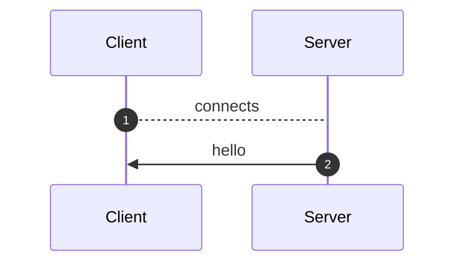
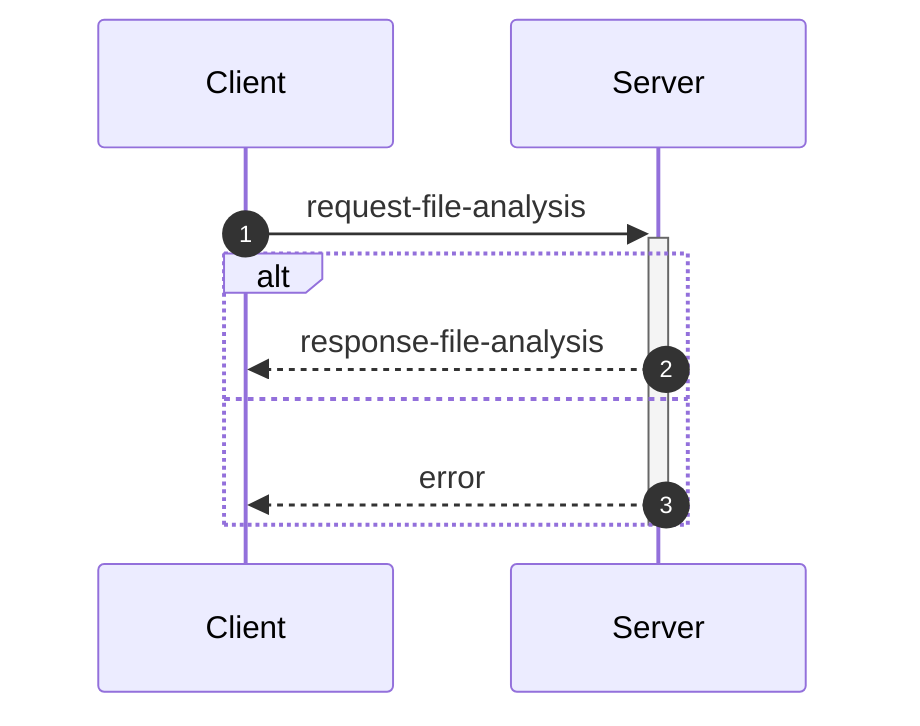
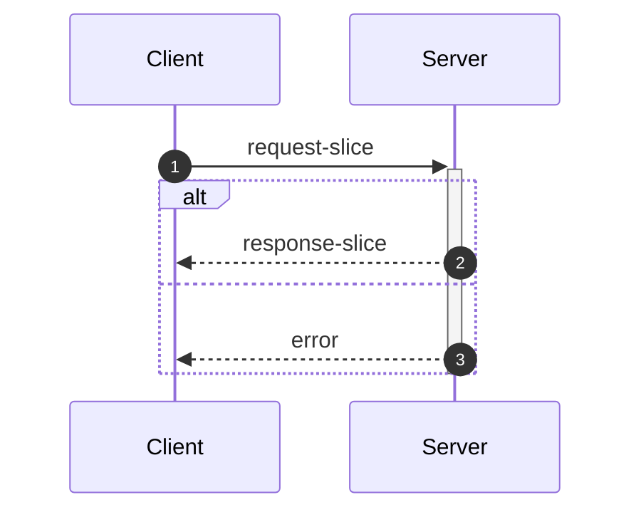
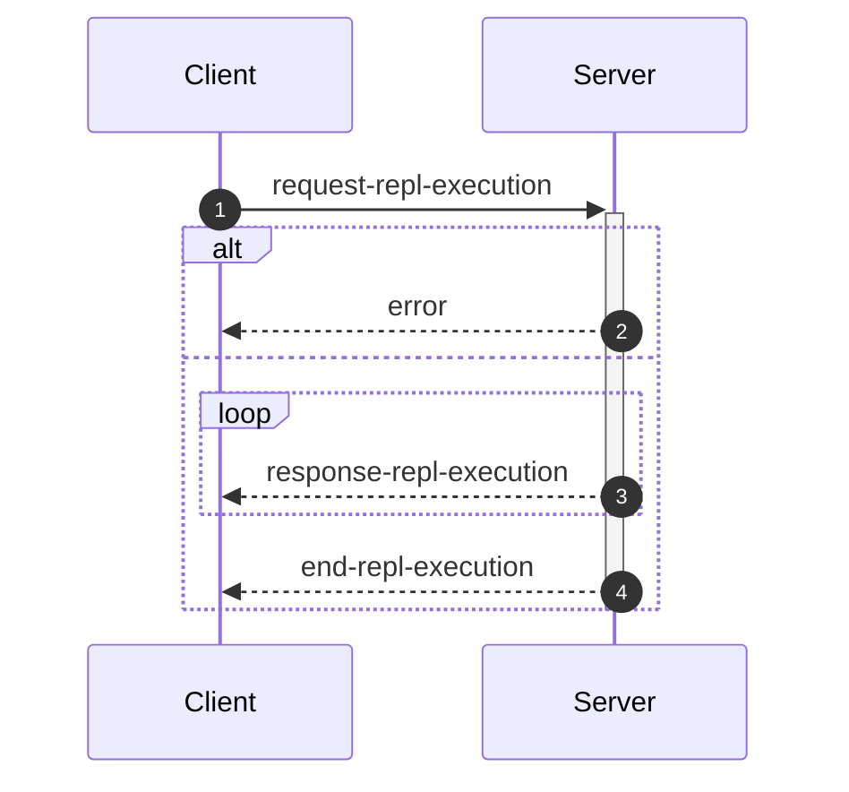

_This document was generated from '[src/documentation/wiki-interface.ts](https://github.com/flowr-analysis/flowr/tree/main//src/documentation/wiki-interface.ts)' on 2026-07-20, 18:03:11 UTC presenting an overview of flowR's interface (v2.12.3, using R v4.5.0). Please do not edit this file/wiki page directly._

Although far from being as detailed as the in-depth explanation of [_flowR_](https://github.com/flowr-analysis/flowr/wiki/core),
this wiki page explains how to interface with _flowR_ in more detail.
In general, command line arguments and other options provide short descriptions on hover over.

* [💻 Using the REPL](#using-the-repl)
* [⚙️ Configuring FlowR](#configuring-flowr)
* [⚒️ Writing Code](#writing-code)
* [💬 Communicating with the Server](#communicating-with-the-server)

<a id='using-the-repl'></a>
## 💻 Using the REPL


> [!NOTE]
> To execute arbitrary R commands with a repl request, _flowR_ has to be started explicitly with <span title="Description (Command Line Argument): Allow to access the underlying R session when using flowR (security warning: this allows the execution of arbitrary R code!)">`--r-session-access`</span>.
> Please be aware that this introduces a security risk and note that this relies on the [`r-shell` engine](https://github.com/flowr-analysis/flowr/wiki/engines) .

Although primarily meant for users to explore,
there is nothing which forbids simply calling _flowR_ as a subprocess to use standard-in, -output, and -error
for communication (although you can access the REPL using the server as well,
with the [REPL Request](#message-request-repl-execution) message).

The read-eval-print loop&nbsp;(REPL) works relatively simple.
You can submit an expression (using <kbd>Enter</kbd>),
which is interpreted as an R&nbsp;expression by default but interpreted as a *command* if it starts with a colon (`:`).
The best command to get started with the REPL is <span title="Description (Repl Command): Show help information (aliases: :h, :?)">`:help`</span>.
Besides, you can leave the REPL either with the command <span title="Description (Repl Command): End the repl (aliases: :q, :exit)">`:quit`</span> or by pressing <kbd>Ctrl</kbd>+<kbd>C</kbd> twice.
When writing a *command*, you may press <kbd>Tab</kbd> to get a list of completions, if available.
Multiple commands can be entered in a single line by separating them with a semicolon (`;`), e.g. `:parse "x<-2"; :df*`.
If a command is given without R code, the REPL will re-use R code given in a previous command.
The prior example will hence return first the parsed AST of the program and then the dataflow graph for `"x <- 2"`.

> [!NOTE]
> If you develop flowR, you may want to launch the repl using the `npm run main-dev` command, this way, you get a non-minified version of flowR with debug information and hot-reloading of source files.

<details>
<summary>Available Commands</summary>

We currently offer the following commands (this with a `[*]` suffix are available with and without the star):


| Command | Description |
| ------- | ----------- |
| **<span title="Description (Repl Command): End the repl (aliases: :q, :exit)">:quit</span>** | End the repl (aliases: **:<span title="Alias of ':quit'. End the repl">q</span>**, **:<span title="Alias of ':quit'. End the repl">exit</span>**) |
| **<span title="Description (Repl Command): Execute the given code as R code. This requires the `--r-session-access` flag to be set and requires the r-shell engine. (aliases: :e, :r)">:execute</span>** | Execute the given code as R code. This requires the `--r-session-access` flag to be set and requires the r-shell engine. (aliases: **:<span title="Alias of ':execute'. Execute the given code as R code. This requires the `--r-session-access` flag to be set and requires the r-shell engine.">e</span>**, **:<span title="Alias of ':execute'. Execute the given code as R code. This requires the `--r-session-access` flag to be set and requires the r-shell engine.">r</span>**) |
| **<span title="Description (Repl Command): Get mermaid code for the control-flow graph of R code (aliases: :cfg, :cf)">:controlflow[*]</span>** | Get mermaid code for the control-flow graph of R code (star: Returns the URL to mermaid.live) (aliases: **:<span title="Alias of ':controlflow'. Get mermaid code for the control-flow graph of R code">cfg</span>**, **:<span title="Alias of ':controlflow'. Get mermaid code for the control-flow graph of R code">cf</span>**) |
| **<span title="Description (Repl Command): Get mermaid code for the control-flow graph with basic blocks (aliases: :cfgb, :cfb)">:controlflowbb[*]</span>** | Get mermaid code for the control-flow graph with basic blocks (star: Returns the URL to mermaid.live) (aliases: **:<span title="Alias of ':controlflowbb'. Get mermaid code for the control-flow graph with basic blocks">cfgb</span>**, **:<span title="Alias of ':controlflowbb'. Get mermaid code for the control-flow graph with basic blocks">cfb</span>**) |
| **<span title="Description (Repl Command): Get mermaid code for the dataflow graph (aliases: :d, :df)">:dataflow[*]</span>** | Get mermaid code for the dataflow graph (star: Returns the URL to mermaid.live) (aliases: **:<span title="Alias of ':dataflow'. Get mermaid code for the dataflow graph">d</span>**, **:<span title="Alias of ':dataflow'. Get mermaid code for the dataflow graph">df</span>**) |
| **<span title="Description (Repl Command): Get mermaid code for the normalized AST of R code (aliases: :n)">:normalize[*]</span>** | Get mermaid code for the normalized AST of R code (star: Returns the URL to mermaid.live) (alias: **:<span title="Alias of ':normalize'. Get mermaid code for the normalized AST of R code">n</span>**) |
| **<span title="Description (Repl Command): Get mermaid code for the simplified dataflow graph (aliases: :ds, :dfs)">:dataflowsimple[*]</span>** | Get mermaid code for the simplified dataflow graph (star: Returns the URL to mermaid.live) (aliases: **:<span title="Alias of ':dataflowsimple'. Get mermaid code for the simplified dataflow graph">ds</span>**, **:<span title="Alias of ':dataflowsimple'. Get mermaid code for the simplified dataflow graph">dfs</span>**) |
| **<span title="Description (Repl Command): Inspect and extend the signature database: `query` (identical to :query @signature), `add <path>` to mount another database/source, `download` to fetch the full-history database. (aliases: :sig)">:signature</span>** | Inspect and extend the signature database: `query` (identical to :query @signature), `add <path>` to mount another database/source, `download` to fetch the full-history database. (alias: **:<span title="Alias of ':signature'. Inspect and extend the signature database: `query` (identical to :query @signature), `add <path>` to mount another database/source, `download` to fetch the full-history database.">sig</span>**) |
| **<span title="Description (Repl Command): Just calculates the DFG, but only prints summary info (aliases: :d#, :df#)">:dataflowsilent</span>** | Just calculates the DFG, but only prints summary info (aliases: **:<span title="Alias of ':dataflowsilent'. Just calculates the DFG, but only prints summary info">d#</span>**, **:<span title="Alias of ':dataflowsilent'. Just calculates the DFG, but only prints summary info">df#</span>**) |
| **<span title="Description (Repl Command): Prints ASCII Art of the parsed, unmodified AST (aliases: :p)">:parse</span>** | Prints ASCII Art of the parsed, unmodified AST (alias: **:<span title="Alias of ':parse'. Prints ASCII Art of the parsed, unmodified AST">p</span>**) |
| **<span title="Description (Repl Command): Prints the version of flowR as well as the current version of R">:version</span>** | Prints the version of flowR as well as the current version of R
| **<span title="Description (Repl Command): Query the given R code (use 'help' for more information)">:query[*]</span>** | Query the given R code (use 'help' for more information) (star: Similar to query, but returns the output in json format.)
| **<span title="Description (Repl Command): Returns an ASCII representation of the dataflow graph (aliases: :df!)">:dataflowascii</span>** | Returns an ASCII representation of the dataflow graph (alias: **:<span title="Alias of ':dataflowascii'. Returns an ASCII representation of the dataflow graph">df!</span>**) |
| **<span title="Description (Repl Command): Returns summarization stats for the normalized AST (aliases: :n#)">:normalize#</span>** | Returns summarization stats for the normalized AST (alias: **:<span title="Alias of ':normalize#'. Returns summarization stats for the normalized AST">n#</span>**) |
| **<span title="Description (Repl Command): Show help information (aliases: :h, :?)">:help</span>** | Show help information (aliases: **:<span title="Alias of ':help'. Show help information">h</span>**, **:<span title="Alias of ':help'. Show help information">?</span>**) |


</details>


> [!TIP]
> 
> As indicated by the examples before, all REPL commands that operate on code keep track of the state.
> Hence, if you run a command like <span title="Description (Repl Command, starred version): Returns the URL to mermaid.live; Base Command: Get mermaid code for the dataflow graph (aliases: :d*, :df*)">`:dataflow*`</span> without providing R code,
> the REPL will re-use the R code provided in a previous command.
> Likewise, doing this will benefit from incrementality!
> If you request the dataflow graph with `:df* x <- 2 * y` and then want to see the parsed AST with `:parse`,
> the REPL will re-use previously obtained information and not re-parse the code again.
> 		


Generally, many commands offer shortcut versions in the REPL. Many queries, for example, offer a shortened format (see the example below).
Of special note, the [Config Query](https://github.com/flowr-analysis/flowr/wiki/%5BQuery%5D-Config)
can be used to also modify the currently active configuration of _flowR_ within the REPL (see the [wiki page](https://github.com/flowr-analysis/flowr/wiki/%5BQuery%5D-Config) for more information).

### Example: Retrieving the Dataflow Graph

To retrieve a URL to the [mermaid](https://mermaid.js.org/) diagram of the dataflow of a given expression,
use <span title="Description (Repl Command, starred version): Returns the URL to mermaid.live; Base Command: Get mermaid code for the dataflow graph (aliases: :d*, :df*)">`:dataflow*`</span> (or <span title="Description (Repl Command): Get mermaid code for the dataflow graph (aliases: :d, :df)">`:dataflow`</span> to get the mermaid code in the cli):


```shell
$ docker run -it --rm eagleoutice/flowr # or npm run flowr 
flowR repl v2.12.3, R grammar v14 (tree-sitter engine)
R> :dataflow* y <- 1 + x
```

<details>
<summary style='color:gray'>Output</summary>


```text
https://mermaid.live/view#base64:eyJjb2RlIjoiZmxvd2NoYXJ0IEJUXG4gICAgMXt7XCJgKiM5MTtSTnVtYmVyIzkzOyogKioxKipcbiAgICAgICoxLjYqICgqKmlkOiAxKiopYFwifX1cbiAgICUlIE5vIGVkZ2VzIGZvdW5kIGZvciAxXG4gICAgMihbXCJgKiM5MTtSU3ltYm9sIzkzOyogKip4KipcbiAgICAgICoxLjEwKiAoKippZDogMioqKWBcIl0pXG4gICAlJSBObyBlZGdlcyBmb3VuZCBmb3IgMlxuICAgIDNbW1wiYCojOTE7UkJpbmFyeU9wIzkzOyogYmFzZSM1ODsjNTg7KiojNDM7KipcbiAgICAgICoxLjYtMTAqICgqKmlkOiAzKiopXG4gICAgYXJnOiAoMSwgMilgXCJdXVxuICAgIGJ1aWx0LWluOl9bXCJgQnVpbHQtSW46XG4jNDM7YFwiXVxuICAgIHN0eWxlIGJ1aWx0LWluOl8gc3Ryb2tlOmdyYXksZmlsbDpncmF5LHN0cm9rZS13aWR0aDoycHgsb3BhY2l0eTouODtcbiAgICAwW1wiYCojOTE7UlN5bWJvbCM5MzsqICoqeSoqXG4gICAgICAqMS4xKiAoKippZDogMCoqLCB2OiAzKWBcIl1cbiAgICA0W1tcImAqIzkxO1JCaW5hcnlPcCM5MzsqIGJhc2UjNTg7IzU4OyoqIzYwOyM0NTsqKlxuICAgICAgKjEuMS0xMCogKCoqaWQ6IDQqKilcbiAgICBhcmc6ICgwLCAzKWBcIl1dXG4gICAgYnVpbHQtaW46Xy1bXCJgQnVpbHQtSW46XG4jNjA7IzQ1O2BcIl1cbiAgICBzdHlsZSBidWlsdC1pbjpfLSBzdHJva2U6Z3JheSxmaWxsOmdyYXksc3Ryb2tlLXdpZHRoOjJweCxvcGFjaXR5Oi44O1xuICAgIDMgLS0+fFwicmVhZHMsIGFyZ1wifCAxXG4gICAgMyAtLT58XCJyZWFkcywgYXJnXCJ8IDJcbiAgICAzIC0uLT58XCJyZWFkcywgY2FsbHNcInwgYnVpbHQtaW46X1xuICAgIGxpbmtTdHlsZSAyIHN0cm9rZTpncmF5O1xuICAgIDAgLS0+fFwiZGVmaW5lZC1ieVwifCAzXG4gICAgMCAtLT58XCJkZWZpbmVkLWJ5XCJ8IDRcbiAgICA0IC0tPnxcInJlYWRzLCBhcmdcInwgM1xuICAgIDQgLS0+fFwicmV0dXJucywgYXJnXCJ8IDBcbiAgICA0IC0uLT58XCJyZWFkcywgY2FsbHNcInwgYnVpbHQtaW46Xy1cbiAgICBsaW5rU3R5bGUgNyBzdHJva2U6Z3JheTsiLCJtZXJtYWlkIjp7ImF1dG9TeW5jIjp0cnVlfX0=
```


Retrieve the dataflow graph of the expression `y <- 1 + x`. It looks like this:


```mermaid
flowchart LR
    1{{"`*#91;RNumber#93;* **1**
      *1.6* (**id: 1**)`"}}
   %% No edges found for 1
    2(["`*#91;RSymbol#93;* **x**
      *1.10* (**id: 2**)`"])
   %% No edges found for 2
    3[["`*#91;RBinaryOp#93;* base#58;#58;**#43;**
      *1.6-10* (**id: 3**)
    arg: (1, 2)`"]]
    built-in:_["`Built-In:
#43;`"]
    style built-in:_ stroke:gray,fill:gray,stroke-width:2px,opacity:.8;
    0["`*#91;RSymbol#93;* **y**
      *1.1* (**id: 0**, v: 3)`"]
    4[["`*#91;RBinaryOp#93;* base#58;#58;**#60;#45;**
      *1.1-10* (**id: 4**)
    arg: (0, 3)`"]]
    built-in:_-["`Built-In:
#60;#45;`"]
    style built-in:_- stroke:gray,fill:gray,stroke-width:2px,opacity:.8;
    3 -->|"reads, arg"| 1
    3 -->|"reads, arg"| 2
    3 -.->|"reads, calls"| built-in:_
    linkStyle 2 stroke:gray;
    0 -->|"defined-by"| 3
    0 -->|"defined-by"| 4
    4 -->|"reads, arg"| 3
    4 -->|"returns, arg"| 0
    4 -.->|"reads, calls"| built-in:_-
    linkStyle 7 stroke:gray;
```

	
<details>

<summary style="color:gray">R Code of the Dataflow Graph</summary>

The analysis required _0.7 ms_ (including parse and normalize, using the [tree-sitter](https://github.com/flowr-analysis/flowr/wiki/Engines) engine) within the generation environment. No [signature database](https://github.com/flowr-analysis/flowr/wiki/Signature-Database) is mounted for these generated graphs, so `library()` calls attach no package exports; base-R names are still qualified via the generated base-package store (e.g. `acf` as `stats::acf`). 
We encountered no unknown side effects during the analysis.


```r
y <- 1 + x
```


</details>


</details>


For small graphs like this, <span title="Description (Repl Command): Returns an ASCII representation of the dataflow graph (aliases: :df!)">`:dataflowascii`</span> also provides an ASCII representation directly in the REPL:


```shell
$ docker run -it --rm eagleoutice/flowr # or npm run flowr 
flowR repl v2.12.3, R grammar v14 (tree-sitter engine)
R> :df! y <- 1 + x
```

<details open>
<summary style='color:gray'>Output</summary>


```text
                        0<1>0
                   ┌────| 1 |
    ┌────────┐     │    0---0
 c<4>c       └──c<3>c
 |<- |  v<0>v┌──| + |
 c---c──| y |┘  c---c   u<2>u
        v---v      └────| x |
                        u---u
Edges:
3 -> 1: reads, arg  3 -> 2: reads, arg
4 -> 3: reads, arg  4 -> 0: returns, arg
0 -> 3: defined-by  0 -> 4: defined-by
```


Retrieve the dataflow graph of the expression `y <- 1 + x` as ASCII art.

</details>


For the slicing with <span title="Description (Repl Command): Static backwards executable slicer for R">`:slicer`</span>, you have access to the same [magic comments](#slice-magic-comments) as with the [slice request](#message-request-slice).
Pass `--inline` to splice resolvable `source()` calls into the reconstruction so the slice is a single self-contained R text (the same as the static slice query's `inlineSources` flag).
See `--help` for more flags!

### Example: Interfacing with the File System

Many commands that allow for an R-expression (like <span title="Description (Repl Command, starred version): Returns the URL to mermaid.live; Base Command: Get mermaid code for the dataflow graph (aliases: :d*, :df*)">`:dataflow*`</span>) allow for a file as well
if the argument starts with `file://`.
If you are working from the root directory of the _flowR_ repository, the following gives you the parsed AST of the example file using the <span title="Description (Repl Command): Prints ASCII Art of the parsed, unmodified AST (aliases: :p)">`:parse`</span> command:

> **Watch mode**: Replace `file://` with `watch://` to enter watch mode.
> flowR runs the command immediately and then re-runs it every time the file (or any file inside the folder) changes.
> Enter any other command to leave watch mode.
> For example: `:df watch://analysis.R`


```shell
$ docker run -it --rm eagleoutice/flowr # or npm run flowr 
flowR repl v2.12.3, R grammar v14 (tree-sitter engine)
R> :parse file://test/testfiles/example.R
```

<details>
<summary style='color:gray'>Output</summary>


```text
File: test/testfiles/example.R

program
├ binaryoperator
│ ├ identifier "sum" (1:1─4)
│ ├ <- "<-" (1:5─7)
│ ╰ float "0" (1:8─9)
├ binaryoperator
│ ├ identifier "product" (2:1─8)
│ ├ <- "<-" (2:9─11)
│ ╰ float "1" (2:12─13)
├ binaryoperator
│ ├ identifier "w" (3:1─2)
│ ├ <- "<-" (3:3─5)
│ ╰ float "7" (3:6─7)
├ binaryoperator
│ ├ identifier "N" (4:1─2)
│ ├ <- "<-" (4:3─5)
│ ╰ float "10" (4:6─8)
├ forstatement
│ ├ for "for" (6:1─4)
│ ├ ( "(" (6:5─6)
│ ├ identifier "i" (6:6─7)
│ ├ in "in" (6:8─10)
│ ├ binaryoperator
│ │ ├ float "1" (6:11─12)
│ │ ├ : ":" (6:12─13)
│ │ ╰ parenthesizedexpression
│ │   ├ ( "(" (6:13─14)
│ │   ├ binaryoperator
│ │   │ ├ identifier "N" (6:14─15)
│ │   │ ├ - "-" (6:15─16)
│ │   │ ╰ float "1" (6:16─17)
│ │   ╰ ) ")" (6:17─18)
│ ├ ) ")" (6:18─19)
│ ╰ bracedexpression
│   ├ { "{" (6:20─21)
│   ├ binaryoperator
│   │ ├ identifier "sum" (7:3─6)
│   │ ├ <- "<-" (7:7─9)
│   │ ╰ binaryoperator
│   │   ├ binaryoperator
│   │   │ ├ identifier "sum" (7:10─13)
│   │   │ ├ + "+" (7:14─15)
│   │   │ ╰ identifier "i" (7:16─17)
│   │   ├ + "+" (7:18─19)
│   │   ╰ identifier "w" (7:20─21)
│   ├ binaryoperator
│   │ ├ identifier "product" (8:3─10)
│   │ ├ <- "<-" (8:11─13)
│   │ ╰ binaryoperator
│   │   ├ identifier "product" (8:14─21)
│   │   ├  "" (8:22─23)
│   │   ╰ identifier "i" (8:24─25)
│   ╰ } "}" (9:1─2)
├ call
│ ├ identifier "cat" (11:1─4)
│ ╰ arguments
│   ├ ( "(" (11:4─5)
│   ├ argument
│   │ ╰ string
│   │   ├ " "\"" (11:5─6)
│   │   ├ stringcontent "Sum:" (11:6─10)
│   │   ╰ " "\"" (11:10─11)
│   ├ comma "," (11:11─12)
│   ├ argument
│   │ ╰ identifier "sum" (11:13─16)
│   ├ comma "," (11:16─17)
│   ├ argument
│   │ ╰ string
│   │   ├ " "\"" (11:18─19)
│   │   ├ stringcontent
│   │   │ ╰ escapesequence "\\n" (11:19─21)
│   │   ╰ " "\"" (11:21─22)
│   ╰ ) ")" (11:22─23)
╰ call
  ├ identifier "cat" (12:1─4)
  ╰ arguments
    ├ ( "(" (12:4─5)
    ├ argument
    │ ╰ string
    │   ├ " "\"" (12:5─6)
    │   ├ stringcontent "Product:" (12:6─14)
    │   ╰ " "\"" (12:14─15)
    ├ comma "," (12:15─16)
    ├ argument
    │ ╰ identifier "product" (12:17─24)
    ├ comma "," (12:24─25)
    ├ argument
    │ ╰ string
    │   ├ " "\"" (12:26─27)
    │   ├ stringcontent
    │   │ ╰ escapesequence "\\n" (12:27─29)
    │   ╰ " "\"" (12:29─30)
    ╰ ) ")" (12:30─31)
```


Retrieve the parsed AST of the example file.

<details>

<summary>File Content</summary>


```r
sum <- 0
product <- 1
w <- 7
N <- 10

for (i in 1:(N-1)) {
  sum <- sum + i + w
  product <- product * i
}

cat("Sum:", sum, "\n")
cat("Product:", product, "\n")
```


</details>

As _flowR_ directly transforms this AST the output focuses on being human-readable instead of being machine-readable.
		

</details>


### Example: Run a Query

You can run any query supported by _flowR_ using the <span title="Description (Repl Command): Query the given R code (use 'help' for more information)">`:query`</span> command.
For example, to obtain the shapes of all data frames in a given piece of code, you can run:


```shell
$ docker run -it --rm eagleoutice/flowr # or npm run flowr 
flowR repl v2.12.3, R grammar v14 (tree-sitter engine)
R> :query @absint df-shape "x <- data.frame(a = 1:10, b = 1:10)\ny <- x$a"
```

<details open>
<summary style='color:gray'>Output</summary>


```text
Query: absint (1 ms)
   ╰ $12: (colnames: [{"a", "b"}, {}], cols: [2, 2], rows: [10, 10])
   ╰ $0: (colnames: [{"a", "b"}, {}], cols: [2, 2], rows: [10, 10])
All queries together required ≈5 ms (1ms accuracy, total 5 ms)
```


Retrieve the shapes of all data frames in the given code.

</details>


To run the linter on a file, you can use (in this example, we just issue the `dead-code` linter on a small piece of code):


```shell
$ docker run -it --rm eagleoutice/flowr # or npm run flowr 
flowR repl v2.12.3, R grammar v14 (tree-sitter engine)
R> :query @linter rules:dead-code "if(FALSE) x <- 2"
```

<details open>
<summary style='color:gray'>Output</summary>


```text
Query: linter (3 ms)
   ╰ Dead Code (dead-code):
       ╰ certain:
           ╰ Code at 1.11-16
       ╰ Metadata: searchTimeMs: 3, processTimeMs: 0
All queries together required ≈3 ms (1ms accuracy, total 3 ms)
```


Run the linter on the given code, with only the `dead-code` rule enabled.

</details>


For more information on the available queries, please check out the [Query API](https://github.com/flowr-analysis/flowr/wiki/query-api).


<a id='configuring-flowr'></a>
## ⚙️ Configuring FlowR


When running _flowR_, you may want to specify some behaviors with a dedicated configuration file.
By default, flowR looks for a file named `flowr.json` in the current working directory (or any higher directory).
You can also specify a different file with <span title="Description (Command Line Argument): The name of the configuration file to use">`--config-file`</span> or pass the configuration inline using <span title="Description (Command Line Argument): The flowR configuration to use, as a JSON string">`--config-json`</span>.
To inspect the current configuration, you can run flowr with the <span title="Description (Command Line Argument): Run with verbose logging (will be passed to the corresponding script)">`--verbose`</span> flag, or use the `config` [Query](https://github.com/flowr-analysis/flowr/wiki/query-api).
Within the REPL this works by running the following:


```shell
:query @config
```


To work with the <a href="https://github.com/flowr-analysis/flowr/tree/main/src/config.ts#L129"><code><span title="The configuration file format for flowR.">FlowrConfig</span></code></a> you can use the provided helper objects alongside its methods like
<a href="https://github.com/flowr-analysis/flowr/tree/main/src/config.ts#L714"><code><span title="Creates a new flowr config that has the updated values.">FlowrConfig::<b>amend</b></span></code></a>.
The schema below documents every option; the ones you most likely want are:

- <a href="https://github.com/flowr-analysis/flowr/wiki/Interface#configuring-flowr" title="Configuration Option (boolean): Whether source calls should be ignored, causing {@link processSourceCall}&#39;s behavior to be skipped.">ignoreSourceCalls</a>: ignore source calls when analyzing the code, i.e., ignore the inclusion of other files.
- <a href="https://github.com/flowr-analysis/flowr/wiki/Interface#configuring-flowr" title="Configuration Option (boolean): Whether load calls should be ignored, causing {@link processLoadCall}&#39;s behavior to be skipped.">ignoreLoadCalls</a>: ignore load calls when analyzing the code, i.e., ignore the loading of r-data files.
- <a href="https://github.com/flowr-analysis/flowr/wiki/Interface#configuring-flowr" title="Configuration Option (object): Do you want to overwrite (parts) of the builtin definition?">semantics.environment.overwriteBuiltIns</a>: overwrite _flowR_'s handling of built-in functions, or clear the preset definitions entirely.
  See [Configure BuiltIn Semantics](#configure-builtin-semantics) for more information.
- <a href="https://github.com/flowr-analysis/flowr/wiki/Interface#configuring-flowr" title="Configuration Option (string): How to resolve variables and their values. (one of &quot;disabled&quot;, &quot;alias&quot;, &quot;builtin&quot;)">solver.variables</a>: how to resolve variables and their values (`disabled`, `alias`, `builtin`).
- <a href="https://github.com/flowr-analysis/flowr/wiki/Interface#configuring-flowr" title="Configuration Option (array): The engine or set of engines to use for interacting with R code. An empty array means all available engines will be used.">engines</a> and <a href="https://github.com/flowr-analysis/flowr/wiki/Interface#configuring-flowr" title="Configuration Option (string): The default engine to use for interacting with R code. If this is undefined, an arbitrary engine from the specified list will be used. (one of &quot;tree-sitter&quot;, &quot;r-shell&quot;)">defaultEngine</a>: the engines used to interact with R code, see the [Engines wiki page](https://github.com/flowr-analysis/flowr/wiki/engines).
- <a href="https://github.com/flowr-analysis/flowr/wiki/Interface#configuring-flowr" title="Configuration Option (array): Files a framework loads on its own, without any source() call (e.g. global.R in a shiny app), in the order they are loaded; flowR orders the matching project files accordingly and analyzes them as one program. Entries are case-insensitive globs matched against the file path, a plain name matches any file with that name, and entries matching no project file are warned about. Usually set per project kind via specializeConfig.">project.implicitSources</a>: the files a framework loads without any `source()` call, in the order in which they are
  loaded. Entries are globs (e.g. `R/*.R`) matched against the file path ignoring capitalization; one matching no file is reported.
- <a href="https://github.com/flowr-analysis/flowr/wiki/Interface#configuring-flowr" title="Configuration Option (object): Overwrite (parts of) the configuration depending on the project kind flowR detects, e.g. to give a shiny app its implicit sources.">specializeConfig</a>: overwrite (parts of) the configuration depending on the kind of project _flowR_ detects
  (e.g. `shiny-app`), which is how a shiny app gets its implicit sources by default. What you configure directly wins.
- <a href="https://github.com/flowr-analysis/flowr/wiki/Interface#configuring-flowr" title="Configuration Option (array): The default plugins to load when creating a new instance of FlowrAnalyzer">defaultPlugins</a> and <a href="https://github.com/flowr-analysis/flowr/wiki/Interface#configuring-flowr" title="Configuration Option (array): The plugins to load in REPL mode">repl.plugins</a>: the plugins to load for a new <a href="https://github.com/flowr-analysis/flowr/tree/main/src/project/flowr-analyzer.ts#L165"><code><span title="Central class for conducting analyses with FlowR. Use the FlowrAnalyzerBuilder to create a new instance. If you want the original pattern of creating a pipeline and running all steps, you can still do this with FlowrAnalyzer#runFull . To inspect the context of the analyzer, use FlowrAnalyzer#inspectContext (if you are a plugin and need to modify it, use FlowrAnalyzer#context instead).">FlowrAnalyzer</span></code></a> and in the REPL
  (use `flowr:default` to reference the former).

So you can configure _flowR_ by adding a file like the following:

<details>

<summary>Example Configuration File</summary>


```json
{
  "ignoreSourceCalls": true,
  "ignoreLoadCalls": true,
  "semantics": {
    "environment": {
      "overwriteBuiltIns": {
        "definitions": [
          {
            "type": "function",
            "names": [
              "foo"
            ],
            "processor": "builtin:assign",
            "config": {}
          }
        ]
      }
    }
  },
  "defaultPlugins": [
    "file:description",
    "versions:description"
  ],
  "repl": {
    "quickStats": false,
    "dfProcessorHeat": false,
    "hints": true,
    "plugins": [
      "flowr:default"
    ]
  },
  "project": {
    "resolveUnknownPathsOnDisk": true,
    "implicitSources": [
      "global.R",
      "app.R"
    ]
  },
  "linter": {
    "disabledRules": []
  },
  "specializeConfig": {
    "shiny-app": {
      "project": {
        "implicitSources": [
          "global.R",
          "ui.R",
          "server.R",
          "app.R"
        ]
      }
    }
  },
  "engines": [
    {
      "type": "r-shell"
    }
  ],
  "solver": {
    "variables": "alias",
    "evalStrings": true,
    "trackEnvironments": true,
    "sigdb": {
      "enabled": true,
      "loadProjectDependencies": true,
      "eagerlyLoad": false,
      "eagerlyLoadExports": false,
      "linkBaseR": false,
      "linkDescriptionDependencies": false
    },
    "resolveSource": {
      "dropPaths": "no",
      "ignoreCapitalization": true,
      "inferWorkingDirectory": "active-script",
      "searchPath": []
    },
    "instrument": {},
    "slicer": {
      "threshold": 50
    }
  },
  "abstractInterpretation": {
    "wideningThreshold": 4,
    "dataFrame": {
      "maxColNames": 20,
      "readLoadedData": {
        "readExternalFiles": true,
        "maxReadLines": 1000000
      }
    }
  },
  "gas": {
    "thresholds": {
      "memory": {
        "problematic": 0.7,
        "critical": 0.9
      },
      "timeMs": {
        "problematic": 100000,
        "critical": 120000
      }
    },
    "features": {}
  }
}
```


</details>

<details>
<a id='configure-builtin-semantics'></a>
<summary>Configure Built-In Semantics</summary>


`semantics/environment/overwriteBuiltins` accepts two keys:

- `loadDefaults` (boolean, initially `true`): If set to `true`, the default built-in definitions are loaded before applying the custom definitions. Setting this flag to `false` explicitly disables the loading of the default definitions.
- `definitions` (array, initially empty): Allows to overwrite or define new built-in elements. Each object within must have a `type` which is one of the below. Furthermore, they may define a string array of `names` which specifies the identifiers to bind the definitions to. You may use `assumePrimitive` to specify whether _flowR_ should assume that this is a primitive non-library definition (so you probably just do not want to specify the key).

  | Type            | Description                                                                                                                                                                                                                                                                                              | Example                                                                                                    |
  | --------------- | -------------------------------------------------------------------------------------------------------------------------------------------------------------------------------------------------------------------------------------------------------------------------------------------------------- | ---------------------------------------------------------------------------------------------------------- |
  | `constant`    | Additionally allows for a `value` this should resolve to.                                                                                                                                                                                                                                                | `{ type: 'constant', names: ['NULL', 'NA'],  value: null }`                                                |
  | `function`    | Is a rather flexible way to define and bind built-in functions. For the time, we do not have extensive documentation to cover all the cases, so please either consult the sources with the `default-builtin-config.ts` or open a [new issue](https://github.com/flowr-analysis/flowr/issues/new/choose). | `{ type: 'function', names: ['next'], processor: 'builtin:d', config: { cfg: ExitPointType.Next } }` |
  | `replacement` | A comfortable way to specify replacement functions like `$<-` or `names<-`. `suffixes` describes the... suffixes to attach automatically. | `{ type: 'replacement', suffixes: ['<-', '<<-'], names: ['[', '[['] }` |


</details>

<details>

<summary style='color:gray'>Full Configuration-File Schema</summary>

- _The configuration file format for flowR._ (object)
    - **logLevel** [optional] _flowR's global minimum log level, applied when the config is loaded._ (string)
        Only allows: 'silly', 'trace', 'debug', 'info', 'warn', 'error', 'fatal'
    - **ignoreSourceCalls** [optional] _Whether source calls should be ignored, causing {@link processSourceCall}'s behavior to be skipped._ (boolean)
    - **ignoreLoadCalls** [optional] _Whether load calls should be ignored, causing {@link processLoadCall}'s behavior to be skipped._ (boolean)
    - **semantics** _Configure language semantics and how flowR handles them._ (object)
        - **environment** [optional] _Semantics regarding how to handle the R environment._ (object)
            - **overwriteBuiltIns** [optional] _Do you want to overwrite (parts) of the builtin definition?_ (object)
                - **loadDefaults** [optional] _Should the default configuration still be loaded?_ (boolean)
                - **definitions** [optional] _The definitions to load/overwrite._ (array)
                Valid item types:
                    - (object)
    - **defaultPlugins** [optional] _The default plugins to load when creating a new instance of FlowrAnalyzer_ (array)
    Valid item types:
        - (alternatives)
            - (string)
            - (array)
    - **repl** _Configuration options for the REPL._ (object)
        - **quickStats** [optional] _Whether to show quick stats in the REPL after each evaluation._ (boolean)
        - **dfProcessorHeat** [optional] _This instruments the dataflow processors to count how often each processor is called._ (boolean)
        - **hints** [optional] _Whether to show dim inline hints on the empty prompt (automatically disabled on non-interactive terminals)._ (boolean)
        - **plugins** [optional] _The plugins to load in REPL mode_ (array)
        Valid item types:
            - (alternatives)
                - (string)
                - (array)
        - **autoUseFileProtocol** [optional] _Prepend the file protocol to a repl input that looks like a path, instead of only warning about it._ (boolean)
        - **queryStats** [optional] _Whether `:query` closes with the line stating how long the queries took (`:query*` never prints it)._ (boolean)
        - **showPlugins** [optional] _Whether `:version` grays out the plugins that did not activate during the last analysis._ (boolean)
    - **project** _Project specific configuration options._ (object)
        - **resolveUnknownPathsOnDisk** [optional] _Whether to resolve unknown paths loaded by the r project disk when trying to source/analyze files._ (boolean)
        - **basePackages** [optional] _The packages considered part of R itself (base and recommended); if unset, flowR uses its built-in list._ (array)
        Valid item types:
            - (string)
        - **implicitSources** [optional] _Files a framework loads on its own, without any source() call (e.g. global.R in a shiny app), in the order they are loaded; flowR orders the matching project files accordingly and analyzes them as one program. Entries are case-insensitive globs matched against the file path, a plain name matches any file with that name, and entries matching no project file are warned about. Usually set per project kind via specializeConfig._ (array)
        Valid item types:
            - (string)
    - **linter** _Linter configuration options._ (object)
        - **disabledRules** _Linting rule names excluded from the default rule set (a rule requested explicitly via a linter query still runs). Usually set per project kind via specializeConfig._ (array)
        Valid item types:
            - (string)
    - **specializeConfig** [optional] _Overwrite (parts of) the configuration depending on the project kind flowR detects, e.g. to give a shiny app its implicit sources._ (object)
    - **engines** _The engine or set of engines to use for interacting with R code. An empty array means all available engines will be used._ (array)
    Valid item types:
        - (alternatives)
            - _The configuration for the tree sitter engine._ (object)
                - **type** [required] _Use the tree sitter engine._ (string)
                    Only allows: 'tree-sitter'
                - **wasmPath** [optional] _The path to the tree-sitter-r WASM binary to use. If this is undefined, this uses the default path._ (string)
                - **treeSitterWasmPath** [optional] _The path to the tree-sitter WASM binary to use. If this is undefined, this uses the default path._ (string)
                - **lax** [optional] _Whether to use the lax parser for parsing R code (allowing for syntax errors). If this is undefined, the strict parser will be used._ (boolean)
            - _The configuration for the R shell engine._ (object)
                - **type** [required] _Use the R shell engine._ (string)
                    Only allows: 'r-shell'
                - **rPath** [optional] _The path to the R executable to use. If this is undefined, this uses the default path._ (string)
    - **defaultEngine** [optional] _The default engine to use for interacting with R code. If this is undefined, an arbitrary engine from the specified list will be used._ (string)
        Only allows: 'tree-sitter', 'r-shell'
    - **solver** _How to resolve constants, constraints, cells, ..._ (object)
        - **variables** _How to resolve variables and their values._ (string)
            Only allows: 'disabled', 'alias', 'builtin'
        - **evalStrings** _Should we include eval(parse(text="...")) calls in the dataflow graph?_ (boolean)
        - **trackEnvironments** [optional] _Track user-created environments (new.env, assign/get/local with envir=, dollar-assign, attach). When false, all envir-style calls fall through conservatively._ (boolean)
        - **sigdb** _Resolving library exports from a signature database._ (object)
            - **enabled** [optional] _Resolve library()/use() exports from a signature database (default true); when false no database is consulted._ (boolean)
            - **loadProjectDependencies** [optional] _Load the project's declared dependencies from its metadata files (DESCRIPTION Imports/Depends, rproject.toml, renv.lock, rv.lock) (default true); when false these files are not read for dependencies._ (boolean)
            - **eagerlyLoad** [optional] _Parse the database up front rather than on the first package load (default false, ignored if disabled)._ (boolean)
            - **eagerlyLoadExports** [optional] _Add a vertex for every export on load rather than on demand (default false); keeps the dataflow graph small._ (boolean)
            - **assumedRVersion** [optional] _R version assumed when resolving versioned (base-R) exports: a pin like "4.5" or "auto" to detect the installed R (default "auto")._ (string)
            - **linkBaseR** [optional] _Eagerly attach base-R namespaces so bare base calls resolve without library() (default false)._ (boolean)
            - **linkBaseRCalls** [optional] _Add a lightweight Reads edge from a bare base-R call to its signature-database function vertex (default false; base-R qualification is edge-free otherwise)._ (boolean)
            - **linkPackageCalls** [optional] _Add a lightweight Reads edge from a resolved package call to its signature-database function vertex (default false)._ (boolean)
            - **linkDescriptionDependencies** [optional] _Eagerly attach the namespaces of the project's declared DESCRIPTION dependencies (Imports/Depends) so their exports resolve without an explicit library() (default false)._ (boolean)
            - **warmInBackground** [optional] _Decompress the hot shards (base + most-downloaded) in a background task on startup so the first library() lookup is warm (default false; for long-running servers/REPLs)._ (boolean)
            - **additionalPaths** [optional] _Extra directories or bundle/manifest files searched for signature databases (alongside the shipped default and $FLOWR_SIGDB_DIR); a downloaded full-history bundle placed here is mounted automatically._ (array)
            Valid item types:
                - (string)
            - **downloadRepo** [optional] _GitHub owner/repo the full-history bundle is downloaded from via ":signature download" (default "flowr-analysis/flowr", release tag "sigdb-v<flowR-version>")._ (string)
            - **autoSync** [optional] _On startup, re-download shards whose committed sigdb.remote.json hash no longer matches the cache, in the background (default false; opt-in network sync after a git pull)._ (boolean)
            - **versionSelection** [optional] _When a project constrains a dependency, resolve to the newest (default), oldest, or system-installed version satisfying it; system needs R and falls back to newest. Base-R packages always resolve against the assumed R version._ (string)
                Only allows: 'newest', 'oldest', 'system'
            - **versionOverrides** [optional] _Force an exact version for specific packages (name -> version), overriding both the project constraint and the versionSelection policy (default {})._ (object)
        - **versionManagement** _Policies for reasoning about dependency versions._ (object)
            - **linkedVersionGroups** [optional] _Groups of packages that must resolve to the same version; version guessing intersects each group so its members stay mutually compatible (default [])._ (array)
            Valid item types:
                - (array)
                Valid item types:
                    - (string)
        - **instrument** (object)
            - **dataflowExtractors** [optional] _These keys are only intended for use within code, allowing to instrument the dataflow analyzer!_ (any)
        - **resolveSource** [optional] _If lax source calls are active, flowR searches for sourced files much more freely, based on the configurations you give it. This option is only in effect if `ignoreSourceCalls` is set to false._ (object)
            - **dropPaths** _Allow to drop the first or all parts of the sourced path, if it is relative._ (string)
                Only allows: 'no', 'once', 'all'
            - **ignoreCapitalization** _Search for filenames matching in the lowercase._ (boolean)
            - **inferWorkingDirectory** _Try to infer the working directory from the main or any script to analyze._ (string)
                Only allows: 'no', 'main-script', 'active-script', 'any-script'
            - **searchPath** _Additionally search in these paths._ (array)
            Valid item types:
                - (string)
            - **repeatedSourceLimit** [optional] _How often the same file can be sourced within a single run? Please be aware: in case of cyclic sources this may not reach a fixpoint so give this a sensible limit._ (number)
            - **applyReplacements** _Provide name replacements for loaded files_ (array)
            Valid item types:
                - (object)
            - **assumeFilesExist** [optional] _Assume a sourced file is always there, making what it defines certain instead of conditional on the source call._ (boolean)
        - **slicer** [optional] _The configuration for the slicer._ (object)
            - **threshold** [optional] _The maximum number of iterations to perform on a single function call during slicing._ (number)
            - **autoExtend** [optional] _If set, the slicer will gain an additional post-pass._ (boolean)
    - **abstractInterpretation** _The configuration options for abstract interpretation._ (object)
        - **wideningThreshold** _The threshold for the number of visitations of a node at which widening should be performed to ensure the termination of the fixpoint iteration._ (number)
        - **dataFrame** _The configuration of the shape inference for data frames._ (object)
            - **maxColNames** _The maximum number of columns names to infer for data frames before over-approximating the column names to top._ (number)
            - **readLoadedData** _Configuration options for reading data frame shapes from loaded external data files, such as CSV files._ (object)
                - **readExternalFiles** _Whether data frame shapes should be extracted from loaded external files, such as CSV files._ (boolean)
                - **maxReadLines** _The maximum number of lines to read when extracting data frame shapes from loaded files, such as CSV files._ (number)
    - **gas** [optional] _Resource-usage guard (gas) configuration. All feature factors default to 0 (disabled). See https://github.com/flowr-analysis/flowr/wiki/Core#gas-resource-guard._ (object)
        - **thresholds** [optional] _Shared thresholds for all gas checks (scaled by per-feature factor)._ (object)
            - **memory** [optional] _Heap-usage fraction thresholds (0-1)._ (object)
                - **problematic** [optional] _Heap fraction (0-1) above which Problematic is returned._ (number)
                - **critical** [optional] _Heap fraction (0-1) above which Critical is returned._ (number)
            - **timeMs** [optional] _Elapsed analysis time thresholds in milliseconds._ (object)
                - **problematic** [optional] _Elapsed ms above which Problematic is returned._ (number)
                - **critical** [optional] _Elapsed ms above which Critical is returned._ (number)
        - **features** [optional] _Per-feature sensitivity factors. 0 or absent disables gas checking for that feature. A factor of 2 makes the feature twice as sensitive. Recognised keys: `source`, `side-effect-linking`, `linter`._ (object)
        - **heapProvider** [optional] _Custom heap statistics source (programmatic configs only), overriding the built-in v8/performance.memory detection._ (function)

</details>

	

<a id='writing-code'></a>
## ⚒️ Writing Code

_flowR_ can be used as a [module](https://www.npmjs.com/package/@eagleoutice/flowr) and offers several main classes and interfaces that are interesting for extension writers 
(see the [Visual Studio Code extension](https://marketplace.visualstudio.com/items?itemName=code-inspect.vscode-flowr) or the [Core](https://github.com/flowr-analysis/flowr/wiki/core) wiki page for more information).

### Creating Analyses with _flowR_

Nowadays, instances of the <a href="https://github.com/flowr-analysis/flowr/tree/main/src/project/flowr-analyzer.ts#L165"><code><span title="Central class for conducting analyses with FlowR. Use the FlowrAnalyzerBuilder to create a new instance. If you want the original pattern of creating a pipeline and running all steps, you can still do this with FlowrAnalyzer#runFull . To inspect the context of the analyzer, use FlowrAnalyzer#inspectContext (if you are a plugin and need to modify it, use FlowrAnalyzer#context instead).">FlowrAnalyzer</span></code></a> should be used as central frontend to get analysis results from _flowR_.
For example, a program slice can be created like this:


```ts
const analyzer = await new FlowrAnalyzerBuilder()
    .setEngine('tree-sitter')
    .build();
analyzer.addRequest('x <- 1\ny <- x\nx');
const result = await analyzer.query([
    {
        type:     'static-slice',
        criteria: ['3@x']
    }
]);
//console.log(result['static-slice']);
```


For more information, please have a look at the [Analyzer](https://github.com/flowr-analysis/flowr/wiki/analyzer) wiki page, which explains how to construct and use the <a href="https://github.com/flowr-analysis/flowr/tree/main/src/project/flowr-analyzer.ts#L165"><code><span title="Central class for conducting analyses with FlowR. Use the FlowrAnalyzerBuilder to create a new instance. If you want the original pattern of creating a pipeline and running all steps, you can still do this with FlowrAnalyzer#runFull . To inspect the context of the analyzer, use FlowrAnalyzer#inspectContext (if you are a plugin and need to modify it, use FlowrAnalyzer#context instead).">FlowrAnalyzer</span></code></a> in more detail.
To work with specific perspectives, you can also consult the respective pages like the [Dataflow Graph](https://github.com/flowr-analysis/flowr/wiki/dataflow-graph) or the [Abstract Interpretation](https://github.com/flowr-analysis/flowr/wiki/abstract-interpretation) wiki pages.
### The Pipeline Executor (Low-Level Interface)

Once, in the beginning, _flowR_ was meant to produce a dataflow graph merely to provide *program slices*. 
However, with continuous updates, the [Dataflow Graph](https://github.com/flowr-analysis/flowr/wiki/dataflow-graph) repeatedly proves to be the more interesting part.
With this, we restructured _flowR_'s originally *hardcoded* pipeline to be far more flexible. 
Now, it can be theoretically extended or replaced with arbitrary steps, optional steps, and what we call 'decorations' of these steps. 
In short, a slicing pipeline using the <a href="https://github.com/flowr-analysis/flowr/tree/main/src/core/pipeline-executor.ts#L97"><code><span title="**Please note:** The PipelineExecutor is now considered to be a rather low-level API for flowR. While it still works and is the basis for all other layers, we strongly recommend using the FlowrAnalyzer and its builder to create and use an analyzer instance that is pre-configured for your use-case. The pipeline executor allows to execute arbitrary pipelines in a step-by-step fashion. If you are not...">PipelineExecutor</span></code></a> looks like this:


```ts

const slicer = new PipelineExecutor(DEFAULT_SLICING_PIPELINE, {
  parser:    new RShell(),
  request:   requestFromInput('x <- 1\nx + 1'),
  criterion: ['2@x']
})
const slice = await slicer.allRemainingSteps()
// console.log(slice.reconstruct.code)
```


<details><summary>More Information</summary>


If you compare this, with what you would have done with the old (and removed) `SteppingSlicer`, 
this essentially just requires you to replace the `SteppingSlicer` with the <a href="https://github.com/flowr-analysis/flowr/tree/main/src/core/pipeline-executor.ts#L97"><code><span title="**Please note:** The PipelineExecutor is now considered to be a rather low-level API for flowR. While it still works and is the basis for all other layers, we strongly recommend using the FlowrAnalyzer and its builder to create and use an analyzer instance that is pre-configured for your use-case. The pipeline executor allows to execute arbitrary pipelines in a step-by-step fashion. If you are not...">PipelineExecutor</span></code></a>
and to pass the <a href="https://github.com/flowr-analysis/flowr/tree/main/src/core/steps/pipeline/default-pipelines.ts#L18"><code>DEFAULT_SLICING_PIPELINE</code></a> as the first argument.
The <a href="https://github.com/flowr-analysis/flowr/tree/main/src/core/pipeline-executor.ts#L97"><code><span title="**Please note:** The PipelineExecutor is now considered to be a rather low-level API for flowR. While it still works and is the basis for all other layers, we strongly recommend using the FlowrAnalyzer and its builder to create and use an analyzer instance that is pre-configured for your use-case. The pipeline executor allows to execute arbitrary pipelines in a step-by-step fashion. If you are not...">PipelineExecutor</span></code></a>...

1. Provides structures to investigate the results of all intermediate steps
2. Can be executed step-by-step
3. Can repeat steps (e.g., to calculate multiple slices on the same input)

See the in-code documentation for more information.


</details>

### Using the <a href="https://github.com/flowr-analysis/flowr/tree/main/src/r-bridge/shell.ts#L143"><code><span title="The RShell represents an interactive session with the R interpreter. You can configure it by RShellOptions . At the moment we are using a live R session (and not networking etc.) to communicate with R easily, which allows us to install packages etc. However, this might and probably will change in the future (leaving this as a legacy mode :D)">RShell</span></code></a> to Interact with R

The <a href="https://github.com/flowr-analysis/flowr/tree/main/src/r-bridge/shell.ts#L143"><code><span title="The RShell represents an interactive session with the R interpreter. You can configure it by RShellOptions . At the moment we are using a live R session (and not networking etc.) to communicate with R easily, which allows us to install packages etc. However, this might and probably will change in the future (leaving this as a legacy mode :D)">RShell</span></code></a> class allows interfacing with the `R`&nbsp;ecosystem installed on the host system.
Please have a look at [flowR's Engines](https://github.com/flowr-analysis/flowr/wiki/engines) for more information on alternatives (for example, the <a href="https://github.com/flowr-analysis/flowr/tree/main/src/r-bridge/lang-4.x/tree-sitter/tree-sitter-executor.ts#L18"><code><span title="Synchronous and (way) faster alternative to the RShell using tree-sitter.">TreeSitterExecutor</span></code></a>).


> [!IMPORTANT]
> 
> Each <a href="https://github.com/flowr-analysis/flowr/tree/main/src/r-bridge/shell.ts#L143"><code><span title="The RShell represents an interactive session with the R interpreter. You can configure it by RShellOptions . At the moment we are using a live R session (and not networking etc.) to communicate with R easily, which allows us to install packages etc. However, this might and probably will change in the future (leaving this as a legacy mode :D)">RShell</span></code></a> controls a new instance of the R&nbsp;interpreter, 
> make sure to call <code><a href="https://github.com/flowr-analysis/flowr/tree/main/src/r-bridge/shell.ts#L351"><span title="Close the current R session, makes the object effectively invalid (can no longer be reopened etc.)">RShell::<i>close</i></span></a>()</code> when you are done.


You can start a new "session" simply by constructing a new object with <code>new <a href="https://github.com/flowr-analysis/flowr/tree/main/src/r-bridge/shell.ts#L143"><span title="The RShell represents an interactive session with the R interpreter. You can configure it by RShellOptions . At the moment we are using a live R session (and not networking etc.) to communicate with R easily, which allows us to install packages etc. However, this might and probably will change in the future (leaving this as a legacy mode :D)">RShell</span></a>()</code>.

However, there are several options that may be of interest 
(e.g., to automatically revive the shell in case of errors or to control the name location of the R process on the system).

With a shell object (let's call it `shell`), you can execute R code by using <a href="https://github.com/flowr-analysis/flowr/tree/main/src/r-bridge/shell.ts#L212"><code><span title="sends the given command directly to the current R session will not do anything to alter input markers!">RShell::<i>sendCommand</i></span></code></a>,
for example <code>shell.<a href="https://github.com/flowr-analysis/flowr/tree/main/src/r-bridge/shell.ts#L212"><span title="sends the given command directly to the current R session will not do anything to alter input markers!">sendCommand</span></a>("1 + 1")</code>.
However, this does not return anything, so if you want to collect the output of your command, use
<a href="https://github.com/flowr-analysis/flowr/tree/main/src/r-bridge/shell.ts#L295"><code><span title="Send a command and collect the output">RShell::<i>sendCommandWithOutput</i></span></code></a> instead.


<a id='communicating-with-the-server'></a>
## 💬 Communicating with the Server


As explained in the [Overview](https://github.com/flowr-analysis/flowr/wiki/overview), you can simply run the [TCP](https://de.wikipedia.org/wiki/Transmission_Control_Protocol)&nbsp;server by adding the <span title="Description (Command Line Argument): Do not drop into a repl, but instead start a server on the given port (default: 1042) and listen for messages.">`--server`</span> flag (and, due to the interactive mode, exit with the conventional <kbd>CTRL</kbd>+<kbd>C</kbd>).
Currently, every connection is handled by the same underlying `RShell` - so the server is not designed to handle many clients at a time.
Additionally, the server is not well guarded against attacks (e.g., you can theoretically spawn an arbitrary number of&nbsp;RShell sessions on the target machine).

Every message has to be given in a single line (i.e., without a newline in-between) and end with a newline character. Nevertheless, we will pretty-print example given in the following segments for the ease of reading.


> [!NOTE]
> 
> The default <span title="Description (Command Line Argument): Do not drop into a repl, but instead start a server on the given port (default: 1042) and listen for messages.">`--server`</span> uses a simple [TCP](https://de.wikipedia.org/wiki/Transmission_Control_Protocol)
> connection. If you want _flowR_ to expose a [WebSocket](https://de.wikipedia.org/wiki/WebSocket) server instead, add the <span title="Description (Command Line Argument): If the server flag is set, use websocket for messaging">`--ws`</span> flag (i.e., <span title="Description (Command Line Argument): Do not drop into a repl, but instead start a server on the given port (default: 1042) and listen for messages.">`--server`</span> <span title="Description (Command Line Argument): If the server flag is set, use websocket for messaging">`--ws`</span>) when starting _flowR_ from the command line.


<ul><li>
<a id="message-hello"></a>
<b>Hello</b> Message (<code>hello</code>) 
<details>

<summary style="color:gray"> View Details. <i>The server informs the client about the successful connection and provides Meta-Information.</i> </summary>


```mermaid
sequenceDiagram
    autonumber
    participant Client
    participant Server

    
    Client-->Server: connects
    Server->>Client: hello
	
```


	
After launching _flowR_, for example, with <code>docker run -it --rm eagleoutice/flowr <span title="Description (Command Line Argument): Do not drop into a repl, but instead start a server on the given port (default: 1042) and listen for messages.">-<span/>-server</span></code>&nbsp;(🐳️), simply connecting should present you with a `hello` message, that amongst others should reveal the versions of&nbsp;_flowR_ and&nbsp;R, using the [semver 2.0](https://semver.org/spec/v2.0.0.html) versioning scheme.
The message looks like this:


```json
{
  "type": "hello",
  "clientName": "client-0",
  "versions": {
    "flowr": "2.12.3",
    "r": "4.5.0",
    "engine": "r-shell"
  }
}
```


There are currently a few messages that you can send after the hello message.
If you want to _slice_ a piece of R code you first have to send an [analysis request](#message-request-file-analysis), so that you can send one or multiple slice requests afterward.
Requests for the [REPL](#message-request-repl) are independent of that.
	

<hr>


<details>
<summary style="color:gray">Message schema (<code>hello</code>)</summary>

For the definition of the hello message, please see it's implementation at [`./src/cli/repl/server/messages/message-hello.ts`](https://github.com/flowr-analysis/flowr/tree/main/./src/cli/repl/server/messages/message-hello.ts).

- [required] (object)
    - **type** [required] _The type of the hello message._ (string)
        Only allows: 'hello'
    - **id** [forbidden] _The id of the message is always undefined (as it is the initial message and not requested)._ (any)
    - **clientName** [required] _A unique name that is assigned to each client. It has no semantic meaning and is only used/useful for debugging._ (string)
    - **versions** [required] (object)
        - **flowr** [required] _The version of the flowr server running in semver format._ (string)
        - **r** [required] _The version of the underlying R shell running in semver format._ (string)
        - **engine** [required] _The parser backend that is used to parse the R code._ (string)

</details>


<hr>

</details>
	</li>

<li>
<a id="message-request-file-analysis"></a>
<b>Analysis</b> Message (<code>request-file-analysis</code>) 
<details>

<summary style="color:gray"> View Details. <i>The server builds the dataflow graph for a given input file (or a set of files).</i> </summary>


```mermaid
sequenceDiagram
    autonumber
    participant Client
    participant Server

    
    Client->>+Server: request-file-analysis
    alt
        Server-->>Client: response-file-analysis
    else
        Server-->>Client: error
    end
    deactivate  Server
	
```


	
The request allows the server to analyze a file and prepare it for slicing.
The message can contain a `filetoken`, which is used to identify the file in later slice or query requests (if you do not add one, the request will not be stored and therefore, it is not available for subsequent requests).

> **Please note!**\
> If you want to send and process a lot of analysis requests, but do not want to slice them, please do not pass the `filetoken` field. This will save the server a lot of memory allocation.

Furthermore, the request must contain either a `content` field to directly pass the file's content or a `filepath` field which contains the path to the file (this path must be accessible for the server to be useful).
If you add the `id` field, the answer will use the same `id` so you can match requests and the corresponding answers.
See the implementation of the request-file-analysis message for more information.

You can drop one or more stored file tokens by adding the `invalidateToken` field (a single token or an array of tokens).
The server frees the corresponding analyses _after_ it has answered the request.

> **Tip!**\
> If you only want to drop tokens, you do not need a separate message: send a `request-file-analysis` that contains _just_ the `invalidateToken` field (and no `content` or `filepath`).
> Such a request behaves like an empty file analysis and the server replies with an empty `results` object.
> Because invalidation happens after the response, you may even pass the _current_ `filetoken` in `invalidateToken` to analyze a file once and have the server forget it right after you received the results.


<details>
<summary>Example of the <code>request-file-analysis</code> Message</summary>

_Note:_ even though we pretty-print these messages, they are sent as a single line, ending with a newline.

The following lists all messages that were sent and received in case you want to reproduce the scenario:

<ol>
<li> <code>hello</code> (response)
<details> 

<summary> Show Details </summary>

The first message is always a hello message.


```json
{
  "type": "hello",
  "clientName": "client-0",
  "versions": {
    "flowr": "2.12.3",
    "r": "4.5.0",
    "engine": "r-shell"
  }
}
```


</details>
</li>

<li> <b><code>request-file-analysis</code> (request)</b>
<details open> 

<summary> Show Details </summary>

Let's suppose you simply want to analyze the following script:
 
```r
x <- 1
x + 1
```

 For this, you can send the following request:


```json
{
  "type": "request-file-analysis",
  "id": "1",
  "filetoken": "x",
  "content": "x <- 1\nx + 1"
}
```


</details>
</li>

<li> <code>response-file-analysis</code> (response)
<details> 

<summary> Show Details </summary>


The `results` field of the response effectively contains three keys of importance:

- `parse`: which contains 1:1 the parse result in CSV format that we received from the `RShell` (i.e., the AST produced by the parser of the R interpreter).
- `normalize`: which contains the normalized AST, including ids (see the `info` field and the [Normalized AST](https://github.com/flowr-analysis/flowr/wiki/normalized-ast) wiki page).
- `dataflow`: especially important is the `graph` field which contains the dataflow graph as a set of root vertices (see the [Dataflow Graph](https://github.com/flowr-analysis/flowr/wiki/dataflow-graph) wiki page).
			


_As the code is pretty long, we inhibit pretty printing and syntax highlighting (JSON, hiding built-in):_

```text
{"type":"response-file-analysis","format":"json","id":"1","results":{"parse":{"files":[{"parsed":"[1,1,1,6,7,0,\"expr\",false,\"x <- 1\"],[1,1,1,1,1,3,\"SYMBOL\",true,\"x\"],[1,1,1,1,3,7,\"expr\",false,\"x\"],[1,3,1,4,2,7,\"LEFT_ASSIGN\",true,\"<-\"],[1,6,1,6,4,5,\"NUM_CONST\",true,\"1\"],[1,6,1,6,5,7,\"expr\",false,\"1\"],[2,1,2,5,16,0,\"expr\",false,\"x + 1\"],[2,1,2,1,10,12,\"SYMBOL\",true,\"x\"],[2,1,2,1,12,16,\"expr\",false,\"x\"],[2,3,2,3,11,16,\"'+'\",true,\"+\"],[2,5,2,5,13,14,\"NUM_CONST\",true,\"1\"],[2,5,2,5,14,16,\"expr\",false,\"1\"]","filePath":"/tmp/tmp-10705-gUfbL40QLyXi-.R"}],".meta":{"timing":2}},"normalize":{"ast":{"type":"RProject","files":[{"root":{"type":"RExpressionList","children":[{"type":"RBinaryOp","location":[1,3,1,4],"lhs":{"type":"RSymbol","location":[1,1,1,1],"content":"x","lexeme":"x","info":{"fullRange":[1,1,1,1],"adToks":[],"id":0,"parent":2,"role":"bin-l","index":0,"nest":0,"file":"/tmp/tmp-10705-gUfbL40QLyXi-.R"}},"rhs":{"location":[1,6,1,6],"lexeme":"1","info":{"fullRange":[1,6,1,6],"adToks":[],"id":1,"parent":2,"role":"bin-r","index":1,"nest":0,"file":"/tmp/tmp-10705-gUfbL40QLyXi-.R"},"type":"RNumber","content":{"num":1,"complexNumber":false,"markedAsInt":false}},"operator":"<-","lexeme":"<-","info":{"fullRange":[1,1,1,6],"adToks":[],"id":2,"parent":6,"nest":0,"file":"/tmp/tmp-10705-gUfbL40QLyXi-.R","index":0,"role":"el-c"}},{"type":"RBinaryOp","location":[2,3,2,3],"lhs":{"type":"RSymbol","location":[2,1,2,1],"content":"x","lexeme":"x","info":{"fullRange":[2,1,2,1],"adToks":[],"id":3,"parent":5,"role":"bin-l","index":0,"nest":0,"file":"/tmp/tmp-10705-gUfbL40QLyXi-.R"}},"rhs":{"location":[2,5,2,5],"lexeme":"1","info":{"fullRange":[2,5,2,5],"adToks":[],"id":4,"parent":5,"role":"bin-r","index":1,"nest":0,"file":"/tmp/tmp-10705-gUfbL40QLyXi-.R"},"type":"RNumber","content":{"num":1,"complexNumber":false,"markedAsInt":false}},"operator":"+","lexeme":"+","info":{"fullRange":[2,1,2,5],"adToks":[],"id":5,"parent":6,"nest":0,"file":"/tmp/tmp-10705-gUfbL40QLyXi-.R","index":1,"role":"el-c"}}],"info":{"adToks":[],"id":6,"nest":0,"file":"/tmp/tmp-10705-gUfbL40QLyXi-.R","role":"root","index":0}},"filePath":"/tmp/tmp-10705-gUfbL40QLyXi-.R"}],"info":{"id":7}},".meta":{"timing":0}},"dataflow":{"unknownReferences":[],"in":[{"nodeId":2,"name":"<-","type":2},{"nodeId":5,"name":"+","type":2}],"out":[{"nodeId":0,"name":"x","type":4,"definedAt":2,"value":[1]}],"environment":{"current":{"id":1804,"parent":"<BuiltInEnvironment>","memory":[["x",[{"nodeId":0,"name":"x","type":4,"definedAt":2,"value":[1]}]]],"globalEnv":true},"level":0},"graph":{"rootVertices":[1,0,2,3,4,5],"vertexInformation":[[1,{"tag":"value","id":1}],[0,{"tag":"vdef","id":0,"source":[1]}],[2,{"tag":"fcall","id":2,"name":"<-","onlyBuiltin":true,"args":[{"nodeId":0,"type":32},{"nodeId":1,"type":32}],"origin":["builtin:assign"]}],[3,{"tag":"use","id":3}],[4,{"tag":"value","id":4}],[5,{"tag":"fcall","id":5,"name":"+","onlyBuiltin":true,"args":[{"nodeId":3,"type":32},{"nodeId":4,"type":32}],"origin":["builtin:d"]}]],"edgeInformation":[[2,[[1,{"types":65}],[0,{"types":72}],["built-in:<-",{"types":5}]]],[0,[[1,{"types":2}],[2,{"types":2}]]],[3,[[0,{"types":1}]]],[5,[[3,{"types":65}],[4,{"types":65}],["built-in:+",{"types":5}]]]],"_unknownSideEffects":[]},"entryPoint":2,"exitPoints":[{"type":0,"nodeId":5}],"hooks":[],".meta":{"timing":2}}}}
```


</details>
</li>
</ol>

The complete round-trip took 11.8 ms (including time required to validate the messages, start, and stop the internal mock server).

</details>


You receive an error if, for whatever reason, the analysis fails (e.g., the message or code you sent contained syntax errors).
It contains a human-readable description *why* the analysis failed (see the error message implementation for more details).


<details>
<summary>Example Error Message</summary>

_Note:_ even though we pretty-print these messages, they are sent as a single line, ending with a newline.

The following lists all messages that were sent and received in case you want to reproduce the scenario:

<ol>
<li> <code>hello</code> (response)
<details> 

<summary> Show Details </summary>

The first message is always a hello message.


```json
{
  "type": "hello",
  "clientName": "client-0",
  "versions": {
    "flowr": "2.12.3",
    "r": "4.5.0",
    "engine": "r-shell"
  }
}
```


</details>
</li>

<li> <code>request-file-analysis</code> (request)
<details> 

<summary> Show Details </summary>


```json
{
  "type": "request-file-analysis",
  "id": "1",
  "filename": "sample.R",
  "content": "x <-"
}
```


</details>
</li>

<li> <b><code>error</code> (response)</b>
<details open> 

<summary> Show Details </summary>


```json
{
  "id": "1",
  "type": "error",
  "fatal": false,
  "reason": "Error while analyzing file sample.R: GuardError: unable to parse R code (see the log for more information) for request {\"request\":\"text\",\"content\":\"x <-\"}}\n Report a Bug: https://github.com/flowr-analysis/flowr/issues/new?body=%3C!%2D%2D%20Please%20describe%20your%20issue%20in%20more%20detail%20below!%20%2D%2D%3E%0A%0A%0A%3C!%2D%2D%20Automatically%20generated%20issue%20metadata%2C%20please%20do%20not%20edit%20or%20delete%20content%20below%20this%20line%20%2D%2D%3E%0A%2D%2D%2D%0A%0AflowR%20version%3A%202.12.3%0Anode%20version%3A%20v25.6.1%0Anode%20arch%3A%20x64%0Anode%20platform%3A%20linux%0Amessage%3A%20%60unable%20to%20parse%20R%20code%20%28see%20the%20log%20for%20more%20information%29%20for%20request%20%7B%22request%22%3A%22text%22%2C%22content%22%3A%22x%20%3C%2D%22%7D%7D%60%0Astack%20trace%3A%0A%60%60%60%0A%20%20%20%20at%20guard%20%28%3C%3E%2Fsrc%2Futil%2Fassert.ts%3A128%3A9%29%0A%20%20%20%20at%20guardRetrievedOutput%20%28%3C%3E%2Fsrc%2Fr%2Dbridge%2Fretriever.ts%3A224%3A7%29%0A%20%20%20%20at%20%2Fhome%2Frunner%2Fwork%2Fflowr%2Fflowr%2Fsrc%2Fr%2Dbridge%2Fretriever.ts%3A185%3A4%0A%20%20%20%20at%20processTicksAndRejections%20%28node%3Ainternal%2Fprocess%2Ftask_queues%3A104%3A5%29%0A%20%20%20%20at%20async%20Object.parseRequests%20%5Bas%20processor%5D%20%28%3C%3E%2Fsrc%2Fr%2Dbridge%2Fparser.ts%3A98%3A19%29%0A%20%20%20%20at%20async%20PipelineExecutor.nextStep%20%28%3C%3E%2Fsrc%2Fcore%2Fpipeline%2Dexecutor.ts%3A192%3A25%29%0A%20%20%20%20at%20async%20FlowrAnalyzerCache.runTapeUntil%20%28%3C%3E%2Fsrc%2Fproject%2Fcache%2Fflowr%2Danalyzer%2Dcache.ts%3A101%3A4%29%0A%20%20%20%20at%20async%20FlowRServerConnection.sendFileAnalysisResponse%20%28%3C%3E%2Fsrc%2Fcli%2Frepl%2Fserver%2Fconnection.ts%3A211%3A53%29%0A%60%60%60%0A%0A%2D%2D%2D%0A%09"
}
```


</details>
</li>
</ol>

The complete round-trip took 6.7 ms (including time required to validate the messages, start, and stop the internal mock server).

</details>


&nbsp;

<a id="analysis-include-cfg"></a>
**Including the Control Flow Graph**

While _flowR_ does (for the time being) not use an explicit control flow graph but instead relies on control-dependency edges within the dataflow graph, 
the respective structure can still be exposed using the server (note that, as this feature is not needed within _flowR_, it is tested significantly less - 
so please create a [new issue](https://github.com/flowr-analysis/flowr/issues/new/choose) for any bug you may encounter).
For this, the analysis request may add `cfg: true` to its list of options.


<details>
<summary>Requesting a Control Flow Graph</summary>

_Note:_ even though we pretty-print these messages, they are sent as a single line, ending with a newline.

The following lists all messages that were sent and received in case you want to reproduce the scenario:

<ol>
<li> <code>hello</code> (response)
<details> 

<summary> Show Details </summary>

The first message is always a hello message.


```json
{
  "type": "hello",
  "clientName": "client-0",
  "versions": {
    "flowr": "2.12.3",
    "r": "4.5.0",
    "engine": "r-shell"
  }
}
```


</details>
</li>

<li> <b><code>request-file-analysis</code> (request)</b>
<details open> 

<summary> Show Details </summary>


```json
{
  "type": "request-file-analysis",
  "id": "1",
  "filetoken": "x",
  "content": "if(unknown > 0) { x <- 2 } else { x <- 5 }\nfor(i in 1:x) { print(x); print(i) }",
  "cfg": true
}
```


</details>
</li>

<li> <code>response-file-analysis</code> (response)
<details> 

<summary> Show Details </summary>


The response looks basically the same as a response sent without the `cfg` flag. However, additionally it contains a `cfg` field. 
If you are interested in a visual representation of the control flow graph, see the 
[visualization with mermaid](https://mermaid.live/view#base64:eyJjb2RlIjoiZmxvd2NoYXJ0IEJUXG4gICAgbjMyKFtcImBSRXhwcmVzc2lvbkxpc3QgKDMyKWBcIl0pXG4gICAgbjE1W1wiYFJJZlRoZW5FbHNlICgxNSlcbiMzNDtpZih1bmtub3duICM2MjsgMCkgIzEyMzsgeCAjNjA7IzQ1OyAyICMxMjU7IGVsc2UgIzEyMzsgeCAjNjA7IzQ1OyA1ICMxMjU7IzM0O2BcIl1cbiAgICBuMTUtZVtbMTUtZV1dXG4gICAgbjAoW1wiYFJTeW1ib2wgKDApXG4jMzQ7dW5rbm93biMzNDtgXCJdKVxuICAgIG4xKFtcImBSTnVtYmVyICgxKVxuIzM0OzAjMzQ7YFwiXSlcbiAgICBuMihbXCJgUkJpbmFyeU9wICgyKVxuIzM0O3Vua25vd24gIzYyOyAwIzM0O2BcIl0pXG4gICAgbjItZVtbMi1lXV1cbiAgICBuOChbXCJgUkV4cHJlc3Npb25MaXN0ICg4KWBcIl0pXG4gICAgbjUoW1wiYFJTeW1ib2wgKDUpXG4jMzQ7eCMzNDtgXCJdKVxuICAgIG42KFtcImBSTnVtYmVyICg2KVxuIzM0OzIjMzQ7YFwiXSlcbiAgICBuNyhbXCJgUkJpbmFyeU9wICg3KVxuIzM0O3ggIzYwOyM0NTsgMiMzNDtgXCJdKVxuICAgIG43LWVbWzctZV1dXG4gICAgbjgtZVtbOC1lXV1cbiAgICBuMTQoW1wiYFJFeHByZXNzaW9uTGlzdCAoMTQpYFwiXSlcbiAgICBuMTEoW1wiYFJTeW1ib2wgKDExKVxuIzM0O3gjMzQ7YFwiXSlcbiAgICBuMTIoW1wiYFJOdW1iZXIgKDEyKVxuIzM0OzUjMzQ7YFwiXSlcbiAgICBuMTMoW1wiYFJCaW5hcnlPcCAoMTMpXG4jMzQ7eCAjNjA7IzQ1OyA1IzM0O2BcIl0pXG4gICAgbjEzLWVbWzEzLWVdXVxuICAgIG4xNC1lW1sxNC1lXV1cbiAgICBuMTYoW1wiYFJTeW1ib2wgKDE2KVxuIzM0O2kjMzQ7YFwiXSlcbiAgICBuMzFbXCJgUkZvckxvb3AgKDMxKVxuIzM0O2ZvcihpIGluIDEjNTg7eCkgIzEyMzsgcHJpbnQoeCk7IHByaW50KGkpICMxMjU7IzM0O2BcIl1cbiAgICBuMTcoW1wiYFJOdW1iZXIgKDE3KVxuIzM0OzEjMzQ7YFwiXSlcbiAgICBuMTgoW1wiYFJTeW1ib2wgKDE4KVxuIzM0O3gjMzQ7YFwiXSlcbiAgICBuMTkoW1wiYFJCaW5hcnlPcCAoMTkpXG4jMzQ7MSM1ODt4IzM0O2BcIl0pXG4gICAgbjE5LWVbWzE5LWVdXVxuICAgIG4zMChbXCJgUkV4cHJlc3Npb25MaXN0ICgzMClgXCJdKVxuICAgIG4yMihbXCJgUlN5bWJvbCAoMjIpXG4jMzQ7cHJpbnQoeCkjMzQ7YFwiXSlcbiAgICBuMjVbXCJgUkZ1bmN0aW9uQ2FsbCAoMjUpXG4jMzQ7cHJpbnQoeCkjMzQ7YFwiXVxuICAgIG4yNS1lW1syNS1lXV1cbiAgICBuMjQoW1wiYFJBcmd1bWVudCAoMjQpXG4jMzQ7eCMzNDtgXCJdKVxuICAgIG4yMyhbXCJgUlN5bWJvbCAoMjMpXG4jMzQ7eCMzNDtgXCJdKVxuICAgIG4yNC1lW1syNC1lXV1cbiAgICBuMjYoW1wiYFJTeW1ib2wgKDI2KVxuIzM0O3ByaW50KGkpIzM0O2BcIl0pXG4gICAgbjI5W1wiYFJGdW5jdGlvbkNhbGwgKDI5KVxuIzM0O3ByaW50KGkpIzM0O2BcIl1cbiAgICBuMjktZVtbMjktZV1dXG4gICAgbjI4KFtcImBSQXJndW1lbnQgKDI4KVxuIzM0O2kjMzQ7YFwiXSlcbiAgICBuMjcoW1wiYFJTeW1ib2wgKDI3KVxuIzM0O2kjMzQ7YFwiXSlcbiAgICBuMjgtZVtbMjgtZV1dXG4gICAgbjMwLWVbWzMwLWVdXVxuICAgIG4zMS1lW1szMS1lXV1cbiAgICBuMzItZVtbMzItZV1dXG4gICAgbjE1IC0uLT58XCJGRFwifCBuMzJcbiAgICBuMSAtLi0+fFwiRkRcInwgbjBcbiAgICBuMCAtLi0+fFwiRkRcInwgbjJcbiAgICBuMi1lIC0uLT58XCJGRFwifCBuMVxuICAgIG43IC0uLT58XCJGRFwifCBuOFxuICAgIG42IC0uLT58XCJGRFwifCBuNVxuICAgIG41IC0uLT58XCJGRFwifCBuN1xuICAgIG43LWUgLS4tPnxcIkZEXCJ8IG42XG4gICAgbjgtZSAtLi0+fFwiRkRcInwgbjctZVxuICAgIG4xMyAtLi0+fFwiRkRcInwgbjE0XG4gICAgbjEyIC0uLT58XCJGRFwifCBuMTFcbiAgICBuMTEgLS4tPnxcIkZEXCJ8IG4xM1xuICAgIG4xMy1lIC0uLT58XCJGRFwifCBuMTJcbiAgICBuMTQtZSAtLi0+fFwiRkRcInwgbjEzLWVcbiAgICBuOCAtLT58XCJDRCAoVFJVRSlcInwgbjItZVxuICAgIG4xNCAtLT58XCJDRCAoRkFMU0UpXCJ8IG4yLWVcbiAgICBuMiAtLi0+fFwiRkRcInwgbjE1XG4gICAgbjE1LWUgLS4tPnxcIkZEXCJ8IG44LWVcbiAgICBuMTUtZSAtLi0+fFwiRkRcInwgbjE0LWVcbiAgICBuMzEgLS4tPnxcIkZEXCJ8IG4xNS1lXG4gICAgbjMxIC0uLT58XCJGRFwifCBuMzAtZVxuICAgIG4xOCAtLi0+fFwiRkRcInwgbjE3XG4gICAgbjE3IC0uLT58XCJGRFwifCBuMTlcbiAgICBuMTktZSAtLi0+fFwiRkRcInwgbjE4XG4gICAgbjI1IC0uLT58XCJGRFwifCBuMzBcbiAgICBuMjIgLS4tPnxcIkZEXCJ8IG4yNVxuICAgIG4yMyAtLi0+fFwiRkRcInwgbjI0XG4gICAgbjI0LWUgLS4tPnxcIkZEXCJ8IG4yM1xuICAgIG4yNCAtLi0+fFwiRkRcInwgbjIyXG4gICAgbjI1LWUgLS4tPnxcIkZEXCJ8IG4yNC1lXG4gICAgbjI5IC0uLT58XCJGRFwifCBuMjUtZVxuICAgIG4yNiAtLi0+fFwiRkRcInwgbjI5XG4gICAgbjI3IC0uLT58XCJGRFwifCBuMjhcbiAgICBuMjgtZSAtLi0+fFwiRkRcInwgbjI3XG4gICAgbjI4IC0uLT58XCJGRFwifCBuMjZcbiAgICBuMjktZSAtLi0+fFwiRkRcInwgbjI4LWVcbiAgICBuMzAtZSAtLi0+fFwiRkRcInwgbjI5LWVcbiAgICBuMTkgLS4tPnxcIkZEXCJ8IG4zMVxuICAgIG4xNiAtLi0+fFwiRkRcInwgbjE5LWVcbiAgICBuMzAgLS0+fFwiQ0QgKFRSVUUpXCJ8IG4xNlxuICAgIG4zMS1lIC0tPnxcIkNEIChGQUxTRSlcInwgbjE2XG4gICAgbjMyLWUgLS4tPnxcIkZEXCJ8IG4zMS1lXG4gICAgc3R5bGUgbjMyIHN0cm9rZTpjeWFuLHN0cm9rZS13aWR0aDo2LjVweDsgICAgc3R5bGUgbjMyLWUgc3Ryb2tlOmdyZWVuLHN0cm9rZS13aWR0aDo2LjVweDsiLCJtZXJtYWlkIjp7ImF1dG9TeW5jIjp0cnVlfX0=).
			


_As the code is pretty long, we inhibit pretty printing and syntax highlighting (JSON, hiding built-in):_

```text
{"type":"response-file-analysis","format":"json","id":"1","cfg":{"returns":[],"entryPoints":[32],"exitPoints":["32-e"],"breaks":[],"nexts":[],"graph":{"roots":[32,15,"15-e",0,1,2,"2-e",8,5,6,7,"7-e","8-e",14,11,12,13,"13-e","14-e",16,31,17,18,19,"19-e",30,22,25,"25-e",24,23,"24-e",26,29,"29-e",28,27,"28-e","30-e","31-e","32-e"],"vtxInfos":[[32,[2,32,null,["32-e"]]],[15,[1,15,["2-e"],["15-e"]]],["15-e","15-e"],[0,[2,0]],[1,[2,1]],[2,[2,2,null,["2-e"]]],["2-e","2-e"],[8,[2,8,null,["8-e"]]],[5,[2,5]],[6,[2,6]],[7,[2,7,null,["7-e"]]],["7-e","7-e"],["8-e","8-e"],[14,[2,14,null,["14-e"]]],[11,[2,11]],[12,[2,12]],[13,[2,13,null,["13-e"]]],["13-e","13-e"],["14-e","14-e"],[16,[2,16]],[31,[1,31,[16],["31-e"]]],[17,[2,17]],[18,[2,18]],[19,[2,19,null,["19-e"]]],["19-e","19-e"],[30,[2,30,null,["30-e"]]],[22,[2,22]],[25,[1,25,[22],["25-e"]]],["25-e","25-e"],[24,[2,24,[24],["24-e"]]],[23,[2,23]],["24-e","24-e"],[26,[2,26]],[29,[1,29,[26],["29-e"]]],["29-e","29-e"],[28,[2,28,[28],["28-e"]]],[27,[2,27]],["28-e","28-e"],["30-e","30-e"],["31-e","31-e"],["32-e","32-e"]],"bbChildren":[],"edgeInfos":[[15,[[32,0]]],[1,[[0,0]]],[0,[[2,0]]],["2-e",[[1,0]]],[7,[[8,0]]],[6,[[5,0]]],[5,[[7,0]]],["7-e",[[6,0]]],["8-e",[["7-e",0]]],[13,[[14,0]]],[12,[[11,0]]],[11,[[13,0]]],["13-e",[[12,0]]],["14-e",[["13-e",0]]],[8,[["2-e",[15,"TRUE"]]]],[14,[["2-e",[15,"FALSE"]]]],[2,[[15,0]]],["15-e",[["8-e",0],["14-e",0]]],[31,[["15-e",0],["30-e",0]]],[18,[[17,0]]],[17,[[19,0]]],["19-e",[[18,0]]],[25,[[30,0]]],[22,[[25,0]]],[23,[[24,0]]],["24-e",[[23,0]]],[24,[[22,0]]],["25-e",[["24-e",0]]],[29,[["25-e",0]]],[26,[[29,0]]],[27,[[28,0]]],["28-e",[[27,0]]],[28,[[26,0]]],["29-e",[["28-e",0]]],["30-e",[["29-e",0]]],[19,[[31,0]]],[16,[["19-e",0]]],[30,[[16,[31,"TRUE"]]]],["31-e",[[16,[31,"FALSE"]]]],["32-e",[["31-e",0]]]],"_mayBB":false}},"results":{"parse":{"files":[{"parsed":"[1,1,1,42,38,0,\"expr\",false,\"if(unknown > 0) { x <- 2 } else { x <- 5 }\"],[1,1,1,2,1,38,\"IF\",true,\"if\"],[1,3,1,3,2,38,\"'('\",true,\"(\"],[1,4,1,14,9,38,\"expr\",false,\"unknown > 0\"],[1,4,1,10,3,5,\"SYMBOL\",true,\"unknown\"],[1,4,1,10,5,9,\"expr\",false,\"unknown\"],[1,12,1,12,4,9,\"GT\",true,\">\"],[1,14,1,14,6,7,\"NUM_CONST\",true,\"0\"],[1,14,1,14,7,9,\"expr\",false,\"0\"],[1,15,1,15,8,38,\"')'\",true,\")\"],[1,17,1,26,22,38,\"expr\",false,\"{ x <- 2 }\"],[1,17,1,17,12,22,\"'{'\",true,\"{\"],[1,19,1,24,19,22,\"expr\",false,\"x <- 2\"],[1,19,1,19,13,15,\"SYMBOL\",true,\"x\"],[1,19,1,19,15,19,\"expr\",false,\"x\"],[1,21,1,22,14,19,\"LEFT_ASSIGN\",true,\"<-\"],[1,24,1,24,16,17,\"NUM_CONST\",true,\"2\"],[1,24,1,24,17,19,\"expr\",false,\"2\"],[1,26,1,26,18,22,\"'}'\",true,\"}\"],[1,28,1,31,23,38,\"ELSE\",true,\"else\"],[1,33,1,42,35,38,\"expr\",false,\"{ x <- 5 }\"],[1,33,1,33,25,35,\"'{'\",true,\"{\"],[1,35,1,40,32,35,\"expr\",false,\"x <- 5\"],[1,35,1,35,26,28,\"SYMBOL\",true,\"x\"],[1,35,1,35,28,32,\"expr\",false,\"x\"],[1,37,1,38,27,32,\"LEFT_ASSIGN\",true,\"<-\"],[1,40,1,40,29,30,\"NUM_CONST\",true,\"5\"],[1,40,1,40,30,32,\"expr\",false,\"5\"],[1,42,1,42,31,35,\"'}'\",true,\"}\"],[2,1,2,36,84,0,\"expr\",false,\"for(i in 1:x) { print(x); print(i) }\"],[2,1,2,3,41,84,\"FOR\",true,\"for\"],[2,4,2,13,53,84,\"forcond\",false,\"(i in 1:x)\"],[2,4,2,4,42,53,\"'('\",true,\"(\"],[2,5,2,5,43,53,\"SYMBOL\",true,\"i\"],[2,7,2,8,44,53,\"IN\",true,\"in\"],[2,10,2,12,51,53,\"expr\",false,\"1:x\"],[2,10,2,10,45,46,\"NUM_CONST\",true,\"1\"],[2,10,2,10,46,51,\"expr\",false,\"1\"],[2,11,2,11,47,51,\"':'\",true,\":\"],[2,12,2,12,48,50,\"SYMBOL\",true,\"x\"],[2,12,2,12,50,51,\"expr\",false,\"x\"],[2,13,2,13,49,53,\"')'\",true,\")\"],[2,15,2,36,81,84,\"expr\",false,\"{ print(x); print(i) }\"],[2,15,2,15,54,81,\"'{'\",true,\"{\"],[2,17,2,24,64,81,\"expr\",false,\"print(x)\"],[2,17,2,21,55,57,\"SYMBOL_FUNCTION_CALL\",true,\"print\"],[2,17,2,21,57,64,\"expr\",false,\"print\"],[2,22,2,22,56,64,\"'('\",true,\"(\"],[2,23,2,23,58,60,\"SYMBOL\",true,\"x\"],[2,23,2,23,60,64,\"expr\",false,\"x\"],[2,24,2,24,59,64,\"')'\",true,\")\"],[2,25,2,25,65,81,\"';'\",true,\";\"],[2,27,2,34,77,81,\"expr\",false,\"print(i)\"],[2,27,2,31,68,70,\"SYMBOL_FUNCTION_CALL\",true,\"print\"],[2,27,2,31,70,77,\"expr\",false,\"print\"],[2,32,2,32,69,77,\"'('\",true,\"(\"],[2,33,2,33,71,73,\"SYMBOL\",true,\"i\"],[2,33,2,33,73,77,\"expr\",false,\"i\"],[2,34,2,34,72,77,\"')'\",true,\")\"],[2,36,2,36,78,81,\"'}'\",true,\"}\"]","filePath":"/tmp/tmp-10705-JnTn21YqeW2U-.R"}],".meta":{"timing":3}},"normalize":{"ast":{"type":"RProject","files":[{"root":{"type":"RExpressionList","children":[{"type":"RIfThenElse","condition":{"type":"RBinaryOp","location":[1,12,1,12],"lhs":{"type":"RSymbol","location":[1,4,1,10],"content":"unknown","lexeme":"unknown","info":{"fullRange":[1,4,1,10],"adToks":[],"id":0,"parent":2,"role":"bin-l","index":0,"nest":1,"file":"/tmp/tmp-10705-JnTn21YqeW2U-.R"}},"rhs":{"location":[1,14,1,14],"lexeme":"0","info":{"fullRange":[1,14,1,14],"adToks":[],"id":1,"parent":2,"role":"bin-r","index":1,"nest":1,"file":"/tmp/tmp-10705-JnTn21YqeW2U-.R"},"type":"RNumber","content":{"num":0,"complexNumber":false,"markedAsInt":false}},"operator":">","lexeme":">","info":{"fullRange":[1,4,1,14],"adToks":[],"id":2,"parent":15,"nest":1,"file":"/tmp/tmp-10705-JnTn21YqeW2U-.R","role":"if-c"}},"then":{"type":"RExpressionList","children":[{"type":"RBinaryOp","location":[1,21,1,22],"lhs":{"type":"RSymbol","location":[1,19,1,19],"content":"x","lexeme":"x","info":{"fullRange":[1,19,1,19],"adToks":[],"id":5,"parent":7,"role":"bin-l","index":0,"nest":1,"file":"/tmp/tmp-10705-JnTn21YqeW2U-.R"}},"rhs":{"location":[1,24,1,24],"lexeme":"2","info":{"fullRange":[1,24,1,24],"adToks":[],"id":6,"parent":7,"role":"bin-r","index":1,"nest":1,"file":"/tmp/tmp-10705-JnTn21YqeW2U-.R"},"type":"RNumber","content":{"num":2,"complexNumber":false,"markedAsInt":false}},"operator":"<-","lexeme":"<-","info":{"fullRange":[1,19,1,24],"adToks":[],"id":7,"parent":8,"nest":1,"file":"/tmp/tmp-10705-JnTn21YqeW2U-.R","index":0,"role":"el-c"}}],"grouping":[{"type":"RSymbol","location":[1,17,1,17],"content":"{","lexeme":"{","info":{"fullRange":[1,17,1,26],"adToks":[],"id":3,"role":"el-g","index":0,"nest":1,"file":"/tmp/tmp-10705-JnTn21YqeW2U-.R"}},{"type":"RSymbol","location":[1,26,1,26],"content":"}","lexeme":"}","info":{"fullRange":[1,17,1,26],"adToks":[],"id":4,"role":"el-g","index":0,"nest":1,"file":"/tmp/tmp-10705-JnTn21YqeW2U-.R"}}],"info":{"adToks":[],"id":8,"parent":15,"nest":1,"file":"/tmp/tmp-10705-JnTn21YqeW2U-.R","index":1,"role":"if-then"}},"location":[1,1,1,2],"lexeme":"if","info":{"fullRange":[1,1,1,42],"adToks":[],"id":15,"parent":32,"nest":1,"file":"/tmp/tmp-10705-JnTn21YqeW2U-.R","index":0,"role":"el-c"},"otherwise":{"type":"RExpressionList","children":[{"type":"RBinaryOp","location":[1,37,1,38],"lhs":{"type":"RSymbol","location":[1,35,1,35],"content":"x","lexeme":"x","info":{"fullRange":[1,35,1,35],"adToks":[],"id":11,"parent":13,"role":"bin-l","index":0,"nest":1,"file":"/tmp/tmp-10705-JnTn21YqeW2U-.R"}},"rhs":{"location":[1,40,1,40],"lexeme":"5","info":{"fullRange":[1,40,1,40],"adToks":[],"id":12,"parent":13,"role":"bin-r","index":1,"nest":1,"file":"/tmp/tmp-10705-JnTn21YqeW2U-.R"},"type":"RNumber","content":{"num":5,"complexNumber":false,"markedAsInt":false}},"operator":"<-","lexeme":"<-","info":{"fullRange":[1,35,1,40],"adToks":[],"id":13,"parent":14,"nest":1,"file":"/tmp/tmp-10705-JnTn21YqeW2U-.R","index":0,"role":"el-c"}}],"grouping":[{"type":"RSymbol","location":[1,33,1,33],"content":"{","lexeme":"{","info":{"fullRange":[1,33,1,42],"adToks":[],"id":9,"role":"el-g","index":0,"nest":1,"file":"/tmp/tmp-10705-JnTn21YqeW2U-.R"}},{"type":"RSymbol","location":[1,42,1,42],"content":"}","lexeme":"}","info":{"fullRange":[1,33,1,42],"adToks":[],"id":10,"role":"el-g","index":0,"nest":1,"file":"/tmp/tmp-10705-JnTn21YqeW2U-.R"}}],"info":{"adToks":[],"id":14,"parent":15,"nest":1,"file":"/tmp/tmp-10705-JnTn21YqeW2U-.R","index":2,"role":"if-other"}}},{"type":"RForLoop","variable":{"type":"RSymbol","location":[2,5,2,5],"content":"i","lexeme":"i","info":{"adToks":[],"id":16,"parent":31,"role":"for-var","index":0,"nest":1,"file":"/tmp/tmp-10705-JnTn21YqeW2U-.R"}},"vector":{"type":"RBinaryOp","location":[2,11,2,11],"lhs":{"location":[2,10,2,10],"lexeme":"1","info":{"fullRange":[2,10,2,10],"adToks":[],"id":17,"parent":19,"role":"bin-l","index":0,"nest":1,"file":"/tmp/tmp-10705-JnTn21YqeW2U-.R"},"type":"RNumber","content":{"num":1,"complexNumber":false,"markedAsInt":false}},"rhs":{"type":"RSymbol","location":[2,12,2,12],"content":"x","lexeme":"x","info":{"fullRange":[2,12,2,12],"adToks":[],"id":18,"parent":19,"role":"bin-r","index":1,"nest":1,"file":"/tmp/tmp-10705-JnTn21YqeW2U-.R"}},"operator":":","lexeme":":","info":{"fullRange":[2,10,2,12],"adToks":[],"id":19,"parent":31,"nest":1,"file":"/tmp/tmp-10705-JnTn21YqeW2U-.R","index":1,"role":"for-vec"}},"body":{"type":"RExpressionList","children":[{"type":"RFunctionCall","named":true,"location":[2,17,2,21],"lexeme":"print","functionName":{"type":"RSymbol","location":[2,17,2,21],"content":"print","lexeme":"print","info":{"fullRange":[2,17,2,24],"adToks":[],"id":22,"parent":25,"role":"call-name","index":0,"nest":1,"file":"/tmp/tmp-10705-JnTn21YqeW2U-.R"}},"arguments":[{"type":"RArgument","location":[2,23,2,23],"lexeme":"x","value":{"type":"RSymbol","location":[2,23,2,23],"content":"x","lexeme":"x","info":{"fullRange":[2,23,2,23],"adToks":[],"id":23,"parent":24,"role":"arg-v","index":0,"nest":1,"file":"/tmp/tmp-10705-JnTn21YqeW2U-.R"}},"info":{"fullRange":[2,23,2,23],"adToks":[],"id":24,"parent":25,"nest":1,"file":"/tmp/tmp-10705-JnTn21YqeW2U-.R","index":1,"role":"call-arg"}}],"info":{"fullRange":[2,17,2,24],"adToks":[],"id":25,"parent":30,"nest":1,"file":"/tmp/tmp-10705-JnTn21YqeW2U-.R","index":0,"role":"el-c"}},{"type":"RFunctionCall","named":true,"location":[2,27,2,31],"lexeme":"print","functionName":{"type":"RSymbol","location":[2,27,2,31],"content":"print","lexeme":"print","info":{"fullRange":[2,27,2,34],"adToks":[],"id":26,"parent":29,"role":"call-name","index":0,"nest":1,"file":"/tmp/tmp-10705-JnTn21YqeW2U-.R"}},"arguments":[{"type":"RArgument","location":[2,33,2,33],"lexeme":"i","value":{"type":"RSymbol","location":[2,33,2,33],"content":"i","lexeme":"i","info":{"fullRange":[2,33,2,33],"adToks":[],"id":27,"parent":28,"role":"arg-v","index":0,"nest":1,"file":"/tmp/tmp-10705-JnTn21YqeW2U-.R"}},"info":{"fullRange":[2,33,2,33],"adToks":[],"id":28,"parent":29,"nest":1,"file":"/tmp/tmp-10705-JnTn21YqeW2U-.R","index":1,"role":"call-arg"}}],"info":{"fullRange":[2,27,2,34],"adToks":[],"id":29,"parent":30,"nest":1,"file":"/tmp/tmp-10705-JnTn21YqeW2U-.R","index":1,"role":"el-c"}}],"grouping":[{"type":"RSymbol","location":[2,15,2,15],"content":"{","lexeme":"{","info":{"fullRange":[2,15,2,36],"adToks":[],"id":20,"role":"el-g","index":0,"nest":1,"file":"/tmp/tmp-10705-JnTn21YqeW2U-.R"}},{"type":"RSymbol","location":[2,36,2,36],"content":"}","lexeme":"}","info":{"fullRange":[2,15,2,36],"adToks":[],"id":21,"role":"el-g","index":0,"nest":1,"file":"/tmp/tmp-10705-JnTn21YqeW2U-.R"}}],"info":{"adToks":[],"id":30,"parent":31,"nest":1,"file":"/tmp/tmp-10705-JnTn21YqeW2U-.R","index":2,"role":"for-b"}},"lexeme":"for","info":{"fullRange":[2,1,2,36],"adToks":[],"id":31,"parent":32,"nest":1,"file":"/tmp/tmp-10705-JnTn21YqeW2U-.R","index":1,"role":"el-c"},"location":[2,1,2,3]}],"info":{"adToks":[],"id":32,"nest":0,"file":"/tmp/tmp-10705-JnTn21YqeW2U-.R","role":"root","index":0}},"filePath":"/tmp/tmp-10705-JnTn21YqeW2U-.R"}],"info":{"id":33}},".meta":{"timing":0}},"dataflow":{"unknownReferences":[],"in":[{"nodeId":15,"name":"if","type":2},{"nodeId":0,"name":"unknown","type":1},{"nodeId":2,"name":">","type":2},{"nodeId":7,"name":"<-","cds":[{"id":15,"when":true}],"type":2},{"nodeId":13,"name":"<-","cds":[{"id":15,"when":false}],"type":2},{"nodeId":8,"name":"{","cds":[{"id":15,"when":true}],"type":2},{"nodeId":14,"name":"{","cds":[{"id":15,"when":false}],"type":2},{"nodeId":31,"name":"for","type":2},{"nodeId":27,"name":"i","type":4},{"nodeId":19,"name":":","type":2},{"nodeId":25,"name":"print","type":2},{"nodeId":29,"name":"print","type":2}],"out":[{"nodeId":5,"name":"x","type":4,"definedAt":7,"cds":[{"id":15,"when":true}],"value":[6]},{"nodeId":11,"name":"x","type":4,"definedAt":13,"cds":[{"id":15,"when":false}],"value":[12]},{"nodeId":16,"name":"i","type":1}],"environment":{"current":{"id":1877,"parent":"<BuiltInEnvironment>","memory":[["x",[{"nodeId":5,"name":"x","type":4,"definedAt":7,"cds":[{"id":15,"when":true},{"id":15,"when":false}],"value":[6]},{"nodeId":11,"name":"x","type":4,"definedAt":13,"cds":[{"id":15,"when":true},{"id":15,"when":false}],"value":[12]}]],["i",[{"nodeId":16,"name":"i","type":4,"definedAt":31}]]],"globalEnv":true},"level":0},"graph":{"rootVertices":[0,1,2,6,5,7,8,12,11,13,14,15,16,17,18,19,23,25,27,29,30,31],"vertexInformation":[[0,{"tag":"use","id":0}],[1,{"tag":"value","id":1}],[2,{"tag":"fcall","id":2,"name":">","onlyBuiltin":true,"args":[{"nodeId":0,"type":32},{"nodeId":1,"type":32}],"origin":["builtin:d"]}],[6,{"tag":"value","id":6}],[5,{"tag":"vdef","id":5,"cds":[{"id":15,"when":true}],"source":[6]}],[7,{"tag":"fcall","id":7,"name":"<-","onlyBuiltin":true,"cds":[{"id":15,"when":true}],"args":[{"nodeId":5,"type":32},{"nodeId":6,"type":32}],"origin":["builtin:assign"]}],[8,{"tag":"fcall","id":8,"name":"{","onlyBuiltin":true,"cds":[{"id":15,"when":true}],"args":[{"nodeId":7,"type":32}],"origin":["builtin:el"]}],[12,{"tag":"value","id":12}],[11,{"tag":"vdef","id":11,"cds":[{"id":15,"when":false}],"source":[12]}],[13,{"tag":"fcall","id":13,"name":"<-","onlyBuiltin":true,"cds":[{"id":15,"when":false}],"args":[{"nodeId":11,"type":32},{"nodeId":12,"type":32}],"origin":["builtin:assign"]}],[14,{"tag":"fcall","id":14,"name":"{","onlyBuiltin":true,"cds":[{"id":15,"when":false}],"args":[{"nodeId":13,"type":32}],"origin":["builtin:el"]}],[15,{"tag":"fcall","id":15,"name":"if","onlyBuiltin":true,"args":[{"nodeId":2,"type":32},{"nodeId":8,"type":32},{"nodeId":14,"type":32}],"origin":["builtin:ite"]}],[16,{"tag":"vdef","id":16,"source":[19]}],[17,{"tag":"value","id":17}],[18,{"tag":"use","id":18}],[19,{"tag":"fcall","id":19,"name":":","onlyBuiltin":true,"args":[{"nodeId":17,"type":32},{"nodeId":18,"type":32}],"origin":["builtin:d"]}],[23,{"tag":"use","id":23,"cds":[{"id":31,"when":true}]}],[25,{"tag":"fcall","id":25,"name":"print","onlyBuiltin":true,"cds":[{"id":31,"when":true}],"args":[{"nodeId":23,"type":32}],"origin":["builtin:d"]}],[27,{"tag":"use","id":27,"cds":[{"id":31,"when":true}]}],[29,{"tag":"fcall","id":29,"name":"print","onlyBuiltin":true,"cds":[{"id":31,"when":true}],"args":[{"nodeId":27,"type":32}],"origin":["builtin:d"]}],[30,{"tag":"fcall","id":30,"name":"{","onlyBuiltin":true,"cds":[{"id":31,"when":true}],"args":[{"nodeId":25,"type":32},{"nodeId":29,"type":32}],"origin":["builtin:el"]}],[31,{"tag":"fcall","id":31,"name":"for","onlyBuiltin":true,"args":[{"nodeId":16,"type":32},{"nodeId":19,"type":32},{"nodeId":30,"type":32}],"origin":["builtin:fl"]}]],"edgeInformation":[[2,[[0,{"types":65}],[1,{"types":65}],["built-in:>",{"types":5}]]],[7,[[6,{"types":65}],[5,{"types":72}],["built-in:<-",{"types":5}]]],[5,[[6,{"types":2}],[7,{"types":2}]]],[8,[[7,{"types":72}],["built-in:{",{"types":5}]]],[15,[[8,{"types":72}],[14,{"types":72}],[2,{"types":65}],["built-in:if",{"types":5}]]],[13,[[12,{"types":65}],[11,{"types":72}],["built-in:<-",{"types":5}]]],[11,[[12,{"types":2}],[13,{"types":2}]]],[14,[[13,{"types":72}],["built-in:{",{"types":5}]]],[19,[[17,{"types":65}],[18,{"types":65}],["built-in::",{"types":5}]]],[18,[[5,{"types":1}],[11,{"types":1}]]],[25,[[23,{"types":73}],["built-in:print",{"types":5}]]],[23,[[5,{"types":1}],[11,{"types":1}]]],[29,[[27,{"types":73}],["built-in:print",{"types":5}]]],[27,[[16,{"types":1}]]],[30,[[25,{"types":64}],[29,{"types":72}],["built-in:{",{"types":5}]]],[16,[[19,{"types":2}]]],[31,[[16,{"types":64}],[19,{"types":65}],[30,{"types":320}],["built-in:for",{"types":5}]]]],"_unknownSideEffects":[{"id":25,"linkTo":{"type":"link-to-last-call","callName":{}}},{"id":29,"linkTo":{"type":"link-to-last-call","callName":{}}}]},"entryPoint":15,"exitPoints":[{"type":0,"nodeId":31}],"hooks":[],"cfgQuick":{"graph":{"roots":[32,15,"15-e",0,1,2,"2-e",8,5,6,7,"7-e","8-e",14,11,12,13,"13-e","14-e",16,31,17,18,19,"19-e",30,22,25,"25-e",24,23,"24-e",26,29,"29-e",28,27,"28-e","30-e","31-e","32-e"],"vtxInfos":[[32,[2,32,null,["32-e"]]],[15,[1,15,["2-e"],["15-e"]]],["15-e","15-e"],[0,[2,0]],[1,[2,1]],[2,[2,2,null,["2-e"]]],["2-e","2-e"],[8,[2,8,null,["8-e"]]],[5,[2,5]],[6,[2,6]],[7,[2,7,null,["7-e"]]],["7-e","7-e"],["8-e","8-e"],[14,[2,14,null,["14-e"]]],[11,[2,11]],[12,[2,12]],[13,[2,13,null,["13-e"]]],["13-e","13-e"],["14-e","14-e"],[16,[2,16]],[31,[1,31,[16],["31-e"]]],[17,[2,17]],[18,[2,18]],[19,[2,19,null,["19-e"]]],["19-e","19-e"],[30,[2,30,null,["30-e"]]],[22,[2,22]],[25,[1,25,[22],["25-e"]]],["25-e","25-e"],[24,[2,24,[24],["24-e"]]],[23,[2,23]],["24-e","24-e"],[26,[2,26]],[29,[1,29,[26],["29-e"]]],["29-e","29-e"],[28,[2,28,[28],["28-e"]]],[27,[2,27]],["28-e","28-e"],["30-e","30-e"],["31-e","31-e"],["32-e","32-e"]],"bbChildren":[],"edgeInfos":[[15,[[32,0]]],[1,[[0,0]]],[0,[[2,0]]],["2-e",[[1,0]]],[7,[[8,0]]],[6,[[5,0]]],[5,[[7,0]]],["7-e",[[6,0]]],["8-e",[["7-e",0]]],[13,[[14,0]]],[12,[[11,0]]],[11,[[13,0]]],["13-e",[[12,0]]],["14-e",[["13-e",0]]],[8,[["2-e",[15,"TRUE"]]]],[14,[["2-e",[15,"FALSE"]]]],[2,[[15,0]]],["15-e",[["8-e",0],["14-e",0]]],[31,[["15-e",0],["30-e",0]]],[18,[[17,0]]],[17,[[19,0]]],["19-e",[[18,0]]],[25,[[30,0]]],[22,[[25,0]]],[23,[[24,0]]],["24-e",[[23,0]]],[24,[[22,0]]],["25-e",[["24-e",0]]],[29,[["25-e",0]]],[26,[[29,0]]],[27,[[28,0]]],["28-e",[[27,0]]],[28,[[26,0]]],["29-e",[["28-e",0]]],["30-e",[["29-e",0]]],[19,[[31,0]]],[16,[["19-e",0]]],[30,[[16,[31,"TRUE"]]]],["31-e",[[16,[31,"FALSE"]]]],["32-e",[["31-e",0]]]],"_mayBB":false},"breaks":[],"nexts":[],"returns":[],"exitPoints":["32-e"],"entryPoints":[32]},".meta":{"timing":3}}}}
```


</details>
</li>
</ol>

The complete round-trip took 10.4 ms (including time required to validate the messages, start, and stop the internal mock server).

</details>


&nbsp;

<a id="analysis-format-n-quads"></a>
**Retrieve the Output as RDF N-Quads**

The default response is formatted as JSON.
However, by specifying `format: "n-quads"`, you can retrieve the individual results (e.g., the [Normalized AST](https://github.com/flowr-analysis/flowr/wiki/normalized-ast)),
as [RDF N-Quads](https://www.w3.org/TR/n-quads/).
This works with and without the control flow graph as described [above](#analysis-include-cfg).


<details>
<summary>Requesting RDF N-Quads</summary>

_Note:_ even though we pretty-print these messages, they are sent as a single line, ending with a newline.

The following lists all messages that were sent and received in case you want to reproduce the scenario:

<ol>
<li> <code>hello</code> (response)
<details> 

<summary> Show Details </summary>

The first message is always a hello message.


```json
{
  "type": "hello",
  "clientName": "client-0",
  "versions": {
    "flowr": "2.12.3",
    "r": "4.5.0",
    "engine": "r-shell"
  }
}
```


</details>
</li>

<li> <b><code>request-file-analysis</code> (request)</b>
<details open> 

<summary> Show Details </summary>


```json
{
  "type": "request-file-analysis",
  "id": "1",
  "filetoken": "x",
  "content": "x <- 1\nx + 1",
  "format": "n-quads",
  "cfg": true
}
```


</details>
</li>

<li> <code>response-file-analysis</code> (response)
<details> 

<summary> Show Details </summary>


Please note, that the base message format is still JSON. Only the individual results get converted. 
While the context is derived from the `filename`, we currently offer no way to customize other parts of the quads 
(please open a [new issue](https://github.com/flowr-analysis/flowr/issues/new/choose) if you require this).

			


_As the code is pretty long, we inhibit pretty printing and syntax highlighting (JSON, hiding built-in):_

```text
{"type":"response-file-analysis","format":"n-quads","id":"1","cfg":"<https://uni-ulm.de/r-ast/unknown/0> <https://uni-ulm.de/r-ast/rootIds> \"6\"^^<http://www.w3.org/2001/XMLSchema#integer> <unknown> .\n<https://uni-ulm.de/r-ast/unknown/0> <https://uni-ulm.de/r-ast/rootIds> \"0\"^^<http://www.w3.org/2001/XMLSchema#integer> <unknown> .\n<https://uni-ulm.de/r-ast/unknown/0> <https://uni-ulm.de/r-ast/rootIds> \"1\"^^<http://www.w3.org/2001/XMLSchema#integer> <unknown> .\n<https://uni-ulm.de/r-ast/unknown/0> <https://uni-ulm.de/r-ast/rootIds> \"2\"^^<http://www.w3.org/2001/XMLSchema#integer> <unknown> .\n<https://uni-ulm.de/r-ast/unknown/0> <https://uni-ulm.de/r-ast/rootIds> \"2-e\" <unknown> .\n<https://uni-ulm.de/r-ast/unknown/0> <https://uni-ulm.de/r-ast/rootIds> \"3\"^^<http://www.w3.org/2001/XMLSchema#integer> <unknown> .\n<https://uni-ulm.de/r-ast/unknown/0> <https://uni-ulm.de/r-ast/rootIds> \"4\"^^<http://www.w3.org/2001/XMLSchema#integer> <unknown> .\n<https://uni-ulm.de/r-ast/unknown/0> <https://uni-ulm.de/r-ast/rootIds> \"5\"^^<http://www.w3.org/2001/XMLSchema#integer> <unknown> .\n<https://uni-ulm.de/r-ast/unknown/0> <https://uni-ulm.de/r-ast/rootIds> \"5-e\" <unknown> .\n<https://uni-ulm.de/r-ast/unknown/0> <https://uni-ulm.de/r-ast/rootIds> \"6-e\" <unknown> .\n<https://uni-ulm.de/r-ast/unknown/0> <https://uni-ulm.de/r-ast/vertices> <https://uni-ulm.de/r-ast/unknown/1> <unknown> .\n<https://uni-ulm.de/r-ast/unknown/1> <https://uni-ulm.de/r-ast/next> <https://uni-ulm.de/r-ast/unknown/2> <unknown> .\n<https://uni-ulm.de/r-ast/unknown/1> <https://uni-ulm.de/r-ast/id> \"6\"^^<http://www.w3.org/2001/XMLSchema#integer> <unknown> .\n<https://uni-ulm.de/r-ast/unknown/0> <https://uni-ulm.de/r-ast/vertices> <https://uni-ulm.de/r-ast/unknown/2> <unknown> .\n<https://uni-ulm.de/r-ast/unknown/2> <https://uni-ulm.de/r-ast/next> <https://uni-ulm.de/r-ast/unknown/3> <unknown> .\n<https://uni-ulm.de/r-ast/unknown/2> <https://uni-ulm.de/r-ast/id> \"0\"^^<http://www.w3.org/2001/XMLSchema#integer> <unknown> .\n<https://uni-ulm.de/r-ast/unknown/0> <https://uni-ulm.de/r-ast/vertices> <https://uni-ulm.de/r-ast/unknown/3> <unknown> .\n<https://uni-ulm.de/r-ast/unknown/3> <https://uni-ulm.de/r-ast/next> <https://uni-ulm.de/r-ast/unknown/4> <unknown> .\n<https://uni-ulm.de/r-ast/unknown/3> <https://uni-ulm.de/r-ast/id> \"1\"^^<http://www.w3.org/2001/XMLSchema#integer> <unknown> .\n<https://uni-ulm.de/r-ast/unknown/0> <https://uni-ulm.de/r-ast/vertices> <https://uni-ulm.de/r-ast/unknown/4> <unknown> .\n<https://uni-ulm.de/r-ast/unknown/4> <https://uni-ulm.de/r-ast/next> <https://uni-ulm.de/r-ast/unknown/5> <unknown> .\n<https://uni-ulm.de/r-ast/unknown/4> <https://uni-ulm.de/r-ast/id> \"2\"^^<http://www.w3.org/2001/XMLSchema#integer> <unknown> .\n<https://uni-ulm.de/r-ast/unknown/0> <https://uni-ulm.de/r-ast/vertices> <https://uni-ulm.de/r-ast/unknown/5> <unknown> .\n<https://uni-ulm.de/r-ast/unknown/5> <https://uni-ulm.de/r-ast/next> <https://uni-ulm.de/r-ast/unknown/6> <unknown> .\n<https://uni-ulm.de/r-ast/unknown/5> <https://uni-ulm.de/r-ast/id> \"2-e\" <unknown> .\n<https://uni-ulm.de/r-ast/unknown/0> <https://uni-ulm.de/r-ast/vertices> <https://uni-ulm.de/r-ast/unknown/6> <unknown> .\n<https://uni-ulm.de/r-ast/unknown/6> <https://uni-ulm.de/r-ast/next> <https://uni-ulm.de/r-ast/unknown/7> <unknown> .\n<https://uni-ulm.de/r-ast/unknown/6> <https://uni-ulm.de/r-ast/id> \"3\"^^<http://www.w3.org/2001/XMLSchema#integer> <unknown> .\n<https://uni-ulm.de/r-ast/unknown/0> <https://uni-ulm.de/r-ast/vertices> <https://uni-ulm.de/r-ast/unknown/7> <unknown> .\n<https://uni-ulm.de/r-ast/unknown/7> <https://uni-ulm.de/r-ast/next> <https://uni-ulm.de/r-ast/unknown/8> <unknown> .\n<https://uni-ulm.de/r-ast/unknown/7> <https://uni-ulm.de/r-ast/id> \"4\"^^<http://www.w3.org/2001/XMLSchema#integer> <unknown> .\n<https://uni-ulm.de/r-ast/unknown/0> <https://uni-ulm.de/r-ast/vertices> <https://uni-ulm.de/r-ast/unknown/8> <unknown> .\n<https://uni-ulm.de/r-ast/unknown/8> <https://uni-ulm.de/r-ast/next> <https://uni-ulm.de/r-ast/unknown/9> <unknown> .\n<https://uni-ulm.de/r-ast/unknown/8> <https://uni-ulm.de/r-ast/id> \"5\"^^<http://www.w3.org/2001/XMLSchema#integer> <unknown> .\n<https://uni-ulm.de/r-ast/unknown/0> <https://uni-ulm.de/r-ast/vertices> <https://uni-ulm.de/r-ast/unknown/9> <unknown> .\n<https://uni-ulm.de/r-ast/unknown/9> <https://uni-ulm.de/r-ast/next> <https://uni-ulm.de/r-ast/unknown/10> <unknown> .\n<https://uni-ulm.de/r-ast/unknown/9> <https://uni-ulm.de/r-ast/id> \"5-e\" <unknown> .\n<https://uni-ulm.de/r-ast/unknown/0> <https://uni-ulm.de/r-ast/vertices> <https://uni-ulm.de/r-ast/unknown/10> <unknown> .\n<https://uni-ulm.de/r-ast/unknown/10> <https://uni-ulm.de/r-ast/id> \"6-e\" <unknown> .\n<https://uni-ulm.de/r-ast/unknown/0> <https://uni-ulm.de/r-ast/edges> <https://uni-ulm.de/r-ast/unknown/11> <unknown> .\n<https://uni-ulm.de/r-ast/unknown/11> <https://uni-ulm.de/r-ast/next> <https://uni-ulm.de/r-ast/unknown/12> <unknown> .\n<https://uni-ulm.de/r-ast/unknown/11> <https://uni-ulm.de/r-ast/from> \"2\"^^<http://www.w3.org/2001/XMLSchema#integer> <unknown> .\n<https://uni-ulm.de/r-ast/unknown/11> <https://uni-ulm.de/r-ast/to> \"6\"^^<http://www.w3.org/2001/XMLSchema#integer> <unknown> .\n<https://uni-ulm.de/r-ast/unknown/11> <https://uni-ulm.de/r-ast/type> \"0\"^^<http://www.w3.org/2001/XMLSchema#integer> <unknown> .\n<https://uni-ulm.de/r-ast/unknown/0> <https://uni-ulm.de/r-ast/edges> <https://uni-ulm.de/r-ast/unknown/12> <unknown> .\n<https://uni-ulm.de/r-ast/unknown/12> <https://uni-ulm.de/r-ast/next> <https://uni-ulm.de/r-ast/unknown/13> <unknown> .\n<https://uni-ulm.de/r-ast/unknown/12> <https://uni-ulm.de/r-ast/from> \"1\"^^<http://www.w3.org/2001/XMLSchema#integer> <unknown> .\n<https://uni-ulm.de/r-ast/unknown/12> <https://uni-ulm.de/r-ast/to> \"0\"^^<http://www.w3.org/2001/XMLSchema#integer> <unknown> .\n<https://uni-ulm.de/r-ast/unknown/12> <https://uni-ulm.de/r-ast/type> \"0\"^^<http://www.w3.org/2001/XMLSchema#integer> <unknown> .\n<https://uni-ulm.de/r-ast/unknown/0> <https://uni-ulm.de/r-ast/edges> <https://uni-ulm.de/r-ast/unknown/13> <unknown> .\n<https://uni-ulm.de/r-ast/unknown/13> <https://uni-ulm.de/r-ast/next> <https://uni-ulm.de/r-ast/unknown/14> <unknown> .\n<https://uni-ulm.de/r-ast/unknown/13> <https://uni-ulm.de/r-ast/from> \"0\"^^<http://www.w3.org/2001/XMLSchema#integer> <unknown> .\n<https://uni-ulm.de/r-ast/unknown/13> <https://uni-ulm.de/r-ast/to> \"2\"^^<http://www.w3.org/2001/XMLSchema#integer> <unknown> .\n<https://uni-ulm.de/r-ast/unknown/13> <https://uni-ulm.de/r-ast/type> \"0\"^^<http://www.w3.org/2001/XMLSchema#integer> <unknown> .\n<https://uni-ulm.de/r-ast/unknown/0> <https://uni-ulm.de/r-ast/edges> <https://uni-ulm.de/r-ast/unknown/14> <unknown> .\n<https://uni-ulm.de/r-ast/unknown/14> <https://uni-ulm.de/r-ast/next> <https://uni-ulm.de/r-ast/unknown/15> <unknown> .\n<https://uni-ulm.de/r-ast/unknown/14> <https://uni-ulm.de/r-ast/from> \"2-e\" <unknown> .\n<https://uni-ulm.de/r-ast/unknown/14> <https://uni-ulm.de/r-ast/to> \"1\"^^<http://www.w3.org/2001/XMLSchema#integer> <unknown> .\n<https://uni-ulm.de/r-ast/unknown/14> <https://uni-ulm.de/r-ast/type> \"0\"^^<http://www.w3.org/2001/XMLSchema#integer> <unknown> .\n<https://uni-ulm.de/r-ast/unknown/0> <https://uni-ulm.de/r-ast/edges> <https://uni-ulm.de/r-ast/unknown/15> <unknown> .\n<https://uni-ulm.de/r-ast/unknown/15> <https://uni-ulm.de/r-ast/next> <https://uni-ulm.de/r-ast/unknown/16> <unknown> .\n<https://uni-ulm.de/r-ast/unknown/15> <https://uni-ulm.de/r-ast/from> \"5\"^^<http://www.w3.org/2001/XMLSchema#integer> <unknown> .\n<https://uni-ulm.de/r-ast/unknown/15> <https://uni-ulm.de/r-ast/to> \"2-e\" <unknown> .\n<https://uni-ulm.de/r-ast/unknown/15> <https://uni-ulm.de/r-ast/type> \"0\"^^<http://www.w3.org/2001/XMLSchema#integer> <unknown> .\n<https://uni-ulm.de/r-ast/unknown/0> <https://uni-ulm.de/r-ast/edges> <https://uni-ulm.de/r-ast/unknown/16> <unknown> .\n<https://uni-ulm.de/r-ast/unknown/16> <https://uni-ulm.de/r-ast/next> <https://uni-ulm.de/r-ast/unknown/17> <unknown> .\n<https://uni-ulm.de/r-ast/unknown/16> <https://uni-ulm.de/r-ast/from> \"4\"^^<http://www.w3.org/2001/XMLSchema#integer> <unknown> .\n<https://uni-ulm.de/r-ast/unknown/16> <https://uni-ulm.de/r-ast/to> \"3\"^^<http://www.w3.org/2001/XMLSchema#integer> <unknown> .\n<https://uni-ulm.de/r-ast/unknown/16> <https://uni-ulm.de/r-ast/type> \"0\"^^<http://www.w3.org/2001/XMLSchema#integer> <unknown> .\n<https://uni-ulm.de/r-ast/unknown/0> <https://uni-ulm.de/r-ast/edges> <https://uni-ulm.de/r-ast/unknown/17> <unknown> .\n<https://uni-ulm.de/r-ast/unknown/17> <https://uni-ulm.de/r-ast/next> <https://uni-ulm.de/r-ast/unknown/18> <unknown> .\n<https://uni-ulm.de/r-ast/unknown/17> <https://uni-ulm.de/r-ast/from> \"3\"^^<http://www.w3.org/2001/XMLSchema#integer> <unknown> .\n<https://uni-ulm.de/r-ast/unknown/17> <https://uni-ulm.de/r-ast/to> \"5\"^^<http://www.w3.org/2001/XMLSchema#integer> <unknown> .\n<https://uni-ulm.de/r-ast/unknown/17> <https://uni-ulm.de/r-ast/type> \"0\"^^<http://www.w3.org/2001/XMLSchema#integer> <unknown> .\n<https://uni-ulm.de/r-ast/unknown/0> <https://uni-ulm.de/r-ast/edges> <https://uni-ulm.de/r-ast/unknown/18> <unknown> .\n<https://uni-ulm.de/r-ast/unknown/18> <https://uni-ulm.de/r-ast/next> <https://uni-ulm.de/r-ast/unknown/19> <unknown> .\n<https://uni-ulm.de/r-ast/unknown/18> <https://uni-ulm.de/r-ast/from> \"5-e\" <unknown> .\n<https://uni-ulm.de/r-ast/unknown/18> <https://uni-ulm.de/r-ast/to> \"4\"^^<http://www.w3.org/2001/XMLSchema#integer> <unknown> .\n<https://uni-ulm.de/r-ast/unknown/18> <https://uni-ulm.de/r-ast/type> \"0\"^^<http://www.w3.org/2001/XMLSchema#integer> <unknown> .\n<https://uni-ulm.de/r-ast/unknown/0> <https://uni-ulm.de/r-ast/edges> <https://uni-ulm.de/r-ast/unknown/19> <unknown> .\n<https://uni-ulm.de/r-ast/unknown/19> <https://uni-ulm.de/r-ast/from> \"6-e\" <unknown> .\n<https://uni-ulm.de/r-ast/unknown/19> <https://uni-ulm.de/r-ast/to> \"5-e\" <unknown> .\n<https://uni-ulm.de/r-ast/unknown/19> <https://uni-ulm.de/r-ast/type> \"0\"^^<http://www.w3.org/2001/XMLSchema#integer> <unknown> .\n<https://uni-ulm.de/r-ast/unknown/0> <https://uni-ulm.de/r-ast/entryPoints> \"6\"^^<http://www.w3.org/2001/XMLSchema#integer> <unknown> .\n<https://uni-ulm.de/r-ast/unknown/0> <https://uni-ulm.de/r-ast/exitPoints> \"6-e\" <unknown> .\n","results":{"parse":"<https://uni-ulm.de/r-ast/unknown/0> <https://uni-ulm.de/r-ast/token> \"exprlist\" <unknown> .\n<https://uni-ulm.de/r-ast/unknown/0> <https://uni-ulm.de/r-ast/text> \"\" <unknown> .\n<https://uni-ulm.de/r-ast/unknown/0> <https://uni-ulm.de/r-ast/id> \"0\"^^<http://www.w3.org/2001/XMLSchema#integer> <unknown> .\n<https://uni-ulm.de/r-ast/unknown/0> <https://uni-ulm.de/r-ast/parent> \"0\"^^<http://www.w3.org/2001/XMLSchema#integer> <unknown> .\n<https://uni-ulm.de/r-ast/unknown/0> <https://uni-ulm.de/r-ast/line1> \"1\"^^<http://www.w3.org/2001/XMLSchema#integer> <unknown> .\n<https://uni-ulm.de/r-ast/unknown/0> <https://uni-ulm.de/r-ast/col1> \"1\"^^<http://www.w3.org/2001/XMLSchema#integer> <unknown> .\n<https://uni-ulm.de/r-ast/unknown/0> <https://uni-ulm.de/r-ast/line2> \"2\"^^<http://www.w3.org/2001/XMLSchema#integer> <unknown> .\n<https://uni-ulm.de/r-ast/unknown/0> <https://uni-ulm.de/r-ast/col2> \"5\"^^<http://www.w3.org/2001/XMLSchema#integer> <unknown> .\n<https://uni-ulm.de/r-ast/unknown/0> <https://uni-ulm.de/r-ast/children> <https://uni-ulm.de/r-ast/unknown/1> <unknown> .\n<https://uni-ulm.de/r-ast/unknown/1> <https://uni-ulm.de/r-ast/next> <https://uni-ulm.de/r-ast/unknown/2> <unknown> .\n<https://uni-ulm.de/r-ast/unknown/1> <https://uni-ulm.de/r-ast/line1> \"1\"^^<http://www.w3.org/2001/XMLSchema#integer> <unknown> .\n<https://uni-ulm.de/r-ast/unknown/1> <https://uni-ulm.de/r-ast/col1> \"1\"^^<http://www.w3.org/2001/XMLSchema#integer> <unknown> .\n<https://uni-ulm.de/r-ast/unknown/1> <https://uni-ulm.de/r-ast/line2> \"1\"^^<http://www.w3.org/2001/XMLSchema#integer> <unknown> .\n<https://uni-ulm.de/r-ast/unknown/1> <https://uni-ulm.de/r-ast/col2> \"6\"^^<http://www.w3.org/2001/XMLSchema#integer> <unknown> .\n<https://uni-ulm.de/r-ast/unknown/1> <https://uni-ulm.de/r-ast/id> \"7\"^^<http://www.w3.org/2001/XMLSchema#integer> <unknown> .\n<https://uni-ulm.de/r-ast/unknown/1> <https://uni-ulm.de/r-ast/parent> \"0\"^^<http://www.w3.org/2001/XMLSchema#integer> <unknown> .\n<https://uni-ulm.de/r-ast/unknown/1> <https://uni-ulm.de/r-ast/token> \"expr\" <unknown> .\n<https://uni-ulm.de/r-ast/unknown/1> <https://uni-ulm.de/r-ast/terminal> \"false\"^^<http://www.w3.org/2001/XMLSchema#boolean> <unknown> .\n<https://uni-ulm.de/r-ast/unknown/1> <https://uni-ulm.de/r-ast/text> \"x <- 1\" <unknown> .\n<https://uni-ulm.de/r-ast/unknown/1> <https://uni-ulm.de/r-ast/children> <https://uni-ulm.de/r-ast/unknown/3> <unknown> .\n<https://uni-ulm.de/r-ast/unknown/3> <https://uni-ulm.de/r-ast/next> <https://uni-ulm.de/r-ast/unknown/4> <unknown> .\n<https://uni-ulm.de/r-ast/unknown/3> <https://uni-ulm.de/r-ast/line1> \"1\"^^<http://www.w3.org/2001/XMLSchema#integer> <unknown> .\n<https://uni-ulm.de/r-ast/unknown/3> <https://uni-ulm.de/r-ast/col1> \"1\"^^<http://www.w3.org/2001/XMLSchema#integer> <unknown> .\n<https://uni-ulm.de/r-ast/unknown/3> <https://uni-ulm.de/r-ast/line2> \"1\"^^<http://www.w3.org/2001/XMLSchema#integer> <unknown> .\n<https://uni-ulm.de/r-ast/unknown/3> <https://uni-ulm.de/r-ast/col2> \"1\"^^<http://www.w3.org/2001/XMLSchema#integer> <unknown> .\n<https://uni-ulm.de/r-ast/unknown/3> <https://uni-ulm.de/r-ast/id> \"3\"^^<http://www.w3.org/2001/XMLSchema#integer> <unknown> .\n<https://uni-ulm.de/r-ast/unknown/3> <https://uni-ulm.de/r-ast/parent> \"7\"^^<http://www.w3.org/2001/XMLSchema#integer> <unknown> .\n<https://uni-ulm.de/r-ast/unknown/3> <https://uni-ulm.de/r-ast/token> \"expr\" <unknown> .\n<https://uni-ulm.de/r-ast/unknown/3> <https://uni-ulm.de/r-ast/terminal> \"false\"^^<http://www.w3.org/2001/XMLSchema#boolean> <unknown> .\n<https://uni-ulm.de/r-ast/unknown/3> <https://uni-ulm.de/r-ast/text> \"x\" <unknown> .\n<https://uni-ulm.de/r-ast/unknown/3> <https://uni-ulm.de/r-ast/children> <https://uni-ulm.de/r-ast/unknown/5> <unknown> .\n<https://uni-ulm.de/r-ast/unknown/5> <https://uni-ulm.de/r-ast/line1> \"1\"^^<http://www.w3.org/2001/XMLSchema#integer> <unknown> .\n<https://uni-ulm.de/r-ast/unknown/5> <https://uni-ulm.de/r-ast/col1> \"1\"^^<http://www.w3.org/2001/XMLSchema#integer> <unknown> .\n<https://uni-ulm.de/r-ast/unknown/5> <https://uni-ulm.de/r-ast/line2> \"1\"^^<http://www.w3.org/2001/XMLSchema#integer> <unknown> .\n<https://uni-ulm.de/r-ast/unknown/5> <https://uni-ulm.de/r-ast/col2> \"1\"^^<http://www.w3.org/2001/XMLSchema#integer> <unknown> .\n<https://uni-ulm.de/r-ast/unknown/5> <https://uni-ulm.de/r-ast/id> \"1\"^^<http://www.w3.org/2001/XMLSchema#integer> <unknown> .\n<https://uni-ulm.de/r-ast/unknown/5> <https://uni-ulm.de/r-ast/parent> \"3\"^^<http://www.w3.org/2001/XMLSchema#integer> <unknown> .\n<https://uni-ulm.de/r-ast/unknown/5> <https://uni-ulm.de/r-ast/token> \"SYMBOL\" <unknown> .\n<https://uni-ulm.de/r-ast/unknown/5> <https://uni-ulm.de/r-ast/terminal> \"true\"^^<http://www.w3.org/2001/XMLSchema#boolean> <unknown> .\n<https://uni-ulm.de/r-ast/unknown/5> <https://uni-ulm.de/r-ast/text> \"x\" <unknown> .\n<https://uni-ulm.de/r-ast/unknown/1> <https://uni-ulm.de/r-ast/children> <https://uni-ulm.de/r-ast/unknown/4> <unknown> .\n<https://uni-ulm.de/r-ast/unknown/4> <https://uni-ulm.de/r-ast/next> <https://uni-ulm.de/r-ast/unknown/6> <unknown> .\n<https://uni-ulm.de/r-ast/unknown/4> <https://uni-ulm.de/r-ast/line1> \"1\"^^<http://www.w3.org/2001/XMLSchema#integer> <unknown> .\n<https://uni-ulm.de/r-ast/unknown/4> <https://uni-ulm.de/r-ast/col1> \"3\"^^<http://www.w3.org/2001/XMLSchema#integer> <unknown> .\n<https://uni-ulm.de/r-ast/unknown/4> <https://uni-ulm.de/r-ast/line2> \"1\"^^<http://www.w3.org/2001/XMLSchema#integer> <unknown> .\n<https://uni-ulm.de/r-ast/unknown/4> <https://uni-ulm.de/r-ast/col2> \"4\"^^<http://www.w3.org/2001/XMLSchema#integer> <unknown> .\n<https://uni-ulm.de/r-ast/unknown/4> <https://uni-ulm.de/r-ast/id> \"2\"^^<http://www.w3.org/2001/XMLSchema#integer> <unknown> .\n<https://uni-ulm.de/r-ast/unknown/4> <https://uni-ulm.de/r-ast/parent> \"7\"^^<http://www.w3.org/2001/XMLSchema#integer> <unknown> .\n<https://uni-ulm.de/r-ast/unknown/4> <https://uni-ulm.de/r-ast/token> \"LEFT_ASSIGN\" <unknown> .\n<https://uni-ulm.de/r-ast/unknown/4> <https://uni-ulm.de/r-ast/terminal> \"true\"^^<http://www.w3.org/2001/XMLSchema#boolean> <unknown> .\n<https://uni-ulm.de/r-ast/unknown/4> <https://uni-ulm.de/r-ast/text> \"<-\" <unknown> .\n<https://uni-ulm.de/r-ast/unknown/1> <https://uni-ulm.de/r-ast/children> <https://uni-ulm.de/r-ast/unknown/6> <unknown> .\n<https://uni-ulm.de/r-ast/unknown/6> <https://uni-ulm.de/r-ast/line1> \"1\"^^<http://www.w3.org/2001/XMLSchema#integer> <unknown> .\n<https://uni-ulm.de/r-ast/unknown/6> <https://uni-ulm.de/r-ast/col1> \"6\"^^<http://www.w3.org/2001/XMLSchema#integer> <unknown> .\n<https://uni-ulm.de/r-ast/unknown/6> <https://uni-ulm.de/r-ast/line2> \"1\"^^<http://www.w3.org/2001/XMLSchema#integer> <unknown> .\n<https://uni-ulm.de/r-ast/unknown/6> <https://uni-ulm.de/r-ast/col2> \"6\"^^<http://www.w3.org/2001/XMLSchema#integer> <unknown> .\n<https://uni-ulm.de/r-ast/unknown/6> <https://uni-ulm.de/r-ast/id> \"5\"^^<http://www.w3.org/2001/XMLSchema#integer> <unknown> .\n<https://uni-ulm.de/r-ast/unknown/6> <https://uni-ulm.de/r-ast/parent> \"7\"^^<http://www.w3.org/2001/XMLSchema#integer> <unknown> .\n<https://uni-ulm.de/r-ast/unknown/6> <https://uni-ulm.de/r-ast/token> \"expr\" <unknown> .\n<https://uni-ulm.de/r-ast/unknown/6> <https://uni-ulm.de/r-ast/terminal> \"false\"^^<http://www.w3.org/2001/XMLSchema#boolean> <unknown> .\n<https://uni-ulm.de/r-ast/unknown/6> <https://uni-ulm.de/r-ast/text> \"1\" <unknown> .\n<https://uni-ulm.de/r-ast/unknown/6> <https://uni-ulm.de/r-ast/children> <https://uni-ulm.de/r-ast/unknown/7> <unknown> .\n<https://uni-ulm.de/r-ast/unknown/7> <https://uni-ulm.de/r-ast/line1> \"1\"^^<http://www.w3.org/2001/XMLSchema#integer> <unknown> .\n<https://uni-ulm.de/r-ast/unknown/7> <https://uni-ulm.de/r-ast/col1> \"6\"^^<http://www.w3.org/2001/XMLSchema#integer> <unknown> .\n<https://uni-ulm.de/r-ast/unknown/7> <https://uni-ulm.de/r-ast/line2> \"1\"^^<http://www.w3.org/2001/XMLSchema#integer> <unknown> .\n<https://uni-ulm.de/r-ast/unknown/7> <https://uni-ulm.de/r-ast/col2> \"6\"^^<http://www.w3.org/2001/XMLSchema#integer> <unknown> .\n<https://uni-ulm.de/r-ast/unknown/7> <https://uni-ulm.de/r-ast/id> \"4\"^^<http://www.w3.org/2001/XMLSchema#integer> <unknown> .\n<https://uni-ulm.de/r-ast/unknown/7> <https://uni-ulm.de/r-ast/parent> \"5\"^^<http://www.w3.org/2001/XMLSchema#integer> <unknown> .\n<https://uni-ulm.de/r-ast/unknown/7> <https://uni-ulm.de/r-ast/token> \"NUM_CONST\" <unknown> .\n<https://uni-ulm.de/r-ast/unknown/7> <https://uni-ulm.de/r-ast/terminal> \"true\"^^<http://www.w3.org/2001/XMLSchema#boolean> <unknown> .\n<https://uni-ulm.de/r-ast/unknown/7> <https://uni-ulm.de/r-ast/text> \"1\" <unknown> .\n<https://uni-ulm.de/r-ast/unknown/0> <https://uni-ulm.de/r-ast/children> <https://uni-ulm.de/r-ast/unknown/2> <unknown> .\n<https://uni-ulm.de/r-ast/unknown/2> <https://uni-ulm.de/r-ast/line1> \"2\"^^<http://www.w3.org/2001/XMLSchema#integer> <unknown> .\n<https://uni-ulm.de/r-ast/unknown/2> <https://uni-ulm.de/r-ast/col1> \"1\"^^<http://www.w3.org/2001/XMLSchema#integer> <unknown> .\n<https://uni-ulm.de/r-ast/unknown/2> <https://uni-ulm.de/r-ast/line2> \"2\"^^<http://www.w3.org/2001/XMLSchema#integer> <unknown> .\n<https://uni-ulm.de/r-ast/unknown/2> <https://uni-ulm.de/r-ast/col2> \"5\"^^<http://www.w3.org/2001/XMLSchema#integer> <unknown> .\n<https://uni-ulm.de/r-ast/unknown/2> <https://uni-ulm.de/r-ast/id> \"16\"^^<http://www.w3.org/2001/XMLSchema#integer> <unknown> .\n<https://uni-ulm.de/r-ast/unknown/2> <https://uni-ulm.de/r-ast/parent> \"0\"^^<http://www.w3.org/2001/XMLSchema#integer> <unknown> .\n<https://uni-ulm.de/r-ast/unknown/2> <https://uni-ulm.de/r-ast/token> \"expr\" <unknown> .\n<https://uni-ulm.de/r-ast/unknown/2> <https://uni-ulm.de/r-ast/terminal> \"false\"^^<http://www.w3.org/2001/XMLSchema#boolean> <unknown> .\n<https://uni-ulm.de/r-ast/unknown/2> <https://uni-ulm.de/r-ast/text> \"x + 1\" <unknown> .\n<https://uni-ulm.de/r-ast/unknown/2> <https://uni-ulm.de/r-ast/children> <https://uni-ulm.de/r-ast/unknown/8> <unknown> .\n<https://uni-ulm.de/r-ast/unknown/8> <https://uni-ulm.de/r-ast/next> <https://uni-ulm.de/r-ast/unknown/9> <unknown> .\n<https://uni-ulm.de/r-ast/unknown/8> <https://uni-ulm.de/r-ast/line1> \"2\"^^<http://www.w3.org/2001/XMLSchema#integer> <unknown> .\n<https://uni-ulm.de/r-ast/unknown/8> <https://uni-ulm.de/r-ast/col1> \"1\"^^<http://www.w3.org/2001/XMLSchema#integer> <unknown> .\n<https://uni-ulm.de/r-ast/unknown/8> <https://uni-ulm.de/r-ast/line2> \"2\"^^<http://www.w3.org/2001/XMLSchema#integer> <unknown> .\n<https://uni-ulm.de/r-ast/unknown/8> <https://uni-ulm.de/r-ast/col2> \"1\"^^<http://www.w3.org/2001/XMLSchema#integer> <unknown> .\n<https://uni-ulm.de/r-ast/unknown/8> <https://uni-ulm.de/r-ast/id> \"12\"^^<http://www.w3.org/2001/XMLSchema#integer> <unknown> .\n<https://uni-ulm.de/r-ast/unknown/8> <https://uni-ulm.de/r-ast/parent> \"16\"^^<http://www.w3.org/2001/XMLSchema#integer> <unknown> .\n<https://uni-ulm.de/r-ast/unknown/8> <https://uni-ulm.de/r-ast/token> \"expr\" <unknown> .\n<https://uni-ulm.de/r-ast/unknown/8> <https://uni-ulm.de/r-ast/terminal> \"false\"^^<http://www.w3.org/2001/XMLSchema#boolean> <unknown> .\n<https://uni-ulm.de/r-ast/unknown/8> <https://uni-ulm.de/r-ast/text> \"x\" <unknown> .\n<https://uni-ulm.de/r-ast/unknown/8> <https://uni-ulm.de/r-ast/children> <https://uni-ulm.de/r-ast/unknown/10> <unknown> .\n<https://uni-ulm.de/r-ast/unknown/10> <https://uni-ulm.de/r-ast/line1> \"2\"^^<http://www.w3.org/2001/XMLSchema#integer> <unknown> .\n<https://uni-ulm.de/r-ast/unknown/10> <https://uni-ulm.de/r-ast/col1> \"1\"^^<http://www.w3.org/2001/XMLSchema#integer> <unknown> .\n<https://uni-ulm.de/r-ast/unknown/10> <https://uni-ulm.de/r-ast/line2> \"2\"^^<http://www.w3.org/2001/XMLSchema#integer> <unknown> .\n<https://uni-ulm.de/r-ast/unknown/10> <https://uni-ulm.de/r-ast/col2> \"1\"^^<http://www.w3.org/2001/XMLSchema#integer> <unknown> .\n<https://uni-ulm.de/r-ast/unknown/10> <https://uni-ulm.de/r-ast/id> \"10\"^^<http://www.w3.org/2001/XMLSchema#integer> <unknown> .\n<https://uni-ulm.de/r-ast/unknown/10> <https://uni-ulm.de/r-ast/parent> \"12\"^^<http://www.w3.org/2001/XMLSchema#integer> <unknown> .\n<https://uni-ulm.de/r-ast/unknown/10> <https://uni-ulm.de/r-ast/token> \"SYMBOL\" <unknown> .\n<https://uni-ulm.de/r-ast/unknown/10> <https://uni-ulm.de/r-ast/terminal> \"true\"^^<http://www.w3.org/2001/XMLSchema#boolean> <unknown> .\n<https://uni-ulm.de/r-ast/unknown/10> <https://uni-ulm.de/r-ast/text> \"x\" <unknown> .\n<https://uni-ulm.de/r-ast/unknown/2> <https://uni-ulm.de/r-ast/children> <https://uni-ulm.de/r-ast/unknown/9> <unknown> .\n<https://uni-ulm.de/r-ast/unknown/9> <https://uni-ulm.de/r-ast/next> <https://uni-ulm.de/r-ast/unknown/11> <unknown> .\n<https://uni-ulm.de/r-ast/unknown/9> <https://uni-ulm.de/r-ast/line1> \"2\"^^<http://www.w3.org/2001/XMLSchema#integer> <unknown> .\n<https://uni-ulm.de/r-ast/unknown/9> <https://uni-ulm.de/r-ast/col1> \"3\"^^<http://www.w3.org/2001/XMLSchema#integer> <unknown> .\n<https://uni-ulm.de/r-ast/unknown/9> <https://uni-ulm.de/r-ast/line2> \"2\"^^<http://www.w3.org/2001/XMLSchema#integer> <unknown> .\n<https://uni-ulm.de/r-ast/unknown/9> <https://uni-ulm.de/r-ast/col2> \"3\"^^<http://www.w3.org/2001/XMLSchema#integer> <unknown> .\n<https://uni-ulm.de/r-ast/unknown/9> <https://uni-ulm.de/r-ast/id> \"11\"^^<http://www.w3.org/2001/XMLSchema#integer> <unknown> .\n<https://uni-ulm.de/r-ast/unknown/9> <https://uni-ulm.de/r-ast/parent> \"16\"^^<http://www.w3.org/2001/XMLSchema#integer> <unknown> .\n<https://uni-ulm.de/r-ast/unknown/9> <https://uni-ulm.de/r-ast/token> \"+\" <unknown> .\n<https://uni-ulm.de/r-ast/unknown/9> <https://uni-ulm.de/r-ast/terminal> \"true\"^^<http://www.w3.org/2001/XMLSchema#boolean> <unknown> .\n<https://uni-ulm.de/r-ast/unknown/9> <https://uni-ulm.de/r-ast/text> \"+\" <unknown> .\n<https://uni-ulm.de/r-ast/unknown/2> <https://uni-ulm.de/r-ast/children> <https://uni-ulm.de/r-ast/unknown/11> <unknown> .\n<https://uni-ulm.de/r-ast/unknown/11> <https://uni-ulm.de/r-ast/line1> \"2\"^^<http://www.w3.org/2001/XMLSchema#integer> <unknown> .\n<https://uni-ulm.de/r-ast/unknown/11> <https://uni-ulm.de/r-ast/col1> \"5\"^^<http://www.w3.org/2001/XMLSchema#integer> <unknown> .\n<https://uni-ulm.de/r-ast/unknown/11> <https://uni-ulm.de/r-ast/line2> \"2\"^^<http://www.w3.org/2001/XMLSchema#integer> <unknown> .\n<https://uni-ulm.de/r-ast/unknown/11> <https://uni-ulm.de/r-ast/col2> \"5\"^^<http://www.w3.org/2001/XMLSchema#integer> <unknown> .\n<https://uni-ulm.de/r-ast/unknown/11> <https://uni-ulm.de/r-ast/id> \"14\"^^<http://www.w3.org/2001/XMLSchema#integer> <unknown> .\n<https://uni-ulm.de/r-ast/unknown/11> <https://uni-ulm.de/r-ast/parent> \"16\"^^<http://www.w3.org/2001/XMLSchema#integer> <unknown> .\n<https://uni-ulm.de/r-ast/unknown/11> <https://uni-ulm.de/r-ast/token> \"expr\" <unknown> .\n<https://uni-ulm.de/r-ast/unknown/11> <https://uni-ulm.de/r-ast/terminal> \"false\"^^<http://www.w3.org/2001/XMLSchema#boolean> <unknown> .\n<https://uni-ulm.de/r-ast/unknown/11> <https://uni-ulm.de/r-ast/text> \"1\" <unknown> .\n<https://uni-ulm.de/r-ast/unknown/11> <https://uni-ulm.de/r-ast/children> <https://uni-ulm.de/r-ast/unknown/12> <unknown> .\n<https://uni-ulm.de/r-ast/unknown/12> <https://uni-ulm.de/r-ast/line1> \"2\"^^<http://www.w3.org/2001/XMLSchema#integer> <unknown> .\n<https://uni-ulm.de/r-ast/unknown/12> <https://uni-ulm.de/r-ast/col1> \"5\"^^<http://www.w3.org/2001/XMLSchema#integer> <unknown> .\n<https://uni-ulm.de/r-ast/unknown/12> <https://uni-ulm.de/r-ast/line2> \"2\"^^<http://www.w3.org/2001/XMLSchema#integer> <unknown> .\n<https://uni-ulm.de/r-ast/unknown/12> <https://uni-ulm.de/r-ast/col2> \"5\"^^<http://www.w3.org/2001/XMLSchema#integer> <unknown> .\n<https://uni-ulm.de/r-ast/unknown/12> <https://uni-ulm.de/r-ast/id> \"13\"^^<http://www.w3.org/2001/XMLSchema#integer> <unknown> .\n<https://uni-ulm.de/r-ast/unknown/12> <https://uni-ulm.de/r-ast/parent> \"14\"^^<http://www.w3.org/2001/XMLSchema#integer> <unknown> .\n<https://uni-ulm.de/r-ast/unknown/12> <https://uni-ulm.de/r-ast/token> \"NUM_CONST\" <unknown> .\n<https://uni-ulm.de/r-ast/unknown/12> <https://uni-ulm.de/r-ast/terminal> \"true\"^^<http://www.w3.org/2001/XMLSchema#boolean> <unknown> .\n<https://uni-ulm.de/r-ast/unknown/12> <https://uni-ulm.de/r-ast/text> \"1\" <unknown> .\n<https://uni-ulm.de/r-ast/unknown/0> <https://uni-ulm.de/r-ast/terminal> \"false\"^^<http://www.w3.org/2001/XMLSchema#boolean> <unknown> .\n","normalize":"<https://uni-ulm.de/r-ast/unknown/0> <https://uni-ulm.de/r-ast/type> \"RExpressionList\" <unknown> .\n<https://uni-ulm.de/r-ast/unknown/0> <https://uni-ulm.de/r-ast/children> <https://uni-ulm.de/r-ast/unknown/1> <unknown> .\n<https://uni-ulm.de/r-ast/unknown/1> <https://uni-ulm.de/r-ast/next> <https://uni-ulm.de/r-ast/unknown/2> <unknown> .\n<https://uni-ulm.de/r-ast/unknown/1> <https://uni-ulm.de/r-ast/type> \"RBinaryOp\" <unknown> .\n<https://uni-ulm.de/r-ast/unknown/1> <https://uni-ulm.de/r-ast/location> \"1\"^^<http://www.w3.org/2001/XMLSchema#integer> <unknown> .\n<https://uni-ulm.de/r-ast/unknown/1> <https://uni-ulm.de/r-ast/location> \"3\"^^<http://www.w3.org/2001/XMLSchema#integer> <unknown> .\n<https://uni-ulm.de/r-ast/unknown/1> <https://uni-ulm.de/r-ast/location> \"1\"^^<http://www.w3.org/2001/XMLSchema#integer> <unknown> .\n<https://uni-ulm.de/r-ast/unknown/1> <https://uni-ulm.de/r-ast/location> \"4\"^^<http://www.w3.org/2001/XMLSchema#integer> <unknown> .\n<https://uni-ulm.de/r-ast/unknown/1> <https://uni-ulm.de/r-ast/lhs> <https://uni-ulm.de/r-ast/unknown/3> <unknown> .\n<https://uni-ulm.de/r-ast/unknown/3> <https://uni-ulm.de/r-ast/type> \"RSymbol\" <unknown> .\n<https://uni-ulm.de/r-ast/unknown/3> <https://uni-ulm.de/r-ast/location> \"1\"^^<http://www.w3.org/2001/XMLSchema#integer> <unknown> .\n<https://uni-ulm.de/r-ast/unknown/3> <https://uni-ulm.de/r-ast/location> \"1\"^^<http://www.w3.org/2001/XMLSchema#integer> <unknown> .\n<https://uni-ulm.de/r-ast/unknown/3> <https://uni-ulm.de/r-ast/location> \"1\"^^<http://www.w3.org/2001/XMLSchema#integer> <unknown> .\n<https://uni-ulm.de/r-ast/unknown/3> <https://uni-ulm.de/r-ast/location> \"1\"^^<http://www.w3.org/2001/XMLSchema#integer> <unknown> .\n<https://uni-ulm.de/r-ast/unknown/3> <https://uni-ulm.de/r-ast/content> \"x\" <unknown> .\n<https://uni-ulm.de/r-ast/unknown/3> <https://uni-ulm.de/r-ast/lexeme> \"x\" <unknown> .\n<https://uni-ulm.de/r-ast/unknown/1> <https://uni-ulm.de/r-ast/rhs> <https://uni-ulm.de/r-ast/unknown/4> <unknown> .\n<https://uni-ulm.de/r-ast/unknown/4> <https://uni-ulm.de/r-ast/location> \"1\"^^<http://www.w3.org/2001/XMLSchema#integer> <unknown> .\n<https://uni-ulm.de/r-ast/unknown/4> <https://uni-ulm.de/r-ast/location> \"6\"^^<http://www.w3.org/2001/XMLSchema#integer> <unknown> .\n<https://uni-ulm.de/r-ast/unknown/4> <https://uni-ulm.de/r-ast/location> \"1\"^^<http://www.w3.org/2001/XMLSchema#integer> <unknown> .\n<https://uni-ulm.de/r-ast/unknown/4> <https://uni-ulm.de/r-ast/location> \"6\"^^<http://www.w3.org/2001/XMLSchema#integer> <unknown> .\n<https://uni-ulm.de/r-ast/unknown/4> <https://uni-ulm.de/r-ast/lexeme> \"1\" <unknown> .\n<https://uni-ulm.de/r-ast/unknown/4> <https://uni-ulm.de/r-ast/type> \"RNumber\" <unknown> .\n<https://uni-ulm.de/r-ast/unknown/4> <https://uni-ulm.de/r-ast/content> <https://uni-ulm.de/r-ast/unknown/5> <unknown> .\n<https://uni-ulm.de/r-ast/unknown/5> <https://uni-ulm.de/r-ast/num> \"1\"^^<http://www.w3.org/2001/XMLSchema#integer> <unknown> .\n<https://uni-ulm.de/r-ast/unknown/1> <https://uni-ulm.de/r-ast/operator> \"<-\" <unknown> .\n<https://uni-ulm.de/r-ast/unknown/1> <https://uni-ulm.de/r-ast/lexeme> \"<-\" <unknown> .\n<https://uni-ulm.de/r-ast/unknown/0> <https://uni-ulm.de/r-ast/children> <https://uni-ulm.de/r-ast/unknown/2> <unknown> .\n<https://uni-ulm.de/r-ast/unknown/2> <https://uni-ulm.de/r-ast/type> \"RBinaryOp\" <unknown> .\n<https://uni-ulm.de/r-ast/unknown/2> <https://uni-ulm.de/r-ast/location> \"2\"^^<http://www.w3.org/2001/XMLSchema#integer> <unknown> .\n<https://uni-ulm.de/r-ast/unknown/2> <https://uni-ulm.de/r-ast/location> \"3\"^^<http://www.w3.org/2001/XMLSchema#integer> <unknown> .\n<https://uni-ulm.de/r-ast/unknown/2> <https://uni-ulm.de/r-ast/location> \"2\"^^<http://www.w3.org/2001/XMLSchema#integer> <unknown> .\n<https://uni-ulm.de/r-ast/unknown/2> <https://uni-ulm.de/r-ast/location> \"3\"^^<http://www.w3.org/2001/XMLSchema#integer> <unknown> .\n<https://uni-ulm.de/r-ast/unknown/2> <https://uni-ulm.de/r-ast/lhs> <https://uni-ulm.de/r-ast/unknown/6> <unknown> .\n<https://uni-ulm.de/r-ast/unknown/6> <https://uni-ulm.de/r-ast/type> \"RSymbol\" <unknown> .\n<https://uni-ulm.de/r-ast/unknown/6> <https://uni-ulm.de/r-ast/location> \"2\"^^<http://www.w3.org/2001/XMLSchema#integer> <unknown> .\n<https://uni-ulm.de/r-ast/unknown/6> <https://uni-ulm.de/r-ast/location> \"1\"^^<http://www.w3.org/2001/XMLSchema#integer> <unknown> .\n<https://uni-ulm.de/r-ast/unknown/6> <https://uni-ulm.de/r-ast/location> \"2\"^^<http://www.w3.org/2001/XMLSchema#integer> <unknown> .\n<https://uni-ulm.de/r-ast/unknown/6> <https://uni-ulm.de/r-ast/location> \"1\"^^<http://www.w3.org/2001/XMLSchema#integer> <unknown> .\n<https://uni-ulm.de/r-ast/unknown/6> <https://uni-ulm.de/r-ast/content> \"x\" <unknown> .\n<https://uni-ulm.de/r-ast/unknown/6> <https://uni-ulm.de/r-ast/lexeme> \"x\" <unknown> .\n<https://uni-ulm.de/r-ast/unknown/2> <https://uni-ulm.de/r-ast/rhs> <https://uni-ulm.de/r-ast/unknown/7> <unknown> .\n<https://uni-ulm.de/r-ast/unknown/7> <https://uni-ulm.de/r-ast/location> \"2\"^^<http://www.w3.org/2001/XMLSchema#integer> <unknown> .\n<https://uni-ulm.de/r-ast/unknown/7> <https://uni-ulm.de/r-ast/location> \"5\"^^<http://www.w3.org/2001/XMLSchema#integer> <unknown> .\n<https://uni-ulm.de/r-ast/unknown/7> <https://uni-ulm.de/r-ast/location> \"2\"^^<http://www.w3.org/2001/XMLSchema#integer> <unknown> .\n<https://uni-ulm.de/r-ast/unknown/7> <https://uni-ulm.de/r-ast/location> \"5\"^^<http://www.w3.org/2001/XMLSchema#integer> <unknown> .\n<https://uni-ulm.de/r-ast/unknown/7> <https://uni-ulm.de/r-ast/lexeme> \"1\" <unknown> .\n<https://uni-ulm.de/r-ast/unknown/7> <https://uni-ulm.de/r-ast/type> \"RNumber\" <unknown> .\n<https://uni-ulm.de/r-ast/unknown/7> <https://uni-ulm.de/r-ast/content> <https://uni-ulm.de/r-ast/unknown/8> <unknown> .\n<https://uni-ulm.de/r-ast/unknown/8> <https://uni-ulm.de/r-ast/num> \"1\"^^<http://www.w3.org/2001/XMLSchema#integer> <unknown> .\n<https://uni-ulm.de/r-ast/unknown/2> <https://uni-ulm.de/r-ast/operator> \"+\" <unknown> .\n<https://uni-ulm.de/r-ast/unknown/2> <https://uni-ulm.de/r-ast/lexeme> \"+\" <unknown> .\n","dataflow":"<https://uni-ulm.de/r-ast/unknown/0> <https://uni-ulm.de/r-ast/rootIds> \"1\"^^<http://www.w3.org/2001/XMLSchema#integer> <unknown> .\n<https://uni-ulm.de/r-ast/unknown/0> <https://uni-ulm.de/r-ast/rootIds> \"0\"^^<http://www.w3.org/2001/XMLSchema#integer> <unknown> .\n<https://uni-ulm.de/r-ast/unknown/0> <https://uni-ulm.de/r-ast/rootIds> \"2\"^^<http://www.w3.org/2001/XMLSchema#integer> <unknown> .\n<https://uni-ulm.de/r-ast/unknown/0> <https://uni-ulm.de/r-ast/rootIds> \"3\"^^<http://www.w3.org/2001/XMLSchema#integer> <unknown> .\n<https://uni-ulm.de/r-ast/unknown/0> <https://uni-ulm.de/r-ast/rootIds> \"4\"^^<http://www.w3.org/2001/XMLSchema#integer> <unknown> .\n<https://uni-ulm.de/r-ast/unknown/0> <https://uni-ulm.de/r-ast/rootIds> \"5\"^^<http://www.w3.org/2001/XMLSchema#integer> <unknown> .\n<https://uni-ulm.de/r-ast/unknown/0> <https://uni-ulm.de/r-ast/vertices> <https://uni-ulm.de/r-ast/unknown/1> <unknown> .\n<https://uni-ulm.de/r-ast/unknown/1> <https://uni-ulm.de/r-ast/next> <https://uni-ulm.de/r-ast/unknown/2> <unknown> .\n<https://uni-ulm.de/r-ast/unknown/1> <https://uni-ulm.de/r-ast/tag> \"value\" <unknown> .\n<https://uni-ulm.de/r-ast/unknown/1> <https://uni-ulm.de/r-ast/id> \"1\"^^<http://www.w3.org/2001/XMLSchema#integer> <unknown> .\n<https://uni-ulm.de/r-ast/unknown/0> <https://uni-ulm.de/r-ast/vertices> <https://uni-ulm.de/r-ast/unknown/2> <unknown> .\n<https://uni-ulm.de/r-ast/unknown/2> <https://uni-ulm.de/r-ast/next> <https://uni-ulm.de/r-ast/unknown/3> <unknown> .\n<https://uni-ulm.de/r-ast/unknown/2> <https://uni-ulm.de/r-ast/tag> \"vdef\" <unknown> .\n<https://uni-ulm.de/r-ast/unknown/2> <https://uni-ulm.de/r-ast/id> \"0\"^^<http://www.w3.org/2001/XMLSchema#integer> <unknown> .\n<https://uni-ulm.de/r-ast/unknown/2> <https://uni-ulm.de/r-ast/source> \"1\"^^<http://www.w3.org/2001/XMLSchema#integer> <unknown> .\n<https://uni-ulm.de/r-ast/unknown/0> <https://uni-ulm.de/r-ast/vertices> <https://uni-ulm.de/r-ast/unknown/3> <unknown> .\n<https://uni-ulm.de/r-ast/unknown/3> <https://uni-ulm.de/r-ast/next> <https://uni-ulm.de/r-ast/unknown/4> <unknown> .\n<https://uni-ulm.de/r-ast/unknown/3> <https://uni-ulm.de/r-ast/tag> \"fcall\" <unknown> .\n<https://uni-ulm.de/r-ast/unknown/3> <https://uni-ulm.de/r-ast/id> \"2\"^^<http://www.w3.org/2001/XMLSchema#integer> <unknown> .\n<https://uni-ulm.de/r-ast/unknown/3> <https://uni-ulm.de/r-ast/name> \"<-\" <unknown> .\n<https://uni-ulm.de/r-ast/unknown/3> <https://uni-ulm.de/r-ast/onlyBuiltin> \"true\"^^<http://www.w3.org/2001/XMLSchema#boolean> <unknown> .\n<https://uni-ulm.de/r-ast/unknown/3> <https://uni-ulm.de/r-ast/args> <https://uni-ulm.de/r-ast/unknown/5> <unknown> .\n<https://uni-ulm.de/r-ast/unknown/5> <https://uni-ulm.de/r-ast/next> <https://uni-ulm.de/r-ast/unknown/6> <unknown> .\n<https://uni-ulm.de/r-ast/unknown/5> <https://uni-ulm.de/r-ast/nodeId> \"0\"^^<http://www.w3.org/2001/XMLSchema#integer> <unknown> .\n<https://uni-ulm.de/r-ast/unknown/5> <https://uni-ulm.de/r-ast/type> \"32\"^^<http://www.w3.org/2001/XMLSchema#integer> <unknown> .\n<https://uni-ulm.de/r-ast/unknown/3> <https://uni-ulm.de/r-ast/args> <https://uni-ulm.de/r-ast/unknown/6> <unknown> .\n<https://uni-ulm.de/r-ast/unknown/6> <https://uni-ulm.de/r-ast/nodeId> \"1\"^^<http://www.w3.org/2001/XMLSchema#integer> <unknown> .\n<https://uni-ulm.de/r-ast/unknown/6> <https://uni-ulm.de/r-ast/type> \"32\"^^<http://www.w3.org/2001/XMLSchema#integer> <unknown> .\n<https://uni-ulm.de/r-ast/unknown/3> <https://uni-ulm.de/r-ast/origin> \"builtin:assign\" <unknown> .\n<https://uni-ulm.de/r-ast/unknown/0> <https://uni-ulm.de/r-ast/vertices> <https://uni-ulm.de/r-ast/unknown/4> <unknown> .\n<https://uni-ulm.de/r-ast/unknown/4> <https://uni-ulm.de/r-ast/next> <https://uni-ulm.de/r-ast/unknown/7> <unknown> .\n<https://uni-ulm.de/r-ast/unknown/4> <https://uni-ulm.de/r-ast/tag> \"use\" <unknown> .\n<https://uni-ulm.de/r-ast/unknown/4> <https://uni-ulm.de/r-ast/id> \"3\"^^<http://www.w3.org/2001/XMLSchema#integer> <unknown> .\n<https://uni-ulm.de/r-ast/unknown/0> <https://uni-ulm.de/r-ast/vertices> <https://uni-ulm.de/r-ast/unknown/7> <unknown> .\n<https://uni-ulm.de/r-ast/unknown/7> <https://uni-ulm.de/r-ast/next> <https://uni-ulm.de/r-ast/unknown/8> <unknown> .\n<https://uni-ulm.de/r-ast/unknown/7> <https://uni-ulm.de/r-ast/tag> \"value\" <unknown> .\n<https://uni-ulm.de/r-ast/unknown/7> <https://uni-ulm.de/r-ast/id> \"4\"^^<http://www.w3.org/2001/XMLSchema#integer> <unknown> .\n<https://uni-ulm.de/r-ast/unknown/0> <https://uni-ulm.de/r-ast/vertices> <https://uni-ulm.de/r-ast/unknown/8> <unknown> .\n<https://uni-ulm.de/r-ast/unknown/8> <https://uni-ulm.de/r-ast/tag> \"fcall\" <unknown> .\n<https://uni-ulm.de/r-ast/unknown/8> <https://uni-ulm.de/r-ast/id> \"5\"^^<http://www.w3.org/2001/XMLSchema#integer> <unknown> .\n<https://uni-ulm.de/r-ast/unknown/8> <https://uni-ulm.de/r-ast/name> \"+\" <unknown> .\n<https://uni-ulm.de/r-ast/unknown/8> <https://uni-ulm.de/r-ast/onlyBuiltin> \"true\"^^<http://www.w3.org/2001/XMLSchema#boolean> <unknown> .\n<https://uni-ulm.de/r-ast/unknown/8> <https://uni-ulm.de/r-ast/args> <https://uni-ulm.de/r-ast/unknown/9> <unknown> .\n<https://uni-ulm.de/r-ast/unknown/9> <https://uni-ulm.de/r-ast/next> <https://uni-ulm.de/r-ast/unknown/10> <unknown> .\n<https://uni-ulm.de/r-ast/unknown/9> <https://uni-ulm.de/r-ast/nodeId> \"3\"^^<http://www.w3.org/2001/XMLSchema#integer> <unknown> .\n<https://uni-ulm.de/r-ast/unknown/9> <https://uni-ulm.de/r-ast/type> \"32\"^^<http://www.w3.org/2001/XMLSchema#integer> <unknown> .\n<https://uni-ulm.de/r-ast/unknown/8> <https://uni-ulm.de/r-ast/args> <https://uni-ulm.de/r-ast/unknown/10> <unknown> .\n<https://uni-ulm.de/r-ast/unknown/10> <https://uni-ulm.de/r-ast/nodeId> \"4\"^^<http://www.w3.org/2001/XMLSchema#integer> <unknown> .\n<https://uni-ulm.de/r-ast/unknown/10> <https://uni-ulm.de/r-ast/type> \"32\"^^<http://www.w3.org/2001/XMLSchema#integer> <unknown> .\n<https://uni-ulm.de/r-ast/unknown/8> <https://uni-ulm.de/r-ast/origin> \"builtin:d\" <unknown> .\n<https://uni-ulm.de/r-ast/unknown/0> <https://uni-ulm.de/r-ast/edges> <https://uni-ulm.de/r-ast/unknown/11> <unknown> .\n<https://uni-ulm.de/r-ast/unknown/11> <https://uni-ulm.de/r-ast/next> <https://uni-ulm.de/r-ast/unknown/12> <unknown> .\n<https://uni-ulm.de/r-ast/unknown/11> <https://uni-ulm.de/r-ast/from> \"2\"^^<http://www.w3.org/2001/XMLSchema#integer> <unknown> .\n<https://uni-ulm.de/r-ast/unknown/11> <https://uni-ulm.de/r-ast/to> \"1\"^^<http://www.w3.org/2001/XMLSchema#integer> <unknown> .\n<https://uni-ulm.de/r-ast/unknown/11> <https://uni-ulm.de/r-ast/type> \"reads\" <unknown> .\n<https://uni-ulm.de/r-ast/unknown/11> <https://uni-ulm.de/r-ast/type> \"arg\" <unknown> .\n<https://uni-ulm.de/r-ast/unknown/0> <https://uni-ulm.de/r-ast/edges> <https://uni-ulm.de/r-ast/unknown/12> <unknown> .\n<https://uni-ulm.de/r-ast/unknown/12> <https://uni-ulm.de/r-ast/next> <https://uni-ulm.de/r-ast/unknown/13> <unknown> .\n<https://uni-ulm.de/r-ast/unknown/12> <https://uni-ulm.de/r-ast/from> \"2\"^^<http://www.w3.org/2001/XMLSchema#integer> <unknown> .\n<https://uni-ulm.de/r-ast/unknown/12> <https://uni-ulm.de/r-ast/to> \"0\"^^<http://www.w3.org/2001/XMLSchema#integer> <unknown> .\n<https://uni-ulm.de/r-ast/unknown/12> <https://uni-ulm.de/r-ast/type> \"returns\" <unknown> .\n<https://uni-ulm.de/r-ast/unknown/12> <https://uni-ulm.de/r-ast/type> \"arg\" <unknown> .\n<https://uni-ulm.de/r-ast/unknown/0> <https://uni-ulm.de/r-ast/edges> <https://uni-ulm.de/r-ast/unknown/13> <unknown> .\n<https://uni-ulm.de/r-ast/unknown/13> <https://uni-ulm.de/r-ast/next> <https://uni-ulm.de/r-ast/unknown/14> <unknown> .\n<https://uni-ulm.de/r-ast/unknown/13> <https://uni-ulm.de/r-ast/from> \"2\"^^<http://www.w3.org/2001/XMLSchema#integer> <unknown> .\n<https://uni-ulm.de/r-ast/unknown/13> <https://uni-ulm.de/r-ast/to> \"built-in:<-\" <unknown> .\n<https://uni-ulm.de/r-ast/unknown/13> <https://uni-ulm.de/r-ast/type> \"reads\" <unknown> .\n<https://uni-ulm.de/r-ast/unknown/13> <https://uni-ulm.de/r-ast/type> \"calls\" <unknown> .\n<https://uni-ulm.de/r-ast/unknown/0> <https://uni-ulm.de/r-ast/edges> <https://uni-ulm.de/r-ast/unknown/14> <unknown> .\n<https://uni-ulm.de/r-ast/unknown/14> <https://uni-ulm.de/r-ast/next> <https://uni-ulm.de/r-ast/unknown/15> <unknown> .\n<https://uni-ulm.de/r-ast/unknown/14> <https://uni-ulm.de/r-ast/from> \"0\"^^<http://www.w3.org/2001/XMLSchema#integer> <unknown> .\n<https://uni-ulm.de/r-ast/unknown/14> <https://uni-ulm.de/r-ast/to> \"1\"^^<http://www.w3.org/2001/XMLSchema#integer> <unknown> .\n<https://uni-ulm.de/r-ast/unknown/14> <https://uni-ulm.de/r-ast/type> \"defined-by\" <unknown> .\n<https://uni-ulm.de/r-ast/unknown/0> <https://uni-ulm.de/r-ast/edges> <https://uni-ulm.de/r-ast/unknown/15> <unknown> .\n<https://uni-ulm.de/r-ast/unknown/15> <https://uni-ulm.de/r-ast/next> <https://uni-ulm.de/r-ast/unknown/16> <unknown> .\n<https://uni-ulm.de/r-ast/unknown/15> <https://uni-ulm.de/r-ast/from> \"0\"^^<http://www.w3.org/2001/XMLSchema#integer> <unknown> .\n<https://uni-ulm.de/r-ast/unknown/15> <https://uni-ulm.de/r-ast/to> \"2\"^^<http://www.w3.org/2001/XMLSchema#integer> <unknown> .\n<https://uni-ulm.de/r-ast/unknown/15> <https://uni-ulm.de/r-ast/type> \"defined-by\" <unknown> .\n<https://uni-ulm.de/r-ast/unknown/0> <https://uni-ulm.de/r-ast/edges> <https://uni-ulm.de/r-ast/unknown/16> <unknown> .\n<https://uni-ulm.de/r-ast/unknown/16> <https://uni-ulm.de/r-ast/next> <https://uni-ulm.de/r-ast/unknown/17> <unknown> .\n<https://uni-ulm.de/r-ast/unknown/16> <https://uni-ulm.de/r-ast/from> \"3\"^^<http://www.w3.org/2001/XMLSchema#integer> <unknown> .\n<https://uni-ulm.de/r-ast/unknown/16> <https://uni-ulm.de/r-ast/to> \"0\"^^<http://www.w3.org/2001/XMLSchema#integer> <unknown> .\n<https://uni-ulm.de/r-ast/unknown/16> <https://uni-ulm.de/r-ast/type> \"reads\" <unknown> .\n<https://uni-ulm.de/r-ast/unknown/0> <https://uni-ulm.de/r-ast/edges> <https://uni-ulm.de/r-ast/unknown/17> <unknown> .\n<https://uni-ulm.de/r-ast/unknown/17> <https://uni-ulm.de/r-ast/next> <https://uni-ulm.de/r-ast/unknown/18> <unknown> .\n<https://uni-ulm.de/r-ast/unknown/17> <https://uni-ulm.de/r-ast/from> \"5\"^^<http://www.w3.org/2001/XMLSchema#integer> <unknown> .\n<https://uni-ulm.de/r-ast/unknown/17> <https://uni-ulm.de/r-ast/to> \"3\"^^<http://www.w3.org/2001/XMLSchema#integer> <unknown> .\n<https://uni-ulm.de/r-ast/unknown/17> <https://uni-ulm.de/r-ast/type> \"reads\" <unknown> .\n<https://uni-ulm.de/r-ast/unknown/17> <https://uni-ulm.de/r-ast/type> \"arg\" <unknown> .\n<https://uni-ulm.de/r-ast/unknown/0> <https://uni-ulm.de/r-ast/edges> <https://uni-ulm.de/r-ast/unknown/18> <unknown> .\n<https://uni-ulm.de/r-ast/unknown/18> <https://uni-ulm.de/r-ast/next> <https://uni-ulm.de/r-ast/unknown/19> <unknown> .\n<https://uni-ulm.de/r-ast/unknown/18> <https://uni-ulm.de/r-ast/from> \"5\"^^<http://www.w3.org/2001/XMLSchema#integer> <unknown> .\n<https://uni-ulm.de/r-ast/unknown/18> <https://uni-ulm.de/r-ast/to> \"4\"^^<http://www.w3.org/2001/XMLSchema#integer> <unknown> .\n<https://uni-ulm.de/r-ast/unknown/18> <https://uni-ulm.de/r-ast/type> \"reads\" <unknown> .\n<https://uni-ulm.de/r-ast/unknown/18> <https://uni-ulm.de/r-ast/type> \"arg\" <unknown> .\n<https://uni-ulm.de/r-ast/unknown/0> <https://uni-ulm.de/r-ast/edges> <https://uni-ulm.de/r-ast/unknown/19> <unknown> .\n<https://uni-ulm.de/r-ast/unknown/19> <https://uni-ulm.de/r-ast/from> \"5\"^^<http://www.w3.org/2001/XMLSchema#integer> <unknown> .\n<https://uni-ulm.de/r-ast/unknown/19> <https://uni-ulm.de/r-ast/to> \"built-in:+\" <unknown> .\n<https://uni-ulm.de/r-ast/unknown/19> <https://uni-ulm.de/r-ast/type> \"reads\" <unknown> .\n<https://uni-ulm.de/r-ast/unknown/19> <https://uni-ulm.de/r-ast/type> \"calls\" <unknown> .\n"}}
```


</details>
</li>
</ol>

The complete round-trip took 7.8 ms (including time required to validate the messages, start, and stop the internal mock server).

</details>


<a id="analysis-format-compact"></a>
**Retrieve the Output in a Compacted Form**

The default response is formatted as JSON. But this can get very big quickly.
By specifying `format: "compact"`, you can retrieve the results heavily compacted (using [lz-string](https://www.npmjs.com/package/lz-string)).
This works with and without the control flow graph as described [above](#analysis-include-cfg).


<details>
<summary>Requesting Compacted Results</summary>

_Note:_ even though we pretty-print these messages, they are sent as a single line, ending with a newline.

The following lists all messages that were sent and received in case you want to reproduce the scenario:

<ol>
<li> <code>hello</code> (response)
<details> 

<summary> Show Details </summary>

The first message is always a hello message.


```json
{
  "type": "hello",
  "clientName": "client-0",
  "versions": {
    "flowr": "2.12.3",
    "r": "4.5.0",
    "engine": "r-shell"
  }
}
```


</details>
</li>

<li> <b><code>request-file-analysis</code> (request)</b>
<details open> 

<summary> Show Details </summary>


```json
{
  "type": "request-file-analysis",
  "id": "1",
  "filetoken": "x",
  "content": "x <- 1\nx + 1",
  "format": "compact",
  "cfg": true
}
```


</details>
</li>

<li> <code>response-file-analysis</code> (response)
<details> 

<summary> Show Details </summary>


Please note, that the base message format is still JSON. Only the individual results are printed as binary objects.
			


_As the code is pretty long, we inhibit pretty printing and syntax highlighting (JSON, hiding built-in):_

```text
{"type":"response-file-analysis","format":"compact","id":"1","cfg":"ᯡ࠳䅬̀坐ᶡ乀஠洢琣℥犸ŜHߐএ妔Ǔ㗠ߙ⣬啕㑡偍ȱ琢᩠ѐې矏ġ巊☼Ćモ<M⥡䊵ᖻ■ƫCଠጮ᧾ၸƸ堠壐ː獞姣柾䀻䨣D帠ڊ℃⃱ヰᚱ砸-幊ᗭャ╥ස܉㑳ᚑ䝂斱㎬❅ⷜ㥀઻㖊⩞斻㇪㦄Დ⹹坲劇ᷲ嶧椑З禲廕ਔ䠠䁠ె均䐠䵁炒稨㋢䈨ᨾੈ䞄猒桦͔愆⭂畳⪭朾ݛᴗ寡歺ỽ烰綑紬簧䧠ӄ䃔ဳ㏝琠ὠזन0䤺䌥䊘儡!㻸倠 ","results":"ᯡࠣ䄬Ԁ朥ᢠ⹰ڀ■㚑䤦檲ⲐŒ≎ĸó⻀ᬵǸ吠拀ຨ㠠禥Ꮚᐰᨀ㢦瀠‣怫₱⧠ᝪ劭᫺⨡䲂ƴŔƄ¤Ȅ„Ƞ峀˙憮牲凃㮓✾㸢䉧溔㤦⫋㗈L⨠ጳ౬怪ဣࠠ吡稠䄽ຠበเβ嫹籡㉮唦㴵᱀૦ᗨˈ඲â፼仂⃎晀吮㥳䰚呕睎⽟аⱊᔁ甥⏈兕ਦᬧ䲛敔Ⲱͳ敫玱畖Դ㎿Ⲏ㔊瀍吮❔ٕ垤柺㹃㻲䒦椾†犍倅㦩嬻䛈声←厯⩔ⵖ䏁᭸崹䰸㥍憅䱩玭፿ᯄ偬ₔଠH₶\"晠ȉᘠ᛬φᥒԥ䒀塵ಠѰǬ•፠̐DŽ㨠ᇻ䀠␠捐٠ǰjဠఌ傠ଚ⸩だ䡰ዦ䏲栠໷䩠⣊櫊䄠䴠㶴཮ࣰⅢಡ@ᡅ俉ŌG䰦璠䫲⨧㐠嚐೛槔䧸Ḵ̭淾篟氭䡪汬㛠悈᷄歑偾兆ⳆヤᐮŔᏞ䂈᩵ೆ琯楑䁤䘮榴⦙疑ة品ۃӄ烉嶃᧱縔䀨枈懻众㾻恼ᨦ协杌⫪㹇㚘㡖噦炩卪މ穰ᬦƢ⩀㍻嫁㡕ࡑࢳ娠歱眡嗁⑤ථǀ㜄䃂ࠦ೐᤭ᵭಯ᲍⧌ₘሠɭ㘢䰠岋␹ፅ䍹㭉撙ÌᓥⓋᘅ㋆嗍ᠲᲝޅ洭㌇汊㴤ḗ∈䁠Ԣ㱭ᨁ㳏ง㶙Є搚㐊籟᠃紟㔨͋ূ䵠破ೀ䧃Ⴠᜰ䎯∭ተ熏綃☤ඹ㘲擹݅攙⃊ᑅ㓇ᔵૉ⋳㶋䢌ഇô䷁崄瀾瑭ற㑜巈擐㜬獼媸䅾㶢½ᐮ籨⩣ŒᲴ䅂嗃㔍₅IφↄἍ怯ႇ䬀眾㷽☍㶏㸂巴ࢳ㑿ᰉ紐⒲ʍℭ爸ⷊ䊰纱ϸ冴㎐妰⍌焳㋨䫂⩔佶̇ႇPಣᑈ唠㗧㬰治ᐢ泻෋⊷⾋䃞⇩傧㔶ᷳ۹ᲇᴀ崈侇䀮㳮嵗㞻崖欴දॳ揪張⬤揻㣷㵶ኺ徂欰㚣Ꮬ䵫ᬚ䠬劀窸䌔坻台䆹䌹⃺㐐䖴⏌椷㉶唺ᵠ㻿⌮䑈塸䅶托圻筰㿰ሿൔᥤ捱ጀ怎ࢁ牸䄁抹π箲Ȁ橝叚婑䐚嘻䜐禸⋌䤻㏨䎾宣⡽᳼䦊笥栫琉㾲Wၳ悕廑ୖසଂ焠䪲䪊䭈䙶珒硲ǖ㹸⫨࿓竪䭙⫹偐奙桝枺潔䄁筸᝚亶䎚憰嚐幜坦兞坆䓒㗆嚳㑥笰媶䔳絪俀毤璑ᜟ⊓ᝑ䉐᯳勒ᬩ嫑᪩㆛᮳ਖ਼剸᩼␬祅◑熿ᑓ箚埦䥞唣俋粰⌤ổ໇啳ᇊ㗭䀄ᾨՁpހǼ㺭䅕濝噞⚲厠⠻䫌㋜ウ╭㟔ࢆ␝⁩傠഑ⷍᝢᇍࣹ洧稞᱑缦〮6瑠ᇈ皦恳ἢ浈נ⠑䵨ଚ≨牨࿬ࡽp击播倠ᯐ䇸଄⢙猀።ↈظ⚻⤭䳸水˩અE狲!怠丠ឮื⹓ⵘ㘳Ōॊ才Հ㉂䖍⟄ݧ璘஠‾僬ೠ♒Ԁ戣停௞卯ਜ਼䩃扆Ⅽᄡ呦䚰礫㩿ᛜ᭩䆘ૂ甽⊩᪒㴢Š㰓⃟摦ㄱ䂶ં⚼掼⍧唰⋈橤棕哚崳㔘ႂ䑒Ԝ⁅䲎≤喨怪ౠ嬱䄖ᰜྡྷ፼㷦稪֠剩ᣴ䲩ゲ倱Ჱ⚫㤤䨣ሴⓠ別䒰ީ䈺䡦ᲳŜ捲໅㳃❔䙪撼䯩㙂冉ᡒ്摦ㄻઇ䛀稯ㆃထ㺽ᨕᜡ䍍⤴᱇⚅㌨࣪椕垉亸㈅ồᕙᄮ⌣晹ڄ䶫焩䡉ηgᑳ瀤勜▆籥┤寨紊䪹ƾ㚀వ䝚ዽഇ瑷└翯甄䌥ࡴ␯ᙓ佖樒㇧⚒ᔐ㳫㣏䩹㊺姝ᶓ㣛䆺㠶檉㍠Ц䙙䦉洳ԤᆒⓁઑ㊲榝ᕔ橎壄ܹ䱹᧴姪奻䰑ㆇ沒攘嫩⒠ⴥᅷ╻䏪哗၀ᝂᦉ昈䭌ⓖ⫙v嗜夓糃਼⿒呡哺ň磩⹅㾷嘆ႊ品⧒ϑ屦Ũ䤨檸䫵ҽ榷ᭋ࠹歽㡠㶁埂嶬ઢ䨭㭦痁妊ዔ叜㿵窔㛦璪㫃ޑ啽呐ठ修ᩮ㯵抌ᛒ巈ڥ⓭砭䷸޺瀮᩠വṤ㚺䪨囌濩峷▕嵃燐䪍⥖疙㙶尦囮濭瓷奕᛻瀠嫁ⷄ絼ᝆ妮伎洕冴淙᤻ๅ㰋⫷㹴啎偩溩漩䒤咕ର廚਷㓔敿▾䘋ۗ▱ី焯妛㷚欳㠅潹䟞滭ị澽拽喞塛矉窄ヂ役噄⟪线亵剴ঐ㕫焵წݠ㾁㝾䠽笘⿕瑙䌿僺糆渑க䵱ඁ簿滻⸝₽⎷嚦䂇⊏❵䭿⟤␿ᇱӃᔽ掿坦ϓ䛬㮭⥲⣀⬾㌜ᱝ䐩፜おⷄ4桭२䱑精焠ᧉᤪ単㰦ᵄ婘獭甖俎燎㛌⭕㍕ᎊ㿺㿙ܰ᛬瓪䖠ᨦ䨖ᬣ兔਎㏧ᨡ⡈ᑀ⠵⌐䑣偊䓰⪧憬௣價✜绯㽲ూ徺勘䑨䒫ࡪ䏁ẏܷ㰭䱦ⶅ乹熵ཀྵဤつ䓰䒠d䒤䜤搣㈱ᅪᅄ摂†⥂ℴ≩ㅀ€䒽⪍ӡॉᄲ㝂ቼ痫᭧͖䝰䒠ô䒿䢩 㒩ཡठƋ㺕䳈煾方塹㻼䮒㢗▊䫐ዡᕮÈᴋ㈜川❝㯗㙶ẵ扫ࢲ䠭偀Ⲃና⇔橧ɤ丸䒽移ࢰ䷝䔲㨃㕂✴漄⒗㰈䒦慱⢲侭厝ࠢ⢻∴㷔ᗏ㜄⤏㯴燬ᆑỠ⮾䕭擄աó䵘禈杠悬͢䗩㵜㐆㣓㍹殗䑩焮ƙ悏‱ዄἢሣ 㲒½㺜嶊硅曢ǨĈᰥ洰Ő棤ᮖ䛚‶囃Ⴜઇᵲ͚㏺὇ᓟ㖆緯ᜊ䬍慰Ო滔揽㏹᱋₴睎穦䛟伏ۣᬰ岫润޻↷⠪ⰲ矡ᠺ⾅楼傲岀᳝⑵㧐拣㐺瘠宬ᒩݾⰬ㘋ළ撝㡜嶎ᙦ甜稓搖皽㨓嶂剼⇙ᨗⱵ┠ࠊ捇෢侄暼毜˗ী༕›㕨⠫摐´洲篸塣杅୉愙ᶤᡝ⾘䁽番〦懇Ḡ挡䶉ѥ瞯㡋὘䁛矞㪿⶧璟⋔ϞԚ侹秃稝㱒ੂŝƀᯱ៽㹿缙ⷡ晖瀭'⿪䫶Ϝడ伱棽癟ᾛ㳳⚰॔㐤ᴺຆ柬㨡濼㺳皿ఢ柬䀫焟∨搻绥䐟჋ၕǐຏ㬛俪䅐ॖᕈ䤩⪐य़㧫篡ੌ๏ئ濧桘ຟ㸦忣椏生⤧桼䅐ㅱ㜧䖸䄀吔᪳ⷮ♒েಧሡȧ炛྘ၝ亝፰䚤濫Ȝ࢟ᐙ灀䆏瑺ᢥ䡗繲฾㾩晠慖䜬ḁ倰庪ภ犧䑡憨ᇇ㵂ၢ䢟㑟㚦俹瘨吐滁㜰慃癐汲䱅纓焰斤䡚憊䗐硤ɛ眒ྐ姸㟽ᆱࢠ噰停ᆡ૰簤䉓䈖勀煥≛ņ෠籦ࡔ⇩ࢰ䶧磷梥ঠ㕥扫ᇢデ╤㩚击熒౱ତ冎瘨䜦၉晛矄ࣥ㹨㹦ྔ¥䱘Ⅴૐ䭦前兓ஸ忸㩧兪ࣿ㛧‴ㅔ牘吠崬ㇺႸ熹♁ઇࣘ䵤扑缕ਰ䉥噙兟瓸犻湕梹९㙤寰燣๘濥⥺¥ద⯙⹌决෰妫䅔ᰫຨ勥橐∆౨焥㿣ㄴࡉɇ⪻刟จ䠥穯ঠ担⽁䌦悀٨㔁燨ᅐ䧘居ɢ䤨ᛄ浆ṅ৑ঘ穇幋ি৤推奊䥔䮷Ღी爇爴孅ᑪ䫤Ɍ⇀䴷⹰佺㗥姮⚒䬔⧁ᕗ䆫ି⩄噍煭ఄ撥婃⤪仴壄ᑈ䨊侴囆翲㩊ჼ㨒㑜ㄬ䭴䜙ᵙᑨ䷈坅兕ㅦ估罆汓楑䏸磄㱃椨ᙪФ៮䧅ྀ捅擷⣷䎷➲畞绞䡔捥ቘ槍๳㊄可煶䢴刦捆亵䅠ᙲ༹⦷╴柛俢奵䷸媇ᅏ⦹䢈䖦ㅐ᥆乳⎅ᯬ᧥䢬䎅澩姇࣠ᨡᾭ䅚ளణ䝒㧾䪘屦幛᥽䥨䃅䵶㤳䷸旄Ŏ䆺㓼攇㟮㦐٨╃幧眔䡬篇俠祇䭜䰀㥍姯ఔ懄獛妙借㈆作祥䷼紻♋稗䵀ህ㝙ლ䎯අ崮妇矼堇䃖њ䶌䚇Ὃᦽ佸傅㙎԰¢䄅罃☠ⴢ簵䝔צ䛌␴ⴭ樕䶢䤶䴱秨⩼佄͍㧖ො牢䣗秶䱘堇壄կ掂䐣㺲秳䬂䤴ӎ䗫ऌ䙇僇妿䴲乘睓䕗伂墶磄祐؞㡊⹅⦴⦢䄵磝┶朲细ⓗ䨏䬘沷瓃┰⁄愄牉◀⡒暴槬œ⊼祦湞橎⻜ᆷ孙㦈⤘䲵ի攨⡲䦅᳸ᘅ䫌᎙ӝ敬䱠ⲳ筅奞䥢䦵ᣛ৖ࡪ疆烑►㓪䈡⥲墴拲涄瓔ሖ告挂≁㦼䥪徵Ⓚᔿ䨵յ梻㨛਼湴ᚲ嘙⢔䠣怫j䦪汄杁㑱䔬剶᝛䨞䮜猵㙄㔶䮊嶷睎㘖伩ᓇሷᬃ䦔瑅⽊䕮㍺䛶屇旕Ⲃ瓷勍创⼥⇴泏֝࠭׶㛆乏䙀቉⍋㗺⧺溴ᅩ畏⺔凴ᣊ㗋䭚犻㻄᤼⬪執࠹痀欤摕䃌娄⩟ߵ䫀᫿⡌檆ぉԲ⯊榴曘ැ武塗嫉曈歌啉Ꭴ⦎⨺䜛䧝䧵⪜翶彐സ⹳ൖ䕁㖠佟⭗᳍Dᙬ㉠㬾礎␺抄㟽曜泐㽗猱功Ⲻ捗ⓑ唥ጶ彔ךⵖ䑔ㄢ泃䶺㉶䓔嗏ⱴ凶牣ྷ磥瘶瘇㗇䶜湖䈳䖼㕕⢆䬇旜敡Ⳗ䓗⷇䈊泶弇䋕浦楖媳䥂䢇䨶粇Ӓ⥡樀巗槖ⶮ梊珔੷䠱漶⟔滘䦆ᑮ啃症嗙呙؆䏖ᕓ䰀စ槞䕑瀒溇揑扙湎濂缫渟䯘冔Ὓ㺺病ᕵ䷗㖗ඎ噱⫑ש⢖禕䳝㥊ហ℠㉍ⶕ浮烵䟟ᇹ漎䁤湮棧換ޖ㻞櫃殎䨅䌹㵒榜沔⯘㷝⾾圂ះ㴳棶唖๘絻橾丠密㵇侖卨Ⴜ㧰畾牕穣㵝沞翗ሥ給䗾樷櫀経⻞忔淏紫‡稗毟ս梞砭晿絬ா䈭ῆ狻ᑢɗ⃃綆ጞ䌗傒墢⇧ᒖ䯏㶣淦耙䂐䎸᧧ઔ狚ㇴḞ儮Ⴞ綻污卩䀮棙䋆╔䗆祬ᢡ圬碁瑅櫦䧵᧐ᔥ១䨗傘⏎റ涔⿁䐐ᾁ岯㢁⏫䋅㨒屘啰ⵊ䕤ͧ⏝流碬lj涧湑滧梜ถ勑䵘砲ģ⿮啗俱揂区䙗篌巠ᨾ涧岑⫸ᒾ䪯浠Ꮪ獆睳む挾⠭ኒ•ᗇ⺆嶙抆η洆睳㒄桉ᾞ憭穼籉ᰎ䓷䢗掴ᨵ㹮⊉⏐ᷚ幭㊃፝⽉埂◐⶜ὖ厸᪗⵲沮垭ઈ͘樦嶛媉及泉婮㓰㎚栮絮檑卯榉枕沚㎎瀖籯㇍ᕩᭉ括㢈Ꮺ᷑冮㚖㍴哄᷃敎㎋栭ᇬ二⏦⵹扭⒑户ᳯ࣬䊜珧ὀ佶䬣ᓇᷡ偨㺋⻆ộ䒬Ⲙᥧ᫷තু૟ᧇ㨒↊፨淩妫ↄୋᰥ岖ⲑ⥨嵩珬檒ଦ毅њ憌᷺毥牏䲕௖௭㹍ẗ㎝Ⴥ呌䴶䬤塎䜛価䮥ῖ侭窝㌥ᆅ煎㆚䬨必煎敌ᣴ䨞៯憈ስ䃪㉡䖊珞⥥䠮䵄⭒寴὏䆞橲崵廃ᡓÐ⇩䱭瑗⭄家奍婄䠨⬥拵᳼殱⼥ឈ喜⬦孑▁涏䗒宅璗ઓ䮗᭕ௌ〾氎峕囕ᳯ次廵篮ʳ☍榑缮㓷੆Ἁ筍㶍㍞岔撏⻺握 俯厇⣽⼩➡漯᷎䮥反ɰ尙晕缕粍儵娛ᕏ喀᪕姇ು䌦Ù䍔⏍拕导ᤍ嫛纞⯄屵犸箝寻曹啭叇玍對䵙Ꮌ㮬嶑暻枓宒幚儌殅䷈⁽䎍ⶁੋ彔ᕉ殙ဴ䩾⌎掉曧嵝綌ޝ㭆帽嶙⾜爕娭矔ᅩ筫擩桗侕匨嚥毵⮂䐝᣹砎瞘ᮟ屴䀽䅞ᡟ徹䩔愃殄ḉ瞶࿂(㸄⽃䅹ᠱ˥籇挺ݐݺ疠ស⮑⭣愽㴼燋屣妮归嶆坃儽⤍⸸㫣斠焛ᮨ҃政䞊䪄ᛇⰽ亏匜㥧⸌ߑሔ㥱ࢼdzܽ䞃渽ɺ❴倮⤽擺ɱ汞琩䧱宝ሖᕈ搫宒こ嵖࿘柋灳玸槠t䍘澭乬箁筟ᨇຌ番ᩥ娙緼焇㚪稓五皂睚加Ĕẙ匰徙祭憗珝濺䑎哅㐛ỉ滮云叧ᵙ筮㆐ത峳䀡Ӂ㪓Ṽ⌎庥㺫砿浯᝴倠㽞⸱⵷⋚ઽ⹠ࢢ䰡恇࿊番%炕曏盅毧昿⿏㐰滾徕檴㦝毡ᾜ無掟毻ӭ梎灞⯱崕†籝㠭᫿欀劻㵋小浭㝴劰㫽穨睻㲑⧾眘㜡剛啈圂㝩㽟᷾服兯㡻畭䱩瞧㿛䲎羞橲»䟎࿟睠೫䧿᜜ሠՀ䐑滬┯柞⦼Ỿ畛䐣䏵ᑁ獨梜䷤噱熯碛埚ὑ禗䗘ڡẉ愯⭜揣潔湯䊝◻⊉爯㋙Ꮵứ窈䪙緼༚ℯ㚛揰嗙犈䊘旳ộ珯⩷ㄶừ㢠熜Ѝ䏅瑏㷘ۛࠪ姎ᢚҫ垙灲疚⏼䷵狽䒐䯼Ⰰ࿏ᦝ䶑怅疗個䁂ᴕ翭⫥⯥糍箏㉉ᰗ挽疠枟ᰑὍ繈➝ᲃ徤Ս箚ᰒ‣絧㪝㯯彣盎侟㷰▣甿㾟ਢ刊␿⮞⟷剽畣┙⠖廏嶿棩畣傍徏⌚瓿ΰ࢝匟ବ㾱畿᪒俎縍烿冗߽㶻磯֛瓛㾑㘈㴸冉㜂夠弘氃䒧篽ᬛ䦸耓㍲⨙そ徇牟㍰『㿯惟㊉动㩫㡫❗⌘峮皊帞埢㖥皂䐝Ი僀ܕወ࿬牏稃猞A窀ޟ༘対ٿ瘩㸗尃ᵤ碻䠝塯经禛漩᠜ղ䙸宍嗗灥ኲ䫻砂儬ȕ塯懞ȣ⨰瘧ᐣ㶴፠㛺䀚࿄㸽儈Գ欿Ѱ堩㛮lh焇䡮㌱ᾮ⁸㹘ܦ♠礅咒⁜縺ʸౝ孚ሐ䴦䀽䱴筬◠伣఑འ⃛ᤨ๧坐幣㠵ጡ⋰寻沨⋄䈯㑶₵粰ᗐš⯑洨ܿƴ犈ᣀ䞁刖ῳ当ਔেὡ㙣渆ぼ纐Ҡঀ倢䐭塃⃾ₐ烠⎜紧᰹侱Ჺߘዠ暸渭ᱯ搷ʏဨ⏡椻ȳ炔択≛伒ᤵ娭宺ქϕзա❒ሽⱃ峔⨤ᧆ㬵嘮摌⃶禈咗౪䲤刴⡨↮ᅚή㡢愱⥧喐慼ᖀ壁ѱ樳㬹㻚䨿⳰䍣㵰䑵垟Ტ℈⭚炳ඦ爤猖礬ẑ㋱嘫ౄ㄄䐗㆒ᢁ旁䅃\"倻穊䪍┢厔稹ゥ⧙⑰㎁ᖤ瘳ᢝ咛ތ᫡⋣樕䲳㽨ʹ㝟ᎁⶳڊ澰哗Ԭ䏡ᕢ䜪ⱎ炡䊊⓸㽡৫Э羲慟֖¥ϣ㢰ɓ⃿䈰喘┺て礡҃橫լᅐ汣傮㮮ㄑ䎖ࡤⴱ榥爱彆憨䟢ᗈՁ朴ॽㄌ㵖ઔ᢮ሻ栶棙ᅤ䗀॰憢瀒Ҷ䣪∩࿾ᝰբ⭍ૉᆲ窌Ứ䐡Ჭ๺惞∯䐴㿒⡤䥄墟ᆂ䘾঳ᨡ抠傱傥丅౴ⳁ㍰璀咎戲䐪拈甜⩂沨䂇೗盘㍬ͧ怭咨ᆮᆺᩕᶣ䤖婜ጾ呉ຯॱຐ⤬瑺兊ᅚᰮใ栂穆亃烫ڔ㤱㺰̱᳗冶䖺䨸篃媪Ҫᤊ⃡ᅔ๒捥ឌ⛂㇛׆ᢐ䩔榪嶪塾⃧䆔⿄瞙猾ಕᇪㄶᾸ促㸭晌㱃淓̽妐˥䱣䐮オᡦዂ㎃疨篱䤀ϫ㏌㝐ⴸ竄ၔㄈܦᚂᄂ渴⡜㢢ʃ৖ᢑ䦻䉬㐸盋媮Ḏᆁ㏑摍㢽沇౼㚖奪䔵撕㉋䙀ൈ䈃䶵ᙎ帳报ೌ⧬䯧寨瑽ᅄ䝆ᆛ㕣ⲩ摁磻⍻果⪴ᥣᒡ›橰ߺ䐘簱ਪŖċ扁㘜㳒䡆ᬶ埔ा䖡ܤ䴂値䅖⦈ಯழ崢㛤㩭ǘऺ堠晭㜕⌬ᅒ㄂᎐䶩傩瘚溣ʖ␻䌢ẘ僉႔䉛壂̸䧇̩䰰埃摼⬌⒖䣀伲㧀繃㺞ᐐ爊定็渆኏৶٩၄暂絁䥄ⓡ䋄䩜㱩䦥Ⓐ≿│➞​㮍眑䨧⓿簿瑞彩佢䧬抒Ṇ✉ᕪᆁ⢮祺䒻ኒ⑰⇩坉撶ㅓ䥈㪩ẙ㋢〣⺨磼痜䡗଩罄攣牺Ღ䂨ƇびⅫ፠⣠僎兲㙉捣瀆梍䉟恊ܴ梄庠刧僰㵯瑪ㄊ΋ࠫ恷঳礵ᣀ堠敩娢䥃㤈⊞݉ᐚ糦⩵ᔁ䈦׀䥲ᰁ㕛㉥͚䦃䨠᫅㝏⩱䆝ەᴅ㌃浭⿮䃃Ꮹ㛃嫉㠢檿ే຀ʖ敪㇕秥彾潵厨ݺ㫡䷇㚲L樓☭ᓨ戡㭩潠涎ൌƠᗖ㐠珯ᾥ楷➼⮔疣䉔嵚瓇吖䰊⺉DŽⴂ穣楗Ⓧ⍲㜠䘶先ഈ䗌ദ㟉绅檱㎤ᥔ煡èС㭢Ṟೇ℞㟂⃄ᒆᆰ݇榧⑹榬宀۰乫㡧拎६㕌⊅わʛ䴔儃䂔石୨単碏提匬᥀ે઴粏渡冖ར᷀泬啞Ҿ㍹來㬹⢄ᚻ梂b易ቌ眘⑃㕓䳮㴐㎶ㅡ὆↵窔ᦼ㫋ᜬ捁眖丧ⴋ̕䫷ູ඄▸㙭Ღ䃀Ǭ楓侬呧䃱ː䣖㑡掇䖻䩰⒮擳䛖ԡᱦ兓洏㐀世㑹疄嶰檂!敲䃈琡ᘠᎺ䒨獏皮㸩夅⎸ຎᦼ㩇ၮⳄ獮㮮L㧰䳮┨ⲓ悰䈩ѹ搷ᴌ凲㶮ṏᴌ班䱊岒⥥ηႍ㥖┷ᗙ⊣嘠⴮岥⁻侼䛡੢ഩ᳇།松೼䎒մ稩⪞㋍倜⓱჻䞷ᤨ姲◯᧣Ò奥矪1㍘畾⊙ᦄ竁&ຳ枟濜䌓火潗䠣犫䕞⋮各྽㉳傢₾斴ᠡ䄂Ṉ桝牯Ⴤ儹ዥ⚶棋稗撟ᔜ员篨乢๮ᶟ侞㈙磤竆ſ穹ℇṔ槂矩Ṣ堨+䫢㨥搴ஷ㺐Զ㯀嬢秒爫㝐┚Ծ哪บ砷৊↎憴ᛙ᳨攪ճჁⳊ˵瓢㴹䜰桁劓噈ᮤ䆴ᕑᱬナ㜾છђ㵒买性⠥硷悺π৕ㄤ孔㕱恿♄ǰ⠂䱍䳄乀Ȩ徸ᦳ➁ݓ⊴֜ᑦ㹢箚冴ㅩ㪲掐ʀਡ焦䋷䍔ㅐⓑ㫥䕩⦤缼憢悠༰ᵡ櫄ὤ拢撈Ⱡߥᥨ竃᜸Æᔾᰲ榫ࢗᣁ抻ਾ䏑㽄梵ᱳ氫䕬ᄎȂ垫㘷ӗ挂₌⿠≉乚㉸ঘ┞墤専刃䕈䓔䍈䫌⦩↨浃扽⦂☙䍄圔ᩫ橏ᓋኹ揺ⱉ⛄畈䩴䲕奼暟⢂噫ᕏ朧䀤䯃֩⻅浠♼熄糎ᛄ娂窫㵈䓆㢵䬫ᐃ墅纷➶⚝咄ሔ坥ᕫ์䳖劷䦆⩩㺅ᒵ䠪榁笛ᛌ庄岸睈泇啓Ö⿗嘅ε䱶ᥥ䔭ᒼ寸㓪瀧᳉勫䩺⩹ㄚྴ≹㰳䗙ិᑠ䑋住ҧ⁗䯈䩥㐅䢷㹴֟文᜜坒潀୎峌ૻձⲥ❅㧢慼䟑ᔨ哴䣖㉊䞩勍૱䩔䓥㓸笴煱㥾ᕷ៑Β涥瓉ዚ૒⩌瘅⪵ᔲ楾ⅷ樬嘟枼ፊ泈ㄻ粚䮮ⷥ㼵⹶ॳ⑺ᕓ䗜匹⟪䞭樢⪧糅⼹♵廡敳ᦁ嗭ᗘ巪孤㫏峇⋁匰˕㡵ဢሪᖟ׸祚寊窄䝉哈欌⨵⾅⥵眴啼医喜圮၊朽䇈㫖ṏ⒯ભ㥉⑊⬩かш଄ը᧋䧢⣊ṘŴ⣐尼㠢㗦䵩䁞৺崦ࠡ≏࣒籅瓄⦱⹥棣䦦眭䇆䏞̀↘でཉ㐥硫᫔絡⴨㻌㕤ឋ╧Sẩ昭紃୧Ⲥ儮ӵ፿䃊㕀嘫຤㊪姍恭⊻ℂ䟭㺕䬢୲䱂䖅周奺璪ࡥ䣞籺檝۱Ǖః᭷㑋㕾䏖垄姐巎妱罁熴懭ᵪ䧷㜱ᵾ兀̿ഠ㜢捩㫒⽿櫀ࠝ㿖䥷❲Ό疴䇆協త⩉⻇᫕欓⬠Õ⋶睹瑙㖲ᘾ坺උᝫịⱆʻ⦍❩±ļ҃疌⍞墝〻₈້昺ᮘ爊䚭ළ罷⊤෩嗮凪瞱ௌ曛᪩Ჰ棽⮭㥃㝵̷⃅咁忚瘑墎Ở⌜᭎䃝⢭毴䣷㶙෷䎖兿ఊ瘆㇆桅‵ڋ佅ই᣽㊅㤖Ⓓ啚什㏉⛚ۭ殀橽⾭໴Ӳ䎆畂㜶噆弊ᗊ䧚媳欐棚ࡐ䉕⽳㶉മ㑞囆吋㷍塴硘㧂䆠ʲᰶ⮬㍽ә䍮අఓ㑂ᘭ„嫯௵㶭⡔惻ᘽ䴨㠑删㬊亊ো㫔ᬪў哰䓔㋽㊧ա፵庶晻⨲⻞潘᫒潬䝍⭕狳掜൳狎屶爻⢉滒囻׺毃⮢囗Ⲱ䈼䣎஌嶟2ǁ᭶㜟⃸棓㈭滔泿䮏ඥ㜥剶烻⊋䀪嚹嬭ջ⿥旖份楻䲒㯯掖䦕涏姞笗᫐欓㙭录䠯玑ඍ喱姺桻ᒏג䚐Ď涖ㄠ㙛᳇Ꭹ㧗㝆म緺֏痑ܑ᫤ⲳ⫕⏶烷⶙疿㕉帖灺撏⧊䚸ᢡ溧㽙≠䎶揄ᵴ厐•ኘ⃪參囄ᐾ添⨍॔㳲䝮෾㟃偦掊Ǝ⧇皯၈殔Ἵ䂖⧹㫕ᵀ眫哠砋⣮ᣋಲ痀ާ㐠բ㒩慗攸፹䧈ፓᑤ牑㰵㬫䐧⭽䩁㠰琴㒜ʈ᥸⺲呃⑦⼐Ÿ⎁ˮ⦗㼺愩ҝ穃⣖彨㊤㯎仛砹澧⣍眄⤠䩜⁆䅔Ǻ祰巀䭺筧ਝ㗶ᬐ㶀ⷸ䞆ധ囝媚篻汤提ᚵᮞ棠༽–䵢愴n璳宊篛税绌̛㳫涧➍ᾗ˷瞅䀡甧刾樠戈㽋䈵ࣃ椎㙝䩃Ỹ侊Ḍ痩堆坚徍廗亰嫓欫㍭ڀ⯲ݹ㵴勮௠᷻䣫娾㻞煋氋㒐徖๧⽬¡眧帅⢚俧ߙ筨笹意ㅢ⼗᧲箏㶏㑝䃆睛夏廗༑篷ᑦঝゖ䶺罭淒䭆ǟᘝ穑忨┏穥⎭⯽㢗埼஗㶾㕿岾业樉珇༞㪛⢿⡐ⷆⰣ羁㷧Ⓚ㚡僥屡Ἥ摗窯৿ܣ☉灜މ۾疠㓮剚ⴎ䧍༞穞氿⬽戗恗筠嵙痋塡帣䟡ႅ㺰㩘ᷠ継倔竆焠䍋睃ᴠᰛࢗႀ㛺簋淿㺐縔產潿炍璿匾娚䄀忇廖㯏濍㘣簖哶ᾟ浨๡แ灚⇮ࢌ໢䍌ߠ汵宐⤡ჹπཨ㧞沧ฎሹ庨竭➏ⵣ䂣俵℅緺འ㯁䌧樉࿑练޿棄≣ᄅ≘ᄘ⒅䊇䒘䉧䀸帩憤㩀ᶇ♭€ㇲ̯ࣼ瑀㇆琛䤿₂崂䟗旯࡞મ埼嶕㶴ే夡恦㺉䂗ምݓ滯㣣療簎䂨㥽ෑᕸ༭王翕滓ࢆ核溪⤯剙僣⍹ൔ㰱昊䐊ןᆶܰẟ㒃㧔䩔⁺揋㞏䃂㊁ᒡ栮䐦䈨᷸檰έ箺條ᶉവ冱䴦縉⟖纥䙓氇㦃䊬৹棞LJ฼㏡ས✿沋爙把┒ნ嘱璹尢Ӹ؊兑痦匼撖䈛䜔᪀榃䌮塑椏ˠ侫ȼ假悾㥤乄㎌ᠭፈ峳䙕㤘͐仼㏁乧猼ゑㆣߺẟコⶒ䧻䓧妚ʲÞ繆絃ⶵ䧲݅⪤璳缭㑓ᣧḒ㑂㍩学倈Ꮛ䧖⚘᤮⩳㢮ư౛Ꭰ㗥ⷠ⋆㰼㢊庪ذ凘楝妮⥘厈⏬ག㋑䅛⪾䒖櫓⠅᤾墮኶䑑擾ٖ䱘㯩䥆甾⏜䨌䝙櫄烳⑭楖礃历໺叧⷇䏌⌸簻޵᮳᪐レ祙ӫ叺䶲㯉烆Њ窏ᇺ♅ᰧ⩓獯ູ䳵匽ፆ൉瀛縖ಒ⮜暃Ὤ侳坯⡘䳽ω瓔㢩媆ᄸᏅƢ晖ṧ姓峬偞ೠ斪撶㶁妇᜼檀㚽⛀᯴珳ͮ卞ᔃ㎠皖〹䘧䦤墇善䙻Ể⦓绬䁘ᴄ挢佬㜩獦⦽㒙爃❾ᰧ㖓᥮浲㳨㍻บ೙溒⠳䷙㧩܃ᩄᢓ䚭፟⃾琕乮㊩櫧紻庖㦪獏ᦌ籙毯浔क़儗䲊㛞儆হຕ秺柿᬴愓彮Ƕ˿獤Ӂ㟼㢓抢皇㊻㈣✴ଫ㗮剑崔፻仢㞑漇掿溔㻄ន濢歓ଅ棛䴞௠ⱦ㇞㌷ѿᔱ禭ݨ徔璓ᅭ歐䌕ఉ仱㺥梄⇯ㆃׁڷ概篓☶ဧᾘ௮伱㿩給摸劌㧛穟ᱢ硫㖔ᓚ䌒ẚ⹩㸲㔁㰥歔昊䜾澬枫櫯慐ዳ换⵮㮾䦷ಽ嫙昘⊀Ԍᬫה枵竛㚾ⲑ㪠᜷爋㪆斪᝔尲籃⿬৺㊟䯇伽ጵ峁㦸⢽┩擜娸柫宓㢍䋂Ⰺ䵉㤥朇⩽熖֧䟉ῒ牋፮Ǽ䬖Ⱄⴰᕵ橷㦺ڍȊጺ娠碳敎⭐ࣰ单䲵㸉䎆兼υ嗨獻ᦼ䛳Ⱞܾӹ瀸ƪ➉欷栃ḵ䉩埆奨玫盍Ⳙ⬈⮓๱㗅䎷絽柞㗈Ķ姊社緎໛䳹᷊䵣妀⋛棵䚕㗇柀妜篋六䫐⤀巙瞽㝎⥚ᄈ嶀洨㬸ዜᕶᣵ绖䂠ᮍ々㉥競ぺ㶎旐䝾宀憸㊗统痐毂欣㤈⡗㽾䏟ȨÏь旽ೌ॑ޖᯘ涣㍱囇睾妊෻᠀妚昃㟍嗶➑ᰞჃ㫟ᅖ矡掙䷬㛎塢ɡᢤ䃚ݻᯜ溳㦅䕗ჼ㶚䷍噂宦申䚏〥恫᯺樫㽍祧倣烖◉峒䠳䈓㯏㣖ᛷ⬲澥㭭戇瓸㌳ⶴ㢚ᷴ᪼濧ጨ机⭥䰳㜎䷗厢㪖瘐㙴太檻ノṛ۽ᰐ洦ǘ⻁仿榎☠瞍孚缒҅煛ᬖ娱浫内捚歸箜⷏㝪娖磻㾍䠤纛撱汋㸵Ⲗ壮澽昴ᄍ忦瞅倩௙圠⬹嗛ㇵ惆㮼涐淔皈往招⏎ீㄢ琁ံㄩ఼䞮瞍䲁ਧ᧎煛⫮㷐漗学佗レ㾗瞧ᮖ檹眤䏞叩੨猪㞏砲➌䚎䞶Ῡフ淒㛀峆祛爎叙Ữ䬬愰旝嬗崽嫂緵皗宦␃挔௽⊌烿璛屍䊗⋺➟ⶴ瞚崜拋❎῞缛綏沷封㑢◹惻ུ䉽彌桋柬翜㻿篺⹙㛎䰯䇽摢ϼ月⃪ॳ疏㈃䈌ݣ瀏ふ砗痿檑巳睰㢆Ⴇి俫⇱䭓磓ᛍ丷͋ᢲ)џ巈撛仏䢑勤筞䶿㐸ܮ嫽Ꮩ䎶汒䎼ڋ簾☁尷ٵ汶㏣嶗摺ℂ㦴ྖ孷⹧⤽䓔⾄䟙佄㖝緜ٟ從Ḏໟ崾椛਼җ櫠ފ眸畹⺖ࣇ夝㷢癛♧䎙ㄋ廼ݚ漥ㆃ戮噙ᾐ␊ຣú偈䜿埅爉䈏ᄿඞ㔲堤Ἲ癎࿩巶沧ᔾʜ䇮毖᱓³汮㩞ᵗᏄ乀ោᶊ乳匭≣Ⴥṃᨎ儷䏿ᤗ䐔倘㨩曧⏮珹⧬…Ἄ∼筯ᵟϙⵡ䠍孎暶㥛秃㫯䞕Ễ考弯籹厉巁ན夹歅⿏窗樅䃁䇺ʠↁ磒Ο᧐慖㭠኶ࡌ䢑ۺ⠊ⳬ祍凖叾ऎ➕倖㳅妇㖽皕娊柲ᘘ》ᜁ䐥強ᢂ£悪㪩㙚庐ۧ板἞ఓ愗殸䴏掦仮㹬指㦼䊐娒゠応牠ࡎ㽚䰢Ꮲ㚱㩔࠷命旞䗤⥼滄ዣ瞶䍟ㄎ➂⾲㡞潻榾憙∐✺᱃ㅫ瑢現ᵍ䝪⻉⍏ѣ㲍ₙិᝤᱢ粓篖卜㔜琚⹺㥖桐繽梙協垬ῠᾫ搯兓䕬滿急㷉桷嬏㝚ᗽ៶‟㫳嫛⫚ⶓఙጵ㿱筛咄ᔬ灲⌶幃ᖋ問⑙ଆௗ朁㫁熷⃣珖]圲暚羋嗸䅦懢悠瀄畑敇⡿ᒜ痼௎屒綳徻䇟㡄Წȃ㵘凕╿翳㳊㜪ῠ焕䁮䵜攜喣⽭峭湋଄㮎籇㭕ጳ៹璯ⱙ皎櫧෵㥺爷о榒瘘堚幪癠ᖎ淸澻导朇殃嫷續ޗᏛ䅧Ძ㥓瑎ẻଏⰕྃ㲢Н䃿忼徜並楜炓占ᶇ紝㰗慗㢕攇❿➛嘓✽岇㻤৚睛漂ⲫ滖㯽戢卡啓昒坩䡞磻恷㹙㜇⯖澇㫩烗⃠ᕈ緩垆အ煻痺俟✑⸅埿㺍杗国⎞淼瞟屌羳䖓惁ڕ䝜ྋ㮲振峍矑Ḙ㟺幦珵媯㿜眝䐼Ṱ穀⊯笚攌䱉☜汱牒幷᫚⤐䟃濟㥝焯㉟皻␅䁫Ỻ壧嗺㲜䞶ࢿ焕ゃ瞰ᅝᬧ≾྿湮焻笿炙缀導Ṑ犳汯 ᥉ᏼ已㳱燘ᬨ槞ᚑ,Ḕ缅羗慽➗挑砙彫㴞䦾ຣᨂⴛḬ緬挮砢㴯䱁伮濇╞㯨ṿ勫ᮯ澀笝楯乞䤖㷯ဎ䀙珻擅㺘稀᠙⺘离⩶ጽ༱䏒⾁䂸緍䰿߽朆㯐年碫絏⫠匐燳俜䂅碃碒燺Ṝ⡘矒禃织՝ⴑ揭俞滂㝷嗛承寇唢ᚋ㵅眫㺱笕Е㮭㿩盧䭿↛㘝ᶮ庂糳ᢏ᪐ᔼŷ侄庡㙂ು旜؇ឺ⹢繃檫䋜㬞将潅巁㒗栾Ấ₷О忲嵻殮䯝徚ᰞ྿崱紕籏滜ၾ瞹⾩唛煏毸᧦慂኉㽞瀗侗暚欍◥἖绺意㭟ȚⒷ✢㷣瀯畱䰳储⡖㋛DŽ䜉䱜ܖ懰⑈ǃ熯䐠夘㸑⏆幆繊瘏㝿枞戡὎䄳牯埾尴ᐌl㻀䝛溿璞娘ܟᮼ紳瘯款ᄜ上࿉㟺纟⾿溞㔑ਫώ䋈⍏煟䁮兂⿬㼵碋樏惜弓ܕὨ㻳罏惩痑ݙ⾥㽋㕧线溟ሯ掻⶚繻稻畏❜䐊侸溕繄᫿㸘䇴㟥怂犻纯䏳䢉搆矡廧ే矿䬎焞᧸漤㴫祯回伞爏侰缆绕塟囹縘䯿—䇓綯痿ࠟ͜࿢㹓繇綿ⷜ␜篣彑籪焷窟᨜⠙倚㸫粇浟紞昔埳㿊始睇撞䕾䎖㐍㼃綏橿⬟䎎ी耚絻睿䫞息༃忲羥粗拟呬䠚堁忍纯縏嬵ᤙ專碱纍羏泧燝␝瀔㠓羫狟伟䰟ဘ俫㻷翲⍜⎮稘⟭羋搫繯䈞۾⨖枢㬙粟珁琟初耇懲ऩ筅猿溯堠淞䝽᚛␑砋࿲徰²帣紀һ爊䜇函૾崝䚘ᰇ柊⟻ᯎ⽘Ṃ絎㯬睃榠⒤ඞ筰⠥〫ᶌ㦮␩ᜠ纘絡楰௣⸠⎝㚖圬簉ᯰῄ僸绔㵌Ċ൛碍ラ执䘿Ś⸹畂妕∀恉㷘⑦㠲痟獅偑ട䵺஦渔ฉ堯㢁恓憪䎎ƽ瘗禗玟恷䐟⁚椣爤▲ᠴ伱渵㞃ਸ਼ʸӷ剰Ꮮ䷣ᄂ䔬ᨦ箲栻恆㾴Ã织嵱᯲ːሮ寠掬匤ـ栩标⁂⻘ᜭ⼘㲄ᭈர憘ϣሚ⼭⨸砭碃偟䁾㝡ĦΓ檤ષ榰∢㾡ઽ㤦砓܉ࡎ悊䂧Ƨ畻歘ൟ⒰⾠外ģ箛别⯃灛叟䂼抢ↀ঴員䥟妯ѡ嬢⨧摗〸灎ႆ䃪䆑瓼ؿ灣渷唳ᘠ嚢ܚ浲䰿^箿྇㫜崂劽友╟侟㭤ᘢ儧氭䐾⡛懂₱䄺糫筠๟恮喀䉞揅朦Ệ瀤ⰻ缭惐䅭屃礴จጰ㵠惡ઢ㸺อ总寮㿇䄇稢⦎Ҹ࿘ᴅຐ῀幠ඨ捵Ⱦљ潚惢䅝ςш㍈᳁䐀䇡㼬㮚㘑᰷硘⁴Ⴆ所瘄㦢࠼⸲ἰ搠糥Ⴄ叡ስ繼ῗ⃍䇥̚׈࠸័⅀皡檣ᙚ别吶៻࢙Ⴠ瑲綩ޒెⓐ㨗⣔㐠㕚Ḯ刿睻ど⃽䇨䐖ݒസៀ㪏ᗮ䴍䊤礮⨼垨梧䜽㱖䗌߾嚘Ⴈ㿀剁⸣䌥儯尋ῼ徶რ㪵䇕Ⴇᓔሹ帠⽀ᒴ䄦䯗‷㑁桢䃭䈂䎉ۜࢄᵈ⦰殡⎣⚦ㄪ爁௥梖灑Ťѣݰಚ䛢ᮉሂ灨筪愮㢃⑅炂ხȑɼմழᰝ䵀䝁䌣冥俁χౌ瓖㩉惓䄞㠰ㅌ၊孰䗌硢㬥帬㈾䱋炚ᄃ䄾ʣۂㆠŸ〇⼦໣ሤ橧憃၆᳘傞愥̳Қ๬Ὲ㕐僡侣䚦ྐز求ん絞懦ɡ橎୐᯷屰㷀ᨩ㖛圫⁦瑗⢍ㄏ↦䋇݄ৈᛨ㨿㵡ځ硸㜮後㩲确烑犋敒ɀ傲ⓜ刐夊⫣塀欬䨷ⱇ档ㄉ憰˦ߟ燬ᮾ䮙᮰埣Ꮛ⴩㸴籞箽嚈窮䎶Ӟ熢ეȀ琾➣ᾥ椭ᐱ᱅ࢌ償∎ϦԨధ⢈ᄨ极溽多呑瘿u⸤䥪ሏ䌴Ն௴Ὠ⃰媁⍣䞦夯昀呐䁸ࢊᅀ疌ᕺ䒞媩Қᩃ溥㟴稲䱉恬僟⇿ɑ׮࿢ᮾ偨䡚क㐉៵歌剈⑾烏愧䊸䔾঄ិ嫯㚁᧝倉柲䰄㉛⒭楝ጃ䣱䫩烸Ễ㴨品䏣⢤墭椺毿⒂儖ᄚ⓬䑫ធၬ弑㖦ण匊粭࠻屍ѷ僦ᆳ䈼䔉௠ᰐ㗐摦第繤▲䒇牊懆ℊሴ䖲䜮ࡧ⎄⑈昱ूᦤ炨Ŀ偈Ѻܪ₉⊂ᬵన὿ภ⁰Έ凈ᤔ唲⧴ܢガ凡⋤䟜৪᣸⓰渱䁂٤৴थ⩔ܨ㥾刕⋀獀ொᖯ䓰㉠ࢠ羪爓圈ᩌ㑤梻汽ɛ窅ঊὸ㦨䑱ᾢ暧⊩町ᩙ⑜棉㻓⎖䙭࣊ᕴ㝔ࠀŢ႙盅ഺ㩎ᐰ⣚ማ䍢䖁ಲᓸ㚐帱珢䆢暮崱㡂岧棎౗⏩ክ༪⺔⣯⳱䂃㝦䜯儱䉜⒏僼兲⎻۝ొწи噐❜åㆧ紵⩆桳㹱冸拴䝕༼ᔬ㠐掱䣃᭧朮洱䙋⡢䤌ㅖ䗱䒴犥⠒䬸啱㪃㱒熫崱剁瑻⣟懭㵚䐵༊ᠮ嚈卑䔸ͦ䚨ସ⑆剌棱汐Ƥᡓ࿊፛੸䭑炃睧㊮䌾橆㢗ᤖᄨ巨窭ࢶᝌ㊸影如弘䚪唹㳨瑠䣱処戶䕹த᫬㛨码筃塦憩㴵橕撞楓ㅟ丝»෶ታ峸燱ኽ☥Ʈ稌撴㑿壐ㅂ⋧ё੶ᡬ㶈璱碃㳥撪ܷၔ⺰壊凡抉䝄ΒظᤩἜ㓝⍧厨㨣噑咓¥ㆌ扃䗍೬᫃嶰沑㖕㍦玬朱䓠➮㤈懕抝䗇ಎ᱁娙⵱⫂㗥宩ܺ恆沆䣐刖掾䗋঒ᇤ㫘殑校庩Ꭹᔅ湂㲓㤞䊷Ӑ祭斺὜⟘䓁㼃泧ᖬ猱⟿ᒚ夗庺拊䓏०ႜ㻁!គ啧笮朾㹉㡡㢻Ƕ拒䐳ൎ឴㹰䤑ං柤䪒ีṟ䵜䃴熷䷅䙠旜暖嵈憑儂ქ沪椾ੌ岍⃓愨揾䛛ࠡᨕ廘凑㞂䊚暨䝋᭥ᚧ㢲予፡䟫डᣌ∘皱䠳➦䘔圸䙔㒖Ԅㆾ掲p䢢઼㼫‑稳㡆箯强橓㱱᢭冡䍩䘓ཁ᲏ᐘ紩㨲㼐⾬悽⅐⊕磥凶⌑䞧ࡁᄢ⨘嚁ଃ仦偭ࢸ乑ɶӅ৿呞䞌䋙⪌┈暩恀䱅垩ズ婐䊌䔒燰፨⛠䧱ᾈ⽤唩ࣣ梚䚮碇繁択䓱መ捸♧ੁᛤ☘弑㠃糲呗洿ㅏ扯礄ছ⏔▛ษሌ✘仁䤳ქ屬㼰癘㲜䓱熐ሦᢤ䫁ᦙ侈檑᰼䰩羪撱䡨ʍ磂爋扫䜸侩Ꮬ⯤䵞ἳ㥇Ḅ缵⥙屶ጰ⛁ቾ凩ۤ洂ⱘ䱩⌲㉆䩮㼸䥕粘壐☭ወ⟴䠤拂Ĉ挎灝䃤皫಺幅扴䓸䥅ኧ䖴䨉Ḃ㒄䬎缲啤䞕縅噊䓅磁兒㳉Սຩᘢₘ叱ໃ୅䱨⢵奁Շ磺ይ掲槾۹求⼄䘐榲浅๬㴳ف㊗┓䥩᏶⠚暙ᒜⓇᏩ࢑⧧Თ㤈幛ཌ棰⥏፠⛻༡ᡜ㔄埩ሲᝅ⪪䊰Ք祜削度扪㩲ȱᴽ匈䩉⇣ᅇ⬫弲婇硼⓯䦒Ꮮ✔䴺Ꭺ⦐树婳⮦囂ܸ㤯籰ࡖ繤剟Ҳ䶑ᇲ㸴櫑㎲䣄繭笲敍੻ᔆ燰࣠匄৹ổԠӉ渠⎙䨕儸⥐批ᔙ䤨卉␪仅ኔ♴捡ᔳ勆敫墲㩗熿礗䚛ශ⠀䮹᧲⊴榩൳䭅⺪᪶䕄橭ㅌ⨚匟䔘अᣊ⼤熑椳㳇缬⊰⁓⩩✽⧧②䝔ຕẌ㥀㧌ሠ翧䍬䚱㙟㉤䓎⧓ኙⒼ䰅᠊⸏թ姂㇆疂䚶䕋ᩬ㶀ᓮ叮ᅓ䂤᱂⣔洀ᡣ扅ⶪ⪺╎汪㓿⨊吝⛺䣦ᆶ峔嫩ኼ旆䖩ವ㩊㳔椌ỽ勭▚䣕ᐊ⮸罉䛲ᧇ筨㪽ၬ᪜玟㻡ʆ䖻ঽᘿ墧ᣁ佲䕇㵫嚲ᵍ᪏㽂師友㩱癧䦺㆔䇉媃ᖡフȷ繒夵府℣勷┮䣽ᷜ⮔䰡呭糦佮庶䕒穹璧⨿⋗ŧヴᇞᰔ䫜嚲デ箯㲲噞媕哑槮簠擙㘭ᖔ⠔玑᫝䉇欗㪼቙䉭㓘⨗卿硖佭ᔦ㒈絾倂㶙᥯Ⲻ㐤汴唅ေፋ⒮ൽ᳊㛔䟩㕲ႄ热⨃婄䙬惸᧤㉭Ľ൮Ꮴ〘眹⁓曇፫冺䵛ږ甇槸拘䚟༃ᗦ⦙༹楒粆ݨশ͓㪐䳇榖㷑䛩䫁ሤ㢄侩ᄢ牢䈔㒳卙ń甴᧫⏙Ⓤ䳕ὦ⨤䷉燲啤೫榵⅖暈㡴焦㌟䝙䮳ᮚⅬ圑ⱒ಄䓭⦳㍁䁻㓖㌞㉡▀抵ᚙ઱◑⩒梆䳭冸十窒䳳䇼ቱ♳ៅ᫣᧴僩ࣳ姅⚭倿ᵏ咟Ⓠ䣑劏⓱䣣ᡆ㰬方䡒䲆狮㒺愣᚞㒠娉㈪曇ஶᙦⷿㆹ䎳デ๩ᖴ卛晪䳒ㆠ勽窟શᦲ㜴怉䥩⍤䡤ኹ⍉咂㔖䦆㎧◥伋Ⴖ⹘啱燒瓆畩ⶸ敌ⲝ䒣࢚㋅⑫叓᫶㪌審຃汇⎪㬸ᕋ籪࡛ᦿ挖晙䭫ᰣ䩴吖ᅢ⡤坪䖴䵖㚆೽ȑ㏭Ս俊ᰣ傄簖❓岧瓪ο䥊ኁ洖姀㍜暝䡻Ḗ⫘棱੢Ƅᇪ㦳䑏䶾ᒤ⣓␑ݢోẦ⏌汹⽒斆ᣩ溷獅Ḷ᳔⦸獛┘伵ᔂ⩴啙㼲溅૭掵݅ႇ䓅䧶㉪㫳亯‶⎼䋰會楆⚩喵䀫ᙼ瓞楨᐀⟭࠷Ꮊ㐼煉櫳冇૫掽݀乯䳾娟扲⠓䡋ᮺ㱄珴ے懄岢㎡湺᪎崎Ǹ玅晓䥛ᜬⴌ䂉䀉܇痭暽㝃撱ഉ熪䨈␉᠖ᮗ嫘叙⤐欦⛮º筆㙬Ⳇ㥇䉹敲䪍ᤎ♰㏙㫕ῦᾧ޽絫ᒤ媏氤ూ፵ྵᐵ䓬对羒朆ᶩ猼癖Ṳ㳉㹙珁厇⑯ᰜ㧋ᆙ搳䜅叫䮰ཕ䑾䣶㧮粓朷一橾㸤槤䔓㭥䋬咁␮㒛㴚㥘獁撇䡩᰾⋄亙㜓䦆͕㞺㐻礳ᥢ禽献䔫䪔ᝠ㢜䔙੒ᆅ⛩䮱⽔湴㤓㥹牘䙏伺ሌ⋻ങ☒ׇ䉡架㢯核梮礲棯摿䨏኎⿜朙䴓㯥߬➽㽙␾㲷秠䧖䁿䥶慍̍㫦ጓḅ翬°㭍㹿峪稝獧☳䮌ᢾ⠢䈩揄㨆恉㞹潑䉢㴄צ硠᝱丏Ზ∜䄙⭒瘆Ꮼジ潍Ųʩ㓪⇛曀ⵀ媈ᯜ哙乳‵໫コ䃒Ų岡圃牭Ͱ⡟ᥡⶢ橹ᐓ⸅♨z⃏䅭ʯ⧞琈៘䥑ᣎ⟌䬥ᨓȴ㡉剥᥇繤㓏⪷猴ᙔ働ዞ⟼䆩Ⱚఴ㱩垸ὟƇ㲱ㇵዧ搸⩰僁㧰⒢攫昵呏䚵ⵓŽ紌՚஼䛷伃掾⫢簙伒渴ᑏ喹䭙↗䋺姗珷柿䲐啗峄纥㤒禄◭ㆺⷱṿ䋡㥄௶功佟ᩦ㾻⨙䒫⥄ぉࡱ݁憘䌂ਅ㎣ҟ䶸䳸ᕄ沥氓ᲇ⟨䭯䋢皋崇ℤ૴➷䬠凞㡂縡⠫倈珬呱繘慥⋚䕾଒朘⸈倱⇂健Ც䈅灉㡳ࣟ共̐䕵㋔攇䰔౾⊢牠㦪昄ٍࡾ╂暎⊶䖞䵛敌⺏ᅌ嚂瀑ԫ堇䡉⑰⣆ᑙ紊Թ୔៸⻰屑㝢棥粫ḅํ྿Ô煱⌖禧ଲᝄ⭧ờᘂ盰昒㘶⋪屸ࣛᅷⓏ奻⋄ᕿ䴘唱㱐濥㽠攴硌㱳ᕃ㠱㹆恻䄀䘪ড়䌞⤲縢⠠犰羣≿⣕ㆊ品ᥐ珡ᜇ啟ᶩ┲繅ј┶⥍扺䓑⒯╆秊狕攘　勎⺍㣙疒䈶僪ɸᣄॵ咩֫㏸᭒ⴄ囎ⶲ擥๫纡㥉硸㣞橢拧⦴䎷␼伧ሦ⁲童ᆪ礷⁌㱿㕒⦂匘䗾揹ᘺ⨄媾㾲䷥偫⒵㡯ቺᓝ沔጑ɖ䬁᜿䪄姾⩐╲֫⺷涶箰⥎憐ጓ▢䩖ᝐ⻔匉♰Ò太ặ扎䁬僒ᥪ拌䖞䩕ᗼ⫴嫱⬲箥Ⱂ叄ᅈ呴༽ʕ⊥礤୓ᔀ䥔囶⵲岅ቪ䊶懭ᮋ䳎硞㋹Քኃ晇䣴⣈䆂綅⟓྘啋偻ೌⅥ勲斄䩥ᚗ䪌効㥀ᾅԪ紅柯䄸㢡榚⋏▀狻ᔶ⤌怉㍲曥ࡪ劵ቋ婲᫳庐猘䔽撎䯬➔屜䰠㳤˫⪴㞭乿೉慾䋑䕎䮗᠎⬬妙㛒揥䒪冷潉䙳᳍ㅩ㊠斲ણᙢⱈ巔ῒ娙ͫ䡇䕏硰壏᩼⋇敧䩿ᚵ䮜屉㳒嬅翫ⲷ籌䩼ˊᩢ䋗稌䩰吾⺼嘥㢲䐵秫ƴ筌灿泍繧拐⧝剕場ⱄ廹㰪坹⻪嚵烈⑽㱚ᅽ狎૮䫏朝໬坻唜欵牋侵ナ兹ˌ妈✷禼⬖ᘩ⭚ἱ㲬䤅౫箲塏籼品ᩦଂ䨆㍿ᔁ⾜孥㱪䄵ᙓ☪7䔅勝կ勓◧䪴呆⡼冰❪抎䀤ေ但模㟸猤䪫儨兓兹⸆䚛ᝪ晥湋੷ナ᥻䋁䰣䪳摮⩷᜖瓒尅⛪秒䃊዆቗玃狌ᖒ㳿ໆ䪩៙⸂峅⨪耎僊梷睪♢䫎単⑨嗄⥿䮩眘债ᭊ槀峊屶ハ䕿᭚䖌䢦䇁⪒啚˙ᮊ僊眢嫊ⅶઢ缻搲䡘撠熖啢垮⎊崵㈷Ⱶ੊㱷䫋煽泛斗⪱礍⫅穥⨊奕⋪忐ઽŴ䫈⥷᭟๨檺ᖃⰆ咣划峵⫪悰໋㞚⋋浴嫝㪇ⴁ喩Ⱈ喖甪咕≹⇵瀨㵲໊攠᧾㹽㜧唩煠坍⤛ᳮ㏪䪵෋㭶Ị䵵㫟畼櫋ᘛ憂䇨ᔪ娭ㄇ┅榒穵拉⵰坍㖅⫿啨ᐿ怣⦊夭➊䨄䭅㦡ᄰ䕺૛ඖᅫ䕓ᐔ噱⭚帕⥊旵ᛊӴ☲浿䛀撨憀㕇䡅梀圦勵㦺帪矊❷旪絺㳞熊ᎉ唩ၙ図⮆塍┥♕Ǫᕫ䟆櫊૊䥛ᆆ攪厙ᜳ⮦娕ぜ祕ோ汢⋍䭾Ẹ⵵䫍㗓棒嚥ⴭ余᩺䭵⎋狴召ᙺ⫞൯᪰䗮ੂ穥⭖嚭⫪揕䚊࿩怢㵺᳞䅀ᬗ㗧⬏⚽⵺底㒊牵ᛊ⯹恈址竇涋嫈曌櫌坧ⴆ堍㮺櫕庋঵中շ໇⵩犈痎欳⣀ڭ侵⿄⑵ᴊ৓呎空狊浪嬊秩殬啵⦊命Ⰸ儢䌊㘢珎绉ે㹞㵲ᒋؓ圡甪国⒤ޕ࡬¶埭䍸ᫌ啠㫕㕡歉啹⸎忽⧺媴䞔㏷ᡆ㟈物⾲窷቎⬙ᝋ〖傭ず竵⃠ᡧ៏㰊廞湭⑟㥋殍䟧⤓ᄡ㈔䕕媜癤△箸廃䂑硧犍㖻歟⫗⑭㘄䤕殊䧶淋ṹ⿭絫笛疠ᨫ夕✀Ծ廾㠭䚑㻶⿌ぽ㻝⶘䀨ല擀㝓䃇⬝ሦ稭ఋ澅㟉孼棋敷桬ං痰㕲䐔ң⤑⤭栺塗叫䃶ӗ㵹*ෂ灣䡐槇੣⴩㽖嘻幚操塶⻃畮ۿ疘᪞唦ā問塦眘⁤䳴౦孥␽⅝ክửⷤ㕴⪱奨٦幅㾤呗䁉價㓉ඈ✥ല璴㓈淳柑㝦播忡剕⥋籆ᇘ
犓Ɽ㥕揂⯒廝Ŧ䶭弘箴悎惸仒嵿竞㗍઼㜊旑嬃⣦喭Ɠ繗䢭畠凖䒣倧牏䆥שȽ旽⹞㡭⤼䵀㾳䩭尬㯔᫺ף櫼唟ⴑ偃✚塭₺ᅗኊ攪䧖፾㳤䴽䆪㝤歩媑Ŧ満坡籲粣⣰⃮卥扦䷟᳼㝰檈唴⺦杦嚺ൕᴢ㓷⫞Ɵ⚳撣ᩚ㙸櫠̕ϐ㕹൨⨙珉඿岢厘፟瑥䈆㞻⦪妍㞦䞭❂幔又ඌ姖㍺暤欕毤਼溞䲓⽖⵭䊺䥕橡᷏罅卭曪䶗ᯗП佾响㰚䖕嶺祔ႊ嵄秒ᎂˠ䵳᪪㓜楻⑇倆哭ᬻ矢ᴦ温滑㎔承෷䁃◙ũ↑偷௹ซὕ碍擳槛⍹(ⷶᬜ㝢浥坼⒆偭⡺⣖憉䱰凘″禂㼃ᮺ㓄⧅冠ຶ筭㔻潕㿎擵秘䲇Ӝ⶝᪢㛲洅۫㢆榎晻Ⳕᦌ⾭亱୽搴䵑ᰖ坚ີ唳㓆彵呃޷㚊垽秗୻検ⶪ宅㝸䨈毋Ⓠ峍殺南檉⍰姜઄帢⸋⣺㗫ⴉ凃㯆䥑㹺Ֆ䶍嫽囀歰⛓⶟桒ቬ汅咫⺤㐌⋠㒱Є⫰෗砰㚶簹ᮤᚂ欅嶫㍶反浻糖↋磶ස⥐㛀⶞嬎⋆梭劋┒Ո䍡ީᦊӿ䷈栦朞啻᫙咊樅卄ㅖ䯍㳺恲䮏ᓼⷁ完光ⵡᩅ橙ص刻㷖䆨仺዗涌㑻㣊嶞ڽⵝ婰䈖氯໫⏶哭໺疡㮍竲ྥ䭰圅Ⴄᇛ㕬氵塿哰⬍画ϖ㭌⍻ⷚ武监击官ᦪ湽嗛⤪宍恻㝖䏋⻵䛆箅け乼ᬡᒜ涭叓㫖䲑洓䭗ઉ筱䷚㎄⛻洫婂㝵䯵却㹆䘘玺䫗ඉ滴ᣏ㭮笇ⷶ宠畴湵哻㬖䳭摛䛔ឋ棺㇙⍽圙ඃ寓䤁漕屽゚䚥埻旵授绱㝛投圌ᷤDŽ㘁浝偧㽦巍⁛㝔岉䀧৞୽抏流᯲㒷⪼喳⊮簍า㗔恭໶䏒፧຤溡䶘睩淭怛⧄㚍䉙㴂Ẍ䧴叞䉘㚵ᴣ宀痮⼾寳⻖抽஝᪕厌・Ꮯ獦仠淺㨷㖚楽厺⵮媴㚺皕据㻴ệ䎅㛋痔ᨰ皬湝奎㪖掽ڻ五ᔊ⇵ϛ㡊ᴎᶮᰞ㒡橕嘷❮竅䍋䏖҈䧿㷝ވ⻙ၦ૩㙩溫嵳㵎䊽㩛剗箏懳᷄掝༅ඥ㩙㜡丳啻㑮栍ḓ䙗玲ᇾ⯟枂䛦嶳孅㒿䴭劇⡖湕灛囔沎⧴䔮ទ㊯ᖩ㰒㘕業嗷ギൕ曛綖✌෰巆掁⺧ᷡᯪ皟ⳋ廋㏮嚭ϻ૕ᬏ᧼䷉ட㛖ᷯᨦ甕梫娡ឮ䧽⇚ٴ䜋泽⻔涥滙巳㬖瓅沩妗↎徭㦺❕澎ӹ篊獬༘嵗㪞㑯⩭妻㖆濞弈㎔㼌峿囇劯仿崶婨垃曕嘋㸾妍啻牴㴌棱⫛㞇囻ⷰ筮㓮⎧徯Ⅾ䶭⃚䖖䈋Ᏹ⯟䚛䜊巇㏗曟༻咫㊾摝⚚៕ᵉཀྵ毊板窏巓㫙瓙潥嫹⡮䛽ⲛ篗䔉ϼী㞟䪻撼竔瞓橛勓㢶啍濚↖ᘊ礠ổ杹໮⵵㭖瞃欷墇╾敍㖛⢔弎喺埔炵皷嶶㮅盹⩓梧㜆擝⯛⓵䟍෻私睿ἃ㵦㨽瑎棅ݍ⃖嬵㥍囔縈ѧ矑潰欇㷗㩧㞫樯嗘ў怍椚㪢ᮉ姶槐ஒ滏ⶠ嫉矩䧇叏㑾禩據㛔᪏⟼母ᾝ服䘶空皵津妖導繽攻樕圎叵槈㭤㻄市窋癷殙峷ⷞ戥᭛ᵘಋ䣺俗徙䛝䤺筫哦滷剏㸮九卻Ж撊仼篊叀ぞ紶᫫痗浧嵿Ⓨ䌽抛羗܈╿叛枓ໂᶋ笟㛏湇弗⤶儝ẚ織『濽㯗㽫开㶦㪌㝿檃志⼄؝׻栆搎ⷹ翑孭织㷻欗畯楜䐟⭊㍽ဦ㈆礎忼寄ஓ缚綹笻痡氠㟏⻾班栛䶔怽俾毖ྎẦ䵰ګ㛚淠㦠瑞椕'研എ⏶槍Ĝ经⸏竫璥歔䶺↘扝⭻႔ᠹ碇翌ᾉȆ綃㭸໺➀㌟⓾䗭䵨㸹ㄈ濻䏘ᾏ缅巋穄අ⎠㼆⭞䔝␧㨖尋࡜⏁ᾈș緲ڃ癇歏咛╞縣Ꮸ稬䰊㻰៎╰廬㶮宙㔠ᱽ嫫マ紝⌧⽖䰈痱㏄᎒弖ᵟ厰䓖⭐㼇⅚浝⸒倅毫䧱炃潨ᚮᴪ㪯㔿湻儰殞䚝礦࠭甋ၟ忝㭲眂㹧稤೸ᨵ囟ⴞ巨㱛䮔沌ㇷႁ于亳旼ݽ瞲椛弋㺞繣ὺ昔⥤嘤睨䁗滚䎓⑩懃棥幧㡾斣ㅛ䨮എ㑐梊禜绞䏍٩瘘洣妀ᱎ旍䎙۔猏౜₇᎜㛋Ϩ߆ཊ棫婋㳁前ㆦ椩䰉⏳႟潦存㷛܆ྒ構嵧⢜䇣洦ᨮ㌈׾㗝⃤ǀ万犡᪺ǐ¢Ủ淝Ժ༮㜢㱒碈焅ຳ䐔窈矜᪉჉ᨁ䚘ྚἮ曵礭碞⾕Ⳑ䐄簟㓢Ḩ㇠撡渭⵺䬭⌊㒫ҝშ⻐䐒窤ྥᑨᜨ搶嬣ɧㄭਸϷ㿔僣纴αᮩྜ㞿周澡扡桦䵁瀽痹ϖô㛥㕺筚ൗ樧幠綱儣㿺↖栾㡕᧜纏廩̦ܶᗈᶯ婨止渝㊋यⰿ੘㢏筪冫䎗ު瞮殽夰橱洍䘚椮ਿ䩟翅࣢㛔⍺䚕Ċᦨ㧿㟖嗃炛᪮о᧵柕❴冰崣㭃㐩榦吀瘦坣嫚ഖℏ㩒ࢊ⏕Ⳡ挫婂໊᪨㊰晱瀝㥧圴ᔿ߷撉ᄁ䇈挲䝎෌Ṩ㫫㕑䏃⁦弬㏧㟶㭺ć懨⎙䜋皒ᠺ圛⿡搙傪⸶ኈ䉒Ґ䜽䇋䍙䞫ౖṐ㉐榾斀⸬䰯㋨߸嗚㡇㇔⸁̥瞚ᡰ㰈甁恣疦睃笾杇⒉変ạ援孝㜗濰㛨榑畮糦☭ܾ硖ῇ䤂Dž␆䛴华ᮌ㠛⏇㬃漚琮溍橚岝❸ἕ䵟٤痳栨㍸旡婣琧ឮ倈幚䯒瞁ሀ捶竳㓳⩔㜸擱缭呦㴯⤹٘篈᣷燨Ꮒߕ๏楼㚗㐚㵽䭧灯༽䙛瓞᣷Ǥ揶ࠕಾ⒌㺸扦尳㱆涯᤽Ṡ法椏燒ᎍާഎᣐ㯨琩堍瑦呭₹⳹␢䉌ৢᴵ竩畨ᵰ㥯〩䘳恆㣕䴻Ŝ䊟⎓ửϜ⛹眥淙囤澁剝幛㉯漼噛䃟㎙እᏊ䓿ཛྷ汲㏿㶑揣ᛧ徖似⿷办売䨌綳稯౏濝坸簁䨃弛䙭ℼ繒姁潯爈ᐎ窱࿬᫃怐洁匳杆墮⢺篽墍厝䧰⎐䛝㜥ᴐネ㳑礝㇦幬✸ၕ㊘࣭䨔䎁⚫ಹᷤ㗻◩摭嗚斬⮍硖㊉℃঻換㪻ಢ汛寀救哕⥧憬䤉࿸Ꮔ㤜↲䏸♌併ᡇ墑ഖ橣ᪧ⊯?ⵢ羮ङ紇粷祬么ῼ㉄缁佳䇆檯䚽娷⧗得৉⎦❓啩ᾒ㲐爑疃惢㍯圿॔沁㔏伖㶦㫭㐹ᢘ䳔码櫳㮊润䚈篰㪝ᓹ廘ⶳܩ瓘᧚㻏㓡眭婆祯ڼ剟撁甁庿缔䞎㙝Ẳ㴓⎮䓣昦匬尺͔᪆ᓳ爕厀晜໌Ἤᐰ滦団⻇稖ా઺俍厈唃匯䠜෍὚㎠甹篨䯆ᣬ奨翻媛瞙糞ፙ⛵㗱᯼㈔楑瓃ⷆѬᦺ䥚⚊礂ড়ಠ䜭൳ᣧ圔爹湓Ἲ据弿俾ᒃ礒ᧃ渁⟞瞫ᵪ㒴義䥕丧⚮ᘽ൑䲈⭤姟浲柌亢Ứ㳸擩屃ᬻ⫯傻䭜䒄Ԑ䧢叀簕䳓毙Ō掩枍喆㱭ࢾ歓᚛䴙䇾㐔♭䷵桃厌穹䡳璧㡬ᶼ歘犁ࣽ䛎ᶗ⛺䵑ᾳ喬祩匥᜛笖⢿ݗ犕វ仲፹䛼໅湮ㄼ罉䣳厇炯῅⩟຅㎒㧲Ꮧ孒佥渝傌玚癓⫦杬ֺ旳緌ᶜᧆᎠ㮊๫☄຀丱䕈嬥槯庺㕔嚞孧㨔䐍杔ஸ᜗官氎宓ሆ羕䮺拱⺅⓽溽෭媥䵖ᨗ婌笡七宆ᑯẏ歛᚜崄㨘൴䞘瞻Ḛ㇜毹桭歺㡁愻ὙẂ壦㧚㏶ُ何槡੬绁烣㻆ᡓ稾兝岃僭ᦤ䍗晌便䪞㣰犉耓⾱׬挋ᓼ⺃ݭ⛮玜曋䷜㒣噐普䥳䩇灌ƹ剑ಝ㴊֭⌰杽之᫮㑨睙暳ష㜬偹材䟇夞憷揺櫗䵯᧾㘇㫡師࢛߮ࡸ⧱┭㴕爚涻暽俵ᢕ嶢篁嚓ᘷ䟬㸏烑嚄約໅师៊枅ᴔ㦳⮥漍瀇差灼兜⪉䳨⻒叨暌㝀巶㩐琥䢎䰇公硻穐Ғ㣺⺽ଶ枬ⴁ拶㑼潁嚫匆呍⾺睐抝洋绗㖕曮㔸岎㲬笱汓ᔆ⭗䆺䃟农㤓熺獁ᬁ付娩㸬璩峳㘷姭䦻磛⚞⌃䗧⎬栋䴤娫庴牅筓Һ⸮⦺䣝ී糫姘䬮᠝඄婺㞼槄⩫䝆၎猌教⦖ㄌ◙஥ᜬ⳾᳸㋤曅剓ᘇຮ爿࣒↝糫槜䭞䠜⻥ᰩㇲ狁戫唇ᵯ婹緸撖瓨ᨛ卮ញ൝᫼㯲箱堓䛆൏㲻䳕ᦔ䭳᨜䎻ឨ⼸弑㍲欥䅫㞆䕍᩾棒榟㋧ਝ෌ᙒⱡ桟兿⎥乫⹧殔噸◳纇崙㼉ധ暻෗櫖㷐矇⡳w㩎眿哒㦑匁爊亷➚㦋ᱲ㧂椶汋恷⽎ȋⳗઔརᗳ௺♷盺Ὁ枌攩佫៻䭏牽˓䆁ድ⋛猲⚨䳀廋Ⴄ摙瓝♇▭Ṻ䕒֕㋸ᘕ䮮䠐佄待㉤泞橝ೇ䮖祼䣚⏔㽿◱挣ᛁ七᪹偊淎䟝⥶䍗嬻岣▆㌈㧇ବ嚥ⷵᶚ㿲礅䥋厷℔㥽ӛ喛䬒ᨓ礽柟睗ᶎ㢪梵䭋海惏┻睖Œ櫼纋㎓寲⻲婹刌秵䥫嬶積㕽烚▗泲☝⮄噝⻴揺ㅠ灎孝ᄘ棯暺㧱ඓ೥嗭⯤垝ⴊ奦㯔牕慓Ꮶ㇌䍻⛔ῢ㌚凙ፌܥ买崁㇊瑵俋̶泏┼ㇿ㖕䝳㦷⭪圉⵬棅඲浵埃ዶ൭广䓜䶉嫩☆巽噣ⱉ槺㛬痵䉍㗦ڬ戺竜斃嫪ᗁ䮶⟧䱐建㯿⭁䂓㊶ய㱾喽᲋壱旤氅坱⽤壽㭘祥攳緷ம᭻⡔梌竽○⭩嚍⿧氱㚚憖潋䕶摏撺Ӹ綍Ӥ痄⬴䝛⳺宝㤀日泫␵礔㜿ђ䢒ⴈ෫歳坹⼎壽刏☭囓焆噍ᆋ䝑綒欄ซ⬵垼㒘ᡡ㷒濦抓શ㒲坾哐⎆㣢旱⅔♥⿖幥㔦暕䡍揶ᝍ棺歖云ۮ⇼獈㘳⵾姽㍚竁昫㿻岍ࡹ楘忌⋴▽厢垊他壃㷢法䁫梇吗场⣙斖㬊䖩䭁㪎⼮娃哤爅䮋椶淎⓾滝ᎂ⬃刏䮧坲瘜嬶㔸疱淫䏻暎Կ䛚ⶏ✀方ᯩ䝹㕰᪌㒛⑱䓫ᬛ气ᬍᗵ嶃䜞上玤❘䱶ᇔ㸆槴牓ੰͯ斈⾰凂ᜏ⧻᮴㛟⽮岓㲰ᙍ䓳缆卯敾ә㿉۷䖨᭴㟰漎峣㢬揾养㷪浌㨊Ӵ㗄ᔒ滊嬱♍坳ᵣ㾶笕䖋嫖἖嫻AࢮB⁧఻㇈䦦ԋ㷶湴潻磗㪍糸㧚䓿因≡家Ʀ潺৖旘᪍䛸斘ੁ᷶搬綷囿䤣悅烶漞ػ㛦滭壻煷倊⬡⷗'㜑y字泖滍彻㤵ᔍ移ⷐ綏⻻ᷜ綱盨淹஧㠙䰳兛㷖瘍哞ῖ㞎缢涬宗盹癭尗㠘䟝幈㚦种珞–⾏᳎娼箜盤䝂粀⡚ኢ㍧㕡៭䱛乖ᆛᅍ找䞊Ĵ弢㯯⧑潻㍧㴹⤑⥛楲㤍᫻揚䓦伔㊰㩬盳ᘢ㇤唭቙᳖⒥唌㧺⊥林ᠲⅈ㰄䜵࿜庖፮毐☜準⅌䏓珙ឍॺa㠴眩激JΏ㏊䵛喗ጇ相◚ល童⓭㰔䔜眈獧㗎澉曛ୃᤌ嗼寗䮑᜕ผ㮜皯䂙ই㤎狽狛柈䮘㜔↾φ伇帗惨㎫Ⱪ夛㮮翭䅚徖䞛烩ᯘ➏漁ഖ㮈盍炔滂⍮慝筍ᶗ⎌䏿ො罹Ụ㤱ⵤד汬梭䚮篽淫᪖Ȏ᥽敞掃ự淐箜睃漽ᕏ㨣㱄൛礼姧秖㟗ᰥ嚀㷢⮵砉溧尧⻾翶᛫㴖紌寺榺⾑ଵ帇咞ৱㇳ寗ぶ箯㤛ᨗṦ毸俞瞆牔⛦ⵞ眙洺浯㗾昅捻㨗ㄌ៾濑得ụ䤳箒䦷畨૩佖罕夼ᰗᶎ査比䮕ঽ炛₯癬џ弹㉊䰝啐⑱㠛䊖兆羞㛯ゟ签䄠Ἣ姿崞绽氛怗‿巷Ÿ⋈䃐Ψ䔐ภᵑ⨟㼞愈㬛⠜䀽恟昣䄓傺㸀篝睓潥㟠織㍬哞ᐯ堽⡘♅䄏缑㷕᭧ш‑ⓒᗆ睅瞛ϖ嘍㻼ᠺ愎廥㤺ެ༻涜ᖀ翀忙፰㰮ా䁟࢜Ů圆暦孝眯汓怘ᙁ獡ҧャ䤑љ䢞儎⇣筼╄灴䐸㫶污稽椧欖ᦹⰄ梙೪懭ཋ䄢⌓૘⌗Ṿ煣眧猯㰽撬㢘塟㑷䏺ढ़⡋㐖ᘦ㴚牾g囤簌ᰏ⟞焆̀ᵰ䟘䉣䫤㽋㩐ሠ㺐。䥪帼畼㶵絋䊙ࠅ孼Ἃ塬㌞稝♧⸁త䇶ᒖ䤁捏B洋⧤㟻晝䁫⨝䅧ᠮ䔽⩙⒐椂ⳝ⏺䠄䣤ℓ㊏䏱愮⦧ᆖ䴿柺ᘏ椚戟瓑䠞䔿䡳⛂⼝㩲⍧ⱇԼ৳䲓ᤄສ搖Ⓨ橜宮❷ゕ⟚崀杋̽⁞ಔ㾞浾損䟓毶同㯺㤵㊰⧽昮ն䋍岐夁⳩搞㖯຾發྘繍➠ᐐ㮱䔈ᛉ㕳礁㐬嚊狖矀Წ㮘砩箠⿧ၮ׫㪕մԏ爕㥷㘗愀⮡沪媩稃燓࡯倈ㅝʑ仙உ硷㕎犙渃⫆傳嫢墻浖䈍䱞⢗澍厽ᬘ䉗⬹ᵋ忚娵㦚ᡘn噴㥚抔ኇਊ㪶啜侹Ḫ㦠خᢳ炠㮯痍၇捱ᔗ䧢懷䟘亅ᲀĘ總⥳䋢㙮⵶ࠡ䝲㲫⧸ᐃ䝊ลᵹⷴ灩歳毕ሑ罵㥛慑繳㣹ද獼ဒṌ㺈碉櫳䗇ɯ暼Ꮴ沑澜煋傇員曅ᵙ䖎嘉挂⿇㥯Ṭⱘ㊒櫋㇨ሲ3≎ᵦ㼔猹糥䛇⭋ࢿ㕛✽ԇ乾叧⠜丨䑂㣬皞絊呇徯弾㲣䕎૝ৢᏲ枫䑵㟔῔礱溳大峯½⭜峠┊ᡞげ杁䵻呤∇慹牓侇僮缯䍙坵Ề㨐叱朧懥啐䀔羅㫊䠕炯瀯歟ʐ唙槻Ϋ䟑癴₂㨆䏈೐☜㽠搪立⚞䀩溵ႚञ䀯ṭ⫬猑想厇⭋䞼睛ẟ崂㕺⪠啍ⰏẾ㯼熙毓文໯喽සᘪ↘⹴湨嘍倍Ȟ㴬⍴稉䅋縖䨿᝙庑അ᧫㎹䰠⽺䶛⺌簙繲䀇崹拵睤媓Ⓒ刵琌❋侏ẇ⡂灩澔ੇ瀤ݡཚ农晒Ȇ਋栔乧ὸ淂硌㻊桵种秣⣝㭱⯳塚⏽䝁櫖䢥ᐼ窔耚摇巊䉿䙛↑ጏ䘘嬄䟥礐忩㰼㮉榅䰷㜮඿ݞ⍶晨嬡疦痁⪴嶉䰬硞硓媇磮♾ࣛ犜⌁׺䩀杞伃ỹ㳝岬枉悖ҽ椂ſ⹒猝爻䰚អ⠅ῡ㾀懔熞枷᲌僌㳞䠵猓ᛡ䰌宗Ⴢ屹㰒瓥缎冫壏椬沊䖐᎚授Ꭱ縋䝑ᷥ㬬爁恋椋೎炿⠽矹䔔䔂ᏸ➋嚺⁵䀘琅繹儷罏ॽɹ喟䔀䌕Ⲷ坤侷⺾⒴簱琹偫➯㥽ݟ斔欑棠毜珵㊾ᶋ᧯ි⩱橷䌑䐕⃛㧳厄䇦䰁垓暼⽭㡌糊琾曷䳗灍懄旂଎૬圍଱.廙㤲玬穃媳㜷❿付䖛掋⋬懓埡⿱揅䀇㳉惩嶳奯;䓞磻Ɛ嗧段✪㚖䴢᝴盂眭备晖䒒❝綕㬌◠⸀䷑狻窸幦番槄⯷⫏睽໛喔㚒昃Ⱅ垮䝑崪᳂㦭璩六Ԃ㬼ᖈ槔䧒丅毪猨渡崤壆瓠䩾寋暏㓾姛泖䜈䛯᯼㜾⚦彽㡊玘澻䄫౦ο䫚↕஝䖄໰ួ倉峯Ჯ匼畎峗櫮Ɐ嫚䮙䮌ด⯀㜪滃䴐ᩑ㷍爋前涎ᙏ㑾掖猚෸憫㞚澗亝᪑㶍碻䩷⟏䫔淟㶒睉溿擊㟱㜡岛㡺ѻ᛻洫େ⃽〤箐༖攎䧰砞溰Ҙ巙嬵烑班擏ܼᣘ㖐䬐䷱伄垂濔嶬兝㤈繛坫洎੿秙ⵟܟ痡曆Ꮉ漸⽵䭪羦縓漇珯侼๸斲㴞巳珣析渹嶷㧚玘滛搇⿮ᝎ篜纘漝ᓰ厤瞱᪥ἷ㥚㩽畩烗䮚䛲䕘峓攝痯ᯌ垫笙彇㸒瞵桻䣷姷⋼䫟⹖䜐崄䯌㟜⾤岗㱶紼簩牭搎⓾匍ᾒᆅ愘⦻㝤㚿嵛㣾罵缻媗㴚⃖忟֓䜋ḏ篣垏⻫瓸浬粕絓熇琏竽䨺㣖ș淲ᛴ柷❒忀快ᾩ縛幗磏඿㯛侓䬔匁Ꮬ巸围兣㯴㡣昻滀䄎宔ⲽ筗弇猉ߣ砟ᙜ岽廴޵㋭恷Ꮹ淪晄暙Ἒ㴔ߝ玠湘㽐紪琵榧余瓇䓽䟘掗缛昚ޡ㞟⺇崏㤥唍歛套籖⳾ᘐ䤘収䷴ߛ㠔暟库㩿棢槄᪯ᤎፍ疿椖桖㗿䜃လ笶⽡㢨狕渫堗熚晞⪊椟Ȓ洙䟰殰㩷尷㽾烙湁匇絮也ᗙ磖ᴜ㘘審杺杧幸穥兝晧䦗伏牟叙壱ἔ拲篎坦滧彵䩖緣暥支ྶ⪌统ԛ圔䔀箦砍滒䀅仼爙糇昇岿埯痽滒埚吋㰞矗渵瓔簎籝搧徭Ǐ僽䛟䔕ἑᐌ秜絖᫦岂弦煒琻璙᭹湽ಹ䴔㖻⏰㮯䯳Ὕ栈䟝⑿⻩䋯搊ᖎ悟暙⬜ϧ⮪࿚穞⺠翹筵瓥凯瓆晽泝玐猆揪䯛ྫ丼㴤竡筝森䷯掗⍍┏崗妌Ϧ䟘ྣẘ㴈篁㮓⸧嚗䐾嵿纘ម؟揹ᇃ䟹仌応礫師櫛畷糯ᦏ䒙䔗㤭緼᠃⌿潐㺉㹩砃⥧啣ቾ剟凛㍏ᬋฎ毅候Ḵ⻅淅米瞋祗㯠摁㇚瘫ℽ䩾ៀጤ廗幓㽎糭涷䩗㑿納㦛泟嬋௴▰ⶲ幉㷲祙烫怮巷剿彜橹㶑☔䔇栏㝒滣伜羵玿ㅷ䱃㵿䕝㖜匛ᘈϩ簅⾒怊㿸媔硋燱秏௏浟㌎⫾嘂毶姮「忠㺚缅猁枹氷垾䓞䚚夜ᘄ囨㠑〉➉㲈窅琫潇䋏剶⃕ᦚ枒星۱柂ᮉ庍㽠堵綣森䚏ࡿ束ᅝ✙圝ᰑ㟬澂囶徟㬥穻户曗ⶇ⫾⺆䎟⸑獌㞦佫ဍ㼤檍猙懕桝仿ᦍ䪛㞙㴚ฟ㟖侅廄淜秾甫㏇儗眏湟ᯘ㺝Ḗ㕷⯧㞒彊㼸庞穛续傏熚↗ម嬜瘆勻寎坙⽷㼀禍箋杓亏Λ䕿㺝᯸⸖ᷦ禿场Ẓ㶾竭痽礷淭Ჾ^敚歜㸛ఞࠝ〆❮㴲涊癫椶奷Ếᬬ濚宓㼃㰇渍矤彀绩㹖獋㤛穳㺾⡟㫞ᴐ㘁ᯬ䨀㞡噡㙭㿣㾝槛焿^լ焞㳺␏Бန卞庻己筃禼抯摭ٞ硝椟╛帉毦䟮Ἧ⾀紐㾣祻犯秗ᕿ䚍ᖙ䱘㸂ෲෝ⿰潭㹑笷㩪秦燏咏㽜㶞὜缚฀߇⾜㻂ᾆ羙皃硥笏匷᪜⋝ᅝਚⰅ৘作帤丒簶篇慧䖿؏篟柛જ䁜深⛆粎㺲㖁簣烂㏯敭緂纜犧ቬ⁍䜨㹸㐮㓲碥礹渕ܽᖿ䎇㉟⟙ഔ⁗嶈⾸弻Ḥ祥簆䚷次痺擠埘皔堥㷻⠊殡 崄焵碙枛䡣ᆌ㐢琥屧札䁁∟堕ឮῧ㵉Nj瓯廴㵿捽㐊䱒⼆჻䯟ຮ߯᠌㻲㶋痛憄⃿捂綞垒ࢋ弳ᛍ⿚滂Ⴙ憀ҋ箱秏䏇䙎涝ቡ⸚࿫将䲅弫㽼硵焆夷斺䦔燩厢ϴ᷋ధ†瞪潤Ϯ籉ज़癍⬌㤒㚅㏇ị䦂⍣矲瓛碷㿎给努Í㘗副࿕澞䠨ڣ簜瞨ྈ徰椄૞玧焓抸ٺ䂟ੈ䈟᜚Ⱆ嵂ㅴ怐纎噃竫缯砋Ӕ⟉㞈䨛搘䎠ဏゔ㾗㼀緹给湯涻硴缰憝皾䃌绛؝䥤੦槮ቡ㧂ય窿䦊ಞ揝㞟橍栃倏㩌਻㲐⮫縇穾宿垀ᴑⱁ濻䦭ű。㕪悔⣉糽笐㘻吿剿㆞濫秺Ⱉ堎氰։㿀ᐵ繃ჷ縚䣙㋢殟䬟渃尞堑濥澡㽚羥翽絋狂᧿䏟厞Ὡ䖷ዎ咳Ძ忭㼹斫䢌爍᯵硟䒟䮄嬟帚Л㰈ឨ徧彞罓䩧繮⽬䉹ᷟഞ哀 叻恏牽்✺╴c盶㧁⭮恓終罀琫粈ᆜࣛ▧緧䋤皢ᰝ䘗啮⡭ᾭ曘Ƅ⇧卌⛿稊ぺ⌅؁䍰䭁氽忮柃璶Ư䎊砯又᚟崴⼞䌝剕砘⠿念ع羨о⥿⋿砏ଋ㰠筚⤴甠⨨䀙࿼܎耙⳷緸ÿ瑊ᾜ⨟㳵尜海䁲䀌翣笭㑊≟粷♿癆䊃㘟㠡㠜ᣩ⁀猀㎩㎠”䰰栰ᣘ䬙ဣᶥ⑐䀝䄝Ⱌ縝㠨〣婈氁䝩రᣘ䟐榈ీ婄䞨喠Ǖ禠婅࢑瀢䨜堜䠣繑堣У噄㎩砣㳩ు䁠仁儥周ઠ䰣䐢俥᠜⑙耜᪡㒐搠⤱᰽瑤Ⱒ∉ⷀ楀ءៀ᪠ઠ妠䫀᪘曀ઠ∢戢㚠Ⱓ寀爢╀ડ焠ມ䠰䨣⤡∣㸹߱ȣ矈㎨稢㦝᪡ሢ湡縕糸ሢ狅☣㰍ḝ氢Ⱌ㸜縜朝ϐर簢⎝⨥أᨣ娣戢☢₈缨㈣䨣戢㖀縢娣爣᪠樣᠑԰Ḣ戢ᴹⷁ帢牕疉ǁㄢ堌叀㖁䰢⤢氢嵄ᰣ姈尣ย矑㰢ᬱ簢渹渢䄣Ḣਣण爹䈣䄢⨣Ģᔢ┣℣樢ᄣ䔢儣㨢椢آ㖀什愢ᨣ䰢ᴢᄣ思㘣䀝ࠣ氜㤣抐⸣⨄䔢㔢™ᘢ刣㸣挢唣ᄢ⨣崣́ഢ㨣㘱⨣產䌌آଣ़獩ᰍ㝍嬢୽嬈㠘ࡡ㻉禠ࢥੈ㰀ⅉ樣䜣䦥⥡繐ཀᎉ⅐眢䟐ཁ厌甽伣礥⍉ܢ瀠圣✢◉朢屑᠑弢∉㉁߰笢⼢娀皡㖁ᅁᲑ₣⇄丌ᒠ穩炢䉥笝ሕັࢣ焢瑡✱䛱⠹淥㶔墣溩൤尢倐碣庨歉䒣ᅰᬜ䄼䁽夑沈殈ᒣ㦈守`㊠⠠㯡剠ᘜ斈⺉ੈᨀ姈〡歘畨Ṹ廠㋁仑殈椩徍䊣羌抣改ὐ☄劣࢐岢ॡ㲣⯸ʣ䥀ຸ㊢䲢㯡糠耜ኑ\"嗱؀嬀歉㪣ཱ㎠፭ㆤ䚢⎘犢㲢憠粢㥡π⪢网䲣㡁␣ᰢ媣⢑⚣巠罅暡Ბഁ樢ⷑ掰∑⺢䨍㺢庢榍⑑暢ઢ繸䪣扁㚢□皣ࠠ᪣Ⱍ亣䆱ƣ红曡掰ᚑ湤纣庢ᙵ䑩勵⑨↣瀡犣ᚣણ绀冢Ṡㆢ熢㸜ণᛉᒡ⑩㪉砨ᚐ咠ᑩ؅勐湀攍採劢沱ผ៬禣岢憣粣䖢爐ڣ▣檣ຢ夣ᖣ弱㪣硽ⶣ教圈汁⍑匰Ꭲⶢ恱採ኢᶣ佰⍰⥈䮢㣌✵䶣ฝ殣审ᮣ䶵↣֣憣綢᠁΢曠斢⎢࢈⋉幱媢᮰ண㮢堠ᮢ៬⹱㎢ᚑ怽⮢槤侣箢࿬䶣ᾢ箢牠休䖩ᔸ㮢殣徣c斨䪴砀䞣ᶠ䖢㚢Σ⪣ឣ㬝เ᷈瞣嚹⁢徣ՠၣ喩庩⾣㜉᫨ྡྷ恢塣㫰㡢㗨ỵቴƽ徴◱䦉ᶠᄀ◠挡睹秠㰥擡儣洰•㰝琱徴԰纡䈉墣෨㱢溨偢㺠㑣匝瑢匀ᨸ䱣ؽ溠㗤搠㉣穠抙ֱ㔙劘ᭉ߱嘠ɢ籢繈橣㱣刁屣婣ᒠ昡㨨ᕙ孠穢٢悈竈≢瑢䤽拡᳁ባ唁剣෥㉢๣牢新䩢੢㊱⩣䙣ɣ♢ᾥ橣□幣ϩṣ墣幢⮢㰩瀌⁣満⠠慣嘨ᾣⅢ㰹窢ᥡㅢ↹♨湠ደ咡ࢣㆥ淐⥢恱᳀備⢑ᥣ᠑奢梣䥣᠐楣庡ả祣⥢㥢烩݀ཅ悕厬ဠ僴竈ぢ嚢ᆣ繀晁畣ݘㆢ䁀Ԉᵣ䙤㕢珑ዅ糸⡠狄瑰檢䠡ᨡ倉䍣箜㰑ア㕁‡呩獢檨‡ୢ⇩‡封悹䛴⤴᭣䶴媱᥀䜢廈㼣紣ᧈ樣垠䯰⥡ᬠ們季眣‰坢哀⩁呩督࢑㘈䥠犰畨ॠ㨡䒑᷑㲀䞈ԉར⇨⩀督睢䞩㠡ལ⑑佣秠ͩ潣ὢ㯠㜣Ĉ⃢匙烢哀 ┖硈慅椀懏⇸p懬㢧㓯璈慀瑈慴倠\"箘ኁ璁且េ䢁ᠠ࿁ᲁ₞栔㊁႔ኁ㆘熘⏤⦘䎴㖚椡墁崔㚁঄㚁暁ᚁ續⦘榘冴⦡礬恡ʔↁ⦜䦁歄⤞⩡䦘䄤縘ঀ儤ᄄ䄤ᦁ⑂ᖞฐḤ疁㩈㦔㫴佀ἰ哊≠緮瘔掁䌔㈠筠劀敐ⶁ张毁㺰殁怶䇤箁ඁ㧌➁ᶁє倠綁⻼સ厁癀厁䥰玁珠噁琠簀ᮁ㢰兤低୘愁涁ॐᐠ墠儁⏤䲠夁儁䑘嶁ὠ侁ඊ澁栀岐ᩪ㋀ᐰ䮁㖔䔁㤁Ʀ揄䌁ᮁᦁ⿡淪續Ḥଁ曪唁睠甁帨㥨㩎ᾁ┤Ҝ帡䶠紁ⅰ欁涁毈ᰴᥲ椁ᇂ榎㻲峁嬨毊碡⏊⯐೔Ⳁ⩁㊴⨁焐硄䯞樁癁栞଄䘁愐斘◜厞䷖丁⟒䐈史㄰羞⑄Ԗ稰濴㼄㩰䩠凰嫰瀘ᯐ琁䰁⻰凁Ꭴ㝀ጠ፠䕁熁ᩤᰁ勠㰁ἄ畴ခఁ໰ⰁกЁᇰ老簁⟖ḁ、曪ไ嫰栁堁ዴ綤╰ᠱ┰㪁ೈ搁䫠࠱宁Ⅱ瀱ေ䏨Ỉਞ戠琱碼䈞ȱ䑘⠱⻰䐱ᶞ砱⠁᠁␱㠁Ȟ០戱亴∱氱濴䫨䀮⸜ム为⾔ั䟢羡ὔ娱㬐嘱琨⍠帱䤁ั⡸䬁灚⹡㩈㨔㪠⾰搱㚨⤱㼴⤱䏘捘⏤耀券乾⌠㠠尀坸扁岁ʔ耀ᄄ㳀付箘˜റ㯠ⴱᴱ罸欐潀縱ڀ˜ᄄ炘᪰䐠濘灚ᜱ䔤眱㄁๤ँ乘眱䖤↌‮ㇸପ璁㦔ᵠᩴ玨烎ᶞ❠㽠⥠ࠠ➔̠⎔泴䔴娡ᰡ淠⠐奁氡甴卄禌㼴沱ପᜈ䬠ᩴ涮޺搞䊱杠✁᭮͠傱㊱ࢱ曔䔞簐ᢱ㢱㠠ұ䫠⒱ዴᒱ⨡㥀璱ጀ䲱⠘ケ犱㞺浠⩠倰℞帞⊱烺✦Ẵᵠ̠ᷮ倰唘䬠ᦱ憱琞䮌㷊炱䖖㪱䔴䴱洱䬌⻰乴䣀㖈檱䘀戠Ȁ倜䶨ཌ嘰䧨睠忠䵀捴搬塰䴸ᅡ媐Ẍァ䂞ለ傠⪢垘ֱ妱竸↱⎸戠冱ĸ⾱▱㺬罸緮䞀₱䩡⿞⧘᠈妐磀ࡱ㩈դ擠㠠ᴠ⯁窱ᖱ纱媱㻀㬱ʰᡱぱӀ±碡山㡱↌䏘拀㔱由䥴玡㝀籱⸤乴䶱଱涱崱㩱凔䂔⤠䌱孴㙱͘絘䷘⏤ᤠᷘ券ᠠ忴〠ᑱற⳴紀❴䨐氐窱ⶱ⬱嶱嬱ᙱ崔㹱⦜╱湱ṱ續㹱繱䩱⩨橱ࡱ晱ㅔ䅱䒄ᅱ幔煱䎱楱ٱ奱ᬱ䆀汱㈠൱敱ᗘϘỈ繤➞墎䑘⩱⠠ᩱ䤤㵱῁卨᝱絔q䵐❱翂䬠⥠❱厂惱僱坱浱睱嵱祱欞刁ᵠჱ᝱⥠䗤旀乘㷊䓱爾⩰ ㉌椛㰼棍㼨A›ख䢧䡅‱悞⁓摡㽘棖䒜棟જ椌棜梢棂梽㽝䃒梸*棛㲙अ᡼棚梺㠠?ᾈ緜Ĉ厈熈墺⮈禈斈称澠∔ㄈ循ㄈ啈℈甲⌈敟ↈ椈呰㤈箈攈矰䴈䘨偨℈䌈嫈砽ᾈ曈廊㮸₀ᭆឈᇬᓶ᮰㪺ࠠ╈Ś㈈哞␈婜ૼ㭜㠽ќⰈ崴ᨈ尠؈吐ᘈ䷔⸈䋀㞐ऀƠ㐇ᚨ痰⦁㺨絜⠈姟⨌෸ᴀ䉈ࠈ瑜ᩜ๼స刂ќ⨸浜Ⓤ㠈瀈尠䀈丈嫚း冐࠸堸版䞁ᐸ溚ظ䰸䡚ᔸ爸佴ќᒠᨸ罖̸甸椬ุ疨常崀8愸兀Ṩ䆀㧰⊪ᐠस潵㠸礸垈繜⌸慜Ḓ⽟㖠ּସ崸摜≠ጸ簈劸嘸樈䷲ဈ䜸縸吠‸瞐ダ妠¸䦊Ⴘ䰠⠸䢸夸䷰ᣐ䋈繜⪸怪᰸沸朼ќම慢㕄ؠ⽀㎟ഇᶦஸ宸寐糚㫚㛚Ɛ㈰ℸ䛚ʠ咸ᗨ仚Jᤠ㻚ᰰ⒢ᇚ㜈৚ଖ㧚㞪≒㽔㞸孰ේȸ枸䩸冠橒೨㓚㕄ຜઐ篐徸塸䁸䅚⋚⥐ᛚॸ哐᥸璢㑸䜁㇚♾᜖ߨ嶘๸䅸帰䙸毂㹸䆜̂㉸焠㉺Ṹ怔㽸泚ᅸ祸啸䧨廚へ曀⡸狚ƐѸ笰ᑸ䓐౸曟ಠ籸卸娰縘㕄ὸ䈴㭸巚⽸罸玸剈㖀䃸榀⤻⠠ᶐ䋚ዚ㻊㣸溚㥸欐㓸嗸䭊ℸ浸拸絸屸捸亀㍸僈๸䧸兀໸朼㟸凸䇔㔇㒟⣔ᦛ㪄㧸曀ᵁ㦪⫚͐ˀ⌘⛚㷸瑘滚෸珸懚㋸殈⫸䟸竸堠㵾Ὸ瘎܇㠠๸殸箸䡘欜ᅘ橸慸澸屘羸橐⁸汘籘䡸䵘暰᳸哸曤ᩘ䍸槚ᙘ徊㥘相穸俲མ玴⭸堽ⷫ๘牸䅸椬ј畘壸䱘傀㕘巸単揸汘橘勸䝘䉸歼㝘壘䚜Ṙ幁ი䢆⣘書僸䲊๸囸侸嶊ᓘ䳸浘奸䍘歘瓘牘司存䫘寸杘扸祌㇘僸䴀縰繘廸冠绘懸瞃᳐愜X槸䟀ࣸ员仚ᵘ泘痘數䗘獘䵸䏘毸䫸篸䯘孤⿘俸婸尀拲႘䆪ᠠῇ⥘噢≒ჿሴⓘ旸剘䒘摸卒ʠ刨䲘拘泘箰捘淘淨摸狘䊘䙘劘竘旚ຘ濸彘翸䆘皘姷ㅘ幸羘䕘䓘䣸䦘碘奸䖘曀ᖘ䏸巘汘嶘䷘疘戠⎘糸玘汸折珘箘孤⩒ᄘ潘䚘籱Ƙ噸徘湸䩱Ș磘擊㆘䋘屪ⱘ攘䋀㔘剘䭘渘䕸托仚㌘歘䇚⏘笘嫘柸様⨘囘瞘缘亘湸玸姷৘䨘怤栤敘姘夘楸䓸曤␘淘䐘紘璘䴘氘䋸筘变堘竸眘惸漘柘澡Ș䧘瀤忘愘焤烸啘琤旘氤曚Ḙ硸奸判琘䆐⨤欘穘曀♘犘氊Ș媘䟘䝸彨㘤俸揘⠨༢㤰䎭ݘ₤䨠╨䢘礤昘妘糸擸爤縘岘簘䮘嘤墤峘㛘䱦⪤䵘ᇀ⚤坟຤搤俀⣸挘䲤徸糘䈤护嵸嬘砀ᕺʨ᳄㢤垘弘甚ඤ傤嚤灘䂘櫟ᡘ冘椘璤䔘吘昘䐘猤䐀㫸氒ᛘ㪤淊つ䮤牸䄘坟⑤焘稘垤淘熤淸䉘徤禤䯸斤偤䃘窘帤䫐䃘渒⛘儐哼つ爘纤節↤䴘扤岤䌤畸廚d獰㖤繤綤癤塤滘䑤䇘䥘室曐寘绠節ؘ䉤侤榤挘群粘穤絤孤捤伤宲ᝤ此椤䰒ᚘ夤吤瞤唤牤妤䵤烤穘䙤牸圤桤燲ᅤ缤吪๸叚ཷݤ稘ᅤ懤様䆤䔤痸偸澤䫤䩘嫤恤棤䗞㇘ᙤ䓤䍺Ǥ燘㿎೚ᥪޤ帘⽤冤罤狤惤橤稤䑐∔኎ᗚ㛤欐䅘厤碤溘燤噢⪤憘濤籤翤唤斘䩤廚㴤昘匤緤嵤婤≄磤巚ń䇸穰罖๸婀䤘咤彤婄曀㱀淤愸籀䃤䨤灄䠘殘䜘砘祢㉸婀摄浶ᝄ䢆ౄ稙⥄砽Ä䢜ࣾῤ祤罤䊠嵄偄廚⍄恄獄櫤劤斤欤官䝄姈ࣄ睄耘澡⪤棄榢㥄䅤癜㡄畄Մ層啄橄䷸丘瓄䴘䐘峄綘挘乄勄竤塄组慄朼ᇄ滄䇸䋐刂⭸柅Ị㣄榘擄欤䙄䷸䅒㳄剘䏄䖤䬤䋀㛐嘤壘梢ང牜࿄澤ໄ埄奄䪄濄硘䩄䓄䵄䋀ᮀ㵄汘梄巄䋄巤揄咈಄瞪㪄毄籱▄柤繸泐呈懄劄糤䗤拤䗄尤庄䳄䢄䷤緄䭄䮘曀㦄涤㯄䋐眤䖼ᄄ孛ન《ؠ⵰淫┄捰暄姄的宄卄䊤拄撄櫘嫸冐ダ睨䦤涤ⴄ善嫧゠ぉᐪἄ網਄䥤䗸殄痤猄洤欄婤竤朄䕀眄淸䑺ᨄ䊄櫟ἄ䇔਄䲊ᨄ敄姘墘䰤䷸咘啤沘渄䡄孄昤䐄劊ᐄ挘㥌Ⰴ囄楚ࠄ区∄屄䎄债㈴秤楤旤䳘禘尤䴤泸崤瞄熄緘榄䘤䜄堰ᜄ攘ิ町㨴䯤䖼ⴄ劇ླྀ畄᧤堤古䀳⧄䋤畄匄墄丄䦄嬄椴䟸䊠亘㤀Ⲅ匴珤䤄侘梴擯᮸㯤凤樴悘牸猴稄摘昄絘愴䬄漴帄笄䂴欤丨㙘䲴缄楚㺴䇸䈰ຘเ淫㇘曘ւ〄䮄朴嘄䊠䦴夐Θ奸䎴粂㜴挤澄狄䋀ᙰؼⓙ㊜ℼឨ᫄柂⽸斴渰簴淊ִ榴犄涤磃ࡴ熪ໄ䮴䘴䘄涴瘘尤䉴厴廚ɴ瘄箴栴歄曀㞴悰㶌ᾴ䳌⨨⁴叨傤搬⑴洴翸籴汴儤猴矄䈘抴疴昴䪴泘丘帴畤䷸噄穴䚴場䫄筄悴溴剸怤抴射湤⍴䟤漒ӑ㠜㓴玄䭴牴泘洲Ḕ᮴杴司纪ऴ䲠檲⛀ཌן⨼⳴癴⟀瓴狜☨῔⥁㽖Ṵ⧴傰佤嚄䂄䙴摯૴䠴䩘揨彴狢ᢊἐ呴㝇⮤㟂⡴Ӓ״噀搪ㄞእዞၔ勰憥Ğ⦥ུ㬠 ሂᑔ挜ࠠⱔ䓒ⱔ碒㏣‷Ჴ岸≈彟㯀ٔ䵦˪㮈埴䯰浘戔㙔漈戠ㅔ洚ㅔ䰖Ք戼㙔媊Ṕ啀Ŕ䄐∔㔀ᕔ栠奔皔⼘⛄⊊⩔柕㼄ݔ槺∨㎅ൔ朊ᵔ敀͔䳰㸠吘ᣔ嚰ᐜὔ殤Ô䥔䀤㽔䱝㮂ী≈嵧⫔珣Ɉ䩔乔䏁㽀㹔礘䎊ᗿᖈ矈犸ᖀ᫔冐㯀䖼᧔曔嘠扈缷㨡㗔眬ᛔ剈浔廔絔䇔盟㢸僈⏔䩘ᐠ◔瑀䛔叔牔屘⵾⛔䦔ე奺ࣔ哔䀰⟔痈姈㧔堰㿔䓒᫔炔緔崡ᷔ珔圀⯔绔䰤沔喸僈ڔ䗔䂰ּڔ眘ᔀႜ㦔碔盔皔篔溔䊟Ე䤔▔抔熔曒㦔妔絀᪔笵ᔀ➣Ҕ湔寔棔䟔綔纔璬㞔寀䮔廥⤔嘠箁ㄵẘ昌ਤ᎔椬⾔滔五攤应疈槔純稤῔礔奧✔䎬✔枔岶㽦⤔喔䯔烔羔璔廰ᄔ笔搌Ȕ夔枌”甔桭เᵧ̰樔嚔稔䬔磸嬔䧔搌ᰔ玔䐔䝧̰涂ἠ∔哼เྔ疔栔涔欔瘔瀔矔壠⿔劔奧∬拾㏣ૌ↍㠽≈䘬惔听撔䘔愔凔䔸嶘㘬濘㜔怬猁㨬䎨⋢ฬ翢⴬簔仔梁Ĭ嶔儬埔桂㴬䀬䟀䦡㾴市ᒡℼ㕙㽖⟀⾩❙̬䶔䄔䬬婟ㄔ䨰缬嵙✬嘒ಬ杙ബ似:ⷫႬ犬妰窄ጔ匬堔䳰န幰匼༌㤬圬䆁Լ㑐䮌̘਴佔厸᤺ቄ罟⬬稺٠䦊㨐㙔嗠焬僈ඬ縔熬晆֬敧㏤帠䅰᬴廊န嘕❀悔圀⮬嬬推㼀ൕᆬ嗔䁬嚤洨⢵⦺⽔෱ᯟ㶬䦊ठ卼ᡬ埠劥⑬姈㕺ቬ碴䓒Ŭ忱ᐪ≬屰ᬇ㉬姱╬敟ᰬ䡬厬癬䑬䎔庐੬壭ф塴令祬孬瞱ᅪ⌀㭤婔殢Ὤ扴䴨⟈ཨ䂍ᅀఔ墰䂔ᡄ僬循㻰ᆠ翴䛲៴抢⋬循⋬䫲៴䙢ሂ㿴幩ᘲ໬垂ଐ儢㻬䃰爐㒄侈લ㚒᧬恲⬪Ȝ◬縠䥔纒ᗬ䧬媑┠素烘䮟⨜㚒௬䄠寬䤐孤㺒㟬崠儠汬朼L䝨濬綜よ㯜⾲̾ᑌ緬疢᮸䲈ᖭྈ㤐屌䨈൨ᗈ㱌墦∟ੌ嘲♌䩌栠箨㷬刌⍀㨇㧬罖ȀႴ籌簲╌奌䇘ഠ楌缇㩌宸ူᲰᏬ翮⭌嗶㕌嘲₨㭌籠潌煌佴⽌樂㴜❌䳂⼐祌ᣌ䣌循ヌ椄ᘠ俬䩪㞊㔲㡌拌扴෬䫔䋌眀ዌ籠䫌囌漬埢ዢ⻌篬䞸䩂ᇌ忬灔⇌毬儠竊◌曌睸䴜㜬ˀ↘㭌摁ዢ㏌睌竌砠⏌篌䅌䜰盔㟌巀Ꮼ妔勢㓌禁ࢌ嘂ᘲ㮁㢌磂ῌ瓤῀㒌殍ਙ㲌磌堬剝㊌樂㈱ᐜ㪌厄⨠簀皌漲Ф㯐㥌穇ᆌ痬砒㺄⦌䥔滀惌潬䐄ℨ嶌䌐感॔帨援【瘐滀㹀柌娐璂Ⲍ埴ᮌ䐠翘䃬島Ģ҂ڊĞၿ➲₀Ⴤ淫ௌ㚖᱔洌婀剛ᔌ䢆⢂ة㠽⬌䓌恚܌哞㜌堚㷟ᶲ㨲₌塦Ⓤ⟊⪥೰㎬盔卬咬姈ᛲ㼌匲⇬宆ሌ䞊ᕈⲨ獨矨緜Ⰼ拨忨烬歡㳢ᤠ「穂㩰㔀⒀⻘㬰ಈ࠼瀘∔⠌簌循㐼灈䫈⎬᠌峨甲⹠∼䰼労䀼䣢⛑◹㙂㠼䷂ᠼ瀼畑࿰᮰㱠ܨ占ހᮕ㐈㘌哨ᨼ灈循⨼峉ሼ廳L昼沴喬缌៬欼烬溚⿘ۄु⦀㜄弼悰撋㽺Ⲁ⋘ⵞ⋘⬰䬼喀‌嚘⌠ּ㒼丼咴生㙠಼怼䄦ເ⪼劼眼嫚⿘ᑊ⼠撼彨斠ᚼ沼瑰㟨翈挬ㆼ媼䍕ུຠ⌠ᡝ㼼妴䟬偨ᶼ䎼悰粟㩬且僈⮼傼䚰竘㲼朼ྼ冀⎼䆪լ枰┼චᴂ㓚᡼嚪㉀ᑼ墬ॴ䜄|剸䱼䨤ᱼ䔂ᕲ⼾ܼ㼘橼䑼呼䑬㈐ቈƲ⣢៬癕㢴≼䤔㉼橲⥼煼岼䊼䵼榲㼟㤼捼獶ເ㍼溲ɼ䈰ᖔ㯨竸缘㭼䩘⿨䣨簀孼煼䈼䚔㏐暸⨼磼抢ᓼ盕ം⳼狔䠠⋸⣴πᇳᵊૼ䊇⊢㋼崂ᇳ㱠盼室Ϥ⹌☜⋛㽬笼枴⒒ৼ祲׼筍ᣴ欜㗼冠䋀⢀१㜇㷜⏼秤ቲ௼埪㓊Ѭ䀰،剈嘌墺᧚ᴀᏚ⒨ᗌ寰≌寈㪪᯼珼琖㱠瑜䟼䆚Ꮘ㏐ᖠ槼䔰䉈ˀ㉜侠睤䲘獊ᩐῼ硬湬悸瘠ぜ娨ী߈၌硜呌呜晜屠䆠䵜剠绂᫝㑍␐Ӽ厸ǂ㍜拄∀捬慜䦊⭊ᗠ幺㠠࣌どᷢⅤ㶌Ậ䑺፜䐐❜卐᮰ݜ䄒ㅬ擜沰ศ硨⑔⡪㽖⫝̸匾፰睜娌絨樌絑ጘ俊៊Ü杂⋘ᘔ枼簬么旄⿸碄࡚ۜ傾ᶒDŽ擜Ϝ庢⮇❪৬ᕈ⸐⽚ሂ⟜䞟㪄㣜孤࿜纠澌緈ₜ冠和䧜娌獶㪌䡔椬ぬ噬䭚㐐榘ী㛸᮰᷀㝨獬碜塔循⚜䑔厛Ẳ࠲॔犼䳀⍀㺼力জ槜禺ᵀ曺᥺ሰㆲ㦜䖉⍀ư⯤擒㶜䒮⎜嬌䦛⒌┩⤬ট㖺ග漐やវ埙㮜沚㌛ज榢℟㆜瀉㎼戠Ḩ唜匟ὠ䗜撚├绒ؤज玜崜仒Ũ檲ڼ磣㪲㦨䧀▨仨旈䯐ⷐ⿀㕨嫨摨矰姟ᱰ೘῀⻐ᑨ泘ⱨ籨扨䈺ڜ什ᛴ瓂ྨ廥ࠜ䆌崔■⤈㳨怢䦔ೈ爜庨瘜稜擈䵨竨彰㻨縘⸜泘М絨瑨琜獨氜籚㰜䀢窲᫪ເ•䅨屰イ淝ເĢ棰秈堢廨娜穈琢嘜尢叀Ȣ縜唼墺ਢ卨䭨䤮☢䤢垨䃂㠜漦ㄢ撕䀜䄢䱌潽⼢忀ᦌ窄⠢午瞰ᰢ唢昜嵨洢䍰獨戢挢岨ᐜ䬢稢䊪㔼生¢矸㢐摨曒ア柈Ũ瑘歼䋄㓰ࠢ夢䒢惐ᒢ䘜燤ഢ娜崢䊢䌢搜捨䰜歨尜䚢缘ᆢ䝨ຢ獺Ả䦢眥ᓨ徢眠₢斻ʝ㟪⢢刴㢢䜸䔢䔸㒢䶢沢嶢粢帜刢抪㌢䮢嬢箢桢䚰ǘ᠜溢倜恢䆢耜徒ℌ姼栤㬐㰸椢戜捈呢撢攢疢晈寀Ტ索牢䦊⩢娢殢䘢䙢䑤Ⲹ朢双湢伢坢䳥㊌纀㒄䷡⏜懜ტ䧀࣢嗴㩠柩ڜ䓢哢梄᫪㳢传Ų჌殛㠽㇇ᰠ挜徊ᯞ䀒₂ּ橸Ǒᙵ⻇㛊⛢擊㰠檰燇ⱟᾐℒ⧇✢㿩Ħ⎊̜掬垼璬Ꮲ皜叢拢Ĩ䙰焨团䯢匜䌼㸤㌨䥔柀㨨晬௘ሂ㹬ᫌ䶠翢婌⿘ംᑂ抌䵨᳄ᐠ㋢✚⭜䉈ੂ婂皖㎅ע涤ᙂ䪞᳼炜䂈ł穂嬲㴨ቈ᥂甲ੂ敂乂珢波䚢䵂慂澔ਠǢ帲ᆯ᥂啈─ዢ⦀ඤ緜㝂团ὂ潠求兊㊌潂爼籠䃂磂廳㨐℺㷜Ⳃ篢䳢䉉㍬䋂翩㱠櫂刄焞ư឴珻᭺㛂籛㵂狂䚢岀ໂ槻॔䧂䇂仌ᘠໂ䑂潞㻂䟴湂盢壺㷂籂煂懌㗂年⪤㛂岮™杵ূ係懂檉㍬翂䙰㌐娠䖒ࢂ堠Ⴞূ峂勞㛂沂勂傂燂粂拂䴂ಂ柢提痂憪㰡ᲂ嚂䡪ຂ抂濉も盂皂堲᪂䦂纂䦯નÂ碀ၔ刂ං䲜秢参孤΂撜擂犌涂娌縎⊂㛵ծЎ⾂憂有⊪㿜纄㾂拵Ԕ๟෺ℒᤂ忐⛧ᱮ৕ᔕᱮℂ䐉㄂尬檰侕ጂ䔾㙼䅇․㗖ឰࣰ力⯰Ȃ猂氞⬂秜熲ሂ梄⩵⥰媀昂䁡㾃㎀ធ῀␨֢ᴐ盰ᐂ䰂烂䍂墺ं嶘ᬐ簂䛔⠂籠耂忀ࠂ䮮ᥬ噲㘀⺄幌ᰒ⪌糐婼䌘㐲䛾ⰲ悂冂䦊。垐䈲吲䕌ਲ䷀Ὲ屺␲䘠ሲ簀ਲ熺Ⅎ禚ᘲ癜䘟㨲嬂䓜礲熈न⤟ƺ㔚┲䉬愲䨌៴掜⦺㬲求ᕀᜲ䨂溡ᨂ撬毢嗂┲䜲弲棘टొIJ䆄㢲嬳⨭в沲漲夭ᖐ墲犲攭²䶶Ⴒ燔啺᪲厧ڲ咲够ଲ伲纲䊲硨⧀㬲籒⢨۾㴂檲斲殤㖲屰ࣾ♬䘲䅨ֲ沲喲摼厲矸ᳲጲ孂勺ᢲ枲䶲䢆㮲䌘ą῔䔲笲欨ᔲ䮲洲倒ᢲ瑲侲挲璲株ɲ䑲夲劲籲ᶲ晲玲挜姜炲䁂捜䦲梄↲猲䫐庲䡲墲侲⑈䥢巐啲䤨╇ḘⱲ稂崲沲畲割徲䲲塲筲䙲塲糬摲沲署堂凂倂屲嗐墲僲冸㉲冲祲笲署潲翍क़⢬⩺㬲罣ᡧూ砂呰⮲梲櫲勲湁⥲羲嵲滲氠ϰ㚬ⓕਔา挖㳂秲仇ల嗲烲劂棲䭲䊨䷲皷㈲緲哲杲朼ổⷲ篲捅નモ䫢壢岸⁒棢匟㸢▰摰䲠ၒ漸典擬木㇨瘴哬曤⥟ᗨ扒洘傀⥟࠸ݖ⨜甈絰㎕㡰ɒ䷨瑶Œ侲傠ॖᵐ欰桒瓢䴂㕒䢆⸠᥈罖͒妼ྜ稄═瑒㵨弸䩪⮀ߐԂ㬰䀐㶢剢劢琚῰淊㍒䵘͒捒砽ⓒ䭒砺᭒䑐䝒抪ᝒ眀དྷ侔㗀煠Ò扢抢宬傀⣒燲೒䓒磒䏰凒禺ఀ㭒琐ዒ䲈為♰⟐⹰ᦼ⃒盒幬礠Ồ䖒ࡐ熨佴ᯒ哒淫⟒泒発㳒晐窢墺㋒痒潒竒杈怪።烒濰䯒儢࿒崌ވ្䴜䜲Ո忒姒䋒䗒䦊を圊ි归煠㷒囒探幬䪨ᛴ䴂㊒坈佴㊒抒䧌暲ʒ䪒杺㿒矲❒嗒皒梒埐㢒东䎢獢䢲䈜㘢寂干ຈ㢒樲㵀ᦒ叟ᇀऒ熟Β拒暒玒櫒淒罒纒撒仒推ゲ⺌朼଒篒䫜夒涒檨竜園䄒嶒粊┒䚒傒䴒互墒曒挒冒瘲ㄒ澒䐌䷄ฒ缒禒咡㰸䙺Ô䰠ᖒ洔後焼⠘㘠Ȓ帘⺔㧒悒呰ᚒ洒溒䘒枒咒簐砒尒䡂䰒倒簒吒埢ᰪ尒箒沁㈪婅㮒槒焠‪仟ࠪ娒宒砪僒匒䌼㨪䈼တ琪䘪䜒刪疠ࠒ籄煔㰸怒俀*窒倪絰⨒殒巒䒒䐪焪䣊㥢湨䌪截漪䴪洪儌暸ᅢ昪歒媒䂒渪笪嫒䄪䌒眪嘒兢氪炪悪䪀榲ࢪ浲產Ʋ〉節㌪璪厒潖㝒縪未䞒優嘒奼循㙕ᔪ揄ສ暪婜怲ᶪ濒綒咪排旒冪䫒䦪罒愪插獬斪穀厪瑮⟗Ȫ䖢ୣࢠ⺪技ሒ欪䟀Ⲫ崒庒圪禪獬咗➁❪ᡪ䡪亂な横罖㉪簒䑪礴殪唒䨒䞪䢒岪湰ྪ憒剪婪玌婪愒梲▊ʒ伒砽ʲࡪ䔒䅪爒瀪汪堪䊪扪䚢獪䥔獪䶪泰㘐㜒䒲㵪搒嫺᭪瑪帪䜪瞪睪澪潪壪太徒嫜⋪湪媪洲㤒潛ؠ㤒嘪个憪浈枪䳪籪妪糪瞒媌㛪渒碂焛ת䄒竪崀▒捪果䷪瀒幪纪宪甒煪䮒楪泪䉪槪慲䘤㏪欒猛⁊浪熶〠綪䢤彨ᠠ忀⯪呪䲪柪株墒峪䕪䚢瑊䥔瑊惪䙊䑊冾ᙊ玪戒擪籊䇪䥪屪昪䏒䩊姪䰚᠟㱠湊缔巌斠㙊䙧ᡜ岰ⱊ䅊绪柈懪矪燪簢抪獬姌䥔姌惪䃊䍊淾჊幊耒届孊濬扊粪濪祊翪彊循⣊䭺⏀ᓠナ稡ؠ硪壊匪䓊箪兊埪䥊牊垒翪䛊偊篞ਠ惪䧊噪砽◊䭊瘪䬪慊筊煊堪祪凊爠䫊䩪狪䑰㧊惪惼焠᫊崡⿊淊廪曨汼涠㒀⸈䰠㲼嬪䉊垪坊奊毊婤㨼嶼巚㟨俊檊翊嶎₊傊緊瓈梊摼嘢槖ᒊ䱪䲊凪楊䆒䊊團劊䁼籱㪊媪剐䚊岶㶊囊庪䓊尢瓪杊䯊搪溚㹐䢒ᎊ䵘㶊䎊哼Ċ玊摪歊宊杪稒懊垊嫚ྊ淊ㄊ䵘ᅐ愊癜⌊䤊繪巊䆪礊䦊䞊唊焪䠠͐䢒ଊ䌊嗊淫⌊皊䜊娜箊䥊枊漊缊淊⨊吒岚㲨⊨㊨㯰㈨⁄ㆤ崬㫰ីㄨῘᙨ┠ᔨỨۀќ䢈㒨㲨牪涜啲Ъጪ䟦㋼燼䝒檠ᬠㇰ㕠ۀͣㅒⒸ␠涪ࡐ甠ᕨ伐《滤ᜨ◀ၠᬠฺ夠न㸨਀ 0㧨暊┨㴐ᇰ⫰㨜渺䨠चᜨⰘ耐㺀ઘᆠ㋀燔絰㘀䠨ㅈ0㚨⚠㝰缺䄈㒰Ⴚ尨㩰㧤⢾⎨⃀獂㱈䀺䪠㚠ऺ笰⊨炨ᑐᴺ硠઺帺䔺渨ᴺ䵠㚺猺灺ᜨШ᫚㐨ܺ忀᜺撀伺撤堀⢺䫨㑐Һ瀨๤㽐Ꮊ簨㒺洴ᧈᲺ爂⾦┈ᜠㄠ₰㨺䫊昺紺嘺䌺掰⤀Ѹᴺ焺䰨⤀⌠Ⓔ䪨⚸ㅰᑈ⤀ᕠᡨᄺ䪠⪠੺䠰ᴺ呠㙺匘空劺智䱺䑺䗀ⅺ渠ൠࡐ犺決孨᩺偠ᚺ䵺亨ᵺ䙌厸㹺嵺怺䷀ąɉᖤ濸⺹ᘆ㾹ǜ棠⮤⥀ᾱᾀϸ㈰㬘㍺榊ђ佐⛀შ䜐ǀᜐ៰䓰嗀ဠ  "}
```


</details>
</li>
</ol>

The complete round-trip took 50.8 ms (including time required to validate the messages, start, and stop the internal mock server).

</details>

	

<hr>

<details>
<summary style="color:gray">Message schema (<code>request-file-analysis</code>)</summary>

For the definition of the hello message, please see it's implementation at [`./src/cli/repl/server/messages/message-analysis.ts`](https://github.com/flowr-analysis/flowr/tree/main/./src/cli/repl/server/messages/message-analysis.ts).

- (object)
    - **type** [required] _The type of the message._ (string)
        Only allows: 'request-file-analysis'
    - **id** [optional] _You may pass an id to link requests with responses (they get the same id)._ (string)
    - **filetoken** [optional] _A unique token to identify the file for subsequent requests. Only use this if you plan to send more queries!_ (string)
    - **filename** [optional] _A human-readable name of the file, only for debugging purposes._ (string)
    - **content** [optional] _The content of the file or an R expression (either give this or the filepath)._ (string)
    - **filepath** [optional] _The path to the file(s) on the local machine (either give this or the content)._ (alternatives)
        - (string)
        - (array)
        Valid item types:
            - (string)
    - **cfg** [optional] _If you want to extract the control flow information of the file._ (boolean)
    - **format** [optional] _The format of the results, if missing we assume json._ (string)
        Only allows: 'json', 'n-quads', 'compact'
    - **invalidateToken** [optional] _One or more file tokens to drop from the server store after this request has been answered._ (alternatives)
        - (string)
        - (array)
        Valid item types:
            - (string)

</details>

<details>
<summary style="color:gray">Message schema (<code>response-file-analysis</code>)</summary>

For the definition of the hello message, please see it's implementation at [`./src/cli/repl/server/messages/message-analysis.ts`](https://github.com/flowr-analysis/flowr/tree/main/./src/cli/repl/server/messages/message-analysis.ts).

- [required] _The response to a file analysis request (based on the `format` field)._ (alternatives)
    - _The response in JSON format._ (object)
        - **type** [required] _The type of the message._ (string)
            Only allows: 'response-file-analysis'
        - **id** [optional] _The id of the message, if you passed one in the request._ (string)
        - **format** [required] _The format of the results in json format._ (string)
            Only allows: 'json'
        - **results** [required] _The results of the analysis (one field per step)._ (object)
        - **cfg** [optional] _The control flow information of the file, only present if requested._ (object)
    - _The response as n-quads._ (object)
        - **type** [required] _The type of the message._ (string)
            Only allows: 'response-file-analysis'
        - **id** [optional] _The id of the message, if you passed one in the request._ (string)
        - **format** [required] _The format of the results in n-quads format._ (string)
            Only allows: 'n-quads'
        - **results** [required] _The results of the analysis (one field per step). Quads are presented as string._ (object)
        - **cfg** [optional] _The control flow information of the file, only present if requested._ (string)
    - (object)
        - **type** [required] _The type of the message._ (string)
            Only allows: 'response-file-analysis'
        - **id** [optional] _The id of the message, if you passed one in the request._ (string)
        - **format** [required] _The format of the results in bson format._ (string)
            Only allows: 'bson'
        - **results** [required] _The results of the analysis (one field per step)._ (string)
        - **cfg** [optional] _The control flow information of the file, only present if requested._ (string)

</details>


<hr>

</details>
	</li>

<li>
<a id="message-request-slice"></a>
<b>Slice</b> Message (<code>request-slice</code>) 
<details>

<summary style="color:gray"> View Details. <i>(<a href="https://github.com/flowr-analysis/flowr/wiki/Query%20API">deprecated</a>) The server slices a file based on the given criteria.</i> </summary>


```mermaid
sequenceDiagram
    autonumber
    participant Client
    participant Server

    
    Client->>+Server: request-slice

    alt
        Server-->>Client: response-slice
    else
        Server-->>Client: error
    end
    deactivate  Server
	
```


**We deprecated the slice request in favor of the `static-slice` [Query](https://github.com/flowr-analysis/flowr/wiki/query-api).**

To slice, you have to send a file analysis request first. The `filetoken` you assign is of use here as you can re-use it to repeatedly slice the same file.
Besides that, you only need to add an array of slicing criteria, using one of the formats described on the [terminology wiki page](https://github.com/flowr-analysis/flowr/wiki/Terminology#slicing-criterion) 
(however, instead of using `;`, you can simply pass separate array elements).
See the implementation of the request-slice message for more information.

Additionally, you may pass `"noMagicComments": true` to disable the automatic selection of elements based on magic comments (see below).


<details>
<summary>Example of the <code>request-slice</code> Message</summary>

_Note:_ even though we pretty-print these messages, they are sent as a single line, ending with a newline.

The following lists all messages that were sent and received in case you want to reproduce the scenario:

<ol>
<li> <code>hello</code> (response)
<details> 

<summary> Show Details </summary>

The first message is always a hello message.


```json
{
  "type": "hello",
  "clientName": "client-0",
  "versions": {
    "flowr": "2.12.3",
    "r": "4.5.0",
    "engine": "r-shell"
  }
}
```


</details>
</li>

<li> <code>request-file-analysis</code> (request)
<details> 

<summary> Show Details </summary>

Let's assume you want to slice the following script:

```r
x <- 1
x + 1
```


For this we first request the analysis, using a `filetoken` of `x` to slice the file in the next request.


```json
{
  "type": "request-file-analysis",
  "id": "1",
  "filetoken": "x",
  "content": "x <- 1\nx + 1"
}
```


</details>
</li>

<li> <code>response-file-analysis</code> (response)
<details> 

<summary> Show Details </summary>


See [above](#message-request-file-analysis) for the general structure of the response.
			


_As the code is pretty long, we inhibit pretty printing and syntax highlighting (JSON, hiding built-in):_

```text
{"type":"response-file-analysis","format":"json","id":"1","results":{"parse":{"files":[{"parsed":"[1,1,1,6,7,0,\"expr\",false,\"x <- 1\"],[1,1,1,1,1,3,\"SYMBOL\",true,\"x\"],[1,1,1,1,3,7,\"expr\",false,\"x\"],[1,3,1,4,2,7,\"LEFT_ASSIGN\",true,\"<-\"],[1,6,1,6,4,5,\"NUM_CONST\",true,\"1\"],[1,6,1,6,5,7,\"expr\",false,\"1\"],[2,1,2,5,16,0,\"expr\",false,\"x + 1\"],[2,1,2,1,10,12,\"SYMBOL\",true,\"x\"],[2,1,2,1,12,16,\"expr\",false,\"x\"],[2,3,2,3,11,16,\"'+'\",true,\"+\"],[2,5,2,5,13,14,\"NUM_CONST\",true,\"1\"],[2,5,2,5,14,16,\"expr\",false,\"1\"]","filePath":"/tmp/tmp-10705-bX2nfZ7WO09C-.R"}],".meta":{"timing":1}},"normalize":{"ast":{"type":"RProject","files":[{"root":{"type":"RExpressionList","children":[{"type":"RBinaryOp","location":[1,3,1,4],"lhs":{"type":"RSymbol","location":[1,1,1,1],"content":"x","lexeme":"x","info":{"fullRange":[1,1,1,1],"adToks":[],"id":0,"parent":2,"role":"bin-l","index":0,"nest":0,"file":"/tmp/tmp-10705-bX2nfZ7WO09C-.R"}},"rhs":{"location":[1,6,1,6],"lexeme":"1","info":{"fullRange":[1,6,1,6],"adToks":[],"id":1,"parent":2,"role":"bin-r","index":1,"nest":0,"file":"/tmp/tmp-10705-bX2nfZ7WO09C-.R"},"type":"RNumber","content":{"num":1,"complexNumber":false,"markedAsInt":false}},"operator":"<-","lexeme":"<-","info":{"fullRange":[1,1,1,6],"adToks":[],"id":2,"parent":6,"nest":0,"file":"/tmp/tmp-10705-bX2nfZ7WO09C-.R","index":0,"role":"el-c"}},{"type":"RBinaryOp","location":[2,3,2,3],"lhs":{"type":"RSymbol","location":[2,1,2,1],"content":"x","lexeme":"x","info":{"fullRange":[2,1,2,1],"adToks":[],"id":3,"parent":5,"role":"bin-l","index":0,"nest":0,"file":"/tmp/tmp-10705-bX2nfZ7WO09C-.R"}},"rhs":{"location":[2,5,2,5],"lexeme":"1","info":{"fullRange":[2,5,2,5],"adToks":[],"id":4,"parent":5,"role":"bin-r","index":1,"nest":0,"file":"/tmp/tmp-10705-bX2nfZ7WO09C-.R"},"type":"RNumber","content":{"num":1,"complexNumber":false,"markedAsInt":false}},"operator":"+","lexeme":"+","info":{"fullRange":[2,1,2,5],"adToks":[],"id":5,"parent":6,"nest":0,"file":"/tmp/tmp-10705-bX2nfZ7WO09C-.R","index":1,"role":"el-c"}}],"info":{"adToks":[],"id":6,"nest":0,"file":"/tmp/tmp-10705-bX2nfZ7WO09C-.R","role":"root","index":0}},"filePath":"/tmp/tmp-10705-bX2nfZ7WO09C-.R"}],"info":{"id":7}},".meta":{"timing":0}},"dataflow":{"unknownReferences":[],"in":[{"nodeId":2,"name":"<-","type":2},{"nodeId":5,"name":"+","type":2}],"out":[{"nodeId":0,"name":"x","type":4,"definedAt":2,"value":[1]}],"environment":{"current":{"id":1898,"parent":"<BuiltInEnvironment>","memory":[["x",[{"nodeId":0,"name":"x","type":4,"definedAt":2,"value":[1]}]]],"globalEnv":true},"level":0},"graph":{"rootVertices":[1,0,2,3,4,5],"vertexInformation":[[1,{"tag":"value","id":1}],[0,{"tag":"vdef","id":0,"source":[1]}],[2,{"tag":"fcall","id":2,"name":"<-","onlyBuiltin":true,"args":[{"nodeId":0,"type":32},{"nodeId":1,"type":32}],"origin":["builtin:assign"]}],[3,{"tag":"use","id":3}],[4,{"tag":"value","id":4}],[5,{"tag":"fcall","id":5,"name":"+","onlyBuiltin":true,"args":[{"nodeId":3,"type":32},{"nodeId":4,"type":32}],"origin":["builtin:d"]}]],"edgeInformation":[[2,[[1,{"types":65}],[0,{"types":72}],["built-in:<-",{"types":5}]]],[0,[[1,{"types":2}],[2,{"types":2}]]],[3,[[0,{"types":1}]]],[5,[[3,{"types":65}],[4,{"types":65}],["built-in:+",{"types":5}]]]],"_unknownSideEffects":[]},"entryPoint":2,"exitPoints":[{"type":0,"nodeId":5}],"hooks":[],".meta":{"timing":3}}}}
```


</details>
</li>

<li> <b><code>request-slice</code> (request)</b>
<details open> 

<summary> Show Details </summary>

Of course, the second slice criterion `2:1` is redundant for the input, as they refer to the same variable. It is only for demonstration purposes.


```json
{
  "type": "request-slice",
  "id": "2",
  "filetoken": "x",
  "criterion": [
    "2@x",
    "2:1"
  ]
}
```


</details>
</li>

<li> <code>response-slice</code> (response)
<details> 

<summary> Show Details </summary>


The `results` field of the response contains two keys of importance:

- `slice`: which contains the result of the slicing (e.g., the ids included in the slice in `result`).
- `reconstruct`: contains the reconstructed code, as well as additional meta information. 
                   The automatically selected lines correspond to additional filters (e.g., magic comments) which force the unconditiojnal inclusion of certain elements.


```json
{
  "type": "response-slice",
  "id": "2",
  "results": {}
}
```


</details>
</li>
</ol>

The complete round-trip took 9.2 ms (including time required to validate the messages, start, and stop the internal mock server).

</details>


The semantics of the error message are similar. If, for example, the slicing criterion is invalid or the `filetoken` is unknown, _flowR_ will respond with an error.

&nbsp;

<a id="slice-magic-comments"></a>
**Magic Comments**


Within a document that is to be sliced, you can use magic comments to influence the slicing process:

- `# flowr@include_next_line` will cause the next line to be included, independent of if it is important for the slice.
- `# flowr@include_this_line` will cause the current line to be included, independent of if it is important for the slice.
- `# flowr@include_start` and `# flowr@include_end` will cause the lines between them to be included, independent of if they are important for the slice. These magic comments can be nested but should appear on a separate line.

	

<hr>

<details>
<summary style="color:gray">Message schema (<code>request-slice</code>)</summary>

For the definition of the hello message, please see it's implementation at [`./src/cli/repl/server/messages/message-slice.ts`](https://github.com/flowr-analysis/flowr/tree/main/./src/cli/repl/server/messages/message-slice.ts).

- (object)
    - **type** [required] _The type of the message._ (string)
        Only allows: 'request-slice'
    - **id** [optional] _The id of the message, if you passed one in the request._ (string)
    - **filetoken** [required] _The filetoken of the file to slice must be the same as with the analysis request._ (string)
    - **criterion** [required] _The slicing criteria to use._ (array)
    Valid item types:
        - (string)
    - **direction** _The direction to slice in. Defaults to backward slicing if unset._ (string)
        Only allows: 'backward', 'forward'

</details>

<details>
<summary style="color:gray">Message schema (<code>response-slice</code>)</summary>

For the definition of the hello message, please see it's implementation at [`./src/cli/repl/server/messages/message-slice.ts`](https://github.com/flowr-analysis/flowr/tree/main/./src/cli/repl/server/messages/message-slice.ts).

- _The response to a slice request._ (object)
    - **type** [required] _The type of the message._ (string)
        Only allows: 'response-slice'
    - **id** [optional] _The id of the message, if you passed one in the request._ (string)
    - **results** [required] _The results of the slice (one field per step slicing step)._ (object)

</details>


<hr>

</details>
	</li>

<li>
<a id="message-request-repl-execution"></a>
<b>REPL</b> Message (<code>request-repl-execution</code>) 
<details>

<summary style="color:gray"> View Details. <i>Access the read evaluate print loop of flowR.</i> </summary>


```mermaid
sequenceDiagram
    autonumber
    participant Client
    participant Server

    
    Client->>+Server: request-repl-execution

    alt
        Server-->>Client: error
    else

    loop
        Server-->>Client: response-repl-execution
    end
        Server-->>Client: end-repl-execution

    end

    deactivate  Server
	
```


> [!WARNING]
> To execute arbitrary R commands with a request, the server has to be started explicitly with <span title="Description (Command Line Argument): Allow to access the underlying R session when using flowR (security warning: this allows the execution of arbitrary R code!)">`--r-session-access`</span>.
> Please be aware that this introduces a security risk.


The REPL execution message allows to send a REPL command to receive its output. 
For more on the REPL, see the [introduction](https://github.com/flowr-analysis/flowr/wiki/overview#the-read-eval-print-loop-repl), or the [description below](#using-the-repl).
You only have to pass the command you want to execute in the `expression` field. 
Furthermore, you can set the `ansi` field to `true` if you are interested in output formatted using [ANSI escape codes](https://en.wikipedia.org/wiki/ANSI_escape_code).
We strongly recommend you to make use of the `id` field to link answers with requests as you can theoretically request the execution of multiple scripts at the same time, which then happens in parallel.

> [!WARNING]
> There is currently no automatic sandboxing or safeguarding against such requests. They simply execute the respective&nbsp;R code on your machine. 
> Please be very careful (and do not use <span title="Description (Command Line Argument): Allow to access the underlying R session when using flowR (security warning: this allows the execution of arbitrary R code!)">`--r-session-access`</span> if you are unsure).


The answer on such a request is different from the other messages as the `response-repl-execution` message may be sent multiple times. 
This allows to better handle requests that require more time but already output intermediate results.
You can detect the end of the execution by receiving the `end-repl-execution` message.

The semantics of the error message are similar to that of the other messages.

<details>
<summary>Example of the <code>request-slice</code> Message</summary>

_Note:_ even though we pretty-print these messages, they are sent as a single line, ending with a newline.

The following lists all messages that were sent and received in case you want to reproduce the scenario:

<ol>
<li> <code>hello</code> (response)
<details> 

<summary> Show Details </summary>

The first message is always a hello message.


```json
{
  "type": "hello",
  "clientName": "client-0",
  "versions": {
    "flowr": "2.12.3",
    "r": "4.5.0",
    "engine": "r-shell"
  }
}
```


</details>
</li>

<li> <b><code>request-repl-execution</code> (request)</b>
<details open> 

<summary> Show Details </summary>


```json
{
  "type": "request-repl-execution",
  "id": "1",
  "expression": ":help"
}
```


</details>
</li>

<li> <code>response-repl-execution</code> (response)
<details> 

<summary> Show Details </summary>


The `stream` field (either `stdout` or `stderr`) informs you of the output's origin: either the standard output or the standard error channel. After this message follows the end marker.


<details>
<summary>Pretty-Printed Result</summary>


```text

If enabled ('--r-session-access' and if using the 'r-shell' engine), you can just enter R expressions which get evaluated right away:
R> 1 + 1
[1] 2

Besides that, you can use the following commands. The scripts can accept further arguments. In general, those ending with [*] may be called with and without the star. 
There are the following basic commands:
  :controlflow[*]     Get mermaid code for the control-flow graph of R code (star: Returns the URL to mermaid.live) (aliases: :cfg, :cf)
     variants: :controlflowbb[*] (:cfgb, :cfb)
  :dataflow[*]        Get mermaid code for the dataflow graph (star: Returns the URL to mermaid.live) (aliases: :d, :df)
     variants: :dataflowascii (:df!), :dataflowsilent (:d#, :df#), :dataflowsimple[*] (:ds, :dfs)
  :execute            Execute the given code as R code. This requires the `--r-session-access` flag to be set and requires the r-shell engine. (aliases: :e, :r)
  :help               Show help information (aliases: :h, :?)
  :normalize[*]       Get mermaid code for the normalized AST of R code (star: Returns the URL to mermaid.live) (alias: :n)
     variants: :normalize# (:n#)
  :parse              Prints ASCII Art of the parsed, unmodified AST (alias: :p)
  :query[*]           Query the given R code (use 'help' for more information) (star: Similar to query, but returns the output in json format.)
  :quit               End the repl (aliases: :q, :exit)
  :signature          Inspect and extend the signature database: `query` (identical to :query @signature), `add <path>` to mount another database/source, `download` to fetch the full-history database. (alias: :sig)
  :version            Prints the version of flowR as well as the current version of R

Furthermore, you can directly call the following scripts which accept arguments. If you are unsure, try to add --help after the command.
  :benchmark          Benchmark the static backwards slicer
  :export-quads       Export quads of the normalized AST of a given R code file
  :slicer             Static backwards executable slicer for R
  :summarizer         Summarize the results of the benchmark

You can combine commands by separating them with a semicolon ;.

Commands that accept a file path support two path prefixes:
  file://<path>   run the command once on the given file or folder
  watch://<path>  re-run the command whenever the file (or any file in the folder) changes
                     Press Ctrl+C or enter any other command to leave watch mode.

You are running flowR v2.12.3 (use :version for details). Check for newer releases and per-install upgrade steps (Docker, npm, source) at:
  https://github.com/flowr-analysis/flowr/releases
```


</details>
				


```json
{
  "type": "response-repl-execution",
  "id": "1",
  "result": "\nIf enabled ('--r-session-access' and if using the 'r-shell' engine), you can just enter R expressions which get evaluated right away:\nR> 1 + 1\n[1] 2\n\nBesides that, you can use the following commands. The scripts can accept further arguments. In general, those ending with [*] may be called with and without the star. \nThere are the following basic commands:\n  :controlflow[*]     Get mermaid code for the control-flow graph of R code (star: Returns the URL to mermaid.live) (aliases: :cfg, :cf)\n     variants: :controlflowbb[*] (:cfgb, :cfb)\n  :dataflow[*]        Get mermaid code for the dataflow graph (star: Returns the URL to mermaid.live) (aliases: :d, :df)\n     variants: :dataflowascii (:df!), :dataflowsilent (:d#, :df#), :dataflowsimple[*] (:ds, :dfs)\n  :execute            Execute the given code as R code. This requires the `--r-session-access` flag to be set and requires the r-shell engine. (aliases: :e, :r)\n  :help               Show help information (aliases: :h, :?)\n  :normalize[*]       Get mermaid code for the normalized AST of R code (star: Returns the URL to mermaid.live) (alias: :n)\n     variants: :normalize# (:n#)\n  :parse              Prints ASCII Art of the parsed, unmodified AST (alias: :p)\n  :query[*]           Query the given R code (use 'help' for more information) (star: Similar to query, but returns the output in json format.)\n  :quit               End the repl (aliases: :q, :exit)\n  :signature          Inspect and extend the signature database: `query` (identical to :query @signature), `add <path>` to mount another database/source, `download` to fetch the full-history database. (alias: :sig)\n  :version            Prints the version of flowR as well as the current version of R\n\nFurthermore, you can directly call the following scripts which accept arguments. If you are unsure, try to add --help after the command.\n  :benchmark          Benchmark the static backwards slicer\n  :export-quads       Export quads of the normalized AST of a given R code file\n  :slicer             Static backwards executable slicer for R\n  :summarizer         Summarize the results of the benchmark\n\nYou can combine commands by separating them with a semicolon ;.\n\nCommands that accept a file path support two path prefixes:\n  file://<path>   run the command once on the given file or folder\n  watch://<path>  re-run the command whenever the file (or any file in the folder) changes\n                     Press Ctrl+C or enter any other command to leave watch mode.\n\nYou are running flowR v2.12.3 (use :version for details). Check for newer releases and per-install upgrade steps (Docker, npm, source) at:\n  https://github.com/flowr-analysis/flowr/releases\n",
  "stream": "stdout"
}
```


</details>
</li>

<li> <code>end-repl-execution</code> (response)
<details> 

<summary> Show Details </summary>


```json
{
  "type": "end-repl-execution",
  "id": "1"
}
```


</details>
</li>
</ol>

The complete round-trip took 1.8 ms (including time required to validate the messages, start, and stop the internal mock server).

</details>

	

<hr>

<details>
<summary style="color:gray">Message schema (<code>request-repl-execution</code>)</summary>

For the definition of the hello message, please see it's implementation at [`./src/cli/repl/server/messages/message-repl.ts`](https://github.com/flowr-analysis/flowr/tree/main/./src/cli/repl/server/messages/message-repl.ts).

- (object)
    - **type** [required] _The type of the message._ (string)
        Only allows: 'request-repl-execution'
    - **id** [optional] _The id of the message, will be the same for the request._ (string)
    - **ansi** [optional] _Should ansi formatting be enabled for the response? Is `false` by default._ (boolean)
    - **expression** [required] _The expression to execute._ (string)

</details>

<details>
<summary style="color:gray">Message schema (<code>response-repl-execution</code>)</summary>

For the definition of the hello message, please see it's implementation at [`./src/cli/repl/server/messages/message-repl.ts`](https://github.com/flowr-analysis/flowr/tree/main/./src/cli/repl/server/messages/message-repl.ts).

- (object)
    - **type** [required] _The type of the message._ (string)
        Only allows: 'response-repl-execution'
    - **id** [optional] _The id of the message, will be the same for the request._ (string)
    - **stream** [required] _The stream the message is from._ (string)
        Only allows: 'stdout', 'stderr'
    - **result** [required] _The output of the execution._ (string)

</details>

<details>
<summary style="color:gray">Message schema (<code>end-repl-execution</code>)</summary>

For the definition of the hello message, please see it's implementation at [`./src/cli/repl/server/messages/message-repl.ts`](https://github.com/flowr-analysis/flowr/tree/main/./src/cli/repl/server/messages/message-repl.ts).

- (object)
    - **type** [required] _The type of the message._ (string)
        Only allows: 'end-repl-execution'
    - **id** [optional] _The id of the message, will be the same for the request._ (string)

</details>


<hr>

</details>
	</li>

<li>
<a id="message-request-query"></a>
<b>Query</b> Message (<code>request-query</code>) 
<details>

<summary style="color:gray"> View Details. <i>Query an analysis result for specific information.</i> </summary>


```mermaid
sequenceDiagram
    autonumber
    participant Client
    participant Server

    
    Client->>+Server: request-query

    alt
        Server-->>Client: response-query
    else
        Server-->>Client: error
    end
    deactivate  Server
	
```


To send queries, you have to send an [analysis request](#message-request-file-analysis) first. The `filetoken` you assign is of use here as you can re-use it to repeatedly query the same file.
This message provides direct access to _flowR_'s Query API. Please consult the [Query API documentation](https://github.com/flowr-analysis/flowr/wiki/query-api) for more information.


<details>
<summary>Example of the <code>request-query</code> Message</summary>

_Note:_ even though we pretty-print these messages, they are sent as a single line, ending with a newline.

The following lists all messages that were sent and received in case you want to reproduce the scenario:

<ol>
<li> <code>hello</code> (response)
<details> 

<summary> Show Details </summary>

The first message is always a hello message.


```json
{
  "type": "hello",
  "clientName": "client-0",
  "versions": {
    "flowr": "2.12.3",
    "r": "4.5.0",
    "engine": "r-shell"
  }
}
```


</details>
</li>

<li> <code>request-file-analysis</code> (request)
<details> 

<summary> Show Details </summary>

Let's assume you want to query the following script:

```r
library(ggplot)
library(dplyr)
library(readr)

# read data with read_csv
data <- read_csv('data.csv')
data2 <- read_csv('data2.csv')

m <- mean(data$x) 
print(m)

data %>%
	ggplot(aes(x = x, y = y)) +
	geom_point()
	
plot(data2$x, data2$y)
points(data2$x, data2$y)
	
print(mean(data2$k))
```
.

For this we first request the analysis, using a dummy `filetoken` of `x` to slice the file in the next request.


```json
{
  "type": "request-file-analysis",
  "id": "1",
  "filetoken": "x",
  "content": "library(ggplot)\nlibrary(dplyr)\nlibrary(readr)\n\n# read data with read_csv\ndata <- read_csv('data.csv')\ndata2 <- read_csv('data2.csv')\n\nm <- mean(data$x) \nprint(m)\n\ndata %>%\n\tggplot(aes(x = x, y = y)) +\n\tgeom_point()\n\t\nplot(data2$x, data2$y)\npoints(data2$x, data2$y)\n\t\nprint(mean(data2$k))"
}
```


</details>
</li>

<li> <code>response-file-analysis</code> (response)
<details> 

<summary> Show Details </summary>


See [above](#message-request-file-analysis) for the general structure of the response.
			


_As the code is pretty long, we inhibit pretty printing and syntax highlighting (JSON, hiding built-in):_

```text
{"type":"response-file-analysis","format":"json","id":"1","results":{"parse":{"files":[{"parsed":"[1,1,1,15,10,0,\"expr\",false,\"library(ggplot)\"],[1,1,1,7,1,3,\"SYMBOL_FUNCTION_CALL\",true,\"library\"],[1,1,1,7,3,10,\"expr\",false,\"library\"],[1,8,1,8,2,10,\"'('\",true,\"(\"],[1,9,1,14,4,6,\"SYMBOL\",true,\"ggplot\"],[1,9,1,14,6,10,\"expr\",false,\"ggplot\"],[1,15,1,15,5,10,\"')'\",true,\")\"],[2,1,2,14,23,0,\"expr\",false,\"library(dplyr)\"],[2,1,2,7,14,16,\"SYMBOL_FUNCTION_CALL\",true,\"library\"],[2,1,2,7,16,23,\"expr\",false,\"library\"],[2,8,2,8,15,23,\"'('\",true,\"(\"],[2,9,2,13,17,19,\"SYMBOL\",true,\"dplyr\"],[2,9,2,13,19,23,\"expr\",false,\"dplyr\"],[2,14,2,14,18,23,\"')'\",true,\")\"],[3,1,3,14,36,0,\"expr\",false,\"library(readr)\"],[3,1,3,7,27,29,\"SYMBOL_FUNCTION_CALL\",true,\"library\"],[3,1,3,7,29,36,\"expr\",false,\"library\"],[3,8,3,8,28,36,\"'('\",true,\"(\"],[3,9,3,13,30,32,\"SYMBOL\",true,\"readr\"],[3,9,3,13,32,36,\"expr\",false,\"readr\"],[3,14,3,14,31,36,\"')'\",true,\")\"],[5,1,5,25,42,-59,\"COMMENT\",true,\"# read data with read_csv\"],[6,1,6,28,59,0,\"expr\",false,\"data <- read_csv('data.csv')\"],[6,1,6,4,45,47,\"SYMBOL\",true,\"data\"],[6,1,6,4,47,59,\"expr\",false,\"data\"],[6,6,6,7,46,59,\"LEFT_ASSIGN\",true,\"<-\"],[6,9,6,28,57,59,\"expr\",false,\"read_csv('data.csv')\"],[6,9,6,16,48,50,\"SYMBOL_FUNCTION_CALL\",true,\"read_csv\"],[6,9,6,16,50,57,\"expr\",false,\"read_csv\"],[6,17,6,17,49,57,\"'('\",true,\"(\"],[6,18,6,27,51,53,\"STR_CONST\",true,\"'data.csv'\"],[6,18,6,27,53,57,\"expr\",false,\"'data.csv'\"],[6,28,6,28,52,57,\"')'\",true,\")\"],[7,1,7,30,76,0,\"expr\",false,\"data2 <- read_csv('data2.csv')\"],[7,1,7,5,62,64,\"SYMBOL\",true,\"data2\"],[7,1,7,5,64,76,\"expr\",false,\"data2\"],[7,7,7,8,63,76,\"LEFT_ASSIGN\",true,\"<-\"],[7,10,7,30,74,76,\"expr\",false,\"read_csv('data2.csv')\"],[7,10,7,17,65,67,\"SYMBOL_FUNCTION_CALL\",true,\"read_csv\"],[7,10,7,17,67,74,\"expr\",false,\"read_csv\"],[7,18,7,18,66,74,\"'('\",true,\"(\"],[7,19,7,29,68,70,\"STR_CONST\",true,\"'data2.csv'\"],[7,19,7,29,70,74,\"expr\",false,\"'data2.csv'\"],[7,30,7,30,69,74,\"')'\",true,\")\"],[9,1,9,17,98,0,\"expr\",false,\"m <- mean(data$x)\"],[9,1,9,1,81,83,\"SYMBOL\",true,\"m\"],[9,1,9,1,83,98,\"expr\",false,\"m\"],[9,3,9,4,82,98,\"LEFT_ASSIGN\",true,\"<-\"],[9,6,9,17,96,98,\"expr\",false,\"mean(data$x)\"],[9,6,9,9,84,86,\"SYMBOL_FUNCTION_CALL\",true,\"mean\"],[9,6,9,9,86,96,\"expr\",false,\"mean\"],[9,10,9,10,85,96,\"'('\",true,\"(\"],[9,11,9,16,91,96,\"expr\",false,\"data$x\"],[9,11,9,14,87,89,\"SYMBOL\",true,\"data\"],[9,11,9,14,89,91,\"expr\",false,\"data\"],[9,15,9,15,88,91,\"'$'\",true,\"$\"],[9,16,9,16,90,91,\"SYMBOL\",true,\"x\"],[9,17,9,17,92,96,\"')'\",true,\")\"],[10,1,10,8,110,0,\"expr\",false,\"print(m)\"],[10,1,10,5,101,103,\"SYMBOL_FUNCTION_CALL\",true,\"print\"],[10,1,10,5,103,110,\"expr\",false,\"print\"],[10,6,10,6,102,110,\"'('\",true,\"(\"],[10,7,10,7,104,106,\"SYMBOL\",true,\"m\"],[10,7,10,7,106,110,\"expr\",false,\"m\"],[10,8,10,8,105,110,\"')'\",true,\")\"],[12,1,14,20,158,0,\"expr\",false,\"data %>%\\n\\tggplot(aes(x = x, y = y)) +\\n\\tgeom_point()\"],[12,1,13,33,149,158,\"expr\",false,\"data %>%\\n\\tggplot(aes(x = x, y = y))\"],[12,1,12,4,116,118,\"SYMBOL\",true,\"data\"],[12,1,12,4,118,149,\"expr\",false,\"data\"],[12,6,12,8,117,149,\"SPECIAL\",true,\"%>%\"],[13,9,13,33,147,149,\"expr\",false,\"ggplot(aes(x = x, y = y))\"],[13,9,13,14,120,122,\"SYMBOL_FUNCTION_CALL\",true,\"ggplot\"],[13,9,13,14,122,147,\"expr\",false,\"ggplot\"],[13,15,13,15,121,147,\"'('\",true,\"(\"],[13,16,13,32,142,147,\"expr\",false,\"aes(x = x, y = y)\"],[13,16,13,18,123,125,\"SYMBOL_FUNCTION_CALL\",true,\"aes\"],[13,16,13,18,125,142,\"expr\",false,\"aes\"],[13,19,13,19,124,142,\"'('\",true,\"(\"],[13,20,13,20,126,142,\"SYMBOL_SUB\",true,\"x\"],[13,22,13,22,127,142,\"EQ_SUB\",true,\"=\"],[13,24,13,24,128,130,\"SYMBOL\",true,\"x\"],[13,24,13,24,130,142,\"expr\",false,\"x\"],[13,25,13,25,129,142,\"','\",true,\",\"],[13,27,13,27,134,142,\"SYMBOL_SUB\",true,\"y\"],[13,29,13,29,135,142,\"EQ_SUB\",true,\"=\"],[13,31,13,31,136,138,\"SYMBOL\",true,\"y\"],[13,31,13,31,138,142,\"expr\",false,\"y\"],[13,32,13,32,137,142,\"')'\",true,\")\"],[13,33,13,33,143,147,\"')'\",true,\")\"],[13,35,13,35,148,158,\"'+'\",true,\"+\"],[14,9,14,20,156,158,\"expr\",false,\"geom_point()\"],[14,9,14,18,151,153,\"SYMBOL_FUNCTION_CALL\",true,\"geom_point\"],[14,9,14,18,153,156,\"expr\",false,\"geom_point\"],[14,19,14,19,152,156,\"'('\",true,\"(\"],[14,20,14,20,154,156,\"')'\",true,\")\"],[16,1,16,22,184,0,\"expr\",false,\"plot(data2$x, data2$y)\"],[16,1,16,4,163,165,\"SYMBOL_FUNCTION_CALL\",true,\"plot\"],[16,1,16,4,165,184,\"expr\",false,\"plot\"],[16,5,16,5,164,184,\"'('\",true,\"(\"],[16,6,16,12,170,184,\"expr\",false,\"data2$x\"],[16,6,16,10,166,168,\"SYMBOL\",true,\"data2\"],[16,6,16,10,168,170,\"expr\",false,\"data2\"],[16,11,16,11,167,170,\"'$'\",true,\"$\"],[16,12,16,12,169,170,\"SYMBOL\",true,\"x\"],[16,13,16,13,171,184,\"','\",true,\",\"],[16,15,16,21,179,184,\"expr\",false,\"data2$y\"],[16,15,16,19,175,177,\"SYMBOL\",true,\"data2\"],[16,15,16,19,177,179,\"expr\",false,\"data2\"],[16,20,16,20,176,179,\"'$'\",true,\"$\"],[16,21,16,21,178,179,\"SYMBOL\",true,\"y\"],[16,22,16,22,180,184,\"')'\",true,\")\"],[17,1,17,24,209,0,\"expr\",false,\"points(data2$x, data2$y)\"],[17,1,17,6,188,190,\"SYMBOL_FUNCTION_CALL\",true,\"points\"],[17,1,17,6,190,209,\"expr\",false,\"points\"],[17,7,17,7,189,209,\"'('\",true,\"(\"],[17,8,17,14,195,209,\"expr\",false,\"data2$x\"],[17,8,17,12,191,193,\"SYMBOL\",true,\"data2\"],[17,8,17,12,193,195,\"expr\",false,\"data2\"],[17,13,17,13,192,195,\"'$'\",true,\"$\"],[17,14,17,14,194,195,\"SYMBOL\",true,\"x\"],[17,15,17,15,196,209,\"','\",true,\",\"],[17,17,17,23,204,209,\"expr\",false,\"data2$y\"],[17,17,17,21,200,202,\"SYMBOL\",true,\"data2\"],[17,17,17,21,202,204,\"expr\",false,\"data2\"],[17,22,17,22,201,204,\"'$'\",true,\"$\"],[17,23,17,23,203,204,\"SYMBOL\",true,\"y\"],[17,24,17,24,205,209,\"')'\",true,\")\"],[19,1,19,20,235,0,\"expr\",false,\"print(mean(data2$k))\"],[19,1,19,5,215,217,\"SYMBOL_FUNCTION_CALL\",true,\"print\"],[19,1,19,5,217,235,\"expr\",false,\"print\"],[19,6,19,6,216,235,\"'('\",true,\"(\"],[19,7,19,19,230,235,\"expr\",false,\"mean(data2$k)\"],[19,7,19,10,218,220,\"SYMBOL_FUNCTION_CALL\",true,\"mean\"],[19,7,19,10,220,230,\"expr\",false,\"mean\"],[19,11,19,11,219,230,\"'('\",true,\"(\"],[19,12,19,18,225,230,\"expr\",false,\"data2$k\"],[19,12,19,16,221,223,\"SYMBOL\",true,\"data2\"],[19,12,19,16,223,225,\"expr\",false,\"data2\"],[19,17,19,17,222,225,\"'$'\",true,\"$\"],[19,18,19,18,224,225,\"SYMBOL\",true,\"k\"],[19,19,19,19,226,230,\"')'\",true,\")\"],[19,20,19,20,231,235,\"')'\",true,\")\"]","filePath":"/tmp/tmp-10705-XMLv8kZwmTUD-.R"}],".meta":{"timing":4}},"normalize":{"ast":{"type":"RProject","files":[{"root":{"type":"RExpressionList","children":[{"type":"RFunctionCall","named":true,"location":[1,1,1,7],"lexeme":"library","functionName":{"type":"RSymbol","location":[1,1,1,7],"content":"library","lexeme":"library","info":{"fullRange":[1,1,1,15],"adToks":[],"id":0,"parent":3,"role":"call-name","index":0,"nest":0,"file":"/tmp/tmp-10705-XMLv8kZwmTUD-.R"}},"arguments":[{"type":"RArgument","location":[1,9,1,14],"lexeme":"ggplot","value":{"type":"RSymbol","location":[1,9,1,14],"content":"ggplot","lexeme":"ggplot","info":{"fullRange":[1,9,1,14],"adToks":[],"id":1,"parent":2,"role":"arg-v","index":0,"nest":0,"file":"/tmp/tmp-10705-XMLv8kZwmTUD-.R"}},"info":{"fullRange":[1,9,1,14],"adToks":[],"id":2,"parent":3,"nest":0,"file":"/tmp/tmp-10705-XMLv8kZwmTUD-.R","index":1,"role":"call-arg"}}],"info":{"fullRange":[1,1,1,15],"adToks":[],"id":3,"parent":90,"nest":0,"file":"/tmp/tmp-10705-XMLv8kZwmTUD-.R","index":0,"role":"el-c"}},{"type":"RFunctionCall","named":true,"location":[2,1,2,7],"lexeme":"library","functionName":{"type":"RSymbol","location":[2,1,2,7],"content":"library","lexeme":"library","info":{"fullRange":[2,1,2,14],"adToks":[],"id":4,"parent":7,"role":"call-name","index":0,"nest":0,"file":"/tmp/tmp-10705-XMLv8kZwmTUD-.R"}},"arguments":[{"type":"RArgument","location":[2,9,2,13],"lexeme":"dplyr","value":{"type":"RSymbol","location":[2,9,2,13],"content":"dplyr","lexeme":"dplyr","info":{"fullRange":[2,9,2,13],"adToks":[],"id":5,"parent":6,"role":"arg-v","index":0,"nest":0,"file":"/tmp/tmp-10705-XMLv8kZwmTUD-.R"}},"info":{"fullRange":[2,9,2,13],"adToks":[],"id":6,"parent":7,"nest":0,"file":"/tmp/tmp-10705-XMLv8kZwmTUD-.R","index":1,"role":"call-arg"}}],"info":{"fullRange":[2,1,2,14],"adToks":[],"id":7,"parent":90,"nest":0,"file":"/tmp/tmp-10705-XMLv8kZwmTUD-.R","index":1,"role":"el-c"}},{"type":"RFunctionCall","named":true,"location":[3,1,3,7],"lexeme":"library","functionName":{"type":"RSymbol","location":[3,1,3,7],"content":"library","lexeme":"library","info":{"fullRange":[3,1,3,14],"adToks":[],"id":8,"parent":11,"role":"call-name","index":0,"nest":0,"file":"/tmp/tmp-10705-XMLv8kZwmTUD-.R"}},"arguments":[{"type":"RArgument","location":[3,9,3,13],"lexeme":"readr","value":{"type":"RSymbol","location":[3,9,3,13],"content":"readr","lexeme":"readr","info":{"fullRange":[3,9,3,13],"adToks":[],"id":9,"parent":10,"role":"arg-v","index":0,"nest":0,"file":"/tmp/tmp-10705-XMLv8kZwmTUD-.R"}},"info":{"fullRange":[3,9,3,13],"adToks":[],"id":10,"parent":11,"nest":0,"file":"/tmp/tmp-10705-XMLv8kZwmTUD-.R","index":1,"role":"call-arg"}}],"info":{"fullRange":[3,1,3,14],"adToks":[],"id":11,"parent":90,"nest":0,"file":"/tmp/tmp-10705-XMLv8kZwmTUD-.R","index":2,"role":"el-c"}},{"type":"RBinaryOp","location":[6,6,6,7],"lhs":{"type":"RSymbol","location":[6,1,6,4],"content":"data","lexeme":"data","info":{"fullRange":[6,1,6,4],"adToks":[],"id":12,"parent":17,"role":"bin-l","index":0,"nest":0,"file":"/tmp/tmp-10705-XMLv8kZwmTUD-.R"}},"rhs":{"type":"RFunctionCall","named":true,"location":[6,9,6,16],"lexeme":"read_csv","functionName":{"type":"RSymbol","location":[6,9,6,16],"content":"read_csv","lexeme":"read_csv","info":{"fullRange":[6,9,6,28],"adToks":[],"id":13,"parent":16,"role":"call-name","index":0,"nest":0,"file":"/tmp/tmp-10705-XMLv8kZwmTUD-.R"}},"arguments":[{"type":"RArgument","location":[6,18,6,27],"lexeme":"'data.csv'","value":{"type":"RString","location":[6,18,6,27],"content":{"str":"data.csv","quotes":"'"},"lexeme":"'data.csv'","info":{"fullRange":[6,18,6,27],"adToks":[],"id":14,"parent":15,"role":"arg-v","index":0,"nest":0,"file":"/tmp/tmp-10705-XMLv8kZwmTUD-.R"}},"info":{"fullRange":[6,18,6,27],"adToks":[],"id":15,"parent":16,"nest":0,"file":"/tmp/tmp-10705-XMLv8kZwmTUD-.R","index":1,"role":"call-arg"}}],"info":{"fullRange":[6,9,6,28],"adToks":[],"id":16,"parent":17,"nest":0,"file":"/tmp/tmp-10705-XMLv8kZwmTUD-.R","index":1,"role":"bin-r"}},"operator":"<-","lexeme":"<-","info":{"fullRange":[6,1,6,28],"adToks":[{"type":"RComment","location":[5,1,5,25],"lexeme":"# read data with read_csv","info":{"fullRange":[6,1,6,28],"adToks":[]}}],"id":17,"parent":90,"nest":0,"file":"/tmp/tmp-10705-XMLv8kZwmTUD-.R","index":3,"role":"el-c"}},{"type":"RBinaryOp","location":[7,7,7,8],"lhs":{"type":"RSymbol","location":[7,1,7,5],"content":"data2","lexeme":"data2","info":{"fullRange":[7,1,7,5],"adToks":[],"id":18,"parent":23,"role":"bin-l","index":0,"nest":0,"file":"/tmp/tmp-10705-XMLv8kZwmTUD-.R"}},"rhs":{"type":"RFunctionCall","named":true,"location":[7,10,7,17],"lexeme":"read_csv","functionName":{"type":"RSymbol","location":[7,10,7,17],"content":"read_csv","lexeme":"read_csv","info":{"fullRange":[7,10,7,30],"adToks":[],"id":19,"parent":22,"role":"call-name","index":0,"nest":0,"file":"/tmp/tmp-10705-XMLv8kZwmTUD-.R"}},"arguments":[{"type":"RArgument","location":[7,19,7,29],"lexeme":"'data2.csv'","value":{"type":"RString","location":[7,19,7,29],"content":{"str":"data2.csv","quotes":"'"},"lexeme":"'data2.csv'","info":{"fullRange":[7,19,7,29],"adToks":[],"id":20,"parent":21,"role":"arg-v","index":0,"nest":0,"file":"/tmp/tmp-10705-XMLv8kZwmTUD-.R"}},"info":{"fullRange":[7,19,7,29],"adToks":[],"id":21,"parent":22,"nest":0,"file":"/tmp/tmp-10705-XMLv8kZwmTUD-.R","index":1,"role":"call-arg"}}],"info":{"fullRange":[7,10,7,30],"adToks":[],"id":22,"parent":23,"nest":0,"file":"/tmp/tmp-10705-XMLv8kZwmTUD-.R","index":1,"role":"bin-r"}},"operator":"<-","lexeme":"<-","info":{"fullRange":[7,1,7,30],"adToks":[],"id":23,"parent":90,"nest":0,"file":"/tmp/tmp-10705-XMLv8kZwmTUD-.R","index":4,"role":"el-c"}},{"type":"RBinaryOp","location":[9,3,9,4],"lhs":{"type":"RSymbol","location":[9,1,9,1],"content":"m","lexeme":"m","info":{"fullRange":[9,1,9,1],"adToks":[],"id":24,"parent":32,"role":"bin-l","index":0,"nest":0,"file":"/tmp/tmp-10705-XMLv8kZwmTUD-.R"}},"rhs":{"type":"RFunctionCall","named":true,"location":[9,6,9,9],"lexeme":"mean","functionName":{"type":"RSymbol","location":[9,6,9,9],"content":"mean","lexeme":"mean","info":{"fullRange":[9,6,9,17],"adToks":[],"id":25,"parent":31,"role":"call-name","index":0,"nest":0,"file":"/tmp/tmp-10705-XMLv8kZwmTUD-.R"}},"arguments":[{"type":"RArgument","location":[9,11,9,16],"lexeme":"data$x","value":{"type":"RAccess","location":[9,15,9,15],"lexeme":"$","accessed":{"type":"RSymbol","location":[9,11,9,14],"content":"data","lexeme":"data","info":{"fullRange":[9,11,9,14],"adToks":[],"id":26,"parent":29,"role":"acc","index":0,"nest":0,"file":"/tmp/tmp-10705-XMLv8kZwmTUD-.R"}},"operator":"$","access":[{"type":"RArgument","location":[9,16,9,16],"lexeme":"x","value":{"type":"RSymbol","location":[9,16,9,16],"content":"x","lexeme":"x","info":{"fullRange":[9,16,9,16],"adToks":[],"id":27,"parent":28,"role":"arg-v","index":0,"nest":0,"file":"/tmp/tmp-10705-XMLv8kZwmTUD-.R"}},"info":{"fullRange":[9,16,9,16],"adToks":[],"id":28,"parent":29,"nest":0,"file":"/tmp/tmp-10705-XMLv8kZwmTUD-.R","index":1,"role":"idx-acc"}}],"info":{"fullRange":[9,11,9,16],"adToks":[],"id":29,"parent":30,"nest":0,"file":"/tmp/tmp-10705-XMLv8kZwmTUD-.R","index":0,"role":"arg-v"}},"info":{"fullRange":[9,11,9,16],"adToks":[],"id":30,"parent":31,"nest":0,"file":"/tmp/tmp-10705-XMLv8kZwmTUD-.R","index":1,"role":"call-arg"}}],"info":{"fullRange":[9,6,9,17],"adToks":[],"id":31,"parent":32,"nest":0,"file":"/tmp/tmp-10705-XMLv8kZwmTUD-.R","index":1,"role":"bin-r"}},"operator":"<-","lexeme":"<-","info":{"fullRange":[9,1,9,17],"adToks":[],"id":32,"parent":90,"nest":0,"file":"/tmp/tmp-10705-XMLv8kZwmTUD-.R","index":5,"role":"el-c"}},{"type":"RFunctionCall","named":true,"location":[10,1,10,5],"lexeme":"print","functionName":{"type":"RSymbol","location":[10,1,10,5],"content":"print","lexeme":"print","info":{"fullRange":[10,1,10,8],"adToks":[],"id":33,"parent":36,"role":"call-name","index":0,"nest":0,"file":"/tmp/tmp-10705-XMLv8kZwmTUD-.R"}},"arguments":[{"type":"RArgument","location":[10,7,10,7],"lexeme":"m","value":{"type":"RSymbol","location":[10,7,10,7],"content":"m","lexeme":"m","info":{"fullRange":[10,7,10,7],"adToks":[],"id":34,"parent":35,"role":"arg-v","index":0,"nest":0,"file":"/tmp/tmp-10705-XMLv8kZwmTUD-.R"}},"info":{"fullRange":[10,7,10,7],"adToks":[],"id":35,"parent":36,"nest":0,"file":"/tmp/tmp-10705-XMLv8kZwmTUD-.R","index":1,"role":"call-arg"}}],"info":{"fullRange":[10,1,10,8],"adToks":[],"id":36,"parent":90,"nest":0,"file":"/tmp/tmp-10705-XMLv8kZwmTUD-.R","index":6,"role":"el-c"}},{"type":"RBinaryOp","location":[13,35,13,35],"lhs":{"type":"RFunctionCall","named":true,"infixSpecial":true,"lexeme":"data %>%\n\tggplot(aes(x = x, y = y))","location":[12,6,12,8],"functionName":{"type":"RSymbol","location":[12,6,12,8],"lexeme":"%>%","content":"%>%","info":{"id":37,"parent":52,"role":"call-name","index":0,"nest":0,"file":"/tmp/tmp-10705-XMLv8kZwmTUD-.R"}},"arguments":[{"type":"RArgument","location":[12,1,12,4],"value":{"type":"RSymbol","location":[12,1,12,4],"content":"data","lexeme":"data","info":{"fullRange":[12,1,12,4],"adToks":[],"id":38,"parent":39,"role":"arg-v","index":0,"nest":0,"file":"/tmp/tmp-10705-XMLv8kZwmTUD-.R"}},"lexeme":"data","info":{"id":39,"parent":52,"nest":0,"file":"/tmp/tmp-10705-XMLv8kZwmTUD-.R","index":1,"role":"call-arg"}},{"type":"RArgument","location":[13,9,13,14],"value":{"type":"RFunctionCall","named":true,"location":[13,9,13,14],"lexeme":"ggplot","functionName":{"type":"RSymbol","location":[13,9,13,14],"content":"ggplot","lexeme":"ggplot","info":{"fullRange":[13,9,13,33],"adToks":[],"id":40,"parent":50,"role":"call-name","index":0,"nest":0,"file":"/tmp/tmp-10705-XMLv8kZwmTUD-.R"}},"arguments":[{"type":"RArgument","location":[13,16,13,32],"lexeme":"aes(x = x, y = y)","value":{"type":"RFunctionCall","named":true,"location":[13,16,13,18],"lexeme":"aes","functionName":{"type":"RSymbol","location":[13,16,13,18],"content":"aes","lexeme":"aes","info":{"fullRange":[13,16,13,32],"adToks":[],"id":41,"parent":48,"role":"call-name","index":0,"nest":0,"file":"/tmp/tmp-10705-XMLv8kZwmTUD-.R"}},"arguments":[{"type":"RArgument","location":[13,20,13,20],"lexeme":"x","name":{"type":"RSymbol","location":[13,20,13,20],"content":"x","lexeme":"x","info":{"fullRange":[13,20,13,20],"adToks":[],"id":42,"parent":44,"role":"arg-n","index":0,"nest":0,"file":"/tmp/tmp-10705-XMLv8kZwmTUD-.R"}},"value":{"type":"RSymbol","location":[13,24,13,24],"content":"x","lexeme":"x","info":{"fullRange":[13,24,13,24],"adToks":[],"id":43,"parent":44,"role":"arg-v","index":1,"nest":0,"file":"/tmp/tmp-10705-XMLv8kZwmTUD-.R"}},"info":{"fullRange":[13,20,13,20],"adToks":[],"id":44,"parent":48,"nest":0,"file":"/tmp/tmp-10705-XMLv8kZwmTUD-.R","index":1,"role":"call-arg"}},{"type":"RArgument","location":[13,27,13,27],"lexeme":"y","name":{"type":"RSymbol","location":[13,27,13,27],"content":"y","lexeme":"y","info":{"fullRange":[13,27,13,27],"adToks":[],"id":45,"parent":47,"role":"arg-n","index":0,"nest":0,"file":"/tmp/tmp-10705-XMLv8kZwmTUD-.R"}},"value":{"type":"RSymbol","location":[13,31,13,31],"content":"y","lexeme":"y","info":{"fullRange":[13,31,13,31],"adToks":[],"id":46,"parent":47,"role":"arg-v","index":1,"nest":0,"file":"/tmp/tmp-10705-XMLv8kZwmTUD-.R"}},"info":{"fullRange":[13,27,13,27],"adToks":[],"id":47,"parent":48,"nest":0,"file":"/tmp/tmp-10705-XMLv8kZwmTUD-.R","index":2,"role":"call-arg"}}],"info":{"fullRange":[13,16,13,32],"adToks":[],"id":48,"parent":49,"nest":0,"file":"/tmp/tmp-10705-XMLv8kZwmTUD-.R","index":0,"role":"arg-v"}},"info":{"fullRange":[13,16,13,32],"adToks":[],"id":49,"parent":50,"nest":0,"file":"/tmp/tmp-10705-XMLv8kZwmTUD-.R","index":1,"role":"call-arg"}}],"info":{"fullRange":[13,9,13,33],"adToks":[],"id":50,"parent":51,"nest":0,"file":"/tmp/tmp-10705-XMLv8kZwmTUD-.R","index":0,"role":"arg-v"}},"lexeme":"ggplot","info":{"id":51,"parent":52,"nest":0,"file":"/tmp/tmp-10705-XMLv8kZwmTUD-.R","index":2,"role":"call-arg"}}],"info":{"adToks":[],"id":52,"parent":55,"nest":0,"file":"/tmp/tmp-10705-XMLv8kZwmTUD-.R","role":"bin-l"}},"rhs":{"type":"RFunctionCall","named":true,"location":[14,9,14,18],"lexeme":"geom_point","functionName":{"type":"RSymbol","location":[14,9,14,18],"content":"geom_point","lexeme":"geom_point","info":{"fullRange":[14,9,14,20],"adToks":[],"id":53,"parent":54,"role":"call-name","index":0,"nest":0,"file":"/tmp/tmp-10705-XMLv8kZwmTUD-.R"}},"arguments":[],"info":{"fullRange":[14,9,14,20],"adToks":[],"id":54,"parent":55,"nest":0,"file":"/tmp/tmp-10705-XMLv8kZwmTUD-.R","index":1,"role":"bin-r"}},"operator":"+","lexeme":"+","info":{"fullRange":[12,1,14,20],"adToks":[],"id":55,"parent":90,"nest":0,"file":"/tmp/tmp-10705-XMLv8kZwmTUD-.R","index":7,"role":"el-c"}},{"type":"RFunctionCall","named":true,"location":[16,1,16,4],"lexeme":"plot","functionName":{"type":"RSymbol","location":[16,1,16,4],"content":"plot","lexeme":"plot","info":{"fullRange":[16,1,16,22],"adToks":[],"id":56,"parent":67,"role":"call-name","index":0,"nest":0,"file":"/tmp/tmp-10705-XMLv8kZwmTUD-.R"}},"arguments":[{"type":"RArgument","location":[16,6,16,12],"lexeme":"data2$x","value":{"type":"RAccess","location":[16,11,16,11],"lexeme":"$","accessed":{"type":"RSymbol","location":[16,6,16,10],"content":"data2","lexeme":"data2","info":{"fullRange":[16,6,16,10],"adToks":[],"id":57,"parent":60,"role":"acc","index":0,"nest":0,"file":"/tmp/tmp-10705-XMLv8kZwmTUD-.R"}},"operator":"$","access":[{"type":"RArgument","location":[16,12,16,12],"lexeme":"x","value":{"type":"RSymbol","location":[16,12,16,12],"content":"x","lexeme":"x","info":{"fullRange":[16,12,16,12],"adToks":[],"id":58,"parent":59,"role":"arg-v","index":0,"nest":0,"file":"/tmp/tmp-10705-XMLv8kZwmTUD-.R"}},"info":{"fullRange":[16,12,16,12],"adToks":[],"id":59,"parent":60,"nest":0,"file":"/tmp/tmp-10705-XMLv8kZwmTUD-.R","index":1,"role":"idx-acc"}}],"info":{"fullRange":[16,6,16,12],"adToks":[],"id":60,"parent":61,"nest":0,"file":"/tmp/tmp-10705-XMLv8kZwmTUD-.R","index":0,"role":"arg-v"}},"info":{"fullRange":[16,6,16,12],"adToks":[],"id":61,"parent":67,"nest":0,"file":"/tmp/tmp-10705-XMLv8kZwmTUD-.R","index":1,"role":"call-arg"}},{"type":"RArgument","location":[16,15,16,21],"lexeme":"data2$y","value":{"type":"RAccess","location":[16,20,16,20],"lexeme":"$","accessed":{"type":"RSymbol","location":[16,15,16,19],"content":"data2","lexeme":"data2","info":{"fullRange":[16,15,16,19],"adToks":[],"id":62,"parent":65,"role":"acc","index":0,"nest":0,"file":"/tmp/tmp-10705-XMLv8kZwmTUD-.R"}},"operator":"$","access":[{"type":"RArgument","location":[16,21,16,21],"lexeme":"y","value":{"type":"RSymbol","location":[16,21,16,21],"content":"y","lexeme":"y","info":{"fullRange":[16,21,16,21],"adToks":[],"id":63,"parent":64,"role":"arg-v","index":0,"nest":0,"file":"/tmp/tmp-10705-XMLv8kZwmTUD-.R"}},"info":{"fullRange":[16,21,16,21],"adToks":[],"id":64,"parent":65,"nest":0,"file":"/tmp/tmp-10705-XMLv8kZwmTUD-.R","index":1,"role":"idx-acc"}}],"info":{"fullRange":[16,15,16,21],"adToks":[],"id":65,"parent":66,"nest":0,"file":"/tmp/tmp-10705-XMLv8kZwmTUD-.R","index":0,"role":"arg-v"}},"info":{"fullRange":[16,15,16,21],"adToks":[],"id":66,"parent":67,"nest":0,"file":"/tmp/tmp-10705-XMLv8kZwmTUD-.R","index":2,"role":"call-arg"}}],"info":{"fullRange":[16,1,16,22],"adToks":[],"id":67,"parent":90,"nest":0,"file":"/tmp/tmp-10705-XMLv8kZwmTUD-.R","index":8,"role":"el-c"}},{"type":"RFunctionCall","named":true,"location":[17,1,17,6],"lexeme":"points","functionName":{"type":"RSymbol","location":[17,1,17,6],"content":"points","lexeme":"points","info":{"fullRange":[17,1,17,24],"adToks":[],"id":68,"parent":79,"role":"call-name","index":0,"nest":0,"file":"/tmp/tmp-10705-XMLv8kZwmTUD-.R"}},"arguments":[{"type":"RArgument","location":[17,8,17,14],"lexeme":"data2$x","value":{"type":"RAccess","location":[17,13,17,13],"lexeme":"$","accessed":{"type":"RSymbol","location":[17,8,17,12],"content":"data2","lexeme":"data2","info":{"fullRange":[17,8,17,12],"adToks":[],"id":69,"parent":72,"role":"acc","index":0,"nest":0,"file":"/tmp/tmp-10705-XMLv8kZwmTUD-.R"}},"operator":"$","access":[{"type":"RArgument","location":[17,14,17,14],"lexeme":"x","value":{"type":"RSymbol","location":[17,14,17,14],"content":"x","lexeme":"x","info":{"fullRange":[17,14,17,14],"adToks":[],"id":70,"parent":71,"role":"arg-v","index":0,"nest":0,"file":"/tmp/tmp-10705-XMLv8kZwmTUD-.R"}},"info":{"fullRange":[17,14,17,14],"adToks":[],"id":71,"parent":72,"nest":0,"file":"/tmp/tmp-10705-XMLv8kZwmTUD-.R","index":1,"role":"idx-acc"}}],"info":{"fullRange":[17,8,17,14],"adToks":[],"id":72,"parent":73,"nest":0,"file":"/tmp/tmp-10705-XMLv8kZwmTUD-.R","index":0,"role":"arg-v"}},"info":{"fullRange":[17,8,17,14],"adToks":[],"id":73,"parent":79,"nest":0,"file":"/tmp/tmp-10705-XMLv8kZwmTUD-.R","index":1,"role":"call-arg"}},{"type":"RArgument","location":[17,17,17,23],"lexeme":"data2$y","value":{"type":"RAccess","location":[17,22,17,22],"lexeme":"$","accessed":{"type":"RSymbol","location":[17,17,17,21],"content":"data2","lexeme":"data2","info":{"fullRange":[17,17,17,21],"adToks":[],"id":74,"parent":77,"role":"acc","index":0,"nest":0,"file":"/tmp/tmp-10705-XMLv8kZwmTUD-.R"}},"operator":"$","access":[{"type":"RArgument","location":[17,23,17,23],"lexeme":"y","value":{"type":"RSymbol","location":[17,23,17,23],"content":"y","lexeme":"y","info":{"fullRange":[17,23,17,23],"adToks":[],"id":75,"parent":76,"role":"arg-v","index":0,"nest":0,"file":"/tmp/tmp-10705-XMLv8kZwmTUD-.R"}},"info":{"fullRange":[17,23,17,23],"adToks":[],"id":76,"parent":77,"nest":0,"file":"/tmp/tmp-10705-XMLv8kZwmTUD-.R","index":1,"role":"idx-acc"}}],"info":{"fullRange":[17,17,17,23],"adToks":[],"id":77,"parent":78,"nest":0,"file":"/tmp/tmp-10705-XMLv8kZwmTUD-.R","index":0,"role":"arg-v"}},"info":{"fullRange":[17,17,17,23],"adToks":[],"id":78,"parent":79,"nest":0,"file":"/tmp/tmp-10705-XMLv8kZwmTUD-.R","index":2,"role":"call-arg"}}],"info":{"fullRange":[17,1,17,24],"adToks":[],"id":79,"parent":90,"nest":0,"file":"/tmp/tmp-10705-XMLv8kZwmTUD-.R","index":9,"role":"el-c"}},{"type":"RFunctionCall","named":true,"location":[19,1,19,5],"lexeme":"print","functionName":{"type":"RSymbol","location":[19,1,19,5],"content":"print","lexeme":"print","info":{"fullRange":[19,1,19,20],"adToks":[],"id":80,"parent":89,"role":"call-name","index":0,"nest":0,"file":"/tmp/tmp-10705-XMLv8kZwmTUD-.R"}},"arguments":[{"type":"RArgument","location":[19,7,19,19],"lexeme":"mean(data2$k)","value":{"type":"RFunctionCall","named":true,"location":[19,7,19,10],"lexeme":"mean","functionName":{"type":"RSymbol","location":[19,7,19,10],"content":"mean","lexeme":"mean","info":{"fullRange":[19,7,19,19],"adToks":[],"id":81,"parent":87,"role":"call-name","index":0,"nest":0,"file":"/tmp/tmp-10705-XMLv8kZwmTUD-.R"}},"arguments":[{"type":"RArgument","location":[19,12,19,18],"lexeme":"data2$k","value":{"type":"RAccess","location":[19,17,19,17],"lexeme":"$","accessed":{"type":"RSymbol","location":[19,12,19,16],"content":"data2","lexeme":"data2","info":{"fullRange":[19,12,19,16],"adToks":[],"id":82,"parent":85,"role":"acc","index":0,"nest":0,"file":"/tmp/tmp-10705-XMLv8kZwmTUD-.R"}},"operator":"$","access":[{"type":"RArgument","location":[19,18,19,18],"lexeme":"k","value":{"type":"RSymbol","location":[19,18,19,18],"content":"k","lexeme":"k","info":{"fullRange":[19,18,19,18],"adToks":[],"id":83,"parent":84,"role":"arg-v","index":0,"nest":0,"file":"/tmp/tmp-10705-XMLv8kZwmTUD-.R"}},"info":{"fullRange":[19,18,19,18],"adToks":[],"id":84,"parent":85,"nest":0,"file":"/tmp/tmp-10705-XMLv8kZwmTUD-.R","index":1,"role":"idx-acc"}}],"info":{"fullRange":[19,12,19,18],"adToks":[],"id":85,"parent":86,"nest":0,"file":"/tmp/tmp-10705-XMLv8kZwmTUD-.R","index":0,"role":"arg-v"}},"info":{"fullRange":[19,12,19,18],"adToks":[],"id":86,"parent":87,"nest":0,"file":"/tmp/tmp-10705-XMLv8kZwmTUD-.R","index":1,"role":"call-arg"}}],"info":{"fullRange":[19,7,19,19],"adToks":[],"id":87,"parent":88,"nest":0,"file":"/tmp/tmp-10705-XMLv8kZwmTUD-.R","index":0,"role":"arg-v"}},"info":{"fullRange":[19,7,19,19],"adToks":[],"id":88,"parent":89,"nest":0,"file":"/tmp/tmp-10705-XMLv8kZwmTUD-.R","index":1,"role":"call-arg"}}],"info":{"fullRange":[19,1,19,20],"adToks":[],"id":89,"parent":90,"nest":0,"file":"/tmp/tmp-10705-XMLv8kZwmTUD-.R","index":10,"role":"el-c"}}],"info":{"adToks":[],"id":90,"nest":0,"file":"/tmp/tmp-10705-XMLv8kZwmTUD-.R","role":"root","index":0}},"filePath":"/tmp/tmp-10705-XMLv8kZwmTUD-.R"}],"info":{"id":91}},".meta":{"timing":1}},"dataflow":{"unknownReferences":[],"in":[{"nodeId":3,"name":"library","type":2},{"nodeId":7,"name":"library","type":2},{"nodeId":11,"name":"library","type":2},{"nodeId":17,"name":"<-","type":2},{"nodeId":23,"name":"<-","type":2},{"nodeId":32,"name":"<-","type":2},{"nodeId":16,"name":"read_csv","type":2},{"nodeId":22,"name":"read_csv","type":2},{"nodeId":29,"name":"$","type":2},{"nodeId":60,"name":"$","type":2},{"nodeId":65,"name":"$","type":2},{"nodeId":72,"name":"$","type":2},{"nodeId":77,"name":"$","type":2},{"nodeId":85,"name":"$","type":2},{"nodeId":31,"name":"mean","type":2},{"nodeId":87,"name":"mean","type":2},{"nodeId":36,"name":"print","type":2},{"nodeId":89,"name":"print","type":2},{"nodeId":43,"name":"x","type":1},{"nodeId":46,"name":"y","type":1},{"nodeId":48,"name":"aes","type":2},{"nodeId":50,"name":"ggplot","type":2},{"nodeId":52,"name":"%>%","type":2},{"nodeId":54,"name":"geom_point","type":2},{"nodeId":55,"name":"+","type":2},{"nodeId":67,"name":"plot","type":2},{"nodeId":79,"name":"points","type":2}],"out":[{"nodeId":12,"name":"data","type":1,"definedAt":17,"value":[]},{"nodeId":18,"name":"data2","type":1,"definedAt":23,"value":[]},{"nodeId":24,"name":"m","type":1,"definedAt":32,"value":[31]}],"environment":{"current":{"id":1948,"parent":{"id":1918,"parent":{"id":1913,"parent":{"id":1908,"parent":"<BuiltInEnvironment>","memory":[[" library-load",[{"name":[" library-load","ggplot",false],"type":2,"nodeId":3,"definedAt":3}]]],"n":"ggplot","t":"lns"},"memory":[[" library-load",[{"name":[" library-load","dplyr",false],"type":2,"nodeId":7,"definedAt":7}]]],"n":"dplyr","t":"lns"},"memory":[[" library-load",[{"name":[" library-load","readr",false],"type":2,"nodeId":11,"definedAt":11}]]],"n":"readr","t":"lns"},"memory":[["data",[{"nodeId":12,"name":"data","type":1,"definedAt":17,"value":[]}]],["data2",[{"nodeId":18,"name":"data2","type":1,"definedAt":23,"value":[]}]],["m",[{"nodeId":24,"name":"m","type":1,"definedAt":32,"value":[31]}]]],"globalEnv":true},"level":0},"graph":{"rootVertices":[1,3,5,7,9,11,14,16,12,17,20,22,18,23,26,27,29,31,24,32,34,36,38,43,44,46,47,48,50,52,54,55,57,58,60,62,63,65,67,69,70,72,74,75,77,79,82,83,85,87,89],"vertexInformation":[[1,{"tag":"value","id":1}],[3,{"tag":"fcall","id":3,"name":"library","onlyBuiltin":true,"args":[{"nodeId":1,"type":32}],"origin":["builtin:lib"]}],[5,{"tag":"value","id":5}],[7,{"tag":"fcall","id":7,"name":"library","onlyBuiltin":true,"args":[{"nodeId":5,"type":32}],"origin":["builtin:lib"]}],[9,{"tag":"value","id":9}],[11,{"tag":"fcall","id":11,"name":"library","onlyBuiltin":true,"args":[{"nodeId":9,"type":32}],"origin":["builtin:lib"]}],[14,{"tag":"value","id":14}],[16,{"tag":"fcall","id":16,"environment":{"current":{"id":1926,"parent":{"id":1925,"parent":{"id":1924,"parent":{"id":1923,"parent":"<BuiltInEnvironment>","memory":[[" library-load",[{"name":[" library-load","ggplot",false],"type":2,"nodeId":3,"definedAt":3}]]],"n":"ggplot","t":"lns"},"memory":[[" library-load",[{"name":[" library-load","dplyr",false],"type":2,"nodeId":7,"definedAt":7}]]],"n":"dplyr","t":"lns"},"memory":[[" library-load",[{"name":[" library-load","readr",false],"type":2,"nodeId":11,"definedAt":11}]]],"n":"readr","t":"lns"},"memory":[],"globalEnv":true},"level":0},"name":"read_csv","onlyBuiltin":false,"args":[{"nodeId":14,"type":32}],"origin":["function"]}],[12,{"tag":"vdef","id":12,"source":[16]}],[17,{"tag":"fcall","id":17,"name":"<-","onlyBuiltin":true,"args":[{"nodeId":12,"type":32},{"nodeId":16,"type":32}],"origin":["builtin:assign"]}],[20,{"tag":"value","id":20}],[22,{"tag":"fcall","id":22,"environment":{"current":{"id":1936,"parent":{"id":1935,"parent":{"id":1934,"parent":{"id":1933,"parent":"<BuiltInEnvironment>","memory":[[" library-load",[{"name":[" library-load","ggplot",false],"type":2,"nodeId":3,"definedAt":3}]]],"n":"ggplot","t":"lns"},"memory":[[" library-load",[{"name":[" library-load","dplyr",false],"type":2,"nodeId":7,"definedAt":7}]]],"n":"dplyr","t":"lns"},"memory":[[" library-load",[{"name":[" library-load","readr",false],"type":2,"nodeId":11,"definedAt":11}]]],"n":"readr","t":"lns"},"memory":[["data",[{"nodeId":12,"name":"data","type":1,"definedAt":17,"value":[]}]]],"globalEnv":true},"level":0},"name":"read_csv","onlyBuiltin":false,"args":[{"nodeId":20,"type":32}],"origin":["function"]}],[18,{"tag":"vdef","id":18,"source":[22]}],[23,{"tag":"fcall","id":23,"name":"<-","onlyBuiltin":true,"args":[{"nodeId":18,"type":32},{"nodeId":22,"type":32}],"origin":["builtin:assign"]}],[26,{"tag":"use","id":26}],[27,{"tag":"value","id":27}],[29,{"tag":"fcall","id":29,"name":"$","onlyBuiltin":true,"args":[{"nodeId":26,"type":32},{"nodeId":27,"type":32}],"origin":["builtin:acc"]}],[31,{"tag":"fcall","id":31,"name":"mean","onlyBuiltin":true,"args":[{"nodeId":29,"type":32}],"origin":["builtin:d"]}],[24,{"tag":"vdef","id":24,"source":[31]}],[32,{"tag":"fcall","id":32,"name":"<-","onlyBuiltin":true,"args":[{"nodeId":24,"type":32},{"nodeId":31,"type":32}],"origin":["builtin:assign"]}],[34,{"tag":"use","id":34}],[36,{"tag":"fcall","id":36,"name":"print","onlyBuiltin":true,"args":[{"nodeId":34,"type":32}],"origin":["builtin:d"]}],[38,{"tag":"use","id":38}],[43,{"tag":"use","id":43}],[44,{"tag":"use","id":44}],[46,{"tag":"use","id":46}],[47,{"tag":"use","id":47}],[48,{"tag":"fcall","id":48,"name":"aes","onlyBuiltin":true,"args":[{"nodeId":44,"valueId":43,"name":"x","type":32},{"nodeId":47,"valueId":46,"name":"y","type":32}],"origin":["builtin:d"]}],[50,{"tag":"fcall","id":50,"name":"ggplot","onlyBuiltin":true,"args":[{"nodeId":38,"type":2},{"nodeId":48,"type":32}],"origin":["builtin:d"]}],[52,{"tag":"fcall","id":52,"name":"%>%","onlyBuiltin":true,"args":[{"nodeId":38,"type":32},{"nodeId":50,"type":32}],"origin":["builtin:pipe"]}],[54,{"tag":"fcall","id":54,"name":"geom_point","onlyBuiltin":true,"args":[],"origin":["builtin:d"]}],[55,{"tag":"fcall","id":55,"name":"+","onlyBuiltin":true,"args":[{"nodeId":52,"type":32},{"nodeId":54,"type":32}],"origin":["builtin:d"]}],[57,{"tag":"use","id":57}],[58,{"tag":"value","id":58}],[60,{"tag":"fcall","id":60,"name":"$","onlyBuiltin":true,"args":[{"nodeId":57,"type":32},{"nodeId":58,"type":32}],"origin":["builtin:acc"]}],[62,{"tag":"use","id":62}],[63,{"tag":"value","id":63}],[65,{"tag":"fcall","id":65,"name":"$","onlyBuiltin":true,"args":[{"nodeId":62,"type":32},{"nodeId":63,"type":32}],"origin":["builtin:acc"]}],[67,{"tag":"fcall","id":67,"name":"plot","onlyBuiltin":true,"args":[{"nodeId":60,"type":32},{"nodeId":65,"type":32}],"origin":["builtin:d"]}],[69,{"tag":"use","id":69}],[70,{"tag":"value","id":70}],[72,{"tag":"fcall","id":72,"name":"$","onlyBuiltin":true,"args":[{"nodeId":69,"type":32},{"nodeId":70,"type":32}],"origin":["builtin:acc"]}],[74,{"tag":"use","id":74}],[75,{"tag":"value","id":75}],[77,{"tag":"fcall","id":77,"name":"$","onlyBuiltin":true,"args":[{"nodeId":74,"type":32},{"nodeId":75,"type":32}],"origin":["builtin:acc"]}],[79,{"tag":"fcall","id":79,"name":"points","onlyBuiltin":true,"args":[{"nodeId":72,"type":32},{"nodeId":77,"type":32}],"origin":["builtin:d"]}],[82,{"tag":"use","id":82}],[83,{"tag":"value","id":83}],[85,{"tag":"fcall","id":85,"name":"$","onlyBuiltin":true,"args":[{"nodeId":82,"type":32},{"nodeId":83,"type":32}],"origin":["builtin:acc"]}],[87,{"tag":"fcall","id":87,"name":"mean","onlyBuiltin":true,"args":[{"nodeId":85,"type":32}],"origin":["builtin:d"]}],[89,{"tag":"fcall","id":89,"name":"print","onlyBuiltin":true,"args":[{"nodeId":87,"type":32}],"origin":["builtin:d"]}]],"edgeInformation":[[3,[[1,{"types":64}],["built-in:library",{"types":5}]]],[7,[[5,{"types":64}],["built-in:library",{"types":5}]]],[11,[[9,{"types":64}],["built-in:library",{"types":5}]]],[16,[[14,{"types":64}]]],[17,[[16,{"types":65}],[12,{"types":72}],["built-in:<-",{"types":5}]]],[12,[[16,{"types":2}],[17,{"types":2}]]],[22,[[20,{"types":64}]]],[23,[[22,{"types":65}],[18,{"types":72}],["built-in:<-",{"types":5}]]],[18,[[22,{"types":2}],[23,{"types":2}]]],[26,[[12,{"types":1}]]],[29,[[26,{"types":73}],[27,{"types":65}],["built-in:$",{"types":5}]]],[31,[[29,{"types":65}],["built-in:mean",{"types":5}]]],[32,[[31,{"types":65}],[24,{"types":72}],["built-in:<-",{"types":5}]]],[24,[[31,{"types":2}],[32,{"types":2}]]],[36,[[34,{"types":73}],["built-in:print",{"types":5}]]],[34,[[24,{"types":1}]]],[38,[[12,{"types":1}]]],[52,[[38,{"types":64}],[50,{"types":72}],["built-in:%>%",{"types":5}]]],[44,[[43,{"types":1}]]],[48,[[44,{"types":321}],[47,{"types":321}],[43,{"types":256}],[46,{"types":256}],["built-in:aes",{"types":5}]]],[47,[[46,{"types":1}]]],[50,[[48,{"types":65}],[38,{"types":65}],["built-in:ggplot",{"types":5}]]],[55,[[52,{"types":65}],[54,{"types":65}],["built-in:+",{"types":5}]]],[54,[["built-in:geom_point",{"types":5}],[50,{"types":1}]]],[57,[[18,{"types":1}]]],[60,[[57,{"types":73}],[58,{"types":65}],["built-in:$",{"types":5}]]],[67,[[60,{"types":65}],[65,{"types":65}],["built-in:plot",{"types":5}]]],[62,[[18,{"types":1}]]],[65,[[62,{"types":73}],[63,{"types":65}],["built-in:$",{"types":5}]]],[69,[[18,{"types":1}]]],[72,[[69,{"types":73}],[70,{"types":65}],["built-in:$",{"types":5}]]],[79,[[72,{"types":65}],[77,{"types":65}],["built-in:points",{"types":5}],[67,{"types":1}]]],[74,[[18,{"types":1}]]],[77,[[74,{"types":73}],[75,{"types":65}],["built-in:$",{"types":5}]]],[82,[[18,{"types":1}]]],[85,[[82,{"types":73}],[83,{"types":65}],["built-in:$",{"types":5}]]],[87,[[85,{"types":65}],["built-in:mean",{"types":5}]]],[89,[[87,{"types":73}],["built-in:print",{"types":5}]]]],"_unknownSideEffects":[3,7,11,{"id":36,"linkTo":{"type":"link-to-last-call","callName":{}}},{"id":50,"linkTo":{"type":"link-to-last-call","callName":{}}},{"id":67,"linkTo":{"type":"link-to-last-call","callName":{}}},{"id":89,"linkTo":{"type":"link-to-last-call","callName":{}}}]},"entryPoint":3,"exitPoints":[{"type":0,"nodeId":89}],"hooks":[],"cfgQuick":{"graph":{"roots":[90,0,3,"3-e",2,1,"2-e",4,7,"7-e",6,5,"6-e",8,11,"11-e",10,9,"10-e",12,13,16,"16-e",15,14,"15-e",17,"17-e",18,19,22,"22-e",21,20,"21-e",23,"23-e",24,25,31,"31-e",30,26,29,28,27,"28-e","29-e","30-e",32,"32-e",33,36,"36-e",35,34,"35-e",37,52,"52-e",39,38,"39-e",51,40,50,"50-e",49,41,48,"48-e",44,42,43,"44-e",47,45,46,"47-e","49-e","51-e",53,54,"54-e",55,"55-e",56,67,"67-e",61,57,60,59,58,"59-e","60-e","61-e",66,62,65,64,63,"64-e","65-e","66-e",68,79,"79-e",73,69,72,71,70,"71-e","72-e","73-e",78,74,77,76,75,"76-e","77-e","78-e",80,89,"89-e",88,81,87,"87-e",86,82,85,84,83,"84-e","85-e","86-e","88-e","90-e"],"vtxInfos":[[90,[2,90,null,["90-e"]]],[0,[2,0]],[3,[1,3,[0],["3-e"]]],["3-e","3-e"],[2,[2,2,[2],["2-e"]]],[1,[2,1]],["2-e","2-e"],[4,[2,4]],[7,[1,7,[4],["7-e"]]],["7-e","7-e"],[6,[2,6,[6],["6-e"]]],[5,[2,5]],["6-e","6-e"],[8,[2,8]],[11,[1,11,[8],["11-e"]]],["11-e","11-e"],[10,[2,10,[10],["10-e"]]],[9,[2,9]],["10-e","10-e"],[12,[2,12]],[13,[2,13]],[16,[2,16,[13],["16-e"]]],["16-e","16-e"],[15,[2,15,[15],["15-e"]]],[14,[2,14]],["15-e","15-e"],[17,[2,17,null,["17-e"]]],["17-e","17-e"],[18,[2,18]],[19,[2,19]],[22,[2,22,[19],["22-e"]]],["22-e","22-e"],[21,[2,21,[21],["21-e"]]],[20,[2,20]],["21-e","21-e"],[23,[2,23,null,["23-e"]]],["23-e","23-e"],[24,[2,24]],[25,[2,25]],[31,[2,31,[25],["31-e"]]],["31-e","31-e"],[30,[2,30,[30],["30-e"]]],[26,[2,26]],[29,[2,29,[26],["29-e"]]],[28,[2,28,[28],["28-e"]]],[27,[2,27]],["28-e","28-e"],["29-e","29-e"],["30-e","30-e"],[32,[2,32,null,["32-e"]]],["32-e","32-e"],[33,[2,33]],[36,[1,36,[33],["36-e"]]],["36-e","36-e"],[35,[2,35,[35],["35-e"]]],[34,[2,34]],["35-e","35-e"],[37,[2,37]],[52,[2,52,[37],["52-e"]]],["52-e","52-e"],[39,[2,39,[39],["39-e"]]],[38,[2,38]],["39-e","39-e"],[51,[2,51,[51],["51-e"]]],[40,[2,40]],[50,[2,50,[40],["50-e"]]],["50-e","50-e"],[49,[2,49,[49],["49-e"]]],[41,[2,41]],[48,[2,48,[41],["48-e"]]],["48-e","48-e"],[44,[2,44,[42],["44-e"]]],[42,[2,42]],[43,[2,43]],["44-e","44-e"],[47,[2,47,[45],["47-e"]]],[45,[2,45]],[46,[2,46]],["47-e","47-e"],["49-e","49-e"],["51-e","51-e"],[53,[2,53]],[54,[2,54,[53],["54-e"]]],["54-e","54-e"],[55,[2,55,null,["55-e"]]],["55-e","55-e"],[56,[2,56]],[67,[1,67,[56],["67-e"]]],["67-e","67-e"],[61,[2,61,[61],["61-e"]]],[57,[2,57]],[60,[2,60,[57],["60-e"]]],[59,[2,59,[59],["59-e"]]],[58,[2,58]],["59-e","59-e"],["60-e","60-e"],["61-e","61-e"],[66,[2,66,[66],["66-e"]]],[62,[2,62]],[65,[2,65,[62],["65-e"]]],[64,[2,64,[64],["64-e"]]],[63,[2,63]],["64-e","64-e"],["65-e","65-e"],["66-e","66-e"],[68,[2,68]],[79,[1,79,[68],["79-e"]]],["79-e","79-e"],[73,[2,73,[73],["73-e"]]],[69,[2,69]],[72,[2,72,[69],["72-e"]]],[71,[2,71,[71],["71-e"]]],[70,[2,70]],["71-e","71-e"],["72-e","72-e"],["73-e","73-e"],[78,[2,78,[78],["78-e"]]],[74,[2,74]],[77,[2,77,[74],["77-e"]]],[76,[2,76,[76],["76-e"]]],[75,[2,75]],["76-e","76-e"],["77-e","77-e"],["78-e","78-e"],[80,[2,80]],[89,[1,89,[80],["89-e"]]],["89-e","89-e"],[88,[2,88,[88],["88-e"]]],[81,[2,81]],[87,[2,87,[81],["87-e"]]],["87-e","87-e"],[86,[2,86,[86],["86-e"]]],[82,[2,82]],[85,[2,85,[82],["85-e"]]],[84,[2,84,[84],["84-e"]]],[83,[2,83]],["84-e","84-e"],["85-e","85-e"],["86-e","86-e"],["88-e","88-e"],["90-e","90-e"]],"bbChildren":[],"edgeInfos":[[3,[[90,0]]],[0,[[3,0]]],[1,[[2,0]]],["2-e",[[1,0]]],[2,[[0,0]]],["3-e",[["2-e",0]]],[7,[["3-e",0]]],[4,[[7,0]]],[5,[[6,0]]],["6-e",[[5,0]]],[6,[[4,0]]],["7-e",[["6-e",0]]],[11,[["7-e",0]]],[8,[[11,0]]],[9,[[10,0]]],["10-e",[[9,0]]],[10,[[8,0]]],["11-e",[["10-e",0]]],[17,[["11-e",0]]],[13,[[16,0]]],[14,[[15,0]]],["15-e",[[14,0]]],[15,[[13,0]]],["16-e",[["15-e",0]]],[16,[[12,0]]],[12,[[17,0]]],["17-e",[["16-e",0]]],[23,[["17-e",0]]],[19,[[22,0]]],[20,[[21,0]]],["21-e",[[20,0]]],[21,[[19,0]]],["22-e",[["21-e",0]]],[22,[[18,0]]],[18,[[23,0]]],["23-e",[["22-e",0]]],[32,[["23-e",0]]],[25,[[31,0]]],[26,[[29,0]]],[27,[[28,0]]],["28-e",[[27,0]]],[28,[[26,0]]],["29-e",[["28-e",0]]],[29,[[30,0]]],["30-e",[["29-e",0]]],[30,[[25,0]]],["31-e",[["30-e",0]]],[31,[[24,0]]],[24,[[32,0]]],["32-e",[["31-e",0]]],[36,[["32-e",0]]],[33,[[36,0]]],[34,[[35,0]]],["35-e",[[34,0]]],[35,[[33,0]]],["36-e",[["35-e",0]]],[55,[["36-e",0]]],[37,[[52,0]]],[38,[[39,0]]],["39-e",[[38,0]]],[39,[[37,0]]],[40,[[50,0]]],[41,[[48,0]]],[42,[[44,0]]],[43,[[42,0]]],["44-e",[[43,0]]],[44,[[41,0]]],[45,[[47,0]]],[46,[[45,0]]],["47-e",[[46,0]]],[47,[["44-e",0]]],["48-e",[["47-e",0]]],[48,[[49,0]]],["49-e",[["48-e",0]]],[49,[[40,0]]],["50-e",[["49-e",0]]],[50,[[51,0]]],["51-e",[["50-e",0]]],[51,[["39-e",0]]],["52-e",[["51-e",0]]],[53,[[54,0]]],["54-e",[[53,0]]],[54,[["52-e",0]]],[52,[[55,0]]],["55-e",[["54-e",0]]],[67,[["55-e",0]]],[56,[[67,0]]],[57,[[60,0]]],[58,[[59,0]]],["59-e",[[58,0]]],[59,[[57,0]]],["60-e",[["59-e",0]]],[60,[[61,0]]],["61-e",[["60-e",0]]],[61,[[56,0]]],[62,[[65,0]]],[63,[[64,0]]],["64-e",[[63,0]]],[64,[[62,0]]],["65-e",[["64-e",0]]],[65,[[66,0]]],["66-e",[["65-e",0]]],[66,[["61-e",0]]],["67-e",[["66-e",0]]],[79,[["67-e",0]]],[68,[[79,0]]],[69,[[72,0]]],[70,[[71,0]]],["71-e",[[70,0]]],[71,[[69,0]]],["72-e",[["71-e",0]]],[72,[[73,0]]],["73-e",[["72-e",0]]],[73,[[68,0]]],[74,[[77,0]]],[75,[[76,0]]],["76-e",[[75,0]]],[76,[[74,0]]],["77-e",[["76-e",0]]],[77,[[78,0]]],["78-e",[["77-e",0]]],[78,[["73-e",0]]],["79-e",[["78-e",0]]],[89,[["79-e",0]]],[80,[[89,0]]],[81,[[87,0]]],[82,[[85,0]]],[83,[[84,0]]],["84-e",[[83,0]]],[84,[[82,0]]],["85-e",[["84-e",0]]],[85,[[86,0]]],["86-e",[["85-e",0]]],[86,[[81,0]]],["87-e",[["86-e",0]]],[87,[[88,0]]],["88-e",[["87-e",0]]],[88,[[80,0]]],["89-e",[["88-e",0]]],["90-e",[["89-e",0]]]],"_mayBB":false},"breaks":[],"nexts":[],"returns":[],"exitPoints":["90-e"],"entryPoints":[90]},".meta":{"timing":3}}}}
```


</details>
</li>

<li> <b><code>request-query</code> (request)</b>
<details open> 

<summary> Show Details </summary>


```json
{
  "type": "request-query",
  "id": "2",
  "filetoken": "x",
  "query": [
    {
      "type": "compound",
      "query": "call-context",
      "commonArguments": {
        "kind": "visualize",
        "subkind": "text",
        "callTargets": "global"
      },
      "arguments": [
        {
          "callName": "^mean$"
        },
        {
          "callName": "^print$",
          "callTargets": "local"
        }
      ]
    }
  ]
}
```


</details>
</li>

<li> <code>response-query</code> (response)
<details> 

<summary> Show Details </summary>


```json
{
  "type": "response-query",
  "id": "2",
  "results": {
    "call-context": {
      ".meta": {
        "timing": 0
      },
      "kinds": {
        "visualize": {
          "subkinds": {
            "text": [
              {
                "id": 31,
                "name": "mean",
                "calls": [
                  "built-in"
                ]
              },
              {
                "id": 87,
                "name": "mean",
                "calls": [
                  "built-in"
                ]
              }
            ]
          }
        }
      }
    },
    ".meta": {
      "timing": 0
    }
  }
}
```


</details>
</li>
</ol>

The complete round-trip took 22.3 ms (including time required to validate the messages, start, and stop the internal mock server).

</details>


	

<hr>

<details>
<summary style="color:gray">Message schema (<code>request-query</code>)</summary>

For the definition of the hello message, please see it's implementation at [`./src/cli/repl/server/messages/message-query.ts`](https://github.com/flowr-analysis/flowr/tree/main/./src/cli/repl/server/messages/message-query.ts).

- _Request a query to be run on the file analysis information._ (object)
    - **type** [required] _The type of the message._ (string)
        Only allows: 'request-query'
    - **id** [optional] _If you give the id, the response will be sent to the client with the same id._ (string)
    - **filetoken** [required] _The filetoken of the file/data retrieved from the analysis request._ (string)
    - **query** [required] _The query to run on the file analysis information._ (array)
    Valid item types:
        - _A virtual or an active query!_ (alternatives)
            - _Supported queries_ (alternatives)
                - _Call context query used to find calls in the dataflow graph_ (object)
                    - **type** [required] _The type of the query._ (string)
                        Only allows: 'call-context'
                    - **callName** [required] _Regex regarding the function name!_ (string)
                    - **callNameExact** [optional] _Should we automatically add the `^` and `$` anchors to the regex to make it an exact match?_ (boolean)
                    - **kind** [optional] _The kind of the call, this can be used to group calls together (e.g., linking `plot` to `visualize`). Defaults to `.`_ (string)
                    - **subkind** [optional] _The subkind of the call, this can be used to uniquely identify the respective call type when grouping the output (e.g., the normalized name, linking `ggplot` to `plot`). Defaults to `.`_ (string)
                    - **callTargets** [optional] _Call targets the function may have. This defaults to `any`. Request this specifically to gain all call targets we can resolve._ (string)
                        Only allows: 'global', 'must-include-global', 'local', 'must-include-local', 'any'
                    - **callTargetNamespace** [optional] _Only keep calls that resolve to (or are explicitly qualified with) this package (e.g. `bar` to find `bar::foo`)._ (string)
                    - **ignoreParameterValues** [optional] _Should we ignore default values for parameters in the results?_ (boolean)
                    - **includeAliases** [optional] _Consider a case like `f <- function_of_interest`, do you want uses of `f` to be included in the results?_ (boolean)
                    - **fileFilter** [optional] _Filter that, when set, a node's file attribute must match to be considered_ (object)
                        - **fileFilter** [required] _Regex that a node's file attribute must match to be considered_ (string)
                        - **includeUndefinedFiles** [optional] _If `fileFilter` is set, but a nodes `file` attribute is `undefined`, should we include it in the results? Defaults to `true`._ (boolean)
                    - **linkTo** [optional] _Links the current call to the last call of the given kind. This way, you can link a call like `points` to the latest graphics plot etc._ (alternatives)
                        - (alternatives)
                            - _Links the current call to the last call of the given kind. This way, you can link a call like `points` to the latest graphics plot etc._ (object)
                                - **type** [required] _The type of the linkTo sub-query._ (string)
                                    Only allows: 'link-to-last-call'
                                - **callName** [required] _Test regarding the function name of the last call. Similar to `callName`, strings are interpreted as a regular expression, and string arrays are checked for containment._ (alternatives)
                                    - (string)
                                    - (array)
                                    Valid item types:
                                        - (string)
                                - **ignoreIf** [optional] _Should we ignore this (source) call? Currently, there is no well working serialization for this._ (function)
                                - **cascadeIf** [optional] _Should we continue searching after the link was created? Currently, there is no well working serialization for this._ (function)
                                - **attachLinkInfo** [optional] _Additional information to attach to the link._ (object)
                            - _Allows to link nested calls to their parent calls. This way, you can link an `assert_equal` call to the parent `test_that` call etc._ (object)
                                - **type** [required] _The type of the linkTo sub-query._ (string)
                                    Only allows: 'link-to-nested-call'
                                - **callName** [required] _Test regarding the function name of the last call. Similar to `callName`, strings are interpreted as a regular expression, and string arrays are checked for containment._ (alternatives)
                                    - (string)
                                    - (array)
                                    Valid item types:
                                        - (string)
                                - **ignoreIf** [optional] _Should we ignore this (source) call? Currently, there is no well working serialization for this._ (function)
                                - **attachLinkInfo** [optional] _Additional information to attach to the link._ (object)
                        - (array)
                        Valid item types:
                            - (alternatives)
                                - _Links the current call to the last call of the given kind. This way, you can link a call like `points` to the latest graphics plot etc._ (object)
                                    - **type** [required] _The type of the linkTo sub-query._ (string)
                                        Only allows: 'link-to-last-call'
                                    - **callName** [required] _Test regarding the function name of the last call. Similar to `callName`, strings are interpreted as a regular expression, and string arrays are checked for containment._ (alternatives)
                                        - (string)
                                        - (array)
                                        Valid item types:
                                            - (string)
                                    - **ignoreIf** [optional] _Should we ignore this (source) call? Currently, there is no well working serialization for this._ (function)
                                    - **cascadeIf** [optional] _Should we continue searching after the link was created? Currently, there is no well working serialization for this._ (function)
                                    - **attachLinkInfo** [optional] _Additional information to attach to the link._ (object)
                                - _Allows to link nested calls to their parent calls. This way, you can link an `assert_equal` call to the parent `test_that` call etc._ (object)
                                    - **type** [required] _The type of the linkTo sub-query._ (string)
                                        Only allows: 'link-to-nested-call'
                                    - **callName** [required] _Test regarding the function name of the last call. Similar to `callName`, strings are interpreted as a regular expression, and string arrays are checked for containment._ (alternatives)
                                        - (string)
                                        - (array)
                                        Valid item types:
                                            - (string)
                                    - **ignoreIf** [optional] _Should we ignore this (source) call? Currently, there is no well working serialization for this._ (function)
                                    - **attachLinkInfo** [optional] _Additional information to attach to the link._ (object)
                - _The config query retrieves the current configuration of the flowR instance and optionally also updates it._ (object)
                    - **type** [required] _The type of the query._ (string)
                        Only allows: 'config'
                    - **update** [optional] _An optional partial configuration to update the current configuration with before returning it. Only the provided fields will be updated, all other fields will remain unchanged._ (object)
                    - **inspect** [optional] _An optional `.`-separated path (as a string array) to read a single configuration value instead of returning the whole configuration._ (array)
                    Valid item types:
                        - (string)
                - _The control flow query provides the control flow graph of the analysis, optionally simplified._ (object)
                    - **type** [required] _The type of the query._ (string)
                        Only allows: 'control-flow'
                    - **config** [optional] _Optional configuration for the control flow query._ (object)
                        - **simplificationPasses** _The simplification passes to apply to the control flow graph. If unset, the default simplification order will be used._ (array)
                        Valid item types:
                            - (string)
                                Only allows: 'unique-cf-sets', 'analyze-dead-code', 'remove-dead-code', 'to-basic-blocks'
                - _A query to compute the Call Graph of the analyzed project._ (object)
                    - **type** [required] _The type of the query._ (string)
                        Only allows: 'call-graph'
                    - **expandLibraryInternals** [optional] _Expand library/built-in leaf calls into their internal callees via the signature database (default false)._ (boolean)
                - _The dataflow query simply returns the dataflow graph, there is no need to pass it multiple times!_ (object)
                    - **type** [required] _The type of the query._ (string)
                        Only allows: 'dataflow'
                - _Either returns all function definitions alongside whether they are recursive, or just those matching the filters._ (object)
                    - **type** [required] _The type of the query._ (string)
                        Only allows: 'does-call'
                    - **queryId** [optional] _An optional unique identifier for this query, to identify it in the output._ (string)
                    - **call** _The function from which calls are being made. This is a slicing criterion that resolves to a function definition node._ (string)
                    - **calls** [required] _The constraints on which functions are being called. This can be a combination of name-based or id-based constraints, combined with logical operators (and, or, one-of)._ (object)
                    - **expandLibraryInternals** [optional] _Expand a reached library/built-in leaf call into its internal callees via the signature database and match constraints against those too (default false)._ (boolean)
                - _The dataflow-lens query returns a simplified view on the dataflow graph_ (object)
                    - **type** [required] _The type of the query._ (string)
                        Only allows: 'dataflow-lens'
                - _The abstract interpretation query retrieves inferred abstract values_ (object)
                    - **type** [required] _The type of the query._ (string)
                        Only allows: 'absint'
                    - **inference** [required] _The type of abstract interpretation inference._ (string)
                        Only allows: 'df-shape'
                    - **criteria** [optional] _The slicing criteria of the nodes to get the inferred abstract values for._ (array)
                    Valid item types:
                        - (string)
                - _The file query finds files in the project based on their roles and path patterns._ (object)
                    - **type** [required] _The type of the query._ (string)
                        Only allows: 'files'
                    - **roles** [optional] _Optional roles of the files to query. If not provided, all roles are considered._ (array)
                    Valid item types:
                        - (string)
                            Only allows: 'description', 'namespace', 'news', 'vignette', 'test', 'install', 'data', 'license', 'virtual-env', 'manifest', 'startup', 'source', 'other'
                    - **matchesPathRegex** [optional] _An optional regular expression to match the file paths against._ (string)
                - _The id map query retrieves the id map from the normalized AST._ (object)
                    - **type** [required] _The type of the query._ (string)
                        Only allows: 'id-map'
                - _The normalized AST query simply returns the normalized AST, there is no need to pass it multiple times!_ (object)
                    - **type** [required] _The type of the query._ (string)
                        Only allows: 'normalized-ast'
                - _The cluster query calculates and returns all clusters in the dataflow graph._ (object)
                    - **type** [required] _The type of the query._ (string)
                        Only allows: 'dataflow-cluster'
                - _Slice query used to slice the dataflow graph_ (object)
                    - **type** [required] _The type of the query._ (string)
                        Only allows: 'static-slice'
                    - **criteria** [required] _The slicing criteria to use._ (array)
                    Valid item types:
                        - (string)
                    - **direction** [optional] _The direction to slice in. Defaults to backward slicing if unset._ (string)
                        Only allows: 'backward', 'forward'
                    - **noReconstruction** [optional] _Do not reconstruct the slice into readable code._ (boolean)
                    - **noMagicComments** [optional] _Should the magic comments (force-including lines within the slice) be ignored?_ (boolean)
                    - **inlineSources** [optional] _Inline resolvable source() calls into the reconstruction so the result is a single self-contained R text._ (boolean)
                    - **inlineFull** [optional] _Inline all files into the reconstruction, in flowR's loading order and independent of whether they are sourced explicitly; "banner" precedes every file with a banner comment naming it._ (alternatives)
                        - (boolean)
                        - (string)
                            Only allows: 'banner'
                    - **includeCallees** [optional] _If set (and slicing backward), continue the slice past a function-definition boundary, also including the definition's binding and call sites._ (boolean)
                - _Provenance query definition_ (object)
                    - **type** [required] _The type of the query._ (string)
                        Only allows: 'provenance'
                    - **criterion** [required] _The slicing criterion to use._ (string)
                    - **restrictFdef** [required] _Whether to stop on fdef boundaries._ (boolean)
                - _Input Sources query definition_ (object)
                    - **type** [required] _The type of the query._ (string)
                        Only allows: 'input-sources'
                    - **criterion** [required] _The slicing criterion or array of criteria to use._ (alternatives)
                        - (string)
                        - (array)
                        Valid item types:
                            - (string)
                    - **config** [optional] (object)
                        - **pure** [optional] _Deterministic/pure functions: functions that preserve constantness of their inputs (e.g., arithmetic, parse)._ (array)
                        Valid item types:
                            - (string)
                        - **file** [optional] _Functions that read from the filesystem and produce data (e.g., read.csv, readRDS)._ (array)
                        Valid item types:
                            - (string)
                        - **tempfile** [optional] _Functions that produce temporary file paths (sub-type of File; e.g., tempfile, tempdir)._ (array)
                        Valid item types:
                            - (string)
                        - **net** [optional] _Functions that fetch data from the network (e.g., download.file, url connections)._ (array)
                        Valid item types:
                            - (string)
                        - **rand** [optional] _Functions that produce randomness (e.g., runif, rnorm)._ (array)
                        Valid item types:
                            - (string)
                        - **system** [optional] _Functions that execute system commands (e.g., system, system2, shell, pipe)._ (array)
                        Valid item types:
                            - (string)
                        - **ffi** [optional] _Functions that call native code via the R FFI (.C, .Call, .Fortran, .External, dyn.load)._ (array)
                        Valid item types:
                            - (string)
                        - **lang** [optional] _Functions that produce language objects (e.g., substitute, quote, bquote, expression)._ (array)
                        Valid item types:
                            - (string)
                        - **options** [optional] _Functions that access or set global options (e.g., options, getOption)._ (array)
                        Valid item types:
                            - (string)
                        - **user** [optional] _Functions that read interactive user input (e.g., file.choose, readline, menu, askYesNo)._ (array)
                        Valid item types:
                            - (string)
                - _The dependencies query retrieves and returns the set of all dependencies in the dataflow graph, which includes libraries, sourced files, read data, and written data._ (object)
                    - **type** [required] _The type of the query._ (string)
                        Only allows: 'dependencies'
                    - **ignoreDefaultFunctions** [optional] _Should the set of functions that are detected by default be ignored/skipped? Defaults to false._ (boolean)
                    - **libraryFunctions** [optional] _The set of library functions to search for._ (array)
                    Valid item types:
                        - (object)
                            - **name** [required] _The name of the library function._ (string)
                            - **package** [optional] _The package name of the library function_ (string)
                            - **argIdx** [optional] _The index of the argument that contains the library name._ (number)
                            - **argName** [optional] _The name of the argument that contains the library name._ (string)
                    - **sourceFunctions** [optional] _The set of source functions to search for._ (array)
                    Valid item types:
                        - (object)
                            - **name** [required] _The name of the library function._ (string)
                            - **package** [optional] _The package name of the library function_ (string)
                            - **argIdx** [optional] _The index of the argument that contains the library name._ (number)
                            - **argName** [optional] _The name of the argument that contains the library name._ (string)
                    - **readFunctions** [optional] _The set of read functions to search for._ (array)
                    Valid item types:
                        - (object)
                            - **name** [required] _The name of the library function._ (string)
                            - **package** [optional] _The package name of the library function_ (string)
                            - **argIdx** [optional] _The index of the argument that contains the library name._ (number)
                            - **argName** [optional] _The name of the argument that contains the library name._ (string)
                    - **writeFunctions** [optional] _The set of write functions to search for._ (array)
                    Valid item types:
                        - (object)
                            - **name** [required] _The name of the library function._ (string)
                            - **package** [optional] _The package name of the library function_ (string)
                            - **argIdx** [optional] _The index of the argument that contains the library name._ (number)
                            - **argName** [optional] _The name of the argument that contains the library name._ (string)
                    - **visualizeFunctions** [optional] _The set of visualize functions to search for._ (array)
                    Valid item types:
                        - (object)
                            - **name** [required] _The name of the library function._ (string)
                            - **package** [optional] _The package name of the library function_ (string)
                            - **argIdx** [optional] _The index of the argument that contains the library name._ (number)
                            - **argName** [optional] _The name of the argument that contains the library name._ (string)
                    - **testFunctions** [optional] _The set of test functions to search for._ (array)
                    Valid item types:
                        - (object)
                            - **name** [required] _The name of the library function._ (string)
                            - **package** [optional] _The package name of the library function_ (string)
                            - **argIdx** [optional] _The index of the argument that contains the library name._ (number)
                            - **argName** [optional] _The name of the argument that contains the library name._ (string)
                    - **undeclaredFunctions** [optional] _The set of undeclared functions to search for._ (array)
                    Valid item types:
                        - (object)
                            - **name** [required] _The name of the library function._ (string)
                            - **package** [optional] _The package name of the library function_ (string)
                            - **argIdx** [optional] _The index of the argument that contains the library name._ (number)
                            - **argName** [optional] _The name of the argument that contains the library name._ (string)
                    - **unusedFunctions** [optional] _The set of unused functions to search for._ (array)
                    Valid item types:
                        - (object)
                            - **name** [required] _The name of the library function._ (string)
                            - **package** [optional] _The package name of the library function_ (string)
                            - **argIdx** [optional] _The index of the argument that contains the library name._ (number)
                            - **argName** [optional] _The name of the argument that contains the library name._ (string)
                    - **enabledCategories** [optional] _A set of flags that determines what types of dependencies are searched for. If unset, all dependency types are searched for._ (array)
                    Valid item types:
                        - (string)
                    - **additionalCategories** [optional] _A set of additional, user-supplied dependency categories, whose results will be included in the query return value._ (object)
                        Only allows: '[object Object]'
                - _The location map query retrieves the location of every id in the ast._ (object)
                    - **type** [required] _The type of the query._ (string)
                        Only allows: 'location-map'
                    - **ids** [optional] _Optional list of ids to filter the results by._ (array)
                    Valid item types:
                        - (string)
                - _The search query searches the normalized AST and dataflow graph for nodes that match the given search query._ (object)
                    - **type** [required] _The type of the query._ (string)
                        Only allows: 'search'
                    - **search** [required] _The search query to execute._ (object)
                - _Happens-Before tracks whether a always happens before b._ (object)
                    - **type** [required] _The type of the query._ (string)
                        Only allows: 'happens-before'
                    - **a** [required] _The first slicing criterion._ (string)
                    - **b** [required] _The second slicing criterion._ (string)
                - _Query to inspect which functions throw exceptions._ (object)
                    - **type** [required] _The type of the query._ (string)
                        Only allows: 'inspect-exception'
                    - **filter** [optional] _If given, only function definitions that match one of the given slicing criteria are considered. Each criterion can be either `line:column`, `line@variable-name`, or `$id`, where the latter directly specifies the node id of the function definition to be considered._ (array)
                    Valid item types:
                        - [required] (string)
                - _Either returns all function definitions alongside whether they are higher-order functions, or just those matching the filters._ (object)
                    - **type** [required] _The type of the query._ (string)
                        Only allows: 'inspect-higher-order'
                    - **filter** [optional] _If given, only function definitions that match one of the given slicing criteria are considered. Each criterion can be either `line:column`, `line@variable-name`, or `$id`, where the latter directly specifies the node id of the function definition to be considered._ (array)
                    Valid item types:
                        - [required] (string)
                - _Either returns all function definitions alongside whether they are recursive, or just those matching the filters._ (object)
                    - **type** [required] _The type of the query._ (string)
                        Only allows: 'inspect-recursion'
                    - **filter** [optional] _If given, only function definitions that match one of the given slicing criteria are considered. Each criterion can be either `line:column`, `line@variable-name`, or `$id`, where the latter directly specifies the node id of the function definition to be considered._ (array)
                    Valid item types:
                        - [required] (string)
                - _The resolve value query used to get definitions of an identifier_ (object)
                    - **type** [required] _The type of the query._ (string)
                        Only allows: 'resolve-value'
                    - **criteria** [required] _The slicing criteria to use._ (array)
                    Valid item types:
                        - (string)
                - _The project query provides information on the analyzed project._ (object)
                    - **type** [required] _The type of the query._ (string)
                        Only allows: 'project'
                    - **withDf** [optional] _Whether to include Dataflow information in the result._ (boolean)
                - _Inspects the loaded signature database(s): loaded databases, a package, a function, or wildcard matches (optionally filtered by parameter name or required-parameter count)._ (object)
                    - **type** [required] _The type of the query._ (string)
                        Only allows: 'signature'
                    - **package** [optional] _The package to inspect (glob wildcards allowed); omit for a summary of the loaded databases._ (string)
                    - **function** [optional] _A function/symbol to inspect (glob wildcards allowed)._ (string)
                    - **version** [optional] _A version spec: an exact version, a glob (3.*), a semver range (>=3.0.0, 3.x), or a release-date bound (<=2026, >=2021.05 in YYYY.MM.DD)._ (string)
                    - **parameters** [optional] _Keep only functions that have a parameter matching every one of these names (glob wildcards allowed, position-independent)._ (array)
                    Valid item types:
                        - (string)
                    - **requiredParameters** [optional] _Keep only functions with exactly this many required (no-default) parameters, excluding `...`._ (number)
                    - **callGraph** [optional] _For a single function, also render its transitive call graph as a mermaid.live link (`--cg`)._ (boolean)
                - _The resolve value query used to get definitions of an identifier_ (object)
                    - **type** [required] _The type of the query._ (string)
                        Only allows: 'origin'
                    - **criterion** [required] _The slicing criteria to use_ (string)
                - _The linter query lints for the given set of rules and returns the result._ (object)
                    - **type** [required] _The type of the query._ (string)
                        Only allows: 'linter'
                    - **format** [optional] _Print the findings in a machine-readable format instead of the human-readable summary._ (string)
                        Only allows: 'text', 'sarif', 'github'
                    - **rules** _The rules to lint for. If unset, all rules will be included._ (array)
                    Valid item types:
                        - (string)
                            Only allows: 'deprecated-functions', 'file-path-validity', 'seeded-randomness', 'absolute-file-paths', 'unused-definitions', 'naming-convention', 'network-functions', 'dataframe-access-validation', 'dead-code', 'useless-loop', 'problematic-inputs', 'stop-call', 'roxygen-arguments', 'software-has-license', 'software-has-tests', 'no-leaked-credentials', 'undefined-symbol'
                        - (object)
                            - **name** [required] (string)
                                Only allows: 'deprecated-functions', 'file-path-validity', 'seeded-randomness', 'absolute-file-paths', 'unused-definitions', 'naming-convention', 'network-functions', 'dataframe-access-validation', 'dead-code', 'useless-loop', 'problematic-inputs', 'stop-call', 'roxygen-arguments', 'software-has-license', 'software-has-tests', 'no-leaked-credentials', 'undefined-symbol'
                            - **config** (object)
                - _Dice query: selects only paths from the given start nodes that reach the given end nodes._ (object)
                    - **type** [required] _The type of the query._ (string)
                        Only allows: 'dice'
                    - **from** [required] _Slicing criteria for the start of the dice (forward slice seeds)._ (array)
                    Valid item types:
                        - (string)
                    - **to** [required] _Slicing criteria for the end of the dice (backward slice seeds)._ (array)
                    Valid item types:
                        - (string)
                    - **noReconstruction** [optional] _Do not reconstruct the slice into readable code._ (boolean)
                    - **noMagicComments** [optional] _Should the magic comments (force-including lines within the slice) be ignored?_ (boolean)
                    - **inlineSources** [optional] _Inline resolvable source() calls into the reconstruction so the result is a single self-contained R text._ (boolean)
                    - **inlineFull** [optional] _Inline all files into the reconstruction, in flowR's loading order and independent of whether they are sourced explicitly; "banner" precedes every file with a banner comment naming it._ (alternatives)
                        - (boolean)
                        - (string)
                            Only allows: 'banner'
                    - **includeCallees** [optional] _If set (and slicing backward), continue the slice past a function-definition boundary, also including the definition's binding and call sites._ (boolean)
                - _Guesses the possible version range of every dependency from declared constraints and signature-database usage._ (object)
                    - **type** [required] _The type of the query._ (string)
                        Only allows: 'guess-dep-versions'
                    - **packages** [optional] _Restrict the guess to these packages; omit to guess for every declared and used dependency._ (array)
                    Valid item types:
                        - (string)
                    - **date** [optional] _Only consider versions released on or before this day, written YYYY.MM.DD (also YYYY or YYYY.MM)._ (string)
                    - **maxCandidates** [optional] _Cap the number of candidate versions listed per dependency._ (number)
                    - **maxIterations** [optional] _Bound both fixpoint loops (mutual transitive refinement and arc consistency)._ (number)
                    - **clean** [optional] _Ignore the project declared constraints (DESCRIPTION/lockfile/transitive); guess purely from code usage and the date/R bounds._ (boolean)
                    - **explode** [optional] _Also explode the guessed space into concrete per-dependency version assignments._ (object)
                        - **order** [optional] _Iterate each dependency newest-first (default) or oldest-first._ (string)
                            Only allows: 'newest', 'oldest'
                        - **prefer** [optional] _A version to prefer per dependency when it survives the constraints._ (object)
                        - **limit** [optional] _Cap the number of concrete assignments produced._ (number)
            - _Virtual queries (used for structure)_ (alternatives)
                - _Compound query used to combine queries of the same type_ (object)
                    - **type** [required] _The type of the query._ (string)
                        Only allows: 'compound'
                    - **query** [required] _The query to run on the file analysis information._ (string)
                    - **commonArguments** [required] _Common arguments for all queries._ (object)
                    - **arguments** [required] _Arguments for each query._ (array)
                    Valid item types:
                        - (object)

</details>

<details>
<summary style="color:gray">Message schema (<code>response-query</code>)</summary>

For the definition of the hello message, please see it's implementation at [`./src/cli/repl/server/messages/message-query.ts`](https://github.com/flowr-analysis/flowr/tree/main/./src/cli/repl/server/messages/message-query.ts).

- _The response to a query request._ (object)
    - **type** [required] (string)
        Only allows: 'response-query'
    - **id** [optional] _The id of the message, will be the same for the request._ (string)
    - **results** [required] _The results of the query._ (object)

</details>


<hr>

</details>
	</li>

</ul>

### 📡 Ways of Connecting

If you are interested in clients that communicate with _flowR_, please check out the [R adapter](https://github.com/flowr-analysis/flowr-r-adapter)
as well as the [Visual Studio Code extension](https://github.com/flowr-analysis/vscode-flowr).

<ol>

<li>
<a id="using-netcat-without-websocket"></a>Using Netcat

<details>

<summary>Without Websocket</summary>

Suppose, you want to launch the server using a docker container. Then, start the server by (forwarding the internal default port):


```shell
docker run -p1042:1042 -it --rm eagleoutice/flowr --server
```


Now, using a tool like [_netcat_](https://linux.die.net/man/1/nc) to connect:


```shell
nc 127.0.0.1 1042
```


Within the started session, type the following message (as a single line) and press enter to see the response:


```json
{"type":"request-file-analysis","content":"x <- 1","id":"1"}
```


</details>
</li>

<li> Using Python
<details>
<summary>Without Websocket</summary>

In Python, a similar process would look like this. After starting the server as with using [netcat](#using-netcat-without-websocket), you can use the following script to connect:


```python

import socket

with socket.socket(socket.AF_INET, socket.SOCK_STREAM) as s:
    s.connect(('127.0.0.1', 1042))
    print(s.recv(4096))  # for the hello message

    s.send(b'{"type":"request-file-analysis","content":"x <- 1","id":"1"}\n')

    print(s.recv(65536))  # for the response (please use a more sophisticated mechanism)
```


</details>
</li>

</ol>


