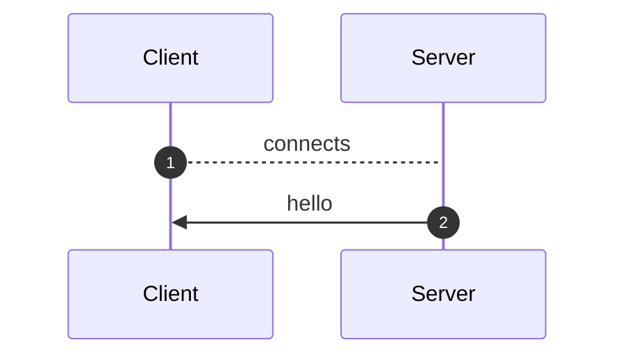
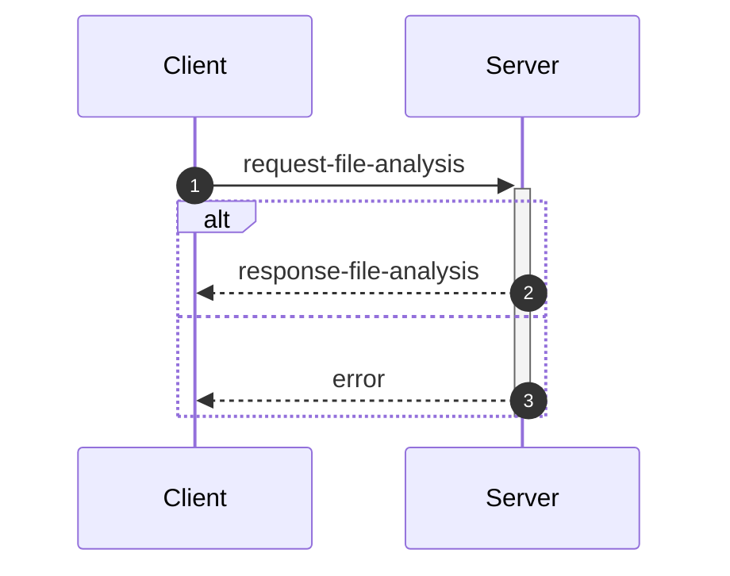
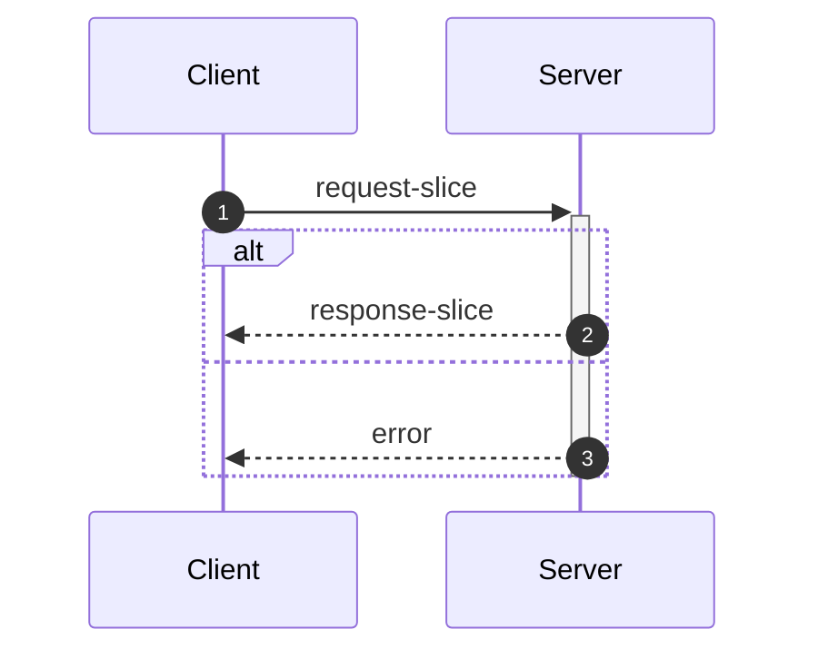
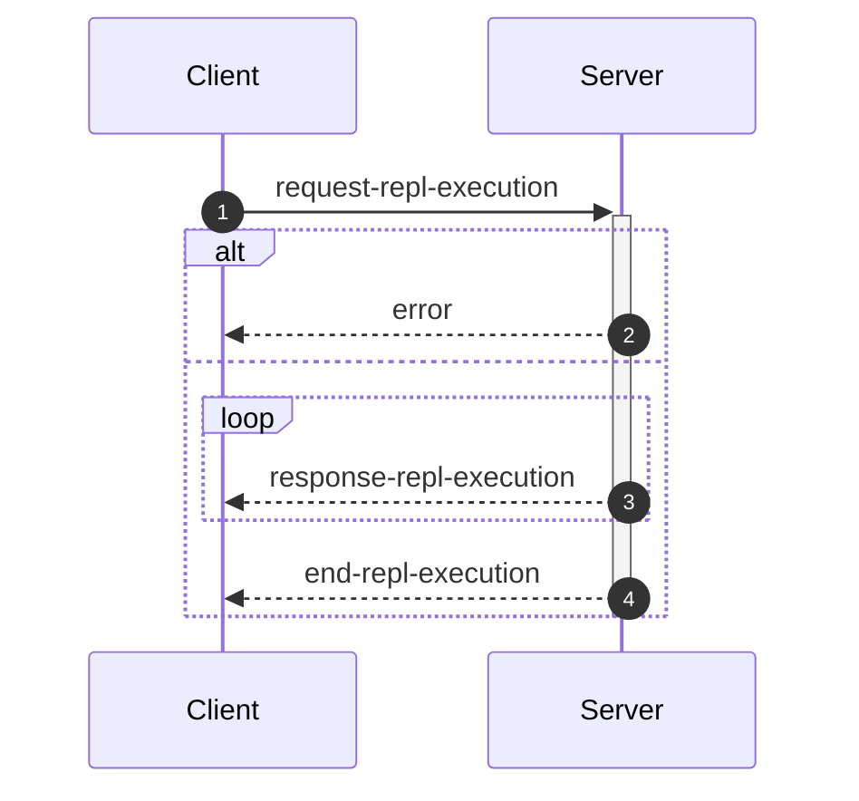

_This document was generated from '[src/documentation/wiki-interface.ts](https://github.com/flowr-analysis/flowr/tree/main//src/documentation/wiki-interface.ts)' on 2026-06-20, 13:43:13 UTC presenting an overview of flowR's interface (v2.10.9, using R v4.5.0). Please do not edit this file/wiki page directly._

Although far from being as detailed as the in-depth explanation of [_flowR_](https://github.com/flowr-analysis/flowr/wiki/core),
this wiki page explains how to interface with _flowR_ in more detail.
In general, command line arguments and other options provide short descriptions on hover over.

* [💻 Using the REPL](#using-the-repl)
* [⚙️ Configuring FlowR](#configuring-flowr)
* [⚒️ Writing Code](#writing-code)
* [💬 Communicating with the Server](#communicating-with-the-server)

<a id='using-the-repl'></a>
## 💻 Using the REPL


> [!NOTE]
> To execute arbitrary R commands with a repl request, _flowR_ has to be started explicitly with <span title="Description (Command Line Argument): Allow to access the underlying R session when using flowR (security warning: this allows the execution of arbitrary R code!)">`--r-session-access`</span>.
> Please be aware that this introduces a security risk and note that this relies on the [`r-shell` engine](https://github.com/flowr-analysis/flowr/wiki/engines) .

Although primarily meant for users to explore,
there is nothing which forbids simply calling _flowR_ as a subprocess to use standard-in, -output, and -error
for communication (although you can access the REPL using the server as well,
with the [REPL Request](#message-request-repl-execution) message).

The read-eval-print loop&nbsp;(REPL) works relatively simple.
You can submit an expression (using <kbd>Enter</kbd>),
which is interpreted as an R&nbsp;expression by default but interpreted as a *command* if it starts with a colon (`:`).
The best command to get started with the REPL is <span title="Description (Repl Command): Show help information (aliases: :h, :?)">`:help`</span>.
Besides, you can leave the REPL either with the command <span title="Description (Repl Command): End the repl (aliases: :q, :exit)">`:quit`</span> or by pressing <kbd>Ctrl</kbd>+<kbd>C</kbd> twice.
When writing a *command*, you may press <kbd>Tab</kbd> to get a list of completions, if available.
Multiple commands can be entered in a single line by separating them with a semicolon (`;`), e.g. `:parse "x<-2"; :df*`.
If a command is given without R code, the REPL will re-use R code given in a previous command.
The prior example will hence return first the parsed AST of the program and then the dataflow graph for `"x <- 2"`.

> [!NOTE]
> If you develop flowR, you may want to launch the repl using the `npm run main-dev` command, this way, you get a non-minified version of flowR with debug information and hot-reloading of source files.

<details>
<summary>Available Commands</summary>

We currently offer the following commands (this with a `[*]` suffix are available with and without the star):


| Command | Description |
| ------- | ----------- |
| **<span title="Description (Repl Command): End the repl (aliases: :q, :exit)">:quit</span>** | End the repl (aliases: **:<span title="Alias of ':quit'. End the repl">q</span>**, **:<span title="Alias of ':quit'. End the repl">exit</span>**) |
| **<span title="Description (Repl Command): Execute the given code as R code. This requires the `--r-session-access` flag to be set and requires the r-shell engine. (aliases: :e, :r)">:execute</span>** | Execute the given code as R code. This requires the `--r-session-access` flag to be set and requires the r-shell engine. (aliases: **:<span title="Alias of ':execute'. Execute the given code as R code. This requires the `--r-session-access` flag to be set and requires the r-shell engine.">e</span>**, **:<span title="Alias of ':execute'. Execute the given code as R code. This requires the `--r-session-access` flag to be set and requires the r-shell engine.">r</span>**) |
| **<span title="Description (Repl Command): Get mermaid code for the control-flow graph of R code, start with 'file://' to indicate a file (aliases: :cfg, :cf)">:controlflow[*]</span>** | Get mermaid code for the control-flow graph of R code, start with 'file://' to indicate a file (star: Returns the URL to mermaid.live) (aliases: **:<span title="Alias of ':controlflow'. Get mermaid code for the control-flow graph of R code, start with 'file://' to indicate a file">cfg</span>**, **:<span title="Alias of ':controlflow'. Get mermaid code for the control-flow graph of R code, start with 'file://' to indicate a file">cf</span>**) |
| **<span title="Description (Repl Command): Get mermaid code for the control-flow graph with basic blocks, start with 'file://' to indicate a file (aliases: :cfgb, :cfb)">:controlflowbb[*]</span>** | Get mermaid code for the control-flow graph with basic blocks, start with 'file://' to indicate a file (star: Returns the URL to mermaid.live) (aliases: **:<span title="Alias of ':controlflowbb'. Get mermaid code for the control-flow graph with basic blocks, start with 'file://' to indicate a file">cfgb</span>**, **:<span title="Alias of ':controlflowbb'. Get mermaid code for the control-flow graph with basic blocks, start with 'file://' to indicate a file">cfb</span>**) |
| **<span title="Description (Repl Command): Get mermaid code for the dataflow graph, start with 'file://' to indicate a file (aliases: :d, :df)">:dataflow[*]</span>** | Get mermaid code for the dataflow graph, start with 'file://' to indicate a file (star: Returns the URL to mermaid.live) (aliases: **:<span title="Alias of ':dataflow'. Get mermaid code for the dataflow graph, start with 'file://' to indicate a file">d</span>**, **:<span title="Alias of ':dataflow'. Get mermaid code for the dataflow graph, start with 'file://' to indicate a file">df</span>**) |
| **<span title="Description (Repl Command): Get mermaid code for the normalized AST of R code, start with 'file://' to indicate a file (aliases: :n)">:normalize[*]</span>** | Get mermaid code for the normalized AST of R code, start with 'file://' to indicate a file (star: Returns the URL to mermaid.live) (alias: **:<span title="Alias of ':normalize'. Get mermaid code for the normalized AST of R code, start with 'file://' to indicate a file">n</span>**) |
| **<span title="Description (Repl Command): Get mermaid code for the simplified dataflow graph, start with 'file://' to indicate a file (aliases: :ds, :dfs)">:dataflowsimple[*]</span>** | Get mermaid code for the simplified dataflow graph, start with 'file://' to indicate a file (star: Returns the URL to mermaid.live) (aliases: **:<span title="Alias of ':dataflowsimple'. Get mermaid code for the simplified dataflow graph, start with 'file://' to indicate a file">ds</span>**, **:<span title="Alias of ':dataflowsimple'. Get mermaid code for the simplified dataflow graph, start with 'file://' to indicate a file">dfs</span>**) |
| **<span title="Description (Repl Command): Just calculates the DFG, but only prints summary info (aliases: :d#, :df#)">:dataflowsilent</span>** | Just calculates the DFG, but only prints summary info (aliases: **:<span title="Alias of ':dataflowsilent'. Just calculates the DFG, but only prints summary info">d#</span>**, **:<span title="Alias of ':dataflowsilent'. Just calculates the DFG, but only prints summary info">df#</span>**) |
| **<span title="Description (Repl Command): Prints ASCII Art of the parsed, unmodified AST, start with 'file://' to indicate a file (aliases: :p)">:parse</span>** | Prints ASCII Art of the parsed, unmodified AST, start with 'file://' to indicate a file (alias: **:<span title="Alias of ':parse'. Prints ASCII Art of the parsed, unmodified AST, start with 'file://' to indicate a file">p</span>**) |
| **<span title="Description (Repl Command): Prints the version of flowR as well as the current version of R">:version</span>** | Prints the version of flowR as well as the current version of R
| **<span title="Description (Repl Command): Query the given R code, start with 'file://' to indicate a file. The query is to be a valid query in json format (use 'help' to get more information).">:query[*]</span>** | Query the given R code, start with 'file://' to indicate a file. The query is to be a valid query in json format (use 'help' to get more information). (star: Similar to query, but returns the output in json format.)
| **<span title="Description (Repl Command): Returns an ASCII representation of the dataflow graph (aliases: :df!)">:dataflowascii</span>** | Returns an ASCII representation of the dataflow graph (alias: **:<span title="Alias of ':dataflowascii'. Returns an ASCII representation of the dataflow graph">df!</span>**) |
| **<span title="Description (Repl Command): Returns summarization stats for the normalized AST (aliases: :n#)">:normalize#</span>** | Returns summarization stats for the normalized AST (alias: **:<span title="Alias of ':normalize#'. Returns summarization stats for the normalized AST">n#</span>**) |
| **<span title="Description (Repl Command): Show help information (aliases: :h, :?)">:help</span>** | Show help information (aliases: **:<span title="Alias of ':help'. Show help information">h</span>**, **:<span title="Alias of ':help'. Show help information">?</span>**) |


</details>


> [!TIP]
> 
> As indicated by the examples before, all REPL commands that operate on code keep track of the state.
> Hence, if you run a command like <span title="Description (Repl Command, starred version): Returns the URL to mermaid.live; Base Command: Get mermaid code for the dataflow graph, start with 'file://' to indicate a file (aliases: :d*, :df*)">`:dataflow*`</span> without providing R code,
> the REPL will re-use the R code provided in a previous command.
> Likewise, doing this will benefit from incrementality!
> If you request the dataflow graph with `:df* x <- 2 * y` and then want to see the parsed AST with `:parse`,
> the REPL will re-use previously obtained information and not re-parse the code again.
> 		


Generally, many commands offer shortcut versions in the REPL. Many queries, for example, offer a shortened format (see the example below).
Of special note, the [Config Query](https://github.com/flowr-analysis/flowr/wiki/query-api#Config-Query)
can be used to also modify the currently active configuration of _flowR_ within the REPL (see the [wiki page](https://github.com/flowr-analysis/flowr/wiki/query-api#Config-Query) for more information).

### Example: Retrieving the Dataflow Graph

To retrieve a URL to the [mermaid](https://mermaid.js.org/) diagram of the dataflow of a given expression,
use <span title="Description (Repl Command, starred version): Returns the URL to mermaid.live; Base Command: Get mermaid code for the dataflow graph, start with 'file://' to indicate a file (aliases: :d*, :df*)">`:dataflow*`</span> (or <span title="Description (Repl Command): Get mermaid code for the dataflow graph, start with 'file://' to indicate a file (aliases: :d, :df)">`:dataflow`</span> to get the mermaid code in the cli):


```shell
$ docker run -it --rm eagleoutice/flowr # or npm run flowr 
flowR repl using flowR v2.10.9, R grammar v14 (tree-sitter engine)
R> :dataflow* y <- 1 + x
```

<details>
<summary style='color:gray'>Output</summary>


```text
https://mermaid.live/view#base64:eyJjb2RlIjoiZmxvd2NoYXJ0IEJUXG4gICAgMXt7XCJgIzkxO1JOdW1iZXIjOTM7IDFcbiAgICAgICgxKVxuICAgICAgKjEuNipgXCJ9fVxuICAgJSUgTm8gZWRnZXMgZm91bmQgZm9yIDFcbiAgICAyKFtcImAjOTE7UlN5bWJvbCM5MzsgeFxuICAgICAgKDIpXG4gICAgICAqMS4xMCpgXCJdKVxuICAgJSUgTm8gZWRnZXMgZm91bmQgZm9yIDJcbiAgICAzW1tcImAjOTE7UkJpbmFyeU9wIzkzOyAjNDM7XG4gICAgICAoMylcbiAgICAgICoxLjYtMTAqXG4gICAgKDEsIDIpYFwiXV1cbiAgICBidWlsdC1pbjpfW1wiYEJ1aWx0LUluOlxuIzQzO2BcIl1cbiAgICBzdHlsZSBidWlsdC1pbjpfIHN0cm9rZTpncmF5LGZpbGw6Z3JheSxzdHJva2Utd2lkdGg6MnB4LG9wYWNpdHk6Ljg7XG4gICAgMFtcImAjOTE7UlN5bWJvbCM5MzsgeVxuICAgICAgKDAsIHNvdXJjZXM6IFszXSlcbiAgICAgICoxLjEqYFwiXVxuICAgIDRbW1wiYCM5MTtSQmluYXJ5T3AjOTM7ICM2MDsjNDU7XG4gICAgICAoNClcbiAgICAgICoxLjEtMTAqXG4gICAgKDAsIDMpYFwiXV1cbiAgICBidWlsdC1pbjpfLVtcImBCdWlsdC1JbjpcbiM2MDsjNDU7YFwiXVxuICAgIHN0eWxlIGJ1aWx0LWluOl8tIHN0cm9rZTpncmF5LGZpbGw6Z3JheSxzdHJva2Utd2lkdGg6MnB4LG9wYWNpdHk6Ljg7XG4gICAgMyAtLT58XCJyZWFkcywgYXJndW1lbnRcInwgMVxuICAgIDMgLS0+fFwicmVhZHMsIGFyZ3VtZW50XCJ8IDJcbiAgICAzIC0uLT58XCJyZWFkcywgY2FsbHNcInwgYnVpbHQtaW46X1xuICAgIGxpbmtTdHlsZSAyIHN0cm9rZTpncmF5O1xuICAgIDAgLS0+fFwiZGVmaW5lZC1ieVwifCAzXG4gICAgMCAtLT58XCJkZWZpbmVkLWJ5XCJ8IDRcbiAgICA0IC0tPnxcInJlYWRzLCBhcmd1bWVudFwifCAzXG4gICAgNCAtLT58XCJyZXR1cm5zLCBhcmd1bWVudFwifCAwXG4gICAgNCAtLi0+fFwicmVhZHMsIGNhbGxzXCJ8IGJ1aWx0LWluOl8tXG4gICAgbGlua1N0eWxlIDcgc3Ryb2tlOmdyYXk7IiwibWVybWFpZCI6eyJhdXRvU3luYyI6dHJ1ZX19
```


Retrieve the dataflow graph of the expression `y <- 1 + x`. It looks like this:


```mermaid
flowchart LR
    1{{"`#91;RNumber#93; 1
      (1)
      *1.6*`"}}
   %% No edges found for 1
    2(["`#91;RSymbol#93; x
      (2)
      *1.10*`"])
   %% No edges found for 2
    3[["`#91;RBinaryOp#93; #43;
      (3)
      *1.6-10*
    (1, 2)`"]]
    built-in:_["`Built-In:
#43;`"]
    style built-in:_ stroke:gray,fill:gray,stroke-width:2px,opacity:.8;
    0["`#91;RSymbol#93; y
      (0, sources: [3])
      *1.1*`"]
    4[["`#91;RBinaryOp#93; #60;#45;
      (4)
      *1.1-10*
    (0, 3)`"]]
    built-in:_-["`Built-In:
#60;#45;`"]
    style built-in:_- stroke:gray,fill:gray,stroke-width:2px,opacity:.8;
    3 -->|"reads, argument"| 1
    3 -->|"reads, argument"| 2
    3 -.->|"reads, calls"| built-in:_
    linkStyle 2 stroke:gray;
    0 -->|"defined-by"| 3
    0 -->|"defined-by"| 4
    4 -->|"reads, argument"| 3
    4 -->|"returns, argument"| 0
    4 -.->|"reads, calls"| built-in:_-
    linkStyle 7 stroke:gray;
```

	
<details>

<summary style="color:gray">R Code of the Dataflow Graph</summary>

The analysis required _0.7 ms_ (including parse and normalize, using the [tree-sitter](https://github.com/flowr-analysis/flowr/wiki/Engines) engine) within the generation environment. 
We encountered no unknown side effects during the analysis.


```r
y <- 1 + x
```


</details>


</details>


For small graphs like this, <span title="Description (Repl Command): Returns an ASCII representation of the dataflow graph (aliases: :df!)">`:dataflowascii`</span> also provides an ASCII representation directly in the REPL:


```shell
$ docker run -it --rm eagleoutice/flowr # or npm run flowr 
flowR repl using flowR v2.10.9, R grammar v14 (tree-sitter engine)
R> :df! y <- 1 + x
```

<details open>
<summary style='color:gray'>Output</summary>


```text
                        0<1>0
                   ┌────| 1 |
    ┌────────┐     │    0---0
 c<4>c       └──c<3>c
 |<- |  v<0>v┌──| + |
 c---c──| y |┘  c---c   u<2>u
        v---v      └────| x |
                        u---u
Edges:
3 -> 1: reads, argument  3 -> 2: reads, argument
4 -> 3: reads, argument  4 -> 0: returns, argument
0 -> 3: defined-by       0 -> 4: defined-by
```


Retrieve the dataflow graph of the expression `y <- 1 + x` as ASCII art.

</details>


For the slicing with <span title="Description (Repl Command): Static backwards executable slicer for R">`:slicer`</span>, you have access to the same [magic comments](#slice-magic-comments) as with the [slice request](#message-request-slice).

### Example: Interfacing with the File System

Many commands that allow for an R-expression (like <span title="Description (Repl Command, starred version): Returns the URL to mermaid.live; Base Command: Get mermaid code for the dataflow graph, start with 'file://' to indicate a file (aliases: :d*, :df*)">`:dataflow*`</span>) allow for a file as well
if the argument starts with `file://`.
If you are working from the root directory of the _flowR_ repository, the following gives you the parsed AST of the example file using the <span title="Description (Repl Command): Prints ASCII Art of the parsed, unmodified AST, start with 'file://' to indicate a file (aliases: :p)">`:parse`</span> command:


```shell
$ docker run -it --rm eagleoutice/flowr # or npm run flowr 
flowR repl using flowR v2.10.9, R grammar v14 (tree-sitter engine)
R> :parse file://test/testfiles/example.R
```

<details>
<summary style='color:gray'>Output</summary>


```text
File: test/testfiles/example.R

program
├ binaryoperator
│ ├ identifier "sum" (1:1─4)
│ ├ <- "<-" (1:5─7)
│ ╰ float "0" (1:8─9)
├ binaryoperator
│ ├ identifier "product" (2:1─8)
│ ├ <- "<-" (2:9─11)
│ ╰ float "1" (2:12─13)
├ binaryoperator
│ ├ identifier "w" (3:1─2)
│ ├ <- "<-" (3:3─5)
│ ╰ float "7" (3:6─7)
├ binaryoperator
│ ├ identifier "N" (4:1─2)
│ ├ <- "<-" (4:3─5)
│ ╰ float "10" (4:6─8)
├ forstatement
│ ├ for "for" (6:1─4)
│ ├ ( "(" (6:5─6)
│ ├ identifier "i" (6:6─7)
│ ├ in "in" (6:8─10)
│ ├ binaryoperator
│ │ ├ float "1" (6:11─12)
│ │ ├ : ":" (6:12─13)
│ │ ╰ parenthesizedexpression
│ │   ├ ( "(" (6:13─14)
│ │   ├ binaryoperator
│ │   │ ├ identifier "N" (6:14─15)
│ │   │ ├ - "-" (6:15─16)
│ │   │ ╰ float "1" (6:16─17)
│ │   ╰ ) ")" (6:17─18)
│ ├ ) ")" (6:18─19)
│ ╰ bracedexpression
│   ├ { "{" (6:20─21)
│   ├ binaryoperator
│   │ ├ identifier "sum" (7:3─6)
│   │ ├ <- "<-" (7:7─9)
│   │ ╰ binaryoperator
│   │   ├ binaryoperator
│   │   │ ├ identifier "sum" (7:10─13)
│   │   │ ├ + "+" (7:14─15)
│   │   │ ╰ identifier "i" (7:16─17)
│   │   ├ + "+" (7:18─19)
│   │   ╰ identifier "w" (7:20─21)
│   ├ binaryoperator
│   │ ├ identifier "product" (8:3─10)
│   │ ├ <- "<-" (8:11─13)
│   │ ╰ binaryoperator
│   │   ├ identifier "product" (8:14─21)
│   │   ├  "" (8:22─23)
│   │   ╰ identifier "i" (8:24─25)
│   ╰ } "}" (9:1─2)
├ call
│ ├ identifier "cat" (11:1─4)
│ ╰ arguments
│   ├ ( "(" (11:4─5)
│   ├ argument
│   │ ╰ string
│   │   ├ " "\"" (11:5─6)
│   │   ├ stringcontent "Sum:" (11:6─10)
│   │   ╰ " "\"" (11:10─11)
│   ├ comma "," (11:11─12)
│   ├ argument
│   │ ╰ identifier "sum" (11:13─16)
│   ├ comma "," (11:16─17)
│   ├ argument
│   │ ╰ string
│   │   ├ " "\"" (11:18─19)
│   │   ├ stringcontent
│   │   │ ╰ escapesequence "\\n" (11:19─21)
│   │   ╰ " "\"" (11:21─22)
│   ╰ ) ")" (11:22─23)
╰ call
  ├ identifier "cat" (12:1─4)
  ╰ arguments
    ├ ( "(" (12:4─5)
    ├ argument
    │ ╰ string
    │   ├ " "\"" (12:5─6)
    │   ├ stringcontent "Product:" (12:6─14)
    │   ╰ " "\"" (12:14─15)
    ├ comma "," (12:15─16)
    ├ argument
    │ ╰ identifier "product" (12:17─24)
    ├ comma "," (12:24─25)
    ├ argument
    │ ╰ string
    │   ├ " "\"" (12:26─27)
    │   ├ stringcontent
    │   │ ╰ escapesequence "\\n" (12:27─29)
    │   ╰ " "\"" (12:29─30)
    ╰ ) ")" (12:30─31)
```


Retrieve the parsed AST of the example file.

<details>

<summary>File Content</summary>


```r
sum <- 0
product <- 1
w <- 7
N <- 10

for (i in 1:(N-1)) {
  sum <- sum + i + w
  product <- product * i
}

cat("Sum:", sum, "\n")
cat("Product:", product, "\n")
```


</details>

As _flowR_ directly transforms this AST the output focuses on being human-readable instead of being machine-readable.
		

</details>


### Example: Run a Query

You can run any query supported by _flowR_ using the <span title="Description (Repl Command): Query the given R code, start with 'file://' to indicate a file. The query is to be a valid query in json format (use 'help' to get more information).">`:query`</span> command.
For example, to obtain the shapes of all data frames in a given piece of code, you can run:


```shell
$ docker run -it --rm eagleoutice/flowr # or npm run flowr 
flowR repl using flowR v2.10.9, R grammar v14 (tree-sitter engine)
R> :query @df-shape "x <- data.frame(a = 1:10, b = 1:10)\ny <- x$a"
```

<details open>
<summary style='color:gray'>Output</summary>


```text
Query: df-shape (1 ms)
   ╰ 12: (colnames: [{"a", "b"}, {}], cols: [2, 2], rows: [10, 10])
   ╰ 0: (colnames: [{"a", "b"}, {}], cols: [2, 2], rows: [10, 10])
All queries together required ≈3 ms (1ms accuracy, total 4 ms)
```


Retrieve the shapes of all data frames in the given code.

</details>


To run the linter on a file, you can use (in this example, we just issue the `dead-code` linter on a small piece of code):


```shell
$ docker run -it --rm eagleoutice/flowr # or npm run flowr 
flowR repl using flowR v2.10.9, R grammar v14 (tree-sitter engine)
R> :query @linter rules:dead-code "if(FALSE) x <- 2"
```

<details open>
<summary style='color:gray'>Output</summary>


```text
Query: linter (1 ms)
   ╰ Dead Code (dead-code):
       ╰ certain:
           ╰ Code at 1.11-16
       ╰ Metadata: searchTimeMs: 1, processTimeMs: 0
All queries together required ≈1 ms (1ms accuracy, total 1 ms)
```


Run the linter on the given code, with only the `dead-code` rule enabled.

</details>


For more information on the available queries, please check out the [Query API](https://github.com/flowr-analysis/flowr/wiki/query-api).


<a id='configuring-flowr'></a>
## ⚙️ Configuring FlowR


When running _flowR_, you may want to specify some behaviors with a dedicated configuration file.
By default, flowR looks for a file named `flowr.json` in the current working directory (or any higher directory).
You can also specify a different file with <span title="Description (Command Line Argument): The name of the configuration file to use">`--config-file`</span> or pass the configuration inline using <span title="Description (Command Line Argument): The flowR configuration to use, as a JSON string">`--config-json`</span>.
To inspect the current configuration, you can run flowr with the <span title="Description (Command Line Argument): Run with verbose logging (will be passed to the corresponding script)">`--verbose`</span> flag, or use the `config` [Query](https://github.com/flowr-analysis/flowr/wiki/query-api).
Within the REPL this works by running the following:


```shell
:query @config
```


To work with the <a href="https://github.com/flowr-analysis/flowr/tree/main/src/config.ts#L109"><code><span title="The configuration file format for flowR.">FlowrConfig</span></code></a> you can use the provided helper objects alongside its methods like
<a href="https://github.com/flowr-analysis/flowr/tree/main/src/config.ts#L457"><code><span title="Creates a new flowr config that has the updated values.">FlowrConfig::<b>amend</b></span></code></a>.
The following summarizes the configuration options:

- `ignoreSourceCalls`: If set to `true`, _flowR_ will ignore source calls when analyzing the code, i.e., ignoring the inclusion of other files.
- `semantics`: allows to configure the way _flowR_ handles R, although we currently only support `semantics/environment/overwriteBuiltIns`.
  You may use this to overwrite _flowR_'s handling of built-in function and even completely clear the preset definitions shipped with flowR.
  See [Configure BuiltIn Semantics](#configure-builtin-semantics) for more information.
- `solver`: allows to configure how _flowR_ resolves variables and their values (currently we support: `disabled`, `alias`, `builtin`), as well as if pointer analysis should be active.
- `engines`: allows to configure the engines used by _flowR_ to interact with R code. See the [Engines wiki page](https://github.com/flowr-analysis/flowr/wiki/engines) for more information.
- `defaultEngine`: allows to specify the default engine to use for interacting with R code. If not set, an arbitrary engine from the specified list will be used.
- `abstractInterpretation`: allows to configure how _flowR_ performs abstract interpretation, although we currently only support data frame shape inference through abstract interpretation.
- `defaultPlugins`: allows to configure which plugins to load by default when creating a new <a href="https://github.com/flowr-analysis/flowr/tree/main/src/project/flowr-analyzer.ts#L162"><code><span title="Central class for conducting analyses with FlowR. Use the FlowrAnalyzerBuilder to create a new instance. If you want the original pattern of creating a pipeline and running all steps, you can still do this with FlowrAnalyzer#runFull . To inspect the context of the analyzer, use FlowrAnalyzer#inspectContext (if you are a plugin and need to modify it, use FlowrAnalyzer#context instead).">FlowrAnalyzer</span></code></a> instance.
- `repl.plugins`: allows to configure which plugins to load in the _flowR_ REPL. Use `flowr:default` to reference the plugins specified by `defaultPlugins`.

So you can configure _flowR_ by adding a file like the following:

<details>

<summary>Example Configuration File</summary>


```json
{
  "ignoreSourceCalls": true,
  "semantics": {
    "environment": {
      "overwriteBuiltIns": {
        "definitions": [
          {
            "type": "function",
            "names": [
              "foo"
            ],
            "processor": "builtin:assign",
            "config": {}
          }
        ]
      }
    }
  },
  "defaultPlugins": [
    "file:description",
    "versions:description"
  ],
  "repl": {
    "quickStats": false,
    "dfProcessorHeat": false,
    "plugins": [
      "flowr:default"
    ]
  },
  "project": {
    "resolveUnknownPathsOnDisk": true
  },
  "engines": [
    {
      "type": "r-shell"
    }
  ],
  "solver": {
    "variables": "alias",
    "evalStrings": true,
    "trackEnvironments": true,
    "resolveSource": {
      "dropPaths": "no",
      "ignoreCapitalization": true,
      "inferWorkingDirectory": "active-script",
      "searchPath": []
    },
    "instrument": {},
    "slicer": {
      "threshold": 50
    }
  },
  "abstractInterpretation": {
    "wideningThreshold": 4,
    "dataFrame": {
      "maxColNames": 20,
      "readLoadedData": {
        "readExternalFiles": true,
        "maxReadLines": 1000000
      }
    }
  },
  "gas": {
    "thresholds": {
      "memory": {
        "problematic": 0.7,
        "critical": 0.9
      },
      "timeMs": {
        "problematic": 100000,
        "critical": 120000
      }
    },
    "features": {}
  }
}
```


</details>

<details>
<a id='configure-builtin-semantics'></a>
<summary>Configure Built-In Semantics</summary>


`semantics/environment/overwriteBuiltins` accepts two keys:

- `loadDefaults` (boolean, initially `true`): If set to `true`, the default built-in definitions are loaded before applying the custom definitions. Setting this flag to `false` explicitly disables the loading of the default definitions.
- `definitions` (array, initially empty): Allows to overwrite or define new built-in elements. Each object within must have a `type` which is one of the below. Furthermore, they may define a string array of `names` which specifies the identifiers to bind the definitions to. You may use `assumePrimitive` to specify whether _flowR_ should assume that this is a primitive non-library definition (so you probably just do not want to specify the key).

  | Type            | Description                                                                                                                                                                                                                                                                                              | Example                                                                                                    |
  | --------------- | -------------------------------------------------------------------------------------------------------------------------------------------------------------------------------------------------------------------------------------------------------------------------------------------------------- | ---------------------------------------------------------------------------------------------------------- |
  | `constant`    | Additionally allows for a `value` this should resolve to.                                                                                                                                                                                                                                                | `{ type: 'constant', names: ['NULL', 'NA'],  value: null }`                                                |
  | `function`    | Is a rather flexible way to define and bind built-in functions. For the time, we do not have extensive documentation to cover all the cases, so please either consult the sources with the `default-builtin-config.ts` or open a [new issue](https://github.com/flowr-analysis/flowr/issues/new/choose). | `{ type: 'function', names: ['next'], processor: 'builtin:d', config: { cfg: ExitPointType.Next } }` |
  | `replacement` | A comfortable way to specify replacement functions like `$<-` or `names<-`. `suffixes` describes the... suffixes to attach automatically. | `{ type: 'replacement', suffixes: ['<-', '<<-'], names: ['[', '[['] }` |


</details>

<details>

<summary style='color:gray'>Full Configuration-File Schema</summary>

- _The configuration file format for flowR._ (object)
    - **ignoreSourceCalls** [optional] _Whether source calls should be ignored, causing {@link processSourceCall}'s behavior to be skipped._ (boolean)
    - **semantics** _Configure language semantics and how flowR handles them._ (object)
        - **environment** [optional] _Semantics regarding how to handle the R environment._ (object)
            - **overwriteBuiltIns** [optional] _Do you want to overwrite (parts) of the builtin definition?_ (object)
                - **loadDefaults** [optional] _Should the default configuration still be loaded?_ (boolean)
                - **definitions** [optional] _The definitions to load/overwrite._ (array)
                Valid item types:
                    - (object)
    - **defaultPlugins** [optional] _The default plugins to load when creating a new instance of FlowrAnalyzer_ (array)
    Valid item types:
        - (alternatives)
            - (string)
            - (array)
    - **repl** _Configuration options for the REPL._ (object)
        - **quickStats** [optional] _Whether to show quick stats in the REPL after each evaluation._ (boolean)
        - **dfProcessorHeat** [optional] _This instruments the dataflow processors to count how often each processor is called._ (boolean)
        - **plugins** [optional] _The plugins to load in REPL mode_ (array)
        Valid item types:
            - (alternatives)
                - (string)
                - (array)
    - **project** _Project specific configuration options._ (object)
        - **resolveUnknownPathsOnDisk** [optional] _Whether to resolve unknown paths loaded by the r project disk when trying to source/analyze files._ (boolean)
    - **engines** _The engine or set of engines to use for interacting with R code. An empty array means all available engines will be used._ (array)
    Valid item types:
        - (alternatives)
            - _The configuration for the tree sitter engine._ (object)
                - **type** [required] _Use the tree sitter engine._ (string)
                    Only allows: 'tree-sitter'
                - **wasmPath** [optional] _The path to the tree-sitter-r WASM binary to use. If this is undefined, this uses the default path._ (string)
                - **treeSitterWasmPath** [optional] _The path to the tree-sitter WASM binary to use. If this is undefined, this uses the default path._ (string)
                - **lax** [optional] _Whether to use the lax parser for parsing R code (allowing for syntax errors). If this is undefined, the strict parser will be used._ (boolean)
            - _The configuration for the R shell engine._ (object)
                - **type** [required] _Use the R shell engine._ (string)
                    Only allows: 'r-shell'
                - **rPath** [optional] _The path to the R executable to use. If this is undefined, this uses the default path._ (string)
    - **defaultEngine** [optional] _The default engine to use for interacting with R code. If this is undefined, an arbitrary engine from the specified list will be used._ (string)
        Only allows: 'tree-sitter', 'r-shell'
    - **solver** _How to resolve constants, constraints, cells, ..._ (object)
        - **variables** _How to resolve variables and their values._ (string)
            Only allows: 'disabled', 'alias', 'builtin'
        - **evalStrings** _Should we include eval(parse(text="...")) calls in the dataflow graph?_ (boolean)
        - **trackEnvironments** [optional] _Track user-created environments (new.env, assign/get/local with envir=, dollar-assign, attach). When false, all envir-style calls fall through conservatively._ (boolean)
        - **instrument** (object)
            - **dataflowExtractors** [optional] _These keys are only intended for use within code, allowing to instrument the dataflow analyzer!_ (any)
        - **resolveSource** [optional] _If lax source calls are active, flowR searches for sourced files much more freely, based on the configurations you give it. This option is only in effect if `ignoreSourceCalls` is set to false._ (object)
            - **dropPaths** _Allow to drop the first or all parts of the sourced path, if it is relative._ (string)
                Only allows: 'no', 'once', 'all'
            - **ignoreCapitalization** _Search for filenames matching in the lowercase._ (boolean)
            - **inferWorkingDirectory** _Try to infer the working directory from the main or any script to analyze._ (string)
                Only allows: 'no', 'main-script', 'active-script', 'any-script'
            - **searchPath** _Additionally search in these paths._ (array)
            Valid item types:
                - (string)
            - **repeatedSourceLimit** [optional] _How often the same file can be sourced within a single run? Please be aware: in case of cyclic sources this may not reach a fixpoint so give this a sensible limit._ (number)
            - **applyReplacements** _Provide name replacements for loaded files_ (array)
            Valid item types:
                - (object)
        - **slicer** [optional] _The configuration for the slicer._ (object)
            - **threshold** [optional] _The maximum number of iterations to perform on a single function call during slicing._ (number)
            - **autoExtend** [optional] _If set, the slicer will gain an additional post-pass._ (boolean)
    - **abstractInterpretation** _The configuration options for abstract interpretation._ (object)
        - **wideningThreshold** _The threshold for the number of visitations of a node at which widening should be performed to ensure the termination of the fixpoint iteration._ (number)
        - **dataFrame** _The configuration of the shape inference for data frames._ (object)
            - **maxColNames** _The maximum number of columns names to infer for data frames before over-approximating the column names to top._ (number)
            - **readLoadedData** _Configuration options for reading data frame shapes from loaded external data files, such as CSV files._ (object)
                - **readExternalFiles** _Whether data frame shapes should be extracted from loaded external files, such as CSV files._ (boolean)
                - **maxReadLines** _The maximum number of lines to read when extracting data frame shapes from loaded files, such as CSV files._ (number)
    - **gas** [optional] _Resource-usage guard (gas) configuration. All feature factors default to 0 (disabled). See https://github.com/flowr-analysis/flowr/wiki/Core#gas-resource-guard._ (object)
        - **thresholds** [optional] _Shared thresholds for all gas checks (scaled by per-feature factor)._ (object)
            - **memory** [optional] _Heap-usage fraction thresholds (0-1)._ (object)
                - **problematic** [optional] _Heap fraction (0-1) above which Problematic is returned._ (number)
                - **critical** [optional] _Heap fraction (0-1) above which Critical is returned._ (number)
            - **timeMs** [optional] _Elapsed analysis time thresholds in milliseconds._ (object)
                - **problematic** [optional] _Elapsed ms above which Problematic is returned._ (number)
                - **critical** [optional] _Elapsed ms above which Critical is returned._ (number)
        - **features** [optional] _Per-feature sensitivity factors. 0 or absent disables gas checking for that feature. A factor of 2 makes the feature twice as sensitive. Recognised keys: `source`, `side-effect-linking`._ (object)

</details>

	

<a id='writing-code'></a>
## ⚒️ Writing Code

_flowR_ can be used as a [module](https://www.npmjs.com/package/@eagleoutice/flowr) and offers several main classes and interfaces that are interesting for extension writers 
(see the [Visual Studio Code extension](https://marketplace.visualstudio.com/items?itemName=code-inspect.vscode-flowr) or the [Core](https://github.com/flowr-analysis/flowr/wiki/core) wiki page for more information).

### Creating Analyses with _flowR_

Nowadays, instances of the <a href="https://github.com/flowr-analysis/flowr/tree/main/src/project/flowr-analyzer.ts#L162"><code><span title="Central class for conducting analyses with FlowR. Use the FlowrAnalyzerBuilder to create a new instance. If you want the original pattern of creating a pipeline and running all steps, you can still do this with FlowrAnalyzer#runFull . To inspect the context of the analyzer, use FlowrAnalyzer#inspectContext (if you are a plugin and need to modify it, use FlowrAnalyzer#context instead).">FlowrAnalyzer</span></code></a> should be used as central frontend to get analysis results from _flowR_.
For example, a program slice can be created like this:


```ts
const analyzer = await new FlowrAnalyzerBuilder()
    .setEngine('tree-sitter')
    .build();
analyzer.addRequest('x <- 1\ny <- x\nx');
const result = await analyzer.query([
    {
        type:     'static-slice',
        criteria: ['3@x']
    }
]);
//console.log(result['static-slice']);
```


For more information, please have a look at the [Analyzer](https://github.com/flowr-analysis/flowr/wiki/analyzer) wiki page, which explains how to construct and use the <a href="https://github.com/flowr-analysis/flowr/tree/main/src/project/flowr-analyzer.ts#L162"><code><span title="Central class for conducting analyses with FlowR. Use the FlowrAnalyzerBuilder to create a new instance. If you want the original pattern of creating a pipeline and running all steps, you can still do this with FlowrAnalyzer#runFull . To inspect the context of the analyzer, use FlowrAnalyzer#inspectContext (if you are a plugin and need to modify it, use FlowrAnalyzer#context instead).">FlowrAnalyzer</span></code></a> in more detail.
To work with specific perspectives, you can also consult the respective pages like the [Dataflow Graph](https://github.com/flowr-analysis/flowr/wiki/dataflow-graph) or the [Abstract Interpretation](https://github.com/flowr-analysis/flowr/wiki/abstract-interpretation) wiki pages.
        
### The Pipeline Executor (Low-Level Interface)

Once, in the beginning, _flowR_ was meant to produce a dataflow graph merely to provide *program slices*. 
However, with continuous updates, the [Dataflow Graph](https://github.com/flowr-analysis/flowr/wiki/dataflow-graph) repeatedly proves to be the more interesting part.
With this, we restructured _flowR_'s originally *hardcoded* pipeline to be far more flexible. 
Now, it can be theoretically extended or replaced with arbitrary steps, optional steps, and what we call 'decorations' of these steps. 
In short, a slicing pipeline using the <a href="https://github.com/flowr-analysis/flowr/tree/main/src/core/pipeline-executor.ts#L97"><code><span title="**Please note:** The PipelineExecutor is now considered to be a rather low-level API for flowR. While it still works and is the basis for all other layers, we strongly recommend using the FlowrAnalyzer and its builder to create and use an analyzer instance that is pre-configured for your use-case. The pipeline executor allows to execute arbitrary pipelines in a step-by-step fashion. If you are not...">PipelineExecutor</span></code></a> looks like this:


```ts

const slicer = new PipelineExecutor(DEFAULT_SLICING_PIPELINE, {
  parser:    new RShell(),
  request:   requestFromInput('x <- 1\nx + 1'),
  criterion: ['2@x']
})
const slice = await slicer.allRemainingSteps()
// console.log(slice.reconstruct.code)
```


<details><summary>More Information</summary>


If you compare this, with what you would have done with the old (and removed) `SteppingSlicer`, 
this essentially just requires you to replace the `SteppingSlicer` with the <a href="https://github.com/flowr-analysis/flowr/tree/main/src/core/pipeline-executor.ts#L97"><code><span title="**Please note:** The PipelineExecutor is now considered to be a rather low-level API for flowR. While it still works and is the basis for all other layers, we strongly recommend using the FlowrAnalyzer and its builder to create and use an analyzer instance that is pre-configured for your use-case. The pipeline executor allows to execute arbitrary pipelines in a step-by-step fashion. If you are not...">PipelineExecutor</span></code></a>
and to pass the <a href="https://github.com/flowr-analysis/flowr/tree/main/src/core/steps/pipeline/default-pipelines.ts#L18"><code>DEFAULT_SLICING_PIPELINE</code></a> as the first argument.
The <a href="https://github.com/flowr-analysis/flowr/tree/main/src/core/pipeline-executor.ts#L97"><code><span title="**Please note:** The PipelineExecutor is now considered to be a rather low-level API for flowR. While it still works and is the basis for all other layers, we strongly recommend using the FlowrAnalyzer and its builder to create and use an analyzer instance that is pre-configured for your use-case. The pipeline executor allows to execute arbitrary pipelines in a step-by-step fashion. If you are not...">PipelineExecutor</span></code></a>...

1. Provides structures to investigate the results of all intermediate steps
2. Can be executed step-by-step
3. Can repeat steps (e.g., to calculate multiple slices on the same input)

See the in-code documentation for more information.

	

</details>
    

### Using the <a href="https://github.com/flowr-analysis/flowr/tree/main/src/r-bridge/shell.ts#L143"><code><span title="The RShell represents an interactive session with the R interpreter. You can configure it by RShellOptions . At the moment we are using a live R session (and not networking etc.) to communicate with R easily, which allows us to install packages etc. However, this might and probably will change in the future (leaving this as a legacy mode :D)">RShell</span></code></a> to Interact with R

The <a href="https://github.com/flowr-analysis/flowr/tree/main/src/r-bridge/shell.ts#L143"><code><span title="The RShell represents an interactive session with the R interpreter. You can configure it by RShellOptions . At the moment we are using a live R session (and not networking etc.) to communicate with R easily, which allows us to install packages etc. However, this might and probably will change in the future (leaving this as a legacy mode :D)">RShell</span></code></a> class allows interfacing with the `R`&nbsp;ecosystem installed on the host system.
Please have a look at [flowR's Engines](https://github.com/flowr-analysis/flowr/wiki/engines) for more information on alternatives (for example, the <a href="https://github.com/flowr-analysis/flowr/tree/main/src/r-bridge/lang-4.x/tree-sitter/tree-sitter-executor.ts#L18"><code><span title="Synchronous and (way) faster alternative to the RShell using tree-sitter.">TreeSitterExecutor</span></code></a>).


> [!IMPORTANT]
> 
> Each <a href="https://github.com/flowr-analysis/flowr/tree/main/src/r-bridge/shell.ts#L143"><code><span title="The RShell represents an interactive session with the R interpreter. You can configure it by RShellOptions . At the moment we are using a live R session (and not networking etc.) to communicate with R easily, which allows us to install packages etc. However, this might and probably will change in the future (leaving this as a legacy mode :D)">RShell</span></code></a> controls a new instance of the R&nbsp;interpreter, 
> make sure to call <code><a href="https://github.com/flowr-analysis/flowr/tree/main/src/r-bridge/shell.ts#L317"><span title="Close the current R session, makes the object effectively invalid (can no longer be reopened etc.)">RShell::<i>close</i></span></a>()</code> when you are done.


You can start a new "session" simply by constructing a new object with <code>new <a href="https://github.com/flowr-analysis/flowr/tree/main/src/r-bridge/shell.ts#L143"><span title="The RShell represents an interactive session with the R interpreter. You can configure it by RShellOptions . At the moment we are using a live R session (and not networking etc.) to communicate with R easily, which allows us to install packages etc. However, this might and probably will change in the future (leaving this as a legacy mode :D)">RShell</span></a>()</code>.

However, there are several options that may be of interest 
(e.g., to automatically revive the shell in case of errors or to control the name location of the R process on the system).

With a shell object (let's call it `shell`), you can execute R code by using <a href="https://github.com/flowr-analysis/flowr/tree/main/src/r-bridge/shell.ts#L195"><code><span title="sends the given command directly to the current R session will not do anything to alter input markers!">RShell::<i>sendCommand</i></span></code></a>, 
for example <code>shell.<a href="https://github.com/flowr-analysis/flowr/tree/main/src/r-bridge/shell.ts#L195"><span title="sends the given command directly to the current R session will not do anything to alter input markers!">sendCommand</span></a>("1 + 1")</code>. 
However, this does not return anything, so if you want to collect the output of your command, use
<a href="https://github.com/flowr-analysis/flowr/tree/main/src/r-bridge/shell.ts#L261"><code><span title="Send a command and collect the output">RShell::<i>sendCommandWithOutput</i></span></code></a> instead.

Besides that, the command <a href="https://github.com/flowr-analysis/flowr/tree/main/src/r-bridge/shell.ts#L233"><code>RShell::<b>tryToInjectHomeLibPath</b></code></a> may be of interest, as it enables all libraries available on the host system.


### Generate Statistics (No longer a Focus of flowR)


<details>

<summary>Adding a New Feature to Extract</summary>

In this example, we construct a new feature to extract, with the name "*example*".
Whenever this name appears, you may substitute this with whatever name fits your feature best (as long as the name is unique).

1. **Create a new file in `src/statistics/features/supported`**\
   Create the file `example.ts`, and add its export to the `index.ts` file in the same directory (if not done automatically).

2. **Create the basic structure**\
   To get a better feel of what a feature must have, let's look
   at the basic structure (of course, due to TypeScript syntax,
   there are other ways to achieve the same goal):

   ```ts
   const initialExampleInfo = {
       /* whatever start value is good for you */
       someCounter: 0
   }

   export type ExampleInfo = Writable<typeof initialExampleInfo>

   export const example: Feature<ExampleInfo> = {
    name:        'Example Feature',
    description: 'A longer example description',

    process(existing: ExampleInfo, input: FeatureProcessorInput): ExampleInfo {
      /* perform analysis on the input */
      return existing
    },

    initialValue: initialExampleInfo
   }
   ```

   The `initialExampleInfo` type holds the initial values for each counter that you want to maintain during the feature extraction (they will usually be initialized with 0). The resulting `ExampleInfo` type holds the structure of the data that is to be counted. Due to the vast amount of data processed, information like the name and location of a function call is not stored here, but instead written to disk (see below).

   Every new feature must be of the `Feature<Info>` type, with `Info` referring to a `FeatureInfo` (like `ExampleInfo` in this example). Next to a `name` and a `description`, each Feature must provide:

   - a processor that extracts the information from the input, adding it to the existing information.
   - a function returning the initial value of the information (in this case, `initialExampleInfo`).

3. **Add it to the feature-mapping**\
   Now, in the `feature.ts` file in `src/statistics/features`, add your feature to the `ALL_FEATURES` object.

Now, we want to extract something. For the *example* feature created in the previous steps, we choose to count the amount of `COMMENT` tokens.
So we define a corresponding [XPath](https://developer.mozilla.org/en-US/docs/Web/XPath) query:

```ts
const commentQuery: Query = xpath.parse('//COMMENT')
```

Within our feature's `process` function, running the query is as simple as:

```ts
const comments = commentQuery.select({ node: input.parsedRAst })
```

Now we could do a lot of further processing, but for simplicity, we only record every comment found this way:

```ts
appendStatisticsFile(example.name, 'comments', comments, input.filepath)
```

We use `example.name` to avoid duplication with the name that we’ve assigned to the feature. It corresponds to the name of the folder in the statistics output.
`'comments'` refers to a freely chosen (but unique) name, that will be used as the name for the output file within the folder. The `comments` variable holds the result of the query, which is an array of nodes. Finally, we pass the `filepath` of the file that was analyzed (if known), so that it can be added to the statistics file (as additional information).

</details>
	

<a id='communicating-with-the-server'></a>
## 💬 Communicating with the Server


As explained in the [Overview](https://github.com/flowr-analysis/flowr/wiki/overview), you can simply run the [TCP](https://de.wikipedia.org/wiki/Transmission_Control_Protocol)&nbsp;server by adding the <span title="Description (Command Line Argument): Do not drop into a repl, but instead start a server on the given port (default: 1042) and listen for messages.">`--server`</span> flag (and, due to the interactive mode, exit with the conventional <kbd>CTRL</kbd>+<kbd>C</kbd>).
Currently, every connection is handled by the same underlying `RShell` - so the server is not designed to handle many clients at a time.
Additionally, the server is not well guarded against attacks (e.g., you can theoretically spawn an arbitrary number of&nbsp;RShell sessions on the target machine).

Every message has to be given in a single line (i.e., without a newline in-between) and end with a newline character. Nevertheless, we will pretty-print example given in the following segments for the ease of reading.


> [!NOTE]
> 
> The default <span title="Description (Command Line Argument): Do not drop into a repl, but instead start a server on the given port (default: 1042) and listen for messages.">`--server`</span> uses a simple [TCP](https://de.wikipedia.org/wiki/Transmission_Control_Protocol)
> connection. If you want _flowR_ to expose a [WebSocket](https://de.wikipedia.org/wiki/WebSocket) server instead, add the <span title="Description (Command Line Argument): If the server flag is set, use websocket for messaging">`--ws`</span> flag (i.e., <span title="Description (Command Line Argument): Do not drop into a repl, but instead start a server on the given port (default: 1042) and listen for messages.">`--server`</span> <span title="Description (Command Line Argument): If the server flag is set, use websocket for messaging">`--ws`</span>) when starting _flowR_ from the command line.
> 			


<ul><li>
<a id="message-hello"></a>
<b>Hello</b> Message (<code>hello</code>) 
<details>

<summary style="color:gray"> View Details. <i>The server informs the client about the successful connection and provides Meta-Information.</i> </summary>


```mermaid
sequenceDiagram
    autonumber
    participant Client
    participant Server

    
    Client-->Server: connects
    Server->>Client: hello
	
```


	
After launching _flowR_, for example, with <code>docker run -it --rm eagleoutice/flowr <span title="Description (Command Line Argument): Do not drop into a repl, but instead start a server on the given port (default: 1042) and listen for messages.">-<span/>-server</span></code>&nbsp;(🐳️), simply connecting should present you with a `hello` message, that amongst others should reveal the versions of&nbsp;_flowR_ and&nbsp;R, using the [semver 2.0](https://semver.org/spec/v2.0.0.html) versioning scheme.
The message looks like this:


```json
{
  "type": "hello",
  "clientName": "client-0",
  "versions": {
    "flowr": "2.10.9",
    "r": "4.5.0",
    "engine": "r-shell"
  }
}
```


There are currently a few messages that you can send after the hello message.
If you want to _slice_ a piece of R code you first have to send an [analysis request](#message-request-file-analysis), so that you can send one or multiple slice requests afterward.
Requests for the [REPL](#message-request-repl) are independent of that.
	

<hr>


<details>
<summary style="color:gray">Message schema (<code>hello</code>)</summary>

For the definition of the hello message, please see it's implementation at [`./src/cli/repl/server/messages/message-hello.ts`](https://github.com/flowr-analysis/flowr/tree/main/./src/cli/repl/server/messages/message-hello.ts).

- [required] (object)
    - **type** [required] _The type of the hello message._ (string)
        Only allows: 'hello'
    - **id** [forbidden] _The id of the message is always undefined (as it is the initial message and not requested)._ (any)
    - **clientName** [required] _A unique name that is assigned to each client. It has no semantic meaning and is only used/useful for debugging._ (string)
    - **versions** [required] (object)
        - **flowr** [required] _The version of the flowr server running in semver format._ (string)
        - **r** [required] _The version of the underlying R shell running in semver format._ (string)
        - **engine** [required] _The parser backend that is used to parse the R code._ (string)

</details>


<hr>

</details>
	</li>

<li>
<a id="message-request-file-analysis"></a>
<b>Analysis</b> Message (<code>request-file-analysis</code>) 
<details>

<summary style="color:gray"> View Details. <i>The server builds the dataflow graph for a given input file (or a set of files).</i> </summary>


```mermaid
sequenceDiagram
    autonumber
    participant Client
    participant Server

    
    Client->>+Server: request-file-analysis
    alt
        Server-->>Client: response-file-analysis
    else
        Server-->>Client: error
    end
    deactivate  Server
	
```


	
The request allows the server to analyze a file and prepare it for slicing.
The message can contain a `filetoken`, which is used to identify the file in later slice or query requests (if you do not add one, the request will not be stored and therefore, it is not available for subsequent requests).

> **Please note!**\
> If you want to send and process a lot of analysis requests, but do not want to slice them, please do not pass the `filetoken` field. This will save the server a lot of memory allocation.

Furthermore, the request must contain either a `content` field to directly pass the file's content or a `filepath` field which contains the path to the file (this path must be accessible for the server to be useful).
If you add the `id` field, the answer will use the same `id` so you can match requests and the corresponding answers.
See the implementation of the request-file-analysis message for more information.


<details>
<summary>Example of the <code>request-file-analysis</code> Message</summary>

_Note:_ even though we pretty-print these messages, they are sent as a single line, ending with a newline.

The following lists all messages that were sent and received in case you want to reproduce the scenario:

<ol>
<li> <code>hello</code> (response)
<details> 

<summary> Show Details </summary>

The first message is always a hello message.


```json
{
  "type": "hello",
  "clientName": "client-0",
  "versions": {
    "flowr": "2.10.9",
    "r": "4.5.0",
    "engine": "r-shell"
  }
}
```


</details>
</li>

<li> <b><code>request-file-analysis</code> (request)</b>
<details open> 

<summary> Show Details </summary>

Let's suppose you simply want to analyze the following script:
 
```r
x <- 1
x + 1
```

 For this, you can send the following request:


```json
{
  "type": "request-file-analysis",
  "id": "1",
  "filetoken": "x",
  "content": "x <- 1\nx + 1"
}
```


</details>
</li>

<li> <code>response-file-analysis</code> (response)
<details> 

<summary> Show Details </summary>


The `results` field of the response effectively contains three keys of importance:

- `parse`: which contains 1:1 the parse result in CSV format that we received from the `RShell` (i.e., the AST produced by the parser of the R interpreter).
- `normalize`: which contains the normalized AST, including ids (see the `info` field and the [Normalized AST](https://github.com/flowr-analysis/flowr/wiki/normalized-ast) wiki page).
- `dataflow`: especially important is the `graph` field which contains the dataflow graph as a set of root vertices (see the [Dataflow Graph](https://github.com/flowr-analysis/flowr/wiki/dataflow-graph) wiki page).
			


_As the code is pretty long, we inhibit pretty printing and syntax highlighting (JSON, hiding built-in):_

```text
{"type":"response-file-analysis","format":"json","id":"1","results":{"parse":{"files":[{"parsed":"[1,1,1,6,7,0,\"expr\",false,\"x <- 1\"],[1,1,1,1,1,3,\"SYMBOL\",true,\"x\"],[1,1,1,1,3,7,\"expr\",false,\"x\"],[1,3,1,4,2,7,\"LEFT_ASSIGN\",true,\"<-\"],[1,6,1,6,4,5,\"NUM_CONST\",true,\"1\"],[1,6,1,6,5,7,\"expr\",false,\"1\"],[2,1,2,5,16,0,\"expr\",false,\"x + 1\"],[2,1,2,1,10,12,\"SYMBOL\",true,\"x\"],[2,1,2,1,12,16,\"expr\",false,\"x\"],[2,3,2,3,11,16,\"'+'\",true,\"+\"],[2,5,2,5,13,14,\"NUM_CONST\",true,\"1\"],[2,5,2,5,14,16,\"expr\",false,\"1\"]","filePath":"/tmp/tmp-8772-QGloLh4r4k0j-.R"}],".meta":{"timing":2}},"normalize":{"ast":{"type":"RProject","files":[{"root":{"type":"RExpressionList","children":[{"type":"RBinaryOp","location":[1,3,1,4],"lhs":{"type":"RSymbol","location":[1,1,1,1],"content":"x","lexeme":"x","info":{"fullRange":[1,1,1,1],"adToks":[],"id":0,"parent":2,"role":"bin-l","index":0,"nest":0,"file":"/tmp/tmp-8772-QGloLh4r4k0j-.R"}},"rhs":{"location":[1,6,1,6],"lexeme":"1","info":{"fullRange":[1,6,1,6],"adToks":[],"id":1,"parent":2,"role":"bin-r","index":1,"nest":0,"file":"/tmp/tmp-8772-QGloLh4r4k0j-.R"},"type":"RNumber","content":{"num":1,"complexNumber":false,"markedAsInt":false}},"operator":"<-","lexeme":"<-","info":{"fullRange":[1,1,1,6],"adToks":[],"id":2,"parent":6,"nest":0,"file":"/tmp/tmp-8772-QGloLh4r4k0j-.R","index":0,"role":"el-c"}},{"type":"RBinaryOp","location":[2,3,2,3],"lhs":{"type":"RSymbol","location":[2,1,2,1],"content":"x","lexeme":"x","info":{"fullRange":[2,1,2,1],"adToks":[],"id":3,"parent":5,"role":"bin-l","index":0,"nest":0,"file":"/tmp/tmp-8772-QGloLh4r4k0j-.R"}},"rhs":{"location":[2,5,2,5],"lexeme":"1","info":{"fullRange":[2,5,2,5],"adToks":[],"id":4,"parent":5,"role":"bin-r","index":1,"nest":0,"file":"/tmp/tmp-8772-QGloLh4r4k0j-.R"},"type":"RNumber","content":{"num":1,"complexNumber":false,"markedAsInt":false}},"operator":"+","lexeme":"+","info":{"fullRange":[2,1,2,5],"adToks":[],"id":5,"parent":6,"nest":0,"file":"/tmp/tmp-8772-QGloLh4r4k0j-.R","index":1,"role":"el-c"}}],"info":{"adToks":[],"id":6,"nest":0,"file":"/tmp/tmp-8772-QGloLh4r4k0j-.R","role":"root","index":0}},"filePath":"/tmp/tmp-8772-QGloLh4r4k0j-.R"}],"info":{"id":7}},".meta":{"timing":0}},"dataflow":{"unknownReferences":[],"in":[{"nodeId":2,"name":"<-","type":2},{"nodeId":5,"name":"+","type":2}],"out":[{"nodeId":0,"name":"x","type":4,"definedAt":2,"value":[1]}],"environment":{"current":{"id":1851,"parent":"<BuiltInEnvironment>","memory":[["x",[{"nodeId":0,"name":"x","type":4,"definedAt":2,"value":[1]}]]]},"level":0},"graph":{"rootVertices":[1,0,2,3,4,5],"vertexInformation":[[1,{"tag":"value","id":1}],[0,{"tag":"vdef","id":0,"source":[1]}],[2,{"tag":"fcall","id":2,"name":"<-","onlyBuiltin":true,"args":[{"nodeId":0,"type":32},{"nodeId":1,"type":32}],"origin":["builtin:assign"]}],[3,{"tag":"use","id":3}],[4,{"tag":"value","id":4}],[5,{"tag":"fcall","id":5,"name":"+","onlyBuiltin":true,"args":[{"nodeId":3,"type":32},{"nodeId":4,"type":32}],"origin":["builtin:d"]}]],"edgeInformation":[[2,[[1,{"types":65}],[0,{"types":72}],["built-in:<-",{"types":5}]]],[0,[[1,{"types":2}],[2,{"types":2}]]],[3,[[0,{"types":1}]]],[5,[[3,{"types":65}],[4,{"types":65}],["built-in:+",{"types":5}]]]],"_unknownSideEffects":[]},"entryPoint":2,"exitPoints":[{"type":0,"nodeId":5}],"hooks":[],".meta":{"timing":1}}}}
```


</details>
</li>
</ol>

The complete round-trip took 9.8 ms (including time required to validate the messages, start, and stop the internal mock server).

</details>


You receive an error if, for whatever reason, the analysis fails (e.g., the message or code you sent contained syntax errors).
It contains a human-readable description *why* the analysis failed (see the error message implementation for more details).


<details>
<summary>Example Error Message</summary>

_Note:_ even though we pretty-print these messages, they are sent as a single line, ending with a newline.

The following lists all messages that were sent and received in case you want to reproduce the scenario:

<ol>
<li> <code>hello</code> (response)
<details> 

<summary> Show Details </summary>

The first message is always a hello message.


```json
{
  "type": "hello",
  "clientName": "client-0",
  "versions": {
    "flowr": "2.10.9",
    "r": "4.5.0",
    "engine": "r-shell"
  }
}
```


</details>
</li>

<li> <code>request-file-analysis</code> (request)
<details> 

<summary> Show Details </summary>


```json
{
  "type": "request-file-analysis",
  "id": "1",
  "filename": "sample.R",
  "content": "x <-"
}
```


</details>
</li>

<li> <b><code>error</code> (response)</b>
<details open> 

<summary> Show Details </summary>


```json
{
  "id": "1",
  "type": "error",
  "fatal": false,
  "reason": "Error while analyzing file sample.R: GuardError: unable to parse R code (see the log for more information) for request {\"request\":\"text\",\"content\":\"x <-\"}}\n Report a Bug: https://github.com/flowr-analysis/flowr/issues/new?body=%3C!%2D%2D%20Please%20describe%20your%20issue%20in%20more%20detail%20below!%20%2D%2D%3E%0A%0A%0A%3C!%2D%2D%20Automatically%20generated%20issue%20metadata%2C%20please%20do%20not%20edit%20or%20delete%20content%20below%20this%20line%20%2D%2D%3E%0A%2D%2D%2D%0A%0AflowR%20version%3A%202.10.9%0Anode%20version%3A%20v25.6.1%0Anode%20arch%3A%20x64%0Anode%20platform%3A%20linux%0Amessage%3A%20%60unable%20to%20parse%20R%20code%20%28see%20the%20log%20for%20more%20information%29%20for%20request%20%7B%22request%22%3A%22text%22%2C%22content%22%3A%22x%20%3C%2D%22%7D%7D%60%0Astack%20trace%3A%0A%60%60%60%0A%20%20%20%20at%20guard%20%28%3C%3E%2Fsrc%2Futil%2Fassert.ts%3A128%3A9%29%0A%20%20%20%20at%20guardRetrievedOutput%20%28%3C%3E%2Fsrc%2Fr%2Dbridge%2Fretriever.ts%3A221%3A7%29%0A%20%20%20%20at%20%2Fhome%2Frunner%2Fwork%2Fflowr%2Fflowr%2Fsrc%2Fr%2Dbridge%2Fretriever.ts%3A182%3A4%0A%20%20%20%20at%20processTicksAndRejections%20%28node%3Ainternal%2Fprocess%2Ftask_queues%3A104%3A5%29%0A%20%20%20%20at%20async%20Object.parseRequests%20%5Bas%20processor%5D%20%28%3C%3E%2Fsrc%2Fr%2Dbridge%2Fparser.ts%3A104%3A19%29%0A%20%20%20%20at%20async%20PipelineExecutor.nextStep%20%28%3C%3E%2Fsrc%2Fcore%2Fpipeline%2Dexecutor.ts%3A192%3A25%29%0A%20%20%20%20at%20async%20FlowrAnalyzerCache.runTapeUntil%20%28%3C%3E%2Fsrc%2Fproject%2Fcache%2Fflowr%2Danalyzer%2Dcache.ts%3A92%3A4%29%0A%20%20%20%20at%20async%20FlowRServerConnection.sendFileAnalysisResponse%20%28%3C%3E%2Fsrc%2Fcli%2Frepl%2Fserver%2Fconnection.ts%3A163%3A52%29%0A%60%60%60%0A%0A%2D%2D%2D%0A%09"
}
```


</details>
</li>
</ol>

The complete round-trip took 7.2 ms (including time required to validate the messages, start, and stop the internal mock server).

</details>


&nbsp;

<a id="analysis-include-cfg"></a>
**Including the Control Flow Graph**

While _flowR_ does (for the time being) not use an explicit control flow graph but instead relies on control-dependency edges within the dataflow graph, 
the respective structure can still be exposed using the server (note that, as this feature is not needed within _flowR_, it is tested significantly less - 
so please create a [new issue](https://github.com/flowr-analysis/flowr/issues/new/choose) for any bug you may encounter).
For this, the analysis request may add `cfg: true` to its list of options.


<details>
<summary>Requesting a Control Flow Graph</summary>

_Note:_ even though we pretty-print these messages, they are sent as a single line, ending with a newline.

The following lists all messages that were sent and received in case you want to reproduce the scenario:

<ol>
<li> <code>hello</code> (response)
<details> 

<summary> Show Details </summary>

The first message is always a hello message.


```json
{
  "type": "hello",
  "clientName": "client-0",
  "versions": {
    "flowr": "2.10.9",
    "r": "4.5.0",
    "engine": "r-shell"
  }
}
```


</details>
</li>

<li> <b><code>request-file-analysis</code> (request)</b>
<details open> 

<summary> Show Details </summary>


```json
{
  "type": "request-file-analysis",
  "id": "1",
  "filetoken": "x",
  "content": "if(unknown > 0) { x <- 2 } else { x <- 5 }\nfor(i in 1:x) { print(x); print(i) }",
  "cfg": true
}
```


</details>
</li>

<li> <code>response-file-analysis</code> (response)
<details> 

<summary> Show Details </summary>


The response looks basically the same as a response sent without the `cfg` flag. However, additionally it contains a `cfg` field. 
If you are interested in a visual representation of the control flow graph, see the 
[visualization with mermaid](https://mermaid.live/view#base64:eyJjb2RlIjoiZmxvd2NoYXJ0IEJUXG4gICAgbjMyKFtcImBSRXhwcmVzc2lvbkxpc3QgKDMyKWBcIl0pXG4gICAgbjE1W1wiYFJJZlRoZW5FbHNlICgxNSlcbiMzNDtpZih1bmtub3duICM2MjsgMCkgIzEyMzsgeCAjNjA7IzQ1OyAyICMxMjU7IGVsc2UgIzEyMzsgeCAjNjA7IzQ1OyA1ICMxMjU7IzM0O2BcIl1cbiAgICBuMTUtZVtbMTUtZV1dXG4gICAgbjAoW1wiYFJTeW1ib2wgKDApXG4jMzQ7dW5rbm93biMzNDtgXCJdKVxuICAgIG4xKFtcImBSTnVtYmVyICgxKVxuIzM0OzAjMzQ7YFwiXSlcbiAgICBuMihbXCJgUkJpbmFyeU9wICgyKVxuIzM0O3Vua25vd24gIzYyOyAwIzM0O2BcIl0pXG4gICAgbjItZVtbMi1lXV1cbiAgICBuOChbXCJgUkV4cHJlc3Npb25MaXN0ICg4KWBcIl0pXG4gICAgbjUoW1wiYFJTeW1ib2wgKDUpXG4jMzQ7eCMzNDtgXCJdKVxuICAgIG42KFtcImBSTnVtYmVyICg2KVxuIzM0OzIjMzQ7YFwiXSlcbiAgICBuNyhbXCJgUkJpbmFyeU9wICg3KVxuIzM0O3ggIzYwOyM0NTsgMiMzNDtgXCJdKVxuICAgIG43LWVbWzctZV1dXG4gICAgbjgtZVtbOC1lXV1cbiAgICBuMTQoW1wiYFJFeHByZXNzaW9uTGlzdCAoMTQpYFwiXSlcbiAgICBuMTEoW1wiYFJTeW1ib2wgKDExKVxuIzM0O3gjMzQ7YFwiXSlcbiAgICBuMTIoW1wiYFJOdW1iZXIgKDEyKVxuIzM0OzUjMzQ7YFwiXSlcbiAgICBuMTMoW1wiYFJCaW5hcnlPcCAoMTMpXG4jMzQ7eCAjNjA7IzQ1OyA1IzM0O2BcIl0pXG4gICAgbjEzLWVbWzEzLWVdXVxuICAgIG4xNC1lW1sxNC1lXV1cbiAgICBuMTYoW1wiYFJTeW1ib2wgKDE2KVxuIzM0O2kjMzQ7YFwiXSlcbiAgICBuMzFbXCJgUkZvckxvb3AgKDMxKVxuIzM0O2ZvcihpIGluIDEjNTg7eCkgIzEyMzsgcHJpbnQoeCk7IHByaW50KGkpICMxMjU7IzM0O2BcIl1cbiAgICBuMTcoW1wiYFJOdW1iZXIgKDE3KVxuIzM0OzEjMzQ7YFwiXSlcbiAgICBuMTgoW1wiYFJTeW1ib2wgKDE4KVxuIzM0O3gjMzQ7YFwiXSlcbiAgICBuMTkoW1wiYFJCaW5hcnlPcCAoMTkpXG4jMzQ7MSM1ODt4IzM0O2BcIl0pXG4gICAgbjE5LWVbWzE5LWVdXVxuICAgIG4zMChbXCJgUkV4cHJlc3Npb25MaXN0ICgzMClgXCJdKVxuICAgIG4yMihbXCJgUlN5bWJvbCAoMjIpXG4jMzQ7cHJpbnQoeCkjMzQ7YFwiXSlcbiAgICBuMjVbXCJgUkZ1bmN0aW9uQ2FsbCAoMjUpXG4jMzQ7cHJpbnQoeCkjMzQ7YFwiXVxuICAgIG4yNS1lW1syNS1lXV1cbiAgICBuMjQoW1wiYFJBcmd1bWVudCAoMjQpXG4jMzQ7eCMzNDtgXCJdKVxuICAgIG4yMyhbXCJgUlN5bWJvbCAoMjMpXG4jMzQ7eCMzNDtgXCJdKVxuICAgIG4yNC1lW1syNC1lXV1cbiAgICBuMjYoW1wiYFJTeW1ib2wgKDI2KVxuIzM0O3ByaW50KGkpIzM0O2BcIl0pXG4gICAgbjI5W1wiYFJGdW5jdGlvbkNhbGwgKDI5KVxuIzM0O3ByaW50KGkpIzM0O2BcIl1cbiAgICBuMjktZVtbMjktZV1dXG4gICAgbjI4KFtcImBSQXJndW1lbnQgKDI4KVxuIzM0O2kjMzQ7YFwiXSlcbiAgICBuMjcoW1wiYFJTeW1ib2wgKDI3KVxuIzM0O2kjMzQ7YFwiXSlcbiAgICBuMjgtZVtbMjgtZV1dXG4gICAgbjMwLWVbWzMwLWVdXVxuICAgIG4zMS1lW1szMS1lXV1cbiAgICBuMzItZVtbMzItZV1dXG4gICAgbjE1IC0uLT58XCJGRFwifCBuMzJcbiAgICBuMSAtLi0+fFwiRkRcInwgbjBcbiAgICBuMCAtLi0+fFwiRkRcInwgbjJcbiAgICBuMi1lIC0uLT58XCJGRFwifCBuMVxuICAgIG43IC0uLT58XCJGRFwifCBuOFxuICAgIG42IC0uLT58XCJGRFwifCBuNVxuICAgIG41IC0uLT58XCJGRFwifCBuN1xuICAgIG43LWUgLS4tPnxcIkZEXCJ8IG42XG4gICAgbjgtZSAtLi0+fFwiRkRcInwgbjctZVxuICAgIG4xMyAtLi0+fFwiRkRcInwgbjE0XG4gICAgbjEyIC0uLT58XCJGRFwifCBuMTFcbiAgICBuMTEgLS4tPnxcIkZEXCJ8IG4xM1xuICAgIG4xMy1lIC0uLT58XCJGRFwifCBuMTJcbiAgICBuMTQtZSAtLi0+fFwiRkRcInwgbjEzLWVcbiAgICBuOCAtLT58XCJDRCAoVFJVRSlcInwgbjItZVxuICAgIG4xNCAtLT58XCJDRCAoRkFMU0UpXCJ8IG4yLWVcbiAgICBuMiAtLi0+fFwiRkRcInwgbjE1XG4gICAgbjE1LWUgLS4tPnxcIkZEXCJ8IG44LWVcbiAgICBuMTUtZSAtLi0+fFwiRkRcInwgbjE0LWVcbiAgICBuMzEgLS4tPnxcIkZEXCJ8IG4xNS1lXG4gICAgbjMxIC0uLT58XCJGRFwifCBuMzAtZVxuICAgIG4xOCAtLi0+fFwiRkRcInwgbjE3XG4gICAgbjE3IC0uLT58XCJGRFwifCBuMTlcbiAgICBuMTktZSAtLi0+fFwiRkRcInwgbjE4XG4gICAgbjI1IC0uLT58XCJGRFwifCBuMzBcbiAgICBuMjIgLS4tPnxcIkZEXCJ8IG4yNVxuICAgIG4yMyAtLi0+fFwiRkRcInwgbjI0XG4gICAgbjI0LWUgLS4tPnxcIkZEXCJ8IG4yM1xuICAgIG4yNCAtLi0+fFwiRkRcInwgbjIyXG4gICAgbjI1LWUgLS4tPnxcIkZEXCJ8IG4yNC1lXG4gICAgbjI5IC0uLT58XCJGRFwifCBuMjUtZVxuICAgIG4yNiAtLi0+fFwiRkRcInwgbjI5XG4gICAgbjI3IC0uLT58XCJGRFwifCBuMjhcbiAgICBuMjgtZSAtLi0+fFwiRkRcInwgbjI3XG4gICAgbjI4IC0uLT58XCJGRFwifCBuMjZcbiAgICBuMjktZSAtLi0+fFwiRkRcInwgbjI4LWVcbiAgICBuMzAtZSAtLi0+fFwiRkRcInwgbjI5LWVcbiAgICBuMTkgLS4tPnxcIkZEXCJ8IG4zMVxuICAgIG4xNiAtLi0+fFwiRkRcInwgbjE5LWVcbiAgICBuMzAgLS0+fFwiQ0QgKFRSVUUpXCJ8IG4xNlxuICAgIG4zMS1lIC0tPnxcIkNEIChGQUxTRSlcInwgbjE2XG4gICAgbjMyLWUgLS4tPnxcIkZEXCJ8IG4zMS1lXG4gICAgc3R5bGUgbjMyIHN0cm9rZTpjeWFuLHN0cm9rZS13aWR0aDo2LjVweDsgICAgc3R5bGUgbjMyLWUgc3Ryb2tlOmdyZWVuLHN0cm9rZS13aWR0aDo2LjVweDsiLCJtZXJtYWlkIjp7ImF1dG9TeW5jIjp0cnVlfX0=).
			


_As the code is pretty long, we inhibit pretty printing and syntax highlighting (JSON, hiding built-in):_

```text
{"type":"response-file-analysis","format":"json","id":"1","cfg":{"returns":[],"entryPoints":[32],"exitPoints":["32-e"],"breaks":[],"nexts":[],"graph":{"roots":[32,15,"15-e",0,1,2,"2-e",8,5,6,7,"7-e","8-e",14,11,12,13,"13-e","14-e",16,31,17,18,19,"19-e",30,22,25,"25-e",24,23,"24-e",26,29,"29-e",28,27,"28-e","30-e","31-e","32-e"],"vtxInfos":[[32,[2,32,null,["32-e"]]],[15,[1,15,["2-e"],["15-e"]]],["15-e","15-e"],[0,[2,0]],[1,[2,1]],[2,[2,2,null,["2-e"]]],["2-e","2-e"],[8,[2,8,null,["8-e"]]],[5,[2,5]],[6,[2,6]],[7,[2,7,null,["7-e"]]],["7-e","7-e"],["8-e","8-e"],[14,[2,14,null,["14-e"]]],[11,[2,11]],[12,[2,12]],[13,[2,13,null,["13-e"]]],["13-e","13-e"],["14-e","14-e"],[16,[2,16]],[31,[1,31,[16],["31-e"]]],[17,[2,17]],[18,[2,18]],[19,[2,19,null,["19-e"]]],["19-e","19-e"],[30,[2,30,null,["30-e"]]],[22,[2,22]],[25,[1,25,[22],["25-e"]]],["25-e","25-e"],[24,[2,24,[24],["24-e"]]],[23,[2,23]],["24-e","24-e"],[26,[2,26]],[29,[1,29,[26],["29-e"]]],["29-e","29-e"],[28,[2,28,[28],["28-e"]]],[27,[2,27]],["28-e","28-e"],["30-e","30-e"],["31-e","31-e"],["32-e","32-e"]],"bbChildren":[],"edgeInfos":[[15,[[32,0]]],[1,[[0,0]]],[0,[[2,0]]],["2-e",[[1,0]]],[7,[[8,0]]],[6,[[5,0]]],[5,[[7,0]]],["7-e",[[6,0]]],["8-e",[["7-e",0]]],[13,[[14,0]]],[12,[[11,0]]],[11,[[13,0]]],["13-e",[[12,0]]],["14-e",[["13-e",0]]],[8,[["2-e",[15,"TRUE"]]]],[14,[["2-e",[15,"FALSE"]]]],[2,[[15,0]]],["15-e",[["8-e",0],["14-e",0]]],[31,[["15-e",0],["30-e",0]]],[18,[[17,0]]],[17,[[19,0]]],["19-e",[[18,0]]],[25,[[30,0]]],[22,[[25,0]]],[23,[[24,0]]],["24-e",[[23,0]]],[24,[[22,0]]],["25-e",[["24-e",0]]],[29,[["25-e",0]]],[26,[[29,0]]],[27,[[28,0]]],["28-e",[[27,0]]],[28,[[26,0]]],["29-e",[["28-e",0]]],["30-e",[["29-e",0]]],[19,[[31,0]]],[16,[["19-e",0]]],[30,[[16,[31,"TRUE"]]]],["31-e",[[16,[31,"FALSE"]]]],["32-e",[["31-e",0]]]],"revEdgeInfos":[[32,[[15,0]]],[0,[[1,0]]],[2,[[0,0]]],[1,[["2-e",0]]],[8,[[7,0]]],[5,[[6,0]]],[7,[[5,0]]],[6,[["7-e",0]]],["7-e",[["8-e",0]]],[14,[[13,0]]],[11,[[12,0]]],[13,[[11,0]]],[12,[["13-e",0]]],["13-e",[["14-e",0]]],["2-e",[[8,[15,"TRUE"]],[14,[15,"FALSE"]]]],[15,[[2,0]]],["8-e",[["15-e",0]]],["14-e",[["15-e",0]]],["15-e",[[31,0]]],[17,[[18,0]]],[19,[[17,0]]],[18,[["19-e",0]]],[30,[[25,0]]],[25,[[22,0]]],[24,[[23,0]]],[23,[["24-e",0]]],[22,[[24,0]]],["24-e",[["25-e",0]]],["25-e",[[29,0]]],[29,[[26,0]]],[28,[[27,0]]],[27,[["28-e",0]]],[26,[[28,0]]],["28-e",[["29-e",0]]],["29-e",[["30-e",0]]],[31,[[19,0]]],["19-e",[[16,0]]],[16,[[30,[31,"TRUE"]],["31-e",[31,"FALSE"]]]],["30-e",[[31,0]]],["31-e",[["32-e",0]]]],"_mayBB":false}},"results":{"parse":{"files":[{"parsed":"[1,1,1,42,38,0,\"expr\",false,\"if(unknown > 0) { x <- 2 } else { x <- 5 }\"],[1,1,1,2,1,38,\"IF\",true,\"if\"],[1,3,1,3,2,38,\"'('\",true,\"(\"],[1,4,1,14,9,38,\"expr\",false,\"unknown > 0\"],[1,4,1,10,3,5,\"SYMBOL\",true,\"unknown\"],[1,4,1,10,5,9,\"expr\",false,\"unknown\"],[1,12,1,12,4,9,\"GT\",true,\">\"],[1,14,1,14,6,7,\"NUM_CONST\",true,\"0\"],[1,14,1,14,7,9,\"expr\",false,\"0\"],[1,15,1,15,8,38,\"')'\",true,\")\"],[1,17,1,26,22,38,\"expr\",false,\"{ x <- 2 }\"],[1,17,1,17,12,22,\"'{'\",true,\"{\"],[1,19,1,24,19,22,\"expr\",false,\"x <- 2\"],[1,19,1,19,13,15,\"SYMBOL\",true,\"x\"],[1,19,1,19,15,19,\"expr\",false,\"x\"],[1,21,1,22,14,19,\"LEFT_ASSIGN\",true,\"<-\"],[1,24,1,24,16,17,\"NUM_CONST\",true,\"2\"],[1,24,1,24,17,19,\"expr\",false,\"2\"],[1,26,1,26,18,22,\"'}'\",true,\"}\"],[1,28,1,31,23,38,\"ELSE\",true,\"else\"],[1,33,1,42,35,38,\"expr\",false,\"{ x <- 5 }\"],[1,33,1,33,25,35,\"'{'\",true,\"{\"],[1,35,1,40,32,35,\"expr\",false,\"x <- 5\"],[1,35,1,35,26,28,\"SYMBOL\",true,\"x\"],[1,35,1,35,28,32,\"expr\",false,\"x\"],[1,37,1,38,27,32,\"LEFT_ASSIGN\",true,\"<-\"],[1,40,1,40,29,30,\"NUM_CONST\",true,\"5\"],[1,40,1,40,30,32,\"expr\",false,\"5\"],[1,42,1,42,31,35,\"'}'\",true,\"}\"],[2,1,2,36,84,0,\"expr\",false,\"for(i in 1:x) { print(x); print(i) }\"],[2,1,2,3,41,84,\"FOR\",true,\"for\"],[2,4,2,13,53,84,\"forcond\",false,\"(i in 1:x)\"],[2,4,2,4,42,53,\"'('\",true,\"(\"],[2,5,2,5,43,53,\"SYMBOL\",true,\"i\"],[2,7,2,8,44,53,\"IN\",true,\"in\"],[2,10,2,12,51,53,\"expr\",false,\"1:x\"],[2,10,2,10,45,46,\"NUM_CONST\",true,\"1\"],[2,10,2,10,46,51,\"expr\",false,\"1\"],[2,11,2,11,47,51,\"':'\",true,\":\"],[2,12,2,12,48,50,\"SYMBOL\",true,\"x\"],[2,12,2,12,50,51,\"expr\",false,\"x\"],[2,13,2,13,49,53,\"')'\",true,\")\"],[2,15,2,36,81,84,\"expr\",false,\"{ print(x); print(i) }\"],[2,15,2,15,54,81,\"'{'\",true,\"{\"],[2,17,2,24,64,81,\"expr\",false,\"print(x)\"],[2,17,2,21,55,57,\"SYMBOL_FUNCTION_CALL\",true,\"print\"],[2,17,2,21,57,64,\"expr\",false,\"print\"],[2,22,2,22,56,64,\"'('\",true,\"(\"],[2,23,2,23,58,60,\"SYMBOL\",true,\"x\"],[2,23,2,23,60,64,\"expr\",false,\"x\"],[2,24,2,24,59,64,\"')'\",true,\")\"],[2,25,2,25,65,81,\"';'\",true,\";\"],[2,27,2,34,77,81,\"expr\",false,\"print(i)\"],[2,27,2,31,68,70,\"SYMBOL_FUNCTION_CALL\",true,\"print\"],[2,27,2,31,70,77,\"expr\",false,\"print\"],[2,32,2,32,69,77,\"'('\",true,\"(\"],[2,33,2,33,71,73,\"SYMBOL\",true,\"i\"],[2,33,2,33,73,77,\"expr\",false,\"i\"],[2,34,2,34,72,77,\"')'\",true,\")\"],[2,36,2,36,78,81,\"'}'\",true,\"}\"]","filePath":"/tmp/tmp-8772-E4hb7zR6TzUs-.R"}],".meta":{"timing":3}},"normalize":{"ast":{"type":"RProject","files":[{"root":{"type":"RExpressionList","children":[{"type":"RIfThenElse","condition":{"type":"RBinaryOp","location":[1,12,1,12],"lhs":{"type":"RSymbol","location":[1,4,1,10],"content":"unknown","lexeme":"unknown","info":{"fullRange":[1,4,1,10],"adToks":[],"id":0,"parent":2,"role":"bin-l","index":0,"nest":1,"file":"/tmp/tmp-8772-E4hb7zR6TzUs-.R"}},"rhs":{"location":[1,14,1,14],"lexeme":"0","info":{"fullRange":[1,14,1,14],"adToks":[],"id":1,"parent":2,"role":"bin-r","index":1,"nest":1,"file":"/tmp/tmp-8772-E4hb7zR6TzUs-.R"},"type":"RNumber","content":{"num":0,"complexNumber":false,"markedAsInt":false}},"operator":">","lexeme":">","info":{"fullRange":[1,4,1,14],"adToks":[],"id":2,"parent":15,"nest":1,"file":"/tmp/tmp-8772-E4hb7zR6TzUs-.R","role":"if-c"}},"then":{"type":"RExpressionList","children":[{"type":"RBinaryOp","location":[1,21,1,22],"lhs":{"type":"RSymbol","location":[1,19,1,19],"content":"x","lexeme":"x","info":{"fullRange":[1,19,1,19],"adToks":[],"id":5,"parent":7,"role":"bin-l","index":0,"nest":1,"file":"/tmp/tmp-8772-E4hb7zR6TzUs-.R"}},"rhs":{"location":[1,24,1,24],"lexeme":"2","info":{"fullRange":[1,24,1,24],"adToks":[],"id":6,"parent":7,"role":"bin-r","index":1,"nest":1,"file":"/tmp/tmp-8772-E4hb7zR6TzUs-.R"},"type":"RNumber","content":{"num":2,"complexNumber":false,"markedAsInt":false}},"operator":"<-","lexeme":"<-","info":{"fullRange":[1,19,1,24],"adToks":[],"id":7,"parent":8,"nest":1,"file":"/tmp/tmp-8772-E4hb7zR6TzUs-.R","index":0,"role":"el-c"}}],"grouping":[{"type":"RSymbol","location":[1,17,1,17],"content":"{","lexeme":"{","info":{"fullRange":[1,17,1,26],"adToks":[],"id":3,"role":"el-g","index":0,"nest":1,"file":"/tmp/tmp-8772-E4hb7zR6TzUs-.R"}},{"type":"RSymbol","location":[1,26,1,26],"content":"}","lexeme":"}","info":{"fullRange":[1,17,1,26],"adToks":[],"id":4,"role":"el-g","index":0,"nest":1,"file":"/tmp/tmp-8772-E4hb7zR6TzUs-.R"}}],"info":{"adToks":[],"id":8,"parent":15,"nest":1,"file":"/tmp/tmp-8772-E4hb7zR6TzUs-.R","index":1,"role":"if-then"}},"location":[1,1,1,2],"lexeme":"if","info":{"fullRange":[1,1,1,42],"adToks":[],"id":15,"parent":32,"nest":1,"file":"/tmp/tmp-8772-E4hb7zR6TzUs-.R","index":0,"role":"el-c"},"otherwise":{"type":"RExpressionList","children":[{"type":"RBinaryOp","location":[1,37,1,38],"lhs":{"type":"RSymbol","location":[1,35,1,35],"content":"x","lexeme":"x","info":{"fullRange":[1,35,1,35],"adToks":[],"id":11,"parent":13,"role":"bin-l","index":0,"nest":1,"file":"/tmp/tmp-8772-E4hb7zR6TzUs-.R"}},"rhs":{"location":[1,40,1,40],"lexeme":"5","info":{"fullRange":[1,40,1,40],"adToks":[],"id":12,"parent":13,"role":"bin-r","index":1,"nest":1,"file":"/tmp/tmp-8772-E4hb7zR6TzUs-.R"},"type":"RNumber","content":{"num":5,"complexNumber":false,"markedAsInt":false}},"operator":"<-","lexeme":"<-","info":{"fullRange":[1,35,1,40],"adToks":[],"id":13,"parent":14,"nest":1,"file":"/tmp/tmp-8772-E4hb7zR6TzUs-.R","index":0,"role":"el-c"}}],"grouping":[{"type":"RSymbol","location":[1,33,1,33],"content":"{","lexeme":"{","info":{"fullRange":[1,33,1,42],"adToks":[],"id":9,"role":"el-g","index":0,"nest":1,"file":"/tmp/tmp-8772-E4hb7zR6TzUs-.R"}},{"type":"RSymbol","location":[1,42,1,42],"content":"}","lexeme":"}","info":{"fullRange":[1,33,1,42],"adToks":[],"id":10,"role":"el-g","index":0,"nest":1,"file":"/tmp/tmp-8772-E4hb7zR6TzUs-.R"}}],"info":{"adToks":[],"id":14,"parent":15,"nest":1,"file":"/tmp/tmp-8772-E4hb7zR6TzUs-.R","index":2,"role":"if-other"}}},{"type":"RForLoop","variable":{"type":"RSymbol","location":[2,5,2,5],"content":"i","lexeme":"i","info":{"adToks":[],"id":16,"parent":31,"role":"for-var","index":0,"nest":1,"file":"/tmp/tmp-8772-E4hb7zR6TzUs-.R"}},"vector":{"type":"RBinaryOp","location":[2,11,2,11],"lhs":{"location":[2,10,2,10],"lexeme":"1","info":{"fullRange":[2,10,2,10],"adToks":[],"id":17,"parent":19,"role":"bin-l","index":0,"nest":1,"file":"/tmp/tmp-8772-E4hb7zR6TzUs-.R"},"type":"RNumber","content":{"num":1,"complexNumber":false,"markedAsInt":false}},"rhs":{"type":"RSymbol","location":[2,12,2,12],"content":"x","lexeme":"x","info":{"fullRange":[2,12,2,12],"adToks":[],"id":18,"parent":19,"role":"bin-r","index":1,"nest":1,"file":"/tmp/tmp-8772-E4hb7zR6TzUs-.R"}},"operator":":","lexeme":":","info":{"fullRange":[2,10,2,12],"adToks":[],"id":19,"parent":31,"nest":1,"file":"/tmp/tmp-8772-E4hb7zR6TzUs-.R","index":1,"role":"for-vec"}},"body":{"type":"RExpressionList","children":[{"type":"RFunctionCall","named":true,"location":[2,17,2,21],"lexeme":"print","functionName":{"type":"RSymbol","location":[2,17,2,21],"content":"print","lexeme":"print","info":{"fullRange":[2,17,2,24],"adToks":[],"id":22,"parent":25,"role":"call-name","index":0,"nest":1,"file":"/tmp/tmp-8772-E4hb7zR6TzUs-.R"}},"arguments":[{"type":"RArgument","location":[2,23,2,23],"lexeme":"x","value":{"type":"RSymbol","location":[2,23,2,23],"content":"x","lexeme":"x","info":{"fullRange":[2,23,2,23],"adToks":[],"id":23,"parent":24,"role":"arg-v","index":0,"nest":1,"file":"/tmp/tmp-8772-E4hb7zR6TzUs-.R"}},"info":{"fullRange":[2,23,2,23],"adToks":[],"id":24,"parent":25,"nest":1,"file":"/tmp/tmp-8772-E4hb7zR6TzUs-.R","index":1,"role":"call-arg"}}],"info":{"fullRange":[2,17,2,24],"adToks":[],"id":25,"parent":30,"nest":1,"file":"/tmp/tmp-8772-E4hb7zR6TzUs-.R","index":0,"role":"el-c"}},{"type":"RFunctionCall","named":true,"location":[2,27,2,31],"lexeme":"print","functionName":{"type":"RSymbol","location":[2,27,2,31],"content":"print","lexeme":"print","info":{"fullRange":[2,27,2,34],"adToks":[],"id":26,"parent":29,"role":"call-name","index":0,"nest":1,"file":"/tmp/tmp-8772-E4hb7zR6TzUs-.R"}},"arguments":[{"type":"RArgument","location":[2,33,2,33],"lexeme":"i","value":{"type":"RSymbol","location":[2,33,2,33],"content":"i","lexeme":"i","info":{"fullRange":[2,33,2,33],"adToks":[],"id":27,"parent":28,"role":"arg-v","index":0,"nest":1,"file":"/tmp/tmp-8772-E4hb7zR6TzUs-.R"}},"info":{"fullRange":[2,33,2,33],"adToks":[],"id":28,"parent":29,"nest":1,"file":"/tmp/tmp-8772-E4hb7zR6TzUs-.R","index":1,"role":"call-arg"}}],"info":{"fullRange":[2,27,2,34],"adToks":[],"id":29,"parent":30,"nest":1,"file":"/tmp/tmp-8772-E4hb7zR6TzUs-.R","index":1,"role":"el-c"}}],"grouping":[{"type":"RSymbol","location":[2,15,2,15],"content":"{","lexeme":"{","info":{"fullRange":[2,15,2,36],"adToks":[],"id":20,"role":"el-g","index":0,"nest":1,"file":"/tmp/tmp-8772-E4hb7zR6TzUs-.R"}},{"type":"RSymbol","location":[2,36,2,36],"content":"}","lexeme":"}","info":{"fullRange":[2,15,2,36],"adToks":[],"id":21,"role":"el-g","index":0,"nest":1,"file":"/tmp/tmp-8772-E4hb7zR6TzUs-.R"}}],"info":{"adToks":[],"id":30,"parent":31,"nest":1,"file":"/tmp/tmp-8772-E4hb7zR6TzUs-.R","index":2,"role":"for-b"}},"lexeme":"for","info":{"fullRange":[2,1,2,36],"adToks":[],"id":31,"parent":32,"nest":1,"file":"/tmp/tmp-8772-E4hb7zR6TzUs-.R","index":1,"role":"el-c"},"location":[2,1,2,3]}],"info":{"adToks":[],"id":32,"nest":0,"file":"/tmp/tmp-8772-E4hb7zR6TzUs-.R","role":"root","index":0}},"filePath":"/tmp/tmp-8772-E4hb7zR6TzUs-.R"}],"info":{"id":33}},".meta":{"timing":0}},"dataflow":{"unknownReferences":[],"in":[{"nodeId":15,"name":"if","type":2},{"nodeId":0,"name":"unknown","type":1},{"nodeId":2,"name":">","type":2},{"nodeId":7,"name":"<-","cds":[{"id":15,"when":true}],"type":2},{"nodeId":13,"name":"<-","cds":[{"id":15,"when":false}],"type":2},{"nodeId":8,"name":"{","cds":[{"id":15,"when":true}],"type":2},{"nodeId":14,"name":"{","cds":[{"id":15,"when":false}],"type":2},{"nodeId":31,"name":"for","type":2},{"nodeId":27,"name":"i","type":4},{"nodeId":19,"name":":","type":2},{"nodeId":25,"name":"print","type":2},{"nodeId":29,"name":"print","type":2}],"out":[{"nodeId":5,"name":"x","type":4,"definedAt":7,"cds":[{"id":15,"when":true}],"value":[6]},{"nodeId":11,"name":"x","type":4,"definedAt":13,"cds":[{"id":15,"when":true},{"id":15,"when":false}],"value":[12]},{"nodeId":16,"name":"i","type":1}],"environment":{"current":{"id":1937,"parent":"<BuiltInEnvironment>","memory":[["x",[{"nodeId":5,"name":"x","type":4,"definedAt":7,"cds":[{"id":15,"when":true},{"id":15,"when":false}],"value":[6]},{"nodeId":11,"name":"x","type":4,"definedAt":13,"cds":[{"id":15,"when":true},{"id":15,"when":false}],"value":[12]}]],["i",[{"nodeId":16,"name":"i","type":4,"definedAt":31}]]]},"level":0},"graph":{"rootVertices":[0,1,2,6,5,7,8,12,11,13,14,15,16,17,18,19,23,25,27,29,30,31],"vertexInformation":[[0,{"tag":"use","id":0}],[1,{"tag":"value","id":1}],[2,{"tag":"fcall","id":2,"name":">","onlyBuiltin":true,"args":[{"nodeId":0,"type":32},{"nodeId":1,"type":32}],"origin":["builtin:d"]}],[6,{"tag":"value","id":6}],[5,{"tag":"vdef","id":5,"cds":[{"id":15,"when":true}],"source":[6]}],[7,{"tag":"fcall","id":7,"name":"<-","onlyBuiltin":true,"cds":[{"id":15,"when":true}],"args":[{"nodeId":5,"type":32},{"nodeId":6,"type":32}],"origin":["builtin:assign"]}],[8,{"tag":"fcall","id":8,"name":"{","onlyBuiltin":true,"cds":[{"id":15,"when":true}],"args":[{"nodeId":7,"type":32}],"origin":["builtin:el"]}],[12,{"tag":"value","id":12}],[11,{"tag":"vdef","id":11,"cds":[{"id":15,"when":false}],"source":[12]}],[13,{"tag":"fcall","id":13,"name":"<-","onlyBuiltin":true,"cds":[{"id":15,"when":false}],"args":[{"nodeId":11,"type":32},{"nodeId":12,"type":32}],"origin":["builtin:assign"]}],[14,{"tag":"fcall","id":14,"name":"{","onlyBuiltin":true,"cds":[{"id":15,"when":false}],"args":[{"nodeId":13,"type":32}],"origin":["builtin:el"]}],[15,{"tag":"fcall","id":15,"name":"if","onlyBuiltin":true,"args":[{"nodeId":2,"type":32},{"nodeId":8,"type":32},{"nodeId":14,"type":32}],"origin":["builtin:ite"]}],[16,{"tag":"vdef","id":16,"source":[19]}],[17,{"tag":"value","id":17}],[18,{"tag":"use","id":18}],[19,{"tag":"fcall","id":19,"name":":","onlyBuiltin":true,"args":[{"nodeId":17,"type":32},{"nodeId":18,"type":32}],"origin":["builtin:d"]}],[23,{"tag":"use","id":23,"cds":[{"id":31,"when":true}]}],[25,{"tag":"fcall","id":25,"name":"print","onlyBuiltin":true,"cds":[{"id":31,"when":true}],"args":[{"nodeId":23,"type":32}],"origin":["builtin:d"]}],[27,{"tag":"use","id":27,"cds":[{"id":31,"when":true}]}],[29,{"tag":"fcall","id":29,"name":"print","onlyBuiltin":true,"cds":[{"id":31,"when":true}],"args":[{"nodeId":27,"type":32}],"origin":["builtin:d"]}],[30,{"tag":"fcall","id":30,"name":"{","onlyBuiltin":true,"cds":[{"id":31,"when":true}],"args":[{"nodeId":25,"type":32},{"nodeId":29,"type":32}],"origin":["builtin:el"]}],[31,{"tag":"fcall","id":31,"name":"for","onlyBuiltin":true,"args":[{"nodeId":16,"type":32},{"nodeId":19,"type":32},{"nodeId":30,"type":32}],"origin":["builtin:fl"]}]],"edgeInformation":[[2,[[0,{"types":65}],[1,{"types":65}],["built-in:>",{"types":5}]]],[7,[[6,{"types":65}],[5,{"types":72}],["built-in:<-",{"types":5}]]],[5,[[6,{"types":2}],[7,{"types":2}]]],[8,[[7,{"types":72}],["built-in:{",{"types":5}]]],[15,[[8,{"types":72}],[14,{"types":72}],[2,{"types":65}],["built-in:if",{"types":5}]]],[13,[[12,{"types":65}],[11,{"types":72}],["built-in:<-",{"types":5}]]],[11,[[12,{"types":2}],[13,{"types":2}]]],[14,[[13,{"types":72}],["built-in:{",{"types":5}]]],[19,[[17,{"types":65}],[18,{"types":65}],["built-in::",{"types":5}]]],[18,[[5,{"types":1}],[11,{"types":1}]]],[25,[[23,{"types":73}],["built-in:print",{"types":5}]]],[23,[[5,{"types":1}],[11,{"types":1}]]],[29,[[27,{"types":73}],["built-in:print",{"types":5}]]],[27,[[16,{"types":1}]]],[30,[[25,{"types":64}],[29,{"types":72}],["built-in:{",{"types":5}]]],[16,[[19,{"types":2}]]],[31,[[16,{"types":64}],[19,{"types":65}],[30,{"types":320}],["built-in:for",{"types":5}]]]],"_unknownSideEffects":[{"id":25,"linkTo":{"type":"link-to-last-call","callName":{}}},{"id":29,"linkTo":{"type":"link-to-last-call","callName":{}}}]},"entryPoint":15,"exitPoints":[{"type":0,"nodeId":31}],"hooks":[],"cfgQuick":{"graph":{"roots":[32,15,"15-e",0,1,2,"2-e",8,5,6,7,"7-e","8-e",14,11,12,13,"13-e","14-e",16,31,17,18,19,"19-e",30,22,25,"25-e",24,23,"24-e",26,29,"29-e",28,27,"28-e","30-e","31-e","32-e"],"vtxInfos":[[32,[2,32,null,["32-e"]]],[15,[1,15,["2-e"],["15-e"]]],["15-e","15-e"],[0,[2,0]],[1,[2,1]],[2,[2,2,null,["2-e"]]],["2-e","2-e"],[8,[2,8,null,["8-e"]]],[5,[2,5]],[6,[2,6]],[7,[2,7,null,["7-e"]]],["7-e","7-e"],["8-e","8-e"],[14,[2,14,null,["14-e"]]],[11,[2,11]],[12,[2,12]],[13,[2,13,null,["13-e"]]],["13-e","13-e"],["14-e","14-e"],[16,[2,16]],[31,[1,31,[16],["31-e"]]],[17,[2,17]],[18,[2,18]],[19,[2,19,null,["19-e"]]],["19-e","19-e"],[30,[2,30,null,["30-e"]]],[22,[2,22]],[25,[1,25,[22],["25-e"]]],["25-e","25-e"],[24,[2,24,[24],["24-e"]]],[23,[2,23]],["24-e","24-e"],[26,[2,26]],[29,[1,29,[26],["29-e"]]],["29-e","29-e"],[28,[2,28,[28],["28-e"]]],[27,[2,27]],["28-e","28-e"],["30-e","30-e"],["31-e","31-e"],["32-e","32-e"]],"bbChildren":[],"edgeInfos":[[15,[[32,0]]],[1,[[0,0]]],[0,[[2,0]]],["2-e",[[1,0]]],[7,[[8,0]]],[6,[[5,0]]],[5,[[7,0]]],["7-e",[[6,0]]],["8-e",[["7-e",0]]],[13,[[14,0]]],[12,[[11,0]]],[11,[[13,0]]],["13-e",[[12,0]]],["14-e",[["13-e",0]]],[8,[["2-e",[15,"TRUE"]]]],[14,[["2-e",[15,"FALSE"]]]],[2,[[15,0]]],["15-e",[["8-e",0],["14-e",0]]],[31,[["15-e",0],["30-e",0]]],[18,[[17,0]]],[17,[[19,0]]],["19-e",[[18,0]]],[25,[[30,0]]],[22,[[25,0]]],[23,[[24,0]]],["24-e",[[23,0]]],[24,[[22,0]]],["25-e",[["24-e",0]]],[29,[["25-e",0]]],[26,[[29,0]]],[27,[[28,0]]],["28-e",[[27,0]]],[28,[[26,0]]],["29-e",[["28-e",0]]],["30-e",[["29-e",0]]],[19,[[31,0]]],[16,[["19-e",0]]],[30,[[16,[31,"TRUE"]]]],["31-e",[[16,[31,"FALSE"]]]],["32-e",[["31-e",0]]]],"revEdgeInfos":[[32,[[15,0]]],[0,[[1,0]]],[2,[[0,0]]],[1,[["2-e",0]]],[8,[[7,0]]],[5,[[6,0]]],[7,[[5,0]]],[6,[["7-e",0]]],["7-e",[["8-e",0]]],[14,[[13,0]]],[11,[[12,0]]],[13,[[11,0]]],[12,[["13-e",0]]],["13-e",[["14-e",0]]],["2-e",[[8,[15,"TRUE"]],[14,[15,"FALSE"]]]],[15,[[2,0]]],["8-e",[["15-e",0]]],["14-e",[["15-e",0]]],["15-e",[[31,0]]],[17,[[18,0]]],[19,[[17,0]]],[18,[["19-e",0]]],[30,[[25,0]]],[25,[[22,0]]],[24,[[23,0]]],[23,[["24-e",0]]],[22,[[24,0]]],["24-e",[["25-e",0]]],["25-e",[[29,0]]],[29,[[26,0]]],[28,[[27,0]]],[27,[["28-e",0]]],[26,[[28,0]]],["28-e",[["29-e",0]]],["29-e",[["30-e",0]]],[31,[[19,0]]],["19-e",[[16,0]]],[16,[[30,[31,"TRUE"]],["31-e",[31,"FALSE"]]]],["30-e",[[31,0]]],["31-e",[["32-e",0]]]],"_mayBB":false},"breaks":[],"nexts":[],"returns":[],"exitPoints":["32-e"],"entryPoints":[32]},".meta":{"timing":1}}}}
```


</details>
</li>
</ol>

The complete round-trip took 8.8 ms (including time required to validate the messages, start, and stop the internal mock server).

</details>


&nbsp;

<a id="analysis-format-n-quads"></a>
**Retrieve the Output as RDF N-Quads**

The default response is formatted as JSON.
However, by specifying `format: "n-quads"`, you can retrieve the individual results (e.g., the [Normalized AST](https://github.com/flowr-analysis/flowr/wiki/normalized-ast)),
as [RDF N-Quads](https://www.w3.org/TR/n-quads/).
This works with and without the control flow graph as described [above](#analysis-include-cfg).


<details>
<summary>Requesting RDF N-Quads</summary>

_Note:_ even though we pretty-print these messages, they are sent as a single line, ending with a newline.

The following lists all messages that were sent and received in case you want to reproduce the scenario:

<ol>
<li> <code>hello</code> (response)
<details> 

<summary> Show Details </summary>

The first message is always a hello message.


```json
{
  "type": "hello",
  "clientName": "client-0",
  "versions": {
    "flowr": "2.10.9",
    "r": "4.5.0",
    "engine": "r-shell"
  }
}
```


</details>
</li>

<li> <b><code>request-file-analysis</code> (request)</b>
<details open> 

<summary> Show Details </summary>


```json
{
  "type": "request-file-analysis",
  "id": "1",
  "filetoken": "x",
  "content": "x <- 1\nx + 1",
  "format": "n-quads",
  "cfg": true
}
```


</details>
</li>

<li> <code>response-file-analysis</code> (response)
<details> 

<summary> Show Details </summary>


Please note, that the base message format is still JSON. Only the individual results get converted. 
While the context is derived from the `filename`, we currently offer no way to customize other parts of the quads 
(please open a [new issue](https://github.com/flowr-analysis/flowr/issues/new/choose) if you require this).

			


_As the code is pretty long, we inhibit pretty printing and syntax highlighting (JSON, hiding built-in):_

```text
{"type":"response-file-analysis","format":"n-quads","id":"1","cfg":"<https://uni-ulm.de/r-ast/unknown/0> <https://uni-ulm.de/r-ast/rootIds> \"6\"^^<http://www.w3.org/2001/XMLSchema#integer> <unknown> .\n<https://uni-ulm.de/r-ast/unknown/0> <https://uni-ulm.de/r-ast/rootIds> \"0\"^^<http://www.w3.org/2001/XMLSchema#integer> <unknown> .\n<https://uni-ulm.de/r-ast/unknown/0> <https://uni-ulm.de/r-ast/rootIds> \"1\"^^<http://www.w3.org/2001/XMLSchema#integer> <unknown> .\n<https://uni-ulm.de/r-ast/unknown/0> <https://uni-ulm.de/r-ast/rootIds> \"2\"^^<http://www.w3.org/2001/XMLSchema#integer> <unknown> .\n<https://uni-ulm.de/r-ast/unknown/0> <https://uni-ulm.de/r-ast/rootIds> \"2-e\" <unknown> .\n<https://uni-ulm.de/r-ast/unknown/0> <https://uni-ulm.de/r-ast/rootIds> \"3\"^^<http://www.w3.org/2001/XMLSchema#integer> <unknown> .\n<https://uni-ulm.de/r-ast/unknown/0> <https://uni-ulm.de/r-ast/rootIds> \"4\"^^<http://www.w3.org/2001/XMLSchema#integer> <unknown> .\n<https://uni-ulm.de/r-ast/unknown/0> <https://uni-ulm.de/r-ast/rootIds> \"5\"^^<http://www.w3.org/2001/XMLSchema#integer> <unknown> .\n<https://uni-ulm.de/r-ast/unknown/0> <https://uni-ulm.de/r-ast/rootIds> \"5-e\" <unknown> .\n<https://uni-ulm.de/r-ast/unknown/0> <https://uni-ulm.de/r-ast/rootIds> \"6-e\" <unknown> .\n<https://uni-ulm.de/r-ast/unknown/0> <https://uni-ulm.de/r-ast/vertices> <https://uni-ulm.de/r-ast/unknown/1> <unknown> .\n<https://uni-ulm.de/r-ast/unknown/1> <https://uni-ulm.de/r-ast/next> <https://uni-ulm.de/r-ast/unknown/2> <unknown> .\n<https://uni-ulm.de/r-ast/unknown/1> <https://uni-ulm.de/r-ast/id> \"6\"^^<http://www.w3.org/2001/XMLSchema#integer> <unknown> .\n<https://uni-ulm.de/r-ast/unknown/0> <https://uni-ulm.de/r-ast/vertices> <https://uni-ulm.de/r-ast/unknown/2> <unknown> .\n<https://uni-ulm.de/r-ast/unknown/2> <https://uni-ulm.de/r-ast/next> <https://uni-ulm.de/r-ast/unknown/3> <unknown> .\n<https://uni-ulm.de/r-ast/unknown/2> <https://uni-ulm.de/r-ast/id> \"0\"^^<http://www.w3.org/2001/XMLSchema#integer> <unknown> .\n<https://uni-ulm.de/r-ast/unknown/0> <https://uni-ulm.de/r-ast/vertices> <https://uni-ulm.de/r-ast/unknown/3> <unknown> .\n<https://uni-ulm.de/r-ast/unknown/3> <https://uni-ulm.de/r-ast/next> <https://uni-ulm.de/r-ast/unknown/4> <unknown> .\n<https://uni-ulm.de/r-ast/unknown/3> <https://uni-ulm.de/r-ast/id> \"1\"^^<http://www.w3.org/2001/XMLSchema#integer> <unknown> .\n<https://uni-ulm.de/r-ast/unknown/0> <https://uni-ulm.de/r-ast/vertices> <https://uni-ulm.de/r-ast/unknown/4> <unknown> .\n<https://uni-ulm.de/r-ast/unknown/4> <https://uni-ulm.de/r-ast/next> <https://uni-ulm.de/r-ast/unknown/5> <unknown> .\n<https://uni-ulm.de/r-ast/unknown/4> <https://uni-ulm.de/r-ast/id> \"2\"^^<http://www.w3.org/2001/XMLSchema#integer> <unknown> .\n<https://uni-ulm.de/r-ast/unknown/0> <https://uni-ulm.de/r-ast/vertices> <https://uni-ulm.de/r-ast/unknown/5> <unknown> .\n<https://uni-ulm.de/r-ast/unknown/5> <https://uni-ulm.de/r-ast/next> <https://uni-ulm.de/r-ast/unknown/6> <unknown> .\n<https://uni-ulm.de/r-ast/unknown/5> <https://uni-ulm.de/r-ast/id> \"2-e\" <unknown> .\n<https://uni-ulm.de/r-ast/unknown/0> <https://uni-ulm.de/r-ast/vertices> <https://uni-ulm.de/r-ast/unknown/6> <unknown> .\n<https://uni-ulm.de/r-ast/unknown/6> <https://uni-ulm.de/r-ast/next> <https://uni-ulm.de/r-ast/unknown/7> <unknown> .\n<https://uni-ulm.de/r-ast/unknown/6> <https://uni-ulm.de/r-ast/id> \"3\"^^<http://www.w3.org/2001/XMLSchema#integer> <unknown> .\n<https://uni-ulm.de/r-ast/unknown/0> <https://uni-ulm.de/r-ast/vertices> <https://uni-ulm.de/r-ast/unknown/7> <unknown> .\n<https://uni-ulm.de/r-ast/unknown/7> <https://uni-ulm.de/r-ast/next> <https://uni-ulm.de/r-ast/unknown/8> <unknown> .\n<https://uni-ulm.de/r-ast/unknown/7> <https://uni-ulm.de/r-ast/id> \"4\"^^<http://www.w3.org/2001/XMLSchema#integer> <unknown> .\n<https://uni-ulm.de/r-ast/unknown/0> <https://uni-ulm.de/r-ast/vertices> <https://uni-ulm.de/r-ast/unknown/8> <unknown> .\n<https://uni-ulm.de/r-ast/unknown/8> <https://uni-ulm.de/r-ast/next> <https://uni-ulm.de/r-ast/unknown/9> <unknown> .\n<https://uni-ulm.de/r-ast/unknown/8> <https://uni-ulm.de/r-ast/id> \"5\"^^<http://www.w3.org/2001/XMLSchema#integer> <unknown> .\n<https://uni-ulm.de/r-ast/unknown/0> <https://uni-ulm.de/r-ast/vertices> <https://uni-ulm.de/r-ast/unknown/9> <unknown> .\n<https://uni-ulm.de/r-ast/unknown/9> <https://uni-ulm.de/r-ast/next> <https://uni-ulm.de/r-ast/unknown/10> <unknown> .\n<https://uni-ulm.de/r-ast/unknown/9> <https://uni-ulm.de/r-ast/id> \"5-e\" <unknown> .\n<https://uni-ulm.de/r-ast/unknown/0> <https://uni-ulm.de/r-ast/vertices> <https://uni-ulm.de/r-ast/unknown/10> <unknown> .\n<https://uni-ulm.de/r-ast/unknown/10> <https://uni-ulm.de/r-ast/id> \"6-e\" <unknown> .\n<https://uni-ulm.de/r-ast/unknown/0> <https://uni-ulm.de/r-ast/edges> <https://uni-ulm.de/r-ast/unknown/11> <unknown> .\n<https://uni-ulm.de/r-ast/unknown/11> <https://uni-ulm.de/r-ast/next> <https://uni-ulm.de/r-ast/unknown/12> <unknown> .\n<https://uni-ulm.de/r-ast/unknown/11> <https://uni-ulm.de/r-ast/from> \"2\"^^<http://www.w3.org/2001/XMLSchema#integer> <unknown> .\n<https://uni-ulm.de/r-ast/unknown/11> <https://uni-ulm.de/r-ast/to> \"6\"^^<http://www.w3.org/2001/XMLSchema#integer> <unknown> .\n<https://uni-ulm.de/r-ast/unknown/11> <https://uni-ulm.de/r-ast/type> \"0\"^^<http://www.w3.org/2001/XMLSchema#integer> <unknown> .\n<https://uni-ulm.de/r-ast/unknown/0> <https://uni-ulm.de/r-ast/edges> <https://uni-ulm.de/r-ast/unknown/12> <unknown> .\n<https://uni-ulm.de/r-ast/unknown/12> <https://uni-ulm.de/r-ast/next> <https://uni-ulm.de/r-ast/unknown/13> <unknown> .\n<https://uni-ulm.de/r-ast/unknown/12> <https://uni-ulm.de/r-ast/from> \"1\"^^<http://www.w3.org/2001/XMLSchema#integer> <unknown> .\n<https://uni-ulm.de/r-ast/unknown/12> <https://uni-ulm.de/r-ast/to> \"0\"^^<http://www.w3.org/2001/XMLSchema#integer> <unknown> .\n<https://uni-ulm.de/r-ast/unknown/12> <https://uni-ulm.de/r-ast/type> \"0\"^^<http://www.w3.org/2001/XMLSchema#integer> <unknown> .\n<https://uni-ulm.de/r-ast/unknown/0> <https://uni-ulm.de/r-ast/edges> <https://uni-ulm.de/r-ast/unknown/13> <unknown> .\n<https://uni-ulm.de/r-ast/unknown/13> <https://uni-ulm.de/r-ast/next> <https://uni-ulm.de/r-ast/unknown/14> <unknown> .\n<https://uni-ulm.de/r-ast/unknown/13> <https://uni-ulm.de/r-ast/from> \"0\"^^<http://www.w3.org/2001/XMLSchema#integer> <unknown> .\n<https://uni-ulm.de/r-ast/unknown/13> <https://uni-ulm.de/r-ast/to> \"2\"^^<http://www.w3.org/2001/XMLSchema#integer> <unknown> .\n<https://uni-ulm.de/r-ast/unknown/13> <https://uni-ulm.de/r-ast/type> \"0\"^^<http://www.w3.org/2001/XMLSchema#integer> <unknown> .\n<https://uni-ulm.de/r-ast/unknown/0> <https://uni-ulm.de/r-ast/edges> <https://uni-ulm.de/r-ast/unknown/14> <unknown> .\n<https://uni-ulm.de/r-ast/unknown/14> <https://uni-ulm.de/r-ast/next> <https://uni-ulm.de/r-ast/unknown/15> <unknown> .\n<https://uni-ulm.de/r-ast/unknown/14> <https://uni-ulm.de/r-ast/from> \"2-e\" <unknown> .\n<https://uni-ulm.de/r-ast/unknown/14> <https://uni-ulm.de/r-ast/to> \"1\"^^<http://www.w3.org/2001/XMLSchema#integer> <unknown> .\n<https://uni-ulm.de/r-ast/unknown/14> <https://uni-ulm.de/r-ast/type> \"0\"^^<http://www.w3.org/2001/XMLSchema#integer> <unknown> .\n<https://uni-ulm.de/r-ast/unknown/0> <https://uni-ulm.de/r-ast/edges> <https://uni-ulm.de/r-ast/unknown/15> <unknown> .\n<https://uni-ulm.de/r-ast/unknown/15> <https://uni-ulm.de/r-ast/next> <https://uni-ulm.de/r-ast/unknown/16> <unknown> .\n<https://uni-ulm.de/r-ast/unknown/15> <https://uni-ulm.de/r-ast/from> \"5\"^^<http://www.w3.org/2001/XMLSchema#integer> <unknown> .\n<https://uni-ulm.de/r-ast/unknown/15> <https://uni-ulm.de/r-ast/to> \"2-e\" <unknown> .\n<https://uni-ulm.de/r-ast/unknown/15> <https://uni-ulm.de/r-ast/type> \"0\"^^<http://www.w3.org/2001/XMLSchema#integer> <unknown> .\n<https://uni-ulm.de/r-ast/unknown/0> <https://uni-ulm.de/r-ast/edges> <https://uni-ulm.de/r-ast/unknown/16> <unknown> .\n<https://uni-ulm.de/r-ast/unknown/16> <https://uni-ulm.de/r-ast/next> <https://uni-ulm.de/r-ast/unknown/17> <unknown> .\n<https://uni-ulm.de/r-ast/unknown/16> <https://uni-ulm.de/r-ast/from> \"4\"^^<http://www.w3.org/2001/XMLSchema#integer> <unknown> .\n<https://uni-ulm.de/r-ast/unknown/16> <https://uni-ulm.de/r-ast/to> \"3\"^^<http://www.w3.org/2001/XMLSchema#integer> <unknown> .\n<https://uni-ulm.de/r-ast/unknown/16> <https://uni-ulm.de/r-ast/type> \"0\"^^<http://www.w3.org/2001/XMLSchema#integer> <unknown> .\n<https://uni-ulm.de/r-ast/unknown/0> <https://uni-ulm.de/r-ast/edges> <https://uni-ulm.de/r-ast/unknown/17> <unknown> .\n<https://uni-ulm.de/r-ast/unknown/17> <https://uni-ulm.de/r-ast/next> <https://uni-ulm.de/r-ast/unknown/18> <unknown> .\n<https://uni-ulm.de/r-ast/unknown/17> <https://uni-ulm.de/r-ast/from> \"3\"^^<http://www.w3.org/2001/XMLSchema#integer> <unknown> .\n<https://uni-ulm.de/r-ast/unknown/17> <https://uni-ulm.de/r-ast/to> \"5\"^^<http://www.w3.org/2001/XMLSchema#integer> <unknown> .\n<https://uni-ulm.de/r-ast/unknown/17> <https://uni-ulm.de/r-ast/type> \"0\"^^<http://www.w3.org/2001/XMLSchema#integer> <unknown> .\n<https://uni-ulm.de/r-ast/unknown/0> <https://uni-ulm.de/r-ast/edges> <https://uni-ulm.de/r-ast/unknown/18> <unknown> .\n<https://uni-ulm.de/r-ast/unknown/18> <https://uni-ulm.de/r-ast/next> <https://uni-ulm.de/r-ast/unknown/19> <unknown> .\n<https://uni-ulm.de/r-ast/unknown/18> <https://uni-ulm.de/r-ast/from> \"5-e\" <unknown> .\n<https://uni-ulm.de/r-ast/unknown/18> <https://uni-ulm.de/r-ast/to> \"4\"^^<http://www.w3.org/2001/XMLSchema#integer> <unknown> .\n<https://uni-ulm.de/r-ast/unknown/18> <https://uni-ulm.de/r-ast/type> \"0\"^^<http://www.w3.org/2001/XMLSchema#integer> <unknown> .\n<https://uni-ulm.de/r-ast/unknown/0> <https://uni-ulm.de/r-ast/edges> <https://uni-ulm.de/r-ast/unknown/19> <unknown> .\n<https://uni-ulm.de/r-ast/unknown/19> <https://uni-ulm.de/r-ast/from> \"6-e\" <unknown> .\n<https://uni-ulm.de/r-ast/unknown/19> <https://uni-ulm.de/r-ast/to> \"5-e\" <unknown> .\n<https://uni-ulm.de/r-ast/unknown/19> <https://uni-ulm.de/r-ast/type> \"0\"^^<http://www.w3.org/2001/XMLSchema#integer> <unknown> .\n<https://uni-ulm.de/r-ast/unknown/0> <https://uni-ulm.de/r-ast/entryPoints> \"6\"^^<http://www.w3.org/2001/XMLSchema#integer> <unknown> .\n<https://uni-ulm.de/r-ast/unknown/0> <https://uni-ulm.de/r-ast/exitPoints> \"6-e\" <unknown> .\n","results":{"parse":"<https://uni-ulm.de/r-ast/unknown/0> <https://uni-ulm.de/r-ast/token> \"exprlist\" <unknown> .\n<https://uni-ulm.de/r-ast/unknown/0> <https://uni-ulm.de/r-ast/text> \"\" <unknown> .\n<https://uni-ulm.de/r-ast/unknown/0> <https://uni-ulm.de/r-ast/id> \"0\"^^<http://www.w3.org/2001/XMLSchema#integer> <unknown> .\n<https://uni-ulm.de/r-ast/unknown/0> <https://uni-ulm.de/r-ast/parent> \"0\"^^<http://www.w3.org/2001/XMLSchema#integer> <unknown> .\n<https://uni-ulm.de/r-ast/unknown/0> <https://uni-ulm.de/r-ast/line1> \"1\"^^<http://www.w3.org/2001/XMLSchema#integer> <unknown> .\n<https://uni-ulm.de/r-ast/unknown/0> <https://uni-ulm.de/r-ast/col1> \"1\"^^<http://www.w3.org/2001/XMLSchema#integer> <unknown> .\n<https://uni-ulm.de/r-ast/unknown/0> <https://uni-ulm.de/r-ast/line2> \"2\"^^<http://www.w3.org/2001/XMLSchema#integer> <unknown> .\n<https://uni-ulm.de/r-ast/unknown/0> <https://uni-ulm.de/r-ast/col2> \"5\"^^<http://www.w3.org/2001/XMLSchema#integer> <unknown> .\n<https://uni-ulm.de/r-ast/unknown/0> <https://uni-ulm.de/r-ast/children> <https://uni-ulm.de/r-ast/unknown/1> <unknown> .\n<https://uni-ulm.de/r-ast/unknown/1> <https://uni-ulm.de/r-ast/next> <https://uni-ulm.de/r-ast/unknown/2> <unknown> .\n<https://uni-ulm.de/r-ast/unknown/1> <https://uni-ulm.de/r-ast/line1> \"1\"^^<http://www.w3.org/2001/XMLSchema#integer> <unknown> .\n<https://uni-ulm.de/r-ast/unknown/1> <https://uni-ulm.de/r-ast/col1> \"1\"^^<http://www.w3.org/2001/XMLSchema#integer> <unknown> .\n<https://uni-ulm.de/r-ast/unknown/1> <https://uni-ulm.de/r-ast/line2> \"1\"^^<http://www.w3.org/2001/XMLSchema#integer> <unknown> .\n<https://uni-ulm.de/r-ast/unknown/1> <https://uni-ulm.de/r-ast/col2> \"6\"^^<http://www.w3.org/2001/XMLSchema#integer> <unknown> .\n<https://uni-ulm.de/r-ast/unknown/1> <https://uni-ulm.de/r-ast/id> \"7\"^^<http://www.w3.org/2001/XMLSchema#integer> <unknown> .\n<https://uni-ulm.de/r-ast/unknown/1> <https://uni-ulm.de/r-ast/parent> \"0\"^^<http://www.w3.org/2001/XMLSchema#integer> <unknown> .\n<https://uni-ulm.de/r-ast/unknown/1> <https://uni-ulm.de/r-ast/token> \"expr\" <unknown> .\n<https://uni-ulm.de/r-ast/unknown/1> <https://uni-ulm.de/r-ast/terminal> \"false\"^^<http://www.w3.org/2001/XMLSchema#boolean> <unknown> .\n<https://uni-ulm.de/r-ast/unknown/1> <https://uni-ulm.de/r-ast/text> \"x <- 1\" <unknown> .\n<https://uni-ulm.de/r-ast/unknown/1> <https://uni-ulm.de/r-ast/children> <https://uni-ulm.de/r-ast/unknown/3> <unknown> .\n<https://uni-ulm.de/r-ast/unknown/3> <https://uni-ulm.de/r-ast/next> <https://uni-ulm.de/r-ast/unknown/4> <unknown> .\n<https://uni-ulm.de/r-ast/unknown/3> <https://uni-ulm.de/r-ast/line1> \"1\"^^<http://www.w3.org/2001/XMLSchema#integer> <unknown> .\n<https://uni-ulm.de/r-ast/unknown/3> <https://uni-ulm.de/r-ast/col1> \"1\"^^<http://www.w3.org/2001/XMLSchema#integer> <unknown> .\n<https://uni-ulm.de/r-ast/unknown/3> <https://uni-ulm.de/r-ast/line2> \"1\"^^<http://www.w3.org/2001/XMLSchema#integer> <unknown> .\n<https://uni-ulm.de/r-ast/unknown/3> <https://uni-ulm.de/r-ast/col2> \"1\"^^<http://www.w3.org/2001/XMLSchema#integer> <unknown> .\n<https://uni-ulm.de/r-ast/unknown/3> <https://uni-ulm.de/r-ast/id> \"3\"^^<http://www.w3.org/2001/XMLSchema#integer> <unknown> .\n<https://uni-ulm.de/r-ast/unknown/3> <https://uni-ulm.de/r-ast/parent> \"7\"^^<http://www.w3.org/2001/XMLSchema#integer> <unknown> .\n<https://uni-ulm.de/r-ast/unknown/3> <https://uni-ulm.de/r-ast/token> \"expr\" <unknown> .\n<https://uni-ulm.de/r-ast/unknown/3> <https://uni-ulm.de/r-ast/terminal> \"false\"^^<http://www.w3.org/2001/XMLSchema#boolean> <unknown> .\n<https://uni-ulm.de/r-ast/unknown/3> <https://uni-ulm.de/r-ast/text> \"x\" <unknown> .\n<https://uni-ulm.de/r-ast/unknown/3> <https://uni-ulm.de/r-ast/children> <https://uni-ulm.de/r-ast/unknown/5> <unknown> .\n<https://uni-ulm.de/r-ast/unknown/5> <https://uni-ulm.de/r-ast/line1> \"1\"^^<http://www.w3.org/2001/XMLSchema#integer> <unknown> .\n<https://uni-ulm.de/r-ast/unknown/5> <https://uni-ulm.de/r-ast/col1> \"1\"^^<http://www.w3.org/2001/XMLSchema#integer> <unknown> .\n<https://uni-ulm.de/r-ast/unknown/5> <https://uni-ulm.de/r-ast/line2> \"1\"^^<http://www.w3.org/2001/XMLSchema#integer> <unknown> .\n<https://uni-ulm.de/r-ast/unknown/5> <https://uni-ulm.de/r-ast/col2> \"1\"^^<http://www.w3.org/2001/XMLSchema#integer> <unknown> .\n<https://uni-ulm.de/r-ast/unknown/5> <https://uni-ulm.de/r-ast/id> \"1\"^^<http://www.w3.org/2001/XMLSchema#integer> <unknown> .\n<https://uni-ulm.de/r-ast/unknown/5> <https://uni-ulm.de/r-ast/parent> \"3\"^^<http://www.w3.org/2001/XMLSchema#integer> <unknown> .\n<https://uni-ulm.de/r-ast/unknown/5> <https://uni-ulm.de/r-ast/token> \"SYMBOL\" <unknown> .\n<https://uni-ulm.de/r-ast/unknown/5> <https://uni-ulm.de/r-ast/terminal> \"true\"^^<http://www.w3.org/2001/XMLSchema#boolean> <unknown> .\n<https://uni-ulm.de/r-ast/unknown/5> <https://uni-ulm.de/r-ast/text> \"x\" <unknown> .\n<https://uni-ulm.de/r-ast/unknown/1> <https://uni-ulm.de/r-ast/children> <https://uni-ulm.de/r-ast/unknown/4> <unknown> .\n<https://uni-ulm.de/r-ast/unknown/4> <https://uni-ulm.de/r-ast/next> <https://uni-ulm.de/r-ast/unknown/6> <unknown> .\n<https://uni-ulm.de/r-ast/unknown/4> <https://uni-ulm.de/r-ast/line1> \"1\"^^<http://www.w3.org/2001/XMLSchema#integer> <unknown> .\n<https://uni-ulm.de/r-ast/unknown/4> <https://uni-ulm.de/r-ast/col1> \"3\"^^<http://www.w3.org/2001/XMLSchema#integer> <unknown> .\n<https://uni-ulm.de/r-ast/unknown/4> <https://uni-ulm.de/r-ast/line2> \"1\"^^<http://www.w3.org/2001/XMLSchema#integer> <unknown> .\n<https://uni-ulm.de/r-ast/unknown/4> <https://uni-ulm.de/r-ast/col2> \"4\"^^<http://www.w3.org/2001/XMLSchema#integer> <unknown> .\n<https://uni-ulm.de/r-ast/unknown/4> <https://uni-ulm.de/r-ast/id> \"2\"^^<http://www.w3.org/2001/XMLSchema#integer> <unknown> .\n<https://uni-ulm.de/r-ast/unknown/4> <https://uni-ulm.de/r-ast/parent> \"7\"^^<http://www.w3.org/2001/XMLSchema#integer> <unknown> .\n<https://uni-ulm.de/r-ast/unknown/4> <https://uni-ulm.de/r-ast/token> \"LEFT_ASSIGN\" <unknown> .\n<https://uni-ulm.de/r-ast/unknown/4> <https://uni-ulm.de/r-ast/terminal> \"true\"^^<http://www.w3.org/2001/XMLSchema#boolean> <unknown> .\n<https://uni-ulm.de/r-ast/unknown/4> <https://uni-ulm.de/r-ast/text> \"<-\" <unknown> .\n<https://uni-ulm.de/r-ast/unknown/1> <https://uni-ulm.de/r-ast/children> <https://uni-ulm.de/r-ast/unknown/6> <unknown> .\n<https://uni-ulm.de/r-ast/unknown/6> <https://uni-ulm.de/r-ast/line1> \"1\"^^<http://www.w3.org/2001/XMLSchema#integer> <unknown> .\n<https://uni-ulm.de/r-ast/unknown/6> <https://uni-ulm.de/r-ast/col1> \"6\"^^<http://www.w3.org/2001/XMLSchema#integer> <unknown> .\n<https://uni-ulm.de/r-ast/unknown/6> <https://uni-ulm.de/r-ast/line2> \"1\"^^<http://www.w3.org/2001/XMLSchema#integer> <unknown> .\n<https://uni-ulm.de/r-ast/unknown/6> <https://uni-ulm.de/r-ast/col2> \"6\"^^<http://www.w3.org/2001/XMLSchema#integer> <unknown> .\n<https://uni-ulm.de/r-ast/unknown/6> <https://uni-ulm.de/r-ast/id> \"5\"^^<http://www.w3.org/2001/XMLSchema#integer> <unknown> .\n<https://uni-ulm.de/r-ast/unknown/6> <https://uni-ulm.de/r-ast/parent> \"7\"^^<http://www.w3.org/2001/XMLSchema#integer> <unknown> .\n<https://uni-ulm.de/r-ast/unknown/6> <https://uni-ulm.de/r-ast/token> \"expr\" <unknown> .\n<https://uni-ulm.de/r-ast/unknown/6> <https://uni-ulm.de/r-ast/terminal> \"false\"^^<http://www.w3.org/2001/XMLSchema#boolean> <unknown> .\n<https://uni-ulm.de/r-ast/unknown/6> <https://uni-ulm.de/r-ast/text> \"1\" <unknown> .\n<https://uni-ulm.de/r-ast/unknown/6> <https://uni-ulm.de/r-ast/children> <https://uni-ulm.de/r-ast/unknown/7> <unknown> .\n<https://uni-ulm.de/r-ast/unknown/7> <https://uni-ulm.de/r-ast/line1> \"1\"^^<http://www.w3.org/2001/XMLSchema#integer> <unknown> .\n<https://uni-ulm.de/r-ast/unknown/7> <https://uni-ulm.de/r-ast/col1> \"6\"^^<http://www.w3.org/2001/XMLSchema#integer> <unknown> .\n<https://uni-ulm.de/r-ast/unknown/7> <https://uni-ulm.de/r-ast/line2> \"1\"^^<http://www.w3.org/2001/XMLSchema#integer> <unknown> .\n<https://uni-ulm.de/r-ast/unknown/7> <https://uni-ulm.de/r-ast/col2> \"6\"^^<http://www.w3.org/2001/XMLSchema#integer> <unknown> .\n<https://uni-ulm.de/r-ast/unknown/7> <https://uni-ulm.de/r-ast/id> \"4\"^^<http://www.w3.org/2001/XMLSchema#integer> <unknown> .\n<https://uni-ulm.de/r-ast/unknown/7> <https://uni-ulm.de/r-ast/parent> \"5\"^^<http://www.w3.org/2001/XMLSchema#integer> <unknown> .\n<https://uni-ulm.de/r-ast/unknown/7> <https://uni-ulm.de/r-ast/token> \"NUM_CONST\" <unknown> .\n<https://uni-ulm.de/r-ast/unknown/7> <https://uni-ulm.de/r-ast/terminal> \"true\"^^<http://www.w3.org/2001/XMLSchema#boolean> <unknown> .\n<https://uni-ulm.de/r-ast/unknown/7> <https://uni-ulm.de/r-ast/text> \"1\" <unknown> .\n<https://uni-ulm.de/r-ast/unknown/0> <https://uni-ulm.de/r-ast/children> <https://uni-ulm.de/r-ast/unknown/2> <unknown> .\n<https://uni-ulm.de/r-ast/unknown/2> <https://uni-ulm.de/r-ast/line1> \"2\"^^<http://www.w3.org/2001/XMLSchema#integer> <unknown> .\n<https://uni-ulm.de/r-ast/unknown/2> <https://uni-ulm.de/r-ast/col1> \"1\"^^<http://www.w3.org/2001/XMLSchema#integer> <unknown> .\n<https://uni-ulm.de/r-ast/unknown/2> <https://uni-ulm.de/r-ast/line2> \"2\"^^<http://www.w3.org/2001/XMLSchema#integer> <unknown> .\n<https://uni-ulm.de/r-ast/unknown/2> <https://uni-ulm.de/r-ast/col2> \"5\"^^<http://www.w3.org/2001/XMLSchema#integer> <unknown> .\n<https://uni-ulm.de/r-ast/unknown/2> <https://uni-ulm.de/r-ast/id> \"16\"^^<http://www.w3.org/2001/XMLSchema#integer> <unknown> .\n<https://uni-ulm.de/r-ast/unknown/2> <https://uni-ulm.de/r-ast/parent> \"0\"^^<http://www.w3.org/2001/XMLSchema#integer> <unknown> .\n<https://uni-ulm.de/r-ast/unknown/2> <https://uni-ulm.de/r-ast/token> \"expr\" <unknown> .\n<https://uni-ulm.de/r-ast/unknown/2> <https://uni-ulm.de/r-ast/terminal> \"false\"^^<http://www.w3.org/2001/XMLSchema#boolean> <unknown> .\n<https://uni-ulm.de/r-ast/unknown/2> <https://uni-ulm.de/r-ast/text> \"x + 1\" <unknown> .\n<https://uni-ulm.de/r-ast/unknown/2> <https://uni-ulm.de/r-ast/children> <https://uni-ulm.de/r-ast/unknown/8> <unknown> .\n<https://uni-ulm.de/r-ast/unknown/8> <https://uni-ulm.de/r-ast/next> <https://uni-ulm.de/r-ast/unknown/9> <unknown> .\n<https://uni-ulm.de/r-ast/unknown/8> <https://uni-ulm.de/r-ast/line1> \"2\"^^<http://www.w3.org/2001/XMLSchema#integer> <unknown> .\n<https://uni-ulm.de/r-ast/unknown/8> <https://uni-ulm.de/r-ast/col1> \"1\"^^<http://www.w3.org/2001/XMLSchema#integer> <unknown> .\n<https://uni-ulm.de/r-ast/unknown/8> <https://uni-ulm.de/r-ast/line2> \"2\"^^<http://www.w3.org/2001/XMLSchema#integer> <unknown> .\n<https://uni-ulm.de/r-ast/unknown/8> <https://uni-ulm.de/r-ast/col2> \"1\"^^<http://www.w3.org/2001/XMLSchema#integer> <unknown> .\n<https://uni-ulm.de/r-ast/unknown/8> <https://uni-ulm.de/r-ast/id> \"12\"^^<http://www.w3.org/2001/XMLSchema#integer> <unknown> .\n<https://uni-ulm.de/r-ast/unknown/8> <https://uni-ulm.de/r-ast/parent> \"16\"^^<http://www.w3.org/2001/XMLSchema#integer> <unknown> .\n<https://uni-ulm.de/r-ast/unknown/8> <https://uni-ulm.de/r-ast/token> \"expr\" <unknown> .\n<https://uni-ulm.de/r-ast/unknown/8> <https://uni-ulm.de/r-ast/terminal> \"false\"^^<http://www.w3.org/2001/XMLSchema#boolean> <unknown> .\n<https://uni-ulm.de/r-ast/unknown/8> <https://uni-ulm.de/r-ast/text> \"x\" <unknown> .\n<https://uni-ulm.de/r-ast/unknown/8> <https://uni-ulm.de/r-ast/children> <https://uni-ulm.de/r-ast/unknown/10> <unknown> .\n<https://uni-ulm.de/r-ast/unknown/10> <https://uni-ulm.de/r-ast/line1> \"2\"^^<http://www.w3.org/2001/XMLSchema#integer> <unknown> .\n<https://uni-ulm.de/r-ast/unknown/10> <https://uni-ulm.de/r-ast/col1> \"1\"^^<http://www.w3.org/2001/XMLSchema#integer> <unknown> .\n<https://uni-ulm.de/r-ast/unknown/10> <https://uni-ulm.de/r-ast/line2> \"2\"^^<http://www.w3.org/2001/XMLSchema#integer> <unknown> .\n<https://uni-ulm.de/r-ast/unknown/10> <https://uni-ulm.de/r-ast/col2> \"1\"^^<http://www.w3.org/2001/XMLSchema#integer> <unknown> .\n<https://uni-ulm.de/r-ast/unknown/10> <https://uni-ulm.de/r-ast/id> \"10\"^^<http://www.w3.org/2001/XMLSchema#integer> <unknown> .\n<https://uni-ulm.de/r-ast/unknown/10> <https://uni-ulm.de/r-ast/parent> \"12\"^^<http://www.w3.org/2001/XMLSchema#integer> <unknown> .\n<https://uni-ulm.de/r-ast/unknown/10> <https://uni-ulm.de/r-ast/token> \"SYMBOL\" <unknown> .\n<https://uni-ulm.de/r-ast/unknown/10> <https://uni-ulm.de/r-ast/terminal> \"true\"^^<http://www.w3.org/2001/XMLSchema#boolean> <unknown> .\n<https://uni-ulm.de/r-ast/unknown/10> <https://uni-ulm.de/r-ast/text> \"x\" <unknown> .\n<https://uni-ulm.de/r-ast/unknown/2> <https://uni-ulm.de/r-ast/children> <https://uni-ulm.de/r-ast/unknown/9> <unknown> .\n<https://uni-ulm.de/r-ast/unknown/9> <https://uni-ulm.de/r-ast/next> <https://uni-ulm.de/r-ast/unknown/11> <unknown> .\n<https://uni-ulm.de/r-ast/unknown/9> <https://uni-ulm.de/r-ast/line1> \"2\"^^<http://www.w3.org/2001/XMLSchema#integer> <unknown> .\n<https://uni-ulm.de/r-ast/unknown/9> <https://uni-ulm.de/r-ast/col1> \"3\"^^<http://www.w3.org/2001/XMLSchema#integer> <unknown> .\n<https://uni-ulm.de/r-ast/unknown/9> <https://uni-ulm.de/r-ast/line2> \"2\"^^<http://www.w3.org/2001/XMLSchema#integer> <unknown> .\n<https://uni-ulm.de/r-ast/unknown/9> <https://uni-ulm.de/r-ast/col2> \"3\"^^<http://www.w3.org/2001/XMLSchema#integer> <unknown> .\n<https://uni-ulm.de/r-ast/unknown/9> <https://uni-ulm.de/r-ast/id> \"11\"^^<http://www.w3.org/2001/XMLSchema#integer> <unknown> .\n<https://uni-ulm.de/r-ast/unknown/9> <https://uni-ulm.de/r-ast/parent> \"16\"^^<http://www.w3.org/2001/XMLSchema#integer> <unknown> .\n<https://uni-ulm.de/r-ast/unknown/9> <https://uni-ulm.de/r-ast/token> \"+\" <unknown> .\n<https://uni-ulm.de/r-ast/unknown/9> <https://uni-ulm.de/r-ast/terminal> \"true\"^^<http://www.w3.org/2001/XMLSchema#boolean> <unknown> .\n<https://uni-ulm.de/r-ast/unknown/9> <https://uni-ulm.de/r-ast/text> \"+\" <unknown> .\n<https://uni-ulm.de/r-ast/unknown/2> <https://uni-ulm.de/r-ast/children> <https://uni-ulm.de/r-ast/unknown/11> <unknown> .\n<https://uni-ulm.de/r-ast/unknown/11> <https://uni-ulm.de/r-ast/line1> \"2\"^^<http://www.w3.org/2001/XMLSchema#integer> <unknown> .\n<https://uni-ulm.de/r-ast/unknown/11> <https://uni-ulm.de/r-ast/col1> \"5\"^^<http://www.w3.org/2001/XMLSchema#integer> <unknown> .\n<https://uni-ulm.de/r-ast/unknown/11> <https://uni-ulm.de/r-ast/line2> \"2\"^^<http://www.w3.org/2001/XMLSchema#integer> <unknown> .\n<https://uni-ulm.de/r-ast/unknown/11> <https://uni-ulm.de/r-ast/col2> \"5\"^^<http://www.w3.org/2001/XMLSchema#integer> <unknown> .\n<https://uni-ulm.de/r-ast/unknown/11> <https://uni-ulm.de/r-ast/id> \"14\"^^<http://www.w3.org/2001/XMLSchema#integer> <unknown> .\n<https://uni-ulm.de/r-ast/unknown/11> <https://uni-ulm.de/r-ast/parent> \"16\"^^<http://www.w3.org/2001/XMLSchema#integer> <unknown> .\n<https://uni-ulm.de/r-ast/unknown/11> <https://uni-ulm.de/r-ast/token> \"expr\" <unknown> .\n<https://uni-ulm.de/r-ast/unknown/11> <https://uni-ulm.de/r-ast/terminal> \"false\"^^<http://www.w3.org/2001/XMLSchema#boolean> <unknown> .\n<https://uni-ulm.de/r-ast/unknown/11> <https://uni-ulm.de/r-ast/text> \"1\" <unknown> .\n<https://uni-ulm.de/r-ast/unknown/11> <https://uni-ulm.de/r-ast/children> <https://uni-ulm.de/r-ast/unknown/12> <unknown> .\n<https://uni-ulm.de/r-ast/unknown/12> <https://uni-ulm.de/r-ast/line1> \"2\"^^<http://www.w3.org/2001/XMLSchema#integer> <unknown> .\n<https://uni-ulm.de/r-ast/unknown/12> <https://uni-ulm.de/r-ast/col1> \"5\"^^<http://www.w3.org/2001/XMLSchema#integer> <unknown> .\n<https://uni-ulm.de/r-ast/unknown/12> <https://uni-ulm.de/r-ast/line2> \"2\"^^<http://www.w3.org/2001/XMLSchema#integer> <unknown> .\n<https://uni-ulm.de/r-ast/unknown/12> <https://uni-ulm.de/r-ast/col2> \"5\"^^<http://www.w3.org/2001/XMLSchema#integer> <unknown> .\n<https://uni-ulm.de/r-ast/unknown/12> <https://uni-ulm.de/r-ast/id> \"13\"^^<http://www.w3.org/2001/XMLSchema#integer> <unknown> .\n<https://uni-ulm.de/r-ast/unknown/12> <https://uni-ulm.de/r-ast/parent> \"14\"^^<http://www.w3.org/2001/XMLSchema#integer> <unknown> .\n<https://uni-ulm.de/r-ast/unknown/12> <https://uni-ulm.de/r-ast/token> \"NUM_CONST\" <unknown> .\n<https://uni-ulm.de/r-ast/unknown/12> <https://uni-ulm.de/r-ast/terminal> \"true\"^^<http://www.w3.org/2001/XMLSchema#boolean> <unknown> .\n<https://uni-ulm.de/r-ast/unknown/12> <https://uni-ulm.de/r-ast/text> \"1\" <unknown> .\n<https://uni-ulm.de/r-ast/unknown/0> <https://uni-ulm.de/r-ast/terminal> \"false\"^^<http://www.w3.org/2001/XMLSchema#boolean> <unknown> .\n","normalize":"<https://uni-ulm.de/r-ast/unknown/0> <https://uni-ulm.de/r-ast/type> \"RExpressionList\" <unknown> .\n<https://uni-ulm.de/r-ast/unknown/0> <https://uni-ulm.de/r-ast/children> <https://uni-ulm.de/r-ast/unknown/1> <unknown> .\n<https://uni-ulm.de/r-ast/unknown/1> <https://uni-ulm.de/r-ast/next> <https://uni-ulm.de/r-ast/unknown/2> <unknown> .\n<https://uni-ulm.de/r-ast/unknown/1> <https://uni-ulm.de/r-ast/type> \"RBinaryOp\" <unknown> .\n<https://uni-ulm.de/r-ast/unknown/1> <https://uni-ulm.de/r-ast/location> \"1\"^^<http://www.w3.org/2001/XMLSchema#integer> <unknown> .\n<https://uni-ulm.de/r-ast/unknown/1> <https://uni-ulm.de/r-ast/location> \"3\"^^<http://www.w3.org/2001/XMLSchema#integer> <unknown> .\n<https://uni-ulm.de/r-ast/unknown/1> <https://uni-ulm.de/r-ast/location> \"1\"^^<http://www.w3.org/2001/XMLSchema#integer> <unknown> .\n<https://uni-ulm.de/r-ast/unknown/1> <https://uni-ulm.de/r-ast/location> \"4\"^^<http://www.w3.org/2001/XMLSchema#integer> <unknown> .\n<https://uni-ulm.de/r-ast/unknown/1> <https://uni-ulm.de/r-ast/lhs> <https://uni-ulm.de/r-ast/unknown/3> <unknown> .\n<https://uni-ulm.de/r-ast/unknown/3> <https://uni-ulm.de/r-ast/type> \"RSymbol\" <unknown> .\n<https://uni-ulm.de/r-ast/unknown/3> <https://uni-ulm.de/r-ast/location> \"1\"^^<http://www.w3.org/2001/XMLSchema#integer> <unknown> .\n<https://uni-ulm.de/r-ast/unknown/3> <https://uni-ulm.de/r-ast/location> \"1\"^^<http://www.w3.org/2001/XMLSchema#integer> <unknown> .\n<https://uni-ulm.de/r-ast/unknown/3> <https://uni-ulm.de/r-ast/location> \"1\"^^<http://www.w3.org/2001/XMLSchema#integer> <unknown> .\n<https://uni-ulm.de/r-ast/unknown/3> <https://uni-ulm.de/r-ast/location> \"1\"^^<http://www.w3.org/2001/XMLSchema#integer> <unknown> .\n<https://uni-ulm.de/r-ast/unknown/3> <https://uni-ulm.de/r-ast/content> \"x\" <unknown> .\n<https://uni-ulm.de/r-ast/unknown/3> <https://uni-ulm.de/r-ast/lexeme> \"x\" <unknown> .\n<https://uni-ulm.de/r-ast/unknown/1> <https://uni-ulm.de/r-ast/rhs> <https://uni-ulm.de/r-ast/unknown/4> <unknown> .\n<https://uni-ulm.de/r-ast/unknown/4> <https://uni-ulm.de/r-ast/location> \"1\"^^<http://www.w3.org/2001/XMLSchema#integer> <unknown> .\n<https://uni-ulm.de/r-ast/unknown/4> <https://uni-ulm.de/r-ast/location> \"6\"^^<http://www.w3.org/2001/XMLSchema#integer> <unknown> .\n<https://uni-ulm.de/r-ast/unknown/4> <https://uni-ulm.de/r-ast/location> \"1\"^^<http://www.w3.org/2001/XMLSchema#integer> <unknown> .\n<https://uni-ulm.de/r-ast/unknown/4> <https://uni-ulm.de/r-ast/location> \"6\"^^<http://www.w3.org/2001/XMLSchema#integer> <unknown> .\n<https://uni-ulm.de/r-ast/unknown/4> <https://uni-ulm.de/r-ast/lexeme> \"1\" <unknown> .\n<https://uni-ulm.de/r-ast/unknown/4> <https://uni-ulm.de/r-ast/type> \"RNumber\" <unknown> .\n<https://uni-ulm.de/r-ast/unknown/4> <https://uni-ulm.de/r-ast/content> <https://uni-ulm.de/r-ast/unknown/5> <unknown> .\n<https://uni-ulm.de/r-ast/unknown/5> <https://uni-ulm.de/r-ast/num> \"1\"^^<http://www.w3.org/2001/XMLSchema#integer> <unknown> .\n<https://uni-ulm.de/r-ast/unknown/1> <https://uni-ulm.de/r-ast/operator> \"<-\" <unknown> .\n<https://uni-ulm.de/r-ast/unknown/1> <https://uni-ulm.de/r-ast/lexeme> \"<-\" <unknown> .\n<https://uni-ulm.de/r-ast/unknown/0> <https://uni-ulm.de/r-ast/children> <https://uni-ulm.de/r-ast/unknown/2> <unknown> .\n<https://uni-ulm.de/r-ast/unknown/2> <https://uni-ulm.de/r-ast/type> \"RBinaryOp\" <unknown> .\n<https://uni-ulm.de/r-ast/unknown/2> <https://uni-ulm.de/r-ast/location> \"2\"^^<http://www.w3.org/2001/XMLSchema#integer> <unknown> .\n<https://uni-ulm.de/r-ast/unknown/2> <https://uni-ulm.de/r-ast/location> \"3\"^^<http://www.w3.org/2001/XMLSchema#integer> <unknown> .\n<https://uni-ulm.de/r-ast/unknown/2> <https://uni-ulm.de/r-ast/location> \"2\"^^<http://www.w3.org/2001/XMLSchema#integer> <unknown> .\n<https://uni-ulm.de/r-ast/unknown/2> <https://uni-ulm.de/r-ast/location> \"3\"^^<http://www.w3.org/2001/XMLSchema#integer> <unknown> .\n<https://uni-ulm.de/r-ast/unknown/2> <https://uni-ulm.de/r-ast/lhs> <https://uni-ulm.de/r-ast/unknown/6> <unknown> .\n<https://uni-ulm.de/r-ast/unknown/6> <https://uni-ulm.de/r-ast/type> \"RSymbol\" <unknown> .\n<https://uni-ulm.de/r-ast/unknown/6> <https://uni-ulm.de/r-ast/location> \"2\"^^<http://www.w3.org/2001/XMLSchema#integer> <unknown> .\n<https://uni-ulm.de/r-ast/unknown/6> <https://uni-ulm.de/r-ast/location> \"1\"^^<http://www.w3.org/2001/XMLSchema#integer> <unknown> .\n<https://uni-ulm.de/r-ast/unknown/6> <https://uni-ulm.de/r-ast/location> \"2\"^^<http://www.w3.org/2001/XMLSchema#integer> <unknown> .\n<https://uni-ulm.de/r-ast/unknown/6> <https://uni-ulm.de/r-ast/location> \"1\"^^<http://www.w3.org/2001/XMLSchema#integer> <unknown> .\n<https://uni-ulm.de/r-ast/unknown/6> <https://uni-ulm.de/r-ast/content> \"x\" <unknown> .\n<https://uni-ulm.de/r-ast/unknown/6> <https://uni-ulm.de/r-ast/lexeme> \"x\" <unknown> .\n<https://uni-ulm.de/r-ast/unknown/2> <https://uni-ulm.de/r-ast/rhs> <https://uni-ulm.de/r-ast/unknown/7> <unknown> .\n<https://uni-ulm.de/r-ast/unknown/7> <https://uni-ulm.de/r-ast/location> \"2\"^^<http://www.w3.org/2001/XMLSchema#integer> <unknown> .\n<https://uni-ulm.de/r-ast/unknown/7> <https://uni-ulm.de/r-ast/location> \"5\"^^<http://www.w3.org/2001/XMLSchema#integer> <unknown> .\n<https://uni-ulm.de/r-ast/unknown/7> <https://uni-ulm.de/r-ast/location> \"2\"^^<http://www.w3.org/2001/XMLSchema#integer> <unknown> .\n<https://uni-ulm.de/r-ast/unknown/7> <https://uni-ulm.de/r-ast/location> \"5\"^^<http://www.w3.org/2001/XMLSchema#integer> <unknown> .\n<https://uni-ulm.de/r-ast/unknown/7> <https://uni-ulm.de/r-ast/lexeme> \"1\" <unknown> .\n<https://uni-ulm.de/r-ast/unknown/7> <https://uni-ulm.de/r-ast/type> \"RNumber\" <unknown> .\n<https://uni-ulm.de/r-ast/unknown/7> <https://uni-ulm.de/r-ast/content> <https://uni-ulm.de/r-ast/unknown/8> <unknown> .\n<https://uni-ulm.de/r-ast/unknown/8> <https://uni-ulm.de/r-ast/num> \"1\"^^<http://www.w3.org/2001/XMLSchema#integer> <unknown> .\n<https://uni-ulm.de/r-ast/unknown/2> <https://uni-ulm.de/r-ast/operator> \"+\" <unknown> .\n<https://uni-ulm.de/r-ast/unknown/2> <https://uni-ulm.de/r-ast/lexeme> \"+\" <unknown> .\n","dataflow":"<https://uni-ulm.de/r-ast/unknown/0> <https://uni-ulm.de/r-ast/rootIds> \"1\"^^<http://www.w3.org/2001/XMLSchema#integer> <unknown> .\n<https://uni-ulm.de/r-ast/unknown/0> <https://uni-ulm.de/r-ast/rootIds> \"0\"^^<http://www.w3.org/2001/XMLSchema#integer> <unknown> .\n<https://uni-ulm.de/r-ast/unknown/0> <https://uni-ulm.de/r-ast/rootIds> \"2\"^^<http://www.w3.org/2001/XMLSchema#integer> <unknown> .\n<https://uni-ulm.de/r-ast/unknown/0> <https://uni-ulm.de/r-ast/rootIds> \"3\"^^<http://www.w3.org/2001/XMLSchema#integer> <unknown> .\n<https://uni-ulm.de/r-ast/unknown/0> <https://uni-ulm.de/r-ast/rootIds> \"4\"^^<http://www.w3.org/2001/XMLSchema#integer> <unknown> .\n<https://uni-ulm.de/r-ast/unknown/0> <https://uni-ulm.de/r-ast/rootIds> \"5\"^^<http://www.w3.org/2001/XMLSchema#integer> <unknown> .\n<https://uni-ulm.de/r-ast/unknown/0> <https://uni-ulm.de/r-ast/vertices> <https://uni-ulm.de/r-ast/unknown/1> <unknown> .\n<https://uni-ulm.de/r-ast/unknown/1> <https://uni-ulm.de/r-ast/next> <https://uni-ulm.de/r-ast/unknown/2> <unknown> .\n<https://uni-ulm.de/r-ast/unknown/1> <https://uni-ulm.de/r-ast/tag> \"value\" <unknown> .\n<https://uni-ulm.de/r-ast/unknown/1> <https://uni-ulm.de/r-ast/id> \"1\"^^<http://www.w3.org/2001/XMLSchema#integer> <unknown> .\n<https://uni-ulm.de/r-ast/unknown/0> <https://uni-ulm.de/r-ast/vertices> <https://uni-ulm.de/r-ast/unknown/2> <unknown> .\n<https://uni-ulm.de/r-ast/unknown/2> <https://uni-ulm.de/r-ast/next> <https://uni-ulm.de/r-ast/unknown/3> <unknown> .\n<https://uni-ulm.de/r-ast/unknown/2> <https://uni-ulm.de/r-ast/tag> \"vdef\" <unknown> .\n<https://uni-ulm.de/r-ast/unknown/2> <https://uni-ulm.de/r-ast/id> \"0\"^^<http://www.w3.org/2001/XMLSchema#integer> <unknown> .\n<https://uni-ulm.de/r-ast/unknown/2> <https://uni-ulm.de/r-ast/source> \"1\"^^<http://www.w3.org/2001/XMLSchema#integer> <unknown> .\n<https://uni-ulm.de/r-ast/unknown/0> <https://uni-ulm.de/r-ast/vertices> <https://uni-ulm.de/r-ast/unknown/3> <unknown> .\n<https://uni-ulm.de/r-ast/unknown/3> <https://uni-ulm.de/r-ast/next> <https://uni-ulm.de/r-ast/unknown/4> <unknown> .\n<https://uni-ulm.de/r-ast/unknown/3> <https://uni-ulm.de/r-ast/tag> \"fcall\" <unknown> .\n<https://uni-ulm.de/r-ast/unknown/3> <https://uni-ulm.de/r-ast/id> \"2\"^^<http://www.w3.org/2001/XMLSchema#integer> <unknown> .\n<https://uni-ulm.de/r-ast/unknown/3> <https://uni-ulm.de/r-ast/name> \"<-\" <unknown> .\n<https://uni-ulm.de/r-ast/unknown/3> <https://uni-ulm.de/r-ast/onlyBuiltin> \"true\"^^<http://www.w3.org/2001/XMLSchema#boolean> <unknown> .\n<https://uni-ulm.de/r-ast/unknown/3> <https://uni-ulm.de/r-ast/args> <https://uni-ulm.de/r-ast/unknown/5> <unknown> .\n<https://uni-ulm.de/r-ast/unknown/5> <https://uni-ulm.de/r-ast/next> <https://uni-ulm.de/r-ast/unknown/6> <unknown> .\n<https://uni-ulm.de/r-ast/unknown/5> <https://uni-ulm.de/r-ast/nodeId> \"0\"^^<http://www.w3.org/2001/XMLSchema#integer> <unknown> .\n<https://uni-ulm.de/r-ast/unknown/5> <https://uni-ulm.de/r-ast/type> \"32\"^^<http://www.w3.org/2001/XMLSchema#integer> <unknown> .\n<https://uni-ulm.de/r-ast/unknown/3> <https://uni-ulm.de/r-ast/args> <https://uni-ulm.de/r-ast/unknown/6> <unknown> .\n<https://uni-ulm.de/r-ast/unknown/6> <https://uni-ulm.de/r-ast/nodeId> \"1\"^^<http://www.w3.org/2001/XMLSchema#integer> <unknown> .\n<https://uni-ulm.de/r-ast/unknown/6> <https://uni-ulm.de/r-ast/type> \"32\"^^<http://www.w3.org/2001/XMLSchema#integer> <unknown> .\n<https://uni-ulm.de/r-ast/unknown/3> <https://uni-ulm.de/r-ast/origin> \"builtin:assign\" <unknown> .\n<https://uni-ulm.de/r-ast/unknown/0> <https://uni-ulm.de/r-ast/vertices> <https://uni-ulm.de/r-ast/unknown/4> <unknown> .\n<https://uni-ulm.de/r-ast/unknown/4> <https://uni-ulm.de/r-ast/next> <https://uni-ulm.de/r-ast/unknown/7> <unknown> .\n<https://uni-ulm.de/r-ast/unknown/4> <https://uni-ulm.de/r-ast/tag> \"use\" <unknown> .\n<https://uni-ulm.de/r-ast/unknown/4> <https://uni-ulm.de/r-ast/id> \"3\"^^<http://www.w3.org/2001/XMLSchema#integer> <unknown> .\n<https://uni-ulm.de/r-ast/unknown/0> <https://uni-ulm.de/r-ast/vertices> <https://uni-ulm.de/r-ast/unknown/7> <unknown> .\n<https://uni-ulm.de/r-ast/unknown/7> <https://uni-ulm.de/r-ast/next> <https://uni-ulm.de/r-ast/unknown/8> <unknown> .\n<https://uni-ulm.de/r-ast/unknown/7> <https://uni-ulm.de/r-ast/tag> \"value\" <unknown> .\n<https://uni-ulm.de/r-ast/unknown/7> <https://uni-ulm.de/r-ast/id> \"4\"^^<http://www.w3.org/2001/XMLSchema#integer> <unknown> .\n<https://uni-ulm.de/r-ast/unknown/0> <https://uni-ulm.de/r-ast/vertices> <https://uni-ulm.de/r-ast/unknown/8> <unknown> .\n<https://uni-ulm.de/r-ast/unknown/8> <https://uni-ulm.de/r-ast/tag> \"fcall\" <unknown> .\n<https://uni-ulm.de/r-ast/unknown/8> <https://uni-ulm.de/r-ast/id> \"5\"^^<http://www.w3.org/2001/XMLSchema#integer> <unknown> .\n<https://uni-ulm.de/r-ast/unknown/8> <https://uni-ulm.de/r-ast/name> \"+\" <unknown> .\n<https://uni-ulm.de/r-ast/unknown/8> <https://uni-ulm.de/r-ast/onlyBuiltin> \"true\"^^<http://www.w3.org/2001/XMLSchema#boolean> <unknown> .\n<https://uni-ulm.de/r-ast/unknown/8> <https://uni-ulm.de/r-ast/args> <https://uni-ulm.de/r-ast/unknown/9> <unknown> .\n<https://uni-ulm.de/r-ast/unknown/9> <https://uni-ulm.de/r-ast/next> <https://uni-ulm.de/r-ast/unknown/10> <unknown> .\n<https://uni-ulm.de/r-ast/unknown/9> <https://uni-ulm.de/r-ast/nodeId> \"3\"^^<http://www.w3.org/2001/XMLSchema#integer> <unknown> .\n<https://uni-ulm.de/r-ast/unknown/9> <https://uni-ulm.de/r-ast/type> \"32\"^^<http://www.w3.org/2001/XMLSchema#integer> <unknown> .\n<https://uni-ulm.de/r-ast/unknown/8> <https://uni-ulm.de/r-ast/args> <https://uni-ulm.de/r-ast/unknown/10> <unknown> .\n<https://uni-ulm.de/r-ast/unknown/10> <https://uni-ulm.de/r-ast/nodeId> \"4\"^^<http://www.w3.org/2001/XMLSchema#integer> <unknown> .\n<https://uni-ulm.de/r-ast/unknown/10> <https://uni-ulm.de/r-ast/type> \"32\"^^<http://www.w3.org/2001/XMLSchema#integer> <unknown> .\n<https://uni-ulm.de/r-ast/unknown/8> <https://uni-ulm.de/r-ast/origin> \"builtin:d\" <unknown> .\n<https://uni-ulm.de/r-ast/unknown/0> <https://uni-ulm.de/r-ast/edges> <https://uni-ulm.de/r-ast/unknown/11> <unknown> .\n<https://uni-ulm.de/r-ast/unknown/11> <https://uni-ulm.de/r-ast/next> <https://uni-ulm.de/r-ast/unknown/12> <unknown> .\n<https://uni-ulm.de/r-ast/unknown/11> <https://uni-ulm.de/r-ast/from> \"2\"^^<http://www.w3.org/2001/XMLSchema#integer> <unknown> .\n<https://uni-ulm.de/r-ast/unknown/11> <https://uni-ulm.de/r-ast/to> \"1\"^^<http://www.w3.org/2001/XMLSchema#integer> <unknown> .\n<https://uni-ulm.de/r-ast/unknown/11> <https://uni-ulm.de/r-ast/type> \"reads\" <unknown> .\n<https://uni-ulm.de/r-ast/unknown/11> <https://uni-ulm.de/r-ast/type> \"argument\" <unknown> .\n<https://uni-ulm.de/r-ast/unknown/0> <https://uni-ulm.de/r-ast/edges> <https://uni-ulm.de/r-ast/unknown/12> <unknown> .\n<https://uni-ulm.de/r-ast/unknown/12> <https://uni-ulm.de/r-ast/next> <https://uni-ulm.de/r-ast/unknown/13> <unknown> .\n<https://uni-ulm.de/r-ast/unknown/12> <https://uni-ulm.de/r-ast/from> \"2\"^^<http://www.w3.org/2001/XMLSchema#integer> <unknown> .\n<https://uni-ulm.de/r-ast/unknown/12> <https://uni-ulm.de/r-ast/to> \"0\"^^<http://www.w3.org/2001/XMLSchema#integer> <unknown> .\n<https://uni-ulm.de/r-ast/unknown/12> <https://uni-ulm.de/r-ast/type> \"returns\" <unknown> .\n<https://uni-ulm.de/r-ast/unknown/12> <https://uni-ulm.de/r-ast/type> \"argument\" <unknown> .\n<https://uni-ulm.de/r-ast/unknown/0> <https://uni-ulm.de/r-ast/edges> <https://uni-ulm.de/r-ast/unknown/13> <unknown> .\n<https://uni-ulm.de/r-ast/unknown/13> <https://uni-ulm.de/r-ast/next> <https://uni-ulm.de/r-ast/unknown/14> <unknown> .\n<https://uni-ulm.de/r-ast/unknown/13> <https://uni-ulm.de/r-ast/from> \"2\"^^<http://www.w3.org/2001/XMLSchema#integer> <unknown> .\n<https://uni-ulm.de/r-ast/unknown/13> <https://uni-ulm.de/r-ast/to> \"built-in:<-\" <unknown> .\n<https://uni-ulm.de/r-ast/unknown/13> <https://uni-ulm.de/r-ast/type> \"reads\" <unknown> .\n<https://uni-ulm.de/r-ast/unknown/13> <https://uni-ulm.de/r-ast/type> \"calls\" <unknown> .\n<https://uni-ulm.de/r-ast/unknown/0> <https://uni-ulm.de/r-ast/edges> <https://uni-ulm.de/r-ast/unknown/14> <unknown> .\n<https://uni-ulm.de/r-ast/unknown/14> <https://uni-ulm.de/r-ast/next> <https://uni-ulm.de/r-ast/unknown/15> <unknown> .\n<https://uni-ulm.de/r-ast/unknown/14> <https://uni-ulm.de/r-ast/from> \"0\"^^<http://www.w3.org/2001/XMLSchema#integer> <unknown> .\n<https://uni-ulm.de/r-ast/unknown/14> <https://uni-ulm.de/r-ast/to> \"1\"^^<http://www.w3.org/2001/XMLSchema#integer> <unknown> .\n<https://uni-ulm.de/r-ast/unknown/14> <https://uni-ulm.de/r-ast/type> \"defined-by\" <unknown> .\n<https://uni-ulm.de/r-ast/unknown/0> <https://uni-ulm.de/r-ast/edges> <https://uni-ulm.de/r-ast/unknown/15> <unknown> .\n<https://uni-ulm.de/r-ast/unknown/15> <https://uni-ulm.de/r-ast/next> <https://uni-ulm.de/r-ast/unknown/16> <unknown> .\n<https://uni-ulm.de/r-ast/unknown/15> <https://uni-ulm.de/r-ast/from> \"0\"^^<http://www.w3.org/2001/XMLSchema#integer> <unknown> .\n<https://uni-ulm.de/r-ast/unknown/15> <https://uni-ulm.de/r-ast/to> \"2\"^^<http://www.w3.org/2001/XMLSchema#integer> <unknown> .\n<https://uni-ulm.de/r-ast/unknown/15> <https://uni-ulm.de/r-ast/type> \"defined-by\" <unknown> .\n<https://uni-ulm.de/r-ast/unknown/0> <https://uni-ulm.de/r-ast/edges> <https://uni-ulm.de/r-ast/unknown/16> <unknown> .\n<https://uni-ulm.de/r-ast/unknown/16> <https://uni-ulm.de/r-ast/next> <https://uni-ulm.de/r-ast/unknown/17> <unknown> .\n<https://uni-ulm.de/r-ast/unknown/16> <https://uni-ulm.de/r-ast/from> \"3\"^^<http://www.w3.org/2001/XMLSchema#integer> <unknown> .\n<https://uni-ulm.de/r-ast/unknown/16> <https://uni-ulm.de/r-ast/to> \"0\"^^<http://www.w3.org/2001/XMLSchema#integer> <unknown> .\n<https://uni-ulm.de/r-ast/unknown/16> <https://uni-ulm.de/r-ast/type> \"reads\" <unknown> .\n<https://uni-ulm.de/r-ast/unknown/0> <https://uni-ulm.de/r-ast/edges> <https://uni-ulm.de/r-ast/unknown/17> <unknown> .\n<https://uni-ulm.de/r-ast/unknown/17> <https://uni-ulm.de/r-ast/next> <https://uni-ulm.de/r-ast/unknown/18> <unknown> .\n<https://uni-ulm.de/r-ast/unknown/17> <https://uni-ulm.de/r-ast/from> \"5\"^^<http://www.w3.org/2001/XMLSchema#integer> <unknown> .\n<https://uni-ulm.de/r-ast/unknown/17> <https://uni-ulm.de/r-ast/to> \"3\"^^<http://www.w3.org/2001/XMLSchema#integer> <unknown> .\n<https://uni-ulm.de/r-ast/unknown/17> <https://uni-ulm.de/r-ast/type> \"reads\" <unknown> .\n<https://uni-ulm.de/r-ast/unknown/17> <https://uni-ulm.de/r-ast/type> \"argument\" <unknown> .\n<https://uni-ulm.de/r-ast/unknown/0> <https://uni-ulm.de/r-ast/edges> <https://uni-ulm.de/r-ast/unknown/18> <unknown> .\n<https://uni-ulm.de/r-ast/unknown/18> <https://uni-ulm.de/r-ast/next> <https://uni-ulm.de/r-ast/unknown/19> <unknown> .\n<https://uni-ulm.de/r-ast/unknown/18> <https://uni-ulm.de/r-ast/from> \"5\"^^<http://www.w3.org/2001/XMLSchema#integer> <unknown> .\n<https://uni-ulm.de/r-ast/unknown/18> <https://uni-ulm.de/r-ast/to> \"4\"^^<http://www.w3.org/2001/XMLSchema#integer> <unknown> .\n<https://uni-ulm.de/r-ast/unknown/18> <https://uni-ulm.de/r-ast/type> \"reads\" <unknown> .\n<https://uni-ulm.de/r-ast/unknown/18> <https://uni-ulm.de/r-ast/type> \"argument\" <unknown> .\n<https://uni-ulm.de/r-ast/unknown/0> <https://uni-ulm.de/r-ast/edges> <https://uni-ulm.de/r-ast/unknown/19> <unknown> .\n<https://uni-ulm.de/r-ast/unknown/19> <https://uni-ulm.de/r-ast/from> \"5\"^^<http://www.w3.org/2001/XMLSchema#integer> <unknown> .\n<https://uni-ulm.de/r-ast/unknown/19> <https://uni-ulm.de/r-ast/to> \"built-in:+\" <unknown> .\n<https://uni-ulm.de/r-ast/unknown/19> <https://uni-ulm.de/r-ast/type> \"reads\" <unknown> .\n<https://uni-ulm.de/r-ast/unknown/19> <https://uni-ulm.de/r-ast/type> \"calls\" <unknown> .\n"}}
```


</details>
</li>
</ol>

The complete round-trip took 6.8 ms (including time required to validate the messages, start, and stop the internal mock server).

</details>


<a id="analysis-format-compact"></a>
**Retrieve the Output in a Compacted Form**

The default response is formatted as JSON. But this can get very big quickly.
By specifying `format: "compact"`, you can retrieve the results heavily compacted (using [lz-string](https://www.npmjs.com/package/lz-string)).
This works with and without the control flow graph as described [above](#analysis-include-cfg).


<details>
<summary>Requesting Compacted Results</summary>

_Note:_ even though we pretty-print these messages, they are sent as a single line, ending with a newline.

The following lists all messages that were sent and received in case you want to reproduce the scenario:

<ol>
<li> <code>hello</code> (response)
<details> 

<summary> Show Details </summary>

The first message is always a hello message.


```json
{
  "type": "hello",
  "clientName": "client-0",
  "versions": {
    "flowr": "2.10.9",
    "r": "4.5.0",
    "engine": "r-shell"
  }
}
```


</details>
</li>

<li> <b><code>request-file-analysis</code> (request)</b>
<details open> 

<summary> Show Details </summary>


```json
{
  "type": "request-file-analysis",
  "id": "1",
  "filetoken": "x",
  "content": "x <- 1\nx + 1",
  "format": "compact",
  "cfg": true
}
```


</details>
</li>

<li> <code>response-file-analysis</code> (response)
<details> 

<summary> Show Details </summary>


Please note, that the base message format is still JSON. Only the individual results are printed as binary objects.
			


_As the code is pretty long, we inhibit pretty printing and syntax highlighting (JSON, hiding built-in):_

```text
{"type":"response-file-analysis","format":"compact","id":"1","cfg":"ᯡ࠳䅬̀坐ᶡ乀஠洢琣℥犸ŜHߐএ妔Ǔ㗠ߙ⣬啕㑡偍ȱ琢᩠ѐې矏ġ巊☼Ćモ<M⥡䊵ᖻ■ƫCଠጮ᧾ၸƸ堠壐ː獞姣柾䀻䨣D帠ڊ℃⃱ヰᚱ砸-幊ᗭャ╥ස܉㑳ᚑ䝂斱㎬❅ⷜ㥀઻㖊⩞斻㇪㦄Დ⹹坲劇ᷲ嶧椑З禲廕ਔ䠠䁠ె均䐠䵁炒稨㋢䈨ᨾੈ䞄猒桦͔愆⭂畳⪭朾ݛᴗ寡歺ỽ烰綑紬簧䧠ӄ䃔ဳ㏝瑨ߠʫ㛛࡬Ꮁะ䖠໚䰠懼瓙⋇ᵨധ渰翿ଛůᑥ眘⦿ࣣ攦䘯ᡊ೛栠㺠஌ሰA㽕ثԑ∢\"籅† ","results":"ᯡࠣ䄬Ԁ朥ᢠ⹰ڀ■㚑䤦檲ⲐŒ≎ĸó⻀ᬵǸ吠拀ຨ㠠禥Ꮚᐰᨀ㢦瀠‣怫₱⧠ᝪ劭᫺⨡䲂ƴŔƄ¤Ȅ„Ƞ峀˙憮牲凃㮓✾㸢䉧溔㤦⫋㗈L⨠ጳ౬怪ဣࠠ吡稠䄽ຠበเβ嫹籡㉮唦㴵᱀૦ᗨˈ඲â፼仂⃎晀吮㥳䰚呕睎⽟аⱊᔁ甥⏈兕ਦᬧ䲛敔Ⲱͳ敫玱畖Դ㎿Ⲏ㔊瀍吮❔ٕ垤柺㹃㻲䒦椾†犍倅㦩嬻䛈声←厯⩔ⵖ䏁᭸崹䰸㥍憅䱩玭፿ᯄ偬ₔଠH₶\"晠ȉᘠ᛬φᥒ#䣤あᤡ䅣ᤔ㐠ۀʑ梬ິ䧰搠ᴠӂ!㻪ࠪ⿅悶ЩԢⲈ㵍!氠獄ʯ៪吰཰Ϲ℔炭!㰰搨ġ䅌䵨ঀŜ恇␣ᚲ偫‥㎠æ瞙剮愐倰㦏㮽澏噡䮂㇖̣⅍㵹䚣㪩ㄅᦦჀ㠾嬼窝㽬咇毀⽩䘢ቐ䭸ㅮ晋䑐⛅ҵ౅Ꭲ⟋哮䘏删⍫⌢淖ᶼ漢烰䫐杙㎷਑ד懡⫒ᮤ⠊⡫⏲䃸ᠬٱȺ仵פ呡䑤勰͹ߘውՂႌ㠺ý၈䈡͌٠➝⍀枓⿋࠾Ң罝ⶢ፿洺椦⓫僖⇩㤾⟪Ա♈▉❊䶓┢ܯ⫻宍⃛㬪佣笽柚ူŢཝⲚ侓榛⼣⮛椞䄙ί漚㾏浡罒柊ፀሥ綐ៈ摈໦患梠ⓤၸ罈榡綆↤妖⧫㥾⿫ձ⹊╹⃋䶄捺爻ख़悅Ẋ垉ဧᵝ⤇൷ᦊ᥌෠᳇᳆ၷ侀䁻┠弲ર恬䵅ၐ婤䁫Ⰹ‪ⶉ䡹ෛ㡽栋㌈ᇤ侇⚘⽋掚ផࡇ䵧洙彜نē⡠㲦ƉᄘᏆ䂶ῇ瓌ᲆ烓ၦⴂዅ愍ᰧ❟✠〹ظᕓ◈䜶᭻歈ࣻᮓ╧李殡㹣䧃笪᱘匵噚➉歛⣮枠ນ䋙圯ᗙ㛆᠈ར姤䬎ṵ磻宓᜺屇欎棶ႍॄ㲺䥗㪰Æ⃑囄Ⴎ兖傾庥竃Ꭶ䴜ᆅऋᲷ䣁樣㚺ᯔⅥ䣦猆᫧壯媣㻾ᮛ䧁䑅櫱ᴧ㾐䄬ዤԭ擐ᄤ岰̧䚭Წ僽ᚦ᤬㶤䳜Ẇ࣋ቦ洅怉ʩ洆୧叮䁏Ὠ粰૛精໎㗰姓䵨崷ࡸ弶ፄ嚈勔冴䊰ැ狜噣嶯屷槒壭纥䋮ǖヴ㧄Ԭ媾㛶㔄ᗵ甔㦦㇙㑖燅ガพ㋤曙僖㽂刊檱ᘿ؏挿䘘界೐࿵㈙㱕燙♥⛒༺⎁㟊唘Ჷ⎒╩⮹しㆥ㉗爜睮䯄ࣣኵ⛈㕄揋畃␛ጂŨ‴૸—߃ㄕఅ㓗廃ᔀਬ珫ᢃౡ慹ⳍⰹ䧟့呀㕐⫋⧱श䗉㘏砅޿畖算犔倄咶䎁িǟ堚㪥僟᯲ቛበ⺋̈ࢤ㛦◭!嶤໢ᝂ䉊㧇ᙌୠ⃧哊䏍ۦ惀੪ፈƞ㇂੊䜦⤇↳慔Ꭶ慐ዣ拌∊ᘪ₄✪啯⓶䘈砷`ề䰹䁬ᐪ⃤πᐺ㼚䌵᮳䏘♣畂ͨ沮惼ઔ⽁㴆䀣㞪⌊٥त狚Ȣ⩛玠ࠆɼᆡᘫ⌕ݤⲌ䙊ၢ䣴䎱◊㩪ẉ⡕≐⧦㒖䜄ᾯ梬ϡ䐤ㄸʃ灏Ɯ⫤沏⍠䎮繸㚑圹ঞḂ⨪≀ᝃ粐Հၩ0佡咮凙ᜂ㩄助ܦ抁䞑ቮㅩ෨⚾㓶ἠᥞ挼▨㑫䑔睭ᓢ䬉咬䤚付籪Ʋೄᒅ❴媯ӱ俩ᦾ猓ᣒㅎሲ⏅䱴▌峮㥽䶦璷ㅟ斳歏ᏼ㤆晼Č䋄⠿๙㋬მὃ䭥㉴⛅橤⟼瓨粬ݙᚿ娍ᜣᵗ掲з乿⛸䦮峁䧩䁳几圡ὅ狾㪅ම%៨Ӈ☙㐶姣έ᭏਩㧄౲<告᳼Ⱂ米愐妒䣆ϩⴷ๵ᛒ癊ᒾⳄ校1䚒䭇玴㒵䉷ᒌ偎⑂昵兰奔嫲瓒୬╆ւ城㋍甖⳩ᑲᦗẫ狈⯲䥶ᚄ杊㙥㚋࣠㸰ᅊѪᕒ⭢㛆湣╪෌婛⢕ᕱצც⥋殍㡡絾堔嗬狴ⶵ䐢൞嘻籟䭄⩱భ䞔櫁䁨Ӟ烽禡ᬋ罃比㕗厜ֆ䣋䂐椠灶榡凋嶹⣳㸠㎖Ά斊⚨汥ͽ䥦娊䷎{㳔獲㕺䦏䁼溕䔰ⶄ医䛌㯻ㇷ⮍៤竎⒦澽⫰䔣Ც㷂䯼⎔䞋攴扡䩚䖨煿䷡᠒㏗寔┕侟啚ႬᲴ保珹添崻㟝拿㥔䁂⁾煎伉ⶽڰΛᔛԥ稻㰬⺄㒒䷩䬃⠣⭿ࣉڀ㨽笓⠭⽴埚券㓔ᣣ矴巊庍碨ᨻ⢮ヺ⟡瞊᜗ໃ珺䎠㌋㢍模㙗扃癅ה凩༃࿵ඨ㨧婛䛍㹈偋൮笼ᚢự䥓捋坺毒⌴桬ᄁ嘎戤⧋⬠㐭ፄ処಑Ȕ楮㐴偰⡠偊䈴ࢧ⃬ᕱⲨ⤸ࡳ䇝㙨妸樚ᾳ眶㍶圱ऱᆂٰ瑁伡總ਗఫ惚୪㽪Ẅ‚摍䌗丬漋⌄宫⭵䂶ϊ㠩毪♭⪕璡砌⁼快磚巰奷习圀毗勩䷵氣绱າ䩥ᐰŘᎼង朗㓧⵲㝽瘊女桼᭽㏶綍ᚗ⓭✈渕嗌ⶭⱋ斱஼㲋⮙ቀ浴⛹䔍弃䷏樻㗥欺喊/浆✵䠦泏㓭漙ܳ₅瘠䞈䯯㣷ῄ⟪服⶗宁燀䒛奋㱕嬭ᐢ湽Ǿ琎哻嫱卿䷿ᱠ瞅㕒஗℁睂糎㇫滣曇䐈⿧῜፺㚫ᤊ樠ફ໡疆Ỻᛳ䅛㷂㺣䤼构秆ᦖᮉ櫴椽ᴃ摞梡㦇㢞杀੎崇曂焠׵吠Ề徣熽⏅㬷㚟捀໏匙囵瀗⨓ἣ窶掵㮳妘㝺欗挋⽍攍编乻嗈b㋘㏼㻳垑埨౮晋澕放昋嵺䀧燛楸篔⬯澑笲紾•͐ܣ䧯Ἲ墚媠؀栐碧ፕ佶确㼂〓综⨌㠇䯞栕幺㯔ᝆ㴎嘐沓პ揶屗剝緒繕眕㔠ߣ俊筏縆ᾝ敇ߠ㺽婏矋⪰Ȟ㠅㭞␂⼷抜᷺ᛯ徚堃㷏㎘᭳磾ㄕ享歾簃㶎䪙᧳簝⤥徳叟漘⿼✜௱绗找㿲絯ڼ罶倡ⓟ睞㸕䛟籿掎䓑‡籬戡䀑删ϋ檔簐䟃細ఞ堭†巠ᚡ䠭⏊Ƞ᠞檓䂖絭愞⠨ႚί渡㈮悌嶟晡䀗橁̏污␪䁣Ϩ᜞ҕ羻ψṶ⸫樾ʯ⥂ᙇ䁳儰ᮾ咖ࡳ㷍憡Ҕ䢙緙抆ᙂ媹ㅖ䑡窑りᱴỡ刐㚶䊘᷆⴪嫜 ईæ㫦䓣娱ᝫࠈⴵᘴヘ̸㥀堡ⰱң嵣戻ᜳݘ㳐嘵垏Ә⏜᠊䜠䜘⇢丼ြ愺෢✁烡箵寣ᄸ㑟م元ⶬ䣻Ѹ㇣䤤䣃⎤⩱㍆ヨ禄㣢԰䩅簘㇢放溙ӫ䅂唸⣋⭺ᘨ⹦僚竃姃᫡⣤媔⡹㔷坹㬔〔ڣ;˭䷃㰎㄃⢬Ⲃ⤰䜹䛭喜帀椥䘞删溠䀸䖨㹃媎夕懬㨴笹壅䖟孤䜶壷⏎֠䔼䃃䝼㯂इ㣀䑈㔼伵㕝⁊嗂䰷ङ箉䐂曀㣓జ㨡伷⣟䚜〔〬トɦʂ␲ई⟗ᄜ怰䝈ⓢ㐲̰䣤☞䟌ևҭ۫圳²䥂⚄㣴䒼儐ગ܂⚄ౝ犰ȃ僇┊▲⇅䲺⁋⪏ዱᥥ夆ژ㳌岳擉ӗ䝣ቈᓞ䠊匳媎ᓟ橿ጠ䯣⓴㧪⌠સ擓୊㕲✲㌭❄⣢澇呔ũ垲㼴ă⦆ðڴ㔁⛟呲‮㓫⒂ぜि哣☞夰Ἰ哹㯚㺈檲䦏♚㊝㇏璼婺ᩃ碿攍᫖ᩃ嚲䓺媦⁒氋ൈ昞䩒ᐯ㤐攌ⴵ⦿㢸擨⹒ڦ䲤杌㭥妲䳰摤Ᏻ斅ಪ朚⇕喴ⳳ䟘廒䘽犃⟔⯣ⶻ䲪ۂ㏓紴甍᪬㽸⮉䕷҆㠂棊咋挲⇕Ꮊ烍⛃嚓涏呪攭妓㖹ᅽ⇮⿓ƽ宅操䈡潦ᳳ⑔囱潥沮٭䄒ධ孋敺塐栧䭎䔾⪂൏㳧攫ᤲ禶ㅗ攊䢰溡⒄磜㙼㾹嚗䙙᧨栣甇朴㣴竡ʿ➾㛲灵h᝾㔽䡺䋋⫚ੱἲᕿ旖㊂ば榌ᜁ⥵厹ᄲᖺ伪崿᳢ⓠܪ呶⋌៱㈅獂峔⮁㖪㑹紎杢厫孃⌍晆㲲Ɒጅፑ⩰冹́ϑ㙕塵጖慡ᄪጏደ杩⥪䉼ⴗૉ⃱橳䔚ᒁ⨫弾洒宁ル摲琣ឡ┪ࡹ勦晀೫噹䋡ٹ╰ᒢ䋣朹カ䠽䋻⍸ഠ枳披斸埫湰૔ᗱⷫ繰㰩ᗏᵰ劢䂔匽娪㹿⋘呠Ŋ䥼㣀固㬫楹䫽嫱㓪楾帢嘎૴篦䂃؀䂫炻ᝪ坵㭋七㒩㡕⛊䕽卖呀૵ང
择㣵㵿ž城⏙禎఺䙪㿒棄᪩噢ⲃ瀫ӏᗵ⅂୶含ᚬ⊑ୱ૵喍㶋箹あ怭┒ᒤ㫱嘙ⴊᵱᳳ坲૴寬ⱓ哅⓭睹̊⊭☋᝷㌇呝㜊⹽㲑૵₳♷吠㝉⭽罳嬍ᡣ❍斠㒞爣≒妻ܘ㖣ㅌ⸷ۗ啽⥓䣻窿ंፐ㝠䛬曦强〥䰥抭㒻擵峉唎⇄哳㩮☁➲佺䝁fࡲ㥱ព㙸ࡲ彶朆㞩◫㪦⛵⛓㙼⋵䰬䛃ℽዹ唞㑫㽐勷䢷᠅ㅋ㮎ᜒ始⭊ᙽ团呋⭻╾園圫ⱋṴ⮍䞮㙔繱犫ᓻ㱋ⲽ军㓥◪憠刦⚋㭬滳ȫល▲壼㕟㒒◪倮眃垈呚㻺᫨砛⃺ض໋⬰ݱ懾煄砋ᒊ槹۔⪇㸂䆣幂㕻㘪秱㋝⌷ㇻ湊⻫ℏḃ⮥ɯ㗂䐃ᝪ᫦璉㚻䉰椶瘞䵛♇䔅唣㭭巶⵽㔊ߚ姻ൡ皆倔秺Ả眾≚嗳ẹ㕒↚䏾⻤ͯ⢛漺弚盦冚峵坥痧⇛᯺皬˚៚ᛷ攂㘧ⴚ擻盻瑕䤛㇆ధ瘞彐加䤴癀ḛῺᪿ瞑ಛ͵㊫慯㌵䐣䊸ɚ䞛䛁禐ඦሦᙻƨ๎兜∩澛ᕀ縦Ʌ廉∙Ȓ忼繼༊ळ䵻ೀ⒅⼧淯糫ȡⰳ䟴∜ฉ墠䚽Ʀ䦠ᦦᙾ懋␺ਠ\"Ꭰप⾶䍲䭥ᜭ罸ᣞ䌬徖ᇖᨲ᪙ֵ撚ᥜ 悬挸ᇠⲱ嫤㉕䎇ຶ编ዬò湱䂮⃍⍠⽋↬嗇扻憢ᖔ⿁⊶殾箨沓岖ᣒ䮯࠭搆䙑檯Қ㗑儑宭瓲梎䆠ᢀ僌kⳞ䧄彌煁ᧁ硭倲Ꮌᾩ塬⊝属ᵑ徭槎Ꮑᱩ牭⵻䂤疾汯屨双町祭ᒏ䍆ᨱ稬䳪原圢̀‵⇲Ở䍫᪖梻≾妩㪕卤䓩嵯咜圝ẌẺ⃝㤆梑嘖்䎳ᮢ⣷瓴⪇䨹妭梖᫫᪹泄‴䊶䙨᢬䪈䗺ឌỬ຃䏃ⵙ傃些䍕ḑ絭ᕗ㏷ᬱ冥な⏱ᥒ䄅広㗿ἑ巭㊁獾༙嗈✱䡿津佯璁ะ尹翯ڜ揺ㆥ嗋㔥Lᾉ峯㑥୶䪥瑉㆖୊ᠥ䣯㓯୶倠ڥø䒓搯ጅរ㊲᩿挍⟶㉃声㋵嗊崠䬧娷穙㌩湽ඏᛙ㣫箺ዺᔥ㷫䔈ࣧ笀྽ᴽ❴地侽㩸㛌࣐ⵋ╻ⴖ⟻巂啿⫻勫Ƙ砍⬉䛟嶀ᧁ⩺⪹ㆅ㍼ᬅ坴㋸੦橅礡㹶᭸嫴冭㴋攬屹攮㝋瘉竢攮㳋䤷┦抣㆓恄۸䝥㬺ヹ檭暑ႈͤ⛵ᙬ愠擽⛨㙽঻惿╒㙽㔭峸烯⮍ߤ撡焋⛾怋ᵠ曼K㺴〤据᛬⭻狼図㚩ٻ䡉㹁㚆噻竸眎᪪⛻竽ᘤƅ㺫✾罠瞲๛╹㛪╧㝛瓂⬗㛣௻壼ඌ砇㜉卾嬀غ⼈ⱋ╚㰝㫳杇➖㙏㎈䏾梭皧ሽ㏺伉⟷喛䗽桵皿匣䟹磊⥩侃ᬕ䴔砟㧸ےը¥⌠㪧潁礕π⿤囊ᙆ员柶ቕ兏䪰⠡౹Ƥ͘孭Ǯㄿ国ⵌ⁁༕Π緫^ᐡ怋溹创ɛ䫄ጡ⁜℗䄸ᯀ䵉䑸盧ྭጶอลẁ\\ℊŒগ処š帛Ꮞ凴伟₀嚸ㇺ㝱棇㥝ͤ๥䷠ṟ㈉ᦀⷧ噝樇〤瑇䷥ਘ仕曇敞቎俙ᚣⷸ㒵倄玶╟䧪侅暝畜ㇶ五矧乘楜֜燧᳡᧥Ӭ癇ᭂ毇俌獇ይ㨘䒬ἷ〉䀲⺃擧Ḣ׾俴䢒䳞ᨖཬ癠獜䘊⍲瀽ڱ◷仍⎢⽟㨙ⷊ綇䵜眦⼬砇婀؊冒爷糛؁⹂箉竛㧹⿔⁗ә㥹䅲耋燙嘙珲緇ᛞ׷ㇺ眠仛橈⺾䑷孪丕仯ߧ㭚欉໖紇ᝉ栤湿㲓眱Ḕ漺糧秚旲湶盗慘淤嵎緗孞乞瀌嬗⏙碠兮爓潉ᦿ滎穣ཡ稍瀜玷࢚瘀亚狤柚毐Ỿ篗࿛県㒱琗⊷緬暂㺗݉Д䎽ฯ幘ⷳ⠹℗滟ⷿ⹴嵗壞榅⹼廈᫟竳Ḻ稯⊚㗼湩疷⠄ؔὶ祯⟞叶嵹硗㪜⁈彦琂䒦揰ྑ粡ᦘᏫ㶆狗㊘ᨗἒ笯⪘娂ⴵ粯ຍ⏣伏Ⓑ㵑↙␝㟠䊫◹ㅌൢ੝搵ᄾ眼瑚䁆࿐瑘ᝡę僀猧Ѐ⽢ྀ䬰摘䘱ᢪ戠ᕯ漬䆙夤䮫䴾༫ާᛲᏒ⠬㚏䧋冫ឭ⦏ӆ๹ᬋ㘝䳱☏槍盈㮙䀣彉ԏ堶ṋ开Gྟ䠗彽ఏ㡘߲໯䈿འ⣘䀕̘⤜娬㻽ܿ⾜ᭂ㻷∖ᔝ䮆㈓盝䌟柽毀‰活Ḓ˗䣟䵨䇭廫煿⬙⌦་缏屙࿯往耏䑚ߧ㺈㗿喀䟿㿃箝圴⥲䪿璿ᾔ倔ᓷ甠☞䚘彟縟㿳翫絠ɫ痗䰞猚Ḉ៓幕秛控଱ด䇹彳粯䎏䌞ᑛ《㨯㺱篿欿ᐜਐ帵缩綍ᘠ㿰⥢傉篓檫租⁼⵽媂Ḥ砰ϗ炠⭾Ẁ傯忝㹧祉⊟῝䠯ῸὋ籮䐔᜞缚ࠈ翜ŏ箯檈ⷄ琪盦>ೱ琺䃘ị硯䰺3䊡͠䳵䨪昭⃆唩玬ᓞ〤砉•㺌ؿ朠䠬刪桕ℕʦ瞑ὰሳ㐺Ⱦ䳍䅤掯⟭≑㡑䞈ȯ疠㏾並ွ悜ໜٿ樿㞜䈮恈㽼ͼ䌿妨䈧⃮G䄨墘Ⴘ᫤⸫櫣⃭䳲౵䯡匦簿wǍ笤ᚠ䂢搧р㼧綧皟䙁❡戹⌢℩䏄ᇓ᚜天䫯窎Ó₯厂罻娿䕊䑙۷滠禣縮䇩À䌣琀㑁ᰚ簌ၥⅱگ澠䒣瀓㴣僞䊲ත߁产嫠ᦦ⇻㎌ፗ㐡〭*⡕ለ┇彮㗳ᔣૃ堩⦣暐發甩屑沝◍͑ੰ㸢䍆ⰽ稤ၩ某堡呁傾⃹ᶅᛁତ⺤堍咨ᇚ݋渀惢縬₣牫Ƃ䞨཰⚣搂⨥㒶V惢ᶄ㶇᫳ⲏ䈰सぁᐤ☾䂀䇳Ѥᩀ䤝戭䑒℘䋣Ҥ⢰䴘᩠摴À䗟⁛᠕⏗瑆¦籧獕䊰⑤儶䒊8䖂Ḙ⒨柰欢碜⌽䁈ⴞ熤䈶⒉ℴ䞴Ꭰ墣售⟧ↁㅙ୸㮖稘峅ᱏ©ࠚ撈繈⤫◦࣓́ිıⅦ儲ǚᆷ抂Ꮳ㙃ክ扆⤅ဩྴ➡䕧ਹᵆƗ秊ᤰ䛂ଭ剉バᅍٔ⋱⚦㪅ಙ凧嫋₸⟥⸫䯽愑疳୕Ҧ㴤帋摧Ť䄚ᙐ箝纫߬傱͊௠⌠ȥ椷⢇䚧⦆ᓨ羭䛃噅ᤙ员䛾᧨ӧጇ帷ቻ抖ᢰ䳼嚫摘缠䌪ఔ㏞ኤ墦Ⲍ懁䕶ᣐ盃⌷㙊嶞抃ຄ㭤䗦笲岂ㅞ፸䔠គ㬬瓺挧෨⾱╈Ը䑬è䑚ፘᏂ檧੅቉⌑ଔ⹱凤ᔼⱤ無䝮Ỉ畃᪫㿻⣽掯୼㷤䁆㰰㫞熔㡲ಘ䐼䎫Ṟ࣬⥏ໜ⑱扡䔺瑤刁碚ᖠం丒ቌ㢯搘ଜ㕱狥昳⑭⅕䟶䄴ᐲήő_ᓛ૕ᣐˠ༽元৹䝢᪘纂㡩㟽磴͟ൌ⢩᧦缶౹ऱ䓑૤掂㥗㢼Ⓝ׷ڝ䀾ᗈ݋ቯᅞסᗤ棢⒪⩒㣠抆ਜ⫁慅㔿ࡦ扷壱ᒄ垕斢昻桏疀䃃䈒൛娊䀧ॣж᜘濃硬䱃ď扣ਲ⺑烧㔽㉥䧀棱 涳ႵࢡᡪₔۂἪ罸怦ੵႱ♚淥㶳㦩⥓䓢⏘䶒㞩ɇ碵䂐ㅴ䘉ᐄ䢲஫䕂ᓈ劈兒ⓉӇ彋ᒺ焀ᆜ⽄羔棃㤷䶊঴䶤㽁ᝅଵ䪛䨄䜅ᱤ洃喭ॊℶ劥䇂㧉㫅噏⬻☭ⓨ斿ᓲ浮婃哼ኘ䵄⭩佇犹Ⲁ槺䗅ֺҳ嫓禾㓒ⴔՄӱ灦凪◑椣䓡ᤄ䷃楯⥈僞ዢ࠲㝩䷇朿ࡥ楇⛎ᓸ䍨ὫŅ斎՚⚉ົ㑠ڔ৩⛡ᚴ憂ᩩᙉ瓞匤䡊⮉碥䆽⊗槀昣ኰ䲲ᅐ䅌瓏؜厳䙑毄ظ婨燫⚅᫔愳烩㵚ᄝᐟ౒㼹⁅冾焻僸昝Ꮨ圐㣮̓ର቙䫚∹ᯅᚱ䩷⤴攅ᐸ罳幪⍎傩憙䬚㉩䐣▿≲ㆶʝ᪸䈥䂕㻮墵㈶丼㢁ↄ憸穴慴料᢬寳㖨☫ⳝ∺⓶ⶹ⊱欹晻䆠竃䞌归㦬䍉擕Ꭹ࢚㭉㢅䖰䚋槞⟤ᴌ泓筬
ᴍ抪▂⋹罺⎲皛৤攋ᴄ奓䋬楒䳿㏉侸ドͅ樳ຐ㧄㤇Ḽ撩䅮稪᳼㋕坒㛩஄伿ຊ䦗⚛Ṙ矓۫❘洟㊪䰮㳙挆冷ᙱ㥾䆋ừ঒峮仸慪犩䯬㷹嬅炽檒关䝝᳼䵓᧫华僁獛䤮⦙䲄峌パ䌖旆ᤌ泘ᯯ͕没㍩䯶⯹Ễ唴㙦榓晫ᅤ弓䯭ᇦ糕犜⃾㿙ބᒶᗊ禌⛟䊴筲䟯嵞峳珇佞⋑䰆䶽㺛禛◿ᘢ䡌冮㽛㳷玃≔㢙纇⮵ڇ⨚摗ሄ䴒៨杊粫䈰ⷞ㻪㰴ᾴ⤤烜΢橢旃߭歗糗዇仲㊱‷ひƎ؄ᛦ᷂फ捓絬䵖惗䭶㹾瓹㡶౞禑暯ᮔ瑒⟭僝㒦୨䫮⊩琋㡿䆟ՐϨ呢䜄⅕泰⋀㉿䲊㫺㔶⃄ᆇ禎暨媢碪歬惊⋟掊ࣂ㑤ᓙ瑰兢狚ᒈ勂巅磭㙙䔆㉼⢌⊥搵䞶ᅿ礲ᖸ剤䖫摨居䳄䵼ⶁ㷥ࢺ嬹撽⧧䂀ౠ༫∷⭏ྃ懈⎩ⅅ处౹ↂ㧧昘媂怫ō卒披䍲⪠ᵅ䚅斺⦙╖暙䚰䁒忰♘烛ሯ休⣥┅偿繽֙➸呲火哤㓞勫㋮Ꮙ⩾⊲ᩳ⿝ᄇ䂊܂榸椨䳊㌍㊋丑⚥粵᮵䆔䔫摱Ṓ痁ፋὼ̛ᗖ⧔ƅ朤ᨺ䄤ć䋋ᒲ弫⼳⑌犫䬶⥡㷅ጶ厳劌禬ᐧᝰ捪睉㢿㊳ᣞⵞᴅᾴ乹〧囸Њ⃲淪惈婡犿஬⯩★稶੿ẑ☝ᙢ徉⿪㝍᳊પ悄亠ီ帷匶㓚傍㆘剂惓呌何㋷䯶⨩⢉翨䥱ংĔ噱欍ʀ㶄ⓝ慢⩹அ⊐紷廥繩ᥴᗷዒ䉋嵊⋇̊ㅷݴ឵㬶日ᖛᕕហ२ȳ嵐㓙⪪ⅵⵅ㕉塵ṿֈ姴唔岪彪红㛥⫝䊈䵕⍵ƹ౏卂࠼囤◪笃㛋䀯䫳懒⤖⊙ᆄ綰㖘啬ᝳֺ⪨ᕉ݀᫛⬵⥶㵈ᯣ煵㦃嘎Ꭶ壬㠼䡋዇紁⭉ⴵ㱹ᎄ㹱≼㖱咂孎㚊籡㋇扒悘㓬Ё᠁㿌ⶇ慪ᙶ漛⊋嫋㓗኱Ⱅⱥ₉㽵紩ⶉ㕕圆并ފ届益̄挹হ⪐䇵夵Ѷ◍ឲ劺埋෩竕嫬殐⼄儊⇶ᥲᶒ疃埕䉙㷋๕㻶㥷⩪䞕㲙ᗄ厼浸嘓囗ᝰ弋㋏ᖪ竇੨╪፥堷㑼㕝瘛呙ᥚ犋ỉớ檶橅䮍Ⲡ執⽽區൮ᙠ੢ᒋ᳉潂捇䰳⦉⥕ⅵ㽻ڌ痟咆冚囪ゎ盗ㄬᫍ╼ఠ槠ⴿ痎ธ㒟Ὺ憪双⇀沬ਪ⽝♥஥ࣴͳ⧉⌱堚⬲旋䥋⋹刺▃⯕⵷㾰䎑畨㕱囒懊ዋ稻䛄啐步ᱭ狴浺汛൯嚑唊岺ト㛂䪹檤殽〕׷絾㒑䥬敒密䪅ᣄ漽㔹䫐þᝌᕗ䣰ᎅෝ✩尊皻Ȯ᧒曁䪻ᚓ㾊䚛椬䠬b僆͒䍁庍秜㫲ᬯ⹹㕕号卲溍෴急吆䘍ኊ٫曘婳إ㧢婚䮻墫䆉㕹娚䶻桋姓⛴ᯂ楕⭍䇘⵺⮈旕ុᐸਠ禥盦㊤挣Ӕᛍ㐣櫵⺜൙ᗉ帚爺柊槍ګ䌺構⻍ӗᨽ⮓ⷣ㜢傧⻪ᒡဤ籌憨ǐ઀ࡴጥ᭴昋䌰ݖ堁஋⃷䛡⭚溽㯍ൔ僵ஆ攣㓘᫖娕殌淁㛅孼涹▍ᵡ囻᭸ᕗ㗀氪洄ႈ㫊۬娳ě❍繗䦸㭡ⷧ㜠夆夠ফ緎皨㩧ᑍ⣄䭢䄷岃甤垝嚪㱚宯緟㚪ᰒ歞㻭ᩖ份☺ᶨ眇ᾅ⅛૪ᛅ眍殲⹠吁⿡彰ᕢ㤾嘅姲撪ຏ痚䰺㩒⹇㚲ખᕾ啫⚀Ū͹㒒曈ெ妖尋⻓〽䅗ǻ歱⸘疩剎惚⎊燑⺪撒栒Ő↔㋵䲦嶶ƫ剜䓛㦊䯖暼㬪楛┵䄦痶᝭सŻ天⾝ᔎ峋愧㭒⤫␕—Ꮍញ嵀矜囮忀勱㸨᫲ᰣ歇⣄⦺Ⱘ睬㔲礐ľ毚滏㯓ໆ㰜⻃⿍拕䠮཰㸖⢇壊姂⸪毀㳷涓泷⌽䚗෽䝠ט盇彎撃冫毙⻖ః௯ⶂ⇖嫴框‭ᓗ匘ᮚ☊Ọ弆㨢⯧⋽炖㯽潴ᵃ矗岫㻀ᣬ峒ۘ஭⛴к㪕䣴㞇嵆瑷嚎桚缏⟊㻬穬恿㪝咤柵筼綌ᤜ寖䍛㸍⿜廎䭂泿ⵝᙃ煮湙ⴥ撠಻⒚⤍䚭绘稯⡯㓝Ⱇ篲佼嵣瓑؞坛⤅…纨ۼ砕䨣暷Ѹ㝧崽ᝇ奾倧䛋ံȚ篼⃠櫴擺ᔍ䏝ゕ残娞䇀砽楹粇紋Ⰳㅝ㼗ၑ徏帗盟剡䇢м悑|޸ὀ碂͢圣⅛絇瞈䲻༦䔉ᇞẮ嬟橠檵ᾔ㙼ă͢༏帡眧嚦ࢋ䈘ŽǬྣ柴噂ᣆᑪᘊӞ桺烊㛇竹㯭歠搣洭呗僣෤່㯁梛ቆ⛺擲惸欞凣狣᱓掘嵴ྨ㴒䑺绫忚弓ڼᨬᏣᩅ屙渨⌲㟒槊翍䘴櫋懝媜᯵㣣尗桘ࣨ‘ྺ忆晦᱌㽃⇥᯼⓾㰝矵䑙㽤䎉堘㚱䲦䔻—㴛ْᬁΖ粬䆸⤃⎡眴㽮勫ؿׅᇪ䟄᭐懃ỻ摛幻␕ྼ寭㍧峨㥢ȧ欩䳀煃㊮籛椚㨝ഭṑ泦倏槝㈚䛰伋ڤĀ晻夔1圷悱䘚憏⧆⻴䝶Ỵ⤃綬⪧㭽捇ྕ⌅ਠ⑇娠玖憲ܢኃ槹幐瑇挰Μ㒳ݧ䰌₉ㆾ寎᷅㭱羬㹖7损ླྀ㲊ⱇ¾ʞ冴⠁ẹ㿶౯嬣潥捠瞛劁䁦㈹抚㋦⭩ᰝᒳⶰ㷄ℒᐏໂ㔽᧦崽櫈懨✚Ấ繁⩮ᥓ≷Ᏼ䪒⽩晇䤡悾咮᩺ᴪs⾯՗䔗⎷า㔩潪䍪劊⧛媵ᤤ徳m劇+啨睦刞嵆ᪿӫ⨝ޟ汸祃㙬噑擽ⅈ亊㷉浦ʷ劆樔⠉ῄijၬࣻⓣ⑈䳚㐩扆猻䇁Ȋࠟ淀橣䭬⢵甋口࿺〩矆梼⫝̸᧌♝ựṓ楬奓椙厏ᓼ㧩珇㢹⪛᦭⇵ᤘ晓⤋ㅗ䴕ፉ乖嚹出䒺咀㈘曫ᷬ穓⾬緀ⴒ⁑佊㉹掆䂾⪉䧧䩋ᶴ綝წᕓԉ㏽䴒㉙嫇⼿劅紻ǣ㌞䔳槮杞㾓᎝䰲す疇ᦺ媊㧸䤷ὄ殓᧮罂泳䎓俲㒙匇㶺痋滕栅ᩕㅳᏯ屚惪፧䴀㍑ᭃ㼽㻹᭱䕿ᴤ惣哯筓㾛፣俤ሙ䡃ᆾ榸׏杠泔ᚄ俔睷䞾෰ⴗ冘緃䡯㍾磔ጿೢ㙱⒮奕ⴕ珂㞣唥環඀嫐䗋糐印㖁珸⣘䉂஖䕾᱈揃⊮㩁碼⏅ૢ぀埦罚崟猶両㝰佹ᬫ巀◞䉶术⃞ㅍ佖Ṳఔ⳾᪘⨲⡷ⅉ磯≘廢狓⮬Ó㴖刔䁩㣪皶㈉♵∸ᛉ榋ძ婌Ⴜ䌃ୈ❑㺥欷侩⦔榼៴市獫碦㨼⌞䶎ⷚ⿅羻幹皊◚ᚰ䳒甫ᝤᓑ䋻୸ⱙ㛅峆᩿憅䐽ᚈ䬲昺㹀奏疶éⱒ⠅淳剼֖磆ᛰ崪盫敏㴳ᔗୌ瘯偑婷瞻巒嗞✹炜嵡᚛櫜ஈ䌡仺ẅ䲶⡿䦍梬Ꮲ廢㉋㿭䫕⽬䏺䉸΀䉶䵹扻䂜惟停媋䥍㋐ૣ௙⵹㾵睶䩿㆘嗎ᝏᨂ捓僬⸻ᬛ䮒搽㛑㔀庠ᨢ䴫㵮彚溒Η㱙瑂毒ⷾስ嫷᡻疟਍圦嵠梉㱕┍㬋͟ⶽヘぬ劔䀾൫噡壄᧖禬⿽䫲殒⽹ふ篃㵿妝痕窖姅⾫ⶶ仚܆ᩄⱣ㿼Ӭ您៎הƺ娟㓃墎ỗ䬓殪⻝㊭䥶ὸ࿈㖡䠔晘䋵劎䂂᫟嚅䂭⦵簣ᓼ疁භ垱峺斓䚎Zヰ楜溌㝌瓗Ⴒ㲬ᝃᚽ濈䃰䖍䳘ᑧ⭡ⶕ㭭䣗ᱻ஍෯坅塼ⅻ෢ໜ൩孤ⴂ⍢ឭ柖宋㱸ᰀᯚ恻ⶍד国䯂汾ろ卖彾橘燏ഹⰖ绻䡫䜥ᰮ浑⒧㪯㳷糸㶐ⷵ国婊潻侏⿸㜑ጣೠĽ任೏➂瑗寷乐偫墯珚塿ᰜ䓧㌍岖慿㮑ᶣ寥奠棻碤㞸ጃᖭ沩㞽嗁㟑䳃㴖瞋〔槻㌏ᛜ૫୨海㫅䃷廿垑㴃כ嶀毛ᶵ⟈ෆ⃚䞓ポ滂◿ṟ帘㙋届掋欍ㇰý㯉浫㋝䴝೏䛹摥瘭਑᭰籰㴴围㷷浉ㄍ䔊ᓸ澉痁皚夾翋勏䟘㼖儯滿㫡耗劭䏔ᬻǾ㔴檃嬣⍋㫢揮氯㷍斖৽ྛ綩㞟徨⨧嘬ん䄈⮧ഀ盝簲᫹斓㶺㜰㧾礧嬍桑峥ਈ⹜㨵含卐⧌⧃⏵屢⸻㠌泜Ỳݿ汰硙䮶勪䙕䈆ຐ楴媉࠿➂纲♌ᱹ㼣毗⑘䖕ค皟姌梉़窆ᩨ䝻ѧ婥帖窹ᵫ⎤ᛃ嵎緋∿墘䛧筼᱈翝攮签匮䔍ླྀᯑ愫ϊ㳓᥿䩎 盵愮汞厝縕堄㢆毻吿ᒕ勥ᄎᳱᜃ榶㠻䀯撙⣉቟㘫搩碣ਊ炛您㹭歷睾ᤛ掵器㻾翧ⷎʐ㼐❠⽤瘆䩯攴㋉Ꮢ伂㸸哇恭甬䠤⁔伳㢳嵮੤㔃ᖸກ嶞柧฿䲖∗ޥὸ禭䗢啟唃叶ۦ㾉槇媼投䵋灤涨缙嵯獞䔪⏭㚄㫾玧ƾⲜച獖Ḛٓ櫮泿槈珜᫶㪩晇浠᫘䳶Εὼ癭䥦ᥛ䄘䏿༉外曛↾碛ଋ縗ṫऑ忮丩㥬㏙㜮ᯉ琷༾㊕燵᭙ᷜ篍礮彟洄㐊ち㮺䀷ᢽ旙㧷䵛㪳昫䱮㣛槰搕盒㦥炛㺽粖章➪ᴤ畣森畘ጐ䵪倉㩓䠻恽檞ন♐̎ᬁ筎䆣፻䯂⸨㶁璷н犙◡⟴崴筫䩏㳜猀⯆⾲㰅殷৬籦ᨗ㥓Ḃ瘆竏ᵞ䎆岷佬㸶琛嶾⑔䗿ߴᷴ緋擮ᛟ㝋根仑㧨媫䖾ᢕ᣸柢⳱㡋枯䋝䞗ᐍ倒㿶牷憽䶗◬➎岼睌每ໝ䴋朇ႣԮ䐲䵿ሣต儒嶔矋佯ミጝ珽皳楕漫翴䁗⧲㞑庭᪓憏图ᜊᯤ濫㷼㫖宽塖⸌㝕忌犃潮晘匞䶩⻌㼙罗徼抔ⷳ㠈彦絻琡䏐㢎厰ᑥẕ窖ㆼ➜渖➄巖疻䉎Ǟ県ຢ溂㶽炗撢枟㗡㮕嶬瓽檎楯欕寣⹌㫅毗卼纐㸑㮁෴秐総巩猆Ꮗ湝㪥毷猌綟槿坩湾瞻嬏㷚欆毋⹿㸣绷๻⒯秬Εᱡ焓崎⋝䤌⮮瀝㰝晋ỽ䚛П未嶙妧偏⫙䈔愤湗侣篷㡽එ㷾栟嶏廛丿Ҟ戙ႂῠ窐侗ᚼ䳡䐓࿥派者䥏⒜朞௡乷㫝累ɟ᱋㸉㝑᲏ᩇ䴷盟䀵ⶠဳ㶳柎㟼侑丂砜㼺煱玷埙ⴂ涹㙣䩙睯䫽ᓜ緷䷦㽉纻䌎柙洂䟼滰砣愗ཤ䄚㐃侯峺煓䊏巯㨒வὌ羮端仾⤗㐕ྠ㷮朇䛏璜税毖⺂㿝≞፝՝䰼〆㴑稛夿柘ؖ柍ᾤ禫煏㗫椛௾狱㽴組Ӳয়ൕ唄忁㸃浯牜㌙后毨帼绫浲ᖟ刜埁㘐禩棝碿ೞû➭瘚㤍氮᚝ଗ民⹰簫歏筟笛⽳俿భ礡獿н㈏堄亻圓撏䑝䜜䐏瞳㱕琻䳎殚⥮篃彋㭰㬐竗ℕ毹笛悱窷弿㖘专᠝忔绛挏㧟伛㰝埲㟩岮缦睙䔇矛彖㬝緗྽矗實ᬧ㵕砯纁㳵Ҝ⟏᪡缛斯▽爆ᨅႧ弊粛曾孞缜㟽徾窧瘏⒝ᯒ㰉῍溕瘆耀হ⸖⹷⹞☧瘇ߟ匔簝⿤羅絯捞寙吒宸p٨ɫ⯝ደ៮䭼㱍㊷䡞榟稍俟ۆ縫椇冞糞⠗䵪羐ࣗ峮╯䘖ᓅ櫁帎碏䦟ᨓⰋᾤ翓牆束床氋㮽㿢䳍桿緿溛猘忱渻炋徾㿜紐⟊Ḹᬹ繋䒞؟匋佖➚ӳ牠⒢怹叔㽺㴣硟孿ࠦဆ1絓眏岮Ԝ簕࠙㺝绕癟償䐒‼濺屇獈炔唝䊵⃉慧႗挷猜⧁尋忇忛皿䑞䔟ᰚ㠊羚族敿ᑈ㰓䕱⿊羋綫㙟岚嘞砃㺅絗湿ៜ⸟柼潓繞炸ᰇ椘嬁䀏晭ᨓ璏粜眞倄῍籋糟沚皻Ɵ㾽䠉㭌᎙叏挘䫃䈠潇烿檞尞㠌濶㫓翥洟ᰝ㞕䀙羸禮睓笁≚伙㏏缷⫗絴祹焗椟功ݞ㜜䦉耕個^殬⍊繾㘂᭛牑扟䩿୞爝尘尖䀎䣬㏜⌵㻊嘍㡉õ汏廇㡾吣䓛倪ᰆI微㝇缅Ⲧ䥬矴ื䕿डጜ䕀䆓ď௣υ⼯游˧箠࿀ᤠ㞟ఞ⽕㰧椒愇濬緄睟庺తᮢ琭䈠㟯㸞炝䈧ᙒ倍Vਲ䃍湒͋㯡㚲഑幏ơ欠ܹ氖倲俩޺䂺̸٘ۼ㏉技⣠圎䜢ǣ涑ᠼご䗒䂭纀緓㣸ࢀ᳭䦠䎡伣並㰮縈妬䂒啠呣籅硸௟斀㟠傆嬢ħ氬Ј妾䟄⃪漍㲫祇獋拷䆄ẞᵽ笛㪗堊Q徣羕ȉ䳀؏獻扷媤㙡紜寙㈨ᐶ㯾᮹´滱ɽ竤ൈᫀ⅀祦ᄣ㠤摒䴏෾䟗ល⹸ᅱ砠੿挷䬿ᅡ㓼┤启䐼巣ῆ䄊䅾㗦֩眭杳嶀璾㼝ᴩᰫ့塌悅Á⻲ᲈִ໐ᢰ㿠俖ኼㅚศ㲏⏮炏梛⻌䗹঵煽Ⲑ㏷⧡䬣官⸫琱偊偸䄙⡋呵磜ঘ橿䜻ㆡ䢌帥㜔瀋硂ৎୀ庠䉁ݘતᜀ⬋׶␢ݓ儩嶁桍ŸÓ䅝ʶԏ瀸ၑ䲇V㿌Ω绕㌊⿿俓䉧Ḫ㰥禹睐ᾨ㰀汁庣炥᳑ⰸі䡳Ⴕ㹜䉼稗璫漿姀䞾ポ䊦ᐐ㐼摋灼₿䈌䋭ᡂ೯枠㭟rຽ甤㋑Ⰴᑍ⢅㜥媳䃸寥燴᯶ᳶ㑁㲜㸥प␽㡎傺坧Ⴆ䉧炊໔ៈ㻷ؐ到⿱ᶓ䠰⣾宿㜯䓮䊌࢜ྜྷ浈㯀拡ŝ䬤Ī⨹瑌ᡗ僐漚㴫㦚඗䞧䣄㔬墽⥛ጇ⨩䑼厺❇亝渆ޘ੽搸㢰嶡窄ᒢጨ唂㉥ᡱシ稩䍿㣥ᕌᬛ䩰䛮ɣƤ㔗琿䱎傥㄀ẗ㕻ۧ璤䩸㷇١ᦴত笫␻瑝㾬ჳ⇙䏭ѯヂ⿸㽰㉠廢姻㬮丱䡗૆ᆉ亱絆݀⊼ჳ䊠湁⨢Ⲥ攫㈶㑊灤炰䬓䍗ߊ࿳⇘⊇ጁ潕๢⊢稯⧹ᢁメ擗䐏ؐနა㙰䈁⛣䤤ବ扄籁堫烙憯䊏ࠞࡲ׸バ戼䡝ᙩ笭ᘱɄ㖼·盯ᶑ窣燬᣸䀀梡璬দ悩Վ汆ҕ䥘ᆀ⍑଱皢ᡸ⢨涁᛼Ƥ㼫ุ㱍Ϋヲ懄≫ұ൐䖘Ⅸ⾁⫣֤墬฽屄災ヶ⇃䍰䙴རፁ䎐洁ك䮧甤⸲犿塢漧懫䏄䛞ਂ៘⾨䶾橃䕚梯ㄷቐҌ䣹幷䈹㢂ே悱ᓐ溱ᱣ㌤爒昲᱅Ғ䣏愶䍇عঅ杙ᑨ增㭂Ѥ牁⩭ո䒆ᅛ₎⋨䟮盬ệ勨娱ቢ瓊䬬礿㉜碐⣷ᇝ粜⁆ઈᅈ㖐寁ㅭ入爪樿ቜ䒛焝慴⋌䔾ပ⩸♈熞嘭०樯搻ਖ਼摿焕儎㳸䜞ยᙴ⮐䦱戝㮤⢯┿扁⡷Ⴌᇅ䍪䗾඀ᘴ⠨絀柢写⊫儱揽殥⢦ả⌾㪔㕒ᗰⵈ励㫝ᥤ梩夸扊⟄㄀稣⌶䝙ྋ捄㙇ⅱ捣䡥粩䴰ਖ਼墜棴憙В䔅๚ᖘ⯰▁㫼ত⺫㘽牁ީ傫ᆛ∤䘥ࡼ⩸✈极᱃֧庨Ղ⩊命烶ᅷ⋺䘝়᧤㛈䱡竂卦ậ䰏婛硺䣪兝␟ҩଊἬ㨐䒱练嵦漭းكౣ〺兣㶪٭ฒᤗ䊟౑歃䞤熯⴩橎Ⲣㄖ冝␃ו࠷櫘ᧂ㶀痠㩛缒㋀晖Ꮣᤇ烌揖䝫爰᠀㚈檱䏃⬙㦪䀤产䱬は凟䌹䞒✶ዬ♐ᘁ䵢⊧ڮ⬼⩅ᑯ䤓ᇛ⏁䝝࡚Ṭ㌱᫑㳃勦䌕䠊呙偵炻㺀淑䜞૗枔㫏ⴡ犣˦䦪政睭咍墧ᆶ捧㭘呌ᦋ巨䧑Ä磤Ⴌ昸♋ⲑᤌŊ⏅㫛ਖᎋ䪸炊櫢㇤㠬䢠䱜ᠥ暁光挧禣ഈᄬ⢸䧞焂䋦⎫ာ乌ᡄ㘧ሉ扪䗂柲ᣄ刐䚑粂猤䎨㴽噄䲎壸ㅂ抇笻ி楄⺨拺䡜㝚⮫塥湚砼༭㈗⊖䖧ࢠᴌ⺈绑ٝ工ެ椽Ṑ㲄塋慽⡖䝏฾ᾌ㴀峁䝍兺ᔪऺⱕ㱼礅煪拥ҍ਴៬㌠䃑䮣秤ດ᜿๔沌㤅凱挏䙇༖ᦨ島ቬ纰绥徫!繎沈缧㆐䐅ڒबᯜバ堑 ◦ආ缶ў䱥ᤔ媝扌ᄣࡦỔഘ悡㨢仧᮫ጽ䩖ɩ椌१抓箪੖ᫌ⅘牱怂ȧ羬漵૪秂ჶ冯戣䐰䧨᝜ミ㧑伃汥坆ഺɍ㱿碭熿䉇䜫ાᇢ⺘栱ஃⶳڬ๢䅜䉯Ҭॎ抏䞕ৡἬⓈ秮坣㪻妩匸兜⊗Ҭ凜ራ䓑ձდ乤瞺㔳䱤堫䔼兞ₛ䕶চ䄣䗛冞暄⇘夑ણ䵧k➂㱞粝䨭憔抱姓୑ᅶᒲ⤩竣ᑥ᪪¸ቂ嗏䒻㨴䤹獊啴щ䨫঩娕幅⤣攭ु䉇Ӓऺጢ➏ঊ᱕剄綌ⰰㅆ–撴䥙籢Ⓢ䧌抚筋㙅䁲㓄窩䉣ᩅ⑬伳୲剧⡛嫥ᐋㅴ乥䁲㎒ⶌ旜则矰璿含劕⒦戞⌊☐䢉ᢲ㏄淀揝窈婭㚏楒㉻刢䧎⍉ƴ俞棒⸌㋩䆲Ň٬㢼ै㒬擅䦚㵨琌佹ጞ䗄槌河ᭆ᪮沴ॅ璜⅓䧭቎⟔䱩៤ք溮䱸Մ幬岽ᩇⱮ擻䦕҆⚜䢙ᴒ⏭ᘖླ楡恩璺䜠ઘᓏ䥰抻䜜䯶ᙒ⩄斌䃅卅䅨䀩⭳校ⓕ灱⇮♄䧥ᛶ䢐刱纂框⾪梽㹎ᗖᔈ㐲奲䷥ᔒ⩄䰔琉⡳糰ᒴ敔ⴢੂ⧖፧䜇༾ቒ㭤噉䒳泅㌠Ⅻ╈⩣窇ᓀ匲⚔ᗽ䫪㩴桨嗹テ᮫朾║埚㵕䨈ᄵ┢䪩ፊㅴ䍉竸㘣墁䷇䕊ኁ哘咃⋡ᮑ൪Ꮌ⬠彉Ѳⷤ⸱䲶㕘檖咣⥦吖ᐊ䶥෉䋔৉竸⨱俆㫢䥟扵擇刖卐☚ƹ ⟴毉⽲㟹㶀䒼祌堤ᓕ懝ጳ◠ޢᶂㄨ睉ታ໥䥯犱═⪒ᓄ標ዳ⚂䦹ᵌ埴矦׸屦㸨⤰橛犜ᒻ䦨剃␴䣍ጺ⋔柉官⠣癃䪲⥆恗㒫⦧喧׸丅ᄂ⧔䏉⑳ⵇ筩皸敦㉷㒯⤩勂⚞㋡৙਒ᶎᦳ䯆坨繣ⵏ桽㓨㇪匍➮伭Ịㅄ有唰◙新溲ѫ㪅ፑ⋟槑᧾䠡䐺㞨屉ᕳ秅啩ㄨỷ絙፧椶վᡀ熹⋀㨔抱埳߄㉪㢸哠ٯ瓹๬榸妏ҍ䝙䱱㰹㶤峇殩犻㕌㪘೽䥐䲰摁䥴殦㫵㿲⥤忳㠦ᆼ͞媈೬ᥴኗ䐬㕃᏶ᖣᴹ旐䒇Ꮑ䳊⍅䙿䒷椧勈柃㛣Წ䕲Ẻ㦄沆羂ᒥ琬䚟噱ᨔ㏨栎俑Ảⱔ璩ᙀኆᙁ先协穈䲶ᨂ㐘敊䦳ឺ⹬絩㽠檄ө݀㍒ू䪚沽Ҍ㌰˄ರ᮸䲴㻣⚆ᚨ妵㍆晥ͬ熘䋿Ӻ䣞᠐㸔瑞䌃皇䳪縤獞ⲇΖ憞㍴≙䳄ආ⡌䲴〈皇䐖秇翫抛僐䳢ȋ㇥䣸东⭬椉奒䟇擫婫୑῜ⲷ⪆涣氅䣜ࡶ⍌䱹ᓓㅚ嬠ⲩⶩᴦ炜窰勜ᏹ䷎䶈ǖ␀劍剣痱溼ᵝڇ䲮ⅸ㌞♮ঋᾦ囌穰竒嶇犩ඳ⭝噤泚窵㋐Ι傔ཻᛰឰ孒ㅫ泪昨琵姕炍媹㉐枅䰻ᳺ㟬啹ⷒ⮆盭妵仳㚒沽妋㐐物ົ᝴亖㺀䍬㷄㛪喺歎偲㩭♓印枇മᖶ❬乹㵒➆᛬綰夻皋泅冎ጾ斝䦛ᎏᨤ劑䟒ୁオ䄾筌ຈ油䢘⏐䒑䤣ᗦㄌ甹䲲槻ᇪ掱尧๩䤲㧈獑❅䱻᜶ⴘව෠毇恫ᩪ⭔੝᳐屩╼攎ྒྷီℌ偙⏒Ꮗ緵㎶࿲筃Ძ槡喥染䬷ኆ⫌炠⛸䂺囫涷㍖⹦™㧗㊵會䣃ᾮ㾼慙ࡒ஫泫䮴ᔽ⺅沪㥊狵晋享ᄖ⫌屹㫓ᶆ幩⢼᝖溜佭㧲㌡料䷳ᩒ⡼痙˒伇ଯḸ睜㙽岹㦫㋮旮憕Ắ㻖⢙獳箇竬°᝘穮䔋姻㏃撥䵛᎖㩜䋹哒ք䡠⦏䰻燒⺁㥙狟ȇ䱸䠖➼䤉㺓漇Ǭ箺݋ṹⳂ秿㐓曇䷇ᶾ㒤㆙ᠡ稆㏮␭怰⾮偅঑ኲ柹䨏᷈ᤌ௙ནⓅ⯯䞻䭆亝㚁禝狆敵䮿ኍੈ桹䑀癣෮璲䵄ᅊ糕⃵䁗擧䢿ၖ㝼漹ᛢ㰇埨宵ᥚ䱹糝礷玣柶摗ᐉ彰㨨̒朅෨⤬罊⚘糼榳环攭䤩₎㕼尙⠓ኦ䷬ⶰ罞叓糎种㋦柆䦟ᆮ⚌䦊ೲ⵻ί綱⽖Ṷ磿秧㌳撝䳧ᢡ↜簥㛒砵⁏懇⡗溝崏॓珊敝䭀傞㰜则Ṓ耇絵䎶ᭃ嚓峰ؕ姡曭䨯ᗾ㿬方࣒⨄⏨㦰ୟ䅫哑秜珰ᙰ䢀喡⽌啹帪嚄只嶻჌ᚐ䋐礫剷攀⦻Ặ☠⍹⸓䶄㑋㖵僛噷᳋⦺拰ᘿ䮯ᦡぼ涙⨪ୂ౏恱惓๽䌂Փ㈻撷䮠儁◢宙䜓☄竮ኾ㹜慦ˉնௐᐰ⡹ଁ⏜効羓稵䉊硶烋庈㴗礭̤ᑄ⸠塰㛘䓱吪綄Ɍ䡲仦幨⋨祗㌲ᖾ૟ᚾ㮌入㰒吶䡌ޱ尲忓ᴒ峬૘ᓴⷀ倢あ湥ųᐶ㡋ၺ੄兡ˊ䗌௄䉥ྫྷᏞ㱌缙斓அ摈䖻㽓纘䌌䖃沉㠶䳀兑㒂报熫䨵硏澵潎ᚘ⌙⤎௒х痯ᇾ㎴澥泳縵案塴ࣁṬ䊶稕玂ᘼ⿐埑㮂糰䶪օ♌ࡷ୊ㅸ䋓և୺ᕈ瞈屎␂笥㶫㠇᱋㖸磗㆔̝䘍犖ᝬ⬘勱❂濥֪┅䅎㞱烔঍抽䗯૪晣䡧ᯑ⹌癅㕡υ堓硺䅛熜ጙ䔿勎ᗷ䴥ྩ⚔恅㱫焄ै呵ཁ䥻泋兩狧ヒⱄ厂⴬争㡪猵▔≺⣃䥯洈㥆ㅈᝒ⤴共⹌祥ㆪ咴⁌䨶⽏㩷糞╈ᰥᑲⳀ嵉㕂緥䵪窢⁊宽㣔੖拸䧧瑈ᘷ佤嚱⡘䇞ṫ✴啉焄Ꮰަ勶礧ଇ㎊⪔唩㨘䝥ራ礦䗯㤫ၔ技紝֕˅朚⺈兢㾲悎᾽Ặ嬢ٳ瓟Ԫ拴║䨹撦⤤匱㧲燅Ҽ抵ᅏ᩺೒≧峟䗱ୁᙗ么兎⃒凅પ㸇䵩྿潄楠㋥夵䪆楶⧬孲⽒情㫫⨵唧侲䓛庛㋦昑઎敳䷸娾ₒ䱅ⲫⒷ䍍⼌௼⦟㌌㥰␃ᕍ任ၙ➢嫥⭓䎶ъⱼ᳓熈狻▨川碁ุ勁⎒恅痪㎷⧬涴୲ᙤ夕妌䭮枾⺓ᓹ㵄斥䮫抶潊䖹㽄奨㲷斷䰎柈⵸壋բ䵅櫪ᦷ㟪⡷糝ㅠଛ旷዇撣俨呁Ⱚ杅箪䬷䃌扺Ԯ禌勝䗈⭗ᜒ⬬嫉≒侎䝪斄ニ剰⭎祷㳛憭䫰喱ⴌ妥⛲瘵㭫㮵ү妹⋔㺀዆ᖨ獉ᓸ⣜勡䴪䑅ోષ⵩䱶᳇դ犦ٱ䫺昱⪨娱㎪朦㻫宆僎⑳㭗䖑挋╄䯗ᖛ盁ქ⡲咵᎒ቴ੍䥺糂冇̏姷᷸宑⬔崖ⷰӁ淳䘶歯煻Ӗ䕮猕ᗤ猣ᑣ䮧榅㼂憵坋䩹ᝍſჁ妇㋕旫䩤៎݂嵥╪綵㕊㒅楷湶ˏ斓ઽᗐ⮜圥⾿ᗾ㰢欅毪怶Jʁ峏䖉䋍昁⮣ҿ主ᬞ⭊䨅箫⥶䫉♾⭑ᙢ⢲㥺ੀ嚦仏Ᾱ㉪嵵⻪Ⴕ櫉╹䫜整᳽䘀௠咮⫢容㇊殅簓ᵵ立乻櫞֒ଖ旘䨪摈⧪剜₊玅⇋檷ר⡴⋋঑哎祝狫C儞ᡁ㮊䂬竐岵㍮⥱ᅉ㕴૜䘌⨮圍ⴴ尥ⷒ仵⏊労緮呰ᣆ㕹Ⳏ䘕⪞❍⨓ጥ⛼䯵䬡崷彋䩱竆╸癸喠⮚稈⤯Ế㰺柵䛲᝵ᫍ楶ۉᕼ⪾䕨檛ᝅ⿴彻༐獲絠㘣䁦啵ᣲ䅮᫕悘権嗣⮝ዹ▊啹ኋ႙㲧፵泖䵢綜㕓䰬喹⦊塁㎢䭵僊杴Ὀ屽ὁ冗᫠╼樲旓⦻ᒅⷪ榵熋Ṵ䳉獶䥒փ犡㔥䩅坉㖊妮╺笶ၪ甥擏╰䳁㉂䬋ᗛ厌嘅ⰺ傭㢊敥綋穵嗎䙹㛋祥⋛憵䰜國⹨č㘺罵ᩋ⛶ᗎ䅾拕浪᫻啰毑咃⹿ᑑ␪漙彠嵴煋ⅹ桽㹸欙嘋把☓⮈庍㩚弙㇊䞶呡䝹᫋൥嫢斎ૅ啝仸吁ヺ潹䗋৴ᅎ卻棕ᥴየ䖈檓嘷⣈寵ⷺ悥䜊维⧋Ƶ盒疅ʶ甽䭱唣⦒ᛎㇺ炕⒒㠵槉㍱潍ᕽ⌕扃㍧吳ⵇᤤ⤢穮ᐫ昄䷏ᵱ滑ආ椆㗓欯៥ⷦ彭⚓ᴕ籂却✣ᘧ汯楠粺嗾狪朿⦵䧮㵂嵱昋◴ᗏ獽盟ֈᒋ症歽ᕿ⥞娥᭚牺竸Ᏽ᫨⑦㳂笡窼㦑櫘⑇⪞咽⋚撙珫寶毋罺ǒ擅⫞喼毵埡⾖嘵㏺琕伊┅叉潾䇒⥶嫊疭犬副⺆⃱㤲峕䠺൵䷉䃷⻝ঈ咢ൖ殓嗼⼒嘽䀚極⤊᧵矮整勓ᆃ竺උ殳唐漮弣⿚䪕ㄺᕷ㏌灹␦唺ڶඒᮮ問⩴偅㕪䅵䘪弆⯉举檸⵹䫅വશᓪ⠪吅≌䳅樺䍅҉惾廈捶勎旖ᮕ᠇瓊傃㽚䋨᜺ᙕ㙪壽LJ疛ન☎ᬔ㓭䡑弱㴒漕㈋δ䊍፷廉緆㒵෦欤㖝⯁吃㨒䠭傺೵杌⃺䧕䶑۶ൎ䰓嗴ୌ妣㞺吭猊䥖⢎晽㛀嶖㋰㔻櫩囓⭢娾㍆瑭搪嚴҈筺廚掙媦䶱᫢㖖⬉卝⭆䲭䲓⼷᷈䉱磜ΊⒺഩᮤ㟰洹冖⸒䥹˫䂷㏎睳櫔㖈䌑䷡刻♳⼚夹•䄕儫´嚍ᅽ獻थળ丈䤪㟫⬑剳㞆䵕玻݄懫島䒼墐ܐ痦ᮽ噀潑凓㎬皹‒ᵗ梌糷㇝᎙猒䗀欧ᝍ䮎左㯦淭梋ຣ湋ᶶᛍ嚐㌈剃᭑杂淞妉₸歭ⰻ浗↋慲❝஘岥䶲⬩㙂淐傶㛂怭ǩ㕴⦌䋰❟玉⚢敺ଡ圲浤幫⣌惥戋プ濮琏ዛ㚏Ὣ䶳ᰁ坬沅巫❂㝞璺㞆稖᳾秜䍳ᕦᘒ䩍ᓤ榉儝ⷆ妕牫⋖Ϗᣲ拑⮝媨疬䫮㛧、嫋✶竍㕫᫔巏櫻ⓞᕣ嫌畟䩦嗋䲉嫓ㇶ睭㒻录燭糿⃏ୣ勝䵦犽㖖⼠唋⪊翍㞪և綈磲ൊ㍣ᚸⶒ䯣㟍ⴥл㭚播ܫ絖ৎ仨壔⍪㛭疕ᩃ㖌澎崻㼶梕瘒燗拎⛳⧊ᎂᛚ䆖଒㟒漞ᒁ⼚硑፺䕗⺈櫳෇ᶕ㛙敂檪旋吹勣゚䑕犲瘰ᩏ盷◇⹡㚿ⷮ⪣堛⨡奛⒖癭㰪㗔ᮅ䁸ᗒ捴㜏ⶳ䨺ᑎ洍嚅⢢皕ἓ▱像滺ರ太盯උ媎㘶殌傛⺒刍˩圱㛊嫰᷊ễʪ攸ᮓ㙱俅廛⑪儙䟻眶徊჻淍器㛴ⵓ㏣㟚櫷ᨋ㴂堍㷪ִ䮍坱ӑᮝ囡㹃䃰啀䕝夻㡶礍෺喅儋乴䄸獣櫂Ûଏر樞ḧ㗼料⽺។➌ⶲ⏐畱໦㕾劎噶榀坖❢籱⊋ᯗ经囹䗎岖ᜆ渇孻㙾毶壱㊌䕭㺪沕䦊仾ӝ⵻嬗淺猞㝡棲奅⒖䕭࢓ヴ傏޲ύ噼欃ⷊᬌ垀橳唅╮䇭昺㪖㛋滾⷇厞櫋ᶎ嬔痤歵屳⡮䴽娓㚔玌ɳ潑ݨ㬍෣ᬅ㚩⯈ᙓ㻮湵碻ᢕഊ䕹᷀ॹ亠嶓᪾埝⼃圕㐴ᤥṛ䫕ㆊ㛵㧐➙囖涟Ⱊᗷ匌嶷㉮哵׻⇕挎⻿Ꮢݯ指᷸㨭ᕎ浥᭽《氥治䳔攉ヴ毝ݾ㛈ⷴ㫊璩涋巛◎浍治㋕⦊໹᷋獰⺥單㩻㚅渳厽㭶命ֱ⃖ď䷷㇁⍻⳱工殩ᐩ洫姷㰖䆅姛炖㇨ⷴ䏂१櫷ෂ㨡嚮汳巗☮撵Ꮫ㶖ࡏ絹旗捹䪡׺㫞柌欻弽㖖国䫚㮗㒋⵷ᯚ㕴檭㕬犦瑸╺卍⌶䩽㹚榕֎泸䧋ឌ檨㵤嬾㝵渧凷寮孍㏛䶗漉旱㯊䝯漋嶸窈ᗉ櫧廣⒂瀽㽛兵ⳫDZ篂ͷ滘㵂嫻㕌⮣元お宽ွ汵翏ӿ୭坧监涁㰕擾⨇尫㹍ᓵ᜻䖖䅧㣾⏙⦞⫝̸懡௸嗥們張ㅾ帨瘺梔䲈烷䟊ݵ漅ᶆ㍓㑁⿷嶳…溥᧻婕碏ⷲ㣔歳仉嵎㪓垨涅垏㩦刽K⌶щ㯸ூ澉欔巿㪍疕沝峑〲篝ᣚ卷จ燾䷘⺙度浹抁石濭偏ラҝ⸺玵括⹽从硡盡؉箯㔆⚷囃㙾礁᠊૗⾉櫺ⲭ⽾糡嵆築㔶潏含㝞䆽屺㬗ഋ毶彆徃䜂攮竫㘽棧彙㻖ᅥ煻ᣃ䆋ᑺ䣟役ፚ絋櫭㜁⷗励ⷞ䤝硻Էࠎ䫶俚㖁圗嶾簘瞛梇喧㠎悕翛㗶緋ㅲ緗⮁盃綅㫽栃渗巟㯒廽㼊㸅㰊狻DŽΊگ万䪭㗏榯嚛⟾攝㾛ࡗ炈⃲翎殗㻮؏橡癷渻巃㠡喵⤚溇甏࿽㟋羅绀Ͽ殱皆⤻咠糒猝᭛㪕怉䁒௓㾜㻳禫玷瓾氧嶽◾條罪៶᛫ၔ俌㾎ǘ維篢異ᴄ咣㛎徕樦攇ႎ⳹䫙歰呍㴵㩏瘳瀎寠恖眣⧋嗔☊啼䯙厊⺼̳㩒矠ᰰ㚶⅌痚斚օ᱌ⷽ磭ĉ溨Μ۩ᐨ᷷凥❡䥝ᴦ䄕ᯎ㭷䓎➍Ǚο箤噈ᶺ均㹖璽悺⁖納ϲ杈⾘㪯㵰ߙ曨᫗套Ⅱ䆣䐻ᆕ耉㡜࿐ݽ₪㶎ࠊ᙮槇嶠懮徣礧㘬఼灲柁潪⇷ⴣ᪰瞠⧶奯㣊嚵ᝓ帬䱏෰䢆愝募㷹ۍ垭ⴊ剥⥖恵嶪ጶ琿๶⢒罣∛ඕؿ㝜淸叾㏁潝՛栔Ⱥ㟽泇儑Ǯ䎂މ㗁⩰㇫㇁債暦瘭䫩痸炉坷㳠禕ᬤᓌ᪉壝╶澣䷚砬ᠼ௸孝ㄝ拣䎴䡳נѨ̾咶֊㙵殣丿Ⰹ㢗儙⻝̣ۅ孼᭘㆐猧⯣宧ᘢ⸾⡫尭໖‥᜗ߙ娜ᴤ
氐㷣君ᒗ㘈Ᏻწ塈䑰⎠䝐㢢ᮠب碠࿣ᄉ䢮儻校⵳࣢䮌⌯ۯ睢῰け丱翣㱦䢯愹≞⒗焅ᇴ⍘䞉฀狐㉰瞁䱃ቧ㢯ቭᾎ撙米ᤑㆢ籃⧆涝䏨繟⦡ਖ਼匭棌㥲凮Ⲑ刞⏌ಥฒỜǯ⹱宑䉔劯簐ቕҟ䄓戍≪䛍ᆭᕴㇼ⟤᳃盠ケ䅲乣ᥨ椇ᙳ⏦〉೹⸫嶀斱煃䥧䴳敤婕䰬椃ᔫ⍆䛽๝殴㺠ᝈ㪅䢋斂紸ՠ哖佤書紽㭹൚Ḅ㠈搢纺惧纬檶㩙帲⏙凵⍉䝁ㆦ᳹埯㌎咃浧榬㒓巋璃⎮൵⏵⢛㉀வ坈糑䜌ᐢ妬續቙咉რ掊掍నߦᭌ㛸炬懃啧ัᗩ⩜璏夅泆⍛ࠈฆῄ⯸掶㳭筈犭ܾ繴⤮⤅㇈䍇᥵෶ᮨ㞈禱夃䝧禯ᴿ㙗ᙱ㤗ㆥ揊䚞嫔்杈攑搣幚ᤷ怈懰璋⣤爇⌷䞅༾Ẽˋ䤑漃癙㗙⬽⹙粌⣣䫨啛䞙๬堘䴘搑䠳勧亮Ϫ幽粒ӧⴁ搕䙝㙖᪘㳸穑粞⡇厯㕅⩞䊇ॎ勷䍓ⶐ亼ᰜㄵ⢼嫦ɇ⚕໓ᅖ僋ཅ৮恠䋽șߢ㖈Ր洳٥瑬篑婔㛃㤈燨揻䠂୾ʂ㏔ຩ潔䍓⒓碾屒抟㦣ৌᑔ⚓Έ౼溛٩䍮㴣檬⑊㑟⋀ㆸ䨆Ꮢ➴䰧㑲㝄愓ῴ㵆䮮䀻䥤㊅٢নᵨ⛴䱪Ḗ暄浧ᛦ㭆㡬ҽጬ炴ᤳ嚚偓ᕔ丩᪬伄掁䚁⶧焯㢼绷墏䓾䦿፝妪柹⌒㌄籉䜌ບ厣䖯單ַ儿䨑列毖ಏ櫼㾘羧≳ٴ㑨ኹ㑡柙ᬨ歾燫䛐᧣₺拄皂䳣畆䰤⪽ඍ᷌ם⧘憲ᅜJ᱆個෉䶲嬜⎮㊹煝䪂䒷⨊㓌ದ乓→䗴繟㼹ߨʭ爀䵚ᏸ䍊⧫⧖䞪ഥ 刴滁ᳳ⧆堑滴浘帬䗘槾÷䈃磯䬞䝔攉啳䅋抬¿䑆㪔晨槣厽懜槽᧠既ᘨೳ䒽⽭▬䉚劆哭䧀ᚿ❂䷑瀦〠凖㟦擲或徆↶,ೱভෲુ䳣ᯛ€抐ᦉʲ䩈啀٘᷈᤺ᨉ怼䞚代櫪㊤瀛๓ಆ◅᝭捔⥀劅ၒඅ♅煳ᩘ廘斉彳惇掯繯卖⚞孕ᦥ䦩ኘɿԥධ埔綌庆㍣ሠଢ଼窚哵榲Ꮴ暙侐І㩌痁ಉ憇糮娴窶㸲㬼嚹䦊极䷫泘姌慹洉ʲ嫮㵩㨶㒅伻ᔓ᫶䛏࿅ᰪ㳬涉歓੄㍄䶹㋵佼注犎㍱ᐍ嬦Ӎᨌ筹䆝䯊㍄綹䚳皘洐䀺㍆⠇槒䴮㰌托䆉䞆凬捬⥤磑㪝㙢µ即䱽ά双睌䳩甆ۮቭ❙畍瘬ᓡ㍓ၱ❧᫞ᅩ⚄冓౲ᳮ䮹䊹畝ഔ…娑緸瑰᪸懚㘑䨴䝠ⷯ䮽⪳燃峹穎獄ĺ㫷᲎㑜柙柉▇ᗅ➸束俆ᴅ㦢䥓朓䵤䪾㥜淨Ḭ♄曬禿⽒ᚽ᡺⧦洹☩倕ᩆ㞒㆙伓㢝㗯䌡昡应牺ᦴ懔綉䲎俞㯼篬修⠇毢䞾㽙畘擤᧜㱓ዷ಑᥎很点泣ⲳ捅㉔庱楐礄䑭㎈šॲՁจภ৩䫳栣恾ᘣҫ桒֣※ᎇ丹潺ㄌ烹尫㕠ᡍၹ⃓്˩פ୸ᙰ⷏Ở㯜祀௴噪᫭便僗߱䌑み夶♈甝Ჶ㟎㔙眓㘶溠㡸㹨檍ਬ擋獶䀸ⵐ宂幺㵄ওⷰ硌ᰏ存畕媜䘅珝篲⋋᫄䜵ω笉䎆㩌皡㽕⛟峡䘚⑦ᙈ⸸寳䨊⃰➬砹ᗆ汻㘨媈㩦滻㏙䞘䷓ẙគ瀹呉ླ幏嶹❔㪄ď稄љ暢⹾ᪧ嶘焙䒃ᚆṎࡿ杞খ崄F崈窀ⲳ᪎㷼狔夓朇䙌皉眀ẃዼ㇨ே卛䴄庐㸽㩵㦺ᬡ崔⩸উ䔺勲䖩絇昨ಞ⤡奲绅籍珫浏乵䗺Թያ∤崧ᤲ⹔宠㳲棊畽纷敪吻ᖹᦕጇἓ敺栊㑌忶㾬晅巓㢷耄㰽▿嚐ংۃ㐁ض⅋ᾶ㻌皹羽䎷㋬䖻୚妃罽燑䮻។㔼嬶〳⨌揫ᖆ݌末ݒঅĖ䛎㍃᠜෼媀奛㠅巽㪢峭⛌䓤溢⃤ᖢ䍶是䳻ᩞ㬲悉緫㥫僎㿋瓛暾㤝绝䕩㬥秴娉ㅐ稊乽ࢡ㣌琷拞ᚒ生燉㌩筏噅漃剪櫅婋㏛䓏㩾哞⦃䆜㨄䕁ᰃ侲峮㠌続䙭湷㭍㥸怤争ݲ䆯猤堆ཟᰙ㢰琥惣煷檢᥾僯䳽狫ᘌ㶕˵⳪嵈㭴羁䢽䵶⃌ᙣ⫝䧚ƕ୬㏯娺ᒺ墯䓋㩡瑝梶㝌䁹櫝▛⎅嘎☠穽⻵㉛夁㩵䫽牺ዌ祻佑⺂死⬉⮗㮝⹊廩奂朙立䎷柭ᢷ竟䆅⌀ᖧ䯑嘾㞜夳夺瞙潫ᝦ⋎ټ❛䦞ྔ滘妙園疦檮㡷䀊絋ືዎ楹旹ⶌ䬕旻挮圞䳔带兺罵掣㈪痎好署োHᄻ庆图⑰櫹㽊࿕䳰⏇秎ᨎ䷱䧌㫠痮䭉ᮇⱮ峊孒笾傌憷燏ᑸ泔䶓ཪ疲㵋埒㜎奻坰㞕䜋⚶狎ᠹ৲㶙猑痤䮵⭈ⱀ峡㶢眥俋ԝ桏⡺㻗庉㔇৆㌨埶ⵂ廽㇥㼕椫ᨶ㡎卻嵹䟈ܛ痺଺ܣ䳞尮㪚璅程嵶ᱷ惾㳐夸ᳯ㖰෪嚊⹧䤭ヺ緎手v婔‏ݽ䎗厙猌ᰓ尜⹎沑㾂歵淫⑖仌䔍凓熀ᵮ㪶᭲㬺㖖嵽㻯㮭紻⛷坬學煵掝嫹亥䡂㜑⾖嬵ぶ⚙䒣☇碌猿瑔⎚慼ⳅ玮ݷ䲈ᱹ㌚熅䈻羷಍Ӹ䉳厍ۨ崊瓕ٻ皱引㴍Ⳗ夻嵗㋎ᵺঢ়㎄ᬚ㬓ᯘ㙟䷒射㯘ᕰ✙⾷悎˳㓗ҋ朄痍綢ܰ㖺戊ፔẕ䕫Öᆎ⫌櫒綟⫢䷞䍤䠟⼱夂婆美䳹⍶ᨯ嵼໐睖ވ泳⭡㠐ྫྷ峧厶緪晙㋗䇔ૺ嫛䶚圃፤宯ߌ丩奋㟑ⳍ䦋㋓ᖏ幻ᇔ㶌ᬈ缎୒稳ⶎ嵫㉍⿵瘋廖姎惿ᡐ⭞ۣⷋᏟ➺潂寸媦窅案౗Ọ墎ᛓ殛᫣᧠௎ស⿘奫㶁╁惋㝶族幼䇘綜䋶涫宄ᝠ洵塁㣖玢䷻ၗ㡌ൽ㻕→盽淑㶿᛻侧槅㈒缍抋哗କᢋ嗰⭌ଆฐ瘁䎃ӈ䌗䧪敆䒁焝č۾塱䧑༂㽨嬼௱渞亳㙶㘅䧫焇儯⬏揜䞐眏檹ᬷ឵䵊杳㥮礅咽沷᥎伈㏚಑䴇漛⯧栔法宊婲熽梋潔㴍ᲈ桛᎛➙旞㏄瞴泡⢤囆汭抎䪖Ⲗ旻௘州✟ⷜ綣㛩浝榁嵎捍䯫㦖卵拺䷖⭁ᛪ帚綇堌法宫Ặ濚䗛䥗猎兼⻷㞖朖嘆歼盬呛嬻ん̵糛盡籀ᾼᏕỆᄕ瀼ं睙湝孒帎桝碽煗Ȍ啿ⷓ䟍䝿භ歘嚭滓寇廮炭䢛W䞕楼寖䢗Ɩ㶻㮭㨥漅嵔奛㦽痋䶦㈯慻Ⳑ㮂⻦巇妅矪法橏㽎楝䷛ᩗ税䥸㓘瞁䛹巰筌᭻溗岏㵡⏝䍋惻刎獿࿟掃伏㶠᭥均潇浍㐎橮巛៶༎書橜䊃ἐ淬㦎皅滂峊剮甎戛漖ʍ⥸᧙䝘缑䶲㬧癳ⴑ壭㆜檝窛ᨗ尌曯志ඊ缍緉喏矨ᛶ⮴帞硝琛ᕖ㊎濿㗚Կ维欇嬿圦⹠㽁㊞窝珛䗖甇ࡸ㻛㮕眃䆸ݿ㟾⺖忷㮰筦瘧㜖瀽Ὸₙ侇㭻㖢ࠎ砐ḯ廩嗆瘎矅櫲⨏䌻⟗綖廹斳᭣皃ᚹ嶯㔾杕槽拷пᡚ濔㮂囩渍㯼ཥ⾗毇჌扡亻瘗㱎⥿烔᎒∕ᶵ完༪睱墰㇦爝䂧䀯攏廎凐徏⇳䗉ᷟᙿ⼢嶰煌繣慵㼖涇ž᧑ދ䇥㚕݂眼ᴸ㫰獾灣擛尫稿೸燙⫝̸Ἇ嶿ᮌ㘰矯彐煪碩䊧ភₗ柾᧟焊➅Φ⯇㰂ᵶ怀缁杣嶛噚眅磻珔䤇勸䈆篵堙港᧩㜁業䞧֚樯牘ᢚԡ廵ⷴ洩瘭汆棨ㇾ㥝滻䮛⭮剞ႜތ᭳⏌䞮ل浰㾙㥖眣䢽᧗䜎总槖䤕䈒渍㮕˶源࣍㴡㗣˧凒>㩟₌夆嚄札䞹↿᭎䡬⎱ᢠ㲞䜘〸归悯夑砱搊⊃༈࿠㡻㊫唃秧䎮⹤ジ⢇夋ᚥ搇䟉гʯ僗䌀咝੧劮椼ጷ粞⭻燤絣≧✷筀⛑ৼᣳ㝅瘛箎śⲜᤲ৲፣拐亓椾኏ⱚ䬳熚ኯ䦎毽Ň䔕㫎ᐙ妦䓦ᄈኤ犆Ꭴ⽸Ⱐ炼仈⊝⾉৽搙ဴ伉᷂㮁⛩盳␦嬶嫄九䪳ᮥ⤤炄⊢Ⴠ搏Ჷⷁ礳挦Ů愺祘仢䲲無昽✇櫆ᡟ扴硗吙Ⴧᅮ጑䕚绚㞊⧺台ᙹ䤵ῴ㟿⤑磝篁㍯漾๜㇥唋堺๝➨㛲ᵺ㡬‘緞嚚ḕ嚿ᾬ㿆甂ધ䢻➉㤍Ẫ㬈้斝ݧᙯ愈履窕ݪ᧥掮⊕夸ⳁ⚁㭬禖㰹儷㚾吶檐甇禽丄➲ᅳᵆ㹘仛᎖᷺˯榾䮀⚞氲ፕч浣嚇㉶㶉䨠䲈傇ᵮ↾ᵘ䲗䴇⢣㐊枅䃛ゆ戍䠨孤㌌⫮䶽䲳⫢ᴆ姵䥉ⰳ供Ḧ㳬羉睳亇➖ᆼ喆亘洒㧿昢ⴐ夹⬊憼盥㝶㍺ଃ㓬ཝ⋡䴘⧢珖杫些準㥜箓ஓ獌絕㞽罠!⌞䬙憡↢☤֐垧䑎紑䫋现撯䅞ᶹ哔Х污㉲捽妿㱵怤ᄠ䢺ᩰិິ勊昆䢏᫋ȷ侮าⰢ漡㔁ᑺ傌ឬ㥀幎㺢笥盲⋴籎毱䣘究吪⡜D䕷⏈廱㽏㨠Ⴋ昇扏ԡ惝≠挋⦦⮑㲫⢈徑㪉䐜᰹濻䌔䉼ࣙ娅̔㲬ఖ៖䣇̰ڳ䉧¥ᢷᢴ㚢滶抃奶皬渶᠁⃽䭩㯐ǥ稴Ӫ䵏挑ೝ枇䚹₹хẽ♌崆ɳ旅扫儷⥎⑼◦Ⴇ妼䉓崑㳎⽌尡Խ୅䚅ᓀ㽏發㌔䦝啯◼E⁊㰢巂ᅭԲà㨈╠劣匡檩惽㩌Ⱈ堆䀢弦䍪熲ੰ㱠歠⊭㋝␧ଃ䗍剈坃秥熵㳥㳈ो现惓绒ዟⰋ⬞Ӯㆍ᝱䄼䦥㢪纻勋慷拎ॼ櫚翣ኵᗱⰔ埪䂺ĕ㤺箵罋䒊燎╼◠㖜䬒癥Ⱎ埲⩼劅䀒癕济⭷㓆ᵿᚾ⅍欈㘏⮬埫⼦峥㸺玵沋䇷ৎ祼慆䶙㬖㗶展埖ԃ↭㴽ඕ惋羷㟏卾㛘㦚按昛௽垶⸖庽㱚絵燋䃷寥䃼⛘嶙܇ᘇ毉撗⸨⊵㮦獭͞㺺䧎㝽❂媠ᆺԍᨌ㝐堙Ⰺڼ欤;຀䟌梒䙆凯䬄䷻݄偎⹺⇾枑ޭ瀔ṗ⾧❬婥㎖䮰丌⒂㞖⋩嶪㣆瞦䘲㕗㺎瘢流㎛狧⁅偾ಞႭ牓㾆砿嗺Հ〉呣䭖⺖㾑ᘪ寕瑊溬ჸ柌ⲷ᝻旴⹜ᵾ䣘ᮙ䚷䘉寰ೀՉ㘛徑ןఞ⌼㮏眑㽛䏫簬ᠪ…瀲₇᧷憠Ӷ䡦ኪ垀䛀⏀ᡃ䕽ϐ㯄⍶滛ۅ٬ᔽ济ៗ壁㻾䭰ޛ䤽㢤换愎澰⇕㺢眨䃫妨穆㵒磝➞⋿ᗬ欤厛會崛㨬ࠍ獈ሸᔎㇾට➘䀫䱎䰌矙⥫崲ʠΗ䣰ⳗ݈淿ғ†痸帙况␣湎㓭李炽殥ኗ渱㗾ↀ㞔漝嗫㮩㠲ᱧ嵂ⅴ䡙緤㌗ố䗿婫ᝦ㚌崸簘đ潋幇㷙͝浛猐税姿搁林璲䡞箹⃘ᡯΗ㫄౽٩⩰澬䁿嘌̾缚扐冴ᴧ濝屯䀖窝緥ᶗ㞎៾㏚䦘弟愤振瞟漜殠࠘☈䜨倗倎⎡忞䍛缑᮶P峨㬜楶ൡ缿䚈Ṱ楀硝䚯ྜ㼒㷨ޮㆀἇ幠紪紣畂Ⱟⰿ䑞炝懷硦䉒ߙ憤ῐ㲰糤⾧㏘伯嘾ᮠ籄ᨥ㙏枓߀២Ὠ㿃Ⅶ䄧ʧ宀ᐎ㗾䂝侑ț㘃ߴ⒲Ẩ㴀礱筃猺ܯe巽珛䄛戗Ͼ䠝Ⳣ⹵Ὦ曐Ý㐠᪢㛡㷓㎣బ牳尶ूヂ⒀⽀䭾䎃拧橂㶏纋嚣礘㜙ᓝ䞭沄‘Ø繀܃揰ᆎ炿旙ण₧䎼≇璢ۮ㦍ჸ稩皍煫弚䂾㝲粙嵦〾ᤠ⟏₹Ἢ㽠焩畤ᇧ棠㸡ᅟ⊞㨫ਛᱜ➽ᄄค烄禉炷ᵇ湯竤敟愱ᔐ⨞ᥓ篎佥䂚㲀籔䓤穛纸ᐡ捞䛃枖ᨆᢡ㯴傓ṿ殿⚒࿣桴ရㅬ⭜慄ఎ娂收柕佪溊䆳╹畨ॻ瞗綾㭝ᗙˡ礲瞽㞋田ĩ❅ၱ畽檛䮨㘴㝟俜Ġɣ珽涛保姾᎙㠕䢤ᵿ⌼瀾䠢㐦橌،܌屈⾟兠ì垥糋Р≏ᩅ‡ృ啈െᒦ៑兼溌ē㶋䛣䑋幷௠嗲磥砪⌛௣ᯆ⪴廍≨䆹❫暎؂磀䧱҅䔣倿敒⊒ᤐǕࡒ秂⥂ᚷ嵏罹㠠ᦘ䇤易尶♖⼼德䋳㯈ⱋ疣᳏⭰ 䣟半筫䙋斷瘠䥾朓អࢭ呵Ⰳᖅ⽶倠)㿁ᬖ嘁࣓ឩ⽐ǹ㾊縬眠᭱᧏䙴⛜竂ẓ㜛紭㢶咕ս኶㪳̋暈ỵ㫽ڳ綛ര㡴Ἳ䢌䡵Ꮽƀ夗䴻燑ᤠ⭠ୠ◢ܛ瀪䰒㠞䢼䣳㻶㾆Ạഘએ㓙⇜㴧ܞ佩剨x漪㋞䱆禂»揧煀䳾䒣狇㓞弔ᐽ㞩ᡈƂȆ耕䦰෗序綤昪䀢᜗૤对㟲漵循䎟ѭ睰䯗箏瀳窉➙✒瘛Ϡ㟙ⶦ䤷㲦簍畁᭄㢏ߩ೛ޚࢧณ窆怩澩ぷ㼦翍獧஧䴲᏿珝妐洒痴曖㙠⥯⽞⚒∬గ䑫䩪埾ᙲዀㅝȱ䡑㰎矿徤晪ᕰ⺴௧橶ၞචⳂચЁ☊ᯙ㋰㽀缜Ὄ㭙砱爿䞽㚱倒炫ᴉ瘆࿲ࢌ⨪䐚掞ħ᯽冠㠠⟡捫焗㘛⢻砺ዹ⅓憟 ಴䒯夿潳១戅欟ࡱ席ঌ硶儰˿䎵埧拪₿悱╲ᮞ瞘ᐙ䕚ᕯᏂ棜䚪硘⛈ဎ਴㪶盞ⶠ抰\"℠ᐱƠឥ̩儂禛㌃㠠亐伶⾪灃䚅ᘄ㱾㦿䟛ୱ缀捝䉆ᒢ俛⁩榇ᗩ绣䤇楯亢ᕟᑩ㴠樕吇⟹䅝ὖ⿼彩ɓ綼ӯ椷䝞皞杍⨥␧籙İ䒱㾫暐᪪ᛈàफ 䦒匟☔挓桜俫ª㻰͉綌縴᦯礿óᒝ㦟Ԭ╳牱Ẃ¨慙ᩥ扱ⵢ᧶⵿㕁㴓⦦咭师ළ墋䡷䗍Ί㩮ᨰừ⩤ⳟ㆜㋑䘙␮៳㟥咉㻦綹፞䖢書ಿ殏Ľ䮰⸓ਹ㠃ຊ吩䄀ɫ㺋礦ѓ畿睟֞㴞ᘛ㒶њ濅彲㺾屽磥ᇗ紵ഘɞ痙␢ሜ䩢专䡸儖䧸綪㵋竧拏䜿㪤⾞䧥列␅攬䂁礞姡繑憠۟ఠỿƥᷠ昃㨘䰭ݏ澪῿㽥忤ኧ瞖䨿䙘弐ᄝ殗Оἢݛ濈¿䀕ႃ缪̯痆㱟䱙झ猚稖䠜堅‍≤罸᧓竕 ಳ俷窎㿖乀Ϻ٩矇旄ೀ䇠#喵⡾㿕煎྿嬔㺞崞稟琘᠋柾ᯱ㽐E缘⍛獏檷佟⭰ 紕綟⁗瓏桿壇喟挞☛ጝ昂⹑忕瓦耕紻祗狏摿䗟䶞㋞ዤᰗ㠏稾徢㾒媝繑柳ఈԉֈ䧟煋Ქ㿢2橜↟㾗㘝縟䘏࣡๶瀘Ԟȝኃ䀬ဒ籈㾶䐱绅ϗ㰼€Ԅ椿珁⇹⤘䮬倎Ņॷ⊙く䀉坏砚᠜㏘ᔞ㍈ᰚ㠓᮰‚䀒役翣籼ᗯ癤Ὗ憟州᧺䰛呂瀂忭ॱ耕组ŗ耕䰞ટ䖟࡙渜㐛䀥瀊.㿂⁶㻬̽ͣ䡬ß栻⌞䐝㘚殫―忹㙄柶»㼿砰䐂᠜≠樞痘瀝㠐怍ῲ羵羋绨䌧㳿窧౳伟ȟ䘞⺤„«䀁《䀀粮䀍漀者䀄⤭榬炠㐭玎縌䂭1䀫8掠⸌琬㡫㡥渥掣瀅㡡䬅ጡ枩䀴宦
硭ȡ㒢硬മ硢ⵥ硫㒨䀼䀼樤䈄渃‵⬍5㞩ɭڅ㞫済㡩㡡䀾ᨠ䈭䀱ḃ㡯䀺ᘯ࡬‼ᘪ※洎崡‵⵬ᰋᚪ榢㤤␠㈃〇ᙬ怳侪㚭ڌ…偠⾫ှ倿䜈⸮帎䀸ဿⰀ硣䀼吧䀺㡠‼ျ瘂‾滪硩္䰭္㲦倱倷‹戀怵倱倵⎪㔦㻃Ⳇᓭ4Ⱑঋ倹怿倶〳怼ြ〰ြ࠶刨′戢ြ确ဲ䴫〵″硭ڇ瀿ဿ‽漋瀷㼆墣纏7祠Ɖ繪䀴㡬嫥厮㡭☩ኯ怺〻ᮠ㘡≣࠶ဳ〹ࣧ〳㼀洦/࣠倴渌栽Ǝ(怰楥栿万倴⠷㡫怺⠿䎭㡡⠼⠿㡭⠹〺ွ〾‿⠸䠵圮栽ڄ䀴努栽漀堳5⬆堲怷ⷩ報⧡Π⠼启根䀸ᠷ琦⠳Ḫᠷ㡥࠲〹஫࠷⠱硠栻㒣堾渢堵ݬ倲罦堽倽栶瀳值琯堶⠰〲⠲㠼ᠻ䀽怹࠱〽㠻⠳ᠷ㠷ᠰㆭ1砼瀸㈂砵砵䠻ဲ䠰歡䠿瀳砷栲ад‴е㠿砾ᠳ瀉ᠳ㠹й‼传砾䐺䠲瀺堹␵⎪溅㈋嵪榥ႉ䐸࠲㡩⠵䀺⠳ડ䬌䨁࠵⠳瀁樌а␾氂㠼␱бျᠾ␴䠶ᝬ砻勤搵塦,▄堹倰吾堲䀷倶搶ᠼ㠴‵搼吣搾搹㠵ᐠᐿ䐻搸䀬ᐴ›ᐽᠾᐵйᐵ圭榨吻‸䈍␷㭧㐺吷␷်燤搾琱怺ྤ࠾搵吽࠳吸㐽䐸␺⠴㐾࠾搶㐽࠱㐶‵㐶␿〸㬩琾怳ᐾ২䰲倳焢琷к怼▇н琱琫琹吺࠹தర␰㐶ా㠹䀹వ㠴硦ᐿ࠱ᐿల䤡䰴瀸琰䐻ᐲ吱砶琺䐵䰹瀶吺搼ి琵怽㡧吶ᠺⰾ⠼హⰳ⠹㐻ⰽ㐿ⰳᲩ琺䐼永倲๢琲䠲嬣縨㒩㈍瀵ᣪᄤ亢䀫㈂琮吷永ⰶ㠼ర㐽ష࠸栺兣尺ڬ䰿卭尾就摦尻尵摧㰴簻栻氰␿氾䀼㰲ⰶнⰹᰱ㰳周簽㰶䠺ⴂ簹䕋⶯翪尋⁧䠿敫砱吰ᠴ㰲ᠲ㰻簵〳ఱ簥ၢ栲ȸ敡ȿഈ堻″ⶣ栻䰶䀿ȴ㠸䈸ᐲ㐺㰾п簱䈻ဴ吿и尺⎡Ⱥ琲犤戵堼帊砳氳琲∲࠴〺ᰳ簰硦㰻㰠Ⱥ戱⧣㰷ᙢሲ罤戹䰸ซд氷堰㰱簶∼㐿吲䈵ᠶ䈼ሻሼ堵䈹㸉刻䈽氳ᥤ房᰿ሾ簲㐹簶࠾ⰴူስ∾刳∼䠹䠿∴済㈹䠱ⴍڊѣ简搷䞤戶爹户䰽戸〽⠾㈼䈵㈷簳㈴不=爰爽漅爾ఢ䲭䠱爼䂫㝮㊃䱧ȸ㰻戽簱∺刲␲ث㒨䨳榦ሲ๫䨾欤ȿ␹尽ᶦȼ携\"䨸制䨽搴਽⠶ⰶ᰹䨳ⰰȾ⨵␲氾৬⨿ᐳ䢫㸆⨻း㨄∴㡧爳䐰ఴⰴ圏戽⠵㨄䈴ᐴ樹᰼吠䠳㐸䬭?樿䨺⎤娲罦Ƚ樰⾤ȹ娶簵戺䨰਺ᨶ愬᰼္ᨾ∱ళᨶ䈷ᨷⰲ樽娼娽刻㰻㨲罫䨳娺䫦娳爼∿娷怽㡦ᨱ䨰硪㨼制ᠾ᰸ሰ樣䨶稹਽⫦稱瀽瘊怳ᤡ瘋Ȱ刺㈴㰱䬌氮ᨳ瀎ᦥᨲ㐴ؽ㈷࠼吪㸂樻ွ瘀尺瀶总瘌ᚭ娽طⷡ娸☼㈷娽⨰㨽㡢䘻稽⠾䘶㨸ر㨳䘵ᐧ䘽‾☵㒢娿㊥☺☳焬稱☷ᗌᘷذ࠻☸䘳⨷ᨷ⨶䘷戹䘾昺硥昱ᜦᘶ樰房㊪嘰御䀫㨇ᗆ徭嘾稸ᨹ稹搿ᘲ刼਺䈱昿ᨱ䤨眊ఀᰱᜧ嘶歧昱嘳檯㘵摪瘻娻爴㘲㠸਺䘺⠼ؽ㸬Ȭ༃㘵簴与瘴☵਺瘷匮瘱㞦ำ☷䰸㠳戽⠷䐾఼㨶㘶刱㘽㨾者㜌฿䎡ᜦ&ุ瘺碩า犯㘲⨴ˋᜪ⸰㘵怷☵稻⨻瘲㠰樽ᨶ丵䨵᰷ఴ吭㘽䎭吺㐁羬ဢ簭ᐿ㨷ᙩ⸱瀱ਲ਼رਰᨽ⸵ᘿ☱䘺㘱ᠽ䘻㠷఼䘴䄯䘺爳ਾغ水ᓣ਷匮਺帱㞭帳宏䠵䐳⸴ᠲ㘺主Ḳ਱丽᰸帲ᰠȶ堶Ḹ⸻ᜫ㸹帺债௩থ粋⚋в畧ሌ䩥⨹ḻ⸼含Ȫ縸樰硠İ⛭Ḷ昼渳ⰼ启䶧戡䫠⢡潏ㄣᰱ岥倹縿刀Ḵ尼䄸ĺ尵㰲績ሎ總娲ķ埬垣縷琴䘿縲䄴Ľ⠰Ⅎ㸷㡥䘾㸺硭Ĺᑇĺᚍ㤨䄱ਯ䄾ℶ帱樽䄵ℶ琲ḹ☹琶ḷั稴㸽瘴ⰴᰱ㠼း渰嘱Ļᨶ硧ⰵ㸲䰬帼▇㸶䄺娰ᄴ縳焢ᔤ嗣᫡旧㺡瘼ᄻ縺⠻⺩⎦ıᄰሺᒇℼന庪⁧僢ᔩ嶫䪫儰次䥥琮嘾䶨焹⓭愬ঃ䠶暩焱䐹⨰䘲ℼĶ玊ㄾ〰硥ᐫ倉ㄾ崢䚄␧ᄽ䀬爮摠Ȳ␧ೌ焺焳焲焣练焤䤶㤮ģ樺綥䤿囁ĥ⸿䰰䈴ाංह㈽⠾षḼഭ़䘹硯ऻㄫ㒯䤽㍈⤾㐬భ㰠粩䨠Ћ焲椲罥ሯĨ憀粦縶瘏椱的ᤴ⤴ᨱ搲㠾䪭℺ऱᠲ༎为硬ㄺ愺᤿ⶫ圉䚢䤴渊夸ᤰ⛪磤版͏头䘄㉀糤牅㔮怠ု疮㤽Ტ%㤷㭥㤾斯䛌䴆瘍尅憃䱢礳灪㎮堄᤼昃总㒮礵☏礲֯礼ᵬԳᮮ礴瞥礵␣礸䘫ጊԾឡᰨԹቀ媢᫡ĥ丁⃌䔰粪䔵專礱礸囦᠍礲⤼℠ᎭԼ㐪⌁䔻㞣ᵋ挎┵䔵䜇吭尊㪇┿䛍䔳封Կ䔵Բ⤲洀ࠈ䬮Ⱟ┶∩漄渃攴攻┽導窂㌨ᔲব放尪攰┺∳澮㴌‍攸攱ᔷ攻戠ᔴ唱柋攻ࣤ收䮮ԹiԹ␢┱ᨩ攸⠧礽唼ȯ攽漏┰礼唵唼唶Գ䔽ᔾ攻ᔼ㔹䠅圢ᔾ漁㔷㭮甴ギᰬ䮫申唰男唶攰㔱政ᴀ唺䒯甾㔺唴㈋申甿␪ᔲࢮᰪ䪋唼恣↬സ㔻簢甽᠏炤䴱甽ാ汋䴻┽仠攼ⴰല攴ളᔳ戵䴶ᜁ⎩റ漏䴸敮㉫ാ᪋ⴿലⴻ䴶ⴵᔱⴴ电ⴶര0䜤洶洲唼䢭漈ᴱ柁ਃᥡᴿ㔾ⴺ䴿唱䴵娧洵攰ᴼ爌ᴵ漃媌爅䜆ᠠ䴻ᜣ䐬䴸഻ᴾ䴺ിᔿ洽ԫ崷䴲ᴾ崷怡唿䛊ᚁ嚧ⷭ尋㴺ὁ΢䴹礸㴼甸崲㔱ᜠ紶嬥റ㴼滣㴹㬩慨紶䔾瑊琬̹ᔻ䔺㛦紻洼㴴崷抯ĸ⪯ⴷ紳≦̸̹儱潆㏮㶡䌿⑍ᴵ洰㴹ⴸ〽ⴲ劭䌽ᑮ㴶崰໢⌳஄̺६徧ᗆ̳⌾⨆礿崺細⌻Ĥ⌾ڡ潀挶⌴渏⌵ᘃ妡㰦⸸ಅ皧䎡⨷ᔵ䴆ᔅ嬇帮礽✎ഽԤ羦ᝤ䌾⌶ᩢጼ朋䨮爺⨺綣尯帿敥䴶㑆䎥ጳ䔳ጲ㴶ㄥ匽挺ᴶ匵䥆姠㈿愧兇ᴋ̱ጳ笎ਠ㌳射㌷̺涫㌽㌾ฺⴉ猶拏だ姣孉Ƚ焻ᜯ猽ਨଶ㴎ጲഉጴ唾尦猹紵圪ା㭇䨺儿㊨䬾ଲನ劥纭娭砿焹怼ℬ㐃佄␡਄爃⨃⸍䬵☎⬷㪮ᤳ᥮夾熭⬴笋⬵⬰䆂尌ା⬮夷䯡綩ᄮ欲䜌䜨Ḵᤸ⯣焨喩昱洤؃ᖬᬸ崩款樥帮ᬵ☄ᬿ䬰؅帨䷤అ㌇ⷨ喤嬳佀㐋堿㉤䊣ᖮ嬶猇㌈匴渆嬿同ఉêഢ炥Ư差㬿䬺᪫0䴡㬵☇㬷㔯ᬱԋ⌂ᬷ㨃ㄣ㬽䶠䔥笿Թ笸㴧䚨搤䆎笷ᗋ尩থ䆁洭䶦ܼܸ崩猄ܱܽ䆢犪愣ᬰ歯簭ሢ䜽䶬䜻笽䨊碦䜲բ笳焬䜼㚢̶ᓤ✳嚤妧䜶⪬㢮ឦ✼䤫┱嬺㬴侩ᴼ嬱尤朵ܲ朽ሦ朹猁朹〤価ኢ㬲嬷⌿⊠᜼睉ᬽ䊢ᜱ⧩㐌ᜳ朲㫯⊫暢䜹㫧᜹㐡䜹ᬷ䍤圱䜳✲থᐯᜰ✿౅琯⊬✷田㜾✽䶮们㜿嚣䜵炯圵✼໮㜹ầ汍㜼✷犊⌈眵䪬⎧Ќ൪眲㺥㻪䨣㬲枫眹ܹᬱᣭ䜱眴㥀༸䜴ᘰ䌅䬵༽笌ଏି̈簡⬵༸̏࿭摢̄̆伴଄篮猺⡮䌉伳㝧伹摥䊧䬢ᔬᤵȱ抢⼼ਇ偫䪩⼵䨊༵ઋ⼹ⓢ暧ⷣ⾭㤺漲哣夁䒋琨㨌ҍ漾䱍呢傠䉤䒇漰lⰪ⪆瘂窣瑍嬿ࡩἶᆀদἿ崌圵࡯疩熣䊮̃䱬➤牁ᨢ猻ଵ弳伲喤弿nឪ弻䁥㔧⠯+ᰉᰃ䌅ᣮ㼷)㼱䰏儺,䫯ʮ䃮Ⱒ缾㐣甪య檢戩缷᪣⸋㼿㼳按㜾⬠½䰇紫䠣ཨµ纡¾埥¸缻秨䈣㊪缸䂲敂䨡ᰥ缹尫缿檤硡戬爯ࠪ縄株氩糠㰍䴸䬣¹〧´笎₵°嬱ⶦ缴䂳ᥦ嬼缰悾ḱ≣紽筊ۤⰣ㘱悳㪮ᗃ䎥ధ带‣室㸀䜤悿₺䂳倨怤㬻嬼悹ᕏె吭䠮Ⴞ匾⸿⢩〨傲䂽匱ᘱ琦悸⪬Ⴙ絈Ⴓ⸈媮傾缱ਭ䰏అ炠傴傷紩Ⴞ㋉悶⼺欽匣コ悿爈ᔁ紺甸䬤炿䰧ゴ␩Ⴔ渉炾ⴧ圊ᴨధ媌ↅ纥ᐬࢼ↪ࢹ有枪垭弳ଷ'ଲഉ硭ᰪѫ愣ᜲî㬽渺硡ࢽ帊硄笎ࢲ䊩ࢾ摪ᴧ㘤欇?ਲ㌥ᐪ⢾܍玣ࢿ枫ģ弰䢷弽耍䀢䢰焧吠甯嬴稤笽େᬍ⢼୏䢿梹㝃焫檯❁㸢✵ᣪᢾ㸡碮∏ࢸ䢾ਮ垧㉋微$ఫ琪㙊抡ൡ䫮挼㸋瓆ᢳᢻ☬爧墼疥਻墽ᢿൃ焨㤌厢弼焸推梿ᢸ⨣㮤㌼ᐱ➪䴾㐸Ⴐ崰猾炰䜩㢸ᮮ㸄渃碹䕁㖫䤷䞤ҵЀ羄笊ҵ㔢㸬強ⷭҾ弼垭墰䜧Ҿ⬌½匬䒵⬆㜰䪯夾໠㜸㤱Ϋ匰伪ᡢ〧含䠣䰠%嚒Ӕԫ矿੮ᒗౙข珄䡅疴䙶瘖䋅眰璱̬҄ذ佔㌄侘䦻䒖眠Ⓩ䙐∜狷Ԅ䬠܄䪏҄ײթவ☄䨔㚅ʣ捜ぴ䪿৬‴䩐▘䤴䣶癴䪊䊴䣺扌㛴䭌䒜̴亯੔䬥䖯໯ྯࡧ֌Ք䳬㗴俤⍢燔侶怦图䟂皔俗঻䊇烍Χ䌪גϫ灋牋爔䳂⚪ѳ䌔ö̓痔ȓ瓳珟ဓ疠⇄䯔䍴Ѿ䂍癳牑灬众ྰ万ঔ䰓却нԥ盜Ճ獋猔䤒Ь䩛矫犎〬䰃הج䣥ጬ之畳璬䰓獌׳瓔亥Ѻ䇬䣂盬䭬䩮፴ڪü॰䠼䜌䵋噃珬䦃睧牌䰃Ō倔䵛琬䳌䯟໌䥀䯌专皬䲌䠫皌䷮瀼䴦䉬䴓煬䳐Ȍ䪔䨌䳛૬䧼佭Ⴛઃ瘼䡌䮃猼䣃¼䭌䪼䣌䢙疼䴬侼伓瑼仳發䶬䵼䥩Ѻ䟼俍申癬侌᝼䢯ཬ么ఌᄌ単⍫䔔䣜䨆ٌ䰔䧜伊ڼ俜䤬䧌䭣䂬䦜䦬䬟猘䦌䴢䬎ij瞪䌳砜䡿⌎Ӣ狳䁜䵙㋢䨀Ŝ䧬₢䣋皢乧璼䮢䯜䫌䲜伬佳犬䶜仵⎬䱺䙂䨜䷢䰜䫮捂伀Т䬌䥬᝟焢串䰑ി䏴߬䰛眔似䦢䤓矂䣃Ƽ䱢䪜䥢䶂䭢䶳୼䬲伂䣪䏢䰂䫲䨕࿂䇬Ԇ઺昤佼ᛗ੒䨀ߡ䝔䱇愂佒䯴ْ䫒䪚瓤䣒䥒䣘䌐ఌ䴱䘸Ⴃ䛲炘ุሽ䒢䝐亣⎹ク╜ヶ㗮㜒䪓ཀྵ痮㆔瞔ڞ灎㒲ᘏ䙫䑪仒仠ᄂ乪䪒䱪䩣狣瀽͍΍Ǥ㍣琽Ϫ䥪亏掬䷣獌ъ亭ᇣ琌㏣烊佘䩉۔乀׊䢸亽䂊䪊伲环࣢䭑֊䷪䳊伷䜊䳭Ϫ乏ུɌΊ䴒㗏ഺ䫯৒䤜䢍ҕ䕏ࢺ䳓眺䨊䯊䣂䝏䉺亊䶝䖔º䢪䤊䵀䭓畺䠺上䵤䤂䟺䶍ȕ჊䉽痆㌖瞊䣔䴊䥩˚䭾䋚䣊䗴叝வ叾ȝ໺䧚䷺亥Κ䣗࿏॓Ț䨾勉µㅿకㄚ䪺䷚䥵䐕㍀⠘䮓㕶䕁Ǣ䁤❺䯧䉮䊠f䡢⌺ሒ䢷Ŧ䭦䴰噟ྦ䱔惓僘䵁޵Ѧ䫒♆䡆䶙๷䓦䫷Ŧ䥆佦䡩琪䠾䝆䵆䫕̼߂䉌ۼଞ䎆䢂䔆乊䧭掬伆䤆䢟ચ琶䳄Ԇ䪚䷟䌞䏾Ҷ䰆䧐Ꭼ亶佪伷䁶䬛斘旲ʴՄ㖘ᛤ捶䣶䣦䲪伆䛶乤㋅皬ݶ䱖䣭狠Ŗ䭻˶佖䵹໚伦䬚䭑ٖ䧖䭾䒖佌χ൶佖䷣☌䨳୥ٖ䴖䷖䵪人䬴䍶䰖亖丮䵪ӥᙖ䦶䫖䮠Ҳ䝪䬦䠮䢦䨮佖䦶䪚璮䳪侖䦮䩳䋊暮伋ۃ䋊撺䡮俖䥩ٖ䫮䶮䉚䶭Ŏ䯮䤕㉉܆丬ۤ䯍旎䯤䢢珶䫷Ҏ䪄䭾䎎䵇䒿Ω䟙ᒊ戎䣙ᖶ䱨፣䑤䷥䊿⟙ᔔԔ煨⚞猾䲙᙮㜓╓⋾㉽៝瞮䥊䬴焾䭑ý៝炠惌䚞獦ㄥቜ㞒ĥ獬㑞䯾㋺睾䥩ڊ☒敉ᕙ疪俴䥞䡒晞傌ĕ䌔!˫ࢣ睺ڞ䶞䰾䢰显䮐䩎䯌䞞䬔Ԟ位⍾䁣焞侲疞䩰⠜䃜Θ⏑்䛽ཋߴڡ䣠֡䣽䞡倖䵾䤬睞䢍ɡ佴ơ仭Ɯݡ佔ڦ䥘乡䵡䱁䡍⋀♡䬄⃃䏡䧫଼ᘞ䴘倞俬痁侠♢珻䒒ඁ䧧ㄽ䌁䱫刹ම䇓๡䣍䠁䩎勆䪓घ䲫ກ䤎ȱ䷲䋄1䥋ˡŢ矓䈓঱䤱䫁䯁丱䴺撳ᇍ䘁䳱䭃၎䳡伪ۡ䦁䵱䫱䱸䞁䵢盢෱䶱乃ኡ䣱争䔁ý䁾䰭痱䢑䧐ʑ䵞伱䬳ષ瓐∱䮑䤑俍瀱䉱䲆䳰␑䢜䒑亪Ҳ෱仁݈䣳ഒຩ䤎烡倆䭾䰞丑䣱䦩䰩䱱䤁䵁佩䱩䯑䯣䓱䧁䵑䩩䮶䥩䪁䭩䡉䶱䳩丩䴁义俩侸㋡Ƌࣈ䵧ס䡉䲡䓖㠅⍞䵩䩭痱侉仉仩䥱䣱䰉俉䴥݋ఱ䣱䬹䡑乩䫡伉䡫෱䲹䣑乱䫑䨱䳋ং෱䷺叱㙽睹俋҅慾亹䩑䶹䧸䨱䣹䷏摹䤩䶭։俏ᇹ仄቉ڕ᝼ȹ㍡䳁䦹⏙䰩㒙䬚㏹䵉䦹佉䶊䞕ᖙ䣁䬚㍙䪍熙䢙候䤇冒䫒倕䜥䵞伄䋉犹熰Ӓ侎߸๋࿁ϋ瘺້眲䐦ܜť䴤ဂ怬眧Х⟖ӸҖþ؜䖋獷䟺怽ሶܙⅧ煕্犥䫅矅䷅犛玵嗠֛畴䬡䓕珉䗌䳒䌛烼ʌڒƖ˪Շɲ䮼䣲䭀؅石▅䫇ƒ䖅亅䷆㖵䵇ӿ䄅伵猅䭣䋓猫䠅佪؆䖖ȧ琌璂䩢人佀޵痵䠵玵䮕瘵玅乷䖡䔅䫞͵乻烵亖۵䨵䯵䢜䡕䢦佀µ䮶⃕亵䨑Õ䭕住තЕ䱵乪⛕䥵䷕䬴睵䰅䲕从癈Ξĵ䪂乓༵䴕䤮∭䰝Ȏ䠕䢐乞䓭ӕ䴞┭䣵睢伪ҭ亲ӵ䰵䦂έ䡢䴵䱭䢍ў䝎䶢䍍ԧ琻࿍䣭争䦥犍中侅䲜Ǖ䡍䩙瘅乍亭䧵位俵䥀䩢䕾䊚睭䢍䷖ℾ䟍俧ſઽ仭侍䫕乵俭䬓牍䳐ō䪕䭍丵䣍䡭䮬䢾䌚㏦俄ݭ䨕䲽䱝䮍䭆䵝仭䧭倅⏭䠥䜅䵽佽䦭䷵䵳爽䬵䥵䎽俽䷍䫖➝䦠ŕ䰚䛏異╥ਝ䦽䯍撕䜏搣䫝䤔ǝ䵵䢭俕䪭䠵䣽么˽䦝䫍䣂䠝䴁؆፾䔣䠣䶆Ⴝ䵣倒䝣仠ʝ佝䍣伣䢣五ʣ伭䤬矝倍䫪н䶕丽䥲䅃䣣䪚狣䡃䨝䷣䦔ۏ皍䮩䨒䌃䡽䷭䩽䷝䯕不䭽䧃䳽䦕乲䶝䯣䢴䐚䵧ԣ䤃侳伃䤒䮲䌃䭃俰┍䬭伍䨅䣇玣䫵䲝䯃䲳䥣䴃䤲䦃䵳九䤄䢞䉳伖亞䓓倃仝䰳亣䫃䶣䰍侣䲝䩣促䪳䱖֞䋶痓䶴䓓䫓䫦㇞䝞䊝倄䢓䳃䱍亓䴳䶓䠽侓䱓䮬丵ᎄ倓体伯䑚儰+䪯▽㈣䢖猫䫳仃享井亝䤓䩓䳫䣋൫䫫䦦䠍㞃丣䴶ୋ䤫䩵䣳乽䯝䲫䢝䦫䢳䳍䮬䥋䴡䷋䤃䣾䞽䫘㉞ڽ仫䢋䨳䦣䤳䦋䡋䨬䩋䵊䥾䞔伷䘋䱃乫侻䫋個伽䯓䲣䧫䥽事䬳䶭䶫例䰮䲺;䶻䴝侾䑛䱃䤃䷎䉝乶皼ӛ䥏䘻䲓䢫䬻任䡓䯻䱮䪏àǍ䶳䮵⛛䰻䵌㞛䭝䭬㐛䳝䭻佃䣻䪋䲛俫䭍些䧽俻䣛䴽伷䖧䨧䰲瞲睫䯌玲猔ͳ䰮௛伫䨍䧳䦓䯳䧵䷻产䶛䭧䫅獧䤃䭇䥧來Ⴧ丧佳乀̍䳻伧俧䷃䱇䮕䪱䥇䭾䛇了爇ೇ休Ⴗ೐ç䣃䷫䫻䢧䱣䮋䩇䪱䰇䫅琇䤃亷䨇侔ᖷ䧇䳧䯇䳳䢇䷧䪫䪇䲧䦇䢃䫷ҷ䭾䁷䪏൲獫介䷆㕒狫䷛乷䲋丳䭷伻伳䱋䮫俻䵗䩖䣲牗䡗䲹ᙻ䰣ᚗ侗䴫䫧䨷䲇䵍䧻䬷䶇䪉ഗ䪗䱗乻丼䌻玷䨐໫瀷䴧䵧牃䙤¬¯熠ʰ䧧䣔䂕䤷䪧䨯䢳䌠佔ؐ佨য乫䢻爞Ƀ䳆য䶯䨗䲇灯䷐ɯ䤩╯仳佯䷳倗䤫侭仯䷔෯䤠߯五ཏ乫䱵犯䪸搏䱷䰷䫗炛仗䪛䫷䶝䤠ߵ燂␿䰝Џ倏亽䞿䨿䴧䰬䯫䣷䠯䯗䦛倞䪿䶀承䰝ɕ灿䶝䁟乿䳏䳋獯䵛ৗ䴷䳿伷䢕疀晟俿䵏䮵偟䣏䣗䷝䵿丷使䦏份䮏䣂⒕燂⚟䨕䡄ℱ̱±ښʡϷࠌଡ଼䁱ӻ͇䇍ߡܑD▽㜎Й䋍䒣䩽‴չ痝䵰΀ߺۈɴg⊹䒳ò狫䘵盀˴í䀣◅ܮݲсנ΀݀⹾ۍաќܜ؜ʋ痏䞠⮸ˀ€⨰䮸⛤ⓌஞǬʳ䉐ٮ犷燊͐✠⥧؜qӰԞ܀⨓²ưⴡğॢ䍀慩Ю盲䓻灁Ȩ۰Ȁ⦂ߚ侁¥爨ܨϰⵃފ䛤┨׀⧈Ր⥠ЀⰞި∡Ȱ⬔İ⺾猰⿼ච⒰ⴅܦɰ⬞Ϸ̆Ȑ⬡հ⹼䂍ð⴮ℂ扝̀ـЂɀ⵲煀⯺ŰհɅȼ“׀⿀⸡ȼԄ׀⶷Jɨ⢮`⥰΀Հ⾰⯒ȼٰ⾨ⷨⵔ࿨ⷠ۰ص獨⥈ⵅ඙ȨLjص痰⽨⣉ˈ׀⥐⮈ⱱĈ⧼⛳ܖÈ⸈Ⲉ⽔٨Ͼ۠ᝢੁѐሎ┐ᕔੁŒ䵄ߑ朌ҽbŧ؈⼗䆥來ٴƫ瞾˴Ѿԅ熀Ұ∠  "}
```


</details>
</li>
</ol>

The complete round-trip took 44.5 ms (including time required to validate the messages, start, and stop the internal mock server).

</details>

	

<hr>

<details>
<summary style="color:gray">Message schema (<code>request-file-analysis</code>)</summary>

For the definition of the hello message, please see it's implementation at [`./src/cli/repl/server/messages/message-analysis.ts`](https://github.com/flowr-analysis/flowr/tree/main/./src/cli/repl/server/messages/message-analysis.ts).

- (object)
    - **type** [required] _The type of the message._ (string)
        Only allows: 'request-file-analysis'
    - **id** [optional] _You may pass an id to link requests with responses (they get the same id)._ (string)
    - **filetoken** [optional] _A unique token to identify the file for subsequent requests. Only use this if you plan to send more queries!_ (string)
    - **filename** [optional] _A human-readable name of the file, only for debugging purposes._ (string)
    - **content** [optional] _The content of the file or an R expression (either give this or the filepath)._ (string)
    - **filepath** [optional] _The path to the file(s) on the local machine (either give this or the content)._ (alternatives)
        - (string)
        - (array)
        Valid item types:
            - (string)
    - **cfg** [optional] _If you want to extract the control flow information of the file._ (boolean)
    - **format** [optional] _The format of the results, if missing we assume json._ (string)
        Only allows: 'json', 'n-quads', 'compact'

</details>

<details>
<summary style="color:gray">Message schema (<code>response-file-analysis</code>)</summary>

For the definition of the hello message, please see it's implementation at [`./src/cli/repl/server/messages/message-analysis.ts`](https://github.com/flowr-analysis/flowr/tree/main/./src/cli/repl/server/messages/message-analysis.ts).

- [required] _The response to a file analysis request (based on the `format` field)._ (alternatives)
    - _The response in JSON format._ (object)
        - **type** [required] _The type of the message._ (string)
            Only allows: 'response-file-analysis'
        - **id** [optional] _The id of the message, if you passed one in the request._ (string)
        - **format** [required] _The format of the results in json format._ (string)
            Only allows: 'json'
        - **results** [required] _The results of the analysis (one field per step)._ (object)
        - **cfg** [optional] _The control flow information of the file, only present if requested._ (object)
    - _The response as n-quads._ (object)
        - **type** [required] _The type of the message._ (string)
            Only allows: 'response-file-analysis'
        - **id** [optional] _The id of the message, if you passed one in the request._ (string)
        - **format** [required] _The format of the results in n-quads format._ (string)
            Only allows: 'n-quads'
        - **results** [required] _The results of the analysis (one field per step). Quads are presented as string._ (object)
        - **cfg** [optional] _The control flow information of the file, only present if requested._ (string)
    - (object)
        - **type** [required] _The type of the message._ (string)
            Only allows: 'response-file-analysis'
        - **id** [optional] _The id of the message, if you passed one in the request._ (string)
        - **format** [required] _The format of the results in bson format._ (string)
            Only allows: 'bson'
        - **results** [required] _The results of the analysis (one field per step)._ (string)
        - **cfg** [optional] _The control flow information of the file, only present if requested._ (string)

</details>


<hr>

</details>
	</li>

<li>
<a id="message-request-slice"></a>
<b>Slice</b> Message (<code>request-slice</code>) 
<details>

<summary style="color:gray"> View Details. <i>(<a href="https://github.com/flowr-analysis/flowr/wiki/Query%20API">deprecated</a>) The server slices a file based on the given criteria.</i> </summary>


```mermaid
sequenceDiagram
    autonumber
    participant Client
    participant Server

    
    Client->>+Server: request-slice

    alt
        Server-->>Client: response-slice
    else
        Server-->>Client: error
    end
    deactivate  Server
	
```


**We deprecated the slice request in favor of the `static-slice` [Query](https://github.com/flowr-analysis/flowr/wiki/query-api).**

To slice, you have to send a file analysis request first. The `filetoken` you assign is of use here as you can re-use it to repeatedly slice the same file.
Besides that, you only need to add an array of slicing criteria, using one of the formats described on the [terminology wiki page](https://github.com/flowr-analysis/flowr/wiki/Terminology#slicing-criterion) 
(however, instead of using `;`, you can simply pass separate array elements).
See the implementation of the request-slice message for more information.

Additionally, you may pass `"noMagicComments": true` to disable the automatic selection of elements based on magic comments (see below).


<details>
<summary>Example of the <code>request-slice</code> Message</summary>

_Note:_ even though we pretty-print these messages, they are sent as a single line, ending with a newline.

The following lists all messages that were sent and received in case you want to reproduce the scenario:

<ol>
<li> <code>hello</code> (response)
<details> 

<summary> Show Details </summary>

The first message is always a hello message.


```json
{
  "type": "hello",
  "clientName": "client-0",
  "versions": {
    "flowr": "2.10.9",
    "r": "4.5.0",
    "engine": "r-shell"
  }
}
```


</details>
</li>

<li> <code>request-file-analysis</code> (request)
<details> 

<summary> Show Details </summary>

Let's assume you want to slice the following script:

```r
x <- 1
x + 1
```


For this we first request the analysis, using a `filetoken` of `x` to slice the file in the next request.


```json
{
  "type": "request-file-analysis",
  "id": "1",
  "filetoken": "x",
  "content": "x <- 1\nx + 1"
}
```


</details>
</li>

<li> <code>response-file-analysis</code> (response)
<details> 

<summary> Show Details </summary>


See [above](#message-request-file-analysis) for the general structure of the response.
			


_As the code is pretty long, we inhibit pretty printing and syntax highlighting (JSON, hiding built-in):_

```text
{"type":"response-file-analysis","format":"json","id":"1","results":{"parse":{"files":[{"parsed":"[1,1,1,6,7,0,\"expr\",false,\"x <- 1\"],[1,1,1,1,1,3,\"SYMBOL\",true,\"x\"],[1,1,1,1,3,7,\"expr\",false,\"x\"],[1,3,1,4,2,7,\"LEFT_ASSIGN\",true,\"<-\"],[1,6,1,6,4,5,\"NUM_CONST\",true,\"1\"],[1,6,1,6,5,7,\"expr\",false,\"1\"],[2,1,2,5,16,0,\"expr\",false,\"x + 1\"],[2,1,2,1,10,12,\"SYMBOL\",true,\"x\"],[2,1,2,1,12,16,\"expr\",false,\"x\"],[2,3,2,3,11,16,\"'+'\",true,\"+\"],[2,5,2,5,13,14,\"NUM_CONST\",true,\"1\"],[2,5,2,5,14,16,\"expr\",false,\"1\"]","filePath":"/tmp/tmp-8772-yS9gpEg0fMt0-.R"}],".meta":{"timing":2}},"normalize":{"ast":{"type":"RProject","files":[{"root":{"type":"RExpressionList","children":[{"type":"RBinaryOp","location":[1,3,1,4],"lhs":{"type":"RSymbol","location":[1,1,1,1],"content":"x","lexeme":"x","info":{"fullRange":[1,1,1,1],"adToks":[],"id":0,"parent":2,"role":"bin-l","index":0,"nest":0,"file":"/tmp/tmp-8772-yS9gpEg0fMt0-.R"}},"rhs":{"location":[1,6,1,6],"lexeme":"1","info":{"fullRange":[1,6,1,6],"adToks":[],"id":1,"parent":2,"role":"bin-r","index":1,"nest":0,"file":"/tmp/tmp-8772-yS9gpEg0fMt0-.R"},"type":"RNumber","content":{"num":1,"complexNumber":false,"markedAsInt":false}},"operator":"<-","lexeme":"<-","info":{"fullRange":[1,1,1,6],"adToks":[],"id":2,"parent":6,"nest":0,"file":"/tmp/tmp-8772-yS9gpEg0fMt0-.R","index":0,"role":"el-c"}},{"type":"RBinaryOp","location":[2,3,2,3],"lhs":{"type":"RSymbol","location":[2,1,2,1],"content":"x","lexeme":"x","info":{"fullRange":[2,1,2,1],"adToks":[],"id":3,"parent":5,"role":"bin-l","index":0,"nest":0,"file":"/tmp/tmp-8772-yS9gpEg0fMt0-.R"}},"rhs":{"location":[2,5,2,5],"lexeme":"1","info":{"fullRange":[2,5,2,5],"adToks":[],"id":4,"parent":5,"role":"bin-r","index":1,"nest":0,"file":"/tmp/tmp-8772-yS9gpEg0fMt0-.R"},"type":"RNumber","content":{"num":1,"complexNumber":false,"markedAsInt":false}},"operator":"+","lexeme":"+","info":{"fullRange":[2,1,2,5],"adToks":[],"id":5,"parent":6,"nest":0,"file":"/tmp/tmp-8772-yS9gpEg0fMt0-.R","index":1,"role":"el-c"}}],"info":{"adToks":[],"id":6,"nest":0,"file":"/tmp/tmp-8772-yS9gpEg0fMt0-.R","role":"root","index":0}},"filePath":"/tmp/tmp-8772-yS9gpEg0fMt0-.R"}],"info":{"id":7}},".meta":{"timing":0}},"dataflow":{"unknownReferences":[],"in":[{"nodeId":2,"name":"<-","type":2},{"nodeId":5,"name":"+","type":2}],"out":[{"nodeId":0,"name":"x","type":4,"definedAt":2,"value":[1]}],"environment":{"current":{"id":1963,"parent":"<BuiltInEnvironment>","memory":[["x",[{"nodeId":0,"name":"x","type":4,"definedAt":2,"value":[1]}]]]},"level":0},"graph":{"rootVertices":[1,0,2,3,4,5],"vertexInformation":[[1,{"tag":"value","id":1}],[0,{"tag":"vdef","id":0,"source":[1]}],[2,{"tag":"fcall","id":2,"name":"<-","onlyBuiltin":true,"args":[{"nodeId":0,"type":32},{"nodeId":1,"type":32}],"origin":["builtin:assign"]}],[3,{"tag":"use","id":3}],[4,{"tag":"value","id":4}],[5,{"tag":"fcall","id":5,"name":"+","onlyBuiltin":true,"args":[{"nodeId":3,"type":32},{"nodeId":4,"type":32}],"origin":["builtin:d"]}]],"edgeInformation":[[2,[[1,{"types":65}],[0,{"types":72}],["built-in:<-",{"types":5}]]],[0,[[1,{"types":2}],[2,{"types":2}]]],[3,[[0,{"types":1}]]],[5,[[3,{"types":65}],[4,{"types":65}],["built-in:+",{"types":5}]]]],"_unknownSideEffects":[]},"entryPoint":2,"exitPoints":[{"type":0,"nodeId":5}],"hooks":[],".meta":{"timing":0}}}}
```


</details>
</li>

<li> <b><code>request-slice</code> (request)</b>
<details open> 

<summary> Show Details </summary>

Of course, the second slice criterion `2:1` is redundant for the input, as they refer to the same variable. It is only for demonstration purposes.


```json
{
  "type": "request-slice",
  "id": "2",
  "filetoken": "x",
  "criterion": [
    "2@x",
    "2:1"
  ]
}
```


</details>
</li>

<li> <code>response-slice</code> (response)
<details> 

<summary> Show Details </summary>


The `results` field of the response contains two keys of importance:

- `slice`: which contains the result of the slicing (e.g., the ids included in the slice in `result`).
- `reconstruct`: contains the reconstructed code, as well as additional meta information. 
                   The automatically selected lines correspond to additional filters (e.g., magic comments) which force the unconditiojnal inclusion of certain elements.


```json
{
  "type": "response-slice",
  "id": "2",
  "results": {}
}
```


</details>
</li>
</ol>

The complete round-trip took 6.9 ms (including time required to validate the messages, start, and stop the internal mock server).

</details>


The semantics of the error message are similar. If, for example, the slicing criterion is invalid or the `filetoken` is unknown, _flowR_ will respond with an error.

&nbsp;

<a id="slice-magic-comments"></a>
**Magic Comments**


Within a document that is to be sliced, you can use magic comments to influence the slicing process:

- `# flowr@include_next_line` will cause the next line to be included, independent of if it is important for the slice.
- `# flowr@include_this_line` will cause the current line to be included, independent of if it is important for the slice.
- `# flowr@include_start` and `# flowr@include_end` will cause the lines between them to be included, independent of if they are important for the slice. These magic comments can be nested but should appear on a separate line.

	

<hr>

<details>
<summary style="color:gray">Message schema (<code>request-slice</code>)</summary>

For the definition of the hello message, please see it's implementation at [`./src/cli/repl/server/messages/message-slice.ts`](https://github.com/flowr-analysis/flowr/tree/main/./src/cli/repl/server/messages/message-slice.ts).

- (object)
    - **type** [required] _The type of the message._ (string)
        Only allows: 'request-slice'
    - **id** [optional] _The id of the message, if you passed one in the request._ (string)
    - **filetoken** [required] _The filetoken of the file to slice must be the same as with the analysis request._ (string)
    - **criterion** [required] _The slicing criteria to use._ (array)
    Valid item types:
        - (string)
    - **direction** _The direction to slice in. Defaults to backward slicing if unset._ (string)
        Only allows: 'backward', 'forward'

</details>

<details>
<summary style="color:gray">Message schema (<code>response-slice</code>)</summary>

For the definition of the hello message, please see it's implementation at [`./src/cli/repl/server/messages/message-slice.ts`](https://github.com/flowr-analysis/flowr/tree/main/./src/cli/repl/server/messages/message-slice.ts).

- _The response to a slice request._ (object)
    - **type** [required] _The type of the message._ (string)
        Only allows: 'response-slice'
    - **id** [optional] _The id of the message, if you passed one in the request._ (string)
    - **results** [required] _The results of the slice (one field per step slicing step)._ (object)

</details>


<hr>

</details>
	</li>

<li>
<a id="message-request-repl-execution"></a>
<b>REPL</b> Message (<code>request-repl-execution</code>) 
<details>

<summary style="color:gray"> View Details. <i>Access the read evaluate print loop of flowR.</i> </summary>


```mermaid
sequenceDiagram
    autonumber
    participant Client
    participant Server

    
    Client->>+Server: request-repl-execution

    alt
        Server-->>Client: error
    else

    loop
        Server-->>Client: response-repl-execution
    end
        Server-->>Client: end-repl-execution

    end

    deactivate  Server
	
```


> [!WARNING]
> To execute arbitrary R commands with a request, the server has to be started explicitly with <span title="Description (Command Line Argument): Allow to access the underlying R session when using flowR (security warning: this allows the execution of arbitrary R code!)">`--r-session-access`</span>.
> Please be aware that this introduces a security risk.


The REPL execution message allows to send a REPL command to receive its output. 
For more on the REPL, see the [introduction](https://github.com/flowr-analysis/flowr/wiki/overview#the-read-eval-print-loop-repl), or the [description below](#using-the-repl).
You only have to pass the command you want to execute in the `expression` field. 
Furthermore, you can set the `ansi` field to `true` if you are interested in output formatted using [ANSI escape codes](https://en.wikipedia.org/wiki/ANSI_escape_code).
We strongly recommend you to make use of the `id` field to link answers with requests as you can theoretically request the execution of multiple scripts at the same time, which then happens in parallel.

> [!WARNING]
> There is currently no automatic sandboxing or safeguarding against such requests. They simply execute the respective&nbsp;R code on your machine. 
> Please be very careful (and do not use <span title="Description (Command Line Argument): Allow to access the underlying R session when using flowR (security warning: this allows the execution of arbitrary R code!)">`--r-session-access`</span> if you are unsure).


The answer on such a request is different from the other messages as the `response-repl-execution` message may be sent multiple times. 
This allows to better handle requests that require more time but already output intermediate results.
You can detect the end of the execution by receiving the `end-repl-execution` message.

The semantics of the error message are similar to that of the other messages.

<details>
<summary>Example of the <code>request-slice</code> Message</summary>

_Note:_ even though we pretty-print these messages, they are sent as a single line, ending with a newline.

The following lists all messages that were sent and received in case you want to reproduce the scenario:

<ol>
<li> <code>hello</code> (response)
<details> 

<summary> Show Details </summary>

The first message is always a hello message.


```json
{
  "type": "hello",
  "clientName": "client-0",
  "versions": {
    "flowr": "2.10.9",
    "r": "4.5.0",
    "engine": "r-shell"
  }
}
```


</details>
</li>

<li> <b><code>request-repl-execution</code> (request)</b>
<details open> 

<summary> Show Details </summary>


```json
{
  "type": "request-repl-execution",
  "id": "1",
  "expression": ":help"
}
```


</details>
</li>

<li> <code>response-repl-execution</code> (response)
<details> 

<summary> Show Details </summary>


The `stream` field (either `stdout` or `stderr`) informs you of the output's origin: either the standard output or the standard error channel. After this message follows the end marker.


<details>
<summary>Pretty-Printed Result</summary>


```text

If enabled ('--r-session-access' and if using the 'r-shell' engine), you can just enter R expressions which get evaluated right away:
R> 1 + 1
[1] 2

Besides that, you can use the following commands. The scripts can accept further arguments. In general, those ending with [*] may be called with and without the star. 
There are the following basic commands:
  :controlflow[*]     Get mermaid code for the control-flow graph of R code, start with 'file://' to indicate a file (star: Returns the URL to mermaid.live) (aliases: :cfg, :cf)
  :controlflowbb[*]   Get mermaid code for the control-flow graph with basic blocks, start with 'file://' to indicate a file (star: Returns the URL to mermaid.live) (aliases: :cfgb, :cfb)
  :dataflow[*]        Get mermaid code for the dataflow graph, start with 'file://' to indicate a file (star: Returns the URL to mermaid.live) (aliases: :d, :df)
  :dataflowascii      Returns an ASCII representation of the dataflow graph (alias: :df!)
  :dataflowsilent     Just calculates the DFG, but only prints summary info (aliases: :d#, :df#)
  :dataflowsimple[*]  Get mermaid code for the simplified dataflow graph, start with 'file://' to indicate a file (star: Returns the URL to mermaid.live) (aliases: :ds, :dfs)
  :execute            Execute the given code as R code. This requires the `--r-session-access` flag to be set and requires the r-shell engine. (aliases: :e, :r)
  :help               Show help information (aliases: :h, :?)
  :normalize#         Returns summarization stats for the normalized AST (alias: :n#)
  :normalize[*]       Get mermaid code for the normalized AST of R code, start with 'file://' to indicate a file (star: Returns the URL to mermaid.live) (alias: :n)
  :parse              Prints ASCII Art of the parsed, unmodified AST, start with 'file://' to indicate a file (alias: :p)
  :query[*]           Query the given R code, start with 'file://' to indicate a file. The query is to be a valid query in json format (use 'help' to get more information). (star: Similar to query, but returns the output in json format.)
  :quit               End the repl (aliases: :q, :exit)
  :version            Prints the version of flowR as well as the current version of R

Furthermore, you can directly call the following scripts which accept arguments. If you are unsure, try to add --help after the command.
  :benchmark          Benchmark the static backwards slicer
  :export-quads       Export quads of the normalized AST of a given R code file
  :slicer             Static backwards executable slicer for R
  :stats              Generate usage Statistics for R scripts
  :summarizer         Summarize the results of the benchmark

You can combine commands by separating them with a semicolon ;.
```


</details>
				


```json
{
  "type": "response-repl-execution",
  "id": "1",
  "result": "\nIf enabled ('--r-session-access' and if using the 'r-shell' engine), you can just enter R expressions which get evaluated right away:\nR> 1 + 1\n[1] 2\n\nBesides that, you can use the following commands. The scripts can accept further arguments. In general, those ending with [*] may be called with and without the star. \nThere are the following basic commands:\n  :controlflow[*]     Get mermaid code for the control-flow graph of R code, start with 'file://' to indicate a file (star: Returns the URL to mermaid.live) (aliases: :cfg, :cf)\n  :controlflowbb[*]   Get mermaid code for the control-flow graph with basic blocks, start with 'file://' to indicate a file (star: Returns the URL to mermaid.live) (aliases: :cfgb, :cfb)\n  :dataflow[*]        Get mermaid code for the dataflow graph, start with 'file://' to indicate a file (star: Returns the URL to mermaid.live) (aliases: :d, :df)\n  :dataflowascii      Returns an ASCII representation of the dataflow graph (alias: :df!)\n  :dataflowsilent     Just calculates the DFG, but only prints summary info (aliases: :d#, :df#)\n  :dataflowsimple[*]  Get mermaid code for the simplified dataflow graph, start with 'file://' to indicate a file (star: Returns the URL to mermaid.live) (aliases: :ds, :dfs)\n  :execute            Execute the given code as R code. This requires the `--r-session-access` flag to be set and requires the r-shell engine. (aliases: :e, :r)\n  :help               Show help information (aliases: :h, :?)\n  :normalize#         Returns summarization stats for the normalized AST (alias: :n#)\n  :normalize[*]       Get mermaid code for the normalized AST of R code, start with 'file://' to indicate a file (star: Returns the URL to mermaid.live) (alias: :n)\n  :parse              Prints ASCII Art of the parsed, unmodified AST, start with 'file://' to indicate a file (alias: :p)\n  :query[*]           Query the given R code, start with 'file://' to indicate a file. The query is to be a valid query in json format (use 'help' to get more information). (star: Similar to query, but returns the output in json format.)\n  :quit               End the repl (aliases: :q, :exit)\n  :version            Prints the version of flowR as well as the current version of R\n\nFurthermore, you can directly call the following scripts which accept arguments. If you are unsure, try to add --help after the command.\n  :benchmark          Benchmark the static backwards slicer\n  :export-quads       Export quads of the normalized AST of a given R code file\n  :slicer             Static backwards executable slicer for R\n  :stats              Generate usage Statistics for R scripts\n  :summarizer         Summarize the results of the benchmark\n\nYou can combine commands by separating them with a semicolon ;.\n",
  "stream": "stdout"
}
```


</details>
</li>

<li> <code>end-repl-execution</code> (response)
<details> 

<summary> Show Details </summary>


```json
{
  "type": "end-repl-execution",
  "id": "1"
}
```


</details>
</li>
</ol>

The complete round-trip took 1.1 ms (including time required to validate the messages, start, and stop the internal mock server).

</details>

	

<hr>

<details>
<summary style="color:gray">Message schema (<code>request-repl-execution</code>)</summary>

For the definition of the hello message, please see it's implementation at [`./src/cli/repl/server/messages/message-repl.ts`](https://github.com/flowr-analysis/flowr/tree/main/./src/cli/repl/server/messages/message-repl.ts).

- (object)
    - **type** [required] _The type of the message._ (string)
        Only allows: 'request-repl-execution'
    - **id** [optional] _The id of the message, will be the same for the request._ (string)
    - **ansi** [optional] _Should ansi formatting be enabled for the response? Is `false` by default._ (boolean)
    - **expression** [required] _The expression to execute._ (string)

</details>

<details>
<summary style="color:gray">Message schema (<code>response-repl-execution</code>)</summary>

For the definition of the hello message, please see it's implementation at [`./src/cli/repl/server/messages/message-repl.ts`](https://github.com/flowr-analysis/flowr/tree/main/./src/cli/repl/server/messages/message-repl.ts).

- (object)
    - **type** [required] _The type of the message._ (string)
        Only allows: 'response-repl-execution'
    - **id** [optional] _The id of the message, will be the same for the request._ (string)
    - **stream** [required] _The stream the message is from._ (string)
        Only allows: 'stdout', 'stderr'
    - **result** [required] _The output of the execution._ (string)

</details>

<details>
<summary style="color:gray">Message schema (<code>end-repl-execution</code>)</summary>

For the definition of the hello message, please see it's implementation at [`./src/cli/repl/server/messages/message-repl.ts`](https://github.com/flowr-analysis/flowr/tree/main/./src/cli/repl/server/messages/message-repl.ts).

- (object)
    - **type** [required] _The type of the message._ (string)
        Only allows: 'end-repl-execution'
    - **id** [optional] _The id of the message, will be the same for the request._ (string)

</details>


<hr>

</details>
	</li>

<li>
<a id="message-request-query"></a>
<b>Query</b> Message (<code>request-query</code>) 
<details>

<summary style="color:gray"> View Details. <i>Query an analysis result for specific information.</i> </summary>


```mermaid
sequenceDiagram
    autonumber
    participant Client
    participant Server

    
    Client->>+Server: request-query

    alt
        Server-->>Client: response-query
    else
        Server-->>Client: error
    end
    deactivate  Server
	
```


To send queries, you have to send an [analysis request](#message-request-file-analysis) first. The `filetoken` you assign is of use here as you can re-use it to repeatedly query the same file.
This message provides direct access to _flowR_'s Query API. Please consult the [Query API documentation](https://github.com/flowr-analysis/flowr/wiki/query-api) for more information.


<details>
<summary>Example of the <code>request-query</code> Message</summary>

_Note:_ even though we pretty-print these messages, they are sent as a single line, ending with a newline.

The following lists all messages that were sent and received in case you want to reproduce the scenario:

<ol>
<li> <code>hello</code> (response)
<details> 

<summary> Show Details </summary>

The first message is always a hello message.


```json
{
  "type": "hello",
  "clientName": "client-0",
  "versions": {
    "flowr": "2.10.9",
    "r": "4.5.0",
    "engine": "r-shell"
  }
}
```


</details>
</li>

<li> <code>request-file-analysis</code> (request)
<details> 

<summary> Show Details </summary>

Let's assume you want to query the following script:

```r
library(ggplot)
library(dplyr)
library(readr)

# read data with read_csv
data <- read_csv('data.csv')
data2 <- read_csv('data2.csv')

m <- mean(data$x) 
print(m)

data %>%
	ggplot(aes(x = x, y = y)) +
	geom_point()
	
plot(data2$x, data2$y)
points(data2$x, data2$y)
	
print(mean(data2$k))
```
.

For this we first request the analysis, using a dummy `filetoken` of `x` to slice the file in the next request.


```json
{
  "type": "request-file-analysis",
  "id": "1",
  "filetoken": "x",
  "content": "library(ggplot)\nlibrary(dplyr)\nlibrary(readr)\n\n# read data with read_csv\ndata <- read_csv('data.csv')\ndata2 <- read_csv('data2.csv')\n\nm <- mean(data$x) \nprint(m)\n\ndata %>%\n\tggplot(aes(x = x, y = y)) +\n\tgeom_point()\n\t\nplot(data2$x, data2$y)\npoints(data2$x, data2$y)\n\t\nprint(mean(data2$k))"
}
```


</details>
</li>

<li> <code>response-file-analysis</code> (response)
<details> 

<summary> Show Details </summary>


See [above](#message-request-file-analysis) for the general structure of the response.
			


_As the code is pretty long, we inhibit pretty printing and syntax highlighting (JSON, hiding built-in):_

```text
{"type":"response-file-analysis","format":"json","id":"1","results":{"parse":{"files":[{"parsed":"[1,1,1,15,10,0,\"expr\",false,\"library(ggplot)\"],[1,1,1,7,1,3,\"SYMBOL_FUNCTION_CALL\",true,\"library\"],[1,1,1,7,3,10,\"expr\",false,\"library\"],[1,8,1,8,2,10,\"'('\",true,\"(\"],[1,9,1,14,4,6,\"SYMBOL\",true,\"ggplot\"],[1,9,1,14,6,10,\"expr\",false,\"ggplot\"],[1,15,1,15,5,10,\"')'\",true,\")\"],[2,1,2,14,23,0,\"expr\",false,\"library(dplyr)\"],[2,1,2,7,14,16,\"SYMBOL_FUNCTION_CALL\",true,\"library\"],[2,1,2,7,16,23,\"expr\",false,\"library\"],[2,8,2,8,15,23,\"'('\",true,\"(\"],[2,9,2,13,17,19,\"SYMBOL\",true,\"dplyr\"],[2,9,2,13,19,23,\"expr\",false,\"dplyr\"],[2,14,2,14,18,23,\"')'\",true,\")\"],[3,1,3,14,36,0,\"expr\",false,\"library(readr)\"],[3,1,3,7,27,29,\"SYMBOL_FUNCTION_CALL\",true,\"library\"],[3,1,3,7,29,36,\"expr\",false,\"library\"],[3,8,3,8,28,36,\"'('\",true,\"(\"],[3,9,3,13,30,32,\"SYMBOL\",true,\"readr\"],[3,9,3,13,32,36,\"expr\",false,\"readr\"],[3,14,3,14,31,36,\"')'\",true,\")\"],[5,1,5,25,42,-59,\"COMMENT\",true,\"# read data with read_csv\"],[6,1,6,28,59,0,\"expr\",false,\"data <- read_csv('data.csv')\"],[6,1,6,4,45,47,\"SYMBOL\",true,\"data\"],[6,1,6,4,47,59,\"expr\",false,\"data\"],[6,6,6,7,46,59,\"LEFT_ASSIGN\",true,\"<-\"],[6,9,6,28,57,59,\"expr\",false,\"read_csv('data.csv')\"],[6,9,6,16,48,50,\"SYMBOL_FUNCTION_CALL\",true,\"read_csv\"],[6,9,6,16,50,57,\"expr\",false,\"read_csv\"],[6,17,6,17,49,57,\"'('\",true,\"(\"],[6,18,6,27,51,53,\"STR_CONST\",true,\"'data.csv'\"],[6,18,6,27,53,57,\"expr\",false,\"'data.csv'\"],[6,28,6,28,52,57,\"')'\",true,\")\"],[7,1,7,30,76,0,\"expr\",false,\"data2 <- read_csv('data2.csv')\"],[7,1,7,5,62,64,\"SYMBOL\",true,\"data2\"],[7,1,7,5,64,76,\"expr\",false,\"data2\"],[7,7,7,8,63,76,\"LEFT_ASSIGN\",true,\"<-\"],[7,10,7,30,74,76,\"expr\",false,\"read_csv('data2.csv')\"],[7,10,7,17,65,67,\"SYMBOL_FUNCTION_CALL\",true,\"read_csv\"],[7,10,7,17,67,74,\"expr\",false,\"read_csv\"],[7,18,7,18,66,74,\"'('\",true,\"(\"],[7,19,7,29,68,70,\"STR_CONST\",true,\"'data2.csv'\"],[7,19,7,29,70,74,\"expr\",false,\"'data2.csv'\"],[7,30,7,30,69,74,\"')'\",true,\")\"],[9,1,9,17,98,0,\"expr\",false,\"m <- mean(data$x)\"],[9,1,9,1,81,83,\"SYMBOL\",true,\"m\"],[9,1,9,1,83,98,\"expr\",false,\"m\"],[9,3,9,4,82,98,\"LEFT_ASSIGN\",true,\"<-\"],[9,6,9,17,96,98,\"expr\",false,\"mean(data$x)\"],[9,6,9,9,84,86,\"SYMBOL_FUNCTION_CALL\",true,\"mean\"],[9,6,9,9,86,96,\"expr\",false,\"mean\"],[9,10,9,10,85,96,\"'('\",true,\"(\"],[9,11,9,16,91,96,\"expr\",false,\"data$x\"],[9,11,9,14,87,89,\"SYMBOL\",true,\"data\"],[9,11,9,14,89,91,\"expr\",false,\"data\"],[9,15,9,15,88,91,\"'$'\",true,\"$\"],[9,16,9,16,90,91,\"SYMBOL\",true,\"x\"],[9,17,9,17,92,96,\"')'\",true,\")\"],[10,1,10,8,110,0,\"expr\",false,\"print(m)\"],[10,1,10,5,101,103,\"SYMBOL_FUNCTION_CALL\",true,\"print\"],[10,1,10,5,103,110,\"expr\",false,\"print\"],[10,6,10,6,102,110,\"'('\",true,\"(\"],[10,7,10,7,104,106,\"SYMBOL\",true,\"m\"],[10,7,10,7,106,110,\"expr\",false,\"m\"],[10,8,10,8,105,110,\"')'\",true,\")\"],[12,1,14,20,158,0,\"expr\",false,\"data %>%\\n\\tggplot(aes(x = x, y = y)) +\\n\\tgeom_point()\"],[12,1,13,33,149,158,\"expr\",false,\"data %>%\\n\\tggplot(aes(x = x, y = y))\"],[12,1,12,4,116,118,\"SYMBOL\",true,\"data\"],[12,1,12,4,118,149,\"expr\",false,\"data\"],[12,6,12,8,117,149,\"SPECIAL\",true,\"%>%\"],[13,9,13,33,147,149,\"expr\",false,\"ggplot(aes(x = x, y = y))\"],[13,9,13,14,120,122,\"SYMBOL_FUNCTION_CALL\",true,\"ggplot\"],[13,9,13,14,122,147,\"expr\",false,\"ggplot\"],[13,15,13,15,121,147,\"'('\",true,\"(\"],[13,16,13,32,142,147,\"expr\",false,\"aes(x = x, y = y)\"],[13,16,13,18,123,125,\"SYMBOL_FUNCTION_CALL\",true,\"aes\"],[13,16,13,18,125,142,\"expr\",false,\"aes\"],[13,19,13,19,124,142,\"'('\",true,\"(\"],[13,20,13,20,126,142,\"SYMBOL_SUB\",true,\"x\"],[13,22,13,22,127,142,\"EQ_SUB\",true,\"=\"],[13,24,13,24,128,130,\"SYMBOL\",true,\"x\"],[13,24,13,24,130,142,\"expr\",false,\"x\"],[13,25,13,25,129,142,\"','\",true,\",\"],[13,27,13,27,134,142,\"SYMBOL_SUB\",true,\"y\"],[13,29,13,29,135,142,\"EQ_SUB\",true,\"=\"],[13,31,13,31,136,138,\"SYMBOL\",true,\"y\"],[13,31,13,31,138,142,\"expr\",false,\"y\"],[13,32,13,32,137,142,\"')'\",true,\")\"],[13,33,13,33,143,147,\"')'\",true,\")\"],[13,35,13,35,148,158,\"'+'\",true,\"+\"],[14,9,14,20,156,158,\"expr\",false,\"geom_point()\"],[14,9,14,18,151,153,\"SYMBOL_FUNCTION_CALL\",true,\"geom_point\"],[14,9,14,18,153,156,\"expr\",false,\"geom_point\"],[14,19,14,19,152,156,\"'('\",true,\"(\"],[14,20,14,20,154,156,\"')'\",true,\")\"],[16,1,16,22,184,0,\"expr\",false,\"plot(data2$x, data2$y)\"],[16,1,16,4,163,165,\"SYMBOL_FUNCTION_CALL\",true,\"plot\"],[16,1,16,4,165,184,\"expr\",false,\"plot\"],[16,5,16,5,164,184,\"'('\",true,\"(\"],[16,6,16,12,170,184,\"expr\",false,\"data2$x\"],[16,6,16,10,166,168,\"SYMBOL\",true,\"data2\"],[16,6,16,10,168,170,\"expr\",false,\"data2\"],[16,11,16,11,167,170,\"'$'\",true,\"$\"],[16,12,16,12,169,170,\"SYMBOL\",true,\"x\"],[16,13,16,13,171,184,\"','\",true,\",\"],[16,15,16,21,179,184,\"expr\",false,\"data2$y\"],[16,15,16,19,175,177,\"SYMBOL\",true,\"data2\"],[16,15,16,19,177,179,\"expr\",false,\"data2\"],[16,20,16,20,176,179,\"'$'\",true,\"$\"],[16,21,16,21,178,179,\"SYMBOL\",true,\"y\"],[16,22,16,22,180,184,\"')'\",true,\")\"],[17,1,17,24,209,0,\"expr\",false,\"points(data2$x, data2$y)\"],[17,1,17,6,188,190,\"SYMBOL_FUNCTION_CALL\",true,\"points\"],[17,1,17,6,190,209,\"expr\",false,\"points\"],[17,7,17,7,189,209,\"'('\",true,\"(\"],[17,8,17,14,195,209,\"expr\",false,\"data2$x\"],[17,8,17,12,191,193,\"SYMBOL\",true,\"data2\"],[17,8,17,12,193,195,\"expr\",false,\"data2\"],[17,13,17,13,192,195,\"'$'\",true,\"$\"],[17,14,17,14,194,195,\"SYMBOL\",true,\"x\"],[17,15,17,15,196,209,\"','\",true,\",\"],[17,17,17,23,204,209,\"expr\",false,\"data2$y\"],[17,17,17,21,200,202,\"SYMBOL\",true,\"data2\"],[17,17,17,21,202,204,\"expr\",false,\"data2\"],[17,22,17,22,201,204,\"'$'\",true,\"$\"],[17,23,17,23,203,204,\"SYMBOL\",true,\"y\"],[17,24,17,24,205,209,\"')'\",true,\")\"],[19,1,19,20,235,0,\"expr\",false,\"print(mean(data2$k))\"],[19,1,19,5,215,217,\"SYMBOL_FUNCTION_CALL\",true,\"print\"],[19,1,19,5,217,235,\"expr\",false,\"print\"],[19,6,19,6,216,235,\"'('\",true,\"(\"],[19,7,19,19,230,235,\"expr\",false,\"mean(data2$k)\"],[19,7,19,10,218,220,\"SYMBOL_FUNCTION_CALL\",true,\"mean\"],[19,7,19,10,220,230,\"expr\",false,\"mean\"],[19,11,19,11,219,230,\"'('\",true,\"(\"],[19,12,19,18,225,230,\"expr\",false,\"data2$k\"],[19,12,19,16,221,223,\"SYMBOL\",true,\"data2\"],[19,12,19,16,223,225,\"expr\",false,\"data2\"],[19,17,19,17,222,225,\"'$'\",true,\"$\"],[19,18,19,18,224,225,\"SYMBOL\",true,\"k\"],[19,19,19,19,226,230,\"')'\",true,\")\"],[19,20,19,20,231,235,\"')'\",true,\")\"]","filePath":"/tmp/tmp-8772-Auxd5CUQ044v-.R"}],".meta":{"timing":3}},"normalize":{"ast":{"type":"RProject","files":[{"root":{"type":"RExpressionList","children":[{"type":"RFunctionCall","named":true,"location":[1,1,1,7],"lexeme":"library","functionName":{"type":"RSymbol","location":[1,1,1,7],"content":"library","lexeme":"library","info":{"fullRange":[1,1,1,15],"adToks":[],"id":0,"parent":3,"role":"call-name","index":0,"nest":0,"file":"/tmp/tmp-8772-Auxd5CUQ044v-.R"}},"arguments":[{"type":"RArgument","location":[1,9,1,14],"lexeme":"ggplot","value":{"type":"RSymbol","location":[1,9,1,14],"content":"ggplot","lexeme":"ggplot","info":{"fullRange":[1,9,1,14],"adToks":[],"id":1,"parent":2,"role":"arg-v","index":0,"nest":0,"file":"/tmp/tmp-8772-Auxd5CUQ044v-.R"}},"info":{"fullRange":[1,9,1,14],"adToks":[],"id":2,"parent":3,"nest":0,"file":"/tmp/tmp-8772-Auxd5CUQ044v-.R","index":1,"role":"call-arg"}}],"info":{"fullRange":[1,1,1,15],"adToks":[],"id":3,"parent":90,"nest":0,"file":"/tmp/tmp-8772-Auxd5CUQ044v-.R","index":0,"role":"el-c"}},{"type":"RFunctionCall","named":true,"location":[2,1,2,7],"lexeme":"library","functionName":{"type":"RSymbol","location":[2,1,2,7],"content":"library","lexeme":"library","info":{"fullRange":[2,1,2,14],"adToks":[],"id":4,"parent":7,"role":"call-name","index":0,"nest":0,"file":"/tmp/tmp-8772-Auxd5CUQ044v-.R"}},"arguments":[{"type":"RArgument","location":[2,9,2,13],"lexeme":"dplyr","value":{"type":"RSymbol","location":[2,9,2,13],"content":"dplyr","lexeme":"dplyr","info":{"fullRange":[2,9,2,13],"adToks":[],"id":5,"parent":6,"role":"arg-v","index":0,"nest":0,"file":"/tmp/tmp-8772-Auxd5CUQ044v-.R"}},"info":{"fullRange":[2,9,2,13],"adToks":[],"id":6,"parent":7,"nest":0,"file":"/tmp/tmp-8772-Auxd5CUQ044v-.R","index":1,"role":"call-arg"}}],"info":{"fullRange":[2,1,2,14],"adToks":[],"id":7,"parent":90,"nest":0,"file":"/tmp/tmp-8772-Auxd5CUQ044v-.R","index":1,"role":"el-c"}},{"type":"RFunctionCall","named":true,"location":[3,1,3,7],"lexeme":"library","functionName":{"type":"RSymbol","location":[3,1,3,7],"content":"library","lexeme":"library","info":{"fullRange":[3,1,3,14],"adToks":[],"id":8,"parent":11,"role":"call-name","index":0,"nest":0,"file":"/tmp/tmp-8772-Auxd5CUQ044v-.R"}},"arguments":[{"type":"RArgument","location":[3,9,3,13],"lexeme":"readr","value":{"type":"RSymbol","location":[3,9,3,13],"content":"readr","lexeme":"readr","info":{"fullRange":[3,9,3,13],"adToks":[],"id":9,"parent":10,"role":"arg-v","index":0,"nest":0,"file":"/tmp/tmp-8772-Auxd5CUQ044v-.R"}},"info":{"fullRange":[3,9,3,13],"adToks":[],"id":10,"parent":11,"nest":0,"file":"/tmp/tmp-8772-Auxd5CUQ044v-.R","index":1,"role":"call-arg"}}],"info":{"fullRange":[3,1,3,14],"adToks":[],"id":11,"parent":90,"nest":0,"file":"/tmp/tmp-8772-Auxd5CUQ044v-.R","index":2,"role":"el-c"}},{"type":"RBinaryOp","location":[6,6,6,7],"lhs":{"type":"RSymbol","location":[6,1,6,4],"content":"data","lexeme":"data","info":{"fullRange":[6,1,6,4],"adToks":[],"id":12,"parent":17,"role":"bin-l","index":0,"nest":0,"file":"/tmp/tmp-8772-Auxd5CUQ044v-.R"}},"rhs":{"type":"RFunctionCall","named":true,"location":[6,9,6,16],"lexeme":"read_csv","functionName":{"type":"RSymbol","location":[6,9,6,16],"content":"read_csv","lexeme":"read_csv","info":{"fullRange":[6,9,6,28],"adToks":[],"id":13,"parent":16,"role":"call-name","index":0,"nest":0,"file":"/tmp/tmp-8772-Auxd5CUQ044v-.R"}},"arguments":[{"type":"RArgument","location":[6,18,6,27],"lexeme":"'data.csv'","value":{"type":"RString","location":[6,18,6,27],"content":{"str":"data.csv","quotes":"'"},"lexeme":"'data.csv'","info":{"fullRange":[6,18,6,27],"adToks":[],"id":14,"parent":15,"role":"arg-v","index":0,"nest":0,"file":"/tmp/tmp-8772-Auxd5CUQ044v-.R"}},"info":{"fullRange":[6,18,6,27],"adToks":[],"id":15,"parent":16,"nest":0,"file":"/tmp/tmp-8772-Auxd5CUQ044v-.R","index":1,"role":"call-arg"}}],"info":{"fullRange":[6,9,6,28],"adToks":[],"id":16,"parent":17,"nest":0,"file":"/tmp/tmp-8772-Auxd5CUQ044v-.R","index":1,"role":"bin-r"}},"operator":"<-","lexeme":"<-","info":{"fullRange":[6,1,6,28],"adToks":[{"type":"RComment","location":[5,1,5,25],"lexeme":"# read data with read_csv","info":{"fullRange":[6,1,6,28],"adToks":[]}}],"id":17,"parent":90,"nest":0,"file":"/tmp/tmp-8772-Auxd5CUQ044v-.R","index":3,"role":"el-c"}},{"type":"RBinaryOp","location":[7,7,7,8],"lhs":{"type":"RSymbol","location":[7,1,7,5],"content":"data2","lexeme":"data2","info":{"fullRange":[7,1,7,5],"adToks":[],"id":18,"parent":23,"role":"bin-l","index":0,"nest":0,"file":"/tmp/tmp-8772-Auxd5CUQ044v-.R"}},"rhs":{"type":"RFunctionCall","named":true,"location":[7,10,7,17],"lexeme":"read_csv","functionName":{"type":"RSymbol","location":[7,10,7,17],"content":"read_csv","lexeme":"read_csv","info":{"fullRange":[7,10,7,30],"adToks":[],"id":19,"parent":22,"role":"call-name","index":0,"nest":0,"file":"/tmp/tmp-8772-Auxd5CUQ044v-.R"}},"arguments":[{"type":"RArgument","location":[7,19,7,29],"lexeme":"'data2.csv'","value":{"type":"RString","location":[7,19,7,29],"content":{"str":"data2.csv","quotes":"'"},"lexeme":"'data2.csv'","info":{"fullRange":[7,19,7,29],"adToks":[],"id":20,"parent":21,"role":"arg-v","index":0,"nest":0,"file":"/tmp/tmp-8772-Auxd5CUQ044v-.R"}},"info":{"fullRange":[7,19,7,29],"adToks":[],"id":21,"parent":22,"nest":0,"file":"/tmp/tmp-8772-Auxd5CUQ044v-.R","index":1,"role":"call-arg"}}],"info":{"fullRange":[7,10,7,30],"adToks":[],"id":22,"parent":23,"nest":0,"file":"/tmp/tmp-8772-Auxd5CUQ044v-.R","index":1,"role":"bin-r"}},"operator":"<-","lexeme":"<-","info":{"fullRange":[7,1,7,30],"adToks":[],"id":23,"parent":90,"nest":0,"file":"/tmp/tmp-8772-Auxd5CUQ044v-.R","index":4,"role":"el-c"}},{"type":"RBinaryOp","location":[9,3,9,4],"lhs":{"type":"RSymbol","location":[9,1,9,1],"content":"m","lexeme":"m","info":{"fullRange":[9,1,9,1],"adToks":[],"id":24,"parent":32,"role":"bin-l","index":0,"nest":0,"file":"/tmp/tmp-8772-Auxd5CUQ044v-.R"}},"rhs":{"type":"RFunctionCall","named":true,"location":[9,6,9,9],"lexeme":"mean","functionName":{"type":"RSymbol","location":[9,6,9,9],"content":"mean","lexeme":"mean","info":{"fullRange":[9,6,9,17],"adToks":[],"id":25,"parent":31,"role":"call-name","index":0,"nest":0,"file":"/tmp/tmp-8772-Auxd5CUQ044v-.R"}},"arguments":[{"type":"RArgument","location":[9,11,9,16],"lexeme":"data$x","value":{"type":"RAccess","location":[9,15,9,15],"lexeme":"$","accessed":{"type":"RSymbol","location":[9,11,9,14],"content":"data","lexeme":"data","info":{"fullRange":[9,11,9,14],"adToks":[],"id":26,"parent":29,"role":"acc","index":0,"nest":0,"file":"/tmp/tmp-8772-Auxd5CUQ044v-.R"}},"operator":"$","access":[{"type":"RArgument","location":[9,16,9,16],"lexeme":"x","value":{"type":"RSymbol","location":[9,16,9,16],"content":"x","lexeme":"x","info":{"fullRange":[9,11,9,16],"adToks":[],"id":27,"parent":28,"role":"arg-v","index":0,"nest":0,"file":"/tmp/tmp-8772-Auxd5CUQ044v-.R"}},"info":{"fullRange":[9,16,9,16],"adToks":[],"id":28,"parent":29,"nest":0,"file":"/tmp/tmp-8772-Auxd5CUQ044v-.R","index":1,"role":"idx-acc"}}],"info":{"fullRange":[9,11,9,16],"adToks":[],"id":29,"parent":30,"nest":0,"file":"/tmp/tmp-8772-Auxd5CUQ044v-.R","index":0,"role":"arg-v"}},"info":{"fullRange":[9,11,9,16],"adToks":[],"id":30,"parent":31,"nest":0,"file":"/tmp/tmp-8772-Auxd5CUQ044v-.R","index":1,"role":"call-arg"}}],"info":{"fullRange":[9,6,9,17],"adToks":[],"id":31,"parent":32,"nest":0,"file":"/tmp/tmp-8772-Auxd5CUQ044v-.R","index":1,"role":"bin-r"}},"operator":"<-","lexeme":"<-","info":{"fullRange":[9,1,9,17],"adToks":[],"id":32,"parent":90,"nest":0,"file":"/tmp/tmp-8772-Auxd5CUQ044v-.R","index":5,"role":"el-c"}},{"type":"RFunctionCall","named":true,"location":[10,1,10,5],"lexeme":"print","functionName":{"type":"RSymbol","location":[10,1,10,5],"content":"print","lexeme":"print","info":{"fullRange":[10,1,10,8],"adToks":[],"id":33,"parent":36,"role":"call-name","index":0,"nest":0,"file":"/tmp/tmp-8772-Auxd5CUQ044v-.R"}},"arguments":[{"type":"RArgument","location":[10,7,10,7],"lexeme":"m","value":{"type":"RSymbol","location":[10,7,10,7],"content":"m","lexeme":"m","info":{"fullRange":[10,7,10,7],"adToks":[],"id":34,"parent":35,"role":"arg-v","index":0,"nest":0,"file":"/tmp/tmp-8772-Auxd5CUQ044v-.R"}},"info":{"fullRange":[10,7,10,7],"adToks":[],"id":35,"parent":36,"nest":0,"file":"/tmp/tmp-8772-Auxd5CUQ044v-.R","index":1,"role":"call-arg"}}],"info":{"fullRange":[10,1,10,8],"adToks":[],"id":36,"parent":90,"nest":0,"file":"/tmp/tmp-8772-Auxd5CUQ044v-.R","index":6,"role":"el-c"}},{"type":"RBinaryOp","location":[13,35,13,35],"lhs":{"type":"RFunctionCall","named":true,"infixSpecial":true,"lexeme":"data %>%\n\tggplot(aes(x = x, y = y))","location":[12,6,12,8],"functionName":{"type":"RSymbol","location":[12,6,12,8],"lexeme":"%>%","content":"%>%","info":{"id":37,"parent":52,"role":"call-name","index":0,"nest":0,"file":"/tmp/tmp-8772-Auxd5CUQ044v-.R"}},"arguments":[{"type":"RArgument","location":[12,1,12,4],"value":{"type":"RSymbol","location":[12,1,12,4],"content":"data","lexeme":"data","info":{"fullRange":[12,1,12,4],"adToks":[],"id":38,"parent":39,"role":"arg-v","index":0,"nest":0,"file":"/tmp/tmp-8772-Auxd5CUQ044v-.R"}},"lexeme":"data","info":{"id":39,"parent":52,"nest":0,"file":"/tmp/tmp-8772-Auxd5CUQ044v-.R","index":1,"role":"call-arg"}},{"type":"RArgument","location":[13,9,13,14],"value":{"type":"RFunctionCall","named":true,"location":[13,9,13,14],"lexeme":"ggplot","functionName":{"type":"RSymbol","location":[13,9,13,14],"content":"ggplot","lexeme":"ggplot","info":{"fullRange":[13,9,13,33],"adToks":[],"id":40,"parent":50,"role":"call-name","index":0,"nest":0,"file":"/tmp/tmp-8772-Auxd5CUQ044v-.R"}},"arguments":[{"type":"RArgument","location":[13,16,13,32],"lexeme":"aes(x = x, y = y)","value":{"type":"RFunctionCall","named":true,"location":[13,16,13,18],"lexeme":"aes","functionName":{"type":"RSymbol","location":[13,16,13,18],"content":"aes","lexeme":"aes","info":{"fullRange":[13,16,13,32],"adToks":[],"id":41,"parent":48,"role":"call-name","index":0,"nest":0,"file":"/tmp/tmp-8772-Auxd5CUQ044v-.R"}},"arguments":[{"type":"RArgument","location":[13,20,13,20],"lexeme":"x","name":{"type":"RSymbol","location":[13,20,13,20],"content":"x","lexeme":"x","info":{"fullRange":[13,20,13,20],"adToks":[],"id":42,"parent":44,"role":"arg-n","index":0,"nest":0,"file":"/tmp/tmp-8772-Auxd5CUQ044v-.R"}},"value":{"type":"RSymbol","location":[13,24,13,24],"content":"x","lexeme":"x","info":{"fullRange":[13,24,13,24],"adToks":[],"id":43,"parent":44,"role":"arg-v","index":1,"nest":0,"file":"/tmp/tmp-8772-Auxd5CUQ044v-.R"}},"info":{"fullRange":[13,20,13,20],"adToks":[],"id":44,"parent":48,"nest":0,"file":"/tmp/tmp-8772-Auxd5CUQ044v-.R","index":1,"role":"call-arg"}},{"type":"RArgument","location":[13,27,13,27],"lexeme":"y","name":{"type":"RSymbol","location":[13,27,13,27],"content":"y","lexeme":"y","info":{"fullRange":[13,27,13,27],"adToks":[],"id":45,"parent":47,"role":"arg-n","index":0,"nest":0,"file":"/tmp/tmp-8772-Auxd5CUQ044v-.R"}},"value":{"type":"RSymbol","location":[13,31,13,31],"content":"y","lexeme":"y","info":{"fullRange":[13,31,13,31],"adToks":[],"id":46,"parent":47,"role":"arg-v","index":1,"nest":0,"file":"/tmp/tmp-8772-Auxd5CUQ044v-.R"}},"info":{"fullRange":[13,27,13,27],"adToks":[],"id":47,"parent":48,"nest":0,"file":"/tmp/tmp-8772-Auxd5CUQ044v-.R","index":2,"role":"call-arg"}}],"info":{"fullRange":[13,16,13,32],"adToks":[],"id":48,"parent":49,"nest":0,"file":"/tmp/tmp-8772-Auxd5CUQ044v-.R","index":0,"role":"arg-v"}},"info":{"fullRange":[13,16,13,32],"adToks":[],"id":49,"parent":50,"nest":0,"file":"/tmp/tmp-8772-Auxd5CUQ044v-.R","index":1,"role":"call-arg"}}],"info":{"fullRange":[13,9,13,33],"adToks":[],"id":50,"parent":51,"nest":0,"file":"/tmp/tmp-8772-Auxd5CUQ044v-.R","index":0,"role":"arg-v"}},"lexeme":"ggplot","info":{"id":51,"parent":52,"nest":0,"file":"/tmp/tmp-8772-Auxd5CUQ044v-.R","index":2,"role":"call-arg"}}],"info":{"adToks":[],"id":52,"parent":55,"nest":0,"file":"/tmp/tmp-8772-Auxd5CUQ044v-.R","role":"bin-l"}},"rhs":{"type":"RFunctionCall","named":true,"location":[14,9,14,18],"lexeme":"geom_point","functionName":{"type":"RSymbol","location":[14,9,14,18],"content":"geom_point","lexeme":"geom_point","info":{"fullRange":[14,9,14,20],"adToks":[],"id":53,"parent":54,"role":"call-name","index":0,"nest":0,"file":"/tmp/tmp-8772-Auxd5CUQ044v-.R"}},"arguments":[],"info":{"fullRange":[14,9,14,20],"adToks":[],"id":54,"parent":55,"nest":0,"file":"/tmp/tmp-8772-Auxd5CUQ044v-.R","index":1,"role":"bin-r"}},"operator":"+","lexeme":"+","info":{"fullRange":[12,1,14,20],"adToks":[],"id":55,"parent":90,"nest":0,"file":"/tmp/tmp-8772-Auxd5CUQ044v-.R","index":7,"role":"el-c"}},{"type":"RFunctionCall","named":true,"location":[16,1,16,4],"lexeme":"plot","functionName":{"type":"RSymbol","location":[16,1,16,4],"content":"plot","lexeme":"plot","info":{"fullRange":[16,1,16,22],"adToks":[],"id":56,"parent":67,"role":"call-name","index":0,"nest":0,"file":"/tmp/tmp-8772-Auxd5CUQ044v-.R"}},"arguments":[{"type":"RArgument","location":[16,6,16,12],"lexeme":"data2$x","value":{"type":"RAccess","location":[16,11,16,11],"lexeme":"$","accessed":{"type":"RSymbol","location":[16,6,16,10],"content":"data2","lexeme":"data2","info":{"fullRange":[16,6,16,10],"adToks":[],"id":57,"parent":60,"role":"acc","index":0,"nest":0,"file":"/tmp/tmp-8772-Auxd5CUQ044v-.R"}},"operator":"$","access":[{"type":"RArgument","location":[16,12,16,12],"lexeme":"x","value":{"type":"RSymbol","location":[16,12,16,12],"content":"x","lexeme":"x","info":{"fullRange":[16,6,16,12],"adToks":[],"id":58,"parent":59,"role":"arg-v","index":0,"nest":0,"file":"/tmp/tmp-8772-Auxd5CUQ044v-.R"}},"info":{"fullRange":[16,12,16,12],"adToks":[],"id":59,"parent":60,"nest":0,"file":"/tmp/tmp-8772-Auxd5CUQ044v-.R","index":1,"role":"idx-acc"}}],"info":{"fullRange":[16,6,16,12],"adToks":[],"id":60,"parent":61,"nest":0,"file":"/tmp/tmp-8772-Auxd5CUQ044v-.R","index":0,"role":"arg-v"}},"info":{"fullRange":[16,6,16,12],"adToks":[],"id":61,"parent":67,"nest":0,"file":"/tmp/tmp-8772-Auxd5CUQ044v-.R","index":1,"role":"call-arg"}},{"type":"RArgument","location":[16,15,16,21],"lexeme":"data2$y","value":{"type":"RAccess","location":[16,20,16,20],"lexeme":"$","accessed":{"type":"RSymbol","location":[16,15,16,19],"content":"data2","lexeme":"data2","info":{"fullRange":[16,15,16,19],"adToks":[],"id":62,"parent":65,"role":"acc","index":0,"nest":0,"file":"/tmp/tmp-8772-Auxd5CUQ044v-.R"}},"operator":"$","access":[{"type":"RArgument","location":[16,21,16,21],"lexeme":"y","value":{"type":"RSymbol","location":[16,21,16,21],"content":"y","lexeme":"y","info":{"fullRange":[16,15,16,21],"adToks":[],"id":63,"parent":64,"role":"arg-v","index":0,"nest":0,"file":"/tmp/tmp-8772-Auxd5CUQ044v-.R"}},"info":{"fullRange":[16,21,16,21],"adToks":[],"id":64,"parent":65,"nest":0,"file":"/tmp/tmp-8772-Auxd5CUQ044v-.R","index":1,"role":"idx-acc"}}],"info":{"fullRange":[16,15,16,21],"adToks":[],"id":65,"parent":66,"nest":0,"file":"/tmp/tmp-8772-Auxd5CUQ044v-.R","index":0,"role":"arg-v"}},"info":{"fullRange":[16,15,16,21],"adToks":[],"id":66,"parent":67,"nest":0,"file":"/tmp/tmp-8772-Auxd5CUQ044v-.R","index":2,"role":"call-arg"}}],"info":{"fullRange":[16,1,16,22],"adToks":[],"id":67,"parent":90,"nest":0,"file":"/tmp/tmp-8772-Auxd5CUQ044v-.R","index":8,"role":"el-c"}},{"type":"RFunctionCall","named":true,"location":[17,1,17,6],"lexeme":"points","functionName":{"type":"RSymbol","location":[17,1,17,6],"content":"points","lexeme":"points","info":{"fullRange":[17,1,17,24],"adToks":[],"id":68,"parent":79,"role":"call-name","index":0,"nest":0,"file":"/tmp/tmp-8772-Auxd5CUQ044v-.R"}},"arguments":[{"type":"RArgument","location":[17,8,17,14],"lexeme":"data2$x","value":{"type":"RAccess","location":[17,13,17,13],"lexeme":"$","accessed":{"type":"RSymbol","location":[17,8,17,12],"content":"data2","lexeme":"data2","info":{"fullRange":[17,8,17,12],"adToks":[],"id":69,"parent":72,"role":"acc","index":0,"nest":0,"file":"/tmp/tmp-8772-Auxd5CUQ044v-.R"}},"operator":"$","access":[{"type":"RArgument","location":[17,14,17,14],"lexeme":"x","value":{"type":"RSymbol","location":[17,14,17,14],"content":"x","lexeme":"x","info":{"fullRange":[17,8,17,14],"adToks":[],"id":70,"parent":71,"role":"arg-v","index":0,"nest":0,"file":"/tmp/tmp-8772-Auxd5CUQ044v-.R"}},"info":{"fullRange":[17,14,17,14],"adToks":[],"id":71,"parent":72,"nest":0,"file":"/tmp/tmp-8772-Auxd5CUQ044v-.R","index":1,"role":"idx-acc"}}],"info":{"fullRange":[17,8,17,14],"adToks":[],"id":72,"parent":73,"nest":0,"file":"/tmp/tmp-8772-Auxd5CUQ044v-.R","index":0,"role":"arg-v"}},"info":{"fullRange":[17,8,17,14],"adToks":[],"id":73,"parent":79,"nest":0,"file":"/tmp/tmp-8772-Auxd5CUQ044v-.R","index":1,"role":"call-arg"}},{"type":"RArgument","location":[17,17,17,23],"lexeme":"data2$y","value":{"type":"RAccess","location":[17,22,17,22],"lexeme":"$","accessed":{"type":"RSymbol","location":[17,17,17,21],"content":"data2","lexeme":"data2","info":{"fullRange":[17,17,17,21],"adToks":[],"id":74,"parent":77,"role":"acc","index":0,"nest":0,"file":"/tmp/tmp-8772-Auxd5CUQ044v-.R"}},"operator":"$","access":[{"type":"RArgument","location":[17,23,17,23],"lexeme":"y","value":{"type":"RSymbol","location":[17,23,17,23],"content":"y","lexeme":"y","info":{"fullRange":[17,17,17,23],"adToks":[],"id":75,"parent":76,"role":"arg-v","index":0,"nest":0,"file":"/tmp/tmp-8772-Auxd5CUQ044v-.R"}},"info":{"fullRange":[17,23,17,23],"adToks":[],"id":76,"parent":77,"nest":0,"file":"/tmp/tmp-8772-Auxd5CUQ044v-.R","index":1,"role":"idx-acc"}}],"info":{"fullRange":[17,17,17,23],"adToks":[],"id":77,"parent":78,"nest":0,"file":"/tmp/tmp-8772-Auxd5CUQ044v-.R","index":0,"role":"arg-v"}},"info":{"fullRange":[17,17,17,23],"adToks":[],"id":78,"parent":79,"nest":0,"file":"/tmp/tmp-8772-Auxd5CUQ044v-.R","index":2,"role":"call-arg"}}],"info":{"fullRange":[17,1,17,24],"adToks":[],"id":79,"parent":90,"nest":0,"file":"/tmp/tmp-8772-Auxd5CUQ044v-.R","index":9,"role":"el-c"}},{"type":"RFunctionCall","named":true,"location":[19,1,19,5],"lexeme":"print","functionName":{"type":"RSymbol","location":[19,1,19,5],"content":"print","lexeme":"print","info":{"fullRange":[19,1,19,20],"adToks":[],"id":80,"parent":89,"role":"call-name","index":0,"nest":0,"file":"/tmp/tmp-8772-Auxd5CUQ044v-.R"}},"arguments":[{"type":"RArgument","location":[19,7,19,19],"lexeme":"mean(data2$k)","value":{"type":"RFunctionCall","named":true,"location":[19,7,19,10],"lexeme":"mean","functionName":{"type":"RSymbol","location":[19,7,19,10],"content":"mean","lexeme":"mean","info":{"fullRange":[19,7,19,19],"adToks":[],"id":81,"parent":87,"role":"call-name","index":0,"nest":0,"file":"/tmp/tmp-8772-Auxd5CUQ044v-.R"}},"arguments":[{"type":"RArgument","location":[19,12,19,18],"lexeme":"data2$k","value":{"type":"RAccess","location":[19,17,19,17],"lexeme":"$","accessed":{"type":"RSymbol","location":[19,12,19,16],"content":"data2","lexeme":"data2","info":{"fullRange":[19,12,19,16],"adToks":[],"id":82,"parent":85,"role":"acc","index":0,"nest":0,"file":"/tmp/tmp-8772-Auxd5CUQ044v-.R"}},"operator":"$","access":[{"type":"RArgument","location":[19,18,19,18],"lexeme":"k","value":{"type":"RSymbol","location":[19,18,19,18],"content":"k","lexeme":"k","info":{"fullRange":[19,12,19,18],"adToks":[],"id":83,"parent":84,"role":"arg-v","index":0,"nest":0,"file":"/tmp/tmp-8772-Auxd5CUQ044v-.R"}},"info":{"fullRange":[19,18,19,18],"adToks":[],"id":84,"parent":85,"nest":0,"file":"/tmp/tmp-8772-Auxd5CUQ044v-.R","index":1,"role":"idx-acc"}}],"info":{"fullRange":[19,12,19,18],"adToks":[],"id":85,"parent":86,"nest":0,"file":"/tmp/tmp-8772-Auxd5CUQ044v-.R","index":0,"role":"arg-v"}},"info":{"fullRange":[19,12,19,18],"adToks":[],"id":86,"parent":87,"nest":0,"file":"/tmp/tmp-8772-Auxd5CUQ044v-.R","index":1,"role":"call-arg"}}],"info":{"fullRange":[19,7,19,19],"adToks":[],"id":87,"parent":88,"nest":0,"file":"/tmp/tmp-8772-Auxd5CUQ044v-.R","index":0,"role":"arg-v"}},"info":{"fullRange":[19,7,19,19],"adToks":[],"id":88,"parent":89,"nest":0,"file":"/tmp/tmp-8772-Auxd5CUQ044v-.R","index":1,"role":"call-arg"}}],"info":{"fullRange":[19,1,19,20],"adToks":[],"id":89,"parent":90,"nest":0,"file":"/tmp/tmp-8772-Auxd5CUQ044v-.R","index":10,"role":"el-c"}}],"info":{"adToks":[],"id":90,"nest":0,"file":"/tmp/tmp-8772-Auxd5CUQ044v-.R","role":"root","index":0}},"filePath":"/tmp/tmp-8772-Auxd5CUQ044v-.R"}],"info":{"id":91}},".meta":{"timing":1}},"dataflow":{"unknownReferences":[],"in":[{"nodeId":3,"name":"library","type":2},{"nodeId":7,"name":"library","type":2},{"nodeId":11,"name":"library","type":2},{"nodeId":17,"name":"<-","type":2},{"nodeId":23,"name":"<-","type":2},{"nodeId":32,"name":"<-","type":2},{"nodeId":16,"name":"read_csv","type":2},{"nodeId":22,"name":"read_csv","type":2},{"nodeId":29,"name":"$","type":2},{"nodeId":60,"name":"$","type":2},{"nodeId":65,"name":"$","type":2},{"nodeId":72,"name":"$","type":2},{"nodeId":77,"name":"$","type":2},{"nodeId":85,"name":"$","type":2},{"nodeId":31,"name":"mean","type":2},{"nodeId":87,"name":"mean","type":2},{"nodeId":36,"name":"print","type":2},{"nodeId":89,"name":"print","type":2},{"nodeId":43,"name":"x","type":1},{"nodeId":46,"name":"y","type":1},{"nodeId":48,"name":"aes","type":2},{"nodeId":50,"name":"ggplot","type":2},{"nodeId":52,"name":"%>%","type":2},{"nodeId":54,"name":"geom_point","type":2},{"nodeId":55,"name":"+","type":2},{"nodeId":67,"name":"plot","type":2},{"nodeId":79,"name":"points","type":2}],"out":[{"nodeId":12,"name":"data","type":1,"definedAt":17,"value":[]},{"nodeId":18,"name":"data2","type":1,"definedAt":23,"value":[]},{"nodeId":24,"name":"m","type":1,"definedAt":32,"value":[31]}],"environment":{"current":{"id":2007,"parent":"<BuiltInEnvironment>","memory":[["data",[{"nodeId":12,"name":"data","type":1,"definedAt":17,"value":[]}]],["data2",[{"nodeId":18,"name":"data2","type":1,"definedAt":23,"value":[]}]],["m",[{"nodeId":24,"name":"m","type":1,"definedAt":32,"value":[31]}]]]},"level":0},"graph":{"rootVertices":[1,3,5,7,9,11,14,16,12,17,20,22,18,23,26,27,29,31,24,32,34,36,38,43,44,46,47,48,50,52,54,55,57,58,60,62,63,65,67,69,70,72,74,75,77,79,82,83,85,87,89],"vertexInformation":[[1,{"tag":"value","id":1}],[3,{"tag":"fcall","id":3,"name":"library","onlyBuiltin":true,"args":[{"nodeId":1,"type":32}],"origin":["builtin:lib"]}],[5,{"tag":"value","id":5}],[7,{"tag":"fcall","id":7,"name":"library","onlyBuiltin":true,"args":[{"nodeId":5,"type":32}],"origin":["builtin:lib"]}],[9,{"tag":"value","id":9}],[11,{"tag":"fcall","id":11,"name":"library","onlyBuiltin":true,"args":[{"nodeId":9,"type":32}],"origin":["builtin:lib"]}],[14,{"tag":"value","id":14}],[16,{"tag":"fcall","id":16,"environment":{"current":{"id":1983,"parent":"<BuiltInEnvironment>","memory":[]},"level":0},"name":"read_csv","onlyBuiltin":false,"args":[{"nodeId":14,"type":32}],"origin":["function"]}],[12,{"tag":"vdef","id":12,"source":[16]}],[17,{"tag":"fcall","id":17,"name":"<-","onlyBuiltin":true,"args":[{"nodeId":12,"type":32},{"nodeId":16,"type":32}],"origin":["builtin:assign"]}],[20,{"tag":"value","id":20}],[22,{"tag":"fcall","id":22,"environment":{"current":{"id":1991,"parent":"<BuiltInEnvironment>","memory":[["data",[{"nodeId":12,"name":"data","type":1,"definedAt":17,"value":[]}]]]},"level":0},"name":"read_csv","onlyBuiltin":false,"args":[{"nodeId":20,"type":32}],"origin":["function"]}],[18,{"tag":"vdef","id":18,"source":[22]}],[23,{"tag":"fcall","id":23,"name":"<-","onlyBuiltin":true,"args":[{"nodeId":18,"type":32},{"nodeId":22,"type":32}],"origin":["builtin:assign"]}],[26,{"tag":"use","id":26}],[27,{"tag":"value","id":27}],[29,{"tag":"fcall","id":29,"name":"$","onlyBuiltin":true,"args":[{"nodeId":26,"type":32},{"nodeId":27,"type":32}],"origin":["builtin:acc"]}],[31,{"tag":"fcall","id":31,"name":"mean","onlyBuiltin":true,"args":[{"nodeId":29,"type":32}],"origin":["builtin:d"]}],[24,{"tag":"vdef","id":24,"source":[31]}],[32,{"tag":"fcall","id":32,"name":"<-","onlyBuiltin":true,"args":[{"nodeId":24,"type":32},{"nodeId":31,"type":32}],"origin":["builtin:assign"]}],[34,{"tag":"use","id":34}],[36,{"tag":"fcall","id":36,"name":"print","onlyBuiltin":true,"args":[{"nodeId":34,"type":32}],"origin":["builtin:d"]}],[38,{"tag":"use","id":38}],[43,{"tag":"use","id":43}],[44,{"tag":"use","id":44}],[46,{"tag":"use","id":46}],[47,{"tag":"use","id":47}],[48,{"tag":"fcall","id":48,"environment":{"current":{"id":2024,"parent":"<BuiltInEnvironment>","memory":[["data",[{"nodeId":12,"name":"data","type":1,"definedAt":17,"value":[]}]],["data2",[{"nodeId":18,"name":"data2","type":1,"definedAt":23,"value":[]}]],["m",[{"nodeId":24,"name":"m","type":1,"definedAt":32,"value":[31]}]]]},"level":0},"name":"aes","onlyBuiltin":false,"args":[{"nodeId":44,"valueId":43,"name":"x","type":32},{"nodeId":47,"valueId":46,"name":"y","type":32}],"origin":["function"]}],[50,{"tag":"fcall","id":50,"name":"ggplot","onlyBuiltin":true,"args":[{"nodeId":38,"type":2},{"nodeId":48,"type":32}],"origin":["builtin:d"]}],[52,{"tag":"fcall","id":52,"name":"%>%","onlyBuiltin":true,"args":[{"nodeId":38,"type":32},{"nodeId":50,"type":32}],"origin":["builtin:pipe"]}],[54,{"tag":"fcall","id":54,"name":"geom_point","onlyBuiltin":true,"args":[],"origin":["builtin:d"]}],[55,{"tag":"fcall","id":55,"name":"+","onlyBuiltin":true,"args":[{"nodeId":52,"type":32},{"nodeId":54,"type":32}],"origin":["builtin:d"]}],[57,{"tag":"use","id":57}],[58,{"tag":"value","id":58}],[60,{"tag":"fcall","id":60,"name":"$","onlyBuiltin":true,"args":[{"nodeId":57,"type":32},{"nodeId":58,"type":32}],"origin":["builtin:acc"]}],[62,{"tag":"use","id":62}],[63,{"tag":"value","id":63}],[65,{"tag":"fcall","id":65,"name":"$","onlyBuiltin":true,"args":[{"nodeId":62,"type":32},{"nodeId":63,"type":32}],"origin":["builtin:acc"]}],[67,{"tag":"fcall","id":67,"name":"plot","onlyBuiltin":true,"args":[{"nodeId":60,"type":32},{"nodeId":65,"type":32}],"origin":["builtin:d"]}],[69,{"tag":"use","id":69}],[70,{"tag":"value","id":70}],[72,{"tag":"fcall","id":72,"name":"$","onlyBuiltin":true,"args":[{"nodeId":69,"type":32},{"nodeId":70,"type":32}],"origin":["builtin:acc"]}],[74,{"tag":"use","id":74}],[75,{"tag":"value","id":75}],[77,{"tag":"fcall","id":77,"name":"$","onlyBuiltin":true,"args":[{"nodeId":74,"type":32},{"nodeId":75,"type":32}],"origin":["builtin:acc"]}],[79,{"tag":"fcall","id":79,"name":"points","onlyBuiltin":true,"args":[{"nodeId":72,"type":32},{"nodeId":77,"type":32}],"origin":["builtin:d"]}],[82,{"tag":"use","id":82}],[83,{"tag":"value","id":83}],[85,{"tag":"fcall","id":85,"name":"$","onlyBuiltin":true,"args":[{"nodeId":82,"type":32},{"nodeId":83,"type":32}],"origin":["builtin:acc"]}],[87,{"tag":"fcall","id":87,"name":"mean","onlyBuiltin":true,"args":[{"nodeId":85,"type":32}],"origin":["builtin:d"]}],[89,{"tag":"fcall","id":89,"name":"print","onlyBuiltin":true,"args":[{"nodeId":87,"type":32}],"origin":["builtin:d"]}]],"edgeInformation":[[3,[[1,{"types":64}],["built-in:library",{"types":5}]]],[7,[[5,{"types":64}],["built-in:library",{"types":5}]]],[11,[[9,{"types":64}],["built-in:library",{"types":5}]]],[16,[[14,{"types":64}]]],[17,[[16,{"types":65}],[12,{"types":72}],["built-in:<-",{"types":5}]]],[12,[[16,{"types":2}],[17,{"types":2}]]],[22,[[20,{"types":64}]]],[23,[[22,{"types":65}],[18,{"types":72}],["built-in:<-",{"types":5}]]],[18,[[22,{"types":2}],[23,{"types":2}]]],[26,[[12,{"types":1}]]],[29,[[26,{"types":73}],[27,{"types":65}],["built-in:$",{"types":5}]]],[31,[[29,{"types":65}],["built-in:mean",{"types":5}]]],[32,[[31,{"types":65}],[24,{"types":72}],["built-in:<-",{"types":5}]]],[24,[[31,{"types":2}],[32,{"types":2}]]],[36,[[34,{"types":73}],["built-in:print",{"types":5}]]],[34,[[24,{"types":1}]]],[38,[[12,{"types":1}]]],[52,[[38,{"types":64}],[50,{"types":72}],["built-in:%>%",{"types":5}]]],[44,[[43,{"types":1}]]],[48,[[43,{"types":1}],[44,{"types":64}],[46,{"types":1}],[47,{"types":64}]]],[47,[[46,{"types":1}]]],[50,[[48,{"types":65}],[38,{"types":65}],["built-in:ggplot",{"types":5}]]],[55,[[52,{"types":65}],[54,{"types":65}],["built-in:+",{"types":5}]]],[54,[["built-in:geom_point",{"types":5}],[50,{"types":1}]]],[57,[[18,{"types":1}]]],[60,[[57,{"types":73}],[58,{"types":65}],["built-in:$",{"types":5}]]],[67,[[60,{"types":65}],[65,{"types":65}],["built-in:plot",{"types":5}]]],[62,[[18,{"types":1}]]],[65,[[62,{"types":73}],[63,{"types":65}],["built-in:$",{"types":5}]]],[69,[[18,{"types":1}]]],[72,[[69,{"types":73}],[70,{"types":65}],["built-in:$",{"types":5}]]],[79,[[72,{"types":65}],[77,{"types":65}],["built-in:points",{"types":5}],[67,{"types":1}]]],[74,[[18,{"types":1}]]],[77,[[74,{"types":73}],[75,{"types":65}],["built-in:$",{"types":5}]]],[82,[[18,{"types":1}]]],[85,[[82,{"types":73}],[83,{"types":65}],["built-in:$",{"types":5}]]],[87,[[85,{"types":65}],["built-in:mean",{"types":5}]]],[89,[[87,{"types":73}],["built-in:print",{"types":5}]]]],"_unknownSideEffects":[3,7,11,{"id":36,"linkTo":{"type":"link-to-last-call","callName":{}}},{"id":50,"linkTo":{"type":"link-to-last-call","callName":{}}},{"id":67,"linkTo":{"type":"link-to-last-call","callName":{}}},{"id":89,"linkTo":{"type":"link-to-last-call","callName":{}}}]},"entryPoint":3,"exitPoints":[{"type":0,"nodeId":89}],"hooks":[],"cfgQuick":{"graph":{"roots":[90,0,3,"3-e",2,1,"2-e",4,7,"7-e",6,5,"6-e",8,11,"11-e",10,9,"10-e",12,13,16,"16-e",15,14,"15-e",17,"17-e",18,19,22,"22-e",21,20,"21-e",23,"23-e",24,25,31,"31-e",30,26,29,28,27,"28-e","29-e","30-e",32,"32-e",33,36,"36-e",35,34,"35-e",37,52,"52-e",39,38,"39-e",51,40,50,"50-e",49,41,48,"48-e",44,42,43,"44-e",47,45,46,"47-e","49-e","51-e",53,54,"54-e",55,"55-e",56,67,"67-e",61,57,60,59,58,"59-e","60-e","61-e",66,62,65,64,63,"64-e","65-e","66-e",68,79,"79-e",73,69,72,71,70,"71-e","72-e","73-e",78,74,77,76,75,"76-e","77-e","78-e",80,89,"89-e",88,81,87,"87-e",86,82,85,84,83,"84-e","85-e","86-e","88-e","90-e"],"vtxInfos":[[90,[2,90,null,["90-e"]]],[0,[2,0]],[3,[1,3,[0],["3-e"]]],["3-e","3-e"],[2,[2,2,[2],["2-e"]]],[1,[2,1]],["2-e","2-e"],[4,[2,4]],[7,[1,7,[4],["7-e"]]],["7-e","7-e"],[6,[2,6,[6],["6-e"]]],[5,[2,5]],["6-e","6-e"],[8,[2,8]],[11,[1,11,[8],["11-e"]]],["11-e","11-e"],[10,[2,10,[10],["10-e"]]],[9,[2,9]],["10-e","10-e"],[12,[2,12]],[13,[2,13]],[16,[2,16,[13],["16-e"]]],["16-e","16-e"],[15,[2,15,[15],["15-e"]]],[14,[2,14]],["15-e","15-e"],[17,[2,17,null,["17-e"]]],["17-e","17-e"],[18,[2,18]],[19,[2,19]],[22,[2,22,[19],["22-e"]]],["22-e","22-e"],[21,[2,21,[21],["21-e"]]],[20,[2,20]],["21-e","21-e"],[23,[2,23,null,["23-e"]]],["23-e","23-e"],[24,[2,24]],[25,[2,25]],[31,[2,31,[25],["31-e"]]],["31-e","31-e"],[30,[2,30,[30],["30-e"]]],[26,[2,26]],[29,[2,29,[26],["29-e"]]],[28,[2,28,[28],["28-e"]]],[27,[2,27]],["28-e","28-e"],["29-e","29-e"],["30-e","30-e"],[32,[2,32,null,["32-e"]]],["32-e","32-e"],[33,[2,33]],[36,[1,36,[33],["36-e"]]],["36-e","36-e"],[35,[2,35,[35],["35-e"]]],[34,[2,34]],["35-e","35-e"],[37,[2,37]],[52,[2,52,[37],["52-e"]]],["52-e","52-e"],[39,[2,39,[39],["39-e"]]],[38,[2,38]],["39-e","39-e"],[51,[2,51,[51],["51-e"]]],[40,[2,40]],[50,[2,50,[40],["50-e"]]],["50-e","50-e"],[49,[2,49,[49],["49-e"]]],[41,[2,41]],[48,[2,48,[41],["48-e"]]],["48-e","48-e"],[44,[2,44,[42],["44-e"]]],[42,[2,42]],[43,[2,43]],["44-e","44-e"],[47,[2,47,[45],["47-e"]]],[45,[2,45]],[46,[2,46]],["47-e","47-e"],["49-e","49-e"],["51-e","51-e"],[53,[2,53]],[54,[2,54,[53],["54-e"]]],["54-e","54-e"],[55,[2,55,null,["55-e"]]],["55-e","55-e"],[56,[2,56]],[67,[1,67,[56],["67-e"]]],["67-e","67-e"],[61,[2,61,[61],["61-e"]]],[57,[2,57]],[60,[2,60,[57],["60-e"]]],[59,[2,59,[59],["59-e"]]],[58,[2,58]],["59-e","59-e"],["60-e","60-e"],["61-e","61-e"],[66,[2,66,[66],["66-e"]]],[62,[2,62]],[65,[2,65,[62],["65-e"]]],[64,[2,64,[64],["64-e"]]],[63,[2,63]],["64-e","64-e"],["65-e","65-e"],["66-e","66-e"],[68,[2,68]],[79,[1,79,[68],["79-e"]]],["79-e","79-e"],[73,[2,73,[73],["73-e"]]],[69,[2,69]],[72,[2,72,[69],["72-e"]]],[71,[2,71,[71],["71-e"]]],[70,[2,70]],["71-e","71-e"],["72-e","72-e"],["73-e","73-e"],[78,[2,78,[78],["78-e"]]],[74,[2,74]],[77,[2,77,[74],["77-e"]]],[76,[2,76,[76],["76-e"]]],[75,[2,75]],["76-e","76-e"],["77-e","77-e"],["78-e","78-e"],[80,[2,80]],[89,[1,89,[80],["89-e"]]],["89-e","89-e"],[88,[2,88,[88],["88-e"]]],[81,[2,81]],[87,[2,87,[81],["87-e"]]],["87-e","87-e"],[86,[2,86,[86],["86-e"]]],[82,[2,82]],[85,[2,85,[82],["85-e"]]],[84,[2,84,[84],["84-e"]]],[83,[2,83]],["84-e","84-e"],["85-e","85-e"],["86-e","86-e"],["88-e","88-e"],["90-e","90-e"]],"bbChildren":[],"edgeInfos":[[3,[[90,0]]],[0,[[3,0]]],[1,[[2,0]]],["2-e",[[1,0]]],[2,[[0,0]]],["3-e",[["2-e",0]]],[7,[["3-e",0]]],[4,[[7,0]]],[5,[[6,0]]],["6-e",[[5,0]]],[6,[[4,0]]],["7-e",[["6-e",0]]],[11,[["7-e",0]]],[8,[[11,0]]],[9,[[10,0]]],["10-e",[[9,0]]],[10,[[8,0]]],["11-e",[["10-e",0]]],[17,[["11-e",0]]],[13,[[16,0]]],[14,[[15,0]]],["15-e",[[14,0]]],[15,[[13,0]]],["16-e",[["15-e",0]]],[16,[[12,0]]],[12,[[17,0]]],["17-e",[["16-e",0]]],[23,[["17-e",0]]],[19,[[22,0]]],[20,[[21,0]]],["21-e",[[20,0]]],[21,[[19,0]]],["22-e",[["21-e",0]]],[22,[[18,0]]],[18,[[23,0]]],["23-e",[["22-e",0]]],[32,[["23-e",0]]],[25,[[31,0]]],[26,[[29,0]]],[27,[[28,0]]],["28-e",[[27,0]]],[28,[[26,0]]],["29-e",[["28-e",0]]],[29,[[30,0]]],["30-e",[["29-e",0]]],[30,[[25,0]]],["31-e",[["30-e",0]]],[31,[[24,0]]],[24,[[32,0]]],["32-e",[["31-e",0]]],[36,[["32-e",0]]],[33,[[36,0]]],[34,[[35,0]]],["35-e",[[34,0]]],[35,[[33,0]]],["36-e",[["35-e",0]]],[55,[["36-e",0]]],[37,[[52,0]]],[38,[[39,0]]],["39-e",[[38,0]]],[39,[[37,0]]],[40,[[50,0]]],[41,[[48,0]]],[42,[[44,0]]],[43,[[42,0]]],["44-e",[[43,0]]],[44,[[41,0]]],[45,[[47,0]]],[46,[[45,0]]],["47-e",[[46,0]]],[47,[["44-e",0]]],["48-e",[["47-e",0]]],[48,[[49,0]]],["49-e",[["48-e",0]]],[49,[[40,0]]],["50-e",[["49-e",0]]],[50,[[51,0]]],["51-e",[["50-e",0]]],[51,[["39-e",0]]],["52-e",[["51-e",0]]],[53,[[54,0]]],["54-e",[[53,0]]],[54,[["52-e",0]]],[52,[[55,0]]],["55-e",[["54-e",0]]],[67,[["55-e",0]]],[56,[[67,0]]],[57,[[60,0]]],[58,[[59,0]]],["59-e",[[58,0]]],[59,[[57,0]]],["60-e",[["59-e",0]]],[60,[[61,0]]],["61-e",[["60-e",0]]],[61,[[56,0]]],[62,[[65,0]]],[63,[[64,0]]],["64-e",[[63,0]]],[64,[[62,0]]],["65-e",[["64-e",0]]],[65,[[66,0]]],["66-e",[["65-e",0]]],[66,[["61-e",0]]],["67-e",[["66-e",0]]],[79,[["67-e",0]]],[68,[[79,0]]],[69,[[72,0]]],[70,[[71,0]]],["71-e",[[70,0]]],[71,[[69,0]]],["72-e",[["71-e",0]]],[72,[[73,0]]],["73-e",[["72-e",0]]],[73,[[68,0]]],[74,[[77,0]]],[75,[[76,0]]],["76-e",[[75,0]]],[76,[[74,0]]],["77-e",[["76-e",0]]],[77,[[78,0]]],["78-e",[["77-e",0]]],[78,[["73-e",0]]],["79-e",[["78-e",0]]],[89,[["79-e",0]]],[80,[[89,0]]],[81,[[87,0]]],[82,[[85,0]]],[83,[[84,0]]],["84-e",[[83,0]]],[84,[[82,0]]],["85-e",[["84-e",0]]],[85,[[86,0]]],["86-e",[["85-e",0]]],[86,[[81,0]]],["87-e",[["86-e",0]]],[87,[[88,0]]],["88-e",[["87-e",0]]],[88,[[80,0]]],["89-e",[["88-e",0]]],["90-e",[["89-e",0]]]],"revEdgeInfos":[[90,[[3,0]]],[3,[[0,0]]],[2,[[1,0]]],[1,[["2-e",0]]],[0,[[2,0]]],["2-e",[["3-e",0]]],["3-e",[[7,0]]],[7,[[4,0]]],[6,[[5,0]]],[5,[["6-e",0]]],[4,[[6,0]]],["6-e",[["7-e",0]]],["7-e",[[11,0]]],[11,[[8,0]]],[10,[[9,0]]],[9,[["10-e",0]]],[8,[[10,0]]],["10-e",[["11-e",0]]],["11-e",[[17,0]]],[16,[[13,0]]],[15,[[14,0]]],[14,[["15-e",0]]],[13,[[15,0]]],["15-e",[["16-e",0]]],[12,[[16,0]]],[17,[[12,0]]],["16-e",[["17-e",0]]],["17-e",[[23,0]]],[22,[[19,0]]],[21,[[20,0]]],[20,[["21-e",0]]],[19,[[21,0]]],["21-e",[["22-e",0]]],[18,[[22,0]]],[23,[[18,0]]],["22-e",[["23-e",0]]],["23-e",[[32,0]]],[31,[[25,0]]],[29,[[26,0]]],[28,[[27,0]]],[27,[["28-e",0]]],[26,[[28,0]]],["28-e",[["29-e",0]]],[30,[[29,0]]],["29-e",[["30-e",0]]],[25,[[30,0]]],["30-e",[["31-e",0]]],[24,[[31,0]]],[32,[[24,0]]],["31-e",[["32-e",0]]],["32-e",[[36,0]]],[36,[[33,0]]],[35,[[34,0]]],[34,[["35-e",0]]],[33,[[35,0]]],["35-e",[["36-e",0]]],["36-e",[[55,0]]],[52,[[37,0]]],[39,[[38,0]]],[38,[["39-e",0]]],[37,[[39,0]]],[50,[[40,0]]],[48,[[41,0]]],[44,[[42,0]]],[42,[[43,0]]],[43,[["44-e",0]]],[41,[[44,0]]],[47,[[45,0]]],[45,[[46,0]]],[46,[["47-e",0]]],["44-e",[[47,0]]],["47-e",[["48-e",0]]],[49,[[48,0]]],["48-e",[["49-e",0]]],[40,[[49,0]]],["49-e",[["50-e",0]]],[51,[[50,0]]],["50-e",[["51-e",0]]],["39-e",[[51,0]]],["51-e",[["52-e",0]]],[54,[[53,0]]],[53,[["54-e",0]]],["52-e",[[54,0]]],[55,[[52,0]]],["54-e",[["55-e",0]]],["55-e",[[67,0]]],[67,[[56,0]]],[60,[[57,0]]],[59,[[58,0]]],[58,[["59-e",0]]],[57,[[59,0]]],["59-e",[["60-e",0]]],[61,[[60,0]]],["60-e",[["61-e",0]]],[56,[[61,0]]],[65,[[62,0]]],[64,[[63,0]]],[63,[["64-e",0]]],[62,[[64,0]]],["64-e",[["65-e",0]]],[66,[[65,0]]],["65-e",[["66-e",0]]],["61-e",[[66,0]]],["66-e",[["67-e",0]]],["67-e",[[79,0]]],[79,[[68,0]]],[72,[[69,0]]],[71,[[70,0]]],[70,[["71-e",0]]],[69,[[71,0]]],["71-e",[["72-e",0]]],[73,[[72,0]]],["72-e",[["73-e",0]]],[68,[[73,0]]],[77,[[74,0]]],[76,[[75,0]]],[75,[["76-e",0]]],[74,[[76,0]]],["76-e",[["77-e",0]]],[78,[[77,0]]],["77-e",[["78-e",0]]],["73-e",[[78,0]]],["78-e",[["79-e",0]]],["79-e",[[89,0]]],[89,[[80,0]]],[87,[[81,0]]],[85,[[82,0]]],[84,[[83,0]]],[83,[["84-e",0]]],[82,[[84,0]]],["84-e",[["85-e",0]]],[86,[[85,0]]],["85-e",[["86-e",0]]],[81,[[86,0]]],["86-e",[["87-e",0]]],[88,[[87,0]]],["87-e",[["88-e",0]]],[80,[[88,0]]],["88-e",[["89-e",0]]],["89-e",[["90-e",0]]]],"_mayBB":false},"breaks":[],"nexts":[],"returns":[],"exitPoints":["90-e"],"entryPoints":[90]},".meta":{"timing":1}}}}
```


</details>
</li>

<li> <b><code>request-query</code> (request)</b>
<details open> 

<summary> Show Details </summary>


```json
{
  "type": "request-query",
  "id": "2",
  "filetoken": "x",
  "query": [
    {
      "type": "compound",
      "query": "call-context",
      "commonArguments": {
        "kind": "visualize",
        "subkind": "text",
        "callTargets": "global"
      },
      "arguments": [
        {
          "callName": "^mean$"
        },
        {
          "callName": "^print$",
          "callTargets": "local"
        }
      ]
    }
  ]
}
```


</details>
</li>

<li> <code>response-query</code> (response)
<details> 

<summary> Show Details </summary>


```json
{
  "type": "response-query",
  "id": "2",
  "results": {
    "call-context": {
      ".meta": {
        "timing": 0
      },
      "kinds": {
        "visualize": {
          "subkinds": {
            "text": [
              {
                "id": 31,
                "name": "mean",
                "calls": [
                  "built-in"
                ]
              },
              {
                "id": 87,
                "name": "mean",
                "calls": [
                  "built-in"
                ]
              }
            ]
          }
        }
      }
    },
    ".meta": {
      "timing": 0
    }
  }
}
```


</details>
</li>
</ol>

The complete round-trip took 21.1 ms (including time required to validate the messages, start, and stop the internal mock server).

</details>


	

<hr>

<details>
<summary style="color:gray">Message schema (<code>request-query</code>)</summary>

For the definition of the hello message, please see it's implementation at [`./src/cli/repl/server/messages/message-query.ts`](https://github.com/flowr-analysis/flowr/tree/main/./src/cli/repl/server/messages/message-query.ts).

- _Request a query to be run on the file analysis information._ (object)
    - **type** [required] _The type of the message._ (string)
        Only allows: 'request-query'
    - **id** [optional] _If you give the id, the response will be sent to the client with the same id._ (string)
    - **filetoken** [required] _The filetoken of the file/data retrieved from the analysis request._ (string)
    - **query** [required] _The query to run on the file analysis information._ (array)
    Valid item types:
        - _A virtual or an active query!_ (alternatives)
            - _Supported queries_ (alternatives)
                - _Call context query used to find calls in the dataflow graph_ (object)
                    - **type** [required] _The type of the query._ (string)
                        Only allows: 'call-context'
                    - **callName** [required] _Regex regarding the function name!_ (string)
                    - **callNameExact** [optional] _Should we automatically add the `^` and `$` anchors to the regex to make it an exact match?_ (boolean)
                    - **kind** [optional] _The kind of the call, this can be used to group calls together (e.g., linking `plot` to `visualize`). Defaults to `.`_ (string)
                    - **subkind** [optional] _The subkind of the call, this can be used to uniquely identify the respective call type when grouping the output (e.g., the normalized name, linking `ggplot` to `plot`). Defaults to `.`_ (string)
                    - **callTargets** [optional] _Call targets the function may have. This defaults to `any`. Request this specifically to gain all call targets we can resolve._ (string)
                        Only allows: 'global', 'must-include-global', 'local', 'must-include-local', 'any'
                    - **ignoreParameterValues** [optional] _Should we ignore default values for parameters in the results?_ (boolean)
                    - **includeAliases** [optional] _Consider a case like `f <- function_of_interest`, do you want uses of `f` to be included in the results?_ (boolean)
                    - **fileFilter** [optional] _Filter that, when set, a node's file attribute must match to be considered_ (object)
                        - **fileFilter** [required] _Regex that a node's file attribute must match to be considered_ (string)
                        - **includeUndefinedFiles** [optional] _If `fileFilter` is set, but a nodes `file` attribute is `undefined`, should we include it in the results? Defaults to `true`._ (boolean)
                    - **linkTo** [optional] _Links the current call to the last call of the given kind. This way, you can link a call like `points` to the latest graphics plot etc._ (alternatives)
                        - (alternatives)
                            - _Links the current call to the last call of the given kind. This way, you can link a call like `points` to the latest graphics plot etc._ (object)
                                - **type** [required] _The type of the linkTo sub-query._ (string)
                                    Only allows: 'link-to-last-call'
                                - **callName** [required] _Test regarding the function name of the last call. Similar to `callName`, strings are interpreted as a regular expression, and string arrays are checked for containment._ (alternatives)
                                    - (string)
                                    - (array)
                                    Valid item types:
                                        - (string)
                                - **ignoreIf** [optional] _Should we ignore this (source) call? Currently, there is no well working serialization for this._ (function)
                                - **cascadeIf** [optional] _Should we continue searching after the link was created? Currently, there is no well working serialization for this._ (function)
                                - **attachLinkInfo** [optional] _Additional information to attach to the link._ (object)
                            - _Allows to link nested calls to their parent calls. This way, you can link an `assert_equal` call to the parent `test_that` call etc._ (object)
                                - **type** [required] _The type of the linkTo sub-query._ (string)
                                    Only allows: 'link-to-nested-call'
                                - **callName** [required] _Test regarding the function name of the last call. Similar to `callName`, strings are interpreted as a regular expression, and string arrays are checked for containment._ (alternatives)
                                    - (string)
                                    - (array)
                                    Valid item types:
                                        - (string)
                                - **ignoreIf** [optional] _Should we ignore this (source) call? Currently, there is no well working serialization for this._ (function)
                                - **attachLinkInfo** [optional] _Additional information to attach to the link._ (object)
                        - (array)
                        Valid item types:
                            - (alternatives)
                                - _Links the current call to the last call of the given kind. This way, you can link a call like `points` to the latest graphics plot etc._ (object)
                                    - **type** [required] _The type of the linkTo sub-query._ (string)
                                        Only allows: 'link-to-last-call'
                                    - **callName** [required] _Test regarding the function name of the last call. Similar to `callName`, strings are interpreted as a regular expression, and string arrays are checked for containment._ (alternatives)
                                        - (string)
                                        - (array)
                                        Valid item types:
                                            - (string)
                                    - **ignoreIf** [optional] _Should we ignore this (source) call? Currently, there is no well working serialization for this._ (function)
                                    - **cascadeIf** [optional] _Should we continue searching after the link was created? Currently, there is no well working serialization for this._ (function)
                                    - **attachLinkInfo** [optional] _Additional information to attach to the link._ (object)
                                - _Allows to link nested calls to their parent calls. This way, you can link an `assert_equal` call to the parent `test_that` call etc._ (object)
                                    - **type** [required] _The type of the linkTo sub-query._ (string)
                                        Only allows: 'link-to-nested-call'
                                    - **callName** [required] _Test regarding the function name of the last call. Similar to `callName`, strings are interpreted as a regular expression, and string arrays are checked for containment._ (alternatives)
                                        - (string)
                                        - (array)
                                        Valid item types:
                                            - (string)
                                    - **ignoreIf** [optional] _Should we ignore this (source) call? Currently, there is no well working serialization for this._ (function)
                                    - **attachLinkInfo** [optional] _Additional information to attach to the link._ (object)
                - _The config query retrieves the current configuration of the flowR instance and optionally also updates it._ (object)
                    - **type** [required] _The type of the query._ (string)
                        Only allows: 'config'
                    - **update** [optional] _An optional partial configuration to update the current configuration with before returning it. Only the provided fields will be updated, all other fields will remain unchanged._ (object)
                - _The control flow query provides the control flow graph of the analysis, optionally simplified._ (object)
                    - **type** [required] _The type of the query._ (string)
                        Only allows: 'control-flow'
                    - **config** [optional] _Optional configuration for the control flow query._ (object)
                        - **simplificationPasses** _The simplification passes to apply to the control flow graph. If unset, the default simplification order will be used._ (array)
                        Valid item types:
                            - (string)
                                Only allows: 'unique-cf-sets', 'analyze-dead-code', 'remove-dead-code', 'to-basic-blocks'
                - _A query to compute the Call Graph of the analyzed project._ (object)
                    - **type** [required] _The type of the query._ (string)
                        Only allows: 'call-graph'
                - _The dataflow query simply returns the dataflow graph, there is no need to pass it multiple times!_ (object)
                    - **type** [required] _The type of the query._ (string)
                        Only allows: 'dataflow'
                - _Either returns all function definitions alongside whether they are recursive, or just those matching the filters._ (object)
                    - **type** [required] _The type of the query._ (string)
                        Only allows: 'does-call'
                    - **queryId** [optional] _An optional unique identifier for this query, to identify it in the output._ (string)
                    - **call** _The function from which calls are being made. This is a slicing criterion that resolves to a function definition node._ (string)
                    - **calls** [required] _The constraints on which functions are being called. This can be a combination of name-based or id-based constraints, combined with logical operators (and, or, one-of)._ (object)
                - _The dataflow-lens query returns a simplified view on the dataflow graph_ (object)
                    - **type** [required] _The type of the query._ (string)
                        Only allows: 'dataflow-lens'
                - _The df-shape query retrieves information on the shape of dataframes_ (object)
                    - **type** [required] _The type of the query._ (string)
                        Only allows: 'df-shape'
                    - **criterion** [optional] _The slicing criterion of the node to get the dataframe shape for._ (string)
                - _The file query finds files in the project based on their roles and path patterns._ (object)
                    - **type** [required] _The type of the query._ (string)
                        Only allows: 'files'
                    - **roles** [optional] _Optional roles of the files to query. If not provided, all roles are considered._ (array)
                    Valid item types:
                        - (string)
                            Only allows: 'description', 'namespace', 'news', 'vignette', 'test', 'data', 'license', 'source', 'other'
                    - **matchesPathRegex** [optional] _An optional regular expression to match the file paths against._ (string)
                - _The id map query retrieves the id map from the normalized AST._ (object)
                    - **type** [required] _The type of the query._ (string)
                        Only allows: 'id-map'
                - _The normalized AST query simply returns the normalized AST, there is no need to pass it multiple times!_ (object)
                    - **type** [required] _The type of the query._ (string)
                        Only allows: 'normalized-ast'
                - _The cluster query calculates and returns all clusters in the dataflow graph._ (object)
                    - **type** [required] _The type of the query._ (string)
                        Only allows: 'dataflow-cluster'
                - _Slice query used to slice the dataflow graph_ (object)
                    - **type** [required] _The type of the query._ (string)
                        Only allows: 'static-slice'
                    - **criteria** [required] _The slicing criteria to use._ (array)
                    Valid item types:
                        - (string)
                    - **noReconstruction** [optional] _Do not reconstruct the slice into readable code._ (boolean)
                    - **noMagicComments** [optional] _Should the magic comments (force-including lines within the slice) be ignored?_ (boolean)
                    - **direction** [optional] _The direction to slice in. Defaults to backward slicing if unset._ (string)
                        Only allows: 'backward', 'forward'
                - _Provenance query definition_ (object)
                    - **type** [required] _The type of the query._ (string)
                        Only allows: 'provenance'
                    - **criterion** [required] _The slicing criterion to use._ (string)
                    - **restrictFdef** [required] _Whether to stop on fdef boundaries._ (boolean)
                - _Input Sources query definition_ (object)
                    - **type** [required] _The type of the query._ (string)
                        Only allows: 'input-sources'
                    - **criterion** [required] _The slicing criterion or array of criteria to use._ (alternatives)
                        - (string)
                        - (array)
                        Valid item types:
                            - (string)
                    - **config** [optional] (object)
                        - **pure** [optional] _Deterministic/pure functions: functions that preserve constantness of their inputs (e.g., arithmetic, parse)._ (array)
                        Valid item types:
                            - (string)
                        - **file** [optional] _Functions that read from the filesystem and produce data (e.g., read.csv, readRDS)._ (array)
                        Valid item types:
                            - (string)
                        - **tempfile** [optional] _Functions that produce temporary file paths (sub-type of File; e.g., tempfile, tempdir)._ (array)
                        Valid item types:
                            - (string)
                        - **net** [optional] _Functions that fetch data from the network (e.g., download.file, url connections)._ (array)
                        Valid item types:
                            - (string)
                        - **rand** [optional] _Functions that produce randomness (e.g., runif, rnorm)._ (array)
                        Valid item types:
                            - (string)
                        - **system** [optional] _Functions that execute system commands (e.g., system, system2, shell, pipe)._ (array)
                        Valid item types:
                            - (string)
                        - **ffi** [optional] _Functions that call native code via the R FFI (.C, .Call, .Fortran, .External, dyn.load)._ (array)
                        Valid item types:
                            - (string)
                        - **lang** [optional] _Functions that produce language objects (e.g., substitute, quote, bquote, expression)._ (array)
                        Valid item types:
                            - (string)
                        - **options** [optional] _Functions that access or set global options (e.g., options, getOption)._ (array)
                        Valid item types:
                            - (string)
                        - **user** [optional] _Functions that read interactive user input (e.g., file.choose, readline, menu, askYesNo)._ (array)
                        Valid item types:
                            - (string)
                - _The dependencies query retrieves and returns the set of all dependencies in the dataflow graph, which includes libraries, sourced files, read data, and written data._ (object)
                    - **type** [required] _The type of the query._ (string)
                        Only allows: 'dependencies'
                    - **ignoreDefaultFunctions** [optional] _Should the set of functions that are detected by default be ignored/skipped? Defaults to false._ (boolean)
                    - **libraryFunctions** [optional] _The set of library functions to search for._ (array)
                    Valid item types:
                        - (object)
                            - **name** [required] _The name of the library function._ (string)
                            - **package** [optional] _The package name of the library function_ (string)
                            - **argIdx** [optional] _The index of the argument that contains the library name._ (number)
                            - **argName** [optional] _The name of the argument that contains the library name._ (string)
                    - **sourceFunctions** [optional] _The set of source functions to search for._ (array)
                    Valid item types:
                        - (object)
                            - **name** [required] _The name of the library function._ (string)
                            - **package** [optional] _The package name of the library function_ (string)
                            - **argIdx** [optional] _The index of the argument that contains the library name._ (number)
                            - **argName** [optional] _The name of the argument that contains the library name._ (string)
                    - **readFunctions** [optional] _The set of read functions to search for._ (array)
                    Valid item types:
                        - (object)
                            - **name** [required] _The name of the library function._ (string)
                            - **package** [optional] _The package name of the library function_ (string)
                            - **argIdx** [optional] _The index of the argument that contains the library name._ (number)
                            - **argName** [optional] _The name of the argument that contains the library name._ (string)
                    - **writeFunctions** [optional] _The set of write functions to search for._ (array)
                    Valid item types:
                        - (object)
                            - **name** [required] _The name of the library function._ (string)
                            - **package** [optional] _The package name of the library function_ (string)
                            - **argIdx** [optional] _The index of the argument that contains the library name._ (number)
                            - **argName** [optional] _The name of the argument that contains the library name._ (string)
                    - **visualizeFunctions** [optional] _The set of visualize functions to search for._ (array)
                    Valid item types:
                        - (object)
                            - **name** [required] _The name of the library function._ (string)
                            - **package** [optional] _The package name of the library function_ (string)
                            - **argIdx** [optional] _The index of the argument that contains the library name._ (number)
                            - **argName** [optional] _The name of the argument that contains the library name._ (string)
                    - **testFunctions** [optional] _The set of test functions to search for._ (array)
                    Valid item types:
                        - (object)
                            - **name** [required] _The name of the library function._ (string)
                            - **package** [optional] _The package name of the library function_ (string)
                            - **argIdx** [optional] _The index of the argument that contains the library name._ (number)
                            - **argName** [optional] _The name of the argument that contains the library name._ (string)
                    - **enabledCategories** [optional] _A set of flags that determines what types of dependencies are searched for. If unset, all dependency types are searched for._ (array)
                    Valid item types:
                        - (string)
                    - **additionalCategories** [optional] _A set of additional, user-supplied dependency categories, whose results will be included in the query return value._ (object)
                        Only allows: '[object Object]'
                - _The location map query retrieves the location of every id in the ast._ (object)
                    - **type** [required] _The type of the query._ (string)
                        Only allows: 'location-map'
                    - **ids** [optional] _Optional list of ids to filter the results by._ (array)
                    Valid item types:
                        - (string)
                - _The search query searches the normalized AST and dataflow graph for nodes that match the given search query._ (object)
                    - **type** [required] _The type of the query._ (string)
                        Only allows: 'search'
                    - **search** [required] _The search query to execute._ (object)
                - _Happens-Before tracks whether a always happens before b._ (object)
                    - **type** [required] _The type of the query._ (string)
                        Only allows: 'happens-before'
                    - **a** [required] _The first slicing criterion._ (string)
                    - **b** [required] _The second slicing criterion._ (string)
                - _Query to inspect which functions throw exceptions._ (object)
                    - **type** [required] _The type of the query._ (string)
                        Only allows: 'inspect-exception'
                    - **filter** [optional] _If given, only function definitions that match one of the given slicing criteria are considered. Each criterion can be either `line:column`, `line@variable-name`, or `$id`, where the latter directly specifies the node id of the function definition to be considered._ (array)
                    Valid item types:
                        - [required] (string)
                - _Either returns all function definitions alongside whether they are higher-order functions, or just those matching the filters._ (object)
                    - **type** [required] _The type of the query._ (string)
                        Only allows: 'inspect-higher-order'
                    - **filter** [optional] _If given, only function definitions that match one of the given slicing criteria are considered. Each criterion can be either `line:column`, `line@variable-name`, or `$id`, where the latter directly specifies the node id of the function definition to be considered._ (array)
                    Valid item types:
                        - [required] (string)
                - _Either returns all function definitions alongside whether they are recursive, or just those matching the filters._ (object)
                    - **type** [required] _The type of the query._ (string)
                        Only allows: 'inspect-recursion'
                    - **filter** [optional] _If given, only function definitions that match one of the given slicing criteria are considered. Each criterion can be either `line:column`, `line@variable-name`, or `$id`, where the latter directly specifies the node id of the function definition to be considered._ (array)
                    Valid item types:
                        - [required] (string)
                - _The resolve value query used to get definitions of an identifier_ (object)
                    - **type** [required] _The type of the query._ (string)
                        Only allows: 'resolve-value'
                    - **criteria** [required] _The slicing criteria to use._ (array)
                    Valid item types:
                        - (string)
                - _The project query provides information on the analyzed project._ (object)
                    - **type** [required] _The type of the query._ (string)
                        Only allows: 'project'
                    - **withDf** [optional] _Whether to include Dataflow information in the result._ (boolean)
                - _The resolve value query used to get definitions of an identifier_ (object)
                    - **type** [required] _The type of the query._ (string)
                        Only allows: 'origin'
                    - **criterion** [required] _The slicing criteria to use_ (string)
                - _The linter query lints for the given set of rules and returns the result._ (object)
                    - **type** [required] _The type of the query._ (string)
                        Only allows: 'linter'
                    - **rules** _The rules to lint for. If unset, all rules will be included._ (array)
                    Valid item types:
                        - (string)
                            Only allows: 'deprecated-functions', 'file-path-validity', 'seeded-randomness', 'absolute-file-paths', 'unused-definitions', 'naming-convention', 'network-functions', 'dataframe-access-validation', 'dead-code', 'useless-loop', 'problematic-inputs', 'stop-call', 'roxygen-arguments', 'software-has-license', 'software-has-tests', 'no-leaked-credentials'
                        - (object)
                            - **name** [required] (string)
                                Only allows: 'deprecated-functions', 'file-path-validity', 'seeded-randomness', 'absolute-file-paths', 'unused-definitions', 'naming-convention', 'network-functions', 'dataframe-access-validation', 'dead-code', 'useless-loop', 'problematic-inputs', 'stop-call', 'roxygen-arguments', 'software-has-license', 'software-has-tests', 'no-leaked-credentials'
                            - **config** (object)
            - _Virtual queries (used for structure)_ (alternatives)
                - _Compound query used to combine queries of the same type_ (object)
                    - **type** [required] _The type of the query._ (string)
                        Only allows: 'compound'
                    - **query** [required] _The query to run on the file analysis information._ (string)
                    - **commonArguments** [required] _Common arguments for all queries._ (object)
                    - **arguments** [required] _Arguments for each query._ (array)
                    Valid item types:
                        - (object)

</details>

<details>
<summary style="color:gray">Message schema (<code>response-query</code>)</summary>

For the definition of the hello message, please see it's implementation at [`./src/cli/repl/server/messages/message-query.ts`](https://github.com/flowr-analysis/flowr/tree/main/./src/cli/repl/server/messages/message-query.ts).

- _The response to a query request._ (object)
    - **type** [required] (string)
        Only allows: 'response-query'
    - **id** [optional] _The id of the message, will be the same for the request._ (string)
    - **results** [required] _The results of the query._ (object)

</details>


<hr>

</details>
	</li>

</ul>

### 📡 Ways of Connecting

If you are interested in clients that communicate with _flowR_, please check out the [R adapter](https://github.com/flowr-analysis/flowr-r-adapter)
as well as the [Visual Studio Code extension](https://github.com/flowr-analysis/vscode-flowr).

<ol>

<li>
<a id="using-netcat-without-websocket"></a>Using Netcat

<details>

<summary>Without Websocket</summary>

Suppose, you want to launch the server using a docker container. Then, start the server by (forwarding the internal default port):


```shell
docker run -p1042:1042 -it --rm eagleoutice/flowr --server
```


Now, using a tool like [_netcat_](https://linux.die.net/man/1/nc) to connect:


```shell
nc 127.0.0.1 1042
```


Within the started session, type the following message (as a single line) and press enter to see the response:


```json
{"type":"request-file-analysis","content":"x <- 1","id":"1"}
```


</details>
</li>

<li> Using Python
<details>
<summary>Without Websocket</summary>

In Python, a similar process would look like this. After starting the server as with using [netcat](#using-netcat-without-websocket), you can use the following script to connect:


```python

import socket

with socket.socket(socket.AF_INET, socket.SOCK_STREAM) as s:
    s.connect(('127.0.0.1', 1042))
    print(s.recv(4096))  # for the hello message

    s.send(b'{"type":"request-file-analysis","content":"x <- 1","id":"1"}\n')

    print(s.recv(65536))  # for the response (please use a more sophisticated mechanism)
```


</details>
</li>

</ol>


