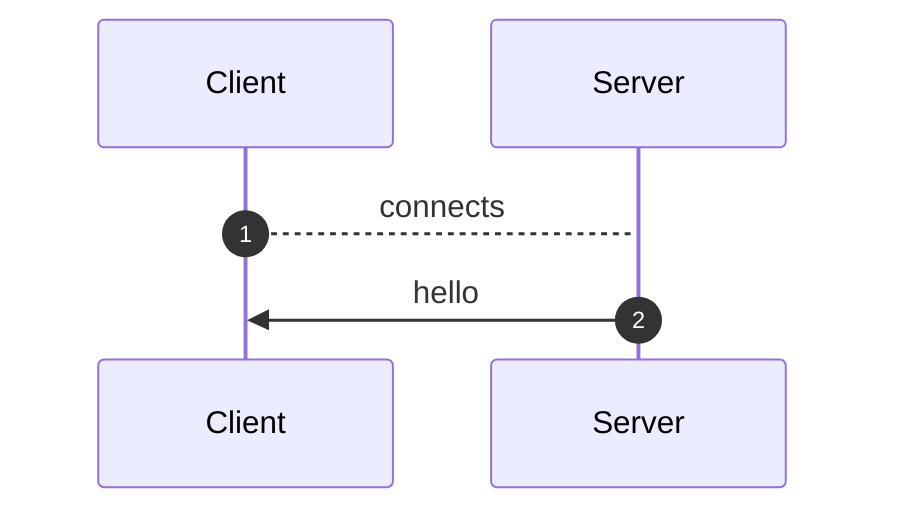
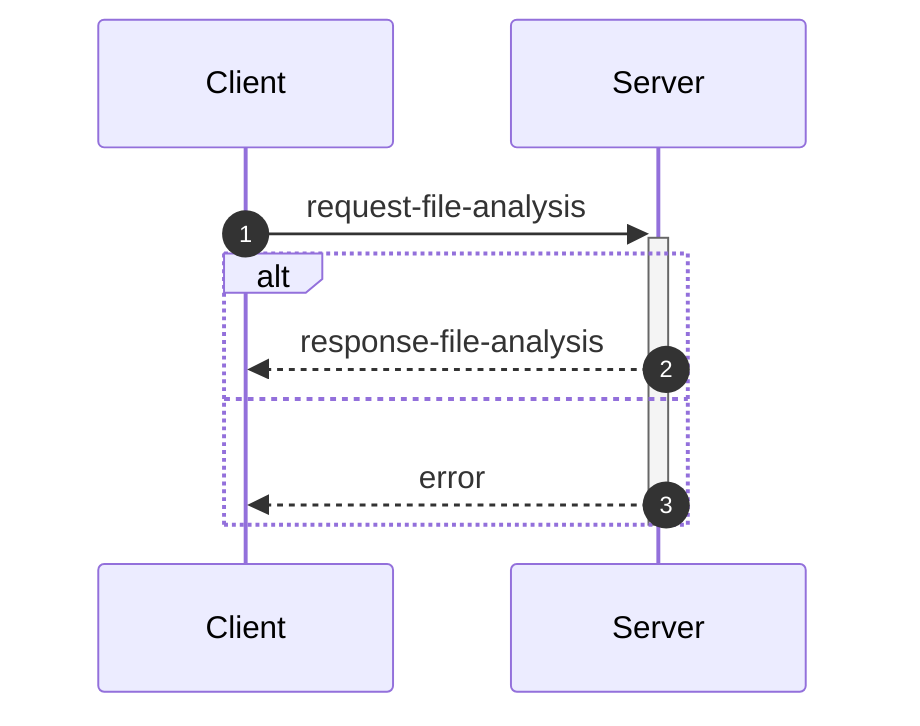
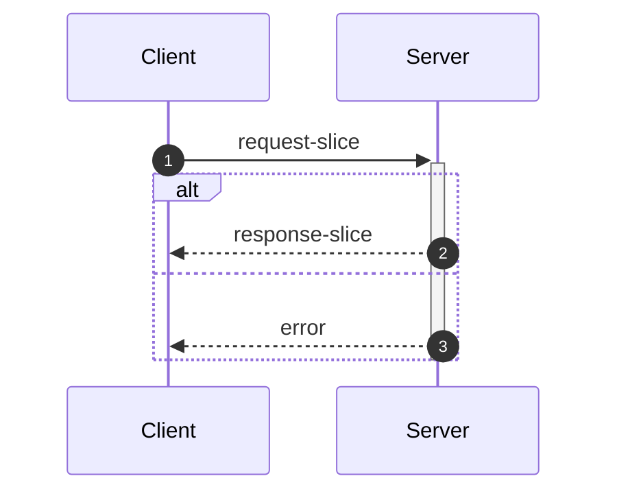
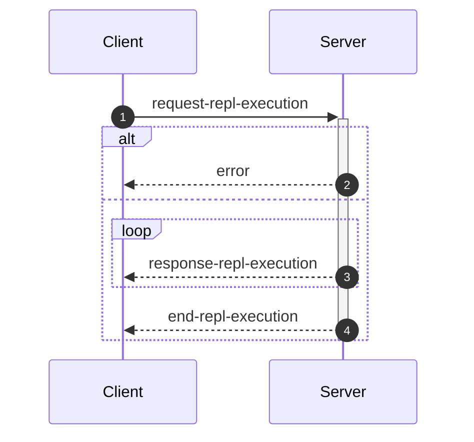

_This document was generated from '[src/documentation/wiki-interface.ts](https://github.com/flowr-analysis/flowr/tree/main//src/documentation/wiki-interface.ts)' on 2026-07-20, 12:29:16 UTC presenting an overview of flowR's interface (v2.12.3, using R v4.5.0). Please do not edit this file/wiki page directly._

Although far from being as detailed as the in-depth explanation of [_flowR_](https://github.com/flowr-analysis/flowr/wiki/core),
this wiki page explains how to interface with _flowR_ in more detail.
In general, command line arguments and other options provide short descriptions on hover over.

* [💻 Using the REPL](#using-the-repl)
* [⚙️ Configuring FlowR](#configuring-flowr)
* [⚒️ Writing Code](#writing-code)
* [💬 Communicating with the Server](#communicating-with-the-server)

<a id='using-the-repl'></a>
## 💻 Using the REPL


> [!NOTE]
> To execute arbitrary R commands with a repl request, _flowR_ has to be started explicitly with <span title="Description (Command Line Argument): Allow to access the underlying R session when using flowR (security warning: this allows the execution of arbitrary R code!)">`--r-session-access`</span>.
> Please be aware that this introduces a security risk and note that this relies on the [`r-shell` engine](https://github.com/flowr-analysis/flowr/wiki/engines) .

Although primarily meant for users to explore,
there is nothing which forbids simply calling _flowR_ as a subprocess to use standard-in, -output, and -error
for communication (although you can access the REPL using the server as well,
with the [REPL Request](#message-request-repl-execution) message).

The read-eval-print loop&nbsp;(REPL) works relatively simple.
You can submit an expression (using <kbd>Enter</kbd>),
which is interpreted as an R&nbsp;expression by default but interpreted as a *command* if it starts with a colon (`:`).
The best command to get started with the REPL is <span title="Description (Repl Command): Show help information (aliases: :h, :?)">`:help`</span>.
Besides, you can leave the REPL either with the command <span title="Description (Repl Command): End the repl (aliases: :q, :exit)">`:quit`</span> or by pressing <kbd>Ctrl</kbd>+<kbd>C</kbd> twice.
When writing a *command*, you may press <kbd>Tab</kbd> to get a list of completions, if available.
Multiple commands can be entered in a single line by separating them with a semicolon (`;`), e.g. `:parse "x<-2"; :df*`.
If a command is given without R code, the REPL will re-use R code given in a previous command.
The prior example will hence return first the parsed AST of the program and then the dataflow graph for `"x <- 2"`.

> [!NOTE]
> If you develop flowR, you may want to launch the repl using the `npm run main-dev` command, this way, you get a non-minified version of flowR with debug information and hot-reloading of source files.

<details>
<summary>Available Commands</summary>

We currently offer the following commands (this with a `[*]` suffix are available with and without the star):


| Command | Description |
| ------- | ----------- |
| **<span title="Description (Repl Command): End the repl (aliases: :q, :exit)">:quit</span>** | End the repl (aliases: **:<span title="Alias of ':quit'. End the repl">q</span>**, **:<span title="Alias of ':quit'. End the repl">exit</span>**) |
| **<span title="Description (Repl Command): Execute the given code as R code. This requires the `--r-session-access` flag to be set and requires the r-shell engine. (aliases: :e, :r)">:execute</span>** | Execute the given code as R code. This requires the `--r-session-access` flag to be set and requires the r-shell engine. (aliases: **:<span title="Alias of ':execute'. Execute the given code as R code. This requires the `--r-session-access` flag to be set and requires the r-shell engine.">e</span>**, **:<span title="Alias of ':execute'. Execute the given code as R code. This requires the `--r-session-access` flag to be set and requires the r-shell engine.">r</span>**) |
| **<span title="Description (Repl Command): Get mermaid code for the control-flow graph of R code (aliases: :cfg, :cf)">:controlflow[*]</span>** | Get mermaid code for the control-flow graph of R code (star: Returns the URL to mermaid.live) (aliases: **:<span title="Alias of ':controlflow'. Get mermaid code for the control-flow graph of R code">cfg</span>**, **:<span title="Alias of ':controlflow'. Get mermaid code for the control-flow graph of R code">cf</span>**) |
| **<span title="Description (Repl Command): Get mermaid code for the control-flow graph with basic blocks (aliases: :cfgb, :cfb)">:controlflowbb[*]</span>** | Get mermaid code for the control-flow graph with basic blocks (star: Returns the URL to mermaid.live) (aliases: **:<span title="Alias of ':controlflowbb'. Get mermaid code for the control-flow graph with basic blocks">cfgb</span>**, **:<span title="Alias of ':controlflowbb'. Get mermaid code for the control-flow graph with basic blocks">cfb</span>**) |
| **<span title="Description (Repl Command): Get mermaid code for the dataflow graph (aliases: :d, :df)">:dataflow[*]</span>** | Get mermaid code for the dataflow graph (star: Returns the URL to mermaid.live) (aliases: **:<span title="Alias of ':dataflow'. Get mermaid code for the dataflow graph">d</span>**, **:<span title="Alias of ':dataflow'. Get mermaid code for the dataflow graph">df</span>**) |
| **<span title="Description (Repl Command): Get mermaid code for the normalized AST of R code (aliases: :n)">:normalize[*]</span>** | Get mermaid code for the normalized AST of R code (star: Returns the URL to mermaid.live) (alias: **:<span title="Alias of ':normalize'. Get mermaid code for the normalized AST of R code">n</span>**) |
| **<span title="Description (Repl Command): Get mermaid code for the simplified dataflow graph (aliases: :ds, :dfs)">:dataflowsimple[*]</span>** | Get mermaid code for the simplified dataflow graph (star: Returns the URL to mermaid.live) (aliases: **:<span title="Alias of ':dataflowsimple'. Get mermaid code for the simplified dataflow graph">ds</span>**, **:<span title="Alias of ':dataflowsimple'. Get mermaid code for the simplified dataflow graph">dfs</span>**) |
| **<span title="Description (Repl Command): Inspect and extend the signature database: `query` (identical to :query @signature), `add <path>` to mount another database/source, `download` to fetch the full-history database. (aliases: :sig)">:signature</span>** | Inspect and extend the signature database: `query` (identical to :query @signature), `add <path>` to mount another database/source, `download` to fetch the full-history database. (alias: **:<span title="Alias of ':signature'. Inspect and extend the signature database: `query` (identical to :query @signature), `add <path>` to mount another database/source, `download` to fetch the full-history database.">sig</span>**) |
| **<span title="Description (Repl Command): Just calculates the DFG, but only prints summary info (aliases: :d#, :df#)">:dataflowsilent</span>** | Just calculates the DFG, but only prints summary info (aliases: **:<span title="Alias of ':dataflowsilent'. Just calculates the DFG, but only prints summary info">d#</span>**, **:<span title="Alias of ':dataflowsilent'. Just calculates the DFG, but only prints summary info">df#</span>**) |
| **<span title="Description (Repl Command): Prints ASCII Art of the parsed, unmodified AST (aliases: :p)">:parse</span>** | Prints ASCII Art of the parsed, unmodified AST (alias: **:<span title="Alias of ':parse'. Prints ASCII Art of the parsed, unmodified AST">p</span>**) |
| **<span title="Description (Repl Command): Prints the version of flowR as well as the current version of R">:version</span>** | Prints the version of flowR as well as the current version of R
| **<span title="Description (Repl Command): Query the given R code (use 'help' for more information)">:query[*]</span>** | Query the given R code (use 'help' for more information) (star: Similar to query, but returns the output in json format.)
| **<span title="Description (Repl Command): Returns an ASCII representation of the dataflow graph (aliases: :df!)">:dataflowascii</span>** | Returns an ASCII representation of the dataflow graph (alias: **:<span title="Alias of ':dataflowascii'. Returns an ASCII representation of the dataflow graph">df!</span>**) |
| **<span title="Description (Repl Command): Returns summarization stats for the normalized AST (aliases: :n#)">:normalize#</span>** | Returns summarization stats for the normalized AST (alias: **:<span title="Alias of ':normalize#'. Returns summarization stats for the normalized AST">n#</span>**) |
| **<span title="Description (Repl Command): Show help information (aliases: :h, :?)">:help</span>** | Show help information (aliases: **:<span title="Alias of ':help'. Show help information">h</span>**, **:<span title="Alias of ':help'. Show help information">?</span>**) |


</details>


> [!TIP]
> 
> As indicated by the examples before, all REPL commands that operate on code keep track of the state.
> Hence, if you run a command like <span title="Description (Repl Command, starred version): Returns the URL to mermaid.live; Base Command: Get mermaid code for the dataflow graph (aliases: :d*, :df*)">`:dataflow*`</span> without providing R code,
> the REPL will re-use the R code provided in a previous command.
> Likewise, doing this will benefit from incrementality!
> If you request the dataflow graph with `:df* x <- 2 * y` and then want to see the parsed AST with `:parse`,
> the REPL will re-use previously obtained information and not re-parse the code again.
> 		


Generally, many commands offer shortcut versions in the REPL. Many queries, for example, offer a shortened format (see the example below).
Of special note, the [Config Query](https://github.com/flowr-analysis/flowr/wiki/query-api#Config-Query)
can be used to also modify the currently active configuration of _flowR_ within the REPL (see the [wiki page](https://github.com/flowr-analysis/flowr/wiki/query-api#Config-Query) for more information).

### Example: Retrieving the Dataflow Graph

To retrieve a URL to the [mermaid](https://mermaid.js.org/) diagram of the dataflow of a given expression,
use <span title="Description (Repl Command, starred version): Returns the URL to mermaid.live; Base Command: Get mermaid code for the dataflow graph (aliases: :d*, :df*)">`:dataflow*`</span> (or <span title="Description (Repl Command): Get mermaid code for the dataflow graph (aliases: :d, :df)">`:dataflow`</span> to get the mermaid code in the cli):


```shell
$ docker run -it --rm eagleoutice/flowr # or npm run flowr 
flowR repl v2.12.3, R grammar v14 (tree-sitter engine)
R> :dataflow* y <- 1 + x
```

<details>
<summary style='color:gray'>Output</summary>


```text
https://mermaid.live/view#base64:eyJjb2RlIjoiZmxvd2NoYXJ0IEJUXG4gICAgMXt7XCJgKiM5MTtSTnVtYmVyIzkzOyogKioxKipcbiAgICAgICoxLjYqICgqKmlkOiAxKiopYFwifX1cbiAgICUlIE5vIGVkZ2VzIGZvdW5kIGZvciAxXG4gICAgMihbXCJgKiM5MTtSU3ltYm9sIzkzOyogKip4KipcbiAgICAgICoxLjEwKiAoKippZDogMioqKWBcIl0pXG4gICAlJSBObyBlZGdlcyBmb3VuZCBmb3IgMlxuICAgIDNbW1wiYCojOTE7UkJpbmFyeU9wIzkzOyogYmFzZSM1ODsjNTg7KiojNDM7KipcbiAgICAgICoxLjYtMTAqICgqKmlkOiAzKiopXG4gICAgYXJnOiAoMSwgMilgXCJdXVxuICAgIGJ1aWx0LWluOl9bXCJgQnVpbHQtSW46XG4jNDM7YFwiXVxuICAgIHN0eWxlIGJ1aWx0LWluOl8gc3Ryb2tlOmdyYXksZmlsbDpncmF5LHN0cm9rZS13aWR0aDoycHgsb3BhY2l0eTouODtcbiAgICAwW1wiYCojOTE7UlN5bWJvbCM5MzsqICoqeSoqXG4gICAgICAqMS4xKiAoKippZDogMCoqLCB2OiAzKWBcIl1cbiAgICA0W1tcImAqIzkxO1JCaW5hcnlPcCM5MzsqIGJhc2UjNTg7IzU4OyoqIzYwOyM0NTsqKlxuICAgICAgKjEuMS0xMCogKCoqaWQ6IDQqKilcbiAgICBhcmc6ICgwLCAzKWBcIl1dXG4gICAgYnVpbHQtaW46Xy1bXCJgQnVpbHQtSW46XG4jNjA7IzQ1O2BcIl1cbiAgICBzdHlsZSBidWlsdC1pbjpfLSBzdHJva2U6Z3JheSxmaWxsOmdyYXksc3Ryb2tlLXdpZHRoOjJweCxvcGFjaXR5Oi44O1xuICAgIDMgLS0+fFwicmVhZHMsIGFyZ1wifCAxXG4gICAgMyAtLT58XCJyZWFkcywgYXJnXCJ8IDJcbiAgICAzIC0uLT58XCJyZWFkcywgY2FsbHNcInwgYnVpbHQtaW46X1xuICAgIGxpbmtTdHlsZSAyIHN0cm9rZTpncmF5O1xuICAgIDAgLS0+fFwiZGVmaW5lZC1ieVwifCAzXG4gICAgMCAtLT58XCJkZWZpbmVkLWJ5XCJ8IDRcbiAgICA0IC0tPnxcInJlYWRzLCBhcmdcInwgM1xuICAgIDQgLS0+fFwicmV0dXJucywgYXJnXCJ8IDBcbiAgICA0IC0uLT58XCJyZWFkcywgY2FsbHNcInwgYnVpbHQtaW46Xy1cbiAgICBsaW5rU3R5bGUgNyBzdHJva2U6Z3JheTsiLCJtZXJtYWlkIjp7ImF1dG9TeW5jIjp0cnVlfX0=
```


Retrieve the dataflow graph of the expression `y <- 1 + x`. It looks like this:


```mermaid
flowchart LR
    1{{"`*#91;RNumber#93;* **1**
      *1.6* (**id: 1**)`"}}
   %% No edges found for 1
    2(["`*#91;RSymbol#93;* **x**
      *1.10* (**id: 2**)`"])
   %% No edges found for 2
    3[["`*#91;RBinaryOp#93;* base#58;#58;**#43;**
      *1.6-10* (**id: 3**)
    arg: (1, 2)`"]]
    built-in:_["`Built-In:
#43;`"]
    style built-in:_ stroke:gray,fill:gray,stroke-width:2px,opacity:.8;
    0["`*#91;RSymbol#93;* **y**
      *1.1* (**id: 0**, v: 3)`"]
    4[["`*#91;RBinaryOp#93;* base#58;#58;**#60;#45;**
      *1.1-10* (**id: 4**)
    arg: (0, 3)`"]]
    built-in:_-["`Built-In:
#60;#45;`"]
    style built-in:_- stroke:gray,fill:gray,stroke-width:2px,opacity:.8;
    3 -->|"reads, arg"| 1
    3 -->|"reads, arg"| 2
    3 -.->|"reads, calls"| built-in:_
    linkStyle 2 stroke:gray;
    0 -->|"defined-by"| 3
    0 -->|"defined-by"| 4
    4 -->|"reads, arg"| 3
    4 -->|"returns, arg"| 0
    4 -.->|"reads, calls"| built-in:_-
    linkStyle 7 stroke:gray;
```

	
<details>

<summary style="color:gray">R Code of the Dataflow Graph</summary>

The analysis required _1.1 ms_ (including parse and normalize, using the [tree-sitter](https://github.com/flowr-analysis/flowr/wiki/Engines) engine) within the generation environment. No [signature database](https://github.com/flowr-analysis/flowr/wiki/Signature-Database) is mounted for these generated graphs, so `library()` calls attach no package exports; base-R names are still qualified via the generated base-package store (e.g. `acf` as `stats::acf`). 
We encountered no unknown side effects during the analysis.


```r
y <- 1 + x
```


</details>


</details>


For small graphs like this, <span title="Description (Repl Command): Returns an ASCII representation of the dataflow graph (aliases: :df!)">`:dataflowascii`</span> also provides an ASCII representation directly in the REPL:


```shell
$ docker run -it --rm eagleoutice/flowr # or npm run flowr 
flowR repl v2.12.3, R grammar v14 (tree-sitter engine)
R> :df! y <- 1 + x
```

<details open>
<summary style='color:gray'>Output</summary>


```text
                        0<1>0
                   ┌────| 1 |
    ┌────────┐     │    0---0
 c<4>c       └──c<3>c
 |<- |  v<0>v┌──| + |
 c---c──| y |┘  c---c   u<2>u
        v---v      └────| x |
                        u---u
Edges:
3 -> 1: reads, arg  3 -> 2: reads, arg
4 -> 3: reads, arg  4 -> 0: returns, arg
0 -> 3: defined-by  0 -> 4: defined-by
```


Retrieve the dataflow graph of the expression `y <- 1 + x` as ASCII art.

</details>


For the slicing with <span title="Description (Repl Command): Static backwards executable slicer for R">`:slicer`</span>, you have access to the same [magic comments](#slice-magic-comments) as with the [slice request](#message-request-slice).
Pass `--inline` to splice resolvable `source()` calls into the reconstruction so the slice is a single self-contained R text (the same as the static slice query's `inlineSources` flag).
See `--help` for more flags!

### Example: Interfacing with the File System

Many commands that allow for an R-expression (like <span title="Description (Repl Command, starred version): Returns the URL to mermaid.live; Base Command: Get mermaid code for the dataflow graph (aliases: :d*, :df*)">`:dataflow*`</span>) allow for a file as well
if the argument starts with `file://`.
If you are working from the root directory of the _flowR_ repository, the following gives you the parsed AST of the example file using the <span title="Description (Repl Command): Prints ASCII Art of the parsed, unmodified AST (aliases: :p)">`:parse`</span> command:

> **Watch mode**: Replace `file://` with `watch://` to enter watch mode.
> flowR runs the command immediately and then re-runs it every time the file (or any file inside the folder) changes.
> Enter any other command to leave watch mode.
> For example: `:df watch://analysis.R`


```shell
$ docker run -it --rm eagleoutice/flowr # or npm run flowr 
flowR repl v2.12.3, R grammar v14 (tree-sitter engine)
R> :parse file://test/testfiles/example.R
```

<details>
<summary style='color:gray'>Output</summary>


```text
File: test/testfiles/example.R

program
├ binaryoperator
│ ├ identifier "sum" (1:1─4)
│ ├ <- "<-" (1:5─7)
│ ╰ float "0" (1:8─9)
├ binaryoperator
│ ├ identifier "product" (2:1─8)
│ ├ <- "<-" (2:9─11)
│ ╰ float "1" (2:12─13)
├ binaryoperator
│ ├ identifier "w" (3:1─2)
│ ├ <- "<-" (3:3─5)
│ ╰ float "7" (3:6─7)
├ binaryoperator
│ ├ identifier "N" (4:1─2)
│ ├ <- "<-" (4:3─5)
│ ╰ float "10" (4:6─8)
├ forstatement
│ ├ for "for" (6:1─4)
│ ├ ( "(" (6:5─6)
│ ├ identifier "i" (6:6─7)
│ ├ in "in" (6:8─10)
│ ├ binaryoperator
│ │ ├ float "1" (6:11─12)
│ │ ├ : ":" (6:12─13)
│ │ ╰ parenthesizedexpression
│ │   ├ ( "(" (6:13─14)
│ │   ├ binaryoperator
│ │   │ ├ identifier "N" (6:14─15)
│ │   │ ├ - "-" (6:15─16)
│ │   │ ╰ float "1" (6:16─17)
│ │   ╰ ) ")" (6:17─18)
│ ├ ) ")" (6:18─19)
│ ╰ bracedexpression
│   ├ { "{" (6:20─21)
│   ├ binaryoperator
│   │ ├ identifier "sum" (7:3─6)
│   │ ├ <- "<-" (7:7─9)
│   │ ╰ binaryoperator
│   │   ├ binaryoperator
│   │   │ ├ identifier "sum" (7:10─13)
│   │   │ ├ + "+" (7:14─15)
│   │   │ ╰ identifier "i" (7:16─17)
│   │   ├ + "+" (7:18─19)
│   │   ╰ identifier "w" (7:20─21)
│   ├ binaryoperator
│   │ ├ identifier "product" (8:3─10)
│   │ ├ <- "<-" (8:11─13)
│   │ ╰ binaryoperator
│   │   ├ identifier "product" (8:14─21)
│   │   ├  "" (8:22─23)
│   │   ╰ identifier "i" (8:24─25)
│   ╰ } "}" (9:1─2)
├ call
│ ├ identifier "cat" (11:1─4)
│ ╰ arguments
│   ├ ( "(" (11:4─5)
│   ├ argument
│   │ ╰ string
│   │   ├ " "\"" (11:5─6)
│   │   ├ stringcontent "Sum:" (11:6─10)
│   │   ╰ " "\"" (11:10─11)
│   ├ comma "," (11:11─12)
│   ├ argument
│   │ ╰ identifier "sum" (11:13─16)
│   ├ comma "," (11:16─17)
│   ├ argument
│   │ ╰ string
│   │   ├ " "\"" (11:18─19)
│   │   ├ stringcontent
│   │   │ ╰ escapesequence "\\n" (11:19─21)
│   │   ╰ " "\"" (11:21─22)
│   ╰ ) ")" (11:22─23)
╰ call
  ├ identifier "cat" (12:1─4)
  ╰ arguments
    ├ ( "(" (12:4─5)
    ├ argument
    │ ╰ string
    │   ├ " "\"" (12:5─6)
    │   ├ stringcontent "Product:" (12:6─14)
    │   ╰ " "\"" (12:14─15)
    ├ comma "," (12:15─16)
    ├ argument
    │ ╰ identifier "product" (12:17─24)
    ├ comma "," (12:24─25)
    ├ argument
    │ ╰ string
    │   ├ " "\"" (12:26─27)
    │   ├ stringcontent
    │   │ ╰ escapesequence "\\n" (12:27─29)
    │   ╰ " "\"" (12:29─30)
    ╰ ) ")" (12:30─31)
```


Retrieve the parsed AST of the example file.

<details>

<summary>File Content</summary>


```r
sum <- 0
product <- 1
w <- 7
N <- 10

for (i in 1:(N-1)) {
  sum <- sum + i + w
  product <- product * i
}

cat("Sum:", sum, "\n")
cat("Product:", product, "\n")
```


</details>

As _flowR_ directly transforms this AST the output focuses on being human-readable instead of being machine-readable.
		

</details>


### Example: Run a Query

You can run any query supported by _flowR_ using the <span title="Description (Repl Command): Query the given R code (use 'help' for more information)">`:query`</span> command.
For example, to obtain the shapes of all data frames in a given piece of code, you can run:


```shell
$ docker run -it --rm eagleoutice/flowr # or npm run flowr 
flowR repl v2.12.3, R grammar v14 (tree-sitter engine)
R> :query @absint df-shape "x <- data.frame(a = 1:10, b = 1:10)\ny <- x$a"
```

<details open>
<summary style='color:gray'>Output</summary>


```text
Query: absint (2 ms)
   ╰ $12: (colnames: [{"a", "b"}, {}], cols: [2, 2], rows: [10, 10])
   ╰ $0: (colnames: [{"a", "b"}, {}], cols: [2, 2], rows: [10, 10])
All queries together required ≈6 ms (1ms accuracy, total 6 ms)
```


Retrieve the shapes of all data frames in the given code.

</details>


To run the linter on a file, you can use (in this example, we just issue the `dead-code` linter on a small piece of code):


```shell
$ docker run -it --rm eagleoutice/flowr # or npm run flowr 
flowR repl v2.12.3, R grammar v14 (tree-sitter engine)
R> :query @linter rules:dead-code "if(FALSE) x <- 2"
```

<details open>
<summary style='color:gray'>Output</summary>


```text
Query: linter (3 ms)
   ╰ Dead Code (dead-code):
       ╰ certain:
           ╰ Code at 1.11-16
       ╰ Metadata: searchTimeMs: 3, processTimeMs: 0
All queries together required ≈3 ms (1ms accuracy, total 3 ms)
```


Run the linter on the given code, with only the `dead-code` rule enabled.

</details>


For more information on the available queries, please check out the [Query API](https://github.com/flowr-analysis/flowr/wiki/query-api).


<a id='configuring-flowr'></a>
## ⚙️ Configuring FlowR


When running _flowR_, you may want to specify some behaviors with a dedicated configuration file.
By default, flowR looks for a file named `flowr.json` in the current working directory (or any higher directory).
You can also specify a different file with <span title="Description (Command Line Argument): The name of the configuration file to use">`--config-file`</span> or pass the configuration inline using <span title="Description (Command Line Argument): The flowR configuration to use, as a JSON string">`--config-json`</span>.
To inspect the current configuration, you can run flowr with the <span title="Description (Command Line Argument): Run with verbose logging (will be passed to the corresponding script)">`--verbose`</span> flag, or use the `config` [Query](https://github.com/flowr-analysis/flowr/wiki/query-api).
Within the REPL this works by running the following:


```shell
:query @config
```


To work with the <a href="https://github.com/flowr-analysis/flowr/tree/main/src/config.ts#L129"><code><span title="The configuration file format for flowR.">FlowrConfig</span></code></a> you can use the provided helper objects alongside its methods like
<a href="https://github.com/flowr-analysis/flowr/tree/main/src/config.ts#L711"><code><span title="Creates a new flowr config that has the updated values.">FlowrConfig::<b>amend</b></span></code></a>.
The schema below documents every option; the ones you most likely want are:

- <a href="https://github.com/flowr-analysis/flowr/wiki/Interface#configuring-flowr" title="Configuration Option (boolean): Whether source calls should be ignored, causing {@link processSourceCall}&#39;s behavior to be skipped.">ignoreSourceCalls</a>: ignore source calls when analyzing the code, i.e., ignore the inclusion of other files.
- <a href="https://github.com/flowr-analysis/flowr/wiki/Interface#configuring-flowr" title="Configuration Option (boolean): Whether load calls should be ignored, causing {@link processLoadCall}&#39;s behavior to be skipped.">ignoreLoadCalls</a>: ignore load calls when analyzing the code, i.e., ignore the loading of r-data files.
- <a href="https://github.com/flowr-analysis/flowr/wiki/Interface#configuring-flowr" title="Configuration Option (object): Do you want to overwrite (parts) of the builtin definition?">semantics.environment.overwriteBuiltIns</a>: overwrite _flowR_'s handling of built-in functions, or clear the preset definitions entirely.
  See [Configure BuiltIn Semantics](#configure-builtin-semantics) for more information.
- <a href="https://github.com/flowr-analysis/flowr/wiki/Interface#configuring-flowr" title="Configuration Option (string): How to resolve variables and their values. (one of &quot;disabled&quot;, &quot;alias&quot;, &quot;builtin&quot;)">solver.variables</a>: how to resolve variables and their values (`disabled`, `alias`, `builtin`).
- <a href="https://github.com/flowr-analysis/flowr/wiki/Interface#configuring-flowr" title="Configuration Option (array): The engine or set of engines to use for interacting with R code. An empty array means all available engines will be used.">engines</a> and <a href="https://github.com/flowr-analysis/flowr/wiki/Interface#configuring-flowr" title="Configuration Option (string): The default engine to use for interacting with R code. If this is undefined, an arbitrary engine from the specified list will be used. (one of &quot;tree-sitter&quot;, &quot;r-shell&quot;)">defaultEngine</a>: the engines used to interact with R code, see the [Engines wiki page](https://github.com/flowr-analysis/flowr/wiki/engines).
- <a href="https://github.com/flowr-analysis/flowr/wiki/Interface#configuring-flowr" title="Configuration Option (array): Files a framework loads on its own, without any source() call (e.g. global.R in a shiny app), in the order they are loaded; flowR orders the matching project files accordingly and analyzes them as one program. Entries are case-insensitive globs matched against the file path, a plain name matches any file with that name, and entries matching no project file are warned about. Usually set per project kind via specializeConfig.">project.implicitSources</a>: the files a framework loads without any `source()` call, in the order in which they are
  loaded. Entries are globs (e.g. `R/*.R`) matched against the file path ignoring capitalization; one matching no file is reported.
- <a href="https://github.com/flowr-analysis/flowr/wiki/Interface#configuring-flowr" title="Configuration Option (object): Overwrite (parts of) the configuration depending on the project kind flowR detects, e.g. to give a shiny app its implicit sources.">specializeConfig</a>: overwrite (parts of) the configuration depending on the kind of project _flowR_ detects
  (e.g. `shiny-app`), which is how a shiny app gets its implicit sources by default. What you configure directly wins.
- <a href="https://github.com/flowr-analysis/flowr/wiki/Interface#configuring-flowr" title="Configuration Option (array): The default plugins to load when creating a new instance of FlowrAnalyzer">defaultPlugins</a> and <a href="https://github.com/flowr-analysis/flowr/wiki/Interface#configuring-flowr" title="Configuration Option (array): The plugins to load in REPL mode">repl.plugins</a>: the plugins to load for a new <a href="https://github.com/flowr-analysis/flowr/tree/main/src/project/flowr-analyzer.ts#L165"><code><span title="Central class for conducting analyses with FlowR. Use the FlowrAnalyzerBuilder to create a new instance. If you want the original pattern of creating a pipeline and running all steps, you can still do this with FlowrAnalyzer#runFull . To inspect the context of the analyzer, use FlowrAnalyzer#inspectContext (if you are a plugin and need to modify it, use FlowrAnalyzer#context instead).">FlowrAnalyzer</span></code></a> and in the REPL
  (use `flowr:default` to reference the former).

So you can configure _flowR_ by adding a file like the following:

<details>

<summary>Example Configuration File</summary>


```json
{
  "ignoreSourceCalls": true,
  "ignoreLoadCalls": true,
  "semantics": {
    "environment": {
      "overwriteBuiltIns": {
        "definitions": [
          {
            "type": "function",
            "names": [
              "foo"
            ],
            "processor": "builtin:assign",
            "config": {}
          }
        ]
      }
    }
  },
  "defaultPlugins": [
    "file:description",
    "versions:description"
  ],
  "repl": {
    "quickStats": false,
    "dfProcessorHeat": false,
    "hints": true,
    "plugins": [
      "flowr:default"
    ]
  },
  "project": {
    "resolveUnknownPathsOnDisk": true,
    "implicitSources": [
      "global.R",
      "app.R"
    ]
  },
  "linter": {
    "disabledRules": []
  },
  "specializeConfig": {
    "shiny-app": {
      "project": {
        "implicitSources": [
          "global.R",
          "ui.R",
          "server.R",
          "app.R"
        ]
      }
    }
  },
  "engines": [
    {
      "type": "r-shell"
    }
  ],
  "solver": {
    "variables": "alias",
    "evalStrings": true,
    "trackEnvironments": true,
    "sigdb": {
      "enabled": true,
      "loadProjectDependencies": true,
      "eagerlyLoad": false,
      "eagerlyLoadExports": false,
      "linkBaseR": false,
      "linkDescriptionDependencies": false
    },
    "resolveSource": {
      "dropPaths": "no",
      "ignoreCapitalization": true,
      "inferWorkingDirectory": "active-script",
      "searchPath": []
    },
    "instrument": {},
    "slicer": {
      "threshold": 50
    }
  },
  "abstractInterpretation": {
    "wideningThreshold": 4,
    "dataFrame": {
      "maxColNames": 20,
      "readLoadedData": {
        "readExternalFiles": true,
        "maxReadLines": 1000000
      }
    }
  },
  "gas": {
    "thresholds": {
      "memory": {
        "problematic": 0.7,
        "critical": 0.9
      },
      "timeMs": {
        "problematic": 100000,
        "critical": 120000
      }
    },
    "features": {}
  }
}
```


</details>

<details>
<a id='configure-builtin-semantics'></a>
<summary>Configure Built-In Semantics</summary>


`semantics/environment/overwriteBuiltins` accepts two keys:

- `loadDefaults` (boolean, initially `true`): If set to `true`, the default built-in definitions are loaded before applying the custom definitions. Setting this flag to `false` explicitly disables the loading of the default definitions.
- `definitions` (array, initially empty): Allows to overwrite or define new built-in elements. Each object within must have a `type` which is one of the below. Furthermore, they may define a string array of `names` which specifies the identifiers to bind the definitions to. You may use `assumePrimitive` to specify whether _flowR_ should assume that this is a primitive non-library definition (so you probably just do not want to specify the key).

  | Type            | Description                                                                                                                                                                                                                                                                                              | Example                                                                                                    |
  | --------------- | -------------------------------------------------------------------------------------------------------------------------------------------------------------------------------------------------------------------------------------------------------------------------------------------------------- | ---------------------------------------------------------------------------------------------------------- |
  | `constant`    | Additionally allows for a `value` this should resolve to.                                                                                                                                                                                                                                                | `{ type: 'constant', names: ['NULL', 'NA'],  value: null }`                                                |
  | `function`    | Is a rather flexible way to define and bind built-in functions. For the time, we do not have extensive documentation to cover all the cases, so please either consult the sources with the `default-builtin-config.ts` or open a [new issue](https://github.com/flowr-analysis/flowr/issues/new/choose). | `{ type: 'function', names: ['next'], processor: 'builtin:d', config: { cfg: ExitPointType.Next } }` |
  | `replacement` | A comfortable way to specify replacement functions like `$<-` or `names<-`. `suffixes` describes the... suffixes to attach automatically. | `{ type: 'replacement', suffixes: ['<-', '<<-'], names: ['[', '[['] }` |


</details>

<details>

<summary style='color:gray'>Full Configuration-File Schema</summary>

- _The configuration file format for flowR._ (object)
    - **logLevel** [optional] _flowR's global minimum log level, applied when the config is loaded._ (string)
        Only allows: 'silly', 'trace', 'debug', 'info', 'warn', 'error', 'fatal'
    - **ignoreSourceCalls** [optional] _Whether source calls should be ignored, causing {@link processSourceCall}'s behavior to be skipped._ (boolean)
    - **ignoreLoadCalls** [optional] _Whether load calls should be ignored, causing {@link processLoadCall}'s behavior to be skipped._ (boolean)
    - **semantics** _Configure language semantics and how flowR handles them._ (object)
        - **environment** [optional] _Semantics regarding how to handle the R environment._ (object)
            - **overwriteBuiltIns** [optional] _Do you want to overwrite (parts) of the builtin definition?_ (object)
                - **loadDefaults** [optional] _Should the default configuration still be loaded?_ (boolean)
                - **definitions** [optional] _The definitions to load/overwrite._ (array)
                Valid item types:
                    - (object)
    - **defaultPlugins** [optional] _The default plugins to load when creating a new instance of FlowrAnalyzer_ (array)
    Valid item types:
        - (alternatives)
            - (string)
            - (array)
    - **repl** _Configuration options for the REPL._ (object)
        - **quickStats** [optional] _Whether to show quick stats in the REPL after each evaluation._ (boolean)
        - **dfProcessorHeat** [optional] _This instruments the dataflow processors to count how often each processor is called._ (boolean)
        - **hints** [optional] _Whether to show dim inline hints on the empty prompt (automatically disabled on non-interactive terminals)._ (boolean)
        - **plugins** [optional] _The plugins to load in REPL mode_ (array)
        Valid item types:
            - (alternatives)
                - (string)
                - (array)
        - **autoUseFileProtocol** [optional] _Prepend the file protocol to a repl input that looks like a path, instead of only warning about it._ (boolean)
        - **queryStats** [optional] _Whether `:query` closes with the line stating how long the queries took (`:query*` never prints it)._ (boolean)
        - **showPlugins** [optional] _Whether `:version` grays out the plugins that did not activate during the last analysis._ (boolean)
    - **project** _Project specific configuration options._ (object)
        - **resolveUnknownPathsOnDisk** [optional] _Whether to resolve unknown paths loaded by the r project disk when trying to source/analyze files._ (boolean)
        - **basePackages** [optional] _The packages considered part of R itself (base and recommended); if unset, flowR uses its built-in list._ (array)
        Valid item types:
            - (string)
        - **implicitSources** [optional] _Files a framework loads on its own, without any source() call (e.g. global.R in a shiny app), in the order they are loaded; flowR orders the matching project files accordingly and analyzes them as one program. Entries are case-insensitive globs matched against the file path, a plain name matches any file with that name, and entries matching no project file are warned about. Usually set per project kind via specializeConfig._ (array)
        Valid item types:
            - (string)
    - **linter** _Linter configuration options._ (object)
        - **disabledRules** _Linting rule names excluded from the default rule set (a rule requested explicitly via a linter query still runs). Usually set per project kind via specializeConfig._ (array)
        Valid item types:
            - (string)
    - **specializeConfig** [optional] _Overwrite (parts of) the configuration depending on the project kind flowR detects, e.g. to give a shiny app its implicit sources._ (object)
    - **engines** _The engine or set of engines to use for interacting with R code. An empty array means all available engines will be used._ (array)
    Valid item types:
        - (alternatives)
            - _The configuration for the tree sitter engine._ (object)
                - **type** [required] _Use the tree sitter engine._ (string)
                    Only allows: 'tree-sitter'
                - **wasmPath** [optional] _The path to the tree-sitter-r WASM binary to use. If this is undefined, this uses the default path._ (string)
                - **treeSitterWasmPath** [optional] _The path to the tree-sitter WASM binary to use. If this is undefined, this uses the default path._ (string)
                - **lax** [optional] _Whether to use the lax parser for parsing R code (allowing for syntax errors). If this is undefined, the strict parser will be used._ (boolean)
            - _The configuration for the R shell engine._ (object)
                - **type** [required] _Use the R shell engine._ (string)
                    Only allows: 'r-shell'
                - **rPath** [optional] _The path to the R executable to use. If this is undefined, this uses the default path._ (string)
    - **defaultEngine** [optional] _The default engine to use for interacting with R code. If this is undefined, an arbitrary engine from the specified list will be used._ (string)
        Only allows: 'tree-sitter', 'r-shell'
    - **solver** _How to resolve constants, constraints, cells, ..._ (object)
        - **variables** _How to resolve variables and their values._ (string)
            Only allows: 'disabled', 'alias', 'builtin'
        - **evalStrings** _Should we include eval(parse(text="...")) calls in the dataflow graph?_ (boolean)
        - **trackEnvironments** [optional] _Track user-created environments (new.env, assign/get/local with envir=, dollar-assign, attach). When false, all envir-style calls fall through conservatively._ (boolean)
        - **sigdb** _Resolving library exports from a signature database._ (object)
            - **enabled** [optional] _Resolve library()/use() exports from a signature database (default true); when false no database is consulted._ (boolean)
            - **loadProjectDependencies** [optional] _Load the project's declared dependencies from its metadata files (DESCRIPTION Imports/Depends, rproject.toml, renv.lock, rv.lock) (default true); when false these files are not read for dependencies._ (boolean)
            - **eagerlyLoad** [optional] _Parse the database up front rather than on the first package load (default false, ignored if disabled)._ (boolean)
            - **eagerlyLoadExports** [optional] _Add a vertex for every export on load rather than on demand (default false); keeps the dataflow graph small._ (boolean)
            - **assumedRVersion** [optional] _R version assumed when resolving versioned (base-R) exports: a pin like "4.5" or "auto" to detect the installed R (default "auto")._ (string)
            - **linkBaseR** [optional] _Eagerly attach base-R namespaces so bare base calls resolve without library() (default false)._ (boolean)
            - **linkBaseRCalls** [optional] _Add a lightweight Reads edge from a bare base-R call to its signature-database function vertex (default false; base-R qualification is edge-free otherwise)._ (boolean)
            - **linkPackageCalls** [optional] _Add a lightweight Reads edge from a resolved package call to its signature-database function vertex (default false)._ (boolean)
            - **linkDescriptionDependencies** [optional] _Eagerly attach the namespaces of the project's declared DESCRIPTION dependencies (Imports/Depends) so their exports resolve without an explicit library() (default false)._ (boolean)
            - **warmInBackground** [optional] _Decompress the hot shards (base + most-downloaded) in a background task on startup so the first library() lookup is warm (default false; for long-running servers/REPLs)._ (boolean)
            - **additionalPaths** [optional] _Extra directories or bundle/manifest files searched for signature databases (alongside the shipped default and $FLOWR_SIGDB_DIR); a downloaded full-history bundle placed here is mounted automatically._ (array)
            Valid item types:
                - (string)
            - **downloadRepo** [optional] _GitHub owner/repo the full-history bundle is downloaded from via ":signature download" (default "flowr-analysis/flowr", release tag "sigdb-v<flowR-version>")._ (string)
            - **autoSync** [optional] _On startup, re-download shards whose committed sigdb.remote.json hash no longer matches the cache, in the background (default false; opt-in network sync after a git pull)._ (boolean)
            - **versionSelection** [optional] _When a project constrains a dependency, resolve to the newest (default), oldest, or system-installed version satisfying it; system needs R and falls back to newest. Base-R packages always resolve against the assumed R version._ (string)
                Only allows: 'newest', 'oldest', 'system'
            - **versionOverrides** [optional] _Force an exact version for specific packages (name -> version), overriding both the project constraint and the versionSelection policy (default {})._ (object)
        - **versionManagement** _Policies for reasoning about dependency versions._ (object)
            - **linkedVersionGroups** [optional] _Groups of packages that must resolve to the same version; version guessing intersects each group so its members stay mutually compatible (default [])._ (array)
            Valid item types:
                - (array)
                Valid item types:
                    - (string)
        - **instrument** (object)
            - **dataflowExtractors** [optional] _These keys are only intended for use within code, allowing to instrument the dataflow analyzer!_ (any)
        - **resolveSource** [optional] _If lax source calls are active, flowR searches for sourced files much more freely, based on the configurations you give it. This option is only in effect if `ignoreSourceCalls` is set to false._ (object)
            - **dropPaths** _Allow to drop the first or all parts of the sourced path, if it is relative._ (string)
                Only allows: 'no', 'once', 'all'
            - **ignoreCapitalization** _Search for filenames matching in the lowercase._ (boolean)
            - **inferWorkingDirectory** _Try to infer the working directory from the main or any script to analyze._ (string)
                Only allows: 'no', 'main-script', 'active-script', 'any-script'
            - **searchPath** _Additionally search in these paths._ (array)
            Valid item types:
                - (string)
            - **repeatedSourceLimit** [optional] _How often the same file can be sourced within a single run? Please be aware: in case of cyclic sources this may not reach a fixpoint so give this a sensible limit._ (number)
            - **applyReplacements** _Provide name replacements for loaded files_ (array)
            Valid item types:
                - (object)
            - **assumeFilesExist** [optional] _Assume a sourced file is always there, making what it defines certain instead of conditional on the source call._ (boolean)
        - **slicer** [optional] _The configuration for the slicer._ (object)
            - **threshold** [optional] _The maximum number of iterations to perform on a single function call during slicing._ (number)
            - **autoExtend** [optional] _If set, the slicer will gain an additional post-pass._ (boolean)
    - **abstractInterpretation** _The configuration options for abstract interpretation._ (object)
        - **wideningThreshold** _The threshold for the number of visitations of a node at which widening should be performed to ensure the termination of the fixpoint iteration._ (number)
        - **dataFrame** _The configuration of the shape inference for data frames._ (object)
            - **maxColNames** _The maximum number of columns names to infer for data frames before over-approximating the column names to top._ (number)
            - **readLoadedData** _Configuration options for reading data frame shapes from loaded external data files, such as CSV files._ (object)
                - **readExternalFiles** _Whether data frame shapes should be extracted from loaded external files, such as CSV files._ (boolean)
                - **maxReadLines** _The maximum number of lines to read when extracting data frame shapes from loaded files, such as CSV files._ (number)
    - **gas** [optional] _Resource-usage guard (gas) configuration. All feature factors default to 0 (disabled). See https://github.com/flowr-analysis/flowr/wiki/Core#gas-resource-guard._ (object)
        - **thresholds** [optional] _Shared thresholds for all gas checks (scaled by per-feature factor)._ (object)
            - **memory** [optional] _Heap-usage fraction thresholds (0-1)._ (object)
                - **problematic** [optional] _Heap fraction (0-1) above which Problematic is returned._ (number)
                - **critical** [optional] _Heap fraction (0-1) above which Critical is returned._ (number)
            - **timeMs** [optional] _Elapsed analysis time thresholds in milliseconds._ (object)
                - **problematic** [optional] _Elapsed ms above which Problematic is returned._ (number)
                - **critical** [optional] _Elapsed ms above which Critical is returned._ (number)
        - **features** [optional] _Per-feature sensitivity factors. 0 or absent disables gas checking for that feature. A factor of 2 makes the feature twice as sensitive. Recognised keys: `source`, `side-effect-linking`, `linter`._ (object)
        - **heapProvider** [optional] _Custom heap statistics source (programmatic configs only), overriding the built-in v8/performance.memory detection._ (function)

</details>

	

<a id='writing-code'></a>
## ⚒️ Writing Code

_flowR_ can be used as a [module](https://www.npmjs.com/package/@eagleoutice/flowr) and offers several main classes and interfaces that are interesting for extension writers 
(see the [Visual Studio Code extension](https://marketplace.visualstudio.com/items?itemName=code-inspect.vscode-flowr) or the [Core](https://github.com/flowr-analysis/flowr/wiki/core) wiki page for more information).

### Creating Analyses with _flowR_

Nowadays, instances of the <a href="https://github.com/flowr-analysis/flowr/tree/main/src/project/flowr-analyzer.ts#L165"><code><span title="Central class for conducting analyses with FlowR. Use the FlowrAnalyzerBuilder to create a new instance. If you want the original pattern of creating a pipeline and running all steps, you can still do this with FlowrAnalyzer#runFull . To inspect the context of the analyzer, use FlowrAnalyzer#inspectContext (if you are a plugin and need to modify it, use FlowrAnalyzer#context instead).">FlowrAnalyzer</span></code></a> should be used as central frontend to get analysis results from _flowR_.
For example, a program slice can be created like this:


```ts
const analyzer = await new FlowrAnalyzerBuilder()
    .setEngine('tree-sitter')
    .build();
analyzer.addRequest('x <- 1\ny <- x\nx');
const result = await analyzer.query([
    {
        type:     'static-slice',
        criteria: ['3@x']
    }
]);
//console.log(result['static-slice']);
```


For more information, please have a look at the [Analyzer](https://github.com/flowr-analysis/flowr/wiki/analyzer) wiki page, which explains how to construct and use the <a href="https://github.com/flowr-analysis/flowr/tree/main/src/project/flowr-analyzer.ts#L165"><code><span title="Central class for conducting analyses with FlowR. Use the FlowrAnalyzerBuilder to create a new instance. If you want the original pattern of creating a pipeline and running all steps, you can still do this with FlowrAnalyzer#runFull . To inspect the context of the analyzer, use FlowrAnalyzer#inspectContext (if you are a plugin and need to modify it, use FlowrAnalyzer#context instead).">FlowrAnalyzer</span></code></a> in more detail.
To work with specific perspectives, you can also consult the respective pages like the [Dataflow Graph](https://github.com/flowr-analysis/flowr/wiki/dataflow-graph) or the [Abstract Interpretation](https://github.com/flowr-analysis/flowr/wiki/abstract-interpretation) wiki pages.
### The Pipeline Executor (Low-Level Interface)

Once, in the beginning, _flowR_ was meant to produce a dataflow graph merely to provide *program slices*. 
However, with continuous updates, the [Dataflow Graph](https://github.com/flowr-analysis/flowr/wiki/dataflow-graph) repeatedly proves to be the more interesting part.
With this, we restructured _flowR_'s originally *hardcoded* pipeline to be far more flexible. 
Now, it can be theoretically extended or replaced with arbitrary steps, optional steps, and what we call 'decorations' of these steps. 
In short, a slicing pipeline using the <a href="https://github.com/flowr-analysis/flowr/tree/main/src/core/pipeline-executor.ts#L97"><code><span title="**Please note:** The PipelineExecutor is now considered to be a rather low-level API for flowR. While it still works and is the basis for all other layers, we strongly recommend using the FlowrAnalyzer and its builder to create and use an analyzer instance that is pre-configured for your use-case. The pipeline executor allows to execute arbitrary pipelines in a step-by-step fashion. If you are not...">PipelineExecutor</span></code></a> looks like this:


```ts

const slicer = new PipelineExecutor(DEFAULT_SLICING_PIPELINE, {
  parser:    new RShell(),
  request:   requestFromInput('x <- 1\nx + 1'),
  criterion: ['2@x']
})
const slice = await slicer.allRemainingSteps()
// console.log(slice.reconstruct.code)
```


<details><summary>More Information</summary>


If you compare this, with what you would have done with the old (and removed) `SteppingSlicer`, 
this essentially just requires you to replace the `SteppingSlicer` with the <a href="https://github.com/flowr-analysis/flowr/tree/main/src/core/pipeline-executor.ts#L97"><code><span title="**Please note:** The PipelineExecutor is now considered to be a rather low-level API for flowR. While it still works and is the basis for all other layers, we strongly recommend using the FlowrAnalyzer and its builder to create and use an analyzer instance that is pre-configured for your use-case. The pipeline executor allows to execute arbitrary pipelines in a step-by-step fashion. If you are not...">PipelineExecutor</span></code></a>
and to pass the <a href="https://github.com/flowr-analysis/flowr/tree/main/src/core/steps/pipeline/default-pipelines.ts#L18"><code>DEFAULT_SLICING_PIPELINE</code></a> as the first argument.
The <a href="https://github.com/flowr-analysis/flowr/tree/main/src/core/pipeline-executor.ts#L97"><code><span title="**Please note:** The PipelineExecutor is now considered to be a rather low-level API for flowR. While it still works and is the basis for all other layers, we strongly recommend using the FlowrAnalyzer and its builder to create and use an analyzer instance that is pre-configured for your use-case. The pipeline executor allows to execute arbitrary pipelines in a step-by-step fashion. If you are not...">PipelineExecutor</span></code></a>...

1. Provides structures to investigate the results of all intermediate steps
2. Can be executed step-by-step
3. Can repeat steps (e.g., to calculate multiple slices on the same input)

See the in-code documentation for more information.


</details>

### Using the <a href="https://github.com/flowr-analysis/flowr/tree/main/src/r-bridge/shell.ts#L143"><code><span title="The RShell represents an interactive session with the R interpreter. You can configure it by RShellOptions . At the moment we are using a live R session (and not networking etc.) to communicate with R easily, which allows us to install packages etc. However, this might and probably will change in the future (leaving this as a legacy mode :D)">RShell</span></code></a> to Interact with R

The <a href="https://github.com/flowr-analysis/flowr/tree/main/src/r-bridge/shell.ts#L143"><code><span title="The RShell represents an interactive session with the R interpreter. You can configure it by RShellOptions . At the moment we are using a live R session (and not networking etc.) to communicate with R easily, which allows us to install packages etc. However, this might and probably will change in the future (leaving this as a legacy mode :D)">RShell</span></code></a> class allows interfacing with the `R`&nbsp;ecosystem installed on the host system.
Please have a look at [flowR's Engines](https://github.com/flowr-analysis/flowr/wiki/engines) for more information on alternatives (for example, the <a href="https://github.com/flowr-analysis/flowr/tree/main/src/r-bridge/lang-4.x/tree-sitter/tree-sitter-executor.ts#L18"><code><span title="Synchronous and (way) faster alternative to the RShell using tree-sitter.">TreeSitterExecutor</span></code></a>).


> [!IMPORTANT]
> 
> Each <a href="https://github.com/flowr-analysis/flowr/tree/main/src/r-bridge/shell.ts#L143"><code><span title="The RShell represents an interactive session with the R interpreter. You can configure it by RShellOptions . At the moment we are using a live R session (and not networking etc.) to communicate with R easily, which allows us to install packages etc. However, this might and probably will change in the future (leaving this as a legacy mode :D)">RShell</span></code></a> controls a new instance of the R&nbsp;interpreter, 
> make sure to call <code><a href="https://github.com/flowr-analysis/flowr/tree/main/src/r-bridge/shell.ts#L351"><span title="Close the current R session, makes the object effectively invalid (can no longer be reopened etc.)">RShell::<i>close</i></span></a>()</code> when you are done.


You can start a new "session" simply by constructing a new object with <code>new <a href="https://github.com/flowr-analysis/flowr/tree/main/src/r-bridge/shell.ts#L143"><span title="The RShell represents an interactive session with the R interpreter. You can configure it by RShellOptions . At the moment we are using a live R session (and not networking etc.) to communicate with R easily, which allows us to install packages etc. However, this might and probably will change in the future (leaving this as a legacy mode :D)">RShell</span></a>()</code>.

However, there are several options that may be of interest 
(e.g., to automatically revive the shell in case of errors or to control the name location of the R process on the system).

With a shell object (let's call it `shell`), you can execute R code by using <a href="https://github.com/flowr-analysis/flowr/tree/main/src/r-bridge/shell.ts#L212"><code><span title="sends the given command directly to the current R session will not do anything to alter input markers!">RShell::<i>sendCommand</i></span></code></a>,
for example <code>shell.<a href="https://github.com/flowr-analysis/flowr/tree/main/src/r-bridge/shell.ts#L212"><span title="sends the given command directly to the current R session will not do anything to alter input markers!">sendCommand</span></a>("1 + 1")</code>.
However, this does not return anything, so if you want to collect the output of your command, use
<a href="https://github.com/flowr-analysis/flowr/tree/main/src/r-bridge/shell.ts#L295"><code><span title="Send a command and collect the output">RShell::<i>sendCommandWithOutput</i></span></code></a> instead.


<a id='communicating-with-the-server'></a>
## 💬 Communicating with the Server


As explained in the [Overview](https://github.com/flowr-analysis/flowr/wiki/overview), you can simply run the [TCP](https://de.wikipedia.org/wiki/Transmission_Control_Protocol)&nbsp;server by adding the <span title="Description (Command Line Argument): Do not drop into a repl, but instead start a server on the given port (default: 1042) and listen for messages.">`--server`</span> flag (and, due to the interactive mode, exit with the conventional <kbd>CTRL</kbd>+<kbd>C</kbd>).
Currently, every connection is handled by the same underlying `RShell` - so the server is not designed to handle many clients at a time.
Additionally, the server is not well guarded against attacks (e.g., you can theoretically spawn an arbitrary number of&nbsp;RShell sessions on the target machine).

Every message has to be given in a single line (i.e., without a newline in-between) and end with a newline character. Nevertheless, we will pretty-print example given in the following segments for the ease of reading.


> [!NOTE]
> 
> The default <span title="Description (Command Line Argument): Do not drop into a repl, but instead start a server on the given port (default: 1042) and listen for messages.">`--server`</span> uses a simple [TCP](https://de.wikipedia.org/wiki/Transmission_Control_Protocol)
> connection. If you want _flowR_ to expose a [WebSocket](https://de.wikipedia.org/wiki/WebSocket) server instead, add the <span title="Description (Command Line Argument): If the server flag is set, use websocket for messaging">`--ws`</span> flag (i.e., <span title="Description (Command Line Argument): Do not drop into a repl, but instead start a server on the given port (default: 1042) and listen for messages.">`--server`</span> <span title="Description (Command Line Argument): If the server flag is set, use websocket for messaging">`--ws`</span>) when starting _flowR_ from the command line.


<ul><li>
<a id="message-hello"></a>
<b>Hello</b> Message (<code>hello</code>) 
<details>

<summary style="color:gray"> View Details. <i>The server informs the client about the successful connection and provides Meta-Information.</i> </summary>


```mermaid
sequenceDiagram
    autonumber
    participant Client
    participant Server

    
    Client-->Server: connects
    Server->>Client: hello
	
```


	
After launching _flowR_, for example, with <code>docker run -it --rm eagleoutice/flowr <span title="Description (Command Line Argument): Do not drop into a repl, but instead start a server on the given port (default: 1042) and listen for messages.">-<span/>-server</span></code>&nbsp;(🐳️), simply connecting should present you with a `hello` message, that amongst others should reveal the versions of&nbsp;_flowR_ and&nbsp;R, using the [semver 2.0](https://semver.org/spec/v2.0.0.html) versioning scheme.
The message looks like this:


```json
{
  "type": "hello",
  "clientName": "client-0",
  "versions": {
    "flowr": "2.12.3",
    "r": "4.5.0",
    "engine": "r-shell"
  }
}
```


There are currently a few messages that you can send after the hello message.
If you want to _slice_ a piece of R code you first have to send an [analysis request](#message-request-file-analysis), so that you can send one or multiple slice requests afterward.
Requests for the [REPL](#message-request-repl) are independent of that.
	

<hr>


<details>
<summary style="color:gray">Message schema (<code>hello</code>)</summary>

For the definition of the hello message, please see it's implementation at [`./src/cli/repl/server/messages/message-hello.ts`](https://github.com/flowr-analysis/flowr/tree/main/./src/cli/repl/server/messages/message-hello.ts).

- [required] (object)
    - **type** [required] _The type of the hello message._ (string)
        Only allows: 'hello'
    - **id** [forbidden] _The id of the message is always undefined (as it is the initial message and not requested)._ (any)
    - **clientName** [required] _A unique name that is assigned to each client. It has no semantic meaning and is only used/useful for debugging._ (string)
    - **versions** [required] (object)
        - **flowr** [required] _The version of the flowr server running in semver format._ (string)
        - **r** [required] _The version of the underlying R shell running in semver format._ (string)
        - **engine** [required] _The parser backend that is used to parse the R code._ (string)

</details>


<hr>

</details>
	</li>

<li>
<a id="message-request-file-analysis"></a>
<b>Analysis</b> Message (<code>request-file-analysis</code>) 
<details>

<summary style="color:gray"> View Details. <i>The server builds the dataflow graph for a given input file (or a set of files).</i> </summary>


```mermaid
sequenceDiagram
    autonumber
    participant Client
    participant Server

    
    Client->>+Server: request-file-analysis
    alt
        Server-->>Client: response-file-analysis
    else
        Server-->>Client: error
    end
    deactivate  Server
	
```


	
The request allows the server to analyze a file and prepare it for slicing.
The message can contain a `filetoken`, which is used to identify the file in later slice or query requests (if you do not add one, the request will not be stored and therefore, it is not available for subsequent requests).

> **Please note!**\
> If you want to send and process a lot of analysis requests, but do not want to slice them, please do not pass the `filetoken` field. This will save the server a lot of memory allocation.

Furthermore, the request must contain either a `content` field to directly pass the file's content or a `filepath` field which contains the path to the file (this path must be accessible for the server to be useful).
If you add the `id` field, the answer will use the same `id` so you can match requests and the corresponding answers.
See the implementation of the request-file-analysis message for more information.

You can drop one or more stored file tokens by adding the `invalidateToken` field (a single token or an array of tokens).
The server frees the corresponding analyses _after_ it has answered the request.

> **Tip!**\
> If you only want to drop tokens, you do not need a separate message: send a `request-file-analysis` that contains _just_ the `invalidateToken` field (and no `content` or `filepath`).
> Such a request behaves like an empty file analysis and the server replies with an empty `results` object.
> Because invalidation happens after the response, you may even pass the _current_ `filetoken` in `invalidateToken` to analyze a file once and have the server forget it right after you received the results.


<details>
<summary>Example of the <code>request-file-analysis</code> Message</summary>

_Note:_ even though we pretty-print these messages, they are sent as a single line, ending with a newline.

The following lists all messages that were sent and received in case you want to reproduce the scenario:

<ol>
<li> <code>hello</code> (response)
<details> 

<summary> Show Details </summary>

The first message is always a hello message.


```json
{
  "type": "hello",
  "clientName": "client-0",
  "versions": {
    "flowr": "2.12.3",
    "r": "4.5.0",
    "engine": "r-shell"
  }
}
```


</details>
</li>

<li> <b><code>request-file-analysis</code> (request)</b>
<details open> 

<summary> Show Details </summary>

Let's suppose you simply want to analyze the following script:
 
```r
x <- 1
x + 1
```

 For this, you can send the following request:


```json
{
  "type": "request-file-analysis",
  "id": "1",
  "filetoken": "x",
  "content": "x <- 1\nx + 1"
}
```


</details>
</li>

<li> <code>response-file-analysis</code> (response)
<details> 

<summary> Show Details </summary>


The `results` field of the response effectively contains three keys of importance:

- `parse`: which contains 1:1 the parse result in CSV format that we received from the `RShell` (i.e., the AST produced by the parser of the R interpreter).
- `normalize`: which contains the normalized AST, including ids (see the `info` field and the [Normalized AST](https://github.com/flowr-analysis/flowr/wiki/normalized-ast) wiki page).
- `dataflow`: especially important is the `graph` field which contains the dataflow graph as a set of root vertices (see the [Dataflow Graph](https://github.com/flowr-analysis/flowr/wiki/dataflow-graph) wiki page).
			


_As the code is pretty long, we inhibit pretty printing and syntax highlighting (JSON, hiding built-in):_

```text
{"type":"response-file-analysis","format":"json","id":"1","results":{"parse":{"files":[{"parsed":"[1,1,1,6,7,0,\"expr\",false,\"x <- 1\"],[1,1,1,1,1,3,\"SYMBOL\",true,\"x\"],[1,1,1,1,3,7,\"expr\",false,\"x\"],[1,3,1,4,2,7,\"LEFT_ASSIGN\",true,\"<-\"],[1,6,1,6,4,5,\"NUM_CONST\",true,\"1\"],[1,6,1,6,5,7,\"expr\",false,\"1\"],[2,1,2,5,16,0,\"expr\",false,\"x + 1\"],[2,1,2,1,10,12,\"SYMBOL\",true,\"x\"],[2,1,2,1,12,16,\"expr\",false,\"x\"],[2,3,2,3,11,16,\"'+'\",true,\"+\"],[2,5,2,5,13,14,\"NUM_CONST\",true,\"1\"],[2,5,2,5,14,16,\"expr\",false,\"1\"]","filePath":"/tmp/tmp-10727-ZPa2XHVEGD3B-.R"}],".meta":{"timing":2}},"normalize":{"ast":{"type":"RProject","files":[{"root":{"type":"RExpressionList","children":[{"type":"RBinaryOp","location":[1,3,1,4],"lhs":{"type":"RSymbol","location":[1,1,1,1],"content":"x","lexeme":"x","info":{"fullRange":[1,1,1,1],"adToks":[],"id":0,"parent":2,"role":"bin-l","index":0,"nest":0,"file":"/tmp/tmp-10727-ZPa2XHVEGD3B-.R"}},"rhs":{"location":[1,6,1,6],"lexeme":"1","info":{"fullRange":[1,6,1,6],"adToks":[],"id":1,"parent":2,"role":"bin-r","index":1,"nest":0,"file":"/tmp/tmp-10727-ZPa2XHVEGD3B-.R"},"type":"RNumber","content":{"num":1,"complexNumber":false,"markedAsInt":false}},"operator":"<-","lexeme":"<-","info":{"fullRange":[1,1,1,6],"adToks":[],"id":2,"parent":6,"nest":0,"file":"/tmp/tmp-10727-ZPa2XHVEGD3B-.R","index":0,"role":"el-c"}},{"type":"RBinaryOp","location":[2,3,2,3],"lhs":{"type":"RSymbol","location":[2,1,2,1],"content":"x","lexeme":"x","info":{"fullRange":[2,1,2,1],"adToks":[],"id":3,"parent":5,"role":"bin-l","index":0,"nest":0,"file":"/tmp/tmp-10727-ZPa2XHVEGD3B-.R"}},"rhs":{"location":[2,5,2,5],"lexeme":"1","info":{"fullRange":[2,5,2,5],"adToks":[],"id":4,"parent":5,"role":"bin-r","index":1,"nest":0,"file":"/tmp/tmp-10727-ZPa2XHVEGD3B-.R"},"type":"RNumber","content":{"num":1,"complexNumber":false,"markedAsInt":false}},"operator":"+","lexeme":"+","info":{"fullRange":[2,1,2,5],"adToks":[],"id":5,"parent":6,"nest":0,"file":"/tmp/tmp-10727-ZPa2XHVEGD3B-.R","index":1,"role":"el-c"}}],"info":{"adToks":[],"id":6,"nest":0,"file":"/tmp/tmp-10727-ZPa2XHVEGD3B-.R","role":"root","index":0}},"filePath":"/tmp/tmp-10727-ZPa2XHVEGD3B-.R"}],"info":{"id":7}},".meta":{"timing":0}},"dataflow":{"unknownReferences":[],"in":[{"nodeId":2,"name":"<-","type":2},{"nodeId":5,"name":"+","type":2}],"out":[{"nodeId":0,"name":"x","type":4,"definedAt":2,"value":[1]}],"environment":{"current":{"id":1709,"parent":"<BuiltInEnvironment>","memory":[["x",[{"nodeId":0,"name":"x","type":4,"definedAt":2,"value":[1]}]]],"globalEnv":true},"level":0},"graph":{"rootVertices":[1,0,2,3,4,5],"vertexInformation":[[1,{"tag":"value","id":1}],[0,{"tag":"vdef","id":0,"source":[1]}],[2,{"tag":"fcall","id":2,"name":"<-","onlyBuiltin":true,"args":[{"nodeId":0,"type":32},{"nodeId":1,"type":32}],"origin":["builtin:assign"]}],[3,{"tag":"use","id":3}],[4,{"tag":"value","id":4}],[5,{"tag":"fcall","id":5,"name":"+","onlyBuiltin":true,"args":[{"nodeId":3,"type":32},{"nodeId":4,"type":32}],"origin":["builtin:d"]}]],"edgeInformation":[[2,[[1,{"types":65}],[0,{"types":72}],["built-in:<-",{"types":5}]]],[0,[[1,{"types":2}],[2,{"types":2}]]],[3,[[0,{"types":1}]]],[5,[[3,{"types":65}],[4,{"types":65}],["built-in:+",{"types":5}]]]],"_unknownSideEffects":[]},"entryPoint":2,"exitPoints":[{"type":0,"nodeId":5}],"hooks":[],".meta":{"timing":2}}}}
```


</details>
</li>
</ol>

The complete round-trip took 12.8 ms (including time required to validate the messages, start, and stop the internal mock server).

</details>


You receive an error if, for whatever reason, the analysis fails (e.g., the message or code you sent contained syntax errors).
It contains a human-readable description *why* the analysis failed (see the error message implementation for more details).


<details>
<summary>Example Error Message</summary>

_Note:_ even though we pretty-print these messages, they are sent as a single line, ending with a newline.

The following lists all messages that were sent and received in case you want to reproduce the scenario:

<ol>
<li> <code>hello</code> (response)
<details> 

<summary> Show Details </summary>

The first message is always a hello message.


```json
{
  "type": "hello",
  "clientName": "client-0",
  "versions": {
    "flowr": "2.12.3",
    "r": "4.5.0",
    "engine": "r-shell"
  }
}
```


</details>
</li>

<li> <code>request-file-analysis</code> (request)
<details> 

<summary> Show Details </summary>


```json
{
  "type": "request-file-analysis",
  "id": "1",
  "filename": "sample.R",
  "content": "x <-"
}
```


</details>
</li>

<li> <b><code>error</code> (response)</b>
<details open> 

<summary> Show Details </summary>


```json
{
  "id": "1",
  "type": "error",
  "fatal": false,
  "reason": "Error while analyzing file sample.R: GuardError: unable to parse R code (see the log for more information) for request {\"request\":\"text\",\"content\":\"x <-\"}}\n Report a Bug: https://github.com/flowr-analysis/flowr/issues/new?body=%3C!%2D%2D%20Please%20describe%20your%20issue%20in%20more%20detail%20below!%20%2D%2D%3E%0A%0A%0A%3C!%2D%2D%20Automatically%20generated%20issue%20metadata%2C%20please%20do%20not%20edit%20or%20delete%20content%20below%20this%20line%20%2D%2D%3E%0A%2D%2D%2D%0A%0AflowR%20version%3A%202.12.3%0Anode%20version%3A%20v25.6.1%0Anode%20arch%3A%20x64%0Anode%20platform%3A%20linux%0Amessage%3A%20%60unable%20to%20parse%20R%20code%20%28see%20the%20log%20for%20more%20information%29%20for%20request%20%7B%22request%22%3A%22text%22%2C%22content%22%3A%22x%20%3C%2D%22%7D%7D%60%0Astack%20trace%3A%0A%60%60%60%0A%20%20%20%20at%20guard%20%28%3C%3E%2Fsrc%2Futil%2Fassert.ts%3A128%3A9%29%0A%20%20%20%20at%20guardRetrievedOutput%20%28%3C%3E%2Fsrc%2Fr%2Dbridge%2Fretriever.ts%3A224%3A7%29%0A%20%20%20%20at%20%2Fhome%2Frunner%2Fwork%2Fflowr%2Fflowr%2Fsrc%2Fr%2Dbridge%2Fretriever.ts%3A185%3A4%0A%20%20%20%20at%20processTicksAndRejections%20%28node%3Ainternal%2Fprocess%2Ftask_queues%3A104%3A5%29%0A%20%20%20%20at%20async%20Object.parseRequests%20%5Bas%20processor%5D%20%28%3C%3E%2Fsrc%2Fr%2Dbridge%2Fparser.ts%3A98%3A19%29%0A%20%20%20%20at%20async%20PipelineExecutor.nextStep%20%28%3C%3E%2Fsrc%2Fcore%2Fpipeline%2Dexecutor.ts%3A192%3A25%29%0A%20%20%20%20at%20async%20FlowrAnalyzerCache.runTapeUntil%20%28%3C%3E%2Fsrc%2Fproject%2Fcache%2Fflowr%2Danalyzer%2Dcache.ts%3A101%3A4%29%0A%20%20%20%20at%20async%20FlowRServerConnection.sendFileAnalysisResponse%20%28%3C%3E%2Fsrc%2Fcli%2Frepl%2Fserver%2Fconnection.ts%3A211%3A53%29%0A%60%60%60%0A%0A%2D%2D%2D%0A%09"
}
```


</details>
</li>
</ol>

The complete round-trip took 7.3 ms (including time required to validate the messages, start, and stop the internal mock server).

</details>


&nbsp;

<a id="analysis-include-cfg"></a>
**Including the Control Flow Graph**

While _flowR_ does (for the time being) not use an explicit control flow graph but instead relies on control-dependency edges within the dataflow graph, 
the respective structure can still be exposed using the server (note that, as this feature is not needed within _flowR_, it is tested significantly less - 
so please create a [new issue](https://github.com/flowr-analysis/flowr/issues/new/choose) for any bug you may encounter).
For this, the analysis request may add `cfg: true` to its list of options.


<details>
<summary>Requesting a Control Flow Graph</summary>

_Note:_ even though we pretty-print these messages, they are sent as a single line, ending with a newline.

The following lists all messages that were sent and received in case you want to reproduce the scenario:

<ol>
<li> <code>hello</code> (response)
<details> 

<summary> Show Details </summary>

The first message is always a hello message.


```json
{
  "type": "hello",
  "clientName": "client-0",
  "versions": {
    "flowr": "2.12.3",
    "r": "4.5.0",
    "engine": "r-shell"
  }
}
```


</details>
</li>

<li> <b><code>request-file-analysis</code> (request)</b>
<details open> 

<summary> Show Details </summary>


```json
{
  "type": "request-file-analysis",
  "id": "1",
  "filetoken": "x",
  "content": "if(unknown > 0) { x <- 2 } else { x <- 5 }\nfor(i in 1:x) { print(x); print(i) }",
  "cfg": true
}
```


</details>
</li>

<li> <code>response-file-analysis</code> (response)
<details> 

<summary> Show Details </summary>


The response looks basically the same as a response sent without the `cfg` flag. However, additionally it contains a `cfg` field. 
If you are interested in a visual representation of the control flow graph, see the 
[visualization with mermaid](https://mermaid.live/view#base64:eyJjb2RlIjoiZmxvd2NoYXJ0IEJUXG4gICAgbjMyKFtcImBSRXhwcmVzc2lvbkxpc3QgKDMyKWBcIl0pXG4gICAgbjE1W1wiYFJJZlRoZW5FbHNlICgxNSlcbiMzNDtpZih1bmtub3duICM2MjsgMCkgIzEyMzsgeCAjNjA7IzQ1OyAyICMxMjU7IGVsc2UgIzEyMzsgeCAjNjA7IzQ1OyA1ICMxMjU7IzM0O2BcIl1cbiAgICBuMTUtZVtbMTUtZV1dXG4gICAgbjAoW1wiYFJTeW1ib2wgKDApXG4jMzQ7dW5rbm93biMzNDtgXCJdKVxuICAgIG4xKFtcImBSTnVtYmVyICgxKVxuIzM0OzAjMzQ7YFwiXSlcbiAgICBuMihbXCJgUkJpbmFyeU9wICgyKVxuIzM0O3Vua25vd24gIzYyOyAwIzM0O2BcIl0pXG4gICAgbjItZVtbMi1lXV1cbiAgICBuOChbXCJgUkV4cHJlc3Npb25MaXN0ICg4KWBcIl0pXG4gICAgbjUoW1wiYFJTeW1ib2wgKDUpXG4jMzQ7eCMzNDtgXCJdKVxuICAgIG42KFtcImBSTnVtYmVyICg2KVxuIzM0OzIjMzQ7YFwiXSlcbiAgICBuNyhbXCJgUkJpbmFyeU9wICg3KVxuIzM0O3ggIzYwOyM0NTsgMiMzNDtgXCJdKVxuICAgIG43LWVbWzctZV1dXG4gICAgbjgtZVtbOC1lXV1cbiAgICBuMTQoW1wiYFJFeHByZXNzaW9uTGlzdCAoMTQpYFwiXSlcbiAgICBuMTEoW1wiYFJTeW1ib2wgKDExKVxuIzM0O3gjMzQ7YFwiXSlcbiAgICBuMTIoW1wiYFJOdW1iZXIgKDEyKVxuIzM0OzUjMzQ7YFwiXSlcbiAgICBuMTMoW1wiYFJCaW5hcnlPcCAoMTMpXG4jMzQ7eCAjNjA7IzQ1OyA1IzM0O2BcIl0pXG4gICAgbjEzLWVbWzEzLWVdXVxuICAgIG4xNC1lW1sxNC1lXV1cbiAgICBuMTYoW1wiYFJTeW1ib2wgKDE2KVxuIzM0O2kjMzQ7YFwiXSlcbiAgICBuMzFbXCJgUkZvckxvb3AgKDMxKVxuIzM0O2ZvcihpIGluIDEjNTg7eCkgIzEyMzsgcHJpbnQoeCk7IHByaW50KGkpICMxMjU7IzM0O2BcIl1cbiAgICBuMTcoW1wiYFJOdW1iZXIgKDE3KVxuIzM0OzEjMzQ7YFwiXSlcbiAgICBuMTgoW1wiYFJTeW1ib2wgKDE4KVxuIzM0O3gjMzQ7YFwiXSlcbiAgICBuMTkoW1wiYFJCaW5hcnlPcCAoMTkpXG4jMzQ7MSM1ODt4IzM0O2BcIl0pXG4gICAgbjE5LWVbWzE5LWVdXVxuICAgIG4zMChbXCJgUkV4cHJlc3Npb25MaXN0ICgzMClgXCJdKVxuICAgIG4yMihbXCJgUlN5bWJvbCAoMjIpXG4jMzQ7cHJpbnQoeCkjMzQ7YFwiXSlcbiAgICBuMjVbXCJgUkZ1bmN0aW9uQ2FsbCAoMjUpXG4jMzQ7cHJpbnQoeCkjMzQ7YFwiXVxuICAgIG4yNS1lW1syNS1lXV1cbiAgICBuMjQoW1wiYFJBcmd1bWVudCAoMjQpXG4jMzQ7eCMzNDtgXCJdKVxuICAgIG4yMyhbXCJgUlN5bWJvbCAoMjMpXG4jMzQ7eCMzNDtgXCJdKVxuICAgIG4yNC1lW1syNC1lXV1cbiAgICBuMjYoW1wiYFJTeW1ib2wgKDI2KVxuIzM0O3ByaW50KGkpIzM0O2BcIl0pXG4gICAgbjI5W1wiYFJGdW5jdGlvbkNhbGwgKDI5KVxuIzM0O3ByaW50KGkpIzM0O2BcIl1cbiAgICBuMjktZVtbMjktZV1dXG4gICAgbjI4KFtcImBSQXJndW1lbnQgKDI4KVxuIzM0O2kjMzQ7YFwiXSlcbiAgICBuMjcoW1wiYFJTeW1ib2wgKDI3KVxuIzM0O2kjMzQ7YFwiXSlcbiAgICBuMjgtZVtbMjgtZV1dXG4gICAgbjMwLWVbWzMwLWVdXVxuICAgIG4zMS1lW1szMS1lXV1cbiAgICBuMzItZVtbMzItZV1dXG4gICAgbjE1IC0uLT58XCJGRFwifCBuMzJcbiAgICBuMSAtLi0+fFwiRkRcInwgbjBcbiAgICBuMCAtLi0+fFwiRkRcInwgbjJcbiAgICBuMi1lIC0uLT58XCJGRFwifCBuMVxuICAgIG43IC0uLT58XCJGRFwifCBuOFxuICAgIG42IC0uLT58XCJGRFwifCBuNVxuICAgIG41IC0uLT58XCJGRFwifCBuN1xuICAgIG43LWUgLS4tPnxcIkZEXCJ8IG42XG4gICAgbjgtZSAtLi0+fFwiRkRcInwgbjctZVxuICAgIG4xMyAtLi0+fFwiRkRcInwgbjE0XG4gICAgbjEyIC0uLT58XCJGRFwifCBuMTFcbiAgICBuMTEgLS4tPnxcIkZEXCJ8IG4xM1xuICAgIG4xMy1lIC0uLT58XCJGRFwifCBuMTJcbiAgICBuMTQtZSAtLi0+fFwiRkRcInwgbjEzLWVcbiAgICBuOCAtLT58XCJDRCAoVFJVRSlcInwgbjItZVxuICAgIG4xNCAtLT58XCJDRCAoRkFMU0UpXCJ8IG4yLWVcbiAgICBuMiAtLi0+fFwiRkRcInwgbjE1XG4gICAgbjE1LWUgLS4tPnxcIkZEXCJ8IG44LWVcbiAgICBuMTUtZSAtLi0+fFwiRkRcInwgbjE0LWVcbiAgICBuMzEgLS4tPnxcIkZEXCJ8IG4xNS1lXG4gICAgbjMxIC0uLT58XCJGRFwifCBuMzAtZVxuICAgIG4xOCAtLi0+fFwiRkRcInwgbjE3XG4gICAgbjE3IC0uLT58XCJGRFwifCBuMTlcbiAgICBuMTktZSAtLi0+fFwiRkRcInwgbjE4XG4gICAgbjI1IC0uLT58XCJGRFwifCBuMzBcbiAgICBuMjIgLS4tPnxcIkZEXCJ8IG4yNVxuICAgIG4yMyAtLi0+fFwiRkRcInwgbjI0XG4gICAgbjI0LWUgLS4tPnxcIkZEXCJ8IG4yM1xuICAgIG4yNCAtLi0+fFwiRkRcInwgbjIyXG4gICAgbjI1LWUgLS4tPnxcIkZEXCJ8IG4yNC1lXG4gICAgbjI5IC0uLT58XCJGRFwifCBuMjUtZVxuICAgIG4yNiAtLi0+fFwiRkRcInwgbjI5XG4gICAgbjI3IC0uLT58XCJGRFwifCBuMjhcbiAgICBuMjgtZSAtLi0+fFwiRkRcInwgbjI3XG4gICAgbjI4IC0uLT58XCJGRFwifCBuMjZcbiAgICBuMjktZSAtLi0+fFwiRkRcInwgbjI4LWVcbiAgICBuMzAtZSAtLi0+fFwiRkRcInwgbjI5LWVcbiAgICBuMTkgLS4tPnxcIkZEXCJ8IG4zMVxuICAgIG4xNiAtLi0+fFwiRkRcInwgbjE5LWVcbiAgICBuMzAgLS0+fFwiQ0QgKFRSVUUpXCJ8IG4xNlxuICAgIG4zMS1lIC0tPnxcIkNEIChGQUxTRSlcInwgbjE2XG4gICAgbjMyLWUgLS4tPnxcIkZEXCJ8IG4zMS1lXG4gICAgc3R5bGUgbjMyIHN0cm9rZTpjeWFuLHN0cm9rZS13aWR0aDo2LjVweDsgICAgc3R5bGUgbjMyLWUgc3Ryb2tlOmdyZWVuLHN0cm9rZS13aWR0aDo2LjVweDsiLCJtZXJtYWlkIjp7ImF1dG9TeW5jIjp0cnVlfX0=).
			


_As the code is pretty long, we inhibit pretty printing and syntax highlighting (JSON, hiding built-in):_

```text
{"type":"response-file-analysis","format":"json","id":"1","cfg":{"returns":[],"entryPoints":[32],"exitPoints":["32-e"],"breaks":[],"nexts":[],"graph":{"roots":[32,15,"15-e",0,1,2,"2-e",8,5,6,7,"7-e","8-e",14,11,12,13,"13-e","14-e",16,31,17,18,19,"19-e",30,22,25,"25-e",24,23,"24-e",26,29,"29-e",28,27,"28-e","30-e","31-e","32-e"],"vtxInfos":[[32,[2,32,null,["32-e"]]],[15,[1,15,["2-e"],["15-e"]]],["15-e","15-e"],[0,[2,0]],[1,[2,1]],[2,[2,2,null,["2-e"]]],["2-e","2-e"],[8,[2,8,null,["8-e"]]],[5,[2,5]],[6,[2,6]],[7,[2,7,null,["7-e"]]],["7-e","7-e"],["8-e","8-e"],[14,[2,14,null,["14-e"]]],[11,[2,11]],[12,[2,12]],[13,[2,13,null,["13-e"]]],["13-e","13-e"],["14-e","14-e"],[16,[2,16]],[31,[1,31,[16],["31-e"]]],[17,[2,17]],[18,[2,18]],[19,[2,19,null,["19-e"]]],["19-e","19-e"],[30,[2,30,null,["30-e"]]],[22,[2,22]],[25,[1,25,[22],["25-e"]]],["25-e","25-e"],[24,[2,24,[24],["24-e"]]],[23,[2,23]],["24-e","24-e"],[26,[2,26]],[29,[1,29,[26],["29-e"]]],["29-e","29-e"],[28,[2,28,[28],["28-e"]]],[27,[2,27]],["28-e","28-e"],["30-e","30-e"],["31-e","31-e"],["32-e","32-e"]],"bbChildren":[],"edgeInfos":[[15,[[32,0]]],[1,[[0,0]]],[0,[[2,0]]],["2-e",[[1,0]]],[7,[[8,0]]],[6,[[5,0]]],[5,[[7,0]]],["7-e",[[6,0]]],["8-e",[["7-e",0]]],[13,[[14,0]]],[12,[[11,0]]],[11,[[13,0]]],["13-e",[[12,0]]],["14-e",[["13-e",0]]],[8,[["2-e",[15,"TRUE"]]]],[14,[["2-e",[15,"FALSE"]]]],[2,[[15,0]]],["15-e",[["8-e",0],["14-e",0]]],[31,[["15-e",0],["30-e",0]]],[18,[[17,0]]],[17,[[19,0]]],["19-e",[[18,0]]],[25,[[30,0]]],[22,[[25,0]]],[23,[[24,0]]],["24-e",[[23,0]]],[24,[[22,0]]],["25-e",[["24-e",0]]],[29,[["25-e",0]]],[26,[[29,0]]],[27,[[28,0]]],["28-e",[[27,0]]],[28,[[26,0]]],["29-e",[["28-e",0]]],["30-e",[["29-e",0]]],[19,[[31,0]]],[16,[["19-e",0]]],[30,[[16,[31,"TRUE"]]]],["31-e",[[16,[31,"FALSE"]]]],["32-e",[["31-e",0]]]],"_mayBB":false}},"results":{"parse":{"files":[{"parsed":"[1,1,1,42,38,0,\"expr\",false,\"if(unknown > 0) { x <- 2 } else { x <- 5 }\"],[1,1,1,2,1,38,\"IF\",true,\"if\"],[1,3,1,3,2,38,\"'('\",true,\"(\"],[1,4,1,14,9,38,\"expr\",false,\"unknown > 0\"],[1,4,1,10,3,5,\"SYMBOL\",true,\"unknown\"],[1,4,1,10,5,9,\"expr\",false,\"unknown\"],[1,12,1,12,4,9,\"GT\",true,\">\"],[1,14,1,14,6,7,\"NUM_CONST\",true,\"0\"],[1,14,1,14,7,9,\"expr\",false,\"0\"],[1,15,1,15,8,38,\"')'\",true,\")\"],[1,17,1,26,22,38,\"expr\",false,\"{ x <- 2 }\"],[1,17,1,17,12,22,\"'{'\",true,\"{\"],[1,19,1,24,19,22,\"expr\",false,\"x <- 2\"],[1,19,1,19,13,15,\"SYMBOL\",true,\"x\"],[1,19,1,19,15,19,\"expr\",false,\"x\"],[1,21,1,22,14,19,\"LEFT_ASSIGN\",true,\"<-\"],[1,24,1,24,16,17,\"NUM_CONST\",true,\"2\"],[1,24,1,24,17,19,\"expr\",false,\"2\"],[1,26,1,26,18,22,\"'}'\",true,\"}\"],[1,28,1,31,23,38,\"ELSE\",true,\"else\"],[1,33,1,42,35,38,\"expr\",false,\"{ x <- 5 }\"],[1,33,1,33,25,35,\"'{'\",true,\"{\"],[1,35,1,40,32,35,\"expr\",false,\"x <- 5\"],[1,35,1,35,26,28,\"SYMBOL\",true,\"x\"],[1,35,1,35,28,32,\"expr\",false,\"x\"],[1,37,1,38,27,32,\"LEFT_ASSIGN\",true,\"<-\"],[1,40,1,40,29,30,\"NUM_CONST\",true,\"5\"],[1,40,1,40,30,32,\"expr\",false,\"5\"],[1,42,1,42,31,35,\"'}'\",true,\"}\"],[2,1,2,36,84,0,\"expr\",false,\"for(i in 1:x) { print(x); print(i) }\"],[2,1,2,3,41,84,\"FOR\",true,\"for\"],[2,4,2,13,53,84,\"forcond\",false,\"(i in 1:x)\"],[2,4,2,4,42,53,\"'('\",true,\"(\"],[2,5,2,5,43,53,\"SYMBOL\",true,\"i\"],[2,7,2,8,44,53,\"IN\",true,\"in\"],[2,10,2,12,51,53,\"expr\",false,\"1:x\"],[2,10,2,10,45,46,\"NUM_CONST\",true,\"1\"],[2,10,2,10,46,51,\"expr\",false,\"1\"],[2,11,2,11,47,51,\"':'\",true,\":\"],[2,12,2,12,48,50,\"SYMBOL\",true,\"x\"],[2,12,2,12,50,51,\"expr\",false,\"x\"],[2,13,2,13,49,53,\"')'\",true,\")\"],[2,15,2,36,81,84,\"expr\",false,\"{ print(x); print(i) }\"],[2,15,2,15,54,81,\"'{'\",true,\"{\"],[2,17,2,24,64,81,\"expr\",false,\"print(x)\"],[2,17,2,21,55,57,\"SYMBOL_FUNCTION_CALL\",true,\"print\"],[2,17,2,21,57,64,\"expr\",false,\"print\"],[2,22,2,22,56,64,\"'('\",true,\"(\"],[2,23,2,23,58,60,\"SYMBOL\",true,\"x\"],[2,23,2,23,60,64,\"expr\",false,\"x\"],[2,24,2,24,59,64,\"')'\",true,\")\"],[2,25,2,25,65,81,\"';'\",true,\";\"],[2,27,2,34,77,81,\"expr\",false,\"print(i)\"],[2,27,2,31,68,70,\"SYMBOL_FUNCTION_CALL\",true,\"print\"],[2,27,2,31,70,77,\"expr\",false,\"print\"],[2,32,2,32,69,77,\"'('\",true,\"(\"],[2,33,2,33,71,73,\"SYMBOL\",true,\"i\"],[2,33,2,33,73,77,\"expr\",false,\"i\"],[2,34,2,34,72,77,\"')'\",true,\")\"],[2,36,2,36,78,81,\"'}'\",true,\"}\"]","filePath":"/tmp/tmp-10727-5ayHPduiWnqB-.R"}],".meta":{"timing":2}},"normalize":{"ast":{"type":"RProject","files":[{"root":{"type":"RExpressionList","children":[{"type":"RIfThenElse","condition":{"type":"RBinaryOp","location":[1,12,1,12],"lhs":{"type":"RSymbol","location":[1,4,1,10],"content":"unknown","lexeme":"unknown","info":{"fullRange":[1,4,1,10],"adToks":[],"id":0,"parent":2,"role":"bin-l","index":0,"nest":1,"file":"/tmp/tmp-10727-5ayHPduiWnqB-.R"}},"rhs":{"location":[1,14,1,14],"lexeme":"0","info":{"fullRange":[1,14,1,14],"adToks":[],"id":1,"parent":2,"role":"bin-r","index":1,"nest":1,"file":"/tmp/tmp-10727-5ayHPduiWnqB-.R"},"type":"RNumber","content":{"num":0,"complexNumber":false,"markedAsInt":false}},"operator":">","lexeme":">","info":{"fullRange":[1,4,1,14],"adToks":[],"id":2,"parent":15,"nest":1,"file":"/tmp/tmp-10727-5ayHPduiWnqB-.R","role":"if-c"}},"then":{"type":"RExpressionList","children":[{"type":"RBinaryOp","location":[1,21,1,22],"lhs":{"type":"RSymbol","location":[1,19,1,19],"content":"x","lexeme":"x","info":{"fullRange":[1,19,1,19],"adToks":[],"id":5,"parent":7,"role":"bin-l","index":0,"nest":1,"file":"/tmp/tmp-10727-5ayHPduiWnqB-.R"}},"rhs":{"location":[1,24,1,24],"lexeme":"2","info":{"fullRange":[1,24,1,24],"adToks":[],"id":6,"parent":7,"role":"bin-r","index":1,"nest":1,"file":"/tmp/tmp-10727-5ayHPduiWnqB-.R"},"type":"RNumber","content":{"num":2,"complexNumber":false,"markedAsInt":false}},"operator":"<-","lexeme":"<-","info":{"fullRange":[1,19,1,24],"adToks":[],"id":7,"parent":8,"nest":1,"file":"/tmp/tmp-10727-5ayHPduiWnqB-.R","index":0,"role":"el-c"}}],"grouping":[{"type":"RSymbol","location":[1,17,1,17],"content":"{","lexeme":"{","info":{"fullRange":[1,17,1,26],"adToks":[],"id":3,"role":"el-g","index":0,"nest":1,"file":"/tmp/tmp-10727-5ayHPduiWnqB-.R"}},{"type":"RSymbol","location":[1,26,1,26],"content":"}","lexeme":"}","info":{"fullRange":[1,17,1,26],"adToks":[],"id":4,"role":"el-g","index":0,"nest":1,"file":"/tmp/tmp-10727-5ayHPduiWnqB-.R"}}],"info":{"adToks":[],"id":8,"parent":15,"nest":1,"file":"/tmp/tmp-10727-5ayHPduiWnqB-.R","index":1,"role":"if-then"}},"location":[1,1,1,2],"lexeme":"if","info":{"fullRange":[1,1,1,42],"adToks":[],"id":15,"parent":32,"nest":1,"file":"/tmp/tmp-10727-5ayHPduiWnqB-.R","index":0,"role":"el-c"},"otherwise":{"type":"RExpressionList","children":[{"type":"RBinaryOp","location":[1,37,1,38],"lhs":{"type":"RSymbol","location":[1,35,1,35],"content":"x","lexeme":"x","info":{"fullRange":[1,35,1,35],"adToks":[],"id":11,"parent":13,"role":"bin-l","index":0,"nest":1,"file":"/tmp/tmp-10727-5ayHPduiWnqB-.R"}},"rhs":{"location":[1,40,1,40],"lexeme":"5","info":{"fullRange":[1,40,1,40],"adToks":[],"id":12,"parent":13,"role":"bin-r","index":1,"nest":1,"file":"/tmp/tmp-10727-5ayHPduiWnqB-.R"},"type":"RNumber","content":{"num":5,"complexNumber":false,"markedAsInt":false}},"operator":"<-","lexeme":"<-","info":{"fullRange":[1,35,1,40],"adToks":[],"id":13,"parent":14,"nest":1,"file":"/tmp/tmp-10727-5ayHPduiWnqB-.R","index":0,"role":"el-c"}}],"grouping":[{"type":"RSymbol","location":[1,33,1,33],"content":"{","lexeme":"{","info":{"fullRange":[1,33,1,42],"adToks":[],"id":9,"role":"el-g","index":0,"nest":1,"file":"/tmp/tmp-10727-5ayHPduiWnqB-.R"}},{"type":"RSymbol","location":[1,42,1,42],"content":"}","lexeme":"}","info":{"fullRange":[1,33,1,42],"adToks":[],"id":10,"role":"el-g","index":0,"nest":1,"file":"/tmp/tmp-10727-5ayHPduiWnqB-.R"}}],"info":{"adToks":[],"id":14,"parent":15,"nest":1,"file":"/tmp/tmp-10727-5ayHPduiWnqB-.R","index":2,"role":"if-other"}}},{"type":"RForLoop","variable":{"type":"RSymbol","location":[2,5,2,5],"content":"i","lexeme":"i","info":{"adToks":[],"id":16,"parent":31,"role":"for-var","index":0,"nest":1,"file":"/tmp/tmp-10727-5ayHPduiWnqB-.R"}},"vector":{"type":"RBinaryOp","location":[2,11,2,11],"lhs":{"location":[2,10,2,10],"lexeme":"1","info":{"fullRange":[2,10,2,10],"adToks":[],"id":17,"parent":19,"role":"bin-l","index":0,"nest":1,"file":"/tmp/tmp-10727-5ayHPduiWnqB-.R"},"type":"RNumber","content":{"num":1,"complexNumber":false,"markedAsInt":false}},"rhs":{"type":"RSymbol","location":[2,12,2,12],"content":"x","lexeme":"x","info":{"fullRange":[2,12,2,12],"adToks":[],"id":18,"parent":19,"role":"bin-r","index":1,"nest":1,"file":"/tmp/tmp-10727-5ayHPduiWnqB-.R"}},"operator":":","lexeme":":","info":{"fullRange":[2,10,2,12],"adToks":[],"id":19,"parent":31,"nest":1,"file":"/tmp/tmp-10727-5ayHPduiWnqB-.R","index":1,"role":"for-vec"}},"body":{"type":"RExpressionList","children":[{"type":"RFunctionCall","named":true,"location":[2,17,2,21],"lexeme":"print","functionName":{"type":"RSymbol","location":[2,17,2,21],"content":"print","lexeme":"print","info":{"fullRange":[2,17,2,24],"adToks":[],"id":22,"parent":25,"role":"call-name","index":0,"nest":1,"file":"/tmp/tmp-10727-5ayHPduiWnqB-.R"}},"arguments":[{"type":"RArgument","location":[2,23,2,23],"lexeme":"x","value":{"type":"RSymbol","location":[2,23,2,23],"content":"x","lexeme":"x","info":{"fullRange":[2,23,2,23],"adToks":[],"id":23,"parent":24,"role":"arg-v","index":0,"nest":1,"file":"/tmp/tmp-10727-5ayHPduiWnqB-.R"}},"info":{"fullRange":[2,23,2,23],"adToks":[],"id":24,"parent":25,"nest":1,"file":"/tmp/tmp-10727-5ayHPduiWnqB-.R","index":1,"role":"call-arg"}}],"info":{"fullRange":[2,17,2,24],"adToks":[],"id":25,"parent":30,"nest":1,"file":"/tmp/tmp-10727-5ayHPduiWnqB-.R","index":0,"role":"el-c"}},{"type":"RFunctionCall","named":true,"location":[2,27,2,31],"lexeme":"print","functionName":{"type":"RSymbol","location":[2,27,2,31],"content":"print","lexeme":"print","info":{"fullRange":[2,27,2,34],"adToks":[],"id":26,"parent":29,"role":"call-name","index":0,"nest":1,"file":"/tmp/tmp-10727-5ayHPduiWnqB-.R"}},"arguments":[{"type":"RArgument","location":[2,33,2,33],"lexeme":"i","value":{"type":"RSymbol","location":[2,33,2,33],"content":"i","lexeme":"i","info":{"fullRange":[2,33,2,33],"adToks":[],"id":27,"parent":28,"role":"arg-v","index":0,"nest":1,"file":"/tmp/tmp-10727-5ayHPduiWnqB-.R"}},"info":{"fullRange":[2,33,2,33],"adToks":[],"id":28,"parent":29,"nest":1,"file":"/tmp/tmp-10727-5ayHPduiWnqB-.R","index":1,"role":"call-arg"}}],"info":{"fullRange":[2,27,2,34],"adToks":[],"id":29,"parent":30,"nest":1,"file":"/tmp/tmp-10727-5ayHPduiWnqB-.R","index":1,"role":"el-c"}}],"grouping":[{"type":"RSymbol","location":[2,15,2,15],"content":"{","lexeme":"{","info":{"fullRange":[2,15,2,36],"adToks":[],"id":20,"role":"el-g","index":0,"nest":1,"file":"/tmp/tmp-10727-5ayHPduiWnqB-.R"}},{"type":"RSymbol","location":[2,36,2,36],"content":"}","lexeme":"}","info":{"fullRange":[2,15,2,36],"adToks":[],"id":21,"role":"el-g","index":0,"nest":1,"file":"/tmp/tmp-10727-5ayHPduiWnqB-.R"}}],"info":{"adToks":[],"id":30,"parent":31,"nest":1,"file":"/tmp/tmp-10727-5ayHPduiWnqB-.R","index":2,"role":"for-b"}},"lexeme":"for","info":{"fullRange":[2,1,2,36],"adToks":[],"id":31,"parent":32,"nest":1,"file":"/tmp/tmp-10727-5ayHPduiWnqB-.R","index":1,"role":"el-c"},"location":[2,1,2,3]}],"info":{"adToks":[],"id":32,"nest":0,"file":"/tmp/tmp-10727-5ayHPduiWnqB-.R","role":"root","index":0}},"filePath":"/tmp/tmp-10727-5ayHPduiWnqB-.R"}],"info":{"id":33}},".meta":{"timing":0}},"dataflow":{"unknownReferences":[],"in":[{"nodeId":15,"name":"if","type":2},{"nodeId":0,"name":"unknown","type":1},{"nodeId":2,"name":">","type":2},{"nodeId":7,"name":"<-","cds":[{"id":15,"when":true}],"type":2},{"nodeId":13,"name":"<-","cds":[{"id":15,"when":false}],"type":2},{"nodeId":8,"name":"{","cds":[{"id":15,"when":true}],"type":2},{"nodeId":14,"name":"{","cds":[{"id":15,"when":false}],"type":2},{"nodeId":31,"name":"for","type":2},{"nodeId":27,"name":"i","type":4},{"nodeId":19,"name":":","type":2},{"nodeId":25,"name":"print","type":2},{"nodeId":29,"name":"print","type":2}],"out":[{"nodeId":5,"name":"x","type":4,"definedAt":7,"cds":[{"id":15,"when":true}],"value":[6]},{"nodeId":11,"name":"x","type":4,"definedAt":13,"cds":[{"id":15,"when":false}],"value":[12]},{"nodeId":16,"name":"i","type":1}],"environment":{"current":{"id":1782,"parent":"<BuiltInEnvironment>","memory":[["x",[{"nodeId":5,"name":"x","type":4,"definedAt":7,"cds":[{"id":15,"when":true},{"id":15,"when":false}],"value":[6]},{"nodeId":11,"name":"x","type":4,"definedAt":13,"cds":[{"id":15,"when":true},{"id":15,"when":false}],"value":[12]}]],["i",[{"nodeId":16,"name":"i","type":4,"definedAt":31}]]],"globalEnv":true},"level":0},"graph":{"rootVertices":[0,1,2,6,5,7,8,12,11,13,14,15,16,17,18,19,23,25,27,29,30,31],"vertexInformation":[[0,{"tag":"use","id":0}],[1,{"tag":"value","id":1}],[2,{"tag":"fcall","id":2,"name":">","onlyBuiltin":true,"args":[{"nodeId":0,"type":32},{"nodeId":1,"type":32}],"origin":["builtin:d"]}],[6,{"tag":"value","id":6}],[5,{"tag":"vdef","id":5,"cds":[{"id":15,"when":true}],"source":[6]}],[7,{"tag":"fcall","id":7,"name":"<-","onlyBuiltin":true,"cds":[{"id":15,"when":true}],"args":[{"nodeId":5,"type":32},{"nodeId":6,"type":32}],"origin":["builtin:assign"]}],[8,{"tag":"fcall","id":8,"name":"{","onlyBuiltin":true,"cds":[{"id":15,"when":true}],"args":[{"nodeId":7,"type":32}],"origin":["builtin:el"]}],[12,{"tag":"value","id":12}],[11,{"tag":"vdef","id":11,"cds":[{"id":15,"when":false}],"source":[12]}],[13,{"tag":"fcall","id":13,"name":"<-","onlyBuiltin":true,"cds":[{"id":15,"when":false}],"args":[{"nodeId":11,"type":32},{"nodeId":12,"type":32}],"origin":["builtin:assign"]}],[14,{"tag":"fcall","id":14,"name":"{","onlyBuiltin":true,"cds":[{"id":15,"when":false}],"args":[{"nodeId":13,"type":32}],"origin":["builtin:el"]}],[15,{"tag":"fcall","id":15,"name":"if","onlyBuiltin":true,"args":[{"nodeId":2,"type":32},{"nodeId":8,"type":32},{"nodeId":14,"type":32}],"origin":["builtin:ite"]}],[16,{"tag":"vdef","id":16,"source":[19]}],[17,{"tag":"value","id":17}],[18,{"tag":"use","id":18}],[19,{"tag":"fcall","id":19,"name":":","onlyBuiltin":true,"args":[{"nodeId":17,"type":32},{"nodeId":18,"type":32}],"origin":["builtin:d"]}],[23,{"tag":"use","id":23,"cds":[{"id":31,"when":true}]}],[25,{"tag":"fcall","id":25,"name":"print","onlyBuiltin":true,"cds":[{"id":31,"when":true}],"args":[{"nodeId":23,"type":32}],"origin":["builtin:d"]}],[27,{"tag":"use","id":27,"cds":[{"id":31,"when":true}]}],[29,{"tag":"fcall","id":29,"name":"print","onlyBuiltin":true,"cds":[{"id":31,"when":true}],"args":[{"nodeId":27,"type":32}],"origin":["builtin:d"]}],[30,{"tag":"fcall","id":30,"name":"{","onlyBuiltin":true,"cds":[{"id":31,"when":true}],"args":[{"nodeId":25,"type":32},{"nodeId":29,"type":32}],"origin":["builtin:el"]}],[31,{"tag":"fcall","id":31,"name":"for","onlyBuiltin":true,"args":[{"nodeId":16,"type":32},{"nodeId":19,"type":32},{"nodeId":30,"type":32}],"origin":["builtin:fl"]}]],"edgeInformation":[[2,[[0,{"types":65}],[1,{"types":65}],["built-in:>",{"types":5}]]],[7,[[6,{"types":65}],[5,{"types":72}],["built-in:<-",{"types":5}]]],[5,[[6,{"types":2}],[7,{"types":2}]]],[8,[[7,{"types":72}],["built-in:{",{"types":5}]]],[15,[[8,{"types":72}],[14,{"types":72}],[2,{"types":65}],["built-in:if",{"types":5}]]],[13,[[12,{"types":65}],[11,{"types":72}],["built-in:<-",{"types":5}]]],[11,[[12,{"types":2}],[13,{"types":2}]]],[14,[[13,{"types":72}],["built-in:{",{"types":5}]]],[19,[[17,{"types":65}],[18,{"types":65}],["built-in::",{"types":5}]]],[18,[[5,{"types":1}],[11,{"types":1}]]],[25,[[23,{"types":73}],["built-in:print",{"types":5}]]],[23,[[5,{"types":1}],[11,{"types":1}]]],[29,[[27,{"types":73}],["built-in:print",{"types":5}]]],[27,[[16,{"types":1}]]],[30,[[25,{"types":64}],[29,{"types":72}],["built-in:{",{"types":5}]]],[16,[[19,{"types":2}]]],[31,[[16,{"types":64}],[19,{"types":65}],[30,{"types":320}],["built-in:for",{"types":5}]]]],"_unknownSideEffects":[{"id":25,"linkTo":{"type":"link-to-last-call","callName":{}}},{"id":29,"linkTo":{"type":"link-to-last-call","callName":{}}}]},"entryPoint":15,"exitPoints":[{"type":0,"nodeId":31}],"hooks":[],"cfgQuick":{"graph":{"roots":[32,15,"15-e",0,1,2,"2-e",8,5,6,7,"7-e","8-e",14,11,12,13,"13-e","14-e",16,31,17,18,19,"19-e",30,22,25,"25-e",24,23,"24-e",26,29,"29-e",28,27,"28-e","30-e","31-e","32-e"],"vtxInfos":[[32,[2,32,null,["32-e"]]],[15,[1,15,["2-e"],["15-e"]]],["15-e","15-e"],[0,[2,0]],[1,[2,1]],[2,[2,2,null,["2-e"]]],["2-e","2-e"],[8,[2,8,null,["8-e"]]],[5,[2,5]],[6,[2,6]],[7,[2,7,null,["7-e"]]],["7-e","7-e"],["8-e","8-e"],[14,[2,14,null,["14-e"]]],[11,[2,11]],[12,[2,12]],[13,[2,13,null,["13-e"]]],["13-e","13-e"],["14-e","14-e"],[16,[2,16]],[31,[1,31,[16],["31-e"]]],[17,[2,17]],[18,[2,18]],[19,[2,19,null,["19-e"]]],["19-e","19-e"],[30,[2,30,null,["30-e"]]],[22,[2,22]],[25,[1,25,[22],["25-e"]]],["25-e","25-e"],[24,[2,24,[24],["24-e"]]],[23,[2,23]],["24-e","24-e"],[26,[2,26]],[29,[1,29,[26],["29-e"]]],["29-e","29-e"],[28,[2,28,[28],["28-e"]]],[27,[2,27]],["28-e","28-e"],["30-e","30-e"],["31-e","31-e"],["32-e","32-e"]],"bbChildren":[],"edgeInfos":[[15,[[32,0]]],[1,[[0,0]]],[0,[[2,0]]],["2-e",[[1,0]]],[7,[[8,0]]],[6,[[5,0]]],[5,[[7,0]]],["7-e",[[6,0]]],["8-e",[["7-e",0]]],[13,[[14,0]]],[12,[[11,0]]],[11,[[13,0]]],["13-e",[[12,0]]],["14-e",[["13-e",0]]],[8,[["2-e",[15,"TRUE"]]]],[14,[["2-e",[15,"FALSE"]]]],[2,[[15,0]]],["15-e",[["8-e",0],["14-e",0]]],[31,[["15-e",0],["30-e",0]]],[18,[[17,0]]],[17,[[19,0]]],["19-e",[[18,0]]],[25,[[30,0]]],[22,[[25,0]]],[23,[[24,0]]],["24-e",[[23,0]]],[24,[[22,0]]],["25-e",[["24-e",0]]],[29,[["25-e",0]]],[26,[[29,0]]],[27,[[28,0]]],["28-e",[[27,0]]],[28,[[26,0]]],["29-e",[["28-e",0]]],["30-e",[["29-e",0]]],[19,[[31,0]]],[16,[["19-e",0]]],[30,[[16,[31,"TRUE"]]]],["31-e",[[16,[31,"FALSE"]]]],["32-e",[["31-e",0]]]],"_mayBB":false},"breaks":[],"nexts":[],"returns":[],"exitPoints":["32-e"],"entryPoints":[32]},".meta":{"timing":3}}}}
```


</details>
</li>
</ol>

The complete round-trip took 10.7 ms (including time required to validate the messages, start, and stop the internal mock server).

</details>


&nbsp;

<a id="analysis-format-n-quads"></a>
**Retrieve the Output as RDF N-Quads**

The default response is formatted as JSON.
However, by specifying `format: "n-quads"`, you can retrieve the individual results (e.g., the [Normalized AST](https://github.com/flowr-analysis/flowr/wiki/normalized-ast)),
as [RDF N-Quads](https://www.w3.org/TR/n-quads/).
This works with and without the control flow graph as described [above](#analysis-include-cfg).


<details>
<summary>Requesting RDF N-Quads</summary>

_Note:_ even though we pretty-print these messages, they are sent as a single line, ending with a newline.

The following lists all messages that were sent and received in case you want to reproduce the scenario:

<ol>
<li> <code>hello</code> (response)
<details> 

<summary> Show Details </summary>

The first message is always a hello message.


```json
{
  "type": "hello",
  "clientName": "client-0",
  "versions": {
    "flowr": "2.12.3",
    "r": "4.5.0",
    "engine": "r-shell"
  }
}
```


</details>
</li>

<li> <b><code>request-file-analysis</code> (request)</b>
<details open> 

<summary> Show Details </summary>


```json
{
  "type": "request-file-analysis",
  "id": "1",
  "filetoken": "x",
  "content": "x <- 1\nx + 1",
  "format": "n-quads",
  "cfg": true
}
```


</details>
</li>

<li> <code>response-file-analysis</code> (response)
<details> 

<summary> Show Details </summary>


Please note, that the base message format is still JSON. Only the individual results get converted. 
While the context is derived from the `filename`, we currently offer no way to customize other parts of the quads 
(please open a [new issue](https://github.com/flowr-analysis/flowr/issues/new/choose) if you require this).

			


_As the code is pretty long, we inhibit pretty printing and syntax highlighting (JSON, hiding built-in):_

```text
{"type":"response-file-analysis","format":"n-quads","id":"1","cfg":"<https://uni-ulm.de/r-ast/unknown/0> <https://uni-ulm.de/r-ast/rootIds> \"6\"^^<http://www.w3.org/2001/XMLSchema#integer> <unknown> .\n<https://uni-ulm.de/r-ast/unknown/0> <https://uni-ulm.de/r-ast/rootIds> \"0\"^^<http://www.w3.org/2001/XMLSchema#integer> <unknown> .\n<https://uni-ulm.de/r-ast/unknown/0> <https://uni-ulm.de/r-ast/rootIds> \"1\"^^<http://www.w3.org/2001/XMLSchema#integer> <unknown> .\n<https://uni-ulm.de/r-ast/unknown/0> <https://uni-ulm.de/r-ast/rootIds> \"2\"^^<http://www.w3.org/2001/XMLSchema#integer> <unknown> .\n<https://uni-ulm.de/r-ast/unknown/0> <https://uni-ulm.de/r-ast/rootIds> \"2-e\" <unknown> .\n<https://uni-ulm.de/r-ast/unknown/0> <https://uni-ulm.de/r-ast/rootIds> \"3\"^^<http://www.w3.org/2001/XMLSchema#integer> <unknown> .\n<https://uni-ulm.de/r-ast/unknown/0> <https://uni-ulm.de/r-ast/rootIds> \"4\"^^<http://www.w3.org/2001/XMLSchema#integer> <unknown> .\n<https://uni-ulm.de/r-ast/unknown/0> <https://uni-ulm.de/r-ast/rootIds> \"5\"^^<http://www.w3.org/2001/XMLSchema#integer> <unknown> .\n<https://uni-ulm.de/r-ast/unknown/0> <https://uni-ulm.de/r-ast/rootIds> \"5-e\" <unknown> .\n<https://uni-ulm.de/r-ast/unknown/0> <https://uni-ulm.de/r-ast/rootIds> \"6-e\" <unknown> .\n<https://uni-ulm.de/r-ast/unknown/0> <https://uni-ulm.de/r-ast/vertices> <https://uni-ulm.de/r-ast/unknown/1> <unknown> .\n<https://uni-ulm.de/r-ast/unknown/1> <https://uni-ulm.de/r-ast/next> <https://uni-ulm.de/r-ast/unknown/2> <unknown> .\n<https://uni-ulm.de/r-ast/unknown/1> <https://uni-ulm.de/r-ast/id> \"6\"^^<http://www.w3.org/2001/XMLSchema#integer> <unknown> .\n<https://uni-ulm.de/r-ast/unknown/0> <https://uni-ulm.de/r-ast/vertices> <https://uni-ulm.de/r-ast/unknown/2> <unknown> .\n<https://uni-ulm.de/r-ast/unknown/2> <https://uni-ulm.de/r-ast/next> <https://uni-ulm.de/r-ast/unknown/3> <unknown> .\n<https://uni-ulm.de/r-ast/unknown/2> <https://uni-ulm.de/r-ast/id> \"0\"^^<http://www.w3.org/2001/XMLSchema#integer> <unknown> .\n<https://uni-ulm.de/r-ast/unknown/0> <https://uni-ulm.de/r-ast/vertices> <https://uni-ulm.de/r-ast/unknown/3> <unknown> .\n<https://uni-ulm.de/r-ast/unknown/3> <https://uni-ulm.de/r-ast/next> <https://uni-ulm.de/r-ast/unknown/4> <unknown> .\n<https://uni-ulm.de/r-ast/unknown/3> <https://uni-ulm.de/r-ast/id> \"1\"^^<http://www.w3.org/2001/XMLSchema#integer> <unknown> .\n<https://uni-ulm.de/r-ast/unknown/0> <https://uni-ulm.de/r-ast/vertices> <https://uni-ulm.de/r-ast/unknown/4> <unknown> .\n<https://uni-ulm.de/r-ast/unknown/4> <https://uni-ulm.de/r-ast/next> <https://uni-ulm.de/r-ast/unknown/5> <unknown> .\n<https://uni-ulm.de/r-ast/unknown/4> <https://uni-ulm.de/r-ast/id> \"2\"^^<http://www.w3.org/2001/XMLSchema#integer> <unknown> .\n<https://uni-ulm.de/r-ast/unknown/0> <https://uni-ulm.de/r-ast/vertices> <https://uni-ulm.de/r-ast/unknown/5> <unknown> .\n<https://uni-ulm.de/r-ast/unknown/5> <https://uni-ulm.de/r-ast/next> <https://uni-ulm.de/r-ast/unknown/6> <unknown> .\n<https://uni-ulm.de/r-ast/unknown/5> <https://uni-ulm.de/r-ast/id> \"2-e\" <unknown> .\n<https://uni-ulm.de/r-ast/unknown/0> <https://uni-ulm.de/r-ast/vertices> <https://uni-ulm.de/r-ast/unknown/6> <unknown> .\n<https://uni-ulm.de/r-ast/unknown/6> <https://uni-ulm.de/r-ast/next> <https://uni-ulm.de/r-ast/unknown/7> <unknown> .\n<https://uni-ulm.de/r-ast/unknown/6> <https://uni-ulm.de/r-ast/id> \"3\"^^<http://www.w3.org/2001/XMLSchema#integer> <unknown> .\n<https://uni-ulm.de/r-ast/unknown/0> <https://uni-ulm.de/r-ast/vertices> <https://uni-ulm.de/r-ast/unknown/7> <unknown> .\n<https://uni-ulm.de/r-ast/unknown/7> <https://uni-ulm.de/r-ast/next> <https://uni-ulm.de/r-ast/unknown/8> <unknown> .\n<https://uni-ulm.de/r-ast/unknown/7> <https://uni-ulm.de/r-ast/id> \"4\"^^<http://www.w3.org/2001/XMLSchema#integer> <unknown> .\n<https://uni-ulm.de/r-ast/unknown/0> <https://uni-ulm.de/r-ast/vertices> <https://uni-ulm.de/r-ast/unknown/8> <unknown> .\n<https://uni-ulm.de/r-ast/unknown/8> <https://uni-ulm.de/r-ast/next> <https://uni-ulm.de/r-ast/unknown/9> <unknown> .\n<https://uni-ulm.de/r-ast/unknown/8> <https://uni-ulm.de/r-ast/id> \"5\"^^<http://www.w3.org/2001/XMLSchema#integer> <unknown> .\n<https://uni-ulm.de/r-ast/unknown/0> <https://uni-ulm.de/r-ast/vertices> <https://uni-ulm.de/r-ast/unknown/9> <unknown> .\n<https://uni-ulm.de/r-ast/unknown/9> <https://uni-ulm.de/r-ast/next> <https://uni-ulm.de/r-ast/unknown/10> <unknown> .\n<https://uni-ulm.de/r-ast/unknown/9> <https://uni-ulm.de/r-ast/id> \"5-e\" <unknown> .\n<https://uni-ulm.de/r-ast/unknown/0> <https://uni-ulm.de/r-ast/vertices> <https://uni-ulm.de/r-ast/unknown/10> <unknown> .\n<https://uni-ulm.de/r-ast/unknown/10> <https://uni-ulm.de/r-ast/id> \"6-e\" <unknown> .\n<https://uni-ulm.de/r-ast/unknown/0> <https://uni-ulm.de/r-ast/edges> <https://uni-ulm.de/r-ast/unknown/11> <unknown> .\n<https://uni-ulm.de/r-ast/unknown/11> <https://uni-ulm.de/r-ast/next> <https://uni-ulm.de/r-ast/unknown/12> <unknown> .\n<https://uni-ulm.de/r-ast/unknown/11> <https://uni-ulm.de/r-ast/from> \"2\"^^<http://www.w3.org/2001/XMLSchema#integer> <unknown> .\n<https://uni-ulm.de/r-ast/unknown/11> <https://uni-ulm.de/r-ast/to> \"6\"^^<http://www.w3.org/2001/XMLSchema#integer> <unknown> .\n<https://uni-ulm.de/r-ast/unknown/11> <https://uni-ulm.de/r-ast/type> \"0\"^^<http://www.w3.org/2001/XMLSchema#integer> <unknown> .\n<https://uni-ulm.de/r-ast/unknown/0> <https://uni-ulm.de/r-ast/edges> <https://uni-ulm.de/r-ast/unknown/12> <unknown> .\n<https://uni-ulm.de/r-ast/unknown/12> <https://uni-ulm.de/r-ast/next> <https://uni-ulm.de/r-ast/unknown/13> <unknown> .\n<https://uni-ulm.de/r-ast/unknown/12> <https://uni-ulm.de/r-ast/from> \"1\"^^<http://www.w3.org/2001/XMLSchema#integer> <unknown> .\n<https://uni-ulm.de/r-ast/unknown/12> <https://uni-ulm.de/r-ast/to> \"0\"^^<http://www.w3.org/2001/XMLSchema#integer> <unknown> .\n<https://uni-ulm.de/r-ast/unknown/12> <https://uni-ulm.de/r-ast/type> \"0\"^^<http://www.w3.org/2001/XMLSchema#integer> <unknown> .\n<https://uni-ulm.de/r-ast/unknown/0> <https://uni-ulm.de/r-ast/edges> <https://uni-ulm.de/r-ast/unknown/13> <unknown> .\n<https://uni-ulm.de/r-ast/unknown/13> <https://uni-ulm.de/r-ast/next> <https://uni-ulm.de/r-ast/unknown/14> <unknown> .\n<https://uni-ulm.de/r-ast/unknown/13> <https://uni-ulm.de/r-ast/from> \"0\"^^<http://www.w3.org/2001/XMLSchema#integer> <unknown> .\n<https://uni-ulm.de/r-ast/unknown/13> <https://uni-ulm.de/r-ast/to> \"2\"^^<http://www.w3.org/2001/XMLSchema#integer> <unknown> .\n<https://uni-ulm.de/r-ast/unknown/13> <https://uni-ulm.de/r-ast/type> \"0\"^^<http://www.w3.org/2001/XMLSchema#integer> <unknown> .\n<https://uni-ulm.de/r-ast/unknown/0> <https://uni-ulm.de/r-ast/edges> <https://uni-ulm.de/r-ast/unknown/14> <unknown> .\n<https://uni-ulm.de/r-ast/unknown/14> <https://uni-ulm.de/r-ast/next> <https://uni-ulm.de/r-ast/unknown/15> <unknown> .\n<https://uni-ulm.de/r-ast/unknown/14> <https://uni-ulm.de/r-ast/from> \"2-e\" <unknown> .\n<https://uni-ulm.de/r-ast/unknown/14> <https://uni-ulm.de/r-ast/to> \"1\"^^<http://www.w3.org/2001/XMLSchema#integer> <unknown> .\n<https://uni-ulm.de/r-ast/unknown/14> <https://uni-ulm.de/r-ast/type> \"0\"^^<http://www.w3.org/2001/XMLSchema#integer> <unknown> .\n<https://uni-ulm.de/r-ast/unknown/0> <https://uni-ulm.de/r-ast/edges> <https://uni-ulm.de/r-ast/unknown/15> <unknown> .\n<https://uni-ulm.de/r-ast/unknown/15> <https://uni-ulm.de/r-ast/next> <https://uni-ulm.de/r-ast/unknown/16> <unknown> .\n<https://uni-ulm.de/r-ast/unknown/15> <https://uni-ulm.de/r-ast/from> \"5\"^^<http://www.w3.org/2001/XMLSchema#integer> <unknown> .\n<https://uni-ulm.de/r-ast/unknown/15> <https://uni-ulm.de/r-ast/to> \"2-e\" <unknown> .\n<https://uni-ulm.de/r-ast/unknown/15> <https://uni-ulm.de/r-ast/type> \"0\"^^<http://www.w3.org/2001/XMLSchema#integer> <unknown> .\n<https://uni-ulm.de/r-ast/unknown/0> <https://uni-ulm.de/r-ast/edges> <https://uni-ulm.de/r-ast/unknown/16> <unknown> .\n<https://uni-ulm.de/r-ast/unknown/16> <https://uni-ulm.de/r-ast/next> <https://uni-ulm.de/r-ast/unknown/17> <unknown> .\n<https://uni-ulm.de/r-ast/unknown/16> <https://uni-ulm.de/r-ast/from> \"4\"^^<http://www.w3.org/2001/XMLSchema#integer> <unknown> .\n<https://uni-ulm.de/r-ast/unknown/16> <https://uni-ulm.de/r-ast/to> \"3\"^^<http://www.w3.org/2001/XMLSchema#integer> <unknown> .\n<https://uni-ulm.de/r-ast/unknown/16> <https://uni-ulm.de/r-ast/type> \"0\"^^<http://www.w3.org/2001/XMLSchema#integer> <unknown> .\n<https://uni-ulm.de/r-ast/unknown/0> <https://uni-ulm.de/r-ast/edges> <https://uni-ulm.de/r-ast/unknown/17> <unknown> .\n<https://uni-ulm.de/r-ast/unknown/17> <https://uni-ulm.de/r-ast/next> <https://uni-ulm.de/r-ast/unknown/18> <unknown> .\n<https://uni-ulm.de/r-ast/unknown/17> <https://uni-ulm.de/r-ast/from> \"3\"^^<http://www.w3.org/2001/XMLSchema#integer> <unknown> .\n<https://uni-ulm.de/r-ast/unknown/17> <https://uni-ulm.de/r-ast/to> \"5\"^^<http://www.w3.org/2001/XMLSchema#integer> <unknown> .\n<https://uni-ulm.de/r-ast/unknown/17> <https://uni-ulm.de/r-ast/type> \"0\"^^<http://www.w3.org/2001/XMLSchema#integer> <unknown> .\n<https://uni-ulm.de/r-ast/unknown/0> <https://uni-ulm.de/r-ast/edges> <https://uni-ulm.de/r-ast/unknown/18> <unknown> .\n<https://uni-ulm.de/r-ast/unknown/18> <https://uni-ulm.de/r-ast/next> <https://uni-ulm.de/r-ast/unknown/19> <unknown> .\n<https://uni-ulm.de/r-ast/unknown/18> <https://uni-ulm.de/r-ast/from> \"5-e\" <unknown> .\n<https://uni-ulm.de/r-ast/unknown/18> <https://uni-ulm.de/r-ast/to> \"4\"^^<http://www.w3.org/2001/XMLSchema#integer> <unknown> .\n<https://uni-ulm.de/r-ast/unknown/18> <https://uni-ulm.de/r-ast/type> \"0\"^^<http://www.w3.org/2001/XMLSchema#integer> <unknown> .\n<https://uni-ulm.de/r-ast/unknown/0> <https://uni-ulm.de/r-ast/edges> <https://uni-ulm.de/r-ast/unknown/19> <unknown> .\n<https://uni-ulm.de/r-ast/unknown/19> <https://uni-ulm.de/r-ast/from> \"6-e\" <unknown> .\n<https://uni-ulm.de/r-ast/unknown/19> <https://uni-ulm.de/r-ast/to> \"5-e\" <unknown> .\n<https://uni-ulm.de/r-ast/unknown/19> <https://uni-ulm.de/r-ast/type> \"0\"^^<http://www.w3.org/2001/XMLSchema#integer> <unknown> .\n<https://uni-ulm.de/r-ast/unknown/0> <https://uni-ulm.de/r-ast/entryPoints> \"6\"^^<http://www.w3.org/2001/XMLSchema#integer> <unknown> .\n<https://uni-ulm.de/r-ast/unknown/0> <https://uni-ulm.de/r-ast/exitPoints> \"6-e\" <unknown> .\n","results":{"parse":"<https://uni-ulm.de/r-ast/unknown/0> <https://uni-ulm.de/r-ast/token> \"exprlist\" <unknown> .\n<https://uni-ulm.de/r-ast/unknown/0> <https://uni-ulm.de/r-ast/text> \"\" <unknown> .\n<https://uni-ulm.de/r-ast/unknown/0> <https://uni-ulm.de/r-ast/id> \"0\"^^<http://www.w3.org/2001/XMLSchema#integer> <unknown> .\n<https://uni-ulm.de/r-ast/unknown/0> <https://uni-ulm.de/r-ast/parent> \"0\"^^<http://www.w3.org/2001/XMLSchema#integer> <unknown> .\n<https://uni-ulm.de/r-ast/unknown/0> <https://uni-ulm.de/r-ast/line1> \"1\"^^<http://www.w3.org/2001/XMLSchema#integer> <unknown> .\n<https://uni-ulm.de/r-ast/unknown/0> <https://uni-ulm.de/r-ast/col1> \"1\"^^<http://www.w3.org/2001/XMLSchema#integer> <unknown> .\n<https://uni-ulm.de/r-ast/unknown/0> <https://uni-ulm.de/r-ast/line2> \"2\"^^<http://www.w3.org/2001/XMLSchema#integer> <unknown> .\n<https://uni-ulm.de/r-ast/unknown/0> <https://uni-ulm.de/r-ast/col2> \"5\"^^<http://www.w3.org/2001/XMLSchema#integer> <unknown> .\n<https://uni-ulm.de/r-ast/unknown/0> <https://uni-ulm.de/r-ast/children> <https://uni-ulm.de/r-ast/unknown/1> <unknown> .\n<https://uni-ulm.de/r-ast/unknown/1> <https://uni-ulm.de/r-ast/next> <https://uni-ulm.de/r-ast/unknown/2> <unknown> .\n<https://uni-ulm.de/r-ast/unknown/1> <https://uni-ulm.de/r-ast/line1> \"1\"^^<http://www.w3.org/2001/XMLSchema#integer> <unknown> .\n<https://uni-ulm.de/r-ast/unknown/1> <https://uni-ulm.de/r-ast/col1> \"1\"^^<http://www.w3.org/2001/XMLSchema#integer> <unknown> .\n<https://uni-ulm.de/r-ast/unknown/1> <https://uni-ulm.de/r-ast/line2> \"1\"^^<http://www.w3.org/2001/XMLSchema#integer> <unknown> .\n<https://uni-ulm.de/r-ast/unknown/1> <https://uni-ulm.de/r-ast/col2> \"6\"^^<http://www.w3.org/2001/XMLSchema#integer> <unknown> .\n<https://uni-ulm.de/r-ast/unknown/1> <https://uni-ulm.de/r-ast/id> \"7\"^^<http://www.w3.org/2001/XMLSchema#integer> <unknown> .\n<https://uni-ulm.de/r-ast/unknown/1> <https://uni-ulm.de/r-ast/parent> \"0\"^^<http://www.w3.org/2001/XMLSchema#integer> <unknown> .\n<https://uni-ulm.de/r-ast/unknown/1> <https://uni-ulm.de/r-ast/token> \"expr\" <unknown> .\n<https://uni-ulm.de/r-ast/unknown/1> <https://uni-ulm.de/r-ast/terminal> \"false\"^^<http://www.w3.org/2001/XMLSchema#boolean> <unknown> .\n<https://uni-ulm.de/r-ast/unknown/1> <https://uni-ulm.de/r-ast/text> \"x <- 1\" <unknown> .\n<https://uni-ulm.de/r-ast/unknown/1> <https://uni-ulm.de/r-ast/children> <https://uni-ulm.de/r-ast/unknown/3> <unknown> .\n<https://uni-ulm.de/r-ast/unknown/3> <https://uni-ulm.de/r-ast/next> <https://uni-ulm.de/r-ast/unknown/4> <unknown> .\n<https://uni-ulm.de/r-ast/unknown/3> <https://uni-ulm.de/r-ast/line1> \"1\"^^<http://www.w3.org/2001/XMLSchema#integer> <unknown> .\n<https://uni-ulm.de/r-ast/unknown/3> <https://uni-ulm.de/r-ast/col1> \"1\"^^<http://www.w3.org/2001/XMLSchema#integer> <unknown> .\n<https://uni-ulm.de/r-ast/unknown/3> <https://uni-ulm.de/r-ast/line2> \"1\"^^<http://www.w3.org/2001/XMLSchema#integer> <unknown> .\n<https://uni-ulm.de/r-ast/unknown/3> <https://uni-ulm.de/r-ast/col2> \"1\"^^<http://www.w3.org/2001/XMLSchema#integer> <unknown> .\n<https://uni-ulm.de/r-ast/unknown/3> <https://uni-ulm.de/r-ast/id> \"3\"^^<http://www.w3.org/2001/XMLSchema#integer> <unknown> .\n<https://uni-ulm.de/r-ast/unknown/3> <https://uni-ulm.de/r-ast/parent> \"7\"^^<http://www.w3.org/2001/XMLSchema#integer> <unknown> .\n<https://uni-ulm.de/r-ast/unknown/3> <https://uni-ulm.de/r-ast/token> \"expr\" <unknown> .\n<https://uni-ulm.de/r-ast/unknown/3> <https://uni-ulm.de/r-ast/terminal> \"false\"^^<http://www.w3.org/2001/XMLSchema#boolean> <unknown> .\n<https://uni-ulm.de/r-ast/unknown/3> <https://uni-ulm.de/r-ast/text> \"x\" <unknown> .\n<https://uni-ulm.de/r-ast/unknown/3> <https://uni-ulm.de/r-ast/children> <https://uni-ulm.de/r-ast/unknown/5> <unknown> .\n<https://uni-ulm.de/r-ast/unknown/5> <https://uni-ulm.de/r-ast/line1> \"1\"^^<http://www.w3.org/2001/XMLSchema#integer> <unknown> .\n<https://uni-ulm.de/r-ast/unknown/5> <https://uni-ulm.de/r-ast/col1> \"1\"^^<http://www.w3.org/2001/XMLSchema#integer> <unknown> .\n<https://uni-ulm.de/r-ast/unknown/5> <https://uni-ulm.de/r-ast/line2> \"1\"^^<http://www.w3.org/2001/XMLSchema#integer> <unknown> .\n<https://uni-ulm.de/r-ast/unknown/5> <https://uni-ulm.de/r-ast/col2> \"1\"^^<http://www.w3.org/2001/XMLSchema#integer> <unknown> .\n<https://uni-ulm.de/r-ast/unknown/5> <https://uni-ulm.de/r-ast/id> \"1\"^^<http://www.w3.org/2001/XMLSchema#integer> <unknown> .\n<https://uni-ulm.de/r-ast/unknown/5> <https://uni-ulm.de/r-ast/parent> \"3\"^^<http://www.w3.org/2001/XMLSchema#integer> <unknown> .\n<https://uni-ulm.de/r-ast/unknown/5> <https://uni-ulm.de/r-ast/token> \"SYMBOL\" <unknown> .\n<https://uni-ulm.de/r-ast/unknown/5> <https://uni-ulm.de/r-ast/terminal> \"true\"^^<http://www.w3.org/2001/XMLSchema#boolean> <unknown> .\n<https://uni-ulm.de/r-ast/unknown/5> <https://uni-ulm.de/r-ast/text> \"x\" <unknown> .\n<https://uni-ulm.de/r-ast/unknown/1> <https://uni-ulm.de/r-ast/children> <https://uni-ulm.de/r-ast/unknown/4> <unknown> .\n<https://uni-ulm.de/r-ast/unknown/4> <https://uni-ulm.de/r-ast/next> <https://uni-ulm.de/r-ast/unknown/6> <unknown> .\n<https://uni-ulm.de/r-ast/unknown/4> <https://uni-ulm.de/r-ast/line1> \"1\"^^<http://www.w3.org/2001/XMLSchema#integer> <unknown> .\n<https://uni-ulm.de/r-ast/unknown/4> <https://uni-ulm.de/r-ast/col1> \"3\"^^<http://www.w3.org/2001/XMLSchema#integer> <unknown> .\n<https://uni-ulm.de/r-ast/unknown/4> <https://uni-ulm.de/r-ast/line2> \"1\"^^<http://www.w3.org/2001/XMLSchema#integer> <unknown> .\n<https://uni-ulm.de/r-ast/unknown/4> <https://uni-ulm.de/r-ast/col2> \"4\"^^<http://www.w3.org/2001/XMLSchema#integer> <unknown> .\n<https://uni-ulm.de/r-ast/unknown/4> <https://uni-ulm.de/r-ast/id> \"2\"^^<http://www.w3.org/2001/XMLSchema#integer> <unknown> .\n<https://uni-ulm.de/r-ast/unknown/4> <https://uni-ulm.de/r-ast/parent> \"7\"^^<http://www.w3.org/2001/XMLSchema#integer> <unknown> .\n<https://uni-ulm.de/r-ast/unknown/4> <https://uni-ulm.de/r-ast/token> \"LEFT_ASSIGN\" <unknown> .\n<https://uni-ulm.de/r-ast/unknown/4> <https://uni-ulm.de/r-ast/terminal> \"true\"^^<http://www.w3.org/2001/XMLSchema#boolean> <unknown> .\n<https://uni-ulm.de/r-ast/unknown/4> <https://uni-ulm.de/r-ast/text> \"<-\" <unknown> .\n<https://uni-ulm.de/r-ast/unknown/1> <https://uni-ulm.de/r-ast/children> <https://uni-ulm.de/r-ast/unknown/6> <unknown> .\n<https://uni-ulm.de/r-ast/unknown/6> <https://uni-ulm.de/r-ast/line1> \"1\"^^<http://www.w3.org/2001/XMLSchema#integer> <unknown> .\n<https://uni-ulm.de/r-ast/unknown/6> <https://uni-ulm.de/r-ast/col1> \"6\"^^<http://www.w3.org/2001/XMLSchema#integer> <unknown> .\n<https://uni-ulm.de/r-ast/unknown/6> <https://uni-ulm.de/r-ast/line2> \"1\"^^<http://www.w3.org/2001/XMLSchema#integer> <unknown> .\n<https://uni-ulm.de/r-ast/unknown/6> <https://uni-ulm.de/r-ast/col2> \"6\"^^<http://www.w3.org/2001/XMLSchema#integer> <unknown> .\n<https://uni-ulm.de/r-ast/unknown/6> <https://uni-ulm.de/r-ast/id> \"5\"^^<http://www.w3.org/2001/XMLSchema#integer> <unknown> .\n<https://uni-ulm.de/r-ast/unknown/6> <https://uni-ulm.de/r-ast/parent> \"7\"^^<http://www.w3.org/2001/XMLSchema#integer> <unknown> .\n<https://uni-ulm.de/r-ast/unknown/6> <https://uni-ulm.de/r-ast/token> \"expr\" <unknown> .\n<https://uni-ulm.de/r-ast/unknown/6> <https://uni-ulm.de/r-ast/terminal> \"false\"^^<http://www.w3.org/2001/XMLSchema#boolean> <unknown> .\n<https://uni-ulm.de/r-ast/unknown/6> <https://uni-ulm.de/r-ast/text> \"1\" <unknown> .\n<https://uni-ulm.de/r-ast/unknown/6> <https://uni-ulm.de/r-ast/children> <https://uni-ulm.de/r-ast/unknown/7> <unknown> .\n<https://uni-ulm.de/r-ast/unknown/7> <https://uni-ulm.de/r-ast/line1> \"1\"^^<http://www.w3.org/2001/XMLSchema#integer> <unknown> .\n<https://uni-ulm.de/r-ast/unknown/7> <https://uni-ulm.de/r-ast/col1> \"6\"^^<http://www.w3.org/2001/XMLSchema#integer> <unknown> .\n<https://uni-ulm.de/r-ast/unknown/7> <https://uni-ulm.de/r-ast/line2> \"1\"^^<http://www.w3.org/2001/XMLSchema#integer> <unknown> .\n<https://uni-ulm.de/r-ast/unknown/7> <https://uni-ulm.de/r-ast/col2> \"6\"^^<http://www.w3.org/2001/XMLSchema#integer> <unknown> .\n<https://uni-ulm.de/r-ast/unknown/7> <https://uni-ulm.de/r-ast/id> \"4\"^^<http://www.w3.org/2001/XMLSchema#integer> <unknown> .\n<https://uni-ulm.de/r-ast/unknown/7> <https://uni-ulm.de/r-ast/parent> \"5\"^^<http://www.w3.org/2001/XMLSchema#integer> <unknown> .\n<https://uni-ulm.de/r-ast/unknown/7> <https://uni-ulm.de/r-ast/token> \"NUM_CONST\" <unknown> .\n<https://uni-ulm.de/r-ast/unknown/7> <https://uni-ulm.de/r-ast/terminal> \"true\"^^<http://www.w3.org/2001/XMLSchema#boolean> <unknown> .\n<https://uni-ulm.de/r-ast/unknown/7> <https://uni-ulm.de/r-ast/text> \"1\" <unknown> .\n<https://uni-ulm.de/r-ast/unknown/0> <https://uni-ulm.de/r-ast/children> <https://uni-ulm.de/r-ast/unknown/2> <unknown> .\n<https://uni-ulm.de/r-ast/unknown/2> <https://uni-ulm.de/r-ast/line1> \"2\"^^<http://www.w3.org/2001/XMLSchema#integer> <unknown> .\n<https://uni-ulm.de/r-ast/unknown/2> <https://uni-ulm.de/r-ast/col1> \"1\"^^<http://www.w3.org/2001/XMLSchema#integer> <unknown> .\n<https://uni-ulm.de/r-ast/unknown/2> <https://uni-ulm.de/r-ast/line2> \"2\"^^<http://www.w3.org/2001/XMLSchema#integer> <unknown> .\n<https://uni-ulm.de/r-ast/unknown/2> <https://uni-ulm.de/r-ast/col2> \"5\"^^<http://www.w3.org/2001/XMLSchema#integer> <unknown> .\n<https://uni-ulm.de/r-ast/unknown/2> <https://uni-ulm.de/r-ast/id> \"16\"^^<http://www.w3.org/2001/XMLSchema#integer> <unknown> .\n<https://uni-ulm.de/r-ast/unknown/2> <https://uni-ulm.de/r-ast/parent> \"0\"^^<http://www.w3.org/2001/XMLSchema#integer> <unknown> .\n<https://uni-ulm.de/r-ast/unknown/2> <https://uni-ulm.de/r-ast/token> \"expr\" <unknown> .\n<https://uni-ulm.de/r-ast/unknown/2> <https://uni-ulm.de/r-ast/terminal> \"false\"^^<http://www.w3.org/2001/XMLSchema#boolean> <unknown> .\n<https://uni-ulm.de/r-ast/unknown/2> <https://uni-ulm.de/r-ast/text> \"x + 1\" <unknown> .\n<https://uni-ulm.de/r-ast/unknown/2> <https://uni-ulm.de/r-ast/children> <https://uni-ulm.de/r-ast/unknown/8> <unknown> .\n<https://uni-ulm.de/r-ast/unknown/8> <https://uni-ulm.de/r-ast/next> <https://uni-ulm.de/r-ast/unknown/9> <unknown> .\n<https://uni-ulm.de/r-ast/unknown/8> <https://uni-ulm.de/r-ast/line1> \"2\"^^<http://www.w3.org/2001/XMLSchema#integer> <unknown> .\n<https://uni-ulm.de/r-ast/unknown/8> <https://uni-ulm.de/r-ast/col1> \"1\"^^<http://www.w3.org/2001/XMLSchema#integer> <unknown> .\n<https://uni-ulm.de/r-ast/unknown/8> <https://uni-ulm.de/r-ast/line2> \"2\"^^<http://www.w3.org/2001/XMLSchema#integer> <unknown> .\n<https://uni-ulm.de/r-ast/unknown/8> <https://uni-ulm.de/r-ast/col2> \"1\"^^<http://www.w3.org/2001/XMLSchema#integer> <unknown> .\n<https://uni-ulm.de/r-ast/unknown/8> <https://uni-ulm.de/r-ast/id> \"12\"^^<http://www.w3.org/2001/XMLSchema#integer> <unknown> .\n<https://uni-ulm.de/r-ast/unknown/8> <https://uni-ulm.de/r-ast/parent> \"16\"^^<http://www.w3.org/2001/XMLSchema#integer> <unknown> .\n<https://uni-ulm.de/r-ast/unknown/8> <https://uni-ulm.de/r-ast/token> \"expr\" <unknown> .\n<https://uni-ulm.de/r-ast/unknown/8> <https://uni-ulm.de/r-ast/terminal> \"false\"^^<http://www.w3.org/2001/XMLSchema#boolean> <unknown> .\n<https://uni-ulm.de/r-ast/unknown/8> <https://uni-ulm.de/r-ast/text> \"x\" <unknown> .\n<https://uni-ulm.de/r-ast/unknown/8> <https://uni-ulm.de/r-ast/children> <https://uni-ulm.de/r-ast/unknown/10> <unknown> .\n<https://uni-ulm.de/r-ast/unknown/10> <https://uni-ulm.de/r-ast/line1> \"2\"^^<http://www.w3.org/2001/XMLSchema#integer> <unknown> .\n<https://uni-ulm.de/r-ast/unknown/10> <https://uni-ulm.de/r-ast/col1> \"1\"^^<http://www.w3.org/2001/XMLSchema#integer> <unknown> .\n<https://uni-ulm.de/r-ast/unknown/10> <https://uni-ulm.de/r-ast/line2> \"2\"^^<http://www.w3.org/2001/XMLSchema#integer> <unknown> .\n<https://uni-ulm.de/r-ast/unknown/10> <https://uni-ulm.de/r-ast/col2> \"1\"^^<http://www.w3.org/2001/XMLSchema#integer> <unknown> .\n<https://uni-ulm.de/r-ast/unknown/10> <https://uni-ulm.de/r-ast/id> \"10\"^^<http://www.w3.org/2001/XMLSchema#integer> <unknown> .\n<https://uni-ulm.de/r-ast/unknown/10> <https://uni-ulm.de/r-ast/parent> \"12\"^^<http://www.w3.org/2001/XMLSchema#integer> <unknown> .\n<https://uni-ulm.de/r-ast/unknown/10> <https://uni-ulm.de/r-ast/token> \"SYMBOL\" <unknown> .\n<https://uni-ulm.de/r-ast/unknown/10> <https://uni-ulm.de/r-ast/terminal> \"true\"^^<http://www.w3.org/2001/XMLSchema#boolean> <unknown> .\n<https://uni-ulm.de/r-ast/unknown/10> <https://uni-ulm.de/r-ast/text> \"x\" <unknown> .\n<https://uni-ulm.de/r-ast/unknown/2> <https://uni-ulm.de/r-ast/children> <https://uni-ulm.de/r-ast/unknown/9> <unknown> .\n<https://uni-ulm.de/r-ast/unknown/9> <https://uni-ulm.de/r-ast/next> <https://uni-ulm.de/r-ast/unknown/11> <unknown> .\n<https://uni-ulm.de/r-ast/unknown/9> <https://uni-ulm.de/r-ast/line1> \"2\"^^<http://www.w3.org/2001/XMLSchema#integer> <unknown> .\n<https://uni-ulm.de/r-ast/unknown/9> <https://uni-ulm.de/r-ast/col1> \"3\"^^<http://www.w3.org/2001/XMLSchema#integer> <unknown> .\n<https://uni-ulm.de/r-ast/unknown/9> <https://uni-ulm.de/r-ast/line2> \"2\"^^<http://www.w3.org/2001/XMLSchema#integer> <unknown> .\n<https://uni-ulm.de/r-ast/unknown/9> <https://uni-ulm.de/r-ast/col2> \"3\"^^<http://www.w3.org/2001/XMLSchema#integer> <unknown> .\n<https://uni-ulm.de/r-ast/unknown/9> <https://uni-ulm.de/r-ast/id> \"11\"^^<http://www.w3.org/2001/XMLSchema#integer> <unknown> .\n<https://uni-ulm.de/r-ast/unknown/9> <https://uni-ulm.de/r-ast/parent> \"16\"^^<http://www.w3.org/2001/XMLSchema#integer> <unknown> .\n<https://uni-ulm.de/r-ast/unknown/9> <https://uni-ulm.de/r-ast/token> \"+\" <unknown> .\n<https://uni-ulm.de/r-ast/unknown/9> <https://uni-ulm.de/r-ast/terminal> \"true\"^^<http://www.w3.org/2001/XMLSchema#boolean> <unknown> .\n<https://uni-ulm.de/r-ast/unknown/9> <https://uni-ulm.de/r-ast/text> \"+\" <unknown> .\n<https://uni-ulm.de/r-ast/unknown/2> <https://uni-ulm.de/r-ast/children> <https://uni-ulm.de/r-ast/unknown/11> <unknown> .\n<https://uni-ulm.de/r-ast/unknown/11> <https://uni-ulm.de/r-ast/line1> \"2\"^^<http://www.w3.org/2001/XMLSchema#integer> <unknown> .\n<https://uni-ulm.de/r-ast/unknown/11> <https://uni-ulm.de/r-ast/col1> \"5\"^^<http://www.w3.org/2001/XMLSchema#integer> <unknown> .\n<https://uni-ulm.de/r-ast/unknown/11> <https://uni-ulm.de/r-ast/line2> \"2\"^^<http://www.w3.org/2001/XMLSchema#integer> <unknown> .\n<https://uni-ulm.de/r-ast/unknown/11> <https://uni-ulm.de/r-ast/col2> \"5\"^^<http://www.w3.org/2001/XMLSchema#integer> <unknown> .\n<https://uni-ulm.de/r-ast/unknown/11> <https://uni-ulm.de/r-ast/id> \"14\"^^<http://www.w3.org/2001/XMLSchema#integer> <unknown> .\n<https://uni-ulm.de/r-ast/unknown/11> <https://uni-ulm.de/r-ast/parent> \"16\"^^<http://www.w3.org/2001/XMLSchema#integer> <unknown> .\n<https://uni-ulm.de/r-ast/unknown/11> <https://uni-ulm.de/r-ast/token> \"expr\" <unknown> .\n<https://uni-ulm.de/r-ast/unknown/11> <https://uni-ulm.de/r-ast/terminal> \"false\"^^<http://www.w3.org/2001/XMLSchema#boolean> <unknown> .\n<https://uni-ulm.de/r-ast/unknown/11> <https://uni-ulm.de/r-ast/text> \"1\" <unknown> .\n<https://uni-ulm.de/r-ast/unknown/11> <https://uni-ulm.de/r-ast/children> <https://uni-ulm.de/r-ast/unknown/12> <unknown> .\n<https://uni-ulm.de/r-ast/unknown/12> <https://uni-ulm.de/r-ast/line1> \"2\"^^<http://www.w3.org/2001/XMLSchema#integer> <unknown> .\n<https://uni-ulm.de/r-ast/unknown/12> <https://uni-ulm.de/r-ast/col1> \"5\"^^<http://www.w3.org/2001/XMLSchema#integer> <unknown> .\n<https://uni-ulm.de/r-ast/unknown/12> <https://uni-ulm.de/r-ast/line2> \"2\"^^<http://www.w3.org/2001/XMLSchema#integer> <unknown> .\n<https://uni-ulm.de/r-ast/unknown/12> <https://uni-ulm.de/r-ast/col2> \"5\"^^<http://www.w3.org/2001/XMLSchema#integer> <unknown> .\n<https://uni-ulm.de/r-ast/unknown/12> <https://uni-ulm.de/r-ast/id> \"13\"^^<http://www.w3.org/2001/XMLSchema#integer> <unknown> .\n<https://uni-ulm.de/r-ast/unknown/12> <https://uni-ulm.de/r-ast/parent> \"14\"^^<http://www.w3.org/2001/XMLSchema#integer> <unknown> .\n<https://uni-ulm.de/r-ast/unknown/12> <https://uni-ulm.de/r-ast/token> \"NUM_CONST\" <unknown> .\n<https://uni-ulm.de/r-ast/unknown/12> <https://uni-ulm.de/r-ast/terminal> \"true\"^^<http://www.w3.org/2001/XMLSchema#boolean> <unknown> .\n<https://uni-ulm.de/r-ast/unknown/12> <https://uni-ulm.de/r-ast/text> \"1\" <unknown> .\n<https://uni-ulm.de/r-ast/unknown/0> <https://uni-ulm.de/r-ast/terminal> \"false\"^^<http://www.w3.org/2001/XMLSchema#boolean> <unknown> .\n","normalize":"<https://uni-ulm.de/r-ast/unknown/0> <https://uni-ulm.de/r-ast/type> \"RExpressionList\" <unknown> .\n<https://uni-ulm.de/r-ast/unknown/0> <https://uni-ulm.de/r-ast/children> <https://uni-ulm.de/r-ast/unknown/1> <unknown> .\n<https://uni-ulm.de/r-ast/unknown/1> <https://uni-ulm.de/r-ast/next> <https://uni-ulm.de/r-ast/unknown/2> <unknown> .\n<https://uni-ulm.de/r-ast/unknown/1> <https://uni-ulm.de/r-ast/type> \"RBinaryOp\" <unknown> .\n<https://uni-ulm.de/r-ast/unknown/1> <https://uni-ulm.de/r-ast/location> \"1\"^^<http://www.w3.org/2001/XMLSchema#integer> <unknown> .\n<https://uni-ulm.de/r-ast/unknown/1> <https://uni-ulm.de/r-ast/location> \"3\"^^<http://www.w3.org/2001/XMLSchema#integer> <unknown> .\n<https://uni-ulm.de/r-ast/unknown/1> <https://uni-ulm.de/r-ast/location> \"1\"^^<http://www.w3.org/2001/XMLSchema#integer> <unknown> .\n<https://uni-ulm.de/r-ast/unknown/1> <https://uni-ulm.de/r-ast/location> \"4\"^^<http://www.w3.org/2001/XMLSchema#integer> <unknown> .\n<https://uni-ulm.de/r-ast/unknown/1> <https://uni-ulm.de/r-ast/lhs> <https://uni-ulm.de/r-ast/unknown/3> <unknown> .\n<https://uni-ulm.de/r-ast/unknown/3> <https://uni-ulm.de/r-ast/type> \"RSymbol\" <unknown> .\n<https://uni-ulm.de/r-ast/unknown/3> <https://uni-ulm.de/r-ast/location> \"1\"^^<http://www.w3.org/2001/XMLSchema#integer> <unknown> .\n<https://uni-ulm.de/r-ast/unknown/3> <https://uni-ulm.de/r-ast/location> \"1\"^^<http://www.w3.org/2001/XMLSchema#integer> <unknown> .\n<https://uni-ulm.de/r-ast/unknown/3> <https://uni-ulm.de/r-ast/location> \"1\"^^<http://www.w3.org/2001/XMLSchema#integer> <unknown> .\n<https://uni-ulm.de/r-ast/unknown/3> <https://uni-ulm.de/r-ast/location> \"1\"^^<http://www.w3.org/2001/XMLSchema#integer> <unknown> .\n<https://uni-ulm.de/r-ast/unknown/3> <https://uni-ulm.de/r-ast/content> \"x\" <unknown> .\n<https://uni-ulm.de/r-ast/unknown/3> <https://uni-ulm.de/r-ast/lexeme> \"x\" <unknown> .\n<https://uni-ulm.de/r-ast/unknown/1> <https://uni-ulm.de/r-ast/rhs> <https://uni-ulm.de/r-ast/unknown/4> <unknown> .\n<https://uni-ulm.de/r-ast/unknown/4> <https://uni-ulm.de/r-ast/location> \"1\"^^<http://www.w3.org/2001/XMLSchema#integer> <unknown> .\n<https://uni-ulm.de/r-ast/unknown/4> <https://uni-ulm.de/r-ast/location> \"6\"^^<http://www.w3.org/2001/XMLSchema#integer> <unknown> .\n<https://uni-ulm.de/r-ast/unknown/4> <https://uni-ulm.de/r-ast/location> \"1\"^^<http://www.w3.org/2001/XMLSchema#integer> <unknown> .\n<https://uni-ulm.de/r-ast/unknown/4> <https://uni-ulm.de/r-ast/location> \"6\"^^<http://www.w3.org/2001/XMLSchema#integer> <unknown> .\n<https://uni-ulm.de/r-ast/unknown/4> <https://uni-ulm.de/r-ast/lexeme> \"1\" <unknown> .\n<https://uni-ulm.de/r-ast/unknown/4> <https://uni-ulm.de/r-ast/type> \"RNumber\" <unknown> .\n<https://uni-ulm.de/r-ast/unknown/4> <https://uni-ulm.de/r-ast/content> <https://uni-ulm.de/r-ast/unknown/5> <unknown> .\n<https://uni-ulm.de/r-ast/unknown/5> <https://uni-ulm.de/r-ast/num> \"1\"^^<http://www.w3.org/2001/XMLSchema#integer> <unknown> .\n<https://uni-ulm.de/r-ast/unknown/1> <https://uni-ulm.de/r-ast/operator> \"<-\" <unknown> .\n<https://uni-ulm.de/r-ast/unknown/1> <https://uni-ulm.de/r-ast/lexeme> \"<-\" <unknown> .\n<https://uni-ulm.de/r-ast/unknown/0> <https://uni-ulm.de/r-ast/children> <https://uni-ulm.de/r-ast/unknown/2> <unknown> .\n<https://uni-ulm.de/r-ast/unknown/2> <https://uni-ulm.de/r-ast/type> \"RBinaryOp\" <unknown> .\n<https://uni-ulm.de/r-ast/unknown/2> <https://uni-ulm.de/r-ast/location> \"2\"^^<http://www.w3.org/2001/XMLSchema#integer> <unknown> .\n<https://uni-ulm.de/r-ast/unknown/2> <https://uni-ulm.de/r-ast/location> \"3\"^^<http://www.w3.org/2001/XMLSchema#integer> <unknown> .\n<https://uni-ulm.de/r-ast/unknown/2> <https://uni-ulm.de/r-ast/location> \"2\"^^<http://www.w3.org/2001/XMLSchema#integer> <unknown> .\n<https://uni-ulm.de/r-ast/unknown/2> <https://uni-ulm.de/r-ast/location> \"3\"^^<http://www.w3.org/2001/XMLSchema#integer> <unknown> .\n<https://uni-ulm.de/r-ast/unknown/2> <https://uni-ulm.de/r-ast/lhs> <https://uni-ulm.de/r-ast/unknown/6> <unknown> .\n<https://uni-ulm.de/r-ast/unknown/6> <https://uni-ulm.de/r-ast/type> \"RSymbol\" <unknown> .\n<https://uni-ulm.de/r-ast/unknown/6> <https://uni-ulm.de/r-ast/location> \"2\"^^<http://www.w3.org/2001/XMLSchema#integer> <unknown> .\n<https://uni-ulm.de/r-ast/unknown/6> <https://uni-ulm.de/r-ast/location> \"1\"^^<http://www.w3.org/2001/XMLSchema#integer> <unknown> .\n<https://uni-ulm.de/r-ast/unknown/6> <https://uni-ulm.de/r-ast/location> \"2\"^^<http://www.w3.org/2001/XMLSchema#integer> <unknown> .\n<https://uni-ulm.de/r-ast/unknown/6> <https://uni-ulm.de/r-ast/location> \"1\"^^<http://www.w3.org/2001/XMLSchema#integer> <unknown> .\n<https://uni-ulm.de/r-ast/unknown/6> <https://uni-ulm.de/r-ast/content> \"x\" <unknown> .\n<https://uni-ulm.de/r-ast/unknown/6> <https://uni-ulm.de/r-ast/lexeme> \"x\" <unknown> .\n<https://uni-ulm.de/r-ast/unknown/2> <https://uni-ulm.de/r-ast/rhs> <https://uni-ulm.de/r-ast/unknown/7> <unknown> .\n<https://uni-ulm.de/r-ast/unknown/7> <https://uni-ulm.de/r-ast/location> \"2\"^^<http://www.w3.org/2001/XMLSchema#integer> <unknown> .\n<https://uni-ulm.de/r-ast/unknown/7> <https://uni-ulm.de/r-ast/location> \"5\"^^<http://www.w3.org/2001/XMLSchema#integer> <unknown> .\n<https://uni-ulm.de/r-ast/unknown/7> <https://uni-ulm.de/r-ast/location> \"2\"^^<http://www.w3.org/2001/XMLSchema#integer> <unknown> .\n<https://uni-ulm.de/r-ast/unknown/7> <https://uni-ulm.de/r-ast/location> \"5\"^^<http://www.w3.org/2001/XMLSchema#integer> <unknown> .\n<https://uni-ulm.de/r-ast/unknown/7> <https://uni-ulm.de/r-ast/lexeme> \"1\" <unknown> .\n<https://uni-ulm.de/r-ast/unknown/7> <https://uni-ulm.de/r-ast/type> \"RNumber\" <unknown> .\n<https://uni-ulm.de/r-ast/unknown/7> <https://uni-ulm.de/r-ast/content> <https://uni-ulm.de/r-ast/unknown/8> <unknown> .\n<https://uni-ulm.de/r-ast/unknown/8> <https://uni-ulm.de/r-ast/num> \"1\"^^<http://www.w3.org/2001/XMLSchema#integer> <unknown> .\n<https://uni-ulm.de/r-ast/unknown/2> <https://uni-ulm.de/r-ast/operator> \"+\" <unknown> .\n<https://uni-ulm.de/r-ast/unknown/2> <https://uni-ulm.de/r-ast/lexeme> \"+\" <unknown> .\n","dataflow":"<https://uni-ulm.de/r-ast/unknown/0> <https://uni-ulm.de/r-ast/rootIds> \"1\"^^<http://www.w3.org/2001/XMLSchema#integer> <unknown> .\n<https://uni-ulm.de/r-ast/unknown/0> <https://uni-ulm.de/r-ast/rootIds> \"0\"^^<http://www.w3.org/2001/XMLSchema#integer> <unknown> .\n<https://uni-ulm.de/r-ast/unknown/0> <https://uni-ulm.de/r-ast/rootIds> \"2\"^^<http://www.w3.org/2001/XMLSchema#integer> <unknown> .\n<https://uni-ulm.de/r-ast/unknown/0> <https://uni-ulm.de/r-ast/rootIds> \"3\"^^<http://www.w3.org/2001/XMLSchema#integer> <unknown> .\n<https://uni-ulm.de/r-ast/unknown/0> <https://uni-ulm.de/r-ast/rootIds> \"4\"^^<http://www.w3.org/2001/XMLSchema#integer> <unknown> .\n<https://uni-ulm.de/r-ast/unknown/0> <https://uni-ulm.de/r-ast/rootIds> \"5\"^^<http://www.w3.org/2001/XMLSchema#integer> <unknown> .\n<https://uni-ulm.de/r-ast/unknown/0> <https://uni-ulm.de/r-ast/vertices> <https://uni-ulm.de/r-ast/unknown/1> <unknown> .\n<https://uni-ulm.de/r-ast/unknown/1> <https://uni-ulm.de/r-ast/next> <https://uni-ulm.de/r-ast/unknown/2> <unknown> .\n<https://uni-ulm.de/r-ast/unknown/1> <https://uni-ulm.de/r-ast/tag> \"value\" <unknown> .\n<https://uni-ulm.de/r-ast/unknown/1> <https://uni-ulm.de/r-ast/id> \"1\"^^<http://www.w3.org/2001/XMLSchema#integer> <unknown> .\n<https://uni-ulm.de/r-ast/unknown/0> <https://uni-ulm.de/r-ast/vertices> <https://uni-ulm.de/r-ast/unknown/2> <unknown> .\n<https://uni-ulm.de/r-ast/unknown/2> <https://uni-ulm.de/r-ast/next> <https://uni-ulm.de/r-ast/unknown/3> <unknown> .\n<https://uni-ulm.de/r-ast/unknown/2> <https://uni-ulm.de/r-ast/tag> \"vdef\" <unknown> .\n<https://uni-ulm.de/r-ast/unknown/2> <https://uni-ulm.de/r-ast/id> \"0\"^^<http://www.w3.org/2001/XMLSchema#integer> <unknown> .\n<https://uni-ulm.de/r-ast/unknown/2> <https://uni-ulm.de/r-ast/source> \"1\"^^<http://www.w3.org/2001/XMLSchema#integer> <unknown> .\n<https://uni-ulm.de/r-ast/unknown/0> <https://uni-ulm.de/r-ast/vertices> <https://uni-ulm.de/r-ast/unknown/3> <unknown> .\n<https://uni-ulm.de/r-ast/unknown/3> <https://uni-ulm.de/r-ast/next> <https://uni-ulm.de/r-ast/unknown/4> <unknown> .\n<https://uni-ulm.de/r-ast/unknown/3> <https://uni-ulm.de/r-ast/tag> \"fcall\" <unknown> .\n<https://uni-ulm.de/r-ast/unknown/3> <https://uni-ulm.de/r-ast/id> \"2\"^^<http://www.w3.org/2001/XMLSchema#integer> <unknown> .\n<https://uni-ulm.de/r-ast/unknown/3> <https://uni-ulm.de/r-ast/name> \"<-\" <unknown> .\n<https://uni-ulm.de/r-ast/unknown/3> <https://uni-ulm.de/r-ast/onlyBuiltin> \"true\"^^<http://www.w3.org/2001/XMLSchema#boolean> <unknown> .\n<https://uni-ulm.de/r-ast/unknown/3> <https://uni-ulm.de/r-ast/args> <https://uni-ulm.de/r-ast/unknown/5> <unknown> .\n<https://uni-ulm.de/r-ast/unknown/5> <https://uni-ulm.de/r-ast/next> <https://uni-ulm.de/r-ast/unknown/6> <unknown> .\n<https://uni-ulm.de/r-ast/unknown/5> <https://uni-ulm.de/r-ast/nodeId> \"0\"^^<http://www.w3.org/2001/XMLSchema#integer> <unknown> .\n<https://uni-ulm.de/r-ast/unknown/5> <https://uni-ulm.de/r-ast/type> \"32\"^^<http://www.w3.org/2001/XMLSchema#integer> <unknown> .\n<https://uni-ulm.de/r-ast/unknown/3> <https://uni-ulm.de/r-ast/args> <https://uni-ulm.de/r-ast/unknown/6> <unknown> .\n<https://uni-ulm.de/r-ast/unknown/6> <https://uni-ulm.de/r-ast/nodeId> \"1\"^^<http://www.w3.org/2001/XMLSchema#integer> <unknown> .\n<https://uni-ulm.de/r-ast/unknown/6> <https://uni-ulm.de/r-ast/type> \"32\"^^<http://www.w3.org/2001/XMLSchema#integer> <unknown> .\n<https://uni-ulm.de/r-ast/unknown/3> <https://uni-ulm.de/r-ast/origin> \"builtin:assign\" <unknown> .\n<https://uni-ulm.de/r-ast/unknown/0> <https://uni-ulm.de/r-ast/vertices> <https://uni-ulm.de/r-ast/unknown/4> <unknown> .\n<https://uni-ulm.de/r-ast/unknown/4> <https://uni-ulm.de/r-ast/next> <https://uni-ulm.de/r-ast/unknown/7> <unknown> .\n<https://uni-ulm.de/r-ast/unknown/4> <https://uni-ulm.de/r-ast/tag> \"use\" <unknown> .\n<https://uni-ulm.de/r-ast/unknown/4> <https://uni-ulm.de/r-ast/id> \"3\"^^<http://www.w3.org/2001/XMLSchema#integer> <unknown> .\n<https://uni-ulm.de/r-ast/unknown/0> <https://uni-ulm.de/r-ast/vertices> <https://uni-ulm.de/r-ast/unknown/7> <unknown> .\n<https://uni-ulm.de/r-ast/unknown/7> <https://uni-ulm.de/r-ast/next> <https://uni-ulm.de/r-ast/unknown/8> <unknown> .\n<https://uni-ulm.de/r-ast/unknown/7> <https://uni-ulm.de/r-ast/tag> \"value\" <unknown> .\n<https://uni-ulm.de/r-ast/unknown/7> <https://uni-ulm.de/r-ast/id> \"4\"^^<http://www.w3.org/2001/XMLSchema#integer> <unknown> .\n<https://uni-ulm.de/r-ast/unknown/0> <https://uni-ulm.de/r-ast/vertices> <https://uni-ulm.de/r-ast/unknown/8> <unknown> .\n<https://uni-ulm.de/r-ast/unknown/8> <https://uni-ulm.de/r-ast/tag> \"fcall\" <unknown> .\n<https://uni-ulm.de/r-ast/unknown/8> <https://uni-ulm.de/r-ast/id> \"5\"^^<http://www.w3.org/2001/XMLSchema#integer> <unknown> .\n<https://uni-ulm.de/r-ast/unknown/8> <https://uni-ulm.de/r-ast/name> \"+\" <unknown> .\n<https://uni-ulm.de/r-ast/unknown/8> <https://uni-ulm.de/r-ast/onlyBuiltin> \"true\"^^<http://www.w3.org/2001/XMLSchema#boolean> <unknown> .\n<https://uni-ulm.de/r-ast/unknown/8> <https://uni-ulm.de/r-ast/args> <https://uni-ulm.de/r-ast/unknown/9> <unknown> .\n<https://uni-ulm.de/r-ast/unknown/9> <https://uni-ulm.de/r-ast/next> <https://uni-ulm.de/r-ast/unknown/10> <unknown> .\n<https://uni-ulm.de/r-ast/unknown/9> <https://uni-ulm.de/r-ast/nodeId> \"3\"^^<http://www.w3.org/2001/XMLSchema#integer> <unknown> .\n<https://uni-ulm.de/r-ast/unknown/9> <https://uni-ulm.de/r-ast/type> \"32\"^^<http://www.w3.org/2001/XMLSchema#integer> <unknown> .\n<https://uni-ulm.de/r-ast/unknown/8> <https://uni-ulm.de/r-ast/args> <https://uni-ulm.de/r-ast/unknown/10> <unknown> .\n<https://uni-ulm.de/r-ast/unknown/10> <https://uni-ulm.de/r-ast/nodeId> \"4\"^^<http://www.w3.org/2001/XMLSchema#integer> <unknown> .\n<https://uni-ulm.de/r-ast/unknown/10> <https://uni-ulm.de/r-ast/type> \"32\"^^<http://www.w3.org/2001/XMLSchema#integer> <unknown> .\n<https://uni-ulm.de/r-ast/unknown/8> <https://uni-ulm.de/r-ast/origin> \"builtin:d\" <unknown> .\n<https://uni-ulm.de/r-ast/unknown/0> <https://uni-ulm.de/r-ast/edges> <https://uni-ulm.de/r-ast/unknown/11> <unknown> .\n<https://uni-ulm.de/r-ast/unknown/11> <https://uni-ulm.de/r-ast/next> <https://uni-ulm.de/r-ast/unknown/12> <unknown> .\n<https://uni-ulm.de/r-ast/unknown/11> <https://uni-ulm.de/r-ast/from> \"2\"^^<http://www.w3.org/2001/XMLSchema#integer> <unknown> .\n<https://uni-ulm.de/r-ast/unknown/11> <https://uni-ulm.de/r-ast/to> \"1\"^^<http://www.w3.org/2001/XMLSchema#integer> <unknown> .\n<https://uni-ulm.de/r-ast/unknown/11> <https://uni-ulm.de/r-ast/type> \"reads\" <unknown> .\n<https://uni-ulm.de/r-ast/unknown/11> <https://uni-ulm.de/r-ast/type> \"arg\" <unknown> .\n<https://uni-ulm.de/r-ast/unknown/0> <https://uni-ulm.de/r-ast/edges> <https://uni-ulm.de/r-ast/unknown/12> <unknown> .\n<https://uni-ulm.de/r-ast/unknown/12> <https://uni-ulm.de/r-ast/next> <https://uni-ulm.de/r-ast/unknown/13> <unknown> .\n<https://uni-ulm.de/r-ast/unknown/12> <https://uni-ulm.de/r-ast/from> \"2\"^^<http://www.w3.org/2001/XMLSchema#integer> <unknown> .\n<https://uni-ulm.de/r-ast/unknown/12> <https://uni-ulm.de/r-ast/to> \"0\"^^<http://www.w3.org/2001/XMLSchema#integer> <unknown> .\n<https://uni-ulm.de/r-ast/unknown/12> <https://uni-ulm.de/r-ast/type> \"returns\" <unknown> .\n<https://uni-ulm.de/r-ast/unknown/12> <https://uni-ulm.de/r-ast/type> \"arg\" <unknown> .\n<https://uni-ulm.de/r-ast/unknown/0> <https://uni-ulm.de/r-ast/edges> <https://uni-ulm.de/r-ast/unknown/13> <unknown> .\n<https://uni-ulm.de/r-ast/unknown/13> <https://uni-ulm.de/r-ast/next> <https://uni-ulm.de/r-ast/unknown/14> <unknown> .\n<https://uni-ulm.de/r-ast/unknown/13> <https://uni-ulm.de/r-ast/from> \"2\"^^<http://www.w3.org/2001/XMLSchema#integer> <unknown> .\n<https://uni-ulm.de/r-ast/unknown/13> <https://uni-ulm.de/r-ast/to> \"built-in:<-\" <unknown> .\n<https://uni-ulm.de/r-ast/unknown/13> <https://uni-ulm.de/r-ast/type> \"reads\" <unknown> .\n<https://uni-ulm.de/r-ast/unknown/13> <https://uni-ulm.de/r-ast/type> \"calls\" <unknown> .\n<https://uni-ulm.de/r-ast/unknown/0> <https://uni-ulm.de/r-ast/edges> <https://uni-ulm.de/r-ast/unknown/14> <unknown> .\n<https://uni-ulm.de/r-ast/unknown/14> <https://uni-ulm.de/r-ast/next> <https://uni-ulm.de/r-ast/unknown/15> <unknown> .\n<https://uni-ulm.de/r-ast/unknown/14> <https://uni-ulm.de/r-ast/from> \"0\"^^<http://www.w3.org/2001/XMLSchema#integer> <unknown> .\n<https://uni-ulm.de/r-ast/unknown/14> <https://uni-ulm.de/r-ast/to> \"1\"^^<http://www.w3.org/2001/XMLSchema#integer> <unknown> .\n<https://uni-ulm.de/r-ast/unknown/14> <https://uni-ulm.de/r-ast/type> \"defined-by\" <unknown> .\n<https://uni-ulm.de/r-ast/unknown/0> <https://uni-ulm.de/r-ast/edges> <https://uni-ulm.de/r-ast/unknown/15> <unknown> .\n<https://uni-ulm.de/r-ast/unknown/15> <https://uni-ulm.de/r-ast/next> <https://uni-ulm.de/r-ast/unknown/16> <unknown> .\n<https://uni-ulm.de/r-ast/unknown/15> <https://uni-ulm.de/r-ast/from> \"0\"^^<http://www.w3.org/2001/XMLSchema#integer> <unknown> .\n<https://uni-ulm.de/r-ast/unknown/15> <https://uni-ulm.de/r-ast/to> \"2\"^^<http://www.w3.org/2001/XMLSchema#integer> <unknown> .\n<https://uni-ulm.de/r-ast/unknown/15> <https://uni-ulm.de/r-ast/type> \"defined-by\" <unknown> .\n<https://uni-ulm.de/r-ast/unknown/0> <https://uni-ulm.de/r-ast/edges> <https://uni-ulm.de/r-ast/unknown/16> <unknown> .\n<https://uni-ulm.de/r-ast/unknown/16> <https://uni-ulm.de/r-ast/next> <https://uni-ulm.de/r-ast/unknown/17> <unknown> .\n<https://uni-ulm.de/r-ast/unknown/16> <https://uni-ulm.de/r-ast/from> \"3\"^^<http://www.w3.org/2001/XMLSchema#integer> <unknown> .\n<https://uni-ulm.de/r-ast/unknown/16> <https://uni-ulm.de/r-ast/to> \"0\"^^<http://www.w3.org/2001/XMLSchema#integer> <unknown> .\n<https://uni-ulm.de/r-ast/unknown/16> <https://uni-ulm.de/r-ast/type> \"reads\" <unknown> .\n<https://uni-ulm.de/r-ast/unknown/0> <https://uni-ulm.de/r-ast/edges> <https://uni-ulm.de/r-ast/unknown/17> <unknown> .\n<https://uni-ulm.de/r-ast/unknown/17> <https://uni-ulm.de/r-ast/next> <https://uni-ulm.de/r-ast/unknown/18> <unknown> .\n<https://uni-ulm.de/r-ast/unknown/17> <https://uni-ulm.de/r-ast/from> \"5\"^^<http://www.w3.org/2001/XMLSchema#integer> <unknown> .\n<https://uni-ulm.de/r-ast/unknown/17> <https://uni-ulm.de/r-ast/to> \"3\"^^<http://www.w3.org/2001/XMLSchema#integer> <unknown> .\n<https://uni-ulm.de/r-ast/unknown/17> <https://uni-ulm.de/r-ast/type> \"reads\" <unknown> .\n<https://uni-ulm.de/r-ast/unknown/17> <https://uni-ulm.de/r-ast/type> \"arg\" <unknown> .\n<https://uni-ulm.de/r-ast/unknown/0> <https://uni-ulm.de/r-ast/edges> <https://uni-ulm.de/r-ast/unknown/18> <unknown> .\n<https://uni-ulm.de/r-ast/unknown/18> <https://uni-ulm.de/r-ast/next> <https://uni-ulm.de/r-ast/unknown/19> <unknown> .\n<https://uni-ulm.de/r-ast/unknown/18> <https://uni-ulm.de/r-ast/from> \"5\"^^<http://www.w3.org/2001/XMLSchema#integer> <unknown> .\n<https://uni-ulm.de/r-ast/unknown/18> <https://uni-ulm.de/r-ast/to> \"4\"^^<http://www.w3.org/2001/XMLSchema#integer> <unknown> .\n<https://uni-ulm.de/r-ast/unknown/18> <https://uni-ulm.de/r-ast/type> \"reads\" <unknown> .\n<https://uni-ulm.de/r-ast/unknown/18> <https://uni-ulm.de/r-ast/type> \"arg\" <unknown> .\n<https://uni-ulm.de/r-ast/unknown/0> <https://uni-ulm.de/r-ast/edges> <https://uni-ulm.de/r-ast/unknown/19> <unknown> .\n<https://uni-ulm.de/r-ast/unknown/19> <https://uni-ulm.de/r-ast/from> \"5\"^^<http://www.w3.org/2001/XMLSchema#integer> <unknown> .\n<https://uni-ulm.de/r-ast/unknown/19> <https://uni-ulm.de/r-ast/to> \"built-in:+\" <unknown> .\n<https://uni-ulm.de/r-ast/unknown/19> <https://uni-ulm.de/r-ast/type> \"reads\" <unknown> .\n<https://uni-ulm.de/r-ast/unknown/19> <https://uni-ulm.de/r-ast/type> \"calls\" <unknown> .\n"}}
```


</details>
</li>
</ol>

The complete round-trip took 8.2 ms (including time required to validate the messages, start, and stop the internal mock server).

</details>


<a id="analysis-format-compact"></a>
**Retrieve the Output in a Compacted Form**

The default response is formatted as JSON. But this can get very big quickly.
By specifying `format: "compact"`, you can retrieve the results heavily compacted (using [lz-string](https://www.npmjs.com/package/lz-string)).
This works with and without the control flow graph as described [above](#analysis-include-cfg).


<details>
<summary>Requesting Compacted Results</summary>

_Note:_ even though we pretty-print these messages, they are sent as a single line, ending with a newline.

The following lists all messages that were sent and received in case you want to reproduce the scenario:

<ol>
<li> <code>hello</code> (response)
<details> 

<summary> Show Details </summary>

The first message is always a hello message.


```json
{
  "type": "hello",
  "clientName": "client-0",
  "versions": {
    "flowr": "2.12.3",
    "r": "4.5.0",
    "engine": "r-shell"
  }
}
```


</details>
</li>

<li> <b><code>request-file-analysis</code> (request)</b>
<details open> 

<summary> Show Details </summary>


```json
{
  "type": "request-file-analysis",
  "id": "1",
  "filetoken": "x",
  "content": "x <- 1\nx + 1",
  "format": "compact",
  "cfg": true
}
```


</details>
</li>

<li> <code>response-file-analysis</code> (response)
<details> 

<summary> Show Details </summary>


Please note, that the base message format is still JSON. Only the individual results are printed as binary objects.
			


_As the code is pretty long, we inhibit pretty printing and syntax highlighting (JSON, hiding built-in):_

```text
{"type":"response-file-analysis","format":"compact","id":"1","cfg":"ᯡ࠳䅬̀坐ᶡ乀஠洢琣℥犸ŜHߐএ妔Ǔ㗠ߙ⣬啕㑡偍ȱ琢᩠ѐې矏ġ巊☼Ćモ<M⥡䊵ᖻ■ƫCଠጮ᧾ၸƸ堠壐ː獞姣柾䀻䨣D帠ڊ℃⃱ヰᚱ砸-幊ᗭャ╥ස܉㑳ᚑ䝂斱㎬❅ⷜ㥀઻㖊⩞斻㇪㦄Დ⹹坲劇ᷲ嶧椑З禲廕ਔ䠠䁠ె均䐠䵁炒稨㋢䈨ᨾੈ䞄猒桦͔愆⭂畳⪭朾ݛᴗ寡歺ỽ烰綑紬簧䧠ӄ䃔ဳ㏝琠ὠזन0䤺䌥䊘儡!㻸倠 ","results":"ᯡࠣ䄬Ԁ朥ᢠ⹰ڀ■㚑䤦檲ⲐŒ≎ĸó⻀ᬵǸ吠拀ຨ㠠禥Ꮚᐰᨀ㢦瀠‣怫₱⧠ᝪ劭᫺⨡䲂ƴŔƄ¤Ȅ„Ƞ峀˙憮牲凃㮓✾㸢䉧溔㤦⫋㗈L⨠ጳ౬怪ဣࠠ吡稠䄽ຠበเβ嫹籡㉮唦㴵᱀૦ᗨˈ඲â፼仂⃎晀吮㥳䰚呕睎⽟аⱊᔁ甥⏈兕ਦᬧ䲛敔Ⲱͳ敫玱畖Դ㎿Ⲏ㔊瀍吮❔ٕ垤柺㹃㻲䒦椾†犍倅㦩嬻䛈声←厯⩔ⵖ䏁᭸崹䰸㥍憅䱩玭፿ᯄ偬ₔଠH₶\"晠ȉᘠ᛬φᥒԥ䒀⊬ಠڱᡸ$䀨倡氠⭸䀢အ㱂ᠬ䀣倠䩀7況ȅ穼ঀ䂰偅䚧勰慠ຄ䁰⪵⪢̪›ᐾ丱偲䈹Ġ⁐▯⤢Ⱐ➸ଉĵ剴஍଀Q䯽㒳塜ᐪ໺廗⿰න૸䲍䃠桻㡶㇁Ể≙⚁䑈ฬ៦㼟じ唹䜈៲ㆠ䒬ᛱ౳㧊焬৉↕〈─⧺絓匛璠ࣶ棡嬽垏ᯠ屔㫂ᯮⲵ犜⎌碐ᛌ䜁০䨶演偖أѴ⃆毕↓唰ㄱᗔöሎ໋Ⅸ䐻ฦ䁻䤢䑀ᑒ悄ખᩒຖ嫦墡灨‖૸ᥗ绑嚰㉬匭㌌厱犜䡳લ䙳䩪啲嫀㢖笍叐ᩫ埐唔႓渧儡4ᤖે崔廷圑ᬗ冯瑯䘗㺿尕维(团契ƀご䇢䙢䂼㸪Ẩ੮Ⅵ們䚸ၖ㉸△㈼䮵爢䑷૲噰⫪䊭⚕坁壳严⧶嶕䥠ⷶ૮㳷㧖冲惼৩㧊ㄥ㴖Ф㩰ฑ჉ؤ擒⤠䖶嫵娡䨠化䲥䣛宧溡坍䅼ⴓ㨷䬑店妗⣢㫶㻏䐓怲㠮媤௨ざ䔬↚㰫ㆦラ懆㼨奤㫭ᇪ壏⧽㐭亡丠恒ɗᅴέຌ㻔㙰᧕㛶䚬⹝圢粧፤๴㒓✋⊖仓底函传ᴓඐ湾➕浌げụ㮫ᗜ㋈य㜅⺕㑬㗝姌⃺ᩪ祕ڍ畀८䆊ℭ榽❫√⌬㈣⓫戆オ奄㛮ⶴ⒕›⺨ᴰ円㈙㖯ㆼ⠍₟㾯廴梁भ㱭䇟屆䍩ㄥ䌪∪䆎␣䅈歪痈紫疸✽憆€姤⛫ሖⶊف⪕㧥䘈ீ߯办␧⺡➦毚籌泶婍䗤Ṍ◩䕈刉㗪斁␦沙⃋ჾ簍ᗬ拍㎠憀獀殺㕜椥䎍⁸痺㔩甦㹾懘楹ඤ浸丂硲䶺㫶஌㺌⸄㰑ᗾ廋ॱ籽縩穸搐翋➪碈Ꮚ粊ብ暊⛨捩ド㢷樄䪲捦Ⱔ඘祽൤絿ᝬ盚€ႜ櫺坱⚦壳᪺ゞဴ䈡ℍ䀧㮚ᬸ⧞㭨缪䕮À坒塦㣼༵櫮毡䲷碡慢ϳ⋆塽ࢥ㒦殉濷禁尛槟尟⯄ĕ◔ᬬ䴘Έ⁎_媈₇椲β⁞㞢琬䈮杅嚠ý䈮憷ᅡ啕剶ㄫ⁰昴ⵠ㛆掀倦△ᐠ罙剐$狧′ヮ൦⧣ジঁॶᆥᢥၒብᛇ力☔㰫䁀཰昬恆धもǰ⸭徃⎪淬ᇂፁ䚱Ŵ㵤䡹ۚྲ庋⃡㰢冕ۂ䒪㡝ģ唻竀瀀⌱࣠䬢㇢䚂九⋵ࡀ咊₈櫰崽໔㰿冤ᄥ㹟捬㝀⊅䒀㤬※࣠㬳缗串⹍掚ᤦ䂂✸䩨䓰䥰炼䣦䧘ɪƲቇ⁲ä䠣䒢൨䌴䤡ᚃ⤶卜䇅᪚⚄癭擶ᙱ咰ᨕᬅ䍁ಪ⏤偺בᆫ磾䪹㪷c᫉ਬ዆⋓ѐ暈嫳㒮䡑㊶夵Ჰ݃Ć㒤㊕䜑㣯攝䮠䎸⨐౳ṙ㊜㳆ʋ柜啬䴞䭖〤੧ᔳ⺴猔㏇㩿昔牥̐⩄箺᥯ᎈ祁拆⤴砼曘柬Ⳳ䥹ẵ㥘巠䵈ઊⓓ․Ŧⳮ㓍ລ簾㧤弫壒䢉⺶ᩪᕸ刣ಬ⢹⩱方◪磁㌌⦇㲊杄翩́ⷅ䷭斴宰့္┆璓ᑄ歌崟䵵Ṱ禜庫癗塴㽷ⵞ៘䓊ዿ䷵㌿喴彉夽奼⌠⑴䓈⑍㓭⾩⺱㥒墠仅殤ᷴൺᛸ䃏擀淔坺ശ幊╋搝㟇⎌㙨仫ԙ≐㜲啺䌡ေ紃㤇≯团犍ᣌ槭㲿䷔圠燄ű㈄⍩坈斏䁼滠˷⸉强Ӛ檳❴ͻ㗠މ团潭䝽丐Ѻ廛⍫▶浰畮瞈窦清Ⲽ㖸媋䏞孍Ⰶ▙㘤伈份仉䒨咕଱櫄宂☴ប圔稌廐涔᤼礮ᔚ埗嫍ㅔ繣皸栈曓滝⡿᷺壛࿅範ッ徉噄ߩ缏䪵ቸਐ㥫焵წݡ㾑㚡渊櫟ⰽ庱䍸㘚毐母弲⍣䒱瘸∝槕翸৔㖛梄ߝ㼮絼ᗺ籢䇪ᴰ橚㗜㸚ಀ㩀瓦礅ᙅਧ㇙洃㋴⏆ᵆ粟䩻␣ᓨ串墺㇤ٳ䩳်㮦Ო匏㰬瓡䶑઼满⣓ᥙ吝堚⢑ƌ栯ᑸǀⲺ㋎ᱝ䐮玜㧁犢䅢ʡ⩗Ѥᴢ呭ˈ!朁ḵڊ㠇皗箰縵紅ᗤ≤⑸䑴ᴩ玀㡧抐ፒ筎狿཈婩CɄ⚤␲䑨撘♠ᭁय़ᄲ♢ሠʲ኎≄ଲ&Ѩ櫚桬ࢲ䤱ሪᅁ杜廔硝㒕Ѩ-⑨=⑨#⑨稨䠠୫狗㥤䫮Ⳮ糫皴娓⏖⮴喡ᘱ⪐Ᏼ婼䲹䄾熠槛㯞Ⰾ䌃䖨䥨᪥ऽ䲠ᧆ媊▢≪ᑤ䜘涨䦭以ह狕ᅀgធኛ娔≣え周⟺棞䐢ᒕ兪㻼ଗ嶒璗嵺㤇烌侀ᗭ⊦牲㳀䁉押糟ᐗ唇牖Ⓓ施姨栄杽幂➨㠯朣㴠䒵ᄘࢰతȳ䠤痓猋䯥᝖మ‧℀ވ䀩䅦ჽ婵梴䣢⠙ᷮ咹佹纭⨊ⷺ秝珋㳅箟ᔖᄗೀ坾矇ḋ徱普⣁㨒⛢គ简䈚椅樠䬴帐☥䰙㥷摂圸Ï⤽⺌࣓ⴶ嶠✅Ղ⏷䬣ේ涉㤰瀗ݹ䗑幟⺘碣墇Ẓ瞸岶䢇柝猶⥠Ț擩捥䝛ᧇᴏ罅抈ෝ‮浲ਠ䴬ϥ᭢廖ᘰ㧡⊊た➑دㅮʇ㹲䰡塉枠棤㎺ℰ㸙矜綞ၖ缏盃歁礿⣍也ᐚ㼈溝⼬䌨羯⁸̔䘛⼷矟圀獻㠦怜堉▋˾ء➠瑎礿埝փ匨ܪਣ皫ݳ㈆ᴡ㠆Ἡ祯䘠㐆ₙ篟䄤㈥罂挟側䠲䂸՗䶜䖈䁪ݠ㣹ᓂ⑥⫠㤜杇澘⣐⣝栳㾏⎀⨜砲羗⇟䐜␷⅒ۡ奥尶ᚂƢ埱⩣㜿ᣨ㺼㈼䢘ఏ嚕帏ï㪸䵢ᨽ㽬ࠐ㼝ဋ䄜۟䆈戺₿票⢘繋ᤣݺᑱ㞦䀢穈⠣䨺ᄧр庽璠䄪⁀෼歭傳硉亢縳呭戸㢝䘳ੳݟ嚜∹㄂ݸ㕱㘱ࢠ䜝幣渾㭓碄⩃怹䪄Ѥあࠂࢮр⧭ᐲ⤈䖀ⓢ㠰䢢ڨ╂ሳメᭈ嫂ࡈख䮄㑭唇㕮䐴㔕䩍徚⍥ბ┵僘ڤ㎽烊ᤑ䚜傜䘶琡ָ㡣еヶ䗄㷂 ᤈl⭃䨃䤆禿侂倠㣍筙ᲂ⺦悽ԙ䴃亭梯ፌ㒝甸ᄓՄ⢣ 夒ࠄ䈂㜻ॾ䕈㔂圿墻䙲娠䔰ـ䑽᳃⚉⤘⩢⑘䬳ࢵ䗜ⶃऱ墶䞟宂檄䓊刢⤂紼þ䰂‹ᓂ㑰惸డ䤥ᱢ㦴㪂ᔻ僠䩲㸤㒷⓺䛤∜ഴწ❔㰂㢻碧૒㪳㒰坙Բ㠲琲ᔖ♈劵䐨Ⱓ〉ὼズ瑘ⓝ䟬હ璃⃊㞢⼷㽘䔒␂墰ᓩԌ⭲䪻咩⑈㢳᪸咽┟境栶㹭ٝ嵳⠇ℕ惚㎲梸㔗䟌㾳戸ᓻ֚⥉ҳ㓉┉呓ຶऽⅾẲ匾愘❒㺣琀垇䛂㘂纱䓆䝄㓲洶単杇儂ᆱ烓礶⹲亱ⰴʅđ⪾㑦❆⟭喻ⳇ䒀㍒ڽ攟☒⽒䆶㓕ᣖ㇜㴹ᓒ旰をޥ弬ǀሙ㜳ᣮ׺䘠厳Ჴ◴㭓റハ䘖⃒耄崎䝺㤃㐳卥杮℡Ꮂ㴄䉲ค羀擄撊㔃㮱㳋攚⭒嶳䲭暌㡒㬼㳧牞㨐▰㳦ᥙ尒瀫糲ƾ⠒㪫ྚ昿園Ẵ㲧晡☨窱泵䟎㐂᾿沽枾ㄫ羻㔛极∡㈎ʰᔺ૑偾瓐䟡㴓⑼糮柤㞳㦹峴䔪㓵䁼䠺ឦ‫媄ʧ擱㢫汱O僾⼃硳糧␃䍓⮺糔ᒺ⮓㢵䋑ᘩ㜫ᆳ挊ᕉ㾪〣繐⩬ⷳභ㳚ב㍫曫⋴ᑑ㸓墹䋡⨹⭫恩拜ᐹ−䙽匚㦠ឩ㎴撿᫙⬐♾䒹ᘦ㦫㘵狄᠎㻪㪄ଚ㣩ᇝ䉷Ფ◺削疼䋉៱㣳繳磻ߥ⾒䂺Ჽᢅ≋獠屈䞱⽪灴猪恳ි簻甉ᖹ㴪ᙽ峡⦵⃋ᥲ᳼䖮㽋㑪㳇⟠ଠ⪽યᚼ㺉ᆭ౤喒㥊ƻ沠喞り嚵䫶唾㪊ㆽ⤹❄ὔ厺瓍ࡱ㚂盌嫵囘⟪殳⫹᙭⵬㭶՝嗹╫烊㫕埳娑䐨䖘দ⿊䶶㽛呝㯲⮺᫃➭⦪楳壗坦㥫奴猠㙝ㆋ䩆窪柙☊琹۔栍㫊⥱᫟嘂㢡睵ګ圣ㄲ棼䡈㙲兘抽ܝᔉ䂺Ჹ竊喭⟓㽹糕᪳㱳㍲㣚׳◪栬⅄捄᷐瞦犇圳⧭溆曫“⽐ീ䛪㙑⌫畿䦞㟓㎺⋽㐣⌰ᓒ獷曶㓫㡻㫩▉㘫⤘㾤⼾㒵ⵍ⫽国㖫ቪ彽洑㗵㹫˅圄䄋㸨拠囅㙓ⱊ䛷㚳㟳䓰ᒩ㴎㙆⑫劽皾ֻ⊻彵⚩㝻㽄廵␾՛⮫細ൈ甛㺽秀㦋昛♊⦲仇枳☒拾㌜摧⇤姷紙㔞᧻޴˞Ş⮝嬃╢堋㊪䁻⻬刵⒊⇱㜜痩▪⌼滬䚷ㅺ燲⓳௠Ⴁᤳ⻱皎ᬅ㚤㺛塗⮊※滩皦ڛ⋺໫㐷㯛㬸庰ᝏ㴽ㇺ૆瑯➛右䂑痷␫盻ᦘᅮ㘼珿Ქ甿㷺໼䢋瘺ᖚ᷻⪭相⒛柴绋短ป緾⻠ᗬ㮚翸楷畐⯊恙㻦䡶h䉾伞吹☦⛽㥍䡁ݚ瑶廮眽〝⡜缘຀柰旸Ἓ䐰的䑔㱓瓗⌚桖{℆ኸ䓰㚥摰燄౔戛冀瓪䣽⛫ᘜ㶧䤩懷ސ撦ϰ㻰๟㘧䉘懱ൎኴ柪炽ᒍ㣋෿Յ໗㡛㧳䇯疗㛣ᩝ椝白⻵ٟ✾`㟊䡓ڽᡸ摵䍽刌ಟ⤊⣻⽛ొ䬥⑙ᇛ⯘罽磵橂囡㵦盈亗痞⽦硘ᕰ䴠沦栊৥༪ᩆ矻ઠ榿ᩆ淳切໅⚻㘆䦠侨砧山凤䶕ņӻᛝ㝸瞻䕞⨕㚻㷒䥻冷ഄ灴祙瑁㖓㏦ቒㇴ䲴緆ᕚ剒䳁ᰦⱜ৾䰳㘦慗猄㓔罄浜㚧㖔烇燻榙䲬犵ᒫ㑥⚬纛㵉娍䴐矫ݽ䦡ౘ徆ᨀ⧸䷰㴇惺㙭䴍᥆⦲Ⲕ公礆㍚㧳⭜杽䙕䛛⦜纼柯秠倛❭ß㧷丐籛᯶ַ䳤篧㵟秭㛲䨽䃑仯ᝂ戶㽵נ咂渶㵛椢楣䅇ӓ娛盌硰ⓘ㦣噢櫻僑◼⹼縷擒☙⚦ڳ忪▴伔峑楬䠮⵲焺壛◻Ԓ綷㪧䗿䰦呶糛咆ڀةཙ焏ᐪ潚ᅚ燡⢲प㽜囎ߪ潊惋ⴹ⺒敒ᖠ㖿栒捆乞ਆ䲜祥⛑䁣ⱺ筶⻺⬍㡚糷㋔璼⯷⫇ⱐඏⱵ㽳㱔ᗏ甌⁖䭕㧈搥᭪䌶९˾൛㩴৽亸幖秩䗐眪枂槗筦。畗㰠业㡦ᑐ〣䱳⌺柬◘戒沋凧䇙䷰淉嫖旕帨浒瓤ⷛ⸚㩇෗⣜䆲㓁࿗ᛐ渕砈枃㷑ⶩⴊ摆䏑ⷪ⤆祁ᒹ憞泸槭௜巼濶椆㓔淗ึ潘䯞㣼潚招烁布氢祲惹ⷓ稢朖⫔榳乫⇥矑竜湪粷ñӘ拎竆盁沮林捸⻳⨡紼⚢㑐⥆ɀᷘनỽ㬠⭽ぞ湊瘋䢙璓䕮砯哚ϭ瑡支墑坈᳡狠炟䶤ẁ甯珔瓲৳倖绛榚ῃ宖碓泐Ὀ䖮䒪␖掱縯࠭揪Ⱋᴮ琵ƍຏ⨥ᔉ緳஛Ὥ㟗₹͞㎚䪓₰෺䥯ᓀJʼ瓧❙泾纼埠❚㳅ൂ甉朆㡓涥ⴘ枴㱠㦾⥠šୟ䊫俌珑睛姬伢⌇浟樈伔璇ढ़塶京絇᧸ڸ〉怠䉷᷺乎ẖ卤徙牏㵇௪⠠ιᜡ囫剾毯ᝀa☠瀾柹㳅\"硊玷庲嘒侌᝷㕚ᓽ唊祪ᣞ嘃໦㺷໘攆篺砡㓝ᣟ⽉†㸺庸䲏禘ᕩ廅旷烆ᯪ⥨᲏ń寉怄喏㎖㷛⥍璎ᶘே᢭柎↓壣尭溎益㯥帍矶嶚ㅉĽ懆窩弛嶽殎ǂ篪⠠ᒳ矫㱠㟿欇㈟㪋䫮䱿睿㧄࿾㬅ᮡᔛ䑜ȍ⛐粧替唀᪨翇⟽㔒ရ㾥ٝመ眨糧毼列勘罧燁㈆矰簛祟或庿㧇灝߆པ糅ᬱ∌䯆ᎇ潾汋伱㽛䂉墲䫆帛烝圁拂繧獼͸⽕楧㭝㦘㶐η睝⛙⾜箛潫急໒礆斂缋⿚筂䫝哠潸ɗ竟਑⽨瑗犕ᘙტض绝渁潘㿧縯⸅漺烗哞㘙濒淗剛攮剮簯炝䘕䕪稯墆☄ྡዷ咞溞梫ᾷ䪅ᐈᶯ㹠✕同⳾綯戣㐓洷瘛攘矶侢兏磚琉侨Ï䮴㴧歩夥彗氐᮹䳾搢㴻兵罥枝氓彌؛䞞㜠䀁箓ஜ䠆῵稿尠ࠟ෴嘖掝冎ᐓ筏繫ᕘ⩤稗榫堒⹻牧ᐣ囘ᆊ᫇䰣码挹縠✖倀羻篯瘞溅仓泇䝜ᄗ㻋碑␞瀚徿稷揶᎕⏩壟梠ᕅ槕࿦㑓熓㜏䴜ဥ䃄瓁磖䎅ʿ㊥涤⁘潺稀ൠ⨡㨨〸ᦷ嚐ʀڧ㐜ଔұ簢ͽ烟厚別❃䎶ű䰀ᵠ姀将ྸ⡔Č曧䆒昦堾翋઼أ䭠倵㰯厹ࢅ▞瘰⦈〥䐵羯䲲ݽ䮈す氫㶮ℎδ➌௾ӳ程楊䈔狈ᛨ⿼㨨俭潲㤄෰ㆾὓ琽偼䆐㥀᚞⪢嘫⁈悳ℌက⚼䬧Ꮛ牕䄦⯘ᾀ忤帮㡁㥿Ⴝ掙ಪԥ㷤࢒䅱↤᪀幤愪㮸桿屘圐⇤ҥ簰ി੮䮩⼰労怨摊ᄐ䗴劔呰圪塁灮䲥۽亿╵᠕塬儂䎖ᒨ哎὚ဣ⡦婮䤻଄㔅㾓㑜熑̲ൕு຦爲⛓䤍Սĩడ犧信⩪䴷瀽䐺熦☵敘ℾ䁬Ὂ⋣̫䱅ヮ⥸ጸ⅞స᠀s㺨䮬᧒᳕㴨䍸烡䢘ᅨ㒲த晫䁸⓫ۈᵙァ㾔㱎ℇ䊰呐㽄㞤䴡硴䇏⮬ᔐ枀ం㩹ㄞ䏤न㓤でؽ桲戃ޢ‐汕炩䉃傽䌽գ儦ᦥ垄㢆倴䎼ⅅԣ㘶ⱝज⌱৳ᢱ㱥倭⇈ሃ؏ψ㳀㖲䕨䂴斶௄∠٦孇Ҝ傌䒒ᑙ㗢傭剟㱾≇ኔ䥦⒓䡢⡳䲂䑪ᚐ兼Ⱟੋ徕ɕ畑ᩱ仉䉩失vᦂ‛ˆ᪯䀷⥏䈼⏴⢊㉥ᳬ㑿䜉ѲԾⓃ烇≚棹⌍ധኞᜑⴽ⑅ᑧ抶ඈ摃ŀ穚㥇⌭ൕ៱筧礳璇冎䚢᱈ʅ媪㇪ࣨ抶஬㶁䑩挽㭅う䊯Έ巈朓♟棢⊖ዬ㵑杤氺䲈砫妆ૻጀᦨڧࢌ惤〬㥤櫧䬾㞲冶稤䃸亀੓䁁⩤ϝ໖੐吥欼␷ㅙ策ᗟ⁨䈣癞焊䢭֍䪖ủ✽淖↥䁎ᡸ硤䮫㛾⥁⌹ௌ䟑ṥ㜺澨粻欎᧨抂盂ṍ幫≑೨㌑沦⤿䜨ㆨ²ᕨ熌䩧翨罠Ψౠɐ៧䈵籼ࣆ䟢䰘窌䌖繒壾䣀Ģ㙱灅缲㲔廿䟪⠣༃U䩁⥔؏ॢ⟖昊㨹䉸Ǣ䎁ዘ䥕ᡫ俦瑰Ꮧ睼ᐁ峦槆⊟煁ᥱἤ絀ᡂ㿺᣻崢Ⅲ↩炦墽ⵕॲ娺ۤ瀜埤煄䓠䦷厂Ⱑ慄ҿ䊉⫳欑᫰䂲㶩ॖ⤙ᐏາⱄ࣠ᶆ⷏滊⒚૧Գ㘄楝Ⓒ᎚⏲㔚❪ଢ眻䪢♀઄癩愪奜撩ᐁ◒㯪↙⽁ᡬ>儖᪽⮳⯀๓撨惼䳧ðᄠԋ犟䨘毒ဴ㧴牯Ո梓絊೾尘祠⊼᫇倴䁔ᡗ⁨४╅斂øຄ㏪᳇䈶!⧶䉲Ⲏ⴩࿣╃⃳ࢪ䦳ኴ兠̯ၾ⦇珵ᗒ㡢⵩ᇪR副ᓊ㥱䂳媲狌煭◰☠㤢煬էݲ匀݊⹐筘䚸恳剚樇ʝ⿽୮္㓐Ͷ佺⠼仅⚽橠亻Ⓩ⧍⌭ᘡ䀤孔Ǔ搿変叇乁㩸Ƽᢽᚔ淳孪畂咡Ḏ仚㴉宻㠤ゥ䧿ⓤ☠忲ᵩ㵆㓦䌡俇ረ٠†禰楚っᤈ໘Ϋ䍊ಾᲖ人⟉ᛦဤ䚋ズ歮⧘♂ܪ⿸㓼㎨〼㷬㩳燩᩺ᦏ✳ᵨ䪳ѵظ⎂力ഌ຤孢ᦸܠ煌摓፴䩓䃯⍔㣯搉䮆➹⸓ࡨ橳े禫Ḱ宲䃭浕甛ᲅ伦ㆰ忙✬噸NJ攋䥬廳皐歈⃶Β䢶⠡͠倡普䤴ఋᯬ峒⃯╞䄫㍉❻ʠเⲰ癳姒䓛ᦌ啓皗㭒䪑⏀Ӑᢼ୆綰㾠㧒䔧‌䟓嫬㑌ᴂ㨅ኺ◼㠢燣屼㧨⌃䲤犒২䝞⳦䐀䙁ṙᐂ੏ᨴ狔䕻ᩀ奴䗮牄岩˫䵒❙Ꮹ嬡␡偓䯹涀→㗩ᝈ⼶籘㊆☹勊㮾暘↹⊗旼恙Ϭ⪧䴛ᵧ䶹ѹ健ℏ湥䤰˯Ꮼ堢௩ᨮ㳰ၷ䠳䖙缆⥨㐢祀⩲┬桘㶭潀⑃洯䧒ㇰ各ྶ3冷杮┮㶼⟯潓ᐻ琉択☚䳂Ꮃ湣䦷撡⹸С⧨๝紟獳䯞≐ࠆᨼƇ祢ڨḰ烵瞨㿣ᑻ痟䠣䤥▥偰㉴ᆈᔫ沢懒ᾮ偲Ӵቧ௯䘢䩳助♃त曬Ἢ㤫嶦楒傰Y↠ເ琂⾬ᐮ䃚櫤ʌ僴⎣㺸䢛ℿ䕐坒乘䀫ⅾ〴猰嵿᢫䠵硪ങՒଠṥⰸ▭怩䁈Ϥࠫ㌭⣠悭⊭வᓆሜ憤֢\\ₕNJ䧝㱒䩏奎湙஫ᓅ๼䔷ୁ㉣䕶ᙘ拂溫ᩏ崻⋜䡜⿱㯐䌶ᡭ屉䘆ᛸ⌂厫䒤棁À同猩㋒グᶈ煴ㅴគᦸ涫榰忷Ვᆜ⪬௥ⵀ籾冇䖙䀤嬔な≈Ⓤ挛揪⯑⯊㒷瘋⦒䖙愐඲嚪祊樹匟ੇ扑⡅㌴䑹勂╼⚋歲敉⑇瓂撱䭼⣩㷥ʵ籿≋▐ϔ呲杫ŋဴ勭痦⼩㼑疵扽⤹䄕ᔖᯒ棫ᛒ䳏⊼䮆⺙ƅ慣੼ㆊ旖࠼喂䘁穊䓟䳜紎⻉ⱄᴡ癲䅠㐿ᘼ圂捫⩎䳔犾愆⣙⬅溴䉳墯昗ᙤ存㏫嘒䋍猊䤶攙⼥ᓫᅻ禄星ᑼ劌ຫÈᣉ㊲䪚⳾崵桶ṻՠ乄噂儭⣪㶯哈狌⬑⬑Ⱈ粴乿䕩偽ᓌ呪元ݏ幈㋇⒕DžⰅ庰ձᥣקᘴ司㍊浌㋑㌖⮶⮂܅ᶨ䕱妄䗲ؒ嘲≠⣎Ⓡ⣧椉Ⱉ⭅᥶╾㦁喀嚒優媹ᫌ᳁狞揩⿓勵礶㗍䏁绐䬿搠䲙刔㣢填x♠址⩢䵳ᘠ䖐Ĩ冁⑘瀦殬ળœៀ䘬䘴㴢慥硲⒐弤ᜪ矢䘬䱧塠ۀ⸐ᤠ௭ɝ㺫⏯䱸㴘᷂㷰㱤墽⠹㫉䫶ȶⶾ稑ކེ嘬廉竏Ɵ⨩⠶ന⃴䍴䢸㔱咖妀ᒋ䦣烉䊤櫸⹭⻔渷卽琶䑹场κ床橯碸࣯䉫⫽ጞ狶毧䵆䫰䭸媰掋撰ⵚ6̦䵥⟬␃ོ᷇嗺䋖堊敀NJ盒Ẁ檐ᘱ㫰壃筷ᕶ灣坡䗰᲋䱍ド᫮ે⥚⚕䶃㍻䶍儙嚚ࡺ狍⛣⻕䐭歗僝⨠Ᏽ吶㬵⥞䙾孧ᡩ䢎ш⫳ঐ淂䗕ᑕ孿㵠痳⍠⡂䰋⇋㻜᫐Ń⺭⒕磴õ㸤痉唐娦䗰珏ἢۈ᮷⩍㷨硖崨䎍䊤㝺ࣈ㳁䖖䓑僢᪗䣎˩Ꮰᇩ㗑ෞ埖娚枊ㆦ盚䛾殈椝⯅濴捻綈界㟐否媊₏ᴰᢐᬷ⡍▕拵⼪ⶆ㺻嘪䣆䱘〤剠❷ᬄ淁ݐ⧢泌㺄䒥䇀ࠆ缃庡⧔䚧歔檝⟕Ŕ䀮綝ണ吹卂✕䚡秘᛻ᔗ⸉ᕍ⃔䋺傰㗟㩱娶寁憋廒᜞ூ滳㙍磔᣼ᶁ₻樵啺夃禉潞ѹᅼቩ⸑䎥浫嚻⶞䄱厚䤻▏ᇐ᪪孇斝⹍㩔櫳絼I㛕傈ύᡌҧ圙寖⮓ྮ䈛囵䇁ⵑ㛡岆抋ⲋᧃ䛫᫨ۓ㈭◴惺嵣下噺˥㠡ᮉ孌䜷ᔘ珮⎍ⓠ廵孶䶃㓱堚夋‰⛘ڬ殇ⵛ⾭ௗ泱䁃䵂㘩䞖寺⧪ሣۿᦾ涧㊴渢盈住槈电媠⟺⎡槇皳᫸栧㎭⭗杻掙涖㘩喖䈺㞍䆼‬㬁渊ㄠᒕ仈伳峨摹Ἤ洵倢緔™⁔䄁 琱㝡呕ش⁒Ḉપ㣊ௌ⺪ᆸ࿔੔㸡搱ⱚ䦴Ꮔ⛮砠ⱅ゠✮㭉€֤戰咉殁ᥱ䨋妮祺咊緗ຶ牉ުṀ慡ᨤ⵹⣕别⧛Ψ໑欪硽ふ毧㾍南绾㎀ᶀ㒳历琻攋䇒企ᯉ檧㝽⠣痿❦᧱盧叜瀓㾒㽖䖍孊涣⫽䬠混㝣巈ś咛₨⨩㎰峯㩈䏻㲕䏗❼㭻࣠疳嬶䬊ᄌ䟄檑ㆳ没㥝䩰末恆浝䖗外䟻⎉揖ᛌ窓濗㯪䞖ᾬ瞅盆凛婾报明㇇溢㰝橇┍ℕ任㍣㵢㖶宖徛瞏䏏㻾爅ቬẞ杵啊畧熋♸ઞ媛夏ෂ廟孇⥿⛝湔᝱彨㵻瞧叞䵚堉忛Ჳ箥◙宜⹃ྪ牟㵝䜠㼠刐怿巑掔積涫∝ϕ練㮌瓏皳姞氻ฎ巙曠慀ᴠ樠缔涿䄔穐ി唉⮩й矟۠䥈ᩀ渣㰗㻲ὬÖ疯坘ԛ媤ៗ碂篽櫠ẝ႒៹⽪ϵ痀㝾昧តχǽ節ɀ愝᤯固枅䄀೰ㄘ䕁琸擞ǁ筓桙᭝ᘮ現ᾞ㶳疐㬎䦚Ἇ炛滁ڿ浠獕ㄬ㿵䄖絮㛽庨沦എ㢁⇇╫ïߑ伮抿哆䐗瘨㤞笺∹墝㺰㭣滠檽尭䠣烼㴢曤㗞ນ笒⒀㼓㫔ᩢ䤣徕ⱒࣰᶁ࿷征堛ู叓彔؁楈纼囕ᢁ歫嘏䓆⥱筻㠌࿀ሟ檷櫏⋭儭牞ჸᵭ睤㛤㵦உ孟凵宖ឱॐ䩠琫≑ℰຬ㕨Ӧ෨呏懦ޑ注禝欮牓掐㸜㐴㥁呧㞉䀦㈑䝆ᨀ䳃έ晞⢄燪႙~ନᩨ渾ʚ䰸【簍ᖭ婐ཷූඌㅁ佧㞊岞燘䜓瘘會䶋䧭ٹ疇炅ྺ⍦椾㒗眄ߒᾈ瑃ද忹礗⍲ೳ儩仙焈択井夔Մ᪣ね桋䔞Ꮭ拄㴚䈧㮌Ҏ਀䘱ὸ渝炮㿳壤㷝ಠ౩缚ഋ㊜䇐䧘ࠔ³浴挸यᐊ๜㓑戦咺撆䧗䞩橤憳涯㹓❰同䲃ᣉ均啂懼甅ܩᩜ售䜶䥙㖳揫ྪ㫑乧ȉ䪟ᇏ䛱ᪧ㵳嵯ۆ⣮厯㚗咜⛇精ㅓೇ➀ᣰ瑳䩬婙㄄友盷姱嶦ᚽ沆仉懽᯴愝烮溅㽩ᎇ瑖⭱曄䦥䚊਒⟲ᩄ؃愮楚㔝ᐆ仂㈹呚ㆺ⪀Ⳣ杵ṱଝ杮෽↉煩䌪㣑卧伺᪕爟⟰᳸琽કᥝ罡㍕䴶㞿㦇渻ҧ戄晌䰼揳ᅯ歘㓯卡ำ匞䟦涻߃姂䛁椼打ڗ᝝അふമ㒼爥涊ຟ⧏♒᲌獓⥭埶㓷␍俪べ䜇㮹皚彁䞳ᨖ⮓ᔭᇧ峣Ѓ䶪㥙畇厸璌秀朓Ẅ眍៮潓猰௅䲠Үቘᖹ咋嚠桀巌插ͬ㽛Ӥ叿乂㎹稇玼庅廘ហ孟ܫが⃔糶卮㈱㩙嶇傸㚓禴ឿ樜紫㿬⽙㔖ீ⻺ヮ椶恺矈䖷⛉焂沫ьཞ䳱琐䲾〹瀆⢸㆟ᦶ窘奼挹⥎溅ᱏJ摉㙩任޺冘槌柾ᰬ汫䱎ᣔវ䮸䱓必淴旐瘪ؓ稳ᠤ☠华磛㽂௾佁㻅炶ⶾ⊎㧨䘠姇⭩歏ⓐᚇ䬱䁚㺰挭ѳ福䧪晲⵨か槫惛㌟ଢ෉㓹䴆婽㦁懨㩻澱፪䣎烞ࢤ⯡ⶡ㶉怚္檏缝柿ῒ缽磎棑䄝୚Ⱪ㑎幷?粚彚圝䯫▤叠〡ᓉ፝䚾૵洀ᵽ碏䖲坴墒糋㑎⫝勻䮽䳗巵吠浻疁嘅؎ᶺ翫ケ䤋枕␆ⳡに㏺㲹⚅□ᜂ幜秓姬≜䬓㵢盍㏕换᝾ಕ㗦Տܵ䟑寎偏㬎欹甭㙵懶ॽউᗢ䙲彚稍㯌ᶏᬘጠ潝㐭曕例悢k愃ᦢ压櫆⇛㹔ᮞዝㅩ篷ⴼ綂嗶普帚洋窂囕۬ᯠ漭᢭傠䓸䎍眘႓Ŕ༭才勨䜕᭦秞ㅥ䔇䍼掔㘌㜹᫢耋䪏〬悑ᮁ⡓㿭执値僔ᖽ⮧凴Ʈ拌委䋧止ⴽ㢵乖஻綞䰴叅寔瑻拹ጢ朹䰑俣㉠他厢䖜砸噌᪼暫ຌ峜圗ᰔ揎ψ㇗᥺䛡清埊⇞⸄䢆䅕拻喷䡲Ǯ状潿涍䶥㛞寂粋双奞盿宊疂㰍柗䧷㦹ѝ㜁婗㋚細䷖⨹嬹䲧㖭痖峽榍ⷤ盽㜒漞⌎巜兌㍰䬞揸斗⳧僜䗴暁ᾶ濳儍䛓竪官渦୽币椇䏛嶡ᆬ䬩Ḧ▕Ⳑ㺎׾瀀嗒गଉ缵ු枂帮旛崎敜ഛ䭰眯㶸ഗ┸㏃㶳ᛧ弦℡气䷲嚁笩皻垅穗㺽↎䧖皍塎煨吏࿘桬灇眿㠰渁䧼浨Í 姒瓻䇍Ϝ漕篹仿㾽䵷瓡羂䭇㛙戨㳛۲猩绥絉䫰亴‗᧸ā㷀ཌྷ姞玻㥯濖‪ݎಃᡣ羆滿卌⸈ᝳ孫Ყ㨍ᯑ䛮㭶泏䀙擷杹儊疺ຕ潪ᚐ仌呞尣ڈᶃ冣秖徾愄ϼཷ妁滻⸿ₐʔ䞀ⴘ㗝濼੟澀ᷔ㜠㿁榛䘾獞ዺ筍睈筹Ö亇椖㷍碀眾类ů俦㈍޴⹏㰣暷彻徜Ϝߌ㲈㖊Ã㐶祁硷灹ᖠȐ㞁夕䷌໶ᬱ潛㰿Გ㭷䜡Ṕ᠃瞯㝐㈥㔮⣳Òⅇᠡኞ㻶㮢⺈玣塮ቜ⺅廴俲㱑縴䊽↶呻宜㢓⻕绖呛媬䝊伢㮶捧笿╖༛㯖渦ཱི硪墼唊䬈㭌Ĭᛰᐠଢ䗃殜㨬籓娠⣑䮑巻ྡྷ㥔懧㚽Მ凯ᬣẦ॓瓮㵚⚝㎱亾橬Υ㼨ᶉ屑W愆ౠච匥㷒怣倎幙甇ῠ⺔ઊ䠓漨絥䡯ଢ଼ĜᎵ們尃䜇⎼䠯㨙枷ᵽ㰓懁㝘̏䷀⺢䣆憰₤⢑嬍✡冱椣綖ͽ䮔嘆佤㤙籧昿犚姪៥ᷴ矧Ŏ摏毊䆾༉寕ᓜ牿竝૰䟹澄稳匮㩜䤐ᢊ⺨㠶㶷刽涉؂ܶⷕ⚓䚗ɟ⌒綫㟾㶉琇㲾嗘ల嵟䂒牢潏峜ッ渘㐅ː㯣ᕽ↶嘃✸嵿㖫䓎㣙㌏చ㄃嵵满碖䶕嗼໷㈥ଧả㛟燹珚༕㼵甓▽䂝秵䴮徺烮䘡廞❾㫞⸭彟ၗĽ䷻᧰➸廚牅篎彝㌌䂒泿޵燋僽䃗䙲䍁⹰畹䂉槚ଜᯝ坐㪭憇;犛䘔垄̆獃䃤ᙓ䄐继⾛淔ᯝ㭽ᶗ᧱㜺Ⲷ糫畷Ộ䄱寒Ო㦲矗㹛ⶔ璢崻ᵔǶֳ⏙ജ㮽⽥㤱穗李㮑ᬑ垽ᴌ畓䴎坻⼍砹濠ᙔឳ੼⟒䲲匛廲耝䣏橙㬘寗⽅㭍珛૽瞜且䄯嵊瘪ⱖ忸繕篹湏㬵欗᣼澔㘙㞌⊞爫淭㲐ἂ揷⛠絝紧現ங㸛㟷帺痻粎汢䈐䮤痀牵樯✴笽䐚▃仡笓掷ૼ㤃殴ạ擣楐溼᧷䐇婆䁧䰐砐૑⢊ܦἻ݂₯ࣽ᪟ϳ䯧ⶱ狛夡Ⲛ珝䠔ᾚ∳抜ᅜ⥂㑚烌ᄦ碫墿功娦䯏漀稝愯㿽ᄜ帀༴㳩糇换傕樎ψḀĔཐ㥟㎐叩佶ⵠ矉獖岝欍⟾ẵ怃筯捝幭㐃瞇燙窇䶿ₙᨵ嚾ⱴ㷣翯䫢̐㇫㞱崑牧沎勛引ް弓䔬էᮅ℀௲⼦ᴛ‍侂䤇箆㎢溨示杇◼⏘̎【甅粬俓暛֗剨ᛣ㣞簗秾羘帖䟨㰩盤ᵾ◾埳埻䷥࿞㫏঎ɧ氘֙展竇卿檙㘃׍ἂ缢摤ᇝ⮛̜潩嵊紭䆘Μ复㟴ྌ純纷Ⲽ媘䐉㜠㻭痗枿ヰ₻㟰ᾯ㚇ᖤ摪焝㯹ሹḍ炕䌮䖝㘆㞶❗㇛櫛兞䱥簃濊૰䕈キᶥ剼瓬渱㣓潢ₜ䈑8ῃ㺄猗捏壚ḍ堍ṰƧ氠傞₦㯮䰸罚ଯ籞䫟搘࿌㸾奰撿墜唐Ⱋᮏ㽭牷䵛ᔛᐗ矑捑紌ဿʝ䨐᥋煹峵累束℞䅏០矦箙秏㹝掞民ႌ緣瑏籚䴜ఈӘʅ繨Ắ˔嘖埤⿼㹙紷耎椝丁⿘㽕秖ヿ喞砌埡ῷ◱儯䵮儝㐒澲淍移环糜ᦐ㯦俈粝箖敞圞ច䖬㊝粗濿ຟȟ⑖ 羡篯惿慡䐌Ῐ㺑翋焿㬿疘㰑⿘泒㥯岞䔚瘙ⅸ翣管獟皜Ⲹ〘团緈穏焿ⷼ樁俈㩫禇晟ʝ搒ရપ紓礯彟眝ࠕ怊㻽祯揿㔜㯑俾㿒纠኏焟崞㠋῭㻚弿磿㭞帟寿㽳㵵㘏损㐜䮱傲续磘穿ʞ咾伴挴糣翟儒㸜、㮩㾂稿澟ಲ候怑翗羌ᆏ灞ƟⰀ俷绕碓抏❞䤙᠚ὐ粟猿漟呏ᴾ渐㈈㜔䈂⾼‚㾇廩籏筙琟歗壯Ớ岜亃ီ䀶ˡ䌽⒘⻖籛笙䋹䭄ᔷᵎ䉝䰺塓柈ᱨ憫崹竆ഘᨤ⒯巿㌞焍樚滲怸⁞徻°ᨰ䤜氈䖘⏠ⴽᦞួ␧瑗よン䆵¾ړ甈ѷ瑋擫帏ඞ᜔ⴃ⠶瑯ݩ₏Ç㤉市ઈട旋ݣ⤚爣掫䐮俉၌懔䂺㻏㴄߳熀፮庰㚡ᮅ㘤Ⲇ桏儧j㭛㺨ƴ԰ଢ଼澇坠䟖索ظ⠪ᠴ⽫᪭Ò穒Ή穸ॿ惀⡽ޡ笜ㄧ䁄㠲䧡ႀ䄑嫢˸ᮾO⅀㡀漦傣昧ሐ眏ၚ恴ᵛȐ畔ӆဲਠ䟑ᘠ犢寒眑့偏↺₮ٳ璢ۯ啐ᘎ域㰡怜堚滲吲FᎦم㻑䥼ᐙ兰潖䍍㴞ᆜ㺣樫ဿ灐悓ℎٹ˄ߔཟ湏䄠睡᪔挤吨㏉塖畗b惏Ԗژণ渀⬤㓡ᄣ椦⠮ᠸ塍傝ØNj˚۾熄桅ᾀ换枣Ϲ巕丫琤栥ㅧ嚿ϞՓ㗈ነ㹺᧡䚢戧昩ᢍ䡜憧ℛ䅑㴾ېఘᅸ䈍Ɂ⫠䝫Ꮴ䀮䱷灺ᄏ㓴絲иࣨᖐ㗀洡斢థ᠔怇ѝে愔Ⅾ䓑ᩲ໤Ꭼ䃽ᒞ䬽溁ἓ吻灁偾ძ䅍ɢբॸᥗ䲰燾䤌校㘨捌摏ᔶ兣滭䡭ई൘ᛨ⚀梡£悧⠬䈶ずࡿვ䈄䏷奪৖ⅸ˱ᡨ砠⚢ɱ㠾緳ᴶ摣⅘䉡Ғనაグ乡啢䀚愨਷壴桶灾瘬瘕ֺࢤ䫢ᶉⵊ⽢⯳┮Ȼᑜ灳℃٪䊶ۼྐྵ曈∀揁ཌྷ㺦崨捉ҹ㒶籩恓䂾㡠㙬Ṫ忰員䃣₤ᔩزえ䢘ブ漖䌕竏狔溸⨇ㄦ狣漧ᑠ䆌偗睍ヾƹ䎑۬࿤ᗨ㥰煁㮣ᆤᴯ氂擡塠䄒幨焋ԛቧވ᪢㙾ᇣ⠳䴮昹㑑⢞・⇜䎫ݷ瑈ᓥ咐眖಄ၺ在䕩湳ျ㴯ዻ䋻歄઀憈◐杁正岤唨⸻埩㢀罻媳擀Ďઍⷈ㾐綊巼ۓ已ᨴ䇩箻焙偧Υ㤢૬ᶎ嶰䨁⭢Ⴅ䌫бぅྠ缮众巟Ѷैḯ哣㖁偁欀䘁ℴ汘碜僙䆙䏎ж༢ឰ㕟šᯢ㔊氠殯ݤ䒇婫氶⑽毁ຼᰤ㚐丱秢⒦㨮瘺ⱅ廕ࢴ康奛橖煞恨䗿ⓡ曣ᡦ嬫Ḿ汐塴⽊纾糂߳̏⽿婨仚⧨廸ℒ只剼璴烠ᆒ䉎ҡബ᎐⼨挡繢㶤繗䤿⿹⒖ᤫ押ɟࠒ燳ഁ䂠䠺ᩂ橥̫Ƚ䉆桯჆ᅐ䉫٩బք㬠綞佃氦ᑑ䐾杢䡟䣣憶瑐䒉࿂ᔄ⌐䮱⻢湧ᜪ௎䑨ᒜᶘ凮͝几*༕ਊା哃璣劮䈇籟ហ䣐冮⏯Җࢬᣘ≨汱窀ɡ劬ͯ叫ᑮ⢴冉⊴䍄¨ۿ圠璞⫃奥᪩㔺剗⇚䤀憹ɂ䒵ੌᖘ㳈儱⢔ᵥ䈖ਬ橗᭜ᴩ兽⎀ত䂺ᾺḐ́眝浥檮ⴻਧ呿䃡ᇇ䍠䞉෨ᯄ㵰璁燂᭤ᢂ活⩍ᒆ椒仪၆䘥ᕺᛴ㋧ᷱ䲁㙦窯夻䱀㒑⣱ᅚ緤䕡࿡檧仈緱笝佧䂠剧⩇⡻睯慾㷡䖊ࢸṿ䀨寱᳢塦㺩ळ剔䢑椝ᅔ瑆䑣ฦጬ㝰勴㫃囋ᢂ儸♂⫖检ᇛ⍔䗮ຒ᧸Ⳉ忱ࢼå努ጶᆶ㒉ᢹ䩈䊽ၭ଍䥡壞ᵱ溂ᰛʮ࿊੟呡჏冈掸䓥଺ᛤ⾸榌ᠠ㳦⺮政晇㾤棁䛽≩䗅൶፰⾨籑˂⋥嬫ĸ㩝౴レ㇇≕䝾㐔ی╏ᵱ䶂൧㊫⠶䝷޽⤛ㅌ䐟܋࢒ኬ⃸巁ᇃ瓧㮔㌷㙟䂐傡㈳⎽䛻๨଄ᑐ㠲ฝ໥劯ܿ㐾Ⲁ复۔⍉䞥ଶᢌ≸瘁桂绥䎪稹์ⱋᢸ煙抙䖣ࡎᄼ㊣ሒ䳂◥掮䀣䱻Ɒ䄁㈎捥䛃୮ᬄ⍘翱ₐ畦掭朽⑆䞧㣢燵捣䝔៸⣄⠡ӱ䈃擥窨㜿噀瑷壿冤⍓䟗୪ᙜⅸ牠㈃䗧㊫嘾噝㲃イ煞̌䕃ਲ῔㜨玑棃ⷤᦨ⼵幟塯㣔兣䍙䝻བᵳ嗠帡ᖃ矧䞯㴼䙑岇士懓拌ի਷ⴜ➓æ紃奥ٕܻ癭嚨惪⸩椊䖠䨦ᬔ➈慱ྃ句㾮⾇ṍ層梸ॏ⋍䗅࣡ᨬ㜘瘩㦙凧㊨䆊繟㱾棍ᅧ抇䓀䨞὜㴤狜″䤣࡫⼰慚漦磢৬቙厏஦᝼⥘䈩ဂ䡅⊫区䅌粍Үষ扑䢨䧞ᣔ⎈珁ೃ၅䔖䢰㑈мҪ㇜዇䑰乡ᗃ媤娩Գ䭋ឯ㨴ȩ䊋⃾ㇷ捬ᢰ䦼ᑴ⧘攩䴳ᄤ⪬ءᩈ抒磃६ኦ᭭๑ᰢ㼘殩攲Ꮴ㺫炾兀⊗壁৞揯䓟ℑᦌ㺤䮩滂䱄傖偆煕⿎〸䥾ዿ䐿ཁᣤ㚸䁩ⴳ䉅檮䒷ࡹ㲖⒮ㅲᏊ䗼㇘槜∊Ⲱ㾭ॆ䡪匰扆䲉⤔䥖᎟䙵ఆᑲ⽘嘑䖃䵆䎫國॓剥┓নጜ◄伞ὲ⚤嵱溲塆㪬༆˫䲑ॖॴ⒚◱࣑᨜㿤惩昢൅汪㒴䊾䊍ड़ঽ∽㎿̉ᯒ㪇ᜩᒣ痤籫⢺䥖劒攖仺ጺ䐼䷦᎒㜐ᅌ液ឲᕄ⤂⥘掺Ƀ䥧䊘☋าᣒ₄唩↳均㊯㲷㥘੫攝癬ፉː䣎ᰪ⎘休ᥢ篦穭碾㥘㒅攅伄㱆䕢仾ὢ⬴䭚➳c䨓䢷篩污摓ਓጚⓂ䬲ဪ▄烩㓂ӆ䅯寪╉䉴ɼ㐩˸ⓒ䯐ᨒ⑈矩䨃㽇硯粽ㅆ䩰ᒵ呈Ź➐ࠗ搼⎈棉劢佇癔ᾎ⹈䩫ር儧೩❇ࡹῪ⌄畉⮳᥅⺩⪷充⩳ԍƌፙ☢࿪ኒ㸘姩᪳⣅㕯⊵៮瑲ℚ॒刪⟘䠡ᰈ׈牠䵸␢扬欱畞⬷哙䦊剉╺䫅ᡊ㭴偩耂唻嵬窳ᩕ剨⓷⥱匝⑍ࡆᚴ㴂⭘ᾢデ⹦׃ᰠࢍ㤃䥜卮☒倉᧊㑔淉坝惥㍬∿⅕᪖㓰煰ং◶䠭᫂ピ敉ῂ㛄崒‵ᕁ䩽㔇৽䵃种ચᶌ㟔湱糽籧䵮Ⓗ♒ᑠ哚㺠劕✠䨽ც⿓ⓩ䊂ᖢ⃔簻ॆ夲庞༘㰻妺俭ᆊ㧔炉囲◇孬縌嵓㩺甅焻卷☔牺᧘Ũ捁䡜᭥潭⪴浐籫㔏纕እ⛮䥣䷎௔琉☲妘㍭昅效Ȿ甑槵ፇ✶亽ᘚ㱔嵱㋝㇇㗲㲴刭ⱻԄ᥺抗⚮䬣ᙢ⊔僱ჳ傅䍨抲ᥘ核⓸榈㍣䞱ॉᅦ㸴䂁䑳擇ᅬằ絍੩瓻嫸拰䖬仙ʤ⦤币墳岆᭩粶絁䙸弳燃⎉➅ฃỦ㮬匩丢㾘䩮䦼䒺䙢ᤘਜ㉲☩䳏曺ㄠ樉㓂犄ेㆽ卐竓哹ಁ磸⚐ঝ᳆✬矱䙓檇嘭ᬽ䩄暒碳ᦰ卐㇐䳜䯤⌬仑ㇳ墄⃭憴㵟ډ㒮榉≼摒䰫ᓢ〳⍨棳ㅆ䋭窱睽ٺ᝷ㄾ㋊☭࣓ᑆつ䙩塓Յ䩩ゥୋ,㔑७ቒ斥䱭ᇲ⩘䚉礂₆Ꭽ冸൞䚄ഋ⧧剔擑䤹၌㺤冑➳䑃Ⅼ⪳⾫ቼᓒ姛挱䕂䳕ᵶ⼬䑡ᡓ҅劭㖽䕖᩸泜⤦㎴ө䮁ፖ㹬睹ѳ㶅棯疽獒暍ⴋ᧲描䠈䆳Ủ㺌啰გ俸晪㾀卍污㒡ᤣ㊜攭䡃ដ⾸䧹䶲濹Ṫ刻ख़癿೾⤷㋶杅䴝᎖Ⳕ嚹汣皅椪㶼䑅皐᳗娇㉴晽佻ᰆ㦬噑㫂寇縨㊿݃墡䲶⤮ᏹ⚪䢑᪖㹌䪑䬲ᩇ⇫喻݊瑦ᳳচᎩ柛售ᄲ㼊㡹ኳᔅ㋯窵䝋٢⳴煶ᐑ暍䰞វ㗴瓱㪒㦆╫ᬹ杁᪔Ⲫ㧮ⅹ户᜕ᱎ㞣⦹矒ᄆ㻫⦱孃⡶洀ਂ獥杏ཙ浘ɼ匩ࠀ瑂咰㴸繝㑬㤅⑺珦ں䳣ᅶ㘔瓙ⓓ㌆姯䮾束⹤っ㦡挓灭೷᤾ᜤ廁䢩畤ⲱ╈ᚦ呣ᳳ㦆㋜摻䶰ᤤい社⾒ἇࡗ㮽綫啛岰া犃擟ଧῚ␌悙炣䈆勭޿ཕ檝㽐祀ብ娫⊊ᠶ⹜䕀䧃ྲ峭䖻嵏湴崓ᨂ扻䒩䮎ᘾ⃜焬䶍稇ഥូ亽溜椄䛥獛晇伣ᢶ⛜点ᾂᨇ㯭㞲⍃ಣ㳱祩剦Ꮫ䭘䰈ኈ垙䆉㐇柭瞹獟庑碴奓劢▧䩿ᓄ᭜䴙偨季柫枻⤮㚣⍂禢榶榿丗᳖㋌櫹ᔒၧ爯➵៬ẅ糠঎䏽曟丸显㢤稙昳ጇ䇮垾彛癿䲶⛿猈⟟乏ᣢ㩜䤙慡؄૑䁸⽚繲䳊礡爧撏主ᴞ⏜燀䐫丆⚮ֽßṤ擨ㄶ⊠傗䩀怞⥜秙㐫䀴懪媆⃉室哛純଀㦧了Ẻ㷌欥㊂Ⰵ᧭掴奊暕峕㜎狸ᔻ无屁㷜熙❠㓸៯寥Ც↗ʼ㦟ዀ杽䤠埑巼撥ᄪံׇ⡾მ溓┎㧲ୂ杳䩠勂㿼嬙ᚓ䨶桉㟆ཐ憁ⳗັ猔ឥ也ᓞ┬䪦渒ࠅ柬嬸孆䙭糓㦠௬ᗇ䳿ᱞ㆜箥伲ሇ௮㡵὎僄ʶভ䐀ᘫ₢橂◸䖙Ἣ☷᧫掱ダ乽̈䖩ଗ构ⲱᛉ廢繹̫浇摏⪴ⵆ噵岳其ପ᝼ㆉṞ⛂忦搓㺢揫䑼䠹兢㴃׾ፈᘘ⽨倱⌢皾ㄓ洵㏫塼⽈ㅵ⌽Ջ⡢ᗠⶐ忞Ⲃᎀ㜓┵ͬ䎵等䚆⌊䘁૆ᕗ䳰契⺂戙簪漄㙍汶畕咎峫ຎમᚘ⹗ἆㆼ䊥൲ᔴ㉋㎸ა熔⢃䗙஢ᑼⲨ州㑴笀┙ජ㜧᤼෫煣橿䗿戞ᑰⰏᚱ⾢峙⪫㕸柮籰䁪\"剰╠㦐ᓒ䨘墩。岀搓㔇⧭㑳䓖憇⋄䧋獁ᕮ䢘偁⼣⚙⪬崅్恿䓐⹳䋝⧍ଅ▬㜤屩㞢楅㺪㾆朖澷啌ᆂ粣⤤ଃ♦䥘岈㼂╅盕᜶獪粹⽀Ɗˀ׋ାᑲ⹏ᎌ⒂惔ᮃ䠆⌦睁惝溆勳㉲䯙⓪⼈坉㿢搙䂫ᠷ௭橶磌ᱤ〢剮ਭ䡪൘䜩㖲伥䔫眶㥉⡼⣩榊励⤳ઐ┋䴴変㈢䗮瀲䤴䷩⑲䃌憏⋳☝௙៛䰔喉㹒爙啥刷ፌⱵ⭆⹰㴈敼䭠៛䵬埩㥀㊅汫⅄䕊䌰㊼⥿偰䕾଴撸⢬剩⥢篅䬫シᕎᙵ㓒乤拶犀Ķዔ⤌壑Ⴒ敩宫收ۨ㙶壉妀娾攮猺夊⫝̸ດ各Ꭵ眫制柮㩰᳝穪挞Ր䪾ៜ⦘喉㆒内磲唆汋承㹀⺖ⳅ斅੷ᙻ䭄廙⥲嫅⏫箶׮穳畑憀勽租牿ᘖⰋႚ㦂䘅懫઴᎒恱僞公ʩ䗃࠷ᖘዌ嚖⣲撅⡫ᔴ䶯Ȿ磛㥠Ⅱ◷∷ួബ嶑ヲ䑅癫疵㍈穵䣑㺊଍攤⮯斱䶜屦♌無㣒㜵位⦹䳀䑳粡䘟䫧搫Ⴟ᱈ቄ叄㞔·攕ᢡ拔祲抬旉犐噖⿆ϥ♇လ繵ឱ㔥Ⰵ妤奩ʲ串⩠凓ⅽ伙▌栅繊စ棋᩽叺ᵄ䫥ᕜ猓玉⡲嵅⡡㲵噲帺䘩᥿磘㩸澊敽୐囚⨼塅⒒結͋♶ᡎ埢狒斑䪢儌⦭̏ᚃ滶◪椴㽋㱷协徿䉟徨㳉㺡⮜噚ù᷐⓪偵壊并Ⓧ䡹␸䆐㜷ᗉ⫌喻ア垅⼂䎵ൊㆴ奔敼Ἥᖝ㼲商䃪垠➲婀䛊媅㰓吴ᕏቱⷮ啭夣ᗩⰗ䤘爌⌅⁨㙵ℽ㥵奏奵㭇禓⫖ၝ⪜㧕⥒寵⏊娒ࠂƵ桁畹䨻㪙㳐旨அᕡ⤄夅㠒壵⧊䭷䫍浿༺喗䫝灑↊圽⿟ȵ⇊糅㗫ふױ㥲㫓㏜⬓嗇⪮噩⩒⁐寊䦵矊㴫䃎掽⋋禍ન嘔⮆磙⼚忕㯪塕埊⁳ᐩÆ㫅ᖜ⒈କ⭴喥⩚᲌㖨巵ፊヶᇌ䵽狋ൠԹ嗴䤉చⵌ墡Ӫ慕㼉䩶濮⍸櫆疚ᬇᖄ檪䡳⥈ჭ⢺䳵筹㗁應潦疣䵲ᬄ祔毁᛽⿆帅㶺猄᲋ቴ䗉崳琷㕼Y啄櫊፫⹺入㥂嫵䡊疵嵊浺᫊⶗䫪⑒毡噩⧶屑䗪墆事㒲r屽慃ր欜嗣⩕啾⦊帅㣺换⎋秫䓎祽略#㸧┫⩌哸Ė嚥⋺碅痊櫴૊͹勄൯嫟㖚橠叛ⶭ䵲ת堡戱⑳☲筺⛛敢㫄甯೼搧⥶垵を䷕䋋妶滷䝷坣ᵴ㫩䕑畫坐⁏ⶄ壟㖕㭅㽵⣋煲䛈汫गᆄÐ䓷⥗杽⧩➂㷃㗵篌卻烘楴㊢痘⫆堿೿悜⫚冦␀⿨૰់ọ⺣㫫㕎䯍啣䳜塍ぐᘱ䘊ٸА⽷ộົ嵿峼¯圓⫀嶕⁺嵕俁⟴涱ὲ朾丩窤ቊി咜佖垺▚猅ᩊɶ䟊ॽ㻉Ӝᴷ瘔熝ʿ⨌Ⱓ㼚娕ẫ側㟊彶‬Θ岘㪐᪠㓿☛䰣⤩㌕䄋⫵ハ⭳绉斀ぴඋ䈥䰀湮䰨娺纨箈咣呀扴揿⼩ۤ䘄ᭉɰ橤匐䈦焕⠺⍵淋ㄪ㩸⁉ڴ牟䁈㒢⺁屡嚦犡稻ౖ┒畫⇓⬯瓮敔ᯘ㖅亱尘⒔稵఻㧷佌ʹ恐嶑⍩ฒ場㞇仱喘ᝦ團娺摫洣ὀ咫㡚坷צᯘ㩔䁞⺃㙨ᶢ琺㧵ⷋ松廝䎆窤滶᯻˸泪ྃㇷႭ㤺♔粎㸤ᑁ掑ۙ൙䁽)␯စ╚倴娻ᅔ䣅帨秲疕᪫畐⪀㚐桩夑ᩆ䩭㜽奕⊌㨣ড়፶'唍䅒斊⒗樍㢘䠂⸻╔䲈哸Ⱚ原嬗畊᩼㗈漞娽⣊廦⼻眸忂㓵畢㦝找䶭ᫍ竧⤸䯳㇄⠙夻畔沉᾵尪繳䚺敡櫐㒧⣱噝㛋⓭离㶈ᗣᒅ姚㍱䛙൲ᬏ䁚˼ಽ⛆暔紻㝀二Ӏ壥㖒䜇෋歼㛎Ⳟ国⭆凭ᴺ㝕事呼拊獧哷თ᪗秴椢䱀ܙᱞ⊺祔⁕僺׃䩎⛡൫ᮌ埔欞廅⯆暭⭭僔〣˷׎ᖘ粬⵸婁㓜ᑙ婳⩦嶭傻極㣋䟧秔䭲䓡痉୶㠇ⵥ凓⵻ᕍ强擕璈糰㇚䭲⡂ⵀ⤲㓟␎䔫≆乭嚊ⱔ㛎慳䇛㖎戢䶟撹嗚ີ快㲆响๻㝂桦Ứⰶ䤬暰ᑲ᭵㔞ݵ幎Ķ充➺ᵔ冏⳻结排囘䦊媀Š濩冋❶囄ൺ㳗ሧአ㐻㢵䛙ൎ嬭Ô溴図⣶牍烋⛖炏᫺⧓止⩝䴾宑冚楉口㭰ⶀ汻᫖ቈ㤯ු⮐㪦ⶡ孅㜢汭圻₶乍徺牗ᐪ⛳䷚᭬䋌⵪
⁆榥弿声㦍ᓻ瓕岍孱燝玉⛪涳⊋㐤溍妫㘶妍⽲仕ʊừ囓湶暣㗉ᬙ埄溡圓⥶泭漻緖皋䫸ৎ㎐盾淼ᵒ斒潅圀㍖䍭悺織䞏ὲ㓂⮆媭淫嫗㗒淕啛⿆欍拺≕碈ヲᗐ⮉⛋淤H㒪淅孹⻖䯭಺Ꮦ㎈㻴緖⮎᜜涄ᯏ㑊沶墛㪖果仫ᙔ㡊泶φC䛗畞嬾㚟⠦姳㵖䈍⡚矄意㋶㷑剔༁溚䋖㟺毵傻⿖䄽死竕愈᩻痑ݺ䪠涚⍒㙮椢䱧⺤⻍剛ᢔᤋ䳲⏑此䛁⵱ᯛ㓩Ⱔ彋㞮伍䠻᭷瞈烿⏅㔮⛡᷇宙㙩滍叻⮮娍ᗻⳕ㜥厇ৎㄨ會浊㪤盐椳士⳶厍㙛敖㔍䤠ˏᮂ伃ᶶȒ◊㘱倧㈖䌭⋻ϗ羍烷㏙᭫皵䵣Ⰻ㚩沍幇㰖綽撻ɗ䎏廻㏂䍱㛇ⷺ媸瑚梤⼋㢶亭๚㽷䤍Ʊ统疕໴㗍殌✦櫵嬷≎竍ấƖ㌈᣷௘孴䚧ᶗ尒盼䂓圇㌦䞽矻揗匈᧿ᇂ坾⺦帞㩡ਁ澽嵛ノ掽ⱛᛗᤌ⊭双⮖۝ᵡ尊癑櫕執㩮奭医֕䌉棹⧐㍢㛉ඓ㯕Κ棃傧㥎玕甂瘅侬書寀㎒滶Ḓ᪶癊泭埫⤎煕奊ள斋᷿毕ᮇ仁崹嫎瘍涎䓷㔎叽恚罕┍ᗿᇊ➅⻵พ孲癫྾Ꮧ❦俽⛚剖ԉ䷰⯛ផ回ᴴ寯戜椃幥⯠狕斺喕埉嗾燎䞐Ỉ㶃㬔噕で崯☚ㆍ䷻罖二礤ṁ穩縭᷄笡㓽殝帙⇖噝檚彗䨈ᷲ⟅佳罖巽㬱由澃塯⤾燡ᒛࣕ綊⇲㗖䞇眜Ḝ竹瘓淧屻㲴ᅕ坻林礈䛰埊ᮍ㜊崬竜畓楷倱ᅾ䇽禛㬕⎊㫷旚㍷⺹ᵱ᭭眝橥婏⚮䙑涛╔不ᾶ罏筣庼䴧ᨴ瓦洱媏Ⰾ澽涺⮉樈毾凜⽽⺿ᷡ㨸㙻檋小㷾坝幻楙䒎僶㟑Ꮉ➘縐娲瞵䳃廗㾺䠍ᄚ➕搈ࣻ䷎缢⛜絴ᬩ㒛毁堧㬎抝徛ᘕ⸉௲䯅嶀Ἒ祖㮼畞殛傗㫞宝䢛㝃琈ⷳ凇徚弔㶺簎盁棕忿㷖好ᔛ⶗ⴋ䣷὏⾂㻹綊箋畱棻孾⢜琙娺క䎋仺⧓㾛漖巆ᰛ疝氍噟⃶羅䴚揖㈈䯿忑券细巧穫畯梹巧␪∝棛朔怈㿰࿐㽰㻛㵷筽畤淟巟㸞攝抚䟗窎橪けὩẫ⒞卓埼滮媯『䷝›⟥㟮右’Ę绩巃ᬢ䫰ક嵿ヾ寍䡚五Ꮀ埸₅㞂⺬絭櫓盵浹ᆷ㳞䮽喚尔希篶ₓ㠾廇ⵍ寝痟楍嬫㋾樝࿫⏕瞎࿶Ꮣ᭷LJ㷓婸༐ᶷ慀琡栽瑛㴗搾殨凚敠櫚絋笧晥⠸嚧㥡瓝┦㉖㠼盷߲彷溶浕稤೉⨰㉝②瞽ㄦ䘯䀾㓰㯌愇㻒綫㨥㔐ᮐ㗃൞佹㗛听「㏷翂㾓盐㷓㫧冷潅ŸಷចḦᄭ⚷Ꭱ₝ᾏ䇰啔ݏ甇淁嬰橁僭厩椯傄摔⯇⎊盵ᴷᮦ㑺汈㘟㨆儝ᑛ∬妉ӵ参㝩ᜅᵆ㮫㚽潀セ◁笣䘚ᘭ⧊塖懀ჺ∇絠㬇疀ᾈ㷈ࣾ妝㨒圻ഡ堯ij䖚皭緅ኵ፬Ὧ๰磶淝㒋ĭ婈ⱕᢆメ溩䌻䇖ཌ᩽咇㝦吣〧傔嘿緰濕Ĉ㴊㸇ن璳潘㒐瓦䘣娣✯➉㱗㧉ⶊ櫤϶簋皍歿巀笞砣尧䜹<䷱ƾ楉䃇䎹㍿眰ὓ删悞䕣‛欯稿䉘Š⃩Ế絮嬇敐᩷圯㍖乃嚧ࢮ嘹⁕寍ì绡䎫窺瘲ᤈ㉈䙞嚍àฯ朊埿儩ᮙ䈏ͫ㊲ൽ⸰㕰盡玝壻ಬ氌䟺撎ᮕ漈⎭ၘ砓䉟嘠牱䗣搦圭䤹屟忓ᚌ创䍒䜩痓䑐㖫㜱䖍符㪯़屟碋℗ዜⷐ尕඀᭐㫰榖孺ὀ㌭縋᾽ᒆ棲戋⸜ٙ྘⬄㚳➱炝㨦⎗瘽婞伾椓廓ᶌ㪽෺ắ嵟♎䆭⧠ᖣ⁐叿浕槖ỻ䣱䘳䪜ṧ帐硾猝ᒦ紬紿৾߆ᤈᇉΙ䙳ഢ橏岿㮡屃多斮搸᩟ᒈ椐᫰ׅ䜹౧欤㚳䫑䋭㻔伬℻೷䒎ヰሖ␚䭈ಚᨈ㯇㞱緝䍛伭尋⩞碅愝ᆲ㶽㯅༼ᴋ哟㴞埃怛⢯䜹⩘⟗᝸ᇙ捻䝏㒪᪌㵸柾䈃၉⺬ܼ⑓碝⃶㇍㴻ث㗦溌㕀漑戃盦怇⨌刡ᑡ㣿✗挩ڜ๾ᳬ䀀朑笃氧ൃ㼻桕粜䉞ǐ緍尝✾ᦏ僣⠎坣∊Ε嚎穔ߟ䤈䛰㶀䞝瑣歏埻㐩寣医硯᜻硚岅࣮ㆰᶤ⚅৿殹娤磾岝䦧纮昻总俙ὣਇ⎒䜞໏湔ヸ扆紳㽧汬✍㙘撍䓮我⍝㨽㛣渌㼨枾䶃乇ᨯ欹瓼咂⣴廉掝᪙眻槩剄禁抝㹺婬吹敷竄䔕䇱挻ޔ們᧸㡄獩禳䎧㡭暉ᗳ悏孥⻤᎔嬣睁浢㓿⠱捽ᷦ癬嬎᛹㒚厅Ềʖߕ౳⺒㬛㗩壝㗧摮䴾ᡛ緘ᤔ䇀ᷥ嬇柿恭岴洞ܳധ栵冊塿ᢅᓤ滔南礈佇洛叠桩䠴ц溬泌᫿粔䓺⼈叜➪䷩毧剰懾岝᱇璮ኋ㑘碣ᔕ熻΃䙄琢☸㷴珑䵝澻ਮ䲈珺䲐⾚㈊卋䞬俙ỻ嗓㊉俭䌚䂯ᚻ䡚㇚ݱ⇠叕᪔ຖ⧭ᖽ㗆儃巻獭⊻⅔ҋ㓸਌Ḉ㫌畟瀟别㒴亳᲻瓆撼敓⃘㞘仞ⵏ⚦䵤濅ᶨ稩撳晇猬⪿ṛ粃᣼槾䎠⠊䴏栦㯐瘹翳ጦ㰬焼乜⊙რ৞医ޱ侖ᮦ㙈泞䮍㵇㪭ㆈፚ窗哩䧀ᐘ柌䷦ྪㅬ瑑䶳穦剗঺緰暒䳯⨔㎄柁䱯湆㖠禹浓⑂忔伺汘抁᭳熰掫ٌ仃ἄ㪔沩秳⃛䡡ᎊ獜ᒎ⳼㚢㎂⚐瞭ᳫᛌ撹孓ׇ撯愼歕䂁焚໼ᴱ䙗ౠ扄㨘拆元ইậ▻啓ᚔ洅ሆБ⟀ൺ᷒㲐碖䄳╚ϗⶾ๞ᗃ೰ল㴾昭䶠ᱽ帰桺ীጤ得䥧ᡅ嚖唃㻥匱媃䶀Ắ㲀嚞ᢓ䒆ᖯᶊ㉟寖ᴍ娘珚晠叫楦㓷⣙癓ᇇ೬᲻䳵暌ᔛ伏綎⛮䲙Ἃ僌篩甍ᖆ昗つ⟱溇泩槨㐞晙伃⌼ŗ㬤㿳䢧焮劽摖ẗᴏ㨖㐖杖ຯᩀܬ纙洅㞇柖ᨿ圉⺝泺秸᷀杙พᢦ㉘杹勃硧⯗箖㭒຋㳦槓㏔䚛ണᰌ㖌曙婝⑧痯▼㝞ᲊ紈懇㏋⟚甊᤺㮛⎙珣僇ᕭ吹啗亚焚绛珯㩻䰠幛厰拙暓牱嗭|ᥖ䚎᳸נ⍁嬥䰩Ṯ㦢瑩䬓䳓癮㎹Ᏼ犉̃㪴ீ᜵ྠ徤㘄挱堣僛⸬ਸ彘俁儍⇐䵳是䱗ᡮ㤸眄ਓϛ䱍粎᭗㪂㽧姆㌬៝䱟᩠㝄歉卍㰬ⳗ㶹љ旂塋燅ጪᯖ俦᫇峂猉嬫㾆㏮徾Œ册Ӧ妻医❒撵᱁㘠搹懳硚篭ಾ佘㺒䋣姬ፔឮ࿕ᥖ㸨瘹䄳䚰ᙏ怺ᵝㆌ䌍䖮ଥ曼⹘孞㵛◥悫㜶攬㱻᣶◀甗䗋ఀ暌⿐妞㧢渙瑫㪧䇯➋ᑖ኏糹䘃䏯寤⼜ᮚ㓵㫁犫悦偎ⶹ䃑㗃烼㇧儩䜞㝴嶆㪢报稫₧Ⴎ帾獛ᯍ勫ⅹ挫嫷侭ᣓ売粥䁃፦䂬⾍⥐ᦒӼ়௺➀亰ᦓ墢枙篃強ዯ籾ⓘগ澓㧧捰⛻䲕ᩉ揄澅瞓慛婍汹㓔俙Ꮠ懂乽穏႞ᤐ㏃⢩䅫⯧嫬ɺὑῈ䔜䗻䣔⛫璫Ḷ㊘炅櫫㮇㩏㹸䷽禌┙㇕ᶷ㮴ⶾ᳑㫗㦅䷓羷秬幻棐粄ዿ✐搁ᛮ睆欛冪碥拫⫆栖ቾ᳜禞挖㧩瓴᠂侂帒㖒氵煣沦ᛕⅻ䓓ցዿ䗄䬠噲⿨湥㘜択婋煚琄掺緻斕᳿斶⬨垩Ⱚ墮ㅟ᪱碓崥ፌԿᕔ檇狲姦⍾ᛞ౜涥㰌炎享㙶⋯屺恝喌ጇ槹ᵅᨎ僝ᬛ埫㞮捉㞰䋎ॻⳘ䖌櫳⦫⯅籾瘺塁Ċ楉扳稛滎๹槽㖕䬀►⍹ج召ᶆ唋㲴⦫灶‰爾⫖䲕⫳ᖵ䯢困Ⲭ壡㰲玵嚓絶ⱮԼ乚㖎ᾟ㈈⮣䛵ⴗᾭ㳲煕斃೷壮Ҿ曓Ვ择ἄ揑䟵亘忬㜠敵䈣壶烎୾೓択࣭㖢捈噬ⱖ宷弊橙柋޶⁏慸⛑涐崇喲玩⚽㒂廅㏔猆岭姷喭㵾⅖䷄猑㖲⯇䞷ⵕ橽㌘濩冣䊆᳁⵸櫞嶜㬔䇇̧囎⺋ᤱゃ㽹焋縆㻌䕽᳕ᇟⴛ斥ഢ៤瘖欍㍲甂嵫⁧忏ཹ⅔▔狷痞氃ញሖ嫙㿈朕淨獧矌ॹỜ΃㬇䆯猡嚯Ᏼ嶖㯒神䄫烷ᬒᬺ⓼⧋⌂ර⯤囪仙榛圿⺥佫掦灎烾཭⟁㌎㖫捍埵ⴡ奃㈦氡曫ỷീ白㣒淖ࣽ෪ⶒᰘ溟橃㛦矵手ᅖ䱔ఏ揼᎞惶ᇏ䮁稵ⷬ塌⼦禵搋ㇷ੮方⧝湋㋼ਞ殙✧⸅᥽㮗⌾皃娇擃೺仒䪊竱䗆୚᭔ⲹ忇岨扭煋៶皌㩽廔ㆉ残ᚹ䭜ޜ瀉 岢湕䚻⋶柌˸ᷱ஗罄≘©L㊍䃒⨸ٍ屻煲঍᳸䕖墕朖佄嬡ࡲ湸ͫ㙤❻✀㳗ᮃᲷ䢯坻ၑ瘤嬾☗ʷ䓋㐘്媻თ䒍㋽丁ⰼ囼š寤*洏㗋ㅶ櫍年໖嶏㛤◗殓圑瘱尉㜋乥ᾃ㛶沍烻笝涍櫸䷘ᮙ㛪瘺季㝈䕭媞㍖痍䭆◗綍ᓋᄿᮓ䑷嘤☈梪ᅑắ溩⌍搤䁖母ჹ㊃㮗൅淃ሇ㙾淽崁撿߲䖲柖෇㛹ቐ咝嫯掗尟㠁樝巊⚖簍枀И系ץ緞箆༟拔Đ瘡渺ᬂツ暽㏻⒖焎䴈ʈ䞏泎ḍ㛿㟰ЅЦ㶖縍楛窒䶎孽לދ༅᷊⌔珡湓孇㱮焲䟉䍂ऌ䧺珖䞖壦᷐畯㝉漓妇㏮敨埻ທ䎙弤ƾ歙直帀᥄ᚲ瑁弳㔚皏᳛旝炇揷㷟ធ垴ᶮ㭪祁㜐瞛ゎ畞湋怶࿌嫽⯔ល盩嶹᭵妭漛ᒟ庡ᰍ䳛䅗ᾫ廸⯖㞘ᜍᷫ㮺㘹泛妮惮娍戹ᕅ澏碖ᖻឌἌ瀡ㅔ睸汝嶻㶎掽碛ᗇ嘓Ỿ⟞枞甿䊕糗౽涢柛㞗㍵偩愖税ᨶ៝侂⼝橶ⷬ᮹䯝嫏㇧䦭塓姇䬏揻淒ޛ盽㷗對癢㚷梘⢳࣍专椝㞡洡䗟侌更ᨙ煣砛濷璿㉞戲ᾛ䢩嶢ᅠ 燾㳜縝偫睝Ï將㥂縉操ᨗ氎痴濐⇏὞緪〻瘫慠昏㱞綝漹婴氍俿঻ྀ嫽ḎᏗ㕯湏弳ᫀ㼝䠛伅㝳㿻映ኾ空䗀̏瘠ẛ墏㯜断琛徖憍忿翕ᩓ⻯䮘ޠ༟潿孟㫀凙⍰嘖栾៸悟㹰ᜋჅ㰊㚀ῳ媧⨡檈帧瀴哬俾ₙℑ吷ࣤ☄灯婐㺶攞椅䤧堗↻㐆傝⾦㠫τᅰ㢖ձ୬ⱐ⠑搧✗䐼嗻篞ᩄ∅䀬嫓⎄ớ仉ڻ᷑⪫媶唐呝噈垊䄄䎶筶瞎檈㳍ხ僣淳冡ဢཱྀ彪炪眅䝥沶ຌ䞏婉㭭⊖涧丁瘿懱㢓੩҂皀⷟㧜Ჰ洿㥰甕䆧Ϲ睰籜㑇焛䎇娱ࡴ涫獤㨣䛡篵䜧䲗捥扙炓猽䫎婄ᅛ欩偹ᛨ癭ǣ楓₮㔉牜䡐ᙤ凬櫋ᙳ䧩湸瞮存४䉧嗶؍ਗ਼ᐲ㋒凱淇喲⫺Ṥ⦒奨੎䁵ፋ㴼ə㧟儃だ損挸撚Ậᖖ奅➠␐宱ㄈ劑᥻ᤞ㐿ᘬ犂㜔Ὠ㡉擑箠᳧喯⧫᧎祼夞㇦㥈㘟᫟䰔㼒垜೺埛刷䶍⑝䂚ᤒ燺揑㕺婮Ὤ㢃堃䵣瀋⪙⃶㹚ಜ纕弃揗喟ຽ喝Ⱈ窑暚ј䖯并⅟粛宄㇫⎸❐Á᳜㯖䲩暊灂㺮漎䇎࠯ெ燱ϛ䜻฾Ṃ㮚宩泚晇᧋Р䷊办変刃淂畆⪉Ể㫄窑碜ỵ桯ት奟䞫┌㻿㨙煎⫙Ẵ㿲劅び䕧椗朰崧嵡ϛ਋␑➯ࣅᷢ㳫ォ殃媕㥯኿᪫᝹⤌ऩ-⟇ຮ᲻⿴珩灃絇⁲൝⊟唏⧧䠨劆⩎ᳬ㻔絘俊愧ᴯҽ楘⟐攐燣厣䰶仝ᶰ➘犧ᾘ৕⾓☘ᩝ᧜㔝樉厠杚䅕Ṥ┕䬹Ŋ孚俋幷䁘㋗䶊țЛ䟄๵ṩⱠ籉祓滛磯᜾姆横Ⱐ罏傜ʵ⫷㘀঒庠ώᕀ㨰纠⭛ᕴ㔘㈆掬㕥伋Ặ㲌穵ⷪ璢ፋ㖼䭘㚞ⴇ姬櫨悙䂍ᾋ╌4砣䠂ᝊ掽洤㪗㚪㧸䏅䰉伲Ẇ㴀物泳濇䧯䩑䯏云ᴉ㧾珳䞛偙᾵ᩉ˹怳狇盯ቶ佝⊗崴爗⭜焛啞㯄◁缳䯇ᾖᮿ቞暕嗏缫珰➷ภ彐敘耇䏐㖧坬㵵嚳祈唔䣶㎻栛撀巄㽌䕕㤫敇ӹ杗杻皝狜戒㸢䝯ᙃᶎ㸱䦥敝丷䥊硿㩻䝻ᔁ欤厸ᐆ⭵ự㾴眥栽朇㿮⭱啞㏑椗䮇௯䘘㞑先ங֮ᾅ犝ތ繛Әᆔ榁ؓᚦ厬䛤崩㡛噦繫瑖粦ٖ⣙统᫝ۥ圕ᝌ⼋ห嫳ㅟ❫絣ᴺ㩽઼㉕㤍僼㺫ិ倁ᷖ㦲竴神疷ஷ๽幞凗槈燾揚殁抖᳌㡸祅梅嬷䶻䩌㳛禝⊘烨⯷᝵因ฬ㴖㈤漳䐧嗮ሾ嵝犘⾑૩Ẹ圹ᛟ൬㿆㊅惜Ɑ᩷Ǐ㓛斛匀⼗⛍൥⾨䪙巙඾܈ᗫᐆɼ䋱⦟㎁⋫ؒᰭ⿤岵㾲㿅糋圫㒶๗嫘⦜㌅嘟֡坊⻬屑歄牅硩擷罏⏏ख़敛ጂ㗦‘䠑⛨汲㷓㠹秋淨惯ᵽ⑿槻䲁朌㏾஧⼣ᶩṲ籅拹捨珏㭾矹࿿Қ瘊䧬姷⻤䴤瀀ᵱ瀕籃埏吨؋攳᪟଎䏗➠俱㝈嬚睏峅伻ᬺ潾⾺䚘╍滥਋去⾆巖尪羅畅价灖㭽䒸ẘ甋昖ᰏ⟁侼浾㯒獂硋伇̷ു燛窓䬀捥Ꮝ垨傆尳㣫㼥攻䥗廏㓽⫟厜嬕☗ו珃⹎廼帺癫⾻䷷抶粮䨽玐笃上省㠃⼱ↀ߷⯒㸋窫ݏ䉯旟䴤ⶦ旲吂㠔۶巋㱶磅纩廗⋸⍭೜繑憴䗨寇ܡ朆㔹㳪纍燅ঃ攷⛿羼斻㜑且淍㠓⺢忢ᷖ瘵濆榷ᘆֆ㭚ດ洊娔㾘㟞厣嶶㴮禍瘆痗槺ο歞䞒ᴜ܂㯎柣佋ὣ㶤甲筛剗᠗㾿㷝ⓛ伏渃⑸⟒濱嶆幯庭潛剧滏䃼嗝狴㬜嫵㯃垂⟠廡㶪瓛ᴫ曗暎׾凛棞漅؁Ⰳ琈⿫乳Ḷ甲潩䔗ᬎ㾽毘ⶔ溜㸄宲石៍㝝㿁ゃン䰻潎猾揞柿溊⎙受殶伣嶼䀉㪝柛欷㼏⳾剺㦜异旬嗄洵溘ྊ廎缍枍柗楏埼᤼㞘䜑ⴌ喸㟭܃瓗ጸ佔ያ梷盖媣毽⚜掉ᘗ珂➿溕崠碡稣秛岷搾伌⏘㶖㜚㷻篠㮚⻪忷㵩㓝樥嗷䅎捼保Α⡟糤ᰏ൰湏怀绪㡽淥支曇㓌៝儝笛丘ᇚཻ湸㼏㷀㭜禹䜯わ֬璋焚嚉帅殠နὪ幐耎碌砛硗>坏㏚澛众К᷎圤 屯湎瘨橦妗㰶㲎⛚䤞會␟᷍ྒở岳澆砍獌竷⌿ᇾݞ➙伓巺㮰睉溇忠禆罠綾熇┏嶾岜料䭝揫䟊嘋湞ⶂ㡊病矋䙷猾㰎䗟畕ᇃᗻ痡䟒漍擛䯱ೋዛ炳箓᫓碝⑟溍㗾⟝ⳈḸ璴税嵭眄ѷ玮烽纉唐⨜朎䖣睞⾮‌㿱珃⇇䣳⵮瑽ᗚՕϗ䘃⠑篚᜛㔔纂熭炇䣳丏呟㟙ℕ爐ต琙ྒྷᬯ岰綹熣窾瓯岷湾媚ഗ攄㏸Ƶ佮៖㴏㫙㖣恻淨䦏煞ᱛ䞟弇⎑߱༦᫷巙㶖籵珛䵷⠾䷌类⺘椅ᘓ⎽ྚ៾㾳㸱䱵昋渀到幾㬤䢢ഛ∑榬柾ỏ弘紃㘫燵劯䡿惜䚿喖㨋㏥亨䁘ẁ䀆宥烓筻濃䲶寯⟞⾙䘌䏶ᱵ㎣Ὓ嶬粴篓畋煋ާ㓟ʞ懹ᨑ搅៦堜滖㵉涊箫猇繏澾憾孚箔娓㴟᠒⽪ộ㲕㫙㚫瘻瑯確ᛗ斜㌗稉䏣ᨄ⿧⺉床祖笓笧恏᤿ᙟ⑼⌝᷀毽尀⿕⹯屔窩㶋纇濯፯ѝ屽嬜弋叵埒㝖忽㷺缬琭耇徍䪏㶽墝ⓟ瘋䐐㟚㟁廝㺪硡罷ℛ柏␎擽⹽Ԙਙ姶篤漹澻ᱦ穆癋氛燭缿槼揚ඝ㧗ᯧ䟬瞍湅嵲笒絍灷标塿殿憛侔成᳹㠎⽠彋㾶笲㶅橧厷⮿Լᶝ笖–緲䠛眴Ṭ㳬筑瑋瘧岛≾姜䶝᣻㈕㏣䟊倇湳㽜㼍硥柷竏侻伽彺༘帐㸏㻮ⷽ湓㻹㺽紻惁戏㟶篜䚹䖝䈎ᐘ砟埩⿝㹌绑獤斋䪋㱇好⋜擝漛Ͼ矣⾛⹞䱧㸝纋猗焏⡾柼喛缛㬄勳㧭　㙵㲂窍燵橅殏替႞ኘ汗淅߲ကᾨ㸴嵾巅痝纷畛㯿ȯ⁝依刃㰍痶⾏嚨縑㹵磝糗嵗⨎嗜ዛ拚␐䰝埂᠟ẙ䶫ᠬ㾓繉伿Χ⯽宜㤚刅渉㰔➈㻍怗᥇埃椇晹䌿୦秚Ӽ⾹⟭䛵⿝弟䗉缑尬㭯癰⥜৷檓㵠፸េ俪仦㻐ᢱ糐㙧滗䔿䫂倧ࡢᨓ䚶ᚢ䏓‌桌絛孃䇛䲇ኀ෼䟜㿙礔ϯ䜿俍亶—㡰ね䄠㮫⑿ᠣ亼殙紘縘䰜摜烈Ё⋘䅫瓋亣ᄎᖅ爻ᮗ稛漞寴䣼怞ᬄᣲ焝㱂ᖼᘠ⣞䀨⬙׀䟨ᜍ揘ཱི廃㴘䓋簿娛༘㫞墛純⍼௶൶ى摳䆍歭劫⡧䩫恿੝綜匑瘟䛚癝㺁ౖ緞ᴠች⃗秿㻄䇟䎞೴䔭㋜㟢៺笓㽲组垉䜣夗Ꮏ㺿㎿ᾗ㨖䚶䔦澾悜ᒖ簥㯻牣ቑ᧿狋ឝ㑎帑ۣ砙澴擏帍獽砻簶厏緿┝秾ଜ甇焿砋޲㛿㻿䬟Ꮦ云᪓窧‥濪柋溘ࠈ㟽濸樯㼆嵦繱ય焿睤〴၈涰ᐜ㴄擜΅惹灸 峑漜䪿矊ૠ㞝Ț搛絧ဒᯝ怘罉絣ᒇ瑯憙㸒何崟⨚㐛๷ᲣᾺ㿟㢓䡬ሇ煏挿灟沟℞毛娟䤪〘忆㽅╱䩧ᐸ朼䵿擕⦞䍛浌⬟Կ⿩妆㾸繦絈榙毗簿䎨᎟ā㖲杍堗Ს怚㠠I㾓帞㛀᭵⚹ඕᩩ恆樉吩Ⓐ仍൚侞㛫帝䡌簦↞Ⰼ᝖֍ŧ碏↲䚘䡟竭㠠摢篆匽堢㿸ᩙ搫拺冩漿磵敯㕭媡ྡ縞↲怹㿺ᓩ縵织罯疟ᓟ搢啴ͲⰜ籽吾⡜š᜼௻纗稚罉╟䔶㔟Ԡ㐟惩〣怘㕆耈㓽ԗ碿炝兺ਖ稞塐氛㐘惨㿽䀱羢傇ɏ糫⪂ட烦䘩䃙㫕ײ歒耍忋耋绸 煸㼑㘟⼯Ƌ桥梳汦䉋ᤦࡔ嬼ㆿ紻筓䶟尠ฟ祀怜䀑勷幀+昦Ⳅ㪣␰奇䨠䀭‒缰ဖ耗⠕嬡Ǥ⑥⑤░昲䀨㯅㚥⒠ᠢ座⨧䨤昤⪦僶溢怩怮娢䀨㢧䨦ီᒧ䨧䐧娢⁧ာ倬傤潧‭䇇幆〪㯓怯વ㤠⟱癀瀨ိᯗ橤耔尓怠‪嫣Ⅱ‫㈗砳〯倭␦怪倯怪瀩㱂ဩ䠩ဨ樥喢⠭䠭怩倨ῢᑦ䠨栭璅㚧䠩⇄ࣵ〬ᠮ僷-緣ဪ〕䀭堔ထ࠭໣ㄧࠫᶲ䠯⠩⠭瀨⠯や怮⠪倫⠬砨栭ဪ栫倩㠫倲〭喤ⷄڥ喤㪠Щ栬䀪䐭⏐耖堩〓堖န ㇧㝲汥 ံ㠭砭㠭ᠬ⠮搮砭栭㠭䐨ᴠ樠〯栨樦ᐬ㗄ڤ吨⻧岥碓吨㓇瀇䄥㋆瘤㐳烆澤⣅倩㐫昤㐱┥塢䵆ᠮ㠓偠ప㯑ఫ旗吮ࠧబ㐨撦㐨䫃㐭䛀琨ムῦ琪ض◇琯岢䰬殥娠䨠䒧姣బ㠱毀删楂ᰬ昶尖Ⱀ㢥儢听尪澡武忀⪳䎕尯婄粱耓耒ᝤ㰪㩇幁䀧㰫敤㐒粔榕㫥簯病簨䗆෇縠䘡…漢䤦嗄◄㇅䛇➦ہ䀤ഀ啂妄符䪥ᢡ⧃ǥĦ簔ⷖ戬⒅䋠ᖅ䋤嫧䈯䔢∬澅∪⒤䮄ሯȮ漣猢㲀䍦祥㰭ㅧ⸂听濑ᤰ㱃炓ޔ渀爭兦ሬ∭ئ∮攤຤刨⍀䈩悢耑ۇ别两㈨䍦爬ᜥ河ᨧ姡㎥倮ᛢ乧寥䨮㍅⨪⨩忢惥爭ሩᦇርࢦਮᘥਬ‥刭〕盆䨭ᬤ樭䨪娨禧姦⤳⨮⨮啶慄絳慄㣥樯爫ሯ窢ᨯ㤡ᨫᨭ⠐娬潢刣慀䧀⁀০خ佧㞵狥㢧⍤ཐሯ㉢䠒睗㨯䀡ሬ稯樮稫䟦㈭稩刯ਮ凄䨫ᠱᯧ⸅剤☬བྷ⯅イ䛥ၶ䘩ᘫ☣戨☯嵤൤Ӏབ┇䘮ᘯ嘪怤㘪☨擀稨瘢稪ਬ昪别稭昪緇昬娭㈭㘫ܷ㘪渢㘮瑥㥧ᘨৣษ䘨丨ᔥ䤦个䘫嘪⸬㘯晇尪ᰐ⹢ᘬ⸨㘪个温爩☫爩瘯☫瘯ᾢ昭ᬤส࠯Ǡ㈪忣渪䠐ḩ⸪ḭ㔠毀嘫䱤㸫㘮⸬ୢḬᑥ䭰己朂津兣秀瘢䎦ᜣఠঃ朣炃ጧᐮ堠⮠⃆į縯寃尭ᝅ稡K㰨擅įÃအ戢䄮အ䄮稤眵愩朰Χ㈆ᙠ㠯ᄫ䩢ت洠愨簪బ⁥儭㩂ࡂㄫ尫ᠢ⡁┅ㄩᘧㄫ团愩儧īᢓଠ犦䄪ん㨦ᄮᜥᄫ椢㈀優༦䤮儭塧䄫儩焭᰷ℭ㩆⤮㝂焬刦⤭嘭う࿖⒇┥椫⸓㟦罧⸄᤯䃀ㄬ嘯㦡‣椫ే䀠ῥ捠犤爭㪂楅㤤ୢ刡ᰭ䩁㤯夯㤮ൢ礭嶤㤬潃ᛥ㤨㤪ᰬ矀Ქഁ⢆♐䀤Ჲ瘩ḫ権∨昬捇Ԯᨮ漤¥چ┮㾆┯磧઴瑂␴㣦刪․栥巆℡攬㑁ᔭ峥 奄唭瑁&唯䏅\"澧岆⹠䂂㔭ᯁ橡䰫䀡Ⱟ䰬␬㼡倪帤䘯熡䷆罥㔩㈩ബ劦⢠奀䴬嫢柄┠⩠啇䔡校処漣琪䏂䴯䏆⢧ന䴩癅怢䴬㣡䴫朦畀⴪⴮┤氥巁洯堇ᴬ加!ጝ惽ր損׭ހĽܱ捭勽函ӻჽٲ䀠*缀级溤瑒暦຤怢ᚤ庥㜚滱纤涰约威娀笲အ㨁繱砧塐嚤寱憧氒冧↤憤呑憧憦ㅲᆦ庤槳ㆥ冧冤䲲บ搙桁㠳䐃䖢ǣ懱㠰瞱澢簠右榦筊ᲁ㧰㍰㲣㱢㳋ⴣ䭘燳㦧槱䠡洠䦡哢堰缪ᔱ⠘ㆳ֤ᦥ斁ᦦ樚嵓倣▦㧳⣲䀣妤⮓犂禥墢禤╣禥伣䨥斤䖦绡Գ擘Ԃ疦▥ᵂ㈠倢戠ᦤⲱ䶤⶧ᦤ㉲妧㴣ᖥ䛊喥ᾠৠ兊䪣ၢ֥׳ⶦⶤ涳㶧ុ唲䕩疤ᓲΤ綤妦ᖦ硃㱣妧撁ก喥☩⢻嶤⊢㶤峰䎦筈䋂ᾰ厦○⛈䦪犪㟁㎤砙ᕪ溂ܚ㊣¦粓˳஦ᗉἂ汁஥䏣玧尩䮥ϣᲱ笓嘘櫹ᮦㇲ㟀坨䑣嘚殤㮥桢◈᮲楢⤢䝡㭢帲滠ޥޤ秊ⶀᘲᕠ䰣Ԡ⢥嘧绂䞤䬣䞦䗊祲ឦާ⭣ަᮦ㮤䝠㞤秈宧㞧ឦ䷰ᢱ㭠枥枦捱➦岢侦ᑡ䆧勀෺箦ྥ⨤箤⬠ᾦ␛ࠠᾦ粒ఛ徦ⶃྦ歡⾤⸘⾥‡群澥猲㾦瞤垤Ⲥ尳ἠ徥怲䌣䲑䦥爒恥史恤眩ᘤⳳ枥哠歁㟺ഢ健ඦၦᒃ∻嫫愤䂦ᮑ樢㹣e員ࡥ䈥ࡦᜂ唀笱羣犦漡డ怠澡䶀缧熥⇱羣懲犢⬂缀ἀᡲ↙ᡤ塧嶁塧䡥װ笃懳⬂娃⼃嫪အ硤幂㟂摧疧椲ට洂ᑦ沧秓枲宁摋⚥㧳㔣ᅳ乂Ә⸚ᴢ紣礠‣痰డ旰䍱硰䀥怚撢ῢ炤‘䑱㒰㑦殧ᱥ⑈毂Ⱓᅱ⩘ᴺ屉瑥ᴠᕀّ皦瑦㱧療౥㜚ဤ䱥䱥怠Ɽ⬡ⱦ捰汦ɳ汧஢ᱤᰘ䉧㱤ّ㔡⤠䁡慰Ⱉ㱦疈㬻₂Ⱐఠ䭘䁡ḁ੤䩥簙◒立瑤出狳䉥想Ԣѧ㧉⯡㲠⊣旃ɧ䗳ࠣ箢ᨓ㙁Ⳑ塠杁崠缠㒡╲̠㩣⎧㙃摡⧑㐦㜘䙂䈠ଦ䠛੥㉦玂㉦㚃ࠠ牤尚ᙦ噤⩓嗛䭘ᶡ㑥縥旋ธ癥抣癦棃䔱ጡ怠琠䚧橥⩥籤౥橧偦毣⿃无书᧑⨧Ṧ癧抡幦ᜁડ桧桤㉰㨦岡㹧ᠳ敱硰ѧᡧᩤ䑦Ṧ羢㡤᧱␣㡥ᵀ搢✀笱ᅦ棁㸥↱⹧穧ͱ玢㕰⟡⿣橧䅥Ѧ止䅤䐙⇲兦ᨲ內瓠䜃ᅤ呑ᅤ朂ᲂť‣Ť槐䥦罳入䀢ㅧ⋰煤㩤०ᡤⅦ塦奥ڥ䥧⥧民楤⩒㛘眲ᇘᥧ⥁ŧ癦զ༲ᇙ⓳噥桁夰努Ⱓ礢啧㎤㕥╤Ť敥ᥥ敥㲣Ⅶ⏃㔣㕧⍛ⴣ礣✱ᚣ洂竊䵥捛⩠!䨍⎞焽⊎籀ÅǏ䏌␎ℵƧv慏ᅹ粥⋴恽⋢ɽ⍉₽≌䣣⍍〽ㇽ≍籦ϝ⊀Ɲ⌕煤⌥⁃␏ࢽ⍉†槃㾑ᧃ⻃凃畃㇂㻂绂❣㸡ᯰ㧂愢㧂ᧃ姃㧂ể煂廃׃ৃ䣣㘀姃旃甁槂㓃涄淃㑱満ơ碹㗁᭑浹⹡ຈ†ᓀ㔉᷃ഩ᷂徐⎐ᔑ涅ᾐ参巃杨瀡㷃࿡緂໰䏃犠巡䎠ؠ㶼䱂坠⦥求ऐ珃ࠣ䯑㞀ᾢ盁㏂㾐徐㆑߂㶩ᾐ埂礐᥉巃௃䉂⯃ς匈ᯂ〠寃ᖼ㯃斥篂䌉㟃߂㛩翂ែ亱ᾐ刡埂⨹₂ƒ๑࿂䯂瀠⿂倠毂䒠湃禠杠籈倡ᯃ寃ᝂ㿂䧃祁ႂ䤑៩झ嘠ʐ碃椑ड悂㏂撃矂ైゃ促㵹⿃瓡毃ס弜昡⢃㇉梂ῃᢃ㯂㝠㢂แᾑᒂ㄀௩҃⟃⤑粃ⴈ㒰ᠠ⚠㈜㎼⦱烨ᳱኂૣ崉䌉挈̉幈ಂ⌉␢㊁͂⪂獈搡匉だ㓸猉搢ଈ㫵䬈ᙈ僨犂䡱㎣ᬉ皑㊂ኂ伍㊂䚄⨸ຂỈ監懣㴉䪃秠䡠匉檂᪡᪃紉秠㪂池窃拠ڂ䴝寁䚂⏹獃ˁ亃䍰嚃䊂弁暃䈐抂⿰纈ੈ⦂Ὕᗠ溂紉᥈⣠庂檂ⓠ挈媂Ƃ㔉䆃㌈憃ⷀᆃ妠冂朁暃䐡⦂澢玢㚃㖃⦃䦂■᩽݂㙈㒰涂ંᧉ溂䖃㦂▂㺃փ纃ዠ▃㕩窃⎥猉榘喃ᚣ㊃嶂ඃ嚃ന玃ᒠ㰘怡⼌㮢䣘⦽㠁盢溡犡犤ጉ⪃Ơ箂ւ纂㦂ᩡƃ㺃嬰斂厃ଈ㎃渑㦘熂潨∌滹㚃犃Ꮩ⾂ᦂ溠㮂㴉箂⪂禂䞂ఁ⌉➂ނឃ▃ↂ㞂⚃░瞃暂皂䒡ྃ㍨ᾂ⹰ㆃБ䤂塑徂᪡㾃Ẃ▃Ă᪂ẃ⎂儈愃ᎂ䚃厃⚃ű⤂斣ஂྉ䤃᫱㊂疂劃䤜Ῑ㔃疃ᛑ椃䞃綃嵂Ԃ㤃ឃ洃ገಃ掂ↂ䔃憂│儂攃䶃ᚃ澢侂挂䤃暃玃ཹ䮃෍ᦃં洂⎂ᴂ⸉䞂⯡䄃媂掂垃愃䔃㞃│㬰殂㌂⮂焂ጂः䜂㰙烩劼ᮂং怡寭窱ⴃ如ރ羃㪃呑␣埢⬃㴂䞃牣崃ἃࠠ⍃㪃紃垂笃ᄃ喂䤨僨瘩焂䮂ሃ㉈眂ᚂ੉㣝㄂椂如礃⬃広嬱犠ἂ枂弃㪂㼃䎃娃缃嬂㌉㬂䌃笂⌂㬰圃爂ஃ熃♁ᘃ㄂抃㣝຃涅ᘂ成ⴂ⨂㴃ރ⼂ᨂ娂ℂ▂稃ᬃ秠Ȃ䆂䈂☂ᖃ䌂戃⛀⸃刐刃瘤ሃ十㈃㣜甂ਃ概㶃庠綂缂⼂䆂漂᪠㸂嬂ԃ縃⨂ⵠԂ␃̂搂昂ᐃ䩁ᘂ䰃嘂嬈琂䰂ฃࣀ✂Ť爃玂渂䬂伂羃΃布ࠂס簂➂䀂䐃ឃ䘃⠂᪡ᖂ܂檁ᘃ。㐃।球嶂伀⁁Ⱘc䇙ፃ࠳Ⰳ㮂 夂Ԃ䎂Ѓ礂欂⠃ڃ惠ᙈ࠲⠠ଁ倳⸹䐳䌹ڠᐲ⨈⠲␲栲㴈ᠲ΂堳耂ḃ℃砳斃ᚢ吲ર琲㠃࿩㐳ᐳ殃灂暨它ଃ㶃ల樃禂ᬂ䀂氲㬃⠃ᰲྂ會済ֽ啁㯩抂澃䟩ः䨃瀂䀃ᰂ䪂刳ⰲ䘂ᎂв徠⦉ᨲᔂ㘂䮉ं䨉ঃ㉄漍⨳琂娲戲㨲怃稲缂㈳䀳䘳爲㘳ㆃਲ਼┝唂ᔜ匂ઈ䴃ᾃ‡༃丳䰳⸲؃渲䘲ᰳ☳ij昳̜匃嘲嶂倂ᨲᜃ琲䪂ḃ㨳溃ᄳ㸃䠃㈳Ḳ焲⤲拠搳拣猂焝暃笈兜䈲㿩ᔲ✁า氃戳̉ሲ䄃刳ز̃Գ㘱瘲唳✃ං䨲㒰㴲㛙়⨸绘䯵⺃娲夲⸳ⴲس礲ḳㄲ嗢ਲ紲㛩⌲沢厨ᐳ圂㔲省欲ᤳ氂؃夳尃ᨂ洲考㤲⪃3ԃᴲᘃ嬳㰲䮃嬳䦂✢玩暂Ṣ懢ጲᰂ⸳␢䜢㌲欃Ⅳ匲缂朳氲ᄃᆃ㎃༲㸲䬲〲㒱ⅢŹ尲琅眲亂ᐳ眑䏄愳ጲᄳ漳汀儲▃弳㤂Ḃ缲Գ斃″搃㎂炲ṣ┲˩簳炳娩㊂コ涄⬲撲ള栳愲欂ܲἲ渳梲䀀㼲؃墲猳瞡ᚣ咲䒳㸳焈㲳㝐຃ⓣ劂⺨㒰ᓢ瀂串䢲ಲᨃⶡἲ匉壨沲ނᲲㄲ净竢䂲抳ā䒲稐䊳㸰炲ᓢ玨窲窴༃渃⼳䢳′䜲欂ળᢳ㼳洳䈃寀檲䐲傳㕁᪲粳搲亳㓣汴㪳㹘庲ኳള璳樃⌉㊳䲲Ԃ嚳㼃河㚳␂᪠າଳং⺳₳㻘㪳溩䈠ᅣ涄ៈᠠㅢ౉ࢳ⚳劲✳䖃㌲⪲∃²䲃㼢䥂稳⊉䦳㴳ᔃ焈榳ཅ檨㖲⨉疳㒲ళ纲ⴳ嚲梳禲ᴲᰳ䖲㻉▲㤲崳඲ळ࿩疳᫱ඳླྀγ伳㶃ᤂ䰲欂崃稂礲砲㢲²㎃嶲⢉㶲ఁŰβ媲向䎲䟉榲ᬲ⊲栀㖳眂ᶰ妲笲漲㰂ᚲ匈ࠂ墲ᆲ″犠怲楨⪉㶳専檀䞳ᖲᘳࠠ澳䦂㴳倃⬙申㺲璲劲Ƴલ簂ளᲳֲ喃␣娀採檲羲㴨害⊲灳匂̳甲猂申煼➲溂厲ሲĂⰳ䆲恲ֳ☃∂偳塁ᚢ䜂⡳灳⺲⊥㊃̳ᚨ㒱灡威宣ᬳ⤩㖃嬁⪍挳ኳ妲Ƴ␢౳⏠㞲ԃ㱲溨⁳Ѓ㞳䘲᪡ᥠ傑甄䈑囕Ṁ᠂码瑲汲亨ࡲ礱ⱳ౳㪲亳ɳ焨炳ᩲ䶳ᤲ屳ሲ㱳ੲ2▃ᩳ㦲⣡䪳ᶲ净ቲɡ㧑割糐⡀牳⒲㩳β㜲ᩲ䙲ဂ㾲༲爂㾲s䶲䁲ٲឲ犲ಃ垲㚲ᶲ皲栃䑳″⑲暃平羳䩲礩ㅲ῜ჰ巑⼨⥳㩳㬳伂▂摩⟱䉳㠲匉噣⟱ѳⷁ物኉瓐㡣ᚣ㓁㋤䃰㛩ᕲ㗐祰ᡁ滰ᢤ⨸ᥱ൲㗥䚲⼲枲ɳ❽㥳枂掂⢤䕲᪡奲牲⵳㜢亨槣ന⍳⸱憨慀戵䘘尴㕣㍲✘擥ᓁ氠Ƞ㶩⭳尨†᭳ന᭲㻩匬䤜䮜ᾩ杂帬౉䝳撸嵉燂即㍣㦃ᯰ杲唢睳Ḉ睲ᙨ厠佳ᛐ杲惉ᝲ咡坳緡ᯰ⽳筳⋣Ⰰ㉸ི嵰㰁媱廈ݳ缢猱⃳玈崰权署ὲ⮀坳 尡ቁခ彳暠堑僳⸱ヲ愣耀ン૕ᖡ权㸽䊠䓲塑潲ωέᒡ棳⣡㞝㿃ˁӳ匬巡犢ʐೳ嫢亱ⳳၼᨼ⓳匭੕擲缝ᓳ哳羡㓲㲃⛀ᳲ䳳籠ⳳ峳౑甁⓳妙ೲ擳烲ᓳࣲ彳䣳䋲䛂แ⓳⁡䳳皐䓲筳勳Ǩ㳲烲ᝂࣲ䣳ᠲ櫳Ⓜ檁权椀倡嫲凩۲䦤灂޲ٱᎠ䛳ᮠ⛲⫲曲ⴜ瓲缰⻲犢ዲ૨⻲໳ᳲ䅭Ꭱ㳳૳糳䫲哳⫲廲⋲⌱⇳拲ᗐdz璡砜〡㻳倝䠱㻲潳懲ᝳᇳ˳㭠ㇳ櫳⋲᧲栰㛳绳愽䗳晑䗳䇲ᾨ᮹燲૳䛲䫳⛲䰳曲瘡ᯱ㗳䧲৲ણ旳⧲ᷳ▨㌀ᙨ硣痲滳ෲỳ䷲ײᛳ篑緲嫲旲㛨硢緲಑倜挠懲ෲᇲ䷲ᴂⷲǃᏳ勹◳৳愼䯲㋳匬㋐䐬漍杂䟳✈糲㧲毳占᯳㝳߲㼀㯲已㛩⟳癀挨柳⼨㉲䎱๐៳ڥ㧳凳朝ㇳ溠ῲ॰࿳Ţ濳⿲椄⨸Ạᳰ┄姲⯳៳⏳毳揳ⷲ䒩囕ᤄ⁓ણ⡓♅⿳檹⟈漌偒㡓㱣❳姲㿲埲㓲䡓᯳ˁ硓䝢绳㯲㕳囔ѓ䗑琁箲ം佐䱒朝猜䚈णᅠ柠杲⬣廲ᜢ汒㑓࿳愌汓▩⡲⨸箠ᡳ㠀᯳൴籈㱓署籒Sቓᷲⳳ祠䥳㧠泰ᝤƉᩓ✈㉓縜炢勳ᮡ੓׳礝ቀ⭥澳Ẉ晒孥庈⭤⠼ઈ噒䥔ࣨ᥈穓ȣ牒ᝃ䙒Ᏺ⺈๒癒⹳┝幓侂⨨஡甃ݲ⦰筠ℳ溡懢㑀ใ⫔䒠硢ၢ㌁攢慒唢䥓溨卲⭨楒᭨ᥓ㗣⍳甁⍲㥄㶨祓ㅌީ⊈卲㥅奓╓☼⧩犠兒ᙨ啒㕒੨৩啒㷁㗢畒⟀慀⧨懤ဝ•䩄牨৩ᵓ⫕嵒⺂捨Ꮠ絒ू㓕桒散⍒嵓㙃ₙ䇀朑湨Ⲙ獓畒Ωኂ㇁展䵓瞩⭓⻀兓Ḉ湀㕓㸈筓䵓ࣩݓ⯁瞩ᛀ㭓泳ಡ඼㷁倜坓於䝒曩耜睓畓䀣佒浒摘汀䵒୓涄燠搝䭓དྷแ㽒归唢䃒ᝒ⭹籀搜箩Аდ䊨淢㣑ὒ僒愢䃒僒௑卓ʼn◈ϲ棒宠ᣓ㊨捓㉠㣓䀢壓磓枨༩挨磒乢唑䬩擒岩哒愢哒䓓㝑᱑犠؁䃓Ꮩ౑䳓㚡ⳓ㊨䳒Ⳓ⽒၂留泓㳓潒燳挩࣒榥⋓䞩㊩⧲ዒ粩糒‱㺠㋒璬檸૓ビ嗳᧰⫒箩㾤堐᫓ⶰቈ拣䱴㫓ᱩ怰滠㝓⌤⛓幨Ó⛁殘糓竓穵曒ᘨ◱ᔥ؝愨娝ᐝò˩⻓㝰毢⏢㪡ᡣ䍒碱廒瓓廓䰱嶨ᔙ綩ᛓ斉瘙倱竐Ỹ⌑嬁㇓ᓣ⛐৓媥燒Ⴒ㢉■၄漍㺨䜅绒䌉姒梌亁秒ᔹ᳓攈㮨◓ਜ拈೉੓羠湒䙒擤R歩匜Ⱒ狓峑旓䘝䩁⑃兂ᕃ㾑ᷓᭃ╃㩳攤〈ʙᖠ䏒楠厡憡笀池㇀Ꮣⲳ㘱㷓巒愣珒䭃甁㤠ᙐ緓昜栁⯓担毒ᤳϓエå䡡エ插㏒搡叒⚨㌈屡⹡無あ䴡涠急⿁Ṓ⽀毒௓㗢寓敃䯓繐䟠䯐⏒䟓㵒忒篒̩㹲儈㼀媱梤□△ₓ⺩ೄ授ㆡ䬀ร䬁攢ᵒ’㴨㨡ఠʐ䢒㿓⢩Ճ夡ᢓ唲仳獱ᘠ㢓ߓ’Ꮃ庠⸈㼀ཉ淴࢓⥂䒓⏒ᄨ䭃䫂ғ㒓ォᓁ⢓怬悒䱳碒亀沓႓⡢猝练ᯰ㲓֠Გ䒡⢒ʐ䊒㗁⡣ⴉㅡ╄墐㘠Ꭹᤨ㊒Ṡ犒઒㱐๳Ɒ梒䂲䪓扉䢡⪒ᒘ緙㠃媓䠱㪒渰㷐絒䙩㥢忒ᚒ檓灠䗱᪓煩暒橩椀抓皐ᵒᚒṃ㟒婨敃ẓ穨⏑檓㍂牲簀㺓椀⭃奃玣媡䆒⯒孁渭涅⯒凰烒㬰熒ᓵ瞨䦓૕஀䍱皡嵬ᙩ榒Ꭸ妓㊨㦒渰禓瞨֓ᦓ悰⏘绨⤍䅓ჲ畘ᖓ簣䙣܃㖓挃熲⊥ඓ甁犠↡⸽䖼ᘢᶒㅨ嶒ൈۉ嗓嚡㗓ᵣ痒梃堡㎡笉所೓ʘ獒≉涓朱㶓㈈愣玓ᶓਈ亱犠仡渢ᘣᮒ䘣慓拉泥卡䎒ṓ㿈䬈᎓⡁䊡滁〝狈䄁㎒䰢㮒ਕ㗢ᮓ攔昢♩攔❔࿠㋢唐᪩澓䪱✈䞓⎓㇉㣈⬢lj怠泐Ṅ✨䔱㧐㟲崲澓矡㾓ೡ⹠㾒䷩၉ㄒ㉠㎱犱嚱ጝᤒ㪣ْ⎒ޓ畃箒䃈䠂䄒ወℒ಩䬁秳翲♓流夒瞉䭐瞹ᤓ垀ݑᔥ磽ᛒ⨩庽ᕉ孑ᓀ㟡◒⨸㴒ᗓ殝摓ᯱ紓䷓㛓嘐⌒ᡜ᫒尵拓攒ޓ粒᜜柠㼈㏢☁䊠㮁⹡㚠䥃唓勓㌒䔓㣲匒ޒ㬈ᩨ㾨圣䗑ಡᒓ㾌朒ᔓ䪉弜₢缝ࡡᐩᜒ¥ಡ穠ᾲᆡ༓嫹伓᧒㜃᷑凑ᡅ埉䂢䎈眒羡ᐩ㼒䜅ἓἉ☍∓ድ⻒漒䀼ⱒ昩؝㈓嘜屓ᯰ㈒櫩栱戒ᾲ樓⬲㷱ᚕ㉩㹂稒私㑱ӃჃ狈浂㺡䅂㕂慃易ມㅠ猁㺠㫠䙃猁♃晃ᙃ咈嬓媡牨㲨⩂湙Ḓ䛓Ճ⏀敃В塐☒˃ⵂ㛠ᘒ磂⅃睃㵠㘓兣元猁ณ畃䙂⸓兂渒很ḓᘡ䐓㗢簁Вṃㅠ䠳碭媠ࠓ䘒糂䓂ⵂˡ易㝃吓㕃㐒ᐓ㘒ఒฒ࿓㿈Ⱂ兂ㅃ㍙ᰒ⠓ㅀۣق૩䠓㫵簒㋵归烽耓㺠ᛓ籂栓☓搒咁堒嘒畂琒瘓ఓ倓㉁丒瀓氓㱉࿒䗱‫⯁帓䀓㸓ᘠࠒ剀Ṃጉἅ⌬̈␓ဪ搓᠒ᐓ〫⅃瀫砓琓瘒䰒籉〓⸓ㅃ渓ᠪሐ䪰卡怓䩂砫䐸搪卡䐫罉䀫弒爑Ȫ㰡怫窱␓䉂昒㐫ᘒ琪砒咀ဒ䰫䠪ᅃⰓ瀒煃䡒危尫ሪ䩃沨㸒ȫ㨫尠䐫Ղ෩涃c㼑ᄰ䒂ᐫൃ糃㈫倪ʁ㐪㐓⺠ࠫဓ䰫㇉Ⱚ氓氪ᰓᰫ㨓昫稫䳓簪攸毠⟃䧰⫒禡啒笤ᓒ⇳挩ᄪ㰡杰〢䭄嬒ᄫ䊠儫फἣ⤫椫೒ሌ漌䲽焣䤪縫剠⣩ߩ厱ಓ丐㰘䨹㤪戫琱礪䨜⨒੢䲽➝殉䷨Ⲽ嵱珉笐ᴪ嘣ԫ娪✐崪㰒ᴪ挩濣㓈砰恃✈栜ґ〉私䏢瓒匫᷀᳴敐䲩у॑ῳ甪㴪ᑒ獐⬪ॱ瞨楐ⓓ啀ર倠ጨ㨹ᾒ䀨ܪ䜪ỹ挪ഫ暰瑁末䦒ⷓ♀末༘愬慀ܫࣁ䜫ጜ瑀漪ᜫ䨓欫ީἪ伫ⷰ⠡攫䜝缫漫Ⲓ⫒□ፃ㾐Ꭱ猩ᒠ傫崪ͅ唒オ⬩炫㗣䢫Ⴋ╂॑姉㾐柡墪ࢪᝅ唓㢫紪㬫㏣̪瀩穡犠ތ✪ᾩㆡᒪ掌㼫ࢪ䔫㒪咪唣䲫璪狐堠璫⼀嵸ᒫ㥱碫⣅唒沪㼁㠝㲫ᖠ笫到ᒪ籙ࠒ渥㒪努ಪҪ䲫ካ楠ࡣ眪推䪪怡簜ᒪ碪㲫Ც碪䤫ಫ㴫栨媫䒫⪫慡䚪筄Ც瀡䴁ੈ紤㪪嚪版紥窪ફڪ᫐ᒪຫ␘⊫Ძ溫ᄵ䢫⊡匒⨹㺫獲Ԫڪᬪแƪ猒梪⫒纪ܓ糈篙浴⥘熫⵵䆫享ᅡ儒䫉ফ㻡◰⾜⴪仴ᦪ䫒ᴱⴼ嵴౽ᴼ፵䦪ʫ㇈榫ֱ֫䍰傘ᒐ䁼▫㝐圸泄䜍ṡ╢享斫㿉ᖫ㩨⽠涫ᙴ㹢ʐ䶪㥢䴓冬䶡岩㺠၀稩痢孠措Ꭻ粪扤籈嶫─厫㺠㎫㏸愣嗣厫૰Ꭺ犈⥨垡瞳䣐篨櫒㺁䚡㮪ᠡ箫恉ޫ犪ᶫ⦪䌒ㄓ➫枪澡ឪ䎓ũ䂫嶉䚓琀ྫឪ㮪䖰⨉澫᚜౉ȣ஫祀➪㾫㟁䑀稝劈繓➪濨羫屌即☑癓➪䯑灪撔j屓ᔒ᱓↫⛀琁䡪咠ࡪ⚁恪佉ᙒ䡫㼩硫᪭⾓⑫䌥恔ƈ呪爽恕涫玪ᖫ㞪㬰㡫᳕呫持㨝䑫࿩な硪䟵徫㡪ჩ䉁恈䖫涄汪䦭⸱䉫ㅡ䏅jⱪ䋣㱪䉫犓剫㾀卨ၫ⾫㪨੫ቪ䩪怱ᑪ䖰ִ㛳㾪䡪ⱁ慓㉪唒䔫扫穫䅱⩫屪⤒䙪٪ɫ汪ㄪᾨᙪ摪垪䱫ᶪ牫㘀⹫प屫稜偪穫⹪๫孽䑀݃ᘫ♀ᙪ湨䕓庡♫ᡪ⦉㱫ᅪ⩪䑪繪㓣煪Ⅺな䡪䥓ࡪ穫ᥫ౪㽤஫Ṫ幒ᥪ䅓४橪⑫奫䕪䅪羳〡屑㑪穪儬ᾼȣ桪珈晪⺫䁫㱫畫ࢥ㹫ၪ⥪䡪ᵫ☽擵ᏱӐ侪㶨ͪ⁰䍪ϸ湪祫䱪⵪填䩁⍪⑼ឪ፪恫╫皑獫捪墴亱焫儫㾐孫प“ࠨɣ噢㈠फ㹣ᅓၣ͂嵃䴲獡ၢᑠ睱ᵃ㵲搼ĝ侁䣹仡❢畠维慠᱁ᝫ؂搼Ὢ⩪擸⣸惣攣㭫晢挒㺀⃫甁㠡㽂⨸僫⪑圓価ã⽩畃䢂䈜ᥠỠ㥠烪⨪䠫籒池止ഉルძ烃㑂リ䓫綈࣪ݢ䣪籈⣪忈棫⚒污⓫ࠣࠪ倒㣫搠ᝣ⓫᭣僫涄㭣罂౉⧱࣪俠哪ۃ㉠ⶡ滠瓫䔡ᣫఫ壪⋳搠磪ᣩ峫᪐亱峫ᳪ漌䫪烫埉擫རᠫ㿉哫䋫㓫ʣ䔠翠士䳫勫杣ഩ⫪㷑嗁䫪㔪౨㳫窰糪ᓪ˫㇈㫫ψ竫ỡ۫ያ䛫唓੩⚪㛪૫浓ᛪ囫䱳㵀㛫㛪ᶱ盫᫪᜝仪⋪ⷱ竪೪砀䳪ḫ⵪แ廪惪煐Ǫ绫笪㱩᛫䓫涄ᱨ私⇫㠁懪筩䣪䋪⻫⋫㇪ዪ৫䠪缫瑩扨桨姫秪᧪斸෫堠೫ࡩ㗫秪ת憈垱糪嫫ᅠ凫⻪㥡滪嗪㣫䷪ᷪ䂑痫揪〡泫₨⟃䆈崱只㧪硒珪 ⷪ櫪᥈䗫ᓪ仫◫凫棫瓫ᗫ渫嗪䒨⯪௪唣昫珫缴ࣂ༨⟫៫Ǫ岓ࢰ㟫ⷪ巫䖈㷪໪緪畠㯫ϫ瓫䏫߫⏫溡࿪竓滒⠌J㏫埫嘠矫爓⽰⟃俪ড⿪ᇪ◫೹⣫旪滪߫⨪翪Ī䇓恊䷫翫恊၊⅒㺁昪燫櫫䐡㷫ᇫΎ䡊䏫⡊勫唒ᡋ⹃偊埫啀䙨硋喓绐互お墢᫫䗫˫ࡊ㓪ᑋ篪ʂ⏪S嚓㗢䱋塊䱋䱊ᶃⱊ婨䑊ᯪ灊屋寪㱋㫪籊۪呋Ừ䔫䉋瞩手塊竽௪稨焬∡汋ᯫ໫嫫摊㇪⡊ɋ㿪R㩋䥓穋㩊⦨૽只ቊ慫ŀ㩊㉋㳪牊寪♋੊旪晋ᑊᙊ桊噋㙊㙊๋⁋啀扩෪⌐剩姪擪⑊濪摋幋㯪拪㿪ŋ唓慊Ꮻ⚪楊癊喰克ᷪ䯪㔫᥊湊盪ṋ䙋緫♊篪⩋繋告䔫᥋࿢㥊俪手㎡㻫㜸ᠠ䵊弝᱋ṋ╊ॊ快拫ᕊ橊䧫ὑൊ痫⚪摨䵋᱘ⵋ槫䵊⇫毫湋浊╊Ὺ嵋䩊燪䛫৫㍫栱捊䘒愢⍊ፊ履૰之䇘簝ً䕋濫Rୋ㹋籋೫ᙋ唒簜唢݋塊݊筊焕睋半䕋㍋䝊ϫୋ䥊啋絋䩁坊愢佋ᗲ͒㍒ཊ渥擓݋⽋煊⃃㱊杊㵊ᝊ⥊䔫㓓㗣⃋塋⃋䃊砤⣋佊懪䝊჊Ⳃ僋敊䭊Ừ⭊淳厒愣棊禈ຠ匡⣋刘砜惋ㅋ灋屋჊䩋僋Ὂ絋⭊砝ⲫ䠜ً塋哋ᓋᙙ峊ᣋת壊ࡊೊ㹊磋䳋ӊ堜᳋J䛣ዋ⅋᠂ᕂ㳋⺹↓䐠㓋⑊ӂ㪓㘠冠䏂〠梓獋䋋ॊᗫ㵋拊ᘂ⿒⺒䮃狋塊䫊淪亃狊⫊煊櫋䚒᫊尓㕸㫊❊立嵋磋ɋ唒䫋⊓᪒曊䭃㋊†坢૊唐䇋糋巫惋ͣ㫊㣋ೊ磋⩊䛊⸉潣焉⇋甀䇋䇊䀩⧊懊⿪ᇋ易潊䳊拊䟪儉৊ഈ᧋甀形槊ᾨ旋᧋か姊ᐓ㧋㇋ۊ׊⸈უ焉ᗋ◊囋涄旋㛋灊㧊敊䥋秊Ⳬ䷊ഉ᷊绪弈牀ੀ䩀潠䡀✱㨳礀婀ἀ䠃වᑁ⅁檠孒⇁槁䁂竽眒ᬝ柩䖉߹榒ࠑ䗫⨠氠䝡唡檠擘磩劁䠜婈㭣吡窠௨љ㳁几㯠䄠氠矋寠ව硁䞡㾡羠終俈䯊猠⭠ᘓ濊⠡∉Ɂ2翠禡䨀䘠ᒣ绂畠禣䁀䓁羠婁ᨠ楢ࢊπ剡䢋぀楡朱ಘเ梢࢑❃ᑀ䄡娠濊搡ᑃ௡რ呁㠡愡⒊污ொ俋℠咊㔡㒋䒡₊恀㔈偁ႋ㺡傋ڣりᅓ䎢梋䭀僡ᢊ䁁㤰糠⊊灀㢊焩⛁碋ࠡ␠䒋檠␠ɡ់擋埋ݠ⨡⨡Ⴠ⎠ᆀ咋⿋偀⎠Რ咊琰䕠媊㇡䯊⨠氠㟋Š๠⎠墋檋⚋缃暋㠡娠㭢窊㚊ᣳ㭀䄠㔠㭢⒋窋ⵀ唠咊㒊纋婀Ɗ慀㪁绠຋↋ẋ嚠ִᝄ☳呁㉠孡⒡噤䠂❫䦊幥㶡㏀䡠氁↊℀ݫ峠᪡᥃毡窡ᯠᗑ຋ᚠ䀠 "}
```


</details>
</li>
</ol>

The complete round-trip took 54.0 ms (including time required to validate the messages, start, and stop the internal mock server).

</details>

	

<hr>

<details>
<summary style="color:gray">Message schema (<code>request-file-analysis</code>)</summary>

For the definition of the hello message, please see it's implementation at [`./src/cli/repl/server/messages/message-analysis.ts`](https://github.com/flowr-analysis/flowr/tree/main/./src/cli/repl/server/messages/message-analysis.ts).

- (object)
    - **type** [required] _The type of the message._ (string)
        Only allows: 'request-file-analysis'
    - **id** [optional] _You may pass an id to link requests with responses (they get the same id)._ (string)
    - **filetoken** [optional] _A unique token to identify the file for subsequent requests. Only use this if you plan to send more queries!_ (string)
    - **filename** [optional] _A human-readable name of the file, only for debugging purposes._ (string)
    - **content** [optional] _The content of the file or an R expression (either give this or the filepath)._ (string)
    - **filepath** [optional] _The path to the file(s) on the local machine (either give this or the content)._ (alternatives)
        - (string)
        - (array)
        Valid item types:
            - (string)
    - **cfg** [optional] _If you want to extract the control flow information of the file._ (boolean)
    - **format** [optional] _The format of the results, if missing we assume json._ (string)
        Only allows: 'json', 'n-quads', 'compact'
    - **invalidateToken** [optional] _One or more file tokens to drop from the server store after this request has been answered._ (alternatives)
        - (string)
        - (array)
        Valid item types:
            - (string)

</details>

<details>
<summary style="color:gray">Message schema (<code>response-file-analysis</code>)</summary>

For the definition of the hello message, please see it's implementation at [`./src/cli/repl/server/messages/message-analysis.ts`](https://github.com/flowr-analysis/flowr/tree/main/./src/cli/repl/server/messages/message-analysis.ts).

- [required] _The response to a file analysis request (based on the `format` field)._ (alternatives)
    - _The response in JSON format._ (object)
        - **type** [required] _The type of the message._ (string)
            Only allows: 'response-file-analysis'
        - **id** [optional] _The id of the message, if you passed one in the request._ (string)
        - **format** [required] _The format of the results in json format._ (string)
            Only allows: 'json'
        - **results** [required] _The results of the analysis (one field per step)._ (object)
        - **cfg** [optional] _The control flow information of the file, only present if requested._ (object)
    - _The response as n-quads._ (object)
        - **type** [required] _The type of the message._ (string)
            Only allows: 'response-file-analysis'
        - **id** [optional] _The id of the message, if you passed one in the request._ (string)
        - **format** [required] _The format of the results in n-quads format._ (string)
            Only allows: 'n-quads'
        - **results** [required] _The results of the analysis (one field per step). Quads are presented as string._ (object)
        - **cfg** [optional] _The control flow information of the file, only present if requested._ (string)
    - (object)
        - **type** [required] _The type of the message._ (string)
            Only allows: 'response-file-analysis'
        - **id** [optional] _The id of the message, if you passed one in the request._ (string)
        - **format** [required] _The format of the results in bson format._ (string)
            Only allows: 'bson'
        - **results** [required] _The results of the analysis (one field per step)._ (string)
        - **cfg** [optional] _The control flow information of the file, only present if requested._ (string)

</details>


<hr>

</details>
	</li>

<li>
<a id="message-request-slice"></a>
<b>Slice</b> Message (<code>request-slice</code>) 
<details>

<summary style="color:gray"> View Details. <i>(<a href="https://github.com/flowr-analysis/flowr/wiki/Query%20API">deprecated</a>) The server slices a file based on the given criteria.</i> </summary>


```mermaid
sequenceDiagram
    autonumber
    participant Client
    participant Server

    
    Client->>+Server: request-slice

    alt
        Server-->>Client: response-slice
    else
        Server-->>Client: error
    end
    deactivate  Server
	
```


**We deprecated the slice request in favor of the `static-slice` [Query](https://github.com/flowr-analysis/flowr/wiki/query-api).**

To slice, you have to send a file analysis request first. The `filetoken` you assign is of use here as you can re-use it to repeatedly slice the same file.
Besides that, you only need to add an array of slicing criteria, using one of the formats described on the [terminology wiki page](https://github.com/flowr-analysis/flowr/wiki/Terminology#slicing-criterion) 
(however, instead of using `;`, you can simply pass separate array elements).
See the implementation of the request-slice message for more information.

Additionally, you may pass `"noMagicComments": true` to disable the automatic selection of elements based on magic comments (see below).


<details>
<summary>Example of the <code>request-slice</code> Message</summary>

_Note:_ even though we pretty-print these messages, they are sent as a single line, ending with a newline.

The following lists all messages that were sent and received in case you want to reproduce the scenario:

<ol>
<li> <code>hello</code> (response)
<details> 

<summary> Show Details </summary>

The first message is always a hello message.


```json
{
  "type": "hello",
  "clientName": "client-0",
  "versions": {
    "flowr": "2.12.3",
    "r": "4.5.0",
    "engine": "r-shell"
  }
}
```


</details>
</li>

<li> <code>request-file-analysis</code> (request)
<details> 

<summary> Show Details </summary>

Let's assume you want to slice the following script:

```r
x <- 1
x + 1
```


For this we first request the analysis, using a `filetoken` of `x` to slice the file in the next request.


```json
{
  "type": "request-file-analysis",
  "id": "1",
  "filetoken": "x",
  "content": "x <- 1\nx + 1"
}
```


</details>
</li>

<li> <code>response-file-analysis</code> (response)
<details> 

<summary> Show Details </summary>


See [above](#message-request-file-analysis) for the general structure of the response.
			


_As the code is pretty long, we inhibit pretty printing and syntax highlighting (JSON, hiding built-in):_

```text
{"type":"response-file-analysis","format":"json","id":"1","results":{"parse":{"files":[{"parsed":"[1,1,1,6,7,0,\"expr\",false,\"x <- 1\"],[1,1,1,1,1,3,\"SYMBOL\",true,\"x\"],[1,1,1,1,3,7,\"expr\",false,\"x\"],[1,3,1,4,2,7,\"LEFT_ASSIGN\",true,\"<-\"],[1,6,1,6,4,5,\"NUM_CONST\",true,\"1\"],[1,6,1,6,5,7,\"expr\",false,\"1\"],[2,1,2,5,16,0,\"expr\",false,\"x + 1\"],[2,1,2,1,10,12,\"SYMBOL\",true,\"x\"],[2,1,2,1,12,16,\"expr\",false,\"x\"],[2,3,2,3,11,16,\"'+'\",true,\"+\"],[2,5,2,5,13,14,\"NUM_CONST\",true,\"1\"],[2,5,2,5,14,16,\"expr\",false,\"1\"]","filePath":"/tmp/tmp-10727-Nlp2Ox6DrBY6-.R"}],".meta":{"timing":3}},"normalize":{"ast":{"type":"RProject","files":[{"root":{"type":"RExpressionList","children":[{"type":"RBinaryOp","location":[1,3,1,4],"lhs":{"type":"RSymbol","location":[1,1,1,1],"content":"x","lexeme":"x","info":{"fullRange":[1,1,1,1],"adToks":[],"id":0,"parent":2,"role":"bin-l","index":0,"nest":0,"file":"/tmp/tmp-10727-Nlp2Ox6DrBY6-.R"}},"rhs":{"location":[1,6,1,6],"lexeme":"1","info":{"fullRange":[1,6,1,6],"adToks":[],"id":1,"parent":2,"role":"bin-r","index":1,"nest":0,"file":"/tmp/tmp-10727-Nlp2Ox6DrBY6-.R"},"type":"RNumber","content":{"num":1,"complexNumber":false,"markedAsInt":false}},"operator":"<-","lexeme":"<-","info":{"fullRange":[1,1,1,6],"adToks":[],"id":2,"parent":6,"nest":0,"file":"/tmp/tmp-10727-Nlp2Ox6DrBY6-.R","index":0,"role":"el-c"}},{"type":"RBinaryOp","location":[2,3,2,3],"lhs":{"type":"RSymbol","location":[2,1,2,1],"content":"x","lexeme":"x","info":{"fullRange":[2,1,2,1],"adToks":[],"id":3,"parent":5,"role":"bin-l","index":0,"nest":0,"file":"/tmp/tmp-10727-Nlp2Ox6DrBY6-.R"}},"rhs":{"location":[2,5,2,5],"lexeme":"1","info":{"fullRange":[2,5,2,5],"adToks":[],"id":4,"parent":5,"role":"bin-r","index":1,"nest":0,"file":"/tmp/tmp-10727-Nlp2Ox6DrBY6-.R"},"type":"RNumber","content":{"num":1,"complexNumber":false,"markedAsInt":false}},"operator":"+","lexeme":"+","info":{"fullRange":[2,1,2,5],"adToks":[],"id":5,"parent":6,"nest":0,"file":"/tmp/tmp-10727-Nlp2Ox6DrBY6-.R","index":1,"role":"el-c"}}],"info":{"adToks":[],"id":6,"nest":0,"file":"/tmp/tmp-10727-Nlp2Ox6DrBY6-.R","role":"root","index":0}},"filePath":"/tmp/tmp-10727-Nlp2Ox6DrBY6-.R"}],"info":{"id":7}},".meta":{"timing":0}},"dataflow":{"unknownReferences":[],"in":[{"nodeId":2,"name":"<-","type":2},{"nodeId":5,"name":"+","type":2}],"out":[{"nodeId":0,"name":"x","type":4,"definedAt":2,"value":[1]}],"environment":{"current":{"id":1803,"parent":"<BuiltInEnvironment>","memory":[["x",[{"nodeId":0,"name":"x","type":4,"definedAt":2,"value":[1]}]]],"globalEnv":true},"level":0},"graph":{"rootVertices":[1,0,2,3,4,5],"vertexInformation":[[1,{"tag":"value","id":1}],[0,{"tag":"vdef","id":0,"source":[1]}],[2,{"tag":"fcall","id":2,"name":"<-","onlyBuiltin":true,"args":[{"nodeId":0,"type":32},{"nodeId":1,"type":32}],"origin":["builtin:assign"]}],[3,{"tag":"use","id":3}],[4,{"tag":"value","id":4}],[5,{"tag":"fcall","id":5,"name":"+","onlyBuiltin":true,"args":[{"nodeId":3,"type":32},{"nodeId":4,"type":32}],"origin":["builtin:d"]}]],"edgeInformation":[[2,[[1,{"types":65}],[0,{"types":72}],["built-in:<-",{"types":5}]]],[0,[[1,{"types":2}],[2,{"types":2}]]],[3,[[0,{"types":1}]]],[5,[[3,{"types":65}],[4,{"types":65}],["built-in:+",{"types":5}]]]],"_unknownSideEffects":[]},"entryPoint":2,"exitPoints":[{"type":0,"nodeId":5}],"hooks":[],".meta":{"timing":3}}}}
```


</details>
</li>

<li> <b><code>request-slice</code> (request)</b>
<details open> 

<summary> Show Details </summary>

Of course, the second slice criterion `2:1` is redundant for the input, as they refer to the same variable. It is only for demonstration purposes.


```json
{
  "type": "request-slice",
  "id": "2",
  "filetoken": "x",
  "criterion": [
    "2@x",
    "2:1"
  ]
}
```


</details>
</li>

<li> <code>response-slice</code> (response)
<details> 

<summary> Show Details </summary>


The `results` field of the response contains two keys of importance:

- `slice`: which contains the result of the slicing (e.g., the ids included in the slice in `result`).
- `reconstruct`: contains the reconstructed code, as well as additional meta information. 
                   The automatically selected lines correspond to additional filters (e.g., magic comments) which force the unconditiojnal inclusion of certain elements.


```json
{
  "type": "response-slice",
  "id": "2",
  "results": {}
}
```


</details>
</li>
</ol>

The complete round-trip took 12.3 ms (including time required to validate the messages, start, and stop the internal mock server).

</details>


The semantics of the error message are similar. If, for example, the slicing criterion is invalid or the `filetoken` is unknown, _flowR_ will respond with an error.

&nbsp;

<a id="slice-magic-comments"></a>
**Magic Comments**


Within a document that is to be sliced, you can use magic comments to influence the slicing process:

- `# flowr@include_next_line` will cause the next line to be included, independent of if it is important for the slice.
- `# flowr@include_this_line` will cause the current line to be included, independent of if it is important for the slice.
- `# flowr@include_start` and `# flowr@include_end` will cause the lines between them to be included, independent of if they are important for the slice. These magic comments can be nested but should appear on a separate line.

	

<hr>

<details>
<summary style="color:gray">Message schema (<code>request-slice</code>)</summary>

For the definition of the hello message, please see it's implementation at [`./src/cli/repl/server/messages/message-slice.ts`](https://github.com/flowr-analysis/flowr/tree/main/./src/cli/repl/server/messages/message-slice.ts).

- (object)
    - **type** [required] _The type of the message._ (string)
        Only allows: 'request-slice'
    - **id** [optional] _The id of the message, if you passed one in the request._ (string)
    - **filetoken** [required] _The filetoken of the file to slice must be the same as with the analysis request._ (string)
    - **criterion** [required] _The slicing criteria to use._ (array)
    Valid item types:
        - (string)
    - **direction** _The direction to slice in. Defaults to backward slicing if unset._ (string)
        Only allows: 'backward', 'forward'

</details>

<details>
<summary style="color:gray">Message schema (<code>response-slice</code>)</summary>

For the definition of the hello message, please see it's implementation at [`./src/cli/repl/server/messages/message-slice.ts`](https://github.com/flowr-analysis/flowr/tree/main/./src/cli/repl/server/messages/message-slice.ts).

- _The response to a slice request._ (object)
    - **type** [required] _The type of the message._ (string)
        Only allows: 'response-slice'
    - **id** [optional] _The id of the message, if you passed one in the request._ (string)
    - **results** [required] _The results of the slice (one field per step slicing step)._ (object)

</details>


<hr>

</details>
	</li>

<li>
<a id="message-request-repl-execution"></a>
<b>REPL</b> Message (<code>request-repl-execution</code>) 
<details>

<summary style="color:gray"> View Details. <i>Access the read evaluate print loop of flowR.</i> </summary>


```mermaid
sequenceDiagram
    autonumber
    participant Client
    participant Server

    
    Client->>+Server: request-repl-execution

    alt
        Server-->>Client: error
    else

    loop
        Server-->>Client: response-repl-execution
    end
        Server-->>Client: end-repl-execution

    end

    deactivate  Server
	
```


> [!WARNING]
> To execute arbitrary R commands with a request, the server has to be started explicitly with <span title="Description (Command Line Argument): Allow to access the underlying R session when using flowR (security warning: this allows the execution of arbitrary R code!)">`--r-session-access`</span>.
> Please be aware that this introduces a security risk.


The REPL execution message allows to send a REPL command to receive its output. 
For more on the REPL, see the [introduction](https://github.com/flowr-analysis/flowr/wiki/overview#the-read-eval-print-loop-repl), or the [description below](#using-the-repl).
You only have to pass the command you want to execute in the `expression` field. 
Furthermore, you can set the `ansi` field to `true` if you are interested in output formatted using [ANSI escape codes](https://en.wikipedia.org/wiki/ANSI_escape_code).
We strongly recommend you to make use of the `id` field to link answers with requests as you can theoretically request the execution of multiple scripts at the same time, which then happens in parallel.

> [!WARNING]
> There is currently no automatic sandboxing or safeguarding against such requests. They simply execute the respective&nbsp;R code on your machine. 
> Please be very careful (and do not use <span title="Description (Command Line Argument): Allow to access the underlying R session when using flowR (security warning: this allows the execution of arbitrary R code!)">`--r-session-access`</span> if you are unsure).


The answer on such a request is different from the other messages as the `response-repl-execution` message may be sent multiple times. 
This allows to better handle requests that require more time but already output intermediate results.
You can detect the end of the execution by receiving the `end-repl-execution` message.

The semantics of the error message are similar to that of the other messages.

<details>
<summary>Example of the <code>request-slice</code> Message</summary>

_Note:_ even though we pretty-print these messages, they are sent as a single line, ending with a newline.

The following lists all messages that were sent and received in case you want to reproduce the scenario:

<ol>
<li> <code>hello</code> (response)
<details> 

<summary> Show Details </summary>

The first message is always a hello message.


```json
{
  "type": "hello",
  "clientName": "client-0",
  "versions": {
    "flowr": "2.12.3",
    "r": "4.5.0",
    "engine": "r-shell"
  }
}
```


</details>
</li>

<li> <b><code>request-repl-execution</code> (request)</b>
<details open> 

<summary> Show Details </summary>


```json
{
  "type": "request-repl-execution",
  "id": "1",
  "expression": ":help"
}
```


</details>
</li>

<li> <code>response-repl-execution</code> (response)
<details> 

<summary> Show Details </summary>


The `stream` field (either `stdout` or `stderr`) informs you of the output's origin: either the standard output or the standard error channel. After this message follows the end marker.


<details>
<summary>Pretty-Printed Result</summary>


```text

If enabled ('--r-session-access' and if using the 'r-shell' engine), you can just enter R expressions which get evaluated right away:
R> 1 + 1
[1] 2

Besides that, you can use the following commands. The scripts can accept further arguments. In general, those ending with [*] may be called with and without the star. 
There are the following basic commands:
  :controlflow[*]     Get mermaid code for the control-flow graph of R code (star: Returns the URL to mermaid.live) (aliases: :cfg, :cf)
     variants: :controlflowbb[*] (:cfgb, :cfb)
  :dataflow[*]        Get mermaid code for the dataflow graph (star: Returns the URL to mermaid.live) (aliases: :d, :df)
     variants: :dataflowascii (:df!), :dataflowsilent (:d#, :df#), :dataflowsimple[*] (:ds, :dfs)
  :execute            Execute the given code as R code. This requires the `--r-session-access` flag to be set and requires the r-shell engine. (aliases: :e, :r)
  :help               Show help information (aliases: :h, :?)
  :normalize[*]       Get mermaid code for the normalized AST of R code (star: Returns the URL to mermaid.live) (alias: :n)
     variants: :normalize# (:n#)
  :parse              Prints ASCII Art of the parsed, unmodified AST (alias: :p)
  :query[*]           Query the given R code (use 'help' for more information) (star: Similar to query, but returns the output in json format.)
  :quit               End the repl (aliases: :q, :exit)
  :signature          Inspect and extend the signature database: `query` (identical to :query @signature), `add <path>` to mount another database/source, `download` to fetch the full-history database. (alias: :sig)
  :version            Prints the version of flowR as well as the current version of R

Furthermore, you can directly call the following scripts which accept arguments. If you are unsure, try to add --help after the command.
  :benchmark          Benchmark the static backwards slicer
  :export-quads       Export quads of the normalized AST of a given R code file
  :slicer             Static backwards executable slicer for R
  :summarizer         Summarize the results of the benchmark

You can combine commands by separating them with a semicolon ;.

Commands that accept a file path support two path prefixes:
  file://<path>   run the command once on the given file or folder
  watch://<path>  re-run the command whenever the file (or any file in the folder) changes
                     Press Ctrl+C or enter any other command to leave watch mode.

You are running flowR v2.12.3 (use :version for details). Check for newer releases and per-install upgrade steps (Docker, npm, source) at:
  https://github.com/flowr-analysis/flowr/releases
```


</details>
				


```json
{
  "type": "response-repl-execution",
  "id": "1",
  "result": "\nIf enabled ('--r-session-access' and if using the 'r-shell' engine), you can just enter R expressions which get evaluated right away:\nR> 1 + 1\n[1] 2\n\nBesides that, you can use the following commands. The scripts can accept further arguments. In general, those ending with [*] may be called with and without the star. \nThere are the following basic commands:\n  :controlflow[*]     Get mermaid code for the control-flow graph of R code (star: Returns the URL to mermaid.live) (aliases: :cfg, :cf)\n     variants: :controlflowbb[*] (:cfgb, :cfb)\n  :dataflow[*]        Get mermaid code for the dataflow graph (star: Returns the URL to mermaid.live) (aliases: :d, :df)\n     variants: :dataflowascii (:df!), :dataflowsilent (:d#, :df#), :dataflowsimple[*] (:ds, :dfs)\n  :execute            Execute the given code as R code. This requires the `--r-session-access` flag to be set and requires the r-shell engine. (aliases: :e, :r)\n  :help               Show help information (aliases: :h, :?)\n  :normalize[*]       Get mermaid code for the normalized AST of R code (star: Returns the URL to mermaid.live) (alias: :n)\n     variants: :normalize# (:n#)\n  :parse              Prints ASCII Art of the parsed, unmodified AST (alias: :p)\n  :query[*]           Query the given R code (use 'help' for more information) (star: Similar to query, but returns the output in json format.)\n  :quit               End the repl (aliases: :q, :exit)\n  :signature          Inspect and extend the signature database: `query` (identical to :query @signature), `add <path>` to mount another database/source, `download` to fetch the full-history database. (alias: :sig)\n  :version            Prints the version of flowR as well as the current version of R\n\nFurthermore, you can directly call the following scripts which accept arguments. If you are unsure, try to add --help after the command.\n  :benchmark          Benchmark the static backwards slicer\n  :export-quads       Export quads of the normalized AST of a given R code file\n  :slicer             Static backwards executable slicer for R\n  :summarizer         Summarize the results of the benchmark\n\nYou can combine commands by separating them with a semicolon ;.\n\nCommands that accept a file path support two path prefixes:\n  file://<path>   run the command once on the given file or folder\n  watch://<path>  re-run the command whenever the file (or any file in the folder) changes\n                     Press Ctrl+C or enter any other command to leave watch mode.\n\nYou are running flowR v2.12.3 (use :version for details). Check for newer releases and per-install upgrade steps (Docker, npm, source) at:\n  https://github.com/flowr-analysis/flowr/releases\n",
  "stream": "stdout"
}
```


</details>
</li>

<li> <code>end-repl-execution</code> (response)
<details> 

<summary> Show Details </summary>


```json
{
  "type": "end-repl-execution",
  "id": "1"
}
```


</details>
</li>
</ol>

The complete round-trip took 1.8 ms (including time required to validate the messages, start, and stop the internal mock server).

</details>

	

<hr>

<details>
<summary style="color:gray">Message schema (<code>request-repl-execution</code>)</summary>

For the definition of the hello message, please see it's implementation at [`./src/cli/repl/server/messages/message-repl.ts`](https://github.com/flowr-analysis/flowr/tree/main/./src/cli/repl/server/messages/message-repl.ts).

- (object)
    - **type** [required] _The type of the message._ (string)
        Only allows: 'request-repl-execution'
    - **id** [optional] _The id of the message, will be the same for the request._ (string)
    - **ansi** [optional] _Should ansi formatting be enabled for the response? Is `false` by default._ (boolean)
    - **expression** [required] _The expression to execute._ (string)

</details>

<details>
<summary style="color:gray">Message schema (<code>response-repl-execution</code>)</summary>

For the definition of the hello message, please see it's implementation at [`./src/cli/repl/server/messages/message-repl.ts`](https://github.com/flowr-analysis/flowr/tree/main/./src/cli/repl/server/messages/message-repl.ts).

- (object)
    - **type** [required] _The type of the message._ (string)
        Only allows: 'response-repl-execution'
    - **id** [optional] _The id of the message, will be the same for the request._ (string)
    - **stream** [required] _The stream the message is from._ (string)
        Only allows: 'stdout', 'stderr'
    - **result** [required] _The output of the execution._ (string)

</details>

<details>
<summary style="color:gray">Message schema (<code>end-repl-execution</code>)</summary>

For the definition of the hello message, please see it's implementation at [`./src/cli/repl/server/messages/message-repl.ts`](https://github.com/flowr-analysis/flowr/tree/main/./src/cli/repl/server/messages/message-repl.ts).

- (object)
    - **type** [required] _The type of the message._ (string)
        Only allows: 'end-repl-execution'
    - **id** [optional] _The id of the message, will be the same for the request._ (string)

</details>


<hr>

</details>
	</li>

<li>
<a id="message-request-query"></a>
<b>Query</b> Message (<code>request-query</code>) 
<details>

<summary style="color:gray"> View Details. <i>Query an analysis result for specific information.</i> </summary>


```mermaid
sequenceDiagram
    autonumber
    participant Client
    participant Server

    
    Client->>+Server: request-query

    alt
        Server-->>Client: response-query
    else
        Server-->>Client: error
    end
    deactivate  Server
	
```


To send queries, you have to send an [analysis request](#message-request-file-analysis) first. The `filetoken` you assign is of use here as you can re-use it to repeatedly query the same file.
This message provides direct access to _flowR_'s Query API. Please consult the [Query API documentation](https://github.com/flowr-analysis/flowr/wiki/query-api) for more information.


<details>
<summary>Example of the <code>request-query</code> Message</summary>

_Note:_ even though we pretty-print these messages, they are sent as a single line, ending with a newline.

The following lists all messages that were sent and received in case you want to reproduce the scenario:

<ol>
<li> <code>hello</code> (response)
<details> 

<summary> Show Details </summary>

The first message is always a hello message.


```json
{
  "type": "hello",
  "clientName": "client-0",
  "versions": {
    "flowr": "2.12.3",
    "r": "4.5.0",
    "engine": "r-shell"
  }
}
```


</details>
</li>

<li> <code>request-file-analysis</code> (request)
<details> 

<summary> Show Details </summary>

Let's assume you want to query the following script:

```r
library(ggplot)
library(dplyr)
library(readr)

# read data with read_csv
data <- read_csv('data.csv')
data2 <- read_csv('data2.csv')

m <- mean(data$x) 
print(m)

data %>%
	ggplot(aes(x = x, y = y)) +
	geom_point()
	
plot(data2$x, data2$y)
points(data2$x, data2$y)
	
print(mean(data2$k))
```
.

For this we first request the analysis, using a dummy `filetoken` of `x` to slice the file in the next request.


```json
{
  "type": "request-file-analysis",
  "id": "1",
  "filetoken": "x",
  "content": "library(ggplot)\nlibrary(dplyr)\nlibrary(readr)\n\n# read data with read_csv\ndata <- read_csv('data.csv')\ndata2 <- read_csv('data2.csv')\n\nm <- mean(data$x) \nprint(m)\n\ndata %>%\n\tggplot(aes(x = x, y = y)) +\n\tgeom_point()\n\t\nplot(data2$x, data2$y)\npoints(data2$x, data2$y)\n\t\nprint(mean(data2$k))"
}
```


</details>
</li>

<li> <code>response-file-analysis</code> (response)
<details> 

<summary> Show Details </summary>


See [above](#message-request-file-analysis) for the general structure of the response.
			


_As the code is pretty long, we inhibit pretty printing and syntax highlighting (JSON, hiding built-in):_

```text
{"type":"response-file-analysis","format":"json","id":"1","results":{"parse":{"files":[{"parsed":"[1,1,1,15,10,0,\"expr\",false,\"library(ggplot)\"],[1,1,1,7,1,3,\"SYMBOL_FUNCTION_CALL\",true,\"library\"],[1,1,1,7,3,10,\"expr\",false,\"library\"],[1,8,1,8,2,10,\"'('\",true,\"(\"],[1,9,1,14,4,6,\"SYMBOL\",true,\"ggplot\"],[1,9,1,14,6,10,\"expr\",false,\"ggplot\"],[1,15,1,15,5,10,\"')'\",true,\")\"],[2,1,2,14,23,0,\"expr\",false,\"library(dplyr)\"],[2,1,2,7,14,16,\"SYMBOL_FUNCTION_CALL\",true,\"library\"],[2,1,2,7,16,23,\"expr\",false,\"library\"],[2,8,2,8,15,23,\"'('\",true,\"(\"],[2,9,2,13,17,19,\"SYMBOL\",true,\"dplyr\"],[2,9,2,13,19,23,\"expr\",false,\"dplyr\"],[2,14,2,14,18,23,\"')'\",true,\")\"],[3,1,3,14,36,0,\"expr\",false,\"library(readr)\"],[3,1,3,7,27,29,\"SYMBOL_FUNCTION_CALL\",true,\"library\"],[3,1,3,7,29,36,\"expr\",false,\"library\"],[3,8,3,8,28,36,\"'('\",true,\"(\"],[3,9,3,13,30,32,\"SYMBOL\",true,\"readr\"],[3,9,3,13,32,36,\"expr\",false,\"readr\"],[3,14,3,14,31,36,\"')'\",true,\")\"],[5,1,5,25,42,-59,\"COMMENT\",true,\"# read data with read_csv\"],[6,1,6,28,59,0,\"expr\",false,\"data <- read_csv('data.csv')\"],[6,1,6,4,45,47,\"SYMBOL\",true,\"data\"],[6,1,6,4,47,59,\"expr\",false,\"data\"],[6,6,6,7,46,59,\"LEFT_ASSIGN\",true,\"<-\"],[6,9,6,28,57,59,\"expr\",false,\"read_csv('data.csv')\"],[6,9,6,16,48,50,\"SYMBOL_FUNCTION_CALL\",true,\"read_csv\"],[6,9,6,16,50,57,\"expr\",false,\"read_csv\"],[6,17,6,17,49,57,\"'('\",true,\"(\"],[6,18,6,27,51,53,\"STR_CONST\",true,\"'data.csv'\"],[6,18,6,27,53,57,\"expr\",false,\"'data.csv'\"],[6,28,6,28,52,57,\"')'\",true,\")\"],[7,1,7,30,76,0,\"expr\",false,\"data2 <- read_csv('data2.csv')\"],[7,1,7,5,62,64,\"SYMBOL\",true,\"data2\"],[7,1,7,5,64,76,\"expr\",false,\"data2\"],[7,7,7,8,63,76,\"LEFT_ASSIGN\",true,\"<-\"],[7,10,7,30,74,76,\"expr\",false,\"read_csv('data2.csv')\"],[7,10,7,17,65,67,\"SYMBOL_FUNCTION_CALL\",true,\"read_csv\"],[7,10,7,17,67,74,\"expr\",false,\"read_csv\"],[7,18,7,18,66,74,\"'('\",true,\"(\"],[7,19,7,29,68,70,\"STR_CONST\",true,\"'data2.csv'\"],[7,19,7,29,70,74,\"expr\",false,\"'data2.csv'\"],[7,30,7,30,69,74,\"')'\",true,\")\"],[9,1,9,17,98,0,\"expr\",false,\"m <- mean(data$x)\"],[9,1,9,1,81,83,\"SYMBOL\",true,\"m\"],[9,1,9,1,83,98,\"expr\",false,\"m\"],[9,3,9,4,82,98,\"LEFT_ASSIGN\",true,\"<-\"],[9,6,9,17,96,98,\"expr\",false,\"mean(data$x)\"],[9,6,9,9,84,86,\"SYMBOL_FUNCTION_CALL\",true,\"mean\"],[9,6,9,9,86,96,\"expr\",false,\"mean\"],[9,10,9,10,85,96,\"'('\",true,\"(\"],[9,11,9,16,91,96,\"expr\",false,\"data$x\"],[9,11,9,14,87,89,\"SYMBOL\",true,\"data\"],[9,11,9,14,89,91,\"expr\",false,\"data\"],[9,15,9,15,88,91,\"'$'\",true,\"$\"],[9,16,9,16,90,91,\"SYMBOL\",true,\"x\"],[9,17,9,17,92,96,\"')'\",true,\")\"],[10,1,10,8,110,0,\"expr\",false,\"print(m)\"],[10,1,10,5,101,103,\"SYMBOL_FUNCTION_CALL\",true,\"print\"],[10,1,10,5,103,110,\"expr\",false,\"print\"],[10,6,10,6,102,110,\"'('\",true,\"(\"],[10,7,10,7,104,106,\"SYMBOL\",true,\"m\"],[10,7,10,7,106,110,\"expr\",false,\"m\"],[10,8,10,8,105,110,\"')'\",true,\")\"],[12,1,14,20,158,0,\"expr\",false,\"data %>%\\n\\tggplot(aes(x = x, y = y)) +\\n\\tgeom_point()\"],[12,1,13,33,149,158,\"expr\",false,\"data %>%\\n\\tggplot(aes(x = x, y = y))\"],[12,1,12,4,116,118,\"SYMBOL\",true,\"data\"],[12,1,12,4,118,149,\"expr\",false,\"data\"],[12,6,12,8,117,149,\"SPECIAL\",true,\"%>%\"],[13,9,13,33,147,149,\"expr\",false,\"ggplot(aes(x = x, y = y))\"],[13,9,13,14,120,122,\"SYMBOL_FUNCTION_CALL\",true,\"ggplot\"],[13,9,13,14,122,147,\"expr\",false,\"ggplot\"],[13,15,13,15,121,147,\"'('\",true,\"(\"],[13,16,13,32,142,147,\"expr\",false,\"aes(x = x, y = y)\"],[13,16,13,18,123,125,\"SYMBOL_FUNCTION_CALL\",true,\"aes\"],[13,16,13,18,125,142,\"expr\",false,\"aes\"],[13,19,13,19,124,142,\"'('\",true,\"(\"],[13,20,13,20,126,142,\"SYMBOL_SUB\",true,\"x\"],[13,22,13,22,127,142,\"EQ_SUB\",true,\"=\"],[13,24,13,24,128,130,\"SYMBOL\",true,\"x\"],[13,24,13,24,130,142,\"expr\",false,\"x\"],[13,25,13,25,129,142,\"','\",true,\",\"],[13,27,13,27,134,142,\"SYMBOL_SUB\",true,\"y\"],[13,29,13,29,135,142,\"EQ_SUB\",true,\"=\"],[13,31,13,31,136,138,\"SYMBOL\",true,\"y\"],[13,31,13,31,138,142,\"expr\",false,\"y\"],[13,32,13,32,137,142,\"')'\",true,\")\"],[13,33,13,33,143,147,\"')'\",true,\")\"],[13,35,13,35,148,158,\"'+'\",true,\"+\"],[14,9,14,20,156,158,\"expr\",false,\"geom_point()\"],[14,9,14,18,151,153,\"SYMBOL_FUNCTION_CALL\",true,\"geom_point\"],[14,9,14,18,153,156,\"expr\",false,\"geom_point\"],[14,19,14,19,152,156,\"'('\",true,\"(\"],[14,20,14,20,154,156,\"')'\",true,\")\"],[16,1,16,22,184,0,\"expr\",false,\"plot(data2$x, data2$y)\"],[16,1,16,4,163,165,\"SYMBOL_FUNCTION_CALL\",true,\"plot\"],[16,1,16,4,165,184,\"expr\",false,\"plot\"],[16,5,16,5,164,184,\"'('\",true,\"(\"],[16,6,16,12,170,184,\"expr\",false,\"data2$x\"],[16,6,16,10,166,168,\"SYMBOL\",true,\"data2\"],[16,6,16,10,168,170,\"expr\",false,\"data2\"],[16,11,16,11,167,170,\"'$'\",true,\"$\"],[16,12,16,12,169,170,\"SYMBOL\",true,\"x\"],[16,13,16,13,171,184,\"','\",true,\",\"],[16,15,16,21,179,184,\"expr\",false,\"data2$y\"],[16,15,16,19,175,177,\"SYMBOL\",true,\"data2\"],[16,15,16,19,177,179,\"expr\",false,\"data2\"],[16,20,16,20,176,179,\"'$'\",true,\"$\"],[16,21,16,21,178,179,\"SYMBOL\",true,\"y\"],[16,22,16,22,180,184,\"')'\",true,\")\"],[17,1,17,24,209,0,\"expr\",false,\"points(data2$x, data2$y)\"],[17,1,17,6,188,190,\"SYMBOL_FUNCTION_CALL\",true,\"points\"],[17,1,17,6,190,209,\"expr\",false,\"points\"],[17,7,17,7,189,209,\"'('\",true,\"(\"],[17,8,17,14,195,209,\"expr\",false,\"data2$x\"],[17,8,17,12,191,193,\"SYMBOL\",true,\"data2\"],[17,8,17,12,193,195,\"expr\",false,\"data2\"],[17,13,17,13,192,195,\"'$'\",true,\"$\"],[17,14,17,14,194,195,\"SYMBOL\",true,\"x\"],[17,15,17,15,196,209,\"','\",true,\",\"],[17,17,17,23,204,209,\"expr\",false,\"data2$y\"],[17,17,17,21,200,202,\"SYMBOL\",true,\"data2\"],[17,17,17,21,202,204,\"expr\",false,\"data2\"],[17,22,17,22,201,204,\"'$'\",true,\"$\"],[17,23,17,23,203,204,\"SYMBOL\",true,\"y\"],[17,24,17,24,205,209,\"')'\",true,\")\"],[19,1,19,20,235,0,\"expr\",false,\"print(mean(data2$k))\"],[19,1,19,5,215,217,\"SYMBOL_FUNCTION_CALL\",true,\"print\"],[19,1,19,5,217,235,\"expr\",false,\"print\"],[19,6,19,6,216,235,\"'('\",true,\"(\"],[19,7,19,19,230,235,\"expr\",false,\"mean(data2$k)\"],[19,7,19,10,218,220,\"SYMBOL_FUNCTION_CALL\",true,\"mean\"],[19,7,19,10,220,230,\"expr\",false,\"mean\"],[19,11,19,11,219,230,\"'('\",true,\"(\"],[19,12,19,18,225,230,\"expr\",false,\"data2$k\"],[19,12,19,16,221,223,\"SYMBOL\",true,\"data2\"],[19,12,19,16,223,225,\"expr\",false,\"data2\"],[19,17,19,17,222,225,\"'$'\",true,\"$\"],[19,18,19,18,224,225,\"SYMBOL\",true,\"k\"],[19,19,19,19,226,230,\"')'\",true,\")\"],[19,20,19,20,231,235,\"')'\",true,\")\"]","filePath":"/tmp/tmp-10727-yERqb7LRKpJf-.R"}],".meta":{"timing":4}},"normalize":{"ast":{"type":"RProject","files":[{"root":{"type":"RExpressionList","children":[{"type":"RFunctionCall","named":true,"location":[1,1,1,7],"lexeme":"library","functionName":{"type":"RSymbol","location":[1,1,1,7],"content":"library","lexeme":"library","info":{"fullRange":[1,1,1,15],"adToks":[],"id":0,"parent":3,"role":"call-name","index":0,"nest":0,"file":"/tmp/tmp-10727-yERqb7LRKpJf-.R"}},"arguments":[{"type":"RArgument","location":[1,9,1,14],"lexeme":"ggplot","value":{"type":"RSymbol","location":[1,9,1,14],"content":"ggplot","lexeme":"ggplot","info":{"fullRange":[1,9,1,14],"adToks":[],"id":1,"parent":2,"role":"arg-v","index":0,"nest":0,"file":"/tmp/tmp-10727-yERqb7LRKpJf-.R"}},"info":{"fullRange":[1,9,1,14],"adToks":[],"id":2,"parent":3,"nest":0,"file":"/tmp/tmp-10727-yERqb7LRKpJf-.R","index":1,"role":"call-arg"}}],"info":{"fullRange":[1,1,1,15],"adToks":[],"id":3,"parent":90,"nest":0,"file":"/tmp/tmp-10727-yERqb7LRKpJf-.R","index":0,"role":"el-c"}},{"type":"RFunctionCall","named":true,"location":[2,1,2,7],"lexeme":"library","functionName":{"type":"RSymbol","location":[2,1,2,7],"content":"library","lexeme":"library","info":{"fullRange":[2,1,2,14],"adToks":[],"id":4,"parent":7,"role":"call-name","index":0,"nest":0,"file":"/tmp/tmp-10727-yERqb7LRKpJf-.R"}},"arguments":[{"type":"RArgument","location":[2,9,2,13],"lexeme":"dplyr","value":{"type":"RSymbol","location":[2,9,2,13],"content":"dplyr","lexeme":"dplyr","info":{"fullRange":[2,9,2,13],"adToks":[],"id":5,"parent":6,"role":"arg-v","index":0,"nest":0,"file":"/tmp/tmp-10727-yERqb7LRKpJf-.R"}},"info":{"fullRange":[2,9,2,13],"adToks":[],"id":6,"parent":7,"nest":0,"file":"/tmp/tmp-10727-yERqb7LRKpJf-.R","index":1,"role":"call-arg"}}],"info":{"fullRange":[2,1,2,14],"adToks":[],"id":7,"parent":90,"nest":0,"file":"/tmp/tmp-10727-yERqb7LRKpJf-.R","index":1,"role":"el-c"}},{"type":"RFunctionCall","named":true,"location":[3,1,3,7],"lexeme":"library","functionName":{"type":"RSymbol","location":[3,1,3,7],"content":"library","lexeme":"library","info":{"fullRange":[3,1,3,14],"adToks":[],"id":8,"parent":11,"role":"call-name","index":0,"nest":0,"file":"/tmp/tmp-10727-yERqb7LRKpJf-.R"}},"arguments":[{"type":"RArgument","location":[3,9,3,13],"lexeme":"readr","value":{"type":"RSymbol","location":[3,9,3,13],"content":"readr","lexeme":"readr","info":{"fullRange":[3,9,3,13],"adToks":[],"id":9,"parent":10,"role":"arg-v","index":0,"nest":0,"file":"/tmp/tmp-10727-yERqb7LRKpJf-.R"}},"info":{"fullRange":[3,9,3,13],"adToks":[],"id":10,"parent":11,"nest":0,"file":"/tmp/tmp-10727-yERqb7LRKpJf-.R","index":1,"role":"call-arg"}}],"info":{"fullRange":[3,1,3,14],"adToks":[],"id":11,"parent":90,"nest":0,"file":"/tmp/tmp-10727-yERqb7LRKpJf-.R","index":2,"role":"el-c"}},{"type":"RBinaryOp","location":[6,6,6,7],"lhs":{"type":"RSymbol","location":[6,1,6,4],"content":"data","lexeme":"data","info":{"fullRange":[6,1,6,4],"adToks":[],"id":12,"parent":17,"role":"bin-l","index":0,"nest":0,"file":"/tmp/tmp-10727-yERqb7LRKpJf-.R"}},"rhs":{"type":"RFunctionCall","named":true,"location":[6,9,6,16],"lexeme":"read_csv","functionName":{"type":"RSymbol","location":[6,9,6,16],"content":"read_csv","lexeme":"read_csv","info":{"fullRange":[6,9,6,28],"adToks":[],"id":13,"parent":16,"role":"call-name","index":0,"nest":0,"file":"/tmp/tmp-10727-yERqb7LRKpJf-.R"}},"arguments":[{"type":"RArgument","location":[6,18,6,27],"lexeme":"'data.csv'","value":{"type":"RString","location":[6,18,6,27],"content":{"str":"data.csv","quotes":"'"},"lexeme":"'data.csv'","info":{"fullRange":[6,18,6,27],"adToks":[],"id":14,"parent":15,"role":"arg-v","index":0,"nest":0,"file":"/tmp/tmp-10727-yERqb7LRKpJf-.R"}},"info":{"fullRange":[6,18,6,27],"adToks":[],"id":15,"parent":16,"nest":0,"file":"/tmp/tmp-10727-yERqb7LRKpJf-.R","index":1,"role":"call-arg"}}],"info":{"fullRange":[6,9,6,28],"adToks":[],"id":16,"parent":17,"nest":0,"file":"/tmp/tmp-10727-yERqb7LRKpJf-.R","index":1,"role":"bin-r"}},"operator":"<-","lexeme":"<-","info":{"fullRange":[6,1,6,28],"adToks":[{"type":"RComment","location":[5,1,5,25],"lexeme":"# read data with read_csv","info":{"fullRange":[6,1,6,28],"adToks":[]}}],"id":17,"parent":90,"nest":0,"file":"/tmp/tmp-10727-yERqb7LRKpJf-.R","index":3,"role":"el-c"}},{"type":"RBinaryOp","location":[7,7,7,8],"lhs":{"type":"RSymbol","location":[7,1,7,5],"content":"data2","lexeme":"data2","info":{"fullRange":[7,1,7,5],"adToks":[],"id":18,"parent":23,"role":"bin-l","index":0,"nest":0,"file":"/tmp/tmp-10727-yERqb7LRKpJf-.R"}},"rhs":{"type":"RFunctionCall","named":true,"location":[7,10,7,17],"lexeme":"read_csv","functionName":{"type":"RSymbol","location":[7,10,7,17],"content":"read_csv","lexeme":"read_csv","info":{"fullRange":[7,10,7,30],"adToks":[],"id":19,"parent":22,"role":"call-name","index":0,"nest":0,"file":"/tmp/tmp-10727-yERqb7LRKpJf-.R"}},"arguments":[{"type":"RArgument","location":[7,19,7,29],"lexeme":"'data2.csv'","value":{"type":"RString","location":[7,19,7,29],"content":{"str":"data2.csv","quotes":"'"},"lexeme":"'data2.csv'","info":{"fullRange":[7,19,7,29],"adToks":[],"id":20,"parent":21,"role":"arg-v","index":0,"nest":0,"file":"/tmp/tmp-10727-yERqb7LRKpJf-.R"}},"info":{"fullRange":[7,19,7,29],"adToks":[],"id":21,"parent":22,"nest":0,"file":"/tmp/tmp-10727-yERqb7LRKpJf-.R","index":1,"role":"call-arg"}}],"info":{"fullRange":[7,10,7,30],"adToks":[],"id":22,"parent":23,"nest":0,"file":"/tmp/tmp-10727-yERqb7LRKpJf-.R","index":1,"role":"bin-r"}},"operator":"<-","lexeme":"<-","info":{"fullRange":[7,1,7,30],"adToks":[],"id":23,"parent":90,"nest":0,"file":"/tmp/tmp-10727-yERqb7LRKpJf-.R","index":4,"role":"el-c"}},{"type":"RBinaryOp","location":[9,3,9,4],"lhs":{"type":"RSymbol","location":[9,1,9,1],"content":"m","lexeme":"m","info":{"fullRange":[9,1,9,1],"adToks":[],"id":24,"parent":32,"role":"bin-l","index":0,"nest":0,"file":"/tmp/tmp-10727-yERqb7LRKpJf-.R"}},"rhs":{"type":"RFunctionCall","named":true,"location":[9,6,9,9],"lexeme":"mean","functionName":{"type":"RSymbol","location":[9,6,9,9],"content":"mean","lexeme":"mean","info":{"fullRange":[9,6,9,17],"adToks":[],"id":25,"parent":31,"role":"call-name","index":0,"nest":0,"file":"/tmp/tmp-10727-yERqb7LRKpJf-.R"}},"arguments":[{"type":"RArgument","location":[9,11,9,16],"lexeme":"data$x","value":{"type":"RAccess","location":[9,15,9,15],"lexeme":"$","accessed":{"type":"RSymbol","location":[9,11,9,14],"content":"data","lexeme":"data","info":{"fullRange":[9,11,9,14],"adToks":[],"id":26,"parent":29,"role":"acc","index":0,"nest":0,"file":"/tmp/tmp-10727-yERqb7LRKpJf-.R"}},"operator":"$","access":[{"type":"RArgument","location":[9,16,9,16],"lexeme":"x","value":{"type":"RSymbol","location":[9,16,9,16],"content":"x","lexeme":"x","info":{"fullRange":[9,16,9,16],"adToks":[],"id":27,"parent":28,"role":"arg-v","index":0,"nest":0,"file":"/tmp/tmp-10727-yERqb7LRKpJf-.R"}},"info":{"fullRange":[9,16,9,16],"adToks":[],"id":28,"parent":29,"nest":0,"file":"/tmp/tmp-10727-yERqb7LRKpJf-.R","index":1,"role":"idx-acc"}}],"info":{"fullRange":[9,11,9,16],"adToks":[],"id":29,"parent":30,"nest":0,"file":"/tmp/tmp-10727-yERqb7LRKpJf-.R","index":0,"role":"arg-v"}},"info":{"fullRange":[9,11,9,16],"adToks":[],"id":30,"parent":31,"nest":0,"file":"/tmp/tmp-10727-yERqb7LRKpJf-.R","index":1,"role":"call-arg"}}],"info":{"fullRange":[9,6,9,17],"adToks":[],"id":31,"parent":32,"nest":0,"file":"/tmp/tmp-10727-yERqb7LRKpJf-.R","index":1,"role":"bin-r"}},"operator":"<-","lexeme":"<-","info":{"fullRange":[9,1,9,17],"adToks":[],"id":32,"parent":90,"nest":0,"file":"/tmp/tmp-10727-yERqb7LRKpJf-.R","index":5,"role":"el-c"}},{"type":"RFunctionCall","named":true,"location":[10,1,10,5],"lexeme":"print","functionName":{"type":"RSymbol","location":[10,1,10,5],"content":"print","lexeme":"print","info":{"fullRange":[10,1,10,8],"adToks":[],"id":33,"parent":36,"role":"call-name","index":0,"nest":0,"file":"/tmp/tmp-10727-yERqb7LRKpJf-.R"}},"arguments":[{"type":"RArgument","location":[10,7,10,7],"lexeme":"m","value":{"type":"RSymbol","location":[10,7,10,7],"content":"m","lexeme":"m","info":{"fullRange":[10,7,10,7],"adToks":[],"id":34,"parent":35,"role":"arg-v","index":0,"nest":0,"file":"/tmp/tmp-10727-yERqb7LRKpJf-.R"}},"info":{"fullRange":[10,7,10,7],"adToks":[],"id":35,"parent":36,"nest":0,"file":"/tmp/tmp-10727-yERqb7LRKpJf-.R","index":1,"role":"call-arg"}}],"info":{"fullRange":[10,1,10,8],"adToks":[],"id":36,"parent":90,"nest":0,"file":"/tmp/tmp-10727-yERqb7LRKpJf-.R","index":6,"role":"el-c"}},{"type":"RBinaryOp","location":[13,35,13,35],"lhs":{"type":"RFunctionCall","named":true,"infixSpecial":true,"lexeme":"data %>%\n\tggplot(aes(x = x, y = y))","location":[12,6,12,8],"functionName":{"type":"RSymbol","location":[12,6,12,8],"lexeme":"%>%","content":"%>%","info":{"id":37,"parent":52,"role":"call-name","index":0,"nest":0,"file":"/tmp/tmp-10727-yERqb7LRKpJf-.R"}},"arguments":[{"type":"RArgument","location":[12,1,12,4],"value":{"type":"RSymbol","location":[12,1,12,4],"content":"data","lexeme":"data","info":{"fullRange":[12,1,12,4],"adToks":[],"id":38,"parent":39,"role":"arg-v","index":0,"nest":0,"file":"/tmp/tmp-10727-yERqb7LRKpJf-.R"}},"lexeme":"data","info":{"id":39,"parent":52,"nest":0,"file":"/tmp/tmp-10727-yERqb7LRKpJf-.R","index":1,"role":"call-arg"}},{"type":"RArgument","location":[13,9,13,14],"value":{"type":"RFunctionCall","named":true,"location":[13,9,13,14],"lexeme":"ggplot","functionName":{"type":"RSymbol","location":[13,9,13,14],"content":"ggplot","lexeme":"ggplot","info":{"fullRange":[13,9,13,33],"adToks":[],"id":40,"parent":50,"role":"call-name","index":0,"nest":0,"file":"/tmp/tmp-10727-yERqb7LRKpJf-.R"}},"arguments":[{"type":"RArgument","location":[13,16,13,32],"lexeme":"aes(x = x, y = y)","value":{"type":"RFunctionCall","named":true,"location":[13,16,13,18],"lexeme":"aes","functionName":{"type":"RSymbol","location":[13,16,13,18],"content":"aes","lexeme":"aes","info":{"fullRange":[13,16,13,32],"adToks":[],"id":41,"parent":48,"role":"call-name","index":0,"nest":0,"file":"/tmp/tmp-10727-yERqb7LRKpJf-.R"}},"arguments":[{"type":"RArgument","location":[13,20,13,20],"lexeme":"x","name":{"type":"RSymbol","location":[13,20,13,20],"content":"x","lexeme":"x","info":{"fullRange":[13,20,13,20],"adToks":[],"id":42,"parent":44,"role":"arg-n","index":0,"nest":0,"file":"/tmp/tmp-10727-yERqb7LRKpJf-.R"}},"value":{"type":"RSymbol","location":[13,24,13,24],"content":"x","lexeme":"x","info":{"fullRange":[13,24,13,24],"adToks":[],"id":43,"parent":44,"role":"arg-v","index":1,"nest":0,"file":"/tmp/tmp-10727-yERqb7LRKpJf-.R"}},"info":{"fullRange":[13,20,13,20],"adToks":[],"id":44,"parent":48,"nest":0,"file":"/tmp/tmp-10727-yERqb7LRKpJf-.R","index":1,"role":"call-arg"}},{"type":"RArgument","location":[13,27,13,27],"lexeme":"y","name":{"type":"RSymbol","location":[13,27,13,27],"content":"y","lexeme":"y","info":{"fullRange":[13,27,13,27],"adToks":[],"id":45,"parent":47,"role":"arg-n","index":0,"nest":0,"file":"/tmp/tmp-10727-yERqb7LRKpJf-.R"}},"value":{"type":"RSymbol","location":[13,31,13,31],"content":"y","lexeme":"y","info":{"fullRange":[13,31,13,31],"adToks":[],"id":46,"parent":47,"role":"arg-v","index":1,"nest":0,"file":"/tmp/tmp-10727-yERqb7LRKpJf-.R"}},"info":{"fullRange":[13,27,13,27],"adToks":[],"id":47,"parent":48,"nest":0,"file":"/tmp/tmp-10727-yERqb7LRKpJf-.R","index":2,"role":"call-arg"}}],"info":{"fullRange":[13,16,13,32],"adToks":[],"id":48,"parent":49,"nest":0,"file":"/tmp/tmp-10727-yERqb7LRKpJf-.R","index":0,"role":"arg-v"}},"info":{"fullRange":[13,16,13,32],"adToks":[],"id":49,"parent":50,"nest":0,"file":"/tmp/tmp-10727-yERqb7LRKpJf-.R","index":1,"role":"call-arg"}}],"info":{"fullRange":[13,9,13,33],"adToks":[],"id":50,"parent":51,"nest":0,"file":"/tmp/tmp-10727-yERqb7LRKpJf-.R","index":0,"role":"arg-v"}},"lexeme":"ggplot","info":{"id":51,"parent":52,"nest":0,"file":"/tmp/tmp-10727-yERqb7LRKpJf-.R","index":2,"role":"call-arg"}}],"info":{"adToks":[],"id":52,"parent":55,"nest":0,"file":"/tmp/tmp-10727-yERqb7LRKpJf-.R","role":"bin-l"}},"rhs":{"type":"RFunctionCall","named":true,"location":[14,9,14,18],"lexeme":"geom_point","functionName":{"type":"RSymbol","location":[14,9,14,18],"content":"geom_point","lexeme":"geom_point","info":{"fullRange":[14,9,14,20],"adToks":[],"id":53,"parent":54,"role":"call-name","index":0,"nest":0,"file":"/tmp/tmp-10727-yERqb7LRKpJf-.R"}},"arguments":[],"info":{"fullRange":[14,9,14,20],"adToks":[],"id":54,"parent":55,"nest":0,"file":"/tmp/tmp-10727-yERqb7LRKpJf-.R","index":1,"role":"bin-r"}},"operator":"+","lexeme":"+","info":{"fullRange":[12,1,14,20],"adToks":[],"id":55,"parent":90,"nest":0,"file":"/tmp/tmp-10727-yERqb7LRKpJf-.R","index":7,"role":"el-c"}},{"type":"RFunctionCall","named":true,"location":[16,1,16,4],"lexeme":"plot","functionName":{"type":"RSymbol","location":[16,1,16,4],"content":"plot","lexeme":"plot","info":{"fullRange":[16,1,16,22],"adToks":[],"id":56,"parent":67,"role":"call-name","index":0,"nest":0,"file":"/tmp/tmp-10727-yERqb7LRKpJf-.R"}},"arguments":[{"type":"RArgument","location":[16,6,16,12],"lexeme":"data2$x","value":{"type":"RAccess","location":[16,11,16,11],"lexeme":"$","accessed":{"type":"RSymbol","location":[16,6,16,10],"content":"data2","lexeme":"data2","info":{"fullRange":[16,6,16,10],"adToks":[],"id":57,"parent":60,"role":"acc","index":0,"nest":0,"file":"/tmp/tmp-10727-yERqb7LRKpJf-.R"}},"operator":"$","access":[{"type":"RArgument","location":[16,12,16,12],"lexeme":"x","value":{"type":"RSymbol","location":[16,12,16,12],"content":"x","lexeme":"x","info":{"fullRange":[16,12,16,12],"adToks":[],"id":58,"parent":59,"role":"arg-v","index":0,"nest":0,"file":"/tmp/tmp-10727-yERqb7LRKpJf-.R"}},"info":{"fullRange":[16,12,16,12],"adToks":[],"id":59,"parent":60,"nest":0,"file":"/tmp/tmp-10727-yERqb7LRKpJf-.R","index":1,"role":"idx-acc"}}],"info":{"fullRange":[16,6,16,12],"adToks":[],"id":60,"parent":61,"nest":0,"file":"/tmp/tmp-10727-yERqb7LRKpJf-.R","index":0,"role":"arg-v"}},"info":{"fullRange":[16,6,16,12],"adToks":[],"id":61,"parent":67,"nest":0,"file":"/tmp/tmp-10727-yERqb7LRKpJf-.R","index":1,"role":"call-arg"}},{"type":"RArgument","location":[16,15,16,21],"lexeme":"data2$y","value":{"type":"RAccess","location":[16,20,16,20],"lexeme":"$","accessed":{"type":"RSymbol","location":[16,15,16,19],"content":"data2","lexeme":"data2","info":{"fullRange":[16,15,16,19],"adToks":[],"id":62,"parent":65,"role":"acc","index":0,"nest":0,"file":"/tmp/tmp-10727-yERqb7LRKpJf-.R"}},"operator":"$","access":[{"type":"RArgument","location":[16,21,16,21],"lexeme":"y","value":{"type":"RSymbol","location":[16,21,16,21],"content":"y","lexeme":"y","info":{"fullRange":[16,21,16,21],"adToks":[],"id":63,"parent":64,"role":"arg-v","index":0,"nest":0,"file":"/tmp/tmp-10727-yERqb7LRKpJf-.R"}},"info":{"fullRange":[16,21,16,21],"adToks":[],"id":64,"parent":65,"nest":0,"file":"/tmp/tmp-10727-yERqb7LRKpJf-.R","index":1,"role":"idx-acc"}}],"info":{"fullRange":[16,15,16,21],"adToks":[],"id":65,"parent":66,"nest":0,"file":"/tmp/tmp-10727-yERqb7LRKpJf-.R","index":0,"role":"arg-v"}},"info":{"fullRange":[16,15,16,21],"adToks":[],"id":66,"parent":67,"nest":0,"file":"/tmp/tmp-10727-yERqb7LRKpJf-.R","index":2,"role":"call-arg"}}],"info":{"fullRange":[16,1,16,22],"adToks":[],"id":67,"parent":90,"nest":0,"file":"/tmp/tmp-10727-yERqb7LRKpJf-.R","index":8,"role":"el-c"}},{"type":"RFunctionCall","named":true,"location":[17,1,17,6],"lexeme":"points","functionName":{"type":"RSymbol","location":[17,1,17,6],"content":"points","lexeme":"points","info":{"fullRange":[17,1,17,24],"adToks":[],"id":68,"parent":79,"role":"call-name","index":0,"nest":0,"file":"/tmp/tmp-10727-yERqb7LRKpJf-.R"}},"arguments":[{"type":"RArgument","location":[17,8,17,14],"lexeme":"data2$x","value":{"type":"RAccess","location":[17,13,17,13],"lexeme":"$","accessed":{"type":"RSymbol","location":[17,8,17,12],"content":"data2","lexeme":"data2","info":{"fullRange":[17,8,17,12],"adToks":[],"id":69,"parent":72,"role":"acc","index":0,"nest":0,"file":"/tmp/tmp-10727-yERqb7LRKpJf-.R"}},"operator":"$","access":[{"type":"RArgument","location":[17,14,17,14],"lexeme":"x","value":{"type":"RSymbol","location":[17,14,17,14],"content":"x","lexeme":"x","info":{"fullRange":[17,14,17,14],"adToks":[],"id":70,"parent":71,"role":"arg-v","index":0,"nest":0,"file":"/tmp/tmp-10727-yERqb7LRKpJf-.R"}},"info":{"fullRange":[17,14,17,14],"adToks":[],"id":71,"parent":72,"nest":0,"file":"/tmp/tmp-10727-yERqb7LRKpJf-.R","index":1,"role":"idx-acc"}}],"info":{"fullRange":[17,8,17,14],"adToks":[],"id":72,"parent":73,"nest":0,"file":"/tmp/tmp-10727-yERqb7LRKpJf-.R","index":0,"role":"arg-v"}},"info":{"fullRange":[17,8,17,14],"adToks":[],"id":73,"parent":79,"nest":0,"file":"/tmp/tmp-10727-yERqb7LRKpJf-.R","index":1,"role":"call-arg"}},{"type":"RArgument","location":[17,17,17,23],"lexeme":"data2$y","value":{"type":"RAccess","location":[17,22,17,22],"lexeme":"$","accessed":{"type":"RSymbol","location":[17,17,17,21],"content":"data2","lexeme":"data2","info":{"fullRange":[17,17,17,21],"adToks":[],"id":74,"parent":77,"role":"acc","index":0,"nest":0,"file":"/tmp/tmp-10727-yERqb7LRKpJf-.R"}},"operator":"$","access":[{"type":"RArgument","location":[17,23,17,23],"lexeme":"y","value":{"type":"RSymbol","location":[17,23,17,23],"content":"y","lexeme":"y","info":{"fullRange":[17,23,17,23],"adToks":[],"id":75,"parent":76,"role":"arg-v","index":0,"nest":0,"file":"/tmp/tmp-10727-yERqb7LRKpJf-.R"}},"info":{"fullRange":[17,23,17,23],"adToks":[],"id":76,"parent":77,"nest":0,"file":"/tmp/tmp-10727-yERqb7LRKpJf-.R","index":1,"role":"idx-acc"}}],"info":{"fullRange":[17,17,17,23],"adToks":[],"id":77,"parent":78,"nest":0,"file":"/tmp/tmp-10727-yERqb7LRKpJf-.R","index":0,"role":"arg-v"}},"info":{"fullRange":[17,17,17,23],"adToks":[],"id":78,"parent":79,"nest":0,"file":"/tmp/tmp-10727-yERqb7LRKpJf-.R","index":2,"role":"call-arg"}}],"info":{"fullRange":[17,1,17,24],"adToks":[],"id":79,"parent":90,"nest":0,"file":"/tmp/tmp-10727-yERqb7LRKpJf-.R","index":9,"role":"el-c"}},{"type":"RFunctionCall","named":true,"location":[19,1,19,5],"lexeme":"print","functionName":{"type":"RSymbol","location":[19,1,19,5],"content":"print","lexeme":"print","info":{"fullRange":[19,1,19,20],"adToks":[],"id":80,"parent":89,"role":"call-name","index":0,"nest":0,"file":"/tmp/tmp-10727-yERqb7LRKpJf-.R"}},"arguments":[{"type":"RArgument","location":[19,7,19,19],"lexeme":"mean(data2$k)","value":{"type":"RFunctionCall","named":true,"location":[19,7,19,10],"lexeme":"mean","functionName":{"type":"RSymbol","location":[19,7,19,10],"content":"mean","lexeme":"mean","info":{"fullRange":[19,7,19,19],"adToks":[],"id":81,"parent":87,"role":"call-name","index":0,"nest":0,"file":"/tmp/tmp-10727-yERqb7LRKpJf-.R"}},"arguments":[{"type":"RArgument","location":[19,12,19,18],"lexeme":"data2$k","value":{"type":"RAccess","location":[19,17,19,17],"lexeme":"$","accessed":{"type":"RSymbol","location":[19,12,19,16],"content":"data2","lexeme":"data2","info":{"fullRange":[19,12,19,16],"adToks":[],"id":82,"parent":85,"role":"acc","index":0,"nest":0,"file":"/tmp/tmp-10727-yERqb7LRKpJf-.R"}},"operator":"$","access":[{"type":"RArgument","location":[19,18,19,18],"lexeme":"k","value":{"type":"RSymbol","location":[19,18,19,18],"content":"k","lexeme":"k","info":{"fullRange":[19,18,19,18],"adToks":[],"id":83,"parent":84,"role":"arg-v","index":0,"nest":0,"file":"/tmp/tmp-10727-yERqb7LRKpJf-.R"}},"info":{"fullRange":[19,18,19,18],"adToks":[],"id":84,"parent":85,"nest":0,"file":"/tmp/tmp-10727-yERqb7LRKpJf-.R","index":1,"role":"idx-acc"}}],"info":{"fullRange":[19,12,19,18],"adToks":[],"id":85,"parent":86,"nest":0,"file":"/tmp/tmp-10727-yERqb7LRKpJf-.R","index":0,"role":"arg-v"}},"info":{"fullRange":[19,12,19,18],"adToks":[],"id":86,"parent":87,"nest":0,"file":"/tmp/tmp-10727-yERqb7LRKpJf-.R","index":1,"role":"call-arg"}}],"info":{"fullRange":[19,7,19,19],"adToks":[],"id":87,"parent":88,"nest":0,"file":"/tmp/tmp-10727-yERqb7LRKpJf-.R","index":0,"role":"arg-v"}},"info":{"fullRange":[19,7,19,19],"adToks":[],"id":88,"parent":89,"nest":0,"file":"/tmp/tmp-10727-yERqb7LRKpJf-.R","index":1,"role":"call-arg"}}],"info":{"fullRange":[19,1,19,20],"adToks":[],"id":89,"parent":90,"nest":0,"file":"/tmp/tmp-10727-yERqb7LRKpJf-.R","index":10,"role":"el-c"}}],"info":{"adToks":[],"id":90,"nest":0,"file":"/tmp/tmp-10727-yERqb7LRKpJf-.R","role":"root","index":0}},"filePath":"/tmp/tmp-10727-yERqb7LRKpJf-.R"}],"info":{"id":91}},".meta":{"timing":1}},"dataflow":{"unknownReferences":[],"in":[{"nodeId":3,"name":"library","type":2},{"nodeId":7,"name":"library","type":2},{"nodeId":11,"name":"library","type":2},{"nodeId":17,"name":"<-","type":2},{"nodeId":23,"name":"<-","type":2},{"nodeId":32,"name":"<-","type":2},{"nodeId":16,"name":"read_csv","type":2},{"nodeId":22,"name":"read_csv","type":2},{"nodeId":29,"name":"$","type":2},{"nodeId":60,"name":"$","type":2},{"nodeId":65,"name":"$","type":2},{"nodeId":72,"name":"$","type":2},{"nodeId":77,"name":"$","type":2},{"nodeId":85,"name":"$","type":2},{"nodeId":31,"name":"mean","type":2},{"nodeId":87,"name":"mean","type":2},{"nodeId":36,"name":"print","type":2},{"nodeId":89,"name":"print","type":2},{"nodeId":43,"name":"x","type":1},{"nodeId":46,"name":"y","type":1},{"nodeId":48,"name":"aes","type":2},{"nodeId":50,"name":"ggplot","type":2},{"nodeId":52,"name":"%>%","type":2},{"nodeId":54,"name":"geom_point","type":2},{"nodeId":55,"name":"+","type":2},{"nodeId":67,"name":"plot","type":2},{"nodeId":79,"name":"points","type":2}],"out":[{"nodeId":12,"name":"data","type":1,"definedAt":17,"value":[]},{"nodeId":18,"name":"data2","type":1,"definedAt":23,"value":[]},{"nodeId":24,"name":"m","type":1,"definedAt":32,"value":[31]}],"environment":{"current":{"id":1853,"parent":{"id":1823,"parent":{"id":1818,"parent":{"id":1813,"parent":"<BuiltInEnvironment>","memory":[[" library-load",[{"name":[" library-load","ggplot",false],"type":2,"nodeId":3,"definedAt":3}]]],"n":"ggplot","t":"lns"},"memory":[[" library-load",[{"name":[" library-load","dplyr",false],"type":2,"nodeId":7,"definedAt":7}]]],"n":"dplyr","t":"lns"},"memory":[[" library-load",[{"name":[" library-load","readr",false],"type":2,"nodeId":11,"definedAt":11}]]],"n":"readr","t":"lns"},"memory":[["data",[{"nodeId":12,"name":"data","type":1,"definedAt":17,"value":[]}]],["data2",[{"nodeId":18,"name":"data2","type":1,"definedAt":23,"value":[]}]],["m",[{"nodeId":24,"name":"m","type":1,"definedAt":32,"value":[31]}]]],"globalEnv":true},"level":0},"graph":{"rootVertices":[1,3,5,7,9,11,14,16,12,17,20,22,18,23,26,27,29,31,24,32,34,36,38,43,44,46,47,48,50,52,54,55,57,58,60,62,63,65,67,69,70,72,74,75,77,79,82,83,85,87,89],"vertexInformation":[[1,{"tag":"value","id":1}],[3,{"tag":"fcall","id":3,"name":"library","onlyBuiltin":true,"args":[{"nodeId":1,"type":32}],"origin":["builtin:lib"]}],[5,{"tag":"value","id":5}],[7,{"tag":"fcall","id":7,"name":"library","onlyBuiltin":true,"args":[{"nodeId":5,"type":32}],"origin":["builtin:lib"]}],[9,{"tag":"value","id":9}],[11,{"tag":"fcall","id":11,"name":"library","onlyBuiltin":true,"args":[{"nodeId":9,"type":32}],"origin":["builtin:lib"]}],[14,{"tag":"value","id":14}],[16,{"tag":"fcall","id":16,"environment":{"current":{"id":1831,"parent":{"id":1830,"parent":{"id":1829,"parent":{"id":1828,"parent":"<BuiltInEnvironment>","memory":[[" library-load",[{"name":[" library-load","ggplot",false],"type":2,"nodeId":3,"definedAt":3}]]],"n":"ggplot","t":"lns"},"memory":[[" library-load",[{"name":[" library-load","dplyr",false],"type":2,"nodeId":7,"definedAt":7}]]],"n":"dplyr","t":"lns"},"memory":[[" library-load",[{"name":[" library-load","readr",false],"type":2,"nodeId":11,"definedAt":11}]]],"n":"readr","t":"lns"},"memory":[],"globalEnv":true},"level":0},"name":"read_csv","onlyBuiltin":false,"args":[{"nodeId":14,"type":32}],"origin":["function"]}],[12,{"tag":"vdef","id":12,"source":[16]}],[17,{"tag":"fcall","id":17,"name":"<-","onlyBuiltin":true,"args":[{"nodeId":12,"type":32},{"nodeId":16,"type":32}],"origin":["builtin:assign"]}],[20,{"tag":"value","id":20}],[22,{"tag":"fcall","id":22,"environment":{"current":{"id":1841,"parent":{"id":1840,"parent":{"id":1839,"parent":{"id":1838,"parent":"<BuiltInEnvironment>","memory":[[" library-load",[{"name":[" library-load","ggplot",false],"type":2,"nodeId":3,"definedAt":3}]]],"n":"ggplot","t":"lns"},"memory":[[" library-load",[{"name":[" library-load","dplyr",false],"type":2,"nodeId":7,"definedAt":7}]]],"n":"dplyr","t":"lns"},"memory":[[" library-load",[{"name":[" library-load","readr",false],"type":2,"nodeId":11,"definedAt":11}]]],"n":"readr","t":"lns"},"memory":[["data",[{"nodeId":12,"name":"data","type":1,"definedAt":17,"value":[]}]]],"globalEnv":true},"level":0},"name":"read_csv","onlyBuiltin":false,"args":[{"nodeId":20,"type":32}],"origin":["function"]}],[18,{"tag":"vdef","id":18,"source":[22]}],[23,{"tag":"fcall","id":23,"name":"<-","onlyBuiltin":true,"args":[{"nodeId":18,"type":32},{"nodeId":22,"type":32}],"origin":["builtin:assign"]}],[26,{"tag":"use","id":26}],[27,{"tag":"value","id":27}],[29,{"tag":"fcall","id":29,"name":"$","onlyBuiltin":true,"args":[{"nodeId":26,"type":32},{"nodeId":27,"type":32}],"origin":["builtin:acc"]}],[31,{"tag":"fcall","id":31,"name":"mean","onlyBuiltin":true,"args":[{"nodeId":29,"type":32}],"origin":["builtin:d"]}],[24,{"tag":"vdef","id":24,"source":[31]}],[32,{"tag":"fcall","id":32,"name":"<-","onlyBuiltin":true,"args":[{"nodeId":24,"type":32},{"nodeId":31,"type":32}],"origin":["builtin:assign"]}],[34,{"tag":"use","id":34}],[36,{"tag":"fcall","id":36,"name":"print","onlyBuiltin":true,"args":[{"nodeId":34,"type":32}],"origin":["builtin:d"]}],[38,{"tag":"use","id":38}],[43,{"tag":"use","id":43}],[44,{"tag":"use","id":44}],[46,{"tag":"use","id":46}],[47,{"tag":"use","id":47}],[48,{"tag":"fcall","id":48,"name":"aes","onlyBuiltin":true,"args":[{"nodeId":44,"valueId":43,"name":"x","type":32},{"nodeId":47,"valueId":46,"name":"y","type":32}],"origin":["builtin:d"]}],[50,{"tag":"fcall","id":50,"name":"ggplot","onlyBuiltin":true,"args":[{"nodeId":38,"type":2},{"nodeId":48,"type":32}],"origin":["builtin:d"]}],[52,{"tag":"fcall","id":52,"name":"%>%","onlyBuiltin":true,"args":[{"nodeId":38,"type":32},{"nodeId":50,"type":32}],"origin":["builtin:pipe"]}],[54,{"tag":"fcall","id":54,"name":"geom_point","onlyBuiltin":true,"args":[],"origin":["builtin:d"]}],[55,{"tag":"fcall","id":55,"name":"+","onlyBuiltin":true,"args":[{"nodeId":52,"type":32},{"nodeId":54,"type":32}],"origin":["builtin:d"]}],[57,{"tag":"use","id":57}],[58,{"tag":"value","id":58}],[60,{"tag":"fcall","id":60,"name":"$","onlyBuiltin":true,"args":[{"nodeId":57,"type":32},{"nodeId":58,"type":32}],"origin":["builtin:acc"]}],[62,{"tag":"use","id":62}],[63,{"tag":"value","id":63}],[65,{"tag":"fcall","id":65,"name":"$","onlyBuiltin":true,"args":[{"nodeId":62,"type":32},{"nodeId":63,"type":32}],"origin":["builtin:acc"]}],[67,{"tag":"fcall","id":67,"name":"plot","onlyBuiltin":true,"args":[{"nodeId":60,"type":32},{"nodeId":65,"type":32}],"origin":["builtin:d"]}],[69,{"tag":"use","id":69}],[70,{"tag":"value","id":70}],[72,{"tag":"fcall","id":72,"name":"$","onlyBuiltin":true,"args":[{"nodeId":69,"type":32},{"nodeId":70,"type":32}],"origin":["builtin:acc"]}],[74,{"tag":"use","id":74}],[75,{"tag":"value","id":75}],[77,{"tag":"fcall","id":77,"name":"$","onlyBuiltin":true,"args":[{"nodeId":74,"type":32},{"nodeId":75,"type":32}],"origin":["builtin:acc"]}],[79,{"tag":"fcall","id":79,"name":"points","onlyBuiltin":true,"args":[{"nodeId":72,"type":32},{"nodeId":77,"type":32}],"origin":["builtin:d"]}],[82,{"tag":"use","id":82}],[83,{"tag":"value","id":83}],[85,{"tag":"fcall","id":85,"name":"$","onlyBuiltin":true,"args":[{"nodeId":82,"type":32},{"nodeId":83,"type":32}],"origin":["builtin:acc"]}],[87,{"tag":"fcall","id":87,"name":"mean","onlyBuiltin":true,"args":[{"nodeId":85,"type":32}],"origin":["builtin:d"]}],[89,{"tag":"fcall","id":89,"name":"print","onlyBuiltin":true,"args":[{"nodeId":87,"type":32}],"origin":["builtin:d"]}]],"edgeInformation":[[3,[[1,{"types":64}],["built-in:library",{"types":5}]]],[7,[[5,{"types":64}],["built-in:library",{"types":5}]]],[11,[[9,{"types":64}],["built-in:library",{"types":5}]]],[16,[[14,{"types":64}]]],[17,[[16,{"types":65}],[12,{"types":72}],["built-in:<-",{"types":5}]]],[12,[[16,{"types":2}],[17,{"types":2}]]],[22,[[20,{"types":64}]]],[23,[[22,{"types":65}],[18,{"types":72}],["built-in:<-",{"types":5}]]],[18,[[22,{"types":2}],[23,{"types":2}]]],[26,[[12,{"types":1}]]],[29,[[26,{"types":73}],[27,{"types":65}],["built-in:$",{"types":5}]]],[31,[[29,{"types":65}],["built-in:mean",{"types":5}]]],[32,[[31,{"types":65}],[24,{"types":72}],["built-in:<-",{"types":5}]]],[24,[[31,{"types":2}],[32,{"types":2}]]],[36,[[34,{"types":73}],["built-in:print",{"types":5}]]],[34,[[24,{"types":1}]]],[38,[[12,{"types":1}]]],[52,[[38,{"types":64}],[50,{"types":72}],["built-in:%>%",{"types":5}]]],[44,[[43,{"types":1}]]],[48,[[44,{"types":321}],[47,{"types":321}],[43,{"types":256}],[46,{"types":256}],["built-in:aes",{"types":5}]]],[47,[[46,{"types":1}]]],[50,[[48,{"types":65}],[38,{"types":65}],["built-in:ggplot",{"types":5}]]],[55,[[52,{"types":65}],[54,{"types":65}],["built-in:+",{"types":5}]]],[54,[["built-in:geom_point",{"types":5}],[50,{"types":1}]]],[57,[[18,{"types":1}]]],[60,[[57,{"types":73}],[58,{"types":65}],["built-in:$",{"types":5}]]],[67,[[60,{"types":65}],[65,{"types":65}],["built-in:plot",{"types":5}]]],[62,[[18,{"types":1}]]],[65,[[62,{"types":73}],[63,{"types":65}],["built-in:$",{"types":5}]]],[69,[[18,{"types":1}]]],[72,[[69,{"types":73}],[70,{"types":65}],["built-in:$",{"types":5}]]],[79,[[72,{"types":65}],[77,{"types":65}],["built-in:points",{"types":5}],[67,{"types":1}]]],[74,[[18,{"types":1}]]],[77,[[74,{"types":73}],[75,{"types":65}],["built-in:$",{"types":5}]]],[82,[[18,{"types":1}]]],[85,[[82,{"types":73}],[83,{"types":65}],["built-in:$",{"types":5}]]],[87,[[85,{"types":65}],["built-in:mean",{"types":5}]]],[89,[[87,{"types":73}],["built-in:print",{"types":5}]]]],"_unknownSideEffects":[3,7,11,{"id":36,"linkTo":{"type":"link-to-last-call","callName":{}}},{"id":50,"linkTo":{"type":"link-to-last-call","callName":{}}},{"id":67,"linkTo":{"type":"link-to-last-call","callName":{}}},{"id":89,"linkTo":{"type":"link-to-last-call","callName":{}}}]},"entryPoint":3,"exitPoints":[{"type":0,"nodeId":89}],"hooks":[],"cfgQuick":{"graph":{"roots":[90,0,3,"3-e",2,1,"2-e",4,7,"7-e",6,5,"6-e",8,11,"11-e",10,9,"10-e",12,13,16,"16-e",15,14,"15-e",17,"17-e",18,19,22,"22-e",21,20,"21-e",23,"23-e",24,25,31,"31-e",30,26,29,28,27,"28-e","29-e","30-e",32,"32-e",33,36,"36-e",35,34,"35-e",37,52,"52-e",39,38,"39-e",51,40,50,"50-e",49,41,48,"48-e",44,42,43,"44-e",47,45,46,"47-e","49-e","51-e",53,54,"54-e",55,"55-e",56,67,"67-e",61,57,60,59,58,"59-e","60-e","61-e",66,62,65,64,63,"64-e","65-e","66-e",68,79,"79-e",73,69,72,71,70,"71-e","72-e","73-e",78,74,77,76,75,"76-e","77-e","78-e",80,89,"89-e",88,81,87,"87-e",86,82,85,84,83,"84-e","85-e","86-e","88-e","90-e"],"vtxInfos":[[90,[2,90,null,["90-e"]]],[0,[2,0]],[3,[1,3,[0],["3-e"]]],["3-e","3-e"],[2,[2,2,[2],["2-e"]]],[1,[2,1]],["2-e","2-e"],[4,[2,4]],[7,[1,7,[4],["7-e"]]],["7-e","7-e"],[6,[2,6,[6],["6-e"]]],[5,[2,5]],["6-e","6-e"],[8,[2,8]],[11,[1,11,[8],["11-e"]]],["11-e","11-e"],[10,[2,10,[10],["10-e"]]],[9,[2,9]],["10-e","10-e"],[12,[2,12]],[13,[2,13]],[16,[2,16,[13],["16-e"]]],["16-e","16-e"],[15,[2,15,[15],["15-e"]]],[14,[2,14]],["15-e","15-e"],[17,[2,17,null,["17-e"]]],["17-e","17-e"],[18,[2,18]],[19,[2,19]],[22,[2,22,[19],["22-e"]]],["22-e","22-e"],[21,[2,21,[21],["21-e"]]],[20,[2,20]],["21-e","21-e"],[23,[2,23,null,["23-e"]]],["23-e","23-e"],[24,[2,24]],[25,[2,25]],[31,[2,31,[25],["31-e"]]],["31-e","31-e"],[30,[2,30,[30],["30-e"]]],[26,[2,26]],[29,[2,29,[26],["29-e"]]],[28,[2,28,[28],["28-e"]]],[27,[2,27]],["28-e","28-e"],["29-e","29-e"],["30-e","30-e"],[32,[2,32,null,["32-e"]]],["32-e","32-e"],[33,[2,33]],[36,[1,36,[33],["36-e"]]],["36-e","36-e"],[35,[2,35,[35],["35-e"]]],[34,[2,34]],["35-e","35-e"],[37,[2,37]],[52,[2,52,[37],["52-e"]]],["52-e","52-e"],[39,[2,39,[39],["39-e"]]],[38,[2,38]],["39-e","39-e"],[51,[2,51,[51],["51-e"]]],[40,[2,40]],[50,[2,50,[40],["50-e"]]],["50-e","50-e"],[49,[2,49,[49],["49-e"]]],[41,[2,41]],[48,[2,48,[41],["48-e"]]],["48-e","48-e"],[44,[2,44,[42],["44-e"]]],[42,[2,42]],[43,[2,43]],["44-e","44-e"],[47,[2,47,[45],["47-e"]]],[45,[2,45]],[46,[2,46]],["47-e","47-e"],["49-e","49-e"],["51-e","51-e"],[53,[2,53]],[54,[2,54,[53],["54-e"]]],["54-e","54-e"],[55,[2,55,null,["55-e"]]],["55-e","55-e"],[56,[2,56]],[67,[1,67,[56],["67-e"]]],["67-e","67-e"],[61,[2,61,[61],["61-e"]]],[57,[2,57]],[60,[2,60,[57],["60-e"]]],[59,[2,59,[59],["59-e"]]],[58,[2,58]],["59-e","59-e"],["60-e","60-e"],["61-e","61-e"],[66,[2,66,[66],["66-e"]]],[62,[2,62]],[65,[2,65,[62],["65-e"]]],[64,[2,64,[64],["64-e"]]],[63,[2,63]],["64-e","64-e"],["65-e","65-e"],["66-e","66-e"],[68,[2,68]],[79,[1,79,[68],["79-e"]]],["79-e","79-e"],[73,[2,73,[73],["73-e"]]],[69,[2,69]],[72,[2,72,[69],["72-e"]]],[71,[2,71,[71],["71-e"]]],[70,[2,70]],["71-e","71-e"],["72-e","72-e"],["73-e","73-e"],[78,[2,78,[78],["78-e"]]],[74,[2,74]],[77,[2,77,[74],["77-e"]]],[76,[2,76,[76],["76-e"]]],[75,[2,75]],["76-e","76-e"],["77-e","77-e"],["78-e","78-e"],[80,[2,80]],[89,[1,89,[80],["89-e"]]],["89-e","89-e"],[88,[2,88,[88],["88-e"]]],[81,[2,81]],[87,[2,87,[81],["87-e"]]],["87-e","87-e"],[86,[2,86,[86],["86-e"]]],[82,[2,82]],[85,[2,85,[82],["85-e"]]],[84,[2,84,[84],["84-e"]]],[83,[2,83]],["84-e","84-e"],["85-e","85-e"],["86-e","86-e"],["88-e","88-e"],["90-e","90-e"]],"bbChildren":[],"edgeInfos":[[3,[[90,0]]],[0,[[3,0]]],[1,[[2,0]]],["2-e",[[1,0]]],[2,[[0,0]]],["3-e",[["2-e",0]]],[7,[["3-e",0]]],[4,[[7,0]]],[5,[[6,0]]],["6-e",[[5,0]]],[6,[[4,0]]],["7-e",[["6-e",0]]],[11,[["7-e",0]]],[8,[[11,0]]],[9,[[10,0]]],["10-e",[[9,0]]],[10,[[8,0]]],["11-e",[["10-e",0]]],[17,[["11-e",0]]],[13,[[16,0]]],[14,[[15,0]]],["15-e",[[14,0]]],[15,[[13,0]]],["16-e",[["15-e",0]]],[16,[[12,0]]],[12,[[17,0]]],["17-e",[["16-e",0]]],[23,[["17-e",0]]],[19,[[22,0]]],[20,[[21,0]]],["21-e",[[20,0]]],[21,[[19,0]]],["22-e",[["21-e",0]]],[22,[[18,0]]],[18,[[23,0]]],["23-e",[["22-e",0]]],[32,[["23-e",0]]],[25,[[31,0]]],[26,[[29,0]]],[27,[[28,0]]],["28-e",[[27,0]]],[28,[[26,0]]],["29-e",[["28-e",0]]],[29,[[30,0]]],["30-e",[["29-e",0]]],[30,[[25,0]]],["31-e",[["30-e",0]]],[31,[[24,0]]],[24,[[32,0]]],["32-e",[["31-e",0]]],[36,[["32-e",0]]],[33,[[36,0]]],[34,[[35,0]]],["35-e",[[34,0]]],[35,[[33,0]]],["36-e",[["35-e",0]]],[55,[["36-e",0]]],[37,[[52,0]]],[38,[[39,0]]],["39-e",[[38,0]]],[39,[[37,0]]],[40,[[50,0]]],[41,[[48,0]]],[42,[[44,0]]],[43,[[42,0]]],["44-e",[[43,0]]],[44,[[41,0]]],[45,[[47,0]]],[46,[[45,0]]],["47-e",[[46,0]]],[47,[["44-e",0]]],["48-e",[["47-e",0]]],[48,[[49,0]]],["49-e",[["48-e",0]]],[49,[[40,0]]],["50-e",[["49-e",0]]],[50,[[51,0]]],["51-e",[["50-e",0]]],[51,[["39-e",0]]],["52-e",[["51-e",0]]],[53,[[54,0]]],["54-e",[[53,0]]],[54,[["52-e",0]]],[52,[[55,0]]],["55-e",[["54-e",0]]],[67,[["55-e",0]]],[56,[[67,0]]],[57,[[60,0]]],[58,[[59,0]]],["59-e",[[58,0]]],[59,[[57,0]]],["60-e",[["59-e",0]]],[60,[[61,0]]],["61-e",[["60-e",0]]],[61,[[56,0]]],[62,[[65,0]]],[63,[[64,0]]],["64-e",[[63,0]]],[64,[[62,0]]],["65-e",[["64-e",0]]],[65,[[66,0]]],["66-e",[["65-e",0]]],[66,[["61-e",0]]],["67-e",[["66-e",0]]],[79,[["67-e",0]]],[68,[[79,0]]],[69,[[72,0]]],[70,[[71,0]]],["71-e",[[70,0]]],[71,[[69,0]]],["72-e",[["71-e",0]]],[72,[[73,0]]],["73-e",[["72-e",0]]],[73,[[68,0]]],[74,[[77,0]]],[75,[[76,0]]],["76-e",[[75,0]]],[76,[[74,0]]],["77-e",[["76-e",0]]],[77,[[78,0]]],["78-e",[["77-e",0]]],[78,[["73-e",0]]],["79-e",[["78-e",0]]],[89,[["79-e",0]]],[80,[[89,0]]],[81,[[87,0]]],[82,[[85,0]]],[83,[[84,0]]],["84-e",[[83,0]]],[84,[[82,0]]],["85-e",[["84-e",0]]],[85,[[86,0]]],["86-e",[["85-e",0]]],[86,[[81,0]]],["87-e",[["86-e",0]]],[87,[[88,0]]],["88-e",[["87-e",0]]],[88,[[80,0]]],["89-e",[["88-e",0]]],["90-e",[["89-e",0]]]],"_mayBB":false},"breaks":[],"nexts":[],"returns":[],"exitPoints":["90-e"],"entryPoints":[90]},".meta":{"timing":4}}}}
```


</details>
</li>

<li> <b><code>request-query</code> (request)</b>
<details open> 

<summary> Show Details </summary>


```json
{
  "type": "request-query",
  "id": "2",
  "filetoken": "x",
  "query": [
    {
      "type": "compound",
      "query": "call-context",
      "commonArguments": {
        "kind": "visualize",
        "subkind": "text",
        "callTargets": "global"
      },
      "arguments": [
        {
          "callName": "^mean$"
        },
        {
          "callName": "^print$",
          "callTargets": "local"
        }
      ]
    }
  ]
}
```


</details>
</li>

<li> <code>response-query</code> (response)
<details> 

<summary> Show Details </summary>


```json
{
  "type": "response-query",
  "id": "2",
  "results": {
    "call-context": {
      ".meta": {
        "timing": 1
      },
      "kinds": {
        "visualize": {
          "subkinds": {
            "text": [
              {
                "id": 31,
                "name": "mean",
                "calls": [
                  "built-in"
                ]
              },
              {
                "id": 87,
                "name": "mean",
                "calls": [
                  "built-in"
                ]
              }
            ]
          }
        }
      }
    },
    ".meta": {
      "timing": 1
    }
  }
}
```


</details>
</li>
</ol>

The complete round-trip took 22.2 ms (including time required to validate the messages, start, and stop the internal mock server).

</details>


	

<hr>

<details>
<summary style="color:gray">Message schema (<code>request-query</code>)</summary>

For the definition of the hello message, please see it's implementation at [`./src/cli/repl/server/messages/message-query.ts`](https://github.com/flowr-analysis/flowr/tree/main/./src/cli/repl/server/messages/message-query.ts).

- _Request a query to be run on the file analysis information._ (object)
    - **type** [required] _The type of the message._ (string)
        Only allows: 'request-query'
    - **id** [optional] _If you give the id, the response will be sent to the client with the same id._ (string)
    - **filetoken** [required] _The filetoken of the file/data retrieved from the analysis request._ (string)
    - **query** [required] _The query to run on the file analysis information._ (array)
    Valid item types:
        - _A virtual or an active query!_ (alternatives)
            - _Supported queries_ (alternatives)
                - _Call context query used to find calls in the dataflow graph_ (object)
                    - **type** [required] _The type of the query._ (string)
                        Only allows: 'call-context'
                    - **callName** [required] _Regex regarding the function name!_ (string)
                    - **callNameExact** [optional] _Should we automatically add the `^` and `$` anchors to the regex to make it an exact match?_ (boolean)
                    - **kind** [optional] _The kind of the call, this can be used to group calls together (e.g., linking `plot` to `visualize`). Defaults to `.`_ (string)
                    - **subkind** [optional] _The subkind of the call, this can be used to uniquely identify the respective call type when grouping the output (e.g., the normalized name, linking `ggplot` to `plot`). Defaults to `.`_ (string)
                    - **callTargets** [optional] _Call targets the function may have. This defaults to `any`. Request this specifically to gain all call targets we can resolve._ (string)
                        Only allows: 'global', 'must-include-global', 'local', 'must-include-local', 'any'
                    - **callTargetNamespace** [optional] _Only keep calls that resolve to (or are explicitly qualified with) this package (e.g. `bar` to find `bar::foo`)._ (string)
                    - **ignoreParameterValues** [optional] _Should we ignore default values for parameters in the results?_ (boolean)
                    - **includeAliases** [optional] _Consider a case like `f <- function_of_interest`, do you want uses of `f` to be included in the results?_ (boolean)
                    - **fileFilter** [optional] _Filter that, when set, a node's file attribute must match to be considered_ (object)
                        - **fileFilter** [required] _Regex that a node's file attribute must match to be considered_ (string)
                        - **includeUndefinedFiles** [optional] _If `fileFilter` is set, but a nodes `file` attribute is `undefined`, should we include it in the results? Defaults to `true`._ (boolean)
                    - **linkTo** [optional] _Links the current call to the last call of the given kind. This way, you can link a call like `points` to the latest graphics plot etc._ (alternatives)
                        - (alternatives)
                            - _Links the current call to the last call of the given kind. This way, you can link a call like `points` to the latest graphics plot etc._ (object)
                                - **type** [required] _The type of the linkTo sub-query._ (string)
                                    Only allows: 'link-to-last-call'
                                - **callName** [required] _Test regarding the function name of the last call. Similar to `callName`, strings are interpreted as a regular expression, and string arrays are checked for containment._ (alternatives)
                                    - (string)
                                    - (array)
                                    Valid item types:
                                        - (string)
                                - **ignoreIf** [optional] _Should we ignore this (source) call? Currently, there is no well working serialization for this._ (function)
                                - **cascadeIf** [optional] _Should we continue searching after the link was created? Currently, there is no well working serialization for this._ (function)
                                - **attachLinkInfo** [optional] _Additional information to attach to the link._ (object)
                            - _Allows to link nested calls to their parent calls. This way, you can link an `assert_equal` call to the parent `test_that` call etc._ (object)
                                - **type** [required] _The type of the linkTo sub-query._ (string)
                                    Only allows: 'link-to-nested-call'
                                - **callName** [required] _Test regarding the function name of the last call. Similar to `callName`, strings are interpreted as a regular expression, and string arrays are checked for containment._ (alternatives)
                                    - (string)
                                    - (array)
                                    Valid item types:
                                        - (string)
                                - **ignoreIf** [optional] _Should we ignore this (source) call? Currently, there is no well working serialization for this._ (function)
                                - **attachLinkInfo** [optional] _Additional information to attach to the link._ (object)
                        - (array)
                        Valid item types:
                            - (alternatives)
                                - _Links the current call to the last call of the given kind. This way, you can link a call like `points` to the latest graphics plot etc._ (object)
                                    - **type** [required] _The type of the linkTo sub-query._ (string)
                                        Only allows: 'link-to-last-call'
                                    - **callName** [required] _Test regarding the function name of the last call. Similar to `callName`, strings are interpreted as a regular expression, and string arrays are checked for containment._ (alternatives)
                                        - (string)
                                        - (array)
                                        Valid item types:
                                            - (string)
                                    - **ignoreIf** [optional] _Should we ignore this (source) call? Currently, there is no well working serialization for this._ (function)
                                    - **cascadeIf** [optional] _Should we continue searching after the link was created? Currently, there is no well working serialization for this._ (function)
                                    - **attachLinkInfo** [optional] _Additional information to attach to the link._ (object)
                                - _Allows to link nested calls to their parent calls. This way, you can link an `assert_equal` call to the parent `test_that` call etc._ (object)
                                    - **type** [required] _The type of the linkTo sub-query._ (string)
                                        Only allows: 'link-to-nested-call'
                                    - **callName** [required] _Test regarding the function name of the last call. Similar to `callName`, strings are interpreted as a regular expression, and string arrays are checked for containment._ (alternatives)
                                        - (string)
                                        - (array)
                                        Valid item types:
                                            - (string)
                                    - **ignoreIf** [optional] _Should we ignore this (source) call? Currently, there is no well working serialization for this._ (function)
                                    - **attachLinkInfo** [optional] _Additional information to attach to the link._ (object)
                - _The config query retrieves the current configuration of the flowR instance and optionally also updates it._ (object)
                    - **type** [required] _The type of the query._ (string)
                        Only allows: 'config'
                    - **update** [optional] _An optional partial configuration to update the current configuration with before returning it. Only the provided fields will be updated, all other fields will remain unchanged._ (object)
                    - **inspect** [optional] _An optional `.`-separated path (as a string array) to read a single configuration value instead of returning the whole configuration._ (array)
                    Valid item types:
                        - (string)
                - _The control flow query provides the control flow graph of the analysis, optionally simplified._ (object)
                    - **type** [required] _The type of the query._ (string)
                        Only allows: 'control-flow'
                    - **config** [optional] _Optional configuration for the control flow query._ (object)
                        - **simplificationPasses** _The simplification passes to apply to the control flow graph. If unset, the default simplification order will be used._ (array)
                        Valid item types:
                            - (string)
                                Only allows: 'unique-cf-sets', 'analyze-dead-code', 'remove-dead-code', 'to-basic-blocks'
                - _A query to compute the Call Graph of the analyzed project._ (object)
                    - **type** [required] _The type of the query._ (string)
                        Only allows: 'call-graph'
                    - **expandLibraryInternals** [optional] _Expand library/built-in leaf calls into their internal callees via the signature database (default false)._ (boolean)
                - _The dataflow query simply returns the dataflow graph, there is no need to pass it multiple times!_ (object)
                    - **type** [required] _The type of the query._ (string)
                        Only allows: 'dataflow'
                - _Either returns all function definitions alongside whether they are recursive, or just those matching the filters._ (object)
                    - **type** [required] _The type of the query._ (string)
                        Only allows: 'does-call'
                    - **queryId** [optional] _An optional unique identifier for this query, to identify it in the output._ (string)
                    - **call** _The function from which calls are being made. This is a slicing criterion that resolves to a function definition node._ (string)
                    - **calls** [required] _The constraints on which functions are being called. This can be a combination of name-based or id-based constraints, combined with logical operators (and, or, one-of)._ (object)
                    - **expandLibraryInternals** [optional] _Expand a reached library/built-in leaf call into its internal callees via the signature database and match constraints against those too (default false)._ (boolean)
                - _The dataflow-lens query returns a simplified view on the dataflow graph_ (object)
                    - **type** [required] _The type of the query._ (string)
                        Only allows: 'dataflow-lens'
                - _The abstract interpretation query retrieves inferred abstract values_ (object)
                    - **type** [required] _The type of the query._ (string)
                        Only allows: 'absint'
                    - **inference** [required] _The type of abstract interpretation inference._ (string)
                        Only allows: 'df-shape'
                    - **criteria** [optional] _The slicing criteria of the nodes to get the inferred abstract values for._ (array)
                    Valid item types:
                        - (string)
                - _The file query finds files in the project based on their roles and path patterns._ (object)
                    - **type** [required] _The type of the query._ (string)
                        Only allows: 'files'
                    - **roles** [optional] _Optional roles of the files to query. If not provided, all roles are considered._ (array)
                    Valid item types:
                        - (string)
                            Only allows: 'description', 'namespace', 'news', 'vignette', 'test', 'install', 'data', 'license', 'virtual-env', 'manifest', 'source', 'other'
                    - **matchesPathRegex** [optional] _An optional regular expression to match the file paths against._ (string)
                - _The id map query retrieves the id map from the normalized AST._ (object)
                    - **type** [required] _The type of the query._ (string)
                        Only allows: 'id-map'
                - _The normalized AST query simply returns the normalized AST, there is no need to pass it multiple times!_ (object)
                    - **type** [required] _The type of the query._ (string)
                        Only allows: 'normalized-ast'
                - _The cluster query calculates and returns all clusters in the dataflow graph._ (object)
                    - **type** [required] _The type of the query._ (string)
                        Only allows: 'dataflow-cluster'
                - _Slice query used to slice the dataflow graph_ (object)
                    - **type** [required] _The type of the query._ (string)
                        Only allows: 'static-slice'
                    - **criteria** [required] _The slicing criteria to use._ (array)
                    Valid item types:
                        - (string)
                    - **direction** [optional] _The direction to slice in. Defaults to backward slicing if unset._ (string)
                        Only allows: 'backward', 'forward'
                    - **noReconstruction** [optional] _Do not reconstruct the slice into readable code._ (boolean)
                    - **noMagicComments** [optional] _Should the magic comments (force-including lines within the slice) be ignored?_ (boolean)
                    - **inlineSources** [optional] _Inline resolvable source() calls into the reconstruction so the result is a single self-contained R text._ (boolean)
                    - **inlineFull** [optional] _Inline all files into the reconstruction, in flowR's loading order and independent of whether they are sourced explicitly; "banner" precedes every file with a banner comment naming it._ (alternatives)
                        - (boolean)
                        - (string)
                            Only allows: 'banner'
                    - **includeCallees** [optional] _If set (and slicing backward), continue the slice past a function-definition boundary, also including the definition's binding and call sites._ (boolean)
                - _Provenance query definition_ (object)
                    - **type** [required] _The type of the query._ (string)
                        Only allows: 'provenance'
                    - **criterion** [required] _The slicing criterion to use._ (string)
                    - **restrictFdef** [required] _Whether to stop on fdef boundaries._ (boolean)
                - _Input Sources query definition_ (object)
                    - **type** [required] _The type of the query._ (string)
                        Only allows: 'input-sources'
                    - **criterion** [required] _The slicing criterion or array of criteria to use._ (alternatives)
                        - (string)
                        - (array)
                        Valid item types:
                            - (string)
                    - **config** [optional] (object)
                        - **pure** [optional] _Deterministic/pure functions: functions that preserve constantness of their inputs (e.g., arithmetic, parse)._ (array)
                        Valid item types:
                            - (string)
                        - **file** [optional] _Functions that read from the filesystem and produce data (e.g., read.csv, readRDS)._ (array)
                        Valid item types:
                            - (string)
                        - **tempfile** [optional] _Functions that produce temporary file paths (sub-type of File; e.g., tempfile, tempdir)._ (array)
                        Valid item types:
                            - (string)
                        - **net** [optional] _Functions that fetch data from the network (e.g., download.file, url connections)._ (array)
                        Valid item types:
                            - (string)
                        - **rand** [optional] _Functions that produce randomness (e.g., runif, rnorm)._ (array)
                        Valid item types:
                            - (string)
                        - **system** [optional] _Functions that execute system commands (e.g., system, system2, shell, pipe)._ (array)
                        Valid item types:
                            - (string)
                        - **ffi** [optional] _Functions that call native code via the R FFI (.C, .Call, .Fortran, .External, dyn.load)._ (array)
                        Valid item types:
                            - (string)
                        - **lang** [optional] _Functions that produce language objects (e.g., substitute, quote, bquote, expression)._ (array)
                        Valid item types:
                            - (string)
                        - **options** [optional] _Functions that access or set global options (e.g., options, getOption)._ (array)
                        Valid item types:
                            - (string)
                        - **user** [optional] _Functions that read interactive user input (e.g., file.choose, readline, menu, askYesNo)._ (array)
                        Valid item types:
                            - (string)
                - _The dependencies query retrieves and returns the set of all dependencies in the dataflow graph, which includes libraries, sourced files, read data, and written data._ (object)
                    - **type** [required] _The type of the query._ (string)
                        Only allows: 'dependencies'
                    - **ignoreDefaultFunctions** [optional] _Should the set of functions that are detected by default be ignored/skipped? Defaults to false._ (boolean)
                    - **libraryFunctions** [optional] _The set of library functions to search for._ (array)
                    Valid item types:
                        - (object)
                            - **name** [required] _The name of the library function._ (string)
                            - **package** [optional] _The package name of the library function_ (string)
                            - **argIdx** [optional] _The index of the argument that contains the library name._ (number)
                            - **argName** [optional] _The name of the argument that contains the library name._ (string)
                    - **sourceFunctions** [optional] _The set of source functions to search for._ (array)
                    Valid item types:
                        - (object)
                            - **name** [required] _The name of the library function._ (string)
                            - **package** [optional] _The package name of the library function_ (string)
                            - **argIdx** [optional] _The index of the argument that contains the library name._ (number)
                            - **argName** [optional] _The name of the argument that contains the library name._ (string)
                    - **readFunctions** [optional] _The set of read functions to search for._ (array)
                    Valid item types:
                        - (object)
                            - **name** [required] _The name of the library function._ (string)
                            - **package** [optional] _The package name of the library function_ (string)
                            - **argIdx** [optional] _The index of the argument that contains the library name._ (number)
                            - **argName** [optional] _The name of the argument that contains the library name._ (string)
                    - **writeFunctions** [optional] _The set of write functions to search for._ (array)
                    Valid item types:
                        - (object)
                            - **name** [required] _The name of the library function._ (string)
                            - **package** [optional] _The package name of the library function_ (string)
                            - **argIdx** [optional] _The index of the argument that contains the library name._ (number)
                            - **argName** [optional] _The name of the argument that contains the library name._ (string)
                    - **visualizeFunctions** [optional] _The set of visualize functions to search for._ (array)
                    Valid item types:
                        - (object)
                            - **name** [required] _The name of the library function._ (string)
                            - **package** [optional] _The package name of the library function_ (string)
                            - **argIdx** [optional] _The index of the argument that contains the library name._ (number)
                            - **argName** [optional] _The name of the argument that contains the library name._ (string)
                    - **testFunctions** [optional] _The set of test functions to search for._ (array)
                    Valid item types:
                        - (object)
                            - **name** [required] _The name of the library function._ (string)
                            - **package** [optional] _The package name of the library function_ (string)
                            - **argIdx** [optional] _The index of the argument that contains the library name._ (number)
                            - **argName** [optional] _The name of the argument that contains the library name._ (string)
                    - **undeclaredFunctions** [optional] _The set of undeclared functions to search for._ (array)
                    Valid item types:
                        - (object)
                            - **name** [required] _The name of the library function._ (string)
                            - **package** [optional] _The package name of the library function_ (string)
                            - **argIdx** [optional] _The index of the argument that contains the library name._ (number)
                            - **argName** [optional] _The name of the argument that contains the library name._ (string)
                    - **unusedFunctions** [optional] _The set of unused functions to search for._ (array)
                    Valid item types:
                        - (object)
                            - **name** [required] _The name of the library function._ (string)
                            - **package** [optional] _The package name of the library function_ (string)
                            - **argIdx** [optional] _The index of the argument that contains the library name._ (number)
                            - **argName** [optional] _The name of the argument that contains the library name._ (string)
                    - **enabledCategories** [optional] _A set of flags that determines what types of dependencies are searched for. If unset, all dependency types are searched for._ (array)
                    Valid item types:
                        - (string)
                    - **additionalCategories** [optional] _A set of additional, user-supplied dependency categories, whose results will be included in the query return value._ (object)
                        Only allows: '[object Object]'
                - _The location map query retrieves the location of every id in the ast._ (object)
                    - **type** [required] _The type of the query._ (string)
                        Only allows: 'location-map'
                    - **ids** [optional] _Optional list of ids to filter the results by._ (array)
                    Valid item types:
                        - (string)
                - _The search query searches the normalized AST and dataflow graph for nodes that match the given search query._ (object)
                    - **type** [required] _The type of the query._ (string)
                        Only allows: 'search'
                    - **search** [required] _The search query to execute._ (object)
                - _Happens-Before tracks whether a always happens before b._ (object)
                    - **type** [required] _The type of the query._ (string)
                        Only allows: 'happens-before'
                    - **a** [required] _The first slicing criterion._ (string)
                    - **b** [required] _The second slicing criterion._ (string)
                - _Query to inspect which functions throw exceptions._ (object)
                    - **type** [required] _The type of the query._ (string)
                        Only allows: 'inspect-exception'
                    - **filter** [optional] _If given, only function definitions that match one of the given slicing criteria are considered. Each criterion can be either `line:column`, `line@variable-name`, or `$id`, where the latter directly specifies the node id of the function definition to be considered._ (array)
                    Valid item types:
                        - [required] (string)
                - _Either returns all function definitions alongside whether they are higher-order functions, or just those matching the filters._ (object)
                    - **type** [required] _The type of the query._ (string)
                        Only allows: 'inspect-higher-order'
                    - **filter** [optional] _If given, only function definitions that match one of the given slicing criteria are considered. Each criterion can be either `line:column`, `line@variable-name`, or `$id`, where the latter directly specifies the node id of the function definition to be considered._ (array)
                    Valid item types:
                        - [required] (string)
                - _Either returns all function definitions alongside whether they are recursive, or just those matching the filters._ (object)
                    - **type** [required] _The type of the query._ (string)
                        Only allows: 'inspect-recursion'
                    - **filter** [optional] _If given, only function definitions that match one of the given slicing criteria are considered. Each criterion can be either `line:column`, `line@variable-name`, or `$id`, where the latter directly specifies the node id of the function definition to be considered._ (array)
                    Valid item types:
                        - [required] (string)
                - _The resolve value query used to get definitions of an identifier_ (object)
                    - **type** [required] _The type of the query._ (string)
                        Only allows: 'resolve-value'
                    - **criteria** [required] _The slicing criteria to use._ (array)
                    Valid item types:
                        - (string)
                - _The project query provides information on the analyzed project._ (object)
                    - **type** [required] _The type of the query._ (string)
                        Only allows: 'project'
                    - **withDf** [optional] _Whether to include Dataflow information in the result._ (boolean)
                - _Inspects the loaded signature database(s): loaded databases, a package, a function, or wildcard matches (optionally filtered by parameter name or required-parameter count)._ (object)
                    - **type** [required] _The type of the query._ (string)
                        Only allows: 'signature'
                    - **package** [optional] _The package to inspect (glob wildcards allowed); omit for a summary of the loaded databases._ (string)
                    - **function** [optional] _A function/symbol to inspect (glob wildcards allowed)._ (string)
                    - **version** [optional] _A version spec: an exact version, a glob (3.*), a semver range (>=3.0.0, 3.x), or a release-date bound (<=2026, >=2021.05 in YYYY.MM.DD)._ (string)
                    - **parameters** [optional] _Keep only functions that have a parameter matching every one of these names (glob wildcards allowed, position-independent)._ (array)
                    Valid item types:
                        - (string)
                    - **requiredParameters** [optional] _Keep only functions with exactly this many required (no-default) parameters, excluding `...`._ (number)
                    - **callGraph** [optional] _For a single function, also render its transitive call graph as a mermaid.live link (`--cg`)._ (boolean)
                - _The resolve value query used to get definitions of an identifier_ (object)
                    - **type** [required] _The type of the query._ (string)
                        Only allows: 'origin'
                    - **criterion** [required] _The slicing criteria to use_ (string)
                - _The linter query lints for the given set of rules and returns the result._ (object)
                    - **type** [required] _The type of the query._ (string)
                        Only allows: 'linter'
                    - **format** [optional] _Print the findings in a machine-readable format instead of the human-readable summary._ (string)
                        Only allows: 'text', 'sarif', 'github'
                    - **rules** _The rules to lint for. If unset, all rules will be included._ (array)
                    Valid item types:
                        - (string)
                            Only allows: 'deprecated-functions', 'file-path-validity', 'seeded-randomness', 'absolute-file-paths', 'unused-definitions', 'naming-convention', 'network-functions', 'dataframe-access-validation', 'dead-code', 'useless-loop', 'problematic-inputs', 'stop-call', 'roxygen-arguments', 'software-has-license', 'software-has-tests', 'no-leaked-credentials', 'undefined-symbol'
                        - (object)
                            - **name** [required] (string)
                                Only allows: 'deprecated-functions', 'file-path-validity', 'seeded-randomness', 'absolute-file-paths', 'unused-definitions', 'naming-convention', 'network-functions', 'dataframe-access-validation', 'dead-code', 'useless-loop', 'problematic-inputs', 'stop-call', 'roxygen-arguments', 'software-has-license', 'software-has-tests', 'no-leaked-credentials', 'undefined-symbol'
                            - **config** (object)
                - _Dice query: selects only paths from the given start nodes that reach the given end nodes._ (object)
                    - **type** [required] _The type of the query._ (string)
                        Only allows: 'dice'
                    - **from** [required] _Slicing criteria for the start of the dice (forward slice seeds)._ (array)
                    Valid item types:
                        - (string)
                    - **to** [required] _Slicing criteria for the end of the dice (backward slice seeds)._ (array)
                    Valid item types:
                        - (string)
                    - **noReconstruction** [optional] _Do not reconstruct the slice into readable code._ (boolean)
                    - **noMagicComments** [optional] _Should the magic comments (force-including lines within the slice) be ignored?_ (boolean)
                    - **inlineSources** [optional] _Inline resolvable source() calls into the reconstruction so the result is a single self-contained R text._ (boolean)
                    - **inlineFull** [optional] _Inline all files into the reconstruction, in flowR's loading order and independent of whether they are sourced explicitly; "banner" precedes every file with a banner comment naming it._ (alternatives)
                        - (boolean)
                        - (string)
                            Only allows: 'banner'
                    - **includeCallees** [optional] _If set (and slicing backward), continue the slice past a function-definition boundary, also including the definition's binding and call sites._ (boolean)
                - _Guesses the possible version range of every dependency from declared constraints and signature-database usage._ (object)
                    - **type** [required] _The type of the query._ (string)
                        Only allows: 'guess-dep-versions'
                    - **packages** [optional] _Restrict the guess to these packages; omit to guess for every declared and used dependency._ (array)
                    Valid item types:
                        - (string)
                    - **date** [optional] _Only consider versions released on or before this day, written YYYY.MM.DD (also YYYY or YYYY.MM)._ (string)
                    - **maxCandidates** [optional] _Cap the number of candidate versions listed per dependency._ (number)
                    - **clean** [optional] _Ignore the project declared constraints (DESCRIPTION/lockfile/transitive); guess purely from code usage and the date/R bounds._ (boolean)
                    - **explode** [optional] _Also explode the guessed space into concrete per-dependency version assignments._ (object)
                        - **order** [optional] _Iterate each dependency newest-first (default) or oldest-first._ (string)
                            Only allows: 'newest', 'oldest'
                        - **prefer** [optional] _A version to prefer per dependency when it survives the constraints._ (object)
                        - **limit** [optional] _Cap the number of concrete assignments produced._ (number)
            - _Virtual queries (used for structure)_ (alternatives)
                - _Compound query used to combine queries of the same type_ (object)
                    - **type** [required] _The type of the query._ (string)
                        Only allows: 'compound'
                    - **query** [required] _The query to run on the file analysis information._ (string)
                    - **commonArguments** [required] _Common arguments for all queries._ (object)
                    - **arguments** [required] _Arguments for each query._ (array)
                    Valid item types:
                        - (object)

</details>

<details>
<summary style="color:gray">Message schema (<code>response-query</code>)</summary>

For the definition of the hello message, please see it's implementation at [`./src/cli/repl/server/messages/message-query.ts`](https://github.com/flowr-analysis/flowr/tree/main/./src/cli/repl/server/messages/message-query.ts).

- _The response to a query request._ (object)
    - **type** [required] (string)
        Only allows: 'response-query'
    - **id** [optional] _The id of the message, will be the same for the request._ (string)
    - **results** [required] _The results of the query._ (object)

</details>


<hr>

</details>
	</li>

</ul>

### 📡 Ways of Connecting

If you are interested in clients that communicate with _flowR_, please check out the [R adapter](https://github.com/flowr-analysis/flowr-r-adapter)
as well as the [Visual Studio Code extension](https://github.com/flowr-analysis/vscode-flowr).

<ol>

<li>
<a id="using-netcat-without-websocket"></a>Using Netcat

<details>

<summary>Without Websocket</summary>

Suppose, you want to launch the server using a docker container. Then, start the server by (forwarding the internal default port):


```shell
docker run -p1042:1042 -it --rm eagleoutice/flowr --server
```


Now, using a tool like [_netcat_](https://linux.die.net/man/1/nc) to connect:


```shell
nc 127.0.0.1 1042
```


Within the started session, type the following message (as a single line) and press enter to see the response:


```json
{"type":"request-file-analysis","content":"x <- 1","id":"1"}
```


</details>
</li>

<li> Using Python
<details>
<summary>Without Websocket</summary>

In Python, a similar process would look like this. After starting the server as with using [netcat](#using-netcat-without-websocket), you can use the following script to connect:


```python

import socket

with socket.socket(socket.AF_INET, socket.SOCK_STREAM) as s:
    s.connect(('127.0.0.1', 1042))
    print(s.recv(4096))  # for the hello message

    s.send(b'{"type":"request-file-analysis","content":"x <- 1","id":"1"}\n')

    print(s.recv(65536))  # for the response (please use a more sophisticated mechanism)
```


</details>
</li>

</ol>


