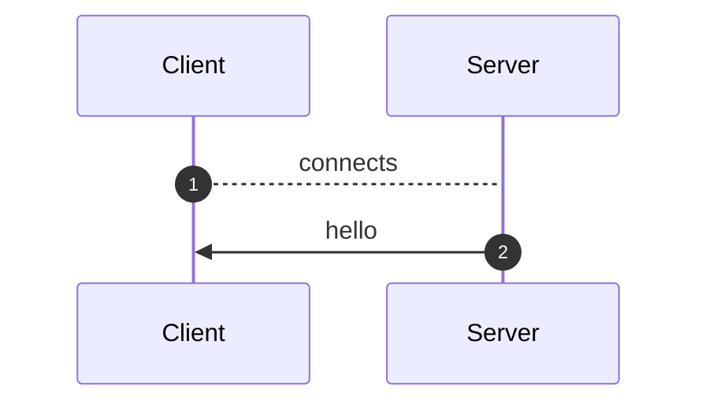
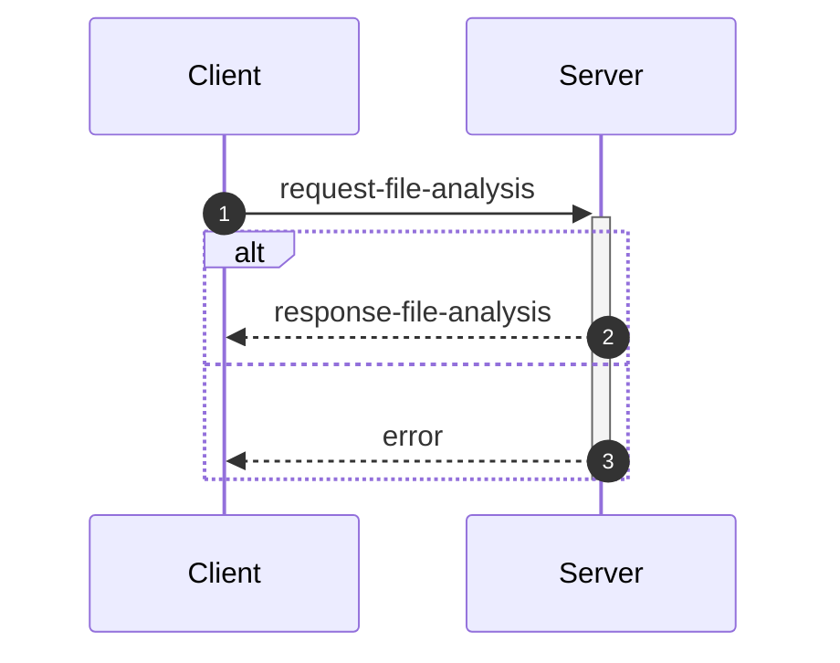
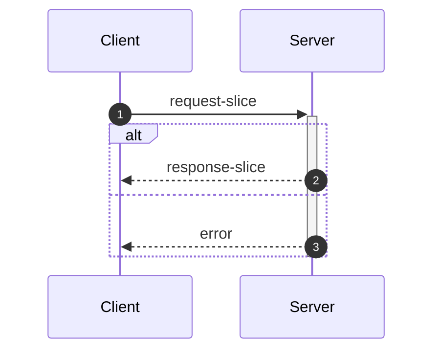
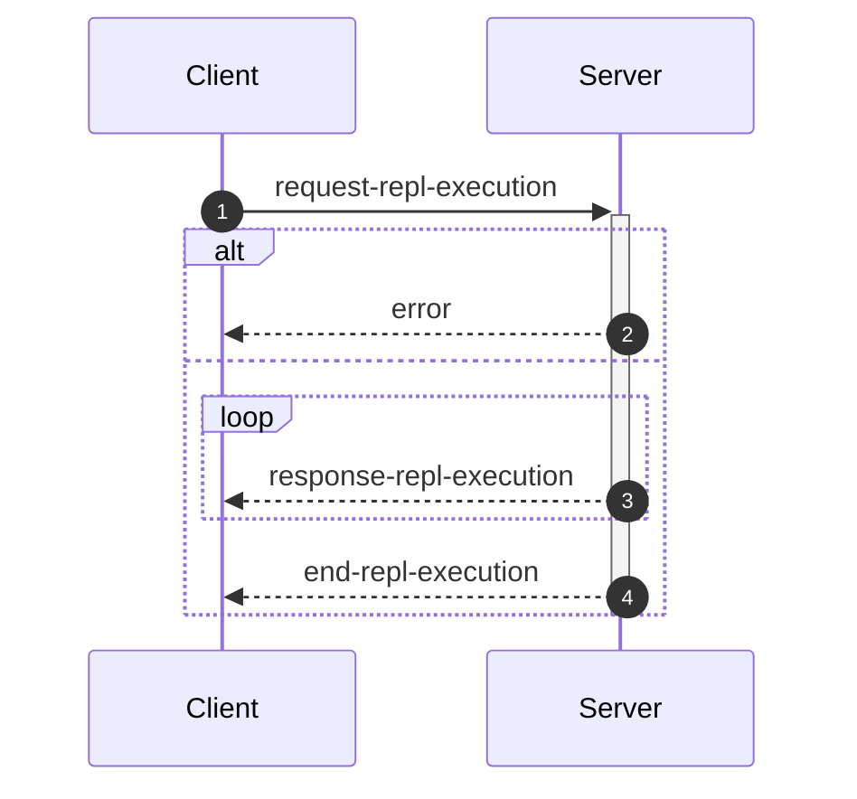

_This document was generated from '[src/documentation/wiki-interface.ts](https://github.com/flowr-analysis/flowr/tree/main//src/documentation/wiki-interface.ts)' on 2026-07-21, 05:20:53 UTC presenting an overview of flowR's interface (v2.13.1, using R v4.6.1). Please do not edit this file/wiki page directly._

Although far from being as detailed as the in-depth explanation of [_flowR_](https://github.com/flowr-analysis/flowr/wiki/core),
this wiki page explains how to interface with _flowR_ in more detail.
In general, command line arguments and other options provide short descriptions on hover over.

* [💻 Using the REPL](#using-the-repl)
* [⚙️ Configuring FlowR](#configuring-flowr)
* [⚒️ Writing Code](#writing-code)
* [💬 Communicating with the Server](#communicating-with-the-server)

<a id='using-the-repl'></a>
## 💻 Using the REPL


> [!NOTE]
> To execute arbitrary R commands with a repl request, _flowR_ has to be started explicitly with <span title="Description (Command Line Argument): Allow to access the underlying R session when using flowR (security warning: this allows the execution of arbitrary R code!)">`--r-session-access`</span>.
> Please be aware that this introduces a security risk and note that this relies on the [`r-shell` engine](https://github.com/flowr-analysis/flowr/wiki/engines) .

Although primarily meant for users to explore,
there is nothing which forbids simply calling _flowR_ as a subprocess to use standard-in, -output, and -error
for communication (although you can access the REPL using the server as well,
with the [REPL Request](#message-request-repl-execution) message).

The read-eval-print loop&nbsp;(REPL) works relatively simple.
You can submit an expression (using <kbd>Enter</kbd>),
which is interpreted as an R&nbsp;expression by default but interpreted as a *command* if it starts with a colon (`:`).
The best command to get started with the REPL is <span title="Description (Repl Command): Show help information (aliases: :h, :?)">`:help`</span>.
Besides, you can leave the REPL either with the command <span title="Description (Repl Command): End the repl (aliases: :q, :exit)">`:quit`</span> or by pressing <kbd>Ctrl</kbd>+<kbd>C</kbd> twice.
When writing a *command*, you may press <kbd>Tab</kbd> to get a list of completions, if available.
Multiple commands can be entered in a single line by separating them with a semicolon (`;`), e.g. `:parse "x<-2"; :df*`.
If a command is given without R code, the REPL will re-use R code given in a previous command.
The prior example will hence return first the parsed AST of the program and then the dataflow graph for `"x <- 2"`.

> [!NOTE]
> If you develop flowR, you may want to launch the repl using the `npm run main-dev` command, this way, you get a non-minified version of flowR with debug information and hot-reloading of source files.

<details>
<summary>Available Commands</summary>

We currently offer the following commands (this with a `[*]` suffix are available with and without the star):


| Command | Description |
| ------- | ----------- |
| **<span title="Description (Repl Command): End the repl (aliases: :q, :exit)">:quit</span>** | End the repl (aliases: **:<span title="Alias of ':quit'. End the repl">q</span>**, **:<span title="Alias of ':quit'. End the repl">exit</span>**) |
| **<span title="Description (Repl Command): Execute the given code as R code. This requires the `--r-session-access` flag to be set and requires the r-shell engine. (aliases: :e, :r)">:execute</span>** | Execute the given code as R code. This requires the `--r-session-access` flag to be set and requires the r-shell engine. (aliases: **:<span title="Alias of ':execute'. Execute the given code as R code. This requires the `--r-session-access` flag to be set and requires the r-shell engine.">e</span>**, **:<span title="Alias of ':execute'. Execute the given code as R code. This requires the `--r-session-access` flag to be set and requires the r-shell engine.">r</span>**) |
| **<span title="Description (Repl Command): Get mermaid code for the control-flow graph of R code (aliases: :cfg, :cf)">:controlflow[*]</span>** | Get mermaid code for the control-flow graph of R code (star: Returns the URL to mermaid.live) (aliases: **:<span title="Alias of ':controlflow'. Get mermaid code for the control-flow graph of R code">cfg</span>**, **:<span title="Alias of ':controlflow'. Get mermaid code for the control-flow graph of R code">cf</span>**) |
| **<span title="Description (Repl Command): Get mermaid code for the control-flow graph with basic blocks (aliases: :cfgb, :cfb)">:controlflowbb[*]</span>** | Get mermaid code for the control-flow graph with basic blocks (star: Returns the URL to mermaid.live) (aliases: **:<span title="Alias of ':controlflowbb'. Get mermaid code for the control-flow graph with basic blocks">cfgb</span>**, **:<span title="Alias of ':controlflowbb'. Get mermaid code for the control-flow graph with basic blocks">cfb</span>**) |
| **<span title="Description (Repl Command): Get mermaid code for the dataflow graph (aliases: :d, :df)">:dataflow[*]</span>** | Get mermaid code for the dataflow graph (star: Returns the URL to mermaid.live) (aliases: **:<span title="Alias of ':dataflow'. Get mermaid code for the dataflow graph">d</span>**, **:<span title="Alias of ':dataflow'. Get mermaid code for the dataflow graph">df</span>**) |
| **<span title="Description (Repl Command): Get mermaid code for the normalized AST of R code (aliases: :n)">:normalize[*]</span>** | Get mermaid code for the normalized AST of R code (star: Returns the URL to mermaid.live) (alias: **:<span title="Alias of ':normalize'. Get mermaid code for the normalized AST of R code">n</span>**) |
| **<span title="Description (Repl Command): Get mermaid code for the simplified dataflow graph (aliases: :ds, :dfs)">:dataflowsimple[*]</span>** | Get mermaid code for the simplified dataflow graph (star: Returns the URL to mermaid.live) (aliases: **:<span title="Alias of ':dataflowsimple'. Get mermaid code for the simplified dataflow graph">ds</span>**, **:<span title="Alias of ':dataflowsimple'. Get mermaid code for the simplified dataflow graph">dfs</span>**) |
| **<span title="Description (Repl Command): Inspect and extend the signature database: `query` (identical to :query @signature), `add <path>` to mount another database/source, `download` to fetch the full-history database. (aliases: :sig)">:signature</span>** | Inspect and extend the signature database: `query` (identical to :query @signature), `add <path>` to mount another database/source, `download` to fetch the full-history database. (alias: **:<span title="Alias of ':signature'. Inspect and extend the signature database: `query` (identical to :query @signature), `add <path>` to mount another database/source, `download` to fetch the full-history database.">sig</span>**) |
| **<span title="Description (Repl Command): Just calculates the DFG, but only prints summary info (aliases: :d#, :df#)">:dataflowsilent</span>** | Just calculates the DFG, but only prints summary info (aliases: **:<span title="Alias of ':dataflowsilent'. Just calculates the DFG, but only prints summary info">d#</span>**, **:<span title="Alias of ':dataflowsilent'. Just calculates the DFG, but only prints summary info">df#</span>**) |
| **<span title="Description (Repl Command): Prints ASCII Art of the parsed, unmodified AST (aliases: :p)">:parse</span>** | Prints ASCII Art of the parsed, unmodified AST (alias: **:<span title="Alias of ':parse'. Prints ASCII Art of the parsed, unmodified AST">p</span>**) |
| **<span title="Description (Repl Command): Prints the version of flowR as well as the current version of R">:version</span>** | Prints the version of flowR as well as the current version of R
| **<span title="Description (Repl Command): Query the given R code (use 'help' for more information)">:query[*]</span>** | Query the given R code (use 'help' for more information) (star: Similar to query, but returns the output in json format.)
| **<span title="Description (Repl Command): Returns an ASCII representation of the dataflow graph (aliases: :df!)">:dataflowascii</span>** | Returns an ASCII representation of the dataflow graph (alias: **:<span title="Alias of ':dataflowascii'. Returns an ASCII representation of the dataflow graph">df!</span>**) |
| **<span title="Description (Repl Command): Returns summarization stats for the normalized AST (aliases: :n#)">:normalize#</span>** | Returns summarization stats for the normalized AST (alias: **:<span title="Alias of ':normalize#'. Returns summarization stats for the normalized AST">n#</span>**) |
| **<span title="Description (Repl Command): Show help information (aliases: :h, :?)">:help</span>** | Show help information (aliases: **:<span title="Alias of ':help'. Show help information">h</span>**, **:<span title="Alias of ':help'. Show help information">?</span>**) |


</details>


> [!TIP]
> 
> As indicated by the examples before, all REPL commands that operate on code keep track of the state.
> Hence, if you run a command like <span title="Description (Repl Command, starred version): Returns the URL to mermaid.live; Base Command: Get mermaid code for the dataflow graph (aliases: :d*, :df*)">`:dataflow*`</span> without providing R code,
> the REPL will re-use the R code provided in a previous command.
> Likewise, doing this will benefit from incrementality!
> If you request the dataflow graph with `:df* x <- 2 * y` and then want to see the parsed AST with `:parse`,
> the REPL will re-use previously obtained information and not re-parse the code again.
> 		


Generally, many commands offer shortcut versions in the REPL. Many queries, for example, offer a shortened format (see the example below).
Of special note, the [Config Query](https://github.com/flowr-analysis/flowr/wiki/%5BQuery%5D-Config)
can be used to also modify the currently active configuration of _flowR_ within the REPL (see the [wiki page](https://github.com/flowr-analysis/flowr/wiki/%5BQuery%5D-Config) for more information).

### Example: Retrieving the Dataflow Graph

To retrieve a URL to the [mermaid](https://mermaid.js.org/) diagram of the dataflow of a given expression,
use <span title="Description (Repl Command, starred version): Returns the URL to mermaid.live; Base Command: Get mermaid code for the dataflow graph (aliases: :d*, :df*)">`:dataflow*`</span> (or <span title="Description (Repl Command): Get mermaid code for the dataflow graph (aliases: :d, :df)">`:dataflow`</span> to get the mermaid code in the cli):


```shell
$ docker run -it --rm eagleoutice/flowr # or npm run flowr 
flowR repl v2.13.1, R grammar v14 (tree-sitter engine)
R> :dataflow* y <- 1 + x
```

<details>
<summary style='color:gray'>Output</summary>


```text
https://mermaid.live/view#base64:eyJjb2RlIjoiZmxvd2NoYXJ0IEJUXG4gICAgMXt7XCJgKiM5MTtSTnVtYmVyIzkzOyogKioxKipcbiAgICAgICoxLjYqICgqKmlkOiAxKiopYFwifX1cbiAgICUlIE5vIGVkZ2VzIGZvdW5kIGZvciAxXG4gICAgMihbXCJgKiM5MTtSU3ltYm9sIzkzOyogKip4KipcbiAgICAgICoxLjEwKiAoKippZDogMioqKWBcIl0pXG4gICAlJSBObyBlZGdlcyBmb3VuZCBmb3IgMlxuICAgIDNbW1wiYCojOTE7UkJpbmFyeU9wIzkzOyogYmFzZSM1ODsjNTg7KiojNDM7KipcbiAgICAgICoxLjYtMTAqICgqKmlkOiAzKiopXG4gICAgYXJnOiAoMSwgMilgXCJdXVxuICAgIGJ1aWx0LWluOl9bXCJgQnVpbHQtSW46XG4jNDM7YFwiXVxuICAgIHN0eWxlIGJ1aWx0LWluOl8gc3Ryb2tlOmdyYXksZmlsbDpncmF5LHN0cm9rZS13aWR0aDoycHgsb3BhY2l0eTouODtcbiAgICAwW1wiYCojOTE7UlN5bWJvbCM5MzsqICoqeSoqXG4gICAgICAqMS4xKiAoKippZDogMCoqLCB2OiAzKWBcIl1cbiAgICA0W1tcImAqIzkxO1JCaW5hcnlPcCM5MzsqIGJhc2UjNTg7IzU4OyoqIzYwOyM0NTsqKlxuICAgICAgKjEuMS0xMCogKCoqaWQ6IDQqKilcbiAgICBhcmc6ICgwLCAzKWBcIl1dXG4gICAgYnVpbHQtaW46Xy1bXCJgQnVpbHQtSW46XG4jNjA7IzQ1O2BcIl1cbiAgICBzdHlsZSBidWlsdC1pbjpfLSBzdHJva2U6Z3JheSxmaWxsOmdyYXksc3Ryb2tlLXdpZHRoOjJweCxvcGFjaXR5Oi44O1xuICAgIDMgLS0+fFwicmVhZHMsIGFyZ1wifCAxXG4gICAgMyAtLT58XCJyZWFkcywgYXJnXCJ8IDJcbiAgICAzIC0uLT58XCJyZWFkcywgY2FsbHNcInwgYnVpbHQtaW46X1xuICAgIGxpbmtTdHlsZSAyIHN0cm9rZTpncmF5O1xuICAgIDAgLS0+fFwiZGVmaW5lZC1ieVwifCAzXG4gICAgMCAtLT58XCJkZWZpbmVkLWJ5XCJ8IDRcbiAgICA0IC0tPnxcInJlYWRzLCBhcmdcInwgM1xuICAgIDQgLS0+fFwicmV0dXJucywgYXJnXCJ8IDBcbiAgICA0IC0uLT58XCJyZWFkcywgY2FsbHNcInwgYnVpbHQtaW46Xy1cbiAgICBsaW5rU3R5bGUgNyBzdHJva2U6Z3JheTsiLCJtZXJtYWlkIjp7ImF1dG9TeW5jIjp0cnVlfX0=
```


Retrieve the dataflow graph of the expression `y <- 1 + x`. It looks like this:


```mermaid
flowchart LR
    1{{"`*#91;RNumber#93;* **1**
      *1.6* (**id: 1**)`"}}
   %% No edges found for 1
    2(["`*#91;RSymbol#93;* **x**
      *1.10* (**id: 2**)`"])
   %% No edges found for 2
    3[["`*#91;RBinaryOp#93;* base#58;#58;**#43;**
      *1.6-10* (**id: 3**)
    arg: (1, 2)`"]]
    built-in:_["`Built-In:
#43;`"]
    style built-in:_ stroke:gray,fill:gray,stroke-width:2px,opacity:.8;
    0["`*#91;RSymbol#93;* **y**
      *1.1* (**id: 0**, v: 3)`"]
    4[["`*#91;RBinaryOp#93;* base#58;#58;**#60;#45;**
      *1.1-10* (**id: 4**)
    arg: (0, 3)`"]]
    built-in:_-["`Built-In:
#60;#45;`"]
    style built-in:_- stroke:gray,fill:gray,stroke-width:2px,opacity:.8;
    3 -->|"reads, arg"| 1
    3 -->|"reads, arg"| 2
    3 -.->|"reads, calls"| built-in:_
    linkStyle 2 stroke:gray;
    0 -->|"defined-by"| 3
    0 -->|"defined-by"| 4
    4 -->|"reads, arg"| 3
    4 -->|"returns, arg"| 0
    4 -.->|"reads, calls"| built-in:_-
    linkStyle 7 stroke:gray;
```

	
<details>

<summary style="color:gray">R Code of the Dataflow Graph</summary>

The analysis required _8.9 ms_ (including parse and normalize, using the [tree-sitter](https://github.com/flowr-analysis/flowr/wiki/Engines) engine) within the generation environment. No [signature database](https://github.com/flowr-analysis/flowr/wiki/Signature-Database) is mounted for these generated graphs, so `library()` calls attach no package exports; base-R names are still qualified via the generated base-package store (e.g. `acf` as `stats::acf`). 
We encountered no unknown side effects during the analysis.


```r
y <- 1 + x
```


</details>


</details>


For small graphs like this, <span title="Description (Repl Command): Returns an ASCII representation of the dataflow graph (aliases: :df!)">`:dataflowascii`</span> also provides an ASCII representation directly in the REPL:


```shell
$ docker run -it --rm eagleoutice/flowr # or npm run flowr 
flowR repl v2.13.1, R grammar v14 (tree-sitter engine)
R> :df! y <- 1 + x
```

<details open>
<summary style='color:gray'>Output</summary>


```text
                        0<1>0
                   ┌────| 1 |
    ┌────────┐     │    0---0
 c<4>c       └──c<3>c
 |<- |  v<0>v┌──| + |
 c---c──| y |┘  c---c   u<2>u
        v---v      └────| x |
                        u---u
Edges:
3 -> 1: reads, arg  3 -> 2: reads, arg
4 -> 3: reads, arg  4 -> 0: returns, arg
0 -> 3: defined-by  0 -> 4: defined-by
```


Retrieve the dataflow graph of the expression `y <- 1 + x` as ASCII art.

</details>


For the slicing with <span title="Description (Repl Command): Static backwards executable slicer for R">`:slicer`</span>, you have access to the same [magic comments](#slice-magic-comments) as with the [slice request](#message-request-slice).
Pass `--inline` to splice resolvable `source()` calls into the reconstruction so the slice is a single self-contained R text (the same as the static slice query's `inlineSources` flag).
See `--help` for more flags!

### Example: Interfacing with the File System

Many commands that allow for an R-expression (like <span title="Description (Repl Command, starred version): Returns the URL to mermaid.live; Base Command: Get mermaid code for the dataflow graph (aliases: :d*, :df*)">`:dataflow*`</span>) allow for a file as well
if the argument starts with `file://`.
If you are working from the root directory of the _flowR_ repository, the following gives you the parsed AST of the example file using the <span title="Description (Repl Command): Prints ASCII Art of the parsed, unmodified AST (aliases: :p)">`:parse`</span> command:

> **Watch mode**: Replace `file://` with `watch://` to enter watch mode.
> flowR runs the command immediately and then re-runs it every time the file (or any file inside the folder) changes.
> Enter any other command to leave watch mode.
> For example: `:df watch://analysis.R`


```shell
$ docker run -it --rm eagleoutice/flowr # or npm run flowr 
flowR repl v2.13.1, R grammar v14 (tree-sitter engine)
R> :parse file://test/testfiles/example.R
```

<details>
<summary style='color:gray'>Output</summary>


```text
File: test/testfiles/example.R

program
├ binaryoperator
│ ├ identifier "sum" (1:1─4)
│ ├ <- "<-" (1:5─7)
│ ╰ float "0" (1:8─9)
├ binaryoperator
│ ├ identifier "product" (2:1─8)
│ ├ <- "<-" (2:9─11)
│ ╰ float "1" (2:12─13)
├ binaryoperator
│ ├ identifier "w" (3:1─2)
│ ├ <- "<-" (3:3─5)
│ ╰ float "7" (3:6─7)
├ binaryoperator
│ ├ identifier "N" (4:1─2)
│ ├ <- "<-" (4:3─5)
│ ╰ float "10" (4:6─8)
├ forstatement
│ ├ for "for" (6:1─4)
│ ├ ( "(" (6:5─6)
│ ├ identifier "i" (6:6─7)
│ ├ in "in" (6:8─10)
│ ├ binaryoperator
│ │ ├ float "1" (6:11─12)
│ │ ├ : ":" (6:12─13)
│ │ ╰ parenthesizedexpression
│ │   ├ ( "(" (6:13─14)
│ │   ├ binaryoperator
│ │   │ ├ identifier "N" (6:14─15)
│ │   │ ├ - "-" (6:15─16)
│ │   │ ╰ float "1" (6:16─17)
│ │   ╰ ) ")" (6:17─18)
│ ├ ) ")" (6:18─19)
│ ╰ bracedexpression
│   ├ { "{" (6:20─21)
│   ├ binaryoperator
│   │ ├ identifier "sum" (7:3─6)
│   │ ├ <- "<-" (7:7─9)
│   │ ╰ binaryoperator
│   │   ├ binaryoperator
│   │   │ ├ identifier "sum" (7:10─13)
│   │   │ ├ + "+" (7:14─15)
│   │   │ ╰ identifier "i" (7:16─17)
│   │   ├ + "+" (7:18─19)
│   │   ╰ identifier "w" (7:20─21)
│   ├ binaryoperator
│   │ ├ identifier "product" (8:3─10)
│   │ ├ <- "<-" (8:11─13)
│   │ ╰ binaryoperator
│   │   ├ identifier "product" (8:14─21)
│   │   ├  "" (8:22─23)
│   │   ╰ identifier "i" (8:24─25)
│   ╰ } "}" (9:1─2)
├ call
│ ├ identifier "cat" (11:1─4)
│ ╰ arguments
│   ├ ( "(" (11:4─5)
│   ├ argument
│   │ ╰ string
│   │   ├ " "\"" (11:5─6)
│   │   ├ stringcontent "Sum:" (11:6─10)
│   │   ╰ " "\"" (11:10─11)
│   ├ comma "," (11:11─12)
│   ├ argument
│   │ ╰ identifier "sum" (11:13─16)
│   ├ comma "," (11:16─17)
│   ├ argument
│   │ ╰ string
│   │   ├ " "\"" (11:18─19)
│   │   ├ stringcontent
│   │   │ ╰ escapesequence "\\n" (11:19─21)
│   │   ╰ " "\"" (11:21─22)
│   ╰ ) ")" (11:22─23)
╰ call
  ├ identifier "cat" (12:1─4)
  ╰ arguments
    ├ ( "(" (12:4─5)
    ├ argument
    │ ╰ string
    │   ├ " "\"" (12:5─6)
    │   ├ stringcontent "Product:" (12:6─14)
    │   ╰ " "\"" (12:14─15)
    ├ comma "," (12:15─16)
    ├ argument
    │ ╰ identifier "product" (12:17─24)
    ├ comma "," (12:24─25)
    ├ argument
    │ ╰ string
    │   ├ " "\"" (12:26─27)
    │   ├ stringcontent
    │   │ ╰ escapesequence "\\n" (12:27─29)
    │   ╰ " "\"" (12:29─30)
    ╰ ) ")" (12:30─31)
```


Retrieve the parsed AST of the example file.

<details>

<summary>File Content</summary>


```r
sum <- 0
product <- 1
w <- 7
N <- 10

for (i in 1:(N-1)) {
  sum <- sum + i + w
  product <- product * i
}

cat("Sum:", sum, "\n")
cat("Product:", product, "\n")
```


</details>

As _flowR_ directly transforms this AST the output focuses on being human-readable instead of being machine-readable.
		

</details>


### Example: Run a Query

You can run any query supported by _flowR_ using the <span title="Description (Repl Command): Query the given R code (use 'help' for more information)">`:query`</span> command.
For example, to obtain the shapes of all data frames in a given piece of code, you can run:


```shell
$ docker run -it --rm eagleoutice/flowr # or npm run flowr 
flowR repl v2.13.1, R grammar v14 (tree-sitter engine)
R> :query @absint df-shape "x <- data.frame(a = 1:10, b = 1:10)\ny <- x$a"
```

<details open>
<summary style='color:gray'>Output</summary>


```text
Query: absint (3 ms)
   ╰ $12: (colnames: [{"a", "b"}, {}], cols: [2, 2], rows: [10, 10])
   ╰ $0: (colnames: [{"a", "b"}, {}], cols: [2, 2], rows: [10, 10])
All queries together required ≈7 ms (1ms accuracy, total 7 ms)
```


Retrieve the shapes of all data frames in the given code.

</details>


To run the linter on a file, you can use (in this example, we just issue the `dead-code` linter on a small piece of code):


```shell
$ docker run -it --rm eagleoutice/flowr # or npm run flowr 
flowR repl v2.13.1, R grammar v14 (tree-sitter engine)
R> :query @linter rules:dead-code "if(FALSE) x <- 2"
```

<details open>
<summary style='color:gray'>Output</summary>


```text
Query: linter (4 ms)
   ╰ Dead Code (dead-code):
       ╰ certain:
           ╰ Code at 1.11-16
       ╰ Metadata: searchTimeMs: 4, processTimeMs: 0
All queries together required ≈4 ms (1ms accuracy, total 5 ms)
```


Run the linter on the given code, with only the `dead-code` rule enabled.

</details>


For more information on the available queries, please check out the [Query API](https://github.com/flowr-analysis/flowr/wiki/query-api).


<a id='configuring-flowr'></a>
## ⚙️ Configuring FlowR


When running _flowR_, you may want to specify some behaviors with a dedicated configuration file.
By default, flowR looks for a file named `flowr.json` in the current working directory (or any higher directory).
You can also specify a different file with <span title="Description (Command Line Argument): The name of the configuration file to use">`--config-file`</span> or pass the configuration inline using <span title="Description (Command Line Argument): The flowR configuration to use, as a JSON string">`--config-json`</span>.
To inspect the current configuration, you can run flowr with the <span title="Description (Command Line Argument): Run with verbose logging (will be passed to the corresponding script)">`--verbose`</span> flag, or use the `config` [Query](https://github.com/flowr-analysis/flowr/wiki/query-api).
Within the REPL this works by running the following:


```shell
:query @config
```


To work with the <a href="https://github.com/flowr-analysis/flowr/tree/main/src/config.ts#L129"><code><span title="The configuration file format for flowR.">FlowrConfig</span></code></a> you can use the provided helper objects alongside its methods like
<a href="https://github.com/flowr-analysis/flowr/tree/main/src/config.ts#L717"><code><span title="Creates a new flowr config that has the updated values.">FlowrConfig::<b>amend</b></span></code></a>.
The schema below documents every option; the ones you most likely want are:

- <a href="https://github.com/flowr-analysis/flowr/wiki/Interface#configuring-flowr" title="Configuration Option (boolean): Whether source calls should be ignored, causing {@link processSourceCall}&#39;s behavior to be skipped.">ignoreSourceCalls</a>: ignore source calls when analyzing the code, i.e., ignore the inclusion of other files.
- <a href="https://github.com/flowr-analysis/flowr/wiki/Interface#configuring-flowr" title="Configuration Option (boolean): Whether load calls should be ignored, causing {@link processLoadCall}&#39;s behavior to be skipped.">ignoreLoadCalls</a>: ignore load calls when analyzing the code, i.e., ignore the loading of r-data files.
- <a href="https://github.com/flowr-analysis/flowr/wiki/Interface#configuring-flowr" title="Configuration Option (object): Do you want to overwrite (parts) of the builtin definition?">semantics.environment.overwriteBuiltIns</a>: overwrite _flowR_'s handling of built-in functions, or clear the preset definitions entirely.
  See [Configure BuiltIn Semantics](#configure-builtin-semantics) for more information.
- <a href="https://github.com/flowr-analysis/flowr/wiki/Interface#configuring-flowr" title="Configuration Option (string): How to resolve variables and their values. (one of &quot;disabled&quot;, &quot;alias&quot;, &quot;builtin&quot;)">solver.variables</a>: how to resolve variables and their values (`disabled`, `alias`, `builtin`).
- <a href="https://github.com/flowr-analysis/flowr/wiki/Interface#configuring-flowr" title="Configuration Option (array): The engine or set of engines to use for interacting with R code. An empty array means all available engines will be used.">engines</a> and <a href="https://github.com/flowr-analysis/flowr/wiki/Interface#configuring-flowr" title="Configuration Option (string): The default engine to use for interacting with R code. If this is undefined, an arbitrary engine from the specified list will be used. (one of &quot;tree-sitter&quot;, &quot;r-shell&quot;)">defaultEngine</a>: the engines used to interact with R code, see the [Engines wiki page](https://github.com/flowr-analysis/flowr/wiki/engines).
- <a href="https://github.com/flowr-analysis/flowr/wiki/Interface#configuring-flowr" title="Configuration Option (array): Files a framework loads on its own, without any source() call (e.g. global.R in a shiny app), in the order they are loaded; flowR orders the matching project files accordingly and analyzes them as one program. Entries are case-insensitive globs matched against the file path, a plain name matches any file with that name, and entries matching no project file are warned about. Usually set per project kind via specializeConfig.">project.implicitSources</a>: the files a framework loads without any `source()` call, in the order in which they are
  loaded. Entries are globs (e.g. `R/*.R`) matched against the file path ignoring capitalization; one matching no file is reported.
- <a href="https://github.com/flowr-analysis/flowr/wiki/Interface#configuring-flowr" title="Configuration Option (object): Overwrite (parts of) the configuration depending on the project kind flowR detects, e.g. to give a shiny app its implicit sources.">specializeConfig</a>: overwrite (parts of) the configuration depending on the kind of project _flowR_ detects
  (e.g. `shiny-app`), which is how a shiny app gets its implicit sources by default. What you configure directly wins.
- <a href="https://github.com/flowr-analysis/flowr/wiki/Interface#configuring-flowr" title="Configuration Option (string): Overwrite the project kind flowR would otherwise infer from the analyzed files, e.g. when auto-detection guesses wrong. (one of &quot;package&quot;, &quot;script&quot;, &quot;shiny-app&quot;, &quot;notebook&quot;, &quot;project&quot;, &quot;unknown&quot;)">project.useProjectType</a>: skip that detection and force a project kind yourself, when auto-detection guesses wrong.
- <a href="https://github.com/flowr-analysis/flowr/wiki/Interface#configuring-flowr" title="Configuration Option (array): The default plugins to load when creating a new instance of FlowrAnalyzer">defaultPlugins</a> and <a href="https://github.com/flowr-analysis/flowr/wiki/Interface#configuring-flowr" title="Configuration Option (array): The plugins to load in REPL mode">repl.plugins</a>: the plugins to load for a new <a href="https://github.com/flowr-analysis/flowr/tree/main/src/project/flowr-analyzer.ts#L167"><code><span title="Central class for conducting analyses with FlowR. Use the FlowrAnalyzerBuilder to create a new instance. If you want the original pattern of creating a pipeline and running all steps, you can still do this with FlowrAnalyzer#runFull . To inspect the context of the analyzer, use FlowrAnalyzer#inspectContext (if you are a plugin and need to modify it, use FlowrAnalyzer#context instead).">FlowrAnalyzer</span></code></a> and in the REPL
  (use `flowr:default` to reference the former).

So you can configure _flowR_ by adding a file like the following:

<details>

<summary>Example Configuration File</summary>


```json
{
  "ignoreSourceCalls": true,
  "ignoreLoadCalls": true,
  "semantics": {
    "environment": {
      "overwriteBuiltIns": {
        "definitions": [
          {
            "type": "function",
            "names": [
              "foo"
            ],
            "processor": "builtin:assign",
            "config": {}
          }
        ]
      }
    }
  },
  "defaultPlugins": [
    "file:description",
    "versions:description"
  ],
  "repl": {
    "quickStats": false,
    "dfProcessorHeat": false,
    "hints": true,
    "plugins": [
      "flowr:default"
    ]
  },
  "project": {
    "resolveUnknownPathsOnDisk": true,
    "implicitSources": [
      "global.R",
      "app.R"
    ]
  },
  "linter": {
    "disabledRules": []
  },
  "specializeConfig": {
    "shiny-app": {
      "project": {
        "implicitSources": [
          "global.R",
          "ui.R",
          "server.R",
          "app.R"
        ]
      }
    }
  },
  "engines": [
    {
      "type": "r-shell"
    }
  ],
  "solver": {
    "variables": "alias",
    "evalStrings": true,
    "trackEnvironments": true,
    "sigdb": {
      "enabled": true,
      "loadProjectDependencies": true,
      "eagerlyLoad": false,
      "eagerlyLoadExports": false,
      "linkBaseR": false,
      "linkDescriptionDependencies": false
    },
    "resolveSource": {
      "dropPaths": "no",
      "ignoreCapitalization": true,
      "inferWorkingDirectory": "active-script",
      "searchPath": []
    },
    "instrument": {},
    "slicer": {
      "threshold": 50
    }
  },
  "abstractInterpretation": {
    "wideningThreshold": 4,
    "dataFrame": {
      "maxColNames": 20,
      "readLoadedData": {
        "readExternalFiles": true,
        "maxReadLines": 1000000
      }
    }
  },
  "gas": {
    "thresholds": {
      "memory": {
        "problematic": 0.7,
        "critical": 0.9
      },
      "timeMs": {
        "problematic": 100000,
        "critical": 120000
      }
    },
    "features": {}
  }
}
```


</details>

<details>
<a id='configure-builtin-semantics'></a>
<summary>Configure Built-In Semantics</summary>


`semantics/environment/overwriteBuiltins` accepts two keys:

- `loadDefaults` (boolean, initially `true`): If set to `true`, the default built-in definitions are loaded before applying the custom definitions. Setting this flag to `false` explicitly disables the loading of the default definitions.
- `definitions` (array, initially empty): Allows to overwrite or define new built-in elements. Each object within must have a `type` which is one of the below. Furthermore, they may define a string array of `names` which specifies the identifiers to bind the definitions to. You may use `assumePrimitive` to specify whether _flowR_ should assume that this is a primitive non-library definition (so you probably just do not want to specify the key).

  | Type            | Description                                                                                                                                                                                                                                                                                              | Example                                                                                                    |
  | --------------- | -------------------------------------------------------------------------------------------------------------------------------------------------------------------------------------------------------------------------------------------------------------------------------------------------------- | ---------------------------------------------------------------------------------------------------------- |
  | `constant`    | Additionally allows for a `value` this should resolve to.                                                                                                                                                                                                                                                | `{ type: 'constant', names: ['NULL', 'NA'],  value: null }`                                                |
  | `function`    | Is a rather flexible way to define and bind built-in functions. For the time, we do not have extensive documentation to cover all the cases, so please either consult the sources with the `default-builtin-config.ts` or open a [new issue](https://github.com/flowr-analysis/flowr/issues/new/choose). | `{ type: 'function', names: ['next'], processor: 'builtin:d', config: { cfg: ExitPointType.Next } }` |
  | `replacement` | A comfortable way to specify replacement functions like `$<-` or `names<-`. `suffixes` describes the... suffixes to attach automatically. | `{ type: 'replacement', suffixes: ['<-', '<<-'], names: ['[', '[['] }` |


</details>

<details>

<summary style='color:gray'>Full Configuration-File Schema</summary>

- _The configuration file format for flowR._ (object)
    - **logLevel** [optional] _flowR's global minimum log level, applied when the config is loaded._ (string)
        Only allows: 'silly', 'trace', 'debug', 'info', 'warn', 'error', 'fatal'
    - **ignoreSourceCalls** [optional] _Whether source calls should be ignored, causing {@link processSourceCall}'s behavior to be skipped._ (boolean)
    - **ignoreLoadCalls** [optional] _Whether load calls should be ignored, causing {@link processLoadCall}'s behavior to be skipped._ (boolean)
    - **semantics** _Configure language semantics and how flowR handles them._ (object)
        - **environment** [optional] _Semantics regarding how to handle the R environment._ (object)
            - **overwriteBuiltIns** [optional] _Do you want to overwrite (parts) of the builtin definition?_ (object)
                - **loadDefaults** [optional] _Should the default configuration still be loaded?_ (boolean)
                - **definitions** [optional] _The definitions to load/overwrite._ (array)
                Valid item types:
                    - (object)
    - **defaultPlugins** [optional] _The default plugins to load when creating a new instance of FlowrAnalyzer_ (array)
    Valid item types:
        - (alternatives)
            - (string)
            - (array)
    - **repl** _Configuration options for the REPL._ (object)
        - **quickStats** [optional] _Whether to show quick stats in the REPL after each evaluation._ (boolean)
        - **dfProcessorHeat** [optional] _This instruments the dataflow processors to count how often each processor is called._ (boolean)
        - **hints** [optional] _Whether to show dim inline hints on the empty prompt (automatically disabled on non-interactive terminals)._ (boolean)
        - **plugins** [optional] _The plugins to load in REPL mode_ (array)
        Valid item types:
            - (alternatives)
                - (string)
                - (array)
        - **autoUseFileProtocol** [optional] _Prepend the file protocol to a repl input that looks like a path, instead of only warning about it._ (boolean)
        - **queryStats** [optional] _Whether `:query` closes with the line stating how long the queries took (`:query*` never prints it)._ (boolean)
        - **showPlugins** [optional] _Whether `:version` grays out the plugins that did not activate during the last analysis._ (boolean)
    - **project** _Project specific configuration options._ (object)
        - **resolveUnknownPathsOnDisk** [optional] _Whether to resolve unknown paths loaded by the r project disk when trying to source/analyze files._ (boolean)
        - **basePackages** [optional] _The packages considered part of R itself (base and recommended); if unset, flowR uses its built-in list._ (array)
        Valid item types:
            - (string)
        - **implicitSources** [optional] _Files a framework loads on its own, without any source() call (e.g. global.R in a shiny app), in the order they are loaded; flowR orders the matching project files accordingly and analyzes them as one program. Entries are case-insensitive globs matched against the file path, a plain name matches any file with that name, and entries matching no project file are warned about. Usually set per project kind via specializeConfig._ (array)
        Valid item types:
            - (string)
        - **useProjectType** [optional] _Overwrite the project kind flowR would otherwise infer from the analyzed files, e.g. when auto-detection guesses wrong._ (string)
            Only allows: 'package', 'script', 'shiny-app', 'notebook', 'project', 'unknown'
    - **linter** _Linter configuration options._ (object)
        - **disabledRules** _Linting rule names excluded from the default rule set (a rule requested explicitly via a linter query still runs). Usually set per project kind via specializeConfig._ (array)
        Valid item types:
            - (string)
    - **specializeConfig** [optional] _Overwrite (parts of) the configuration depending on the project kind flowR detects, e.g. to give a shiny app its implicit sources._ (object)
    - **engines** _The engine or set of engines to use for interacting with R code. An empty array means all available engines will be used._ (array)
    Valid item types:
        - (alternatives)
            - _The configuration for the tree sitter engine._ (object)
                - **type** [required] _Use the tree sitter engine._ (string)
                    Only allows: 'tree-sitter'
                - **wasmPath** [optional] _The path to the tree-sitter-r WASM binary to use. If this is undefined, this uses the default path._ (string)
                - **treeSitterWasmPath** [optional] _The path to the tree-sitter WASM binary to use. If this is undefined, this uses the default path._ (string)
                - **lax** [optional] _Whether to use the lax parser for parsing R code (allowing for syntax errors). If this is undefined, the strict parser will be used._ (boolean)
            - _The configuration for the R shell engine._ (object)
                - **type** [required] _Use the R shell engine._ (string)
                    Only allows: 'r-shell'
                - **rPath** [optional] _The path to the R executable to use. If this is undefined, this uses the default path._ (string)
    - **defaultEngine** [optional] _The default engine to use for interacting with R code. If this is undefined, an arbitrary engine from the specified list will be used._ (string)
        Only allows: 'tree-sitter', 'r-shell'
    - **solver** _How to resolve constants, constraints, cells, ..._ (object)
        - **variables** _How to resolve variables and their values._ (string)
            Only allows: 'disabled', 'alias', 'builtin'
        - **evalStrings** _Should we include eval(parse(text="...")) calls in the dataflow graph?_ (boolean)
        - **trackEnvironments** [optional] _Track user-created environments (new.env, assign/get/local with envir=, dollar-assign, attach). When false, all envir-style calls fall through conservatively._ (boolean)
        - **sigdb** _Resolving library exports from a signature database._ (object)
            - **enabled** [optional] _Resolve library()/use() exports from a signature database (default true); when false no database is consulted._ (boolean)
            - **loadProjectDependencies** [optional] _Load the project's declared dependencies from its metadata files (DESCRIPTION Imports/Depends, rproject.toml, renv.lock, rv.lock) (default true); when false these files are not read for dependencies._ (boolean)
            - **eagerlyLoad** [optional] _Parse the database up front rather than on the first package load (default false, ignored if disabled)._ (boolean)
            - **eagerlyLoadExports** [optional] _Add a vertex for every export on load rather than on demand (default false); keeps the dataflow graph small._ (boolean)
            - **assumedRVersion** [optional] _R version assumed when resolving versioned (base-R) exports: a pin like "4.5" or "auto" to detect the installed R (default "auto")._ (string)
            - **linkBaseR** [optional] _Eagerly attach base-R namespaces so bare base calls resolve without library() (default false)._ (boolean)
            - **linkBaseRCalls** [optional] _Add a lightweight Reads edge from a bare base-R call to its signature-database function vertex (default false; base-R qualification is edge-free otherwise)._ (boolean)
            - **linkPackageCalls** [optional] _Add a lightweight Reads edge from a resolved package call to its signature-database function vertex (default false)._ (boolean)
            - **linkDescriptionDependencies** [optional] _Eagerly attach the namespaces of the project's declared DESCRIPTION dependencies (Imports/Depends) so their exports resolve without an explicit library() (default false)._ (boolean)
            - **warmInBackground** [optional] _Decompress the hot shards (base + most-downloaded) in a background task on startup so the first library() lookup is warm (default false; for long-running servers/REPLs)._ (boolean)
            - **additionalPaths** [optional] _Extra directories or bundle/manifest files searched for signature databases (alongside the shipped default and $FLOWR_SIGDB_DIR); a downloaded full-history bundle placed here is mounted automatically._ (array)
            Valid item types:
                - (string)
            - **downloadRepo** [optional] _GitHub owner/repo the full-history bundle is downloaded from via ":signature download" (default "flowr-analysis/flowr", release tag "sigdb-v<flowR-version>")._ (string)
            - **autoSync** [optional] _On startup, re-download shards whose committed sigdb.remote.json hash no longer matches the cache, in the background (default false; opt-in network sync after a git pull)._ (boolean)
            - **versionSelection** [optional] _When a project constrains a dependency, resolve to the newest (default), oldest, or system-installed version satisfying it; system needs R and falls back to newest. Base-R packages always resolve against the assumed R version._ (string)
                Only allows: 'newest', 'oldest', 'system'
            - **versionOverrides** [optional] _Force an exact version for specific packages (name -> version), overriding both the project constraint and the versionSelection policy (default {})._ (object)
        - **versionManagement** _Policies for reasoning about dependency versions._ (object)
            - **linkedVersionGroups** [optional] _Groups of packages that must resolve to the same version; version guessing intersects each group so its members stay mutually compatible (default [])._ (array)
            Valid item types:
                - (array)
                Valid item types:
                    - (string)
        - **instrument** (object)
            - **dataflowExtractors** [optional] _These keys are only intended for use within code, allowing to instrument the dataflow analyzer!_ (any)
        - **resolveSource** [optional] _If lax source calls are active, flowR searches for sourced files much more freely, based on the configurations you give it. This option is only in effect if `ignoreSourceCalls` is set to false._ (object)
            - **dropPaths** _Allow to drop the first or all parts of the sourced path, if it is relative._ (string)
                Only allows: 'no', 'once', 'all'
            - **ignoreCapitalization** _Search for filenames matching in the lowercase._ (boolean)
            - **inferWorkingDirectory** _Try to infer the working directory from the main or any script to analyze._ (string)
                Only allows: 'no', 'main-script', 'active-script', 'any-script'
            - **searchPath** _Additionally search in these paths._ (array)
            Valid item types:
                - (string)
            - **repeatedSourceLimit** [optional] _How often the same file can be sourced within a single run? Please be aware: in case of cyclic sources this may not reach a fixpoint so give this a sensible limit._ (number)
            - **applyReplacements** _Provide name replacements for loaded files_ (array)
            Valid item types:
                - (object)
            - **assumeFilesExist** [optional] _Assume a sourced file is always there, making what it defines certain instead of conditional on the source call._ (boolean)
        - **slicer** [optional] _The configuration for the slicer._ (object)
            - **threshold** [optional] _The maximum number of iterations to perform on a single function call during slicing._ (number)
            - **autoExtend** [optional] _If set, the slicer will gain an additional post-pass._ (boolean)
    - **abstractInterpretation** _The configuration options for abstract interpretation._ (object)
        - **wideningThreshold** _The threshold for the number of visitations of a node at which widening should be performed to ensure the termination of the fixpoint iteration._ (number)
        - **dataFrame** _The configuration of the shape inference for data frames._ (object)
            - **maxColNames** _The maximum number of columns names to infer for data frames before over-approximating the column names to top._ (number)
            - **readLoadedData** _Configuration options for reading data frame shapes from loaded external data files, such as CSV files._ (object)
                - **readExternalFiles** _Whether data frame shapes should be extracted from loaded external files, such as CSV files._ (boolean)
                - **maxReadLines** _The maximum number of lines to read when extracting data frame shapes from loaded files, such as CSV files._ (number)
    - **gas** [optional] _Resource-usage guard (gas) configuration. All feature factors default to 0 (disabled). See https://github.com/flowr-analysis/flowr/wiki/Core#gas-resource-guard._ (object)
        - **thresholds** [optional] _Shared thresholds for all gas checks (scaled by per-feature factor)._ (object)
            - **memory** [optional] _Heap-usage fraction thresholds (0-1)._ (object)
                - **problematic** [optional] _Heap fraction (0-1) above which Problematic is returned._ (number)
                - **critical** [optional] _Heap fraction (0-1) above which Critical is returned._ (number)
            - **timeMs** [optional] _Elapsed analysis time thresholds in milliseconds._ (object)
                - **problematic** [optional] _Elapsed ms above which Problematic is returned._ (number)
                - **critical** [optional] _Elapsed ms above which Critical is returned._ (number)
        - **features** [optional] _Per-feature sensitivity factors. 0 or absent disables gas checking for that feature. A factor of 2 makes the feature twice as sensitive. Recognised keys: `source`, `side-effect-linking`, `linter`._ (object)
        - **heapProvider** [optional] _Custom heap statistics source (programmatic configs only), overriding the built-in v8/performance.memory detection._ (function)

</details>

	

<a id='writing-code'></a>
## ⚒️ Writing Code

_flowR_ can be used as a [module](https://www.npmjs.com/package/@eagleoutice/flowr) and offers several main classes and interfaces that are interesting for extension writers 
(see the [Visual Studio Code extension](https://marketplace.visualstudio.com/items?itemName=code-inspect.vscode-flowr) or the [Core](https://github.com/flowr-analysis/flowr/wiki/core) wiki page for more information).

### Creating Analyses with _flowR_

Nowadays, instances of the <a href="https://github.com/flowr-analysis/flowr/tree/main/src/project/flowr-analyzer.ts#L167"><code><span title="Central class for conducting analyses with FlowR. Use the FlowrAnalyzerBuilder to create a new instance. If you want the original pattern of creating a pipeline and running all steps, you can still do this with FlowrAnalyzer#runFull . To inspect the context of the analyzer, use FlowrAnalyzer#inspectContext (if you are a plugin and need to modify it, use FlowrAnalyzer#context instead).">FlowrAnalyzer</span></code></a> should be used as central frontend to get analysis results from _flowR_.
For example, a program slice can be created like this:


```ts
const analyzer = await new FlowrAnalyzerBuilder()
    .setEngine('tree-sitter')
    .build();
analyzer.addRequest('x <- 1\ny <- x\nx');
const result = await analyzer.query([
    {
        type:     'static-slice',
        criteria: ['3@x']
    }
]);
//console.log(result['static-slice']);
```


For more information, please have a look at the [Analyzer](https://github.com/flowr-analysis/flowr/wiki/analyzer) wiki page, which explains how to construct and use the <a href="https://github.com/flowr-analysis/flowr/tree/main/src/project/flowr-analyzer.ts#L167"><code><span title="Central class for conducting analyses with FlowR. Use the FlowrAnalyzerBuilder to create a new instance. If you want the original pattern of creating a pipeline and running all steps, you can still do this with FlowrAnalyzer#runFull . To inspect the context of the analyzer, use FlowrAnalyzer#inspectContext (if you are a plugin and need to modify it, use FlowrAnalyzer#context instead).">FlowrAnalyzer</span></code></a> in more detail.
To work with specific perspectives, you can also consult the respective pages like the [Dataflow Graph](https://github.com/flowr-analysis/flowr/wiki/dataflow-graph) or the [Abstract Interpretation](https://github.com/flowr-analysis/flowr/wiki/abstract-interpretation) wiki pages.
### The Pipeline Executor (Low-Level Interface)

Once, in the beginning, _flowR_ was meant to produce a dataflow graph merely to provide *program slices*. 
However, with continuous updates, the [Dataflow Graph](https://github.com/flowr-analysis/flowr/wiki/dataflow-graph) repeatedly proves to be the more interesting part.
With this, we restructured _flowR_'s originally *hardcoded* pipeline to be far more flexible. 
Now, it can be theoretically extended or replaced with arbitrary steps, optional steps, and what we call 'decorations' of these steps. 
In short, a slicing pipeline using the <a href="https://github.com/flowr-analysis/flowr/tree/main/src/core/pipeline-executor.ts#L97"><code><span title="**Please note:** The PipelineExecutor is now considered to be a rather low-level API for flowR. While it still works and is the basis for all other layers, we strongly recommend using the FlowrAnalyzer and its builder to create and use an analyzer instance that is pre-configured for your use-case. The pipeline executor allows to execute arbitrary pipelines in a step-by-step fashion. If you are not...">PipelineExecutor</span></code></a> looks like this:


```ts

const slicer = new PipelineExecutor(DEFAULT_SLICING_PIPELINE, {
  parser:    new RShell(),
  request:   requestFromInput('x <- 1\nx + 1'),
  criterion: ['2@x']
})
const slice = await slicer.allRemainingSteps()
// console.log(slice.reconstruct.code)
```


<details><summary>More Information</summary>


If you compare this, with what you would have done with the old (and removed) `SteppingSlicer`, 
this essentially just requires you to replace the `SteppingSlicer` with the <a href="https://github.com/flowr-analysis/flowr/tree/main/src/core/pipeline-executor.ts#L97"><code><span title="**Please note:** The PipelineExecutor is now considered to be a rather low-level API for flowR. While it still works and is the basis for all other layers, we strongly recommend using the FlowrAnalyzer and its builder to create and use an analyzer instance that is pre-configured for your use-case. The pipeline executor allows to execute arbitrary pipelines in a step-by-step fashion. If you are not...">PipelineExecutor</span></code></a>
and to pass the <a href="https://github.com/flowr-analysis/flowr/tree/main/src/core/steps/pipeline/default-pipelines.ts#L18"><code>DEFAULT_SLICING_PIPELINE</code></a> as the first argument.
The <a href="https://github.com/flowr-analysis/flowr/tree/main/src/core/pipeline-executor.ts#L97"><code><span title="**Please note:** The PipelineExecutor is now considered to be a rather low-level API for flowR. While it still works and is the basis for all other layers, we strongly recommend using the FlowrAnalyzer and its builder to create and use an analyzer instance that is pre-configured for your use-case. The pipeline executor allows to execute arbitrary pipelines in a step-by-step fashion. If you are not...">PipelineExecutor</span></code></a>...

1. Provides structures to investigate the results of all intermediate steps
2. Can be executed step-by-step
3. Can repeat steps (e.g., to calculate multiple slices on the same input)

See the in-code documentation for more information.


</details>

### Using the <a href="https://github.com/flowr-analysis/flowr/tree/main/src/r-bridge/shell.ts#L143"><code><span title="The RShell represents an interactive session with the R interpreter. You can configure it by RShellOptions . At the moment we are using a live R session (and not networking etc.) to communicate with R easily, which allows us to install packages etc. However, this might and probably will change in the future (leaving this as a legacy mode :D)">RShell</span></code></a> to Interact with R

The <a href="https://github.com/flowr-analysis/flowr/tree/main/src/r-bridge/shell.ts#L143"><code><span title="The RShell represents an interactive session with the R interpreter. You can configure it by RShellOptions . At the moment we are using a live R session (and not networking etc.) to communicate with R easily, which allows us to install packages etc. However, this might and probably will change in the future (leaving this as a legacy mode :D)">RShell</span></code></a> class allows interfacing with the `R`&nbsp;ecosystem installed on the host system.
Please have a look at [flowR's Engines](https://github.com/flowr-analysis/flowr/wiki/engines) for more information on alternatives (for example, the <a href="https://github.com/flowr-analysis/flowr/tree/main/src/r-bridge/lang-4.x/tree-sitter/tree-sitter-executor.ts#L18"><code><span title="Synchronous and (way) faster alternative to the RShell using tree-sitter.">TreeSitterExecutor</span></code></a>).


> [!IMPORTANT]
> 
> Each <a href="https://github.com/flowr-analysis/flowr/tree/main/src/r-bridge/shell.ts#L143"><code><span title="The RShell represents an interactive session with the R interpreter. You can configure it by RShellOptions . At the moment we are using a live R session (and not networking etc.) to communicate with R easily, which allows us to install packages etc. However, this might and probably will change in the future (leaving this as a legacy mode :D)">RShell</span></code></a> controls a new instance of the R&nbsp;interpreter, 
> make sure to call <code><a href="https://github.com/flowr-analysis/flowr/tree/main/src/r-bridge/shell.ts#L351"><span title="Close the current R session, makes the object effectively invalid (can no longer be reopened etc.)">RShell::<i>close</i></span></a>()</code> when you are done.


You can start a new "session" simply by constructing a new object with <code>new <a href="https://github.com/flowr-analysis/flowr/tree/main/src/r-bridge/shell.ts#L143"><span title="The RShell represents an interactive session with the R interpreter. You can configure it by RShellOptions . At the moment we are using a live R session (and not networking etc.) to communicate with R easily, which allows us to install packages etc. However, this might and probably will change in the future (leaving this as a legacy mode :D)">RShell</span></a>()</code>.

However, there are several options that may be of interest 
(e.g., to automatically revive the shell in case of errors or to control the name location of the R process on the system).

With a shell object (let's call it `shell`), you can execute R code by using <a href="https://github.com/flowr-analysis/flowr/tree/main/src/r-bridge/shell.ts#L212"><code><span title="sends the given command directly to the current R session will not do anything to alter input markers!">RShell::<i>sendCommand</i></span></code></a>,
for example <code>shell.<a href="https://github.com/flowr-analysis/flowr/tree/main/src/r-bridge/shell.ts#L212"><span title="sends the given command directly to the current R session will not do anything to alter input markers!">sendCommand</span></a>("1 + 1")</code>.
However, this does not return anything, so if you want to collect the output of your command, use
<a href="https://github.com/flowr-analysis/flowr/tree/main/src/r-bridge/shell.ts#L295"><code><span title="Send a command and collect the output">RShell::<i>sendCommandWithOutput</i></span></code></a> instead.


<a id='communicating-with-the-server'></a>
## 💬 Communicating with the Server


As explained in the [Overview](https://github.com/flowr-analysis/flowr/wiki/overview), you can simply run the [TCP](https://de.wikipedia.org/wiki/Transmission_Control_Protocol)&nbsp;server by adding the <span title="Description (Command Line Argument): Do not drop into a repl, but instead start a server on the given port (default: 1042) and listen for messages.">`--server`</span> flag (and, due to the interactive mode, exit with the conventional <kbd>CTRL</kbd>+<kbd>C</kbd>).
Currently, every connection is handled by the same underlying `RShell` - so the server is not designed to handle many clients at a time.
Additionally, the server is not well guarded against attacks (e.g., you can theoretically spawn an arbitrary number of&nbsp;RShell sessions on the target machine).

Every message has to be given in a single line (i.e., without a newline in-between) and end with a newline character. Nevertheless, we will pretty-print example given in the following segments for the ease of reading.


> [!NOTE]
> 
> The default <span title="Description (Command Line Argument): Do not drop into a repl, but instead start a server on the given port (default: 1042) and listen for messages.">`--server`</span> uses a simple [TCP](https://de.wikipedia.org/wiki/Transmission_Control_Protocol)
> connection. If you want _flowR_ to expose a [WebSocket](https://de.wikipedia.org/wiki/WebSocket) server instead, add the <span title="Description (Command Line Argument): If the server flag is set, use websocket for messaging">`--ws`</span> flag (i.e., <span title="Description (Command Line Argument): Do not drop into a repl, but instead start a server on the given port (default: 1042) and listen for messages.">`--server`</span> <span title="Description (Command Line Argument): If the server flag is set, use websocket for messaging">`--ws`</span>) when starting _flowR_ from the command line.


<ul><li>
<a id="message-hello"></a>
<b>Hello</b> Message (<code>hello</code>) 
<details>

<summary style="color:gray"> View Details. <i>The server informs the client about the successful connection and provides Meta-Information.</i> </summary>


```mermaid
sequenceDiagram
    autonumber
    participant Client
    participant Server

    
    Client-->Server: connects
    Server->>Client: hello
	
```


	
After launching _flowR_, for example, with <code>docker run -it --rm eagleoutice/flowr <span title="Description (Command Line Argument): Do not drop into a repl, but instead start a server on the given port (default: 1042) and listen for messages.">-<span/>-server</span></code>&nbsp;(🐳️), simply connecting should present you with a `hello` message, that amongst others should reveal the versions of&nbsp;_flowR_ and&nbsp;R, using the [semver 2.0](https://semver.org/spec/v2.0.0.html) versioning scheme.
The message looks like this:


```json
{
  "type": "hello",
  "clientName": "client-0",
  "versions": {
    "flowr": "2.13.1",
    "r": "4.6.1",
    "engine": "r-shell"
  }
}
```


There are currently a few messages that you can send after the hello message.
If you want to _slice_ a piece of R code you first have to send an [analysis request](#message-request-file-analysis), so that you can send one or multiple slice requests afterward.
Requests for the [REPL](#message-request-repl) are independent of that.
	

<hr>


<details>
<summary style="color:gray">Message schema (<code>hello</code>)</summary>

For the definition of the hello message, please see it's implementation at [`./src/cli/repl/server/messages/message-hello.ts`](https://github.com/flowr-analysis/flowr/tree/main/./src/cli/repl/server/messages/message-hello.ts).

- [required] (object)
    - **type** [required] _The type of the hello message._ (string)
        Only allows: 'hello'
    - **id** [forbidden] _The id of the message is always undefined (as it is the initial message and not requested)._ (any)
    - **clientName** [required] _A unique name that is assigned to each client. It has no semantic meaning and is only used/useful for debugging._ (string)
    - **versions** [required] (object)
        - **flowr** [required] _The version of the flowr server running in semver format._ (string)
        - **r** [required] _The version of the underlying R shell running in semver format._ (string)
        - **engine** [required] _The parser backend that is used to parse the R code._ (string)

</details>


<hr>

</details>
	</li>

<li>
<a id="message-request-file-analysis"></a>
<b>Analysis</b> Message (<code>request-file-analysis</code>) 
<details>

<summary style="color:gray"> View Details. <i>The server builds the dataflow graph for a given input file (or a set of files).</i> </summary>


```mermaid
sequenceDiagram
    autonumber
    participant Client
    participant Server

    
    Client->>+Server: request-file-analysis
    alt
        Server-->>Client: response-file-analysis
    else
        Server-->>Client: error
    end
    deactivate  Server
	
```


	
The request allows the server to analyze a file and prepare it for slicing.
The message can contain a `filetoken`, which is used to identify the file in later slice or query requests (if you do not add one, the request will not be stored and therefore, it is not available for subsequent requests).

> **Please note!**\
> If you want to send and process a lot of analysis requests, but do not want to slice them, please do not pass the `filetoken` field. This will save the server a lot of memory allocation.

Furthermore, the request must contain either a `content` field to directly pass the file's content or a `filepath` field which contains the path to the file (this path must be accessible for the server to be useful).
If you add the `id` field, the answer will use the same `id` so you can match requests and the corresponding answers.
See the implementation of the request-file-analysis message for more information.

You can drop one or more stored file tokens by adding the `invalidateToken` field (a single token or an array of tokens).
The server frees the corresponding analyses _after_ it has answered the request.

> **Tip!**\
> If you only want to drop tokens, you do not need a separate message: send a `request-file-analysis` that contains _just_ the `invalidateToken` field (and no `content` or `filepath`).
> Such a request behaves like an empty file analysis and the server replies with an empty `results` object.
> Because invalidation happens after the response, you may even pass the _current_ `filetoken` in `invalidateToken` to analyze a file once and have the server forget it right after you received the results.


<details>
<summary>Example of the <code>request-file-analysis</code> Message</summary>

_Note:_ even though we pretty-print these messages, they are sent as a single line, ending with a newline.

The following lists all messages that were sent and received in case you want to reproduce the scenario:

<ol>
<li> <code>hello</code> (response)
<details> 

<summary> Show Details </summary>

The first message is always a hello message.


```json
{
  "type": "hello",
  "clientName": "client-0",
  "versions": {
    "flowr": "2.13.1",
    "r": "4.6.1",
    "engine": "r-shell"
  }
}
```


</details>
</li>

<li> <b><code>request-file-analysis</code> (request)</b>
<details open> 

<summary> Show Details </summary>

Let's suppose you simply want to analyze the following script:
 
```r
x <- 1
x + 1
```

 For this, you can send the following request:


```json
{
  "type": "request-file-analysis",
  "id": "1",
  "filetoken": "x",
  "content": "x <- 1\nx + 1"
}
```


</details>
</li>

<li> <code>response-file-analysis</code> (response)
<details> 

<summary> Show Details </summary>


The `results` field of the response effectively contains three keys of importance:

- `parse`: which contains 1:1 the parse result in CSV format that we received from the `RShell` (i.e., the AST produced by the parser of the R interpreter).
- `normalize`: which contains the normalized AST, including ids (see the `info` field and the [Normalized AST](https://github.com/flowr-analysis/flowr/wiki/normalized-ast) wiki page).
- `dataflow`: especially important is the `graph` field which contains the dataflow graph as a set of root vertices (see the [Dataflow Graph](https://github.com/flowr-analysis/flowr/wiki/dataflow-graph) wiki page).
			


_As the code is pretty long, we inhibit pretty printing and syntax highlighting (JSON, hiding built-in):_

```text
{"type":"response-file-analysis","format":"json","id":"1","results":{"parse":{"files":[{"parsed":"[1,1,1,6,7,0,\"expr\",false,\"x <- 1\"],[1,1,1,1,1,3,\"SYMBOL\",true,\"x\"],[1,1,1,1,3,7,\"expr\",false,\"x\"],[1,3,1,4,2,7,\"LEFT_ASSIGN\",true,\"<-\"],[1,6,1,6,4,5,\"NUM_CONST\",true,\"1\"],[1,6,1,6,5,7,\"expr\",false,\"1\"],[2,1,2,5,16,0,\"expr\",false,\"x + 1\"],[2,1,2,1,10,12,\"SYMBOL\",true,\"x\"],[2,1,2,1,12,16,\"expr\",false,\"x\"],[2,3,2,3,11,16,\"'+'\",true,\"+\"],[2,5,2,5,13,14,\"NUM_CONST\",true,\"1\"],[2,5,2,5,14,16,\"expr\",false,\"1\"]","filePath":"/tmp/tmp-56158-lBSeVylSNEk9-.R"}],".meta":{"timing":3}},"normalize":{"ast":{"type":"RProject","files":[{"root":{"type":"RExpressionList","children":[{"type":"RBinaryOp","location":[1,3,1,4],"lhs":{"type":"RSymbol","location":[1,1,1,1],"content":"x","lexeme":"x","info":{"fullRange":[1,1,1,1],"adToks":[],"id":0,"parent":2,"role":"bin-l","index":0,"nest":0,"file":"/tmp/tmp-56158-lBSeVylSNEk9-.R"}},"rhs":{"location":[1,6,1,6],"lexeme":"1","info":{"fullRange":[1,6,1,6],"adToks":[],"id":1,"parent":2,"role":"bin-r","index":1,"nest":0,"file":"/tmp/tmp-56158-lBSeVylSNEk9-.R"},"type":"RNumber","content":{"num":1,"complexNumber":false,"markedAsInt":false}},"operator":"<-","lexeme":"<-","info":{"fullRange":[1,1,1,6],"adToks":[],"id":2,"parent":6,"nest":0,"file":"/tmp/tmp-56158-lBSeVylSNEk9-.R","index":0,"role":"el-c"}},{"type":"RBinaryOp","location":[2,3,2,3],"lhs":{"type":"RSymbol","location":[2,1,2,1],"content":"x","lexeme":"x","info":{"fullRange":[2,1,2,1],"adToks":[],"id":3,"parent":5,"role":"bin-l","index":0,"nest":0,"file":"/tmp/tmp-56158-lBSeVylSNEk9-.R"}},"rhs":{"location":[2,5,2,5],"lexeme":"1","info":{"fullRange":[2,5,2,5],"adToks":[],"id":4,"parent":5,"role":"bin-r","index":1,"nest":0,"file":"/tmp/tmp-56158-lBSeVylSNEk9-.R"},"type":"RNumber","content":{"num":1,"complexNumber":false,"markedAsInt":false}},"operator":"+","lexeme":"+","info":{"fullRange":[2,1,2,5],"adToks":[],"id":5,"parent":6,"nest":0,"file":"/tmp/tmp-56158-lBSeVylSNEk9-.R","index":1,"role":"el-c"}}],"info":{"adToks":[],"id":6,"nest":0,"file":"/tmp/tmp-56158-lBSeVylSNEk9-.R","role":"root","index":0}},"filePath":"/tmp/tmp-56158-lBSeVylSNEk9-.R"}],"info":{"id":7}},".meta":{"timing":2}},"dataflow":{"unknownReferences":[],"in":[{"nodeId":2,"name":"<-","type":2},{"nodeId":5,"name":"+","type":2}],"out":[{"nodeId":0,"name":"x","type":4,"definedAt":2,"value":[1]}],"environment":{"current":{"id":54,"parent":"<BuiltInEnvironment>","memory":[["x",[{"nodeId":0,"name":"x","type":4,"definedAt":2,"value":[1]}]]],"globalEnv":true},"level":0},"graph":{"rootVertices":[1,0,2,3,4,5],"vertexInformation":[[1,{"tag":"value","id":1}],[0,{"tag":"vdef","id":0,"source":[1]}],[2,{"tag":"fcall","id":2,"name":"<-","onlyBuiltin":true,"args":[{"nodeId":0,"type":32},{"nodeId":1,"type":32}],"origin":["builtin:assign"]}],[3,{"tag":"use","id":3}],[4,{"tag":"value","id":4}],[5,{"tag":"fcall","id":5,"name":"+","onlyBuiltin":true,"args":[{"nodeId":3,"type":32},{"nodeId":4,"type":32}],"origin":["builtin:d"]}]],"edgeInformation":[[2,[[1,{"types":65}],[0,{"types":72}],["built-in:<-",{"types":5}]]],[0,[[1,{"types":2}],[2,{"types":2}]]],[3,[[0,{"types":1}]]],[5,[[3,{"types":65}],[4,{"types":65}],["built-in:+",{"types":5}]]]],"_unknownSideEffects":[]},"entryPoint":2,"exitPoints":[{"type":0,"nodeId":5}],"hooks":[],".meta":{"timing":3}}}}
```


</details>
</li>
</ol>

The complete round-trip took 11.4 ms (including time required to validate the messages, start, and stop the internal mock server).

</details>


You receive an error if, for whatever reason, the analysis fails (e.g., the message or code you sent contained syntax errors).
It contains a human-readable description *why* the analysis failed (see the error message implementation for more details).


<details>
<summary>Example Error Message</summary>

_Note:_ even though we pretty-print these messages, they are sent as a single line, ending with a newline.

The following lists all messages that were sent and received in case you want to reproduce the scenario:

<ol>
<li> <code>hello</code> (response)
<details> 

<summary> Show Details </summary>

The first message is always a hello message.


```json
{
  "type": "hello",
  "clientName": "client-0",
  "versions": {
    "flowr": "2.13.1",
    "r": "4.6.1",
    "engine": "r-shell"
  }
}
```


</details>
</li>

<li> <code>request-file-analysis</code> (request)
<details> 

<summary> Show Details </summary>


```json
{
  "type": "request-file-analysis",
  "id": "1",
  "filename": "sample.R",
  "content": "x <-"
}
```


</details>
</li>

<li> <b><code>error</code> (response)</b>
<details open> 

<summary> Show Details </summary>


```json
{
  "id": "1",
  "type": "error",
  "fatal": false,
  "reason": "Error while analyzing file sample.R: GuardError: unable to parse R code (see the log for more information) for request {\"request\":\"text\",\"content\":\"x <-\"}}\n Report a Bug: https://github.com/flowr-analysis/flowr/issues/new?body=%3C!%2D%2D%20Please%20describe%20your%20issue%20in%20more%20detail%20below!%20%2D%2D%3E%0A%0A%0A%3C!%2D%2D%20Automatically%20generated%20issue%20metadata%2C%20please%20do%20not%20edit%20or%20delete%20content%20below%20this%20line%20%2D%2D%3E%0A%2D%2D%2D%0A%0AflowR%20version%3A%202.13.1%0Anode%20version%3A%20v24.16.0%0Anode%20arch%3A%20x64%0Anode%20platform%3A%20linux%0Amessage%3A%20%60unable%20to%20parse%20R%20code%20%28see%20the%20log%20for%20more%20information%29%20for%20request%20%7B%22request%22%3A%22text%22%2C%22content%22%3A%22x%20%3C%2D%22%7D%7D%60%0Astack%20trace%3A%0A%60%60%60%0A%20%20%20%20at%20guard%20%28%3C%3E%2Fsrc%2Futil%2Fassert.ts%3A128%3A9%29%0A%20%20%20%20at%20guardRetrievedOutput%20%28%3C%3E%2Fsrc%2Fr%2Dbridge%2Fretriever.ts%3A224%3A7%29%0A%20%20%20%20at%20%2Fhome%2Fostwind%2Fgit%2Fphd%2Fflowr%2Dfield%2Fflowr%2Fsrc%2Fr%2Dbridge%2Fretriever.ts%3A185%3A4%0A%20%20%20%20at%20processTicksAndRejections%20%28node%3Ainternal%2Fprocess%2Ftask_queues%3A104%3A5%29%0A%20%20%20%20at%20async%20Object.parseRequests%20%5Bas%20processor%5D%20%28%3C%3E%2Fsrc%2Fr%2Dbridge%2Fparser.ts%3A98%3A19%29%0A%20%20%20%20at%20async%20PipelineExecutor.nextStep%20%28%3C%3E%2Fsrc%2Fcore%2Fpipeline%2Dexecutor.ts%3A192%3A25%29%0A%20%20%20%20at%20async%20FlowrAnalyzerCache.runTapeUntil%20%28%3C%3E%2Fsrc%2Fproject%2Fcache%2Fflowr%2Danalyzer%2Dcache.ts%3A101%3A4%29%0A%20%20%20%20at%20async%20FlowRServerConnection.sendFileAnalysisResponse%20%28%3C%3E%2Fsrc%2Fcli%2Frepl%2Fserver%2Fconnection.ts%3A211%3A53%29%0A%60%60%60%0A%0A%2D%2D%2D%0A%09"
}
```


</details>
</li>
</ol>

The complete round-trip took 5.4 ms (including time required to validate the messages, start, and stop the internal mock server).

</details>


&nbsp;

<a id="analysis-include-cfg"></a>
**Including the Control Flow Graph**

While _flowR_ does (for the time being) not use an explicit control flow graph but instead relies on control-dependency edges within the dataflow graph, 
the respective structure can still be exposed using the server (note that, as this feature is not needed within _flowR_, it is tested significantly less - 
so please create a [new issue](https://github.com/flowr-analysis/flowr/issues/new/choose) for any bug you may encounter).
For this, the analysis request may add `cfg: true` to its list of options.


<details>
<summary>Requesting a Control Flow Graph</summary>

_Note:_ even though we pretty-print these messages, they are sent as a single line, ending with a newline.

The following lists all messages that were sent and received in case you want to reproduce the scenario:

<ol>
<li> <code>hello</code> (response)
<details> 

<summary> Show Details </summary>

The first message is always a hello message.


```json
{
  "type": "hello",
  "clientName": "client-0",
  "versions": {
    "flowr": "2.13.1",
    "r": "4.6.1",
    "engine": "r-shell"
  }
}
```


</details>
</li>

<li> <b><code>request-file-analysis</code> (request)</b>
<details open> 

<summary> Show Details </summary>


```json
{
  "type": "request-file-analysis",
  "id": "1",
  "filetoken": "x",
  "content": "if(unknown > 0) { x <- 2 } else { x <- 5 }\nfor(i in 1:x) { print(x); print(i) }",
  "cfg": true
}
```


</details>
</li>

<li> <code>response-file-analysis</code> (response)
<details> 

<summary> Show Details </summary>


The response looks basically the same as a response sent without the `cfg` flag. However, additionally it contains a `cfg` field. 
If you are interested in a visual representation of the control flow graph, see the 
[visualization with mermaid](https://mermaid.live/view#base64:eyJjb2RlIjoiZmxvd2NoYXJ0IEJUXG4gICAgbjMyKFtcImBSRXhwcmVzc2lvbkxpc3QgKDMyKWBcIl0pXG4gICAgbjE1W1wiYFJJZlRoZW5FbHNlICgxNSlcbiMzNDtpZih1bmtub3duICM2MjsgMCkgIzEyMzsgeCAjNjA7IzQ1OyAyICMxMjU7IGVsc2UgIzEyMzsgeCAjNjA7IzQ1OyA1ICMxMjU7IzM0O2BcIl1cbiAgICBuMTUtZVtbMTUtZV1dXG4gICAgbjAoW1wiYFJTeW1ib2wgKDApXG4jMzQ7dW5rbm93biMzNDtgXCJdKVxuICAgIG4xKFtcImBSTnVtYmVyICgxKVxuIzM0OzAjMzQ7YFwiXSlcbiAgICBuMihbXCJgUkJpbmFyeU9wICgyKVxuIzM0O3Vua25vd24gIzYyOyAwIzM0O2BcIl0pXG4gICAgbjItZVtbMi1lXV1cbiAgICBuOChbXCJgUkV4cHJlc3Npb25MaXN0ICg4KWBcIl0pXG4gICAgbjUoW1wiYFJTeW1ib2wgKDUpXG4jMzQ7eCMzNDtgXCJdKVxuICAgIG42KFtcImBSTnVtYmVyICg2KVxuIzM0OzIjMzQ7YFwiXSlcbiAgICBuNyhbXCJgUkJpbmFyeU9wICg3KVxuIzM0O3ggIzYwOyM0NTsgMiMzNDtgXCJdKVxuICAgIG43LWVbWzctZV1dXG4gICAgbjgtZVtbOC1lXV1cbiAgICBuMTQoW1wiYFJFeHByZXNzaW9uTGlzdCAoMTQpYFwiXSlcbiAgICBuMTEoW1wiYFJTeW1ib2wgKDExKVxuIzM0O3gjMzQ7YFwiXSlcbiAgICBuMTIoW1wiYFJOdW1iZXIgKDEyKVxuIzM0OzUjMzQ7YFwiXSlcbiAgICBuMTMoW1wiYFJCaW5hcnlPcCAoMTMpXG4jMzQ7eCAjNjA7IzQ1OyA1IzM0O2BcIl0pXG4gICAgbjEzLWVbWzEzLWVdXVxuICAgIG4xNC1lW1sxNC1lXV1cbiAgICBuMTYoW1wiYFJTeW1ib2wgKDE2KVxuIzM0O2kjMzQ7YFwiXSlcbiAgICBuMzFbXCJgUkZvckxvb3AgKDMxKVxuIzM0O2ZvcihpIGluIDEjNTg7eCkgIzEyMzsgcHJpbnQoeCk7IHByaW50KGkpICMxMjU7IzM0O2BcIl1cbiAgICBuMTcoW1wiYFJOdW1iZXIgKDE3KVxuIzM0OzEjMzQ7YFwiXSlcbiAgICBuMTgoW1wiYFJTeW1ib2wgKDE4KVxuIzM0O3gjMzQ7YFwiXSlcbiAgICBuMTkoW1wiYFJCaW5hcnlPcCAoMTkpXG4jMzQ7MSM1ODt4IzM0O2BcIl0pXG4gICAgbjE5LWVbWzE5LWVdXVxuICAgIG4zMChbXCJgUkV4cHJlc3Npb25MaXN0ICgzMClgXCJdKVxuICAgIG4yMihbXCJgUlN5bWJvbCAoMjIpXG4jMzQ7cHJpbnQoeCkjMzQ7YFwiXSlcbiAgICBuMjVbXCJgUkZ1bmN0aW9uQ2FsbCAoMjUpXG4jMzQ7cHJpbnQoeCkjMzQ7YFwiXVxuICAgIG4yNS1lW1syNS1lXV1cbiAgICBuMjQoW1wiYFJBcmd1bWVudCAoMjQpXG4jMzQ7eCMzNDtgXCJdKVxuICAgIG4yMyhbXCJgUlN5bWJvbCAoMjMpXG4jMzQ7eCMzNDtgXCJdKVxuICAgIG4yNC1lW1syNC1lXV1cbiAgICBuMjYoW1wiYFJTeW1ib2wgKDI2KVxuIzM0O3ByaW50KGkpIzM0O2BcIl0pXG4gICAgbjI5W1wiYFJGdW5jdGlvbkNhbGwgKDI5KVxuIzM0O3ByaW50KGkpIzM0O2BcIl1cbiAgICBuMjktZVtbMjktZV1dXG4gICAgbjI4KFtcImBSQXJndW1lbnQgKDI4KVxuIzM0O2kjMzQ7YFwiXSlcbiAgICBuMjcoW1wiYFJTeW1ib2wgKDI3KVxuIzM0O2kjMzQ7YFwiXSlcbiAgICBuMjgtZVtbMjgtZV1dXG4gICAgbjMwLWVbWzMwLWVdXVxuICAgIG4zMS1lW1szMS1lXV1cbiAgICBuMzItZVtbMzItZV1dXG4gICAgbjE1IC0uLT58XCJGRFwifCBuMzJcbiAgICBuMSAtLi0+fFwiRkRcInwgbjBcbiAgICBuMCAtLi0+fFwiRkRcInwgbjJcbiAgICBuMi1lIC0uLT58XCJGRFwifCBuMVxuICAgIG43IC0uLT58XCJGRFwifCBuOFxuICAgIG42IC0uLT58XCJGRFwifCBuNVxuICAgIG41IC0uLT58XCJGRFwifCBuN1xuICAgIG43LWUgLS4tPnxcIkZEXCJ8IG42XG4gICAgbjgtZSAtLi0+fFwiRkRcInwgbjctZVxuICAgIG4xMyAtLi0+fFwiRkRcInwgbjE0XG4gICAgbjEyIC0uLT58XCJGRFwifCBuMTFcbiAgICBuMTEgLS4tPnxcIkZEXCJ8IG4xM1xuICAgIG4xMy1lIC0uLT58XCJGRFwifCBuMTJcbiAgICBuMTQtZSAtLi0+fFwiRkRcInwgbjEzLWVcbiAgICBuOCAtLT58XCJDRCAoVFJVRSlcInwgbjItZVxuICAgIG4xNCAtLT58XCJDRCAoRkFMU0UpXCJ8IG4yLWVcbiAgICBuMiAtLi0+fFwiRkRcInwgbjE1XG4gICAgbjE1LWUgLS4tPnxcIkZEXCJ8IG44LWVcbiAgICBuMTUtZSAtLi0+fFwiRkRcInwgbjE0LWVcbiAgICBuMzEgLS4tPnxcIkZEXCJ8IG4xNS1lXG4gICAgbjMxIC0uLT58XCJGRFwifCBuMzAtZVxuICAgIG4xOCAtLi0+fFwiRkRcInwgbjE3XG4gICAgbjE3IC0uLT58XCJGRFwifCBuMTlcbiAgICBuMTktZSAtLi0+fFwiRkRcInwgbjE4XG4gICAgbjI1IC0uLT58XCJGRFwifCBuMzBcbiAgICBuMjIgLS4tPnxcIkZEXCJ8IG4yNVxuICAgIG4yMyAtLi0+fFwiRkRcInwgbjI0XG4gICAgbjI0LWUgLS4tPnxcIkZEXCJ8IG4yM1xuICAgIG4yNCAtLi0+fFwiRkRcInwgbjIyXG4gICAgbjI1LWUgLS4tPnxcIkZEXCJ8IG4yNC1lXG4gICAgbjI5IC0uLT58XCJGRFwifCBuMjUtZVxuICAgIG4yNiAtLi0+fFwiRkRcInwgbjI5XG4gICAgbjI3IC0uLT58XCJGRFwifCBuMjhcbiAgICBuMjgtZSAtLi0+fFwiRkRcInwgbjI3XG4gICAgbjI4IC0uLT58XCJGRFwifCBuMjZcbiAgICBuMjktZSAtLi0+fFwiRkRcInwgbjI4LWVcbiAgICBuMzAtZSAtLi0+fFwiRkRcInwgbjI5LWVcbiAgICBuMTkgLS4tPnxcIkZEXCJ8IG4zMVxuICAgIG4xNiAtLi0+fFwiRkRcInwgbjE5LWVcbiAgICBuMzAgLS0+fFwiQ0QgKFRSVUUpXCJ8IG4xNlxuICAgIG4zMS1lIC0tPnxcIkNEIChGQUxTRSlcInwgbjE2XG4gICAgbjMyLWUgLS4tPnxcIkZEXCJ8IG4zMS1lXG4gICAgc3R5bGUgbjMyIHN0cm9rZTpjeWFuLHN0cm9rZS13aWR0aDo2LjVweDsgICAgc3R5bGUgbjMyLWUgc3Ryb2tlOmdyZWVuLHN0cm9rZS13aWR0aDo2LjVweDsiLCJtZXJtYWlkIjp7ImF1dG9TeW5jIjp0cnVlfX0=).
			


_As the code is pretty long, we inhibit pretty printing and syntax highlighting (JSON, hiding built-in):_

```text
{"type":"response-file-analysis","format":"json","id":"1","cfg":{"returns":[],"entryPoints":[32],"exitPoints":["32-e"],"breaks":[],"nexts":[],"graph":{"roots":[32,15,"15-e",0,1,2,"2-e",8,5,6,7,"7-e","8-e",14,11,12,13,"13-e","14-e",16,31,17,18,19,"19-e",30,22,25,"25-e",24,23,"24-e",26,29,"29-e",28,27,"28-e","30-e","31-e","32-e"],"vtxInfos":[[32,[2,32,null,["32-e"]]],[15,[1,15,["2-e"],["15-e"]]],["15-e","15-e"],[0,[2,0]],[1,[2,1]],[2,[2,2,null,["2-e"]]],["2-e","2-e"],[8,[2,8,null,["8-e"]]],[5,[2,5]],[6,[2,6]],[7,[2,7,null,["7-e"]]],["7-e","7-e"],["8-e","8-e"],[14,[2,14,null,["14-e"]]],[11,[2,11]],[12,[2,12]],[13,[2,13,null,["13-e"]]],["13-e","13-e"],["14-e","14-e"],[16,[2,16]],[31,[1,31,[16],["31-e"]]],[17,[2,17]],[18,[2,18]],[19,[2,19,null,["19-e"]]],["19-e","19-e"],[30,[2,30,null,["30-e"]]],[22,[2,22]],[25,[1,25,[22],["25-e"]]],["25-e","25-e"],[24,[2,24,[24],["24-e"]]],[23,[2,23]],["24-e","24-e"],[26,[2,26]],[29,[1,29,[26],["29-e"]]],["29-e","29-e"],[28,[2,28,[28],["28-e"]]],[27,[2,27]],["28-e","28-e"],["30-e","30-e"],["31-e","31-e"],["32-e","32-e"]],"bbChildren":[],"edgeInfos":[[15,[[32,0]]],[1,[[0,0]]],[0,[[2,0]]],["2-e",[[1,0]]],[7,[[8,0]]],[6,[[5,0]]],[5,[[7,0]]],["7-e",[[6,0]]],["8-e",[["7-e",0]]],[13,[[14,0]]],[12,[[11,0]]],[11,[[13,0]]],["13-e",[[12,0]]],["14-e",[["13-e",0]]],[8,[["2-e",[15,"TRUE"]]]],[14,[["2-e",[15,"FALSE"]]]],[2,[[15,0]]],["15-e",[["8-e",0],["14-e",0]]],[31,[["15-e",0],["30-e",0]]],[18,[[17,0]]],[17,[[19,0]]],["19-e",[[18,0]]],[25,[[30,0]]],[22,[[25,0]]],[23,[[24,0]]],["24-e",[[23,0]]],[24,[[22,0]]],["25-e",[["24-e",0]]],[29,[["25-e",0]]],[26,[[29,0]]],[27,[[28,0]]],["28-e",[[27,0]]],[28,[[26,0]]],["29-e",[["28-e",0]]],["30-e",[["29-e",0]]],[19,[[31,0]]],[16,[["19-e",0]]],[30,[[16,[31,"TRUE"]]]],["31-e",[[16,[31,"FALSE"]]]],["32-e",[["31-e",0]]]],"_mayBB":false}},"results":{"parse":{"files":[{"parsed":"[1,1,1,42,38,0,\"expr\",false,\"if(unknown > 0) { x <- 2 } else { x <- 5 }\"],[1,1,1,2,1,38,\"IF\",true,\"if\"],[1,3,1,3,2,38,\"'('\",true,\"(\"],[1,4,1,14,9,38,\"expr\",false,\"unknown > 0\"],[1,4,1,10,3,5,\"SYMBOL\",true,\"unknown\"],[1,4,1,10,5,9,\"expr\",false,\"unknown\"],[1,12,1,12,4,9,\"GT\",true,\">\"],[1,14,1,14,6,7,\"NUM_CONST\",true,\"0\"],[1,14,1,14,7,9,\"expr\",false,\"0\"],[1,15,1,15,8,38,\"')'\",true,\")\"],[1,17,1,26,22,38,\"expr\",false,\"{ x <- 2 }\"],[1,17,1,17,12,22,\"'{'\",true,\"{\"],[1,19,1,24,19,22,\"expr\",false,\"x <- 2\"],[1,19,1,19,13,15,\"SYMBOL\",true,\"x\"],[1,19,1,19,15,19,\"expr\",false,\"x\"],[1,21,1,22,14,19,\"LEFT_ASSIGN\",true,\"<-\"],[1,24,1,24,16,17,\"NUM_CONST\",true,\"2\"],[1,24,1,24,17,19,\"expr\",false,\"2\"],[1,26,1,26,18,22,\"'}'\",true,\"}\"],[1,28,1,31,23,38,\"ELSE\",true,\"else\"],[1,33,1,42,35,38,\"expr\",false,\"{ x <- 5 }\"],[1,33,1,33,25,35,\"'{'\",true,\"{\"],[1,35,1,40,32,35,\"expr\",false,\"x <- 5\"],[1,35,1,35,26,28,\"SYMBOL\",true,\"x\"],[1,35,1,35,28,32,\"expr\",false,\"x\"],[1,37,1,38,27,32,\"LEFT_ASSIGN\",true,\"<-\"],[1,40,1,40,29,30,\"NUM_CONST\",true,\"5\"],[1,40,1,40,30,32,\"expr\",false,\"5\"],[1,42,1,42,31,35,\"'}'\",true,\"}\"],[2,1,2,36,84,0,\"expr\",false,\"for(i in 1:x) { print(x); print(i) }\"],[2,1,2,3,41,84,\"FOR\",true,\"for\"],[2,4,2,13,53,84,\"forcond\",false,\"(i in 1:x)\"],[2,4,2,4,42,53,\"'('\",true,\"(\"],[2,5,2,5,43,53,\"SYMBOL\",true,\"i\"],[2,7,2,8,44,53,\"IN\",true,\"in\"],[2,10,2,12,51,53,\"expr\",false,\"1:x\"],[2,10,2,10,45,46,\"NUM_CONST\",true,\"1\"],[2,10,2,10,46,51,\"expr\",false,\"1\"],[2,11,2,11,47,51,\"':'\",true,\":\"],[2,12,2,12,48,50,\"SYMBOL\",true,\"x\"],[2,12,2,12,50,51,\"expr\",false,\"x\"],[2,13,2,13,49,53,\"')'\",true,\")\"],[2,15,2,36,81,84,\"expr\",false,\"{ print(x); print(i) }\"],[2,15,2,15,54,81,\"'{'\",true,\"{\"],[2,17,2,24,64,81,\"expr\",false,\"print(x)\"],[2,17,2,21,55,57,\"SYMBOL_FUNCTION_CALL\",true,\"print\"],[2,17,2,21,57,64,\"expr\",false,\"print\"],[2,22,2,22,56,64,\"'('\",true,\"(\"],[2,23,2,23,58,60,\"SYMBOL\",true,\"x\"],[2,23,2,23,60,64,\"expr\",false,\"x\"],[2,24,2,24,59,64,\"')'\",true,\")\"],[2,25,2,25,65,81,\"';'\",true,\";\"],[2,27,2,34,77,81,\"expr\",false,\"print(i)\"],[2,27,2,31,68,70,\"SYMBOL_FUNCTION_CALL\",true,\"print\"],[2,27,2,31,70,77,\"expr\",false,\"print\"],[2,32,2,32,69,77,\"'('\",true,\"(\"],[2,33,2,33,71,73,\"SYMBOL\",true,\"i\"],[2,33,2,33,73,77,\"expr\",false,\"i\"],[2,34,2,34,72,77,\"')'\",true,\")\"],[2,36,2,36,78,81,\"'}'\",true,\"}\"]","filePath":"/tmp/tmp-56158-GEvAr4bF7pBZ-.R"}],".meta":{"timing":3}},"normalize":{"ast":{"type":"RProject","files":[{"root":{"type":"RExpressionList","children":[{"type":"RIfThenElse","condition":{"type":"RBinaryOp","location":[1,12,1,12],"lhs":{"type":"RSymbol","location":[1,4,1,10],"content":"unknown","lexeme":"unknown","info":{"fullRange":[1,4,1,10],"adToks":[],"id":0,"parent":2,"role":"bin-l","index":0,"nest":1,"file":"/tmp/tmp-56158-GEvAr4bF7pBZ-.R"}},"rhs":{"location":[1,14,1,14],"lexeme":"0","info":{"fullRange":[1,14,1,14],"adToks":[],"id":1,"parent":2,"role":"bin-r","index":1,"nest":1,"file":"/tmp/tmp-56158-GEvAr4bF7pBZ-.R"},"type":"RNumber","content":{"num":0,"complexNumber":false,"markedAsInt":false}},"operator":">","lexeme":">","info":{"fullRange":[1,4,1,14],"adToks":[],"id":2,"parent":15,"nest":1,"file":"/tmp/tmp-56158-GEvAr4bF7pBZ-.R","role":"if-c"}},"then":{"type":"RExpressionList","children":[{"type":"RBinaryOp","location":[1,21,1,22],"lhs":{"type":"RSymbol","location":[1,19,1,19],"content":"x","lexeme":"x","info":{"fullRange":[1,19,1,19],"adToks":[],"id":5,"parent":7,"role":"bin-l","index":0,"nest":1,"file":"/tmp/tmp-56158-GEvAr4bF7pBZ-.R"}},"rhs":{"location":[1,24,1,24],"lexeme":"2","info":{"fullRange":[1,24,1,24],"adToks":[],"id":6,"parent":7,"role":"bin-r","index":1,"nest":1,"file":"/tmp/tmp-56158-GEvAr4bF7pBZ-.R"},"type":"RNumber","content":{"num":2,"complexNumber":false,"markedAsInt":false}},"operator":"<-","lexeme":"<-","info":{"fullRange":[1,19,1,24],"adToks":[],"id":7,"parent":8,"nest":1,"file":"/tmp/tmp-56158-GEvAr4bF7pBZ-.R","index":0,"role":"el-c"}}],"grouping":[{"type":"RSymbol","location":[1,17,1,17],"content":"{","lexeme":"{","info":{"fullRange":[1,17,1,26],"adToks":[],"id":3,"role":"el-g","index":0,"nest":1,"file":"/tmp/tmp-56158-GEvAr4bF7pBZ-.R"}},{"type":"RSymbol","location":[1,26,1,26],"content":"}","lexeme":"}","info":{"fullRange":[1,17,1,26],"adToks":[],"id":4,"role":"el-g","index":0,"nest":1,"file":"/tmp/tmp-56158-GEvAr4bF7pBZ-.R"}}],"info":{"adToks":[],"id":8,"parent":15,"nest":1,"file":"/tmp/tmp-56158-GEvAr4bF7pBZ-.R","index":1,"role":"if-then"}},"location":[1,1,1,2],"lexeme":"if","info":{"fullRange":[1,1,1,42],"adToks":[],"id":15,"parent":32,"nest":1,"file":"/tmp/tmp-56158-GEvAr4bF7pBZ-.R","index":0,"role":"el-c"},"otherwise":{"type":"RExpressionList","children":[{"type":"RBinaryOp","location":[1,37,1,38],"lhs":{"type":"RSymbol","location":[1,35,1,35],"content":"x","lexeme":"x","info":{"fullRange":[1,35,1,35],"adToks":[],"id":11,"parent":13,"role":"bin-l","index":0,"nest":1,"file":"/tmp/tmp-56158-GEvAr4bF7pBZ-.R"}},"rhs":{"location":[1,40,1,40],"lexeme":"5","info":{"fullRange":[1,40,1,40],"adToks":[],"id":12,"parent":13,"role":"bin-r","index":1,"nest":1,"file":"/tmp/tmp-56158-GEvAr4bF7pBZ-.R"},"type":"RNumber","content":{"num":5,"complexNumber":false,"markedAsInt":false}},"operator":"<-","lexeme":"<-","info":{"fullRange":[1,35,1,40],"adToks":[],"id":13,"parent":14,"nest":1,"file":"/tmp/tmp-56158-GEvAr4bF7pBZ-.R","index":0,"role":"el-c"}}],"grouping":[{"type":"RSymbol","location":[1,33,1,33],"content":"{","lexeme":"{","info":{"fullRange":[1,33,1,42],"adToks":[],"id":9,"role":"el-g","index":0,"nest":1,"file":"/tmp/tmp-56158-GEvAr4bF7pBZ-.R"}},{"type":"RSymbol","location":[1,42,1,42],"content":"}","lexeme":"}","info":{"fullRange":[1,33,1,42],"adToks":[],"id":10,"role":"el-g","index":0,"nest":1,"file":"/tmp/tmp-56158-GEvAr4bF7pBZ-.R"}}],"info":{"adToks":[],"id":14,"parent":15,"nest":1,"file":"/tmp/tmp-56158-GEvAr4bF7pBZ-.R","index":2,"role":"if-other"}}},{"type":"RForLoop","variable":{"type":"RSymbol","location":[2,5,2,5],"content":"i","lexeme":"i","info":{"adToks":[],"id":16,"parent":31,"role":"for-var","index":0,"nest":1,"file":"/tmp/tmp-56158-GEvAr4bF7pBZ-.R"}},"vector":{"type":"RBinaryOp","location":[2,11,2,11],"lhs":{"location":[2,10,2,10],"lexeme":"1","info":{"fullRange":[2,10,2,10],"adToks":[],"id":17,"parent":19,"role":"bin-l","index":0,"nest":1,"file":"/tmp/tmp-56158-GEvAr4bF7pBZ-.R"},"type":"RNumber","content":{"num":1,"complexNumber":false,"markedAsInt":false}},"rhs":{"type":"RSymbol","location":[2,12,2,12],"content":"x","lexeme":"x","info":{"fullRange":[2,12,2,12],"adToks":[],"id":18,"parent":19,"role":"bin-r","index":1,"nest":1,"file":"/tmp/tmp-56158-GEvAr4bF7pBZ-.R"}},"operator":":","lexeme":":","info":{"fullRange":[2,10,2,12],"adToks":[],"id":19,"parent":31,"nest":1,"file":"/tmp/tmp-56158-GEvAr4bF7pBZ-.R","index":1,"role":"for-vec"}},"body":{"type":"RExpressionList","children":[{"type":"RFunctionCall","named":true,"location":[2,17,2,21],"lexeme":"print","functionName":{"type":"RSymbol","location":[2,17,2,21],"content":"print","lexeme":"print","info":{"fullRange":[2,17,2,24],"adToks":[],"id":22,"parent":25,"role":"call-name","index":0,"nest":1,"file":"/tmp/tmp-56158-GEvAr4bF7pBZ-.R"}},"arguments":[{"type":"RArgument","location":[2,23,2,23],"lexeme":"x","value":{"type":"RSymbol","location":[2,23,2,23],"content":"x","lexeme":"x","info":{"fullRange":[2,23,2,23],"adToks":[],"id":23,"parent":24,"role":"arg-v","index":0,"nest":1,"file":"/tmp/tmp-56158-GEvAr4bF7pBZ-.R"}},"info":{"fullRange":[2,23,2,23],"adToks":[],"id":24,"parent":25,"nest":1,"file":"/tmp/tmp-56158-GEvAr4bF7pBZ-.R","index":1,"role":"call-arg"}}],"info":{"fullRange":[2,17,2,24],"adToks":[],"id":25,"parent":30,"nest":1,"file":"/tmp/tmp-56158-GEvAr4bF7pBZ-.R","index":0,"role":"el-c"}},{"type":"RFunctionCall","named":true,"location":[2,27,2,31],"lexeme":"print","functionName":{"type":"RSymbol","location":[2,27,2,31],"content":"print","lexeme":"print","info":{"fullRange":[2,27,2,34],"adToks":[],"id":26,"parent":29,"role":"call-name","index":0,"nest":1,"file":"/tmp/tmp-56158-GEvAr4bF7pBZ-.R"}},"arguments":[{"type":"RArgument","location":[2,33,2,33],"lexeme":"i","value":{"type":"RSymbol","location":[2,33,2,33],"content":"i","lexeme":"i","info":{"fullRange":[2,33,2,33],"adToks":[],"id":27,"parent":28,"role":"arg-v","index":0,"nest":1,"file":"/tmp/tmp-56158-GEvAr4bF7pBZ-.R"}},"info":{"fullRange":[2,33,2,33],"adToks":[],"id":28,"parent":29,"nest":1,"file":"/tmp/tmp-56158-GEvAr4bF7pBZ-.R","index":1,"role":"call-arg"}}],"info":{"fullRange":[2,27,2,34],"adToks":[],"id":29,"parent":30,"nest":1,"file":"/tmp/tmp-56158-GEvAr4bF7pBZ-.R","index":1,"role":"el-c"}}],"grouping":[{"type":"RSymbol","location":[2,15,2,15],"content":"{","lexeme":"{","info":{"fullRange":[2,15,2,36],"adToks":[],"id":20,"role":"el-g","index":0,"nest":1,"file":"/tmp/tmp-56158-GEvAr4bF7pBZ-.R"}},{"type":"RSymbol","location":[2,36,2,36],"content":"}","lexeme":"}","info":{"fullRange":[2,15,2,36],"adToks":[],"id":21,"role":"el-g","index":0,"nest":1,"file":"/tmp/tmp-56158-GEvAr4bF7pBZ-.R"}}],"info":{"adToks":[],"id":30,"parent":31,"nest":1,"file":"/tmp/tmp-56158-GEvAr4bF7pBZ-.R","index":2,"role":"for-b"}},"lexeme":"for","info":{"fullRange":[2,1,2,36],"adToks":[],"id":31,"parent":32,"nest":1,"file":"/tmp/tmp-56158-GEvAr4bF7pBZ-.R","index":1,"role":"el-c"},"location":[2,1,2,3]}],"info":{"adToks":[],"id":32,"nest":0,"file":"/tmp/tmp-56158-GEvAr4bF7pBZ-.R","role":"root","index":0}},"filePath":"/tmp/tmp-56158-GEvAr4bF7pBZ-.R"}],"info":{"id":33}},".meta":{"timing":0}},"dataflow":{"unknownReferences":[],"in":[{"nodeId":15,"name":"if","type":2},{"nodeId":0,"name":"unknown","type":1},{"nodeId":2,"name":">","type":2},{"nodeId":7,"name":"<-","cds":[{"id":15,"when":true}],"type":2},{"nodeId":13,"name":"<-","cds":[{"id":15,"when":false}],"type":2},{"nodeId":8,"name":"{","cds":[{"id":15,"when":true}],"type":2},{"nodeId":14,"name":"{","cds":[{"id":15,"when":false}],"type":2},{"nodeId":31,"name":"for","type":2},{"nodeId":27,"name":"i","type":4},{"nodeId":19,"name":":","type":2},{"nodeId":25,"name":"print","type":2},{"nodeId":29,"name":"print","type":2}],"out":[{"nodeId":5,"name":"x","type":4,"definedAt":7,"cds":[{"id":15,"when":true}],"value":[6]},{"nodeId":11,"name":"x","type":4,"definedAt":13,"cds":[{"id":15,"when":false}],"value":[12]},{"nodeId":16,"name":"i","type":1}],"environment":{"current":{"id":127,"parent":"<BuiltInEnvironment>","memory":[["x",[{"nodeId":5,"name":"x","type":4,"definedAt":7,"cds":[{"id":15,"when":true},{"id":15,"when":false}],"value":[6]},{"nodeId":11,"name":"x","type":4,"definedAt":13,"cds":[{"id":15,"when":true},{"id":15,"when":false}],"value":[12]}]],["i",[{"nodeId":16,"name":"i","type":4,"definedAt":31}]]],"globalEnv":true},"level":0},"graph":{"rootVertices":[0,1,2,6,5,7,8,12,11,13,14,15,16,17,18,19,23,25,27,29,30,31],"vertexInformation":[[0,{"tag":"use","id":0}],[1,{"tag":"value","id":1}],[2,{"tag":"fcall","id":2,"name":">","onlyBuiltin":true,"args":[{"nodeId":0,"type":32},{"nodeId":1,"type":32}],"origin":["builtin:d"]}],[6,{"tag":"value","id":6}],[5,{"tag":"vdef","id":5,"cds":[{"id":15,"when":true}],"source":[6]}],[7,{"tag":"fcall","id":7,"name":"<-","onlyBuiltin":true,"cds":[{"id":15,"when":true}],"args":[{"nodeId":5,"type":32},{"nodeId":6,"type":32}],"origin":["builtin:assign"]}],[8,{"tag":"fcall","id":8,"name":"{","onlyBuiltin":true,"cds":[{"id":15,"when":true}],"args":[{"nodeId":7,"type":32}],"origin":["builtin:el"]}],[12,{"tag":"value","id":12}],[11,{"tag":"vdef","id":11,"cds":[{"id":15,"when":false}],"source":[12]}],[13,{"tag":"fcall","id":13,"name":"<-","onlyBuiltin":true,"cds":[{"id":15,"when":false}],"args":[{"nodeId":11,"type":32},{"nodeId":12,"type":32}],"origin":["builtin:assign"]}],[14,{"tag":"fcall","id":14,"name":"{","onlyBuiltin":true,"cds":[{"id":15,"when":false}],"args":[{"nodeId":13,"type":32}],"origin":["builtin:el"]}],[15,{"tag":"fcall","id":15,"name":"if","onlyBuiltin":true,"args":[{"nodeId":2,"type":32},{"nodeId":8,"type":32},{"nodeId":14,"type":32}],"origin":["builtin:ite"]}],[16,{"tag":"vdef","id":16,"source":[19]}],[17,{"tag":"value","id":17}],[18,{"tag":"use","id":18}],[19,{"tag":"fcall","id":19,"name":":","onlyBuiltin":true,"args":[{"nodeId":17,"type":32},{"nodeId":18,"type":32}],"origin":["builtin:d"]}],[23,{"tag":"use","id":23,"cds":[{"id":31,"when":true}]}],[25,{"tag":"fcall","id":25,"name":"print","onlyBuiltin":true,"cds":[{"id":31,"when":true}],"args":[{"nodeId":23,"type":32}],"origin":["builtin:d"]}],[27,{"tag":"use","id":27,"cds":[{"id":31,"when":true}]}],[29,{"tag":"fcall","id":29,"name":"print","onlyBuiltin":true,"cds":[{"id":31,"when":true}],"args":[{"nodeId":27,"type":32}],"origin":["builtin:d"]}],[30,{"tag":"fcall","id":30,"name":"{","onlyBuiltin":true,"cds":[{"id":31,"when":true}],"args":[{"nodeId":25,"type":32},{"nodeId":29,"type":32}],"origin":["builtin:el"]}],[31,{"tag":"fcall","id":31,"name":"for","onlyBuiltin":true,"args":[{"nodeId":16,"type":32},{"nodeId":19,"type":32},{"nodeId":30,"type":32}],"origin":["builtin:fl"]}]],"edgeInformation":[[2,[[0,{"types":65}],[1,{"types":65}],["built-in:>",{"types":5}]]],[7,[[6,{"types":65}],[5,{"types":72}],["built-in:<-",{"types":5}]]],[5,[[6,{"types":2}],[7,{"types":2}]]],[8,[[7,{"types":72}],["built-in:{",{"types":5}]]],[15,[[8,{"types":72}],[14,{"types":72}],[2,{"types":65}],["built-in:if",{"types":5}]]],[13,[[12,{"types":65}],[11,{"types":72}],["built-in:<-",{"types":5}]]],[11,[[12,{"types":2}],[13,{"types":2}]]],[14,[[13,{"types":72}],["built-in:{",{"types":5}]]],[19,[[17,{"types":65}],[18,{"types":65}],["built-in::",{"types":5}]]],[18,[[5,{"types":1}],[11,{"types":1}]]],[25,[[23,{"types":73}],["built-in:print",{"types":5}]]],[23,[[5,{"types":1}],[11,{"types":1}]]],[29,[[27,{"types":73}],["built-in:print",{"types":5}]]],[27,[[16,{"types":1}]]],[30,[[25,{"types":64}],[29,{"types":72}],["built-in:{",{"types":5}]]],[16,[[19,{"types":2}]]],[31,[[16,{"types":64}],[19,{"types":65}],[30,{"types":320}],["built-in:for",{"types":5}]]]],"_unknownSideEffects":[{"id":25,"linkTo":{"type":"link-to-last-call","callName":{}}},{"id":29,"linkTo":{"type":"link-to-last-call","callName":{}}}]},"entryPoint":15,"exitPoints":[{"type":0,"nodeId":31}],"hooks":[],"cfgQuick":{"graph":{"roots":[32,15,"15-e",0,1,2,"2-e",8,5,6,7,"7-e","8-e",14,11,12,13,"13-e","14-e",16,31,17,18,19,"19-e",30,22,25,"25-e",24,23,"24-e",26,29,"29-e",28,27,"28-e","30-e","31-e","32-e"],"vtxInfos":[[32,[2,32,null,["32-e"]]],[15,[1,15,["2-e"],["15-e"]]],["15-e","15-e"],[0,[2,0]],[1,[2,1]],[2,[2,2,null,["2-e"]]],["2-e","2-e"],[8,[2,8,null,["8-e"]]],[5,[2,5]],[6,[2,6]],[7,[2,7,null,["7-e"]]],["7-e","7-e"],["8-e","8-e"],[14,[2,14,null,["14-e"]]],[11,[2,11]],[12,[2,12]],[13,[2,13,null,["13-e"]]],["13-e","13-e"],["14-e","14-e"],[16,[2,16]],[31,[1,31,[16],["31-e"]]],[17,[2,17]],[18,[2,18]],[19,[2,19,null,["19-e"]]],["19-e","19-e"],[30,[2,30,null,["30-e"]]],[22,[2,22]],[25,[1,25,[22],["25-e"]]],["25-e","25-e"],[24,[2,24,[24],["24-e"]]],[23,[2,23]],["24-e","24-e"],[26,[2,26]],[29,[1,29,[26],["29-e"]]],["29-e","29-e"],[28,[2,28,[28],["28-e"]]],[27,[2,27]],["28-e","28-e"],["30-e","30-e"],["31-e","31-e"],["32-e","32-e"]],"bbChildren":[],"edgeInfos":[[15,[[32,0]]],[1,[[0,0]]],[0,[[2,0]]],["2-e",[[1,0]]],[7,[[8,0]]],[6,[[5,0]]],[5,[[7,0]]],["7-e",[[6,0]]],["8-e",[["7-e",0]]],[13,[[14,0]]],[12,[[11,0]]],[11,[[13,0]]],["13-e",[[12,0]]],["14-e",[["13-e",0]]],[8,[["2-e",[15,"TRUE"]]]],[14,[["2-e",[15,"FALSE"]]]],[2,[[15,0]]],["15-e",[["8-e",0],["14-e",0]]],[31,[["15-e",0],["30-e",0]]],[18,[[17,0]]],[17,[[19,0]]],["19-e",[[18,0]]],[25,[[30,0]]],[22,[[25,0]]],[23,[[24,0]]],["24-e",[[23,0]]],[24,[[22,0]]],["25-e",[["24-e",0]]],[29,[["25-e",0]]],[26,[[29,0]]],[27,[[28,0]]],["28-e",[[27,0]]],[28,[[26,0]]],["29-e",[["28-e",0]]],["30-e",[["29-e",0]]],[19,[[31,0]]],[16,[["19-e",0]]],[30,[[16,[31,"TRUE"]]]],["31-e",[[16,[31,"FALSE"]]]],["32-e",[["31-e",0]]]],"_mayBB":false},"breaks":[],"nexts":[],"returns":[],"exitPoints":["32-e"],"entryPoints":[32]},".meta":{"timing":4}}}}
```


</details>
</li>
</ol>

The complete round-trip took 11.2 ms (including time required to validate the messages, start, and stop the internal mock server).

</details>


&nbsp;

<a id="analysis-format-n-quads"></a>
**Retrieve the Output as RDF N-Quads**

The default response is formatted as JSON.
However, by specifying `format: "n-quads"`, you can retrieve the individual results (e.g., the [Normalized AST](https://github.com/flowr-analysis/flowr/wiki/normalized-ast)),
as [RDF N-Quads](https://www.w3.org/TR/n-quads/).
This works with and without the control flow graph as described [above](#analysis-include-cfg).


<details>
<summary>Requesting RDF N-Quads</summary>

_Note:_ even though we pretty-print these messages, they are sent as a single line, ending with a newline.

The following lists all messages that were sent and received in case you want to reproduce the scenario:

<ol>
<li> <code>hello</code> (response)
<details> 

<summary> Show Details </summary>

The first message is always a hello message.


```json
{
  "type": "hello",
  "clientName": "client-0",
  "versions": {
    "flowr": "2.13.1",
    "r": "4.6.1",
    "engine": "r-shell"
  }
}
```


</details>
</li>

<li> <b><code>request-file-analysis</code> (request)</b>
<details open> 

<summary> Show Details </summary>


```json
{
  "type": "request-file-analysis",
  "id": "1",
  "filetoken": "x",
  "content": "x <- 1\nx + 1",
  "format": "n-quads",
  "cfg": true
}
```


</details>
</li>

<li> <code>response-file-analysis</code> (response)
<details> 

<summary> Show Details </summary>


Please note, that the base message format is still JSON. Only the individual results get converted. 
While the context is derived from the `filename`, we currently offer no way to customize other parts of the quads 
(please open a [new issue](https://github.com/flowr-analysis/flowr/issues/new/choose) if you require this).

			


_As the code is pretty long, we inhibit pretty printing and syntax highlighting (JSON, hiding built-in):_

```text
{"type":"response-file-analysis","format":"n-quads","id":"1","cfg":"<https://uni-ulm.de/r-ast/unknown/0> <https://uni-ulm.de/r-ast/rootIds> \"6\"^^<http://www.w3.org/2001/XMLSchema#integer> <unknown> .\n<https://uni-ulm.de/r-ast/unknown/0> <https://uni-ulm.de/r-ast/rootIds> \"0\"^^<http://www.w3.org/2001/XMLSchema#integer> <unknown> .\n<https://uni-ulm.de/r-ast/unknown/0> <https://uni-ulm.de/r-ast/rootIds> \"1\"^^<http://www.w3.org/2001/XMLSchema#integer> <unknown> .\n<https://uni-ulm.de/r-ast/unknown/0> <https://uni-ulm.de/r-ast/rootIds> \"2\"^^<http://www.w3.org/2001/XMLSchema#integer> <unknown> .\n<https://uni-ulm.de/r-ast/unknown/0> <https://uni-ulm.de/r-ast/rootIds> \"2-e\" <unknown> .\n<https://uni-ulm.de/r-ast/unknown/0> <https://uni-ulm.de/r-ast/rootIds> \"3\"^^<http://www.w3.org/2001/XMLSchema#integer> <unknown> .\n<https://uni-ulm.de/r-ast/unknown/0> <https://uni-ulm.de/r-ast/rootIds> \"4\"^^<http://www.w3.org/2001/XMLSchema#integer> <unknown> .\n<https://uni-ulm.de/r-ast/unknown/0> <https://uni-ulm.de/r-ast/rootIds> \"5\"^^<http://www.w3.org/2001/XMLSchema#integer> <unknown> .\n<https://uni-ulm.de/r-ast/unknown/0> <https://uni-ulm.de/r-ast/rootIds> \"5-e\" <unknown> .\n<https://uni-ulm.de/r-ast/unknown/0> <https://uni-ulm.de/r-ast/rootIds> \"6-e\" <unknown> .\n<https://uni-ulm.de/r-ast/unknown/0> <https://uni-ulm.de/r-ast/vertices> <https://uni-ulm.de/r-ast/unknown/1> <unknown> .\n<https://uni-ulm.de/r-ast/unknown/1> <https://uni-ulm.de/r-ast/next> <https://uni-ulm.de/r-ast/unknown/2> <unknown> .\n<https://uni-ulm.de/r-ast/unknown/1> <https://uni-ulm.de/r-ast/id> \"6\"^^<http://www.w3.org/2001/XMLSchema#integer> <unknown> .\n<https://uni-ulm.de/r-ast/unknown/0> <https://uni-ulm.de/r-ast/vertices> <https://uni-ulm.de/r-ast/unknown/2> <unknown> .\n<https://uni-ulm.de/r-ast/unknown/2> <https://uni-ulm.de/r-ast/next> <https://uni-ulm.de/r-ast/unknown/3> <unknown> .\n<https://uni-ulm.de/r-ast/unknown/2> <https://uni-ulm.de/r-ast/id> \"0\"^^<http://www.w3.org/2001/XMLSchema#integer> <unknown> .\n<https://uni-ulm.de/r-ast/unknown/0> <https://uni-ulm.de/r-ast/vertices> <https://uni-ulm.de/r-ast/unknown/3> <unknown> .\n<https://uni-ulm.de/r-ast/unknown/3> <https://uni-ulm.de/r-ast/next> <https://uni-ulm.de/r-ast/unknown/4> <unknown> .\n<https://uni-ulm.de/r-ast/unknown/3> <https://uni-ulm.de/r-ast/id> \"1\"^^<http://www.w3.org/2001/XMLSchema#integer> <unknown> .\n<https://uni-ulm.de/r-ast/unknown/0> <https://uni-ulm.de/r-ast/vertices> <https://uni-ulm.de/r-ast/unknown/4> <unknown> .\n<https://uni-ulm.de/r-ast/unknown/4> <https://uni-ulm.de/r-ast/next> <https://uni-ulm.de/r-ast/unknown/5> <unknown> .\n<https://uni-ulm.de/r-ast/unknown/4> <https://uni-ulm.de/r-ast/id> \"2\"^^<http://www.w3.org/2001/XMLSchema#integer> <unknown> .\n<https://uni-ulm.de/r-ast/unknown/0> <https://uni-ulm.de/r-ast/vertices> <https://uni-ulm.de/r-ast/unknown/5> <unknown> .\n<https://uni-ulm.de/r-ast/unknown/5> <https://uni-ulm.de/r-ast/next> <https://uni-ulm.de/r-ast/unknown/6> <unknown> .\n<https://uni-ulm.de/r-ast/unknown/5> <https://uni-ulm.de/r-ast/id> \"2-e\" <unknown> .\n<https://uni-ulm.de/r-ast/unknown/0> <https://uni-ulm.de/r-ast/vertices> <https://uni-ulm.de/r-ast/unknown/6> <unknown> .\n<https://uni-ulm.de/r-ast/unknown/6> <https://uni-ulm.de/r-ast/next> <https://uni-ulm.de/r-ast/unknown/7> <unknown> .\n<https://uni-ulm.de/r-ast/unknown/6> <https://uni-ulm.de/r-ast/id> \"3\"^^<http://www.w3.org/2001/XMLSchema#integer> <unknown> .\n<https://uni-ulm.de/r-ast/unknown/0> <https://uni-ulm.de/r-ast/vertices> <https://uni-ulm.de/r-ast/unknown/7> <unknown> .\n<https://uni-ulm.de/r-ast/unknown/7> <https://uni-ulm.de/r-ast/next> <https://uni-ulm.de/r-ast/unknown/8> <unknown> .\n<https://uni-ulm.de/r-ast/unknown/7> <https://uni-ulm.de/r-ast/id> \"4\"^^<http://www.w3.org/2001/XMLSchema#integer> <unknown> .\n<https://uni-ulm.de/r-ast/unknown/0> <https://uni-ulm.de/r-ast/vertices> <https://uni-ulm.de/r-ast/unknown/8> <unknown> .\n<https://uni-ulm.de/r-ast/unknown/8> <https://uni-ulm.de/r-ast/next> <https://uni-ulm.de/r-ast/unknown/9> <unknown> .\n<https://uni-ulm.de/r-ast/unknown/8> <https://uni-ulm.de/r-ast/id> \"5\"^^<http://www.w3.org/2001/XMLSchema#integer> <unknown> .\n<https://uni-ulm.de/r-ast/unknown/0> <https://uni-ulm.de/r-ast/vertices> <https://uni-ulm.de/r-ast/unknown/9> <unknown> .\n<https://uni-ulm.de/r-ast/unknown/9> <https://uni-ulm.de/r-ast/next> <https://uni-ulm.de/r-ast/unknown/10> <unknown> .\n<https://uni-ulm.de/r-ast/unknown/9> <https://uni-ulm.de/r-ast/id> \"5-e\" <unknown> .\n<https://uni-ulm.de/r-ast/unknown/0> <https://uni-ulm.de/r-ast/vertices> <https://uni-ulm.de/r-ast/unknown/10> <unknown> .\n<https://uni-ulm.de/r-ast/unknown/10> <https://uni-ulm.de/r-ast/id> \"6-e\" <unknown> .\n<https://uni-ulm.de/r-ast/unknown/0> <https://uni-ulm.de/r-ast/edges> <https://uni-ulm.de/r-ast/unknown/11> <unknown> .\n<https://uni-ulm.de/r-ast/unknown/11> <https://uni-ulm.de/r-ast/next> <https://uni-ulm.de/r-ast/unknown/12> <unknown> .\n<https://uni-ulm.de/r-ast/unknown/11> <https://uni-ulm.de/r-ast/from> \"2\"^^<http://www.w3.org/2001/XMLSchema#integer> <unknown> .\n<https://uni-ulm.de/r-ast/unknown/11> <https://uni-ulm.de/r-ast/to> \"6\"^^<http://www.w3.org/2001/XMLSchema#integer> <unknown> .\n<https://uni-ulm.de/r-ast/unknown/11> <https://uni-ulm.de/r-ast/type> \"0\"^^<http://www.w3.org/2001/XMLSchema#integer> <unknown> .\n<https://uni-ulm.de/r-ast/unknown/0> <https://uni-ulm.de/r-ast/edges> <https://uni-ulm.de/r-ast/unknown/12> <unknown> .\n<https://uni-ulm.de/r-ast/unknown/12> <https://uni-ulm.de/r-ast/next> <https://uni-ulm.de/r-ast/unknown/13> <unknown> .\n<https://uni-ulm.de/r-ast/unknown/12> <https://uni-ulm.de/r-ast/from> \"1\"^^<http://www.w3.org/2001/XMLSchema#integer> <unknown> .\n<https://uni-ulm.de/r-ast/unknown/12> <https://uni-ulm.de/r-ast/to> \"0\"^^<http://www.w3.org/2001/XMLSchema#integer> <unknown> .\n<https://uni-ulm.de/r-ast/unknown/12> <https://uni-ulm.de/r-ast/type> \"0\"^^<http://www.w3.org/2001/XMLSchema#integer> <unknown> .\n<https://uni-ulm.de/r-ast/unknown/0> <https://uni-ulm.de/r-ast/edges> <https://uni-ulm.de/r-ast/unknown/13> <unknown> .\n<https://uni-ulm.de/r-ast/unknown/13> <https://uni-ulm.de/r-ast/next> <https://uni-ulm.de/r-ast/unknown/14> <unknown> .\n<https://uni-ulm.de/r-ast/unknown/13> <https://uni-ulm.de/r-ast/from> \"0\"^^<http://www.w3.org/2001/XMLSchema#integer> <unknown> .\n<https://uni-ulm.de/r-ast/unknown/13> <https://uni-ulm.de/r-ast/to> \"2\"^^<http://www.w3.org/2001/XMLSchema#integer> <unknown> .\n<https://uni-ulm.de/r-ast/unknown/13> <https://uni-ulm.de/r-ast/type> \"0\"^^<http://www.w3.org/2001/XMLSchema#integer> <unknown> .\n<https://uni-ulm.de/r-ast/unknown/0> <https://uni-ulm.de/r-ast/edges> <https://uni-ulm.de/r-ast/unknown/14> <unknown> .\n<https://uni-ulm.de/r-ast/unknown/14> <https://uni-ulm.de/r-ast/next> <https://uni-ulm.de/r-ast/unknown/15> <unknown> .\n<https://uni-ulm.de/r-ast/unknown/14> <https://uni-ulm.de/r-ast/from> \"2-e\" <unknown> .\n<https://uni-ulm.de/r-ast/unknown/14> <https://uni-ulm.de/r-ast/to> \"1\"^^<http://www.w3.org/2001/XMLSchema#integer> <unknown> .\n<https://uni-ulm.de/r-ast/unknown/14> <https://uni-ulm.de/r-ast/type> \"0\"^^<http://www.w3.org/2001/XMLSchema#integer> <unknown> .\n<https://uni-ulm.de/r-ast/unknown/0> <https://uni-ulm.de/r-ast/edges> <https://uni-ulm.de/r-ast/unknown/15> <unknown> .\n<https://uni-ulm.de/r-ast/unknown/15> <https://uni-ulm.de/r-ast/next> <https://uni-ulm.de/r-ast/unknown/16> <unknown> .\n<https://uni-ulm.de/r-ast/unknown/15> <https://uni-ulm.de/r-ast/from> \"5\"^^<http://www.w3.org/2001/XMLSchema#integer> <unknown> .\n<https://uni-ulm.de/r-ast/unknown/15> <https://uni-ulm.de/r-ast/to> \"2-e\" <unknown> .\n<https://uni-ulm.de/r-ast/unknown/15> <https://uni-ulm.de/r-ast/type> \"0\"^^<http://www.w3.org/2001/XMLSchema#integer> <unknown> .\n<https://uni-ulm.de/r-ast/unknown/0> <https://uni-ulm.de/r-ast/edges> <https://uni-ulm.de/r-ast/unknown/16> <unknown> .\n<https://uni-ulm.de/r-ast/unknown/16> <https://uni-ulm.de/r-ast/next> <https://uni-ulm.de/r-ast/unknown/17> <unknown> .\n<https://uni-ulm.de/r-ast/unknown/16> <https://uni-ulm.de/r-ast/from> \"4\"^^<http://www.w3.org/2001/XMLSchema#integer> <unknown> .\n<https://uni-ulm.de/r-ast/unknown/16> <https://uni-ulm.de/r-ast/to> \"3\"^^<http://www.w3.org/2001/XMLSchema#integer> <unknown> .\n<https://uni-ulm.de/r-ast/unknown/16> <https://uni-ulm.de/r-ast/type> \"0\"^^<http://www.w3.org/2001/XMLSchema#integer> <unknown> .\n<https://uni-ulm.de/r-ast/unknown/0> <https://uni-ulm.de/r-ast/edges> <https://uni-ulm.de/r-ast/unknown/17> <unknown> .\n<https://uni-ulm.de/r-ast/unknown/17> <https://uni-ulm.de/r-ast/next> <https://uni-ulm.de/r-ast/unknown/18> <unknown> .\n<https://uni-ulm.de/r-ast/unknown/17> <https://uni-ulm.de/r-ast/from> \"3\"^^<http://www.w3.org/2001/XMLSchema#integer> <unknown> .\n<https://uni-ulm.de/r-ast/unknown/17> <https://uni-ulm.de/r-ast/to> \"5\"^^<http://www.w3.org/2001/XMLSchema#integer> <unknown> .\n<https://uni-ulm.de/r-ast/unknown/17> <https://uni-ulm.de/r-ast/type> \"0\"^^<http://www.w3.org/2001/XMLSchema#integer> <unknown> .\n<https://uni-ulm.de/r-ast/unknown/0> <https://uni-ulm.de/r-ast/edges> <https://uni-ulm.de/r-ast/unknown/18> <unknown> .\n<https://uni-ulm.de/r-ast/unknown/18> <https://uni-ulm.de/r-ast/next> <https://uni-ulm.de/r-ast/unknown/19> <unknown> .\n<https://uni-ulm.de/r-ast/unknown/18> <https://uni-ulm.de/r-ast/from> \"5-e\" <unknown> .\n<https://uni-ulm.de/r-ast/unknown/18> <https://uni-ulm.de/r-ast/to> \"4\"^^<http://www.w3.org/2001/XMLSchema#integer> <unknown> .\n<https://uni-ulm.de/r-ast/unknown/18> <https://uni-ulm.de/r-ast/type> \"0\"^^<http://www.w3.org/2001/XMLSchema#integer> <unknown> .\n<https://uni-ulm.de/r-ast/unknown/0> <https://uni-ulm.de/r-ast/edges> <https://uni-ulm.de/r-ast/unknown/19> <unknown> .\n<https://uni-ulm.de/r-ast/unknown/19> <https://uni-ulm.de/r-ast/from> \"6-e\" <unknown> .\n<https://uni-ulm.de/r-ast/unknown/19> <https://uni-ulm.de/r-ast/to> \"5-e\" <unknown> .\n<https://uni-ulm.de/r-ast/unknown/19> <https://uni-ulm.de/r-ast/type> \"0\"^^<http://www.w3.org/2001/XMLSchema#integer> <unknown> .\n<https://uni-ulm.de/r-ast/unknown/0> <https://uni-ulm.de/r-ast/entryPoints> \"6\"^^<http://www.w3.org/2001/XMLSchema#integer> <unknown> .\n<https://uni-ulm.de/r-ast/unknown/0> <https://uni-ulm.de/r-ast/exitPoints> \"6-e\" <unknown> .\n","results":{"parse":"<https://uni-ulm.de/r-ast/unknown/0> <https://uni-ulm.de/r-ast/token> \"exprlist\" <unknown> .\n<https://uni-ulm.de/r-ast/unknown/0> <https://uni-ulm.de/r-ast/text> \"\" <unknown> .\n<https://uni-ulm.de/r-ast/unknown/0> <https://uni-ulm.de/r-ast/id> \"0\"^^<http://www.w3.org/2001/XMLSchema#integer> <unknown> .\n<https://uni-ulm.de/r-ast/unknown/0> <https://uni-ulm.de/r-ast/parent> \"0\"^^<http://www.w3.org/2001/XMLSchema#integer> <unknown> .\n<https://uni-ulm.de/r-ast/unknown/0> <https://uni-ulm.de/r-ast/line1> \"1\"^^<http://www.w3.org/2001/XMLSchema#integer> <unknown> .\n<https://uni-ulm.de/r-ast/unknown/0> <https://uni-ulm.de/r-ast/col1> \"1\"^^<http://www.w3.org/2001/XMLSchema#integer> <unknown> .\n<https://uni-ulm.de/r-ast/unknown/0> <https://uni-ulm.de/r-ast/line2> \"2\"^^<http://www.w3.org/2001/XMLSchema#integer> <unknown> .\n<https://uni-ulm.de/r-ast/unknown/0> <https://uni-ulm.de/r-ast/col2> \"5\"^^<http://www.w3.org/2001/XMLSchema#integer> <unknown> .\n<https://uni-ulm.de/r-ast/unknown/0> <https://uni-ulm.de/r-ast/children> <https://uni-ulm.de/r-ast/unknown/1> <unknown> .\n<https://uni-ulm.de/r-ast/unknown/1> <https://uni-ulm.de/r-ast/next> <https://uni-ulm.de/r-ast/unknown/2> <unknown> .\n<https://uni-ulm.de/r-ast/unknown/1> <https://uni-ulm.de/r-ast/line1> \"1\"^^<http://www.w3.org/2001/XMLSchema#integer> <unknown> .\n<https://uni-ulm.de/r-ast/unknown/1> <https://uni-ulm.de/r-ast/col1> \"1\"^^<http://www.w3.org/2001/XMLSchema#integer> <unknown> .\n<https://uni-ulm.de/r-ast/unknown/1> <https://uni-ulm.de/r-ast/line2> \"1\"^^<http://www.w3.org/2001/XMLSchema#integer> <unknown> .\n<https://uni-ulm.de/r-ast/unknown/1> <https://uni-ulm.de/r-ast/col2> \"6\"^^<http://www.w3.org/2001/XMLSchema#integer> <unknown> .\n<https://uni-ulm.de/r-ast/unknown/1> <https://uni-ulm.de/r-ast/id> \"7\"^^<http://www.w3.org/2001/XMLSchema#integer> <unknown> .\n<https://uni-ulm.de/r-ast/unknown/1> <https://uni-ulm.de/r-ast/parent> \"0\"^^<http://www.w3.org/2001/XMLSchema#integer> <unknown> .\n<https://uni-ulm.de/r-ast/unknown/1> <https://uni-ulm.de/r-ast/token> \"expr\" <unknown> .\n<https://uni-ulm.de/r-ast/unknown/1> <https://uni-ulm.de/r-ast/terminal> \"false\"^^<http://www.w3.org/2001/XMLSchema#boolean> <unknown> .\n<https://uni-ulm.de/r-ast/unknown/1> <https://uni-ulm.de/r-ast/text> \"x <- 1\" <unknown> .\n<https://uni-ulm.de/r-ast/unknown/1> <https://uni-ulm.de/r-ast/children> <https://uni-ulm.de/r-ast/unknown/3> <unknown> .\n<https://uni-ulm.de/r-ast/unknown/3> <https://uni-ulm.de/r-ast/next> <https://uni-ulm.de/r-ast/unknown/4> <unknown> .\n<https://uni-ulm.de/r-ast/unknown/3> <https://uni-ulm.de/r-ast/line1> \"1\"^^<http://www.w3.org/2001/XMLSchema#integer> <unknown> .\n<https://uni-ulm.de/r-ast/unknown/3> <https://uni-ulm.de/r-ast/col1> \"1\"^^<http://www.w3.org/2001/XMLSchema#integer> <unknown> .\n<https://uni-ulm.de/r-ast/unknown/3> <https://uni-ulm.de/r-ast/line2> \"1\"^^<http://www.w3.org/2001/XMLSchema#integer> <unknown> .\n<https://uni-ulm.de/r-ast/unknown/3> <https://uni-ulm.de/r-ast/col2> \"1\"^^<http://www.w3.org/2001/XMLSchema#integer> <unknown> .\n<https://uni-ulm.de/r-ast/unknown/3> <https://uni-ulm.de/r-ast/id> \"3\"^^<http://www.w3.org/2001/XMLSchema#integer> <unknown> .\n<https://uni-ulm.de/r-ast/unknown/3> <https://uni-ulm.de/r-ast/parent> \"7\"^^<http://www.w3.org/2001/XMLSchema#integer> <unknown> .\n<https://uni-ulm.de/r-ast/unknown/3> <https://uni-ulm.de/r-ast/token> \"expr\" <unknown> .\n<https://uni-ulm.de/r-ast/unknown/3> <https://uni-ulm.de/r-ast/terminal> \"false\"^^<http://www.w3.org/2001/XMLSchema#boolean> <unknown> .\n<https://uni-ulm.de/r-ast/unknown/3> <https://uni-ulm.de/r-ast/text> \"x\" <unknown> .\n<https://uni-ulm.de/r-ast/unknown/3> <https://uni-ulm.de/r-ast/children> <https://uni-ulm.de/r-ast/unknown/5> <unknown> .\n<https://uni-ulm.de/r-ast/unknown/5> <https://uni-ulm.de/r-ast/line1> \"1\"^^<http://www.w3.org/2001/XMLSchema#integer> <unknown> .\n<https://uni-ulm.de/r-ast/unknown/5> <https://uni-ulm.de/r-ast/col1> \"1\"^^<http://www.w3.org/2001/XMLSchema#integer> <unknown> .\n<https://uni-ulm.de/r-ast/unknown/5> <https://uni-ulm.de/r-ast/line2> \"1\"^^<http://www.w3.org/2001/XMLSchema#integer> <unknown> .\n<https://uni-ulm.de/r-ast/unknown/5> <https://uni-ulm.de/r-ast/col2> \"1\"^^<http://www.w3.org/2001/XMLSchema#integer> <unknown> .\n<https://uni-ulm.de/r-ast/unknown/5> <https://uni-ulm.de/r-ast/id> \"1\"^^<http://www.w3.org/2001/XMLSchema#integer> <unknown> .\n<https://uni-ulm.de/r-ast/unknown/5> <https://uni-ulm.de/r-ast/parent> \"3\"^^<http://www.w3.org/2001/XMLSchema#integer> <unknown> .\n<https://uni-ulm.de/r-ast/unknown/5> <https://uni-ulm.de/r-ast/token> \"SYMBOL\" <unknown> .\n<https://uni-ulm.de/r-ast/unknown/5> <https://uni-ulm.de/r-ast/terminal> \"true\"^^<http://www.w3.org/2001/XMLSchema#boolean> <unknown> .\n<https://uni-ulm.de/r-ast/unknown/5> <https://uni-ulm.de/r-ast/text> \"x\" <unknown> .\n<https://uni-ulm.de/r-ast/unknown/1> <https://uni-ulm.de/r-ast/children> <https://uni-ulm.de/r-ast/unknown/4> <unknown> .\n<https://uni-ulm.de/r-ast/unknown/4> <https://uni-ulm.de/r-ast/next> <https://uni-ulm.de/r-ast/unknown/6> <unknown> .\n<https://uni-ulm.de/r-ast/unknown/4> <https://uni-ulm.de/r-ast/line1> \"1\"^^<http://www.w3.org/2001/XMLSchema#integer> <unknown> .\n<https://uni-ulm.de/r-ast/unknown/4> <https://uni-ulm.de/r-ast/col1> \"3\"^^<http://www.w3.org/2001/XMLSchema#integer> <unknown> .\n<https://uni-ulm.de/r-ast/unknown/4> <https://uni-ulm.de/r-ast/line2> \"1\"^^<http://www.w3.org/2001/XMLSchema#integer> <unknown> .\n<https://uni-ulm.de/r-ast/unknown/4> <https://uni-ulm.de/r-ast/col2> \"4\"^^<http://www.w3.org/2001/XMLSchema#integer> <unknown> .\n<https://uni-ulm.de/r-ast/unknown/4> <https://uni-ulm.de/r-ast/id> \"2\"^^<http://www.w3.org/2001/XMLSchema#integer> <unknown> .\n<https://uni-ulm.de/r-ast/unknown/4> <https://uni-ulm.de/r-ast/parent> \"7\"^^<http://www.w3.org/2001/XMLSchema#integer> <unknown> .\n<https://uni-ulm.de/r-ast/unknown/4> <https://uni-ulm.de/r-ast/token> \"LEFT_ASSIGN\" <unknown> .\n<https://uni-ulm.de/r-ast/unknown/4> <https://uni-ulm.de/r-ast/terminal> \"true\"^^<http://www.w3.org/2001/XMLSchema#boolean> <unknown> .\n<https://uni-ulm.de/r-ast/unknown/4> <https://uni-ulm.de/r-ast/text> \"<-\" <unknown> .\n<https://uni-ulm.de/r-ast/unknown/1> <https://uni-ulm.de/r-ast/children> <https://uni-ulm.de/r-ast/unknown/6> <unknown> .\n<https://uni-ulm.de/r-ast/unknown/6> <https://uni-ulm.de/r-ast/line1> \"1\"^^<http://www.w3.org/2001/XMLSchema#integer> <unknown> .\n<https://uni-ulm.de/r-ast/unknown/6> <https://uni-ulm.de/r-ast/col1> \"6\"^^<http://www.w3.org/2001/XMLSchema#integer> <unknown> .\n<https://uni-ulm.de/r-ast/unknown/6> <https://uni-ulm.de/r-ast/line2> \"1\"^^<http://www.w3.org/2001/XMLSchema#integer> <unknown> .\n<https://uni-ulm.de/r-ast/unknown/6> <https://uni-ulm.de/r-ast/col2> \"6\"^^<http://www.w3.org/2001/XMLSchema#integer> <unknown> .\n<https://uni-ulm.de/r-ast/unknown/6> <https://uni-ulm.de/r-ast/id> \"5\"^^<http://www.w3.org/2001/XMLSchema#integer> <unknown> .\n<https://uni-ulm.de/r-ast/unknown/6> <https://uni-ulm.de/r-ast/parent> \"7\"^^<http://www.w3.org/2001/XMLSchema#integer> <unknown> .\n<https://uni-ulm.de/r-ast/unknown/6> <https://uni-ulm.de/r-ast/token> \"expr\" <unknown> .\n<https://uni-ulm.de/r-ast/unknown/6> <https://uni-ulm.de/r-ast/terminal> \"false\"^^<http://www.w3.org/2001/XMLSchema#boolean> <unknown> .\n<https://uni-ulm.de/r-ast/unknown/6> <https://uni-ulm.de/r-ast/text> \"1\" <unknown> .\n<https://uni-ulm.de/r-ast/unknown/6> <https://uni-ulm.de/r-ast/children> <https://uni-ulm.de/r-ast/unknown/7> <unknown> .\n<https://uni-ulm.de/r-ast/unknown/7> <https://uni-ulm.de/r-ast/line1> \"1\"^^<http://www.w3.org/2001/XMLSchema#integer> <unknown> .\n<https://uni-ulm.de/r-ast/unknown/7> <https://uni-ulm.de/r-ast/col1> \"6\"^^<http://www.w3.org/2001/XMLSchema#integer> <unknown> .\n<https://uni-ulm.de/r-ast/unknown/7> <https://uni-ulm.de/r-ast/line2> \"1\"^^<http://www.w3.org/2001/XMLSchema#integer> <unknown> .\n<https://uni-ulm.de/r-ast/unknown/7> <https://uni-ulm.de/r-ast/col2> \"6\"^^<http://www.w3.org/2001/XMLSchema#integer> <unknown> .\n<https://uni-ulm.de/r-ast/unknown/7> <https://uni-ulm.de/r-ast/id> \"4\"^^<http://www.w3.org/2001/XMLSchema#integer> <unknown> .\n<https://uni-ulm.de/r-ast/unknown/7> <https://uni-ulm.de/r-ast/parent> \"5\"^^<http://www.w3.org/2001/XMLSchema#integer> <unknown> .\n<https://uni-ulm.de/r-ast/unknown/7> <https://uni-ulm.de/r-ast/token> \"NUM_CONST\" <unknown> .\n<https://uni-ulm.de/r-ast/unknown/7> <https://uni-ulm.de/r-ast/terminal> \"true\"^^<http://www.w3.org/2001/XMLSchema#boolean> <unknown> .\n<https://uni-ulm.de/r-ast/unknown/7> <https://uni-ulm.de/r-ast/text> \"1\" <unknown> .\n<https://uni-ulm.de/r-ast/unknown/0> <https://uni-ulm.de/r-ast/children> <https://uni-ulm.de/r-ast/unknown/2> <unknown> .\n<https://uni-ulm.de/r-ast/unknown/2> <https://uni-ulm.de/r-ast/line1> \"2\"^^<http://www.w3.org/2001/XMLSchema#integer> <unknown> .\n<https://uni-ulm.de/r-ast/unknown/2> <https://uni-ulm.de/r-ast/col1> \"1\"^^<http://www.w3.org/2001/XMLSchema#integer> <unknown> .\n<https://uni-ulm.de/r-ast/unknown/2> <https://uni-ulm.de/r-ast/line2> \"2\"^^<http://www.w3.org/2001/XMLSchema#integer> <unknown> .\n<https://uni-ulm.de/r-ast/unknown/2> <https://uni-ulm.de/r-ast/col2> \"5\"^^<http://www.w3.org/2001/XMLSchema#integer> <unknown> .\n<https://uni-ulm.de/r-ast/unknown/2> <https://uni-ulm.de/r-ast/id> \"16\"^^<http://www.w3.org/2001/XMLSchema#integer> <unknown> .\n<https://uni-ulm.de/r-ast/unknown/2> <https://uni-ulm.de/r-ast/parent> \"0\"^^<http://www.w3.org/2001/XMLSchema#integer> <unknown> .\n<https://uni-ulm.de/r-ast/unknown/2> <https://uni-ulm.de/r-ast/token> \"expr\" <unknown> .\n<https://uni-ulm.de/r-ast/unknown/2> <https://uni-ulm.de/r-ast/terminal> \"false\"^^<http://www.w3.org/2001/XMLSchema#boolean> <unknown> .\n<https://uni-ulm.de/r-ast/unknown/2> <https://uni-ulm.de/r-ast/text> \"x + 1\" <unknown> .\n<https://uni-ulm.de/r-ast/unknown/2> <https://uni-ulm.de/r-ast/children> <https://uni-ulm.de/r-ast/unknown/8> <unknown> .\n<https://uni-ulm.de/r-ast/unknown/8> <https://uni-ulm.de/r-ast/next> <https://uni-ulm.de/r-ast/unknown/9> <unknown> .\n<https://uni-ulm.de/r-ast/unknown/8> <https://uni-ulm.de/r-ast/line1> \"2\"^^<http://www.w3.org/2001/XMLSchema#integer> <unknown> .\n<https://uni-ulm.de/r-ast/unknown/8> <https://uni-ulm.de/r-ast/col1> \"1\"^^<http://www.w3.org/2001/XMLSchema#integer> <unknown> .\n<https://uni-ulm.de/r-ast/unknown/8> <https://uni-ulm.de/r-ast/line2> \"2\"^^<http://www.w3.org/2001/XMLSchema#integer> <unknown> .\n<https://uni-ulm.de/r-ast/unknown/8> <https://uni-ulm.de/r-ast/col2> \"1\"^^<http://www.w3.org/2001/XMLSchema#integer> <unknown> .\n<https://uni-ulm.de/r-ast/unknown/8> <https://uni-ulm.de/r-ast/id> \"12\"^^<http://www.w3.org/2001/XMLSchema#integer> <unknown> .\n<https://uni-ulm.de/r-ast/unknown/8> <https://uni-ulm.de/r-ast/parent> \"16\"^^<http://www.w3.org/2001/XMLSchema#integer> <unknown> .\n<https://uni-ulm.de/r-ast/unknown/8> <https://uni-ulm.de/r-ast/token> \"expr\" <unknown> .\n<https://uni-ulm.de/r-ast/unknown/8> <https://uni-ulm.de/r-ast/terminal> \"false\"^^<http://www.w3.org/2001/XMLSchema#boolean> <unknown> .\n<https://uni-ulm.de/r-ast/unknown/8> <https://uni-ulm.de/r-ast/text> \"x\" <unknown> .\n<https://uni-ulm.de/r-ast/unknown/8> <https://uni-ulm.de/r-ast/children> <https://uni-ulm.de/r-ast/unknown/10> <unknown> .\n<https://uni-ulm.de/r-ast/unknown/10> <https://uni-ulm.de/r-ast/line1> \"2\"^^<http://www.w3.org/2001/XMLSchema#integer> <unknown> .\n<https://uni-ulm.de/r-ast/unknown/10> <https://uni-ulm.de/r-ast/col1> \"1\"^^<http://www.w3.org/2001/XMLSchema#integer> <unknown> .\n<https://uni-ulm.de/r-ast/unknown/10> <https://uni-ulm.de/r-ast/line2> \"2\"^^<http://www.w3.org/2001/XMLSchema#integer> <unknown> .\n<https://uni-ulm.de/r-ast/unknown/10> <https://uni-ulm.de/r-ast/col2> \"1\"^^<http://www.w3.org/2001/XMLSchema#integer> <unknown> .\n<https://uni-ulm.de/r-ast/unknown/10> <https://uni-ulm.de/r-ast/id> \"10\"^^<http://www.w3.org/2001/XMLSchema#integer> <unknown> .\n<https://uni-ulm.de/r-ast/unknown/10> <https://uni-ulm.de/r-ast/parent> \"12\"^^<http://www.w3.org/2001/XMLSchema#integer> <unknown> .\n<https://uni-ulm.de/r-ast/unknown/10> <https://uni-ulm.de/r-ast/token> \"SYMBOL\" <unknown> .\n<https://uni-ulm.de/r-ast/unknown/10> <https://uni-ulm.de/r-ast/terminal> \"true\"^^<http://www.w3.org/2001/XMLSchema#boolean> <unknown> .\n<https://uni-ulm.de/r-ast/unknown/10> <https://uni-ulm.de/r-ast/text> \"x\" <unknown> .\n<https://uni-ulm.de/r-ast/unknown/2> <https://uni-ulm.de/r-ast/children> <https://uni-ulm.de/r-ast/unknown/9> <unknown> .\n<https://uni-ulm.de/r-ast/unknown/9> <https://uni-ulm.de/r-ast/next> <https://uni-ulm.de/r-ast/unknown/11> <unknown> .\n<https://uni-ulm.de/r-ast/unknown/9> <https://uni-ulm.de/r-ast/line1> \"2\"^^<http://www.w3.org/2001/XMLSchema#integer> <unknown> .\n<https://uni-ulm.de/r-ast/unknown/9> <https://uni-ulm.de/r-ast/col1> \"3\"^^<http://www.w3.org/2001/XMLSchema#integer> <unknown> .\n<https://uni-ulm.de/r-ast/unknown/9> <https://uni-ulm.de/r-ast/line2> \"2\"^^<http://www.w3.org/2001/XMLSchema#integer> <unknown> .\n<https://uni-ulm.de/r-ast/unknown/9> <https://uni-ulm.de/r-ast/col2> \"3\"^^<http://www.w3.org/2001/XMLSchema#integer> <unknown> .\n<https://uni-ulm.de/r-ast/unknown/9> <https://uni-ulm.de/r-ast/id> \"11\"^^<http://www.w3.org/2001/XMLSchema#integer> <unknown> .\n<https://uni-ulm.de/r-ast/unknown/9> <https://uni-ulm.de/r-ast/parent> \"16\"^^<http://www.w3.org/2001/XMLSchema#integer> <unknown> .\n<https://uni-ulm.de/r-ast/unknown/9> <https://uni-ulm.de/r-ast/token> \"+\" <unknown> .\n<https://uni-ulm.de/r-ast/unknown/9> <https://uni-ulm.de/r-ast/terminal> \"true\"^^<http://www.w3.org/2001/XMLSchema#boolean> <unknown> .\n<https://uni-ulm.de/r-ast/unknown/9> <https://uni-ulm.de/r-ast/text> \"+\" <unknown> .\n<https://uni-ulm.de/r-ast/unknown/2> <https://uni-ulm.de/r-ast/children> <https://uni-ulm.de/r-ast/unknown/11> <unknown> .\n<https://uni-ulm.de/r-ast/unknown/11> <https://uni-ulm.de/r-ast/line1> \"2\"^^<http://www.w3.org/2001/XMLSchema#integer> <unknown> .\n<https://uni-ulm.de/r-ast/unknown/11> <https://uni-ulm.de/r-ast/col1> \"5\"^^<http://www.w3.org/2001/XMLSchema#integer> <unknown> .\n<https://uni-ulm.de/r-ast/unknown/11> <https://uni-ulm.de/r-ast/line2> \"2\"^^<http://www.w3.org/2001/XMLSchema#integer> <unknown> .\n<https://uni-ulm.de/r-ast/unknown/11> <https://uni-ulm.de/r-ast/col2> \"5\"^^<http://www.w3.org/2001/XMLSchema#integer> <unknown> .\n<https://uni-ulm.de/r-ast/unknown/11> <https://uni-ulm.de/r-ast/id> \"14\"^^<http://www.w3.org/2001/XMLSchema#integer> <unknown> .\n<https://uni-ulm.de/r-ast/unknown/11> <https://uni-ulm.de/r-ast/parent> \"16\"^^<http://www.w3.org/2001/XMLSchema#integer> <unknown> .\n<https://uni-ulm.de/r-ast/unknown/11> <https://uni-ulm.de/r-ast/token> \"expr\" <unknown> .\n<https://uni-ulm.de/r-ast/unknown/11> <https://uni-ulm.de/r-ast/terminal> \"false\"^^<http://www.w3.org/2001/XMLSchema#boolean> <unknown> .\n<https://uni-ulm.de/r-ast/unknown/11> <https://uni-ulm.de/r-ast/text> \"1\" <unknown> .\n<https://uni-ulm.de/r-ast/unknown/11> <https://uni-ulm.de/r-ast/children> <https://uni-ulm.de/r-ast/unknown/12> <unknown> .\n<https://uni-ulm.de/r-ast/unknown/12> <https://uni-ulm.de/r-ast/line1> \"2\"^^<http://www.w3.org/2001/XMLSchema#integer> <unknown> .\n<https://uni-ulm.de/r-ast/unknown/12> <https://uni-ulm.de/r-ast/col1> \"5\"^^<http://www.w3.org/2001/XMLSchema#integer> <unknown> .\n<https://uni-ulm.de/r-ast/unknown/12> <https://uni-ulm.de/r-ast/line2> \"2\"^^<http://www.w3.org/2001/XMLSchema#integer> <unknown> .\n<https://uni-ulm.de/r-ast/unknown/12> <https://uni-ulm.de/r-ast/col2> \"5\"^^<http://www.w3.org/2001/XMLSchema#integer> <unknown> .\n<https://uni-ulm.de/r-ast/unknown/12> <https://uni-ulm.de/r-ast/id> \"13\"^^<http://www.w3.org/2001/XMLSchema#integer> <unknown> .\n<https://uni-ulm.de/r-ast/unknown/12> <https://uni-ulm.de/r-ast/parent> \"14\"^^<http://www.w3.org/2001/XMLSchema#integer> <unknown> .\n<https://uni-ulm.de/r-ast/unknown/12> <https://uni-ulm.de/r-ast/token> \"NUM_CONST\" <unknown> .\n<https://uni-ulm.de/r-ast/unknown/12> <https://uni-ulm.de/r-ast/terminal> \"true\"^^<http://www.w3.org/2001/XMLSchema#boolean> <unknown> .\n<https://uni-ulm.de/r-ast/unknown/12> <https://uni-ulm.de/r-ast/text> \"1\" <unknown> .\n<https://uni-ulm.de/r-ast/unknown/0> <https://uni-ulm.de/r-ast/terminal> \"false\"^^<http://www.w3.org/2001/XMLSchema#boolean> <unknown> .\n","normalize":"<https://uni-ulm.de/r-ast/unknown/0> <https://uni-ulm.de/r-ast/type> \"RExpressionList\" <unknown> .\n<https://uni-ulm.de/r-ast/unknown/0> <https://uni-ulm.de/r-ast/children> <https://uni-ulm.de/r-ast/unknown/1> <unknown> .\n<https://uni-ulm.de/r-ast/unknown/1> <https://uni-ulm.de/r-ast/next> <https://uni-ulm.de/r-ast/unknown/2> <unknown> .\n<https://uni-ulm.de/r-ast/unknown/1> <https://uni-ulm.de/r-ast/type> \"RBinaryOp\" <unknown> .\n<https://uni-ulm.de/r-ast/unknown/1> <https://uni-ulm.de/r-ast/location> \"1\"^^<http://www.w3.org/2001/XMLSchema#integer> <unknown> .\n<https://uni-ulm.de/r-ast/unknown/1> <https://uni-ulm.de/r-ast/location> \"3\"^^<http://www.w3.org/2001/XMLSchema#integer> <unknown> .\n<https://uni-ulm.de/r-ast/unknown/1> <https://uni-ulm.de/r-ast/location> \"1\"^^<http://www.w3.org/2001/XMLSchema#integer> <unknown> .\n<https://uni-ulm.de/r-ast/unknown/1> <https://uni-ulm.de/r-ast/location> \"4\"^^<http://www.w3.org/2001/XMLSchema#integer> <unknown> .\n<https://uni-ulm.de/r-ast/unknown/1> <https://uni-ulm.de/r-ast/lhs> <https://uni-ulm.de/r-ast/unknown/3> <unknown> .\n<https://uni-ulm.de/r-ast/unknown/3> <https://uni-ulm.de/r-ast/type> \"RSymbol\" <unknown> .\n<https://uni-ulm.de/r-ast/unknown/3> <https://uni-ulm.de/r-ast/location> \"1\"^^<http://www.w3.org/2001/XMLSchema#integer> <unknown> .\n<https://uni-ulm.de/r-ast/unknown/3> <https://uni-ulm.de/r-ast/location> \"1\"^^<http://www.w3.org/2001/XMLSchema#integer> <unknown> .\n<https://uni-ulm.de/r-ast/unknown/3> <https://uni-ulm.de/r-ast/location> \"1\"^^<http://www.w3.org/2001/XMLSchema#integer> <unknown> .\n<https://uni-ulm.de/r-ast/unknown/3> <https://uni-ulm.de/r-ast/location> \"1\"^^<http://www.w3.org/2001/XMLSchema#integer> <unknown> .\n<https://uni-ulm.de/r-ast/unknown/3> <https://uni-ulm.de/r-ast/content> \"x\" <unknown> .\n<https://uni-ulm.de/r-ast/unknown/3> <https://uni-ulm.de/r-ast/lexeme> \"x\" <unknown> .\n<https://uni-ulm.de/r-ast/unknown/1> <https://uni-ulm.de/r-ast/rhs> <https://uni-ulm.de/r-ast/unknown/4> <unknown> .\n<https://uni-ulm.de/r-ast/unknown/4> <https://uni-ulm.de/r-ast/location> \"1\"^^<http://www.w3.org/2001/XMLSchema#integer> <unknown> .\n<https://uni-ulm.de/r-ast/unknown/4> <https://uni-ulm.de/r-ast/location> \"6\"^^<http://www.w3.org/2001/XMLSchema#integer> <unknown> .\n<https://uni-ulm.de/r-ast/unknown/4> <https://uni-ulm.de/r-ast/location> \"1\"^^<http://www.w3.org/2001/XMLSchema#integer> <unknown> .\n<https://uni-ulm.de/r-ast/unknown/4> <https://uni-ulm.de/r-ast/location> \"6\"^^<http://www.w3.org/2001/XMLSchema#integer> <unknown> .\n<https://uni-ulm.de/r-ast/unknown/4> <https://uni-ulm.de/r-ast/lexeme> \"1\" <unknown> .\n<https://uni-ulm.de/r-ast/unknown/4> <https://uni-ulm.de/r-ast/type> \"RNumber\" <unknown> .\n<https://uni-ulm.de/r-ast/unknown/4> <https://uni-ulm.de/r-ast/content> <https://uni-ulm.de/r-ast/unknown/5> <unknown> .\n<https://uni-ulm.de/r-ast/unknown/5> <https://uni-ulm.de/r-ast/num> \"1\"^^<http://www.w3.org/2001/XMLSchema#integer> <unknown> .\n<https://uni-ulm.de/r-ast/unknown/1> <https://uni-ulm.de/r-ast/operator> \"<-\" <unknown> .\n<https://uni-ulm.de/r-ast/unknown/1> <https://uni-ulm.de/r-ast/lexeme> \"<-\" <unknown> .\n<https://uni-ulm.de/r-ast/unknown/0> <https://uni-ulm.de/r-ast/children> <https://uni-ulm.de/r-ast/unknown/2> <unknown> .\n<https://uni-ulm.de/r-ast/unknown/2> <https://uni-ulm.de/r-ast/type> \"RBinaryOp\" <unknown> .\n<https://uni-ulm.de/r-ast/unknown/2> <https://uni-ulm.de/r-ast/location> \"2\"^^<http://www.w3.org/2001/XMLSchema#integer> <unknown> .\n<https://uni-ulm.de/r-ast/unknown/2> <https://uni-ulm.de/r-ast/location> \"3\"^^<http://www.w3.org/2001/XMLSchema#integer> <unknown> .\n<https://uni-ulm.de/r-ast/unknown/2> <https://uni-ulm.de/r-ast/location> \"2\"^^<http://www.w3.org/2001/XMLSchema#integer> <unknown> .\n<https://uni-ulm.de/r-ast/unknown/2> <https://uni-ulm.de/r-ast/location> \"3\"^^<http://www.w3.org/2001/XMLSchema#integer> <unknown> .\n<https://uni-ulm.de/r-ast/unknown/2> <https://uni-ulm.de/r-ast/lhs> <https://uni-ulm.de/r-ast/unknown/6> <unknown> .\n<https://uni-ulm.de/r-ast/unknown/6> <https://uni-ulm.de/r-ast/type> \"RSymbol\" <unknown> .\n<https://uni-ulm.de/r-ast/unknown/6> <https://uni-ulm.de/r-ast/location> \"2\"^^<http://www.w3.org/2001/XMLSchema#integer> <unknown> .\n<https://uni-ulm.de/r-ast/unknown/6> <https://uni-ulm.de/r-ast/location> \"1\"^^<http://www.w3.org/2001/XMLSchema#integer> <unknown> .\n<https://uni-ulm.de/r-ast/unknown/6> <https://uni-ulm.de/r-ast/location> \"2\"^^<http://www.w3.org/2001/XMLSchema#integer> <unknown> .\n<https://uni-ulm.de/r-ast/unknown/6> <https://uni-ulm.de/r-ast/location> \"1\"^^<http://www.w3.org/2001/XMLSchema#integer> <unknown> .\n<https://uni-ulm.de/r-ast/unknown/6> <https://uni-ulm.de/r-ast/content> \"x\" <unknown> .\n<https://uni-ulm.de/r-ast/unknown/6> <https://uni-ulm.de/r-ast/lexeme> \"x\" <unknown> .\n<https://uni-ulm.de/r-ast/unknown/2> <https://uni-ulm.de/r-ast/rhs> <https://uni-ulm.de/r-ast/unknown/7> <unknown> .\n<https://uni-ulm.de/r-ast/unknown/7> <https://uni-ulm.de/r-ast/location> \"2\"^^<http://www.w3.org/2001/XMLSchema#integer> <unknown> .\n<https://uni-ulm.de/r-ast/unknown/7> <https://uni-ulm.de/r-ast/location> \"5\"^^<http://www.w3.org/2001/XMLSchema#integer> <unknown> .\n<https://uni-ulm.de/r-ast/unknown/7> <https://uni-ulm.de/r-ast/location> \"2\"^^<http://www.w3.org/2001/XMLSchema#integer> <unknown> .\n<https://uni-ulm.de/r-ast/unknown/7> <https://uni-ulm.de/r-ast/location> \"5\"^^<http://www.w3.org/2001/XMLSchema#integer> <unknown> .\n<https://uni-ulm.de/r-ast/unknown/7> <https://uni-ulm.de/r-ast/lexeme> \"1\" <unknown> .\n<https://uni-ulm.de/r-ast/unknown/7> <https://uni-ulm.de/r-ast/type> \"RNumber\" <unknown> .\n<https://uni-ulm.de/r-ast/unknown/7> <https://uni-ulm.de/r-ast/content> <https://uni-ulm.de/r-ast/unknown/8> <unknown> .\n<https://uni-ulm.de/r-ast/unknown/8> <https://uni-ulm.de/r-ast/num> \"1\"^^<http://www.w3.org/2001/XMLSchema#integer> <unknown> .\n<https://uni-ulm.de/r-ast/unknown/2> <https://uni-ulm.de/r-ast/operator> \"+\" <unknown> .\n<https://uni-ulm.de/r-ast/unknown/2> <https://uni-ulm.de/r-ast/lexeme> \"+\" <unknown> .\n","dataflow":"<https://uni-ulm.de/r-ast/unknown/0> <https://uni-ulm.de/r-ast/rootIds> \"1\"^^<http://www.w3.org/2001/XMLSchema#integer> <unknown> .\n<https://uni-ulm.de/r-ast/unknown/0> <https://uni-ulm.de/r-ast/rootIds> \"0\"^^<http://www.w3.org/2001/XMLSchema#integer> <unknown> .\n<https://uni-ulm.de/r-ast/unknown/0> <https://uni-ulm.de/r-ast/rootIds> \"2\"^^<http://www.w3.org/2001/XMLSchema#integer> <unknown> .\n<https://uni-ulm.de/r-ast/unknown/0> <https://uni-ulm.de/r-ast/rootIds> \"3\"^^<http://www.w3.org/2001/XMLSchema#integer> <unknown> .\n<https://uni-ulm.de/r-ast/unknown/0> <https://uni-ulm.de/r-ast/rootIds> \"4\"^^<http://www.w3.org/2001/XMLSchema#integer> <unknown> .\n<https://uni-ulm.de/r-ast/unknown/0> <https://uni-ulm.de/r-ast/rootIds> \"5\"^^<http://www.w3.org/2001/XMLSchema#integer> <unknown> .\n<https://uni-ulm.de/r-ast/unknown/0> <https://uni-ulm.de/r-ast/vertices> <https://uni-ulm.de/r-ast/unknown/1> <unknown> .\n<https://uni-ulm.de/r-ast/unknown/1> <https://uni-ulm.de/r-ast/next> <https://uni-ulm.de/r-ast/unknown/2> <unknown> .\n<https://uni-ulm.de/r-ast/unknown/1> <https://uni-ulm.de/r-ast/tag> \"value\" <unknown> .\n<https://uni-ulm.de/r-ast/unknown/1> <https://uni-ulm.de/r-ast/id> \"1\"^^<http://www.w3.org/2001/XMLSchema#integer> <unknown> .\n<https://uni-ulm.de/r-ast/unknown/0> <https://uni-ulm.de/r-ast/vertices> <https://uni-ulm.de/r-ast/unknown/2> <unknown> .\n<https://uni-ulm.de/r-ast/unknown/2> <https://uni-ulm.de/r-ast/next> <https://uni-ulm.de/r-ast/unknown/3> <unknown> .\n<https://uni-ulm.de/r-ast/unknown/2> <https://uni-ulm.de/r-ast/tag> \"vdef\" <unknown> .\n<https://uni-ulm.de/r-ast/unknown/2> <https://uni-ulm.de/r-ast/id> \"0\"^^<http://www.w3.org/2001/XMLSchema#integer> <unknown> .\n<https://uni-ulm.de/r-ast/unknown/2> <https://uni-ulm.de/r-ast/source> \"1\"^^<http://www.w3.org/2001/XMLSchema#integer> <unknown> .\n<https://uni-ulm.de/r-ast/unknown/0> <https://uni-ulm.de/r-ast/vertices> <https://uni-ulm.de/r-ast/unknown/3> <unknown> .\n<https://uni-ulm.de/r-ast/unknown/3> <https://uni-ulm.de/r-ast/next> <https://uni-ulm.de/r-ast/unknown/4> <unknown> .\n<https://uni-ulm.de/r-ast/unknown/3> <https://uni-ulm.de/r-ast/tag> \"fcall\" <unknown> .\n<https://uni-ulm.de/r-ast/unknown/3> <https://uni-ulm.de/r-ast/id> \"2\"^^<http://www.w3.org/2001/XMLSchema#integer> <unknown> .\n<https://uni-ulm.de/r-ast/unknown/3> <https://uni-ulm.de/r-ast/name> \"<-\" <unknown> .\n<https://uni-ulm.de/r-ast/unknown/3> <https://uni-ulm.de/r-ast/onlyBuiltin> \"true\"^^<http://www.w3.org/2001/XMLSchema#boolean> <unknown> .\n<https://uni-ulm.de/r-ast/unknown/3> <https://uni-ulm.de/r-ast/args> <https://uni-ulm.de/r-ast/unknown/5> <unknown> .\n<https://uni-ulm.de/r-ast/unknown/5> <https://uni-ulm.de/r-ast/next> <https://uni-ulm.de/r-ast/unknown/6> <unknown> .\n<https://uni-ulm.de/r-ast/unknown/5> <https://uni-ulm.de/r-ast/nodeId> \"0\"^^<http://www.w3.org/2001/XMLSchema#integer> <unknown> .\n<https://uni-ulm.de/r-ast/unknown/5> <https://uni-ulm.de/r-ast/type> \"32\"^^<http://www.w3.org/2001/XMLSchema#integer> <unknown> .\n<https://uni-ulm.de/r-ast/unknown/3> <https://uni-ulm.de/r-ast/args> <https://uni-ulm.de/r-ast/unknown/6> <unknown> .\n<https://uni-ulm.de/r-ast/unknown/6> <https://uni-ulm.de/r-ast/nodeId> \"1\"^^<http://www.w3.org/2001/XMLSchema#integer> <unknown> .\n<https://uni-ulm.de/r-ast/unknown/6> <https://uni-ulm.de/r-ast/type> \"32\"^^<http://www.w3.org/2001/XMLSchema#integer> <unknown> .\n<https://uni-ulm.de/r-ast/unknown/3> <https://uni-ulm.de/r-ast/origin> \"builtin:assign\" <unknown> .\n<https://uni-ulm.de/r-ast/unknown/0> <https://uni-ulm.de/r-ast/vertices> <https://uni-ulm.de/r-ast/unknown/4> <unknown> .\n<https://uni-ulm.de/r-ast/unknown/4> <https://uni-ulm.de/r-ast/next> <https://uni-ulm.de/r-ast/unknown/7> <unknown> .\n<https://uni-ulm.de/r-ast/unknown/4> <https://uni-ulm.de/r-ast/tag> \"use\" <unknown> .\n<https://uni-ulm.de/r-ast/unknown/4> <https://uni-ulm.de/r-ast/id> \"3\"^^<http://www.w3.org/2001/XMLSchema#integer> <unknown> .\n<https://uni-ulm.de/r-ast/unknown/0> <https://uni-ulm.de/r-ast/vertices> <https://uni-ulm.de/r-ast/unknown/7> <unknown> .\n<https://uni-ulm.de/r-ast/unknown/7> <https://uni-ulm.de/r-ast/next> <https://uni-ulm.de/r-ast/unknown/8> <unknown> .\n<https://uni-ulm.de/r-ast/unknown/7> <https://uni-ulm.de/r-ast/tag> \"value\" <unknown> .\n<https://uni-ulm.de/r-ast/unknown/7> <https://uni-ulm.de/r-ast/id> \"4\"^^<http://www.w3.org/2001/XMLSchema#integer> <unknown> .\n<https://uni-ulm.de/r-ast/unknown/0> <https://uni-ulm.de/r-ast/vertices> <https://uni-ulm.de/r-ast/unknown/8> <unknown> .\n<https://uni-ulm.de/r-ast/unknown/8> <https://uni-ulm.de/r-ast/tag> \"fcall\" <unknown> .\n<https://uni-ulm.de/r-ast/unknown/8> <https://uni-ulm.de/r-ast/id> \"5\"^^<http://www.w3.org/2001/XMLSchema#integer> <unknown> .\n<https://uni-ulm.de/r-ast/unknown/8> <https://uni-ulm.de/r-ast/name> \"+\" <unknown> .\n<https://uni-ulm.de/r-ast/unknown/8> <https://uni-ulm.de/r-ast/onlyBuiltin> \"true\"^^<http://www.w3.org/2001/XMLSchema#boolean> <unknown> .\n<https://uni-ulm.de/r-ast/unknown/8> <https://uni-ulm.de/r-ast/args> <https://uni-ulm.de/r-ast/unknown/9> <unknown> .\n<https://uni-ulm.de/r-ast/unknown/9> <https://uni-ulm.de/r-ast/next> <https://uni-ulm.de/r-ast/unknown/10> <unknown> .\n<https://uni-ulm.de/r-ast/unknown/9> <https://uni-ulm.de/r-ast/nodeId> \"3\"^^<http://www.w3.org/2001/XMLSchema#integer> <unknown> .\n<https://uni-ulm.de/r-ast/unknown/9> <https://uni-ulm.de/r-ast/type> \"32\"^^<http://www.w3.org/2001/XMLSchema#integer> <unknown> .\n<https://uni-ulm.de/r-ast/unknown/8> <https://uni-ulm.de/r-ast/args> <https://uni-ulm.de/r-ast/unknown/10> <unknown> .\n<https://uni-ulm.de/r-ast/unknown/10> <https://uni-ulm.de/r-ast/nodeId> \"4\"^^<http://www.w3.org/2001/XMLSchema#integer> <unknown> .\n<https://uni-ulm.de/r-ast/unknown/10> <https://uni-ulm.de/r-ast/type> \"32\"^^<http://www.w3.org/2001/XMLSchema#integer> <unknown> .\n<https://uni-ulm.de/r-ast/unknown/8> <https://uni-ulm.de/r-ast/origin> \"builtin:d\" <unknown> .\n<https://uni-ulm.de/r-ast/unknown/0> <https://uni-ulm.de/r-ast/edges> <https://uni-ulm.de/r-ast/unknown/11> <unknown> .\n<https://uni-ulm.de/r-ast/unknown/11> <https://uni-ulm.de/r-ast/next> <https://uni-ulm.de/r-ast/unknown/12> <unknown> .\n<https://uni-ulm.de/r-ast/unknown/11> <https://uni-ulm.de/r-ast/from> \"2\"^^<http://www.w3.org/2001/XMLSchema#integer> <unknown> .\n<https://uni-ulm.de/r-ast/unknown/11> <https://uni-ulm.de/r-ast/to> \"1\"^^<http://www.w3.org/2001/XMLSchema#integer> <unknown> .\n<https://uni-ulm.de/r-ast/unknown/11> <https://uni-ulm.de/r-ast/type> \"reads\" <unknown> .\n<https://uni-ulm.de/r-ast/unknown/11> <https://uni-ulm.de/r-ast/type> \"arg\" <unknown> .\n<https://uni-ulm.de/r-ast/unknown/0> <https://uni-ulm.de/r-ast/edges> <https://uni-ulm.de/r-ast/unknown/12> <unknown> .\n<https://uni-ulm.de/r-ast/unknown/12> <https://uni-ulm.de/r-ast/next> <https://uni-ulm.de/r-ast/unknown/13> <unknown> .\n<https://uni-ulm.de/r-ast/unknown/12> <https://uni-ulm.de/r-ast/from> \"2\"^^<http://www.w3.org/2001/XMLSchema#integer> <unknown> .\n<https://uni-ulm.de/r-ast/unknown/12> <https://uni-ulm.de/r-ast/to> \"0\"^^<http://www.w3.org/2001/XMLSchema#integer> <unknown> .\n<https://uni-ulm.de/r-ast/unknown/12> <https://uni-ulm.de/r-ast/type> \"returns\" <unknown> .\n<https://uni-ulm.de/r-ast/unknown/12> <https://uni-ulm.de/r-ast/type> \"arg\" <unknown> .\n<https://uni-ulm.de/r-ast/unknown/0> <https://uni-ulm.de/r-ast/edges> <https://uni-ulm.de/r-ast/unknown/13> <unknown> .\n<https://uni-ulm.de/r-ast/unknown/13> <https://uni-ulm.de/r-ast/next> <https://uni-ulm.de/r-ast/unknown/14> <unknown> .\n<https://uni-ulm.de/r-ast/unknown/13> <https://uni-ulm.de/r-ast/from> \"2\"^^<http://www.w3.org/2001/XMLSchema#integer> <unknown> .\n<https://uni-ulm.de/r-ast/unknown/13> <https://uni-ulm.de/r-ast/to> \"built-in:<-\" <unknown> .\n<https://uni-ulm.de/r-ast/unknown/13> <https://uni-ulm.de/r-ast/type> \"reads\" <unknown> .\n<https://uni-ulm.de/r-ast/unknown/13> <https://uni-ulm.de/r-ast/type> \"calls\" <unknown> .\n<https://uni-ulm.de/r-ast/unknown/0> <https://uni-ulm.de/r-ast/edges> <https://uni-ulm.de/r-ast/unknown/14> <unknown> .\n<https://uni-ulm.de/r-ast/unknown/14> <https://uni-ulm.de/r-ast/next> <https://uni-ulm.de/r-ast/unknown/15> <unknown> .\n<https://uni-ulm.de/r-ast/unknown/14> <https://uni-ulm.de/r-ast/from> \"0\"^^<http://www.w3.org/2001/XMLSchema#integer> <unknown> .\n<https://uni-ulm.de/r-ast/unknown/14> <https://uni-ulm.de/r-ast/to> \"1\"^^<http://www.w3.org/2001/XMLSchema#integer> <unknown> .\n<https://uni-ulm.de/r-ast/unknown/14> <https://uni-ulm.de/r-ast/type> \"defined-by\" <unknown> .\n<https://uni-ulm.de/r-ast/unknown/0> <https://uni-ulm.de/r-ast/edges> <https://uni-ulm.de/r-ast/unknown/15> <unknown> .\n<https://uni-ulm.de/r-ast/unknown/15> <https://uni-ulm.de/r-ast/next> <https://uni-ulm.de/r-ast/unknown/16> <unknown> .\n<https://uni-ulm.de/r-ast/unknown/15> <https://uni-ulm.de/r-ast/from> \"0\"^^<http://www.w3.org/2001/XMLSchema#integer> <unknown> .\n<https://uni-ulm.de/r-ast/unknown/15> <https://uni-ulm.de/r-ast/to> \"2\"^^<http://www.w3.org/2001/XMLSchema#integer> <unknown> .\n<https://uni-ulm.de/r-ast/unknown/15> <https://uni-ulm.de/r-ast/type> \"defined-by\" <unknown> .\n<https://uni-ulm.de/r-ast/unknown/0> <https://uni-ulm.de/r-ast/edges> <https://uni-ulm.de/r-ast/unknown/16> <unknown> .\n<https://uni-ulm.de/r-ast/unknown/16> <https://uni-ulm.de/r-ast/next> <https://uni-ulm.de/r-ast/unknown/17> <unknown> .\n<https://uni-ulm.de/r-ast/unknown/16> <https://uni-ulm.de/r-ast/from> \"3\"^^<http://www.w3.org/2001/XMLSchema#integer> <unknown> .\n<https://uni-ulm.de/r-ast/unknown/16> <https://uni-ulm.de/r-ast/to> \"0\"^^<http://www.w3.org/2001/XMLSchema#integer> <unknown> .\n<https://uni-ulm.de/r-ast/unknown/16> <https://uni-ulm.de/r-ast/type> \"reads\" <unknown> .\n<https://uni-ulm.de/r-ast/unknown/0> <https://uni-ulm.de/r-ast/edges> <https://uni-ulm.de/r-ast/unknown/17> <unknown> .\n<https://uni-ulm.de/r-ast/unknown/17> <https://uni-ulm.de/r-ast/next> <https://uni-ulm.de/r-ast/unknown/18> <unknown> .\n<https://uni-ulm.de/r-ast/unknown/17> <https://uni-ulm.de/r-ast/from> \"5\"^^<http://www.w3.org/2001/XMLSchema#integer> <unknown> .\n<https://uni-ulm.de/r-ast/unknown/17> <https://uni-ulm.de/r-ast/to> \"3\"^^<http://www.w3.org/2001/XMLSchema#integer> <unknown> .\n<https://uni-ulm.de/r-ast/unknown/17> <https://uni-ulm.de/r-ast/type> \"reads\" <unknown> .\n<https://uni-ulm.de/r-ast/unknown/17> <https://uni-ulm.de/r-ast/type> \"arg\" <unknown> .\n<https://uni-ulm.de/r-ast/unknown/0> <https://uni-ulm.de/r-ast/edges> <https://uni-ulm.de/r-ast/unknown/18> <unknown> .\n<https://uni-ulm.de/r-ast/unknown/18> <https://uni-ulm.de/r-ast/next> <https://uni-ulm.de/r-ast/unknown/19> <unknown> .\n<https://uni-ulm.de/r-ast/unknown/18> <https://uni-ulm.de/r-ast/from> \"5\"^^<http://www.w3.org/2001/XMLSchema#integer> <unknown> .\n<https://uni-ulm.de/r-ast/unknown/18> <https://uni-ulm.de/r-ast/to> \"4\"^^<http://www.w3.org/2001/XMLSchema#integer> <unknown> .\n<https://uni-ulm.de/r-ast/unknown/18> <https://uni-ulm.de/r-ast/type> \"reads\" <unknown> .\n<https://uni-ulm.de/r-ast/unknown/18> <https://uni-ulm.de/r-ast/type> \"arg\" <unknown> .\n<https://uni-ulm.de/r-ast/unknown/0> <https://uni-ulm.de/r-ast/edges> <https://uni-ulm.de/r-ast/unknown/19> <unknown> .\n<https://uni-ulm.de/r-ast/unknown/19> <https://uni-ulm.de/r-ast/from> \"5\"^^<http://www.w3.org/2001/XMLSchema#integer> <unknown> .\n<https://uni-ulm.de/r-ast/unknown/19> <https://uni-ulm.de/r-ast/to> \"built-in:+\" <unknown> .\n<https://uni-ulm.de/r-ast/unknown/19> <https://uni-ulm.de/r-ast/type> \"reads\" <unknown> .\n<https://uni-ulm.de/r-ast/unknown/19> <https://uni-ulm.de/r-ast/type> \"calls\" <unknown> .\n"}}
```


</details>
</li>
</ol>

The complete round-trip took 9.3 ms (including time required to validate the messages, start, and stop the internal mock server).

</details>


<a id="analysis-format-compact"></a>
**Retrieve the Output in a Compacted Form**

The default response is formatted as JSON. But this can get very big quickly.
By specifying `format: "compact"`, you can retrieve the results heavily compacted (using [lz-string](https://www.npmjs.com/package/lz-string)).
This works with and without the control flow graph as described [above](#analysis-include-cfg).


<details>
<summary>Requesting Compacted Results</summary>

_Note:_ even though we pretty-print these messages, they are sent as a single line, ending with a newline.

The following lists all messages that were sent and received in case you want to reproduce the scenario:

<ol>
<li> <code>hello</code> (response)
<details> 

<summary> Show Details </summary>

The first message is always a hello message.


```json
{
  "type": "hello",
  "clientName": "client-0",
  "versions": {
    "flowr": "2.13.1",
    "r": "4.6.1",
    "engine": "r-shell"
  }
}
```


</details>
</li>

<li> <b><code>request-file-analysis</code> (request)</b>
<details open> 

<summary> Show Details </summary>


```json
{
  "type": "request-file-analysis",
  "id": "1",
  "filetoken": "x",
  "content": "x <- 1\nx + 1",
  "format": "compact",
  "cfg": true
}
```


</details>
</li>

<li> <code>response-file-analysis</code> (response)
<details> 

<summary> Show Details </summary>


Please note, that the base message format is still JSON. Only the individual results are printed as binary objects.
			


_As the code is pretty long, we inhibit pretty printing and syntax highlighting (JSON, hiding built-in):_

```text
{"type":"response-file-analysis","format":"compact","id":"1","cfg":"ᯡ࠳䅬̀坐ᶡ乀஠洢琣℥犸ŜHߐএ妔Ǔ㗠ߙ⣬啕㑡偍ȱ琢᩠ѐې矏ġ巊☼Ćモ<M⥡䊵ᖻ■ƫCଠጮ᧾ၸƸ堠壐ː獞姣柾䀻䨣D帠ڊ℃⃱ヰᚱ砸-幊ᗭャ╥ස܉㑳ᚑ䝂斱㎬❅ⷜ㥀઻㖊⩞斻㇪㦄Დ⹹坲劇ᷲ嶧椑З禲廕ਔ䠠䁠ె均䐠䵁炒稨㋢䈨ᨾੈ䞄猒桦͔愆⭂畳⪭朾ݛᴗ寡歺ỽ烰綑紬簧䧠ӄ䃔ဳ㏝琠ὠזन0䤺䌥䊘儡!㻸倠 ","results":"ᯡࠣ䄬Ԁ朥ᢠ⹰ڀ■㚑䤦檲ⲐŒ≎ĸó⻀ᬵǸ吠拀ຨ㠠禥Ꮚᐰᨀ㢦瀠‣怫₱⧠ᝪ劭᫺⨡䲂ƴŔƄ¤Ȅ„Ƞ峀˙憮牲凃㮓✾㸢䉧溔㤦⫋㗈L⨠ጳ౬怪ဣࠠ吡稠䄽ຠበเβ嫹籡㉮唦㴵᱀૦ᗨˈ඲â፼仂⃎晀吮㥳䰚呕睎⽟аⱊᔁ甥⏈兕ਦᬧ䲛敔Ⲱͳ敫玱畖Դ㎿Ⲏ㔊瀍吮❔ٕ垤柺㹃㻲䒦椾†犍倅㦩嬻䛈声←厯⩔ⵖ䏁᭸崹䰸㥍憅䱩玭፿ᯄ偬ₔଠH₶\"晠ȉᘠ᛬φᥒᕮ䃁⨠ܬ䔣倠㝔.㏀¼G千凱ℹ'‡ᑠO奢˫瓘ዡŁയ◀[⃉©ᕪ唤єĖ⡝᱃†⼤ᤢ`にݲɸ拐ײϫⓈ᫰Ź怠㇇妉Ꮠ㱈ా孝坯堋ህ墸涡䃰殁嚃⁝⊘㥬憨⠼ࢋ䟝徟彊᢭核劃©ౕ常劓䬂ళ⥢啦३憳᫺㏃ఉ1嫱䋗淮睗䃘㑵㱛乸ᗄ籪洐瀭ⲭ愲䚴᫵瓀㘬̯ᑡ䚷㕢狊ႂᅍ㐡団渵⭢䢨ᬼڢ㝳⦋͌٢❃⍂杫⒋࠾ҡ罣ⶡ፟挺椦⓫僶⻩㤾⿩ձⅉ┹⃋ᔫ∡⁁昉嬮柊᜾慳校毛睤Ƞ⡃梈体憙⼻桉漦ῲᾇ朘㽏搛⢟湺ൄ攳䢹瀋䃣⏨㣸ᢚၩᢦ୿洺ゟ⳨ザ⛨㦎⯨ց⹊▉❊ᕒኺ歼䎁❘ԡக栦嵣┅ၩᛚ᥌෢ᴇᬆၷ侀䂛┢弲ર恬䍅ၐ床ⶋ⠉‪⮉䡹ϛ㡝瀋㌈᧦佷⺚⾋殙ផцⵇ挛彜ๅÉሄᡋ⒧惽ᨦ墣ႅコᮧ䲢ᖇࣥ⡵咮彅㫎Ơ撐橥⡽⩚壚惹⁆拺ⶊმ㭼ؒ๭Z⢱檻ᜑ敘杙捥㭜“晵漄ዶᢚ㜆​Ằಛ૴ϧ䬞᎖渵捴䔚叺᫤ස᫧卲⛥ᄥ₯墋䚽ᛷ㒴ៅ僦⯷಼ᚇ烫ᑤ洙幥໰ז梽優ᙆ᮴壖ᇥ㢲吕磛業ځ᝵䔈ᐛ䉨㒻↰ᬯᓷᙕ悭ᦉ㔄᧷甔ᖯンឤⳢᶄ䣛ᓔ̀奘峗ፄ㳰؇椿ᦉ糐4㗍㨶㙫⤷⌂ଷ拄撵䣴匄㊰刣㘼垵䠯㡴ᨏ噷᨟僑姀㇬ᫎ㒣⇢˷䘖岮儎华ㄌ㽎ܜ㳎䚤㒮⒡㙡怹块䵏摵㵺婇䎯吚媩ㅔᎰϷᏙさ燅㉕ॼ竤ፈ斾䖶ಷढ़ṩ⤬㢅䁞厬ᗁ偬嘂砎⯄ࣣ簕⧋㖄濉ളⰛ簂Ũ‴۸—ៃㄭⰃ㐯懏ᔀਢ牋㢋ൡ慵ⲍⰹ䢟Ჸ㑀ⵐ⯋৶㐶嗆婷爜梉绔損㿥棭ᕳⴭ䅆㸤Āࢺ〶穤侄䠧䶀崢Ⴭ嫩◃犁ϐ◨偊䦈ᖠ⦣ჰ㕃檠㢁塈ڲ⓪ÿ䐅ℯ秃䚧柒ᩮඤ恫ު墨㒜䒡䢼ᑕẲ洸刀⸡š䍐㌡ᠨả࠺⥍ଥബ⦎༫点ɔ䐧ᄪᾣх棜匓䖷秾ⲫ咙੄䧮琨ૈ⿮ÿ䰪硦ɸ⺬᪝໑Բ呡ୃ⤱⌶䔊周ψ中⑍஑༷凙࠲䙃¨ㄢ䱦θ䬱䣘䷑笻梨ᴂ㾤ǔ㷦㲞䘤復⠠乨⍡崜┡䤨ፀ⤢䊘⚈殩棸䵨䪳噕ᝲॉቲⵆⱼ⚔畩㤾䡉沸煠ឳⵈ叺㢅恗❊⊧磁佌愣楪ᓔ䵚籔㜤晬▘櫫䂕䩄ȸ䥆Ꮴ͏Jⶄ〸旸簡擇঑噈⤧ታ䤶猊Ⳅ㉧✻p洀䦔涽䅍ᬓ兘劦䀄砸於彬峋⃑段׶倄ニጾ㊅႘ᗔ懫糴⥖瑳礵ᱹ倢Ńᒇ檒䒢滬䔝䲥㾹⒄八㕔玬⤣窂ោ䥊㌔内箱ᨂ敒⽀剁⺆䥿ᒎ⭎ዼ䂠岥╻ᦢ㭂ዂ㜷瑼嗒秨犤⥡摱営䄒่⯑㑵喌埪煍䪌䎌㬱䂢᱂⨨଺⥶䅾攂泪磋⧕愯㖺弪晋䭌⯷ⵍ圚䇌ૼ䤵㞼⧡娺䉉㐜㙱ౝ䛪䛁䁨ߞヹ奁ጋ㓕⩝ㄡ፪㑸窏ዘ̭ဧԷျ㫇壵ᥗ恊㞀ڏ᜘漭䱼㗳Ἃ潈嬻ⓔ宏噺䎍㚧⻭恻䵊彪穗婧⿷⮊☦痩亪汕➼ᘙᴻ变㬧㦇䪂⏪ᵥ䐥⧭㔼喀媊ן㬯⺔䒁ⅼ嶊廃澍⍹഻噊幑稳⾗྘皾毋匎湉䒣㶨੃矆⎠稕坩嚎䠊纹ྨ咦ずԚ揙欟⽕❷䙁爺㻪澅ஏ䒫坺㢅ّ☗ṻ痊椺ἂ⾨῾䎁ᚚ滂篾㺮穫冥㠹–Ἱ໺絸㢡璘䰂䔠ᣪ䑮稍䇤Գၙ旕千㊊ۑ⯖夑⛩煉䡅᭣॑䎳堦穋❘乬畲ᗶ冻ਅᴍ⣾綨Ƈ炜ðᱬ榞䷉庫Gᤃ␩僒䅡℣䡥Ɂ栵⊈ᝁ੦Ĵࢀ厮㹧傕⟄揬᳼≄≥䒙⇰杙ፌ㵇䦕៲搬撜⒠ᆢቆ䉄\"ቄ㱛揹Ѩ\"⑩ᤨ䠠੨䠠ᩨ䤬␠ఱᏪ旁ᡂ╄≠ª≩丹㦉ႄĊࢰ:䢰Z䢰&䢱琱ဠᚳ方䲭旔墻㹑␋塆箟ឩ⬢ⰴ唀⏈㓽᪃翿丏ᆖ垀国ᛥ଱ኰᤪቫᤠ፩㓴䴤䒤ᢩᘒ嬱ျ㣒ታ擔ෂ ऎ湤䶗庨䢌ᔅऱ空㯲䣫⒔淝旯㌄⤕㩴曭啱Ỡθ䢹ᓄ奡³䥙ᦏ⛄盬槵Ᏻ捝㸆姜≯࢐ӯᚠ懀ࢲ刿IJポ掰ڋᐂ欷䩎㘿癠ݡ怼Ჸ⒅瘋ₕီ⬱䁯ᙝ伉憾؁淥祘ᛣ㴇⚜▶篊㞚䫒怭峷䛻削秚樇⽈沜灏㘻溥稣ୈ帐☠䮨ʷᦘ䊒熠匕ᄵ曢୅僋堠満剄疙ぁ嗍ᚷვ澒㗐夋䒇柍㒑᷑ଋ䝮眔滩檬⸅㻪⻎አЗ঳䔄᚝䯖㫾䛷᧰᎚䁕嫄ᐤਸ֪㚤㷌ⱁ㎬䗂柜氕䷷篭㠂⦠ᬩᴐԸ㪝彛槿⓺粏曆殞笔−ᾃ猠ᐌ䇇晠硧䟀Ⱔ穹罏Й忑㭿ʕ纯碷Ⱝ烠ਃ娻㱂Ǿ篔憡䳜Ⱎ䍧翍允戠㗤焰兯洠埦࿈緧晦⨔幍紀⍀ࠔᙓ緙⤡栬u䰤渡偗┴Ƞႌ扱ሴ咠ሡ暲瞺唈ᶾ㠫矂ͽڞ㐬徦˽֡㰕恺Ŀ泈湕め㶨ʌㅥ㤧編ṁݗ࢒ↀ◞❰楐Η椖抴⢒䎯槡䈖₊ɏ斞䰩䵀䌐ᔞㄫ烈撔ᦈს帺œ捁䘔৖䌀⵮㠰刢ȍ擔ḕ‹䷄潨༨湎䈧愴̯Ὶ͇濡匩悙䍤ᱦᤴѶ冢ᛂ⤪㡹ν梠⒬硣䲨ᒱ⼮濚䌜᫮㕳摼ӜỡЭҗʬ១ᰓᢐ䐐ᷦ㊩⑸⓲ᚎ☖ᒫ∰૞❄䔡〪᫁弪ま綌曞穧璃斛敱␪䕁䍂ᶞĭ䒃≌Ⴑဧ಄扊᥁ᤗ⒅ൟ柱栠ౣ䱖ᢑ杠て䐖ᅑ厨咜ɯ旡炩炑䏂ᶡ簑Ⲝ⏂抑⠢㨶揺ᭁ䲬粗戼洠䨫絗䉮䱑晕౺喡ᠼ榫岞䌆ᄱ帪䒝⎶ቁȬ墬ቊ䪱ᶨ璀䳑᠔扴੐れؠ撤乎ᴪᣡ䡬桾䖩ᬢ㉨剨⎆ኡ⑪㲊፾ẩ湗劉Ꮹᕎ涮䡾ᏨᏩ䙪䣑ᖨx㵤ᨦ峡ገࡨ㷀䱅ለ⍡䪅␁ᘱ䑬㱽⊶᧩⚫Ⱳ勅᫉ŭ沑淨ႉᕪ㿎璄⛘ᐁ⢍清ᘡ䲩婢⤁េ൭㉶剱ᏉK牺掽᷼捪ੳ厀₴‖俅ኦᑱᆭ剤ϣᳩ箬檍⋝ጱ嵭Ⲕⳕঘ繭粓䏨ᆹᤐ㧙ばິ緥䩯䣃፩䅔ᚑ㊎ᇡ檨㱲㌶ኹὫ檔ⳋᜎ㚭承揄曹緥⾦ðྜ玮ᒓȫ⌠绬຋匋ᢹ֩ᡫ掻ᚹ᠗๯捛Ꮉ羪⺑抷Ჰ䩦Ჷ泉ᆑ爫๠猀יᷯ䙢ቝჹ姨㒏剞᧙淪㹇淓ᆱ縓庉猛ᒙ撢橈㵫ᛁ橨⩡獗ᘙ碅屻劊ፙ枮幫㌷ሙ⁌㹪玿ᙑ䁈䁈㷿ᾜ撠ᩅゟᄉ缬Ⅷ牐嚙睯䲒ጻ᝙㢨投支ᚥ籉技勛ᮥ⩊ᨦ猐儠柃源狁ᩙ䷯婛桠啙௯ŧᐇἑ桊八଀孥嗩㺓ଯથ揩䀷礩⑙棬翆琄嚪ɋƑ૏ᚩ⡎狅଄僅偁兩劀潥͏⦑ᓠϤ╈嚙ˌ妘൏噠䯝ᙥ湗妜ᤣᝥ㕷㥡㉋܎㙎⦙τ仹幉㉱௹ጅ㞯ᅽ㖢剹໨䥢૵⬵Ẫ媙ਓ佘ᒨ֍䭒Ṹ㊁噬戳ῥⵈ䅮䨷ᷪ峈斒爲埑⃏╭ࡲ怂砢怬勒怙羯朤㇛䨵䋏֖劻ᬅ㖪㖇⯤劅磓౧⩕摩ቫኚ㘛ញ收慩∫≉撥䵣䌼嵙拌ॠ毂拕㗈ٳ犊妱㷉᭚殩┘戦⑟劌囵楐嵵橣ᗵ嫫ջጚ婥⣎燝毎岅⃫嶑Ŏ嶕珏綇猃ᖥ狭嶍与垹⦖疙玚岹矉庙㳁娭磍඙巾⊭䳨㦤夙᎕䝮䧎᪹ᥙ៌穩ୀ噵䬲፶㐀咕䊊ℾᭌ嚠㹤♒⃻஘憅㕡ᮌ戆ᚌ堻ᮓͲ්ᕤⰚ刕㖭王᯹呍䭣橑NJ媉䲬䮟ᯅ嗌⚋玒 丘洒獮௜峭嚊殌फ欭䉍㵢ᩉ居湶⮆寕塾㦈⮉䰕凍⎋⮊⬥Ũ淬玄㌟ᷭ㕰筵ჸ᪍䵍ஂᮔ如Ċ筺ןऍ㇏箇嫽壵㸥Ṹᮝ埍凮❣物叵玏ᎉ⫍如瓳ⲷ淝̽璌瑾䒫圙哏䁁’᪽緯㕽㭺᰽❊涄⪱埅喓ዋ∽幽倖瞚⦢᫞䈌碇旍œ毕歲毾⭽ἎẐㅇ屍碋枊㈫入刈湘窷孍㌍綘殻僝ਉ怨笯宍掎⑌ਛ᤮樉ຌ筗岙垍咵簕ೝ崎楺篂卂㨊ྃ笍妝紅㾎簅忽Ϩ㾙筦⌝ᨩ垘ڿ娒ֳ䄣㯸匹䐡罸笀㹸繁熓檓噭ညॷ篶ᬣ而愂ݫ刣縋⪺ۗ冣й䥬ۯ圣〦婖㇩侭甏徃ࠟ峣嘾嵖㬁弝ዌ羗෈㠝ఉ烣䌘㹣夈掑╤ㄣ媰䣻ީ⊜ܬಝ叡堍˵⣫㪐ぃ㰺࣡ߘ揃ફ瞅ߔ㢈㔸㦯Ɵ拵ᾌ㞔䲌㥊㠈ᤖ毥崶✿዗㣬㘅˴礄歲卼␼ֆ⊢㛉偋㞈㭍塣ス礄䮌捼ᔼᨰ➏凥瞱Ἰ❻姕⢿极ْ㻴怹䣥㫜⾳簭▉♵塍ᶏ夒ܤ慳ƈ獫䝏ᢃ᷏៝❵徍㸍礚➲ロຸ㧝⚿廣ᨎᓀ服哳杋இ㭌♓掎䝥ߚ㩓庸稢䘼楨此䪐朏屲疼洟ۭ嬃༏ޕ斖㢾椽Ć⍮㦉缶ᙊ⣖㚳抵峼᳒㉍㟎䔗ಾ㽓⊼ে暲㨓悾斔䱯倓炻煪簐㫳湶̚朁朳䓈夏杲冺ゐˤᯜ幪ᑽ̉ᮺ㜃榾峒ᛞ㆓Ӑ拠札k呺棯⟩㖫尹拱杉嶒ᐆ勼ᜉ宆♹ጘ厣٩倇峪۫઴撡猞晣圓岾營៙㷈䊺ግ䱅㡋浥傆À䪳ᐹቐଔん㩺䴑朋⛋䉿ᤛ攕㱪狡ᬹ㘅㯫䫭⮦í㑋᩿棶団僫ᣊ嫭囅㺓;ᒩ埍㚥Ṿዔᕒ即Ⴞ䧟堒廉ᅸ學圝ၪ௕᣷⠂㛊ჾ夏௙䃼̍䵜ʻি㞖嚽㍂䳼⍞圶㟂˽ဿ垣̠泦ᨥ埨Ḹૺ囲屾㸫ᚿ㤙㴋㋣ۺ᜜㘫⻻䫸漮᪰俻੸焑⑅䑛㭼欄朽㻝㫳༕㟅㈋㴳仩冩⩻撦ቫ֧㉓ዾ✂᧷㘑ጊ㜀䞑㏋糽漅橗㉽ᙼ⮃䟯㿛ᘳ紃檋㦱恺㼐坂㩋愻ⲋ瞍ᗻ硹甀᭲儠壢漖朔Ⱗᒒἁ暇樕ၛ緀偭䢸ࢤ⻷䑀琩氥ⶕ䂧㋋籨懧僞Ὓ৿܃㊇㍂࡜懡ີ案ћ㙅䆰类呛懶࿋㱪Ȳ又฾㟂㙜䇦垨犁剟懛က碧㩙∂ǘ焆ᾁ戙ɀ⬭䈸䃉ᷛ㼒྄槓矄捀㏬ღ佨᫫㕰樑ᐠզ叻᤹羧њ㎥簞磄䚜┺⌹浴皖㐎ᩙ狯㪐ⵛἲ䀠笖㡍㞽ᴍ㆞㶓与泻枦㵓璾㉀朶㮳眹⌝繪㻓䶾勀¤Ὗ㳊〜紶೚׳娫⪷扰_൏䕄⯬德哎‧ŬĀƯࠤⰂ⠠ឡ埥㯱፾㔛䚍㧳災啭埤噫獼㤅Н㾋嫧܋埙㽫獿ॠœᛚ磌滪緪י旼㨫⭗扲䠼漰ৗ䗜墮湶筃㴴淬渦焷楖䷠漍㡣௟䗵伔⎗ෝ᷺㛱ぺ⤤巬⻶᜗寛㨛擞籪%ᐝ殏Ēᰈ墣粏⮞礰㰣暰䄘ᯡᰝ瘿℞⽤㷣意䕘䁴㱙怎ڗߓ廹䜾椑篐㼃簏嶐ⵢ㾃棰礜篪⼴怏唜䠎⡓烰椘叛嶘䖾䄜╶Ꮳ粣㴕㰎ᠫ綾㾜⥶ጺ畼宒㗆㹸婾ᄘ㯏୫撛इ栖哋灿ͷ•㲫粿矸䞅㷓⋐実˜㨻猪ᬑ磍㶻沾᎗ᇋ㶀ዐܜၡ㜻櫿优␂㳟䷿勳㟨㷻瓿漒嶸࿣噰啊瞰綧瞎ᯱྷ⟃悚㈝㨒䫺ງ⬝ᎄ紧⽧ў俢礋盾積侧᪯嶜宔⾳㪛箵☛瞥㹀ዟᙾ琠沈浛寕煨šᑖ稸⇶绔㝞缞玚籕㳄帗6ƍ梞␕࿚榯櫞ᤕ ⭪㞴実ᾱ㡯晤䰓侨檫榖ዌ㤘㥠Ẋ㸹冱湷㞞佰⬀Ȱ映⠝`祿紊ᰅ宦㤑洟ј耋羰㘟䛒೴湗懧㚂ⓢ泏潄ਐ◱矺徟糫㕪徘止㊪俍䱰Ӡᆏ㦙瀯⿿䙭糜♠⇬簂〭䏍ṧ禘䖠羄ἔ柣獘ǐృ吡ಘ࠿淊籢䉸榆㹜呕偍姫瑎䦡忐⠹罛Ǚ૸൉᛽䢣灐¡̆䞷䌾愤᳦江氬ж䥀䳝坅䡔⃡ᦄཛ᫰䅠⠮῔䅯㋈Ề岢痄䡇⃥Ϩ៰⒞ᔦԬ䏌Ĵ狈Ẁ戣Ԃ塍罬䕄๣埂ᰊ瀼濊۾∠ṑ㶣簆礦溃䥐哰㣄ൢ秨∆窐ṡᡣ唄ㅢ悫㢂৐⃼碤∹䣞੖熩⬰篩屵桑ᆔ䌃璨ⱪ扰䌠烝ȹܴ䑰旸ᨖ㿻䚒䉪ླྀ奂᫘ጇ儭↩殴俌ரδ⿩撖䉤ࡨ㬄㚥㹃梒↤榔ၐ偄〥䨢⩏්㈟囆砛䘹ᡫᓹךཐ潈匩⁈癜絰煸㦴稫从ᡵ␨ᮛ⍐傍ჷ汋剪䐁ᆟ䴁ᆳ嘶Ꮫ僁箼ᬄợ㊤䡀㦁?眸㘁໣喅⡺挗֜ἐ憣ᤷ籕⃗䊇戣岁纤㨺⢘ະ䒬ᴨ潢症届࣡䉗痷壄摧愸⸤ሊ䁲ؑ⬵⸫ǫー⋐盡堁棓渿㑉ᇾڼቨ繂挭䨧㱍ↅɌ忪䉦㤌⑳ᄰÒᵹዣ眪片䤖撦හⁱ噦筎⧅䜐焰䌨䥭ኮ䩑ࢹॴ㊴⋂慥啤呱Ӥ值ᑠᶭ䜯⛭⩍␀մ喡殰഼᪰ᇲ㊺ဳ㾨咪ަ⣌䑉הⅱオⰨ璊儶灚ᵨㅈߡᘶ棠䌔✔ₒ䂑ᴰಋ冈䚌ᢠࢃẪǰ栨斕ছ区ᣥ礸䲙冰橆ẖցʦ༮梧㵓ਬ㣱㴤㌵䱾℮ضᔸ羨㢢是䍟⋜⃌⿖䗢;Ⲗㄕ䜶ᮛ㊔疬㯲Ïಀ໌⋸䣠ဿ䱬䑢Ȗᮐ浼䎬㡺პ渇㈌⃰䧦ᮌ⁺打䚖抸嫉ம偕ᕱ⎙௔⎑჋朽ୖ熑⧚ἒ㼂Б摚䣛⋉࿄㑁㱥倮穁煡ݾὣ෬䩦翡㕣糼༬ᨑ▤㼳ȭᄩ媞᲋⠂皪䀰Ӈ⎠䨜㦑˱䂸ⷘ剠ᤖᅉⰤΫҨ̶掅㖞亞䘊᠁䊀Ʀ䆁ኤ嫈㡨佧ൕ憵㞄┦楨⺭䊑য়䐶乤硃繇䅅ɉ畨䱴彰䙅ᘰ扩㓴┾᫤朳‐弳䓀ቇ厂〡䘋ҷ䊄ॢ✑ᠳ²㶫॑ӑጏ੽䩩ᮻⶉⶶ漁䋉ᔟ◢ὔ楋䓧䶔䳴⸱݉洰ⱃ㳶⨠᪄䩨穫梲攋ᑅ犜ʁᠢ䝬抍⨮➦Ԅ勣䗴㥛⹊層̳䯩睇ѧῗᇈ反➈树㊥Ք羍ዶႪ⩉撓樶Ꮌ⤦䉇捂ᠡ䐧偅擅㑒䩸㵉忓ो圠儗恔ᇯ∠票㦤ᡟ⃄૪㩬䫄ᙤ塽⥴㥠ࡴ刄╫⁑f刼挠ઑ᫄秄ₙህ玕ᓴ䭳䕫২㒧ᣕ呦ᤚⷚ⚼⁔榠ۭὔ忹䵫䀨哸憊瑺⦚䭈墉〬•姀ʾ⤜㭫测煣匠ਁ垉緅亼婨樋♔ዿㇲ坭╜″礍ༀᘉ❧庸䃅倥⛍᫴墼彪߿抐္ ΈỤ䆿㑓曛䞷䤬塒䒥絍㓖叱௱ูᛡᧁ┡ᆑ䗳漆Ąᮣቆᔈ塜擦ℹᗅᆶ᩾ᦐ√沥め䤧ᕎ梮憤ᛔູ᳆8暍ᨔ擽᠔棳㖗㍙䴒卷搄᫉沅瀺䆰奫ՙ᱔睒睭ᕒⲧ᥇҄எև↰᪗ᓪ暳ᮔ牓憯⭇纆͒䤶ⷡ㵠倢恬ᦤ਋ᇌ瓒嫭矢Ɠ㎩♻ʠ癁洿㚃奮䝛ᆌ祓㖓㭘䩉⏀ӐἼ㭤綷忟奮䘧᠌篓罭嗴ᴜ㧥ᕺ㇜㠡㇧ʌ㦨Ↄ䔈氰粣䝅᳤㉃俚ㄠ㔄㎳悞㤝䮬ᚼ刅簭敨峦⏅䩸㫠䌆䲲⹤牀ͺ榖⦓㖑坒硚狋乕忞䔺妳沚⢍礗ኌ櫓㌖睅䳿娛䪵᳉嫘➺ᤠ奠㭱晜䐜௬獑ҨƷ䶆㲨㘄䴫⮶禫暊ᾈ㼱篓͐฾搕;㤒扫ྴ塹禧晿ᘠႂߨ๬๺岏䣞㵈簄ᳪ纅笉⁇᯴绂߮Ṭ堨s䱢Ⱉ‴厸纘ワ攇ᘢ倓㤷灚崋ቀሤ䵈ᜤප⒂€擙¤槓ᢵ⃉ˬఐ⹕䴥埥ᰁ䅩ˀ⛠⣄拝偗碵ᒒジ佡⎱䐣桵氶䦎䥒䌠ᵡ⟧ἰ栽Ǖ喨᣹介ܦ͑ზ䏿ࢁ़娑➭䊢୸ⷬԚ哉↵Ⴖ滪᠆⿓ర㰡ᠥ˜䆡㎁夸ᐳ㑻冔匄拀◰揰㲃吢檎ᣴ⪷᪥筥䀢冑ᓢ牘廂侂⹉⣃⋤ピ⧱⽥毀౱ㄱ䖞ᜆڂ用宧䐪抡ᱜ⽱㢰㴷‷犍⻱ᖪ⪵㗍⹍䙔䋿籉挦㏥৺㑽怰╆᠘姄㹌ᓄ኱秬⼩㉅䈺剳䦝䗕᠆⫞㙪湋罔㦆䪁僵佅ʶ⌤⥠擽ᚸ兲塪搠䓚拡嗺⡁㹪㒴᳠ℴ斖䓬厲槔嵍ᓇ勚ᆪ⣴῅⻢䉱牅䗃ᝥ佒䱫癏泙ጟܹ࣬⻱厶晻䦗䘙ᝌ忂嫪瀠泜勡⅊⸹㫅湐⹳䦙灆៤喌疜Ὄ㓕ᔽî⨌⠵䮶ᙽ㦃旽䏼太囪ᙉೀ❰⭞⮩⚐徴㈈䕠ᘞይ䰪歫潂拌૮䩁ⷙ㟅䃰慸ᦖ昐嘰枪剋彉⋌❊⩑⽉ᬵ☴傆㥵斊≢哴↪䓊㳅狶၉ⴚ包笷䙶ೌ敝䖊ྪ娜㷡峘抵䯛ĞӅᥴټ祰斜嗜囑㣊畋ٚ泰ᦥ⵪兀♴㉻ᢆ⌚呪廉ያ૏磞⬕䯙ⱔᘵ⪶百⼩嗴嘖᭪浼仈㋍ᒢḗ眤丑ఴ䏫࿉嬅䉸རᐥ㤢刮櫺燤⮠ብ繚ⴭ੊岖咸܁Ԥ崡3䌎૯䈲㾥塂ѳ㹄ャ䋈⣼凁⾡䠳Ṩላ疺᪜⋣⟤洮儆䊗昊䄫绎㵍᪙ᕡᚼ⭐琄ࣄ൨㖷玦噪揰⡢䛆ᬈ䕡掠ŕǶⰤ䵲ヂំ叢嚊Ɋࣟ᫏↴≍㔘勷⴮ⵧ債圹ᜡඊ暇῿岈奻⬍∩䲦㭸Ⓤ⨧捠ঃཱི䳌঺竈Ə⮼㉵ỵί涅ေ埧ౚ稘⒓䛜㫐ij⹭㚕睠㍻憖㘅兎寔䬊櫤၄嫒歴䤑ᰁ恋睲扁疤ᩞ崚䄫ᢋ⹟扬᪆䧝㯕䵢筶ඇ疳噦唠ҫ㿍䛄˜欠沽㪕寲卷ᶆ㔷恡宺炪らᴭ㬘᭗Ᵽ➕ᑖ⼫ⶒĕ垑侦旁犥䨷擴⨿ⱃ㍱ጀ䲰卤皏嚦忺狊Ṣ໒䜈毈洽䀕৷哳ቃ൉垥˦砻ோ曚܃初Σ⎕ⷵჵ⵱壈㓚຦眹ὠ䎦‚ⓤ玓㹭ţ㌩ᰱ䫇攨䁸ᨡ纏㟴ᄵ᩟⬝㍭⩖䟧綍ഠ㔡博慡ђᨷ暰媬圲㸄哗˺ୢ䉱喍怡Γǎᇝ竲᫂溬ࠕ壔棷⎂⵬㗠ࡣⅺ⪪櫚彦孟䶢٨ܫ剰㾹׬ឋ⇶俀䒎۔囕ᮙ⺫㭭⫖瓿ஞ䶵ᔹ婂੻涋樠㛓殪␋ㆍ掶ࠋ⏈纻㠌棶䤊຋⛔ܙ櫸潓㎭⭕䠣㍢വ坁嵺傺ߍ৘䚐ǖ浊⑮⻆椏乽兂㯝兛⻺㪏淔暥檓⪣⃕寐磻㎟෷㙙宖娻瞍嚱盤惞澊㐍攄᳭怺橱燝ᚮ塺枤嗘㡩尞湛〽ୗǺ嵥涜㕽忖爻䊉㧁直㭮坧㓉媖࠲㱸⌀攂徘䫓檶䀪困ƅݲᦤ殷ၦ㌺偒⦱˨埀祌ᬡ监㫨䗀㛰⃱砪備り⒰䎂籓ㄇ傡䉑᳁䳠㺤㹣咈㕩愩嬋單䥰㤋䗆岪ↂ䞨ჰ⚡⭲⨹㔜橾潀䍙׭ឬ䒜㬘⥛㦕㏖墪❽䴢㓽冠ᕚㄊ௎䉈ĕ橄᷉ㄔ⏿庉症搠健࿺ᎏ淂滫Í槗⻽吠᷿㶯灒፺槌☀漈ΰ盶᭝汇㔍䋵緾ݥᵮ㗶咚僛⿬䟅೏ऻ湅᪐帣㛱ڕ倽癆ࢾ姚㒍⟝ỻ㨼埗㼘䞔ྌ睡㵸è⼎䦚暏៛滪箫⬧㲽巶⧷㮝㷔揗化亓尌淜⥤恅✕⹲彷ᡷᩫ凜卥ᜉኛ㤋緎㺠㭀橇⮭歗៹㮖田瘎售玺∍匼练窻漬〝䰗โ㸴ħ惙Ϟ侂氄焰簨ھ浖䜝㣔㷾捰ᷯ瞽嬞奛瀉埋绚篂坸吣堭‣後夤౯✡澚渎䀲ǖ㭱䫀縣ൺၐὺ撉瓠ඎ焛㎥࿓⠼筇涗⚝挕㡴㭹㶯瑷刮喛Ⰼৈậ笐ᯑࢣ⟗媳ძ涉ٸൡ縋礮⢞䇩⬸᲻ゝ嘬㏲ὶ㶃瞐㟀䯛؋炀皡ݫ楠樝ᾖ䇶羝䶋盷剆望红剘䈖卼῿㕊ዢᏣ沗䍷皤◁帚ᘿ俘⇥筤ᣠ翽ဗ埽ޓ䎄Ș〡盋焽⾵ẃ㱲᧻㿝㲗濰➈⎶㕏廚嶦Ȍ䏒↸䜐ᮏ嘢盅䩐獛ⷌᦕ吊佺糐嘦凞竔毻㞕搭㷻䤘␙຀㾁䒧䈍䒕䒊䝚桨竞↬ۺ弤䒩䉲πര┪䂒㇊₆ᣄᛁЬ㉔ࣸയ璑嘱䥚ᄾ埁憼ڼᵈ憃榮晖悥⏧ൌㅰ口⥷䁳ẚ৴佼ᘤᎈᡖ壻⍹ന㗑杦㬾璒ሌު἟₃䪩湘⼴㶯࿼㦅ㅙⴍ⢉⵨➺ᦫ㜝㞯ə夊͖ඨ㖡继缽悞窐Ɓ᧮ⵈ瓰ᳬ嬾䃄䊗卡垨䒹ኗ弔䙺ḛㄳද㉙礑᷐㜌㹁悛紻悂䧙޻池Ꮃਮ勍恏僄佢㵆Ç䐽Ⲇ䨄笉ᰰ櫣ᄯ㹛掏挸俒㶩棆岿م⧞✺勣嗥⩭⁕哸协౪ォ籑洸⿋爆⚞᯸濃⤯ㅟ䎡榎ྒ㮉盇佬丠簵ح毴⃔ᝯ留儋揦俜㍉盧暿䪒槖⟍ᢛ⯳啯㕱೦吅Ꮏ奩爚斷咑⥤戃ᮤ粍⍭ढ㓮⍬侑嚩潧↹ᒛ৘权ᴸ敓伯梸䰻叽㚄偺㨛庿⩰ᇉ❌ᤈ杓᠔ⵚ擱⍪䱝坹䦆ᤑ皆ᦹजᵬ滱⇬㑐洏厹倚㋹娧㼉㊝ো✫ᢛ㒓⩮䪼崓榃ඪౙ抒倴痘㨏婇 纳ྫྷ兗䤐㌽亟妩懦䖼㒗㧾朵ᇜ柰哯㶵峹Ꭸϣ䟙磇為₊㧳❻ὠ緓秬୐ӾЏ䷾㹡⠶θ⎾๊朊᧌縄碓⃖ᴕ紧侸㒙䂆暽暎㨜杛ᬬ瘽я浞ಞఅ侴䂥䰇䊽妴䗄ᘢᥢ歓䙬杛ワ⎥౾㗹帶ၾ眽哪ᝀ徏ⲫ睯挼⥗୴⾃墉砆䢸㊄秎䛯ᰢ末䗮懰ዪ琒ྗ唙橵Ꭵ瀩⳵៉ᬜ暭婏䓗ᓪ絲⽑㮥僚⩻䎾⇵᜖ঠ᷐ᡌ俴䳼愶⾦ཹ爷䉺榇稌栈寬榫梯Ý䔛傖ⰱ㷊侷ᙾᆑᄶධ埒桳幌熲眨⬣䡙㵥厷᤽ঘ程ݯ᯲笫͌擔ᝤ䔒⣥㘥䩣养֒ק⠟比⣋怬㓞䳨䮈⽮㪩嘶Ṽ㢚仸㭪帖⒃ಙ᫗徾⸔ႾƠ㛤㪽㺄确嚇Ȋ翣ⅎ㓐䫵⯟䷙㭵呧畹翟梞囀̊梋ᛌ屄礂殪ൂ朖䃆宏䏋㘒坺ᰔ煋瑍罛᳠உ⺙㖩䏻ᾍ涙盭埶歪⸍樨⼥ᖯㆿ㙝㶋᪇筼亐瘊噲塈窋ά᫔ឋ歐ढ़㳕嶴ཹΝ痫ᓾ櫡Ƞ௠፛粼௥ኝ嬭籖ώ劀瘑坼姊甋㫌Ǜ᫹H潿ܭ箨惺⭦ข㛱度總塃㌨ᐠ⇏䴳㝭秝Ᾰ喙昏噆姦牫㏌曘ӳᯔֳザ՗䳾ᱫ⢖ᶕẠᶥ㣎䛞夔卟Ⱪ㪵幗ូΖ䰯ⅅ尶沂ㆎᑳ㧂〬煹㢹剖穃⸫⡩憂夺涻㇍旙朏殬〝㳍䅗ⱦᮏⷼ垣㗶瓻⃏䀯㳈ᥰ䱥㩌縓䝆箝෩❑嫖笻ᮌᕐ峷䮷⶛㷎幆ㇿ䍕㸯ᤰ䟶焻⍷矤仵噋仓㨕戇⇻冋䷥㜍如桽瓰㑧猕㻅潇㈍粆₱ǧ墺瞹䊶系ᴎ僗仮䭡丷㠑熗㓠㞖破㧺与羨涏䩩䆲崶⹿ቢ疆槻翡㉑眵欞࡛೮珜洕嬪渝㗽憷㓥ྋᢙ矪ἄ箛䫺矟ᚔŎ䜻哌䨗刉ᯕ:ᙼ忮籛ჯⓕ༌䬷涿㯞䰗戎㏌Ⴔ眶僡Ⱋ䅎䷿ଌ孋涧㛝淖᯸斖䱟砄弄樧柄Ԫ䩘⭳渻偺㰮書Ćⷆ晢ᯞ琧ऍÑ㬌᷈᳛㮆ℯၼ䀱共粉䪎紧஍•䈛㮸⼃㑽朗纣ᄈ❤㭈㳠㕈᧢竞⋢㙼‟㶝怯ᡞ⊙ᖼ฿彪樛儗碝Șㆋ䍐戍徦䟹ຒ⥅ဗᨱ摛怿゛匚箪佐眱䪮ᏸ殍⩥༬㱮淐䨎惝ỵڨ㤀吉窮彺掋⎮皔㲮缧ጌ沔㇦㬆ᱨᲒ㼐䠆晗掫夷峊淛儿㒖Ȏ䜰ό堳羯╪怯㱀亟柄ᖊ♲匧㑣၉ᶀ尳筗๟儍娎㚵弎翰಼怪䧥⌍⒴癳毺勵咚旣㙻痃䶺ີ沑䇦䞔ᶤ紃䑯⹚庒痦亂Ⱨ⿇㯍懹〰ヶ䃀ྸੌ⽽凴㐑仰ӥ孛ಌᲚ਌厽ἀ礝宯㓡০㎩作㾙இ惢暖ݕ᮶А報᎒␢弻ᢂŒʸᮋᎿ甤竦烤ɼ縘෮繫涑㐅矺㥹憧ʽᢕਁᯔ㪼礓䗯堥㴖珜⚡㢙紇枽䆝㨍柧ᶤᣢ濖温৩ఌ位峱潇翭纞Ȅ䞻ự溫摏ধ⌘䩜禄ᨁ攷ష䦖䈀䟍ᵌ疫䝯㽜瞒ᐜ〝Dž梧㕰㦙˲巿䎟㪞䨭㳚ⶃ琀瘹㼙灓晼岗䇯⟐甪繽䙜狘⤀᷈㎅ݐ㟣敽䆺嗦។Შ琓繮Ⳟ甅⸟∃嬠୷ᴄ䶕嘙洞⅁旗ء囝৤⯅睻岅潷ᱼඝᗱ堇㟺綀筲盙৩悺疫々曫義ΐᇸ䘖ᶜ篋䓏竚䬝㎹⹫嬭晧浵⮊籚氞ᐃề敎䡘窝牬澉㢭纷⣽䓔昌㝽Ლ焍矀㙗䬐⚜湝寿⛷㭤ᮐ痺䝥彚繋䘶旛ⴂ⎭伴䜏㿷嶿磟渍ม怘䃎懮䴢㖣皣乆㲽筷愼䮚痩毘廒篻慖㏛䴎㯜♗㶜ທ嶄挼ฝ⟀ㄺࡉ嚖ڻ㜛◲滽㮭柗Ӿ榥ᓉ砌⾒ㄛ窎ᮈ⎇縆੭䘺窧ᜎ⾔巣௽徽㞛䬯⓼䌙甊ᴯ㫑禊ᩙ侒槭ܫ嵅䀛箷罛㌌䀨Ὑ㺣瘗ᤳ儘䰫◜ẁ筧౪ଢ଼ଘ寤ẃ㻝糗磾㶚戮ྶД緩派ỏ䇸⸱砻ł㼯瞳⤂搀傌㿮盳璏ᷘ刐߾㜐ᬃ殽幜玶ᐋ྿懱Ṳ㔼殠ゲࠄམ簴ů੿㾗☜လ㹎繧猏滚划尙ᾍݳ炗㩪唜㏶တ㯠༈⺀䪝朘劊᷌磒沶烾᭝叹ྡྷ㸉玛倿咚娘犇ẋ㸴咜罞洑眕།㠒梃巃憘嘲᠂攘笵息揌Ğᇯ侦㸪ķ炀冝ᕆ៤ヒ羫篹夌笿݌㯍嶉碷亿ẙ☜秔弡᥋浽勇欞䚊⪨⾆禃犿䕅㘃⟢濪絃椋䧎ᢗ䗺矌↕窇垩⎞筗䉈ଌ簂潤⥥ᾰⷻ伵㲙粷爾䎞Ȍ䂙忆磣縫⧝厑盼᮹热礵昪灀№ࠑ权㾍楏ǜ垘㘅㞧㾽甛碃ྜ娒箚㠸▤䟑矜ॅ㻯⿟廿㶫垿ᒝ弗枿彞绤䝏ϸ㼛⻢䈢䉚ݬ䞁撰ᵑЖ怌篱Ԡ碞ሑRᾫ㳿㇭䠯慞ਟ෠❑窔ᬿ岜眕傶ᾀŃ縤▾攘␖倇圚姇提ӝ笟ᛱΈ㲩綩损夛ดᑖ㸵㒠㡿亰弳丌瀈֫縤奾Ęᐉ揩⹡緋漣纟᨞᠀徊絃琘洤挛㇠囝㾷玷琇毞⬚寴氋㼙痏也笙杚瀄䈕緷粿Ꮔú䟽❰㸺斯䯟᧾瘉㟮㽷弇曏府ỿ栗御㺄⨿嶍⼜䆟倚℉祧淏瞜㬑䟶ᾑ紃罯殿礝攊簀㾩翖璿唟搞န䳑紷爍榞ⴘ爚倒㻳礇瓿ᗞ漟合᾵屷秏憞⌟碢徭㼍ଏ癿扝ᶗ縎俵䀉㋏彟渞研哾翀䴷曟⒞渓汷㿖缻牧綟綘ល栀羁汿棿盇㠝㤇㽸粉Ⴞ᳧ⴟᐈ羡猋簿櫏㗞垑尋ज羿筰漟ࠜ⒢翇㸱碫惿犞䀘痨❎崯玟式ƞ瀝㆙少=῿扃佽㫧㵥䥠༯➯䬏ᘞ玝Κ瀓Є⾾uὓẋ灐ڰ烹䍄ᤷⓞᏝ䱑⩢儉句嶮䍖ڹ疩·劗ⲁ䪝ᆚ嘜崚嚑琂⟯ǑĜƢ緸ݡ叟䓮䈞㾺ര瘘⠫梁惠憷ͺƙ瑬᭯吨୞䅿ၞ戜㳺堮福恞仛⤦㣜ʍ抆畱⧀㠟ጦČ䐉⠪ๆ၂㺽þ۲Н稳皀ᐿ兠䏺穡娦䪵堳ㆢ₦䐢ƈ糅穀ʇ⩠䀏৞℣氹伡值あ₝Ó٨̻碏盐ᬮ䏠惞䢢䀂ᰯ┋࡙㾳圿ĦМӐ䅐᪁䳠挡ĝᘤ䠔瀄ᝮ恥❧ȉ䘘䀠ሌ■ᣀ戌珽㶛㴦わ偟⇕ã܂̻䩨ࢀሰ㶟㋞岣㓡䨭3乫偤Ē䢫㐢櫞〸᠗俿㕡㴣㨺簬炎ήႀ⃳Ŋ畒Ѹ੷枿䣇ᤠ憣̙嘯ᵭ怠堣繍䆾ͦՄைᢀ㪀溚⚢䄤㈭㐿㻪悞㽜ٌ⧖ԇᗘᱝ䵉ഀㅡʣ欱㶌硕火᭪䈄ʊѬ๨ჰ⁀槡㦢㈧㐒∁㟵…㞙๏λ੃儘ᣘᮉಘ䠠妫帬∹皰₏惪ƧɲҼ࿯Ⱘ㳠拞⻼Ⱗ⸮抅щࡰㅸ⇈䎧䅓⟷⡠⿻ᨠᆢ⡸ษ࠿⡈恬惀∉ІѼ଱斐▀欰ད敛㥗爻犧⢵ឆଅ䂭ஜ༐ᆨ㡠御b沦焨爲љ㎠ĐⅠ᮪̐ປ淊䍰燤ְ慈尪⠎䟫扜aₚ䏱ެ೤᳨⤀冦妣ધ焫䠸B寀ᎃ⇆䊓䭚೼ऐ̨ⷰ秄㶫łⵏ濼滔僩䇂ήԐ㗔ა₰傾≣㲦㴬⽯滻䧏働剕桇ͮޙ攡奐浊ᴣ娺̯簺摇࢓℀䆠粓篨౉柃喨ఠ瓣潚新嘱瑁׏ 猐焋фࠬẈ♰員正沥␬爸ⱌࡪÕ⇸䶋Ш৮⁘⩜㟒碐㚠䡆ᘆ᱆Ĺ僫㪟ˑת௬ᚐ⯐没⋢຤ഓ嘅᱂䊧୭懔ᑧ宗ᓨ¾䠩㼁䏢䶦琭丱㑖⢎ヰ憽䊵ࠟ盟櫈ㇰ竁揣⟊䪱佅 硷㕽㋆堫氊ࡖ戏䯂ਫ਼ጬ符᤮昿᱊硺₻憖䍷ўོឡ佰㠁紀熧䌷䄰呃梍䂁㋂䌥㩋䆼ዡ䌐宁䚢દ₯ؿ㑆ғ㽠✈⌥硱઺䧛ᰏԚ䳢⨊䂬娽䑚硫ℎ慊䎛ٞ໤攎副Ԛ㜕帋俐ፈ狭害ძ慁䉀䛑ॼᏸ⼏✱热籥忔㹎⤣⒡榕ጝ䡙椩ૈቄ㼨恁䉂ቦ䄯ㄽቖҖፅᅆⷙᬹ໇Ũ஠瀁唍䨘巠夷䁚۝ࣽ檺⎣ߖ৲ၸ㉨纱✝␘氫夲⁐⿋䎛ᄾ䋉੤ཛྷⅨш樁Ⳣⶥ̩㈶ቆ桱࣎↡粒ޤ೪昴㧠羱哂婢ః䀪䔡畏皈廹⎲㮝₪ფ⩈亁壂ᶦ璮⨿㱃䒁䢧嬜ₒ䔵ྊ⽴ト同≨էሔᨬ䠢ဤ彷Ň㶺䒕ଊᅰⸯ࿡勂恧䪫㤾㡍䒕⢣ᆄ⍤篕ੲࡔみ㽱׃嵥㊩放䴭砭ჾ凐Ϻ䒍ສΤ㛀匱עⱧ岫椽ᩋ摧℟ℝ⌖䐪༬ⶔ㦦㻱㛂㥥甤వ⿮䥛⢷儬䋎筙পᬄ㽐擱གྷ来䈮ሷ⩃璚ᡩẀ捠䅝๩淈㽈乱境䕥Წㄺ቏瑲烻愽嶰ӭ༒ᬮ忈䉑⛃浧㔮䌼䠫狌唲納≩䗐撒Ἤࠈ嗁Ƀ罧ᜫᴹ䙂璒⣺ㄝ≉䕨柦Ꮄ㶸籁瞉浦箁䀣წ䱣⤚沢拉䗀䙦ᗄ㹰絑璂㞙娮ⰺⱏ瘿ᢱㅛ簸祋ऍ䡌⢸䜆嗂烧ኒ欴ᩒ矐䢩ㅎ⌉䗃ઢᕄ㦸䡑ᲃ浥疪ⴽ㙁禸偵兤拴خ༛滴㧸絚罢枦炭㘼㙛⒔壓ㆾ⎡䝦ညἌ㜈益ᄃ䨧᧷甲爸ᡐঅ糎抒䓧ුੌㄸ畑⎃㽤䶫戼≚ѭ⣹兼⏺䕇மሩ啸抑⽢䗥嚮┈⹆↩祷曱拫䝷࡚᝘⤈砱㣃ᕥ漪㌴แⱽ㣸焭扁䚷਎ᴠ೑Ჾ盃䴩ิ愸ጿ咈磦熘⎝䕫ൖᶼ㳸枑|㒘䞮ᑆ㣤岒❉煤挋ч๩棸㏸摱珢㻤㎫笿ṁᒖ₥ƶ报氕ಌ᧬⾘䂡䶃盥֭欴繌Ⲍ媔燔捯䖇ཞᓐ⩐垑㮂㮹ᛱ昀ʼn冱ᢿ㈽㕾䞯ิ仴㰤柱樃䟦㾫伽繊㑧㤖䅌拎䓠䧙愢ⱘ疜练ぇ冣²垷㲒․ᜐᏂ䙀䱼Ტ〸権禃䯦ᖩ攺⅏岒❲তዹ僛෎ጢ㓾㼑䥢Ⱈ榮ㄾቔ瑵⢺ট挈☀䬁ᡘ㠤䌩焲⎦禯ⴻ呐Ю壵唒ሣ⤐䱨ሜ㾤殑䄳淦䈫₵㹕䲎椅঺䎐␸䥔ᠤᮘ䦦栂泰Ⱬ㼶ᡈ粙ҭव⋔⒃ৱ᭢㔯଑᳂દ涨碱ㅑ粀ӑ₫⌴⒎〩᪼㱸棱會捧綨⼸๗⊐㢰ঽ㖢◿ࠡ䠂ㆈ兑砽ЪⱫⒿࡠ籩⣛অ⍱䕰䲆ጂ⑤宩稳䥚㉯ᯨ䥜剥㢧呒₾᩸䷘杲⛤弩揂ɄƬᒷᙘ劐潲䥕Ꭱᦘ䦊᭲㰳ⲩ撽䷚Ⱪ಴楝≫⓭঍ኤ┴䨄“❈壩䤳䍇ޔ䆏橊䓂䔕䥁᏿䖤䥦ᦼⱐ們䉢獆䑫猱≩㉣橹Ỹ㸆䝺敞੒㬄糮唳䶦牫ി䥟㉪ӹ䥩⌔⒀䡹ធ⿄祄ᾲ䓤䲗䘈児੢箑䥛ፅ䙰䶙ᵢ㸄昑墲㥤䅫澇㩝呢ᔊ䦴䂗䒐侥ᷢ㢈品灳㏦Ⅿ䔶祃剱撲䨝⋱⑨䱩ᙪ♤搡㞂歂ⱨĦ疻ቲ᣼⥇抰╢侉ᦐ␄屉撽瓆繩犴♟繇牸䇤ሥ◸ಅᚼ㦴䔩Ꮓ升㑪ኹ敞㊒✱⨑̲♊伀ว垈燦䬲〠㕫ʴ祜ቫ撢⧰厅⛢侵᫕᭴姩⵲⟹ެ岼穈⩦ᔄ仂刾▛ౚᯒⰘ孉ᦲ䛄䬮Ჳ㕕⪏擭ǞኊᮕๆᓋҠ▩㶂䇆௷款剄㒎咷⧌刭⟒伄ᝊ⯴䰑㼳Dž喁ڴ慉በ㓫唉剀୲侦ሶ媐͖㟂幂熬ᚼ汬⪈Ⓒ椰勅⑓ྕᇪ㣴犉侱旄⩨漼浑丯ᤜ椪吕䥠乚䯔⢙Ǒൂፄ宬㢽ᕙ执咴ṽᏎ䜝䙵ᙆ፸斆㞜群沩埭㙁㩥潈楘友☂䷍ፌ⳿౉佲Ⓠ坪朄ㅃཟ⤞暊務䞶ڢ洐㋤冄⶘傥䡫撷奞᪝㓤榭匯♾保᎚㍔帉毲䲛⺨渣盶䡻䄠ᦲ碕➛࿑ᥒ㒔嶉ᥲහཪ亻婐ڏ擖糭㳛⟁⍷Ɫ㓏▉液寄奯抶湜㩼೩榗線⚵瑩᷎䢸劰涃䑅⣬䚽ᛨ㩤咧ळ⊀昱䮝ἦ⒬狱⍡嫥乭冽⥂䒂䔞᥻ᎌ②䪝ᬊ☔氹㙓䒅䈐ጽ䉓᩵ࣁ䦿ᇛ䩸䮜ᤚ㨄琉ɓ㋥࣬專㏠䱲䳙ᥪ㊩䖐ට棂⣬汄⅓䵄䝮ㆻ嵁徤甍ᦠ业䚹䲧梲㇬昊㑒尦Ɐ㦾͙橭㓶䥌㍔晩䯓᝔❈枹㎳溄Ŭ⃬⅛㥀䤚᧱剤旉䬳ᇆ⾔涹ࡣ皇ᅫს╊䲢䲦䨔ᇣ▀Ȋႈⷠ嫩ね㕂獭⦷啝♳䔟ᦩ⏿⑁䢊ᱶ㝌䚉㎳妄䫮ڷ䵘㱢攘熖叩ᄻ監᱆㯬眉当嚅堒榲䭈ᚐ撵ㅨ剚栏瞋ᙲ㴴䦉ᗲ㥥礢抸ᵖ᚟Ⳝᥛ刣䔣঩ኊ⦌祉㛳㮅⥩䶶慑ё䴂६疬枹丽ᄲⴘ慉ᇒ綦䆨碱儢皂┓妡悩䙿㟉ᬝ匌挹⡒嚆㛮ࢼ╖嚁⣏妩቞昹䭤ኆ∼矹屓዆ۯ綿嵊♮䴀奰玼旂౓ᜨ㣔澉楐ຄ㇫ᖻൟڅⳄ妗㊄䕻หᮮ㍔呁侣啄լ碸兆井䔈㦑㏪摅䱇ᎆ㢼浱劓巅ⱨ៌䍅Wᴜ烵ኢ◆䶋ᨺ㻸惱ے璇ᯔ溴束๦泈䥻㍼┣䫭ἲ㡼䒉徲䌄獩ஹ噉摃ᱢ狁劕敯叧ᐆ⪄徹⊒Ɔ䛯朳䩚玴灣㦹反朋䢒䑬⼘イൄ孤૫田⹚⤫岬嫝㉌杽䡉ᬚ㫌笹楓৥㷬凁䭱ና崐秬瓵尓✚䅍乜尌䚒殆懩᮴ᭉ䂏磠㥄㎃朅ද䅱奂⺙柄㨄㝕⒁␹⹰ӿ㥷㐕♅䮇Ẏ㼌捶̒☆崬㞴繙ᆹ㲥共㍫栓ℏᙣዜ俹䭓ᅄ๬䘵佗枮㲾稏∓柗䩔ʙŨ研̒⭧狪⺸㑕͜紉秼㌛擣䪃ᡞ㜌嶙ኒ◺埬甽捒㺗㳕禍㌇斷䴘倂⥨យ嗈ܱ嚠甴㝀㙺㴘㧩㐋栏䣟ឞ⬜籢搓㠅⹇徽㽍废᩵嫣౪堷丠兾ㇴ我ᦓ䜇⃯➵䡓Ṳ㒲䥙珠ᕫ䈟ኡ㑻ᦙ䘲਄䡯⯡彚ų糸Տ珹昇࢛⎾ㆤ泒̒ⱄ毀Ᾱ潔Ŵ糣⃔ள敗භᜮ㹼䁙䐪嵅䟪ᨨ惇繲䡮禠௩჌依恋吜㴙Åဇ园ぴὗῇ┌禂છ梾䴰廾㱢䂥溃ᤇè惃位Ⅴ䋴禤૸ᑃ䰫ᎉ䃜皥朒昇㑈ࡰ琾䶭糫տϑ✐䫏ᅶⲔ啹ః䈆⮑枳バ⿛䌞摶ਤ᝕䢷᎞⿢楹⽓䰴恋綿僕繾糵㘥猢ᒫ䵐墾₄䭹㖒ȶ⿨ҽ䃅ᆚ糨ՙᐐᙨ⺟ḱ㢢癑砓糳剉ᝣ罘兦̞㐨ⶮ旛䩿ᜀⲢ璩⿃ۧ篯箶畂♰㳤㥮䍈៴ⴐ姱⫂祥ẳേぎ㖳僋㹭泣⨙୎䖰ǯᑑ⹂罥䆳᪹䯫ਤ潛Ƃ拷煬ઇ䔄⯰嵁㣐筥劬؄噋碽棁ㅩ㴄䖿犇擿䥨壡⼢䪙ᆪȆ婉㡳壈慧糟稞ኘᑚくᆑ㍌糥⊫ ⣭㺃佒繦⋛֊ኺ᝷䶇᱖㞜䝙䊫䀆⊠㬲⣍煳抸▮揈ᑿ䰇ᛘᥞ΀෠噤㾑⃯磕ঔň2䥟䊂⸸尖㮜壥ࡪ␴ᯩ≰窽ॱዘ᳅଑ᛲⴐ䈈㣜壙喒禄濨殿烘ᆚ拽ց૖ᗎೄ唩⮲健ਪ昄䕊殼䓈冖哔䖆勎ᒤ⡀忩➜孥䌫␷幋᪺⣃⩠䊻㆔ఙ儊⭸傢✂䭥噒⪴ⷫ⩾ᓞ汱紘▚䭍ᖿ䯈♾≐⾒㾪؆ᵈັ嵞慨ዧ׆王暺⮟ᔱ⇲碀ค䀆嵋瑿缼煻劸姲珎ᚲⴸ傺㟲摥罡㢶๊ᑷᵊ⥩ӌঐ᎕ំ⧜হ⃲搹ȓㆶϯ屺哊䥥⊬昀拥ᖶ⧬偢ⵒ竂檫噧៩枷Ⳅ䥡㋻䕆䮫ᖺⵌ岰᧒䳥曫媵奌⾰泖八㴄䦠䩶敦⡴凑⥲祅磫Ⴗ絉婺᳎ঘㅶ▫䬚ᛷጠՑᬢ笅⦨禶䓫䚳⽜ঌ狁☓䮲Ύ⧡᫵䗲箒෪㈇幌羾㣎祯ዣ║䫻᝘⡠卶⹢䉅羑ᖷⅎ箯法᪆峕㥹䫣⚪⾴審⣲碹盪澶屈瑱㓟禗ጏ无⭅ᖜ⢟ᖹ㬜搅糫䴴⃍㹸㥃䅧犳种厷ᐿ䴬刀䵂䞢巫熇睋ɱ佇֛狱秗䬱Ⓠ矂娹∈綅汪䨵੉ㅲ泓ա猊ᗣ玐嗱⣟᧥⚂䷱㺫㲆僊熹ᝇ箤狐ᗯ䮭ខⰂ孥ⷢ䈙⭫ѷ桊≿焿Ặ኱զտ珁⯼偮⧢姙⏪Զ㨭楷ৣ罊⩠琺䀽碌搼囥㝒㜄歊Ⳳ㞇ᅼ杒䖁䪿┽䬝᜴璒岙᧪包浴噵糍奻䢷斀咿٣ˢ嚂⸗戤㏲䭙ཋ޵㳈♺塊ᕡ♲剡⯢坝ც冥ങ㬾ⲓ㚃㋊ᨫ䫋䖈ኤ嗜⪄ᒯ䳍桵㋦㷀碀ᕙ䋉敻⫔ᕾ⡖ঢ䅉̨⤭浆͊瞥益╵㵋䁸塆䖔૘ᆁ⪚噈⢒勵Ⲋ獵የ拊糋畿૛概⫈ᔯਾ椥⽸᝕⠜ᡵ繀ᵵྐ敽嫞㖛䫥嘅⯖ᒶ⯨ᗕ㙇㵵ᛋ筶㛊嵾䨶厭⊳庛⬎吽⡒咕㸢僵ᗋㄉỏޮ嫖畯檻嗶⪗䅥ࠀ☵⠺緩ཇ㉋牶Ⓨᥲ⫙敞⩺喣⸚堭㤢㓵揨ᩨ糖䉋᫅啦᫞汝ՠ啞ⶌ坅⣪展揪ࣷⳍ捽䰧僅檪㖺⑚ࠣ⹜䓮尥ࡕ䧋㭁恳楱⋕畠檨愵Ⱈ啵ⴺ园㠥㉕䚋˵ྠ㍽泝ᓝ㪌㗶⭩ᅒႈ僦㎜沵ⱊ⓷ᛍᵿ㷬ᖌ嬚甉⩕噫⸾䦅ⱊ埌㋰⳷Ⳍ᭴⭳ᅳᓥ㕤段嚙⵶姹ⴊ䭵压架殐᭲疰㥘嬂⒐Ȏ售Ⲛ嗕㳐㍮燪Ặⷎ煵⋝畢䬁嗸䲾嚛⸶忛ਗ਼磕᝭䛷ཇ䝱曍敷᫂Դ䩬垳Ɱ劼䚺嚕㒋ᾰ氡†澿ᖉ≈唥殔っ⪕ᥙ㨺憅㮫㛷㳉╲櫘᫁㫇㔳⯌啗⯶冻䱊瘡㹠ᡳ☶ᝰⴣᖗ㫾痯ో啠⺬喍➪梕庋੶Ŕཻ坸㶔㫁畯㈴ᎇ勒⏿喚禲坊ⰶ版੺≃ᵹK↋歇碏ⲗ᧸夈笕琊寶䉉䍴Ⳏ嶒⬛绬⌍筑ව䶾䄘㰒˕⿷忎❽廓㆒勲㘛樿嘸㎞僷垟⠕ԍ粻珲淭怲Η笋畕歀咝⭶圔ئ䍚䠻䓃₍䅊糣΍䜠痠䪣嚵⮚塕ⱚ柵↕塖ؓჼ┬⠬ھ扴ᨹ惝⮷ᯝ㝘䀭အ㑔䷧㕊懁昵۬ณ㋘㔀澔垣⨺砵䨊䑗⟏ݰ筷䎀弩෋燞ࢫ⹮⸘રኤɪኙ⁑䣵⣈洢䛆╟֐㙣⼾尽Ⳋ唕Ꮚ盶嗕⣴杽⎅ၥඤ䬡૫ᅑ凂೦䖭幝剗ЦṦ喳݊屍ᖽ⫦ወ榑劦㠨矱ܪ୷㧉ᄴ懂ㅹハ൪奼㒎ⴐ嘳㌐ѭᙫ⩗ࢵ娤㹢⥆灕⺟ం㞐痉জ奆䲰欤Ӵトჸেᱶᢰ下৲㗖ө庴ᭆ䮎બ敖ኊ擿⑇᎑扵෹䆽ρ䬗޵⍢猪㷄乖囆籦槍珝ۉ֟欏埣Ⲹ峳⿆緀皺兔窉㓼㲲㍠曧൸Ǯ╜㓞䁸੟ᆕ人㢶檉斴咽㎜嫵奵檤㒧⤱境㻚桭Ẻ॔皋⳴൥嶟抍䷯槎㚊Ư᭳㛄㨥ዌ⽖⩠ⷂÊ綂劻痕欰㔸汬刓⸆疭஺ᥖ㺌測ᣱ㎓䜐䵗愍ʎЎ姓㐜㑭㮰烕䉰屏懇⎁曅㗢᪙嚼濞婳⟆䮭㑺ࣗம⹲䗘䲖ղ⵭᪚㜨ߞ⎯庆恂ᔻ㓔〧勿槊捾✝ᔬᮦ㐢歙填⦆嵍♱法櫈㪊凐⭣ᚻ怫᪋偲濉僂㦶勭᜻㋔呭ཱུ䣗⍡⛔痦⩪㞔桵帳⥶磵㮺䓖疌哰槈庘曶䶒殭熺氡◍㎶杕湺㎷翊櫵㗒紶媺䵓ᬚ㑺溥家⇿イ濠֣䥄嫸㗆፥џⵐ#㛠渙弣㹪梭ሻ䙕΋岢෉⥘㛰ⵚ宣㜚橭嶎᩶佭渡ᾳ甥ㅽ勀歲暼涚䄂勺楮律㘺䣭㊊捗㎍曷ભ歱㛚淯᪚㕓埒ోざ勭固㖣守䛵᳏獢܂൨᪋㚖棱ۻㆶ䣍牺ⷖ䞎盾᷆䭠囶ⵢ媴䄀䄍岙ᱶ䝱旻㷗⯉㹲囗䭡ᜍⷋ娷㟇牔Ǜ╖䈍㙺䯔䍪竰䧂却㬗䶀寪㓧〖妫㋚䲵਋䝕熌੼懟㮒暻淈୥㟾毉堍⺖穕渼㦅疉⻼姌ޑ嚥य़ᬛ㕦槽塛〶焍ၚ涡ℊ㸢㗚㍲曫䴵ᯰ疸䫭剛⹦焠Ժᛕ澈ᇿ๾⎙䚲᷐㫗㜳⧖寛㒆秭㉚癕⤈㛻ᇜ䝱໪ᵙ࣏㞢樑媳㺌砍毻ㅖ犏᭾ᕟΟ⪭ⶮ寰❁樝呇㌮䨽䒻㲗ĉ䧸䷟殀岙⸒㮊⃉欭噿Ѯ喉䄺㣗徊Ӽ⧊➃ອᵞ娯㋉殳峇㵖施⽻㍗垈暾受压⚫液⫨ݩⱆ埃ウ䠍㸊仗嶉㧼㷑嚋༇ᶩ欢痺⠳娧✮啭甫孥尰䗺䏊ᝩ囻׺᩿㚙潵垱㵚徽ⱛᆕኊ◵㏛ގ⻭怽䔺僸汃僃㚖椽㙚癔⬎凴㧟⍩曯浹㫊瑱樍媛ⵦ䭽姺廔岊槵㪢ޗ⺻ᶁ少圉槣ῇ⸖絽Ὓ䅔䴏狳׍᭥仡嵶㰚痭渋嗷㱆䕽❚⹔欋ᛳ绚㦅㜚᷵孬瞚構尷⎎操瞥岔ᾉ痲ၩ枀仫嶣᪗唒汣埫㹎扭寛⺤㺍已密ᎎ暻䶝㯢㞝檙垗㠚䏍⫺忔⦏緺梸睿滧䴽毪⎞濓帯㽖䞭⨹仔ሌϳ寖絾滰㸞㬠⭣淙忞Ծ湝╚⹖崍緳ৄ來盚巾㪬瑻ຬḛ㢾塽כ慔䨌緰䷀㞅穲㷌窶痙欐ᠽ㒎垽䊻௧㛫傷⟜፯⺠唵汉㖫橳偷Ⓐ仐㈂䣔ཇ峹◞୼廔㸝寃㠂梃嵗㈮䥹⩻⬕弈dz䭖⾎憜ᶆ㫅癵滓嗯⵾簽㩛ྕ瞏㷶柜⾋⬧㵶竝㔆殶剻ㄾ刎濻漖㱄篽㟛㮍庸浣娮眛棼ဏ⃾掍ྚ秕ᔏ姶秉杼㻏䴰ੵ㑻Ⰷ康ㆦ熽侳劖ᐌ䋴Řᝮ㼞婣ᷟ㚸榋弿ⵆ唍㋛晔䆊混ǐὲ櫬㵭㯺璑梥塿⫮䦝望栵洋ᔏ㇆➤໲乸ᒛ璒渻埶㬶壽⪚䕔樈⬷ߛ徆䛋ḝ笝ȯ棙᷏㷞焽䊚᜔堌凶忖坡休巴窷䕀ⵋ廧㖞䯞࢛翕ᤉ㗺䟅侂纮㷷穉甏漿塏ㅼ皙੻㐖␉䷷㤶㽷土ऱ窼瞟榯垟Ⲟ䃝梲倖䟭⣷翞孹缃攀޻㞅條嬟㬎硍堛尖8䧲ߑ往仄ϡ㩐ൈ渏垇⿆簣猚䭗洊⁓⿒᭽㼃喭㫆痣濠㎠櫦纝ᨧᙕ᠎㷵㧙⥚₫㴥㯭ᇐṠ㿯㔡䎝⨦䬖㠺䠶翇⾊曶Ͳ˝㒏榕帿䀞厽䤧刖䮎࿷睝ὣ漀絨㨮痨ᰗ怟ⷎ䚣椧抨䬉㋶旌徟໑⶧婻痍倯孧㻞川⶛忕垉˼௎惲㻂紿᪜㑡氳嬀怡伣೛᫗砸ǻ⤣惻⼗Π㌂㐸ᨵ媯⋾嬍炧尯ᐾϷ悋ὡ滨䍻稼ຸ᳟媏㯶䤽痚羔涌⡟燐異ƥ㧒ୠ࿦檰㞯㏦煣佺椬玏ᘧ坨䀤໊䏋▩搌椓徳㱮瞣䥛焯㘏呓⢇㦐⻎䎭ک町淣卄َ篙冄⌔抋櫼䯙筸竱絾ٓ癯渷卋㨮烣䚚ጯᘼ堬⯖ཪử͓⬨෩ℕ叐槁潝㕻⴯昿濹惛ㄎ䇲䏨篑璴‗嘟⟄净ᬡぃ岎篶‘烷䠷䌶ߍ啸ᵰ㔗㸁淦➦弯п碸ғ烢㲉㵙㩜ీᡫ嬳㰁湍㸚䌔ဌ᯿炘ᄞ⻈⎈䟮癄氰㢫㙎暥ྺ㢬䟉◳ᢕ筼憵κ簖瞋氳塨紱䐍ᩦ墬狨ၜゅऍ缈䏇ߩ๰ᤈ㳠盄☣䠦∮䀋⑟煞⃷弟憵槾༪ᾤ㢇⊞秣栚㵕Լ᱕㏞⣵懅ᵽ娷瞤ᶰ㵛⵱圝刦炗䠸᣹撖侁绖浱ޢ益᧧功☡粽᳒㶕唋汒ႆ椄函緲䚱౼ᦄㄈ硡䅽ݦ廖∸⩑ࢅᄏ凖⌡ᮘླྀ᳄㮀翱狃愦㺯ᔾ燱歼ࣸ㛃Н殇叄涬㴐慜ᦣ澺㪬椉籑ₗ枏䈌嵉䙾࿆ᯯ埨氱檃磦丬ػ᏾ⰼǜ廜⍽ᩉ㙮یㆫ㉒燣妦ㄮ眉ٕ䟕᭽摦搑旷䙮漌㹩৑瓹瀉䵗㰈♐埐孼䪑挵䝜࿖ᣧ姸燞紝揩瘭社⹔ⲙ惿䇱Λ᫼ྡྷ檨㦸犾繣瘪㏶䩐ቔ䢄壾燢㴬䝔痓櫛垈珱渃䝦ဗ<ᑖ烉⾋滠䍙㩞痄᭔㇘戮瀃欚㤭拋摜ಏ焝庪綺䇛㛎ᠼ㛧ⷖ枝㒦֖⤦䩃҅㍲ৃ䌢ᩮദᮈ㚠潑嗃媰桮椽⅑呧礍䚶帄穕๷梓巯㾀湣唋塭戼ᩑʎ掙Ἅτ➻睓桢㸫₩笣⹇犨༿忴㲀慺䇊⏜⟎ຮℙ偤毞䄝勧䂬ᐎ石ኂࣼ爖⏑ܷ༁ᳩ惟Ⅹ刱ᓼ掯Ⓙ⸤҂क爓᷁对甑ᶤ㺏け䠳穇⩭㤿㹘矐䔕凛᎘ݺ㚉ᰏ埳◩劳ⱆ本崽䩔₍擾䧘掓笜䰶ᡒ㧤或嫽篧惖㜊ŖᏓ擧ᇼ捖⛗ഽ棜㘴甎匣ጦ泔㈻婕ಝӶᛲ␓䠞㝹ᲂ㽛⍉母㹧奭ᔏ碹㾽喥廪卷硜乹ᬒ㈠渑峃嗈畭嬍啞櫪ⓢ缒᎖䟷೑ ㊠櫩堳ᬦ㩯㪸㏼ႏ哣ệፂ䞷❰᭘佴溩捳埦亥ⶌՖ㢫ऎ庵㵇綹໠ᱩ岏㧑哙囦祯ᒸ癜᪔ᣧ朝厄寔䶎᳚㤨或侭ᆦཱུ䘹㡜ࢊルㆬᎍ䙮䱎᭚㗸泮䏳䉇⢭岌汚Ზ烯ᒫ㸖㫡䱹ᱺ㜴犎䉳彇ⵖ↿偐䚖䩣憾卛⛀൱᪜㡄扂䣳ᛆⱯ̊羻榼ម凕緟篗ഝ桺ㅻ㰉䕃忇䤡Կṓʎ䴙ᦠ㷾䝬࿙᪓四㷩呓⪆լ纼㟹暟擹㇋ᴢ枢䲤᰼㻬滱䮭⺆ͭ䤹⥗暍⓴姡㏠䛺癋ᴶ㋈獱䠽㖇气㖸籔ᚒ䳰曙㍔朻眞ᬆ㪈杹䮳䍇ખ䲹⳵㚛䳡姳卦更䰵淖㖠挱宭凼嬬夸䩝㚇㍠ㆹ㐙☧㟫ᮦ㞤漁嚣垇ガ┼ᥑ盋涝䫉捂߃䶃ᴢ㤌硙粓⁚Ậ猈❖矀ⴺ䄭ʖ䚓㜸ᑮ㑔祙关揩积㐷࿦毌峮㧅Ḏ筩万Ẇ㹽㢱櫍俇ㅮමᩕ῕⎍㦫⍶㫛䴎᣺㯌癩䑳߻勯⊻⟵窗䴑㦮獻䝭佅ᱩ册流稨஛௭涿巶溞ᓩ㧯擃䆤࿀䂘㵰翁䵳砹崬犽◲梕峣娖玫ٺ丏᷈㈨焙罣⤇欭礌♗ᆩ⽾圁ᵉ筤疯᭞㵬挙牃巆梕⪉笋Ẁ˩嚯㍀枖佟☔㊤爥䒃ᘆ䄗便⽕Ẃ̈㦨ά柉ొ‎㦴紹䲽⩛绯䞼ݙẒ紒ֶᷓ暀⹺Ṩλ≹瘫䨶䫮ᒻ䃞䟂㴏秷⎭媇乓ᧁ㛌烩硳氶֕⊸罗叓ӣ⦸㎹穗䴐嵪㾄盄❽㒧૖Ᾱ忶纐峲槪啋➪෨帰㵂梁梼Ⱊ৬⸎䣛㷞䌚庤ᵡ晗䴈尝壬磥巳ᮇ⽮眽䉟窟ⴊ禤ௐ晤ⷛ᣼健㬉耓䂇乏䱹斶䚙糸冶␝❧䰨度㛜懥别ᄇ磯}咡抟ℒ؏ள䠑疎‑㟢撎恫Ẇэ᡹祖㏜ዺؐ⵱᝝佀岸㖂瀮窫㟇ݬ㺾ᵝ纑䌂ׂஆ㨪⿇ᢝ偲烩嘫ἶ䚤о摔䦄㾙◡௡ឤ⺤夰㉢筅䒓⹚前∋࡛䒔ー⻐㶲䦣┲Ẹ㳼珅偫笶㵏⩿⑕ᦋ䄄ỏ巋៤ລᩉ㕳ヅ扽ᡚ硌⩻ⓕ⦏糭☕䌠未皦⅂㥤檥獫吹ࠕ沉ཞ榉℞֭㸉ᚪ྿溏嫢痥獽⾷㑍䖾乕䧼೵❻ఐ᚟䲼庁㠪浇᭽旧ᖭ湦煙䢆᎗ঢ়ୖ箞ะ嵙㸋㤵竫硷䑯≽䅕庂䔄ਈ⮧ᛚ⹌塸ㆪ泱宝ඇṎ庍乒䊇 ਇ䯔❲ⷜ墥ㆲ摡琳ᾶ᳌⬺竰䟇孳仞⯜ᚻ仇楩㾌簵䡫斷ˍ䑾ࡕᖊ㍵纩掕䛖㜴ᲅ㱊琙棋㬷拍ᙸ拒燓䫤弅⭜圥྇ᡐ♬惙桋ط䝌╸拟煔欛⧃⭆׎ⴲ崫呬耑仓䒷⫏硹㝚▓⬙ᗨ⭵ૻ㖄嬅㰘睅砫綦ƕা␦ځ὿⛷ᴱ垉►忱㐿㴵濋筚㇎ᆻ⹝ඌឌ㘃䠵♪ౡ橴㲜撱婽垶ٍ፿㋟䶑⤎㗌珑᜵⽂淍圊皅䣋佶୏㵹䩑禔崆ᨁ͙宣⾋潼㻈矉瞝緦ō᭹㋒⶝猓⧂̣嘹䶒帍㖘箅垫懧Տ杻癓ᦝ甎⧂歧᝹⹺帕ぷ㟑䶃然䎯᝹坛䶂潸㺢殓៷⶚峉㗚綵樋ἇᗍ刻狐喜㌞ᆾ䶯垇ೂ寴ヷⶵ宋܆⮯彾׶綗ᾆ爂卬偀瞪澱㑂柵筋灗ᆮྋ䋛Ꮫ⌘⛻㍄垻⵾嫵㰊篦灣‷♍ჺ懞㆒ዢ瘋㌤㜯⿦嵥㎸笕個䅛㯏笺狕⎁㫵缏㎨圎⎛ᤝ㦀粭稻癶⹔壾拒䆜䌚燎஗ះ琯樵ヺ浵焋ㅶ梍⃹统掚⫬ᘎ網ᜑⲨᷙ㜲況宫Ȇ瑌價໘䶌㫲䗕᯿᜕⸉怙㓇ⶖ千䅗業։ၔᶞ㋶䷔⭚㝯຤᧧毨熹䦻娦業ᢸ凲疒彤ฎ䭲㟧⼜婌⚌毭嚓⫆㭶䔹㓛ⷄ᜗䷒⯍圜汰嶊㵴狙类卻䔬決㇛ৄ勴䫃匷坰決夃㐚猭偓喦睃纺竼㗑⓳仒寞ᬺᓥ᳝㮶短溻؉梕桾׹⮀奎嬭悩Œ㋍䐲ⲱภ❻啳嶎壾晟咛笅㞀惝㠚湸л㻴岍枤䧗⮀☀䢧坻အ皎宝攗ȇ䅻㸘ႍ暻ॖ疌拿ᄱ宙㜊淪ᅧ㜀ƍ幀Ö畊㦀◗枌྇ⶤɬ盥涧季㘱ཚ᪊㢖眍珻取徏滽祫箆䒋猻宻㜈䛝媴㤟㦉竁⟗ℌ曾䏐綦燞ያ呤࠾ᭇ攜䥡્䋕〇㖎㝻旙ⷭॡዔ㮟焥簃婧㺮玧⩛リ೪ᇽⵡ೔勺痳珸睧⺭尤扮暽煛檖憵綆发氯㼸ᜰ䉝䕹洓峤嚠сᡛ❦ᄎᑻ悈ភ沿ᶷ௵秅漓廬௮஽橛琡㥡泈᛺盵⻭煦姛㙕⹩塛㕎窽嫛⃛♧෹毗㓕伞碅ᅴ睵滉ફ㋺篩澾⮗県玱㯜剅⻡᷍廏䂪竞㖇㸎欬喻泖㚏壿嗔㞕໠㶰ආ癃渍烃Ⴎ甽囜ƻ㜌ৼ⟔Έ䬐়存監洹໇㪾抖益嚖稏䧸Ꮫ瞞㚋ᷠ簉皊溇媇ㅦ漽畛㉓刌䯿ó囵༜䝮妅矉淗好㝮攙坍㷖娎෹柚澆㠤沢箽癧沮ᾀ䪮灂㴜ᒖ☏ↀ㯐㞉滽㸉笫盽濷塿㨎猊㇍♺缏⧹濕凔⛧嘋ᰝ皋漃妇㿞紮崣䜗對⿺⿳㰦桏⶧糩᧺涾岍㊞罽绻昗¸´㿘៷绳縓呏瞲ᆖ˚䲟唴㐛䠗孡䁘稡Ĕ䜇疩帇皎ܠ㺠睢ᘣ䌵欘>偟›屌䜪Вオ㉏秺ዠ灡敬簧㙖⎎毹翟䄔ǹϲ剄ྈ᰹京┡患榛㮶ా猧↶剕㬏㷛⷇矔潓幠狡琣䎛ៜ㐾㡛䟟焣䈇⣩ʚ䃀⫝̸ᬫ㦢屣䲧唤爿檧ႜᮋ竵ρࠍ㝠Ứ㪞◄猣犧洆樼㴮丠ⓘ乙笫ݢ㤕涢婿㈖穣㚜䌮ᤓ䱞᭡瑚䜺愈庹䐼ᄛ䨯ヮ竝䂧洮屧㱛分ኅ➦惴吥墻੝἖婌䩃咬嬯曌߾翗䃾ᇬᄎ⚉ྡ京ҠߛᬚΤԯ䯅垃撐牌⼓熢䎲矑ᤴ㽾ɱ緉ᕧᓄấ垇滵宱凬䛥筿瘼Ṵ㯝䓱杙୧✻ؒ硥厂⾠ㇼ๤䜩垌渨㬂᱑秣䔑⦮፫徳捧㑸Έ剖䟩๚ᱝ剸烑瓉ۧ♩拴ⳗ癡垉འ竎畓䁼嚬㭃㥡椣䒕掯笾៉Თ㓃ᖅၛ搓㈾ᴭ泏㖮恃磧₯⭵䋌㲝໗爘媾ė愎⍃坩昵〳纐䅹燨噛῝供燫⬐⟠仁ᴇც傩爳壕綊⵴澥罌礌ᕶᐈ➡ཎᷢ㻒垩礳湇⡯拶巯珙ેග✬導㫒瀘㤯㆑瘳埵ニᒽ旻ࡆ攖䧾㫩瑀煡᳕⸄義球慇噮ʼ怣犝囌⧨ᰪ⟢¾᷼壪帐嘃篋撷抎㿽ⲙފ燮᫹⟱欵ḇⱀ½⺹ཹ㼮縍啙䊘ᾈ䨑犝⟄乺堊㼶呈ᨊ罇歋皼终梖箂⻿᫹疁⮽Ჸ尪嘉猙ხ䈊ᐏ㹄嵤纅⛩㪶喛࿎Ⴆ㨴稾糳棇歋ᆽ㹆㨭ച槢㏀柩仚䘇⡤炉筓毇炖⾬⩘媚㳛䀰ᐈ痹両ῠ┪ℵ✳籇䫮㎨拋磱侉䧶䎱⠖毌呦׬չ罶坵の疾㚅沜䢲応収疣亃ὒ㮬盹湪⤇哮厾瞣杶愌᧱掶唵瞵Ე帯㿡硳䭇䧮尿⏌䢟桗ਓᩭ⁅䄗熪Հ⛵㑍猉ೋ校痲刬Ⴇ根現喙俥氶㤔牕㌳戇寮➼὞皐⫀秭球栗亥̕⣌秹结曔ዠ᭔歽㝼㲣姭偐ᜡ䔻䴿奴爞滣筧൮䖾惚皞̊挬珳斝乶ぁ㺇↵㖔⏇䔋奁Ὓᒜ㲌⎜㏒᝝޿㦥⵽ํ㿋≐淀ڿᣚ㉀䤘槿ϳ✤仗Ήⳤ瘟ᖫ渷癏Ɀ巋䵎牠槦⾖怸瘮㓁㩨皉敃曇歊剼ⓝ憒匃桦⪼䝉秅噺㥭䂔獍奫痮㱾㝘亟挚敶䮺᯵祔帉㲿㠹競ኇ䝛咽卟妜ഌ㧫㏞ឹ歶叆㵗㲤㬃咇夛帔䷗䔎䜸ૠ绀埧ၢ庴㻦㹑⵩笃烎烹栌֖偂ᘜණ៕䞿⿶Ṉ㚵淫戧ཏ劔岎斚农᎖⯎叮᪱ᷩᠿ剩橋劓㭖㚺䚻ᖝ仍㤗㻜➦❱Ტ㿅㭲෋則櫎䗮櫝ၴ埋嘃⮡䭋ᬦ峲嫼䝉熓劃ᙧ㼼⣞䖙䯉泮⺹垿䞁လ㸹㌳╜Բ㓖᭾࿹炘ⶑ䧦珸枪〚嶅㳯྾惭簝㪅❿惻㽒ڴᚢ⯤ᮋߴⱤך簵杋扃㖯൹ᘺ㶒笅ᗱ⯧垠᚞居㵊疕᭳桷േ⃼竘⣚紎嗬朙ጰ瀓痣㣠ඨ六昻㧮ཿ૾亙ܒ܉䯀ⵉ㝑崑嶯ᇿ佅䢓磎ⅼ㫜Ιଌ燢З堈⽞峒ᵆ翚憻憳毻䨤๛㱒撅丁ƊᏑ⫋潖㷪玭穮䅽亏㌛䎹⳼ᜏ偨㖹ᶤ漖⺁捦疭柭䃗Ϛ䄭旝ச䒎㨋Ⱌ᜷伻ᐭ㳶眕縍浗ጌ㫾䃛泬嬄㘎寋線俱岣㩦矍緳䨃ᢏ拯懛牕᚛⨆䘕䌴澄⿛㢆筕曋䓧描έ疈算笎牀㯆㞉߷໛䯷ⶒⶻ抧⅖ᩭ〢䞕䶧渏⯟㞔湇⽩ᡮ羼ज़岻എയ⏟懘㔛拚⯇匳ᛗี㾶紶椋媗㍛旾嗜ភᦰ攁Ⱂ㠅滉屰㾒磍摩汃嬎ᅏ毙㑉ᜐ➕珃林佯ᴡ㫶筱⌉䠇N⏿佝宒紞渟寓ᶣ潟ḡ㦾睲澉攗戏徼௜ઔ⎓ⵘ叹砅࿁屏㦳叝瓻浨䅯䃿◛Λᴋ⠡篊៑宑忇㡿喝杛琗凮凯䓘ᒝ圅䤚䯛睢⠞ട㴞翚砛羓䵆䇿ⁿ⧖ෛ淥㯧㬿⼭彯’㐽洛搯ྎ堖獛◛䴆Н䎣㞑嬧຀稃㹹箅滝汮暌溾疚漓∟ᯊ砐ᾰ⵵㯎狵懵宍ⰏӍᢜ掑∍槼簊᝔‑⷟㥶矨砑瓗悎㗨♀஽㼍໾瀭⁛⺛渍㥔窥絳憇欏橯ཆङሑᗸ⮻寊‛供㢡紣綧纇䐏現ᒜ৽Ȏ巸㯥ᮢ㯥峧㶺㈓㋧怗ᲇ杬႟ᓺ朂猍䞫㜹ᮼ㵻㷑粽樻憯渿廕㲙⭞৕揼痕㟗溝交碅ᗥ糖䇷燯呞炙ݒ缔ⷮⳡྋ⼎ℏ㭫㪝潧琇̾屟択竺㼇䛥箰俶湆嵡㮮㑍戻噯䩏翿䂻槔眘㗮⳽➦⚷嵯㫾縳桔耇丏⏽沙䖒了⽦篏柽ỷ崻根狝砫橯燎㠕ᛚ唗ᬇ惪㦷൫⺘滍㱳ㄽ篼仨捄ᕼ㒻ⴗ喻搖ᯘ侯滁⿃⻹瓋൧囯椒䛐⚝ඕ㜊珶ߔᜪἜ㳘槙灣擓䑇撕緮፝㦛弃琒㎾倓⼚㴑漒甏㛕爫澿៕࢞ᚚⴗ㸆޹俞滞ᴸ缥徣璥䑏Ɠ⵼庘瓶⨞ዺ丈⽱ῖ疬㱚眣潇䅽䑾൞㫛⌟Λ␄娐䷚ẑ㻷殎畣悷䇯潺♟ᷚ匜䬈ฑ⠍垫圴ㅽ㷹烍羇惗᳟᳛ڞ猑㨹䷭瀢ࡼ幡崨䒩眑絵岯Վ೜֝䉑氺Ⱎ疵⼲怛䳽㣅緢簶囏㙿ᓼ榛ၗ☆丝柢⿚弿䵀篎矋漋穘䮇Þ▝̝朑娏᮸倍瀙㵋㪤㾋硷垷ᝎ㽜ι綝嘔䏺下⿏⾙㹷㱵爋瘱䢏忏⛼䁹⓺䈂㐚埁枳⹿伴ᩭ簓溇冫₿拝嶁燞丟峰垨ར徎㿨穞缫或熏㬏᳟箺崑Ȇ珬឴瞐弜㸩檙璫璋䶏嶎僞㮙ᜐ嘇Ѓា濽弋庁㿌缦碗廬ి巜ᮙ礛䨑䰃柡潌庂㖮等䊭瘶棯樏྽勹㔕樕㷯㟾᜽濦ໂ歽盳灇䱭ⷿ͜柟笕⧜ϰ禵䷁瀕㲆羈㤂橗埗篿廝澙嬖ᬄ䨙ᯊ坳弖㱦紎狓⺧侗ؿ晟䆌宑Ȓ渎瞳᠎帠维䒣睽槇䓯⿿ᓞ侟ᄘ㘗⤑堝㟆徇㻢漊珦搯煗潻㿽ⷞሕП௿㠜埚媠㼧㽽䐣翙䳷࠿卟儚晑戇Ꮳ篅⾩ᬶ㵂繹硧灮焿࠿⒞羛猟縙瞆✊ῨṠ㾢罭篝穯夿墾⊜沙朒爉⠆垷漿得忞紭睇混䊿ⷧ᪜掚嬖吕痵继⽗筬綦綡照愎瞭⽾⟟૿嬖爔ⴕ砌ொ曅ᆶᩡ瑇籗喿涛⺟璺䄚縎柪ߓ࿜㺒矄秝玶㍇猿䏧マ孛ᬛҀ可㯂侰Ͻ彾楏䊷捆䐏᱆ᴮϝ☓扝⋯盢紈̙©悭㰭ǭ㟾⋞▟滀叅ఀ⓬⿜坔㵊織盋篚䧈卿嚈⶝᠉৥巪㏂き滺䀉㾙缋畛䜋὿⛑ᐺᆡ䀶灮扄濬绮忾ḓ㥕登棫ઌ挝㚀朚ⶉ⃽⟈㎬》㼈ᩖ瀻瓗矧圚緟啗㥐⢂᷾Ⳛ籰婳㹐⤐䒇֠Ġ畻ן⻞ܞ戚無矯彡㼗㺎綥烫滭⋏獕綹網✦寇⭢囂ß濾㿢篓⧫瀗桺秸笘瓪᝭䒖灱ے―槁ࡡ綣繓ℯ挗ᑟ矟㼉ማ⸕䥥㍅伷滭䀞吐ᅝ敷檿灟ე㤞䑵ఽḝ䠋ࠪ㼽㼉翅⧇祯滲堎勞噟៫琑㪠䕖‎恬结穹籇礖徺ミそ紞㾰É嚫煄஬坈ᣟ䧟⧢煛ᑿ硟ẚИਞ⸝攽〒循䒰ᗀ⪵቗疃ᙝ−໠⨃桡䵜彋粭忁媟㷕缃緷砟伇䇟䬱༝䆶㰑ܭ㲳祏᪪纽緻竈欼䑟禀ⷘ秨␙㰐栌⿽璗㽙ᵅ綛给ി矿梟ῄ擫㎵ᕆ倖瀄㾸猉擦㤖䥭矂ཙᆟᆞ爜瘞㐟堘砅䑒翦旣䤓ᇮ⽿畒羨 ᑻ㡛而悫♶岭㉐᫔ಋö◍䓫怉⤮罊ҿf壹笙䷐┟᫟ዊ娯ఔ狷H䒙䇱ㆇ繽⟻⚼卜⯊ả嚡栝ὸ檳⠡砡㿕ய羓汿炿熣ଟ䊠氝㸄堢䀂㋙羽↶ƅϠҒ翧㍰ᰟ燴᠞४〙勦翮怮翫崵翽翤¹嚵喫翬X綾ⴼ綶_㌲翵᪺翵㿰䌺㠾Sᚨ㮶V䄦Ģ஡㾧R塴洱\\ᐹV翡嚿D丢E㖮校லᇨᚲ䈨㊮梼䈩䲪䈠狣⬨䁏࿭䶰N8R戩䁞䁆ݾ抯䁗ᠨ㊲樷恮梶⠬⁂㬽䁑Ύ䁕⠯䜠㰤ℹ׸籢⁎溦∶⠮ሠ怨稵⠶⠣ᠪ⨷彮娽⁕ဳ⁇ሢ⁉㨣⁋⁒栶⠾ံ栲Ĭ恈恋⁀ㆭ⁒⁞报⁐翼刧⁕⩥搷彼⁗⁋恍ỽ⤺⁄䁈J氣笪ᄮᄩ⁚ᑵ恃䆭⁜恄恗恉窽炠恖ၛ⁌嘩ၞ恄恚恏㼲䄮恘恄䈰䌣恏⁊捥恞ၗõᔴ恜⁌嘡O翪翿庶⁄ၛጯ䄼၍㧲ၒてၝၛ⁄偑၍偗ၒ恕ၛ偂恍⠳ၖ恍ၗၑ恍⠲偃Z㨬嘲樨せၜ⁖ご⻰䁚偉V偕㿾偕猬၍焢၊䁪၇၀぀偏恚၍⠹ၗ偏ぃ၆恛၄ぁ恟၁ぜႲ䁜䄪恂灙⻲ᇬ爹凵灋抨羶Т檷ᠲぴ⊭㸱抦恛灕塩ᐻ䘵㒨偞灓ᄬࡉ㽪ࡒ㛭灘‶ࡃ灑ራ灘ኵ塯灔䤹䌯㼨ࡗ灘㿭ㄦ࡞ၧ›格嘰ሶ圯ࡇ橺䲬㷤瞦䐲羦忦㯺爪䡙㚨涢䠸焫ⴢ纸漥䡑梳汶⁂缽䡈ᢾ抦'䡗攨㚦ᇶ᳻夤嚮䧭ᔨ⡒ᚯ忯砼ᠥ3㰲␠㿠暪㪨㿵᪡Ḻ᪦4㎸咢断氭爯∥⚦㬢⡄᪴盨⡔ⶮ猴Ŭ桂㬭⡖ᐳ⡇㶧⡚ሲ崨瞨堮⡃ȣ䁆᪬䜡攧䁂䔱桁䡈桱桎缦恏䁠ᡟ㌪桃⡘ᠫ⡓ᐻ娡桂桖⡓㰧䰺翴㪳桉ࢼ懻尪:牻㲾灹ᡓ¿夢᫳ᡁ䲻ᡁ丨ᡒ桞:桌ᡖ桟㈪ᡙ猹桑.ᡖ偁ᡐ䌩⑧ᡐ塉⑬✡塀塓哿⵫Ҷ㕷Ҵ洤ᡆ桐綮桏䈢塉桖ᡕ桚䚽桖㠱ᡆ∪䠷Ҳ⚺¬✺㡐䒹ᆠ⬮戩໠䫹楹㡒㿹㳧塘塔ᡝ堬塒ᡗ桚ᡊ塆塙㿮塄⌨瞻噵㡚૪攡䈦⬪䌢硅㡓㳵ᠩ㡑䤲㿣唬ኩ硞濸㥣㡒甽硓㠳础䔷塔塟塜塐硒塄㡆⁌硐㔡硍硋#硙㳦硓⺶圶ǵ硗硎џ硇㳺䅧硔祽ц␬漷ᢵᆻя硏чᢨ墻㡝⡏塛⡔х㹨硂ўᡊ媲㡎储䑗хⴴ墨䠱ю硔㤦эяᐤ䑍䑇縭㐬岩筴ᄿ暽堬ี䐧࠲㦱఺㺠媬ず怮抢ࡋ啰⑀⑌⠶溵䡝Ꭽ㐭⑃䡃⬴⑊ʯᰬ〪⑘䀦⑋栰屯ᰬ屧瘭䞿᤾羲摌⤰䌾⑋⑗䡑⑀啳⑃梧䂵⑃梬怵₨⑁摓摅窽⤷⑜⑛ᇰ帩䨺⑒懵栴摂⑜摗␦➪摀㰦ᑖ摙儥摂纷摜ⱽ摙ᑋ摕岩ᑘ堥ᑅ硙䂱绰䑃春?ᑓ您瞯ᑅ㦯䡔呈呒֧斥搿䴪䠩䡘䇲嬶呓礩䨣➪炾/㼥呁呙ィ呒瘵呎炩呓呞呙榭㈲㎵禷壢<ൽ⤨я㡄р硑\"㑞㎪塟簼ᦴ㑛短㑎㼶橾㙱Ч橿㌦ᡛ是Ƨ㑇秿Ұ偵ᔴ.梼瑑ࢤ2瑝咴5㸩熢㤪ơ瑏瞥⤩ࡎ+ࡎ溿翽瑆㠰簱ᐳ〢缹瑂㊰ౘ䨦∮梴ూ㬵Ếᐢ⤸咶ᐧ‹䜳㰤ࡁ皼ౝ咦∤౔ే墷<౔洲౑వ咶౞౏瑗怯Ƴ౐⾤䱘䨠$䗗६ΐάᴬᶠྫྷᥧݶ䞡䵬ᩴ䥬ᱪ E宩昳☼惥ط䘳'ظ昼㍧䃭昺⩩昳枫枣汨䀠ឮը⠱惨䘻ݭᘸ៤嘱ᘹᘺ糭ᘳᘰ╧ᘴ昽䓡嘼嘲嘺䪬恥室㘱ᾡ稣ᵍ擤㘹呣㸫瀬㘽㘳峊㚥杬ݯ¯䤭ૄ␪㴋䝮瘴潦‣㐤☭ବ恨䉄歪䁡㘷㘼杮䀢ะ⭯瘳㘿妨瘵琬瘺塆䫉瘺戩瘴ᔭ瘺㰦ᠶะู笫師ᐮଆᎡ丳㘲ጢ䀫ࠥำ汩䠤⸵ัᶣฺ琧ึ栀丰縢懏Ⓦ⨨ī瘴ᝦ⸼⸷⌎౦渰⸸㘷杉串㉫渱⸰瘽⍫Å䰯䤬瘹ᆬ汨丽⡏ᑣ瘰绀⸲䭠ḳ峉犣Ũ帵๏燪癆樽撫৯ㅭ㫂䥢୮䨨ሽ䱯帵糈䉢ࠀ㸰刴฾౦㸻糍㮈侌Ⴅ簲㯥㵋愩ဂቧ㸲縹ᠸ垦縼杬壮┩␤洪⴨稺糣縼Ⱟ縲洠⊠塥ᔢ〨㐥㈷᭩窩㬫縺Ĵ㛃琹䅯IJĿ洤㛁ឯᯮⰨ䄸Ŀ᭄縿㸳䄷篨扢津ijİ倁IJ爪ℵᄬᘽ振䄽䄾䄰湯ㅧℷ(ℱၯ怌‪愽䱮愹愱ᶬℶⴥℳ堁ℵ ᄳℶ墡怃愿⥭愰愺฼డ㇪堂炫ᄸ佫ᄰ㱁䐹㍫Ķ墤ⲧā稨搠఺ᱨ儲冩峊糦吰⊮潧⠨礪ᄽବㄼ䄼ㄱ宭厣汣縪㚢嘄〧%㸪㖯㸢啮儻ݣ縮橭䨨殥宮管喤焲焺盋戴䭧〧䃩㮮橥᮪䪨䀤箯ᭋऴ塠䤶儭主主⮠䤾㋠ᛨ樲ᛣ☵杩吥䕥碬䬃堏㐦ᐧ⬡'坠〧ᝣ൪ᅤဲ怳ሪ䂧丧‰Ꭹ䛅ヌ䄼椵䤉弥䕯夂Åç䤰琡ᒬ俎咦᛭嫏䤲ឋ䭦砌⤺⤾⤹⤽⍭⤷‼္尯⤱ሸ椱㾫椵椴Ł吥␤ģ፦Ʃ〩椷痎ᣣƩ〠〤㴄Ī瞤㤲㤽柄᤻椰⤶᤺ᅤऺ焽疪स☺ိ琫䤴愩⸮删䈤ᝧᵉ㐡㋯ℨᲪ琭簮別㕯琮डḸ瞥㘥ᤪ惫㐣䠍纪ࠡ䡉㞮㤹夲⺡夾妬‭夾檤䔶䔶ဍ㖪㴋㘧涢椸乫䔳ਠ┾ᐵᑨ䰧 ␿礲琪ᅥ㤻夸㢨⤱ㄾ⼥㺮༢┽䤱縻乥伇䔻ਢᛡ宠⨯㄰焱喯砲爣攻⁡焾ℳ㰬焰礶⴮ᔾऽ䓥ိ焽擠唿厪䪣ဠ宣汦唰⊯搶٥┲棨䘯啢ἤ㼦砏㤲ऻᔿ⭭䓩唳乩唹匭ᮮ唺糦唼宪㚬ᔵ*ᔿ⛦㔻礽㵦+唱ᅯ唶礸ᄹᔼश焴礴攻☠甸៦ാᒦ䜇ɧᜄ町⒢ᔺ┶㔸↥摦䜢穁䔽ጬ䴶橉〧⬬䴿䩅䴳䴱ᶬ町画⤶ा㔶墭嫍䴷ᜇ⬣ᱧᨫ⮮ⴱ䴺䪠&₍ૻ䊍ष炠Ҕہ້୙޴ȼ{ۼ䞯玵୸䖍๡ඍๅڍ௔✽૷瞍഍࡯犤਍ঠЍ੗䄭೑ҽ࿑⚍ๅ Ȑ溪淢溫㚨皩氓亭皯皮㲭ᚮ䖥溮₭溬溩溫溩亭⛄Ẩ⺮Ậᆧ䀤ღ溨庨㦠溫媯䶰纨ᅠ禣稡ኃᚧ⳦疁㤦ু&粦抆纩杆纨Ϧ䷡叧䶷緡䆩纨ᵃ䀧纯弤Ʈ᭡ƭ䨧㜢ภᠥྖ㢫ᴡ☱欫Ⱨ䆫⏠὆Ⱆ堣০ᆮ揦◠↫婇緦冪Ꮰ櫥纮↬㲫↮ƪ௄憮Ħ憭憬动嘴ᆭ䏃冩冭ᕀম珥╧緢䠡冩癃বভ᭢ㆩ↫䀥ㆪ䀠憪ሣ㒫ᠢᴥࣀ儡䀡憯ẓ憭熮⺮岢䦩ᆫ⽃ᆬ焪䏧঩য碧緤␠䦭㺄妮䦬ㆪ↫䦨⦪⦮ģਭ⦩ࣀ⠐榪榯㕱榯ᴠ炄碩⏢妬ᦨ滤嶡᦯古֯ᤳበ怤ਧ⌗䢯摄䖮䖨ᅢ圩珃珂䫄௅匥珂ጣ௄ʨ௃ଢ䯁粨紧厃䯂⺠⯀筶⯄ტ䍃㍠▯⯅帪毃̈́喪⿰喬䟦乃喬䟤圮༮ேு斪粯▩௄堫দ斮朦抆䯆䄤ᖬ䠐ᠩᖫྀ⊯ឤ㖭䟠焭喫ባߣ⑃ቦဧ秅⣃喩ⶪ䤕㨢▨疨ත眢ත疫⨧疯珄ණ斯䑥䯃ණ⠨䶪昢䶮犠喨涯ㄨ毅֫梣嶭ⶪⶪ嵤刦ផ␕羃單ᘦ矒涯㖨断涬粯涬斪ᶭ▭断䏆ඨᖯื䯇昆嶬ㄨ喭綨㶩喭嗤⎨綪畀⺕渖祡⺓㩦涩㱄疪⌦疯稧措⼣Ψ䯀䎯ㆯ斯ᶭ䎬⯇䎬知ᘃ䶭嗣#溓╀喪䖩䖩ន竃㎪喫㖮珃⨦㈷ᎪᎫအᎭ௃Ꭹ斯峆ப厭ඩ厭ᖩ嗧厫喯㎮⎪Å抆玪瘑䶨别箇⮬▨Ψப疪ඩ侥நᎭଠ䮭ㄢ䎮厮ᖫ䎫ᖫ㥢殮單⮮㷂殬奡㶨玪綬缂㮮殫环措Ϋ▮Ꭸ᮫疪ᮯ⤡ᮬᶫᶮ䮨宭厪宨䭣㮭宪㶩㟣㮬㮩綯⎨緃⎫維#掭殬Ꭿ殭ί箬䯄䎪䮩䎭ޭ䮩嶬墦㎯䞬ឤ㎩⮩ឨ䖩渕䖩⑃͇㽔珀Ω▬னέெ傮ᶮ᮪ඨ┪ު箬‡ʬ䮮ޫ枯ඬ宫䮭⯃&塃ឯ堵垬垯喫ⶭྮ侮䜨㞪枨Ӂ疯䑥䨥㞯άޭ⾬枮瞭瞭ᮭ枪ᖬྫޮྨ⹅垫侯$㶯䶮㶔⮪ⶮ㶒㖭㺂䍁微⫷垨箬㞫殪䯁䥤堫⾯Ꭸ澬瞪斫㞮ʪණ澨嶫⨢嶯ޮềᾭ㖯ྯ㢇j峖婁ᾯ嶭Ե侯䁭玮τΫ羮箮ய㾫⨤羯ந瞪澫⁩瞨o瞯澬嶪ྫྷឮ岧徬彥ⶪ䞨徬偨㖩ᾪ⎨㶐の稥Ϊ஭ᮬ恬澮瞮羫息Ω澪ީ䯁ިᾨឨ⎯偨➫ᾩ⎩杀偪⎩客¦ぁ䝔毓㎧䡩…भᜠ⾮瞨灨疭Ꭼ⾨澬k帠⎩⡪䮤䁩䄂ᡨⰓᡩ᥀䢠䩥⡯㮩⁩㾯➫㾫灪羬ၪࡨྫྷ縡◂塨⡪⮮䞬‧樣ᡭ䟂Ʋ推ᚣ὆炗⡮㾬⾪桨斩桩灩㡩ණ㡬ㄩѮ硪ࠖ㟗ᒡѫ侯䟀⮩玪༯Ѭ桮㞬ᮩ䑭ᶭ㡮ၨ⑭⮪⑩㽅ᑨѮದᬩ宩ね㨣な㞬㡮䑯恫桪ၨ嶩ᑩ㖭䶯ᾯᑨ瑮㵃⑯䁨摮ⶪ偭呮▨䑫摫箨ᑩ枭㑨ᡨ硯ⶪ౩ᡯك瑭㶬ᬪ➮周垯侩摯恬䑨ᶭ羯⾭䑮䎮ᑩ䱫ቦは䱮櫃⑭䡮Ⱬ喫毅ᔖ垨婀喪屭塭は填涬㑯摮㑫汯ᮭ̤ᱨ㰃殦偮瑫ቧ屪嬀憱們掭ѣ措㱮Ω㱯౫㱬ᑫ䑨ᱮ熣嬀㘁ᱮ埠≭↷ᒤ硭⡪垬玮デ≨㬰㱫呯ɯ灩⾮恩ᶬ䎩羫ப⌠࡫ᮮ࡯㡩壂ᡫྪ瑮䡯剨䖨䛐殫㡀單甮摫塭౬㑬堪㈨䱯ㆪ㈪㑯灯㱩剮mၫ࡫ቦ甪≨揠物㛂ᡭ㉭⣀⩬牨櫣ɩ牬䎪灯牮䉬䎪੭㱩੩䉯汪m䨡jᾮỆ⩮眡䩬ড扬⩬ɪ䩫㉨惁≬⩯Ɱ牭摭牫⨢橭汪䯅橪䉯橬䱪ᑫ㑩哃䩫ᑩ琲٫㶩ᬮ㖨ⶭ受綨汯の㞬堩㘠੯▯⍃橯Ꭺ副桪⺤本䩬咥綤婫䖮普厠⩯٫徬ᙪ䙩➨桬汫䙮m桪ථ♩穭♭੫㡫⨤景ᖩ᙮ٯ堵㙭婯普晄㖭ᙬ稱䙨㑨橩⾨♮橯ㆭ噪瞯恫♪䱨晩嬬ㄬ㩩ᬬ䡫宭笁癨䵆ࠣയ䶶廀怢䴭掯᙭䙬䉯๬穫穭䉪ᩩᩩ撡⧄Ⲯ桫৅⹫㙯㕀湪ᴄᬭ幮ᬨ㹮㩬㱯⩯ㆮ汨副㞨ᩨ籬縡㦪ਯṪ䑭㧂㹨⹩硫†㹬奢㹩㶂Ū牭に➮㱬䎭箯湮㡪繫੮ᩨ䩭繩ۇ繩䇠䭢ŭ晪⭣Ū廅⹬扩㮩⃥幫垮湯癭㾬๩㞮噪䯇ቬ⾬乯穩䮬䶭⨣ṩྠ恨৥ᅮ幮犄煫㶯屨籪⪗ᅩ㩨噫湩汪ⅬṬᩪㅮ嶯䙯₢晫煮ů䶨२掬屩籩㶃屩籮౯玭㹯▨Ⅻ३恮Ⅼ㙭Ⅼᾪሦᩭ䥯䮯籨業慨▧⥮⎓≯ⶭ⮦∳徯奩➣晅⩩湨๫㹩⾭䄡㥯兪ථ祪刱♩斨ㅪṪڧ┦凤㖵ߣ۲㢣ၫ嚣嶨㥪ق奫㎦㥪刲⣀⩯祩圷䶶婯╫扩౭㩪公堮敮澫祯䕪㡪ը㙮ၫ⨣կ無ᝤ䕬ૢ䲡䕮ֆ塪ੑᕭ籪㉪㕨á祮循⥬の畬楯呬公祮公♮Ꭻ兪ᕨᥨ啪ᥨឩ䥭ฤ䩮㶗䥬╩⹁ᾨɪǧ猰㿥⵮㹯扮楮Ꭾᅁὤխቬ厪䁢乨ᠫू䧃ዡዤㄯኧ囡ൣ居⵨䯡₥孤㥫悫祦奱㈭㥬䫃⩫敯ㆨ暫浬繩枨䊬䥪⺡浨㕫╧嵭㵮嵮但㵫罡╬码∨ᗅ䍭ᬩᡴ倅䍮ኧ〠ࠡ癅⍭桁 捩杀捬一努淧ኬ↕Ѥ፯හ哀⺨㡤刢䌭眤ს፨Ⴥ卫㟅卪㜄㍨仡፫嫇፪刢卬粭‮㍯壄丧卩坧⾦⩦ہⰒ扩扴୬⷇ᑠᅥ㍬仇㍬卭㾯Ⴅ⁤獩礠忧୨㡤䭮₭㾠䭩䏷曤ᨧኮ㒕歮㱒䭮㱐渣㍨ⶠ卪⭮⌥㰗禮犠嘣歮ģ☫৥孬᭭⻠᭩ョ歯ኬ砶䭪⨭䭨孫縢孩戨磥㭩⎥☫焤㭪ݨ㦣孮ᘄ᭯波筫፫᭨獭㾯筬ຮ䖣孯ᄠ㭬䝆㭩㘆㱒羓㠰筪᭨劭᭬᭯❬堓榫嚣杯孭ݨ杫㭭⾠並ᯥ坩䝮᭭፫樷䝫䭨㡪❭ẩ㾧坫❬坭㨵坩坯刡杩ḇᘰ཯杩᭩䭩㝭筬洡ᝮ孬ᝠ並ݯ❭睩ཀྵ㭮཯歩⽨㝨ᝯཪᝫ㝮佨ݯឤ㒂睩ݮ囡ሪ䁣睭倮ཬཫ䒑Ὡ཯⽫཮筨佮᝭Аຨ睩孪彯佩睭ᕇ潪⽬䒐᤬〩罩㍬㝬ᝨ❮潬㽫熫潫罬Ὧ☨罨᤭⻣ఠ彫㡁戤筨ì潪î㱯㝬რ⃯㜠⽪䃫瀡嘶㱗䫥汗䶷ኯ惫縅䝮㝪潭⃩潮❯អხ垠䃫ৡ僪⊣汆შ籆ラ彪㝯㨷彮ì㐕潮犧㨥ヮ睪Ὧ尲䕬ヨ䉇玶㮩ਭ᱃࣭཯ワ怴烨僩íᝫᇣ۵厰࣬䃭⠶⣩碵࣭媃廇ん۶棫礫㩥შ烯შ䉫⃬絣棨ጨ坬࣯傐壬㌮卄帢ᅨ䣨⛦侣ᅪ搔僩ᧆⰯԡἡ፪ȭî犦⇆塃僭獁㣪⛥⥭㺅渤५㣨⣩DŽ᪵ࣆ磬㝭磬⣭ఠ楪ө璕攥奩䢥◄洶ᬪࢦ擯吖䓨⠖䠯䓨劬ⓩ佩ᩅ擯洵㕯ᰐ哮㏂擮䔡溔⧁㍧哩ɪ儧㣩㾳䓭㭨渥ᓩ烮簑哨㓨⥩㽃瓩㎬㝇丧࣪⡬塆籁敪瀧䚢Ⲩ傢ሤ䤨䤮䃩哅೨Ⴢ洢⿳ͬⲐ卪ⱀ注犫ͪ穀卩䑁癅㵪撵惆岦ᳫ尬弮櫇᳨໠ἥ䨧Ⴄ⿧䝃峫㚢㩆❂㳮殧壅㳯峬洨ἥṳ䲮ᚨ㳩糩咨〩㳯䝅糨傧䲭䟥⓭ᕆ❃ˮ〩࠯㭦窠㯦㥇䶶䖩ڢ㣶㳬ⅅ⋭媧峮₪拯⋪Ն⦇墡拨䍂የ拭ᳫ嚤᪡拨犬勯䚥⻤㈧库㚡癃渡➥ẓዮཆ岦㋨㋯㳪㤫⪤狭㋨ያༀġ䤣㳨億ァ૯ᵂ૭䀒勯壀炢䫭勪⋤䫬ੀძ峕䫪⫪径矤⫫੄ܨ汆櫅⫪櫮壣糫Ӆ囄〬᫬渦᫪㩂˫᫪ੁ狫磥᫩䤥囆㱄嫩㩡稷ూ㫬漫籅㫫嫮眢ૄ端˯糮浇ౄ枧૯㰴ۮ娧૪㩁烡末ۮ䫩嫫洁モ䛩૩坯ే櫩ᖃਦ⛬湂㩇ᘷ⛮嫬峨垃⛫⫮ᱧ曪櫫䃬桲ᛮ噥ူ忣ᛨी犪曫⫨榖㬤㋪ర㛮殤⅂ḁ䛭曫ࡆ㛫オ来ᐷオⱀ瀕Ⳬ盯ᵥ₨敯ゑ໫片໭㒯໮怬綪㣨ᚠd捨⻫射攠䯣稠㔯ⷓ⻯㫭䬅⮠ޅᷔ滨䵁ᘤ䂱᠒碠م碗㋭ㄥừҖᒤ廪咃ۨ䏃䅃廯倓᫄ዄ⓫縦ᓪ瓭䍪⓫䵀䱇淇壆绮巆ኣ᢫䀦Ხ⊪淢ǩǮ抨浭&ᐶ瑃∀嘥䇩┤丣ؠ殥ㄡڦ⇪㾤ყǨ岨Ⴢ懭ǩ䪡壠䇭Ძ婅搠ᇮ懪䇬⬱ᶰ瑁⼴凩瑃⇮൥⇪⇮ൡ䯄無㤧䐥䢪㐣㘦怱助瓮⊥ᇭǮ₩ᇭ⪴ᇫ婱䋩䇭ేՅ˫২≆䅬礢ெ垢⩢∶ᘧṨ⧨穅䛕䗆䘥䮧怅䮣భ৯䇯৮⮤〢╄䧫槯却Ხ搡᧮屭୨ཤ堧᧩凪䳭䏆垢糀ὶ槩ⲩ姨姨䎠岫⚯ൣ㧫姮ኡ栤〥ࡔ⧭໮Ử‧秬׭㤯擮烪僮犣ש⧯⤨᧫৥䗨ᘢׯᤷ哯䁧懡堦ใⶫ◨⣆∢旮૧啫嚡䀤᧫ࡩ旪䁣旯แ絁䈅৥⎬䴬歐旪旮糪嵥楀䧩糬印楤ᗮ罡ᗩ䓥˯㗪➡ᗩ杁䋯㗩ཤ堠燩禃Ძ෫⥀ᗭ䄠內䊬ㄬ澤䷩⎥⊪沫ৠⷨ᥅╡ᇨݠ㼭ୄ淫㓔ፇឥ淮知䛬䊠Ⲣ೔拄略娤ɣ婅䶠巨㦒ⱁ差โ巨犨㷬㡤ɣ埣濡௓೬Დ洅筄緭故緪声⵨ᚤဣ樣ᷳᐪئ咔Ẓ淥䨠䏩╂䏪磇㋁嫀䴧㻯㴬绯⦮怡丣毀ࢢ竫∄⋨ৡ䏪籣䏨䟆₨Ꮼ䏩䟃ᐯ嬤ᰮ䏬叨␬涫羨狆⌡⏮瓭⛂⯄揮㢤ᨧ媣䋮泃拪慮䖥䨡叮砨犯珫䯵ᐯ碢橃䋳弦淫㡇௭弦䩣縂㏫⏨⠒狂Ȫ织\"狣ர᱄彀Bᛀᓮ䗭瓪䪠䯫䯯匡㤤ᯬ๤೨ᯭ䯫㭷⹀੢䠑寮ج瓭⏫ᓂ㽩ଦ䫄绩ʭዂ⨬䮭䮢佭毮㽫堓寬㷆糣ᩡ寯ᶧ༑們ᮕἩᮗ哇皕╢弧廭㺃䟪㻫㩣ᣫⱤ⟭滇壃⟪げᛯ䍫☶⛯䍪氓㓬嗤ࢂ䂭枤ᨠ涡㤦娤ⲫᓪᗮ柪㯨䳅埭ጳ竧⥂繀Ⴠ擫䁤㈢㧨㍀矮篮⧃ਪ䨬篪漠糦矪簴㈣椡硯ئ࿬焅࿪Ừѯ㲦ᬠ噶ᗄ䨭砐࿫眠糠አ⿯⿬瘷⿖修㏀瀐俬ѩ屭妣濬⭂吭䓩燫桇ク濫㤡濩确῭≮罤樦ु璨汖囬㢨ڮ䪯㢨礢熥㲬᪯助岪甦翯娦䔤䮤欢ᒯޤ䲮Ǯ䲪嗆埨㿩㿫⚢朮㉅⒭㨴㿮⥅䏴樧缫Შ恋洯㿭᪪翬嬡翮ನ㊫ಬK嗩N燭⛀䲫ᒬ䁏ᘢ咯῭䁊恉囯⁍⁍䁎䔤⡮緫寤堥く©恊ک⫆翫助ಬ㊩၎OޥOಯJ偈咩偉䲫偊ფ灍棐ੂ⁍䭄樢灉෭ぎ⋬৑⡌筱㛬ҩ灌㲫灏恈ࡊ၈O恊Nǭࡏ။ࢠ䡊䲮䡎䁍䡌澧⡈⁎牂⡈咂桋ਠ૫⁊䩧ഡᖄ樠䯆恌ᨢ䪭恌㴧灋㲬ࡎ၍ᡍ၈塋Iᒬ䡊䁏㦫毨潢硋ფ⡌ᒮℭ硈ு෫擀桉׬澢摎灈ьگ桋恊ᆢᡏ翬熠䑉ࡋਣࡍࣄ偉塋㎁䁋䡋摎⒬⁍⑎⁊⑎瀠硍䁎ⲅ仯೭๡⼡֯摌э灎ᑉ㲭ᑍ಩ᡊᆣᡋ၎䑈䁊䡏呏塏瑏ᆮ㑎㡍㑎⡎⑧ᆪ⛬䕄ᨣ峪氷婪瓷曭昡汋Ղ䠬磬囯ౄ᱉瀦᱋爨ᱎ汌屎㵂媑㶂᪐〕᱋㥢ᰃ彁穂积⋥妐㱊ల媑᱋Ῠ⑋嚦⢂ᰇ㐔稥㝅媔܁岱ᖆᛀᅢဨ忡䉈歩䉋汄炩㫩炪Ⱘɋ篮岧㨠䢮ᷭ䉅オⓣ审癀擡湆㱈手擦ⓡ曩櫮埦ቋ桕䚆ࡠ䱆も䯨惀䩢䀠㉈ރ縃䉏૧削䠂歳绮牌㉊咆ࡢ嵠੊湂੉牊፪稤牏橣੉੎ሤ籍嚁䩏㉈㦧มⱂ塪淡⩈䱄刣⩍`㒰㑈橎ᘦ橈犯橊橍Ცⓣ䇂淡ἧᩉ橏㪰㑌婈≈犫婉岴⫢急䨦ϖᏨ〃椥㩋ᷕ䉉㱈梬穋㩎櫫术穎穎㩋䀢穌ቋ疆َ垧≍橍䡉䘧ٌ削ى㩎╠⡤穋䤃おἇ䙏♉穋ቌ塡㩎晎₪晍┢ഇ䙊婈穉㩊婏籍䙌Ɍไ穌噏壅ᙊ≌䁄穎擆琷ᙋٍ㙎毩䙉婋䙉㙌㣆琰犯䙌癋婰橉ء柭㺅๏柮癉䪳橏曫๋埮€之埯漃ਣ⵷━ἃ⹊噉癍⛁⟯♠湋䵵潠ἄ淅㝇湊笥沗⼪㦓䥥䔆乏ີࣅ湏ឤཱུ䔅切凥憓㾢珑欥洨ௗ㤥洪湉么⠗幏磮繎磢Ωഩ㘪Ŋ㠴㙔㘤㉃ਣ¥嬆Ἣ⴦䅍䅎婋繉湏㣩哇䅋ਤ⅍ʰ犮弨⅏䭥䅏䧃⮄带ᩨ拧ὁ᛭症ᗮ価ᅊ䃃ᅉ晎噏Ԡō瓪ᅈ怦免㸥兌娦䧂秄兎ᅎ⋥兌ᅋ晡擮ㅋ兎湈ㅋ⅍㧆煈祥ⵁ瀐Ⓛ䃀䥌罀䥏⻠卮៤⧆ㅌ⥊刦⥍繍幏繋ोⱢᨥ⥉爇⥉ᮦ瀑糂煏楊⥌曳௨⥈᥎僵㺃楋晣⥉⃱幍䬳幉楋笪奉碓僵ả爦䥏䩊旇㥋刃僷煎侦␄堡炢䃀幏䶳奎Չ̓Վ䔦瘆䠬ㅏᓭ⥉䕌旫䕌綢䥉᥌೮╈㡥䕎群ᬨ⥏傢緪ἂ䕉䓴ᕎॉ⅍्篩◀ᕍ☯╎祌敍䥍⥋ᕊՈ䱓Մ׃᥏䕌磩篪䗬手嚡ᕉޖᱎ᥍瀖哨畏䥍⥊㥆ਭ瑋祏ോ爧ਨ╍㥏ឧ畍ⵥ䵋啉祍᥏奈䵋൏奋ⳬॎ浉ⳮ⅊楍⅊問्⥉浊祋ⵊ敋浌䳩㕈⛶Ꭲ噅奈⥎瑔熕቏兎畊㽮啍⥊㵎㙂൉䥉൏奊絊撔歲潥煊ྀ婍歵榑免͈ᵎ㥎楎ᵎ继͌᪔䍋䇡絍祍ೠ⍉͍䘣ጅ屍汊淠屉捈‮䁄Ԫᔩ䠣屎⦯㖨ⳮウဠ䉭䏄䤫ᄦఔʪ华枪௅䰗嶡ᎀ㬧紩唦㝱Ԥ协羨㷃漥呅⎅ᎆଫఫ捊屍扊碥୎㵅性犭㺆䭎槥矪㸣猭ൃ㰓㒫ӆ㘡㬧ๅㄡ缢䱊䑍ᝯဥጭ碭╦䭉䭏䶶᭏䭎ᗄ⭍挮⭍ࣅ⭌渧⭊འ䘮ᐦ歌䑊呌塎ጨᭌ᭏碤挩ᭋ峖筏ᭈ櫦ᝢ⭈㼡孈⚫孋┥㬢攧䭉歍㭋磯稡ጩ权筈㦦等等׮❏筍㻁湢ݏ䑏ԥ孌ᧇ݌歊㭊䝉㭎呏`ဦ⌮犃❉捡ᚡ❍俭໦坏❏⩤݊孎݈⠕杊仇杌㭎㭌呉ᝉ噌ڠ倨盬তㅄ筍㑆坉坌`慅཈㝋㩢㝋匮杉唥݋杈歌睊睏ᡉ䝊ⓨ⥇୎⒤佌੏刢ཋ墭㺀煃⚤ન杌孍佉氓㝏孈䝊歊ᝎ睋㭊牍潎囫版㽊Ὁ⪯允煂Ὃཊ姫ᩧ㽎怦⪪ᇅ὏絁⭈⽏㝊⽋㬣罉Э彍䝍⠑罏睊剋皁䃋罎໪懣徥罏潏䶶瑉ׇᑡ䀦Ὄ㝌李㝋佉甫ફݍÌ䝏簔䃊ⓨ惉⃍䃋屁֬惌扶ཋᇥ僊像É稲ナ惏È⭎ဢ杏὎Ì彈ᝈ烎䝉睍界ノ⃊惈Ⴤ像トニ㨡֬罎ᅯ扡䣊住׃惋ὊÎ㎃⭈睋É彍⽊ࣉ㿠ొ仮堢䣎瑉ナ©䣉惎低⣌É݋⣎჈㭋É⽎䱈僋棈犪ᣊ䣌卵䣋仫俬楃ᣊ⣈Î孍㝍烈棍჈䃎棋彋穡㗨犫㣍㽌⤲磏㣊䵏楁禀烈孊烏惉烎壌⽍壊攧壍歈㑋痨䓉䓊䓋柃枖惋⃋峔枑ࠦ磊稡佌壏磋ⓉÈ擎彋჉ӊ䃈ᙂ䞖働嗣ᓎᓉ礅㓎ᣏ䶰瓌Ⓢ݈壋磍⛀彌ӊ歊擋⽈㑈瓍⳪ᓌ⃎巔䥁㽊䯧䳍⃏罎Ⓣ⣊壊჏Ⓤ彎ᐢ棈㣈㑍ॄ㽌潏泈ⳋ煂ཌྷ䓏か横Ⳏ惈响㨢哊೉杈Ӊ჋೉泎操䡊᳋䇢ガ峍䳉殀怣潈㲁糏坉Ⳏ烍⣈泋哊泏೉棋⿯糏䁎₮ᅅ糊珒䋍罋᳊ἅ䋎潎研೉㝎ೈ㳏哌ᝌ㓍泍䡉⋎䋈䓉严᳈ᓈᒢ£ਢ⋌⢓
勌⣌哏⋈჉ೌ㳎泍拉㳍睎勈჆勊䣌狌勎⺶狍勉峏勍Ⓣˋ烎⽎㳈䳍䡏㋎₫狈᫫竫Ӂ狎⾳㫮峏䘤૎ˋ㪩壋ˋૈ䋍戩揮€⫍ዌ⫏䫋㠰᫏狎⫍磈拏峍哉ો壌櫍ӌݭ䫈ࠬ潎᫋旆倯ᓉᓉ׮偢䰢⫋╣᫈㋊拈櫉㋏્睈竌嘰㙏ဪ䣎ۊ峋㫍坈搃ۊ竍峏᫏佌嫍೉拎Ӌ拊ۏဨჀ䛊糋≨岬᫉Ḇⷮဣ䛉⫋岭旭堤䘡Ʈᗮ⦫竏烉嫎㓌④ᇨ◭⎭曍ወᛉ瓋峕㛊ᛉ竌ࢭᛌ旬堠囌᧬⛎૎⛈࣎ᝍ嫎䶨㛏秪毅曊䣏ጫ曍୅仉ᫎ竍ⳌÎ翬㋎拏ˋໍ匡㌯㕀⻈㦥介介㡇滌⻏䛎ล⻎囍ૈۊ櫍䏆滎犂Ỉ㦧㌨Ỉ惀㻎ỉ⫋Ị⛊㋈滎㓉%ଯ㕆㻏廋㛉ר㻌盎⻎⭋㻊່绌绋歉绎犂Ǎ㽏䰷ࢤ䢦䢦渡嶡啢桯㴦⢤㮣悧憢檧儡Ⴆⲥ⨡班窥ࢫᓏ䄣ᄧ㱌哉ᾁ巨緮⭍⠣〣洦吥⨡呗捅ড怯棄挮倥樣⽃ဢ嚢Ḡ䤥Ⴅ怣〤燌漤嚢悥燈䴣粪槆Ⴇ燊䐢ৈὰ翅␰ࡩ缥昡䞢ᠧ娮㯫癨縣欥ᩣ縦⢤栧缢槎护䤥槎䂡┢籡爁津ㆥ䉁ஃ應⠦栥䧍ㄢ墪炤栧燏Ч姎懏䩅␵Ч燉吣㧉‧䧉¦技䂦⧋ਥ⧌ฯ⧊在₡啠䌦ᧈ娠᧊皡猡䗉䂣᧌ㅠ勫⧍杆䠵溢瀦ဧ無㇎倫㇍洡⠥⠢ʦฦ֧燌ৌ䂦ฤ〡ᧉ䢦䦠ᔦᗌ䜣碢У〧㇈§夦ฦ嗉䧈嗍ᨤ㗍姌ᗏᗋ㗎⭯應⠡吤挫姊痉⢢吡㧍㗉嘡ᗌ䷎ͅ妡笧嗌‣䷊෍Ʃἡ䪵剮䳯䤭ሧ夲㔣屉淋礱瘥⡠℥ᩣ䷈Τፌ猣⨠沭⼥樧⼦囡瞯囂  "}
```


</details>
</li>
</ol>

The complete round-trip took 33.1 ms (including time required to validate the messages, start, and stop the internal mock server).

</details>

	

<hr>

<details>
<summary style="color:gray">Message schema (<code>request-file-analysis</code>)</summary>

For the definition of the hello message, please see it's implementation at [`./src/cli/repl/server/messages/message-analysis.ts`](https://github.com/flowr-analysis/flowr/tree/main/./src/cli/repl/server/messages/message-analysis.ts).

- (object)
    - **type** [required] _The type of the message._ (string)
        Only allows: 'request-file-analysis'
    - **id** [optional] _You may pass an id to link requests with responses (they get the same id)._ (string)
    - **filetoken** [optional] _A unique token to identify the file for subsequent requests. Only use this if you plan to send more queries!_ (string)
    - **filename** [optional] _A human-readable name of the file, only for debugging purposes._ (string)
    - **content** [optional] _The content of the file or an R expression (either give this or the filepath)._ (string)
    - **filepath** [optional] _The path to the file(s) on the local machine (either give this or the content)._ (alternatives)
        - (string)
        - (array)
        Valid item types:
            - (string)
    - **cfg** [optional] _If you want to extract the control flow information of the file._ (boolean)
    - **format** [optional] _The format of the results, if missing we assume json._ (string)
        Only allows: 'json', 'n-quads', 'compact'
    - **invalidateToken** [optional] _One or more file tokens to drop from the server store after this request has been answered._ (alternatives)
        - (string)
        - (array)
        Valid item types:
            - (string)

</details>

<details>
<summary style="color:gray">Message schema (<code>response-file-analysis</code>)</summary>

For the definition of the hello message, please see it's implementation at [`./src/cli/repl/server/messages/message-analysis.ts`](https://github.com/flowr-analysis/flowr/tree/main/./src/cli/repl/server/messages/message-analysis.ts).

- [required] _The response to a file analysis request (based on the `format` field)._ (alternatives)
    - _The response in JSON format._ (object)
        - **type** [required] _The type of the message._ (string)
            Only allows: 'response-file-analysis'
        - **id** [optional] _The id of the message, if you passed one in the request._ (string)
        - **format** [required] _The format of the results in json format._ (string)
            Only allows: 'json'
        - **results** [required] _The results of the analysis (one field per step)._ (object)
        - **cfg** [optional] _The control flow information of the file, only present if requested._ (object)
    - _The response as n-quads._ (object)
        - **type** [required] _The type of the message._ (string)
            Only allows: 'response-file-analysis'
        - **id** [optional] _The id of the message, if you passed one in the request._ (string)
        - **format** [required] _The format of the results in n-quads format._ (string)
            Only allows: 'n-quads'
        - **results** [required] _The results of the analysis (one field per step). Quads are presented as string._ (object)
        - **cfg** [optional] _The control flow information of the file, only present if requested._ (string)
    - (object)
        - **type** [required] _The type of the message._ (string)
            Only allows: 'response-file-analysis'
        - **id** [optional] _The id of the message, if you passed one in the request._ (string)
        - **format** [required] _The format of the results in bson format._ (string)
            Only allows: 'bson'
        - **results** [required] _The results of the analysis (one field per step)._ (string)
        - **cfg** [optional] _The control flow information of the file, only present if requested._ (string)

</details>


<hr>

</details>
	</li>

<li>
<a id="message-request-slice"></a>
<b>Slice</b> Message (<code>request-slice</code>) 
<details>

<summary style="color:gray"> View Details. <i>(<a href="https://github.com/flowr-analysis/flowr/wiki/Query%20API">deprecated</a>) The server slices a file based on the given criteria.</i> </summary>


```mermaid
sequenceDiagram
    autonumber
    participant Client
    participant Server

    
    Client->>+Server: request-slice

    alt
        Server-->>Client: response-slice
    else
        Server-->>Client: error
    end
    deactivate  Server
	
```


**We deprecated the slice request in favor of the `static-slice` [Query](https://github.com/flowr-analysis/flowr/wiki/query-api).**

To slice, you have to send a file analysis request first. The `filetoken` you assign is of use here as you can re-use it to repeatedly slice the same file.
Besides that, you only need to add an array of slicing criteria, using one of the formats described on the [terminology wiki page](https://github.com/flowr-analysis/flowr/wiki/Terminology#slicing-criterion) 
(however, instead of using `;`, you can simply pass separate array elements).
See the implementation of the request-slice message for more information.

Additionally, you may pass `"noMagicComments": true` to disable the automatic selection of elements based on magic comments (see below).


<details>
<summary>Example of the <code>request-slice</code> Message</summary>

_Note:_ even though we pretty-print these messages, they are sent as a single line, ending with a newline.

The following lists all messages that were sent and received in case you want to reproduce the scenario:

<ol>
<li> <code>hello</code> (response)
<details> 

<summary> Show Details </summary>

The first message is always a hello message.


```json
{
  "type": "hello",
  "clientName": "client-0",
  "versions": {
    "flowr": "2.13.1",
    "r": "4.6.1",
    "engine": "r-shell"
  }
}
```


</details>
</li>

<li> <code>request-file-analysis</code> (request)
<details> 

<summary> Show Details </summary>

Let's assume you want to slice the following script:

```r
x <- 1
x + 1
```


For this we first request the analysis, using a `filetoken` of `x` to slice the file in the next request.


```json
{
  "type": "request-file-analysis",
  "id": "1",
  "filetoken": "x",
  "content": "x <- 1\nx + 1"
}
```


</details>
</li>

<li> <code>response-file-analysis</code> (response)
<details> 

<summary> Show Details </summary>


See [above](#message-request-file-analysis) for the general structure of the response.
			


_As the code is pretty long, we inhibit pretty printing and syntax highlighting (JSON, hiding built-in):_

```text
{"type":"response-file-analysis","format":"json","id":"1","results":{"parse":{"files":[{"parsed":"[1,1,1,6,7,0,\"expr\",false,\"x <- 1\"],[1,1,1,1,1,3,\"SYMBOL\",true,\"x\"],[1,1,1,1,3,7,\"expr\",false,\"x\"],[1,3,1,4,2,7,\"LEFT_ASSIGN\",true,\"<-\"],[1,6,1,6,4,5,\"NUM_CONST\",true,\"1\"],[1,6,1,6,5,7,\"expr\",false,\"1\"],[2,1,2,5,16,0,\"expr\",false,\"x + 1\"],[2,1,2,1,10,12,\"SYMBOL\",true,\"x\"],[2,1,2,1,12,16,\"expr\",false,\"x\"],[2,3,2,3,11,16,\"'+'\",true,\"+\"],[2,5,2,5,13,14,\"NUM_CONST\",true,\"1\"],[2,5,2,5,14,16,\"expr\",false,\"1\"]","filePath":"/tmp/tmp-56158-SgiKIYnQtVpv-.R"}],".meta":{"timing":7}},"normalize":{"ast":{"type":"RProject","files":[{"root":{"type":"RExpressionList","children":[{"type":"RBinaryOp","location":[1,3,1,4],"lhs":{"type":"RSymbol","location":[1,1,1,1],"content":"x","lexeme":"x","info":{"fullRange":[1,1,1,1],"adToks":[],"id":0,"parent":2,"role":"bin-l","index":0,"nest":0,"file":"/tmp/tmp-56158-SgiKIYnQtVpv-.R"}},"rhs":{"location":[1,6,1,6],"lexeme":"1","info":{"fullRange":[1,6,1,6],"adToks":[],"id":1,"parent":2,"role":"bin-r","index":1,"nest":0,"file":"/tmp/tmp-56158-SgiKIYnQtVpv-.R"},"type":"RNumber","content":{"num":1,"complexNumber":false,"markedAsInt":false}},"operator":"<-","lexeme":"<-","info":{"fullRange":[1,1,1,6],"adToks":[],"id":2,"parent":6,"nest":0,"file":"/tmp/tmp-56158-SgiKIYnQtVpv-.R","index":0,"role":"el-c"}},{"type":"RBinaryOp","location":[2,3,2,3],"lhs":{"type":"RSymbol","location":[2,1,2,1],"content":"x","lexeme":"x","info":{"fullRange":[2,1,2,1],"adToks":[],"id":3,"parent":5,"role":"bin-l","index":0,"nest":0,"file":"/tmp/tmp-56158-SgiKIYnQtVpv-.R"}},"rhs":{"location":[2,5,2,5],"lexeme":"1","info":{"fullRange":[2,5,2,5],"adToks":[],"id":4,"parent":5,"role":"bin-r","index":1,"nest":0,"file":"/tmp/tmp-56158-SgiKIYnQtVpv-.R"},"type":"RNumber","content":{"num":1,"complexNumber":false,"markedAsInt":false}},"operator":"+","lexeme":"+","info":{"fullRange":[2,1,2,5],"adToks":[],"id":5,"parent":6,"nest":0,"file":"/tmp/tmp-56158-SgiKIYnQtVpv-.R","index":1,"role":"el-c"}}],"info":{"adToks":[],"id":6,"nest":0,"file":"/tmp/tmp-56158-SgiKIYnQtVpv-.R","role":"root","index":0}},"filePath":"/tmp/tmp-56158-SgiKIYnQtVpv-.R"}],"info":{"id":7}},".meta":{"timing":0}},"dataflow":{"unknownReferences":[],"in":[{"nodeId":2,"name":"<-","type":2},{"nodeId":5,"name":"+","type":2}],"out":[{"nodeId":0,"name":"x","type":4,"definedAt":2,"value":[1]}],"environment":{"current":{"id":148,"parent":"<BuiltInEnvironment>","memory":[["x",[{"nodeId":0,"name":"x","type":4,"definedAt":2,"value":[1]}]]],"globalEnv":true},"level":0},"graph":{"rootVertices":[1,0,2,3,4,5],"vertexInformation":[[1,{"tag":"value","id":1}],[0,{"tag":"vdef","id":0,"source":[1]}],[2,{"tag":"fcall","id":2,"name":"<-","onlyBuiltin":true,"args":[{"nodeId":0,"type":32},{"nodeId":1,"type":32}],"origin":["builtin:assign"]}],[3,{"tag":"use","id":3}],[4,{"tag":"value","id":4}],[5,{"tag":"fcall","id":5,"name":"+","onlyBuiltin":true,"args":[{"nodeId":3,"type":32},{"nodeId":4,"type":32}],"origin":["builtin:d"]}]],"edgeInformation":[[2,[[1,{"types":65}],[0,{"types":72}],["built-in:<-",{"types":5}]]],[0,[[1,{"types":2}],[2,{"types":2}]]],[3,[[0,{"types":1}]]],[5,[[3,{"types":65}],[4,{"types":65}],["built-in:+",{"types":5}]]]],"_unknownSideEffects":[]},"entryPoint":2,"exitPoints":[{"type":0,"nodeId":5}],"hooks":[],".meta":{"timing":3}}}}
```


</details>
</li>

<li> <b><code>request-slice</code> (request)</b>
<details open> 

<summary> Show Details </summary>

Of course, the second slice criterion `2:1` is redundant for the input, as they refer to the same variable. It is only for demonstration purposes.


```json
{
  "type": "request-slice",
  "id": "2",
  "filetoken": "x",
  "criterion": [
    "2@x",
    "2:1"
  ]
}
```


</details>
</li>

<li> <code>response-slice</code> (response)
<details> 

<summary> Show Details </summary>


The `results` field of the response contains two keys of importance:

- `slice`: which contains the result of the slicing (e.g., the ids included in the slice in `result`).
- `reconstruct`: contains the reconstructed code, as well as additional meta information. 
                   The automatically selected lines correspond to additional filters (e.g., magic comments) which force the unconditiojnal inclusion of certain elements.


```json
{
  "type": "response-slice",
  "id": "2",
  "results": {}
}
```


</details>
</li>
</ol>

The complete round-trip took 14.9 ms (including time required to validate the messages, start, and stop the internal mock server).

</details>


The semantics of the error message are similar. If, for example, the slicing criterion is invalid or the `filetoken` is unknown, _flowR_ will respond with an error.

&nbsp;

<a id="slice-magic-comments"></a>
**Magic Comments**


Within a document that is to be sliced, you can use magic comments to influence the slicing process:

- `# flowr@include_next_line` will cause the next line to be included, independent of if it is important for the slice.
- `# flowr@include_this_line` will cause the current line to be included, independent of if it is important for the slice.
- `# flowr@include_start` and `# flowr@include_end` will cause the lines between them to be included, independent of if they are important for the slice. These magic comments can be nested but should appear on a separate line.

	

<hr>

<details>
<summary style="color:gray">Message schema (<code>request-slice</code>)</summary>

For the definition of the hello message, please see it's implementation at [`./src/cli/repl/server/messages/message-slice.ts`](https://github.com/flowr-analysis/flowr/tree/main/./src/cli/repl/server/messages/message-slice.ts).

- (object)
    - **type** [required] _The type of the message._ (string)
        Only allows: 'request-slice'
    - **id** [optional] _The id of the message, if you passed one in the request._ (string)
    - **filetoken** [required] _The filetoken of the file to slice must be the same as with the analysis request._ (string)
    - **criterion** [required] _The slicing criteria to use._ (array)
    Valid item types:
        - (string)
    - **direction** _The direction to slice in. Defaults to backward slicing if unset._ (string)
        Only allows: 'backward', 'forward'

</details>

<details>
<summary style="color:gray">Message schema (<code>response-slice</code>)</summary>

For the definition of the hello message, please see it's implementation at [`./src/cli/repl/server/messages/message-slice.ts`](https://github.com/flowr-analysis/flowr/tree/main/./src/cli/repl/server/messages/message-slice.ts).

- _The response to a slice request._ (object)
    - **type** [required] _The type of the message._ (string)
        Only allows: 'response-slice'
    - **id** [optional] _The id of the message, if you passed one in the request._ (string)
    - **results** [required] _The results of the slice (one field per step slicing step)._ (object)

</details>


<hr>

</details>
	</li>

<li>
<a id="message-request-repl-execution"></a>
<b>REPL</b> Message (<code>request-repl-execution</code>) 
<details>

<summary style="color:gray"> View Details. <i>Access the read evaluate print loop of flowR.</i> </summary>


```mermaid
sequenceDiagram
    autonumber
    participant Client
    participant Server

    
    Client->>+Server: request-repl-execution

    alt
        Server-->>Client: error
    else

    loop
        Server-->>Client: response-repl-execution
    end
        Server-->>Client: end-repl-execution

    end

    deactivate  Server
	
```


> [!WARNING]
> To execute arbitrary R commands with a request, the server has to be started explicitly with <span title="Description (Command Line Argument): Allow to access the underlying R session when using flowR (security warning: this allows the execution of arbitrary R code!)">`--r-session-access`</span>.
> Please be aware that this introduces a security risk.


The REPL execution message allows to send a REPL command to receive its output. 
For more on the REPL, see the [introduction](https://github.com/flowr-analysis/flowr/wiki/overview#the-read-eval-print-loop-repl), or the [description below](#using-the-repl).
You only have to pass the command you want to execute in the `expression` field. 
Furthermore, you can set the `ansi` field to `true` if you are interested in output formatted using [ANSI escape codes](https://en.wikipedia.org/wiki/ANSI_escape_code).
We strongly recommend you to make use of the `id` field to link answers with requests as you can theoretically request the execution of multiple scripts at the same time, which then happens in parallel.

> [!WARNING]
> There is currently no automatic sandboxing or safeguarding against such requests. They simply execute the respective&nbsp;R code on your machine. 
> Please be very careful (and do not use <span title="Description (Command Line Argument): Allow to access the underlying R session when using flowR (security warning: this allows the execution of arbitrary R code!)">`--r-session-access`</span> if you are unsure).


The answer on such a request is different from the other messages as the `response-repl-execution` message may be sent multiple times. 
This allows to better handle requests that require more time but already output intermediate results.
You can detect the end of the execution by receiving the `end-repl-execution` message.

The semantics of the error message are similar to that of the other messages.

<details>
<summary>Example of the <code>request-slice</code> Message</summary>

_Note:_ even though we pretty-print these messages, they are sent as a single line, ending with a newline.

The following lists all messages that were sent and received in case you want to reproduce the scenario:

<ol>
<li> <code>hello</code> (response)
<details> 

<summary> Show Details </summary>

The first message is always a hello message.


```json
{
  "type": "hello",
  "clientName": "client-0",
  "versions": {
    "flowr": "2.13.1",
    "r": "4.6.1",
    "engine": "r-shell"
  }
}
```


</details>
</li>

<li> <b><code>request-repl-execution</code> (request)</b>
<details open> 

<summary> Show Details </summary>


```json
{
  "type": "request-repl-execution",
  "id": "1",
  "expression": ":help"
}
```


</details>
</li>

<li> <code>response-repl-execution</code> (response)
<details> 

<summary> Show Details </summary>


The `stream` field (either `stdout` or `stderr`) informs you of the output's origin: either the standard output or the standard error channel. After this message follows the end marker.


<details>
<summary>Pretty-Printed Result</summary>


```text

If enabled ('--r-session-access' and if using the 'r-shell' engine), you can just enter R expressions which get evaluated right away:
R> 1 + 1
[1] 2

Besides that, you can use the following commands. The scripts can accept further arguments. In general, those ending with [*] may be called with and without the star. 
There are the following basic commands:
  :controlflow[*]     Get mermaid code for the control-flow graph of R code (star: Returns the URL to mermaid.live) (aliases: :cfg, :cf)
     variants: :controlflowbb[*] (:cfgb, :cfb)
  :dataflow[*]        Get mermaid code for the dataflow graph (star: Returns the URL to mermaid.live) (aliases: :d, :df)
     variants: :dataflowascii (:df!), :dataflowsilent (:d#, :df#), :dataflowsimple[*] (:ds, :dfs)
  :execute            Execute the given code as R code. This requires the `--r-session-access` flag to be set and requires the r-shell engine. (aliases: :e, :r)
  :help               Show help information (aliases: :h, :?)
  :normalize[*]       Get mermaid code for the normalized AST of R code (star: Returns the URL to mermaid.live) (alias: :n)
     variants: :normalize# (:n#)
  :parse              Prints ASCII Art of the parsed, unmodified AST (alias: :p)
  :query[*]           Query the given R code (use 'help' for more information) (star: Similar to query, but returns the output in json format.)
  :quit               End the repl (aliases: :q, :exit)
  :signature          Inspect and extend the signature database: `query` (identical to :query @signature), `add <path>` to mount another database/source, `download` to fetch the full-history database. (alias: :sig)
  :version            Prints the version of flowR as well as the current version of R

Furthermore, you can directly call the following scripts which accept arguments. If you are unsure, try to add --help after the command.
  :benchmark          Benchmark the static backwards slicer
  :export-quads       Export quads of the normalized AST of a given R code file
  :slicer             Static backwards executable slicer for R
  :summarizer         Summarize the results of the benchmark

You can combine commands by separating them with a semicolon ;.

Commands that accept a file path support two path prefixes:
  file://<path>   run the command once on the given file or folder
  watch://<path>  re-run the command whenever the file (or any file in the folder) changes
                     Press Ctrl+C or enter any other command to leave watch mode.

You are running flowR v2.13.1 (use :version for details). Check for newer releases and per-install upgrade steps (Docker, npm, source) at:
  https://github.com/flowr-analysis/flowr/releases
```


</details>
				


```json
{
  "type": "response-repl-execution",
  "id": "1",
  "result": "\nIf enabled ('--r-session-access' and if using the 'r-shell' engine), you can just enter R expressions which get evaluated right away:\nR> 1 + 1\n[1] 2\n\nBesides that, you can use the following commands. The scripts can accept further arguments. In general, those ending with [*] may be called with and without the star. \nThere are the following basic commands:\n  :controlflow[*]     Get mermaid code for the control-flow graph of R code (star: Returns the URL to mermaid.live) (aliases: :cfg, :cf)\n     variants: :controlflowbb[*] (:cfgb, :cfb)\n  :dataflow[*]        Get mermaid code for the dataflow graph (star: Returns the URL to mermaid.live) (aliases: :d, :df)\n     variants: :dataflowascii (:df!), :dataflowsilent (:d#, :df#), :dataflowsimple[*] (:ds, :dfs)\n  :execute            Execute the given code as R code. This requires the `--r-session-access` flag to be set and requires the r-shell engine. (aliases: :e, :r)\n  :help               Show help information (aliases: :h, :?)\n  :normalize[*]       Get mermaid code for the normalized AST of R code (star: Returns the URL to mermaid.live) (alias: :n)\n     variants: :normalize# (:n#)\n  :parse              Prints ASCII Art of the parsed, unmodified AST (alias: :p)\n  :query[*]           Query the given R code (use 'help' for more information) (star: Similar to query, but returns the output in json format.)\n  :quit               End the repl (aliases: :q, :exit)\n  :signature          Inspect and extend the signature database: `query` (identical to :query @signature), `add <path>` to mount another database/source, `download` to fetch the full-history database. (alias: :sig)\n  :version            Prints the version of flowR as well as the current version of R\n\nFurthermore, you can directly call the following scripts which accept arguments. If you are unsure, try to add --help after the command.\n  :benchmark          Benchmark the static backwards slicer\n  :export-quads       Export quads of the normalized AST of a given R code file\n  :slicer             Static backwards executable slicer for R\n  :summarizer         Summarize the results of the benchmark\n\nYou can combine commands by separating them with a semicolon ;.\n\nCommands that accept a file path support two path prefixes:\n  file://<path>   run the command once on the given file or folder\n  watch://<path>  re-run the command whenever the file (or any file in the folder) changes\n                     Press Ctrl+C or enter any other command to leave watch mode.\n\nYou are running flowR v2.13.1 (use :version for details). Check for newer releases and per-install upgrade steps (Docker, npm, source) at:\n  https://github.com/flowr-analysis/flowr/releases\n",
  "stream": "stdout"
}
```


</details>
</li>

<li> <code>end-repl-execution</code> (response)
<details> 

<summary> Show Details </summary>


```json
{
  "type": "end-repl-execution",
  "id": "1"
}
```


</details>
</li>
</ol>

The complete round-trip took 6.2 ms (including time required to validate the messages, start, and stop the internal mock server).

</details>

	

<hr>

<details>
<summary style="color:gray">Message schema (<code>request-repl-execution</code>)</summary>

For the definition of the hello message, please see it's implementation at [`./src/cli/repl/server/messages/message-repl.ts`](https://github.com/flowr-analysis/flowr/tree/main/./src/cli/repl/server/messages/message-repl.ts).

- (object)
    - **type** [required] _The type of the message._ (string)
        Only allows: 'request-repl-execution'
    - **id** [optional] _The id of the message, will be the same for the request._ (string)
    - **ansi** [optional] _Should ansi formatting be enabled for the response? Is `false` by default._ (boolean)
    - **expression** [required] _The expression to execute._ (string)

</details>

<details>
<summary style="color:gray">Message schema (<code>response-repl-execution</code>)</summary>

For the definition of the hello message, please see it's implementation at [`./src/cli/repl/server/messages/message-repl.ts`](https://github.com/flowr-analysis/flowr/tree/main/./src/cli/repl/server/messages/message-repl.ts).

- (object)
    - **type** [required] _The type of the message._ (string)
        Only allows: 'response-repl-execution'
    - **id** [optional] _The id of the message, will be the same for the request._ (string)
    - **stream** [required] _The stream the message is from._ (string)
        Only allows: 'stdout', 'stderr'
    - **result** [required] _The output of the execution._ (string)

</details>

<details>
<summary style="color:gray">Message schema (<code>end-repl-execution</code>)</summary>

For the definition of the hello message, please see it's implementation at [`./src/cli/repl/server/messages/message-repl.ts`](https://github.com/flowr-analysis/flowr/tree/main/./src/cli/repl/server/messages/message-repl.ts).

- (object)
    - **type** [required] _The type of the message._ (string)
        Only allows: 'end-repl-execution'
    - **id** [optional] _The id of the message, will be the same for the request._ (string)

</details>


<hr>

</details>
	</li>

<li>
<a id="message-request-query"></a>
<b>Query</b> Message (<code>request-query</code>) 
<details>

<summary style="color:gray"> View Details. <i>Query an analysis result for specific information.</i> </summary>


```mermaid
sequenceDiagram
    autonumber
    participant Client
    participant Server

    
    Client->>+Server: request-query

    alt
        Server-->>Client: response-query
    else
        Server-->>Client: error
    end
    deactivate  Server
	
```


To send queries, you have to send an [analysis request](#message-request-file-analysis) first. The `filetoken` you assign is of use here as you can re-use it to repeatedly query the same file.
This message provides direct access to _flowR_'s Query API. Please consult the [Query API documentation](https://github.com/flowr-analysis/flowr/wiki/query-api) for more information.


<details>
<summary>Example of the <code>request-query</code> Message</summary>

_Note:_ even though we pretty-print these messages, they are sent as a single line, ending with a newline.

The following lists all messages that were sent and received in case you want to reproduce the scenario:

<ol>
<li> <code>hello</code> (response)
<details> 

<summary> Show Details </summary>

The first message is always a hello message.


```json
{
  "type": "hello",
  "clientName": "client-0",
  "versions": {
    "flowr": "2.13.1",
    "r": "4.6.1",
    "engine": "r-shell"
  }
}
```


</details>
</li>

<li> <code>request-file-analysis</code> (request)
<details> 

<summary> Show Details </summary>

Let's assume you want to query the following script:

```r
library(ggplot)
library(dplyr)
library(readr)

# read data with read_csv
data <- read_csv('data.csv')
data2 <- read_csv('data2.csv')

m <- mean(data$x) 
print(m)

data %>%
	ggplot(aes(x = x, y = y)) +
	geom_point()
	
plot(data2$x, data2$y)
points(data2$x, data2$y)
	
print(mean(data2$k))
```
.

For this we first request the analysis, using a dummy `filetoken` of `x` to slice the file in the next request.


```json
{
  "type": "request-file-analysis",
  "id": "1",
  "filetoken": "x",
  "content": "library(ggplot)\nlibrary(dplyr)\nlibrary(readr)\n\n# read data with read_csv\ndata <- read_csv('data.csv')\ndata2 <- read_csv('data2.csv')\n\nm <- mean(data$x) \nprint(m)\n\ndata %>%\n\tggplot(aes(x = x, y = y)) +\n\tgeom_point()\n\t\nplot(data2$x, data2$y)\npoints(data2$x, data2$y)\n\t\nprint(mean(data2$k))"
}
```


</details>
</li>

<li> <code>response-file-analysis</code> (response)
<details> 

<summary> Show Details </summary>


See [above](#message-request-file-analysis) for the general structure of the response.
			


_As the code is pretty long, we inhibit pretty printing and syntax highlighting (JSON, hiding built-in):_

```text
{"type":"response-file-analysis","format":"json","id":"1","results":{"parse":{"files":[{"parsed":"[1,1,1,15,10,0,\"expr\",false,\"library(ggplot)\"],[1,1,1,7,1,3,\"SYMBOL_FUNCTION_CALL\",true,\"library\"],[1,1,1,7,3,10,\"expr\",false,\"library\"],[1,8,1,8,2,10,\"'('\",true,\"(\"],[1,9,1,14,4,6,\"SYMBOL\",true,\"ggplot\"],[1,9,1,14,6,10,\"expr\",false,\"ggplot\"],[1,15,1,15,5,10,\"')'\",true,\")\"],[2,1,2,14,23,0,\"expr\",false,\"library(dplyr)\"],[2,1,2,7,14,16,\"SYMBOL_FUNCTION_CALL\",true,\"library\"],[2,1,2,7,16,23,\"expr\",false,\"library\"],[2,8,2,8,15,23,\"'('\",true,\"(\"],[2,9,2,13,17,19,\"SYMBOL\",true,\"dplyr\"],[2,9,2,13,19,23,\"expr\",false,\"dplyr\"],[2,14,2,14,18,23,\"')'\",true,\")\"],[3,1,3,14,36,0,\"expr\",false,\"library(readr)\"],[3,1,3,7,27,29,\"SYMBOL_FUNCTION_CALL\",true,\"library\"],[3,1,3,7,29,36,\"expr\",false,\"library\"],[3,8,3,8,28,36,\"'('\",true,\"(\"],[3,9,3,13,30,32,\"SYMBOL\",true,\"readr\"],[3,9,3,13,32,36,\"expr\",false,\"readr\"],[3,14,3,14,31,36,\"')'\",true,\")\"],[5,1,5,25,42,-59,\"COMMENT\",true,\"# read data with read_csv\"],[6,1,6,28,59,0,\"expr\",false,\"data <- read_csv('data.csv')\"],[6,1,6,4,45,47,\"SYMBOL\",true,\"data\"],[6,1,6,4,47,59,\"expr\",false,\"data\"],[6,6,6,7,46,59,\"LEFT_ASSIGN\",true,\"<-\"],[6,9,6,28,57,59,\"expr\",false,\"read_csv('data.csv')\"],[6,9,6,16,48,50,\"SYMBOL_FUNCTION_CALL\",true,\"read_csv\"],[6,9,6,16,50,57,\"expr\",false,\"read_csv\"],[6,17,6,17,49,57,\"'('\",true,\"(\"],[6,18,6,27,51,53,\"STR_CONST\",true,\"'data.csv'\"],[6,18,6,27,53,57,\"expr\",false,\"'data.csv'\"],[6,28,6,28,52,57,\"')'\",true,\")\"],[7,1,7,30,76,0,\"expr\",false,\"data2 <- read_csv('data2.csv')\"],[7,1,7,5,62,64,\"SYMBOL\",true,\"data2\"],[7,1,7,5,64,76,\"expr\",false,\"data2\"],[7,7,7,8,63,76,\"LEFT_ASSIGN\",true,\"<-\"],[7,10,7,30,74,76,\"expr\",false,\"read_csv('data2.csv')\"],[7,10,7,17,65,67,\"SYMBOL_FUNCTION_CALL\",true,\"read_csv\"],[7,10,7,17,67,74,\"expr\",false,\"read_csv\"],[7,18,7,18,66,74,\"'('\",true,\"(\"],[7,19,7,29,68,70,\"STR_CONST\",true,\"'data2.csv'\"],[7,19,7,29,70,74,\"expr\",false,\"'data2.csv'\"],[7,30,7,30,69,74,\"')'\",true,\")\"],[9,1,9,17,98,0,\"expr\",false,\"m <- mean(data$x)\"],[9,1,9,1,81,83,\"SYMBOL\",true,\"m\"],[9,1,9,1,83,98,\"expr\",false,\"m\"],[9,3,9,4,82,98,\"LEFT_ASSIGN\",true,\"<-\"],[9,6,9,17,96,98,\"expr\",false,\"mean(data$x)\"],[9,6,9,9,84,86,\"SYMBOL_FUNCTION_CALL\",true,\"mean\"],[9,6,9,9,86,96,\"expr\",false,\"mean\"],[9,10,9,10,85,96,\"'('\",true,\"(\"],[9,11,9,16,91,96,\"expr\",false,\"data$x\"],[9,11,9,14,87,89,\"SYMBOL\",true,\"data\"],[9,11,9,14,89,91,\"expr\",false,\"data\"],[9,15,9,15,88,91,\"'$'\",true,\"$\"],[9,16,9,16,90,91,\"SYMBOL\",true,\"x\"],[9,17,9,17,92,96,\"')'\",true,\")\"],[10,1,10,8,110,0,\"expr\",false,\"print(m)\"],[10,1,10,5,101,103,\"SYMBOL_FUNCTION_CALL\",true,\"print\"],[10,1,10,5,103,110,\"expr\",false,\"print\"],[10,6,10,6,102,110,\"'('\",true,\"(\"],[10,7,10,7,104,106,\"SYMBOL\",true,\"m\"],[10,7,10,7,106,110,\"expr\",false,\"m\"],[10,8,10,8,105,110,\"')'\",true,\")\"],[12,1,14,20,158,0,\"expr\",false,\"data %>%\\n\\tggplot(aes(x = x, y = y)) +\\n\\tgeom_point()\"],[12,1,13,33,149,158,\"expr\",false,\"data %>%\\n\\tggplot(aes(x = x, y = y))\"],[12,1,12,4,116,118,\"SYMBOL\",true,\"data\"],[12,1,12,4,118,149,\"expr\",false,\"data\"],[12,6,12,8,117,149,\"SPECIAL\",true,\"%>%\"],[13,9,13,33,147,149,\"expr\",false,\"ggplot(aes(x = x, y = y))\"],[13,9,13,14,120,122,\"SYMBOL_FUNCTION_CALL\",true,\"ggplot\"],[13,9,13,14,122,147,\"expr\",false,\"ggplot\"],[13,15,13,15,121,147,\"'('\",true,\"(\"],[13,16,13,32,142,147,\"expr\",false,\"aes(x = x, y = y)\"],[13,16,13,18,123,125,\"SYMBOL_FUNCTION_CALL\",true,\"aes\"],[13,16,13,18,125,142,\"expr\",false,\"aes\"],[13,19,13,19,124,142,\"'('\",true,\"(\"],[13,20,13,20,126,142,\"SYMBOL_SUB\",true,\"x\"],[13,22,13,22,127,142,\"EQ_SUB\",true,\"=\"],[13,24,13,24,128,130,\"SYMBOL\",true,\"x\"],[13,24,13,24,130,142,\"expr\",false,\"x\"],[13,25,13,25,129,142,\"','\",true,\",\"],[13,27,13,27,134,142,\"SYMBOL_SUB\",true,\"y\"],[13,29,13,29,135,142,\"EQ_SUB\",true,\"=\"],[13,31,13,31,136,138,\"SYMBOL\",true,\"y\"],[13,31,13,31,138,142,\"expr\",false,\"y\"],[13,32,13,32,137,142,\"')'\",true,\")\"],[13,33,13,33,143,147,\"')'\",true,\")\"],[13,35,13,35,148,158,\"'+'\",true,\"+\"],[14,9,14,20,156,158,\"expr\",false,\"geom_point()\"],[14,9,14,18,151,153,\"SYMBOL_FUNCTION_CALL\",true,\"geom_point\"],[14,9,14,18,153,156,\"expr\",false,\"geom_point\"],[14,19,14,19,152,156,\"'('\",true,\"(\"],[14,20,14,20,154,156,\"')'\",true,\")\"],[16,1,16,22,184,0,\"expr\",false,\"plot(data2$x, data2$y)\"],[16,1,16,4,163,165,\"SYMBOL_FUNCTION_CALL\",true,\"plot\"],[16,1,16,4,165,184,\"expr\",false,\"plot\"],[16,5,16,5,164,184,\"'('\",true,\"(\"],[16,6,16,12,170,184,\"expr\",false,\"data2$x\"],[16,6,16,10,166,168,\"SYMBOL\",true,\"data2\"],[16,6,16,10,168,170,\"expr\",false,\"data2\"],[16,11,16,11,167,170,\"'$'\",true,\"$\"],[16,12,16,12,169,170,\"SYMBOL\",true,\"x\"],[16,13,16,13,171,184,\"','\",true,\",\"],[16,15,16,21,179,184,\"expr\",false,\"data2$y\"],[16,15,16,19,175,177,\"SYMBOL\",true,\"data2\"],[16,15,16,19,177,179,\"expr\",false,\"data2\"],[16,20,16,20,176,179,\"'$'\",true,\"$\"],[16,21,16,21,178,179,\"SYMBOL\",true,\"y\"],[16,22,16,22,180,184,\"')'\",true,\")\"],[17,1,17,24,209,0,\"expr\",false,\"points(data2$x, data2$y)\"],[17,1,17,6,188,190,\"SYMBOL_FUNCTION_CALL\",true,\"points\"],[17,1,17,6,190,209,\"expr\",false,\"points\"],[17,7,17,7,189,209,\"'('\",true,\"(\"],[17,8,17,14,195,209,\"expr\",false,\"data2$x\"],[17,8,17,12,191,193,\"SYMBOL\",true,\"data2\"],[17,8,17,12,193,195,\"expr\",false,\"data2\"],[17,13,17,13,192,195,\"'$'\",true,\"$\"],[17,14,17,14,194,195,\"SYMBOL\",true,\"x\"],[17,15,17,15,196,209,\"','\",true,\",\"],[17,17,17,23,204,209,\"expr\",false,\"data2$y\"],[17,17,17,21,200,202,\"SYMBOL\",true,\"data2\"],[17,17,17,21,202,204,\"expr\",false,\"data2\"],[17,22,17,22,201,204,\"'$'\",true,\"$\"],[17,23,17,23,203,204,\"SYMBOL\",true,\"y\"],[17,24,17,24,205,209,\"')'\",true,\")\"],[19,1,19,20,235,0,\"expr\",false,\"print(mean(data2$k))\"],[19,1,19,5,215,217,\"SYMBOL_FUNCTION_CALL\",true,\"print\"],[19,1,19,5,217,235,\"expr\",false,\"print\"],[19,6,19,6,216,235,\"'('\",true,\"(\"],[19,7,19,19,230,235,\"expr\",false,\"mean(data2$k)\"],[19,7,19,10,218,220,\"SYMBOL_FUNCTION_CALL\",true,\"mean\"],[19,7,19,10,220,230,\"expr\",false,\"mean\"],[19,11,19,11,219,230,\"'('\",true,\"(\"],[19,12,19,18,225,230,\"expr\",false,\"data2$k\"],[19,12,19,16,221,223,\"SYMBOL\",true,\"data2\"],[19,12,19,16,223,225,\"expr\",false,\"data2\"],[19,17,19,17,222,225,\"'$'\",true,\"$\"],[19,18,19,18,224,225,\"SYMBOL\",true,\"k\"],[19,19,19,19,226,230,\"')'\",true,\")\"],[19,20,19,20,231,235,\"')'\",true,\")\"]","filePath":"/tmp/tmp-56158-fc7KL4nRQ8u2-.R"}],".meta":{"timing":6}},"normalize":{"ast":{"type":"RProject","files":[{"root":{"type":"RExpressionList","children":[{"type":"RFunctionCall","named":true,"location":[1,1,1,7],"lexeme":"library","functionName":{"type":"RSymbol","location":[1,1,1,7],"content":"library","lexeme":"library","info":{"fullRange":[1,1,1,15],"adToks":[],"id":0,"parent":3,"role":"call-name","index":0,"nest":0,"file":"/tmp/tmp-56158-fc7KL4nRQ8u2-.R"}},"arguments":[{"type":"RArgument","location":[1,9,1,14],"lexeme":"ggplot","value":{"type":"RSymbol","location":[1,9,1,14],"content":"ggplot","lexeme":"ggplot","info":{"fullRange":[1,9,1,14],"adToks":[],"id":1,"parent":2,"role":"arg-v","index":0,"nest":0,"file":"/tmp/tmp-56158-fc7KL4nRQ8u2-.R"}},"info":{"fullRange":[1,9,1,14],"adToks":[],"id":2,"parent":3,"nest":0,"file":"/tmp/tmp-56158-fc7KL4nRQ8u2-.R","index":1,"role":"call-arg"}}],"info":{"fullRange":[1,1,1,15],"adToks":[],"id":3,"parent":90,"nest":0,"file":"/tmp/tmp-56158-fc7KL4nRQ8u2-.R","index":0,"role":"el-c"}},{"type":"RFunctionCall","named":true,"location":[2,1,2,7],"lexeme":"library","functionName":{"type":"RSymbol","location":[2,1,2,7],"content":"library","lexeme":"library","info":{"fullRange":[2,1,2,14],"adToks":[],"id":4,"parent":7,"role":"call-name","index":0,"nest":0,"file":"/tmp/tmp-56158-fc7KL4nRQ8u2-.R"}},"arguments":[{"type":"RArgument","location":[2,9,2,13],"lexeme":"dplyr","value":{"type":"RSymbol","location":[2,9,2,13],"content":"dplyr","lexeme":"dplyr","info":{"fullRange":[2,9,2,13],"adToks":[],"id":5,"parent":6,"role":"arg-v","index":0,"nest":0,"file":"/tmp/tmp-56158-fc7KL4nRQ8u2-.R"}},"info":{"fullRange":[2,9,2,13],"adToks":[],"id":6,"parent":7,"nest":0,"file":"/tmp/tmp-56158-fc7KL4nRQ8u2-.R","index":1,"role":"call-arg"}}],"info":{"fullRange":[2,1,2,14],"adToks":[],"id":7,"parent":90,"nest":0,"file":"/tmp/tmp-56158-fc7KL4nRQ8u2-.R","index":1,"role":"el-c"}},{"type":"RFunctionCall","named":true,"location":[3,1,3,7],"lexeme":"library","functionName":{"type":"RSymbol","location":[3,1,3,7],"content":"library","lexeme":"library","info":{"fullRange":[3,1,3,14],"adToks":[],"id":8,"parent":11,"role":"call-name","index":0,"nest":0,"file":"/tmp/tmp-56158-fc7KL4nRQ8u2-.R"}},"arguments":[{"type":"RArgument","location":[3,9,3,13],"lexeme":"readr","value":{"type":"RSymbol","location":[3,9,3,13],"content":"readr","lexeme":"readr","info":{"fullRange":[3,9,3,13],"adToks":[],"id":9,"parent":10,"role":"arg-v","index":0,"nest":0,"file":"/tmp/tmp-56158-fc7KL4nRQ8u2-.R"}},"info":{"fullRange":[3,9,3,13],"adToks":[],"id":10,"parent":11,"nest":0,"file":"/tmp/tmp-56158-fc7KL4nRQ8u2-.R","index":1,"role":"call-arg"}}],"info":{"fullRange":[3,1,3,14],"adToks":[],"id":11,"parent":90,"nest":0,"file":"/tmp/tmp-56158-fc7KL4nRQ8u2-.R","index":2,"role":"el-c"}},{"type":"RBinaryOp","location":[6,6,6,7],"lhs":{"type":"RSymbol","location":[6,1,6,4],"content":"data","lexeme":"data","info":{"fullRange":[6,1,6,4],"adToks":[],"id":12,"parent":17,"role":"bin-l","index":0,"nest":0,"file":"/tmp/tmp-56158-fc7KL4nRQ8u2-.R"}},"rhs":{"type":"RFunctionCall","named":true,"location":[6,9,6,16],"lexeme":"read_csv","functionName":{"type":"RSymbol","location":[6,9,6,16],"content":"read_csv","lexeme":"read_csv","info":{"fullRange":[6,9,6,28],"adToks":[],"id":13,"parent":16,"role":"call-name","index":0,"nest":0,"file":"/tmp/tmp-56158-fc7KL4nRQ8u2-.R"}},"arguments":[{"type":"RArgument","location":[6,18,6,27],"lexeme":"'data.csv'","value":{"type":"RString","location":[6,18,6,27],"content":{"str":"data.csv","quotes":"'"},"lexeme":"'data.csv'","info":{"fullRange":[6,18,6,27],"adToks":[],"id":14,"parent":15,"role":"arg-v","index":0,"nest":0,"file":"/tmp/tmp-56158-fc7KL4nRQ8u2-.R"}},"info":{"fullRange":[6,18,6,27],"adToks":[],"id":15,"parent":16,"nest":0,"file":"/tmp/tmp-56158-fc7KL4nRQ8u2-.R","index":1,"role":"call-arg"}}],"info":{"fullRange":[6,9,6,28],"adToks":[],"id":16,"parent":17,"nest":0,"file":"/tmp/tmp-56158-fc7KL4nRQ8u2-.R","index":1,"role":"bin-r"}},"operator":"<-","lexeme":"<-","info":{"fullRange":[6,1,6,28],"adToks":[{"type":"RComment","location":[5,1,5,25],"lexeme":"# read data with read_csv","info":{"fullRange":[6,1,6,28],"adToks":[]}}],"id":17,"parent":90,"nest":0,"file":"/tmp/tmp-56158-fc7KL4nRQ8u2-.R","index":3,"role":"el-c"}},{"type":"RBinaryOp","location":[7,7,7,8],"lhs":{"type":"RSymbol","location":[7,1,7,5],"content":"data2","lexeme":"data2","info":{"fullRange":[7,1,7,5],"adToks":[],"id":18,"parent":23,"role":"bin-l","index":0,"nest":0,"file":"/tmp/tmp-56158-fc7KL4nRQ8u2-.R"}},"rhs":{"type":"RFunctionCall","named":true,"location":[7,10,7,17],"lexeme":"read_csv","functionName":{"type":"RSymbol","location":[7,10,7,17],"content":"read_csv","lexeme":"read_csv","info":{"fullRange":[7,10,7,30],"adToks":[],"id":19,"parent":22,"role":"call-name","index":0,"nest":0,"file":"/tmp/tmp-56158-fc7KL4nRQ8u2-.R"}},"arguments":[{"type":"RArgument","location":[7,19,7,29],"lexeme":"'data2.csv'","value":{"type":"RString","location":[7,19,7,29],"content":{"str":"data2.csv","quotes":"'"},"lexeme":"'data2.csv'","info":{"fullRange":[7,19,7,29],"adToks":[],"id":20,"parent":21,"role":"arg-v","index":0,"nest":0,"file":"/tmp/tmp-56158-fc7KL4nRQ8u2-.R"}},"info":{"fullRange":[7,19,7,29],"adToks":[],"id":21,"parent":22,"nest":0,"file":"/tmp/tmp-56158-fc7KL4nRQ8u2-.R","index":1,"role":"call-arg"}}],"info":{"fullRange":[7,10,7,30],"adToks":[],"id":22,"parent":23,"nest":0,"file":"/tmp/tmp-56158-fc7KL4nRQ8u2-.R","index":1,"role":"bin-r"}},"operator":"<-","lexeme":"<-","info":{"fullRange":[7,1,7,30],"adToks":[],"id":23,"parent":90,"nest":0,"file":"/tmp/tmp-56158-fc7KL4nRQ8u2-.R","index":4,"role":"el-c"}},{"type":"RBinaryOp","location":[9,3,9,4],"lhs":{"type":"RSymbol","location":[9,1,9,1],"content":"m","lexeme":"m","info":{"fullRange":[9,1,9,1],"adToks":[],"id":24,"parent":32,"role":"bin-l","index":0,"nest":0,"file":"/tmp/tmp-56158-fc7KL4nRQ8u2-.R"}},"rhs":{"type":"RFunctionCall","named":true,"location":[9,6,9,9],"lexeme":"mean","functionName":{"type":"RSymbol","location":[9,6,9,9],"content":"mean","lexeme":"mean","info":{"fullRange":[9,6,9,17],"adToks":[],"id":25,"parent":31,"role":"call-name","index":0,"nest":0,"file":"/tmp/tmp-56158-fc7KL4nRQ8u2-.R"}},"arguments":[{"type":"RArgument","location":[9,11,9,16],"lexeme":"data$x","value":{"type":"RAccess","location":[9,15,9,15],"lexeme":"$","accessed":{"type":"RSymbol","location":[9,11,9,14],"content":"data","lexeme":"data","info":{"fullRange":[9,11,9,14],"adToks":[],"id":26,"parent":29,"role":"acc","index":0,"nest":0,"file":"/tmp/tmp-56158-fc7KL4nRQ8u2-.R"}},"operator":"$","access":[{"type":"RArgument","location":[9,16,9,16],"lexeme":"x","value":{"type":"RSymbol","location":[9,16,9,16],"content":"x","lexeme":"x","info":{"fullRange":[9,16,9,16],"adToks":[],"id":27,"parent":28,"role":"arg-v","index":0,"nest":0,"file":"/tmp/tmp-56158-fc7KL4nRQ8u2-.R"}},"info":{"fullRange":[9,16,9,16],"adToks":[],"id":28,"parent":29,"nest":0,"file":"/tmp/tmp-56158-fc7KL4nRQ8u2-.R","index":1,"role":"idx-acc"}}],"info":{"fullRange":[9,11,9,16],"adToks":[],"id":29,"parent":30,"nest":0,"file":"/tmp/tmp-56158-fc7KL4nRQ8u2-.R","index":0,"role":"arg-v"}},"info":{"fullRange":[9,11,9,16],"adToks":[],"id":30,"parent":31,"nest":0,"file":"/tmp/tmp-56158-fc7KL4nRQ8u2-.R","index":1,"role":"call-arg"}}],"info":{"fullRange":[9,6,9,17],"adToks":[],"id":31,"parent":32,"nest":0,"file":"/tmp/tmp-56158-fc7KL4nRQ8u2-.R","index":1,"role":"bin-r"}},"operator":"<-","lexeme":"<-","info":{"fullRange":[9,1,9,17],"adToks":[],"id":32,"parent":90,"nest":0,"file":"/tmp/tmp-56158-fc7KL4nRQ8u2-.R","index":5,"role":"el-c"}},{"type":"RFunctionCall","named":true,"location":[10,1,10,5],"lexeme":"print","functionName":{"type":"RSymbol","location":[10,1,10,5],"content":"print","lexeme":"print","info":{"fullRange":[10,1,10,8],"adToks":[],"id":33,"parent":36,"role":"call-name","index":0,"nest":0,"file":"/tmp/tmp-56158-fc7KL4nRQ8u2-.R"}},"arguments":[{"type":"RArgument","location":[10,7,10,7],"lexeme":"m","value":{"type":"RSymbol","location":[10,7,10,7],"content":"m","lexeme":"m","info":{"fullRange":[10,7,10,7],"adToks":[],"id":34,"parent":35,"role":"arg-v","index":0,"nest":0,"file":"/tmp/tmp-56158-fc7KL4nRQ8u2-.R"}},"info":{"fullRange":[10,7,10,7],"adToks":[],"id":35,"parent":36,"nest":0,"file":"/tmp/tmp-56158-fc7KL4nRQ8u2-.R","index":1,"role":"call-arg"}}],"info":{"fullRange":[10,1,10,8],"adToks":[],"id":36,"parent":90,"nest":0,"file":"/tmp/tmp-56158-fc7KL4nRQ8u2-.R","index":6,"role":"el-c"}},{"type":"RBinaryOp","location":[13,35,13,35],"lhs":{"type":"RFunctionCall","named":true,"infixSpecial":true,"lexeme":"data %>%\n\tggplot(aes(x = x, y = y))","location":[12,6,12,8],"functionName":{"type":"RSymbol","location":[12,6,12,8],"lexeme":"%>%","content":"%>%","info":{"id":37,"parent":52,"role":"call-name","index":0,"nest":0,"file":"/tmp/tmp-56158-fc7KL4nRQ8u2-.R"}},"arguments":[{"type":"RArgument","location":[12,1,12,4],"value":{"type":"RSymbol","location":[12,1,12,4],"content":"data","lexeme":"data","info":{"fullRange":[12,1,12,4],"adToks":[],"id":38,"parent":39,"role":"arg-v","index":0,"nest":0,"file":"/tmp/tmp-56158-fc7KL4nRQ8u2-.R"}},"lexeme":"data","info":{"id":39,"parent":52,"nest":0,"file":"/tmp/tmp-56158-fc7KL4nRQ8u2-.R","index":1,"role":"call-arg"}},{"type":"RArgument","location":[13,9,13,14],"value":{"type":"RFunctionCall","named":true,"location":[13,9,13,14],"lexeme":"ggplot","functionName":{"type":"RSymbol","location":[13,9,13,14],"content":"ggplot","lexeme":"ggplot","info":{"fullRange":[13,9,13,33],"adToks":[],"id":40,"parent":50,"role":"call-name","index":0,"nest":0,"file":"/tmp/tmp-56158-fc7KL4nRQ8u2-.R"}},"arguments":[{"type":"RArgument","location":[13,16,13,32],"lexeme":"aes(x = x, y = y)","value":{"type":"RFunctionCall","named":true,"location":[13,16,13,18],"lexeme":"aes","functionName":{"type":"RSymbol","location":[13,16,13,18],"content":"aes","lexeme":"aes","info":{"fullRange":[13,16,13,32],"adToks":[],"id":41,"parent":48,"role":"call-name","index":0,"nest":0,"file":"/tmp/tmp-56158-fc7KL4nRQ8u2-.R"}},"arguments":[{"type":"RArgument","location":[13,20,13,20],"lexeme":"x","name":{"type":"RSymbol","location":[13,20,13,20],"content":"x","lexeme":"x","info":{"fullRange":[13,20,13,20],"adToks":[],"id":42,"parent":44,"role":"arg-n","index":0,"nest":0,"file":"/tmp/tmp-56158-fc7KL4nRQ8u2-.R"}},"value":{"type":"RSymbol","location":[13,24,13,24],"content":"x","lexeme":"x","info":{"fullRange":[13,24,13,24],"adToks":[],"id":43,"parent":44,"role":"arg-v","index":1,"nest":0,"file":"/tmp/tmp-56158-fc7KL4nRQ8u2-.R"}},"info":{"fullRange":[13,20,13,20],"adToks":[],"id":44,"parent":48,"nest":0,"file":"/tmp/tmp-56158-fc7KL4nRQ8u2-.R","index":1,"role":"call-arg"}},{"type":"RArgument","location":[13,27,13,27],"lexeme":"y","name":{"type":"RSymbol","location":[13,27,13,27],"content":"y","lexeme":"y","info":{"fullRange":[13,27,13,27],"adToks":[],"id":45,"parent":47,"role":"arg-n","index":0,"nest":0,"file":"/tmp/tmp-56158-fc7KL4nRQ8u2-.R"}},"value":{"type":"RSymbol","location":[13,31,13,31],"content":"y","lexeme":"y","info":{"fullRange":[13,31,13,31],"adToks":[],"id":46,"parent":47,"role":"arg-v","index":1,"nest":0,"file":"/tmp/tmp-56158-fc7KL4nRQ8u2-.R"}},"info":{"fullRange":[13,27,13,27],"adToks":[],"id":47,"parent":48,"nest":0,"file":"/tmp/tmp-56158-fc7KL4nRQ8u2-.R","index":2,"role":"call-arg"}}],"info":{"fullRange":[13,16,13,32],"adToks":[],"id":48,"parent":49,"nest":0,"file":"/tmp/tmp-56158-fc7KL4nRQ8u2-.R","index":0,"role":"arg-v"}},"info":{"fullRange":[13,16,13,32],"adToks":[],"id":49,"parent":50,"nest":0,"file":"/tmp/tmp-56158-fc7KL4nRQ8u2-.R","index":1,"role":"call-arg"}}],"info":{"fullRange":[13,9,13,33],"adToks":[],"id":50,"parent":51,"nest":0,"file":"/tmp/tmp-56158-fc7KL4nRQ8u2-.R","index":0,"role":"arg-v"}},"lexeme":"ggplot","info":{"id":51,"parent":52,"nest":0,"file":"/tmp/tmp-56158-fc7KL4nRQ8u2-.R","index":2,"role":"call-arg"}}],"info":{"adToks":[],"id":52,"parent":55,"nest":0,"file":"/tmp/tmp-56158-fc7KL4nRQ8u2-.R","role":"bin-l"}},"rhs":{"type":"RFunctionCall","named":true,"location":[14,9,14,18],"lexeme":"geom_point","functionName":{"type":"RSymbol","location":[14,9,14,18],"content":"geom_point","lexeme":"geom_point","info":{"fullRange":[14,9,14,20],"adToks":[],"id":53,"parent":54,"role":"call-name","index":0,"nest":0,"file":"/tmp/tmp-56158-fc7KL4nRQ8u2-.R"}},"arguments":[],"info":{"fullRange":[14,9,14,20],"adToks":[],"id":54,"parent":55,"nest":0,"file":"/tmp/tmp-56158-fc7KL4nRQ8u2-.R","index":1,"role":"bin-r"}},"operator":"+","lexeme":"+","info":{"fullRange":[12,1,14,20],"adToks":[],"id":55,"parent":90,"nest":0,"file":"/tmp/tmp-56158-fc7KL4nRQ8u2-.R","index":7,"role":"el-c"}},{"type":"RFunctionCall","named":true,"location":[16,1,16,4],"lexeme":"plot","functionName":{"type":"RSymbol","location":[16,1,16,4],"content":"plot","lexeme":"plot","info":{"fullRange":[16,1,16,22],"adToks":[],"id":56,"parent":67,"role":"call-name","index":0,"nest":0,"file":"/tmp/tmp-56158-fc7KL4nRQ8u2-.R"}},"arguments":[{"type":"RArgument","location":[16,6,16,12],"lexeme":"data2$x","value":{"type":"RAccess","location":[16,11,16,11],"lexeme":"$","accessed":{"type":"RSymbol","location":[16,6,16,10],"content":"data2","lexeme":"data2","info":{"fullRange":[16,6,16,10],"adToks":[],"id":57,"parent":60,"role":"acc","index":0,"nest":0,"file":"/tmp/tmp-56158-fc7KL4nRQ8u2-.R"}},"operator":"$","access":[{"type":"RArgument","location":[16,12,16,12],"lexeme":"x","value":{"type":"RSymbol","location":[16,12,16,12],"content":"x","lexeme":"x","info":{"fullRange":[16,12,16,12],"adToks":[],"id":58,"parent":59,"role":"arg-v","index":0,"nest":0,"file":"/tmp/tmp-56158-fc7KL4nRQ8u2-.R"}},"info":{"fullRange":[16,12,16,12],"adToks":[],"id":59,"parent":60,"nest":0,"file":"/tmp/tmp-56158-fc7KL4nRQ8u2-.R","index":1,"role":"idx-acc"}}],"info":{"fullRange":[16,6,16,12],"adToks":[],"id":60,"parent":61,"nest":0,"file":"/tmp/tmp-56158-fc7KL4nRQ8u2-.R","index":0,"role":"arg-v"}},"info":{"fullRange":[16,6,16,12],"adToks":[],"id":61,"parent":67,"nest":0,"file":"/tmp/tmp-56158-fc7KL4nRQ8u2-.R","index":1,"role":"call-arg"}},{"type":"RArgument","location":[16,15,16,21],"lexeme":"data2$y","value":{"type":"RAccess","location":[16,20,16,20],"lexeme":"$","accessed":{"type":"RSymbol","location":[16,15,16,19],"content":"data2","lexeme":"data2","info":{"fullRange":[16,15,16,19],"adToks":[],"id":62,"parent":65,"role":"acc","index":0,"nest":0,"file":"/tmp/tmp-56158-fc7KL4nRQ8u2-.R"}},"operator":"$","access":[{"type":"RArgument","location":[16,21,16,21],"lexeme":"y","value":{"type":"RSymbol","location":[16,21,16,21],"content":"y","lexeme":"y","info":{"fullRange":[16,21,16,21],"adToks":[],"id":63,"parent":64,"role":"arg-v","index":0,"nest":0,"file":"/tmp/tmp-56158-fc7KL4nRQ8u2-.R"}},"info":{"fullRange":[16,21,16,21],"adToks":[],"id":64,"parent":65,"nest":0,"file":"/tmp/tmp-56158-fc7KL4nRQ8u2-.R","index":1,"role":"idx-acc"}}],"info":{"fullRange":[16,15,16,21],"adToks":[],"id":65,"parent":66,"nest":0,"file":"/tmp/tmp-56158-fc7KL4nRQ8u2-.R","index":0,"role":"arg-v"}},"info":{"fullRange":[16,15,16,21],"adToks":[],"id":66,"parent":67,"nest":0,"file":"/tmp/tmp-56158-fc7KL4nRQ8u2-.R","index":2,"role":"call-arg"}}],"info":{"fullRange":[16,1,16,22],"adToks":[],"id":67,"parent":90,"nest":0,"file":"/tmp/tmp-56158-fc7KL4nRQ8u2-.R","index":8,"role":"el-c"}},{"type":"RFunctionCall","named":true,"location":[17,1,17,6],"lexeme":"points","functionName":{"type":"RSymbol","location":[17,1,17,6],"content":"points","lexeme":"points","info":{"fullRange":[17,1,17,24],"adToks":[],"id":68,"parent":79,"role":"call-name","index":0,"nest":0,"file":"/tmp/tmp-56158-fc7KL4nRQ8u2-.R"}},"arguments":[{"type":"RArgument","location":[17,8,17,14],"lexeme":"data2$x","value":{"type":"RAccess","location":[17,13,17,13],"lexeme":"$","accessed":{"type":"RSymbol","location":[17,8,17,12],"content":"data2","lexeme":"data2","info":{"fullRange":[17,8,17,12],"adToks":[],"id":69,"parent":72,"role":"acc","index":0,"nest":0,"file":"/tmp/tmp-56158-fc7KL4nRQ8u2-.R"}},"operator":"$","access":[{"type":"RArgument","location":[17,14,17,14],"lexeme":"x","value":{"type":"RSymbol","location":[17,14,17,14],"content":"x","lexeme":"x","info":{"fullRange":[17,14,17,14],"adToks":[],"id":70,"parent":71,"role":"arg-v","index":0,"nest":0,"file":"/tmp/tmp-56158-fc7KL4nRQ8u2-.R"}},"info":{"fullRange":[17,14,17,14],"adToks":[],"id":71,"parent":72,"nest":0,"file":"/tmp/tmp-56158-fc7KL4nRQ8u2-.R","index":1,"role":"idx-acc"}}],"info":{"fullRange":[17,8,17,14],"adToks":[],"id":72,"parent":73,"nest":0,"file":"/tmp/tmp-56158-fc7KL4nRQ8u2-.R","index":0,"role":"arg-v"}},"info":{"fullRange":[17,8,17,14],"adToks":[],"id":73,"parent":79,"nest":0,"file":"/tmp/tmp-56158-fc7KL4nRQ8u2-.R","index":1,"role":"call-arg"}},{"type":"RArgument","location":[17,17,17,23],"lexeme":"data2$y","value":{"type":"RAccess","location":[17,22,17,22],"lexeme":"$","accessed":{"type":"RSymbol","location":[17,17,17,21],"content":"data2","lexeme":"data2","info":{"fullRange":[17,17,17,21],"adToks":[],"id":74,"parent":77,"role":"acc","index":0,"nest":0,"file":"/tmp/tmp-56158-fc7KL4nRQ8u2-.R"}},"operator":"$","access":[{"type":"RArgument","location":[17,23,17,23],"lexeme":"y","value":{"type":"RSymbol","location":[17,23,17,23],"content":"y","lexeme":"y","info":{"fullRange":[17,23,17,23],"adToks":[],"id":75,"parent":76,"role":"arg-v","index":0,"nest":0,"file":"/tmp/tmp-56158-fc7KL4nRQ8u2-.R"}},"info":{"fullRange":[17,23,17,23],"adToks":[],"id":76,"parent":77,"nest":0,"file":"/tmp/tmp-56158-fc7KL4nRQ8u2-.R","index":1,"role":"idx-acc"}}],"info":{"fullRange":[17,17,17,23],"adToks":[],"id":77,"parent":78,"nest":0,"file":"/tmp/tmp-56158-fc7KL4nRQ8u2-.R","index":0,"role":"arg-v"}},"info":{"fullRange":[17,17,17,23],"adToks":[],"id":78,"parent":79,"nest":0,"file":"/tmp/tmp-56158-fc7KL4nRQ8u2-.R","index":2,"role":"call-arg"}}],"info":{"fullRange":[17,1,17,24],"adToks":[],"id":79,"parent":90,"nest":0,"file":"/tmp/tmp-56158-fc7KL4nRQ8u2-.R","index":9,"role":"el-c"}},{"type":"RFunctionCall","named":true,"location":[19,1,19,5],"lexeme":"print","functionName":{"type":"RSymbol","location":[19,1,19,5],"content":"print","lexeme":"print","info":{"fullRange":[19,1,19,20],"adToks":[],"id":80,"parent":89,"role":"call-name","index":0,"nest":0,"file":"/tmp/tmp-56158-fc7KL4nRQ8u2-.R"}},"arguments":[{"type":"RArgument","location":[19,7,19,19],"lexeme":"mean(data2$k)","value":{"type":"RFunctionCall","named":true,"location":[19,7,19,10],"lexeme":"mean","functionName":{"type":"RSymbol","location":[19,7,19,10],"content":"mean","lexeme":"mean","info":{"fullRange":[19,7,19,19],"adToks":[],"id":81,"parent":87,"role":"call-name","index":0,"nest":0,"file":"/tmp/tmp-56158-fc7KL4nRQ8u2-.R"}},"arguments":[{"type":"RArgument","location":[19,12,19,18],"lexeme":"data2$k","value":{"type":"RAccess","location":[19,17,19,17],"lexeme":"$","accessed":{"type":"RSymbol","location":[19,12,19,16],"content":"data2","lexeme":"data2","info":{"fullRange":[19,12,19,16],"adToks":[],"id":82,"parent":85,"role":"acc","index":0,"nest":0,"file":"/tmp/tmp-56158-fc7KL4nRQ8u2-.R"}},"operator":"$","access":[{"type":"RArgument","location":[19,18,19,18],"lexeme":"k","value":{"type":"RSymbol","location":[19,18,19,18],"content":"k","lexeme":"k","info":{"fullRange":[19,18,19,18],"adToks":[],"id":83,"parent":84,"role":"arg-v","index":0,"nest":0,"file":"/tmp/tmp-56158-fc7KL4nRQ8u2-.R"}},"info":{"fullRange":[19,18,19,18],"adToks":[],"id":84,"parent":85,"nest":0,"file":"/tmp/tmp-56158-fc7KL4nRQ8u2-.R","index":1,"role":"idx-acc"}}],"info":{"fullRange":[19,12,19,18],"adToks":[],"id":85,"parent":86,"nest":0,"file":"/tmp/tmp-56158-fc7KL4nRQ8u2-.R","index":0,"role":"arg-v"}},"info":{"fullRange":[19,12,19,18],"adToks":[],"id":86,"parent":87,"nest":0,"file":"/tmp/tmp-56158-fc7KL4nRQ8u2-.R","index":1,"role":"call-arg"}}],"info":{"fullRange":[19,7,19,19],"adToks":[],"id":87,"parent":88,"nest":0,"file":"/tmp/tmp-56158-fc7KL4nRQ8u2-.R","index":0,"role":"arg-v"}},"info":{"fullRange":[19,7,19,19],"adToks":[],"id":88,"parent":89,"nest":0,"file":"/tmp/tmp-56158-fc7KL4nRQ8u2-.R","index":1,"role":"call-arg"}}],"info":{"fullRange":[19,1,19,20],"adToks":[],"id":89,"parent":90,"nest":0,"file":"/tmp/tmp-56158-fc7KL4nRQ8u2-.R","index":10,"role":"el-c"}}],"info":{"adToks":[],"id":90,"nest":0,"file":"/tmp/tmp-56158-fc7KL4nRQ8u2-.R","role":"root","index":0}},"filePath":"/tmp/tmp-56158-fc7KL4nRQ8u2-.R"}],"info":{"id":91}},".meta":{"timing":1}},"dataflow":{"unknownReferences":[],"in":[{"nodeId":3,"name":"library","type":2},{"nodeId":7,"name":"library","type":2},{"nodeId":11,"name":"library","type":2},{"nodeId":17,"name":"<-","type":2},{"nodeId":23,"name":"<-","type":2},{"nodeId":32,"name":"<-","type":2},{"nodeId":16,"name":"read_csv","type":2},{"nodeId":22,"name":"read_csv","type":2},{"nodeId":29,"name":"$","type":2},{"nodeId":60,"name":"$","type":2},{"nodeId":65,"name":"$","type":2},{"nodeId":72,"name":"$","type":2},{"nodeId":77,"name":"$","type":2},{"nodeId":85,"name":"$","type":2},{"nodeId":31,"name":"mean","type":2},{"nodeId":87,"name":"mean","type":2},{"nodeId":36,"name":"print","type":2},{"nodeId":89,"name":"print","type":2},{"nodeId":43,"name":"x","type":1},{"nodeId":46,"name":"y","type":1},{"nodeId":48,"name":"aes","type":2},{"nodeId":50,"name":"ggplot","type":2},{"nodeId":52,"name":"%>%","type":2},{"nodeId":54,"name":"geom_point","type":2},{"nodeId":55,"name":"+","type":2},{"nodeId":67,"name":"plot","type":2},{"nodeId":79,"name":"points","type":2}],"out":[{"nodeId":12,"name":"data","type":1,"definedAt":17,"value":[16]},{"nodeId":18,"name":"data2","type":1,"definedAt":23,"value":[22]},{"nodeId":24,"name":"m","type":1,"definedAt":32,"value":[31]}],"environment":{"current":{"id":218,"parent":{"id":170,"parent":{"id":168,"parent":{"id":164,"parent":{"id":162,"parent":{"id":158,"parent":"<BuiltInEnvironment>","memory":[[" library-load",[{"name":[" library-load","ggplot",false],"type":2,"nodeId":3,"definedAt":3}]]],"n":"ggplot","t":"lns"},"memory":[],"n":"dplyr","t":"imp"},"memory":[["[.fun_list",[{"name":["[.fun_list","dplyr",false],"type":2,"nodeId":"built-in:dplyr:[.fun_list","definedAt":7}]],["[.grouped_df",[{"name":["[.grouped_df","dplyr",false],"type":2,"nodeId":"built-in:dplyr:[.grouped_df","definedAt":7}]],["[.rowwise_df",[{"name":["[.rowwise_df","dplyr",false],"type":2,"nodeId":"built-in:dplyr:[.rowwise_df","definedAt":7}]],["[[<-.grouped_df",[{"name":["[[<-.grouped_df","dplyr",false],"type":2,"nodeId":"built-in:dplyr:[[<-.grouped_df","definedAt":7}]],["[<-.grouped_df",[{"name":["[<-.grouped_df","dplyr",false],"type":2,"nodeId":"built-in:dplyr:[<-.grouped_df","definedAt":7}]],["[<-.rowwise_df",[{"name":["[<-.rowwise_df","dplyr",false],"type":2,"nodeId":"built-in:dplyr:[<-.rowwise_df","definedAt":7}]],["$<-.grouped_df",[{"name":["$<-.grouped_df","dplyr",false],"type":2,"nodeId":"built-in:dplyr:$<-.grouped_df","definedAt":7}]],["across",[{"name":["across","dplyr",false],"type":2,"nodeId":"built-in:dplyr:across","definedAt":7}]],["add_count",[{"name":["add_count","dplyr",false],"type":2,"nodeId":"built-in:dplyr:add_count","definedAt":7}]],["add_count_",[{"name":["add_count_","dplyr",false],"type":2,"nodeId":"built-in:dplyr:add_count_","definedAt":7}]],["add_count.data.frame",[{"name":["add_count.data.frame","dplyr",false],"type":2,"nodeId":"built-in:dplyr:add_count.data.frame","definedAt":7}]],["add_count.default",[{"name":["add_count.default","dplyr",false],"type":2,"nodeId":"built-in:dplyr:add_count.default","definedAt":7}]],["add_rownames",[{"name":["add_rownames","dplyr",false],"type":2,"nodeId":"built-in:dplyr:add_rownames","definedAt":7}]],["add_tally",[{"name":["add_tally","dplyr",false],"type":2,"nodeId":"built-in:dplyr:add_tally","definedAt":7}]],["add_tally_",[{"name":["add_tally_","dplyr",false],"type":2,"nodeId":"built-in:dplyr:add_tally_","definedAt":7}]],["all_equal",[{"name":["all_equal","dplyr",false],"type":2,"nodeId":"built-in:dplyr:all_equal","definedAt":7}]],["all_vars",[{"name":["all_vars","dplyr",false],"type":2,"nodeId":"built-in:dplyr:all_vars","definedAt":7}]],["anti_join",[{"name":["anti_join","dplyr",false],"type":2,"nodeId":"built-in:dplyr:anti_join","definedAt":7}]],["anti_join.data.frame",[{"name":["anti_join.data.frame","dplyr",false],"type":2,"nodeId":"built-in:dplyr:anti_join.data.frame","definedAt":7}]],["any_vars",[{"name":["any_vars","dplyr",false],"type":2,"nodeId":"built-in:dplyr:any_vars","definedAt":7}]],["arrange",[{"name":["arrange","dplyr",false],"type":2,"nodeId":"built-in:dplyr:arrange","definedAt":7}]],["arrange_",[{"name":["arrange_","dplyr",false],"type":2,"nodeId":"built-in:dplyr:arrange_","definedAt":7}]],["arrange_all",[{"name":["arrange_all","dplyr",false],"type":2,"nodeId":"built-in:dplyr:arrange_all","definedAt":7}]],["arrange_at",[{"name":["arrange_at","dplyr",false],"type":2,"nodeId":"built-in:dplyr:arrange_at","definedAt":7}]],["arrange_if",[{"name":["arrange_if","dplyr",false],"type":2,"nodeId":"built-in:dplyr:arrange_if","definedAt":7}]],["arrange.data.frame",[{"name":["arrange.data.frame","dplyr",false],"type":2,"nodeId":"built-in:dplyr:arrange.data.frame","definedAt":7}]],["as_join_by.character",[{"name":["as_join_by.character","dplyr",false],"type":2,"nodeId":"built-in:dplyr:as_join_by.character","definedAt":7}]],["as_join_by.default",[{"name":["as_join_by.default","dplyr",false],"type":2,"nodeId":"built-in:dplyr:as_join_by.default","definedAt":7}]],["as_join_by.dplyr_join_by",[{"name":["as_join_by.dplyr_join_by","dplyr",false],"type":2,"nodeId":"built-in:dplyr:as_join_by.dplyr_join_by","definedAt":7}]],["as_join_by.list",[{"name":["as_join_by.list","dplyr",false],"type":2,"nodeId":"built-in:dplyr:as_join_by.list","definedAt":7}]],["as_tibble.grouped_df",[{"name":["as_tibble.grouped_df","dplyr",false],"type":2,"nodeId":"built-in:dplyr:as_tibble.grouped_df","definedAt":7}]],["as_tibble.rowwise_df",[{"name":["as_tibble.rowwise_df","dplyr",false],"type":2,"nodeId":"built-in:dplyr:as_tibble.rowwise_df","definedAt":7}]],["as.data.frame.grouped_df",[{"name":["as.data.frame.grouped_df","dplyr",false],"type":2,"nodeId":"built-in:dplyr:as.data.frame.grouped_df","definedAt":7}]],["as.tbl",[{"name":["as.tbl","dplyr",false],"type":2,"nodeId":"built-in:dplyr:as.tbl","definedAt":7}]],["auto_copy",[{"name":["auto_copy","dplyr",false],"type":2,"nodeId":"built-in:dplyr:auto_copy","definedAt":7}]],["auto_copy.data.frame",[{"name":["auto_copy.data.frame","dplyr",false],"type":2,"nodeId":"built-in:dplyr:auto_copy.data.frame","definedAt":7}]],["between",[{"name":["between","dplyr",false],"type":2,"nodeId":"built-in:dplyr:between","definedAt":7}]],["bind_cols",[{"name":["bind_cols","dplyr",false],"type":2,"nodeId":"built-in:dplyr:bind_cols","definedAt":7}]],["bind_rows",[{"name":["bind_rows","dplyr",false],"type":2,"nodeId":"built-in:dplyr:bind_rows","definedAt":7}]],["c_across",[{"name":["c_across","dplyr",false],"type":2,"nodeId":"built-in:dplyr:c_across","definedAt":7}]],["case_match",[{"name":["case_match","dplyr",false],"type":2,"nodeId":"built-in:dplyr:case_match","definedAt":7}]],["case_when",[{"name":["case_when","dplyr",false],"type":2,"nodeId":"built-in:dplyr:case_when","definedAt":7}]],["cbind.grouped_df",[{"name":["cbind.grouped_df","dplyr",false],"type":2,"nodeId":"built-in:dplyr:cbind.grouped_df","definedAt":7}]],["check_dbplyr",[{"name":["check_dbplyr","dplyr",false],"type":2,"nodeId":"built-in:dplyr:check_dbplyr","definedAt":7}]],["coalesce",[{"name":["coalesce","dplyr",false],"type":2,"nodeId":"built-in:dplyr:coalesce","definedAt":7}]],["collapse",[{"name":["collapse","dplyr",false],"type":2,"nodeId":"built-in:dplyr:collapse","definedAt":7}]],["collapse.data.frame",[{"name":["collapse.data.frame","dplyr",false],"type":2,"nodeId":"built-in:dplyr:collapse.data.frame","definedAt":7}]],["collect",[{"name":["collect","dplyr",false],"type":2,"nodeId":"built-in:dplyr:collect","definedAt":7}]],["collect.data.frame",[{"name":["collect.data.frame","dplyr",false],"type":2,"nodeId":"built-in:dplyr:collect.data.frame","definedAt":7}]],["combine",[{"name":["combine","dplyr",false],"type":2,"nodeId":"built-in:dplyr:combine","definedAt":7}]],["common_by",[{"name":["common_by","dplyr",false],"type":2,"nodeId":"built-in:dplyr:common_by","definedAt":7}]],["common_by.character",[{"name":["common_by.character","dplyr",false],"type":2,"nodeId":"built-in:dplyr:common_by.character","definedAt":7}]],["common_by.default",[{"name":["common_by.default","dplyr",false],"type":2,"nodeId":"built-in:dplyr:common_by.default","definedAt":7}]],["common_by.list",[{"name":["common_by.list","dplyr",false],"type":2,"nodeId":"built-in:dplyr:common_by.list","definedAt":7}]],["common_by.NULL",[{"name":["common_by.NULL","dplyr",false],"type":2,"nodeId":"built-in:dplyr:common_by.NULL","definedAt":7}]],["compute",[{"name":["compute","dplyr",false],"type":2,"nodeId":"built-in:dplyr:compute","definedAt":7}]],["compute.data.frame",[{"name":["compute.data.frame","dplyr",false],"type":2,"nodeId":"built-in:dplyr:compute.data.frame","definedAt":7}]],["consecutive_id",[{"name":["consecutive_id","dplyr",false],"type":2,"nodeId":"built-in:dplyr:consecutive_id","definedAt":7}]],["copy_to",[{"name":["copy_to","dplyr",false],"type":2,"nodeId":"built-in:dplyr:copy_to","definedAt":7}]],["copy_to.DBIConnection",[{"name":["copy_to.DBIConnection","dplyr",false],"type":2,"nodeId":"built-in:dplyr:copy_to.DBIConnection","definedAt":7}]],["count",[{"name":["count","dplyr",false],"type":2,"nodeId":"built-in:dplyr:count","definedAt":7}]],["count_",[{"name":["count_","dplyr",false],"type":2,"nodeId":"built-in:dplyr:count_","definedAt":7}]],["count.data.frame",[{"name":["count.data.frame","dplyr",false],"type":2,"nodeId":"built-in:dplyr:count.data.frame","definedAt":7}]],["cross_join",[{"name":["cross_join","dplyr",false],"type":2,"nodeId":"built-in:dplyr:cross_join","definedAt":7}]],["cross_join.data.frame",[{"name":["cross_join.data.frame","dplyr",false],"type":2,"nodeId":"built-in:dplyr:cross_join.data.frame","definedAt":7}]],["cumall",[{"name":["cumall","dplyr",false],"type":2,"nodeId":"built-in:dplyr:cumall","definedAt":7}]],["cumany",[{"name":["cumany","dplyr",false],"type":2,"nodeId":"built-in:dplyr:cumany","definedAt":7}]],["cume_dist",[{"name":["cume_dist","dplyr",false],"type":2,"nodeId":"built-in:dplyr:cume_dist","definedAt":7}]],["cummean",[{"name":["cummean","dplyr",false],"type":2,"nodeId":"built-in:dplyr:cummean","definedAt":7}]],["cur_column",[{"name":["cur_column","dplyr",false],"type":2,"nodeId":"built-in:dplyr:cur_column","definedAt":7}]],["cur_data",[{"name":["cur_data","dplyr",false],"type":2,"nodeId":"built-in:dplyr:cur_data","definedAt":7}]],["cur_data_all",[{"name":["cur_data_all","dplyr",false],"type":2,"nodeId":"built-in:dplyr:cur_data_all","definedAt":7}]],["cur_group",[{"name":["cur_group","dplyr",false],"type":2,"nodeId":"built-in:dplyr:cur_group","definedAt":7}]],["cur_group_id",[{"name":["cur_group_id","dplyr",false],"type":2,"nodeId":"built-in:dplyr:cur_group_id","definedAt":7}]],["cur_group_rows",[{"name":["cur_group_rows","dplyr",false],"type":2,"nodeId":"built-in:dplyr:cur_group_rows","definedAt":7}]],["db_analyze",[{"name":["db_analyze","dplyr",false],"type":2,"nodeId":"built-in:dplyr:db_analyze","definedAt":7}]],["db_begin",[{"name":["db_begin","dplyr",false],"type":2,"nodeId":"built-in:dplyr:db_begin","definedAt":7}]],["db_commit",[{"name":["db_commit","dplyr",false],"type":2,"nodeId":"built-in:dplyr:db_commit","definedAt":7}]],["db_create_index",[{"name":["db_create_index","dplyr",false],"type":2,"nodeId":"built-in:dplyr:db_create_index","definedAt":7}]],["db_create_indexes",[{"name":["db_create_indexes","dplyr",false],"type":2,"nodeId":"built-in:dplyr:db_create_indexes","definedAt":7}]],["db_create_table",[{"name":["db_create_table","dplyr",false],"type":2,"nodeId":"built-in:dplyr:db_create_table","definedAt":7}]],["db_data_type",[{"name":["db_data_type","dplyr",false],"type":2,"nodeId":"built-in:dplyr:db_data_type","definedAt":7}]],["db_desc",[{"name":["db_desc","dplyr",false],"type":2,"nodeId":"built-in:dplyr:db_desc","definedAt":7}]],["db_drop_table",[{"name":["db_drop_table","dplyr",false],"type":2,"nodeId":"built-in:dplyr:db_drop_table","definedAt":7}]],["db_explain",[{"name":["db_explain","dplyr",false],"type":2,"nodeId":"built-in:dplyr:db_explain","definedAt":7}]],["db_has_table",[{"name":["db_has_table","dplyr",false],"type":2,"nodeId":"built-in:dplyr:db_has_table","definedAt":7}]],["db_insert_into",[{"name":["db_insert_into","dplyr",false],"type":2,"nodeId":"built-in:dplyr:db_insert_into","definedAt":7}]],["db_list_tables",[{"name":["db_list_tables","dplyr",false],"type":2,"nodeId":"built-in:dplyr:db_list_tables","definedAt":7}]],["db_query_fields",[{"name":["db_query_fields","dplyr",false],"type":2,"nodeId":"built-in:dplyr:db_query_fields","definedAt":7}]],["db_query_rows",[{"name":["db_query_rows","dplyr",false],"type":2,"nodeId":"built-in:dplyr:db_query_rows","definedAt":7}]],["db_rollback",[{"name":["db_rollback","dplyr",false],"type":2,"nodeId":"built-in:dplyr:db_rollback","definedAt":7}]],["db_save_query",[{"name":["db_save_query","dplyr",false],"type":2,"nodeId":"built-in:dplyr:db_save_query","definedAt":7}]],["db_write_table",[{"name":["db_write_table","dplyr",false],"type":2,"nodeId":"built-in:dplyr:db_write_table","definedAt":7}]],["dense_rank",[{"name":["dense_rank","dplyr",false],"type":2,"nodeId":"built-in:dplyr:dense_rank","definedAt":7}]],["desc",[{"name":["desc","dplyr",false],"type":2,"nodeId":"built-in:dplyr:desc","definedAt":7}]],["dim_desc",[{"name":["dim_desc","dplyr",false],"type":2,"nodeId":"built-in:dplyr:dim_desc","definedAt":7}]],["distinct",[{"name":["distinct","dplyr",false],"type":2,"nodeId":"built-in:dplyr:distinct","definedAt":7}]],["distinct_",[{"name":["distinct_","dplyr",false],"type":2,"nodeId":"built-in:dplyr:distinct_","definedAt":7}]],["distinct_all",[{"name":["distinct_all","dplyr",false],"type":2,"nodeId":"built-in:dplyr:distinct_all","definedAt":7}]],["distinct_at",[{"name":["distinct_at","dplyr",false],"type":2,"nodeId":"built-in:dplyr:distinct_at","definedAt":7}]],["distinct_if",[{"name":["distinct_if","dplyr",false],"type":2,"nodeId":"built-in:dplyr:distinct_if","definedAt":7}]],["distinct_prepare",[{"name":["distinct_prepare","dplyr",false],"type":2,"nodeId":"built-in:dplyr:distinct_prepare","definedAt":7}]],["distinct.data.frame",[{"name":["distinct.data.frame","dplyr",false],"type":2,"nodeId":"built-in:dplyr:distinct.data.frame","definedAt":7}]],["do",[{"name":["do","dplyr",false],"type":2,"nodeId":"built-in:dplyr:do","definedAt":7}]],["do_",[{"name":["do_","dplyr",false],"type":2,"nodeId":"built-in:dplyr:do_","definedAt":7}]],["do.data.frame",[{"name":["do.data.frame","dplyr",false],"type":2,"nodeId":"built-in:dplyr:do.data.frame","definedAt":7}]],["do.grouped_df",[{"name":["do.grouped_df","dplyr",false],"type":2,"nodeId":"built-in:dplyr:do.grouped_df","definedAt":7}]],["do.NULL",[{"name":["do.NULL","dplyr",false],"type":2,"nodeId":"built-in:dplyr:do.NULL","definedAt":7}]],["do.rowwise_df",[{"name":["do.rowwise_df","dplyr",false],"type":2,"nodeId":"built-in:dplyr:do.rowwise_df","definedAt":7}]],["dplyr_col_modify",[{"name":["dplyr_col_modify","dplyr",false],"type":2,"nodeId":"built-in:dplyr:dplyr_col_modify","definedAt":7}]],["dplyr_col_modify.data.frame",[{"name":["dplyr_col_modify.data.frame","dplyr",false],"type":2,"nodeId":"built-in:dplyr:dplyr_col_modify.data.frame","definedAt":7}]],["dplyr_col_modify.grouped_df",[{"name":["dplyr_col_modify.grouped_df","dplyr",false],"type":2,"nodeId":"built-in:dplyr:dplyr_col_modify.grouped_df","definedAt":7}]],["dplyr_col_modify.rowwise_df",[{"name":["dplyr_col_modify.rowwise_df","dplyr",false],"type":2,"nodeId":"built-in:dplyr:dplyr_col_modify.rowwise_df","definedAt":7}]],["dplyr_reconstruct",[{"name":["dplyr_reconstruct","dplyr",false],"type":2,"nodeId":"built-in:dplyr:dplyr_reconstruct","definedAt":7}]],["dplyr_reconstruct.data.frame",[{"name":["dplyr_reconstruct.data.frame","dplyr",false],"type":2,"nodeId":"built-in:dplyr:dplyr_reconstruct.data.frame","definedAt":7}]],["dplyr_reconstruct.grouped_df",[{"name":["dplyr_reconstruct.grouped_df","dplyr",false],"type":2,"nodeId":"built-in:dplyr:dplyr_reconstruct.grouped_df","definedAt":7}]],["dplyr_reconstruct.rowwise_df",[{"name":["dplyr_reconstruct.rowwise_df","dplyr",false],"type":2,"nodeId":"built-in:dplyr:dplyr_reconstruct.rowwise_df","definedAt":7}]],["dplyr_row_slice",[{"name":["dplyr_row_slice","dplyr",false],"type":2,"nodeId":"built-in:dplyr:dplyr_row_slice","definedAt":7}]],["dplyr_row_slice.data.frame",[{"name":["dplyr_row_slice.data.frame","dplyr",false],"type":2,"nodeId":"built-in:dplyr:dplyr_row_slice.data.frame","definedAt":7}]],["dplyr_row_slice.grouped_df",[{"name":["dplyr_row_slice.grouped_df","dplyr",false],"type":2,"nodeId":"built-in:dplyr:dplyr_row_slice.grouped_df","definedAt":7}]],["dplyr_row_slice.rowwise_df",[{"name":["dplyr_row_slice.rowwise_df","dplyr",false],"type":2,"nodeId":"built-in:dplyr:dplyr_row_slice.rowwise_df","definedAt":7}]],["explain",[{"name":["explain","dplyr",false],"type":2,"nodeId":"built-in:dplyr:explain","definedAt":7}]],["filter",[{"name":["filter","dplyr",false],"type":2,"nodeId":"built-in:dplyr:filter","definedAt":7}]],["filter_",[{"name":["filter_","dplyr",false],"type":2,"nodeId":"built-in:dplyr:filter_","definedAt":7}]],["filter_all",[{"name":["filter_all","dplyr",false],"type":2,"nodeId":"built-in:dplyr:filter_all","definedAt":7}]],["filter_at",[{"name":["filter_at","dplyr",false],"type":2,"nodeId":"built-in:dplyr:filter_at","definedAt":7}]],["filter_bullets.dplyr:::filter_incompatible_size",[{"name":["filter_bullets.dplyr:::filter_incompatible_size","dplyr",false],"type":2,"nodeId":"built-in:dplyr:filter_bullets.dplyr:::filter_incompatible_size","definedAt":7}]],["filter_bullets.dplyr:::filter_incompatible_type",[{"name":["filter_bullets.dplyr:::filter_incompatible_type","dplyr",false],"type":2,"nodeId":"built-in:dplyr:filter_bullets.dplyr:::filter_incompatible_type","definedAt":7}]],["filter_if",[{"name":["filter_if","dplyr",false],"type":2,"nodeId":"built-in:dplyr:filter_if","definedAt":7}]],["filter_out",[{"name":["filter_out","dplyr",false],"type":2,"nodeId":"built-in:dplyr:filter_out","definedAt":7}]],["filter_out.data.frame",[{"name":["filter_out.data.frame","dplyr",false],"type":2,"nodeId":"built-in:dplyr:filter_out.data.frame","definedAt":7}]],["filter.data.frame",[{"name":["filter.data.frame","dplyr",false],"type":2,"nodeId":"built-in:dplyr:filter.data.frame","definedAt":7}]],["filter.ts",[{"name":["filter.ts","dplyr",false],"type":2,"nodeId":"built-in:dplyr:filter.ts","definedAt":7}]],["first",[{"name":["first","dplyr",false],"type":2,"nodeId":"built-in:dplyr:first","definedAt":7}]],["full_join",[{"name":["full_join","dplyr",false],"type":2,"nodeId":"built-in:dplyr:full_join","definedAt":7}]],["full_join.data.frame",[{"name":["full_join.data.frame","dplyr",false],"type":2,"nodeId":"built-in:dplyr:full_join.data.frame","definedAt":7}]],["funs",[{"name":["funs","dplyr",false],"type":2,"nodeId":"built-in:dplyr:funs","definedAt":7}]],["funs_",[{"name":["funs_","dplyr",false],"type":2,"nodeId":"built-in:dplyr:funs_","definedAt":7}]],["group_by",[{"name":["group_by","dplyr",false],"type":2,"nodeId":"built-in:dplyr:group_by","definedAt":7}]],["group_by_",[{"name":["group_by_","dplyr",false],"type":2,"nodeId":"built-in:dplyr:group_by_","definedAt":7}]],["group_by_all",[{"name":["group_by_all","dplyr",false],"type":2,"nodeId":"built-in:dplyr:group_by_all","definedAt":7}]],["group_by_at",[{"name":["group_by_at","dplyr",false],"type":2,"nodeId":"built-in:dplyr:group_by_at","definedAt":7}]],["group_by_drop_default",[{"name":["group_by_drop_default","dplyr",false],"type":2,"nodeId":"built-in:dplyr:group_by_drop_default","definedAt":7}]],["group_by_drop_default.default",[{"name":["group_by_drop_default.default","dplyr",false],"type":2,"nodeId":"built-in:dplyr:group_by_drop_default.default","definedAt":7}]],["group_by_drop_default.grouped_df",[{"name":["group_by_drop_default.grouped_df","dplyr",false],"type":2,"nodeId":"built-in:dplyr:group_by_drop_default.grouped_df","definedAt":7}]],["group_by_if",[{"name":["group_by_if","dplyr",false],"type":2,"nodeId":"built-in:dplyr:group_by_if","definedAt":7}]],["group_by_prepare",[{"name":["group_by_prepare","dplyr",false],"type":2,"nodeId":"built-in:dplyr:group_by_prepare","definedAt":7}]],["group_by.data.frame",[{"name":["group_by.data.frame","dplyr",false],"type":2,"nodeId":"built-in:dplyr:group_by.data.frame","definedAt":7}]],["group_cols",[{"name":["group_cols","dplyr",false],"type":2,"nodeId":"built-in:dplyr:group_cols","definedAt":7}]],["group_data",[{"name":["group_data","dplyr",false],"type":2,"nodeId":"built-in:dplyr:group_data","definedAt":7}]],["group_data.data.frame",[{"name":["group_data.data.frame","dplyr",false],"type":2,"nodeId":"built-in:dplyr:group_data.data.frame","definedAt":7}]],["group_data.grouped_df",[{"name":["group_data.grouped_df","dplyr",false],"type":2,"nodeId":"built-in:dplyr:group_data.grouped_df","definedAt":7}]],["group_data.rowwise_df",[{"name":["group_data.rowwise_df","dplyr",false],"type":2,"nodeId":"built-in:dplyr:group_data.rowwise_df","definedAt":7}]],["group_data.tbl_df",[{"name":["group_data.tbl_df","dplyr",false],"type":2,"nodeId":"built-in:dplyr:group_data.tbl_df","definedAt":7}]],["group_indices",[{"name":["group_indices","dplyr",false],"type":2,"nodeId":"built-in:dplyr:group_indices","definedAt":7}]],["group_indices_",[{"name":["group_indices_","dplyr",false],"type":2,"nodeId":"built-in:dplyr:group_indices_","definedAt":7}]],["group_indices.data.frame",[{"name":["group_indices.data.frame","dplyr",false],"type":2,"nodeId":"built-in:dplyr:group_indices.data.frame","definedAt":7}]],["group_keys",[{"name":["group_keys","dplyr",false],"type":2,"nodeId":"built-in:dplyr:group_keys","definedAt":7}]],["group_keys.data.frame",[{"name":["group_keys.data.frame","dplyr",false],"type":2,"nodeId":"built-in:dplyr:group_keys.data.frame","definedAt":7}]],["group_map",[{"name":["group_map","dplyr",false],"type":2,"nodeId":"built-in:dplyr:group_map","definedAt":7}]],["group_map.data.frame",[{"name":["group_map.data.frame","dplyr",false],"type":2,"nodeId":"built-in:dplyr:group_map.data.frame","definedAt":7}]],["group_modify",[{"name":["group_modify","dplyr",false],"type":2,"nodeId":"built-in:dplyr:group_modify","definedAt":7}]],["group_modify.data.frame",[{"name":["group_modify.data.frame","dplyr",false],"type":2,"nodeId":"built-in:dplyr:group_modify.data.frame","definedAt":7}]],["group_modify.grouped_df",[{"name":["group_modify.grouped_df","dplyr",false],"type":2,"nodeId":"built-in:dplyr:group_modify.grouped_df","definedAt":7}]],["group_nest",[{"name":["group_nest","dplyr",false],"type":2,"nodeId":"built-in:dplyr:group_nest","definedAt":7}]],["group_nest.data.frame",[{"name":["group_nest.data.frame","dplyr",false],"type":2,"nodeId":"built-in:dplyr:group_nest.data.frame","definedAt":7}]],["group_nest.grouped_df",[{"name":["group_nest.grouped_df","dplyr",false],"type":2,"nodeId":"built-in:dplyr:group_nest.grouped_df","definedAt":7}]],["group_rows",[{"name":["group_rows","dplyr",false],"type":2,"nodeId":"built-in:dplyr:group_rows","definedAt":7}]],["group_size",[{"name":["group_size","dplyr",false],"type":2,"nodeId":"built-in:dplyr:group_size","definedAt":7}]],["group_size.data.frame",[{"name":["group_size.data.frame","dplyr",false],"type":2,"nodeId":"built-in:dplyr:group_size.data.frame","definedAt":7}]],["group_split",[{"name":["group_split","dplyr",false],"type":2,"nodeId":"built-in:dplyr:group_split","definedAt":7}]],["group_split.data.frame",[{"name":["group_split.data.frame","dplyr",false],"type":2,"nodeId":"built-in:dplyr:group_split.data.frame","definedAt":7}]],["group_split.grouped_df",[{"name":["group_split.grouped_df","dplyr",false],"type":2,"nodeId":"built-in:dplyr:group_split.grouped_df","definedAt":7}]],["group_split.rowwise_df",[{"name":["group_split.rowwise_df","dplyr",false],"type":2,"nodeId":"built-in:dplyr:group_split.rowwise_df","definedAt":7}]],["group_trim",[{"name":["group_trim","dplyr",false],"type":2,"nodeId":"built-in:dplyr:group_trim","definedAt":7}]],["group_trim.data.frame",[{"name":["group_trim.data.frame","dplyr",false],"type":2,"nodeId":"built-in:dplyr:group_trim.data.frame","definedAt":7}]],["group_trim.grouped_df",[{"name":["group_trim.grouped_df","dplyr",false],"type":2,"nodeId":"built-in:dplyr:group_trim.grouped_df","definedAt":7}]],["group_vars",[{"name":["group_vars","dplyr",false],"type":2,"nodeId":"built-in:dplyr:group_vars","definedAt":7}]],["group_vars.data.frame",[{"name":["group_vars.data.frame","dplyr",false],"type":2,"nodeId":"built-in:dplyr:group_vars.data.frame","definedAt":7}]],["group_walk",[{"name":["group_walk","dplyr",false],"type":2,"nodeId":"built-in:dplyr:group_walk","definedAt":7}]],["grouped_df",[{"name":["grouped_df","dplyr",false],"type":2,"nodeId":"built-in:dplyr:grouped_df","definedAt":7}]],["groups",[{"name":["groups","dplyr",false],"type":2,"nodeId":"built-in:dplyr:groups","definedAt":7}]],["groups.data.frame",[{"name":["groups.data.frame","dplyr",false],"type":2,"nodeId":"built-in:dplyr:groups.data.frame","definedAt":7}]],["ident",[{"name":["ident","dplyr",false],"type":2,"nodeId":"built-in:dplyr:ident","definedAt":7}]],["if_all",[{"name":["if_all","dplyr",false],"type":2,"nodeId":"built-in:dplyr:if_all","definedAt":7}]],["if_any",[{"name":["if_any","dplyr",false],"type":2,"nodeId":"built-in:dplyr:if_any","definedAt":7}]],["if_else",[{"name":["if_else","dplyr",false],"type":2,"nodeId":"built-in:dplyr:if_else","definedAt":7}]],["inner_join",[{"name":["inner_join","dplyr",false],"type":2,"nodeId":"built-in:dplyr:inner_join","definedAt":7}]],["inner_join.data.frame",[{"name":["inner_join.data.frame","dplyr",false],"type":2,"nodeId":"built-in:dplyr:inner_join.data.frame","definedAt":7}]],["intersect.data.frame",[{"name":["intersect.data.frame","dplyr",false],"type":2,"nodeId":"built-in:dplyr:intersect.data.frame","definedAt":7}]],["is_grouped_df",[{"name":["is_grouped_df","dplyr",false],"type":2,"nodeId":"built-in:dplyr:is_grouped_df","definedAt":7}]],["is.grouped_df",[{"name":["is.grouped_df","dplyr",false],"type":2,"nodeId":"built-in:dplyr:is.grouped_df","definedAt":7}]],["is.src",[{"name":["is.src","dplyr",false],"type":2,"nodeId":"built-in:dplyr:is.src","definedAt":7}]],["is.tbl",[{"name":["is.tbl","dplyr",false],"type":2,"nodeId":"built-in:dplyr:is.tbl","definedAt":7}]],["join_by",[{"name":["join_by","dplyr",false],"type":2,"nodeId":"built-in:dplyr:join_by","definedAt":7}]],["lag",[{"name":["lag","dplyr",false],"type":2,"nodeId":"built-in:dplyr:lag","definedAt":7}]],["last",[{"name":["last","dplyr",false],"type":2,"nodeId":"built-in:dplyr:last","definedAt":7}]],["last_dplyr_warnings",[{"name":["last_dplyr_warnings","dplyr",false],"type":2,"nodeId":"built-in:dplyr:last_dplyr_warnings","definedAt":7}]],["lead",[{"name":["lead","dplyr",false],"type":2,"nodeId":"built-in:dplyr:lead","definedAt":7}]],["left_join",[{"name":["left_join","dplyr",false],"type":2,"nodeId":"built-in:dplyr:left_join","definedAt":7}]],["left_join.data.frame",[{"name":["left_join.data.frame","dplyr",false],"type":2,"nodeId":"built-in:dplyr:left_join.data.frame","definedAt":7}]],["make_tbl",[{"name":["make_tbl","dplyr",false],"type":2,"nodeId":"built-in:dplyr:make_tbl","definedAt":7}]],["min_rank",[{"name":["min_rank","dplyr",false],"type":2,"nodeId":"built-in:dplyr:min_rank","definedAt":7}]],["mutate",[{"name":["mutate","dplyr",false],"type":2,"nodeId":"built-in:dplyr:mutate","definedAt":7}]],["mutate_",[{"name":["mutate_","dplyr",false],"type":2,"nodeId":"built-in:dplyr:mutate_","definedAt":7}]],["mutate_all",[{"name":["mutate_all","dplyr",false],"type":2,"nodeId":"built-in:dplyr:mutate_all","definedAt":7}]],["mutate_at",[{"name":["mutate_at","dplyr",false],"type":2,"nodeId":"built-in:dplyr:mutate_at","definedAt":7}]],["mutate_bullets.dplyr:::error_incompatible_combine",[{"name":["mutate_bullets.dplyr:::error_incompatible_combine","dplyr",false],"type":2,"nodeId":"built-in:dplyr:mutate_bullets.dplyr:::error_incompatible_combine","definedAt":7}]],["mutate_bullets.dplyr:::mutate_constant_recycle_error",[{"name":["mutate_bullets.dplyr:::mutate_constant_recycle_error","dplyr",false],"type":2,"nodeId":"built-in:dplyr:mutate_bullets.dplyr:::mutate_constant_recycle_error","definedAt":7}]],["mutate_bullets.dplyr:::mutate_incompatible_size",[{"name":["mutate_bullets.dplyr:::mutate_incompatible_size","dplyr",false],"type":2,"nodeId":"built-in:dplyr:mutate_bullets.dplyr:::mutate_incompatible_size","definedAt":7}]],["mutate_bullets.dplyr:::mutate_mixed_null",[{"name":["mutate_bullets.dplyr:::mutate_mixed_null","dplyr",false],"type":2,"nodeId":"built-in:dplyr:mutate_bullets.dplyr:::mutate_mixed_null","definedAt":7}]],["mutate_bullets.dplyr:::mutate_not_vector",[{"name":["mutate_bullets.dplyr:::mutate_not_vector","dplyr",false],"type":2,"nodeId":"built-in:dplyr:mutate_bullets.dplyr:::mutate_not_vector","definedAt":7}]],["mutate_each",[{"name":["mutate_each","dplyr",false],"type":2,"nodeId":"built-in:dplyr:mutate_each","definedAt":7}]],["mutate_each_",[{"name":["mutate_each_","dplyr",false],"type":2,"nodeId":"built-in:dplyr:mutate_each_","definedAt":7}]],["mutate_if",[{"name":["mutate_if","dplyr",false],"type":2,"nodeId":"built-in:dplyr:mutate_if","definedAt":7}]],["mutate.data.frame",[{"name":["mutate.data.frame","dplyr",false],"type":2,"nodeId":"built-in:dplyr:mutate.data.frame","definedAt":7}]],["n",[{"name":["n","dplyr",false],"type":2,"nodeId":"built-in:dplyr:n","definedAt":7}]],["n_distinct",[{"name":["n_distinct","dplyr",false],"type":2,"nodeId":"built-in:dplyr:n_distinct","definedAt":7}]],["n_groups",[{"name":["n_groups","dplyr",false],"type":2,"nodeId":"built-in:dplyr:n_groups","definedAt":7}]],["n_groups.data.frame",[{"name":["n_groups.data.frame","dplyr",false],"type":2,"nodeId":"built-in:dplyr:n_groups.data.frame","definedAt":7}]],["na_if",[{"name":["na_if","dplyr",false],"type":2,"nodeId":"built-in:dplyr:na_if","definedAt":7}]],["names<-.grouped_df",[{"name":["names<-.grouped_df","dplyr",false],"type":2,"nodeId":"built-in:dplyr:names<-.grouped_df","definedAt":7}]],["names<-.rowwise_df",[{"name":["names<-.rowwise_df","dplyr",false],"type":2,"nodeId":"built-in:dplyr:names<-.rowwise_df","definedAt":7}]],["near",[{"name":["near","dplyr",false],"type":2,"nodeId":"built-in:dplyr:near","definedAt":7}]],["nest_by",[{"name":["nest_by","dplyr",false],"type":2,"nodeId":"built-in:dplyr:nest_by","definedAt":7}]],["nest_by.data.frame",[{"name":["nest_by.data.frame","dplyr",false],"type":2,"nodeId":"built-in:dplyr:nest_by.data.frame","definedAt":7}]],["nest_by.grouped_df",[{"name":["nest_by.grouped_df","dplyr",false],"type":2,"nodeId":"built-in:dplyr:nest_by.grouped_df","definedAt":7}]],["nest_join",[{"name":["nest_join","dplyr",false],"type":2,"nodeId":"built-in:dplyr:nest_join","definedAt":7}]],["nest_join.data.frame",[{"name":["nest_join.data.frame","dplyr",false],"type":2,"nodeId":"built-in:dplyr:nest_join.data.frame","definedAt":7}]],["new_grouped_df",[{"name":["new_grouped_df","dplyr",false],"type":2,"nodeId":"built-in:dplyr:new_grouped_df","definedAt":7}]],["new_rowwise_df",[{"name":["new_rowwise_df","dplyr",false],"type":2,"nodeId":"built-in:dplyr:new_rowwise_df","definedAt":7}]],["nth",[{"name":["nth","dplyr",false],"type":2,"nodeId":"built-in:dplyr:nth","definedAt":7}]],["ntile",[{"name":["ntile","dplyr",false],"type":2,"nodeId":"built-in:dplyr:ntile","definedAt":7}]],["order_by",[{"name":["order_by","dplyr",false],"type":2,"nodeId":"built-in:dplyr:order_by","definedAt":7}]],["percent_rank",[{"name":["percent_rank","dplyr",false],"type":2,"nodeId":"built-in:dplyr:percent_rank","definedAt":7}]],["pick",[{"name":["pick","dplyr",false],"type":2,"nodeId":"built-in:dplyr:pick","definedAt":7}]],["print.all_vars",[{"name":["print.all_vars","dplyr",false],"type":2,"nodeId":"built-in:dplyr:print.all_vars","definedAt":7}]],["print.any_vars",[{"name":["print.any_vars","dplyr",false],"type":2,"nodeId":"built-in:dplyr:print.any_vars","definedAt":7}]],["print.dplyr_join_by",[{"name":["print.dplyr_join_by","dplyr",false],"type":2,"nodeId":"built-in:dplyr:print.dplyr_join_by","definedAt":7}]],["print.dplyr_sel_vars",[{"name":["print.dplyr_sel_vars","dplyr",false],"type":2,"nodeId":"built-in:dplyr:print.dplyr_sel_vars","definedAt":7}]],["print.fun_list",[{"name":["print.fun_list","dplyr",false],"type":2,"nodeId":"built-in:dplyr:print.fun_list","definedAt":7}]],["print.last_dplyr_warnings",[{"name":["print.last_dplyr_warnings","dplyr",false],"type":2,"nodeId":"built-in:dplyr:print.last_dplyr_warnings","definedAt":7}]],["print.src",[{"name":["print.src","dplyr",false],"type":2,"nodeId":"built-in:dplyr:print.src","definedAt":7}]],["progress_estimated",[{"name":["progress_estimated","dplyr",false],"type":2,"nodeId":"built-in:dplyr:progress_estimated","definedAt":7}]],["pull",[{"name":["pull","dplyr",false],"type":2,"nodeId":"built-in:dplyr:pull","definedAt":7}]],["pull.data.frame",[{"name":["pull.data.frame","dplyr",false],"type":2,"nodeId":"built-in:dplyr:pull.data.frame","definedAt":7}]],["rbind.grouped_df",[{"name":["rbind.grouped_df","dplyr",false],"type":2,"nodeId":"built-in:dplyr:rbind.grouped_df","definedAt":7}]],["rbind.rowwise_df",[{"name":["rbind.rowwise_df","dplyr",false],"type":2,"nodeId":"built-in:dplyr:rbind.rowwise_df","definedAt":7}]],["recode",[{"name":["recode","dplyr",false],"type":2,"nodeId":"built-in:dplyr:recode","definedAt":7}]],["recode_default.default",[{"name":["recode_default.default","dplyr",false],"type":2,"nodeId":"built-in:dplyr:recode_default.default","definedAt":7}]],["recode_default.factor",[{"name":["recode_default.factor","dplyr",false],"type":2,"nodeId":"built-in:dplyr:recode_default.factor","definedAt":7}]],["recode_factor",[{"name":["recode_factor","dplyr",false],"type":2,"nodeId":"built-in:dplyr:recode_factor","definedAt":7}]],["recode_values",[{"name":["recode_values","dplyr",false],"type":2,"nodeId":"built-in:dplyr:recode_values","definedAt":7}]],["recode.character",[{"name":["recode.character","dplyr",false],"type":2,"nodeId":"built-in:dplyr:recode.character","definedAt":7}]],["recode.factor",[{"name":["recode.factor","dplyr",false],"type":2,"nodeId":"built-in:dplyr:recode.factor","definedAt":7}]],["recode.numeric",[{"name":["recode.numeric","dplyr",false],"type":2,"nodeId":"built-in:dplyr:recode.numeric","definedAt":7}]],["reframe",[{"name":["reframe","dplyr",false],"type":2,"nodeId":"built-in:dplyr:reframe","definedAt":7}]],["reframe.data.frame",[{"name":["reframe.data.frame","dplyr",false],"type":2,"nodeId":"built-in:dplyr:reframe.data.frame","definedAt":7}]],["relocate",[{"name":["relocate","dplyr",false],"type":2,"nodeId":"built-in:dplyr:relocate","definedAt":7}]],["relocate.data.frame",[{"name":["relocate.data.frame","dplyr",false],"type":2,"nodeId":"built-in:dplyr:relocate.data.frame","definedAt":7}]],["rename",[{"name":["rename","dplyr",false],"type":2,"nodeId":"built-in:dplyr:rename","definedAt":7}]],["rename_",[{"name":["rename_","dplyr",false],"type":2,"nodeId":"built-in:dplyr:rename_","definedAt":7}]],["rename_all",[{"name":["rename_all","dplyr",false],"type":2,"nodeId":"built-in:dplyr:rename_all","definedAt":7}]],["rename_at",[{"name":["rename_at","dplyr",false],"type":2,"nodeId":"built-in:dplyr:rename_at","definedAt":7}]],["rename_if",[{"name":["rename_if","dplyr",false],"type":2,"nodeId":"built-in:dplyr:rename_if","definedAt":7}]],["rename_with",[{"name":["rename_with","dplyr",false],"type":2,"nodeId":"built-in:dplyr:rename_with","definedAt":7}]],["rename_with.data.frame",[{"name":["rename_with.data.frame","dplyr",false],"type":2,"nodeId":"built-in:dplyr:rename_with.data.frame","definedAt":7}]],["rename.data.frame",[{"name":["rename.data.frame","dplyr",false],"type":2,"nodeId":"built-in:dplyr:rename.data.frame","definedAt":7}]],["replace_values",[{"name":["replace_values","dplyr",false],"type":2,"nodeId":"built-in:dplyr:replace_values","definedAt":7}]],["replace_when",[{"name":["replace_when","dplyr",false],"type":2,"nodeId":"built-in:dplyr:replace_when","definedAt":7}]],["right_join",[{"name":["right_join","dplyr",false],"type":2,"nodeId":"built-in:dplyr:right_join","definedAt":7}]],["right_join.data.frame",[{"name":["right_join.data.frame","dplyr",false],"type":2,"nodeId":"built-in:dplyr:right_join.data.frame","definedAt":7}]],["row_number",[{"name":["row_number","dplyr",false],"type":2,"nodeId":"built-in:dplyr:row_number","definedAt":7}]],["rows_append",[{"name":["rows_append","dplyr",false],"type":2,"nodeId":"built-in:dplyr:rows_append","definedAt":7}]],["rows_append.data.frame",[{"name":["rows_append.data.frame","dplyr",false],"type":2,"nodeId":"built-in:dplyr:rows_append.data.frame","definedAt":7}]],["rows_delete",[{"name":["rows_delete","dplyr",false],"type":2,"nodeId":"built-in:dplyr:rows_delete","definedAt":7}]],["rows_delete.data.frame",[{"name":["rows_delete.data.frame","dplyr",false],"type":2,"nodeId":"built-in:dplyr:rows_delete.data.frame","definedAt":7}]],["rows_insert",[{"name":["rows_insert","dplyr",false],"type":2,"nodeId":"built-in:dplyr:rows_insert","definedAt":7}]],["rows_insert.data.frame",[{"name":["rows_insert.data.frame","dplyr",false],"type":2,"nodeId":"built-in:dplyr:rows_insert.data.frame","definedAt":7}]],["rows_patch",[{"name":["rows_patch","dplyr",false],"type":2,"nodeId":"built-in:dplyr:rows_patch","definedAt":7}]],["rows_patch.data.frame",[{"name":["rows_patch.data.frame","dplyr",false],"type":2,"nodeId":"built-in:dplyr:rows_patch.data.frame","definedAt":7}]],["rows_update",[{"name":["rows_update","dplyr",false],"type":2,"nodeId":"built-in:dplyr:rows_update","definedAt":7}]],["rows_update.data.frame",[{"name":["rows_update.data.frame","dplyr",false],"type":2,"nodeId":"built-in:dplyr:rows_update.data.frame","definedAt":7}]],["rows_upsert",[{"name":["rows_upsert","dplyr",false],"type":2,"nodeId":"built-in:dplyr:rows_upsert","definedAt":7}]],["rows_upsert.data.frame",[{"name":["rows_upsert.data.frame","dplyr",false],"type":2,"nodeId":"built-in:dplyr:rows_upsert.data.frame","definedAt":7}]],["rowwise",[{"name":["rowwise","dplyr",false],"type":2,"nodeId":"built-in:dplyr:rowwise","definedAt":7}]],["rowwise.data.frame",[{"name":["rowwise.data.frame","dplyr",false],"type":2,"nodeId":"built-in:dplyr:rowwise.data.frame","definedAt":7}]],["rowwise.grouped_df",[{"name":["rowwise.grouped_df","dplyr",false],"type":2,"nodeId":"built-in:dplyr:rowwise.grouped_df","definedAt":7}]],["same_src",[{"name":["same_src","dplyr",false],"type":2,"nodeId":"built-in:dplyr:same_src","definedAt":7}]],["same_src.data.frame",[{"name":["same_src.data.frame","dplyr",false],"type":2,"nodeId":"built-in:dplyr:same_src.data.frame","definedAt":7}]],["sample_frac",[{"name":["sample_frac","dplyr",false],"type":2,"nodeId":"built-in:dplyr:sample_frac","definedAt":7}]],["sample_frac.data.frame",[{"name":["sample_frac.data.frame","dplyr",false],"type":2,"nodeId":"built-in:dplyr:sample_frac.data.frame","definedAt":7}]],["sample_frac.default",[{"name":["sample_frac.default","dplyr",false],"type":2,"nodeId":"built-in:dplyr:sample_frac.default","definedAt":7}]],["sample_n",[{"name":["sample_n","dplyr",false],"type":2,"nodeId":"built-in:dplyr:sample_n","definedAt":7}]],["sample_n.data.frame",[{"name":["sample_n.data.frame","dplyr",false],"type":2,"nodeId":"built-in:dplyr:sample_n.data.frame","definedAt":7}]],["sample_n.default",[{"name":["sample_n.default","dplyr",false],"type":2,"nodeId":"built-in:dplyr:sample_n.default","definedAt":7}]],["select",[{"name":["select","dplyr",false],"type":2,"nodeId":"built-in:dplyr:select","definedAt":7}]],["select_",[{"name":["select_","dplyr",false],"type":2,"nodeId":"built-in:dplyr:select_","definedAt":7}]],["select_all",[{"name":["select_all","dplyr",false],"type":2,"nodeId":"built-in:dplyr:select_all","definedAt":7}]],["select_at",[{"name":["select_at","dplyr",false],"type":2,"nodeId":"built-in:dplyr:select_at","definedAt":7}]],["select_if",[{"name":["select_if","dplyr",false],"type":2,"nodeId":"built-in:dplyr:select_if","definedAt":7}]],["select.data.frame",[{"name":["select.data.frame","dplyr",false],"type":2,"nodeId":"built-in:dplyr:select.data.frame","definedAt":7}]],["select.list",[{"name":["select.list","dplyr",false],"type":2,"nodeId":"built-in:dplyr:select.list","definedAt":7}]],["semi_join",[{"name":["semi_join","dplyr",false],"type":2,"nodeId":"built-in:dplyr:semi_join","definedAt":7}]],["semi_join.data.frame",[{"name":["semi_join.data.frame","dplyr",false],"type":2,"nodeId":"built-in:dplyr:semi_join.data.frame","definedAt":7}]],["setdiff.data.frame",[{"name":["setdiff.data.frame","dplyr",false],"type":2,"nodeId":"built-in:dplyr:setdiff.data.frame","definedAt":7}]],["setequal.data.frame",[{"name":["setequal.data.frame","dplyr",false],"type":2,"nodeId":"built-in:dplyr:setequal.data.frame","definedAt":7}]],["show_query",[{"name":["show_query","dplyr",false],"type":2,"nodeId":"built-in:dplyr:show_query","definedAt":7}]],["slice",[{"name":["slice","dplyr",false],"type":2,"nodeId":"built-in:dplyr:slice","definedAt":7}]],["slice_",[{"name":["slice_","dplyr",false],"type":2,"nodeId":"built-in:dplyr:slice_","definedAt":7}]],["slice_head",[{"name":["slice_head","dplyr",false],"type":2,"nodeId":"built-in:dplyr:slice_head","definedAt":7}]],["slice_head.data.frame",[{"name":["slice_head.data.frame","dplyr",false],"type":2,"nodeId":"built-in:dplyr:slice_head.data.frame","definedAt":7}]],["slice_max",[{"name":["slice_max","dplyr",false],"type":2,"nodeId":"built-in:dplyr:slice_max","definedAt":7}]],["slice_max.data.frame",[{"name":["slice_max.data.frame","dplyr",false],"type":2,"nodeId":"built-in:dplyr:slice_max.data.frame","definedAt":7}]],["slice_min",[{"name":["slice_min","dplyr",false],"type":2,"nodeId":"built-in:dplyr:slice_min","definedAt":7}]],["slice_min.data.frame",[{"name":["slice_min.data.frame","dplyr",false],"type":2,"nodeId":"built-in:dplyr:slice_min.data.frame","definedAt":7}]],["slice_sample",[{"name":["slice_sample","dplyr",false],"type":2,"nodeId":"built-in:dplyr:slice_sample","definedAt":7}]],["slice_sample.data.frame",[{"name":["slice_sample.data.frame","dplyr",false],"type":2,"nodeId":"built-in:dplyr:slice_sample.data.frame","definedAt":7}]],["slice_tail",[{"name":["slice_tail","dplyr",false],"type":2,"nodeId":"built-in:dplyr:slice_tail","definedAt":7}]],["slice_tail.data.frame",[{"name":["slice_tail.data.frame","dplyr",false],"type":2,"nodeId":"built-in:dplyr:slice_tail.data.frame","definedAt":7}]],["slice.data.frame",[{"name":["slice.data.frame","dplyr",false],"type":2,"nodeId":"built-in:dplyr:slice.data.frame","definedAt":7}]],["sql",[{"name":["sql","dplyr",false],"type":2,"nodeId":"built-in:dplyr:sql","definedAt":7}]],["sql_escape_ident",[{"name":["sql_escape_ident","dplyr",false],"type":2,"nodeId":"built-in:dplyr:sql_escape_ident","definedAt":7}]],["sql_escape_string",[{"name":["sql_escape_string","dplyr",false],"type":2,"nodeId":"built-in:dplyr:sql_escape_string","definedAt":7}]],["sql_join",[{"name":["sql_join","dplyr",false],"type":2,"nodeId":"built-in:dplyr:sql_join","definedAt":7}]],["sql_select",[{"name":["sql_select","dplyr",false],"type":2,"nodeId":"built-in:dplyr:sql_select","definedAt":7}]],["sql_semi_join",[{"name":["sql_semi_join","dplyr",false],"type":2,"nodeId":"built-in:dplyr:sql_semi_join","definedAt":7}]],["sql_set_op",[{"name":["sql_set_op","dplyr",false],"type":2,"nodeId":"built-in:dplyr:sql_set_op","definedAt":7}]],["sql_subquery",[{"name":["sql_subquery","dplyr",false],"type":2,"nodeId":"built-in:dplyr:sql_subquery","definedAt":7}]],["sql_translate_env",[{"name":["sql_translate_env","dplyr",false],"type":2,"nodeId":"built-in:dplyr:sql_translate_env","definedAt":7}]],["src",[{"name":["src","dplyr",false],"type":2,"nodeId":"built-in:dplyr:src","definedAt":7}]],["src_df",[{"name":["src_df","dplyr",false],"type":2,"nodeId":"built-in:dplyr:src_df","definedAt":7}]],["src_local",[{"name":["src_local","dplyr",false],"type":2,"nodeId":"built-in:dplyr:src_local","definedAt":7}]],["src_mysql",[{"name":["src_mysql","dplyr",false],"type":2,"nodeId":"built-in:dplyr:src_mysql","definedAt":7}]],["src_postgres",[{"name":["src_postgres","dplyr",false],"type":2,"nodeId":"built-in:dplyr:src_postgres","definedAt":7}]],["src_sqlite",[{"name":["src_sqlite","dplyr",false],"type":2,"nodeId":"built-in:dplyr:src_sqlite","definedAt":7}]],["src_tbls",[{"name":["src_tbls","dplyr",false],"type":2,"nodeId":"built-in:dplyr:src_tbls","definedAt":7}]],["summarise",[{"name":["summarise","dplyr",false],"type":2,"nodeId":"built-in:dplyr:summarise","definedAt":7}]],["summarise_",[{"name":["summarise_","dplyr",false],"type":2,"nodeId":"built-in:dplyr:summarise_","definedAt":7}]],["summarise_all",[{"name":["summarise_all","dplyr",false],"type":2,"nodeId":"built-in:dplyr:summarise_all","definedAt":7}]],["summarise_at",[{"name":["summarise_at","dplyr",false],"type":2,"nodeId":"built-in:dplyr:summarise_at","definedAt":7}]],["summarise_bullets.dplyr:::reframe_incompatible_size",[{"name":["summarise_bullets.dplyr:::reframe_incompatible_size","dplyr",false],"type":2,"nodeId":"built-in:dplyr:summarise_bullets.dplyr:::reframe_incompatible_size","definedAt":7}]],["summarise_bullets.dplyr:::summarise_incompatible_size",[{"name":["summarise_bullets.dplyr:::summarise_incompatible_size","dplyr",false],"type":2,"nodeId":"built-in:dplyr:summarise_bullets.dplyr:::summarise_incompatible_size","definedAt":7}]],["summarise_bullets.dplyr:::summarise_mixed_null",[{"name":["summarise_bullets.dplyr:::summarise_mixed_null","dplyr",false],"type":2,"nodeId":"built-in:dplyr:summarise_bullets.dplyr:::summarise_mixed_null","definedAt":7}]],["summarise_bullets.dplyr:::summarise_unsupported_type",[{"name":["summarise_bullets.dplyr:::summarise_unsupported_type","dplyr",false],"type":2,"nodeId":"built-in:dplyr:summarise_bullets.dplyr:::summarise_unsupported_type","definedAt":7}]],["summarise_each",[{"name":["summarise_each","dplyr",false],"type":2,"nodeId":"built-in:dplyr:summarise_each","definedAt":7}]],["summarise_each_",[{"name":["summarise_each_","dplyr",false],"type":2,"nodeId":"built-in:dplyr:summarise_each_","definedAt":7}]],["summarise_if",[{"name":["summarise_if","dplyr",false],"type":2,"nodeId":"built-in:dplyr:summarise_if","definedAt":7}]],["summarise.data.frame",[{"name":["summarise.data.frame","dplyr",false],"type":2,"nodeId":"built-in:dplyr:summarise.data.frame","definedAt":7}]],["summarise.grouped_df",[{"name":["summarise.grouped_df","dplyr",false],"type":2,"nodeId":"built-in:dplyr:summarise.grouped_df","definedAt":7}]],["summarise.rowwise_df",[{"name":["summarise.rowwise_df","dplyr",false],"type":2,"nodeId":"built-in:dplyr:summarise.rowwise_df","definedAt":7}]],["summarize",[{"name":["summarize","dplyr",false],"type":2,"nodeId":"built-in:dplyr:summarize","definedAt":7}]],["summarize_",[{"name":["summarize_","dplyr",false],"type":2,"nodeId":"built-in:dplyr:summarize_","definedAt":7}]],["summarize_all",[{"name":["summarize_all","dplyr",false],"type":2,"nodeId":"built-in:dplyr:summarize_all","definedAt":7}]],["summarize_at",[{"name":["summarize_at","dplyr",false],"type":2,"nodeId":"built-in:dplyr:summarize_at","definedAt":7}]],["summarize_each",[{"name":["summarize_each","dplyr",false],"type":2,"nodeId":"built-in:dplyr:summarize_each","definedAt":7}]],["summarize_each_",[{"name":["summarize_each_","dplyr",false],"type":2,"nodeId":"built-in:dplyr:summarize_each_","definedAt":7}]],["summarize_if",[{"name":["summarize_if","dplyr",false],"type":2,"nodeId":"built-in:dplyr:summarize_if","definedAt":7}]],["symdiff",[{"name":["symdiff","dplyr",false],"type":2,"nodeId":"built-in:dplyr:symdiff","definedAt":7}]],["symdiff.data.frame",[{"name":["symdiff.data.frame","dplyr",false],"type":2,"nodeId":"built-in:dplyr:symdiff.data.frame","definedAt":7}]],["symdiff.default",[{"name":["symdiff.default","dplyr",false],"type":2,"nodeId":"built-in:dplyr:symdiff.default","definedAt":7}]],["tally",[{"name":["tally","dplyr",false],"type":2,"nodeId":"built-in:dplyr:tally","definedAt":7}]],["tally_",[{"name":["tally_","dplyr",false],"type":2,"nodeId":"built-in:dplyr:tally_","definedAt":7}]],["tally.data.frame",[{"name":["tally.data.frame","dplyr",false],"type":2,"nodeId":"built-in:dplyr:tally.data.frame","definedAt":7}]],["tbl",[{"name":["tbl","dplyr",false],"type":2,"nodeId":"built-in:dplyr:tbl","definedAt":7}]],["tbl_df",[{"name":["tbl_df","dplyr",false],"type":2,"nodeId":"built-in:dplyr:tbl_df","definedAt":7}]],["tbl_nongroup_vars",[{"name":["tbl_nongroup_vars","dplyr",false],"type":2,"nodeId":"built-in:dplyr:tbl_nongroup_vars","definedAt":7}]],["tbl_ptype",[{"name":["tbl_ptype","dplyr",false],"type":2,"nodeId":"built-in:dplyr:tbl_ptype","definedAt":7}]],["tbl_ptype.default",[{"name":["tbl_ptype.default","dplyr",false],"type":2,"nodeId":"built-in:dplyr:tbl_ptype.default","definedAt":7}]],["tbl_sum.grouped_df",[{"name":["tbl_sum.grouped_df","dplyr",false],"type":2,"nodeId":"built-in:dplyr:tbl_sum.grouped_df","definedAt":7}]],["tbl_sum.rowwise_df",[{"name":["tbl_sum.rowwise_df","dplyr",false],"type":2,"nodeId":"built-in:dplyr:tbl_sum.rowwise_df","definedAt":7}]],["tbl_vars",[{"name":["tbl_vars","dplyr",false],"type":2,"nodeId":"built-in:dplyr:tbl_vars","definedAt":7}]],["tbl_vars.data.frame",[{"name":["tbl_vars.data.frame","dplyr",false],"type":2,"nodeId":"built-in:dplyr:tbl_vars.data.frame","definedAt":7}]],["tbl.DBIConnection",[{"name":["tbl.DBIConnection","dplyr",false],"type":2,"nodeId":"built-in:dplyr:tbl.DBIConnection","definedAt":7}]],["top_frac",[{"name":["top_frac","dplyr",false],"type":2,"nodeId":"built-in:dplyr:top_frac","definedAt":7}]],["top_n",[{"name":["top_n","dplyr",false],"type":2,"nodeId":"built-in:dplyr:top_n","definedAt":7}]],["transmute",[{"name":["transmute","dplyr",false],"type":2,"nodeId":"built-in:dplyr:transmute","definedAt":7}]],["transmute_",[{"name":["transmute_","dplyr",false],"type":2,"nodeId":"built-in:dplyr:transmute_","definedAt":7}]],["transmute_all",[{"name":["transmute_all","dplyr",false],"type":2,"nodeId":"built-in:dplyr:transmute_all","definedAt":7}]],["transmute_at",[{"name":["transmute_at","dplyr",false],"type":2,"nodeId":"built-in:dplyr:transmute_at","definedAt":7}]],["transmute_if",[{"name":["transmute_if","dplyr",false],"type":2,"nodeId":"built-in:dplyr:transmute_if","definedAt":7}]],["transmute.data.frame",[{"name":["transmute.data.frame","dplyr",false],"type":2,"nodeId":"built-in:dplyr:transmute.data.frame","definedAt":7}]],["ungroup",[{"name":["ungroup","dplyr",false],"type":2,"nodeId":"built-in:dplyr:ungroup","definedAt":7}]],["ungroup.data.frame",[{"name":["ungroup.data.frame","dplyr",false],"type":2,"nodeId":"built-in:dplyr:ungroup.data.frame","definedAt":7}]],["ungroup.grouped_df",[{"name":["ungroup.grouped_df","dplyr",false],"type":2,"nodeId":"built-in:dplyr:ungroup.grouped_df","definedAt":7}]],["ungroup.rowwise_df",[{"name":["ungroup.rowwise_df","dplyr",false],"type":2,"nodeId":"built-in:dplyr:ungroup.rowwise_df","definedAt":7}]],["union_all",[{"name":["union_all","dplyr",false],"type":2,"nodeId":"built-in:dplyr:union_all","definedAt":7}]],["union_all.data.frame",[{"name":["union_all.data.frame","dplyr",false],"type":2,"nodeId":"built-in:dplyr:union_all.data.frame","definedAt":7}]],["union_all.default",[{"name":["union_all.default","dplyr",false],"type":2,"nodeId":"built-in:dplyr:union_all.default","definedAt":7}]],["union.data.frame",[{"name":["union.data.frame","dplyr",false],"type":2,"nodeId":"built-in:dplyr:union.data.frame","definedAt":7}]],["validate_grouped_df",[{"name":["validate_grouped_df","dplyr",false],"type":2,"nodeId":"built-in:dplyr:validate_grouped_df","definedAt":7}]],["validate_rowwise_df",[{"name":["validate_rowwise_df","dplyr",false],"type":2,"nodeId":"built-in:dplyr:validate_rowwise_df","definedAt":7}]],["vars",[{"name":["vars","dplyr",false],"type":2,"nodeId":"built-in:dplyr:vars","definedAt":7}]],["when_all",[{"name":["when_all","dplyr",false],"type":2,"nodeId":"built-in:dplyr:when_all","definedAt":7}]],["when_any",[{"name":["when_any","dplyr",false],"type":2,"nodeId":"built-in:dplyr:when_any","definedAt":7}]],["with_groups",[{"name":["with_groups","dplyr",false],"type":2,"nodeId":"built-in:dplyr:with_groups","definedAt":7}]],["with_order",[{"name":["with_order","dplyr",false],"type":2,"nodeId":"built-in:dplyr:with_order","definedAt":7}]],["wrap_dbplyr_obj",[{"name":["wrap_dbplyr_obj","dplyr",false],"type":2,"nodeId":"built-in:dplyr:wrap_dbplyr_obj","definedAt":7}]]],"n":"dplyr","t":"ns"},"memory":[],"n":"readr","t":"imp"},"memory":[["[.spec_tbl_df",[{"name":["[.spec_tbl_df","readr",false],"type":2,"nodeId":"built-in:readr:[.spec_tbl_df","definedAt":11}]],["AccumulateCallback",[{"name":["AccumulateCallback","readr",false],"type":2,"nodeId":"built-in:readr:AccumulateCallback","definedAt":11}]],["as_chunk_callback.ChunkCallback",[{"name":["as_chunk_callback.ChunkCallback","readr",false],"type":2,"nodeId":"built-in:readr:as_chunk_callback.ChunkCallback","definedAt":11}]],["as_chunk_callback.function",[{"name":["as_chunk_callback.function","readr",false],"type":2,"nodeId":"built-in:readr:as_chunk_callback.function","definedAt":11}]],["as_chunk_callback.R6ClassGenerator",[{"name":["as_chunk_callback.R6ClassGenerator","readr",false],"type":2,"nodeId":"built-in:readr:as_chunk_callback.R6ClassGenerator","definedAt":11}]],["as_tibble.spec_tbl_df",[{"name":["as_tibble.spec_tbl_df","readr",false],"type":2,"nodeId":"built-in:readr:as_tibble.spec_tbl_df","definedAt":11}]],["as.character.col_spec",[{"name":["as.character.col_spec","readr",false],"type":2,"nodeId":"built-in:readr:as.character.col_spec","definedAt":11}]],["as.col_spec",[{"name":["as.col_spec","readr",false],"type":2,"nodeId":"built-in:readr:as.col_spec","definedAt":11}]],["as.col_spec.character",[{"name":["as.col_spec.character","readr",false],"type":2,"nodeId":"built-in:readr:as.col_spec.character","definedAt":11}]],["as.col_spec.col_spec",[{"name":["as.col_spec.col_spec","readr",false],"type":2,"nodeId":"built-in:readr:as.col_spec.col_spec","definedAt":11}]],["as.col_spec.data.frame",[{"name":["as.col_spec.data.frame","readr",false],"type":2,"nodeId":"built-in:readr:as.col_spec.data.frame","definedAt":11}]],["as.col_spec.default",[{"name":["as.col_spec.default","readr",false],"type":2,"nodeId":"built-in:readr:as.col_spec.default","definedAt":11}]],["as.col_spec.list",[{"name":["as.col_spec.list","readr",false],"type":2,"nodeId":"built-in:readr:as.col_spec.list","definedAt":11}]],["as.col_spec.NULL",[{"name":["as.col_spec.NULL","readr",false],"type":2,"nodeId":"built-in:readr:as.col_spec.NULL","definedAt":11}]],["as.data.frame.spec_tbl_df",[{"name":["as.data.frame.spec_tbl_df","readr",false],"type":2,"nodeId":"built-in:readr:as.data.frame.spec_tbl_df","definedAt":11}]],["ChunkCallback",[{"name":["ChunkCallback","readr",false],"type":2,"nodeId":"built-in:readr:ChunkCallback","definedAt":11}]],["clipboard",[{"name":["clipboard","readr",false],"type":2,"nodeId":"built-in:readr:clipboard","definedAt":11}]],["col_character",[{"name":["col_character","readr",false],"type":2,"nodeId":"built-in:readr:col_character","definedAt":11}]],["col_date",[{"name":["col_date","readr",false],"type":2,"nodeId":"built-in:readr:col_date","definedAt":11}]],["col_datetime",[{"name":["col_datetime","readr",false],"type":2,"nodeId":"built-in:readr:col_datetime","definedAt":11}]],["col_double",[{"name":["col_double","readr",false],"type":2,"nodeId":"built-in:readr:col_double","definedAt":11}]],["col_factor",[{"name":["col_factor","readr",false],"type":2,"nodeId":"built-in:readr:col_factor","definedAt":11}]],["col_guess",[{"name":["col_guess","readr",false],"type":2,"nodeId":"built-in:readr:col_guess","definedAt":11}]],["col_integer",[{"name":["col_integer","readr",false],"type":2,"nodeId":"built-in:readr:col_integer","definedAt":11}]],["col_logical",[{"name":["col_logical","readr",false],"type":2,"nodeId":"built-in:readr:col_logical","definedAt":11}]],["col_number",[{"name":["col_number","readr",false],"type":2,"nodeId":"built-in:readr:col_number","definedAt":11}]],["col_skip",[{"name":["col_skip","readr",false],"type":2,"nodeId":"built-in:readr:col_skip","definedAt":11}]],["col_time",[{"name":["col_time","readr",false],"type":2,"nodeId":"built-in:readr:col_time","definedAt":11}]],["cols",[{"name":["cols","readr",false],"type":2,"nodeId":"built-in:readr:cols","definedAt":11}]],["cols_condense",[{"name":["cols_condense","readr",false],"type":2,"nodeId":"built-in:readr:cols_condense","definedAt":11}]],["cols_only",[{"name":["cols_only","readr",false],"type":2,"nodeId":"built-in:readr:cols_only","definedAt":11}]],["count_fields",[{"name":["count_fields","readr",false],"type":2,"nodeId":"built-in:readr:count_fields","definedAt":11}]],["DataFrameCallback",[{"name":["DataFrameCallback","readr",false],"type":2,"nodeId":"built-in:readr:DataFrameCallback","definedAt":11}]],["datasource",[{"name":["datasource","readr",false],"type":2,"nodeId":"built-in:readr:datasource","definedAt":11}]],["date_names",[{"name":["date_names","readr",false],"type":2,"nodeId":"built-in:readr:date_names","definedAt":11}]],["date_names_lang",[{"name":["date_names_lang","readr",false],"type":2,"nodeId":"built-in:readr:date_names_lang","definedAt":11}]],["date_names_langs",[{"name":["date_names_langs","readr",false],"type":2,"nodeId":"built-in:readr:date_names_langs","definedAt":11}]],["default_locale",[{"name":["default_locale","readr",false],"type":2,"nodeId":"built-in:readr:default_locale","definedAt":11}]],["edition_get",[{"name":["edition_get","readr",false],"type":2,"nodeId":"built-in:readr:edition_get","definedAt":11}]],["format_csv",[{"name":["format_csv","readr",false],"type":2,"nodeId":"built-in:readr:format_csv","definedAt":11}]],["format_csv2",[{"name":["format_csv2","readr",false],"type":2,"nodeId":"built-in:readr:format_csv2","definedAt":11}]],["format_delim",[{"name":["format_delim","readr",false],"type":2,"nodeId":"built-in:readr:format_delim","definedAt":11}]],["format_tsv",[{"name":["format_tsv","readr",false],"type":2,"nodeId":"built-in:readr:format_tsv","definedAt":11}]],["format.col_spec",[{"name":["format.col_spec","readr",false],"type":2,"nodeId":"built-in:readr:format.col_spec","definedAt":11}]],["fwf_cols",[{"name":["fwf_cols","readr",false],"type":2,"nodeId":"built-in:readr:fwf_cols","definedAt":11}]],["fwf_empty",[{"name":["fwf_empty","readr",false],"type":2,"nodeId":"built-in:readr:fwf_empty","definedAt":11}]],["fwf_positions",[{"name":["fwf_positions","readr",false],"type":2,"nodeId":"built-in:readr:fwf_positions","definedAt":11}]],["fwf_widths",[{"name":["fwf_widths","readr",false],"type":2,"nodeId":"built-in:readr:fwf_widths","definedAt":11}]],["guess_encoding",[{"name":["guess_encoding","readr",false],"type":2,"nodeId":"built-in:readr:guess_encoding","definedAt":11}]],["guess_parser",[{"name":["guess_parser","readr",false],"type":2,"nodeId":"built-in:readr:guess_parser","definedAt":11}]],["ListCallback",[{"name":["ListCallback","readr",false],"type":2,"nodeId":"built-in:readr:ListCallback","definedAt":11}]],["local_edition",[{"name":["local_edition","readr",false],"type":2,"nodeId":"built-in:readr:local_edition","definedAt":11}]],["locale",[{"name":["locale","readr",false],"type":2,"nodeId":"built-in:readr:locale","definedAt":11}]],["output_column",[{"name":["output_column","readr",false],"type":2,"nodeId":"built-in:readr:output_column","definedAt":11}]],["output_column.default",[{"name":["output_column.default","readr",false],"type":2,"nodeId":"built-in:readr:output_column.default","definedAt":11}]],["output_column.double",[{"name":["output_column.double","readr",false],"type":2,"nodeId":"built-in:readr:output_column.double","definedAt":11}]],["output_column.POSIXt",[{"name":["output_column.POSIXt","readr",false],"type":2,"nodeId":"built-in:readr:output_column.POSIXt","definedAt":11}]],["parse_character",[{"name":["parse_character","readr",false],"type":2,"nodeId":"built-in:readr:parse_character","definedAt":11}]],["parse_date",[{"name":["parse_date","readr",false],"type":2,"nodeId":"built-in:readr:parse_date","definedAt":11}]],["parse_datetime",[{"name":["parse_datetime","readr",false],"type":2,"nodeId":"built-in:readr:parse_datetime","definedAt":11}]],["parse_double",[{"name":["parse_double","readr",false],"type":2,"nodeId":"built-in:readr:parse_double","definedAt":11}]],["parse_factor",[{"name":["parse_factor","readr",false],"type":2,"nodeId":"built-in:readr:parse_factor","definedAt":11}]],["parse_guess",[{"name":["parse_guess","readr",false],"type":2,"nodeId":"built-in:readr:parse_guess","definedAt":11}]],["parse_integer",[{"name":["parse_integer","readr",false],"type":2,"nodeId":"built-in:readr:parse_integer","definedAt":11}]],["parse_logical",[{"name":["parse_logical","readr",false],"type":2,"nodeId":"built-in:readr:parse_logical","definedAt":11}]],["parse_number",[{"name":["parse_number","readr",false],"type":2,"nodeId":"built-in:readr:parse_number","definedAt":11}]],["parse_time",[{"name":["parse_time","readr",false],"type":2,"nodeId":"built-in:readr:parse_time","definedAt":11}]],["parse_vector",[{"name":["parse_vector","readr",false],"type":2,"nodeId":"built-in:readr:parse_vector","definedAt":11}]],["print.col_spec",[{"name":["print.col_spec","readr",false],"type":2,"nodeId":"built-in:readr:print.col_spec","definedAt":11}]],["print.collector",[{"name":["print.collector","readr",false],"type":2,"nodeId":"built-in:readr:print.collector","definedAt":11}]],["print.date_names",[{"name":["print.date_names","readr",false],"type":2,"nodeId":"built-in:readr:print.date_names","definedAt":11}]],["print.locale",[{"name":["print.locale","readr",false],"type":2,"nodeId":"built-in:readr:print.locale","definedAt":11}]],["problems",[{"name":["problems","readr",false],"type":2,"nodeId":"built-in:readr:problems","definedAt":11}]],["read_builtin",[{"name":["read_builtin","readr",false],"type":2,"nodeId":"built-in:readr:read_builtin","definedAt":11}]],["read_csv",[{"name":["read_csv","readr",false],"type":2,"nodeId":"built-in:readr:read_csv","definedAt":11}]],["read_csv_chunked",[{"name":["read_csv_chunked","readr",false],"type":2,"nodeId":"built-in:readr:read_csv_chunked","definedAt":11}]],["read_csv2",[{"name":["read_csv2","readr",false],"type":2,"nodeId":"built-in:readr:read_csv2","definedAt":11}]],["read_csv2_chunked",[{"name":["read_csv2_chunked","readr",false],"type":2,"nodeId":"built-in:readr:read_csv2_chunked","definedAt":11}]],["read_delim",[{"name":["read_delim","readr",false],"type":2,"nodeId":"built-in:readr:read_delim","definedAt":11}]],["read_delim_chunked",[{"name":["read_delim_chunked","readr",false],"type":2,"nodeId":"built-in:readr:read_delim_chunked","definedAt":11}]],["read_file",[{"name":["read_file","readr",false],"type":2,"nodeId":"built-in:readr:read_file","definedAt":11}]],["read_file_raw",[{"name":["read_file_raw","readr",false],"type":2,"nodeId":"built-in:readr:read_file_raw","definedAt":11}]],["read_fwf",[{"name":["read_fwf","readr",false],"type":2,"nodeId":"built-in:readr:read_fwf","definedAt":11}]],["read_lines",[{"name":["read_lines","readr",false],"type":2,"nodeId":"built-in:readr:read_lines","definedAt":11}]],["read_lines_chunked",[{"name":["read_lines_chunked","readr",false],"type":2,"nodeId":"built-in:readr:read_lines_chunked","definedAt":11}]],["read_lines_raw",[{"name":["read_lines_raw","readr",false],"type":2,"nodeId":"built-in:readr:read_lines_raw","definedAt":11}]],["read_lines_raw_chunked",[{"name":["read_lines_raw_chunked","readr",false],"type":2,"nodeId":"built-in:readr:read_lines_raw_chunked","definedAt":11}]],["read_log",[{"name":["read_log","readr",false],"type":2,"nodeId":"built-in:readr:read_log","definedAt":11}]],["read_rds",[{"name":["read_rds","readr",false],"type":2,"nodeId":"built-in:readr:read_rds","definedAt":11}]],["read_table",[{"name":["read_table","readr",false],"type":2,"nodeId":"built-in:readr:read_table","definedAt":11}]],["read_tsv",[{"name":["read_tsv","readr",false],"type":2,"nodeId":"built-in:readr:read_tsv","definedAt":11}]],["read_tsv_chunked",[{"name":["read_tsv_chunked","readr",false],"type":2,"nodeId":"built-in:readr:read_tsv_chunked","definedAt":11}]],["readr_example",[{"name":["readr_example","readr",false],"type":2,"nodeId":"built-in:readr:readr_example","definedAt":11}]],["readr_threads",[{"name":["readr_threads","readr",false],"type":2,"nodeId":"built-in:readr:readr_threads","definedAt":11}]],["should_read_lazy",[{"name":["should_read_lazy","readr",false],"type":2,"nodeId":"built-in:readr:should_read_lazy","definedAt":11}]],["should_show_types",[{"name":["should_show_types","readr",false],"type":2,"nodeId":"built-in:readr:should_show_types","definedAt":11}]],["show_progress",[{"name":["show_progress","readr",false],"type":2,"nodeId":"built-in:readr:show_progress","definedAt":11}]],["SideEffectChunkCallback",[{"name":["SideEffectChunkCallback","readr",false],"type":2,"nodeId":"built-in:readr:SideEffectChunkCallback","definedAt":11}]],["spec",[{"name":["spec","readr",false],"type":2,"nodeId":"built-in:readr:spec","definedAt":11}]],["spec_csv",[{"name":["spec_csv","readr",false],"type":2,"nodeId":"built-in:readr:spec_csv","definedAt":11}]],["spec_csv2",[{"name":["spec_csv2","readr",false],"type":2,"nodeId":"built-in:readr:spec_csv2","definedAt":11}]],["spec_delim",[{"name":["spec_delim","readr",false],"type":2,"nodeId":"built-in:readr:spec_delim","definedAt":11}]],["spec_table",[{"name":["spec_table","readr",false],"type":2,"nodeId":"built-in:readr:spec_table","definedAt":11}]],["spec_tsv",[{"name":["spec_tsv","readr",false],"type":2,"nodeId":"built-in:readr:spec_tsv","definedAt":11}]],["stop_for_problems",[{"name":["stop_for_problems","readr",false],"type":2,"nodeId":"built-in:readr:stop_for_problems","definedAt":11}]],["str.col_spec",[{"name":["str.col_spec","readr",false],"type":2,"nodeId":"built-in:readr:str.col_spec","definedAt":11}]],["tokenize",[{"name":["tokenize","readr",false],"type":2,"nodeId":"built-in:readr:tokenize","definedAt":11}]],["tokenizer_csv",[{"name":["tokenizer_csv","readr",false],"type":2,"nodeId":"built-in:readr:tokenizer_csv","definedAt":11}]],["tokenizer_delim",[{"name":["tokenizer_delim","readr",false],"type":2,"nodeId":"built-in:readr:tokenizer_delim","definedAt":11}]],["tokenizer_fwf",[{"name":["tokenizer_fwf","readr",false],"type":2,"nodeId":"built-in:readr:tokenizer_fwf","definedAt":11}]],["tokenizer_line",[{"name":["tokenizer_line","readr",false],"type":2,"nodeId":"built-in:readr:tokenizer_line","definedAt":11}]],["tokenizer_log",[{"name":["tokenizer_log","readr",false],"type":2,"nodeId":"built-in:readr:tokenizer_log","definedAt":11}]],["tokenizer_tsv",[{"name":["tokenizer_tsv","readr",false],"type":2,"nodeId":"built-in:readr:tokenizer_tsv","definedAt":11}]],["tokenizer_ws",[{"name":["tokenizer_ws","readr",false],"type":2,"nodeId":"built-in:readr:tokenizer_ws","definedAt":11}]],["type_convert",[{"name":["type_convert","readr",false],"type":2,"nodeId":"built-in:readr:type_convert","definedAt":11}]],["type_to_col.Date",[{"name":["type_to_col.Date","readr",false],"type":2,"nodeId":"built-in:readr:type_to_col.Date","definedAt":11}]],["type_to_col.default",[{"name":["type_to_col.default","readr",false],"type":2,"nodeId":"built-in:readr:type_to_col.default","definedAt":11}]],["type_to_col.double",[{"name":["type_to_col.double","readr",false],"type":2,"nodeId":"built-in:readr:type_to_col.double","definedAt":11}]],["type_to_col.factor",[{"name":["type_to_col.factor","readr",false],"type":2,"nodeId":"built-in:readr:type_to_col.factor","definedAt":11}]],["type_to_col.hms",[{"name":["type_to_col.hms","readr",false],"type":2,"nodeId":"built-in:readr:type_to_col.hms","definedAt":11}]],["type_to_col.integer",[{"name":["type_to_col.integer","readr",false],"type":2,"nodeId":"built-in:readr:type_to_col.integer","definedAt":11}]],["type_to_col.logical",[{"name":["type_to_col.logical","readr",false],"type":2,"nodeId":"built-in:readr:type_to_col.logical","definedAt":11}]],["type_to_col.POSIXct",[{"name":["type_to_col.POSIXct","readr",false],"type":2,"nodeId":"built-in:readr:type_to_col.POSIXct","definedAt":11}]],["with_edition",[{"name":["with_edition","readr",false],"type":2,"nodeId":"built-in:readr:with_edition","definedAt":11}]],["write_csv",[{"name":["write_csv","readr",false],"type":2,"nodeId":"built-in:readr:write_csv","definedAt":11}]],["write_csv2",[{"name":["write_csv2","readr",false],"type":2,"nodeId":"built-in:readr:write_csv2","definedAt":11}]],["write_delim",[{"name":["write_delim","readr",false],"type":2,"nodeId":"built-in:readr:write_delim","definedAt":11}]],["write_excel_csv",[{"name":["write_excel_csv","readr",false],"type":2,"nodeId":"built-in:readr:write_excel_csv","definedAt":11}]],["write_excel_csv2",[{"name":["write_excel_csv2","readr",false],"type":2,"nodeId":"built-in:readr:write_excel_csv2","definedAt":11}]],["write_file",[{"name":["write_file","readr",false],"type":2,"nodeId":"built-in:readr:write_file","definedAt":11}]],["write_lines",[{"name":["write_lines","readr",false],"type":2,"nodeId":"built-in:readr:write_lines","definedAt":11}]],["write_rds",[{"name":["write_rds","readr",false],"type":2,"nodeId":"built-in:readr:write_rds","definedAt":11}]],["write_tsv",[{"name":["write_tsv","readr",false],"type":2,"nodeId":"built-in:readr:write_tsv","definedAt":11}]]],"n":"readr","t":"ns"},"memory":[["data",[{"nodeId":12,"name":"data","type":1,"definedAt":17,"value":[16]}]],["data2",[{"nodeId":18,"name":"data2","type":1,"definedAt":23,"value":[22]}]],["m",[{"nodeId":24,"name":"m","type":1,"definedAt":32,"value":[31]}]]],"globalEnv":true},"level":0},"graph":{"rootVertices":[1,3,5,7,9,11,14,16,"built-in:readr:read_csv",12,17,20,22,18,23,26,27,29,31,24,32,34,36,38,43,44,46,47,48,50,52,54,55,57,58,60,62,63,65,67,69,70,72,74,75,77,79,82,83,85,87,89],"vertexInformation":[[1,{"tag":"value","id":1}],[3,{"tag":"fcall","id":3,"name":"library","onlyBuiltin":true,"args":[{"nodeId":1,"type":32}],"origin":["builtin:lib"]}],[5,{"tag":"value","id":5}],[7,{"tag":"fcall","id":7,"name":"library","onlyBuiltin":true,"args":[{"nodeId":5,"type":32}],"origin":["builtin:lib"]}],[9,{"tag":"value","id":9}],[11,{"tag":"fcall","id":11,"name":"library","onlyBuiltin":true,"args":[{"nodeId":9,"type":32}],"origin":["builtin:lib"]}],[14,{"tag":"value","id":14}],[16,{"tag":"fcall","id":16,"environment":{"current":{"id":180,"parent":{"id":179,"parent":{"id":178,"parent":{"id":177,"parent":{"id":176,"parent":{"id":175,"parent":"<BuiltInEnvironment>","memory":[[" library-load",[{"name":[" library-load","ggplot",false],"type":2,"nodeId":3,"definedAt":3}]]],"n":"ggplot","t":"lns"},"memory":[],"n":"dplyr","t":"imp"},"memory":[["[.fun_list",[{"name":["[.fun_list","dplyr",false],"type":2,"nodeId":"built-in:dplyr:[.fun_list","definedAt":7}]],["[.grouped_df",[{"name":["[.grouped_df","dplyr",false],"type":2,"nodeId":"built-in:dplyr:[.grouped_df","definedAt":7}]],["[.rowwise_df",[{"name":["[.rowwise_df","dplyr",false],"type":2,"nodeId":"built-in:dplyr:[.rowwise_df","definedAt":7}]],["[[<-.grouped_df",[{"name":["[[<-.grouped_df","dplyr",false],"type":2,"nodeId":"built-in:dplyr:[[<-.grouped_df","definedAt":7}]],["[<-.grouped_df",[{"name":["[<-.grouped_df","dplyr",false],"type":2,"nodeId":"built-in:dplyr:[<-.grouped_df","definedAt":7}]],["[<-.rowwise_df",[{"name":["[<-.rowwise_df","dplyr",false],"type":2,"nodeId":"built-in:dplyr:[<-.rowwise_df","definedAt":7}]],["$<-.grouped_df",[{"name":["$<-.grouped_df","dplyr",false],"type":2,"nodeId":"built-in:dplyr:$<-.grouped_df","definedAt":7}]],["across",[{"name":["across","dplyr",false],"type":2,"nodeId":"built-in:dplyr:across","definedAt":7}]],["add_count",[{"name":["add_count","dplyr",false],"type":2,"nodeId":"built-in:dplyr:add_count","definedAt":7}]],["add_count_",[{"name":["add_count_","dplyr",false],"type":2,"nodeId":"built-in:dplyr:add_count_","definedAt":7}]],["add_count.data.frame",[{"name":["add_count.data.frame","dplyr",false],"type":2,"nodeId":"built-in:dplyr:add_count.data.frame","definedAt":7}]],["add_count.default",[{"name":["add_count.default","dplyr",false],"type":2,"nodeId":"built-in:dplyr:add_count.default","definedAt":7}]],["add_rownames",[{"name":["add_rownames","dplyr",false],"type":2,"nodeId":"built-in:dplyr:add_rownames","definedAt":7}]],["add_tally",[{"name":["add_tally","dplyr",false],"type":2,"nodeId":"built-in:dplyr:add_tally","definedAt":7}]],["add_tally_",[{"name":["add_tally_","dplyr",false],"type":2,"nodeId":"built-in:dplyr:add_tally_","definedAt":7}]],["all_equal",[{"name":["all_equal","dplyr",false],"type":2,"nodeId":"built-in:dplyr:all_equal","definedAt":7}]],["all_vars",[{"name":["all_vars","dplyr",false],"type":2,"nodeId":"built-in:dplyr:all_vars","definedAt":7}]],["anti_join",[{"name":["anti_join","dplyr",false],"type":2,"nodeId":"built-in:dplyr:anti_join","definedAt":7}]],["anti_join.data.frame",[{"name":["anti_join.data.frame","dplyr",false],"type":2,"nodeId":"built-in:dplyr:anti_join.data.frame","definedAt":7}]],["any_vars",[{"name":["any_vars","dplyr",false],"type":2,"nodeId":"built-in:dplyr:any_vars","definedAt":7}]],["arrange",[{"name":["arrange","dplyr",false],"type":2,"nodeId":"built-in:dplyr:arrange","definedAt":7}]],["arrange_",[{"name":["arrange_","dplyr",false],"type":2,"nodeId":"built-in:dplyr:arrange_","definedAt":7}]],["arrange_all",[{"name":["arrange_all","dplyr",false],"type":2,"nodeId":"built-in:dplyr:arrange_all","definedAt":7}]],["arrange_at",[{"name":["arrange_at","dplyr",false],"type":2,"nodeId":"built-in:dplyr:arrange_at","definedAt":7}]],["arrange_if",[{"name":["arrange_if","dplyr",false],"type":2,"nodeId":"built-in:dplyr:arrange_if","definedAt":7}]],["arrange.data.frame",[{"name":["arrange.data.frame","dplyr",false],"type":2,"nodeId":"built-in:dplyr:arrange.data.frame","definedAt":7}]],["as_join_by.character",[{"name":["as_join_by.character","dplyr",false],"type":2,"nodeId":"built-in:dplyr:as_join_by.character","definedAt":7}]],["as_join_by.default",[{"name":["as_join_by.default","dplyr",false],"type":2,"nodeId":"built-in:dplyr:as_join_by.default","definedAt":7}]],["as_join_by.dplyr_join_by",[{"name":["as_join_by.dplyr_join_by","dplyr",false],"type":2,"nodeId":"built-in:dplyr:as_join_by.dplyr_join_by","definedAt":7}]],["as_join_by.list",[{"name":["as_join_by.list","dplyr",false],"type":2,"nodeId":"built-in:dplyr:as_join_by.list","definedAt":7}]],["as_tibble.grouped_df",[{"name":["as_tibble.grouped_df","dplyr",false],"type":2,"nodeId":"built-in:dplyr:as_tibble.grouped_df","definedAt":7}]],["as_tibble.rowwise_df",[{"name":["as_tibble.rowwise_df","dplyr",false],"type":2,"nodeId":"built-in:dplyr:as_tibble.rowwise_df","definedAt":7}]],["as.data.frame.grouped_df",[{"name":["as.data.frame.grouped_df","dplyr",false],"type":2,"nodeId":"built-in:dplyr:as.data.frame.grouped_df","definedAt":7}]],["as.tbl",[{"name":["as.tbl","dplyr",false],"type":2,"nodeId":"built-in:dplyr:as.tbl","definedAt":7}]],["auto_copy",[{"name":["auto_copy","dplyr",false],"type":2,"nodeId":"built-in:dplyr:auto_copy","definedAt":7}]],["auto_copy.data.frame",[{"name":["auto_copy.data.frame","dplyr",false],"type":2,"nodeId":"built-in:dplyr:auto_copy.data.frame","definedAt":7}]],["between",[{"name":["between","dplyr",false],"type":2,"nodeId":"built-in:dplyr:between","definedAt":7}]],["bind_cols",[{"name":["bind_cols","dplyr",false],"type":2,"nodeId":"built-in:dplyr:bind_cols","definedAt":7}]],["bind_rows",[{"name":["bind_rows","dplyr",false],"type":2,"nodeId":"built-in:dplyr:bind_rows","definedAt":7}]],["c_across",[{"name":["c_across","dplyr",false],"type":2,"nodeId":"built-in:dplyr:c_across","definedAt":7}]],["case_match",[{"name":["case_match","dplyr",false],"type":2,"nodeId":"built-in:dplyr:case_match","definedAt":7}]],["case_when",[{"name":["case_when","dplyr",false],"type":2,"nodeId":"built-in:dplyr:case_when","definedAt":7}]],["cbind.grouped_df",[{"name":["cbind.grouped_df","dplyr",false],"type":2,"nodeId":"built-in:dplyr:cbind.grouped_df","definedAt":7}]],["check_dbplyr",[{"name":["check_dbplyr","dplyr",false],"type":2,"nodeId":"built-in:dplyr:check_dbplyr","definedAt":7}]],["coalesce",[{"name":["coalesce","dplyr",false],"type":2,"nodeId":"built-in:dplyr:coalesce","definedAt":7}]],["collapse",[{"name":["collapse","dplyr",false],"type":2,"nodeId":"built-in:dplyr:collapse","definedAt":7}]],["collapse.data.frame",[{"name":["collapse.data.frame","dplyr",false],"type":2,"nodeId":"built-in:dplyr:collapse.data.frame","definedAt":7}]],["collect",[{"name":["collect","dplyr",false],"type":2,"nodeId":"built-in:dplyr:collect","definedAt":7}]],["collect.data.frame",[{"name":["collect.data.frame","dplyr",false],"type":2,"nodeId":"built-in:dplyr:collect.data.frame","definedAt":7}]],["combine",[{"name":["combine","dplyr",false],"type":2,"nodeId":"built-in:dplyr:combine","definedAt":7}]],["common_by",[{"name":["common_by","dplyr",false],"type":2,"nodeId":"built-in:dplyr:common_by","definedAt":7}]],["common_by.character",[{"name":["common_by.character","dplyr",false],"type":2,"nodeId":"built-in:dplyr:common_by.character","definedAt":7}]],["common_by.default",[{"name":["common_by.default","dplyr",false],"type":2,"nodeId":"built-in:dplyr:common_by.default","definedAt":7}]],["common_by.list",[{"name":["common_by.list","dplyr",false],"type":2,"nodeId":"built-in:dplyr:common_by.list","definedAt":7}]],["common_by.NULL",[{"name":["common_by.NULL","dplyr",false],"type":2,"nodeId":"built-in:dplyr:common_by.NULL","definedAt":7}]],["compute",[{"name":["compute","dplyr",false],"type":2,"nodeId":"built-in:dplyr:compute","definedAt":7}]],["compute.data.frame",[{"name":["compute.data.frame","dplyr",false],"type":2,"nodeId":"built-in:dplyr:compute.data.frame","definedAt":7}]],["consecutive_id",[{"name":["consecutive_id","dplyr",false],"type":2,"nodeId":"built-in:dplyr:consecutive_id","definedAt":7}]],["copy_to",[{"name":["copy_to","dplyr",false],"type":2,"nodeId":"built-in:dplyr:copy_to","definedAt":7}]],["copy_to.DBIConnection",[{"name":["copy_to.DBIConnection","dplyr",false],"type":2,"nodeId":"built-in:dplyr:copy_to.DBIConnection","definedAt":7}]],["count",[{"name":["count","dplyr",false],"type":2,"nodeId":"built-in:dplyr:count","definedAt":7}]],["count_",[{"name":["count_","dplyr",false],"type":2,"nodeId":"built-in:dplyr:count_","definedAt":7}]],["count.data.frame",[{"name":["count.data.frame","dplyr",false],"type":2,"nodeId":"built-in:dplyr:count.data.frame","definedAt":7}]],["cross_join",[{"name":["cross_join","dplyr",false],"type":2,"nodeId":"built-in:dplyr:cross_join","definedAt":7}]],["cross_join.data.frame",[{"name":["cross_join.data.frame","dplyr",false],"type":2,"nodeId":"built-in:dplyr:cross_join.data.frame","definedAt":7}]],["cumall",[{"name":["cumall","dplyr",false],"type":2,"nodeId":"built-in:dplyr:cumall","definedAt":7}]],["cumany",[{"name":["cumany","dplyr",false],"type":2,"nodeId":"built-in:dplyr:cumany","definedAt":7}]],["cume_dist",[{"name":["cume_dist","dplyr",false],"type":2,"nodeId":"built-in:dplyr:cume_dist","definedAt":7}]],["cummean",[{"name":["cummean","dplyr",false],"type":2,"nodeId":"built-in:dplyr:cummean","definedAt":7}]],["cur_column",[{"name":["cur_column","dplyr",false],"type":2,"nodeId":"built-in:dplyr:cur_column","definedAt":7}]],["cur_data",[{"name":["cur_data","dplyr",false],"type":2,"nodeId":"built-in:dplyr:cur_data","definedAt":7}]],["cur_data_all",[{"name":["cur_data_all","dplyr",false],"type":2,"nodeId":"built-in:dplyr:cur_data_all","definedAt":7}]],["cur_group",[{"name":["cur_group","dplyr",false],"type":2,"nodeId":"built-in:dplyr:cur_group","definedAt":7}]],["cur_group_id",[{"name":["cur_group_id","dplyr",false],"type":2,"nodeId":"built-in:dplyr:cur_group_id","definedAt":7}]],["cur_group_rows",[{"name":["cur_group_rows","dplyr",false],"type":2,"nodeId":"built-in:dplyr:cur_group_rows","definedAt":7}]],["db_analyze",[{"name":["db_analyze","dplyr",false],"type":2,"nodeId":"built-in:dplyr:db_analyze","definedAt":7}]],["db_begin",[{"name":["db_begin","dplyr",false],"type":2,"nodeId":"built-in:dplyr:db_begin","definedAt":7}]],["db_commit",[{"name":["db_commit","dplyr",false],"type":2,"nodeId":"built-in:dplyr:db_commit","definedAt":7}]],["db_create_index",[{"name":["db_create_index","dplyr",false],"type":2,"nodeId":"built-in:dplyr:db_create_index","definedAt":7}]],["db_create_indexes",[{"name":["db_create_indexes","dplyr",false],"type":2,"nodeId":"built-in:dplyr:db_create_indexes","definedAt":7}]],["db_create_table",[{"name":["db_create_table","dplyr",false],"type":2,"nodeId":"built-in:dplyr:db_create_table","definedAt":7}]],["db_data_type",[{"name":["db_data_type","dplyr",false],"type":2,"nodeId":"built-in:dplyr:db_data_type","definedAt":7}]],["db_desc",[{"name":["db_desc","dplyr",false],"type":2,"nodeId":"built-in:dplyr:db_desc","definedAt":7}]],["db_drop_table",[{"name":["db_drop_table","dplyr",false],"type":2,"nodeId":"built-in:dplyr:db_drop_table","definedAt":7}]],["db_explain",[{"name":["db_explain","dplyr",false],"type":2,"nodeId":"built-in:dplyr:db_explain","definedAt":7}]],["db_has_table",[{"name":["db_has_table","dplyr",false],"type":2,"nodeId":"built-in:dplyr:db_has_table","definedAt":7}]],["db_insert_into",[{"name":["db_insert_into","dplyr",false],"type":2,"nodeId":"built-in:dplyr:db_insert_into","definedAt":7}]],["db_list_tables",[{"name":["db_list_tables","dplyr",false],"type":2,"nodeId":"built-in:dplyr:db_list_tables","definedAt":7}]],["db_query_fields",[{"name":["db_query_fields","dplyr",false],"type":2,"nodeId":"built-in:dplyr:db_query_fields","definedAt":7}]],["db_query_rows",[{"name":["db_query_rows","dplyr",false],"type":2,"nodeId":"built-in:dplyr:db_query_rows","definedAt":7}]],["db_rollback",[{"name":["db_rollback","dplyr",false],"type":2,"nodeId":"built-in:dplyr:db_rollback","definedAt":7}]],["db_save_query",[{"name":["db_save_query","dplyr",false],"type":2,"nodeId":"built-in:dplyr:db_save_query","definedAt":7}]],["db_write_table",[{"name":["db_write_table","dplyr",false],"type":2,"nodeId":"built-in:dplyr:db_write_table","definedAt":7}]],["dense_rank",[{"name":["dense_rank","dplyr",false],"type":2,"nodeId":"built-in:dplyr:dense_rank","definedAt":7}]],["desc",[{"name":["desc","dplyr",false],"type":2,"nodeId":"built-in:dplyr:desc","definedAt":7}]],["dim_desc",[{"name":["dim_desc","dplyr",false],"type":2,"nodeId":"built-in:dplyr:dim_desc","definedAt":7}]],["distinct",[{"name":["distinct","dplyr",false],"type":2,"nodeId":"built-in:dplyr:distinct","definedAt":7}]],["distinct_",[{"name":["distinct_","dplyr",false],"type":2,"nodeId":"built-in:dplyr:distinct_","definedAt":7}]],["distinct_all",[{"name":["distinct_all","dplyr",false],"type":2,"nodeId":"built-in:dplyr:distinct_all","definedAt":7}]],["distinct_at",[{"name":["distinct_at","dplyr",false],"type":2,"nodeId":"built-in:dplyr:distinct_at","definedAt":7}]],["distinct_if",[{"name":["distinct_if","dplyr",false],"type":2,"nodeId":"built-in:dplyr:distinct_if","definedAt":7}]],["distinct_prepare",[{"name":["distinct_prepare","dplyr",false],"type":2,"nodeId":"built-in:dplyr:distinct_prepare","definedAt":7}]],["distinct.data.frame",[{"name":["distinct.data.frame","dplyr",false],"type":2,"nodeId":"built-in:dplyr:distinct.data.frame","definedAt":7}]],["do",[{"name":["do","dplyr",false],"type":2,"nodeId":"built-in:dplyr:do","definedAt":7}]],["do_",[{"name":["do_","dplyr",false],"type":2,"nodeId":"built-in:dplyr:do_","definedAt":7}]],["do.data.frame",[{"name":["do.data.frame","dplyr",false],"type":2,"nodeId":"built-in:dplyr:do.data.frame","definedAt":7}]],["do.grouped_df",[{"name":["do.grouped_df","dplyr",false],"type":2,"nodeId":"built-in:dplyr:do.grouped_df","definedAt":7}]],["do.NULL",[{"name":["do.NULL","dplyr",false],"type":2,"nodeId":"built-in:dplyr:do.NULL","definedAt":7}]],["do.rowwise_df",[{"name":["do.rowwise_df","dplyr",false],"type":2,"nodeId":"built-in:dplyr:do.rowwise_df","definedAt":7}]],["dplyr_col_modify",[{"name":["dplyr_col_modify","dplyr",false],"type":2,"nodeId":"built-in:dplyr:dplyr_col_modify","definedAt":7}]],["dplyr_col_modify.data.frame",[{"name":["dplyr_col_modify.data.frame","dplyr",false],"type":2,"nodeId":"built-in:dplyr:dplyr_col_modify.data.frame","definedAt":7}]],["dplyr_col_modify.grouped_df",[{"name":["dplyr_col_modify.grouped_df","dplyr",false],"type":2,"nodeId":"built-in:dplyr:dplyr_col_modify.grouped_df","definedAt":7}]],["dplyr_col_modify.rowwise_df",[{"name":["dplyr_col_modify.rowwise_df","dplyr",false],"type":2,"nodeId":"built-in:dplyr:dplyr_col_modify.rowwise_df","definedAt":7}]],["dplyr_reconstruct",[{"name":["dplyr_reconstruct","dplyr",false],"type":2,"nodeId":"built-in:dplyr:dplyr_reconstruct","definedAt":7}]],["dplyr_reconstruct.data.frame",[{"name":["dplyr_reconstruct.data.frame","dplyr",false],"type":2,"nodeId":"built-in:dplyr:dplyr_reconstruct.data.frame","definedAt":7}]],["dplyr_reconstruct.grouped_df",[{"name":["dplyr_reconstruct.grouped_df","dplyr",false],"type":2,"nodeId":"built-in:dplyr:dplyr_reconstruct.grouped_df","definedAt":7}]],["dplyr_reconstruct.rowwise_df",[{"name":["dplyr_reconstruct.rowwise_df","dplyr",false],"type":2,"nodeId":"built-in:dplyr:dplyr_reconstruct.rowwise_df","definedAt":7}]],["dplyr_row_slice",[{"name":["dplyr_row_slice","dplyr",false],"type":2,"nodeId":"built-in:dplyr:dplyr_row_slice","definedAt":7}]],["dplyr_row_slice.data.frame",[{"name":["dplyr_row_slice.data.frame","dplyr",false],"type":2,"nodeId":"built-in:dplyr:dplyr_row_slice.data.frame","definedAt":7}]],["dplyr_row_slice.grouped_df",[{"name":["dplyr_row_slice.grouped_df","dplyr",false],"type":2,"nodeId":"built-in:dplyr:dplyr_row_slice.grouped_df","definedAt":7}]],["dplyr_row_slice.rowwise_df",[{"name":["dplyr_row_slice.rowwise_df","dplyr",false],"type":2,"nodeId":"built-in:dplyr:dplyr_row_slice.rowwise_df","definedAt":7}]],["explain",[{"name":["explain","dplyr",false],"type":2,"nodeId":"built-in:dplyr:explain","definedAt":7}]],["filter",[{"name":["filter","dplyr",false],"type":2,"nodeId":"built-in:dplyr:filter","definedAt":7}]],["filter_",[{"name":["filter_","dplyr",false],"type":2,"nodeId":"built-in:dplyr:filter_","definedAt":7}]],["filter_all",[{"name":["filter_all","dplyr",false],"type":2,"nodeId":"built-in:dplyr:filter_all","definedAt":7}]],["filter_at",[{"name":["filter_at","dplyr",false],"type":2,"nodeId":"built-in:dplyr:filter_at","definedAt":7}]],["filter_bullets.dplyr:::filter_incompatible_size",[{"name":["filter_bullets.dplyr:::filter_incompatible_size","dplyr",false],"type":2,"nodeId":"built-in:dplyr:filter_bullets.dplyr:::filter_incompatible_size","definedAt":7}]],["filter_bullets.dplyr:::filter_incompatible_type",[{"name":["filter_bullets.dplyr:::filter_incompatible_type","dplyr",false],"type":2,"nodeId":"built-in:dplyr:filter_bullets.dplyr:::filter_incompatible_type","definedAt":7}]],["filter_if",[{"name":["filter_if","dplyr",false],"type":2,"nodeId":"built-in:dplyr:filter_if","definedAt":7}]],["filter_out",[{"name":["filter_out","dplyr",false],"type":2,"nodeId":"built-in:dplyr:filter_out","definedAt":7}]],["filter_out.data.frame",[{"name":["filter_out.data.frame","dplyr",false],"type":2,"nodeId":"built-in:dplyr:filter_out.data.frame","definedAt":7}]],["filter.data.frame",[{"name":["filter.data.frame","dplyr",false],"type":2,"nodeId":"built-in:dplyr:filter.data.frame","definedAt":7}]],["filter.ts",[{"name":["filter.ts","dplyr",false],"type":2,"nodeId":"built-in:dplyr:filter.ts","definedAt":7}]],["first",[{"name":["first","dplyr",false],"type":2,"nodeId":"built-in:dplyr:first","definedAt":7}]],["full_join",[{"name":["full_join","dplyr",false],"type":2,"nodeId":"built-in:dplyr:full_join","definedAt":7}]],["full_join.data.frame",[{"name":["full_join.data.frame","dplyr",false],"type":2,"nodeId":"built-in:dplyr:full_join.data.frame","definedAt":7}]],["funs",[{"name":["funs","dplyr",false],"type":2,"nodeId":"built-in:dplyr:funs","definedAt":7}]],["funs_",[{"name":["funs_","dplyr",false],"type":2,"nodeId":"built-in:dplyr:funs_","definedAt":7}]],["group_by",[{"name":["group_by","dplyr",false],"type":2,"nodeId":"built-in:dplyr:group_by","definedAt":7}]],["group_by_",[{"name":["group_by_","dplyr",false],"type":2,"nodeId":"built-in:dplyr:group_by_","definedAt":7}]],["group_by_all",[{"name":["group_by_all","dplyr",false],"type":2,"nodeId":"built-in:dplyr:group_by_all","definedAt":7}]],["group_by_at",[{"name":["group_by_at","dplyr",false],"type":2,"nodeId":"built-in:dplyr:group_by_at","definedAt":7}]],["group_by_drop_default",[{"name":["group_by_drop_default","dplyr",false],"type":2,"nodeId":"built-in:dplyr:group_by_drop_default","definedAt":7}]],["group_by_drop_default.default",[{"name":["group_by_drop_default.default","dplyr",false],"type":2,"nodeId":"built-in:dplyr:group_by_drop_default.default","definedAt":7}]],["group_by_drop_default.grouped_df",[{"name":["group_by_drop_default.grouped_df","dplyr",false],"type":2,"nodeId":"built-in:dplyr:group_by_drop_default.grouped_df","definedAt":7}]],["group_by_if",[{"name":["group_by_if","dplyr",false],"type":2,"nodeId":"built-in:dplyr:group_by_if","definedAt":7}]],["group_by_prepare",[{"name":["group_by_prepare","dplyr",false],"type":2,"nodeId":"built-in:dplyr:group_by_prepare","definedAt":7}]],["group_by.data.frame",[{"name":["group_by.data.frame","dplyr",false],"type":2,"nodeId":"built-in:dplyr:group_by.data.frame","definedAt":7}]],["group_cols",[{"name":["group_cols","dplyr",false],"type":2,"nodeId":"built-in:dplyr:group_cols","definedAt":7}]],["group_data",[{"name":["group_data","dplyr",false],"type":2,"nodeId":"built-in:dplyr:group_data","definedAt":7}]],["group_data.data.frame",[{"name":["group_data.data.frame","dplyr",false],"type":2,"nodeId":"built-in:dplyr:group_data.data.frame","definedAt":7}]],["group_data.grouped_df",[{"name":["group_data.grouped_df","dplyr",false],"type":2,"nodeId":"built-in:dplyr:group_data.grouped_df","definedAt":7}]],["group_data.rowwise_df",[{"name":["group_data.rowwise_df","dplyr",false],"type":2,"nodeId":"built-in:dplyr:group_data.rowwise_df","definedAt":7}]],["group_data.tbl_df",[{"name":["group_data.tbl_df","dplyr",false],"type":2,"nodeId":"built-in:dplyr:group_data.tbl_df","definedAt":7}]],["group_indices",[{"name":["group_indices","dplyr",false],"type":2,"nodeId":"built-in:dplyr:group_indices","definedAt":7}]],["group_indices_",[{"name":["group_indices_","dplyr",false],"type":2,"nodeId":"built-in:dplyr:group_indices_","definedAt":7}]],["group_indices.data.frame",[{"name":["group_indices.data.frame","dplyr",false],"type":2,"nodeId":"built-in:dplyr:group_indices.data.frame","definedAt":7}]],["group_keys",[{"name":["group_keys","dplyr",false],"type":2,"nodeId":"built-in:dplyr:group_keys","definedAt":7}]],["group_keys.data.frame",[{"name":["group_keys.data.frame","dplyr",false],"type":2,"nodeId":"built-in:dplyr:group_keys.data.frame","definedAt":7}]],["group_map",[{"name":["group_map","dplyr",false],"type":2,"nodeId":"built-in:dplyr:group_map","definedAt":7}]],["group_map.data.frame",[{"name":["group_map.data.frame","dplyr",false],"type":2,"nodeId":"built-in:dplyr:group_map.data.frame","definedAt":7}]],["group_modify",[{"name":["group_modify","dplyr",false],"type":2,"nodeId":"built-in:dplyr:group_modify","definedAt":7}]],["group_modify.data.frame",[{"name":["group_modify.data.frame","dplyr",false],"type":2,"nodeId":"built-in:dplyr:group_modify.data.frame","definedAt":7}]],["group_modify.grouped_df",[{"name":["group_modify.grouped_df","dplyr",false],"type":2,"nodeId":"built-in:dplyr:group_modify.grouped_df","definedAt":7}]],["group_nest",[{"name":["group_nest","dplyr",false],"type":2,"nodeId":"built-in:dplyr:group_nest","definedAt":7}]],["group_nest.data.frame",[{"name":["group_nest.data.frame","dplyr",false],"type":2,"nodeId":"built-in:dplyr:group_nest.data.frame","definedAt":7}]],["group_nest.grouped_df",[{"name":["group_nest.grouped_df","dplyr",false],"type":2,"nodeId":"built-in:dplyr:group_nest.grouped_df","definedAt":7}]],["group_rows",[{"name":["group_rows","dplyr",false],"type":2,"nodeId":"built-in:dplyr:group_rows","definedAt":7}]],["group_size",[{"name":["group_size","dplyr",false],"type":2,"nodeId":"built-in:dplyr:group_size","definedAt":7}]],["group_size.data.frame",[{"name":["group_size.data.frame","dplyr",false],"type":2,"nodeId":"built-in:dplyr:group_size.data.frame","definedAt":7}]],["group_split",[{"name":["group_split","dplyr",false],"type":2,"nodeId":"built-in:dplyr:group_split","definedAt":7}]],["group_split.data.frame",[{"name":["group_split.data.frame","dplyr",false],"type":2,"nodeId":"built-in:dplyr:group_split.data.frame","definedAt":7}]],["group_split.grouped_df",[{"name":["group_split.grouped_df","dplyr",false],"type":2,"nodeId":"built-in:dplyr:group_split.grouped_df","definedAt":7}]],["group_split.rowwise_df",[{"name":["group_split.rowwise_df","dplyr",false],"type":2,"nodeId":"built-in:dplyr:group_split.rowwise_df","definedAt":7}]],["group_trim",[{"name":["group_trim","dplyr",false],"type":2,"nodeId":"built-in:dplyr:group_trim","definedAt":7}]],["group_trim.data.frame",[{"name":["group_trim.data.frame","dplyr",false],"type":2,"nodeId":"built-in:dplyr:group_trim.data.frame","definedAt":7}]],["group_trim.grouped_df",[{"name":["group_trim.grouped_df","dplyr",false],"type":2,"nodeId":"built-in:dplyr:group_trim.grouped_df","definedAt":7}]],["group_vars",[{"name":["group_vars","dplyr",false],"type":2,"nodeId":"built-in:dplyr:group_vars","definedAt":7}]],["group_vars.data.frame",[{"name":["group_vars.data.frame","dplyr",false],"type":2,"nodeId":"built-in:dplyr:group_vars.data.frame","definedAt":7}]],["group_walk",[{"name":["group_walk","dplyr",false],"type":2,"nodeId":"built-in:dplyr:group_walk","definedAt":7}]],["grouped_df",[{"name":["grouped_df","dplyr",false],"type":2,"nodeId":"built-in:dplyr:grouped_df","definedAt":7}]],["groups",[{"name":["groups","dplyr",false],"type":2,"nodeId":"built-in:dplyr:groups","definedAt":7}]],["groups.data.frame",[{"name":["groups.data.frame","dplyr",false],"type":2,"nodeId":"built-in:dplyr:groups.data.frame","definedAt":7}]],["ident",[{"name":["ident","dplyr",false],"type":2,"nodeId":"built-in:dplyr:ident","definedAt":7}]],["if_all",[{"name":["if_all","dplyr",false],"type":2,"nodeId":"built-in:dplyr:if_all","definedAt":7}]],["if_any",[{"name":["if_any","dplyr",false],"type":2,"nodeId":"built-in:dplyr:if_any","definedAt":7}]],["if_else",[{"name":["if_else","dplyr",false],"type":2,"nodeId":"built-in:dplyr:if_else","definedAt":7}]],["inner_join",[{"name":["inner_join","dplyr",false],"type":2,"nodeId":"built-in:dplyr:inner_join","definedAt":7}]],["inner_join.data.frame",[{"name":["inner_join.data.frame","dplyr",false],"type":2,"nodeId":"built-in:dplyr:inner_join.data.frame","definedAt":7}]],["intersect.data.frame",[{"name":["intersect.data.frame","dplyr",false],"type":2,"nodeId":"built-in:dplyr:intersect.data.frame","definedAt":7}]],["is_grouped_df",[{"name":["is_grouped_df","dplyr",false],"type":2,"nodeId":"built-in:dplyr:is_grouped_df","definedAt":7}]],["is.grouped_df",[{"name":["is.grouped_df","dplyr",false],"type":2,"nodeId":"built-in:dplyr:is.grouped_df","definedAt":7}]],["is.src",[{"name":["is.src","dplyr",false],"type":2,"nodeId":"built-in:dplyr:is.src","definedAt":7}]],["is.tbl",[{"name":["is.tbl","dplyr",false],"type":2,"nodeId":"built-in:dplyr:is.tbl","definedAt":7}]],["join_by",[{"name":["join_by","dplyr",false],"type":2,"nodeId":"built-in:dplyr:join_by","definedAt":7}]],["lag",[{"name":["lag","dplyr",false],"type":2,"nodeId":"built-in:dplyr:lag","definedAt":7}]],["last",[{"name":["last","dplyr",false],"type":2,"nodeId":"built-in:dplyr:last","definedAt":7}]],["last_dplyr_warnings",[{"name":["last_dplyr_warnings","dplyr",false],"type":2,"nodeId":"built-in:dplyr:last_dplyr_warnings","definedAt":7}]],["lead",[{"name":["lead","dplyr",false],"type":2,"nodeId":"built-in:dplyr:lead","definedAt":7}]],["left_join",[{"name":["left_join","dplyr",false],"type":2,"nodeId":"built-in:dplyr:left_join","definedAt":7}]],["left_join.data.frame",[{"name":["left_join.data.frame","dplyr",false],"type":2,"nodeId":"built-in:dplyr:left_join.data.frame","definedAt":7}]],["make_tbl",[{"name":["make_tbl","dplyr",false],"type":2,"nodeId":"built-in:dplyr:make_tbl","definedAt":7}]],["min_rank",[{"name":["min_rank","dplyr",false],"type":2,"nodeId":"built-in:dplyr:min_rank","definedAt":7}]],["mutate",[{"name":["mutate","dplyr",false],"type":2,"nodeId":"built-in:dplyr:mutate","definedAt":7}]],["mutate_",[{"name":["mutate_","dplyr",false],"type":2,"nodeId":"built-in:dplyr:mutate_","definedAt":7}]],["mutate_all",[{"name":["mutate_all","dplyr",false],"type":2,"nodeId":"built-in:dplyr:mutate_all","definedAt":7}]],["mutate_at",[{"name":["mutate_at","dplyr",false],"type":2,"nodeId":"built-in:dplyr:mutate_at","definedAt":7}]],["mutate_bullets.dplyr:::error_incompatible_combine",[{"name":["mutate_bullets.dplyr:::error_incompatible_combine","dplyr",false],"type":2,"nodeId":"built-in:dplyr:mutate_bullets.dplyr:::error_incompatible_combine","definedAt":7}]],["mutate_bullets.dplyr:::mutate_constant_recycle_error",[{"name":["mutate_bullets.dplyr:::mutate_constant_recycle_error","dplyr",false],"type":2,"nodeId":"built-in:dplyr:mutate_bullets.dplyr:::mutate_constant_recycle_error","definedAt":7}]],["mutate_bullets.dplyr:::mutate_incompatible_size",[{"name":["mutate_bullets.dplyr:::mutate_incompatible_size","dplyr",false],"type":2,"nodeId":"built-in:dplyr:mutate_bullets.dplyr:::mutate_incompatible_size","definedAt":7}]],["mutate_bullets.dplyr:::mutate_mixed_null",[{"name":["mutate_bullets.dplyr:::mutate_mixed_null","dplyr",false],"type":2,"nodeId":"built-in:dplyr:mutate_bullets.dplyr:::mutate_mixed_null","definedAt":7}]],["mutate_bullets.dplyr:::mutate_not_vector",[{"name":["mutate_bullets.dplyr:::mutate_not_vector","dplyr",false],"type":2,"nodeId":"built-in:dplyr:mutate_bullets.dplyr:::mutate_not_vector","definedAt":7}]],["mutate_each",[{"name":["mutate_each","dplyr",false],"type":2,"nodeId":"built-in:dplyr:mutate_each","definedAt":7}]],["mutate_each_",[{"name":["mutate_each_","dplyr",false],"type":2,"nodeId":"built-in:dplyr:mutate_each_","definedAt":7}]],["mutate_if",[{"name":["mutate_if","dplyr",false],"type":2,"nodeId":"built-in:dplyr:mutate_if","definedAt":7}]],["mutate.data.frame",[{"name":["mutate.data.frame","dplyr",false],"type":2,"nodeId":"built-in:dplyr:mutate.data.frame","definedAt":7}]],["n",[{"name":["n","dplyr",false],"type":2,"nodeId":"built-in:dplyr:n","definedAt":7}]],["n_distinct",[{"name":["n_distinct","dplyr",false],"type":2,"nodeId":"built-in:dplyr:n_distinct","definedAt":7}]],["n_groups",[{"name":["n_groups","dplyr",false],"type":2,"nodeId":"built-in:dplyr:n_groups","definedAt":7}]],["n_groups.data.frame",[{"name":["n_groups.data.frame","dplyr",false],"type":2,"nodeId":"built-in:dplyr:n_groups.data.frame","definedAt":7}]],["na_if",[{"name":["na_if","dplyr",false],"type":2,"nodeId":"built-in:dplyr:na_if","definedAt":7}]],["names<-.grouped_df",[{"name":["names<-.grouped_df","dplyr",false],"type":2,"nodeId":"built-in:dplyr:names<-.grouped_df","definedAt":7}]],["names<-.rowwise_df",[{"name":["names<-.rowwise_df","dplyr",false],"type":2,"nodeId":"built-in:dplyr:names<-.rowwise_df","definedAt":7}]],["near",[{"name":["near","dplyr",false],"type":2,"nodeId":"built-in:dplyr:near","definedAt":7}]],["nest_by",[{"name":["nest_by","dplyr",false],"type":2,"nodeId":"built-in:dplyr:nest_by","definedAt":7}]],["nest_by.data.frame",[{"name":["nest_by.data.frame","dplyr",false],"type":2,"nodeId":"built-in:dplyr:nest_by.data.frame","definedAt":7}]],["nest_by.grouped_df",[{"name":["nest_by.grouped_df","dplyr",false],"type":2,"nodeId":"built-in:dplyr:nest_by.grouped_df","definedAt":7}]],["nest_join",[{"name":["nest_join","dplyr",false],"type":2,"nodeId":"built-in:dplyr:nest_join","definedAt":7}]],["nest_join.data.frame",[{"name":["nest_join.data.frame","dplyr",false],"type":2,"nodeId":"built-in:dplyr:nest_join.data.frame","definedAt":7}]],["new_grouped_df",[{"name":["new_grouped_df","dplyr",false],"type":2,"nodeId":"built-in:dplyr:new_grouped_df","definedAt":7}]],["new_rowwise_df",[{"name":["new_rowwise_df","dplyr",false],"type":2,"nodeId":"built-in:dplyr:new_rowwise_df","definedAt":7}]],["nth",[{"name":["nth","dplyr",false],"type":2,"nodeId":"built-in:dplyr:nth","definedAt":7}]],["ntile",[{"name":["ntile","dplyr",false],"type":2,"nodeId":"built-in:dplyr:ntile","definedAt":7}]],["order_by",[{"name":["order_by","dplyr",false],"type":2,"nodeId":"built-in:dplyr:order_by","definedAt":7}]],["percent_rank",[{"name":["percent_rank","dplyr",false],"type":2,"nodeId":"built-in:dplyr:percent_rank","definedAt":7}]],["pick",[{"name":["pick","dplyr",false],"type":2,"nodeId":"built-in:dplyr:pick","definedAt":7}]],["print.all_vars",[{"name":["print.all_vars","dplyr",false],"type":2,"nodeId":"built-in:dplyr:print.all_vars","definedAt":7}]],["print.any_vars",[{"name":["print.any_vars","dplyr",false],"type":2,"nodeId":"built-in:dplyr:print.any_vars","definedAt":7}]],["print.dplyr_join_by",[{"name":["print.dplyr_join_by","dplyr",false],"type":2,"nodeId":"built-in:dplyr:print.dplyr_join_by","definedAt":7}]],["print.dplyr_sel_vars",[{"name":["print.dplyr_sel_vars","dplyr",false],"type":2,"nodeId":"built-in:dplyr:print.dplyr_sel_vars","definedAt":7}]],["print.fun_list",[{"name":["print.fun_list","dplyr",false],"type":2,"nodeId":"built-in:dplyr:print.fun_list","definedAt":7}]],["print.last_dplyr_warnings",[{"name":["print.last_dplyr_warnings","dplyr",false],"type":2,"nodeId":"built-in:dplyr:print.last_dplyr_warnings","definedAt":7}]],["print.src",[{"name":["print.src","dplyr",false],"type":2,"nodeId":"built-in:dplyr:print.src","definedAt":7}]],["progress_estimated",[{"name":["progress_estimated","dplyr",false],"type":2,"nodeId":"built-in:dplyr:progress_estimated","definedAt":7}]],["pull",[{"name":["pull","dplyr",false],"type":2,"nodeId":"built-in:dplyr:pull","definedAt":7}]],["pull.data.frame",[{"name":["pull.data.frame","dplyr",false],"type":2,"nodeId":"built-in:dplyr:pull.data.frame","definedAt":7}]],["rbind.grouped_df",[{"name":["rbind.grouped_df","dplyr",false],"type":2,"nodeId":"built-in:dplyr:rbind.grouped_df","definedAt":7}]],["rbind.rowwise_df",[{"name":["rbind.rowwise_df","dplyr",false],"type":2,"nodeId":"built-in:dplyr:rbind.rowwise_df","definedAt":7}]],["recode",[{"name":["recode","dplyr",false],"type":2,"nodeId":"built-in:dplyr:recode","definedAt":7}]],["recode_default.default",[{"name":["recode_default.default","dplyr",false],"type":2,"nodeId":"built-in:dplyr:recode_default.default","definedAt":7}]],["recode_default.factor",[{"name":["recode_default.factor","dplyr",false],"type":2,"nodeId":"built-in:dplyr:recode_default.factor","definedAt":7}]],["recode_factor",[{"name":["recode_factor","dplyr",false],"type":2,"nodeId":"built-in:dplyr:recode_factor","definedAt":7}]],["recode_values",[{"name":["recode_values","dplyr",false],"type":2,"nodeId":"built-in:dplyr:recode_values","definedAt":7}]],["recode.character",[{"name":["recode.character","dplyr",false],"type":2,"nodeId":"built-in:dplyr:recode.character","definedAt":7}]],["recode.factor",[{"name":["recode.factor","dplyr",false],"type":2,"nodeId":"built-in:dplyr:recode.factor","definedAt":7}]],["recode.numeric",[{"name":["recode.numeric","dplyr",false],"type":2,"nodeId":"built-in:dplyr:recode.numeric","definedAt":7}]],["reframe",[{"name":["reframe","dplyr",false],"type":2,"nodeId":"built-in:dplyr:reframe","definedAt":7}]],["reframe.data.frame",[{"name":["reframe.data.frame","dplyr",false],"type":2,"nodeId":"built-in:dplyr:reframe.data.frame","definedAt":7}]],["relocate",[{"name":["relocate","dplyr",false],"type":2,"nodeId":"built-in:dplyr:relocate","definedAt":7}]],["relocate.data.frame",[{"name":["relocate.data.frame","dplyr",false],"type":2,"nodeId":"built-in:dplyr:relocate.data.frame","definedAt":7}]],["rename",[{"name":["rename","dplyr",false],"type":2,"nodeId":"built-in:dplyr:rename","definedAt":7}]],["rename_",[{"name":["rename_","dplyr",false],"type":2,"nodeId":"built-in:dplyr:rename_","definedAt":7}]],["rename_all",[{"name":["rename_all","dplyr",false],"type":2,"nodeId":"built-in:dplyr:rename_all","definedAt":7}]],["rename_at",[{"name":["rename_at","dplyr",false],"type":2,"nodeId":"built-in:dplyr:rename_at","definedAt":7}]],["rename_if",[{"name":["rename_if","dplyr",false],"type":2,"nodeId":"built-in:dplyr:rename_if","definedAt":7}]],["rename_with",[{"name":["rename_with","dplyr",false],"type":2,"nodeId":"built-in:dplyr:rename_with","definedAt":7}]],["rename_with.data.frame",[{"name":["rename_with.data.frame","dplyr",false],"type":2,"nodeId":"built-in:dplyr:rename_with.data.frame","definedAt":7}]],["rename.data.frame",[{"name":["rename.data.frame","dplyr",false],"type":2,"nodeId":"built-in:dplyr:rename.data.frame","definedAt":7}]],["replace_values",[{"name":["replace_values","dplyr",false],"type":2,"nodeId":"built-in:dplyr:replace_values","definedAt":7}]],["replace_when",[{"name":["replace_when","dplyr",false],"type":2,"nodeId":"built-in:dplyr:replace_when","definedAt":7}]],["right_join",[{"name":["right_join","dplyr",false],"type":2,"nodeId":"built-in:dplyr:right_join","definedAt":7}]],["right_join.data.frame",[{"name":["right_join.data.frame","dplyr",false],"type":2,"nodeId":"built-in:dplyr:right_join.data.frame","definedAt":7}]],["row_number",[{"name":["row_number","dplyr",false],"type":2,"nodeId":"built-in:dplyr:row_number","definedAt":7}]],["rows_append",[{"name":["rows_append","dplyr",false],"type":2,"nodeId":"built-in:dplyr:rows_append","definedAt":7}]],["rows_append.data.frame",[{"name":["rows_append.data.frame","dplyr",false],"type":2,"nodeId":"built-in:dplyr:rows_append.data.frame","definedAt":7}]],["rows_delete",[{"name":["rows_delete","dplyr",false],"type":2,"nodeId":"built-in:dplyr:rows_delete","definedAt":7}]],["rows_delete.data.frame",[{"name":["rows_delete.data.frame","dplyr",false],"type":2,"nodeId":"built-in:dplyr:rows_delete.data.frame","definedAt":7}]],["rows_insert",[{"name":["rows_insert","dplyr",false],"type":2,"nodeId":"built-in:dplyr:rows_insert","definedAt":7}]],["rows_insert.data.frame",[{"name":["rows_insert.data.frame","dplyr",false],"type":2,"nodeId":"built-in:dplyr:rows_insert.data.frame","definedAt":7}]],["rows_patch",[{"name":["rows_patch","dplyr",false],"type":2,"nodeId":"built-in:dplyr:rows_patch","definedAt":7}]],["rows_patch.data.frame",[{"name":["rows_patch.data.frame","dplyr",false],"type":2,"nodeId":"built-in:dplyr:rows_patch.data.frame","definedAt":7}]],["rows_update",[{"name":["rows_update","dplyr",false],"type":2,"nodeId":"built-in:dplyr:rows_update","definedAt":7}]],["rows_update.data.frame",[{"name":["rows_update.data.frame","dplyr",false],"type":2,"nodeId":"built-in:dplyr:rows_update.data.frame","definedAt":7}]],["rows_upsert",[{"name":["rows_upsert","dplyr",false],"type":2,"nodeId":"built-in:dplyr:rows_upsert","definedAt":7}]],["rows_upsert.data.frame",[{"name":["rows_upsert.data.frame","dplyr",false],"type":2,"nodeId":"built-in:dplyr:rows_upsert.data.frame","definedAt":7}]],["rowwise",[{"name":["rowwise","dplyr",false],"type":2,"nodeId":"built-in:dplyr:rowwise","definedAt":7}]],["rowwise.data.frame",[{"name":["rowwise.data.frame","dplyr",false],"type":2,"nodeId":"built-in:dplyr:rowwise.data.frame","definedAt":7}]],["rowwise.grouped_df",[{"name":["rowwise.grouped_df","dplyr",false],"type":2,"nodeId":"built-in:dplyr:rowwise.grouped_df","definedAt":7}]],["same_src",[{"name":["same_src","dplyr",false],"type":2,"nodeId":"built-in:dplyr:same_src","definedAt":7}]],["same_src.data.frame",[{"name":["same_src.data.frame","dplyr",false],"type":2,"nodeId":"built-in:dplyr:same_src.data.frame","definedAt":7}]],["sample_frac",[{"name":["sample_frac","dplyr",false],"type":2,"nodeId":"built-in:dplyr:sample_frac","definedAt":7}]],["sample_frac.data.frame",[{"name":["sample_frac.data.frame","dplyr",false],"type":2,"nodeId":"built-in:dplyr:sample_frac.data.frame","definedAt":7}]],["sample_frac.default",[{"name":["sample_frac.default","dplyr",false],"type":2,"nodeId":"built-in:dplyr:sample_frac.default","definedAt":7}]],["sample_n",[{"name":["sample_n","dplyr",false],"type":2,"nodeId":"built-in:dplyr:sample_n","definedAt":7}]],["sample_n.data.frame",[{"name":["sample_n.data.frame","dplyr",false],"type":2,"nodeId":"built-in:dplyr:sample_n.data.frame","definedAt":7}]],["sample_n.default",[{"name":["sample_n.default","dplyr",false],"type":2,"nodeId":"built-in:dplyr:sample_n.default","definedAt":7}]],["select",[{"name":["select","dplyr",false],"type":2,"nodeId":"built-in:dplyr:select","definedAt":7}]],["select_",[{"name":["select_","dplyr",false],"type":2,"nodeId":"built-in:dplyr:select_","definedAt":7}]],["select_all",[{"name":["select_all","dplyr",false],"type":2,"nodeId":"built-in:dplyr:select_all","definedAt":7}]],["select_at",[{"name":["select_at","dplyr",false],"type":2,"nodeId":"built-in:dplyr:select_at","definedAt":7}]],["select_if",[{"name":["select_if","dplyr",false],"type":2,"nodeId":"built-in:dplyr:select_if","definedAt":7}]],["select.data.frame",[{"name":["select.data.frame","dplyr",false],"type":2,"nodeId":"built-in:dplyr:select.data.frame","definedAt":7}]],["select.list",[{"name":["select.list","dplyr",false],"type":2,"nodeId":"built-in:dplyr:select.list","definedAt":7}]],["semi_join",[{"name":["semi_join","dplyr",false],"type":2,"nodeId":"built-in:dplyr:semi_join","definedAt":7}]],["semi_join.data.frame",[{"name":["semi_join.data.frame","dplyr",false],"type":2,"nodeId":"built-in:dplyr:semi_join.data.frame","definedAt":7}]],["setdiff.data.frame",[{"name":["setdiff.data.frame","dplyr",false],"type":2,"nodeId":"built-in:dplyr:setdiff.data.frame","definedAt":7}]],["setequal.data.frame",[{"name":["setequal.data.frame","dplyr",false],"type":2,"nodeId":"built-in:dplyr:setequal.data.frame","definedAt":7}]],["show_query",[{"name":["show_query","dplyr",false],"type":2,"nodeId":"built-in:dplyr:show_query","definedAt":7}]],["slice",[{"name":["slice","dplyr",false],"type":2,"nodeId":"built-in:dplyr:slice","definedAt":7}]],["slice_",[{"name":["slice_","dplyr",false],"type":2,"nodeId":"built-in:dplyr:slice_","definedAt":7}]],["slice_head",[{"name":["slice_head","dplyr",false],"type":2,"nodeId":"built-in:dplyr:slice_head","definedAt":7}]],["slice_head.data.frame",[{"name":["slice_head.data.frame","dplyr",false],"type":2,"nodeId":"built-in:dplyr:slice_head.data.frame","definedAt":7}]],["slice_max",[{"name":["slice_max","dplyr",false],"type":2,"nodeId":"built-in:dplyr:slice_max","definedAt":7}]],["slice_max.data.frame",[{"name":["slice_max.data.frame","dplyr",false],"type":2,"nodeId":"built-in:dplyr:slice_max.data.frame","definedAt":7}]],["slice_min",[{"name":["slice_min","dplyr",false],"type":2,"nodeId":"built-in:dplyr:slice_min","definedAt":7}]],["slice_min.data.frame",[{"name":["slice_min.data.frame","dplyr",false],"type":2,"nodeId":"built-in:dplyr:slice_min.data.frame","definedAt":7}]],["slice_sample",[{"name":["slice_sample","dplyr",false],"type":2,"nodeId":"built-in:dplyr:slice_sample","definedAt":7}]],["slice_sample.data.frame",[{"name":["slice_sample.data.frame","dplyr",false],"type":2,"nodeId":"built-in:dplyr:slice_sample.data.frame","definedAt":7}]],["slice_tail",[{"name":["slice_tail","dplyr",false],"type":2,"nodeId":"built-in:dplyr:slice_tail","definedAt":7}]],["slice_tail.data.frame",[{"name":["slice_tail.data.frame","dplyr",false],"type":2,"nodeId":"built-in:dplyr:slice_tail.data.frame","definedAt":7}]],["slice.data.frame",[{"name":["slice.data.frame","dplyr",false],"type":2,"nodeId":"built-in:dplyr:slice.data.frame","definedAt":7}]],["sql",[{"name":["sql","dplyr",false],"type":2,"nodeId":"built-in:dplyr:sql","definedAt":7}]],["sql_escape_ident",[{"name":["sql_escape_ident","dplyr",false],"type":2,"nodeId":"built-in:dplyr:sql_escape_ident","definedAt":7}]],["sql_escape_string",[{"name":["sql_escape_string","dplyr",false],"type":2,"nodeId":"built-in:dplyr:sql_escape_string","definedAt":7}]],["sql_join",[{"name":["sql_join","dplyr",false],"type":2,"nodeId":"built-in:dplyr:sql_join","definedAt":7}]],["sql_select",[{"name":["sql_select","dplyr",false],"type":2,"nodeId":"built-in:dplyr:sql_select","definedAt":7}]],["sql_semi_join",[{"name":["sql_semi_join","dplyr",false],"type":2,"nodeId":"built-in:dplyr:sql_semi_join","definedAt":7}]],["sql_set_op",[{"name":["sql_set_op","dplyr",false],"type":2,"nodeId":"built-in:dplyr:sql_set_op","definedAt":7}]],["sql_subquery",[{"name":["sql_subquery","dplyr",false],"type":2,"nodeId":"built-in:dplyr:sql_subquery","definedAt":7}]],["sql_translate_env",[{"name":["sql_translate_env","dplyr",false],"type":2,"nodeId":"built-in:dplyr:sql_translate_env","definedAt":7}]],["src",[{"name":["src","dplyr",false],"type":2,"nodeId":"built-in:dplyr:src","definedAt":7}]],["src_df",[{"name":["src_df","dplyr",false],"type":2,"nodeId":"built-in:dplyr:src_df","definedAt":7}]],["src_local",[{"name":["src_local","dplyr",false],"type":2,"nodeId":"built-in:dplyr:src_local","definedAt":7}]],["src_mysql",[{"name":["src_mysql","dplyr",false],"type":2,"nodeId":"built-in:dplyr:src_mysql","definedAt":7}]],["src_postgres",[{"name":["src_postgres","dplyr",false],"type":2,"nodeId":"built-in:dplyr:src_postgres","definedAt":7}]],["src_sqlite",[{"name":["src_sqlite","dplyr",false],"type":2,"nodeId":"built-in:dplyr:src_sqlite","definedAt":7}]],["src_tbls",[{"name":["src_tbls","dplyr",false],"type":2,"nodeId":"built-in:dplyr:src_tbls","definedAt":7}]],["summarise",[{"name":["summarise","dplyr",false],"type":2,"nodeId":"built-in:dplyr:summarise","definedAt":7}]],["summarise_",[{"name":["summarise_","dplyr",false],"type":2,"nodeId":"built-in:dplyr:summarise_","definedAt":7}]],["summarise_all",[{"name":["summarise_all","dplyr",false],"type":2,"nodeId":"built-in:dplyr:summarise_all","definedAt":7}]],["summarise_at",[{"name":["summarise_at","dplyr",false],"type":2,"nodeId":"built-in:dplyr:summarise_at","definedAt":7}]],["summarise_bullets.dplyr:::reframe_incompatible_size",[{"name":["summarise_bullets.dplyr:::reframe_incompatible_size","dplyr",false],"type":2,"nodeId":"built-in:dplyr:summarise_bullets.dplyr:::reframe_incompatible_size","definedAt":7}]],["summarise_bullets.dplyr:::summarise_incompatible_size",[{"name":["summarise_bullets.dplyr:::summarise_incompatible_size","dplyr",false],"type":2,"nodeId":"built-in:dplyr:summarise_bullets.dplyr:::summarise_incompatible_size","definedAt":7}]],["summarise_bullets.dplyr:::summarise_mixed_null",[{"name":["summarise_bullets.dplyr:::summarise_mixed_null","dplyr",false],"type":2,"nodeId":"built-in:dplyr:summarise_bullets.dplyr:::summarise_mixed_null","definedAt":7}]],["summarise_bullets.dplyr:::summarise_unsupported_type",[{"name":["summarise_bullets.dplyr:::summarise_unsupported_type","dplyr",false],"type":2,"nodeId":"built-in:dplyr:summarise_bullets.dplyr:::summarise_unsupported_type","definedAt":7}]],["summarise_each",[{"name":["summarise_each","dplyr",false],"type":2,"nodeId":"built-in:dplyr:summarise_each","definedAt":7}]],["summarise_each_",[{"name":["summarise_each_","dplyr",false],"type":2,"nodeId":"built-in:dplyr:summarise_each_","definedAt":7}]],["summarise_if",[{"name":["summarise_if","dplyr",false],"type":2,"nodeId":"built-in:dplyr:summarise_if","definedAt":7}]],["summarise.data.frame",[{"name":["summarise.data.frame","dplyr",false],"type":2,"nodeId":"built-in:dplyr:summarise.data.frame","definedAt":7}]],["summarise.grouped_df",[{"name":["summarise.grouped_df","dplyr",false],"type":2,"nodeId":"built-in:dplyr:summarise.grouped_df","definedAt":7}]],["summarise.rowwise_df",[{"name":["summarise.rowwise_df","dplyr",false],"type":2,"nodeId":"built-in:dplyr:summarise.rowwise_df","definedAt":7}]],["summarize",[{"name":["summarize","dplyr",false],"type":2,"nodeId":"built-in:dplyr:summarize","definedAt":7}]],["summarize_",[{"name":["summarize_","dplyr",false],"type":2,"nodeId":"built-in:dplyr:summarize_","definedAt":7}]],["summarize_all",[{"name":["summarize_all","dplyr",false],"type":2,"nodeId":"built-in:dplyr:summarize_all","definedAt":7}]],["summarize_at",[{"name":["summarize_at","dplyr",false],"type":2,"nodeId":"built-in:dplyr:summarize_at","definedAt":7}]],["summarize_each",[{"name":["summarize_each","dplyr",false],"type":2,"nodeId":"built-in:dplyr:summarize_each","definedAt":7}]],["summarize_each_",[{"name":["summarize_each_","dplyr",false],"type":2,"nodeId":"built-in:dplyr:summarize_each_","definedAt":7}]],["summarize_if",[{"name":["summarize_if","dplyr",false],"type":2,"nodeId":"built-in:dplyr:summarize_if","definedAt":7}]],["symdiff",[{"name":["symdiff","dplyr",false],"type":2,"nodeId":"built-in:dplyr:symdiff","definedAt":7}]],["symdiff.data.frame",[{"name":["symdiff.data.frame","dplyr",false],"type":2,"nodeId":"built-in:dplyr:symdiff.data.frame","definedAt":7}]],["symdiff.default",[{"name":["symdiff.default","dplyr",false],"type":2,"nodeId":"built-in:dplyr:symdiff.default","definedAt":7}]],["tally",[{"name":["tally","dplyr",false],"type":2,"nodeId":"built-in:dplyr:tally","definedAt":7}]],["tally_",[{"name":["tally_","dplyr",false],"type":2,"nodeId":"built-in:dplyr:tally_","definedAt":7}]],["tally.data.frame",[{"name":["tally.data.frame","dplyr",false],"type":2,"nodeId":"built-in:dplyr:tally.data.frame","definedAt":7}]],["tbl",[{"name":["tbl","dplyr",false],"type":2,"nodeId":"built-in:dplyr:tbl","definedAt":7}]],["tbl_df",[{"name":["tbl_df","dplyr",false],"type":2,"nodeId":"built-in:dplyr:tbl_df","definedAt":7}]],["tbl_nongroup_vars",[{"name":["tbl_nongroup_vars","dplyr",false],"type":2,"nodeId":"built-in:dplyr:tbl_nongroup_vars","definedAt":7}]],["tbl_ptype",[{"name":["tbl_ptype","dplyr",false],"type":2,"nodeId":"built-in:dplyr:tbl_ptype","definedAt":7}]],["tbl_ptype.default",[{"name":["tbl_ptype.default","dplyr",false],"type":2,"nodeId":"built-in:dplyr:tbl_ptype.default","definedAt":7}]],["tbl_sum.grouped_df",[{"name":["tbl_sum.grouped_df","dplyr",false],"type":2,"nodeId":"built-in:dplyr:tbl_sum.grouped_df","definedAt":7}]],["tbl_sum.rowwise_df",[{"name":["tbl_sum.rowwise_df","dplyr",false],"type":2,"nodeId":"built-in:dplyr:tbl_sum.rowwise_df","definedAt":7}]],["tbl_vars",[{"name":["tbl_vars","dplyr",false],"type":2,"nodeId":"built-in:dplyr:tbl_vars","definedAt":7}]],["tbl_vars.data.frame",[{"name":["tbl_vars.data.frame","dplyr",false],"type":2,"nodeId":"built-in:dplyr:tbl_vars.data.frame","definedAt":7}]],["tbl.DBIConnection",[{"name":["tbl.DBIConnection","dplyr",false],"type":2,"nodeId":"built-in:dplyr:tbl.DBIConnection","definedAt":7}]],["top_frac",[{"name":["top_frac","dplyr",false],"type":2,"nodeId":"built-in:dplyr:top_frac","definedAt":7}]],["top_n",[{"name":["top_n","dplyr",false],"type":2,"nodeId":"built-in:dplyr:top_n","definedAt":7}]],["transmute",[{"name":["transmute","dplyr",false],"type":2,"nodeId":"built-in:dplyr:transmute","definedAt":7}]],["transmute_",[{"name":["transmute_","dplyr",false],"type":2,"nodeId":"built-in:dplyr:transmute_","definedAt":7}]],["transmute_all",[{"name":["transmute_all","dplyr",false],"type":2,"nodeId":"built-in:dplyr:transmute_all","definedAt":7}]],["transmute_at",[{"name":["transmute_at","dplyr",false],"type":2,"nodeId":"built-in:dplyr:transmute_at","definedAt":7}]],["transmute_if",[{"name":["transmute_if","dplyr",false],"type":2,"nodeId":"built-in:dplyr:transmute_if","definedAt":7}]],["transmute.data.frame",[{"name":["transmute.data.frame","dplyr",false],"type":2,"nodeId":"built-in:dplyr:transmute.data.frame","definedAt":7}]],["ungroup",[{"name":["ungroup","dplyr",false],"type":2,"nodeId":"built-in:dplyr:ungroup","definedAt":7}]],["ungroup.data.frame",[{"name":["ungroup.data.frame","dplyr",false],"type":2,"nodeId":"built-in:dplyr:ungroup.data.frame","definedAt":7}]],["ungroup.grouped_df",[{"name":["ungroup.grouped_df","dplyr",false],"type":2,"nodeId":"built-in:dplyr:ungroup.grouped_df","definedAt":7}]],["ungroup.rowwise_df",[{"name":["ungroup.rowwise_df","dplyr",false],"type":2,"nodeId":"built-in:dplyr:ungroup.rowwise_df","definedAt":7}]],["union_all",[{"name":["union_all","dplyr",false],"type":2,"nodeId":"built-in:dplyr:union_all","definedAt":7}]],["union_all.data.frame",[{"name":["union_all.data.frame","dplyr",false],"type":2,"nodeId":"built-in:dplyr:union_all.data.frame","definedAt":7}]],["union_all.default",[{"name":["union_all.default","dplyr",false],"type":2,"nodeId":"built-in:dplyr:union_all.default","definedAt":7}]],["union.data.frame",[{"name":["union.data.frame","dplyr",false],"type":2,"nodeId":"built-in:dplyr:union.data.frame","definedAt":7}]],["validate_grouped_df",[{"name":["validate_grouped_df","dplyr",false],"type":2,"nodeId":"built-in:dplyr:validate_grouped_df","definedAt":7}]],["validate_rowwise_df",[{"name":["validate_rowwise_df","dplyr",false],"type":2,"nodeId":"built-in:dplyr:validate_rowwise_df","definedAt":7}]],["vars",[{"name":["vars","dplyr",false],"type":2,"nodeId":"built-in:dplyr:vars","definedAt":7}]],["when_all",[{"name":["when_all","dplyr",false],"type":2,"nodeId":"built-in:dplyr:when_all","definedAt":7}]],["when_any",[{"name":["when_any","dplyr",false],"type":2,"nodeId":"built-in:dplyr:when_any","definedAt":7}]],["with_groups",[{"name":["with_groups","dplyr",false],"type":2,"nodeId":"built-in:dplyr:with_groups","definedAt":7}]],["with_order",[{"name":["with_order","dplyr",false],"type":2,"nodeId":"built-in:dplyr:with_order","definedAt":7}]],["wrap_dbplyr_obj",[{"name":["wrap_dbplyr_obj","dplyr",false],"type":2,"nodeId":"built-in:dplyr:wrap_dbplyr_obj","definedAt":7}]]],"n":"dplyr","t":"ns"},"memory":[],"n":"readr","t":"imp"},"memory":[["[.spec_tbl_df",[{"name":["[.spec_tbl_df","readr",false],"type":2,"nodeId":"built-in:readr:[.spec_tbl_df","definedAt":11}]],["AccumulateCallback",[{"name":["AccumulateCallback","readr",false],"type":2,"nodeId":"built-in:readr:AccumulateCallback","definedAt":11}]],["as_chunk_callback.ChunkCallback",[{"name":["as_chunk_callback.ChunkCallback","readr",false],"type":2,"nodeId":"built-in:readr:as_chunk_callback.ChunkCallback","definedAt":11}]],["as_chunk_callback.function",[{"name":["as_chunk_callback.function","readr",false],"type":2,"nodeId":"built-in:readr:as_chunk_callback.function","definedAt":11}]],["as_chunk_callback.R6ClassGenerator",[{"name":["as_chunk_callback.R6ClassGenerator","readr",false],"type":2,"nodeId":"built-in:readr:as_chunk_callback.R6ClassGenerator","definedAt":11}]],["as_tibble.spec_tbl_df",[{"name":["as_tibble.spec_tbl_df","readr",false],"type":2,"nodeId":"built-in:readr:as_tibble.spec_tbl_df","definedAt":11}]],["as.character.col_spec",[{"name":["as.character.col_spec","readr",false],"type":2,"nodeId":"built-in:readr:as.character.col_spec","definedAt":11}]],["as.col_spec",[{"name":["as.col_spec","readr",false],"type":2,"nodeId":"built-in:readr:as.col_spec","definedAt":11}]],["as.col_spec.character",[{"name":["as.col_spec.character","readr",false],"type":2,"nodeId":"built-in:readr:as.col_spec.character","definedAt":11}]],["as.col_spec.col_spec",[{"name":["as.col_spec.col_spec","readr",false],"type":2,"nodeId":"built-in:readr:as.col_spec.col_spec","definedAt":11}]],["as.col_spec.data.frame",[{"name":["as.col_spec.data.frame","readr",false],"type":2,"nodeId":"built-in:readr:as.col_spec.data.frame","definedAt":11}]],["as.col_spec.default",[{"name":["as.col_spec.default","readr",false],"type":2,"nodeId":"built-in:readr:as.col_spec.default","definedAt":11}]],["as.col_spec.list",[{"name":["as.col_spec.list","readr",false],"type":2,"nodeId":"built-in:readr:as.col_spec.list","definedAt":11}]],["as.col_spec.NULL",[{"name":["as.col_spec.NULL","readr",false],"type":2,"nodeId":"built-in:readr:as.col_spec.NULL","definedAt":11}]],["as.data.frame.spec_tbl_df",[{"name":["as.data.frame.spec_tbl_df","readr",false],"type":2,"nodeId":"built-in:readr:as.data.frame.spec_tbl_df","definedAt":11}]],["ChunkCallback",[{"name":["ChunkCallback","readr",false],"type":2,"nodeId":"built-in:readr:ChunkCallback","definedAt":11}]],["clipboard",[{"name":["clipboard","readr",false],"type":2,"nodeId":"built-in:readr:clipboard","definedAt":11}]],["col_character",[{"name":["col_character","readr",false],"type":2,"nodeId":"built-in:readr:col_character","definedAt":11}]],["col_date",[{"name":["col_date","readr",false],"type":2,"nodeId":"built-in:readr:col_date","definedAt":11}]],["col_datetime",[{"name":["col_datetime","readr",false],"type":2,"nodeId":"built-in:readr:col_datetime","definedAt":11}]],["col_double",[{"name":["col_double","readr",false],"type":2,"nodeId":"built-in:readr:col_double","definedAt":11}]],["col_factor",[{"name":["col_factor","readr",false],"type":2,"nodeId":"built-in:readr:col_factor","definedAt":11}]],["col_guess",[{"name":["col_guess","readr",false],"type":2,"nodeId":"built-in:readr:col_guess","definedAt":11}]],["col_integer",[{"name":["col_integer","readr",false],"type":2,"nodeId":"built-in:readr:col_integer","definedAt":11}]],["col_logical",[{"name":["col_logical","readr",false],"type":2,"nodeId":"built-in:readr:col_logical","definedAt":11}]],["col_number",[{"name":["col_number","readr",false],"type":2,"nodeId":"built-in:readr:col_number","definedAt":11}]],["col_skip",[{"name":["col_skip","readr",false],"type":2,"nodeId":"built-in:readr:col_skip","definedAt":11}]],["col_time",[{"name":["col_time","readr",false],"type":2,"nodeId":"built-in:readr:col_time","definedAt":11}]],["cols",[{"name":["cols","readr",false],"type":2,"nodeId":"built-in:readr:cols","definedAt":11}]],["cols_condense",[{"name":["cols_condense","readr",false],"type":2,"nodeId":"built-in:readr:cols_condense","definedAt":11}]],["cols_only",[{"name":["cols_only","readr",false],"type":2,"nodeId":"built-in:readr:cols_only","definedAt":11}]],["count_fields",[{"name":["count_fields","readr",false],"type":2,"nodeId":"built-in:readr:count_fields","definedAt":11}]],["DataFrameCallback",[{"name":["DataFrameCallback","readr",false],"type":2,"nodeId":"built-in:readr:DataFrameCallback","definedAt":11}]],["datasource",[{"name":["datasource","readr",false],"type":2,"nodeId":"built-in:readr:datasource","definedAt":11}]],["date_names",[{"name":["date_names","readr",false],"type":2,"nodeId":"built-in:readr:date_names","definedAt":11}]],["date_names_lang",[{"name":["date_names_lang","readr",false],"type":2,"nodeId":"built-in:readr:date_names_lang","definedAt":11}]],["date_names_langs",[{"name":["date_names_langs","readr",false],"type":2,"nodeId":"built-in:readr:date_names_langs","definedAt":11}]],["default_locale",[{"name":["default_locale","readr",false],"type":2,"nodeId":"built-in:readr:default_locale","definedAt":11}]],["edition_get",[{"name":["edition_get","readr",false],"type":2,"nodeId":"built-in:readr:edition_get","definedAt":11}]],["format_csv",[{"name":["format_csv","readr",false],"type":2,"nodeId":"built-in:readr:format_csv","definedAt":11}]],["format_csv2",[{"name":["format_csv2","readr",false],"type":2,"nodeId":"built-in:readr:format_csv2","definedAt":11}]],["format_delim",[{"name":["format_delim","readr",false],"type":2,"nodeId":"built-in:readr:format_delim","definedAt":11}]],["format_tsv",[{"name":["format_tsv","readr",false],"type":2,"nodeId":"built-in:readr:format_tsv","definedAt":11}]],["format.col_spec",[{"name":["format.col_spec","readr",false],"type":2,"nodeId":"built-in:readr:format.col_spec","definedAt":11}]],["fwf_cols",[{"name":["fwf_cols","readr",false],"type":2,"nodeId":"built-in:readr:fwf_cols","definedAt":11}]],["fwf_empty",[{"name":["fwf_empty","readr",false],"type":2,"nodeId":"built-in:readr:fwf_empty","definedAt":11}]],["fwf_positions",[{"name":["fwf_positions","readr",false],"type":2,"nodeId":"built-in:readr:fwf_positions","definedAt":11}]],["fwf_widths",[{"name":["fwf_widths","readr",false],"type":2,"nodeId":"built-in:readr:fwf_widths","definedAt":11}]],["guess_encoding",[{"name":["guess_encoding","readr",false],"type":2,"nodeId":"built-in:readr:guess_encoding","definedAt":11}]],["guess_parser",[{"name":["guess_parser","readr",false],"type":2,"nodeId":"built-in:readr:guess_parser","definedAt":11}]],["ListCallback",[{"name":["ListCallback","readr",false],"type":2,"nodeId":"built-in:readr:ListCallback","definedAt":11}]],["local_edition",[{"name":["local_edition","readr",false],"type":2,"nodeId":"built-in:readr:local_edition","definedAt":11}]],["locale",[{"name":["locale","readr",false],"type":2,"nodeId":"built-in:readr:locale","definedAt":11}]],["output_column",[{"name":["output_column","readr",false],"type":2,"nodeId":"built-in:readr:output_column","definedAt":11}]],["output_column.default",[{"name":["output_column.default","readr",false],"type":2,"nodeId":"built-in:readr:output_column.default","definedAt":11}]],["output_column.double",[{"name":["output_column.double","readr",false],"type":2,"nodeId":"built-in:readr:output_column.double","definedAt":11}]],["output_column.POSIXt",[{"name":["output_column.POSIXt","readr",false],"type":2,"nodeId":"built-in:readr:output_column.POSIXt","definedAt":11}]],["parse_character",[{"name":["parse_character","readr",false],"type":2,"nodeId":"built-in:readr:parse_character","definedAt":11}]],["parse_date",[{"name":["parse_date","readr",false],"type":2,"nodeId":"built-in:readr:parse_date","definedAt":11}]],["parse_datetime",[{"name":["parse_datetime","readr",false],"type":2,"nodeId":"built-in:readr:parse_datetime","definedAt":11}]],["parse_double",[{"name":["parse_double","readr",false],"type":2,"nodeId":"built-in:readr:parse_double","definedAt":11}]],["parse_factor",[{"name":["parse_factor","readr",false],"type":2,"nodeId":"built-in:readr:parse_factor","definedAt":11}]],["parse_guess",[{"name":["parse_guess","readr",false],"type":2,"nodeId":"built-in:readr:parse_guess","definedAt":11}]],["parse_integer",[{"name":["parse_integer","readr",false],"type":2,"nodeId":"built-in:readr:parse_integer","definedAt":11}]],["parse_logical",[{"name":["parse_logical","readr",false],"type":2,"nodeId":"built-in:readr:parse_logical","definedAt":11}]],["parse_number",[{"name":["parse_number","readr",false],"type":2,"nodeId":"built-in:readr:parse_number","definedAt":11}]],["parse_time",[{"name":["parse_time","readr",false],"type":2,"nodeId":"built-in:readr:parse_time","definedAt":11}]],["parse_vector",[{"name":["parse_vector","readr",false],"type":2,"nodeId":"built-in:readr:parse_vector","definedAt":11}]],["print.col_spec",[{"name":["print.col_spec","readr",false],"type":2,"nodeId":"built-in:readr:print.col_spec","definedAt":11}]],["print.collector",[{"name":["print.collector","readr",false],"type":2,"nodeId":"built-in:readr:print.collector","definedAt":11}]],["print.date_names",[{"name":["print.date_names","readr",false],"type":2,"nodeId":"built-in:readr:print.date_names","definedAt":11}]],["print.locale",[{"name":["print.locale","readr",false],"type":2,"nodeId":"built-in:readr:print.locale","definedAt":11}]],["problems",[{"name":["problems","readr",false],"type":2,"nodeId":"built-in:readr:problems","definedAt":11}]],["read_builtin",[{"name":["read_builtin","readr",false],"type":2,"nodeId":"built-in:readr:read_builtin","definedAt":11}]],["read_csv",[{"name":["read_csv","readr",false],"type":2,"nodeId":"built-in:readr:read_csv","definedAt":11}]],["read_csv_chunked",[{"name":["read_csv_chunked","readr",false],"type":2,"nodeId":"built-in:readr:read_csv_chunked","definedAt":11}]],["read_csv2",[{"name":["read_csv2","readr",false],"type":2,"nodeId":"built-in:readr:read_csv2","definedAt":11}]],["read_csv2_chunked",[{"name":["read_csv2_chunked","readr",false],"type":2,"nodeId":"built-in:readr:read_csv2_chunked","definedAt":11}]],["read_delim",[{"name":["read_delim","readr",false],"type":2,"nodeId":"built-in:readr:read_delim","definedAt":11}]],["read_delim_chunked",[{"name":["read_delim_chunked","readr",false],"type":2,"nodeId":"built-in:readr:read_delim_chunked","definedAt":11}]],["read_file",[{"name":["read_file","readr",false],"type":2,"nodeId":"built-in:readr:read_file","definedAt":11}]],["read_file_raw",[{"name":["read_file_raw","readr",false],"type":2,"nodeId":"built-in:readr:read_file_raw","definedAt":11}]],["read_fwf",[{"name":["read_fwf","readr",false],"type":2,"nodeId":"built-in:readr:read_fwf","definedAt":11}]],["read_lines",[{"name":["read_lines","readr",false],"type":2,"nodeId":"built-in:readr:read_lines","definedAt":11}]],["read_lines_chunked",[{"name":["read_lines_chunked","readr",false],"type":2,"nodeId":"built-in:readr:read_lines_chunked","definedAt":11}]],["read_lines_raw",[{"name":["read_lines_raw","readr",false],"type":2,"nodeId":"built-in:readr:read_lines_raw","definedAt":11}]],["read_lines_raw_chunked",[{"name":["read_lines_raw_chunked","readr",false],"type":2,"nodeId":"built-in:readr:read_lines_raw_chunked","definedAt":11}]],["read_log",[{"name":["read_log","readr",false],"type":2,"nodeId":"built-in:readr:read_log","definedAt":11}]],["read_rds",[{"name":["read_rds","readr",false],"type":2,"nodeId":"built-in:readr:read_rds","definedAt":11}]],["read_table",[{"name":["read_table","readr",false],"type":2,"nodeId":"built-in:readr:read_table","definedAt":11}]],["read_tsv",[{"name":["read_tsv","readr",false],"type":2,"nodeId":"built-in:readr:read_tsv","definedAt":11}]],["read_tsv_chunked",[{"name":["read_tsv_chunked","readr",false],"type":2,"nodeId":"built-in:readr:read_tsv_chunked","definedAt":11}]],["readr_example",[{"name":["readr_example","readr",false],"type":2,"nodeId":"built-in:readr:readr_example","definedAt":11}]],["readr_threads",[{"name":["readr_threads","readr",false],"type":2,"nodeId":"built-in:readr:readr_threads","definedAt":11}]],["should_read_lazy",[{"name":["should_read_lazy","readr",false],"type":2,"nodeId":"built-in:readr:should_read_lazy","definedAt":11}]],["should_show_types",[{"name":["should_show_types","readr",false],"type":2,"nodeId":"built-in:readr:should_show_types","definedAt":11}]],["show_progress",[{"name":["show_progress","readr",false],"type":2,"nodeId":"built-in:readr:show_progress","definedAt":11}]],["SideEffectChunkCallback",[{"name":["SideEffectChunkCallback","readr",false],"type":2,"nodeId":"built-in:readr:SideEffectChunkCallback","definedAt":11}]],["spec",[{"name":["spec","readr",false],"type":2,"nodeId":"built-in:readr:spec","definedAt":11}]],["spec_csv",[{"name":["spec_csv","readr",false],"type":2,"nodeId":"built-in:readr:spec_csv","definedAt":11}]],["spec_csv2",[{"name":["spec_csv2","readr",false],"type":2,"nodeId":"built-in:readr:spec_csv2","definedAt":11}]],["spec_delim",[{"name":["spec_delim","readr",false],"type":2,"nodeId":"built-in:readr:spec_delim","definedAt":11}]],["spec_table",[{"name":["spec_table","readr",false],"type":2,"nodeId":"built-in:readr:spec_table","definedAt":11}]],["spec_tsv",[{"name":["spec_tsv","readr",false],"type":2,"nodeId":"built-in:readr:spec_tsv","definedAt":11}]],["stop_for_problems",[{"name":["stop_for_problems","readr",false],"type":2,"nodeId":"built-in:readr:stop_for_problems","definedAt":11}]],["str.col_spec",[{"name":["str.col_spec","readr",false],"type":2,"nodeId":"built-in:readr:str.col_spec","definedAt":11}]],["tokenize",[{"name":["tokenize","readr",false],"type":2,"nodeId":"built-in:readr:tokenize","definedAt":11}]],["tokenizer_csv",[{"name":["tokenizer_csv","readr",false],"type":2,"nodeId":"built-in:readr:tokenizer_csv","definedAt":11}]],["tokenizer_delim",[{"name":["tokenizer_delim","readr",false],"type":2,"nodeId":"built-in:readr:tokenizer_delim","definedAt":11}]],["tokenizer_fwf",[{"name":["tokenizer_fwf","readr",false],"type":2,"nodeId":"built-in:readr:tokenizer_fwf","definedAt":11}]],["tokenizer_line",[{"name":["tokenizer_line","readr",false],"type":2,"nodeId":"built-in:readr:tokenizer_line","definedAt":11}]],["tokenizer_log",[{"name":["tokenizer_log","readr",false],"type":2,"nodeId":"built-in:readr:tokenizer_log","definedAt":11}]],["tokenizer_tsv",[{"name":["tokenizer_tsv","readr",false],"type":2,"nodeId":"built-in:readr:tokenizer_tsv","definedAt":11}]],["tokenizer_ws",[{"name":["tokenizer_ws","readr",false],"type":2,"nodeId":"built-in:readr:tokenizer_ws","definedAt":11}]],["type_convert",[{"name":["type_convert","readr",false],"type":2,"nodeId":"built-in:readr:type_convert","definedAt":11}]],["type_to_col.Date",[{"name":["type_to_col.Date","readr",false],"type":2,"nodeId":"built-in:readr:type_to_col.Date","definedAt":11}]],["type_to_col.default",[{"name":["type_to_col.default","readr",false],"type":2,"nodeId":"built-in:readr:type_to_col.default","definedAt":11}]],["type_to_col.double",[{"name":["type_to_col.double","readr",false],"type":2,"nodeId":"built-in:readr:type_to_col.double","definedAt":11}]],["type_to_col.factor",[{"name":["type_to_col.factor","readr",false],"type":2,"nodeId":"built-in:readr:type_to_col.factor","definedAt":11}]],["type_to_col.hms",[{"name":["type_to_col.hms","readr",false],"type":2,"nodeId":"built-in:readr:type_to_col.hms","definedAt":11}]],["type_to_col.integer",[{"name":["type_to_col.integer","readr",false],"type":2,"nodeId":"built-in:readr:type_to_col.integer","definedAt":11}]],["type_to_col.logical",[{"name":["type_to_col.logical","readr",false],"type":2,"nodeId":"built-in:readr:type_to_col.logical","definedAt":11}]],["type_to_col.POSIXct",[{"name":["type_to_col.POSIXct","readr",false],"type":2,"nodeId":"built-in:readr:type_to_col.POSIXct","definedAt":11}]],["with_edition",[{"name":["with_edition","readr",false],"type":2,"nodeId":"built-in:readr:with_edition","definedAt":11}]],["write_csv",[{"name":["write_csv","readr",false],"type":2,"nodeId":"built-in:readr:write_csv","definedAt":11}]],["write_csv2",[{"name":["write_csv2","readr",false],"type":2,"nodeId":"built-in:readr:write_csv2","definedAt":11}]],["write_delim",[{"name":["write_delim","readr",false],"type":2,"nodeId":"built-in:readr:write_delim","definedAt":11}]],["write_excel_csv",[{"name":["write_excel_csv","readr",false],"type":2,"nodeId":"built-in:readr:write_excel_csv","definedAt":11}]],["write_excel_csv2",[{"name":["write_excel_csv2","readr",false],"type":2,"nodeId":"built-in:readr:write_excel_csv2","definedAt":11}]],["write_file",[{"name":["write_file","readr",false],"type":2,"nodeId":"built-in:readr:write_file","definedAt":11}]],["write_lines",[{"name":["write_lines","readr",false],"type":2,"nodeId":"built-in:readr:write_lines","definedAt":11}]],["write_rds",[{"name":["write_rds","readr",false],"type":2,"nodeId":"built-in:readr:write_rds","definedAt":11}]],["write_tsv",[{"name":["write_tsv","readr",false],"type":2,"nodeId":"built-in:readr:write_tsv","definedAt":11}]]],"n":"readr","t":"ns"},"memory":[],"globalEnv":true},"level":0},"name":"read_csv","onlyBuiltin":false,"args":[{"nodeId":14,"type":32}],"origin":["function"]}],["built-in:readr:read_csv",{"tag":"fdef","id":"built-in:readr:read_csv","environment":{"current":{"id":187,"parent":{"id":186,"parent":{"id":185,"parent":{"id":184,"parent":{"id":183,"parent":{"id":182,"parent":"<BuiltInEnvironment>","memory":[[" library-load",[{"name":[" library-load","ggplot",false],"type":2,"nodeId":3,"definedAt":3}]]],"n":"ggplot","t":"lns"},"memory":[],"n":"dplyr","t":"imp"},"memory":[["[.fun_list",[{"name":["[.fun_list","dplyr",false],"type":2,"nodeId":"built-in:dplyr:[.fun_list","definedAt":7}]],["[.grouped_df",[{"name":["[.grouped_df","dplyr",false],"type":2,"nodeId":"built-in:dplyr:[.grouped_df","definedAt":7}]],["[.rowwise_df",[{"name":["[.rowwise_df","dplyr",false],"type":2,"nodeId":"built-in:dplyr:[.rowwise_df","definedAt":7}]],["[[<-.grouped_df",[{"name":["[[<-.grouped_df","dplyr",false],"type":2,"nodeId":"built-in:dplyr:[[<-.grouped_df","definedAt":7}]],["[<-.grouped_df",[{"name":["[<-.grouped_df","dplyr",false],"type":2,"nodeId":"built-in:dplyr:[<-.grouped_df","definedAt":7}]],["[<-.rowwise_df",[{"name":["[<-.rowwise_df","dplyr",false],"type":2,"nodeId":"built-in:dplyr:[<-.rowwise_df","definedAt":7}]],["$<-.grouped_df",[{"name":["$<-.grouped_df","dplyr",false],"type":2,"nodeId":"built-in:dplyr:$<-.grouped_df","definedAt":7}]],["across",[{"name":["across","dplyr",false],"type":2,"nodeId":"built-in:dplyr:across","definedAt":7}]],["add_count",[{"name":["add_count","dplyr",false],"type":2,"nodeId":"built-in:dplyr:add_count","definedAt":7}]],["add_count_",[{"name":["add_count_","dplyr",false],"type":2,"nodeId":"built-in:dplyr:add_count_","definedAt":7}]],["add_count.data.frame",[{"name":["add_count.data.frame","dplyr",false],"type":2,"nodeId":"built-in:dplyr:add_count.data.frame","definedAt":7}]],["add_count.default",[{"name":["add_count.default","dplyr",false],"type":2,"nodeId":"built-in:dplyr:add_count.default","definedAt":7}]],["add_rownames",[{"name":["add_rownames","dplyr",false],"type":2,"nodeId":"built-in:dplyr:add_rownames","definedAt":7}]],["add_tally",[{"name":["add_tally","dplyr",false],"type":2,"nodeId":"built-in:dplyr:add_tally","definedAt":7}]],["add_tally_",[{"name":["add_tally_","dplyr",false],"type":2,"nodeId":"built-in:dplyr:add_tally_","definedAt":7}]],["all_equal",[{"name":["all_equal","dplyr",false],"type":2,"nodeId":"built-in:dplyr:all_equal","definedAt":7}]],["all_vars",[{"name":["all_vars","dplyr",false],"type":2,"nodeId":"built-in:dplyr:all_vars","definedAt":7}]],["anti_join",[{"name":["anti_join","dplyr",false],"type":2,"nodeId":"built-in:dplyr:anti_join","definedAt":7}]],["anti_join.data.frame",[{"name":["anti_join.data.frame","dplyr",false],"type":2,"nodeId":"built-in:dplyr:anti_join.data.frame","definedAt":7}]],["any_vars",[{"name":["any_vars","dplyr",false],"type":2,"nodeId":"built-in:dplyr:any_vars","definedAt":7}]],["arrange",[{"name":["arrange","dplyr",false],"type":2,"nodeId":"built-in:dplyr:arrange","definedAt":7}]],["arrange_",[{"name":["arrange_","dplyr",false],"type":2,"nodeId":"built-in:dplyr:arrange_","definedAt":7}]],["arrange_all",[{"name":["arrange_all","dplyr",false],"type":2,"nodeId":"built-in:dplyr:arrange_all","definedAt":7}]],["arrange_at",[{"name":["arrange_at","dplyr",false],"type":2,"nodeId":"built-in:dplyr:arrange_at","definedAt":7}]],["arrange_if",[{"name":["arrange_if","dplyr",false],"type":2,"nodeId":"built-in:dplyr:arrange_if","definedAt":7}]],["arrange.data.frame",[{"name":["arrange.data.frame","dplyr",false],"type":2,"nodeId":"built-in:dplyr:arrange.data.frame","definedAt":7}]],["as_join_by.character",[{"name":["as_join_by.character","dplyr",false],"type":2,"nodeId":"built-in:dplyr:as_join_by.character","definedAt":7}]],["as_join_by.default",[{"name":["as_join_by.default","dplyr",false],"type":2,"nodeId":"built-in:dplyr:as_join_by.default","definedAt":7}]],["as_join_by.dplyr_join_by",[{"name":["as_join_by.dplyr_join_by","dplyr",false],"type":2,"nodeId":"built-in:dplyr:as_join_by.dplyr_join_by","definedAt":7}]],["as_join_by.list",[{"name":["as_join_by.list","dplyr",false],"type":2,"nodeId":"built-in:dplyr:as_join_by.list","definedAt":7}]],["as_tibble.grouped_df",[{"name":["as_tibble.grouped_df","dplyr",false],"type":2,"nodeId":"built-in:dplyr:as_tibble.grouped_df","definedAt":7}]],["as_tibble.rowwise_df",[{"name":["as_tibble.rowwise_df","dplyr",false],"type":2,"nodeId":"built-in:dplyr:as_tibble.rowwise_df","definedAt":7}]],["as.data.frame.grouped_df",[{"name":["as.data.frame.grouped_df","dplyr",false],"type":2,"nodeId":"built-in:dplyr:as.data.frame.grouped_df","definedAt":7}]],["as.tbl",[{"name":["as.tbl","dplyr",false],"type":2,"nodeId":"built-in:dplyr:as.tbl","definedAt":7}]],["auto_copy",[{"name":["auto_copy","dplyr",false],"type":2,"nodeId":"built-in:dplyr:auto_copy","definedAt":7}]],["auto_copy.data.frame",[{"name":["auto_copy.data.frame","dplyr",false],"type":2,"nodeId":"built-in:dplyr:auto_copy.data.frame","definedAt":7}]],["between",[{"name":["between","dplyr",false],"type":2,"nodeId":"built-in:dplyr:between","definedAt":7}]],["bind_cols",[{"name":["bind_cols","dplyr",false],"type":2,"nodeId":"built-in:dplyr:bind_cols","definedAt":7}]],["bind_rows",[{"name":["bind_rows","dplyr",false],"type":2,"nodeId":"built-in:dplyr:bind_rows","definedAt":7}]],["c_across",[{"name":["c_across","dplyr",false],"type":2,"nodeId":"built-in:dplyr:c_across","definedAt":7}]],["case_match",[{"name":["case_match","dplyr",false],"type":2,"nodeId":"built-in:dplyr:case_match","definedAt":7}]],["case_when",[{"name":["case_when","dplyr",false],"type":2,"nodeId":"built-in:dplyr:case_when","definedAt":7}]],["cbind.grouped_df",[{"name":["cbind.grouped_df","dplyr",false],"type":2,"nodeId":"built-in:dplyr:cbind.grouped_df","definedAt":7}]],["check_dbplyr",[{"name":["check_dbplyr","dplyr",false],"type":2,"nodeId":"built-in:dplyr:check_dbplyr","definedAt":7}]],["coalesce",[{"name":["coalesce","dplyr",false],"type":2,"nodeId":"built-in:dplyr:coalesce","definedAt":7}]],["collapse",[{"name":["collapse","dplyr",false],"type":2,"nodeId":"built-in:dplyr:collapse","definedAt":7}]],["collapse.data.frame",[{"name":["collapse.data.frame","dplyr",false],"type":2,"nodeId":"built-in:dplyr:collapse.data.frame","definedAt":7}]],["collect",[{"name":["collect","dplyr",false],"type":2,"nodeId":"built-in:dplyr:collect","definedAt":7}]],["collect.data.frame",[{"name":["collect.data.frame","dplyr",false],"type":2,"nodeId":"built-in:dplyr:collect.data.frame","definedAt":7}]],["combine",[{"name":["combine","dplyr",false],"type":2,"nodeId":"built-in:dplyr:combine","definedAt":7}]],["common_by",[{"name":["common_by","dplyr",false],"type":2,"nodeId":"built-in:dplyr:common_by","definedAt":7}]],["common_by.character",[{"name":["common_by.character","dplyr",false],"type":2,"nodeId":"built-in:dplyr:common_by.character","definedAt":7}]],["common_by.default",[{"name":["common_by.default","dplyr",false],"type":2,"nodeId":"built-in:dplyr:common_by.default","definedAt":7}]],["common_by.list",[{"name":["common_by.list","dplyr",false],"type":2,"nodeId":"built-in:dplyr:common_by.list","definedAt":7}]],["common_by.NULL",[{"name":["common_by.NULL","dplyr",false],"type":2,"nodeId":"built-in:dplyr:common_by.NULL","definedAt":7}]],["compute",[{"name":["compute","dplyr",false],"type":2,"nodeId":"built-in:dplyr:compute","definedAt":7}]],["compute.data.frame",[{"name":["compute.data.frame","dplyr",false],"type":2,"nodeId":"built-in:dplyr:compute.data.frame","definedAt":7}]],["consecutive_id",[{"name":["consecutive_id","dplyr",false],"type":2,"nodeId":"built-in:dplyr:consecutive_id","definedAt":7}]],["copy_to",[{"name":["copy_to","dplyr",false],"type":2,"nodeId":"built-in:dplyr:copy_to","definedAt":7}]],["copy_to.DBIConnection",[{"name":["copy_to.DBIConnection","dplyr",false],"type":2,"nodeId":"built-in:dplyr:copy_to.DBIConnection","definedAt":7}]],["count",[{"name":["count","dplyr",false],"type":2,"nodeId":"built-in:dplyr:count","definedAt":7}]],["count_",[{"name":["count_","dplyr",false],"type":2,"nodeId":"built-in:dplyr:count_","definedAt":7}]],["count.data.frame",[{"name":["count.data.frame","dplyr",false],"type":2,"nodeId":"built-in:dplyr:count.data.frame","definedAt":7}]],["cross_join",[{"name":["cross_join","dplyr",false],"type":2,"nodeId":"built-in:dplyr:cross_join","definedAt":7}]],["cross_join.data.frame",[{"name":["cross_join.data.frame","dplyr",false],"type":2,"nodeId":"built-in:dplyr:cross_join.data.frame","definedAt":7}]],["cumall",[{"name":["cumall","dplyr",false],"type":2,"nodeId":"built-in:dplyr:cumall","definedAt":7}]],["cumany",[{"name":["cumany","dplyr",false],"type":2,"nodeId":"built-in:dplyr:cumany","definedAt":7}]],["cume_dist",[{"name":["cume_dist","dplyr",false],"type":2,"nodeId":"built-in:dplyr:cume_dist","definedAt":7}]],["cummean",[{"name":["cummean","dplyr",false],"type":2,"nodeId":"built-in:dplyr:cummean","definedAt":7}]],["cur_column",[{"name":["cur_column","dplyr",false],"type":2,"nodeId":"built-in:dplyr:cur_column","definedAt":7}]],["cur_data",[{"name":["cur_data","dplyr",false],"type":2,"nodeId":"built-in:dplyr:cur_data","definedAt":7}]],["cur_data_all",[{"name":["cur_data_all","dplyr",false],"type":2,"nodeId":"built-in:dplyr:cur_data_all","definedAt":7}]],["cur_group",[{"name":["cur_group","dplyr",false],"type":2,"nodeId":"built-in:dplyr:cur_group","definedAt":7}]],["cur_group_id",[{"name":["cur_group_id","dplyr",false],"type":2,"nodeId":"built-in:dplyr:cur_group_id","definedAt":7}]],["cur_group_rows",[{"name":["cur_group_rows","dplyr",false],"type":2,"nodeId":"built-in:dplyr:cur_group_rows","definedAt":7}]],["db_analyze",[{"name":["db_analyze","dplyr",false],"type":2,"nodeId":"built-in:dplyr:db_analyze","definedAt":7}]],["db_begin",[{"name":["db_begin","dplyr",false],"type":2,"nodeId":"built-in:dplyr:db_begin","definedAt":7}]],["db_commit",[{"name":["db_commit","dplyr",false],"type":2,"nodeId":"built-in:dplyr:db_commit","definedAt":7}]],["db_create_index",[{"name":["db_create_index","dplyr",false],"type":2,"nodeId":"built-in:dplyr:db_create_index","definedAt":7}]],["db_create_indexes",[{"name":["db_create_indexes","dplyr",false],"type":2,"nodeId":"built-in:dplyr:db_create_indexes","definedAt":7}]],["db_create_table",[{"name":["db_create_table","dplyr",false],"type":2,"nodeId":"built-in:dplyr:db_create_table","definedAt":7}]],["db_data_type",[{"name":["db_data_type","dplyr",false],"type":2,"nodeId":"built-in:dplyr:db_data_type","definedAt":7}]],["db_desc",[{"name":["db_desc","dplyr",false],"type":2,"nodeId":"built-in:dplyr:db_desc","definedAt":7}]],["db_drop_table",[{"name":["db_drop_table","dplyr",false],"type":2,"nodeId":"built-in:dplyr:db_drop_table","definedAt":7}]],["db_explain",[{"name":["db_explain","dplyr",false],"type":2,"nodeId":"built-in:dplyr:db_explain","definedAt":7}]],["db_has_table",[{"name":["db_has_table","dplyr",false],"type":2,"nodeId":"built-in:dplyr:db_has_table","definedAt":7}]],["db_insert_into",[{"name":["db_insert_into","dplyr",false],"type":2,"nodeId":"built-in:dplyr:db_insert_into","definedAt":7}]],["db_list_tables",[{"name":["db_list_tables","dplyr",false],"type":2,"nodeId":"built-in:dplyr:db_list_tables","definedAt":7}]],["db_query_fields",[{"name":["db_query_fields","dplyr",false],"type":2,"nodeId":"built-in:dplyr:db_query_fields","definedAt":7}]],["db_query_rows",[{"name":["db_query_rows","dplyr",false],"type":2,"nodeId":"built-in:dplyr:db_query_rows","definedAt":7}]],["db_rollback",[{"name":["db_rollback","dplyr",false],"type":2,"nodeId":"built-in:dplyr:db_rollback","definedAt":7}]],["db_save_query",[{"name":["db_save_query","dplyr",false],"type":2,"nodeId":"built-in:dplyr:db_save_query","definedAt":7}]],["db_write_table",[{"name":["db_write_table","dplyr",false],"type":2,"nodeId":"built-in:dplyr:db_write_table","definedAt":7}]],["dense_rank",[{"name":["dense_rank","dplyr",false],"type":2,"nodeId":"built-in:dplyr:dense_rank","definedAt":7}]],["desc",[{"name":["desc","dplyr",false],"type":2,"nodeId":"built-in:dplyr:desc","definedAt":7}]],["dim_desc",[{"name":["dim_desc","dplyr",false],"type":2,"nodeId":"built-in:dplyr:dim_desc","definedAt":7}]],["distinct",[{"name":["distinct","dplyr",false],"type":2,"nodeId":"built-in:dplyr:distinct","definedAt":7}]],["distinct_",[{"name":["distinct_","dplyr",false],"type":2,"nodeId":"built-in:dplyr:distinct_","definedAt":7}]],["distinct_all",[{"name":["distinct_all","dplyr",false],"type":2,"nodeId":"built-in:dplyr:distinct_all","definedAt":7}]],["distinct_at",[{"name":["distinct_at","dplyr",false],"type":2,"nodeId":"built-in:dplyr:distinct_at","definedAt":7}]],["distinct_if",[{"name":["distinct_if","dplyr",false],"type":2,"nodeId":"built-in:dplyr:distinct_if","definedAt":7}]],["distinct_prepare",[{"name":["distinct_prepare","dplyr",false],"type":2,"nodeId":"built-in:dplyr:distinct_prepare","definedAt":7}]],["distinct.data.frame",[{"name":["distinct.data.frame","dplyr",false],"type":2,"nodeId":"built-in:dplyr:distinct.data.frame","definedAt":7}]],["do",[{"name":["do","dplyr",false],"type":2,"nodeId":"built-in:dplyr:do","definedAt":7}]],["do_",[{"name":["do_","dplyr",false],"type":2,"nodeId":"built-in:dplyr:do_","definedAt":7}]],["do.data.frame",[{"name":["do.data.frame","dplyr",false],"type":2,"nodeId":"built-in:dplyr:do.data.frame","definedAt":7}]],["do.grouped_df",[{"name":["do.grouped_df","dplyr",false],"type":2,"nodeId":"built-in:dplyr:do.grouped_df","definedAt":7}]],["do.NULL",[{"name":["do.NULL","dplyr",false],"type":2,"nodeId":"built-in:dplyr:do.NULL","definedAt":7}]],["do.rowwise_df",[{"name":["do.rowwise_df","dplyr",false],"type":2,"nodeId":"built-in:dplyr:do.rowwise_df","definedAt":7}]],["dplyr_col_modify",[{"name":["dplyr_col_modify","dplyr",false],"type":2,"nodeId":"built-in:dplyr:dplyr_col_modify","definedAt":7}]],["dplyr_col_modify.data.frame",[{"name":["dplyr_col_modify.data.frame","dplyr",false],"type":2,"nodeId":"built-in:dplyr:dplyr_col_modify.data.frame","definedAt":7}]],["dplyr_col_modify.grouped_df",[{"name":["dplyr_col_modify.grouped_df","dplyr",false],"type":2,"nodeId":"built-in:dplyr:dplyr_col_modify.grouped_df","definedAt":7}]],["dplyr_col_modify.rowwise_df",[{"name":["dplyr_col_modify.rowwise_df","dplyr",false],"type":2,"nodeId":"built-in:dplyr:dplyr_col_modify.rowwise_df","definedAt":7}]],["dplyr_reconstruct",[{"name":["dplyr_reconstruct","dplyr",false],"type":2,"nodeId":"built-in:dplyr:dplyr_reconstruct","definedAt":7}]],["dplyr_reconstruct.data.frame",[{"name":["dplyr_reconstruct.data.frame","dplyr",false],"type":2,"nodeId":"built-in:dplyr:dplyr_reconstruct.data.frame","definedAt":7}]],["dplyr_reconstruct.grouped_df",[{"name":["dplyr_reconstruct.grouped_df","dplyr",false],"type":2,"nodeId":"built-in:dplyr:dplyr_reconstruct.grouped_df","definedAt":7}]],["dplyr_reconstruct.rowwise_df",[{"name":["dplyr_reconstruct.rowwise_df","dplyr",false],"type":2,"nodeId":"built-in:dplyr:dplyr_reconstruct.rowwise_df","definedAt":7}]],["dplyr_row_slice",[{"name":["dplyr_row_slice","dplyr",false],"type":2,"nodeId":"built-in:dplyr:dplyr_row_slice","definedAt":7}]],["dplyr_row_slice.data.frame",[{"name":["dplyr_row_slice.data.frame","dplyr",false],"type":2,"nodeId":"built-in:dplyr:dplyr_row_slice.data.frame","definedAt":7}]],["dplyr_row_slice.grouped_df",[{"name":["dplyr_row_slice.grouped_df","dplyr",false],"type":2,"nodeId":"built-in:dplyr:dplyr_row_slice.grouped_df","definedAt":7}]],["dplyr_row_slice.rowwise_df",[{"name":["dplyr_row_slice.rowwise_df","dplyr",false],"type":2,"nodeId":"built-in:dplyr:dplyr_row_slice.rowwise_df","definedAt":7}]],["explain",[{"name":["explain","dplyr",false],"type":2,"nodeId":"built-in:dplyr:explain","definedAt":7}]],["filter",[{"name":["filter","dplyr",false],"type":2,"nodeId":"built-in:dplyr:filter","definedAt":7}]],["filter_",[{"name":["filter_","dplyr",false],"type":2,"nodeId":"built-in:dplyr:filter_","definedAt":7}]],["filter_all",[{"name":["filter_all","dplyr",false],"type":2,"nodeId":"built-in:dplyr:filter_all","definedAt":7}]],["filter_at",[{"name":["filter_at","dplyr",false],"type":2,"nodeId":"built-in:dplyr:filter_at","definedAt":7}]],["filter_bullets.dplyr:::filter_incompatible_size",[{"name":["filter_bullets.dplyr:::filter_incompatible_size","dplyr",false],"type":2,"nodeId":"built-in:dplyr:filter_bullets.dplyr:::filter_incompatible_size","definedAt":7}]],["filter_bullets.dplyr:::filter_incompatible_type",[{"name":["filter_bullets.dplyr:::filter_incompatible_type","dplyr",false],"type":2,"nodeId":"built-in:dplyr:filter_bullets.dplyr:::filter_incompatible_type","definedAt":7}]],["filter_if",[{"name":["filter_if","dplyr",false],"type":2,"nodeId":"built-in:dplyr:filter_if","definedAt":7}]],["filter_out",[{"name":["filter_out","dplyr",false],"type":2,"nodeId":"built-in:dplyr:filter_out","definedAt":7}]],["filter_out.data.frame",[{"name":["filter_out.data.frame","dplyr",false],"type":2,"nodeId":"built-in:dplyr:filter_out.data.frame","definedAt":7}]],["filter.data.frame",[{"name":["filter.data.frame","dplyr",false],"type":2,"nodeId":"built-in:dplyr:filter.data.frame","definedAt":7}]],["filter.ts",[{"name":["filter.ts","dplyr",false],"type":2,"nodeId":"built-in:dplyr:filter.ts","definedAt":7}]],["first",[{"name":["first","dplyr",false],"type":2,"nodeId":"built-in:dplyr:first","definedAt":7}]],["full_join",[{"name":["full_join","dplyr",false],"type":2,"nodeId":"built-in:dplyr:full_join","definedAt":7}]],["full_join.data.frame",[{"name":["full_join.data.frame","dplyr",false],"type":2,"nodeId":"built-in:dplyr:full_join.data.frame","definedAt":7}]],["funs",[{"name":["funs","dplyr",false],"type":2,"nodeId":"built-in:dplyr:funs","definedAt":7}]],["funs_",[{"name":["funs_","dplyr",false],"type":2,"nodeId":"built-in:dplyr:funs_","definedAt":7}]],["group_by",[{"name":["group_by","dplyr",false],"type":2,"nodeId":"built-in:dplyr:group_by","definedAt":7}]],["group_by_",[{"name":["group_by_","dplyr",false],"type":2,"nodeId":"built-in:dplyr:group_by_","definedAt":7}]],["group_by_all",[{"name":["group_by_all","dplyr",false],"type":2,"nodeId":"built-in:dplyr:group_by_all","definedAt":7}]],["group_by_at",[{"name":["group_by_at","dplyr",false],"type":2,"nodeId":"built-in:dplyr:group_by_at","definedAt":7}]],["group_by_drop_default",[{"name":["group_by_drop_default","dplyr",false],"type":2,"nodeId":"built-in:dplyr:group_by_drop_default","definedAt":7}]],["group_by_drop_default.default",[{"name":["group_by_drop_default.default","dplyr",false],"type":2,"nodeId":"built-in:dplyr:group_by_drop_default.default","definedAt":7}]],["group_by_drop_default.grouped_df",[{"name":["group_by_drop_default.grouped_df","dplyr",false],"type":2,"nodeId":"built-in:dplyr:group_by_drop_default.grouped_df","definedAt":7}]],["group_by_if",[{"name":["group_by_if","dplyr",false],"type":2,"nodeId":"built-in:dplyr:group_by_if","definedAt":7}]],["group_by_prepare",[{"name":["group_by_prepare","dplyr",false],"type":2,"nodeId":"built-in:dplyr:group_by_prepare","definedAt":7}]],["group_by.data.frame",[{"name":["group_by.data.frame","dplyr",false],"type":2,"nodeId":"built-in:dplyr:group_by.data.frame","definedAt":7}]],["group_cols",[{"name":["group_cols","dplyr",false],"type":2,"nodeId":"built-in:dplyr:group_cols","definedAt":7}]],["group_data",[{"name":["group_data","dplyr",false],"type":2,"nodeId":"built-in:dplyr:group_data","definedAt":7}]],["group_data.data.frame",[{"name":["group_data.data.frame","dplyr",false],"type":2,"nodeId":"built-in:dplyr:group_data.data.frame","definedAt":7}]],["group_data.grouped_df",[{"name":["group_data.grouped_df","dplyr",false],"type":2,"nodeId":"built-in:dplyr:group_data.grouped_df","definedAt":7}]],["group_data.rowwise_df",[{"name":["group_data.rowwise_df","dplyr",false],"type":2,"nodeId":"built-in:dplyr:group_data.rowwise_df","definedAt":7}]],["group_data.tbl_df",[{"name":["group_data.tbl_df","dplyr",false],"type":2,"nodeId":"built-in:dplyr:group_data.tbl_df","definedAt":7}]],["group_indices",[{"name":["group_indices","dplyr",false],"type":2,"nodeId":"built-in:dplyr:group_indices","definedAt":7}]],["group_indices_",[{"name":["group_indices_","dplyr",false],"type":2,"nodeId":"built-in:dplyr:group_indices_","definedAt":7}]],["group_indices.data.frame",[{"name":["group_indices.data.frame","dplyr",false],"type":2,"nodeId":"built-in:dplyr:group_indices.data.frame","definedAt":7}]],["group_keys",[{"name":["group_keys","dplyr",false],"type":2,"nodeId":"built-in:dplyr:group_keys","definedAt":7}]],["group_keys.data.frame",[{"name":["group_keys.data.frame","dplyr",false],"type":2,"nodeId":"built-in:dplyr:group_keys.data.frame","definedAt":7}]],["group_map",[{"name":["group_map","dplyr",false],"type":2,"nodeId":"built-in:dplyr:group_map","definedAt":7}]],["group_map.data.frame",[{"name":["group_map.data.frame","dplyr",false],"type":2,"nodeId":"built-in:dplyr:group_map.data.frame","definedAt":7}]],["group_modify",[{"name":["group_modify","dplyr",false],"type":2,"nodeId":"built-in:dplyr:group_modify","definedAt":7}]],["group_modify.data.frame",[{"name":["group_modify.data.frame","dplyr",false],"type":2,"nodeId":"built-in:dplyr:group_modify.data.frame","definedAt":7}]],["group_modify.grouped_df",[{"name":["group_modify.grouped_df","dplyr",false],"type":2,"nodeId":"built-in:dplyr:group_modify.grouped_df","definedAt":7}]],["group_nest",[{"name":["group_nest","dplyr",false],"type":2,"nodeId":"built-in:dplyr:group_nest","definedAt":7}]],["group_nest.data.frame",[{"name":["group_nest.data.frame","dplyr",false],"type":2,"nodeId":"built-in:dplyr:group_nest.data.frame","definedAt":7}]],["group_nest.grouped_df",[{"name":["group_nest.grouped_df","dplyr",false],"type":2,"nodeId":"built-in:dplyr:group_nest.grouped_df","definedAt":7}]],["group_rows",[{"name":["group_rows","dplyr",false],"type":2,"nodeId":"built-in:dplyr:group_rows","definedAt":7}]],["group_size",[{"name":["group_size","dplyr",false],"type":2,"nodeId":"built-in:dplyr:group_size","definedAt":7}]],["group_size.data.frame",[{"name":["group_size.data.frame","dplyr",false],"type":2,"nodeId":"built-in:dplyr:group_size.data.frame","definedAt":7}]],["group_split",[{"name":["group_split","dplyr",false],"type":2,"nodeId":"built-in:dplyr:group_split","definedAt":7}]],["group_split.data.frame",[{"name":["group_split.data.frame","dplyr",false],"type":2,"nodeId":"built-in:dplyr:group_split.data.frame","definedAt":7}]],["group_split.grouped_df",[{"name":["group_split.grouped_df","dplyr",false],"type":2,"nodeId":"built-in:dplyr:group_split.grouped_df","definedAt":7}]],["group_split.rowwise_df",[{"name":["group_split.rowwise_df","dplyr",false],"type":2,"nodeId":"built-in:dplyr:group_split.rowwise_df","definedAt":7}]],["group_trim",[{"name":["group_trim","dplyr",false],"type":2,"nodeId":"built-in:dplyr:group_trim","definedAt":7}]],["group_trim.data.frame",[{"name":["group_trim.data.frame","dplyr",false],"type":2,"nodeId":"built-in:dplyr:group_trim.data.frame","definedAt":7}]],["group_trim.grouped_df",[{"name":["group_trim.grouped_df","dplyr",false],"type":2,"nodeId":"built-in:dplyr:group_trim.grouped_df","definedAt":7}]],["group_vars",[{"name":["group_vars","dplyr",false],"type":2,"nodeId":"built-in:dplyr:group_vars","definedAt":7}]],["group_vars.data.frame",[{"name":["group_vars.data.frame","dplyr",false],"type":2,"nodeId":"built-in:dplyr:group_vars.data.frame","definedAt":7}]],["group_walk",[{"name":["group_walk","dplyr",false],"type":2,"nodeId":"built-in:dplyr:group_walk","definedAt":7}]],["grouped_df",[{"name":["grouped_df","dplyr",false],"type":2,"nodeId":"built-in:dplyr:grouped_df","definedAt":7}]],["groups",[{"name":["groups","dplyr",false],"type":2,"nodeId":"built-in:dplyr:groups","definedAt":7}]],["groups.data.frame",[{"name":["groups.data.frame","dplyr",false],"type":2,"nodeId":"built-in:dplyr:groups.data.frame","definedAt":7}]],["ident",[{"name":["ident","dplyr",false],"type":2,"nodeId":"built-in:dplyr:ident","definedAt":7}]],["if_all",[{"name":["if_all","dplyr",false],"type":2,"nodeId":"built-in:dplyr:if_all","definedAt":7}]],["if_any",[{"name":["if_any","dplyr",false],"type":2,"nodeId":"built-in:dplyr:if_any","definedAt":7}]],["if_else",[{"name":["if_else","dplyr",false],"type":2,"nodeId":"built-in:dplyr:if_else","definedAt":7}]],["inner_join",[{"name":["inner_join","dplyr",false],"type":2,"nodeId":"built-in:dplyr:inner_join","definedAt":7}]],["inner_join.data.frame",[{"name":["inner_join.data.frame","dplyr",false],"type":2,"nodeId":"built-in:dplyr:inner_join.data.frame","definedAt":7}]],["intersect.data.frame",[{"name":["intersect.data.frame","dplyr",false],"type":2,"nodeId":"built-in:dplyr:intersect.data.frame","definedAt":7}]],["is_grouped_df",[{"name":["is_grouped_df","dplyr",false],"type":2,"nodeId":"built-in:dplyr:is_grouped_df","definedAt":7}]],["is.grouped_df",[{"name":["is.grouped_df","dplyr",false],"type":2,"nodeId":"built-in:dplyr:is.grouped_df","definedAt":7}]],["is.src",[{"name":["is.src","dplyr",false],"type":2,"nodeId":"built-in:dplyr:is.src","definedAt":7}]],["is.tbl",[{"name":["is.tbl","dplyr",false],"type":2,"nodeId":"built-in:dplyr:is.tbl","definedAt":7}]],["join_by",[{"name":["join_by","dplyr",false],"type":2,"nodeId":"built-in:dplyr:join_by","definedAt":7}]],["lag",[{"name":["lag","dplyr",false],"type":2,"nodeId":"built-in:dplyr:lag","definedAt":7}]],["last",[{"name":["last","dplyr",false],"type":2,"nodeId":"built-in:dplyr:last","definedAt":7}]],["last_dplyr_warnings",[{"name":["last_dplyr_warnings","dplyr",false],"type":2,"nodeId":"built-in:dplyr:last_dplyr_warnings","definedAt":7}]],["lead",[{"name":["lead","dplyr",false],"type":2,"nodeId":"built-in:dplyr:lead","definedAt":7}]],["left_join",[{"name":["left_join","dplyr",false],"type":2,"nodeId":"built-in:dplyr:left_join","definedAt":7}]],["left_join.data.frame",[{"name":["left_join.data.frame","dplyr",false],"type":2,"nodeId":"built-in:dplyr:left_join.data.frame","definedAt":7}]],["make_tbl",[{"name":["make_tbl","dplyr",false],"type":2,"nodeId":"built-in:dplyr:make_tbl","definedAt":7}]],["min_rank",[{"name":["min_rank","dplyr",false],"type":2,"nodeId":"built-in:dplyr:min_rank","definedAt":7}]],["mutate",[{"name":["mutate","dplyr",false],"type":2,"nodeId":"built-in:dplyr:mutate","definedAt":7}]],["mutate_",[{"name":["mutate_","dplyr",false],"type":2,"nodeId":"built-in:dplyr:mutate_","definedAt":7}]],["mutate_all",[{"name":["mutate_all","dplyr",false],"type":2,"nodeId":"built-in:dplyr:mutate_all","definedAt":7}]],["mutate_at",[{"name":["mutate_at","dplyr",false],"type":2,"nodeId":"built-in:dplyr:mutate_at","definedAt":7}]],["mutate_bullets.dplyr:::error_incompatible_combine",[{"name":["mutate_bullets.dplyr:::error_incompatible_combine","dplyr",false],"type":2,"nodeId":"built-in:dplyr:mutate_bullets.dplyr:::error_incompatible_combine","definedAt":7}]],["mutate_bullets.dplyr:::mutate_constant_recycle_error",[{"name":["mutate_bullets.dplyr:::mutate_constant_recycle_error","dplyr",false],"type":2,"nodeId":"built-in:dplyr:mutate_bullets.dplyr:::mutate_constant_recycle_error","definedAt":7}]],["mutate_bullets.dplyr:::mutate_incompatible_size",[{"name":["mutate_bullets.dplyr:::mutate_incompatible_size","dplyr",false],"type":2,"nodeId":"built-in:dplyr:mutate_bullets.dplyr:::mutate_incompatible_size","definedAt":7}]],["mutate_bullets.dplyr:::mutate_mixed_null",[{"name":["mutate_bullets.dplyr:::mutate_mixed_null","dplyr",false],"type":2,"nodeId":"built-in:dplyr:mutate_bullets.dplyr:::mutate_mixed_null","definedAt":7}]],["mutate_bullets.dplyr:::mutate_not_vector",[{"name":["mutate_bullets.dplyr:::mutate_not_vector","dplyr",false],"type":2,"nodeId":"built-in:dplyr:mutate_bullets.dplyr:::mutate_not_vector","definedAt":7}]],["mutate_each",[{"name":["mutate_each","dplyr",false],"type":2,"nodeId":"built-in:dplyr:mutate_each","definedAt":7}]],["mutate_each_",[{"name":["mutate_each_","dplyr",false],"type":2,"nodeId":"built-in:dplyr:mutate_each_","definedAt":7}]],["mutate_if",[{"name":["mutate_if","dplyr",false],"type":2,"nodeId":"built-in:dplyr:mutate_if","definedAt":7}]],["mutate.data.frame",[{"name":["mutate.data.frame","dplyr",false],"type":2,"nodeId":"built-in:dplyr:mutate.data.frame","definedAt":7}]],["n",[{"name":["n","dplyr",false],"type":2,"nodeId":"built-in:dplyr:n","definedAt":7}]],["n_distinct",[{"name":["n_distinct","dplyr",false],"type":2,"nodeId":"built-in:dplyr:n_distinct","definedAt":7}]],["n_groups",[{"name":["n_groups","dplyr",false],"type":2,"nodeId":"built-in:dplyr:n_groups","definedAt":7}]],["n_groups.data.frame",[{"name":["n_groups.data.frame","dplyr",false],"type":2,"nodeId":"built-in:dplyr:n_groups.data.frame","definedAt":7}]],["na_if",[{"name":["na_if","dplyr",false],"type":2,"nodeId":"built-in:dplyr:na_if","definedAt":7}]],["names<-.grouped_df",[{"name":["names<-.grouped_df","dplyr",false],"type":2,"nodeId":"built-in:dplyr:names<-.grouped_df","definedAt":7}]],["names<-.rowwise_df",[{"name":["names<-.rowwise_df","dplyr",false],"type":2,"nodeId":"built-in:dplyr:names<-.rowwise_df","definedAt":7}]],["near",[{"name":["near","dplyr",false],"type":2,"nodeId":"built-in:dplyr:near","definedAt":7}]],["nest_by",[{"name":["nest_by","dplyr",false],"type":2,"nodeId":"built-in:dplyr:nest_by","definedAt":7}]],["nest_by.data.frame",[{"name":["nest_by.data.frame","dplyr",false],"type":2,"nodeId":"built-in:dplyr:nest_by.data.frame","definedAt":7}]],["nest_by.grouped_df",[{"name":["nest_by.grouped_df","dplyr",false],"type":2,"nodeId":"built-in:dplyr:nest_by.grouped_df","definedAt":7}]],["nest_join",[{"name":["nest_join","dplyr",false],"type":2,"nodeId":"built-in:dplyr:nest_join","definedAt":7}]],["nest_join.data.frame",[{"name":["nest_join.data.frame","dplyr",false],"type":2,"nodeId":"built-in:dplyr:nest_join.data.frame","definedAt":7}]],["new_grouped_df",[{"name":["new_grouped_df","dplyr",false],"type":2,"nodeId":"built-in:dplyr:new_grouped_df","definedAt":7}]],["new_rowwise_df",[{"name":["new_rowwise_df","dplyr",false],"type":2,"nodeId":"built-in:dplyr:new_rowwise_df","definedAt":7}]],["nth",[{"name":["nth","dplyr",false],"type":2,"nodeId":"built-in:dplyr:nth","definedAt":7}]],["ntile",[{"name":["ntile","dplyr",false],"type":2,"nodeId":"built-in:dplyr:ntile","definedAt":7}]],["order_by",[{"name":["order_by","dplyr",false],"type":2,"nodeId":"built-in:dplyr:order_by","definedAt":7}]],["percent_rank",[{"name":["percent_rank","dplyr",false],"type":2,"nodeId":"built-in:dplyr:percent_rank","definedAt":7}]],["pick",[{"name":["pick","dplyr",false],"type":2,"nodeId":"built-in:dplyr:pick","definedAt":7}]],["print.all_vars",[{"name":["print.all_vars","dplyr",false],"type":2,"nodeId":"built-in:dplyr:print.all_vars","definedAt":7}]],["print.any_vars",[{"name":["print.any_vars","dplyr",false],"type":2,"nodeId":"built-in:dplyr:print.any_vars","definedAt":7}]],["print.dplyr_join_by",[{"name":["print.dplyr_join_by","dplyr",false],"type":2,"nodeId":"built-in:dplyr:print.dplyr_join_by","definedAt":7}]],["print.dplyr_sel_vars",[{"name":["print.dplyr_sel_vars","dplyr",false],"type":2,"nodeId":"built-in:dplyr:print.dplyr_sel_vars","definedAt":7}]],["print.fun_list",[{"name":["print.fun_list","dplyr",false],"type":2,"nodeId":"built-in:dplyr:print.fun_list","definedAt":7}]],["print.last_dplyr_warnings",[{"name":["print.last_dplyr_warnings","dplyr",false],"type":2,"nodeId":"built-in:dplyr:print.last_dplyr_warnings","definedAt":7}]],["print.src",[{"name":["print.src","dplyr",false],"type":2,"nodeId":"built-in:dplyr:print.src","definedAt":7}]],["progress_estimated",[{"name":["progress_estimated","dplyr",false],"type":2,"nodeId":"built-in:dplyr:progress_estimated","definedAt":7}]],["pull",[{"name":["pull","dplyr",false],"type":2,"nodeId":"built-in:dplyr:pull","definedAt":7}]],["pull.data.frame",[{"name":["pull.data.frame","dplyr",false],"type":2,"nodeId":"built-in:dplyr:pull.data.frame","definedAt":7}]],["rbind.grouped_df",[{"name":["rbind.grouped_df","dplyr",false],"type":2,"nodeId":"built-in:dplyr:rbind.grouped_df","definedAt":7}]],["rbind.rowwise_df",[{"name":["rbind.rowwise_df","dplyr",false],"type":2,"nodeId":"built-in:dplyr:rbind.rowwise_df","definedAt":7}]],["recode",[{"name":["recode","dplyr",false],"type":2,"nodeId":"built-in:dplyr:recode","definedAt":7}]],["recode_default.default",[{"name":["recode_default.default","dplyr",false],"type":2,"nodeId":"built-in:dplyr:recode_default.default","definedAt":7}]],["recode_default.factor",[{"name":["recode_default.factor","dplyr",false],"type":2,"nodeId":"built-in:dplyr:recode_default.factor","definedAt":7}]],["recode_factor",[{"name":["recode_factor","dplyr",false],"type":2,"nodeId":"built-in:dplyr:recode_factor","definedAt":7}]],["recode_values",[{"name":["recode_values","dplyr",false],"type":2,"nodeId":"built-in:dplyr:recode_values","definedAt":7}]],["recode.character",[{"name":["recode.character","dplyr",false],"type":2,"nodeId":"built-in:dplyr:recode.character","definedAt":7}]],["recode.factor",[{"name":["recode.factor","dplyr",false],"type":2,"nodeId":"built-in:dplyr:recode.factor","definedAt":7}]],["recode.numeric",[{"name":["recode.numeric","dplyr",false],"type":2,"nodeId":"built-in:dplyr:recode.numeric","definedAt":7}]],["reframe",[{"name":["reframe","dplyr",false],"type":2,"nodeId":"built-in:dplyr:reframe","definedAt":7}]],["reframe.data.frame",[{"name":["reframe.data.frame","dplyr",false],"type":2,"nodeId":"built-in:dplyr:reframe.data.frame","definedAt":7}]],["relocate",[{"name":["relocate","dplyr",false],"type":2,"nodeId":"built-in:dplyr:relocate","definedAt":7}]],["relocate.data.frame",[{"name":["relocate.data.frame","dplyr",false],"type":2,"nodeId":"built-in:dplyr:relocate.data.frame","definedAt":7}]],["rename",[{"name":["rename","dplyr",false],"type":2,"nodeId":"built-in:dplyr:rename","definedAt":7}]],["rename_",[{"name":["rename_","dplyr",false],"type":2,"nodeId":"built-in:dplyr:rename_","definedAt":7}]],["rename_all",[{"name":["rename_all","dplyr",false],"type":2,"nodeId":"built-in:dplyr:rename_all","definedAt":7}]],["rename_at",[{"name":["rename_at","dplyr",false],"type":2,"nodeId":"built-in:dplyr:rename_at","definedAt":7}]],["rename_if",[{"name":["rename_if","dplyr",false],"type":2,"nodeId":"built-in:dplyr:rename_if","definedAt":7}]],["rename_with",[{"name":["rename_with","dplyr",false],"type":2,"nodeId":"built-in:dplyr:rename_with","definedAt":7}]],["rename_with.data.frame",[{"name":["rename_with.data.frame","dplyr",false],"type":2,"nodeId":"built-in:dplyr:rename_with.data.frame","definedAt":7}]],["rename.data.frame",[{"name":["rename.data.frame","dplyr",false],"type":2,"nodeId":"built-in:dplyr:rename.data.frame","definedAt":7}]],["replace_values",[{"name":["replace_values","dplyr",false],"type":2,"nodeId":"built-in:dplyr:replace_values","definedAt":7}]],["replace_when",[{"name":["replace_when","dplyr",false],"type":2,"nodeId":"built-in:dplyr:replace_when","definedAt":7}]],["right_join",[{"name":["right_join","dplyr",false],"type":2,"nodeId":"built-in:dplyr:right_join","definedAt":7}]],["right_join.data.frame",[{"name":["right_join.data.frame","dplyr",false],"type":2,"nodeId":"built-in:dplyr:right_join.data.frame","definedAt":7}]],["row_number",[{"name":["row_number","dplyr",false],"type":2,"nodeId":"built-in:dplyr:row_number","definedAt":7}]],["rows_append",[{"name":["rows_append","dplyr",false],"type":2,"nodeId":"built-in:dplyr:rows_append","definedAt":7}]],["rows_append.data.frame",[{"name":["rows_append.data.frame","dplyr",false],"type":2,"nodeId":"built-in:dplyr:rows_append.data.frame","definedAt":7}]],["rows_delete",[{"name":["rows_delete","dplyr",false],"type":2,"nodeId":"built-in:dplyr:rows_delete","definedAt":7}]],["rows_delete.data.frame",[{"name":["rows_delete.data.frame","dplyr",false],"type":2,"nodeId":"built-in:dplyr:rows_delete.data.frame","definedAt":7}]],["rows_insert",[{"name":["rows_insert","dplyr",false],"type":2,"nodeId":"built-in:dplyr:rows_insert","definedAt":7}]],["rows_insert.data.frame",[{"name":["rows_insert.data.frame","dplyr",false],"type":2,"nodeId":"built-in:dplyr:rows_insert.data.frame","definedAt":7}]],["rows_patch",[{"name":["rows_patch","dplyr",false],"type":2,"nodeId":"built-in:dplyr:rows_patch","definedAt":7}]],["rows_patch.data.frame",[{"name":["rows_patch.data.frame","dplyr",false],"type":2,"nodeId":"built-in:dplyr:rows_patch.data.frame","definedAt":7}]],["rows_update",[{"name":["rows_update","dplyr",false],"type":2,"nodeId":"built-in:dplyr:rows_update","definedAt":7}]],["rows_update.data.frame",[{"name":["rows_update.data.frame","dplyr",false],"type":2,"nodeId":"built-in:dplyr:rows_update.data.frame","definedAt":7}]],["rows_upsert",[{"name":["rows_upsert","dplyr",false],"type":2,"nodeId":"built-in:dplyr:rows_upsert","definedAt":7}]],["rows_upsert.data.frame",[{"name":["rows_upsert.data.frame","dplyr",false],"type":2,"nodeId":"built-in:dplyr:rows_upsert.data.frame","definedAt":7}]],["rowwise",[{"name":["rowwise","dplyr",false],"type":2,"nodeId":"built-in:dplyr:rowwise","definedAt":7}]],["rowwise.data.frame",[{"name":["rowwise.data.frame","dplyr",false],"type":2,"nodeId":"built-in:dplyr:rowwise.data.frame","definedAt":7}]],["rowwise.grouped_df",[{"name":["rowwise.grouped_df","dplyr",false],"type":2,"nodeId":"built-in:dplyr:rowwise.grouped_df","definedAt":7}]],["same_src",[{"name":["same_src","dplyr",false],"type":2,"nodeId":"built-in:dplyr:same_src","definedAt":7}]],["same_src.data.frame",[{"name":["same_src.data.frame","dplyr",false],"type":2,"nodeId":"built-in:dplyr:same_src.data.frame","definedAt":7}]],["sample_frac",[{"name":["sample_frac","dplyr",false],"type":2,"nodeId":"built-in:dplyr:sample_frac","definedAt":7}]],["sample_frac.data.frame",[{"name":["sample_frac.data.frame","dplyr",false],"type":2,"nodeId":"built-in:dplyr:sample_frac.data.frame","definedAt":7}]],["sample_frac.default",[{"name":["sample_frac.default","dplyr",false],"type":2,"nodeId":"built-in:dplyr:sample_frac.default","definedAt":7}]],["sample_n",[{"name":["sample_n","dplyr",false],"type":2,"nodeId":"built-in:dplyr:sample_n","definedAt":7}]],["sample_n.data.frame",[{"name":["sample_n.data.frame","dplyr",false],"type":2,"nodeId":"built-in:dplyr:sample_n.data.frame","definedAt":7}]],["sample_n.default",[{"name":["sample_n.default","dplyr",false],"type":2,"nodeId":"built-in:dplyr:sample_n.default","definedAt":7}]],["select",[{"name":["select","dplyr",false],"type":2,"nodeId":"built-in:dplyr:select","definedAt":7}]],["select_",[{"name":["select_","dplyr",false],"type":2,"nodeId":"built-in:dplyr:select_","definedAt":7}]],["select_all",[{"name":["select_all","dplyr",false],"type":2,"nodeId":"built-in:dplyr:select_all","definedAt":7}]],["select_at",[{"name":["select_at","dplyr",false],"type":2,"nodeId":"built-in:dplyr:select_at","definedAt":7}]],["select_if",[{"name":["select_if","dplyr",false],"type":2,"nodeId":"built-in:dplyr:select_if","definedAt":7}]],["select.data.frame",[{"name":["select.data.frame","dplyr",false],"type":2,"nodeId":"built-in:dplyr:select.data.frame","definedAt":7}]],["select.list",[{"name":["select.list","dplyr",false],"type":2,"nodeId":"built-in:dplyr:select.list","definedAt":7}]],["semi_join",[{"name":["semi_join","dplyr",false],"type":2,"nodeId":"built-in:dplyr:semi_join","definedAt":7}]],["semi_join.data.frame",[{"name":["semi_join.data.frame","dplyr",false],"type":2,"nodeId":"built-in:dplyr:semi_join.data.frame","definedAt":7}]],["setdiff.data.frame",[{"name":["setdiff.data.frame","dplyr",false],"type":2,"nodeId":"built-in:dplyr:setdiff.data.frame","definedAt":7}]],["setequal.data.frame",[{"name":["setequal.data.frame","dplyr",false],"type":2,"nodeId":"built-in:dplyr:setequal.data.frame","definedAt":7}]],["show_query",[{"name":["show_query","dplyr",false],"type":2,"nodeId":"built-in:dplyr:show_query","definedAt":7}]],["slice",[{"name":["slice","dplyr",false],"type":2,"nodeId":"built-in:dplyr:slice","definedAt":7}]],["slice_",[{"name":["slice_","dplyr",false],"type":2,"nodeId":"built-in:dplyr:slice_","definedAt":7}]],["slice_head",[{"name":["slice_head","dplyr",false],"type":2,"nodeId":"built-in:dplyr:slice_head","definedAt":7}]],["slice_head.data.frame",[{"name":["slice_head.data.frame","dplyr",false],"type":2,"nodeId":"built-in:dplyr:slice_head.data.frame","definedAt":7}]],["slice_max",[{"name":["slice_max","dplyr",false],"type":2,"nodeId":"built-in:dplyr:slice_max","definedAt":7}]],["slice_max.data.frame",[{"name":["slice_max.data.frame","dplyr",false],"type":2,"nodeId":"built-in:dplyr:slice_max.data.frame","definedAt":7}]],["slice_min",[{"name":["slice_min","dplyr",false],"type":2,"nodeId":"built-in:dplyr:slice_min","definedAt":7}]],["slice_min.data.frame",[{"name":["slice_min.data.frame","dplyr",false],"type":2,"nodeId":"built-in:dplyr:slice_min.data.frame","definedAt":7}]],["slice_sample",[{"name":["slice_sample","dplyr",false],"type":2,"nodeId":"built-in:dplyr:slice_sample","definedAt":7}]],["slice_sample.data.frame",[{"name":["slice_sample.data.frame","dplyr",false],"type":2,"nodeId":"built-in:dplyr:slice_sample.data.frame","definedAt":7}]],["slice_tail",[{"name":["slice_tail","dplyr",false],"type":2,"nodeId":"built-in:dplyr:slice_tail","definedAt":7}]],["slice_tail.data.frame",[{"name":["slice_tail.data.frame","dplyr",false],"type":2,"nodeId":"built-in:dplyr:slice_tail.data.frame","definedAt":7}]],["slice.data.frame",[{"name":["slice.data.frame","dplyr",false],"type":2,"nodeId":"built-in:dplyr:slice.data.frame","definedAt":7}]],["sql",[{"name":["sql","dplyr",false],"type":2,"nodeId":"built-in:dplyr:sql","definedAt":7}]],["sql_escape_ident",[{"name":["sql_escape_ident","dplyr",false],"type":2,"nodeId":"built-in:dplyr:sql_escape_ident","definedAt":7}]],["sql_escape_string",[{"name":["sql_escape_string","dplyr",false],"type":2,"nodeId":"built-in:dplyr:sql_escape_string","definedAt":7}]],["sql_join",[{"name":["sql_join","dplyr",false],"type":2,"nodeId":"built-in:dplyr:sql_join","definedAt":7}]],["sql_select",[{"name":["sql_select","dplyr",false],"type":2,"nodeId":"built-in:dplyr:sql_select","definedAt":7}]],["sql_semi_join",[{"name":["sql_semi_join","dplyr",false],"type":2,"nodeId":"built-in:dplyr:sql_semi_join","definedAt":7}]],["sql_set_op",[{"name":["sql_set_op","dplyr",false],"type":2,"nodeId":"built-in:dplyr:sql_set_op","definedAt":7}]],["sql_subquery",[{"name":["sql_subquery","dplyr",false],"type":2,"nodeId":"built-in:dplyr:sql_subquery","definedAt":7}]],["sql_translate_env",[{"name":["sql_translate_env","dplyr",false],"type":2,"nodeId":"built-in:dplyr:sql_translate_env","definedAt":7}]],["src",[{"name":["src","dplyr",false],"type":2,"nodeId":"built-in:dplyr:src","definedAt":7}]],["src_df",[{"name":["src_df","dplyr",false],"type":2,"nodeId":"built-in:dplyr:src_df","definedAt":7}]],["src_local",[{"name":["src_local","dplyr",false],"type":2,"nodeId":"built-in:dplyr:src_local","definedAt":7}]],["src_mysql",[{"name":["src_mysql","dplyr",false],"type":2,"nodeId":"built-in:dplyr:src_mysql","definedAt":7}]],["src_postgres",[{"name":["src_postgres","dplyr",false],"type":2,"nodeId":"built-in:dplyr:src_postgres","definedAt":7}]],["src_sqlite",[{"name":["src_sqlite","dplyr",false],"type":2,"nodeId":"built-in:dplyr:src_sqlite","definedAt":7}]],["src_tbls",[{"name":["src_tbls","dplyr",false],"type":2,"nodeId":"built-in:dplyr:src_tbls","definedAt":7}]],["summarise",[{"name":["summarise","dplyr",false],"type":2,"nodeId":"built-in:dplyr:summarise","definedAt":7}]],["summarise_",[{"name":["summarise_","dplyr",false],"type":2,"nodeId":"built-in:dplyr:summarise_","definedAt":7}]],["summarise_all",[{"name":["summarise_all","dplyr",false],"type":2,"nodeId":"built-in:dplyr:summarise_all","definedAt":7}]],["summarise_at",[{"name":["summarise_at","dplyr",false],"type":2,"nodeId":"built-in:dplyr:summarise_at","definedAt":7}]],["summarise_bullets.dplyr:::reframe_incompatible_size",[{"name":["summarise_bullets.dplyr:::reframe_incompatible_size","dplyr",false],"type":2,"nodeId":"built-in:dplyr:summarise_bullets.dplyr:::reframe_incompatible_size","definedAt":7}]],["summarise_bullets.dplyr:::summarise_incompatible_size",[{"name":["summarise_bullets.dplyr:::summarise_incompatible_size","dplyr",false],"type":2,"nodeId":"built-in:dplyr:summarise_bullets.dplyr:::summarise_incompatible_size","definedAt":7}]],["summarise_bullets.dplyr:::summarise_mixed_null",[{"name":["summarise_bullets.dplyr:::summarise_mixed_null","dplyr",false],"type":2,"nodeId":"built-in:dplyr:summarise_bullets.dplyr:::summarise_mixed_null","definedAt":7}]],["summarise_bullets.dplyr:::summarise_unsupported_type",[{"name":["summarise_bullets.dplyr:::summarise_unsupported_type","dplyr",false],"type":2,"nodeId":"built-in:dplyr:summarise_bullets.dplyr:::summarise_unsupported_type","definedAt":7}]],["summarise_each",[{"name":["summarise_each","dplyr",false],"type":2,"nodeId":"built-in:dplyr:summarise_each","definedAt":7}]],["summarise_each_",[{"name":["summarise_each_","dplyr",false],"type":2,"nodeId":"built-in:dplyr:summarise_each_","definedAt":7}]],["summarise_if",[{"name":["summarise_if","dplyr",false],"type":2,"nodeId":"built-in:dplyr:summarise_if","definedAt":7}]],["summarise.data.frame",[{"name":["summarise.data.frame","dplyr",false],"type":2,"nodeId":"built-in:dplyr:summarise.data.frame","definedAt":7}]],["summarise.grouped_df",[{"name":["summarise.grouped_df","dplyr",false],"type":2,"nodeId":"built-in:dplyr:summarise.grouped_df","definedAt":7}]],["summarise.rowwise_df",[{"name":["summarise.rowwise_df","dplyr",false],"type":2,"nodeId":"built-in:dplyr:summarise.rowwise_df","definedAt":7}]],["summarize",[{"name":["summarize","dplyr",false],"type":2,"nodeId":"built-in:dplyr:summarize","definedAt":7}]],["summarize_",[{"name":["summarize_","dplyr",false],"type":2,"nodeId":"built-in:dplyr:summarize_","definedAt":7}]],["summarize_all",[{"name":["summarize_all","dplyr",false],"type":2,"nodeId":"built-in:dplyr:summarize_all","definedAt":7}]],["summarize_at",[{"name":["summarize_at","dplyr",false],"type":2,"nodeId":"built-in:dplyr:summarize_at","definedAt":7}]],["summarize_each",[{"name":["summarize_each","dplyr",false],"type":2,"nodeId":"built-in:dplyr:summarize_each","definedAt":7}]],["summarize_each_",[{"name":["summarize_each_","dplyr",false],"type":2,"nodeId":"built-in:dplyr:summarize_each_","definedAt":7}]],["summarize_if",[{"name":["summarize_if","dplyr",false],"type":2,"nodeId":"built-in:dplyr:summarize_if","definedAt":7}]],["symdiff",[{"name":["symdiff","dplyr",false],"type":2,"nodeId":"built-in:dplyr:symdiff","definedAt":7}]],["symdiff.data.frame",[{"name":["symdiff.data.frame","dplyr",false],"type":2,"nodeId":"built-in:dplyr:symdiff.data.frame","definedAt":7}]],["symdiff.default",[{"name":["symdiff.default","dplyr",false],"type":2,"nodeId":"built-in:dplyr:symdiff.default","definedAt":7}]],["tally",[{"name":["tally","dplyr",false],"type":2,"nodeId":"built-in:dplyr:tally","definedAt":7}]],["tally_",[{"name":["tally_","dplyr",false],"type":2,"nodeId":"built-in:dplyr:tally_","definedAt":7}]],["tally.data.frame",[{"name":["tally.data.frame","dplyr",false],"type":2,"nodeId":"built-in:dplyr:tally.data.frame","definedAt":7}]],["tbl",[{"name":["tbl","dplyr",false],"type":2,"nodeId":"built-in:dplyr:tbl","definedAt":7}]],["tbl_df",[{"name":["tbl_df","dplyr",false],"type":2,"nodeId":"built-in:dplyr:tbl_df","definedAt":7}]],["tbl_nongroup_vars",[{"name":["tbl_nongroup_vars","dplyr",false],"type":2,"nodeId":"built-in:dplyr:tbl_nongroup_vars","definedAt":7}]],["tbl_ptype",[{"name":["tbl_ptype","dplyr",false],"type":2,"nodeId":"built-in:dplyr:tbl_ptype","definedAt":7}]],["tbl_ptype.default",[{"name":["tbl_ptype.default","dplyr",false],"type":2,"nodeId":"built-in:dplyr:tbl_ptype.default","definedAt":7}]],["tbl_sum.grouped_df",[{"name":["tbl_sum.grouped_df","dplyr",false],"type":2,"nodeId":"built-in:dplyr:tbl_sum.grouped_df","definedAt":7}]],["tbl_sum.rowwise_df",[{"name":["tbl_sum.rowwise_df","dplyr",false],"type":2,"nodeId":"built-in:dplyr:tbl_sum.rowwise_df","definedAt":7}]],["tbl_vars",[{"name":["tbl_vars","dplyr",false],"type":2,"nodeId":"built-in:dplyr:tbl_vars","definedAt":7}]],["tbl_vars.data.frame",[{"name":["tbl_vars.data.frame","dplyr",false],"type":2,"nodeId":"built-in:dplyr:tbl_vars.data.frame","definedAt":7}]],["tbl.DBIConnection",[{"name":["tbl.DBIConnection","dplyr",false],"type":2,"nodeId":"built-in:dplyr:tbl.DBIConnection","definedAt":7}]],["top_frac",[{"name":["top_frac","dplyr",false],"type":2,"nodeId":"built-in:dplyr:top_frac","definedAt":7}]],["top_n",[{"name":["top_n","dplyr",false],"type":2,"nodeId":"built-in:dplyr:top_n","definedAt":7}]],["transmute",[{"name":["transmute","dplyr",false],"type":2,"nodeId":"built-in:dplyr:transmute","definedAt":7}]],["transmute_",[{"name":["transmute_","dplyr",false],"type":2,"nodeId":"built-in:dplyr:transmute_","definedAt":7}]],["transmute_all",[{"name":["transmute_all","dplyr",false],"type":2,"nodeId":"built-in:dplyr:transmute_all","definedAt":7}]],["transmute_at",[{"name":["transmute_at","dplyr",false],"type":2,"nodeId":"built-in:dplyr:transmute_at","definedAt":7}]],["transmute_if",[{"name":["transmute_if","dplyr",false],"type":2,"nodeId":"built-in:dplyr:transmute_if","definedAt":7}]],["transmute.data.frame",[{"name":["transmute.data.frame","dplyr",false],"type":2,"nodeId":"built-in:dplyr:transmute.data.frame","definedAt":7}]],["ungroup",[{"name":["ungroup","dplyr",false],"type":2,"nodeId":"built-in:dplyr:ungroup","definedAt":7}]],["ungroup.data.frame",[{"name":["ungroup.data.frame","dplyr",false],"type":2,"nodeId":"built-in:dplyr:ungroup.data.frame","definedAt":7}]],["ungroup.grouped_df",[{"name":["ungroup.grouped_df","dplyr",false],"type":2,"nodeId":"built-in:dplyr:ungroup.grouped_df","definedAt":7}]],["ungroup.rowwise_df",[{"name":["ungroup.rowwise_df","dplyr",false],"type":2,"nodeId":"built-in:dplyr:ungroup.rowwise_df","definedAt":7}]],["union_all",[{"name":["union_all","dplyr",false],"type":2,"nodeId":"built-in:dplyr:union_all","definedAt":7}]],["union_all.data.frame",[{"name":["union_all.data.frame","dplyr",false],"type":2,"nodeId":"built-in:dplyr:union_all.data.frame","definedAt":7}]],["union_all.default",[{"name":["union_all.default","dplyr",false],"type":2,"nodeId":"built-in:dplyr:union_all.default","definedAt":7}]],["union.data.frame",[{"name":["union.data.frame","dplyr",false],"type":2,"nodeId":"built-in:dplyr:union.data.frame","definedAt":7}]],["validate_grouped_df",[{"name":["validate_grouped_df","dplyr",false],"type":2,"nodeId":"built-in:dplyr:validate_grouped_df","definedAt":7}]],["validate_rowwise_df",[{"name":["validate_rowwise_df","dplyr",false],"type":2,"nodeId":"built-in:dplyr:validate_rowwise_df","definedAt":7}]],["vars",[{"name":["vars","dplyr",false],"type":2,"nodeId":"built-in:dplyr:vars","definedAt":7}]],["when_all",[{"name":["when_all","dplyr",false],"type":2,"nodeId":"built-in:dplyr:when_all","definedAt":7}]],["when_any",[{"name":["when_any","dplyr",false],"type":2,"nodeId":"built-in:dplyr:when_any","definedAt":7}]],["with_groups",[{"name":["with_groups","dplyr",false],"type":2,"nodeId":"built-in:dplyr:with_groups","definedAt":7}]],["with_order",[{"name":["with_order","dplyr",false],"type":2,"nodeId":"built-in:dplyr:with_order","definedAt":7}]],["wrap_dbplyr_obj",[{"name":["wrap_dbplyr_obj","dplyr",false],"type":2,"nodeId":"built-in:dplyr:wrap_dbplyr_obj","definedAt":7}]]],"n":"dplyr","t":"ns"},"memory":[],"n":"readr","t":"imp"},"memory":[["[.spec_tbl_df",[{"name":["[.spec_tbl_df","readr",false],"type":2,"nodeId":"built-in:readr:[.spec_tbl_df","definedAt":11}]],["AccumulateCallback",[{"name":["AccumulateCallback","readr",false],"type":2,"nodeId":"built-in:readr:AccumulateCallback","definedAt":11}]],["as_chunk_callback.ChunkCallback",[{"name":["as_chunk_callback.ChunkCallback","readr",false],"type":2,"nodeId":"built-in:readr:as_chunk_callback.ChunkCallback","definedAt":11}]],["as_chunk_callback.function",[{"name":["as_chunk_callback.function","readr",false],"type":2,"nodeId":"built-in:readr:as_chunk_callback.function","definedAt":11}]],["as_chunk_callback.R6ClassGenerator",[{"name":["as_chunk_callback.R6ClassGenerator","readr",false],"type":2,"nodeId":"built-in:readr:as_chunk_callback.R6ClassGenerator","definedAt":11}]],["as_tibble.spec_tbl_df",[{"name":["as_tibble.spec_tbl_df","readr",false],"type":2,"nodeId":"built-in:readr:as_tibble.spec_tbl_df","definedAt":11}]],["as.character.col_spec",[{"name":["as.character.col_spec","readr",false],"type":2,"nodeId":"built-in:readr:as.character.col_spec","definedAt":11}]],["as.col_spec",[{"name":["as.col_spec","readr",false],"type":2,"nodeId":"built-in:readr:as.col_spec","definedAt":11}]],["as.col_spec.character",[{"name":["as.col_spec.character","readr",false],"type":2,"nodeId":"built-in:readr:as.col_spec.character","definedAt":11}]],["as.col_spec.col_spec",[{"name":["as.col_spec.col_spec","readr",false],"type":2,"nodeId":"built-in:readr:as.col_spec.col_spec","definedAt":11}]],["as.col_spec.data.frame",[{"name":["as.col_spec.data.frame","readr",false],"type":2,"nodeId":"built-in:readr:as.col_spec.data.frame","definedAt":11}]],["as.col_spec.default",[{"name":["as.col_spec.default","readr",false],"type":2,"nodeId":"built-in:readr:as.col_spec.default","definedAt":11}]],["as.col_spec.list",[{"name":["as.col_spec.list","readr",false],"type":2,"nodeId":"built-in:readr:as.col_spec.list","definedAt":11}]],["as.col_spec.NULL",[{"name":["as.col_spec.NULL","readr",false],"type":2,"nodeId":"built-in:readr:as.col_spec.NULL","definedAt":11}]],["as.data.frame.spec_tbl_df",[{"name":["as.data.frame.spec_tbl_df","readr",false],"type":2,"nodeId":"built-in:readr:as.data.frame.spec_tbl_df","definedAt":11}]],["ChunkCallback",[{"name":["ChunkCallback","readr",false],"type":2,"nodeId":"built-in:readr:ChunkCallback","definedAt":11}]],["clipboard",[{"name":["clipboard","readr",false],"type":2,"nodeId":"built-in:readr:clipboard","definedAt":11}]],["col_character",[{"name":["col_character","readr",false],"type":2,"nodeId":"built-in:readr:col_character","definedAt":11}]],["col_date",[{"name":["col_date","readr",false],"type":2,"nodeId":"built-in:readr:col_date","definedAt":11}]],["col_datetime",[{"name":["col_datetime","readr",false],"type":2,"nodeId":"built-in:readr:col_datetime","definedAt":11}]],["col_double",[{"name":["col_double","readr",false],"type":2,"nodeId":"built-in:readr:col_double","definedAt":11}]],["col_factor",[{"name":["col_factor","readr",false],"type":2,"nodeId":"built-in:readr:col_factor","definedAt":11}]],["col_guess",[{"name":["col_guess","readr",false],"type":2,"nodeId":"built-in:readr:col_guess","definedAt":11}]],["col_integer",[{"name":["col_integer","readr",false],"type":2,"nodeId":"built-in:readr:col_integer","definedAt":11}]],["col_logical",[{"name":["col_logical","readr",false],"type":2,"nodeId":"built-in:readr:col_logical","definedAt":11}]],["col_number",[{"name":["col_number","readr",false],"type":2,"nodeId":"built-in:readr:col_number","definedAt":11}]],["col_skip",[{"name":["col_skip","readr",false],"type":2,"nodeId":"built-in:readr:col_skip","definedAt":11}]],["col_time",[{"name":["col_time","readr",false],"type":2,"nodeId":"built-in:readr:col_time","definedAt":11}]],["cols",[{"name":["cols","readr",false],"type":2,"nodeId":"built-in:readr:cols","definedAt":11}]],["cols_condense",[{"name":["cols_condense","readr",false],"type":2,"nodeId":"built-in:readr:cols_condense","definedAt":11}]],["cols_only",[{"name":["cols_only","readr",false],"type":2,"nodeId":"built-in:readr:cols_only","definedAt":11}]],["count_fields",[{"name":["count_fields","readr",false],"type":2,"nodeId":"built-in:readr:count_fields","definedAt":11}]],["DataFrameCallback",[{"name":["DataFrameCallback","readr",false],"type":2,"nodeId":"built-in:readr:DataFrameCallback","definedAt":11}]],["datasource",[{"name":["datasource","readr",false],"type":2,"nodeId":"built-in:readr:datasource","definedAt":11}]],["date_names",[{"name":["date_names","readr",false],"type":2,"nodeId":"built-in:readr:date_names","definedAt":11}]],["date_names_lang",[{"name":["date_names_lang","readr",false],"type":2,"nodeId":"built-in:readr:date_names_lang","definedAt":11}]],["date_names_langs",[{"name":["date_names_langs","readr",false],"type":2,"nodeId":"built-in:readr:date_names_langs","definedAt":11}]],["default_locale",[{"name":["default_locale","readr",false],"type":2,"nodeId":"built-in:readr:default_locale","definedAt":11}]],["edition_get",[{"name":["edition_get","readr",false],"type":2,"nodeId":"built-in:readr:edition_get","definedAt":11}]],["format_csv",[{"name":["format_csv","readr",false],"type":2,"nodeId":"built-in:readr:format_csv","definedAt":11}]],["format_csv2",[{"name":["format_csv2","readr",false],"type":2,"nodeId":"built-in:readr:format_csv2","definedAt":11}]],["format_delim",[{"name":["format_delim","readr",false],"type":2,"nodeId":"built-in:readr:format_delim","definedAt":11}]],["format_tsv",[{"name":["format_tsv","readr",false],"type":2,"nodeId":"built-in:readr:format_tsv","definedAt":11}]],["format.col_spec",[{"name":["format.col_spec","readr",false],"type":2,"nodeId":"built-in:readr:format.col_spec","definedAt":11}]],["fwf_cols",[{"name":["fwf_cols","readr",false],"type":2,"nodeId":"built-in:readr:fwf_cols","definedAt":11}]],["fwf_empty",[{"name":["fwf_empty","readr",false],"type":2,"nodeId":"built-in:readr:fwf_empty","definedAt":11}]],["fwf_positions",[{"name":["fwf_positions","readr",false],"type":2,"nodeId":"built-in:readr:fwf_positions","definedAt":11}]],["fwf_widths",[{"name":["fwf_widths","readr",false],"type":2,"nodeId":"built-in:readr:fwf_widths","definedAt":11}]],["guess_encoding",[{"name":["guess_encoding","readr",false],"type":2,"nodeId":"built-in:readr:guess_encoding","definedAt":11}]],["guess_parser",[{"name":["guess_parser","readr",false],"type":2,"nodeId":"built-in:readr:guess_parser","definedAt":11}]],["ListCallback",[{"name":["ListCallback","readr",false],"type":2,"nodeId":"built-in:readr:ListCallback","definedAt":11}]],["local_edition",[{"name":["local_edition","readr",false],"type":2,"nodeId":"built-in:readr:local_edition","definedAt":11}]],["locale",[{"name":["locale","readr",false],"type":2,"nodeId":"built-in:readr:locale","definedAt":11}]],["output_column",[{"name":["output_column","readr",false],"type":2,"nodeId":"built-in:readr:output_column","definedAt":11}]],["output_column.default",[{"name":["output_column.default","readr",false],"type":2,"nodeId":"built-in:readr:output_column.default","definedAt":11}]],["output_column.double",[{"name":["output_column.double","readr",false],"type":2,"nodeId":"built-in:readr:output_column.double","definedAt":11}]],["output_column.POSIXt",[{"name":["output_column.POSIXt","readr",false],"type":2,"nodeId":"built-in:readr:output_column.POSIXt","definedAt":11}]],["parse_character",[{"name":["parse_character","readr",false],"type":2,"nodeId":"built-in:readr:parse_character","definedAt":11}]],["parse_date",[{"name":["parse_date","readr",false],"type":2,"nodeId":"built-in:readr:parse_date","definedAt":11}]],["parse_datetime",[{"name":["parse_datetime","readr",false],"type":2,"nodeId":"built-in:readr:parse_datetime","definedAt":11}]],["parse_double",[{"name":["parse_double","readr",false],"type":2,"nodeId":"built-in:readr:parse_double","definedAt":11}]],["parse_factor",[{"name":["parse_factor","readr",false],"type":2,"nodeId":"built-in:readr:parse_factor","definedAt":11}]],["parse_guess",[{"name":["parse_guess","readr",false],"type":2,"nodeId":"built-in:readr:parse_guess","definedAt":11}]],["parse_integer",[{"name":["parse_integer","readr",false],"type":2,"nodeId":"built-in:readr:parse_integer","definedAt":11}]],["parse_logical",[{"name":["parse_logical","readr",false],"type":2,"nodeId":"built-in:readr:parse_logical","definedAt":11}]],["parse_number",[{"name":["parse_number","readr",false],"type":2,"nodeId":"built-in:readr:parse_number","definedAt":11}]],["parse_time",[{"name":["parse_time","readr",false],"type":2,"nodeId":"built-in:readr:parse_time","definedAt":11}]],["parse_vector",[{"name":["parse_vector","readr",false],"type":2,"nodeId":"built-in:readr:parse_vector","definedAt":11}]],["print.col_spec",[{"name":["print.col_spec","readr",false],"type":2,"nodeId":"built-in:readr:print.col_spec","definedAt":11}]],["print.collector",[{"name":["print.collector","readr",false],"type":2,"nodeId":"built-in:readr:print.collector","definedAt":11}]],["print.date_names",[{"name":["print.date_names","readr",false],"type":2,"nodeId":"built-in:readr:print.date_names","definedAt":11}]],["print.locale",[{"name":["print.locale","readr",false],"type":2,"nodeId":"built-in:readr:print.locale","definedAt":11}]],["problems",[{"name":["problems","readr",false],"type":2,"nodeId":"built-in:readr:problems","definedAt":11}]],["read_builtin",[{"name":["read_builtin","readr",false],"type":2,"nodeId":"built-in:readr:read_builtin","definedAt":11}]],["read_csv",[{"name":["read_csv","readr",false],"type":2,"nodeId":"built-in:readr:read_csv","definedAt":11}]],["read_csv_chunked",[{"name":["read_csv_chunked","readr",false],"type":2,"nodeId":"built-in:readr:read_csv_chunked","definedAt":11}]],["read_csv2",[{"name":["read_csv2","readr",false],"type":2,"nodeId":"built-in:readr:read_csv2","definedAt":11}]],["read_csv2_chunked",[{"name":["read_csv2_chunked","readr",false],"type":2,"nodeId":"built-in:readr:read_csv2_chunked","definedAt":11}]],["read_delim",[{"name":["read_delim","readr",false],"type":2,"nodeId":"built-in:readr:read_delim","definedAt":11}]],["read_delim_chunked",[{"name":["read_delim_chunked","readr",false],"type":2,"nodeId":"built-in:readr:read_delim_chunked","definedAt":11}]],["read_file",[{"name":["read_file","readr",false],"type":2,"nodeId":"built-in:readr:read_file","definedAt":11}]],["read_file_raw",[{"name":["read_file_raw","readr",false],"type":2,"nodeId":"built-in:readr:read_file_raw","definedAt":11}]],["read_fwf",[{"name":["read_fwf","readr",false],"type":2,"nodeId":"built-in:readr:read_fwf","definedAt":11}]],["read_lines",[{"name":["read_lines","readr",false],"type":2,"nodeId":"built-in:readr:read_lines","definedAt":11}]],["read_lines_chunked",[{"name":["read_lines_chunked","readr",false],"type":2,"nodeId":"built-in:readr:read_lines_chunked","definedAt":11}]],["read_lines_raw",[{"name":["read_lines_raw","readr",false],"type":2,"nodeId":"built-in:readr:read_lines_raw","definedAt":11}]],["read_lines_raw_chunked",[{"name":["read_lines_raw_chunked","readr",false],"type":2,"nodeId":"built-in:readr:read_lines_raw_chunked","definedAt":11}]],["read_log",[{"name":["read_log","readr",false],"type":2,"nodeId":"built-in:readr:read_log","definedAt":11}]],["read_rds",[{"name":["read_rds","readr",false],"type":2,"nodeId":"built-in:readr:read_rds","definedAt":11}]],["read_table",[{"name":["read_table","readr",false],"type":2,"nodeId":"built-in:readr:read_table","definedAt":11}]],["read_tsv",[{"name":["read_tsv","readr",false],"type":2,"nodeId":"built-in:readr:read_tsv","definedAt":11}]],["read_tsv_chunked",[{"name":["read_tsv_chunked","readr",false],"type":2,"nodeId":"built-in:readr:read_tsv_chunked","definedAt":11}]],["readr_example",[{"name":["readr_example","readr",false],"type":2,"nodeId":"built-in:readr:readr_example","definedAt":11}]],["readr_threads",[{"name":["readr_threads","readr",false],"type":2,"nodeId":"built-in:readr:readr_threads","definedAt":11}]],["should_read_lazy",[{"name":["should_read_lazy","readr",false],"type":2,"nodeId":"built-in:readr:should_read_lazy","definedAt":11}]],["should_show_types",[{"name":["should_show_types","readr",false],"type":2,"nodeId":"built-in:readr:should_show_types","definedAt":11}]],["show_progress",[{"name":["show_progress","readr",false],"type":2,"nodeId":"built-in:readr:show_progress","definedAt":11}]],["SideEffectChunkCallback",[{"name":["SideEffectChunkCallback","readr",false],"type":2,"nodeId":"built-in:readr:SideEffectChunkCallback","definedAt":11}]],["spec",[{"name":["spec","readr",false],"type":2,"nodeId":"built-in:readr:spec","definedAt":11}]],["spec_csv",[{"name":["spec_csv","readr",false],"type":2,"nodeId":"built-in:readr:spec_csv","definedAt":11}]],["spec_csv2",[{"name":["spec_csv2","readr",false],"type":2,"nodeId":"built-in:readr:spec_csv2","definedAt":11}]],["spec_delim",[{"name":["spec_delim","readr",false],"type":2,"nodeId":"built-in:readr:spec_delim","definedAt":11}]],["spec_table",[{"name":["spec_table","readr",false],"type":2,"nodeId":"built-in:readr:spec_table","definedAt":11}]],["spec_tsv",[{"name":["spec_tsv","readr",false],"type":2,"nodeId":"built-in:readr:spec_tsv","definedAt":11}]],["stop_for_problems",[{"name":["stop_for_problems","readr",false],"type":2,"nodeId":"built-in:readr:stop_for_problems","definedAt":11}]],["str.col_spec",[{"name":["str.col_spec","readr",false],"type":2,"nodeId":"built-in:readr:str.col_spec","definedAt":11}]],["tokenize",[{"name":["tokenize","readr",false],"type":2,"nodeId":"built-in:readr:tokenize","definedAt":11}]],["tokenizer_csv",[{"name":["tokenizer_csv","readr",false],"type":2,"nodeId":"built-in:readr:tokenizer_csv","definedAt":11}]],["tokenizer_delim",[{"name":["tokenizer_delim","readr",false],"type":2,"nodeId":"built-in:readr:tokenizer_delim","definedAt":11}]],["tokenizer_fwf",[{"name":["tokenizer_fwf","readr",false],"type":2,"nodeId":"built-in:readr:tokenizer_fwf","definedAt":11}]],["tokenizer_line",[{"name":["tokenizer_line","readr",false],"type":2,"nodeId":"built-in:readr:tokenizer_line","definedAt":11}]],["tokenizer_log",[{"name":["tokenizer_log","readr",false],"type":2,"nodeId":"built-in:readr:tokenizer_log","definedAt":11}]],["tokenizer_tsv",[{"name":["tokenizer_tsv","readr",false],"type":2,"nodeId":"built-in:readr:tokenizer_tsv","definedAt":11}]],["tokenizer_ws",[{"name":["tokenizer_ws","readr",false],"type":2,"nodeId":"built-in:readr:tokenizer_ws","definedAt":11}]],["type_convert",[{"name":["type_convert","readr",false],"type":2,"nodeId":"built-in:readr:type_convert","definedAt":11}]],["type_to_col.Date",[{"name":["type_to_col.Date","readr",false],"type":2,"nodeId":"built-in:readr:type_to_col.Date","definedAt":11}]],["type_to_col.default",[{"name":["type_to_col.default","readr",false],"type":2,"nodeId":"built-in:readr:type_to_col.default","definedAt":11}]],["type_to_col.double",[{"name":["type_to_col.double","readr",false],"type":2,"nodeId":"built-in:readr:type_to_col.double","definedAt":11}]],["type_to_col.factor",[{"name":["type_to_col.factor","readr",false],"type":2,"nodeId":"built-in:readr:type_to_col.factor","definedAt":11}]],["type_to_col.hms",[{"name":["type_to_col.hms","readr",false],"type":2,"nodeId":"built-in:readr:type_to_col.hms","definedAt":11}]],["type_to_col.integer",[{"name":["type_to_col.integer","readr",false],"type":2,"nodeId":"built-in:readr:type_to_col.integer","definedAt":11}]],["type_to_col.logical",[{"name":["type_to_col.logical","readr",false],"type":2,"nodeId":"built-in:readr:type_to_col.logical","definedAt":11}]],["type_to_col.POSIXct",[{"name":["type_to_col.POSIXct","readr",false],"type":2,"nodeId":"built-in:readr:type_to_col.POSIXct","definedAt":11}]],["with_edition",[{"name":["with_edition","readr",false],"type":2,"nodeId":"built-in:readr:with_edition","definedAt":11}]],["write_csv",[{"name":["write_csv","readr",false],"type":2,"nodeId":"built-in:readr:write_csv","definedAt":11}]],["write_csv2",[{"name":["write_csv2","readr",false],"type":2,"nodeId":"built-in:readr:write_csv2","definedAt":11}]],["write_delim",[{"name":["write_delim","readr",false],"type":2,"nodeId":"built-in:readr:write_delim","definedAt":11}]],["write_excel_csv",[{"name":["write_excel_csv","readr",false],"type":2,"nodeId":"built-in:readr:write_excel_csv","definedAt":11}]],["write_excel_csv2",[{"name":["write_excel_csv2","readr",false],"type":2,"nodeId":"built-in:readr:write_excel_csv2","definedAt":11}]],["write_file",[{"name":["write_file","readr",false],"type":2,"nodeId":"built-in:readr:write_file","definedAt":11}]],["write_lines",[{"name":["write_lines","readr",false],"type":2,"nodeId":"built-in:readr:write_lines","definedAt":11}]],["write_rds",[{"name":["write_rds","readr",false],"type":2,"nodeId":"built-in:readr:write_rds","definedAt":11}]],["write_tsv",[{"name":["write_tsv","readr",false],"type":2,"nodeId":"built-in:readr:write_tsv","definedAt":11}]]],"n":"readr","t":"ns"},"memory":[],"globalEnv":true},"level":0},"params":{},"subflow":{"graph":[],"unknownReferences":[],"in":[],"out":[],"environment":{"level":0,"current":{"id":171,"parent":{"id":170,"parent":{"id":168,"parent":{"id":164,"parent":{"id":162,"parent":{"id":158,"parent":"<BuiltInEnvironment>","memory":[[" library-load",[{"name":[" library-load","ggplot",false],"type":2,"nodeId":3,"definedAt":3}]]],"n":"ggplot","t":"lns"},"memory":[],"n":"dplyr","t":"imp"},"memory":[["[.fun_list",[{"name":["[.fun_list","dplyr",false],"type":2,"nodeId":"built-in:dplyr:[.fun_list","definedAt":7}]],["[.grouped_df",[{"name":["[.grouped_df","dplyr",false],"type":2,"nodeId":"built-in:dplyr:[.grouped_df","definedAt":7}]],["[.rowwise_df",[{"name":["[.rowwise_df","dplyr",false],"type":2,"nodeId":"built-in:dplyr:[.rowwise_df","definedAt":7}]],["[[<-.grouped_df",[{"name":["[[<-.grouped_df","dplyr",false],"type":2,"nodeId":"built-in:dplyr:[[<-.grouped_df","definedAt":7}]],["[<-.grouped_df",[{"name":["[<-.grouped_df","dplyr",false],"type":2,"nodeId":"built-in:dplyr:[<-.grouped_df","definedAt":7}]],["[<-.rowwise_df",[{"name":["[<-.rowwise_df","dplyr",false],"type":2,"nodeId":"built-in:dplyr:[<-.rowwise_df","definedAt":7}]],["$<-.grouped_df",[{"name":["$<-.grouped_df","dplyr",false],"type":2,"nodeId":"built-in:dplyr:$<-.grouped_df","definedAt":7}]],["across",[{"name":["across","dplyr",false],"type":2,"nodeId":"built-in:dplyr:across","definedAt":7}]],["add_count",[{"name":["add_count","dplyr",false],"type":2,"nodeId":"built-in:dplyr:add_count","definedAt":7}]],["add_count_",[{"name":["add_count_","dplyr",false],"type":2,"nodeId":"built-in:dplyr:add_count_","definedAt":7}]],["add_count.data.frame",[{"name":["add_count.data.frame","dplyr",false],"type":2,"nodeId":"built-in:dplyr:add_count.data.frame","definedAt":7}]],["add_count.default",[{"name":["add_count.default","dplyr",false],"type":2,"nodeId":"built-in:dplyr:add_count.default","definedAt":7}]],["add_rownames",[{"name":["add_rownames","dplyr",false],"type":2,"nodeId":"built-in:dplyr:add_rownames","definedAt":7}]],["add_tally",[{"name":["add_tally","dplyr",false],"type":2,"nodeId":"built-in:dplyr:add_tally","definedAt":7}]],["add_tally_",[{"name":["add_tally_","dplyr",false],"type":2,"nodeId":"built-in:dplyr:add_tally_","definedAt":7}]],["all_equal",[{"name":["all_equal","dplyr",false],"type":2,"nodeId":"built-in:dplyr:all_equal","definedAt":7}]],["all_vars",[{"name":["all_vars","dplyr",false],"type":2,"nodeId":"built-in:dplyr:all_vars","definedAt":7}]],["anti_join",[{"name":["anti_join","dplyr",false],"type":2,"nodeId":"built-in:dplyr:anti_join","definedAt":7}]],["anti_join.data.frame",[{"name":["anti_join.data.frame","dplyr",false],"type":2,"nodeId":"built-in:dplyr:anti_join.data.frame","definedAt":7}]],["any_vars",[{"name":["any_vars","dplyr",false],"type":2,"nodeId":"built-in:dplyr:any_vars","definedAt":7}]],["arrange",[{"name":["arrange","dplyr",false],"type":2,"nodeId":"built-in:dplyr:arrange","definedAt":7}]],["arrange_",[{"name":["arrange_","dplyr",false],"type":2,"nodeId":"built-in:dplyr:arrange_","definedAt":7}]],["arrange_all",[{"name":["arrange_all","dplyr",false],"type":2,"nodeId":"built-in:dplyr:arrange_all","definedAt":7}]],["arrange_at",[{"name":["arrange_at","dplyr",false],"type":2,"nodeId":"built-in:dplyr:arrange_at","definedAt":7}]],["arrange_if",[{"name":["arrange_if","dplyr",false],"type":2,"nodeId":"built-in:dplyr:arrange_if","definedAt":7}]],["arrange.data.frame",[{"name":["arrange.data.frame","dplyr",false],"type":2,"nodeId":"built-in:dplyr:arrange.data.frame","definedAt":7}]],["as_join_by.character",[{"name":["as_join_by.character","dplyr",false],"type":2,"nodeId":"built-in:dplyr:as_join_by.character","definedAt":7}]],["as_join_by.default",[{"name":["as_join_by.default","dplyr",false],"type":2,"nodeId":"built-in:dplyr:as_join_by.default","definedAt":7}]],["as_join_by.dplyr_join_by",[{"name":["as_join_by.dplyr_join_by","dplyr",false],"type":2,"nodeId":"built-in:dplyr:as_join_by.dplyr_join_by","definedAt":7}]],["as_join_by.list",[{"name":["as_join_by.list","dplyr",false],"type":2,"nodeId":"built-in:dplyr:as_join_by.list","definedAt":7}]],["as_tibble.grouped_df",[{"name":["as_tibble.grouped_df","dplyr",false],"type":2,"nodeId":"built-in:dplyr:as_tibble.grouped_df","definedAt":7}]],["as_tibble.rowwise_df",[{"name":["as_tibble.rowwise_df","dplyr",false],"type":2,"nodeId":"built-in:dplyr:as_tibble.rowwise_df","definedAt":7}]],["as.data.frame.grouped_df",[{"name":["as.data.frame.grouped_df","dplyr",false],"type":2,"nodeId":"built-in:dplyr:as.data.frame.grouped_df","definedAt":7}]],["as.tbl",[{"name":["as.tbl","dplyr",false],"type":2,"nodeId":"built-in:dplyr:as.tbl","definedAt":7}]],["auto_copy",[{"name":["auto_copy","dplyr",false],"type":2,"nodeId":"built-in:dplyr:auto_copy","definedAt":7}]],["auto_copy.data.frame",[{"name":["auto_copy.data.frame","dplyr",false],"type":2,"nodeId":"built-in:dplyr:auto_copy.data.frame","definedAt":7}]],["between",[{"name":["between","dplyr",false],"type":2,"nodeId":"built-in:dplyr:between","definedAt":7}]],["bind_cols",[{"name":["bind_cols","dplyr",false],"type":2,"nodeId":"built-in:dplyr:bind_cols","definedAt":7}]],["bind_rows",[{"name":["bind_rows","dplyr",false],"type":2,"nodeId":"built-in:dplyr:bind_rows","definedAt":7}]],["c_across",[{"name":["c_across","dplyr",false],"type":2,"nodeId":"built-in:dplyr:c_across","definedAt":7}]],["case_match",[{"name":["case_match","dplyr",false],"type":2,"nodeId":"built-in:dplyr:case_match","definedAt":7}]],["case_when",[{"name":["case_when","dplyr",false],"type":2,"nodeId":"built-in:dplyr:case_when","definedAt":7}]],["cbind.grouped_df",[{"name":["cbind.grouped_df","dplyr",false],"type":2,"nodeId":"built-in:dplyr:cbind.grouped_df","definedAt":7}]],["check_dbplyr",[{"name":["check_dbplyr","dplyr",false],"type":2,"nodeId":"built-in:dplyr:check_dbplyr","definedAt":7}]],["coalesce",[{"name":["coalesce","dplyr",false],"type":2,"nodeId":"built-in:dplyr:coalesce","definedAt":7}]],["collapse",[{"name":["collapse","dplyr",false],"type":2,"nodeId":"built-in:dplyr:collapse","definedAt":7}]],["collapse.data.frame",[{"name":["collapse.data.frame","dplyr",false],"type":2,"nodeId":"built-in:dplyr:collapse.data.frame","definedAt":7}]],["collect",[{"name":["collect","dplyr",false],"type":2,"nodeId":"built-in:dplyr:collect","definedAt":7}]],["collect.data.frame",[{"name":["collect.data.frame","dplyr",false],"type":2,"nodeId":"built-in:dplyr:collect.data.frame","definedAt":7}]],["combine",[{"name":["combine","dplyr",false],"type":2,"nodeId":"built-in:dplyr:combine","definedAt":7}]],["common_by",[{"name":["common_by","dplyr",false],"type":2,"nodeId":"built-in:dplyr:common_by","definedAt":7}]],["common_by.character",[{"name":["common_by.character","dplyr",false],"type":2,"nodeId":"built-in:dplyr:common_by.character","definedAt":7}]],["common_by.default",[{"name":["common_by.default","dplyr",false],"type":2,"nodeId":"built-in:dplyr:common_by.default","definedAt":7}]],["common_by.list",[{"name":["common_by.list","dplyr",false],"type":2,"nodeId":"built-in:dplyr:common_by.list","definedAt":7}]],["common_by.NULL",[{"name":["common_by.NULL","dplyr",false],"type":2,"nodeId":"built-in:dplyr:common_by.NULL","definedAt":7}]],["compute",[{"name":["compute","dplyr",false],"type":2,"nodeId":"built-in:dplyr:compute","definedAt":7}]],["compute.data.frame",[{"name":["compute.data.frame","dplyr",false],"type":2,"nodeId":"built-in:dplyr:compute.data.frame","definedAt":7}]],["consecutive_id",[{"name":["consecutive_id","dplyr",false],"type":2,"nodeId":"built-in:dplyr:consecutive_id","definedAt":7}]],["copy_to",[{"name":["copy_to","dplyr",false],"type":2,"nodeId":"built-in:dplyr:copy_to","definedAt":7}]],["copy_to.DBIConnection",[{"name":["copy_to.DBIConnection","dplyr",false],"type":2,"nodeId":"built-in:dplyr:copy_to.DBIConnection","definedAt":7}]],["count",[{"name":["count","dplyr",false],"type":2,"nodeId":"built-in:dplyr:count","definedAt":7}]],["count_",[{"name":["count_","dplyr",false],"type":2,"nodeId":"built-in:dplyr:count_","definedAt":7}]],["count.data.frame",[{"name":["count.data.frame","dplyr",false],"type":2,"nodeId":"built-in:dplyr:count.data.frame","definedAt":7}]],["cross_join",[{"name":["cross_join","dplyr",false],"type":2,"nodeId":"built-in:dplyr:cross_join","definedAt":7}]],["cross_join.data.frame",[{"name":["cross_join.data.frame","dplyr",false],"type":2,"nodeId":"built-in:dplyr:cross_join.data.frame","definedAt":7}]],["cumall",[{"name":["cumall","dplyr",false],"type":2,"nodeId":"built-in:dplyr:cumall","definedAt":7}]],["cumany",[{"name":["cumany","dplyr",false],"type":2,"nodeId":"built-in:dplyr:cumany","definedAt":7}]],["cume_dist",[{"name":["cume_dist","dplyr",false],"type":2,"nodeId":"built-in:dplyr:cume_dist","definedAt":7}]],["cummean",[{"name":["cummean","dplyr",false],"type":2,"nodeId":"built-in:dplyr:cummean","definedAt":7}]],["cur_column",[{"name":["cur_column","dplyr",false],"type":2,"nodeId":"built-in:dplyr:cur_column","definedAt":7}]],["cur_data",[{"name":["cur_data","dplyr",false],"type":2,"nodeId":"built-in:dplyr:cur_data","definedAt":7}]],["cur_data_all",[{"name":["cur_data_all","dplyr",false],"type":2,"nodeId":"built-in:dplyr:cur_data_all","definedAt":7}]],["cur_group",[{"name":["cur_group","dplyr",false],"type":2,"nodeId":"built-in:dplyr:cur_group","definedAt":7}]],["cur_group_id",[{"name":["cur_group_id","dplyr",false],"type":2,"nodeId":"built-in:dplyr:cur_group_id","definedAt":7}]],["cur_group_rows",[{"name":["cur_group_rows","dplyr",false],"type":2,"nodeId":"built-in:dplyr:cur_group_rows","definedAt":7}]],["db_analyze",[{"name":["db_analyze","dplyr",false],"type":2,"nodeId":"built-in:dplyr:db_analyze","definedAt":7}]],["db_begin",[{"name":["db_begin","dplyr",false],"type":2,"nodeId":"built-in:dplyr:db_begin","definedAt":7}]],["db_commit",[{"name":["db_commit","dplyr",false],"type":2,"nodeId":"built-in:dplyr:db_commit","definedAt":7}]],["db_create_index",[{"name":["db_create_index","dplyr",false],"type":2,"nodeId":"built-in:dplyr:db_create_index","definedAt":7}]],["db_create_indexes",[{"name":["db_create_indexes","dplyr",false],"type":2,"nodeId":"built-in:dplyr:db_create_indexes","definedAt":7}]],["db_create_table",[{"name":["db_create_table","dplyr",false],"type":2,"nodeId":"built-in:dplyr:db_create_table","definedAt":7}]],["db_data_type",[{"name":["db_data_type","dplyr",false],"type":2,"nodeId":"built-in:dplyr:db_data_type","definedAt":7}]],["db_desc",[{"name":["db_desc","dplyr",false],"type":2,"nodeId":"built-in:dplyr:db_desc","definedAt":7}]],["db_drop_table",[{"name":["db_drop_table","dplyr",false],"type":2,"nodeId":"built-in:dplyr:db_drop_table","definedAt":7}]],["db_explain",[{"name":["db_explain","dplyr",false],"type":2,"nodeId":"built-in:dplyr:db_explain","definedAt":7}]],["db_has_table",[{"name":["db_has_table","dplyr",false],"type":2,"nodeId":"built-in:dplyr:db_has_table","definedAt":7}]],["db_insert_into",[{"name":["db_insert_into","dplyr",false],"type":2,"nodeId":"built-in:dplyr:db_insert_into","definedAt":7}]],["db_list_tables",[{"name":["db_list_tables","dplyr",false],"type":2,"nodeId":"built-in:dplyr:db_list_tables","definedAt":7}]],["db_query_fields",[{"name":["db_query_fields","dplyr",false],"type":2,"nodeId":"built-in:dplyr:db_query_fields","definedAt":7}]],["db_query_rows",[{"name":["db_query_rows","dplyr",false],"type":2,"nodeId":"built-in:dplyr:db_query_rows","definedAt":7}]],["db_rollback",[{"name":["db_rollback","dplyr",false],"type":2,"nodeId":"built-in:dplyr:db_rollback","definedAt":7}]],["db_save_query",[{"name":["db_save_query","dplyr",false],"type":2,"nodeId":"built-in:dplyr:db_save_query","definedAt":7}]],["db_write_table",[{"name":["db_write_table","dplyr",false],"type":2,"nodeId":"built-in:dplyr:db_write_table","definedAt":7}]],["dense_rank",[{"name":["dense_rank","dplyr",false],"type":2,"nodeId":"built-in:dplyr:dense_rank","definedAt":7}]],["desc",[{"name":["desc","dplyr",false],"type":2,"nodeId":"built-in:dplyr:desc","definedAt":7}]],["dim_desc",[{"name":["dim_desc","dplyr",false],"type":2,"nodeId":"built-in:dplyr:dim_desc","definedAt":7}]],["distinct",[{"name":["distinct","dplyr",false],"type":2,"nodeId":"built-in:dplyr:distinct","definedAt":7}]],["distinct_",[{"name":["distinct_","dplyr",false],"type":2,"nodeId":"built-in:dplyr:distinct_","definedAt":7}]],["distinct_all",[{"name":["distinct_all","dplyr",false],"type":2,"nodeId":"built-in:dplyr:distinct_all","definedAt":7}]],["distinct_at",[{"name":["distinct_at","dplyr",false],"type":2,"nodeId":"built-in:dplyr:distinct_at","definedAt":7}]],["distinct_if",[{"name":["distinct_if","dplyr",false],"type":2,"nodeId":"built-in:dplyr:distinct_if","definedAt":7}]],["distinct_prepare",[{"name":["distinct_prepare","dplyr",false],"type":2,"nodeId":"built-in:dplyr:distinct_prepare","definedAt":7}]],["distinct.data.frame",[{"name":["distinct.data.frame","dplyr",false],"type":2,"nodeId":"built-in:dplyr:distinct.data.frame","definedAt":7}]],["do",[{"name":["do","dplyr",false],"type":2,"nodeId":"built-in:dplyr:do","definedAt":7}]],["do_",[{"name":["do_","dplyr",false],"type":2,"nodeId":"built-in:dplyr:do_","definedAt":7}]],["do.data.frame",[{"name":["do.data.frame","dplyr",false],"type":2,"nodeId":"built-in:dplyr:do.data.frame","definedAt":7}]],["do.grouped_df",[{"name":["do.grouped_df","dplyr",false],"type":2,"nodeId":"built-in:dplyr:do.grouped_df","definedAt":7}]],["do.NULL",[{"name":["do.NULL","dplyr",false],"type":2,"nodeId":"built-in:dplyr:do.NULL","definedAt":7}]],["do.rowwise_df",[{"name":["do.rowwise_df","dplyr",false],"type":2,"nodeId":"built-in:dplyr:do.rowwise_df","definedAt":7}]],["dplyr_col_modify",[{"name":["dplyr_col_modify","dplyr",false],"type":2,"nodeId":"built-in:dplyr:dplyr_col_modify","definedAt":7}]],["dplyr_col_modify.data.frame",[{"name":["dplyr_col_modify.data.frame","dplyr",false],"type":2,"nodeId":"built-in:dplyr:dplyr_col_modify.data.frame","definedAt":7}]],["dplyr_col_modify.grouped_df",[{"name":["dplyr_col_modify.grouped_df","dplyr",false],"type":2,"nodeId":"built-in:dplyr:dplyr_col_modify.grouped_df","definedAt":7}]],["dplyr_col_modify.rowwise_df",[{"name":["dplyr_col_modify.rowwise_df","dplyr",false],"type":2,"nodeId":"built-in:dplyr:dplyr_col_modify.rowwise_df","definedAt":7}]],["dplyr_reconstruct",[{"name":["dplyr_reconstruct","dplyr",false],"type":2,"nodeId":"built-in:dplyr:dplyr_reconstruct","definedAt":7}]],["dplyr_reconstruct.data.frame",[{"name":["dplyr_reconstruct.data.frame","dplyr",false],"type":2,"nodeId":"built-in:dplyr:dplyr_reconstruct.data.frame","definedAt":7}]],["dplyr_reconstruct.grouped_df",[{"name":["dplyr_reconstruct.grouped_df","dplyr",false],"type":2,"nodeId":"built-in:dplyr:dplyr_reconstruct.grouped_df","definedAt":7}]],["dplyr_reconstruct.rowwise_df",[{"name":["dplyr_reconstruct.rowwise_df","dplyr",false],"type":2,"nodeId":"built-in:dplyr:dplyr_reconstruct.rowwise_df","definedAt":7}]],["dplyr_row_slice",[{"name":["dplyr_row_slice","dplyr",false],"type":2,"nodeId":"built-in:dplyr:dplyr_row_slice","definedAt":7}]],["dplyr_row_slice.data.frame",[{"name":["dplyr_row_slice.data.frame","dplyr",false],"type":2,"nodeId":"built-in:dplyr:dplyr_row_slice.data.frame","definedAt":7}]],["dplyr_row_slice.grouped_df",[{"name":["dplyr_row_slice.grouped_df","dplyr",false],"type":2,"nodeId":"built-in:dplyr:dplyr_row_slice.grouped_df","definedAt":7}]],["dplyr_row_slice.rowwise_df",[{"name":["dplyr_row_slice.rowwise_df","dplyr",false],"type":2,"nodeId":"built-in:dplyr:dplyr_row_slice.rowwise_df","definedAt":7}]],["explain",[{"name":["explain","dplyr",false],"type":2,"nodeId":"built-in:dplyr:explain","definedAt":7}]],["filter",[{"name":["filter","dplyr",false],"type":2,"nodeId":"built-in:dplyr:filter","definedAt":7}]],["filter_",[{"name":["filter_","dplyr",false],"type":2,"nodeId":"built-in:dplyr:filter_","definedAt":7}]],["filter_all",[{"name":["filter_all","dplyr",false],"type":2,"nodeId":"built-in:dplyr:filter_all","definedAt":7}]],["filter_at",[{"name":["filter_at","dplyr",false],"type":2,"nodeId":"built-in:dplyr:filter_at","definedAt":7}]],["filter_bullets.dplyr:::filter_incompatible_size",[{"name":["filter_bullets.dplyr:::filter_incompatible_size","dplyr",false],"type":2,"nodeId":"built-in:dplyr:filter_bullets.dplyr:::filter_incompatible_size","definedAt":7}]],["filter_bullets.dplyr:::filter_incompatible_type",[{"name":["filter_bullets.dplyr:::filter_incompatible_type","dplyr",false],"type":2,"nodeId":"built-in:dplyr:filter_bullets.dplyr:::filter_incompatible_type","definedAt":7}]],["filter_if",[{"name":["filter_if","dplyr",false],"type":2,"nodeId":"built-in:dplyr:filter_if","definedAt":7}]],["filter_out",[{"name":["filter_out","dplyr",false],"type":2,"nodeId":"built-in:dplyr:filter_out","definedAt":7}]],["filter_out.data.frame",[{"name":["filter_out.data.frame","dplyr",false],"type":2,"nodeId":"built-in:dplyr:filter_out.data.frame","definedAt":7}]],["filter.data.frame",[{"name":["filter.data.frame","dplyr",false],"type":2,"nodeId":"built-in:dplyr:filter.data.frame","definedAt":7}]],["filter.ts",[{"name":["filter.ts","dplyr",false],"type":2,"nodeId":"built-in:dplyr:filter.ts","definedAt":7}]],["first",[{"name":["first","dplyr",false],"type":2,"nodeId":"built-in:dplyr:first","definedAt":7}]],["full_join",[{"name":["full_join","dplyr",false],"type":2,"nodeId":"built-in:dplyr:full_join","definedAt":7}]],["full_join.data.frame",[{"name":["full_join.data.frame","dplyr",false],"type":2,"nodeId":"built-in:dplyr:full_join.data.frame","definedAt":7}]],["funs",[{"name":["funs","dplyr",false],"type":2,"nodeId":"built-in:dplyr:funs","definedAt":7}]],["funs_",[{"name":["funs_","dplyr",false],"type":2,"nodeId":"built-in:dplyr:funs_","definedAt":7}]],["group_by",[{"name":["group_by","dplyr",false],"type":2,"nodeId":"built-in:dplyr:group_by","definedAt":7}]],["group_by_",[{"name":["group_by_","dplyr",false],"type":2,"nodeId":"built-in:dplyr:group_by_","definedAt":7}]],["group_by_all",[{"name":["group_by_all","dplyr",false],"type":2,"nodeId":"built-in:dplyr:group_by_all","definedAt":7}]],["group_by_at",[{"name":["group_by_at","dplyr",false],"type":2,"nodeId":"built-in:dplyr:group_by_at","definedAt":7}]],["group_by_drop_default",[{"name":["group_by_drop_default","dplyr",false],"type":2,"nodeId":"built-in:dplyr:group_by_drop_default","definedAt":7}]],["group_by_drop_default.default",[{"name":["group_by_drop_default.default","dplyr",false],"type":2,"nodeId":"built-in:dplyr:group_by_drop_default.default","definedAt":7}]],["group_by_drop_default.grouped_df",[{"name":["group_by_drop_default.grouped_df","dplyr",false],"type":2,"nodeId":"built-in:dplyr:group_by_drop_default.grouped_df","definedAt":7}]],["group_by_if",[{"name":["group_by_if","dplyr",false],"type":2,"nodeId":"built-in:dplyr:group_by_if","definedAt":7}]],["group_by_prepare",[{"name":["group_by_prepare","dplyr",false],"type":2,"nodeId":"built-in:dplyr:group_by_prepare","definedAt":7}]],["group_by.data.frame",[{"name":["group_by.data.frame","dplyr",false],"type":2,"nodeId":"built-in:dplyr:group_by.data.frame","definedAt":7}]],["group_cols",[{"name":["group_cols","dplyr",false],"type":2,"nodeId":"built-in:dplyr:group_cols","definedAt":7}]],["group_data",[{"name":["group_data","dplyr",false],"type":2,"nodeId":"built-in:dplyr:group_data","definedAt":7}]],["group_data.data.frame",[{"name":["group_data.data.frame","dplyr",false],"type":2,"nodeId":"built-in:dplyr:group_data.data.frame","definedAt":7}]],["group_data.grouped_df",[{"name":["group_data.grouped_df","dplyr",false],"type":2,"nodeId":"built-in:dplyr:group_data.grouped_df","definedAt":7}]],["group_data.rowwise_df",[{"name":["group_data.rowwise_df","dplyr",false],"type":2,"nodeId":"built-in:dplyr:group_data.rowwise_df","definedAt":7}]],["group_data.tbl_df",[{"name":["group_data.tbl_df","dplyr",false],"type":2,"nodeId":"built-in:dplyr:group_data.tbl_df","definedAt":7}]],["group_indices",[{"name":["group_indices","dplyr",false],"type":2,"nodeId":"built-in:dplyr:group_indices","definedAt":7}]],["group_indices_",[{"name":["group_indices_","dplyr",false],"type":2,"nodeId":"built-in:dplyr:group_indices_","definedAt":7}]],["group_indices.data.frame",[{"name":["group_indices.data.frame","dplyr",false],"type":2,"nodeId":"built-in:dplyr:group_indices.data.frame","definedAt":7}]],["group_keys",[{"name":["group_keys","dplyr",false],"type":2,"nodeId":"built-in:dplyr:group_keys","definedAt":7}]],["group_keys.data.frame",[{"name":["group_keys.data.frame","dplyr",false],"type":2,"nodeId":"built-in:dplyr:group_keys.data.frame","definedAt":7}]],["group_map",[{"name":["group_map","dplyr",false],"type":2,"nodeId":"built-in:dplyr:group_map","definedAt":7}]],["group_map.data.frame",[{"name":["group_map.data.frame","dplyr",false],"type":2,"nodeId":"built-in:dplyr:group_map.data.frame","definedAt":7}]],["group_modify",[{"name":["group_modify","dplyr",false],"type":2,"nodeId":"built-in:dplyr:group_modify","definedAt":7}]],["group_modify.data.frame",[{"name":["group_modify.data.frame","dplyr",false],"type":2,"nodeId":"built-in:dplyr:group_modify.data.frame","definedAt":7}]],["group_modify.grouped_df",[{"name":["group_modify.grouped_df","dplyr",false],"type":2,"nodeId":"built-in:dplyr:group_modify.grouped_df","definedAt":7}]],["group_nest",[{"name":["group_nest","dplyr",false],"type":2,"nodeId":"built-in:dplyr:group_nest","definedAt":7}]],["group_nest.data.frame",[{"name":["group_nest.data.frame","dplyr",false],"type":2,"nodeId":"built-in:dplyr:group_nest.data.frame","definedAt":7}]],["group_nest.grouped_df",[{"name":["group_nest.grouped_df","dplyr",false],"type":2,"nodeId":"built-in:dplyr:group_nest.grouped_df","definedAt":7}]],["group_rows",[{"name":["group_rows","dplyr",false],"type":2,"nodeId":"built-in:dplyr:group_rows","definedAt":7}]],["group_size",[{"name":["group_size","dplyr",false],"type":2,"nodeId":"built-in:dplyr:group_size","definedAt":7}]],["group_size.data.frame",[{"name":["group_size.data.frame","dplyr",false],"type":2,"nodeId":"built-in:dplyr:group_size.data.frame","definedAt":7}]],["group_split",[{"name":["group_split","dplyr",false],"type":2,"nodeId":"built-in:dplyr:group_split","definedAt":7}]],["group_split.data.frame",[{"name":["group_split.data.frame","dplyr",false],"type":2,"nodeId":"built-in:dplyr:group_split.data.frame","definedAt":7}]],["group_split.grouped_df",[{"name":["group_split.grouped_df","dplyr",false],"type":2,"nodeId":"built-in:dplyr:group_split.grouped_df","definedAt":7}]],["group_split.rowwise_df",[{"name":["group_split.rowwise_df","dplyr",false],"type":2,"nodeId":"built-in:dplyr:group_split.rowwise_df","definedAt":7}]],["group_trim",[{"name":["group_trim","dplyr",false],"type":2,"nodeId":"built-in:dplyr:group_trim","definedAt":7}]],["group_trim.data.frame",[{"name":["group_trim.data.frame","dplyr",false],"type":2,"nodeId":"built-in:dplyr:group_trim.data.frame","definedAt":7}]],["group_trim.grouped_df",[{"name":["group_trim.grouped_df","dplyr",false],"type":2,"nodeId":"built-in:dplyr:group_trim.grouped_df","definedAt":7}]],["group_vars",[{"name":["group_vars","dplyr",false],"type":2,"nodeId":"built-in:dplyr:group_vars","definedAt":7}]],["group_vars.data.frame",[{"name":["group_vars.data.frame","dplyr",false],"type":2,"nodeId":"built-in:dplyr:group_vars.data.frame","definedAt":7}]],["group_walk",[{"name":["group_walk","dplyr",false],"type":2,"nodeId":"built-in:dplyr:group_walk","definedAt":7}]],["grouped_df",[{"name":["grouped_df","dplyr",false],"type":2,"nodeId":"built-in:dplyr:grouped_df","definedAt":7}]],["groups",[{"name":["groups","dplyr",false],"type":2,"nodeId":"built-in:dplyr:groups","definedAt":7}]],["groups.data.frame",[{"name":["groups.data.frame","dplyr",false],"type":2,"nodeId":"built-in:dplyr:groups.data.frame","definedAt":7}]],["ident",[{"name":["ident","dplyr",false],"type":2,"nodeId":"built-in:dplyr:ident","definedAt":7}]],["if_all",[{"name":["if_all","dplyr",false],"type":2,"nodeId":"built-in:dplyr:if_all","definedAt":7}]],["if_any",[{"name":["if_any","dplyr",false],"type":2,"nodeId":"built-in:dplyr:if_any","definedAt":7}]],["if_else",[{"name":["if_else","dplyr",false],"type":2,"nodeId":"built-in:dplyr:if_else","definedAt":7}]],["inner_join",[{"name":["inner_join","dplyr",false],"type":2,"nodeId":"built-in:dplyr:inner_join","definedAt":7}]],["inner_join.data.frame",[{"name":["inner_join.data.frame","dplyr",false],"type":2,"nodeId":"built-in:dplyr:inner_join.data.frame","definedAt":7}]],["intersect.data.frame",[{"name":["intersect.data.frame","dplyr",false],"type":2,"nodeId":"built-in:dplyr:intersect.data.frame","definedAt":7}]],["is_grouped_df",[{"name":["is_grouped_df","dplyr",false],"type":2,"nodeId":"built-in:dplyr:is_grouped_df","definedAt":7}]],["is.grouped_df",[{"name":["is.grouped_df","dplyr",false],"type":2,"nodeId":"built-in:dplyr:is.grouped_df","definedAt":7}]],["is.src",[{"name":["is.src","dplyr",false],"type":2,"nodeId":"built-in:dplyr:is.src","definedAt":7}]],["is.tbl",[{"name":["is.tbl","dplyr",false],"type":2,"nodeId":"built-in:dplyr:is.tbl","definedAt":7}]],["join_by",[{"name":["join_by","dplyr",false],"type":2,"nodeId":"built-in:dplyr:join_by","definedAt":7}]],["lag",[{"name":["lag","dplyr",false],"type":2,"nodeId":"built-in:dplyr:lag","definedAt":7}]],["last",[{"name":["last","dplyr",false],"type":2,"nodeId":"built-in:dplyr:last","definedAt":7}]],["last_dplyr_warnings",[{"name":["last_dplyr_warnings","dplyr",false],"type":2,"nodeId":"built-in:dplyr:last_dplyr_warnings","definedAt":7}]],["lead",[{"name":["lead","dplyr",false],"type":2,"nodeId":"built-in:dplyr:lead","definedAt":7}]],["left_join",[{"name":["left_join","dplyr",false],"type":2,"nodeId":"built-in:dplyr:left_join","definedAt":7}]],["left_join.data.frame",[{"name":["left_join.data.frame","dplyr",false],"type":2,"nodeId":"built-in:dplyr:left_join.data.frame","definedAt":7}]],["make_tbl",[{"name":["make_tbl","dplyr",false],"type":2,"nodeId":"built-in:dplyr:make_tbl","definedAt":7}]],["min_rank",[{"name":["min_rank","dplyr",false],"type":2,"nodeId":"built-in:dplyr:min_rank","definedAt":7}]],["mutate",[{"name":["mutate","dplyr",false],"type":2,"nodeId":"built-in:dplyr:mutate","definedAt":7}]],["mutate_",[{"name":["mutate_","dplyr",false],"type":2,"nodeId":"built-in:dplyr:mutate_","definedAt":7}]],["mutate_all",[{"name":["mutate_all","dplyr",false],"type":2,"nodeId":"built-in:dplyr:mutate_all","definedAt":7}]],["mutate_at",[{"name":["mutate_at","dplyr",false],"type":2,"nodeId":"built-in:dplyr:mutate_at","definedAt":7}]],["mutate_bullets.dplyr:::error_incompatible_combine",[{"name":["mutate_bullets.dplyr:::error_incompatible_combine","dplyr",false],"type":2,"nodeId":"built-in:dplyr:mutate_bullets.dplyr:::error_incompatible_combine","definedAt":7}]],["mutate_bullets.dplyr:::mutate_constant_recycle_error",[{"name":["mutate_bullets.dplyr:::mutate_constant_recycle_error","dplyr",false],"type":2,"nodeId":"built-in:dplyr:mutate_bullets.dplyr:::mutate_constant_recycle_error","definedAt":7}]],["mutate_bullets.dplyr:::mutate_incompatible_size",[{"name":["mutate_bullets.dplyr:::mutate_incompatible_size","dplyr",false],"type":2,"nodeId":"built-in:dplyr:mutate_bullets.dplyr:::mutate_incompatible_size","definedAt":7}]],["mutate_bullets.dplyr:::mutate_mixed_null",[{"name":["mutate_bullets.dplyr:::mutate_mixed_null","dplyr",false],"type":2,"nodeId":"built-in:dplyr:mutate_bullets.dplyr:::mutate_mixed_null","definedAt":7}]],["mutate_bullets.dplyr:::mutate_not_vector",[{"name":["mutate_bullets.dplyr:::mutate_not_vector","dplyr",false],"type":2,"nodeId":"built-in:dplyr:mutate_bullets.dplyr:::mutate_not_vector","definedAt":7}]],["mutate_each",[{"name":["mutate_each","dplyr",false],"type":2,"nodeId":"built-in:dplyr:mutate_each","definedAt":7}]],["mutate_each_",[{"name":["mutate_each_","dplyr",false],"type":2,"nodeId":"built-in:dplyr:mutate_each_","definedAt":7}]],["mutate_if",[{"name":["mutate_if","dplyr",false],"type":2,"nodeId":"built-in:dplyr:mutate_if","definedAt":7}]],["mutate.data.frame",[{"name":["mutate.data.frame","dplyr",false],"type":2,"nodeId":"built-in:dplyr:mutate.data.frame","definedAt":7}]],["n",[{"name":["n","dplyr",false],"type":2,"nodeId":"built-in:dplyr:n","definedAt":7}]],["n_distinct",[{"name":["n_distinct","dplyr",false],"type":2,"nodeId":"built-in:dplyr:n_distinct","definedAt":7}]],["n_groups",[{"name":["n_groups","dplyr",false],"type":2,"nodeId":"built-in:dplyr:n_groups","definedAt":7}]],["n_groups.data.frame",[{"name":["n_groups.data.frame","dplyr",false],"type":2,"nodeId":"built-in:dplyr:n_groups.data.frame","definedAt":7}]],["na_if",[{"name":["na_if","dplyr",false],"type":2,"nodeId":"built-in:dplyr:na_if","definedAt":7}]],["names<-.grouped_df",[{"name":["names<-.grouped_df","dplyr",false],"type":2,"nodeId":"built-in:dplyr:names<-.grouped_df","definedAt":7}]],["names<-.rowwise_df",[{"name":["names<-.rowwise_df","dplyr",false],"type":2,"nodeId":"built-in:dplyr:names<-.rowwise_df","definedAt":7}]],["near",[{"name":["near","dplyr",false],"type":2,"nodeId":"built-in:dplyr:near","definedAt":7}]],["nest_by",[{"name":["nest_by","dplyr",false],"type":2,"nodeId":"built-in:dplyr:nest_by","definedAt":7}]],["nest_by.data.frame",[{"name":["nest_by.data.frame","dplyr",false],"type":2,"nodeId":"built-in:dplyr:nest_by.data.frame","definedAt":7}]],["nest_by.grouped_df",[{"name":["nest_by.grouped_df","dplyr",false],"type":2,"nodeId":"built-in:dplyr:nest_by.grouped_df","definedAt":7}]],["nest_join",[{"name":["nest_join","dplyr",false],"type":2,"nodeId":"built-in:dplyr:nest_join","definedAt":7}]],["nest_join.data.frame",[{"name":["nest_join.data.frame","dplyr",false],"type":2,"nodeId":"built-in:dplyr:nest_join.data.frame","definedAt":7}]],["new_grouped_df",[{"name":["new_grouped_df","dplyr",false],"type":2,"nodeId":"built-in:dplyr:new_grouped_df","definedAt":7}]],["new_rowwise_df",[{"name":["new_rowwise_df","dplyr",false],"type":2,"nodeId":"built-in:dplyr:new_rowwise_df","definedAt":7}]],["nth",[{"name":["nth","dplyr",false],"type":2,"nodeId":"built-in:dplyr:nth","definedAt":7}]],["ntile",[{"name":["ntile","dplyr",false],"type":2,"nodeId":"built-in:dplyr:ntile","definedAt":7}]],["order_by",[{"name":["order_by","dplyr",false],"type":2,"nodeId":"built-in:dplyr:order_by","definedAt":7}]],["percent_rank",[{"name":["percent_rank","dplyr",false],"type":2,"nodeId":"built-in:dplyr:percent_rank","definedAt":7}]],["pick",[{"name":["pick","dplyr",false],"type":2,"nodeId":"built-in:dplyr:pick","definedAt":7}]],["print.all_vars",[{"name":["print.all_vars","dplyr",false],"type":2,"nodeId":"built-in:dplyr:print.all_vars","definedAt":7}]],["print.any_vars",[{"name":["print.any_vars","dplyr",false],"type":2,"nodeId":"built-in:dplyr:print.any_vars","definedAt":7}]],["print.dplyr_join_by",[{"name":["print.dplyr_join_by","dplyr",false],"type":2,"nodeId":"built-in:dplyr:print.dplyr_join_by","definedAt":7}]],["print.dplyr_sel_vars",[{"name":["print.dplyr_sel_vars","dplyr",false],"type":2,"nodeId":"built-in:dplyr:print.dplyr_sel_vars","definedAt":7}]],["print.fun_list",[{"name":["print.fun_list","dplyr",false],"type":2,"nodeId":"built-in:dplyr:print.fun_list","definedAt":7}]],["print.last_dplyr_warnings",[{"name":["print.last_dplyr_warnings","dplyr",false],"type":2,"nodeId":"built-in:dplyr:print.last_dplyr_warnings","definedAt":7}]],["print.src",[{"name":["print.src","dplyr",false],"type":2,"nodeId":"built-in:dplyr:print.src","definedAt":7}]],["progress_estimated",[{"name":["progress_estimated","dplyr",false],"type":2,"nodeId":"built-in:dplyr:progress_estimated","definedAt":7}]],["pull",[{"name":["pull","dplyr",false],"type":2,"nodeId":"built-in:dplyr:pull","definedAt":7}]],["pull.data.frame",[{"name":["pull.data.frame","dplyr",false],"type":2,"nodeId":"built-in:dplyr:pull.data.frame","definedAt":7}]],["rbind.grouped_df",[{"name":["rbind.grouped_df","dplyr",false],"type":2,"nodeId":"built-in:dplyr:rbind.grouped_df","definedAt":7}]],["rbind.rowwise_df",[{"name":["rbind.rowwise_df","dplyr",false],"type":2,"nodeId":"built-in:dplyr:rbind.rowwise_df","definedAt":7}]],["recode",[{"name":["recode","dplyr",false],"type":2,"nodeId":"built-in:dplyr:recode","definedAt":7}]],["recode_default.default",[{"name":["recode_default.default","dplyr",false],"type":2,"nodeId":"built-in:dplyr:recode_default.default","definedAt":7}]],["recode_default.factor",[{"name":["recode_default.factor","dplyr",false],"type":2,"nodeId":"built-in:dplyr:recode_default.factor","definedAt":7}]],["recode_factor",[{"name":["recode_factor","dplyr",false],"type":2,"nodeId":"built-in:dplyr:recode_factor","definedAt":7}]],["recode_values",[{"name":["recode_values","dplyr",false],"type":2,"nodeId":"built-in:dplyr:recode_values","definedAt":7}]],["recode.character",[{"name":["recode.character","dplyr",false],"type":2,"nodeId":"built-in:dplyr:recode.character","definedAt":7}]],["recode.factor",[{"name":["recode.factor","dplyr",false],"type":2,"nodeId":"built-in:dplyr:recode.factor","definedAt":7}]],["recode.numeric",[{"name":["recode.numeric","dplyr",false],"type":2,"nodeId":"built-in:dplyr:recode.numeric","definedAt":7}]],["reframe",[{"name":["reframe","dplyr",false],"type":2,"nodeId":"built-in:dplyr:reframe","definedAt":7}]],["reframe.data.frame",[{"name":["reframe.data.frame","dplyr",false],"type":2,"nodeId":"built-in:dplyr:reframe.data.frame","definedAt":7}]],["relocate",[{"name":["relocate","dplyr",false],"type":2,"nodeId":"built-in:dplyr:relocate","definedAt":7}]],["relocate.data.frame",[{"name":["relocate.data.frame","dplyr",false],"type":2,"nodeId":"built-in:dplyr:relocate.data.frame","definedAt":7}]],["rename",[{"name":["rename","dplyr",false],"type":2,"nodeId":"built-in:dplyr:rename","definedAt":7}]],["rename_",[{"name":["rename_","dplyr",false],"type":2,"nodeId":"built-in:dplyr:rename_","definedAt":7}]],["rename_all",[{"name":["rename_all","dplyr",false],"type":2,"nodeId":"built-in:dplyr:rename_all","definedAt":7}]],["rename_at",[{"name":["rename_at","dplyr",false],"type":2,"nodeId":"built-in:dplyr:rename_at","definedAt":7}]],["rename_if",[{"name":["rename_if","dplyr",false],"type":2,"nodeId":"built-in:dplyr:rename_if","definedAt":7}]],["rename_with",[{"name":["rename_with","dplyr",false],"type":2,"nodeId":"built-in:dplyr:rename_with","definedAt":7}]],["rename_with.data.frame",[{"name":["rename_with.data.frame","dplyr",false],"type":2,"nodeId":"built-in:dplyr:rename_with.data.frame","definedAt":7}]],["rename.data.frame",[{"name":["rename.data.frame","dplyr",false],"type":2,"nodeId":"built-in:dplyr:rename.data.frame","definedAt":7}]],["replace_values",[{"name":["replace_values","dplyr",false],"type":2,"nodeId":"built-in:dplyr:replace_values","definedAt":7}]],["replace_when",[{"name":["replace_when","dplyr",false],"type":2,"nodeId":"built-in:dplyr:replace_when","definedAt":7}]],["right_join",[{"name":["right_join","dplyr",false],"type":2,"nodeId":"built-in:dplyr:right_join","definedAt":7}]],["right_join.data.frame",[{"name":["right_join.data.frame","dplyr",false],"type":2,"nodeId":"built-in:dplyr:right_join.data.frame","definedAt":7}]],["row_number",[{"name":["row_number","dplyr",false],"type":2,"nodeId":"built-in:dplyr:row_number","definedAt":7}]],["rows_append",[{"name":["rows_append","dplyr",false],"type":2,"nodeId":"built-in:dplyr:rows_append","definedAt":7}]],["rows_append.data.frame",[{"name":["rows_append.data.frame","dplyr",false],"type":2,"nodeId":"built-in:dplyr:rows_append.data.frame","definedAt":7}]],["rows_delete",[{"name":["rows_delete","dplyr",false],"type":2,"nodeId":"built-in:dplyr:rows_delete","definedAt":7}]],["rows_delete.data.frame",[{"name":["rows_delete.data.frame","dplyr",false],"type":2,"nodeId":"built-in:dplyr:rows_delete.data.frame","definedAt":7}]],["rows_insert",[{"name":["rows_insert","dplyr",false],"type":2,"nodeId":"built-in:dplyr:rows_insert","definedAt":7}]],["rows_insert.data.frame",[{"name":["rows_insert.data.frame","dplyr",false],"type":2,"nodeId":"built-in:dplyr:rows_insert.data.frame","definedAt":7}]],["rows_patch",[{"name":["rows_patch","dplyr",false],"type":2,"nodeId":"built-in:dplyr:rows_patch","definedAt":7}]],["rows_patch.data.frame",[{"name":["rows_patch.data.frame","dplyr",false],"type":2,"nodeId":"built-in:dplyr:rows_patch.data.frame","definedAt":7}]],["rows_update",[{"name":["rows_update","dplyr",false],"type":2,"nodeId":"built-in:dplyr:rows_update","definedAt":7}]],["rows_update.data.frame",[{"name":["rows_update.data.frame","dplyr",false],"type":2,"nodeId":"built-in:dplyr:rows_update.data.frame","definedAt":7}]],["rows_upsert",[{"name":["rows_upsert","dplyr",false],"type":2,"nodeId":"built-in:dplyr:rows_upsert","definedAt":7}]],["rows_upsert.data.frame",[{"name":["rows_upsert.data.frame","dplyr",false],"type":2,"nodeId":"built-in:dplyr:rows_upsert.data.frame","definedAt":7}]],["rowwise",[{"name":["rowwise","dplyr",false],"type":2,"nodeId":"built-in:dplyr:rowwise","definedAt":7}]],["rowwise.data.frame",[{"name":["rowwise.data.frame","dplyr",false],"type":2,"nodeId":"built-in:dplyr:rowwise.data.frame","definedAt":7}]],["rowwise.grouped_df",[{"name":["rowwise.grouped_df","dplyr",false],"type":2,"nodeId":"built-in:dplyr:rowwise.grouped_df","definedAt":7}]],["same_src",[{"name":["same_src","dplyr",false],"type":2,"nodeId":"built-in:dplyr:same_src","definedAt":7}]],["same_src.data.frame",[{"name":["same_src.data.frame","dplyr",false],"type":2,"nodeId":"built-in:dplyr:same_src.data.frame","definedAt":7}]],["sample_frac",[{"name":["sample_frac","dplyr",false],"type":2,"nodeId":"built-in:dplyr:sample_frac","definedAt":7}]],["sample_frac.data.frame",[{"name":["sample_frac.data.frame","dplyr",false],"type":2,"nodeId":"built-in:dplyr:sample_frac.data.frame","definedAt":7}]],["sample_frac.default",[{"name":["sample_frac.default","dplyr",false],"type":2,"nodeId":"built-in:dplyr:sample_frac.default","definedAt":7}]],["sample_n",[{"name":["sample_n","dplyr",false],"type":2,"nodeId":"built-in:dplyr:sample_n","definedAt":7}]],["sample_n.data.frame",[{"name":["sample_n.data.frame","dplyr",false],"type":2,"nodeId":"built-in:dplyr:sample_n.data.frame","definedAt":7}]],["sample_n.default",[{"name":["sample_n.default","dplyr",false],"type":2,"nodeId":"built-in:dplyr:sample_n.default","definedAt":7}]],["select",[{"name":["select","dplyr",false],"type":2,"nodeId":"built-in:dplyr:select","definedAt":7}]],["select_",[{"name":["select_","dplyr",false],"type":2,"nodeId":"built-in:dplyr:select_","definedAt":7}]],["select_all",[{"name":["select_all","dplyr",false],"type":2,"nodeId":"built-in:dplyr:select_all","definedAt":7}]],["select_at",[{"name":["select_at","dplyr",false],"type":2,"nodeId":"built-in:dplyr:select_at","definedAt":7}]],["select_if",[{"name":["select_if","dplyr",false],"type":2,"nodeId":"built-in:dplyr:select_if","definedAt":7}]],["select.data.frame",[{"name":["select.data.frame","dplyr",false],"type":2,"nodeId":"built-in:dplyr:select.data.frame","definedAt":7}]],["select.list",[{"name":["select.list","dplyr",false],"type":2,"nodeId":"built-in:dplyr:select.list","definedAt":7}]],["semi_join",[{"name":["semi_join","dplyr",false],"type":2,"nodeId":"built-in:dplyr:semi_join","definedAt":7}]],["semi_join.data.frame",[{"name":["semi_join.data.frame","dplyr",false],"type":2,"nodeId":"built-in:dplyr:semi_join.data.frame","definedAt":7}]],["setdiff.data.frame",[{"name":["setdiff.data.frame","dplyr",false],"type":2,"nodeId":"built-in:dplyr:setdiff.data.frame","definedAt":7}]],["setequal.data.frame",[{"name":["setequal.data.frame","dplyr",false],"type":2,"nodeId":"built-in:dplyr:setequal.data.frame","definedAt":7}]],["show_query",[{"name":["show_query","dplyr",false],"type":2,"nodeId":"built-in:dplyr:show_query","definedAt":7}]],["slice",[{"name":["slice","dplyr",false],"type":2,"nodeId":"built-in:dplyr:slice","definedAt":7}]],["slice_",[{"name":["slice_","dplyr",false],"type":2,"nodeId":"built-in:dplyr:slice_","definedAt":7}]],["slice_head",[{"name":["slice_head","dplyr",false],"type":2,"nodeId":"built-in:dplyr:slice_head","definedAt":7}]],["slice_head.data.frame",[{"name":["slice_head.data.frame","dplyr",false],"type":2,"nodeId":"built-in:dplyr:slice_head.data.frame","definedAt":7}]],["slice_max",[{"name":["slice_max","dplyr",false],"type":2,"nodeId":"built-in:dplyr:slice_max","definedAt":7}]],["slice_max.data.frame",[{"name":["slice_max.data.frame","dplyr",false],"type":2,"nodeId":"built-in:dplyr:slice_max.data.frame","definedAt":7}]],["slice_min",[{"name":["slice_min","dplyr",false],"type":2,"nodeId":"built-in:dplyr:slice_min","definedAt":7}]],["slice_min.data.frame",[{"name":["slice_min.data.frame","dplyr",false],"type":2,"nodeId":"built-in:dplyr:slice_min.data.frame","definedAt":7}]],["slice_sample",[{"name":["slice_sample","dplyr",false],"type":2,"nodeId":"built-in:dplyr:slice_sample","definedAt":7}]],["slice_sample.data.frame",[{"name":["slice_sample.data.frame","dplyr",false],"type":2,"nodeId":"built-in:dplyr:slice_sample.data.frame","definedAt":7}]],["slice_tail",[{"name":["slice_tail","dplyr",false],"type":2,"nodeId":"built-in:dplyr:slice_tail","definedAt":7}]],["slice_tail.data.frame",[{"name":["slice_tail.data.frame","dplyr",false],"type":2,"nodeId":"built-in:dplyr:slice_tail.data.frame","definedAt":7}]],["slice.data.frame",[{"name":["slice.data.frame","dplyr",false],"type":2,"nodeId":"built-in:dplyr:slice.data.frame","definedAt":7}]],["sql",[{"name":["sql","dplyr",false],"type":2,"nodeId":"built-in:dplyr:sql","definedAt":7}]],["sql_escape_ident",[{"name":["sql_escape_ident","dplyr",false],"type":2,"nodeId":"built-in:dplyr:sql_escape_ident","definedAt":7}]],["sql_escape_string",[{"name":["sql_escape_string","dplyr",false],"type":2,"nodeId":"built-in:dplyr:sql_escape_string","definedAt":7}]],["sql_join",[{"name":["sql_join","dplyr",false],"type":2,"nodeId":"built-in:dplyr:sql_join","definedAt":7}]],["sql_select",[{"name":["sql_select","dplyr",false],"type":2,"nodeId":"built-in:dplyr:sql_select","definedAt":7}]],["sql_semi_join",[{"name":["sql_semi_join","dplyr",false],"type":2,"nodeId":"built-in:dplyr:sql_semi_join","definedAt":7}]],["sql_set_op",[{"name":["sql_set_op","dplyr",false],"type":2,"nodeId":"built-in:dplyr:sql_set_op","definedAt":7}]],["sql_subquery",[{"name":["sql_subquery","dplyr",false],"type":2,"nodeId":"built-in:dplyr:sql_subquery","definedAt":7}]],["sql_translate_env",[{"name":["sql_translate_env","dplyr",false],"type":2,"nodeId":"built-in:dplyr:sql_translate_env","definedAt":7}]],["src",[{"name":["src","dplyr",false],"type":2,"nodeId":"built-in:dplyr:src","definedAt":7}]],["src_df",[{"name":["src_df","dplyr",false],"type":2,"nodeId":"built-in:dplyr:src_df","definedAt":7}]],["src_local",[{"name":["src_local","dplyr",false],"type":2,"nodeId":"built-in:dplyr:src_local","definedAt":7}]],["src_mysql",[{"name":["src_mysql","dplyr",false],"type":2,"nodeId":"built-in:dplyr:src_mysql","definedAt":7}]],["src_postgres",[{"name":["src_postgres","dplyr",false],"type":2,"nodeId":"built-in:dplyr:src_postgres","definedAt":7}]],["src_sqlite",[{"name":["src_sqlite","dplyr",false],"type":2,"nodeId":"built-in:dplyr:src_sqlite","definedAt":7}]],["src_tbls",[{"name":["src_tbls","dplyr",false],"type":2,"nodeId":"built-in:dplyr:src_tbls","definedAt":7}]],["summarise",[{"name":["summarise","dplyr",false],"type":2,"nodeId":"built-in:dplyr:summarise","definedAt":7}]],["summarise_",[{"name":["summarise_","dplyr",false],"type":2,"nodeId":"built-in:dplyr:summarise_","definedAt":7}]],["summarise_all",[{"name":["summarise_all","dplyr",false],"type":2,"nodeId":"built-in:dplyr:summarise_all","definedAt":7}]],["summarise_at",[{"name":["summarise_at","dplyr",false],"type":2,"nodeId":"built-in:dplyr:summarise_at","definedAt":7}]],["summarise_bullets.dplyr:::reframe_incompatible_size",[{"name":["summarise_bullets.dplyr:::reframe_incompatible_size","dplyr",false],"type":2,"nodeId":"built-in:dplyr:summarise_bullets.dplyr:::reframe_incompatible_size","definedAt":7}]],["summarise_bullets.dplyr:::summarise_incompatible_size",[{"name":["summarise_bullets.dplyr:::summarise_incompatible_size","dplyr",false],"type":2,"nodeId":"built-in:dplyr:summarise_bullets.dplyr:::summarise_incompatible_size","definedAt":7}]],["summarise_bullets.dplyr:::summarise_mixed_null",[{"name":["summarise_bullets.dplyr:::summarise_mixed_null","dplyr",false],"type":2,"nodeId":"built-in:dplyr:summarise_bullets.dplyr:::summarise_mixed_null","definedAt":7}]],["summarise_bullets.dplyr:::summarise_unsupported_type",[{"name":["summarise_bullets.dplyr:::summarise_unsupported_type","dplyr",false],"type":2,"nodeId":"built-in:dplyr:summarise_bullets.dplyr:::summarise_unsupported_type","definedAt":7}]],["summarise_each",[{"name":["summarise_each","dplyr",false],"type":2,"nodeId":"built-in:dplyr:summarise_each","definedAt":7}]],["summarise_each_",[{"name":["summarise_each_","dplyr",false],"type":2,"nodeId":"built-in:dplyr:summarise_each_","definedAt":7}]],["summarise_if",[{"name":["summarise_if","dplyr",false],"type":2,"nodeId":"built-in:dplyr:summarise_if","definedAt":7}]],["summarise.data.frame",[{"name":["summarise.data.frame","dplyr",false],"type":2,"nodeId":"built-in:dplyr:summarise.data.frame","definedAt":7}]],["summarise.grouped_df",[{"name":["summarise.grouped_df","dplyr",false],"type":2,"nodeId":"built-in:dplyr:summarise.grouped_df","definedAt":7}]],["summarise.rowwise_df",[{"name":["summarise.rowwise_df","dplyr",false],"type":2,"nodeId":"built-in:dplyr:summarise.rowwise_df","definedAt":7}]],["summarize",[{"name":["summarize","dplyr",false],"type":2,"nodeId":"built-in:dplyr:summarize","definedAt":7}]],["summarize_",[{"name":["summarize_","dplyr",false],"type":2,"nodeId":"built-in:dplyr:summarize_","definedAt":7}]],["summarize_all",[{"name":["summarize_all","dplyr",false],"type":2,"nodeId":"built-in:dplyr:summarize_all","definedAt":7}]],["summarize_at",[{"name":["summarize_at","dplyr",false],"type":2,"nodeId":"built-in:dplyr:summarize_at","definedAt":7}]],["summarize_each",[{"name":["summarize_each","dplyr",false],"type":2,"nodeId":"built-in:dplyr:summarize_each","definedAt":7}]],["summarize_each_",[{"name":["summarize_each_","dplyr",false],"type":2,"nodeId":"built-in:dplyr:summarize_each_","definedAt":7}]],["summarize_if",[{"name":["summarize_if","dplyr",false],"type":2,"nodeId":"built-in:dplyr:summarize_if","definedAt":7}]],["symdiff",[{"name":["symdiff","dplyr",false],"type":2,"nodeId":"built-in:dplyr:symdiff","definedAt":7}]],["symdiff.data.frame",[{"name":["symdiff.data.frame","dplyr",false],"type":2,"nodeId":"built-in:dplyr:symdiff.data.frame","definedAt":7}]],["symdiff.default",[{"name":["symdiff.default","dplyr",false],"type":2,"nodeId":"built-in:dplyr:symdiff.default","definedAt":7}]],["tally",[{"name":["tally","dplyr",false],"type":2,"nodeId":"built-in:dplyr:tally","definedAt":7}]],["tally_",[{"name":["tally_","dplyr",false],"type":2,"nodeId":"built-in:dplyr:tally_","definedAt":7}]],["tally.data.frame",[{"name":["tally.data.frame","dplyr",false],"type":2,"nodeId":"built-in:dplyr:tally.data.frame","definedAt":7}]],["tbl",[{"name":["tbl","dplyr",false],"type":2,"nodeId":"built-in:dplyr:tbl","definedAt":7}]],["tbl_df",[{"name":["tbl_df","dplyr",false],"type":2,"nodeId":"built-in:dplyr:tbl_df","definedAt":7}]],["tbl_nongroup_vars",[{"name":["tbl_nongroup_vars","dplyr",false],"type":2,"nodeId":"built-in:dplyr:tbl_nongroup_vars","definedAt":7}]],["tbl_ptype",[{"name":["tbl_ptype","dplyr",false],"type":2,"nodeId":"built-in:dplyr:tbl_ptype","definedAt":7}]],["tbl_ptype.default",[{"name":["tbl_ptype.default","dplyr",false],"type":2,"nodeId":"built-in:dplyr:tbl_ptype.default","definedAt":7}]],["tbl_sum.grouped_df",[{"name":["tbl_sum.grouped_df","dplyr",false],"type":2,"nodeId":"built-in:dplyr:tbl_sum.grouped_df","definedAt":7}]],["tbl_sum.rowwise_df",[{"name":["tbl_sum.rowwise_df","dplyr",false],"type":2,"nodeId":"built-in:dplyr:tbl_sum.rowwise_df","definedAt":7}]],["tbl_vars",[{"name":["tbl_vars","dplyr",false],"type":2,"nodeId":"built-in:dplyr:tbl_vars","definedAt":7}]],["tbl_vars.data.frame",[{"name":["tbl_vars.data.frame","dplyr",false],"type":2,"nodeId":"built-in:dplyr:tbl_vars.data.frame","definedAt":7}]],["tbl.DBIConnection",[{"name":["tbl.DBIConnection","dplyr",false],"type":2,"nodeId":"built-in:dplyr:tbl.DBIConnection","definedAt":7}]],["top_frac",[{"name":["top_frac","dplyr",false],"type":2,"nodeId":"built-in:dplyr:top_frac","definedAt":7}]],["top_n",[{"name":["top_n","dplyr",false],"type":2,"nodeId":"built-in:dplyr:top_n","definedAt":7}]],["transmute",[{"name":["transmute","dplyr",false],"type":2,"nodeId":"built-in:dplyr:transmute","definedAt":7}]],["transmute_",[{"name":["transmute_","dplyr",false],"type":2,"nodeId":"built-in:dplyr:transmute_","definedAt":7}]],["transmute_all",[{"name":["transmute_all","dplyr",false],"type":2,"nodeId":"built-in:dplyr:transmute_all","definedAt":7}]],["transmute_at",[{"name":["transmute_at","dplyr",false],"type":2,"nodeId":"built-in:dplyr:transmute_at","definedAt":7}]],["transmute_if",[{"name":["transmute_if","dplyr",false],"type":2,"nodeId":"built-in:dplyr:transmute_if","definedAt":7}]],["transmute.data.frame",[{"name":["transmute.data.frame","dplyr",false],"type":2,"nodeId":"built-in:dplyr:transmute.data.frame","definedAt":7}]],["ungroup",[{"name":["ungroup","dplyr",false],"type":2,"nodeId":"built-in:dplyr:ungroup","definedAt":7}]],["ungroup.data.frame",[{"name":["ungroup.data.frame","dplyr",false],"type":2,"nodeId":"built-in:dplyr:ungroup.data.frame","definedAt":7}]],["ungroup.grouped_df",[{"name":["ungroup.grouped_df","dplyr",false],"type":2,"nodeId":"built-in:dplyr:ungroup.grouped_df","definedAt":7}]],["ungroup.rowwise_df",[{"name":["ungroup.rowwise_df","dplyr",false],"type":2,"nodeId":"built-in:dplyr:ungroup.rowwise_df","definedAt":7}]],["union_all",[{"name":["union_all","dplyr",false],"type":2,"nodeId":"built-in:dplyr:union_all","definedAt":7}]],["union_all.data.frame",[{"name":["union_all.data.frame","dplyr",false],"type":2,"nodeId":"built-in:dplyr:union_all.data.frame","definedAt":7}]],["union_all.default",[{"name":["union_all.default","dplyr",false],"type":2,"nodeId":"built-in:dplyr:union_all.default","definedAt":7}]],["union.data.frame",[{"name":["union.data.frame","dplyr",false],"type":2,"nodeId":"built-in:dplyr:union.data.frame","definedAt":7}]],["validate_grouped_df",[{"name":["validate_grouped_df","dplyr",false],"type":2,"nodeId":"built-in:dplyr:validate_grouped_df","definedAt":7}]],["validate_rowwise_df",[{"name":["validate_rowwise_df","dplyr",false],"type":2,"nodeId":"built-in:dplyr:validate_rowwise_df","definedAt":7}]],["vars",[{"name":["vars","dplyr",false],"type":2,"nodeId":"built-in:dplyr:vars","definedAt":7}]],["when_all",[{"name":["when_all","dplyr",false],"type":2,"nodeId":"built-in:dplyr:when_all","definedAt":7}]],["when_any",[{"name":["when_any","dplyr",false],"type":2,"nodeId":"built-in:dplyr:when_any","definedAt":7}]],["with_groups",[{"name":["with_groups","dplyr",false],"type":2,"nodeId":"built-in:dplyr:with_groups","definedAt":7}]],["with_order",[{"name":["with_order","dplyr",false],"type":2,"nodeId":"built-in:dplyr:with_order","definedAt":7}]],["wrap_dbplyr_obj",[{"name":["wrap_dbplyr_obj","dplyr",false],"type":2,"nodeId":"built-in:dplyr:wrap_dbplyr_obj","definedAt":7}]]],"n":"dplyr","t":"ns"},"memory":[],"n":"readr","t":"imp"},"memory":[["[.spec_tbl_df",[{"name":["[.spec_tbl_df","readr",false],"type":2,"nodeId":"built-in:readr:[.spec_tbl_df","definedAt":11}]],["AccumulateCallback",[{"name":["AccumulateCallback","readr",false],"type":2,"nodeId":"built-in:readr:AccumulateCallback","definedAt":11}]],["as_chunk_callback.ChunkCallback",[{"name":["as_chunk_callback.ChunkCallback","readr",false],"type":2,"nodeId":"built-in:readr:as_chunk_callback.ChunkCallback","definedAt":11}]],["as_chunk_callback.function",[{"name":["as_chunk_callback.function","readr",false],"type":2,"nodeId":"built-in:readr:as_chunk_callback.function","definedAt":11}]],["as_chunk_callback.R6ClassGenerator",[{"name":["as_chunk_callback.R6ClassGenerator","readr",false],"type":2,"nodeId":"built-in:readr:as_chunk_callback.R6ClassGenerator","definedAt":11}]],["as_tibble.spec_tbl_df",[{"name":["as_tibble.spec_tbl_df","readr",false],"type":2,"nodeId":"built-in:readr:as_tibble.spec_tbl_df","definedAt":11}]],["as.character.col_spec",[{"name":["as.character.col_spec","readr",false],"type":2,"nodeId":"built-in:readr:as.character.col_spec","definedAt":11}]],["as.col_spec",[{"name":["as.col_spec","readr",false],"type":2,"nodeId":"built-in:readr:as.col_spec","definedAt":11}]],["as.col_spec.character",[{"name":["as.col_spec.character","readr",false],"type":2,"nodeId":"built-in:readr:as.col_spec.character","definedAt":11}]],["as.col_spec.col_spec",[{"name":["as.col_spec.col_spec","readr",false],"type":2,"nodeId":"built-in:readr:as.col_spec.col_spec","definedAt":11}]],["as.col_spec.data.frame",[{"name":["as.col_spec.data.frame","readr",false],"type":2,"nodeId":"built-in:readr:as.col_spec.data.frame","definedAt":11}]],["as.col_spec.default",[{"name":["as.col_spec.default","readr",false],"type":2,"nodeId":"built-in:readr:as.col_spec.default","definedAt":11}]],["as.col_spec.list",[{"name":["as.col_spec.list","readr",false],"type":2,"nodeId":"built-in:readr:as.col_spec.list","definedAt":11}]],["as.col_spec.NULL",[{"name":["as.col_spec.NULL","readr",false],"type":2,"nodeId":"built-in:readr:as.col_spec.NULL","definedAt":11}]],["as.data.frame.spec_tbl_df",[{"name":["as.data.frame.spec_tbl_df","readr",false],"type":2,"nodeId":"built-in:readr:as.data.frame.spec_tbl_df","definedAt":11}]],["ChunkCallback",[{"name":["ChunkCallback","readr",false],"type":2,"nodeId":"built-in:readr:ChunkCallback","definedAt":11}]],["clipboard",[{"name":["clipboard","readr",false],"type":2,"nodeId":"built-in:readr:clipboard","definedAt":11}]],["col_character",[{"name":["col_character","readr",false],"type":2,"nodeId":"built-in:readr:col_character","definedAt":11}]],["col_date",[{"name":["col_date","readr",false],"type":2,"nodeId":"built-in:readr:col_date","definedAt":11}]],["col_datetime",[{"name":["col_datetime","readr",false],"type":2,"nodeId":"built-in:readr:col_datetime","definedAt":11}]],["col_double",[{"name":["col_double","readr",false],"type":2,"nodeId":"built-in:readr:col_double","definedAt":11}]],["col_factor",[{"name":["col_factor","readr",false],"type":2,"nodeId":"built-in:readr:col_factor","definedAt":11}]],["col_guess",[{"name":["col_guess","readr",false],"type":2,"nodeId":"built-in:readr:col_guess","definedAt":11}]],["col_integer",[{"name":["col_integer","readr",false],"type":2,"nodeId":"built-in:readr:col_integer","definedAt":11}]],["col_logical",[{"name":["col_logical","readr",false],"type":2,"nodeId":"built-in:readr:col_logical","definedAt":11}]],["col_number",[{"name":["col_number","readr",false],"type":2,"nodeId":"built-in:readr:col_number","definedAt":11}]],["col_skip",[{"name":["col_skip","readr",false],"type":2,"nodeId":"built-in:readr:col_skip","definedAt":11}]],["col_time",[{"name":["col_time","readr",false],"type":2,"nodeId":"built-in:readr:col_time","definedAt":11}]],["cols",[{"name":["cols","readr",false],"type":2,"nodeId":"built-in:readr:cols","definedAt":11}]],["cols_condense",[{"name":["cols_condense","readr",false],"type":2,"nodeId":"built-in:readr:cols_condense","definedAt":11}]],["cols_only",[{"name":["cols_only","readr",false],"type":2,"nodeId":"built-in:readr:cols_only","definedAt":11}]],["count_fields",[{"name":["count_fields","readr",false],"type":2,"nodeId":"built-in:readr:count_fields","definedAt":11}]],["DataFrameCallback",[{"name":["DataFrameCallback","readr",false],"type":2,"nodeId":"built-in:readr:DataFrameCallback","definedAt":11}]],["datasource",[{"name":["datasource","readr",false],"type":2,"nodeId":"built-in:readr:datasource","definedAt":11}]],["date_names",[{"name":["date_names","readr",false],"type":2,"nodeId":"built-in:readr:date_names","definedAt":11}]],["date_names_lang",[{"name":["date_names_lang","readr",false],"type":2,"nodeId":"built-in:readr:date_names_lang","definedAt":11}]],["date_names_langs",[{"name":["date_names_langs","readr",false],"type":2,"nodeId":"built-in:readr:date_names_langs","definedAt":11}]],["default_locale",[{"name":["default_locale","readr",false],"type":2,"nodeId":"built-in:readr:default_locale","definedAt":11}]],["edition_get",[{"name":["edition_get","readr",false],"type":2,"nodeId":"built-in:readr:edition_get","definedAt":11}]],["format_csv",[{"name":["format_csv","readr",false],"type":2,"nodeId":"built-in:readr:format_csv","definedAt":11}]],["format_csv2",[{"name":["format_csv2","readr",false],"type":2,"nodeId":"built-in:readr:format_csv2","definedAt":11}]],["format_delim",[{"name":["format_delim","readr",false],"type":2,"nodeId":"built-in:readr:format_delim","definedAt":11}]],["format_tsv",[{"name":["format_tsv","readr",false],"type":2,"nodeId":"built-in:readr:format_tsv","definedAt":11}]],["format.col_spec",[{"name":["format.col_spec","readr",false],"type":2,"nodeId":"built-in:readr:format.col_spec","definedAt":11}]],["fwf_cols",[{"name":["fwf_cols","readr",false],"type":2,"nodeId":"built-in:readr:fwf_cols","definedAt":11}]],["fwf_empty",[{"name":["fwf_empty","readr",false],"type":2,"nodeId":"built-in:readr:fwf_empty","definedAt":11}]],["fwf_positions",[{"name":["fwf_positions","readr",false],"type":2,"nodeId":"built-in:readr:fwf_positions","definedAt":11}]],["fwf_widths",[{"name":["fwf_widths","readr",false],"type":2,"nodeId":"built-in:readr:fwf_widths","definedAt":11}]],["guess_encoding",[{"name":["guess_encoding","readr",false],"type":2,"nodeId":"built-in:readr:guess_encoding","definedAt":11}]],["guess_parser",[{"name":["guess_parser","readr",false],"type":2,"nodeId":"built-in:readr:guess_parser","definedAt":11}]],["ListCallback",[{"name":["ListCallback","readr",false],"type":2,"nodeId":"built-in:readr:ListCallback","definedAt":11}]],["local_edition",[{"name":["local_edition","readr",false],"type":2,"nodeId":"built-in:readr:local_edition","definedAt":11}]],["locale",[{"name":["locale","readr",false],"type":2,"nodeId":"built-in:readr:locale","definedAt":11}]],["output_column",[{"name":["output_column","readr",false],"type":2,"nodeId":"built-in:readr:output_column","definedAt":11}]],["output_column.default",[{"name":["output_column.default","readr",false],"type":2,"nodeId":"built-in:readr:output_column.default","definedAt":11}]],["output_column.double",[{"name":["output_column.double","readr",false],"type":2,"nodeId":"built-in:readr:output_column.double","definedAt":11}]],["output_column.POSIXt",[{"name":["output_column.POSIXt","readr",false],"type":2,"nodeId":"built-in:readr:output_column.POSIXt","definedAt":11}]],["parse_character",[{"name":["parse_character","readr",false],"type":2,"nodeId":"built-in:readr:parse_character","definedAt":11}]],["parse_date",[{"name":["parse_date","readr",false],"type":2,"nodeId":"built-in:readr:parse_date","definedAt":11}]],["parse_datetime",[{"name":["parse_datetime","readr",false],"type":2,"nodeId":"built-in:readr:parse_datetime","definedAt":11}]],["parse_double",[{"name":["parse_double","readr",false],"type":2,"nodeId":"built-in:readr:parse_double","definedAt":11}]],["parse_factor",[{"name":["parse_factor","readr",false],"type":2,"nodeId":"built-in:readr:parse_factor","definedAt":11}]],["parse_guess",[{"name":["parse_guess","readr",false],"type":2,"nodeId":"built-in:readr:parse_guess","definedAt":11}]],["parse_integer",[{"name":["parse_integer","readr",false],"type":2,"nodeId":"built-in:readr:parse_integer","definedAt":11}]],["parse_logical",[{"name":["parse_logical","readr",false],"type":2,"nodeId":"built-in:readr:parse_logical","definedAt":11}]],["parse_number",[{"name":["parse_number","readr",false],"type":2,"nodeId":"built-in:readr:parse_number","definedAt":11}]],["parse_time",[{"name":["parse_time","readr",false],"type":2,"nodeId":"built-in:readr:parse_time","definedAt":11}]],["parse_vector",[{"name":["parse_vector","readr",false],"type":2,"nodeId":"built-in:readr:parse_vector","definedAt":11}]],["print.col_spec",[{"name":["print.col_spec","readr",false],"type":2,"nodeId":"built-in:readr:print.col_spec","definedAt":11}]],["print.collector",[{"name":["print.collector","readr",false],"type":2,"nodeId":"built-in:readr:print.collector","definedAt":11}]],["print.date_names",[{"name":["print.date_names","readr",false],"type":2,"nodeId":"built-in:readr:print.date_names","definedAt":11}]],["print.locale",[{"name":["print.locale","readr",false],"type":2,"nodeId":"built-in:readr:print.locale","definedAt":11}]],["problems",[{"name":["problems","readr",false],"type":2,"nodeId":"built-in:readr:problems","definedAt":11}]],["read_builtin",[{"name":["read_builtin","readr",false],"type":2,"nodeId":"built-in:readr:read_builtin","definedAt":11}]],["read_csv",[{"name":["read_csv","readr",false],"type":2,"nodeId":"built-in:readr:read_csv","definedAt":11}]],["read_csv_chunked",[{"name":["read_csv_chunked","readr",false],"type":2,"nodeId":"built-in:readr:read_csv_chunked","definedAt":11}]],["read_csv2",[{"name":["read_csv2","readr",false],"type":2,"nodeId":"built-in:readr:read_csv2","definedAt":11}]],["read_csv2_chunked",[{"name":["read_csv2_chunked","readr",false],"type":2,"nodeId":"built-in:readr:read_csv2_chunked","definedAt":11}]],["read_delim",[{"name":["read_delim","readr",false],"type":2,"nodeId":"built-in:readr:read_delim","definedAt":11}]],["read_delim_chunked",[{"name":["read_delim_chunked","readr",false],"type":2,"nodeId":"built-in:readr:read_delim_chunked","definedAt":11}]],["read_file",[{"name":["read_file","readr",false],"type":2,"nodeId":"built-in:readr:read_file","definedAt":11}]],["read_file_raw",[{"name":["read_file_raw","readr",false],"type":2,"nodeId":"built-in:readr:read_file_raw","definedAt":11}]],["read_fwf",[{"name":["read_fwf","readr",false],"type":2,"nodeId":"built-in:readr:read_fwf","definedAt":11}]],["read_lines",[{"name":["read_lines","readr",false],"type":2,"nodeId":"built-in:readr:read_lines","definedAt":11}]],["read_lines_chunked",[{"name":["read_lines_chunked","readr",false],"type":2,"nodeId":"built-in:readr:read_lines_chunked","definedAt":11}]],["read_lines_raw",[{"name":["read_lines_raw","readr",false],"type":2,"nodeId":"built-in:readr:read_lines_raw","definedAt":11}]],["read_lines_raw_chunked",[{"name":["read_lines_raw_chunked","readr",false],"type":2,"nodeId":"built-in:readr:read_lines_raw_chunked","definedAt":11}]],["read_log",[{"name":["read_log","readr",false],"type":2,"nodeId":"built-in:readr:read_log","definedAt":11}]],["read_rds",[{"name":["read_rds","readr",false],"type":2,"nodeId":"built-in:readr:read_rds","definedAt":11}]],["read_table",[{"name":["read_table","readr",false],"type":2,"nodeId":"built-in:readr:read_table","definedAt":11}]],["read_tsv",[{"name":["read_tsv","readr",false],"type":2,"nodeId":"built-in:readr:read_tsv","definedAt":11}]],["read_tsv_chunked",[{"name":["read_tsv_chunked","readr",false],"type":2,"nodeId":"built-in:readr:read_tsv_chunked","definedAt":11}]],["readr_example",[{"name":["readr_example","readr",false],"type":2,"nodeId":"built-in:readr:readr_example","definedAt":11}]],["readr_threads",[{"name":["readr_threads","readr",false],"type":2,"nodeId":"built-in:readr:readr_threads","definedAt":11}]],["should_read_lazy",[{"name":["should_read_lazy","readr",false],"type":2,"nodeId":"built-in:readr:should_read_lazy","definedAt":11}]],["should_show_types",[{"name":["should_show_types","readr",false],"type":2,"nodeId":"built-in:readr:should_show_types","definedAt":11}]],["show_progress",[{"name":["show_progress","readr",false],"type":2,"nodeId":"built-in:readr:show_progress","definedAt":11}]],["SideEffectChunkCallback",[{"name":["SideEffectChunkCallback","readr",false],"type":2,"nodeId":"built-in:readr:SideEffectChunkCallback","definedAt":11}]],["spec",[{"name":["spec","readr",false],"type":2,"nodeId":"built-in:readr:spec","definedAt":11}]],["spec_csv",[{"name":["spec_csv","readr",false],"type":2,"nodeId":"built-in:readr:spec_csv","definedAt":11}]],["spec_csv2",[{"name":["spec_csv2","readr",false],"type":2,"nodeId":"built-in:readr:spec_csv2","definedAt":11}]],["spec_delim",[{"name":["spec_delim","readr",false],"type":2,"nodeId":"built-in:readr:spec_delim","definedAt":11}]],["spec_table",[{"name":["spec_table","readr",false],"type":2,"nodeId":"built-in:readr:spec_table","definedAt":11}]],["spec_tsv",[{"name":["spec_tsv","readr",false],"type":2,"nodeId":"built-in:readr:spec_tsv","definedAt":11}]],["stop_for_problems",[{"name":["stop_for_problems","readr",false],"type":2,"nodeId":"built-in:readr:stop_for_problems","definedAt":11}]],["str.col_spec",[{"name":["str.col_spec","readr",false],"type":2,"nodeId":"built-in:readr:str.col_spec","definedAt":11}]],["tokenize",[{"name":["tokenize","readr",false],"type":2,"nodeId":"built-in:readr:tokenize","definedAt":11}]],["tokenizer_csv",[{"name":["tokenizer_csv","readr",false],"type":2,"nodeId":"built-in:readr:tokenizer_csv","definedAt":11}]],["tokenizer_delim",[{"name":["tokenizer_delim","readr",false],"type":2,"nodeId":"built-in:readr:tokenizer_delim","definedAt":11}]],["tokenizer_fwf",[{"name":["tokenizer_fwf","readr",false],"type":2,"nodeId":"built-in:readr:tokenizer_fwf","definedAt":11}]],["tokenizer_line",[{"name":["tokenizer_line","readr",false],"type":2,"nodeId":"built-in:readr:tokenizer_line","definedAt":11}]],["tokenizer_log",[{"name":["tokenizer_log","readr",false],"type":2,"nodeId":"built-in:readr:tokenizer_log","definedAt":11}]],["tokenizer_tsv",[{"name":["tokenizer_tsv","readr",false],"type":2,"nodeId":"built-in:readr:tokenizer_tsv","definedAt":11}]],["tokenizer_ws",[{"name":["tokenizer_ws","readr",false],"type":2,"nodeId":"built-in:readr:tokenizer_ws","definedAt":11}]],["type_convert",[{"name":["type_convert","readr",false],"type":2,"nodeId":"built-in:readr:type_convert","definedAt":11}]],["type_to_col.Date",[{"name":["type_to_col.Date","readr",false],"type":2,"nodeId":"built-in:readr:type_to_col.Date","definedAt":11}]],["type_to_col.default",[{"name":["type_to_col.default","readr",false],"type":2,"nodeId":"built-in:readr:type_to_col.default","definedAt":11}]],["type_to_col.double",[{"name":["type_to_col.double","readr",false],"type":2,"nodeId":"built-in:readr:type_to_col.double","definedAt":11}]],["type_to_col.factor",[{"name":["type_to_col.factor","readr",false],"type":2,"nodeId":"built-in:readr:type_to_col.factor","definedAt":11}]],["type_to_col.hms",[{"name":["type_to_col.hms","readr",false],"type":2,"nodeId":"built-in:readr:type_to_col.hms","definedAt":11}]],["type_to_col.integer",[{"name":["type_to_col.integer","readr",false],"type":2,"nodeId":"built-in:readr:type_to_col.integer","definedAt":11}]],["type_to_col.logical",[{"name":["type_to_col.logical","readr",false],"type":2,"nodeId":"built-in:readr:type_to_col.logical","definedAt":11}]],["type_to_col.POSIXct",[{"name":["type_to_col.POSIXct","readr",false],"type":2,"nodeId":"built-in:readr:type_to_col.POSIXct","definedAt":11}]],["with_edition",[{"name":["with_edition","readr",false],"type":2,"nodeId":"built-in:readr:with_edition","definedAt":11}]],["write_csv",[{"name":["write_csv","readr",false],"type":2,"nodeId":"built-in:readr:write_csv","definedAt":11}]],["write_csv2",[{"name":["write_csv2","readr",false],"type":2,"nodeId":"built-in:readr:write_csv2","definedAt":11}]],["write_delim",[{"name":["write_delim","readr",false],"type":2,"nodeId":"built-in:readr:write_delim","definedAt":11}]],["write_excel_csv",[{"name":["write_excel_csv","readr",false],"type":2,"nodeId":"built-in:readr:write_excel_csv","definedAt":11}]],["write_excel_csv2",[{"name":["write_excel_csv2","readr",false],"type":2,"nodeId":"built-in:readr:write_excel_csv2","definedAt":11}]],["write_file",[{"name":["write_file","readr",false],"type":2,"nodeId":"built-in:readr:write_file","definedAt":11}]],["write_lines",[{"name":["write_lines","readr",false],"type":2,"nodeId":"built-in:readr:write_lines","definedAt":11}]],["write_rds",[{"name":["write_rds","readr",false],"type":2,"nodeId":"built-in:readr:write_rds","definedAt":11}]],["write_tsv",[{"name":["write_tsv","readr",false],"type":2,"nodeId":"built-in:readr:write_tsv","definedAt":11}]]],"n":"readr","t":"ns"},"memory":[],"globalEnv":true}},"entryPoint":"built-in:readr:read_csv","hooks":[]},"exitPoints":[]}],[12,{"tag":"vdef","id":12,"source":[16]}],[17,{"tag":"fcall","id":17,"name":"<-","onlyBuiltin":true,"args":[{"nodeId":12,"type":32},{"nodeId":16,"type":32}],"origin":["builtin:assign"]}],[20,{"tag":"value","id":20}],[22,{"tag":"fcall","id":22,"environment":{"current":{"id":199,"parent":{"id":198,"parent":{"id":197,"parent":{"id":196,"parent":{"id":195,"parent":{"id":194,"parent":"<BuiltInEnvironment>","memory":[[" library-load",[{"name":[" library-load","ggplot",false],"type":2,"nodeId":3,"definedAt":3}]]],"n":"ggplot","t":"lns"},"memory":[],"n":"dplyr","t":"imp"},"memory":[["[.fun_list",[{"name":["[.fun_list","dplyr",false],"type":2,"nodeId":"built-in:dplyr:[.fun_list","definedAt":7}]],["[.grouped_df",[{"name":["[.grouped_df","dplyr",false],"type":2,"nodeId":"built-in:dplyr:[.grouped_df","definedAt":7}]],["[.rowwise_df",[{"name":["[.rowwise_df","dplyr",false],"type":2,"nodeId":"built-in:dplyr:[.rowwise_df","definedAt":7}]],["[[<-.grouped_df",[{"name":["[[<-.grouped_df","dplyr",false],"type":2,"nodeId":"built-in:dplyr:[[<-.grouped_df","definedAt":7}]],["[<-.grouped_df",[{"name":["[<-.grouped_df","dplyr",false],"type":2,"nodeId":"built-in:dplyr:[<-.grouped_df","definedAt":7}]],["[<-.rowwise_df",[{"name":["[<-.rowwise_df","dplyr",false],"type":2,"nodeId":"built-in:dplyr:[<-.rowwise_df","definedAt":7}]],["$<-.grouped_df",[{"name":["$<-.grouped_df","dplyr",false],"type":2,"nodeId":"built-in:dplyr:$<-.grouped_df","definedAt":7}]],["across",[{"name":["across","dplyr",false],"type":2,"nodeId":"built-in:dplyr:across","definedAt":7}]],["add_count",[{"name":["add_count","dplyr",false],"type":2,"nodeId":"built-in:dplyr:add_count","definedAt":7}]],["add_count_",[{"name":["add_count_","dplyr",false],"type":2,"nodeId":"built-in:dplyr:add_count_","definedAt":7}]],["add_count.data.frame",[{"name":["add_count.data.frame","dplyr",false],"type":2,"nodeId":"built-in:dplyr:add_count.data.frame","definedAt":7}]],["add_count.default",[{"name":["add_count.default","dplyr",false],"type":2,"nodeId":"built-in:dplyr:add_count.default","definedAt":7}]],["add_rownames",[{"name":["add_rownames","dplyr",false],"type":2,"nodeId":"built-in:dplyr:add_rownames","definedAt":7}]],["add_tally",[{"name":["add_tally","dplyr",false],"type":2,"nodeId":"built-in:dplyr:add_tally","definedAt":7}]],["add_tally_",[{"name":["add_tally_","dplyr",false],"type":2,"nodeId":"built-in:dplyr:add_tally_","definedAt":7}]],["all_equal",[{"name":["all_equal","dplyr",false],"type":2,"nodeId":"built-in:dplyr:all_equal","definedAt":7}]],["all_vars",[{"name":["all_vars","dplyr",false],"type":2,"nodeId":"built-in:dplyr:all_vars","definedAt":7}]],["anti_join",[{"name":["anti_join","dplyr",false],"type":2,"nodeId":"built-in:dplyr:anti_join","definedAt":7}]],["anti_join.data.frame",[{"name":["anti_join.data.frame","dplyr",false],"type":2,"nodeId":"built-in:dplyr:anti_join.data.frame","definedAt":7}]],["any_vars",[{"name":["any_vars","dplyr",false],"type":2,"nodeId":"built-in:dplyr:any_vars","definedAt":7}]],["arrange",[{"name":["arrange","dplyr",false],"type":2,"nodeId":"built-in:dplyr:arrange","definedAt":7}]],["arrange_",[{"name":["arrange_","dplyr",false],"type":2,"nodeId":"built-in:dplyr:arrange_","definedAt":7}]],["arrange_all",[{"name":["arrange_all","dplyr",false],"type":2,"nodeId":"built-in:dplyr:arrange_all","definedAt":7}]],["arrange_at",[{"name":["arrange_at","dplyr",false],"type":2,"nodeId":"built-in:dplyr:arrange_at","definedAt":7}]],["arrange_if",[{"name":["arrange_if","dplyr",false],"type":2,"nodeId":"built-in:dplyr:arrange_if","definedAt":7}]],["arrange.data.frame",[{"name":["arrange.data.frame","dplyr",false],"type":2,"nodeId":"built-in:dplyr:arrange.data.frame","definedAt":7}]],["as_join_by.character",[{"name":["as_join_by.character","dplyr",false],"type":2,"nodeId":"built-in:dplyr:as_join_by.character","definedAt":7}]],["as_join_by.default",[{"name":["as_join_by.default","dplyr",false],"type":2,"nodeId":"built-in:dplyr:as_join_by.default","definedAt":7}]],["as_join_by.dplyr_join_by",[{"name":["as_join_by.dplyr_join_by","dplyr",false],"type":2,"nodeId":"built-in:dplyr:as_join_by.dplyr_join_by","definedAt":7}]],["as_join_by.list",[{"name":["as_join_by.list","dplyr",false],"type":2,"nodeId":"built-in:dplyr:as_join_by.list","definedAt":7}]],["as_tibble.grouped_df",[{"name":["as_tibble.grouped_df","dplyr",false],"type":2,"nodeId":"built-in:dplyr:as_tibble.grouped_df","definedAt":7}]],["as_tibble.rowwise_df",[{"name":["as_tibble.rowwise_df","dplyr",false],"type":2,"nodeId":"built-in:dplyr:as_tibble.rowwise_df","definedAt":7}]],["as.data.frame.grouped_df",[{"name":["as.data.frame.grouped_df","dplyr",false],"type":2,"nodeId":"built-in:dplyr:as.data.frame.grouped_df","definedAt":7}]],["as.tbl",[{"name":["as.tbl","dplyr",false],"type":2,"nodeId":"built-in:dplyr:as.tbl","definedAt":7}]],["auto_copy",[{"name":["auto_copy","dplyr",false],"type":2,"nodeId":"built-in:dplyr:auto_copy","definedAt":7}]],["auto_copy.data.frame",[{"name":["auto_copy.data.frame","dplyr",false],"type":2,"nodeId":"built-in:dplyr:auto_copy.data.frame","definedAt":7}]],["between",[{"name":["between","dplyr",false],"type":2,"nodeId":"built-in:dplyr:between","definedAt":7}]],["bind_cols",[{"name":["bind_cols","dplyr",false],"type":2,"nodeId":"built-in:dplyr:bind_cols","definedAt":7}]],["bind_rows",[{"name":["bind_rows","dplyr",false],"type":2,"nodeId":"built-in:dplyr:bind_rows","definedAt":7}]],["c_across",[{"name":["c_across","dplyr",false],"type":2,"nodeId":"built-in:dplyr:c_across","definedAt":7}]],["case_match",[{"name":["case_match","dplyr",false],"type":2,"nodeId":"built-in:dplyr:case_match","definedAt":7}]],["case_when",[{"name":["case_when","dplyr",false],"type":2,"nodeId":"built-in:dplyr:case_when","definedAt":7}]],["cbind.grouped_df",[{"name":["cbind.grouped_df","dplyr",false],"type":2,"nodeId":"built-in:dplyr:cbind.grouped_df","definedAt":7}]],["check_dbplyr",[{"name":["check_dbplyr","dplyr",false],"type":2,"nodeId":"built-in:dplyr:check_dbplyr","definedAt":7}]],["coalesce",[{"name":["coalesce","dplyr",false],"type":2,"nodeId":"built-in:dplyr:coalesce","definedAt":7}]],["collapse",[{"name":["collapse","dplyr",false],"type":2,"nodeId":"built-in:dplyr:collapse","definedAt":7}]],["collapse.data.frame",[{"name":["collapse.data.frame","dplyr",false],"type":2,"nodeId":"built-in:dplyr:collapse.data.frame","definedAt":7}]],["collect",[{"name":["collect","dplyr",false],"type":2,"nodeId":"built-in:dplyr:collect","definedAt":7}]],["collect.data.frame",[{"name":["collect.data.frame","dplyr",false],"type":2,"nodeId":"built-in:dplyr:collect.data.frame","definedAt":7}]],["combine",[{"name":["combine","dplyr",false],"type":2,"nodeId":"built-in:dplyr:combine","definedAt":7}]],["common_by",[{"name":["common_by","dplyr",false],"type":2,"nodeId":"built-in:dplyr:common_by","definedAt":7}]],["common_by.character",[{"name":["common_by.character","dplyr",false],"type":2,"nodeId":"built-in:dplyr:common_by.character","definedAt":7}]],["common_by.default",[{"name":["common_by.default","dplyr",false],"type":2,"nodeId":"built-in:dplyr:common_by.default","definedAt":7}]],["common_by.list",[{"name":["common_by.list","dplyr",false],"type":2,"nodeId":"built-in:dplyr:common_by.list","definedAt":7}]],["common_by.NULL",[{"name":["common_by.NULL","dplyr",false],"type":2,"nodeId":"built-in:dplyr:common_by.NULL","definedAt":7}]],["compute",[{"name":["compute","dplyr",false],"type":2,"nodeId":"built-in:dplyr:compute","definedAt":7}]],["compute.data.frame",[{"name":["compute.data.frame","dplyr",false],"type":2,"nodeId":"built-in:dplyr:compute.data.frame","definedAt":7}]],["consecutive_id",[{"name":["consecutive_id","dplyr",false],"type":2,"nodeId":"built-in:dplyr:consecutive_id","definedAt":7}]],["copy_to",[{"name":["copy_to","dplyr",false],"type":2,"nodeId":"built-in:dplyr:copy_to","definedAt":7}]],["copy_to.DBIConnection",[{"name":["copy_to.DBIConnection","dplyr",false],"type":2,"nodeId":"built-in:dplyr:copy_to.DBIConnection","definedAt":7}]],["count",[{"name":["count","dplyr",false],"type":2,"nodeId":"built-in:dplyr:count","definedAt":7}]],["count_",[{"name":["count_","dplyr",false],"type":2,"nodeId":"built-in:dplyr:count_","definedAt":7}]],["count.data.frame",[{"name":["count.data.frame","dplyr",false],"type":2,"nodeId":"built-in:dplyr:count.data.frame","definedAt":7}]],["cross_join",[{"name":["cross_join","dplyr",false],"type":2,"nodeId":"built-in:dplyr:cross_join","definedAt":7}]],["cross_join.data.frame",[{"name":["cross_join.data.frame","dplyr",false],"type":2,"nodeId":"built-in:dplyr:cross_join.data.frame","definedAt":7}]],["cumall",[{"name":["cumall","dplyr",false],"type":2,"nodeId":"built-in:dplyr:cumall","definedAt":7}]],["cumany",[{"name":["cumany","dplyr",false],"type":2,"nodeId":"built-in:dplyr:cumany","definedAt":7}]],["cume_dist",[{"name":["cume_dist","dplyr",false],"type":2,"nodeId":"built-in:dplyr:cume_dist","definedAt":7}]],["cummean",[{"name":["cummean","dplyr",false],"type":2,"nodeId":"built-in:dplyr:cummean","definedAt":7}]],["cur_column",[{"name":["cur_column","dplyr",false],"type":2,"nodeId":"built-in:dplyr:cur_column","definedAt":7}]],["cur_data",[{"name":["cur_data","dplyr",false],"type":2,"nodeId":"built-in:dplyr:cur_data","definedAt":7}]],["cur_data_all",[{"name":["cur_data_all","dplyr",false],"type":2,"nodeId":"built-in:dplyr:cur_data_all","definedAt":7}]],["cur_group",[{"name":["cur_group","dplyr",false],"type":2,"nodeId":"built-in:dplyr:cur_group","definedAt":7}]],["cur_group_id",[{"name":["cur_group_id","dplyr",false],"type":2,"nodeId":"built-in:dplyr:cur_group_id","definedAt":7}]],["cur_group_rows",[{"name":["cur_group_rows","dplyr",false],"type":2,"nodeId":"built-in:dplyr:cur_group_rows","definedAt":7}]],["db_analyze",[{"name":["db_analyze","dplyr",false],"type":2,"nodeId":"built-in:dplyr:db_analyze","definedAt":7}]],["db_begin",[{"name":["db_begin","dplyr",false],"type":2,"nodeId":"built-in:dplyr:db_begin","definedAt":7}]],["db_commit",[{"name":["db_commit","dplyr",false],"type":2,"nodeId":"built-in:dplyr:db_commit","definedAt":7}]],["db_create_index",[{"name":["db_create_index","dplyr",false],"type":2,"nodeId":"built-in:dplyr:db_create_index","definedAt":7}]],["db_create_indexes",[{"name":["db_create_indexes","dplyr",false],"type":2,"nodeId":"built-in:dplyr:db_create_indexes","definedAt":7}]],["db_create_table",[{"name":["db_create_table","dplyr",false],"type":2,"nodeId":"built-in:dplyr:db_create_table","definedAt":7}]],["db_data_type",[{"name":["db_data_type","dplyr",false],"type":2,"nodeId":"built-in:dplyr:db_data_type","definedAt":7}]],["db_desc",[{"name":["db_desc","dplyr",false],"type":2,"nodeId":"built-in:dplyr:db_desc","definedAt":7}]],["db_drop_table",[{"name":["db_drop_table","dplyr",false],"type":2,"nodeId":"built-in:dplyr:db_drop_table","definedAt":7}]],["db_explain",[{"name":["db_explain","dplyr",false],"type":2,"nodeId":"built-in:dplyr:db_explain","definedAt":7}]],["db_has_table",[{"name":["db_has_table","dplyr",false],"type":2,"nodeId":"built-in:dplyr:db_has_table","definedAt":7}]],["db_insert_into",[{"name":["db_insert_into","dplyr",false],"type":2,"nodeId":"built-in:dplyr:db_insert_into","definedAt":7}]],["db_list_tables",[{"name":["db_list_tables","dplyr",false],"type":2,"nodeId":"built-in:dplyr:db_list_tables","definedAt":7}]],["db_query_fields",[{"name":["db_query_fields","dplyr",false],"type":2,"nodeId":"built-in:dplyr:db_query_fields","definedAt":7}]],["db_query_rows",[{"name":["db_query_rows","dplyr",false],"type":2,"nodeId":"built-in:dplyr:db_query_rows","definedAt":7}]],["db_rollback",[{"name":["db_rollback","dplyr",false],"type":2,"nodeId":"built-in:dplyr:db_rollback","definedAt":7}]],["db_save_query",[{"name":["db_save_query","dplyr",false],"type":2,"nodeId":"built-in:dplyr:db_save_query","definedAt":7}]],["db_write_table",[{"name":["db_write_table","dplyr",false],"type":2,"nodeId":"built-in:dplyr:db_write_table","definedAt":7}]],["dense_rank",[{"name":["dense_rank","dplyr",false],"type":2,"nodeId":"built-in:dplyr:dense_rank","definedAt":7}]],["desc",[{"name":["desc","dplyr",false],"type":2,"nodeId":"built-in:dplyr:desc","definedAt":7}]],["dim_desc",[{"name":["dim_desc","dplyr",false],"type":2,"nodeId":"built-in:dplyr:dim_desc","definedAt":7}]],["distinct",[{"name":["distinct","dplyr",false],"type":2,"nodeId":"built-in:dplyr:distinct","definedAt":7}]],["distinct_",[{"name":["distinct_","dplyr",false],"type":2,"nodeId":"built-in:dplyr:distinct_","definedAt":7}]],["distinct_all",[{"name":["distinct_all","dplyr",false],"type":2,"nodeId":"built-in:dplyr:distinct_all","definedAt":7}]],["distinct_at",[{"name":["distinct_at","dplyr",false],"type":2,"nodeId":"built-in:dplyr:distinct_at","definedAt":7}]],["distinct_if",[{"name":["distinct_if","dplyr",false],"type":2,"nodeId":"built-in:dplyr:distinct_if","definedAt":7}]],["distinct_prepare",[{"name":["distinct_prepare","dplyr",false],"type":2,"nodeId":"built-in:dplyr:distinct_prepare","definedAt":7}]],["distinct.data.frame",[{"name":["distinct.data.frame","dplyr",false],"type":2,"nodeId":"built-in:dplyr:distinct.data.frame","definedAt":7}]],["do",[{"name":["do","dplyr",false],"type":2,"nodeId":"built-in:dplyr:do","definedAt":7}]],["do_",[{"name":["do_","dplyr",false],"type":2,"nodeId":"built-in:dplyr:do_","definedAt":7}]],["do.data.frame",[{"name":["do.data.frame","dplyr",false],"type":2,"nodeId":"built-in:dplyr:do.data.frame","definedAt":7}]],["do.grouped_df",[{"name":["do.grouped_df","dplyr",false],"type":2,"nodeId":"built-in:dplyr:do.grouped_df","definedAt":7}]],["do.NULL",[{"name":["do.NULL","dplyr",false],"type":2,"nodeId":"built-in:dplyr:do.NULL","definedAt":7}]],["do.rowwise_df",[{"name":["do.rowwise_df","dplyr",false],"type":2,"nodeId":"built-in:dplyr:do.rowwise_df","definedAt":7}]],["dplyr_col_modify",[{"name":["dplyr_col_modify","dplyr",false],"type":2,"nodeId":"built-in:dplyr:dplyr_col_modify","definedAt":7}]],["dplyr_col_modify.data.frame",[{"name":["dplyr_col_modify.data.frame","dplyr",false],"type":2,"nodeId":"built-in:dplyr:dplyr_col_modify.data.frame","definedAt":7}]],["dplyr_col_modify.grouped_df",[{"name":["dplyr_col_modify.grouped_df","dplyr",false],"type":2,"nodeId":"built-in:dplyr:dplyr_col_modify.grouped_df","definedAt":7}]],["dplyr_col_modify.rowwise_df",[{"name":["dplyr_col_modify.rowwise_df","dplyr",false],"type":2,"nodeId":"built-in:dplyr:dplyr_col_modify.rowwise_df","definedAt":7}]],["dplyr_reconstruct",[{"name":["dplyr_reconstruct","dplyr",false],"type":2,"nodeId":"built-in:dplyr:dplyr_reconstruct","definedAt":7}]],["dplyr_reconstruct.data.frame",[{"name":["dplyr_reconstruct.data.frame","dplyr",false],"type":2,"nodeId":"built-in:dplyr:dplyr_reconstruct.data.frame","definedAt":7}]],["dplyr_reconstruct.grouped_df",[{"name":["dplyr_reconstruct.grouped_df","dplyr",false],"type":2,"nodeId":"built-in:dplyr:dplyr_reconstruct.grouped_df","definedAt":7}]],["dplyr_reconstruct.rowwise_df",[{"name":["dplyr_reconstruct.rowwise_df","dplyr",false],"type":2,"nodeId":"built-in:dplyr:dplyr_reconstruct.rowwise_df","definedAt":7}]],["dplyr_row_slice",[{"name":["dplyr_row_slice","dplyr",false],"type":2,"nodeId":"built-in:dplyr:dplyr_row_slice","definedAt":7}]],["dplyr_row_slice.data.frame",[{"name":["dplyr_row_slice.data.frame","dplyr",false],"type":2,"nodeId":"built-in:dplyr:dplyr_row_slice.data.frame","definedAt":7}]],["dplyr_row_slice.grouped_df",[{"name":["dplyr_row_slice.grouped_df","dplyr",false],"type":2,"nodeId":"built-in:dplyr:dplyr_row_slice.grouped_df","definedAt":7}]],["dplyr_row_slice.rowwise_df",[{"name":["dplyr_row_slice.rowwise_df","dplyr",false],"type":2,"nodeId":"built-in:dplyr:dplyr_row_slice.rowwise_df","definedAt":7}]],["explain",[{"name":["explain","dplyr",false],"type":2,"nodeId":"built-in:dplyr:explain","definedAt":7}]],["filter",[{"name":["filter","dplyr",false],"type":2,"nodeId":"built-in:dplyr:filter","definedAt":7}]],["filter_",[{"name":["filter_","dplyr",false],"type":2,"nodeId":"built-in:dplyr:filter_","definedAt":7}]],["filter_all",[{"name":["filter_all","dplyr",false],"type":2,"nodeId":"built-in:dplyr:filter_all","definedAt":7}]],["filter_at",[{"name":["filter_at","dplyr",false],"type":2,"nodeId":"built-in:dplyr:filter_at","definedAt":7}]],["filter_bullets.dplyr:::filter_incompatible_size",[{"name":["filter_bullets.dplyr:::filter_incompatible_size","dplyr",false],"type":2,"nodeId":"built-in:dplyr:filter_bullets.dplyr:::filter_incompatible_size","definedAt":7}]],["filter_bullets.dplyr:::filter_incompatible_type",[{"name":["filter_bullets.dplyr:::filter_incompatible_type","dplyr",false],"type":2,"nodeId":"built-in:dplyr:filter_bullets.dplyr:::filter_incompatible_type","definedAt":7}]],["filter_if",[{"name":["filter_if","dplyr",false],"type":2,"nodeId":"built-in:dplyr:filter_if","definedAt":7}]],["filter_out",[{"name":["filter_out","dplyr",false],"type":2,"nodeId":"built-in:dplyr:filter_out","definedAt":7}]],["filter_out.data.frame",[{"name":["filter_out.data.frame","dplyr",false],"type":2,"nodeId":"built-in:dplyr:filter_out.data.frame","definedAt":7}]],["filter.data.frame",[{"name":["filter.data.frame","dplyr",false],"type":2,"nodeId":"built-in:dplyr:filter.data.frame","definedAt":7}]],["filter.ts",[{"name":["filter.ts","dplyr",false],"type":2,"nodeId":"built-in:dplyr:filter.ts","definedAt":7}]],["first",[{"name":["first","dplyr",false],"type":2,"nodeId":"built-in:dplyr:first","definedAt":7}]],["full_join",[{"name":["full_join","dplyr",false],"type":2,"nodeId":"built-in:dplyr:full_join","definedAt":7}]],["full_join.data.frame",[{"name":["full_join.data.frame","dplyr",false],"type":2,"nodeId":"built-in:dplyr:full_join.data.frame","definedAt":7}]],["funs",[{"name":["funs","dplyr",false],"type":2,"nodeId":"built-in:dplyr:funs","definedAt":7}]],["funs_",[{"name":["funs_","dplyr",false],"type":2,"nodeId":"built-in:dplyr:funs_","definedAt":7}]],["group_by",[{"name":["group_by","dplyr",false],"type":2,"nodeId":"built-in:dplyr:group_by","definedAt":7}]],["group_by_",[{"name":["group_by_","dplyr",false],"type":2,"nodeId":"built-in:dplyr:group_by_","definedAt":7}]],["group_by_all",[{"name":["group_by_all","dplyr",false],"type":2,"nodeId":"built-in:dplyr:group_by_all","definedAt":7}]],["group_by_at",[{"name":["group_by_at","dplyr",false],"type":2,"nodeId":"built-in:dplyr:group_by_at","definedAt":7}]],["group_by_drop_default",[{"name":["group_by_drop_default","dplyr",false],"type":2,"nodeId":"built-in:dplyr:group_by_drop_default","definedAt":7}]],["group_by_drop_default.default",[{"name":["group_by_drop_default.default","dplyr",false],"type":2,"nodeId":"built-in:dplyr:group_by_drop_default.default","definedAt":7}]],["group_by_drop_default.grouped_df",[{"name":["group_by_drop_default.grouped_df","dplyr",false],"type":2,"nodeId":"built-in:dplyr:group_by_drop_default.grouped_df","definedAt":7}]],["group_by_if",[{"name":["group_by_if","dplyr",false],"type":2,"nodeId":"built-in:dplyr:group_by_if","definedAt":7}]],["group_by_prepare",[{"name":["group_by_prepare","dplyr",false],"type":2,"nodeId":"built-in:dplyr:group_by_prepare","definedAt":7}]],["group_by.data.frame",[{"name":["group_by.data.frame","dplyr",false],"type":2,"nodeId":"built-in:dplyr:group_by.data.frame","definedAt":7}]],["group_cols",[{"name":["group_cols","dplyr",false],"type":2,"nodeId":"built-in:dplyr:group_cols","definedAt":7}]],["group_data",[{"name":["group_data","dplyr",false],"type":2,"nodeId":"built-in:dplyr:group_data","definedAt":7}]],["group_data.data.frame",[{"name":["group_data.data.frame","dplyr",false],"type":2,"nodeId":"built-in:dplyr:group_data.data.frame","definedAt":7}]],["group_data.grouped_df",[{"name":["group_data.grouped_df","dplyr",false],"type":2,"nodeId":"built-in:dplyr:group_data.grouped_df","definedAt":7}]],["group_data.rowwise_df",[{"name":["group_data.rowwise_df","dplyr",false],"type":2,"nodeId":"built-in:dplyr:group_data.rowwise_df","definedAt":7}]],["group_data.tbl_df",[{"name":["group_data.tbl_df","dplyr",false],"type":2,"nodeId":"built-in:dplyr:group_data.tbl_df","definedAt":7}]],["group_indices",[{"name":["group_indices","dplyr",false],"type":2,"nodeId":"built-in:dplyr:group_indices","definedAt":7}]],["group_indices_",[{"name":["group_indices_","dplyr",false],"type":2,"nodeId":"built-in:dplyr:group_indices_","definedAt":7}]],["group_indices.data.frame",[{"name":["group_indices.data.frame","dplyr",false],"type":2,"nodeId":"built-in:dplyr:group_indices.data.frame","definedAt":7}]],["group_keys",[{"name":["group_keys","dplyr",false],"type":2,"nodeId":"built-in:dplyr:group_keys","definedAt":7}]],["group_keys.data.frame",[{"name":["group_keys.data.frame","dplyr",false],"type":2,"nodeId":"built-in:dplyr:group_keys.data.frame","definedAt":7}]],["group_map",[{"name":["group_map","dplyr",false],"type":2,"nodeId":"built-in:dplyr:group_map","definedAt":7}]],["group_map.data.frame",[{"name":["group_map.data.frame","dplyr",false],"type":2,"nodeId":"built-in:dplyr:group_map.data.frame","definedAt":7}]],["group_modify",[{"name":["group_modify","dplyr",false],"type":2,"nodeId":"built-in:dplyr:group_modify","definedAt":7}]],["group_modify.data.frame",[{"name":["group_modify.data.frame","dplyr",false],"type":2,"nodeId":"built-in:dplyr:group_modify.data.frame","definedAt":7}]],["group_modify.grouped_df",[{"name":["group_modify.grouped_df","dplyr",false],"type":2,"nodeId":"built-in:dplyr:group_modify.grouped_df","definedAt":7}]],["group_nest",[{"name":["group_nest","dplyr",false],"type":2,"nodeId":"built-in:dplyr:group_nest","definedAt":7}]],["group_nest.data.frame",[{"name":["group_nest.data.frame","dplyr",false],"type":2,"nodeId":"built-in:dplyr:group_nest.data.frame","definedAt":7}]],["group_nest.grouped_df",[{"name":["group_nest.grouped_df","dplyr",false],"type":2,"nodeId":"built-in:dplyr:group_nest.grouped_df","definedAt":7}]],["group_rows",[{"name":["group_rows","dplyr",false],"type":2,"nodeId":"built-in:dplyr:group_rows","definedAt":7}]],["group_size",[{"name":["group_size","dplyr",false],"type":2,"nodeId":"built-in:dplyr:group_size","definedAt":7}]],["group_size.data.frame",[{"name":["group_size.data.frame","dplyr",false],"type":2,"nodeId":"built-in:dplyr:group_size.data.frame","definedAt":7}]],["group_split",[{"name":["group_split","dplyr",false],"type":2,"nodeId":"built-in:dplyr:group_split","definedAt":7}]],["group_split.data.frame",[{"name":["group_split.data.frame","dplyr",false],"type":2,"nodeId":"built-in:dplyr:group_split.data.frame","definedAt":7}]],["group_split.grouped_df",[{"name":["group_split.grouped_df","dplyr",false],"type":2,"nodeId":"built-in:dplyr:group_split.grouped_df","definedAt":7}]],["group_split.rowwise_df",[{"name":["group_split.rowwise_df","dplyr",false],"type":2,"nodeId":"built-in:dplyr:group_split.rowwise_df","definedAt":7}]],["group_trim",[{"name":["group_trim","dplyr",false],"type":2,"nodeId":"built-in:dplyr:group_trim","definedAt":7}]],["group_trim.data.frame",[{"name":["group_trim.data.frame","dplyr",false],"type":2,"nodeId":"built-in:dplyr:group_trim.data.frame","definedAt":7}]],["group_trim.grouped_df",[{"name":["group_trim.grouped_df","dplyr",false],"type":2,"nodeId":"built-in:dplyr:group_trim.grouped_df","definedAt":7}]],["group_vars",[{"name":["group_vars","dplyr",false],"type":2,"nodeId":"built-in:dplyr:group_vars","definedAt":7}]],["group_vars.data.frame",[{"name":["group_vars.data.frame","dplyr",false],"type":2,"nodeId":"built-in:dplyr:group_vars.data.frame","definedAt":7}]],["group_walk",[{"name":["group_walk","dplyr",false],"type":2,"nodeId":"built-in:dplyr:group_walk","definedAt":7}]],["grouped_df",[{"name":["grouped_df","dplyr",false],"type":2,"nodeId":"built-in:dplyr:grouped_df","definedAt":7}]],["groups",[{"name":["groups","dplyr",false],"type":2,"nodeId":"built-in:dplyr:groups","definedAt":7}]],["groups.data.frame",[{"name":["groups.data.frame","dplyr",false],"type":2,"nodeId":"built-in:dplyr:groups.data.frame","definedAt":7}]],["ident",[{"name":["ident","dplyr",false],"type":2,"nodeId":"built-in:dplyr:ident","definedAt":7}]],["if_all",[{"name":["if_all","dplyr",false],"type":2,"nodeId":"built-in:dplyr:if_all","definedAt":7}]],["if_any",[{"name":["if_any","dplyr",false],"type":2,"nodeId":"built-in:dplyr:if_any","definedAt":7}]],["if_else",[{"name":["if_else","dplyr",false],"type":2,"nodeId":"built-in:dplyr:if_else","definedAt":7}]],["inner_join",[{"name":["inner_join","dplyr",false],"type":2,"nodeId":"built-in:dplyr:inner_join","definedAt":7}]],["inner_join.data.frame",[{"name":["inner_join.data.frame","dplyr",false],"type":2,"nodeId":"built-in:dplyr:inner_join.data.frame","definedAt":7}]],["intersect.data.frame",[{"name":["intersect.data.frame","dplyr",false],"type":2,"nodeId":"built-in:dplyr:intersect.data.frame","definedAt":7}]],["is_grouped_df",[{"name":["is_grouped_df","dplyr",false],"type":2,"nodeId":"built-in:dplyr:is_grouped_df","definedAt":7}]],["is.grouped_df",[{"name":["is.grouped_df","dplyr",false],"type":2,"nodeId":"built-in:dplyr:is.grouped_df","definedAt":7}]],["is.src",[{"name":["is.src","dplyr",false],"type":2,"nodeId":"built-in:dplyr:is.src","definedAt":7}]],["is.tbl",[{"name":["is.tbl","dplyr",false],"type":2,"nodeId":"built-in:dplyr:is.tbl","definedAt":7}]],["join_by",[{"name":["join_by","dplyr",false],"type":2,"nodeId":"built-in:dplyr:join_by","definedAt":7}]],["lag",[{"name":["lag","dplyr",false],"type":2,"nodeId":"built-in:dplyr:lag","definedAt":7}]],["last",[{"name":["last","dplyr",false],"type":2,"nodeId":"built-in:dplyr:last","definedAt":7}]],["last_dplyr_warnings",[{"name":["last_dplyr_warnings","dplyr",false],"type":2,"nodeId":"built-in:dplyr:last_dplyr_warnings","definedAt":7}]],["lead",[{"name":["lead","dplyr",false],"type":2,"nodeId":"built-in:dplyr:lead","definedAt":7}]],["left_join",[{"name":["left_join","dplyr",false],"type":2,"nodeId":"built-in:dplyr:left_join","definedAt":7}]],["left_join.data.frame",[{"name":["left_join.data.frame","dplyr",false],"type":2,"nodeId":"built-in:dplyr:left_join.data.frame","definedAt":7}]],["make_tbl",[{"name":["make_tbl","dplyr",false],"type":2,"nodeId":"built-in:dplyr:make_tbl","definedAt":7}]],["min_rank",[{"name":["min_rank","dplyr",false],"type":2,"nodeId":"built-in:dplyr:min_rank","definedAt":7}]],["mutate",[{"name":["mutate","dplyr",false],"type":2,"nodeId":"built-in:dplyr:mutate","definedAt":7}]],["mutate_",[{"name":["mutate_","dplyr",false],"type":2,"nodeId":"built-in:dplyr:mutate_","definedAt":7}]],["mutate_all",[{"name":["mutate_all","dplyr",false],"type":2,"nodeId":"built-in:dplyr:mutate_all","definedAt":7}]],["mutate_at",[{"name":["mutate_at","dplyr",false],"type":2,"nodeId":"built-in:dplyr:mutate_at","definedAt":7}]],["mutate_bullets.dplyr:::error_incompatible_combine",[{"name":["mutate_bullets.dplyr:::error_incompatible_combine","dplyr",false],"type":2,"nodeId":"built-in:dplyr:mutate_bullets.dplyr:::error_incompatible_combine","definedAt":7}]],["mutate_bullets.dplyr:::mutate_constant_recycle_error",[{"name":["mutate_bullets.dplyr:::mutate_constant_recycle_error","dplyr",false],"type":2,"nodeId":"built-in:dplyr:mutate_bullets.dplyr:::mutate_constant_recycle_error","definedAt":7}]],["mutate_bullets.dplyr:::mutate_incompatible_size",[{"name":["mutate_bullets.dplyr:::mutate_incompatible_size","dplyr",false],"type":2,"nodeId":"built-in:dplyr:mutate_bullets.dplyr:::mutate_incompatible_size","definedAt":7}]],["mutate_bullets.dplyr:::mutate_mixed_null",[{"name":["mutate_bullets.dplyr:::mutate_mixed_null","dplyr",false],"type":2,"nodeId":"built-in:dplyr:mutate_bullets.dplyr:::mutate_mixed_null","definedAt":7}]],["mutate_bullets.dplyr:::mutate_not_vector",[{"name":["mutate_bullets.dplyr:::mutate_not_vector","dplyr",false],"type":2,"nodeId":"built-in:dplyr:mutate_bullets.dplyr:::mutate_not_vector","definedAt":7}]],["mutate_each",[{"name":["mutate_each","dplyr",false],"type":2,"nodeId":"built-in:dplyr:mutate_each","definedAt":7}]],["mutate_each_",[{"name":["mutate_each_","dplyr",false],"type":2,"nodeId":"built-in:dplyr:mutate_each_","definedAt":7}]],["mutate_if",[{"name":["mutate_if","dplyr",false],"type":2,"nodeId":"built-in:dplyr:mutate_if","definedAt":7}]],["mutate.data.frame",[{"name":["mutate.data.frame","dplyr",false],"type":2,"nodeId":"built-in:dplyr:mutate.data.frame","definedAt":7}]],["n",[{"name":["n","dplyr",false],"type":2,"nodeId":"built-in:dplyr:n","definedAt":7}]],["n_distinct",[{"name":["n_distinct","dplyr",false],"type":2,"nodeId":"built-in:dplyr:n_distinct","definedAt":7}]],["n_groups",[{"name":["n_groups","dplyr",false],"type":2,"nodeId":"built-in:dplyr:n_groups","definedAt":7}]],["n_groups.data.frame",[{"name":["n_groups.data.frame","dplyr",false],"type":2,"nodeId":"built-in:dplyr:n_groups.data.frame","definedAt":7}]],["na_if",[{"name":["na_if","dplyr",false],"type":2,"nodeId":"built-in:dplyr:na_if","definedAt":7}]],["names<-.grouped_df",[{"name":["names<-.grouped_df","dplyr",false],"type":2,"nodeId":"built-in:dplyr:names<-.grouped_df","definedAt":7}]],["names<-.rowwise_df",[{"name":["names<-.rowwise_df","dplyr",false],"type":2,"nodeId":"built-in:dplyr:names<-.rowwise_df","definedAt":7}]],["near",[{"name":["near","dplyr",false],"type":2,"nodeId":"built-in:dplyr:near","definedAt":7}]],["nest_by",[{"name":["nest_by","dplyr",false],"type":2,"nodeId":"built-in:dplyr:nest_by","definedAt":7}]],["nest_by.data.frame",[{"name":["nest_by.data.frame","dplyr",false],"type":2,"nodeId":"built-in:dplyr:nest_by.data.frame","definedAt":7}]],["nest_by.grouped_df",[{"name":["nest_by.grouped_df","dplyr",false],"type":2,"nodeId":"built-in:dplyr:nest_by.grouped_df","definedAt":7}]],["nest_join",[{"name":["nest_join","dplyr",false],"type":2,"nodeId":"built-in:dplyr:nest_join","definedAt":7}]],["nest_join.data.frame",[{"name":["nest_join.data.frame","dplyr",false],"type":2,"nodeId":"built-in:dplyr:nest_join.data.frame","definedAt":7}]],["new_grouped_df",[{"name":["new_grouped_df","dplyr",false],"type":2,"nodeId":"built-in:dplyr:new_grouped_df","definedAt":7}]],["new_rowwise_df",[{"name":["new_rowwise_df","dplyr",false],"type":2,"nodeId":"built-in:dplyr:new_rowwise_df","definedAt":7}]],["nth",[{"name":["nth","dplyr",false],"type":2,"nodeId":"built-in:dplyr:nth","definedAt":7}]],["ntile",[{"name":["ntile","dplyr",false],"type":2,"nodeId":"built-in:dplyr:ntile","definedAt":7}]],["order_by",[{"name":["order_by","dplyr",false],"type":2,"nodeId":"built-in:dplyr:order_by","definedAt":7}]],["percent_rank",[{"name":["percent_rank","dplyr",false],"type":2,"nodeId":"built-in:dplyr:percent_rank","definedAt":7}]],["pick",[{"name":["pick","dplyr",false],"type":2,"nodeId":"built-in:dplyr:pick","definedAt":7}]],["print.all_vars",[{"name":["print.all_vars","dplyr",false],"type":2,"nodeId":"built-in:dplyr:print.all_vars","definedAt":7}]],["print.any_vars",[{"name":["print.any_vars","dplyr",false],"type":2,"nodeId":"built-in:dplyr:print.any_vars","definedAt":7}]],["print.dplyr_join_by",[{"name":["print.dplyr_join_by","dplyr",false],"type":2,"nodeId":"built-in:dplyr:print.dplyr_join_by","definedAt":7}]],["print.dplyr_sel_vars",[{"name":["print.dplyr_sel_vars","dplyr",false],"type":2,"nodeId":"built-in:dplyr:print.dplyr_sel_vars","definedAt":7}]],["print.fun_list",[{"name":["print.fun_list","dplyr",false],"type":2,"nodeId":"built-in:dplyr:print.fun_list","definedAt":7}]],["print.last_dplyr_warnings",[{"name":["print.last_dplyr_warnings","dplyr",false],"type":2,"nodeId":"built-in:dplyr:print.last_dplyr_warnings","definedAt":7}]],["print.src",[{"name":["print.src","dplyr",false],"type":2,"nodeId":"built-in:dplyr:print.src","definedAt":7}]],["progress_estimated",[{"name":["progress_estimated","dplyr",false],"type":2,"nodeId":"built-in:dplyr:progress_estimated","definedAt":7}]],["pull",[{"name":["pull","dplyr",false],"type":2,"nodeId":"built-in:dplyr:pull","definedAt":7}]],["pull.data.frame",[{"name":["pull.data.frame","dplyr",false],"type":2,"nodeId":"built-in:dplyr:pull.data.frame","definedAt":7}]],["rbind.grouped_df",[{"name":["rbind.grouped_df","dplyr",false],"type":2,"nodeId":"built-in:dplyr:rbind.grouped_df","definedAt":7}]],["rbind.rowwise_df",[{"name":["rbind.rowwise_df","dplyr",false],"type":2,"nodeId":"built-in:dplyr:rbind.rowwise_df","definedAt":7}]],["recode",[{"name":["recode","dplyr",false],"type":2,"nodeId":"built-in:dplyr:recode","definedAt":7}]],["recode_default.default",[{"name":["recode_default.default","dplyr",false],"type":2,"nodeId":"built-in:dplyr:recode_default.default","definedAt":7}]],["recode_default.factor",[{"name":["recode_default.factor","dplyr",false],"type":2,"nodeId":"built-in:dplyr:recode_default.factor","definedAt":7}]],["recode_factor",[{"name":["recode_factor","dplyr",false],"type":2,"nodeId":"built-in:dplyr:recode_factor","definedAt":7}]],["recode_values",[{"name":["recode_values","dplyr",false],"type":2,"nodeId":"built-in:dplyr:recode_values","definedAt":7}]],["recode.character",[{"name":["recode.character","dplyr",false],"type":2,"nodeId":"built-in:dplyr:recode.character","definedAt":7}]],["recode.factor",[{"name":["recode.factor","dplyr",false],"type":2,"nodeId":"built-in:dplyr:recode.factor","definedAt":7}]],["recode.numeric",[{"name":["recode.numeric","dplyr",false],"type":2,"nodeId":"built-in:dplyr:recode.numeric","definedAt":7}]],["reframe",[{"name":["reframe","dplyr",false],"type":2,"nodeId":"built-in:dplyr:reframe","definedAt":7}]],["reframe.data.frame",[{"name":["reframe.data.frame","dplyr",false],"type":2,"nodeId":"built-in:dplyr:reframe.data.frame","definedAt":7}]],["relocate",[{"name":["relocate","dplyr",false],"type":2,"nodeId":"built-in:dplyr:relocate","definedAt":7}]],["relocate.data.frame",[{"name":["relocate.data.frame","dplyr",false],"type":2,"nodeId":"built-in:dplyr:relocate.data.frame","definedAt":7}]],["rename",[{"name":["rename","dplyr",false],"type":2,"nodeId":"built-in:dplyr:rename","definedAt":7}]],["rename_",[{"name":["rename_","dplyr",false],"type":2,"nodeId":"built-in:dplyr:rename_","definedAt":7}]],["rename_all",[{"name":["rename_all","dplyr",false],"type":2,"nodeId":"built-in:dplyr:rename_all","definedAt":7}]],["rename_at",[{"name":["rename_at","dplyr",false],"type":2,"nodeId":"built-in:dplyr:rename_at","definedAt":7}]],["rename_if",[{"name":["rename_if","dplyr",false],"type":2,"nodeId":"built-in:dplyr:rename_if","definedAt":7}]],["rename_with",[{"name":["rename_with","dplyr",false],"type":2,"nodeId":"built-in:dplyr:rename_with","definedAt":7}]],["rename_with.data.frame",[{"name":["rename_with.data.frame","dplyr",false],"type":2,"nodeId":"built-in:dplyr:rename_with.data.frame","definedAt":7}]],["rename.data.frame",[{"name":["rename.data.frame","dplyr",false],"type":2,"nodeId":"built-in:dplyr:rename.data.frame","definedAt":7}]],["replace_values",[{"name":["replace_values","dplyr",false],"type":2,"nodeId":"built-in:dplyr:replace_values","definedAt":7}]],["replace_when",[{"name":["replace_when","dplyr",false],"type":2,"nodeId":"built-in:dplyr:replace_when","definedAt":7}]],["right_join",[{"name":["right_join","dplyr",false],"type":2,"nodeId":"built-in:dplyr:right_join","definedAt":7}]],["right_join.data.frame",[{"name":["right_join.data.frame","dplyr",false],"type":2,"nodeId":"built-in:dplyr:right_join.data.frame","definedAt":7}]],["row_number",[{"name":["row_number","dplyr",false],"type":2,"nodeId":"built-in:dplyr:row_number","definedAt":7}]],["rows_append",[{"name":["rows_append","dplyr",false],"type":2,"nodeId":"built-in:dplyr:rows_append","definedAt":7}]],["rows_append.data.frame",[{"name":["rows_append.data.frame","dplyr",false],"type":2,"nodeId":"built-in:dplyr:rows_append.data.frame","definedAt":7}]],["rows_delete",[{"name":["rows_delete","dplyr",false],"type":2,"nodeId":"built-in:dplyr:rows_delete","definedAt":7}]],["rows_delete.data.frame",[{"name":["rows_delete.data.frame","dplyr",false],"type":2,"nodeId":"built-in:dplyr:rows_delete.data.frame","definedAt":7}]],["rows_insert",[{"name":["rows_insert","dplyr",false],"type":2,"nodeId":"built-in:dplyr:rows_insert","definedAt":7}]],["rows_insert.data.frame",[{"name":["rows_insert.data.frame","dplyr",false],"type":2,"nodeId":"built-in:dplyr:rows_insert.data.frame","definedAt":7}]],["rows_patch",[{"name":["rows_patch","dplyr",false],"type":2,"nodeId":"built-in:dplyr:rows_patch","definedAt":7}]],["rows_patch.data.frame",[{"name":["rows_patch.data.frame","dplyr",false],"type":2,"nodeId":"built-in:dplyr:rows_patch.data.frame","definedAt":7}]],["rows_update",[{"name":["rows_update","dplyr",false],"type":2,"nodeId":"built-in:dplyr:rows_update","definedAt":7}]],["rows_update.data.frame",[{"name":["rows_update.data.frame","dplyr",false],"type":2,"nodeId":"built-in:dplyr:rows_update.data.frame","definedAt":7}]],["rows_upsert",[{"name":["rows_upsert","dplyr",false],"type":2,"nodeId":"built-in:dplyr:rows_upsert","definedAt":7}]],["rows_upsert.data.frame",[{"name":["rows_upsert.data.frame","dplyr",false],"type":2,"nodeId":"built-in:dplyr:rows_upsert.data.frame","definedAt":7}]],["rowwise",[{"name":["rowwise","dplyr",false],"type":2,"nodeId":"built-in:dplyr:rowwise","definedAt":7}]],["rowwise.data.frame",[{"name":["rowwise.data.frame","dplyr",false],"type":2,"nodeId":"built-in:dplyr:rowwise.data.frame","definedAt":7}]],["rowwise.grouped_df",[{"name":["rowwise.grouped_df","dplyr",false],"type":2,"nodeId":"built-in:dplyr:rowwise.grouped_df","definedAt":7}]],["same_src",[{"name":["same_src","dplyr",false],"type":2,"nodeId":"built-in:dplyr:same_src","definedAt":7}]],["same_src.data.frame",[{"name":["same_src.data.frame","dplyr",false],"type":2,"nodeId":"built-in:dplyr:same_src.data.frame","definedAt":7}]],["sample_frac",[{"name":["sample_frac","dplyr",false],"type":2,"nodeId":"built-in:dplyr:sample_frac","definedAt":7}]],["sample_frac.data.frame",[{"name":["sample_frac.data.frame","dplyr",false],"type":2,"nodeId":"built-in:dplyr:sample_frac.data.frame","definedAt":7}]],["sample_frac.default",[{"name":["sample_frac.default","dplyr",false],"type":2,"nodeId":"built-in:dplyr:sample_frac.default","definedAt":7}]],["sample_n",[{"name":["sample_n","dplyr",false],"type":2,"nodeId":"built-in:dplyr:sample_n","definedAt":7}]],["sample_n.data.frame",[{"name":["sample_n.data.frame","dplyr",false],"type":2,"nodeId":"built-in:dplyr:sample_n.data.frame","definedAt":7}]],["sample_n.default",[{"name":["sample_n.default","dplyr",false],"type":2,"nodeId":"built-in:dplyr:sample_n.default","definedAt":7}]],["select",[{"name":["select","dplyr",false],"type":2,"nodeId":"built-in:dplyr:select","definedAt":7}]],["select_",[{"name":["select_","dplyr",false],"type":2,"nodeId":"built-in:dplyr:select_","definedAt":7}]],["select_all",[{"name":["select_all","dplyr",false],"type":2,"nodeId":"built-in:dplyr:select_all","definedAt":7}]],["select_at",[{"name":["select_at","dplyr",false],"type":2,"nodeId":"built-in:dplyr:select_at","definedAt":7}]],["select_if",[{"name":["select_if","dplyr",false],"type":2,"nodeId":"built-in:dplyr:select_if","definedAt":7}]],["select.data.frame",[{"name":["select.data.frame","dplyr",false],"type":2,"nodeId":"built-in:dplyr:select.data.frame","definedAt":7}]],["select.list",[{"name":["select.list","dplyr",false],"type":2,"nodeId":"built-in:dplyr:select.list","definedAt":7}]],["semi_join",[{"name":["semi_join","dplyr",false],"type":2,"nodeId":"built-in:dplyr:semi_join","definedAt":7}]],["semi_join.data.frame",[{"name":["semi_join.data.frame","dplyr",false],"type":2,"nodeId":"built-in:dplyr:semi_join.data.frame","definedAt":7}]],["setdiff.data.frame",[{"name":["setdiff.data.frame","dplyr",false],"type":2,"nodeId":"built-in:dplyr:setdiff.data.frame","definedAt":7}]],["setequal.data.frame",[{"name":["setequal.data.frame","dplyr",false],"type":2,"nodeId":"built-in:dplyr:setequal.data.frame","definedAt":7}]],["show_query",[{"name":["show_query","dplyr",false],"type":2,"nodeId":"built-in:dplyr:show_query","definedAt":7}]],["slice",[{"name":["slice","dplyr",false],"type":2,"nodeId":"built-in:dplyr:slice","definedAt":7}]],["slice_",[{"name":["slice_","dplyr",false],"type":2,"nodeId":"built-in:dplyr:slice_","definedAt":7}]],["slice_head",[{"name":["slice_head","dplyr",false],"type":2,"nodeId":"built-in:dplyr:slice_head","definedAt":7}]],["slice_head.data.frame",[{"name":["slice_head.data.frame","dplyr",false],"type":2,"nodeId":"built-in:dplyr:slice_head.data.frame","definedAt":7}]],["slice_max",[{"name":["slice_max","dplyr",false],"type":2,"nodeId":"built-in:dplyr:slice_max","definedAt":7}]],["slice_max.data.frame",[{"name":["slice_max.data.frame","dplyr",false],"type":2,"nodeId":"built-in:dplyr:slice_max.data.frame","definedAt":7}]],["slice_min",[{"name":["slice_min","dplyr",false],"type":2,"nodeId":"built-in:dplyr:slice_min","definedAt":7}]],["slice_min.data.frame",[{"name":["slice_min.data.frame","dplyr",false],"type":2,"nodeId":"built-in:dplyr:slice_min.data.frame","definedAt":7}]],["slice_sample",[{"name":["slice_sample","dplyr",false],"type":2,"nodeId":"built-in:dplyr:slice_sample","definedAt":7}]],["slice_sample.data.frame",[{"name":["slice_sample.data.frame","dplyr",false],"type":2,"nodeId":"built-in:dplyr:slice_sample.data.frame","definedAt":7}]],["slice_tail",[{"name":["slice_tail","dplyr",false],"type":2,"nodeId":"built-in:dplyr:slice_tail","definedAt":7}]],["slice_tail.data.frame",[{"name":["slice_tail.data.frame","dplyr",false],"type":2,"nodeId":"built-in:dplyr:slice_tail.data.frame","definedAt":7}]],["slice.data.frame",[{"name":["slice.data.frame","dplyr",false],"type":2,"nodeId":"built-in:dplyr:slice.data.frame","definedAt":7}]],["sql",[{"name":["sql","dplyr",false],"type":2,"nodeId":"built-in:dplyr:sql","definedAt":7}]],["sql_escape_ident",[{"name":["sql_escape_ident","dplyr",false],"type":2,"nodeId":"built-in:dplyr:sql_escape_ident","definedAt":7}]],["sql_escape_string",[{"name":["sql_escape_string","dplyr",false],"type":2,"nodeId":"built-in:dplyr:sql_escape_string","definedAt":7}]],["sql_join",[{"name":["sql_join","dplyr",false],"type":2,"nodeId":"built-in:dplyr:sql_join","definedAt":7}]],["sql_select",[{"name":["sql_select","dplyr",false],"type":2,"nodeId":"built-in:dplyr:sql_select","definedAt":7}]],["sql_semi_join",[{"name":["sql_semi_join","dplyr",false],"type":2,"nodeId":"built-in:dplyr:sql_semi_join","definedAt":7}]],["sql_set_op",[{"name":["sql_set_op","dplyr",false],"type":2,"nodeId":"built-in:dplyr:sql_set_op","definedAt":7}]],["sql_subquery",[{"name":["sql_subquery","dplyr",false],"type":2,"nodeId":"built-in:dplyr:sql_subquery","definedAt":7}]],["sql_translate_env",[{"name":["sql_translate_env","dplyr",false],"type":2,"nodeId":"built-in:dplyr:sql_translate_env","definedAt":7}]],["src",[{"name":["src","dplyr",false],"type":2,"nodeId":"built-in:dplyr:src","definedAt":7}]],["src_df",[{"name":["src_df","dplyr",false],"type":2,"nodeId":"built-in:dplyr:src_df","definedAt":7}]],["src_local",[{"name":["src_local","dplyr",false],"type":2,"nodeId":"built-in:dplyr:src_local","definedAt":7}]],["src_mysql",[{"name":["src_mysql","dplyr",false],"type":2,"nodeId":"built-in:dplyr:src_mysql","definedAt":7}]],["src_postgres",[{"name":["src_postgres","dplyr",false],"type":2,"nodeId":"built-in:dplyr:src_postgres","definedAt":7}]],["src_sqlite",[{"name":["src_sqlite","dplyr",false],"type":2,"nodeId":"built-in:dplyr:src_sqlite","definedAt":7}]],["src_tbls",[{"name":["src_tbls","dplyr",false],"type":2,"nodeId":"built-in:dplyr:src_tbls","definedAt":7}]],["summarise",[{"name":["summarise","dplyr",false],"type":2,"nodeId":"built-in:dplyr:summarise","definedAt":7}]],["summarise_",[{"name":["summarise_","dplyr",false],"type":2,"nodeId":"built-in:dplyr:summarise_","definedAt":7}]],["summarise_all",[{"name":["summarise_all","dplyr",false],"type":2,"nodeId":"built-in:dplyr:summarise_all","definedAt":7}]],["summarise_at",[{"name":["summarise_at","dplyr",false],"type":2,"nodeId":"built-in:dplyr:summarise_at","definedAt":7}]],["summarise_bullets.dplyr:::reframe_incompatible_size",[{"name":["summarise_bullets.dplyr:::reframe_incompatible_size","dplyr",false],"type":2,"nodeId":"built-in:dplyr:summarise_bullets.dplyr:::reframe_incompatible_size","definedAt":7}]],["summarise_bullets.dplyr:::summarise_incompatible_size",[{"name":["summarise_bullets.dplyr:::summarise_incompatible_size","dplyr",false],"type":2,"nodeId":"built-in:dplyr:summarise_bullets.dplyr:::summarise_incompatible_size","definedAt":7}]],["summarise_bullets.dplyr:::summarise_mixed_null",[{"name":["summarise_bullets.dplyr:::summarise_mixed_null","dplyr",false],"type":2,"nodeId":"built-in:dplyr:summarise_bullets.dplyr:::summarise_mixed_null","definedAt":7}]],["summarise_bullets.dplyr:::summarise_unsupported_type",[{"name":["summarise_bullets.dplyr:::summarise_unsupported_type","dplyr",false],"type":2,"nodeId":"built-in:dplyr:summarise_bullets.dplyr:::summarise_unsupported_type","definedAt":7}]],["summarise_each",[{"name":["summarise_each","dplyr",false],"type":2,"nodeId":"built-in:dplyr:summarise_each","definedAt":7}]],["summarise_each_",[{"name":["summarise_each_","dplyr",false],"type":2,"nodeId":"built-in:dplyr:summarise_each_","definedAt":7}]],["summarise_if",[{"name":["summarise_if","dplyr",false],"type":2,"nodeId":"built-in:dplyr:summarise_if","definedAt":7}]],["summarise.data.frame",[{"name":["summarise.data.frame","dplyr",false],"type":2,"nodeId":"built-in:dplyr:summarise.data.frame","definedAt":7}]],["summarise.grouped_df",[{"name":["summarise.grouped_df","dplyr",false],"type":2,"nodeId":"built-in:dplyr:summarise.grouped_df","definedAt":7}]],["summarise.rowwise_df",[{"name":["summarise.rowwise_df","dplyr",false],"type":2,"nodeId":"built-in:dplyr:summarise.rowwise_df","definedAt":7}]],["summarize",[{"name":["summarize","dplyr",false],"type":2,"nodeId":"built-in:dplyr:summarize","definedAt":7}]],["summarize_",[{"name":["summarize_","dplyr",false],"type":2,"nodeId":"built-in:dplyr:summarize_","definedAt":7}]],["summarize_all",[{"name":["summarize_all","dplyr",false],"type":2,"nodeId":"built-in:dplyr:summarize_all","definedAt":7}]],["summarize_at",[{"name":["summarize_at","dplyr",false],"type":2,"nodeId":"built-in:dplyr:summarize_at","definedAt":7}]],["summarize_each",[{"name":["summarize_each","dplyr",false],"type":2,"nodeId":"built-in:dplyr:summarize_each","definedAt":7}]],["summarize_each_",[{"name":["summarize_each_","dplyr",false],"type":2,"nodeId":"built-in:dplyr:summarize_each_","definedAt":7}]],["summarize_if",[{"name":["summarize_if","dplyr",false],"type":2,"nodeId":"built-in:dplyr:summarize_if","definedAt":7}]],["symdiff",[{"name":["symdiff","dplyr",false],"type":2,"nodeId":"built-in:dplyr:symdiff","definedAt":7}]],["symdiff.data.frame",[{"name":["symdiff.data.frame","dplyr",false],"type":2,"nodeId":"built-in:dplyr:symdiff.data.frame","definedAt":7}]],["symdiff.default",[{"name":["symdiff.default","dplyr",false],"type":2,"nodeId":"built-in:dplyr:symdiff.default","definedAt":7}]],["tally",[{"name":["tally","dplyr",false],"type":2,"nodeId":"built-in:dplyr:tally","definedAt":7}]],["tally_",[{"name":["tally_","dplyr",false],"type":2,"nodeId":"built-in:dplyr:tally_","definedAt":7}]],["tally.data.frame",[{"name":["tally.data.frame","dplyr",false],"type":2,"nodeId":"built-in:dplyr:tally.data.frame","definedAt":7}]],["tbl",[{"name":["tbl","dplyr",false],"type":2,"nodeId":"built-in:dplyr:tbl","definedAt":7}]],["tbl_df",[{"name":["tbl_df","dplyr",false],"type":2,"nodeId":"built-in:dplyr:tbl_df","definedAt":7}]],["tbl_nongroup_vars",[{"name":["tbl_nongroup_vars","dplyr",false],"type":2,"nodeId":"built-in:dplyr:tbl_nongroup_vars","definedAt":7}]],["tbl_ptype",[{"name":["tbl_ptype","dplyr",false],"type":2,"nodeId":"built-in:dplyr:tbl_ptype","definedAt":7}]],["tbl_ptype.default",[{"name":["tbl_ptype.default","dplyr",false],"type":2,"nodeId":"built-in:dplyr:tbl_ptype.default","definedAt":7}]],["tbl_sum.grouped_df",[{"name":["tbl_sum.grouped_df","dplyr",false],"type":2,"nodeId":"built-in:dplyr:tbl_sum.grouped_df","definedAt":7}]],["tbl_sum.rowwise_df",[{"name":["tbl_sum.rowwise_df","dplyr",false],"type":2,"nodeId":"built-in:dplyr:tbl_sum.rowwise_df","definedAt":7}]],["tbl_vars",[{"name":["tbl_vars","dplyr",false],"type":2,"nodeId":"built-in:dplyr:tbl_vars","definedAt":7}]],["tbl_vars.data.frame",[{"name":["tbl_vars.data.frame","dplyr",false],"type":2,"nodeId":"built-in:dplyr:tbl_vars.data.frame","definedAt":7}]],["tbl.DBIConnection",[{"name":["tbl.DBIConnection","dplyr",false],"type":2,"nodeId":"built-in:dplyr:tbl.DBIConnection","definedAt":7}]],["top_frac",[{"name":["top_frac","dplyr",false],"type":2,"nodeId":"built-in:dplyr:top_frac","definedAt":7}]],["top_n",[{"name":["top_n","dplyr",false],"type":2,"nodeId":"built-in:dplyr:top_n","definedAt":7}]],["transmute",[{"name":["transmute","dplyr",false],"type":2,"nodeId":"built-in:dplyr:transmute","definedAt":7}]],["transmute_",[{"name":["transmute_","dplyr",false],"type":2,"nodeId":"built-in:dplyr:transmute_","definedAt":7}]],["transmute_all",[{"name":["transmute_all","dplyr",false],"type":2,"nodeId":"built-in:dplyr:transmute_all","definedAt":7}]],["transmute_at",[{"name":["transmute_at","dplyr",false],"type":2,"nodeId":"built-in:dplyr:transmute_at","definedAt":7}]],["transmute_if",[{"name":["transmute_if","dplyr",false],"type":2,"nodeId":"built-in:dplyr:transmute_if","definedAt":7}]],["transmute.data.frame",[{"name":["transmute.data.frame","dplyr",false],"type":2,"nodeId":"built-in:dplyr:transmute.data.frame","definedAt":7}]],["ungroup",[{"name":["ungroup","dplyr",false],"type":2,"nodeId":"built-in:dplyr:ungroup","definedAt":7}]],["ungroup.data.frame",[{"name":["ungroup.data.frame","dplyr",false],"type":2,"nodeId":"built-in:dplyr:ungroup.data.frame","definedAt":7}]],["ungroup.grouped_df",[{"name":["ungroup.grouped_df","dplyr",false],"type":2,"nodeId":"built-in:dplyr:ungroup.grouped_df","definedAt":7}]],["ungroup.rowwise_df",[{"name":["ungroup.rowwise_df","dplyr",false],"type":2,"nodeId":"built-in:dplyr:ungroup.rowwise_df","definedAt":7}]],["union_all",[{"name":["union_all","dplyr",false],"type":2,"nodeId":"built-in:dplyr:union_all","definedAt":7}]],["union_all.data.frame",[{"name":["union_all.data.frame","dplyr",false],"type":2,"nodeId":"built-in:dplyr:union_all.data.frame","definedAt":7}]],["union_all.default",[{"name":["union_all.default","dplyr",false],"type":2,"nodeId":"built-in:dplyr:union_all.default","definedAt":7}]],["union.data.frame",[{"name":["union.data.frame","dplyr",false],"type":2,"nodeId":"built-in:dplyr:union.data.frame","definedAt":7}]],["validate_grouped_df",[{"name":["validate_grouped_df","dplyr",false],"type":2,"nodeId":"built-in:dplyr:validate_grouped_df","definedAt":7}]],["validate_rowwise_df",[{"name":["validate_rowwise_df","dplyr",false],"type":2,"nodeId":"built-in:dplyr:validate_rowwise_df","definedAt":7}]],["vars",[{"name":["vars","dplyr",false],"type":2,"nodeId":"built-in:dplyr:vars","definedAt":7}]],["when_all",[{"name":["when_all","dplyr",false],"type":2,"nodeId":"built-in:dplyr:when_all","definedAt":7}]],["when_any",[{"name":["when_any","dplyr",false],"type":2,"nodeId":"built-in:dplyr:when_any","definedAt":7}]],["with_groups",[{"name":["with_groups","dplyr",false],"type":2,"nodeId":"built-in:dplyr:with_groups","definedAt":7}]],["with_order",[{"name":["with_order","dplyr",false],"type":2,"nodeId":"built-in:dplyr:with_order","definedAt":7}]],["wrap_dbplyr_obj",[{"name":["wrap_dbplyr_obj","dplyr",false],"type":2,"nodeId":"built-in:dplyr:wrap_dbplyr_obj","definedAt":7}]]],"n":"dplyr","t":"ns"},"memory":[],"n":"readr","t":"imp"},"memory":[["[.spec_tbl_df",[{"name":["[.spec_tbl_df","readr",false],"type":2,"nodeId":"built-in:readr:[.spec_tbl_df","definedAt":11}]],["AccumulateCallback",[{"name":["AccumulateCallback","readr",false],"type":2,"nodeId":"built-in:readr:AccumulateCallback","definedAt":11}]],["as_chunk_callback.ChunkCallback",[{"name":["as_chunk_callback.ChunkCallback","readr",false],"type":2,"nodeId":"built-in:readr:as_chunk_callback.ChunkCallback","definedAt":11}]],["as_chunk_callback.function",[{"name":["as_chunk_callback.function","readr",false],"type":2,"nodeId":"built-in:readr:as_chunk_callback.function","definedAt":11}]],["as_chunk_callback.R6ClassGenerator",[{"name":["as_chunk_callback.R6ClassGenerator","readr",false],"type":2,"nodeId":"built-in:readr:as_chunk_callback.R6ClassGenerator","definedAt":11}]],["as_tibble.spec_tbl_df",[{"name":["as_tibble.spec_tbl_df","readr",false],"type":2,"nodeId":"built-in:readr:as_tibble.spec_tbl_df","definedAt":11}]],["as.character.col_spec",[{"name":["as.character.col_spec","readr",false],"type":2,"nodeId":"built-in:readr:as.character.col_spec","definedAt":11}]],["as.col_spec",[{"name":["as.col_spec","readr",false],"type":2,"nodeId":"built-in:readr:as.col_spec","definedAt":11}]],["as.col_spec.character",[{"name":["as.col_spec.character","readr",false],"type":2,"nodeId":"built-in:readr:as.col_spec.character","definedAt":11}]],["as.col_spec.col_spec",[{"name":["as.col_spec.col_spec","readr",false],"type":2,"nodeId":"built-in:readr:as.col_spec.col_spec","definedAt":11}]],["as.col_spec.data.frame",[{"name":["as.col_spec.data.frame","readr",false],"type":2,"nodeId":"built-in:readr:as.col_spec.data.frame","definedAt":11}]],["as.col_spec.default",[{"name":["as.col_spec.default","readr",false],"type":2,"nodeId":"built-in:readr:as.col_spec.default","definedAt":11}]],["as.col_spec.list",[{"name":["as.col_spec.list","readr",false],"type":2,"nodeId":"built-in:readr:as.col_spec.list","definedAt":11}]],["as.col_spec.NULL",[{"name":["as.col_spec.NULL","readr",false],"type":2,"nodeId":"built-in:readr:as.col_spec.NULL","definedAt":11}]],["as.data.frame.spec_tbl_df",[{"name":["as.data.frame.spec_tbl_df","readr",false],"type":2,"nodeId":"built-in:readr:as.data.frame.spec_tbl_df","definedAt":11}]],["ChunkCallback",[{"name":["ChunkCallback","readr",false],"type":2,"nodeId":"built-in:readr:ChunkCallback","definedAt":11}]],["clipboard",[{"name":["clipboard","readr",false],"type":2,"nodeId":"built-in:readr:clipboard","definedAt":11}]],["col_character",[{"name":["col_character","readr",false],"type":2,"nodeId":"built-in:readr:col_character","definedAt":11}]],["col_date",[{"name":["col_date","readr",false],"type":2,"nodeId":"built-in:readr:col_date","definedAt":11}]],["col_datetime",[{"name":["col_datetime","readr",false],"type":2,"nodeId":"built-in:readr:col_datetime","definedAt":11}]],["col_double",[{"name":["col_double","readr",false],"type":2,"nodeId":"built-in:readr:col_double","definedAt":11}]],["col_factor",[{"name":["col_factor","readr",false],"type":2,"nodeId":"built-in:readr:col_factor","definedAt":11}]],["col_guess",[{"name":["col_guess","readr",false],"type":2,"nodeId":"built-in:readr:col_guess","definedAt":11}]],["col_integer",[{"name":["col_integer","readr",false],"type":2,"nodeId":"built-in:readr:col_integer","definedAt":11}]],["col_logical",[{"name":["col_logical","readr",false],"type":2,"nodeId":"built-in:readr:col_logical","definedAt":11}]],["col_number",[{"name":["col_number","readr",false],"type":2,"nodeId":"built-in:readr:col_number","definedAt":11}]],["col_skip",[{"name":["col_skip","readr",false],"type":2,"nodeId":"built-in:readr:col_skip","definedAt":11}]],["col_time",[{"name":["col_time","readr",false],"type":2,"nodeId":"built-in:readr:col_time","definedAt":11}]],["cols",[{"name":["cols","readr",false],"type":2,"nodeId":"built-in:readr:cols","definedAt":11}]],["cols_condense",[{"name":["cols_condense","readr",false],"type":2,"nodeId":"built-in:readr:cols_condense","definedAt":11}]],["cols_only",[{"name":["cols_only","readr",false],"type":2,"nodeId":"built-in:readr:cols_only","definedAt":11}]],["count_fields",[{"name":["count_fields","readr",false],"type":2,"nodeId":"built-in:readr:count_fields","definedAt":11}]],["DataFrameCallback",[{"name":["DataFrameCallback","readr",false],"type":2,"nodeId":"built-in:readr:DataFrameCallback","definedAt":11}]],["datasource",[{"name":["datasource","readr",false],"type":2,"nodeId":"built-in:readr:datasource","definedAt":11}]],["date_names",[{"name":["date_names","readr",false],"type":2,"nodeId":"built-in:readr:date_names","definedAt":11}]],["date_names_lang",[{"name":["date_names_lang","readr",false],"type":2,"nodeId":"built-in:readr:date_names_lang","definedAt":11}]],["date_names_langs",[{"name":["date_names_langs","readr",false],"type":2,"nodeId":"built-in:readr:date_names_langs","definedAt":11}]],["default_locale",[{"name":["default_locale","readr",false],"type":2,"nodeId":"built-in:readr:default_locale","definedAt":11}]],["edition_get",[{"name":["edition_get","readr",false],"type":2,"nodeId":"built-in:readr:edition_get","definedAt":11}]],["format_csv",[{"name":["format_csv","readr",false],"type":2,"nodeId":"built-in:readr:format_csv","definedAt":11}]],["format_csv2",[{"name":["format_csv2","readr",false],"type":2,"nodeId":"built-in:readr:format_csv2","definedAt":11}]],["format_delim",[{"name":["format_delim","readr",false],"type":2,"nodeId":"built-in:readr:format_delim","definedAt":11}]],["format_tsv",[{"name":["format_tsv","readr",false],"type":2,"nodeId":"built-in:readr:format_tsv","definedAt":11}]],["format.col_spec",[{"name":["format.col_spec","readr",false],"type":2,"nodeId":"built-in:readr:format.col_spec","definedAt":11}]],["fwf_cols",[{"name":["fwf_cols","readr",false],"type":2,"nodeId":"built-in:readr:fwf_cols","definedAt":11}]],["fwf_empty",[{"name":["fwf_empty","readr",false],"type":2,"nodeId":"built-in:readr:fwf_empty","definedAt":11}]],["fwf_positions",[{"name":["fwf_positions","readr",false],"type":2,"nodeId":"built-in:readr:fwf_positions","definedAt":11}]],["fwf_widths",[{"name":["fwf_widths","readr",false],"type":2,"nodeId":"built-in:readr:fwf_widths","definedAt":11}]],["guess_encoding",[{"name":["guess_encoding","readr",false],"type":2,"nodeId":"built-in:readr:guess_encoding","definedAt":11}]],["guess_parser",[{"name":["guess_parser","readr",false],"type":2,"nodeId":"built-in:readr:guess_parser","definedAt":11}]],["ListCallback",[{"name":["ListCallback","readr",false],"type":2,"nodeId":"built-in:readr:ListCallback","definedAt":11}]],["local_edition",[{"name":["local_edition","readr",false],"type":2,"nodeId":"built-in:readr:local_edition","definedAt":11}]],["locale",[{"name":["locale","readr",false],"type":2,"nodeId":"built-in:readr:locale","definedAt":11}]],["output_column",[{"name":["output_column","readr",false],"type":2,"nodeId":"built-in:readr:output_column","definedAt":11}]],["output_column.default",[{"name":["output_column.default","readr",false],"type":2,"nodeId":"built-in:readr:output_column.default","definedAt":11}]],["output_column.double",[{"name":["output_column.double","readr",false],"type":2,"nodeId":"built-in:readr:output_column.double","definedAt":11}]],["output_column.POSIXt",[{"name":["output_column.POSIXt","readr",false],"type":2,"nodeId":"built-in:readr:output_column.POSIXt","definedAt":11}]],["parse_character",[{"name":["parse_character","readr",false],"type":2,"nodeId":"built-in:readr:parse_character","definedAt":11}]],["parse_date",[{"name":["parse_date","readr",false],"type":2,"nodeId":"built-in:readr:parse_date","definedAt":11}]],["parse_datetime",[{"name":["parse_datetime","readr",false],"type":2,"nodeId":"built-in:readr:parse_datetime","definedAt":11}]],["parse_double",[{"name":["parse_double","readr",false],"type":2,"nodeId":"built-in:readr:parse_double","definedAt":11}]],["parse_factor",[{"name":["parse_factor","readr",false],"type":2,"nodeId":"built-in:readr:parse_factor","definedAt":11}]],["parse_guess",[{"name":["parse_guess","readr",false],"type":2,"nodeId":"built-in:readr:parse_guess","definedAt":11}]],["parse_integer",[{"name":["parse_integer","readr",false],"type":2,"nodeId":"built-in:readr:parse_integer","definedAt":11}]],["parse_logical",[{"name":["parse_logical","readr",false],"type":2,"nodeId":"built-in:readr:parse_logical","definedAt":11}]],["parse_number",[{"name":["parse_number","readr",false],"type":2,"nodeId":"built-in:readr:parse_number","definedAt":11}]],["parse_time",[{"name":["parse_time","readr",false],"type":2,"nodeId":"built-in:readr:parse_time","definedAt":11}]],["parse_vector",[{"name":["parse_vector","readr",false],"type":2,"nodeId":"built-in:readr:parse_vector","definedAt":11}]],["print.col_spec",[{"name":["print.col_spec","readr",false],"type":2,"nodeId":"built-in:readr:print.col_spec","definedAt":11}]],["print.collector",[{"name":["print.collector","readr",false],"type":2,"nodeId":"built-in:readr:print.collector","definedAt":11}]],["print.date_names",[{"name":["print.date_names","readr",false],"type":2,"nodeId":"built-in:readr:print.date_names","definedAt":11}]],["print.locale",[{"name":["print.locale","readr",false],"type":2,"nodeId":"built-in:readr:print.locale","definedAt":11}]],["problems",[{"name":["problems","readr",false],"type":2,"nodeId":"built-in:readr:problems","definedAt":11}]],["read_builtin",[{"name":["read_builtin","readr",false],"type":2,"nodeId":"built-in:readr:read_builtin","definedAt":11}]],["read_csv",[{"name":["read_csv","readr",false],"type":2,"nodeId":"built-in:readr:read_csv","definedAt":11}]],["read_csv_chunked",[{"name":["read_csv_chunked","readr",false],"type":2,"nodeId":"built-in:readr:read_csv_chunked","definedAt":11}]],["read_csv2",[{"name":["read_csv2","readr",false],"type":2,"nodeId":"built-in:readr:read_csv2","definedAt":11}]],["read_csv2_chunked",[{"name":["read_csv2_chunked","readr",false],"type":2,"nodeId":"built-in:readr:read_csv2_chunked","definedAt":11}]],["read_delim",[{"name":["read_delim","readr",false],"type":2,"nodeId":"built-in:readr:read_delim","definedAt":11}]],["read_delim_chunked",[{"name":["read_delim_chunked","readr",false],"type":2,"nodeId":"built-in:readr:read_delim_chunked","definedAt":11}]],["read_file",[{"name":["read_file","readr",false],"type":2,"nodeId":"built-in:readr:read_file","definedAt":11}]],["read_file_raw",[{"name":["read_file_raw","readr",false],"type":2,"nodeId":"built-in:readr:read_file_raw","definedAt":11}]],["read_fwf",[{"name":["read_fwf","readr",false],"type":2,"nodeId":"built-in:readr:read_fwf","definedAt":11}]],["read_lines",[{"name":["read_lines","readr",false],"type":2,"nodeId":"built-in:readr:read_lines","definedAt":11}]],["read_lines_chunked",[{"name":["read_lines_chunked","readr",false],"type":2,"nodeId":"built-in:readr:read_lines_chunked","definedAt":11}]],["read_lines_raw",[{"name":["read_lines_raw","readr",false],"type":2,"nodeId":"built-in:readr:read_lines_raw","definedAt":11}]],["read_lines_raw_chunked",[{"name":["read_lines_raw_chunked","readr",false],"type":2,"nodeId":"built-in:readr:read_lines_raw_chunked","definedAt":11}]],["read_log",[{"name":["read_log","readr",false],"type":2,"nodeId":"built-in:readr:read_log","definedAt":11}]],["read_rds",[{"name":["read_rds","readr",false],"type":2,"nodeId":"built-in:readr:read_rds","definedAt":11}]],["read_table",[{"name":["read_table","readr",false],"type":2,"nodeId":"built-in:readr:read_table","definedAt":11}]],["read_tsv",[{"name":["read_tsv","readr",false],"type":2,"nodeId":"built-in:readr:read_tsv","definedAt":11}]],["read_tsv_chunked",[{"name":["read_tsv_chunked","readr",false],"type":2,"nodeId":"built-in:readr:read_tsv_chunked","definedAt":11}]],["readr_example",[{"name":["readr_example","readr",false],"type":2,"nodeId":"built-in:readr:readr_example","definedAt":11}]],["readr_threads",[{"name":["readr_threads","readr",false],"type":2,"nodeId":"built-in:readr:readr_threads","definedAt":11}]],["should_read_lazy",[{"name":["should_read_lazy","readr",false],"type":2,"nodeId":"built-in:readr:should_read_lazy","definedAt":11}]],["should_show_types",[{"name":["should_show_types","readr",false],"type":2,"nodeId":"built-in:readr:should_show_types","definedAt":11}]],["show_progress",[{"name":["show_progress","readr",false],"type":2,"nodeId":"built-in:readr:show_progress","definedAt":11}]],["SideEffectChunkCallback",[{"name":["SideEffectChunkCallback","readr",false],"type":2,"nodeId":"built-in:readr:SideEffectChunkCallback","definedAt":11}]],["spec",[{"name":["spec","readr",false],"type":2,"nodeId":"built-in:readr:spec","definedAt":11}]],["spec_csv",[{"name":["spec_csv","readr",false],"type":2,"nodeId":"built-in:readr:spec_csv","definedAt":11}]],["spec_csv2",[{"name":["spec_csv2","readr",false],"type":2,"nodeId":"built-in:readr:spec_csv2","definedAt":11}]],["spec_delim",[{"name":["spec_delim","readr",false],"type":2,"nodeId":"built-in:readr:spec_delim","definedAt":11}]],["spec_table",[{"name":["spec_table","readr",false],"type":2,"nodeId":"built-in:readr:spec_table","definedAt":11}]],["spec_tsv",[{"name":["spec_tsv","readr",false],"type":2,"nodeId":"built-in:readr:spec_tsv","definedAt":11}]],["stop_for_problems",[{"name":["stop_for_problems","readr",false],"type":2,"nodeId":"built-in:readr:stop_for_problems","definedAt":11}]],["str.col_spec",[{"name":["str.col_spec","readr",false],"type":2,"nodeId":"built-in:readr:str.col_spec","definedAt":11}]],["tokenize",[{"name":["tokenize","readr",false],"type":2,"nodeId":"built-in:readr:tokenize","definedAt":11}]],["tokenizer_csv",[{"name":["tokenizer_csv","readr",false],"type":2,"nodeId":"built-in:readr:tokenizer_csv","definedAt":11}]],["tokenizer_delim",[{"name":["tokenizer_delim","readr",false],"type":2,"nodeId":"built-in:readr:tokenizer_delim","definedAt":11}]],["tokenizer_fwf",[{"name":["tokenizer_fwf","readr",false],"type":2,"nodeId":"built-in:readr:tokenizer_fwf","definedAt":11}]],["tokenizer_line",[{"name":["tokenizer_line","readr",false],"type":2,"nodeId":"built-in:readr:tokenizer_line","definedAt":11}]],["tokenizer_log",[{"name":["tokenizer_log","readr",false],"type":2,"nodeId":"built-in:readr:tokenizer_log","definedAt":11}]],["tokenizer_tsv",[{"name":["tokenizer_tsv","readr",false],"type":2,"nodeId":"built-in:readr:tokenizer_tsv","definedAt":11}]],["tokenizer_ws",[{"name":["tokenizer_ws","readr",false],"type":2,"nodeId":"built-in:readr:tokenizer_ws","definedAt":11}]],["type_convert",[{"name":["type_convert","readr",false],"type":2,"nodeId":"built-in:readr:type_convert","definedAt":11}]],["type_to_col.Date",[{"name":["type_to_col.Date","readr",false],"type":2,"nodeId":"built-in:readr:type_to_col.Date","definedAt":11}]],["type_to_col.default",[{"name":["type_to_col.default","readr",false],"type":2,"nodeId":"built-in:readr:type_to_col.default","definedAt":11}]],["type_to_col.double",[{"name":["type_to_col.double","readr",false],"type":2,"nodeId":"built-in:readr:type_to_col.double","definedAt":11}]],["type_to_col.factor",[{"name":["type_to_col.factor","readr",false],"type":2,"nodeId":"built-in:readr:type_to_col.factor","definedAt":11}]],["type_to_col.hms",[{"name":["type_to_col.hms","readr",false],"type":2,"nodeId":"built-in:readr:type_to_col.hms","definedAt":11}]],["type_to_col.integer",[{"name":["type_to_col.integer","readr",false],"type":2,"nodeId":"built-in:readr:type_to_col.integer","definedAt":11}]],["type_to_col.logical",[{"name":["type_to_col.logical","readr",false],"type":2,"nodeId":"built-in:readr:type_to_col.logical","definedAt":11}]],["type_to_col.POSIXct",[{"name":["type_to_col.POSIXct","readr",false],"type":2,"nodeId":"built-in:readr:type_to_col.POSIXct","definedAt":11}]],["with_edition",[{"name":["with_edition","readr",false],"type":2,"nodeId":"built-in:readr:with_edition","definedAt":11}]],["write_csv",[{"name":["write_csv","readr",false],"type":2,"nodeId":"built-in:readr:write_csv","definedAt":11}]],["write_csv2",[{"name":["write_csv2","readr",false],"type":2,"nodeId":"built-in:readr:write_csv2","definedAt":11}]],["write_delim",[{"name":["write_delim","readr",false],"type":2,"nodeId":"built-in:readr:write_delim","definedAt":11}]],["write_excel_csv",[{"name":["write_excel_csv","readr",false],"type":2,"nodeId":"built-in:readr:write_excel_csv","definedAt":11}]],["write_excel_csv2",[{"name":["write_excel_csv2","readr",false],"type":2,"nodeId":"built-in:readr:write_excel_csv2","definedAt":11}]],["write_file",[{"name":["write_file","readr",false],"type":2,"nodeId":"built-in:readr:write_file","definedAt":11}]],["write_lines",[{"name":["write_lines","readr",false],"type":2,"nodeId":"built-in:readr:write_lines","definedAt":11}]],["write_rds",[{"name":["write_rds","readr",false],"type":2,"nodeId":"built-in:readr:write_rds","definedAt":11}]],["write_tsv",[{"name":["write_tsv","readr",false],"type":2,"nodeId":"built-in:readr:write_tsv","definedAt":11}]]],"n":"readr","t":"ns"},"memory":[["data",[{"nodeId":12,"name":"data","type":1,"definedAt":17,"value":[16]}]]],"globalEnv":true},"level":0},"name":"read_csv","onlyBuiltin":false,"args":[{"nodeId":20,"type":32}],"origin":["function"]}],[18,{"tag":"vdef","id":18,"source":[22]}],[23,{"tag":"fcall","id":23,"name":"<-","onlyBuiltin":true,"args":[{"nodeId":18,"type":32},{"nodeId":22,"type":32}],"origin":["builtin:assign"]}],[26,{"tag":"use","id":26}],[27,{"tag":"value","id":27}],[29,{"tag":"fcall","id":29,"name":"$","onlyBuiltin":true,"args":[{"nodeId":26,"type":32},{"nodeId":27,"type":32}],"origin":["builtin:acc"]}],[31,{"tag":"fcall","id":31,"name":"mean","onlyBuiltin":true,"args":[{"nodeId":29,"type":32}],"origin":["builtin:d"]}],[24,{"tag":"vdef","id":24,"source":[31]}],[32,{"tag":"fcall","id":32,"name":"<-","onlyBuiltin":true,"args":[{"nodeId":24,"type":32},{"nodeId":31,"type":32}],"origin":["builtin:assign"]}],[34,{"tag":"use","id":34}],[36,{"tag":"fcall","id":36,"name":"print","onlyBuiltin":true,"args":[{"nodeId":34,"type":32}],"origin":["builtin:d"]}],[38,{"tag":"use","id":38}],[43,{"tag":"use","id":43}],[44,{"tag":"use","id":44}],[46,{"tag":"use","id":46}],[47,{"tag":"use","id":47}],[48,{"tag":"fcall","id":48,"name":"aes","onlyBuiltin":true,"args":[{"nodeId":44,"valueId":43,"name":"x","type":32},{"nodeId":47,"valueId":46,"name":"y","type":32}],"origin":["builtin:d"]}],[50,{"tag":"fcall","id":50,"name":"ggplot","onlyBuiltin":true,"args":[{"nodeId":38,"type":2},{"nodeId":48,"type":32}],"origin":["builtin:d"]}],[52,{"tag":"fcall","id":52,"name":"%>%","onlyBuiltin":true,"args":[{"nodeId":38,"type":32},{"nodeId":50,"type":32}],"origin":["builtin:pipe"]}],[54,{"tag":"fcall","id":54,"name":"geom_point","onlyBuiltin":true,"args":[],"origin":["builtin:d"]}],[55,{"tag":"fcall","id":55,"name":"+","onlyBuiltin":true,"args":[{"nodeId":52,"type":32},{"nodeId":54,"type":32}],"origin":["builtin:d"]}],[57,{"tag":"use","id":57}],[58,{"tag":"value","id":58}],[60,{"tag":"fcall","id":60,"name":"$","onlyBuiltin":true,"args":[{"nodeId":57,"type":32},{"nodeId":58,"type":32}],"origin":["builtin:acc"]}],[62,{"tag":"use","id":62}],[63,{"tag":"value","id":63}],[65,{"tag":"fcall","id":65,"name":"$","onlyBuiltin":true,"args":[{"nodeId":62,"type":32},{"nodeId":63,"type":32}],"origin":["builtin:acc"]}],[67,{"tag":"fcall","id":67,"name":"plot","onlyBuiltin":true,"args":[{"nodeId":60,"type":32},{"nodeId":65,"type":32}],"origin":["builtin:d"]}],[69,{"tag":"use","id":69}],[70,{"tag":"value","id":70}],[72,{"tag":"fcall","id":72,"name":"$","onlyBuiltin":true,"args":[{"nodeId":69,"type":32},{"nodeId":70,"type":32}],"origin":["builtin:acc"]}],[74,{"tag":"use","id":74}],[75,{"tag":"value","id":75}],[77,{"tag":"fcall","id":77,"name":"$","onlyBuiltin":true,"args":[{"nodeId":74,"type":32},{"nodeId":75,"type":32}],"origin":["builtin:acc"]}],[79,{"tag":"fcall","id":79,"name":"points","onlyBuiltin":true,"args":[{"nodeId":72,"type":32},{"nodeId":77,"type":32}],"origin":["builtin:d"]}],[82,{"tag":"use","id":82}],[83,{"tag":"value","id":83}],[85,{"tag":"fcall","id":85,"name":"$","onlyBuiltin":true,"args":[{"nodeId":82,"type":32},{"nodeId":83,"type":32}],"origin":["builtin:acc"]}],[87,{"tag":"fcall","id":87,"name":"mean","onlyBuiltin":true,"args":[{"nodeId":85,"type":32}],"origin":["builtin:d"]}],[89,{"tag":"fcall","id":89,"name":"print","onlyBuiltin":true,"args":[{"nodeId":87,"type":32}],"origin":["builtin:d"]}]],"edgeInformation":[[3,[[1,{"types":64}],["built-in:library",{"types":5}],[16,{"types":128}],[22,{"types":128}]]],[7,[[5,{"types":64}],["built-in:library",{"types":5}]]],[11,[[9,{"types":64}],["built-in:library",{"types":5}]]],[16,[[14,{"types":64}],[11,{"types":1}],["built-in:readr:read_csv",{"types":5}]]],["built-in:readr:read_csv",[[11,{"types":5}]]],[17,[[16,{"types":65}],[12,{"types":72}],["built-in:<-",{"types":5}]]],[12,[[16,{"types":2}],[17,{"types":2}]]],[22,[[20,{"types":64}],[11,{"types":1}],["built-in:readr:read_csv",{"types":5}]]],[23,[[22,{"types":65}],[18,{"types":72}],["built-in:<-",{"types":5}]]],[18,[[22,{"types":2}],[23,{"types":2}]]],[26,[[12,{"types":1}]]],[29,[[26,{"types":73}],[27,{"types":65}],["built-in:$",{"types":5}]]],[31,[[29,{"types":65}],["built-in:mean",{"types":5}]]],[32,[[31,{"types":65}],[24,{"types":72}],["built-in:<-",{"types":5}]]],[24,[[31,{"types":2}],[32,{"types":2}]]],[36,[[34,{"types":73}],["built-in:print",{"types":5}]]],[34,[[24,{"types":1}]]],[38,[[12,{"types":1}]]],[52,[[38,{"types":64}],[50,{"types":72}],["built-in:%>%",{"types":5}]]],[44,[[43,{"types":1}]]],[48,[[44,{"types":321}],[47,{"types":321}],[43,{"types":256}],[46,{"types":256}],["built-in:aes",{"types":5}]]],[47,[[46,{"types":1}]]],[50,[[48,{"types":65}],[38,{"types":65}],["built-in:ggplot",{"types":5}]]],[55,[[52,{"types":65}],[54,{"types":65}],["built-in:+",{"types":5}]]],[54,[["built-in:geom_point",{"types":5}],[50,{"types":1}]]],[57,[[18,{"types":1}]]],[60,[[57,{"types":73}],[58,{"types":65}],["built-in:$",{"types":5}]]],[67,[[60,{"types":65}],[65,{"types":65}],["built-in:plot",{"types":5}]]],[62,[[18,{"types":1}]]],[65,[[62,{"types":73}],[63,{"types":65}],["built-in:$",{"types":5}]]],[69,[[18,{"types":1}]]],[72,[[69,{"types":73}],[70,{"types":65}],["built-in:$",{"types":5}]]],[79,[[72,{"types":65}],[77,{"types":65}],["built-in:points",{"types":5}],[67,{"types":1}]]],[74,[[18,{"types":1}]]],[77,[[74,{"types":73}],[75,{"types":65}],["built-in:$",{"types":5}]]],[82,[[18,{"types":1}]]],[85,[[82,{"types":73}],[83,{"types":65}],["built-in:$",{"types":5}]]],[87,[[85,{"types":65}],["built-in:mean",{"types":5}]]],[89,[[87,{"types":73}],["built-in:print",{"types":5}]]]],"_unknownSideEffects":[3,{"id":36,"linkTo":{"type":"link-to-last-call","callName":{}}},{"id":50,"linkTo":{"type":"link-to-last-call","callName":{}}},{"id":67,"linkTo":{"type":"link-to-last-call","callName":{}}},{"id":89,"linkTo":{"type":"link-to-last-call","callName":{}}}]},"entryPoint":3,"exitPoints":[{"type":0,"nodeId":89}],"hooks":[],"cfgQuick":{"graph":{"roots":[90,0,3,"3-e",2,1,"2-e",4,7,"7-e",6,5,"6-e",8,11,"11-e",10,9,"10-e",12,13,16,"16-e",15,14,"15-e",17,"17-e",18,19,22,"22-e",21,20,"21-e",23,"23-e",24,25,31,"31-e",30,26,29,28,27,"28-e","29-e","30-e",32,"32-e",33,36,"36-e",35,34,"35-e",37,52,"52-e",39,38,"39-e",51,40,50,"50-e",49,41,48,"48-e",44,42,43,"44-e",47,45,46,"47-e","49-e","51-e",53,54,"54-e",55,"55-e",56,67,"67-e",61,57,60,59,58,"59-e","60-e","61-e",66,62,65,64,63,"64-e","65-e","66-e",68,79,"79-e",73,69,72,71,70,"71-e","72-e","73-e",78,74,77,76,75,"76-e","77-e","78-e",80,89,"89-e",88,81,87,"87-e",86,82,85,84,83,"84-e","85-e","86-e","88-e","90-e"],"vtxInfos":[[90,[2,90,null,["90-e"]]],[0,[2,0]],[3,[1,3,[0],["3-e"]]],["3-e","3-e"],[2,[2,2,[2],["2-e"]]],[1,[2,1]],["2-e","2-e"],[4,[2,4]],[7,[1,7,[4],["7-e"]]],["7-e","7-e"],[6,[2,6,[6],["6-e"]]],[5,[2,5]],["6-e","6-e"],[8,[2,8]],[11,[1,11,[8],["11-e"]]],["11-e","11-e"],[10,[2,10,[10],["10-e"]]],[9,[2,9]],["10-e","10-e"],[12,[2,12]],[13,[2,13]],[16,[2,16,[13],["16-e"]]],["16-e","16-e"],[15,[2,15,[15],["15-e"]]],[14,[2,14]],["15-e","15-e"],[17,[2,17,null,["17-e"]]],["17-e","17-e"],[18,[2,18]],[19,[2,19]],[22,[2,22,[19],["22-e"]]],["22-e","22-e"],[21,[2,21,[21],["21-e"]]],[20,[2,20]],["21-e","21-e"],[23,[2,23,null,["23-e"]]],["23-e","23-e"],[24,[2,24]],[25,[2,25]],[31,[2,31,[25],["31-e"]]],["31-e","31-e"],[30,[2,30,[30],["30-e"]]],[26,[2,26]],[29,[2,29,[26],["29-e"]]],[28,[2,28,[28],["28-e"]]],[27,[2,27]],["28-e","28-e"],["29-e","29-e"],["30-e","30-e"],[32,[2,32,null,["32-e"]]],["32-e","32-e"],[33,[2,33]],[36,[1,36,[33],["36-e"]]],["36-e","36-e"],[35,[2,35,[35],["35-e"]]],[34,[2,34]],["35-e","35-e"],[37,[2,37]],[52,[2,52,[37],["52-e"]]],["52-e","52-e"],[39,[2,39,[39],["39-e"]]],[38,[2,38]],["39-e","39-e"],[51,[2,51,[51],["51-e"]]],[40,[2,40]],[50,[2,50,[40],["50-e"]]],["50-e","50-e"],[49,[2,49,[49],["49-e"]]],[41,[2,41]],[48,[2,48,[41],["48-e"]]],["48-e","48-e"],[44,[2,44,[42],["44-e"]]],[42,[2,42]],[43,[2,43]],["44-e","44-e"],[47,[2,47,[45],["47-e"]]],[45,[2,45]],[46,[2,46]],["47-e","47-e"],["49-e","49-e"],["51-e","51-e"],[53,[2,53]],[54,[2,54,[53],["54-e"]]],["54-e","54-e"],[55,[2,55,null,["55-e"]]],["55-e","55-e"],[56,[2,56]],[67,[1,67,[56],["67-e"]]],["67-e","67-e"],[61,[2,61,[61],["61-e"]]],[57,[2,57]],[60,[2,60,[57],["60-e"]]],[59,[2,59,[59],["59-e"]]],[58,[2,58]],["59-e","59-e"],["60-e","60-e"],["61-e","61-e"],[66,[2,66,[66],["66-e"]]],[62,[2,62]],[65,[2,65,[62],["65-e"]]],[64,[2,64,[64],["64-e"]]],[63,[2,63]],["64-e","64-e"],["65-e","65-e"],["66-e","66-e"],[68,[2,68]],[79,[1,79,[68],["79-e"]]],["79-e","79-e"],[73,[2,73,[73],["73-e"]]],[69,[2,69]],[72,[2,72,[69],["72-e"]]],[71,[2,71,[71],["71-e"]]],[70,[2,70]],["71-e","71-e"],["72-e","72-e"],["73-e","73-e"],[78,[2,78,[78],["78-e"]]],[74,[2,74]],[77,[2,77,[74],["77-e"]]],[76,[2,76,[76],["76-e"]]],[75,[2,75]],["76-e","76-e"],["77-e","77-e"],["78-e","78-e"],[80,[2,80]],[89,[1,89,[80],["89-e"]]],["89-e","89-e"],[88,[2,88,[88],["88-e"]]],[81,[2,81]],[87,[2,87,[81],["87-e"]]],["87-e","87-e"],[86,[2,86,[86],["86-e"]]],[82,[2,82]],[85,[2,85,[82],["85-e"]]],[84,[2,84,[84],["84-e"]]],[83,[2,83]],["84-e","84-e"],["85-e","85-e"],["86-e","86-e"],["88-e","88-e"],["90-e","90-e"]],"bbChildren":[],"edgeInfos":[[3,[[90,0]]],[0,[[3,0]]],[1,[[2,0]]],["2-e",[[1,0]]],[2,[[0,0]]],["3-e",[["2-e",0]]],[7,[["3-e",0]]],[4,[[7,0]]],[5,[[6,0]]],["6-e",[[5,0]]],[6,[[4,0]]],["7-e",[["6-e",0]]],[11,[["7-e",0]]],[8,[[11,0]]],[9,[[10,0]]],["10-e",[[9,0]]],[10,[[8,0]]],["11-e",[["10-e",0]]],[17,[["11-e",0]]],[13,[[16,0]]],[14,[[15,0]]],["15-e",[[14,0]]],[15,[[13,0]]],["16-e",[["15-e",0]]],[16,[[12,0]]],[12,[[17,0]]],["17-e",[["16-e",0]]],[23,[["17-e",0]]],[19,[[22,0]]],[20,[[21,0]]],["21-e",[[20,0]]],[21,[[19,0]]],["22-e",[["21-e",0]]],[22,[[18,0]]],[18,[[23,0]]],["23-e",[["22-e",0]]],[32,[["23-e",0]]],[25,[[31,0]]],[26,[[29,0]]],[27,[[28,0]]],["28-e",[[27,0]]],[28,[[26,0]]],["29-e",[["28-e",0]]],[29,[[30,0]]],["30-e",[["29-e",0]]],[30,[[25,0]]],["31-e",[["30-e",0]]],[31,[[24,0]]],[24,[[32,0]]],["32-e",[["31-e",0]]],[36,[["32-e",0]]],[33,[[36,0]]],[34,[[35,0]]],["35-e",[[34,0]]],[35,[[33,0]]],["36-e",[["35-e",0]]],[55,[["36-e",0]]],[37,[[52,0]]],[38,[[39,0]]],["39-e",[[38,0]]],[39,[[37,0]]],[40,[[50,0]]],[41,[[48,0]]],[42,[[44,0]]],[43,[[42,0]]],["44-e",[[43,0]]],[44,[[41,0]]],[45,[[47,0]]],[46,[[45,0]]],["47-e",[[46,0]]],[47,[["44-e",0]]],["48-e",[["47-e",0]]],[48,[[49,0]]],["49-e",[["48-e",0]]],[49,[[40,0]]],["50-e",[["49-e",0]]],[50,[[51,0]]],["51-e",[["50-e",0]]],[51,[["39-e",0]]],["52-e",[["51-e",0]]],[53,[[54,0]]],["54-e",[[53,0]]],[54,[["52-e",0]]],[52,[[55,0]]],["55-e",[["54-e",0]]],[67,[["55-e",0]]],[56,[[67,0]]],[57,[[60,0]]],[58,[[59,0]]],["59-e",[[58,0]]],[59,[[57,0]]],["60-e",[["59-e",0]]],[60,[[61,0]]],["61-e",[["60-e",0]]],[61,[[56,0]]],[62,[[65,0]]],[63,[[64,0]]],["64-e",[[63,0]]],[64,[[62,0]]],["65-e",[["64-e",0]]],[65,[[66,0]]],["66-e",[["65-e",0]]],[66,[["61-e",0]]],["67-e",[["66-e",0]]],[79,[["67-e",0]]],[68,[[79,0]]],[69,[[72,0]]],[70,[[71,0]]],["71-e",[[70,0]]],[71,[[69,0]]],["72-e",[["71-e",0]]],[72,[[73,0]]],["73-e",[["72-e",0]]],[73,[[68,0]]],[74,[[77,0]]],[75,[[76,0]]],["76-e",[[75,0]]],[76,[[74,0]]],["77-e",[["76-e",0]]],[77,[[78,0]]],["78-e",[["77-e",0]]],[78,[["73-e",0]]],["79-e",[["78-e",0]]],[89,[["79-e",0]]],[80,[[89,0]]],[81,[[87,0]]],[82,[[85,0]]],[83,[[84,0]]],["84-e",[[83,0]]],[84,[[82,0]]],["85-e",[["84-e",0]]],[85,[[86,0]]],["86-e",[["85-e",0]]],[86,[[81,0]]],["87-e",[["86-e",0]]],[87,[[88,0]]],["88-e",[["87-e",0]]],[88,[[80,0]]],["89-e",[["88-e",0]]],["90-e",[["89-e",0]]]],"_mayBB":false},"breaks":[],"nexts":[],"returns":[],"exitPoints":["90-e"],"entryPoints":[90]},".meta":{"timing":211}}}}
```


</details>
</li>

<li> <b><code>request-query</code> (request)</b>
<details open> 

<summary> Show Details </summary>


```json
{
  "type": "request-query",
  "id": "2",
  "filetoken": "x",
  "query": [
    {
      "type": "compound",
      "query": "call-context",
      "commonArguments": {
        "kind": "visualize",
        "subkind": "text",
        "callTargets": "global"
      },
      "arguments": [
        {
          "callName": "^mean$"
        },
        {
          "callName": "^print$",
          "callTargets": "local"
        }
      ]
    }
  ]
}
```


</details>
</li>

<li> <code>response-query</code> (response)
<details> 

<summary> Show Details </summary>


```json
{
  "type": "response-query",
  "id": "2",
  "results": {
    "call-context": {
      ".meta": {
        "timing": 1
      },
      "kinds": {
        "visualize": {
          "subkinds": {
            "text": [
              {
                "id": 31,
                "name": "mean",
                "calls": [
                  "built-in"
                ]
              },
              {
                "id": 87,
                "name": "mean",
                "calls": [
                  "built-in"
                ]
              }
            ]
          }
        }
      }
    },
    ".meta": {
      "timing": 1
    }
  }
}
```


</details>
</li>
</ol>

The complete round-trip took 237.5 ms (including time required to validate the messages, start, and stop the internal mock server).

</details>


	

<hr>

<details>
<summary style="color:gray">Message schema (<code>request-query</code>)</summary>

For the definition of the hello message, please see it's implementation at [`./src/cli/repl/server/messages/message-query.ts`](https://github.com/flowr-analysis/flowr/tree/main/./src/cli/repl/server/messages/message-query.ts).

- _Request a query to be run on the file analysis information._ (object)
    - **type** [required] _The type of the message._ (string)
        Only allows: 'request-query'
    - **id** [optional] _If you give the id, the response will be sent to the client with the same id._ (string)
    - **filetoken** [required] _The filetoken of the file/data retrieved from the analysis request._ (string)
    - **query** [required] _The query to run on the file analysis information._ (array)
    Valid item types:
        - _A virtual or an active query!_ (alternatives)
            - _Supported queries_ (alternatives)
                - _Call context query used to find calls in the dataflow graph_ (object)
                    - **type** [required] _The type of the query._ (string)
                        Only allows: 'call-context'
                    - **callName** [required] _Regex regarding the function name!_ (string)
                    - **callNameExact** [optional] _Should we automatically add the `^` and `$` anchors to the regex to make it an exact match?_ (boolean)
                    - **kind** [optional] _The kind of the call, this can be used to group calls together (e.g., linking `plot` to `visualize`). Defaults to `.`_ (string)
                    - **subkind** [optional] _The subkind of the call, this can be used to uniquely identify the respective call type when grouping the output (e.g., the normalized name, linking `ggplot` to `plot`). Defaults to `.`_ (string)
                    - **callTargets** [optional] _Call targets the function may have. This defaults to `any`. Request this specifically to gain all call targets we can resolve._ (string)
                        Only allows: 'global', 'must-include-global', 'local', 'must-include-local', 'any'
                    - **callTargetNamespace** [optional] _Only keep calls that resolve to (or are explicitly qualified with) this package (e.g. `bar` to find `bar::foo`)._ (string)
                    - **ignoreParameterValues** [optional] _Should we ignore default values for parameters in the results?_ (boolean)
                    - **includeAliases** [optional] _Consider a case like `f <- function_of_interest`, do you want uses of `f` to be included in the results?_ (boolean)
                    - **fileFilter** [optional] _Filter that, when set, a node's file attribute must match to be considered_ (object)
                        - **fileFilter** [required] _Regex that a node's file attribute must match to be considered_ (string)
                        - **includeUndefinedFiles** [optional] _If `fileFilter` is set, but a nodes `file` attribute is `undefined`, should we include it in the results? Defaults to `true`._ (boolean)
                    - **linkTo** [optional] _Links the current call to the last call of the given kind. This way, you can link a call like `points` to the latest graphics plot etc._ (alternatives)
                        - (alternatives)
                            - _Links the current call to the last call of the given kind. This way, you can link a call like `points` to the latest graphics plot etc._ (object)
                                - **type** [required] _The type of the linkTo sub-query._ (string)
                                    Only allows: 'link-to-last-call'
                                - **callName** [required] _Test regarding the function name of the last call. Similar to `callName`, strings are interpreted as a regular expression, and string arrays are checked for containment._ (alternatives)
                                    - (string)
                                    - (array)
                                    Valid item types:
                                        - (string)
                                - **ignoreIf** [optional] _Should we ignore this (source) call? Currently, there is no well working serialization for this._ (function)
                                - **cascadeIf** [optional] _Should we continue searching after the link was created? Currently, there is no well working serialization for this._ (function)
                                - **attachLinkInfo** [optional] _Additional information to attach to the link._ (object)
                            - _Allows to link nested calls to their parent calls. This way, you can link an `assert_equal` call to the parent `test_that` call etc._ (object)
                                - **type** [required] _The type of the linkTo sub-query._ (string)
                                    Only allows: 'link-to-nested-call'
                                - **callName** [required] _Test regarding the function name of the last call. Similar to `callName`, strings are interpreted as a regular expression, and string arrays are checked for containment._ (alternatives)
                                    - (string)
                                    - (array)
                                    Valid item types:
                                        - (string)
                                - **ignoreIf** [optional] _Should we ignore this (source) call? Currently, there is no well working serialization for this._ (function)
                                - **attachLinkInfo** [optional] _Additional information to attach to the link._ (object)
                        - (array)
                        Valid item types:
                            - (alternatives)
                                - _Links the current call to the last call of the given kind. This way, you can link a call like `points` to the latest graphics plot etc._ (object)
                                    - **type** [required] _The type of the linkTo sub-query._ (string)
                                        Only allows: 'link-to-last-call'
                                    - **callName** [required] _Test regarding the function name of the last call. Similar to `callName`, strings are interpreted as a regular expression, and string arrays are checked for containment._ (alternatives)
                                        - (string)
                                        - (array)
                                        Valid item types:
                                            - (string)
                                    - **ignoreIf** [optional] _Should we ignore this (source) call? Currently, there is no well working serialization for this._ (function)
                                    - **cascadeIf** [optional] _Should we continue searching after the link was created? Currently, there is no well working serialization for this._ (function)
                                    - **attachLinkInfo** [optional] _Additional information to attach to the link._ (object)
                                - _Allows to link nested calls to their parent calls. This way, you can link an `assert_equal` call to the parent `test_that` call etc._ (object)
                                    - **type** [required] _The type of the linkTo sub-query._ (string)
                                        Only allows: 'link-to-nested-call'
                                    - **callName** [required] _Test regarding the function name of the last call. Similar to `callName`, strings are interpreted as a regular expression, and string arrays are checked for containment._ (alternatives)
                                        - (string)
                                        - (array)
                                        Valid item types:
                                            - (string)
                                    - **ignoreIf** [optional] _Should we ignore this (source) call? Currently, there is no well working serialization for this._ (function)
                                    - **attachLinkInfo** [optional] _Additional information to attach to the link._ (object)
                - _The config query retrieves the current configuration of the flowR instance and optionally also updates it._ (object)
                    - **type** [required] _The type of the query._ (string)
                        Only allows: 'config'
                    - **update** [optional] _An optional partial configuration to update the current configuration with before returning it. Only the provided fields will be updated, all other fields will remain unchanged._ (object)
                    - **inspect** [optional] _An optional `.`-separated path (as a string array) to read a single configuration value instead of returning the whole configuration._ (array)
                    Valid item types:
                        - (string)
                    - **reset** [optional] _If true, discard every prior update and revert to the config the analyzer was created with, before returning it._ (boolean)
                - _The control flow query provides the control flow graph of the analysis, optionally simplified._ (object)
                    - **type** [required] _The type of the query._ (string)
                        Only allows: 'control-flow'
                    - **config** [optional] _Optional configuration for the control flow query._ (object)
                        - **simplificationPasses** _The simplification passes to apply to the control flow graph. If unset, the default simplification order will be used._ (array)
                        Valid item types:
                            - (string)
                                Only allows: 'unique-cf-sets', 'analyze-dead-code', 'remove-dead-code', 'to-basic-blocks'
                - _A query to compute the Call Graph of the analyzed project._ (object)
                    - **type** [required] _The type of the query._ (string)
                        Only allows: 'call-graph'
                    - **expandLibraryInternals** [optional] _Expand library/built-in leaf calls into their internal callees via the signature database (default false)._ (boolean)
                - _The dataflow query simply returns the dataflow graph, there is no need to pass it multiple times!_ (object)
                    - **type** [required] _The type of the query._ (string)
                        Only allows: 'dataflow'
                - _Either returns all function definitions alongside whether they are recursive, or just those matching the filters._ (object)
                    - **type** [required] _The type of the query._ (string)
                        Only allows: 'does-call'
                    - **queryId** [optional] _An optional unique identifier for this query, to identify it in the output._ (string)
                    - **call** _The function from which calls are being made. This is a slicing criterion that resolves to a function definition node._ (string)
                    - **calls** [required] _The constraints on which functions are being called. This can be a combination of name-based or id-based constraints, combined with logical operators (and, or, one-of)._ (object)
                    - **expandLibraryInternals** [optional] _Expand a reached library/built-in leaf call into its internal callees via the signature database and match constraints against those too (default false)._ (boolean)
                - _The dataflow-lens query returns a simplified view on the dataflow graph_ (object)
                    - **type** [required] _The type of the query._ (string)
                        Only allows: 'dataflow-lens'
                - _The abstract interpretation query retrieves inferred abstract values_ (object)
                    - **type** [required] _The type of the query._ (string)
                        Only allows: 'absint'
                    - **inference** [required] _The type of abstract interpretation inference._ (string)
                        Only allows: 'df-shape'
                    - **criteria** [optional] _The slicing criteria of the nodes to get the inferred abstract values for._ (array)
                    Valid item types:
                        - (string)
                - _The file query finds files in the project based on their roles and path patterns._ (object)
                    - **type** [required] _The type of the query._ (string)
                        Only allows: 'files'
                    - **roles** [optional] _Optional roles of the files to query. If not provided, all roles are considered._ (array)
                    Valid item types:
                        - (string)
                            Only allows: 'description', 'namespace', 'news', 'vignette', 'test', 'install', 'data', 'license', 'virtual-env', 'manifest', 'startup', 'source', 'other'
                    - **matchesPathRegex** [optional] _An optional regular expression to match the file paths against._ (string)
                - _The id map query retrieves the id map from the normalized AST._ (object)
                    - **type** [required] _The type of the query._ (string)
                        Only allows: 'id-map'
                - _The normalized AST query simply returns the normalized AST, there is no need to pass it multiple times!_ (object)
                    - **type** [required] _The type of the query._ (string)
                        Only allows: 'normalized-ast'
                - _The cluster query calculates and returns all clusters in the dataflow graph._ (object)
                    - **type** [required] _The type of the query._ (string)
                        Only allows: 'dataflow-cluster'
                - _Slice query used to slice the dataflow graph_ (object)
                    - **type** [required] _The type of the query._ (string)
                        Only allows: 'static-slice'
                    - **criteria** [required] _The slicing criteria to use._ (array)
                    Valid item types:
                        - (string)
                    - **direction** [optional] _The direction to slice in. Defaults to backward slicing if unset._ (string)
                        Only allows: 'backward', 'forward'
                    - **noReconstruction** [optional] _Do not reconstruct the slice into readable code._ (boolean)
                    - **noMagicComments** [optional] _Should the magic comments (force-including lines within the slice) be ignored?_ (boolean)
                    - **inlineSources** [optional] _Inline resolvable source() calls into the reconstruction so the result is a single self-contained R text._ (boolean)
                    - **inlineFull** [optional] _Inline all files into the reconstruction, in flowR's loading order and independent of whether they are sourced explicitly; "banner" precedes every file with a banner comment naming it._ (alternatives)
                        - (boolean)
                        - (string)
                            Only allows: 'banner'
                    - **includeCallees** [optional] _If set (and slicing backward), continue the slice past a function-definition boundary, also including the definition's binding and call sites._ (boolean)
                - _Provenance query definition_ (object)
                    - **type** [required] _The type of the query._ (string)
                        Only allows: 'provenance'
                    - **criterion** [required] _The slicing criterion to use._ (string)
                    - **restrictFdef** [required] _Whether to stop on fdef boundaries._ (boolean)
                - _Input Sources query definition_ (object)
                    - **type** [required] _The type of the query._ (string)
                        Only allows: 'input-sources'
                    - **criterion** [required] _The slicing criterion or array of criteria to use._ (alternatives)
                        - (string)
                        - (array)
                        Valid item types:
                            - (string)
                    - **config** [optional] (object)
                        - **pure** [optional] _Deterministic/pure functions: functions that preserve constantness of their inputs (e.g., arithmetic, parse)._ (array)
                        Valid item types:
                            - (string)
                        - **file** [optional] _Functions that read from the filesystem and produce data (e.g., read.csv, readRDS)._ (array)
                        Valid item types:
                            - (string)
                        - **tempfile** [optional] _Functions that produce temporary file paths (sub-type of File; e.g., tempfile, tempdir)._ (array)
                        Valid item types:
                            - (string)
                        - **net** [optional] _Functions that fetch data from the network (e.g., download.file, url connections)._ (array)
                        Valid item types:
                            - (string)
                        - **rand** [optional] _Functions that produce randomness (e.g., runif, rnorm)._ (array)
                        Valid item types:
                            - (string)
                        - **system** [optional] _Functions that execute system commands (e.g., system, system2, shell, pipe)._ (array)
                        Valid item types:
                            - (string)
                        - **ffi** [optional] _Functions that call native code via the R FFI (.C, .Call, .Fortran, .External, dyn.load)._ (array)
                        Valid item types:
                            - (string)
                        - **lang** [optional] _Functions that produce language objects (e.g., substitute, quote, bquote, expression)._ (array)
                        Valid item types:
                            - (string)
                        - **options** [optional] _Functions that access or set global options (e.g., options, getOption)._ (array)
                        Valid item types:
                            - (string)
                        - **user** [optional] _Functions that read interactive user input (e.g., file.choose, readline, menu, askYesNo)._ (array)
                        Valid item types:
                            - (string)
                - _The dependencies query retrieves and returns the set of all dependencies in the dataflow graph, which includes libraries, sourced files, read data, and written data._ (object)
                    - **type** [required] _The type of the query._ (string)
                        Only allows: 'dependencies'
                    - **ignoreDefaultFunctions** [optional] _Should the set of functions that are detected by default be ignored/skipped? Defaults to false._ (boolean)
                    - **libraryFunctions** [optional] _The set of library functions to search for._ (array)
                    Valid item types:
                        - (object)
                            - **name** [required] _The name of the library function._ (string)
                            - **package** [optional] _The package name of the library function_ (string)
                            - **argIdx** [optional] _The index of the argument that contains the library name._ (number)
                            - **argName** [optional] _The name of the argument that contains the library name._ (string)
                    - **sourceFunctions** [optional] _The set of source functions to search for._ (array)
                    Valid item types:
                        - (object)
                            - **name** [required] _The name of the library function._ (string)
                            - **package** [optional] _The package name of the library function_ (string)
                            - **argIdx** [optional] _The index of the argument that contains the library name._ (number)
                            - **argName** [optional] _The name of the argument that contains the library name._ (string)
                    - **readFunctions** [optional] _The set of read functions to search for._ (array)
                    Valid item types:
                        - (object)
                            - **name** [required] _The name of the library function._ (string)
                            - **package** [optional] _The package name of the library function_ (string)
                            - **argIdx** [optional] _The index of the argument that contains the library name._ (number)
                            - **argName** [optional] _The name of the argument that contains the library name._ (string)
                    - **writeFunctions** [optional] _The set of write functions to search for._ (array)
                    Valid item types:
                        - (object)
                            - **name** [required] _The name of the library function._ (string)
                            - **package** [optional] _The package name of the library function_ (string)
                            - **argIdx** [optional] _The index of the argument that contains the library name._ (number)
                            - **argName** [optional] _The name of the argument that contains the library name._ (string)
                    - **visualizeFunctions** [optional] _The set of visualize functions to search for._ (array)
                    Valid item types:
                        - (object)
                            - **name** [required] _The name of the library function._ (string)
                            - **package** [optional] _The package name of the library function_ (string)
                            - **argIdx** [optional] _The index of the argument that contains the library name._ (number)
                            - **argName** [optional] _The name of the argument that contains the library name._ (string)
                    - **testFunctions** [optional] _The set of test functions to search for._ (array)
                    Valid item types:
                        - (object)
                            - **name** [required] _The name of the library function._ (string)
                            - **package** [optional] _The package name of the library function_ (string)
                            - **argIdx** [optional] _The index of the argument that contains the library name._ (number)
                            - **argName** [optional] _The name of the argument that contains the library name._ (string)
                    - **undeclaredFunctions** [optional] _The set of undeclared functions to search for._ (array)
                    Valid item types:
                        - (object)
                            - **name** [required] _The name of the library function._ (string)
                            - **package** [optional] _The package name of the library function_ (string)
                            - **argIdx** [optional] _The index of the argument that contains the library name._ (number)
                            - **argName** [optional] _The name of the argument that contains the library name._ (string)
                    - **unusedFunctions** [optional] _The set of unused functions to search for._ (array)
                    Valid item types:
                        - (object)
                            - **name** [required] _The name of the library function._ (string)
                            - **package** [optional] _The package name of the library function_ (string)
                            - **argIdx** [optional] _The index of the argument that contains the library name._ (number)
                            - **argName** [optional] _The name of the argument that contains the library name._ (string)
                    - **enabledCategories** [optional] _A set of flags that determines what types of dependencies are searched for. If unset, all dependency types are searched for._ (array)
                    Valid item types:
                        - (string)
                    - **additionalCategories** [optional] _A set of additional, user-supplied dependency categories, whose results will be included in the query return value._ (object)
                        Only allows: '[object Object]'
                - _The location map query retrieves the location of every id in the ast._ (object)
                    - **type** [required] _The type of the query._ (string)
                        Only allows: 'location-map'
                    - **ids** [optional] _Optional list of ids to filter the results by._ (array)
                    Valid item types:
                        - (string)
                - _The search query searches the normalized AST and dataflow graph for nodes that match the given search query._ (object)
                    - **type** [required] _The type of the query._ (string)
                        Only allows: 'search'
                    - **search** [required] _The search query to execute._ (object)
                - _Happens-Before tracks whether a always happens before b._ (object)
                    - **type** [required] _The type of the query._ (string)
                        Only allows: 'happens-before'
                    - **a** [required] _The first slicing criterion._ (string)
                    - **b** [required] _The second slicing criterion._ (string)
                - _Query to inspect which functions throw exceptions._ (object)
                    - **type** [required] _The type of the query._ (string)
                        Only allows: 'inspect-exception'
                    - **filter** [optional] _If given, only function definitions that match one of the given slicing criteria are considered. Each criterion can be either `line:column`, `line@variable-name`, or `$id`, where the latter directly specifies the node id of the function definition to be considered._ (array)
                    Valid item types:
                        - [required] (string)
                - _Either returns all function definitions alongside whether they are higher-order functions, or just those matching the filters._ (object)
                    - **type** [required] _The type of the query._ (string)
                        Only allows: 'inspect-higher-order'
                    - **filter** [optional] _If given, only function definitions that match one of the given slicing criteria are considered. Each criterion can be either `line:column`, `line@variable-name`, or `$id`, where the latter directly specifies the node id of the function definition to be considered._ (array)
                    Valid item types:
                        - [required] (string)
                - _Either returns all function definitions alongside whether they are recursive, or just those matching the filters._ (object)
                    - **type** [required] _The type of the query._ (string)
                        Only allows: 'inspect-recursion'
                    - **filter** [optional] _If given, only function definitions that match one of the given slicing criteria are considered. Each criterion can be either `line:column`, `line@variable-name`, or `$id`, where the latter directly specifies the node id of the function definition to be considered._ (array)
                    Valid item types:
                        - [required] (string)
                - _The resolve value query used to get definitions of an identifier_ (object)
                    - **type** [required] _The type of the query._ (string)
                        Only allows: 'resolve-value'
                    - **criteria** [required] _The slicing criteria to use._ (array)
                    Valid item types:
                        - (string)
                - _The project query provides information on the analyzed project._ (object)
                    - **type** [required] _The type of the query._ (string)
                        Only allows: 'project'
                    - **withDf** [optional] _Whether to include Dataflow information in the result._ (boolean)
                - _Inspects the loaded signature database(s): loaded databases, a package, a function, or wildcard matches (optionally filtered by parameter name or required-parameter count)._ (object)
                    - **type** [required] _The type of the query._ (string)
                        Only allows: 'signature'
                    - **package** [optional] _The package to inspect (glob wildcards allowed); omit for a summary of the loaded databases._ (string)
                    - **function** [optional] _A function/symbol to inspect (glob wildcards allowed)._ (string)
                    - **version** [optional] _A version spec: an exact version, a glob (3.*), a semver range (>=3.0.0, 3.x), or a release-date bound (<=2026, >=2021.05 in YYYY.MM.DD)._ (string)
                    - **parameters** [optional] _Keep only functions that have a parameter matching every one of these names (glob wildcards allowed, position-independent)._ (array)
                    Valid item types:
                        - (string)
                    - **requiredParameters** [optional] _Keep only functions with exactly this many required (no-default) parameters, excluding `...`._ (number)
                    - **callGraph** [optional] _For a single function, also render its transitive call graph as a mermaid.live link (`--cg`)._ (boolean)
                - _The resolve value query used to get definitions of an identifier_ (object)
                    - **type** [required] _The type of the query._ (string)
                        Only allows: 'origin'
                    - **criterion** [required] _The slicing criteria to use_ (string)
                - _The linter query lints for the given set of rules and returns the result._ (object)
                    - **type** [required] _The type of the query._ (string)
                        Only allows: 'linter'
                    - **format** [optional] _Print the findings in a machine-readable format instead of the human-readable summary._ (string)
                        Only allows: 'text', 'sarif', 'github'
                    - **rules** _The rules to lint for. If unset, all rules will be included._ (array)
                    Valid item types:
                        - (string)
                            Only allows: 'deprecated-functions', 'file-path-validity', 'seeded-randomness', 'absolute-file-paths', 'unused-definitions', 'naming-convention', 'network-functions', 'dataframe-access-validation', 'dead-code', 'useless-loop', 'problematic-inputs', 'stop-call', 'roxygen-arguments', 'software-has-license', 'software-has-tests', 'no-leaked-credentials', 'undefined-symbol'
                        - (object)
                            - **name** [required] (string)
                                Only allows: 'deprecated-functions', 'file-path-validity', 'seeded-randomness', 'absolute-file-paths', 'unused-definitions', 'naming-convention', 'network-functions', 'dataframe-access-validation', 'dead-code', 'useless-loop', 'problematic-inputs', 'stop-call', 'roxygen-arguments', 'software-has-license', 'software-has-tests', 'no-leaked-credentials', 'undefined-symbol'
                            - **config** (object)
                - _Dice query: selects only paths from the given start nodes that reach the given end nodes._ (object)
                    - **type** [required] _The type of the query._ (string)
                        Only allows: 'dice'
                    - **from** [required] _Slicing criteria for the start of the dice (forward slice seeds)._ (array)
                    Valid item types:
                        - (string)
                    - **to** [required] _Slicing criteria for the end of the dice (backward slice seeds)._ (array)
                    Valid item types:
                        - (string)
                    - **noReconstruction** [optional] _Do not reconstruct the slice into readable code._ (boolean)
                    - **noMagicComments** [optional] _Should the magic comments (force-including lines within the slice) be ignored?_ (boolean)
                    - **inlineSources** [optional] _Inline resolvable source() calls into the reconstruction so the result is a single self-contained R text._ (boolean)
                    - **inlineFull** [optional] _Inline all files into the reconstruction, in flowR's loading order and independent of whether they are sourced explicitly; "banner" precedes every file with a banner comment naming it._ (alternatives)
                        - (boolean)
                        - (string)
                            Only allows: 'banner'
                    - **includeCallees** [optional] _If set (and slicing backward), continue the slice past a function-definition boundary, also including the definition's binding and call sites._ (boolean)
                - _Guesses the possible version range of every dependency from declared constraints and signature-database usage._ (object)
                    - **type** [required] _The type of the query._ (string)
                        Only allows: 'guess-dep-versions'
                    - **packages** [optional] _Restrict the guess to these packages; omit to guess for every declared and used dependency._ (array)
                    Valid item types:
                        - (string)
                    - **date** [optional] _Only consider versions released on or before this day, written YYYY.MM.DD (also YYYY or YYYY.MM)._ (string)
                    - **maxCandidates** [optional] _Cap the number of candidate versions listed per dependency._ (number)
                    - **maxIterations** [optional] _Bound both fixpoint loops (mutual transitive refinement and arc consistency)._ (number)
                    - **clean** [optional] _Ignore the project declared constraints (DESCRIPTION/lockfile/transitive); guess purely from code usage and the date/R bounds._ (boolean)
                    - **disabled** [optional] _Exclude these evidence sources from consideration entirely (repl: --disabled followed by their one-letter codes, e.g. --disabled ds for declared+signature)._ (array)
                    Valid item types:
                        - (string)
                            Only allows: 'declared', 'transitive', 'signature', 'date', 'base-r', 'available', 'indirect'
                    - **explode** [optional] _Also explode the guessed space into concrete per-dependency version assignments._ (object)
                        - **order** [optional] _Iterate each dependency newest-first (default) or oldest-first._ (string)
                            Only allows: 'newest', 'oldest'
                        - **prefer** [optional] _A version to prefer per dependency when it survives the constraints._ (object)
                        - **limit** [optional] _Cap the number of concrete assignments produced._ (number)
            - _Virtual queries (used for structure)_ (alternatives)
                - _Compound query used to combine queries of the same type_ (object)
                    - **type** [required] _The type of the query._ (string)
                        Only allows: 'compound'
                    - **query** [required] _The query to run on the file analysis information._ (string)
                    - **commonArguments** [required] _Common arguments for all queries._ (object)
                    - **arguments** [required] _Arguments for each query._ (array)
                    Valid item types:
                        - (object)

</details>

<details>
<summary style="color:gray">Message schema (<code>response-query</code>)</summary>

For the definition of the hello message, please see it's implementation at [`./src/cli/repl/server/messages/message-query.ts`](https://github.com/flowr-analysis/flowr/tree/main/./src/cli/repl/server/messages/message-query.ts).

- _The response to a query request._ (object)
    - **type** [required] (string)
        Only allows: 'response-query'
    - **id** [optional] _The id of the message, will be the same for the request._ (string)
    - **results** [required] _The results of the query._ (object)

</details>


<hr>

</details>
	</li>

</ul>

### 📡 Ways of Connecting

If you are interested in clients that communicate with _flowR_, please check out the [R adapter](https://github.com/flowr-analysis/flowr-r-adapter)
as well as the [Visual Studio Code extension](https://github.com/flowr-analysis/vscode-flowr).

<ol>

<li>
<a id="using-netcat-without-websocket"></a>Using Netcat

<details>

<summary>Without Websocket</summary>

Suppose, you want to launch the server using a docker container. Then, start the server by (forwarding the internal default port):


```shell
docker run -p1042:1042 -it --rm eagleoutice/flowr --server
```


Now, using a tool like [_netcat_](https://linux.die.net/man/1/nc) to connect:


```shell
nc 127.0.0.1 1042
```


Within the started session, type the following message (as a single line) and press enter to see the response:


```json
{"type":"request-file-analysis","content":"x <- 1","id":"1"}
```


</details>
</li>

<li> Using Python
<details>
<summary>Without Websocket</summary>

In Python, a similar process would look like this. After starting the server as with using [netcat](#using-netcat-without-websocket), you can use the following script to connect:


```python

import socket

with socket.socket(socket.AF_INET, socket.SOCK_STREAM) as s:
    s.connect(('127.0.0.1', 1042))
    print(s.recv(4096))  # for the hello message

    s.send(b'{"type":"request-file-analysis","content":"x <- 1","id":"1"}\n')

    print(s.recv(65536))  # for the response (please use a more sophisticated mechanism)
```


</details>
</li>

</ol>


