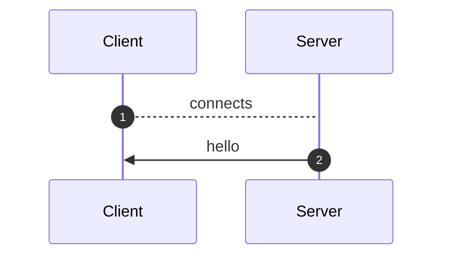
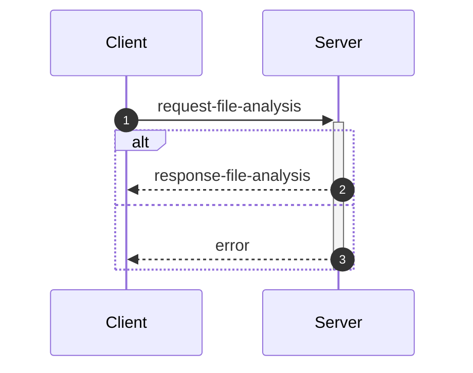
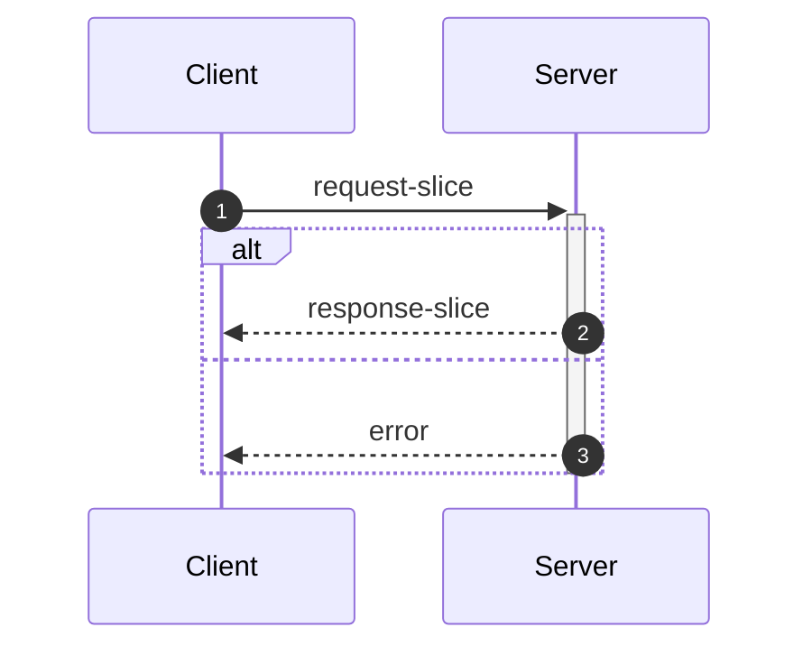
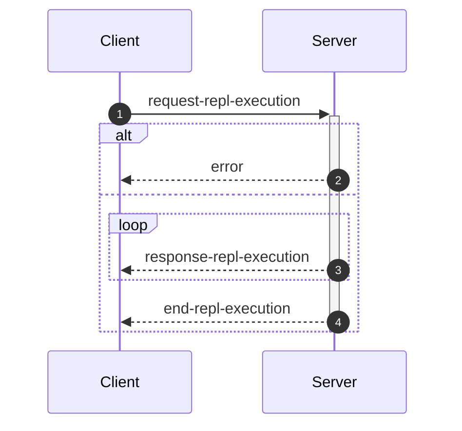

_This document was generated from '[src/documentation/wiki-interface.ts](https://github.com/flowr-analysis/flowr/tree/main//src/documentation/wiki-interface.ts)' on 2026-07-13, 13:58:37 UTC presenting an overview of flowR's interface (v2.11.1, using R v4.6.0). Please do not edit this file/wiki page directly._

Although far from being as detailed as the in-depth explanation of [_flowR_](https://github.com/flowr-analysis/flowr/wiki/core),
this wiki page explains how to interface with _flowR_ in more detail.
In general, command line arguments and other options provide short descriptions on hover over.

* [💻 Using the REPL](#using-the-repl)
* [⚙️ Configuring FlowR](#configuring-flowr)
* [⚒️ Writing Code](#writing-code)
* [💬 Communicating with the Server](#communicating-with-the-server)

<a id='using-the-repl'></a>
## 💻 Using the REPL


> [!NOTE]
> To execute arbitrary R commands with a repl request, _flowR_ has to be started explicitly with <span title="Description (Command Line Argument): Allow to access the underlying R session when using flowR (security warning: this allows the execution of arbitrary R code!)">`--r-session-access`</span>.
> Please be aware that this introduces a security risk and note that this relies on the [`r-shell` engine](https://github.com/flowr-analysis/flowr/wiki/engines) .

Although primarily meant for users to explore,
there is nothing which forbids simply calling _flowR_ as a subprocess to use standard-in, -output, and -error
for communication (although you can access the REPL using the server as well,
with the [REPL Request](#message-request-repl-execution) message).

The read-eval-print loop&nbsp;(REPL) works relatively simple.
You can submit an expression (using <kbd>Enter</kbd>),
which is interpreted as an R&nbsp;expression by default but interpreted as a *command* if it starts with a colon (`:`).
The best command to get started with the REPL is <span title="Description (Repl Command): Show help information (aliases: :h, :?)">`:help`</span>.
Besides, you can leave the REPL either with the command <span title="Description (Repl Command): End the repl (aliases: :q, :exit)">`:quit`</span> or by pressing <kbd>Ctrl</kbd>+<kbd>C</kbd> twice.
When writing a *command*, you may press <kbd>Tab</kbd> to get a list of completions, if available.
Multiple commands can be entered in a single line by separating them with a semicolon (`;`), e.g. `:parse "x<-2"; :df*`.
If a command is given without R code, the REPL will re-use R code given in a previous command.
The prior example will hence return first the parsed AST of the program and then the dataflow graph for `"x <- 2"`.

> [!NOTE]
> If you develop flowR, you may want to launch the repl using the `npm run main-dev` command, this way, you get a non-minified version of flowR with debug information and hot-reloading of source files.

<details>
<summary>Available Commands</summary>

We currently offer the following commands (this with a `[*]` suffix are available with and without the star):


| Command | Description |
| ------- | ----------- |
| **<span title="Description (Repl Command): End the repl (aliases: :q, :exit)">:quit</span>** | End the repl (aliases: **:<span title="Alias of ':quit'. End the repl">q</span>**, **:<span title="Alias of ':quit'. End the repl">exit</span>**) |
| **<span title="Description (Repl Command): Execute the given code as R code. This requires the `--r-session-access` flag to be set and requires the r-shell engine. (aliases: :e, :r)">:execute</span>** | Execute the given code as R code. This requires the `--r-session-access` flag to be set and requires the r-shell engine. (aliases: **:<span title="Alias of ':execute'. Execute the given code as R code. This requires the `--r-session-access` flag to be set and requires the r-shell engine.">e</span>**, **:<span title="Alias of ':execute'. Execute the given code as R code. This requires the `--r-session-access` flag to be set and requires the r-shell engine.">r</span>**) |
| **<span title="Description (Repl Command): Get mermaid code for the control-flow graph of R code (aliases: :cfg, :cf)">:controlflow[*]</span>** | Get mermaid code for the control-flow graph of R code (star: Returns the URL to mermaid.live) (aliases: **:<span title="Alias of ':controlflow'. Get mermaid code for the control-flow graph of R code">cfg</span>**, **:<span title="Alias of ':controlflow'. Get mermaid code for the control-flow graph of R code">cf</span>**) |
| **<span title="Description (Repl Command): Get mermaid code for the control-flow graph with basic blocks (aliases: :cfgb, :cfb)">:controlflowbb[*]</span>** | Get mermaid code for the control-flow graph with basic blocks (star: Returns the URL to mermaid.live) (aliases: **:<span title="Alias of ':controlflowbb'. Get mermaid code for the control-flow graph with basic blocks">cfgb</span>**, **:<span title="Alias of ':controlflowbb'. Get mermaid code for the control-flow graph with basic blocks">cfb</span>**) |
| **<span title="Description (Repl Command): Get mermaid code for the dataflow graph (aliases: :d, :df)">:dataflow[*]</span>** | Get mermaid code for the dataflow graph (star: Returns the URL to mermaid.live) (aliases: **:<span title="Alias of ':dataflow'. Get mermaid code for the dataflow graph">d</span>**, **:<span title="Alias of ':dataflow'. Get mermaid code for the dataflow graph">df</span>**) |
| **<span title="Description (Repl Command): Get mermaid code for the normalized AST of R code (aliases: :n)">:normalize[*]</span>** | Get mermaid code for the normalized AST of R code (star: Returns the URL to mermaid.live) (alias: **:<span title="Alias of ':normalize'. Get mermaid code for the normalized AST of R code">n</span>**) |
| **<span title="Description (Repl Command): Get mermaid code for the simplified dataflow graph (aliases: :ds, :dfs)">:dataflowsimple[*]</span>** | Get mermaid code for the simplified dataflow graph (star: Returns the URL to mermaid.live) (aliases: **:<span title="Alias of ':dataflowsimple'. Get mermaid code for the simplified dataflow graph">ds</span>**, **:<span title="Alias of ':dataflowsimple'. Get mermaid code for the simplified dataflow graph">dfs</span>**) |
| **<span title="Description (Repl Command): Inspect and extend the signature database: `query` (identical to :query @signature), `analyze <dir>` to add packages from disk, `add <path>` to mount another database/source. (aliases: :sig)">:signature</span>** | Inspect and extend the signature database: `query` (identical to :query @signature), `analyze <dir>` to add packages from disk, `add <path>` to mount another database/source. (alias: **:<span title="Alias of ':signature'. Inspect and extend the signature database: `query` (identical to :query @signature), `analyze <dir>` to add packages from disk, `add <path>` to mount another database/source.">sig</span>**) |
| **<span title="Description (Repl Command): Just calculates the DFG, but only prints summary info (aliases: :d#, :df#)">:dataflowsilent</span>** | Just calculates the DFG, but only prints summary info (aliases: **:<span title="Alias of ':dataflowsilent'. Just calculates the DFG, but only prints summary info">d#</span>**, **:<span title="Alias of ':dataflowsilent'. Just calculates the DFG, but only prints summary info">df#</span>**) |
| **<span title="Description (Repl Command): Prints ASCII Art of the parsed, unmodified AST (aliases: :p)">:parse</span>** | Prints ASCII Art of the parsed, unmodified AST (alias: **:<span title="Alias of ':parse'. Prints ASCII Art of the parsed, unmodified AST">p</span>**) |
| **<span title="Description (Repl Command): Prints the version of flowR as well as the current version of R">:version</span>** | Prints the version of flowR as well as the current version of R
| **<span title="Description (Repl Command): Query the given R code (use 'help' for more information)">:query[*]</span>** | Query the given R code (use 'help' for more information) (star: Similar to query, but returns the output in json format.)
| **<span title="Description (Repl Command): Returns an ASCII representation of the dataflow graph (aliases: :df!)">:dataflowascii</span>** | Returns an ASCII representation of the dataflow graph (alias: **:<span title="Alias of ':dataflowascii'. Returns an ASCII representation of the dataflow graph">df!</span>**) |
| **<span title="Description (Repl Command): Returns summarization stats for the normalized AST (aliases: :n#)">:normalize#</span>** | Returns summarization stats for the normalized AST (alias: **:<span title="Alias of ':normalize#'. Returns summarization stats for the normalized AST">n#</span>**) |
| **<span title="Description (Repl Command): Show help information (aliases: :h, :?)">:help</span>** | Show help information (aliases: **:<span title="Alias of ':help'. Show help information">h</span>**, **:<span title="Alias of ':help'. Show help information">?</span>**) |


</details>


> [!TIP]
> 
> As indicated by the examples before, all REPL commands that operate on code keep track of the state.
> Hence, if you run a command like <span title="Description (Repl Command, starred version): Returns the URL to mermaid.live; Base Command: Get mermaid code for the dataflow graph (aliases: :d*, :df*)">`:dataflow*`</span> without providing R code,
> the REPL will re-use the R code provided in a previous command.
> Likewise, doing this will benefit from incrementality!
> If you request the dataflow graph with `:df* x <- 2 * y` and then want to see the parsed AST with `:parse`,
> the REPL will re-use previously obtained information and not re-parse the code again.
> 		


Generally, many commands offer shortcut versions in the REPL. Many queries, for example, offer a shortened format (see the example below).
Of special note, the [Config Query](https://github.com/flowr-analysis/flowr/wiki/query-api#Config-Query)
can be used to also modify the currently active configuration of _flowR_ within the REPL (see the [wiki page](https://github.com/flowr-analysis/flowr/wiki/query-api#Config-Query) for more information).

### Example: Retrieving the Dataflow Graph

To retrieve a URL to the [mermaid](https://mermaid.js.org/) diagram of the dataflow of a given expression,
use <span title="Description (Repl Command, starred version): Returns the URL to mermaid.live; Base Command: Get mermaid code for the dataflow graph (aliases: :d*, :df*)">`:dataflow*`</span> (or <span title="Description (Repl Command): Get mermaid code for the dataflow graph (aliases: :d, :df)">`:dataflow`</span> to get the mermaid code in the cli):


```shell
$ docker run -it --rm eagleoutice/flowr # or npm run flowr 
flowR repl v2.11.1, R grammar v14 (tree-sitter engine)
R> :dataflow* y <- 1 + x
```

<details>
<summary style='color:gray'>Output</summary>


```text
https://mermaid.live/view#base64:eyJjb2RlIjoiZmxvd2NoYXJ0IEJUXG4gICAgMXt7XCJgKiM5MTtSTnVtYmVyIzkzOyogKioxKipcbiAgICAgICoxLjYqICgqKmlkOiAxKiopYFwifX1cbiAgICUlIE5vIGVkZ2VzIGZvdW5kIGZvciAxXG4gICAgMihbXCJgKiM5MTtSU3ltYm9sIzkzOyogKip4KipcbiAgICAgICoxLjEwKiAoKippZDogMioqKWBcIl0pXG4gICAlJSBObyBlZGdlcyBmb3VuZCBmb3IgMlxuICAgIDNbW1wiYCojOTE7UkJpbmFyeU9wIzkzOyogKiojNDM7KipcbiAgICAgICoxLjYtMTAqICgqKmlkOiAzKiopXG4gICAgYXJnOiAoMSwgMilgXCJdXVxuICAgIGJ1aWx0LWluOl9bXCJgQnVpbHQtSW46XG4jNDM7YFwiXVxuICAgIHN0eWxlIGJ1aWx0LWluOl8gc3Ryb2tlOmdyYXksZmlsbDpncmF5LHN0cm9rZS13aWR0aDoycHgsb3BhY2l0eTouODtcbiAgICAwW1wiYCojOTE7UlN5bWJvbCM5MzsqICoqeSoqXG4gICAgICAqMS4xKiAoKippZDogMCoqLCBzb3VyY2VzOiBbM10pYFwiXVxuICAgIDRbW1wiYCojOTE7UkJpbmFyeU9wIzkzOyogKiojNjA7IzQ1OyoqXG4gICAgICAqMS4xLTEwKiAoKippZDogNCoqKVxuICAgIGFyZzogKDAsIDMpYFwiXV1cbiAgICBidWlsdC1pbjpfLVtcImBCdWlsdC1JbjpcbiM2MDsjNDU7YFwiXVxuICAgIHN0eWxlIGJ1aWx0LWluOl8tIHN0cm9rZTpncmF5LGZpbGw6Z3JheSxzdHJva2Utd2lkdGg6MnB4LG9wYWNpdHk6Ljg7XG4gICAgMyAtLT58XCJyZWFkcywgYXJndW1lbnRcInwgMVxuICAgIDMgLS0+fFwicmVhZHMsIGFyZ3VtZW50XCJ8IDJcbiAgICAzIC0uLT58XCJyZWFkcywgY2FsbHNcInwgYnVpbHQtaW46X1xuICAgIGxpbmtTdHlsZSAyIHN0cm9rZTpncmF5O1xuICAgIDAgLS0+fFwiZGVmaW5lZC1ieVwifCAzXG4gICAgMCAtLT58XCJkZWZpbmVkLWJ5XCJ8IDRcbiAgICA0IC0tPnxcInJlYWRzLCBhcmd1bWVudFwifCAzXG4gICAgNCAtLT58XCJyZXR1cm5zLCBhcmd1bWVudFwifCAwXG4gICAgNCAtLi0+fFwicmVhZHMsIGNhbGxzXCJ8IGJ1aWx0LWluOl8tXG4gICAgbGlua1N0eWxlIDcgc3Ryb2tlOmdyYXk7IiwibWVybWFpZCI6eyJhdXRvU3luYyI6dHJ1ZX19
```


Retrieve the dataflow graph of the expression `y <- 1 + x`. It looks like this:


```mermaid
flowchart LR
    1{{"`*#91;RNumber#93;* **1**
      *1.6* (**id: 1**)`"}}
   %% No edges found for 1
    2(["`*#91;RSymbol#93;* **x**
      *1.10* (**id: 2**)`"])
   %% No edges found for 2
    3[["`*#91;RBinaryOp#93;* **#43;**
      *1.6-10* (**id: 3**)
    arg: (1, 2)`"]]
    built-in:_["`Built-In:
#43;`"]
    style built-in:_ stroke:gray,fill:gray,stroke-width:2px,opacity:.8;
    0["`*#91;RSymbol#93;* **y**
      *1.1* (**id: 0**, sources: [3])`"]
    4[["`*#91;RBinaryOp#93;* **#60;#45;**
      *1.1-10* (**id: 4**)
    arg: (0, 3)`"]]
    built-in:_-["`Built-In:
#60;#45;`"]
    style built-in:_- stroke:gray,fill:gray,stroke-width:2px,opacity:.8;
    3 -->|"reads, argument"| 1
    3 -->|"reads, argument"| 2
    3 -.->|"reads, calls"| built-in:_
    linkStyle 2 stroke:gray;
    0 -->|"defined-by"| 3
    0 -->|"defined-by"| 4
    4 -->|"reads, argument"| 3
    4 -->|"returns, argument"| 0
    4 -.->|"reads, calls"| built-in:_-
    linkStyle 7 stroke:gray;
```

	
<details>

<summary style="color:gray">R Code of the Dataflow Graph</summary>

The analysis required _8.1 ms_ (including parse and normalize, using the [tree-sitter](https://github.com/flowr-analysis/flowr/wiki/Engines) engine) within the generation environment. 
We encountered no unknown side effects during the analysis.


```r
y <- 1 + x
```


</details>


</details>


For small graphs like this, <span title="Description (Repl Command): Returns an ASCII representation of the dataflow graph (aliases: :df!)">`:dataflowascii`</span> also provides an ASCII representation directly in the REPL:


```shell
$ docker run -it --rm eagleoutice/flowr # or npm run flowr 
flowR repl v2.11.1, R grammar v14 (tree-sitter engine)
R> :df! y <- 1 + x
```

<details open>
<summary style='color:gray'>Output</summary>


```text
                        0<1>0
                   ┌────| 1 |
    ┌────────┐     │    0---0
 c<4>c       └──c<3>c
 |<- |  v<0>v┌──| + |
 c---c──| y |┘  c---c   u<2>u
        v---v      └────| x |
                        u---u
Edges:
3 -> 1: reads, argument  3 -> 2: reads, argument
4 -> 3: reads, argument  4 -> 0: returns, argument
0 -> 3: defined-by       0 -> 4: defined-by
```


Retrieve the dataflow graph of the expression `y <- 1 + x` as ASCII art.

</details>


For the slicing with <span title="Description (Repl Command): Static backwards executable slicer for R">`:slicer`</span>, you have access to the same [magic comments](#slice-magic-comments) as with the [slice request](#message-request-slice).

### Example: Interfacing with the File System

Many commands that allow for an R-expression (like <span title="Description (Repl Command, starred version): Returns the URL to mermaid.live; Base Command: Get mermaid code for the dataflow graph (aliases: :d*, :df*)">`:dataflow*`</span>) allow for a file as well
if the argument starts with `file://`.
If you are working from the root directory of the _flowR_ repository, the following gives you the parsed AST of the example file using the <span title="Description (Repl Command): Prints ASCII Art of the parsed, unmodified AST (aliases: :p)">`:parse`</span> command:

> **Watch mode**: Replace `file://` with `watch://` to enter watch mode.
> flowR runs the command immediately and then re-runs it every time the file (or any file inside the folder) changes.
> Enter any other command to leave watch mode.
> For example: `:df watch://analysis.R`


```shell
$ docker run -it --rm eagleoutice/flowr # or npm run flowr 
flowR repl v2.11.1, R grammar v14 (tree-sitter engine)
R> :parse file://test/testfiles/example.R
```

<details>
<summary style='color:gray'>Output</summary>


```text
File: test/testfiles/example.R

program
├ binaryoperator
│ ├ identifier "sum" (1:1─4)
│ ├ <- "<-" (1:5─7)
│ ╰ float "0" (1:8─9)
├ binaryoperator
│ ├ identifier "product" (2:1─8)
│ ├ <- "<-" (2:9─11)
│ ╰ float "1" (2:12─13)
├ binaryoperator
│ ├ identifier "w" (3:1─2)
│ ├ <- "<-" (3:3─5)
│ ╰ float "7" (3:6─7)
├ binaryoperator
│ ├ identifier "N" (4:1─2)
│ ├ <- "<-" (4:3─5)
│ ╰ float "10" (4:6─8)
├ forstatement
│ ├ for "for" (6:1─4)
│ ├ ( "(" (6:5─6)
│ ├ identifier "i" (6:6─7)
│ ├ in "in" (6:8─10)
│ ├ binaryoperator
│ │ ├ float "1" (6:11─12)
│ │ ├ : ":" (6:12─13)
│ │ ╰ parenthesizedexpression
│ │   ├ ( "(" (6:13─14)
│ │   ├ binaryoperator
│ │   │ ├ identifier "N" (6:14─15)
│ │   │ ├ - "-" (6:15─16)
│ │   │ ╰ float "1" (6:16─17)
│ │   ╰ ) ")" (6:17─18)
│ ├ ) ")" (6:18─19)
│ ╰ bracedexpression
│   ├ { "{" (6:20─21)
│   ├ binaryoperator
│   │ ├ identifier "sum" (7:3─6)
│   │ ├ <- "<-" (7:7─9)
│   │ ╰ binaryoperator
│   │   ├ binaryoperator
│   │   │ ├ identifier "sum" (7:10─13)
│   │   │ ├ + "+" (7:14─15)
│   │   │ ╰ identifier "i" (7:16─17)
│   │   ├ + "+" (7:18─19)
│   │   ╰ identifier "w" (7:20─21)
│   ├ binaryoperator
│   │ ├ identifier "product" (8:3─10)
│   │ ├ <- "<-" (8:11─13)
│   │ ╰ binaryoperator
│   │   ├ identifier "product" (8:14─21)
│   │   ├  "" (8:22─23)
│   │   ╰ identifier "i" (8:24─25)
│   ╰ } "}" (9:1─2)
├ call
│ ├ identifier "cat" (11:1─4)
│ ╰ arguments
│   ├ ( "(" (11:4─5)
│   ├ argument
│   │ ╰ string
│   │   ├ " "\"" (11:5─6)
│   │   ├ stringcontent "Sum:" (11:6─10)
│   │   ╰ " "\"" (11:10─11)
│   ├ comma "," (11:11─12)
│   ├ argument
│   │ ╰ identifier "sum" (11:13─16)
│   ├ comma "," (11:16─17)
│   ├ argument
│   │ ╰ string
│   │   ├ " "\"" (11:18─19)
│   │   ├ stringcontent
│   │   │ ╰ escapesequence "\\n" (11:19─21)
│   │   ╰ " "\"" (11:21─22)
│   ╰ ) ")" (11:22─23)
╰ call
  ├ identifier "cat" (12:1─4)
  ╰ arguments
    ├ ( "(" (12:4─5)
    ├ argument
    │ ╰ string
    │   ├ " "\"" (12:5─6)
    │   ├ stringcontent "Product:" (12:6─14)
    │   ╰ " "\"" (12:14─15)
    ├ comma "," (12:15─16)
    ├ argument
    │ ╰ identifier "product" (12:17─24)
    ├ comma "," (12:24─25)
    ├ argument
    │ ╰ string
    │   ├ " "\"" (12:26─27)
    │   ├ stringcontent
    │   │ ╰ escapesequence "\\n" (12:27─29)
    │   ╰ " "\"" (12:29─30)
    ╰ ) ")" (12:30─31)
```


Retrieve the parsed AST of the example file.

<details>

<summary>File Content</summary>


```r
sum <- 0
product <- 1
w <- 7
N <- 10

for (i in 1:(N-1)) {
  sum <- sum + i + w
  product <- product * i
}

cat("Sum:", sum, "\n")
cat("Product:", product, "\n")
```


</details>

As _flowR_ directly transforms this AST the output focuses on being human-readable instead of being machine-readable.
		

</details>


### Example: Run a Query

You can run any query supported by _flowR_ using the <span title="Description (Repl Command): Query the given R code (use 'help' for more information)">`:query`</span> command.
For example, to obtain the shapes of all data frames in a given piece of code, you can run:


```shell
$ docker run -it --rm eagleoutice/flowr # or npm run flowr 
flowR repl v2.11.1, R grammar v14 (tree-sitter engine)
R> :query @df-shape "x <- data.frame(a = 1:10, b = 1:10)\ny <- x$a"
```

<details open>
<summary style='color:gray'>Output</summary>


```text
Query: df-shape (3 ms)
   ╰ 12: (colnames: [{"a", "b"}, {}], cols: [2, 2], rows: [10, 10])
   ╰ 0: (colnames: [{"a", "b"}, {}], cols: [2, 2], rows: [10, 10])
All queries together required ≈5 ms (1ms accuracy, total 6 ms)
```


Retrieve the shapes of all data frames in the given code.

</details>


To run the linter on a file, you can use (in this example, we just issue the `dead-code` linter on a small piece of code):


```shell
$ docker run -it --rm eagleoutice/flowr # or npm run flowr 
flowR repl v2.11.1, R grammar v14 (tree-sitter engine)
R> :query @linter rules:dead-code "if(FALSE) x <- 2"
```

<details open>
<summary style='color:gray'>Output</summary>


```text
Query: linter (2 ms)
   ╰ Dead Code (dead-code):
       ╰ certain:
           ╰ Code at 1.11-16
       ╰ Metadata: searchTimeMs: 2, processTimeMs: 0
All queries together required ≈2 ms (1ms accuracy, total 3 ms)
```


Run the linter on the given code, with only the `dead-code` rule enabled.

</details>


For more information on the available queries, please check out the [Query API](https://github.com/flowr-analysis/flowr/wiki/query-api).


<a id='configuring-flowr'></a>
## ⚙️ Configuring FlowR


When running _flowR_, you may want to specify some behaviors with a dedicated configuration file.
By default, flowR looks for a file named `flowr.json` in the current working directory (or any higher directory).
You can also specify a different file with <span title="Description (Command Line Argument): The name of the configuration file to use">`--config-file`</span> or pass the configuration inline using <span title="Description (Command Line Argument): The flowR configuration to use, as a JSON string">`--config-json`</span>.
To inspect the current configuration, you can run flowr with the <span title="Description (Command Line Argument): Run with verbose logging (will be passed to the corresponding script)">`--verbose`</span> flag, or use the `config` [Query](https://github.com/flowr-analysis/flowr/wiki/query-api).
Within the REPL this works by running the following:


```shell
:query @config
```


To work with the <a href="https://github.com/flowr-analysis/flowr/tree/main/src/config.ts#L109"><code><span title="The configuration file format for flowR.">FlowrConfig</span></code></a> you can use the provided helper objects alongside its methods like
<a href="https://github.com/flowr-analysis/flowr/tree/main/src/config.ts#L529"><code><span title="Creates a new flowr config that has the updated values.">FlowrConfig::<b>amend</b></span></code></a>.
The following summarizes the configuration options:

- `ignoreSourceCalls`: If set to `true`, _flowR_ will ignore source calls when analyzing the code, i.e., ignoring the inclusion of other files.
- `semantics`: allows to configure the way _flowR_ handles R, although we currently only support `semantics/environment/overwriteBuiltIns`.
  You may use this to overwrite _flowR_'s handling of built-in function and even completely clear the preset definitions shipped with flowR.
  See [Configure BuiltIn Semantics](#configure-builtin-semantics) for more information.
- `solver`: allows to configure how _flowR_ resolves variables and their values (currently we support: `disabled`, `alias`, `builtin`), as well as if pointer analysis should be active.
- `engines`: allows to configure the engines used by _flowR_ to interact with R code. See the [Engines wiki page](https://github.com/flowr-analysis/flowr/wiki/engines) for more information.
- `defaultEngine`: allows to specify the default engine to use for interacting with R code. If not set, an arbitrary engine from the specified list will be used.
- `abstractInterpretation`: allows to configure how _flowR_ performs abstract interpretation, although we currently only support data frame shape inference through abstract interpretation.
- `defaultPlugins`: allows to configure which plugins to load by default when creating a new <a href="https://github.com/flowr-analysis/flowr/tree/main/src/project/flowr-analyzer.ts#L162"><code><span title="Central class for conducting analyses with FlowR. Use the FlowrAnalyzerBuilder to create a new instance. If you want the original pattern of creating a pipeline and running all steps, you can still do this with FlowrAnalyzer#runFull . To inspect the context of the analyzer, use FlowrAnalyzer#inspectContext (if you are a plugin and need to modify it, use FlowrAnalyzer#context instead).">FlowrAnalyzer</span></code></a> instance.
- `repl.plugins`: allows to configure which plugins to load in the _flowR_ REPL. Use `flowr:default` to reference the plugins specified by `defaultPlugins`.

So you can configure _flowR_ by adding a file like the following:

<details>

<summary>Example Configuration File</summary>


```json
{
  "ignoreSourceCalls": true,
  "semantics": {
    "environment": {
      "overwriteBuiltIns": {
        "definitions": [
          {
            "type": "function",
            "names": [
              "foo"
            ],
            "processor": "builtin:assign",
            "config": {}
          }
        ]
      }
    }
  },
  "defaultPlugins": [
    "file:description",
    "versions:description"
  ],
  "repl": {
    "quickStats": false,
    "dfProcessorHeat": false,
    "hints": true,
    "plugins": [
      "flowr:default"
    ]
  },
  "project": {
    "resolveUnknownPathsOnDisk": true
  },
  "engines": [
    {
      "type": "r-shell"
    }
  ],
  "solver": {
    "variables": "alias",
    "evalStrings": true,
    "trackEnvironments": true,
    "sigdb": {
      "enabled": true,
      "eagerlyLoad": false,
      "eagerlyLoadExports": false,
      "linkBaseR": false
    },
    "resolveSource": {
      "dropPaths": "no",
      "ignoreCapitalization": true,
      "inferWorkingDirectory": "active-script",
      "searchPath": []
    },
    "instrument": {},
    "slicer": {
      "threshold": 50
    }
  },
  "abstractInterpretation": {
    "wideningThreshold": 4,
    "dataFrame": {
      "maxColNames": 20,
      "readLoadedData": {
        "readExternalFiles": true,
        "maxReadLines": 1000000
      }
    }
  },
  "gas": {
    "thresholds": {
      "memory": {
        "problematic": 0.7,
        "critical": 0.9
      },
      "timeMs": {
        "problematic": 100000,
        "critical": 120000
      }
    },
    "features": {}
  }
}
```


</details>

<details>
<a id='configure-builtin-semantics'></a>
<summary>Configure Built-In Semantics</summary>


`semantics/environment/overwriteBuiltins` accepts two keys:

- `loadDefaults` (boolean, initially `true`): If set to `true`, the default built-in definitions are loaded before applying the custom definitions. Setting this flag to `false` explicitly disables the loading of the default definitions.
- `definitions` (array, initially empty): Allows to overwrite or define new built-in elements. Each object within must have a `type` which is one of the below. Furthermore, they may define a string array of `names` which specifies the identifiers to bind the definitions to. You may use `assumePrimitive` to specify whether _flowR_ should assume that this is a primitive non-library definition (so you probably just do not want to specify the key).

  | Type            | Description                                                                                                                                                                                                                                                                                              | Example                                                                                                    |
  | --------------- | -------------------------------------------------------------------------------------------------------------------------------------------------------------------------------------------------------------------------------------------------------------------------------------------------------- | ---------------------------------------------------------------------------------------------------------- |
  | `constant`    | Additionally allows for a `value` this should resolve to.                                                                                                                                                                                                                                                | `{ type: 'constant', names: ['NULL', 'NA'],  value: null }`                                                |
  | `function`    | Is a rather flexible way to define and bind built-in functions. For the time, we do not have extensive documentation to cover all the cases, so please either consult the sources with the `default-builtin-config.ts` or open a [new issue](https://github.com/flowr-analysis/flowr/issues/new/choose). | `{ type: 'function', names: ['next'], processor: 'builtin:d', config: { cfg: ExitPointType.Next } }` |
  | `replacement` | A comfortable way to specify replacement functions like `$<-` or `names<-`. `suffixes` describes the... suffixes to attach automatically. | `{ type: 'replacement', suffixes: ['<-', '<<-'], names: ['[', '[['] }` |


</details>

<details>

<summary style='color:gray'>Full Configuration-File Schema</summary>

- _The configuration file format for flowR._ (object)
    - **ignoreSourceCalls** [optional] _Whether source calls should be ignored, causing {@link processSourceCall}'s behavior to be skipped._ (boolean)
    - **semantics** _Configure language semantics and how flowR handles them._ (object)
        - **environment** [optional] _Semantics regarding how to handle the R environment._ (object)
            - **overwriteBuiltIns** [optional] _Do you want to overwrite (parts) of the builtin definition?_ (object)
                - **loadDefaults** [optional] _Should the default configuration still be loaded?_ (boolean)
                - **definitions** [optional] _The definitions to load/overwrite._ (array)
                Valid item types:
                    - (object)
    - **defaultPlugins** [optional] _The default plugins to load when creating a new instance of FlowrAnalyzer_ (array)
    Valid item types:
        - (alternatives)
            - (string)
            - (array)
    - **repl** _Configuration options for the REPL._ (object)
        - **quickStats** [optional] _Whether to show quick stats in the REPL after each evaluation._ (boolean)
        - **dfProcessorHeat** [optional] _This instruments the dataflow processors to count how often each processor is called._ (boolean)
        - **hints** [optional] _Whether to show dim inline hints on the empty prompt (automatically disabled on non-interactive terminals)._ (boolean)
        - **plugins** [optional] _The plugins to load in REPL mode_ (array)
        Valid item types:
            - (alternatives)
                - (string)
                - (array)
    - **project** _Project specific configuration options._ (object)
        - **resolveUnknownPathsOnDisk** [optional] _Whether to resolve unknown paths loaded by the r project disk when trying to source/analyze files._ (boolean)
        - **basePackages** [optional] _The packages considered part of R itself (base and recommended); if unset, flowR uses its built-in list._ (array)
        Valid item types:
            - (string)
    - **engines** _The engine or set of engines to use for interacting with R code. An empty array means all available engines will be used._ (array)
    Valid item types:
        - (alternatives)
            - _The configuration for the tree sitter engine._ (object)
                - **type** [required] _Use the tree sitter engine._ (string)
                    Only allows: 'tree-sitter'
                - **wasmPath** [optional] _The path to the tree-sitter-r WASM binary to use. If this is undefined, this uses the default path._ (string)
                - **treeSitterWasmPath** [optional] _The path to the tree-sitter WASM binary to use. If this is undefined, this uses the default path._ (string)
                - **lax** [optional] _Whether to use the lax parser for parsing R code (allowing for syntax errors). If this is undefined, the strict parser will be used._ (boolean)
            - _The configuration for the R shell engine._ (object)
                - **type** [required] _Use the R shell engine._ (string)
                    Only allows: 'r-shell'
                - **rPath** [optional] _The path to the R executable to use. If this is undefined, this uses the default path._ (string)
    - **defaultEngine** [optional] _The default engine to use for interacting with R code. If this is undefined, an arbitrary engine from the specified list will be used._ (string)
        Only allows: 'tree-sitter', 'r-shell'
    - **solver** _How to resolve constants, constraints, cells, ..._ (object)
        - **variables** _How to resolve variables and their values._ (string)
            Only allows: 'disabled', 'alias', 'builtin'
        - **evalStrings** _Should we include eval(parse(text="...")) calls in the dataflow graph?_ (boolean)
        - **trackEnvironments** [optional] _Track user-created environments (new.env, assign/get/local with envir=, dollar-assign, attach). When false, all envir-style calls fall through conservatively._ (boolean)
        - **sigdb** _Resolving library exports from a signature database._ (object)
            - **enabled** [optional] _Resolve library()/use() exports from a signature database (default true); when false no database is consulted._ (boolean)
            - **eagerlyLoad** [optional] _Parse the database up front rather than on the first package load (default false, ignored if disabled)._ (boolean)
            - **eagerlyLoadExports** [optional] _Add a vertex for every export on load rather than on demand (default false); keeps the dataflow graph small._ (boolean)
            - **assumedRVersion** [optional] _R version assumed when resolving versioned (base-R) exports: a pin like "4.5" or "auto" to detect the installed R (default "auto")._ (string)
            - **linkBaseR** [optional] _Eagerly attach base-R namespaces so bare base calls resolve without library() (default false)._ (boolean)
            - **warmInBackground** [optional] _Decompress the hot shards (base + most-downloaded) in a background task on startup so the first library() lookup is warm (default false; for long-running servers/REPLs)._ (boolean)
        - **instrument** (object)
            - **dataflowExtractors** [optional] _These keys are only intended for use within code, allowing to instrument the dataflow analyzer!_ (any)
        - **resolveSource** [optional] _If lax source calls are active, flowR searches for sourced files much more freely, based on the configurations you give it. This option is only in effect if `ignoreSourceCalls` is set to false._ (object)
            - **dropPaths** _Allow to drop the first or all parts of the sourced path, if it is relative._ (string)
                Only allows: 'no', 'once', 'all'
            - **ignoreCapitalization** _Search for filenames matching in the lowercase._ (boolean)
            - **inferWorkingDirectory** _Try to infer the working directory from the main or any script to analyze._ (string)
                Only allows: 'no', 'main-script', 'active-script', 'any-script'
            - **searchPath** _Additionally search in these paths._ (array)
            Valid item types:
                - (string)
            - **repeatedSourceLimit** [optional] _How often the same file can be sourced within a single run? Please be aware: in case of cyclic sources this may not reach a fixpoint so give this a sensible limit._ (number)
            - **applyReplacements** _Provide name replacements for loaded files_ (array)
            Valid item types:
                - (object)
        - **slicer** [optional] _The configuration for the slicer._ (object)
            - **threshold** [optional] _The maximum number of iterations to perform on a single function call during slicing._ (number)
            - **autoExtend** [optional] _If set, the slicer will gain an additional post-pass._ (boolean)
    - **abstractInterpretation** _The configuration options for abstract interpretation._ (object)
        - **wideningThreshold** _The threshold for the number of visitations of a node at which widening should be performed to ensure the termination of the fixpoint iteration._ (number)
        - **dataFrame** _The configuration of the shape inference for data frames._ (object)
            - **maxColNames** _The maximum number of columns names to infer for data frames before over-approximating the column names to top._ (number)
            - **readLoadedData** _Configuration options for reading data frame shapes from loaded external data files, such as CSV files._ (object)
                - **readExternalFiles** _Whether data frame shapes should be extracted from loaded external files, such as CSV files._ (boolean)
                - **maxReadLines** _The maximum number of lines to read when extracting data frame shapes from loaded files, such as CSV files._ (number)
    - **gas** [optional] _Resource-usage guard (gas) configuration. All feature factors default to 0 (disabled). See https://github.com/flowr-analysis/flowr/wiki/Core#gas-resource-guard._ (object)
        - **thresholds** [optional] _Shared thresholds for all gas checks (scaled by per-feature factor)._ (object)
            - **memory** [optional] _Heap-usage fraction thresholds (0-1)._ (object)
                - **problematic** [optional] _Heap fraction (0-1) above which Problematic is returned._ (number)
                - **critical** [optional] _Heap fraction (0-1) above which Critical is returned._ (number)
            - **timeMs** [optional] _Elapsed analysis time thresholds in milliseconds._ (object)
                - **problematic** [optional] _Elapsed ms above which Problematic is returned._ (number)
                - **critical** [optional] _Elapsed ms above which Critical is returned._ (number)
        - **features** [optional] _Per-feature sensitivity factors. 0 or absent disables gas checking for that feature. A factor of 2 makes the feature twice as sensitive. Recognised keys: `source`, `side-effect-linking`, `linter`._ (object)
        - **heapProvider** [optional] _Custom heap statistics source (programmatic configs only), overriding the built-in v8/performance.memory detection._ (function)

</details>

	

<a id='writing-code'></a>
## ⚒️ Writing Code

_flowR_ can be used as a [module](https://www.npmjs.com/package/@eagleoutice/flowr) and offers several main classes and interfaces that are interesting for extension writers 
(see the [Visual Studio Code extension](https://marketplace.visualstudio.com/items?itemName=code-inspect.vscode-flowr) or the [Core](https://github.com/flowr-analysis/flowr/wiki/core) wiki page for more information).

### Creating Analyses with _flowR_

Nowadays, instances of the <a href="https://github.com/flowr-analysis/flowr/tree/main/src/project/flowr-analyzer.ts#L162"><code><span title="Central class for conducting analyses with FlowR. Use the FlowrAnalyzerBuilder to create a new instance. If you want the original pattern of creating a pipeline and running all steps, you can still do this with FlowrAnalyzer#runFull . To inspect the context of the analyzer, use FlowrAnalyzer#inspectContext (if you are a plugin and need to modify it, use FlowrAnalyzer#context instead).">FlowrAnalyzer</span></code></a> should be used as central frontend to get analysis results from _flowR_.
For example, a program slice can be created like this:


```ts
const analyzer = await new FlowrAnalyzerBuilder()
    .setEngine('tree-sitter')
    .build();
analyzer.addRequest('x <- 1\ny <- x\nx');
const result = await analyzer.query([
    {
        type:     'static-slice',
        criteria: ['3@x']
    }
]);
//console.log(result['static-slice']);
```


For more information, please have a look at the [Analyzer](https://github.com/flowr-analysis/flowr/wiki/analyzer) wiki page, which explains how to construct and use the <a href="https://github.com/flowr-analysis/flowr/tree/main/src/project/flowr-analyzer.ts#L162"><code><span title="Central class for conducting analyses with FlowR. Use the FlowrAnalyzerBuilder to create a new instance. If you want the original pattern of creating a pipeline and running all steps, you can still do this with FlowrAnalyzer#runFull . To inspect the context of the analyzer, use FlowrAnalyzer#inspectContext (if you are a plugin and need to modify it, use FlowrAnalyzer#context instead).">FlowrAnalyzer</span></code></a> in more detail.
To work with specific perspectives, you can also consult the respective pages like the [Dataflow Graph](https://github.com/flowr-analysis/flowr/wiki/dataflow-graph) or the [Abstract Interpretation](https://github.com/flowr-analysis/flowr/wiki/abstract-interpretation) wiki pages.
### The Pipeline Executor (Low-Level Interface)

Once, in the beginning, _flowR_ was meant to produce a dataflow graph merely to provide *program slices*. 
However, with continuous updates, the [Dataflow Graph](https://github.com/flowr-analysis/flowr/wiki/dataflow-graph) repeatedly proves to be the more interesting part.
With this, we restructured _flowR_'s originally *hardcoded* pipeline to be far more flexible. 
Now, it can be theoretically extended or replaced with arbitrary steps, optional steps, and what we call 'decorations' of these steps. 
In short, a slicing pipeline using the <a href="https://github.com/flowr-analysis/flowr/tree/main/src/core/pipeline-executor.ts#L97"><code><span title="**Please note:** The PipelineExecutor is now considered to be a rather low-level API for flowR. While it still works and is the basis for all other layers, we strongly recommend using the FlowrAnalyzer and its builder to create and use an analyzer instance that is pre-configured for your use-case. The pipeline executor allows to execute arbitrary pipelines in a step-by-step fashion. If you are not...">PipelineExecutor</span></code></a> looks like this:


```ts

const slicer = new PipelineExecutor(DEFAULT_SLICING_PIPELINE, {
  parser:    new RShell(),
  request:   requestFromInput('x <- 1\nx + 1'),
  criterion: ['2@x']
})
const slice = await slicer.allRemainingSteps()
// console.log(slice.reconstruct.code)
```


<details><summary>More Information</summary>


If you compare this, with what you would have done with the old (and removed) `SteppingSlicer`, 
this essentially just requires you to replace the `SteppingSlicer` with the <a href="https://github.com/flowr-analysis/flowr/tree/main/src/core/pipeline-executor.ts#L97"><code><span title="**Please note:** The PipelineExecutor is now considered to be a rather low-level API for flowR. While it still works and is the basis for all other layers, we strongly recommend using the FlowrAnalyzer and its builder to create and use an analyzer instance that is pre-configured for your use-case. The pipeline executor allows to execute arbitrary pipelines in a step-by-step fashion. If you are not...">PipelineExecutor</span></code></a>
and to pass the <a href="https://github.com/flowr-analysis/flowr/tree/main/src/core/steps/pipeline/default-pipelines.ts#L18"><code>DEFAULT_SLICING_PIPELINE</code></a> as the first argument.
The <a href="https://github.com/flowr-analysis/flowr/tree/main/src/core/pipeline-executor.ts#L97"><code><span title="**Please note:** The PipelineExecutor is now considered to be a rather low-level API for flowR. While it still works and is the basis for all other layers, we strongly recommend using the FlowrAnalyzer and its builder to create and use an analyzer instance that is pre-configured for your use-case. The pipeline executor allows to execute arbitrary pipelines in a step-by-step fashion. If you are not...">PipelineExecutor</span></code></a>...

1. Provides structures to investigate the results of all intermediate steps
2. Can be executed step-by-step
3. Can repeat steps (e.g., to calculate multiple slices on the same input)

See the in-code documentation for more information.


</details>

### Using the <a href="https://github.com/flowr-analysis/flowr/tree/main/src/r-bridge/shell.ts#L143"><code><span title="The RShell represents an interactive session with the R interpreter. You can configure it by RShellOptions . At the moment we are using a live R session (and not networking etc.) to communicate with R easily, which allows us to install packages etc. However, this might and probably will change in the future (leaving this as a legacy mode :D)">RShell</span></code></a> to Interact with R

The <a href="https://github.com/flowr-analysis/flowr/tree/main/src/r-bridge/shell.ts#L143"><code><span title="The RShell represents an interactive session with the R interpreter. You can configure it by RShellOptions . At the moment we are using a live R session (and not networking etc.) to communicate with R easily, which allows us to install packages etc. However, this might and probably will change in the future (leaving this as a legacy mode :D)">RShell</span></code></a> class allows interfacing with the `R`&nbsp;ecosystem installed on the host system.
Please have a look at [flowR's Engines](https://github.com/flowr-analysis/flowr/wiki/engines) for more information on alternatives (for example, the <a href="https://github.com/flowr-analysis/flowr/tree/main/src/r-bridge/lang-4.x/tree-sitter/tree-sitter-executor.ts#L18"><code><span title="Synchronous and (way) faster alternative to the RShell using tree-sitter.">TreeSitterExecutor</span></code></a>).


> [!IMPORTANT]
> 
> Each <a href="https://github.com/flowr-analysis/flowr/tree/main/src/r-bridge/shell.ts#L143"><code><span title="The RShell represents an interactive session with the R interpreter. You can configure it by RShellOptions . At the moment we are using a live R session (and not networking etc.) to communicate with R easily, which allows us to install packages etc. However, this might and probably will change in the future (leaving this as a legacy mode :D)">RShell</span></code></a> controls a new instance of the R&nbsp;interpreter, 
> make sure to call <code><a href="https://github.com/flowr-analysis/flowr/tree/main/src/r-bridge/shell.ts#L333"><span title="Close the current R session, makes the object effectively invalid (can no longer be reopened etc.)">RShell::<i>close</i></span></a>()</code> when you are done.


You can start a new "session" simply by constructing a new object with <code>new <a href="https://github.com/flowr-analysis/flowr/tree/main/src/r-bridge/shell.ts#L143"><span title="The RShell represents an interactive session with the R interpreter. You can configure it by RShellOptions . At the moment we are using a live R session (and not networking etc.) to communicate with R easily, which allows us to install packages etc. However, this might and probably will change in the future (leaving this as a legacy mode :D)">RShell</span></a>()</code>.

However, there are several options that may be of interest 
(e.g., to automatically revive the shell in case of errors or to control the name location of the R process on the system).

With a shell object (let's call it `shell`), you can execute R code by using <a href="https://github.com/flowr-analysis/flowr/tree/main/src/r-bridge/shell.ts#L211"><code><span title="sends the given command directly to the current R session will not do anything to alter input markers!">RShell::<i>sendCommand</i></span></code></a>,
for example <code>shell.<a href="https://github.com/flowr-analysis/flowr/tree/main/src/r-bridge/shell.ts#L211"><span title="sends the given command directly to the current R session will not do anything to alter input markers!">sendCommand</span></a>("1 + 1")</code>.
However, this does not return anything, so if you want to collect the output of your command, use
<a href="https://github.com/flowr-analysis/flowr/tree/main/src/r-bridge/shell.ts#L277"><code><span title="Send a command and collect the output">RShell::<i>sendCommandWithOutput</i></span></code></a> instead.


<a id='communicating-with-the-server'></a>
## 💬 Communicating with the Server


As explained in the [Overview](https://github.com/flowr-analysis/flowr/wiki/overview), you can simply run the [TCP](https://de.wikipedia.org/wiki/Transmission_Control_Protocol)&nbsp;server by adding the <span title="Description (Command Line Argument): Do not drop into a repl, but instead start a server on the given port (default: 1042) and listen for messages.">`--server`</span> flag (and, due to the interactive mode, exit with the conventional <kbd>CTRL</kbd>+<kbd>C</kbd>).
Currently, every connection is handled by the same underlying `RShell` - so the server is not designed to handle many clients at a time.
Additionally, the server is not well guarded against attacks (e.g., you can theoretically spawn an arbitrary number of&nbsp;RShell sessions on the target machine).

Every message has to be given in a single line (i.e., without a newline in-between) and end with a newline character. Nevertheless, we will pretty-print example given in the following segments for the ease of reading.


> [!NOTE]
> 
> The default <span title="Description (Command Line Argument): Do not drop into a repl, but instead start a server on the given port (default: 1042) and listen for messages.">`--server`</span> uses a simple [TCP](https://de.wikipedia.org/wiki/Transmission_Control_Protocol)
> connection. If you want _flowR_ to expose a [WebSocket](https://de.wikipedia.org/wiki/WebSocket) server instead, add the <span title="Description (Command Line Argument): If the server flag is set, use websocket for messaging">`--ws`</span> flag (i.e., <span title="Description (Command Line Argument): Do not drop into a repl, but instead start a server on the given port (default: 1042) and listen for messages.">`--server`</span> <span title="Description (Command Line Argument): If the server flag is set, use websocket for messaging">`--ws`</span>) when starting _flowR_ from the command line.


<ul><li>
<a id="message-hello"></a>
<b>Hello</b> Message (<code>hello</code>) 
<details>

<summary style="color:gray"> View Details. <i>The server informs the client about the successful connection and provides Meta-Information.</i> </summary>


```mermaid
sequenceDiagram
    autonumber
    participant Client
    participant Server

    
    Client-->Server: connects
    Server->>Client: hello
	
```


	
After launching _flowR_, for example, with <code>docker run -it --rm eagleoutice/flowr <span title="Description (Command Line Argument): Do not drop into a repl, but instead start a server on the given port (default: 1042) and listen for messages.">-<span/>-server</span></code>&nbsp;(🐳️), simply connecting should present you with a `hello` message, that amongst others should reveal the versions of&nbsp;_flowR_ and&nbsp;R, using the [semver 2.0](https://semver.org/spec/v2.0.0.html) versioning scheme.
The message looks like this:


```json
{
  "type": "hello",
  "clientName": "client-0",
  "versions": {
    "flowr": "2.11.1",
    "r": "4.6.0",
    "engine": "r-shell"
  }
}
```


There are currently a few messages that you can send after the hello message.
If you want to _slice_ a piece of R code you first have to send an [analysis request](#message-request-file-analysis), so that you can send one or multiple slice requests afterward.
Requests for the [REPL](#message-request-repl) are independent of that.
	

<hr>


<details>
<summary style="color:gray">Message schema (<code>hello</code>)</summary>

For the definition of the hello message, please see it's implementation at [`./src/cli/repl/server/messages/message-hello.ts`](https://github.com/flowr-analysis/flowr/tree/main/./src/cli/repl/server/messages/message-hello.ts).

- [required] (object)
    - **type** [required] _The type of the hello message._ (string)
        Only allows: 'hello'
    - **id** [forbidden] _The id of the message is always undefined (as it is the initial message and not requested)._ (any)
    - **clientName** [required] _A unique name that is assigned to each client. It has no semantic meaning and is only used/useful for debugging._ (string)
    - **versions** [required] (object)
        - **flowr** [required] _The version of the flowr server running in semver format._ (string)
        - **r** [required] _The version of the underlying R shell running in semver format._ (string)
        - **engine** [required] _The parser backend that is used to parse the R code._ (string)

</details>


<hr>

</details>
	</li>

<li>
<a id="message-request-file-analysis"></a>
<b>Analysis</b> Message (<code>request-file-analysis</code>) 
<details>

<summary style="color:gray"> View Details. <i>The server builds the dataflow graph for a given input file (or a set of files).</i> </summary>


```mermaid
sequenceDiagram
    autonumber
    participant Client
    participant Server

    
    Client->>+Server: request-file-analysis
    alt
        Server-->>Client: response-file-analysis
    else
        Server-->>Client: error
    end
    deactivate  Server
	
```


	
The request allows the server to analyze a file and prepare it for slicing.
The message can contain a `filetoken`, which is used to identify the file in later slice or query requests (if you do not add one, the request will not be stored and therefore, it is not available for subsequent requests).

> **Please note!**\
> If you want to send and process a lot of analysis requests, but do not want to slice them, please do not pass the `filetoken` field. This will save the server a lot of memory allocation.

Furthermore, the request must contain either a `content` field to directly pass the file's content or a `filepath` field which contains the path to the file (this path must be accessible for the server to be useful).
If you add the `id` field, the answer will use the same `id` so you can match requests and the corresponding answers.
See the implementation of the request-file-analysis message for more information.

You can drop one or more stored file tokens by adding the `invalidateToken` field (a single token or an array of tokens).
The server frees the corresponding analyses _after_ it has answered the request.

> **Tip!**\
> If you only want to drop tokens, you do not need a separate message: send a `request-file-analysis` that contains _just_ the `invalidateToken` field (and no `content` or `filepath`).
> Such a request behaves like an empty file analysis and the server replies with an empty `results` object.
> Because invalidation happens after the response, you may even pass the _current_ `filetoken` in `invalidateToken` to analyze a file once and have the server forget it right after you received the results.


<details>
<summary>Example of the <code>request-file-analysis</code> Message</summary>

_Note:_ even though we pretty-print these messages, they are sent as a single line, ending with a newline.

The following lists all messages that were sent and received in case you want to reproduce the scenario:

<ol>
<li> <code>hello</code> (response)
<details> 

<summary> Show Details </summary>

The first message is always a hello message.


```json
{
  "type": "hello",
  "clientName": "client-0",
  "versions": {
    "flowr": "2.11.1",
    "r": "4.6.0",
    "engine": "r-shell"
  }
}
```


</details>
</li>

<li> <b><code>request-file-analysis</code> (request)</b>
<details open> 

<summary> Show Details </summary>

Let's suppose you simply want to analyze the following script:
 
```r
x <- 1
x + 1
```

 For this, you can send the following request:


```json
{
  "type": "request-file-analysis",
  "id": "1",
  "filetoken": "x",
  "content": "x <- 1\nx + 1"
}
```


</details>
</li>

<li> <code>response-file-analysis</code> (response)
<details> 

<summary> Show Details </summary>


The `results` field of the response effectively contains three keys of importance:

- `parse`: which contains 1:1 the parse result in CSV format that we received from the `RShell` (i.e., the AST produced by the parser of the R interpreter).
- `normalize`: which contains the normalized AST, including ids (see the `info` field and the [Normalized AST](https://github.com/flowr-analysis/flowr/wiki/normalized-ast) wiki page).
- `dataflow`: especially important is the `graph` field which contains the dataflow graph as a set of root vertices (see the [Dataflow Graph](https://github.com/flowr-analysis/flowr/wiki/dataflow-graph) wiki page).
			


_As the code is pretty long, we inhibit pretty printing and syntax highlighting (JSON, hiding built-in):_

```text
{"type":"response-file-analysis","format":"json","id":"1","results":{"parse":{"files":[{"parsed":"[1,1,1,6,7,0,\"expr\",false,\"x <- 1\"],[1,1,1,1,1,3,\"SYMBOL\",true,\"x\"],[1,1,1,1,3,7,\"expr\",false,\"x\"],[1,3,1,4,2,7,\"LEFT_ASSIGN\",true,\"<-\"],[1,6,1,6,4,5,\"NUM_CONST\",true,\"1\"],[1,6,1,6,5,7,\"expr\",false,\"1\"],[2,1,2,5,16,0,\"expr\",false,\"x + 1\"],[2,1,2,1,10,12,\"SYMBOL\",true,\"x\"],[2,1,2,1,12,16,\"expr\",false,\"x\"],[2,3,2,3,11,16,\"'+'\",true,\"+\"],[2,5,2,5,13,14,\"NUM_CONST\",true,\"1\"],[2,5,2,5,14,16,\"expr\",false,\"1\"]","filePath":"/tmp/tmp-520834-5ZqwydF5hqpm-.R"}],".meta":{"timing":4}},"normalize":{"ast":{"type":"RProject","files":[{"root":{"type":"RExpressionList","children":[{"type":"RBinaryOp","location":[1,3,1,4],"lhs":{"type":"RSymbol","location":[1,1,1,1],"content":"x","lexeme":"x","info":{"fullRange":[1,1,1,1],"adToks":[],"id":0,"parent":2,"role":"bin-l","index":0,"nest":0,"file":"/tmp/tmp-520834-5ZqwydF5hqpm-.R"}},"rhs":{"location":[1,6,1,6],"lexeme":"1","info":{"fullRange":[1,6,1,6],"adToks":[],"id":1,"parent":2,"role":"bin-r","index":1,"nest":0,"file":"/tmp/tmp-520834-5ZqwydF5hqpm-.R"},"type":"RNumber","content":{"num":1,"complexNumber":false,"markedAsInt":false}},"operator":"<-","lexeme":"<-","info":{"fullRange":[1,1,1,6],"adToks":[],"id":2,"parent":6,"nest":0,"file":"/tmp/tmp-520834-5ZqwydF5hqpm-.R","index":0,"role":"el-c"}},{"type":"RBinaryOp","location":[2,3,2,3],"lhs":{"type":"RSymbol","location":[2,1,2,1],"content":"x","lexeme":"x","info":{"fullRange":[2,1,2,1],"adToks":[],"id":3,"parent":5,"role":"bin-l","index":0,"nest":0,"file":"/tmp/tmp-520834-5ZqwydF5hqpm-.R"}},"rhs":{"location":[2,5,2,5],"lexeme":"1","info":{"fullRange":[2,5,2,5],"adToks":[],"id":4,"parent":5,"role":"bin-r","index":1,"nest":0,"file":"/tmp/tmp-520834-5ZqwydF5hqpm-.R"},"type":"RNumber","content":{"num":1,"complexNumber":false,"markedAsInt":false}},"operator":"+","lexeme":"+","info":{"fullRange":[2,1,2,5],"adToks":[],"id":5,"parent":6,"nest":0,"file":"/tmp/tmp-520834-5ZqwydF5hqpm-.R","index":1,"role":"el-c"}}],"info":{"adToks":[],"id":6,"nest":0,"file":"/tmp/tmp-520834-5ZqwydF5hqpm-.R","role":"root","index":0}},"filePath":"/tmp/tmp-520834-5ZqwydF5hqpm-.R"}],"info":{"id":7}},".meta":{"timing":1}},"dataflow":{"unknownReferences":[],"in":[{"nodeId":2,"name":"<-","type":2},{"nodeId":5,"name":"+","type":2}],"out":[{"nodeId":0,"name":"x","type":4,"definedAt":2,"value":[1]}],"environment":{"current":{"id":54,"parent":"<BuiltInEnvironment>","memory":[["x",[{"nodeId":0,"name":"x","type":4,"definedAt":2,"value":[1]}]]],"globalEnv":true},"level":0},"graph":{"rootVertices":[1,0,2,3,4,5],"vertexInformation":[[1,{"tag":"value","id":1}],[0,{"tag":"vdef","id":0,"source":[1]}],[2,{"tag":"fcall","id":2,"name":"<-","onlyBuiltin":true,"args":[{"nodeId":0,"type":32},{"nodeId":1,"type":32}],"origin":["builtin:assign"]}],[3,{"tag":"use","id":3}],[4,{"tag":"value","id":4}],[5,{"tag":"fcall","id":5,"name":"+","onlyBuiltin":true,"args":[{"nodeId":3,"type":32},{"nodeId":4,"type":32}],"origin":["builtin:d"]}]],"edgeInformation":[[2,[[1,{"types":65}],[0,{"types":72}],["built-in:<-",{"types":5}]]],[0,[[1,{"types":2}],[2,{"types":2}]]],[3,[[0,{"types":1}]]],[5,[[3,{"types":65}],[4,{"types":65}],["built-in:+",{"types":5}]]]],"_unknownSideEffects":[]},"entryPoint":2,"exitPoints":[{"type":0,"nodeId":5}],"hooks":[],".meta":{"timing":0}}}}
```


</details>
</li>
</ol>

The complete round-trip took 9.5 ms (including time required to validate the messages, start, and stop the internal mock server).

</details>


You receive an error if, for whatever reason, the analysis fails (e.g., the message or code you sent contained syntax errors).
It contains a human-readable description *why* the analysis failed (see the error message implementation for more details).


<details>
<summary>Example Error Message</summary>

_Note:_ even though we pretty-print these messages, they are sent as a single line, ending with a newline.

The following lists all messages that were sent and received in case you want to reproduce the scenario:

<ol>
<li> <code>hello</code> (response)
<details> 

<summary> Show Details </summary>

The first message is always a hello message.


```json
{
  "type": "hello",
  "clientName": "client-0",
  "versions": {
    "flowr": "2.11.1",
    "r": "4.6.0",
    "engine": "r-shell"
  }
}
```


</details>
</li>

<li> <code>request-file-analysis</code> (request)
<details> 

<summary> Show Details </summary>


```json
{
  "type": "request-file-analysis",
  "id": "1",
  "filename": "sample.R",
  "content": "x <-"
}
```


</details>
</li>

<li> <b><code>error</code> (response)</b>
<details open> 

<summary> Show Details </summary>


```json
{
  "id": "1",
  "type": "error",
  "fatal": false,
  "reason": "Error while analyzing file sample.R: GuardError: unable to parse R code (see the log for more information) for request {\"request\":\"text\",\"content\":\"x <-\"}}\n Report a Bug: https://github.com/flowr-analysis/flowr/issues/new?body=%3C!%2D%2D%20Please%20describe%20your%20issue%20in%20more%20detail%20below!%20%2D%2D%3E%0A%0A%0A%3C!%2D%2D%20Automatically%20generated%20issue%20metadata%2C%20please%20do%20not%20edit%20or%20delete%20content%20below%20this%20line%20%2D%2D%3E%0A%2D%2D%2D%0A%0AflowR%20version%3A%202.11.1%0Anode%20version%3A%20v24.16.0%0Anode%20arch%3A%20x64%0Anode%20platform%3A%20linux%0Amessage%3A%20%60unable%20to%20parse%20R%20code%20%28see%20the%20log%20for%20more%20information%29%20for%20request%20%7B%22request%22%3A%22text%22%2C%22content%22%3A%22x%20%3C%2D%22%7D%7D%60%0Astack%20trace%3A%0A%60%60%60%0A%20%20%20%20at%20guard%20%28%3C%3E%2Fsrc%2Futil%2Fassert.ts%3A128%3A9%29%0A%20%20%20%20at%20guardRetrievedOutput%20%28%3C%3E%2Fsrc%2Fr%2Dbridge%2Fretriever.ts%3A224%3A7%29%0A%20%20%20%20at%20%2Fhome%2Fostwind%2Fgit%2Fphd%2Fflowr%2Dfield%2Fflowr%2Fsrc%2Fr%2Dbridge%2Fretriever.ts%3A185%3A4%0A%20%20%20%20at%20processTicksAndRejections%20%28node%3Ainternal%2Fprocess%2Ftask_queues%3A104%3A5%29%0A%20%20%20%20at%20async%20Object.parseRequests%20%5Bas%20processor%5D%20%28%3C%3E%2Fsrc%2Fr%2Dbridge%2Fparser.ts%3A96%3A19%29%0A%20%20%20%20at%20async%20PipelineExecutor.nextStep%20%28%3C%3E%2Fsrc%2Fcore%2Fpipeline%2Dexecutor.ts%3A192%3A25%29%0A%20%20%20%20at%20async%20FlowrAnalyzerCache.runTapeUntil%20%28%3C%3E%2Fsrc%2Fproject%2Fcache%2Fflowr%2Danalyzer%2Dcache.ts%3A101%3A4%29%0A%20%20%20%20at%20async%20FlowRServerConnection.sendFileAnalysisResponse%20%28%3C%3E%2Fsrc%2Fcli%2Frepl%2Fserver%2Fconnection.ts%3A211%3A53%29%0A%60%60%60%0A%0A%2D%2D%2D%0A%09"
}
```


</details>
</li>
</ol>

The complete round-trip took 4.1 ms (including time required to validate the messages, start, and stop the internal mock server).

</details>


&nbsp;

<a id="analysis-include-cfg"></a>
**Including the Control Flow Graph**

While _flowR_ does (for the time being) not use an explicit control flow graph but instead relies on control-dependency edges within the dataflow graph, 
the respective structure can still be exposed using the server (note that, as this feature is not needed within _flowR_, it is tested significantly less - 
so please create a [new issue](https://github.com/flowr-analysis/flowr/issues/new/choose) for any bug you may encounter).
For this, the analysis request may add `cfg: true` to its list of options.


<details>
<summary>Requesting a Control Flow Graph</summary>

_Note:_ even though we pretty-print these messages, they are sent as a single line, ending with a newline.

The following lists all messages that were sent and received in case you want to reproduce the scenario:

<ol>
<li> <code>hello</code> (response)
<details> 

<summary> Show Details </summary>

The first message is always a hello message.


```json
{
  "type": "hello",
  "clientName": "client-0",
  "versions": {
    "flowr": "2.11.1",
    "r": "4.6.0",
    "engine": "r-shell"
  }
}
```


</details>
</li>

<li> <b><code>request-file-analysis</code> (request)</b>
<details open> 

<summary> Show Details </summary>


```json
{
  "type": "request-file-analysis",
  "id": "1",
  "filetoken": "x",
  "content": "if(unknown > 0) { x <- 2 } else { x <- 5 }\nfor(i in 1:x) { print(x); print(i) }",
  "cfg": true
}
```


</details>
</li>

<li> <code>response-file-analysis</code> (response)
<details> 

<summary> Show Details </summary>


The response looks basically the same as a response sent without the `cfg` flag. However, additionally it contains a `cfg` field. 
If you are interested in a visual representation of the control flow graph, see the 
[visualization with mermaid](https://mermaid.live/view#base64:eyJjb2RlIjoiZmxvd2NoYXJ0IEJUXG4gICAgbjMyKFtcImBSRXhwcmVzc2lvbkxpc3QgKDMyKWBcIl0pXG4gICAgbjE1W1wiYFJJZlRoZW5FbHNlICgxNSlcbiMzNDtpZih1bmtub3duICM2MjsgMCkgIzEyMzsgeCAjNjA7IzQ1OyAyICMxMjU7IGVsc2UgIzEyMzsgeCAjNjA7IzQ1OyA1ICMxMjU7IzM0O2BcIl1cbiAgICBuMTUtZVtbMTUtZV1dXG4gICAgbjAoW1wiYFJTeW1ib2wgKDApXG4jMzQ7dW5rbm93biMzNDtgXCJdKVxuICAgIG4xKFtcImBSTnVtYmVyICgxKVxuIzM0OzAjMzQ7YFwiXSlcbiAgICBuMihbXCJgUkJpbmFyeU9wICgyKVxuIzM0O3Vua25vd24gIzYyOyAwIzM0O2BcIl0pXG4gICAgbjItZVtbMi1lXV1cbiAgICBuOChbXCJgUkV4cHJlc3Npb25MaXN0ICg4KWBcIl0pXG4gICAgbjUoW1wiYFJTeW1ib2wgKDUpXG4jMzQ7eCMzNDtgXCJdKVxuICAgIG42KFtcImBSTnVtYmVyICg2KVxuIzM0OzIjMzQ7YFwiXSlcbiAgICBuNyhbXCJgUkJpbmFyeU9wICg3KVxuIzM0O3ggIzYwOyM0NTsgMiMzNDtgXCJdKVxuICAgIG43LWVbWzctZV1dXG4gICAgbjgtZVtbOC1lXV1cbiAgICBuMTQoW1wiYFJFeHByZXNzaW9uTGlzdCAoMTQpYFwiXSlcbiAgICBuMTEoW1wiYFJTeW1ib2wgKDExKVxuIzM0O3gjMzQ7YFwiXSlcbiAgICBuMTIoW1wiYFJOdW1iZXIgKDEyKVxuIzM0OzUjMzQ7YFwiXSlcbiAgICBuMTMoW1wiYFJCaW5hcnlPcCAoMTMpXG4jMzQ7eCAjNjA7IzQ1OyA1IzM0O2BcIl0pXG4gICAgbjEzLWVbWzEzLWVdXVxuICAgIG4xNC1lW1sxNC1lXV1cbiAgICBuMTYoW1wiYFJTeW1ib2wgKDE2KVxuIzM0O2kjMzQ7YFwiXSlcbiAgICBuMzFbXCJgUkZvckxvb3AgKDMxKVxuIzM0O2ZvcihpIGluIDEjNTg7eCkgIzEyMzsgcHJpbnQoeCk7IHByaW50KGkpICMxMjU7IzM0O2BcIl1cbiAgICBuMTcoW1wiYFJOdW1iZXIgKDE3KVxuIzM0OzEjMzQ7YFwiXSlcbiAgICBuMTgoW1wiYFJTeW1ib2wgKDE4KVxuIzM0O3gjMzQ7YFwiXSlcbiAgICBuMTkoW1wiYFJCaW5hcnlPcCAoMTkpXG4jMzQ7MSM1ODt4IzM0O2BcIl0pXG4gICAgbjE5LWVbWzE5LWVdXVxuICAgIG4zMChbXCJgUkV4cHJlc3Npb25MaXN0ICgzMClgXCJdKVxuICAgIG4yMihbXCJgUlN5bWJvbCAoMjIpXG4jMzQ7cHJpbnQoeCkjMzQ7YFwiXSlcbiAgICBuMjVbXCJgUkZ1bmN0aW9uQ2FsbCAoMjUpXG4jMzQ7cHJpbnQoeCkjMzQ7YFwiXVxuICAgIG4yNS1lW1syNS1lXV1cbiAgICBuMjQoW1wiYFJBcmd1bWVudCAoMjQpXG4jMzQ7eCMzNDtgXCJdKVxuICAgIG4yMyhbXCJgUlN5bWJvbCAoMjMpXG4jMzQ7eCMzNDtgXCJdKVxuICAgIG4yNC1lW1syNC1lXV1cbiAgICBuMjYoW1wiYFJTeW1ib2wgKDI2KVxuIzM0O3ByaW50KGkpIzM0O2BcIl0pXG4gICAgbjI5W1wiYFJGdW5jdGlvbkNhbGwgKDI5KVxuIzM0O3ByaW50KGkpIzM0O2BcIl1cbiAgICBuMjktZVtbMjktZV1dXG4gICAgbjI4KFtcImBSQXJndW1lbnQgKDI4KVxuIzM0O2kjMzQ7YFwiXSlcbiAgICBuMjcoW1wiYFJTeW1ib2wgKDI3KVxuIzM0O2kjMzQ7YFwiXSlcbiAgICBuMjgtZVtbMjgtZV1dXG4gICAgbjMwLWVbWzMwLWVdXVxuICAgIG4zMS1lW1szMS1lXV1cbiAgICBuMzItZVtbMzItZV1dXG4gICAgbjE1IC0uLT58XCJGRFwifCBuMzJcbiAgICBuMSAtLi0+fFwiRkRcInwgbjBcbiAgICBuMCAtLi0+fFwiRkRcInwgbjJcbiAgICBuMi1lIC0uLT58XCJGRFwifCBuMVxuICAgIG43IC0uLT58XCJGRFwifCBuOFxuICAgIG42IC0uLT58XCJGRFwifCBuNVxuICAgIG41IC0uLT58XCJGRFwifCBuN1xuICAgIG43LWUgLS4tPnxcIkZEXCJ8IG42XG4gICAgbjgtZSAtLi0+fFwiRkRcInwgbjctZVxuICAgIG4xMyAtLi0+fFwiRkRcInwgbjE0XG4gICAgbjEyIC0uLT58XCJGRFwifCBuMTFcbiAgICBuMTEgLS4tPnxcIkZEXCJ8IG4xM1xuICAgIG4xMy1lIC0uLT58XCJGRFwifCBuMTJcbiAgICBuMTQtZSAtLi0+fFwiRkRcInwgbjEzLWVcbiAgICBuOCAtLT58XCJDRCAoVFJVRSlcInwgbjItZVxuICAgIG4xNCAtLT58XCJDRCAoRkFMU0UpXCJ8IG4yLWVcbiAgICBuMiAtLi0+fFwiRkRcInwgbjE1XG4gICAgbjE1LWUgLS4tPnxcIkZEXCJ8IG44LWVcbiAgICBuMTUtZSAtLi0+fFwiRkRcInwgbjE0LWVcbiAgICBuMzEgLS4tPnxcIkZEXCJ8IG4xNS1lXG4gICAgbjMxIC0uLT58XCJGRFwifCBuMzAtZVxuICAgIG4xOCAtLi0+fFwiRkRcInwgbjE3XG4gICAgbjE3IC0uLT58XCJGRFwifCBuMTlcbiAgICBuMTktZSAtLi0+fFwiRkRcInwgbjE4XG4gICAgbjI1IC0uLT58XCJGRFwifCBuMzBcbiAgICBuMjIgLS4tPnxcIkZEXCJ8IG4yNVxuICAgIG4yMyAtLi0+fFwiRkRcInwgbjI0XG4gICAgbjI0LWUgLS4tPnxcIkZEXCJ8IG4yM1xuICAgIG4yNCAtLi0+fFwiRkRcInwgbjIyXG4gICAgbjI1LWUgLS4tPnxcIkZEXCJ8IG4yNC1lXG4gICAgbjI5IC0uLT58XCJGRFwifCBuMjUtZVxuICAgIG4yNiAtLi0+fFwiRkRcInwgbjI5XG4gICAgbjI3IC0uLT58XCJGRFwifCBuMjhcbiAgICBuMjgtZSAtLi0+fFwiRkRcInwgbjI3XG4gICAgbjI4IC0uLT58XCJGRFwifCBuMjZcbiAgICBuMjktZSAtLi0+fFwiRkRcInwgbjI4LWVcbiAgICBuMzAtZSAtLi0+fFwiRkRcInwgbjI5LWVcbiAgICBuMTkgLS4tPnxcIkZEXCJ8IG4zMVxuICAgIG4xNiAtLi0+fFwiRkRcInwgbjE5LWVcbiAgICBuMzAgLS0+fFwiQ0QgKFRSVUUpXCJ8IG4xNlxuICAgIG4zMS1lIC0tPnxcIkNEIChGQUxTRSlcInwgbjE2XG4gICAgbjMyLWUgLS4tPnxcIkZEXCJ8IG4zMS1lXG4gICAgc3R5bGUgbjMyIHN0cm9rZTpjeWFuLHN0cm9rZS13aWR0aDo2LjVweDsgICAgc3R5bGUgbjMyLWUgc3Ryb2tlOmdyZWVuLHN0cm9rZS13aWR0aDo2LjVweDsiLCJtZXJtYWlkIjp7ImF1dG9TeW5jIjp0cnVlfX0=).
			


_As the code is pretty long, we inhibit pretty printing and syntax highlighting (JSON, hiding built-in):_

```text
{"type":"response-file-analysis","format":"json","id":"1","cfg":{"returns":[],"entryPoints":[32],"exitPoints":["32-e"],"breaks":[],"nexts":[],"graph":{"roots":[32,15,"15-e",0,1,2,"2-e",8,5,6,7,"7-e","8-e",14,11,12,13,"13-e","14-e",16,31,17,18,19,"19-e",30,22,25,"25-e",24,23,"24-e",26,29,"29-e",28,27,"28-e","30-e","31-e","32-e"],"vtxInfos":[[32,[2,32,null,["32-e"]]],[15,[1,15,["2-e"],["15-e"]]],["15-e","15-e"],[0,[2,0]],[1,[2,1]],[2,[2,2,null,["2-e"]]],["2-e","2-e"],[8,[2,8,null,["8-e"]]],[5,[2,5]],[6,[2,6]],[7,[2,7,null,["7-e"]]],["7-e","7-e"],["8-e","8-e"],[14,[2,14,null,["14-e"]]],[11,[2,11]],[12,[2,12]],[13,[2,13,null,["13-e"]]],["13-e","13-e"],["14-e","14-e"],[16,[2,16]],[31,[1,31,[16],["31-e"]]],[17,[2,17]],[18,[2,18]],[19,[2,19,null,["19-e"]]],["19-e","19-e"],[30,[2,30,null,["30-e"]]],[22,[2,22]],[25,[1,25,[22],["25-e"]]],["25-e","25-e"],[24,[2,24,[24],["24-e"]]],[23,[2,23]],["24-e","24-e"],[26,[2,26]],[29,[1,29,[26],["29-e"]]],["29-e","29-e"],[28,[2,28,[28],["28-e"]]],[27,[2,27]],["28-e","28-e"],["30-e","30-e"],["31-e","31-e"],["32-e","32-e"]],"bbChildren":[],"edgeInfos":[[15,[[32,0]]],[1,[[0,0]]],[0,[[2,0]]],["2-e",[[1,0]]],[7,[[8,0]]],[6,[[5,0]]],[5,[[7,0]]],["7-e",[[6,0]]],["8-e",[["7-e",0]]],[13,[[14,0]]],[12,[[11,0]]],[11,[[13,0]]],["13-e",[[12,0]]],["14-e",[["13-e",0]]],[8,[["2-e",[15,"TRUE"]]]],[14,[["2-e",[15,"FALSE"]]]],[2,[[15,0]]],["15-e",[["8-e",0],["14-e",0]]],[31,[["15-e",0],["30-e",0]]],[18,[[17,0]]],[17,[[19,0]]],["19-e",[[18,0]]],[25,[[30,0]]],[22,[[25,0]]],[23,[[24,0]]],["24-e",[[23,0]]],[24,[[22,0]]],["25-e",[["24-e",0]]],[29,[["25-e",0]]],[26,[[29,0]]],[27,[[28,0]]],["28-e",[[27,0]]],[28,[[26,0]]],["29-e",[["28-e",0]]],["30-e",[["29-e",0]]],[19,[[31,0]]],[16,[["19-e",0]]],[30,[[16,[31,"TRUE"]]]],["31-e",[[16,[31,"FALSE"]]]],["32-e",[["31-e",0]]]],"revEdgeInfos":[[32,[[15,0]]],[0,[[1,0]]],[2,[[0,0]]],[1,[["2-e",0]]],[8,[[7,0]]],[5,[[6,0]]],[7,[[5,0]]],[6,[["7-e",0]]],["7-e",[["8-e",0]]],[14,[[13,0]]],[11,[[12,0]]],[13,[[11,0]]],[12,[["13-e",0]]],["13-e",[["14-e",0]]],["2-e",[[8,[15,"TRUE"]],[14,[15,"FALSE"]]]],[15,[[2,0]]],["8-e",[["15-e",0]]],["14-e",[["15-e",0]]],["15-e",[[31,0]]],[17,[[18,0]]],[19,[[17,0]]],[18,[["19-e",0]]],[30,[[25,0]]],[25,[[22,0]]],[24,[[23,0]]],[23,[["24-e",0]]],[22,[[24,0]]],["24-e",[["25-e",0]]],["25-e",[[29,0]]],[29,[[26,0]]],[28,[[27,0]]],[27,[["28-e",0]]],[26,[[28,0]]],["28-e",[["29-e",0]]],["29-e",[["30-e",0]]],[31,[[19,0]]],["19-e",[[16,0]]],[16,[[30,[31,"TRUE"]],["31-e",[31,"FALSE"]]]],["30-e",[[31,0]]],["31-e",[["32-e",0]]]],"_mayBB":false}},"results":{"parse":{"files":[{"parsed":"[1,1,1,42,38,0,\"expr\",false,\"if(unknown > 0) { x <- 2 } else { x <- 5 }\"],[1,1,1,2,1,38,\"IF\",true,\"if\"],[1,3,1,3,2,38,\"'('\",true,\"(\"],[1,4,1,14,9,38,\"expr\",false,\"unknown > 0\"],[1,4,1,10,3,5,\"SYMBOL\",true,\"unknown\"],[1,4,1,10,5,9,\"expr\",false,\"unknown\"],[1,12,1,12,4,9,\"GT\",true,\">\"],[1,14,1,14,6,7,\"NUM_CONST\",true,\"0\"],[1,14,1,14,7,9,\"expr\",false,\"0\"],[1,15,1,15,8,38,\"')'\",true,\")\"],[1,17,1,26,22,38,\"expr\",false,\"{ x <- 2 }\"],[1,17,1,17,12,22,\"'{'\",true,\"{\"],[1,19,1,24,19,22,\"expr\",false,\"x <- 2\"],[1,19,1,19,13,15,\"SYMBOL\",true,\"x\"],[1,19,1,19,15,19,\"expr\",false,\"x\"],[1,21,1,22,14,19,\"LEFT_ASSIGN\",true,\"<-\"],[1,24,1,24,16,17,\"NUM_CONST\",true,\"2\"],[1,24,1,24,17,19,\"expr\",false,\"2\"],[1,26,1,26,18,22,\"'}'\",true,\"}\"],[1,28,1,31,23,38,\"ELSE\",true,\"else\"],[1,33,1,42,35,38,\"expr\",false,\"{ x <- 5 }\"],[1,33,1,33,25,35,\"'{'\",true,\"{\"],[1,35,1,40,32,35,\"expr\",false,\"x <- 5\"],[1,35,1,35,26,28,\"SYMBOL\",true,\"x\"],[1,35,1,35,28,32,\"expr\",false,\"x\"],[1,37,1,38,27,32,\"LEFT_ASSIGN\",true,\"<-\"],[1,40,1,40,29,30,\"NUM_CONST\",true,\"5\"],[1,40,1,40,30,32,\"expr\",false,\"5\"],[1,42,1,42,31,35,\"'}'\",true,\"}\"],[2,1,2,36,84,0,\"expr\",false,\"for(i in 1:x) { print(x); print(i) }\"],[2,1,2,3,41,84,\"FOR\",true,\"for\"],[2,4,2,13,53,84,\"forcond\",false,\"(i in 1:x)\"],[2,4,2,4,42,53,\"'('\",true,\"(\"],[2,5,2,5,43,53,\"SYMBOL\",true,\"i\"],[2,7,2,8,44,53,\"IN\",true,\"in\"],[2,10,2,12,51,53,\"expr\",false,\"1:x\"],[2,10,2,10,45,46,\"NUM_CONST\",true,\"1\"],[2,10,2,10,46,51,\"expr\",false,\"1\"],[2,11,2,11,47,51,\"':'\",true,\":\"],[2,12,2,12,48,50,\"SYMBOL\",true,\"x\"],[2,12,2,12,50,51,\"expr\",false,\"x\"],[2,13,2,13,49,53,\"')'\",true,\")\"],[2,15,2,36,81,84,\"expr\",false,\"{ print(x); print(i) }\"],[2,15,2,15,54,81,\"'{'\",true,\"{\"],[2,17,2,24,64,81,\"expr\",false,\"print(x)\"],[2,17,2,21,55,57,\"SYMBOL_FUNCTION_CALL\",true,\"print\"],[2,17,2,21,57,64,\"expr\",false,\"print\"],[2,22,2,22,56,64,\"'('\",true,\"(\"],[2,23,2,23,58,60,\"SYMBOL\",true,\"x\"],[2,23,2,23,60,64,\"expr\",false,\"x\"],[2,24,2,24,59,64,\"')'\",true,\")\"],[2,25,2,25,65,81,\"';'\",true,\";\"],[2,27,2,34,77,81,\"expr\",false,\"print(i)\"],[2,27,2,31,68,70,\"SYMBOL_FUNCTION_CALL\",true,\"print\"],[2,27,2,31,70,77,\"expr\",false,\"print\"],[2,32,2,32,69,77,\"'('\",true,\"(\"],[2,33,2,33,71,73,\"SYMBOL\",true,\"i\"],[2,33,2,33,73,77,\"expr\",false,\"i\"],[2,34,2,34,72,77,\"')'\",true,\")\"],[2,36,2,36,78,81,\"'}'\",true,\"}\"]","filePath":"/tmp/tmp-520834-QGivWBCY5Zbk-.R"}],".meta":{"timing":2}},"normalize":{"ast":{"type":"RProject","files":[{"root":{"type":"RExpressionList","children":[{"type":"RIfThenElse","condition":{"type":"RBinaryOp","location":[1,12,1,12],"lhs":{"type":"RSymbol","location":[1,4,1,10],"content":"unknown","lexeme":"unknown","info":{"fullRange":[1,4,1,10],"adToks":[],"id":0,"parent":2,"role":"bin-l","index":0,"nest":1,"file":"/tmp/tmp-520834-QGivWBCY5Zbk-.R"}},"rhs":{"location":[1,14,1,14],"lexeme":"0","info":{"fullRange":[1,14,1,14],"adToks":[],"id":1,"parent":2,"role":"bin-r","index":1,"nest":1,"file":"/tmp/tmp-520834-QGivWBCY5Zbk-.R"},"type":"RNumber","content":{"num":0,"complexNumber":false,"markedAsInt":false}},"operator":">","lexeme":">","info":{"fullRange":[1,4,1,14],"adToks":[],"id":2,"parent":15,"nest":1,"file":"/tmp/tmp-520834-QGivWBCY5Zbk-.R","role":"if-c"}},"then":{"type":"RExpressionList","children":[{"type":"RBinaryOp","location":[1,21,1,22],"lhs":{"type":"RSymbol","location":[1,19,1,19],"content":"x","lexeme":"x","info":{"fullRange":[1,19,1,19],"adToks":[],"id":5,"parent":7,"role":"bin-l","index":0,"nest":1,"file":"/tmp/tmp-520834-QGivWBCY5Zbk-.R"}},"rhs":{"location":[1,24,1,24],"lexeme":"2","info":{"fullRange":[1,24,1,24],"adToks":[],"id":6,"parent":7,"role":"bin-r","index":1,"nest":1,"file":"/tmp/tmp-520834-QGivWBCY5Zbk-.R"},"type":"RNumber","content":{"num":2,"complexNumber":false,"markedAsInt":false}},"operator":"<-","lexeme":"<-","info":{"fullRange":[1,19,1,24],"adToks":[],"id":7,"parent":8,"nest":1,"file":"/tmp/tmp-520834-QGivWBCY5Zbk-.R","index":0,"role":"el-c"}}],"grouping":[{"type":"RSymbol","location":[1,17,1,17],"content":"{","lexeme":"{","info":{"fullRange":[1,17,1,26],"adToks":[],"id":3,"role":"el-g","index":0,"nest":1,"file":"/tmp/tmp-520834-QGivWBCY5Zbk-.R"}},{"type":"RSymbol","location":[1,26,1,26],"content":"}","lexeme":"}","info":{"fullRange":[1,17,1,26],"adToks":[],"id":4,"role":"el-g","index":0,"nest":1,"file":"/tmp/tmp-520834-QGivWBCY5Zbk-.R"}}],"info":{"adToks":[],"id":8,"parent":15,"nest":1,"file":"/tmp/tmp-520834-QGivWBCY5Zbk-.R","index":1,"role":"if-then"}},"location":[1,1,1,2],"lexeme":"if","info":{"fullRange":[1,1,1,42],"adToks":[],"id":15,"parent":32,"nest":1,"file":"/tmp/tmp-520834-QGivWBCY5Zbk-.R","index":0,"role":"el-c"},"otherwise":{"type":"RExpressionList","children":[{"type":"RBinaryOp","location":[1,37,1,38],"lhs":{"type":"RSymbol","location":[1,35,1,35],"content":"x","lexeme":"x","info":{"fullRange":[1,35,1,35],"adToks":[],"id":11,"parent":13,"role":"bin-l","index":0,"nest":1,"file":"/tmp/tmp-520834-QGivWBCY5Zbk-.R"}},"rhs":{"location":[1,40,1,40],"lexeme":"5","info":{"fullRange":[1,40,1,40],"adToks":[],"id":12,"parent":13,"role":"bin-r","index":1,"nest":1,"file":"/tmp/tmp-520834-QGivWBCY5Zbk-.R"},"type":"RNumber","content":{"num":5,"complexNumber":false,"markedAsInt":false}},"operator":"<-","lexeme":"<-","info":{"fullRange":[1,35,1,40],"adToks":[],"id":13,"parent":14,"nest":1,"file":"/tmp/tmp-520834-QGivWBCY5Zbk-.R","index":0,"role":"el-c"}}],"grouping":[{"type":"RSymbol","location":[1,33,1,33],"content":"{","lexeme":"{","info":{"fullRange":[1,33,1,42],"adToks":[],"id":9,"role":"el-g","index":0,"nest":1,"file":"/tmp/tmp-520834-QGivWBCY5Zbk-.R"}},{"type":"RSymbol","location":[1,42,1,42],"content":"}","lexeme":"}","info":{"fullRange":[1,33,1,42],"adToks":[],"id":10,"role":"el-g","index":0,"nest":1,"file":"/tmp/tmp-520834-QGivWBCY5Zbk-.R"}}],"info":{"adToks":[],"id":14,"parent":15,"nest":1,"file":"/tmp/tmp-520834-QGivWBCY5Zbk-.R","index":2,"role":"if-other"}}},{"type":"RForLoop","variable":{"type":"RSymbol","location":[2,5,2,5],"content":"i","lexeme":"i","info":{"adToks":[],"id":16,"parent":31,"role":"for-var","index":0,"nest":1,"file":"/tmp/tmp-520834-QGivWBCY5Zbk-.R"}},"vector":{"type":"RBinaryOp","location":[2,11,2,11],"lhs":{"location":[2,10,2,10],"lexeme":"1","info":{"fullRange":[2,10,2,10],"adToks":[],"id":17,"parent":19,"role":"bin-l","index":0,"nest":1,"file":"/tmp/tmp-520834-QGivWBCY5Zbk-.R"},"type":"RNumber","content":{"num":1,"complexNumber":false,"markedAsInt":false}},"rhs":{"type":"RSymbol","location":[2,12,2,12],"content":"x","lexeme":"x","info":{"fullRange":[2,12,2,12],"adToks":[],"id":18,"parent":19,"role":"bin-r","index":1,"nest":1,"file":"/tmp/tmp-520834-QGivWBCY5Zbk-.R"}},"operator":":","lexeme":":","info":{"fullRange":[2,10,2,12],"adToks":[],"id":19,"parent":31,"nest":1,"file":"/tmp/tmp-520834-QGivWBCY5Zbk-.R","index":1,"role":"for-vec"}},"body":{"type":"RExpressionList","children":[{"type":"RFunctionCall","named":true,"location":[2,17,2,21],"lexeme":"print","functionName":{"type":"RSymbol","location":[2,17,2,21],"content":"print","lexeme":"print","info":{"fullRange":[2,17,2,24],"adToks":[],"id":22,"parent":25,"role":"call-name","index":0,"nest":1,"file":"/tmp/tmp-520834-QGivWBCY5Zbk-.R"}},"arguments":[{"type":"RArgument","location":[2,23,2,23],"lexeme":"x","value":{"type":"RSymbol","location":[2,23,2,23],"content":"x","lexeme":"x","info":{"fullRange":[2,23,2,23],"adToks":[],"id":23,"parent":24,"role":"arg-v","index":0,"nest":1,"file":"/tmp/tmp-520834-QGivWBCY5Zbk-.R"}},"info":{"fullRange":[2,23,2,23],"adToks":[],"id":24,"parent":25,"nest":1,"file":"/tmp/tmp-520834-QGivWBCY5Zbk-.R","index":1,"role":"call-arg"}}],"info":{"fullRange":[2,17,2,24],"adToks":[],"id":25,"parent":30,"nest":1,"file":"/tmp/tmp-520834-QGivWBCY5Zbk-.R","index":0,"role":"el-c"}},{"type":"RFunctionCall","named":true,"location":[2,27,2,31],"lexeme":"print","functionName":{"type":"RSymbol","location":[2,27,2,31],"content":"print","lexeme":"print","info":{"fullRange":[2,27,2,34],"adToks":[],"id":26,"parent":29,"role":"call-name","index":0,"nest":1,"file":"/tmp/tmp-520834-QGivWBCY5Zbk-.R"}},"arguments":[{"type":"RArgument","location":[2,33,2,33],"lexeme":"i","value":{"type":"RSymbol","location":[2,33,2,33],"content":"i","lexeme":"i","info":{"fullRange":[2,33,2,33],"adToks":[],"id":27,"parent":28,"role":"arg-v","index":0,"nest":1,"file":"/tmp/tmp-520834-QGivWBCY5Zbk-.R"}},"info":{"fullRange":[2,33,2,33],"adToks":[],"id":28,"parent":29,"nest":1,"file":"/tmp/tmp-520834-QGivWBCY5Zbk-.R","index":1,"role":"call-arg"}}],"info":{"fullRange":[2,27,2,34],"adToks":[],"id":29,"parent":30,"nest":1,"file":"/tmp/tmp-520834-QGivWBCY5Zbk-.R","index":1,"role":"el-c"}}],"grouping":[{"type":"RSymbol","location":[2,15,2,15],"content":"{","lexeme":"{","info":{"fullRange":[2,15,2,36],"adToks":[],"id":20,"role":"el-g","index":0,"nest":1,"file":"/tmp/tmp-520834-QGivWBCY5Zbk-.R"}},{"type":"RSymbol","location":[2,36,2,36],"content":"}","lexeme":"}","info":{"fullRange":[2,15,2,36],"adToks":[],"id":21,"role":"el-g","index":0,"nest":1,"file":"/tmp/tmp-520834-QGivWBCY5Zbk-.R"}}],"info":{"adToks":[],"id":30,"parent":31,"nest":1,"file":"/tmp/tmp-520834-QGivWBCY5Zbk-.R","index":2,"role":"for-b"}},"lexeme":"for","info":{"fullRange":[2,1,2,36],"adToks":[],"id":31,"parent":32,"nest":1,"file":"/tmp/tmp-520834-QGivWBCY5Zbk-.R","index":1,"role":"el-c"},"location":[2,1,2,3]}],"info":{"adToks":[],"id":32,"nest":0,"file":"/tmp/tmp-520834-QGivWBCY5Zbk-.R","role":"root","index":0}},"filePath":"/tmp/tmp-520834-QGivWBCY5Zbk-.R"}],"info":{"id":33}},".meta":{"timing":0}},"dataflow":{"unknownReferences":[],"in":[{"nodeId":15,"name":"if","type":2},{"nodeId":0,"name":"unknown","type":1},{"nodeId":2,"name":">","type":2},{"nodeId":7,"name":"<-","cds":[{"id":15,"when":true}],"type":2},{"nodeId":13,"name":"<-","cds":[{"id":15,"when":false}],"type":2},{"nodeId":8,"name":"{","cds":[{"id":15,"when":true}],"type":2},{"nodeId":14,"name":"{","cds":[{"id":15,"when":false}],"type":2},{"nodeId":31,"name":"for","type":2},{"nodeId":27,"name":"i","type":4},{"nodeId":19,"name":":","type":2},{"nodeId":25,"name":"print","type":2},{"nodeId":29,"name":"print","type":2}],"out":[{"nodeId":5,"name":"x","type":4,"definedAt":7,"cds":[{"id":15,"when":true}],"value":[6]},{"nodeId":11,"name":"x","type":4,"definedAt":13,"cds":[{"id":15,"when":false}],"value":[12]},{"nodeId":16,"name":"i","type":1}],"environment":{"current":{"id":127,"parent":"<BuiltInEnvironment>","memory":[["x",[{"nodeId":5,"name":"x","type":4,"definedAt":7,"cds":[{"id":15,"when":true},{"id":15,"when":false}],"value":[6]},{"nodeId":11,"name":"x","type":4,"definedAt":13,"cds":[{"id":15,"when":true},{"id":15,"when":false}],"value":[12]}]],["i",[{"nodeId":16,"name":"i","type":4,"definedAt":31}]]],"globalEnv":true},"level":0},"graph":{"rootVertices":[0,1,2,6,5,7,8,12,11,13,14,15,16,17,18,19,23,25,27,29,30,31],"vertexInformation":[[0,{"tag":"use","id":0}],[1,{"tag":"value","id":1}],[2,{"tag":"fcall","id":2,"name":">","onlyBuiltin":true,"args":[{"nodeId":0,"type":32},{"nodeId":1,"type":32}],"origin":["builtin:d"]}],[6,{"tag":"value","id":6}],[5,{"tag":"vdef","id":5,"cds":[{"id":15,"when":true}],"source":[6]}],[7,{"tag":"fcall","id":7,"name":"<-","onlyBuiltin":true,"cds":[{"id":15,"when":true}],"args":[{"nodeId":5,"type":32},{"nodeId":6,"type":32}],"origin":["builtin:assign"]}],[8,{"tag":"fcall","id":8,"name":"{","onlyBuiltin":true,"cds":[{"id":15,"when":true}],"args":[{"nodeId":7,"type":32}],"origin":["builtin:el"]}],[12,{"tag":"value","id":12}],[11,{"tag":"vdef","id":11,"cds":[{"id":15,"when":false}],"source":[12]}],[13,{"tag":"fcall","id":13,"name":"<-","onlyBuiltin":true,"cds":[{"id":15,"when":false}],"args":[{"nodeId":11,"type":32},{"nodeId":12,"type":32}],"origin":["builtin:assign"]}],[14,{"tag":"fcall","id":14,"name":"{","onlyBuiltin":true,"cds":[{"id":15,"when":false}],"args":[{"nodeId":13,"type":32}],"origin":["builtin:el"]}],[15,{"tag":"fcall","id":15,"name":"if","onlyBuiltin":true,"args":[{"nodeId":2,"type":32},{"nodeId":8,"type":32},{"nodeId":14,"type":32}],"origin":["builtin:ite"]}],[16,{"tag":"vdef","id":16,"source":[19]}],[17,{"tag":"value","id":17}],[18,{"tag":"use","id":18}],[19,{"tag":"fcall","id":19,"name":":","onlyBuiltin":true,"args":[{"nodeId":17,"type":32},{"nodeId":18,"type":32}],"origin":["builtin:d"]}],[23,{"tag":"use","id":23,"cds":[{"id":31,"when":true}]}],[25,{"tag":"fcall","id":25,"name":"print","onlyBuiltin":true,"cds":[{"id":31,"when":true}],"args":[{"nodeId":23,"type":32}],"origin":["builtin:d"]}],[27,{"tag":"use","id":27,"cds":[{"id":31,"when":true}]}],[29,{"tag":"fcall","id":29,"name":"print","onlyBuiltin":true,"cds":[{"id":31,"when":true}],"args":[{"nodeId":27,"type":32}],"origin":["builtin:d"]}],[30,{"tag":"fcall","id":30,"name":"{","onlyBuiltin":true,"cds":[{"id":31,"when":true}],"args":[{"nodeId":25,"type":32},{"nodeId":29,"type":32}],"origin":["builtin:el"]}],[31,{"tag":"fcall","id":31,"name":"for","onlyBuiltin":true,"args":[{"nodeId":16,"type":32},{"nodeId":19,"type":32},{"nodeId":30,"type":32}],"origin":["builtin:fl"]}]],"edgeInformation":[[2,[[0,{"types":65}],[1,{"types":65}],["built-in:>",{"types":5}]]],[7,[[6,{"types":65}],[5,{"types":72}],["built-in:<-",{"types":5}]]],[5,[[6,{"types":2}],[7,{"types":2}]]],[8,[[7,{"types":72}],["built-in:{",{"types":5}]]],[15,[[8,{"types":72}],[14,{"types":72}],[2,{"types":65}],["built-in:if",{"types":5}]]],[13,[[12,{"types":65}],[11,{"types":72}],["built-in:<-",{"types":5}]]],[11,[[12,{"types":2}],[13,{"types":2}]]],[14,[[13,{"types":72}],["built-in:{",{"types":5}]]],[19,[[17,{"types":65}],[18,{"types":65}],["built-in::",{"types":5}]]],[18,[[5,{"types":1}],[11,{"types":1}]]],[25,[[23,{"types":73}],["built-in:print",{"types":5}]]],[23,[[5,{"types":1}],[11,{"types":1}]]],[29,[[27,{"types":73}],["built-in:print",{"types":5}]]],[27,[[16,{"types":1}]]],[30,[[25,{"types":64}],[29,{"types":72}],["built-in:{",{"types":5}]]],[16,[[19,{"types":2}]]],[31,[[16,{"types":64}],[19,{"types":65}],[30,{"types":320}],["built-in:for",{"types":5}]]]],"_unknownSideEffects":[{"id":25,"linkTo":{"type":"link-to-last-call","callName":{}}},{"id":29,"linkTo":{"type":"link-to-last-call","callName":{}}}]},"entryPoint":15,"exitPoints":[{"type":0,"nodeId":31}],"hooks":[],"cfgQuick":{"graph":{"roots":[32,15,"15-e",0,1,2,"2-e",8,5,6,7,"7-e","8-e",14,11,12,13,"13-e","14-e",16,31,17,18,19,"19-e",30,22,25,"25-e",24,23,"24-e",26,29,"29-e",28,27,"28-e","30-e","31-e","32-e"],"vtxInfos":[[32,[2,32,null,["32-e"]]],[15,[1,15,["2-e"],["15-e"]]],["15-e","15-e"],[0,[2,0]],[1,[2,1]],[2,[2,2,null,["2-e"]]],["2-e","2-e"],[8,[2,8,null,["8-e"]]],[5,[2,5]],[6,[2,6]],[7,[2,7,null,["7-e"]]],["7-e","7-e"],["8-e","8-e"],[14,[2,14,null,["14-e"]]],[11,[2,11]],[12,[2,12]],[13,[2,13,null,["13-e"]]],["13-e","13-e"],["14-e","14-e"],[16,[2,16]],[31,[1,31,[16],["31-e"]]],[17,[2,17]],[18,[2,18]],[19,[2,19,null,["19-e"]]],["19-e","19-e"],[30,[2,30,null,["30-e"]]],[22,[2,22]],[25,[1,25,[22],["25-e"]]],["25-e","25-e"],[24,[2,24,[24],["24-e"]]],[23,[2,23]],["24-e","24-e"],[26,[2,26]],[29,[1,29,[26],["29-e"]]],["29-e","29-e"],[28,[2,28,[28],["28-e"]]],[27,[2,27]],["28-e","28-e"],["30-e","30-e"],["31-e","31-e"],["32-e","32-e"]],"bbChildren":[],"edgeInfos":[[15,[[32,0]]],[1,[[0,0]]],[0,[[2,0]]],["2-e",[[1,0]]],[7,[[8,0]]],[6,[[5,0]]],[5,[[7,0]]],["7-e",[[6,0]]],["8-e",[["7-e",0]]],[13,[[14,0]]],[12,[[11,0]]],[11,[[13,0]]],["13-e",[[12,0]]],["14-e",[["13-e",0]]],[8,[["2-e",[15,"TRUE"]]]],[14,[["2-e",[15,"FALSE"]]]],[2,[[15,0]]],["15-e",[["8-e",0],["14-e",0]]],[31,[["15-e",0],["30-e",0]]],[18,[[17,0]]],[17,[[19,0]]],["19-e",[[18,0]]],[25,[[30,0]]],[22,[[25,0]]],[23,[[24,0]]],["24-e",[[23,0]]],[24,[[22,0]]],["25-e",[["24-e",0]]],[29,[["25-e",0]]],[26,[[29,0]]],[27,[[28,0]]],["28-e",[[27,0]]],[28,[[26,0]]],["29-e",[["28-e",0]]],["30-e",[["29-e",0]]],[19,[[31,0]]],[16,[["19-e",0]]],[30,[[16,[31,"TRUE"]]]],["31-e",[[16,[31,"FALSE"]]]],["32-e",[["31-e",0]]]],"revEdgeInfos":[[32,[[15,0]]],[0,[[1,0]]],[2,[[0,0]]],[1,[["2-e",0]]],[8,[[7,0]]],[5,[[6,0]]],[7,[[5,0]]],[6,[["7-e",0]]],["7-e",[["8-e",0]]],[14,[[13,0]]],[11,[[12,0]]],[13,[[11,0]]],[12,[["13-e",0]]],["13-e",[["14-e",0]]],["2-e",[[8,[15,"TRUE"]],[14,[15,"FALSE"]]]],[15,[[2,0]]],["8-e",[["15-e",0]]],["14-e",[["15-e",0]]],["15-e",[[31,0]]],[17,[[18,0]]],[19,[[17,0]]],[18,[["19-e",0]]],[30,[[25,0]]],[25,[[22,0]]],[24,[[23,0]]],[23,[["24-e",0]]],[22,[[24,0]]],["24-e",[["25-e",0]]],["25-e",[[29,0]]],[29,[[26,0]]],[28,[[27,0]]],[27,[["28-e",0]]],[26,[[28,0]]],["28-e",[["29-e",0]]],["29-e",[["30-e",0]]],[31,[[19,0]]],["19-e",[[16,0]]],[16,[[30,[31,"TRUE"]],["31-e",[31,"FALSE"]]]],["30-e",[[31,0]]],["31-e",[["32-e",0]]]],"_mayBB":false},"breaks":[],"nexts":[],"returns":[],"exitPoints":["32-e"],"entryPoints":[32]},".meta":{"timing":0}}}}
```


</details>
</li>
</ol>

The complete round-trip took 6.8 ms (including time required to validate the messages, start, and stop the internal mock server).

</details>


&nbsp;

<a id="analysis-format-n-quads"></a>
**Retrieve the Output as RDF N-Quads**

The default response is formatted as JSON.
However, by specifying `format: "n-quads"`, you can retrieve the individual results (e.g., the [Normalized AST](https://github.com/flowr-analysis/flowr/wiki/normalized-ast)),
as [RDF N-Quads](https://www.w3.org/TR/n-quads/).
This works with and without the control flow graph as described [above](#analysis-include-cfg).


<details>
<summary>Requesting RDF N-Quads</summary>

_Note:_ even though we pretty-print these messages, they are sent as a single line, ending with a newline.

The following lists all messages that were sent and received in case you want to reproduce the scenario:

<ol>
<li> <code>hello</code> (response)
<details> 

<summary> Show Details </summary>

The first message is always a hello message.


```json
{
  "type": "hello",
  "clientName": "client-0",
  "versions": {
    "flowr": "2.11.1",
    "r": "4.6.0",
    "engine": "r-shell"
  }
}
```


</details>
</li>

<li> <b><code>request-file-analysis</code> (request)</b>
<details open> 

<summary> Show Details </summary>


```json
{
  "type": "request-file-analysis",
  "id": "1",
  "filetoken": "x",
  "content": "x <- 1\nx + 1",
  "format": "n-quads",
  "cfg": true
}
```


</details>
</li>

<li> <code>response-file-analysis</code> (response)
<details> 

<summary> Show Details </summary>


Please note, that the base message format is still JSON. Only the individual results get converted. 
While the context is derived from the `filename`, we currently offer no way to customize other parts of the quads 
(please open a [new issue](https://github.com/flowr-analysis/flowr/issues/new/choose) if you require this).

			


_As the code is pretty long, we inhibit pretty printing and syntax highlighting (JSON, hiding built-in):_

```text
{"type":"response-file-analysis","format":"n-quads","id":"1","cfg":"<https://uni-ulm.de/r-ast/unknown/0> <https://uni-ulm.de/r-ast/rootIds> \"6\"^^<http://www.w3.org/2001/XMLSchema#integer> <unknown> .\n<https://uni-ulm.de/r-ast/unknown/0> <https://uni-ulm.de/r-ast/rootIds> \"0\"^^<http://www.w3.org/2001/XMLSchema#integer> <unknown> .\n<https://uni-ulm.de/r-ast/unknown/0> <https://uni-ulm.de/r-ast/rootIds> \"1\"^^<http://www.w3.org/2001/XMLSchema#integer> <unknown> .\n<https://uni-ulm.de/r-ast/unknown/0> <https://uni-ulm.de/r-ast/rootIds> \"2\"^^<http://www.w3.org/2001/XMLSchema#integer> <unknown> .\n<https://uni-ulm.de/r-ast/unknown/0> <https://uni-ulm.de/r-ast/rootIds> \"2-e\" <unknown> .\n<https://uni-ulm.de/r-ast/unknown/0> <https://uni-ulm.de/r-ast/rootIds> \"3\"^^<http://www.w3.org/2001/XMLSchema#integer> <unknown> .\n<https://uni-ulm.de/r-ast/unknown/0> <https://uni-ulm.de/r-ast/rootIds> \"4\"^^<http://www.w3.org/2001/XMLSchema#integer> <unknown> .\n<https://uni-ulm.de/r-ast/unknown/0> <https://uni-ulm.de/r-ast/rootIds> \"5\"^^<http://www.w3.org/2001/XMLSchema#integer> <unknown> .\n<https://uni-ulm.de/r-ast/unknown/0> <https://uni-ulm.de/r-ast/rootIds> \"5-e\" <unknown> .\n<https://uni-ulm.de/r-ast/unknown/0> <https://uni-ulm.de/r-ast/rootIds> \"6-e\" <unknown> .\n<https://uni-ulm.de/r-ast/unknown/0> <https://uni-ulm.de/r-ast/vertices> <https://uni-ulm.de/r-ast/unknown/1> <unknown> .\n<https://uni-ulm.de/r-ast/unknown/1> <https://uni-ulm.de/r-ast/next> <https://uni-ulm.de/r-ast/unknown/2> <unknown> .\n<https://uni-ulm.de/r-ast/unknown/1> <https://uni-ulm.de/r-ast/id> \"6\"^^<http://www.w3.org/2001/XMLSchema#integer> <unknown> .\n<https://uni-ulm.de/r-ast/unknown/0> <https://uni-ulm.de/r-ast/vertices> <https://uni-ulm.de/r-ast/unknown/2> <unknown> .\n<https://uni-ulm.de/r-ast/unknown/2> <https://uni-ulm.de/r-ast/next> <https://uni-ulm.de/r-ast/unknown/3> <unknown> .\n<https://uni-ulm.de/r-ast/unknown/2> <https://uni-ulm.de/r-ast/id> \"0\"^^<http://www.w3.org/2001/XMLSchema#integer> <unknown> .\n<https://uni-ulm.de/r-ast/unknown/0> <https://uni-ulm.de/r-ast/vertices> <https://uni-ulm.de/r-ast/unknown/3> <unknown> .\n<https://uni-ulm.de/r-ast/unknown/3> <https://uni-ulm.de/r-ast/next> <https://uni-ulm.de/r-ast/unknown/4> <unknown> .\n<https://uni-ulm.de/r-ast/unknown/3> <https://uni-ulm.de/r-ast/id> \"1\"^^<http://www.w3.org/2001/XMLSchema#integer> <unknown> .\n<https://uni-ulm.de/r-ast/unknown/0> <https://uni-ulm.de/r-ast/vertices> <https://uni-ulm.de/r-ast/unknown/4> <unknown> .\n<https://uni-ulm.de/r-ast/unknown/4> <https://uni-ulm.de/r-ast/next> <https://uni-ulm.de/r-ast/unknown/5> <unknown> .\n<https://uni-ulm.de/r-ast/unknown/4> <https://uni-ulm.de/r-ast/id> \"2\"^^<http://www.w3.org/2001/XMLSchema#integer> <unknown> .\n<https://uni-ulm.de/r-ast/unknown/0> <https://uni-ulm.de/r-ast/vertices> <https://uni-ulm.de/r-ast/unknown/5> <unknown> .\n<https://uni-ulm.de/r-ast/unknown/5> <https://uni-ulm.de/r-ast/next> <https://uni-ulm.de/r-ast/unknown/6> <unknown> .\n<https://uni-ulm.de/r-ast/unknown/5> <https://uni-ulm.de/r-ast/id> \"2-e\" <unknown> .\n<https://uni-ulm.de/r-ast/unknown/0> <https://uni-ulm.de/r-ast/vertices> <https://uni-ulm.de/r-ast/unknown/6> <unknown> .\n<https://uni-ulm.de/r-ast/unknown/6> <https://uni-ulm.de/r-ast/next> <https://uni-ulm.de/r-ast/unknown/7> <unknown> .\n<https://uni-ulm.de/r-ast/unknown/6> <https://uni-ulm.de/r-ast/id> \"3\"^^<http://www.w3.org/2001/XMLSchema#integer> <unknown> .\n<https://uni-ulm.de/r-ast/unknown/0> <https://uni-ulm.de/r-ast/vertices> <https://uni-ulm.de/r-ast/unknown/7> <unknown> .\n<https://uni-ulm.de/r-ast/unknown/7> <https://uni-ulm.de/r-ast/next> <https://uni-ulm.de/r-ast/unknown/8> <unknown> .\n<https://uni-ulm.de/r-ast/unknown/7> <https://uni-ulm.de/r-ast/id> \"4\"^^<http://www.w3.org/2001/XMLSchema#integer> <unknown> .\n<https://uni-ulm.de/r-ast/unknown/0> <https://uni-ulm.de/r-ast/vertices> <https://uni-ulm.de/r-ast/unknown/8> <unknown> .\n<https://uni-ulm.de/r-ast/unknown/8> <https://uni-ulm.de/r-ast/next> <https://uni-ulm.de/r-ast/unknown/9> <unknown> .\n<https://uni-ulm.de/r-ast/unknown/8> <https://uni-ulm.de/r-ast/id> \"5\"^^<http://www.w3.org/2001/XMLSchema#integer> <unknown> .\n<https://uni-ulm.de/r-ast/unknown/0> <https://uni-ulm.de/r-ast/vertices> <https://uni-ulm.de/r-ast/unknown/9> <unknown> .\n<https://uni-ulm.de/r-ast/unknown/9> <https://uni-ulm.de/r-ast/next> <https://uni-ulm.de/r-ast/unknown/10> <unknown> .\n<https://uni-ulm.de/r-ast/unknown/9> <https://uni-ulm.de/r-ast/id> \"5-e\" <unknown> .\n<https://uni-ulm.de/r-ast/unknown/0> <https://uni-ulm.de/r-ast/vertices> <https://uni-ulm.de/r-ast/unknown/10> <unknown> .\n<https://uni-ulm.de/r-ast/unknown/10> <https://uni-ulm.de/r-ast/id> \"6-e\" <unknown> .\n<https://uni-ulm.de/r-ast/unknown/0> <https://uni-ulm.de/r-ast/edges> <https://uni-ulm.de/r-ast/unknown/11> <unknown> .\n<https://uni-ulm.de/r-ast/unknown/11> <https://uni-ulm.de/r-ast/next> <https://uni-ulm.de/r-ast/unknown/12> <unknown> .\n<https://uni-ulm.de/r-ast/unknown/11> <https://uni-ulm.de/r-ast/from> \"2\"^^<http://www.w3.org/2001/XMLSchema#integer> <unknown> .\n<https://uni-ulm.de/r-ast/unknown/11> <https://uni-ulm.de/r-ast/to> \"6\"^^<http://www.w3.org/2001/XMLSchema#integer> <unknown> .\n<https://uni-ulm.de/r-ast/unknown/11> <https://uni-ulm.de/r-ast/type> \"0\"^^<http://www.w3.org/2001/XMLSchema#integer> <unknown> .\n<https://uni-ulm.de/r-ast/unknown/0> <https://uni-ulm.de/r-ast/edges> <https://uni-ulm.de/r-ast/unknown/12> <unknown> .\n<https://uni-ulm.de/r-ast/unknown/12> <https://uni-ulm.de/r-ast/next> <https://uni-ulm.de/r-ast/unknown/13> <unknown> .\n<https://uni-ulm.de/r-ast/unknown/12> <https://uni-ulm.de/r-ast/from> \"1\"^^<http://www.w3.org/2001/XMLSchema#integer> <unknown> .\n<https://uni-ulm.de/r-ast/unknown/12> <https://uni-ulm.de/r-ast/to> \"0\"^^<http://www.w3.org/2001/XMLSchema#integer> <unknown> .\n<https://uni-ulm.de/r-ast/unknown/12> <https://uni-ulm.de/r-ast/type> \"0\"^^<http://www.w3.org/2001/XMLSchema#integer> <unknown> .\n<https://uni-ulm.de/r-ast/unknown/0> <https://uni-ulm.de/r-ast/edges> <https://uni-ulm.de/r-ast/unknown/13> <unknown> .\n<https://uni-ulm.de/r-ast/unknown/13> <https://uni-ulm.de/r-ast/next> <https://uni-ulm.de/r-ast/unknown/14> <unknown> .\n<https://uni-ulm.de/r-ast/unknown/13> <https://uni-ulm.de/r-ast/from> \"0\"^^<http://www.w3.org/2001/XMLSchema#integer> <unknown> .\n<https://uni-ulm.de/r-ast/unknown/13> <https://uni-ulm.de/r-ast/to> \"2\"^^<http://www.w3.org/2001/XMLSchema#integer> <unknown> .\n<https://uni-ulm.de/r-ast/unknown/13> <https://uni-ulm.de/r-ast/type> \"0\"^^<http://www.w3.org/2001/XMLSchema#integer> <unknown> .\n<https://uni-ulm.de/r-ast/unknown/0> <https://uni-ulm.de/r-ast/edges> <https://uni-ulm.de/r-ast/unknown/14> <unknown> .\n<https://uni-ulm.de/r-ast/unknown/14> <https://uni-ulm.de/r-ast/next> <https://uni-ulm.de/r-ast/unknown/15> <unknown> .\n<https://uni-ulm.de/r-ast/unknown/14> <https://uni-ulm.de/r-ast/from> \"2-e\" <unknown> .\n<https://uni-ulm.de/r-ast/unknown/14> <https://uni-ulm.de/r-ast/to> \"1\"^^<http://www.w3.org/2001/XMLSchema#integer> <unknown> .\n<https://uni-ulm.de/r-ast/unknown/14> <https://uni-ulm.de/r-ast/type> \"0\"^^<http://www.w3.org/2001/XMLSchema#integer> <unknown> .\n<https://uni-ulm.de/r-ast/unknown/0> <https://uni-ulm.de/r-ast/edges> <https://uni-ulm.de/r-ast/unknown/15> <unknown> .\n<https://uni-ulm.de/r-ast/unknown/15> <https://uni-ulm.de/r-ast/next> <https://uni-ulm.de/r-ast/unknown/16> <unknown> .\n<https://uni-ulm.de/r-ast/unknown/15> <https://uni-ulm.de/r-ast/from> \"5\"^^<http://www.w3.org/2001/XMLSchema#integer> <unknown> .\n<https://uni-ulm.de/r-ast/unknown/15> <https://uni-ulm.de/r-ast/to> \"2-e\" <unknown> .\n<https://uni-ulm.de/r-ast/unknown/15> <https://uni-ulm.de/r-ast/type> \"0\"^^<http://www.w3.org/2001/XMLSchema#integer> <unknown> .\n<https://uni-ulm.de/r-ast/unknown/0> <https://uni-ulm.de/r-ast/edges> <https://uni-ulm.de/r-ast/unknown/16> <unknown> .\n<https://uni-ulm.de/r-ast/unknown/16> <https://uni-ulm.de/r-ast/next> <https://uni-ulm.de/r-ast/unknown/17> <unknown> .\n<https://uni-ulm.de/r-ast/unknown/16> <https://uni-ulm.de/r-ast/from> \"4\"^^<http://www.w3.org/2001/XMLSchema#integer> <unknown> .\n<https://uni-ulm.de/r-ast/unknown/16> <https://uni-ulm.de/r-ast/to> \"3\"^^<http://www.w3.org/2001/XMLSchema#integer> <unknown> .\n<https://uni-ulm.de/r-ast/unknown/16> <https://uni-ulm.de/r-ast/type> \"0\"^^<http://www.w3.org/2001/XMLSchema#integer> <unknown> .\n<https://uni-ulm.de/r-ast/unknown/0> <https://uni-ulm.de/r-ast/edges> <https://uni-ulm.de/r-ast/unknown/17> <unknown> .\n<https://uni-ulm.de/r-ast/unknown/17> <https://uni-ulm.de/r-ast/next> <https://uni-ulm.de/r-ast/unknown/18> <unknown> .\n<https://uni-ulm.de/r-ast/unknown/17> <https://uni-ulm.de/r-ast/from> \"3\"^^<http://www.w3.org/2001/XMLSchema#integer> <unknown> .\n<https://uni-ulm.de/r-ast/unknown/17> <https://uni-ulm.de/r-ast/to> \"5\"^^<http://www.w3.org/2001/XMLSchema#integer> <unknown> .\n<https://uni-ulm.de/r-ast/unknown/17> <https://uni-ulm.de/r-ast/type> \"0\"^^<http://www.w3.org/2001/XMLSchema#integer> <unknown> .\n<https://uni-ulm.de/r-ast/unknown/0> <https://uni-ulm.de/r-ast/edges> <https://uni-ulm.de/r-ast/unknown/18> <unknown> .\n<https://uni-ulm.de/r-ast/unknown/18> <https://uni-ulm.de/r-ast/next> <https://uni-ulm.de/r-ast/unknown/19> <unknown> .\n<https://uni-ulm.de/r-ast/unknown/18> <https://uni-ulm.de/r-ast/from> \"5-e\" <unknown> .\n<https://uni-ulm.de/r-ast/unknown/18> <https://uni-ulm.de/r-ast/to> \"4\"^^<http://www.w3.org/2001/XMLSchema#integer> <unknown> .\n<https://uni-ulm.de/r-ast/unknown/18> <https://uni-ulm.de/r-ast/type> \"0\"^^<http://www.w3.org/2001/XMLSchema#integer> <unknown> .\n<https://uni-ulm.de/r-ast/unknown/0> <https://uni-ulm.de/r-ast/edges> <https://uni-ulm.de/r-ast/unknown/19> <unknown> .\n<https://uni-ulm.de/r-ast/unknown/19> <https://uni-ulm.de/r-ast/from> \"6-e\" <unknown> .\n<https://uni-ulm.de/r-ast/unknown/19> <https://uni-ulm.de/r-ast/to> \"5-e\" <unknown> .\n<https://uni-ulm.de/r-ast/unknown/19> <https://uni-ulm.de/r-ast/type> \"0\"^^<http://www.w3.org/2001/XMLSchema#integer> <unknown> .\n<https://uni-ulm.de/r-ast/unknown/0> <https://uni-ulm.de/r-ast/entryPoints> \"6\"^^<http://www.w3.org/2001/XMLSchema#integer> <unknown> .\n<https://uni-ulm.de/r-ast/unknown/0> <https://uni-ulm.de/r-ast/exitPoints> \"6-e\" <unknown> .\n","results":{"parse":"<https://uni-ulm.de/r-ast/unknown/0> <https://uni-ulm.de/r-ast/token> \"exprlist\" <unknown> .\n<https://uni-ulm.de/r-ast/unknown/0> <https://uni-ulm.de/r-ast/text> \"\" <unknown> .\n<https://uni-ulm.de/r-ast/unknown/0> <https://uni-ulm.de/r-ast/id> \"0\"^^<http://www.w3.org/2001/XMLSchema#integer> <unknown> .\n<https://uni-ulm.de/r-ast/unknown/0> <https://uni-ulm.de/r-ast/parent> \"0\"^^<http://www.w3.org/2001/XMLSchema#integer> <unknown> .\n<https://uni-ulm.de/r-ast/unknown/0> <https://uni-ulm.de/r-ast/line1> \"1\"^^<http://www.w3.org/2001/XMLSchema#integer> <unknown> .\n<https://uni-ulm.de/r-ast/unknown/0> <https://uni-ulm.de/r-ast/col1> \"1\"^^<http://www.w3.org/2001/XMLSchema#integer> <unknown> .\n<https://uni-ulm.de/r-ast/unknown/0> <https://uni-ulm.de/r-ast/line2> \"2\"^^<http://www.w3.org/2001/XMLSchema#integer> <unknown> .\n<https://uni-ulm.de/r-ast/unknown/0> <https://uni-ulm.de/r-ast/col2> \"5\"^^<http://www.w3.org/2001/XMLSchema#integer> <unknown> .\n<https://uni-ulm.de/r-ast/unknown/0> <https://uni-ulm.de/r-ast/children> <https://uni-ulm.de/r-ast/unknown/1> <unknown> .\n<https://uni-ulm.de/r-ast/unknown/1> <https://uni-ulm.de/r-ast/next> <https://uni-ulm.de/r-ast/unknown/2> <unknown> .\n<https://uni-ulm.de/r-ast/unknown/1> <https://uni-ulm.de/r-ast/line1> \"1\"^^<http://www.w3.org/2001/XMLSchema#integer> <unknown> .\n<https://uni-ulm.de/r-ast/unknown/1> <https://uni-ulm.de/r-ast/col1> \"1\"^^<http://www.w3.org/2001/XMLSchema#integer> <unknown> .\n<https://uni-ulm.de/r-ast/unknown/1> <https://uni-ulm.de/r-ast/line2> \"1\"^^<http://www.w3.org/2001/XMLSchema#integer> <unknown> .\n<https://uni-ulm.de/r-ast/unknown/1> <https://uni-ulm.de/r-ast/col2> \"6\"^^<http://www.w3.org/2001/XMLSchema#integer> <unknown> .\n<https://uni-ulm.de/r-ast/unknown/1> <https://uni-ulm.de/r-ast/id> \"7\"^^<http://www.w3.org/2001/XMLSchema#integer> <unknown> .\n<https://uni-ulm.de/r-ast/unknown/1> <https://uni-ulm.de/r-ast/parent> \"0\"^^<http://www.w3.org/2001/XMLSchema#integer> <unknown> .\n<https://uni-ulm.de/r-ast/unknown/1> <https://uni-ulm.de/r-ast/token> \"expr\" <unknown> .\n<https://uni-ulm.de/r-ast/unknown/1> <https://uni-ulm.de/r-ast/terminal> \"false\"^^<http://www.w3.org/2001/XMLSchema#boolean> <unknown> .\n<https://uni-ulm.de/r-ast/unknown/1> <https://uni-ulm.de/r-ast/text> \"x <- 1\" <unknown> .\n<https://uni-ulm.de/r-ast/unknown/1> <https://uni-ulm.de/r-ast/children> <https://uni-ulm.de/r-ast/unknown/3> <unknown> .\n<https://uni-ulm.de/r-ast/unknown/3> <https://uni-ulm.de/r-ast/next> <https://uni-ulm.de/r-ast/unknown/4> <unknown> .\n<https://uni-ulm.de/r-ast/unknown/3> <https://uni-ulm.de/r-ast/line1> \"1\"^^<http://www.w3.org/2001/XMLSchema#integer> <unknown> .\n<https://uni-ulm.de/r-ast/unknown/3> <https://uni-ulm.de/r-ast/col1> \"1\"^^<http://www.w3.org/2001/XMLSchema#integer> <unknown> .\n<https://uni-ulm.de/r-ast/unknown/3> <https://uni-ulm.de/r-ast/line2> \"1\"^^<http://www.w3.org/2001/XMLSchema#integer> <unknown> .\n<https://uni-ulm.de/r-ast/unknown/3> <https://uni-ulm.de/r-ast/col2> \"1\"^^<http://www.w3.org/2001/XMLSchema#integer> <unknown> .\n<https://uni-ulm.de/r-ast/unknown/3> <https://uni-ulm.de/r-ast/id> \"3\"^^<http://www.w3.org/2001/XMLSchema#integer> <unknown> .\n<https://uni-ulm.de/r-ast/unknown/3> <https://uni-ulm.de/r-ast/parent> \"7\"^^<http://www.w3.org/2001/XMLSchema#integer> <unknown> .\n<https://uni-ulm.de/r-ast/unknown/3> <https://uni-ulm.de/r-ast/token> \"expr\" <unknown> .\n<https://uni-ulm.de/r-ast/unknown/3> <https://uni-ulm.de/r-ast/terminal> \"false\"^^<http://www.w3.org/2001/XMLSchema#boolean> <unknown> .\n<https://uni-ulm.de/r-ast/unknown/3> <https://uni-ulm.de/r-ast/text> \"x\" <unknown> .\n<https://uni-ulm.de/r-ast/unknown/3> <https://uni-ulm.de/r-ast/children> <https://uni-ulm.de/r-ast/unknown/5> <unknown> .\n<https://uni-ulm.de/r-ast/unknown/5> <https://uni-ulm.de/r-ast/line1> \"1\"^^<http://www.w3.org/2001/XMLSchema#integer> <unknown> .\n<https://uni-ulm.de/r-ast/unknown/5> <https://uni-ulm.de/r-ast/col1> \"1\"^^<http://www.w3.org/2001/XMLSchema#integer> <unknown> .\n<https://uni-ulm.de/r-ast/unknown/5> <https://uni-ulm.de/r-ast/line2> \"1\"^^<http://www.w3.org/2001/XMLSchema#integer> <unknown> .\n<https://uni-ulm.de/r-ast/unknown/5> <https://uni-ulm.de/r-ast/col2> \"1\"^^<http://www.w3.org/2001/XMLSchema#integer> <unknown> .\n<https://uni-ulm.de/r-ast/unknown/5> <https://uni-ulm.de/r-ast/id> \"1\"^^<http://www.w3.org/2001/XMLSchema#integer> <unknown> .\n<https://uni-ulm.de/r-ast/unknown/5> <https://uni-ulm.de/r-ast/parent> \"3\"^^<http://www.w3.org/2001/XMLSchema#integer> <unknown> .\n<https://uni-ulm.de/r-ast/unknown/5> <https://uni-ulm.de/r-ast/token> \"SYMBOL\" <unknown> .\n<https://uni-ulm.de/r-ast/unknown/5> <https://uni-ulm.de/r-ast/terminal> \"true\"^^<http://www.w3.org/2001/XMLSchema#boolean> <unknown> .\n<https://uni-ulm.de/r-ast/unknown/5> <https://uni-ulm.de/r-ast/text> \"x\" <unknown> .\n<https://uni-ulm.de/r-ast/unknown/1> <https://uni-ulm.de/r-ast/children> <https://uni-ulm.de/r-ast/unknown/4> <unknown> .\n<https://uni-ulm.de/r-ast/unknown/4> <https://uni-ulm.de/r-ast/next> <https://uni-ulm.de/r-ast/unknown/6> <unknown> .\n<https://uni-ulm.de/r-ast/unknown/4> <https://uni-ulm.de/r-ast/line1> \"1\"^^<http://www.w3.org/2001/XMLSchema#integer> <unknown> .\n<https://uni-ulm.de/r-ast/unknown/4> <https://uni-ulm.de/r-ast/col1> \"3\"^^<http://www.w3.org/2001/XMLSchema#integer> <unknown> .\n<https://uni-ulm.de/r-ast/unknown/4> <https://uni-ulm.de/r-ast/line2> \"1\"^^<http://www.w3.org/2001/XMLSchema#integer> <unknown> .\n<https://uni-ulm.de/r-ast/unknown/4> <https://uni-ulm.de/r-ast/col2> \"4\"^^<http://www.w3.org/2001/XMLSchema#integer> <unknown> .\n<https://uni-ulm.de/r-ast/unknown/4> <https://uni-ulm.de/r-ast/id> \"2\"^^<http://www.w3.org/2001/XMLSchema#integer> <unknown> .\n<https://uni-ulm.de/r-ast/unknown/4> <https://uni-ulm.de/r-ast/parent> \"7\"^^<http://www.w3.org/2001/XMLSchema#integer> <unknown> .\n<https://uni-ulm.de/r-ast/unknown/4> <https://uni-ulm.de/r-ast/token> \"LEFT_ASSIGN\" <unknown> .\n<https://uni-ulm.de/r-ast/unknown/4> <https://uni-ulm.de/r-ast/terminal> \"true\"^^<http://www.w3.org/2001/XMLSchema#boolean> <unknown> .\n<https://uni-ulm.de/r-ast/unknown/4> <https://uni-ulm.de/r-ast/text> \"<-\" <unknown> .\n<https://uni-ulm.de/r-ast/unknown/1> <https://uni-ulm.de/r-ast/children> <https://uni-ulm.de/r-ast/unknown/6> <unknown> .\n<https://uni-ulm.de/r-ast/unknown/6> <https://uni-ulm.de/r-ast/line1> \"1\"^^<http://www.w3.org/2001/XMLSchema#integer> <unknown> .\n<https://uni-ulm.de/r-ast/unknown/6> <https://uni-ulm.de/r-ast/col1> \"6\"^^<http://www.w3.org/2001/XMLSchema#integer> <unknown> .\n<https://uni-ulm.de/r-ast/unknown/6> <https://uni-ulm.de/r-ast/line2> \"1\"^^<http://www.w3.org/2001/XMLSchema#integer> <unknown> .\n<https://uni-ulm.de/r-ast/unknown/6> <https://uni-ulm.de/r-ast/col2> \"6\"^^<http://www.w3.org/2001/XMLSchema#integer> <unknown> .\n<https://uni-ulm.de/r-ast/unknown/6> <https://uni-ulm.de/r-ast/id> \"5\"^^<http://www.w3.org/2001/XMLSchema#integer> <unknown> .\n<https://uni-ulm.de/r-ast/unknown/6> <https://uni-ulm.de/r-ast/parent> \"7\"^^<http://www.w3.org/2001/XMLSchema#integer> <unknown> .\n<https://uni-ulm.de/r-ast/unknown/6> <https://uni-ulm.de/r-ast/token> \"expr\" <unknown> .\n<https://uni-ulm.de/r-ast/unknown/6> <https://uni-ulm.de/r-ast/terminal> \"false\"^^<http://www.w3.org/2001/XMLSchema#boolean> <unknown> .\n<https://uni-ulm.de/r-ast/unknown/6> <https://uni-ulm.de/r-ast/text> \"1\" <unknown> .\n<https://uni-ulm.de/r-ast/unknown/6> <https://uni-ulm.de/r-ast/children> <https://uni-ulm.de/r-ast/unknown/7> <unknown> .\n<https://uni-ulm.de/r-ast/unknown/7> <https://uni-ulm.de/r-ast/line1> \"1\"^^<http://www.w3.org/2001/XMLSchema#integer> <unknown> .\n<https://uni-ulm.de/r-ast/unknown/7> <https://uni-ulm.de/r-ast/col1> \"6\"^^<http://www.w3.org/2001/XMLSchema#integer> <unknown> .\n<https://uni-ulm.de/r-ast/unknown/7> <https://uni-ulm.de/r-ast/line2> \"1\"^^<http://www.w3.org/2001/XMLSchema#integer> <unknown> .\n<https://uni-ulm.de/r-ast/unknown/7> <https://uni-ulm.de/r-ast/col2> \"6\"^^<http://www.w3.org/2001/XMLSchema#integer> <unknown> .\n<https://uni-ulm.de/r-ast/unknown/7> <https://uni-ulm.de/r-ast/id> \"4\"^^<http://www.w3.org/2001/XMLSchema#integer> <unknown> .\n<https://uni-ulm.de/r-ast/unknown/7> <https://uni-ulm.de/r-ast/parent> \"5\"^^<http://www.w3.org/2001/XMLSchema#integer> <unknown> .\n<https://uni-ulm.de/r-ast/unknown/7> <https://uni-ulm.de/r-ast/token> \"NUM_CONST\" <unknown> .\n<https://uni-ulm.de/r-ast/unknown/7> <https://uni-ulm.de/r-ast/terminal> \"true\"^^<http://www.w3.org/2001/XMLSchema#boolean> <unknown> .\n<https://uni-ulm.de/r-ast/unknown/7> <https://uni-ulm.de/r-ast/text> \"1\" <unknown> .\n<https://uni-ulm.de/r-ast/unknown/0> <https://uni-ulm.de/r-ast/children> <https://uni-ulm.de/r-ast/unknown/2> <unknown> .\n<https://uni-ulm.de/r-ast/unknown/2> <https://uni-ulm.de/r-ast/line1> \"2\"^^<http://www.w3.org/2001/XMLSchema#integer> <unknown> .\n<https://uni-ulm.de/r-ast/unknown/2> <https://uni-ulm.de/r-ast/col1> \"1\"^^<http://www.w3.org/2001/XMLSchema#integer> <unknown> .\n<https://uni-ulm.de/r-ast/unknown/2> <https://uni-ulm.de/r-ast/line2> \"2\"^^<http://www.w3.org/2001/XMLSchema#integer> <unknown> .\n<https://uni-ulm.de/r-ast/unknown/2> <https://uni-ulm.de/r-ast/col2> \"5\"^^<http://www.w3.org/2001/XMLSchema#integer> <unknown> .\n<https://uni-ulm.de/r-ast/unknown/2> <https://uni-ulm.de/r-ast/id> \"16\"^^<http://www.w3.org/2001/XMLSchema#integer> <unknown> .\n<https://uni-ulm.de/r-ast/unknown/2> <https://uni-ulm.de/r-ast/parent> \"0\"^^<http://www.w3.org/2001/XMLSchema#integer> <unknown> .\n<https://uni-ulm.de/r-ast/unknown/2> <https://uni-ulm.de/r-ast/token> \"expr\" <unknown> .\n<https://uni-ulm.de/r-ast/unknown/2> <https://uni-ulm.de/r-ast/terminal> \"false\"^^<http://www.w3.org/2001/XMLSchema#boolean> <unknown> .\n<https://uni-ulm.de/r-ast/unknown/2> <https://uni-ulm.de/r-ast/text> \"x + 1\" <unknown> .\n<https://uni-ulm.de/r-ast/unknown/2> <https://uni-ulm.de/r-ast/children> <https://uni-ulm.de/r-ast/unknown/8> <unknown> .\n<https://uni-ulm.de/r-ast/unknown/8> <https://uni-ulm.de/r-ast/next> <https://uni-ulm.de/r-ast/unknown/9> <unknown> .\n<https://uni-ulm.de/r-ast/unknown/8> <https://uni-ulm.de/r-ast/line1> \"2\"^^<http://www.w3.org/2001/XMLSchema#integer> <unknown> .\n<https://uni-ulm.de/r-ast/unknown/8> <https://uni-ulm.de/r-ast/col1> \"1\"^^<http://www.w3.org/2001/XMLSchema#integer> <unknown> .\n<https://uni-ulm.de/r-ast/unknown/8> <https://uni-ulm.de/r-ast/line2> \"2\"^^<http://www.w3.org/2001/XMLSchema#integer> <unknown> .\n<https://uni-ulm.de/r-ast/unknown/8> <https://uni-ulm.de/r-ast/col2> \"1\"^^<http://www.w3.org/2001/XMLSchema#integer> <unknown> .\n<https://uni-ulm.de/r-ast/unknown/8> <https://uni-ulm.de/r-ast/id> \"12\"^^<http://www.w3.org/2001/XMLSchema#integer> <unknown> .\n<https://uni-ulm.de/r-ast/unknown/8> <https://uni-ulm.de/r-ast/parent> \"16\"^^<http://www.w3.org/2001/XMLSchema#integer> <unknown> .\n<https://uni-ulm.de/r-ast/unknown/8> <https://uni-ulm.de/r-ast/token> \"expr\" <unknown> .\n<https://uni-ulm.de/r-ast/unknown/8> <https://uni-ulm.de/r-ast/terminal> \"false\"^^<http://www.w3.org/2001/XMLSchema#boolean> <unknown> .\n<https://uni-ulm.de/r-ast/unknown/8> <https://uni-ulm.de/r-ast/text> \"x\" <unknown> .\n<https://uni-ulm.de/r-ast/unknown/8> <https://uni-ulm.de/r-ast/children> <https://uni-ulm.de/r-ast/unknown/10> <unknown> .\n<https://uni-ulm.de/r-ast/unknown/10> <https://uni-ulm.de/r-ast/line1> \"2\"^^<http://www.w3.org/2001/XMLSchema#integer> <unknown> .\n<https://uni-ulm.de/r-ast/unknown/10> <https://uni-ulm.de/r-ast/col1> \"1\"^^<http://www.w3.org/2001/XMLSchema#integer> <unknown> .\n<https://uni-ulm.de/r-ast/unknown/10> <https://uni-ulm.de/r-ast/line2> \"2\"^^<http://www.w3.org/2001/XMLSchema#integer> <unknown> .\n<https://uni-ulm.de/r-ast/unknown/10> <https://uni-ulm.de/r-ast/col2> \"1\"^^<http://www.w3.org/2001/XMLSchema#integer> <unknown> .\n<https://uni-ulm.de/r-ast/unknown/10> <https://uni-ulm.de/r-ast/id> \"10\"^^<http://www.w3.org/2001/XMLSchema#integer> <unknown> .\n<https://uni-ulm.de/r-ast/unknown/10> <https://uni-ulm.de/r-ast/parent> \"12\"^^<http://www.w3.org/2001/XMLSchema#integer> <unknown> .\n<https://uni-ulm.de/r-ast/unknown/10> <https://uni-ulm.de/r-ast/token> \"SYMBOL\" <unknown> .\n<https://uni-ulm.de/r-ast/unknown/10> <https://uni-ulm.de/r-ast/terminal> \"true\"^^<http://www.w3.org/2001/XMLSchema#boolean> <unknown> .\n<https://uni-ulm.de/r-ast/unknown/10> <https://uni-ulm.de/r-ast/text> \"x\" <unknown> .\n<https://uni-ulm.de/r-ast/unknown/2> <https://uni-ulm.de/r-ast/children> <https://uni-ulm.de/r-ast/unknown/9> <unknown> .\n<https://uni-ulm.de/r-ast/unknown/9> <https://uni-ulm.de/r-ast/next> <https://uni-ulm.de/r-ast/unknown/11> <unknown> .\n<https://uni-ulm.de/r-ast/unknown/9> <https://uni-ulm.de/r-ast/line1> \"2\"^^<http://www.w3.org/2001/XMLSchema#integer> <unknown> .\n<https://uni-ulm.de/r-ast/unknown/9> <https://uni-ulm.de/r-ast/col1> \"3\"^^<http://www.w3.org/2001/XMLSchema#integer> <unknown> .\n<https://uni-ulm.de/r-ast/unknown/9> <https://uni-ulm.de/r-ast/line2> \"2\"^^<http://www.w3.org/2001/XMLSchema#integer> <unknown> .\n<https://uni-ulm.de/r-ast/unknown/9> <https://uni-ulm.de/r-ast/col2> \"3\"^^<http://www.w3.org/2001/XMLSchema#integer> <unknown> .\n<https://uni-ulm.de/r-ast/unknown/9> <https://uni-ulm.de/r-ast/id> \"11\"^^<http://www.w3.org/2001/XMLSchema#integer> <unknown> .\n<https://uni-ulm.de/r-ast/unknown/9> <https://uni-ulm.de/r-ast/parent> \"16\"^^<http://www.w3.org/2001/XMLSchema#integer> <unknown> .\n<https://uni-ulm.de/r-ast/unknown/9> <https://uni-ulm.de/r-ast/token> \"+\" <unknown> .\n<https://uni-ulm.de/r-ast/unknown/9> <https://uni-ulm.de/r-ast/terminal> \"true\"^^<http://www.w3.org/2001/XMLSchema#boolean> <unknown> .\n<https://uni-ulm.de/r-ast/unknown/9> <https://uni-ulm.de/r-ast/text> \"+\" <unknown> .\n<https://uni-ulm.de/r-ast/unknown/2> <https://uni-ulm.de/r-ast/children> <https://uni-ulm.de/r-ast/unknown/11> <unknown> .\n<https://uni-ulm.de/r-ast/unknown/11> <https://uni-ulm.de/r-ast/line1> \"2\"^^<http://www.w3.org/2001/XMLSchema#integer> <unknown> .\n<https://uni-ulm.de/r-ast/unknown/11> <https://uni-ulm.de/r-ast/col1> \"5\"^^<http://www.w3.org/2001/XMLSchema#integer> <unknown> .\n<https://uni-ulm.de/r-ast/unknown/11> <https://uni-ulm.de/r-ast/line2> \"2\"^^<http://www.w3.org/2001/XMLSchema#integer> <unknown> .\n<https://uni-ulm.de/r-ast/unknown/11> <https://uni-ulm.de/r-ast/col2> \"5\"^^<http://www.w3.org/2001/XMLSchema#integer> <unknown> .\n<https://uni-ulm.de/r-ast/unknown/11> <https://uni-ulm.de/r-ast/id> \"14\"^^<http://www.w3.org/2001/XMLSchema#integer> <unknown> .\n<https://uni-ulm.de/r-ast/unknown/11> <https://uni-ulm.de/r-ast/parent> \"16\"^^<http://www.w3.org/2001/XMLSchema#integer> <unknown> .\n<https://uni-ulm.de/r-ast/unknown/11> <https://uni-ulm.de/r-ast/token> \"expr\" <unknown> .\n<https://uni-ulm.de/r-ast/unknown/11> <https://uni-ulm.de/r-ast/terminal> \"false\"^^<http://www.w3.org/2001/XMLSchema#boolean> <unknown> .\n<https://uni-ulm.de/r-ast/unknown/11> <https://uni-ulm.de/r-ast/text> \"1\" <unknown> .\n<https://uni-ulm.de/r-ast/unknown/11> <https://uni-ulm.de/r-ast/children> <https://uni-ulm.de/r-ast/unknown/12> <unknown> .\n<https://uni-ulm.de/r-ast/unknown/12> <https://uni-ulm.de/r-ast/line1> \"2\"^^<http://www.w3.org/2001/XMLSchema#integer> <unknown> .\n<https://uni-ulm.de/r-ast/unknown/12> <https://uni-ulm.de/r-ast/col1> \"5\"^^<http://www.w3.org/2001/XMLSchema#integer> <unknown> .\n<https://uni-ulm.de/r-ast/unknown/12> <https://uni-ulm.de/r-ast/line2> \"2\"^^<http://www.w3.org/2001/XMLSchema#integer> <unknown> .\n<https://uni-ulm.de/r-ast/unknown/12> <https://uni-ulm.de/r-ast/col2> \"5\"^^<http://www.w3.org/2001/XMLSchema#integer> <unknown> .\n<https://uni-ulm.de/r-ast/unknown/12> <https://uni-ulm.de/r-ast/id> \"13\"^^<http://www.w3.org/2001/XMLSchema#integer> <unknown> .\n<https://uni-ulm.de/r-ast/unknown/12> <https://uni-ulm.de/r-ast/parent> \"14\"^^<http://www.w3.org/2001/XMLSchema#integer> <unknown> .\n<https://uni-ulm.de/r-ast/unknown/12> <https://uni-ulm.de/r-ast/token> \"NUM_CONST\" <unknown> .\n<https://uni-ulm.de/r-ast/unknown/12> <https://uni-ulm.de/r-ast/terminal> \"true\"^^<http://www.w3.org/2001/XMLSchema#boolean> <unknown> .\n<https://uni-ulm.de/r-ast/unknown/12> <https://uni-ulm.de/r-ast/text> \"1\" <unknown> .\n<https://uni-ulm.de/r-ast/unknown/0> <https://uni-ulm.de/r-ast/terminal> \"false\"^^<http://www.w3.org/2001/XMLSchema#boolean> <unknown> .\n","normalize":"<https://uni-ulm.de/r-ast/unknown/0> <https://uni-ulm.de/r-ast/type> \"RExpressionList\" <unknown> .\n<https://uni-ulm.de/r-ast/unknown/0> <https://uni-ulm.de/r-ast/children> <https://uni-ulm.de/r-ast/unknown/1> <unknown> .\n<https://uni-ulm.de/r-ast/unknown/1> <https://uni-ulm.de/r-ast/next> <https://uni-ulm.de/r-ast/unknown/2> <unknown> .\n<https://uni-ulm.de/r-ast/unknown/1> <https://uni-ulm.de/r-ast/type> \"RBinaryOp\" <unknown> .\n<https://uni-ulm.de/r-ast/unknown/1> <https://uni-ulm.de/r-ast/location> \"1\"^^<http://www.w3.org/2001/XMLSchema#integer> <unknown> .\n<https://uni-ulm.de/r-ast/unknown/1> <https://uni-ulm.de/r-ast/location> \"3\"^^<http://www.w3.org/2001/XMLSchema#integer> <unknown> .\n<https://uni-ulm.de/r-ast/unknown/1> <https://uni-ulm.de/r-ast/location> \"1\"^^<http://www.w3.org/2001/XMLSchema#integer> <unknown> .\n<https://uni-ulm.de/r-ast/unknown/1> <https://uni-ulm.de/r-ast/location> \"4\"^^<http://www.w3.org/2001/XMLSchema#integer> <unknown> .\n<https://uni-ulm.de/r-ast/unknown/1> <https://uni-ulm.de/r-ast/lhs> <https://uni-ulm.de/r-ast/unknown/3> <unknown> .\n<https://uni-ulm.de/r-ast/unknown/3> <https://uni-ulm.de/r-ast/type> \"RSymbol\" <unknown> .\n<https://uni-ulm.de/r-ast/unknown/3> <https://uni-ulm.de/r-ast/location> \"1\"^^<http://www.w3.org/2001/XMLSchema#integer> <unknown> .\n<https://uni-ulm.de/r-ast/unknown/3> <https://uni-ulm.de/r-ast/location> \"1\"^^<http://www.w3.org/2001/XMLSchema#integer> <unknown> .\n<https://uni-ulm.de/r-ast/unknown/3> <https://uni-ulm.de/r-ast/location> \"1\"^^<http://www.w3.org/2001/XMLSchema#integer> <unknown> .\n<https://uni-ulm.de/r-ast/unknown/3> <https://uni-ulm.de/r-ast/location> \"1\"^^<http://www.w3.org/2001/XMLSchema#integer> <unknown> .\n<https://uni-ulm.de/r-ast/unknown/3> <https://uni-ulm.de/r-ast/content> \"x\" <unknown> .\n<https://uni-ulm.de/r-ast/unknown/3> <https://uni-ulm.de/r-ast/lexeme> \"x\" <unknown> .\n<https://uni-ulm.de/r-ast/unknown/1> <https://uni-ulm.de/r-ast/rhs> <https://uni-ulm.de/r-ast/unknown/4> <unknown> .\n<https://uni-ulm.de/r-ast/unknown/4> <https://uni-ulm.de/r-ast/location> \"1\"^^<http://www.w3.org/2001/XMLSchema#integer> <unknown> .\n<https://uni-ulm.de/r-ast/unknown/4> <https://uni-ulm.de/r-ast/location> \"6\"^^<http://www.w3.org/2001/XMLSchema#integer> <unknown> .\n<https://uni-ulm.de/r-ast/unknown/4> <https://uni-ulm.de/r-ast/location> \"1\"^^<http://www.w3.org/2001/XMLSchema#integer> <unknown> .\n<https://uni-ulm.de/r-ast/unknown/4> <https://uni-ulm.de/r-ast/location> \"6\"^^<http://www.w3.org/2001/XMLSchema#integer> <unknown> .\n<https://uni-ulm.de/r-ast/unknown/4> <https://uni-ulm.de/r-ast/lexeme> \"1\" <unknown> .\n<https://uni-ulm.de/r-ast/unknown/4> <https://uni-ulm.de/r-ast/type> \"RNumber\" <unknown> .\n<https://uni-ulm.de/r-ast/unknown/4> <https://uni-ulm.de/r-ast/content> <https://uni-ulm.de/r-ast/unknown/5> <unknown> .\n<https://uni-ulm.de/r-ast/unknown/5> <https://uni-ulm.de/r-ast/num> \"1\"^^<http://www.w3.org/2001/XMLSchema#integer> <unknown> .\n<https://uni-ulm.de/r-ast/unknown/1> <https://uni-ulm.de/r-ast/operator> \"<-\" <unknown> .\n<https://uni-ulm.de/r-ast/unknown/1> <https://uni-ulm.de/r-ast/lexeme> \"<-\" <unknown> .\n<https://uni-ulm.de/r-ast/unknown/0> <https://uni-ulm.de/r-ast/children> <https://uni-ulm.de/r-ast/unknown/2> <unknown> .\n<https://uni-ulm.de/r-ast/unknown/2> <https://uni-ulm.de/r-ast/type> \"RBinaryOp\" <unknown> .\n<https://uni-ulm.de/r-ast/unknown/2> <https://uni-ulm.de/r-ast/location> \"2\"^^<http://www.w3.org/2001/XMLSchema#integer> <unknown> .\n<https://uni-ulm.de/r-ast/unknown/2> <https://uni-ulm.de/r-ast/location> \"3\"^^<http://www.w3.org/2001/XMLSchema#integer> <unknown> .\n<https://uni-ulm.de/r-ast/unknown/2> <https://uni-ulm.de/r-ast/location> \"2\"^^<http://www.w3.org/2001/XMLSchema#integer> <unknown> .\n<https://uni-ulm.de/r-ast/unknown/2> <https://uni-ulm.de/r-ast/location> \"3\"^^<http://www.w3.org/2001/XMLSchema#integer> <unknown> .\n<https://uni-ulm.de/r-ast/unknown/2> <https://uni-ulm.de/r-ast/lhs> <https://uni-ulm.de/r-ast/unknown/6> <unknown> .\n<https://uni-ulm.de/r-ast/unknown/6> <https://uni-ulm.de/r-ast/type> \"RSymbol\" <unknown> .\n<https://uni-ulm.de/r-ast/unknown/6> <https://uni-ulm.de/r-ast/location> \"2\"^^<http://www.w3.org/2001/XMLSchema#integer> <unknown> .\n<https://uni-ulm.de/r-ast/unknown/6> <https://uni-ulm.de/r-ast/location> \"1\"^^<http://www.w3.org/2001/XMLSchema#integer> <unknown> .\n<https://uni-ulm.de/r-ast/unknown/6> <https://uni-ulm.de/r-ast/location> \"2\"^^<http://www.w3.org/2001/XMLSchema#integer> <unknown> .\n<https://uni-ulm.de/r-ast/unknown/6> <https://uni-ulm.de/r-ast/location> \"1\"^^<http://www.w3.org/2001/XMLSchema#integer> <unknown> .\n<https://uni-ulm.de/r-ast/unknown/6> <https://uni-ulm.de/r-ast/content> \"x\" <unknown> .\n<https://uni-ulm.de/r-ast/unknown/6> <https://uni-ulm.de/r-ast/lexeme> \"x\" <unknown> .\n<https://uni-ulm.de/r-ast/unknown/2> <https://uni-ulm.de/r-ast/rhs> <https://uni-ulm.de/r-ast/unknown/7> <unknown> .\n<https://uni-ulm.de/r-ast/unknown/7> <https://uni-ulm.de/r-ast/location> \"2\"^^<http://www.w3.org/2001/XMLSchema#integer> <unknown> .\n<https://uni-ulm.de/r-ast/unknown/7> <https://uni-ulm.de/r-ast/location> \"5\"^^<http://www.w3.org/2001/XMLSchema#integer> <unknown> .\n<https://uni-ulm.de/r-ast/unknown/7> <https://uni-ulm.de/r-ast/location> \"2\"^^<http://www.w3.org/2001/XMLSchema#integer> <unknown> .\n<https://uni-ulm.de/r-ast/unknown/7> <https://uni-ulm.de/r-ast/location> \"5\"^^<http://www.w3.org/2001/XMLSchema#integer> <unknown> .\n<https://uni-ulm.de/r-ast/unknown/7> <https://uni-ulm.de/r-ast/lexeme> \"1\" <unknown> .\n<https://uni-ulm.de/r-ast/unknown/7> <https://uni-ulm.de/r-ast/type> \"RNumber\" <unknown> .\n<https://uni-ulm.de/r-ast/unknown/7> <https://uni-ulm.de/r-ast/content> <https://uni-ulm.de/r-ast/unknown/8> <unknown> .\n<https://uni-ulm.de/r-ast/unknown/8> <https://uni-ulm.de/r-ast/num> \"1\"^^<http://www.w3.org/2001/XMLSchema#integer> <unknown> .\n<https://uni-ulm.de/r-ast/unknown/2> <https://uni-ulm.de/r-ast/operator> \"+\" <unknown> .\n<https://uni-ulm.de/r-ast/unknown/2> <https://uni-ulm.de/r-ast/lexeme> \"+\" <unknown> .\n","dataflow":"<https://uni-ulm.de/r-ast/unknown/0> <https://uni-ulm.de/r-ast/rootIds> \"1\"^^<http://www.w3.org/2001/XMLSchema#integer> <unknown> .\n<https://uni-ulm.de/r-ast/unknown/0> <https://uni-ulm.de/r-ast/rootIds> \"0\"^^<http://www.w3.org/2001/XMLSchema#integer> <unknown> .\n<https://uni-ulm.de/r-ast/unknown/0> <https://uni-ulm.de/r-ast/rootIds> \"2\"^^<http://www.w3.org/2001/XMLSchema#integer> <unknown> .\n<https://uni-ulm.de/r-ast/unknown/0> <https://uni-ulm.de/r-ast/rootIds> \"3\"^^<http://www.w3.org/2001/XMLSchema#integer> <unknown> .\n<https://uni-ulm.de/r-ast/unknown/0> <https://uni-ulm.de/r-ast/rootIds> \"4\"^^<http://www.w3.org/2001/XMLSchema#integer> <unknown> .\n<https://uni-ulm.de/r-ast/unknown/0> <https://uni-ulm.de/r-ast/rootIds> \"5\"^^<http://www.w3.org/2001/XMLSchema#integer> <unknown> .\n<https://uni-ulm.de/r-ast/unknown/0> <https://uni-ulm.de/r-ast/vertices> <https://uni-ulm.de/r-ast/unknown/1> <unknown> .\n<https://uni-ulm.de/r-ast/unknown/1> <https://uni-ulm.de/r-ast/next> <https://uni-ulm.de/r-ast/unknown/2> <unknown> .\n<https://uni-ulm.de/r-ast/unknown/1> <https://uni-ulm.de/r-ast/tag> \"value\" <unknown> .\n<https://uni-ulm.de/r-ast/unknown/1> <https://uni-ulm.de/r-ast/id> \"1\"^^<http://www.w3.org/2001/XMLSchema#integer> <unknown> .\n<https://uni-ulm.de/r-ast/unknown/0> <https://uni-ulm.de/r-ast/vertices> <https://uni-ulm.de/r-ast/unknown/2> <unknown> .\n<https://uni-ulm.de/r-ast/unknown/2> <https://uni-ulm.de/r-ast/next> <https://uni-ulm.de/r-ast/unknown/3> <unknown> .\n<https://uni-ulm.de/r-ast/unknown/2> <https://uni-ulm.de/r-ast/tag> \"vdef\" <unknown> .\n<https://uni-ulm.de/r-ast/unknown/2> <https://uni-ulm.de/r-ast/id> \"0\"^^<http://www.w3.org/2001/XMLSchema#integer> <unknown> .\n<https://uni-ulm.de/r-ast/unknown/2> <https://uni-ulm.de/r-ast/source> \"1\"^^<http://www.w3.org/2001/XMLSchema#integer> <unknown> .\n<https://uni-ulm.de/r-ast/unknown/0> <https://uni-ulm.de/r-ast/vertices> <https://uni-ulm.de/r-ast/unknown/3> <unknown> .\n<https://uni-ulm.de/r-ast/unknown/3> <https://uni-ulm.de/r-ast/next> <https://uni-ulm.de/r-ast/unknown/4> <unknown> .\n<https://uni-ulm.de/r-ast/unknown/3> <https://uni-ulm.de/r-ast/tag> \"fcall\" <unknown> .\n<https://uni-ulm.de/r-ast/unknown/3> <https://uni-ulm.de/r-ast/id> \"2\"^^<http://www.w3.org/2001/XMLSchema#integer> <unknown> .\n<https://uni-ulm.de/r-ast/unknown/3> <https://uni-ulm.de/r-ast/name> \"<-\" <unknown> .\n<https://uni-ulm.de/r-ast/unknown/3> <https://uni-ulm.de/r-ast/onlyBuiltin> \"true\"^^<http://www.w3.org/2001/XMLSchema#boolean> <unknown> .\n<https://uni-ulm.de/r-ast/unknown/3> <https://uni-ulm.de/r-ast/args> <https://uni-ulm.de/r-ast/unknown/5> <unknown> .\n<https://uni-ulm.de/r-ast/unknown/5> <https://uni-ulm.de/r-ast/next> <https://uni-ulm.de/r-ast/unknown/6> <unknown> .\n<https://uni-ulm.de/r-ast/unknown/5> <https://uni-ulm.de/r-ast/nodeId> \"0\"^^<http://www.w3.org/2001/XMLSchema#integer> <unknown> .\n<https://uni-ulm.de/r-ast/unknown/5> <https://uni-ulm.de/r-ast/type> \"32\"^^<http://www.w3.org/2001/XMLSchema#integer> <unknown> .\n<https://uni-ulm.de/r-ast/unknown/3> <https://uni-ulm.de/r-ast/args> <https://uni-ulm.de/r-ast/unknown/6> <unknown> .\n<https://uni-ulm.de/r-ast/unknown/6> <https://uni-ulm.de/r-ast/nodeId> \"1\"^^<http://www.w3.org/2001/XMLSchema#integer> <unknown> .\n<https://uni-ulm.de/r-ast/unknown/6> <https://uni-ulm.de/r-ast/type> \"32\"^^<http://www.w3.org/2001/XMLSchema#integer> <unknown> .\n<https://uni-ulm.de/r-ast/unknown/3> <https://uni-ulm.de/r-ast/origin> \"builtin:assign\" <unknown> .\n<https://uni-ulm.de/r-ast/unknown/0> <https://uni-ulm.de/r-ast/vertices> <https://uni-ulm.de/r-ast/unknown/4> <unknown> .\n<https://uni-ulm.de/r-ast/unknown/4> <https://uni-ulm.de/r-ast/next> <https://uni-ulm.de/r-ast/unknown/7> <unknown> .\n<https://uni-ulm.de/r-ast/unknown/4> <https://uni-ulm.de/r-ast/tag> \"use\" <unknown> .\n<https://uni-ulm.de/r-ast/unknown/4> <https://uni-ulm.de/r-ast/id> \"3\"^^<http://www.w3.org/2001/XMLSchema#integer> <unknown> .\n<https://uni-ulm.de/r-ast/unknown/0> <https://uni-ulm.de/r-ast/vertices> <https://uni-ulm.de/r-ast/unknown/7> <unknown> .\n<https://uni-ulm.de/r-ast/unknown/7> <https://uni-ulm.de/r-ast/next> <https://uni-ulm.de/r-ast/unknown/8> <unknown> .\n<https://uni-ulm.de/r-ast/unknown/7> <https://uni-ulm.de/r-ast/tag> \"value\" <unknown> .\n<https://uni-ulm.de/r-ast/unknown/7> <https://uni-ulm.de/r-ast/id> \"4\"^^<http://www.w3.org/2001/XMLSchema#integer> <unknown> .\n<https://uni-ulm.de/r-ast/unknown/0> <https://uni-ulm.de/r-ast/vertices> <https://uni-ulm.de/r-ast/unknown/8> <unknown> .\n<https://uni-ulm.de/r-ast/unknown/8> <https://uni-ulm.de/r-ast/tag> \"fcall\" <unknown> .\n<https://uni-ulm.de/r-ast/unknown/8> <https://uni-ulm.de/r-ast/id> \"5\"^^<http://www.w3.org/2001/XMLSchema#integer> <unknown> .\n<https://uni-ulm.de/r-ast/unknown/8> <https://uni-ulm.de/r-ast/name> \"+\" <unknown> .\n<https://uni-ulm.de/r-ast/unknown/8> <https://uni-ulm.de/r-ast/onlyBuiltin> \"true\"^^<http://www.w3.org/2001/XMLSchema#boolean> <unknown> .\n<https://uni-ulm.de/r-ast/unknown/8> <https://uni-ulm.de/r-ast/args> <https://uni-ulm.de/r-ast/unknown/9> <unknown> .\n<https://uni-ulm.de/r-ast/unknown/9> <https://uni-ulm.de/r-ast/next> <https://uni-ulm.de/r-ast/unknown/10> <unknown> .\n<https://uni-ulm.de/r-ast/unknown/9> <https://uni-ulm.de/r-ast/nodeId> \"3\"^^<http://www.w3.org/2001/XMLSchema#integer> <unknown> .\n<https://uni-ulm.de/r-ast/unknown/9> <https://uni-ulm.de/r-ast/type> \"32\"^^<http://www.w3.org/2001/XMLSchema#integer> <unknown> .\n<https://uni-ulm.de/r-ast/unknown/8> <https://uni-ulm.de/r-ast/args> <https://uni-ulm.de/r-ast/unknown/10> <unknown> .\n<https://uni-ulm.de/r-ast/unknown/10> <https://uni-ulm.de/r-ast/nodeId> \"4\"^^<http://www.w3.org/2001/XMLSchema#integer> <unknown> .\n<https://uni-ulm.de/r-ast/unknown/10> <https://uni-ulm.de/r-ast/type> \"32\"^^<http://www.w3.org/2001/XMLSchema#integer> <unknown> .\n<https://uni-ulm.de/r-ast/unknown/8> <https://uni-ulm.de/r-ast/origin> \"builtin:d\" <unknown> .\n<https://uni-ulm.de/r-ast/unknown/0> <https://uni-ulm.de/r-ast/edges> <https://uni-ulm.de/r-ast/unknown/11> <unknown> .\n<https://uni-ulm.de/r-ast/unknown/11> <https://uni-ulm.de/r-ast/next> <https://uni-ulm.de/r-ast/unknown/12> <unknown> .\n<https://uni-ulm.de/r-ast/unknown/11> <https://uni-ulm.de/r-ast/from> \"2\"^^<http://www.w3.org/2001/XMLSchema#integer> <unknown> .\n<https://uni-ulm.de/r-ast/unknown/11> <https://uni-ulm.de/r-ast/to> \"1\"^^<http://www.w3.org/2001/XMLSchema#integer> <unknown> .\n<https://uni-ulm.de/r-ast/unknown/11> <https://uni-ulm.de/r-ast/type> \"reads\" <unknown> .\n<https://uni-ulm.de/r-ast/unknown/11> <https://uni-ulm.de/r-ast/type> \"argument\" <unknown> .\n<https://uni-ulm.de/r-ast/unknown/0> <https://uni-ulm.de/r-ast/edges> <https://uni-ulm.de/r-ast/unknown/12> <unknown> .\n<https://uni-ulm.de/r-ast/unknown/12> <https://uni-ulm.de/r-ast/next> <https://uni-ulm.de/r-ast/unknown/13> <unknown> .\n<https://uni-ulm.de/r-ast/unknown/12> <https://uni-ulm.de/r-ast/from> \"2\"^^<http://www.w3.org/2001/XMLSchema#integer> <unknown> .\n<https://uni-ulm.de/r-ast/unknown/12> <https://uni-ulm.de/r-ast/to> \"0\"^^<http://www.w3.org/2001/XMLSchema#integer> <unknown> .\n<https://uni-ulm.de/r-ast/unknown/12> <https://uni-ulm.de/r-ast/type> \"returns\" <unknown> .\n<https://uni-ulm.de/r-ast/unknown/12> <https://uni-ulm.de/r-ast/type> \"argument\" <unknown> .\n<https://uni-ulm.de/r-ast/unknown/0> <https://uni-ulm.de/r-ast/edges> <https://uni-ulm.de/r-ast/unknown/13> <unknown> .\n<https://uni-ulm.de/r-ast/unknown/13> <https://uni-ulm.de/r-ast/next> <https://uni-ulm.de/r-ast/unknown/14> <unknown> .\n<https://uni-ulm.de/r-ast/unknown/13> <https://uni-ulm.de/r-ast/from> \"2\"^^<http://www.w3.org/2001/XMLSchema#integer> <unknown> .\n<https://uni-ulm.de/r-ast/unknown/13> <https://uni-ulm.de/r-ast/to> \"built-in:<-\" <unknown> .\n<https://uni-ulm.de/r-ast/unknown/13> <https://uni-ulm.de/r-ast/type> \"reads\" <unknown> .\n<https://uni-ulm.de/r-ast/unknown/13> <https://uni-ulm.de/r-ast/type> \"calls\" <unknown> .\n<https://uni-ulm.de/r-ast/unknown/0> <https://uni-ulm.de/r-ast/edges> <https://uni-ulm.de/r-ast/unknown/14> <unknown> .\n<https://uni-ulm.de/r-ast/unknown/14> <https://uni-ulm.de/r-ast/next> <https://uni-ulm.de/r-ast/unknown/15> <unknown> .\n<https://uni-ulm.de/r-ast/unknown/14> <https://uni-ulm.de/r-ast/from> \"0\"^^<http://www.w3.org/2001/XMLSchema#integer> <unknown> .\n<https://uni-ulm.de/r-ast/unknown/14> <https://uni-ulm.de/r-ast/to> \"1\"^^<http://www.w3.org/2001/XMLSchema#integer> <unknown> .\n<https://uni-ulm.de/r-ast/unknown/14> <https://uni-ulm.de/r-ast/type> \"defined-by\" <unknown> .\n<https://uni-ulm.de/r-ast/unknown/0> <https://uni-ulm.de/r-ast/edges> <https://uni-ulm.de/r-ast/unknown/15> <unknown> .\n<https://uni-ulm.de/r-ast/unknown/15> <https://uni-ulm.de/r-ast/next> <https://uni-ulm.de/r-ast/unknown/16> <unknown> .\n<https://uni-ulm.de/r-ast/unknown/15> <https://uni-ulm.de/r-ast/from> \"0\"^^<http://www.w3.org/2001/XMLSchema#integer> <unknown> .\n<https://uni-ulm.de/r-ast/unknown/15> <https://uni-ulm.de/r-ast/to> \"2\"^^<http://www.w3.org/2001/XMLSchema#integer> <unknown> .\n<https://uni-ulm.de/r-ast/unknown/15> <https://uni-ulm.de/r-ast/type> \"defined-by\" <unknown> .\n<https://uni-ulm.de/r-ast/unknown/0> <https://uni-ulm.de/r-ast/edges> <https://uni-ulm.de/r-ast/unknown/16> <unknown> .\n<https://uni-ulm.de/r-ast/unknown/16> <https://uni-ulm.de/r-ast/next> <https://uni-ulm.de/r-ast/unknown/17> <unknown> .\n<https://uni-ulm.de/r-ast/unknown/16> <https://uni-ulm.de/r-ast/from> \"3\"^^<http://www.w3.org/2001/XMLSchema#integer> <unknown> .\n<https://uni-ulm.de/r-ast/unknown/16> <https://uni-ulm.de/r-ast/to> \"0\"^^<http://www.w3.org/2001/XMLSchema#integer> <unknown> .\n<https://uni-ulm.de/r-ast/unknown/16> <https://uni-ulm.de/r-ast/type> \"reads\" <unknown> .\n<https://uni-ulm.de/r-ast/unknown/0> <https://uni-ulm.de/r-ast/edges> <https://uni-ulm.de/r-ast/unknown/17> <unknown> .\n<https://uni-ulm.de/r-ast/unknown/17> <https://uni-ulm.de/r-ast/next> <https://uni-ulm.de/r-ast/unknown/18> <unknown> .\n<https://uni-ulm.de/r-ast/unknown/17> <https://uni-ulm.de/r-ast/from> \"5\"^^<http://www.w3.org/2001/XMLSchema#integer> <unknown> .\n<https://uni-ulm.de/r-ast/unknown/17> <https://uni-ulm.de/r-ast/to> \"3\"^^<http://www.w3.org/2001/XMLSchema#integer> <unknown> .\n<https://uni-ulm.de/r-ast/unknown/17> <https://uni-ulm.de/r-ast/type> \"reads\" <unknown> .\n<https://uni-ulm.de/r-ast/unknown/17> <https://uni-ulm.de/r-ast/type> \"argument\" <unknown> .\n<https://uni-ulm.de/r-ast/unknown/0> <https://uni-ulm.de/r-ast/edges> <https://uni-ulm.de/r-ast/unknown/18> <unknown> .\n<https://uni-ulm.de/r-ast/unknown/18> <https://uni-ulm.de/r-ast/next> <https://uni-ulm.de/r-ast/unknown/19> <unknown> .\n<https://uni-ulm.de/r-ast/unknown/18> <https://uni-ulm.de/r-ast/from> \"5\"^^<http://www.w3.org/2001/XMLSchema#integer> <unknown> .\n<https://uni-ulm.de/r-ast/unknown/18> <https://uni-ulm.de/r-ast/to> \"4\"^^<http://www.w3.org/2001/XMLSchema#integer> <unknown> .\n<https://uni-ulm.de/r-ast/unknown/18> <https://uni-ulm.de/r-ast/type> \"reads\" <unknown> .\n<https://uni-ulm.de/r-ast/unknown/18> <https://uni-ulm.de/r-ast/type> \"argument\" <unknown> .\n<https://uni-ulm.de/r-ast/unknown/0> <https://uni-ulm.de/r-ast/edges> <https://uni-ulm.de/r-ast/unknown/19> <unknown> .\n<https://uni-ulm.de/r-ast/unknown/19> <https://uni-ulm.de/r-ast/from> \"5\"^^<http://www.w3.org/2001/XMLSchema#integer> <unknown> .\n<https://uni-ulm.de/r-ast/unknown/19> <https://uni-ulm.de/r-ast/to> \"built-in:+\" <unknown> .\n<https://uni-ulm.de/r-ast/unknown/19> <https://uni-ulm.de/r-ast/type> \"reads\" <unknown> .\n<https://uni-ulm.de/r-ast/unknown/19> <https://uni-ulm.de/r-ast/type> \"calls\" <unknown> .\n"}}
```


</details>
</li>
</ol>

The complete round-trip took 4.7 ms (including time required to validate the messages, start, and stop the internal mock server).

</details>


<a id="analysis-format-compact"></a>
**Retrieve the Output in a Compacted Form**

The default response is formatted as JSON. But this can get very big quickly.
By specifying `format: "compact"`, you can retrieve the results heavily compacted (using [lz-string](https://www.npmjs.com/package/lz-string)).
This works with and without the control flow graph as described [above](#analysis-include-cfg).


<details>
<summary>Requesting Compacted Results</summary>

_Note:_ even though we pretty-print these messages, they are sent as a single line, ending with a newline.

The following lists all messages that were sent and received in case you want to reproduce the scenario:

<ol>
<li> <code>hello</code> (response)
<details> 

<summary> Show Details </summary>

The first message is always a hello message.


```json
{
  "type": "hello",
  "clientName": "client-0",
  "versions": {
    "flowr": "2.11.1",
    "r": "4.6.0",
    "engine": "r-shell"
  }
}
```


</details>
</li>

<li> <b><code>request-file-analysis</code> (request)</b>
<details open> 

<summary> Show Details </summary>


```json
{
  "type": "request-file-analysis",
  "id": "1",
  "filetoken": "x",
  "content": "x <- 1\nx + 1",
  "format": "compact",
  "cfg": true
}
```


</details>
</li>

<li> <code>response-file-analysis</code> (response)
<details> 

<summary> Show Details </summary>


Please note, that the base message format is still JSON. Only the individual results are printed as binary objects.
			


_As the code is pretty long, we inhibit pretty printing and syntax highlighting (JSON, hiding built-in):_

```text
{"type":"response-file-analysis","format":"compact","id":"1","cfg":"ᯡ࠳䅬̀坐ᶡ乀஠洢琣℥犸ŜHߐএ妔Ǔ㗠ߙ⣬啕㑡偍ȱ琢᩠ѐې矏ġ巊☼Ćモ<M⥡䊵ᖻ■ƫCଠጮ᧾ၸƸ堠壐ː獞姣柾䀻䨣D帠ڊ℃⃱ヰᚱ砸-幊ᗭャ╥ස܉㑳ᚑ䝂斱㎬❅ⷜ㥀઻㖊⩞斻㇪㦄Დ⹹坲劇ᷲ嶧椑З禲廕ਔ䠠䁠ె均䐠䵁炒稨㋢䈨ᨾੈ䞄猒桦͔愆⭂畳⪭朾ݛᴗ寡歺ỽ烰綑紬簧䧠ӄ䃔ဳ㏝瑨ߠʫ㛛࡬Ꮁะ䖠໚䰠懼瓙⋇ᵨധ渰翿ଛůᑥ眘⦿ࣣ攦䘯ᡊ೛栠㺠஌ሰA㽕ثԑ∢\"籅† ","results":"ᯡࠣ䄬Ԁ朥ᢠ⹰ڀ■㚑䤦檲ⲐŒ≎ĸó⻀ᬵǸ吠拀ຨ㠠禥Ꮚᐰᨀ㢦瀠‣怫₱⧠ᝪ劭᫺⨡䲂ƴŔƄ¤Ȅ„Ƞ峀˙憮牲凃㮓✾㸢䉧溔㤦⫋㗈L⨠ጳ౬怪ဣࠠ吡稠䄽ຠበเβ嫹籡㉮唦㴵᱀૦ᗨˈ඲â፼仂⃎晀吮㥳䰚呕睎⽟аⱊᔁ甥⏈兕ਦᬧ䲛敔Ⲱͳ敫玱畖Դ㎿Ⲏ㔊瀍吮❔ٕ垤柺㹃㻲䒦椾†犍倅㦩嬻䛈声←厯⩔ⵖ䏁᭸崹䰸㥍憅䱩玭፿ᯄ偬ₔଠH₶\"晠ȉᘠ᛬φᥒᕢᆀ<䵈⍅䐠丶&倣ⳠᘠՂめ屲♠ǰjဠఌ傠猚⸩だ䡰ዦ䏲栠໠ݒ⁂斒啡­]䨯✨栠௡٠䀰ల旴䂶3昣㩠։ᔥ娠⭘,㜗ⵄ瘯ԡ䏖矝瀖΄˖ጻぐᨶ橕䲈ៈ䪮⦸ㄪΡඩ激ᨬᕦ㇚Д䲀ᅃו⌴纆屣ʊ⡭⣢⥘᪞峬璞絀ɕ婐໷㏸ᜐᜭۊ䘫䭕㪿࡛Ḽোᇘ⊑劥媝ᐭ䆠怵ࡉ圍⡼㕤౤▍慸箣⫰剂ۧðޗ᫶䱒悄ږᩒƖ嫦墡灨*᫸ᕐȑ嚰㉬匭㌌䮱猜䡵ਲ䩱䬒䥴嫀㒑窽寗橋忐唔ᢐṧ儡4ᔒᬇ化廗弑᪯冯瑏丐繿䠓维ဪ噦啒䑀పڰ⣱䡰Ꭿ䅇儢䧨ⓗ纑匢۬䬩㊌厶狜䁱ં剶䫒共⫶嵐㛙ۥ亐൮媻噮Ȏ䣵㥨੬溬䬦灎ⷫ⦨ᘇ塀ᇲ䃢䒥⑐ፅ䥨ੈ兀ᛴٰʷ媄ᙧ滼ᄒܙ㘪焷已幗伐㻋嵦৶嘗㺿传䥀㩩礬۱↨㽯ƌ⣪ᥘ⳯憶⢩姄㻭ᔺ⟈⨓䡓䀸٢䙊䫳樳䶬㛭䨥㜍嫱凫俕恿ᄄ棣䪯ู䎊仓应⻔㟓性Ẁ湻䟫溛▪ه哎焵㞮唢㈍崋䇍৭㿕㖨᭧㕉ㄡ哓⿉ê㨯⤨⽪痚⴨ᤸㆴෆ⼨妤㫩ᆖ㲪娪㴍ě⺬ᴰ円ㆥ㖯ㆼ㠍℟㾬㺔梁७㱭䆟屁䏉帼⤰⨨祀ห⏺㯏␈㿌憘眯ᤤ⫮ᇖⲨ㦕匎ځ⚗㧅嘍䏀࿯刡㏭嫡➣欦牌泶噏䗤ᅎ◉䵏Ꮉ㷩攱␦氥⣋႞栏ᖌ櫈獠憆珀瞹㘜椧䎤ώ婚㔭疦ㅾ战敽෤捼䶲棶䵺㐫䶄Ɗⵋ⠓ᕞ凋৑牻纽╙丒搠ඹ祹൤絸䵪䓜⏩噐ᝥ斧☑岲剘磫c₽⮃Ⓖ毊塙竟䤤ㄉ⍲橚䵐᫦䳷缉㢠到Ԥ瘠ᷧ棸⍸⧺琈桊㠥ϙ櫪ᡆ࢔囶㭾ڄ㿾┺ࠤ晅ⷌ溢棈Ӻ洯稞㱐Æ㈮ှ㓫憴㘵ᨐ۲⁼̟೵䃏剄❄䂢漥根ֽ乫ⴠǛн䋎⊢ℊ杁㐦౦䧉䛤Ãۡ‬䫆⠣⽍ᔨH仌ᯢf㢌ጢⱒ⫤ᇇჄ٤棉唔侈纯ƐУ樹䆸ӣℜౠ㨨Ⅿ沈ॷ㥤㱤摑剀㪬梪ુ㝧牗䲽Q磴⻀㑱ხ⟀⁕✞䰷籨時ᠲ惬⣰Ⱬ䚈櫂ѕ൨ⴶ媷⟃嚨䌬㒤⃟䘤禭摈仑భ↨ނᠡ捸啧剻䒘潧⃈๩匶䥱Ḳ⨲Ꮂᣳ㜠䥠㉦䒤෱紼Ⅶᅲňቌ㕃檗䥔䭬攌䷩粴爉ၓ൝斦⤸䩷䒀嘫ㄳਉ⪵ᦐђ⪱⁂㊅⭐䌬皯ⵘ䤠Ҳ⇉ಂ⥗厖⸣癱ተ噭壾᜹㰧⦛ᆡ㍝搀ᓇ㱲昘敮ԋ䷙᪸⨝ᐴ怤ᐮ♅嵑暼坮Ⳬ䭹ぱ֗ᎂ䠬㊍ᇤ庄敂传紙乮䖻煋᪲Ô୍尶煶攌桌劈 ᣣ᧍Ꮒダ拮⌇繿❄ᦃ劦⺉ᑰ禈唒ᣀ匊㮷㋏ᘂ埨ⴒ侥๽䗔幋宯䮡ⵤ⁎⅒凨瓤余溲┶ᛋ糔㊥✥ㅡ坺⟬碢⦵㾺夠傊⫎⧒Ꮣ屦Ũ䲩⡈⩠ᙹ楩ᭋ㛑Ľ㧷л嘺揯夁⪑䃻㑎刻曟૪⟦疏╦䲎䣊ⷉ㥤〾᮱ๆŀบ掁曤囋㋄潑䳽䷙徺瀶᩠ἅ඘㒺羇⩌澠᳹咙彪㗍ᬃ⩵ⶂ㘚廈囖櫍⻲മ嫻川檫㨴䭼ᓺ儌仺濍ヷ䤱匓䏊㮪⿔ᎏ朲犊⻔極䒠咕ର᫘専㖷枞瞸䨋Ự涱䊬秭徛柗孍㞕ॢᜤ小⛵౨௻ᵷ吊㫐㮚〬䙻凨䰈ȍ洝᾽紼堦⫞ᅲೠ瑛瓮埋仿⡽庶䌸㼚痕଍弳垓㘱昿䈏䱅㋼ॴ㺛⢈ڐ搯㖛᠚籤㻒ᴰਗ਼兼㈛㒚殏↯罨ͅਡ㈖䮃勾Іᅇ岝઻㕤ᔀ佪䄏戙ᬂㅓ჊㶧劄珏⼬䔂̉皺䇡ⲍ䱼涆㥆檟嬗⠖䳢䳊堣⁉ἕ癟⎨܇岓℅ʢ䈥Ŵὀ䑚ˈ䴥⠼䟩య䧁奯䁛俹堎秿᥵㢨䢩ରધ⁜眭䄆伤䙺於弃唱䥀Ҁ䒩傩 䒩᢬Ө΄ᅀ)ᅄ摂✴≠ò≥ㅀ€䒽⯍ӡॉᄲ$⤲ᾑ|廔䡒•ѩʨ䠠ᵨ䠠ͨ䤔ࢰ6將ⴊ䜵癿䷙䧽䑝獇㩶⫋Ōॴ瀧嗔枽䧢屠㯐箅㈈湔墩ᒣⴢǦᅃ᪋⛄塄━䑩䊣墩೻Ꮁၾ㗅洰 䝂₶䟛瑤䎀睈䥏嫳㺨͈痆㩣夵࿞犸熊䊃♬抾怸么沴剙₠᧣Კ㍆㟉暹檲娛ᶝ磇幂➨㠡柶䂁倨䥲ྡॄ弳䠧ઋ猋毭᝖Ȯ玎Ʊ擠捐滺㯉z庬㊔燜狮洜⿮愭棼伤姟玮㥵箒㕯㳫禃䜕㧾ㅥ佖僛礶愷㆛〡煏倬姅澢〼屠˚Ⰴᅷఠ埉໎㘤姍ݡ㘖玥ᅁ毫ڭ΍㓙࿏޿ⱅ䣽忖㶘凹䕍憇ផ㝔礆᳋溯մ?䩬丧ᆓ熺㦮磖⹆䀧模໵ჀӰ恂⧔㨋ㆁ|犀䰝烿檉思⏜啬øഇ䁸柳⼓漥㊇ᰛ㻕ჺࠐ糥㐦ੑ碿⨝⏓玘㈴⌢㴢恗偏疞᾽秃ᘔ䐞嘟⠂喋Ͼء枠瑮硤ᯝڊ̯㬔堢䚪ě⇣䶤֮䀫窯岝ᐃ‰禰ຜ倂䄹˟䓐 ᖘـ㰣䦉㭻㩀ಢ怶㘵⢲ॴဵø⬗䎵ర⼴޿䟰ᠻ㾌߿䏱ဌ罢ِ墣れ⒑ઐ㢡惇瑕ጟ寬ᰶ刦٨㧅㚢䆆п嘣晈億䇈⢘幦䂾տ䜜堳䂧積ᡢ䐾羑Ԉ⽢ᄏ㱔ȇ乢ງ罝⫸㵢伂䄪∣依္儏᯲௣宦㽣ߚឣ☰ნٸ㑣嘷挸儤〼❃ᄇӅ媣Ľ咀䔠㭈࠾䢿ښ䭨總Ï᭰ⲣ㤲ࣁ礸⹈☷㼹稨⋢еネぅ哂⡈䤉ه䕂吶笶䚄㮅㕉徚⋥ᣐ礶榝礴㘌䠊牁䖜䂝Ⅎᾃڀ⛃㠴Ⴆ䓤⧃ ᤈ̬」䤸潷ܔ䂃匰䀭窌⨠⺢ᢽব㖣ࠄ獣䖌㗱放䂥䘐Ⳣ甿䂷秌⒢乇㣓䑜㹅㬿ᄊԜ㴂抍Œ䘣ᗽ步㣃᣼⎴悾๹䑴ⱃ伱ࣺ䕤㖂瀎墱⯢⛉缱棝䞙䜳â唳↦۠怬䠹挳埢ⰳӍܤ咲樱Ⓤ♜㋃堈夞ׂ▂Ἱ䓏䓜决撹⒥㯔㙢ҽ₡❒㥤⫌₂搊ࣱ㬉ӫ卢☣広ᓏ⌺Ų尷ᣫ祴⎳⼾䒾▨⹂檷ᓭ⒪㏂㜆笳⒊㸜紺六捿ឝ礼唂䗝䇲⥨䓇䜊☃ᄽ撱ܒ㱣溴ẓ▪ⷲ樲䩀ׯ媳亸⤋䟲⚢冺攄➚㔳䬿⣣⛤㧃ষ䓱☢㯃ল啊惀ᭈ䞨哗⃚⊂亄Ⲳ晄⃢䢿ᢴ敌㳣漿瓃⑅嫓弄䤜☆⓬ᶺ潛⒠ؠᠦ䁗炈㲃崁敁撮㛓⠿ⲽ⟒⟲岾䳶暆㐝䎺᲼摺㡭㜾崃䐮⪒濬䡪⃼怌㒿烀✎⤒➴䲦摎㕓䶽ࢠ旤ℒ瀥㳷愌㯒⸽猷旞㒠ᰉ㴍Ⅷ䳒ū೚➞‪ဤˍ◮㱂䶶磧旖ⶓ厼䡠ᓡ௓㦵粫杁㔪抃糣⃶ᠪԻ⒵▁ㄓ硳㴙杴㎲榲泦䘒㧔硼㐯撁㕂澈抺搞㤫ອ穓枮ⶣ耉㴎ᑱ㘫呰粬♁⑴硱b㢦⟒㮵按ᜁ㌒〨Ī⦮⹓恼䊵ᕻᡪ⢷ʣⓎ⬳弼勵ឡ᎓↴㼳ᔉ㗭㱮勐ᝰⰡ㙹瓖╱㽲纷⌑ٙ✑䱵峺㥙䯫琀Ჹ᎛垪᩽℀嚶㨪康㴝៙㐃戱૖䐢㌪澈䫑᥶᪸᜵Ӱᒱ㕊୤岀䝙㥒ㅺጘឩ㖒⋁䪢啅㐓ⱻ洜囱ྒᅏLJ㑋癶报卦ὣ㎽૷᜚㦒Ṽ糎喺㥊畻㢱固≄ኼ䡜欮⧳⌳䫷Ⓓ䚊獸烽ᙖ㓊ٴ᪤嫍㰵歾㋙ᒒ例獺Ԃ̰வ憰嫫䕍㋒炾㫫噚⎊╶狡埥⹃⾡㫀攙⋪争竧呦ₓ罽吻捦ㆋ䑼嫟呝␻਌笞啎㚫潰䮀㞆㴫㹺彝⣃㐺抂乁◹㝊⚋䚶┵㜓烳⊤ᑵ⧤䓼ᓑ喔ズ⡧䛷ᧀᲤ⦬䡮恞ϩ浰✟ᝓ㖻泴楘㘊₋ࣴ粤姙䖻ᘦ暢怫㇩㾢拚㔓≺勱曑᮫㖻柫簢禓㈺᳆囩㒋㸨ዧⳞ唫℺ᓴ㊷䨋㥀۹愝⌰ṻᚲ㍋㓻⥢β㐪⌾㎺ㆱۛ堚巺咩愃㓙㓻擾⪫㝖忻ỷ䅙㟃㾃晉ຣわ価垸⊪摮䀝䧾粲㙱⑚扱䴐盈佔筏筿⃧㠋Ꮉ仟栎⭼瓈⬍㜛⽵瀨₏ث㆓⇿会ᘷ⛛奨⫲矻㙛徽溶璏䢛宬䡐掿ል痾仦皯㘒ᏹ䝀眵Ⲻ秸㋮瘮⺛揻㑩睧㿛旿罭瑏㜫᯲眄䏡ᢒ焍἞ᛯ㧚揺㼓琺ᗛ瞶⪮瞨⧛㗺紛瑍ማ㋷廃吿㜛Ό圆䡟㺣嗸ȋ㜠粚ᭀ䉴盽⚚ܲ㻈൶iԄ廲㜇☚毶组฻㨧⡛座㞎㊓㡓ᤴుҚၚ㻐˺ཐ㓯䚽㐠搛ၗ䆺෰戉姲ዷ咫≫强∆䧐燢᱗滂น⒦呕ǡ࿰敵埨烌啊㸧埻楹༗㴦㧶滵甍㫜⩘䣛㚨挻䩔㑙ඩ䞡䀶欏㞾⸍♘啇盥⸋⋽⾋࿲䢘穐Ἂ՘睼⫌湘ഛ℧晍燈圧⍦塕冱⠤痧篷喆烨棱幕㻸⠚嬘Ŗ凎༫㳻毴䨎匟㽦燼६估ₓ祙᜞㖋⋦籰䧝⤴祺㋸ਅ皀箊䣽凸䱓Ⓠዡਟ癴秆庭⧤瘴毇竼Ʀ౗ョ㣲盻ඍ⹊๒ᕊ䶬筆湖笹丬敵ᒫ㑹┬濧䅂姕亐潪፟ㇾ೜䮆樂ሙ䲹䤆卻⥒抅ᶆ䩞ㅋ佃䕇㭝戔並▇䤎榴咹弆抍㺏䴘狦⚋秗侬稆懱䨙✢溇ᅘ㈏仙庵儏稒俦㽔ࣛ⦬༤懆協焴⸰甇繿ֿ䴺ܷࣖથ䴲悶㭙嫰⻟⹃埬△佢糤瓐☉▦ʲC㦪伔勑ᥬ䠮⹲昊楖ؑԒ綶㪥֮侒涶糓咅ޙⒶᵲ㌲⇁㈆哔ᖺⱅ奷㣘昀䦊烒嬁䁎棪玷熵Ⲑ⤺羶棞切皂愇䷆㗣⸾㋶὞᪮⡚拷㋐᲼⧷ⳇⓕ稒⧽䚓尷⦬⹬滷皰෍⌈泛዗㧨演≅ḯ㱳朚煶亄䷢炢絷塗ࢬ沷◶૱敜涩䩐憣\\抺ӷ床ⷺ౶捽⫘ᗓ㜪湂㗞⸝玊癗䅊淚洃┩淐嘎㒒䕙緕㗴䵖捷嘌ᷪ汪理亅ᷓ⃊佗䤪ⓕ瀮熦竄嶵沷⇖⯲০䲪厖朿䶸滮棗㰬丅派炷彶币䵒繲坵丑洆慍㽘綹滚煆࿔窵⡠ő㟑姤Ȟ熛㵴঻⾙㶛䂜ܳ⎢䕐ᄣ嗀᱆᠗堫ᬋЖ繇熼ϴᶼ㪗⏔禡吷⏰⢕琼᲋䓰゙汫ϡ珗࢓Œῖ敵ᑀ朠Ỽ硄䲒Ѐ濂簯琎ᄖὡ瘮咐䏞᳊䡘ᢝ玘ீ綛灍✺ḛմ㈥⸊щ撻毼吅窾翴઒唠Ųᔍ盚㥳碤ഝ➿寵⺼啦䢚㥓▾എᅖ㥓憏絲杊倠ẵ亼朇存◇丼礍ཛ৖丬癇樬׭珷娷䨫秧ᕢ狊$Ꮩ掵熕琊祅矯䑟疘峊䀡簩䀕๿ጄ⬙㤠ਪ〧T㧫䫈7䥷峛櫕⻢繁竜䘚⼊獷㣙嗫໙㺂壘痺៷号‐槾否狊#狵矅掐⯇७济扟疑峊䩠᎞ㆅ彭昄殗ᮣໍ汭⎑氀川侎඗ࣃ录纎竄㯅怍畗ϟ畉̕牯房㯡庹矅侒唠ʰ㼅㟡ጛ燼ዯ瞇㻻濿㼓睔䜛板捃砀耛疛∂ཻ㷩戣戌☿㻳䑜༄暈硧揽扛ཏ㲓廋爓矦䃧䷿垗刿㵇汜䕪佦䁧䲽ܒ俴祵ᬲ∛暌簋碦㨑俏㽑ᬳ疗㒸竌囘樉抆塇呿絢⽃歧㭝Ŏ’笇烵ᘗ侤籡婚昍䷵䈛戣急໺硂狜ዿ⾦粷䭼㘌潺縰㓖瘔潖緣湜丑⿩—䛙嘊⿓桗察࿅ຒ䂉ᷞᘟ漾乗栙Ѐὠ穧统Ђ珊។⇖瘞ᾡ洣爣埉ἲ愗䗟䱽ᾂタ᜚瘏ᾶ犗疚జ瀇㸉⦝憋椒Ὄ抭㬘ኰۏ壞ⷓ棝泯禟䱱弩巉ឝ急䃚縏羟圙媣筏灜糵徝秦壊瘂୲瘿檩栃‑坷羬栃㹈犠㗷㋗揌㯷朜竓䠋榠ȝ䠊ῇ縝眚瘍丼㮸搽〒ᾤ䫟憇䍅ᰀ栥喆怙怖嬟搟䋋缬ખழ㳜澃ἶ梀ͣ焵డࠧ導῔ǎ桤䜜☡梗Ꮾ筎洀٠ㇾᔛ.庲ǣ䬁欠剜砨ㇿ㥁碬㏓᡾䧩䠶䀽䲰ޜⵠ洣Ю繡䃑ᦱ޴坾㘧ᚠ忏僖ϐ᠟㝥㰮ⴶ登⁡擀㿴代殍䂚稲ֿ渆ಣ䈩ᨢ䁁糤௵ɡ┧䀊儺䅣穃杀䢣樨⡞ܰ̉愰メ㨤幡ႉ䅬ݰↀ渵繢ᡖ煛ˬࢂ凡⬥壏爳屗ေ⋀潩᪦஻䃿ʭ疐⓬¦᧤拝䇭熤ᔀ檩摷灘჆ᒽ摲屁罱ӏ炂⅚ׄ⣅ૉ憤㡩䅄䌕⛨㼌攙ဎႡ⇙خ↱᥼䴗ᢴ僾䱂╖ᷨᇪ栊爣ⅼդᎈ㍢朵㑈კ汚ಈ㠖ᠡ攦ᕓ䛅ᯟ撫⅄̪౗䨭ɝ¸ⅴ憧᠁㭇廝ኚࡐ峢匯瑆Ἰೝ唸⿶㿈ذ椶懳ӌ႐䵭崫䉿メ䦊෉ցत䝌ၕ縣ۼ᷸ૌ刯ࡦ炱̎ୢ䴁罳帲㑇懀䠬ὰ杢༫䨨ࣦ䏘ॸⰱ⺤堄墙䒰䜔ᑀ偔̬㨭ܾᕰణ䖁ᑥ乆䇋愿⭂ᅨ㙃㈮偳ࢢ⋰Ŝ΁搃㔧ᑑ㉁⯂៟ૣᒨ䀺䢺撮࠸ㆱ晦㭍碆᪌䒿Ǩ羄ᅅ䣥ຊऒ౑䴠Ⅵ·㿘䊢䜪Ằ奌抮傥⨣䊨ݑ䞁㓸㥤咜º䬷扊ۃ嵲ቍ白⍜〼䔱焐䔾ㄩ冀燔ᆈ练䄨刼ḵ⧯䝌ᓱ漧䱨瑨状䞊ᔂᯃ⚭䩄暏⏉؝䣰よ滋忝㹠㤦ᒐ䒃ㄫ絢᣻始Ŕኘ㍧ɥ䁉傩䗔ኸ䊃ᚪ牗刬捇䑽䝐㛸圤䲂X䌆ృ⟂⽅ᙐ壠䊁૯塄⫥猢尣ˮᬠገ滌ⶪ᭷࣭ⱛ৔⧬℠挫䨳峥䄖汸懀淒恘僘䓧़㟱ẓܲ⁤┌䓲᩹ᮃࠢ⹅䤎Ϸഄ㛑༛ɥ岟ᇕᆂᙨ滜䞩扒㢤奯ฌ㧜剧䤵痒䢏碦ሟ݈冧幚シ挀䋜㿴矦㎈ⳋ燥䕠࠘孢h繚ᣗ⵿ິ䠚嗤敌䂥㇭卡ᨘ廉灪磢㵹籰伀⣰㑆朴ᶪॾ᪎̤⬂࿑㱜磩洐䡢㟄䉅䓭ɮѳ槲ᘸ唳㧆䱞䒮棨佑঩⑙ˍ廕৚硯◤眢㱨ㅔԉ㵘䢂⯦ńࢰቻ⇜▁ ᜲ⫂䘰殒涕瞲㏰尛歋䁢䥴焎ṟ㊳੬⩐ࣇᕷ์ᐱ❉娴㊎⑌✤䚄涵竕㸰ジLJ◂㓶Ꮹ沰㝌৊ጷ⌄癙窡ࠡܯዃߒ✺♦ⶠ㫘䦒䌥ᢟⓂ焰¬ᓣ₧䌔ʰ䪥稌॔⨁⛋Ⱡԣ๭▽ᔉ䋠۪㫰剩෠愻碩⛏惿㙲夬ش⃬又ᜬዉ榦檱奐ᱰȵᵙॳギҡ咥氧ጠ᪖嗤窹႑ू吕ᓴ䭳䕨⇸㒧⌀䛾䚩啦漇唦媥捭ᵐ䋳䐢ⵟᔆ匀Ɋ⅐ᩘ嚴媋䳔̠᩸⦌栣;㼥ൣ๥䄉⏅乊㩮⥷✽ᮔ竳⍮浊傦縎䧚㙞焢ౌⲗÿ◔ᰔ䕤佬浕咤ᰡ䬊≄䡀ᤡ0廵◝䤬揀དྷ癚庘㏁䤺㠹㇄椂䚛ぬ桒䚨泲ᔔ矤㦍惯ಪⱺ⊆悂!⨈擝ᒴ侹擭幑èᓣ٨ᝉೇ熶䂂ý䉐䮈୒祫㑋䴆㍹䭦⮉㛅欹晳ᥜ攫ᇞ㤨啯㍐ޛሦ䵆㐜ᦇֲ٭ส斩䍘⍁㬒歑ೡ劼◶㕹ಆ庸䁁奠ࣰ᛬搂挩ᑢ洉䐕Šᚡ⪄䖰䏝妲ナ䧖Ԡᱦᙃ泏㋺ਖ⣹᪆䪸䁟奊優ᴠ□┆ᙌ᳍絃䮈㩙ऄκᚎ熨ϧᩮ㓅᭭Ɏœ㣀䣮㤨粑娿əҹ标ᔌ嫒⛬᝘島ɒ嘼䶱檄㠽⹱䦥杮➌䎓㗪浃堪∕Լ䚮欠ᚣ⹼偭暮⡹├ɓ敕㤌凋甾㚡㝄ᒢẏ᧔ѯᓊგ㒔⽆㉉㊡坃庙氚㞴ᙤᅛ易ᶴ㤼࢐䀿㳗㈧ၔԙ埪䥍ٸᲦ♚D☌㟮䱂粧珏䬠ዱ簄䝍ܭ๏敿ᶴ㰒抅罌綌凓䶦⓬‶⬡^㥓摠刢汘⟪罁ݸીⶀ⎡㮄ⲳ⃈ቹ≿☢念塊ᱟˡፑ埡ヒᰵ斷徥ɠ❀ⶸ禩怱⪳ᐺゆ䫖㞁๰᡻汊䤷狲䌠ᵠ㟣弨栽ŕ喨ǹ滉䜣͑ᄖ䇟ʁ᪅ғダ塭ጶଶ㙥Ъ᧭٬䉇䛈嬭㚔勦瀤怴Ȃؙ度璀火冞䘒䣳Ξ㍣メ>ၚ䇵❾䄹㔵ࡳ灦䕲䠮⥎ᠡํ⹝拧્㛱ⓥ̴Ấㆃ䔞ᖸ寸֪ⱅ渦招௤ᜑ㍥扠౾o䥔㫤嬂䑩ې磓⋵揲⨑ⵦ㼵瑰ঝࣺ⌤徲桪֧Ӎ瑈䬨盩⹅ᨷጲ熎କ᜶ዅ٪ଅ擐尾b⦬၅⊶㔩榙䘃牸夲涫Җ㓇拺䬕矉ㆮ䚶圹Å┴⨄媂坫Տಯ勐䨦⢩Ⲡ䪷埋᥸敺╃插汕榆䳗ʮ⣬҉㟥皴瑲⥲斝䄔圠⫪敏Ⳃ匁䯷卙⺅㣠ቿᰲ㨃秜囂䫈㨦᳜䋐戡⾙⌅ീṻ㥪旷᠔劈⃫ᭉ㳜ℰ⪜⫝̸೥䒷㹴䞲ᖧᐮ⡈⁋䱋⩟樼⭡⮉㰵桷㩵ւ敐嗢囤᛫戴ዙ૯䪲⥖⺵ⱴ≫䕮繯䔜ᑪ瘣䏠瓔䬚ሟ䙉⊵㖶慱妕ᔨ咝⨪磫ፈ๻⢗䭷ඵ❅湴ᙰ⥿〢圔埪凁敊壆䫘䐵⧉⾅潑畺䦍⒩ǒ应䝊竅᫋䫮Კ⫙⡵繷䥲啶啣ᝤ圱ᗋ瓍⋋犤᷽⦅⟞᱙亻⾥槉㐚入ᖁᘠ炡ż䃉ڕ◘व急ᆙ䉤䆐叢渑ᱨࣞсி䆬ಐ粨䀯䂐偒ȇ䴤⮜䭣侴塙移⎔ܡ瓁䗂൳䖽碦刀禍៩ṗᠶ毓匭≕氫⍴禌ᢈ⇦傺嵤䧌稥᫞௳⧍ᡥ泴紣儾㗦䀶呺䊳ņ㱅⬪毌曍㻥㛴⅍ኇ岻啕⭲㨑倢᣷咳䰝⁝⨠⏶ᖷ᳇㘇垖奨ಊ狠໓Ɖୡ愽㞥㓶ѹᶁ槳埍୚丑׍娸嫏Ⅻ⾵䶤嗶墮嶘䊇呾冢吺ய滐竽㳀洭⭰⻵⍷㶏㗉推唠⒪俌⛅笎૿⿞Ვ䳴䑽絮夙堞堦匊旌礬ۊ歍ݾ䤭歠ᔧᐩ⺬図ᒦ拃嗦ᙌ硤㣍㛝㉕Ỵ䕳牟㗸㟦宦儋碍ໝ窬歟⧭ⷄ忷杰΂痠㓎厘▋㪠㇜ⅾᮁ憠ᒲ␷⮥捣ҙ䃮څ↳剆ᘭsᩅ૝┭᯵僿㶈䵘㑯䵂笕䚦᧊曓ᗗ⸉ᷭ䭗⳺囅ร稥嶽ᠥ事า⚰Ƴⱃ㾥࿵㍵絥桡䁱僚䦋䯏ᛝ⛕櫔棃ᰠ惖榰Ꭰⵉ䉷ᱸ䂽֊嫴ᜑ᩼毣㉍埶却⎌ⷄ㑅噠ቻ䪉◆䛰᯲漣㍍⛳㋰⭾㥤䄧ᱶ潺⫆瀭㖘碞䤻⛭఑䫸ᶋ⵱㓵匶沺熏䧆㫆嫈浳ⵍఠ㓺侭㗶㎨๖彻浬‸㜝嘃恨☹⁷捀䙥૰u娠᳁ᩡ炲猌࢖毛█正⤺幃淥憅弖祐搯娲ᩞdૌᅩ娳䑉㭲᰼ነ䂧◺牨炼䈺籠刭㪢瘱 ݥੳ㑩嫶澒ᒤ┾၃₺͍⋈⻲◅巙䆌爗ႌ⡚喈ᇎ㜂ᬄ歃ㅍ㧶⣲厊ⷔ㟕彦盺䳡⏍ຳ㏙毽㕤怆瘈ᝨ⶯呵儶癛ᘥ揟໢㭰ه㌖帲㐾❭炴瞳ୖ夊疊仁囖ၶ榇㗍时㛱Ͷⷢ盳ᡎ䫈玥瀸ᛵ揭毫⑽ㅗ⛲ͤ嵲琳帅ᅚ濡Ꮚ箆椭㟶᥽㤪嗽⮚崫㟵宺仚ⶉǟ⺬孙橲ᛰஔ匯學姶瘥嵉઀拀ۑຫ⯙㙯ⅴࣅ杁䝸嵓㠛卆䔋ஈ㏑囆㮲樣㖽㛔㛱ྜྷੇኇ帼岛䧭ⵒ怴箌ଂ̘着淺岆納瞏⧾乺橕柜᜜窉栯⣝℔ᓲཥ㶚痱姆撚搡矌ē爛涯⓹䘔㯵>ⶆ睠׾䨊竇㢳㺡篙⨿㨕Ḥ湩ᝬ˜睛僘⯚媧䯏硥㯝櫠៽⥗⋷➑㵺癉峮梚檎埃圙箶⇿❍℄࿵徑儴䌏庖䁤်ῆ檳筊沗㌝榔巻᝻帗疳唞䫛」參⼘宣歏㧍樕䏻ὶ淕瓂ᎎ浓搼⟀㦒想敼㚣洖⛺ថ絀㗋塾䤻ᬏ悏笒篈湀綽㨖毰愃㸃礨㇞ᚘ眗࢖滐孯殀盍䄖㡙ὡϋ㙷帾耛㘎培ŀ牔᳂㫐㨻̾斕奶䬈㤁⭫䠎ゆ↢笄ἿⅣ旕ᑛ坿Ο璓孾簰࠱ᢘ⇄㱼ᯰ眪䔰匩␮䃔⌄᷾侦咧碓峂䏕ហ才夯曽ヾΪྐ㡡漧䀈ᯓ嚽媀ب濣®㡅僦⏁ิႠ旬宣⡻ボ⬆三௨㴐㡮䞙䎵㝤㼞䔛㘸⒙↹簘ᵀ昔⸪⩑ᘰ㤵༴㫍╘枍ᒀ䲦縚Ỉ滽䲖塙レ⌼෤㣱劻䴸㢅ᆠߠĸ擹ⳁ獦ፆ沚ʲ঎弛㵄沛ㇵ筪槈橃䦯橓ワ畳畄㻖拧㘏沘ƣ嬎ᶯ⢍à癕ĕ˼Ü㢑愛䜹࿚⛋߆᩻⌃㬬翽㣭㸍ಜㅡ傒Ⴞ備啔᱒⵿㯝㡬⡝磸掙瑬㩞笧甌習燕嫹沐恣皬䤂㪄ጧ㔲㼩柲㎧ἲǡ䙙䳄礳㌮兒惺કༀ㠩礻䂺႙ᇐ⛒毄缃礕⥓ԍ⓭琼㪾儵樍ㅅᠱ❦Ằ盃厮奒⾖崼䵼㞩䷧派એ䧆筅ᰴ畤朗⥐ル؞匊㬡䑦㼿⊏燉䛑ᬀ溃笭㥖僺卉䂲㙌准伹傖⥉➫ࢀ緳⎮ᥑユᐟ๺㼱痆₹⪛䧎孝ᣴ摣㝯㕘㍋䐞䏚㎼沆红窅হ♮ᰔ拳ပⵝ羇Ꮐ䷺㖶枦☺窈Ტ會Ậ攼磮癞ㅙ㏦䴇媉獆犿䢆㇀⚺᧔睓✯婝ⴁ捡暖㨔䩘⤃檜櫣٬搌纳㠭歜ᶚ㎇ൖ㻩䮇䆺埕⧌婧᢬椾◬嵑ि㌵䷜㜖܆㖺ょ槹❇ᾴ笳╮煟ᴈ㍛㔎㗹䇻ី劚ử暉ᰣ峽擬ᥚ䴏掏甾㖹伧➽⢝妾✏Ṽ篬⟯⍓ᱏZ暡㕁祺䲸亜槉曹ᲇ㚓ᳬ䍗䳷ⵀ⽃䈡样紩䀫堡朣⼴硄ᕇホ崅焃侀㙞䁆઺翋禵٨᱗⯍ɍ⌨甒㨔ⶠㄲ⊨⩱๧ה窧ᨇᚦ䡈ᣔ⋥⡄⽳匥䠇ƾ暙⧓枰姻ⶫ㹎ᣞᾬ䬼⽦㙩殚䵋䊅☏❿᭔縓䛭惚⽢ଲⴞど噻䩺柝戏擴嵒憢抯伡䁛∨乶㯋㖷玣妑䈂᠗᭬摫ᵌ⣓䔕்໱㏖稀᱁妅旓ៈᐪ樠惌壓濅ທ㠈㡙䇆竆ᗃ爉❀帔珫墮瓘唞䯿䳱㪱卐䥸⮿嚸垲嶓ً㨫⼮ᖿ⦅ⵀⅵ䩷眏嚐秏ឯỪ矫籭婕䮑⸅⸺樵对ᵹ喛嗲嘪橁Ƞ毢䕖亾绥㜭㩕嵷挸㖝ᘒឺ娬焫䥎罕殄歯悭〲ྲྀ仱䖊㗍圦峐™氡䠴୰毧Ⲻҏઇ⥸ẞ㖠枆ἲ杋㽍狔ౚ殙䁽㷕羵㭿ᶃ䖝旕ڃ儳栠㡶猆䮓⾉ㆵ瞶➽㖁㧎専亃嚹墌瀧ቪれ犑㙉眷侮⎆㡱晭ᾒ渓ᰭ᫙紂⎯ⷕ䀅坛᣻䦈䄒㟃ᾞ㴝炕窼㲥ᄀ璉㶕䞶惸ⶐ丙䞍ᵺ枍᪎᧚䚊挬浣ᶬ缄溆ℵฑ団௭ფ沎歛䛶䰘澣㣕䏶僿ẉ䱉㛥堢栲册ආ崍⑂侢〛⬃竸猨෡ᜅ崦慻皍䓕⋫⍄潝㙠㇖ྤ推᳧㘤䑦桊ඳǵ䌕禄ᑞㅢ柗㦢ϐȹ囱ᣖ沫㯏᭔嫡䯙ⵌ㊣៖䇼梀盘眣娖獹瀤寷ݢᶈ汅㯲ᴁ䨌构᷈ᝨ峤獓殍৒围䭬戇ㆽ橛ऱᷞ㬹攐㱻㬘⻼滠䯈ĩ㋩䅖旼玍姃ᛚ栨⊻«寛圊䐬ኅ଑忖憨來ⷝ晡庢涻ऌ杕༑ᯰ洍孝曖澄澌㷠ᅤဿ䦹厎㯞㜂箶潏㼥欖ᗾ玟ᗣ癞巶圛⒌梅἞吘嘊䧘ᐖ弹㺅䷜㟣嵎缋ᮌᙚ困ㄏ濮֙壒⁞䚁䆤瞕犡畛ࡏ櫚㼏笭๧㳍淗毺㌶β攏怕ጧ愍Ꮙ汏孏涴㺂ᳵᛤឍᗅ真奡性⺌ߖ䤌ຩ涫ᩣ堬楉岬米禫ૠᔘ㯓䢓㬅ߨ᳏㪣怯ᗼ◍䎾๭䬁綧俄ᤫᫍᐹ䌶ፃ䰠牘䷘ฏ砅婡紃䄼梟漛⭽㙈糃瘮竇椚ഞ㯚湉之屏凟甠二檸㙙䨗䗿窊䏍࿫孡栧㈠沗ॱ⮜欺嫂½↥娥B怱㋊牳メʖ䁊ᙷⱀ礃䚆ɘ很⏺ྔ㨆犮¼⊚䗗䞶DŽ簳繻ᘠ࣐ᅣ⷗ـመ㳣ࠣ〴惇⸄炈ն䕙ᔗ碒亜価皋䐼䯟৾䮷淘牃䞯ᒗ攆厲Ċ㭉拇喬窝⨁⠝Ἵ㡓侲ݸщ䋂຦ᨓኮᦾ碚曹篮᱄緃刷培㶑㏯ν塛▿桿ށ縖ⶎ㊆㆘❝㦌涥瞂㶢戻ᛎ㪕姹7Ἧ㵡௯冾ϗ砶皱毪哇㨎咓ਐ䰜Ẉ结殯䉚㴍䑯乢奖⨷⣎周ᛢᦒ䈸ὡ浗僪⌙㎿睺㤥緇䒼璚⛰〨巂窀傓ӛ=௻妢䎣坾ఢ⦘Ꮃ⟁泔甃孮奸甜௚ູ䇅恮扼໹昅༐㢏䝚矮硻毰⮮盐槙样喿ᦙ⋸ᝩ 烞棎恞❂孱⇃Ṇ㋠ⅽⲔ㈉䜟ὼ盃墖壞五௞睖㾅桐畾庝梮埠⽧嗫仓㛛猃క༭㳪晷፼囖㗤࠮嵲犌䊚哝㦼᐀人ԋ࣍䃾⊜ෳ圦嵒綫䭏㣝ᬙᐜ団㸴ɗ喭᎑น奡䚊玽禨犴粊球癅㼎煻ຎ孟ผ垌⌆禋䦹ᗞ压㗂嬋㺆瀷⋽⷟缌垘忻㛤㡈䏢ᖓ甒᳓㶞拞ਗ਼㿟㈁㜭伶篽榎Ộ✈ᡞ滗奺䢗廼យ䥣䮨ˮ犸ᱫ兞㔖珱᝻㾕烫槽䠦帅䁾᰽咛濋⩇ᇲ⺑离ߢ▗䯿⻳㸄㞬巤猻寏Ꮯ漜寪㉭˝瀁1僄ຝ矷帞箿ুᮤ炿専ูᔣ绰䮽ᾝ巯㯛忞猽涛撓Ȗ޳㍰禣渷⿿怩琡〰㿬繧⸾塺ዬ⯨䝑㺭棷ᱼ㚕ḇ睤㳼䉧喎亇刏߲ᾗ彃䗣ṹ悚屧࿵䆑疣絎䗼䬃⏊ᾃ㧃搗໽㾙揸ゐỳᯧ憐㊚愔᳚㙷㥧঻䷼ᦟИ瞨㷮ㅇ勦檟玖䲣ᾥ彼悯ງ策⏷㮃峖絣宎旜䨂柅⿧璓矓ㄱ〉嘉柳濦⑈堓㫘ᜟⰇ漎㩶籯摜㭖珧俽彾㸷瘾⍻枬枬≰Ⓘ碗᲎䞘欖俖㸎稷噻㆚☒៑㊒绣殖嚒㡠䒯ཧ嬵炍尿䊙㬞珶⼅㲳棏≩毚㸙⽭㶩䊠̩亡㍛塪⑮亞繋ǿ㑉気⼰̕砇磎ƚ樆枷དྷ窚榃ໜ崢᯸澓帖᱗堠㶜䄻ޥ廚罻狋ᗿ㜒᯵⿭徿㵧嶿㒜䨀矽弬㸉ጏ滣嬖寯⽀⛎ᮗ棾㜋㰊彈綕柫䞾㶖戫漣Ⴗ␼䁞ᾨち矱庸痷䀿䢞ԑ⇴埏崝盫䈏羟Йး㾉产橼ゞ᜝㩼Z涭㫽䊥䎝搟࿃忌祛汯㏝甛⽡潄絑绡ㅟ◓搋㠁怉û濏佝暑晡澌纭秗斾๜縅篱ỿ㷳歏⻔稞栝„剫矯䝟Ὥ䰊࿶㼎綧澧碜䘘䠝〓㽋繋ٞ㬟帑㟾㼡穷烿䟞㎊埪杂㾝礭濿䤞ሧ〃㹭䶷磿沝㬔㟬`㱛纯䚾䊞ḍ㏳徆篖筿厜∟ι彁緃疯䄄ޟ䥕Ṡ䠖縻癟䨅䨖䰔濦嵁睗䵟ਚ撹ῇ㿓箯欁唰༙揩彽㲷熏䔿䌞封珄㽟㹏澯毝ܘ審㽄䨇檮籾簒ሎ༑忨纕氏嫝掞㯲捽翗狗燴渟Ⴛ޺఺▹悏䡜糪姌䡧汭砫戦堉䯘䡙㭩洗⥽栖ȧ瞊㼴纫糕畟派倉㿦绾䦿琲卖౭㿍翃㟝秇娚㤊ₚ绫惗礗㈝ઔ忴៰⽅嶫瓯滱䶼㸢曝禘―ᤏ␽⮩熈ĵ簽樌䃟⻟䔣✞㐭尛䀑篏忪㞱罭㼍岶ᥠ൑䦟儠㸡渡Ὢ䀭倉ㇻᯒㅣ࣫綛私⍿没䜝⨦㰔栥獵瀅䃯羮眬帹粣竷區ᡠ⾠値Ȣਖ਼Ъ䀄᏾䂛罻笎琵櫐ೠ氟俿㓎ᰣ皙ᙕ䀻♺|ㄡᄆ糒⣠杗橀㔝㢡ฝ綫ᠪ考၇翆®Ĩ㳘ؠ਀ự䬠ڡₜ㳛㐪坡ि⡑睌瘲渃იଓ␏你䈡➔ئ䀖䠵睴恵ᶙĨ粍竷璳樀Ⱐ犒⢣₳㠦ᘭ㾾ၭÁ᜚ΰظરᄞ䓠䘡Ⴃ攛縔合࿽ΰらᐩɭ䬴ྖ愲ਛ῀፠䖩窷严⡈壎䂤۞˿簘ൠᲀ⡀癡Н㝹爮‍໨g⭚䇵ʭ琕吸ᓸ寉ᵡ䠡প樬➩ᡃ梷筵续ʰِॠᒀ぀嬡㤣㤤ᐯе埶廅⃹䆤̖қ╶䚠෠慞݈✥⬕␼塝ႚ̽绒ˬڤࣷ淐㜠满ண⬸ⸯ櫢呫柗䱊恺䘆ҝ狘ሟ䷀嫡箢㤦ထ琸偈㿍㵿䆙㶳䣢๞䊈Ʌ㤡⹍ᐥ瘀沤䑒炂悦Š䍶ڄई៟䰰睡ⶢ㘘瘬኎䑇㠾杆༄䉏笞攁۔喑ᡄ㗅ധ䗲戱၉䁦€ۡ˚ܢ犘ቨ☀瀡㩢㯲䨬ਾ⡟兔灙悭ᷛ殪କ✠⺠歁嚣㢦㤬琵䁂࢓情Ȋළٔ瞦槈㑰檨㻭…瘇樷㿶⡾ҙ↉Ȣ؂ླྀᄐ㎀塡㹣檤㭑⎠㑄沱傳娣䤛᧺À䫘巰判䱣栉簯ᨼђ梈ᄎ∊緋秵砄ᣙ䔼߁䘽䧫㴫僄ત㳆ₛ狇ʞ㬖⑬Ჸ㟰氞▢㢤㤫尵摅⢑ᄐ或䋒櫏አҸ㷕ⵒ勣斧ु䫇毩⻒ᄌ皣㶢␊ݕ与奀惞䁣ሦ港‰⑄ᡵ弡繁㸚؈珌ᛸ゠䮁ຣ㪤ᒧ⮭扺㡩僧ႆ䏎Ѻੴ᯸⃐淁⋢傧婕堡在Ჶ烼籷妫ળ厼ጟ儠癁⻢Ⱗ焯〸硌ᢀ罳繹㔯ש狝䚎婝㷎ኅ㋸▔瘾摛塶₵戆ϲ磭眀ᡰ⯷⅘笌೪⺆๠ᣫ俀ນቇ╓Ҿ஄ዐ㝐侁䯢㚦礯⸻㱋囔ࣔᘧ㕐䓈僵棟䰕⤂࠭硧嬯㸰屇ᡷ炫愻ϡضড়ṏ婫ᄱ氜⛫䡖ᄻ䉏䂁ः滴΀䠚౼ᠸ㦐爱橂殦梪฿≃䑮䡢ň䐤כ⎠ঌ:Ş哣䲛⒯别ቋ䑫₠憪䌓݊ผᚿ䁟1眼池ҡ䤳㶮⟂䤅ᅄ䡬䝉٨İȑ␱伝晧ത夽嶿炓缯愨≈䕺ౄᏨ㬐愁欢瞥沪ᨠ牐䁡䣅ᄶ⋌䜇慒ឺАઁ慼䅦曁僯ਥ⒖ビ戍ϼ䘖ো氷䪿ᴱ⚀ㅤ⊯䔱䏼ᑼ⣳๑⏜䥥૵慿Ө煱Ӄ➦㼯Ḳ䩕㢊ࣁᅞ⋚椵໦޴♨䕱㍂㉧愨Ḳ㉋咓჌㪄⊲䒢࿬ᗄ㬠嫁෣㹦㪫橊橉⒜Ⴎ兪≱⣼偏䊄ↈ紬⏢⹤温唼౎呷䢬凢⋒䝍ॵ⠴℈楪῍印䲮盠㽩㒁䣒汐Ŏ䗍࠺ᵴ㥈囱ᇃ⪥洯ഴ橜瑭棛処⏎䛶據᝔ⴚㆦ罡Ⅷ㪩䤲⳯栨ᣞ刐̝ۉਂỄ⤨唱≣ɧ㲬Ŀ剄撘ᣨㄠ㷱䔣ࢦᔀ㛄౱ဣ䚤礑ᤸ♑翗䃆䅐挲䙝਺ᧄ⬐䄁巃൤盰ጱH瑬䣲ㆥ≬䟙̬$庞ㅑ᥂峧洦紾♅䢅ᣊ凎⍖䜭ெẴ⃀庱䪅᳥椩猵棴篜夎㈟⋄䠓ࡶ႞圙Ḏᖃ˧‣䰲ᷲ㟑焎ሄ≅䛳ॢᏔ♸坮㒂᫦喯欺晉①壥ㄡ䗵䕉ৈ≱䛨墂ᣃ滦⪯䄱婉璄墫㈔拍䑢玶ፄ⟸瓱撠㻤ƪ㨷晉⑳僈㆒䍥䘛੼ᇄ⠐哑\"⠚㊩伂㉁ᱶᢹᄦ䈡䞣૚ᓄ㣘緱攂દႮ縿扉ಝ⢴㇒抂䖷ਚ᩼✸塱᥂懪撡㔷๙ဧ㢪刅拓֫ဖ፬㵘傑榃㩧ⶫܴ剗屫⤆煝揪㪗༢,⿓঑ἂ䬓֯由⹍⑵㣪ᇶ䈤䗷ࢆ᪬㊘欑ރ䟥ឨᯫ็ⲛ㤓燦䌳䚺೾ᜬ㮘浱ែ㑧殨伳੏妻ᨻ爙拇䝿ඔᚔ♨簠䑣䁢䆪⤸Ń㋟㣘ᆵ拼䝝࣮ᅛ䫠我泃咦愯࿨䅈ʀ᪟爑抵棏ईᰌ⨤姑ሂ篦⶯༺ๆᑮӨ煘ካ䔃ࠪሢ〸抆樳㟧术强㙀Კ壢ৡ推☝牞Ḭ㺤砑娲稸ʨ̱ỿª磁঱׷䝣࠾ኼ㞨媑ᬃṧ塯䂰湄撈䔁䇪抄䝈䮎ᓄ⟃ᕦᨲ婆㬴ᬰ塉䊀检憡拸▯ࡱ᜜㴈兦洳㏦瑨梹Ⓕ殼䤈分∼✀䫾ᴢⓤ涑∳晄䡮㢳ཹɲḸ冞嶛㩸䷝暓䅨憱寀၄䶪ᢷ扑౼䓓ॹ挖䔇ࢩ‛啤暩寀æ䳷帢৲粐⣣ⱗ慼⑟ྑ᫢㏤粩䒳೧皩䤵䥀劄㤊䧰瀡䜀瑁束傯঱䚳Շᡮ༻ᅔ᡹ⓞ䄵Ꮂ╉உ᤼ⷄ䍩ం慇໅㒰乜≲㣩ঘቸ␰䵉Ⴒ㟄䈩ল忥剪Ṩ⹕沋幝䡋抠䌋犹វ⚄宩簲嵇第Ⲷ廱≻ᤍ䦱掖◸䴠䊥ࡠ瞑㮲⨧癬ジ㥈劑擘䧽ዮ╿㔁ᶴ┠㷩ሢ⟥Ṩူٝᇚ㮍ㆃጝ厥ࣨ滲♄䲩侳❆㎪ⲱ㥔ɬᓨ熀厜᧸䶠᷼㨄厱ㄢཧ䖫䲲㥍ᑲᔓ䤶ዺ䒨กᛀ㎄䙑௉䫐䠡⼻╙ၝᓧሚሡв䨾ᲂⓄ籩割㽅渔㜳䙊撓ᓬxȌ֫ဵᢹ䡴䭉㬲朳姡吻䥜㴵䵙悷ⴑ┘౑ᵬ⮴糩Ṳ灇䩮ⲹ橉⩣⃾৒厵⛼䳖⨌㹒Ῡ塲᫆扭漰套䪍彚ἁ⎈ଐ䴠䞂㧳⎩勃燳冨㪀៴䒚哢⦽ሱ⒲䧵Ც㲴榑ὲ亘ɮ窱嗺᦬⤂撪祊ӏྭΌ什嗉ó᫇९砍祁橣⾅兵䁳Ⓘ眵ឺ⅔檉偳宠₮㒱晻ᒙ㓔榼劍⒙ଙᾊ≀焞烂㗇兩嚰م⟄ᓝ⡑⏴竊䣆ᜒ⏄䚉⃲姅᭭ሱᩉ⑳᭾ॐ畖❉Ħ᷼⺔歉ᓜ䛧嚭✰䙖檖咽Ớ剱✕牔বⶄ按ᥳ㎧㮭渵ॖ౰甚槉⍧⒦䭅ᐂ㏈洁娃㮤ƭᘲ幅穹瓊㈉协➍ਉᮚ㠄佱ሄ⟤彨̾㿾Ĥ኎煀㍊篞䰾ᛚ㫘䤉⬜㿅祬㪳ቂ٢ቹ煈㊊䌡俢ዜ␬涉ᡒ㯤᭬⊳㵑ڎ㔄᥸㍃䔁䢉ᬣᯘ爄埣珸坨犷䍉粌Ӎ槁匏␬䣆⯢⚬嶩崳䋇ᗶ夹ⵐܬ⢾᧲勀敨侦ᬦ⎔掉≒㧄孨䒻ሸ减ೱ⥇掤撪䢅ᦲ㞸䋉Ↄ緄䖬ື՝㩡ഀ楌㎟⠒佒ᘿ垤嫑ల椚䙮簾ᒩ⊄攍᤻掔杺侥᥆ガ冹打㊅ᒯႧ乍㊗䳛繑挬≡伎ᨠ㈬䌩掃柅瓨䦰㍚窛䲹᥈㶓䘥䵣ᯢ⑌碐ƒ෸瑨ដፖ㊀㓷ᦦ㍌ގ䬭ᗪፌ䶩̍䂅ษ傿塋ᙱ擂⦐㐟筩亍ἶ㤬祹㑒䜦レ➤ᡛڈ悵⦌厼䑑亱ῆ⬔簹泲ඇ婑䔹⡃嚙೎姆勹冀䧁ធⲤ塹嗳綅⋬භ⭖ᙨ沩槓⨞⑍䦕ᷖ⬤攩㨲勆哯熱⁉墊瞌ㆧ㌉✽䷣᳖㼬櫹丣羧㱫纶ي䉱泞᥇揘◝䩳ᑼ㗨㭘㼅ೆ绪㿃㭜♽洏槣㏧⒝ଦᠮ䀌撑㊽㎡Ǩ̺縱䉜䤲凈䊂䕃代☀⇬䒩䠳善狮䖴ᭌ㩤ヨ㦮搅ፃ䬓⯢⌼䩙屈ᤳᒭ⦁␮亂泞奀犸暯ੇᱸ☻ⵙ⍂娹㧬㻦ს乹㢠㚲梻䓜伫ሚ⻔䮹ʒ殇狭ㆹ慞ᓐ島熋疉朷ဇ᥍˨圹窒欇沨殴束橤岡妀珹柝୨歮㵼䜹剭✇㗨僫竡乨⢳奈䋮柫䷽ὢ㑼勹ᚒぅ姯喱݄溍崛ማ劸㩻倒ᨴ㕼泴厨红睨䢀杇煘㴅რ猿䒛䵑ᒎ㴨俙䦉刄⏪⮵ཌṤ㲰禺楛䠚ү᥍᝜䮡㬽䯄౪㦹絒⺝沫Ư㈪暧ગᑾⷣڙ䌒⸻௩厰杙㲆崃煵㏾⓵䷫ጶ♼熹俼伄㯯䎋❙㱨㴅်犥朎䧷ᬎ㦼粙༳ᯄߨ禾僰Ṯ岾㧞犭Ƒ䢿ጂ㏜偩㤓䕅㕪䦾孛湺孳㧛獧曻䦑ሾ█䜬樓㠄ᨫ侷坑䙢㳛⥾玩擇亅ᢔ⧜堙Ꮒ渆◂㨮竳庀̎姅珹❟䷛᫮ㅜ簙ຓ 䁌ဴ睞Ũ㲵ᨏ㍛擀⩳᷾⌔料䎒〷෫ᾰ杝ţᒿ禤଑䘷◇ᚾ㺔䬎➒ᐵᝫ㸿⍂ƛ峥秧玷日䱄湡⭜翙敽氶ف㘠ᅆ溄娯燶㏭➹㞏ᰜ╧Ỏ㌓㤄篯掵⽏碚㽇妖綧斨⡠噞㥢爥⬲Ụӫ濤睖抆˨姀玿䝃࡞ᭌ❢䚥ᔪе䱉޷琰⹵˺㧶ଵ朋住῎▌严ᐒ 灌䭯パ᧙䋯Պ琘ᚧ䨀巔଒Ṓ᭒汳㡍䔮བ㺖ᴉ䥲ૐᐻ䱐応⑘峙炫㰷埨容佐ᆄ⌋㧐䱒ᑤⳀ巺ℂ੥淁ქῪ㡲罉䅻䲶Ի㍙朄⦌ৡ㲞㔥ㄓ䈇籋岹尾ὓろ怭䏼Ҩⵯ‒ⷂ吠ᥨB㩈ᾱ祏庁᳼ש牜ᖍ䳚仱⢂而䰓㴴晈౱棝䒮⊥㦷㌴攰⺿ᨖ⬌樥䜫ㄷ瑊䁶罍憌ˉ䕛ୖᖪ䬀偎㘌滥濒ⴵ兮侱䕍ᣉ⊣䗮㐂ᝑ䫈媞⡐㔥㑲ଶ曁䊲བ䩡㳞ॆ౪ᝤ⡙ᬑ⋜篥侒✵灎籼坐⪅抦䔨䭅⚰⽈⃮㩐ᤒ嬪ᢵ⌣獂磚ቻ抷ԩ૜⛷乨厩⾹ܙ䦉ᢵ侳Ⱶ存ঋ哝֤䨬ᒜ⧏᭎ㅢ礥杳椶穏羷Ṟ砿㤉秳拑攕俥ს↜睉昫Ⲷ߬䨌὞㱿㣟䖢䭬㥛亴⪮ㇼ浙敪⌶篪䮰筞↉጖┬珵ᔟ佴堩✂灅ᶪ᪴摍㡹磝憜ጋ䖷㊜ᒢ〔ߡ㚲徒Ꮔ㌳⟩㩶&ㅞ抢╰䪩ᓒ⧴囩⢜浙ཪ庶⥎␢೑⥱⊫ฮ琇穔⳨庉㢔壥榓ኴ埫ほ⣛㑝匈祜䪹⒩仸墩⌂䊅⿳䒴ჭぼ㋥ॾ䍏奤ଞᔆ⻛ᅞⱁ㔙夓ಶ絎㉳ӊ榉抻╺牴␧䳿Ꮹ₂㵅䜥碴⋪㉴㣉㹪㋲敕୳晘ጬ培⑜乱ᕫㆷ䡈ᔸⳛƑ㌐㧶䨷橎Ⲫᦹ⦒嶅㷳眆ᬨ⹹彌ঐ動⦅ୀᛟ䴼倹⩲勦➓߄翬ẻ㬦罕ᝇ敭䮼ᓖ⺠嬩㊂扺៫㓩㷴丰ຳ⠺ή䴛䯚ᒴ♜䠥►⬌潪䎷ᭉ๱ᓊ禊㋌娠⭿ቡ⩤咯ᤪ倵㘀䀳䃍㹩棃檊Ⴌᖘ⮷ᝢ⤜囹⸲夠䉊奒吩慿㥀卓䂺ᘘ⡏䪤䴨嵻䆪燀♋䑵絍㙶᳚兮洬ᖬ⬽˄䬶⿥㶪悵嘤㑷݁ᨩ␿չ沬ᖲ⯄嚑⾜岑Ⲫ堅੊ትߠ⥲㙮╦䬉๘⩘ਉ⶜幱㱲敥Ṋ張哈ܥ勏▖ૂ僫塘㯪凂偄ὗଞ瀪架ᡎ᥷䭔斚犪渮⩘㭱⧒夅㱪羵況冴ཏ䴁䋚粩㳚ֲઝᗞ⮢劅K礅㹊๷ˋ฼䫆Ṁ⫠ᗧ愂䐉⧒喵⩇㡅垳Ⴖ拈广ˇ③䋯游⬒囅ⷪ喞͊氄ᵄ禡㠷女㋁喘ᆈᘂ犬唿侪噵㝲䕵ᩋ⵶娲݁䋀㕽⫯煄ᄀ⡈睲幕┥↵珪ᔴ㳈╻拉䱖䬉嘙撦啭⥀ܢ嫪怵物ᒫ杋ճ⋗㕫㩹喎⫚呍⨊堹㉀懵峅䝵糉浳㫛彊䐬ᘎ塗ፕⰢ匕㱢羾棊ぷ૏䵿潓斛㌓ᘏ⨭㆖䛊尭㳶ᄒ᥵䥵怡պ˛兔᫨喔㏞咕⮺弅䀊拵㍋幵ˉ䍶ۏ粮ᬍ嗏䥉ᤅⰢ呭┊壅㏋棴⻎幻⽣։᫛喤歏䀳⥢䎀Ԡ࿌ʪ㧘棏ۊ曓疓䫾姂䬯暆伸娙㭘偕届⳶篇⵳㋋䶃櫿⁔⭗拃埢䉐䖪厸ో狷䡤⭷兌ſ᫷ᘄ欥坆⣦嘅㙺䶵㖊᫶燍ް囐᚛⽙㬆▫ࣼ৖廵㨬橕ઊ䋴哉୿篺浩䦀㸾橀獧牼ᮍ⿺䏕ㅓ㫶櫮橵⛑դ张畾殘䝖፠溜’ᑞ㦔燶ഔ๲䛔畾嫰瘙ɘ◻燘ᒽ⬨壒ᴋ燵۲篋垻䁑㫒㔢橣坷䡖堭ⶨ⦕㚑Х毌㮠Ჴ嶄व湍檀䠵⬷ᤍⵚ斕㤪懶ዊ㌮滁嵥穑ᢞ䃫囎ጾ彽㳚棥⵪嗷篊⵴ల㶅局牫歧咯⹌♝⠚ₕ泓শ柋睹仜善佭畑䏧猿ⷢ䴐嘒⠡Έ咢瑆ⱼϩ劥竑啹斟ÿⶸ徐媚曅夫婤࿍畽ᓑ絵窷疴䆏嘬⾞弭怚憨氊䁕忌լ檱綒噴ᱺ烚ᖼஂ䜣⑴䈭佫ੵ拏ᵳ绒畭狴ൗ䇰㙲๵澣㸄㖜఺ᰂΉ慏㐱粬刽惨峈ᙰ洡泲ᬙⴭ奁☨収睼້ᥦ㫾䇴欩ᩐ洌ೣ㭈⬭㩼恗Ч啴懆䍩惖ง毤㛭❘䲰ᇰ㿘晋䈵ń㽷䰵桂䜛怭ᵐ㒵⼊厣⾦熶町੕ᒉ棶彸掆䛳ทш㗨櫁凢ചㆀ⚜泷ᗌ习ᇁ♺則൜殈Ѣ⦪姵㵚崕̻懵剓㣿㇃捸㖈䄭੢㒠撑帳㙦嘠䯉ɗ橡㞸潛庻䜆䠭琓撟⣔嫙⥜寕䇨楕኉渨潌⎜⛊ฉ᮲㠇䧑弳㸦琐ݠ㮡ᗍ⣲䇎⍭✗ေᗢᥥ⦒呵⿦澕瀋㱕ʋ⮂⇙䪋✚䵪抸㨬淉図⃃↔䠋䈣徵ฅ㇅⍶䋩㙓ᩐǬ櫱峃㝦念ដ÷䣋ㄤ㩮⎌曺⤋᫬㒴涜䢓㺆皭欻箲ډヽᇆ▌㊻䷢ᬎ㚌武巓㫚滭粻䵕傍峼Ŕ玂䳉෠⃊㛞⃱嬙ྊ巜଻⃖滈烴ໂ嶗ڠ䶝ᨧ垜⢥嚝ᜊ嚦摺惕Ə糰愨筑な─嫞㐰滥尘᜶农伊漅㢋潻槒ࢊ䫝䶣᪩㗊⏥広₶篨空ⓕ抍㹭急ԡ傝唼昖㟤洅忈ቊ㑍Ḋ䖷絏佹䛓玟ᛎⶱ⣱㗨栵巫㶶吕❁䝗忍⓷ᇔ’嚥䵏ᮽ堋⼵墍⾶昕䌱᫖⺊ॼ⇝⭱圚恊媀㠔ⅹ囓㥨न类煗亍溰痋ᎎ竏痃⋾䓲沵嚓㖆凭筺営斊㫷痎⿓♔┦娲㝰浄䎭√涭䤻凖ᇈ̉槗捳嬟ป樱㑏⡿⁳⅖䈥泺喢粑竹ෞ捯暯⒊孪㚠癍唓㠆烍㲓滖ⵉ泽痂᭽䛁ා䆾㕒潍姸ዖ殍䁻块䶋杈Džஓ䛦䵧燠㠖湀Νⰶ寍养屷庌㛺ᷙ綘盀ඳ嬞㐠汽塛ㅲ䅭㈺〣梏㍼ऩ宄䛍渌᫩㟯䶥奫㏶娱㲻篖ኌỻ䷎ᮕ眒槻嬵㖴歧棢ᢶ崼熐旔⒌⓺旝箖囔浴嫦䗮毝嵣⠖捍㾻俖䄊㝻ǎ⍨ᚷ⵻ਸ㓡桱倻㚢剕擺㽷㪋䋾䷚䮅眄ⷨ㮏㟤涣垧㌶玍{㉡㰰⇱淁♩㛫Àਗ਼㞋⬉媻⟆稍ۃߥ⾊凵ⷌ䞞໏渌㯛㚑泥嫛✚囍壻煔ԊôᏛ㶍㜉淄⨻㔁氍僛の䧍⹚俶₊嫸嗞Έໆ唴㭿Ꮙ涝僫㗁ඍ椪痔犈䱻Ꮪ卺ڭᵪ㪔甂毃䢨娮妽Ⱥ䊖㾏糾Ꮐ杼⋎ᗲ㮇㚹滳嚣㱮傍潚ຖᔎᇹᇂ析伎ᷭၢ瑩汓啇㥪䲽⒲姗ď׻受஀櫲☥ᩌ皂澡嘳⩖⏍罛潁㌍⣬㷟䵬窯⷏≏㗥淅峫⇦湞ঋ⦖⬏旱巑ކ䜚嵙㰄㕕榩嶷⪖䬅ㅻŖᆏ䗰⏁⎓⼖淠娦矕榶儻㸦帽僛罖✌䗶珉▅狝ⵕ欫㑭湔ଋ〆䫽ヺ檗䴊◷⎤֒ڱ涵㭠瓁橭彧╖侕䱚•㶊秵䗇㝹穫᷻㯌痽樫姻㧄ӭᆺⶔ䤋㷽爳⵽ັ╚歯㒵榞ᲁ⊘嬽笺徕䨳秴ⷕ瞐朏嵯客盽毻彄㗦䉽៻ྗ༈䡶䏕ᵥᛠ㵦લᙈ⭫傯⥮䐽䊛ᣖ㦋浸ᗇ䮜奧疄篜ၳ氝哧㓎䬽ጫ唗型叴ᯙိἍ悔筑㛡棩嬭㾎淤摺紗樈巼揕籽㳁㴵ᬪ嫵瀋姃㡾缽࠺ϗ؊䷺Ꮠ卾㳤洸筮矁沃婏ㆾ磝㦓珔唎⯲巑⽺眙㷝娨睈瘡夛䪎劮ጽ圗濍䷸㣏⎖ڬ洲婃㗻氬ď㐦摝供⾳₌⫺埐㝳什緃㫜㓄ढ़屷㻖枽狛ז䐎嗱৊ὁ庡淭㩒痀栯啗㸦䚝➛䎴希即毓᭥⼛ḏᇓ癣櫯垝⬆嶽埩戅娊㧳⿁⮇⺲ᕑ㪃瘔䰋嵿㩶抝濩࿷氈ṍᧅས㻇ᷯ寓盙溗嗓㝶䆝瞚Ֆ䰉䯶௛澕回緒簝瑷汹媖∆捽☚⁕ࢲ歷篁䞙滓涚管瑫潿坟⥮氽ě侗岍䩪卓↊缙什篂㟊⃠᣿㷮玝䗚ὗ瀊嗽牯㿛Ẳ᷶䡐ы欽兛㚾䎝ᄛ✕:珰濇ᾌ૜綏᫿甡椳嘠榖瀣᥺㐗ᔉ⟼䂁垐㛕䷪窼睚湗剟㝞夝ḻ墖搈䛷䂊⽲伒ͥᭊ㑻涿嗛␎䈍ߺ⌗砊Ϸ䟈㺆盆͟笸เ汵崋㡞嚽垘⇕⬌磼悇ྂ⋌瘌خ㔨᰻堓⾡墝ⷚі➊㧹䯊஁⼟嵱箬眫ⵀ㡓㦖妝㐺ᣖ核珽Ƹ玻务μ嫋¸Ἧ凸㉞栕椚瀯⼏ᡙ婲乇㻕ඒ宬མᡰ㼒᪮礽巺笒ẍ燳⏔⃽䆩縚尜ನ欌嚋㣞椽䂦㴔܈恒毖ޙỨ̤߀രᾥ剠痞冝懚䶗房㏸䢞ᄆᜐ礵තøͰ䒣⤾耘漛ᝲ㮫礦⢈ᄆ䇷㗺܄㔴᫼ɰ滁筝ᚦ㔮䨽➧߅瞁ڦΝࠈཟ澻婵⑁勽ယ䌯䄈囼椾䃥级絿稺㕌澬䛧㺁瘝窧嶕帍ђ䟏羗绉䎩᪖ื瑍剧₞䂣控䰗嘹仿ら儅༛ෳ竦㜡淘㺐烁歝ဦȯ䏪⑔ᗍℎ缌㷡ݖྫྷ᫈㈐旡卭碻漬਼ᡑ嗒殟ǿ̱婁ඛ榰㊰砊毭爚缯怏仼嗆℄Ỹ⏀射౿濑大₁䊹籧䌭わ柲䒞ėໜ⏗㮷囀᥃徨猶弣岧㠯␽摕‘࣮圂Π㯎瑒ᢠ㊠缁嘣⎻­戊瑖⢍⾋㳉工ފ໇䔴㱳ℱ䘽ᘧ㤔␻罷ෘ⣴刃㶰穅ྔᯃ亏⫞瓽⫡䰈瀉䙷㿐㍬灝␍᭰疋櫧倯㠁䙣噛䚮䴽೹ࢗចኛ⎪嬝睪ᳩ唇ⷱ縣⾦枔縸㑛௓ᄁ㛏⌴ܒൻ滴㎋㮁粣照቗愹穝埏㽸䆲◘᯴ᠴ棤㍨晑乃䌧㒮漌槽Ҋᎊỗ浼偎ಙ櫘㠸搞䑽畧匬଻槸࿂歷庼̢ۑ࿚᣷嘕㌾札⭧纬對婗Ꮩ⭺凴ͭ䟣౏棄㳲ኰヂ䈚單䜺塗畝ℍ䇮揅䟛೼᤼㍈勑彣䧧㖮:ùᯔæ燘Ḉ筻౺ᾌ㇀掁䷃暚犔唉䷹䒑Ď燾䏴᫷སᱩ垘疱峃䓦▶ఊ᱙ᇑ磪燻挪䔬ේᣴ㻰珱嗝翦㴯ह䁜䒄磨ἕൠ❺๪ᩁ夳☮琳ᕧᎧ䬼᏿㲐䤊ে捚簅ྨᱞ垣∁扽㒚䔕⬺᷺璁⎐਒䏢屝疱ᦢ㧈磑氝ㆧ⢯ဏᅚ㿚䓲঻揭ᄼ皼Ჱ匇⹑旃⏧ᜬᢿ቙ස䔂从Ω᫕㟲Ẅ㑛⦁垝⤦歗ឍ䩕䊅磺猟䎒☥ໂ浠㷨猡箝ᐘ尐嬏޻劉斗䛢嗞䙛༾ᴄ㶐杩樜ວ㍰々繕㟋㣠䇗⍓㬴䱆Ổㆄ泑吳箚ឮ倾㥚寍⚏熰ⓖ窢亁ᮒ㝘灩痽ၺⱬṃ䱔᧎厌ỔᏰ簂䶴ᖒ㠈糩嗽䭇䉭押䳴⊑᎘ợ䍋ܨ㔘ᦑ奰放圍婛暬砍ᥟ抄壤⧬可寪伅ề壴癁暭᮳䅭媺岺ઍᓠ䧒⎱☴㟕ᰙ嬧✄珣䝆禯ᨾ幚ʍჶຯጫ䟻甙ᰄ㽔翩碍f冭氎࡛৊㓲ᆮ⌹❜䱭᭬㣔祀㯣䳦㪯ᶎㅕᯌ瓭ਖ䏽⛬伕ᢢ㒟㾱棾珇㈭оㅖ俀䎙樅Έᮾ仅ᷚ㭴濉晳砻佭琸絕㪇僠Ǎ₶孞乖ᯌㅃⶩ図癧椮暽Ṑ䂙ђ圀㐝䞁佴᮴䭤眱䳣ߺ㯔䪼㝯䲆筢᨟涂笯琻濢㡣㮷⇳ቚ㟕熹㱒屫䓿⇡⎄昹盐ᱴ㞤熑卓⁦ޔ禼੘暇᭺৪浑媎䳵ῂ〬澉体憆笯夏捸ん䭶䄶嵪朔ஈᘚㅌ憎嵳榆᳕◄⡍偲ྊ娝㎪嫩痍᭐㇔揎磓姧業䬉歔む甃创㍇♃๱溉ബ粉毓沆洬䂺孝䧆泳Ứፈ穑䷳Ჱ圔烡縨⧚ᇮ綺᧿皟⾞ộ൱杁砀䚘ㆀ握哽焓⧭ࠣ兕嚊⳼槃后ۓ䳹ᳮ㘒ࡹ䜽㩽掭稾凴㷄祠甏䎟❅俽᫆㍌泙浓䞆⒕⮿ㅛ暀䣨ض⌺柍䷽Ṧ㠼珹孓㦆㷬社楕䪉⃫ᨊപ➘举‎䀔燙粓戆ᩬ䎿汜ằ⳷姸ፊ曗仱ᾆ㯏㎹渳ᓦ港μ㭙旌ᳮ冲ᶼ♝伮ᵳ応笩劃䌺・猽秾䲏僤䧣Аᩛ亇漙勼筙棣崆⣭ᴾ罞寗糠∞⺿枟䳦欚っ㙹従㾆Ϯ皻杕纟ᮝ滸ை᜹乕ᤶ㾬焦䕳Ꮪ啯挹畘庐㳣槻獸ᜅ俸榊㖸櫑壳⊆ܳ猹㥗Ẇஆ妠୫杄ഓ᡺㛼暥狳伇㑏ތ௲䟑䋭㦽ᦕ晸〈氡㑜皞末硇ửऎ僘䧛愗㨈䎘᝕琰専ボ懙䤫✇㐖ᑻॕ෌崉梷㏗曇䳿ᪧ廛䀙碫㘶䪬ֽ⽕憕䳦禽⎹㫏畟榡㞷㧥滣砶㇮ၽ孜䆟ℛ䘌䛈ڼ⹟毿欴窮劫シ矯ᒽ擿⪞᭹㧆卍婤㟎ᾳ吣㷹崫ሽ䨕垉絔憄⭷⼏ଡ杨ⷀᳩ㘬温劝㏦ϔ⾺ᣛᇤ探↣ັ៼䵀娡㕲繧ჳ̽潯幣幚熈礬兯௱㪓䵸弆㔈琑恫㐺殬↸䝝岒ഓ▾䯙ឨⱔ岱㓋⊐㭝ⱦ㞯沈㙚ㆄ䞗刁ம㍤Ⲉ尉㗂禙渓㻦毬ᓬ๘ⷞ坽秇ḇᚘ䶌姧ᵴ瞅欫綷汏ㄸ⟷㺏獵无嶰ᘨ㗌孩㟛ゆ曫減➴癸⃛ᦇ挃☘൧᜽侢壀㴐祹窓㶇権橿Ցᆀ匘㳸⮟᭱ⷋᩩ㳋⾥䲳圧⣮♼፳憑ଌ㧪㌧ᘶ⶛溱㩲缵癋ḷ⵮ॻ۵奆爢⇄ᷫ✹⸌仩㥇⚅暫㦶Վऍ㋘᪗潫ᖦ⭃✬ຢẲ㮟㞶䁃唦㝌手峜֛䬈ᘙ䮂圙䰨夤㺂璾擳❛᳕Ѹ˛⺎⫷䖰Ⱉ។ⴸ᳅㭄橶岫ᵦ溭ℹ糗炁ԝ廸捒嚜㘰忎㟒枵燋⭶冬婿嫜皈㣹䖳⍹收౪嫇嵬翵练ଷ⼗穾ὑ憅棾䘛ශ嘪䳓楑㎊扖杝⧧琴朿䫚疑⫡◴歪㮓⺂潙㸒羥牝碻׌䌾䝛榁狻嗒⮅埈ཫ汚㭺絾漣ჺ⶗亏ۚ⒒ᬟەᏚ絁痖安㍬旎簭劆ᗍ㥺曔㖌䫰疢㎈ᝨ㕮嶪㼺惱桵䥷Ɍ捹໔濌㫼㧇䭹⠇⿤应〺檆狽紧ಬй⡞ẝ嬌ȍ㏞᜴೒ᤦ㞷ⰱ旋⮛埯፺祕矚猎喱చ坋⹸岙㶂砶䐋兆廌彸糙㺊夊☂毅⚙䶄岕㊄秵墫ࣷ忌ٻᣚ㺆⌍禪䯞垽㒼ᵑ㺦紁煋㲶ᯌ罼ࡖ姎焃姌ᮻ窲⹠榋婇ⴕ砳硖凎ඈ湔叒䛦嗣፛枸洁展㞦愭杍噖罕㣻奘熍Ͷ׮䰄ំⷎ嫍㶺磵攋尷反઼⫴秄ӳ仙᭄⏳ⴢ塕ナ粕朋䕖䪖㓹㿡䢮B⁳೻㈟ୃ㛼࿆撠憻嗶〗坽ዙ緬ᡎ䷳᮶Ǭ洎๓㟆惭穴䏡䘃㈢Ứ㎜㳛丘㪾㞟ι夳㦆汭窻䥜喢ᑣ秕玐䂘⶯᭱㠕づ宠ဆ碠⻸翥㺎ዺỢ䮂曨懏毵嚌淅婫㦶析繻ೖ溌ዺ◝扸围ી对㜀漅嬫㥶洪信ۖ◓䀰౲䊻ᄥ৯⥽奺汽⍀䕦枉碻㮝紶竸痘⁘㜛ⶰэ㠃燲⹌⹖憲噻ቧ柏ᅼ炷ᮓ䦘ܾ宔䪱孭弌ןᤋᾢ嗥掌盼瑶䀯悢淐ጣ㝢浌㑛㸼侍䑣浄ᮍ໽巕ᮍ圚b储箥㮭嶛㕹㫍拻橖疍⻸淕箑園ᵠ㮄䐢乀ᐧ㸤⥩⑛ᡂ沍哸燛⽳直᷾㩐癬稴㚻㐇巯ញ᭷掎ㇾਧ浊۷㬆గᚒ渭崝殮籏ᔉ求ᮍ燹亱ޚ㜂幓ധ㙖湓崡吖納剓翗ऌ姻݊㗞監᷾㯯㙎厃嬣㜝䎍䅛㟷孌㽽໒஁༛⎑孴矶潭寇㺮淍吖൓㸯䛿⯓篒唀ᘉ㯂㝩湽弇㵖筽壻෗✍㛻㗘ࢢ୔ḅ㭠娚溓孇㥇䅽緛ᒖ県淼寑㪩玊嚵漃㟝涏減城昭䥛嫖伌Ǿ䷟瞌滤㷶涵篎૤暓㶟ṝ溻ޖ㍭㧾4侖挘纛悖䆳渦ᇯゔ࣌埀㈽䖫㏾᧛氰廾㰮疤矩㓚嶷㶆牯⦛಩昏塢្㻉གྷ㶢筍睋溢⃯㍬Ლ9጗㸏䯻㺶㮚㔅滐篕瑛渗夿㐼䪝焛R稍䯸ᘥ凂婰㘚≣瞷汫尯㟊硝暋㬖氬᯸濟牑⻳ୃ筋皛瀇小ㅀ䯙㍰䈗᠏䯾忕繩✒ᬙ玛眭淫廫暞爝箾኷ұ㿹ࡃ㾒㡼瀡䖴爍㢠㮦滮沝䕓Ж䬻\\᭫羚䄼ϰߍ綂о࡬⤁ࡲ擛宷㰎哺姓ąߚϷơ⌨ṏ࠼䆻ᇑㅳ冗㵃䡟ᙁ斊ᝬ帗簕皶ᣰ㱕႖䖣憫唰䯐⿄㡩殕ࡷϝ瀤⍧澍Თ㒎緃㼧壄࠽ⲇỨ⸳籤䎳ೲ๎债混䓛ॣ屛㰮峮毱⢑㻐䁶䐑ෙ磤⏡؀皖㘵⛔栖涯৻㿚ྔ⇽炣ࠓਠ竸㲼ᮽ⼺ㆂ✯䓱ќ⍚侂㼛⍷ࠕ垳䤘㴺喥墒㯻⻖㐱族严⮎䇼滿嬷㙟済猨琱泺恧ⱊ僴泌别䲆櫦૔䝉矧潸㮨窱敎炵ᩊ夽ᧉ瀦總牏⵩啖⭪ᱍЅ䖼孃琧യ洸ノ咞⤎刅䫊䟼êỴ㲆励瀪琐倵㸬ハ璟⤀羞φ䝔⮦῔㰈睱榺䩙緖⯛ۊ焂冟㣺䗷篘ဗ湔㩢念⦃姕㦮᰽෌ŹẲๅ⏣䝐ƮῘ㽆㩑玃幧厯朾◍岚᫙烚⏊ܼ橺在߳失璞炧伯㤽ዋ㲑䀠凬℞嘏ས嘰ن嬙ళ媧ථ䟯䙙她Ԟ䵫᥈缔⪌唯䅪劑瘒⩇瓊傾ᡛಕ夅৤⫓㖸丫㛋⾼ྑҠ▱灯㍲䥝籮┚島Ϲ⭘ཟ⵸㶨砑瀪恧㉮ᝲ宿࿢┐欭Ꮾ⟃⩺Ṳ㰴綩禳匧᪊㑷՘⊘ᔄ凷䢀劔శᱪ㶴癘䣩䒝⋚∌㭹凛Ԑ֔〢悒倜☺呴築祳䁧ನ箚ٛ䭺㔄㈁秿痪ɍᲿѨ禉榺䣛屷烴泊濛垇㼚䗫ܺ仳渂㰢办箳䌵咄䳷倧䏅␱䉟倬ɲⰎ㐽⧒娹歰㦀⸘纡⍜楱㤃䳢冸➞俜疦㱬礹杪姕磯憽ፙ⚛勊凲叹⓶槫Ϊ屔㇬姃禇溸溨଎埓゛槲淮歹俣៶㿶䕹敵䝈㫮䚼⭜㚚ㇶ䵩⒔➴䥧᷆㡞ㆹ曳磇ᭋ唁♜፲⤤ᨋ縣傴伢娷ռ牉柳垧໯殾⤶࣯㤛❪琉ೝ໏䫍᠒⥩擰㨇㌮ެⱟⲓ䔚爋Ꮣ杽䅄ố〒嶙琳犌䃶㖾Ā慹=劮帜ୡ盝῾㴴箩會䑇⿮ຮ͛䊕̀ሕᐓ䓡ศ埤㤄疉窓犃ⵯ䃔ო㨬ޕ槻ᐌ᠀睊ⷚỴආ䒋൫箚⑽㢑接崍娆參ඖ囝癱㧙൥怭渵ဣ䱾㰼⊐̐㫺ܟ朩碈帝姼紜狎強·ݯ悍ট嶃潵廩䞠⠍癬㲼焜瘑攝ُ媕婝㆔ᧇ刐ෞ䍍࿚ᰲῑ寅拃抷⢶⚔批榙椆凱䯏挦⹌廔㫲祲撮噧氶䞰㹞㚖唕娀䯿䜣ᯉ䵙㣁㉘目敫ॎ稀堉纝僐㎉楨䧦《⴩㸩剅硋璻࣏琔ཿ⃞ƅ՛௒᝟晲岨梨ڵ璫䬷䠯弼牙㊝猊ჵ㧼坴⿄涵㪂癥枾倳ၯ㜕櫘ʖ䌇Ӭ珎殶簍畜㵟壵恋濋䧷皾㋙仟權ᗲᘖ柢⻂࿫䨍㱒悦䓷ᖷ䵃⫞冑⺁⚜氆垯栚㕂滆㳕癕峷瓎㤂ᦻᓰ翩؃崜搛【਎Ḇ嫑漓升淮广囘䇔懀痳⨛േ⽡篨床㦉煉樼⇎ռ㱚ᖖᔍ嗽ȗ埃杞徊ֺ秹悓糇疶喬畛娬㔀◬⏟堔⺙佣㯴礕秄㉗捯緎㫘ඕ放嘐殲Ⰰ⾂嵤᫦稢搉䡇绷咗䫘熝䜂丆毜㟘㘱嶭㸡㙼犻䙷኎帯᧞⶛⬃嗶˜㬙ጮ巏澊瘏┼潗擸⭿ᓚ汘᜞啯ᮥ僂潣ྒྷ㪐㟭珙撷┷䫽懙࢜⬖瘌绵㝠澵幓ᵶ磕绦盗濏᜿ⵘ憘䜖紖尋ᜢᤀ廥᱌箹祓纇࿎盼⍘㮝ഌⷪ䧦Ꮎ枽弶㲖琭篻庇㞏ㅭ๚⣜།ⷯ掭㞍竒产㨦簽殻埝᧎ൿ済➗✝䛣ᯢ㟟嚳帣㸗喏⚋僓࿯乽⽙㺞眚ዽ娖琙漜彎愜笴粩䭗׏叭嶾ᓛ⼘帉䯲矁朻廳㬜ヽ椩厗绷䊾㩼䪜㜝᧫⯓㞬瀞㙪㧝㸹㛫枓奏痾㓞㞕傕巾⨕ួ漇嶬峕傽抅狍攏Ͻ❞ྔ纝ḙᘀ⵹潑䷃὾礉绩䔷烗᪠䋜⻜ඒ⸛ⷣ惷瀇幔ᯖ㱥欛䋰⻏៾Ῐ羛ઓ㘂氍垙⾿尦ᯮ㴛⏛尓樻᳾廘㞘ᇁ痧氇坚ʗ嵉㤖瑄稖簯屏糮栋ℙ挋Жᮼཉ瀁淇㥊甈漧䔗ⰿᡏ廘ᮟ䚋瘇揢Υ⸺Ẇ㴾罬礛燫䨷柿磸ჺ༓匔㯤ཆ⸷幾徙ഽ抛沗城使櫜儓䜉嗸㯿圤溨㹁左疍执佷矦累緝㮙勜␊䞲杠ớ๔崛峭œ䯗ⴾ孿թ暘㈟᨟㗇ួវ崐纪玕牛簭彎᏿੘徔᜜乡䒙Ⲓ⽼㺃侑瀾揳簋䙮ఽ䃜㺛ሏ磻䟍Ⲓ滜㳃䯵䨒縄↷㚯緾泛榕ሞ䐋Ⱃ㞃漲㵹㪺笳捇䳧⠾咾祜↔冝䧿ᐍဓ䞔㰾桂纣畵崣䪿ᷭ篝侐ἆ䐊⇚ཷุ㰿㺝幝簧婗⨏೯檜䎞㌌刉➫氅Ḧ㲟㹑絉晇厗沏㓼沙඗⌔㸜ېဂ⻰㙠绲烆ㅋ纷Ĺ煿ኝ㔚䨑䏵ㆭ俦Ṗ㸍㿜ॢᎇ乗椱泍峘曚̚痤㯌䎒὎㻃㣙皓瑅䮓⦿翿∹斓ᨉ叻ᆳ㠈〗廨纝啵枋伋ၿ^ぽ唜猘吁➽俆漡㺋㭑㌫末珯摿Ѿ絿㝞稏縔秎淹⻆䀀罰盳样喃灾ᕿಝ጑挓ฉ染❯坊瞖ʙ眫怷嫷笿彯⦞䧟☕現⟣便Ἦ㰲纤矓緇播幾⯿ປ攗਀㈍៯㐂度㽍孅ㇳ杇嫵⺿ᏽ㩜ෆᘋ姲䘔㟻ᤙ㱞㩅碫揇竏㴶棿喝瞐㘟巡堍⽡ᾕ㳒硁始礆ԗ孿Ὣ䜋⃹刑渇▷⾎漹㸏㺅焓曆纯⋮Ǿ単侞瘁▉㦠䌿ẑ㱄寙徫皇繗悾竜䦘玚؜䰂㞨⽂῁瑪禘簒窹䊷᣿瓼撟䜒则㸘ߐ㷙Ỷ㷛ᬱ筝碻溏唏秞⏝℟ሉⰇⰞ歓潬Ⳕ溡Ⱃ稑涯箿䥿幠⦔ด尀Ⰿ丙潚⸷㣜程疋潽὾䏝௟㏵纊巾⟫࿓濌㲖穲㗻炧䆏寧¿ჺ敜爌尅㮹澿ὧ㳾㣚玲惽族ſ䓜ᑿធ弈簇㦮⽔当㻺崖㾛晷棷䅿॔徜ᬒ稓款瞺㝩弯㳆筅熋漇笏㫿ㅍ䎚ⴗ㆟⋤࿰〝囱䀓㩔㥷㸯氏禾߽ݺ䌖期ᐊ௬㠍瀟㼾弚㮧瀧礏熏⩭ড়ሔД䐙࿪⾉忍冼㽙緣斗塳壾囜ẙᇸመ尓⒁࿳⦹嶴桏䏧榦䨿彮䵧礜ࣸ੄⠀煗㐳粌㰝⇃⏧䩯攼垘ཱ痴㈔ↀ䐍㠝ሒ㽹僩礣‧卯䀥╞㻴⨬凢䷴Ꮕ䀴滠㾈崩祩抸ᳯ普瓼γ層ᜡ濬ᣃ倈⸶㽜徖經絏徝㊌汝›ᶖᙏ琇毛倘㠊㼆≼猄璯ࡏ悼㎔尃⳶㨟಴≛᱌]絵᳼竚禇晋喖㣞⦝䠗窤䰞᠌㓋朳⬄繠垍玊墒ഀ㲔俁㨧ᶗߧ⯥瞹滥㺆嗩皋羅煽㝬Ӟ爪封㍆ᗲ堕⾺ӯ儊緋炋牝枍⌊廟ᇇ㬜瘖嗸栾㝥Ἠ㾋ᷭ纳纕ʪ㽿㻠手಻䴕㐙㖒澥᾿⣧؍竳竗瓋㺿䗟‘㮐⸖尊暠濭彶㲋㷦缉暗愀䁨⯟ફጮ学㢺娍篝籠ᔃ圸曮仗曏瑰⷟䲞ᬙ㲧簋砂≯猎㲰⢝耛獍⠥㞀叄᱂⨍縑簙ဘ㕊惷㻊粍稻稯潗揿曰䤟↲搝ࠁˌ᾿爸罩练称摼匿浟拤ᗨ᨞搘ࠆ矾Ὼ弤績糑秴憼䖿扤包䛪榶㐓⠛ယ㥂犡᳭ⓚ㥓ż剿也察礟漛⨔⠗俤徧㊩搰狫罷狊 Վ幝㼽唌権坣ⱆ俕⶚Ο㓩瘞ࡊ簰⃭篘㗦ҍ罉秕╌⼏缆尠牁⧰▩氱濨ൢ犙烝⣱朗熕ೕऔ䬡柣伞桵吼ῥ਷㾪绽粛繟䔿據㣪ḑ刞䐛䨯>ޔᇍ‹缑禽㶯积曃㯟䊡Ἕ䐄ᶉ候ῡ唥㴅缓緇㟖例廟皔̞ℝఘ⠞Ⴎ㡃䀏ᬆၛ簶毀䑓娏ሤ↼囓ᰛ䘪瀄怚穞罺䏦⩯粼ὢ᮹㌨怳⮩栚ギŘ䀈磷㽒䶫緸Տ炛˭ଟ徻捋᠘ᘡ奡橛羂抒䃯総絑ᇟ笋ᜟ㠠檡䞃ဨ梺ۧ璫群畴⇪ݩ€ᴔᫀ㥡妡ᕦȆ㚤耕␦耕ᒠ怐溢耑耓㷇䐧娧䁠䀩)耐€耔怗ೃ䀔ᨐ暧耗㤧彵⹃耑ဲ怫㏖狁ဖณ怐䀗懥呦䀒Ꮠ瀃
忀耔䀫,怯ệ层+倭耑喦〨‫)䀪濦摧䀭-傧⽥怨-õ
〮ȅ―毧*㠗〓䠔瀐簐㬣ဪ䀓ⱡ䀓ଶ倭瀪䀯⨥〭ࠪ倨瀭〫⠬瀭䀩瀯〫瀪 ⨡喧囆ҧ(㪢瀫䀯‖堩瀪䠮怑䠭怓䠮嫣䅠倩㤵⠪ᠯ⠬࠯怩倯⨡〫㷃〮栫瀮䀨ᠮ஢砯瀀ࠫ堭ᷕ‮䐯沔流篕硐␭礐緅䠇䄧嫅ḳࣄ澠磅䀨搨䠳┧ࡦ␨惂ᐬ⻧岧姖⢓ᐩ࠳㓃␫䀣搬Ꮒ搯ቡ僢濣吩㯃䢧⽦␯ᐯ➥娥喢䒡几琩ʲ章刢⥂పḳГฑથ儠惄䰨澠歡㟀䊶⛕䰩穇ጱီῤⰪ時堓ㅣⰫ㧒搔傖䰑௡氮⇁氭廄㧄礡†ἢ䤥➧䛁䀠Ԇᕂ憁符እ僂ᰗݠ⤢㰩䌂㰫ࢆ峥⦄簪嫤尬┡尬އ尩⒡ᄃ䘅ᘣᰨႥဓ㰒ແ瀖籡ȯᠫ毡Ȭ忥䀯怂∮来簮尫إ尭攤຦Ȯ簪䘣Ȭ․ଧ䂅⢣ᛆ䈩㲣㎡∨⤧撳ᨡ凧ራ楓䥆๥㯦‘䚐獆䄴㈨别⣣∯簯ᛢ戨⺡戨㳧戬ሪ᠒䈯⥃‣㈫楔礦๠⇥㈭刭楳ⅇ奴慀爯䀣簨戨ȭ檣爭Ȩἤਬ䈩ሯ⽢判慁㇇A㭄刡慅綅狧㢥痔Ⳕ⊃ᨩ尒䝔⨪尪爫尫⨫滵䈫゠ਨ䈬瀖ਫ㽣䘇ຐ娮㓔㥤炣拤书稯ᨩⅠ丠簮㉡尒畠䓅د䤂娨䘨嵢䘩渡䘩獴爩⨮爬ȯࢧ⨭ᰬ樯㨭怔種㹦ج䘪怦䘪䝗稪䏇⭄ᘨ☮ᘪ☮❕ᨯ䘯ٶ嘭䤤ᯤ晀䢆娪嘪ᔢ㘭晀ᬶ橥☪瘥⨮戮㨭戫㨮ု昩ᯤ嘨㘨瘮ᓧ䙃♃ᘬد羧ฬ☬瘮丩㬶㠰晰⤃⸪嫥ᧂ瘦䎣ㄡ戦ໄᜦ㿁曁ᠮ堠⮧ುḪ坃稠Ꮓ䰯坄師婆瘫乢渭䐕渫ధ渮ဤḩ稢㬳ᜠ⬲ሦႤ♧縁弄᳅樮洢帩穃Ḯī帨帩Ĭ刣ᠡࡁ帪䄩䄬廀徤㸩渭థ䮡㻀ḭ—㨤縭渮縯椣缅䍧縯愪䩢ĭ師䰨ℭᨵᄫᘧᄩ睇īᄭ䄯ة偁柕㘫㦡•ㄮ灂៑ㄫㄪ研ฬ焭澁⥇㤤䭢刡న㈷ᛠऩⅥ劧朄䇥प濧ऩ఩䱇䀢濢म稡刮䤬न䤬歃没撵硗竐䀧敱嫅瘬戨昨Ҧ研椨樬₧㒁椨攀᷄夭盤ʶᙆ℣太嫣戨ἤ栥埀㤯檖偧㤫থ&ᙁ礪㡁#礪݅ 澦ᒅ㵲偵ԩ獰橢撧␩⫀䠱怑䀩带潥┤氦ῠ䔨惂憀炤䍰䒥⢦ᙁ攪嫠䯆┡䩦ᕄ┡栣⇤囡熣䀥埃攪݅⢡⪥怡攭⹇唨兠ᔬᜥ㕁ᔫᔨἠᐪ旂㔩ᭂ㔩⪠!ጋ戭އ⃕Եހϕڱ挣竷匭۳ርӊ䀠*瘂ᚤ䚤ဪથ媤怢䪦⚦ܙ氢毳ᚦ榲ᚦ威娂圲ဢ㨁婱Ф濱㪥㫰亦ࠫ⺦ລ຤垐亦亥ᕳ㼊%娧婒Ấ溦溧侱☙培䌰栳䀂□囻Ꮃ约ᔳᾢ簡ױ䆥㵉咃⻳擱㲢籡࣋ⴣ፛䋱ᆧ盱䠡洢廱所栰ᚡ㵋䙱ㆧ䆧ᑂ↥则䌳倢থ⻲烲䀡憤⣉⣈冥墠冤ॡ冤⼠䰤䦧ㆥ婂礱ᣘᄃᦧ熤݂㈠倢戣䆧ର禥禥↧㥰憤索⦤⮓⦧御ৡ汛䪣偠ㆥ㫲֧禦榲ᖤ䮻㺤ᬦ䰺簸栳喤秊䖧崣䖥㡀敂嚫▧䋱摢冧巋熥峳繨妤绀羱ⶥ㦥享ᤦӪ糈枰ˉ愤ˊ满ⳳ㊡圥㉲㶤䏣匲綤㜧䙲⬙㶤஋獩䑢娘糸紒娙²᧺ᡢቃ䙱䎥掦䅃滣楢⤢⭲㭡䊦簺㮲厧厧⭠⣂☱ᕠ䰡ഠࢥ庤㻀厥䬢玦䇉愧㎤⮦䝡㊦橢Ꭵ⬢⮦㎤浺ᮥ怣ᮤ秋⢳⭡த䮥ܘ஧岠箧ᑣ㚦⪤ዂ接ᮥ殧掤㘧櫁⎧室➥䓡И㮧⦒洢弢ឧ㏁㮥㭢ާȚ㲡嘲஧஥ަ䮥㸛ឧࠢ垧㢧廡ྦឤᡁ䌡ᩪ级捃ୃ௺䫱⾥ጩᨧ拰ྦྷ⯡澧၀ണᾤ㦥⾤纀㖤浺⸤⣃䷱模㹣ޤ㊀熥➥᳠eᜃᔂ圳a咃榙డ怢ᾠ⇊✥⚧婓aγ犡⬂瘀ἃ㥰ၥၤ䇈⯠粢徥ᦢ笁α嬀݂ဣ⼂簹⡧☲桧扡妧壘ᄂ桦バ仐䯹宁K犧⻱㔠煱乁ᡧާ搥索嫠‣懰ణ绰፱䑱ဘ᠚撠濡䮡砚ऀ咱塦侦ᑧ廒䐘煱ɘ劉⡈硥ᴢඤ嬺紣㡦Ⱒ硤任糰Ѧ⿡Ѥ䑥怡䑥⬠⑥ܙ⑤≲摦眧摦ᐚ౤瑧ઊ㔡⤢⁣兲߀層㑤栻᫁㔠ఠፚ⁢ЂⰢɤ㱥仙绒᳉౧硥䑳灧ၦᶂ偤⪦Რ౦垣ࠢ㒡Ⴀˑ㖠㊥䓲剦㒡啱̢乡ҁᬰᶠぢ⿳洠ܚூ䈡䰫Ḃ䉥ɤ䯃層嚃ࠡ㱧Ⱉ䉦ᩤ瑒ඃ፛ᶠ㡦瘤澦啀旚㩦ኡ廓ᙚ凢䨻㜠琡劦䱦≧㑥硤䱤䡥ᱣ俀揠ኣ㩤ばᙤ٧ᙥᜀ䪢恥恧㥳㈧岢٥䠲䕲执漢ၧ扥㭢๦ਢ毱␠つ໱⹥㔀݀搡✂地Ṥ⣀怠ཱ䀣䙦㊧捲஢䵳䟢俢䱥扦ࡦብ晥䠣Ṥ䶳ṧ攂䜂Ṥ垐Ṧ朁咂癥‣癤⻓书欚幧↰㹥淳㹤剧繧๤ࡤ偧ᅤ䞥㋰慦ࠩ।啠!䥩⎕燩⋶籀ƽȗ䎌␎‵ŧö憯ၙ簩∲惉⌁ˉ⋩⍉⏉⎉⋗䋘9⊹≹⋰⌂၉⍙⋤怠œዃ㬐勃㳂瓃㖝䤣ೂ〡䳂㬐ᕣ毱㋂炣㋂⫁勃䖨㫂囑ې糃♃ૂ䋃⫃ᝣ嘀竃捉勃嫂僃㸬ዃッ峈溁ơ嬸巀⭑㙹湡ᮈ†ⵁ㘈盃Ф㻃ᾑ⎐攑㸬ᾐǂᑱໂ瀡仂濡⻃۰Ể犡椁⎠ؠ㩵ࡃ坠ኤ⋂Đ⇃爢⯑瞀玢䔐⇃ᾑ㆑槃⮨ᾑ秂㤐ໂ❩懂ू凃滃侈燂〠ৃ冼䧃᪥⧂㮈䗃槃㓨ⷃℐΰᾐ删ׂ⯘巃ⷂ橐懂ᇂ瀡ᗂ倠㇂䒠⩃֡杠扈倡燃ূ瀡䧃㝡⁃戰緂ऑ矨徝嘠࢐⯃⤑ठ㷂䇂㯂◂㛉ςᗃ乸嗂䳡㇃⁠䜜映参䎜㏃㗂珂ூ㠉䃃䷀ᾑ篃灉ᧂᯂ㒐⿃㧃怸ᒰᠠ⚠眜̕垩㿃翂擢㞉檡瞉㛈侈柃撩擡澉溡婉曡很滩だ᝹羈ᯁĉ凔℉癉僨泰₂ᄈƣ儈㢂翂䥼ࣨ十橈ᒰሐ囑㫣㞈ႂࢂ䅉傂ᣢ炂ྈ䗠睈搠㾈⢂Ấĉઙ㦡啃嘁⒃ᒃ㎣҂ᒃ桅ި㢃䐡⚉撂柰ኃ姱咃悂ᾈ⏡洸⾉ᯡኁ炃ᾉⲂ污沃ዡ⢃夜䀢ᢂ廹㲂⋁⒃抂桱ʂ㒐䚂ኃ➈峁䚣ኂ斡}溡㊂⾉⪂ઃ很も澈⪃䲃勡ઃ䢂媃ᲃ梃岂墂愈㢃㚂䒡⚂䱤䆃嚃⺁亽㵂๱溼㗡擣檡䬤璂᥂柃琁ゃ溃ႂ很嶉᪂羈㪂“窂㲃⒢␐䳹Ↄ㦈⬌繙⒃䒂Аᖂ碂咃熂犡ঃᾉ䦂䆡疃ಃ概璃檃檡庂㦂岂䄈փ毰怡喂⚃ᄉ姃㵀΂䒂₃ᆂ㢂ሐ絩粂∑僢疂ඃ亂妃⦂溃犃Ẃ䢂嫡嶂纃㶂Ƃ焰掃䊂䏠▃綉㎃Ὡ箂劂‚ᔭॹ暂⤣皂ஂ殃楃ં⮃ᶃ瞃ࢂ如嶃媂㶃ᢂ斑綃垂Ↄ䎃捩㾃ᎂᒱ䆂䖉⒂℃㖂悂ⶂ亂棠䶂沂侂䲂ᦂᶃ如ᾃ宂徂ڃ壐愃嚃碃斣⬹ᤃ篌ࣩӭ࿜ԃ₃犉ຂẂྂ⺂嫠犠䏣攃⾃侉䑣⮃儂祂広ᮂ⤃㪃纃徃Ƃ怡☨䞂މ䔃➈㥽ᖃѥ崃㢂㞃†຃㒃ඃઃ撨澈㔃ःંഃ侂䴂浠澃ⴃ㺃洂㮃ᴂ厩僩̂㖃㴂拨ԃ⌂⩈⌃厂⯙܃ᒃ玃ᄃጂ䮃侈㌃檠猃涂ଃⶂ⾃ࠡ祂沃澃欂禂ᴃ椂⽁朂∑笃䧨缃Ὡ܃䚃撂㥽∂㊂疃圂㄃匂唂༂檂伃䪂⼂漂᪂ἂ梂ᬂ椃փ儨㬃枂羂҂暂㨃∂̂嚂்眜㴀㨃愃ᜃ┃刂ᔂ如眃唂⼂䤃ଂं璂⨃侃㾈洂弃ᬂ㼃䷁܃愂ȃ牸ᘂᆃ䚩၀㐩紕គ㸩␂⠠穂ጂ⼃㄂᪃⺂䬃㔃ᦃ侈樃㦂娂㘀㊱吂稂㤃ᐸ吂הڡ簂䌉ੀ専㐂刂球㈂䨃䬂Ⰲ柂氃ྠᰃࠃ⠂㰂⎃晁ဂ搃H冃ⅼ罣ㆃ㞂圂᠃ᔂ堃䰂䤂砂ⵠ溉䖃羂唝䆽柩΃䠃掂挂ạ栃堃琂犃3猂ᮂḃἂဂ〳夂〃ᙨ〳澜厃◔⯘៨ނ│㺠攂ᦃ䠲䪂榃ขⴂᠳ樃徠怳гނဲ⛨␲撂вᒰሂ矨抃劂ᄃ嘃耂瘃伃堃䀲欂ల堳㰲䎃稂氳ă倳憃☃ƒ绁氳ᘂ⋣࠳䰂吳ం⸂ਃ栲ᲃ戲䰳䄂夃怡ⰲ✈礂 㢃焉似笣檩⒂ᘲ搳溠ᐲ䦃᠂㐲∲琳㨳氃稲椙䜀㠲焝昳䜀ᓙ糸奈䀃挂樳ᐲ丳ം䀳⸲㺂稳戰㓙ژЂ䤑ㄲ植儩簃Ԃ嘳䤨⤲瘲㒃ȳ㜂爃㐳徉丂涃ᾈ渃䤃ᠳ癈ᤳ帲暂ᤳᚃ䉢朂㢂牢嘃搲㘂傃䶃瘂䌢⸳很䌣⠳⸃ᄲ宂ᨃ窂ᰃ⒂牣焳倸ᒱᴲ␃⠃⼑໢簐⠂搃ጳᤲ犂䠳᠂澈洲ᄲᴳ瀁丳䰃䔲′紲綂愉簂猲ᔲ䱥笲挲楉̲匲憩लܳ簳ള夲ಃも⬲栲妃ᴲᬲᦂ嬲戳渲ㄲ朳倂࢑ᜲ✳⊂ᒂ㽢怂ឈ厃叩⨲考ଲ2澉涡洲妃壨⼳崲㨲儳㦃檡团̲₳弲؂³ഁ笳罣⎨㢳₲㛉㐂Ⴒ䈳ゃ傳⬳コ䈳ᬲ㴳Ḃ⢳惢̳碲ᢲ䜲ጲ⃢αᜳ㢳ij梳ሃ悳樲䬳檠撳༳侈炳愳⼳咳ἃ㒲勁利粃㐩䌳嘨劲技߈ᠠ婢㛌લ穣媰䒲㲲3炳娳⬃琳䢲犡禂℈ែ㬢โ⠳ႉ䈡⣐㊲澀⪳I嚲㲉㚳圳瘲䴳璂ⴳᒲʳ㠃漳砂䚲ᇈ⚲䪃媉皳ᚳ恉嚳⺁㚲絩皲ള瘳ஂ㈃徉焃Բⲃ⊲ల粳异檠ʈ㺲㲐箃纳䘳綈䆲ΰ⪳⤳冂嚳暲璼玱檳ℳႳ眂礲如Գ䨃熲窲ڳ२⦳搀沂眂ঁ㦳ಲᲉֳ䜃ḳᘳ禳㚨ᒱ㘲岲ȳ䒲㤲崳媳Ⰲẳ⤃窂傳础梲網帲䘳刳ᐹ㸲䩜枃網㎂䮳猲儂᪳䮃⺳༃ࢳ㴲市椂厲Ꭰᰂ⮲玲Ƴ繰㘲縲㿃å❩猢䔂抃ᨁ瞢᠀△า斲䝹㞳喳徉灠ᾲ⎲䗠漳㪳ᇁߨɠ◱缐璑幀㸃娂尳ྲ液䇨䚃偲企笳徲匤會ࡳ偲β㜲䎲眲澈䡳咡堃䔲㡲㮲䔲㖳r⟩䁲䒡⁲糐ᡀၳᰃ㌲ѳܲ簂ጲѳ䘃⮳㔲⌃網າ夳ᡲ⺳ゃ爂熳礳Ѳ羳䑲Ꮂ㲂䞲ᦠ㎲㥽汳枲䂂ቲ垳ⳉ巑堑牳桳ຳ㜳䶂硩ࣸ媲籲澃䩈rᯀ剩ⲉ擑ᔝ႑ੲ棱䟩牳竐㡁ၑ䡳㸭ॱᙲ侲熃岳▲妃ನɳ殂婳掲䀢橳呲㙳㌣ᚩ㉰漢ᙲ㹳涙怅侙怅繢င瞌䤑慲抁氠ȡ⮨ㅲã煲⛩煳⇩⍂䓣庙⥲ᑰ䊨⦡斉͉䫃ัᒡբ㄃毰奲渐၂᳀╳♘㎠ᕲ㫩啳姰ᕳ仈祲咡ճ楃毰啲ᥲ炢浳女㘩尀⸥ⴰ眐封檱懈䶽媱畲ᢉ൲ղ匂尡剀㠁䵲š䠐ͳ㵳╲੉䫘୳ะ絳ௐ䚠女䨽᭳┭ᥳ⥲൲殁祳㍳棠䄜䯃㧐㭲粈倠咢࢑喠孲᭲奲䘽琙㝳┭䰙⍳✝ݩݲ䵳፳❲促᰼ᝳᤀ坳籠㝳署技孲凩㭲畳筲捳ὲ፳亂㽲ᝃ戰想ᒢ䃲㒐睲溤⽳ڤᣳჳ奲ݲ䝳彳洜䷂⋀ཱི椁坳⣲ᣲᰁ厠眑ᓳ壳审㣲彲烲Ӳ杲✑哳䣳ᗑ櫩ᓲᓳ璡ི砕厡⽲僳潳捳䝲a烲㭢濱㳲⓲⣲氉拲᭲〡哲䰜࠰Ⳳ橐潳㥲ヲ䋲筡ೳ㽲即㋳䠱ò泲⛩㨸ᳲ搼૲峳孳嫲糲㣳僲磲ೳ㤝Ӳ乀۲⛳⁡⓳竳䛳㐜⾣䖨箢㓲㥲䢥⫳磲㛲䳳๐滳ⳳ咣竲⾣禨簡峲᳨㢡曳㓳ᛳ瓲冲⋲泂dz懲ዲ竳㓨凳⃳┬㋑䳭㸬奲姲㳵䫳廲図燲᫲ࣲ焱㧳瘁㫳䇲䚙᧲⛁紨秲༩痳Ỳ瓳ン䗲绳᫳ạෲ䇳䟨恳ᣀ痲摄≢㎅弈筲ᛲ˲㻳囲ଝ⋲碩ϲ捜已⩣史䥼ᷲ䒹䟈姢璐䯳ࡢ㺠ײᒤ揳ⷲᏳ৳墱⯲ᵢ⧲嗳㐌߳።牨琀禲䂳嗐៳猝Ⳃ愄扉埠ᕲᤣ㛲⽁䯉☩ᗲ劢㟳禨帲䰝ա⹽媰৳矲䎝࿳⥳俳绲ߐ翲䟲㝳ၒ䚈宴㲉剀灓竂◳㖜䐢⁓奲恓᫳溉ࡒ割䨲ࡓ煥こ煡栍灒⳱ђ䄳㏈淲䎝⡒ᝳ宠ᡓ◲ঀ塓⑒焳ᦲވ౓⾰斂秈䮠ឃ䋙筡瀳㊃瑀牃壔䒠箣侣㌀☢㱒ᡉ打፨噳䪳祳䭩㉒炣Ų剓斠㵂埳吰㹲扄䣨⋁橒㖩䭳搑婓㷑柠犡籓癢姨䙒㷁ቩ♓䙓⟢秨晒㉀幐姩憴簝䠝జ⯘秩๓壕乒玃ᩒ哰๒癃㽔ῲ㒐湒繒⊂៘䇀⦨๩㸭翃凁払晒⻢慒噓捈兒⻁籓尉᨜㷀圈Ṁ噒㏨ᛀ॒敳禝ᥒ䟀搽ಡᆽ楒⯙ޡ❩䦽ㅓ幓ᖩ䕓ᕒ܁ࠝ㕒⥓嵨䁡㉡㙒߸局浓尩Ɂݹ㥓㩒䤑嵒浒烐ᵓ䮨楳⦀ⵓݸ⍒㥩捒粩Ꮲ絒捓䍒Ⲩ᭲ṓ剃ᘠ᪉滲乒⭒歒洩䅓⭓宨獓湐᭒ᅈ᪈ᬨ㭒₩❒Ⴈ̩杓䩃ᝓݒ㷔ᔥ㑐犠稁ᵓ㔤̨佒奓啒␐དྷ潓晓捈汑ན㚡͓箰纠̩ፒ䵉䃒㍓匩㋲⃒ᮩ⟢僒გᓳ僒扨吵惒⍒䟹䠐⣒㖱牉圀䱘ᣒ≨㋉ỡ╓̼ӓ⹨ὒ併䓒ᡈ熘䵒楈䟢䯢姰堜୅᫲䈜ቒ㓓圜᝱䌈奈䟣畀ᦤย೒瑓掝᳓䜈䇨䈜峒ⷉ㿑既瞲椳ᣱ拒䜩勓嗣勒噸ਲᐃ娰ဩと墉Ф怰溍Ơ㔳噲嬁栈â曐竒漢嫓Ὠ溨暈⯙⛓ή㘈ᛓХ囒䨉̩㊜⯙⭩盒戉佢Ⓢ恒`桒㑓ݥ恓獂Óᘉ捈仓⦈⫁䁃ᙂ畃㬐⇓ⵃ䅂䩳†ᨤ⴩ߙ喠燓嚡凁ᆡ㬀污䧒窨☢ᇒ懒炢姓慂抁㤡♑ᇒሜ憨ג␤䗓猳㇓䂨棥䡡䂨䧒㎠⧓㮡槓Ṑ㽡湡焠埢䴡ᶡ狵傀糒⋁◓㕂秒炢緓旓癓柡㙴㗓您Ѩ๓ᗒ浵憲⛠㮉瘀檱ጤ斠⚳௒瞢孄⺈Ὀ綡煈ᱱ毰湓叓⴨㨡ఠ࢐篒৓䂩∝夡⟒Ꮢ婃ᘠ៓揓翳䖳熂嶉瘀⣈倝䬀☢㰁㟓৒ㅠ畃䵃ᵰ㟓្䩝ߒ喔䯒ዒ㶲亀䂓⯓垢洜ᑓᏲঀ႓䖠ₒ䒡ߒ࢑炓᷁垢ऩђ幠⒐㘠Ω૓䋙ມᢒ牉䢡㢓䉰呲౰䟒梳Ғ࠱䒒丱粑໘؂咓墒⒒⏒峀ᩩ㐐๒൵⒓灠⽀〠ᒓ㯒Გ沓樀ᒒ⛨湓Დ∜᷒⩨⅂ና੩᱐撓װ粒㡐暝ʓ忓慃㿒䠀媡劓Ꭴד绱⍓吱媓勌䫩㷒ᭁ㝵捉窒㋵ʡ嵱皠䅭⮨ᚓ㢒Ⅼ㏩㚒丰Ⅽ捉ຒ嚒ㅭ䵒尐➌屒ℽС窠У竨⸑ẓ⁔㡓ॹ懨庒技犡↠Ƚ穜ሢ冓ㅨ㆒婉ᝈ჈㍡ồ㔣廓參堡玡焉ቁ㝒噈䥓噕戱ᆒ朱熒㴉⟢䖓冒椈ແ⻡㸢ሣ喓ణ瀳䫈者棡⦓㑓㖝䄈妓ᡀ䚠滁琝⋉ᓨ慓Ґ犠疓༕⠢䎓㈌̉徕㕕⿡㪒ڨ᎒⿡犰⦣呒榒䶒扉䙈᫉矉怠泐呄✩夰◰৲溉㎒㉠᮰ס㕕᎓玒ڈ䫁➓痢㪸⊱㬑東ૉ穣ஓⶓ兡ඓ୥⼃່❥殓咩䬁櫲を篳獂㞒䤁㕱䖸㞒Ợჼ㛌㗩ቢㄲ嫜䇢歐⫁࿡ⴉ⮩焒伜S䡒羒⽀䤒₉捈ᤒ䥼烒兲惒⃓ⅲ橑S䖑冈䗢䘀䚠箁湡㚠ใ᫳㤓ⅲ⨜⣓ݤ牨䩨澨匢◑ಠ⿓㎌ᴓ従粈䜝䜢ᢉࡡ㠩崒⫅ಠ١㠳ᳩ䌒ⶍ⌒曓ᬍ擀㏤橐ʉ紓潳̓ư猒夅匓ᔈ⤌ᬓ珢䟢冡嫩᱙㬓笓瓓煅೓ܓࣨᬓ挒䈜笒䤲ᯰ㒔䣓娜眓䱩姰Â磂㹠兡䥃㽂⹂㍂絡漓᠁煡猁竡糃ມ晃≃扃㢉㔒媠剩沩泣櫩ሒ磓繃㭒伓师媡槣秢㣃❂䑃メ㼒卂弓䙂㼓盠缓ᙂ㈁ȓ♃䈓䉃∓噃戒㷒籑ਓ猴⨜⨓爓細媡煡搃ᑭ丒拭灃樓Ã⋉娒ك兂♃㼒Ғ䘒纠☒扈昒ᙂ噃坸ሓᘠ⸒羁ృ纉㈒㐒૬਒⸒ᅓ䧍渒纠ⓒ㛈⼒ू㸒ؒ㨓縓稓撀䐒ȓ巓㖝搒ᘒ吓嘒㲒ᰒ܁划䱃ఓⰓ䟰犱占䵈媠ࢃ伒帓⼒娓簒縒嬱籃Г㩣䐓␒䎜᠓ᙂ戒ᖉ吒‒❁琓恡ఒࢃ∝婈氓࿜㰀䠪樒䚠❃帒漓䀓ἓࠒ溡+缓䘒栓牀㈁易怫ᘓါ堒౱瀓ᝈ砓〫壓䫘㐪᩠癓嗰ᤰᯂ瀒氪皂ᓢ怓㰓堫撀ࠓ耒Вؒ⠒䐪䈓␪ᐒါ≈吪己ᰪ琒咨㈒氉寠姃㡱惒֠䙓焥朳䬭⨪䚡横ݱ䜒彅㔓娫㨪䏠ഒ̨横㰡歰䍓浒㈝刣ん嘁炼濨亨檓磑篌᫘ᬌ᤽炼橑丝㪣炼㗙㈈㷨悼˘㕅师珈㘫ย瘫ቱK炢⫘©⯢≢⟢師㘪椓䷁Ạ⟢勉堰珢ㅐ⼁⮨䥑ᶱफ愫䤫⩁㤫ᅱ捉䔫♙乲䴝呝伜䤫毰ᔫ䖑幩个᳁乲ၨ倡̨ࠥ厒㌝ీ洫栈㳵帪⋐崪䴘⚒祓ࡨ̫洫ᑩీ峀挪䴜ጫ̫䍲现紫䚰㌪匫䒡ഫڸ䬪㴪技厡㌨⠃㬐嬫⬨㬪㳒✓刪玁惒斠ܫ⟢笪末䅂ㅑ秉㬑埡㜫ܪث䜫眪儫⟢⼪Մ狐瀠犠ㆌ㴉侘١弪榌愫㳒ᄪ乁熠ªঌᡈ悪㼫♘傫喡㒩㸭カ瘁礫䂫Ԫሰ堠«瘁吝缪楱Ἣ̩ᥡ⸒ℼ悫濸穂ଫ᫑缫䒫Ⴋ撫碫涙缪༪缫梪༫稫❅᫲悫ಪ墪ಫÅ㢫⩈น㛵缫岪࡝Т㔪㘰粪Ṉ㲫⟢悫粪梴笫憡䅲⯙劫ԓʪԫ毱犪耄炢⪫୤᧘纡䡴ᰨ玝媫༫䲪䎜箓戱㧘窫◱᧙ƈ㷩㪪噵➽㍰癴ઽ䛵代પ⢪㾓㯳㪢狵㹴䟙咐஽㚫Ὠᔸཅ㼍⽡๣䢪䜫㖜䚪ⷑƪ⹐⡠䩢劢ᆫ珢Ǣ纠Ϩ纡ぁ哙熫ফ䦫窪楤扈憪弝⦫盱榫⟣䇢ⶠ榪硙柩咒琁窳烑៨ᇳ‘䚡煨㞠ᖫ溘喪䂪↫兡妫嘁㖪ヰණ䊠䶫嚠沉⬪竀ᶫ斪⣐䶪岈疫库⢥Ϊ⻓唪Ԫ⺫ⳃ箒措羁᭩缝沈䇩Ꭺ䥼殫䯑祳稑灒掫᮪咡宪䲫ᦫګ⤓玪ヰ箫⎭ᜀ缜棈ډ㮪缩箪傕㕀᮪瞫揵䐲斫がᠼ叵ު姄妪➫媈澪帬ᾫឪ䮫垪㿩羪箫䗵⎪枫ჩ≁溘皫᫢恫偪㢓煠乴䐢涪㪨࡫ะに䡫஫摁䮫綪㺈ᡫᘠ填1▫㮪᱁措构᮫摫䶪伫↫㾫ᣢ恫呪埁㡪氳౪坳H恪瞪䌈屪稫䆫㑫ⶫ瑫瑓㱫䆱䁪Ȝ汫㞫ᘫ⑪枫癨⩒㾜罢恫㉪㑪ڪ瑫㾓➪琁㍱摀䜐垫扪✉੪婫ᱫ㮫扒㮪枫䙪循䎄㾪橪羪䙫᱒㡪硪㞫♫㙫ၪᩪ☬砅⾫㮫⹫င亪ⶫ㎪⿳䔜恫ṫ婪扪⮪ⱒūᔀའ㉐ཱུၽඪ滸眪八ࢼㅫ猵籪⩫ɪ噫㓑煫䎫ㅫ䱫癪㒐䝴揱ᥫ⬵㕁昪ᨫਐ㨪ᘪ⡫怨⡣Ɫ㈡敫揃熃䉒㱀楃䴲旡⇳⃠羡൫᩠ᶂޜ₁᭸滠⥢ൡ峴ᅠᵪ⬂㮉⟠攨筹⦠洢☣䕪稫捈㍫Ὡ㠡ᭂ⯙୪檐଒➰止捩♂Ꮒᅈ涠廡㒒污䁀∪␓䐪啣Ф⭪抁୪䭫㸭ᝫ⭫峉䗰᭫濠扉孪㮡㭪㷰㲣㝃灉Ы䝪繫搠杪Ὢ畣杫㥣ë㴓⾠ཪ别㖝佫㉡⽫廠祠檐䝪‪₪搠㵣㓩畢塂α⣪坪㛌ᣫ㝪㛉睫ⵣ᭪佫嵂㭪奠リݫݪ䀫⠒㽫䣪㕢㝫Ũ᷁ᣫ࿝呩孃㣫歫磫ཪ䎝ძᘡ僫筫䔠烪ᓫ∪㻒⽀剩捈䳪睂甩㧀Ὣ癢ያ䳫媰磪捣惫兡ᳫ峫潫擪彪࣫⢫䋫䌫摩勪拪䊸ڡ⋫㞓竪ዪ㣫㋫Ⳬ狫糂䫪⓪㳫⫫䀪❫紫璡᫫筒嚰䛫瓫㫪㪸⻫堡ዪ偨Ừ〡ዪ⃫䐠惪ᛪ䓪⽪囪⫪糪櫪盫ପ໪ቨǒ㻫罪䃰姂嚉ⴱ㻪あ⯙ᷩ㋅䧪㋫㚉⃪泪૪ൡ䇪僫⇪㻠㛫ᓫ˪⤫৫倀瘒嫪炨ᗫ᧪滪ạ㗫ᴴ廪槫෫Ừ姪᠀狪⃨孪ת峪䗪祠◪˫淳ⷪ壓䟩䏫燫Ⳉ姂೫ዓ䬩Ꮺ⛫姪ǫ㧪䇪䍃䓪筫潫懫㛪繫䒣䨪狓嘠棪Ꮻ㯪只悒炱Ꮻ淪㺡ᷪӪᳪ㷫䫫䗪ϫ彪旪寫氫䩂⟫痪൵߫⩒溰ᩩ⟫溡柫泪ც埪緪ݫ毫◫᫳Გ炣⿪⿫Ὺ濫牫熱⿪忪䦠曪巫ӫ䯪⇫⯪㟪䁋ϫ䜫⁋⟣か痫勼∠偊昂᳀硊⧫䢈㧫曫巫䡋׫⡋ルὪᯫ矪秈ૼ⏫ȝొ篫㕁䑋䷫㸭汊灊⼢摋ࡋ៫ᑋ㷫告擫桊矫೓ొቒⱋⱋ湩䉩⻫屨㉋Ừ珪ᷪࡊ៪翪ɋ埪㑋爢ᇫᯫ㍡矠㇫嗫䅁籩㉊】㩋瓪ыਲ竁ي淫੊柫䩋㿫૫翪䉋䔡㟫櫫毱ᙊ䱊ベ牋㻪削⠰ᠠ۫㎍玠繋绫Ǫᑊ݂⡊潫䗪≊⹋⬓㹊穊仫绐ㅊ䙊廐Ŋ㫫儌ॊ噋⑊௫摊䡋⅊呋態緫ᅋᇪঀ硩໪ఫ瞌楊幋痪㸜晊䫓䅀啋噋快㙊秫牢㥋Ɋ祋K㑋䁋䜪㸜ᡈ畊瘜纠᱊㛌啋届㿪䵋᛫๊绫烫Ջ䣩၁➣穋⛨㍋揫㕀㭓啋䋙䭋畋灋㱊⩋癊橊K㳪ᵊᡋ࣫䷀坓ࠝ㦓ᘡ幋䭊⭊ℼᝋ歊㱋᥊籋⩊ⵋ橋䉋筋≋䜫䝊獋坋涙Н硋⧪ࢫ彊⑋ܝᭊ癋秪㭋捊Ջ婊㐝Ⴋ罋幊㐜͋࿝ニ䍋ൊ䯫ཋ㭊ፋ糫⽋݊䘙罊僊ຠ匡ୋ儨畃ᝋ⢤ൃ၁࣊䃊䵊墒㒒ể㲓揂๊浊筋ᩊ瑋᫲Ⓤ◱䢒暃Ӌ痪Ⳋ烋叫暩ӊ擊睊孊Ѐ䲓㘒ఈ䟒⃊⣋捋乊卋ڃ姒玁䊓ᐸ糋痫絢䓊枅䫊㝊⍋䥣撀捋瓊勊㽪㍢䇨櫊抁䫊⫋琙䛋櫊䣊䥃䵊䣂態⓪之惊旪‡竊ވ曊抁獢⛋獘滋曋擋᫋㲁嫋㛋㫊໊筢䇩ị⻋峊䟫绀滋糋䅋㼒绋囪NJ係†䇊މᇊ拪唈ੀ䩀⩁潠桀吱䠳Ԁ㩁漀浠⯀㑁慀檡禓⻀槀杲硊⬓ᓩ翩㡲䦡槸ᚓẓ᭫⨠氡䝡唠檡䝙䓨ኁНى畣吠窠⟨搠䗊燠婡䯡㠠氠ϊߠ痀䑁➠羠a奃⎰ౡ㑀猡恁穂及⠡ᘉ㱀渃䁀֡਀䘠䂢矲࠲ᖉ姊㜀`㩁ᨠ恀၀㋀剡柊ᚠ檠嚓㿘⽀༣硹䭃䯊⨡娡Ꮚ搠B⏋⹢䄡愡Ὴ污䏊෠р揊㔠‹䒡ᯋ偁洹灁㯊纡篋ᦣߋ㫢⟊㋁僡㟋⭡⤱ˠ梋矊朱࿋䷁俊殩簘細尡䐠ɡ巋㣋㷊䝠⨡⨠僀採憀揊Ꮚ⁀採ఠ矋㕀⚀╠㒋燠◊⨠氠緋⯊习掠ⲋᒊ᲋⼂岋㠡娡畢ಋ粊獳孀䄠㔡畢Ήಊ廀唠揋翋ઋ㩁䪊შ亀䇡䊊᪊㊋嚡䤡埠彅లā㉡孡⒠墄澓⌡ั暋堙綡礰䡠㜀᪋℁ᕪ糡檡湂㯠窠篡散⏡ᚠ䀠 "}
```


</details>
</li>
</ol>

The complete round-trip took 32.7 ms (including time required to validate the messages, start, and stop the internal mock server).

</details>

	

<hr>

<details>
<summary style="color:gray">Message schema (<code>request-file-analysis</code>)</summary>

For the definition of the hello message, please see it's implementation at [`./src/cli/repl/server/messages/message-analysis.ts`](https://github.com/flowr-analysis/flowr/tree/main/./src/cli/repl/server/messages/message-analysis.ts).

- (object)
    - **type** [required] _The type of the message._ (string)
        Only allows: 'request-file-analysis'
    - **id** [optional] _You may pass an id to link requests with responses (they get the same id)._ (string)
    - **filetoken** [optional] _A unique token to identify the file for subsequent requests. Only use this if you plan to send more queries!_ (string)
    - **filename** [optional] _A human-readable name of the file, only for debugging purposes._ (string)
    - **content** [optional] _The content of the file or an R expression (either give this or the filepath)._ (string)
    - **filepath** [optional] _The path to the file(s) on the local machine (either give this or the content)._ (alternatives)
        - (string)
        - (array)
        Valid item types:
            - (string)
    - **cfg** [optional] _If you want to extract the control flow information of the file._ (boolean)
    - **format** [optional] _The format of the results, if missing we assume json._ (string)
        Only allows: 'json', 'n-quads', 'compact'
    - **invalidateToken** [optional] _One or more file tokens to drop from the server store after this request has been answered._ (alternatives)
        - (string)
        - (array)
        Valid item types:
            - (string)

</details>

<details>
<summary style="color:gray">Message schema (<code>response-file-analysis</code>)</summary>

For the definition of the hello message, please see it's implementation at [`./src/cli/repl/server/messages/message-analysis.ts`](https://github.com/flowr-analysis/flowr/tree/main/./src/cli/repl/server/messages/message-analysis.ts).

- [required] _The response to a file analysis request (based on the `format` field)._ (alternatives)
    - _The response in JSON format._ (object)
        - **type** [required] _The type of the message._ (string)
            Only allows: 'response-file-analysis'
        - **id** [optional] _The id of the message, if you passed one in the request._ (string)
        - **format** [required] _The format of the results in json format._ (string)
            Only allows: 'json'
        - **results** [required] _The results of the analysis (one field per step)._ (object)
        - **cfg** [optional] _The control flow information of the file, only present if requested._ (object)
    - _The response as n-quads._ (object)
        - **type** [required] _The type of the message._ (string)
            Only allows: 'response-file-analysis'
        - **id** [optional] _The id of the message, if you passed one in the request._ (string)
        - **format** [required] _The format of the results in n-quads format._ (string)
            Only allows: 'n-quads'
        - **results** [required] _The results of the analysis (one field per step). Quads are presented as string._ (object)
        - **cfg** [optional] _The control flow information of the file, only present if requested._ (string)
    - (object)
        - **type** [required] _The type of the message._ (string)
            Only allows: 'response-file-analysis'
        - **id** [optional] _The id of the message, if you passed one in the request._ (string)
        - **format** [required] _The format of the results in bson format._ (string)
            Only allows: 'bson'
        - **results** [required] _The results of the analysis (one field per step)._ (string)
        - **cfg** [optional] _The control flow information of the file, only present if requested._ (string)

</details>


<hr>

</details>
	</li>

<li>
<a id="message-request-slice"></a>
<b>Slice</b> Message (<code>request-slice</code>) 
<details>

<summary style="color:gray"> View Details. <i>(<a href="https://github.com/flowr-analysis/flowr/wiki/Query%20API">deprecated</a>) The server slices a file based on the given criteria.</i> </summary>


```mermaid
sequenceDiagram
    autonumber
    participant Client
    participant Server

    
    Client->>+Server: request-slice

    alt
        Server-->>Client: response-slice
    else
        Server-->>Client: error
    end
    deactivate  Server
	
```


**We deprecated the slice request in favor of the `static-slice` [Query](https://github.com/flowr-analysis/flowr/wiki/query-api).**

To slice, you have to send a file analysis request first. The `filetoken` you assign is of use here as you can re-use it to repeatedly slice the same file.
Besides that, you only need to add an array of slicing criteria, using one of the formats described on the [terminology wiki page](https://github.com/flowr-analysis/flowr/wiki/Terminology#slicing-criterion) 
(however, instead of using `;`, you can simply pass separate array elements).
See the implementation of the request-slice message for more information.

Additionally, you may pass `"noMagicComments": true` to disable the automatic selection of elements based on magic comments (see below).


<details>
<summary>Example of the <code>request-slice</code> Message</summary>

_Note:_ even though we pretty-print these messages, they are sent as a single line, ending with a newline.

The following lists all messages that were sent and received in case you want to reproduce the scenario:

<ol>
<li> <code>hello</code> (response)
<details> 

<summary> Show Details </summary>

The first message is always a hello message.


```json
{
  "type": "hello",
  "clientName": "client-0",
  "versions": {
    "flowr": "2.11.1",
    "r": "4.6.0",
    "engine": "r-shell"
  }
}
```


</details>
</li>

<li> <code>request-file-analysis</code> (request)
<details> 

<summary> Show Details </summary>

Let's assume you want to slice the following script:

```r
x <- 1
x + 1
```


For this we first request the analysis, using a `filetoken` of `x` to slice the file in the next request.


```json
{
  "type": "request-file-analysis",
  "id": "1",
  "filetoken": "x",
  "content": "x <- 1\nx + 1"
}
```


</details>
</li>

<li> <code>response-file-analysis</code> (response)
<details> 

<summary> Show Details </summary>


See [above](#message-request-file-analysis) for the general structure of the response.
			


_As the code is pretty long, we inhibit pretty printing and syntax highlighting (JSON, hiding built-in):_

```text
{"type":"response-file-analysis","format":"json","id":"1","results":{"parse":{"files":[{"parsed":"[1,1,1,6,7,0,\"expr\",false,\"x <- 1\"],[1,1,1,1,1,3,\"SYMBOL\",true,\"x\"],[1,1,1,1,3,7,\"expr\",false,\"x\"],[1,3,1,4,2,7,\"LEFT_ASSIGN\",true,\"<-\"],[1,6,1,6,4,5,\"NUM_CONST\",true,\"1\"],[1,6,1,6,5,7,\"expr\",false,\"1\"],[2,1,2,5,16,0,\"expr\",false,\"x + 1\"],[2,1,2,1,10,12,\"SYMBOL\",true,\"x\"],[2,1,2,1,12,16,\"expr\",false,\"x\"],[2,3,2,3,11,16,\"'+'\",true,\"+\"],[2,5,2,5,13,14,\"NUM_CONST\",true,\"1\"],[2,5,2,5,14,16,\"expr\",false,\"1\"]","filePath":"/tmp/tmp-520834-aQIKCsJyqWe8-.R"}],".meta":{"timing":8}},"normalize":{"ast":{"type":"RProject","files":[{"root":{"type":"RExpressionList","children":[{"type":"RBinaryOp","location":[1,3,1,4],"lhs":{"type":"RSymbol","location":[1,1,1,1],"content":"x","lexeme":"x","info":{"fullRange":[1,1,1,1],"adToks":[],"id":0,"parent":2,"role":"bin-l","index":0,"nest":0,"file":"/tmp/tmp-520834-aQIKCsJyqWe8-.R"}},"rhs":{"location":[1,6,1,6],"lexeme":"1","info":{"fullRange":[1,6,1,6],"adToks":[],"id":1,"parent":2,"role":"bin-r","index":1,"nest":0,"file":"/tmp/tmp-520834-aQIKCsJyqWe8-.R"},"type":"RNumber","content":{"num":1,"complexNumber":false,"markedAsInt":false}},"operator":"<-","lexeme":"<-","info":{"fullRange":[1,1,1,6],"adToks":[],"id":2,"parent":6,"nest":0,"file":"/tmp/tmp-520834-aQIKCsJyqWe8-.R","index":0,"role":"el-c"}},{"type":"RBinaryOp","location":[2,3,2,3],"lhs":{"type":"RSymbol","location":[2,1,2,1],"content":"x","lexeme":"x","info":{"fullRange":[2,1,2,1],"adToks":[],"id":3,"parent":5,"role":"bin-l","index":0,"nest":0,"file":"/tmp/tmp-520834-aQIKCsJyqWe8-.R"}},"rhs":{"location":[2,5,2,5],"lexeme":"1","info":{"fullRange":[2,5,2,5],"adToks":[],"id":4,"parent":5,"role":"bin-r","index":1,"nest":0,"file":"/tmp/tmp-520834-aQIKCsJyqWe8-.R"},"type":"RNumber","content":{"num":1,"complexNumber":false,"markedAsInt":false}},"operator":"+","lexeme":"+","info":{"fullRange":[2,1,2,5],"adToks":[],"id":5,"parent":6,"nest":0,"file":"/tmp/tmp-520834-aQIKCsJyqWe8-.R","index":1,"role":"el-c"}}],"info":{"adToks":[],"id":6,"nest":0,"file":"/tmp/tmp-520834-aQIKCsJyqWe8-.R","role":"root","index":0}},"filePath":"/tmp/tmp-520834-aQIKCsJyqWe8-.R"}],"info":{"id":7}},".meta":{"timing":0}},"dataflow":{"unknownReferences":[],"in":[{"nodeId":2,"name":"<-","type":2},{"nodeId":5,"name":"+","type":2}],"out":[{"nodeId":0,"name":"x","type":4,"definedAt":2,"value":[1]}],"environment":{"current":{"id":148,"parent":"<BuiltInEnvironment>","memory":[["x",[{"nodeId":0,"name":"x","type":4,"definedAt":2,"value":[1]}]]],"globalEnv":true},"level":0},"graph":{"rootVertices":[1,0,2,3,4,5],"vertexInformation":[[1,{"tag":"value","id":1}],[0,{"tag":"vdef","id":0,"source":[1]}],[2,{"tag":"fcall","id":2,"name":"<-","onlyBuiltin":true,"args":[{"nodeId":0,"type":32},{"nodeId":1,"type":32}],"origin":["builtin:assign"]}],[3,{"tag":"use","id":3}],[4,{"tag":"value","id":4}],[5,{"tag":"fcall","id":5,"name":"+","onlyBuiltin":true,"args":[{"nodeId":3,"type":32},{"nodeId":4,"type":32}],"origin":["builtin:d"]}]],"edgeInformation":[[2,[[1,{"types":65}],[0,{"types":72}],["built-in:<-",{"types":5}]]],[0,[[1,{"types":2}],[2,{"types":2}]]],[3,[[0,{"types":1}]]],[5,[[3,{"types":65}],[4,{"types":65}],["built-in:+",{"types":5}]]]],"_unknownSideEffects":[]},"entryPoint":2,"exitPoints":[{"type":0,"nodeId":5}],"hooks":[],".meta":{"timing":0}}}}
```


</details>
</li>

<li> <b><code>request-slice</code> (request)</b>
<details open> 

<summary> Show Details </summary>

Of course, the second slice criterion `2:1` is redundant for the input, as they refer to the same variable. It is only for demonstration purposes.


```json
{
  "type": "request-slice",
  "id": "2",
  "filetoken": "x",
  "criterion": [
    "2@x",
    "2:1"
  ]
}
```


</details>
</li>

<li> <code>response-slice</code> (response)
<details> 

<summary> Show Details </summary>


The `results` field of the response contains two keys of importance:

- `slice`: which contains the result of the slicing (e.g., the ids included in the slice in `result`).
- `reconstruct`: contains the reconstructed code, as well as additional meta information. 
                   The automatically selected lines correspond to additional filters (e.g., magic comments) which force the unconditiojnal inclusion of certain elements.


```json
{
  "type": "response-slice",
  "id": "2",
  "results": {}
}
```


</details>
</li>
</ol>

The complete round-trip took 14.9 ms (including time required to validate the messages, start, and stop the internal mock server).

</details>


The semantics of the error message are similar. If, for example, the slicing criterion is invalid or the `filetoken` is unknown, _flowR_ will respond with an error.

&nbsp;

<a id="slice-magic-comments"></a>
**Magic Comments**


Within a document that is to be sliced, you can use magic comments to influence the slicing process:

- `# flowr@include_next_line` will cause the next line to be included, independent of if it is important for the slice.
- `# flowr@include_this_line` will cause the current line to be included, independent of if it is important for the slice.
- `# flowr@include_start` and `# flowr@include_end` will cause the lines between them to be included, independent of if they are important for the slice. These magic comments can be nested but should appear on a separate line.

	

<hr>

<details>
<summary style="color:gray">Message schema (<code>request-slice</code>)</summary>

For the definition of the hello message, please see it's implementation at [`./src/cli/repl/server/messages/message-slice.ts`](https://github.com/flowr-analysis/flowr/tree/main/./src/cli/repl/server/messages/message-slice.ts).

- (object)
    - **type** [required] _The type of the message._ (string)
        Only allows: 'request-slice'
    - **id** [optional] _The id of the message, if you passed one in the request._ (string)
    - **filetoken** [required] _The filetoken of the file to slice must be the same as with the analysis request._ (string)
    - **criterion** [required] _The slicing criteria to use._ (array)
    Valid item types:
        - (string)
    - **direction** _The direction to slice in. Defaults to backward slicing if unset._ (string)
        Only allows: 'backward', 'forward'

</details>

<details>
<summary style="color:gray">Message schema (<code>response-slice</code>)</summary>

For the definition of the hello message, please see it's implementation at [`./src/cli/repl/server/messages/message-slice.ts`](https://github.com/flowr-analysis/flowr/tree/main/./src/cli/repl/server/messages/message-slice.ts).

- _The response to a slice request._ (object)
    - **type** [required] _The type of the message._ (string)
        Only allows: 'response-slice'
    - **id** [optional] _The id of the message, if you passed one in the request._ (string)
    - **results** [required] _The results of the slice (one field per step slicing step)._ (object)

</details>


<hr>

</details>
	</li>

<li>
<a id="message-request-repl-execution"></a>
<b>REPL</b> Message (<code>request-repl-execution</code>) 
<details>

<summary style="color:gray"> View Details. <i>Access the read evaluate print loop of flowR.</i> </summary>


```mermaid
sequenceDiagram
    autonumber
    participant Client
    participant Server

    
    Client->>+Server: request-repl-execution

    alt
        Server-->>Client: error
    else

    loop
        Server-->>Client: response-repl-execution
    end
        Server-->>Client: end-repl-execution

    end

    deactivate  Server
	
```


> [!WARNING]
> To execute arbitrary R commands with a request, the server has to be started explicitly with <span title="Description (Command Line Argument): Allow to access the underlying R session when using flowR (security warning: this allows the execution of arbitrary R code!)">`--r-session-access`</span>.
> Please be aware that this introduces a security risk.


The REPL execution message allows to send a REPL command to receive its output. 
For more on the REPL, see the [introduction](https://github.com/flowr-analysis/flowr/wiki/overview#the-read-eval-print-loop-repl), or the [description below](#using-the-repl).
You only have to pass the command you want to execute in the `expression` field. 
Furthermore, you can set the `ansi` field to `true` if you are interested in output formatted using [ANSI escape codes](https://en.wikipedia.org/wiki/ANSI_escape_code).
We strongly recommend you to make use of the `id` field to link answers with requests as you can theoretically request the execution of multiple scripts at the same time, which then happens in parallel.

> [!WARNING]
> There is currently no automatic sandboxing or safeguarding against such requests. They simply execute the respective&nbsp;R code on your machine. 
> Please be very careful (and do not use <span title="Description (Command Line Argument): Allow to access the underlying R session when using flowR (security warning: this allows the execution of arbitrary R code!)">`--r-session-access`</span> if you are unsure).


The answer on such a request is different from the other messages as the `response-repl-execution` message may be sent multiple times. 
This allows to better handle requests that require more time but already output intermediate results.
You can detect the end of the execution by receiving the `end-repl-execution` message.

The semantics of the error message are similar to that of the other messages.

<details>
<summary>Example of the <code>request-slice</code> Message</summary>

_Note:_ even though we pretty-print these messages, they are sent as a single line, ending with a newline.

The following lists all messages that were sent and received in case you want to reproduce the scenario:

<ol>
<li> <code>hello</code> (response)
<details> 

<summary> Show Details </summary>

The first message is always a hello message.


```json
{
  "type": "hello",
  "clientName": "client-0",
  "versions": {
    "flowr": "2.11.1",
    "r": "4.6.0",
    "engine": "r-shell"
  }
}
```


</details>
</li>

<li> <b><code>request-repl-execution</code> (request)</b>
<details open> 

<summary> Show Details </summary>


```json
{
  "type": "request-repl-execution",
  "id": "1",
  "expression": ":help"
}
```


</details>
</li>

<li> <code>response-repl-execution</code> (response)
<details> 

<summary> Show Details </summary>


The `stream` field (either `stdout` or `stderr`) informs you of the output's origin: either the standard output or the standard error channel. After this message follows the end marker.


<details>
<summary>Pretty-Printed Result</summary>


```text

If enabled ('--r-session-access' and if using the 'r-shell' engine), you can just enter R expressions which get evaluated right away:
R> 1 + 1
[1] 2

Besides that, you can use the following commands. The scripts can accept further arguments. In general, those ending with [*] may be called with and without the star. 
There are the following basic commands:
  :controlflow[*]     Get mermaid code for the control-flow graph of R code (star: Returns the URL to mermaid.live) (aliases: :cfg, :cf)
     variants: :controlflowbb[*] (:cfgb, :cfb)
  :dataflow[*]        Get mermaid code for the dataflow graph (star: Returns the URL to mermaid.live) (aliases: :d, :df)
     variants: :dataflowascii (:df!), :dataflowsilent (:d#, :df#), :dataflowsimple[*] (:ds, :dfs)
  :execute            Execute the given code as R code. This requires the `--r-session-access` flag to be set and requires the r-shell engine. (aliases: :e, :r)
  :help               Show help information (aliases: :h, :?)
  :normalize[*]       Get mermaid code for the normalized AST of R code (star: Returns the URL to mermaid.live) (alias: :n)
     variants: :normalize# (:n#)
  :parse              Prints ASCII Art of the parsed, unmodified AST (alias: :p)
  :query[*]           Query the given R code (use 'help' for more information) (star: Similar to query, but returns the output in json format.)
  :quit               End the repl (aliases: :q, :exit)
  :signature          Inspect and extend the signature database: `query` (identical to :query @signature), `analyze <dir>` to add packages from disk, `add <path>` to mount another database/source. (alias: :sig)
  :version            Prints the version of flowR as well as the current version of R

Furthermore, you can directly call the following scripts which accept arguments. If you are unsure, try to add --help after the command.
  :benchmark          Benchmark the static backwards slicer
  :export-quads       Export quads of the normalized AST of a given R code file
  :slicer             Static backwards executable slicer for R
  :summarizer         Summarize the results of the benchmark

You can combine commands by separating them with a semicolon ;.

Commands that accept a file path support two path prefixes:
  file://<path>   run the command once on the given file or folder
  watch://<path>  re-run the command whenever the file (or any file in the folder) changes
                     Press Ctrl+C or enter any other command to leave watch mode.

You are running flowR v2.11.1 (use :version for details). Check for newer releases and per-install upgrade steps (Docker, npm, source) at:
  https://github.com/flowr-analysis/flowr/releases
```


</details>
				


```json
{
  "type": "response-repl-execution",
  "id": "1",
  "result": "\nIf enabled ('--r-session-access' and if using the 'r-shell' engine), you can just enter R expressions which get evaluated right away:\nR> 1 + 1\n[1] 2\n\nBesides that, you can use the following commands. The scripts can accept further arguments. In general, those ending with [*] may be called with and without the star. \nThere are the following basic commands:\n  :controlflow[*]     Get mermaid code for the control-flow graph of R code (star: Returns the URL to mermaid.live) (aliases: :cfg, :cf)\n     variants: :controlflowbb[*] (:cfgb, :cfb)\n  :dataflow[*]        Get mermaid code for the dataflow graph (star: Returns the URL to mermaid.live) (aliases: :d, :df)\n     variants: :dataflowascii (:df!), :dataflowsilent (:d#, :df#), :dataflowsimple[*] (:ds, :dfs)\n  :execute            Execute the given code as R code. This requires the `--r-session-access` flag to be set and requires the r-shell engine. (aliases: :e, :r)\n  :help               Show help information (aliases: :h, :?)\n  :normalize[*]       Get mermaid code for the normalized AST of R code (star: Returns the URL to mermaid.live) (alias: :n)\n     variants: :normalize# (:n#)\n  :parse              Prints ASCII Art of the parsed, unmodified AST (alias: :p)\n  :query[*]           Query the given R code (use 'help' for more information) (star: Similar to query, but returns the output in json format.)\n  :quit               End the repl (aliases: :q, :exit)\n  :signature          Inspect and extend the signature database: `query` (identical to :query @signature), `analyze <dir>` to add packages from disk, `add <path>` to mount another database/source. (alias: :sig)\n  :version            Prints the version of flowR as well as the current version of R\n\nFurthermore, you can directly call the following scripts which accept arguments. If you are unsure, try to add --help after the command.\n  :benchmark          Benchmark the static backwards slicer\n  :export-quads       Export quads of the normalized AST of a given R code file\n  :slicer             Static backwards executable slicer for R\n  :summarizer         Summarize the results of the benchmark\n\nYou can combine commands by separating them with a semicolon ;.\n\nCommands that accept a file path support two path prefixes:\n  file://<path>   run the command once on the given file or folder\n  watch://<path>  re-run the command whenever the file (or any file in the folder) changes\n                     Press Ctrl+C or enter any other command to leave watch mode.\n\nYou are running flowR v2.11.1 (use :version for details). Check for newer releases and per-install upgrade steps (Docker, npm, source) at:\n  https://github.com/flowr-analysis/flowr/releases\n",
  "stream": "stdout"
}
```


</details>
</li>

<li> <code>end-repl-execution</code> (response)
<details> 

<summary> Show Details </summary>


```json
{
  "type": "end-repl-execution",
  "id": "1"
}
```


</details>
</li>
</ol>

The complete round-trip took 5.2 ms (including time required to validate the messages, start, and stop the internal mock server).

</details>

	

<hr>

<details>
<summary style="color:gray">Message schema (<code>request-repl-execution</code>)</summary>

For the definition of the hello message, please see it's implementation at [`./src/cli/repl/server/messages/message-repl.ts`](https://github.com/flowr-analysis/flowr/tree/main/./src/cli/repl/server/messages/message-repl.ts).

- (object)
    - **type** [required] _The type of the message._ (string)
        Only allows: 'request-repl-execution'
    - **id** [optional] _The id of the message, will be the same for the request._ (string)
    - **ansi** [optional] _Should ansi formatting be enabled for the response? Is `false` by default._ (boolean)
    - **expression** [required] _The expression to execute._ (string)

</details>

<details>
<summary style="color:gray">Message schema (<code>response-repl-execution</code>)</summary>

For the definition of the hello message, please see it's implementation at [`./src/cli/repl/server/messages/message-repl.ts`](https://github.com/flowr-analysis/flowr/tree/main/./src/cli/repl/server/messages/message-repl.ts).

- (object)
    - **type** [required] _The type of the message._ (string)
        Only allows: 'response-repl-execution'
    - **id** [optional] _The id of the message, will be the same for the request._ (string)
    - **stream** [required] _The stream the message is from._ (string)
        Only allows: 'stdout', 'stderr'
    - **result** [required] _The output of the execution._ (string)

</details>

<details>
<summary style="color:gray">Message schema (<code>end-repl-execution</code>)</summary>

For the definition of the hello message, please see it's implementation at [`./src/cli/repl/server/messages/message-repl.ts`](https://github.com/flowr-analysis/flowr/tree/main/./src/cli/repl/server/messages/message-repl.ts).

- (object)
    - **type** [required] _The type of the message._ (string)
        Only allows: 'end-repl-execution'
    - **id** [optional] _The id of the message, will be the same for the request._ (string)

</details>


<hr>

</details>
	</li>

<li>
<a id="message-request-query"></a>
<b>Query</b> Message (<code>request-query</code>) 
<details>

<summary style="color:gray"> View Details. <i>Query an analysis result for specific information.</i> </summary>


```mermaid
sequenceDiagram
    autonumber
    participant Client
    participant Server

    
    Client->>+Server: request-query

    alt
        Server-->>Client: response-query
    else
        Server-->>Client: error
    end
    deactivate  Server
	
```


To send queries, you have to send an [analysis request](#message-request-file-analysis) first. The `filetoken` you assign is of use here as you can re-use it to repeatedly query the same file.
This message provides direct access to _flowR_'s Query API. Please consult the [Query API documentation](https://github.com/flowr-analysis/flowr/wiki/query-api) for more information.


<details>
<summary>Example of the <code>request-query</code> Message</summary>

_Note:_ even though we pretty-print these messages, they are sent as a single line, ending with a newline.

The following lists all messages that were sent and received in case you want to reproduce the scenario:

<ol>
<li> <code>hello</code> (response)
<details> 

<summary> Show Details </summary>

The first message is always a hello message.


```json
{
  "type": "hello",
  "clientName": "client-0",
  "versions": {
    "flowr": "2.11.1",
    "r": "4.6.0",
    "engine": "r-shell"
  }
}
```


</details>
</li>

<li> <code>request-file-analysis</code> (request)
<details> 

<summary> Show Details </summary>

Let's assume you want to query the following script:

```r
library(ggplot)
library(dplyr)
library(readr)

# read data with read_csv
data <- read_csv('data.csv')
data2 <- read_csv('data2.csv')

m <- mean(data$x) 
print(m)

data %>%
	ggplot(aes(x = x, y = y)) +
	geom_point()
	
plot(data2$x, data2$y)
points(data2$x, data2$y)
	
print(mean(data2$k))
```
.

For this we first request the analysis, using a dummy `filetoken` of `x` to slice the file in the next request.


```json
{
  "type": "request-file-analysis",
  "id": "1",
  "filetoken": "x",
  "content": "library(ggplot)\nlibrary(dplyr)\nlibrary(readr)\n\n# read data with read_csv\ndata <- read_csv('data.csv')\ndata2 <- read_csv('data2.csv')\n\nm <- mean(data$x) \nprint(m)\n\ndata %>%\n\tggplot(aes(x = x, y = y)) +\n\tgeom_point()\n\t\nplot(data2$x, data2$y)\npoints(data2$x, data2$y)\n\t\nprint(mean(data2$k))"
}
```


</details>
</li>

<li> <code>response-file-analysis</code> (response)
<details> 

<summary> Show Details </summary>


See [above](#message-request-file-analysis) for the general structure of the response.
			


_As the code is pretty long, we inhibit pretty printing and syntax highlighting (JSON, hiding built-in):_

```text
{"type":"response-file-analysis","format":"json","id":"1","results":{"parse":{"files":[{"parsed":"[1,1,1,15,10,0,\"expr\",false,\"library(ggplot)\"],[1,1,1,7,1,3,\"SYMBOL_FUNCTION_CALL\",true,\"library\"],[1,1,1,7,3,10,\"expr\",false,\"library\"],[1,8,1,8,2,10,\"'('\",true,\"(\"],[1,9,1,14,4,6,\"SYMBOL\",true,\"ggplot\"],[1,9,1,14,6,10,\"expr\",false,\"ggplot\"],[1,15,1,15,5,10,\"')'\",true,\")\"],[2,1,2,14,23,0,\"expr\",false,\"library(dplyr)\"],[2,1,2,7,14,16,\"SYMBOL_FUNCTION_CALL\",true,\"library\"],[2,1,2,7,16,23,\"expr\",false,\"library\"],[2,8,2,8,15,23,\"'('\",true,\"(\"],[2,9,2,13,17,19,\"SYMBOL\",true,\"dplyr\"],[2,9,2,13,19,23,\"expr\",false,\"dplyr\"],[2,14,2,14,18,23,\"')'\",true,\")\"],[3,1,3,14,36,0,\"expr\",false,\"library(readr)\"],[3,1,3,7,27,29,\"SYMBOL_FUNCTION_CALL\",true,\"library\"],[3,1,3,7,29,36,\"expr\",false,\"library\"],[3,8,3,8,28,36,\"'('\",true,\"(\"],[3,9,3,13,30,32,\"SYMBOL\",true,\"readr\"],[3,9,3,13,32,36,\"expr\",false,\"readr\"],[3,14,3,14,31,36,\"')'\",true,\")\"],[5,1,5,25,42,-59,\"COMMENT\",true,\"# read data with read_csv\"],[6,1,6,28,59,0,\"expr\",false,\"data <- read_csv('data.csv')\"],[6,1,6,4,45,47,\"SYMBOL\",true,\"data\"],[6,1,6,4,47,59,\"expr\",false,\"data\"],[6,6,6,7,46,59,\"LEFT_ASSIGN\",true,\"<-\"],[6,9,6,28,57,59,\"expr\",false,\"read_csv('data.csv')\"],[6,9,6,16,48,50,\"SYMBOL_FUNCTION_CALL\",true,\"read_csv\"],[6,9,6,16,50,57,\"expr\",false,\"read_csv\"],[6,17,6,17,49,57,\"'('\",true,\"(\"],[6,18,6,27,51,53,\"STR_CONST\",true,\"'data.csv'\"],[6,18,6,27,53,57,\"expr\",false,\"'data.csv'\"],[6,28,6,28,52,57,\"')'\",true,\")\"],[7,1,7,30,76,0,\"expr\",false,\"data2 <- read_csv('data2.csv')\"],[7,1,7,5,62,64,\"SYMBOL\",true,\"data2\"],[7,1,7,5,64,76,\"expr\",false,\"data2\"],[7,7,7,8,63,76,\"LEFT_ASSIGN\",true,\"<-\"],[7,10,7,30,74,76,\"expr\",false,\"read_csv('data2.csv')\"],[7,10,7,17,65,67,\"SYMBOL_FUNCTION_CALL\",true,\"read_csv\"],[7,10,7,17,67,74,\"expr\",false,\"read_csv\"],[7,18,7,18,66,74,\"'('\",true,\"(\"],[7,19,7,29,68,70,\"STR_CONST\",true,\"'data2.csv'\"],[7,19,7,29,70,74,\"expr\",false,\"'data2.csv'\"],[7,30,7,30,69,74,\"')'\",true,\")\"],[9,1,9,17,98,0,\"expr\",false,\"m <- mean(data$x)\"],[9,1,9,1,81,83,\"SYMBOL\",true,\"m\"],[9,1,9,1,83,98,\"expr\",false,\"m\"],[9,3,9,4,82,98,\"LEFT_ASSIGN\",true,\"<-\"],[9,6,9,17,96,98,\"expr\",false,\"mean(data$x)\"],[9,6,9,9,84,86,\"SYMBOL_FUNCTION_CALL\",true,\"mean\"],[9,6,9,9,86,96,\"expr\",false,\"mean\"],[9,10,9,10,85,96,\"'('\",true,\"(\"],[9,11,9,16,91,96,\"expr\",false,\"data$x\"],[9,11,9,14,87,89,\"SYMBOL\",true,\"data\"],[9,11,9,14,89,91,\"expr\",false,\"data\"],[9,15,9,15,88,91,\"'$'\",true,\"$\"],[9,16,9,16,90,91,\"SYMBOL\",true,\"x\"],[9,17,9,17,92,96,\"')'\",true,\")\"],[10,1,10,8,110,0,\"expr\",false,\"print(m)\"],[10,1,10,5,101,103,\"SYMBOL_FUNCTION_CALL\",true,\"print\"],[10,1,10,5,103,110,\"expr\",false,\"print\"],[10,6,10,6,102,110,\"'('\",true,\"(\"],[10,7,10,7,104,106,\"SYMBOL\",true,\"m\"],[10,7,10,7,106,110,\"expr\",false,\"m\"],[10,8,10,8,105,110,\"')'\",true,\")\"],[12,1,14,20,158,0,\"expr\",false,\"data %>%\\n\\tggplot(aes(x = x, y = y)) +\\n\\tgeom_point()\"],[12,1,13,33,149,158,\"expr\",false,\"data %>%\\n\\tggplot(aes(x = x, y = y))\"],[12,1,12,4,116,118,\"SYMBOL\",true,\"data\"],[12,1,12,4,118,149,\"expr\",false,\"data\"],[12,6,12,8,117,149,\"SPECIAL\",true,\"%>%\"],[13,9,13,33,147,149,\"expr\",false,\"ggplot(aes(x = x, y = y))\"],[13,9,13,14,120,122,\"SYMBOL_FUNCTION_CALL\",true,\"ggplot\"],[13,9,13,14,122,147,\"expr\",false,\"ggplot\"],[13,15,13,15,121,147,\"'('\",true,\"(\"],[13,16,13,32,142,147,\"expr\",false,\"aes(x = x, y = y)\"],[13,16,13,18,123,125,\"SYMBOL_FUNCTION_CALL\",true,\"aes\"],[13,16,13,18,125,142,\"expr\",false,\"aes\"],[13,19,13,19,124,142,\"'('\",true,\"(\"],[13,20,13,20,126,142,\"SYMBOL_SUB\",true,\"x\"],[13,22,13,22,127,142,\"EQ_SUB\",true,\"=\"],[13,24,13,24,128,130,\"SYMBOL\",true,\"x\"],[13,24,13,24,130,142,\"expr\",false,\"x\"],[13,25,13,25,129,142,\"','\",true,\",\"],[13,27,13,27,134,142,\"SYMBOL_SUB\",true,\"y\"],[13,29,13,29,135,142,\"EQ_SUB\",true,\"=\"],[13,31,13,31,136,138,\"SYMBOL\",true,\"y\"],[13,31,13,31,138,142,\"expr\",false,\"y\"],[13,32,13,32,137,142,\"')'\",true,\")\"],[13,33,13,33,143,147,\"')'\",true,\")\"],[13,35,13,35,148,158,\"'+'\",true,\"+\"],[14,9,14,20,156,158,\"expr\",false,\"geom_point()\"],[14,9,14,18,151,153,\"SYMBOL_FUNCTION_CALL\",true,\"geom_point\"],[14,9,14,18,153,156,\"expr\",false,\"geom_point\"],[14,19,14,19,152,156,\"'('\",true,\"(\"],[14,20,14,20,154,156,\"')'\",true,\")\"],[16,1,16,22,184,0,\"expr\",false,\"plot(data2$x, data2$y)\"],[16,1,16,4,163,165,\"SYMBOL_FUNCTION_CALL\",true,\"plot\"],[16,1,16,4,165,184,\"expr\",false,\"plot\"],[16,5,16,5,164,184,\"'('\",true,\"(\"],[16,6,16,12,170,184,\"expr\",false,\"data2$x\"],[16,6,16,10,166,168,\"SYMBOL\",true,\"data2\"],[16,6,16,10,168,170,\"expr\",false,\"data2\"],[16,11,16,11,167,170,\"'$'\",true,\"$\"],[16,12,16,12,169,170,\"SYMBOL\",true,\"x\"],[16,13,16,13,171,184,\"','\",true,\",\"],[16,15,16,21,179,184,\"expr\",false,\"data2$y\"],[16,15,16,19,175,177,\"SYMBOL\",true,\"data2\"],[16,15,16,19,177,179,\"expr\",false,\"data2\"],[16,20,16,20,176,179,\"'$'\",true,\"$\"],[16,21,16,21,178,179,\"SYMBOL\",true,\"y\"],[16,22,16,22,180,184,\"')'\",true,\")\"],[17,1,17,24,209,0,\"expr\",false,\"points(data2$x, data2$y)\"],[17,1,17,6,188,190,\"SYMBOL_FUNCTION_CALL\",true,\"points\"],[17,1,17,6,190,209,\"expr\",false,\"points\"],[17,7,17,7,189,209,\"'('\",true,\"(\"],[17,8,17,14,195,209,\"expr\",false,\"data2$x\"],[17,8,17,12,191,193,\"SYMBOL\",true,\"data2\"],[17,8,17,12,193,195,\"expr\",false,\"data2\"],[17,13,17,13,192,195,\"'$'\",true,\"$\"],[17,14,17,14,194,195,\"SYMBOL\",true,\"x\"],[17,15,17,15,196,209,\"','\",true,\",\"],[17,17,17,23,204,209,\"expr\",false,\"data2$y\"],[17,17,17,21,200,202,\"SYMBOL\",true,\"data2\"],[17,17,17,21,202,204,\"expr\",false,\"data2\"],[17,22,17,22,201,204,\"'$'\",true,\"$\"],[17,23,17,23,203,204,\"SYMBOL\",true,\"y\"],[17,24,17,24,205,209,\"')'\",true,\")\"],[19,1,19,20,235,0,\"expr\",false,\"print(mean(data2$k))\"],[19,1,19,5,215,217,\"SYMBOL_FUNCTION_CALL\",true,\"print\"],[19,1,19,5,217,235,\"expr\",false,\"print\"],[19,6,19,6,216,235,\"'('\",true,\"(\"],[19,7,19,19,230,235,\"expr\",false,\"mean(data2$k)\"],[19,7,19,10,218,220,\"SYMBOL_FUNCTION_CALL\",true,\"mean\"],[19,7,19,10,220,230,\"expr\",false,\"mean\"],[19,11,19,11,219,230,\"'('\",true,\"(\"],[19,12,19,18,225,230,\"expr\",false,\"data2$k\"],[19,12,19,16,221,223,\"SYMBOL\",true,\"data2\"],[19,12,19,16,223,225,\"expr\",false,\"data2\"],[19,17,19,17,222,225,\"'$'\",true,\"$\"],[19,18,19,18,224,225,\"SYMBOL\",true,\"k\"],[19,19,19,19,226,230,\"')'\",true,\")\"],[19,20,19,20,231,235,\"')'\",true,\")\"]","filePath":"/tmp/tmp-520834-HM6QAWdvKPjy-.R"}],".meta":{"timing":4}},"normalize":{"ast":{"type":"RProject","files":[{"root":{"type":"RExpressionList","children":[{"type":"RFunctionCall","named":true,"location":[1,1,1,7],"lexeme":"library","functionName":{"type":"RSymbol","location":[1,1,1,7],"content":"library","lexeme":"library","info":{"fullRange":[1,1,1,15],"adToks":[],"id":0,"parent":3,"role":"call-name","index":0,"nest":0,"file":"/tmp/tmp-520834-HM6QAWdvKPjy-.R"}},"arguments":[{"type":"RArgument","location":[1,9,1,14],"lexeme":"ggplot","value":{"type":"RSymbol","location":[1,9,1,14],"content":"ggplot","lexeme":"ggplot","info":{"fullRange":[1,9,1,14],"adToks":[],"id":1,"parent":2,"role":"arg-v","index":0,"nest":0,"file":"/tmp/tmp-520834-HM6QAWdvKPjy-.R"}},"info":{"fullRange":[1,9,1,14],"adToks":[],"id":2,"parent":3,"nest":0,"file":"/tmp/tmp-520834-HM6QAWdvKPjy-.R","index":1,"role":"call-arg"}}],"info":{"fullRange":[1,1,1,15],"adToks":[],"id":3,"parent":90,"nest":0,"file":"/tmp/tmp-520834-HM6QAWdvKPjy-.R","index":0,"role":"el-c"}},{"type":"RFunctionCall","named":true,"location":[2,1,2,7],"lexeme":"library","functionName":{"type":"RSymbol","location":[2,1,2,7],"content":"library","lexeme":"library","info":{"fullRange":[2,1,2,14],"adToks":[],"id":4,"parent":7,"role":"call-name","index":0,"nest":0,"file":"/tmp/tmp-520834-HM6QAWdvKPjy-.R"}},"arguments":[{"type":"RArgument","location":[2,9,2,13],"lexeme":"dplyr","value":{"type":"RSymbol","location":[2,9,2,13],"content":"dplyr","lexeme":"dplyr","info":{"fullRange":[2,9,2,13],"adToks":[],"id":5,"parent":6,"role":"arg-v","index":0,"nest":0,"file":"/tmp/tmp-520834-HM6QAWdvKPjy-.R"}},"info":{"fullRange":[2,9,2,13],"adToks":[],"id":6,"parent":7,"nest":0,"file":"/tmp/tmp-520834-HM6QAWdvKPjy-.R","index":1,"role":"call-arg"}}],"info":{"fullRange":[2,1,2,14],"adToks":[],"id":7,"parent":90,"nest":0,"file":"/tmp/tmp-520834-HM6QAWdvKPjy-.R","index":1,"role":"el-c"}},{"type":"RFunctionCall","named":true,"location":[3,1,3,7],"lexeme":"library","functionName":{"type":"RSymbol","location":[3,1,3,7],"content":"library","lexeme":"library","info":{"fullRange":[3,1,3,14],"adToks":[],"id":8,"parent":11,"role":"call-name","index":0,"nest":0,"file":"/tmp/tmp-520834-HM6QAWdvKPjy-.R"}},"arguments":[{"type":"RArgument","location":[3,9,3,13],"lexeme":"readr","value":{"type":"RSymbol","location":[3,9,3,13],"content":"readr","lexeme":"readr","info":{"fullRange":[3,9,3,13],"adToks":[],"id":9,"parent":10,"role":"arg-v","index":0,"nest":0,"file":"/tmp/tmp-520834-HM6QAWdvKPjy-.R"}},"info":{"fullRange":[3,9,3,13],"adToks":[],"id":10,"parent":11,"nest":0,"file":"/tmp/tmp-520834-HM6QAWdvKPjy-.R","index":1,"role":"call-arg"}}],"info":{"fullRange":[3,1,3,14],"adToks":[],"id":11,"parent":90,"nest":0,"file":"/tmp/tmp-520834-HM6QAWdvKPjy-.R","index":2,"role":"el-c"}},{"type":"RBinaryOp","location":[6,6,6,7],"lhs":{"type":"RSymbol","location":[6,1,6,4],"content":"data","lexeme":"data","info":{"fullRange":[6,1,6,4],"adToks":[],"id":12,"parent":17,"role":"bin-l","index":0,"nest":0,"file":"/tmp/tmp-520834-HM6QAWdvKPjy-.R"}},"rhs":{"type":"RFunctionCall","named":true,"location":[6,9,6,16],"lexeme":"read_csv","functionName":{"type":"RSymbol","location":[6,9,6,16],"content":"read_csv","lexeme":"read_csv","info":{"fullRange":[6,9,6,28],"adToks":[],"id":13,"parent":16,"role":"call-name","index":0,"nest":0,"file":"/tmp/tmp-520834-HM6QAWdvKPjy-.R"}},"arguments":[{"type":"RArgument","location":[6,18,6,27],"lexeme":"'data.csv'","value":{"type":"RString","location":[6,18,6,27],"content":{"str":"data.csv","quotes":"'"},"lexeme":"'data.csv'","info":{"fullRange":[6,18,6,27],"adToks":[],"id":14,"parent":15,"role":"arg-v","index":0,"nest":0,"file":"/tmp/tmp-520834-HM6QAWdvKPjy-.R"}},"info":{"fullRange":[6,18,6,27],"adToks":[],"id":15,"parent":16,"nest":0,"file":"/tmp/tmp-520834-HM6QAWdvKPjy-.R","index":1,"role":"call-arg"}}],"info":{"fullRange":[6,9,6,28],"adToks":[],"id":16,"parent":17,"nest":0,"file":"/tmp/tmp-520834-HM6QAWdvKPjy-.R","index":1,"role":"bin-r"}},"operator":"<-","lexeme":"<-","info":{"fullRange":[6,1,6,28],"adToks":[{"type":"RComment","location":[5,1,5,25],"lexeme":"# read data with read_csv","info":{"fullRange":[6,1,6,28],"adToks":[]}}],"id":17,"parent":90,"nest":0,"file":"/tmp/tmp-520834-HM6QAWdvKPjy-.R","index":3,"role":"el-c"}},{"type":"RBinaryOp","location":[7,7,7,8],"lhs":{"type":"RSymbol","location":[7,1,7,5],"content":"data2","lexeme":"data2","info":{"fullRange":[7,1,7,5],"adToks":[],"id":18,"parent":23,"role":"bin-l","index":0,"nest":0,"file":"/tmp/tmp-520834-HM6QAWdvKPjy-.R"}},"rhs":{"type":"RFunctionCall","named":true,"location":[7,10,7,17],"lexeme":"read_csv","functionName":{"type":"RSymbol","location":[7,10,7,17],"content":"read_csv","lexeme":"read_csv","info":{"fullRange":[7,10,7,30],"adToks":[],"id":19,"parent":22,"role":"call-name","index":0,"nest":0,"file":"/tmp/tmp-520834-HM6QAWdvKPjy-.R"}},"arguments":[{"type":"RArgument","location":[7,19,7,29],"lexeme":"'data2.csv'","value":{"type":"RString","location":[7,19,7,29],"content":{"str":"data2.csv","quotes":"'"},"lexeme":"'data2.csv'","info":{"fullRange":[7,19,7,29],"adToks":[],"id":20,"parent":21,"role":"arg-v","index":0,"nest":0,"file":"/tmp/tmp-520834-HM6QAWdvKPjy-.R"}},"info":{"fullRange":[7,19,7,29],"adToks":[],"id":21,"parent":22,"nest":0,"file":"/tmp/tmp-520834-HM6QAWdvKPjy-.R","index":1,"role":"call-arg"}}],"info":{"fullRange":[7,10,7,30],"adToks":[],"id":22,"parent":23,"nest":0,"file":"/tmp/tmp-520834-HM6QAWdvKPjy-.R","index":1,"role":"bin-r"}},"operator":"<-","lexeme":"<-","info":{"fullRange":[7,1,7,30],"adToks":[],"id":23,"parent":90,"nest":0,"file":"/tmp/tmp-520834-HM6QAWdvKPjy-.R","index":4,"role":"el-c"}},{"type":"RBinaryOp","location":[9,3,9,4],"lhs":{"type":"RSymbol","location":[9,1,9,1],"content":"m","lexeme":"m","info":{"fullRange":[9,1,9,1],"adToks":[],"id":24,"parent":32,"role":"bin-l","index":0,"nest":0,"file":"/tmp/tmp-520834-HM6QAWdvKPjy-.R"}},"rhs":{"type":"RFunctionCall","named":true,"location":[9,6,9,9],"lexeme":"mean","functionName":{"type":"RSymbol","location":[9,6,9,9],"content":"mean","lexeme":"mean","info":{"fullRange":[9,6,9,17],"adToks":[],"id":25,"parent":31,"role":"call-name","index":0,"nest":0,"file":"/tmp/tmp-520834-HM6QAWdvKPjy-.R"}},"arguments":[{"type":"RArgument","location":[9,11,9,16],"lexeme":"data$x","value":{"type":"RAccess","location":[9,15,9,15],"lexeme":"$","accessed":{"type":"RSymbol","location":[9,11,9,14],"content":"data","lexeme":"data","info":{"fullRange":[9,11,9,14],"adToks":[],"id":26,"parent":29,"role":"acc","index":0,"nest":0,"file":"/tmp/tmp-520834-HM6QAWdvKPjy-.R"}},"operator":"$","access":[{"type":"RArgument","location":[9,16,9,16],"lexeme":"x","value":{"type":"RSymbol","location":[9,16,9,16],"content":"x","lexeme":"x","info":{"fullRange":[9,11,9,16],"adToks":[],"id":27,"parent":28,"role":"arg-v","index":0,"nest":0,"file":"/tmp/tmp-520834-HM6QAWdvKPjy-.R"}},"info":{"fullRange":[9,16,9,16],"adToks":[],"id":28,"parent":29,"nest":0,"file":"/tmp/tmp-520834-HM6QAWdvKPjy-.R","index":1,"role":"idx-acc"}}],"info":{"fullRange":[9,11,9,16],"adToks":[],"id":29,"parent":30,"nest":0,"file":"/tmp/tmp-520834-HM6QAWdvKPjy-.R","index":0,"role":"arg-v"}},"info":{"fullRange":[9,11,9,16],"adToks":[],"id":30,"parent":31,"nest":0,"file":"/tmp/tmp-520834-HM6QAWdvKPjy-.R","index":1,"role":"call-arg"}}],"info":{"fullRange":[9,6,9,17],"adToks":[],"id":31,"parent":32,"nest":0,"file":"/tmp/tmp-520834-HM6QAWdvKPjy-.R","index":1,"role":"bin-r"}},"operator":"<-","lexeme":"<-","info":{"fullRange":[9,1,9,17],"adToks":[],"id":32,"parent":90,"nest":0,"file":"/tmp/tmp-520834-HM6QAWdvKPjy-.R","index":5,"role":"el-c"}},{"type":"RFunctionCall","named":true,"location":[10,1,10,5],"lexeme":"print","functionName":{"type":"RSymbol","location":[10,1,10,5],"content":"print","lexeme":"print","info":{"fullRange":[10,1,10,8],"adToks":[],"id":33,"parent":36,"role":"call-name","index":0,"nest":0,"file":"/tmp/tmp-520834-HM6QAWdvKPjy-.R"}},"arguments":[{"type":"RArgument","location":[10,7,10,7],"lexeme":"m","value":{"type":"RSymbol","location":[10,7,10,7],"content":"m","lexeme":"m","info":{"fullRange":[10,7,10,7],"adToks":[],"id":34,"parent":35,"role":"arg-v","index":0,"nest":0,"file":"/tmp/tmp-520834-HM6QAWdvKPjy-.R"}},"info":{"fullRange":[10,7,10,7],"adToks":[],"id":35,"parent":36,"nest":0,"file":"/tmp/tmp-520834-HM6QAWdvKPjy-.R","index":1,"role":"call-arg"}}],"info":{"fullRange":[10,1,10,8],"adToks":[],"id":36,"parent":90,"nest":0,"file":"/tmp/tmp-520834-HM6QAWdvKPjy-.R","index":6,"role":"el-c"}},{"type":"RBinaryOp","location":[13,35,13,35],"lhs":{"type":"RFunctionCall","named":true,"infixSpecial":true,"lexeme":"data %>%\n\tggplot(aes(x = x, y = y))","location":[12,6,12,8],"functionName":{"type":"RSymbol","location":[12,6,12,8],"lexeme":"%>%","content":"%>%","info":{"id":37,"parent":52,"role":"call-name","index":0,"nest":0,"file":"/tmp/tmp-520834-HM6QAWdvKPjy-.R"}},"arguments":[{"type":"RArgument","location":[12,1,12,4],"value":{"type":"RSymbol","location":[12,1,12,4],"content":"data","lexeme":"data","info":{"fullRange":[12,1,12,4],"adToks":[],"id":38,"parent":39,"role":"arg-v","index":0,"nest":0,"file":"/tmp/tmp-520834-HM6QAWdvKPjy-.R"}},"lexeme":"data","info":{"id":39,"parent":52,"nest":0,"file":"/tmp/tmp-520834-HM6QAWdvKPjy-.R","index":1,"role":"call-arg"}},{"type":"RArgument","location":[13,9,13,14],"value":{"type":"RFunctionCall","named":true,"location":[13,9,13,14],"lexeme":"ggplot","functionName":{"type":"RSymbol","location":[13,9,13,14],"content":"ggplot","lexeme":"ggplot","info":{"fullRange":[13,9,13,33],"adToks":[],"id":40,"parent":50,"role":"call-name","index":0,"nest":0,"file":"/tmp/tmp-520834-HM6QAWdvKPjy-.R"}},"arguments":[{"type":"RArgument","location":[13,16,13,32],"lexeme":"aes(x = x, y = y)","value":{"type":"RFunctionCall","named":true,"location":[13,16,13,18],"lexeme":"aes","functionName":{"type":"RSymbol","location":[13,16,13,18],"content":"aes","lexeme":"aes","info":{"fullRange":[13,16,13,32],"adToks":[],"id":41,"parent":48,"role":"call-name","index":0,"nest":0,"file":"/tmp/tmp-520834-HM6QAWdvKPjy-.R"}},"arguments":[{"type":"RArgument","location":[13,20,13,20],"lexeme":"x","name":{"type":"RSymbol","location":[13,20,13,20],"content":"x","lexeme":"x","info":{"fullRange":[13,20,13,20],"adToks":[],"id":42,"parent":44,"role":"arg-n","index":0,"nest":0,"file":"/tmp/tmp-520834-HM6QAWdvKPjy-.R"}},"value":{"type":"RSymbol","location":[13,24,13,24],"content":"x","lexeme":"x","info":{"fullRange":[13,24,13,24],"adToks":[],"id":43,"parent":44,"role":"arg-v","index":1,"nest":0,"file":"/tmp/tmp-520834-HM6QAWdvKPjy-.R"}},"info":{"fullRange":[13,20,13,20],"adToks":[],"id":44,"parent":48,"nest":0,"file":"/tmp/tmp-520834-HM6QAWdvKPjy-.R","index":1,"role":"call-arg"}},{"type":"RArgument","location":[13,27,13,27],"lexeme":"y","name":{"type":"RSymbol","location":[13,27,13,27],"content":"y","lexeme":"y","info":{"fullRange":[13,27,13,27],"adToks":[],"id":45,"parent":47,"role":"arg-n","index":0,"nest":0,"file":"/tmp/tmp-520834-HM6QAWdvKPjy-.R"}},"value":{"type":"RSymbol","location":[13,31,13,31],"content":"y","lexeme":"y","info":{"fullRange":[13,31,13,31],"adToks":[],"id":46,"parent":47,"role":"arg-v","index":1,"nest":0,"file":"/tmp/tmp-520834-HM6QAWdvKPjy-.R"}},"info":{"fullRange":[13,27,13,27],"adToks":[],"id":47,"parent":48,"nest":0,"file":"/tmp/tmp-520834-HM6QAWdvKPjy-.R","index":2,"role":"call-arg"}}],"info":{"fullRange":[13,16,13,32],"adToks":[],"id":48,"parent":49,"nest":0,"file":"/tmp/tmp-520834-HM6QAWdvKPjy-.R","index":0,"role":"arg-v"}},"info":{"fullRange":[13,16,13,32],"adToks":[],"id":49,"parent":50,"nest":0,"file":"/tmp/tmp-520834-HM6QAWdvKPjy-.R","index":1,"role":"call-arg"}}],"info":{"fullRange":[13,9,13,33],"adToks":[],"id":50,"parent":51,"nest":0,"file":"/tmp/tmp-520834-HM6QAWdvKPjy-.R","index":0,"role":"arg-v"}},"lexeme":"ggplot","info":{"id":51,"parent":52,"nest":0,"file":"/tmp/tmp-520834-HM6QAWdvKPjy-.R","index":2,"role":"call-arg"}}],"info":{"adToks":[],"id":52,"parent":55,"nest":0,"file":"/tmp/tmp-520834-HM6QAWdvKPjy-.R","role":"bin-l"}},"rhs":{"type":"RFunctionCall","named":true,"location":[14,9,14,18],"lexeme":"geom_point","functionName":{"type":"RSymbol","location":[14,9,14,18],"content":"geom_point","lexeme":"geom_point","info":{"fullRange":[14,9,14,20],"adToks":[],"id":53,"parent":54,"role":"call-name","index":0,"nest":0,"file":"/tmp/tmp-520834-HM6QAWdvKPjy-.R"}},"arguments":[],"info":{"fullRange":[14,9,14,20],"adToks":[],"id":54,"parent":55,"nest":0,"file":"/tmp/tmp-520834-HM6QAWdvKPjy-.R","index":1,"role":"bin-r"}},"operator":"+","lexeme":"+","info":{"fullRange":[12,1,14,20],"adToks":[],"id":55,"parent":90,"nest":0,"file":"/tmp/tmp-520834-HM6QAWdvKPjy-.R","index":7,"role":"el-c"}},{"type":"RFunctionCall","named":true,"location":[16,1,16,4],"lexeme":"plot","functionName":{"type":"RSymbol","location":[16,1,16,4],"content":"plot","lexeme":"plot","info":{"fullRange":[16,1,16,22],"adToks":[],"id":56,"parent":67,"role":"call-name","index":0,"nest":0,"file":"/tmp/tmp-520834-HM6QAWdvKPjy-.R"}},"arguments":[{"type":"RArgument","location":[16,6,16,12],"lexeme":"data2$x","value":{"type":"RAccess","location":[16,11,16,11],"lexeme":"$","accessed":{"type":"RSymbol","location":[16,6,16,10],"content":"data2","lexeme":"data2","info":{"fullRange":[16,6,16,10],"adToks":[],"id":57,"parent":60,"role":"acc","index":0,"nest":0,"file":"/tmp/tmp-520834-HM6QAWdvKPjy-.R"}},"operator":"$","access":[{"type":"RArgument","location":[16,12,16,12],"lexeme":"x","value":{"type":"RSymbol","location":[16,12,16,12],"content":"x","lexeme":"x","info":{"fullRange":[16,6,16,12],"adToks":[],"id":58,"parent":59,"role":"arg-v","index":0,"nest":0,"file":"/tmp/tmp-520834-HM6QAWdvKPjy-.R"}},"info":{"fullRange":[16,12,16,12],"adToks":[],"id":59,"parent":60,"nest":0,"file":"/tmp/tmp-520834-HM6QAWdvKPjy-.R","index":1,"role":"idx-acc"}}],"info":{"fullRange":[16,6,16,12],"adToks":[],"id":60,"parent":61,"nest":0,"file":"/tmp/tmp-520834-HM6QAWdvKPjy-.R","index":0,"role":"arg-v"}},"info":{"fullRange":[16,6,16,12],"adToks":[],"id":61,"parent":67,"nest":0,"file":"/tmp/tmp-520834-HM6QAWdvKPjy-.R","index":1,"role":"call-arg"}},{"type":"RArgument","location":[16,15,16,21],"lexeme":"data2$y","value":{"type":"RAccess","location":[16,20,16,20],"lexeme":"$","accessed":{"type":"RSymbol","location":[16,15,16,19],"content":"data2","lexeme":"data2","info":{"fullRange":[16,15,16,19],"adToks":[],"id":62,"parent":65,"role":"acc","index":0,"nest":0,"file":"/tmp/tmp-520834-HM6QAWdvKPjy-.R"}},"operator":"$","access":[{"type":"RArgument","location":[16,21,16,21],"lexeme":"y","value":{"type":"RSymbol","location":[16,21,16,21],"content":"y","lexeme":"y","info":{"fullRange":[16,15,16,21],"adToks":[],"id":63,"parent":64,"role":"arg-v","index":0,"nest":0,"file":"/tmp/tmp-520834-HM6QAWdvKPjy-.R"}},"info":{"fullRange":[16,21,16,21],"adToks":[],"id":64,"parent":65,"nest":0,"file":"/tmp/tmp-520834-HM6QAWdvKPjy-.R","index":1,"role":"idx-acc"}}],"info":{"fullRange":[16,15,16,21],"adToks":[],"id":65,"parent":66,"nest":0,"file":"/tmp/tmp-520834-HM6QAWdvKPjy-.R","index":0,"role":"arg-v"}},"info":{"fullRange":[16,15,16,21],"adToks":[],"id":66,"parent":67,"nest":0,"file":"/tmp/tmp-520834-HM6QAWdvKPjy-.R","index":2,"role":"call-arg"}}],"info":{"fullRange":[16,1,16,22],"adToks":[],"id":67,"parent":90,"nest":0,"file":"/tmp/tmp-520834-HM6QAWdvKPjy-.R","index":8,"role":"el-c"}},{"type":"RFunctionCall","named":true,"location":[17,1,17,6],"lexeme":"points","functionName":{"type":"RSymbol","location":[17,1,17,6],"content":"points","lexeme":"points","info":{"fullRange":[17,1,17,24],"adToks":[],"id":68,"parent":79,"role":"call-name","index":0,"nest":0,"file":"/tmp/tmp-520834-HM6QAWdvKPjy-.R"}},"arguments":[{"type":"RArgument","location":[17,8,17,14],"lexeme":"data2$x","value":{"type":"RAccess","location":[17,13,17,13],"lexeme":"$","accessed":{"type":"RSymbol","location":[17,8,17,12],"content":"data2","lexeme":"data2","info":{"fullRange":[17,8,17,12],"adToks":[],"id":69,"parent":72,"role":"acc","index":0,"nest":0,"file":"/tmp/tmp-520834-HM6QAWdvKPjy-.R"}},"operator":"$","access":[{"type":"RArgument","location":[17,14,17,14],"lexeme":"x","value":{"type":"RSymbol","location":[17,14,17,14],"content":"x","lexeme":"x","info":{"fullRange":[17,8,17,14],"adToks":[],"id":70,"parent":71,"role":"arg-v","index":0,"nest":0,"file":"/tmp/tmp-520834-HM6QAWdvKPjy-.R"}},"info":{"fullRange":[17,14,17,14],"adToks":[],"id":71,"parent":72,"nest":0,"file":"/tmp/tmp-520834-HM6QAWdvKPjy-.R","index":1,"role":"idx-acc"}}],"info":{"fullRange":[17,8,17,14],"adToks":[],"id":72,"parent":73,"nest":0,"file":"/tmp/tmp-520834-HM6QAWdvKPjy-.R","index":0,"role":"arg-v"}},"info":{"fullRange":[17,8,17,14],"adToks":[],"id":73,"parent":79,"nest":0,"file":"/tmp/tmp-520834-HM6QAWdvKPjy-.R","index":1,"role":"call-arg"}},{"type":"RArgument","location":[17,17,17,23],"lexeme":"data2$y","value":{"type":"RAccess","location":[17,22,17,22],"lexeme":"$","accessed":{"type":"RSymbol","location":[17,17,17,21],"content":"data2","lexeme":"data2","info":{"fullRange":[17,17,17,21],"adToks":[],"id":74,"parent":77,"role":"acc","index":0,"nest":0,"file":"/tmp/tmp-520834-HM6QAWdvKPjy-.R"}},"operator":"$","access":[{"type":"RArgument","location":[17,23,17,23],"lexeme":"y","value":{"type":"RSymbol","location":[17,23,17,23],"content":"y","lexeme":"y","info":{"fullRange":[17,17,17,23],"adToks":[],"id":75,"parent":76,"role":"arg-v","index":0,"nest":0,"file":"/tmp/tmp-520834-HM6QAWdvKPjy-.R"}},"info":{"fullRange":[17,23,17,23],"adToks":[],"id":76,"parent":77,"nest":0,"file":"/tmp/tmp-520834-HM6QAWdvKPjy-.R","index":1,"role":"idx-acc"}}],"info":{"fullRange":[17,17,17,23],"adToks":[],"id":77,"parent":78,"nest":0,"file":"/tmp/tmp-520834-HM6QAWdvKPjy-.R","index":0,"role":"arg-v"}},"info":{"fullRange":[17,17,17,23],"adToks":[],"id":78,"parent":79,"nest":0,"file":"/tmp/tmp-520834-HM6QAWdvKPjy-.R","index":2,"role":"call-arg"}}],"info":{"fullRange":[17,1,17,24],"adToks":[],"id":79,"parent":90,"nest":0,"file":"/tmp/tmp-520834-HM6QAWdvKPjy-.R","index":9,"role":"el-c"}},{"type":"RFunctionCall","named":true,"location":[19,1,19,5],"lexeme":"print","functionName":{"type":"RSymbol","location":[19,1,19,5],"content":"print","lexeme":"print","info":{"fullRange":[19,1,19,20],"adToks":[],"id":80,"parent":89,"role":"call-name","index":0,"nest":0,"file":"/tmp/tmp-520834-HM6QAWdvKPjy-.R"}},"arguments":[{"type":"RArgument","location":[19,7,19,19],"lexeme":"mean(data2$k)","value":{"type":"RFunctionCall","named":true,"location":[19,7,19,10],"lexeme":"mean","functionName":{"type":"RSymbol","location":[19,7,19,10],"content":"mean","lexeme":"mean","info":{"fullRange":[19,7,19,19],"adToks":[],"id":81,"parent":87,"role":"call-name","index":0,"nest":0,"file":"/tmp/tmp-520834-HM6QAWdvKPjy-.R"}},"arguments":[{"type":"RArgument","location":[19,12,19,18],"lexeme":"data2$k","value":{"type":"RAccess","location":[19,17,19,17],"lexeme":"$","accessed":{"type":"RSymbol","location":[19,12,19,16],"content":"data2","lexeme":"data2","info":{"fullRange":[19,12,19,16],"adToks":[],"id":82,"parent":85,"role":"acc","index":0,"nest":0,"file":"/tmp/tmp-520834-HM6QAWdvKPjy-.R"}},"operator":"$","access":[{"type":"RArgument","location":[19,18,19,18],"lexeme":"k","value":{"type":"RSymbol","location":[19,18,19,18],"content":"k","lexeme":"k","info":{"fullRange":[19,12,19,18],"adToks":[],"id":83,"parent":84,"role":"arg-v","index":0,"nest":0,"file":"/tmp/tmp-520834-HM6QAWdvKPjy-.R"}},"info":{"fullRange":[19,18,19,18],"adToks":[],"id":84,"parent":85,"nest":0,"file":"/tmp/tmp-520834-HM6QAWdvKPjy-.R","index":1,"role":"idx-acc"}}],"info":{"fullRange":[19,12,19,18],"adToks":[],"id":85,"parent":86,"nest":0,"file":"/tmp/tmp-520834-HM6QAWdvKPjy-.R","index":0,"role":"arg-v"}},"info":{"fullRange":[19,12,19,18],"adToks":[],"id":86,"parent":87,"nest":0,"file":"/tmp/tmp-520834-HM6QAWdvKPjy-.R","index":1,"role":"call-arg"}}],"info":{"fullRange":[19,7,19,19],"adToks":[],"id":87,"parent":88,"nest":0,"file":"/tmp/tmp-520834-HM6QAWdvKPjy-.R","index":0,"role":"arg-v"}},"info":{"fullRange":[19,7,19,19],"adToks":[],"id":88,"parent":89,"nest":0,"file":"/tmp/tmp-520834-HM6QAWdvKPjy-.R","index":1,"role":"call-arg"}}],"info":{"fullRange":[19,1,19,20],"adToks":[],"id":89,"parent":90,"nest":0,"file":"/tmp/tmp-520834-HM6QAWdvKPjy-.R","index":10,"role":"el-c"}}],"info":{"adToks":[],"id":90,"nest":0,"file":"/tmp/tmp-520834-HM6QAWdvKPjy-.R","role":"root","index":0}},"filePath":"/tmp/tmp-520834-HM6QAWdvKPjy-.R"}],"info":{"id":91}},".meta":{"timing":1}},"dataflow":{"unknownReferences":[],"in":[{"nodeId":3,"name":"library","type":2},{"nodeId":7,"name":"library","type":2},{"nodeId":11,"name":"library","type":2},{"nodeId":17,"name":"<-","type":2},{"nodeId":23,"name":"<-","type":2},{"nodeId":32,"name":"<-","type":2},{"nodeId":16,"name":"read_csv","type":2},{"nodeId":22,"name":"read_csv","type":2},{"nodeId":29,"name":"$","type":2},{"nodeId":60,"name":"$","type":2},{"nodeId":65,"name":"$","type":2},{"nodeId":72,"name":"$","type":2},{"nodeId":77,"name":"$","type":2},{"nodeId":85,"name":"$","type":2},{"nodeId":31,"name":"mean","type":2},{"nodeId":87,"name":"mean","type":2},{"nodeId":36,"name":"print","type":2},{"nodeId":89,"name":"print","type":2},{"nodeId":43,"name":"x","type":1},{"nodeId":46,"name":"y","type":1},{"nodeId":48,"name":"aes","type":2},{"nodeId":50,"name":"ggplot","type":2},{"nodeId":52,"name":"%>%","type":2},{"nodeId":54,"name":"geom_point","type":2},{"nodeId":55,"name":"+","type":2},{"nodeId":67,"name":"plot","type":2},{"nodeId":79,"name":"points","type":2}],"out":[{"nodeId":12,"name":"data","type":1,"definedAt":17,"value":[16]},{"nodeId":18,"name":"data2","type":1,"definedAt":23,"value":[22]},{"nodeId":24,"name":"m","type":1,"definedAt":32,"value":[31]}],"environment":{"current":{"id":760,"parent":{"id":716,"parent":{"id":562,"parent":{"id":558,"parent":{"id":159,"parent":"<BuiltInEnvironment>","memory":[],"n":"dplyr","t":"imp"},"memory":[["[.fun_list",[{"name":["[.fun_list","dplyr",false],"type":2,"nodeId":"built-in:dplyr:[.fun_list","definedAt":7}]],["[.grouped_df",[{"name":["[.grouped_df","dplyr",false],"type":2,"nodeId":"built-in:dplyr:[.grouped_df","definedAt":7}]],["[.rowwise_df",[{"name":["[.rowwise_df","dplyr",false],"type":2,"nodeId":"built-in:dplyr:[.rowwise_df","definedAt":7}]],["[[<-.grouped_df",[{"name":["[[<-.grouped_df","dplyr",false],"type":2,"nodeId":"built-in:dplyr:[[<-.grouped_df","definedAt":7}]],["[<-.grouped_df",[{"name":["[<-.grouped_df","dplyr",false],"type":2,"nodeId":"built-in:dplyr:[<-.grouped_df","definedAt":7}]],["[<-.rowwise_df",[{"name":["[<-.rowwise_df","dplyr",false],"type":2,"nodeId":"built-in:dplyr:[<-.rowwise_df","definedAt":7}]],["$<-.grouped_df",[{"name":["$<-.grouped_df","dplyr",false],"type":2,"nodeId":"built-in:dplyr:$<-.grouped_df","definedAt":7}]],["across",[{"name":["across","dplyr",false],"type":2,"nodeId":"built-in:dplyr:across","definedAt":7}]],["add_count",[{"name":["add_count","dplyr",false],"type":2,"nodeId":"built-in:dplyr:add_count","definedAt":7}]],["add_count_",[{"name":["add_count_","dplyr",false],"type":2,"nodeId":"built-in:dplyr:add_count_","definedAt":7}]],["add_count.data.frame",[{"name":["add_count.data.frame","dplyr",false],"type":2,"nodeId":"built-in:dplyr:add_count.data.frame","definedAt":7}]],["add_count.default",[{"name":["add_count.default","dplyr",false],"type":2,"nodeId":"built-in:dplyr:add_count.default","definedAt":7}]],["add_rownames",[{"name":["add_rownames","dplyr",false],"type":2,"nodeId":"built-in:dplyr:add_rownames","definedAt":7}]],["add_tally",[{"name":["add_tally","dplyr",false],"type":2,"nodeId":"built-in:dplyr:add_tally","definedAt":7}]],["add_tally_",[{"name":["add_tally_","dplyr",false],"type":2,"nodeId":"built-in:dplyr:add_tally_","definedAt":7}]],["all_equal",[{"name":["all_equal","dplyr",false],"type":2,"nodeId":"built-in:dplyr:all_equal","definedAt":7}]],["all_vars",[{"name":["all_vars","dplyr",false],"type":2,"nodeId":"built-in:dplyr:all_vars","definedAt":7}]],["anti_join",[{"name":["anti_join","dplyr",false],"type":2,"nodeId":"built-in:dplyr:anti_join","definedAt":7}]],["anti_join.data.frame",[{"name":["anti_join.data.frame","dplyr",false],"type":2,"nodeId":"built-in:dplyr:anti_join.data.frame","definedAt":7}]],["any_vars",[{"name":["any_vars","dplyr",false],"type":2,"nodeId":"built-in:dplyr:any_vars","definedAt":7}]],["arrange",[{"name":["arrange","dplyr",false],"type":2,"nodeId":"built-in:dplyr:arrange","definedAt":7}]],["arrange_",[{"name":["arrange_","dplyr",false],"type":2,"nodeId":"built-in:dplyr:arrange_","definedAt":7}]],["arrange_all",[{"name":["arrange_all","dplyr",false],"type":2,"nodeId":"built-in:dplyr:arrange_all","definedAt":7}]],["arrange_at",[{"name":["arrange_at","dplyr",false],"type":2,"nodeId":"built-in:dplyr:arrange_at","definedAt":7}]],["arrange_if",[{"name":["arrange_if","dplyr",false],"type":2,"nodeId":"built-in:dplyr:arrange_if","definedAt":7}]],["arrange.data.frame",[{"name":["arrange.data.frame","dplyr",false],"type":2,"nodeId":"built-in:dplyr:arrange.data.frame","definedAt":7}]],["as_join_by.character",[{"name":["as_join_by.character","dplyr",false],"type":2,"nodeId":"built-in:dplyr:as_join_by.character","definedAt":7}]],["as_join_by.default",[{"name":["as_join_by.default","dplyr",false],"type":2,"nodeId":"built-in:dplyr:as_join_by.default","definedAt":7}]],["as_join_by.dplyr_join_by",[{"name":["as_join_by.dplyr_join_by","dplyr",false],"type":2,"nodeId":"built-in:dplyr:as_join_by.dplyr_join_by","definedAt":7}]],["as_join_by.list",[{"name":["as_join_by.list","dplyr",false],"type":2,"nodeId":"built-in:dplyr:as_join_by.list","definedAt":7}]],["as_tibble.grouped_df",[{"name":["as_tibble.grouped_df","dplyr",false],"type":2,"nodeId":"built-in:dplyr:as_tibble.grouped_df","definedAt":7}]],["as_tibble.rowwise_df",[{"name":["as_tibble.rowwise_df","dplyr",false],"type":2,"nodeId":"built-in:dplyr:as_tibble.rowwise_df","definedAt":7}]],["as.data.frame.grouped_df",[{"name":["as.data.frame.grouped_df","dplyr",false],"type":2,"nodeId":"built-in:dplyr:as.data.frame.grouped_df","definedAt":7}]],["as.tbl",[{"name":["as.tbl","dplyr",false],"type":2,"nodeId":"built-in:dplyr:as.tbl","definedAt":7}]],["auto_copy",[{"name":["auto_copy","dplyr",false],"type":2,"nodeId":"built-in:dplyr:auto_copy","definedAt":7}]],["auto_copy.data.frame",[{"name":["auto_copy.data.frame","dplyr",false],"type":2,"nodeId":"built-in:dplyr:auto_copy.data.frame","definedAt":7}]],["between",[{"name":["between","dplyr",false],"type":2,"nodeId":"built-in:dplyr:between","definedAt":7}]],["bind_cols",[{"name":["bind_cols","dplyr",false],"type":2,"nodeId":"built-in:dplyr:bind_cols","definedAt":7}]],["bind_rows",[{"name":["bind_rows","dplyr",false],"type":2,"nodeId":"built-in:dplyr:bind_rows","definedAt":7}]],["c_across",[{"name":["c_across","dplyr",false],"type":2,"nodeId":"built-in:dplyr:c_across","definedAt":7}]],["case_match",[{"name":["case_match","dplyr",false],"type":2,"nodeId":"built-in:dplyr:case_match","definedAt":7}]],["case_when",[{"name":["case_when","dplyr",false],"type":2,"nodeId":"built-in:dplyr:case_when","definedAt":7}]],["cbind.grouped_df",[{"name":["cbind.grouped_df","dplyr",false],"type":2,"nodeId":"built-in:dplyr:cbind.grouped_df","definedAt":7}]],["check_dbplyr",[{"name":["check_dbplyr","dplyr",false],"type":2,"nodeId":"built-in:dplyr:check_dbplyr","definedAt":7}]],["coalesce",[{"name":["coalesce","dplyr",false],"type":2,"nodeId":"built-in:dplyr:coalesce","definedAt":7}]],["collapse",[{"name":["collapse","dplyr",false],"type":2,"nodeId":"built-in:dplyr:collapse","definedAt":7}]],["collapse.data.frame",[{"name":["collapse.data.frame","dplyr",false],"type":2,"nodeId":"built-in:dplyr:collapse.data.frame","definedAt":7}]],["collect",[{"name":["collect","dplyr",false],"type":2,"nodeId":"built-in:dplyr:collect","definedAt":7}]],["collect.data.frame",[{"name":["collect.data.frame","dplyr",false],"type":2,"nodeId":"built-in:dplyr:collect.data.frame","definedAt":7}]],["combine",[{"name":["combine","dplyr",false],"type":2,"nodeId":"built-in:dplyr:combine","definedAt":7}]],["common_by",[{"name":["common_by","dplyr",false],"type":2,"nodeId":"built-in:dplyr:common_by","definedAt":7}]],["common_by.character",[{"name":["common_by.character","dplyr",false],"type":2,"nodeId":"built-in:dplyr:common_by.character","definedAt":7}]],["common_by.default",[{"name":["common_by.default","dplyr",false],"type":2,"nodeId":"built-in:dplyr:common_by.default","definedAt":7}]],["common_by.list",[{"name":["common_by.list","dplyr",false],"type":2,"nodeId":"built-in:dplyr:common_by.list","definedAt":7}]],["common_by.NULL",[{"name":["common_by.NULL","dplyr",false],"type":2,"nodeId":"built-in:dplyr:common_by.NULL","definedAt":7}]],["compute",[{"name":["compute","dplyr",false],"type":2,"nodeId":"built-in:dplyr:compute","definedAt":7}]],["compute.data.frame",[{"name":["compute.data.frame","dplyr",false],"type":2,"nodeId":"built-in:dplyr:compute.data.frame","definedAt":7}]],["consecutive_id",[{"name":["consecutive_id","dplyr",false],"type":2,"nodeId":"built-in:dplyr:consecutive_id","definedAt":7}]],["copy_to",[{"name":["copy_to","dplyr",false],"type":2,"nodeId":"built-in:dplyr:copy_to","definedAt":7}]],["copy_to.DBIConnection",[{"name":["copy_to.DBIConnection","dplyr",false],"type":2,"nodeId":"built-in:dplyr:copy_to.DBIConnection","definedAt":7}]],["count",[{"name":["count","dplyr",false],"type":2,"nodeId":"built-in:dplyr:count","definedAt":7}]],["count_",[{"name":["count_","dplyr",false],"type":2,"nodeId":"built-in:dplyr:count_","definedAt":7}]],["count.data.frame",[{"name":["count.data.frame","dplyr",false],"type":2,"nodeId":"built-in:dplyr:count.data.frame","definedAt":7}]],["cross_join",[{"name":["cross_join","dplyr",false],"type":2,"nodeId":"built-in:dplyr:cross_join","definedAt":7}]],["cross_join.data.frame",[{"name":["cross_join.data.frame","dplyr",false],"type":2,"nodeId":"built-in:dplyr:cross_join.data.frame","definedAt":7}]],["cumall",[{"name":["cumall","dplyr",false],"type":2,"nodeId":"built-in:dplyr:cumall","definedAt":7}]],["cumany",[{"name":["cumany","dplyr",false],"type":2,"nodeId":"built-in:dplyr:cumany","definedAt":7}]],["cume_dist",[{"name":["cume_dist","dplyr",false],"type":2,"nodeId":"built-in:dplyr:cume_dist","definedAt":7}]],["cummean",[{"name":["cummean","dplyr",false],"type":2,"nodeId":"built-in:dplyr:cummean","definedAt":7}]],["cur_column",[{"name":["cur_column","dplyr",false],"type":2,"nodeId":"built-in:dplyr:cur_column","definedAt":7}]],["cur_data",[{"name":["cur_data","dplyr",false],"type":2,"nodeId":"built-in:dplyr:cur_data","definedAt":7}]],["cur_data_all",[{"name":["cur_data_all","dplyr",false],"type":2,"nodeId":"built-in:dplyr:cur_data_all","definedAt":7}]],["cur_group",[{"name":["cur_group","dplyr",false],"type":2,"nodeId":"built-in:dplyr:cur_group","definedAt":7}]],["cur_group_id",[{"name":["cur_group_id","dplyr",false],"type":2,"nodeId":"built-in:dplyr:cur_group_id","definedAt":7}]],["cur_group_rows",[{"name":["cur_group_rows","dplyr",false],"type":2,"nodeId":"built-in:dplyr:cur_group_rows","definedAt":7}]],["db_analyze",[{"name":["db_analyze","dplyr",false],"type":2,"nodeId":"built-in:dplyr:db_analyze","definedAt":7}]],["db_begin",[{"name":["db_begin","dplyr",false],"type":2,"nodeId":"built-in:dplyr:db_begin","definedAt":7}]],["db_commit",[{"name":["db_commit","dplyr",false],"type":2,"nodeId":"built-in:dplyr:db_commit","definedAt":7}]],["db_create_index",[{"name":["db_create_index","dplyr",false],"type":2,"nodeId":"built-in:dplyr:db_create_index","definedAt":7}]],["db_create_indexes",[{"name":["db_create_indexes","dplyr",false],"type":2,"nodeId":"built-in:dplyr:db_create_indexes","definedAt":7}]],["db_create_table",[{"name":["db_create_table","dplyr",false],"type":2,"nodeId":"built-in:dplyr:db_create_table","definedAt":7}]],["db_data_type",[{"name":["db_data_type","dplyr",false],"type":2,"nodeId":"built-in:dplyr:db_data_type","definedAt":7}]],["db_desc",[{"name":["db_desc","dplyr",false],"type":2,"nodeId":"built-in:dplyr:db_desc","definedAt":7}]],["db_drop_table",[{"name":["db_drop_table","dplyr",false],"type":2,"nodeId":"built-in:dplyr:db_drop_table","definedAt":7}]],["db_explain",[{"name":["db_explain","dplyr",false],"type":2,"nodeId":"built-in:dplyr:db_explain","definedAt":7}]],["db_has_table",[{"name":["db_has_table","dplyr",false],"type":2,"nodeId":"built-in:dplyr:db_has_table","definedAt":7}]],["db_insert_into",[{"name":["db_insert_into","dplyr",false],"type":2,"nodeId":"built-in:dplyr:db_insert_into","definedAt":7}]],["db_list_tables",[{"name":["db_list_tables","dplyr",false],"type":2,"nodeId":"built-in:dplyr:db_list_tables","definedAt":7}]],["db_query_fields",[{"name":["db_query_fields","dplyr",false],"type":2,"nodeId":"built-in:dplyr:db_query_fields","definedAt":7}]],["db_query_rows",[{"name":["db_query_rows","dplyr",false],"type":2,"nodeId":"built-in:dplyr:db_query_rows","definedAt":7}]],["db_rollback",[{"name":["db_rollback","dplyr",false],"type":2,"nodeId":"built-in:dplyr:db_rollback","definedAt":7}]],["db_save_query",[{"name":["db_save_query","dplyr",false],"type":2,"nodeId":"built-in:dplyr:db_save_query","definedAt":7}]],["db_write_table",[{"name":["db_write_table","dplyr",false],"type":2,"nodeId":"built-in:dplyr:db_write_table","definedAt":7}]],["dense_rank",[{"name":["dense_rank","dplyr",false],"type":2,"nodeId":"built-in:dplyr:dense_rank","definedAt":7}]],["desc",[{"name":["desc","dplyr",false],"type":2,"nodeId":"built-in:dplyr:desc","definedAt":7}]],["dim_desc",[{"name":["dim_desc","dplyr",false],"type":2,"nodeId":"built-in:dplyr:dim_desc","definedAt":7}]],["distinct",[{"name":["distinct","dplyr",false],"type":2,"nodeId":"built-in:dplyr:distinct","definedAt":7}]],["distinct_",[{"name":["distinct_","dplyr",false],"type":2,"nodeId":"built-in:dplyr:distinct_","definedAt":7}]],["distinct_all",[{"name":["distinct_all","dplyr",false],"type":2,"nodeId":"built-in:dplyr:distinct_all","definedAt":7}]],["distinct_at",[{"name":["distinct_at","dplyr",false],"type":2,"nodeId":"built-in:dplyr:distinct_at","definedAt":7}]],["distinct_if",[{"name":["distinct_if","dplyr",false],"type":2,"nodeId":"built-in:dplyr:distinct_if","definedAt":7}]],["distinct_prepare",[{"name":["distinct_prepare","dplyr",false],"type":2,"nodeId":"built-in:dplyr:distinct_prepare","definedAt":7}]],["distinct.data.frame",[{"name":["distinct.data.frame","dplyr",false],"type":2,"nodeId":"built-in:dplyr:distinct.data.frame","definedAt":7}]],["do",[{"name":["do","dplyr",false],"type":2,"nodeId":"built-in:dplyr:do","definedAt":7}]],["do_",[{"name":["do_","dplyr",false],"type":2,"nodeId":"built-in:dplyr:do_","definedAt":7}]],["do.data.frame",[{"name":["do.data.frame","dplyr",false],"type":2,"nodeId":"built-in:dplyr:do.data.frame","definedAt":7}]],["do.grouped_df",[{"name":["do.grouped_df","dplyr",false],"type":2,"nodeId":"built-in:dplyr:do.grouped_df","definedAt":7}]],["do.NULL",[{"name":["do.NULL","dplyr",false],"type":2,"nodeId":"built-in:dplyr:do.NULL","definedAt":7}]],["do.rowwise_df",[{"name":["do.rowwise_df","dplyr",false],"type":2,"nodeId":"built-in:dplyr:do.rowwise_df","definedAt":7}]],["dplyr_col_modify",[{"name":["dplyr_col_modify","dplyr",false],"type":2,"nodeId":"built-in:dplyr:dplyr_col_modify","definedAt":7}]],["dplyr_col_modify.data.frame",[{"name":["dplyr_col_modify.data.frame","dplyr",false],"type":2,"nodeId":"built-in:dplyr:dplyr_col_modify.data.frame","definedAt":7}]],["dplyr_col_modify.grouped_df",[{"name":["dplyr_col_modify.grouped_df","dplyr",false],"type":2,"nodeId":"built-in:dplyr:dplyr_col_modify.grouped_df","definedAt":7}]],["dplyr_col_modify.rowwise_df",[{"name":["dplyr_col_modify.rowwise_df","dplyr",false],"type":2,"nodeId":"built-in:dplyr:dplyr_col_modify.rowwise_df","definedAt":7}]],["dplyr_reconstruct",[{"name":["dplyr_reconstruct","dplyr",false],"type":2,"nodeId":"built-in:dplyr:dplyr_reconstruct","definedAt":7}]],["dplyr_reconstruct.data.frame",[{"name":["dplyr_reconstruct.data.frame","dplyr",false],"type":2,"nodeId":"built-in:dplyr:dplyr_reconstruct.data.frame","definedAt":7}]],["dplyr_reconstruct.grouped_df",[{"name":["dplyr_reconstruct.grouped_df","dplyr",false],"type":2,"nodeId":"built-in:dplyr:dplyr_reconstruct.grouped_df","definedAt":7}]],["dplyr_reconstruct.rowwise_df",[{"name":["dplyr_reconstruct.rowwise_df","dplyr",false],"type":2,"nodeId":"built-in:dplyr:dplyr_reconstruct.rowwise_df","definedAt":7}]],["dplyr_row_slice",[{"name":["dplyr_row_slice","dplyr",false],"type":2,"nodeId":"built-in:dplyr:dplyr_row_slice","definedAt":7}]],["dplyr_row_slice.data.frame",[{"name":["dplyr_row_slice.data.frame","dplyr",false],"type":2,"nodeId":"built-in:dplyr:dplyr_row_slice.data.frame","definedAt":7}]],["dplyr_row_slice.grouped_df",[{"name":["dplyr_row_slice.grouped_df","dplyr",false],"type":2,"nodeId":"built-in:dplyr:dplyr_row_slice.grouped_df","definedAt":7}]],["dplyr_row_slice.rowwise_df",[{"name":["dplyr_row_slice.rowwise_df","dplyr",false],"type":2,"nodeId":"built-in:dplyr:dplyr_row_slice.rowwise_df","definedAt":7}]],["explain",[{"name":["explain","dplyr",false],"type":2,"nodeId":"built-in:dplyr:explain","definedAt":7}]],["filter",[{"name":["filter","dplyr",false],"type":2,"nodeId":"built-in:dplyr:filter","definedAt":7}]],["filter_",[{"name":["filter_","dplyr",false],"type":2,"nodeId":"built-in:dplyr:filter_","definedAt":7}]],["filter_all",[{"name":["filter_all","dplyr",false],"type":2,"nodeId":"built-in:dplyr:filter_all","definedAt":7}]],["filter_at",[{"name":["filter_at","dplyr",false],"type":2,"nodeId":"built-in:dplyr:filter_at","definedAt":7}]],["filter_bullets.dplyr:::filter_incompatible_size",[{"name":["filter_bullets.dplyr:::filter_incompatible_size","dplyr",false],"type":2,"nodeId":"built-in:dplyr:filter_bullets.dplyr:::filter_incompatible_size","definedAt":7}]],["filter_bullets.dplyr:::filter_incompatible_type",[{"name":["filter_bullets.dplyr:::filter_incompatible_type","dplyr",false],"type":2,"nodeId":"built-in:dplyr:filter_bullets.dplyr:::filter_incompatible_type","definedAt":7}]],["filter_if",[{"name":["filter_if","dplyr",false],"type":2,"nodeId":"built-in:dplyr:filter_if","definedAt":7}]],["filter_out",[{"name":["filter_out","dplyr",false],"type":2,"nodeId":"built-in:dplyr:filter_out","definedAt":7}]],["filter_out.data.frame",[{"name":["filter_out.data.frame","dplyr",false],"type":2,"nodeId":"built-in:dplyr:filter_out.data.frame","definedAt":7}]],["filter.data.frame",[{"name":["filter.data.frame","dplyr",false],"type":2,"nodeId":"built-in:dplyr:filter.data.frame","definedAt":7}]],["filter.ts",[{"name":["filter.ts","dplyr",false],"type":2,"nodeId":"built-in:dplyr:filter.ts","definedAt":7}]],["first",[{"name":["first","dplyr",false],"type":2,"nodeId":"built-in:dplyr:first","definedAt":7}]],["full_join",[{"name":["full_join","dplyr",false],"type":2,"nodeId":"built-in:dplyr:full_join","definedAt":7}]],["full_join.data.frame",[{"name":["full_join.data.frame","dplyr",false],"type":2,"nodeId":"built-in:dplyr:full_join.data.frame","definedAt":7}]],["funs",[{"name":["funs","dplyr",false],"type":2,"nodeId":"built-in:dplyr:funs","definedAt":7}]],["funs_",[{"name":["funs_","dplyr",false],"type":2,"nodeId":"built-in:dplyr:funs_","definedAt":7}]],["group_by",[{"name":["group_by","dplyr",false],"type":2,"nodeId":"built-in:dplyr:group_by","definedAt":7}]],["group_by_",[{"name":["group_by_","dplyr",false],"type":2,"nodeId":"built-in:dplyr:group_by_","definedAt":7}]],["group_by_all",[{"name":["group_by_all","dplyr",false],"type":2,"nodeId":"built-in:dplyr:group_by_all","definedAt":7}]],["group_by_at",[{"name":["group_by_at","dplyr",false],"type":2,"nodeId":"built-in:dplyr:group_by_at","definedAt":7}]],["group_by_drop_default",[{"name":["group_by_drop_default","dplyr",false],"type":2,"nodeId":"built-in:dplyr:group_by_drop_default","definedAt":7}]],["group_by_drop_default.default",[{"name":["group_by_drop_default.default","dplyr",false],"type":2,"nodeId":"built-in:dplyr:group_by_drop_default.default","definedAt":7}]],["group_by_drop_default.grouped_df",[{"name":["group_by_drop_default.grouped_df","dplyr",false],"type":2,"nodeId":"built-in:dplyr:group_by_drop_default.grouped_df","definedAt":7}]],["group_by_if",[{"name":["group_by_if","dplyr",false],"type":2,"nodeId":"built-in:dplyr:group_by_if","definedAt":7}]],["group_by_prepare",[{"name":["group_by_prepare","dplyr",false],"type":2,"nodeId":"built-in:dplyr:group_by_prepare","definedAt":7}]],["group_by.data.frame",[{"name":["group_by.data.frame","dplyr",false],"type":2,"nodeId":"built-in:dplyr:group_by.data.frame","definedAt":7}]],["group_cols",[{"name":["group_cols","dplyr",false],"type":2,"nodeId":"built-in:dplyr:group_cols","definedAt":7}]],["group_data",[{"name":["group_data","dplyr",false],"type":2,"nodeId":"built-in:dplyr:group_data","definedAt":7}]],["group_data.data.frame",[{"name":["group_data.data.frame","dplyr",false],"type":2,"nodeId":"built-in:dplyr:group_data.data.frame","definedAt":7}]],["group_data.grouped_df",[{"name":["group_data.grouped_df","dplyr",false],"type":2,"nodeId":"built-in:dplyr:group_data.grouped_df","definedAt":7}]],["group_data.rowwise_df",[{"name":["group_data.rowwise_df","dplyr",false],"type":2,"nodeId":"built-in:dplyr:group_data.rowwise_df","definedAt":7}]],["group_data.tbl_df",[{"name":["group_data.tbl_df","dplyr",false],"type":2,"nodeId":"built-in:dplyr:group_data.tbl_df","definedAt":7}]],["group_indices",[{"name":["group_indices","dplyr",false],"type":2,"nodeId":"built-in:dplyr:group_indices","definedAt":7}]],["group_indices_",[{"name":["group_indices_","dplyr",false],"type":2,"nodeId":"built-in:dplyr:group_indices_","definedAt":7}]],["group_indices.data.frame",[{"name":["group_indices.data.frame","dplyr",false],"type":2,"nodeId":"built-in:dplyr:group_indices.data.frame","definedAt":7}]],["group_keys",[{"name":["group_keys","dplyr",false],"type":2,"nodeId":"built-in:dplyr:group_keys","definedAt":7}]],["group_keys.data.frame",[{"name":["group_keys.data.frame","dplyr",false],"type":2,"nodeId":"built-in:dplyr:group_keys.data.frame","definedAt":7}]],["group_map",[{"name":["group_map","dplyr",false],"type":2,"nodeId":"built-in:dplyr:group_map","definedAt":7}]],["group_map.data.frame",[{"name":["group_map.data.frame","dplyr",false],"type":2,"nodeId":"built-in:dplyr:group_map.data.frame","definedAt":7}]],["group_modify",[{"name":["group_modify","dplyr",false],"type":2,"nodeId":"built-in:dplyr:group_modify","definedAt":7}]],["group_modify.data.frame",[{"name":["group_modify.data.frame","dplyr",false],"type":2,"nodeId":"built-in:dplyr:group_modify.data.frame","definedAt":7}]],["group_modify.grouped_df",[{"name":["group_modify.grouped_df","dplyr",false],"type":2,"nodeId":"built-in:dplyr:group_modify.grouped_df","definedAt":7}]],["group_nest",[{"name":["group_nest","dplyr",false],"type":2,"nodeId":"built-in:dplyr:group_nest","definedAt":7}]],["group_nest.data.frame",[{"name":["group_nest.data.frame","dplyr",false],"type":2,"nodeId":"built-in:dplyr:group_nest.data.frame","definedAt":7}]],["group_nest.grouped_df",[{"name":["group_nest.grouped_df","dplyr",false],"type":2,"nodeId":"built-in:dplyr:group_nest.grouped_df","definedAt":7}]],["group_rows",[{"name":["group_rows","dplyr",false],"type":2,"nodeId":"built-in:dplyr:group_rows","definedAt":7}]],["group_size",[{"name":["group_size","dplyr",false],"type":2,"nodeId":"built-in:dplyr:group_size","definedAt":7}]],["group_size.data.frame",[{"name":["group_size.data.frame","dplyr",false],"type":2,"nodeId":"built-in:dplyr:group_size.data.frame","definedAt":7}]],["group_split",[{"name":["group_split","dplyr",false],"type":2,"nodeId":"built-in:dplyr:group_split","definedAt":7}]],["group_split.data.frame",[{"name":["group_split.data.frame","dplyr",false],"type":2,"nodeId":"built-in:dplyr:group_split.data.frame","definedAt":7}]],["group_split.grouped_df",[{"name":["group_split.grouped_df","dplyr",false],"type":2,"nodeId":"built-in:dplyr:group_split.grouped_df","definedAt":7}]],["group_split.rowwise_df",[{"name":["group_split.rowwise_df","dplyr",false],"type":2,"nodeId":"built-in:dplyr:group_split.rowwise_df","definedAt":7}]],["group_trim",[{"name":["group_trim","dplyr",false],"type":2,"nodeId":"built-in:dplyr:group_trim","definedAt":7}]],["group_trim.data.frame",[{"name":["group_trim.data.frame","dplyr",false],"type":2,"nodeId":"built-in:dplyr:group_trim.data.frame","definedAt":7}]],["group_trim.grouped_df",[{"name":["group_trim.grouped_df","dplyr",false],"type":2,"nodeId":"built-in:dplyr:group_trim.grouped_df","definedAt":7}]],["group_vars",[{"name":["group_vars","dplyr",false],"type":2,"nodeId":"built-in:dplyr:group_vars","definedAt":7}]],["group_vars.data.frame",[{"name":["group_vars.data.frame","dplyr",false],"type":2,"nodeId":"built-in:dplyr:group_vars.data.frame","definedAt":7}]],["group_walk",[{"name":["group_walk","dplyr",false],"type":2,"nodeId":"built-in:dplyr:group_walk","definedAt":7}]],["grouped_df",[{"name":["grouped_df","dplyr",false],"type":2,"nodeId":"built-in:dplyr:grouped_df","definedAt":7}]],["groups",[{"name":["groups","dplyr",false],"type":2,"nodeId":"built-in:dplyr:groups","definedAt":7}]],["groups.data.frame",[{"name":["groups.data.frame","dplyr",false],"type":2,"nodeId":"built-in:dplyr:groups.data.frame","definedAt":7}]],["ident",[{"name":["ident","dplyr",false],"type":2,"nodeId":"built-in:dplyr:ident","definedAt":7}]],["if_all",[{"name":["if_all","dplyr",false],"type":2,"nodeId":"built-in:dplyr:if_all","definedAt":7}]],["if_any",[{"name":["if_any","dplyr",false],"type":2,"nodeId":"built-in:dplyr:if_any","definedAt":7}]],["if_else",[{"name":["if_else","dplyr",false],"type":2,"nodeId":"built-in:dplyr:if_else","definedAt":7}]],["inner_join",[{"name":["inner_join","dplyr",false],"type":2,"nodeId":"built-in:dplyr:inner_join","definedAt":7}]],["inner_join.data.frame",[{"name":["inner_join.data.frame","dplyr",false],"type":2,"nodeId":"built-in:dplyr:inner_join.data.frame","definedAt":7}]],["intersect.data.frame",[{"name":["intersect.data.frame","dplyr",false],"type":2,"nodeId":"built-in:dplyr:intersect.data.frame","definedAt":7}]],["is_grouped_df",[{"name":["is_grouped_df","dplyr",false],"type":2,"nodeId":"built-in:dplyr:is_grouped_df","definedAt":7}]],["is.grouped_df",[{"name":["is.grouped_df","dplyr",false],"type":2,"nodeId":"built-in:dplyr:is.grouped_df","definedAt":7}]],["is.src",[{"name":["is.src","dplyr",false],"type":2,"nodeId":"built-in:dplyr:is.src","definedAt":7}]],["is.tbl",[{"name":["is.tbl","dplyr",false],"type":2,"nodeId":"built-in:dplyr:is.tbl","definedAt":7}]],["join_by",[{"name":["join_by","dplyr",false],"type":2,"nodeId":"built-in:dplyr:join_by","definedAt":7}]],["lag",[{"name":["lag","dplyr",false],"type":2,"nodeId":"built-in:dplyr:lag","definedAt":7}]],["last",[{"name":["last","dplyr",false],"type":2,"nodeId":"built-in:dplyr:last","definedAt":7}]],["last_dplyr_warnings",[{"name":["last_dplyr_warnings","dplyr",false],"type":2,"nodeId":"built-in:dplyr:last_dplyr_warnings","definedAt":7}]],["lead",[{"name":["lead","dplyr",false],"type":2,"nodeId":"built-in:dplyr:lead","definedAt":7}]],["left_join",[{"name":["left_join","dplyr",false],"type":2,"nodeId":"built-in:dplyr:left_join","definedAt":7}]],["left_join.data.frame",[{"name":["left_join.data.frame","dplyr",false],"type":2,"nodeId":"built-in:dplyr:left_join.data.frame","definedAt":7}]],["make_tbl",[{"name":["make_tbl","dplyr",false],"type":2,"nodeId":"built-in:dplyr:make_tbl","definedAt":7}]],["min_rank",[{"name":["min_rank","dplyr",false],"type":2,"nodeId":"built-in:dplyr:min_rank","definedAt":7}]],["mutate",[{"name":["mutate","dplyr",false],"type":2,"nodeId":"built-in:dplyr:mutate","definedAt":7}]],["mutate_",[{"name":["mutate_","dplyr",false],"type":2,"nodeId":"built-in:dplyr:mutate_","definedAt":7}]],["mutate_all",[{"name":["mutate_all","dplyr",false],"type":2,"nodeId":"built-in:dplyr:mutate_all","definedAt":7}]],["mutate_at",[{"name":["mutate_at","dplyr",false],"type":2,"nodeId":"built-in:dplyr:mutate_at","definedAt":7}]],["mutate_bullets.dplyr:::error_incompatible_combine",[{"name":["mutate_bullets.dplyr:::error_incompatible_combine","dplyr",false],"type":2,"nodeId":"built-in:dplyr:mutate_bullets.dplyr:::error_incompatible_combine","definedAt":7}]],["mutate_bullets.dplyr:::mutate_constant_recycle_error",[{"name":["mutate_bullets.dplyr:::mutate_constant_recycle_error","dplyr",false],"type":2,"nodeId":"built-in:dplyr:mutate_bullets.dplyr:::mutate_constant_recycle_error","definedAt":7}]],["mutate_bullets.dplyr:::mutate_incompatible_size",[{"name":["mutate_bullets.dplyr:::mutate_incompatible_size","dplyr",false],"type":2,"nodeId":"built-in:dplyr:mutate_bullets.dplyr:::mutate_incompatible_size","definedAt":7}]],["mutate_bullets.dplyr:::mutate_mixed_null",[{"name":["mutate_bullets.dplyr:::mutate_mixed_null","dplyr",false],"type":2,"nodeId":"built-in:dplyr:mutate_bullets.dplyr:::mutate_mixed_null","definedAt":7}]],["mutate_bullets.dplyr:::mutate_not_vector",[{"name":["mutate_bullets.dplyr:::mutate_not_vector","dplyr",false],"type":2,"nodeId":"built-in:dplyr:mutate_bullets.dplyr:::mutate_not_vector","definedAt":7}]],["mutate_each",[{"name":["mutate_each","dplyr",false],"type":2,"nodeId":"built-in:dplyr:mutate_each","definedAt":7}]],["mutate_each_",[{"name":["mutate_each_","dplyr",false],"type":2,"nodeId":"built-in:dplyr:mutate_each_","definedAt":7}]],["mutate_if",[{"name":["mutate_if","dplyr",false],"type":2,"nodeId":"built-in:dplyr:mutate_if","definedAt":7}]],["mutate.data.frame",[{"name":["mutate.data.frame","dplyr",false],"type":2,"nodeId":"built-in:dplyr:mutate.data.frame","definedAt":7}]],["n",[{"name":["n","dplyr",false],"type":2,"nodeId":"built-in:dplyr:n","definedAt":7}]],["n_distinct",[{"name":["n_distinct","dplyr",false],"type":2,"nodeId":"built-in:dplyr:n_distinct","definedAt":7}]],["n_groups",[{"name":["n_groups","dplyr",false],"type":2,"nodeId":"built-in:dplyr:n_groups","definedAt":7}]],["n_groups.data.frame",[{"name":["n_groups.data.frame","dplyr",false],"type":2,"nodeId":"built-in:dplyr:n_groups.data.frame","definedAt":7}]],["na_if",[{"name":["na_if","dplyr",false],"type":2,"nodeId":"built-in:dplyr:na_if","definedAt":7}]],["names<-.grouped_df",[{"name":["names<-.grouped_df","dplyr",false],"type":2,"nodeId":"built-in:dplyr:names<-.grouped_df","definedAt":7}]],["names<-.rowwise_df",[{"name":["names<-.rowwise_df","dplyr",false],"type":2,"nodeId":"built-in:dplyr:names<-.rowwise_df","definedAt":7}]],["near",[{"name":["near","dplyr",false],"type":2,"nodeId":"built-in:dplyr:near","definedAt":7}]],["nest_by",[{"name":["nest_by","dplyr",false],"type":2,"nodeId":"built-in:dplyr:nest_by","definedAt":7}]],["nest_by.data.frame",[{"name":["nest_by.data.frame","dplyr",false],"type":2,"nodeId":"built-in:dplyr:nest_by.data.frame","definedAt":7}]],["nest_by.grouped_df",[{"name":["nest_by.grouped_df","dplyr",false],"type":2,"nodeId":"built-in:dplyr:nest_by.grouped_df","definedAt":7}]],["nest_join",[{"name":["nest_join","dplyr",false],"type":2,"nodeId":"built-in:dplyr:nest_join","definedAt":7}]],["nest_join.data.frame",[{"name":["nest_join.data.frame","dplyr",false],"type":2,"nodeId":"built-in:dplyr:nest_join.data.frame","definedAt":7}]],["new_grouped_df",[{"name":["new_grouped_df","dplyr",false],"type":2,"nodeId":"built-in:dplyr:new_grouped_df","definedAt":7}]],["new_rowwise_df",[{"name":["new_rowwise_df","dplyr",false],"type":2,"nodeId":"built-in:dplyr:new_rowwise_df","definedAt":7}]],["nth",[{"name":["nth","dplyr",false],"type":2,"nodeId":"built-in:dplyr:nth","definedAt":7}]],["ntile",[{"name":["ntile","dplyr",false],"type":2,"nodeId":"built-in:dplyr:ntile","definedAt":7}]],["order_by",[{"name":["order_by","dplyr",false],"type":2,"nodeId":"built-in:dplyr:order_by","definedAt":7}]],["percent_rank",[{"name":["percent_rank","dplyr",false],"type":2,"nodeId":"built-in:dplyr:percent_rank","definedAt":7}]],["pick",[{"name":["pick","dplyr",false],"type":2,"nodeId":"built-in:dplyr:pick","definedAt":7}]],["print.all_vars",[{"name":["print.all_vars","dplyr",false],"type":2,"nodeId":"built-in:dplyr:print.all_vars","definedAt":7}]],["print.any_vars",[{"name":["print.any_vars","dplyr",false],"type":2,"nodeId":"built-in:dplyr:print.any_vars","definedAt":7}]],["print.dplyr_join_by",[{"name":["print.dplyr_join_by","dplyr",false],"type":2,"nodeId":"built-in:dplyr:print.dplyr_join_by","definedAt":7}]],["print.dplyr_sel_vars",[{"name":["print.dplyr_sel_vars","dplyr",false],"type":2,"nodeId":"built-in:dplyr:print.dplyr_sel_vars","definedAt":7}]],["print.fun_list",[{"name":["print.fun_list","dplyr",false],"type":2,"nodeId":"built-in:dplyr:print.fun_list","definedAt":7}]],["print.last_dplyr_warnings",[{"name":["print.last_dplyr_warnings","dplyr",false],"type":2,"nodeId":"built-in:dplyr:print.last_dplyr_warnings","definedAt":7}]],["print.src",[{"name":["print.src","dplyr",false],"type":2,"nodeId":"built-in:dplyr:print.src","definedAt":7}]],["progress_estimated",[{"name":["progress_estimated","dplyr",false],"type":2,"nodeId":"built-in:dplyr:progress_estimated","definedAt":7}]],["pull",[{"name":["pull","dplyr",false],"type":2,"nodeId":"built-in:dplyr:pull","definedAt":7}]],["pull.data.frame",[{"name":["pull.data.frame","dplyr",false],"type":2,"nodeId":"built-in:dplyr:pull.data.frame","definedAt":7}]],["rbind.grouped_df",[{"name":["rbind.grouped_df","dplyr",false],"type":2,"nodeId":"built-in:dplyr:rbind.grouped_df","definedAt":7}]],["rbind.rowwise_df",[{"name":["rbind.rowwise_df","dplyr",false],"type":2,"nodeId":"built-in:dplyr:rbind.rowwise_df","definedAt":7}]],["recode",[{"name":["recode","dplyr",false],"type":2,"nodeId":"built-in:dplyr:recode","definedAt":7}]],["recode_default.default",[{"name":["recode_default.default","dplyr",false],"type":2,"nodeId":"built-in:dplyr:recode_default.default","definedAt":7}]],["recode_default.factor",[{"name":["recode_default.factor","dplyr",false],"type":2,"nodeId":"built-in:dplyr:recode_default.factor","definedAt":7}]],["recode_factor",[{"name":["recode_factor","dplyr",false],"type":2,"nodeId":"built-in:dplyr:recode_factor","definedAt":7}]],["recode_values",[{"name":["recode_values","dplyr",false],"type":2,"nodeId":"built-in:dplyr:recode_values","definedAt":7}]],["recode.character",[{"name":["recode.character","dplyr",false],"type":2,"nodeId":"built-in:dplyr:recode.character","definedAt":7}]],["recode.factor",[{"name":["recode.factor","dplyr",false],"type":2,"nodeId":"built-in:dplyr:recode.factor","definedAt":7}]],["recode.numeric",[{"name":["recode.numeric","dplyr",false],"type":2,"nodeId":"built-in:dplyr:recode.numeric","definedAt":7}]],["reframe",[{"name":["reframe","dplyr",false],"type":2,"nodeId":"built-in:dplyr:reframe","definedAt":7}]],["reframe.data.frame",[{"name":["reframe.data.frame","dplyr",false],"type":2,"nodeId":"built-in:dplyr:reframe.data.frame","definedAt":7}]],["relocate",[{"name":["relocate","dplyr",false],"type":2,"nodeId":"built-in:dplyr:relocate","definedAt":7}]],["relocate.data.frame",[{"name":["relocate.data.frame","dplyr",false],"type":2,"nodeId":"built-in:dplyr:relocate.data.frame","definedAt":7}]],["rename",[{"name":["rename","dplyr",false],"type":2,"nodeId":"built-in:dplyr:rename","definedAt":7}]],["rename_",[{"name":["rename_","dplyr",false],"type":2,"nodeId":"built-in:dplyr:rename_","definedAt":7}]],["rename_all",[{"name":["rename_all","dplyr",false],"type":2,"nodeId":"built-in:dplyr:rename_all","definedAt":7}]],["rename_at",[{"name":["rename_at","dplyr",false],"type":2,"nodeId":"built-in:dplyr:rename_at","definedAt":7}]],["rename_if",[{"name":["rename_if","dplyr",false],"type":2,"nodeId":"built-in:dplyr:rename_if","definedAt":7}]],["rename_with",[{"name":["rename_with","dplyr",false],"type":2,"nodeId":"built-in:dplyr:rename_with","definedAt":7}]],["rename_with.data.frame",[{"name":["rename_with.data.frame","dplyr",false],"type":2,"nodeId":"built-in:dplyr:rename_with.data.frame","definedAt":7}]],["rename.data.frame",[{"name":["rename.data.frame","dplyr",false],"type":2,"nodeId":"built-in:dplyr:rename.data.frame","definedAt":7}]],["replace_values",[{"name":["replace_values","dplyr",false],"type":2,"nodeId":"built-in:dplyr:replace_values","definedAt":7}]],["replace_when",[{"name":["replace_when","dplyr",false],"type":2,"nodeId":"built-in:dplyr:replace_when","definedAt":7}]],["right_join",[{"name":["right_join","dplyr",false],"type":2,"nodeId":"built-in:dplyr:right_join","definedAt":7}]],["right_join.data.frame",[{"name":["right_join.data.frame","dplyr",false],"type":2,"nodeId":"built-in:dplyr:right_join.data.frame","definedAt":7}]],["row_number",[{"name":["row_number","dplyr",false],"type":2,"nodeId":"built-in:dplyr:row_number","definedAt":7}]],["rows_append",[{"name":["rows_append","dplyr",false],"type":2,"nodeId":"built-in:dplyr:rows_append","definedAt":7}]],["rows_append.data.frame",[{"name":["rows_append.data.frame","dplyr",false],"type":2,"nodeId":"built-in:dplyr:rows_append.data.frame","definedAt":7}]],["rows_delete",[{"name":["rows_delete","dplyr",false],"type":2,"nodeId":"built-in:dplyr:rows_delete","definedAt":7}]],["rows_delete.data.frame",[{"name":["rows_delete.data.frame","dplyr",false],"type":2,"nodeId":"built-in:dplyr:rows_delete.data.frame","definedAt":7}]],["rows_insert",[{"name":["rows_insert","dplyr",false],"type":2,"nodeId":"built-in:dplyr:rows_insert","definedAt":7}]],["rows_insert.data.frame",[{"name":["rows_insert.data.frame","dplyr",false],"type":2,"nodeId":"built-in:dplyr:rows_insert.data.frame","definedAt":7}]],["rows_patch",[{"name":["rows_patch","dplyr",false],"type":2,"nodeId":"built-in:dplyr:rows_patch","definedAt":7}]],["rows_patch.data.frame",[{"name":["rows_patch.data.frame","dplyr",false],"type":2,"nodeId":"built-in:dplyr:rows_patch.data.frame","definedAt":7}]],["rows_update",[{"name":["rows_update","dplyr",false],"type":2,"nodeId":"built-in:dplyr:rows_update","definedAt":7}]],["rows_update.data.frame",[{"name":["rows_update.data.frame","dplyr",false],"type":2,"nodeId":"built-in:dplyr:rows_update.data.frame","definedAt":7}]],["rows_upsert",[{"name":["rows_upsert","dplyr",false],"type":2,"nodeId":"built-in:dplyr:rows_upsert","definedAt":7}]],["rows_upsert.data.frame",[{"name":["rows_upsert.data.frame","dplyr",false],"type":2,"nodeId":"built-in:dplyr:rows_upsert.data.frame","definedAt":7}]],["rowwise",[{"name":["rowwise","dplyr",false],"type":2,"nodeId":"built-in:dplyr:rowwise","definedAt":7}]],["rowwise.data.frame",[{"name":["rowwise.data.frame","dplyr",false],"type":2,"nodeId":"built-in:dplyr:rowwise.data.frame","definedAt":7}]],["rowwise.grouped_df",[{"name":["rowwise.grouped_df","dplyr",false],"type":2,"nodeId":"built-in:dplyr:rowwise.grouped_df","definedAt":7}]],["same_src",[{"name":["same_src","dplyr",false],"type":2,"nodeId":"built-in:dplyr:same_src","definedAt":7}]],["same_src.data.frame",[{"name":["same_src.data.frame","dplyr",false],"type":2,"nodeId":"built-in:dplyr:same_src.data.frame","definedAt":7}]],["sample_frac",[{"name":["sample_frac","dplyr",false],"type":2,"nodeId":"built-in:dplyr:sample_frac","definedAt":7}]],["sample_frac.data.frame",[{"name":["sample_frac.data.frame","dplyr",false],"type":2,"nodeId":"built-in:dplyr:sample_frac.data.frame","definedAt":7}]],["sample_frac.default",[{"name":["sample_frac.default","dplyr",false],"type":2,"nodeId":"built-in:dplyr:sample_frac.default","definedAt":7}]],["sample_n",[{"name":["sample_n","dplyr",false],"type":2,"nodeId":"built-in:dplyr:sample_n","definedAt":7}]],["sample_n.data.frame",[{"name":["sample_n.data.frame","dplyr",false],"type":2,"nodeId":"built-in:dplyr:sample_n.data.frame","definedAt":7}]],["sample_n.default",[{"name":["sample_n.default","dplyr",false],"type":2,"nodeId":"built-in:dplyr:sample_n.default","definedAt":7}]],["select",[{"name":["select","dplyr",false],"type":2,"nodeId":"built-in:dplyr:select","definedAt":7}]],["select_",[{"name":["select_","dplyr",false],"type":2,"nodeId":"built-in:dplyr:select_","definedAt":7}]],["select_all",[{"name":["select_all","dplyr",false],"type":2,"nodeId":"built-in:dplyr:select_all","definedAt":7}]],["select_at",[{"name":["select_at","dplyr",false],"type":2,"nodeId":"built-in:dplyr:select_at","definedAt":7}]],["select_if",[{"name":["select_if","dplyr",false],"type":2,"nodeId":"built-in:dplyr:select_if","definedAt":7}]],["select.data.frame",[{"name":["select.data.frame","dplyr",false],"type":2,"nodeId":"built-in:dplyr:select.data.frame","definedAt":7}]],["select.list",[{"name":["select.list","dplyr",false],"type":2,"nodeId":"built-in:dplyr:select.list","definedAt":7}]],["semi_join",[{"name":["semi_join","dplyr",false],"type":2,"nodeId":"built-in:dplyr:semi_join","definedAt":7}]],["semi_join.data.frame",[{"name":["semi_join.data.frame","dplyr",false],"type":2,"nodeId":"built-in:dplyr:semi_join.data.frame","definedAt":7}]],["setdiff.data.frame",[{"name":["setdiff.data.frame","dplyr",false],"type":2,"nodeId":"built-in:dplyr:setdiff.data.frame","definedAt":7}]],["setequal.data.frame",[{"name":["setequal.data.frame","dplyr",false],"type":2,"nodeId":"built-in:dplyr:setequal.data.frame","definedAt":7}]],["show_query",[{"name":["show_query","dplyr",false],"type":2,"nodeId":"built-in:dplyr:show_query","definedAt":7}]],["slice",[{"name":["slice","dplyr",false],"type":2,"nodeId":"built-in:dplyr:slice","definedAt":7}]],["slice_",[{"name":["slice_","dplyr",false],"type":2,"nodeId":"built-in:dplyr:slice_","definedAt":7}]],["slice_head",[{"name":["slice_head","dplyr",false],"type":2,"nodeId":"built-in:dplyr:slice_head","definedAt":7}]],["slice_head.data.frame",[{"name":["slice_head.data.frame","dplyr",false],"type":2,"nodeId":"built-in:dplyr:slice_head.data.frame","definedAt":7}]],["slice_max",[{"name":["slice_max","dplyr",false],"type":2,"nodeId":"built-in:dplyr:slice_max","definedAt":7}]],["slice_max.data.frame",[{"name":["slice_max.data.frame","dplyr",false],"type":2,"nodeId":"built-in:dplyr:slice_max.data.frame","definedAt":7}]],["slice_min",[{"name":["slice_min","dplyr",false],"type":2,"nodeId":"built-in:dplyr:slice_min","definedAt":7}]],["slice_min.data.frame",[{"name":["slice_min.data.frame","dplyr",false],"type":2,"nodeId":"built-in:dplyr:slice_min.data.frame","definedAt":7}]],["slice_sample",[{"name":["slice_sample","dplyr",false],"type":2,"nodeId":"built-in:dplyr:slice_sample","definedAt":7}]],["slice_sample.data.frame",[{"name":["slice_sample.data.frame","dplyr",false],"type":2,"nodeId":"built-in:dplyr:slice_sample.data.frame","definedAt":7}]],["slice_tail",[{"name":["slice_tail","dplyr",false],"type":2,"nodeId":"built-in:dplyr:slice_tail","definedAt":7}]],["slice_tail.data.frame",[{"name":["slice_tail.data.frame","dplyr",false],"type":2,"nodeId":"built-in:dplyr:slice_tail.data.frame","definedAt":7}]],["slice.data.frame",[{"name":["slice.data.frame","dplyr",false],"type":2,"nodeId":"built-in:dplyr:slice.data.frame","definedAt":7}]],["sql",[{"name":["sql","dplyr",false],"type":2,"nodeId":"built-in:dplyr:sql","definedAt":7}]],["sql_escape_ident",[{"name":["sql_escape_ident","dplyr",false],"type":2,"nodeId":"built-in:dplyr:sql_escape_ident","definedAt":7}]],["sql_escape_string",[{"name":["sql_escape_string","dplyr",false],"type":2,"nodeId":"built-in:dplyr:sql_escape_string","definedAt":7}]],["sql_join",[{"name":["sql_join","dplyr",false],"type":2,"nodeId":"built-in:dplyr:sql_join","definedAt":7}]],["sql_select",[{"name":["sql_select","dplyr",false],"type":2,"nodeId":"built-in:dplyr:sql_select","definedAt":7}]],["sql_semi_join",[{"name":["sql_semi_join","dplyr",false],"type":2,"nodeId":"built-in:dplyr:sql_semi_join","definedAt":7}]],["sql_set_op",[{"name":["sql_set_op","dplyr",false],"type":2,"nodeId":"built-in:dplyr:sql_set_op","definedAt":7}]],["sql_subquery",[{"name":["sql_subquery","dplyr",false],"type":2,"nodeId":"built-in:dplyr:sql_subquery","definedAt":7}]],["sql_translate_env",[{"name":["sql_translate_env","dplyr",false],"type":2,"nodeId":"built-in:dplyr:sql_translate_env","definedAt":7}]],["src",[{"name":["src","dplyr",false],"type":2,"nodeId":"built-in:dplyr:src","definedAt":7}]],["src_df",[{"name":["src_df","dplyr",false],"type":2,"nodeId":"built-in:dplyr:src_df","definedAt":7}]],["src_local",[{"name":["src_local","dplyr",false],"type":2,"nodeId":"built-in:dplyr:src_local","definedAt":7}]],["src_mysql",[{"name":["src_mysql","dplyr",false],"type":2,"nodeId":"built-in:dplyr:src_mysql","definedAt":7}]],["src_postgres",[{"name":["src_postgres","dplyr",false],"type":2,"nodeId":"built-in:dplyr:src_postgres","definedAt":7}]],["src_sqlite",[{"name":["src_sqlite","dplyr",false],"type":2,"nodeId":"built-in:dplyr:src_sqlite","definedAt":7}]],["src_tbls",[{"name":["src_tbls","dplyr",false],"type":2,"nodeId":"built-in:dplyr:src_tbls","definedAt":7}]],["summarise",[{"name":["summarise","dplyr",false],"type":2,"nodeId":"built-in:dplyr:summarise","definedAt":7}]],["summarise_",[{"name":["summarise_","dplyr",false],"type":2,"nodeId":"built-in:dplyr:summarise_","definedAt":7}]],["summarise_all",[{"name":["summarise_all","dplyr",false],"type":2,"nodeId":"built-in:dplyr:summarise_all","definedAt":7}]],["summarise_at",[{"name":["summarise_at","dplyr",false],"type":2,"nodeId":"built-in:dplyr:summarise_at","definedAt":7}]],["summarise_bullets.dplyr:::reframe_incompatible_size",[{"name":["summarise_bullets.dplyr:::reframe_incompatible_size","dplyr",false],"type":2,"nodeId":"built-in:dplyr:summarise_bullets.dplyr:::reframe_incompatible_size","definedAt":7}]],["summarise_bullets.dplyr:::summarise_incompatible_size",[{"name":["summarise_bullets.dplyr:::summarise_incompatible_size","dplyr",false],"type":2,"nodeId":"built-in:dplyr:summarise_bullets.dplyr:::summarise_incompatible_size","definedAt":7}]],["summarise_bullets.dplyr:::summarise_mixed_null",[{"name":["summarise_bullets.dplyr:::summarise_mixed_null","dplyr",false],"type":2,"nodeId":"built-in:dplyr:summarise_bullets.dplyr:::summarise_mixed_null","definedAt":7}]],["summarise_bullets.dplyr:::summarise_unsupported_type",[{"name":["summarise_bullets.dplyr:::summarise_unsupported_type","dplyr",false],"type":2,"nodeId":"built-in:dplyr:summarise_bullets.dplyr:::summarise_unsupported_type","definedAt":7}]],["summarise_each",[{"name":["summarise_each","dplyr",false],"type":2,"nodeId":"built-in:dplyr:summarise_each","definedAt":7}]],["summarise_each_",[{"name":["summarise_each_","dplyr",false],"type":2,"nodeId":"built-in:dplyr:summarise_each_","definedAt":7}]],["summarise_if",[{"name":["summarise_if","dplyr",false],"type":2,"nodeId":"built-in:dplyr:summarise_if","definedAt":7}]],["summarise.data.frame",[{"name":["summarise.data.frame","dplyr",false],"type":2,"nodeId":"built-in:dplyr:summarise.data.frame","definedAt":7}]],["summarise.grouped_df",[{"name":["summarise.grouped_df","dplyr",false],"type":2,"nodeId":"built-in:dplyr:summarise.grouped_df","definedAt":7}]],["summarise.rowwise_df",[{"name":["summarise.rowwise_df","dplyr",false],"type":2,"nodeId":"built-in:dplyr:summarise.rowwise_df","definedAt":7}]],["summarize",[{"name":["summarize","dplyr",false],"type":2,"nodeId":"built-in:dplyr:summarize","definedAt":7}]],["summarize_",[{"name":["summarize_","dplyr",false],"type":2,"nodeId":"built-in:dplyr:summarize_","definedAt":7}]],["summarize_all",[{"name":["summarize_all","dplyr",false],"type":2,"nodeId":"built-in:dplyr:summarize_all","definedAt":7}]],["summarize_at",[{"name":["summarize_at","dplyr",false],"type":2,"nodeId":"built-in:dplyr:summarize_at","definedAt":7}]],["summarize_each",[{"name":["summarize_each","dplyr",false],"type":2,"nodeId":"built-in:dplyr:summarize_each","definedAt":7}]],["summarize_each_",[{"name":["summarize_each_","dplyr",false],"type":2,"nodeId":"built-in:dplyr:summarize_each_","definedAt":7}]],["summarize_if",[{"name":["summarize_if","dplyr",false],"type":2,"nodeId":"built-in:dplyr:summarize_if","definedAt":7}]],["symdiff",[{"name":["symdiff","dplyr",false],"type":2,"nodeId":"built-in:dplyr:symdiff","definedAt":7}]],["symdiff.data.frame",[{"name":["symdiff.data.frame","dplyr",false],"type":2,"nodeId":"built-in:dplyr:symdiff.data.frame","definedAt":7}]],["symdiff.default",[{"name":["symdiff.default","dplyr",false],"type":2,"nodeId":"built-in:dplyr:symdiff.default","definedAt":7}]],["tally",[{"name":["tally","dplyr",false],"type":2,"nodeId":"built-in:dplyr:tally","definedAt":7}]],["tally_",[{"name":["tally_","dplyr",false],"type":2,"nodeId":"built-in:dplyr:tally_","definedAt":7}]],["tally.data.frame",[{"name":["tally.data.frame","dplyr",false],"type":2,"nodeId":"built-in:dplyr:tally.data.frame","definedAt":7}]],["tbl",[{"name":["tbl","dplyr",false],"type":2,"nodeId":"built-in:dplyr:tbl","definedAt":7}]],["tbl_df",[{"name":["tbl_df","dplyr",false],"type":2,"nodeId":"built-in:dplyr:tbl_df","definedAt":7}]],["tbl_nongroup_vars",[{"name":["tbl_nongroup_vars","dplyr",false],"type":2,"nodeId":"built-in:dplyr:tbl_nongroup_vars","definedAt":7}]],["tbl_ptype",[{"name":["tbl_ptype","dplyr",false],"type":2,"nodeId":"built-in:dplyr:tbl_ptype","definedAt":7}]],["tbl_ptype.default",[{"name":["tbl_ptype.default","dplyr",false],"type":2,"nodeId":"built-in:dplyr:tbl_ptype.default","definedAt":7}]],["tbl_sum.grouped_df",[{"name":["tbl_sum.grouped_df","dplyr",false],"type":2,"nodeId":"built-in:dplyr:tbl_sum.grouped_df","definedAt":7}]],["tbl_sum.rowwise_df",[{"name":["tbl_sum.rowwise_df","dplyr",false],"type":2,"nodeId":"built-in:dplyr:tbl_sum.rowwise_df","definedAt":7}]],["tbl_vars",[{"name":["tbl_vars","dplyr",false],"type":2,"nodeId":"built-in:dplyr:tbl_vars","definedAt":7}]],["tbl_vars.data.frame",[{"name":["tbl_vars.data.frame","dplyr",false],"type":2,"nodeId":"built-in:dplyr:tbl_vars.data.frame","definedAt":7}]],["tbl.DBIConnection",[{"name":["tbl.DBIConnection","dplyr",false],"type":2,"nodeId":"built-in:dplyr:tbl.DBIConnection","definedAt":7}]],["top_frac",[{"name":["top_frac","dplyr",false],"type":2,"nodeId":"built-in:dplyr:top_frac","definedAt":7}]],["top_n",[{"name":["top_n","dplyr",false],"type":2,"nodeId":"built-in:dplyr:top_n","definedAt":7}]],["transmute",[{"name":["transmute","dplyr",false],"type":2,"nodeId":"built-in:dplyr:transmute","definedAt":7}]],["transmute_",[{"name":["transmute_","dplyr",false],"type":2,"nodeId":"built-in:dplyr:transmute_","definedAt":7}]],["transmute_all",[{"name":["transmute_all","dplyr",false],"type":2,"nodeId":"built-in:dplyr:transmute_all","definedAt":7}]],["transmute_at",[{"name":["transmute_at","dplyr",false],"type":2,"nodeId":"built-in:dplyr:transmute_at","definedAt":7}]],["transmute_if",[{"name":["transmute_if","dplyr",false],"type":2,"nodeId":"built-in:dplyr:transmute_if","definedAt":7}]],["transmute.data.frame",[{"name":["transmute.data.frame","dplyr",false],"type":2,"nodeId":"built-in:dplyr:transmute.data.frame","definedAt":7}]],["ungroup",[{"name":["ungroup","dplyr",false],"type":2,"nodeId":"built-in:dplyr:ungroup","definedAt":7}]],["ungroup.data.frame",[{"name":["ungroup.data.frame","dplyr",false],"type":2,"nodeId":"built-in:dplyr:ungroup.data.frame","definedAt":7}]],["ungroup.grouped_df",[{"name":["ungroup.grouped_df","dplyr",false],"type":2,"nodeId":"built-in:dplyr:ungroup.grouped_df","definedAt":7}]],["ungroup.rowwise_df",[{"name":["ungroup.rowwise_df","dplyr",false],"type":2,"nodeId":"built-in:dplyr:ungroup.rowwise_df","definedAt":7}]],["union_all",[{"name":["union_all","dplyr",false],"type":2,"nodeId":"built-in:dplyr:union_all","definedAt":7}]],["union_all.data.frame",[{"name":["union_all.data.frame","dplyr",false],"type":2,"nodeId":"built-in:dplyr:union_all.data.frame","definedAt":7}]],["union_all.default",[{"name":["union_all.default","dplyr",false],"type":2,"nodeId":"built-in:dplyr:union_all.default","definedAt":7}]],["union.data.frame",[{"name":["union.data.frame","dplyr",false],"type":2,"nodeId":"built-in:dplyr:union.data.frame","definedAt":7}]],["validate_grouped_df",[{"name":["validate_grouped_df","dplyr",false],"type":2,"nodeId":"built-in:dplyr:validate_grouped_df","definedAt":7}]],["validate_rowwise_df",[{"name":["validate_rowwise_df","dplyr",false],"type":2,"nodeId":"built-in:dplyr:validate_rowwise_df","definedAt":7}]],["vars",[{"name":["vars","dplyr",false],"type":2,"nodeId":"built-in:dplyr:vars","definedAt":7}]],["when_all",[{"name":["when_all","dplyr",false],"type":2,"nodeId":"built-in:dplyr:when_all","definedAt":7}]],["when_any",[{"name":["when_any","dplyr",false],"type":2,"nodeId":"built-in:dplyr:when_any","definedAt":7}]],["with_groups",[{"name":["with_groups","dplyr",false],"type":2,"nodeId":"built-in:dplyr:with_groups","definedAt":7}]],["with_order",[{"name":["with_order","dplyr",false],"type":2,"nodeId":"built-in:dplyr:with_order","definedAt":7}]],["wrap_dbplyr_obj",[{"name":["wrap_dbplyr_obj","dplyr",false],"type":2,"nodeId":"built-in:dplyr:wrap_dbplyr_obj","definedAt":7}]]],"n":"dplyr","t":"ns"},"memory":[],"n":"readr","t":"imp"},"memory":[["[.spec_tbl_df",[{"name":["[.spec_tbl_df","readr",false],"type":2,"nodeId":"built-in:readr:[.spec_tbl_df","definedAt":11}]],["AccumulateCallback",[{"name":["AccumulateCallback","readr",false],"type":2,"nodeId":"built-in:readr:AccumulateCallback","definedAt":11}]],["as_chunk_callback.ChunkCallback",[{"name":["as_chunk_callback.ChunkCallback","readr",false],"type":2,"nodeId":"built-in:readr:as_chunk_callback.ChunkCallback","definedAt":11}]],["as_chunk_callback.function",[{"name":["as_chunk_callback.function","readr",false],"type":2,"nodeId":"built-in:readr:as_chunk_callback.function","definedAt":11}]],["as_chunk_callback.R6ClassGenerator",[{"name":["as_chunk_callback.R6ClassGenerator","readr",false],"type":2,"nodeId":"built-in:readr:as_chunk_callback.R6ClassGenerator","definedAt":11}]],["as_tibble.spec_tbl_df",[{"name":["as_tibble.spec_tbl_df","readr",false],"type":2,"nodeId":"built-in:readr:as_tibble.spec_tbl_df","definedAt":11}]],["as.character.col_spec",[{"name":["as.character.col_spec","readr",false],"type":2,"nodeId":"built-in:readr:as.character.col_spec","definedAt":11}]],["as.col_spec",[{"name":["as.col_spec","readr",false],"type":2,"nodeId":"built-in:readr:as.col_spec","definedAt":11}]],["as.col_spec.character",[{"name":["as.col_spec.character","readr",false],"type":2,"nodeId":"built-in:readr:as.col_spec.character","definedAt":11}]],["as.col_spec.col_spec",[{"name":["as.col_spec.col_spec","readr",false],"type":2,"nodeId":"built-in:readr:as.col_spec.col_spec","definedAt":11}]],["as.col_spec.data.frame",[{"name":["as.col_spec.data.frame","readr",false],"type":2,"nodeId":"built-in:readr:as.col_spec.data.frame","definedAt":11}]],["as.col_spec.default",[{"name":["as.col_spec.default","readr",false],"type":2,"nodeId":"built-in:readr:as.col_spec.default","definedAt":11}]],["as.col_spec.list",[{"name":["as.col_spec.list","readr",false],"type":2,"nodeId":"built-in:readr:as.col_spec.list","definedAt":11}]],["as.col_spec.NULL",[{"name":["as.col_spec.NULL","readr",false],"type":2,"nodeId":"built-in:readr:as.col_spec.NULL","definedAt":11}]],["as.data.frame.spec_tbl_df",[{"name":["as.data.frame.spec_tbl_df","readr",false],"type":2,"nodeId":"built-in:readr:as.data.frame.spec_tbl_df","definedAt":11}]],["ChunkCallback",[{"name":["ChunkCallback","readr",false],"type":2,"nodeId":"built-in:readr:ChunkCallback","definedAt":11}]],["clipboard",[{"name":["clipboard","readr",false],"type":2,"nodeId":"built-in:readr:clipboard","definedAt":11}]],["col_character",[{"name":["col_character","readr",false],"type":2,"nodeId":"built-in:readr:col_character","definedAt":11}]],["col_date",[{"name":["col_date","readr",false],"type":2,"nodeId":"built-in:readr:col_date","definedAt":11}]],["col_datetime",[{"name":["col_datetime","readr",false],"type":2,"nodeId":"built-in:readr:col_datetime","definedAt":11}]],["col_double",[{"name":["col_double","readr",false],"type":2,"nodeId":"built-in:readr:col_double","definedAt":11}]],["col_factor",[{"name":["col_factor","readr",false],"type":2,"nodeId":"built-in:readr:col_factor","definedAt":11}]],["col_guess",[{"name":["col_guess","readr",false],"type":2,"nodeId":"built-in:readr:col_guess","definedAt":11}]],["col_integer",[{"name":["col_integer","readr",false],"type":2,"nodeId":"built-in:readr:col_integer","definedAt":11}]],["col_logical",[{"name":["col_logical","readr",false],"type":2,"nodeId":"built-in:readr:col_logical","definedAt":11}]],["col_number",[{"name":["col_number","readr",false],"type":2,"nodeId":"built-in:readr:col_number","definedAt":11}]],["col_skip",[{"name":["col_skip","readr",false],"type":2,"nodeId":"built-in:readr:col_skip","definedAt":11}]],["col_time",[{"name":["col_time","readr",false],"type":2,"nodeId":"built-in:readr:col_time","definedAt":11}]],["cols",[{"name":["cols","readr",false],"type":2,"nodeId":"built-in:readr:cols","definedAt":11}]],["cols_condense",[{"name":["cols_condense","readr",false],"type":2,"nodeId":"built-in:readr:cols_condense","definedAt":11}]],["cols_only",[{"name":["cols_only","readr",false],"type":2,"nodeId":"built-in:readr:cols_only","definedAt":11}]],["count_fields",[{"name":["count_fields","readr",false],"type":2,"nodeId":"built-in:readr:count_fields","definedAt":11}]],["DataFrameCallback",[{"name":["DataFrameCallback","readr",false],"type":2,"nodeId":"built-in:readr:DataFrameCallback","definedAt":11}]],["datasource",[{"name":["datasource","readr",false],"type":2,"nodeId":"built-in:readr:datasource","definedAt":11}]],["date_names",[{"name":["date_names","readr",false],"type":2,"nodeId":"built-in:readr:date_names","definedAt":11}]],["date_names_lang",[{"name":["date_names_lang","readr",false],"type":2,"nodeId":"built-in:readr:date_names_lang","definedAt":11}]],["date_names_langs",[{"name":["date_names_langs","readr",false],"type":2,"nodeId":"built-in:readr:date_names_langs","definedAt":11}]],["default_locale",[{"name":["default_locale","readr",false],"type":2,"nodeId":"built-in:readr:default_locale","definedAt":11}]],["edition_get",[{"name":["edition_get","readr",false],"type":2,"nodeId":"built-in:readr:edition_get","definedAt":11}]],["format_csv",[{"name":["format_csv","readr",false],"type":2,"nodeId":"built-in:readr:format_csv","definedAt":11}]],["format_csv2",[{"name":["format_csv2","readr",false],"type":2,"nodeId":"built-in:readr:format_csv2","definedAt":11}]],["format_delim",[{"name":["format_delim","readr",false],"type":2,"nodeId":"built-in:readr:format_delim","definedAt":11}]],["format_tsv",[{"name":["format_tsv","readr",false],"type":2,"nodeId":"built-in:readr:format_tsv","definedAt":11}]],["format.col_spec",[{"name":["format.col_spec","readr",false],"type":2,"nodeId":"built-in:readr:format.col_spec","definedAt":11}]],["fwf_cols",[{"name":["fwf_cols","readr",false],"type":2,"nodeId":"built-in:readr:fwf_cols","definedAt":11}]],["fwf_empty",[{"name":["fwf_empty","readr",false],"type":2,"nodeId":"built-in:readr:fwf_empty","definedAt":11}]],["fwf_positions",[{"name":["fwf_positions","readr",false],"type":2,"nodeId":"built-in:readr:fwf_positions","definedAt":11}]],["fwf_widths",[{"name":["fwf_widths","readr",false],"type":2,"nodeId":"built-in:readr:fwf_widths","definedAt":11}]],["guess_encoding",[{"name":["guess_encoding","readr",false],"type":2,"nodeId":"built-in:readr:guess_encoding","definedAt":11}]],["guess_parser",[{"name":["guess_parser","readr",false],"type":2,"nodeId":"built-in:readr:guess_parser","definedAt":11}]],["ListCallback",[{"name":["ListCallback","readr",false],"type":2,"nodeId":"built-in:readr:ListCallback","definedAt":11}]],["local_edition",[{"name":["local_edition","readr",false],"type":2,"nodeId":"built-in:readr:local_edition","definedAt":11}]],["locale",[{"name":["locale","readr",false],"type":2,"nodeId":"built-in:readr:locale","definedAt":11}]],["output_column",[{"name":["output_column","readr",false],"type":2,"nodeId":"built-in:readr:output_column","definedAt":11}]],["output_column.default",[{"name":["output_column.default","readr",false],"type":2,"nodeId":"built-in:readr:output_column.default","definedAt":11}]],["output_column.double",[{"name":["output_column.double","readr",false],"type":2,"nodeId":"built-in:readr:output_column.double","definedAt":11}]],["output_column.POSIXt",[{"name":["output_column.POSIXt","readr",false],"type":2,"nodeId":"built-in:readr:output_column.POSIXt","definedAt":11}]],["parse_character",[{"name":["parse_character","readr",false],"type":2,"nodeId":"built-in:readr:parse_character","definedAt":11}]],["parse_date",[{"name":["parse_date","readr",false],"type":2,"nodeId":"built-in:readr:parse_date","definedAt":11}]],["parse_datetime",[{"name":["parse_datetime","readr",false],"type":2,"nodeId":"built-in:readr:parse_datetime","definedAt":11}]],["parse_double",[{"name":["parse_double","readr",false],"type":2,"nodeId":"built-in:readr:parse_double","definedAt":11}]],["parse_factor",[{"name":["parse_factor","readr",false],"type":2,"nodeId":"built-in:readr:parse_factor","definedAt":11}]],["parse_guess",[{"name":["parse_guess","readr",false],"type":2,"nodeId":"built-in:readr:parse_guess","definedAt":11}]],["parse_integer",[{"name":["parse_integer","readr",false],"type":2,"nodeId":"built-in:readr:parse_integer","definedAt":11}]],["parse_logical",[{"name":["parse_logical","readr",false],"type":2,"nodeId":"built-in:readr:parse_logical","definedAt":11}]],["parse_number",[{"name":["parse_number","readr",false],"type":2,"nodeId":"built-in:readr:parse_number","definedAt":11}]],["parse_time",[{"name":["parse_time","readr",false],"type":2,"nodeId":"built-in:readr:parse_time","definedAt":11}]],["parse_vector",[{"name":["parse_vector","readr",false],"type":2,"nodeId":"built-in:readr:parse_vector","definedAt":11}]],["print.col_spec",[{"name":["print.col_spec","readr",false],"type":2,"nodeId":"built-in:readr:print.col_spec","definedAt":11}]],["print.collector",[{"name":["print.collector","readr",false],"type":2,"nodeId":"built-in:readr:print.collector","definedAt":11}]],["print.date_names",[{"name":["print.date_names","readr",false],"type":2,"nodeId":"built-in:readr:print.date_names","definedAt":11}]],["print.locale",[{"name":["print.locale","readr",false],"type":2,"nodeId":"built-in:readr:print.locale","definedAt":11}]],["problems",[{"name":["problems","readr",false],"type":2,"nodeId":"built-in:readr:problems","definedAt":11}]],["read_builtin",[{"name":["read_builtin","readr",false],"type":2,"nodeId":"built-in:readr:read_builtin","definedAt":11}]],["read_csv",[{"name":["read_csv","readr",false],"type":2,"nodeId":"built-in:readr:read_csv","definedAt":11}]],["read_csv_chunked",[{"name":["read_csv_chunked","readr",false],"type":2,"nodeId":"built-in:readr:read_csv_chunked","definedAt":11}]],["read_csv2",[{"name":["read_csv2","readr",false],"type":2,"nodeId":"built-in:readr:read_csv2","definedAt":11}]],["read_csv2_chunked",[{"name":["read_csv2_chunked","readr",false],"type":2,"nodeId":"built-in:readr:read_csv2_chunked","definedAt":11}]],["read_delim",[{"name":["read_delim","readr",false],"type":2,"nodeId":"built-in:readr:read_delim","definedAt":11}]],["read_delim_chunked",[{"name":["read_delim_chunked","readr",false],"type":2,"nodeId":"built-in:readr:read_delim_chunked","definedAt":11}]],["read_file",[{"name":["read_file","readr",false],"type":2,"nodeId":"built-in:readr:read_file","definedAt":11}]],["read_file_raw",[{"name":["read_file_raw","readr",false],"type":2,"nodeId":"built-in:readr:read_file_raw","definedAt":11}]],["read_fwf",[{"name":["read_fwf","readr",false],"type":2,"nodeId":"built-in:readr:read_fwf","definedAt":11}]],["read_lines",[{"name":["read_lines","readr",false],"type":2,"nodeId":"built-in:readr:read_lines","definedAt":11}]],["read_lines_chunked",[{"name":["read_lines_chunked","readr",false],"type":2,"nodeId":"built-in:readr:read_lines_chunked","definedAt":11}]],["read_lines_raw",[{"name":["read_lines_raw","readr",false],"type":2,"nodeId":"built-in:readr:read_lines_raw","definedAt":11}]],["read_lines_raw_chunked",[{"name":["read_lines_raw_chunked","readr",false],"type":2,"nodeId":"built-in:readr:read_lines_raw_chunked","definedAt":11}]],["read_log",[{"name":["read_log","readr",false],"type":2,"nodeId":"built-in:readr:read_log","definedAt":11}]],["read_rds",[{"name":["read_rds","readr",false],"type":2,"nodeId":"built-in:readr:read_rds","definedAt":11}]],["read_table",[{"name":["read_table","readr",false],"type":2,"nodeId":"built-in:readr:read_table","definedAt":11}]],["read_tsv",[{"name":["read_tsv","readr",false],"type":2,"nodeId":"built-in:readr:read_tsv","definedAt":11}]],["read_tsv_chunked",[{"name":["read_tsv_chunked","readr",false],"type":2,"nodeId":"built-in:readr:read_tsv_chunked","definedAt":11}]],["readr_example",[{"name":["readr_example","readr",false],"type":2,"nodeId":"built-in:readr:readr_example","definedAt":11}]],["readr_threads",[{"name":["readr_threads","readr",false],"type":2,"nodeId":"built-in:readr:readr_threads","definedAt":11}]],["should_read_lazy",[{"name":["should_read_lazy","readr",false],"type":2,"nodeId":"built-in:readr:should_read_lazy","definedAt":11}]],["should_show_types",[{"name":["should_show_types","readr",false],"type":2,"nodeId":"built-in:readr:should_show_types","definedAt":11}]],["show_progress",[{"name":["show_progress","readr",false],"type":2,"nodeId":"built-in:readr:show_progress","definedAt":11}]],["SideEffectChunkCallback",[{"name":["SideEffectChunkCallback","readr",false],"type":2,"nodeId":"built-in:readr:SideEffectChunkCallback","definedAt":11}]],["spec",[{"name":["spec","readr",false],"type":2,"nodeId":"built-in:readr:spec","definedAt":11}]],["spec_csv",[{"name":["spec_csv","readr",false],"type":2,"nodeId":"built-in:readr:spec_csv","definedAt":11}]],["spec_csv2",[{"name":["spec_csv2","readr",false],"type":2,"nodeId":"built-in:readr:spec_csv2","definedAt":11}]],["spec_delim",[{"name":["spec_delim","readr",false],"type":2,"nodeId":"built-in:readr:spec_delim","definedAt":11}]],["spec_table",[{"name":["spec_table","readr",false],"type":2,"nodeId":"built-in:readr:spec_table","definedAt":11}]],["spec_tsv",[{"name":["spec_tsv","readr",false],"type":2,"nodeId":"built-in:readr:spec_tsv","definedAt":11}]],["stop_for_problems",[{"name":["stop_for_problems","readr",false],"type":2,"nodeId":"built-in:readr:stop_for_problems","definedAt":11}]],["str.col_spec",[{"name":["str.col_spec","readr",false],"type":2,"nodeId":"built-in:readr:str.col_spec","definedAt":11}]],["tokenize",[{"name":["tokenize","readr",false],"type":2,"nodeId":"built-in:readr:tokenize","definedAt":11}]],["tokenizer_csv",[{"name":["tokenizer_csv","readr",false],"type":2,"nodeId":"built-in:readr:tokenizer_csv","definedAt":11}]],["tokenizer_delim",[{"name":["tokenizer_delim","readr",false],"type":2,"nodeId":"built-in:readr:tokenizer_delim","definedAt":11}]],["tokenizer_fwf",[{"name":["tokenizer_fwf","readr",false],"type":2,"nodeId":"built-in:readr:tokenizer_fwf","definedAt":11}]],["tokenizer_line",[{"name":["tokenizer_line","readr",false],"type":2,"nodeId":"built-in:readr:tokenizer_line","definedAt":11}]],["tokenizer_log",[{"name":["tokenizer_log","readr",false],"type":2,"nodeId":"built-in:readr:tokenizer_log","definedAt":11}]],["tokenizer_tsv",[{"name":["tokenizer_tsv","readr",false],"type":2,"nodeId":"built-in:readr:tokenizer_tsv","definedAt":11}]],["tokenizer_ws",[{"name":["tokenizer_ws","readr",false],"type":2,"nodeId":"built-in:readr:tokenizer_ws","definedAt":11}]],["type_convert",[{"name":["type_convert","readr",false],"type":2,"nodeId":"built-in:readr:type_convert","definedAt":11}]],["type_to_col.Date",[{"name":["type_to_col.Date","readr",false],"type":2,"nodeId":"built-in:readr:type_to_col.Date","definedAt":11}]],["type_to_col.default",[{"name":["type_to_col.default","readr",false],"type":2,"nodeId":"built-in:readr:type_to_col.default","definedAt":11}]],["type_to_col.double",[{"name":["type_to_col.double","readr",false],"type":2,"nodeId":"built-in:readr:type_to_col.double","definedAt":11}]],["type_to_col.factor",[{"name":["type_to_col.factor","readr",false],"type":2,"nodeId":"built-in:readr:type_to_col.factor","definedAt":11}]],["type_to_col.hms",[{"name":["type_to_col.hms","readr",false],"type":2,"nodeId":"built-in:readr:type_to_col.hms","definedAt":11}]],["type_to_col.integer",[{"name":["type_to_col.integer","readr",false],"type":2,"nodeId":"built-in:readr:type_to_col.integer","definedAt":11}]],["type_to_col.logical",[{"name":["type_to_col.logical","readr",false],"type":2,"nodeId":"built-in:readr:type_to_col.logical","definedAt":11}]],["type_to_col.POSIXct",[{"name":["type_to_col.POSIXct","readr",false],"type":2,"nodeId":"built-in:readr:type_to_col.POSIXct","definedAt":11}]],["with_edition",[{"name":["with_edition","readr",false],"type":2,"nodeId":"built-in:readr:with_edition","definedAt":11}]],["write_csv",[{"name":["write_csv","readr",false],"type":2,"nodeId":"built-in:readr:write_csv","definedAt":11}]],["write_csv2",[{"name":["write_csv2","readr",false],"type":2,"nodeId":"built-in:readr:write_csv2","definedAt":11}]],["write_delim",[{"name":["write_delim","readr",false],"type":2,"nodeId":"built-in:readr:write_delim","definedAt":11}]],["write_excel_csv",[{"name":["write_excel_csv","readr",false],"type":2,"nodeId":"built-in:readr:write_excel_csv","definedAt":11}]],["write_excel_csv2",[{"name":["write_excel_csv2","readr",false],"type":2,"nodeId":"built-in:readr:write_excel_csv2","definedAt":11}]],["write_file",[{"name":["write_file","readr",false],"type":2,"nodeId":"built-in:readr:write_file","definedAt":11}]],["write_lines",[{"name":["write_lines","readr",false],"type":2,"nodeId":"built-in:readr:write_lines","definedAt":11}]],["write_rds",[{"name":["write_rds","readr",false],"type":2,"nodeId":"built-in:readr:write_rds","definedAt":11}]],["write_tsv",[{"name":["write_tsv","readr",false],"type":2,"nodeId":"built-in:readr:write_tsv","definedAt":11}]]],"n":"readr","t":"ns"},"memory":[["data",[{"nodeId":12,"name":"data","type":1,"definedAt":17,"value":[16]}]],["data2",[{"nodeId":18,"name":"data2","type":1,"definedAt":23,"value":[22]}]],["m",[{"nodeId":24,"name":"m","type":1,"definedAt":32,"value":[31]}]]],"globalEnv":true},"level":0},"graph":{"rootVertices":[1,3,5,7,9,11,14,16,"built-in:readr:read_csv",12,17,20,22,18,23,26,27,29,31,24,32,34,36,38,43,44,46,47,48,50,52,54,55,57,58,60,62,63,65,67,69,70,72,74,75,77,79,82,83,85,87,89],"vertexInformation":[[1,{"tag":"value","id":1}],[3,{"tag":"fcall","id":3,"name":"library","onlyBuiltin":true,"args":[{"nodeId":1,"type":32}],"origin":["builtin:lib"]}],[5,{"tag":"value","id":5}],[7,{"tag":"fcall","id":7,"name":"library","onlyBuiltin":true,"args":[{"nodeId":5,"type":32}],"origin":["builtin:lib"]}],[9,{"tag":"value","id":9}],[11,{"tag":"fcall","id":11,"name":"library","onlyBuiltin":true,"args":[{"nodeId":9,"type":32}],"origin":["builtin:lib"]}],[14,{"tag":"value","id":14}],[16,{"tag":"fcall","id":16,"environment":{"current":{"id":725,"parent":{"id":724,"parent":{"id":723,"parent":{"id":722,"parent":{"id":721,"parent":"<BuiltInEnvironment>","memory":[],"n":"dplyr","t":"imp"},"memory":[["[.fun_list",[{"name":["[.fun_list","dplyr",false],"type":2,"nodeId":"built-in:dplyr:[.fun_list","definedAt":7}]],["[.grouped_df",[{"name":["[.grouped_df","dplyr",false],"type":2,"nodeId":"built-in:dplyr:[.grouped_df","definedAt":7}]],["[.rowwise_df",[{"name":["[.rowwise_df","dplyr",false],"type":2,"nodeId":"built-in:dplyr:[.rowwise_df","definedAt":7}]],["[[<-.grouped_df",[{"name":["[[<-.grouped_df","dplyr",false],"type":2,"nodeId":"built-in:dplyr:[[<-.grouped_df","definedAt":7}]],["[<-.grouped_df",[{"name":["[<-.grouped_df","dplyr",false],"type":2,"nodeId":"built-in:dplyr:[<-.grouped_df","definedAt":7}]],["[<-.rowwise_df",[{"name":["[<-.rowwise_df","dplyr",false],"type":2,"nodeId":"built-in:dplyr:[<-.rowwise_df","definedAt":7}]],["$<-.grouped_df",[{"name":["$<-.grouped_df","dplyr",false],"type":2,"nodeId":"built-in:dplyr:$<-.grouped_df","definedAt":7}]],["across",[{"name":["across","dplyr",false],"type":2,"nodeId":"built-in:dplyr:across","definedAt":7}]],["add_count",[{"name":["add_count","dplyr",false],"type":2,"nodeId":"built-in:dplyr:add_count","definedAt":7}]],["add_count_",[{"name":["add_count_","dplyr",false],"type":2,"nodeId":"built-in:dplyr:add_count_","definedAt":7}]],["add_count.data.frame",[{"name":["add_count.data.frame","dplyr",false],"type":2,"nodeId":"built-in:dplyr:add_count.data.frame","definedAt":7}]],["add_count.default",[{"name":["add_count.default","dplyr",false],"type":2,"nodeId":"built-in:dplyr:add_count.default","definedAt":7}]],["add_rownames",[{"name":["add_rownames","dplyr",false],"type":2,"nodeId":"built-in:dplyr:add_rownames","definedAt":7}]],["add_tally",[{"name":["add_tally","dplyr",false],"type":2,"nodeId":"built-in:dplyr:add_tally","definedAt":7}]],["add_tally_",[{"name":["add_tally_","dplyr",false],"type":2,"nodeId":"built-in:dplyr:add_tally_","definedAt":7}]],["all_equal",[{"name":["all_equal","dplyr",false],"type":2,"nodeId":"built-in:dplyr:all_equal","definedAt":7}]],["all_vars",[{"name":["all_vars","dplyr",false],"type":2,"nodeId":"built-in:dplyr:all_vars","definedAt":7}]],["anti_join",[{"name":["anti_join","dplyr",false],"type":2,"nodeId":"built-in:dplyr:anti_join","definedAt":7}]],["anti_join.data.frame",[{"name":["anti_join.data.frame","dplyr",false],"type":2,"nodeId":"built-in:dplyr:anti_join.data.frame","definedAt":7}]],["any_vars",[{"name":["any_vars","dplyr",false],"type":2,"nodeId":"built-in:dplyr:any_vars","definedAt":7}]],["arrange",[{"name":["arrange","dplyr",false],"type":2,"nodeId":"built-in:dplyr:arrange","definedAt":7}]],["arrange_",[{"name":["arrange_","dplyr",false],"type":2,"nodeId":"built-in:dplyr:arrange_","definedAt":7}]],["arrange_all",[{"name":["arrange_all","dplyr",false],"type":2,"nodeId":"built-in:dplyr:arrange_all","definedAt":7}]],["arrange_at",[{"name":["arrange_at","dplyr",false],"type":2,"nodeId":"built-in:dplyr:arrange_at","definedAt":7}]],["arrange_if",[{"name":["arrange_if","dplyr",false],"type":2,"nodeId":"built-in:dplyr:arrange_if","definedAt":7}]],["arrange.data.frame",[{"name":["arrange.data.frame","dplyr",false],"type":2,"nodeId":"built-in:dplyr:arrange.data.frame","definedAt":7}]],["as_join_by.character",[{"name":["as_join_by.character","dplyr",false],"type":2,"nodeId":"built-in:dplyr:as_join_by.character","definedAt":7}]],["as_join_by.default",[{"name":["as_join_by.default","dplyr",false],"type":2,"nodeId":"built-in:dplyr:as_join_by.default","definedAt":7}]],["as_join_by.dplyr_join_by",[{"name":["as_join_by.dplyr_join_by","dplyr",false],"type":2,"nodeId":"built-in:dplyr:as_join_by.dplyr_join_by","definedAt":7}]],["as_join_by.list",[{"name":["as_join_by.list","dplyr",false],"type":2,"nodeId":"built-in:dplyr:as_join_by.list","definedAt":7}]],["as_tibble.grouped_df",[{"name":["as_tibble.grouped_df","dplyr",false],"type":2,"nodeId":"built-in:dplyr:as_tibble.grouped_df","definedAt":7}]],["as_tibble.rowwise_df",[{"name":["as_tibble.rowwise_df","dplyr",false],"type":2,"nodeId":"built-in:dplyr:as_tibble.rowwise_df","definedAt":7}]],["as.data.frame.grouped_df",[{"name":["as.data.frame.grouped_df","dplyr",false],"type":2,"nodeId":"built-in:dplyr:as.data.frame.grouped_df","definedAt":7}]],["as.tbl",[{"name":["as.tbl","dplyr",false],"type":2,"nodeId":"built-in:dplyr:as.tbl","definedAt":7}]],["auto_copy",[{"name":["auto_copy","dplyr",false],"type":2,"nodeId":"built-in:dplyr:auto_copy","definedAt":7}]],["auto_copy.data.frame",[{"name":["auto_copy.data.frame","dplyr",false],"type":2,"nodeId":"built-in:dplyr:auto_copy.data.frame","definedAt":7}]],["between",[{"name":["between","dplyr",false],"type":2,"nodeId":"built-in:dplyr:between","definedAt":7}]],["bind_cols",[{"name":["bind_cols","dplyr",false],"type":2,"nodeId":"built-in:dplyr:bind_cols","definedAt":7}]],["bind_rows",[{"name":["bind_rows","dplyr",false],"type":2,"nodeId":"built-in:dplyr:bind_rows","definedAt":7}]],["c_across",[{"name":["c_across","dplyr",false],"type":2,"nodeId":"built-in:dplyr:c_across","definedAt":7}]],["case_match",[{"name":["case_match","dplyr",false],"type":2,"nodeId":"built-in:dplyr:case_match","definedAt":7}]],["case_when",[{"name":["case_when","dplyr",false],"type":2,"nodeId":"built-in:dplyr:case_when","definedAt":7}]],["cbind.grouped_df",[{"name":["cbind.grouped_df","dplyr",false],"type":2,"nodeId":"built-in:dplyr:cbind.grouped_df","definedAt":7}]],["check_dbplyr",[{"name":["check_dbplyr","dplyr",false],"type":2,"nodeId":"built-in:dplyr:check_dbplyr","definedAt":7}]],["coalesce",[{"name":["coalesce","dplyr",false],"type":2,"nodeId":"built-in:dplyr:coalesce","definedAt":7}]],["collapse",[{"name":["collapse","dplyr",false],"type":2,"nodeId":"built-in:dplyr:collapse","definedAt":7}]],["collapse.data.frame",[{"name":["collapse.data.frame","dplyr",false],"type":2,"nodeId":"built-in:dplyr:collapse.data.frame","definedAt":7}]],["collect",[{"name":["collect","dplyr",false],"type":2,"nodeId":"built-in:dplyr:collect","definedAt":7}]],["collect.data.frame",[{"name":["collect.data.frame","dplyr",false],"type":2,"nodeId":"built-in:dplyr:collect.data.frame","definedAt":7}]],["combine",[{"name":["combine","dplyr",false],"type":2,"nodeId":"built-in:dplyr:combine","definedAt":7}]],["common_by",[{"name":["common_by","dplyr",false],"type":2,"nodeId":"built-in:dplyr:common_by","definedAt":7}]],["common_by.character",[{"name":["common_by.character","dplyr",false],"type":2,"nodeId":"built-in:dplyr:common_by.character","definedAt":7}]],["common_by.default",[{"name":["common_by.default","dplyr",false],"type":2,"nodeId":"built-in:dplyr:common_by.default","definedAt":7}]],["common_by.list",[{"name":["common_by.list","dplyr",false],"type":2,"nodeId":"built-in:dplyr:common_by.list","definedAt":7}]],["common_by.NULL",[{"name":["common_by.NULL","dplyr",false],"type":2,"nodeId":"built-in:dplyr:common_by.NULL","definedAt":7}]],["compute",[{"name":["compute","dplyr",false],"type":2,"nodeId":"built-in:dplyr:compute","definedAt":7}]],["compute.data.frame",[{"name":["compute.data.frame","dplyr",false],"type":2,"nodeId":"built-in:dplyr:compute.data.frame","definedAt":7}]],["consecutive_id",[{"name":["consecutive_id","dplyr",false],"type":2,"nodeId":"built-in:dplyr:consecutive_id","definedAt":7}]],["copy_to",[{"name":["copy_to","dplyr",false],"type":2,"nodeId":"built-in:dplyr:copy_to","definedAt":7}]],["copy_to.DBIConnection",[{"name":["copy_to.DBIConnection","dplyr",false],"type":2,"nodeId":"built-in:dplyr:copy_to.DBIConnection","definedAt":7}]],["count",[{"name":["count","dplyr",false],"type":2,"nodeId":"built-in:dplyr:count","definedAt":7}]],["count_",[{"name":["count_","dplyr",false],"type":2,"nodeId":"built-in:dplyr:count_","definedAt":7}]],["count.data.frame",[{"name":["count.data.frame","dplyr",false],"type":2,"nodeId":"built-in:dplyr:count.data.frame","definedAt":7}]],["cross_join",[{"name":["cross_join","dplyr",false],"type":2,"nodeId":"built-in:dplyr:cross_join","definedAt":7}]],["cross_join.data.frame",[{"name":["cross_join.data.frame","dplyr",false],"type":2,"nodeId":"built-in:dplyr:cross_join.data.frame","definedAt":7}]],["cumall",[{"name":["cumall","dplyr",false],"type":2,"nodeId":"built-in:dplyr:cumall","definedAt":7}]],["cumany",[{"name":["cumany","dplyr",false],"type":2,"nodeId":"built-in:dplyr:cumany","definedAt":7}]],["cume_dist",[{"name":["cume_dist","dplyr",false],"type":2,"nodeId":"built-in:dplyr:cume_dist","definedAt":7}]],["cummean",[{"name":["cummean","dplyr",false],"type":2,"nodeId":"built-in:dplyr:cummean","definedAt":7}]],["cur_column",[{"name":["cur_column","dplyr",false],"type":2,"nodeId":"built-in:dplyr:cur_column","definedAt":7}]],["cur_data",[{"name":["cur_data","dplyr",false],"type":2,"nodeId":"built-in:dplyr:cur_data","definedAt":7}]],["cur_data_all",[{"name":["cur_data_all","dplyr",false],"type":2,"nodeId":"built-in:dplyr:cur_data_all","definedAt":7}]],["cur_group",[{"name":["cur_group","dplyr",false],"type":2,"nodeId":"built-in:dplyr:cur_group","definedAt":7}]],["cur_group_id",[{"name":["cur_group_id","dplyr",false],"type":2,"nodeId":"built-in:dplyr:cur_group_id","definedAt":7}]],["cur_group_rows",[{"name":["cur_group_rows","dplyr",false],"type":2,"nodeId":"built-in:dplyr:cur_group_rows","definedAt":7}]],["db_analyze",[{"name":["db_analyze","dplyr",false],"type":2,"nodeId":"built-in:dplyr:db_analyze","definedAt":7}]],["db_begin",[{"name":["db_begin","dplyr",false],"type":2,"nodeId":"built-in:dplyr:db_begin","definedAt":7}]],["db_commit",[{"name":["db_commit","dplyr",false],"type":2,"nodeId":"built-in:dplyr:db_commit","definedAt":7}]],["db_create_index",[{"name":["db_create_index","dplyr",false],"type":2,"nodeId":"built-in:dplyr:db_create_index","definedAt":7}]],["db_create_indexes",[{"name":["db_create_indexes","dplyr",false],"type":2,"nodeId":"built-in:dplyr:db_create_indexes","definedAt":7}]],["db_create_table",[{"name":["db_create_table","dplyr",false],"type":2,"nodeId":"built-in:dplyr:db_create_table","definedAt":7}]],["db_data_type",[{"name":["db_data_type","dplyr",false],"type":2,"nodeId":"built-in:dplyr:db_data_type","definedAt":7}]],["db_desc",[{"name":["db_desc","dplyr",false],"type":2,"nodeId":"built-in:dplyr:db_desc","definedAt":7}]],["db_drop_table",[{"name":["db_drop_table","dplyr",false],"type":2,"nodeId":"built-in:dplyr:db_drop_table","definedAt":7}]],["db_explain",[{"name":["db_explain","dplyr",false],"type":2,"nodeId":"built-in:dplyr:db_explain","definedAt":7}]],["db_has_table",[{"name":["db_has_table","dplyr",false],"type":2,"nodeId":"built-in:dplyr:db_has_table","definedAt":7}]],["db_insert_into",[{"name":["db_insert_into","dplyr",false],"type":2,"nodeId":"built-in:dplyr:db_insert_into","definedAt":7}]],["db_list_tables",[{"name":["db_list_tables","dplyr",false],"type":2,"nodeId":"built-in:dplyr:db_list_tables","definedAt":7}]],["db_query_fields",[{"name":["db_query_fields","dplyr",false],"type":2,"nodeId":"built-in:dplyr:db_query_fields","definedAt":7}]],["db_query_rows",[{"name":["db_query_rows","dplyr",false],"type":2,"nodeId":"built-in:dplyr:db_query_rows","definedAt":7}]],["db_rollback",[{"name":["db_rollback","dplyr",false],"type":2,"nodeId":"built-in:dplyr:db_rollback","definedAt":7}]],["db_save_query",[{"name":["db_save_query","dplyr",false],"type":2,"nodeId":"built-in:dplyr:db_save_query","definedAt":7}]],["db_write_table",[{"name":["db_write_table","dplyr",false],"type":2,"nodeId":"built-in:dplyr:db_write_table","definedAt":7}]],["dense_rank",[{"name":["dense_rank","dplyr",false],"type":2,"nodeId":"built-in:dplyr:dense_rank","definedAt":7}]],["desc",[{"name":["desc","dplyr",false],"type":2,"nodeId":"built-in:dplyr:desc","definedAt":7}]],["dim_desc",[{"name":["dim_desc","dplyr",false],"type":2,"nodeId":"built-in:dplyr:dim_desc","definedAt":7}]],["distinct",[{"name":["distinct","dplyr",false],"type":2,"nodeId":"built-in:dplyr:distinct","definedAt":7}]],["distinct_",[{"name":["distinct_","dplyr",false],"type":2,"nodeId":"built-in:dplyr:distinct_","definedAt":7}]],["distinct_all",[{"name":["distinct_all","dplyr",false],"type":2,"nodeId":"built-in:dplyr:distinct_all","definedAt":7}]],["distinct_at",[{"name":["distinct_at","dplyr",false],"type":2,"nodeId":"built-in:dplyr:distinct_at","definedAt":7}]],["distinct_if",[{"name":["distinct_if","dplyr",false],"type":2,"nodeId":"built-in:dplyr:distinct_if","definedAt":7}]],["distinct_prepare",[{"name":["distinct_prepare","dplyr",false],"type":2,"nodeId":"built-in:dplyr:distinct_prepare","definedAt":7}]],["distinct.data.frame",[{"name":["distinct.data.frame","dplyr",false],"type":2,"nodeId":"built-in:dplyr:distinct.data.frame","definedAt":7}]],["do",[{"name":["do","dplyr",false],"type":2,"nodeId":"built-in:dplyr:do","definedAt":7}]],["do_",[{"name":["do_","dplyr",false],"type":2,"nodeId":"built-in:dplyr:do_","definedAt":7}]],["do.data.frame",[{"name":["do.data.frame","dplyr",false],"type":2,"nodeId":"built-in:dplyr:do.data.frame","definedAt":7}]],["do.grouped_df",[{"name":["do.grouped_df","dplyr",false],"type":2,"nodeId":"built-in:dplyr:do.grouped_df","definedAt":7}]],["do.NULL",[{"name":["do.NULL","dplyr",false],"type":2,"nodeId":"built-in:dplyr:do.NULL","definedAt":7}]],["do.rowwise_df",[{"name":["do.rowwise_df","dplyr",false],"type":2,"nodeId":"built-in:dplyr:do.rowwise_df","definedAt":7}]],["dplyr_col_modify",[{"name":["dplyr_col_modify","dplyr",false],"type":2,"nodeId":"built-in:dplyr:dplyr_col_modify","definedAt":7}]],["dplyr_col_modify.data.frame",[{"name":["dplyr_col_modify.data.frame","dplyr",false],"type":2,"nodeId":"built-in:dplyr:dplyr_col_modify.data.frame","definedAt":7}]],["dplyr_col_modify.grouped_df",[{"name":["dplyr_col_modify.grouped_df","dplyr",false],"type":2,"nodeId":"built-in:dplyr:dplyr_col_modify.grouped_df","definedAt":7}]],["dplyr_col_modify.rowwise_df",[{"name":["dplyr_col_modify.rowwise_df","dplyr",false],"type":2,"nodeId":"built-in:dplyr:dplyr_col_modify.rowwise_df","definedAt":7}]],["dplyr_reconstruct",[{"name":["dplyr_reconstruct","dplyr",false],"type":2,"nodeId":"built-in:dplyr:dplyr_reconstruct","definedAt":7}]],["dplyr_reconstruct.data.frame",[{"name":["dplyr_reconstruct.data.frame","dplyr",false],"type":2,"nodeId":"built-in:dplyr:dplyr_reconstruct.data.frame","definedAt":7}]],["dplyr_reconstruct.grouped_df",[{"name":["dplyr_reconstruct.grouped_df","dplyr",false],"type":2,"nodeId":"built-in:dplyr:dplyr_reconstruct.grouped_df","definedAt":7}]],["dplyr_reconstruct.rowwise_df",[{"name":["dplyr_reconstruct.rowwise_df","dplyr",false],"type":2,"nodeId":"built-in:dplyr:dplyr_reconstruct.rowwise_df","definedAt":7}]],["dplyr_row_slice",[{"name":["dplyr_row_slice","dplyr",false],"type":2,"nodeId":"built-in:dplyr:dplyr_row_slice","definedAt":7}]],["dplyr_row_slice.data.frame",[{"name":["dplyr_row_slice.data.frame","dplyr",false],"type":2,"nodeId":"built-in:dplyr:dplyr_row_slice.data.frame","definedAt":7}]],["dplyr_row_slice.grouped_df",[{"name":["dplyr_row_slice.grouped_df","dplyr",false],"type":2,"nodeId":"built-in:dplyr:dplyr_row_slice.grouped_df","definedAt":7}]],["dplyr_row_slice.rowwise_df",[{"name":["dplyr_row_slice.rowwise_df","dplyr",false],"type":2,"nodeId":"built-in:dplyr:dplyr_row_slice.rowwise_df","definedAt":7}]],["explain",[{"name":["explain","dplyr",false],"type":2,"nodeId":"built-in:dplyr:explain","definedAt":7}]],["filter",[{"name":["filter","dplyr",false],"type":2,"nodeId":"built-in:dplyr:filter","definedAt":7}]],["filter_",[{"name":["filter_","dplyr",false],"type":2,"nodeId":"built-in:dplyr:filter_","definedAt":7}]],["filter_all",[{"name":["filter_all","dplyr",false],"type":2,"nodeId":"built-in:dplyr:filter_all","definedAt":7}]],["filter_at",[{"name":["filter_at","dplyr",false],"type":2,"nodeId":"built-in:dplyr:filter_at","definedAt":7}]],["filter_bullets.dplyr:::filter_incompatible_size",[{"name":["filter_bullets.dplyr:::filter_incompatible_size","dplyr",false],"type":2,"nodeId":"built-in:dplyr:filter_bullets.dplyr:::filter_incompatible_size","definedAt":7}]],["filter_bullets.dplyr:::filter_incompatible_type",[{"name":["filter_bullets.dplyr:::filter_incompatible_type","dplyr",false],"type":2,"nodeId":"built-in:dplyr:filter_bullets.dplyr:::filter_incompatible_type","definedAt":7}]],["filter_if",[{"name":["filter_if","dplyr",false],"type":2,"nodeId":"built-in:dplyr:filter_if","definedAt":7}]],["filter_out",[{"name":["filter_out","dplyr",false],"type":2,"nodeId":"built-in:dplyr:filter_out","definedAt":7}]],["filter_out.data.frame",[{"name":["filter_out.data.frame","dplyr",false],"type":2,"nodeId":"built-in:dplyr:filter_out.data.frame","definedAt":7}]],["filter.data.frame",[{"name":["filter.data.frame","dplyr",false],"type":2,"nodeId":"built-in:dplyr:filter.data.frame","definedAt":7}]],["filter.ts",[{"name":["filter.ts","dplyr",false],"type":2,"nodeId":"built-in:dplyr:filter.ts","definedAt":7}]],["first",[{"name":["first","dplyr",false],"type":2,"nodeId":"built-in:dplyr:first","definedAt":7}]],["full_join",[{"name":["full_join","dplyr",false],"type":2,"nodeId":"built-in:dplyr:full_join","definedAt":7}]],["full_join.data.frame",[{"name":["full_join.data.frame","dplyr",false],"type":2,"nodeId":"built-in:dplyr:full_join.data.frame","definedAt":7}]],["funs",[{"name":["funs","dplyr",false],"type":2,"nodeId":"built-in:dplyr:funs","definedAt":7}]],["funs_",[{"name":["funs_","dplyr",false],"type":2,"nodeId":"built-in:dplyr:funs_","definedAt":7}]],["group_by",[{"name":["group_by","dplyr",false],"type":2,"nodeId":"built-in:dplyr:group_by","definedAt":7}]],["group_by_",[{"name":["group_by_","dplyr",false],"type":2,"nodeId":"built-in:dplyr:group_by_","definedAt":7}]],["group_by_all",[{"name":["group_by_all","dplyr",false],"type":2,"nodeId":"built-in:dplyr:group_by_all","definedAt":7}]],["group_by_at",[{"name":["group_by_at","dplyr",false],"type":2,"nodeId":"built-in:dplyr:group_by_at","definedAt":7}]],["group_by_drop_default",[{"name":["group_by_drop_default","dplyr",false],"type":2,"nodeId":"built-in:dplyr:group_by_drop_default","definedAt":7}]],["group_by_drop_default.default",[{"name":["group_by_drop_default.default","dplyr",false],"type":2,"nodeId":"built-in:dplyr:group_by_drop_default.default","definedAt":7}]],["group_by_drop_default.grouped_df",[{"name":["group_by_drop_default.grouped_df","dplyr",false],"type":2,"nodeId":"built-in:dplyr:group_by_drop_default.grouped_df","definedAt":7}]],["group_by_if",[{"name":["group_by_if","dplyr",false],"type":2,"nodeId":"built-in:dplyr:group_by_if","definedAt":7}]],["group_by_prepare",[{"name":["group_by_prepare","dplyr",false],"type":2,"nodeId":"built-in:dplyr:group_by_prepare","definedAt":7}]],["group_by.data.frame",[{"name":["group_by.data.frame","dplyr",false],"type":2,"nodeId":"built-in:dplyr:group_by.data.frame","definedAt":7}]],["group_cols",[{"name":["group_cols","dplyr",false],"type":2,"nodeId":"built-in:dplyr:group_cols","definedAt":7}]],["group_data",[{"name":["group_data","dplyr",false],"type":2,"nodeId":"built-in:dplyr:group_data","definedAt":7}]],["group_data.data.frame",[{"name":["group_data.data.frame","dplyr",false],"type":2,"nodeId":"built-in:dplyr:group_data.data.frame","definedAt":7}]],["group_data.grouped_df",[{"name":["group_data.grouped_df","dplyr",false],"type":2,"nodeId":"built-in:dplyr:group_data.grouped_df","definedAt":7}]],["group_data.rowwise_df",[{"name":["group_data.rowwise_df","dplyr",false],"type":2,"nodeId":"built-in:dplyr:group_data.rowwise_df","definedAt":7}]],["group_data.tbl_df",[{"name":["group_data.tbl_df","dplyr",false],"type":2,"nodeId":"built-in:dplyr:group_data.tbl_df","definedAt":7}]],["group_indices",[{"name":["group_indices","dplyr",false],"type":2,"nodeId":"built-in:dplyr:group_indices","definedAt":7}]],["group_indices_",[{"name":["group_indices_","dplyr",false],"type":2,"nodeId":"built-in:dplyr:group_indices_","definedAt":7}]],["group_indices.data.frame",[{"name":["group_indices.data.frame","dplyr",false],"type":2,"nodeId":"built-in:dplyr:group_indices.data.frame","definedAt":7}]],["group_keys",[{"name":["group_keys","dplyr",false],"type":2,"nodeId":"built-in:dplyr:group_keys","definedAt":7}]],["group_keys.data.frame",[{"name":["group_keys.data.frame","dplyr",false],"type":2,"nodeId":"built-in:dplyr:group_keys.data.frame","definedAt":7}]],["group_map",[{"name":["group_map","dplyr",false],"type":2,"nodeId":"built-in:dplyr:group_map","definedAt":7}]],["group_map.data.frame",[{"name":["group_map.data.frame","dplyr",false],"type":2,"nodeId":"built-in:dplyr:group_map.data.frame","definedAt":7}]],["group_modify",[{"name":["group_modify","dplyr",false],"type":2,"nodeId":"built-in:dplyr:group_modify","definedAt":7}]],["group_modify.data.frame",[{"name":["group_modify.data.frame","dplyr",false],"type":2,"nodeId":"built-in:dplyr:group_modify.data.frame","definedAt":7}]],["group_modify.grouped_df",[{"name":["group_modify.grouped_df","dplyr",false],"type":2,"nodeId":"built-in:dplyr:group_modify.grouped_df","definedAt":7}]],["group_nest",[{"name":["group_nest","dplyr",false],"type":2,"nodeId":"built-in:dplyr:group_nest","definedAt":7}]],["group_nest.data.frame",[{"name":["group_nest.data.frame","dplyr",false],"type":2,"nodeId":"built-in:dplyr:group_nest.data.frame","definedAt":7}]],["group_nest.grouped_df",[{"name":["group_nest.grouped_df","dplyr",false],"type":2,"nodeId":"built-in:dplyr:group_nest.grouped_df","definedAt":7}]],["group_rows",[{"name":["group_rows","dplyr",false],"type":2,"nodeId":"built-in:dplyr:group_rows","definedAt":7}]],["group_size",[{"name":["group_size","dplyr",false],"type":2,"nodeId":"built-in:dplyr:group_size","definedAt":7}]],["group_size.data.frame",[{"name":["group_size.data.frame","dplyr",false],"type":2,"nodeId":"built-in:dplyr:group_size.data.frame","definedAt":7}]],["group_split",[{"name":["group_split","dplyr",false],"type":2,"nodeId":"built-in:dplyr:group_split","definedAt":7}]],["group_split.data.frame",[{"name":["group_split.data.frame","dplyr",false],"type":2,"nodeId":"built-in:dplyr:group_split.data.frame","definedAt":7}]],["group_split.grouped_df",[{"name":["group_split.grouped_df","dplyr",false],"type":2,"nodeId":"built-in:dplyr:group_split.grouped_df","definedAt":7}]],["group_split.rowwise_df",[{"name":["group_split.rowwise_df","dplyr",false],"type":2,"nodeId":"built-in:dplyr:group_split.rowwise_df","definedAt":7}]],["group_trim",[{"name":["group_trim","dplyr",false],"type":2,"nodeId":"built-in:dplyr:group_trim","definedAt":7}]],["group_trim.data.frame",[{"name":["group_trim.data.frame","dplyr",false],"type":2,"nodeId":"built-in:dplyr:group_trim.data.frame","definedAt":7}]],["group_trim.grouped_df",[{"name":["group_trim.grouped_df","dplyr",false],"type":2,"nodeId":"built-in:dplyr:group_trim.grouped_df","definedAt":7}]],["group_vars",[{"name":["group_vars","dplyr",false],"type":2,"nodeId":"built-in:dplyr:group_vars","definedAt":7}]],["group_vars.data.frame",[{"name":["group_vars.data.frame","dplyr",false],"type":2,"nodeId":"built-in:dplyr:group_vars.data.frame","definedAt":7}]],["group_walk",[{"name":["group_walk","dplyr",false],"type":2,"nodeId":"built-in:dplyr:group_walk","definedAt":7}]],["grouped_df",[{"name":["grouped_df","dplyr",false],"type":2,"nodeId":"built-in:dplyr:grouped_df","definedAt":7}]],["groups",[{"name":["groups","dplyr",false],"type":2,"nodeId":"built-in:dplyr:groups","definedAt":7}]],["groups.data.frame",[{"name":["groups.data.frame","dplyr",false],"type":2,"nodeId":"built-in:dplyr:groups.data.frame","definedAt":7}]],["ident",[{"name":["ident","dplyr",false],"type":2,"nodeId":"built-in:dplyr:ident","definedAt":7}]],["if_all",[{"name":["if_all","dplyr",false],"type":2,"nodeId":"built-in:dplyr:if_all","definedAt":7}]],["if_any",[{"name":["if_any","dplyr",false],"type":2,"nodeId":"built-in:dplyr:if_any","definedAt":7}]],["if_else",[{"name":["if_else","dplyr",false],"type":2,"nodeId":"built-in:dplyr:if_else","definedAt":7}]],["inner_join",[{"name":["inner_join","dplyr",false],"type":2,"nodeId":"built-in:dplyr:inner_join","definedAt":7}]],["inner_join.data.frame",[{"name":["inner_join.data.frame","dplyr",false],"type":2,"nodeId":"built-in:dplyr:inner_join.data.frame","definedAt":7}]],["intersect.data.frame",[{"name":["intersect.data.frame","dplyr",false],"type":2,"nodeId":"built-in:dplyr:intersect.data.frame","definedAt":7}]],["is_grouped_df",[{"name":["is_grouped_df","dplyr",false],"type":2,"nodeId":"built-in:dplyr:is_grouped_df","definedAt":7}]],["is.grouped_df",[{"name":["is.grouped_df","dplyr",false],"type":2,"nodeId":"built-in:dplyr:is.grouped_df","definedAt":7}]],["is.src",[{"name":["is.src","dplyr",false],"type":2,"nodeId":"built-in:dplyr:is.src","definedAt":7}]],["is.tbl",[{"name":["is.tbl","dplyr",false],"type":2,"nodeId":"built-in:dplyr:is.tbl","definedAt":7}]],["join_by",[{"name":["join_by","dplyr",false],"type":2,"nodeId":"built-in:dplyr:join_by","definedAt":7}]],["lag",[{"name":["lag","dplyr",false],"type":2,"nodeId":"built-in:dplyr:lag","definedAt":7}]],["last",[{"name":["last","dplyr",false],"type":2,"nodeId":"built-in:dplyr:last","definedAt":7}]],["last_dplyr_warnings",[{"name":["last_dplyr_warnings","dplyr",false],"type":2,"nodeId":"built-in:dplyr:last_dplyr_warnings","definedAt":7}]],["lead",[{"name":["lead","dplyr",false],"type":2,"nodeId":"built-in:dplyr:lead","definedAt":7}]],["left_join",[{"name":["left_join","dplyr",false],"type":2,"nodeId":"built-in:dplyr:left_join","definedAt":7}]],["left_join.data.frame",[{"name":["left_join.data.frame","dplyr",false],"type":2,"nodeId":"built-in:dplyr:left_join.data.frame","definedAt":7}]],["make_tbl",[{"name":["make_tbl","dplyr",false],"type":2,"nodeId":"built-in:dplyr:make_tbl","definedAt":7}]],["min_rank",[{"name":["min_rank","dplyr",false],"type":2,"nodeId":"built-in:dplyr:min_rank","definedAt":7}]],["mutate",[{"name":["mutate","dplyr",false],"type":2,"nodeId":"built-in:dplyr:mutate","definedAt":7}]],["mutate_",[{"name":["mutate_","dplyr",false],"type":2,"nodeId":"built-in:dplyr:mutate_","definedAt":7}]],["mutate_all",[{"name":["mutate_all","dplyr",false],"type":2,"nodeId":"built-in:dplyr:mutate_all","definedAt":7}]],["mutate_at",[{"name":["mutate_at","dplyr",false],"type":2,"nodeId":"built-in:dplyr:mutate_at","definedAt":7}]],["mutate_bullets.dplyr:::error_incompatible_combine",[{"name":["mutate_bullets.dplyr:::error_incompatible_combine","dplyr",false],"type":2,"nodeId":"built-in:dplyr:mutate_bullets.dplyr:::error_incompatible_combine","definedAt":7}]],["mutate_bullets.dplyr:::mutate_constant_recycle_error",[{"name":["mutate_bullets.dplyr:::mutate_constant_recycle_error","dplyr",false],"type":2,"nodeId":"built-in:dplyr:mutate_bullets.dplyr:::mutate_constant_recycle_error","definedAt":7}]],["mutate_bullets.dplyr:::mutate_incompatible_size",[{"name":["mutate_bullets.dplyr:::mutate_incompatible_size","dplyr",false],"type":2,"nodeId":"built-in:dplyr:mutate_bullets.dplyr:::mutate_incompatible_size","definedAt":7}]],["mutate_bullets.dplyr:::mutate_mixed_null",[{"name":["mutate_bullets.dplyr:::mutate_mixed_null","dplyr",false],"type":2,"nodeId":"built-in:dplyr:mutate_bullets.dplyr:::mutate_mixed_null","definedAt":7}]],["mutate_bullets.dplyr:::mutate_not_vector",[{"name":["mutate_bullets.dplyr:::mutate_not_vector","dplyr",false],"type":2,"nodeId":"built-in:dplyr:mutate_bullets.dplyr:::mutate_not_vector","definedAt":7}]],["mutate_each",[{"name":["mutate_each","dplyr",false],"type":2,"nodeId":"built-in:dplyr:mutate_each","definedAt":7}]],["mutate_each_",[{"name":["mutate_each_","dplyr",false],"type":2,"nodeId":"built-in:dplyr:mutate_each_","definedAt":7}]],["mutate_if",[{"name":["mutate_if","dplyr",false],"type":2,"nodeId":"built-in:dplyr:mutate_if","definedAt":7}]],["mutate.data.frame",[{"name":["mutate.data.frame","dplyr",false],"type":2,"nodeId":"built-in:dplyr:mutate.data.frame","definedAt":7}]],["n",[{"name":["n","dplyr",false],"type":2,"nodeId":"built-in:dplyr:n","definedAt":7}]],["n_distinct",[{"name":["n_distinct","dplyr",false],"type":2,"nodeId":"built-in:dplyr:n_distinct","definedAt":7}]],["n_groups",[{"name":["n_groups","dplyr",false],"type":2,"nodeId":"built-in:dplyr:n_groups","definedAt":7}]],["n_groups.data.frame",[{"name":["n_groups.data.frame","dplyr",false],"type":2,"nodeId":"built-in:dplyr:n_groups.data.frame","definedAt":7}]],["na_if",[{"name":["na_if","dplyr",false],"type":2,"nodeId":"built-in:dplyr:na_if","definedAt":7}]],["names<-.grouped_df",[{"name":["names<-.grouped_df","dplyr",false],"type":2,"nodeId":"built-in:dplyr:names<-.grouped_df","definedAt":7}]],["names<-.rowwise_df",[{"name":["names<-.rowwise_df","dplyr",false],"type":2,"nodeId":"built-in:dplyr:names<-.rowwise_df","definedAt":7}]],["near",[{"name":["near","dplyr",false],"type":2,"nodeId":"built-in:dplyr:near","definedAt":7}]],["nest_by",[{"name":["nest_by","dplyr",false],"type":2,"nodeId":"built-in:dplyr:nest_by","definedAt":7}]],["nest_by.data.frame",[{"name":["nest_by.data.frame","dplyr",false],"type":2,"nodeId":"built-in:dplyr:nest_by.data.frame","definedAt":7}]],["nest_by.grouped_df",[{"name":["nest_by.grouped_df","dplyr",false],"type":2,"nodeId":"built-in:dplyr:nest_by.grouped_df","definedAt":7}]],["nest_join",[{"name":["nest_join","dplyr",false],"type":2,"nodeId":"built-in:dplyr:nest_join","definedAt":7}]],["nest_join.data.frame",[{"name":["nest_join.data.frame","dplyr",false],"type":2,"nodeId":"built-in:dplyr:nest_join.data.frame","definedAt":7}]],["new_grouped_df",[{"name":["new_grouped_df","dplyr",false],"type":2,"nodeId":"built-in:dplyr:new_grouped_df","definedAt":7}]],["new_rowwise_df",[{"name":["new_rowwise_df","dplyr",false],"type":2,"nodeId":"built-in:dplyr:new_rowwise_df","definedAt":7}]],["nth",[{"name":["nth","dplyr",false],"type":2,"nodeId":"built-in:dplyr:nth","definedAt":7}]],["ntile",[{"name":["ntile","dplyr",false],"type":2,"nodeId":"built-in:dplyr:ntile","definedAt":7}]],["order_by",[{"name":["order_by","dplyr",false],"type":2,"nodeId":"built-in:dplyr:order_by","definedAt":7}]],["percent_rank",[{"name":["percent_rank","dplyr",false],"type":2,"nodeId":"built-in:dplyr:percent_rank","definedAt":7}]],["pick",[{"name":["pick","dplyr",false],"type":2,"nodeId":"built-in:dplyr:pick","definedAt":7}]],["print.all_vars",[{"name":["print.all_vars","dplyr",false],"type":2,"nodeId":"built-in:dplyr:print.all_vars","definedAt":7}]],["print.any_vars",[{"name":["print.any_vars","dplyr",false],"type":2,"nodeId":"built-in:dplyr:print.any_vars","definedAt":7}]],["print.dplyr_join_by",[{"name":["print.dplyr_join_by","dplyr",false],"type":2,"nodeId":"built-in:dplyr:print.dplyr_join_by","definedAt":7}]],["print.dplyr_sel_vars",[{"name":["print.dplyr_sel_vars","dplyr",false],"type":2,"nodeId":"built-in:dplyr:print.dplyr_sel_vars","definedAt":7}]],["print.fun_list",[{"name":["print.fun_list","dplyr",false],"type":2,"nodeId":"built-in:dplyr:print.fun_list","definedAt":7}]],["print.last_dplyr_warnings",[{"name":["print.last_dplyr_warnings","dplyr",false],"type":2,"nodeId":"built-in:dplyr:print.last_dplyr_warnings","definedAt":7}]],["print.src",[{"name":["print.src","dplyr",false],"type":2,"nodeId":"built-in:dplyr:print.src","definedAt":7}]],["progress_estimated",[{"name":["progress_estimated","dplyr",false],"type":2,"nodeId":"built-in:dplyr:progress_estimated","definedAt":7}]],["pull",[{"name":["pull","dplyr",false],"type":2,"nodeId":"built-in:dplyr:pull","definedAt":7}]],["pull.data.frame",[{"name":["pull.data.frame","dplyr",false],"type":2,"nodeId":"built-in:dplyr:pull.data.frame","definedAt":7}]],["rbind.grouped_df",[{"name":["rbind.grouped_df","dplyr",false],"type":2,"nodeId":"built-in:dplyr:rbind.grouped_df","definedAt":7}]],["rbind.rowwise_df",[{"name":["rbind.rowwise_df","dplyr",false],"type":2,"nodeId":"built-in:dplyr:rbind.rowwise_df","definedAt":7}]],["recode",[{"name":["recode","dplyr",false],"type":2,"nodeId":"built-in:dplyr:recode","definedAt":7}]],["recode_default.default",[{"name":["recode_default.default","dplyr",false],"type":2,"nodeId":"built-in:dplyr:recode_default.default","definedAt":7}]],["recode_default.factor",[{"name":["recode_default.factor","dplyr",false],"type":2,"nodeId":"built-in:dplyr:recode_default.factor","definedAt":7}]],["recode_factor",[{"name":["recode_factor","dplyr",false],"type":2,"nodeId":"built-in:dplyr:recode_factor","definedAt":7}]],["recode_values",[{"name":["recode_values","dplyr",false],"type":2,"nodeId":"built-in:dplyr:recode_values","definedAt":7}]],["recode.character",[{"name":["recode.character","dplyr",false],"type":2,"nodeId":"built-in:dplyr:recode.character","definedAt":7}]],["recode.factor",[{"name":["recode.factor","dplyr",false],"type":2,"nodeId":"built-in:dplyr:recode.factor","definedAt":7}]],["recode.numeric",[{"name":["recode.numeric","dplyr",false],"type":2,"nodeId":"built-in:dplyr:recode.numeric","definedAt":7}]],["reframe",[{"name":["reframe","dplyr",false],"type":2,"nodeId":"built-in:dplyr:reframe","definedAt":7}]],["reframe.data.frame",[{"name":["reframe.data.frame","dplyr",false],"type":2,"nodeId":"built-in:dplyr:reframe.data.frame","definedAt":7}]],["relocate",[{"name":["relocate","dplyr",false],"type":2,"nodeId":"built-in:dplyr:relocate","definedAt":7}]],["relocate.data.frame",[{"name":["relocate.data.frame","dplyr",false],"type":2,"nodeId":"built-in:dplyr:relocate.data.frame","definedAt":7}]],["rename",[{"name":["rename","dplyr",false],"type":2,"nodeId":"built-in:dplyr:rename","definedAt":7}]],["rename_",[{"name":["rename_","dplyr",false],"type":2,"nodeId":"built-in:dplyr:rename_","definedAt":7}]],["rename_all",[{"name":["rename_all","dplyr",false],"type":2,"nodeId":"built-in:dplyr:rename_all","definedAt":7}]],["rename_at",[{"name":["rename_at","dplyr",false],"type":2,"nodeId":"built-in:dplyr:rename_at","definedAt":7}]],["rename_if",[{"name":["rename_if","dplyr",false],"type":2,"nodeId":"built-in:dplyr:rename_if","definedAt":7}]],["rename_with",[{"name":["rename_with","dplyr",false],"type":2,"nodeId":"built-in:dplyr:rename_with","definedAt":7}]],["rename_with.data.frame",[{"name":["rename_with.data.frame","dplyr",false],"type":2,"nodeId":"built-in:dplyr:rename_with.data.frame","definedAt":7}]],["rename.data.frame",[{"name":["rename.data.frame","dplyr",false],"type":2,"nodeId":"built-in:dplyr:rename.data.frame","definedAt":7}]],["replace_values",[{"name":["replace_values","dplyr",false],"type":2,"nodeId":"built-in:dplyr:replace_values","definedAt":7}]],["replace_when",[{"name":["replace_when","dplyr",false],"type":2,"nodeId":"built-in:dplyr:replace_when","definedAt":7}]],["right_join",[{"name":["right_join","dplyr",false],"type":2,"nodeId":"built-in:dplyr:right_join","definedAt":7}]],["right_join.data.frame",[{"name":["right_join.data.frame","dplyr",false],"type":2,"nodeId":"built-in:dplyr:right_join.data.frame","definedAt":7}]],["row_number",[{"name":["row_number","dplyr",false],"type":2,"nodeId":"built-in:dplyr:row_number","definedAt":7}]],["rows_append",[{"name":["rows_append","dplyr",false],"type":2,"nodeId":"built-in:dplyr:rows_append","definedAt":7}]],["rows_append.data.frame",[{"name":["rows_append.data.frame","dplyr",false],"type":2,"nodeId":"built-in:dplyr:rows_append.data.frame","definedAt":7}]],["rows_delete",[{"name":["rows_delete","dplyr",false],"type":2,"nodeId":"built-in:dplyr:rows_delete","definedAt":7}]],["rows_delete.data.frame",[{"name":["rows_delete.data.frame","dplyr",false],"type":2,"nodeId":"built-in:dplyr:rows_delete.data.frame","definedAt":7}]],["rows_insert",[{"name":["rows_insert","dplyr",false],"type":2,"nodeId":"built-in:dplyr:rows_insert","definedAt":7}]],["rows_insert.data.frame",[{"name":["rows_insert.data.frame","dplyr",false],"type":2,"nodeId":"built-in:dplyr:rows_insert.data.frame","definedAt":7}]],["rows_patch",[{"name":["rows_patch","dplyr",false],"type":2,"nodeId":"built-in:dplyr:rows_patch","definedAt":7}]],["rows_patch.data.frame",[{"name":["rows_patch.data.frame","dplyr",false],"type":2,"nodeId":"built-in:dplyr:rows_patch.data.frame","definedAt":7}]],["rows_update",[{"name":["rows_update","dplyr",false],"type":2,"nodeId":"built-in:dplyr:rows_update","definedAt":7}]],["rows_update.data.frame",[{"name":["rows_update.data.frame","dplyr",false],"type":2,"nodeId":"built-in:dplyr:rows_update.data.frame","definedAt":7}]],["rows_upsert",[{"name":["rows_upsert","dplyr",false],"type":2,"nodeId":"built-in:dplyr:rows_upsert","definedAt":7}]],["rows_upsert.data.frame",[{"name":["rows_upsert.data.frame","dplyr",false],"type":2,"nodeId":"built-in:dplyr:rows_upsert.data.frame","definedAt":7}]],["rowwise",[{"name":["rowwise","dplyr",false],"type":2,"nodeId":"built-in:dplyr:rowwise","definedAt":7}]],["rowwise.data.frame",[{"name":["rowwise.data.frame","dplyr",false],"type":2,"nodeId":"built-in:dplyr:rowwise.data.frame","definedAt":7}]],["rowwise.grouped_df",[{"name":["rowwise.grouped_df","dplyr",false],"type":2,"nodeId":"built-in:dplyr:rowwise.grouped_df","definedAt":7}]],["same_src",[{"name":["same_src","dplyr",false],"type":2,"nodeId":"built-in:dplyr:same_src","definedAt":7}]],["same_src.data.frame",[{"name":["same_src.data.frame","dplyr",false],"type":2,"nodeId":"built-in:dplyr:same_src.data.frame","definedAt":7}]],["sample_frac",[{"name":["sample_frac","dplyr",false],"type":2,"nodeId":"built-in:dplyr:sample_frac","definedAt":7}]],["sample_frac.data.frame",[{"name":["sample_frac.data.frame","dplyr",false],"type":2,"nodeId":"built-in:dplyr:sample_frac.data.frame","definedAt":7}]],["sample_frac.default",[{"name":["sample_frac.default","dplyr",false],"type":2,"nodeId":"built-in:dplyr:sample_frac.default","definedAt":7}]],["sample_n",[{"name":["sample_n","dplyr",false],"type":2,"nodeId":"built-in:dplyr:sample_n","definedAt":7}]],["sample_n.data.frame",[{"name":["sample_n.data.frame","dplyr",false],"type":2,"nodeId":"built-in:dplyr:sample_n.data.frame","definedAt":7}]],["sample_n.default",[{"name":["sample_n.default","dplyr",false],"type":2,"nodeId":"built-in:dplyr:sample_n.default","definedAt":7}]],["select",[{"name":["select","dplyr",false],"type":2,"nodeId":"built-in:dplyr:select","definedAt":7}]],["select_",[{"name":["select_","dplyr",false],"type":2,"nodeId":"built-in:dplyr:select_","definedAt":7}]],["select_all",[{"name":["select_all","dplyr",false],"type":2,"nodeId":"built-in:dplyr:select_all","definedAt":7}]],["select_at",[{"name":["select_at","dplyr",false],"type":2,"nodeId":"built-in:dplyr:select_at","definedAt":7}]],["select_if",[{"name":["select_if","dplyr",false],"type":2,"nodeId":"built-in:dplyr:select_if","definedAt":7}]],["select.data.frame",[{"name":["select.data.frame","dplyr",false],"type":2,"nodeId":"built-in:dplyr:select.data.frame","definedAt":7}]],["select.list",[{"name":["select.list","dplyr",false],"type":2,"nodeId":"built-in:dplyr:select.list","definedAt":7}]],["semi_join",[{"name":["semi_join","dplyr",false],"type":2,"nodeId":"built-in:dplyr:semi_join","definedAt":7}]],["semi_join.data.frame",[{"name":["semi_join.data.frame","dplyr",false],"type":2,"nodeId":"built-in:dplyr:semi_join.data.frame","definedAt":7}]],["setdiff.data.frame",[{"name":["setdiff.data.frame","dplyr",false],"type":2,"nodeId":"built-in:dplyr:setdiff.data.frame","definedAt":7}]],["setequal.data.frame",[{"name":["setequal.data.frame","dplyr",false],"type":2,"nodeId":"built-in:dplyr:setequal.data.frame","definedAt":7}]],["show_query",[{"name":["show_query","dplyr",false],"type":2,"nodeId":"built-in:dplyr:show_query","definedAt":7}]],["slice",[{"name":["slice","dplyr",false],"type":2,"nodeId":"built-in:dplyr:slice","definedAt":7}]],["slice_",[{"name":["slice_","dplyr",false],"type":2,"nodeId":"built-in:dplyr:slice_","definedAt":7}]],["slice_head",[{"name":["slice_head","dplyr",false],"type":2,"nodeId":"built-in:dplyr:slice_head","definedAt":7}]],["slice_head.data.frame",[{"name":["slice_head.data.frame","dplyr",false],"type":2,"nodeId":"built-in:dplyr:slice_head.data.frame","definedAt":7}]],["slice_max",[{"name":["slice_max","dplyr",false],"type":2,"nodeId":"built-in:dplyr:slice_max","definedAt":7}]],["slice_max.data.frame",[{"name":["slice_max.data.frame","dplyr",false],"type":2,"nodeId":"built-in:dplyr:slice_max.data.frame","definedAt":7}]],["slice_min",[{"name":["slice_min","dplyr",false],"type":2,"nodeId":"built-in:dplyr:slice_min","definedAt":7}]],["slice_min.data.frame",[{"name":["slice_min.data.frame","dplyr",false],"type":2,"nodeId":"built-in:dplyr:slice_min.data.frame","definedAt":7}]],["slice_sample",[{"name":["slice_sample","dplyr",false],"type":2,"nodeId":"built-in:dplyr:slice_sample","definedAt":7}]],["slice_sample.data.frame",[{"name":["slice_sample.data.frame","dplyr",false],"type":2,"nodeId":"built-in:dplyr:slice_sample.data.frame","definedAt":7}]],["slice_tail",[{"name":["slice_tail","dplyr",false],"type":2,"nodeId":"built-in:dplyr:slice_tail","definedAt":7}]],["slice_tail.data.frame",[{"name":["slice_tail.data.frame","dplyr",false],"type":2,"nodeId":"built-in:dplyr:slice_tail.data.frame","definedAt":7}]],["slice.data.frame",[{"name":["slice.data.frame","dplyr",false],"type":2,"nodeId":"built-in:dplyr:slice.data.frame","definedAt":7}]],["sql",[{"name":["sql","dplyr",false],"type":2,"nodeId":"built-in:dplyr:sql","definedAt":7}]],["sql_escape_ident",[{"name":["sql_escape_ident","dplyr",false],"type":2,"nodeId":"built-in:dplyr:sql_escape_ident","definedAt":7}]],["sql_escape_string",[{"name":["sql_escape_string","dplyr",false],"type":2,"nodeId":"built-in:dplyr:sql_escape_string","definedAt":7}]],["sql_join",[{"name":["sql_join","dplyr",false],"type":2,"nodeId":"built-in:dplyr:sql_join","definedAt":7}]],["sql_select",[{"name":["sql_select","dplyr",false],"type":2,"nodeId":"built-in:dplyr:sql_select","definedAt":7}]],["sql_semi_join",[{"name":["sql_semi_join","dplyr",false],"type":2,"nodeId":"built-in:dplyr:sql_semi_join","definedAt":7}]],["sql_set_op",[{"name":["sql_set_op","dplyr",false],"type":2,"nodeId":"built-in:dplyr:sql_set_op","definedAt":7}]],["sql_subquery",[{"name":["sql_subquery","dplyr",false],"type":2,"nodeId":"built-in:dplyr:sql_subquery","definedAt":7}]],["sql_translate_env",[{"name":["sql_translate_env","dplyr",false],"type":2,"nodeId":"built-in:dplyr:sql_translate_env","definedAt":7}]],["src",[{"name":["src","dplyr",false],"type":2,"nodeId":"built-in:dplyr:src","definedAt":7}]],["src_df",[{"name":["src_df","dplyr",false],"type":2,"nodeId":"built-in:dplyr:src_df","definedAt":7}]],["src_local",[{"name":["src_local","dplyr",false],"type":2,"nodeId":"built-in:dplyr:src_local","definedAt":7}]],["src_mysql",[{"name":["src_mysql","dplyr",false],"type":2,"nodeId":"built-in:dplyr:src_mysql","definedAt":7}]],["src_postgres",[{"name":["src_postgres","dplyr",false],"type":2,"nodeId":"built-in:dplyr:src_postgres","definedAt":7}]],["src_sqlite",[{"name":["src_sqlite","dplyr",false],"type":2,"nodeId":"built-in:dplyr:src_sqlite","definedAt":7}]],["src_tbls",[{"name":["src_tbls","dplyr",false],"type":2,"nodeId":"built-in:dplyr:src_tbls","definedAt":7}]],["summarise",[{"name":["summarise","dplyr",false],"type":2,"nodeId":"built-in:dplyr:summarise","definedAt":7}]],["summarise_",[{"name":["summarise_","dplyr",false],"type":2,"nodeId":"built-in:dplyr:summarise_","definedAt":7}]],["summarise_all",[{"name":["summarise_all","dplyr",false],"type":2,"nodeId":"built-in:dplyr:summarise_all","definedAt":7}]],["summarise_at",[{"name":["summarise_at","dplyr",false],"type":2,"nodeId":"built-in:dplyr:summarise_at","definedAt":7}]],["summarise_bullets.dplyr:::reframe_incompatible_size",[{"name":["summarise_bullets.dplyr:::reframe_incompatible_size","dplyr",false],"type":2,"nodeId":"built-in:dplyr:summarise_bullets.dplyr:::reframe_incompatible_size","definedAt":7}]],["summarise_bullets.dplyr:::summarise_incompatible_size",[{"name":["summarise_bullets.dplyr:::summarise_incompatible_size","dplyr",false],"type":2,"nodeId":"built-in:dplyr:summarise_bullets.dplyr:::summarise_incompatible_size","definedAt":7}]],["summarise_bullets.dplyr:::summarise_mixed_null",[{"name":["summarise_bullets.dplyr:::summarise_mixed_null","dplyr",false],"type":2,"nodeId":"built-in:dplyr:summarise_bullets.dplyr:::summarise_mixed_null","definedAt":7}]],["summarise_bullets.dplyr:::summarise_unsupported_type",[{"name":["summarise_bullets.dplyr:::summarise_unsupported_type","dplyr",false],"type":2,"nodeId":"built-in:dplyr:summarise_bullets.dplyr:::summarise_unsupported_type","definedAt":7}]],["summarise_each",[{"name":["summarise_each","dplyr",false],"type":2,"nodeId":"built-in:dplyr:summarise_each","definedAt":7}]],["summarise_each_",[{"name":["summarise_each_","dplyr",false],"type":2,"nodeId":"built-in:dplyr:summarise_each_","definedAt":7}]],["summarise_if",[{"name":["summarise_if","dplyr",false],"type":2,"nodeId":"built-in:dplyr:summarise_if","definedAt":7}]],["summarise.data.frame",[{"name":["summarise.data.frame","dplyr",false],"type":2,"nodeId":"built-in:dplyr:summarise.data.frame","definedAt":7}]],["summarise.grouped_df",[{"name":["summarise.grouped_df","dplyr",false],"type":2,"nodeId":"built-in:dplyr:summarise.grouped_df","definedAt":7}]],["summarise.rowwise_df",[{"name":["summarise.rowwise_df","dplyr",false],"type":2,"nodeId":"built-in:dplyr:summarise.rowwise_df","definedAt":7}]],["summarize",[{"name":["summarize","dplyr",false],"type":2,"nodeId":"built-in:dplyr:summarize","definedAt":7}]],["summarize_",[{"name":["summarize_","dplyr",false],"type":2,"nodeId":"built-in:dplyr:summarize_","definedAt":7}]],["summarize_all",[{"name":["summarize_all","dplyr",false],"type":2,"nodeId":"built-in:dplyr:summarize_all","definedAt":7}]],["summarize_at",[{"name":["summarize_at","dplyr",false],"type":2,"nodeId":"built-in:dplyr:summarize_at","definedAt":7}]],["summarize_each",[{"name":["summarize_each","dplyr",false],"type":2,"nodeId":"built-in:dplyr:summarize_each","definedAt":7}]],["summarize_each_",[{"name":["summarize_each_","dplyr",false],"type":2,"nodeId":"built-in:dplyr:summarize_each_","definedAt":7}]],["summarize_if",[{"name":["summarize_if","dplyr",false],"type":2,"nodeId":"built-in:dplyr:summarize_if","definedAt":7}]],["symdiff",[{"name":["symdiff","dplyr",false],"type":2,"nodeId":"built-in:dplyr:symdiff","definedAt":7}]],["symdiff.data.frame",[{"name":["symdiff.data.frame","dplyr",false],"type":2,"nodeId":"built-in:dplyr:symdiff.data.frame","definedAt":7}]],["symdiff.default",[{"name":["symdiff.default","dplyr",false],"type":2,"nodeId":"built-in:dplyr:symdiff.default","definedAt":7}]],["tally",[{"name":["tally","dplyr",false],"type":2,"nodeId":"built-in:dplyr:tally","definedAt":7}]],["tally_",[{"name":["tally_","dplyr",false],"type":2,"nodeId":"built-in:dplyr:tally_","definedAt":7}]],["tally.data.frame",[{"name":["tally.data.frame","dplyr",false],"type":2,"nodeId":"built-in:dplyr:tally.data.frame","definedAt":7}]],["tbl",[{"name":["tbl","dplyr",false],"type":2,"nodeId":"built-in:dplyr:tbl","definedAt":7}]],["tbl_df",[{"name":["tbl_df","dplyr",false],"type":2,"nodeId":"built-in:dplyr:tbl_df","definedAt":7}]],["tbl_nongroup_vars",[{"name":["tbl_nongroup_vars","dplyr",false],"type":2,"nodeId":"built-in:dplyr:tbl_nongroup_vars","definedAt":7}]],["tbl_ptype",[{"name":["tbl_ptype","dplyr",false],"type":2,"nodeId":"built-in:dplyr:tbl_ptype","definedAt":7}]],["tbl_ptype.default",[{"name":["tbl_ptype.default","dplyr",false],"type":2,"nodeId":"built-in:dplyr:tbl_ptype.default","definedAt":7}]],["tbl_sum.grouped_df",[{"name":["tbl_sum.grouped_df","dplyr",false],"type":2,"nodeId":"built-in:dplyr:tbl_sum.grouped_df","definedAt":7}]],["tbl_sum.rowwise_df",[{"name":["tbl_sum.rowwise_df","dplyr",false],"type":2,"nodeId":"built-in:dplyr:tbl_sum.rowwise_df","definedAt":7}]],["tbl_vars",[{"name":["tbl_vars","dplyr",false],"type":2,"nodeId":"built-in:dplyr:tbl_vars","definedAt":7}]],["tbl_vars.data.frame",[{"name":["tbl_vars.data.frame","dplyr",false],"type":2,"nodeId":"built-in:dplyr:tbl_vars.data.frame","definedAt":7}]],["tbl.DBIConnection",[{"name":["tbl.DBIConnection","dplyr",false],"type":2,"nodeId":"built-in:dplyr:tbl.DBIConnection","definedAt":7}]],["top_frac",[{"name":["top_frac","dplyr",false],"type":2,"nodeId":"built-in:dplyr:top_frac","definedAt":7}]],["top_n",[{"name":["top_n","dplyr",false],"type":2,"nodeId":"built-in:dplyr:top_n","definedAt":7}]],["transmute",[{"name":["transmute","dplyr",false],"type":2,"nodeId":"built-in:dplyr:transmute","definedAt":7}]],["transmute_",[{"name":["transmute_","dplyr",false],"type":2,"nodeId":"built-in:dplyr:transmute_","definedAt":7}]],["transmute_all",[{"name":["transmute_all","dplyr",false],"type":2,"nodeId":"built-in:dplyr:transmute_all","definedAt":7}]],["transmute_at",[{"name":["transmute_at","dplyr",false],"type":2,"nodeId":"built-in:dplyr:transmute_at","definedAt":7}]],["transmute_if",[{"name":["transmute_if","dplyr",false],"type":2,"nodeId":"built-in:dplyr:transmute_if","definedAt":7}]],["transmute.data.frame",[{"name":["transmute.data.frame","dplyr",false],"type":2,"nodeId":"built-in:dplyr:transmute.data.frame","definedAt":7}]],["ungroup",[{"name":["ungroup","dplyr",false],"type":2,"nodeId":"built-in:dplyr:ungroup","definedAt":7}]],["ungroup.data.frame",[{"name":["ungroup.data.frame","dplyr",false],"type":2,"nodeId":"built-in:dplyr:ungroup.data.frame","definedAt":7}]],["ungroup.grouped_df",[{"name":["ungroup.grouped_df","dplyr",false],"type":2,"nodeId":"built-in:dplyr:ungroup.grouped_df","definedAt":7}]],["ungroup.rowwise_df",[{"name":["ungroup.rowwise_df","dplyr",false],"type":2,"nodeId":"built-in:dplyr:ungroup.rowwise_df","definedAt":7}]],["union_all",[{"name":["union_all","dplyr",false],"type":2,"nodeId":"built-in:dplyr:union_all","definedAt":7}]],["union_all.data.frame",[{"name":["union_all.data.frame","dplyr",false],"type":2,"nodeId":"built-in:dplyr:union_all.data.frame","definedAt":7}]],["union_all.default",[{"name":["union_all.default","dplyr",false],"type":2,"nodeId":"built-in:dplyr:union_all.default","definedAt":7}]],["union.data.frame",[{"name":["union.data.frame","dplyr",false],"type":2,"nodeId":"built-in:dplyr:union.data.frame","definedAt":7}]],["validate_grouped_df",[{"name":["validate_grouped_df","dplyr",false],"type":2,"nodeId":"built-in:dplyr:validate_grouped_df","definedAt":7}]],["validate_rowwise_df",[{"name":["validate_rowwise_df","dplyr",false],"type":2,"nodeId":"built-in:dplyr:validate_rowwise_df","definedAt":7}]],["vars",[{"name":["vars","dplyr",false],"type":2,"nodeId":"built-in:dplyr:vars","definedAt":7}]],["when_all",[{"name":["when_all","dplyr",false],"type":2,"nodeId":"built-in:dplyr:when_all","definedAt":7}]],["when_any",[{"name":["when_any","dplyr",false],"type":2,"nodeId":"built-in:dplyr:when_any","definedAt":7}]],["with_groups",[{"name":["with_groups","dplyr",false],"type":2,"nodeId":"built-in:dplyr:with_groups","definedAt":7}]],["with_order",[{"name":["with_order","dplyr",false],"type":2,"nodeId":"built-in:dplyr:with_order","definedAt":7}]],["wrap_dbplyr_obj",[{"name":["wrap_dbplyr_obj","dplyr",false],"type":2,"nodeId":"built-in:dplyr:wrap_dbplyr_obj","definedAt":7}]]],"n":"dplyr","t":"ns"},"memory":[],"n":"readr","t":"imp"},"memory":[["[.spec_tbl_df",[{"name":["[.spec_tbl_df","readr",false],"type":2,"nodeId":"built-in:readr:[.spec_tbl_df","definedAt":11}]],["AccumulateCallback",[{"name":["AccumulateCallback","readr",false],"type":2,"nodeId":"built-in:readr:AccumulateCallback","definedAt":11}]],["as_chunk_callback.ChunkCallback",[{"name":["as_chunk_callback.ChunkCallback","readr",false],"type":2,"nodeId":"built-in:readr:as_chunk_callback.ChunkCallback","definedAt":11}]],["as_chunk_callback.function",[{"name":["as_chunk_callback.function","readr",false],"type":2,"nodeId":"built-in:readr:as_chunk_callback.function","definedAt":11}]],["as_chunk_callback.R6ClassGenerator",[{"name":["as_chunk_callback.R6ClassGenerator","readr",false],"type":2,"nodeId":"built-in:readr:as_chunk_callback.R6ClassGenerator","definedAt":11}]],["as_tibble.spec_tbl_df",[{"name":["as_tibble.spec_tbl_df","readr",false],"type":2,"nodeId":"built-in:readr:as_tibble.spec_tbl_df","definedAt":11}]],["as.character.col_spec",[{"name":["as.character.col_spec","readr",false],"type":2,"nodeId":"built-in:readr:as.character.col_spec","definedAt":11}]],["as.col_spec",[{"name":["as.col_spec","readr",false],"type":2,"nodeId":"built-in:readr:as.col_spec","definedAt":11}]],["as.col_spec.character",[{"name":["as.col_spec.character","readr",false],"type":2,"nodeId":"built-in:readr:as.col_spec.character","definedAt":11}]],["as.col_spec.col_spec",[{"name":["as.col_spec.col_spec","readr",false],"type":2,"nodeId":"built-in:readr:as.col_spec.col_spec","definedAt":11}]],["as.col_spec.data.frame",[{"name":["as.col_spec.data.frame","readr",false],"type":2,"nodeId":"built-in:readr:as.col_spec.data.frame","definedAt":11}]],["as.col_spec.default",[{"name":["as.col_spec.default","readr",false],"type":2,"nodeId":"built-in:readr:as.col_spec.default","definedAt":11}]],["as.col_spec.list",[{"name":["as.col_spec.list","readr",false],"type":2,"nodeId":"built-in:readr:as.col_spec.list","definedAt":11}]],["as.col_spec.NULL",[{"name":["as.col_spec.NULL","readr",false],"type":2,"nodeId":"built-in:readr:as.col_spec.NULL","definedAt":11}]],["as.data.frame.spec_tbl_df",[{"name":["as.data.frame.spec_tbl_df","readr",false],"type":2,"nodeId":"built-in:readr:as.data.frame.spec_tbl_df","definedAt":11}]],["ChunkCallback",[{"name":["ChunkCallback","readr",false],"type":2,"nodeId":"built-in:readr:ChunkCallback","definedAt":11}]],["clipboard",[{"name":["clipboard","readr",false],"type":2,"nodeId":"built-in:readr:clipboard","definedAt":11}]],["col_character",[{"name":["col_character","readr",false],"type":2,"nodeId":"built-in:readr:col_character","definedAt":11}]],["col_date",[{"name":["col_date","readr",false],"type":2,"nodeId":"built-in:readr:col_date","definedAt":11}]],["col_datetime",[{"name":["col_datetime","readr",false],"type":2,"nodeId":"built-in:readr:col_datetime","definedAt":11}]],["col_double",[{"name":["col_double","readr",false],"type":2,"nodeId":"built-in:readr:col_double","definedAt":11}]],["col_factor",[{"name":["col_factor","readr",false],"type":2,"nodeId":"built-in:readr:col_factor","definedAt":11}]],["col_guess",[{"name":["col_guess","readr",false],"type":2,"nodeId":"built-in:readr:col_guess","definedAt":11}]],["col_integer",[{"name":["col_integer","readr",false],"type":2,"nodeId":"built-in:readr:col_integer","definedAt":11}]],["col_logical",[{"name":["col_logical","readr",false],"type":2,"nodeId":"built-in:readr:col_logical","definedAt":11}]],["col_number",[{"name":["col_number","readr",false],"type":2,"nodeId":"built-in:readr:col_number","definedAt":11}]],["col_skip",[{"name":["col_skip","readr",false],"type":2,"nodeId":"built-in:readr:col_skip","definedAt":11}]],["col_time",[{"name":["col_time","readr",false],"type":2,"nodeId":"built-in:readr:col_time","definedAt":11}]],["cols",[{"name":["cols","readr",false],"type":2,"nodeId":"built-in:readr:cols","definedAt":11}]],["cols_condense",[{"name":["cols_condense","readr",false],"type":2,"nodeId":"built-in:readr:cols_condense","definedAt":11}]],["cols_only",[{"name":["cols_only","readr",false],"type":2,"nodeId":"built-in:readr:cols_only","definedAt":11}]],["count_fields",[{"name":["count_fields","readr",false],"type":2,"nodeId":"built-in:readr:count_fields","definedAt":11}]],["DataFrameCallback",[{"name":["DataFrameCallback","readr",false],"type":2,"nodeId":"built-in:readr:DataFrameCallback","definedAt":11}]],["datasource",[{"name":["datasource","readr",false],"type":2,"nodeId":"built-in:readr:datasource","definedAt":11}]],["date_names",[{"name":["date_names","readr",false],"type":2,"nodeId":"built-in:readr:date_names","definedAt":11}]],["date_names_lang",[{"name":["date_names_lang","readr",false],"type":2,"nodeId":"built-in:readr:date_names_lang","definedAt":11}]],["date_names_langs",[{"name":["date_names_langs","readr",false],"type":2,"nodeId":"built-in:readr:date_names_langs","definedAt":11}]],["default_locale",[{"name":["default_locale","readr",false],"type":2,"nodeId":"built-in:readr:default_locale","definedAt":11}]],["edition_get",[{"name":["edition_get","readr",false],"type":2,"nodeId":"built-in:readr:edition_get","definedAt":11}]],["format_csv",[{"name":["format_csv","readr",false],"type":2,"nodeId":"built-in:readr:format_csv","definedAt":11}]],["format_csv2",[{"name":["format_csv2","readr",false],"type":2,"nodeId":"built-in:readr:format_csv2","definedAt":11}]],["format_delim",[{"name":["format_delim","readr",false],"type":2,"nodeId":"built-in:readr:format_delim","definedAt":11}]],["format_tsv",[{"name":["format_tsv","readr",false],"type":2,"nodeId":"built-in:readr:format_tsv","definedAt":11}]],["format.col_spec",[{"name":["format.col_spec","readr",false],"type":2,"nodeId":"built-in:readr:format.col_spec","definedAt":11}]],["fwf_cols",[{"name":["fwf_cols","readr",false],"type":2,"nodeId":"built-in:readr:fwf_cols","definedAt":11}]],["fwf_empty",[{"name":["fwf_empty","readr",false],"type":2,"nodeId":"built-in:readr:fwf_empty","definedAt":11}]],["fwf_positions",[{"name":["fwf_positions","readr",false],"type":2,"nodeId":"built-in:readr:fwf_positions","definedAt":11}]],["fwf_widths",[{"name":["fwf_widths","readr",false],"type":2,"nodeId":"built-in:readr:fwf_widths","definedAt":11}]],["guess_encoding",[{"name":["guess_encoding","readr",false],"type":2,"nodeId":"built-in:readr:guess_encoding","definedAt":11}]],["guess_parser",[{"name":["guess_parser","readr",false],"type":2,"nodeId":"built-in:readr:guess_parser","definedAt":11}]],["ListCallback",[{"name":["ListCallback","readr",false],"type":2,"nodeId":"built-in:readr:ListCallback","definedAt":11}]],["local_edition",[{"name":["local_edition","readr",false],"type":2,"nodeId":"built-in:readr:local_edition","definedAt":11}]],["locale",[{"name":["locale","readr",false],"type":2,"nodeId":"built-in:readr:locale","definedAt":11}]],["output_column",[{"name":["output_column","readr",false],"type":2,"nodeId":"built-in:readr:output_column","definedAt":11}]],["output_column.default",[{"name":["output_column.default","readr",false],"type":2,"nodeId":"built-in:readr:output_column.default","definedAt":11}]],["output_column.double",[{"name":["output_column.double","readr",false],"type":2,"nodeId":"built-in:readr:output_column.double","definedAt":11}]],["output_column.POSIXt",[{"name":["output_column.POSIXt","readr",false],"type":2,"nodeId":"built-in:readr:output_column.POSIXt","definedAt":11}]],["parse_character",[{"name":["parse_character","readr",false],"type":2,"nodeId":"built-in:readr:parse_character","definedAt":11}]],["parse_date",[{"name":["parse_date","readr",false],"type":2,"nodeId":"built-in:readr:parse_date","definedAt":11}]],["parse_datetime",[{"name":["parse_datetime","readr",false],"type":2,"nodeId":"built-in:readr:parse_datetime","definedAt":11}]],["parse_double",[{"name":["parse_double","readr",false],"type":2,"nodeId":"built-in:readr:parse_double","definedAt":11}]],["parse_factor",[{"name":["parse_factor","readr",false],"type":2,"nodeId":"built-in:readr:parse_factor","definedAt":11}]],["parse_guess",[{"name":["parse_guess","readr",false],"type":2,"nodeId":"built-in:readr:parse_guess","definedAt":11}]],["parse_integer",[{"name":["parse_integer","readr",false],"type":2,"nodeId":"built-in:readr:parse_integer","definedAt":11}]],["parse_logical",[{"name":["parse_logical","readr",false],"type":2,"nodeId":"built-in:readr:parse_logical","definedAt":11}]],["parse_number",[{"name":["parse_number","readr",false],"type":2,"nodeId":"built-in:readr:parse_number","definedAt":11}]],["parse_time",[{"name":["parse_time","readr",false],"type":2,"nodeId":"built-in:readr:parse_time","definedAt":11}]],["parse_vector",[{"name":["parse_vector","readr",false],"type":2,"nodeId":"built-in:readr:parse_vector","definedAt":11}]],["print.col_spec",[{"name":["print.col_spec","readr",false],"type":2,"nodeId":"built-in:readr:print.col_spec","definedAt":11}]],["print.collector",[{"name":["print.collector","readr",false],"type":2,"nodeId":"built-in:readr:print.collector","definedAt":11}]],["print.date_names",[{"name":["print.date_names","readr",false],"type":2,"nodeId":"built-in:readr:print.date_names","definedAt":11}]],["print.locale",[{"name":["print.locale","readr",false],"type":2,"nodeId":"built-in:readr:print.locale","definedAt":11}]],["problems",[{"name":["problems","readr",false],"type":2,"nodeId":"built-in:readr:problems","definedAt":11}]],["read_builtin",[{"name":["read_builtin","readr",false],"type":2,"nodeId":"built-in:readr:read_builtin","definedAt":11}]],["read_csv",[{"name":["read_csv","readr",false],"type":2,"nodeId":"built-in:readr:read_csv","definedAt":11}]],["read_csv_chunked",[{"name":["read_csv_chunked","readr",false],"type":2,"nodeId":"built-in:readr:read_csv_chunked","definedAt":11}]],["read_csv2",[{"name":["read_csv2","readr",false],"type":2,"nodeId":"built-in:readr:read_csv2","definedAt":11}]],["read_csv2_chunked",[{"name":["read_csv2_chunked","readr",false],"type":2,"nodeId":"built-in:readr:read_csv2_chunked","definedAt":11}]],["read_delim",[{"name":["read_delim","readr",false],"type":2,"nodeId":"built-in:readr:read_delim","definedAt":11}]],["read_delim_chunked",[{"name":["read_delim_chunked","readr",false],"type":2,"nodeId":"built-in:readr:read_delim_chunked","definedAt":11}]],["read_file",[{"name":["read_file","readr",false],"type":2,"nodeId":"built-in:readr:read_file","definedAt":11}]],["read_file_raw",[{"name":["read_file_raw","readr",false],"type":2,"nodeId":"built-in:readr:read_file_raw","definedAt":11}]],["read_fwf",[{"name":["read_fwf","readr",false],"type":2,"nodeId":"built-in:readr:read_fwf","definedAt":11}]],["read_lines",[{"name":["read_lines","readr",false],"type":2,"nodeId":"built-in:readr:read_lines","definedAt":11}]],["read_lines_chunked",[{"name":["read_lines_chunked","readr",false],"type":2,"nodeId":"built-in:readr:read_lines_chunked","definedAt":11}]],["read_lines_raw",[{"name":["read_lines_raw","readr",false],"type":2,"nodeId":"built-in:readr:read_lines_raw","definedAt":11}]],["read_lines_raw_chunked",[{"name":["read_lines_raw_chunked","readr",false],"type":2,"nodeId":"built-in:readr:read_lines_raw_chunked","definedAt":11}]],["read_log",[{"name":["read_log","readr",false],"type":2,"nodeId":"built-in:readr:read_log","definedAt":11}]],["read_rds",[{"name":["read_rds","readr",false],"type":2,"nodeId":"built-in:readr:read_rds","definedAt":11}]],["read_table",[{"name":["read_table","readr",false],"type":2,"nodeId":"built-in:readr:read_table","definedAt":11}]],["read_tsv",[{"name":["read_tsv","readr",false],"type":2,"nodeId":"built-in:readr:read_tsv","definedAt":11}]],["read_tsv_chunked",[{"name":["read_tsv_chunked","readr",false],"type":2,"nodeId":"built-in:readr:read_tsv_chunked","definedAt":11}]],["readr_example",[{"name":["readr_example","readr",false],"type":2,"nodeId":"built-in:readr:readr_example","definedAt":11}]],["readr_threads",[{"name":["readr_threads","readr",false],"type":2,"nodeId":"built-in:readr:readr_threads","definedAt":11}]],["should_read_lazy",[{"name":["should_read_lazy","readr",false],"type":2,"nodeId":"built-in:readr:should_read_lazy","definedAt":11}]],["should_show_types",[{"name":["should_show_types","readr",false],"type":2,"nodeId":"built-in:readr:should_show_types","definedAt":11}]],["show_progress",[{"name":["show_progress","readr",false],"type":2,"nodeId":"built-in:readr:show_progress","definedAt":11}]],["SideEffectChunkCallback",[{"name":["SideEffectChunkCallback","readr",false],"type":2,"nodeId":"built-in:readr:SideEffectChunkCallback","definedAt":11}]],["spec",[{"name":["spec","readr",false],"type":2,"nodeId":"built-in:readr:spec","definedAt":11}]],["spec_csv",[{"name":["spec_csv","readr",false],"type":2,"nodeId":"built-in:readr:spec_csv","definedAt":11}]],["spec_csv2",[{"name":["spec_csv2","readr",false],"type":2,"nodeId":"built-in:readr:spec_csv2","definedAt":11}]],["spec_delim",[{"name":["spec_delim","readr",false],"type":2,"nodeId":"built-in:readr:spec_delim","definedAt":11}]],["spec_table",[{"name":["spec_table","readr",false],"type":2,"nodeId":"built-in:readr:spec_table","definedAt":11}]],["spec_tsv",[{"name":["spec_tsv","readr",false],"type":2,"nodeId":"built-in:readr:spec_tsv","definedAt":11}]],["stop_for_problems",[{"name":["stop_for_problems","readr",false],"type":2,"nodeId":"built-in:readr:stop_for_problems","definedAt":11}]],["str.col_spec",[{"name":["str.col_spec","readr",false],"type":2,"nodeId":"built-in:readr:str.col_spec","definedAt":11}]],["tokenize",[{"name":["tokenize","readr",false],"type":2,"nodeId":"built-in:readr:tokenize","definedAt":11}]],["tokenizer_csv",[{"name":["tokenizer_csv","readr",false],"type":2,"nodeId":"built-in:readr:tokenizer_csv","definedAt":11}]],["tokenizer_delim",[{"name":["tokenizer_delim","readr",false],"type":2,"nodeId":"built-in:readr:tokenizer_delim","definedAt":11}]],["tokenizer_fwf",[{"name":["tokenizer_fwf","readr",false],"type":2,"nodeId":"built-in:readr:tokenizer_fwf","definedAt":11}]],["tokenizer_line",[{"name":["tokenizer_line","readr",false],"type":2,"nodeId":"built-in:readr:tokenizer_line","definedAt":11}]],["tokenizer_log",[{"name":["tokenizer_log","readr",false],"type":2,"nodeId":"built-in:readr:tokenizer_log","definedAt":11}]],["tokenizer_tsv",[{"name":["tokenizer_tsv","readr",false],"type":2,"nodeId":"built-in:readr:tokenizer_tsv","definedAt":11}]],["tokenizer_ws",[{"name":["tokenizer_ws","readr",false],"type":2,"nodeId":"built-in:readr:tokenizer_ws","definedAt":11}]],["type_convert",[{"name":["type_convert","readr",false],"type":2,"nodeId":"built-in:readr:type_convert","definedAt":11}]],["type_to_col.Date",[{"name":["type_to_col.Date","readr",false],"type":2,"nodeId":"built-in:readr:type_to_col.Date","definedAt":11}]],["type_to_col.default",[{"name":["type_to_col.default","readr",false],"type":2,"nodeId":"built-in:readr:type_to_col.default","definedAt":11}]],["type_to_col.double",[{"name":["type_to_col.double","readr",false],"type":2,"nodeId":"built-in:readr:type_to_col.double","definedAt":11}]],["type_to_col.factor",[{"name":["type_to_col.factor","readr",false],"type":2,"nodeId":"built-in:readr:type_to_col.factor","definedAt":11}]],["type_to_col.hms",[{"name":["type_to_col.hms","readr",false],"type":2,"nodeId":"built-in:readr:type_to_col.hms","definedAt":11}]],["type_to_col.integer",[{"name":["type_to_col.integer","readr",false],"type":2,"nodeId":"built-in:readr:type_to_col.integer","definedAt":11}]],["type_to_col.logical",[{"name":["type_to_col.logical","readr",false],"type":2,"nodeId":"built-in:readr:type_to_col.logical","definedAt":11}]],["type_to_col.POSIXct",[{"name":["type_to_col.POSIXct","readr",false],"type":2,"nodeId":"built-in:readr:type_to_col.POSIXct","definedAt":11}]],["with_edition",[{"name":["with_edition","readr",false],"type":2,"nodeId":"built-in:readr:with_edition","definedAt":11}]],["write_csv",[{"name":["write_csv","readr",false],"type":2,"nodeId":"built-in:readr:write_csv","definedAt":11}]],["write_csv2",[{"name":["write_csv2","readr",false],"type":2,"nodeId":"built-in:readr:write_csv2","definedAt":11}]],["write_delim",[{"name":["write_delim","readr",false],"type":2,"nodeId":"built-in:readr:write_delim","definedAt":11}]],["write_excel_csv",[{"name":["write_excel_csv","readr",false],"type":2,"nodeId":"built-in:readr:write_excel_csv","definedAt":11}]],["write_excel_csv2",[{"name":["write_excel_csv2","readr",false],"type":2,"nodeId":"built-in:readr:write_excel_csv2","definedAt":11}]],["write_file",[{"name":["write_file","readr",false],"type":2,"nodeId":"built-in:readr:write_file","definedAt":11}]],["write_lines",[{"name":["write_lines","readr",false],"type":2,"nodeId":"built-in:readr:write_lines","definedAt":11}]],["write_rds",[{"name":["write_rds","readr",false],"type":2,"nodeId":"built-in:readr:write_rds","definedAt":11}]],["write_tsv",[{"name":["write_tsv","readr",false],"type":2,"nodeId":"built-in:readr:write_tsv","definedAt":11}]]],"n":"readr","t":"ns"},"memory":[],"globalEnv":true},"level":0},"name":"read_csv","onlyBuiltin":false,"args":[{"nodeId":14,"type":32}],"origin":["function"]}],["built-in:readr:read_csv",{"tag":"fdef","id":"built-in:readr:read_csv","environment":{"current":{"id":731,"parent":{"id":730,"parent":{"id":729,"parent":{"id":728,"parent":{"id":727,"parent":"<BuiltInEnvironment>","memory":[],"n":"dplyr","t":"imp"},"memory":[["[.fun_list",[{"name":["[.fun_list","dplyr",false],"type":2,"nodeId":"built-in:dplyr:[.fun_list","definedAt":7}]],["[.grouped_df",[{"name":["[.grouped_df","dplyr",false],"type":2,"nodeId":"built-in:dplyr:[.grouped_df","definedAt":7}]],["[.rowwise_df",[{"name":["[.rowwise_df","dplyr",false],"type":2,"nodeId":"built-in:dplyr:[.rowwise_df","definedAt":7}]],["[[<-.grouped_df",[{"name":["[[<-.grouped_df","dplyr",false],"type":2,"nodeId":"built-in:dplyr:[[<-.grouped_df","definedAt":7}]],["[<-.grouped_df",[{"name":["[<-.grouped_df","dplyr",false],"type":2,"nodeId":"built-in:dplyr:[<-.grouped_df","definedAt":7}]],["[<-.rowwise_df",[{"name":["[<-.rowwise_df","dplyr",false],"type":2,"nodeId":"built-in:dplyr:[<-.rowwise_df","definedAt":7}]],["$<-.grouped_df",[{"name":["$<-.grouped_df","dplyr",false],"type":2,"nodeId":"built-in:dplyr:$<-.grouped_df","definedAt":7}]],["across",[{"name":["across","dplyr",false],"type":2,"nodeId":"built-in:dplyr:across","definedAt":7}]],["add_count",[{"name":["add_count","dplyr",false],"type":2,"nodeId":"built-in:dplyr:add_count","definedAt":7}]],["add_count_",[{"name":["add_count_","dplyr",false],"type":2,"nodeId":"built-in:dplyr:add_count_","definedAt":7}]],["add_count.data.frame",[{"name":["add_count.data.frame","dplyr",false],"type":2,"nodeId":"built-in:dplyr:add_count.data.frame","definedAt":7}]],["add_count.default",[{"name":["add_count.default","dplyr",false],"type":2,"nodeId":"built-in:dplyr:add_count.default","definedAt":7}]],["add_rownames",[{"name":["add_rownames","dplyr",false],"type":2,"nodeId":"built-in:dplyr:add_rownames","definedAt":7}]],["add_tally",[{"name":["add_tally","dplyr",false],"type":2,"nodeId":"built-in:dplyr:add_tally","definedAt":7}]],["add_tally_",[{"name":["add_tally_","dplyr",false],"type":2,"nodeId":"built-in:dplyr:add_tally_","definedAt":7}]],["all_equal",[{"name":["all_equal","dplyr",false],"type":2,"nodeId":"built-in:dplyr:all_equal","definedAt":7}]],["all_vars",[{"name":["all_vars","dplyr",false],"type":2,"nodeId":"built-in:dplyr:all_vars","definedAt":7}]],["anti_join",[{"name":["anti_join","dplyr",false],"type":2,"nodeId":"built-in:dplyr:anti_join","definedAt":7}]],["anti_join.data.frame",[{"name":["anti_join.data.frame","dplyr",false],"type":2,"nodeId":"built-in:dplyr:anti_join.data.frame","definedAt":7}]],["any_vars",[{"name":["any_vars","dplyr",false],"type":2,"nodeId":"built-in:dplyr:any_vars","definedAt":7}]],["arrange",[{"name":["arrange","dplyr",false],"type":2,"nodeId":"built-in:dplyr:arrange","definedAt":7}]],["arrange_",[{"name":["arrange_","dplyr",false],"type":2,"nodeId":"built-in:dplyr:arrange_","definedAt":7}]],["arrange_all",[{"name":["arrange_all","dplyr",false],"type":2,"nodeId":"built-in:dplyr:arrange_all","definedAt":7}]],["arrange_at",[{"name":["arrange_at","dplyr",false],"type":2,"nodeId":"built-in:dplyr:arrange_at","definedAt":7}]],["arrange_if",[{"name":["arrange_if","dplyr",false],"type":2,"nodeId":"built-in:dplyr:arrange_if","definedAt":7}]],["arrange.data.frame",[{"name":["arrange.data.frame","dplyr",false],"type":2,"nodeId":"built-in:dplyr:arrange.data.frame","definedAt":7}]],["as_join_by.character",[{"name":["as_join_by.character","dplyr",false],"type":2,"nodeId":"built-in:dplyr:as_join_by.character","definedAt":7}]],["as_join_by.default",[{"name":["as_join_by.default","dplyr",false],"type":2,"nodeId":"built-in:dplyr:as_join_by.default","definedAt":7}]],["as_join_by.dplyr_join_by",[{"name":["as_join_by.dplyr_join_by","dplyr",false],"type":2,"nodeId":"built-in:dplyr:as_join_by.dplyr_join_by","definedAt":7}]],["as_join_by.list",[{"name":["as_join_by.list","dplyr",false],"type":2,"nodeId":"built-in:dplyr:as_join_by.list","definedAt":7}]],["as_tibble.grouped_df",[{"name":["as_tibble.grouped_df","dplyr",false],"type":2,"nodeId":"built-in:dplyr:as_tibble.grouped_df","definedAt":7}]],["as_tibble.rowwise_df",[{"name":["as_tibble.rowwise_df","dplyr",false],"type":2,"nodeId":"built-in:dplyr:as_tibble.rowwise_df","definedAt":7}]],["as.data.frame.grouped_df",[{"name":["as.data.frame.grouped_df","dplyr",false],"type":2,"nodeId":"built-in:dplyr:as.data.frame.grouped_df","definedAt":7}]],["as.tbl",[{"name":["as.tbl","dplyr",false],"type":2,"nodeId":"built-in:dplyr:as.tbl","definedAt":7}]],["auto_copy",[{"name":["auto_copy","dplyr",false],"type":2,"nodeId":"built-in:dplyr:auto_copy","definedAt":7}]],["auto_copy.data.frame",[{"name":["auto_copy.data.frame","dplyr",false],"type":2,"nodeId":"built-in:dplyr:auto_copy.data.frame","definedAt":7}]],["between",[{"name":["between","dplyr",false],"type":2,"nodeId":"built-in:dplyr:between","definedAt":7}]],["bind_cols",[{"name":["bind_cols","dplyr",false],"type":2,"nodeId":"built-in:dplyr:bind_cols","definedAt":7}]],["bind_rows",[{"name":["bind_rows","dplyr",false],"type":2,"nodeId":"built-in:dplyr:bind_rows","definedAt":7}]],["c_across",[{"name":["c_across","dplyr",false],"type":2,"nodeId":"built-in:dplyr:c_across","definedAt":7}]],["case_match",[{"name":["case_match","dplyr",false],"type":2,"nodeId":"built-in:dplyr:case_match","definedAt":7}]],["case_when",[{"name":["case_when","dplyr",false],"type":2,"nodeId":"built-in:dplyr:case_when","definedAt":7}]],["cbind.grouped_df",[{"name":["cbind.grouped_df","dplyr",false],"type":2,"nodeId":"built-in:dplyr:cbind.grouped_df","definedAt":7}]],["check_dbplyr",[{"name":["check_dbplyr","dplyr",false],"type":2,"nodeId":"built-in:dplyr:check_dbplyr","definedAt":7}]],["coalesce",[{"name":["coalesce","dplyr",false],"type":2,"nodeId":"built-in:dplyr:coalesce","definedAt":7}]],["collapse",[{"name":["collapse","dplyr",false],"type":2,"nodeId":"built-in:dplyr:collapse","definedAt":7}]],["collapse.data.frame",[{"name":["collapse.data.frame","dplyr",false],"type":2,"nodeId":"built-in:dplyr:collapse.data.frame","definedAt":7}]],["collect",[{"name":["collect","dplyr",false],"type":2,"nodeId":"built-in:dplyr:collect","definedAt":7}]],["collect.data.frame",[{"name":["collect.data.frame","dplyr",false],"type":2,"nodeId":"built-in:dplyr:collect.data.frame","definedAt":7}]],["combine",[{"name":["combine","dplyr",false],"type":2,"nodeId":"built-in:dplyr:combine","definedAt":7}]],["common_by",[{"name":["common_by","dplyr",false],"type":2,"nodeId":"built-in:dplyr:common_by","definedAt":7}]],["common_by.character",[{"name":["common_by.character","dplyr",false],"type":2,"nodeId":"built-in:dplyr:common_by.character","definedAt":7}]],["common_by.default",[{"name":["common_by.default","dplyr",false],"type":2,"nodeId":"built-in:dplyr:common_by.default","definedAt":7}]],["common_by.list",[{"name":["common_by.list","dplyr",false],"type":2,"nodeId":"built-in:dplyr:common_by.list","definedAt":7}]],["common_by.NULL",[{"name":["common_by.NULL","dplyr",false],"type":2,"nodeId":"built-in:dplyr:common_by.NULL","definedAt":7}]],["compute",[{"name":["compute","dplyr",false],"type":2,"nodeId":"built-in:dplyr:compute","definedAt":7}]],["compute.data.frame",[{"name":["compute.data.frame","dplyr",false],"type":2,"nodeId":"built-in:dplyr:compute.data.frame","definedAt":7}]],["consecutive_id",[{"name":["consecutive_id","dplyr",false],"type":2,"nodeId":"built-in:dplyr:consecutive_id","definedAt":7}]],["copy_to",[{"name":["copy_to","dplyr",false],"type":2,"nodeId":"built-in:dplyr:copy_to","definedAt":7}]],["copy_to.DBIConnection",[{"name":["copy_to.DBIConnection","dplyr",false],"type":2,"nodeId":"built-in:dplyr:copy_to.DBIConnection","definedAt":7}]],["count",[{"name":["count","dplyr",false],"type":2,"nodeId":"built-in:dplyr:count","definedAt":7}]],["count_",[{"name":["count_","dplyr",false],"type":2,"nodeId":"built-in:dplyr:count_","definedAt":7}]],["count.data.frame",[{"name":["count.data.frame","dplyr",false],"type":2,"nodeId":"built-in:dplyr:count.data.frame","definedAt":7}]],["cross_join",[{"name":["cross_join","dplyr",false],"type":2,"nodeId":"built-in:dplyr:cross_join","definedAt":7}]],["cross_join.data.frame",[{"name":["cross_join.data.frame","dplyr",false],"type":2,"nodeId":"built-in:dplyr:cross_join.data.frame","definedAt":7}]],["cumall",[{"name":["cumall","dplyr",false],"type":2,"nodeId":"built-in:dplyr:cumall","definedAt":7}]],["cumany",[{"name":["cumany","dplyr",false],"type":2,"nodeId":"built-in:dplyr:cumany","definedAt":7}]],["cume_dist",[{"name":["cume_dist","dplyr",false],"type":2,"nodeId":"built-in:dplyr:cume_dist","definedAt":7}]],["cummean",[{"name":["cummean","dplyr",false],"type":2,"nodeId":"built-in:dplyr:cummean","definedAt":7}]],["cur_column",[{"name":["cur_column","dplyr",false],"type":2,"nodeId":"built-in:dplyr:cur_column","definedAt":7}]],["cur_data",[{"name":["cur_data","dplyr",false],"type":2,"nodeId":"built-in:dplyr:cur_data","definedAt":7}]],["cur_data_all",[{"name":["cur_data_all","dplyr",false],"type":2,"nodeId":"built-in:dplyr:cur_data_all","definedAt":7}]],["cur_group",[{"name":["cur_group","dplyr",false],"type":2,"nodeId":"built-in:dplyr:cur_group","definedAt":7}]],["cur_group_id",[{"name":["cur_group_id","dplyr",false],"type":2,"nodeId":"built-in:dplyr:cur_group_id","definedAt":7}]],["cur_group_rows",[{"name":["cur_group_rows","dplyr",false],"type":2,"nodeId":"built-in:dplyr:cur_group_rows","definedAt":7}]],["db_analyze",[{"name":["db_analyze","dplyr",false],"type":2,"nodeId":"built-in:dplyr:db_analyze","definedAt":7}]],["db_begin",[{"name":["db_begin","dplyr",false],"type":2,"nodeId":"built-in:dplyr:db_begin","definedAt":7}]],["db_commit",[{"name":["db_commit","dplyr",false],"type":2,"nodeId":"built-in:dplyr:db_commit","definedAt":7}]],["db_create_index",[{"name":["db_create_index","dplyr",false],"type":2,"nodeId":"built-in:dplyr:db_create_index","definedAt":7}]],["db_create_indexes",[{"name":["db_create_indexes","dplyr",false],"type":2,"nodeId":"built-in:dplyr:db_create_indexes","definedAt":7}]],["db_create_table",[{"name":["db_create_table","dplyr",false],"type":2,"nodeId":"built-in:dplyr:db_create_table","definedAt":7}]],["db_data_type",[{"name":["db_data_type","dplyr",false],"type":2,"nodeId":"built-in:dplyr:db_data_type","definedAt":7}]],["db_desc",[{"name":["db_desc","dplyr",false],"type":2,"nodeId":"built-in:dplyr:db_desc","definedAt":7}]],["db_drop_table",[{"name":["db_drop_table","dplyr",false],"type":2,"nodeId":"built-in:dplyr:db_drop_table","definedAt":7}]],["db_explain",[{"name":["db_explain","dplyr",false],"type":2,"nodeId":"built-in:dplyr:db_explain","definedAt":7}]],["db_has_table",[{"name":["db_has_table","dplyr",false],"type":2,"nodeId":"built-in:dplyr:db_has_table","definedAt":7}]],["db_insert_into",[{"name":["db_insert_into","dplyr",false],"type":2,"nodeId":"built-in:dplyr:db_insert_into","definedAt":7}]],["db_list_tables",[{"name":["db_list_tables","dplyr",false],"type":2,"nodeId":"built-in:dplyr:db_list_tables","definedAt":7}]],["db_query_fields",[{"name":["db_query_fields","dplyr",false],"type":2,"nodeId":"built-in:dplyr:db_query_fields","definedAt":7}]],["db_query_rows",[{"name":["db_query_rows","dplyr",false],"type":2,"nodeId":"built-in:dplyr:db_query_rows","definedAt":7}]],["db_rollback",[{"name":["db_rollback","dplyr",false],"type":2,"nodeId":"built-in:dplyr:db_rollback","definedAt":7}]],["db_save_query",[{"name":["db_save_query","dplyr",false],"type":2,"nodeId":"built-in:dplyr:db_save_query","definedAt":7}]],["db_write_table",[{"name":["db_write_table","dplyr",false],"type":2,"nodeId":"built-in:dplyr:db_write_table","definedAt":7}]],["dense_rank",[{"name":["dense_rank","dplyr",false],"type":2,"nodeId":"built-in:dplyr:dense_rank","definedAt":7}]],["desc",[{"name":["desc","dplyr",false],"type":2,"nodeId":"built-in:dplyr:desc","definedAt":7}]],["dim_desc",[{"name":["dim_desc","dplyr",false],"type":2,"nodeId":"built-in:dplyr:dim_desc","definedAt":7}]],["distinct",[{"name":["distinct","dplyr",false],"type":2,"nodeId":"built-in:dplyr:distinct","definedAt":7}]],["distinct_",[{"name":["distinct_","dplyr",false],"type":2,"nodeId":"built-in:dplyr:distinct_","definedAt":7}]],["distinct_all",[{"name":["distinct_all","dplyr",false],"type":2,"nodeId":"built-in:dplyr:distinct_all","definedAt":7}]],["distinct_at",[{"name":["distinct_at","dplyr",false],"type":2,"nodeId":"built-in:dplyr:distinct_at","definedAt":7}]],["distinct_if",[{"name":["distinct_if","dplyr",false],"type":2,"nodeId":"built-in:dplyr:distinct_if","definedAt":7}]],["distinct_prepare",[{"name":["distinct_prepare","dplyr",false],"type":2,"nodeId":"built-in:dplyr:distinct_prepare","definedAt":7}]],["distinct.data.frame",[{"name":["distinct.data.frame","dplyr",false],"type":2,"nodeId":"built-in:dplyr:distinct.data.frame","definedAt":7}]],["do",[{"name":["do","dplyr",false],"type":2,"nodeId":"built-in:dplyr:do","definedAt":7}]],["do_",[{"name":["do_","dplyr",false],"type":2,"nodeId":"built-in:dplyr:do_","definedAt":7}]],["do.data.frame",[{"name":["do.data.frame","dplyr",false],"type":2,"nodeId":"built-in:dplyr:do.data.frame","definedAt":7}]],["do.grouped_df",[{"name":["do.grouped_df","dplyr",false],"type":2,"nodeId":"built-in:dplyr:do.grouped_df","definedAt":7}]],["do.NULL",[{"name":["do.NULL","dplyr",false],"type":2,"nodeId":"built-in:dplyr:do.NULL","definedAt":7}]],["do.rowwise_df",[{"name":["do.rowwise_df","dplyr",false],"type":2,"nodeId":"built-in:dplyr:do.rowwise_df","definedAt":7}]],["dplyr_col_modify",[{"name":["dplyr_col_modify","dplyr",false],"type":2,"nodeId":"built-in:dplyr:dplyr_col_modify","definedAt":7}]],["dplyr_col_modify.data.frame",[{"name":["dplyr_col_modify.data.frame","dplyr",false],"type":2,"nodeId":"built-in:dplyr:dplyr_col_modify.data.frame","definedAt":7}]],["dplyr_col_modify.grouped_df",[{"name":["dplyr_col_modify.grouped_df","dplyr",false],"type":2,"nodeId":"built-in:dplyr:dplyr_col_modify.grouped_df","definedAt":7}]],["dplyr_col_modify.rowwise_df",[{"name":["dplyr_col_modify.rowwise_df","dplyr",false],"type":2,"nodeId":"built-in:dplyr:dplyr_col_modify.rowwise_df","definedAt":7}]],["dplyr_reconstruct",[{"name":["dplyr_reconstruct","dplyr",false],"type":2,"nodeId":"built-in:dplyr:dplyr_reconstruct","definedAt":7}]],["dplyr_reconstruct.data.frame",[{"name":["dplyr_reconstruct.data.frame","dplyr",false],"type":2,"nodeId":"built-in:dplyr:dplyr_reconstruct.data.frame","definedAt":7}]],["dplyr_reconstruct.grouped_df",[{"name":["dplyr_reconstruct.grouped_df","dplyr",false],"type":2,"nodeId":"built-in:dplyr:dplyr_reconstruct.grouped_df","definedAt":7}]],["dplyr_reconstruct.rowwise_df",[{"name":["dplyr_reconstruct.rowwise_df","dplyr",false],"type":2,"nodeId":"built-in:dplyr:dplyr_reconstruct.rowwise_df","definedAt":7}]],["dplyr_row_slice",[{"name":["dplyr_row_slice","dplyr",false],"type":2,"nodeId":"built-in:dplyr:dplyr_row_slice","definedAt":7}]],["dplyr_row_slice.data.frame",[{"name":["dplyr_row_slice.data.frame","dplyr",false],"type":2,"nodeId":"built-in:dplyr:dplyr_row_slice.data.frame","definedAt":7}]],["dplyr_row_slice.grouped_df",[{"name":["dplyr_row_slice.grouped_df","dplyr",false],"type":2,"nodeId":"built-in:dplyr:dplyr_row_slice.grouped_df","definedAt":7}]],["dplyr_row_slice.rowwise_df",[{"name":["dplyr_row_slice.rowwise_df","dplyr",false],"type":2,"nodeId":"built-in:dplyr:dplyr_row_slice.rowwise_df","definedAt":7}]],["explain",[{"name":["explain","dplyr",false],"type":2,"nodeId":"built-in:dplyr:explain","definedAt":7}]],["filter",[{"name":["filter","dplyr",false],"type":2,"nodeId":"built-in:dplyr:filter","definedAt":7}]],["filter_",[{"name":["filter_","dplyr",false],"type":2,"nodeId":"built-in:dplyr:filter_","definedAt":7}]],["filter_all",[{"name":["filter_all","dplyr",false],"type":2,"nodeId":"built-in:dplyr:filter_all","definedAt":7}]],["filter_at",[{"name":["filter_at","dplyr",false],"type":2,"nodeId":"built-in:dplyr:filter_at","definedAt":7}]],["filter_bullets.dplyr:::filter_incompatible_size",[{"name":["filter_bullets.dplyr:::filter_incompatible_size","dplyr",false],"type":2,"nodeId":"built-in:dplyr:filter_bullets.dplyr:::filter_incompatible_size","definedAt":7}]],["filter_bullets.dplyr:::filter_incompatible_type",[{"name":["filter_bullets.dplyr:::filter_incompatible_type","dplyr",false],"type":2,"nodeId":"built-in:dplyr:filter_bullets.dplyr:::filter_incompatible_type","definedAt":7}]],["filter_if",[{"name":["filter_if","dplyr",false],"type":2,"nodeId":"built-in:dplyr:filter_if","definedAt":7}]],["filter_out",[{"name":["filter_out","dplyr",false],"type":2,"nodeId":"built-in:dplyr:filter_out","definedAt":7}]],["filter_out.data.frame",[{"name":["filter_out.data.frame","dplyr",false],"type":2,"nodeId":"built-in:dplyr:filter_out.data.frame","definedAt":7}]],["filter.data.frame",[{"name":["filter.data.frame","dplyr",false],"type":2,"nodeId":"built-in:dplyr:filter.data.frame","definedAt":7}]],["filter.ts",[{"name":["filter.ts","dplyr",false],"type":2,"nodeId":"built-in:dplyr:filter.ts","definedAt":7}]],["first",[{"name":["first","dplyr",false],"type":2,"nodeId":"built-in:dplyr:first","definedAt":7}]],["full_join",[{"name":["full_join","dplyr",false],"type":2,"nodeId":"built-in:dplyr:full_join","definedAt":7}]],["full_join.data.frame",[{"name":["full_join.data.frame","dplyr",false],"type":2,"nodeId":"built-in:dplyr:full_join.data.frame","definedAt":7}]],["funs",[{"name":["funs","dplyr",false],"type":2,"nodeId":"built-in:dplyr:funs","definedAt":7}]],["funs_",[{"name":["funs_","dplyr",false],"type":2,"nodeId":"built-in:dplyr:funs_","definedAt":7}]],["group_by",[{"name":["group_by","dplyr",false],"type":2,"nodeId":"built-in:dplyr:group_by","definedAt":7}]],["group_by_",[{"name":["group_by_","dplyr",false],"type":2,"nodeId":"built-in:dplyr:group_by_","definedAt":7}]],["group_by_all",[{"name":["group_by_all","dplyr",false],"type":2,"nodeId":"built-in:dplyr:group_by_all","definedAt":7}]],["group_by_at",[{"name":["group_by_at","dplyr",false],"type":2,"nodeId":"built-in:dplyr:group_by_at","definedAt":7}]],["group_by_drop_default",[{"name":["group_by_drop_default","dplyr",false],"type":2,"nodeId":"built-in:dplyr:group_by_drop_default","definedAt":7}]],["group_by_drop_default.default",[{"name":["group_by_drop_default.default","dplyr",false],"type":2,"nodeId":"built-in:dplyr:group_by_drop_default.default","definedAt":7}]],["group_by_drop_default.grouped_df",[{"name":["group_by_drop_default.grouped_df","dplyr",false],"type":2,"nodeId":"built-in:dplyr:group_by_drop_default.grouped_df","definedAt":7}]],["group_by_if",[{"name":["group_by_if","dplyr",false],"type":2,"nodeId":"built-in:dplyr:group_by_if","definedAt":7}]],["group_by_prepare",[{"name":["group_by_prepare","dplyr",false],"type":2,"nodeId":"built-in:dplyr:group_by_prepare","definedAt":7}]],["group_by.data.frame",[{"name":["group_by.data.frame","dplyr",false],"type":2,"nodeId":"built-in:dplyr:group_by.data.frame","definedAt":7}]],["group_cols",[{"name":["group_cols","dplyr",false],"type":2,"nodeId":"built-in:dplyr:group_cols","definedAt":7}]],["group_data",[{"name":["group_data","dplyr",false],"type":2,"nodeId":"built-in:dplyr:group_data","definedAt":7}]],["group_data.data.frame",[{"name":["group_data.data.frame","dplyr",false],"type":2,"nodeId":"built-in:dplyr:group_data.data.frame","definedAt":7}]],["group_data.grouped_df",[{"name":["group_data.grouped_df","dplyr",false],"type":2,"nodeId":"built-in:dplyr:group_data.grouped_df","definedAt":7}]],["group_data.rowwise_df",[{"name":["group_data.rowwise_df","dplyr",false],"type":2,"nodeId":"built-in:dplyr:group_data.rowwise_df","definedAt":7}]],["group_data.tbl_df",[{"name":["group_data.tbl_df","dplyr",false],"type":2,"nodeId":"built-in:dplyr:group_data.tbl_df","definedAt":7}]],["group_indices",[{"name":["group_indices","dplyr",false],"type":2,"nodeId":"built-in:dplyr:group_indices","definedAt":7}]],["group_indices_",[{"name":["group_indices_","dplyr",false],"type":2,"nodeId":"built-in:dplyr:group_indices_","definedAt":7}]],["group_indices.data.frame",[{"name":["group_indices.data.frame","dplyr",false],"type":2,"nodeId":"built-in:dplyr:group_indices.data.frame","definedAt":7}]],["group_keys",[{"name":["group_keys","dplyr",false],"type":2,"nodeId":"built-in:dplyr:group_keys","definedAt":7}]],["group_keys.data.frame",[{"name":["group_keys.data.frame","dplyr",false],"type":2,"nodeId":"built-in:dplyr:group_keys.data.frame","definedAt":7}]],["group_map",[{"name":["group_map","dplyr",false],"type":2,"nodeId":"built-in:dplyr:group_map","definedAt":7}]],["group_map.data.frame",[{"name":["group_map.data.frame","dplyr",false],"type":2,"nodeId":"built-in:dplyr:group_map.data.frame","definedAt":7}]],["group_modify",[{"name":["group_modify","dplyr",false],"type":2,"nodeId":"built-in:dplyr:group_modify","definedAt":7}]],["group_modify.data.frame",[{"name":["group_modify.data.frame","dplyr",false],"type":2,"nodeId":"built-in:dplyr:group_modify.data.frame","definedAt":7}]],["group_modify.grouped_df",[{"name":["group_modify.grouped_df","dplyr",false],"type":2,"nodeId":"built-in:dplyr:group_modify.grouped_df","definedAt":7}]],["group_nest",[{"name":["group_nest","dplyr",false],"type":2,"nodeId":"built-in:dplyr:group_nest","definedAt":7}]],["group_nest.data.frame",[{"name":["group_nest.data.frame","dplyr",false],"type":2,"nodeId":"built-in:dplyr:group_nest.data.frame","definedAt":7}]],["group_nest.grouped_df",[{"name":["group_nest.grouped_df","dplyr",false],"type":2,"nodeId":"built-in:dplyr:group_nest.grouped_df","definedAt":7}]],["group_rows",[{"name":["group_rows","dplyr",false],"type":2,"nodeId":"built-in:dplyr:group_rows","definedAt":7}]],["group_size",[{"name":["group_size","dplyr",false],"type":2,"nodeId":"built-in:dplyr:group_size","definedAt":7}]],["group_size.data.frame",[{"name":["group_size.data.frame","dplyr",false],"type":2,"nodeId":"built-in:dplyr:group_size.data.frame","definedAt":7}]],["group_split",[{"name":["group_split","dplyr",false],"type":2,"nodeId":"built-in:dplyr:group_split","definedAt":7}]],["group_split.data.frame",[{"name":["group_split.data.frame","dplyr",false],"type":2,"nodeId":"built-in:dplyr:group_split.data.frame","definedAt":7}]],["group_split.grouped_df",[{"name":["group_split.grouped_df","dplyr",false],"type":2,"nodeId":"built-in:dplyr:group_split.grouped_df","definedAt":7}]],["group_split.rowwise_df",[{"name":["group_split.rowwise_df","dplyr",false],"type":2,"nodeId":"built-in:dplyr:group_split.rowwise_df","definedAt":7}]],["group_trim",[{"name":["group_trim","dplyr",false],"type":2,"nodeId":"built-in:dplyr:group_trim","definedAt":7}]],["group_trim.data.frame",[{"name":["group_trim.data.frame","dplyr",false],"type":2,"nodeId":"built-in:dplyr:group_trim.data.frame","definedAt":7}]],["group_trim.grouped_df",[{"name":["group_trim.grouped_df","dplyr",false],"type":2,"nodeId":"built-in:dplyr:group_trim.grouped_df","definedAt":7}]],["group_vars",[{"name":["group_vars","dplyr",false],"type":2,"nodeId":"built-in:dplyr:group_vars","definedAt":7}]],["group_vars.data.frame",[{"name":["group_vars.data.frame","dplyr",false],"type":2,"nodeId":"built-in:dplyr:group_vars.data.frame","definedAt":7}]],["group_walk",[{"name":["group_walk","dplyr",false],"type":2,"nodeId":"built-in:dplyr:group_walk","definedAt":7}]],["grouped_df",[{"name":["grouped_df","dplyr",false],"type":2,"nodeId":"built-in:dplyr:grouped_df","definedAt":7}]],["groups",[{"name":["groups","dplyr",false],"type":2,"nodeId":"built-in:dplyr:groups","definedAt":7}]],["groups.data.frame",[{"name":["groups.data.frame","dplyr",false],"type":2,"nodeId":"built-in:dplyr:groups.data.frame","definedAt":7}]],["ident",[{"name":["ident","dplyr",false],"type":2,"nodeId":"built-in:dplyr:ident","definedAt":7}]],["if_all",[{"name":["if_all","dplyr",false],"type":2,"nodeId":"built-in:dplyr:if_all","definedAt":7}]],["if_any",[{"name":["if_any","dplyr",false],"type":2,"nodeId":"built-in:dplyr:if_any","definedAt":7}]],["if_else",[{"name":["if_else","dplyr",false],"type":2,"nodeId":"built-in:dplyr:if_else","definedAt":7}]],["inner_join",[{"name":["inner_join","dplyr",false],"type":2,"nodeId":"built-in:dplyr:inner_join","definedAt":7}]],["inner_join.data.frame",[{"name":["inner_join.data.frame","dplyr",false],"type":2,"nodeId":"built-in:dplyr:inner_join.data.frame","definedAt":7}]],["intersect.data.frame",[{"name":["intersect.data.frame","dplyr",false],"type":2,"nodeId":"built-in:dplyr:intersect.data.frame","definedAt":7}]],["is_grouped_df",[{"name":["is_grouped_df","dplyr",false],"type":2,"nodeId":"built-in:dplyr:is_grouped_df","definedAt":7}]],["is.grouped_df",[{"name":["is.grouped_df","dplyr",false],"type":2,"nodeId":"built-in:dplyr:is.grouped_df","definedAt":7}]],["is.src",[{"name":["is.src","dplyr",false],"type":2,"nodeId":"built-in:dplyr:is.src","definedAt":7}]],["is.tbl",[{"name":["is.tbl","dplyr",false],"type":2,"nodeId":"built-in:dplyr:is.tbl","definedAt":7}]],["join_by",[{"name":["join_by","dplyr",false],"type":2,"nodeId":"built-in:dplyr:join_by","definedAt":7}]],["lag",[{"name":["lag","dplyr",false],"type":2,"nodeId":"built-in:dplyr:lag","definedAt":7}]],["last",[{"name":["last","dplyr",false],"type":2,"nodeId":"built-in:dplyr:last","definedAt":7}]],["last_dplyr_warnings",[{"name":["last_dplyr_warnings","dplyr",false],"type":2,"nodeId":"built-in:dplyr:last_dplyr_warnings","definedAt":7}]],["lead",[{"name":["lead","dplyr",false],"type":2,"nodeId":"built-in:dplyr:lead","definedAt":7}]],["left_join",[{"name":["left_join","dplyr",false],"type":2,"nodeId":"built-in:dplyr:left_join","definedAt":7}]],["left_join.data.frame",[{"name":["left_join.data.frame","dplyr",false],"type":2,"nodeId":"built-in:dplyr:left_join.data.frame","definedAt":7}]],["make_tbl",[{"name":["make_tbl","dplyr",false],"type":2,"nodeId":"built-in:dplyr:make_tbl","definedAt":7}]],["min_rank",[{"name":["min_rank","dplyr",false],"type":2,"nodeId":"built-in:dplyr:min_rank","definedAt":7}]],["mutate",[{"name":["mutate","dplyr",false],"type":2,"nodeId":"built-in:dplyr:mutate","definedAt":7}]],["mutate_",[{"name":["mutate_","dplyr",false],"type":2,"nodeId":"built-in:dplyr:mutate_","definedAt":7}]],["mutate_all",[{"name":["mutate_all","dplyr",false],"type":2,"nodeId":"built-in:dplyr:mutate_all","definedAt":7}]],["mutate_at",[{"name":["mutate_at","dplyr",false],"type":2,"nodeId":"built-in:dplyr:mutate_at","definedAt":7}]],["mutate_bullets.dplyr:::error_incompatible_combine",[{"name":["mutate_bullets.dplyr:::error_incompatible_combine","dplyr",false],"type":2,"nodeId":"built-in:dplyr:mutate_bullets.dplyr:::error_incompatible_combine","definedAt":7}]],["mutate_bullets.dplyr:::mutate_constant_recycle_error",[{"name":["mutate_bullets.dplyr:::mutate_constant_recycle_error","dplyr",false],"type":2,"nodeId":"built-in:dplyr:mutate_bullets.dplyr:::mutate_constant_recycle_error","definedAt":7}]],["mutate_bullets.dplyr:::mutate_incompatible_size",[{"name":["mutate_bullets.dplyr:::mutate_incompatible_size","dplyr",false],"type":2,"nodeId":"built-in:dplyr:mutate_bullets.dplyr:::mutate_incompatible_size","definedAt":7}]],["mutate_bullets.dplyr:::mutate_mixed_null",[{"name":["mutate_bullets.dplyr:::mutate_mixed_null","dplyr",false],"type":2,"nodeId":"built-in:dplyr:mutate_bullets.dplyr:::mutate_mixed_null","definedAt":7}]],["mutate_bullets.dplyr:::mutate_not_vector",[{"name":["mutate_bullets.dplyr:::mutate_not_vector","dplyr",false],"type":2,"nodeId":"built-in:dplyr:mutate_bullets.dplyr:::mutate_not_vector","definedAt":7}]],["mutate_each",[{"name":["mutate_each","dplyr",false],"type":2,"nodeId":"built-in:dplyr:mutate_each","definedAt":7}]],["mutate_each_",[{"name":["mutate_each_","dplyr",false],"type":2,"nodeId":"built-in:dplyr:mutate_each_","definedAt":7}]],["mutate_if",[{"name":["mutate_if","dplyr",false],"type":2,"nodeId":"built-in:dplyr:mutate_if","definedAt":7}]],["mutate.data.frame",[{"name":["mutate.data.frame","dplyr",false],"type":2,"nodeId":"built-in:dplyr:mutate.data.frame","definedAt":7}]],["n",[{"name":["n","dplyr",false],"type":2,"nodeId":"built-in:dplyr:n","definedAt":7}]],["n_distinct",[{"name":["n_distinct","dplyr",false],"type":2,"nodeId":"built-in:dplyr:n_distinct","definedAt":7}]],["n_groups",[{"name":["n_groups","dplyr",false],"type":2,"nodeId":"built-in:dplyr:n_groups","definedAt":7}]],["n_groups.data.frame",[{"name":["n_groups.data.frame","dplyr",false],"type":2,"nodeId":"built-in:dplyr:n_groups.data.frame","definedAt":7}]],["na_if",[{"name":["na_if","dplyr",false],"type":2,"nodeId":"built-in:dplyr:na_if","definedAt":7}]],["names<-.grouped_df",[{"name":["names<-.grouped_df","dplyr",false],"type":2,"nodeId":"built-in:dplyr:names<-.grouped_df","definedAt":7}]],["names<-.rowwise_df",[{"name":["names<-.rowwise_df","dplyr",false],"type":2,"nodeId":"built-in:dplyr:names<-.rowwise_df","definedAt":7}]],["near",[{"name":["near","dplyr",false],"type":2,"nodeId":"built-in:dplyr:near","definedAt":7}]],["nest_by",[{"name":["nest_by","dplyr",false],"type":2,"nodeId":"built-in:dplyr:nest_by","definedAt":7}]],["nest_by.data.frame",[{"name":["nest_by.data.frame","dplyr",false],"type":2,"nodeId":"built-in:dplyr:nest_by.data.frame","definedAt":7}]],["nest_by.grouped_df",[{"name":["nest_by.grouped_df","dplyr",false],"type":2,"nodeId":"built-in:dplyr:nest_by.grouped_df","definedAt":7}]],["nest_join",[{"name":["nest_join","dplyr",false],"type":2,"nodeId":"built-in:dplyr:nest_join","definedAt":7}]],["nest_join.data.frame",[{"name":["nest_join.data.frame","dplyr",false],"type":2,"nodeId":"built-in:dplyr:nest_join.data.frame","definedAt":7}]],["new_grouped_df",[{"name":["new_grouped_df","dplyr",false],"type":2,"nodeId":"built-in:dplyr:new_grouped_df","definedAt":7}]],["new_rowwise_df",[{"name":["new_rowwise_df","dplyr",false],"type":2,"nodeId":"built-in:dplyr:new_rowwise_df","definedAt":7}]],["nth",[{"name":["nth","dplyr",false],"type":2,"nodeId":"built-in:dplyr:nth","definedAt":7}]],["ntile",[{"name":["ntile","dplyr",false],"type":2,"nodeId":"built-in:dplyr:ntile","definedAt":7}]],["order_by",[{"name":["order_by","dplyr",false],"type":2,"nodeId":"built-in:dplyr:order_by","definedAt":7}]],["percent_rank",[{"name":["percent_rank","dplyr",false],"type":2,"nodeId":"built-in:dplyr:percent_rank","definedAt":7}]],["pick",[{"name":["pick","dplyr",false],"type":2,"nodeId":"built-in:dplyr:pick","definedAt":7}]],["print.all_vars",[{"name":["print.all_vars","dplyr",false],"type":2,"nodeId":"built-in:dplyr:print.all_vars","definedAt":7}]],["print.any_vars",[{"name":["print.any_vars","dplyr",false],"type":2,"nodeId":"built-in:dplyr:print.any_vars","definedAt":7}]],["print.dplyr_join_by",[{"name":["print.dplyr_join_by","dplyr",false],"type":2,"nodeId":"built-in:dplyr:print.dplyr_join_by","definedAt":7}]],["print.dplyr_sel_vars",[{"name":["print.dplyr_sel_vars","dplyr",false],"type":2,"nodeId":"built-in:dplyr:print.dplyr_sel_vars","definedAt":7}]],["print.fun_list",[{"name":["print.fun_list","dplyr",false],"type":2,"nodeId":"built-in:dplyr:print.fun_list","definedAt":7}]],["print.last_dplyr_warnings",[{"name":["print.last_dplyr_warnings","dplyr",false],"type":2,"nodeId":"built-in:dplyr:print.last_dplyr_warnings","definedAt":7}]],["print.src",[{"name":["print.src","dplyr",false],"type":2,"nodeId":"built-in:dplyr:print.src","definedAt":7}]],["progress_estimated",[{"name":["progress_estimated","dplyr",false],"type":2,"nodeId":"built-in:dplyr:progress_estimated","definedAt":7}]],["pull",[{"name":["pull","dplyr",false],"type":2,"nodeId":"built-in:dplyr:pull","definedAt":7}]],["pull.data.frame",[{"name":["pull.data.frame","dplyr",false],"type":2,"nodeId":"built-in:dplyr:pull.data.frame","definedAt":7}]],["rbind.grouped_df",[{"name":["rbind.grouped_df","dplyr",false],"type":2,"nodeId":"built-in:dplyr:rbind.grouped_df","definedAt":7}]],["rbind.rowwise_df",[{"name":["rbind.rowwise_df","dplyr",false],"type":2,"nodeId":"built-in:dplyr:rbind.rowwise_df","definedAt":7}]],["recode",[{"name":["recode","dplyr",false],"type":2,"nodeId":"built-in:dplyr:recode","definedAt":7}]],["recode_default.default",[{"name":["recode_default.default","dplyr",false],"type":2,"nodeId":"built-in:dplyr:recode_default.default","definedAt":7}]],["recode_default.factor",[{"name":["recode_default.factor","dplyr",false],"type":2,"nodeId":"built-in:dplyr:recode_default.factor","definedAt":7}]],["recode_factor",[{"name":["recode_factor","dplyr",false],"type":2,"nodeId":"built-in:dplyr:recode_factor","definedAt":7}]],["recode_values",[{"name":["recode_values","dplyr",false],"type":2,"nodeId":"built-in:dplyr:recode_values","definedAt":7}]],["recode.character",[{"name":["recode.character","dplyr",false],"type":2,"nodeId":"built-in:dplyr:recode.character","definedAt":7}]],["recode.factor",[{"name":["recode.factor","dplyr",false],"type":2,"nodeId":"built-in:dplyr:recode.factor","definedAt":7}]],["recode.numeric",[{"name":["recode.numeric","dplyr",false],"type":2,"nodeId":"built-in:dplyr:recode.numeric","definedAt":7}]],["reframe",[{"name":["reframe","dplyr",false],"type":2,"nodeId":"built-in:dplyr:reframe","definedAt":7}]],["reframe.data.frame",[{"name":["reframe.data.frame","dplyr",false],"type":2,"nodeId":"built-in:dplyr:reframe.data.frame","definedAt":7}]],["relocate",[{"name":["relocate","dplyr",false],"type":2,"nodeId":"built-in:dplyr:relocate","definedAt":7}]],["relocate.data.frame",[{"name":["relocate.data.frame","dplyr",false],"type":2,"nodeId":"built-in:dplyr:relocate.data.frame","definedAt":7}]],["rename",[{"name":["rename","dplyr",false],"type":2,"nodeId":"built-in:dplyr:rename","definedAt":7}]],["rename_",[{"name":["rename_","dplyr",false],"type":2,"nodeId":"built-in:dplyr:rename_","definedAt":7}]],["rename_all",[{"name":["rename_all","dplyr",false],"type":2,"nodeId":"built-in:dplyr:rename_all","definedAt":7}]],["rename_at",[{"name":["rename_at","dplyr",false],"type":2,"nodeId":"built-in:dplyr:rename_at","definedAt":7}]],["rename_if",[{"name":["rename_if","dplyr",false],"type":2,"nodeId":"built-in:dplyr:rename_if","definedAt":7}]],["rename_with",[{"name":["rename_with","dplyr",false],"type":2,"nodeId":"built-in:dplyr:rename_with","definedAt":7}]],["rename_with.data.frame",[{"name":["rename_with.data.frame","dplyr",false],"type":2,"nodeId":"built-in:dplyr:rename_with.data.frame","definedAt":7}]],["rename.data.frame",[{"name":["rename.data.frame","dplyr",false],"type":2,"nodeId":"built-in:dplyr:rename.data.frame","definedAt":7}]],["replace_values",[{"name":["replace_values","dplyr",false],"type":2,"nodeId":"built-in:dplyr:replace_values","definedAt":7}]],["replace_when",[{"name":["replace_when","dplyr",false],"type":2,"nodeId":"built-in:dplyr:replace_when","definedAt":7}]],["right_join",[{"name":["right_join","dplyr",false],"type":2,"nodeId":"built-in:dplyr:right_join","definedAt":7}]],["right_join.data.frame",[{"name":["right_join.data.frame","dplyr",false],"type":2,"nodeId":"built-in:dplyr:right_join.data.frame","definedAt":7}]],["row_number",[{"name":["row_number","dplyr",false],"type":2,"nodeId":"built-in:dplyr:row_number","definedAt":7}]],["rows_append",[{"name":["rows_append","dplyr",false],"type":2,"nodeId":"built-in:dplyr:rows_append","definedAt":7}]],["rows_append.data.frame",[{"name":["rows_append.data.frame","dplyr",false],"type":2,"nodeId":"built-in:dplyr:rows_append.data.frame","definedAt":7}]],["rows_delete",[{"name":["rows_delete","dplyr",false],"type":2,"nodeId":"built-in:dplyr:rows_delete","definedAt":7}]],["rows_delete.data.frame",[{"name":["rows_delete.data.frame","dplyr",false],"type":2,"nodeId":"built-in:dplyr:rows_delete.data.frame","definedAt":7}]],["rows_insert",[{"name":["rows_insert","dplyr",false],"type":2,"nodeId":"built-in:dplyr:rows_insert","definedAt":7}]],["rows_insert.data.frame",[{"name":["rows_insert.data.frame","dplyr",false],"type":2,"nodeId":"built-in:dplyr:rows_insert.data.frame","definedAt":7}]],["rows_patch",[{"name":["rows_patch","dplyr",false],"type":2,"nodeId":"built-in:dplyr:rows_patch","definedAt":7}]],["rows_patch.data.frame",[{"name":["rows_patch.data.frame","dplyr",false],"type":2,"nodeId":"built-in:dplyr:rows_patch.data.frame","definedAt":7}]],["rows_update",[{"name":["rows_update","dplyr",false],"type":2,"nodeId":"built-in:dplyr:rows_update","definedAt":7}]],["rows_update.data.frame",[{"name":["rows_update.data.frame","dplyr",false],"type":2,"nodeId":"built-in:dplyr:rows_update.data.frame","definedAt":7}]],["rows_upsert",[{"name":["rows_upsert","dplyr",false],"type":2,"nodeId":"built-in:dplyr:rows_upsert","definedAt":7}]],["rows_upsert.data.frame",[{"name":["rows_upsert.data.frame","dplyr",false],"type":2,"nodeId":"built-in:dplyr:rows_upsert.data.frame","definedAt":7}]],["rowwise",[{"name":["rowwise","dplyr",false],"type":2,"nodeId":"built-in:dplyr:rowwise","definedAt":7}]],["rowwise.data.frame",[{"name":["rowwise.data.frame","dplyr",false],"type":2,"nodeId":"built-in:dplyr:rowwise.data.frame","definedAt":7}]],["rowwise.grouped_df",[{"name":["rowwise.grouped_df","dplyr",false],"type":2,"nodeId":"built-in:dplyr:rowwise.grouped_df","definedAt":7}]],["same_src",[{"name":["same_src","dplyr",false],"type":2,"nodeId":"built-in:dplyr:same_src","definedAt":7}]],["same_src.data.frame",[{"name":["same_src.data.frame","dplyr",false],"type":2,"nodeId":"built-in:dplyr:same_src.data.frame","definedAt":7}]],["sample_frac",[{"name":["sample_frac","dplyr",false],"type":2,"nodeId":"built-in:dplyr:sample_frac","definedAt":7}]],["sample_frac.data.frame",[{"name":["sample_frac.data.frame","dplyr",false],"type":2,"nodeId":"built-in:dplyr:sample_frac.data.frame","definedAt":7}]],["sample_frac.default",[{"name":["sample_frac.default","dplyr",false],"type":2,"nodeId":"built-in:dplyr:sample_frac.default","definedAt":7}]],["sample_n",[{"name":["sample_n","dplyr",false],"type":2,"nodeId":"built-in:dplyr:sample_n","definedAt":7}]],["sample_n.data.frame",[{"name":["sample_n.data.frame","dplyr",false],"type":2,"nodeId":"built-in:dplyr:sample_n.data.frame","definedAt":7}]],["sample_n.default",[{"name":["sample_n.default","dplyr",false],"type":2,"nodeId":"built-in:dplyr:sample_n.default","definedAt":7}]],["select",[{"name":["select","dplyr",false],"type":2,"nodeId":"built-in:dplyr:select","definedAt":7}]],["select_",[{"name":["select_","dplyr",false],"type":2,"nodeId":"built-in:dplyr:select_","definedAt":7}]],["select_all",[{"name":["select_all","dplyr",false],"type":2,"nodeId":"built-in:dplyr:select_all","definedAt":7}]],["select_at",[{"name":["select_at","dplyr",false],"type":2,"nodeId":"built-in:dplyr:select_at","definedAt":7}]],["select_if",[{"name":["select_if","dplyr",false],"type":2,"nodeId":"built-in:dplyr:select_if","definedAt":7}]],["select.data.frame",[{"name":["select.data.frame","dplyr",false],"type":2,"nodeId":"built-in:dplyr:select.data.frame","definedAt":7}]],["select.list",[{"name":["select.list","dplyr",false],"type":2,"nodeId":"built-in:dplyr:select.list","definedAt":7}]],["semi_join",[{"name":["semi_join","dplyr",false],"type":2,"nodeId":"built-in:dplyr:semi_join","definedAt":7}]],["semi_join.data.frame",[{"name":["semi_join.data.frame","dplyr",false],"type":2,"nodeId":"built-in:dplyr:semi_join.data.frame","definedAt":7}]],["setdiff.data.frame",[{"name":["setdiff.data.frame","dplyr",false],"type":2,"nodeId":"built-in:dplyr:setdiff.data.frame","definedAt":7}]],["setequal.data.frame",[{"name":["setequal.data.frame","dplyr",false],"type":2,"nodeId":"built-in:dplyr:setequal.data.frame","definedAt":7}]],["show_query",[{"name":["show_query","dplyr",false],"type":2,"nodeId":"built-in:dplyr:show_query","definedAt":7}]],["slice",[{"name":["slice","dplyr",false],"type":2,"nodeId":"built-in:dplyr:slice","definedAt":7}]],["slice_",[{"name":["slice_","dplyr",false],"type":2,"nodeId":"built-in:dplyr:slice_","definedAt":7}]],["slice_head",[{"name":["slice_head","dplyr",false],"type":2,"nodeId":"built-in:dplyr:slice_head","definedAt":7}]],["slice_head.data.frame",[{"name":["slice_head.data.frame","dplyr",false],"type":2,"nodeId":"built-in:dplyr:slice_head.data.frame","definedAt":7}]],["slice_max",[{"name":["slice_max","dplyr",false],"type":2,"nodeId":"built-in:dplyr:slice_max","definedAt":7}]],["slice_max.data.frame",[{"name":["slice_max.data.frame","dplyr",false],"type":2,"nodeId":"built-in:dplyr:slice_max.data.frame","definedAt":7}]],["slice_min",[{"name":["slice_min","dplyr",false],"type":2,"nodeId":"built-in:dplyr:slice_min","definedAt":7}]],["slice_min.data.frame",[{"name":["slice_min.data.frame","dplyr",false],"type":2,"nodeId":"built-in:dplyr:slice_min.data.frame","definedAt":7}]],["slice_sample",[{"name":["slice_sample","dplyr",false],"type":2,"nodeId":"built-in:dplyr:slice_sample","definedAt":7}]],["slice_sample.data.frame",[{"name":["slice_sample.data.frame","dplyr",false],"type":2,"nodeId":"built-in:dplyr:slice_sample.data.frame","definedAt":7}]],["slice_tail",[{"name":["slice_tail","dplyr",false],"type":2,"nodeId":"built-in:dplyr:slice_tail","definedAt":7}]],["slice_tail.data.frame",[{"name":["slice_tail.data.frame","dplyr",false],"type":2,"nodeId":"built-in:dplyr:slice_tail.data.frame","definedAt":7}]],["slice.data.frame",[{"name":["slice.data.frame","dplyr",false],"type":2,"nodeId":"built-in:dplyr:slice.data.frame","definedAt":7}]],["sql",[{"name":["sql","dplyr",false],"type":2,"nodeId":"built-in:dplyr:sql","definedAt":7}]],["sql_escape_ident",[{"name":["sql_escape_ident","dplyr",false],"type":2,"nodeId":"built-in:dplyr:sql_escape_ident","definedAt":7}]],["sql_escape_string",[{"name":["sql_escape_string","dplyr",false],"type":2,"nodeId":"built-in:dplyr:sql_escape_string","definedAt":7}]],["sql_join",[{"name":["sql_join","dplyr",false],"type":2,"nodeId":"built-in:dplyr:sql_join","definedAt":7}]],["sql_select",[{"name":["sql_select","dplyr",false],"type":2,"nodeId":"built-in:dplyr:sql_select","definedAt":7}]],["sql_semi_join",[{"name":["sql_semi_join","dplyr",false],"type":2,"nodeId":"built-in:dplyr:sql_semi_join","definedAt":7}]],["sql_set_op",[{"name":["sql_set_op","dplyr",false],"type":2,"nodeId":"built-in:dplyr:sql_set_op","definedAt":7}]],["sql_subquery",[{"name":["sql_subquery","dplyr",false],"type":2,"nodeId":"built-in:dplyr:sql_subquery","definedAt":7}]],["sql_translate_env",[{"name":["sql_translate_env","dplyr",false],"type":2,"nodeId":"built-in:dplyr:sql_translate_env","definedAt":7}]],["src",[{"name":["src","dplyr",false],"type":2,"nodeId":"built-in:dplyr:src","definedAt":7}]],["src_df",[{"name":["src_df","dplyr",false],"type":2,"nodeId":"built-in:dplyr:src_df","definedAt":7}]],["src_local",[{"name":["src_local","dplyr",false],"type":2,"nodeId":"built-in:dplyr:src_local","definedAt":7}]],["src_mysql",[{"name":["src_mysql","dplyr",false],"type":2,"nodeId":"built-in:dplyr:src_mysql","definedAt":7}]],["src_postgres",[{"name":["src_postgres","dplyr",false],"type":2,"nodeId":"built-in:dplyr:src_postgres","definedAt":7}]],["src_sqlite",[{"name":["src_sqlite","dplyr",false],"type":2,"nodeId":"built-in:dplyr:src_sqlite","definedAt":7}]],["src_tbls",[{"name":["src_tbls","dplyr",false],"type":2,"nodeId":"built-in:dplyr:src_tbls","definedAt":7}]],["summarise",[{"name":["summarise","dplyr",false],"type":2,"nodeId":"built-in:dplyr:summarise","definedAt":7}]],["summarise_",[{"name":["summarise_","dplyr",false],"type":2,"nodeId":"built-in:dplyr:summarise_","definedAt":7}]],["summarise_all",[{"name":["summarise_all","dplyr",false],"type":2,"nodeId":"built-in:dplyr:summarise_all","definedAt":7}]],["summarise_at",[{"name":["summarise_at","dplyr",false],"type":2,"nodeId":"built-in:dplyr:summarise_at","definedAt":7}]],["summarise_bullets.dplyr:::reframe_incompatible_size",[{"name":["summarise_bullets.dplyr:::reframe_incompatible_size","dplyr",false],"type":2,"nodeId":"built-in:dplyr:summarise_bullets.dplyr:::reframe_incompatible_size","definedAt":7}]],["summarise_bullets.dplyr:::summarise_incompatible_size",[{"name":["summarise_bullets.dplyr:::summarise_incompatible_size","dplyr",false],"type":2,"nodeId":"built-in:dplyr:summarise_bullets.dplyr:::summarise_incompatible_size","definedAt":7}]],["summarise_bullets.dplyr:::summarise_mixed_null",[{"name":["summarise_bullets.dplyr:::summarise_mixed_null","dplyr",false],"type":2,"nodeId":"built-in:dplyr:summarise_bullets.dplyr:::summarise_mixed_null","definedAt":7}]],["summarise_bullets.dplyr:::summarise_unsupported_type",[{"name":["summarise_bullets.dplyr:::summarise_unsupported_type","dplyr",false],"type":2,"nodeId":"built-in:dplyr:summarise_bullets.dplyr:::summarise_unsupported_type","definedAt":7}]],["summarise_each",[{"name":["summarise_each","dplyr",false],"type":2,"nodeId":"built-in:dplyr:summarise_each","definedAt":7}]],["summarise_each_",[{"name":["summarise_each_","dplyr",false],"type":2,"nodeId":"built-in:dplyr:summarise_each_","definedAt":7}]],["summarise_if",[{"name":["summarise_if","dplyr",false],"type":2,"nodeId":"built-in:dplyr:summarise_if","definedAt":7}]],["summarise.data.frame",[{"name":["summarise.data.frame","dplyr",false],"type":2,"nodeId":"built-in:dplyr:summarise.data.frame","definedAt":7}]],["summarise.grouped_df",[{"name":["summarise.grouped_df","dplyr",false],"type":2,"nodeId":"built-in:dplyr:summarise.grouped_df","definedAt":7}]],["summarise.rowwise_df",[{"name":["summarise.rowwise_df","dplyr",false],"type":2,"nodeId":"built-in:dplyr:summarise.rowwise_df","definedAt":7}]],["summarize",[{"name":["summarize","dplyr",false],"type":2,"nodeId":"built-in:dplyr:summarize","definedAt":7}]],["summarize_",[{"name":["summarize_","dplyr",false],"type":2,"nodeId":"built-in:dplyr:summarize_","definedAt":7}]],["summarize_all",[{"name":["summarize_all","dplyr",false],"type":2,"nodeId":"built-in:dplyr:summarize_all","definedAt":7}]],["summarize_at",[{"name":["summarize_at","dplyr",false],"type":2,"nodeId":"built-in:dplyr:summarize_at","definedAt":7}]],["summarize_each",[{"name":["summarize_each","dplyr",false],"type":2,"nodeId":"built-in:dplyr:summarize_each","definedAt":7}]],["summarize_each_",[{"name":["summarize_each_","dplyr",false],"type":2,"nodeId":"built-in:dplyr:summarize_each_","definedAt":7}]],["summarize_if",[{"name":["summarize_if","dplyr",false],"type":2,"nodeId":"built-in:dplyr:summarize_if","definedAt":7}]],["symdiff",[{"name":["symdiff","dplyr",false],"type":2,"nodeId":"built-in:dplyr:symdiff","definedAt":7}]],["symdiff.data.frame",[{"name":["symdiff.data.frame","dplyr",false],"type":2,"nodeId":"built-in:dplyr:symdiff.data.frame","definedAt":7}]],["symdiff.default",[{"name":["symdiff.default","dplyr",false],"type":2,"nodeId":"built-in:dplyr:symdiff.default","definedAt":7}]],["tally",[{"name":["tally","dplyr",false],"type":2,"nodeId":"built-in:dplyr:tally","definedAt":7}]],["tally_",[{"name":["tally_","dplyr",false],"type":2,"nodeId":"built-in:dplyr:tally_","definedAt":7}]],["tally.data.frame",[{"name":["tally.data.frame","dplyr",false],"type":2,"nodeId":"built-in:dplyr:tally.data.frame","definedAt":7}]],["tbl",[{"name":["tbl","dplyr",false],"type":2,"nodeId":"built-in:dplyr:tbl","definedAt":7}]],["tbl_df",[{"name":["tbl_df","dplyr",false],"type":2,"nodeId":"built-in:dplyr:tbl_df","definedAt":7}]],["tbl_nongroup_vars",[{"name":["tbl_nongroup_vars","dplyr",false],"type":2,"nodeId":"built-in:dplyr:tbl_nongroup_vars","definedAt":7}]],["tbl_ptype",[{"name":["tbl_ptype","dplyr",false],"type":2,"nodeId":"built-in:dplyr:tbl_ptype","definedAt":7}]],["tbl_ptype.default",[{"name":["tbl_ptype.default","dplyr",false],"type":2,"nodeId":"built-in:dplyr:tbl_ptype.default","definedAt":7}]],["tbl_sum.grouped_df",[{"name":["tbl_sum.grouped_df","dplyr",false],"type":2,"nodeId":"built-in:dplyr:tbl_sum.grouped_df","definedAt":7}]],["tbl_sum.rowwise_df",[{"name":["tbl_sum.rowwise_df","dplyr",false],"type":2,"nodeId":"built-in:dplyr:tbl_sum.rowwise_df","definedAt":7}]],["tbl_vars",[{"name":["tbl_vars","dplyr",false],"type":2,"nodeId":"built-in:dplyr:tbl_vars","definedAt":7}]],["tbl_vars.data.frame",[{"name":["tbl_vars.data.frame","dplyr",false],"type":2,"nodeId":"built-in:dplyr:tbl_vars.data.frame","definedAt":7}]],["tbl.DBIConnection",[{"name":["tbl.DBIConnection","dplyr",false],"type":2,"nodeId":"built-in:dplyr:tbl.DBIConnection","definedAt":7}]],["top_frac",[{"name":["top_frac","dplyr",false],"type":2,"nodeId":"built-in:dplyr:top_frac","definedAt":7}]],["top_n",[{"name":["top_n","dplyr",false],"type":2,"nodeId":"built-in:dplyr:top_n","definedAt":7}]],["transmute",[{"name":["transmute","dplyr",false],"type":2,"nodeId":"built-in:dplyr:transmute","definedAt":7}]],["transmute_",[{"name":["transmute_","dplyr",false],"type":2,"nodeId":"built-in:dplyr:transmute_","definedAt":7}]],["transmute_all",[{"name":["transmute_all","dplyr",false],"type":2,"nodeId":"built-in:dplyr:transmute_all","definedAt":7}]],["transmute_at",[{"name":["transmute_at","dplyr",false],"type":2,"nodeId":"built-in:dplyr:transmute_at","definedAt":7}]],["transmute_if",[{"name":["transmute_if","dplyr",false],"type":2,"nodeId":"built-in:dplyr:transmute_if","definedAt":7}]],["transmute.data.frame",[{"name":["transmute.data.frame","dplyr",false],"type":2,"nodeId":"built-in:dplyr:transmute.data.frame","definedAt":7}]],["ungroup",[{"name":["ungroup","dplyr",false],"type":2,"nodeId":"built-in:dplyr:ungroup","definedAt":7}]],["ungroup.data.frame",[{"name":["ungroup.data.frame","dplyr",false],"type":2,"nodeId":"built-in:dplyr:ungroup.data.frame","definedAt":7}]],["ungroup.grouped_df",[{"name":["ungroup.grouped_df","dplyr",false],"type":2,"nodeId":"built-in:dplyr:ungroup.grouped_df","definedAt":7}]],["ungroup.rowwise_df",[{"name":["ungroup.rowwise_df","dplyr",false],"type":2,"nodeId":"built-in:dplyr:ungroup.rowwise_df","definedAt":7}]],["union_all",[{"name":["union_all","dplyr",false],"type":2,"nodeId":"built-in:dplyr:union_all","definedAt":7}]],["union_all.data.frame",[{"name":["union_all.data.frame","dplyr",false],"type":2,"nodeId":"built-in:dplyr:union_all.data.frame","definedAt":7}]],["union_all.default",[{"name":["union_all.default","dplyr",false],"type":2,"nodeId":"built-in:dplyr:union_all.default","definedAt":7}]],["union.data.frame",[{"name":["union.data.frame","dplyr",false],"type":2,"nodeId":"built-in:dplyr:union.data.frame","definedAt":7}]],["validate_grouped_df",[{"name":["validate_grouped_df","dplyr",false],"type":2,"nodeId":"built-in:dplyr:validate_grouped_df","definedAt":7}]],["validate_rowwise_df",[{"name":["validate_rowwise_df","dplyr",false],"type":2,"nodeId":"built-in:dplyr:validate_rowwise_df","definedAt":7}]],["vars",[{"name":["vars","dplyr",false],"type":2,"nodeId":"built-in:dplyr:vars","definedAt":7}]],["when_all",[{"name":["when_all","dplyr",false],"type":2,"nodeId":"built-in:dplyr:when_all","definedAt":7}]],["when_any",[{"name":["when_any","dplyr",false],"type":2,"nodeId":"built-in:dplyr:when_any","definedAt":7}]],["with_groups",[{"name":["with_groups","dplyr",false],"type":2,"nodeId":"built-in:dplyr:with_groups","definedAt":7}]],["with_order",[{"name":["with_order","dplyr",false],"type":2,"nodeId":"built-in:dplyr:with_order","definedAt":7}]],["wrap_dbplyr_obj",[{"name":["wrap_dbplyr_obj","dplyr",false],"type":2,"nodeId":"built-in:dplyr:wrap_dbplyr_obj","definedAt":7}]]],"n":"dplyr","t":"ns"},"memory":[],"n":"readr","t":"imp"},"memory":[["[.spec_tbl_df",[{"name":["[.spec_tbl_df","readr",false],"type":2,"nodeId":"built-in:readr:[.spec_tbl_df","definedAt":11}]],["AccumulateCallback",[{"name":["AccumulateCallback","readr",false],"type":2,"nodeId":"built-in:readr:AccumulateCallback","definedAt":11}]],["as_chunk_callback.ChunkCallback",[{"name":["as_chunk_callback.ChunkCallback","readr",false],"type":2,"nodeId":"built-in:readr:as_chunk_callback.ChunkCallback","definedAt":11}]],["as_chunk_callback.function",[{"name":["as_chunk_callback.function","readr",false],"type":2,"nodeId":"built-in:readr:as_chunk_callback.function","definedAt":11}]],["as_chunk_callback.R6ClassGenerator",[{"name":["as_chunk_callback.R6ClassGenerator","readr",false],"type":2,"nodeId":"built-in:readr:as_chunk_callback.R6ClassGenerator","definedAt":11}]],["as_tibble.spec_tbl_df",[{"name":["as_tibble.spec_tbl_df","readr",false],"type":2,"nodeId":"built-in:readr:as_tibble.spec_tbl_df","definedAt":11}]],["as.character.col_spec",[{"name":["as.character.col_spec","readr",false],"type":2,"nodeId":"built-in:readr:as.character.col_spec","definedAt":11}]],["as.col_spec",[{"name":["as.col_spec","readr",false],"type":2,"nodeId":"built-in:readr:as.col_spec","definedAt":11}]],["as.col_spec.character",[{"name":["as.col_spec.character","readr",false],"type":2,"nodeId":"built-in:readr:as.col_spec.character","definedAt":11}]],["as.col_spec.col_spec",[{"name":["as.col_spec.col_spec","readr",false],"type":2,"nodeId":"built-in:readr:as.col_spec.col_spec","definedAt":11}]],["as.col_spec.data.frame",[{"name":["as.col_spec.data.frame","readr",false],"type":2,"nodeId":"built-in:readr:as.col_spec.data.frame","definedAt":11}]],["as.col_spec.default",[{"name":["as.col_spec.default","readr",false],"type":2,"nodeId":"built-in:readr:as.col_spec.default","definedAt":11}]],["as.col_spec.list",[{"name":["as.col_spec.list","readr",false],"type":2,"nodeId":"built-in:readr:as.col_spec.list","definedAt":11}]],["as.col_spec.NULL",[{"name":["as.col_spec.NULL","readr",false],"type":2,"nodeId":"built-in:readr:as.col_spec.NULL","definedAt":11}]],["as.data.frame.spec_tbl_df",[{"name":["as.data.frame.spec_tbl_df","readr",false],"type":2,"nodeId":"built-in:readr:as.data.frame.spec_tbl_df","definedAt":11}]],["ChunkCallback",[{"name":["ChunkCallback","readr",false],"type":2,"nodeId":"built-in:readr:ChunkCallback","definedAt":11}]],["clipboard",[{"name":["clipboard","readr",false],"type":2,"nodeId":"built-in:readr:clipboard","definedAt":11}]],["col_character",[{"name":["col_character","readr",false],"type":2,"nodeId":"built-in:readr:col_character","definedAt":11}]],["col_date",[{"name":["col_date","readr",false],"type":2,"nodeId":"built-in:readr:col_date","definedAt":11}]],["col_datetime",[{"name":["col_datetime","readr",false],"type":2,"nodeId":"built-in:readr:col_datetime","definedAt":11}]],["col_double",[{"name":["col_double","readr",false],"type":2,"nodeId":"built-in:readr:col_double","definedAt":11}]],["col_factor",[{"name":["col_factor","readr",false],"type":2,"nodeId":"built-in:readr:col_factor","definedAt":11}]],["col_guess",[{"name":["col_guess","readr",false],"type":2,"nodeId":"built-in:readr:col_guess","definedAt":11}]],["col_integer",[{"name":["col_integer","readr",false],"type":2,"nodeId":"built-in:readr:col_integer","definedAt":11}]],["col_logical",[{"name":["col_logical","readr",false],"type":2,"nodeId":"built-in:readr:col_logical","definedAt":11}]],["col_number",[{"name":["col_number","readr",false],"type":2,"nodeId":"built-in:readr:col_number","definedAt":11}]],["col_skip",[{"name":["col_skip","readr",false],"type":2,"nodeId":"built-in:readr:col_skip","definedAt":11}]],["col_time",[{"name":["col_time","readr",false],"type":2,"nodeId":"built-in:readr:col_time","definedAt":11}]],["cols",[{"name":["cols","readr",false],"type":2,"nodeId":"built-in:readr:cols","definedAt":11}]],["cols_condense",[{"name":["cols_condense","readr",false],"type":2,"nodeId":"built-in:readr:cols_condense","definedAt":11}]],["cols_only",[{"name":["cols_only","readr",false],"type":2,"nodeId":"built-in:readr:cols_only","definedAt":11}]],["count_fields",[{"name":["count_fields","readr",false],"type":2,"nodeId":"built-in:readr:count_fields","definedAt":11}]],["DataFrameCallback",[{"name":["DataFrameCallback","readr",false],"type":2,"nodeId":"built-in:readr:DataFrameCallback","definedAt":11}]],["datasource",[{"name":["datasource","readr",false],"type":2,"nodeId":"built-in:readr:datasource","definedAt":11}]],["date_names",[{"name":["date_names","readr",false],"type":2,"nodeId":"built-in:readr:date_names","definedAt":11}]],["date_names_lang",[{"name":["date_names_lang","readr",false],"type":2,"nodeId":"built-in:readr:date_names_lang","definedAt":11}]],["date_names_langs",[{"name":["date_names_langs","readr",false],"type":2,"nodeId":"built-in:readr:date_names_langs","definedAt":11}]],["default_locale",[{"name":["default_locale","readr",false],"type":2,"nodeId":"built-in:readr:default_locale","definedAt":11}]],["edition_get",[{"name":["edition_get","readr",false],"type":2,"nodeId":"built-in:readr:edition_get","definedAt":11}]],["format_csv",[{"name":["format_csv","readr",false],"type":2,"nodeId":"built-in:readr:format_csv","definedAt":11}]],["format_csv2",[{"name":["format_csv2","readr",false],"type":2,"nodeId":"built-in:readr:format_csv2","definedAt":11}]],["format_delim",[{"name":["format_delim","readr",false],"type":2,"nodeId":"built-in:readr:format_delim","definedAt":11}]],["format_tsv",[{"name":["format_tsv","readr",false],"type":2,"nodeId":"built-in:readr:format_tsv","definedAt":11}]],["format.col_spec",[{"name":["format.col_spec","readr",false],"type":2,"nodeId":"built-in:readr:format.col_spec","definedAt":11}]],["fwf_cols",[{"name":["fwf_cols","readr",false],"type":2,"nodeId":"built-in:readr:fwf_cols","definedAt":11}]],["fwf_empty",[{"name":["fwf_empty","readr",false],"type":2,"nodeId":"built-in:readr:fwf_empty","definedAt":11}]],["fwf_positions",[{"name":["fwf_positions","readr",false],"type":2,"nodeId":"built-in:readr:fwf_positions","definedAt":11}]],["fwf_widths",[{"name":["fwf_widths","readr",false],"type":2,"nodeId":"built-in:readr:fwf_widths","definedAt":11}]],["guess_encoding",[{"name":["guess_encoding","readr",false],"type":2,"nodeId":"built-in:readr:guess_encoding","definedAt":11}]],["guess_parser",[{"name":["guess_parser","readr",false],"type":2,"nodeId":"built-in:readr:guess_parser","definedAt":11}]],["ListCallback",[{"name":["ListCallback","readr",false],"type":2,"nodeId":"built-in:readr:ListCallback","definedAt":11}]],["local_edition",[{"name":["local_edition","readr",false],"type":2,"nodeId":"built-in:readr:local_edition","definedAt":11}]],["locale",[{"name":["locale","readr",false],"type":2,"nodeId":"built-in:readr:locale","definedAt":11}]],["output_column",[{"name":["output_column","readr",false],"type":2,"nodeId":"built-in:readr:output_column","definedAt":11}]],["output_column.default",[{"name":["output_column.default","readr",false],"type":2,"nodeId":"built-in:readr:output_column.default","definedAt":11}]],["output_column.double",[{"name":["output_column.double","readr",false],"type":2,"nodeId":"built-in:readr:output_column.double","definedAt":11}]],["output_column.POSIXt",[{"name":["output_column.POSIXt","readr",false],"type":2,"nodeId":"built-in:readr:output_column.POSIXt","definedAt":11}]],["parse_character",[{"name":["parse_character","readr",false],"type":2,"nodeId":"built-in:readr:parse_character","definedAt":11}]],["parse_date",[{"name":["parse_date","readr",false],"type":2,"nodeId":"built-in:readr:parse_date","definedAt":11}]],["parse_datetime",[{"name":["parse_datetime","readr",false],"type":2,"nodeId":"built-in:readr:parse_datetime","definedAt":11}]],["parse_double",[{"name":["parse_double","readr",false],"type":2,"nodeId":"built-in:readr:parse_double","definedAt":11}]],["parse_factor",[{"name":["parse_factor","readr",false],"type":2,"nodeId":"built-in:readr:parse_factor","definedAt":11}]],["parse_guess",[{"name":["parse_guess","readr",false],"type":2,"nodeId":"built-in:readr:parse_guess","definedAt":11}]],["parse_integer",[{"name":["parse_integer","readr",false],"type":2,"nodeId":"built-in:readr:parse_integer","definedAt":11}]],["parse_logical",[{"name":["parse_logical","readr",false],"type":2,"nodeId":"built-in:readr:parse_logical","definedAt":11}]],["parse_number",[{"name":["parse_number","readr",false],"type":2,"nodeId":"built-in:readr:parse_number","definedAt":11}]],["parse_time",[{"name":["parse_time","readr",false],"type":2,"nodeId":"built-in:readr:parse_time","definedAt":11}]],["parse_vector",[{"name":["parse_vector","readr",false],"type":2,"nodeId":"built-in:readr:parse_vector","definedAt":11}]],["print.col_spec",[{"name":["print.col_spec","readr",false],"type":2,"nodeId":"built-in:readr:print.col_spec","definedAt":11}]],["print.collector",[{"name":["print.collector","readr",false],"type":2,"nodeId":"built-in:readr:print.collector","definedAt":11}]],["print.date_names",[{"name":["print.date_names","readr",false],"type":2,"nodeId":"built-in:readr:print.date_names","definedAt":11}]],["print.locale",[{"name":["print.locale","readr",false],"type":2,"nodeId":"built-in:readr:print.locale","definedAt":11}]],["problems",[{"name":["problems","readr",false],"type":2,"nodeId":"built-in:readr:problems","definedAt":11}]],["read_builtin",[{"name":["read_builtin","readr",false],"type":2,"nodeId":"built-in:readr:read_builtin","definedAt":11}]],["read_csv",[{"name":["read_csv","readr",false],"type":2,"nodeId":"built-in:readr:read_csv","definedAt":11}]],["read_csv_chunked",[{"name":["read_csv_chunked","readr",false],"type":2,"nodeId":"built-in:readr:read_csv_chunked","definedAt":11}]],["read_csv2",[{"name":["read_csv2","readr",false],"type":2,"nodeId":"built-in:readr:read_csv2","definedAt":11}]],["read_csv2_chunked",[{"name":["read_csv2_chunked","readr",false],"type":2,"nodeId":"built-in:readr:read_csv2_chunked","definedAt":11}]],["read_delim",[{"name":["read_delim","readr",false],"type":2,"nodeId":"built-in:readr:read_delim","definedAt":11}]],["read_delim_chunked",[{"name":["read_delim_chunked","readr",false],"type":2,"nodeId":"built-in:readr:read_delim_chunked","definedAt":11}]],["read_file",[{"name":["read_file","readr",false],"type":2,"nodeId":"built-in:readr:read_file","definedAt":11}]],["read_file_raw",[{"name":["read_file_raw","readr",false],"type":2,"nodeId":"built-in:readr:read_file_raw","definedAt":11}]],["read_fwf",[{"name":["read_fwf","readr",false],"type":2,"nodeId":"built-in:readr:read_fwf","definedAt":11}]],["read_lines",[{"name":["read_lines","readr",false],"type":2,"nodeId":"built-in:readr:read_lines","definedAt":11}]],["read_lines_chunked",[{"name":["read_lines_chunked","readr",false],"type":2,"nodeId":"built-in:readr:read_lines_chunked","definedAt":11}]],["read_lines_raw",[{"name":["read_lines_raw","readr",false],"type":2,"nodeId":"built-in:readr:read_lines_raw","definedAt":11}]],["read_lines_raw_chunked",[{"name":["read_lines_raw_chunked","readr",false],"type":2,"nodeId":"built-in:readr:read_lines_raw_chunked","definedAt":11}]],["read_log",[{"name":["read_log","readr",false],"type":2,"nodeId":"built-in:readr:read_log","definedAt":11}]],["read_rds",[{"name":["read_rds","readr",false],"type":2,"nodeId":"built-in:readr:read_rds","definedAt":11}]],["read_table",[{"name":["read_table","readr",false],"type":2,"nodeId":"built-in:readr:read_table","definedAt":11}]],["read_tsv",[{"name":["read_tsv","readr",false],"type":2,"nodeId":"built-in:readr:read_tsv","definedAt":11}]],["read_tsv_chunked",[{"name":["read_tsv_chunked","readr",false],"type":2,"nodeId":"built-in:readr:read_tsv_chunked","definedAt":11}]],["readr_example",[{"name":["readr_example","readr",false],"type":2,"nodeId":"built-in:readr:readr_example","definedAt":11}]],["readr_threads",[{"name":["readr_threads","readr",false],"type":2,"nodeId":"built-in:readr:readr_threads","definedAt":11}]],["should_read_lazy",[{"name":["should_read_lazy","readr",false],"type":2,"nodeId":"built-in:readr:should_read_lazy","definedAt":11}]],["should_show_types",[{"name":["should_show_types","readr",false],"type":2,"nodeId":"built-in:readr:should_show_types","definedAt":11}]],["show_progress",[{"name":["show_progress","readr",false],"type":2,"nodeId":"built-in:readr:show_progress","definedAt":11}]],["SideEffectChunkCallback",[{"name":["SideEffectChunkCallback","readr",false],"type":2,"nodeId":"built-in:readr:SideEffectChunkCallback","definedAt":11}]],["spec",[{"name":["spec","readr",false],"type":2,"nodeId":"built-in:readr:spec","definedAt":11}]],["spec_csv",[{"name":["spec_csv","readr",false],"type":2,"nodeId":"built-in:readr:spec_csv","definedAt":11}]],["spec_csv2",[{"name":["spec_csv2","readr",false],"type":2,"nodeId":"built-in:readr:spec_csv2","definedAt":11}]],["spec_delim",[{"name":["spec_delim","readr",false],"type":2,"nodeId":"built-in:readr:spec_delim","definedAt":11}]],["spec_table",[{"name":["spec_table","readr",false],"type":2,"nodeId":"built-in:readr:spec_table","definedAt":11}]],["spec_tsv",[{"name":["spec_tsv","readr",false],"type":2,"nodeId":"built-in:readr:spec_tsv","definedAt":11}]],["stop_for_problems",[{"name":["stop_for_problems","readr",false],"type":2,"nodeId":"built-in:readr:stop_for_problems","definedAt":11}]],["str.col_spec",[{"name":["str.col_spec","readr",false],"type":2,"nodeId":"built-in:readr:str.col_spec","definedAt":11}]],["tokenize",[{"name":["tokenize","readr",false],"type":2,"nodeId":"built-in:readr:tokenize","definedAt":11}]],["tokenizer_csv",[{"name":["tokenizer_csv","readr",false],"type":2,"nodeId":"built-in:readr:tokenizer_csv","definedAt":11}]],["tokenizer_delim",[{"name":["tokenizer_delim","readr",false],"type":2,"nodeId":"built-in:readr:tokenizer_delim","definedAt":11}]],["tokenizer_fwf",[{"name":["tokenizer_fwf","readr",false],"type":2,"nodeId":"built-in:readr:tokenizer_fwf","definedAt":11}]],["tokenizer_line",[{"name":["tokenizer_line","readr",false],"type":2,"nodeId":"built-in:readr:tokenizer_line","definedAt":11}]],["tokenizer_log",[{"name":["tokenizer_log","readr",false],"type":2,"nodeId":"built-in:readr:tokenizer_log","definedAt":11}]],["tokenizer_tsv",[{"name":["tokenizer_tsv","readr",false],"type":2,"nodeId":"built-in:readr:tokenizer_tsv","definedAt":11}]],["tokenizer_ws",[{"name":["tokenizer_ws","readr",false],"type":2,"nodeId":"built-in:readr:tokenizer_ws","definedAt":11}]],["type_convert",[{"name":["type_convert","readr",false],"type":2,"nodeId":"built-in:readr:type_convert","definedAt":11}]],["type_to_col.Date",[{"name":["type_to_col.Date","readr",false],"type":2,"nodeId":"built-in:readr:type_to_col.Date","definedAt":11}]],["type_to_col.default",[{"name":["type_to_col.default","readr",false],"type":2,"nodeId":"built-in:readr:type_to_col.default","definedAt":11}]],["type_to_col.double",[{"name":["type_to_col.double","readr",false],"type":2,"nodeId":"built-in:readr:type_to_col.double","definedAt":11}]],["type_to_col.factor",[{"name":["type_to_col.factor","readr",false],"type":2,"nodeId":"built-in:readr:type_to_col.factor","definedAt":11}]],["type_to_col.hms",[{"name":["type_to_col.hms","readr",false],"type":2,"nodeId":"built-in:readr:type_to_col.hms","definedAt":11}]],["type_to_col.integer",[{"name":["type_to_col.integer","readr",false],"type":2,"nodeId":"built-in:readr:type_to_col.integer","definedAt":11}]],["type_to_col.logical",[{"name":["type_to_col.logical","readr",false],"type":2,"nodeId":"built-in:readr:type_to_col.logical","definedAt":11}]],["type_to_col.POSIXct",[{"name":["type_to_col.POSIXct","readr",false],"type":2,"nodeId":"built-in:readr:type_to_col.POSIXct","definedAt":11}]],["with_edition",[{"name":["with_edition","readr",false],"type":2,"nodeId":"built-in:readr:with_edition","definedAt":11}]],["write_csv",[{"name":["write_csv","readr",false],"type":2,"nodeId":"built-in:readr:write_csv","definedAt":11}]],["write_csv2",[{"name":["write_csv2","readr",false],"type":2,"nodeId":"built-in:readr:write_csv2","definedAt":11}]],["write_delim",[{"name":["write_delim","readr",false],"type":2,"nodeId":"built-in:readr:write_delim","definedAt":11}]],["write_excel_csv",[{"name":["write_excel_csv","readr",false],"type":2,"nodeId":"built-in:readr:write_excel_csv","definedAt":11}]],["write_excel_csv2",[{"name":["write_excel_csv2","readr",false],"type":2,"nodeId":"built-in:readr:write_excel_csv2","definedAt":11}]],["write_file",[{"name":["write_file","readr",false],"type":2,"nodeId":"built-in:readr:write_file","definedAt":11}]],["write_lines",[{"name":["write_lines","readr",false],"type":2,"nodeId":"built-in:readr:write_lines","definedAt":11}]],["write_rds",[{"name":["write_rds","readr",false],"type":2,"nodeId":"built-in:readr:write_rds","definedAt":11}]],["write_tsv",[{"name":["write_tsv","readr",false],"type":2,"nodeId":"built-in:readr:write_tsv","definedAt":11}]]],"n":"readr","t":"ns"},"memory":[],"globalEnv":true},"level":0},"params":{},"subflow":{"graph":[],"unknownReferences":[],"in":[],"out":[],"environment":{"level":0,"current":{"id":717,"parent":{"id":716,"parent":{"id":562,"parent":{"id":558,"parent":{"id":159,"parent":"<BuiltInEnvironment>","memory":[],"n":"dplyr","t":"imp"},"memory":[["[.fun_list",[{"name":["[.fun_list","dplyr",false],"type":2,"nodeId":"built-in:dplyr:[.fun_list","definedAt":7}]],["[.grouped_df",[{"name":["[.grouped_df","dplyr",false],"type":2,"nodeId":"built-in:dplyr:[.grouped_df","definedAt":7}]],["[.rowwise_df",[{"name":["[.rowwise_df","dplyr",false],"type":2,"nodeId":"built-in:dplyr:[.rowwise_df","definedAt":7}]],["[[<-.grouped_df",[{"name":["[[<-.grouped_df","dplyr",false],"type":2,"nodeId":"built-in:dplyr:[[<-.grouped_df","definedAt":7}]],["[<-.grouped_df",[{"name":["[<-.grouped_df","dplyr",false],"type":2,"nodeId":"built-in:dplyr:[<-.grouped_df","definedAt":7}]],["[<-.rowwise_df",[{"name":["[<-.rowwise_df","dplyr",false],"type":2,"nodeId":"built-in:dplyr:[<-.rowwise_df","definedAt":7}]],["$<-.grouped_df",[{"name":["$<-.grouped_df","dplyr",false],"type":2,"nodeId":"built-in:dplyr:$<-.grouped_df","definedAt":7}]],["across",[{"name":["across","dplyr",false],"type":2,"nodeId":"built-in:dplyr:across","definedAt":7}]],["add_count",[{"name":["add_count","dplyr",false],"type":2,"nodeId":"built-in:dplyr:add_count","definedAt":7}]],["add_count_",[{"name":["add_count_","dplyr",false],"type":2,"nodeId":"built-in:dplyr:add_count_","definedAt":7}]],["add_count.data.frame",[{"name":["add_count.data.frame","dplyr",false],"type":2,"nodeId":"built-in:dplyr:add_count.data.frame","definedAt":7}]],["add_count.default",[{"name":["add_count.default","dplyr",false],"type":2,"nodeId":"built-in:dplyr:add_count.default","definedAt":7}]],["add_rownames",[{"name":["add_rownames","dplyr",false],"type":2,"nodeId":"built-in:dplyr:add_rownames","definedAt":7}]],["add_tally",[{"name":["add_tally","dplyr",false],"type":2,"nodeId":"built-in:dplyr:add_tally","definedAt":7}]],["add_tally_",[{"name":["add_tally_","dplyr",false],"type":2,"nodeId":"built-in:dplyr:add_tally_","definedAt":7}]],["all_equal",[{"name":["all_equal","dplyr",false],"type":2,"nodeId":"built-in:dplyr:all_equal","definedAt":7}]],["all_vars",[{"name":["all_vars","dplyr",false],"type":2,"nodeId":"built-in:dplyr:all_vars","definedAt":7}]],["anti_join",[{"name":["anti_join","dplyr",false],"type":2,"nodeId":"built-in:dplyr:anti_join","definedAt":7}]],["anti_join.data.frame",[{"name":["anti_join.data.frame","dplyr",false],"type":2,"nodeId":"built-in:dplyr:anti_join.data.frame","definedAt":7}]],["any_vars",[{"name":["any_vars","dplyr",false],"type":2,"nodeId":"built-in:dplyr:any_vars","definedAt":7}]],["arrange",[{"name":["arrange","dplyr",false],"type":2,"nodeId":"built-in:dplyr:arrange","definedAt":7}]],["arrange_",[{"name":["arrange_","dplyr",false],"type":2,"nodeId":"built-in:dplyr:arrange_","definedAt":7}]],["arrange_all",[{"name":["arrange_all","dplyr",false],"type":2,"nodeId":"built-in:dplyr:arrange_all","definedAt":7}]],["arrange_at",[{"name":["arrange_at","dplyr",false],"type":2,"nodeId":"built-in:dplyr:arrange_at","definedAt":7}]],["arrange_if",[{"name":["arrange_if","dplyr",false],"type":2,"nodeId":"built-in:dplyr:arrange_if","definedAt":7}]],["arrange.data.frame",[{"name":["arrange.data.frame","dplyr",false],"type":2,"nodeId":"built-in:dplyr:arrange.data.frame","definedAt":7}]],["as_join_by.character",[{"name":["as_join_by.character","dplyr",false],"type":2,"nodeId":"built-in:dplyr:as_join_by.character","definedAt":7}]],["as_join_by.default",[{"name":["as_join_by.default","dplyr",false],"type":2,"nodeId":"built-in:dplyr:as_join_by.default","definedAt":7}]],["as_join_by.dplyr_join_by",[{"name":["as_join_by.dplyr_join_by","dplyr",false],"type":2,"nodeId":"built-in:dplyr:as_join_by.dplyr_join_by","definedAt":7}]],["as_join_by.list",[{"name":["as_join_by.list","dplyr",false],"type":2,"nodeId":"built-in:dplyr:as_join_by.list","definedAt":7}]],["as_tibble.grouped_df",[{"name":["as_tibble.grouped_df","dplyr",false],"type":2,"nodeId":"built-in:dplyr:as_tibble.grouped_df","definedAt":7}]],["as_tibble.rowwise_df",[{"name":["as_tibble.rowwise_df","dplyr",false],"type":2,"nodeId":"built-in:dplyr:as_tibble.rowwise_df","definedAt":7}]],["as.data.frame.grouped_df",[{"name":["as.data.frame.grouped_df","dplyr",false],"type":2,"nodeId":"built-in:dplyr:as.data.frame.grouped_df","definedAt":7}]],["as.tbl",[{"name":["as.tbl","dplyr",false],"type":2,"nodeId":"built-in:dplyr:as.tbl","definedAt":7}]],["auto_copy",[{"name":["auto_copy","dplyr",false],"type":2,"nodeId":"built-in:dplyr:auto_copy","definedAt":7}]],["auto_copy.data.frame",[{"name":["auto_copy.data.frame","dplyr",false],"type":2,"nodeId":"built-in:dplyr:auto_copy.data.frame","definedAt":7}]],["between",[{"name":["between","dplyr",false],"type":2,"nodeId":"built-in:dplyr:between","definedAt":7}]],["bind_cols",[{"name":["bind_cols","dplyr",false],"type":2,"nodeId":"built-in:dplyr:bind_cols","definedAt":7}]],["bind_rows",[{"name":["bind_rows","dplyr",false],"type":2,"nodeId":"built-in:dplyr:bind_rows","definedAt":7}]],["c_across",[{"name":["c_across","dplyr",false],"type":2,"nodeId":"built-in:dplyr:c_across","definedAt":7}]],["case_match",[{"name":["case_match","dplyr",false],"type":2,"nodeId":"built-in:dplyr:case_match","definedAt":7}]],["case_when",[{"name":["case_when","dplyr",false],"type":2,"nodeId":"built-in:dplyr:case_when","definedAt":7}]],["cbind.grouped_df",[{"name":["cbind.grouped_df","dplyr",false],"type":2,"nodeId":"built-in:dplyr:cbind.grouped_df","definedAt":7}]],["check_dbplyr",[{"name":["check_dbplyr","dplyr",false],"type":2,"nodeId":"built-in:dplyr:check_dbplyr","definedAt":7}]],["coalesce",[{"name":["coalesce","dplyr",false],"type":2,"nodeId":"built-in:dplyr:coalesce","definedAt":7}]],["collapse",[{"name":["collapse","dplyr",false],"type":2,"nodeId":"built-in:dplyr:collapse","definedAt":7}]],["collapse.data.frame",[{"name":["collapse.data.frame","dplyr",false],"type":2,"nodeId":"built-in:dplyr:collapse.data.frame","definedAt":7}]],["collect",[{"name":["collect","dplyr",false],"type":2,"nodeId":"built-in:dplyr:collect","definedAt":7}]],["collect.data.frame",[{"name":["collect.data.frame","dplyr",false],"type":2,"nodeId":"built-in:dplyr:collect.data.frame","definedAt":7}]],["combine",[{"name":["combine","dplyr",false],"type":2,"nodeId":"built-in:dplyr:combine","definedAt":7}]],["common_by",[{"name":["common_by","dplyr",false],"type":2,"nodeId":"built-in:dplyr:common_by","definedAt":7}]],["common_by.character",[{"name":["common_by.character","dplyr",false],"type":2,"nodeId":"built-in:dplyr:common_by.character","definedAt":7}]],["common_by.default",[{"name":["common_by.default","dplyr",false],"type":2,"nodeId":"built-in:dplyr:common_by.default","definedAt":7}]],["common_by.list",[{"name":["common_by.list","dplyr",false],"type":2,"nodeId":"built-in:dplyr:common_by.list","definedAt":7}]],["common_by.NULL",[{"name":["common_by.NULL","dplyr",false],"type":2,"nodeId":"built-in:dplyr:common_by.NULL","definedAt":7}]],["compute",[{"name":["compute","dplyr",false],"type":2,"nodeId":"built-in:dplyr:compute","definedAt":7}]],["compute.data.frame",[{"name":["compute.data.frame","dplyr",false],"type":2,"nodeId":"built-in:dplyr:compute.data.frame","definedAt":7}]],["consecutive_id",[{"name":["consecutive_id","dplyr",false],"type":2,"nodeId":"built-in:dplyr:consecutive_id","definedAt":7}]],["copy_to",[{"name":["copy_to","dplyr",false],"type":2,"nodeId":"built-in:dplyr:copy_to","definedAt":7}]],["copy_to.DBIConnection",[{"name":["copy_to.DBIConnection","dplyr",false],"type":2,"nodeId":"built-in:dplyr:copy_to.DBIConnection","definedAt":7}]],["count",[{"name":["count","dplyr",false],"type":2,"nodeId":"built-in:dplyr:count","definedAt":7}]],["count_",[{"name":["count_","dplyr",false],"type":2,"nodeId":"built-in:dplyr:count_","definedAt":7}]],["count.data.frame",[{"name":["count.data.frame","dplyr",false],"type":2,"nodeId":"built-in:dplyr:count.data.frame","definedAt":7}]],["cross_join",[{"name":["cross_join","dplyr",false],"type":2,"nodeId":"built-in:dplyr:cross_join","definedAt":7}]],["cross_join.data.frame",[{"name":["cross_join.data.frame","dplyr",false],"type":2,"nodeId":"built-in:dplyr:cross_join.data.frame","definedAt":7}]],["cumall",[{"name":["cumall","dplyr",false],"type":2,"nodeId":"built-in:dplyr:cumall","definedAt":7}]],["cumany",[{"name":["cumany","dplyr",false],"type":2,"nodeId":"built-in:dplyr:cumany","definedAt":7}]],["cume_dist",[{"name":["cume_dist","dplyr",false],"type":2,"nodeId":"built-in:dplyr:cume_dist","definedAt":7}]],["cummean",[{"name":["cummean","dplyr",false],"type":2,"nodeId":"built-in:dplyr:cummean","definedAt":7}]],["cur_column",[{"name":["cur_column","dplyr",false],"type":2,"nodeId":"built-in:dplyr:cur_column","definedAt":7}]],["cur_data",[{"name":["cur_data","dplyr",false],"type":2,"nodeId":"built-in:dplyr:cur_data","definedAt":7}]],["cur_data_all",[{"name":["cur_data_all","dplyr",false],"type":2,"nodeId":"built-in:dplyr:cur_data_all","definedAt":7}]],["cur_group",[{"name":["cur_group","dplyr",false],"type":2,"nodeId":"built-in:dplyr:cur_group","definedAt":7}]],["cur_group_id",[{"name":["cur_group_id","dplyr",false],"type":2,"nodeId":"built-in:dplyr:cur_group_id","definedAt":7}]],["cur_group_rows",[{"name":["cur_group_rows","dplyr",false],"type":2,"nodeId":"built-in:dplyr:cur_group_rows","definedAt":7}]],["db_analyze",[{"name":["db_analyze","dplyr",false],"type":2,"nodeId":"built-in:dplyr:db_analyze","definedAt":7}]],["db_begin",[{"name":["db_begin","dplyr",false],"type":2,"nodeId":"built-in:dplyr:db_begin","definedAt":7}]],["db_commit",[{"name":["db_commit","dplyr",false],"type":2,"nodeId":"built-in:dplyr:db_commit","definedAt":7}]],["db_create_index",[{"name":["db_create_index","dplyr",false],"type":2,"nodeId":"built-in:dplyr:db_create_index","definedAt":7}]],["db_create_indexes",[{"name":["db_create_indexes","dplyr",false],"type":2,"nodeId":"built-in:dplyr:db_create_indexes","definedAt":7}]],["db_create_table",[{"name":["db_create_table","dplyr",false],"type":2,"nodeId":"built-in:dplyr:db_create_table","definedAt":7}]],["db_data_type",[{"name":["db_data_type","dplyr",false],"type":2,"nodeId":"built-in:dplyr:db_data_type","definedAt":7}]],["db_desc",[{"name":["db_desc","dplyr",false],"type":2,"nodeId":"built-in:dplyr:db_desc","definedAt":7}]],["db_drop_table",[{"name":["db_drop_table","dplyr",false],"type":2,"nodeId":"built-in:dplyr:db_drop_table","definedAt":7}]],["db_explain",[{"name":["db_explain","dplyr",false],"type":2,"nodeId":"built-in:dplyr:db_explain","definedAt":7}]],["db_has_table",[{"name":["db_has_table","dplyr",false],"type":2,"nodeId":"built-in:dplyr:db_has_table","definedAt":7}]],["db_insert_into",[{"name":["db_insert_into","dplyr",false],"type":2,"nodeId":"built-in:dplyr:db_insert_into","definedAt":7}]],["db_list_tables",[{"name":["db_list_tables","dplyr",false],"type":2,"nodeId":"built-in:dplyr:db_list_tables","definedAt":7}]],["db_query_fields",[{"name":["db_query_fields","dplyr",false],"type":2,"nodeId":"built-in:dplyr:db_query_fields","definedAt":7}]],["db_query_rows",[{"name":["db_query_rows","dplyr",false],"type":2,"nodeId":"built-in:dplyr:db_query_rows","definedAt":7}]],["db_rollback",[{"name":["db_rollback","dplyr",false],"type":2,"nodeId":"built-in:dplyr:db_rollback","definedAt":7}]],["db_save_query",[{"name":["db_save_query","dplyr",false],"type":2,"nodeId":"built-in:dplyr:db_save_query","definedAt":7}]],["db_write_table",[{"name":["db_write_table","dplyr",false],"type":2,"nodeId":"built-in:dplyr:db_write_table","definedAt":7}]],["dense_rank",[{"name":["dense_rank","dplyr",false],"type":2,"nodeId":"built-in:dplyr:dense_rank","definedAt":7}]],["desc",[{"name":["desc","dplyr",false],"type":2,"nodeId":"built-in:dplyr:desc","definedAt":7}]],["dim_desc",[{"name":["dim_desc","dplyr",false],"type":2,"nodeId":"built-in:dplyr:dim_desc","definedAt":7}]],["distinct",[{"name":["distinct","dplyr",false],"type":2,"nodeId":"built-in:dplyr:distinct","definedAt":7}]],["distinct_",[{"name":["distinct_","dplyr",false],"type":2,"nodeId":"built-in:dplyr:distinct_","definedAt":7}]],["distinct_all",[{"name":["distinct_all","dplyr",false],"type":2,"nodeId":"built-in:dplyr:distinct_all","definedAt":7}]],["distinct_at",[{"name":["distinct_at","dplyr",false],"type":2,"nodeId":"built-in:dplyr:distinct_at","definedAt":7}]],["distinct_if",[{"name":["distinct_if","dplyr",false],"type":2,"nodeId":"built-in:dplyr:distinct_if","definedAt":7}]],["distinct_prepare",[{"name":["distinct_prepare","dplyr",false],"type":2,"nodeId":"built-in:dplyr:distinct_prepare","definedAt":7}]],["distinct.data.frame",[{"name":["distinct.data.frame","dplyr",false],"type":2,"nodeId":"built-in:dplyr:distinct.data.frame","definedAt":7}]],["do",[{"name":["do","dplyr",false],"type":2,"nodeId":"built-in:dplyr:do","definedAt":7}]],["do_",[{"name":["do_","dplyr",false],"type":2,"nodeId":"built-in:dplyr:do_","definedAt":7}]],["do.data.frame",[{"name":["do.data.frame","dplyr",false],"type":2,"nodeId":"built-in:dplyr:do.data.frame","definedAt":7}]],["do.grouped_df",[{"name":["do.grouped_df","dplyr",false],"type":2,"nodeId":"built-in:dplyr:do.grouped_df","definedAt":7}]],["do.NULL",[{"name":["do.NULL","dplyr",false],"type":2,"nodeId":"built-in:dplyr:do.NULL","definedAt":7}]],["do.rowwise_df",[{"name":["do.rowwise_df","dplyr",false],"type":2,"nodeId":"built-in:dplyr:do.rowwise_df","definedAt":7}]],["dplyr_col_modify",[{"name":["dplyr_col_modify","dplyr",false],"type":2,"nodeId":"built-in:dplyr:dplyr_col_modify","definedAt":7}]],["dplyr_col_modify.data.frame",[{"name":["dplyr_col_modify.data.frame","dplyr",false],"type":2,"nodeId":"built-in:dplyr:dplyr_col_modify.data.frame","definedAt":7}]],["dplyr_col_modify.grouped_df",[{"name":["dplyr_col_modify.grouped_df","dplyr",false],"type":2,"nodeId":"built-in:dplyr:dplyr_col_modify.grouped_df","definedAt":7}]],["dplyr_col_modify.rowwise_df",[{"name":["dplyr_col_modify.rowwise_df","dplyr",false],"type":2,"nodeId":"built-in:dplyr:dplyr_col_modify.rowwise_df","definedAt":7}]],["dplyr_reconstruct",[{"name":["dplyr_reconstruct","dplyr",false],"type":2,"nodeId":"built-in:dplyr:dplyr_reconstruct","definedAt":7}]],["dplyr_reconstruct.data.frame",[{"name":["dplyr_reconstruct.data.frame","dplyr",false],"type":2,"nodeId":"built-in:dplyr:dplyr_reconstruct.data.frame","definedAt":7}]],["dplyr_reconstruct.grouped_df",[{"name":["dplyr_reconstruct.grouped_df","dplyr",false],"type":2,"nodeId":"built-in:dplyr:dplyr_reconstruct.grouped_df","definedAt":7}]],["dplyr_reconstruct.rowwise_df",[{"name":["dplyr_reconstruct.rowwise_df","dplyr",false],"type":2,"nodeId":"built-in:dplyr:dplyr_reconstruct.rowwise_df","definedAt":7}]],["dplyr_row_slice",[{"name":["dplyr_row_slice","dplyr",false],"type":2,"nodeId":"built-in:dplyr:dplyr_row_slice","definedAt":7}]],["dplyr_row_slice.data.frame",[{"name":["dplyr_row_slice.data.frame","dplyr",false],"type":2,"nodeId":"built-in:dplyr:dplyr_row_slice.data.frame","definedAt":7}]],["dplyr_row_slice.grouped_df",[{"name":["dplyr_row_slice.grouped_df","dplyr",false],"type":2,"nodeId":"built-in:dplyr:dplyr_row_slice.grouped_df","definedAt":7}]],["dplyr_row_slice.rowwise_df",[{"name":["dplyr_row_slice.rowwise_df","dplyr",false],"type":2,"nodeId":"built-in:dplyr:dplyr_row_slice.rowwise_df","definedAt":7}]],["explain",[{"name":["explain","dplyr",false],"type":2,"nodeId":"built-in:dplyr:explain","definedAt":7}]],["filter",[{"name":["filter","dplyr",false],"type":2,"nodeId":"built-in:dplyr:filter","definedAt":7}]],["filter_",[{"name":["filter_","dplyr",false],"type":2,"nodeId":"built-in:dplyr:filter_","definedAt":7}]],["filter_all",[{"name":["filter_all","dplyr",false],"type":2,"nodeId":"built-in:dplyr:filter_all","definedAt":7}]],["filter_at",[{"name":["filter_at","dplyr",false],"type":2,"nodeId":"built-in:dplyr:filter_at","definedAt":7}]],["filter_bullets.dplyr:::filter_incompatible_size",[{"name":["filter_bullets.dplyr:::filter_incompatible_size","dplyr",false],"type":2,"nodeId":"built-in:dplyr:filter_bullets.dplyr:::filter_incompatible_size","definedAt":7}]],["filter_bullets.dplyr:::filter_incompatible_type",[{"name":["filter_bullets.dplyr:::filter_incompatible_type","dplyr",false],"type":2,"nodeId":"built-in:dplyr:filter_bullets.dplyr:::filter_incompatible_type","definedAt":7}]],["filter_if",[{"name":["filter_if","dplyr",false],"type":2,"nodeId":"built-in:dplyr:filter_if","definedAt":7}]],["filter_out",[{"name":["filter_out","dplyr",false],"type":2,"nodeId":"built-in:dplyr:filter_out","definedAt":7}]],["filter_out.data.frame",[{"name":["filter_out.data.frame","dplyr",false],"type":2,"nodeId":"built-in:dplyr:filter_out.data.frame","definedAt":7}]],["filter.data.frame",[{"name":["filter.data.frame","dplyr",false],"type":2,"nodeId":"built-in:dplyr:filter.data.frame","definedAt":7}]],["filter.ts",[{"name":["filter.ts","dplyr",false],"type":2,"nodeId":"built-in:dplyr:filter.ts","definedAt":7}]],["first",[{"name":["first","dplyr",false],"type":2,"nodeId":"built-in:dplyr:first","definedAt":7}]],["full_join",[{"name":["full_join","dplyr",false],"type":2,"nodeId":"built-in:dplyr:full_join","definedAt":7}]],["full_join.data.frame",[{"name":["full_join.data.frame","dplyr",false],"type":2,"nodeId":"built-in:dplyr:full_join.data.frame","definedAt":7}]],["funs",[{"name":["funs","dplyr",false],"type":2,"nodeId":"built-in:dplyr:funs","definedAt":7}]],["funs_",[{"name":["funs_","dplyr",false],"type":2,"nodeId":"built-in:dplyr:funs_","definedAt":7}]],["group_by",[{"name":["group_by","dplyr",false],"type":2,"nodeId":"built-in:dplyr:group_by","definedAt":7}]],["group_by_",[{"name":["group_by_","dplyr",false],"type":2,"nodeId":"built-in:dplyr:group_by_","definedAt":7}]],["group_by_all",[{"name":["group_by_all","dplyr",false],"type":2,"nodeId":"built-in:dplyr:group_by_all","definedAt":7}]],["group_by_at",[{"name":["group_by_at","dplyr",false],"type":2,"nodeId":"built-in:dplyr:group_by_at","definedAt":7}]],["group_by_drop_default",[{"name":["group_by_drop_default","dplyr",false],"type":2,"nodeId":"built-in:dplyr:group_by_drop_default","definedAt":7}]],["group_by_drop_default.default",[{"name":["group_by_drop_default.default","dplyr",false],"type":2,"nodeId":"built-in:dplyr:group_by_drop_default.default","definedAt":7}]],["group_by_drop_default.grouped_df",[{"name":["group_by_drop_default.grouped_df","dplyr",false],"type":2,"nodeId":"built-in:dplyr:group_by_drop_default.grouped_df","definedAt":7}]],["group_by_if",[{"name":["group_by_if","dplyr",false],"type":2,"nodeId":"built-in:dplyr:group_by_if","definedAt":7}]],["group_by_prepare",[{"name":["group_by_prepare","dplyr",false],"type":2,"nodeId":"built-in:dplyr:group_by_prepare","definedAt":7}]],["group_by.data.frame",[{"name":["group_by.data.frame","dplyr",false],"type":2,"nodeId":"built-in:dplyr:group_by.data.frame","definedAt":7}]],["group_cols",[{"name":["group_cols","dplyr",false],"type":2,"nodeId":"built-in:dplyr:group_cols","definedAt":7}]],["group_data",[{"name":["group_data","dplyr",false],"type":2,"nodeId":"built-in:dplyr:group_data","definedAt":7}]],["group_data.data.frame",[{"name":["group_data.data.frame","dplyr",false],"type":2,"nodeId":"built-in:dplyr:group_data.data.frame","definedAt":7}]],["group_data.grouped_df",[{"name":["group_data.grouped_df","dplyr",false],"type":2,"nodeId":"built-in:dplyr:group_data.grouped_df","definedAt":7}]],["group_data.rowwise_df",[{"name":["group_data.rowwise_df","dplyr",false],"type":2,"nodeId":"built-in:dplyr:group_data.rowwise_df","definedAt":7}]],["group_data.tbl_df",[{"name":["group_data.tbl_df","dplyr",false],"type":2,"nodeId":"built-in:dplyr:group_data.tbl_df","definedAt":7}]],["group_indices",[{"name":["group_indices","dplyr",false],"type":2,"nodeId":"built-in:dplyr:group_indices","definedAt":7}]],["group_indices_",[{"name":["group_indices_","dplyr",false],"type":2,"nodeId":"built-in:dplyr:group_indices_","definedAt":7}]],["group_indices.data.frame",[{"name":["group_indices.data.frame","dplyr",false],"type":2,"nodeId":"built-in:dplyr:group_indices.data.frame","definedAt":7}]],["group_keys",[{"name":["group_keys","dplyr",false],"type":2,"nodeId":"built-in:dplyr:group_keys","definedAt":7}]],["group_keys.data.frame",[{"name":["group_keys.data.frame","dplyr",false],"type":2,"nodeId":"built-in:dplyr:group_keys.data.frame","definedAt":7}]],["group_map",[{"name":["group_map","dplyr",false],"type":2,"nodeId":"built-in:dplyr:group_map","definedAt":7}]],["group_map.data.frame",[{"name":["group_map.data.frame","dplyr",false],"type":2,"nodeId":"built-in:dplyr:group_map.data.frame","definedAt":7}]],["group_modify",[{"name":["group_modify","dplyr",false],"type":2,"nodeId":"built-in:dplyr:group_modify","definedAt":7}]],["group_modify.data.frame",[{"name":["group_modify.data.frame","dplyr",false],"type":2,"nodeId":"built-in:dplyr:group_modify.data.frame","definedAt":7}]],["group_modify.grouped_df",[{"name":["group_modify.grouped_df","dplyr",false],"type":2,"nodeId":"built-in:dplyr:group_modify.grouped_df","definedAt":7}]],["group_nest",[{"name":["group_nest","dplyr",false],"type":2,"nodeId":"built-in:dplyr:group_nest","definedAt":7}]],["group_nest.data.frame",[{"name":["group_nest.data.frame","dplyr",false],"type":2,"nodeId":"built-in:dplyr:group_nest.data.frame","definedAt":7}]],["group_nest.grouped_df",[{"name":["group_nest.grouped_df","dplyr",false],"type":2,"nodeId":"built-in:dplyr:group_nest.grouped_df","definedAt":7}]],["group_rows",[{"name":["group_rows","dplyr",false],"type":2,"nodeId":"built-in:dplyr:group_rows","definedAt":7}]],["group_size",[{"name":["group_size","dplyr",false],"type":2,"nodeId":"built-in:dplyr:group_size","definedAt":7}]],["group_size.data.frame",[{"name":["group_size.data.frame","dplyr",false],"type":2,"nodeId":"built-in:dplyr:group_size.data.frame","definedAt":7}]],["group_split",[{"name":["group_split","dplyr",false],"type":2,"nodeId":"built-in:dplyr:group_split","definedAt":7}]],["group_split.data.frame",[{"name":["group_split.data.frame","dplyr",false],"type":2,"nodeId":"built-in:dplyr:group_split.data.frame","definedAt":7}]],["group_split.grouped_df",[{"name":["group_split.grouped_df","dplyr",false],"type":2,"nodeId":"built-in:dplyr:group_split.grouped_df","definedAt":7}]],["group_split.rowwise_df",[{"name":["group_split.rowwise_df","dplyr",false],"type":2,"nodeId":"built-in:dplyr:group_split.rowwise_df","definedAt":7}]],["group_trim",[{"name":["group_trim","dplyr",false],"type":2,"nodeId":"built-in:dplyr:group_trim","definedAt":7}]],["group_trim.data.frame",[{"name":["group_trim.data.frame","dplyr",false],"type":2,"nodeId":"built-in:dplyr:group_trim.data.frame","definedAt":7}]],["group_trim.grouped_df",[{"name":["group_trim.grouped_df","dplyr",false],"type":2,"nodeId":"built-in:dplyr:group_trim.grouped_df","definedAt":7}]],["group_vars",[{"name":["group_vars","dplyr",false],"type":2,"nodeId":"built-in:dplyr:group_vars","definedAt":7}]],["group_vars.data.frame",[{"name":["group_vars.data.frame","dplyr",false],"type":2,"nodeId":"built-in:dplyr:group_vars.data.frame","definedAt":7}]],["group_walk",[{"name":["group_walk","dplyr",false],"type":2,"nodeId":"built-in:dplyr:group_walk","definedAt":7}]],["grouped_df",[{"name":["grouped_df","dplyr",false],"type":2,"nodeId":"built-in:dplyr:grouped_df","definedAt":7}]],["groups",[{"name":["groups","dplyr",false],"type":2,"nodeId":"built-in:dplyr:groups","definedAt":7}]],["groups.data.frame",[{"name":["groups.data.frame","dplyr",false],"type":2,"nodeId":"built-in:dplyr:groups.data.frame","definedAt":7}]],["ident",[{"name":["ident","dplyr",false],"type":2,"nodeId":"built-in:dplyr:ident","definedAt":7}]],["if_all",[{"name":["if_all","dplyr",false],"type":2,"nodeId":"built-in:dplyr:if_all","definedAt":7}]],["if_any",[{"name":["if_any","dplyr",false],"type":2,"nodeId":"built-in:dplyr:if_any","definedAt":7}]],["if_else",[{"name":["if_else","dplyr",false],"type":2,"nodeId":"built-in:dplyr:if_else","definedAt":7}]],["inner_join",[{"name":["inner_join","dplyr",false],"type":2,"nodeId":"built-in:dplyr:inner_join","definedAt":7}]],["inner_join.data.frame",[{"name":["inner_join.data.frame","dplyr",false],"type":2,"nodeId":"built-in:dplyr:inner_join.data.frame","definedAt":7}]],["intersect.data.frame",[{"name":["intersect.data.frame","dplyr",false],"type":2,"nodeId":"built-in:dplyr:intersect.data.frame","definedAt":7}]],["is_grouped_df",[{"name":["is_grouped_df","dplyr",false],"type":2,"nodeId":"built-in:dplyr:is_grouped_df","definedAt":7}]],["is.grouped_df",[{"name":["is.grouped_df","dplyr",false],"type":2,"nodeId":"built-in:dplyr:is.grouped_df","definedAt":7}]],["is.src",[{"name":["is.src","dplyr",false],"type":2,"nodeId":"built-in:dplyr:is.src","definedAt":7}]],["is.tbl",[{"name":["is.tbl","dplyr",false],"type":2,"nodeId":"built-in:dplyr:is.tbl","definedAt":7}]],["join_by",[{"name":["join_by","dplyr",false],"type":2,"nodeId":"built-in:dplyr:join_by","definedAt":7}]],["lag",[{"name":["lag","dplyr",false],"type":2,"nodeId":"built-in:dplyr:lag","definedAt":7}]],["last",[{"name":["last","dplyr",false],"type":2,"nodeId":"built-in:dplyr:last","definedAt":7}]],["last_dplyr_warnings",[{"name":["last_dplyr_warnings","dplyr",false],"type":2,"nodeId":"built-in:dplyr:last_dplyr_warnings","definedAt":7}]],["lead",[{"name":["lead","dplyr",false],"type":2,"nodeId":"built-in:dplyr:lead","definedAt":7}]],["left_join",[{"name":["left_join","dplyr",false],"type":2,"nodeId":"built-in:dplyr:left_join","definedAt":7}]],["left_join.data.frame",[{"name":["left_join.data.frame","dplyr",false],"type":2,"nodeId":"built-in:dplyr:left_join.data.frame","definedAt":7}]],["make_tbl",[{"name":["make_tbl","dplyr",false],"type":2,"nodeId":"built-in:dplyr:make_tbl","definedAt":7}]],["min_rank",[{"name":["min_rank","dplyr",false],"type":2,"nodeId":"built-in:dplyr:min_rank","definedAt":7}]],["mutate",[{"name":["mutate","dplyr",false],"type":2,"nodeId":"built-in:dplyr:mutate","definedAt":7}]],["mutate_",[{"name":["mutate_","dplyr",false],"type":2,"nodeId":"built-in:dplyr:mutate_","definedAt":7}]],["mutate_all",[{"name":["mutate_all","dplyr",false],"type":2,"nodeId":"built-in:dplyr:mutate_all","definedAt":7}]],["mutate_at",[{"name":["mutate_at","dplyr",false],"type":2,"nodeId":"built-in:dplyr:mutate_at","definedAt":7}]],["mutate_bullets.dplyr:::error_incompatible_combine",[{"name":["mutate_bullets.dplyr:::error_incompatible_combine","dplyr",false],"type":2,"nodeId":"built-in:dplyr:mutate_bullets.dplyr:::error_incompatible_combine","definedAt":7}]],["mutate_bullets.dplyr:::mutate_constant_recycle_error",[{"name":["mutate_bullets.dplyr:::mutate_constant_recycle_error","dplyr",false],"type":2,"nodeId":"built-in:dplyr:mutate_bullets.dplyr:::mutate_constant_recycle_error","definedAt":7}]],["mutate_bullets.dplyr:::mutate_incompatible_size",[{"name":["mutate_bullets.dplyr:::mutate_incompatible_size","dplyr",false],"type":2,"nodeId":"built-in:dplyr:mutate_bullets.dplyr:::mutate_incompatible_size","definedAt":7}]],["mutate_bullets.dplyr:::mutate_mixed_null",[{"name":["mutate_bullets.dplyr:::mutate_mixed_null","dplyr",false],"type":2,"nodeId":"built-in:dplyr:mutate_bullets.dplyr:::mutate_mixed_null","definedAt":7}]],["mutate_bullets.dplyr:::mutate_not_vector",[{"name":["mutate_bullets.dplyr:::mutate_not_vector","dplyr",false],"type":2,"nodeId":"built-in:dplyr:mutate_bullets.dplyr:::mutate_not_vector","definedAt":7}]],["mutate_each",[{"name":["mutate_each","dplyr",false],"type":2,"nodeId":"built-in:dplyr:mutate_each","definedAt":7}]],["mutate_each_",[{"name":["mutate_each_","dplyr",false],"type":2,"nodeId":"built-in:dplyr:mutate_each_","definedAt":7}]],["mutate_if",[{"name":["mutate_if","dplyr",false],"type":2,"nodeId":"built-in:dplyr:mutate_if","definedAt":7}]],["mutate.data.frame",[{"name":["mutate.data.frame","dplyr",false],"type":2,"nodeId":"built-in:dplyr:mutate.data.frame","definedAt":7}]],["n",[{"name":["n","dplyr",false],"type":2,"nodeId":"built-in:dplyr:n","definedAt":7}]],["n_distinct",[{"name":["n_distinct","dplyr",false],"type":2,"nodeId":"built-in:dplyr:n_distinct","definedAt":7}]],["n_groups",[{"name":["n_groups","dplyr",false],"type":2,"nodeId":"built-in:dplyr:n_groups","definedAt":7}]],["n_groups.data.frame",[{"name":["n_groups.data.frame","dplyr",false],"type":2,"nodeId":"built-in:dplyr:n_groups.data.frame","definedAt":7}]],["na_if",[{"name":["na_if","dplyr",false],"type":2,"nodeId":"built-in:dplyr:na_if","definedAt":7}]],["names<-.grouped_df",[{"name":["names<-.grouped_df","dplyr",false],"type":2,"nodeId":"built-in:dplyr:names<-.grouped_df","definedAt":7}]],["names<-.rowwise_df",[{"name":["names<-.rowwise_df","dplyr",false],"type":2,"nodeId":"built-in:dplyr:names<-.rowwise_df","definedAt":7}]],["near",[{"name":["near","dplyr",false],"type":2,"nodeId":"built-in:dplyr:near","definedAt":7}]],["nest_by",[{"name":["nest_by","dplyr",false],"type":2,"nodeId":"built-in:dplyr:nest_by","definedAt":7}]],["nest_by.data.frame",[{"name":["nest_by.data.frame","dplyr",false],"type":2,"nodeId":"built-in:dplyr:nest_by.data.frame","definedAt":7}]],["nest_by.grouped_df",[{"name":["nest_by.grouped_df","dplyr",false],"type":2,"nodeId":"built-in:dplyr:nest_by.grouped_df","definedAt":7}]],["nest_join",[{"name":["nest_join","dplyr",false],"type":2,"nodeId":"built-in:dplyr:nest_join","definedAt":7}]],["nest_join.data.frame",[{"name":["nest_join.data.frame","dplyr",false],"type":2,"nodeId":"built-in:dplyr:nest_join.data.frame","definedAt":7}]],["new_grouped_df",[{"name":["new_grouped_df","dplyr",false],"type":2,"nodeId":"built-in:dplyr:new_grouped_df","definedAt":7}]],["new_rowwise_df",[{"name":["new_rowwise_df","dplyr",false],"type":2,"nodeId":"built-in:dplyr:new_rowwise_df","definedAt":7}]],["nth",[{"name":["nth","dplyr",false],"type":2,"nodeId":"built-in:dplyr:nth","definedAt":7}]],["ntile",[{"name":["ntile","dplyr",false],"type":2,"nodeId":"built-in:dplyr:ntile","definedAt":7}]],["order_by",[{"name":["order_by","dplyr",false],"type":2,"nodeId":"built-in:dplyr:order_by","definedAt":7}]],["percent_rank",[{"name":["percent_rank","dplyr",false],"type":2,"nodeId":"built-in:dplyr:percent_rank","definedAt":7}]],["pick",[{"name":["pick","dplyr",false],"type":2,"nodeId":"built-in:dplyr:pick","definedAt":7}]],["print.all_vars",[{"name":["print.all_vars","dplyr",false],"type":2,"nodeId":"built-in:dplyr:print.all_vars","definedAt":7}]],["print.any_vars",[{"name":["print.any_vars","dplyr",false],"type":2,"nodeId":"built-in:dplyr:print.any_vars","definedAt":7}]],["print.dplyr_join_by",[{"name":["print.dplyr_join_by","dplyr",false],"type":2,"nodeId":"built-in:dplyr:print.dplyr_join_by","definedAt":7}]],["print.dplyr_sel_vars",[{"name":["print.dplyr_sel_vars","dplyr",false],"type":2,"nodeId":"built-in:dplyr:print.dplyr_sel_vars","definedAt":7}]],["print.fun_list",[{"name":["print.fun_list","dplyr",false],"type":2,"nodeId":"built-in:dplyr:print.fun_list","definedAt":7}]],["print.last_dplyr_warnings",[{"name":["print.last_dplyr_warnings","dplyr",false],"type":2,"nodeId":"built-in:dplyr:print.last_dplyr_warnings","definedAt":7}]],["print.src",[{"name":["print.src","dplyr",false],"type":2,"nodeId":"built-in:dplyr:print.src","definedAt":7}]],["progress_estimated",[{"name":["progress_estimated","dplyr",false],"type":2,"nodeId":"built-in:dplyr:progress_estimated","definedAt":7}]],["pull",[{"name":["pull","dplyr",false],"type":2,"nodeId":"built-in:dplyr:pull","definedAt":7}]],["pull.data.frame",[{"name":["pull.data.frame","dplyr",false],"type":2,"nodeId":"built-in:dplyr:pull.data.frame","definedAt":7}]],["rbind.grouped_df",[{"name":["rbind.grouped_df","dplyr",false],"type":2,"nodeId":"built-in:dplyr:rbind.grouped_df","definedAt":7}]],["rbind.rowwise_df",[{"name":["rbind.rowwise_df","dplyr",false],"type":2,"nodeId":"built-in:dplyr:rbind.rowwise_df","definedAt":7}]],["recode",[{"name":["recode","dplyr",false],"type":2,"nodeId":"built-in:dplyr:recode","definedAt":7}]],["recode_default.default",[{"name":["recode_default.default","dplyr",false],"type":2,"nodeId":"built-in:dplyr:recode_default.default","definedAt":7}]],["recode_default.factor",[{"name":["recode_default.factor","dplyr",false],"type":2,"nodeId":"built-in:dplyr:recode_default.factor","definedAt":7}]],["recode_factor",[{"name":["recode_factor","dplyr",false],"type":2,"nodeId":"built-in:dplyr:recode_factor","definedAt":7}]],["recode_values",[{"name":["recode_values","dplyr",false],"type":2,"nodeId":"built-in:dplyr:recode_values","definedAt":7}]],["recode.character",[{"name":["recode.character","dplyr",false],"type":2,"nodeId":"built-in:dplyr:recode.character","definedAt":7}]],["recode.factor",[{"name":["recode.factor","dplyr",false],"type":2,"nodeId":"built-in:dplyr:recode.factor","definedAt":7}]],["recode.numeric",[{"name":["recode.numeric","dplyr",false],"type":2,"nodeId":"built-in:dplyr:recode.numeric","definedAt":7}]],["reframe",[{"name":["reframe","dplyr",false],"type":2,"nodeId":"built-in:dplyr:reframe","definedAt":7}]],["reframe.data.frame",[{"name":["reframe.data.frame","dplyr",false],"type":2,"nodeId":"built-in:dplyr:reframe.data.frame","definedAt":7}]],["relocate",[{"name":["relocate","dplyr",false],"type":2,"nodeId":"built-in:dplyr:relocate","definedAt":7}]],["relocate.data.frame",[{"name":["relocate.data.frame","dplyr",false],"type":2,"nodeId":"built-in:dplyr:relocate.data.frame","definedAt":7}]],["rename",[{"name":["rename","dplyr",false],"type":2,"nodeId":"built-in:dplyr:rename","definedAt":7}]],["rename_",[{"name":["rename_","dplyr",false],"type":2,"nodeId":"built-in:dplyr:rename_","definedAt":7}]],["rename_all",[{"name":["rename_all","dplyr",false],"type":2,"nodeId":"built-in:dplyr:rename_all","definedAt":7}]],["rename_at",[{"name":["rename_at","dplyr",false],"type":2,"nodeId":"built-in:dplyr:rename_at","definedAt":7}]],["rename_if",[{"name":["rename_if","dplyr",false],"type":2,"nodeId":"built-in:dplyr:rename_if","definedAt":7}]],["rename_with",[{"name":["rename_with","dplyr",false],"type":2,"nodeId":"built-in:dplyr:rename_with","definedAt":7}]],["rename_with.data.frame",[{"name":["rename_with.data.frame","dplyr",false],"type":2,"nodeId":"built-in:dplyr:rename_with.data.frame","definedAt":7}]],["rename.data.frame",[{"name":["rename.data.frame","dplyr",false],"type":2,"nodeId":"built-in:dplyr:rename.data.frame","definedAt":7}]],["replace_values",[{"name":["replace_values","dplyr",false],"type":2,"nodeId":"built-in:dplyr:replace_values","definedAt":7}]],["replace_when",[{"name":["replace_when","dplyr",false],"type":2,"nodeId":"built-in:dplyr:replace_when","definedAt":7}]],["right_join",[{"name":["right_join","dplyr",false],"type":2,"nodeId":"built-in:dplyr:right_join","definedAt":7}]],["right_join.data.frame",[{"name":["right_join.data.frame","dplyr",false],"type":2,"nodeId":"built-in:dplyr:right_join.data.frame","definedAt":7}]],["row_number",[{"name":["row_number","dplyr",false],"type":2,"nodeId":"built-in:dplyr:row_number","definedAt":7}]],["rows_append",[{"name":["rows_append","dplyr",false],"type":2,"nodeId":"built-in:dplyr:rows_append","definedAt":7}]],["rows_append.data.frame",[{"name":["rows_append.data.frame","dplyr",false],"type":2,"nodeId":"built-in:dplyr:rows_append.data.frame","definedAt":7}]],["rows_delete",[{"name":["rows_delete","dplyr",false],"type":2,"nodeId":"built-in:dplyr:rows_delete","definedAt":7}]],["rows_delete.data.frame",[{"name":["rows_delete.data.frame","dplyr",false],"type":2,"nodeId":"built-in:dplyr:rows_delete.data.frame","definedAt":7}]],["rows_insert",[{"name":["rows_insert","dplyr",false],"type":2,"nodeId":"built-in:dplyr:rows_insert","definedAt":7}]],["rows_insert.data.frame",[{"name":["rows_insert.data.frame","dplyr",false],"type":2,"nodeId":"built-in:dplyr:rows_insert.data.frame","definedAt":7}]],["rows_patch",[{"name":["rows_patch","dplyr",false],"type":2,"nodeId":"built-in:dplyr:rows_patch","definedAt":7}]],["rows_patch.data.frame",[{"name":["rows_patch.data.frame","dplyr",false],"type":2,"nodeId":"built-in:dplyr:rows_patch.data.frame","definedAt":7}]],["rows_update",[{"name":["rows_update","dplyr",false],"type":2,"nodeId":"built-in:dplyr:rows_update","definedAt":7}]],["rows_update.data.frame",[{"name":["rows_update.data.frame","dplyr",false],"type":2,"nodeId":"built-in:dplyr:rows_update.data.frame","definedAt":7}]],["rows_upsert",[{"name":["rows_upsert","dplyr",false],"type":2,"nodeId":"built-in:dplyr:rows_upsert","definedAt":7}]],["rows_upsert.data.frame",[{"name":["rows_upsert.data.frame","dplyr",false],"type":2,"nodeId":"built-in:dplyr:rows_upsert.data.frame","definedAt":7}]],["rowwise",[{"name":["rowwise","dplyr",false],"type":2,"nodeId":"built-in:dplyr:rowwise","definedAt":7}]],["rowwise.data.frame",[{"name":["rowwise.data.frame","dplyr",false],"type":2,"nodeId":"built-in:dplyr:rowwise.data.frame","definedAt":7}]],["rowwise.grouped_df",[{"name":["rowwise.grouped_df","dplyr",false],"type":2,"nodeId":"built-in:dplyr:rowwise.grouped_df","definedAt":7}]],["same_src",[{"name":["same_src","dplyr",false],"type":2,"nodeId":"built-in:dplyr:same_src","definedAt":7}]],["same_src.data.frame",[{"name":["same_src.data.frame","dplyr",false],"type":2,"nodeId":"built-in:dplyr:same_src.data.frame","definedAt":7}]],["sample_frac",[{"name":["sample_frac","dplyr",false],"type":2,"nodeId":"built-in:dplyr:sample_frac","definedAt":7}]],["sample_frac.data.frame",[{"name":["sample_frac.data.frame","dplyr",false],"type":2,"nodeId":"built-in:dplyr:sample_frac.data.frame","definedAt":7}]],["sample_frac.default",[{"name":["sample_frac.default","dplyr",false],"type":2,"nodeId":"built-in:dplyr:sample_frac.default","definedAt":7}]],["sample_n",[{"name":["sample_n","dplyr",false],"type":2,"nodeId":"built-in:dplyr:sample_n","definedAt":7}]],["sample_n.data.frame",[{"name":["sample_n.data.frame","dplyr",false],"type":2,"nodeId":"built-in:dplyr:sample_n.data.frame","definedAt":7}]],["sample_n.default",[{"name":["sample_n.default","dplyr",false],"type":2,"nodeId":"built-in:dplyr:sample_n.default","definedAt":7}]],["select",[{"name":["select","dplyr",false],"type":2,"nodeId":"built-in:dplyr:select","definedAt":7}]],["select_",[{"name":["select_","dplyr",false],"type":2,"nodeId":"built-in:dplyr:select_","definedAt":7}]],["select_all",[{"name":["select_all","dplyr",false],"type":2,"nodeId":"built-in:dplyr:select_all","definedAt":7}]],["select_at",[{"name":["select_at","dplyr",false],"type":2,"nodeId":"built-in:dplyr:select_at","definedAt":7}]],["select_if",[{"name":["select_if","dplyr",false],"type":2,"nodeId":"built-in:dplyr:select_if","definedAt":7}]],["select.data.frame",[{"name":["select.data.frame","dplyr",false],"type":2,"nodeId":"built-in:dplyr:select.data.frame","definedAt":7}]],["select.list",[{"name":["select.list","dplyr",false],"type":2,"nodeId":"built-in:dplyr:select.list","definedAt":7}]],["semi_join",[{"name":["semi_join","dplyr",false],"type":2,"nodeId":"built-in:dplyr:semi_join","definedAt":7}]],["semi_join.data.frame",[{"name":["semi_join.data.frame","dplyr",false],"type":2,"nodeId":"built-in:dplyr:semi_join.data.frame","definedAt":7}]],["setdiff.data.frame",[{"name":["setdiff.data.frame","dplyr",false],"type":2,"nodeId":"built-in:dplyr:setdiff.data.frame","definedAt":7}]],["setequal.data.frame",[{"name":["setequal.data.frame","dplyr",false],"type":2,"nodeId":"built-in:dplyr:setequal.data.frame","definedAt":7}]],["show_query",[{"name":["show_query","dplyr",false],"type":2,"nodeId":"built-in:dplyr:show_query","definedAt":7}]],["slice",[{"name":["slice","dplyr",false],"type":2,"nodeId":"built-in:dplyr:slice","definedAt":7}]],["slice_",[{"name":["slice_","dplyr",false],"type":2,"nodeId":"built-in:dplyr:slice_","definedAt":7}]],["slice_head",[{"name":["slice_head","dplyr",false],"type":2,"nodeId":"built-in:dplyr:slice_head","definedAt":7}]],["slice_head.data.frame",[{"name":["slice_head.data.frame","dplyr",false],"type":2,"nodeId":"built-in:dplyr:slice_head.data.frame","definedAt":7}]],["slice_max",[{"name":["slice_max","dplyr",false],"type":2,"nodeId":"built-in:dplyr:slice_max","definedAt":7}]],["slice_max.data.frame",[{"name":["slice_max.data.frame","dplyr",false],"type":2,"nodeId":"built-in:dplyr:slice_max.data.frame","definedAt":7}]],["slice_min",[{"name":["slice_min","dplyr",false],"type":2,"nodeId":"built-in:dplyr:slice_min","definedAt":7}]],["slice_min.data.frame",[{"name":["slice_min.data.frame","dplyr",false],"type":2,"nodeId":"built-in:dplyr:slice_min.data.frame","definedAt":7}]],["slice_sample",[{"name":["slice_sample","dplyr",false],"type":2,"nodeId":"built-in:dplyr:slice_sample","definedAt":7}]],["slice_sample.data.frame",[{"name":["slice_sample.data.frame","dplyr",false],"type":2,"nodeId":"built-in:dplyr:slice_sample.data.frame","definedAt":7}]],["slice_tail",[{"name":["slice_tail","dplyr",false],"type":2,"nodeId":"built-in:dplyr:slice_tail","definedAt":7}]],["slice_tail.data.frame",[{"name":["slice_tail.data.frame","dplyr",false],"type":2,"nodeId":"built-in:dplyr:slice_tail.data.frame","definedAt":7}]],["slice.data.frame",[{"name":["slice.data.frame","dplyr",false],"type":2,"nodeId":"built-in:dplyr:slice.data.frame","definedAt":7}]],["sql",[{"name":["sql","dplyr",false],"type":2,"nodeId":"built-in:dplyr:sql","definedAt":7}]],["sql_escape_ident",[{"name":["sql_escape_ident","dplyr",false],"type":2,"nodeId":"built-in:dplyr:sql_escape_ident","definedAt":7}]],["sql_escape_string",[{"name":["sql_escape_string","dplyr",false],"type":2,"nodeId":"built-in:dplyr:sql_escape_string","definedAt":7}]],["sql_join",[{"name":["sql_join","dplyr",false],"type":2,"nodeId":"built-in:dplyr:sql_join","definedAt":7}]],["sql_select",[{"name":["sql_select","dplyr",false],"type":2,"nodeId":"built-in:dplyr:sql_select","definedAt":7}]],["sql_semi_join",[{"name":["sql_semi_join","dplyr",false],"type":2,"nodeId":"built-in:dplyr:sql_semi_join","definedAt":7}]],["sql_set_op",[{"name":["sql_set_op","dplyr",false],"type":2,"nodeId":"built-in:dplyr:sql_set_op","definedAt":7}]],["sql_subquery",[{"name":["sql_subquery","dplyr",false],"type":2,"nodeId":"built-in:dplyr:sql_subquery","definedAt":7}]],["sql_translate_env",[{"name":["sql_translate_env","dplyr",false],"type":2,"nodeId":"built-in:dplyr:sql_translate_env","definedAt":7}]],["src",[{"name":["src","dplyr",false],"type":2,"nodeId":"built-in:dplyr:src","definedAt":7}]],["src_df",[{"name":["src_df","dplyr",false],"type":2,"nodeId":"built-in:dplyr:src_df","definedAt":7}]],["src_local",[{"name":["src_local","dplyr",false],"type":2,"nodeId":"built-in:dplyr:src_local","definedAt":7}]],["src_mysql",[{"name":["src_mysql","dplyr",false],"type":2,"nodeId":"built-in:dplyr:src_mysql","definedAt":7}]],["src_postgres",[{"name":["src_postgres","dplyr",false],"type":2,"nodeId":"built-in:dplyr:src_postgres","definedAt":7}]],["src_sqlite",[{"name":["src_sqlite","dplyr",false],"type":2,"nodeId":"built-in:dplyr:src_sqlite","definedAt":7}]],["src_tbls",[{"name":["src_tbls","dplyr",false],"type":2,"nodeId":"built-in:dplyr:src_tbls","definedAt":7}]],["summarise",[{"name":["summarise","dplyr",false],"type":2,"nodeId":"built-in:dplyr:summarise","definedAt":7}]],["summarise_",[{"name":["summarise_","dplyr",false],"type":2,"nodeId":"built-in:dplyr:summarise_","definedAt":7}]],["summarise_all",[{"name":["summarise_all","dplyr",false],"type":2,"nodeId":"built-in:dplyr:summarise_all","definedAt":7}]],["summarise_at",[{"name":["summarise_at","dplyr",false],"type":2,"nodeId":"built-in:dplyr:summarise_at","definedAt":7}]],["summarise_bullets.dplyr:::reframe_incompatible_size",[{"name":["summarise_bullets.dplyr:::reframe_incompatible_size","dplyr",false],"type":2,"nodeId":"built-in:dplyr:summarise_bullets.dplyr:::reframe_incompatible_size","definedAt":7}]],["summarise_bullets.dplyr:::summarise_incompatible_size",[{"name":["summarise_bullets.dplyr:::summarise_incompatible_size","dplyr",false],"type":2,"nodeId":"built-in:dplyr:summarise_bullets.dplyr:::summarise_incompatible_size","definedAt":7}]],["summarise_bullets.dplyr:::summarise_mixed_null",[{"name":["summarise_bullets.dplyr:::summarise_mixed_null","dplyr",false],"type":2,"nodeId":"built-in:dplyr:summarise_bullets.dplyr:::summarise_mixed_null","definedAt":7}]],["summarise_bullets.dplyr:::summarise_unsupported_type",[{"name":["summarise_bullets.dplyr:::summarise_unsupported_type","dplyr",false],"type":2,"nodeId":"built-in:dplyr:summarise_bullets.dplyr:::summarise_unsupported_type","definedAt":7}]],["summarise_each",[{"name":["summarise_each","dplyr",false],"type":2,"nodeId":"built-in:dplyr:summarise_each","definedAt":7}]],["summarise_each_",[{"name":["summarise_each_","dplyr",false],"type":2,"nodeId":"built-in:dplyr:summarise_each_","definedAt":7}]],["summarise_if",[{"name":["summarise_if","dplyr",false],"type":2,"nodeId":"built-in:dplyr:summarise_if","definedAt":7}]],["summarise.data.frame",[{"name":["summarise.data.frame","dplyr",false],"type":2,"nodeId":"built-in:dplyr:summarise.data.frame","definedAt":7}]],["summarise.grouped_df",[{"name":["summarise.grouped_df","dplyr",false],"type":2,"nodeId":"built-in:dplyr:summarise.grouped_df","definedAt":7}]],["summarise.rowwise_df",[{"name":["summarise.rowwise_df","dplyr",false],"type":2,"nodeId":"built-in:dplyr:summarise.rowwise_df","definedAt":7}]],["summarize",[{"name":["summarize","dplyr",false],"type":2,"nodeId":"built-in:dplyr:summarize","definedAt":7}]],["summarize_",[{"name":["summarize_","dplyr",false],"type":2,"nodeId":"built-in:dplyr:summarize_","definedAt":7}]],["summarize_all",[{"name":["summarize_all","dplyr",false],"type":2,"nodeId":"built-in:dplyr:summarize_all","definedAt":7}]],["summarize_at",[{"name":["summarize_at","dplyr",false],"type":2,"nodeId":"built-in:dplyr:summarize_at","definedAt":7}]],["summarize_each",[{"name":["summarize_each","dplyr",false],"type":2,"nodeId":"built-in:dplyr:summarize_each","definedAt":7}]],["summarize_each_",[{"name":["summarize_each_","dplyr",false],"type":2,"nodeId":"built-in:dplyr:summarize_each_","definedAt":7}]],["summarize_if",[{"name":["summarize_if","dplyr",false],"type":2,"nodeId":"built-in:dplyr:summarize_if","definedAt":7}]],["symdiff",[{"name":["symdiff","dplyr",false],"type":2,"nodeId":"built-in:dplyr:symdiff","definedAt":7}]],["symdiff.data.frame",[{"name":["symdiff.data.frame","dplyr",false],"type":2,"nodeId":"built-in:dplyr:symdiff.data.frame","definedAt":7}]],["symdiff.default",[{"name":["symdiff.default","dplyr",false],"type":2,"nodeId":"built-in:dplyr:symdiff.default","definedAt":7}]],["tally",[{"name":["tally","dplyr",false],"type":2,"nodeId":"built-in:dplyr:tally","definedAt":7}]],["tally_",[{"name":["tally_","dplyr",false],"type":2,"nodeId":"built-in:dplyr:tally_","definedAt":7}]],["tally.data.frame",[{"name":["tally.data.frame","dplyr",false],"type":2,"nodeId":"built-in:dplyr:tally.data.frame","definedAt":7}]],["tbl",[{"name":["tbl","dplyr",false],"type":2,"nodeId":"built-in:dplyr:tbl","definedAt":7}]],["tbl_df",[{"name":["tbl_df","dplyr",false],"type":2,"nodeId":"built-in:dplyr:tbl_df","definedAt":7}]],["tbl_nongroup_vars",[{"name":["tbl_nongroup_vars","dplyr",false],"type":2,"nodeId":"built-in:dplyr:tbl_nongroup_vars","definedAt":7}]],["tbl_ptype",[{"name":["tbl_ptype","dplyr",false],"type":2,"nodeId":"built-in:dplyr:tbl_ptype","definedAt":7}]],["tbl_ptype.default",[{"name":["tbl_ptype.default","dplyr",false],"type":2,"nodeId":"built-in:dplyr:tbl_ptype.default","definedAt":7}]],["tbl_sum.grouped_df",[{"name":["tbl_sum.grouped_df","dplyr",false],"type":2,"nodeId":"built-in:dplyr:tbl_sum.grouped_df","definedAt":7}]],["tbl_sum.rowwise_df",[{"name":["tbl_sum.rowwise_df","dplyr",false],"type":2,"nodeId":"built-in:dplyr:tbl_sum.rowwise_df","definedAt":7}]],["tbl_vars",[{"name":["tbl_vars","dplyr",false],"type":2,"nodeId":"built-in:dplyr:tbl_vars","definedAt":7}]],["tbl_vars.data.frame",[{"name":["tbl_vars.data.frame","dplyr",false],"type":2,"nodeId":"built-in:dplyr:tbl_vars.data.frame","definedAt":7}]],["tbl.DBIConnection",[{"name":["tbl.DBIConnection","dplyr",false],"type":2,"nodeId":"built-in:dplyr:tbl.DBIConnection","definedAt":7}]],["top_frac",[{"name":["top_frac","dplyr",false],"type":2,"nodeId":"built-in:dplyr:top_frac","definedAt":7}]],["top_n",[{"name":["top_n","dplyr",false],"type":2,"nodeId":"built-in:dplyr:top_n","definedAt":7}]],["transmute",[{"name":["transmute","dplyr",false],"type":2,"nodeId":"built-in:dplyr:transmute","definedAt":7}]],["transmute_",[{"name":["transmute_","dplyr",false],"type":2,"nodeId":"built-in:dplyr:transmute_","definedAt":7}]],["transmute_all",[{"name":["transmute_all","dplyr",false],"type":2,"nodeId":"built-in:dplyr:transmute_all","definedAt":7}]],["transmute_at",[{"name":["transmute_at","dplyr",false],"type":2,"nodeId":"built-in:dplyr:transmute_at","definedAt":7}]],["transmute_if",[{"name":["transmute_if","dplyr",false],"type":2,"nodeId":"built-in:dplyr:transmute_if","definedAt":7}]],["transmute.data.frame",[{"name":["transmute.data.frame","dplyr",false],"type":2,"nodeId":"built-in:dplyr:transmute.data.frame","definedAt":7}]],["ungroup",[{"name":["ungroup","dplyr",false],"type":2,"nodeId":"built-in:dplyr:ungroup","definedAt":7}]],["ungroup.data.frame",[{"name":["ungroup.data.frame","dplyr",false],"type":2,"nodeId":"built-in:dplyr:ungroup.data.frame","definedAt":7}]],["ungroup.grouped_df",[{"name":["ungroup.grouped_df","dplyr",false],"type":2,"nodeId":"built-in:dplyr:ungroup.grouped_df","definedAt":7}]],["ungroup.rowwise_df",[{"name":["ungroup.rowwise_df","dplyr",false],"type":2,"nodeId":"built-in:dplyr:ungroup.rowwise_df","definedAt":7}]],["union_all",[{"name":["union_all","dplyr",false],"type":2,"nodeId":"built-in:dplyr:union_all","definedAt":7}]],["union_all.data.frame",[{"name":["union_all.data.frame","dplyr",false],"type":2,"nodeId":"built-in:dplyr:union_all.data.frame","definedAt":7}]],["union_all.default",[{"name":["union_all.default","dplyr",false],"type":2,"nodeId":"built-in:dplyr:union_all.default","definedAt":7}]],["union.data.frame",[{"name":["union.data.frame","dplyr",false],"type":2,"nodeId":"built-in:dplyr:union.data.frame","definedAt":7}]],["validate_grouped_df",[{"name":["validate_grouped_df","dplyr",false],"type":2,"nodeId":"built-in:dplyr:validate_grouped_df","definedAt":7}]],["validate_rowwise_df",[{"name":["validate_rowwise_df","dplyr",false],"type":2,"nodeId":"built-in:dplyr:validate_rowwise_df","definedAt":7}]],["vars",[{"name":["vars","dplyr",false],"type":2,"nodeId":"built-in:dplyr:vars","definedAt":7}]],["when_all",[{"name":["when_all","dplyr",false],"type":2,"nodeId":"built-in:dplyr:when_all","definedAt":7}]],["when_any",[{"name":["when_any","dplyr",false],"type":2,"nodeId":"built-in:dplyr:when_any","definedAt":7}]],["with_groups",[{"name":["with_groups","dplyr",false],"type":2,"nodeId":"built-in:dplyr:with_groups","definedAt":7}]],["with_order",[{"name":["with_order","dplyr",false],"type":2,"nodeId":"built-in:dplyr:with_order","definedAt":7}]],["wrap_dbplyr_obj",[{"name":["wrap_dbplyr_obj","dplyr",false],"type":2,"nodeId":"built-in:dplyr:wrap_dbplyr_obj","definedAt":7}]]],"n":"dplyr","t":"ns"},"memory":[],"n":"readr","t":"imp"},"memory":[["[.spec_tbl_df",[{"name":["[.spec_tbl_df","readr",false],"type":2,"nodeId":"built-in:readr:[.spec_tbl_df","definedAt":11}]],["AccumulateCallback",[{"name":["AccumulateCallback","readr",false],"type":2,"nodeId":"built-in:readr:AccumulateCallback","definedAt":11}]],["as_chunk_callback.ChunkCallback",[{"name":["as_chunk_callback.ChunkCallback","readr",false],"type":2,"nodeId":"built-in:readr:as_chunk_callback.ChunkCallback","definedAt":11}]],["as_chunk_callback.function",[{"name":["as_chunk_callback.function","readr",false],"type":2,"nodeId":"built-in:readr:as_chunk_callback.function","definedAt":11}]],["as_chunk_callback.R6ClassGenerator",[{"name":["as_chunk_callback.R6ClassGenerator","readr",false],"type":2,"nodeId":"built-in:readr:as_chunk_callback.R6ClassGenerator","definedAt":11}]],["as_tibble.spec_tbl_df",[{"name":["as_tibble.spec_tbl_df","readr",false],"type":2,"nodeId":"built-in:readr:as_tibble.spec_tbl_df","definedAt":11}]],["as.character.col_spec",[{"name":["as.character.col_spec","readr",false],"type":2,"nodeId":"built-in:readr:as.character.col_spec","definedAt":11}]],["as.col_spec",[{"name":["as.col_spec","readr",false],"type":2,"nodeId":"built-in:readr:as.col_spec","definedAt":11}]],["as.col_spec.character",[{"name":["as.col_spec.character","readr",false],"type":2,"nodeId":"built-in:readr:as.col_spec.character","definedAt":11}]],["as.col_spec.col_spec",[{"name":["as.col_spec.col_spec","readr",false],"type":2,"nodeId":"built-in:readr:as.col_spec.col_spec","definedAt":11}]],["as.col_spec.data.frame",[{"name":["as.col_spec.data.frame","readr",false],"type":2,"nodeId":"built-in:readr:as.col_spec.data.frame","definedAt":11}]],["as.col_spec.default",[{"name":["as.col_spec.default","readr",false],"type":2,"nodeId":"built-in:readr:as.col_spec.default","definedAt":11}]],["as.col_spec.list",[{"name":["as.col_spec.list","readr",false],"type":2,"nodeId":"built-in:readr:as.col_spec.list","definedAt":11}]],["as.col_spec.NULL",[{"name":["as.col_spec.NULL","readr",false],"type":2,"nodeId":"built-in:readr:as.col_spec.NULL","definedAt":11}]],["as.data.frame.spec_tbl_df",[{"name":["as.data.frame.spec_tbl_df","readr",false],"type":2,"nodeId":"built-in:readr:as.data.frame.spec_tbl_df","definedAt":11}]],["ChunkCallback",[{"name":["ChunkCallback","readr",false],"type":2,"nodeId":"built-in:readr:ChunkCallback","definedAt":11}]],["clipboard",[{"name":["clipboard","readr",false],"type":2,"nodeId":"built-in:readr:clipboard","definedAt":11}]],["col_character",[{"name":["col_character","readr",false],"type":2,"nodeId":"built-in:readr:col_character","definedAt":11}]],["col_date",[{"name":["col_date","readr",false],"type":2,"nodeId":"built-in:readr:col_date","definedAt":11}]],["col_datetime",[{"name":["col_datetime","readr",false],"type":2,"nodeId":"built-in:readr:col_datetime","definedAt":11}]],["col_double",[{"name":["col_double","readr",false],"type":2,"nodeId":"built-in:readr:col_double","definedAt":11}]],["col_factor",[{"name":["col_factor","readr",false],"type":2,"nodeId":"built-in:readr:col_factor","definedAt":11}]],["col_guess",[{"name":["col_guess","readr",false],"type":2,"nodeId":"built-in:readr:col_guess","definedAt":11}]],["col_integer",[{"name":["col_integer","readr",false],"type":2,"nodeId":"built-in:readr:col_integer","definedAt":11}]],["col_logical",[{"name":["col_logical","readr",false],"type":2,"nodeId":"built-in:readr:col_logical","definedAt":11}]],["col_number",[{"name":["col_number","readr",false],"type":2,"nodeId":"built-in:readr:col_number","definedAt":11}]],["col_skip",[{"name":["col_skip","readr",false],"type":2,"nodeId":"built-in:readr:col_skip","definedAt":11}]],["col_time",[{"name":["col_time","readr",false],"type":2,"nodeId":"built-in:readr:col_time","definedAt":11}]],["cols",[{"name":["cols","readr",false],"type":2,"nodeId":"built-in:readr:cols","definedAt":11}]],["cols_condense",[{"name":["cols_condense","readr",false],"type":2,"nodeId":"built-in:readr:cols_condense","definedAt":11}]],["cols_only",[{"name":["cols_only","readr",false],"type":2,"nodeId":"built-in:readr:cols_only","definedAt":11}]],["count_fields",[{"name":["count_fields","readr",false],"type":2,"nodeId":"built-in:readr:count_fields","definedAt":11}]],["DataFrameCallback",[{"name":["DataFrameCallback","readr",false],"type":2,"nodeId":"built-in:readr:DataFrameCallback","definedAt":11}]],["datasource",[{"name":["datasource","readr",false],"type":2,"nodeId":"built-in:readr:datasource","definedAt":11}]],["date_names",[{"name":["date_names","readr",false],"type":2,"nodeId":"built-in:readr:date_names","definedAt":11}]],["date_names_lang",[{"name":["date_names_lang","readr",false],"type":2,"nodeId":"built-in:readr:date_names_lang","definedAt":11}]],["date_names_langs",[{"name":["date_names_langs","readr",false],"type":2,"nodeId":"built-in:readr:date_names_langs","definedAt":11}]],["default_locale",[{"name":["default_locale","readr",false],"type":2,"nodeId":"built-in:readr:default_locale","definedAt":11}]],["edition_get",[{"name":["edition_get","readr",false],"type":2,"nodeId":"built-in:readr:edition_get","definedAt":11}]],["format_csv",[{"name":["format_csv","readr",false],"type":2,"nodeId":"built-in:readr:format_csv","definedAt":11}]],["format_csv2",[{"name":["format_csv2","readr",false],"type":2,"nodeId":"built-in:readr:format_csv2","definedAt":11}]],["format_delim",[{"name":["format_delim","readr",false],"type":2,"nodeId":"built-in:readr:format_delim","definedAt":11}]],["format_tsv",[{"name":["format_tsv","readr",false],"type":2,"nodeId":"built-in:readr:format_tsv","definedAt":11}]],["format.col_spec",[{"name":["format.col_spec","readr",false],"type":2,"nodeId":"built-in:readr:format.col_spec","definedAt":11}]],["fwf_cols",[{"name":["fwf_cols","readr",false],"type":2,"nodeId":"built-in:readr:fwf_cols","definedAt":11}]],["fwf_empty",[{"name":["fwf_empty","readr",false],"type":2,"nodeId":"built-in:readr:fwf_empty","definedAt":11}]],["fwf_positions",[{"name":["fwf_positions","readr",false],"type":2,"nodeId":"built-in:readr:fwf_positions","definedAt":11}]],["fwf_widths",[{"name":["fwf_widths","readr",false],"type":2,"nodeId":"built-in:readr:fwf_widths","definedAt":11}]],["guess_encoding",[{"name":["guess_encoding","readr",false],"type":2,"nodeId":"built-in:readr:guess_encoding","definedAt":11}]],["guess_parser",[{"name":["guess_parser","readr",false],"type":2,"nodeId":"built-in:readr:guess_parser","definedAt":11}]],["ListCallback",[{"name":["ListCallback","readr",false],"type":2,"nodeId":"built-in:readr:ListCallback","definedAt":11}]],["local_edition",[{"name":["local_edition","readr",false],"type":2,"nodeId":"built-in:readr:local_edition","definedAt":11}]],["locale",[{"name":["locale","readr",false],"type":2,"nodeId":"built-in:readr:locale","definedAt":11}]],["output_column",[{"name":["output_column","readr",false],"type":2,"nodeId":"built-in:readr:output_column","definedAt":11}]],["output_column.default",[{"name":["output_column.default","readr",false],"type":2,"nodeId":"built-in:readr:output_column.default","definedAt":11}]],["output_column.double",[{"name":["output_column.double","readr",false],"type":2,"nodeId":"built-in:readr:output_column.double","definedAt":11}]],["output_column.POSIXt",[{"name":["output_column.POSIXt","readr",false],"type":2,"nodeId":"built-in:readr:output_column.POSIXt","definedAt":11}]],["parse_character",[{"name":["parse_character","readr",false],"type":2,"nodeId":"built-in:readr:parse_character","definedAt":11}]],["parse_date",[{"name":["parse_date","readr",false],"type":2,"nodeId":"built-in:readr:parse_date","definedAt":11}]],["parse_datetime",[{"name":["parse_datetime","readr",false],"type":2,"nodeId":"built-in:readr:parse_datetime","definedAt":11}]],["parse_double",[{"name":["parse_double","readr",false],"type":2,"nodeId":"built-in:readr:parse_double","definedAt":11}]],["parse_factor",[{"name":["parse_factor","readr",false],"type":2,"nodeId":"built-in:readr:parse_factor","definedAt":11}]],["parse_guess",[{"name":["parse_guess","readr",false],"type":2,"nodeId":"built-in:readr:parse_guess","definedAt":11}]],["parse_integer",[{"name":["parse_integer","readr",false],"type":2,"nodeId":"built-in:readr:parse_integer","definedAt":11}]],["parse_logical",[{"name":["parse_logical","readr",false],"type":2,"nodeId":"built-in:readr:parse_logical","definedAt":11}]],["parse_number",[{"name":["parse_number","readr",false],"type":2,"nodeId":"built-in:readr:parse_number","definedAt":11}]],["parse_time",[{"name":["parse_time","readr",false],"type":2,"nodeId":"built-in:readr:parse_time","definedAt":11}]],["parse_vector",[{"name":["parse_vector","readr",false],"type":2,"nodeId":"built-in:readr:parse_vector","definedAt":11}]],["print.col_spec",[{"name":["print.col_spec","readr",false],"type":2,"nodeId":"built-in:readr:print.col_spec","definedAt":11}]],["print.collector",[{"name":["print.collector","readr",false],"type":2,"nodeId":"built-in:readr:print.collector","definedAt":11}]],["print.date_names",[{"name":["print.date_names","readr",false],"type":2,"nodeId":"built-in:readr:print.date_names","definedAt":11}]],["print.locale",[{"name":["print.locale","readr",false],"type":2,"nodeId":"built-in:readr:print.locale","definedAt":11}]],["problems",[{"name":["problems","readr",false],"type":2,"nodeId":"built-in:readr:problems","definedAt":11}]],["read_builtin",[{"name":["read_builtin","readr",false],"type":2,"nodeId":"built-in:readr:read_builtin","definedAt":11}]],["read_csv",[{"name":["read_csv","readr",false],"type":2,"nodeId":"built-in:readr:read_csv","definedAt":11}]],["read_csv_chunked",[{"name":["read_csv_chunked","readr",false],"type":2,"nodeId":"built-in:readr:read_csv_chunked","definedAt":11}]],["read_csv2",[{"name":["read_csv2","readr",false],"type":2,"nodeId":"built-in:readr:read_csv2","definedAt":11}]],["read_csv2_chunked",[{"name":["read_csv2_chunked","readr",false],"type":2,"nodeId":"built-in:readr:read_csv2_chunked","definedAt":11}]],["read_delim",[{"name":["read_delim","readr",false],"type":2,"nodeId":"built-in:readr:read_delim","definedAt":11}]],["read_delim_chunked",[{"name":["read_delim_chunked","readr",false],"type":2,"nodeId":"built-in:readr:read_delim_chunked","definedAt":11}]],["read_file",[{"name":["read_file","readr",false],"type":2,"nodeId":"built-in:readr:read_file","definedAt":11}]],["read_file_raw",[{"name":["read_file_raw","readr",false],"type":2,"nodeId":"built-in:readr:read_file_raw","definedAt":11}]],["read_fwf",[{"name":["read_fwf","readr",false],"type":2,"nodeId":"built-in:readr:read_fwf","definedAt":11}]],["read_lines",[{"name":["read_lines","readr",false],"type":2,"nodeId":"built-in:readr:read_lines","definedAt":11}]],["read_lines_chunked",[{"name":["read_lines_chunked","readr",false],"type":2,"nodeId":"built-in:readr:read_lines_chunked","definedAt":11}]],["read_lines_raw",[{"name":["read_lines_raw","readr",false],"type":2,"nodeId":"built-in:readr:read_lines_raw","definedAt":11}]],["read_lines_raw_chunked",[{"name":["read_lines_raw_chunked","readr",false],"type":2,"nodeId":"built-in:readr:read_lines_raw_chunked","definedAt":11}]],["read_log",[{"name":["read_log","readr",false],"type":2,"nodeId":"built-in:readr:read_log","definedAt":11}]],["read_rds",[{"name":["read_rds","readr",false],"type":2,"nodeId":"built-in:readr:read_rds","definedAt":11}]],["read_table",[{"name":["read_table","readr",false],"type":2,"nodeId":"built-in:readr:read_table","definedAt":11}]],["read_tsv",[{"name":["read_tsv","readr",false],"type":2,"nodeId":"built-in:readr:read_tsv","definedAt":11}]],["read_tsv_chunked",[{"name":["read_tsv_chunked","readr",false],"type":2,"nodeId":"built-in:readr:read_tsv_chunked","definedAt":11}]],["readr_example",[{"name":["readr_example","readr",false],"type":2,"nodeId":"built-in:readr:readr_example","definedAt":11}]],["readr_threads",[{"name":["readr_threads","readr",false],"type":2,"nodeId":"built-in:readr:readr_threads","definedAt":11}]],["should_read_lazy",[{"name":["should_read_lazy","readr",false],"type":2,"nodeId":"built-in:readr:should_read_lazy","definedAt":11}]],["should_show_types",[{"name":["should_show_types","readr",false],"type":2,"nodeId":"built-in:readr:should_show_types","definedAt":11}]],["show_progress",[{"name":["show_progress","readr",false],"type":2,"nodeId":"built-in:readr:show_progress","definedAt":11}]],["SideEffectChunkCallback",[{"name":["SideEffectChunkCallback","readr",false],"type":2,"nodeId":"built-in:readr:SideEffectChunkCallback","definedAt":11}]],["spec",[{"name":["spec","readr",false],"type":2,"nodeId":"built-in:readr:spec","definedAt":11}]],["spec_csv",[{"name":["spec_csv","readr",false],"type":2,"nodeId":"built-in:readr:spec_csv","definedAt":11}]],["spec_csv2",[{"name":["spec_csv2","readr",false],"type":2,"nodeId":"built-in:readr:spec_csv2","definedAt":11}]],["spec_delim",[{"name":["spec_delim","readr",false],"type":2,"nodeId":"built-in:readr:spec_delim","definedAt":11}]],["spec_table",[{"name":["spec_table","readr",false],"type":2,"nodeId":"built-in:readr:spec_table","definedAt":11}]],["spec_tsv",[{"name":["spec_tsv","readr",false],"type":2,"nodeId":"built-in:readr:spec_tsv","definedAt":11}]],["stop_for_problems",[{"name":["stop_for_problems","readr",false],"type":2,"nodeId":"built-in:readr:stop_for_problems","definedAt":11}]],["str.col_spec",[{"name":["str.col_spec","readr",false],"type":2,"nodeId":"built-in:readr:str.col_spec","definedAt":11}]],["tokenize",[{"name":["tokenize","readr",false],"type":2,"nodeId":"built-in:readr:tokenize","definedAt":11}]],["tokenizer_csv",[{"name":["tokenizer_csv","readr",false],"type":2,"nodeId":"built-in:readr:tokenizer_csv","definedAt":11}]],["tokenizer_delim",[{"name":["tokenizer_delim","readr",false],"type":2,"nodeId":"built-in:readr:tokenizer_delim","definedAt":11}]],["tokenizer_fwf",[{"name":["tokenizer_fwf","readr",false],"type":2,"nodeId":"built-in:readr:tokenizer_fwf","definedAt":11}]],["tokenizer_line",[{"name":["tokenizer_line","readr",false],"type":2,"nodeId":"built-in:readr:tokenizer_line","definedAt":11}]],["tokenizer_log",[{"name":["tokenizer_log","readr",false],"type":2,"nodeId":"built-in:readr:tokenizer_log","definedAt":11}]],["tokenizer_tsv",[{"name":["tokenizer_tsv","readr",false],"type":2,"nodeId":"built-in:readr:tokenizer_tsv","definedAt":11}]],["tokenizer_ws",[{"name":["tokenizer_ws","readr",false],"type":2,"nodeId":"built-in:readr:tokenizer_ws","definedAt":11}]],["type_convert",[{"name":["type_convert","readr",false],"type":2,"nodeId":"built-in:readr:type_convert","definedAt":11}]],["type_to_col.Date",[{"name":["type_to_col.Date","readr",false],"type":2,"nodeId":"built-in:readr:type_to_col.Date","definedAt":11}]],["type_to_col.default",[{"name":["type_to_col.default","readr",false],"type":2,"nodeId":"built-in:readr:type_to_col.default","definedAt":11}]],["type_to_col.double",[{"name":["type_to_col.double","readr",false],"type":2,"nodeId":"built-in:readr:type_to_col.double","definedAt":11}]],["type_to_col.factor",[{"name":["type_to_col.factor","readr",false],"type":2,"nodeId":"built-in:readr:type_to_col.factor","definedAt":11}]],["type_to_col.hms",[{"name":["type_to_col.hms","readr",false],"type":2,"nodeId":"built-in:readr:type_to_col.hms","definedAt":11}]],["type_to_col.integer",[{"name":["type_to_col.integer","readr",false],"type":2,"nodeId":"built-in:readr:type_to_col.integer","definedAt":11}]],["type_to_col.logical",[{"name":["type_to_col.logical","readr",false],"type":2,"nodeId":"built-in:readr:type_to_col.logical","definedAt":11}]],["type_to_col.POSIXct",[{"name":["type_to_col.POSIXct","readr",false],"type":2,"nodeId":"built-in:readr:type_to_col.POSIXct","definedAt":11}]],["with_edition",[{"name":["with_edition","readr",false],"type":2,"nodeId":"built-in:readr:with_edition","definedAt":11}]],["write_csv",[{"name":["write_csv","readr",false],"type":2,"nodeId":"built-in:readr:write_csv","definedAt":11}]],["write_csv2",[{"name":["write_csv2","readr",false],"type":2,"nodeId":"built-in:readr:write_csv2","definedAt":11}]],["write_delim",[{"name":["write_delim","readr",false],"type":2,"nodeId":"built-in:readr:write_delim","definedAt":11}]],["write_excel_csv",[{"name":["write_excel_csv","readr",false],"type":2,"nodeId":"built-in:readr:write_excel_csv","definedAt":11}]],["write_excel_csv2",[{"name":["write_excel_csv2","readr",false],"type":2,"nodeId":"built-in:readr:write_excel_csv2","definedAt":11}]],["write_file",[{"name":["write_file","readr",false],"type":2,"nodeId":"built-in:readr:write_file","definedAt":11}]],["write_lines",[{"name":["write_lines","readr",false],"type":2,"nodeId":"built-in:readr:write_lines","definedAt":11}]],["write_rds",[{"name":["write_rds","readr",false],"type":2,"nodeId":"built-in:readr:write_rds","definedAt":11}]],["write_tsv",[{"name":["write_tsv","readr",false],"type":2,"nodeId":"built-in:readr:write_tsv","definedAt":11}]]],"n":"readr","t":"ns"},"memory":[],"globalEnv":true}},"entryPoint":"built-in:readr:read_csv","hooks":[]},"exitPoints":[]}],[12,{"tag":"vdef","id":12,"source":[16]}],[17,{"tag":"fcall","id":17,"name":"<-","onlyBuiltin":true,"args":[{"nodeId":12,"type":32},{"nodeId":16,"type":32}],"origin":["builtin:assign"]}],[20,{"tag":"value","id":20}],[22,{"tag":"fcall","id":22,"environment":{"current":{"id":742,"parent":{"id":741,"parent":{"id":740,"parent":{"id":739,"parent":{"id":738,"parent":"<BuiltInEnvironment>","memory":[],"n":"dplyr","t":"imp"},"memory":[["[.fun_list",[{"name":["[.fun_list","dplyr",false],"type":2,"nodeId":"built-in:dplyr:[.fun_list","definedAt":7}]],["[.grouped_df",[{"name":["[.grouped_df","dplyr",false],"type":2,"nodeId":"built-in:dplyr:[.grouped_df","definedAt":7}]],["[.rowwise_df",[{"name":["[.rowwise_df","dplyr",false],"type":2,"nodeId":"built-in:dplyr:[.rowwise_df","definedAt":7}]],["[[<-.grouped_df",[{"name":["[[<-.grouped_df","dplyr",false],"type":2,"nodeId":"built-in:dplyr:[[<-.grouped_df","definedAt":7}]],["[<-.grouped_df",[{"name":["[<-.grouped_df","dplyr",false],"type":2,"nodeId":"built-in:dplyr:[<-.grouped_df","definedAt":7}]],["[<-.rowwise_df",[{"name":["[<-.rowwise_df","dplyr",false],"type":2,"nodeId":"built-in:dplyr:[<-.rowwise_df","definedAt":7}]],["$<-.grouped_df",[{"name":["$<-.grouped_df","dplyr",false],"type":2,"nodeId":"built-in:dplyr:$<-.grouped_df","definedAt":7}]],["across",[{"name":["across","dplyr",false],"type":2,"nodeId":"built-in:dplyr:across","definedAt":7}]],["add_count",[{"name":["add_count","dplyr",false],"type":2,"nodeId":"built-in:dplyr:add_count","definedAt":7}]],["add_count_",[{"name":["add_count_","dplyr",false],"type":2,"nodeId":"built-in:dplyr:add_count_","definedAt":7}]],["add_count.data.frame",[{"name":["add_count.data.frame","dplyr",false],"type":2,"nodeId":"built-in:dplyr:add_count.data.frame","definedAt":7}]],["add_count.default",[{"name":["add_count.default","dplyr",false],"type":2,"nodeId":"built-in:dplyr:add_count.default","definedAt":7}]],["add_rownames",[{"name":["add_rownames","dplyr",false],"type":2,"nodeId":"built-in:dplyr:add_rownames","definedAt":7}]],["add_tally",[{"name":["add_tally","dplyr",false],"type":2,"nodeId":"built-in:dplyr:add_tally","definedAt":7}]],["add_tally_",[{"name":["add_tally_","dplyr",false],"type":2,"nodeId":"built-in:dplyr:add_tally_","definedAt":7}]],["all_equal",[{"name":["all_equal","dplyr",false],"type":2,"nodeId":"built-in:dplyr:all_equal","definedAt":7}]],["all_vars",[{"name":["all_vars","dplyr",false],"type":2,"nodeId":"built-in:dplyr:all_vars","definedAt":7}]],["anti_join",[{"name":["anti_join","dplyr",false],"type":2,"nodeId":"built-in:dplyr:anti_join","definedAt":7}]],["anti_join.data.frame",[{"name":["anti_join.data.frame","dplyr",false],"type":2,"nodeId":"built-in:dplyr:anti_join.data.frame","definedAt":7}]],["any_vars",[{"name":["any_vars","dplyr",false],"type":2,"nodeId":"built-in:dplyr:any_vars","definedAt":7}]],["arrange",[{"name":["arrange","dplyr",false],"type":2,"nodeId":"built-in:dplyr:arrange","definedAt":7}]],["arrange_",[{"name":["arrange_","dplyr",false],"type":2,"nodeId":"built-in:dplyr:arrange_","definedAt":7}]],["arrange_all",[{"name":["arrange_all","dplyr",false],"type":2,"nodeId":"built-in:dplyr:arrange_all","definedAt":7}]],["arrange_at",[{"name":["arrange_at","dplyr",false],"type":2,"nodeId":"built-in:dplyr:arrange_at","definedAt":7}]],["arrange_if",[{"name":["arrange_if","dplyr",false],"type":2,"nodeId":"built-in:dplyr:arrange_if","definedAt":7}]],["arrange.data.frame",[{"name":["arrange.data.frame","dplyr",false],"type":2,"nodeId":"built-in:dplyr:arrange.data.frame","definedAt":7}]],["as_join_by.character",[{"name":["as_join_by.character","dplyr",false],"type":2,"nodeId":"built-in:dplyr:as_join_by.character","definedAt":7}]],["as_join_by.default",[{"name":["as_join_by.default","dplyr",false],"type":2,"nodeId":"built-in:dplyr:as_join_by.default","definedAt":7}]],["as_join_by.dplyr_join_by",[{"name":["as_join_by.dplyr_join_by","dplyr",false],"type":2,"nodeId":"built-in:dplyr:as_join_by.dplyr_join_by","definedAt":7}]],["as_join_by.list",[{"name":["as_join_by.list","dplyr",false],"type":2,"nodeId":"built-in:dplyr:as_join_by.list","definedAt":7}]],["as_tibble.grouped_df",[{"name":["as_tibble.grouped_df","dplyr",false],"type":2,"nodeId":"built-in:dplyr:as_tibble.grouped_df","definedAt":7}]],["as_tibble.rowwise_df",[{"name":["as_tibble.rowwise_df","dplyr",false],"type":2,"nodeId":"built-in:dplyr:as_tibble.rowwise_df","definedAt":7}]],["as.data.frame.grouped_df",[{"name":["as.data.frame.grouped_df","dplyr",false],"type":2,"nodeId":"built-in:dplyr:as.data.frame.grouped_df","definedAt":7}]],["as.tbl",[{"name":["as.tbl","dplyr",false],"type":2,"nodeId":"built-in:dplyr:as.tbl","definedAt":7}]],["auto_copy",[{"name":["auto_copy","dplyr",false],"type":2,"nodeId":"built-in:dplyr:auto_copy","definedAt":7}]],["auto_copy.data.frame",[{"name":["auto_copy.data.frame","dplyr",false],"type":2,"nodeId":"built-in:dplyr:auto_copy.data.frame","definedAt":7}]],["between",[{"name":["between","dplyr",false],"type":2,"nodeId":"built-in:dplyr:between","definedAt":7}]],["bind_cols",[{"name":["bind_cols","dplyr",false],"type":2,"nodeId":"built-in:dplyr:bind_cols","definedAt":7}]],["bind_rows",[{"name":["bind_rows","dplyr",false],"type":2,"nodeId":"built-in:dplyr:bind_rows","definedAt":7}]],["c_across",[{"name":["c_across","dplyr",false],"type":2,"nodeId":"built-in:dplyr:c_across","definedAt":7}]],["case_match",[{"name":["case_match","dplyr",false],"type":2,"nodeId":"built-in:dplyr:case_match","definedAt":7}]],["case_when",[{"name":["case_when","dplyr",false],"type":2,"nodeId":"built-in:dplyr:case_when","definedAt":7}]],["cbind.grouped_df",[{"name":["cbind.grouped_df","dplyr",false],"type":2,"nodeId":"built-in:dplyr:cbind.grouped_df","definedAt":7}]],["check_dbplyr",[{"name":["check_dbplyr","dplyr",false],"type":2,"nodeId":"built-in:dplyr:check_dbplyr","definedAt":7}]],["coalesce",[{"name":["coalesce","dplyr",false],"type":2,"nodeId":"built-in:dplyr:coalesce","definedAt":7}]],["collapse",[{"name":["collapse","dplyr",false],"type":2,"nodeId":"built-in:dplyr:collapse","definedAt":7}]],["collapse.data.frame",[{"name":["collapse.data.frame","dplyr",false],"type":2,"nodeId":"built-in:dplyr:collapse.data.frame","definedAt":7}]],["collect",[{"name":["collect","dplyr",false],"type":2,"nodeId":"built-in:dplyr:collect","definedAt":7}]],["collect.data.frame",[{"name":["collect.data.frame","dplyr",false],"type":2,"nodeId":"built-in:dplyr:collect.data.frame","definedAt":7}]],["combine",[{"name":["combine","dplyr",false],"type":2,"nodeId":"built-in:dplyr:combine","definedAt":7}]],["common_by",[{"name":["common_by","dplyr",false],"type":2,"nodeId":"built-in:dplyr:common_by","definedAt":7}]],["common_by.character",[{"name":["common_by.character","dplyr",false],"type":2,"nodeId":"built-in:dplyr:common_by.character","definedAt":7}]],["common_by.default",[{"name":["common_by.default","dplyr",false],"type":2,"nodeId":"built-in:dplyr:common_by.default","definedAt":7}]],["common_by.list",[{"name":["common_by.list","dplyr",false],"type":2,"nodeId":"built-in:dplyr:common_by.list","definedAt":7}]],["common_by.NULL",[{"name":["common_by.NULL","dplyr",false],"type":2,"nodeId":"built-in:dplyr:common_by.NULL","definedAt":7}]],["compute",[{"name":["compute","dplyr",false],"type":2,"nodeId":"built-in:dplyr:compute","definedAt":7}]],["compute.data.frame",[{"name":["compute.data.frame","dplyr",false],"type":2,"nodeId":"built-in:dplyr:compute.data.frame","definedAt":7}]],["consecutive_id",[{"name":["consecutive_id","dplyr",false],"type":2,"nodeId":"built-in:dplyr:consecutive_id","definedAt":7}]],["copy_to",[{"name":["copy_to","dplyr",false],"type":2,"nodeId":"built-in:dplyr:copy_to","definedAt":7}]],["copy_to.DBIConnection",[{"name":["copy_to.DBIConnection","dplyr",false],"type":2,"nodeId":"built-in:dplyr:copy_to.DBIConnection","definedAt":7}]],["count",[{"name":["count","dplyr",false],"type":2,"nodeId":"built-in:dplyr:count","definedAt":7}]],["count_",[{"name":["count_","dplyr",false],"type":2,"nodeId":"built-in:dplyr:count_","definedAt":7}]],["count.data.frame",[{"name":["count.data.frame","dplyr",false],"type":2,"nodeId":"built-in:dplyr:count.data.frame","definedAt":7}]],["cross_join",[{"name":["cross_join","dplyr",false],"type":2,"nodeId":"built-in:dplyr:cross_join","definedAt":7}]],["cross_join.data.frame",[{"name":["cross_join.data.frame","dplyr",false],"type":2,"nodeId":"built-in:dplyr:cross_join.data.frame","definedAt":7}]],["cumall",[{"name":["cumall","dplyr",false],"type":2,"nodeId":"built-in:dplyr:cumall","definedAt":7}]],["cumany",[{"name":["cumany","dplyr",false],"type":2,"nodeId":"built-in:dplyr:cumany","definedAt":7}]],["cume_dist",[{"name":["cume_dist","dplyr",false],"type":2,"nodeId":"built-in:dplyr:cume_dist","definedAt":7}]],["cummean",[{"name":["cummean","dplyr",false],"type":2,"nodeId":"built-in:dplyr:cummean","definedAt":7}]],["cur_column",[{"name":["cur_column","dplyr",false],"type":2,"nodeId":"built-in:dplyr:cur_column","definedAt":7}]],["cur_data",[{"name":["cur_data","dplyr",false],"type":2,"nodeId":"built-in:dplyr:cur_data","definedAt":7}]],["cur_data_all",[{"name":["cur_data_all","dplyr",false],"type":2,"nodeId":"built-in:dplyr:cur_data_all","definedAt":7}]],["cur_group",[{"name":["cur_group","dplyr",false],"type":2,"nodeId":"built-in:dplyr:cur_group","definedAt":7}]],["cur_group_id",[{"name":["cur_group_id","dplyr",false],"type":2,"nodeId":"built-in:dplyr:cur_group_id","definedAt":7}]],["cur_group_rows",[{"name":["cur_group_rows","dplyr",false],"type":2,"nodeId":"built-in:dplyr:cur_group_rows","definedAt":7}]],["db_analyze",[{"name":["db_analyze","dplyr",false],"type":2,"nodeId":"built-in:dplyr:db_analyze","definedAt":7}]],["db_begin",[{"name":["db_begin","dplyr",false],"type":2,"nodeId":"built-in:dplyr:db_begin","definedAt":7}]],["db_commit",[{"name":["db_commit","dplyr",false],"type":2,"nodeId":"built-in:dplyr:db_commit","definedAt":7}]],["db_create_index",[{"name":["db_create_index","dplyr",false],"type":2,"nodeId":"built-in:dplyr:db_create_index","definedAt":7}]],["db_create_indexes",[{"name":["db_create_indexes","dplyr",false],"type":2,"nodeId":"built-in:dplyr:db_create_indexes","definedAt":7}]],["db_create_table",[{"name":["db_create_table","dplyr",false],"type":2,"nodeId":"built-in:dplyr:db_create_table","definedAt":7}]],["db_data_type",[{"name":["db_data_type","dplyr",false],"type":2,"nodeId":"built-in:dplyr:db_data_type","definedAt":7}]],["db_desc",[{"name":["db_desc","dplyr",false],"type":2,"nodeId":"built-in:dplyr:db_desc","definedAt":7}]],["db_drop_table",[{"name":["db_drop_table","dplyr",false],"type":2,"nodeId":"built-in:dplyr:db_drop_table","definedAt":7}]],["db_explain",[{"name":["db_explain","dplyr",false],"type":2,"nodeId":"built-in:dplyr:db_explain","definedAt":7}]],["db_has_table",[{"name":["db_has_table","dplyr",false],"type":2,"nodeId":"built-in:dplyr:db_has_table","definedAt":7}]],["db_insert_into",[{"name":["db_insert_into","dplyr",false],"type":2,"nodeId":"built-in:dplyr:db_insert_into","definedAt":7}]],["db_list_tables",[{"name":["db_list_tables","dplyr",false],"type":2,"nodeId":"built-in:dplyr:db_list_tables","definedAt":7}]],["db_query_fields",[{"name":["db_query_fields","dplyr",false],"type":2,"nodeId":"built-in:dplyr:db_query_fields","definedAt":7}]],["db_query_rows",[{"name":["db_query_rows","dplyr",false],"type":2,"nodeId":"built-in:dplyr:db_query_rows","definedAt":7}]],["db_rollback",[{"name":["db_rollback","dplyr",false],"type":2,"nodeId":"built-in:dplyr:db_rollback","definedAt":7}]],["db_save_query",[{"name":["db_save_query","dplyr",false],"type":2,"nodeId":"built-in:dplyr:db_save_query","definedAt":7}]],["db_write_table",[{"name":["db_write_table","dplyr",false],"type":2,"nodeId":"built-in:dplyr:db_write_table","definedAt":7}]],["dense_rank",[{"name":["dense_rank","dplyr",false],"type":2,"nodeId":"built-in:dplyr:dense_rank","definedAt":7}]],["desc",[{"name":["desc","dplyr",false],"type":2,"nodeId":"built-in:dplyr:desc","definedAt":7}]],["dim_desc",[{"name":["dim_desc","dplyr",false],"type":2,"nodeId":"built-in:dplyr:dim_desc","definedAt":7}]],["distinct",[{"name":["distinct","dplyr",false],"type":2,"nodeId":"built-in:dplyr:distinct","definedAt":7}]],["distinct_",[{"name":["distinct_","dplyr",false],"type":2,"nodeId":"built-in:dplyr:distinct_","definedAt":7}]],["distinct_all",[{"name":["distinct_all","dplyr",false],"type":2,"nodeId":"built-in:dplyr:distinct_all","definedAt":7}]],["distinct_at",[{"name":["distinct_at","dplyr",false],"type":2,"nodeId":"built-in:dplyr:distinct_at","definedAt":7}]],["distinct_if",[{"name":["distinct_if","dplyr",false],"type":2,"nodeId":"built-in:dplyr:distinct_if","definedAt":7}]],["distinct_prepare",[{"name":["distinct_prepare","dplyr",false],"type":2,"nodeId":"built-in:dplyr:distinct_prepare","definedAt":7}]],["distinct.data.frame",[{"name":["distinct.data.frame","dplyr",false],"type":2,"nodeId":"built-in:dplyr:distinct.data.frame","definedAt":7}]],["do",[{"name":["do","dplyr",false],"type":2,"nodeId":"built-in:dplyr:do","definedAt":7}]],["do_",[{"name":["do_","dplyr",false],"type":2,"nodeId":"built-in:dplyr:do_","definedAt":7}]],["do.data.frame",[{"name":["do.data.frame","dplyr",false],"type":2,"nodeId":"built-in:dplyr:do.data.frame","definedAt":7}]],["do.grouped_df",[{"name":["do.grouped_df","dplyr",false],"type":2,"nodeId":"built-in:dplyr:do.grouped_df","definedAt":7}]],["do.NULL",[{"name":["do.NULL","dplyr",false],"type":2,"nodeId":"built-in:dplyr:do.NULL","definedAt":7}]],["do.rowwise_df",[{"name":["do.rowwise_df","dplyr",false],"type":2,"nodeId":"built-in:dplyr:do.rowwise_df","definedAt":7}]],["dplyr_col_modify",[{"name":["dplyr_col_modify","dplyr",false],"type":2,"nodeId":"built-in:dplyr:dplyr_col_modify","definedAt":7}]],["dplyr_col_modify.data.frame",[{"name":["dplyr_col_modify.data.frame","dplyr",false],"type":2,"nodeId":"built-in:dplyr:dplyr_col_modify.data.frame","definedAt":7}]],["dplyr_col_modify.grouped_df",[{"name":["dplyr_col_modify.grouped_df","dplyr",false],"type":2,"nodeId":"built-in:dplyr:dplyr_col_modify.grouped_df","definedAt":7}]],["dplyr_col_modify.rowwise_df",[{"name":["dplyr_col_modify.rowwise_df","dplyr",false],"type":2,"nodeId":"built-in:dplyr:dplyr_col_modify.rowwise_df","definedAt":7}]],["dplyr_reconstruct",[{"name":["dplyr_reconstruct","dplyr",false],"type":2,"nodeId":"built-in:dplyr:dplyr_reconstruct","definedAt":7}]],["dplyr_reconstruct.data.frame",[{"name":["dplyr_reconstruct.data.frame","dplyr",false],"type":2,"nodeId":"built-in:dplyr:dplyr_reconstruct.data.frame","definedAt":7}]],["dplyr_reconstruct.grouped_df",[{"name":["dplyr_reconstruct.grouped_df","dplyr",false],"type":2,"nodeId":"built-in:dplyr:dplyr_reconstruct.grouped_df","definedAt":7}]],["dplyr_reconstruct.rowwise_df",[{"name":["dplyr_reconstruct.rowwise_df","dplyr",false],"type":2,"nodeId":"built-in:dplyr:dplyr_reconstruct.rowwise_df","definedAt":7}]],["dplyr_row_slice",[{"name":["dplyr_row_slice","dplyr",false],"type":2,"nodeId":"built-in:dplyr:dplyr_row_slice","definedAt":7}]],["dplyr_row_slice.data.frame",[{"name":["dplyr_row_slice.data.frame","dplyr",false],"type":2,"nodeId":"built-in:dplyr:dplyr_row_slice.data.frame","definedAt":7}]],["dplyr_row_slice.grouped_df",[{"name":["dplyr_row_slice.grouped_df","dplyr",false],"type":2,"nodeId":"built-in:dplyr:dplyr_row_slice.grouped_df","definedAt":7}]],["dplyr_row_slice.rowwise_df",[{"name":["dplyr_row_slice.rowwise_df","dplyr",false],"type":2,"nodeId":"built-in:dplyr:dplyr_row_slice.rowwise_df","definedAt":7}]],["explain",[{"name":["explain","dplyr",false],"type":2,"nodeId":"built-in:dplyr:explain","definedAt":7}]],["filter",[{"name":["filter","dplyr",false],"type":2,"nodeId":"built-in:dplyr:filter","definedAt":7}]],["filter_",[{"name":["filter_","dplyr",false],"type":2,"nodeId":"built-in:dplyr:filter_","definedAt":7}]],["filter_all",[{"name":["filter_all","dplyr",false],"type":2,"nodeId":"built-in:dplyr:filter_all","definedAt":7}]],["filter_at",[{"name":["filter_at","dplyr",false],"type":2,"nodeId":"built-in:dplyr:filter_at","definedAt":7}]],["filter_bullets.dplyr:::filter_incompatible_size",[{"name":["filter_bullets.dplyr:::filter_incompatible_size","dplyr",false],"type":2,"nodeId":"built-in:dplyr:filter_bullets.dplyr:::filter_incompatible_size","definedAt":7}]],["filter_bullets.dplyr:::filter_incompatible_type",[{"name":["filter_bullets.dplyr:::filter_incompatible_type","dplyr",false],"type":2,"nodeId":"built-in:dplyr:filter_bullets.dplyr:::filter_incompatible_type","definedAt":7}]],["filter_if",[{"name":["filter_if","dplyr",false],"type":2,"nodeId":"built-in:dplyr:filter_if","definedAt":7}]],["filter_out",[{"name":["filter_out","dplyr",false],"type":2,"nodeId":"built-in:dplyr:filter_out","definedAt":7}]],["filter_out.data.frame",[{"name":["filter_out.data.frame","dplyr",false],"type":2,"nodeId":"built-in:dplyr:filter_out.data.frame","definedAt":7}]],["filter.data.frame",[{"name":["filter.data.frame","dplyr",false],"type":2,"nodeId":"built-in:dplyr:filter.data.frame","definedAt":7}]],["filter.ts",[{"name":["filter.ts","dplyr",false],"type":2,"nodeId":"built-in:dplyr:filter.ts","definedAt":7}]],["first",[{"name":["first","dplyr",false],"type":2,"nodeId":"built-in:dplyr:first","definedAt":7}]],["full_join",[{"name":["full_join","dplyr",false],"type":2,"nodeId":"built-in:dplyr:full_join","definedAt":7}]],["full_join.data.frame",[{"name":["full_join.data.frame","dplyr",false],"type":2,"nodeId":"built-in:dplyr:full_join.data.frame","definedAt":7}]],["funs",[{"name":["funs","dplyr",false],"type":2,"nodeId":"built-in:dplyr:funs","definedAt":7}]],["funs_",[{"name":["funs_","dplyr",false],"type":2,"nodeId":"built-in:dplyr:funs_","definedAt":7}]],["group_by",[{"name":["group_by","dplyr",false],"type":2,"nodeId":"built-in:dplyr:group_by","definedAt":7}]],["group_by_",[{"name":["group_by_","dplyr",false],"type":2,"nodeId":"built-in:dplyr:group_by_","definedAt":7}]],["group_by_all",[{"name":["group_by_all","dplyr",false],"type":2,"nodeId":"built-in:dplyr:group_by_all","definedAt":7}]],["group_by_at",[{"name":["group_by_at","dplyr",false],"type":2,"nodeId":"built-in:dplyr:group_by_at","definedAt":7}]],["group_by_drop_default",[{"name":["group_by_drop_default","dplyr",false],"type":2,"nodeId":"built-in:dplyr:group_by_drop_default","definedAt":7}]],["group_by_drop_default.default",[{"name":["group_by_drop_default.default","dplyr",false],"type":2,"nodeId":"built-in:dplyr:group_by_drop_default.default","definedAt":7}]],["group_by_drop_default.grouped_df",[{"name":["group_by_drop_default.grouped_df","dplyr",false],"type":2,"nodeId":"built-in:dplyr:group_by_drop_default.grouped_df","definedAt":7}]],["group_by_if",[{"name":["group_by_if","dplyr",false],"type":2,"nodeId":"built-in:dplyr:group_by_if","definedAt":7}]],["group_by_prepare",[{"name":["group_by_prepare","dplyr",false],"type":2,"nodeId":"built-in:dplyr:group_by_prepare","definedAt":7}]],["group_by.data.frame",[{"name":["group_by.data.frame","dplyr",false],"type":2,"nodeId":"built-in:dplyr:group_by.data.frame","definedAt":7}]],["group_cols",[{"name":["group_cols","dplyr",false],"type":2,"nodeId":"built-in:dplyr:group_cols","definedAt":7}]],["group_data",[{"name":["group_data","dplyr",false],"type":2,"nodeId":"built-in:dplyr:group_data","definedAt":7}]],["group_data.data.frame",[{"name":["group_data.data.frame","dplyr",false],"type":2,"nodeId":"built-in:dplyr:group_data.data.frame","definedAt":7}]],["group_data.grouped_df",[{"name":["group_data.grouped_df","dplyr",false],"type":2,"nodeId":"built-in:dplyr:group_data.grouped_df","definedAt":7}]],["group_data.rowwise_df",[{"name":["group_data.rowwise_df","dplyr",false],"type":2,"nodeId":"built-in:dplyr:group_data.rowwise_df","definedAt":7}]],["group_data.tbl_df",[{"name":["group_data.tbl_df","dplyr",false],"type":2,"nodeId":"built-in:dplyr:group_data.tbl_df","definedAt":7}]],["group_indices",[{"name":["group_indices","dplyr",false],"type":2,"nodeId":"built-in:dplyr:group_indices","definedAt":7}]],["group_indices_",[{"name":["group_indices_","dplyr",false],"type":2,"nodeId":"built-in:dplyr:group_indices_","definedAt":7}]],["group_indices.data.frame",[{"name":["group_indices.data.frame","dplyr",false],"type":2,"nodeId":"built-in:dplyr:group_indices.data.frame","definedAt":7}]],["group_keys",[{"name":["group_keys","dplyr",false],"type":2,"nodeId":"built-in:dplyr:group_keys","definedAt":7}]],["group_keys.data.frame",[{"name":["group_keys.data.frame","dplyr",false],"type":2,"nodeId":"built-in:dplyr:group_keys.data.frame","definedAt":7}]],["group_map",[{"name":["group_map","dplyr",false],"type":2,"nodeId":"built-in:dplyr:group_map","definedAt":7}]],["group_map.data.frame",[{"name":["group_map.data.frame","dplyr",false],"type":2,"nodeId":"built-in:dplyr:group_map.data.frame","definedAt":7}]],["group_modify",[{"name":["group_modify","dplyr",false],"type":2,"nodeId":"built-in:dplyr:group_modify","definedAt":7}]],["group_modify.data.frame",[{"name":["group_modify.data.frame","dplyr",false],"type":2,"nodeId":"built-in:dplyr:group_modify.data.frame","definedAt":7}]],["group_modify.grouped_df",[{"name":["group_modify.grouped_df","dplyr",false],"type":2,"nodeId":"built-in:dplyr:group_modify.grouped_df","definedAt":7}]],["group_nest",[{"name":["group_nest","dplyr",false],"type":2,"nodeId":"built-in:dplyr:group_nest","definedAt":7}]],["group_nest.data.frame",[{"name":["group_nest.data.frame","dplyr",false],"type":2,"nodeId":"built-in:dplyr:group_nest.data.frame","definedAt":7}]],["group_nest.grouped_df",[{"name":["group_nest.grouped_df","dplyr",false],"type":2,"nodeId":"built-in:dplyr:group_nest.grouped_df","definedAt":7}]],["group_rows",[{"name":["group_rows","dplyr",false],"type":2,"nodeId":"built-in:dplyr:group_rows","definedAt":7}]],["group_size",[{"name":["group_size","dplyr",false],"type":2,"nodeId":"built-in:dplyr:group_size","definedAt":7}]],["group_size.data.frame",[{"name":["group_size.data.frame","dplyr",false],"type":2,"nodeId":"built-in:dplyr:group_size.data.frame","definedAt":7}]],["group_split",[{"name":["group_split","dplyr",false],"type":2,"nodeId":"built-in:dplyr:group_split","definedAt":7}]],["group_split.data.frame",[{"name":["group_split.data.frame","dplyr",false],"type":2,"nodeId":"built-in:dplyr:group_split.data.frame","definedAt":7}]],["group_split.grouped_df",[{"name":["group_split.grouped_df","dplyr",false],"type":2,"nodeId":"built-in:dplyr:group_split.grouped_df","definedAt":7}]],["group_split.rowwise_df",[{"name":["group_split.rowwise_df","dplyr",false],"type":2,"nodeId":"built-in:dplyr:group_split.rowwise_df","definedAt":7}]],["group_trim",[{"name":["group_trim","dplyr",false],"type":2,"nodeId":"built-in:dplyr:group_trim","definedAt":7}]],["group_trim.data.frame",[{"name":["group_trim.data.frame","dplyr",false],"type":2,"nodeId":"built-in:dplyr:group_trim.data.frame","definedAt":7}]],["group_trim.grouped_df",[{"name":["group_trim.grouped_df","dplyr",false],"type":2,"nodeId":"built-in:dplyr:group_trim.grouped_df","definedAt":7}]],["group_vars",[{"name":["group_vars","dplyr",false],"type":2,"nodeId":"built-in:dplyr:group_vars","definedAt":7}]],["group_vars.data.frame",[{"name":["group_vars.data.frame","dplyr",false],"type":2,"nodeId":"built-in:dplyr:group_vars.data.frame","definedAt":7}]],["group_walk",[{"name":["group_walk","dplyr",false],"type":2,"nodeId":"built-in:dplyr:group_walk","definedAt":7}]],["grouped_df",[{"name":["grouped_df","dplyr",false],"type":2,"nodeId":"built-in:dplyr:grouped_df","definedAt":7}]],["groups",[{"name":["groups","dplyr",false],"type":2,"nodeId":"built-in:dplyr:groups","definedAt":7}]],["groups.data.frame",[{"name":["groups.data.frame","dplyr",false],"type":2,"nodeId":"built-in:dplyr:groups.data.frame","definedAt":7}]],["ident",[{"name":["ident","dplyr",false],"type":2,"nodeId":"built-in:dplyr:ident","definedAt":7}]],["if_all",[{"name":["if_all","dplyr",false],"type":2,"nodeId":"built-in:dplyr:if_all","definedAt":7}]],["if_any",[{"name":["if_any","dplyr",false],"type":2,"nodeId":"built-in:dplyr:if_any","definedAt":7}]],["if_else",[{"name":["if_else","dplyr",false],"type":2,"nodeId":"built-in:dplyr:if_else","definedAt":7}]],["inner_join",[{"name":["inner_join","dplyr",false],"type":2,"nodeId":"built-in:dplyr:inner_join","definedAt":7}]],["inner_join.data.frame",[{"name":["inner_join.data.frame","dplyr",false],"type":2,"nodeId":"built-in:dplyr:inner_join.data.frame","definedAt":7}]],["intersect.data.frame",[{"name":["intersect.data.frame","dplyr",false],"type":2,"nodeId":"built-in:dplyr:intersect.data.frame","definedAt":7}]],["is_grouped_df",[{"name":["is_grouped_df","dplyr",false],"type":2,"nodeId":"built-in:dplyr:is_grouped_df","definedAt":7}]],["is.grouped_df",[{"name":["is.grouped_df","dplyr",false],"type":2,"nodeId":"built-in:dplyr:is.grouped_df","definedAt":7}]],["is.src",[{"name":["is.src","dplyr",false],"type":2,"nodeId":"built-in:dplyr:is.src","definedAt":7}]],["is.tbl",[{"name":["is.tbl","dplyr",false],"type":2,"nodeId":"built-in:dplyr:is.tbl","definedAt":7}]],["join_by",[{"name":["join_by","dplyr",false],"type":2,"nodeId":"built-in:dplyr:join_by","definedAt":7}]],["lag",[{"name":["lag","dplyr",false],"type":2,"nodeId":"built-in:dplyr:lag","definedAt":7}]],["last",[{"name":["last","dplyr",false],"type":2,"nodeId":"built-in:dplyr:last","definedAt":7}]],["last_dplyr_warnings",[{"name":["last_dplyr_warnings","dplyr",false],"type":2,"nodeId":"built-in:dplyr:last_dplyr_warnings","definedAt":7}]],["lead",[{"name":["lead","dplyr",false],"type":2,"nodeId":"built-in:dplyr:lead","definedAt":7}]],["left_join",[{"name":["left_join","dplyr",false],"type":2,"nodeId":"built-in:dplyr:left_join","definedAt":7}]],["left_join.data.frame",[{"name":["left_join.data.frame","dplyr",false],"type":2,"nodeId":"built-in:dplyr:left_join.data.frame","definedAt":7}]],["make_tbl",[{"name":["make_tbl","dplyr",false],"type":2,"nodeId":"built-in:dplyr:make_tbl","definedAt":7}]],["min_rank",[{"name":["min_rank","dplyr",false],"type":2,"nodeId":"built-in:dplyr:min_rank","definedAt":7}]],["mutate",[{"name":["mutate","dplyr",false],"type":2,"nodeId":"built-in:dplyr:mutate","definedAt":7}]],["mutate_",[{"name":["mutate_","dplyr",false],"type":2,"nodeId":"built-in:dplyr:mutate_","definedAt":7}]],["mutate_all",[{"name":["mutate_all","dplyr",false],"type":2,"nodeId":"built-in:dplyr:mutate_all","definedAt":7}]],["mutate_at",[{"name":["mutate_at","dplyr",false],"type":2,"nodeId":"built-in:dplyr:mutate_at","definedAt":7}]],["mutate_bullets.dplyr:::error_incompatible_combine",[{"name":["mutate_bullets.dplyr:::error_incompatible_combine","dplyr",false],"type":2,"nodeId":"built-in:dplyr:mutate_bullets.dplyr:::error_incompatible_combine","definedAt":7}]],["mutate_bullets.dplyr:::mutate_constant_recycle_error",[{"name":["mutate_bullets.dplyr:::mutate_constant_recycle_error","dplyr",false],"type":2,"nodeId":"built-in:dplyr:mutate_bullets.dplyr:::mutate_constant_recycle_error","definedAt":7}]],["mutate_bullets.dplyr:::mutate_incompatible_size",[{"name":["mutate_bullets.dplyr:::mutate_incompatible_size","dplyr",false],"type":2,"nodeId":"built-in:dplyr:mutate_bullets.dplyr:::mutate_incompatible_size","definedAt":7}]],["mutate_bullets.dplyr:::mutate_mixed_null",[{"name":["mutate_bullets.dplyr:::mutate_mixed_null","dplyr",false],"type":2,"nodeId":"built-in:dplyr:mutate_bullets.dplyr:::mutate_mixed_null","definedAt":7}]],["mutate_bullets.dplyr:::mutate_not_vector",[{"name":["mutate_bullets.dplyr:::mutate_not_vector","dplyr",false],"type":2,"nodeId":"built-in:dplyr:mutate_bullets.dplyr:::mutate_not_vector","definedAt":7}]],["mutate_each",[{"name":["mutate_each","dplyr",false],"type":2,"nodeId":"built-in:dplyr:mutate_each","definedAt":7}]],["mutate_each_",[{"name":["mutate_each_","dplyr",false],"type":2,"nodeId":"built-in:dplyr:mutate_each_","definedAt":7}]],["mutate_if",[{"name":["mutate_if","dplyr",false],"type":2,"nodeId":"built-in:dplyr:mutate_if","definedAt":7}]],["mutate.data.frame",[{"name":["mutate.data.frame","dplyr",false],"type":2,"nodeId":"built-in:dplyr:mutate.data.frame","definedAt":7}]],["n",[{"name":["n","dplyr",false],"type":2,"nodeId":"built-in:dplyr:n","definedAt":7}]],["n_distinct",[{"name":["n_distinct","dplyr",false],"type":2,"nodeId":"built-in:dplyr:n_distinct","definedAt":7}]],["n_groups",[{"name":["n_groups","dplyr",false],"type":2,"nodeId":"built-in:dplyr:n_groups","definedAt":7}]],["n_groups.data.frame",[{"name":["n_groups.data.frame","dplyr",false],"type":2,"nodeId":"built-in:dplyr:n_groups.data.frame","definedAt":7}]],["na_if",[{"name":["na_if","dplyr",false],"type":2,"nodeId":"built-in:dplyr:na_if","definedAt":7}]],["names<-.grouped_df",[{"name":["names<-.grouped_df","dplyr",false],"type":2,"nodeId":"built-in:dplyr:names<-.grouped_df","definedAt":7}]],["names<-.rowwise_df",[{"name":["names<-.rowwise_df","dplyr",false],"type":2,"nodeId":"built-in:dplyr:names<-.rowwise_df","definedAt":7}]],["near",[{"name":["near","dplyr",false],"type":2,"nodeId":"built-in:dplyr:near","definedAt":7}]],["nest_by",[{"name":["nest_by","dplyr",false],"type":2,"nodeId":"built-in:dplyr:nest_by","definedAt":7}]],["nest_by.data.frame",[{"name":["nest_by.data.frame","dplyr",false],"type":2,"nodeId":"built-in:dplyr:nest_by.data.frame","definedAt":7}]],["nest_by.grouped_df",[{"name":["nest_by.grouped_df","dplyr",false],"type":2,"nodeId":"built-in:dplyr:nest_by.grouped_df","definedAt":7}]],["nest_join",[{"name":["nest_join","dplyr",false],"type":2,"nodeId":"built-in:dplyr:nest_join","definedAt":7}]],["nest_join.data.frame",[{"name":["nest_join.data.frame","dplyr",false],"type":2,"nodeId":"built-in:dplyr:nest_join.data.frame","definedAt":7}]],["new_grouped_df",[{"name":["new_grouped_df","dplyr",false],"type":2,"nodeId":"built-in:dplyr:new_grouped_df","definedAt":7}]],["new_rowwise_df",[{"name":["new_rowwise_df","dplyr",false],"type":2,"nodeId":"built-in:dplyr:new_rowwise_df","definedAt":7}]],["nth",[{"name":["nth","dplyr",false],"type":2,"nodeId":"built-in:dplyr:nth","definedAt":7}]],["ntile",[{"name":["ntile","dplyr",false],"type":2,"nodeId":"built-in:dplyr:ntile","definedAt":7}]],["order_by",[{"name":["order_by","dplyr",false],"type":2,"nodeId":"built-in:dplyr:order_by","definedAt":7}]],["percent_rank",[{"name":["percent_rank","dplyr",false],"type":2,"nodeId":"built-in:dplyr:percent_rank","definedAt":7}]],["pick",[{"name":["pick","dplyr",false],"type":2,"nodeId":"built-in:dplyr:pick","definedAt":7}]],["print.all_vars",[{"name":["print.all_vars","dplyr",false],"type":2,"nodeId":"built-in:dplyr:print.all_vars","definedAt":7}]],["print.any_vars",[{"name":["print.any_vars","dplyr",false],"type":2,"nodeId":"built-in:dplyr:print.any_vars","definedAt":7}]],["print.dplyr_join_by",[{"name":["print.dplyr_join_by","dplyr",false],"type":2,"nodeId":"built-in:dplyr:print.dplyr_join_by","definedAt":7}]],["print.dplyr_sel_vars",[{"name":["print.dplyr_sel_vars","dplyr",false],"type":2,"nodeId":"built-in:dplyr:print.dplyr_sel_vars","definedAt":7}]],["print.fun_list",[{"name":["print.fun_list","dplyr",false],"type":2,"nodeId":"built-in:dplyr:print.fun_list","definedAt":7}]],["print.last_dplyr_warnings",[{"name":["print.last_dplyr_warnings","dplyr",false],"type":2,"nodeId":"built-in:dplyr:print.last_dplyr_warnings","definedAt":7}]],["print.src",[{"name":["print.src","dplyr",false],"type":2,"nodeId":"built-in:dplyr:print.src","definedAt":7}]],["progress_estimated",[{"name":["progress_estimated","dplyr",false],"type":2,"nodeId":"built-in:dplyr:progress_estimated","definedAt":7}]],["pull",[{"name":["pull","dplyr",false],"type":2,"nodeId":"built-in:dplyr:pull","definedAt":7}]],["pull.data.frame",[{"name":["pull.data.frame","dplyr",false],"type":2,"nodeId":"built-in:dplyr:pull.data.frame","definedAt":7}]],["rbind.grouped_df",[{"name":["rbind.grouped_df","dplyr",false],"type":2,"nodeId":"built-in:dplyr:rbind.grouped_df","definedAt":7}]],["rbind.rowwise_df",[{"name":["rbind.rowwise_df","dplyr",false],"type":2,"nodeId":"built-in:dplyr:rbind.rowwise_df","definedAt":7}]],["recode",[{"name":["recode","dplyr",false],"type":2,"nodeId":"built-in:dplyr:recode","definedAt":7}]],["recode_default.default",[{"name":["recode_default.default","dplyr",false],"type":2,"nodeId":"built-in:dplyr:recode_default.default","definedAt":7}]],["recode_default.factor",[{"name":["recode_default.factor","dplyr",false],"type":2,"nodeId":"built-in:dplyr:recode_default.factor","definedAt":7}]],["recode_factor",[{"name":["recode_factor","dplyr",false],"type":2,"nodeId":"built-in:dplyr:recode_factor","definedAt":7}]],["recode_values",[{"name":["recode_values","dplyr",false],"type":2,"nodeId":"built-in:dplyr:recode_values","definedAt":7}]],["recode.character",[{"name":["recode.character","dplyr",false],"type":2,"nodeId":"built-in:dplyr:recode.character","definedAt":7}]],["recode.factor",[{"name":["recode.factor","dplyr",false],"type":2,"nodeId":"built-in:dplyr:recode.factor","definedAt":7}]],["recode.numeric",[{"name":["recode.numeric","dplyr",false],"type":2,"nodeId":"built-in:dplyr:recode.numeric","definedAt":7}]],["reframe",[{"name":["reframe","dplyr",false],"type":2,"nodeId":"built-in:dplyr:reframe","definedAt":7}]],["reframe.data.frame",[{"name":["reframe.data.frame","dplyr",false],"type":2,"nodeId":"built-in:dplyr:reframe.data.frame","definedAt":7}]],["relocate",[{"name":["relocate","dplyr",false],"type":2,"nodeId":"built-in:dplyr:relocate","definedAt":7}]],["relocate.data.frame",[{"name":["relocate.data.frame","dplyr",false],"type":2,"nodeId":"built-in:dplyr:relocate.data.frame","definedAt":7}]],["rename",[{"name":["rename","dplyr",false],"type":2,"nodeId":"built-in:dplyr:rename","definedAt":7}]],["rename_",[{"name":["rename_","dplyr",false],"type":2,"nodeId":"built-in:dplyr:rename_","definedAt":7}]],["rename_all",[{"name":["rename_all","dplyr",false],"type":2,"nodeId":"built-in:dplyr:rename_all","definedAt":7}]],["rename_at",[{"name":["rename_at","dplyr",false],"type":2,"nodeId":"built-in:dplyr:rename_at","definedAt":7}]],["rename_if",[{"name":["rename_if","dplyr",false],"type":2,"nodeId":"built-in:dplyr:rename_if","definedAt":7}]],["rename_with",[{"name":["rename_with","dplyr",false],"type":2,"nodeId":"built-in:dplyr:rename_with","definedAt":7}]],["rename_with.data.frame",[{"name":["rename_with.data.frame","dplyr",false],"type":2,"nodeId":"built-in:dplyr:rename_with.data.frame","definedAt":7}]],["rename.data.frame",[{"name":["rename.data.frame","dplyr",false],"type":2,"nodeId":"built-in:dplyr:rename.data.frame","definedAt":7}]],["replace_values",[{"name":["replace_values","dplyr",false],"type":2,"nodeId":"built-in:dplyr:replace_values","definedAt":7}]],["replace_when",[{"name":["replace_when","dplyr",false],"type":2,"nodeId":"built-in:dplyr:replace_when","definedAt":7}]],["right_join",[{"name":["right_join","dplyr",false],"type":2,"nodeId":"built-in:dplyr:right_join","definedAt":7}]],["right_join.data.frame",[{"name":["right_join.data.frame","dplyr",false],"type":2,"nodeId":"built-in:dplyr:right_join.data.frame","definedAt":7}]],["row_number",[{"name":["row_number","dplyr",false],"type":2,"nodeId":"built-in:dplyr:row_number","definedAt":7}]],["rows_append",[{"name":["rows_append","dplyr",false],"type":2,"nodeId":"built-in:dplyr:rows_append","definedAt":7}]],["rows_append.data.frame",[{"name":["rows_append.data.frame","dplyr",false],"type":2,"nodeId":"built-in:dplyr:rows_append.data.frame","definedAt":7}]],["rows_delete",[{"name":["rows_delete","dplyr",false],"type":2,"nodeId":"built-in:dplyr:rows_delete","definedAt":7}]],["rows_delete.data.frame",[{"name":["rows_delete.data.frame","dplyr",false],"type":2,"nodeId":"built-in:dplyr:rows_delete.data.frame","definedAt":7}]],["rows_insert",[{"name":["rows_insert","dplyr",false],"type":2,"nodeId":"built-in:dplyr:rows_insert","definedAt":7}]],["rows_insert.data.frame",[{"name":["rows_insert.data.frame","dplyr",false],"type":2,"nodeId":"built-in:dplyr:rows_insert.data.frame","definedAt":7}]],["rows_patch",[{"name":["rows_patch","dplyr",false],"type":2,"nodeId":"built-in:dplyr:rows_patch","definedAt":7}]],["rows_patch.data.frame",[{"name":["rows_patch.data.frame","dplyr",false],"type":2,"nodeId":"built-in:dplyr:rows_patch.data.frame","definedAt":7}]],["rows_update",[{"name":["rows_update","dplyr",false],"type":2,"nodeId":"built-in:dplyr:rows_update","definedAt":7}]],["rows_update.data.frame",[{"name":["rows_update.data.frame","dplyr",false],"type":2,"nodeId":"built-in:dplyr:rows_update.data.frame","definedAt":7}]],["rows_upsert",[{"name":["rows_upsert","dplyr",false],"type":2,"nodeId":"built-in:dplyr:rows_upsert","definedAt":7}]],["rows_upsert.data.frame",[{"name":["rows_upsert.data.frame","dplyr",false],"type":2,"nodeId":"built-in:dplyr:rows_upsert.data.frame","definedAt":7}]],["rowwise",[{"name":["rowwise","dplyr",false],"type":2,"nodeId":"built-in:dplyr:rowwise","definedAt":7}]],["rowwise.data.frame",[{"name":["rowwise.data.frame","dplyr",false],"type":2,"nodeId":"built-in:dplyr:rowwise.data.frame","definedAt":7}]],["rowwise.grouped_df",[{"name":["rowwise.grouped_df","dplyr",false],"type":2,"nodeId":"built-in:dplyr:rowwise.grouped_df","definedAt":7}]],["same_src",[{"name":["same_src","dplyr",false],"type":2,"nodeId":"built-in:dplyr:same_src","definedAt":7}]],["same_src.data.frame",[{"name":["same_src.data.frame","dplyr",false],"type":2,"nodeId":"built-in:dplyr:same_src.data.frame","definedAt":7}]],["sample_frac",[{"name":["sample_frac","dplyr",false],"type":2,"nodeId":"built-in:dplyr:sample_frac","definedAt":7}]],["sample_frac.data.frame",[{"name":["sample_frac.data.frame","dplyr",false],"type":2,"nodeId":"built-in:dplyr:sample_frac.data.frame","definedAt":7}]],["sample_frac.default",[{"name":["sample_frac.default","dplyr",false],"type":2,"nodeId":"built-in:dplyr:sample_frac.default","definedAt":7}]],["sample_n",[{"name":["sample_n","dplyr",false],"type":2,"nodeId":"built-in:dplyr:sample_n","definedAt":7}]],["sample_n.data.frame",[{"name":["sample_n.data.frame","dplyr",false],"type":2,"nodeId":"built-in:dplyr:sample_n.data.frame","definedAt":7}]],["sample_n.default",[{"name":["sample_n.default","dplyr",false],"type":2,"nodeId":"built-in:dplyr:sample_n.default","definedAt":7}]],["select",[{"name":["select","dplyr",false],"type":2,"nodeId":"built-in:dplyr:select","definedAt":7}]],["select_",[{"name":["select_","dplyr",false],"type":2,"nodeId":"built-in:dplyr:select_","definedAt":7}]],["select_all",[{"name":["select_all","dplyr",false],"type":2,"nodeId":"built-in:dplyr:select_all","definedAt":7}]],["select_at",[{"name":["select_at","dplyr",false],"type":2,"nodeId":"built-in:dplyr:select_at","definedAt":7}]],["select_if",[{"name":["select_if","dplyr",false],"type":2,"nodeId":"built-in:dplyr:select_if","definedAt":7}]],["select.data.frame",[{"name":["select.data.frame","dplyr",false],"type":2,"nodeId":"built-in:dplyr:select.data.frame","definedAt":7}]],["select.list",[{"name":["select.list","dplyr",false],"type":2,"nodeId":"built-in:dplyr:select.list","definedAt":7}]],["semi_join",[{"name":["semi_join","dplyr",false],"type":2,"nodeId":"built-in:dplyr:semi_join","definedAt":7}]],["semi_join.data.frame",[{"name":["semi_join.data.frame","dplyr",false],"type":2,"nodeId":"built-in:dplyr:semi_join.data.frame","definedAt":7}]],["setdiff.data.frame",[{"name":["setdiff.data.frame","dplyr",false],"type":2,"nodeId":"built-in:dplyr:setdiff.data.frame","definedAt":7}]],["setequal.data.frame",[{"name":["setequal.data.frame","dplyr",false],"type":2,"nodeId":"built-in:dplyr:setequal.data.frame","definedAt":7}]],["show_query",[{"name":["show_query","dplyr",false],"type":2,"nodeId":"built-in:dplyr:show_query","definedAt":7}]],["slice",[{"name":["slice","dplyr",false],"type":2,"nodeId":"built-in:dplyr:slice","definedAt":7}]],["slice_",[{"name":["slice_","dplyr",false],"type":2,"nodeId":"built-in:dplyr:slice_","definedAt":7}]],["slice_head",[{"name":["slice_head","dplyr",false],"type":2,"nodeId":"built-in:dplyr:slice_head","definedAt":7}]],["slice_head.data.frame",[{"name":["slice_head.data.frame","dplyr",false],"type":2,"nodeId":"built-in:dplyr:slice_head.data.frame","definedAt":7}]],["slice_max",[{"name":["slice_max","dplyr",false],"type":2,"nodeId":"built-in:dplyr:slice_max","definedAt":7}]],["slice_max.data.frame",[{"name":["slice_max.data.frame","dplyr",false],"type":2,"nodeId":"built-in:dplyr:slice_max.data.frame","definedAt":7}]],["slice_min",[{"name":["slice_min","dplyr",false],"type":2,"nodeId":"built-in:dplyr:slice_min","definedAt":7}]],["slice_min.data.frame",[{"name":["slice_min.data.frame","dplyr",false],"type":2,"nodeId":"built-in:dplyr:slice_min.data.frame","definedAt":7}]],["slice_sample",[{"name":["slice_sample","dplyr",false],"type":2,"nodeId":"built-in:dplyr:slice_sample","definedAt":7}]],["slice_sample.data.frame",[{"name":["slice_sample.data.frame","dplyr",false],"type":2,"nodeId":"built-in:dplyr:slice_sample.data.frame","definedAt":7}]],["slice_tail",[{"name":["slice_tail","dplyr",false],"type":2,"nodeId":"built-in:dplyr:slice_tail","definedAt":7}]],["slice_tail.data.frame",[{"name":["slice_tail.data.frame","dplyr",false],"type":2,"nodeId":"built-in:dplyr:slice_tail.data.frame","definedAt":7}]],["slice.data.frame",[{"name":["slice.data.frame","dplyr",false],"type":2,"nodeId":"built-in:dplyr:slice.data.frame","definedAt":7}]],["sql",[{"name":["sql","dplyr",false],"type":2,"nodeId":"built-in:dplyr:sql","definedAt":7}]],["sql_escape_ident",[{"name":["sql_escape_ident","dplyr",false],"type":2,"nodeId":"built-in:dplyr:sql_escape_ident","definedAt":7}]],["sql_escape_string",[{"name":["sql_escape_string","dplyr",false],"type":2,"nodeId":"built-in:dplyr:sql_escape_string","definedAt":7}]],["sql_join",[{"name":["sql_join","dplyr",false],"type":2,"nodeId":"built-in:dplyr:sql_join","definedAt":7}]],["sql_select",[{"name":["sql_select","dplyr",false],"type":2,"nodeId":"built-in:dplyr:sql_select","definedAt":7}]],["sql_semi_join",[{"name":["sql_semi_join","dplyr",false],"type":2,"nodeId":"built-in:dplyr:sql_semi_join","definedAt":7}]],["sql_set_op",[{"name":["sql_set_op","dplyr",false],"type":2,"nodeId":"built-in:dplyr:sql_set_op","definedAt":7}]],["sql_subquery",[{"name":["sql_subquery","dplyr",false],"type":2,"nodeId":"built-in:dplyr:sql_subquery","definedAt":7}]],["sql_translate_env",[{"name":["sql_translate_env","dplyr",false],"type":2,"nodeId":"built-in:dplyr:sql_translate_env","definedAt":7}]],["src",[{"name":["src","dplyr",false],"type":2,"nodeId":"built-in:dplyr:src","definedAt":7}]],["src_df",[{"name":["src_df","dplyr",false],"type":2,"nodeId":"built-in:dplyr:src_df","definedAt":7}]],["src_local",[{"name":["src_local","dplyr",false],"type":2,"nodeId":"built-in:dplyr:src_local","definedAt":7}]],["src_mysql",[{"name":["src_mysql","dplyr",false],"type":2,"nodeId":"built-in:dplyr:src_mysql","definedAt":7}]],["src_postgres",[{"name":["src_postgres","dplyr",false],"type":2,"nodeId":"built-in:dplyr:src_postgres","definedAt":7}]],["src_sqlite",[{"name":["src_sqlite","dplyr",false],"type":2,"nodeId":"built-in:dplyr:src_sqlite","definedAt":7}]],["src_tbls",[{"name":["src_tbls","dplyr",false],"type":2,"nodeId":"built-in:dplyr:src_tbls","definedAt":7}]],["summarise",[{"name":["summarise","dplyr",false],"type":2,"nodeId":"built-in:dplyr:summarise","definedAt":7}]],["summarise_",[{"name":["summarise_","dplyr",false],"type":2,"nodeId":"built-in:dplyr:summarise_","definedAt":7}]],["summarise_all",[{"name":["summarise_all","dplyr",false],"type":2,"nodeId":"built-in:dplyr:summarise_all","definedAt":7}]],["summarise_at",[{"name":["summarise_at","dplyr",false],"type":2,"nodeId":"built-in:dplyr:summarise_at","definedAt":7}]],["summarise_bullets.dplyr:::reframe_incompatible_size",[{"name":["summarise_bullets.dplyr:::reframe_incompatible_size","dplyr",false],"type":2,"nodeId":"built-in:dplyr:summarise_bullets.dplyr:::reframe_incompatible_size","definedAt":7}]],["summarise_bullets.dplyr:::summarise_incompatible_size",[{"name":["summarise_bullets.dplyr:::summarise_incompatible_size","dplyr",false],"type":2,"nodeId":"built-in:dplyr:summarise_bullets.dplyr:::summarise_incompatible_size","definedAt":7}]],["summarise_bullets.dplyr:::summarise_mixed_null",[{"name":["summarise_bullets.dplyr:::summarise_mixed_null","dplyr",false],"type":2,"nodeId":"built-in:dplyr:summarise_bullets.dplyr:::summarise_mixed_null","definedAt":7}]],["summarise_bullets.dplyr:::summarise_unsupported_type",[{"name":["summarise_bullets.dplyr:::summarise_unsupported_type","dplyr",false],"type":2,"nodeId":"built-in:dplyr:summarise_bullets.dplyr:::summarise_unsupported_type","definedAt":7}]],["summarise_each",[{"name":["summarise_each","dplyr",false],"type":2,"nodeId":"built-in:dplyr:summarise_each","definedAt":7}]],["summarise_each_",[{"name":["summarise_each_","dplyr",false],"type":2,"nodeId":"built-in:dplyr:summarise_each_","definedAt":7}]],["summarise_if",[{"name":["summarise_if","dplyr",false],"type":2,"nodeId":"built-in:dplyr:summarise_if","definedAt":7}]],["summarise.data.frame",[{"name":["summarise.data.frame","dplyr",false],"type":2,"nodeId":"built-in:dplyr:summarise.data.frame","definedAt":7}]],["summarise.grouped_df",[{"name":["summarise.grouped_df","dplyr",false],"type":2,"nodeId":"built-in:dplyr:summarise.grouped_df","definedAt":7}]],["summarise.rowwise_df",[{"name":["summarise.rowwise_df","dplyr",false],"type":2,"nodeId":"built-in:dplyr:summarise.rowwise_df","definedAt":7}]],["summarize",[{"name":["summarize","dplyr",false],"type":2,"nodeId":"built-in:dplyr:summarize","definedAt":7}]],["summarize_",[{"name":["summarize_","dplyr",false],"type":2,"nodeId":"built-in:dplyr:summarize_","definedAt":7}]],["summarize_all",[{"name":["summarize_all","dplyr",false],"type":2,"nodeId":"built-in:dplyr:summarize_all","definedAt":7}]],["summarize_at",[{"name":["summarize_at","dplyr",false],"type":2,"nodeId":"built-in:dplyr:summarize_at","definedAt":7}]],["summarize_each",[{"name":["summarize_each","dplyr",false],"type":2,"nodeId":"built-in:dplyr:summarize_each","definedAt":7}]],["summarize_each_",[{"name":["summarize_each_","dplyr",false],"type":2,"nodeId":"built-in:dplyr:summarize_each_","definedAt":7}]],["summarize_if",[{"name":["summarize_if","dplyr",false],"type":2,"nodeId":"built-in:dplyr:summarize_if","definedAt":7}]],["symdiff",[{"name":["symdiff","dplyr",false],"type":2,"nodeId":"built-in:dplyr:symdiff","definedAt":7}]],["symdiff.data.frame",[{"name":["symdiff.data.frame","dplyr",false],"type":2,"nodeId":"built-in:dplyr:symdiff.data.frame","definedAt":7}]],["symdiff.default",[{"name":["symdiff.default","dplyr",false],"type":2,"nodeId":"built-in:dplyr:symdiff.default","definedAt":7}]],["tally",[{"name":["tally","dplyr",false],"type":2,"nodeId":"built-in:dplyr:tally","definedAt":7}]],["tally_",[{"name":["tally_","dplyr",false],"type":2,"nodeId":"built-in:dplyr:tally_","definedAt":7}]],["tally.data.frame",[{"name":["tally.data.frame","dplyr",false],"type":2,"nodeId":"built-in:dplyr:tally.data.frame","definedAt":7}]],["tbl",[{"name":["tbl","dplyr",false],"type":2,"nodeId":"built-in:dplyr:tbl","definedAt":7}]],["tbl_df",[{"name":["tbl_df","dplyr",false],"type":2,"nodeId":"built-in:dplyr:tbl_df","definedAt":7}]],["tbl_nongroup_vars",[{"name":["tbl_nongroup_vars","dplyr",false],"type":2,"nodeId":"built-in:dplyr:tbl_nongroup_vars","definedAt":7}]],["tbl_ptype",[{"name":["tbl_ptype","dplyr",false],"type":2,"nodeId":"built-in:dplyr:tbl_ptype","definedAt":7}]],["tbl_ptype.default",[{"name":["tbl_ptype.default","dplyr",false],"type":2,"nodeId":"built-in:dplyr:tbl_ptype.default","definedAt":7}]],["tbl_sum.grouped_df",[{"name":["tbl_sum.grouped_df","dplyr",false],"type":2,"nodeId":"built-in:dplyr:tbl_sum.grouped_df","definedAt":7}]],["tbl_sum.rowwise_df",[{"name":["tbl_sum.rowwise_df","dplyr",false],"type":2,"nodeId":"built-in:dplyr:tbl_sum.rowwise_df","definedAt":7}]],["tbl_vars",[{"name":["tbl_vars","dplyr",false],"type":2,"nodeId":"built-in:dplyr:tbl_vars","definedAt":7}]],["tbl_vars.data.frame",[{"name":["tbl_vars.data.frame","dplyr",false],"type":2,"nodeId":"built-in:dplyr:tbl_vars.data.frame","definedAt":7}]],["tbl.DBIConnection",[{"name":["tbl.DBIConnection","dplyr",false],"type":2,"nodeId":"built-in:dplyr:tbl.DBIConnection","definedAt":7}]],["top_frac",[{"name":["top_frac","dplyr",false],"type":2,"nodeId":"built-in:dplyr:top_frac","definedAt":7}]],["top_n",[{"name":["top_n","dplyr",false],"type":2,"nodeId":"built-in:dplyr:top_n","definedAt":7}]],["transmute",[{"name":["transmute","dplyr",false],"type":2,"nodeId":"built-in:dplyr:transmute","definedAt":7}]],["transmute_",[{"name":["transmute_","dplyr",false],"type":2,"nodeId":"built-in:dplyr:transmute_","definedAt":7}]],["transmute_all",[{"name":["transmute_all","dplyr",false],"type":2,"nodeId":"built-in:dplyr:transmute_all","definedAt":7}]],["transmute_at",[{"name":["transmute_at","dplyr",false],"type":2,"nodeId":"built-in:dplyr:transmute_at","definedAt":7}]],["transmute_if",[{"name":["transmute_if","dplyr",false],"type":2,"nodeId":"built-in:dplyr:transmute_if","definedAt":7}]],["transmute.data.frame",[{"name":["transmute.data.frame","dplyr",false],"type":2,"nodeId":"built-in:dplyr:transmute.data.frame","definedAt":7}]],["ungroup",[{"name":["ungroup","dplyr",false],"type":2,"nodeId":"built-in:dplyr:ungroup","definedAt":7}]],["ungroup.data.frame",[{"name":["ungroup.data.frame","dplyr",false],"type":2,"nodeId":"built-in:dplyr:ungroup.data.frame","definedAt":7}]],["ungroup.grouped_df",[{"name":["ungroup.grouped_df","dplyr",false],"type":2,"nodeId":"built-in:dplyr:ungroup.grouped_df","definedAt":7}]],["ungroup.rowwise_df",[{"name":["ungroup.rowwise_df","dplyr",false],"type":2,"nodeId":"built-in:dplyr:ungroup.rowwise_df","definedAt":7}]],["union_all",[{"name":["union_all","dplyr",false],"type":2,"nodeId":"built-in:dplyr:union_all","definedAt":7}]],["union_all.data.frame",[{"name":["union_all.data.frame","dplyr",false],"type":2,"nodeId":"built-in:dplyr:union_all.data.frame","definedAt":7}]],["union_all.default",[{"name":["union_all.default","dplyr",false],"type":2,"nodeId":"built-in:dplyr:union_all.default","definedAt":7}]],["union.data.frame",[{"name":["union.data.frame","dplyr",false],"type":2,"nodeId":"built-in:dplyr:union.data.frame","definedAt":7}]],["validate_grouped_df",[{"name":["validate_grouped_df","dplyr",false],"type":2,"nodeId":"built-in:dplyr:validate_grouped_df","definedAt":7}]],["validate_rowwise_df",[{"name":["validate_rowwise_df","dplyr",false],"type":2,"nodeId":"built-in:dplyr:validate_rowwise_df","definedAt":7}]],["vars",[{"name":["vars","dplyr",false],"type":2,"nodeId":"built-in:dplyr:vars","definedAt":7}]],["when_all",[{"name":["when_all","dplyr",false],"type":2,"nodeId":"built-in:dplyr:when_all","definedAt":7}]],["when_any",[{"name":["when_any","dplyr",false],"type":2,"nodeId":"built-in:dplyr:when_any","definedAt":7}]],["with_groups",[{"name":["with_groups","dplyr",false],"type":2,"nodeId":"built-in:dplyr:with_groups","definedAt":7}]],["with_order",[{"name":["with_order","dplyr",false],"type":2,"nodeId":"built-in:dplyr:with_order","definedAt":7}]],["wrap_dbplyr_obj",[{"name":["wrap_dbplyr_obj","dplyr",false],"type":2,"nodeId":"built-in:dplyr:wrap_dbplyr_obj","definedAt":7}]]],"n":"dplyr","t":"ns"},"memory":[],"n":"readr","t":"imp"},"memory":[["[.spec_tbl_df",[{"name":["[.spec_tbl_df","readr",false],"type":2,"nodeId":"built-in:readr:[.spec_tbl_df","definedAt":11}]],["AccumulateCallback",[{"name":["AccumulateCallback","readr",false],"type":2,"nodeId":"built-in:readr:AccumulateCallback","definedAt":11}]],["as_chunk_callback.ChunkCallback",[{"name":["as_chunk_callback.ChunkCallback","readr",false],"type":2,"nodeId":"built-in:readr:as_chunk_callback.ChunkCallback","definedAt":11}]],["as_chunk_callback.function",[{"name":["as_chunk_callback.function","readr",false],"type":2,"nodeId":"built-in:readr:as_chunk_callback.function","definedAt":11}]],["as_chunk_callback.R6ClassGenerator",[{"name":["as_chunk_callback.R6ClassGenerator","readr",false],"type":2,"nodeId":"built-in:readr:as_chunk_callback.R6ClassGenerator","definedAt":11}]],["as_tibble.spec_tbl_df",[{"name":["as_tibble.spec_tbl_df","readr",false],"type":2,"nodeId":"built-in:readr:as_tibble.spec_tbl_df","definedAt":11}]],["as.character.col_spec",[{"name":["as.character.col_spec","readr",false],"type":2,"nodeId":"built-in:readr:as.character.col_spec","definedAt":11}]],["as.col_spec",[{"name":["as.col_spec","readr",false],"type":2,"nodeId":"built-in:readr:as.col_spec","definedAt":11}]],["as.col_spec.character",[{"name":["as.col_spec.character","readr",false],"type":2,"nodeId":"built-in:readr:as.col_spec.character","definedAt":11}]],["as.col_spec.col_spec",[{"name":["as.col_spec.col_spec","readr",false],"type":2,"nodeId":"built-in:readr:as.col_spec.col_spec","definedAt":11}]],["as.col_spec.data.frame",[{"name":["as.col_spec.data.frame","readr",false],"type":2,"nodeId":"built-in:readr:as.col_spec.data.frame","definedAt":11}]],["as.col_spec.default",[{"name":["as.col_spec.default","readr",false],"type":2,"nodeId":"built-in:readr:as.col_spec.default","definedAt":11}]],["as.col_spec.list",[{"name":["as.col_spec.list","readr",false],"type":2,"nodeId":"built-in:readr:as.col_spec.list","definedAt":11}]],["as.col_spec.NULL",[{"name":["as.col_spec.NULL","readr",false],"type":2,"nodeId":"built-in:readr:as.col_spec.NULL","definedAt":11}]],["as.data.frame.spec_tbl_df",[{"name":["as.data.frame.spec_tbl_df","readr",false],"type":2,"nodeId":"built-in:readr:as.data.frame.spec_tbl_df","definedAt":11}]],["ChunkCallback",[{"name":["ChunkCallback","readr",false],"type":2,"nodeId":"built-in:readr:ChunkCallback","definedAt":11}]],["clipboard",[{"name":["clipboard","readr",false],"type":2,"nodeId":"built-in:readr:clipboard","definedAt":11}]],["col_character",[{"name":["col_character","readr",false],"type":2,"nodeId":"built-in:readr:col_character","definedAt":11}]],["col_date",[{"name":["col_date","readr",false],"type":2,"nodeId":"built-in:readr:col_date","definedAt":11}]],["col_datetime",[{"name":["col_datetime","readr",false],"type":2,"nodeId":"built-in:readr:col_datetime","definedAt":11}]],["col_double",[{"name":["col_double","readr",false],"type":2,"nodeId":"built-in:readr:col_double","definedAt":11}]],["col_factor",[{"name":["col_factor","readr",false],"type":2,"nodeId":"built-in:readr:col_factor","definedAt":11}]],["col_guess",[{"name":["col_guess","readr",false],"type":2,"nodeId":"built-in:readr:col_guess","definedAt":11}]],["col_integer",[{"name":["col_integer","readr",false],"type":2,"nodeId":"built-in:readr:col_integer","definedAt":11}]],["col_logical",[{"name":["col_logical","readr",false],"type":2,"nodeId":"built-in:readr:col_logical","definedAt":11}]],["col_number",[{"name":["col_number","readr",false],"type":2,"nodeId":"built-in:readr:col_number","definedAt":11}]],["col_skip",[{"name":["col_skip","readr",false],"type":2,"nodeId":"built-in:readr:col_skip","definedAt":11}]],["col_time",[{"name":["col_time","readr",false],"type":2,"nodeId":"built-in:readr:col_time","definedAt":11}]],["cols",[{"name":["cols","readr",false],"type":2,"nodeId":"built-in:readr:cols","definedAt":11}]],["cols_condense",[{"name":["cols_condense","readr",false],"type":2,"nodeId":"built-in:readr:cols_condense","definedAt":11}]],["cols_only",[{"name":["cols_only","readr",false],"type":2,"nodeId":"built-in:readr:cols_only","definedAt":11}]],["count_fields",[{"name":["count_fields","readr",false],"type":2,"nodeId":"built-in:readr:count_fields","definedAt":11}]],["DataFrameCallback",[{"name":["DataFrameCallback","readr",false],"type":2,"nodeId":"built-in:readr:DataFrameCallback","definedAt":11}]],["datasource",[{"name":["datasource","readr",false],"type":2,"nodeId":"built-in:readr:datasource","definedAt":11}]],["date_names",[{"name":["date_names","readr",false],"type":2,"nodeId":"built-in:readr:date_names","definedAt":11}]],["date_names_lang",[{"name":["date_names_lang","readr",false],"type":2,"nodeId":"built-in:readr:date_names_lang","definedAt":11}]],["date_names_langs",[{"name":["date_names_langs","readr",false],"type":2,"nodeId":"built-in:readr:date_names_langs","definedAt":11}]],["default_locale",[{"name":["default_locale","readr",false],"type":2,"nodeId":"built-in:readr:default_locale","definedAt":11}]],["edition_get",[{"name":["edition_get","readr",false],"type":2,"nodeId":"built-in:readr:edition_get","definedAt":11}]],["format_csv",[{"name":["format_csv","readr",false],"type":2,"nodeId":"built-in:readr:format_csv","definedAt":11}]],["format_csv2",[{"name":["format_csv2","readr",false],"type":2,"nodeId":"built-in:readr:format_csv2","definedAt":11}]],["format_delim",[{"name":["format_delim","readr",false],"type":2,"nodeId":"built-in:readr:format_delim","definedAt":11}]],["format_tsv",[{"name":["format_tsv","readr",false],"type":2,"nodeId":"built-in:readr:format_tsv","definedAt":11}]],["format.col_spec",[{"name":["format.col_spec","readr",false],"type":2,"nodeId":"built-in:readr:format.col_spec","definedAt":11}]],["fwf_cols",[{"name":["fwf_cols","readr",false],"type":2,"nodeId":"built-in:readr:fwf_cols","definedAt":11}]],["fwf_empty",[{"name":["fwf_empty","readr",false],"type":2,"nodeId":"built-in:readr:fwf_empty","definedAt":11}]],["fwf_positions",[{"name":["fwf_positions","readr",false],"type":2,"nodeId":"built-in:readr:fwf_positions","definedAt":11}]],["fwf_widths",[{"name":["fwf_widths","readr",false],"type":2,"nodeId":"built-in:readr:fwf_widths","definedAt":11}]],["guess_encoding",[{"name":["guess_encoding","readr",false],"type":2,"nodeId":"built-in:readr:guess_encoding","definedAt":11}]],["guess_parser",[{"name":["guess_parser","readr",false],"type":2,"nodeId":"built-in:readr:guess_parser","definedAt":11}]],["ListCallback",[{"name":["ListCallback","readr",false],"type":2,"nodeId":"built-in:readr:ListCallback","definedAt":11}]],["local_edition",[{"name":["local_edition","readr",false],"type":2,"nodeId":"built-in:readr:local_edition","definedAt":11}]],["locale",[{"name":["locale","readr",false],"type":2,"nodeId":"built-in:readr:locale","definedAt":11}]],["output_column",[{"name":["output_column","readr",false],"type":2,"nodeId":"built-in:readr:output_column","definedAt":11}]],["output_column.default",[{"name":["output_column.default","readr",false],"type":2,"nodeId":"built-in:readr:output_column.default","definedAt":11}]],["output_column.double",[{"name":["output_column.double","readr",false],"type":2,"nodeId":"built-in:readr:output_column.double","definedAt":11}]],["output_column.POSIXt",[{"name":["output_column.POSIXt","readr",false],"type":2,"nodeId":"built-in:readr:output_column.POSIXt","definedAt":11}]],["parse_character",[{"name":["parse_character","readr",false],"type":2,"nodeId":"built-in:readr:parse_character","definedAt":11}]],["parse_date",[{"name":["parse_date","readr",false],"type":2,"nodeId":"built-in:readr:parse_date","definedAt":11}]],["parse_datetime",[{"name":["parse_datetime","readr",false],"type":2,"nodeId":"built-in:readr:parse_datetime","definedAt":11}]],["parse_double",[{"name":["parse_double","readr",false],"type":2,"nodeId":"built-in:readr:parse_double","definedAt":11}]],["parse_factor",[{"name":["parse_factor","readr",false],"type":2,"nodeId":"built-in:readr:parse_factor","definedAt":11}]],["parse_guess",[{"name":["parse_guess","readr",false],"type":2,"nodeId":"built-in:readr:parse_guess","definedAt":11}]],["parse_integer",[{"name":["parse_integer","readr",false],"type":2,"nodeId":"built-in:readr:parse_integer","definedAt":11}]],["parse_logical",[{"name":["parse_logical","readr",false],"type":2,"nodeId":"built-in:readr:parse_logical","definedAt":11}]],["parse_number",[{"name":["parse_number","readr",false],"type":2,"nodeId":"built-in:readr:parse_number","definedAt":11}]],["parse_time",[{"name":["parse_time","readr",false],"type":2,"nodeId":"built-in:readr:parse_time","definedAt":11}]],["parse_vector",[{"name":["parse_vector","readr",false],"type":2,"nodeId":"built-in:readr:parse_vector","definedAt":11}]],["print.col_spec",[{"name":["print.col_spec","readr",false],"type":2,"nodeId":"built-in:readr:print.col_spec","definedAt":11}]],["print.collector",[{"name":["print.collector","readr",false],"type":2,"nodeId":"built-in:readr:print.collector","definedAt":11}]],["print.date_names",[{"name":["print.date_names","readr",false],"type":2,"nodeId":"built-in:readr:print.date_names","definedAt":11}]],["print.locale",[{"name":["print.locale","readr",false],"type":2,"nodeId":"built-in:readr:print.locale","definedAt":11}]],["problems",[{"name":["problems","readr",false],"type":2,"nodeId":"built-in:readr:problems","definedAt":11}]],["read_builtin",[{"name":["read_builtin","readr",false],"type":2,"nodeId":"built-in:readr:read_builtin","definedAt":11}]],["read_csv",[{"name":["read_csv","readr",false],"type":2,"nodeId":"built-in:readr:read_csv","definedAt":11}]],["read_csv_chunked",[{"name":["read_csv_chunked","readr",false],"type":2,"nodeId":"built-in:readr:read_csv_chunked","definedAt":11}]],["read_csv2",[{"name":["read_csv2","readr",false],"type":2,"nodeId":"built-in:readr:read_csv2","definedAt":11}]],["read_csv2_chunked",[{"name":["read_csv2_chunked","readr",false],"type":2,"nodeId":"built-in:readr:read_csv2_chunked","definedAt":11}]],["read_delim",[{"name":["read_delim","readr",false],"type":2,"nodeId":"built-in:readr:read_delim","definedAt":11}]],["read_delim_chunked",[{"name":["read_delim_chunked","readr",false],"type":2,"nodeId":"built-in:readr:read_delim_chunked","definedAt":11}]],["read_file",[{"name":["read_file","readr",false],"type":2,"nodeId":"built-in:readr:read_file","definedAt":11}]],["read_file_raw",[{"name":["read_file_raw","readr",false],"type":2,"nodeId":"built-in:readr:read_file_raw","definedAt":11}]],["read_fwf",[{"name":["read_fwf","readr",false],"type":2,"nodeId":"built-in:readr:read_fwf","definedAt":11}]],["read_lines",[{"name":["read_lines","readr",false],"type":2,"nodeId":"built-in:readr:read_lines","definedAt":11}]],["read_lines_chunked",[{"name":["read_lines_chunked","readr",false],"type":2,"nodeId":"built-in:readr:read_lines_chunked","definedAt":11}]],["read_lines_raw",[{"name":["read_lines_raw","readr",false],"type":2,"nodeId":"built-in:readr:read_lines_raw","definedAt":11}]],["read_lines_raw_chunked",[{"name":["read_lines_raw_chunked","readr",false],"type":2,"nodeId":"built-in:readr:read_lines_raw_chunked","definedAt":11}]],["read_log",[{"name":["read_log","readr",false],"type":2,"nodeId":"built-in:readr:read_log","definedAt":11}]],["read_rds",[{"name":["read_rds","readr",false],"type":2,"nodeId":"built-in:readr:read_rds","definedAt":11}]],["read_table",[{"name":["read_table","readr",false],"type":2,"nodeId":"built-in:readr:read_table","definedAt":11}]],["read_tsv",[{"name":["read_tsv","readr",false],"type":2,"nodeId":"built-in:readr:read_tsv","definedAt":11}]],["read_tsv_chunked",[{"name":["read_tsv_chunked","readr",false],"type":2,"nodeId":"built-in:readr:read_tsv_chunked","definedAt":11}]],["readr_example",[{"name":["readr_example","readr",false],"type":2,"nodeId":"built-in:readr:readr_example","definedAt":11}]],["readr_threads",[{"name":["readr_threads","readr",false],"type":2,"nodeId":"built-in:readr:readr_threads","definedAt":11}]],["should_read_lazy",[{"name":["should_read_lazy","readr",false],"type":2,"nodeId":"built-in:readr:should_read_lazy","definedAt":11}]],["should_show_types",[{"name":["should_show_types","readr",false],"type":2,"nodeId":"built-in:readr:should_show_types","definedAt":11}]],["show_progress",[{"name":["show_progress","readr",false],"type":2,"nodeId":"built-in:readr:show_progress","definedAt":11}]],["SideEffectChunkCallback",[{"name":["SideEffectChunkCallback","readr",false],"type":2,"nodeId":"built-in:readr:SideEffectChunkCallback","definedAt":11}]],["spec",[{"name":["spec","readr",false],"type":2,"nodeId":"built-in:readr:spec","definedAt":11}]],["spec_csv",[{"name":["spec_csv","readr",false],"type":2,"nodeId":"built-in:readr:spec_csv","definedAt":11}]],["spec_csv2",[{"name":["spec_csv2","readr",false],"type":2,"nodeId":"built-in:readr:spec_csv2","definedAt":11}]],["spec_delim",[{"name":["spec_delim","readr",false],"type":2,"nodeId":"built-in:readr:spec_delim","definedAt":11}]],["spec_table",[{"name":["spec_table","readr",false],"type":2,"nodeId":"built-in:readr:spec_table","definedAt":11}]],["spec_tsv",[{"name":["spec_tsv","readr",false],"type":2,"nodeId":"built-in:readr:spec_tsv","definedAt":11}]],["stop_for_problems",[{"name":["stop_for_problems","readr",false],"type":2,"nodeId":"built-in:readr:stop_for_problems","definedAt":11}]],["str.col_spec",[{"name":["str.col_spec","readr",false],"type":2,"nodeId":"built-in:readr:str.col_spec","definedAt":11}]],["tokenize",[{"name":["tokenize","readr",false],"type":2,"nodeId":"built-in:readr:tokenize","definedAt":11}]],["tokenizer_csv",[{"name":["tokenizer_csv","readr",false],"type":2,"nodeId":"built-in:readr:tokenizer_csv","definedAt":11}]],["tokenizer_delim",[{"name":["tokenizer_delim","readr",false],"type":2,"nodeId":"built-in:readr:tokenizer_delim","definedAt":11}]],["tokenizer_fwf",[{"name":["tokenizer_fwf","readr",false],"type":2,"nodeId":"built-in:readr:tokenizer_fwf","definedAt":11}]],["tokenizer_line",[{"name":["tokenizer_line","readr",false],"type":2,"nodeId":"built-in:readr:tokenizer_line","definedAt":11}]],["tokenizer_log",[{"name":["tokenizer_log","readr",false],"type":2,"nodeId":"built-in:readr:tokenizer_log","definedAt":11}]],["tokenizer_tsv",[{"name":["tokenizer_tsv","readr",false],"type":2,"nodeId":"built-in:readr:tokenizer_tsv","definedAt":11}]],["tokenizer_ws",[{"name":["tokenizer_ws","readr",false],"type":2,"nodeId":"built-in:readr:tokenizer_ws","definedAt":11}]],["type_convert",[{"name":["type_convert","readr",false],"type":2,"nodeId":"built-in:readr:type_convert","definedAt":11}]],["type_to_col.Date",[{"name":["type_to_col.Date","readr",false],"type":2,"nodeId":"built-in:readr:type_to_col.Date","definedAt":11}]],["type_to_col.default",[{"name":["type_to_col.default","readr",false],"type":2,"nodeId":"built-in:readr:type_to_col.default","definedAt":11}]],["type_to_col.double",[{"name":["type_to_col.double","readr",false],"type":2,"nodeId":"built-in:readr:type_to_col.double","definedAt":11}]],["type_to_col.factor",[{"name":["type_to_col.factor","readr",false],"type":2,"nodeId":"built-in:readr:type_to_col.factor","definedAt":11}]],["type_to_col.hms",[{"name":["type_to_col.hms","readr",false],"type":2,"nodeId":"built-in:readr:type_to_col.hms","definedAt":11}]],["type_to_col.integer",[{"name":["type_to_col.integer","readr",false],"type":2,"nodeId":"built-in:readr:type_to_col.integer","definedAt":11}]],["type_to_col.logical",[{"name":["type_to_col.logical","readr",false],"type":2,"nodeId":"built-in:readr:type_to_col.logical","definedAt":11}]],["type_to_col.POSIXct",[{"name":["type_to_col.POSIXct","readr",false],"type":2,"nodeId":"built-in:readr:type_to_col.POSIXct","definedAt":11}]],["with_edition",[{"name":["with_edition","readr",false],"type":2,"nodeId":"built-in:readr:with_edition","definedAt":11}]],["write_csv",[{"name":["write_csv","readr",false],"type":2,"nodeId":"built-in:readr:write_csv","definedAt":11}]],["write_csv2",[{"name":["write_csv2","readr",false],"type":2,"nodeId":"built-in:readr:write_csv2","definedAt":11}]],["write_delim",[{"name":["write_delim","readr",false],"type":2,"nodeId":"built-in:readr:write_delim","definedAt":11}]],["write_excel_csv",[{"name":["write_excel_csv","readr",false],"type":2,"nodeId":"built-in:readr:write_excel_csv","definedAt":11}]],["write_excel_csv2",[{"name":["write_excel_csv2","readr",false],"type":2,"nodeId":"built-in:readr:write_excel_csv2","definedAt":11}]],["write_file",[{"name":["write_file","readr",false],"type":2,"nodeId":"built-in:readr:write_file","definedAt":11}]],["write_lines",[{"name":["write_lines","readr",false],"type":2,"nodeId":"built-in:readr:write_lines","definedAt":11}]],["write_rds",[{"name":["write_rds","readr",false],"type":2,"nodeId":"built-in:readr:write_rds","definedAt":11}]],["write_tsv",[{"name":["write_tsv","readr",false],"type":2,"nodeId":"built-in:readr:write_tsv","definedAt":11}]]],"n":"readr","t":"ns"},"memory":[["data",[{"nodeId":12,"name":"data","type":1,"definedAt":17,"value":[16]}]]],"globalEnv":true},"level":0},"name":"read_csv","onlyBuiltin":false,"args":[{"nodeId":20,"type":32}],"origin":["function"]}],[18,{"tag":"vdef","id":18,"source":[22]}],[23,{"tag":"fcall","id":23,"name":"<-","onlyBuiltin":true,"args":[{"nodeId":18,"type":32},{"nodeId":22,"type":32}],"origin":["builtin:assign"]}],[26,{"tag":"use","id":26}],[27,{"tag":"value","id":27}],[29,{"tag":"fcall","id":29,"name":"$","onlyBuiltin":true,"args":[{"nodeId":26,"type":32},{"nodeId":27,"type":32}],"origin":["builtin:acc"]}],[31,{"tag":"fcall","id":31,"name":"mean","onlyBuiltin":true,"args":[{"nodeId":29,"type":32}],"origin":["builtin:d"]}],[24,{"tag":"vdef","id":24,"source":[31]}],[32,{"tag":"fcall","id":32,"name":"<-","onlyBuiltin":true,"args":[{"nodeId":24,"type":32},{"nodeId":31,"type":32}],"origin":["builtin:assign"]}],[34,{"tag":"use","id":34}],[36,{"tag":"fcall","id":36,"name":"print","onlyBuiltin":true,"args":[{"nodeId":34,"type":32}],"origin":["builtin:d"]}],[38,{"tag":"use","id":38}],[43,{"tag":"use","id":43}],[44,{"tag":"use","id":44}],[46,{"tag":"use","id":46}],[47,{"tag":"use","id":47}],[48,{"tag":"fcall","id":48,"name":"aes","onlyBuiltin":true,"args":[{"nodeId":44,"valueId":43,"name":"x","type":32},{"nodeId":47,"valueId":46,"name":"y","type":32}],"origin":["builtin:d"]}],[50,{"tag":"fcall","id":50,"name":"ggplot","onlyBuiltin":true,"args":[{"nodeId":38,"type":2},{"nodeId":48,"type":32}],"origin":["builtin:d"]}],[52,{"tag":"fcall","id":52,"name":"%>%","onlyBuiltin":true,"args":[{"nodeId":38,"type":32},{"nodeId":50,"type":32}],"origin":["builtin:pipe"]}],[54,{"tag":"fcall","id":54,"name":"geom_point","onlyBuiltin":true,"args":[],"origin":["builtin:d"]}],[55,{"tag":"fcall","id":55,"name":"+","onlyBuiltin":true,"args":[{"nodeId":52,"type":32},{"nodeId":54,"type":32}],"origin":["builtin:d"]}],[57,{"tag":"use","id":57}],[58,{"tag":"value","id":58}],[60,{"tag":"fcall","id":60,"name":"$","onlyBuiltin":true,"args":[{"nodeId":57,"type":32},{"nodeId":58,"type":32}],"origin":["builtin:acc"]}],[62,{"tag":"use","id":62}],[63,{"tag":"value","id":63}],[65,{"tag":"fcall","id":65,"name":"$","onlyBuiltin":true,"args":[{"nodeId":62,"type":32},{"nodeId":63,"type":32}],"origin":["builtin:acc"]}],[67,{"tag":"fcall","id":67,"name":"plot","onlyBuiltin":true,"args":[{"nodeId":60,"type":32},{"nodeId":65,"type":32}],"origin":["builtin:d"]}],[69,{"tag":"use","id":69}],[70,{"tag":"value","id":70}],[72,{"tag":"fcall","id":72,"name":"$","onlyBuiltin":true,"args":[{"nodeId":69,"type":32},{"nodeId":70,"type":32}],"origin":["builtin:acc"]}],[74,{"tag":"use","id":74}],[75,{"tag":"value","id":75}],[77,{"tag":"fcall","id":77,"name":"$","onlyBuiltin":true,"args":[{"nodeId":74,"type":32},{"nodeId":75,"type":32}],"origin":["builtin:acc"]}],[79,{"tag":"fcall","id":79,"name":"points","onlyBuiltin":true,"args":[{"nodeId":72,"type":32},{"nodeId":77,"type":32}],"origin":["builtin:d"]}],[82,{"tag":"use","id":82}],[83,{"tag":"value","id":83}],[85,{"tag":"fcall","id":85,"name":"$","onlyBuiltin":true,"args":[{"nodeId":82,"type":32},{"nodeId":83,"type":32}],"origin":["builtin:acc"]}],[87,{"tag":"fcall","id":87,"name":"mean","onlyBuiltin":true,"args":[{"nodeId":85,"type":32}],"origin":["builtin:d"]}],[89,{"tag":"fcall","id":89,"name":"print","onlyBuiltin":true,"args":[{"nodeId":87,"type":32}],"origin":["builtin:d"]}]],"edgeInformation":[[3,[[1,{"types":64}],["built-in:library",{"types":5}]]],[7,[[5,{"types":64}],["built-in:library",{"types":5}]]],[11,[[9,{"types":64}],["built-in:library",{"types":5}]]],[16,[[14,{"types":64}],["built-in:readr:read_csv",{"types":5}]]],["built-in:readr:read_csv",[[11,{"types":5}]]],[17,[[16,{"types":65}],[12,{"types":72}],["built-in:<-",{"types":5}]]],[12,[[16,{"types":2}],[17,{"types":2}]]],[22,[[20,{"types":64}],["built-in:readr:read_csv",{"types":5}]]],[23,[[22,{"types":65}],[18,{"types":72}],["built-in:<-",{"types":5}]]],[18,[[22,{"types":2}],[23,{"types":2}]]],[26,[[12,{"types":1}]]],[29,[[26,{"types":73}],[27,{"types":65}],["built-in:$",{"types":5}]]],[31,[[29,{"types":65}],["built-in:mean",{"types":5}]]],[32,[[31,{"types":65}],[24,{"types":72}],["built-in:<-",{"types":5}]]],[24,[[31,{"types":2}],[32,{"types":2}]]],[36,[[34,{"types":73}],["built-in:print",{"types":5}]]],[34,[[24,{"types":1}]]],[38,[[12,{"types":1}]]],[52,[[38,{"types":64}],[50,{"types":72}],["built-in:%>%",{"types":5}]]],[44,[[43,{"types":1}]]],[48,[[44,{"types":321}],[47,{"types":321}],[43,{"types":256}],[46,{"types":256}],["built-in:aes",{"types":5}]]],[47,[[46,{"types":1}]]],[50,[[48,{"types":65}],[38,{"types":65}],["built-in:ggplot",{"types":5}]]],[55,[[52,{"types":65}],[54,{"types":65}],["built-in:+",{"types":5}]]],[54,[["built-in:geom_point",{"types":5}],[50,{"types":1}]]],[57,[[18,{"types":1}]]],[60,[[57,{"types":73}],[58,{"types":65}],["built-in:$",{"types":5}]]],[67,[[60,{"types":65}],[65,{"types":65}],["built-in:plot",{"types":5}]]],[62,[[18,{"types":1}]]],[65,[[62,{"types":73}],[63,{"types":65}],["built-in:$",{"types":5}]]],[69,[[18,{"types":1}]]],[72,[[69,{"types":73}],[70,{"types":65}],["built-in:$",{"types":5}]]],[79,[[72,{"types":65}],[77,{"types":65}],["built-in:points",{"types":5}],[67,{"types":1}]]],[74,[[18,{"types":1}]]],[77,[[74,{"types":73}],[75,{"types":65}],["built-in:$",{"types":5}]]],[82,[[18,{"types":1}]]],[85,[[82,{"types":73}],[83,{"types":65}],["built-in:$",{"types":5}]]],[87,[[85,{"types":65}],["built-in:mean",{"types":5}]]],[89,[[87,{"types":73}],["built-in:print",{"types":5}]]]],"_unknownSideEffects":[3,{"id":36,"linkTo":{"type":"link-to-last-call","callName":{}}},{"id":50,"linkTo":{"type":"link-to-last-call","callName":{}}},{"id":67,"linkTo":{"type":"link-to-last-call","callName":{}}},{"id":89,"linkTo":{"type":"link-to-last-call","callName":{}}}]},"entryPoint":3,"exitPoints":[{"type":0,"nodeId":89}],"hooks":[],"cfgQuick":{"graph":{"roots":[90,0,3,"3-e",2,1,"2-e",4,7,"7-e",6,5,"6-e",8,11,"11-e",10,9,"10-e",12,13,16,"16-e",15,14,"15-e",17,"17-e",18,19,22,"22-e",21,20,"21-e",23,"23-e",24,25,31,"31-e",30,26,29,28,27,"28-e","29-e","30-e",32,"32-e",33,36,"36-e",35,34,"35-e",37,52,"52-e",39,38,"39-e",51,40,50,"50-e",49,41,48,"48-e",44,42,43,"44-e",47,45,46,"47-e","49-e","51-e",53,54,"54-e",55,"55-e",56,67,"67-e",61,57,60,59,58,"59-e","60-e","61-e",66,62,65,64,63,"64-e","65-e","66-e",68,79,"79-e",73,69,72,71,70,"71-e","72-e","73-e",78,74,77,76,75,"76-e","77-e","78-e",80,89,"89-e",88,81,87,"87-e",86,82,85,84,83,"84-e","85-e","86-e","88-e","90-e"],"vtxInfos":[[90,[2,90,null,["90-e"]]],[0,[2,0]],[3,[1,3,[0],["3-e"]]],["3-e","3-e"],[2,[2,2,[2],["2-e"]]],[1,[2,1]],["2-e","2-e"],[4,[2,4]],[7,[1,7,[4],["7-e"]]],["7-e","7-e"],[6,[2,6,[6],["6-e"]]],[5,[2,5]],["6-e","6-e"],[8,[2,8]],[11,[1,11,[8],["11-e"]]],["11-e","11-e"],[10,[2,10,[10],["10-e"]]],[9,[2,9]],["10-e","10-e"],[12,[2,12]],[13,[2,13]],[16,[2,16,[13],["16-e"]]],["16-e","16-e"],[15,[2,15,[15],["15-e"]]],[14,[2,14]],["15-e","15-e"],[17,[2,17,null,["17-e"]]],["17-e","17-e"],[18,[2,18]],[19,[2,19]],[22,[2,22,[19],["22-e"]]],["22-e","22-e"],[21,[2,21,[21],["21-e"]]],[20,[2,20]],["21-e","21-e"],[23,[2,23,null,["23-e"]]],["23-e","23-e"],[24,[2,24]],[25,[2,25]],[31,[2,31,[25],["31-e"]]],["31-e","31-e"],[30,[2,30,[30],["30-e"]]],[26,[2,26]],[29,[2,29,[26],["29-e"]]],[28,[2,28,[28],["28-e"]]],[27,[2,27]],["28-e","28-e"],["29-e","29-e"],["30-e","30-e"],[32,[2,32,null,["32-e"]]],["32-e","32-e"],[33,[2,33]],[36,[1,36,[33],["36-e"]]],["36-e","36-e"],[35,[2,35,[35],["35-e"]]],[34,[2,34]],["35-e","35-e"],[37,[2,37]],[52,[2,52,[37],["52-e"]]],["52-e","52-e"],[39,[2,39,[39],["39-e"]]],[38,[2,38]],["39-e","39-e"],[51,[2,51,[51],["51-e"]]],[40,[2,40]],[50,[2,50,[40],["50-e"]]],["50-e","50-e"],[49,[2,49,[49],["49-e"]]],[41,[2,41]],[48,[2,48,[41],["48-e"]]],["48-e","48-e"],[44,[2,44,[42],["44-e"]]],[42,[2,42]],[43,[2,43]],["44-e","44-e"],[47,[2,47,[45],["47-e"]]],[45,[2,45]],[46,[2,46]],["47-e","47-e"],["49-e","49-e"],["51-e","51-e"],[53,[2,53]],[54,[2,54,[53],["54-e"]]],["54-e","54-e"],[55,[2,55,null,["55-e"]]],["55-e","55-e"],[56,[2,56]],[67,[1,67,[56],["67-e"]]],["67-e","67-e"],[61,[2,61,[61],["61-e"]]],[57,[2,57]],[60,[2,60,[57],["60-e"]]],[59,[2,59,[59],["59-e"]]],[58,[2,58]],["59-e","59-e"],["60-e","60-e"],["61-e","61-e"],[66,[2,66,[66],["66-e"]]],[62,[2,62]],[65,[2,65,[62],["65-e"]]],[64,[2,64,[64],["64-e"]]],[63,[2,63]],["64-e","64-e"],["65-e","65-e"],["66-e","66-e"],[68,[2,68]],[79,[1,79,[68],["79-e"]]],["79-e","79-e"],[73,[2,73,[73],["73-e"]]],[69,[2,69]],[72,[2,72,[69],["72-e"]]],[71,[2,71,[71],["71-e"]]],[70,[2,70]],["71-e","71-e"],["72-e","72-e"],["73-e","73-e"],[78,[2,78,[78],["78-e"]]],[74,[2,74]],[77,[2,77,[74],["77-e"]]],[76,[2,76,[76],["76-e"]]],[75,[2,75]],["76-e","76-e"],["77-e","77-e"],["78-e","78-e"],[80,[2,80]],[89,[1,89,[80],["89-e"]]],["89-e","89-e"],[88,[2,88,[88],["88-e"]]],[81,[2,81]],[87,[2,87,[81],["87-e"]]],["87-e","87-e"],[86,[2,86,[86],["86-e"]]],[82,[2,82]],[85,[2,85,[82],["85-e"]]],[84,[2,84,[84],["84-e"]]],[83,[2,83]],["84-e","84-e"],["85-e","85-e"],["86-e","86-e"],["88-e","88-e"],["90-e","90-e"]],"bbChildren":[],"edgeInfos":[[3,[[90,0]]],[0,[[3,0]]],[1,[[2,0]]],["2-e",[[1,0]]],[2,[[0,0]]],["3-e",[["2-e",0]]],[7,[["3-e",0]]],[4,[[7,0]]],[5,[[6,0]]],["6-e",[[5,0]]],[6,[[4,0]]],["7-e",[["6-e",0]]],[11,[["7-e",0]]],[8,[[11,0]]],[9,[[10,0]]],["10-e",[[9,0]]],[10,[[8,0]]],["11-e",[["10-e",0]]],[17,[["11-e",0]]],[13,[[16,0]]],[14,[[15,0]]],["15-e",[[14,0]]],[15,[[13,0]]],["16-e",[["15-e",0]]],[16,[[12,0]]],[12,[[17,0]]],["17-e",[["16-e",0]]],[23,[["17-e",0]]],[19,[[22,0]]],[20,[[21,0]]],["21-e",[[20,0]]],[21,[[19,0]]],["22-e",[["21-e",0]]],[22,[[18,0]]],[18,[[23,0]]],["23-e",[["22-e",0]]],[32,[["23-e",0]]],[25,[[31,0]]],[26,[[29,0]]],[27,[[28,0]]],["28-e",[[27,0]]],[28,[[26,0]]],["29-e",[["28-e",0]]],[29,[[30,0]]],["30-e",[["29-e",0]]],[30,[[25,0]]],["31-e",[["30-e",0]]],[31,[[24,0]]],[24,[[32,0]]],["32-e",[["31-e",0]]],[36,[["32-e",0]]],[33,[[36,0]]],[34,[[35,0]]],["35-e",[[34,0]]],[35,[[33,0]]],["36-e",[["35-e",0]]],[55,[["36-e",0]]],[37,[[52,0]]],[38,[[39,0]]],["39-e",[[38,0]]],[39,[[37,0]]],[40,[[50,0]]],[41,[[48,0]]],[42,[[44,0]]],[43,[[42,0]]],["44-e",[[43,0]]],[44,[[41,0]]],[45,[[47,0]]],[46,[[45,0]]],["47-e",[[46,0]]],[47,[["44-e",0]]],["48-e",[["47-e",0]]],[48,[[49,0]]],["49-e",[["48-e",0]]],[49,[[40,0]]],["50-e",[["49-e",0]]],[50,[[51,0]]],["51-e",[["50-e",0]]],[51,[["39-e",0]]],["52-e",[["51-e",0]]],[53,[[54,0]]],["54-e",[[53,0]]],[54,[["52-e",0]]],[52,[[55,0]]],["55-e",[["54-e",0]]],[67,[["55-e",0]]],[56,[[67,0]]],[57,[[60,0]]],[58,[[59,0]]],["59-e",[[58,0]]],[59,[[57,0]]],["60-e",[["59-e",0]]],[60,[[61,0]]],["61-e",[["60-e",0]]],[61,[[56,0]]],[62,[[65,0]]],[63,[[64,0]]],["64-e",[[63,0]]],[64,[[62,0]]],["65-e",[["64-e",0]]],[65,[[66,0]]],["66-e",[["65-e",0]]],[66,[["61-e",0]]],["67-e",[["66-e",0]]],[79,[["67-e",0]]],[68,[[79,0]]],[69,[[72,0]]],[70,[[71,0]]],["71-e",[[70,0]]],[71,[[69,0]]],["72-e",[["71-e",0]]],[72,[[73,0]]],["73-e",[["72-e",0]]],[73,[[68,0]]],[74,[[77,0]]],[75,[[76,0]]],["76-e",[[75,0]]],[76,[[74,0]]],["77-e",[["76-e",0]]],[77,[[78,0]]],["78-e",[["77-e",0]]],[78,[["73-e",0]]],["79-e",[["78-e",0]]],[89,[["79-e",0]]],[80,[[89,0]]],[81,[[87,0]]],[82,[[85,0]]],[83,[[84,0]]],["84-e",[[83,0]]],[84,[[82,0]]],["85-e",[["84-e",0]]],[85,[[86,0]]],["86-e",[["85-e",0]]],[86,[[81,0]]],["87-e",[["86-e",0]]],[87,[[88,0]]],["88-e",[["87-e",0]]],[88,[[80,0]]],["89-e",[["88-e",0]]],["90-e",[["89-e",0]]]],"revEdgeInfos":[[90,[[3,0]]],[3,[[0,0]]],[2,[[1,0]]],[1,[["2-e",0]]],[0,[[2,0]]],["2-e",[["3-e",0]]],["3-e",[[7,0]]],[7,[[4,0]]],[6,[[5,0]]],[5,[["6-e",0]]],[4,[[6,0]]],["6-e",[["7-e",0]]],["7-e",[[11,0]]],[11,[[8,0]]],[10,[[9,0]]],[9,[["10-e",0]]],[8,[[10,0]]],["10-e",[["11-e",0]]],["11-e",[[17,0]]],[16,[[13,0]]],[15,[[14,0]]],[14,[["15-e",0]]],[13,[[15,0]]],["15-e",[["16-e",0]]],[12,[[16,0]]],[17,[[12,0]]],["16-e",[["17-e",0]]],["17-e",[[23,0]]],[22,[[19,0]]],[21,[[20,0]]],[20,[["21-e",0]]],[19,[[21,0]]],["21-e",[["22-e",0]]],[18,[[22,0]]],[23,[[18,0]]],["22-e",[["23-e",0]]],["23-e",[[32,0]]],[31,[[25,0]]],[29,[[26,0]]],[28,[[27,0]]],[27,[["28-e",0]]],[26,[[28,0]]],["28-e",[["29-e",0]]],[30,[[29,0]]],["29-e",[["30-e",0]]],[25,[[30,0]]],["30-e",[["31-e",0]]],[24,[[31,0]]],[32,[[24,0]]],["31-e",[["32-e",0]]],["32-e",[[36,0]]],[36,[[33,0]]],[35,[[34,0]]],[34,[["35-e",0]]],[33,[[35,0]]],["35-e",[["36-e",0]]],["36-e",[[55,0]]],[52,[[37,0]]],[39,[[38,0]]],[38,[["39-e",0]]],[37,[[39,0]]],[50,[[40,0]]],[48,[[41,0]]],[44,[[42,0]]],[42,[[43,0]]],[43,[["44-e",0]]],[41,[[44,0]]],[47,[[45,0]]],[45,[[46,0]]],[46,[["47-e",0]]],["44-e",[[47,0]]],["47-e",[["48-e",0]]],[49,[[48,0]]],["48-e",[["49-e",0]]],[40,[[49,0]]],["49-e",[["50-e",0]]],[51,[[50,0]]],["50-e",[["51-e",0]]],["39-e",[[51,0]]],["51-e",[["52-e",0]]],[54,[[53,0]]],[53,[["54-e",0]]],["52-e",[[54,0]]],[55,[[52,0]]],["54-e",[["55-e",0]]],["55-e",[[67,0]]],[67,[[56,0]]],[60,[[57,0]]],[59,[[58,0]]],[58,[["59-e",0]]],[57,[[59,0]]],["59-e",[["60-e",0]]],[61,[[60,0]]],["60-e",[["61-e",0]]],[56,[[61,0]]],[65,[[62,0]]],[64,[[63,0]]],[63,[["64-e",0]]],[62,[[64,0]]],["64-e",[["65-e",0]]],[66,[[65,0]]],["65-e",[["66-e",0]]],["61-e",[[66,0]]],["66-e",[["67-e",0]]],["67-e",[[79,0]]],[79,[[68,0]]],[72,[[69,0]]],[71,[[70,0]]],[70,[["71-e",0]]],[69,[[71,0]]],["71-e",[["72-e",0]]],[73,[[72,0]]],["72-e",[["73-e",0]]],[68,[[73,0]]],[77,[[74,0]]],[76,[[75,0]]],[75,[["76-e",0]]],[74,[[76,0]]],["76-e",[["77-e",0]]],[78,[[77,0]]],["77-e",[["78-e",0]]],["73-e",[[78,0]]],["78-e",[["79-e",0]]],["79-e",[[89,0]]],[89,[[80,0]]],[87,[[81,0]]],[85,[[82,0]]],[84,[[83,0]]],[83,[["84-e",0]]],[82,[[84,0]]],["84-e",[["85-e",0]]],[86,[[85,0]]],["85-e",[["86-e",0]]],[81,[[86,0]]],["86-e",[["87-e",0]]],[88,[[87,0]]],["87-e",[["88-e",0]]],[80,[[88,0]]],["88-e",[["89-e",0]]],["89-e",[["90-e",0]]]],"_mayBB":false},"breaks":[],"nexts":[],"returns":[],"exitPoints":["90-e"],"entryPoints":[90]},".meta":{"timing":224}}}}
```


</details>
</li>

<li> <b><code>request-query</code> (request)</b>
<details open> 

<summary> Show Details </summary>


```json
{
  "type": "request-query",
  "id": "2",
  "filetoken": "x",
  "query": [
    {
      "type": "compound",
      "query": "call-context",
      "commonArguments": {
        "kind": "visualize",
        "subkind": "text",
        "callTargets": "global"
      },
      "arguments": [
        {
          "callName": "^mean$"
        },
        {
          "callName": "^print$",
          "callTargets": "local"
        }
      ]
    }
  ]
}
```


</details>
</li>

<li> <code>response-query</code> (response)
<details> 

<summary> Show Details </summary>


```json
{
  "type": "response-query",
  "id": "2",
  "results": {
    "call-context": {
      ".meta": {
        "timing": 1
      },
      "kinds": {
        "visualize": {
          "subkinds": {
            "text": [
              {
                "id": 31,
                "name": "mean",
                "calls": [
                  "built-in"
                ]
              },
              {
                "id": 87,
                "name": "mean",
                "calls": [
                  "built-in"
                ]
              }
            ]
          }
        }
      }
    },
    ".meta": {
      "timing": 1
    }
  }
}
```


</details>
</li>
</ol>

The complete round-trip took 245.8 ms (including time required to validate the messages, start, and stop the internal mock server).

</details>


	

<hr>

<details>
<summary style="color:gray">Message schema (<code>request-query</code>)</summary>

For the definition of the hello message, please see it's implementation at [`./src/cli/repl/server/messages/message-query.ts`](https://github.com/flowr-analysis/flowr/tree/main/./src/cli/repl/server/messages/message-query.ts).

- _Request a query to be run on the file analysis information._ (object)
    - **type** [required] _The type of the message._ (string)
        Only allows: 'request-query'
    - **id** [optional] _If you give the id, the response will be sent to the client with the same id._ (string)
    - **filetoken** [required] _The filetoken of the file/data retrieved from the analysis request._ (string)
    - **query** [required] _The query to run on the file analysis information._ (array)
    Valid item types:
        - _A virtual or an active query!_ (alternatives)
            - _Supported queries_ (alternatives)
                - _Call context query used to find calls in the dataflow graph_ (object)
                    - **type** [required] _The type of the query._ (string)
                        Only allows: 'call-context'
                    - **callName** [required] _Regex regarding the function name!_ (string)
                    - **callNameExact** [optional] _Should we automatically add the `^` and `$` anchors to the regex to make it an exact match?_ (boolean)
                    - **kind** [optional] _The kind of the call, this can be used to group calls together (e.g., linking `plot` to `visualize`). Defaults to `.`_ (string)
                    - **subkind** [optional] _The subkind of the call, this can be used to uniquely identify the respective call type when grouping the output (e.g., the normalized name, linking `ggplot` to `plot`). Defaults to `.`_ (string)
                    - **callTargets** [optional] _Call targets the function may have. This defaults to `any`. Request this specifically to gain all call targets we can resolve._ (string)
                        Only allows: 'global', 'must-include-global', 'local', 'must-include-local', 'any'
                    - **callTargetNamespace** [optional] _Only keep calls that resolve to (or are explicitly qualified with) this package (e.g. `bar` to find `bar::foo`)._ (string)
                    - **ignoreParameterValues** [optional] _Should we ignore default values for parameters in the results?_ (boolean)
                    - **includeAliases** [optional] _Consider a case like `f <- function_of_interest`, do you want uses of `f` to be included in the results?_ (boolean)
                    - **fileFilter** [optional] _Filter that, when set, a node's file attribute must match to be considered_ (object)
                        - **fileFilter** [required] _Regex that a node's file attribute must match to be considered_ (string)
                        - **includeUndefinedFiles** [optional] _If `fileFilter` is set, but a nodes `file` attribute is `undefined`, should we include it in the results? Defaults to `true`._ (boolean)
                    - **linkTo** [optional] _Links the current call to the last call of the given kind. This way, you can link a call like `points` to the latest graphics plot etc._ (alternatives)
                        - (alternatives)
                            - _Links the current call to the last call of the given kind. This way, you can link a call like `points` to the latest graphics plot etc._ (object)
                                - **type** [required] _The type of the linkTo sub-query._ (string)
                                    Only allows: 'link-to-last-call'
                                - **callName** [required] _Test regarding the function name of the last call. Similar to `callName`, strings are interpreted as a regular expression, and string arrays are checked for containment._ (alternatives)
                                    - (string)
                                    - (array)
                                    Valid item types:
                                        - (string)
                                - **ignoreIf** [optional] _Should we ignore this (source) call? Currently, there is no well working serialization for this._ (function)
                                - **cascadeIf** [optional] _Should we continue searching after the link was created? Currently, there is no well working serialization for this._ (function)
                                - **attachLinkInfo** [optional] _Additional information to attach to the link._ (object)
                            - _Allows to link nested calls to their parent calls. This way, you can link an `assert_equal` call to the parent `test_that` call etc._ (object)
                                - **type** [required] _The type of the linkTo sub-query._ (string)
                                    Only allows: 'link-to-nested-call'
                                - **callName** [required] _Test regarding the function name of the last call. Similar to `callName`, strings are interpreted as a regular expression, and string arrays are checked for containment._ (alternatives)
                                    - (string)
                                    - (array)
                                    Valid item types:
                                        - (string)
                                - **ignoreIf** [optional] _Should we ignore this (source) call? Currently, there is no well working serialization for this._ (function)
                                - **attachLinkInfo** [optional] _Additional information to attach to the link._ (object)
                        - (array)
                        Valid item types:
                            - (alternatives)
                                - _Links the current call to the last call of the given kind. This way, you can link a call like `points` to the latest graphics plot etc._ (object)
                                    - **type** [required] _The type of the linkTo sub-query._ (string)
                                        Only allows: 'link-to-last-call'
                                    - **callName** [required] _Test regarding the function name of the last call. Similar to `callName`, strings are interpreted as a regular expression, and string arrays are checked for containment._ (alternatives)
                                        - (string)
                                        - (array)
                                        Valid item types:
                                            - (string)
                                    - **ignoreIf** [optional] _Should we ignore this (source) call? Currently, there is no well working serialization for this._ (function)
                                    - **cascadeIf** [optional] _Should we continue searching after the link was created? Currently, there is no well working serialization for this._ (function)
                                    - **attachLinkInfo** [optional] _Additional information to attach to the link._ (object)
                                - _Allows to link nested calls to their parent calls. This way, you can link an `assert_equal` call to the parent `test_that` call etc._ (object)
                                    - **type** [required] _The type of the linkTo sub-query._ (string)
                                        Only allows: 'link-to-nested-call'
                                    - **callName** [required] _Test regarding the function name of the last call. Similar to `callName`, strings are interpreted as a regular expression, and string arrays are checked for containment._ (alternatives)
                                        - (string)
                                        - (array)
                                        Valid item types:
                                            - (string)
                                    - **ignoreIf** [optional] _Should we ignore this (source) call? Currently, there is no well working serialization for this._ (function)
                                    - **attachLinkInfo** [optional] _Additional information to attach to the link._ (object)
                - _The config query retrieves the current configuration of the flowR instance and optionally also updates it._ (object)
                    - **type** [required] _The type of the query._ (string)
                        Only allows: 'config'
                    - **update** [optional] _An optional partial configuration to update the current configuration with before returning it. Only the provided fields will be updated, all other fields will remain unchanged._ (object)
                - _The control flow query provides the control flow graph of the analysis, optionally simplified._ (object)
                    - **type** [required] _The type of the query._ (string)
                        Only allows: 'control-flow'
                    - **config** [optional] _Optional configuration for the control flow query._ (object)
                        - **simplificationPasses** _The simplification passes to apply to the control flow graph. If unset, the default simplification order will be used._ (array)
                        Valid item types:
                            - (string)
                                Only allows: 'unique-cf-sets', 'analyze-dead-code', 'remove-dead-code', 'to-basic-blocks'
                - _A query to compute the Call Graph of the analyzed project._ (object)
                    - **type** [required] _The type of the query._ (string)
                        Only allows: 'call-graph'
                - _The dataflow query simply returns the dataflow graph, there is no need to pass it multiple times!_ (object)
                    - **type** [required] _The type of the query._ (string)
                        Only allows: 'dataflow'
                - _Either returns all function definitions alongside whether they are recursive, or just those matching the filters._ (object)
                    - **type** [required] _The type of the query._ (string)
                        Only allows: 'does-call'
                    - **queryId** [optional] _An optional unique identifier for this query, to identify it in the output._ (string)
                    - **call** _The function from which calls are being made. This is a slicing criterion that resolves to a function definition node._ (string)
                    - **calls** [required] _The constraints on which functions are being called. This can be a combination of name-based or id-based constraints, combined with logical operators (and, or, one-of)._ (object)
                - _The dataflow-lens query returns a simplified view on the dataflow graph_ (object)
                    - **type** [required] _The type of the query._ (string)
                        Only allows: 'dataflow-lens'
                - _The df-shape query retrieves information on the shape of dataframes_ (object)
                    - **type** [required] _The type of the query._ (string)
                        Only allows: 'df-shape'
                    - **criterion** [optional] _The slicing criterion of the node to get the dataframe shape for._ (string)
                - _The file query finds files in the project based on their roles and path patterns._ (object)
                    - **type** [required] _The type of the query._ (string)
                        Only allows: 'files'
                    - **roles** [optional] _Optional roles of the files to query. If not provided, all roles are considered._ (array)
                    Valid item types:
                        - (string)
                            Only allows: 'description', 'namespace', 'news', 'vignette', 'test', 'install', 'data', 'license', 'virtual-env', 'source', 'other'
                    - **matchesPathRegex** [optional] _An optional regular expression to match the file paths against._ (string)
                - _The id map query retrieves the id map from the normalized AST._ (object)
                    - **type** [required] _The type of the query._ (string)
                        Only allows: 'id-map'
                - _The normalized AST query simply returns the normalized AST, there is no need to pass it multiple times!_ (object)
                    - **type** [required] _The type of the query._ (string)
                        Only allows: 'normalized-ast'
                - _The cluster query calculates and returns all clusters in the dataflow graph._ (object)
                    - **type** [required] _The type of the query._ (string)
                        Only allows: 'dataflow-cluster'
                - _Slice query used to slice the dataflow graph_ (object)
                    - **type** [required] _The type of the query._ (string)
                        Only allows: 'static-slice'
                    - **criteria** [required] _The slicing criteria to use._ (array)
                    Valid item types:
                        - (string)
                    - **noReconstruction** [optional] _Do not reconstruct the slice into readable code._ (boolean)
                    - **noMagicComments** [optional] _Should the magic comments (force-including lines within the slice) be ignored?_ (boolean)
                    - **direction** [optional] _The direction to slice in. Defaults to backward slicing if unset._ (string)
                        Only allows: 'backward', 'forward'
                    - **inlineSources** [optional] _Inline resolvable source() calls into the reconstruction so the result is a single self-contained R text._ (boolean)
                - _Provenance query definition_ (object)
                    - **type** [required] _The type of the query._ (string)
                        Only allows: 'provenance'
                    - **criterion** [required] _The slicing criterion to use._ (string)
                    - **restrictFdef** [required] _Whether to stop on fdef boundaries._ (boolean)
                - _Input Sources query definition_ (object)
                    - **type** [required] _The type of the query._ (string)
                        Only allows: 'input-sources'
                    - **criterion** [required] _The slicing criterion or array of criteria to use._ (alternatives)
                        - (string)
                        - (array)
                        Valid item types:
                            - (string)
                    - **config** [optional] (object)
                        - **pure** [optional] _Deterministic/pure functions: functions that preserve constantness of their inputs (e.g., arithmetic, parse)._ (array)
                        Valid item types:
                            - (string)
                        - **file** [optional] _Functions that read from the filesystem and produce data (e.g., read.csv, readRDS)._ (array)
                        Valid item types:
                            - (string)
                        - **tempfile** [optional] _Functions that produce temporary file paths (sub-type of File; e.g., tempfile, tempdir)._ (array)
                        Valid item types:
                            - (string)
                        - **net** [optional] _Functions that fetch data from the network (e.g., download.file, url connections)._ (array)
                        Valid item types:
                            - (string)
                        - **rand** [optional] _Functions that produce randomness (e.g., runif, rnorm)._ (array)
                        Valid item types:
                            - (string)
                        - **system** [optional] _Functions that execute system commands (e.g., system, system2, shell, pipe)._ (array)
                        Valid item types:
                            - (string)
                        - **ffi** [optional] _Functions that call native code via the R FFI (.C, .Call, .Fortran, .External, dyn.load)._ (array)
                        Valid item types:
                            - (string)
                        - **lang** [optional] _Functions that produce language objects (e.g., substitute, quote, bquote, expression)._ (array)
                        Valid item types:
                            - (string)
                        - **options** [optional] _Functions that access or set global options (e.g., options, getOption)._ (array)
                        Valid item types:
                            - (string)
                        - **user** [optional] _Functions that read interactive user input (e.g., file.choose, readline, menu, askYesNo)._ (array)
                        Valid item types:
                            - (string)
                - _The dependencies query retrieves and returns the set of all dependencies in the dataflow graph, which includes libraries, sourced files, read data, and written data._ (object)
                    - **type** [required] _The type of the query._ (string)
                        Only allows: 'dependencies'
                    - **ignoreDefaultFunctions** [optional] _Should the set of functions that are detected by default be ignored/skipped? Defaults to false._ (boolean)
                    - **libraryFunctions** [optional] _The set of library functions to search for._ (array)
                    Valid item types:
                        - (object)
                            - **name** [required] _The name of the library function._ (string)
                            - **package** [optional] _The package name of the library function_ (string)
                            - **argIdx** [optional] _The index of the argument that contains the library name._ (number)
                            - **argName** [optional] _The name of the argument that contains the library name._ (string)
                    - **sourceFunctions** [optional] _The set of source functions to search for._ (array)
                    Valid item types:
                        - (object)
                            - **name** [required] _The name of the library function._ (string)
                            - **package** [optional] _The package name of the library function_ (string)
                            - **argIdx** [optional] _The index of the argument that contains the library name._ (number)
                            - **argName** [optional] _The name of the argument that contains the library name._ (string)
                    - **readFunctions** [optional] _The set of read functions to search for._ (array)
                    Valid item types:
                        - (object)
                            - **name** [required] _The name of the library function._ (string)
                            - **package** [optional] _The package name of the library function_ (string)
                            - **argIdx** [optional] _The index of the argument that contains the library name._ (number)
                            - **argName** [optional] _The name of the argument that contains the library name._ (string)
                    - **writeFunctions** [optional] _The set of write functions to search for._ (array)
                    Valid item types:
                        - (object)
                            - **name** [required] _The name of the library function._ (string)
                            - **package** [optional] _The package name of the library function_ (string)
                            - **argIdx** [optional] _The index of the argument that contains the library name._ (number)
                            - **argName** [optional] _The name of the argument that contains the library name._ (string)
                    - **visualizeFunctions** [optional] _The set of visualize functions to search for._ (array)
                    Valid item types:
                        - (object)
                            - **name** [required] _The name of the library function._ (string)
                            - **package** [optional] _The package name of the library function_ (string)
                            - **argIdx** [optional] _The index of the argument that contains the library name._ (number)
                            - **argName** [optional] _The name of the argument that contains the library name._ (string)
                    - **testFunctions** [optional] _The set of test functions to search for._ (array)
                    Valid item types:
                        - (object)
                            - **name** [required] _The name of the library function._ (string)
                            - **package** [optional] _The package name of the library function_ (string)
                            - **argIdx** [optional] _The index of the argument that contains the library name._ (number)
                            - **argName** [optional] _The name of the argument that contains the library name._ (string)
                    - **enabledCategories** [optional] _A set of flags that determines what types of dependencies are searched for. If unset, all dependency types are searched for._ (array)
                    Valid item types:
                        - (string)
                    - **additionalCategories** [optional] _A set of additional, user-supplied dependency categories, whose results will be included in the query return value._ (object)
                        Only allows: '[object Object]'
                - _The location map query retrieves the location of every id in the ast._ (object)
                    - **type** [required] _The type of the query._ (string)
                        Only allows: 'location-map'
                    - **ids** [optional] _Optional list of ids to filter the results by._ (array)
                    Valid item types:
                        - (string)
                - _The search query searches the normalized AST and dataflow graph for nodes that match the given search query._ (object)
                    - **type** [required] _The type of the query._ (string)
                        Only allows: 'search'
                    - **search** [required] _The search query to execute._ (object)
                - _Happens-Before tracks whether a always happens before b._ (object)
                    - **type** [required] _The type of the query._ (string)
                        Only allows: 'happens-before'
                    - **a** [required] _The first slicing criterion._ (string)
                    - **b** [required] _The second slicing criterion._ (string)
                - _Query to inspect which functions throw exceptions._ (object)
                    - **type** [required] _The type of the query._ (string)
                        Only allows: 'inspect-exception'
                    - **filter** [optional] _If given, only function definitions that match one of the given slicing criteria are considered. Each criterion can be either `line:column`, `line@variable-name`, or `$id`, where the latter directly specifies the node id of the function definition to be considered._ (array)
                    Valid item types:
                        - [required] (string)
                - _Either returns all function definitions alongside whether they are higher-order functions, or just those matching the filters._ (object)
                    - **type** [required] _The type of the query._ (string)
                        Only allows: 'inspect-higher-order'
                    - **filter** [optional] _If given, only function definitions that match one of the given slicing criteria are considered. Each criterion can be either `line:column`, `line@variable-name`, or `$id`, where the latter directly specifies the node id of the function definition to be considered._ (array)
                    Valid item types:
                        - [required] (string)
                - _Either returns all function definitions alongside whether they are recursive, or just those matching the filters._ (object)
                    - **type** [required] _The type of the query._ (string)
                        Only allows: 'inspect-recursion'
                    - **filter** [optional] _If given, only function definitions that match one of the given slicing criteria are considered. Each criterion can be either `line:column`, `line@variable-name`, or `$id`, where the latter directly specifies the node id of the function definition to be considered._ (array)
                    Valid item types:
                        - [required] (string)
                - _The resolve value query used to get definitions of an identifier_ (object)
                    - **type** [required] _The type of the query._ (string)
                        Only allows: 'resolve-value'
                    - **criteria** [required] _The slicing criteria to use._ (array)
                    Valid item types:
                        - (string)
                - _The project query provides information on the analyzed project._ (object)
                    - **type** [required] _The type of the query._ (string)
                        Only allows: 'project'
                    - **withDf** [optional] _Whether to include Dataflow information in the result._ (boolean)
                - _Inspects the loaded signature database(s): loaded databases, a package, a function, or wildcard matches._ (object)
                    - **type** [required] _The type of the query._ (string)
                        Only allows: 'signature'
                    - **package** [optional] _The package to inspect (glob wildcards allowed); omit for a summary of the loaded databases._ (string)
                    - **function** [optional] _A function/symbol to inspect (glob wildcards allowed)._ (string)
                    - **version** [optional] _A version spec: an exact version, a glob (3.*), or a semver range (>=3.0.0, 3.x)._ (string)
                    - **all** [optional] _List every function of the package instead of a short sample._ (boolean)
                    - **full** [optional] _Raise the wildcard-search cap and return the full match list._ (boolean)
                - _The resolve value query used to get definitions of an identifier_ (object)
                    - **type** [required] _The type of the query._ (string)
                        Only allows: 'origin'
                    - **criterion** [required] _The slicing criteria to use_ (string)
                - _The linter query lints for the given set of rules and returns the result._ (object)
                    - **type** [required] _The type of the query._ (string)
                        Only allows: 'linter'
                    - **rules** _The rules to lint for. If unset, all rules will be included._ (array)
                    Valid item types:
                        - (string)
                            Only allows: 'deprecated-functions', 'file-path-validity', 'seeded-randomness', 'absolute-file-paths', 'unused-definitions', 'naming-convention', 'network-functions', 'dataframe-access-validation', 'dead-code', 'useless-loop', 'problematic-inputs', 'stop-call', 'roxygen-arguments', 'software-has-license', 'software-has-tests', 'no-leaked-credentials', 'undefined-symbol'
                        - (object)
                            - **name** [required] (string)
                                Only allows: 'deprecated-functions', 'file-path-validity', 'seeded-randomness', 'absolute-file-paths', 'unused-definitions', 'naming-convention', 'network-functions', 'dataframe-access-validation', 'dead-code', 'useless-loop', 'problematic-inputs', 'stop-call', 'roxygen-arguments', 'software-has-license', 'software-has-tests', 'no-leaked-credentials', 'undefined-symbol'
                            - **config** (object)
                - _Dice query: selects only paths from the given start nodes that reach the given end nodes._ (object)
                    - **type** [required] _The type of the query._ (string)
                        Only allows: 'dice'
                    - **from** [required] _Slicing criteria for the start of the dice (forward slice seeds)._ (array)
                    Valid item types:
                        - (string)
                    - **to** [required] _Slicing criteria for the end of the dice (backward slice seeds)._ (array)
                    Valid item types:
                        - (string)
                    - **noReconstruction** [optional] _Do not reconstruct the dice into readable code._ (boolean)
                    - **noMagicComments** [optional] _Should the magic comments be ignored?_ (boolean)
            - _Virtual queries (used for structure)_ (alternatives)
                - _Compound query used to combine queries of the same type_ (object)
                    - **type** [required] _The type of the query._ (string)
                        Only allows: 'compound'
                    - **query** [required] _The query to run on the file analysis information._ (string)
                    - **commonArguments** [required] _Common arguments for all queries._ (object)
                    - **arguments** [required] _Arguments for each query._ (array)
                    Valid item types:
                        - (object)

</details>

<details>
<summary style="color:gray">Message schema (<code>response-query</code>)</summary>

For the definition of the hello message, please see it's implementation at [`./src/cli/repl/server/messages/message-query.ts`](https://github.com/flowr-analysis/flowr/tree/main/./src/cli/repl/server/messages/message-query.ts).

- _The response to a query request._ (object)
    - **type** [required] (string)
        Only allows: 'response-query'
    - **id** [optional] _The id of the message, will be the same for the request._ (string)
    - **results** [required] _The results of the query._ (object)

</details>


<hr>

</details>
	</li>

</ul>

### 📡 Ways of Connecting

If you are interested in clients that communicate with _flowR_, please check out the [R adapter](https://github.com/flowr-analysis/flowr-r-adapter)
as well as the [Visual Studio Code extension](https://github.com/flowr-analysis/vscode-flowr).

<ol>

<li>
<a id="using-netcat-without-websocket"></a>Using Netcat

<details>

<summary>Without Websocket</summary>

Suppose, you want to launch the server using a docker container. Then, start the server by (forwarding the internal default port):


```shell
docker run -p1042:1042 -it --rm eagleoutice/flowr --server
```


Now, using a tool like [_netcat_](https://linux.die.net/man/1/nc) to connect:


```shell
nc 127.0.0.1 1042
```


Within the started session, type the following message (as a single line) and press enter to see the response:


```json
{"type":"request-file-analysis","content":"x <- 1","id":"1"}
```


</details>
</li>

<li> Using Python
<details>
<summary>Without Websocket</summary>

In Python, a similar process would look like this. After starting the server as with using [netcat](#using-netcat-without-websocket), you can use the following script to connect:


```python

import socket

with socket.socket(socket.AF_INET, socket.SOCK_STREAM) as s:
    s.connect(('127.0.0.1', 1042))
    print(s.recv(4096))  # for the hello message

    s.send(b'{"type":"request-file-analysis","content":"x <- 1","id":"1"}\n')

    print(s.recv(65536))  # for the response (please use a more sophisticated mechanism)
```


</details>
</li>

</ol>


