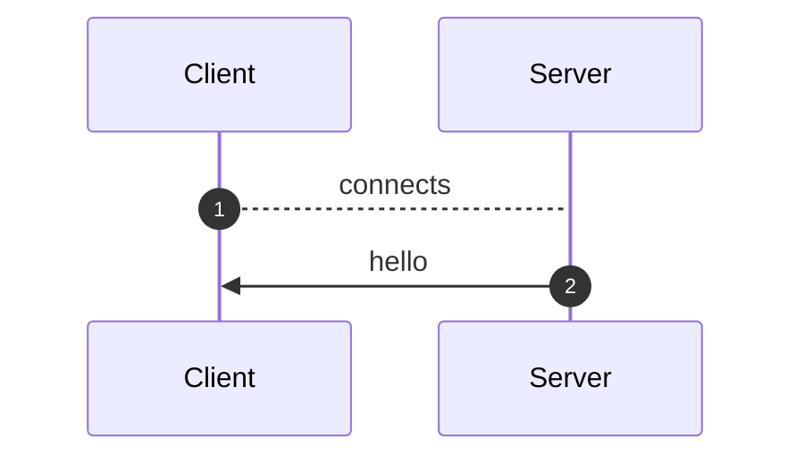
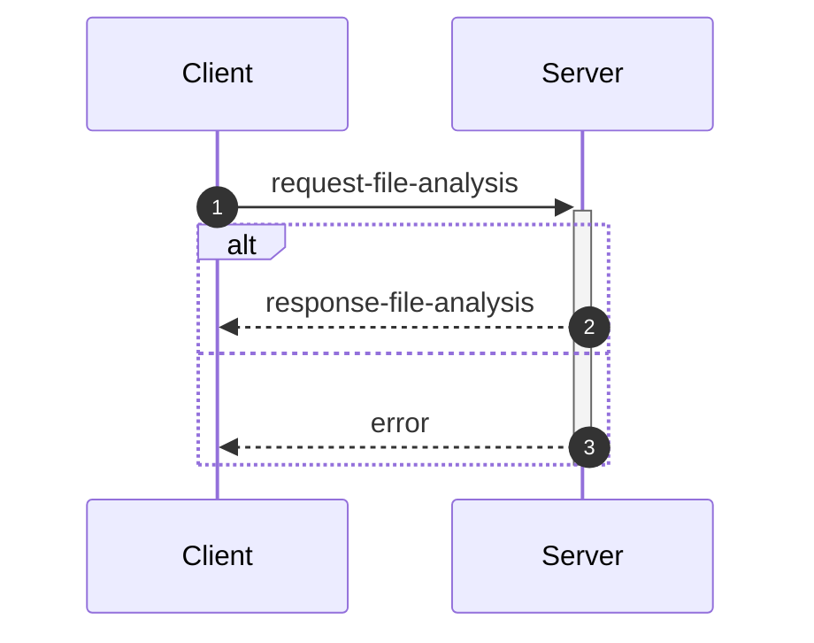
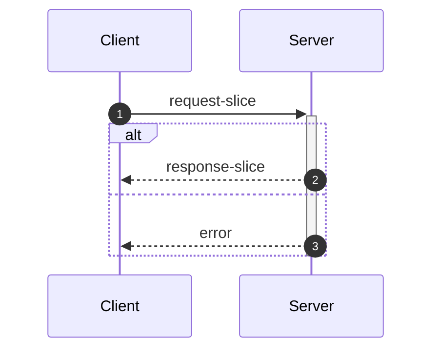
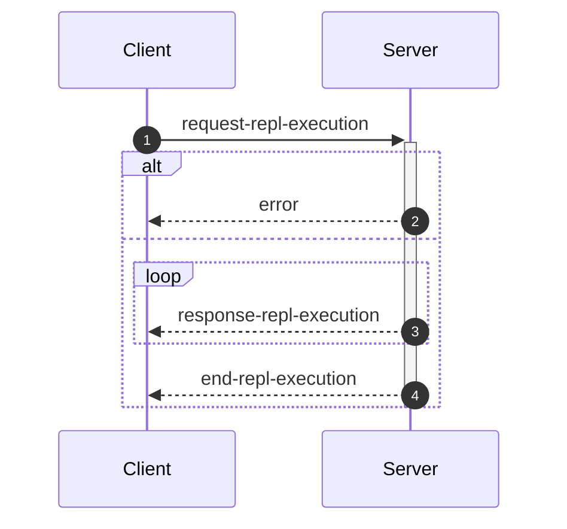

_This document was generated from '[src/documentation/wiki-interface.ts](https://github.com/flowr-analysis/flowr/tree/main//src/documentation/wiki-interface.ts)' on 2026-07-21, 13:40:54 UTC presenting an overview of flowR's interface (v2.13.1, using R v4.5.0). Please do not edit this file/wiki page directly._

Although far from being as detailed as the in-depth explanation of [_flowR_](https://github.com/flowr-analysis/flowr/wiki/core),
this wiki page explains how to interface with _flowR_ in more detail.
In general, command line arguments and other options provide short descriptions on hover over.

* [💻 Using the REPL](#using-the-repl)
* [⚙️ Configuring FlowR](#configuring-flowr)
* [⚒️ Writing Code](#writing-code)
* [💬 Communicating with the Server](#communicating-with-the-server)

<a id='using-the-repl'></a>
## 💻 Using the REPL


> [!NOTE]
> To execute arbitrary R commands with a repl request, _flowR_ has to be started explicitly with <span title="Description (Command Line Argument): Allow to access the underlying R session when using flowR (security warning: this allows the execution of arbitrary R code!)">`--r-session-access`</span>.
> Please be aware that this introduces a security risk and note that this relies on the [`r-shell` engine](https://github.com/flowr-analysis/flowr/wiki/engines) .

Although primarily meant for users to explore,
there is nothing which forbids simply calling _flowR_ as a subprocess to use standard-in, -output, and -error
for communication (although you can access the REPL using the server as well,
with the [REPL Request](#message-request-repl-execution) message).

The read-eval-print loop&nbsp;(REPL) works relatively simple.
You can submit an expression (using <kbd>Enter</kbd>),
which is interpreted as an R&nbsp;expression by default but interpreted as a *command* if it starts with a colon (`:`).
The best command to get started with the REPL is <span title="Description (Repl Command): Show help information (aliases: :h, :?)">`:help`</span>.
Besides, you can leave the REPL either with the command <span title="Description (Repl Command): End the repl (aliases: :q, :exit)">`:quit`</span> or by pressing <kbd>Ctrl</kbd>+<kbd>C</kbd> twice.
When writing a *command*, you may press <kbd>Tab</kbd> to get a list of completions, if available.
Multiple commands can be entered in a single line by separating them with a semicolon (`;`), e.g. `:parse "x<-2"; :df*`.
If a command is given without R code, the REPL will re-use R code given in a previous command.
The prior example will hence return first the parsed AST of the program and then the dataflow graph for `"x <- 2"`.

> [!NOTE]
> If you develop flowR, you may want to launch the repl using the `npm run main-dev` command, this way, you get a non-minified version of flowR with debug information and hot-reloading of source files.

<details>
<summary>Available Commands</summary>

We currently offer the following commands (this with a `[*]` suffix are available with and without the star):


| Command | Description |
| ------- | ----------- |
| **<span title="Description (Repl Command): End the repl (aliases: :q, :exit)">:quit</span>** | End the repl (aliases: **:<span title="Alias of ':quit'. End the repl">q</span>**, **:<span title="Alias of ':quit'. End the repl">exit</span>**) |
| **<span title="Description (Repl Command): Execute the given code as R code. This requires the `--r-session-access` flag to be set and requires the r-shell engine. (aliases: :e, :r)">:execute</span>** | Execute the given code as R code. This requires the `--r-session-access` flag to be set and requires the r-shell engine. (aliases: **:<span title="Alias of ':execute'. Execute the given code as R code. This requires the `--r-session-access` flag to be set and requires the r-shell engine.">e</span>**, **:<span title="Alias of ':execute'. Execute the given code as R code. This requires the `--r-session-access` flag to be set and requires the r-shell engine.">r</span>**) |
| **<span title="Description (Repl Command): Get mermaid code for the control-flow graph of R code (aliases: :cfg, :cf)">:controlflow[*]</span>** | Get mermaid code for the control-flow graph of R code (star: Returns the URL to mermaid.live) (aliases: **:<span title="Alias of ':controlflow'. Get mermaid code for the control-flow graph of R code">cfg</span>**, **:<span title="Alias of ':controlflow'. Get mermaid code for the control-flow graph of R code">cf</span>**) |
| **<span title="Description (Repl Command): Get mermaid code for the control-flow graph with basic blocks (aliases: :cfgb, :cfb)">:controlflowbb[*]</span>** | Get mermaid code for the control-flow graph with basic blocks (star: Returns the URL to mermaid.live) (aliases: **:<span title="Alias of ':controlflowbb'. Get mermaid code for the control-flow graph with basic blocks">cfgb</span>**, **:<span title="Alias of ':controlflowbb'. Get mermaid code for the control-flow graph with basic blocks">cfb</span>**) |
| **<span title="Description (Repl Command): Get mermaid code for the dataflow graph (aliases: :d, :df)">:dataflow[*]</span>** | Get mermaid code for the dataflow graph (star: Returns the URL to mermaid.live) (aliases: **:<span title="Alias of ':dataflow'. Get mermaid code for the dataflow graph">d</span>**, **:<span title="Alias of ':dataflow'. Get mermaid code for the dataflow graph">df</span>**) |
| **<span title="Description (Repl Command): Get mermaid code for the normalized AST of R code (aliases: :n)">:normalize[*]</span>** | Get mermaid code for the normalized AST of R code (star: Returns the URL to mermaid.live) (alias: **:<span title="Alias of ':normalize'. Get mermaid code for the normalized AST of R code">n</span>**) |
| **<span title="Description (Repl Command): Get mermaid code for the simplified dataflow graph (aliases: :ds, :dfs)">:dataflowsimple[*]</span>** | Get mermaid code for the simplified dataflow graph (star: Returns the URL to mermaid.live) (aliases: **:<span title="Alias of ':dataflowsimple'. Get mermaid code for the simplified dataflow graph">ds</span>**, **:<span title="Alias of ':dataflowsimple'. Get mermaid code for the simplified dataflow graph">dfs</span>**) |
| **<span title="Description (Repl Command): Inspect and extend the signature database: `query` (identical to :query @signature), `add <path>` to mount another database/source, `download` to fetch the full-history database. (aliases: :sig)">:signature</span>** | Inspect and extend the signature database: `query` (identical to :query @signature), `add <path>` to mount another database/source, `download` to fetch the full-history database. (alias: **:<span title="Alias of ':signature'. Inspect and extend the signature database: `query` (identical to :query @signature), `add <path>` to mount another database/source, `download` to fetch the full-history database.">sig</span>**) |
| **<span title="Description (Repl Command): Just calculates the DFG, but only prints summary info (aliases: :d#, :df#)">:dataflowsilent</span>** | Just calculates the DFG, but only prints summary info (aliases: **:<span title="Alias of ':dataflowsilent'. Just calculates the DFG, but only prints summary info">d#</span>**, **:<span title="Alias of ':dataflowsilent'. Just calculates the DFG, but only prints summary info">df#</span>**) |
| **<span title="Description (Repl Command): Prints ASCII Art of the parsed, unmodified AST (aliases: :p)">:parse</span>** | Prints ASCII Art of the parsed, unmodified AST (alias: **:<span title="Alias of ':parse'. Prints ASCII Art of the parsed, unmodified AST">p</span>**) |
| **<span title="Description (Repl Command): Prints the version of flowR as well as the current version of R">:version</span>** | Prints the version of flowR as well as the current version of R
| **<span title="Description (Repl Command): Query the given R code (use 'help' for more information)">:query[*]</span>** | Query the given R code (use 'help' for more information) (star: Similar to query, but returns the output in json format.)
| **<span title="Description (Repl Command): Returns an ASCII representation of the dataflow graph (aliases: :df!)">:dataflowascii</span>** | Returns an ASCII representation of the dataflow graph (alias: **:<span title="Alias of ':dataflowascii'. Returns an ASCII representation of the dataflow graph">df!</span>**) |
| **<span title="Description (Repl Command): Returns summarization stats for the normalized AST (aliases: :n#)">:normalize#</span>** | Returns summarization stats for the normalized AST (alias: **:<span title="Alias of ':normalize#'. Returns summarization stats for the normalized AST">n#</span>**) |
| **<span title="Description (Repl Command): Show help information (aliases: :h, :?)">:help</span>** | Show help information (aliases: **:<span title="Alias of ':help'. Show help information">h</span>**, **:<span title="Alias of ':help'. Show help information">?</span>**) |


</details>


> [!TIP]
> 
> As indicated by the examples before, all REPL commands that operate on code keep track of the state.
> Hence, if you run a command like <span title="Description (Repl Command, starred version): Returns the URL to mermaid.live; Base Command: Get mermaid code for the dataflow graph (aliases: :d*, :df*)">`:dataflow*`</span> without providing R code,
> the REPL will re-use the R code provided in a previous command.
> Likewise, doing this will benefit from incrementality!
> If you request the dataflow graph with `:df* x <- 2 * y` and then want to see the parsed AST with `:parse`,
> the REPL will re-use previously obtained information and not re-parse the code again.
> 		


Generally, many commands offer shortcut versions in the REPL. Many queries, for example, offer a shortened format (see the example below).
Of special note, the [Config Query](https://github.com/flowr-analysis/flowr/wiki/%5BQuery%5D-Config)
can be used to also modify the currently active configuration of _flowR_ within the REPL (see the [wiki page](https://github.com/flowr-analysis/flowr/wiki/%5BQuery%5D-Config) for more information).

### Example: Retrieving the Dataflow Graph

To retrieve a URL to the [mermaid](https://mermaid.js.org/) diagram of the dataflow of a given expression,
use <span title="Description (Repl Command, starred version): Returns the URL to mermaid.live; Base Command: Get mermaid code for the dataflow graph (aliases: :d*, :df*)">`:dataflow*`</span> (or <span title="Description (Repl Command): Get mermaid code for the dataflow graph (aliases: :d, :df)">`:dataflow`</span> to get the mermaid code in the cli):


```shell
$ docker run -it --rm eagleoutice/flowr # or npm run flowr 
flowR repl v2.13.1, R grammar v14 (tree-sitter engine)
R> :dataflow* y <- 1 + x
```

<details>
<summary style='color:gray'>Output</summary>


```text
https://mermaid.live/view#base64:eyJjb2RlIjoiZmxvd2NoYXJ0IEJUXG4gICAgMXt7XCJgKiM5MTtSTnVtYmVyIzkzOyogKioxKipcbiAgICAgICoxLjYqICgqKmlkOiAxKiopYFwifX1cbiAgICUlIE5vIGVkZ2VzIGZvdW5kIGZvciAxXG4gICAgMihbXCJgKiM5MTtSU3ltYm9sIzkzOyogKip4KipcbiAgICAgICoxLjEwKiAoKippZDogMioqKWBcIl0pXG4gICAlJSBObyBlZGdlcyBmb3VuZCBmb3IgMlxuICAgIDNbW1wiYCojOTE7UkJpbmFyeU9wIzkzOyogYmFzZSM1ODsjNTg7KiojNDM7KipcbiAgICAgICoxLjYtMTAqICgqKmlkOiAzKiopXG4gICAgYXJnOiAoMSwgMilgXCJdXVxuICAgIGJ1aWx0LWluOl9bXCJgQnVpbHQtSW46XG4jNDM7YFwiXVxuICAgIHN0eWxlIGJ1aWx0LWluOl8gc3Ryb2tlOmdyYXksZmlsbDpncmF5LHN0cm9rZS13aWR0aDoycHgsb3BhY2l0eTouODtcbiAgICAwW1wiYCojOTE7UlN5bWJvbCM5MzsqICoqeSoqXG4gICAgICAqMS4xKiAoKippZDogMCoqLCB2OiAzKWBcIl1cbiAgICA0W1tcImAqIzkxO1JCaW5hcnlPcCM5MzsqIGJhc2UjNTg7IzU4OyoqIzYwOyM0NTsqKlxuICAgICAgKjEuMS0xMCogKCoqaWQ6IDQqKilcbiAgICBhcmc6ICgwLCAzKWBcIl1dXG4gICAgYnVpbHQtaW46Xy1bXCJgQnVpbHQtSW46XG4jNjA7IzQ1O2BcIl1cbiAgICBzdHlsZSBidWlsdC1pbjpfLSBzdHJva2U6Z3JheSxmaWxsOmdyYXksc3Ryb2tlLXdpZHRoOjJweCxvcGFjaXR5Oi44O1xuICAgIDMgLS0+fFwicmVhZHMsIGFyZ1wifCAxXG4gICAgMyAtLT58XCJyZWFkcywgYXJnXCJ8IDJcbiAgICAzIC0uLT58XCJyZWFkcywgY2FsbHNcInwgYnVpbHQtaW46X1xuICAgIGxpbmtTdHlsZSAyIHN0cm9rZTpncmF5O1xuICAgIDAgLS0+fFwiZGVmaW5lZC1ieVwifCAzXG4gICAgMCAtLT58XCJkZWZpbmVkLWJ5XCJ8IDRcbiAgICA0IC0tPnxcInJlYWRzLCBhcmdcInwgM1xuICAgIDQgLS0+fFwicmV0dXJucywgYXJnXCJ8IDBcbiAgICA0IC0uLT58XCJyZWFkcywgY2FsbHNcInwgYnVpbHQtaW46Xy1cbiAgICBsaW5rU3R5bGUgNyBzdHJva2U6Z3JheTsiLCJtZXJtYWlkIjp7ImF1dG9TeW5jIjp0cnVlfX0=
```


Retrieve the dataflow graph of the expression `y <- 1 + x`. It looks like this:


```mermaid
flowchart LR
    1{{"`*#91;RNumber#93;* **1**
      *1.6* (**id: 1**)`"}}
   %% No edges found for 1
    2(["`*#91;RSymbol#93;* **x**
      *1.10* (**id: 2**)`"])
   %% No edges found for 2
    3[["`*#91;RBinaryOp#93;* base#58;#58;**#43;**
      *1.6-10* (**id: 3**)
    arg: (1, 2)`"]]
    built-in:_["`Built-In:
#43;`"]
    style built-in:_ stroke:gray,fill:gray,stroke-width:2px,opacity:.8;
    0["`*#91;RSymbol#93;* **y**
      *1.1* (**id: 0**, v: 3)`"]
    4[["`*#91;RBinaryOp#93;* base#58;#58;**#60;#45;**
      *1.1-10* (**id: 4**)
    arg: (0, 3)`"]]
    built-in:_-["`Built-In:
#60;#45;`"]
    style built-in:_- stroke:gray,fill:gray,stroke-width:2px,opacity:.8;
    3 -->|"reads, arg"| 1
    3 -->|"reads, arg"| 2
    3 -.->|"reads, calls"| built-in:_
    linkStyle 2 stroke:gray;
    0 -->|"defined-by"| 3
    0 -->|"defined-by"| 4
    4 -->|"reads, arg"| 3
    4 -->|"returns, arg"| 0
    4 -.->|"reads, calls"| built-in:_-
    linkStyle 7 stroke:gray;
```

	
<details>

<summary style="color:gray">R Code of the Dataflow Graph</summary>

The analysis required _0.6 ms_ (including parse and normalize, using the [tree-sitter](https://github.com/flowr-analysis/flowr/wiki/Engines) engine) within the generation environment. No [signature database](https://github.com/flowr-analysis/flowr/wiki/Signature-Database) is mounted for these generated graphs, so `library()` calls attach no package exports; base-R names are still qualified via the generated base-package store (e.g. `acf` as `stats::acf`). 
We encountered no unknown side effects during the analysis.


```r
y <- 1 + x
```


</details>


</details>


For small graphs like this, <span title="Description (Repl Command): Returns an ASCII representation of the dataflow graph (aliases: :df!)">`:dataflowascii`</span> also provides an ASCII representation directly in the REPL:


```shell
$ docker run -it --rm eagleoutice/flowr # or npm run flowr 
flowR repl v2.13.1, R grammar v14 (tree-sitter engine)
R> :df! y <- 1 + x
```

<details open>
<summary style='color:gray'>Output</summary>


```text
                        0<1>0
                   ┌────| 1 |
    ┌────────┐     │    0---0
 c<4>c       └──c<3>c
 |<- |  v<0>v┌──| + |
 c---c──| y |┘  c---c   u<2>u
        v---v      └────| x |
                        u---u
Edges:
3 -> 1: reads, arg  3 -> 2: reads, arg
4 -> 3: reads, arg  4 -> 0: returns, arg
0 -> 3: defined-by  0 -> 4: defined-by
```


Retrieve the dataflow graph of the expression `y <- 1 + x` as ASCII art.

</details>


For the slicing with <span title="Description (Repl Command): Static backwards executable slicer for R">`:slicer`</span>, you have access to the same [magic comments](#slice-magic-comments) as with the [slice request](#message-request-slice).
Pass `--inline` to splice resolvable `source()` calls into the reconstruction so the slice is a single self-contained R text (the same as the static slice query's `inlineSources` flag).
See `--help` for more flags!

### Example: Interfacing with the File System

Many commands that allow for an R-expression (like <span title="Description (Repl Command, starred version): Returns the URL to mermaid.live; Base Command: Get mermaid code for the dataflow graph (aliases: :d*, :df*)">`:dataflow*`</span>) allow for a file as well
if the argument starts with `file://`.
If you are working from the root directory of the _flowR_ repository, the following gives you the parsed AST of the example file using the <span title="Description (Repl Command): Prints ASCII Art of the parsed, unmodified AST (aliases: :p)">`:parse`</span> command:

> **Watch mode**: Replace `file://` with `watch://` to enter watch mode.
> flowR runs the command immediately and then re-runs it every time the file (or any file inside the folder) changes.
> Enter any other command to leave watch mode.
> For example: `:df watch://analysis.R`


```shell
$ docker run -it --rm eagleoutice/flowr # or npm run flowr 
flowR repl v2.13.1, R grammar v14 (tree-sitter engine)
R> :parse file://test/testfiles/example.R
```

<details>
<summary style='color:gray'>Output</summary>


```text
File: test/testfiles/example.R

program
├ binaryoperator
│ ├ identifier "sum" (1:1─4)
│ ├ <- "<-" (1:5─7)
│ ╰ float "0" (1:8─9)
├ binaryoperator
│ ├ identifier "product" (2:1─8)
│ ├ <- "<-" (2:9─11)
│ ╰ float "1" (2:12─13)
├ binaryoperator
│ ├ identifier "w" (3:1─2)
│ ├ <- "<-" (3:3─5)
│ ╰ float "7" (3:6─7)
├ binaryoperator
│ ├ identifier "N" (4:1─2)
│ ├ <- "<-" (4:3─5)
│ ╰ float "10" (4:6─8)
├ forstatement
│ ├ for "for" (6:1─4)
│ ├ ( "(" (6:5─6)
│ ├ identifier "i" (6:6─7)
│ ├ in "in" (6:8─10)
│ ├ binaryoperator
│ │ ├ float "1" (6:11─12)
│ │ ├ : ":" (6:12─13)
│ │ ╰ parenthesizedexpression
│ │   ├ ( "(" (6:13─14)
│ │   ├ binaryoperator
│ │   │ ├ identifier "N" (6:14─15)
│ │   │ ├ - "-" (6:15─16)
│ │   │ ╰ float "1" (6:16─17)
│ │   ╰ ) ")" (6:17─18)
│ ├ ) ")" (6:18─19)
│ ╰ bracedexpression
│   ├ { "{" (6:20─21)
│   ├ binaryoperator
│   │ ├ identifier "sum" (7:3─6)
│   │ ├ <- "<-" (7:7─9)
│   │ ╰ binaryoperator
│   │   ├ binaryoperator
│   │   │ ├ identifier "sum" (7:10─13)
│   │   │ ├ + "+" (7:14─15)
│   │   │ ╰ identifier "i" (7:16─17)
│   │   ├ + "+" (7:18─19)
│   │   ╰ identifier "w" (7:20─21)
│   ├ binaryoperator
│   │ ├ identifier "product" (8:3─10)
│   │ ├ <- "<-" (8:11─13)
│   │ ╰ binaryoperator
│   │   ├ identifier "product" (8:14─21)
│   │   ├  "" (8:22─23)
│   │   ╰ identifier "i" (8:24─25)
│   ╰ } "}" (9:1─2)
├ call
│ ├ identifier "cat" (11:1─4)
│ ╰ arguments
│   ├ ( "(" (11:4─5)
│   ├ argument
│   │ ╰ string
│   │   ├ " "\"" (11:5─6)
│   │   ├ stringcontent "Sum:" (11:6─10)
│   │   ╰ " "\"" (11:10─11)
│   ├ comma "," (11:11─12)
│   ├ argument
│   │ ╰ identifier "sum" (11:13─16)
│   ├ comma "," (11:16─17)
│   ├ argument
│   │ ╰ string
│   │   ├ " "\"" (11:18─19)
│   │   ├ stringcontent
│   │   │ ╰ escapesequence "\\n" (11:19─21)
│   │   ╰ " "\"" (11:21─22)
│   ╰ ) ")" (11:22─23)
╰ call
  ├ identifier "cat" (12:1─4)
  ╰ arguments
    ├ ( "(" (12:4─5)
    ├ argument
    │ ╰ string
    │   ├ " "\"" (12:5─6)
    │   ├ stringcontent "Product:" (12:6─14)
    │   ╰ " "\"" (12:14─15)
    ├ comma "," (12:15─16)
    ├ argument
    │ ╰ identifier "product" (12:17─24)
    ├ comma "," (12:24─25)
    ├ argument
    │ ╰ string
    │   ├ " "\"" (12:26─27)
    │   ├ stringcontent
    │   │ ╰ escapesequence "\\n" (12:27─29)
    │   ╰ " "\"" (12:29─30)
    ╰ ) ")" (12:30─31)
```


Retrieve the parsed AST of the example file.

<details>

<summary>File Content</summary>


```r
sum <- 0
product <- 1
w <- 7
N <- 10

for (i in 1:(N-1)) {
  sum <- sum + i + w
  product <- product * i
}

cat("Sum:", sum, "\n")
cat("Product:", product, "\n")
```


</details>

As _flowR_ directly transforms this AST the output focuses on being human-readable instead of being machine-readable.
		

</details>


### Example: Run a Query

You can run any query supported by _flowR_ using the <span title="Description (Repl Command): Query the given R code (use 'help' for more information)">`:query`</span> command.
For example, to obtain the shapes of all data frames in a given piece of code, you can run:


```shell
$ docker run -it --rm eagleoutice/flowr # or npm run flowr 
flowR repl v2.13.1, R grammar v14 (tree-sitter engine)
R> :query @absint df-shape "x <- data.frame(a = 1:10, b = 1:10)\ny <- x$a"
```

<details open>
<summary style='color:gray'>Output</summary>


```text
Query: absint (1 ms)
   ╰ $12: (colnames: [{"a", "b"}, {}], cols: [2, 2], rows: [10, 10])
   ╰ $0: (colnames: [{"a", "b"}, {}], cols: [2, 2], rows: [10, 10])
All queries together required ≈4 ms (1ms accuracy, total 4 ms)
```


Retrieve the shapes of all data frames in the given code.

</details>


To run the linter on a file, you can use (in this example, we just issue the `dead-code` linter on a small piece of code):


```shell
$ docker run -it --rm eagleoutice/flowr # or npm run flowr 
flowR repl v2.13.1, R grammar v14 (tree-sitter engine)
R> :query @linter rules:dead-code "if(FALSE) x <- 2"
```

<details open>
<summary style='color:gray'>Output</summary>


```text
Query: linter (2 ms)
   ╰ Dead Code (dead-code):
       ╰ certain:
           ╰ Code at 1.11-16
       ╰ Metadata: searchTimeMs: 2, processTimeMs: 0
All queries together required ≈2 ms (1ms accuracy, total 2 ms)
```


Run the linter on the given code, with only the `dead-code` rule enabled.

</details>


For more information on the available queries, please check out the [Query API](https://github.com/flowr-analysis/flowr/wiki/query-api).


<a id='configuring-flowr'></a>
## ⚙️ Configuring FlowR


When running _flowR_, you may want to specify some behaviors with a dedicated configuration file.
By default, flowR looks for a file named `flowr.json` in the current working directory (or any higher directory).
You can also specify a different file with <span title="Description (Command Line Argument): The name of the configuration file to use">`--config-file`</span> or pass the configuration inline using <span title="Description (Command Line Argument): The flowR configuration to use, as a JSON string">`--config-json`</span>.
To inspect the current configuration, you can run flowr with the <span title="Description (Command Line Argument): Run with verbose logging (will be passed to the corresponding script)">`--verbose`</span> flag, or use the `config` [Query](https://github.com/flowr-analysis/flowr/wiki/query-api).
Within the REPL this works by running the following:


```shell
:query @config
```


To work with the <a href="https://github.com/flowr-analysis/flowr/tree/main/src/config.ts#L129"><code><span title="The configuration file format for flowR.">FlowrConfig</span></code></a> you can use the provided helper objects alongside its methods like
<a href="https://github.com/flowr-analysis/flowr/tree/main/src/config.ts#L717"><code><span title="Creates a new flowr config that has the updated values.">FlowrConfig::<b>amend</b></span></code></a>.
The schema below documents every option; the ones you most likely want are:

- <a href="https://github.com/flowr-analysis/flowr/wiki/Interface#configuring-flowr" title="Configuration Option (boolean): Whether source calls should be ignored, causing {@link processSourceCall}&#39;s behavior to be skipped.">ignoreSourceCalls</a>: ignore source calls when analyzing the code, i.e., ignore the inclusion of other files.
- <a href="https://github.com/flowr-analysis/flowr/wiki/Interface#configuring-flowr" title="Configuration Option (boolean): Whether load calls should be ignored, causing {@link processLoadCall}&#39;s behavior to be skipped.">ignoreLoadCalls</a>: ignore load calls when analyzing the code, i.e., ignore the loading of r-data files.
- <a href="https://github.com/flowr-analysis/flowr/wiki/Interface#configuring-flowr" title="Configuration Option (object): Do you want to overwrite (parts) of the builtin definition?">semantics.environment.overwriteBuiltIns</a>: overwrite _flowR_'s handling of built-in functions, or clear the preset definitions entirely.
  See [Configure BuiltIn Semantics](#configure-builtin-semantics) for more information.
- <a href="https://github.com/flowr-analysis/flowr/wiki/Interface#configuring-flowr" title="Configuration Option (string): How to resolve variables and their values. (one of &quot;disabled&quot;, &quot;alias&quot;, &quot;builtin&quot;)">solver.variables</a>: how to resolve variables and their values (`disabled`, `alias`, `builtin`).
- <a href="https://github.com/flowr-analysis/flowr/wiki/Interface#configuring-flowr" title="Configuration Option (array): The engine or set of engines to use for interacting with R code. An empty array means all available engines will be used.">engines</a> and <a href="https://github.com/flowr-analysis/flowr/wiki/Interface#configuring-flowr" title="Configuration Option (string): The default engine to use for interacting with R code. If this is undefined, an arbitrary engine from the specified list will be used. (one of &quot;tree-sitter&quot;, &quot;r-shell&quot;)">defaultEngine</a>: the engines used to interact with R code, see the [Engines wiki page](https://github.com/flowr-analysis/flowr/wiki/engines).
- <a href="https://github.com/flowr-analysis/flowr/wiki/Interface#configuring-flowr" title="Configuration Option (array): Files a framework loads on its own, without any source() call (e.g. global.R in a shiny app), in the order they are loaded; flowR orders the matching project files accordingly and analyzes them as one program. Entries are case-insensitive globs matched against the file path, a plain name matches any file with that name, and entries matching no project file are warned about. Usually set per project kind via specializeConfig.">project.implicitSources</a>: the files a framework loads without any `source()` call, in the order in which they are
  loaded. Entries are globs (e.g. `R/*.R`) matched against the file path ignoring capitalization; one matching no file is reported.
- <a href="https://github.com/flowr-analysis/flowr/wiki/Interface#configuring-flowr" title="Configuration Option (object): Overwrite (parts of) the configuration depending on the project kind flowR detects, e.g. to give a shiny app its implicit sources.">specializeConfig</a>: overwrite (parts of) the configuration depending on the kind of project _flowR_ detects
  (e.g. `shiny-app`), which is how a shiny app gets its implicit sources by default. What you configure directly wins.
- <a href="https://github.com/flowr-analysis/flowr/wiki/Interface#configuring-flowr" title="Configuration Option (string): Overwrite the project kind flowR would otherwise infer from the analyzed files, e.g. when auto-detection guesses wrong. (one of &quot;package&quot;, &quot;script&quot;, &quot;shiny-app&quot;, &quot;notebook&quot;, &quot;project&quot;, &quot;unknown&quot;)">project.useProjectType</a>: skip that detection and force a project kind yourself, when auto-detection guesses wrong.
- <a href="https://github.com/flowr-analysis/flowr/wiki/Interface#configuring-flowr" title="Configuration Option (array): The default plugins to load when creating a new instance of FlowrAnalyzer">defaultPlugins</a> and <a href="https://github.com/flowr-analysis/flowr/wiki/Interface#configuring-flowr" title="Configuration Option (array): The plugins to load in REPL mode">repl.plugins</a>: the plugins to load for a new <a href="https://github.com/flowr-analysis/flowr/tree/main/src/project/flowr-analyzer.ts#L167"><code><span title="Central class for conducting analyses with FlowR. Use the FlowrAnalyzerBuilder to create a new instance. If you want the original pattern of creating a pipeline and running all steps, you can still do this with FlowrAnalyzer#runFull . To inspect the context of the analyzer, use FlowrAnalyzer#inspectContext (if you are a plugin and need to modify it, use FlowrAnalyzer#context instead).">FlowrAnalyzer</span></code></a> and in the REPL
  (use `flowr:default` to reference the former).

So you can configure _flowR_ by adding a file like the following:

<details>

<summary>Example Configuration File</summary>


```json
{
  "ignoreSourceCalls": true,
  "ignoreLoadCalls": true,
  "semantics": {
    "environment": {
      "overwriteBuiltIns": {
        "definitions": [
          {
            "type": "function",
            "names": [
              "foo"
            ],
            "processor": "builtin:assign",
            "config": {}
          }
        ]
      }
    }
  },
  "defaultPlugins": [
    "file:description",
    "versions:description"
  ],
  "repl": {
    "quickStats": false,
    "dfProcessorHeat": false,
    "hints": true,
    "plugins": [
      "flowr:default"
    ]
  },
  "project": {
    "resolveUnknownPathsOnDisk": true,
    "implicitSources": [
      "global.R",
      "app.R"
    ]
  },
  "linter": {
    "disabledRules": []
  },
  "specializeConfig": {
    "shiny-app": {
      "project": {
        "implicitSources": [
          "global.R",
          "ui.R",
          "server.R",
          "app.R"
        ]
      }
    }
  },
  "engines": [
    {
      "type": "r-shell"
    }
  ],
  "solver": {
    "variables": "alias",
    "evalStrings": true,
    "trackEnvironments": true,
    "sigdb": {
      "enabled": true,
      "loadProjectDependencies": true,
      "eagerlyLoad": false,
      "eagerlyLoadExports": false,
      "linkBaseR": false,
      "linkDescriptionDependencies": false
    },
    "resolveSource": {
      "dropPaths": "no",
      "ignoreCapitalization": true,
      "inferWorkingDirectory": "active-script",
      "searchPath": []
    },
    "instrument": {},
    "slicer": {
      "threshold": 50
    }
  },
  "abstractInterpretation": {
    "wideningThreshold": 4,
    "dataFrame": {
      "maxColNames": 20,
      "readLoadedData": {
        "readExternalFiles": true,
        "maxReadLines": 1000000
      }
    }
  },
  "gas": {
    "thresholds": {
      "memory": {
        "problematic": 0.7,
        "critical": 0.9
      },
      "timeMs": {
        "problematic": 100000,
        "critical": 120000
      }
    },
    "features": {}
  }
}
```


</details>

<details>
<a id='configure-builtin-semantics'></a>
<summary>Configure Built-In Semantics</summary>


`semantics/environment/overwriteBuiltins` accepts two keys:

- `loadDefaults` (boolean, initially `true`): If set to `true`, the default built-in definitions are loaded before applying the custom definitions. Setting this flag to `false` explicitly disables the loading of the default definitions.
- `definitions` (array, initially empty): Allows to overwrite or define new built-in elements. Each object within must have a `type` which is one of the below. Furthermore, they may define a string array of `names` which specifies the identifiers to bind the definitions to. You may use `assumePrimitive` to specify whether _flowR_ should assume that this is a primitive non-library definition (so you probably just do not want to specify the key).

  | Type            | Description                                                                                                                                                                                                                                                                                              | Example                                                                                                    |
  | --------------- | -------------------------------------------------------------------------------------------------------------------------------------------------------------------------------------------------------------------------------------------------------------------------------------------------------- | ---------------------------------------------------------------------------------------------------------- |
  | `constant`    | Additionally allows for a `value` this should resolve to.                                                                                                                                                                                                                                                | `{ type: 'constant', names: ['NULL', 'NA'],  value: null }`                                                |
  | `function`    | Is a rather flexible way to define and bind built-in functions. For the time, we do not have extensive documentation to cover all the cases, so please either consult the sources with the `default-builtin-config.ts` or open a [new issue](https://github.com/flowr-analysis/flowr/issues/new/choose). | `{ type: 'function', names: ['next'], processor: 'builtin:d', config: { cfg: ExitPointType.Next } }` |
  | `replacement` | A comfortable way to specify replacement functions like `$<-` or `names<-`. `suffixes` describes the... suffixes to attach automatically. | `{ type: 'replacement', suffixes: ['<-', '<<-'], names: ['[', '[['] }` |


</details>

<details>

<summary style='color:gray'>Full Configuration-File Schema</summary>

- _The configuration file format for flowR._ (object)
    - **logLevel** [optional] _flowR's global minimum log level, applied when the config is loaded._ (string)
        Only allows: 'silly', 'trace', 'debug', 'info', 'warn', 'error', 'fatal'
    - **ignoreSourceCalls** [optional] _Whether source calls should be ignored, causing {@link processSourceCall}'s behavior to be skipped._ (boolean)
    - **ignoreLoadCalls** [optional] _Whether load calls should be ignored, causing {@link processLoadCall}'s behavior to be skipped._ (boolean)
    - **semantics** _Configure language semantics and how flowR handles them._ (object)
        - **environment** [optional] _Semantics regarding how to handle the R environment._ (object)
            - **overwriteBuiltIns** [optional] _Do you want to overwrite (parts) of the builtin definition?_ (object)
                - **loadDefaults** [optional] _Should the default configuration still be loaded?_ (boolean)
                - **definitions** [optional] _The definitions to load/overwrite._ (array)
                Valid item types:
                    - (object)
    - **defaultPlugins** [optional] _The default plugins to load when creating a new instance of FlowrAnalyzer_ (array)
    Valid item types:
        - (alternatives)
            - (string)
            - (array)
    - **repl** _Configuration options for the REPL._ (object)
        - **quickStats** [optional] _Whether to show quick stats in the REPL after each evaluation._ (boolean)
        - **dfProcessorHeat** [optional] _This instruments the dataflow processors to count how often each processor is called._ (boolean)
        - **hints** [optional] _Whether to show dim inline hints on the empty prompt (automatically disabled on non-interactive terminals)._ (boolean)
        - **plugins** [optional] _The plugins to load in REPL mode_ (array)
        Valid item types:
            - (alternatives)
                - (string)
                - (array)
        - **autoUseFileProtocol** [optional] _Prepend the file protocol to a repl input that looks like a path, instead of only warning about it._ (boolean)
        - **queryStats** [optional] _Whether `:query` closes with the line stating how long the queries took (`:query*` never prints it)._ (boolean)
        - **showPlugins** [optional] _Whether `:version` grays out the plugins that did not activate during the last analysis._ (boolean)
    - **project** _Project specific configuration options._ (object)
        - **resolveUnknownPathsOnDisk** [optional] _Whether to resolve unknown paths loaded by the r project disk when trying to source/analyze files._ (boolean)
        - **basePackages** [optional] _The packages considered part of R itself (base and recommended); if unset, flowR uses its built-in list._ (array)
        Valid item types:
            - (string)
        - **implicitSources** [optional] _Files a framework loads on its own, without any source() call (e.g. global.R in a shiny app), in the order they are loaded; flowR orders the matching project files accordingly and analyzes them as one program. Entries are case-insensitive globs matched against the file path, a plain name matches any file with that name, and entries matching no project file are warned about. Usually set per project kind via specializeConfig._ (array)
        Valid item types:
            - (string)
        - **useProjectType** [optional] _Overwrite the project kind flowR would otherwise infer from the analyzed files, e.g. when auto-detection guesses wrong._ (string)
            Only allows: 'package', 'script', 'shiny-app', 'notebook', 'project', 'unknown'
    - **linter** _Linter configuration options._ (object)
        - **disabledRules** _Linting rule names excluded from the default rule set (a rule requested explicitly via a linter query still runs). Usually set per project kind via specializeConfig._ (array)
        Valid item types:
            - (string)
    - **specializeConfig** [optional] _Overwrite (parts of) the configuration depending on the project kind flowR detects, e.g. to give a shiny app its implicit sources._ (object)
    - **engines** _The engine or set of engines to use for interacting with R code. An empty array means all available engines will be used._ (array)
    Valid item types:
        - (alternatives)
            - _The configuration for the tree sitter engine._ (object)
                - **type** [required] _Use the tree sitter engine._ (string)
                    Only allows: 'tree-sitter'
                - **wasmPath** [optional] _The path to the tree-sitter-r WASM binary to use. If this is undefined, this uses the default path._ (string)
                - **treeSitterWasmPath** [optional] _The path to the tree-sitter WASM binary to use. If this is undefined, this uses the default path._ (string)
                - **lax** [optional] _Whether to use the lax parser for parsing R code (allowing for syntax errors). If this is undefined, the strict parser will be used._ (boolean)
            - _The configuration for the R shell engine._ (object)
                - **type** [required] _Use the R shell engine._ (string)
                    Only allows: 'r-shell'
                - **rPath** [optional] _The path to the R executable to use. If this is undefined, this uses the default path._ (string)
    - **defaultEngine** [optional] _The default engine to use for interacting with R code. If this is undefined, an arbitrary engine from the specified list will be used._ (string)
        Only allows: 'tree-sitter', 'r-shell'
    - **solver** _How to resolve constants, constraints, cells, ..._ (object)
        - **variables** _How to resolve variables and their values._ (string)
            Only allows: 'disabled', 'alias', 'builtin'
        - **evalStrings** _Should we include eval(parse(text="...")) calls in the dataflow graph?_ (boolean)
        - **trackEnvironments** [optional] _Track user-created environments (new.env, assign/get/local with envir=, dollar-assign, attach). When false, all envir-style calls fall through conservatively._ (boolean)
        - **sigdb** _Resolving library exports from a signature database._ (object)
            - **enabled** [optional] _Resolve library()/use() exports from a signature database (default true); when false no database is consulted._ (boolean)
            - **loadProjectDependencies** [optional] _Load the project's declared dependencies from its metadata files (DESCRIPTION Imports/Depends, rproject.toml, renv.lock, rv.lock) (default true); when false these files are not read for dependencies._ (boolean)
            - **eagerlyLoad** [optional] _Parse the database up front rather than on the first package load (default false, ignored if disabled)._ (boolean)
            - **eagerlyLoadExports** [optional] _Add a vertex for every export on load rather than on demand (default false); keeps the dataflow graph small._ (boolean)
            - **assumedRVersion** [optional] _R version assumed when resolving versioned (base-R) exports: a pin like "4.5" or "auto" to detect the installed R (default "auto")._ (string)
            - **linkBaseR** [optional] _Eagerly attach base-R namespaces so bare base calls resolve without library() (default false)._ (boolean)
            - **linkBaseRCalls** [optional] _Add a lightweight Reads edge from a bare base-R call to its signature-database function vertex (default false; base-R qualification is edge-free otherwise)._ (boolean)
            - **linkPackageCalls** [optional] _Add a lightweight Reads edge from a resolved package call to its signature-database function vertex (default false)._ (boolean)
            - **linkDescriptionDependencies** [optional] _Eagerly attach the namespaces of the project's declared DESCRIPTION dependencies (Imports/Depends) so their exports resolve without an explicit library() (default false)._ (boolean)
            - **warmInBackground** [optional] _Decompress the hot shards (base + most-downloaded) in a background task on startup so the first library() lookup is warm (default false; for long-running servers/REPLs)._ (boolean)
            - **additionalPaths** [optional] _Extra directories or bundle/manifest files searched for signature databases (alongside the shipped default and $FLOWR_SIGDB_DIR); a downloaded full-history bundle placed here is mounted automatically._ (array)
            Valid item types:
                - (string)
            - **downloadRepo** [optional] _GitHub owner/repo the full-history bundle is downloaded from via ":signature download" (default "flowr-analysis/flowr", release tag "sigdb-v<flowR-version>")._ (string)
            - **autoSync** [optional] _On startup, re-download shards whose committed sigdb.remote.json hash no longer matches the cache, in the background (default false; opt-in network sync after a git pull)._ (boolean)
            - **versionSelection** [optional] _When a project constrains a dependency, resolve to the newest (default), oldest, or system-installed version satisfying it; system needs R and falls back to newest. Base-R packages always resolve against the assumed R version._ (string)
                Only allows: 'newest', 'oldest', 'system'
            - **versionOverrides** [optional] _Force an exact version for specific packages (name -> version), overriding both the project constraint and the versionSelection policy (default {})._ (object)
        - **versionManagement** _Policies for reasoning about dependency versions._ (object)
            - **linkedVersionGroups** [optional] _Groups of packages that must resolve to the same version; version guessing intersects each group so its members stay mutually compatible (default [])._ (array)
            Valid item types:
                - (array)
                Valid item types:
                    - (string)
        - **instrument** (object)
            - **dataflowExtractors** [optional] _These keys are only intended for use within code, allowing to instrument the dataflow analyzer!_ (any)
        - **resolveSource** [optional] _If lax source calls are active, flowR searches for sourced files much more freely, based on the configurations you give it. This option is only in effect if `ignoreSourceCalls` is set to false._ (object)
            - **dropPaths** _Allow to drop the first or all parts of the sourced path, if it is relative._ (string)
                Only allows: 'no', 'once', 'all'
            - **ignoreCapitalization** _Search for filenames matching in the lowercase._ (boolean)
            - **inferWorkingDirectory** _Try to infer the working directory from the main or any script to analyze._ (string)
                Only allows: 'no', 'main-script', 'active-script', 'any-script'
            - **searchPath** _Additionally search in these paths._ (array)
            Valid item types:
                - (string)
            - **repeatedSourceLimit** [optional] _How often the same file can be sourced within a single run? Please be aware: in case of cyclic sources this may not reach a fixpoint so give this a sensible limit._ (number)
            - **applyReplacements** _Provide name replacements for loaded files_ (array)
            Valid item types:
                - (object)
            - **assumeFilesExist** [optional] _Assume a sourced file is always there, making what it defines certain instead of conditional on the source call._ (boolean)
        - **slicer** [optional] _The configuration for the slicer._ (object)
            - **threshold** [optional] _The maximum number of iterations to perform on a single function call during slicing._ (number)
            - **autoExtend** [optional] _If set, the slicer will gain an additional post-pass._ (boolean)
    - **abstractInterpretation** _The configuration options for abstract interpretation._ (object)
        - **wideningThreshold** _The threshold for the number of visitations of a node at which widening should be performed to ensure the termination of the fixpoint iteration._ (number)
        - **dataFrame** _The configuration of the shape inference for data frames._ (object)
            - **maxColNames** _The maximum number of columns names to infer for data frames before over-approximating the column names to top._ (number)
            - **readLoadedData** _Configuration options for reading data frame shapes from loaded external data files, such as CSV files._ (object)
                - **readExternalFiles** _Whether data frame shapes should be extracted from loaded external files, such as CSV files._ (boolean)
                - **maxReadLines** _The maximum number of lines to read when extracting data frame shapes from loaded files, such as CSV files._ (number)
    - **gas** [optional] _Resource-usage guard (gas) configuration. All feature factors default to 0 (disabled). See https://github.com/flowr-analysis/flowr/wiki/Core#gas-resource-guard._ (object)
        - **thresholds** [optional] _Shared thresholds for all gas checks (scaled by per-feature factor)._ (object)
            - **memory** [optional] _Heap-usage fraction thresholds (0-1)._ (object)
                - **problematic** [optional] _Heap fraction (0-1) above which Problematic is returned._ (number)
                - **critical** [optional] _Heap fraction (0-1) above which Critical is returned._ (number)
            - **timeMs** [optional] _Elapsed analysis time thresholds in milliseconds._ (object)
                - **problematic** [optional] _Elapsed ms above which Problematic is returned._ (number)
                - **critical** [optional] _Elapsed ms above which Critical is returned._ (number)
        - **features** [optional] _Per-feature sensitivity factors. 0 or absent disables gas checking for that feature. A factor of 2 makes the feature twice as sensitive. Recognised keys: `source`, `side-effect-linking`, `linter`._ (object)
        - **heapProvider** [optional] _Custom heap statistics source (programmatic configs only), overriding the built-in v8/performance.memory detection._ (function)

</details>

	

<a id='writing-code'></a>
## ⚒️ Writing Code

_flowR_ can be used as a [module](https://www.npmjs.com/package/@eagleoutice/flowr) and offers several main classes and interfaces that are interesting for extension writers 
(see the [Visual Studio Code extension](https://marketplace.visualstudio.com/items?itemName=code-inspect.vscode-flowr) or the [Core](https://github.com/flowr-analysis/flowr/wiki/core) wiki page for more information).

### Creating Analyses with _flowR_

Nowadays, instances of the <a href="https://github.com/flowr-analysis/flowr/tree/main/src/project/flowr-analyzer.ts#L167"><code><span title="Central class for conducting analyses with FlowR. Use the FlowrAnalyzerBuilder to create a new instance. If you want the original pattern of creating a pipeline and running all steps, you can still do this with FlowrAnalyzer#runFull . To inspect the context of the analyzer, use FlowrAnalyzer#inspectContext (if you are a plugin and need to modify it, use FlowrAnalyzer#context instead).">FlowrAnalyzer</span></code></a> should be used as central frontend to get analysis results from _flowR_.
For example, a program slice can be created like this:


```ts
const analyzer = await new FlowrAnalyzerBuilder()
    .setEngine('tree-sitter')
    .build();
analyzer.addRequest('x <- 1\ny <- x\nx');
const result = await analyzer.query([
    {
        type:     'static-slice',
        criteria: ['3@x']
    }
]);
//console.log(result['static-slice']);
```


For more information, please have a look at the [Analyzer](https://github.com/flowr-analysis/flowr/wiki/analyzer) wiki page, which explains how to construct and use the <a href="https://github.com/flowr-analysis/flowr/tree/main/src/project/flowr-analyzer.ts#L167"><code><span title="Central class for conducting analyses with FlowR. Use the FlowrAnalyzerBuilder to create a new instance. If you want the original pattern of creating a pipeline and running all steps, you can still do this with FlowrAnalyzer#runFull . To inspect the context of the analyzer, use FlowrAnalyzer#inspectContext (if you are a plugin and need to modify it, use FlowrAnalyzer#context instead).">FlowrAnalyzer</span></code></a> in more detail.
To work with specific perspectives, you can also consult the respective pages like the [Dataflow Graph](https://github.com/flowr-analysis/flowr/wiki/dataflow-graph) or the [Abstract Interpretation](https://github.com/flowr-analysis/flowr/wiki/abstract-interpretation) wiki pages.
### The Pipeline Executor (Low-Level Interface)

Once, in the beginning, _flowR_ was meant to produce a dataflow graph merely to provide *program slices*. 
However, with continuous updates, the [Dataflow Graph](https://github.com/flowr-analysis/flowr/wiki/dataflow-graph) repeatedly proves to be the more interesting part.
With this, we restructured _flowR_'s originally *hardcoded* pipeline to be far more flexible. 
Now, it can be theoretically extended or replaced with arbitrary steps, optional steps, and what we call 'decorations' of these steps. 
In short, a slicing pipeline using the <a href="https://github.com/flowr-analysis/flowr/tree/main/src/core/pipeline-executor.ts#L97"><code><span title="**Please note:** The PipelineExecutor is now considered to be a rather low-level API for flowR. While it still works and is the basis for all other layers, we strongly recommend using the FlowrAnalyzer and its builder to create and use an analyzer instance that is pre-configured for your use-case. The pipeline executor allows to execute arbitrary pipelines in a step-by-step fashion. If you are not...">PipelineExecutor</span></code></a> looks like this:


```ts

const slicer = new PipelineExecutor(DEFAULT_SLICING_PIPELINE, {
  parser:    new RShell(),
  request:   requestFromInput('x <- 1\nx + 1'),
  criterion: ['2@x']
})
const slice = await slicer.allRemainingSteps()
// console.log(slice.reconstruct.code)
```


<details><summary>More Information</summary>


If you compare this, with what you would have done with the old (and removed) `SteppingSlicer`, 
this essentially just requires you to replace the `SteppingSlicer` with the <a href="https://github.com/flowr-analysis/flowr/tree/main/src/core/pipeline-executor.ts#L97"><code><span title="**Please note:** The PipelineExecutor is now considered to be a rather low-level API for flowR. While it still works and is the basis for all other layers, we strongly recommend using the FlowrAnalyzer and its builder to create and use an analyzer instance that is pre-configured for your use-case. The pipeline executor allows to execute arbitrary pipelines in a step-by-step fashion. If you are not...">PipelineExecutor</span></code></a>
and to pass the <a href="https://github.com/flowr-analysis/flowr/tree/main/src/core/steps/pipeline/default-pipelines.ts#L18"><code>DEFAULT_SLICING_PIPELINE</code></a> as the first argument.
The <a href="https://github.com/flowr-analysis/flowr/tree/main/src/core/pipeline-executor.ts#L97"><code><span title="**Please note:** The PipelineExecutor is now considered to be a rather low-level API for flowR. While it still works and is the basis for all other layers, we strongly recommend using the FlowrAnalyzer and its builder to create and use an analyzer instance that is pre-configured for your use-case. The pipeline executor allows to execute arbitrary pipelines in a step-by-step fashion. If you are not...">PipelineExecutor</span></code></a>...

1. Provides structures to investigate the results of all intermediate steps
2. Can be executed step-by-step
3. Can repeat steps (e.g., to calculate multiple slices on the same input)

See the in-code documentation for more information.


</details>

### Using the <a href="https://github.com/flowr-analysis/flowr/tree/main/src/r-bridge/shell.ts#L143"><code><span title="The RShell represents an interactive session with the R interpreter. You can configure it by RShellOptions . At the moment we are using a live R session (and not networking etc.) to communicate with R easily, which allows us to install packages etc. However, this might and probably will change in the future (leaving this as a legacy mode :D)">RShell</span></code></a> to Interact with R

The <a href="https://github.com/flowr-analysis/flowr/tree/main/src/r-bridge/shell.ts#L143"><code><span title="The RShell represents an interactive session with the R interpreter. You can configure it by RShellOptions . At the moment we are using a live R session (and not networking etc.) to communicate with R easily, which allows us to install packages etc. However, this might and probably will change in the future (leaving this as a legacy mode :D)">RShell</span></code></a> class allows interfacing with the `R`&nbsp;ecosystem installed on the host system.
Please have a look at [flowR's Engines](https://github.com/flowr-analysis/flowr/wiki/engines) for more information on alternatives (for example, the <a href="https://github.com/flowr-analysis/flowr/tree/main/src/r-bridge/lang-4.x/tree-sitter/tree-sitter-executor.ts#L18"><code><span title="Synchronous and (way) faster alternative to the RShell using tree-sitter.">TreeSitterExecutor</span></code></a>).


> [!IMPORTANT]
> 
> Each <a href="https://github.com/flowr-analysis/flowr/tree/main/src/r-bridge/shell.ts#L143"><code><span title="The RShell represents an interactive session with the R interpreter. You can configure it by RShellOptions . At the moment we are using a live R session (and not networking etc.) to communicate with R easily, which allows us to install packages etc. However, this might and probably will change in the future (leaving this as a legacy mode :D)">RShell</span></code></a> controls a new instance of the R&nbsp;interpreter, 
> make sure to call <code><a href="https://github.com/flowr-analysis/flowr/tree/main/src/r-bridge/shell.ts#L351"><span title="Close the current R session, makes the object effectively invalid (can no longer be reopened etc.)">RShell::<i>close</i></span></a>()</code> when you are done.


You can start a new "session" simply by constructing a new object with <code>new <a href="https://github.com/flowr-analysis/flowr/tree/main/src/r-bridge/shell.ts#L143"><span title="The RShell represents an interactive session with the R interpreter. You can configure it by RShellOptions . At the moment we are using a live R session (and not networking etc.) to communicate with R easily, which allows us to install packages etc. However, this might and probably will change in the future (leaving this as a legacy mode :D)">RShell</span></a>()</code>.

However, there are several options that may be of interest 
(e.g., to automatically revive the shell in case of errors or to control the name location of the R process on the system).

With a shell object (let's call it `shell`), you can execute R code by using <a href="https://github.com/flowr-analysis/flowr/tree/main/src/r-bridge/shell.ts#L212"><code><span title="sends the given command directly to the current R session will not do anything to alter input markers!">RShell::<i>sendCommand</i></span></code></a>,
for example <code>shell.<a href="https://github.com/flowr-analysis/flowr/tree/main/src/r-bridge/shell.ts#L212"><span title="sends the given command directly to the current R session will not do anything to alter input markers!">sendCommand</span></a>("1 + 1")</code>.
However, this does not return anything, so if you want to collect the output of your command, use
<a href="https://github.com/flowr-analysis/flowr/tree/main/src/r-bridge/shell.ts#L295"><code><span title="Send a command and collect the output">RShell::<i>sendCommandWithOutput</i></span></code></a> instead.


<a id='communicating-with-the-server'></a>
## 💬 Communicating with the Server


As explained in the [Overview](https://github.com/flowr-analysis/flowr/wiki/overview), you can simply run the [TCP](https://de.wikipedia.org/wiki/Transmission_Control_Protocol)&nbsp;server by adding the <span title="Description (Command Line Argument): Do not drop into a repl, but instead start a server on the given port (default: 1042) and listen for messages.">`--server`</span> flag (and, due to the interactive mode, exit with the conventional <kbd>CTRL</kbd>+<kbd>C</kbd>).
Currently, every connection is handled by the same underlying `RShell` - so the server is not designed to handle many clients at a time.
Additionally, the server is not well guarded against attacks (e.g., you can theoretically spawn an arbitrary number of&nbsp;RShell sessions on the target machine).

Every message has to be given in a single line (i.e., without a newline in-between) and end with a newline character. Nevertheless, we will pretty-print example given in the following segments for the ease of reading.


> [!NOTE]
> 
> The default <span title="Description (Command Line Argument): Do not drop into a repl, but instead start a server on the given port (default: 1042) and listen for messages.">`--server`</span> uses a simple [TCP](https://de.wikipedia.org/wiki/Transmission_Control_Protocol)
> connection. If you want _flowR_ to expose a [WebSocket](https://de.wikipedia.org/wiki/WebSocket) server instead, add the <span title="Description (Command Line Argument): If the server flag is set, use websocket for messaging">`--ws`</span> flag (i.e., <span title="Description (Command Line Argument): Do not drop into a repl, but instead start a server on the given port (default: 1042) and listen for messages.">`--server`</span> <span title="Description (Command Line Argument): If the server flag is set, use websocket for messaging">`--ws`</span>) when starting _flowR_ from the command line.


<ul><li>
<a id="message-hello"></a>
<b>Hello</b> Message (<code>hello</code>) 
<details>

<summary style="color:gray"> View Details. <i>The server informs the client about the successful connection and provides Meta-Information.</i> </summary>


```mermaid
sequenceDiagram
    autonumber
    participant Client
    participant Server

    
    Client-->Server: connects
    Server->>Client: hello
	
```


	
After launching _flowR_, for example, with <code>docker run -it --rm eagleoutice/flowr <span title="Description (Command Line Argument): Do not drop into a repl, but instead start a server on the given port (default: 1042) and listen for messages.">-<span/>-server</span></code>&nbsp;(🐳️), simply connecting should present you with a `hello` message, that amongst others should reveal the versions of&nbsp;_flowR_ and&nbsp;R, using the [semver 2.0](https://semver.org/spec/v2.0.0.html) versioning scheme.
The message looks like this:


```json
{
  "type": "hello",
  "clientName": "client-0",
  "versions": {
    "flowr": "2.13.1",
    "r": "4.5.0",
    "engine": "r-shell"
  }
}
```


There are currently a few messages that you can send after the hello message.
If you want to _slice_ a piece of R code you first have to send an [analysis request](#message-request-file-analysis), so that you can send one or multiple slice requests afterward.
Requests for the [REPL](#message-request-repl) are independent of that.
	

<hr>


<details>
<summary style="color:gray">Message schema (<code>hello</code>)</summary>

For the definition of the hello message, please see it's implementation at [`./src/cli/repl/server/messages/message-hello.ts`](https://github.com/flowr-analysis/flowr/tree/main/./src/cli/repl/server/messages/message-hello.ts).

- [required] (object)
    - **type** [required] _The type of the hello message._ (string)
        Only allows: 'hello'
    - **id** [forbidden] _The id of the message is always undefined (as it is the initial message and not requested)._ (any)
    - **clientName** [required] _A unique name that is assigned to each client. It has no semantic meaning and is only used/useful for debugging._ (string)
    - **versions** [required] (object)
        - **flowr** [required] _The version of the flowr server running in semver format._ (string)
        - **r** [required] _The version of the underlying R shell running in semver format._ (string)
        - **engine** [required] _The parser backend that is used to parse the R code._ (string)

</details>


<hr>

</details>
	</li>

<li>
<a id="message-request-file-analysis"></a>
<b>Analysis</b> Message (<code>request-file-analysis</code>) 
<details>

<summary style="color:gray"> View Details. <i>The server builds the dataflow graph for a given input file (or a set of files).</i> </summary>


```mermaid
sequenceDiagram
    autonumber
    participant Client
    participant Server

    
    Client->>+Server: request-file-analysis
    alt
        Server-->>Client: response-file-analysis
    else
        Server-->>Client: error
    end
    deactivate  Server
	
```


	
The request allows the server to analyze a file and prepare it for slicing.
The message can contain a `filetoken`, which is used to identify the file in later slice or query requests (if you do not add one, the request will not be stored and therefore, it is not available for subsequent requests).

> **Please note!**\
> If you want to send and process a lot of analysis requests, but do not want to slice them, please do not pass the `filetoken` field. This will save the server a lot of memory allocation.

Furthermore, the request must contain either a `content` field to directly pass the file's content or a `filepath` field which contains the path to the file (this path must be accessible for the server to be useful).
If you add the `id` field, the answer will use the same `id` so you can match requests and the corresponding answers.
See the implementation of the request-file-analysis message for more information.

You can drop one or more stored file tokens by adding the `invalidateToken` field (a single token or an array of tokens).
The server frees the corresponding analyses _after_ it has answered the request.

> **Tip!**\
> If you only want to drop tokens, you do not need a separate message: send a `request-file-analysis` that contains _just_ the `invalidateToken` field (and no `content` or `filepath`).
> Such a request behaves like an empty file analysis and the server replies with an empty `results` object.
> Because invalidation happens after the response, you may even pass the _current_ `filetoken` in `invalidateToken` to analyze a file once and have the server forget it right after you received the results.


<details>
<summary>Example of the <code>request-file-analysis</code> Message</summary>

_Note:_ even though we pretty-print these messages, they are sent as a single line, ending with a newline.

The following lists all messages that were sent and received in case you want to reproduce the scenario:

<ol>
<li> <code>hello</code> (response)
<details> 

<summary> Show Details </summary>

The first message is always a hello message.


```json
{
  "type": "hello",
  "clientName": "client-0",
  "versions": {
    "flowr": "2.13.1",
    "r": "4.5.0",
    "engine": "r-shell"
  }
}
```


</details>
</li>

<li> <b><code>request-file-analysis</code> (request)</b>
<details open> 

<summary> Show Details </summary>

Let's suppose you simply want to analyze the following script:
 
```r
x <- 1
x + 1
```

 For this, you can send the following request:


```json
{
  "type": "request-file-analysis",
  "id": "1",
  "filetoken": "x",
  "content": "x <- 1\nx + 1"
}
```


</details>
</li>

<li> <code>response-file-analysis</code> (response)
<details> 

<summary> Show Details </summary>


The `results` field of the response effectively contains three keys of importance:

- `parse`: which contains 1:1 the parse result in CSV format that we received from the `RShell` (i.e., the AST produced by the parser of the R interpreter).
- `normalize`: which contains the normalized AST, including ids (see the `info` field and the [Normalized AST](https://github.com/flowr-analysis/flowr/wiki/normalized-ast) wiki page).
- `dataflow`: especially important is the `graph` field which contains the dataflow graph as a set of root vertices (see the [Dataflow Graph](https://github.com/flowr-analysis/flowr/wiki/dataflow-graph) wiki page).
			


_As the code is pretty long, we inhibit pretty printing and syntax highlighting (JSON, hiding built-in):_

```text
{"type":"response-file-analysis","format":"json","id":"1","results":{"parse":{"files":[{"parsed":"[1,1,1,6,7,0,\"expr\",false,\"x <- 1\"],[1,1,1,1,1,3,\"SYMBOL\",true,\"x\"],[1,1,1,1,3,7,\"expr\",false,\"x\"],[1,3,1,4,2,7,\"LEFT_ASSIGN\",true,\"<-\"],[1,6,1,6,4,5,\"NUM_CONST\",true,\"1\"],[1,6,1,6,5,7,\"expr\",false,\"1\"],[2,1,2,5,16,0,\"expr\",false,\"x + 1\"],[2,1,2,1,10,12,\"SYMBOL\",true,\"x\"],[2,1,2,1,12,16,\"expr\",false,\"x\"],[2,3,2,3,11,16,\"'+'\",true,\"+\"],[2,5,2,5,13,14,\"NUM_CONST\",true,\"1\"],[2,5,2,5,14,16,\"expr\",false,\"1\"]","filePath":"/tmp/tmp-10749-SJUOsPk3FVSU-.R"}],".meta":{"timing":2}},"normalize":{"ast":{"type":"RProject","files":[{"root":{"type":"RExpressionList","children":[{"type":"RBinaryOp","location":[1,3,1,4],"lhs":{"type":"RSymbol","location":[1,1,1,1],"content":"x","lexeme":"x","info":{"fullRange":[1,1,1,1],"adToks":[],"id":0,"parent":2,"role":"bin-l","index":0,"nest":0,"file":"/tmp/tmp-10749-SJUOsPk3FVSU-.R"}},"rhs":{"location":[1,6,1,6],"lexeme":"1","info":{"fullRange":[1,6,1,6],"adToks":[],"id":1,"parent":2,"role":"bin-r","index":1,"nest":0,"file":"/tmp/tmp-10749-SJUOsPk3FVSU-.R"},"type":"RNumber","content":{"num":1,"complexNumber":false,"markedAsInt":false}},"operator":"<-","lexeme":"<-","info":{"fullRange":[1,1,1,6],"adToks":[],"id":2,"parent":6,"nest":0,"file":"/tmp/tmp-10749-SJUOsPk3FVSU-.R","index":0,"role":"el-c"}},{"type":"RBinaryOp","location":[2,3,2,3],"lhs":{"type":"RSymbol","location":[2,1,2,1],"content":"x","lexeme":"x","info":{"fullRange":[2,1,2,1],"adToks":[],"id":3,"parent":5,"role":"bin-l","index":0,"nest":0,"file":"/tmp/tmp-10749-SJUOsPk3FVSU-.R"}},"rhs":{"location":[2,5,2,5],"lexeme":"1","info":{"fullRange":[2,5,2,5],"adToks":[],"id":4,"parent":5,"role":"bin-r","index":1,"nest":0,"file":"/tmp/tmp-10749-SJUOsPk3FVSU-.R"},"type":"RNumber","content":{"num":1,"complexNumber":false,"markedAsInt":false}},"operator":"+","lexeme":"+","info":{"fullRange":[2,1,2,5],"adToks":[],"id":5,"parent":6,"nest":0,"file":"/tmp/tmp-10749-SJUOsPk3FVSU-.R","index":1,"role":"el-c"}}],"info":{"adToks":[],"id":6,"nest":0,"file":"/tmp/tmp-10749-SJUOsPk3FVSU-.R","role":"root","index":0}},"filePath":"/tmp/tmp-10749-SJUOsPk3FVSU-.R"}],"info":{"id":7}},".meta":{"timing":0}},"dataflow":{"unknownReferences":[],"in":[{"nodeId":2,"name":"<-","type":2},{"nodeId":5,"name":"+","type":2}],"out":[{"nodeId":0,"name":"x","type":4,"definedAt":2,"value":[1]}],"environment":{"current":{"id":2069,"parent":"<BuiltInEnvironment>","memory":[["x",[{"nodeId":0,"name":"x","type":4,"definedAt":2,"value":[1]}]]],"globalEnv":true},"level":0},"graph":{"rootVertices":[1,0,2,3,4,5],"vertexInformation":[[1,{"tag":"value","id":1}],[0,{"tag":"vdef","id":0,"source":[1]}],[2,{"tag":"fcall","id":2,"name":"<-","onlyBuiltin":true,"args":[{"nodeId":0,"type":32},{"nodeId":1,"type":32}],"origin":["builtin:assign"]}],[3,{"tag":"use","id":3}],[4,{"tag":"value","id":4}],[5,{"tag":"fcall","id":5,"name":"+","onlyBuiltin":true,"args":[{"nodeId":3,"type":32},{"nodeId":4,"type":32}],"origin":["builtin:d"]}]],"edgeInformation":[[2,[[1,{"types":65}],[0,{"types":72}],["built-in:<-",{"types":5}]]],[0,[[1,{"types":2}],[2,{"types":2}]]],[3,[[0,{"types":1}]]],[5,[[3,{"types":65}],[4,{"types":65}],["built-in:+",{"types":5}]]]],"_unknownSideEffects":[]},"entryPoint":2,"exitPoints":[{"type":0,"nodeId":5}],"hooks":[],".meta":{"timing":2}}}}
```


</details>
</li>
</ol>

The complete round-trip took 12.2 ms (including time required to validate the messages, start, and stop the internal mock server).

</details>


You receive an error if, for whatever reason, the analysis fails (e.g., the message or code you sent contained syntax errors).
It contains a human-readable description *why* the analysis failed (see the error message implementation for more details).


<details>
<summary>Example Error Message</summary>

_Note:_ even though we pretty-print these messages, they are sent as a single line, ending with a newline.

The following lists all messages that were sent and received in case you want to reproduce the scenario:

<ol>
<li> <code>hello</code> (response)
<details> 

<summary> Show Details </summary>

The first message is always a hello message.


```json
{
  "type": "hello",
  "clientName": "client-0",
  "versions": {
    "flowr": "2.13.1",
    "r": "4.5.0",
    "engine": "r-shell"
  }
}
```


</details>
</li>

<li> <code>request-file-analysis</code> (request)
<details> 

<summary> Show Details </summary>


```json
{
  "type": "request-file-analysis",
  "id": "1",
  "filename": "sample.R",
  "content": "x <-"
}
```


</details>
</li>

<li> <b><code>error</code> (response)</b>
<details open> 

<summary> Show Details </summary>


```json
{
  "id": "1",
  "type": "error",
  "fatal": false,
  "reason": "Error while analyzing file sample.R: GuardError: unable to parse R code (see the log for more information) for request {\"request\":\"text\",\"content\":\"x <-\"}}\n Report a Bug: https://github.com/flowr-analysis/flowr/issues/new?body=%3C!%2D%2D%20Please%20describe%20your%20issue%20in%20more%20detail%20below!%20%2D%2D%3E%0A%0A%0A%3C!%2D%2D%20Automatically%20generated%20issue%20metadata%2C%20please%20do%20not%20edit%20or%20delete%20content%20below%20this%20line%20%2D%2D%3E%0A%2D%2D%2D%0A%0AflowR%20version%3A%202.13.1%0Anode%20version%3A%20v25.6.1%0Anode%20arch%3A%20x64%0Anode%20platform%3A%20linux%0Amessage%3A%20%60unable%20to%20parse%20R%20code%20%28see%20the%20log%20for%20more%20information%29%20for%20request%20%7B%22request%22%3A%22text%22%2C%22content%22%3A%22x%20%3C%2D%22%7D%7D%60%0Astack%20trace%3A%0A%60%60%60%0A%20%20%20%20at%20guard%20%28%3C%3E%2Fsrc%2Futil%2Fassert.ts%3A128%3A9%29%0A%20%20%20%20at%20guardRetrievedOutput%20%28%3C%3E%2Fsrc%2Fr%2Dbridge%2Fretriever.ts%3A224%3A7%29%0A%20%20%20%20at%20%2Fhome%2Frunner%2Fwork%2Fflowr%2Fflowr%2Fsrc%2Fr%2Dbridge%2Fretriever.ts%3A185%3A4%0A%20%20%20%20at%20processTicksAndRejections%20%28node%3Ainternal%2Fprocess%2Ftask_queues%3A104%3A5%29%0A%20%20%20%20at%20async%20Object.parseRequests%20%5Bas%20processor%5D%20%28%3C%3E%2Fsrc%2Fr%2Dbridge%2Fparser.ts%3A98%3A19%29%0A%20%20%20%20at%20async%20PipelineExecutor.nextStep%20%28%3C%3E%2Fsrc%2Fcore%2Fpipeline%2Dexecutor.ts%3A192%3A25%29%0A%20%20%20%20at%20async%20FlowrAnalyzerCache.runTapeUntil%20%28%3C%3E%2Fsrc%2Fproject%2Fcache%2Fflowr%2Danalyzer%2Dcache.ts%3A101%3A4%29%0A%20%20%20%20at%20async%20FlowRServerConnection.sendFileAnalysisResponse%20%28%3C%3E%2Fsrc%2Fcli%2Frepl%2Fserver%2Fconnection.ts%3A211%3A53%29%0A%60%60%60%0A%0A%2D%2D%2D%0A%09"
}
```


</details>
</li>
</ol>

The complete round-trip took 6.9 ms (including time required to validate the messages, start, and stop the internal mock server).

</details>


&nbsp;

<a id="analysis-include-cfg"></a>
**Including the Control Flow Graph**

While _flowR_ does (for the time being) not use an explicit control flow graph but instead relies on control-dependency edges within the dataflow graph, 
the respective structure can still be exposed using the server (note that, as this feature is not needed within _flowR_, it is tested significantly less - 
so please create a [new issue](https://github.com/flowr-analysis/flowr/issues/new/choose) for any bug you may encounter).
For this, the analysis request may add `cfg: true` to its list of options.


<details>
<summary>Requesting a Control Flow Graph</summary>

_Note:_ even though we pretty-print these messages, they are sent as a single line, ending with a newline.

The following lists all messages that were sent and received in case you want to reproduce the scenario:

<ol>
<li> <code>hello</code> (response)
<details> 

<summary> Show Details </summary>

The first message is always a hello message.


```json
{
  "type": "hello",
  "clientName": "client-0",
  "versions": {
    "flowr": "2.13.1",
    "r": "4.5.0",
    "engine": "r-shell"
  }
}
```


</details>
</li>

<li> <b><code>request-file-analysis</code> (request)</b>
<details open> 

<summary> Show Details </summary>


```json
{
  "type": "request-file-analysis",
  "id": "1",
  "filetoken": "x",
  "content": "if(unknown > 0) { x <- 2 } else { x <- 5 }\nfor(i in 1:x) { print(x); print(i) }",
  "cfg": true
}
```


</details>
</li>

<li> <code>response-file-analysis</code> (response)
<details> 

<summary> Show Details </summary>


The response looks basically the same as a response sent without the `cfg` flag. However, additionally it contains a `cfg` field. 
If you are interested in a visual representation of the control flow graph, see the 
[visualization with mermaid](https://mermaid.live/view#base64:eyJjb2RlIjoiZmxvd2NoYXJ0IEJUXG4gICAgbjMyKFtcImBSRXhwcmVzc2lvbkxpc3QgKDMyKWBcIl0pXG4gICAgbjE1W1wiYFJJZlRoZW5FbHNlICgxNSlcbiMzNDtpZih1bmtub3duICM2MjsgMCkgIzEyMzsgeCAjNjA7IzQ1OyAyICMxMjU7IGVsc2UgIzEyMzsgeCAjNjA7IzQ1OyA1ICMxMjU7IzM0O2BcIl1cbiAgICBuMTUtZVtbMTUtZV1dXG4gICAgbjAoW1wiYFJTeW1ib2wgKDApXG4jMzQ7dW5rbm93biMzNDtgXCJdKVxuICAgIG4xKFtcImBSTnVtYmVyICgxKVxuIzM0OzAjMzQ7YFwiXSlcbiAgICBuMihbXCJgUkJpbmFyeU9wICgyKVxuIzM0O3Vua25vd24gIzYyOyAwIzM0O2BcIl0pXG4gICAgbjItZVtbMi1lXV1cbiAgICBuOChbXCJgUkV4cHJlc3Npb25MaXN0ICg4KWBcIl0pXG4gICAgbjUoW1wiYFJTeW1ib2wgKDUpXG4jMzQ7eCMzNDtgXCJdKVxuICAgIG42KFtcImBSTnVtYmVyICg2KVxuIzM0OzIjMzQ7YFwiXSlcbiAgICBuNyhbXCJgUkJpbmFyeU9wICg3KVxuIzM0O3ggIzYwOyM0NTsgMiMzNDtgXCJdKVxuICAgIG43LWVbWzctZV1dXG4gICAgbjgtZVtbOC1lXV1cbiAgICBuMTQoW1wiYFJFeHByZXNzaW9uTGlzdCAoMTQpYFwiXSlcbiAgICBuMTEoW1wiYFJTeW1ib2wgKDExKVxuIzM0O3gjMzQ7YFwiXSlcbiAgICBuMTIoW1wiYFJOdW1iZXIgKDEyKVxuIzM0OzUjMzQ7YFwiXSlcbiAgICBuMTMoW1wiYFJCaW5hcnlPcCAoMTMpXG4jMzQ7eCAjNjA7IzQ1OyA1IzM0O2BcIl0pXG4gICAgbjEzLWVbWzEzLWVdXVxuICAgIG4xNC1lW1sxNC1lXV1cbiAgICBuMTYoW1wiYFJTeW1ib2wgKDE2KVxuIzM0O2kjMzQ7YFwiXSlcbiAgICBuMzFbXCJgUkZvckxvb3AgKDMxKVxuIzM0O2ZvcihpIGluIDEjNTg7eCkgIzEyMzsgcHJpbnQoeCk7IHByaW50KGkpICMxMjU7IzM0O2BcIl1cbiAgICBuMTcoW1wiYFJOdW1iZXIgKDE3KVxuIzM0OzEjMzQ7YFwiXSlcbiAgICBuMTgoW1wiYFJTeW1ib2wgKDE4KVxuIzM0O3gjMzQ7YFwiXSlcbiAgICBuMTkoW1wiYFJCaW5hcnlPcCAoMTkpXG4jMzQ7MSM1ODt4IzM0O2BcIl0pXG4gICAgbjE5LWVbWzE5LWVdXVxuICAgIG4zMChbXCJgUkV4cHJlc3Npb25MaXN0ICgzMClgXCJdKVxuICAgIG4yMihbXCJgUlN5bWJvbCAoMjIpXG4jMzQ7cHJpbnQoeCkjMzQ7YFwiXSlcbiAgICBuMjVbXCJgUkZ1bmN0aW9uQ2FsbCAoMjUpXG4jMzQ7cHJpbnQoeCkjMzQ7YFwiXVxuICAgIG4yNS1lW1syNS1lXV1cbiAgICBuMjQoW1wiYFJBcmd1bWVudCAoMjQpXG4jMzQ7eCMzNDtgXCJdKVxuICAgIG4yMyhbXCJgUlN5bWJvbCAoMjMpXG4jMzQ7eCMzNDtgXCJdKVxuICAgIG4yNC1lW1syNC1lXV1cbiAgICBuMjYoW1wiYFJTeW1ib2wgKDI2KVxuIzM0O3ByaW50KGkpIzM0O2BcIl0pXG4gICAgbjI5W1wiYFJGdW5jdGlvbkNhbGwgKDI5KVxuIzM0O3ByaW50KGkpIzM0O2BcIl1cbiAgICBuMjktZVtbMjktZV1dXG4gICAgbjI4KFtcImBSQXJndW1lbnQgKDI4KVxuIzM0O2kjMzQ7YFwiXSlcbiAgICBuMjcoW1wiYFJTeW1ib2wgKDI3KVxuIzM0O2kjMzQ7YFwiXSlcbiAgICBuMjgtZVtbMjgtZV1dXG4gICAgbjMwLWVbWzMwLWVdXVxuICAgIG4zMS1lW1szMS1lXV1cbiAgICBuMzItZVtbMzItZV1dXG4gICAgbjE1IC0uLT58XCJGRFwifCBuMzJcbiAgICBuMSAtLi0+fFwiRkRcInwgbjBcbiAgICBuMCAtLi0+fFwiRkRcInwgbjJcbiAgICBuMi1lIC0uLT58XCJGRFwifCBuMVxuICAgIG43IC0uLT58XCJGRFwifCBuOFxuICAgIG42IC0uLT58XCJGRFwifCBuNVxuICAgIG41IC0uLT58XCJGRFwifCBuN1xuICAgIG43LWUgLS4tPnxcIkZEXCJ8IG42XG4gICAgbjgtZSAtLi0+fFwiRkRcInwgbjctZVxuICAgIG4xMyAtLi0+fFwiRkRcInwgbjE0XG4gICAgbjEyIC0uLT58XCJGRFwifCBuMTFcbiAgICBuMTEgLS4tPnxcIkZEXCJ8IG4xM1xuICAgIG4xMy1lIC0uLT58XCJGRFwifCBuMTJcbiAgICBuMTQtZSAtLi0+fFwiRkRcInwgbjEzLWVcbiAgICBuOCAtLT58XCJDRCAoVFJVRSlcInwgbjItZVxuICAgIG4xNCAtLT58XCJDRCAoRkFMU0UpXCJ8IG4yLWVcbiAgICBuMiAtLi0+fFwiRkRcInwgbjE1XG4gICAgbjE1LWUgLS4tPnxcIkZEXCJ8IG44LWVcbiAgICBuMTUtZSAtLi0+fFwiRkRcInwgbjE0LWVcbiAgICBuMzEgLS4tPnxcIkZEXCJ8IG4xNS1lXG4gICAgbjMxIC0uLT58XCJGRFwifCBuMzAtZVxuICAgIG4xOCAtLi0+fFwiRkRcInwgbjE3XG4gICAgbjE3IC0uLT58XCJGRFwifCBuMTlcbiAgICBuMTktZSAtLi0+fFwiRkRcInwgbjE4XG4gICAgbjI1IC0uLT58XCJGRFwifCBuMzBcbiAgICBuMjIgLS4tPnxcIkZEXCJ8IG4yNVxuICAgIG4yMyAtLi0+fFwiRkRcInwgbjI0XG4gICAgbjI0LWUgLS4tPnxcIkZEXCJ8IG4yM1xuICAgIG4yNCAtLi0+fFwiRkRcInwgbjIyXG4gICAgbjI1LWUgLS4tPnxcIkZEXCJ8IG4yNC1lXG4gICAgbjI5IC0uLT58XCJGRFwifCBuMjUtZVxuICAgIG4yNiAtLi0+fFwiRkRcInwgbjI5XG4gICAgbjI3IC0uLT58XCJGRFwifCBuMjhcbiAgICBuMjgtZSAtLi0+fFwiRkRcInwgbjI3XG4gICAgbjI4IC0uLT58XCJGRFwifCBuMjZcbiAgICBuMjktZSAtLi0+fFwiRkRcInwgbjI4LWVcbiAgICBuMzAtZSAtLi0+fFwiRkRcInwgbjI5LWVcbiAgICBuMTkgLS4tPnxcIkZEXCJ8IG4zMVxuICAgIG4xNiAtLi0+fFwiRkRcInwgbjE5LWVcbiAgICBuMzAgLS0+fFwiQ0QgKFRSVUUpXCJ8IG4xNlxuICAgIG4zMS1lIC0tPnxcIkNEIChGQUxTRSlcInwgbjE2XG4gICAgbjMyLWUgLS4tPnxcIkZEXCJ8IG4zMS1lXG4gICAgc3R5bGUgbjMyIHN0cm9rZTpjeWFuLHN0cm9rZS13aWR0aDo2LjVweDsgICAgc3R5bGUgbjMyLWUgc3Ryb2tlOmdyZWVuLHN0cm9rZS13aWR0aDo2LjVweDsiLCJtZXJtYWlkIjp7ImF1dG9TeW5jIjp0cnVlfX0=).
			


_As the code is pretty long, we inhibit pretty printing and syntax highlighting (JSON, hiding built-in):_

```text
{"type":"response-file-analysis","format":"json","id":"1","cfg":{"returns":[],"entryPoints":[32],"exitPoints":["32-e"],"breaks":[],"nexts":[],"graph":{"roots":[32,15,"15-e",0,1,2,"2-e",8,5,6,7,"7-e","8-e",14,11,12,13,"13-e","14-e",16,31,17,18,19,"19-e",30,22,25,"25-e",24,23,"24-e",26,29,"29-e",28,27,"28-e","30-e","31-e","32-e"],"vtxInfos":[[32,[2,32,null,["32-e"]]],[15,[1,15,["2-e"],["15-e"]]],["15-e","15-e"],[0,[2,0]],[1,[2,1]],[2,[2,2,null,["2-e"]]],["2-e","2-e"],[8,[2,8,null,["8-e"]]],[5,[2,5]],[6,[2,6]],[7,[2,7,null,["7-e"]]],["7-e","7-e"],["8-e","8-e"],[14,[2,14,null,["14-e"]]],[11,[2,11]],[12,[2,12]],[13,[2,13,null,["13-e"]]],["13-e","13-e"],["14-e","14-e"],[16,[2,16]],[31,[1,31,[16],["31-e"]]],[17,[2,17]],[18,[2,18]],[19,[2,19,null,["19-e"]]],["19-e","19-e"],[30,[2,30,null,["30-e"]]],[22,[2,22]],[25,[1,25,[22],["25-e"]]],["25-e","25-e"],[24,[2,24,[24],["24-e"]]],[23,[2,23]],["24-e","24-e"],[26,[2,26]],[29,[1,29,[26],["29-e"]]],["29-e","29-e"],[28,[2,28,[28],["28-e"]]],[27,[2,27]],["28-e","28-e"],["30-e","30-e"],["31-e","31-e"],["32-e","32-e"]],"bbChildren":[],"edgeInfos":[[15,[[32,0]]],[1,[[0,0]]],[0,[[2,0]]],["2-e",[[1,0]]],[7,[[8,0]]],[6,[[5,0]]],[5,[[7,0]]],["7-e",[[6,0]]],["8-e",[["7-e",0]]],[13,[[14,0]]],[12,[[11,0]]],[11,[[13,0]]],["13-e",[[12,0]]],["14-e",[["13-e",0]]],[8,[["2-e",[15,"TRUE"]]]],[14,[["2-e",[15,"FALSE"]]]],[2,[[15,0]]],["15-e",[["8-e",0],["14-e",0]]],[31,[["15-e",0],["30-e",0]]],[18,[[17,0]]],[17,[[19,0]]],["19-e",[[18,0]]],[25,[[30,0]]],[22,[[25,0]]],[23,[[24,0]]],["24-e",[[23,0]]],[24,[[22,0]]],["25-e",[["24-e",0]]],[29,[["25-e",0]]],[26,[[29,0]]],[27,[[28,0]]],["28-e",[[27,0]]],[28,[[26,0]]],["29-e",[["28-e",0]]],["30-e",[["29-e",0]]],[19,[[31,0]]],[16,[["19-e",0]]],[30,[[16,[31,"TRUE"]]]],["31-e",[[16,[31,"FALSE"]]]],["32-e",[["31-e",0]]]],"_mayBB":false}},"results":{"parse":{"files":[{"parsed":"[1,1,1,42,38,0,\"expr\",false,\"if(unknown > 0) { x <- 2 } else { x <- 5 }\"],[1,1,1,2,1,38,\"IF\",true,\"if\"],[1,3,1,3,2,38,\"'('\",true,\"(\"],[1,4,1,14,9,38,\"expr\",false,\"unknown > 0\"],[1,4,1,10,3,5,\"SYMBOL\",true,\"unknown\"],[1,4,1,10,5,9,\"expr\",false,\"unknown\"],[1,12,1,12,4,9,\"GT\",true,\">\"],[1,14,1,14,6,7,\"NUM_CONST\",true,\"0\"],[1,14,1,14,7,9,\"expr\",false,\"0\"],[1,15,1,15,8,38,\"')'\",true,\")\"],[1,17,1,26,22,38,\"expr\",false,\"{ x <- 2 }\"],[1,17,1,17,12,22,\"'{'\",true,\"{\"],[1,19,1,24,19,22,\"expr\",false,\"x <- 2\"],[1,19,1,19,13,15,\"SYMBOL\",true,\"x\"],[1,19,1,19,15,19,\"expr\",false,\"x\"],[1,21,1,22,14,19,\"LEFT_ASSIGN\",true,\"<-\"],[1,24,1,24,16,17,\"NUM_CONST\",true,\"2\"],[1,24,1,24,17,19,\"expr\",false,\"2\"],[1,26,1,26,18,22,\"'}'\",true,\"}\"],[1,28,1,31,23,38,\"ELSE\",true,\"else\"],[1,33,1,42,35,38,\"expr\",false,\"{ x <- 5 }\"],[1,33,1,33,25,35,\"'{'\",true,\"{\"],[1,35,1,40,32,35,\"expr\",false,\"x <- 5\"],[1,35,1,35,26,28,\"SYMBOL\",true,\"x\"],[1,35,1,35,28,32,\"expr\",false,\"x\"],[1,37,1,38,27,32,\"LEFT_ASSIGN\",true,\"<-\"],[1,40,1,40,29,30,\"NUM_CONST\",true,\"5\"],[1,40,1,40,30,32,\"expr\",false,\"5\"],[1,42,1,42,31,35,\"'}'\",true,\"}\"],[2,1,2,36,84,0,\"expr\",false,\"for(i in 1:x) { print(x); print(i) }\"],[2,1,2,3,41,84,\"FOR\",true,\"for\"],[2,4,2,13,53,84,\"forcond\",false,\"(i in 1:x)\"],[2,4,2,4,42,53,\"'('\",true,\"(\"],[2,5,2,5,43,53,\"SYMBOL\",true,\"i\"],[2,7,2,8,44,53,\"IN\",true,\"in\"],[2,10,2,12,51,53,\"expr\",false,\"1:x\"],[2,10,2,10,45,46,\"NUM_CONST\",true,\"1\"],[2,10,2,10,46,51,\"expr\",false,\"1\"],[2,11,2,11,47,51,\"':'\",true,\":\"],[2,12,2,12,48,50,\"SYMBOL\",true,\"x\"],[2,12,2,12,50,51,\"expr\",false,\"x\"],[2,13,2,13,49,53,\"')'\",true,\")\"],[2,15,2,36,81,84,\"expr\",false,\"{ print(x); print(i) }\"],[2,15,2,15,54,81,\"'{'\",true,\"{\"],[2,17,2,24,64,81,\"expr\",false,\"print(x)\"],[2,17,2,21,55,57,\"SYMBOL_FUNCTION_CALL\",true,\"print\"],[2,17,2,21,57,64,\"expr\",false,\"print\"],[2,22,2,22,56,64,\"'('\",true,\"(\"],[2,23,2,23,58,60,\"SYMBOL\",true,\"x\"],[2,23,2,23,60,64,\"expr\",false,\"x\"],[2,24,2,24,59,64,\"')'\",true,\")\"],[2,25,2,25,65,81,\"';'\",true,\";\"],[2,27,2,34,77,81,\"expr\",false,\"print(i)\"],[2,27,2,31,68,70,\"SYMBOL_FUNCTION_CALL\",true,\"print\"],[2,27,2,31,70,77,\"expr\",false,\"print\"],[2,32,2,32,69,77,\"'('\",true,\"(\"],[2,33,2,33,71,73,\"SYMBOL\",true,\"i\"],[2,33,2,33,73,77,\"expr\",false,\"i\"],[2,34,2,34,72,77,\"')'\",true,\")\"],[2,36,2,36,78,81,\"'}'\",true,\"}\"]","filePath":"/tmp/tmp-10749-VvYlROwUOP6Q-.R"}],".meta":{"timing":2}},"normalize":{"ast":{"type":"RProject","files":[{"root":{"type":"RExpressionList","children":[{"type":"RIfThenElse","condition":{"type":"RBinaryOp","location":[1,12,1,12],"lhs":{"type":"RSymbol","location":[1,4,1,10],"content":"unknown","lexeme":"unknown","info":{"fullRange":[1,4,1,10],"adToks":[],"id":0,"parent":2,"role":"bin-l","index":0,"nest":1,"file":"/tmp/tmp-10749-VvYlROwUOP6Q-.R"}},"rhs":{"location":[1,14,1,14],"lexeme":"0","info":{"fullRange":[1,14,1,14],"adToks":[],"id":1,"parent":2,"role":"bin-r","index":1,"nest":1,"file":"/tmp/tmp-10749-VvYlROwUOP6Q-.R"},"type":"RNumber","content":{"num":0,"complexNumber":false,"markedAsInt":false}},"operator":">","lexeme":">","info":{"fullRange":[1,4,1,14],"adToks":[],"id":2,"parent":15,"nest":1,"file":"/tmp/tmp-10749-VvYlROwUOP6Q-.R","role":"if-c"}},"then":{"type":"RExpressionList","children":[{"type":"RBinaryOp","location":[1,21,1,22],"lhs":{"type":"RSymbol","location":[1,19,1,19],"content":"x","lexeme":"x","info":{"fullRange":[1,19,1,19],"adToks":[],"id":5,"parent":7,"role":"bin-l","index":0,"nest":1,"file":"/tmp/tmp-10749-VvYlROwUOP6Q-.R"}},"rhs":{"location":[1,24,1,24],"lexeme":"2","info":{"fullRange":[1,24,1,24],"adToks":[],"id":6,"parent":7,"role":"bin-r","index":1,"nest":1,"file":"/tmp/tmp-10749-VvYlROwUOP6Q-.R"},"type":"RNumber","content":{"num":2,"complexNumber":false,"markedAsInt":false}},"operator":"<-","lexeme":"<-","info":{"fullRange":[1,19,1,24],"adToks":[],"id":7,"parent":8,"nest":1,"file":"/tmp/tmp-10749-VvYlROwUOP6Q-.R","index":0,"role":"el-c"}}],"grouping":[{"type":"RSymbol","location":[1,17,1,17],"content":"{","lexeme":"{","info":{"fullRange":[1,17,1,26],"adToks":[],"id":3,"role":"el-g","index":0,"nest":1,"file":"/tmp/tmp-10749-VvYlROwUOP6Q-.R"}},{"type":"RSymbol","location":[1,26,1,26],"content":"}","lexeme":"}","info":{"fullRange":[1,17,1,26],"adToks":[],"id":4,"role":"el-g","index":0,"nest":1,"file":"/tmp/tmp-10749-VvYlROwUOP6Q-.R"}}],"info":{"adToks":[],"id":8,"parent":15,"nest":1,"file":"/tmp/tmp-10749-VvYlROwUOP6Q-.R","index":1,"role":"if-then"}},"location":[1,1,1,2],"lexeme":"if","info":{"fullRange":[1,1,1,42],"adToks":[],"id":15,"parent":32,"nest":1,"file":"/tmp/tmp-10749-VvYlROwUOP6Q-.R","index":0,"role":"el-c"},"otherwise":{"type":"RExpressionList","children":[{"type":"RBinaryOp","location":[1,37,1,38],"lhs":{"type":"RSymbol","location":[1,35,1,35],"content":"x","lexeme":"x","info":{"fullRange":[1,35,1,35],"adToks":[],"id":11,"parent":13,"role":"bin-l","index":0,"nest":1,"file":"/tmp/tmp-10749-VvYlROwUOP6Q-.R"}},"rhs":{"location":[1,40,1,40],"lexeme":"5","info":{"fullRange":[1,40,1,40],"adToks":[],"id":12,"parent":13,"role":"bin-r","index":1,"nest":1,"file":"/tmp/tmp-10749-VvYlROwUOP6Q-.R"},"type":"RNumber","content":{"num":5,"complexNumber":false,"markedAsInt":false}},"operator":"<-","lexeme":"<-","info":{"fullRange":[1,35,1,40],"adToks":[],"id":13,"parent":14,"nest":1,"file":"/tmp/tmp-10749-VvYlROwUOP6Q-.R","index":0,"role":"el-c"}}],"grouping":[{"type":"RSymbol","location":[1,33,1,33],"content":"{","lexeme":"{","info":{"fullRange":[1,33,1,42],"adToks":[],"id":9,"role":"el-g","index":0,"nest":1,"file":"/tmp/tmp-10749-VvYlROwUOP6Q-.R"}},{"type":"RSymbol","location":[1,42,1,42],"content":"}","lexeme":"}","info":{"fullRange":[1,33,1,42],"adToks":[],"id":10,"role":"el-g","index":0,"nest":1,"file":"/tmp/tmp-10749-VvYlROwUOP6Q-.R"}}],"info":{"adToks":[],"id":14,"parent":15,"nest":1,"file":"/tmp/tmp-10749-VvYlROwUOP6Q-.R","index":2,"role":"if-other"}}},{"type":"RForLoop","variable":{"type":"RSymbol","location":[2,5,2,5],"content":"i","lexeme":"i","info":{"adToks":[],"id":16,"parent":31,"role":"for-var","index":0,"nest":1,"file":"/tmp/tmp-10749-VvYlROwUOP6Q-.R"}},"vector":{"type":"RBinaryOp","location":[2,11,2,11],"lhs":{"location":[2,10,2,10],"lexeme":"1","info":{"fullRange":[2,10,2,10],"adToks":[],"id":17,"parent":19,"role":"bin-l","index":0,"nest":1,"file":"/tmp/tmp-10749-VvYlROwUOP6Q-.R"},"type":"RNumber","content":{"num":1,"complexNumber":false,"markedAsInt":false}},"rhs":{"type":"RSymbol","location":[2,12,2,12],"content":"x","lexeme":"x","info":{"fullRange":[2,12,2,12],"adToks":[],"id":18,"parent":19,"role":"bin-r","index":1,"nest":1,"file":"/tmp/tmp-10749-VvYlROwUOP6Q-.R"}},"operator":":","lexeme":":","info":{"fullRange":[2,10,2,12],"adToks":[],"id":19,"parent":31,"nest":1,"file":"/tmp/tmp-10749-VvYlROwUOP6Q-.R","index":1,"role":"for-vec"}},"body":{"type":"RExpressionList","children":[{"type":"RFunctionCall","named":true,"location":[2,17,2,21],"lexeme":"print","functionName":{"type":"RSymbol","location":[2,17,2,21],"content":"print","lexeme":"print","info":{"fullRange":[2,17,2,24],"adToks":[],"id":22,"parent":25,"role":"call-name","index":0,"nest":1,"file":"/tmp/tmp-10749-VvYlROwUOP6Q-.R"}},"arguments":[{"type":"RArgument","location":[2,23,2,23],"lexeme":"x","value":{"type":"RSymbol","location":[2,23,2,23],"content":"x","lexeme":"x","info":{"fullRange":[2,23,2,23],"adToks":[],"id":23,"parent":24,"role":"arg-v","index":0,"nest":1,"file":"/tmp/tmp-10749-VvYlROwUOP6Q-.R"}},"info":{"fullRange":[2,23,2,23],"adToks":[],"id":24,"parent":25,"nest":1,"file":"/tmp/tmp-10749-VvYlROwUOP6Q-.R","index":1,"role":"call-arg"}}],"info":{"fullRange":[2,17,2,24],"adToks":[],"id":25,"parent":30,"nest":1,"file":"/tmp/tmp-10749-VvYlROwUOP6Q-.R","index":0,"role":"el-c"}},{"type":"RFunctionCall","named":true,"location":[2,27,2,31],"lexeme":"print","functionName":{"type":"RSymbol","location":[2,27,2,31],"content":"print","lexeme":"print","info":{"fullRange":[2,27,2,34],"adToks":[],"id":26,"parent":29,"role":"call-name","index":0,"nest":1,"file":"/tmp/tmp-10749-VvYlROwUOP6Q-.R"}},"arguments":[{"type":"RArgument","location":[2,33,2,33],"lexeme":"i","value":{"type":"RSymbol","location":[2,33,2,33],"content":"i","lexeme":"i","info":{"fullRange":[2,33,2,33],"adToks":[],"id":27,"parent":28,"role":"arg-v","index":0,"nest":1,"file":"/tmp/tmp-10749-VvYlROwUOP6Q-.R"}},"info":{"fullRange":[2,33,2,33],"adToks":[],"id":28,"parent":29,"nest":1,"file":"/tmp/tmp-10749-VvYlROwUOP6Q-.R","index":1,"role":"call-arg"}}],"info":{"fullRange":[2,27,2,34],"adToks":[],"id":29,"parent":30,"nest":1,"file":"/tmp/tmp-10749-VvYlROwUOP6Q-.R","index":1,"role":"el-c"}}],"grouping":[{"type":"RSymbol","location":[2,15,2,15],"content":"{","lexeme":"{","info":{"fullRange":[2,15,2,36],"adToks":[],"id":20,"role":"el-g","index":0,"nest":1,"file":"/tmp/tmp-10749-VvYlROwUOP6Q-.R"}},{"type":"RSymbol","location":[2,36,2,36],"content":"}","lexeme":"}","info":{"fullRange":[2,15,2,36],"adToks":[],"id":21,"role":"el-g","index":0,"nest":1,"file":"/tmp/tmp-10749-VvYlROwUOP6Q-.R"}}],"info":{"adToks":[],"id":30,"parent":31,"nest":1,"file":"/tmp/tmp-10749-VvYlROwUOP6Q-.R","index":2,"role":"for-b"}},"lexeme":"for","info":{"fullRange":[2,1,2,36],"adToks":[],"id":31,"parent":32,"nest":1,"file":"/tmp/tmp-10749-VvYlROwUOP6Q-.R","index":1,"role":"el-c"},"location":[2,1,2,3]}],"info":{"adToks":[],"id":32,"nest":0,"file":"/tmp/tmp-10749-VvYlROwUOP6Q-.R","role":"root","index":0}},"filePath":"/tmp/tmp-10749-VvYlROwUOP6Q-.R"}],"info":{"id":33}},".meta":{"timing":0}},"dataflow":{"unknownReferences":[],"in":[{"nodeId":15,"name":"if","type":2},{"nodeId":0,"name":"unknown","type":1},{"nodeId":2,"name":">","type":2},{"nodeId":7,"name":"<-","cds":[{"id":15,"when":true}],"type":2},{"nodeId":13,"name":"<-","cds":[{"id":15,"when":false}],"type":2},{"nodeId":8,"name":"{","cds":[{"id":15,"when":true}],"type":2},{"nodeId":14,"name":"{","cds":[{"id":15,"when":false}],"type":2},{"nodeId":31,"name":"for","type":2},{"nodeId":27,"name":"i","type":4},{"nodeId":19,"name":":","type":2},{"nodeId":25,"name":"print","type":2},{"nodeId":29,"name":"print","type":2}],"out":[{"nodeId":5,"name":"x","type":4,"definedAt":7,"cds":[{"id":15,"when":true}],"value":[6]},{"nodeId":11,"name":"x","type":4,"definedAt":13,"cds":[{"id":15,"when":false}],"value":[12]},{"nodeId":16,"name":"i","type":1}],"environment":{"current":{"id":2142,"parent":"<BuiltInEnvironment>","memory":[["x",[{"nodeId":5,"name":"x","type":4,"definedAt":7,"cds":[{"id":15,"when":true},{"id":15,"when":false}],"value":[6]},{"nodeId":11,"name":"x","type":4,"definedAt":13,"cds":[{"id":15,"when":true},{"id":15,"when":false}],"value":[12]}]],["i",[{"nodeId":16,"name":"i","type":4,"definedAt":31}]]],"globalEnv":true},"level":0},"graph":{"rootVertices":[0,1,2,6,5,7,8,12,11,13,14,15,16,17,18,19,23,25,27,29,30,31],"vertexInformation":[[0,{"tag":"use","id":0}],[1,{"tag":"value","id":1}],[2,{"tag":"fcall","id":2,"name":">","onlyBuiltin":true,"args":[{"nodeId":0,"type":32},{"nodeId":1,"type":32}],"origin":["builtin:d"]}],[6,{"tag":"value","id":6}],[5,{"tag":"vdef","id":5,"cds":[{"id":15,"when":true}],"source":[6]}],[7,{"tag":"fcall","id":7,"name":"<-","onlyBuiltin":true,"cds":[{"id":15,"when":true}],"args":[{"nodeId":5,"type":32},{"nodeId":6,"type":32}],"origin":["builtin:assign"]}],[8,{"tag":"fcall","id":8,"name":"{","onlyBuiltin":true,"cds":[{"id":15,"when":true}],"args":[{"nodeId":7,"type":32}],"origin":["builtin:el"]}],[12,{"tag":"value","id":12}],[11,{"tag":"vdef","id":11,"cds":[{"id":15,"when":false}],"source":[12]}],[13,{"tag":"fcall","id":13,"name":"<-","onlyBuiltin":true,"cds":[{"id":15,"when":false}],"args":[{"nodeId":11,"type":32},{"nodeId":12,"type":32}],"origin":["builtin:assign"]}],[14,{"tag":"fcall","id":14,"name":"{","onlyBuiltin":true,"cds":[{"id":15,"when":false}],"args":[{"nodeId":13,"type":32}],"origin":["builtin:el"]}],[15,{"tag":"fcall","id":15,"name":"if","onlyBuiltin":true,"args":[{"nodeId":2,"type":32},{"nodeId":8,"type":32},{"nodeId":14,"type":32}],"origin":["builtin:ite"]}],[16,{"tag":"vdef","id":16,"source":[19]}],[17,{"tag":"value","id":17}],[18,{"tag":"use","id":18}],[19,{"tag":"fcall","id":19,"name":":","onlyBuiltin":true,"args":[{"nodeId":17,"type":32},{"nodeId":18,"type":32}],"origin":["builtin:d"]}],[23,{"tag":"use","id":23,"cds":[{"id":31,"when":true}]}],[25,{"tag":"fcall","id":25,"name":"print","onlyBuiltin":true,"cds":[{"id":31,"when":true}],"args":[{"nodeId":23,"type":32}],"origin":["builtin:d"]}],[27,{"tag":"use","id":27,"cds":[{"id":31,"when":true}]}],[29,{"tag":"fcall","id":29,"name":"print","onlyBuiltin":true,"cds":[{"id":31,"when":true}],"args":[{"nodeId":27,"type":32}],"origin":["builtin:d"]}],[30,{"tag":"fcall","id":30,"name":"{","onlyBuiltin":true,"cds":[{"id":31,"when":true}],"args":[{"nodeId":25,"type":32},{"nodeId":29,"type":32}],"origin":["builtin:el"]}],[31,{"tag":"fcall","id":31,"name":"for","onlyBuiltin":true,"args":[{"nodeId":16,"type":32},{"nodeId":19,"type":32},{"nodeId":30,"type":32}],"origin":["builtin:fl"]}]],"edgeInformation":[[2,[[0,{"types":65}],[1,{"types":65}],["built-in:>",{"types":5}]]],[7,[[6,{"types":65}],[5,{"types":72}],["built-in:<-",{"types":5}]]],[5,[[6,{"types":2}],[7,{"types":2}]]],[8,[[7,{"types":72}],["built-in:{",{"types":5}]]],[15,[[8,{"types":72}],[14,{"types":72}],[2,{"types":65}],["built-in:if",{"types":5}]]],[13,[[12,{"types":65}],[11,{"types":72}],["built-in:<-",{"types":5}]]],[11,[[12,{"types":2}],[13,{"types":2}]]],[14,[[13,{"types":72}],["built-in:{",{"types":5}]]],[19,[[17,{"types":65}],[18,{"types":65}],["built-in::",{"types":5}]]],[18,[[5,{"types":1}],[11,{"types":1}]]],[25,[[23,{"types":73}],["built-in:print",{"types":5}]]],[23,[[5,{"types":1}],[11,{"types":1}]]],[29,[[27,{"types":73}],["built-in:print",{"types":5}]]],[27,[[16,{"types":1}]]],[30,[[25,{"types":64}],[29,{"types":72}],["built-in:{",{"types":5}]]],[16,[[19,{"types":2}]]],[31,[[16,{"types":64}],[19,{"types":65}],[30,{"types":320}],["built-in:for",{"types":5}]]]],"_unknownSideEffects":[{"id":25,"linkTo":{"type":"link-to-last-call","callName":{}}},{"id":29,"linkTo":{"type":"link-to-last-call","callName":{}}}]},"entryPoint":15,"exitPoints":[{"type":0,"nodeId":31}],"hooks":[],"cfgQuick":{"graph":{"roots":[32,15,"15-e",0,1,2,"2-e",8,5,6,7,"7-e","8-e",14,11,12,13,"13-e","14-e",16,31,17,18,19,"19-e",30,22,25,"25-e",24,23,"24-e",26,29,"29-e",28,27,"28-e","30-e","31-e","32-e"],"vtxInfos":[[32,[2,32,null,["32-e"]]],[15,[1,15,["2-e"],["15-e"]]],["15-e","15-e"],[0,[2,0]],[1,[2,1]],[2,[2,2,null,["2-e"]]],["2-e","2-e"],[8,[2,8,null,["8-e"]]],[5,[2,5]],[6,[2,6]],[7,[2,7,null,["7-e"]]],["7-e","7-e"],["8-e","8-e"],[14,[2,14,null,["14-e"]]],[11,[2,11]],[12,[2,12]],[13,[2,13,null,["13-e"]]],["13-e","13-e"],["14-e","14-e"],[16,[2,16]],[31,[1,31,[16],["31-e"]]],[17,[2,17]],[18,[2,18]],[19,[2,19,null,["19-e"]]],["19-e","19-e"],[30,[2,30,null,["30-e"]]],[22,[2,22]],[25,[1,25,[22],["25-e"]]],["25-e","25-e"],[24,[2,24,[24],["24-e"]]],[23,[2,23]],["24-e","24-e"],[26,[2,26]],[29,[1,29,[26],["29-e"]]],["29-e","29-e"],[28,[2,28,[28],["28-e"]]],[27,[2,27]],["28-e","28-e"],["30-e","30-e"],["31-e","31-e"],["32-e","32-e"]],"bbChildren":[],"edgeInfos":[[15,[[32,0]]],[1,[[0,0]]],[0,[[2,0]]],["2-e",[[1,0]]],[7,[[8,0]]],[6,[[5,0]]],[5,[[7,0]]],["7-e",[[6,0]]],["8-e",[["7-e",0]]],[13,[[14,0]]],[12,[[11,0]]],[11,[[13,0]]],["13-e",[[12,0]]],["14-e",[["13-e",0]]],[8,[["2-e",[15,"TRUE"]]]],[14,[["2-e",[15,"FALSE"]]]],[2,[[15,0]]],["15-e",[["8-e",0],["14-e",0]]],[31,[["15-e",0],["30-e",0]]],[18,[[17,0]]],[17,[[19,0]]],["19-e",[[18,0]]],[25,[[30,0]]],[22,[[25,0]]],[23,[[24,0]]],["24-e",[[23,0]]],[24,[[22,0]]],["25-e",[["24-e",0]]],[29,[["25-e",0]]],[26,[[29,0]]],[27,[[28,0]]],["28-e",[[27,0]]],[28,[[26,0]]],["29-e",[["28-e",0]]],["30-e",[["29-e",0]]],[19,[[31,0]]],[16,[["19-e",0]]],[30,[[16,[31,"TRUE"]]]],["31-e",[[16,[31,"FALSE"]]]],["32-e",[["31-e",0]]]],"_mayBB":false},"breaks":[],"nexts":[],"returns":[],"exitPoints":["32-e"],"entryPoints":[32]},".meta":{"timing":3}}}}
```


</details>
</li>
</ol>

The complete round-trip took 10.1 ms (including time required to validate the messages, start, and stop the internal mock server).

</details>


&nbsp;

<a id="analysis-format-n-quads"></a>
**Retrieve the Output as RDF N-Quads**

The default response is formatted as JSON.
However, by specifying `format: "n-quads"`, you can retrieve the individual results (e.g., the [Normalized AST](https://github.com/flowr-analysis/flowr/wiki/normalized-ast)),
as [RDF N-Quads](https://www.w3.org/TR/n-quads/).
This works with and without the control flow graph as described [above](#analysis-include-cfg).


<details>
<summary>Requesting RDF N-Quads</summary>

_Note:_ even though we pretty-print these messages, they are sent as a single line, ending with a newline.

The following lists all messages that were sent and received in case you want to reproduce the scenario:

<ol>
<li> <code>hello</code> (response)
<details> 

<summary> Show Details </summary>

The first message is always a hello message.


```json
{
  "type": "hello",
  "clientName": "client-0",
  "versions": {
    "flowr": "2.13.1",
    "r": "4.5.0",
    "engine": "r-shell"
  }
}
```


</details>
</li>

<li> <b><code>request-file-analysis</code> (request)</b>
<details open> 

<summary> Show Details </summary>


```json
{
  "type": "request-file-analysis",
  "id": "1",
  "filetoken": "x",
  "content": "x <- 1\nx + 1",
  "format": "n-quads",
  "cfg": true
}
```


</details>
</li>

<li> <code>response-file-analysis</code> (response)
<details> 

<summary> Show Details </summary>


Please note, that the base message format is still JSON. Only the individual results get converted. 
While the context is derived from the `filename`, we currently offer no way to customize other parts of the quads 
(please open a [new issue](https://github.com/flowr-analysis/flowr/issues/new/choose) if you require this).

			


_As the code is pretty long, we inhibit pretty printing and syntax highlighting (JSON, hiding built-in):_

```text
{"type":"response-file-analysis","format":"n-quads","id":"1","cfg":"<https://uni-ulm.de/r-ast/unknown/0> <https://uni-ulm.de/r-ast/rootIds> \"6\"^^<http://www.w3.org/2001/XMLSchema#integer> <unknown> .\n<https://uni-ulm.de/r-ast/unknown/0> <https://uni-ulm.de/r-ast/rootIds> \"0\"^^<http://www.w3.org/2001/XMLSchema#integer> <unknown> .\n<https://uni-ulm.de/r-ast/unknown/0> <https://uni-ulm.de/r-ast/rootIds> \"1\"^^<http://www.w3.org/2001/XMLSchema#integer> <unknown> .\n<https://uni-ulm.de/r-ast/unknown/0> <https://uni-ulm.de/r-ast/rootIds> \"2\"^^<http://www.w3.org/2001/XMLSchema#integer> <unknown> .\n<https://uni-ulm.de/r-ast/unknown/0> <https://uni-ulm.de/r-ast/rootIds> \"2-e\" <unknown> .\n<https://uni-ulm.de/r-ast/unknown/0> <https://uni-ulm.de/r-ast/rootIds> \"3\"^^<http://www.w3.org/2001/XMLSchema#integer> <unknown> .\n<https://uni-ulm.de/r-ast/unknown/0> <https://uni-ulm.de/r-ast/rootIds> \"4\"^^<http://www.w3.org/2001/XMLSchema#integer> <unknown> .\n<https://uni-ulm.de/r-ast/unknown/0> <https://uni-ulm.de/r-ast/rootIds> \"5\"^^<http://www.w3.org/2001/XMLSchema#integer> <unknown> .\n<https://uni-ulm.de/r-ast/unknown/0> <https://uni-ulm.de/r-ast/rootIds> \"5-e\" <unknown> .\n<https://uni-ulm.de/r-ast/unknown/0> <https://uni-ulm.de/r-ast/rootIds> \"6-e\" <unknown> .\n<https://uni-ulm.de/r-ast/unknown/0> <https://uni-ulm.de/r-ast/vertices> <https://uni-ulm.de/r-ast/unknown/1> <unknown> .\n<https://uni-ulm.de/r-ast/unknown/1> <https://uni-ulm.de/r-ast/next> <https://uni-ulm.de/r-ast/unknown/2> <unknown> .\n<https://uni-ulm.de/r-ast/unknown/1> <https://uni-ulm.de/r-ast/id> \"6\"^^<http://www.w3.org/2001/XMLSchema#integer> <unknown> .\n<https://uni-ulm.de/r-ast/unknown/0> <https://uni-ulm.de/r-ast/vertices> <https://uni-ulm.de/r-ast/unknown/2> <unknown> .\n<https://uni-ulm.de/r-ast/unknown/2> <https://uni-ulm.de/r-ast/next> <https://uni-ulm.de/r-ast/unknown/3> <unknown> .\n<https://uni-ulm.de/r-ast/unknown/2> <https://uni-ulm.de/r-ast/id> \"0\"^^<http://www.w3.org/2001/XMLSchema#integer> <unknown> .\n<https://uni-ulm.de/r-ast/unknown/0> <https://uni-ulm.de/r-ast/vertices> <https://uni-ulm.de/r-ast/unknown/3> <unknown> .\n<https://uni-ulm.de/r-ast/unknown/3> <https://uni-ulm.de/r-ast/next> <https://uni-ulm.de/r-ast/unknown/4> <unknown> .\n<https://uni-ulm.de/r-ast/unknown/3> <https://uni-ulm.de/r-ast/id> \"1\"^^<http://www.w3.org/2001/XMLSchema#integer> <unknown> .\n<https://uni-ulm.de/r-ast/unknown/0> <https://uni-ulm.de/r-ast/vertices> <https://uni-ulm.de/r-ast/unknown/4> <unknown> .\n<https://uni-ulm.de/r-ast/unknown/4> <https://uni-ulm.de/r-ast/next> <https://uni-ulm.de/r-ast/unknown/5> <unknown> .\n<https://uni-ulm.de/r-ast/unknown/4> <https://uni-ulm.de/r-ast/id> \"2\"^^<http://www.w3.org/2001/XMLSchema#integer> <unknown> .\n<https://uni-ulm.de/r-ast/unknown/0> <https://uni-ulm.de/r-ast/vertices> <https://uni-ulm.de/r-ast/unknown/5> <unknown> .\n<https://uni-ulm.de/r-ast/unknown/5> <https://uni-ulm.de/r-ast/next> <https://uni-ulm.de/r-ast/unknown/6> <unknown> .\n<https://uni-ulm.de/r-ast/unknown/5> <https://uni-ulm.de/r-ast/id> \"2-e\" <unknown> .\n<https://uni-ulm.de/r-ast/unknown/0> <https://uni-ulm.de/r-ast/vertices> <https://uni-ulm.de/r-ast/unknown/6> <unknown> .\n<https://uni-ulm.de/r-ast/unknown/6> <https://uni-ulm.de/r-ast/next> <https://uni-ulm.de/r-ast/unknown/7> <unknown> .\n<https://uni-ulm.de/r-ast/unknown/6> <https://uni-ulm.de/r-ast/id> \"3\"^^<http://www.w3.org/2001/XMLSchema#integer> <unknown> .\n<https://uni-ulm.de/r-ast/unknown/0> <https://uni-ulm.de/r-ast/vertices> <https://uni-ulm.de/r-ast/unknown/7> <unknown> .\n<https://uni-ulm.de/r-ast/unknown/7> <https://uni-ulm.de/r-ast/next> <https://uni-ulm.de/r-ast/unknown/8> <unknown> .\n<https://uni-ulm.de/r-ast/unknown/7> <https://uni-ulm.de/r-ast/id> \"4\"^^<http://www.w3.org/2001/XMLSchema#integer> <unknown> .\n<https://uni-ulm.de/r-ast/unknown/0> <https://uni-ulm.de/r-ast/vertices> <https://uni-ulm.de/r-ast/unknown/8> <unknown> .\n<https://uni-ulm.de/r-ast/unknown/8> <https://uni-ulm.de/r-ast/next> <https://uni-ulm.de/r-ast/unknown/9> <unknown> .\n<https://uni-ulm.de/r-ast/unknown/8> <https://uni-ulm.de/r-ast/id> \"5\"^^<http://www.w3.org/2001/XMLSchema#integer> <unknown> .\n<https://uni-ulm.de/r-ast/unknown/0> <https://uni-ulm.de/r-ast/vertices> <https://uni-ulm.de/r-ast/unknown/9> <unknown> .\n<https://uni-ulm.de/r-ast/unknown/9> <https://uni-ulm.de/r-ast/next> <https://uni-ulm.de/r-ast/unknown/10> <unknown> .\n<https://uni-ulm.de/r-ast/unknown/9> <https://uni-ulm.de/r-ast/id> \"5-e\" <unknown> .\n<https://uni-ulm.de/r-ast/unknown/0> <https://uni-ulm.de/r-ast/vertices> <https://uni-ulm.de/r-ast/unknown/10> <unknown> .\n<https://uni-ulm.de/r-ast/unknown/10> <https://uni-ulm.de/r-ast/id> \"6-e\" <unknown> .\n<https://uni-ulm.de/r-ast/unknown/0> <https://uni-ulm.de/r-ast/edges> <https://uni-ulm.de/r-ast/unknown/11> <unknown> .\n<https://uni-ulm.de/r-ast/unknown/11> <https://uni-ulm.de/r-ast/next> <https://uni-ulm.de/r-ast/unknown/12> <unknown> .\n<https://uni-ulm.de/r-ast/unknown/11> <https://uni-ulm.de/r-ast/from> \"2\"^^<http://www.w3.org/2001/XMLSchema#integer> <unknown> .\n<https://uni-ulm.de/r-ast/unknown/11> <https://uni-ulm.de/r-ast/to> \"6\"^^<http://www.w3.org/2001/XMLSchema#integer> <unknown> .\n<https://uni-ulm.de/r-ast/unknown/11> <https://uni-ulm.de/r-ast/type> \"0\"^^<http://www.w3.org/2001/XMLSchema#integer> <unknown> .\n<https://uni-ulm.de/r-ast/unknown/0> <https://uni-ulm.de/r-ast/edges> <https://uni-ulm.de/r-ast/unknown/12> <unknown> .\n<https://uni-ulm.de/r-ast/unknown/12> <https://uni-ulm.de/r-ast/next> <https://uni-ulm.de/r-ast/unknown/13> <unknown> .\n<https://uni-ulm.de/r-ast/unknown/12> <https://uni-ulm.de/r-ast/from> \"1\"^^<http://www.w3.org/2001/XMLSchema#integer> <unknown> .\n<https://uni-ulm.de/r-ast/unknown/12> <https://uni-ulm.de/r-ast/to> \"0\"^^<http://www.w3.org/2001/XMLSchema#integer> <unknown> .\n<https://uni-ulm.de/r-ast/unknown/12> <https://uni-ulm.de/r-ast/type> \"0\"^^<http://www.w3.org/2001/XMLSchema#integer> <unknown> .\n<https://uni-ulm.de/r-ast/unknown/0> <https://uni-ulm.de/r-ast/edges> <https://uni-ulm.de/r-ast/unknown/13> <unknown> .\n<https://uni-ulm.de/r-ast/unknown/13> <https://uni-ulm.de/r-ast/next> <https://uni-ulm.de/r-ast/unknown/14> <unknown> .\n<https://uni-ulm.de/r-ast/unknown/13> <https://uni-ulm.de/r-ast/from> \"0\"^^<http://www.w3.org/2001/XMLSchema#integer> <unknown> .\n<https://uni-ulm.de/r-ast/unknown/13> <https://uni-ulm.de/r-ast/to> \"2\"^^<http://www.w3.org/2001/XMLSchema#integer> <unknown> .\n<https://uni-ulm.de/r-ast/unknown/13> <https://uni-ulm.de/r-ast/type> \"0\"^^<http://www.w3.org/2001/XMLSchema#integer> <unknown> .\n<https://uni-ulm.de/r-ast/unknown/0> <https://uni-ulm.de/r-ast/edges> <https://uni-ulm.de/r-ast/unknown/14> <unknown> .\n<https://uni-ulm.de/r-ast/unknown/14> <https://uni-ulm.de/r-ast/next> <https://uni-ulm.de/r-ast/unknown/15> <unknown> .\n<https://uni-ulm.de/r-ast/unknown/14> <https://uni-ulm.de/r-ast/from> \"2-e\" <unknown> .\n<https://uni-ulm.de/r-ast/unknown/14> <https://uni-ulm.de/r-ast/to> \"1\"^^<http://www.w3.org/2001/XMLSchema#integer> <unknown> .\n<https://uni-ulm.de/r-ast/unknown/14> <https://uni-ulm.de/r-ast/type> \"0\"^^<http://www.w3.org/2001/XMLSchema#integer> <unknown> .\n<https://uni-ulm.de/r-ast/unknown/0> <https://uni-ulm.de/r-ast/edges> <https://uni-ulm.de/r-ast/unknown/15> <unknown> .\n<https://uni-ulm.de/r-ast/unknown/15> <https://uni-ulm.de/r-ast/next> <https://uni-ulm.de/r-ast/unknown/16> <unknown> .\n<https://uni-ulm.de/r-ast/unknown/15> <https://uni-ulm.de/r-ast/from> \"5\"^^<http://www.w3.org/2001/XMLSchema#integer> <unknown> .\n<https://uni-ulm.de/r-ast/unknown/15> <https://uni-ulm.de/r-ast/to> \"2-e\" <unknown> .\n<https://uni-ulm.de/r-ast/unknown/15> <https://uni-ulm.de/r-ast/type> \"0\"^^<http://www.w3.org/2001/XMLSchema#integer> <unknown> .\n<https://uni-ulm.de/r-ast/unknown/0> <https://uni-ulm.de/r-ast/edges> <https://uni-ulm.de/r-ast/unknown/16> <unknown> .\n<https://uni-ulm.de/r-ast/unknown/16> <https://uni-ulm.de/r-ast/next> <https://uni-ulm.de/r-ast/unknown/17> <unknown> .\n<https://uni-ulm.de/r-ast/unknown/16> <https://uni-ulm.de/r-ast/from> \"4\"^^<http://www.w3.org/2001/XMLSchema#integer> <unknown> .\n<https://uni-ulm.de/r-ast/unknown/16> <https://uni-ulm.de/r-ast/to> \"3\"^^<http://www.w3.org/2001/XMLSchema#integer> <unknown> .\n<https://uni-ulm.de/r-ast/unknown/16> <https://uni-ulm.de/r-ast/type> \"0\"^^<http://www.w3.org/2001/XMLSchema#integer> <unknown> .\n<https://uni-ulm.de/r-ast/unknown/0> <https://uni-ulm.de/r-ast/edges> <https://uni-ulm.de/r-ast/unknown/17> <unknown> .\n<https://uni-ulm.de/r-ast/unknown/17> <https://uni-ulm.de/r-ast/next> <https://uni-ulm.de/r-ast/unknown/18> <unknown> .\n<https://uni-ulm.de/r-ast/unknown/17> <https://uni-ulm.de/r-ast/from> \"3\"^^<http://www.w3.org/2001/XMLSchema#integer> <unknown> .\n<https://uni-ulm.de/r-ast/unknown/17> <https://uni-ulm.de/r-ast/to> \"5\"^^<http://www.w3.org/2001/XMLSchema#integer> <unknown> .\n<https://uni-ulm.de/r-ast/unknown/17> <https://uni-ulm.de/r-ast/type> \"0\"^^<http://www.w3.org/2001/XMLSchema#integer> <unknown> .\n<https://uni-ulm.de/r-ast/unknown/0> <https://uni-ulm.de/r-ast/edges> <https://uni-ulm.de/r-ast/unknown/18> <unknown> .\n<https://uni-ulm.de/r-ast/unknown/18> <https://uni-ulm.de/r-ast/next> <https://uni-ulm.de/r-ast/unknown/19> <unknown> .\n<https://uni-ulm.de/r-ast/unknown/18> <https://uni-ulm.de/r-ast/from> \"5-e\" <unknown> .\n<https://uni-ulm.de/r-ast/unknown/18> <https://uni-ulm.de/r-ast/to> \"4\"^^<http://www.w3.org/2001/XMLSchema#integer> <unknown> .\n<https://uni-ulm.de/r-ast/unknown/18> <https://uni-ulm.de/r-ast/type> \"0\"^^<http://www.w3.org/2001/XMLSchema#integer> <unknown> .\n<https://uni-ulm.de/r-ast/unknown/0> <https://uni-ulm.de/r-ast/edges> <https://uni-ulm.de/r-ast/unknown/19> <unknown> .\n<https://uni-ulm.de/r-ast/unknown/19> <https://uni-ulm.de/r-ast/from> \"6-e\" <unknown> .\n<https://uni-ulm.de/r-ast/unknown/19> <https://uni-ulm.de/r-ast/to> \"5-e\" <unknown> .\n<https://uni-ulm.de/r-ast/unknown/19> <https://uni-ulm.de/r-ast/type> \"0\"^^<http://www.w3.org/2001/XMLSchema#integer> <unknown> .\n<https://uni-ulm.de/r-ast/unknown/0> <https://uni-ulm.de/r-ast/entryPoints> \"6\"^^<http://www.w3.org/2001/XMLSchema#integer> <unknown> .\n<https://uni-ulm.de/r-ast/unknown/0> <https://uni-ulm.de/r-ast/exitPoints> \"6-e\" <unknown> .\n","results":{"parse":"<https://uni-ulm.de/r-ast/unknown/0> <https://uni-ulm.de/r-ast/token> \"exprlist\" <unknown> .\n<https://uni-ulm.de/r-ast/unknown/0> <https://uni-ulm.de/r-ast/text> \"\" <unknown> .\n<https://uni-ulm.de/r-ast/unknown/0> <https://uni-ulm.de/r-ast/id> \"0\"^^<http://www.w3.org/2001/XMLSchema#integer> <unknown> .\n<https://uni-ulm.de/r-ast/unknown/0> <https://uni-ulm.de/r-ast/parent> \"0\"^^<http://www.w3.org/2001/XMLSchema#integer> <unknown> .\n<https://uni-ulm.de/r-ast/unknown/0> <https://uni-ulm.de/r-ast/line1> \"1\"^^<http://www.w3.org/2001/XMLSchema#integer> <unknown> .\n<https://uni-ulm.de/r-ast/unknown/0> <https://uni-ulm.de/r-ast/col1> \"1\"^^<http://www.w3.org/2001/XMLSchema#integer> <unknown> .\n<https://uni-ulm.de/r-ast/unknown/0> <https://uni-ulm.de/r-ast/line2> \"2\"^^<http://www.w3.org/2001/XMLSchema#integer> <unknown> .\n<https://uni-ulm.de/r-ast/unknown/0> <https://uni-ulm.de/r-ast/col2> \"5\"^^<http://www.w3.org/2001/XMLSchema#integer> <unknown> .\n<https://uni-ulm.de/r-ast/unknown/0> <https://uni-ulm.de/r-ast/children> <https://uni-ulm.de/r-ast/unknown/1> <unknown> .\n<https://uni-ulm.de/r-ast/unknown/1> <https://uni-ulm.de/r-ast/next> <https://uni-ulm.de/r-ast/unknown/2> <unknown> .\n<https://uni-ulm.de/r-ast/unknown/1> <https://uni-ulm.de/r-ast/line1> \"1\"^^<http://www.w3.org/2001/XMLSchema#integer> <unknown> .\n<https://uni-ulm.de/r-ast/unknown/1> <https://uni-ulm.de/r-ast/col1> \"1\"^^<http://www.w3.org/2001/XMLSchema#integer> <unknown> .\n<https://uni-ulm.de/r-ast/unknown/1> <https://uni-ulm.de/r-ast/line2> \"1\"^^<http://www.w3.org/2001/XMLSchema#integer> <unknown> .\n<https://uni-ulm.de/r-ast/unknown/1> <https://uni-ulm.de/r-ast/col2> \"6\"^^<http://www.w3.org/2001/XMLSchema#integer> <unknown> .\n<https://uni-ulm.de/r-ast/unknown/1> <https://uni-ulm.de/r-ast/id> \"7\"^^<http://www.w3.org/2001/XMLSchema#integer> <unknown> .\n<https://uni-ulm.de/r-ast/unknown/1> <https://uni-ulm.de/r-ast/parent> \"0\"^^<http://www.w3.org/2001/XMLSchema#integer> <unknown> .\n<https://uni-ulm.de/r-ast/unknown/1> <https://uni-ulm.de/r-ast/token> \"expr\" <unknown> .\n<https://uni-ulm.de/r-ast/unknown/1> <https://uni-ulm.de/r-ast/terminal> \"false\"^^<http://www.w3.org/2001/XMLSchema#boolean> <unknown> .\n<https://uni-ulm.de/r-ast/unknown/1> <https://uni-ulm.de/r-ast/text> \"x <- 1\" <unknown> .\n<https://uni-ulm.de/r-ast/unknown/1> <https://uni-ulm.de/r-ast/children> <https://uni-ulm.de/r-ast/unknown/3> <unknown> .\n<https://uni-ulm.de/r-ast/unknown/3> <https://uni-ulm.de/r-ast/next> <https://uni-ulm.de/r-ast/unknown/4> <unknown> .\n<https://uni-ulm.de/r-ast/unknown/3> <https://uni-ulm.de/r-ast/line1> \"1\"^^<http://www.w3.org/2001/XMLSchema#integer> <unknown> .\n<https://uni-ulm.de/r-ast/unknown/3> <https://uni-ulm.de/r-ast/col1> \"1\"^^<http://www.w3.org/2001/XMLSchema#integer> <unknown> .\n<https://uni-ulm.de/r-ast/unknown/3> <https://uni-ulm.de/r-ast/line2> \"1\"^^<http://www.w3.org/2001/XMLSchema#integer> <unknown> .\n<https://uni-ulm.de/r-ast/unknown/3> <https://uni-ulm.de/r-ast/col2> \"1\"^^<http://www.w3.org/2001/XMLSchema#integer> <unknown> .\n<https://uni-ulm.de/r-ast/unknown/3> <https://uni-ulm.de/r-ast/id> \"3\"^^<http://www.w3.org/2001/XMLSchema#integer> <unknown> .\n<https://uni-ulm.de/r-ast/unknown/3> <https://uni-ulm.de/r-ast/parent> \"7\"^^<http://www.w3.org/2001/XMLSchema#integer> <unknown> .\n<https://uni-ulm.de/r-ast/unknown/3> <https://uni-ulm.de/r-ast/token> \"expr\" <unknown> .\n<https://uni-ulm.de/r-ast/unknown/3> <https://uni-ulm.de/r-ast/terminal> \"false\"^^<http://www.w3.org/2001/XMLSchema#boolean> <unknown> .\n<https://uni-ulm.de/r-ast/unknown/3> <https://uni-ulm.de/r-ast/text> \"x\" <unknown> .\n<https://uni-ulm.de/r-ast/unknown/3> <https://uni-ulm.de/r-ast/children> <https://uni-ulm.de/r-ast/unknown/5> <unknown> .\n<https://uni-ulm.de/r-ast/unknown/5> <https://uni-ulm.de/r-ast/line1> \"1\"^^<http://www.w3.org/2001/XMLSchema#integer> <unknown> .\n<https://uni-ulm.de/r-ast/unknown/5> <https://uni-ulm.de/r-ast/col1> \"1\"^^<http://www.w3.org/2001/XMLSchema#integer> <unknown> .\n<https://uni-ulm.de/r-ast/unknown/5> <https://uni-ulm.de/r-ast/line2> \"1\"^^<http://www.w3.org/2001/XMLSchema#integer> <unknown> .\n<https://uni-ulm.de/r-ast/unknown/5> <https://uni-ulm.de/r-ast/col2> \"1\"^^<http://www.w3.org/2001/XMLSchema#integer> <unknown> .\n<https://uni-ulm.de/r-ast/unknown/5> <https://uni-ulm.de/r-ast/id> \"1\"^^<http://www.w3.org/2001/XMLSchema#integer> <unknown> .\n<https://uni-ulm.de/r-ast/unknown/5> <https://uni-ulm.de/r-ast/parent> \"3\"^^<http://www.w3.org/2001/XMLSchema#integer> <unknown> .\n<https://uni-ulm.de/r-ast/unknown/5> <https://uni-ulm.de/r-ast/token> \"SYMBOL\" <unknown> .\n<https://uni-ulm.de/r-ast/unknown/5> <https://uni-ulm.de/r-ast/terminal> \"true\"^^<http://www.w3.org/2001/XMLSchema#boolean> <unknown> .\n<https://uni-ulm.de/r-ast/unknown/5> <https://uni-ulm.de/r-ast/text> \"x\" <unknown> .\n<https://uni-ulm.de/r-ast/unknown/1> <https://uni-ulm.de/r-ast/children> <https://uni-ulm.de/r-ast/unknown/4> <unknown> .\n<https://uni-ulm.de/r-ast/unknown/4> <https://uni-ulm.de/r-ast/next> <https://uni-ulm.de/r-ast/unknown/6> <unknown> .\n<https://uni-ulm.de/r-ast/unknown/4> <https://uni-ulm.de/r-ast/line1> \"1\"^^<http://www.w3.org/2001/XMLSchema#integer> <unknown> .\n<https://uni-ulm.de/r-ast/unknown/4> <https://uni-ulm.de/r-ast/col1> \"3\"^^<http://www.w3.org/2001/XMLSchema#integer> <unknown> .\n<https://uni-ulm.de/r-ast/unknown/4> <https://uni-ulm.de/r-ast/line2> \"1\"^^<http://www.w3.org/2001/XMLSchema#integer> <unknown> .\n<https://uni-ulm.de/r-ast/unknown/4> <https://uni-ulm.de/r-ast/col2> \"4\"^^<http://www.w3.org/2001/XMLSchema#integer> <unknown> .\n<https://uni-ulm.de/r-ast/unknown/4> <https://uni-ulm.de/r-ast/id> \"2\"^^<http://www.w3.org/2001/XMLSchema#integer> <unknown> .\n<https://uni-ulm.de/r-ast/unknown/4> <https://uni-ulm.de/r-ast/parent> \"7\"^^<http://www.w3.org/2001/XMLSchema#integer> <unknown> .\n<https://uni-ulm.de/r-ast/unknown/4> <https://uni-ulm.de/r-ast/token> \"LEFT_ASSIGN\" <unknown> .\n<https://uni-ulm.de/r-ast/unknown/4> <https://uni-ulm.de/r-ast/terminal> \"true\"^^<http://www.w3.org/2001/XMLSchema#boolean> <unknown> .\n<https://uni-ulm.de/r-ast/unknown/4> <https://uni-ulm.de/r-ast/text> \"<-\" <unknown> .\n<https://uni-ulm.de/r-ast/unknown/1> <https://uni-ulm.de/r-ast/children> <https://uni-ulm.de/r-ast/unknown/6> <unknown> .\n<https://uni-ulm.de/r-ast/unknown/6> <https://uni-ulm.de/r-ast/line1> \"1\"^^<http://www.w3.org/2001/XMLSchema#integer> <unknown> .\n<https://uni-ulm.de/r-ast/unknown/6> <https://uni-ulm.de/r-ast/col1> \"6\"^^<http://www.w3.org/2001/XMLSchema#integer> <unknown> .\n<https://uni-ulm.de/r-ast/unknown/6> <https://uni-ulm.de/r-ast/line2> \"1\"^^<http://www.w3.org/2001/XMLSchema#integer> <unknown> .\n<https://uni-ulm.de/r-ast/unknown/6> <https://uni-ulm.de/r-ast/col2> \"6\"^^<http://www.w3.org/2001/XMLSchema#integer> <unknown> .\n<https://uni-ulm.de/r-ast/unknown/6> <https://uni-ulm.de/r-ast/id> \"5\"^^<http://www.w3.org/2001/XMLSchema#integer> <unknown> .\n<https://uni-ulm.de/r-ast/unknown/6> <https://uni-ulm.de/r-ast/parent> \"7\"^^<http://www.w3.org/2001/XMLSchema#integer> <unknown> .\n<https://uni-ulm.de/r-ast/unknown/6> <https://uni-ulm.de/r-ast/token> \"expr\" <unknown> .\n<https://uni-ulm.de/r-ast/unknown/6> <https://uni-ulm.de/r-ast/terminal> \"false\"^^<http://www.w3.org/2001/XMLSchema#boolean> <unknown> .\n<https://uni-ulm.de/r-ast/unknown/6> <https://uni-ulm.de/r-ast/text> \"1\" <unknown> .\n<https://uni-ulm.de/r-ast/unknown/6> <https://uni-ulm.de/r-ast/children> <https://uni-ulm.de/r-ast/unknown/7> <unknown> .\n<https://uni-ulm.de/r-ast/unknown/7> <https://uni-ulm.de/r-ast/line1> \"1\"^^<http://www.w3.org/2001/XMLSchema#integer> <unknown> .\n<https://uni-ulm.de/r-ast/unknown/7> <https://uni-ulm.de/r-ast/col1> \"6\"^^<http://www.w3.org/2001/XMLSchema#integer> <unknown> .\n<https://uni-ulm.de/r-ast/unknown/7> <https://uni-ulm.de/r-ast/line2> \"1\"^^<http://www.w3.org/2001/XMLSchema#integer> <unknown> .\n<https://uni-ulm.de/r-ast/unknown/7> <https://uni-ulm.de/r-ast/col2> \"6\"^^<http://www.w3.org/2001/XMLSchema#integer> <unknown> .\n<https://uni-ulm.de/r-ast/unknown/7> <https://uni-ulm.de/r-ast/id> \"4\"^^<http://www.w3.org/2001/XMLSchema#integer> <unknown> .\n<https://uni-ulm.de/r-ast/unknown/7> <https://uni-ulm.de/r-ast/parent> \"5\"^^<http://www.w3.org/2001/XMLSchema#integer> <unknown> .\n<https://uni-ulm.de/r-ast/unknown/7> <https://uni-ulm.de/r-ast/token> \"NUM_CONST\" <unknown> .\n<https://uni-ulm.de/r-ast/unknown/7> <https://uni-ulm.de/r-ast/terminal> \"true\"^^<http://www.w3.org/2001/XMLSchema#boolean> <unknown> .\n<https://uni-ulm.de/r-ast/unknown/7> <https://uni-ulm.de/r-ast/text> \"1\" <unknown> .\n<https://uni-ulm.de/r-ast/unknown/0> <https://uni-ulm.de/r-ast/children> <https://uni-ulm.de/r-ast/unknown/2> <unknown> .\n<https://uni-ulm.de/r-ast/unknown/2> <https://uni-ulm.de/r-ast/line1> \"2\"^^<http://www.w3.org/2001/XMLSchema#integer> <unknown> .\n<https://uni-ulm.de/r-ast/unknown/2> <https://uni-ulm.de/r-ast/col1> \"1\"^^<http://www.w3.org/2001/XMLSchema#integer> <unknown> .\n<https://uni-ulm.de/r-ast/unknown/2> <https://uni-ulm.de/r-ast/line2> \"2\"^^<http://www.w3.org/2001/XMLSchema#integer> <unknown> .\n<https://uni-ulm.de/r-ast/unknown/2> <https://uni-ulm.de/r-ast/col2> \"5\"^^<http://www.w3.org/2001/XMLSchema#integer> <unknown> .\n<https://uni-ulm.de/r-ast/unknown/2> <https://uni-ulm.de/r-ast/id> \"16\"^^<http://www.w3.org/2001/XMLSchema#integer> <unknown> .\n<https://uni-ulm.de/r-ast/unknown/2> <https://uni-ulm.de/r-ast/parent> \"0\"^^<http://www.w3.org/2001/XMLSchema#integer> <unknown> .\n<https://uni-ulm.de/r-ast/unknown/2> <https://uni-ulm.de/r-ast/token> \"expr\" <unknown> .\n<https://uni-ulm.de/r-ast/unknown/2> <https://uni-ulm.de/r-ast/terminal> \"false\"^^<http://www.w3.org/2001/XMLSchema#boolean> <unknown> .\n<https://uni-ulm.de/r-ast/unknown/2> <https://uni-ulm.de/r-ast/text> \"x + 1\" <unknown> .\n<https://uni-ulm.de/r-ast/unknown/2> <https://uni-ulm.de/r-ast/children> <https://uni-ulm.de/r-ast/unknown/8> <unknown> .\n<https://uni-ulm.de/r-ast/unknown/8> <https://uni-ulm.de/r-ast/next> <https://uni-ulm.de/r-ast/unknown/9> <unknown> .\n<https://uni-ulm.de/r-ast/unknown/8> <https://uni-ulm.de/r-ast/line1> \"2\"^^<http://www.w3.org/2001/XMLSchema#integer> <unknown> .\n<https://uni-ulm.de/r-ast/unknown/8> <https://uni-ulm.de/r-ast/col1> \"1\"^^<http://www.w3.org/2001/XMLSchema#integer> <unknown> .\n<https://uni-ulm.de/r-ast/unknown/8> <https://uni-ulm.de/r-ast/line2> \"2\"^^<http://www.w3.org/2001/XMLSchema#integer> <unknown> .\n<https://uni-ulm.de/r-ast/unknown/8> <https://uni-ulm.de/r-ast/col2> \"1\"^^<http://www.w3.org/2001/XMLSchema#integer> <unknown> .\n<https://uni-ulm.de/r-ast/unknown/8> <https://uni-ulm.de/r-ast/id> \"12\"^^<http://www.w3.org/2001/XMLSchema#integer> <unknown> .\n<https://uni-ulm.de/r-ast/unknown/8> <https://uni-ulm.de/r-ast/parent> \"16\"^^<http://www.w3.org/2001/XMLSchema#integer> <unknown> .\n<https://uni-ulm.de/r-ast/unknown/8> <https://uni-ulm.de/r-ast/token> \"expr\" <unknown> .\n<https://uni-ulm.de/r-ast/unknown/8> <https://uni-ulm.de/r-ast/terminal> \"false\"^^<http://www.w3.org/2001/XMLSchema#boolean> <unknown> .\n<https://uni-ulm.de/r-ast/unknown/8> <https://uni-ulm.de/r-ast/text> \"x\" <unknown> .\n<https://uni-ulm.de/r-ast/unknown/8> <https://uni-ulm.de/r-ast/children> <https://uni-ulm.de/r-ast/unknown/10> <unknown> .\n<https://uni-ulm.de/r-ast/unknown/10> <https://uni-ulm.de/r-ast/line1> \"2\"^^<http://www.w3.org/2001/XMLSchema#integer> <unknown> .\n<https://uni-ulm.de/r-ast/unknown/10> <https://uni-ulm.de/r-ast/col1> \"1\"^^<http://www.w3.org/2001/XMLSchema#integer> <unknown> .\n<https://uni-ulm.de/r-ast/unknown/10> <https://uni-ulm.de/r-ast/line2> \"2\"^^<http://www.w3.org/2001/XMLSchema#integer> <unknown> .\n<https://uni-ulm.de/r-ast/unknown/10> <https://uni-ulm.de/r-ast/col2> \"1\"^^<http://www.w3.org/2001/XMLSchema#integer> <unknown> .\n<https://uni-ulm.de/r-ast/unknown/10> <https://uni-ulm.de/r-ast/id> \"10\"^^<http://www.w3.org/2001/XMLSchema#integer> <unknown> .\n<https://uni-ulm.de/r-ast/unknown/10> <https://uni-ulm.de/r-ast/parent> \"12\"^^<http://www.w3.org/2001/XMLSchema#integer> <unknown> .\n<https://uni-ulm.de/r-ast/unknown/10> <https://uni-ulm.de/r-ast/token> \"SYMBOL\" <unknown> .\n<https://uni-ulm.de/r-ast/unknown/10> <https://uni-ulm.de/r-ast/terminal> \"true\"^^<http://www.w3.org/2001/XMLSchema#boolean> <unknown> .\n<https://uni-ulm.de/r-ast/unknown/10> <https://uni-ulm.de/r-ast/text> \"x\" <unknown> .\n<https://uni-ulm.de/r-ast/unknown/2> <https://uni-ulm.de/r-ast/children> <https://uni-ulm.de/r-ast/unknown/9> <unknown> .\n<https://uni-ulm.de/r-ast/unknown/9> <https://uni-ulm.de/r-ast/next> <https://uni-ulm.de/r-ast/unknown/11> <unknown> .\n<https://uni-ulm.de/r-ast/unknown/9> <https://uni-ulm.de/r-ast/line1> \"2\"^^<http://www.w3.org/2001/XMLSchema#integer> <unknown> .\n<https://uni-ulm.de/r-ast/unknown/9> <https://uni-ulm.de/r-ast/col1> \"3\"^^<http://www.w3.org/2001/XMLSchema#integer> <unknown> .\n<https://uni-ulm.de/r-ast/unknown/9> <https://uni-ulm.de/r-ast/line2> \"2\"^^<http://www.w3.org/2001/XMLSchema#integer> <unknown> .\n<https://uni-ulm.de/r-ast/unknown/9> <https://uni-ulm.de/r-ast/col2> \"3\"^^<http://www.w3.org/2001/XMLSchema#integer> <unknown> .\n<https://uni-ulm.de/r-ast/unknown/9> <https://uni-ulm.de/r-ast/id> \"11\"^^<http://www.w3.org/2001/XMLSchema#integer> <unknown> .\n<https://uni-ulm.de/r-ast/unknown/9> <https://uni-ulm.de/r-ast/parent> \"16\"^^<http://www.w3.org/2001/XMLSchema#integer> <unknown> .\n<https://uni-ulm.de/r-ast/unknown/9> <https://uni-ulm.de/r-ast/token> \"+\" <unknown> .\n<https://uni-ulm.de/r-ast/unknown/9> <https://uni-ulm.de/r-ast/terminal> \"true\"^^<http://www.w3.org/2001/XMLSchema#boolean> <unknown> .\n<https://uni-ulm.de/r-ast/unknown/9> <https://uni-ulm.de/r-ast/text> \"+\" <unknown> .\n<https://uni-ulm.de/r-ast/unknown/2> <https://uni-ulm.de/r-ast/children> <https://uni-ulm.de/r-ast/unknown/11> <unknown> .\n<https://uni-ulm.de/r-ast/unknown/11> <https://uni-ulm.de/r-ast/line1> \"2\"^^<http://www.w3.org/2001/XMLSchema#integer> <unknown> .\n<https://uni-ulm.de/r-ast/unknown/11> <https://uni-ulm.de/r-ast/col1> \"5\"^^<http://www.w3.org/2001/XMLSchema#integer> <unknown> .\n<https://uni-ulm.de/r-ast/unknown/11> <https://uni-ulm.de/r-ast/line2> \"2\"^^<http://www.w3.org/2001/XMLSchema#integer> <unknown> .\n<https://uni-ulm.de/r-ast/unknown/11> <https://uni-ulm.de/r-ast/col2> \"5\"^^<http://www.w3.org/2001/XMLSchema#integer> <unknown> .\n<https://uni-ulm.de/r-ast/unknown/11> <https://uni-ulm.de/r-ast/id> \"14\"^^<http://www.w3.org/2001/XMLSchema#integer> <unknown> .\n<https://uni-ulm.de/r-ast/unknown/11> <https://uni-ulm.de/r-ast/parent> \"16\"^^<http://www.w3.org/2001/XMLSchema#integer> <unknown> .\n<https://uni-ulm.de/r-ast/unknown/11> <https://uni-ulm.de/r-ast/token> \"expr\" <unknown> .\n<https://uni-ulm.de/r-ast/unknown/11> <https://uni-ulm.de/r-ast/terminal> \"false\"^^<http://www.w3.org/2001/XMLSchema#boolean> <unknown> .\n<https://uni-ulm.de/r-ast/unknown/11> <https://uni-ulm.de/r-ast/text> \"1\" <unknown> .\n<https://uni-ulm.de/r-ast/unknown/11> <https://uni-ulm.de/r-ast/children> <https://uni-ulm.de/r-ast/unknown/12> <unknown> .\n<https://uni-ulm.de/r-ast/unknown/12> <https://uni-ulm.de/r-ast/line1> \"2\"^^<http://www.w3.org/2001/XMLSchema#integer> <unknown> .\n<https://uni-ulm.de/r-ast/unknown/12> <https://uni-ulm.de/r-ast/col1> \"5\"^^<http://www.w3.org/2001/XMLSchema#integer> <unknown> .\n<https://uni-ulm.de/r-ast/unknown/12> <https://uni-ulm.de/r-ast/line2> \"2\"^^<http://www.w3.org/2001/XMLSchema#integer> <unknown> .\n<https://uni-ulm.de/r-ast/unknown/12> <https://uni-ulm.de/r-ast/col2> \"5\"^^<http://www.w3.org/2001/XMLSchema#integer> <unknown> .\n<https://uni-ulm.de/r-ast/unknown/12> <https://uni-ulm.de/r-ast/id> \"13\"^^<http://www.w3.org/2001/XMLSchema#integer> <unknown> .\n<https://uni-ulm.de/r-ast/unknown/12> <https://uni-ulm.de/r-ast/parent> \"14\"^^<http://www.w3.org/2001/XMLSchema#integer> <unknown> .\n<https://uni-ulm.de/r-ast/unknown/12> <https://uni-ulm.de/r-ast/token> \"NUM_CONST\" <unknown> .\n<https://uni-ulm.de/r-ast/unknown/12> <https://uni-ulm.de/r-ast/terminal> \"true\"^^<http://www.w3.org/2001/XMLSchema#boolean> <unknown> .\n<https://uni-ulm.de/r-ast/unknown/12> <https://uni-ulm.de/r-ast/text> \"1\" <unknown> .\n<https://uni-ulm.de/r-ast/unknown/0> <https://uni-ulm.de/r-ast/terminal> \"false\"^^<http://www.w3.org/2001/XMLSchema#boolean> <unknown> .\n","normalize":"<https://uni-ulm.de/r-ast/unknown/0> <https://uni-ulm.de/r-ast/type> \"RExpressionList\" <unknown> .\n<https://uni-ulm.de/r-ast/unknown/0> <https://uni-ulm.de/r-ast/children> <https://uni-ulm.de/r-ast/unknown/1> <unknown> .\n<https://uni-ulm.de/r-ast/unknown/1> <https://uni-ulm.de/r-ast/next> <https://uni-ulm.de/r-ast/unknown/2> <unknown> .\n<https://uni-ulm.de/r-ast/unknown/1> <https://uni-ulm.de/r-ast/type> \"RBinaryOp\" <unknown> .\n<https://uni-ulm.de/r-ast/unknown/1> <https://uni-ulm.de/r-ast/location> \"1\"^^<http://www.w3.org/2001/XMLSchema#integer> <unknown> .\n<https://uni-ulm.de/r-ast/unknown/1> <https://uni-ulm.de/r-ast/location> \"3\"^^<http://www.w3.org/2001/XMLSchema#integer> <unknown> .\n<https://uni-ulm.de/r-ast/unknown/1> <https://uni-ulm.de/r-ast/location> \"1\"^^<http://www.w3.org/2001/XMLSchema#integer> <unknown> .\n<https://uni-ulm.de/r-ast/unknown/1> <https://uni-ulm.de/r-ast/location> \"4\"^^<http://www.w3.org/2001/XMLSchema#integer> <unknown> .\n<https://uni-ulm.de/r-ast/unknown/1> <https://uni-ulm.de/r-ast/lhs> <https://uni-ulm.de/r-ast/unknown/3> <unknown> .\n<https://uni-ulm.de/r-ast/unknown/3> <https://uni-ulm.de/r-ast/type> \"RSymbol\" <unknown> .\n<https://uni-ulm.de/r-ast/unknown/3> <https://uni-ulm.de/r-ast/location> \"1\"^^<http://www.w3.org/2001/XMLSchema#integer> <unknown> .\n<https://uni-ulm.de/r-ast/unknown/3> <https://uni-ulm.de/r-ast/location> \"1\"^^<http://www.w3.org/2001/XMLSchema#integer> <unknown> .\n<https://uni-ulm.de/r-ast/unknown/3> <https://uni-ulm.de/r-ast/location> \"1\"^^<http://www.w3.org/2001/XMLSchema#integer> <unknown> .\n<https://uni-ulm.de/r-ast/unknown/3> <https://uni-ulm.de/r-ast/location> \"1\"^^<http://www.w3.org/2001/XMLSchema#integer> <unknown> .\n<https://uni-ulm.de/r-ast/unknown/3> <https://uni-ulm.de/r-ast/content> \"x\" <unknown> .\n<https://uni-ulm.de/r-ast/unknown/3> <https://uni-ulm.de/r-ast/lexeme> \"x\" <unknown> .\n<https://uni-ulm.de/r-ast/unknown/1> <https://uni-ulm.de/r-ast/rhs> <https://uni-ulm.de/r-ast/unknown/4> <unknown> .\n<https://uni-ulm.de/r-ast/unknown/4> <https://uni-ulm.de/r-ast/location> \"1\"^^<http://www.w3.org/2001/XMLSchema#integer> <unknown> .\n<https://uni-ulm.de/r-ast/unknown/4> <https://uni-ulm.de/r-ast/location> \"6\"^^<http://www.w3.org/2001/XMLSchema#integer> <unknown> .\n<https://uni-ulm.de/r-ast/unknown/4> <https://uni-ulm.de/r-ast/location> \"1\"^^<http://www.w3.org/2001/XMLSchema#integer> <unknown> .\n<https://uni-ulm.de/r-ast/unknown/4> <https://uni-ulm.de/r-ast/location> \"6\"^^<http://www.w3.org/2001/XMLSchema#integer> <unknown> .\n<https://uni-ulm.de/r-ast/unknown/4> <https://uni-ulm.de/r-ast/lexeme> \"1\" <unknown> .\n<https://uni-ulm.de/r-ast/unknown/4> <https://uni-ulm.de/r-ast/type> \"RNumber\" <unknown> .\n<https://uni-ulm.de/r-ast/unknown/4> <https://uni-ulm.de/r-ast/content> <https://uni-ulm.de/r-ast/unknown/5> <unknown> .\n<https://uni-ulm.de/r-ast/unknown/5> <https://uni-ulm.de/r-ast/num> \"1\"^^<http://www.w3.org/2001/XMLSchema#integer> <unknown> .\n<https://uni-ulm.de/r-ast/unknown/1> <https://uni-ulm.de/r-ast/operator> \"<-\" <unknown> .\n<https://uni-ulm.de/r-ast/unknown/1> <https://uni-ulm.de/r-ast/lexeme> \"<-\" <unknown> .\n<https://uni-ulm.de/r-ast/unknown/0> <https://uni-ulm.de/r-ast/children> <https://uni-ulm.de/r-ast/unknown/2> <unknown> .\n<https://uni-ulm.de/r-ast/unknown/2> <https://uni-ulm.de/r-ast/type> \"RBinaryOp\" <unknown> .\n<https://uni-ulm.de/r-ast/unknown/2> <https://uni-ulm.de/r-ast/location> \"2\"^^<http://www.w3.org/2001/XMLSchema#integer> <unknown> .\n<https://uni-ulm.de/r-ast/unknown/2> <https://uni-ulm.de/r-ast/location> \"3\"^^<http://www.w3.org/2001/XMLSchema#integer> <unknown> .\n<https://uni-ulm.de/r-ast/unknown/2> <https://uni-ulm.de/r-ast/location> \"2\"^^<http://www.w3.org/2001/XMLSchema#integer> <unknown> .\n<https://uni-ulm.de/r-ast/unknown/2> <https://uni-ulm.de/r-ast/location> \"3\"^^<http://www.w3.org/2001/XMLSchema#integer> <unknown> .\n<https://uni-ulm.de/r-ast/unknown/2> <https://uni-ulm.de/r-ast/lhs> <https://uni-ulm.de/r-ast/unknown/6> <unknown> .\n<https://uni-ulm.de/r-ast/unknown/6> <https://uni-ulm.de/r-ast/type> \"RSymbol\" <unknown> .\n<https://uni-ulm.de/r-ast/unknown/6> <https://uni-ulm.de/r-ast/location> \"2\"^^<http://www.w3.org/2001/XMLSchema#integer> <unknown> .\n<https://uni-ulm.de/r-ast/unknown/6> <https://uni-ulm.de/r-ast/location> \"1\"^^<http://www.w3.org/2001/XMLSchema#integer> <unknown> .\n<https://uni-ulm.de/r-ast/unknown/6> <https://uni-ulm.de/r-ast/location> \"2\"^^<http://www.w3.org/2001/XMLSchema#integer> <unknown> .\n<https://uni-ulm.de/r-ast/unknown/6> <https://uni-ulm.de/r-ast/location> \"1\"^^<http://www.w3.org/2001/XMLSchema#integer> <unknown> .\n<https://uni-ulm.de/r-ast/unknown/6> <https://uni-ulm.de/r-ast/content> \"x\" <unknown> .\n<https://uni-ulm.de/r-ast/unknown/6> <https://uni-ulm.de/r-ast/lexeme> \"x\" <unknown> .\n<https://uni-ulm.de/r-ast/unknown/2> <https://uni-ulm.de/r-ast/rhs> <https://uni-ulm.de/r-ast/unknown/7> <unknown> .\n<https://uni-ulm.de/r-ast/unknown/7> <https://uni-ulm.de/r-ast/location> \"2\"^^<http://www.w3.org/2001/XMLSchema#integer> <unknown> .\n<https://uni-ulm.de/r-ast/unknown/7> <https://uni-ulm.de/r-ast/location> \"5\"^^<http://www.w3.org/2001/XMLSchema#integer> <unknown> .\n<https://uni-ulm.de/r-ast/unknown/7> <https://uni-ulm.de/r-ast/location> \"2\"^^<http://www.w3.org/2001/XMLSchema#integer> <unknown> .\n<https://uni-ulm.de/r-ast/unknown/7> <https://uni-ulm.de/r-ast/location> \"5\"^^<http://www.w3.org/2001/XMLSchema#integer> <unknown> .\n<https://uni-ulm.de/r-ast/unknown/7> <https://uni-ulm.de/r-ast/lexeme> \"1\" <unknown> .\n<https://uni-ulm.de/r-ast/unknown/7> <https://uni-ulm.de/r-ast/type> \"RNumber\" <unknown> .\n<https://uni-ulm.de/r-ast/unknown/7> <https://uni-ulm.de/r-ast/content> <https://uni-ulm.de/r-ast/unknown/8> <unknown> .\n<https://uni-ulm.de/r-ast/unknown/8> <https://uni-ulm.de/r-ast/num> \"1\"^^<http://www.w3.org/2001/XMLSchema#integer> <unknown> .\n<https://uni-ulm.de/r-ast/unknown/2> <https://uni-ulm.de/r-ast/operator> \"+\" <unknown> .\n<https://uni-ulm.de/r-ast/unknown/2> <https://uni-ulm.de/r-ast/lexeme> \"+\" <unknown> .\n","dataflow":"<https://uni-ulm.de/r-ast/unknown/0> <https://uni-ulm.de/r-ast/rootIds> \"1\"^^<http://www.w3.org/2001/XMLSchema#integer> <unknown> .\n<https://uni-ulm.de/r-ast/unknown/0> <https://uni-ulm.de/r-ast/rootIds> \"0\"^^<http://www.w3.org/2001/XMLSchema#integer> <unknown> .\n<https://uni-ulm.de/r-ast/unknown/0> <https://uni-ulm.de/r-ast/rootIds> \"2\"^^<http://www.w3.org/2001/XMLSchema#integer> <unknown> .\n<https://uni-ulm.de/r-ast/unknown/0> <https://uni-ulm.de/r-ast/rootIds> \"3\"^^<http://www.w3.org/2001/XMLSchema#integer> <unknown> .\n<https://uni-ulm.de/r-ast/unknown/0> <https://uni-ulm.de/r-ast/rootIds> \"4\"^^<http://www.w3.org/2001/XMLSchema#integer> <unknown> .\n<https://uni-ulm.de/r-ast/unknown/0> <https://uni-ulm.de/r-ast/rootIds> \"5\"^^<http://www.w3.org/2001/XMLSchema#integer> <unknown> .\n<https://uni-ulm.de/r-ast/unknown/0> <https://uni-ulm.de/r-ast/vertices> <https://uni-ulm.de/r-ast/unknown/1> <unknown> .\n<https://uni-ulm.de/r-ast/unknown/1> <https://uni-ulm.de/r-ast/next> <https://uni-ulm.de/r-ast/unknown/2> <unknown> .\n<https://uni-ulm.de/r-ast/unknown/1> <https://uni-ulm.de/r-ast/tag> \"value\" <unknown> .\n<https://uni-ulm.de/r-ast/unknown/1> <https://uni-ulm.de/r-ast/id> \"1\"^^<http://www.w3.org/2001/XMLSchema#integer> <unknown> .\n<https://uni-ulm.de/r-ast/unknown/0> <https://uni-ulm.de/r-ast/vertices> <https://uni-ulm.de/r-ast/unknown/2> <unknown> .\n<https://uni-ulm.de/r-ast/unknown/2> <https://uni-ulm.de/r-ast/next> <https://uni-ulm.de/r-ast/unknown/3> <unknown> .\n<https://uni-ulm.de/r-ast/unknown/2> <https://uni-ulm.de/r-ast/tag> \"vdef\" <unknown> .\n<https://uni-ulm.de/r-ast/unknown/2> <https://uni-ulm.de/r-ast/id> \"0\"^^<http://www.w3.org/2001/XMLSchema#integer> <unknown> .\n<https://uni-ulm.de/r-ast/unknown/2> <https://uni-ulm.de/r-ast/source> \"1\"^^<http://www.w3.org/2001/XMLSchema#integer> <unknown> .\n<https://uni-ulm.de/r-ast/unknown/0> <https://uni-ulm.de/r-ast/vertices> <https://uni-ulm.de/r-ast/unknown/3> <unknown> .\n<https://uni-ulm.de/r-ast/unknown/3> <https://uni-ulm.de/r-ast/next> <https://uni-ulm.de/r-ast/unknown/4> <unknown> .\n<https://uni-ulm.de/r-ast/unknown/3> <https://uni-ulm.de/r-ast/tag> \"fcall\" <unknown> .\n<https://uni-ulm.de/r-ast/unknown/3> <https://uni-ulm.de/r-ast/id> \"2\"^^<http://www.w3.org/2001/XMLSchema#integer> <unknown> .\n<https://uni-ulm.de/r-ast/unknown/3> <https://uni-ulm.de/r-ast/name> \"<-\" <unknown> .\n<https://uni-ulm.de/r-ast/unknown/3> <https://uni-ulm.de/r-ast/onlyBuiltin> \"true\"^^<http://www.w3.org/2001/XMLSchema#boolean> <unknown> .\n<https://uni-ulm.de/r-ast/unknown/3> <https://uni-ulm.de/r-ast/args> <https://uni-ulm.de/r-ast/unknown/5> <unknown> .\n<https://uni-ulm.de/r-ast/unknown/5> <https://uni-ulm.de/r-ast/next> <https://uni-ulm.de/r-ast/unknown/6> <unknown> .\n<https://uni-ulm.de/r-ast/unknown/5> <https://uni-ulm.de/r-ast/nodeId> \"0\"^^<http://www.w3.org/2001/XMLSchema#integer> <unknown> .\n<https://uni-ulm.de/r-ast/unknown/5> <https://uni-ulm.de/r-ast/type> \"32\"^^<http://www.w3.org/2001/XMLSchema#integer> <unknown> .\n<https://uni-ulm.de/r-ast/unknown/3> <https://uni-ulm.de/r-ast/args> <https://uni-ulm.de/r-ast/unknown/6> <unknown> .\n<https://uni-ulm.de/r-ast/unknown/6> <https://uni-ulm.de/r-ast/nodeId> \"1\"^^<http://www.w3.org/2001/XMLSchema#integer> <unknown> .\n<https://uni-ulm.de/r-ast/unknown/6> <https://uni-ulm.de/r-ast/type> \"32\"^^<http://www.w3.org/2001/XMLSchema#integer> <unknown> .\n<https://uni-ulm.de/r-ast/unknown/3> <https://uni-ulm.de/r-ast/origin> \"builtin:assign\" <unknown> .\n<https://uni-ulm.de/r-ast/unknown/0> <https://uni-ulm.de/r-ast/vertices> <https://uni-ulm.de/r-ast/unknown/4> <unknown> .\n<https://uni-ulm.de/r-ast/unknown/4> <https://uni-ulm.de/r-ast/next> <https://uni-ulm.de/r-ast/unknown/7> <unknown> .\n<https://uni-ulm.de/r-ast/unknown/4> <https://uni-ulm.de/r-ast/tag> \"use\" <unknown> .\n<https://uni-ulm.de/r-ast/unknown/4> <https://uni-ulm.de/r-ast/id> \"3\"^^<http://www.w3.org/2001/XMLSchema#integer> <unknown> .\n<https://uni-ulm.de/r-ast/unknown/0> <https://uni-ulm.de/r-ast/vertices> <https://uni-ulm.de/r-ast/unknown/7> <unknown> .\n<https://uni-ulm.de/r-ast/unknown/7> <https://uni-ulm.de/r-ast/next> <https://uni-ulm.de/r-ast/unknown/8> <unknown> .\n<https://uni-ulm.de/r-ast/unknown/7> <https://uni-ulm.de/r-ast/tag> \"value\" <unknown> .\n<https://uni-ulm.de/r-ast/unknown/7> <https://uni-ulm.de/r-ast/id> \"4\"^^<http://www.w3.org/2001/XMLSchema#integer> <unknown> .\n<https://uni-ulm.de/r-ast/unknown/0> <https://uni-ulm.de/r-ast/vertices> <https://uni-ulm.de/r-ast/unknown/8> <unknown> .\n<https://uni-ulm.de/r-ast/unknown/8> <https://uni-ulm.de/r-ast/tag> \"fcall\" <unknown> .\n<https://uni-ulm.de/r-ast/unknown/8> <https://uni-ulm.de/r-ast/id> \"5\"^^<http://www.w3.org/2001/XMLSchema#integer> <unknown> .\n<https://uni-ulm.de/r-ast/unknown/8> <https://uni-ulm.de/r-ast/name> \"+\" <unknown> .\n<https://uni-ulm.de/r-ast/unknown/8> <https://uni-ulm.de/r-ast/onlyBuiltin> \"true\"^^<http://www.w3.org/2001/XMLSchema#boolean> <unknown> .\n<https://uni-ulm.de/r-ast/unknown/8> <https://uni-ulm.de/r-ast/args> <https://uni-ulm.de/r-ast/unknown/9> <unknown> .\n<https://uni-ulm.de/r-ast/unknown/9> <https://uni-ulm.de/r-ast/next> <https://uni-ulm.de/r-ast/unknown/10> <unknown> .\n<https://uni-ulm.de/r-ast/unknown/9> <https://uni-ulm.de/r-ast/nodeId> \"3\"^^<http://www.w3.org/2001/XMLSchema#integer> <unknown> .\n<https://uni-ulm.de/r-ast/unknown/9> <https://uni-ulm.de/r-ast/type> \"32\"^^<http://www.w3.org/2001/XMLSchema#integer> <unknown> .\n<https://uni-ulm.de/r-ast/unknown/8> <https://uni-ulm.de/r-ast/args> <https://uni-ulm.de/r-ast/unknown/10> <unknown> .\n<https://uni-ulm.de/r-ast/unknown/10> <https://uni-ulm.de/r-ast/nodeId> \"4\"^^<http://www.w3.org/2001/XMLSchema#integer> <unknown> .\n<https://uni-ulm.de/r-ast/unknown/10> <https://uni-ulm.de/r-ast/type> \"32\"^^<http://www.w3.org/2001/XMLSchema#integer> <unknown> .\n<https://uni-ulm.de/r-ast/unknown/8> <https://uni-ulm.de/r-ast/origin> \"builtin:d\" <unknown> .\n<https://uni-ulm.de/r-ast/unknown/0> <https://uni-ulm.de/r-ast/edges> <https://uni-ulm.de/r-ast/unknown/11> <unknown> .\n<https://uni-ulm.de/r-ast/unknown/11> <https://uni-ulm.de/r-ast/next> <https://uni-ulm.de/r-ast/unknown/12> <unknown> .\n<https://uni-ulm.de/r-ast/unknown/11> <https://uni-ulm.de/r-ast/from> \"2\"^^<http://www.w3.org/2001/XMLSchema#integer> <unknown> .\n<https://uni-ulm.de/r-ast/unknown/11> <https://uni-ulm.de/r-ast/to> \"1\"^^<http://www.w3.org/2001/XMLSchema#integer> <unknown> .\n<https://uni-ulm.de/r-ast/unknown/11> <https://uni-ulm.de/r-ast/type> \"reads\" <unknown> .\n<https://uni-ulm.de/r-ast/unknown/11> <https://uni-ulm.de/r-ast/type> \"arg\" <unknown> .\n<https://uni-ulm.de/r-ast/unknown/0> <https://uni-ulm.de/r-ast/edges> <https://uni-ulm.de/r-ast/unknown/12> <unknown> .\n<https://uni-ulm.de/r-ast/unknown/12> <https://uni-ulm.de/r-ast/next> <https://uni-ulm.de/r-ast/unknown/13> <unknown> .\n<https://uni-ulm.de/r-ast/unknown/12> <https://uni-ulm.de/r-ast/from> \"2\"^^<http://www.w3.org/2001/XMLSchema#integer> <unknown> .\n<https://uni-ulm.de/r-ast/unknown/12> <https://uni-ulm.de/r-ast/to> \"0\"^^<http://www.w3.org/2001/XMLSchema#integer> <unknown> .\n<https://uni-ulm.de/r-ast/unknown/12> <https://uni-ulm.de/r-ast/type> \"returns\" <unknown> .\n<https://uni-ulm.de/r-ast/unknown/12> <https://uni-ulm.de/r-ast/type> \"arg\" <unknown> .\n<https://uni-ulm.de/r-ast/unknown/0> <https://uni-ulm.de/r-ast/edges> <https://uni-ulm.de/r-ast/unknown/13> <unknown> .\n<https://uni-ulm.de/r-ast/unknown/13> <https://uni-ulm.de/r-ast/next> <https://uni-ulm.de/r-ast/unknown/14> <unknown> .\n<https://uni-ulm.de/r-ast/unknown/13> <https://uni-ulm.de/r-ast/from> \"2\"^^<http://www.w3.org/2001/XMLSchema#integer> <unknown> .\n<https://uni-ulm.de/r-ast/unknown/13> <https://uni-ulm.de/r-ast/to> \"built-in:<-\" <unknown> .\n<https://uni-ulm.de/r-ast/unknown/13> <https://uni-ulm.de/r-ast/type> \"reads\" <unknown> .\n<https://uni-ulm.de/r-ast/unknown/13> <https://uni-ulm.de/r-ast/type> \"calls\" <unknown> .\n<https://uni-ulm.de/r-ast/unknown/0> <https://uni-ulm.de/r-ast/edges> <https://uni-ulm.de/r-ast/unknown/14> <unknown> .\n<https://uni-ulm.de/r-ast/unknown/14> <https://uni-ulm.de/r-ast/next> <https://uni-ulm.de/r-ast/unknown/15> <unknown> .\n<https://uni-ulm.de/r-ast/unknown/14> <https://uni-ulm.de/r-ast/from> \"0\"^^<http://www.w3.org/2001/XMLSchema#integer> <unknown> .\n<https://uni-ulm.de/r-ast/unknown/14> <https://uni-ulm.de/r-ast/to> \"1\"^^<http://www.w3.org/2001/XMLSchema#integer> <unknown> .\n<https://uni-ulm.de/r-ast/unknown/14> <https://uni-ulm.de/r-ast/type> \"defined-by\" <unknown> .\n<https://uni-ulm.de/r-ast/unknown/0> <https://uni-ulm.de/r-ast/edges> <https://uni-ulm.de/r-ast/unknown/15> <unknown> .\n<https://uni-ulm.de/r-ast/unknown/15> <https://uni-ulm.de/r-ast/next> <https://uni-ulm.de/r-ast/unknown/16> <unknown> .\n<https://uni-ulm.de/r-ast/unknown/15> <https://uni-ulm.de/r-ast/from> \"0\"^^<http://www.w3.org/2001/XMLSchema#integer> <unknown> .\n<https://uni-ulm.de/r-ast/unknown/15> <https://uni-ulm.de/r-ast/to> \"2\"^^<http://www.w3.org/2001/XMLSchema#integer> <unknown> .\n<https://uni-ulm.de/r-ast/unknown/15> <https://uni-ulm.de/r-ast/type> \"defined-by\" <unknown> .\n<https://uni-ulm.de/r-ast/unknown/0> <https://uni-ulm.de/r-ast/edges> <https://uni-ulm.de/r-ast/unknown/16> <unknown> .\n<https://uni-ulm.de/r-ast/unknown/16> <https://uni-ulm.de/r-ast/next> <https://uni-ulm.de/r-ast/unknown/17> <unknown> .\n<https://uni-ulm.de/r-ast/unknown/16> <https://uni-ulm.de/r-ast/from> \"3\"^^<http://www.w3.org/2001/XMLSchema#integer> <unknown> .\n<https://uni-ulm.de/r-ast/unknown/16> <https://uni-ulm.de/r-ast/to> \"0\"^^<http://www.w3.org/2001/XMLSchema#integer> <unknown> .\n<https://uni-ulm.de/r-ast/unknown/16> <https://uni-ulm.de/r-ast/type> \"reads\" <unknown> .\n<https://uni-ulm.de/r-ast/unknown/0> <https://uni-ulm.de/r-ast/edges> <https://uni-ulm.de/r-ast/unknown/17> <unknown> .\n<https://uni-ulm.de/r-ast/unknown/17> <https://uni-ulm.de/r-ast/next> <https://uni-ulm.de/r-ast/unknown/18> <unknown> .\n<https://uni-ulm.de/r-ast/unknown/17> <https://uni-ulm.de/r-ast/from> \"5\"^^<http://www.w3.org/2001/XMLSchema#integer> <unknown> .\n<https://uni-ulm.de/r-ast/unknown/17> <https://uni-ulm.de/r-ast/to> \"3\"^^<http://www.w3.org/2001/XMLSchema#integer> <unknown> .\n<https://uni-ulm.de/r-ast/unknown/17> <https://uni-ulm.de/r-ast/type> \"reads\" <unknown> .\n<https://uni-ulm.de/r-ast/unknown/17> <https://uni-ulm.de/r-ast/type> \"arg\" <unknown> .\n<https://uni-ulm.de/r-ast/unknown/0> <https://uni-ulm.de/r-ast/edges> <https://uni-ulm.de/r-ast/unknown/18> <unknown> .\n<https://uni-ulm.de/r-ast/unknown/18> <https://uni-ulm.de/r-ast/next> <https://uni-ulm.de/r-ast/unknown/19> <unknown> .\n<https://uni-ulm.de/r-ast/unknown/18> <https://uni-ulm.de/r-ast/from> \"5\"^^<http://www.w3.org/2001/XMLSchema#integer> <unknown> .\n<https://uni-ulm.de/r-ast/unknown/18> <https://uni-ulm.de/r-ast/to> \"4\"^^<http://www.w3.org/2001/XMLSchema#integer> <unknown> .\n<https://uni-ulm.de/r-ast/unknown/18> <https://uni-ulm.de/r-ast/type> \"reads\" <unknown> .\n<https://uni-ulm.de/r-ast/unknown/18> <https://uni-ulm.de/r-ast/type> \"arg\" <unknown> .\n<https://uni-ulm.de/r-ast/unknown/0> <https://uni-ulm.de/r-ast/edges> <https://uni-ulm.de/r-ast/unknown/19> <unknown> .\n<https://uni-ulm.de/r-ast/unknown/19> <https://uni-ulm.de/r-ast/from> \"5\"^^<http://www.w3.org/2001/XMLSchema#integer> <unknown> .\n<https://uni-ulm.de/r-ast/unknown/19> <https://uni-ulm.de/r-ast/to> \"built-in:+\" <unknown> .\n<https://uni-ulm.de/r-ast/unknown/19> <https://uni-ulm.de/r-ast/type> \"reads\" <unknown> .\n<https://uni-ulm.de/r-ast/unknown/19> <https://uni-ulm.de/r-ast/type> \"calls\" <unknown> .\n"}}
```


</details>
</li>
</ol>

The complete round-trip took 8.0 ms (including time required to validate the messages, start, and stop the internal mock server).

</details>


<a id="analysis-format-compact"></a>
**Retrieve the Output in a Compacted Form**

The default response is formatted as JSON. But this can get very big quickly.
By specifying `format: "compact"`, you can retrieve the results heavily compacted (using [lz-string](https://www.npmjs.com/package/lz-string)).
This works with and without the control flow graph as described [above](#analysis-include-cfg).


<details>
<summary>Requesting Compacted Results</summary>

_Note:_ even though we pretty-print these messages, they are sent as a single line, ending with a newline.

The following lists all messages that were sent and received in case you want to reproduce the scenario:

<ol>
<li> <code>hello</code> (response)
<details> 

<summary> Show Details </summary>

The first message is always a hello message.


```json
{
  "type": "hello",
  "clientName": "client-0",
  "versions": {
    "flowr": "2.13.1",
    "r": "4.5.0",
    "engine": "r-shell"
  }
}
```


</details>
</li>

<li> <b><code>request-file-analysis</code> (request)</b>
<details open> 

<summary> Show Details </summary>


```json
{
  "type": "request-file-analysis",
  "id": "1",
  "filetoken": "x",
  "content": "x <- 1\nx + 1",
  "format": "compact",
  "cfg": true
}
```


</details>
</li>

<li> <code>response-file-analysis</code> (response)
<details> 

<summary> Show Details </summary>


Please note, that the base message format is still JSON. Only the individual results are printed as binary objects.
			


_As the code is pretty long, we inhibit pretty printing and syntax highlighting (JSON, hiding built-in):_

```text
{"type":"response-file-analysis","format":"compact","id":"1","cfg":"ᯡ࠳䅬̀坐ᶡ乀஠洢琣℥犸ŜHߐএ妔Ǔ㗠ߙ⣬啕㑡偍ȱ琢᩠ѐې矏ġ巊☼Ćモ<M⥡䊵ᖻ■ƫCଠጮ᧾ၸƸ堠壐ː獞姣柾䀻䨣D帠ڊ℃⃱ヰᚱ砸-幊ᗭャ╥ස܉㑳ᚑ䝂斱㎬❅ⷜ㥀઻㖊⩞斻㇪㦄Დ⹹坲劇ᷲ嶧椑З禲廕ਔ䠠䁠ె均䐠䵁炒稨㋢䈨ᨾੈ䞄猒桦͔愆⭂畳⪭朾ݛᴗ寡歺ỽ烰綑紬簧䧠ӄ䃔ဳ㏝琠ὠזन0䤺䌥䊘儡!㻸倠 ","results":"ᯡࠣ䄬Ԁ朥ᢠ⹰ڀ■㚑䤦檲ⲐŒ≎ĸó⻀ᬵǸ吠拀ຨ㠠禥Ꮚᐰᨀ㢦瀠‣怫₱⧠ᝪ劭᫺⨡䲂ƴŔƄ¤Ȅ„Ƞ峀˙憮牲凃㮓✾㸢䉧溔㤦⫋㗈L⨠ጳ౬怪ဣࠠ吡稠䄽ຠበเβ嫹籡㉮唦㴵᱀૦ᗨˈ඲â፼仂⃎晀吮㥳䰚呕睎⽟аⱊᔁ甥⏈兕ਦᬧ䲛敔Ⲱͳ敫玱畖Դ㎿Ⲏ㔊瀍吮❔ٕ垤柺㹃㻲䒦椾†犍倅㦩嬻䛈声←厯⩔ⵖ䏁᭸崹䰸㥍憅䱩玭፿ᯄ偬ₔଠH₶\"晠ȉᘠ᛬φᥒԥ䒂䈠✬䱠T—ਠߐᤸ䬥̠D䘹'‡ᑠO奢˫瓘ዡŁയ◀[<撠債╵Ȥ᪥⡝᱃†⼤ᤢ`にݲɸoᠥ椣旄吨⠡ⴀQ叵㒳塜ᐢഫỷ㟿疱狸䲍䃠桁ヶ㇀Ể≙⚁䑈ศ㟧廟 ᔸ䜈߲ㆠ䒬ࡱ౳㧊焬৉ⅵ〈─⧺絓儛璠ࣨ⣡嬽垏ᯠ屔⫂ᯮⲵ犜⎌碐ی䜁०烋楠永ؾ⢠䵎檥整⃤≨⠣Ⱨ届嚥ᄰ㙘ഢ湨ੁA䬣ၳ䣱䢓䫲᫤ޢ₟僶惩倕䛔䆲㈸㖷㉼䞰ૢ呷ੲ䙰⫪勱ǣ䯷㚽佲⻝䋇傣侐ẨР僧僵Ỏ崔廷圖⺣ᆪ婯䘗㺘఑维‐嚦奖ǀ⁐䆦䙢䀼⸪Ẩ੪Ⅵ堑䚸V㊸△㈼害犢䑳ਲ婳䪪岭⚕坁壳严⥶嶕䦠㗴᫮⳷㥢冲惼৩㧊ㄥ㴖Ч婰ᘑ჉ؤ擒⤠䔶䫲ଞ䨠勖䲥䣛宧渡坉䆼⡳ḷ䬑廦休⺔ሖ㺏䐐䥠⫴ၾ↦嫨Å榀㖬ᦦ㬭ᦘ⋬ᇶ⒬⫥㵪畀㚐ڐ̡䠱䲪僚䲕㈕凒䃭嗒嫴㆑盘ఄᲺ႔凃䵓ⴳ媕伓䚮皘ć䲋䎒祛䞎ㄡ䤖ᕼ㔧ᖜ⫏巗ᖖਕⱭ癭ㄦ棲⯩哳⟉j⨫⨐㝨畚㔯樈ㆷ畆㜯ᤤ⫮ᇖ⦈元吥淔㾈䊫য敌ⶨ燿㢵綵⼒卣ໍভ☩缁਺▨ظ⨀㈫㥀ᘮ⍺㏉⎈㟈懸末ᨘ㋪ᅖ㒯始けճ嗮ᛯ㾽^㺳祀ᶔ՜୹氁㎂嫱㙎ᄑㅎ♉㲯◎⭋Հᮃ攥Ⲣ筿㓎燬羭瘯㶾μ籮獨ؽ㘜緎楈㯈ᦒ欩措碈Ꮚ粋஦劌楶䡽㆓↋ᅿ䓊穂⇌䞂栗䝲紻䎝㕘⭣㼹⮃⢴៳⥒⌺▥◤彯ቴ区ᦀ捪撌ᎊ泜㏿䤤〣絴櫺䕗橦哵縣碠到ԧ㜜䯱墦嘑嬜僷䪐ԥ㦵䉓䚀磎噖丬摟堬ᨰ຺ᕕ崈䒶䃹Ջ礞౔罚㐖怂生櫈䊦憳ἣⴰנᰒ䵐च≠牨௬災°廹撵倠ᯐ䇸㌄⠵⋔䫨ↈȹڣ⨕䓸水é㊅%瑠ࢡ⁵̼a䏸】✭䊀▤╸䑔䈴䃨䤴᪾䦍߱灎 㵣ᡓ¸й䆨ݡ塚粭๋㝀䜨䲢ᩤٱ唴⅄ገ㹲磍ഥ瀲䗴પ቉枔Ъ呏沢㾾ತ⌢ⰱ䘺ন㣵ॴ₤凉ۂ⭼瓔⫰炎䠀砶磿๑岦ਆᆡ⑑Ì⌠汷秾⡪㢷จ䐼ȑᢂ䥌Ꭲ╢䊒℺✂啈٨点ŨԲ…ጐ㕃瑢☘䦭⒊䴒㪰槉ẳᥛቸ內ቿ⛴殴ഘぉ㜴䅈᫤ه揚⊄橼,狄⠰䢹૬Ⴃể⭥勺⽤䩪斴牣沬ƹ戶䦶ṵ⍗᎖⸣皞⟠Ⅿ㣥䬑势燯ᬒᕜ㎚㓹䀰⠼䑩㪃䧱皹楟Ᏻ䤸ୡ⢲源摜痁擛ࢹѳ恓ᴃ潞㎪⦅㩥斂眠㒠⫉ይ0Թ卑剔㈶炉昲汌拪⋅᩿⥨冂䠤㋱Ⲅ⥻ᚅ݉拙䧑ֹ燫ᢳ㽈ଥ㪶㝇ឲ湠䁼䏅⎽冬圳䳜玞㥵㥽攒橍壾扱嵵㓘嬂拀䯞㭴䲎垲泆撖暑దᄲ዁惙叵㙄㩹敪戠㫇⸰坷啈嶂糗ሣ⡳ᶐ㖺棊ᒯต溹෱幂孄ᎅ࣠屲咊త䂛熭䎹ॾ崫৘打⭔犎㝲尡䚰٥箶൦壃旞Ǔ㬡獭㛆沋拫⡭⵷畍圠淊尓㕗涆㟠ƈ竭ํ♽㔣兛᷍欋㮴㊁埂燌໺潕྾ᗅ怂富㯖㋆ቜ凴ⱥ⫂溩⡷ᶲ巳⟜穣◱⒃旸䐈弎棕磵禗岃濍ᩯ㌔↌皊紏廇沱䊪緦墰潋筞≵ট䛡祏䑴䍐ᴡ綥尧埃⪝㿗㩺ಁ䠉⼝⫖籮ඖᑧᢎޗ⫶羟䝱䘍⇀ᴕ屝畐压焢ߨ瑢⤑垑栋凞欣挽搄墴⠵䚇㶬䭡༸撹燾⪍ဨ卢㾪⊁䜰ᅯ䥬䇉瘻ㇶ䧝偕厚㧤䪝㰙Ⳮ┚伖倊⇤ۓX冀ڡ劁䩘羖။䴑暥䨪Ԩ⸹搱ݠ唳⃊ 㥙ᆢ㥄ᣉ侽娏汣塳琄圱ऱᆂṰ瑛䲡總ਟཫ䳝䭜㣂⥄¬ࢱᨱဠࢱႱ悹Œ䉄䥤ⒹѨ*⑨:⑨晄,ࢰ啵傸ᅅቂ†䕂⛮᳕㓐㖈用䠠൨䠠ᵨ䦙ࢱ琱ဠᚧ撎抪ᗌ嶻妳浩㘆䞄埩⬢ⱜ唀㯊㒹ᩓ㱙掞厖瞔国১଱ኰ┪ሻᤠ卥㓴䌤䒴ᢩᘑ嬱ᄻඪቲ冊≠®伄┗㸈䒦悱⢱ྵ劝ࠧ䣋⒔緟昏㬅椇㩔绮慹Ỡ㎺䔭擄奡s䕙㦖➏⇮撌䥓䭛㏁䷩໓㱤估瀿並稡ॊ∐ᅀᠨчအ歇槶ឪ⺌ᠼ䀮䇠㛱3ʬ⇔ᓫ卷ᆤ侒㮽⥓ồ洺各姕玛杶繫眖⦌∏楾⻝睮㯷㵃璸兢琄䶤⻥盡ϵ凫吡ᙉ㰀䰫᠒狎䡥⹐ž剚峸ᆂ婍㬠䷪੤䟏ᘪ᪕䫲牁怎㛕ஃ㿞崖焧ヮ㴅濱ㅌჷ供穏አЖ䦳䂫ຒ㌮㧿繳䓰ச䁍嫄ᐦᨸު㚡㷌ⱀ玼䑴悞伜ฎ粿磮罅ᠣび伡冠杔䉀簓溙笜₍緿䵫噣牞兺ſᲞ⠔糱崜帹б弾䃐ਉఖ幏澟ⷮ曖琕䀙⿼䫶ǜణԮ桽牟⾛狫☰౔ᐦ洶ๆ揬㨢濬㸳犿ఠ柬䄓瞟ᰨ搫繥䘟㽉၅Őએᬘ૱´ຠ凓䥤䤒喠爘乯廐冀军偆繾䛠吙灅纎䎟࠘䡆䊄ຣ⊫㡔ⳤĥ࿂咦湾ㆰ絘摙ა៿㔋㯾ƾ癑᪤㑚纸က縚ῷȘඟ㳱䑔䅟犰愐籺㈦૔⢀漭%瑰倧ᑘ∮஡㵛椮ȴ䁠ᯚ嚻ⅇ玳ᴥ籋⢻䑐焛ెᓆຟⴘ䑒懤໐狂求ᄡป㲧屜皇烨呧䁓ᓨࢨ恤࿤ᄼࡠ䎺⡄凱ૠ䦤灁ᄤര䩤⑆戜㑱㕥恰ᇍᛨ炻⧦檽ࡈ爊ᑻ㼔䚪ↂ䩋←ന杚慴㈃ྙℙౕ栢୐炦ࡊ懍୨筤䀾ㇰ¸噧Ꮷᇭ獟ụ†煻皒㣧ᴭ䅚ଓ᧥ᴻ儾♸椛橐∆੨儦㿫㈄෩Ϥ湚ዝੰ槥⹟ㅗཅ㐡੟瑡ཚ㥧ೲ凐咤䭒橖ᄯ炈傦ቃㅍ༟㛤哩ਜ␤凥穘ǽ៤翳䥸桁䇐ᠣሪ㢤獈瓤⩗∞ᓄ氨楎䥈䥸寥噓৭༘乆繎拌仄浄ᗮⅤ两崧՝䨒ᝅㄢଯ⢦䟷ౄ崮ॏ㌓㳄㴨棪一䯥濮ለ䤘噇祒⅛೴拄畜⤪ไ䛄ᕛ⥟瘸稤侳↯㍴標桝㣮䴄毤൝爋ఄ碤Ֆ憾䩪ⅇⵒ⥺ㄬ䏄䉫⢷䟄哧塞৬俀紘ᗹ煑଄濄祉凩॔孤哶᧩瑘碄㱌纥䶴揄⬥¹⁜ૅ䴱䥩䬓ᖄ歉焸࣬俅兏槜䷬悆䵅⛭䲏ཤ╔妔࠼䈁㟣ˆߞⷤ晓䅖冠┇❉㈍俴枇㍂慿ฌ纅翱㧽૔燦桋☫䪼䈠❄秩ӄ௩绡䦩佴槦睂祷伔欇扃ख़䳼橦՘櫧俞␅Ἰ大促θ罎Ÿ䵀ᨆ罋⣑珌戚潝楧䢜吷₷⥋䵸捤㝓ㅡ䧸䠷ሩԠ⧔縇住԰ⴢ䇁⬦֎䬨䈷佌䗯䭢射ホঝ䧼䴵ിԱ丢䐆棄䗩ߔ⟰潎熤⸜張棛䨈ⴘ昷ᣟ䩘⤲墆Ó⚼⧂䐡༧䕐̞ࡊ♕椭䯜崤烍▆攲嚇䓘楻䷤䬶罟┺⾂䤇⣂昊⬢㥉䀼呓䪄垹᳒碦⭼熴͓秖ྒ爷着䖔ဒ絘撱帢ⶼ䉄浬ᗕ䥢嵥ು䔲⪂眇祦ᖛ䨤䶴᳭ᗁ⮺́≂䗺⾢噶狆䓍䰀暅㳑ᕆ⸒令⬼䴉⸼湦䝄喹૿ᳲ⌥椺ᓂ泧杝啚佬籶⫈楞⨘涧怫¶䣪卵ཏ嗱䳉㓇ሷ᪳䴊灦૊䔮ぺ勶屓族为侄櫅⚻⤥㛵擈ᕺ㉚狷槩磤ޥⰪ䍂ᗎ⭟㗶滋槫䰺滷絟㗃⧸珵⍚旳⢓⿵滎㖪ᚚ禄峑奯⹀෷䇍痈䤚瞄㽛疘亦渶卟畇ீ塗凜䨩攴䑔瓋⚘椄屔⫁ฏ䲲䩶牸䶂䪺晕৙Ԙ沒娢ࡩᣩތ⸁岡疰渪䭕姃䶕ᇺ懆㻉൸⾫ὖⰽ䶙䐶嗁甸䁅䠦䩸◊ⶼ濇⮺姒⸜䜜ᆛ㧐䴮㝶孕㗎ӂ怺籗בප歒罈ීⷺ洶᳔ᗞ业湶凔疢䤴䓜坔ፐ╲䤖伦䷌丆棆牵⷗ዦ䐖緗㼱涧䣺䒗槷᪛ᛜ矖⋙ᤩ檜楔㭜䶬⯬梕汭ḟ䶶咗擟兀ఀᐅ嫐䂹ࡊ尷囎ㇺ狅㹵拌浽丮井㽄㈕泪⎔ᷘ嵄乑㰢⯈ㅁှ䎖䃄ᤜ䟛⻕૎嶣款僀⟈ⵍ滮榷寗ㆽ栨旫柝๝歚瀷埓㢻桾䖖䟙჎濉ᰲ❖๳淎潶柔綖湨ؗ由㸋䩪宕䛟㷀⭞搕暹綥澶澗湓縗湖倖⿞ᷠ἞䖁⪿䗩沚溶₁緰ᾢڔ彈ᷫ桚怚႔Ϩῧ༔㣆㵇檡䛫悸絽欞䐕䀨⡙䃆ŗ⟖絤᳁甮屎瓈ῂ延䗊▟໡瓩⢆䏌ἔᆖ矐䐄ᤡ漯ᢖ䐄兞⮦㓋喋⨊忋⒑崡泮稭必㷖ੱ睧炓ᗐ勱絘砢Ǫ仞䊯㩰换嚬᎖ω㸊᳡罋䲎⨸ሱ䄬浡搚痦杳⯇洬棯ᖮ咆揵⹦涘Ꭹ挠ḱ䷈䊊⎦䄩垬友晇憩徭傀ፃ⬶涘ና探ᬩ䮮ᒚᎽ⊩幔ׇⶐᨆ嚸㊃桊榶副墄ⶶ浾祮◈厱滩溬浡厵ᮖ揇媌綔᧞湭燇厌ᬲ啶劋䎖ᜉ巖䊚ᵠ⯱幬⪇各哄Ⴠᕗ叆ṑዬ嚈㌩⤁嵮汃㏞᧱拔浿㍀楖ዯ㚤掓䰕ঃ劥緾⬚婯祦獚瑙取慹琔煞߮択΅ᩴ秭溄㌯ᬹ燉㺀ట溹䊶暃玮⻅ᑘ纔吚殥恌的᷋毭㱍㊒୅漉َ㺐梘塥廖暐䯵ḹ橏忇ㅇ故毬揄䯨宴䢀楓糋᫙睫䬽ᓩƅ园ۖ厈巐䝏ᦛ⠰尡娚֋䯺䚀昣₲獱ⰕृჅ⏩ᶞ恮ẗሪ媹棍桃Ⰴ僌ࡋ⭢⯌宵睩疃&弅奏㚏䮴怌盙䶗礶巅䳯⋎氆岵揅ㅿᗒ幬柍䫏⥕ᣖ罌癗殺弩痬ʣ╣泉➠漩ᵺ⧎嫯籦ᯙ慥痌㒇㇩尛ᙍ㖋⚹忇Ҁ䌦Y䅔ᇌ綐寥壷ዌΕ帉女Ə⢂寁姩睫殈宻柇ʓ守䰔ᰕ➌䮇䭹淑偯祯嬺犕呌⊙ԍ彅⚏ሲ䤫服彭䲗䃑宽秥㎊射孭嶮牶㰓嫭礌熘抛彽繍绑㮩屠៯Ǖᮡ姕穭ᕆ筂嬭睫⾋椰䮬؍妘戰ԝ旎禛姙湕』凸棦䄥ኀ∥筟宬ࠌ怱㗶̍矍㳤ܨ㽘羏羐㰓爣桗〭ݽ娧㠿嬲恰㺍䰿愃椈㵔㥋࡮乿幕熪椝ົ嫕怾埉䝤䌣䐼䤚ࠞᄃ祉綹އ炡મ埂ʴ疉忉㶷⛅嬓ಣ㵕㸒㧀珍絾⠄倠ᕌ仯槇഍⽮乷毧䐤標ᒉׇ㨭ᨎ侌ᆇ͛ሟ䕬繪#榹歬亙㎽䛙曯ኝ楇Ᲊ杮䊗ℕ 瑯㘸௠Լ濵↞┠ȳᴁ晑㮓䪻挓栁㼉౿䥠Ĝ壝䋆⸲签᳙<ՐΠ孜⁆⿩†庒嶅曵ᖐ叻۵祮Ꮧ畺彥櫏璜䳈巕濧⯹毐巜曵㶞┠ȓ⬏橃㷫罋䜙᠝㬻絙␴㟽ុ䓾物㟳㯅䷋朘㞍䀓嚹܋埡㧸廽笝㞃㫋祉␻㝅ṅ䛿眍奃畾䗿༅➫㭛揄4䜗מᢧ漊珑῜㗱砜␗牳㷭ᅞ绷⽕ИῚ箁⢚㷳⿚✯႟⨘ẖ焆㟙␏湴憯梘䧪⿞禯ႚᩊỎ珻䒞᏶ᾋ朗ઘϿ㪡煯牵ㄤữ擯ᢙ沋ἑ獗溵ㅎ埕昗缳欅ὲ埯媚㙿Ỻ劮暘℄廹狆砡䰇Ṯ緲禘䃲᷹奸纟ᾼõ疠牍䯶ڕ燏冝Ზ念畸ঞ⑐䇅姏禜寠媥緣㖚實༵紗缍ᰓ忈礉禝䨭⒍総徝ڞ忄倿㾞ᰔ弣窓学ᮆ心耍㯙橊笃穌垘␑䖳置䨑濆廓繎Ϝᵥ縁砯䐥柺寽؋劚⼑䕀Ȉ㽿㚚៫緱唞៭㻃㌆䜙う彻眠伞ⷽ䗛篿㗛㰟䐧燻䩲箜㟜ㄆ羼䮿㾭⍟ᔛ䚷ᾬ⃟礊⎴v嬩社缟䒀ໟ䬿柿縗瑿㪟ῑ繁ᯞ䶙㏓ำ粠嘎忩繰禟嵻嵼㜄セḜ‵ታ㝟䔶翶㞻畟怞唫嬭䨴幺〿шᠣ䈗⫴å糮晿忤䠧㊮╝碸Ł楿☌栬乣ݣ精㎠ᴡយ᠄埑䓸ݮ渏ㄙڣ…晔㴆ᓀ㪡ޙ珏₀Რ߼Ⳡ絙䢢⩳⽮̶䘟寰嬡㠾࿂ȢٍඖჁ䄅偆檖態㗟堠嘋␸羹簪֨ᲈᭁᬖ䡍⃞ɔి喡┧䐶偪䅰㮠ᄆ㒢䘩䁎扳̴ீ勡䮩⿉䂇练੐ḙ⾰䈮ŷ摇㡾❂剡㽰㔬᜿Ǟ؋毀硥ḭ硭䖃΁◂忡ゥࠆ俟䓼⩚⭅㞢弆⥩惥঄冨㣞ᅋ䥪ో䋌தᎊ๣㞇䟼啙Όᑈ⽁嶪≌⮷仦Ꮄ᧳ࡩۥ㤪㥭㴺མ垡猧栌爳∍Ԥᑭᝢ洪嵦y⇧玵ᣆ䨙抄窰慃Ғ䪰寀匭䪦ヷ̱ី㶴嘨⅄ᢚ摒楄ᐛۣ絆ᑅ熛綖હḡ嘓ࠈ䁛傱碰櫄㫣㊦䡊㦁Ï爸⼁仢ᖋႁ懗ިᾐ爵㴬ͩ烯䉾స◼级ᨿ䡿吷۔ረ䝣⃲ూࢾ䎨୘㰱恦䐸璥或䉁欣㣣㽕籝⠪⇮៧༡岲儻䑺Ę焜᳐乃梬ɗ㱍ↅی届笤ᤏ焥懴䑠୨䮅㌮㉏㱖⌧ፄ⛴乤椷⒘牽ᥰᒮ⤩₭㻤⣑⋁ࡋ剱✛愻ࡵ盒䟳仒ᄡ䙐㉙ᤵ␀ࠊ丁嬪㔱檵䅺㈊ἃɢᒢ䞼⤃ࣱ୔㩱䭦䇡䢉繖䟳俨⦀暮江扇⋇ᗔ₱㬳崵㒏ᆞ儚ᵨхڧ䙳ࣤⴱᘬ⎱ࣥᘷ摤ㇷ㉶ಈऑ暯碷⼤捝৴➂ᓦጷ㑷䲹䘦ᤉแ妥ヵ棤+஍䦐㸦䬳䱙ㇹ䖿䥸己䰳䪬Ă护ʬᨡ⽧ൢ汻䈦䑙䧸䨢बᘱ孄挰Tූ尧匲匨熣䓶ḱă搩ҥ䤎⎋ᙌ↑䅥氏㮠噼䛎᷸汈⮯㉉溂≑ྟ䪞ࢤ༻᡺ᆘ䞎ណ⨃⠪⤭罵呟璄ㄠ࣢漻ᢓ燐≾ᶓః㫑㹈㣈Ÿິ】矧⌷畀ॉ姪⠝㌂翶䩞⥔ԝ྅娚岋䟂桲জغʤ甂䓲⅗ඕ悅㝴⯬䟺帲⢊稤⒞ᷲळ息刭ɩ甐䬵彰⩆昳ʝৠ⟡ᥤ斉ⅷ佩䔂揧劂
ๅ墼抑䓼◑ᮭ㼳䖩煝壥࢘䮢▞慄㶆㖱㚺硦ང东䑮ٹ⓲፨ི㲴䋡ı犰煚⚄䭐䆳买य़抃ቜ嘇䨐憤怦男ॷ䭹᳚Ҳ⁧奂ᠻፑ援Ѡ䍚Ꮐ牧㛌䐥ʕᢲ繨ᨠ羑探㈪┊䪤⤭⢞἞ኟୈ㾳❓8䀺ʈ个奉妥ኸ݅ዦ獰侜㑳࠮禽ᔌ䐝°㕉ⵒ䌢⪌愵⒌䧧ᐠ㥩ṿᒲМ⛊⯾Ⴑ䀯淑㈍ⓨ᫄令嵭啞哜匬琊㲴ⶊ玥廆廃✰๔弣፮䵈๚匀ת⹐ዚ暴㻃劜̠᩸ƌ栦枫徊ൖ仺㞉㸤㚵媙执⟭ၔ狲㔩࿿㓳劖䵙宠〈ܸ穬⊜ӝᇎ㙳୨㕐林吉悢ưࠠ⺆⩣䴟⟺ώᎳ⃬͟哏匦䥋刹団ᧃ╁爗䜾ᎊ⮸䣨敊㥭我攚⦉䛅举䚖ᨙ塠͢Ⴡ䤤救⒲㉣݆㵉㸦㬪♭᥹⑍ឬ憽瓮卂䳍礨╊㑑毘䁅暌慖⒝ᳬ矲▔୏瓦⅕犼ɹ㸥△坎᥂杽ᢠⳒᰮ偅ᒾ㋩癑཰ᐢǤ牶奬晽ᾬ䋂端厷䠪Ǹ䈼㓹率┹㚔᥌撵掌祉⊮䀲悂㢧ખ⎞垇┾癫姖摋ጴ戡廮Ꭾ⥥剽掠᜼旤䎴䉎ᳰ♧ᘼ濓レ⭎Ѣॣ䩞Ⴢ㧂❄ᡲ㥇䮐᝵ړ㊢杉㦉⏌ݮ❩̇㩆㗍泹撵汼昁◩䍔祪攻矉ʹ忥᮸暌憹⋷泼浒⁢㝂䲲嵛侵ᷙࡩ䄎湰焰ʯዼ瓂Ꮾᨬ㳾狠瑓䚙戆ᵏ吤秀⩲⠬桙䖭⽊呕浗䩒㻰帄㞶M冧敮┮ॼ㯯⽓ᐳ玵౞㐪狠‮ຐ᧐兿ᤝ♱凪㥍糧珃䭞≐ఆᖽ繧礼ސ᭐断副碴獠㍼䏐㵹⬙ᤱ䨺ɮ❠嵡سô⃔ᕸયࢸ㒒␶䊺䫌਒䜷挡㥉楠区䓘୏㍁㯐ᕅ畆攬•ʿຜ⇀㨦歶ႍ㉚儼ؔ扢洯㹉䉙䤁戠㔪禠厨䋳綤⹠埢䂇摉垸ᥒᛀ湌㜠☡‾၏䶈ㅦത收呴咥᢯熔Ῥࠡ焣吥⩵甄⩌哩懧⑴ⳙᒒ熠ག熃㙏䣉፥૔⭱⼈ഴ牪煮䗽䈈形㜀䙉ᣖ慧௬⪆ݥ⠦㲲⯐┵䢤䚋ᶫ晎ᙖ዇વ㆑╥㜵梥則䗉ម垸⾪⽠Ӑ⋤䩢⢡ㄠ䊷≹⤺䪑ᒦᶢ噂猲壍᥹ʓ䝲௥⣣山䥦僭ᜈ兞㺫繎ᣐ⊪䪼⹉㿅欶ᵌⅅ►窬咲䍪⥎棅匔䬾℉⟥⺵籶⁞☌㧴凄弽歋▽㋁括ǹ㧥崀砠奼昁匼墈⹪ٍⳖ慝䫦⦬൥炶඼⾭敒ឲ䏀໫䖫㳖犣䪺⫩㚅ỡ婷9攷ᔔ堲以Ὂ㣜硐䮇ҙ㔞灷ٲल洏ᓟᎊ≊彎ⓐ狅ஞ⽱‵⁵ᙷ䦏○櫂優緫僌᧨䬘⭊≥㊥倛百䕯敓ៈ刜♪ೌⳘ梎䩶⡅㛢綷ੵ妃剺䋼屸罋ፉᑑ勃䫑⾑⦵皷䕳䥾ᖷᚒ发჊䕋࣋晥⫪ⱱᅀ⩷⩶౭吺嗂啒䙊李㔴猉⯮ⶵ␵䄶畼╴ᔱᙋᦊ䕊⺇⇳㽵◗璜♜ℙᖁⱅ䁬ፀ⮰ᕁ䃊䴺Şઐေ⫰壃㗬թ䁞௰┦ࠡ瑌ヌ簮፸⮢ᶥᰁ〉♃汀Āᬘಠ؂䄼弥凐瞒ẜ㛲᐀ṜⲮ和帆֊Ḫ᛭㳹௓ύ㔦佷㵷䂿喆否寢尡籈塲๘ǣ⭕㉕擣㡷൳֩嗐凢媊庠梳᫃⇓ⷭ㹩弰常嗑㔻凨ᙺ涘㧃⥺॔ੂࢍ㲲䝫礭5Ľ❂怈刊Ґ竓⠶殝Ⳅ῵概㭽浲⋝堖囪徫ό䆫偸毽ޭ㦥⓴歡ᶆ楳咋ֺ亊䊣曃栢欔䥖֕ᙁ坺廁異̾凎ㅪࢊ⇑棃橆䣣⧕⯶ჺ涍瘍埾夾ឋ䇉盔᫞櫠­⩕懷㽺ᵥ碟哆姢倻条仔籰ᯠ汽フ桖⼢⵽缋堒䪦瓹㊤ᗦ欟㈤滲㳘組⓴䧓㗘㓾垚樰࿉ᇉ竒᩿⼉㸕棶㽲ᵢ㖔㞮媺怺杠ؤܙ氓⩽㣐ᡔ崧Ύ兲㟲̠╅ڑḴ咑ᯈ⇬ઐあ⓼獺Î㗎ᘈ಺㻋㛕竏ဴ橃㈕乕䍱⍠畴㘴૝ᇀẊ秒媸嬫ԓ⇪䝪ͻᆪᥘᑠ᧺琅㺋懞⚸愴沿ѕအ䋹⍰畱㛸⪶斋ᖎ楎ѹᅼዉ㵍᪴浭嚽ⷞ䎅厦徻碈ן䱀媣ⱋ㒭拗䣺⭧疐ͥ孶廀消壅嚩嫵⼠᢮⼛曺䇊ⵁ㕡嗆瀋㪌㇀曒¬欣↕䡗᝽掊甶䆞❖侑૮燭ⶂᱳ䡻⥐毕ᛰ⭨烪㖞僢洺ⱈ淒㫍學䇻㶭緕䳸㮌෧㝡䪖斠瞏筛䞋審✀ஊ䔓ẽޗ䷼⁝呶嫺揎⛀ܔ毇⼛⾍单୿筥䶠砑乀ᱚ䒠ᕊ༃唳柼⠹橶ἶړ狰Е娠Ⳁᩣィ૴ࡗ⍴ժ牂椵瑂䗦愺䛈ᒹ摤偖栨椘ܰ⋐Շ䡮䢴᥍⅐䳢↼㔍⁉䉢ࣲ櫿䈑όᗿފ¨琭屼䕁照䐰框䇐眂᫔䦋瞁にᴉ攋ॎ珺㿉⏟竝ᯱ渣㚕㙕ㇹ捲畜㙹偮䒀ᬎᏉ哇掝滲㼙䶙⾼糒浪㚑寎斡笌ᯘ滴ŭ歽嶤䔱䶍噅烶瞱ಮ亻⤌㯉䛣᩽湓∭沕㣱䁇帘瘓娾怫䈏ኦ㡾Ķ湌⛝ௗ滼୤㵰㕧匾凚ṱᯞ籓㭯㙕՝⮖ᑁ佭෺㗝嶾曻叁㇎㫽婬澗㳭勴仰澂渞晏叼᳄䦧࿩欚擵棴嶝䅰䊲ᖘ㸝㕝妾椚༏࿃᫬㪇檣⏽⏕磰ఴ榶堎姢ည㿒煮ᄯ䖒ᇝ拧㟡羜穿畏哋∛ྌ燄缚᫱淯㮍紗⟸⾌緘矯吮瀛ု爠Ǔ尝䩠琝⠠⻽⾔ÿ皾已㎨堼匀ڪ殏☠Δ㯷᰷㶺䉇吘㊛ᜋ⟐㺰㦧潻ⲝ࿔⟹㾌Ϸ痯實䌛㠺⿀哢ߐᥔ㋠㰭⧼䲺ᆭ畄橡仚筆䟂䇸筛澯㯝㨬ⷺ佶ì໻嬖砦㨌緒㻷㫏桛ⓝ尔仵ᄀ䐞瞸㫞揅■枸壻ࠗ毴噣搖塟㝣഼౿崡俺䘉忀໛竨稝զɕ弮㱖禤㓾彺‽ⷕ懌端椐挽⼭巳愜Μเㄱ稦愾ݙƚ孕痋⚦窴࿽坫䍏㒯寁稛ऽ㇀庮ᩲᥐ濣Ꮧ牛䤂㦵䀴㼽Ⲩ䦤刧›ᄒਟ㷃⩡㩑␥Ⅰ༴㨡汧⠏㢟⛮ڲᩐ瀍㪭燿焋ࡐȔ㧱睦㰰ᕉ㇈Кᵸ笁ླྀ㜫Ĥ繺圓ዻỦ䱃߄ㆸ䝪ᮀ繃䦮㱕⣬͕༸㩾䋧㰰឴燥㉜䖘枃㛇䧩➁挺撯搑姧上῔㇫䛼ᢠ罣⸬ṛᣳ捇㒅஺ၦ⸔ʜ䩾℔Մໝ簯౪䔚ᎈ༬㰩瑧䡳皻䝊ᪿ㯣㠭晐䃡᷸䱸㚐䵇嘹һ䁟⁑ᢰ毬♯⑗䓴⍨疬㹱䉧伋岜䧺䞁ᨧ㶳婬ᔺᓣᐅᙁ朲姺䀎䪃䦲߮᱄枳扭᷼捴Ꮯ㔃奩婦Ԍ凧㔉߶ᾴ纍欗礮ჿ搐ᕋ᪉焦䔿抛䧐✂ᢸ浳㴔՜䤃揆ണ啘ᗆ栺ࢋ槳䰿槤玝塊冷畟叶䵘㓉兀䒿や䨞⛩ᶔ昳睬৺ഗ吞睆㠉劀暼㗛⪰晓ᬬ斒朮䅗㝣匰䵬㌉䳦媾ઉ᧼晳ᦟ㫓厸᱐ആ席丆㮞Ɔ᜺᚜ㆲ枎ᮬ糓挖⭗枓㍕伤ド⎇夸ᒑ姁挺Ḕʓ᤬⍒愝厽丈㩹侇尻㪞净㫇ᨔړˆ㝚ᴃ剨灮㱸䈆ⶻḮ㨍۪ᵴ爣⿗♚峢㐋䰳岙儇䘔㺔獄㢱擬畽惯㩦糢卖䶒ざ咇场㪊ǒ枏ᣌ煓㺔罖ᔓ琏伺㿙䰇ᬓ㺆㧮➨椤緓ᴮ⽙ӭ珰価㾙搶ࡼ⭉טᙢ⇏ㄓ䱯籪⋩猨盺〥䫇冾ƚ称ᚐ尌戫㚖⣔紉缌⺼敘⼡ይ熒ᇴᘩᲬ溫⁍⽐ㄕ⎺䳑㞥嬷籾⿗䘕䊀ČГ杷㟹ᢂ䬱䌞㸹䴶┸皗䦸柵Ợ牫弯晒㮛儊ⰺ䀎妶䩾ᆒ剹ࣴ劼奫⸕㽑㒕ل撉㕥四婼ᚃؚᛤ壴柣席㷷杽䮎ⱹ㚐䡶๹妄ㆉ⚿樼⽳〢招᳷䰈Ȿ㰅嘶䱺ᦐᗒ竹澪煋䍭亶罪⸛༪Ơ㣅㊿ᆜᒂ垇͊燣糭佘̃厞⸹〵橦䅻㏘⡆ࡪ姊焳吘㫕7⭂෕ᖖ卆㞉τ㖡ᙶ湴憓㵌ᣞጝ掹⻕㶵嵑意ඌ༁垆漧ㆢ௣։橵浻ⶺ搩耆㩹禔☔噷Ẃ磫⩭秹嬊˻ⴕ㜅ỷ㝸ᶑ敋媐₠̐䃯㫉翘ᶏⲝ㢕悶皽榓؅本ᬢ橫ፍdz笕礏ⴘ侕娘僺࠯疷垎殢ݐ捡㰱⫴ᮈ渋报擷䉾䶘ฎ条壚歋枭㇙⁼ᯡ⫝㶠՗ℾ䀢䌓❏ㄔẻ翍營ᳰᮉⲣㅅ䭷媻㖎䲆㜈瓨斻吥ጢ权䭡䲅儆㬀媢丳◚垲媺掻反㧟᫯ᰝ䷓嵍壗偽ῳⷹ㛂张ጒ੠槴ᱩ祏ဣḬ拆૿掉ⷦ囮幆憋庍ᛐ౉学潫嘮懗替䝵晄ᇥ嬚爑峲瑧ᜋ㐕ⲩ㮍䫗ʻ⺂෽⟝寕䎫箨揘ᬅ␡䵢⨛ㆃ䧹㌶䌙㚮弒畋斍ঢ়曥ᐊ淳ຽ渁椀ᕄ巊傐؇劲泡䗵繆廰᮫壅䜒硋纀෺ᘩ崆罛喎௚拽᢭滷㋽敖媀ྈ孚皸ᒔ䚐瘖練ᱴ箯瓯㒵皖⥺岌Ḏ癃寜橛㺕染睴ê眯㈬曦㯻澃悻憝妕㉣伥Ϛ㳵尌沽㫝楇盻⮏嶠怢ପ慱堏痝⅚⡌乓㨟᠖埾冉㷥㜏嬌戛̍՜绹ğ澋㘆㐯኿㟢ⅎ糉䳮硛ᰏ佒弈ߑ也㯽璷䭾℟㶴娐㤶檦‍㍔㤉ȉ⋮ன旖䁞宄υ曷徬眫丌㗙⇬އ珎ɣ簯㇈⩼㷆枘㨾抋᜗›伝筸ᾠ礽嗶洈㢏䏥㊄㨾殜࡙ぶ∟搇煈竭炮瑝ओΣᙒ媞眧áᛀਡࠓ䯈眸缐㞇⡅爣烏戱洫ᄼゐ懸ݝ池炃盻噜夑ⳌL㬠侵穢ᛆ攺っ䑒3琪᩟夋⏧๊ἱ旧䤼畗杨❐Ȥ緱ųफ़┒眞㐺洜牻ᓓऎ曁⍺⻰箝皮乙䔝㸆ໄ㹺潇Ⴔઽ揞✹ṸసჀ⠠ᘾ୽嚳ʉ旇㐢ㆋ䜆䟥ᵤ矩溯杸㮈帇㞨甉症ጽ絭掤柽᱔竢徤ᗩဪ簼憨ǐ઀凌᚝嬆烤Ì縘㫯ṫ夈☞信ᵉ梇氾岒懵❩䆌瓓滮㓻ⴃ㐓宨痙恂箾嚐㧵㰋✱怰䍖⩘媛䝿俢㹙紧县⊞㧤䜻湴癓劀䃞㴖௯˞㤩ᓜ∯䫚擹籈尠稅兯⃞ᚌ琇➦㿱欇â㆞懽˄徐繎砀柽⦙啵仑㨁ⴧی璐◥枑ḓ〸ᕏ嵼⭋䯤眴№氹奡ిヹ客嶸᯳䑮❛挜௶⽁㣉繇椾䖘ٰ坳ᾔ䁋狎傖嶰ᑨᷴ໵枮⎾ǟ⇬址⸲玣煏宋欌悢剐ӕ繚姴榜猎编岙㣫乏䳟挄毖⻁㡵羻杽揚㢿埇ᮃᙁ椯奚㗏檀渹㮌懧まڛᘌ⟾岒癠⒎擜⁰捞、䈴ᛝᵾ柕丗༂峰绽燶╞ᬑ䗳⽎㺥簨㳿अ㘟嵋甑椅ࢀ嵝㸩傖塭媍症囿Ƙ㗩㞑庚睋硗ᗝㄴ⼆滛㽛⏗溽㮞±僬䷂簝搃વ伖嗴໽㴮斷综᎟ᗲ㟌≎眝熝㯟殄੯埯墚禗氎垙滾㯮ᾴ硛俎捜壶司㙉ቃ亗羾⾅掫埱幤笻纷燙弒痛滨ĝ翷⥨徚㧐ྶϤ兵䐾ⅈ䬄గ⽫㮺耗劌仳Ϣ尥◁禿㇀ሆᨱ塼Ᏹ㴣术㱟㮑滭尋嶶瘋圎仺țߚ㮨籶Ⱞ≞㾠彃劀㯎ೢώ㥙媭䟻ⅱ㭝瀧⋼珐ᨏ眻彁磕珦㲘爕ᮭ喭ރ澯ⱟ怮琾ゼ㾦緲ᠽજ⦀䭯湣峝汧ࡾ㞛㸖瞤㢉糇璿デ⨅牭ṓ㬣囍๺ҜⱭ侵䇹獹ि䗞ਖ㘟᛭㨽炮孜䌨ሟ妮㼇ࠇ䮿໮ᮈ稃㜷尳禛ῼ㴜櫷侠㻑ҮѾժ☊೧㉴绬簓⣼甖⏧圴㰮瀧冿べȋ⚂彿ᨱ’೟䢟煈切枅瓫嬎禚∉䏣Ὲ籫拏埡瞚㿍⾵䀋㼕䆘喝⤟堏矈㮎涻屾᝘䐇伵居眈ᰨ⎘㼒昙忌罽妼昳ᅄᲞ皋㳇㬇傾㆚㖏␘庬竻沲ᒿ緲㰚瀜⍐ⵢ⏁擬瘶䤽卣㥲燷烀漗㯤/㿵熛湾厛䘆㟃ṰΛ態࿜₥氒䉠翽稯绗Ě㨽短㲁緛砿巟⌝ᗿ㠙㰹硷孿䒠䐘⮟㈱箧笏墟ȗ椽熁庅矁๞┞␆᯴㹤罧汯䞏ṟ䠑ὠ☃祯簃Ԝ␞矺ḁ糇枿;䤔㗺῭㼖㦯卞紝俭係㿙粷Ꮏ䗈எ⍳潮ⶑ罋᯿❬Ⱄ㟢仂秇犏憟✞时‘翋笽拾未ᰁ⾳㽴᎛纰䢞Ἒ緹῵㻝笯䷞ℛ尟䠌⿕缝皿壞༟簁忶绻瘯娙礙㰓砈㸣秺拋ᄞ㬭⟷忚緳牏塖挙ᷚῼ㸪䵯櫿枟演ʓㄱ絳灏宿箛宀垴ạ浯罟⦞漚࿧Ὁ㘇翯溞娘縟俨忦硣潿㿜พ᠃㿩͗线嶟㌝堖࿅Ᏻ戈機㟟ࠕ溌㽲忧琏福ḙ⠜㿔䥇籶㼿ਝ嘸‍濖㼓笯圞؛減澣弇籭翿ḝᴚ嗥ῇ綡᫧嚝㯼ข樕ẵ欛珿樜曘䀅࿍㱩玟愨䈝ț㹻缯㹹䭄ဇϞ唼呐橡ℎ㷹翟œ㜍甃欲o⺎保⌦䴭ġߵ樎⏱ᾩᮑẐ䴠ء坛⮠⤷╊坕㩁〆ဳݥ徿➈ƚ甴ᥰ㍜ 㟝̦ഭ樈怔ᎍ㷥埒㽀㩌炐ঽ灤♠⇙ࡨ穡䇚摲࠷念廜䍸Ǫ฀ۈ㑠ᣠ₝⨡ᘢ巹堭ఊ⿠什䃣ഇ紂न໛ூᠠ現ᖝ嵃㠨䀰ᏼ㟙ͪڐɻ૰ㆰᦺ夠猡ঢ়〛ఐ搂偏仁䂭ŅᒔҐᝰᰳ叠䔡䥼吤ᑓᠹ၂息㵄競ʸֈ㎏悿彿㈞枬∧網核璫5⠿簩ᑨㄟ成ራ哠劦樬⨺Ⱘ〺ࡎ崨䇓緿碐ࡇ⢰ⴟឮ咣恱祵㡦獰⫍⃭㫎峀ڄව፡塀紦粢䰻搫堺恌叛Çƌ瑆槙厨ჰ⬊㜠䋠堓䘪ᠱ矤悘䂺ȆЈҤဏ◰ダ捾忝㼛栔瀵ᡕ悒䨩䆮⦇Ěٔ๸叉ǡ⎢㣺க䰳^む⃥䄽ζӀ൸Ạ⧏ᑡ⩜擺丮噋⧽炙底刧̀ɆᅘᲾက媂㇝ᐤ娨ⰽ၏ႝ惻ť˿碷盠᤭堀䟔圢⑙索∼暥⺾䃵ỵ磰ɔଝ歍຀䁡沢刦爪ⰳぜၺ愖縻ςע㇤Შ㚰潜㕤Ҙ䟗橊ၙԸႻ䄰䍩֤༈ጨ⇠䍞冼搠⬡橠⩨⢉暘æ䄜⬈๷斨㞞ۨ䥢吙簨䠴⑈ၺ䍄Ǽ䌾ԝ瓄ᒟ嘀䧺煣犦ᖳ樵尰䂈᪆ࣳ▫੢⎺✧䲣ŁⲢ琦㤫尶⑇䡥შ䄽緉ڐൔოᅹׁ㗅䏲✡丨㧧线僲⫌䉐⃺ඈᎰ㷀窦ʢ栦㔩㨵⑇⢂̀憧ᷰ᥆๔ሠณ㜡䑌䤂㌩ؿ䑊炁მ⅄䈽ߊবᑏ乐盁လ➈㌩း⋻ᡩç㉨炍Ͱ≜棸㔢ˁ癣䪦渪䘲塔墏㞒慅Ȧ׳Μ擸ⴢ੾团⑊᮲睉䠸ị㥉慓䏲ݺ࿬ᮈⷀ櫁夢㶤ᐪ弇桙ₜႢ㪣敼䍮಍「侐吠ϣ篈捄㸈惪⡤嬹∔ࡏۇ嚸ᓰ㌀甡ˢ⮥Ⱚ䈾⑉炚悪懅Ȳ㧾஺ٽ忽Ề絹瞦䋇⮠滬Ҏュ⇷͛ߺ༌ᄐ㟐箾塣ฤ眫珋〣⸨僐ᄴ䥯㊍盢ი⹣ጁ烣䒦⌫⨽ృ㡾佟漝ɰ䗓块⃧唖㖚⳽የ᢬䄱汐墑ࣕ成⋨䒀ঘ᥸⏳ጱ昔౦倴乫磭篇繅ቛ◻֦༤ᑸ⸨瑁杣䔥愬㐂㭬⑮尢勪⋄⦨぀ᭂ䊰ᠡ•ቤࢪ䤶打偧ࢾ䆪˗Շ琼ጝ孨暱䖄刺㒯湉Ͻ恰煔≎θ䙩ऄᵄ⒨笁ፃᮧ甗爹ǵ䑓䣧ሞ攢䞉ӯ䜠H௴築傛䊯礎㶯ѳ洶ᇏ䍁ٚࣴᙸ㹨爱䕂䄉⪠䔷੃ެ⣨刀㸒䕉٨İᒿ♁犜ⲱપᨢ⩃㬥惰↎⊀䒙᭄ྂ㐐囁Ǣ呥榦政燸咉⣷Ž∾稺NJᘴ≈溈㟠ᢧ┨唲⾿ᒈ棸傚⎿ݎࢬ᫘⣨䭱壣楥粫㤊房呬梾Ī䓖䕰斺ᅩὈ䞲燃垦⚯甼㩎㒟䂥兤⊶䟞ઔ᫴㿐䊱ţ᭥ຨ挠揵璒ⴰ䤝⍥ԇ柪ᐔ㗨纱睃٥溭┷汍㒅࣬儤痞䓒ࠫ栔㽱⇱ࣃ჉繵紸䙍ዙ悰⇞̲䙍ஜኴℨ冞焌ყẪί䩉಍ڗ凈插⮜ଚᾴ㗖ఠ䈬⣦抯ᛯ♀ಜ棢ᅊ䊑䒶ംᴐ㗰䊁⢂㓥᦬䰇䩇ᑠ壏䜓⨒䚎㘊᧗屸䭦竕ዧ抬䟀橕䒍棼ㅼ拟ߕದ៮忈䓑⳸䋧粖欼᩟掷º愮㸒䔻ཀᖈ㼨歑̓䫦㦮社≔⟁᤟ᇤ扂䖻৺᱿Ὲ毑΃䤢岡ا籶㼩墨兞掍͓ྶᙀ〸捱悂⫥涪焳晇䑿ᣠ燆䌝䚫׶Ḍㅘ絑҃繙Ϊ✵幺ᑢ㣿ㆤඡ֋犜ᖔⶸ垁佃䙦礨ጽ屃ⲕज兹戫䘕௎ᚼ㨠Ẃ檂ᅥ樰ᲂቑ磟⢮熷⊵Ջआᩤ㩘睑磢燦㖯攻湜䲟䝾焹揹医෮ 䝐梑㙣૥ኪ爴Ṓ岃ފ煤搚䕏८ᦸ㚘朆ڂ㿰牔䷌幔ᢘ㢡燩⎍䚏ੰẄ⏈䂀ⶂ㋥侩✴㹖㱳奚媕ȷ䝄Ğᆔ▸䦑殃ϥ㲭弶㉋m㣮则⎟䗝ඦᄴ⨤柱ㆃう☀ܿ燭禿㤈ᅷ揷䜠䮲ᒤ㶈秎ៃࡆᮨႾ繇⽜磆℻⥀⒰佖᝴㌸欑沃埤㞮悷摑汦椇ㅈፈ◛ൟ俴⸓ᴑ犕ⲛ⚫䨸Ȫⱨ梡਎嗈⒄ශ᎔⠤䖑䘲嗧澯¸繟䉤僡ॐᐜ㨺੪ଡ଼㦀爑䴳翧箫⼼ⱁ䉣椐ㇻ抽䜏ಀ桢㆘妩䐃俤索ഴᅏⲕ䓻ਇ挓ջਦᎌ⃤櫱ᰳ䱅灭ゲ㹀凃䓷焮᎚䛯ଞ掠夘䡩梤ᛤከ䢾晞䉶ӣাᎬⓐ倊Ḳ⽾ઑᒲ廤㹗沌㹓ቻ捇॰≿װ䳡ᵂ㹄匩䒳幇窩撼乜瞭ᢳ䛂挴␕࿍沜㇄亩琲穄撨縱煔剼䒽煥⏋㢵睁ᄴ㇄洑᱅奇⺡㒰⥒⊌│䦽ᎄ■䨉ᎴⲄ䪩寈ⲙ宮甶㖴簳┕䥝᳤♎঑ᄼⷤ屩ᦲ寧㩩ᢴ⩋㊙䓺┇ᎇ䟨熓枂⌒®宲祅ㆬ䲴⥅㑺⢤䥇ኲ⠅৙ώ䪘緩འ籛⹩昼䅂礲磨䤪捏䗔低ᜒⰸ䟩㦳❄⊬刧幚劂ᒣ熜ች䘌䙞ဤ᜿㡉㄂筄は梸㥝牷┘⥿ቑⓜ䃙ᶪ⯸吤屉Ḥ䅩劻ࡗ੪磨⦥ጩ❬久᭒⒇ɉ唲⠢楮瀪㟷㒔棾⨑Ͷ♍♸沜⎃ݦ㐲ፄ扭㲱楃䪑擲⨅Ꮖ䞪䰙᥊⒘ⴑᄢ⃆ᥩ油㙀ʋ䓉ॐ匰䒲䬅ᙪ㿧ⱡᔂ⋄ၯ墺㹇桉⤄䀪塨̿໶ᄊ㩶Ꮙ熳坦敫㊴㕟ಂ哳⧪剂䓚䲕Ꮜ┴䷉ʭ盇ͪ笾㢵乑意燱劇σ੎ὴ▴䯩潳狆慩᪴◻柗棯ᨩ剎⟦䩼ଡ଼⨢Ӊᶅ㫅≩⚵畝劝棃䦗抵➆䨵ᆒ㣔我㫭仄孨窺⹖Ҕᔔ槦卙▆䶻旌ⷔ勩ࠕ嚘䦨嘮糠炑礊擺硱ݪ䴕ᙼ㧈瞉彳㗇絯嚸䙌㩬瓟䥳叧⟺刑᭿ᡨ䠡簝卦㜠宁䙜≥㔙槫⌷␿瓭ᒗ䬿ᛱ揳හὭ伶௻籤⽆⤷搑╢䡽ᵺⅴ猉㻳䞛犮☊ൗ䔺⾔⧽⊭ɫथᓄ๸簉朳竇癬᪵㵆㾼ᒵ樝勊䘺ζኼ㨬畡兲桧ྫ憾浐ɴ撿⧷厛⛾䢳栔∨勩㱓㏧༯憴湶㩧㓆冷功⒆䭃᠏䊬䑱㩒罅棭伳剉Ŕሰ⨜㊖稱䡕ᱦ⤬綡癓ᬧ掯礌ፃ㞲擙᥷㳠枳ᗠᲜ㾬挹≒狆壩皷畟穽甜刊㌞⟉仙ኣд昄籤旄Ⅼ纺敊媈ᢽᦟ叨曁眙ኣ঄禹ಳ㕆嵫⟆⩂㒃弪䤾㍃⚩䡣Ṇ㭬匉倳⢄èⲻሿ㇇䳌A勮ਙ䪫ᓢٌ叉娃䳥⃬䰋͟ቼ瓮槿匌暥丒ᘂ㖔睱䆃䂇厮⦸ℸગ碪奕䊾❤䣝ሬ⼸椹嵓຅㊯攽⭜䁺ⓔ⧂变ҩ䤥᏶㹬晹枳ᗅ㭩ִ歁晧ೇᤱ␚搲≹ᵖⴐ痉硰㏸䅪ᾋ䑌禰洚奱扠␵䭉ᑶㆌ漖า庀⩬ߌ午ࡺ䳄↡㈩⛹䲋Ღ✔䓹囒ᅦ仪ᦶ䑄癷惕᧏㉎斞䦃ាⲌ塹㵓ᲆ擯㶰单癱㓾⧺ᐉ⚣䭑ሖ⛬䣹濒㞅⓫㨳ፑ㔤᳴窭厱旭̖᧙䛈特潓❦糮䬻㕋๠⳺娇劒斝仛᥆㧌巹䒓ᤄ⍫㪷୐⪀㓠䥗⥃☿ຒ૮ᵙ㏉㚒ᨸ㓫঵卖๥ᴑ姲㏧䘦䬇ᇮ〄嫮槡崆枫弣℩⒩棟㛩䨚䓫䲯౐れ嵹劒ආ喫㔴穛䪗壅ⓒ玦Ӈ๷ᝎ㹚⑤˃愸⤧᮵ݕ᩵泍㦯≒䔳ຆ楍ᝈ翚➓朅槔䭤㹎ᖹ峏㧤珌擻䦧Ṯ㟀盹侳幅巭箸㓲湻礏㲆玪䗙众ᦎ⹜䮹㖒┇ᣬ殼ṍⱮ岶঎犳栃䒯᥍᝜槙䔓啦⃨喃佄庍⣳槛᐀晽䰯ណ⣤梙潝昆ڬ憺睖ṥ㳂禲森ჸ䩲Ǝ⯜桄䷀ͤ秪ַ杈ẉ䢰禕历秛伏ᑞ⃰姙ᨓ㸄㷮咮᭩冼卫㧳㒺ᨛ䧏ᨖ㵜囹ੂ㮅⟫᮱彅类㴕祋狺楏䵡Ⴞ㉺ᘙ⸓㩇⇭斶὇撞糦禧獍替俯ᐜ┼ጙ╁爅埨឴㐾ṽ糶䤯狩柷䥣᠖㝰箙䍠䀶㿭羺↦Ẃ㳞䧧嶉㤾▯Ს㢜涙䠓怶滪ள䫽Ɩ㜡⧥碓撀⩿ᩬ⣑ᦙ㎓搷⬱➿睘㚖ʬ秺爽敛஗ᵡ㕄標䦈氶㯫寡⛺繯̔㚸ગ暍䦱᥮⼢罖㎒ຠы侹㝒ⅵᣉ⚶獊➃䰏ᮕᅌ絨⊓㐷㟭{彄ↀ岤㦜瓽晈⩇᨞モ嵙渪㐆䯫Ⴗᢾ㹠粻ॐ㍌昂䳰倾↢弙ނࠅഖ侳ミ执˥咾ઢ♀⧟Ợ㥢眩び瘷ᥫ偱孆籮䋿奍㎕ᦻ丨卶㐜籥帳䏱䷬咼働ᆕ崚րସ៻䷡ᓾ㕂浩圢ض੊⾳琫溟約䂅ௌ☨⫰屁Ⓞ籙広稵䷪呻㕈冓⌈祉୍擯䰟ᥡ⯂枥‪ᨷ濪㡽䣅憝ὢ妏琛斬⊌ङཛྷ瞥溪࠶㩌䱽ਮ橮Ქ㨗ৌᕬ⳺ށ⫝̸廉↪夷㑏呺჏↞˞䖻੶ᗔⵘ峑⿢拥⒓㝳␄㘩尪硺拳䔓玙⟎ߘ娜ሂ䵥憪ܴ歮䑵❉具⋗䕰ӀϪ┘堛ᐜ䵉瞫₴ṍ䇯烗抝ⵢ㧆ଘᓳ亇Ჩ㠢䳉ࢫ湆罯籶ა掯峆㥪௄᚛䱄勮㸲竉ᴃᘷ杇侺啃খⳔ禕ଞᑯ伫ᖯ媜浅䡫担៯欲䓚抖拄楔፳晧ನ墑㝢捥ᎪⒶ浭㞶㡼ẏኼᨒ୅剦׆ⅱㅲ榉ᶫ旇䉈殸擇ওየ؉്擊⣘僉≐ᅲ牪櫫枕❪磛熞拍▌㊮ᖪ⼰吩ヲ剙渪灇早ἂ磝纚杯燋㋰㯍䳴屉⦲䰙䨓渵扊穷繈ⶭ糐攸悷杨攴✉㔢瀴㎓ㆵ┴౲Ç煭匛᧘䮮ᑚⲶ䲹ℌ䟅峪䪩㥊㎼僕ॵ勌╤厍ᚪ⬾ṉℲ激⼫労ैᎽ㣞⦗壺犀Ķፊ⾌壑າ匹Ⅻ墵⭊晿㓟ঞ匎昙䮔冻䥎⇹㾠殅漓䨵杌摱ⳝ䪀犽║ଡᕌ⬯Ĺ⟢姥渪䇇ᅈ呷峋暙㌟┣䭓ᛎ⠤孹ㄒ汹❪垴勯䉻潏䅣狾斺㋳⚭䮧ញ⛒亅娒家៯ቲ灢冃䅥敇䭋ᖾ⨬勩㨃ޥ凢猷尷ቿ婞ᥫ澉禐⮯ᑒ⠬巉Ⱚ滅墪崵჎ቸ媩կ粨᧋௽ᑮ⹏ᆦ㋜罅㏲᪴働ṿ䭝պ狺旸㊽ᑑ⻛ğ࢑ચߢ碥㋫癰㥙㦈૷׏犬科ⶐᡅ㰢☄ൠ㸛ᚄᅰ䳖ਵဢ儂⨷㍞⸇ᬙ㾼炙婊឵榡䥶ዕ䵜䫴仂⭠冉⮴凱ᝪ浉㬬ᕸ㓍Ũ磝濃焄榴Ⱋᒡ⧂埥㡒噞㍋䙵ࡍῬ狂敧Ńᖄ⥷䰁睔勊䯪净Ὃ䡶泉煿㋌ㅻ䋇ᔡ⫈௺٢䏅㙪瞵ᣋṶ擌乬㐲䠪ʷ廮⩲嗅⸪工⒬簅櫪㾦ت᥵䫕斟䬄嗣燒咩⨖ళ坪乵䑒澴ת๹糀ᠹ䫷Ǎ⫊喩⫊ີ㽠曒⍊嵵櫎ּ勜㺊䫜◩崚囸玨ṕ⡗ή䳀奛䪬㰌狃㲡❌盭ϵ敱⯒吖㴒棵᷼㍷揤⭈嫖㕲⫑ᗛ悂䎐ቒ劕㮄嫅⭓ืⵍⅲ峄㖖㊶嘇Ⰿ懕⺚媕⏊栴╄晸䄴ૄ㋋畻㚖䋉䭑ᜡ⴪姕∊焅㇋㉷绉昮桮ᕸ䬈㗭ў唐䥀ఢ䛊祵㰱⣴ᓉྴ勉纝夐嘜⭂埃⥦唜嘊兕 䝶䃆剭⑾կ⫨੦⫉啷⋦喡⒂呥ⷋྲྀ⇋॰曑崼᫪㕩╺划剒媋᫔᧵奊䋶லͿⓄᕾ⫦喌橁唍ⴶ嬋კཕ䮱૴杌᥻዆嶼檿᧊ᰮ嗠ٺ勛喊情峊ኄ哈㥾˄盎嬔Ạ⊆嘋⣆孩ᨙᕅࣼ䙶㵐ൺ὇ţ⌆唼歠僛⿺崍㕙Õ奊廈倠埨盛剛䪻á檝ᔂ琔廕㐺繵⛋շ哊ᥴ໛䶕嫠由櫻玚ɒ堟傤ᤴㆤ繵䭆杴坯ᵩ婰䔿劎啎⺶媍㼺掵ᢢ䗶矑᝺⛌╮㫦甭䕴ᨹሼ⋈⏚单K睶磉坾㛌徢㶎瘉綧坙⎎嵄㏚垁⁋ㇵ⯎൶㛃տᵪ楋糛ѯ⳶䎜帿ʚ繠᯴柊䭲㛞㵠童瘍ⳗ唏⯧抝㐬捆ᔕᬓ㠢彻廘浣⬊疸̧吳凞勮ᗠ氕㚑ᄋ䂆㵍织嶍⋞疁⪿唿⯆Ν⨩ग़瀹擀紥彼ⱪͻ竛瘕⪦坟䡾坥⺸Ⱝ熐թ傏厥ǂҥ⮌෍淨坷䯸好㾚刭䐊⡔̣惺灒䍶簷䋀⧘Ի⋄ແز猾ᮙ㑗ᇈヹ␩䍸ኧ䌐ᬦ圃⦮ᩜㅚ憮㘻瑗㼤ヱ磇䎚̱ේၘ㖐湃捣㡠⠴ո࢓㗢㱴⋈礻܅ඛ司嗍䭺埝√䈕※摕䠢浈准ᙪ䚮敥୔㝪惑嚸㓦嘠斳㚡瞷䩥尸⮹㳖൘Ⓖ㒏ᆑ孄×ᗵܪ䑔䇋佺⇈捺䬁ආ᭜㟴䜑厨㟦喭ࢺ呙⊌攣燁寗幖൙䆽¡䰯అ⯘檔㒻༲㊈ᴊ盇ඛ媯敢ᩬ㘄棩很୆屭ܻ楖䣁帨⧁⍣䛯൩㍕။焮偽㝪ޭ⨽ⵖଧ㓵໐浭䬛疨ᬑ嚤滺寑ᯆ简庻欚収䩹᧚ᙻ⛯⪊橆㟤澌ིᤜ囕岓⩛沌絰䧙㹶灭礲櫘呀瀁剜㰐䖱犻⭕ᲈ泳⧗㍺朝䷍㖆椌潑厜໰ᜀ紊㥗湆壹㰡橬֗䷅氜㖤⣎吳⒦棭湂敖ᙖ糽㤵獿䕕䛎狁㜜殙娄ໄ䫭ܻ䈠侰縅⧐卼⭖จ嫹‴沱咓☒淙Ცฆ母樻䗃&ᚢⷑⰁ㖸毥妫⇆䏢⚺䩔沎䓸ᅇ红᜖ⷂጡ㞷Ⱙ孝㐶䂭玺࿦⺈㣼凛䮉⫳䑼媲㓤欴ᅳ∙ᖔ乺晕檌㽨曈䮂䪲ⷃ૦㟓ⲥ峋㽆畕宻୳疏獼ạகҕ沥䆉ዐ歑峃㳶砀䭺稑䯋䆿旟⍨曁⸊挽斺槁ྋ㸮㨭㩺拔沋嫹咪歫ᜄ䃄儕Ŏទ嚃㱖绀ƻ䗤嶎೺㧓ẓ̌禌᪃㛥❸暻㜪ⲍ礉剕Ⴀ㤣◚正䜎ĥ嫑㘲檕姥㢶嶙剺့಍櫼⷗≉㛆ⷔ嬆㖸楍學ზ梍ٺͥ灢᛺ʻ孲䡾淜᫽哶淠友㔶羍⩻磖ޏ㪵ᇞ䭴盷㺙ᠬ呮沑墳㛺乍⮺毗痌䀿෍ᦍ權ᖀ殰㖤洵垓⯦䖀⮋⷗᪋泹囗᭵曄夲嬛㙘濝卋㥤竍沋᫖姏͹盞安眇浯䆅㘺榉墳䀖怰僻≗ࠤヰ㗃㭣㛈犂᭘㕡氞庹…戍㈻䟔羏ヷϕ⮌暥⋯ᯠ癡楕干庆絨洺湖䏏睤⏖捿䚢ෛଗ㜰桑刳㰶䗭瑛ᅖ⤌Ƿ姄䞍盋渗᪣㑚沝勧➮濍⊺῔䕈❴揅㮟༏ⷡ嬝㙾浝彲n䢍咺竔㊉仹዁֜嚾淓嫿㝓⸘嚥⤖磭枺⫔唌᫸㏈桏㛰浠㮼㛪棦晧㞞㳭㿻䥖፩⵻巘ൠ圚ᶀ它䑢漳右㠮䎽㙚協紊姹揎䍬䛬ᶅ寒㐾䪆枻ⱙ⡽曺䊗⮊櫸揄⮚ໜᶼ᫢瘺楫姻ㅮ䂍Ά犖砲⫽䯚牎⻘差ୟ㘉漽崓㛶撽䭻ヷ綍㋳䯊垜ຄ⋆媍㓸歫崧⻎痨㛛ࢗ瞈浿໖⶗皵淪᫚皆榋吓ⵎ禽㶺䖗嬍⻳濡垜ᒂ嵌橤砕洓崓≮䗍䛚纕ᲊᗺෙ⎂曭⁔檏ѵ槑埗㥦֍ᤋ⻕ᎊぷ䣊㹢ᚳ布䩔㚭滙ޗ⡎凍಻侗✉⫾篛坽໗ⶇᩝ㓐⽳嘗⒎浭絺絕ᚉ㷼凈枔滨㷆㭔疽毱墻Ⓠ䅵ㅚ䞔纊䏷᷀坦伅淈笪痭浳孭㴜៍痛࿰ᜉ槿㫌坼嫡嶡嬑瘺泋屯㬾嶽㔪罗ᆋ燽珑஌ᚠⷴ㯵ᜢ涓尗㥖痽眫ഗ娏糹寉ᙬᚱ㴳㯘瓳溻囗⟶䥝懻䕖䞈筲寂䞜会㧤୵瓳洭婪᪺䒍ϛ፧ẉ毰ࢯ⾉Ậ斠ᬲ矨䥝嘻⬮曀ᳺڥ㎍毳䷔᭪嚻䴿㰒㛛漛别ⷮ篍ⴒ戇唈篼ߔԫ弓祯᫂盨涗德㡎氽࡛᱔㸊槻滀筿⻏浊竻㒥榯儓⚍㩽㔛౔溎㯼䧮⍫گ帙穄㘱ጇ嶕⅖䧭⒛⊕ጉ⻴䧺ʡ㻩ඡ筢㰚勒ギ檝椛႕䈏淸緃᝷漘縟欳瓫⹯劯ⱞ昽ₛ㖔ㄏ⟼篇㝭䚲綯宴㟯桷屇げ䕝ǚ㤖對号Ῑ䎓ᛌ巀⢌Ⓕ溻傟⻾柝庛ព牏౸៌掑纬涳窏睌浻埓⦞撝᧚䰖倈巵⿙㞈续涻簍生澿崏㽆琝⣺℔㊋㿰Έݰ继甶筝㕉洢䜟⧞䫍&簕ᾏὧ㒫偬廖㸆䣽⚓檓嶅➾䠝▛╗䀊燰姝êß緄߆㒙ᅠᘧ㭞簽掚眔怋矸悖ᔤƾ嶑殧痏楯匧㩎甝嘧瞗Ã࿿悓㠩廎洫婓盏䤠㥛㪶岝碚䛶Ⰺၜ䟆従朎洡筇痈᤯北▮皭嚛睖琾⿿௔垊༝ᴴ㨬ಃ涳它☎瞍矚〔氾矺㯗䮓固ᵾ笙畽泟嫩㊶畍ਚ㊕渆硐炁羍滥ⷲ߬㑁澀㐗㴞奍栋稵Ⱦ懱埑睭康巄偋͋剀छ㥁拲犐燗瀸執懓罨纵͹婲඄᱕冰畁篨娚㽔▎姹槁瞆Ἂ䏆箰畇漀㉠揎施ⷡ氶簿૲緖␼䊱䒠稤๞洛塐烡䥽◚Ԯ⸏⇼ᢔ⃩绤Ϧ媆പᚋ儃⛤䟦⍠㘢恣⣵ዞ㤻ڵ䌻䃶ಌᲈ㔠烦䰣›堔呌⩮墝ṁ国䎕㒜䀼Ჷ崶⃡䰝୛是䈽㡙࢖孺໏Ḟ㫌๰ḝ屧㤔嶭ਜ਼堬〾㱗姄ࣥȗ綨窴ཷ沸㸐槦䑃㡻㸬夌≒䗑罯戀͖㬩痾濉ภ繡僭䔦ঔ㴍㑚䂗罥䇲⏨ڶဏ槗墟☞䶩䞚氯焸ၝ҈䤀䚲␔䙦ྲᤄバ灁䞝䵠ᷖ氹ў淅徟㻆⏙٧㛒ḵ在眮掍Ŧĭ㐏曷ᒆ㎏ᇊΒ㬆砓䌤㐐繮揍✧ᗔ㖊ᡞᢅ儁↼⏓㮩睩槣呏㭱疣दಯ瘌㰊傆椇ᇗ䎇簒ഺẴ㘀缶淃䍺㘮ظ䷻㢒焜ศ絁ݶ෼Ὧी洘珃䈧ኯ缍⛿য়棦成挷婍෦ᣘジ睞䨣䢚ᖠ偔眱ு悢ᛉ恹䠖਀ᠴ偨潁䱃〛䚮㈈ᙖ๩ऒ㇊接䛱හ濯吸欱䆽曦娮䘼ⷺ忄愙⻆搕篴༘ᯏ勿㵑啃᧛ʮ嬾ɟᒓ壹἞痺孉矂ᡤ㕘粱䩃祦༭ዪ䷹咚ᙴ滈⎤䞬෮὿妈溎䵽摦洗㜉⁜ᒔԫㇺ䍢ܙశ殰㯈紎䭃㷦✮挽灗㲃夙ᆫ掩䟔ී泄و厑剹㿧夬䬾㉛岐棯㈙换窠享濉ത溡枝为儗ᠿ偕䟐焏⻎̰☯ฒᶱ庯⧞䙽⍚༮悿繜ಏ㎔ਉ掆穰砎ᨀ㦀沩猃則⑁琏埲ಀᣰ戜緬☮ྱ᪈ㆤ檩䥃⇧㭗挺屗碙徟৴捷۷්ῇ埀殑瓝ᷦ斯⌽篴潐礄䧁ጶ㫵瓝極廤灩䰝െ笮䌹棻瓁ླྀ਎捜❋ധ濩姄怨愃獇㩬墼ᅘⷓĝ曎嶱䚿ྡᥒ㼈栞烽䨚ⲗ䜉⁓璃厇曉⸓寜්欴㌀旱禃ধ〭册㩗࢔缣刀厹殾㓸䯿䇟ሖ牳搙ᱭุㇼ⒔攅⋥吹⛙စᵪ㣤旞刳Ⴆ籮傼敞䊚î⨗Ꮥᰓ省Ჿ兴悩䨣㪺䌮ṃ⅙悆哻ᇼ厍⚤䷕ᯒ㹏▾䎳✺䍭ٕՒ珊ᤓ燺危❌ත᷌㼰璡卝⑻氚䜹桘҆僠⧎䵟篔㙙桖崇㉺䮳捆⾭縉浑媓㝠ᇵඝދ砄櫅ᜏ⍆巳奆ኯ⚹畗⪌擣槬⨝➎亂䴭叾㘾繝䏚㬮⪺㵘埞⓪㛳叫ޡ䵗氚㓛☎絃⧦璮ῂ⹜犈攎们Ᏼ✒䴘ᯌ㵨暞澳द᙮ᾎ盰⚊哷⨃䍓❮ཥễ屬粱兓ᭇ眬㌹壼⚅羒䜊㍈朄䳝᪴㭔糦畓✚Ⳮ榻फ़㲖⣫㻆㍢䚥䲩Ὸ㡄搹䬝㒆湭㦺繓暒㾜娞㍠䙭಑椺㒶⵹哓ͧ䝯䦽㹟碕䝪䧖㴼㯤䳲᪀㉤栁埃ኇ䅗崍㵕暂枅姚ጶ枝ೀᣓ厛㵹圍仇囬縏͘劄棻姧㏱㊏㞋檶䫀埞ఝ剱娪㶼૷篁⓭漈流杔ல᢮㿀叞ん燧垭晀㯼䚂㔁槴㐄篱䲲᧷哘槞冓敦㾯溉୑ᲇ羋ᦼ珧᯹仙ᥚ㰌榉秣ইᙯㆹ䷰⚔ᮆ҉巽曕䶬᧶㮌抹禵㇠䉮づ絒囜僽刍䵠枪හ᫖㴼羾䞣ࡊ㏮㈻佘⪖㳥↷㎌穅㚱森㷐濹佣絼緭㬹䭘溎ᴊ刖䏑ᬭ䴜᧾㹼愱䣣䷧柱ᴽ坕⷟崉秽㌰杌౛᪏动秹嫳灧䄭⮾㝖ࢅ紞凗琙枅䴯ᬼ㣭⠙䀫䓆姖⮻潒¡̒姈現窃䴛὞㨥ᒴ˓弦㡎偹᭖毀ԝ⑇Ꮐ៿㞋ᾞ㡜潹楃但➬縹祚Მ僨໋珬曹㘿᫃屸抪栳笆Ϯ㦺䃔憙ᎍ㝎䎌ីⳄ沁㛢綖欫⪧柕偻㡑㿂ᖒ禤䐞枙䱨崯嫌紉篓嬺筬瞉摖ઊ㓣㦯獭栕伍ᦢ㗂漙剹㋆䁏疿⏶暙瓡䗊ி杩๕ᯁ㴶◉耓箻ᙍၾ⯡⏆拹؍ᴴ➺షᷪ㋧㧥箓Ⴗ罭澸ױ梊⓴◾䏒ᙞථ沢㐟⇁瘓㏻≏⺸⹚槐˷䘒ᵆ䙠ⱞ᱒㏢犥弫樷盬恺祕䂀䞟↤䏈䘷眽潀㑸羉溫䧆䝯੹䙘熗㝣◊䧢᚞㛴寒ㄛ⒉汫䭊ᱶἻ杛᲌糵缆猣ᘣ䴬妛冷ㄥ図㪦刕砼ン⺀勢䇂䬰ᙆ⺘Ợ㦧㜥箓禶ю媿┄⿌Ꮬ稔஫昴Ⱳ湵劒粱弳࢚㙕䢺䣝㤶䔍䗰㌼柺ⴸ彑孤敥俭㡇ˮᔺԌ䊐ଐৎం䟾⿸奉㤂挑䋃繦榠䶺幘妆磥稛掅稢㘈嶉㗒烥嘫剦έ䉻㏲Ო彣䛛帖♿璲嵁㻒瓑嶫帷Ὄ煿ዛை┝ᘊ䶵ߎ≂巬䀍䄶橋丷єㅻೞ㟛଄旖䎘圶䴪嫰㹜牙初ԇБ幾䭕䖁拷斻ल圪乧ᾢ㜪篺䑫槚微籼勝憚䫻◸玢垱吶洩㉊棵䞍㜶䓏庿⫔巒潇樍ᐙᩴ盺壅Ẓ湥呣总慖䀾嫗䄩櫺㽆匮堞䴚宦㢰牵繫㑶䃗䅽䫞ᦀ⫮旨㌨㯁乄Ḯ㨂椵暓礇嫍䍻狻斓㋴㘙⭘坩₺宪㖻⋵畫竇瘗厾⛟庄嫨刌獚噃Ɒ宵㔪氅䕳ⲇ⛍᭽⹕庇焕㈌捲♌ⱖᾩ㬈桅寳✷㷎剹盓ⲑ夜㧈ḁ枣⼿ᦼ㿪杕懋⎛ㅭ㺈仕⦅㭩ᗖⰓ⯇䶸潽㈘晵嶋泶෍楸ѝ粑䬑痢⯥嚄ි䑆ホ⿕䑳㝦峬ᦎ穓㶅䫡娇䬦暇Ⱔ异㷒煥晝䶇㽏⹦᭞涉掇㖯丌垒㔟椣㮠槅䠳嫷恌ཽ勘㖄ጐ疹䯔䦛Ⳟ峖㜚懹弋㡖珎ོ᫛寓䤟痳㎫ݍ⼩ᵅ㹴罞䕋瓷丬婻狙⊛笕旪氕ᯊ㠕᳃㬷⓹䋫し䯌⾻ⳝ⎏⤙ּᰔ㟃ⴞ忶㿒瓵䖽伆磯⦌打䦖杰⨜⶘䚋⺆寵㽺愭䲋䯶ᾘး桑႒䤉ප川簈໾嬦く㵭唝ⳤ确೾ݒ䪛喀ᨘ珶㚬沜塕㪆璴㶻ⅆ⺏倀㍓秄挔ẻ෾㙟ⶑἊ㞦瓭嚭ഷ撬䋺嵒篆⭶䦰䍱㠔佧ⱉ㋆縭去ᅗᝃ羌䭔濖᜛२䒐IJȸ擻ఘ呻✀峗糇狿秕䪆泰⸇䙁䇒漵峐੶摰慻᳖禌狅䢬坻ၚ皜宖╺淠ދ㸘ᓍ瘻ᐇ⪏ዹ᷁ⰻ圏ⷞ⃎ͦ溷䜻㧖ើ᣻痹宂缷渭ᮁ㛣䷨⮊㛊潍宋㫖枷᛻ỗ⮍曹ⷐ嶫囱淒ᗼ嚈盱嫭㮦掍䣻㷗掎⛻巗≗㇔㹼ᑥॖೝ皤匭ญ嫻᩷䎍Ǵ線箒ŋ䂠㮴ਓア⧚䱺⢑[䢖斏⪻፟ᶋ࿔ᷠ㣊⏡潚⤶挖珐ܜ᪌縫ରϙ䞑煺_ː睩侅ᡧ㴑伽珒沗ᴬᔰ叕䞇ᡐ岔㯀䭽⠅&㥔‽稠ᚖ㾏畼惔㏽仩ᅹ浈百沓寜刲ᶽ傱䕅⤌ྦྷल疁ጒ廑ᶂ矅瀛ၷガ娍卛ờ⾠彪扐ޝ⻻瓟଩笁溳峋㓄㔽仛㞍̍嗸瘀坵⻭檍㳸宑滃巗㹻⥭旻䓗垍绾節瞉沫㚺㮾眺㝻夣Ὶ㎕䗆—㬏᷽杕㮈⛹ḃ㭏㚠於ᄯ㆝㋄[ሽ绤⫒⟛ᰣᙾ巡紦癊泽怛㪮祝睫ᾖ⾌௻ϓྌତ巒簟ᣙ洭娇㢮甽徤⬗漻毿៘枆甬嚾ถ百濗嵏庖箾氻䇖䦎毿Ꮪ䞛弐ᶱ簟宗璤䇜Έ᭍嘜梹ඏ⯼࿒㎙燔綥签䐇滯娬⍞澈⋹s䩙㣺㵡徇㻯嵝箫盽洯嵒撞抸⼛̐側ᄲ忝氦缑䝍箥㜿澑佔ᄞ潐⩻昝䔍㶸惜徒编縋篼㐝䫏岨䜞憬䰛瀮怎㗽䧞㡳缀棰箜㝦Ⱨ尩㤢斤堧ḗ㈌ᔴ悝㾊滴綤݁朕Пលは㜣搛椥䐽䒡䯟涝ȗ䔒ݿ睈᾿ᎎ㱿ƣ惱☮␽纶⟪℆硬灰☄烯湧婗㯤㾣惖ℭ尽ㄒవẞ羢ㅱ䅔༏Ⱞ姾ᭁ爯₣獝䨿恬⢬䶪壆榣箔ࣔᰨ总㭚档溛ʕ稼㸯篆ㄚ甌癫瓎࢘ṭ໐燜༠瀛؇渭⹺π焘ᒫϳ簾ྌ᰸慽䮼ṿ⊭䶙㏐皌࢖䄁䜛䐟ܰ瞈㛘न猱抲Ⴈ和㨒ቛ绨ㄓ笀ⶳ޺扲ᶘ㱛ᶱ燱ฒ粈䎫㟌͈⤙懥旷ܤ殾᬴㦴䬀㫃協ċ䷶朦ᷚ㋛ᵳ⏓寰㛡⽉墥㰖挝做杋੺❇⯶狕刀換㖴䄒瓔㶲幑汃堋慖ᛵ೎䲛益ㇳ⻪䣮⪘ϿۙԼ䑺墵疮獡㦃䝏ᄘ曲稙䟒⮖Ẍ㡘祕㔃眠ද笿緉䙤㋆簣嫘߮⬾ᳬ㣨缎慇ϧய䫶幚⍷ᝇ༄搘㗾ᷔ⼸ຉ㸾痽熧ྮ䕵⇎ʔ滓疌Ꮔ㔳桁懃⬲咩渃籛愮ԋ᳋⊔夕৬(㢟ྤl㫤㴅☁⁕䴗ု㏾筐ď凿櫂➐倁⏲㩦塠ᮃ栴ᙯܾ᳽璕䔈斛Ꮻ䞂⩹ᵃ⸿࢕┳昃○梾෼撝Ԍ╰叝喜佥ḽ⩦偑氲ठዃⲾᛇ⟞㢹栭樮ଽນⳛ弈緮暳睇奊䪾㕙⪔ᆈ沨搅⟺伍喼㭴瞉掳竻⡮䧵⹘沐攎槲᫨悙䈜䢹⥄璅⯳䷀ᇥ䍎璈泑Ԝᇼ揺⟇๜䄚㲵坡ඃ璇⃮盵ᷬ䠇甄樄∼⤴乘ฟ峙㥱攃玕瓮ಿ፛孻Ĝ嫳嬘喎泲ᰥ壤祉旳墵氯篙㳈⟞囌▚…㩴䂈⌚@⪵⛭擱ឮⳲ㔥ᘡ徧样㐌單亚ᴺ㴘筅㗓䄇໯䎼⫍䚘䂡爟㐖杣乧Ὥ⪬縉桓樔勡繮瑜⺑崐᧢劍杒᧥ᴇ应甕ℓ䲇揮䯎ௌ底崝棆㬇ᕛ健Ỳ⁉ٙ烳燧䣮扷Ὓ䪚紓㴝揉柏礖䇊㤊殼ᠫ簇ᬖᎽ╚⣴̌䲏珰៴䘋ࡔ㽾╔嗩᫇捡⡽拼೻喀樄௯柦佚嚁㢄熥提᪁杋ဢ๱晔ྒ筙௸沭ᚔⳡ嬈示紝吷嫮沽棜័洖╥ஸ粪乕Ṝ▇フ⫳姇皮౾㩟檜挒৷Ꮹ枭໭ォ㱌翥歳窳級㋻㲒措㦅徊䮷䤊⻪Ớ崘㪀朅綝ⵏ潻ഉ⦕恛◣斿䵜⽠潱㯬グ竫吻ㅎ窿䅝憔徟׬∛᜼⻗畹㬒牴楦䇧浇稖幘䆖猍戎卞捍箢巼娪眼䓹姧宯巏橧䖕处ᗫగ᝙ⲥ睅㼘煲栁噷㮯⒌ⴌⲜↂ祙Ꮠ箕曣Ử㪯㢡䨩爃籶㼯♙㻝伬㉻痆坝瞕ᱽ妒祅籓啷烏發௦篚㖙⎋⯫៷႗䷃⌓⊅柭璫儶ᄣ䛛⦚㴚䨚Ⱎ㛲媆巭㣒瑄恥泍姏䙽㇣禘攃QᏘލ䚸俲㵪畅疫䟋ℚ汮仞䖒㬀痨殤Მ愊⶙塌皕篋晇ཏ㿎廛כ玀姩妽垩⻶幭㷲筎碡火㚚ü䝿咠܃䛢⛒Ƣ⻗ⴑ宦玠呫桇䙎ቿ睻▖ଓ瘈丄㟌綀ⴜᲩ弭牅揷ⵠㅎ䧘暖⬕糠緌㟙俊嶽᪚窲怱号㣎া㚆ᖐആ᧢氟筫⽎庲ᴆ碹樻矑㚎搲㳾岦┙瘘宻垵俪湍㻦熵慁䓗ා೭ᥛங㺒ⵄᯗ欲媡崉㦶畩枻糗旎䩎ྐྵ殝猔㗩宸㟧ᚸ䶀ٷ⻒℻䗆描䋬淛䴫ර䷮㐒⸔溸濢䚖瞍瓫痗䲧㻽沸㦞✘᷻毪圿⸵彗ᴮ犦硛䧓儏䕿⏛殒➌稔䯨砚柃尳㺫ᬽ栭媥旯ξ㭟亞✚㧪玢矽份屴㤖篵秙熗紎玽䯚㎚畍娍㯕杄溑ṟᵞ侩糛粫㪎嗾ⰹ抒䎍৾毂机⺣瞝㩮綹招瑣㔎撏ߝ嶒濈姩妲ឈ⽔ⵏ㫢炔糋殷媏ᗼ燝ቚ弔拾篛ጶ❭帬妎㟄礛䡗娮ᄾ篘睜嚜縆㰚䡧潍徨娙儉渕䏇ఎ਽桚糜凝緱ද❙澞㕜㵌縂栞呷爎⸿㯞澝ἅ䝴Ⱋ瞠ἆⶫᣆ炆搵刯ㄏ漾叚ᮖ粃完箫ᭈḷ嵻㳲穖捰㡽孎᳎೜ᄟ尸䏷㯗⮕宋瓉㩁纮㖭冷ؾ渔⽹䷹圜泳䛨㜿溮ḻ㰆狧㮧尯⠎ս皊᎒䜜䷸䟶㼀ῪṠ窾禣狡撯㒢灞ᒘ㏸圏ฒ₰䎜曶㜳㭡絹紓嗝ⴿ䇧䒞⮓秅␙䘆㞄潔⻯㺱矅煅嘳ఆ㡜狜㱗笍ⷻ㯭བᰛ峸紦糀炕犭缎䒎ߚǔ䭉⸑⯅㝜Ὑᱽ㫗兆朋暗悿⫿屾䖳⼖㧫㯭୩ίḷ㷱煉罧猽㚚楞䯝ຐຌ⽾㰄侥湿ⴵ㾑砒瓋爧ӗ᯿仝玐㈑猍⯡垭ᾴ嵑ᡗᏂཀྵ⁷㚾⬄㪛㖔猃嗦篎堁溋ḓ㣊ㄸ᷇䛌☿䋬⚞䫠笏ᘄ小ㇷ༖᳅㼩甉挧彗‎䭟乞䝇缋㏢⯛Ꮖ两徳㱙瓅獇䪗䢾㥟琼⦐ញ搑་俊Ά仟㴁璵殇甯絏㶬耍羛㨑㏻变埏ὔ⿟㬑禝打瘗୚彜屺▿缙縕搮ྲྀ៬㞐稥稝欛众攻ɞ⠍⌞㌄旼㰞垠澦嶼箶珽枛䖽㱿՟᮱挑掆硑Ѡ㞽䇤≳㻉稹盇篷ᆾ兝娉匕☈ⷻ᠗ⰩẦ⾍㳥绅緛壷ѿᦼ∾̓欈䰕眖஗濞㸪簅纃絳岷⎾噟溛㴗㈃೫戅⽢湮㲫失玜牷汏⏎䌔斘䶛團Ⱋ懱⼱瀄㼏㯵筋桻减秎⿎㦘ⴘ瘟௡寢⿳湹乲縕㏲橻浏኎磟寙ጘ䘗䏻埫⽌㩩㷠縺瞄纇䨗棿⭟䝟唙㨉掌㟘ဓể㲫㨌羈抮䃗䶸燜㽛焒昞玖㟿౉忳㷬絍畕笄ᆏ惮٬ᦚഞ䈂珵ặ砅庞嵖糼狓ؕ幯㬏⎽彼眒䨗᯾జ瀈㮴㜖磩狻稶煯璾旾៘宓㘘嘖寁⽴滠ⳳ㯉硛縱綽奺勜↚೚㜄洐Ⰲ垀Ὥ㾥ḭ産瑗湯泎察悜ᾚ㬝巸⟀漱ḳ㿢ᢞ猳簇䓗໾ż⪞䋱㤎篺枦漻简㿂科少浻弗૾珑ࣙ㬞眎⏦柖⸀㻧㶡終牭糇屏ᙛି箝֒ฟ䐉৆伥嚟瑕㠡爧恷氿濿燞垘⹕৖߼ޣ眠᾽㳾紕狋湽硗ଆ璜ᯜ㬟榆㰑堒㠓庍㷁竾甧惗婫撻ᯝ櫘਑帘⏻ߍഺ廿ⶊ給獐ⰳ惯䲎⯜ㄘ㔕玃⯼ဉἯ⼿廮礝窝恑稗扞秝ᔚ༘暖緺᠏⽚㸳ඩ筽署෧爿㚛Ṟྟ棒␐柵侮矨佩㻙糯䊍牆亜⽞ॗ椛Ηқ⸗俺ᇂ᝷㑉璟枳娊↊ݜ怙檒䘝㽡栆ᘔ὇弿䛥粫窭Ꭽؾ㓞泳挝ㄜݬ㯛❫ƒ岘繉祫癠ᮮㅿ䟼䦡➔例ථ翅皇ࣙ悿篏㻆璁榷癯妰䶝䴑媨氛單͞ớ枠㼸䘰捻忯侯⊂⎜玖⿀ყ⯕㴽硾㘊纟搱૮ଠ㍿㥟⶟剛椞娞ሪ濫㺪斶籍翶掇唺䱿犋⡒❂丠㝤㛞⴦幟帿㼽祆僧䌫瀪晊ᕒ᜜㹀嵼䲫圫彷㹔橥Ă岛澯基猘徟穩厢ࠃᮡ眼忰様࣮玫猯紏枺忟屈ȟ弚帊င媋咍⬁翅繽咛勾ɟ巍ᤜሚⓣ簇堪ᾼ带㻪缮爑o梃樎㪞矩垵Ὦ㢷㨉ޭ⌗摹精㱧禗粿䲊咞瞞ޜ⢦繻㶗Ί磘㸟䯹唇穏獚尒仡威ᡦ䢙㶮　᥏⨵䆿ᆳ绛疅㟠恟睶癀嘘Ⱎ堆氤禓牲羹翫筷糓⥙モ喟ଝ牑݁㠎濯 䀜罉簮籓磂᫿揟⎞ᝫ殱䋁咡瀍怕㿡斳䭔獔呗翤㗟ㄞᬝማ琙絠⿳倊㾾繣䭧竔ཌ䅙㿒⤟嫫槠!⓷䞿笭᫟仔禊۵⧆絲ᚽ䀳娥耝䨇笰┘໾य涊ᚻ嬧堞睡勏Ⴊ㽔ⶐŨ䇗⋆ן䷴乔䧨௥ዂ⮿忣㾨ಶșϻ㪆槈ટ琄༟⼝㰙砚庯㸼羫ો翑皊ִ༠ᷴ倚⸞㰜攝໹瀟秗㿢䃝绐ィ偟祺侜㜟㻵䯔朧䭨扑耊إ耑翕檿篐ຟ羴П֑䕈耝⡪䂤秬汨<䱄喪耏簎而态⭢:ᅠ䁯睨悡姣ᶮᄪ♧℡旁⫥™䀼奢耈慌䀎满耇%耋嶬䀻℥䀳嵪熬‷䰬奯㔫⁄ᱫᐣ‴䦮3㰂䀃瀌㠊掦‪䢣⎍㩇‼㝬洬䤠〡㴪含ᐩ䰯ᔢ應崧怰ဵ㐧‷ㄫᐮး⤫ᐯࠫ㐤䂭ျှK庭怵ͬ⥮倷䰄ဿ敊爨⿌Ᵽ倲ဴ瞇Ⅳ䀸怌怶䀊怰ή怵墩怸≅值债䠯怷ြ့倰硦း瀱ံ吭⬮瀴瀸ူ倱徤⢠瀻瀰壬洢瀸䍩ᇉ倶࠲懍‹垥ွ䀲⥋䀽浯䀺吭ⶪ戡怿掅琯〳瀹瀸〺瀽⃫怱瀷ွ瀰⠻瀹ဿ瀴倽䠺䁆倽⬡ㅥဿ㔮⠸࠻‰栴➆:〶耄态〼單ኮ䠼祅䠲⠳䠵࠶瀿栴⠴࠳䠼栿娦吢倲࠶吮ᠹⵯး倸࠳ᶫ㤬ऌ堰兤咦䤧Ȣ敧䰪桍慭弧ㅨ倵堼层䨫エ婡࠼啫ⱬ場堼ါ⮂堽㠽灎䕬Ῡ堶䙃堳൧堵↡徨㠲砹。㠻㤣㠹伤ᐣ⬦ढ⮪㠱䀣㠺䁡␩♭⸍篥⠄ࠈ儣∩ⵯе弥嚨罩Ⓞ㬌䐵㑡㙌䠲怎䐻㑨ᥣ䐳䪤　满歮此》䭠⍧簡ఢ䀥帥ሢ⭡୦⭩絮伥浣$槧䩨勡瘩ᔨቬ␻㮈␻守␺࣫㦭着ᐴ䦨搿ਢ搻⻮搰䤯溠ᯬⰥ␵䄤怷䀴絨‷亭ᐾ怍ᐱ㾨债⁁吺䆢ᐼ搲ప搽䨯津ᐴᐹ␵師昫ცڡ犤吼Χ愉ㆥ.奊㐢⮢朡吸ቆ䀩㞣㐸剩Ღ琵吼ᐿ*ᐷ吾ᐻ甤㐾٫ᐸ䀦㐾耈吺度ቅ琺䪎爩Ც晩琴琼⪀ᛂ䉫竎䉤喣吶ᐶỡᐼᄤళᐺ㐿ᐴ䠱఻ゥ␮䉯ᐯ੪⨭⹩␥䉣ཉ斬焣ڢẇᓫⰿ》溎䰻琻吱氠స㐻徢吲㘢శవ瀄ⰽ䊠ᯪ紏ⰴ৮+ᝣ䶨䳄氺ᰰ翌᰷ⰶ泀⨫ራ䊠氹⃍ᰰ尷煬尶᰺水搹䰶搸ఽ氼㐷氰ⰲ⍡㐷ᰥ㐽૦尾檡尻溄犬愩ᰵド㰵䀭㰶ᰯ搾撯々㰵尦㞪䱮ࣨ簸尸榯౥䱭尷琱氵䰿尾㼣氲㐷ᐽ堁簨᰷ឧ᰾簴簹簻䱤␫㰷ᝪᙯȳ㞈䈴尼䈸⢩姌磇ഉ娬粪獡氥ܤ⸦ᠬያ丩僪☭ᠽ〫耎㠰∻᭫∴㝢䐳乣琬戱䐰楬∹᠆∳ᜢ惩∰ᄊ琥乆․ሷ刬揤Ⲧ䠷䏭ㅪ庤戺㑫䐿∼ၦ戻ሱ恩娮戹␦〮ၪ戺刾刽橧咥戺∺ᠫ戵絯户✨ሸ乌ሶ㈺ሾ䚡ሶሻᒭሲ刻ሽ刺ై刲䐸爽⹯㈲爱刺簽⁣ᾃ簺猢䀣爷恠Շ爰ਸ਼′ ᯭ爽懦㋪爡圆攡丄ᯤⶭ਻䊫਱摠䨱徤䨱мሪ䨻㬬䨸琵䨾䨽拧夦槡⫭ⲁ)㫇咡䰿琺ȵ水器⨷䰴Ƞ彫⨿尋⨱熯敂桯㠰楩ȱآ㭤䈪樸噣樺㦪$ᱨᨱ桢,ᨰ⩪%弯壤岣罥ᨸ桍咡堷)砼㝫䀰倹㰯Ậ䨩堢怋ᨽ䀍娾┨儤ᱯ娴䦥ཨ䨯ᒧ䩯ਣ倨䎢ⶫ挪᭤ݨ㨰⩨儧娿娼Ⱬ䀨㨴喬㨻丠橮㨹㨵帬㠰❢稺灏稾┠\"⓷䄦ൡ䞚൚໠̚ૃ䄻⅛⌦ဖΩཅ 4毡⌯̯䢁ᴬ紩䀠崩䌫縑᷃⌯筁⌬㏢㏦ᙄ‥㏧⋂ᠮ傅紫珃ጭ㠵匮ጩጨ喃ጯጯ櫄匭䌪φ㌫匯匩⽇ࠓ源㦠ぃ俣ଦ⏗節う楁弥砡߇଩癲⫣叇⛀礤碠祲娦ດ㷆⬫篃အ娦ጡ⦦假縳䩃䀫᱆欨䬪䫢䬪Ⱄ翧…ᬭ叁ᇅ'䬮✄擥⬭ㄥ⬫ધ⬬㧅⽣ᬩ欭綢牂榔᧥㬬ᬬ㩤搡‥䐠䬪ใ笨ܮ䬨㓅䬪稦嬩漅嬨㼠Ꭰ䉰ܤ₤欫㏆ܬܯ筆✯纔咦偃㙴癰善末㬭⃧ܭ㨤䜭灧䩣䆓嬯灂䩀欫␬氤✯犥朩✬դ彅犳㬬ᴳ䔬ặ㰅⽧異壇當栰ᙓޠⓄ秄攤ᄪ桀༬湶ᓀ帔༭䷃າࢢᰓ奅嘁簒㥂伩傥欭᱀⩄⼮ࠑ≅嶦劤刦ຠ皢忤漩ᘡ漮୵⃦䱇䪡ᠤᨧप䢧忧漮漬嚥漨壄ಂ漬Ἦ乥珣伪ລ弪Ἥ伮伫㼩暣弪ⓢ兀皣Ἠ弩䛁Ἥ㤤¯䢣挭塣⼮缯㚢Ἥԩ᫥寒⼪㼮⳷砒₯⡂ਢ㸥₭⃧缮嚣ª民ª䀥您䂨晇₮ဤ悫䂮ᢡ₯㼮㼩◁ا濗㐖⡥傫߅傮丷㰯槄弨嗄ォ䄤㈠権ᗦ噦㿒瓦未扔㈪ᄪ會吧㲢Ⴉ⦦ࢨ壆ࢯᷢ⧦ᙁ缢⫡匒ᠣ䀢弧櫢垢礧エᏁ缠ᕅ攠嗤毥巡ૂ⢩⢭⭶Ⳁ䢫㏂痠ᕅ㷡Ҥ․巢扑墭䱇墮䒠笯ᦔ᧧墨⦅灷ᨳ㛢䡲ᴫ叄樤⋇ᱡ㢫縖ᰑ稤䨠䀦⯀ᠦெ盆烀怩ဪ渤㾦मာࣆ絶碩狂碨擓碨㨡ᜫ愯⣳潤堤⋄ಔᳰ㓂樠侠撨ҫ䗂ҫ御ҫҫ䀠䒨嘢䒩䛁䒬倫䒨侠⒯᫳瓀撨ᒫἰ樢刢§簑ᯣ撬播撃㕤堠ᠠຒ§篡ಫಬ‖ᒪ畷碬Ꮧᒮ烂᢭⢯嫣縨洨冡䲪徥㨦縣眣᠆汤⦂ウ乢沮ဠ椤䫇忂䊡ヤᚱ嬢₠傅娥縑౥Ц琳䯤樥಩璪曦璪⳦ဣ璨⃤䲭㲯厠彧䮣䔣⒯尓᫦ທ嬢ʭ⃥ੂ☣䀡栦洨咨沨ಫᒩ甤梩⦧粭ʯ䔦掄囅⊬ʨ抯ᷢᔧ䢨⢨㓃氭㤧⊬偅᢬ⲩ带⢮Ⲯ嚣ኯᗂ梮梯篂䠥梬㩡䠧෦ᙁ㊮㹡䀤ể!䊨Ც盅朠櫁ᒯ刬䔢ⲩᢨ梭劫珇㊬⭇㊭榢෥㊨喁㊪䷢⫢ኪ䀡ኯ⎁劬组犬́犮ׇ犭碪પᛄᨤ劭ય猦⊫㏀⪭㠷᪫䩤㎖⹄㎒ⓦ⪭⪭
᪯ભ垡㉇㥂ᗤ᧥㪩㜬䨥㪪䬴堦窭媪⪮剦ካ⒯⪩崩汢畷窬夑$䨡ไⴡᗠ䚬窬㩠#ᅆ䚋惆䒋硠ɚΠ䝤䛼䏪̮ˍ䉾⇧禦䓉䏆䑸叆䞲䋆䔮ቶ䚳窆䞆䑔䜆䠆䘶䟓Ԍ⍶䜴勆䞲䀠Ę㭦㘁㭤㍥㍥㘘䄥獤怠୤㘃⺦埂筤Ⱳ筦㭤筥筥武㽲ݦ᭦䝧⦦毣㭦❧槠㭥敥ㄸ㝧ὂ峣紣兓⭡ᚂ䫒岠磰䀡䥡dz㝦ᖳ㝤䈁܀䨁ㄹ开潤睤皱怣睧澢ཧව佦攢㮣ܠణ杛ᑦ⺣紫᭧㈀ὧป枂滣漤浣潦㼀䈁⌃ç଱开惧∁ᖂ睧ὤ噥彧ཥ姲㽤ண㽦罧Ⅵጪå姳惧ç網ࣥ⃧弁␢惤⫑弃䣦ფᩳფ彥怡僥†㽥णቧ猢亣㡱‣ョ㭙罥烥䱧祡⣥ࣦྲ娛ⰢഀӦ䣤䉡异ሠ⣥潥ⓤ棤䕱棦僧⫓僥榢ョᲱఙ䰣壤捲㣤怠罧㣦烥⺣⡒䵧磦擤懠➳ӧ䃥絢ⓤὤ⧳姃ഢᰙ㚈ⵑ䆲泥窚崠த᧱᧲䕰癤৲᧳ড㧱㙤姳玣㳤װ患凓׳␦䗰毐◲䱰䩘〡泤傤✧旰拥拤泥䐃଱᳥䐁ኁ峧姳㧰˦Ⴀヤ㧲␥ⓣ糥玠ű䠡㧲ײ䋧嘚㝠⋥ᯒṤ㝰䩘㋦傤⳧ሰ楁縀泧ࠢ峱㒨楀㫤峦䀡㋤糧૧ᆡ狤哤૧称狤䫥dz䫤䋥ᬨ䗳̓㌡櫧祡᳤竧拥漦ዧ㫦㫤泤䬡⣙ᰚ⾁᳥㛤⶧槳㋦ۥ㳥称糧ឡ૧᧰⛥˧㙁ױ⫧᭠櫧曧伥濠楃盤旲囤䬁盥⬥嗀䭙禤勡ၘ坃童न称㱰哤២㧰⻦㳦称ョ˥䖢⫦曥䗲ủ冀⌑᫥ڳ灚⩡䀡᳦拧泧炥㓠㇥ዦ童崢ⶥ唡Ǧ狦⛥䇦૧䛤▢⛤懦滧懦⋧ଁᇧ燤囥傧仲㇧ዧ嚳勥⊩ㄹ燦嫤禉畂Ǧ⧤令ョ䧥䛧໥⇤哤槥懧䋥曥⋥糂㧦Ⲁ凤䬀秦♣㻤䩛ᛤ䷑ᛦ㫧玥০渲צ姲䇦糤⇧Ǧ䫦墡⛦懤曧◤ᇦ旦窲㗧Ⴢᗦ姥嗤㛤㧤䩚廦㪲㻦᳚峤痤䧥玣̢ۤ痧以痦˦仦◤ⷧ⫤旤᧥旤工㻥廤姥䇳工⑱䀢ܚ绥⼲Ꮴ໧印ۦ⻥ۦ⛤哂␧䁦㏤㒠䷥唢沤⧥䗤㡣⧤滥◥䏥ⷤ⏤癁䆱䰳淧ʪƲ㖐䴲Ꮷ᳥㫦曙㇥另㈤㳧Ǧ緥䫤珥௦Ϧ௦攣௦䗧珥൳Ϥ⯦䏧滧䏤ᛥ䷡ᯥ寤揧᫤ⴰ៦㯤⧲曚勤⫑毤嗧㗦໤㏦⇤䇥緤ߤ䟥ߦ⛦䟥糧䟥䯧⻤⫧⟥唠ủⷤ✰៦᫤ዤ㻥ῧ周實曛嗥勤៧嗦㋤痤篦䧧㳧࿥珤࿧ߧ俥෤˦乥䫤䏥䋥⯧槥查汣㟦翤ᯤ઱၅ᷤШ៦工㟦ぇ⏥翥矤D緧㏧㙀俦䯥䁆෦ϥ⁆䷤恅滥濦查ủ㟦廧䜧廤沨灄冊摣敀倣㉥㘸簱c⠳㞊㷧灆ϥ篦䷦䛤⿦䁇䯤濦恆㼢䱲硆㡇᧧៥戲摆曳甡ᑄ䏳塅硅㯦崣矦篥ࡄϦ䡄⑇⛥⑅Ụ呄㡄ᗠ偄䖧呅摅ϳ◳㞳绦濣竤ࡅ㏥G䡇瑇⿦౅滧ేᇤ忦⯱᭙䖡姧㇤牦徳籆㑇峥ц瑇䇦俥屇䷥ే⋳Ʌ៥丘楁埤垳日呄᫥秤ǧ翥䉇᱅瑆⿧ߧ⡅漢㱅剄ᗧ㱇網垲秦亁䩆῁㗦汆ᷤ৤᱅㉆仦䑄⁅⻦⟦⑄㱆扆橇摄ቅ⩅猚⩅ぅㄹ穆灄斦㉆䯧ч㋤片䑅≆槧䒠㩄廦灇䱇疧揧ⱄ楃ᗲ໘␚ဢ⩆噄䉅໦⿥䙅令≆屆婇屄੆晄簐䷣扆⾱᳥㙅㖐汄⫐涐⭙䎤䙆癇䉄䯦牄ే≇婆汃湄痠ᙄᔳ㹆籁ᑅᏧ桥牂Ň㙇㑆Fᩇࡄ䁇෥俤屆⿦⡅䛥婄乇剂䅄⹄沪䅄泤㊧㿤楀㊥灇另᱅פ䛧ࡄΩไヤℤ♇Ǥᅅ䷧♅恆櫧桄䩚煆繆㈰᥆亂ⱄ汩ㅅ㟥ᑆ⸂ⳋ橆䙆瑆␤䥅幇㳧䥄็慇幄楄柧⯤၇ൡ奇㥅㩄㻥㥇䥄ሩ᳤㥅ㄻ㹅敆矧煄ᩇ狧ॆ塢♆令䕆幄࿥⥇牄晅㹄啇ੇᡇ綳啅ᕄう嫦禧Ň䉀᫦啋秥Ṅ࿥癇࿦嬢䥄哤ᆲ䕇േ䕆⯧᭡嶧楇浇敄塆䍅ᷡ㥄֥勥⍄嵄㉆х祇㉆␥㵅Ն仦絅െ⥄͆濦攣̈́摆䱇⩢ǡ᥇洲捇槣啇⍅湇勥捇汅嵄瑅ፅ濦≅卅慇絅♆ͅ唢獇䵇ᵅ䍇ⵆ⭇僰〡થㄺཱ筅䅄े痥࿥᭄慄孇㍇濧⊲糳扤䑆Ѳ݆ㆁ୅㳢ᝇᔲ均璳坅煇㯧㕅ॄ⥄˥牅⟥ౄ஠㫱杇䙆甲㝇ᝅ信倢坆᳃坆㪲㝇م矧㷥᱆令䗥䑄❅ไ㹅槥楇ཅచ佇緥糀⽄䩆檐潄ཱིТ弡ń盦䀂ᝄ畘⮠歄⅄畆㧳ⅇ睆慅睅玠䵆ང框攣❆੢杄婧杇想䃇毧Ç緰惄Ꮵ久噇Ꮴ簰䩙㙆㕇㝆ፆⅅ僅⧦❅⑆桅╇ፆだ䍄⣅㭆偄棄䷢᳁⹇久工磅⪛捇叧὆ॅ緥彇ᩇᣆ㽄╅壇恄㣅䜡ủᗦ棅ᡆ揦檒ӄ噙刱嗧㗣縫ぇ㫥瓆ன䓇棇ṅ歇玱ೄ⡆⛥患㏢̱絆㍄壅テ㊡䄂枊縃愃屣╄瓆ೆ泄磆ⱒ瓄糆⍇獄泇瓅ㄺ敇ˇೇ⭄ፅ䳆ᣆ␧䋅ⳇ㳥担ᣄ乥㍆壆攣᳅⪡㎁峅㦁ၢ㳄᧡ˆⳅ兇ʩ㥆ዄ㿧㣅Შ៥哆ὅ㕄ᣆ჆珤᭄ョ䁇担擆孇テ查ᓅ匠䍆曙哆⽅ᵆ寧⹄儲榩。ۅ棅㑄䝆࿥䫤炱⯓泄僅˦⑱ᅇ␤碱Ӱঃᆁủ⥣䮀㇂Ⳓۆ稁偣激䋅恙勂盄⋅情⋇嵇Ⳅ姛⛄婇⇧七็␦⛆狄໇ᄦ洰ᮦ相盆Ệ呁冫成㻆֥㡈堐㻇䥣堠УରDžᰰ䀣džᖳdžᶳ嘹娙⃆ἲⅦ᰹畁懆僓㩳ݦ层⤠亥ۦ埂ᇆ⭱㇇⯱㇆柑燅ኂᇇŰ凅⤣凅箢埁✠৅耘燇㸀矡㕁㵳⇄᳥᧑槄⛱㩃ὁ৅䵰䧅准E⡢ῡ䧅䴠堘姆屁姇堙ׄᧇᚊ⬢Ⅷɚഡ◄Ⅵ⇅ᇆ┪团凇秄冢㘙磥ࠦ旄䂣洦ം◇嘸ಀ旇嘹汚Ḓ症⢃姇旇৅ᗆ䧆E嗅೤㗆ෆ㮣㗇Ĥෆ䷆⇄ᇡད病旅Ⅴ⷇ᗇⷆ搛烧祢㗅洦⪢ഁ◆巅ෆ咒ⅤἨ㧇㫲㚲⷇㧆ࡄ杲稛緆牢⏄᷇τ䬂叅㟢✠渃㏆㷆㜣㷅ⷄᏄ淇ᵧⓂ珅㗇叄ഫ㏅㏄泰珄毅珄ᗅഩ揄嗅缣ே㸧ヂ✣凡τ䮂䖰㯇痄怢珇ର婑䯅ᖃ⏇ᇅᯆ緅Ꮗ嗅污߅偁㯄ᴦᖰ柅篆篅ܰ柅⏇䷆㧇䟅௅緅⟇ൢ埅叇㯄ះ၂範枃䢤埆俆ে埄揅㧇ᯄ皣㟆淇⟇俅柄症䢤俅砣䏄ⵐ無埅㷄㟄緅㟆⟇濆矅䘢㯆᷄ៅ‡槢Ⅴ▂⎉ㄸ₄締䟆⿅䟆翅᱆寇୦毠悆݁ῄ㏇嘺₇ᚋ崣ゆḱ炇毄ே揅ႅ濄䯆ळ峇傄䂆䁘⢄䣻ℳ姂⇪㱧梄凪ࢄ翆௄䢇翅䢅汢炇㑫䯄࿇⢅ᢇ凫嘳焀佱ㄺ炅畑䜰䕲䟆ᗆႅ㳧ႆำ҄㗠ゅ㴨⤃㺧ল⼢⃅ᧆ䒫柢惆崣ႄ灋㡰侢ᇆวᏅ污᝱䰱ᒅᗻ㒅籙Ӈ倧犢䓆濡璅ဘ捲ಇ旇಄矆㑙沇矇柇綱眣㓄玢姂暫峱䚨搘㢆㓱娦⊠岅Ⅵ岄‡؛䑣ʆૄર拳ʅᳱ䚨ϸ䏱抆抡劇ḙ୧璇ᲇ᷆㜣⊆㢇ൡኆ㊅㱅ⵆኄ㊇檈嗸扰ᜠɇ㡄ప檇㙅⡢婤桡ठ焣Ҥ忇搲᪄Ⱳ皡猙廅ਗ਼准昳窇䡥崲ڄ䚲凅䈳ଲỄ≫灲牣⚆ȳ撤᳣暄㮁䎰獅㭡䒲嚇᪆傲㚅㭠䚄㉠的①㲃礡痫䶉ᩥ㧥恙⎰了〦徊暅汢⺆ᩦᵦ津⢄ળ溄⠦Ẇ㐂͢瘂河ℒ㺅㚇┱泥⍢ᒊ皇ੰƇᵣ᪄灐砛嚇ત屡纄↰憇Ɔᚆ慣䵣䆇猲ᤢ㭙ↅㄻ眣㏣ݚ皅Ჱㆇ冇ᝣੳ熄熆ງ嚲硠䇱㚆㪳䦅嚆Ჲ溇ൢ掠⦄ᆅ疤ᔰᦄ榅䰀塢ᜰ䶦嵳⦅㜳ະ禇夰Ⱳ妅㜱ဦ了Ẅ䭰埅庅米䖇┰ẅ▄礲ᆇ䠦䖅斆梅昰榇⺇亇噄⸲斄溄窱煁س㖅Ђ剥喆执忥媳⢂攠௡妄䷓䶆ⶆ憅榄峠涅ԡⶅ皅碀ⶅᶄ円紩ز禆̩㶄և┳篆綇文ᦇࡈ索΄善Ά㦇必᧒䎆⎄ְ掆圲怤垤䎅䎅慈捂嶠ㆇṛ历榆疆毠ܑ纇ੱ玅འ檄ீተ䡦昳簚⭰⮄⅃⾥瞥㔠㢤率祠ᾦ細ᖅ䄰殇ᡁᬱ␑嬱榆ᦒ尫⁀狃索啇盇㗡䷐䇅疀䞆相ކ亃崱㾨݆䬢嗫㮇➆员浢ច繥ᶇㇳᜱ垅尘䕳♰㻄冢⊄આ瞄抆婢㞄㐤宇妀侅猙䑤橥♦㘁⾄幤㹧㙅ራ㨱Ē⬣ᾅ务✣䌣痢墡⍢㾄翢埁澄澄ⱰĆ繦ᕢಃ澇䙥ܲ爡䄆ą㝆崡ᾄذ庩Ⴀس徆羅䠠羇憩㺢岣戢桥ᨣ嬡耓ὡઇ䙣℆繤ⱱℇ祫䄇ដ⺇愄终⫑⤆徇ᄆ愄ඡ姰緢㕁縨䬢但夆撦浺૱湰笢䉰殧⧁䎱枃椆ℰ琢ᠢഁ椅ᄆᇋ㸂㔣㈠䔆⣆ᵄ曂Ⱑ攅┇沇໇危称緢ⅳ堧ᗣ☥矠唅待⊡♥㹥ᔄഄز干ᠡᆹ⭠墥ܱ䔅ⴅ夅ໆ璆䢅寄員洆㤄洆㗣䔄䬁崆ଠᴅ⑲㊄㲢⤀氢嬳㛦㒇⧲䪧碹̄䌅检狇㽁㴇⋤̄䑳ᄣ⌅吙䄒䤀塆ጇ၃ጅ㬱ງ㷙䳑媧ງ⇈挅悡珃挆求⺅ଆ㏡㴅窥ԅଇ٦焇猅拒㔠ᬄᒱ墂指湦狅矠嬇凣幦穦ഁ㬅㒲ᵁℇ䏂ᧄ燤᳣܄䊸ᮅṠ㙢᧋ੰ✆㏉ᛠ㫂洠㪹ܲᜄ䌄圇┱圅局㜇ੱ㜇ᜇ䅁䦄㠂৹檄弒ࠡ産ధ氁糃ᶳ༆糄঳⼆⟺⩢攣̢ᱛ筚戧ἇʲ弅嘧楲瞅缣瞆ᚦ྅㓧〢朣ᗲ䑢▄庢䆇ᦊ汁ἇ乀㼅矒樧弄境࿒ᵂ攢ᶡ爦戦切䈤৤瞆⦩⚡缆આ㽳䗳ȇၢഢ嵣喇㜠∄១∄㈆ఉ的切ᆋ∤垳ᆊ庉澡㦄㔱ᨆ澡ᕂᨩ爄Ȇ㽲㑰䵱潳䀡ᦀᱪ㘱ੁ㎁撅ⳳ散ᨆ㨄ᦢ岡☇❂⾳娄撣⡧朱ⵁ牒嘇㔧犇缄爄⩧㈇ᆩ⿥稆ฤ؆椳ᗢ濆䊄傇祣⇁ᱱ槂卒嘇㐪絙恘㎳宥㹄玙䞧定ᵁ⾣垄⫐㸅㞅畃䘄癃㸆侇Ά倀Ѕ猘⎄组綇ค爇㊅㘘侠䟱侤䯢ഠ盢岡ԡ杅྅䐅㻅皇各爆倲ᒲ弰ᄧ玂ᤣ㔅⇺ఄ万⓰㫱䤤揄Ⴂ⌤䰇个ᤣ璠ᑅἰ氅䇹氄枅恛ţ⽲䤥擳䤦⌤⎀㰅簄ḩ᯸將ၤ䡤⌣▲䮅ἡ䠄佨䰤ሦआ㍲䠇△偃ࠄᰇ簙⠄⠚㢱䯪㔣䒰㪤⥧౥呦噧⺦旁略晦ɤ⊣บ抡无紣㖡㘛洡⩧䉦≤䣱吅㠇碲婣ᱥ拲䖳 獠⠛ݠ♤耇ྦ砅⥧呧禡倇㴣ဇ療倇ⶡ濠〇旣〄⩦瀆䉧瀅橦 栅矡耆㐆㔠耇٦抡㡄჊㔣〷ὀ䕧砆䱤䀷慤倇䩤䀷洣‵〄आ㽳怷⩦橧寑 Ⱓ瀵ᱤ椲㶤䀇ᠶ淉〵痋㺆嬹瀴破࠴7൥ᶢ‶䠷䀷䠶‶⠴橤怴样④无ဴ橤 竱ᠷ〷ᝠᜳ場ഫ破索䦇߂済姱ᬆᕂ⚣耆൥砄噧࠶䐵䀶ᅤ崠⠴⌆〆怷㡱栶ံᠴ倵琵శ怅場層㠴秳٦ᑲ砵໚尴砣㎅畂࠵䰵㲠䠶ⰷ晤窠氵⠷水捲ᰶᐵ့ᐴ尶శȷ嶤㰷怆㐴刷㠠琷䩲垡䃤♦ِ㷥ⶥе࠵䈴ⰶե䠵∶␶水搴瀇搷栵ᐵ㡳ሶਵ制夰㐷偑爴䓥㏅ر猠獇䘪宧⎄稶ഡ稴⊲娦栄崅翠掆稴砠⊲ٱ☷ش昶ኰ叻㧤㏸䕳䀤ᰂ䖣ླᴰ䴅ᆀ冉䑓ᘷṚ祙䘶㩩྇瘶⏃̰⻳⮰՘⠰㙩拒杳栛䊄堛渷堛渷嘲て㱥䡧ื३྇崡䡦剦偤ઃ椱ѧ⊂݁㸴㍩྄ኁ΅ᎆ倂ℴ喇敁‣س摒娆浀ᄴᘒ✄栄丵标愶ᄵ䷓ឤ㵤桠然坻愷慡ᄵ牐桠䤶焴ḷ䘷丆牣व儶ᯀ倠瘴眳䤷椷ᚈ✣昳塆㘃夷ز⤢㤷戦ㄴ☷祣㤴䬡礵皇Զ礷䙥⊁㍲㘀侣┷礷㸵栆攷ḵ皅ᔴ㙩▁〡勅盻戓璢㔷㫹⤴Դ椵汢挢甶䯡⫰电⛹ሄ䉣ഷ㋂㯋䴶⬢䄷尚Ḵ⫱洴緣ੳⴷ洴喇ശ㢐瀴ਉ㴷劣硆䀣嘷ᴴ㔷㴵䴴䌷紶呀电攷ᬱ⌷ᔵ䄷൩྇വ攵皅ጶ帴勰男⑰⨨挴㔶㌵别挵ఒጴ㌵汰⨨匵ଷ紡【䉣㤶䌡㻄㹰掇⬵␄ᠥᴵ䅱欴㐇ੱ⬵组樫̲嫋ʐ枓㬶ᬷ⤶丄帚Զ牢ទ笴㈚ം䜶櫊ᕚ沒终䵘⛋猷⽫㡱縄ୃ㏈⛈ℓ匆罘@䗒㲢窧淸眶ⳊᠦᏅܶഷൠ㹓㰨ⳉ⤠ℤ䬁伶媤箤➧现紡䁣吰䞦㚠ἵἷ攷䄴捳᜶毣䞥ᬡ弶繩皆缶強旁ἷ䓳᧒⼣ヅ憁垱⎆䀁ണ䂴〢₷羳₷甴ᔶ㽳㼶殥㌇柢Ⴖ弣Ⴕⴣӱᤷ᫲ゴ₴ㆃႵ䂶ୃ劇悴傶㼵傷ᴄ伶抆⢷⽢ࡣ࠘䓰⪆⢵䢷柡枂凇㐂⓳悶㢵⤣㢷笴ശܵ୧⋱ࢶ䛙㢷䗡࠘ṳ泱䒵碵缺㿊ᨆ碶焒ℑ悋㞲撷ᒶ濊Ҷ傶⊣傶牡悶ୁ碶㒵⒴䠚s咶権忋墵刊层ѣ羰朴玦撷纰沶抠༷䊇Ҵ䲇઄Ჷⲷ̇Ჶ绢ᚳᢴࢵ絣璴㢶Ჷ㲶粐䉡ʴ纉ᡠ伄ਈ⊷⹡⊵⢴ጵ㼶梶䒶碷抶ᢷ粴撶劵洧ᔱ䲴ض悶犴ኴଵኵ丄労ಷᒶ粵ᢷ⒴ᘅᒷ㛂Ⲵúࡠ瑚ᔇ禦撴沰䅚̶岵༴䒵Ⳳ碶媴⪴㊷⪴ಶ窵檵◀İ碴ಶ窆શ᜷ષ༶䪴㢴⚷劵⪶䲶碴⚷ڷ䨸⡈ن撵嚴桊ᴴܶ㪷岷梴ವ㚵瘃಴墴䖦㚷䧡ი䉡㧋壙Ⴖ⯐攵秈࿀䢵溴㼶ኴ梴䪶㒀Ẵ溴炷ẵೢ⪴䲷綳⺷䦱₵溶䡰ᘷ稶搁䆶䘷尙″璧粤搢ᘴ壥১媅๦Ⓞ㪄旣䢡㈘冷䗤̡㈚烠懐䐶簠ㆶ⏉䊡塣๤⟥姳瞠⨲绒懑熧☧☷䆴ⱳ榶檶ᵂ瀡煤⫒妵ᔁ䰅ἢㆦڰ⩦壥彰㊣嶠犢㦵␵氶搴仱溧緰㦷槢妵妵ㄺ斶㦶⽳㦴㺦禷㡳禵㜠嬡嶡㬲墢ᥤ䖴樷⠷岷䠠Ʀ疴斷▴ລ䶵㦷ࠠ禴ᾡ喴䍤㖶ַ㖷ਡ疴户䖶溦▵丰庥ᥤ䉢㶵斵恘綶ᖴᩲᏃⶵᨶ㽳営撢㖵㯀ധਠ羢䖶樴矇䠣嶴ᔳ綶粰獢綷噅⢰।䕱δ喴涴捱䎶Ⱐ⎵ִ疷ᶷ␴භ岇䍢ᎄ┆⭡㶶⩠㎵厵⣅䢳⮶㎵畃㎶↤䎶⊣玶ஶᶴ䶷倆䮶户ܵ溄怇ੱ段唂ᵂᢳ⮵摤⫓䞶厴ε㎵⽃ε㘚㮴ᶵ⎴掷疷箵梶婡梱޵侇ౣ➷〠殶㸙㞶厷段᪷ᤶ墳ྶ枴宷枴玷家㊧㇐ֵ㖴垶垴嶷皶㞷侵羃ੱ瞴怠䶷⮆ᄀ㿣瞶➶䒅䃦㳱㩃㾶⾴坂宷㺱禵涷䎷឴㶣᾵箶嶴练w羶⮶ᴤ偶䁴ྵ崠ぶṈ箷䴨灷瞷᮴⁷⾵家឴恴வ恴犠ၵ䖶徶਴䁵㹋澤ࡷ㾵ぶ਴侴懇ፂ塷䁶濢⁶喵玷䡵㮴垴䮴桷䮴娶ᡷⰠ塵䃥灴⫒塵ࡷ㡴䡵⁶涷澷涶ᾷ恷⡵掴縷爵䑵†羵撱䳑塵䌄綃ᒲ摴糳摶硶䎷硶⡷ஶ䳤德䮶⬅皇⇉ぴᱷ瑵䜇庁౷౶崠硶玷䱵ᑶ恴呵⡵ѷ呵栅汷ੱᱶ䞴扰ϙ䁵Ⲓ淚≷ンᖶ䡷⁴籴⡵籵ⱶ箷ѵ྄緙偶⨫≵ぴ㉵⑵啄≴箶ⶴ឴ቶ䥧ᑶ⎶呴ɵ䮷剴≶⮄ੵふҰ枴ᯑ碲᩶扵ⶴ澵䡶ቴѷ恶⩷垶埀ᩴ㾴瞴؃ᩴw墰⾡᮶w盇ٷᡵ㡴䱵扴ᑵ硶㩶ⱷ⎴穵ၷ筁♶⭳穷♵䇸〠㎴♷噄炲癷嫱晵䱴㮴ⱷትᶷⱶၶ徴๷㞵Ѕ㳠湶ᩴ䗐癷䙴◻Ṵ⾵๵婷扶ᑶ䩶籷䩷籶⹵創ɶ朡⒲ٵἳŴ幷梫旃ᱶɄ笙`紣屴ጢ䱵㱶乶ᙷ乵呵⩵标耘Ɒ耙ぴ煷ⅷ檇ܙ慶ੵᖶ㹷晷㱴繵ት繴疷其究汁ㅵ皅煵䉷⎁䈆撣煴弐ආⰠᅷᲳ๷ᅵ澴⥵㩷ִŶɴ޶矄奷䁲䅴㥵ぶ╵奴਋╴晴㱵ᅶ澵昲兵⥷ᙵմㅴ䕶㑙䕶⭱整%洡☠整漨ဤ䐡㥶㱵ᕵ឵兴噶德൶㉵爐急ぴ浵牵恚ᵶ䵶ᕴ㩷祵ᙶ੶掴㕴㞴浵⫳浵ぶ笇ࠢ൶⚩Ͷ嵴祵ᕶ̇㌄佤怣䔅祵啥䩵ழ⹶剷մ㞵͵ड䔇旱♦ͷ㍴䍶ḑ䍷䍶䥴乶ߡ⌆Ⱐ捵捷ᕴ㵵兴楶噴㝰愆㍴㻦獵᥶ᑡƥ獶咒孷敶ᅴ⍵噥磠⵶啴歶භ憤ર㭷槢孵孴ⵑ䝶㭷㥵୴ᾠ䀵筵፵㵵垶歵榡ݷ緲❷槡ᆧ䝶⾂㝵❵䵴筴兵⭷筵⵷掴তર睴㝵ᵷ噆㝶୷ੵ杵乷筴ݴ佶尫⽵䉴淰摡摠ᑢ庠ၠ乁䙅炂嚠㷡൳歡䡣ɢ唠⨇͡ࡤ緙Ⰵ吘澳⤠㱶㙒ᜅ༆禶吡堢ຣ⨢唢刻ㆲⓢ'呰座⠢甠➱ₓ㥡⎢㒠⡢瀡堣烵㞡歠灣༠缡缣癥ࣳõ昣ᚢ䀶⣴倡௳塠ᅄ羡猣Ꮱఢ┤犆১竳㽵埡缠㑢㐣羣ᣴ乁⒢䓷⁡劣乂焐☤㤥ᤱŧ䡡ȣ㐠⣵䠡⑤殡ဢ㐢䣷䈣哶墡÷ࣶ䈢䣴樣瓷ण壴䁡ǰ⁣㣴索磴猧磴஥Ӵॢ↣⓴b牂禢峴恡擵壃ൢᓶဢ䠠哶唠䠡⪡ヷ畴烴ຠ吢吣䅠䜢䋢䣷䣶⁠䜢ᠠ擶ᑡ㓡ણ⋷⎠䃴吡堢烷ᣴᲠ䜣ድ∣勴㡢㋶瀣㐠座拵狴ׇ㙡Ƞ樠庥哴ዷᩡ⨢瓶狶欠拵᫴䣐᳡綡૷嫷⫵ⴣሢ搇൫⑆⡢撢㚢䤢哩⿦ᘵ䛷䀫⬠㑢Ⴁ埣嫴䇠憵㦡唣㩥垢甠㞡⺤瓴ⴡ  "}
```


</details>
</li>
</ol>

The complete round-trip took 53.6 ms (including time required to validate the messages, start, and stop the internal mock server).

</details>

	

<hr>

<details>
<summary style="color:gray">Message schema (<code>request-file-analysis</code>)</summary>

For the definition of the hello message, please see it's implementation at [`./src/cli/repl/server/messages/message-analysis.ts`](https://github.com/flowr-analysis/flowr/tree/main/./src/cli/repl/server/messages/message-analysis.ts).

- (object)
    - **type** [required] _The type of the message._ (string)
        Only allows: 'request-file-analysis'
    - **id** [optional] _You may pass an id to link requests with responses (they get the same id)._ (string)
    - **filetoken** [optional] _A unique token to identify the file for subsequent requests. Only use this if you plan to send more queries!_ (string)
    - **filename** [optional] _A human-readable name of the file, only for debugging purposes._ (string)
    - **content** [optional] _The content of the file or an R expression (either give this or the filepath)._ (string)
    - **filepath** [optional] _The path to the file(s) on the local machine (either give this or the content)._ (alternatives)
        - (string)
        - (array)
        Valid item types:
            - (string)
    - **cfg** [optional] _If you want to extract the control flow information of the file._ (boolean)
    - **format** [optional] _The format of the results, if missing we assume json._ (string)
        Only allows: 'json', 'n-quads', 'compact'
    - **invalidateToken** [optional] _One or more file tokens to drop from the server store after this request has been answered._ (alternatives)
        - (string)
        - (array)
        Valid item types:
            - (string)

</details>

<details>
<summary style="color:gray">Message schema (<code>response-file-analysis</code>)</summary>

For the definition of the hello message, please see it's implementation at [`./src/cli/repl/server/messages/message-analysis.ts`](https://github.com/flowr-analysis/flowr/tree/main/./src/cli/repl/server/messages/message-analysis.ts).

- [required] _The response to a file analysis request (based on the `format` field)._ (alternatives)
    - _The response in JSON format._ (object)
        - **type** [required] _The type of the message._ (string)
            Only allows: 'response-file-analysis'
        - **id** [optional] _The id of the message, if you passed one in the request._ (string)
        - **format** [required] _The format of the results in json format._ (string)
            Only allows: 'json'
        - **results** [required] _The results of the analysis (one field per step)._ (object)
        - **cfg** [optional] _The control flow information of the file, only present if requested._ (object)
    - _The response as n-quads._ (object)
        - **type** [required] _The type of the message._ (string)
            Only allows: 'response-file-analysis'
        - **id** [optional] _The id of the message, if you passed one in the request._ (string)
        - **format** [required] _The format of the results in n-quads format._ (string)
            Only allows: 'n-quads'
        - **results** [required] _The results of the analysis (one field per step). Quads are presented as string._ (object)
        - **cfg** [optional] _The control flow information of the file, only present if requested._ (string)
    - (object)
        - **type** [required] _The type of the message._ (string)
            Only allows: 'response-file-analysis'
        - **id** [optional] _The id of the message, if you passed one in the request._ (string)
        - **format** [required] _The format of the results in bson format._ (string)
            Only allows: 'bson'
        - **results** [required] _The results of the analysis (one field per step)._ (string)
        - **cfg** [optional] _The control flow information of the file, only present if requested._ (string)

</details>


<hr>

</details>
	</li>

<li>
<a id="message-request-slice"></a>
<b>Slice</b> Message (<code>request-slice</code>) 
<details>

<summary style="color:gray"> View Details. <i>(<a href="https://github.com/flowr-analysis/flowr/wiki/Query%20API">deprecated</a>) The server slices a file based on the given criteria.</i> </summary>


```mermaid
sequenceDiagram
    autonumber
    participant Client
    participant Server

    
    Client->>+Server: request-slice

    alt
        Server-->>Client: response-slice
    else
        Server-->>Client: error
    end
    deactivate  Server
	
```


**We deprecated the slice request in favor of the `static-slice` [Query](https://github.com/flowr-analysis/flowr/wiki/query-api).**

To slice, you have to send a file analysis request first. The `filetoken` you assign is of use here as you can re-use it to repeatedly slice the same file.
Besides that, you only need to add an array of slicing criteria, using one of the formats described on the [terminology wiki page](https://github.com/flowr-analysis/flowr/wiki/Terminology#slicing-criterion) 
(however, instead of using `;`, you can simply pass separate array elements).
See the implementation of the request-slice message for more information.

Additionally, you may pass `"noMagicComments": true` to disable the automatic selection of elements based on magic comments (see below).


<details>
<summary>Example of the <code>request-slice</code> Message</summary>

_Note:_ even though we pretty-print these messages, they are sent as a single line, ending with a newline.

The following lists all messages that were sent and received in case you want to reproduce the scenario:

<ol>
<li> <code>hello</code> (response)
<details> 

<summary> Show Details </summary>

The first message is always a hello message.


```json
{
  "type": "hello",
  "clientName": "client-0",
  "versions": {
    "flowr": "2.13.1",
    "r": "4.5.0",
    "engine": "r-shell"
  }
}
```


</details>
</li>

<li> <code>request-file-analysis</code> (request)
<details> 

<summary> Show Details </summary>

Let's assume you want to slice the following script:

```r
x <- 1
x + 1
```


For this we first request the analysis, using a `filetoken` of `x` to slice the file in the next request.


```json
{
  "type": "request-file-analysis",
  "id": "1",
  "filetoken": "x",
  "content": "x <- 1\nx + 1"
}
```


</details>
</li>

<li> <code>response-file-analysis</code> (response)
<details> 

<summary> Show Details </summary>


See [above](#message-request-file-analysis) for the general structure of the response.
			


_As the code is pretty long, we inhibit pretty printing and syntax highlighting (JSON, hiding built-in):_

```text
{"type":"response-file-analysis","format":"json","id":"1","results":{"parse":{"files":[{"parsed":"[1,1,1,6,7,0,\"expr\",false,\"x <- 1\"],[1,1,1,1,1,3,\"SYMBOL\",true,\"x\"],[1,1,1,1,3,7,\"expr\",false,\"x\"],[1,3,1,4,2,7,\"LEFT_ASSIGN\",true,\"<-\"],[1,6,1,6,4,5,\"NUM_CONST\",true,\"1\"],[1,6,1,6,5,7,\"expr\",false,\"1\"],[2,1,2,5,16,0,\"expr\",false,\"x + 1\"],[2,1,2,1,10,12,\"SYMBOL\",true,\"x\"],[2,1,2,1,12,16,\"expr\",false,\"x\"],[2,3,2,3,11,16,\"'+'\",true,\"+\"],[2,5,2,5,13,14,\"NUM_CONST\",true,\"1\"],[2,5,2,5,14,16,\"expr\",false,\"1\"]","filePath":"/tmp/tmp-10749-5DmRgp0SkJG9-.R"}],".meta":{"timing":3}},"normalize":{"ast":{"type":"RProject","files":[{"root":{"type":"RExpressionList","children":[{"type":"RBinaryOp","location":[1,3,1,4],"lhs":{"type":"RSymbol","location":[1,1,1,1],"content":"x","lexeme":"x","info":{"fullRange":[1,1,1,1],"adToks":[],"id":0,"parent":2,"role":"bin-l","index":0,"nest":0,"file":"/tmp/tmp-10749-5DmRgp0SkJG9-.R"}},"rhs":{"location":[1,6,1,6],"lexeme":"1","info":{"fullRange":[1,6,1,6],"adToks":[],"id":1,"parent":2,"role":"bin-r","index":1,"nest":0,"file":"/tmp/tmp-10749-5DmRgp0SkJG9-.R"},"type":"RNumber","content":{"num":1,"complexNumber":false,"markedAsInt":false}},"operator":"<-","lexeme":"<-","info":{"fullRange":[1,1,1,6],"adToks":[],"id":2,"parent":6,"nest":0,"file":"/tmp/tmp-10749-5DmRgp0SkJG9-.R","index":0,"role":"el-c"}},{"type":"RBinaryOp","location":[2,3,2,3],"lhs":{"type":"RSymbol","location":[2,1,2,1],"content":"x","lexeme":"x","info":{"fullRange":[2,1,2,1],"adToks":[],"id":3,"parent":5,"role":"bin-l","index":0,"nest":0,"file":"/tmp/tmp-10749-5DmRgp0SkJG9-.R"}},"rhs":{"location":[2,5,2,5],"lexeme":"1","info":{"fullRange":[2,5,2,5],"adToks":[],"id":4,"parent":5,"role":"bin-r","index":1,"nest":0,"file":"/tmp/tmp-10749-5DmRgp0SkJG9-.R"},"type":"RNumber","content":{"num":1,"complexNumber":false,"markedAsInt":false}},"operator":"+","lexeme":"+","info":{"fullRange":[2,1,2,5],"adToks":[],"id":5,"parent":6,"nest":0,"file":"/tmp/tmp-10749-5DmRgp0SkJG9-.R","index":1,"role":"el-c"}}],"info":{"adToks":[],"id":6,"nest":0,"file":"/tmp/tmp-10749-5DmRgp0SkJG9-.R","role":"root","index":0}},"filePath":"/tmp/tmp-10749-5DmRgp0SkJG9-.R"}],"info":{"id":7}},".meta":{"timing":0}},"dataflow":{"unknownReferences":[],"in":[{"nodeId":2,"name":"<-","type":2},{"nodeId":5,"name":"+","type":2}],"out":[{"nodeId":0,"name":"x","type":4,"definedAt":2,"value":[1]}],"environment":{"current":{"id":2163,"parent":"<BuiltInEnvironment>","memory":[["x",[{"nodeId":0,"name":"x","type":4,"definedAt":2,"value":[1]}]]],"globalEnv":true},"level":0},"graph":{"rootVertices":[1,0,2,3,4,5],"vertexInformation":[[1,{"tag":"value","id":1}],[0,{"tag":"vdef","id":0,"source":[1]}],[2,{"tag":"fcall","id":2,"name":"<-","onlyBuiltin":true,"args":[{"nodeId":0,"type":32},{"nodeId":1,"type":32}],"origin":["builtin:assign"]}],[3,{"tag":"use","id":3}],[4,{"tag":"value","id":4}],[5,{"tag":"fcall","id":5,"name":"+","onlyBuiltin":true,"args":[{"nodeId":3,"type":32},{"nodeId":4,"type":32}],"origin":["builtin:d"]}]],"edgeInformation":[[2,[[1,{"types":65}],[0,{"types":72}],["built-in:<-",{"types":5}]]],[0,[[1,{"types":2}],[2,{"types":2}]]],[3,[[0,{"types":1}]]],[5,[[3,{"types":65}],[4,{"types":65}],["built-in:+",{"types":5}]]]],"_unknownSideEffects":[]},"entryPoint":2,"exitPoints":[{"type":0,"nodeId":5}],"hooks":[],".meta":{"timing":2}}}}
```


</details>
</li>

<li> <b><code>request-slice</code> (request)</b>
<details open> 

<summary> Show Details </summary>

Of course, the second slice criterion `2:1` is redundant for the input, as they refer to the same variable. It is only for demonstration purposes.


```json
{
  "type": "request-slice",
  "id": "2",
  "filetoken": "x",
  "criterion": [
    "2@x",
    "2:1"
  ]
}
```


</details>
</li>

<li> <code>response-slice</code> (response)
<details> 

<summary> Show Details </summary>


The `results` field of the response contains two keys of importance:

- `slice`: which contains the result of the slicing (e.g., the ids included in the slice in `result`).
- `reconstruct`: contains the reconstructed code, as well as additional meta information. 
                   The automatically selected lines correspond to additional filters (e.g., magic comments) which force the unconditiojnal inclusion of certain elements.


```json
{
  "type": "response-slice",
  "id": "2",
  "results": {}
}
```


</details>
</li>
</ol>

The complete round-trip took 11.4 ms (including time required to validate the messages, start, and stop the internal mock server).

</details>


The semantics of the error message are similar. If, for example, the slicing criterion is invalid or the `filetoken` is unknown, _flowR_ will respond with an error.

&nbsp;

<a id="slice-magic-comments"></a>
**Magic Comments**


Within a document that is to be sliced, you can use magic comments to influence the slicing process:

- `# flowr@include_next_line` will cause the next line to be included, independent of if it is important for the slice.
- `# flowr@include_this_line` will cause the current line to be included, independent of if it is important for the slice.
- `# flowr@include_start` and `# flowr@include_end` will cause the lines between them to be included, independent of if they are important for the slice. These magic comments can be nested but should appear on a separate line.

	

<hr>

<details>
<summary style="color:gray">Message schema (<code>request-slice</code>)</summary>

For the definition of the hello message, please see it's implementation at [`./src/cli/repl/server/messages/message-slice.ts`](https://github.com/flowr-analysis/flowr/tree/main/./src/cli/repl/server/messages/message-slice.ts).

- (object)
    - **type** [required] _The type of the message._ (string)
        Only allows: 'request-slice'
    - **id** [optional] _The id of the message, if you passed one in the request._ (string)
    - **filetoken** [required] _The filetoken of the file to slice must be the same as with the analysis request._ (string)
    - **criterion** [required] _The slicing criteria to use._ (array)
    Valid item types:
        - (string)
    - **direction** _The direction to slice in. Defaults to backward slicing if unset._ (string)
        Only allows: 'backward', 'forward'

</details>

<details>
<summary style="color:gray">Message schema (<code>response-slice</code>)</summary>

For the definition of the hello message, please see it's implementation at [`./src/cli/repl/server/messages/message-slice.ts`](https://github.com/flowr-analysis/flowr/tree/main/./src/cli/repl/server/messages/message-slice.ts).

- _The response to a slice request._ (object)
    - **type** [required] _The type of the message._ (string)
        Only allows: 'response-slice'
    - **id** [optional] _The id of the message, if you passed one in the request._ (string)
    - **results** [required] _The results of the slice (one field per step slicing step)._ (object)

</details>


<hr>

</details>
	</li>

<li>
<a id="message-request-repl-execution"></a>
<b>REPL</b> Message (<code>request-repl-execution</code>) 
<details>

<summary style="color:gray"> View Details. <i>Access the read evaluate print loop of flowR.</i> </summary>


```mermaid
sequenceDiagram
    autonumber
    participant Client
    participant Server

    
    Client->>+Server: request-repl-execution

    alt
        Server-->>Client: error
    else

    loop
        Server-->>Client: response-repl-execution
    end
        Server-->>Client: end-repl-execution

    end

    deactivate  Server
	
```


> [!WARNING]
> To execute arbitrary R commands with a request, the server has to be started explicitly with <span title="Description (Command Line Argument): Allow to access the underlying R session when using flowR (security warning: this allows the execution of arbitrary R code!)">`--r-session-access`</span>.
> Please be aware that this introduces a security risk.


The REPL execution message allows to send a REPL command to receive its output. 
For more on the REPL, see the [introduction](https://github.com/flowr-analysis/flowr/wiki/overview#the-read-eval-print-loop-repl), or the [description below](#using-the-repl).
You only have to pass the command you want to execute in the `expression` field. 
Furthermore, you can set the `ansi` field to `true` if you are interested in output formatted using [ANSI escape codes](https://en.wikipedia.org/wiki/ANSI_escape_code).
We strongly recommend you to make use of the `id` field to link answers with requests as you can theoretically request the execution of multiple scripts at the same time, which then happens in parallel.

> [!WARNING]
> There is currently no automatic sandboxing or safeguarding against such requests. They simply execute the respective&nbsp;R code on your machine. 
> Please be very careful (and do not use <span title="Description (Command Line Argument): Allow to access the underlying R session when using flowR (security warning: this allows the execution of arbitrary R code!)">`--r-session-access`</span> if you are unsure).


The answer on such a request is different from the other messages as the `response-repl-execution` message may be sent multiple times. 
This allows to better handle requests that require more time but already output intermediate results.
You can detect the end of the execution by receiving the `end-repl-execution` message.

The semantics of the error message are similar to that of the other messages.

<details>
<summary>Example of the <code>request-slice</code> Message</summary>

_Note:_ even though we pretty-print these messages, they are sent as a single line, ending with a newline.

The following lists all messages that were sent and received in case you want to reproduce the scenario:

<ol>
<li> <code>hello</code> (response)
<details> 

<summary> Show Details </summary>

The first message is always a hello message.


```json
{
  "type": "hello",
  "clientName": "client-0",
  "versions": {
    "flowr": "2.13.1",
    "r": "4.5.0",
    "engine": "r-shell"
  }
}
```


</details>
</li>

<li> <b><code>request-repl-execution</code> (request)</b>
<details open> 

<summary> Show Details </summary>


```json
{
  "type": "request-repl-execution",
  "id": "1",
  "expression": ":help"
}
```


</details>
</li>

<li> <code>response-repl-execution</code> (response)
<details> 

<summary> Show Details </summary>


The `stream` field (either `stdout` or `stderr`) informs you of the output's origin: either the standard output or the standard error channel. After this message follows the end marker.


<details>
<summary>Pretty-Printed Result</summary>


```text

If enabled ('--r-session-access' and if using the 'r-shell' engine), you can just enter R expressions which get evaluated right away:
R> 1 + 1
[1] 2

Besides that, you can use the following commands. The scripts can accept further arguments. In general, those ending with [*] may be called with and without the star. 
There are the following basic commands:
  :controlflow[*]     Get mermaid code for the control-flow graph of R code (star: Returns the URL to mermaid.live) (aliases: :cfg, :cf)
     variants: :controlflowbb[*] (:cfgb, :cfb)
  :dataflow[*]        Get mermaid code for the dataflow graph (star: Returns the URL to mermaid.live) (aliases: :d, :df)
     variants: :dataflowascii (:df!), :dataflowsilent (:d#, :df#), :dataflowsimple[*] (:ds, :dfs)
  :execute            Execute the given code as R code. This requires the `--r-session-access` flag to be set and requires the r-shell engine. (aliases: :e, :r)
  :help               Show help information (aliases: :h, :?)
  :normalize[*]       Get mermaid code for the normalized AST of R code (star: Returns the URL to mermaid.live) (alias: :n)
     variants: :normalize# (:n#)
  :parse              Prints ASCII Art of the parsed, unmodified AST (alias: :p)
  :query[*]           Query the given R code (use 'help' for more information) (star: Similar to query, but returns the output in json format.)
  :quit               End the repl (aliases: :q, :exit)
  :signature          Inspect and extend the signature database: `query` (identical to :query @signature), `add <path>` to mount another database/source, `download` to fetch the full-history database. (alias: :sig)
  :version            Prints the version of flowR as well as the current version of R

Furthermore, you can directly call the following scripts which accept arguments. If you are unsure, try to add --help after the command.
  :benchmark          Benchmark the static backwards slicer
  :export-quads       Export quads of the normalized AST of a given R code file
  :slicer             Static backwards executable slicer for R
  :summarizer         Summarize the results of the benchmark

You can combine commands by separating them with a semicolon ;.

Commands that accept a file path support two path prefixes:
  file://<path>   run the command once on the given file or folder
  watch://<path>  re-run the command whenever the file (or any file in the folder) changes
                     Press Ctrl+C or enter any other command to leave watch mode.

You are running flowR v2.13.1 (use :version for details). Check for newer releases and per-install upgrade steps (Docker, npm, source) at:
  https://github.com/flowr-analysis/flowr/releases
```


</details>
				


```json
{
  "type": "response-repl-execution",
  "id": "1",
  "result": "\nIf enabled ('--r-session-access' and if using the 'r-shell' engine), you can just enter R expressions which get evaluated right away:\nR> 1 + 1\n[1] 2\n\nBesides that, you can use the following commands. The scripts can accept further arguments. In general, those ending with [*] may be called with and without the star. \nThere are the following basic commands:\n  :controlflow[*]     Get mermaid code for the control-flow graph of R code (star: Returns the URL to mermaid.live) (aliases: :cfg, :cf)\n     variants: :controlflowbb[*] (:cfgb, :cfb)\n  :dataflow[*]        Get mermaid code for the dataflow graph (star: Returns the URL to mermaid.live) (aliases: :d, :df)\n     variants: :dataflowascii (:df!), :dataflowsilent (:d#, :df#), :dataflowsimple[*] (:ds, :dfs)\n  :execute            Execute the given code as R code. This requires the `--r-session-access` flag to be set and requires the r-shell engine. (aliases: :e, :r)\n  :help               Show help information (aliases: :h, :?)\n  :normalize[*]       Get mermaid code for the normalized AST of R code (star: Returns the URL to mermaid.live) (alias: :n)\n     variants: :normalize# (:n#)\n  :parse              Prints ASCII Art of the parsed, unmodified AST (alias: :p)\n  :query[*]           Query the given R code (use 'help' for more information) (star: Similar to query, but returns the output in json format.)\n  :quit               End the repl (aliases: :q, :exit)\n  :signature          Inspect and extend the signature database: `query` (identical to :query @signature), `add <path>` to mount another database/source, `download` to fetch the full-history database. (alias: :sig)\n  :version            Prints the version of flowR as well as the current version of R\n\nFurthermore, you can directly call the following scripts which accept arguments. If you are unsure, try to add --help after the command.\n  :benchmark          Benchmark the static backwards slicer\n  :export-quads       Export quads of the normalized AST of a given R code file\n  :slicer             Static backwards executable slicer for R\n  :summarizer         Summarize the results of the benchmark\n\nYou can combine commands by separating them with a semicolon ;.\n\nCommands that accept a file path support two path prefixes:\n  file://<path>   run the command once on the given file or folder\n  watch://<path>  re-run the command whenever the file (or any file in the folder) changes\n                     Press Ctrl+C or enter any other command to leave watch mode.\n\nYou are running flowR v2.13.1 (use :version for details). Check for newer releases and per-install upgrade steps (Docker, npm, source) at:\n  https://github.com/flowr-analysis/flowr/releases\n",
  "stream": "stdout"
}
```


</details>
</li>

<li> <code>end-repl-execution</code> (response)
<details> 

<summary> Show Details </summary>


```json
{
  "type": "end-repl-execution",
  "id": "1"
}
```


</details>
</li>
</ol>

The complete round-trip took 1.7 ms (including time required to validate the messages, start, and stop the internal mock server).

</details>

	

<hr>

<details>
<summary style="color:gray">Message schema (<code>request-repl-execution</code>)</summary>

For the definition of the hello message, please see it's implementation at [`./src/cli/repl/server/messages/message-repl.ts`](https://github.com/flowr-analysis/flowr/tree/main/./src/cli/repl/server/messages/message-repl.ts).

- (object)
    - **type** [required] _The type of the message._ (string)
        Only allows: 'request-repl-execution'
    - **id** [optional] _The id of the message, will be the same for the request._ (string)
    - **ansi** [optional] _Should ansi formatting be enabled for the response? Is `false` by default._ (boolean)
    - **expression** [required] _The expression to execute._ (string)

</details>

<details>
<summary style="color:gray">Message schema (<code>response-repl-execution</code>)</summary>

For the definition of the hello message, please see it's implementation at [`./src/cli/repl/server/messages/message-repl.ts`](https://github.com/flowr-analysis/flowr/tree/main/./src/cli/repl/server/messages/message-repl.ts).

- (object)
    - **type** [required] _The type of the message._ (string)
        Only allows: 'response-repl-execution'
    - **id** [optional] _The id of the message, will be the same for the request._ (string)
    - **stream** [required] _The stream the message is from._ (string)
        Only allows: 'stdout', 'stderr'
    - **result** [required] _The output of the execution._ (string)

</details>

<details>
<summary style="color:gray">Message schema (<code>end-repl-execution</code>)</summary>

For the definition of the hello message, please see it's implementation at [`./src/cli/repl/server/messages/message-repl.ts`](https://github.com/flowr-analysis/flowr/tree/main/./src/cli/repl/server/messages/message-repl.ts).

- (object)
    - **type** [required] _The type of the message._ (string)
        Only allows: 'end-repl-execution'
    - **id** [optional] _The id of the message, will be the same for the request._ (string)

</details>


<hr>

</details>
	</li>

<li>
<a id="message-request-query"></a>
<b>Query</b> Message (<code>request-query</code>) 
<details>

<summary style="color:gray"> View Details. <i>Query an analysis result for specific information.</i> </summary>


```mermaid
sequenceDiagram
    autonumber
    participant Client
    participant Server

    
    Client->>+Server: request-query

    alt
        Server-->>Client: response-query
    else
        Server-->>Client: error
    end
    deactivate  Server
	
```


To send queries, you have to send an [analysis request](#message-request-file-analysis) first. The `filetoken` you assign is of use here as you can re-use it to repeatedly query the same file.
This message provides direct access to _flowR_'s Query API. Please consult the [Query API documentation](https://github.com/flowr-analysis/flowr/wiki/query-api) for more information.


<details>
<summary>Example of the <code>request-query</code> Message</summary>

_Note:_ even though we pretty-print these messages, they are sent as a single line, ending with a newline.

The following lists all messages that were sent and received in case you want to reproduce the scenario:

<ol>
<li> <code>hello</code> (response)
<details> 

<summary> Show Details </summary>

The first message is always a hello message.


```json
{
  "type": "hello",
  "clientName": "client-0",
  "versions": {
    "flowr": "2.13.1",
    "r": "4.5.0",
    "engine": "r-shell"
  }
}
```


</details>
</li>

<li> <code>request-file-analysis</code> (request)
<details> 

<summary> Show Details </summary>

Let's assume you want to query the following script:

```r
library(ggplot)
library(dplyr)
library(readr)

# read data with read_csv
data <- read_csv('data.csv')
data2 <- read_csv('data2.csv')

m <- mean(data$x) 
print(m)

data %>%
	ggplot(aes(x = x, y = y)) +
	geom_point()
	
plot(data2$x, data2$y)
points(data2$x, data2$y)
	
print(mean(data2$k))
```
.

For this we first request the analysis, using a dummy `filetoken` of `x` to slice the file in the next request.


```json
{
  "type": "request-file-analysis",
  "id": "1",
  "filetoken": "x",
  "content": "library(ggplot)\nlibrary(dplyr)\nlibrary(readr)\n\n# read data with read_csv\ndata <- read_csv('data.csv')\ndata2 <- read_csv('data2.csv')\n\nm <- mean(data$x) \nprint(m)\n\ndata %>%\n\tggplot(aes(x = x, y = y)) +\n\tgeom_point()\n\t\nplot(data2$x, data2$y)\npoints(data2$x, data2$y)\n\t\nprint(mean(data2$k))"
}
```


</details>
</li>

<li> <code>response-file-analysis</code> (response)
<details> 

<summary> Show Details </summary>


See [above](#message-request-file-analysis) for the general structure of the response.
			


_As the code is pretty long, we inhibit pretty printing and syntax highlighting (JSON, hiding built-in):_

```text
{"type":"response-file-analysis","format":"json","id":"1","results":{"parse":{"files":[{"parsed":"[1,1,1,15,10,0,\"expr\",false,\"library(ggplot)\"],[1,1,1,7,1,3,\"SYMBOL_FUNCTION_CALL\",true,\"library\"],[1,1,1,7,3,10,\"expr\",false,\"library\"],[1,8,1,8,2,10,\"'('\",true,\"(\"],[1,9,1,14,4,6,\"SYMBOL\",true,\"ggplot\"],[1,9,1,14,6,10,\"expr\",false,\"ggplot\"],[1,15,1,15,5,10,\"')'\",true,\")\"],[2,1,2,14,23,0,\"expr\",false,\"library(dplyr)\"],[2,1,2,7,14,16,\"SYMBOL_FUNCTION_CALL\",true,\"library\"],[2,1,2,7,16,23,\"expr\",false,\"library\"],[2,8,2,8,15,23,\"'('\",true,\"(\"],[2,9,2,13,17,19,\"SYMBOL\",true,\"dplyr\"],[2,9,2,13,19,23,\"expr\",false,\"dplyr\"],[2,14,2,14,18,23,\"')'\",true,\")\"],[3,1,3,14,36,0,\"expr\",false,\"library(readr)\"],[3,1,3,7,27,29,\"SYMBOL_FUNCTION_CALL\",true,\"library\"],[3,1,3,7,29,36,\"expr\",false,\"library\"],[3,8,3,8,28,36,\"'('\",true,\"(\"],[3,9,3,13,30,32,\"SYMBOL\",true,\"readr\"],[3,9,3,13,32,36,\"expr\",false,\"readr\"],[3,14,3,14,31,36,\"')'\",true,\")\"],[5,1,5,25,42,-59,\"COMMENT\",true,\"# read data with read_csv\"],[6,1,6,28,59,0,\"expr\",false,\"data <- read_csv('data.csv')\"],[6,1,6,4,45,47,\"SYMBOL\",true,\"data\"],[6,1,6,4,47,59,\"expr\",false,\"data\"],[6,6,6,7,46,59,\"LEFT_ASSIGN\",true,\"<-\"],[6,9,6,28,57,59,\"expr\",false,\"read_csv('data.csv')\"],[6,9,6,16,48,50,\"SYMBOL_FUNCTION_CALL\",true,\"read_csv\"],[6,9,6,16,50,57,\"expr\",false,\"read_csv\"],[6,17,6,17,49,57,\"'('\",true,\"(\"],[6,18,6,27,51,53,\"STR_CONST\",true,\"'data.csv'\"],[6,18,6,27,53,57,\"expr\",false,\"'data.csv'\"],[6,28,6,28,52,57,\"')'\",true,\")\"],[7,1,7,30,76,0,\"expr\",false,\"data2 <- read_csv('data2.csv')\"],[7,1,7,5,62,64,\"SYMBOL\",true,\"data2\"],[7,1,7,5,64,76,\"expr\",false,\"data2\"],[7,7,7,8,63,76,\"LEFT_ASSIGN\",true,\"<-\"],[7,10,7,30,74,76,\"expr\",false,\"read_csv('data2.csv')\"],[7,10,7,17,65,67,\"SYMBOL_FUNCTION_CALL\",true,\"read_csv\"],[7,10,7,17,67,74,\"expr\",false,\"read_csv\"],[7,18,7,18,66,74,\"'('\",true,\"(\"],[7,19,7,29,68,70,\"STR_CONST\",true,\"'data2.csv'\"],[7,19,7,29,70,74,\"expr\",false,\"'data2.csv'\"],[7,30,7,30,69,74,\"')'\",true,\")\"],[9,1,9,17,98,0,\"expr\",false,\"m <- mean(data$x)\"],[9,1,9,1,81,83,\"SYMBOL\",true,\"m\"],[9,1,9,1,83,98,\"expr\",false,\"m\"],[9,3,9,4,82,98,\"LEFT_ASSIGN\",true,\"<-\"],[9,6,9,17,96,98,\"expr\",false,\"mean(data$x)\"],[9,6,9,9,84,86,\"SYMBOL_FUNCTION_CALL\",true,\"mean\"],[9,6,9,9,86,96,\"expr\",false,\"mean\"],[9,10,9,10,85,96,\"'('\",true,\"(\"],[9,11,9,16,91,96,\"expr\",false,\"data$x\"],[9,11,9,14,87,89,\"SYMBOL\",true,\"data\"],[9,11,9,14,89,91,\"expr\",false,\"data\"],[9,15,9,15,88,91,\"'$'\",true,\"$\"],[9,16,9,16,90,91,\"SYMBOL\",true,\"x\"],[9,17,9,17,92,96,\"')'\",true,\")\"],[10,1,10,8,110,0,\"expr\",false,\"print(m)\"],[10,1,10,5,101,103,\"SYMBOL_FUNCTION_CALL\",true,\"print\"],[10,1,10,5,103,110,\"expr\",false,\"print\"],[10,6,10,6,102,110,\"'('\",true,\"(\"],[10,7,10,7,104,106,\"SYMBOL\",true,\"m\"],[10,7,10,7,106,110,\"expr\",false,\"m\"],[10,8,10,8,105,110,\"')'\",true,\")\"],[12,1,14,20,158,0,\"expr\",false,\"data %>%\\n\\tggplot(aes(x = x, y = y)) +\\n\\tgeom_point()\"],[12,1,13,33,149,158,\"expr\",false,\"data %>%\\n\\tggplot(aes(x = x, y = y))\"],[12,1,12,4,116,118,\"SYMBOL\",true,\"data\"],[12,1,12,4,118,149,\"expr\",false,\"data\"],[12,6,12,8,117,149,\"SPECIAL\",true,\"%>%\"],[13,9,13,33,147,149,\"expr\",false,\"ggplot(aes(x = x, y = y))\"],[13,9,13,14,120,122,\"SYMBOL_FUNCTION_CALL\",true,\"ggplot\"],[13,9,13,14,122,147,\"expr\",false,\"ggplot\"],[13,15,13,15,121,147,\"'('\",true,\"(\"],[13,16,13,32,142,147,\"expr\",false,\"aes(x = x, y = y)\"],[13,16,13,18,123,125,\"SYMBOL_FUNCTION_CALL\",true,\"aes\"],[13,16,13,18,125,142,\"expr\",false,\"aes\"],[13,19,13,19,124,142,\"'('\",true,\"(\"],[13,20,13,20,126,142,\"SYMBOL_SUB\",true,\"x\"],[13,22,13,22,127,142,\"EQ_SUB\",true,\"=\"],[13,24,13,24,128,130,\"SYMBOL\",true,\"x\"],[13,24,13,24,130,142,\"expr\",false,\"x\"],[13,25,13,25,129,142,\"','\",true,\",\"],[13,27,13,27,134,142,\"SYMBOL_SUB\",true,\"y\"],[13,29,13,29,135,142,\"EQ_SUB\",true,\"=\"],[13,31,13,31,136,138,\"SYMBOL\",true,\"y\"],[13,31,13,31,138,142,\"expr\",false,\"y\"],[13,32,13,32,137,142,\"')'\",true,\")\"],[13,33,13,33,143,147,\"')'\",true,\")\"],[13,35,13,35,148,158,\"'+'\",true,\"+\"],[14,9,14,20,156,158,\"expr\",false,\"geom_point()\"],[14,9,14,18,151,153,\"SYMBOL_FUNCTION_CALL\",true,\"geom_point\"],[14,9,14,18,153,156,\"expr\",false,\"geom_point\"],[14,19,14,19,152,156,\"'('\",true,\"(\"],[14,20,14,20,154,156,\"')'\",true,\")\"],[16,1,16,22,184,0,\"expr\",false,\"plot(data2$x, data2$y)\"],[16,1,16,4,163,165,\"SYMBOL_FUNCTION_CALL\",true,\"plot\"],[16,1,16,4,165,184,\"expr\",false,\"plot\"],[16,5,16,5,164,184,\"'('\",true,\"(\"],[16,6,16,12,170,184,\"expr\",false,\"data2$x\"],[16,6,16,10,166,168,\"SYMBOL\",true,\"data2\"],[16,6,16,10,168,170,\"expr\",false,\"data2\"],[16,11,16,11,167,170,\"'$'\",true,\"$\"],[16,12,16,12,169,170,\"SYMBOL\",true,\"x\"],[16,13,16,13,171,184,\"','\",true,\",\"],[16,15,16,21,179,184,\"expr\",false,\"data2$y\"],[16,15,16,19,175,177,\"SYMBOL\",true,\"data2\"],[16,15,16,19,177,179,\"expr\",false,\"data2\"],[16,20,16,20,176,179,\"'$'\",true,\"$\"],[16,21,16,21,178,179,\"SYMBOL\",true,\"y\"],[16,22,16,22,180,184,\"')'\",true,\")\"],[17,1,17,24,209,0,\"expr\",false,\"points(data2$x, data2$y)\"],[17,1,17,6,188,190,\"SYMBOL_FUNCTION_CALL\",true,\"points\"],[17,1,17,6,190,209,\"expr\",false,\"points\"],[17,7,17,7,189,209,\"'('\",true,\"(\"],[17,8,17,14,195,209,\"expr\",false,\"data2$x\"],[17,8,17,12,191,193,\"SYMBOL\",true,\"data2\"],[17,8,17,12,193,195,\"expr\",false,\"data2\"],[17,13,17,13,192,195,\"'$'\",true,\"$\"],[17,14,17,14,194,195,\"SYMBOL\",true,\"x\"],[17,15,17,15,196,209,\"','\",true,\",\"],[17,17,17,23,204,209,\"expr\",false,\"data2$y\"],[17,17,17,21,200,202,\"SYMBOL\",true,\"data2\"],[17,17,17,21,202,204,\"expr\",false,\"data2\"],[17,22,17,22,201,204,\"'$'\",true,\"$\"],[17,23,17,23,203,204,\"SYMBOL\",true,\"y\"],[17,24,17,24,205,209,\"')'\",true,\")\"],[19,1,19,20,235,0,\"expr\",false,\"print(mean(data2$k))\"],[19,1,19,5,215,217,\"SYMBOL_FUNCTION_CALL\",true,\"print\"],[19,1,19,5,217,235,\"expr\",false,\"print\"],[19,6,19,6,216,235,\"'('\",true,\"(\"],[19,7,19,19,230,235,\"expr\",false,\"mean(data2$k)\"],[19,7,19,10,218,220,\"SYMBOL_FUNCTION_CALL\",true,\"mean\"],[19,7,19,10,220,230,\"expr\",false,\"mean\"],[19,11,19,11,219,230,\"'('\",true,\"(\"],[19,12,19,18,225,230,\"expr\",false,\"data2$k\"],[19,12,19,16,221,223,\"SYMBOL\",true,\"data2\"],[19,12,19,16,223,225,\"expr\",false,\"data2\"],[19,17,19,17,222,225,\"'$'\",true,\"$\"],[19,18,19,18,224,225,\"SYMBOL\",true,\"k\"],[19,19,19,19,226,230,\"')'\",true,\")\"],[19,20,19,20,231,235,\"')'\",true,\")\"]","filePath":"/tmp/tmp-10749-BKyiHlkJorPA-.R"}],".meta":{"timing":3}},"normalize":{"ast":{"type":"RProject","files":[{"root":{"type":"RExpressionList","children":[{"type":"RFunctionCall","named":true,"location":[1,1,1,7],"lexeme":"library","functionName":{"type":"RSymbol","location":[1,1,1,7],"content":"library","lexeme":"library","info":{"fullRange":[1,1,1,15],"adToks":[],"id":0,"parent":3,"role":"call-name","index":0,"nest":0,"file":"/tmp/tmp-10749-BKyiHlkJorPA-.R"}},"arguments":[{"type":"RArgument","location":[1,9,1,14],"lexeme":"ggplot","value":{"type":"RSymbol","location":[1,9,1,14],"content":"ggplot","lexeme":"ggplot","info":{"fullRange":[1,9,1,14],"adToks":[],"id":1,"parent":2,"role":"arg-v","index":0,"nest":0,"file":"/tmp/tmp-10749-BKyiHlkJorPA-.R"}},"info":{"fullRange":[1,9,1,14],"adToks":[],"id":2,"parent":3,"nest":0,"file":"/tmp/tmp-10749-BKyiHlkJorPA-.R","index":1,"role":"call-arg"}}],"info":{"fullRange":[1,1,1,15],"adToks":[],"id":3,"parent":90,"nest":0,"file":"/tmp/tmp-10749-BKyiHlkJorPA-.R","index":0,"role":"el-c"}},{"type":"RFunctionCall","named":true,"location":[2,1,2,7],"lexeme":"library","functionName":{"type":"RSymbol","location":[2,1,2,7],"content":"library","lexeme":"library","info":{"fullRange":[2,1,2,14],"adToks":[],"id":4,"parent":7,"role":"call-name","index":0,"nest":0,"file":"/tmp/tmp-10749-BKyiHlkJorPA-.R"}},"arguments":[{"type":"RArgument","location":[2,9,2,13],"lexeme":"dplyr","value":{"type":"RSymbol","location":[2,9,2,13],"content":"dplyr","lexeme":"dplyr","info":{"fullRange":[2,9,2,13],"adToks":[],"id":5,"parent":6,"role":"arg-v","index":0,"nest":0,"file":"/tmp/tmp-10749-BKyiHlkJorPA-.R"}},"info":{"fullRange":[2,9,2,13],"adToks":[],"id":6,"parent":7,"nest":0,"file":"/tmp/tmp-10749-BKyiHlkJorPA-.R","index":1,"role":"call-arg"}}],"info":{"fullRange":[2,1,2,14],"adToks":[],"id":7,"parent":90,"nest":0,"file":"/tmp/tmp-10749-BKyiHlkJorPA-.R","index":1,"role":"el-c"}},{"type":"RFunctionCall","named":true,"location":[3,1,3,7],"lexeme":"library","functionName":{"type":"RSymbol","location":[3,1,3,7],"content":"library","lexeme":"library","info":{"fullRange":[3,1,3,14],"adToks":[],"id":8,"parent":11,"role":"call-name","index":0,"nest":0,"file":"/tmp/tmp-10749-BKyiHlkJorPA-.R"}},"arguments":[{"type":"RArgument","location":[3,9,3,13],"lexeme":"readr","value":{"type":"RSymbol","location":[3,9,3,13],"content":"readr","lexeme":"readr","info":{"fullRange":[3,9,3,13],"adToks":[],"id":9,"parent":10,"role":"arg-v","index":0,"nest":0,"file":"/tmp/tmp-10749-BKyiHlkJorPA-.R"}},"info":{"fullRange":[3,9,3,13],"adToks":[],"id":10,"parent":11,"nest":0,"file":"/tmp/tmp-10749-BKyiHlkJorPA-.R","index":1,"role":"call-arg"}}],"info":{"fullRange":[3,1,3,14],"adToks":[],"id":11,"parent":90,"nest":0,"file":"/tmp/tmp-10749-BKyiHlkJorPA-.R","index":2,"role":"el-c"}},{"type":"RBinaryOp","location":[6,6,6,7],"lhs":{"type":"RSymbol","location":[6,1,6,4],"content":"data","lexeme":"data","info":{"fullRange":[6,1,6,4],"adToks":[],"id":12,"parent":17,"role":"bin-l","index":0,"nest":0,"file":"/tmp/tmp-10749-BKyiHlkJorPA-.R"}},"rhs":{"type":"RFunctionCall","named":true,"location":[6,9,6,16],"lexeme":"read_csv","functionName":{"type":"RSymbol","location":[6,9,6,16],"content":"read_csv","lexeme":"read_csv","info":{"fullRange":[6,9,6,28],"adToks":[],"id":13,"parent":16,"role":"call-name","index":0,"nest":0,"file":"/tmp/tmp-10749-BKyiHlkJorPA-.R"}},"arguments":[{"type":"RArgument","location":[6,18,6,27],"lexeme":"'data.csv'","value":{"type":"RString","location":[6,18,6,27],"content":{"str":"data.csv","quotes":"'"},"lexeme":"'data.csv'","info":{"fullRange":[6,18,6,27],"adToks":[],"id":14,"parent":15,"role":"arg-v","index":0,"nest":0,"file":"/tmp/tmp-10749-BKyiHlkJorPA-.R"}},"info":{"fullRange":[6,18,6,27],"adToks":[],"id":15,"parent":16,"nest":0,"file":"/tmp/tmp-10749-BKyiHlkJorPA-.R","index":1,"role":"call-arg"}}],"info":{"fullRange":[6,9,6,28],"adToks":[],"id":16,"parent":17,"nest":0,"file":"/tmp/tmp-10749-BKyiHlkJorPA-.R","index":1,"role":"bin-r"}},"operator":"<-","lexeme":"<-","info":{"fullRange":[6,1,6,28],"adToks":[{"type":"RComment","location":[5,1,5,25],"lexeme":"# read data with read_csv","info":{"fullRange":[6,1,6,28],"adToks":[]}}],"id":17,"parent":90,"nest":0,"file":"/tmp/tmp-10749-BKyiHlkJorPA-.R","index":3,"role":"el-c"}},{"type":"RBinaryOp","location":[7,7,7,8],"lhs":{"type":"RSymbol","location":[7,1,7,5],"content":"data2","lexeme":"data2","info":{"fullRange":[7,1,7,5],"adToks":[],"id":18,"parent":23,"role":"bin-l","index":0,"nest":0,"file":"/tmp/tmp-10749-BKyiHlkJorPA-.R"}},"rhs":{"type":"RFunctionCall","named":true,"location":[7,10,7,17],"lexeme":"read_csv","functionName":{"type":"RSymbol","location":[7,10,7,17],"content":"read_csv","lexeme":"read_csv","info":{"fullRange":[7,10,7,30],"adToks":[],"id":19,"parent":22,"role":"call-name","index":0,"nest":0,"file":"/tmp/tmp-10749-BKyiHlkJorPA-.R"}},"arguments":[{"type":"RArgument","location":[7,19,7,29],"lexeme":"'data2.csv'","value":{"type":"RString","location":[7,19,7,29],"content":{"str":"data2.csv","quotes":"'"},"lexeme":"'data2.csv'","info":{"fullRange":[7,19,7,29],"adToks":[],"id":20,"parent":21,"role":"arg-v","index":0,"nest":0,"file":"/tmp/tmp-10749-BKyiHlkJorPA-.R"}},"info":{"fullRange":[7,19,7,29],"adToks":[],"id":21,"parent":22,"nest":0,"file":"/tmp/tmp-10749-BKyiHlkJorPA-.R","index":1,"role":"call-arg"}}],"info":{"fullRange":[7,10,7,30],"adToks":[],"id":22,"parent":23,"nest":0,"file":"/tmp/tmp-10749-BKyiHlkJorPA-.R","index":1,"role":"bin-r"}},"operator":"<-","lexeme":"<-","info":{"fullRange":[7,1,7,30],"adToks":[],"id":23,"parent":90,"nest":0,"file":"/tmp/tmp-10749-BKyiHlkJorPA-.R","index":4,"role":"el-c"}},{"type":"RBinaryOp","location":[9,3,9,4],"lhs":{"type":"RSymbol","location":[9,1,9,1],"content":"m","lexeme":"m","info":{"fullRange":[9,1,9,1],"adToks":[],"id":24,"parent":32,"role":"bin-l","index":0,"nest":0,"file":"/tmp/tmp-10749-BKyiHlkJorPA-.R"}},"rhs":{"type":"RFunctionCall","named":true,"location":[9,6,9,9],"lexeme":"mean","functionName":{"type":"RSymbol","location":[9,6,9,9],"content":"mean","lexeme":"mean","info":{"fullRange":[9,6,9,17],"adToks":[],"id":25,"parent":31,"role":"call-name","index":0,"nest":0,"file":"/tmp/tmp-10749-BKyiHlkJorPA-.R"}},"arguments":[{"type":"RArgument","location":[9,11,9,16],"lexeme":"data$x","value":{"type":"RAccess","location":[9,15,9,15],"lexeme":"$","accessed":{"type":"RSymbol","location":[9,11,9,14],"content":"data","lexeme":"data","info":{"fullRange":[9,11,9,14],"adToks":[],"id":26,"parent":29,"role":"acc","index":0,"nest":0,"file":"/tmp/tmp-10749-BKyiHlkJorPA-.R"}},"operator":"$","access":[{"type":"RArgument","location":[9,16,9,16],"lexeme":"x","value":{"type":"RSymbol","location":[9,16,9,16],"content":"x","lexeme":"x","info":{"fullRange":[9,16,9,16],"adToks":[],"id":27,"parent":28,"role":"arg-v","index":0,"nest":0,"file":"/tmp/tmp-10749-BKyiHlkJorPA-.R"}},"info":{"fullRange":[9,16,9,16],"adToks":[],"id":28,"parent":29,"nest":0,"file":"/tmp/tmp-10749-BKyiHlkJorPA-.R","index":1,"role":"idx-acc"}}],"info":{"fullRange":[9,11,9,16],"adToks":[],"id":29,"parent":30,"nest":0,"file":"/tmp/tmp-10749-BKyiHlkJorPA-.R","index":0,"role":"arg-v"}},"info":{"fullRange":[9,11,9,16],"adToks":[],"id":30,"parent":31,"nest":0,"file":"/tmp/tmp-10749-BKyiHlkJorPA-.R","index":1,"role":"call-arg"}}],"info":{"fullRange":[9,6,9,17],"adToks":[],"id":31,"parent":32,"nest":0,"file":"/tmp/tmp-10749-BKyiHlkJorPA-.R","index":1,"role":"bin-r"}},"operator":"<-","lexeme":"<-","info":{"fullRange":[9,1,9,17],"adToks":[],"id":32,"parent":90,"nest":0,"file":"/tmp/tmp-10749-BKyiHlkJorPA-.R","index":5,"role":"el-c"}},{"type":"RFunctionCall","named":true,"location":[10,1,10,5],"lexeme":"print","functionName":{"type":"RSymbol","location":[10,1,10,5],"content":"print","lexeme":"print","info":{"fullRange":[10,1,10,8],"adToks":[],"id":33,"parent":36,"role":"call-name","index":0,"nest":0,"file":"/tmp/tmp-10749-BKyiHlkJorPA-.R"}},"arguments":[{"type":"RArgument","location":[10,7,10,7],"lexeme":"m","value":{"type":"RSymbol","location":[10,7,10,7],"content":"m","lexeme":"m","info":{"fullRange":[10,7,10,7],"adToks":[],"id":34,"parent":35,"role":"arg-v","index":0,"nest":0,"file":"/tmp/tmp-10749-BKyiHlkJorPA-.R"}},"info":{"fullRange":[10,7,10,7],"adToks":[],"id":35,"parent":36,"nest":0,"file":"/tmp/tmp-10749-BKyiHlkJorPA-.R","index":1,"role":"call-arg"}}],"info":{"fullRange":[10,1,10,8],"adToks":[],"id":36,"parent":90,"nest":0,"file":"/tmp/tmp-10749-BKyiHlkJorPA-.R","index":6,"role":"el-c"}},{"type":"RBinaryOp","location":[13,35,13,35],"lhs":{"type":"RFunctionCall","named":true,"infixSpecial":true,"lexeme":"data %>%\n\tggplot(aes(x = x, y = y))","location":[12,6,12,8],"functionName":{"type":"RSymbol","location":[12,6,12,8],"lexeme":"%>%","content":"%>%","info":{"id":37,"parent":52,"role":"call-name","index":0,"nest":0,"file":"/tmp/tmp-10749-BKyiHlkJorPA-.R"}},"arguments":[{"type":"RArgument","location":[12,1,12,4],"value":{"type":"RSymbol","location":[12,1,12,4],"content":"data","lexeme":"data","info":{"fullRange":[12,1,12,4],"adToks":[],"id":38,"parent":39,"role":"arg-v","index":0,"nest":0,"file":"/tmp/tmp-10749-BKyiHlkJorPA-.R"}},"lexeme":"data","info":{"id":39,"parent":52,"nest":0,"file":"/tmp/tmp-10749-BKyiHlkJorPA-.R","index":1,"role":"call-arg"}},{"type":"RArgument","location":[13,9,13,14],"value":{"type":"RFunctionCall","named":true,"location":[13,9,13,14],"lexeme":"ggplot","functionName":{"type":"RSymbol","location":[13,9,13,14],"content":"ggplot","lexeme":"ggplot","info":{"fullRange":[13,9,13,33],"adToks":[],"id":40,"parent":50,"role":"call-name","index":0,"nest":0,"file":"/tmp/tmp-10749-BKyiHlkJorPA-.R"}},"arguments":[{"type":"RArgument","location":[13,16,13,32],"lexeme":"aes(x = x, y = y)","value":{"type":"RFunctionCall","named":true,"location":[13,16,13,18],"lexeme":"aes","functionName":{"type":"RSymbol","location":[13,16,13,18],"content":"aes","lexeme":"aes","info":{"fullRange":[13,16,13,32],"adToks":[],"id":41,"parent":48,"role":"call-name","index":0,"nest":0,"file":"/tmp/tmp-10749-BKyiHlkJorPA-.R"}},"arguments":[{"type":"RArgument","location":[13,20,13,20],"lexeme":"x","name":{"type":"RSymbol","location":[13,20,13,20],"content":"x","lexeme":"x","info":{"fullRange":[13,20,13,20],"adToks":[],"id":42,"parent":44,"role":"arg-n","index":0,"nest":0,"file":"/tmp/tmp-10749-BKyiHlkJorPA-.R"}},"value":{"type":"RSymbol","location":[13,24,13,24],"content":"x","lexeme":"x","info":{"fullRange":[13,24,13,24],"adToks":[],"id":43,"parent":44,"role":"arg-v","index":1,"nest":0,"file":"/tmp/tmp-10749-BKyiHlkJorPA-.R"}},"info":{"fullRange":[13,20,13,20],"adToks":[],"id":44,"parent":48,"nest":0,"file":"/tmp/tmp-10749-BKyiHlkJorPA-.R","index":1,"role":"call-arg"}},{"type":"RArgument","location":[13,27,13,27],"lexeme":"y","name":{"type":"RSymbol","location":[13,27,13,27],"content":"y","lexeme":"y","info":{"fullRange":[13,27,13,27],"adToks":[],"id":45,"parent":47,"role":"arg-n","index":0,"nest":0,"file":"/tmp/tmp-10749-BKyiHlkJorPA-.R"}},"value":{"type":"RSymbol","location":[13,31,13,31],"content":"y","lexeme":"y","info":{"fullRange":[13,31,13,31],"adToks":[],"id":46,"parent":47,"role":"arg-v","index":1,"nest":0,"file":"/tmp/tmp-10749-BKyiHlkJorPA-.R"}},"info":{"fullRange":[13,27,13,27],"adToks":[],"id":47,"parent":48,"nest":0,"file":"/tmp/tmp-10749-BKyiHlkJorPA-.R","index":2,"role":"call-arg"}}],"info":{"fullRange":[13,16,13,32],"adToks":[],"id":48,"parent":49,"nest":0,"file":"/tmp/tmp-10749-BKyiHlkJorPA-.R","index":0,"role":"arg-v"}},"info":{"fullRange":[13,16,13,32],"adToks":[],"id":49,"parent":50,"nest":0,"file":"/tmp/tmp-10749-BKyiHlkJorPA-.R","index":1,"role":"call-arg"}}],"info":{"fullRange":[13,9,13,33],"adToks":[],"id":50,"parent":51,"nest":0,"file":"/tmp/tmp-10749-BKyiHlkJorPA-.R","index":0,"role":"arg-v"}},"lexeme":"ggplot","info":{"id":51,"parent":52,"nest":0,"file":"/tmp/tmp-10749-BKyiHlkJorPA-.R","index":2,"role":"call-arg"}}],"info":{"adToks":[],"id":52,"parent":55,"nest":0,"file":"/tmp/tmp-10749-BKyiHlkJorPA-.R","role":"bin-l"}},"rhs":{"type":"RFunctionCall","named":true,"location":[14,9,14,18],"lexeme":"geom_point","functionName":{"type":"RSymbol","location":[14,9,14,18],"content":"geom_point","lexeme":"geom_point","info":{"fullRange":[14,9,14,20],"adToks":[],"id":53,"parent":54,"role":"call-name","index":0,"nest":0,"file":"/tmp/tmp-10749-BKyiHlkJorPA-.R"}},"arguments":[],"info":{"fullRange":[14,9,14,20],"adToks":[],"id":54,"parent":55,"nest":0,"file":"/tmp/tmp-10749-BKyiHlkJorPA-.R","index":1,"role":"bin-r"}},"operator":"+","lexeme":"+","info":{"fullRange":[12,1,14,20],"adToks":[],"id":55,"parent":90,"nest":0,"file":"/tmp/tmp-10749-BKyiHlkJorPA-.R","index":7,"role":"el-c"}},{"type":"RFunctionCall","named":true,"location":[16,1,16,4],"lexeme":"plot","functionName":{"type":"RSymbol","location":[16,1,16,4],"content":"plot","lexeme":"plot","info":{"fullRange":[16,1,16,22],"adToks":[],"id":56,"parent":67,"role":"call-name","index":0,"nest":0,"file":"/tmp/tmp-10749-BKyiHlkJorPA-.R"}},"arguments":[{"type":"RArgument","location":[16,6,16,12],"lexeme":"data2$x","value":{"type":"RAccess","location":[16,11,16,11],"lexeme":"$","accessed":{"type":"RSymbol","location":[16,6,16,10],"content":"data2","lexeme":"data2","info":{"fullRange":[16,6,16,10],"adToks":[],"id":57,"parent":60,"role":"acc","index":0,"nest":0,"file":"/tmp/tmp-10749-BKyiHlkJorPA-.R"}},"operator":"$","access":[{"type":"RArgument","location":[16,12,16,12],"lexeme":"x","value":{"type":"RSymbol","location":[16,12,16,12],"content":"x","lexeme":"x","info":{"fullRange":[16,12,16,12],"adToks":[],"id":58,"parent":59,"role":"arg-v","index":0,"nest":0,"file":"/tmp/tmp-10749-BKyiHlkJorPA-.R"}},"info":{"fullRange":[16,12,16,12],"adToks":[],"id":59,"parent":60,"nest":0,"file":"/tmp/tmp-10749-BKyiHlkJorPA-.R","index":1,"role":"idx-acc"}}],"info":{"fullRange":[16,6,16,12],"adToks":[],"id":60,"parent":61,"nest":0,"file":"/tmp/tmp-10749-BKyiHlkJorPA-.R","index":0,"role":"arg-v"}},"info":{"fullRange":[16,6,16,12],"adToks":[],"id":61,"parent":67,"nest":0,"file":"/tmp/tmp-10749-BKyiHlkJorPA-.R","index":1,"role":"call-arg"}},{"type":"RArgument","location":[16,15,16,21],"lexeme":"data2$y","value":{"type":"RAccess","location":[16,20,16,20],"lexeme":"$","accessed":{"type":"RSymbol","location":[16,15,16,19],"content":"data2","lexeme":"data2","info":{"fullRange":[16,15,16,19],"adToks":[],"id":62,"parent":65,"role":"acc","index":0,"nest":0,"file":"/tmp/tmp-10749-BKyiHlkJorPA-.R"}},"operator":"$","access":[{"type":"RArgument","location":[16,21,16,21],"lexeme":"y","value":{"type":"RSymbol","location":[16,21,16,21],"content":"y","lexeme":"y","info":{"fullRange":[16,21,16,21],"adToks":[],"id":63,"parent":64,"role":"arg-v","index":0,"nest":0,"file":"/tmp/tmp-10749-BKyiHlkJorPA-.R"}},"info":{"fullRange":[16,21,16,21],"adToks":[],"id":64,"parent":65,"nest":0,"file":"/tmp/tmp-10749-BKyiHlkJorPA-.R","index":1,"role":"idx-acc"}}],"info":{"fullRange":[16,15,16,21],"adToks":[],"id":65,"parent":66,"nest":0,"file":"/tmp/tmp-10749-BKyiHlkJorPA-.R","index":0,"role":"arg-v"}},"info":{"fullRange":[16,15,16,21],"adToks":[],"id":66,"parent":67,"nest":0,"file":"/tmp/tmp-10749-BKyiHlkJorPA-.R","index":2,"role":"call-arg"}}],"info":{"fullRange":[16,1,16,22],"adToks":[],"id":67,"parent":90,"nest":0,"file":"/tmp/tmp-10749-BKyiHlkJorPA-.R","index":8,"role":"el-c"}},{"type":"RFunctionCall","named":true,"location":[17,1,17,6],"lexeme":"points","functionName":{"type":"RSymbol","location":[17,1,17,6],"content":"points","lexeme":"points","info":{"fullRange":[17,1,17,24],"adToks":[],"id":68,"parent":79,"role":"call-name","index":0,"nest":0,"file":"/tmp/tmp-10749-BKyiHlkJorPA-.R"}},"arguments":[{"type":"RArgument","location":[17,8,17,14],"lexeme":"data2$x","value":{"type":"RAccess","location":[17,13,17,13],"lexeme":"$","accessed":{"type":"RSymbol","location":[17,8,17,12],"content":"data2","lexeme":"data2","info":{"fullRange":[17,8,17,12],"adToks":[],"id":69,"parent":72,"role":"acc","index":0,"nest":0,"file":"/tmp/tmp-10749-BKyiHlkJorPA-.R"}},"operator":"$","access":[{"type":"RArgument","location":[17,14,17,14],"lexeme":"x","value":{"type":"RSymbol","location":[17,14,17,14],"content":"x","lexeme":"x","info":{"fullRange":[17,14,17,14],"adToks":[],"id":70,"parent":71,"role":"arg-v","index":0,"nest":0,"file":"/tmp/tmp-10749-BKyiHlkJorPA-.R"}},"info":{"fullRange":[17,14,17,14],"adToks":[],"id":71,"parent":72,"nest":0,"file":"/tmp/tmp-10749-BKyiHlkJorPA-.R","index":1,"role":"idx-acc"}}],"info":{"fullRange":[17,8,17,14],"adToks":[],"id":72,"parent":73,"nest":0,"file":"/tmp/tmp-10749-BKyiHlkJorPA-.R","index":0,"role":"arg-v"}},"info":{"fullRange":[17,8,17,14],"adToks":[],"id":73,"parent":79,"nest":0,"file":"/tmp/tmp-10749-BKyiHlkJorPA-.R","index":1,"role":"call-arg"}},{"type":"RArgument","location":[17,17,17,23],"lexeme":"data2$y","value":{"type":"RAccess","location":[17,22,17,22],"lexeme":"$","accessed":{"type":"RSymbol","location":[17,17,17,21],"content":"data2","lexeme":"data2","info":{"fullRange":[17,17,17,21],"adToks":[],"id":74,"parent":77,"role":"acc","index":0,"nest":0,"file":"/tmp/tmp-10749-BKyiHlkJorPA-.R"}},"operator":"$","access":[{"type":"RArgument","location":[17,23,17,23],"lexeme":"y","value":{"type":"RSymbol","location":[17,23,17,23],"content":"y","lexeme":"y","info":{"fullRange":[17,23,17,23],"adToks":[],"id":75,"parent":76,"role":"arg-v","index":0,"nest":0,"file":"/tmp/tmp-10749-BKyiHlkJorPA-.R"}},"info":{"fullRange":[17,23,17,23],"adToks":[],"id":76,"parent":77,"nest":0,"file":"/tmp/tmp-10749-BKyiHlkJorPA-.R","index":1,"role":"idx-acc"}}],"info":{"fullRange":[17,17,17,23],"adToks":[],"id":77,"parent":78,"nest":0,"file":"/tmp/tmp-10749-BKyiHlkJorPA-.R","index":0,"role":"arg-v"}},"info":{"fullRange":[17,17,17,23],"adToks":[],"id":78,"parent":79,"nest":0,"file":"/tmp/tmp-10749-BKyiHlkJorPA-.R","index":2,"role":"call-arg"}}],"info":{"fullRange":[17,1,17,24],"adToks":[],"id":79,"parent":90,"nest":0,"file":"/tmp/tmp-10749-BKyiHlkJorPA-.R","index":9,"role":"el-c"}},{"type":"RFunctionCall","named":true,"location":[19,1,19,5],"lexeme":"print","functionName":{"type":"RSymbol","location":[19,1,19,5],"content":"print","lexeme":"print","info":{"fullRange":[19,1,19,20],"adToks":[],"id":80,"parent":89,"role":"call-name","index":0,"nest":0,"file":"/tmp/tmp-10749-BKyiHlkJorPA-.R"}},"arguments":[{"type":"RArgument","location":[19,7,19,19],"lexeme":"mean(data2$k)","value":{"type":"RFunctionCall","named":true,"location":[19,7,19,10],"lexeme":"mean","functionName":{"type":"RSymbol","location":[19,7,19,10],"content":"mean","lexeme":"mean","info":{"fullRange":[19,7,19,19],"adToks":[],"id":81,"parent":87,"role":"call-name","index":0,"nest":0,"file":"/tmp/tmp-10749-BKyiHlkJorPA-.R"}},"arguments":[{"type":"RArgument","location":[19,12,19,18],"lexeme":"data2$k","value":{"type":"RAccess","location":[19,17,19,17],"lexeme":"$","accessed":{"type":"RSymbol","location":[19,12,19,16],"content":"data2","lexeme":"data2","info":{"fullRange":[19,12,19,16],"adToks":[],"id":82,"parent":85,"role":"acc","index":0,"nest":0,"file":"/tmp/tmp-10749-BKyiHlkJorPA-.R"}},"operator":"$","access":[{"type":"RArgument","location":[19,18,19,18],"lexeme":"k","value":{"type":"RSymbol","location":[19,18,19,18],"content":"k","lexeme":"k","info":{"fullRange":[19,18,19,18],"adToks":[],"id":83,"parent":84,"role":"arg-v","index":0,"nest":0,"file":"/tmp/tmp-10749-BKyiHlkJorPA-.R"}},"info":{"fullRange":[19,18,19,18],"adToks":[],"id":84,"parent":85,"nest":0,"file":"/tmp/tmp-10749-BKyiHlkJorPA-.R","index":1,"role":"idx-acc"}}],"info":{"fullRange":[19,12,19,18],"adToks":[],"id":85,"parent":86,"nest":0,"file":"/tmp/tmp-10749-BKyiHlkJorPA-.R","index":0,"role":"arg-v"}},"info":{"fullRange":[19,12,19,18],"adToks":[],"id":86,"parent":87,"nest":0,"file":"/tmp/tmp-10749-BKyiHlkJorPA-.R","index":1,"role":"call-arg"}}],"info":{"fullRange":[19,7,19,19],"adToks":[],"id":87,"parent":88,"nest":0,"file":"/tmp/tmp-10749-BKyiHlkJorPA-.R","index":0,"role":"arg-v"}},"info":{"fullRange":[19,7,19,19],"adToks":[],"id":88,"parent":89,"nest":0,"file":"/tmp/tmp-10749-BKyiHlkJorPA-.R","index":1,"role":"call-arg"}}],"info":{"fullRange":[19,1,19,20],"adToks":[],"id":89,"parent":90,"nest":0,"file":"/tmp/tmp-10749-BKyiHlkJorPA-.R","index":10,"role":"el-c"}}],"info":{"adToks":[],"id":90,"nest":0,"file":"/tmp/tmp-10749-BKyiHlkJorPA-.R","role":"root","index":0}},"filePath":"/tmp/tmp-10749-BKyiHlkJorPA-.R"}],"info":{"id":91}},".meta":{"timing":1}},"dataflow":{"unknownReferences":[],"in":[{"nodeId":3,"name":"library","type":2},{"nodeId":7,"name":"library","type":2},{"nodeId":11,"name":"library","type":2},{"nodeId":17,"name":"<-","type":2},{"nodeId":23,"name":"<-","type":2},{"nodeId":32,"name":"<-","type":2},{"nodeId":16,"name":"read_csv","type":2},{"nodeId":22,"name":"read_csv","type":2},{"nodeId":29,"name":"$","type":2},{"nodeId":60,"name":"$","type":2},{"nodeId":65,"name":"$","type":2},{"nodeId":72,"name":"$","type":2},{"nodeId":77,"name":"$","type":2},{"nodeId":85,"name":"$","type":2},{"nodeId":31,"name":"mean","type":2},{"nodeId":87,"name":"mean","type":2},{"nodeId":36,"name":"print","type":2},{"nodeId":89,"name":"print","type":2},{"nodeId":43,"name":"x","type":1},{"nodeId":46,"name":"y","type":1},{"nodeId":48,"name":"aes","type":2},{"nodeId":50,"name":"ggplot","type":2},{"nodeId":52,"name":"%>%","type":2},{"nodeId":54,"name":"geom_point","type":2},{"nodeId":55,"name":"+","type":2},{"nodeId":67,"name":"plot","type":2},{"nodeId":79,"name":"points","type":2}],"out":[{"nodeId":12,"name":"data","type":1,"definedAt":17,"value":[]},{"nodeId":18,"name":"data2","type":1,"definedAt":23,"value":[]},{"nodeId":24,"name":"m","type":1,"definedAt":32,"value":[31]}],"environment":{"current":{"id":2213,"parent":{"id":2183,"parent":{"id":2178,"parent":{"id":2173,"parent":"<BuiltInEnvironment>","memory":[[" library-load",[{"name":[" library-load","ggplot",false],"type":2,"nodeId":3,"definedAt":3}]]],"n":"ggplot","t":"lns"},"memory":[[" library-load",[{"name":[" library-load","dplyr",false],"type":2,"nodeId":7,"definedAt":7}]]],"n":"dplyr","t":"lns"},"memory":[[" library-load",[{"name":[" library-load","readr",false],"type":2,"nodeId":11,"definedAt":11}]]],"n":"readr","t":"lns"},"memory":[["data",[{"nodeId":12,"name":"data","type":1,"definedAt":17,"value":[]}]],["data2",[{"nodeId":18,"name":"data2","type":1,"definedAt":23,"value":[]}]],["m",[{"nodeId":24,"name":"m","type":1,"definedAt":32,"value":[31]}]]],"globalEnv":true},"level":0},"graph":{"rootVertices":[1,3,5,7,9,11,14,16,12,17,20,22,18,23,26,27,29,31,24,32,34,36,38,43,44,46,47,48,50,52,54,55,57,58,60,62,63,65,67,69,70,72,74,75,77,79,82,83,85,87,89],"vertexInformation":[[1,{"tag":"value","id":1}],[3,{"tag":"fcall","id":3,"name":"library","onlyBuiltin":true,"args":[{"nodeId":1,"type":32}],"origin":["builtin:lib"]}],[5,{"tag":"value","id":5}],[7,{"tag":"fcall","id":7,"name":"library","onlyBuiltin":true,"args":[{"nodeId":5,"type":32}],"origin":["builtin:lib"]}],[9,{"tag":"value","id":9}],[11,{"tag":"fcall","id":11,"name":"library","onlyBuiltin":true,"args":[{"nodeId":9,"type":32}],"origin":["builtin:lib"]}],[14,{"tag":"value","id":14}],[16,{"tag":"fcall","id":16,"environment":{"current":{"id":2191,"parent":{"id":2190,"parent":{"id":2189,"parent":{"id":2188,"parent":"<BuiltInEnvironment>","memory":[[" library-load",[{"name":[" library-load","ggplot",false],"type":2,"nodeId":3,"definedAt":3}]]],"n":"ggplot","t":"lns"},"memory":[[" library-load",[{"name":[" library-load","dplyr",false],"type":2,"nodeId":7,"definedAt":7}]]],"n":"dplyr","t":"lns"},"memory":[[" library-load",[{"name":[" library-load","readr",false],"type":2,"nodeId":11,"definedAt":11}]]],"n":"readr","t":"lns"},"memory":[],"globalEnv":true},"level":0},"name":"read_csv","onlyBuiltin":false,"args":[{"nodeId":14,"type":32}],"origin":["function"]}],[12,{"tag":"vdef","id":12,"source":[16]}],[17,{"tag":"fcall","id":17,"name":"<-","onlyBuiltin":true,"args":[{"nodeId":12,"type":32},{"nodeId":16,"type":32}],"origin":["builtin:assign"]}],[20,{"tag":"value","id":20}],[22,{"tag":"fcall","id":22,"environment":{"current":{"id":2201,"parent":{"id":2200,"parent":{"id":2199,"parent":{"id":2198,"parent":"<BuiltInEnvironment>","memory":[[" library-load",[{"name":[" library-load","ggplot",false],"type":2,"nodeId":3,"definedAt":3}]]],"n":"ggplot","t":"lns"},"memory":[[" library-load",[{"name":[" library-load","dplyr",false],"type":2,"nodeId":7,"definedAt":7}]]],"n":"dplyr","t":"lns"},"memory":[[" library-load",[{"name":[" library-load","readr",false],"type":2,"nodeId":11,"definedAt":11}]]],"n":"readr","t":"lns"},"memory":[["data",[{"nodeId":12,"name":"data","type":1,"definedAt":17,"value":[]}]]],"globalEnv":true},"level":0},"name":"read_csv","onlyBuiltin":false,"args":[{"nodeId":20,"type":32}],"origin":["function"]}],[18,{"tag":"vdef","id":18,"source":[22]}],[23,{"tag":"fcall","id":23,"name":"<-","onlyBuiltin":true,"args":[{"nodeId":18,"type":32},{"nodeId":22,"type":32}],"origin":["builtin:assign"]}],[26,{"tag":"use","id":26}],[27,{"tag":"value","id":27}],[29,{"tag":"fcall","id":29,"name":"$","onlyBuiltin":true,"args":[{"nodeId":26,"type":32},{"nodeId":27,"type":32}],"origin":["builtin:acc"]}],[31,{"tag":"fcall","id":31,"name":"mean","onlyBuiltin":true,"args":[{"nodeId":29,"type":32}],"origin":["builtin:d"]}],[24,{"tag":"vdef","id":24,"source":[31]}],[32,{"tag":"fcall","id":32,"name":"<-","onlyBuiltin":true,"args":[{"nodeId":24,"type":32},{"nodeId":31,"type":32}],"origin":["builtin:assign"]}],[34,{"tag":"use","id":34}],[36,{"tag":"fcall","id":36,"name":"print","onlyBuiltin":true,"args":[{"nodeId":34,"type":32}],"origin":["builtin:d"]}],[38,{"tag":"use","id":38}],[43,{"tag":"use","id":43}],[44,{"tag":"use","id":44}],[46,{"tag":"use","id":46}],[47,{"tag":"use","id":47}],[48,{"tag":"fcall","id":48,"name":"aes","onlyBuiltin":true,"args":[{"nodeId":44,"valueId":43,"name":"x","type":32},{"nodeId":47,"valueId":46,"name":"y","type":32}],"origin":["builtin:d"]}],[50,{"tag":"fcall","id":50,"name":"ggplot","onlyBuiltin":true,"args":[{"nodeId":38,"type":2},{"nodeId":48,"type":32}],"origin":["builtin:d"]}],[52,{"tag":"fcall","id":52,"name":"%>%","onlyBuiltin":true,"args":[{"nodeId":38,"type":32},{"nodeId":50,"type":32}],"origin":["builtin:pipe"]}],[54,{"tag":"fcall","id":54,"name":"geom_point","onlyBuiltin":true,"args":[],"origin":["builtin:d"]}],[55,{"tag":"fcall","id":55,"name":"+","onlyBuiltin":true,"args":[{"nodeId":52,"type":32},{"nodeId":54,"type":32}],"origin":["builtin:d"]}],[57,{"tag":"use","id":57}],[58,{"tag":"value","id":58}],[60,{"tag":"fcall","id":60,"name":"$","onlyBuiltin":true,"args":[{"nodeId":57,"type":32},{"nodeId":58,"type":32}],"origin":["builtin:acc"]}],[62,{"tag":"use","id":62}],[63,{"tag":"value","id":63}],[65,{"tag":"fcall","id":65,"name":"$","onlyBuiltin":true,"args":[{"nodeId":62,"type":32},{"nodeId":63,"type":32}],"origin":["builtin:acc"]}],[67,{"tag":"fcall","id":67,"name":"plot","onlyBuiltin":true,"args":[{"nodeId":60,"type":32},{"nodeId":65,"type":32}],"origin":["builtin:d"]}],[69,{"tag":"use","id":69}],[70,{"tag":"value","id":70}],[72,{"tag":"fcall","id":72,"name":"$","onlyBuiltin":true,"args":[{"nodeId":69,"type":32},{"nodeId":70,"type":32}],"origin":["builtin:acc"]}],[74,{"tag":"use","id":74}],[75,{"tag":"value","id":75}],[77,{"tag":"fcall","id":77,"name":"$","onlyBuiltin":true,"args":[{"nodeId":74,"type":32},{"nodeId":75,"type":32}],"origin":["builtin:acc"]}],[79,{"tag":"fcall","id":79,"name":"points","onlyBuiltin":true,"args":[{"nodeId":72,"type":32},{"nodeId":77,"type":32}],"origin":["builtin:d"]}],[82,{"tag":"use","id":82}],[83,{"tag":"value","id":83}],[85,{"tag":"fcall","id":85,"name":"$","onlyBuiltin":true,"args":[{"nodeId":82,"type":32},{"nodeId":83,"type":32}],"origin":["builtin:acc"]}],[87,{"tag":"fcall","id":87,"name":"mean","onlyBuiltin":true,"args":[{"nodeId":85,"type":32}],"origin":["builtin:d"]}],[89,{"tag":"fcall","id":89,"name":"print","onlyBuiltin":true,"args":[{"nodeId":87,"type":32}],"origin":["builtin:d"]}]],"edgeInformation":[[3,[[1,{"types":64}],["built-in:library",{"types":5}]]],[7,[[5,{"types":64}],["built-in:library",{"types":5}]]],[11,[[9,{"types":64}],["built-in:library",{"types":5}]]],[16,[[14,{"types":64}]]],[17,[[16,{"types":65}],[12,{"types":72}],["built-in:<-",{"types":5}]]],[12,[[16,{"types":2}],[17,{"types":2}]]],[22,[[20,{"types":64}]]],[23,[[22,{"types":65}],[18,{"types":72}],["built-in:<-",{"types":5}]]],[18,[[22,{"types":2}],[23,{"types":2}]]],[26,[[12,{"types":1}]]],[29,[[26,{"types":73}],[27,{"types":65}],["built-in:$",{"types":5}]]],[31,[[29,{"types":65}],["built-in:mean",{"types":5}]]],[32,[[31,{"types":65}],[24,{"types":72}],["built-in:<-",{"types":5}]]],[24,[[31,{"types":2}],[32,{"types":2}]]],[36,[[34,{"types":73}],["built-in:print",{"types":5}]]],[34,[[24,{"types":1}]]],[38,[[12,{"types":1}]]],[52,[[38,{"types":64}],[50,{"types":72}],["built-in:%>%",{"types":5}]]],[44,[[43,{"types":1}]]],[48,[[44,{"types":321}],[47,{"types":321}],[43,{"types":256}],[46,{"types":256}],["built-in:aes",{"types":5}]]],[47,[[46,{"types":1}]]],[50,[[48,{"types":65}],[38,{"types":65}],["built-in:ggplot",{"types":5}]]],[55,[[52,{"types":65}],[54,{"types":65}],["built-in:+",{"types":5}]]],[54,[["built-in:geom_point",{"types":5}],[50,{"types":1}]]],[57,[[18,{"types":1}]]],[60,[[57,{"types":73}],[58,{"types":65}],["built-in:$",{"types":5}]]],[67,[[60,{"types":65}],[65,{"types":65}],["built-in:plot",{"types":5}]]],[62,[[18,{"types":1}]]],[65,[[62,{"types":73}],[63,{"types":65}],["built-in:$",{"types":5}]]],[69,[[18,{"types":1}]]],[72,[[69,{"types":73}],[70,{"types":65}],["built-in:$",{"types":5}]]],[79,[[72,{"types":65}],[77,{"types":65}],["built-in:points",{"types":5}],[67,{"types":1}]]],[74,[[18,{"types":1}]]],[77,[[74,{"types":73}],[75,{"types":65}],["built-in:$",{"types":5}]]],[82,[[18,{"types":1}]]],[85,[[82,{"types":73}],[83,{"types":65}],["built-in:$",{"types":5}]]],[87,[[85,{"types":65}],["built-in:mean",{"types":5}]]],[89,[[87,{"types":73}],["built-in:print",{"types":5}]]]],"_unknownSideEffects":[3,7,11,{"id":36,"linkTo":{"type":"link-to-last-call","callName":{}}},{"id":50,"linkTo":{"type":"link-to-last-call","callName":{}}},{"id":67,"linkTo":{"type":"link-to-last-call","callName":{}}},{"id":89,"linkTo":{"type":"link-to-last-call","callName":{}}}]},"entryPoint":3,"exitPoints":[{"type":0,"nodeId":89}],"hooks":[],"cfgQuick":{"graph":{"roots":[90,0,3,"3-e",2,1,"2-e",4,7,"7-e",6,5,"6-e",8,11,"11-e",10,9,"10-e",12,13,16,"16-e",15,14,"15-e",17,"17-e",18,19,22,"22-e",21,20,"21-e",23,"23-e",24,25,31,"31-e",30,26,29,28,27,"28-e","29-e","30-e",32,"32-e",33,36,"36-e",35,34,"35-e",37,52,"52-e",39,38,"39-e",51,40,50,"50-e",49,41,48,"48-e",44,42,43,"44-e",47,45,46,"47-e","49-e","51-e",53,54,"54-e",55,"55-e",56,67,"67-e",61,57,60,59,58,"59-e","60-e","61-e",66,62,65,64,63,"64-e","65-e","66-e",68,79,"79-e",73,69,72,71,70,"71-e","72-e","73-e",78,74,77,76,75,"76-e","77-e","78-e",80,89,"89-e",88,81,87,"87-e",86,82,85,84,83,"84-e","85-e","86-e","88-e","90-e"],"vtxInfos":[[90,[2,90,null,["90-e"]]],[0,[2,0]],[3,[1,3,[0],["3-e"]]],["3-e","3-e"],[2,[2,2,[2],["2-e"]]],[1,[2,1]],["2-e","2-e"],[4,[2,4]],[7,[1,7,[4],["7-e"]]],["7-e","7-e"],[6,[2,6,[6],["6-e"]]],[5,[2,5]],["6-e","6-e"],[8,[2,8]],[11,[1,11,[8],["11-e"]]],["11-e","11-e"],[10,[2,10,[10],["10-e"]]],[9,[2,9]],["10-e","10-e"],[12,[2,12]],[13,[2,13]],[16,[2,16,[13],["16-e"]]],["16-e","16-e"],[15,[2,15,[15],["15-e"]]],[14,[2,14]],["15-e","15-e"],[17,[2,17,null,["17-e"]]],["17-e","17-e"],[18,[2,18]],[19,[2,19]],[22,[2,22,[19],["22-e"]]],["22-e","22-e"],[21,[2,21,[21],["21-e"]]],[20,[2,20]],["21-e","21-e"],[23,[2,23,null,["23-e"]]],["23-e","23-e"],[24,[2,24]],[25,[2,25]],[31,[2,31,[25],["31-e"]]],["31-e","31-e"],[30,[2,30,[30],["30-e"]]],[26,[2,26]],[29,[2,29,[26],["29-e"]]],[28,[2,28,[28],["28-e"]]],[27,[2,27]],["28-e","28-e"],["29-e","29-e"],["30-e","30-e"],[32,[2,32,null,["32-e"]]],["32-e","32-e"],[33,[2,33]],[36,[1,36,[33],["36-e"]]],["36-e","36-e"],[35,[2,35,[35],["35-e"]]],[34,[2,34]],["35-e","35-e"],[37,[2,37]],[52,[2,52,[37],["52-e"]]],["52-e","52-e"],[39,[2,39,[39],["39-e"]]],[38,[2,38]],["39-e","39-e"],[51,[2,51,[51],["51-e"]]],[40,[2,40]],[50,[2,50,[40],["50-e"]]],["50-e","50-e"],[49,[2,49,[49],["49-e"]]],[41,[2,41]],[48,[2,48,[41],["48-e"]]],["48-e","48-e"],[44,[2,44,[42],["44-e"]]],[42,[2,42]],[43,[2,43]],["44-e","44-e"],[47,[2,47,[45],["47-e"]]],[45,[2,45]],[46,[2,46]],["47-e","47-e"],["49-e","49-e"],["51-e","51-e"],[53,[2,53]],[54,[2,54,[53],["54-e"]]],["54-e","54-e"],[55,[2,55,null,["55-e"]]],["55-e","55-e"],[56,[2,56]],[67,[1,67,[56],["67-e"]]],["67-e","67-e"],[61,[2,61,[61],["61-e"]]],[57,[2,57]],[60,[2,60,[57],["60-e"]]],[59,[2,59,[59],["59-e"]]],[58,[2,58]],["59-e","59-e"],["60-e","60-e"],["61-e","61-e"],[66,[2,66,[66],["66-e"]]],[62,[2,62]],[65,[2,65,[62],["65-e"]]],[64,[2,64,[64],["64-e"]]],[63,[2,63]],["64-e","64-e"],["65-e","65-e"],["66-e","66-e"],[68,[2,68]],[79,[1,79,[68],["79-e"]]],["79-e","79-e"],[73,[2,73,[73],["73-e"]]],[69,[2,69]],[72,[2,72,[69],["72-e"]]],[71,[2,71,[71],["71-e"]]],[70,[2,70]],["71-e","71-e"],["72-e","72-e"],["73-e","73-e"],[78,[2,78,[78],["78-e"]]],[74,[2,74]],[77,[2,77,[74],["77-e"]]],[76,[2,76,[76],["76-e"]]],[75,[2,75]],["76-e","76-e"],["77-e","77-e"],["78-e","78-e"],[80,[2,80]],[89,[1,89,[80],["89-e"]]],["89-e","89-e"],[88,[2,88,[88],["88-e"]]],[81,[2,81]],[87,[2,87,[81],["87-e"]]],["87-e","87-e"],[86,[2,86,[86],["86-e"]]],[82,[2,82]],[85,[2,85,[82],["85-e"]]],[84,[2,84,[84],["84-e"]]],[83,[2,83]],["84-e","84-e"],["85-e","85-e"],["86-e","86-e"],["88-e","88-e"],["90-e","90-e"]],"bbChildren":[],"edgeInfos":[[3,[[90,0]]],[0,[[3,0]]],[1,[[2,0]]],["2-e",[[1,0]]],[2,[[0,0]]],["3-e",[["2-e",0]]],[7,[["3-e",0]]],[4,[[7,0]]],[5,[[6,0]]],["6-e",[[5,0]]],[6,[[4,0]]],["7-e",[["6-e",0]]],[11,[["7-e",0]]],[8,[[11,0]]],[9,[[10,0]]],["10-e",[[9,0]]],[10,[[8,0]]],["11-e",[["10-e",0]]],[17,[["11-e",0]]],[13,[[16,0]]],[14,[[15,0]]],["15-e",[[14,0]]],[15,[[13,0]]],["16-e",[["15-e",0]]],[16,[[12,0]]],[12,[[17,0]]],["17-e",[["16-e",0]]],[23,[["17-e",0]]],[19,[[22,0]]],[20,[[21,0]]],["21-e",[[20,0]]],[21,[[19,0]]],["22-e",[["21-e",0]]],[22,[[18,0]]],[18,[[23,0]]],["23-e",[["22-e",0]]],[32,[["23-e",0]]],[25,[[31,0]]],[26,[[29,0]]],[27,[[28,0]]],["28-e",[[27,0]]],[28,[[26,0]]],["29-e",[["28-e",0]]],[29,[[30,0]]],["30-e",[["29-e",0]]],[30,[[25,0]]],["31-e",[["30-e",0]]],[31,[[24,0]]],[24,[[32,0]]],["32-e",[["31-e",0]]],[36,[["32-e",0]]],[33,[[36,0]]],[34,[[35,0]]],["35-e",[[34,0]]],[35,[[33,0]]],["36-e",[["35-e",0]]],[55,[["36-e",0]]],[37,[[52,0]]],[38,[[39,0]]],["39-e",[[38,0]]],[39,[[37,0]]],[40,[[50,0]]],[41,[[48,0]]],[42,[[44,0]]],[43,[[42,0]]],["44-e",[[43,0]]],[44,[[41,0]]],[45,[[47,0]]],[46,[[45,0]]],["47-e",[[46,0]]],[47,[["44-e",0]]],["48-e",[["47-e",0]]],[48,[[49,0]]],["49-e",[["48-e",0]]],[49,[[40,0]]],["50-e",[["49-e",0]]],[50,[[51,0]]],["51-e",[["50-e",0]]],[51,[["39-e",0]]],["52-e",[["51-e",0]]],[53,[[54,0]]],["54-e",[[53,0]]],[54,[["52-e",0]]],[52,[[55,0]]],["55-e",[["54-e",0]]],[67,[["55-e",0]]],[56,[[67,0]]],[57,[[60,0]]],[58,[[59,0]]],["59-e",[[58,0]]],[59,[[57,0]]],["60-e",[["59-e",0]]],[60,[[61,0]]],["61-e",[["60-e",0]]],[61,[[56,0]]],[62,[[65,0]]],[63,[[64,0]]],["64-e",[[63,0]]],[64,[[62,0]]],["65-e",[["64-e",0]]],[65,[[66,0]]],["66-e",[["65-e",0]]],[66,[["61-e",0]]],["67-e",[["66-e",0]]],[79,[["67-e",0]]],[68,[[79,0]]],[69,[[72,0]]],[70,[[71,0]]],["71-e",[[70,0]]],[71,[[69,0]]],["72-e",[["71-e",0]]],[72,[[73,0]]],["73-e",[["72-e",0]]],[73,[[68,0]]],[74,[[77,0]]],[75,[[76,0]]],["76-e",[[75,0]]],[76,[[74,0]]],["77-e",[["76-e",0]]],[77,[[78,0]]],["78-e",[["77-e",0]]],[78,[["73-e",0]]],["79-e",[["78-e",0]]],[89,[["79-e",0]]],[80,[[89,0]]],[81,[[87,0]]],[82,[[85,0]]],[83,[[84,0]]],["84-e",[[83,0]]],[84,[[82,0]]],["85-e",[["84-e",0]]],[85,[[86,0]]],["86-e",[["85-e",0]]],[86,[[81,0]]],["87-e",[["86-e",0]]],[87,[[88,0]]],["88-e",[["87-e",0]]],[88,[[80,0]]],["89-e",[["88-e",0]]],["90-e",[["89-e",0]]]],"_mayBB":false},"breaks":[],"nexts":[],"returns":[],"exitPoints":["90-e"],"entryPoints":[90]},".meta":{"timing":3}}}}
```


</details>
</li>

<li> <b><code>request-query</code> (request)</b>
<details open> 

<summary> Show Details </summary>


```json
{
  "type": "request-query",
  "id": "2",
  "filetoken": "x",
  "query": [
    {
      "type": "compound",
      "query": "call-context",
      "commonArguments": {
        "kind": "visualize",
        "subkind": "text",
        "callTargets": "global"
      },
      "arguments": [
        {
          "callName": "^mean$"
        },
        {
          "callName": "^print$",
          "callTargets": "local"
        }
      ]
    }
  ]
}
```


</details>
</li>

<li> <code>response-query</code> (response)
<details> 

<summary> Show Details </summary>


```json
{
  "type": "response-query",
  "id": "2",
  "results": {
    "call-context": {
      ".meta": {
        "timing": 0
      },
      "kinds": {
        "visualize": {
          "subkinds": {
            "text": [
              {
                "id": 31,
                "name": "mean",
                "calls": [
                  "built-in"
                ]
              },
              {
                "id": 87,
                "name": "mean",
                "calls": [
                  "built-in"
                ]
              }
            ]
          }
        }
      }
    },
    ".meta": {
      "timing": 0
    }
  }
}
```


</details>
</li>
</ol>

The complete round-trip took 21.0 ms (including time required to validate the messages, start, and stop the internal mock server).

</details>


	

<hr>

<details>
<summary style="color:gray">Message schema (<code>request-query</code>)</summary>

For the definition of the hello message, please see it's implementation at [`./src/cli/repl/server/messages/message-query.ts`](https://github.com/flowr-analysis/flowr/tree/main/./src/cli/repl/server/messages/message-query.ts).

- _Request a query to be run on the file analysis information._ (object)
    - **type** [required] _The type of the message._ (string)
        Only allows: 'request-query'
    - **id** [optional] _If you give the id, the response will be sent to the client with the same id._ (string)
    - **filetoken** [required] _The filetoken of the file/data retrieved from the analysis request._ (string)
    - **query** [required] _The query to run on the file analysis information._ (array)
    Valid item types:
        - _A virtual or an active query!_ (alternatives)
            - _Supported queries_ (alternatives)
                - _Call context query used to find calls in the dataflow graph_ (object)
                    - **type** [required] _The type of the query._ (string)
                        Only allows: 'call-context'
                    - **callName** [required] _Regex regarding the function name!_ (string)
                    - **callNameExact** [optional] _Should we automatically add the `^` and `$` anchors to the regex to make it an exact match?_ (boolean)
                    - **kind** [optional] _The kind of the call, this can be used to group calls together (e.g., linking `plot` to `visualize`). Defaults to `.`_ (string)
                    - **subkind** [optional] _The subkind of the call, this can be used to uniquely identify the respective call type when grouping the output (e.g., the normalized name, linking `ggplot` to `plot`). Defaults to `.`_ (string)
                    - **callTargets** [optional] _Call targets the function may have. This defaults to `any`. Request this specifically to gain all call targets we can resolve._ (string)
                        Only allows: 'global', 'must-include-global', 'local', 'must-include-local', 'any'
                    - **callTargetNamespace** [optional] _Only keep calls that resolve to (or are explicitly qualified with) this package (e.g. `bar` to find `bar::foo`)._ (string)
                    - **ignoreParameterValues** [optional] _Should we ignore default values for parameters in the results?_ (boolean)
                    - **includeAliases** [optional] _Consider a case like `f <- function_of_interest`, do you want uses of `f` to be included in the results?_ (boolean)
                    - **fileFilter** [optional] _Filter that, when set, a node's file attribute must match to be considered_ (object)
                        - **fileFilter** [required] _Regex that a node's file attribute must match to be considered_ (string)
                        - **includeUndefinedFiles** [optional] _If `fileFilter` is set, but a nodes `file` attribute is `undefined`, should we include it in the results? Defaults to `true`._ (boolean)
                    - **linkTo** [optional] _Links the current call to the last call of the given kind. This way, you can link a call like `points` to the latest graphics plot etc._ (alternatives)
                        - (alternatives)
                            - _Links the current call to the last call of the given kind. This way, you can link a call like `points` to the latest graphics plot etc._ (object)
                                - **type** [required] _The type of the linkTo sub-query._ (string)
                                    Only allows: 'link-to-last-call'
                                - **callName** [required] _Test regarding the function name of the last call. Similar to `callName`, strings are interpreted as a regular expression, and string arrays are checked for containment._ (alternatives)
                                    - (string)
                                    - (array)
                                    Valid item types:
                                        - (string)
                                - **ignoreIf** [optional] _Should we ignore this (source) call? Currently, there is no well working serialization for this._ (function)
                                - **cascadeIf** [optional] _Should we continue searching after the link was created? Currently, there is no well working serialization for this._ (function)
                                - **attachLinkInfo** [optional] _Additional information to attach to the link._ (object)
                            - _Allows to link nested calls to their parent calls. This way, you can link an `assert_equal` call to the parent `test_that` call etc._ (object)
                                - **type** [required] _The type of the linkTo sub-query._ (string)
                                    Only allows: 'link-to-nested-call'
                                - **callName** [required] _Test regarding the function name of the last call. Similar to `callName`, strings are interpreted as a regular expression, and string arrays are checked for containment._ (alternatives)
                                    - (string)
                                    - (array)
                                    Valid item types:
                                        - (string)
                                - **ignoreIf** [optional] _Should we ignore this (source) call? Currently, there is no well working serialization for this._ (function)
                                - **attachLinkInfo** [optional] _Additional information to attach to the link._ (object)
                        - (array)
                        Valid item types:
                            - (alternatives)
                                - _Links the current call to the last call of the given kind. This way, you can link a call like `points` to the latest graphics plot etc._ (object)
                                    - **type** [required] _The type of the linkTo sub-query._ (string)
                                        Only allows: 'link-to-last-call'
                                    - **callName** [required] _Test regarding the function name of the last call. Similar to `callName`, strings are interpreted as a regular expression, and string arrays are checked for containment._ (alternatives)
                                        - (string)
                                        - (array)
                                        Valid item types:
                                            - (string)
                                    - **ignoreIf** [optional] _Should we ignore this (source) call? Currently, there is no well working serialization for this._ (function)
                                    - **cascadeIf** [optional] _Should we continue searching after the link was created? Currently, there is no well working serialization for this._ (function)
                                    - **attachLinkInfo** [optional] _Additional information to attach to the link._ (object)
                                - _Allows to link nested calls to their parent calls. This way, you can link an `assert_equal` call to the parent `test_that` call etc._ (object)
                                    - **type** [required] _The type of the linkTo sub-query._ (string)
                                        Only allows: 'link-to-nested-call'
                                    - **callName** [required] _Test regarding the function name of the last call. Similar to `callName`, strings are interpreted as a regular expression, and string arrays are checked for containment._ (alternatives)
                                        - (string)
                                        - (array)
                                        Valid item types:
                                            - (string)
                                    - **ignoreIf** [optional] _Should we ignore this (source) call? Currently, there is no well working serialization for this._ (function)
                                    - **attachLinkInfo** [optional] _Additional information to attach to the link._ (object)
                - _The config query retrieves the current configuration of the flowR instance and optionally also updates it._ (object)
                    - **type** [required] _The type of the query._ (string)
                        Only allows: 'config'
                    - **update** [optional] _An optional partial configuration to update the current configuration with before returning it. Only the provided fields will be updated, all other fields will remain unchanged._ (object)
                    - **inspect** [optional] _An optional `.`-separated path (as a string array) to read a single configuration value instead of returning the whole configuration._ (array)
                    Valid item types:
                        - (string)
                    - **reset** [optional] _If true, discard every prior update and revert to the config the analyzer was created with, before returning it._ (boolean)
                - _The control flow query provides the control flow graph of the analysis, optionally simplified._ (object)
                    - **type** [required] _The type of the query._ (string)
                        Only allows: 'control-flow'
                    - **config** [optional] _Optional configuration for the control flow query._ (object)
                        - **simplificationPasses** _The simplification passes to apply to the control flow graph. If unset, the default simplification order will be used._ (array)
                        Valid item types:
                            - (string)
                                Only allows: 'unique-cf-sets', 'analyze-dead-code', 'remove-dead-code', 'to-basic-blocks'
                - _A query to compute the Call Graph of the analyzed project._ (object)
                    - **type** [required] _The type of the query._ (string)
                        Only allows: 'call-graph'
                    - **expandLibraryInternals** [optional] _Expand library/built-in leaf calls into their internal callees via the signature database (default false)._ (boolean)
                - _The dataflow query simply returns the dataflow graph, there is no need to pass it multiple times!_ (object)
                    - **type** [required] _The type of the query._ (string)
                        Only allows: 'dataflow'
                - _Either returns all function definitions alongside whether they are recursive, or just those matching the filters._ (object)
                    - **type** [required] _The type of the query._ (string)
                        Only allows: 'does-call'
                    - **queryId** [optional] _An optional unique identifier for this query, to identify it in the output._ (string)
                    - **call** _The function from which calls are being made. This is a slicing criterion that resolves to a function definition node._ (string)
                    - **calls** [required] _The constraints on which functions are being called. This can be a combination of name-based or id-based constraints, combined with logical operators (and, or, one-of)._ (object)
                    - **expandLibraryInternals** [optional] _Expand a reached library/built-in leaf call into its internal callees via the signature database and match constraints against those too (default false)._ (boolean)
                - _The dataflow-lens query returns a simplified view on the dataflow graph_ (object)
                    - **type** [required] _The type of the query._ (string)
                        Only allows: 'dataflow-lens'
                - _The abstract interpretation query retrieves inferred abstract values_ (object)
                    - **type** [required] _The type of the query._ (string)
                        Only allows: 'absint'
                    - **inference** [required] _The type of abstract interpretation inference._ (string)
                        Only allows: 'df-shape'
                    - **criteria** [optional] _The slicing criteria of the nodes to get the inferred abstract values for._ (array)
                    Valid item types:
                        - (string)
                - _The file query finds files in the project based on their roles and path patterns._ (object)
                    - **type** [required] _The type of the query._ (string)
                        Only allows: 'files'
                    - **roles** [optional] _Optional roles of the files to query. If not provided, all roles are considered._ (array)
                    Valid item types:
                        - (string)
                            Only allows: 'description', 'namespace', 'news', 'vignette', 'test', 'install', 'data', 'license', 'virtual-env', 'manifest', 'startup', 'source', 'other'
                    - **matchesPathRegex** [optional] _An optional regular expression to match the file paths against._ (string)
                - _The id map query retrieves the id map from the normalized AST._ (object)
                    - **type** [required] _The type of the query._ (string)
                        Only allows: 'id-map'
                - _The normalized AST query simply returns the normalized AST, there is no need to pass it multiple times!_ (object)
                    - **type** [required] _The type of the query._ (string)
                        Only allows: 'normalized-ast'
                - _The cluster query calculates and returns all clusters in the dataflow graph._ (object)
                    - **type** [required] _The type of the query._ (string)
                        Only allows: 'dataflow-cluster'
                - _Slice query used to slice the dataflow graph_ (object)
                    - **type** [required] _The type of the query._ (string)
                        Only allows: 'static-slice'
                    - **criteria** [required] _The slicing criteria to use._ (array)
                    Valid item types:
                        - (string)
                    - **direction** [optional] _The direction to slice in. Defaults to backward slicing if unset._ (string)
                        Only allows: 'backward', 'forward'
                    - **noReconstruction** [optional] _Do not reconstruct the slice into readable code._ (boolean)
                    - **noMagicComments** [optional] _Should the magic comments (force-including lines within the slice) be ignored?_ (boolean)
                    - **inlineSources** [optional] _Inline resolvable source() calls into the reconstruction so the result is a single self-contained R text._ (boolean)
                    - **inlineFull** [optional] _Inline all files into the reconstruction, in flowR's loading order and independent of whether they are sourced explicitly; "banner" precedes every file with a banner comment naming it._ (alternatives)
                        - (boolean)
                        - (string)
                            Only allows: 'banner'
                    - **includeCallees** [optional] _If set (and slicing backward), continue the slice past a function-definition boundary, also including the definition's binding and call sites._ (boolean)
                - _Provenance query definition_ (object)
                    - **type** [required] _The type of the query._ (string)
                        Only allows: 'provenance'
                    - **criterion** [required] _The slicing criterion to use._ (string)
                    - **restrictFdef** [required] _Whether to stop on fdef boundaries._ (boolean)
                - _Input Sources query definition_ (object)
                    - **type** [required] _The type of the query._ (string)
                        Only allows: 'input-sources'
                    - **criterion** [required] _The slicing criterion or array of criteria to use._ (alternatives)
                        - (string)
                        - (array)
                        Valid item types:
                            - (string)
                    - **config** [optional] (object)
                        - **pure** [optional] _Deterministic/pure functions: functions that preserve constantness of their inputs (e.g., arithmetic, parse)._ (array)
                        Valid item types:
                            - (string)
                        - **file** [optional] _Functions that read from the filesystem and produce data (e.g., read.csv, readRDS)._ (array)
                        Valid item types:
                            - (string)
                        - **tempfile** [optional] _Functions that produce temporary file paths (sub-type of File; e.g., tempfile, tempdir)._ (array)
                        Valid item types:
                            - (string)
                        - **net** [optional] _Functions that fetch data from the network (e.g., download.file, url connections)._ (array)
                        Valid item types:
                            - (string)
                        - **rand** [optional] _Functions that produce randomness (e.g., runif, rnorm)._ (array)
                        Valid item types:
                            - (string)
                        - **system** [optional] _Functions that execute system commands (e.g., system, system2, shell, pipe)._ (array)
                        Valid item types:
                            - (string)
                        - **ffi** [optional] _Functions that call native code via the R FFI (.C, .Call, .Fortran, .External, dyn.load)._ (array)
                        Valid item types:
                            - (string)
                        - **lang** [optional] _Functions that produce language objects (e.g., substitute, quote, bquote, expression)._ (array)
                        Valid item types:
                            - (string)
                        - **options** [optional] _Functions that access or set global options (e.g., options, getOption)._ (array)
                        Valid item types:
                            - (string)
                        - **user** [optional] _Functions that read interactive user input (e.g., file.choose, readline, menu, askYesNo)._ (array)
                        Valid item types:
                            - (string)
                - _The dependencies query retrieves and returns the set of all dependencies in the dataflow graph, which includes libraries, sourced files, read data, and written data._ (object)
                    - **type** [required] _The type of the query._ (string)
                        Only allows: 'dependencies'
                    - **ignoreDefaultFunctions** [optional] _Should the set of functions that are detected by default be ignored/skipped? Defaults to false._ (boolean)
                    - **libraryFunctions** [optional] _The set of library functions to search for._ (array)
                    Valid item types:
                        - (object)
                            - **name** [required] _The name of the library function._ (string)
                            - **package** [optional] _The package name of the library function_ (string)
                            - **argIdx** [optional] _The index of the argument that contains the library name._ (number)
                            - **argName** [optional] _The name of the argument that contains the library name._ (string)
                    - **sourceFunctions** [optional] _The set of source functions to search for._ (array)
                    Valid item types:
                        - (object)
                            - **name** [required] _The name of the library function._ (string)
                            - **package** [optional] _The package name of the library function_ (string)
                            - **argIdx** [optional] _The index of the argument that contains the library name._ (number)
                            - **argName** [optional] _The name of the argument that contains the library name._ (string)
                    - **readFunctions** [optional] _The set of read functions to search for._ (array)
                    Valid item types:
                        - (object)
                            - **name** [required] _The name of the library function._ (string)
                            - **package** [optional] _The package name of the library function_ (string)
                            - **argIdx** [optional] _The index of the argument that contains the library name._ (number)
                            - **argName** [optional] _The name of the argument that contains the library name._ (string)
                    - **writeFunctions** [optional] _The set of write functions to search for._ (array)
                    Valid item types:
                        - (object)
                            - **name** [required] _The name of the library function._ (string)
                            - **package** [optional] _The package name of the library function_ (string)
                            - **argIdx** [optional] _The index of the argument that contains the library name._ (number)
                            - **argName** [optional] _The name of the argument that contains the library name._ (string)
                    - **visualizeFunctions** [optional] _The set of visualize functions to search for._ (array)
                    Valid item types:
                        - (object)
                            - **name** [required] _The name of the library function._ (string)
                            - **package** [optional] _The package name of the library function_ (string)
                            - **argIdx** [optional] _The index of the argument that contains the library name._ (number)
                            - **argName** [optional] _The name of the argument that contains the library name._ (string)
                    - **testFunctions** [optional] _The set of test functions to search for._ (array)
                    Valid item types:
                        - (object)
                            - **name** [required] _The name of the library function._ (string)
                            - **package** [optional] _The package name of the library function_ (string)
                            - **argIdx** [optional] _The index of the argument that contains the library name._ (number)
                            - **argName** [optional] _The name of the argument that contains the library name._ (string)
                    - **enabledCategories** [optional] _A set of flags that determines what types of dependencies are searched for. If unset, all dependency types are searched for._ (array)
                    Valid item types:
                        - (string)
                    - **additionalCategories** [optional] _A set of additional, user-supplied dependency categories, whose results will be included in the query return value._ (object)
                        Only allows: '[object Object]'
                - _The location map query retrieves the location of every id in the ast._ (object)
                    - **type** [required] _The type of the query._ (string)
                        Only allows: 'location-map'
                    - **ids** [optional] _Optional list of ids to filter the results by._ (array)
                    Valid item types:
                        - (string)
                - _The search query searches the normalized AST and dataflow graph for nodes that match the given search query._ (object)
                    - **type** [required] _The type of the query._ (string)
                        Only allows: 'search'
                    - **search** [required] _The search query to execute._ (object)
                - _Happens-Before tracks whether a always happens before b._ (object)
                    - **type** [required] _The type of the query._ (string)
                        Only allows: 'happens-before'
                    - **a** [required] _The first slicing criterion._ (string)
                    - **b** [required] _The second slicing criterion._ (string)
                - _Query to inspect which functions throw exceptions._ (object)
                    - **type** [required] _The type of the query._ (string)
                        Only allows: 'inspect-exception'
                    - **filter** [optional] _If given, only function definitions that match one of the given slicing criteria are considered. Each criterion can be either `line:column`, `line@variable-name`, or `$id`, where the latter directly specifies the node id of the function definition to be considered._ (array)
                    Valid item types:
                        - [required] (string)
                - _Either returns all function definitions alongside whether they are higher-order functions, or just those matching the filters._ (object)
                    - **type** [required] _The type of the query._ (string)
                        Only allows: 'inspect-higher-order'
                    - **filter** [optional] _If given, only function definitions that match one of the given slicing criteria are considered. Each criterion can be either `line:column`, `line@variable-name`, or `$id`, where the latter directly specifies the node id of the function definition to be considered._ (array)
                    Valid item types:
                        - [required] (string)
                - _Either returns all function definitions alongside whether they are recursive, or just those matching the filters._ (object)
                    - **type** [required] _The type of the query._ (string)
                        Only allows: 'inspect-recursion'
                    - **filter** [optional] _If given, only function definitions that match one of the given slicing criteria are considered. Each criterion can be either `line:column`, `line@variable-name`, or `$id`, where the latter directly specifies the node id of the function definition to be considered._ (array)
                    Valid item types:
                        - [required] (string)
                - _The resolve value query used to get definitions of an identifier_ (object)
                    - **type** [required] _The type of the query._ (string)
                        Only allows: 'resolve-value'
                    - **criteria** [required] _The slicing criteria to use._ (array)
                    Valid item types:
                        - (string)
                - _The project query provides information on the analyzed project._ (object)
                    - **type** [required] _The type of the query._ (string)
                        Only allows: 'project'
                    - **withDf** [optional] _Whether to include Dataflow information in the result._ (boolean)
                - _Inspects the loaded signature database(s): loaded databases, a package, a function, or wildcard matches (optionally filtered by parameter name or required-parameter count)._ (object)
                    - **type** [required] _The type of the query._ (string)
                        Only allows: 'signature'
                    - **package** [optional] _The package to inspect (glob wildcards allowed); omit for a summary of the loaded databases._ (string)
                    - **function** [optional] _A function/symbol to inspect (glob wildcards allowed)._ (string)
                    - **version** [optional] _A version spec: an exact version, a glob (3.*), a semver range (>=3.0.0, 3.x), or a release-date bound (<=2026, >=2021.05 in YYYY.MM.DD)._ (string)
                    - **parameters** [optional] _Keep only functions that have a parameter matching every one of these names (glob wildcards allowed, position-independent)._ (array)
                    Valid item types:
                        - (string)
                    - **requiredParameters** [optional] _Keep only functions with exactly this many required (no-default) parameters, excluding `...`._ (number)
                    - **callGraph** [optional] _For a single function, also render its transitive call graph as a mermaid.live link (`--cg`)._ (boolean)
                - _The resolve value query used to get definitions of an identifier_ (object)
                    - **type** [required] _The type of the query._ (string)
                        Only allows: 'origin'
                    - **criterion** [required] _The slicing criteria to use_ (string)
                - _The linter query lints for the given set of rules and returns the result._ (object)
                    - **type** [required] _The type of the query._ (string)
                        Only allows: 'linter'
                    - **format** [optional] _Print the findings in a machine-readable format instead of the human-readable summary._ (string)
                        Only allows: 'text', 'sarif', 'github'
                    - **rules** _The rules to lint for. If unset, all rules will be included._ (array)
                    Valid item types:
                        - (string)
                            Only allows: 'deprecated-functions', 'file-path-validity', 'seeded-randomness', 'absolute-file-paths', 'unused-definitions', 'naming-convention', 'network-functions', 'dataframe-access-validation', 'dead-code', 'useless-loop', 'problematic-inputs', 'stop-call', 'roxygen-arguments', 'software-has-license', 'software-has-tests', 'no-leaked-credentials', 'undefined-symbol'
                        - (object)
                            - **name** [required] (string)
                                Only allows: 'deprecated-functions', 'file-path-validity', 'seeded-randomness', 'absolute-file-paths', 'unused-definitions', 'naming-convention', 'network-functions', 'dataframe-access-validation', 'dead-code', 'useless-loop', 'problematic-inputs', 'stop-call', 'roxygen-arguments', 'software-has-license', 'software-has-tests', 'no-leaked-credentials', 'undefined-symbol'
                            - **config** (object)
                - _Dice query: selects only paths from the given start nodes that reach the given end nodes._ (object)
                    - **type** [required] _The type of the query._ (string)
                        Only allows: 'dice'
                    - **from** [required] _Slicing criteria for the start of the dice (forward slice seeds)._ (array)
                    Valid item types:
                        - (string)
                    - **to** [required] _Slicing criteria for the end of the dice (backward slice seeds)._ (array)
                    Valid item types:
                        - (string)
                    - **noReconstruction** [optional] _Do not reconstruct the slice into readable code._ (boolean)
                    - **noMagicComments** [optional] _Should the magic comments (force-including lines within the slice) be ignored?_ (boolean)
                    - **inlineSources** [optional] _Inline resolvable source() calls into the reconstruction so the result is a single self-contained R text._ (boolean)
                    - **inlineFull** [optional] _Inline all files into the reconstruction, in flowR's loading order and independent of whether they are sourced explicitly; "banner" precedes every file with a banner comment naming it._ (alternatives)
                        - (boolean)
                        - (string)
                            Only allows: 'banner'
                    - **includeCallees** [optional] _If set (and slicing backward), continue the slice past a function-definition boundary, also including the definition's binding and call sites._ (boolean)
                - _Guesses the possible version range of every dependency from declared constraints and signature-database usage._ (object)
                    - **type** [required] _The type of the query._ (string)
                        Only allows: 'guess-dep-versions'
                    - **packages** [optional] _Restrict the guess to these packages; omit to guess for every declared and used dependency._ (array)
                    Valid item types:
                        - (string)
                    - **date** [optional] _Only consider versions released on or before this day, written YYYY.MM.DD (also YYYY or YYYY.MM)._ (string)
                    - **maxCandidates** [optional] _Cap the number of candidate versions listed per dependency._ (number)
                    - **maxIterations** [optional] _Bound both fixpoint loops (mutual transitive refinement and arc consistency)._ (number)
                    - **clean** [optional] _Ignore the project declared constraints (DESCRIPTION/lockfile/transitive); guess purely from code usage and the date/R bounds._ (boolean)
                    - **disabled** [optional] _Exclude these evidence sources from consideration entirely (repl: --disabled followed by their one-letter codes, e.g. --disabled ds for declared+signature)._ (array)
                    Valid item types:
                        - (string)
                            Only allows: 'declared', 'transitive', 'signature', 'date', 'base-r', 'available', 'indirect'
                    - **explode** [optional] _Also explode the guessed space into concrete per-dependency version assignments._ (object)
                        - **order** [optional] _Iterate each dependency newest-first (default) or oldest-first._ (string)
                            Only allows: 'newest', 'oldest'
                        - **prefer** [optional] _A version to prefer per dependency when it survives the constraints._ (object)
                        - **limit** [optional] _Cap the number of concrete assignments produced._ (number)
            - _Virtual queries (used for structure)_ (alternatives)
                - _Compound query used to combine queries of the same type_ (object)
                    - **type** [required] _The type of the query._ (string)
                        Only allows: 'compound'
                    - **query** [required] _The query to run on the file analysis information._ (string)
                    - **commonArguments** [required] _Common arguments for all queries._ (object)
                    - **arguments** [required] _Arguments for each query._ (array)
                    Valid item types:
                        - (object)

</details>

<details>
<summary style="color:gray">Message schema (<code>response-query</code>)</summary>

For the definition of the hello message, please see it's implementation at [`./src/cli/repl/server/messages/message-query.ts`](https://github.com/flowr-analysis/flowr/tree/main/./src/cli/repl/server/messages/message-query.ts).

- _The response to a query request._ (object)
    - **type** [required] (string)
        Only allows: 'response-query'
    - **id** [optional] _The id of the message, will be the same for the request._ (string)
    - **results** [required] _The results of the query._ (object)

</details>


<hr>

</details>
	</li>

</ul>

### 📡 Ways of Connecting

If you are interested in clients that communicate with _flowR_, please check out the [R adapter](https://github.com/flowr-analysis/flowr-r-adapter)
as well as the [Visual Studio Code extension](https://github.com/flowr-analysis/vscode-flowr).

<ol>

<li>
<a id="using-netcat-without-websocket"></a>Using Netcat

<details>

<summary>Without Websocket</summary>

Suppose, you want to launch the server using a docker container. Then, start the server by (forwarding the internal default port):


```shell
docker run -p1042:1042 -it --rm eagleoutice/flowr --server
```


Now, using a tool like [_netcat_](https://linux.die.net/man/1/nc) to connect:


```shell
nc 127.0.0.1 1042
```


Within the started session, type the following message (as a single line) and press enter to see the response:


```json
{"type":"request-file-analysis","content":"x <- 1","id":"1"}
```


</details>
</li>

<li> Using Python
<details>
<summary>Without Websocket</summary>

In Python, a similar process would look like this. After starting the server as with using [netcat](#using-netcat-without-websocket), you can use the following script to connect:


```python

import socket

with socket.socket(socket.AF_INET, socket.SOCK_STREAM) as s:
    s.connect(('127.0.0.1', 1042))
    print(s.recv(4096))  # for the hello message

    s.send(b'{"type":"request-file-analysis","content":"x <- 1","id":"1"}\n')

    print(s.recv(65536))  # for the response (please use a more sophisticated mechanism)
```


</details>
</li>

</ol>


