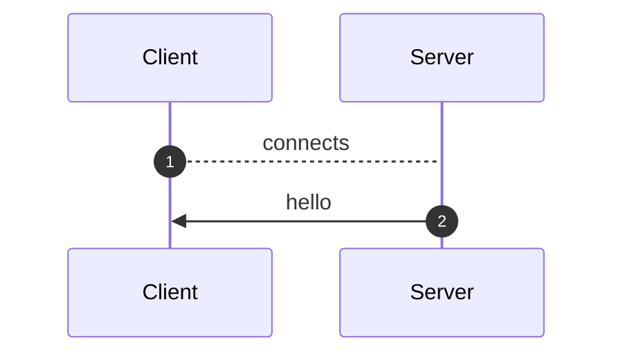
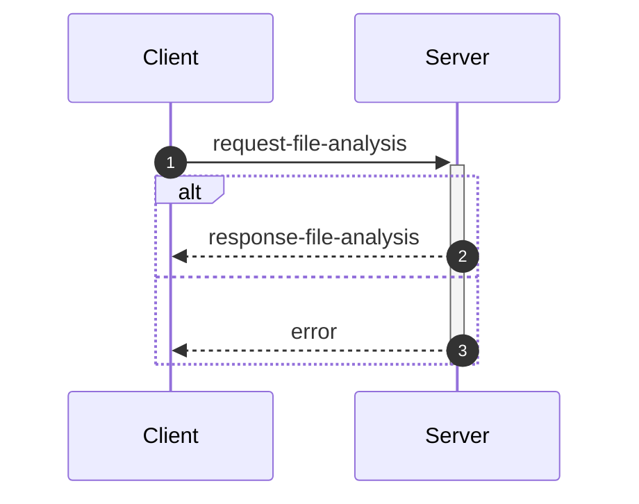
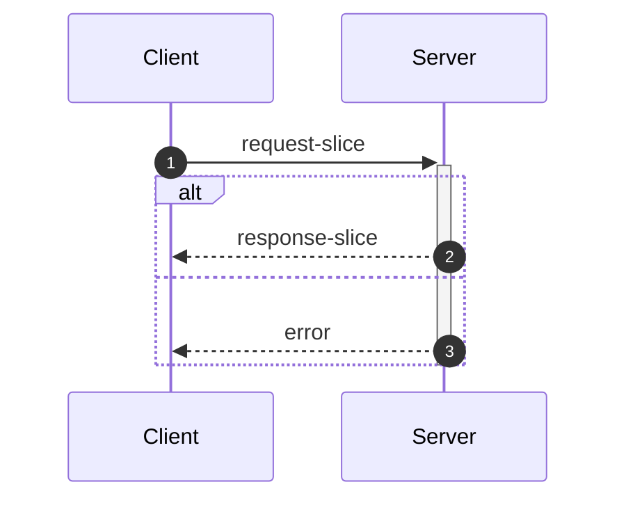
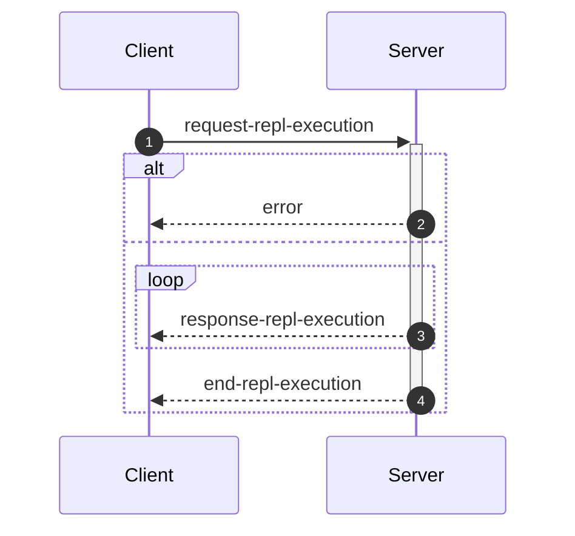

_This document was generated from '[src/documentation/wiki-interface.ts](https://github.com/flowr-analysis/flowr/tree/main//src/documentation/wiki-interface.ts)' on 2026-07-17, 11:08:20 UTC presenting an overview of flowR's interface (v2.12.3, using R v4.5.0). Please do not edit this file/wiki page directly._

Although far from being as detailed as the in-depth explanation of [_flowR_](https://github.com/flowr-analysis/flowr/wiki/core),
this wiki page explains how to interface with _flowR_ in more detail.
In general, command line arguments and other options provide short descriptions on hover over.

* [💻 Using the REPL](#using-the-repl)
* [⚙️ Configuring FlowR](#configuring-flowr)
* [⚒️ Writing Code](#writing-code)
* [💬 Communicating with the Server](#communicating-with-the-server)

<a id='using-the-repl'></a>
## 💻 Using the REPL


> [!NOTE]
> To execute arbitrary R commands with a repl request, _flowR_ has to be started explicitly with <span title="Description (Command Line Argument): Allow to access the underlying R session when using flowR (security warning: this allows the execution of arbitrary R code!)">`--r-session-access`</span>.
> Please be aware that this introduces a security risk and note that this relies on the [`r-shell` engine](https://github.com/flowr-analysis/flowr/wiki/engines) .

Although primarily meant for users to explore,
there is nothing which forbids simply calling _flowR_ as a subprocess to use standard-in, -output, and -error
for communication (although you can access the REPL using the server as well,
with the [REPL Request](#message-request-repl-execution) message).

The read-eval-print loop&nbsp;(REPL) works relatively simple.
You can submit an expression (using <kbd>Enter</kbd>),
which is interpreted as an R&nbsp;expression by default but interpreted as a *command* if it starts with a colon (`:`).
The best command to get started with the REPL is <span title="Description (Repl Command): Show help information (aliases: :h, :?)">`:help`</span>.
Besides, you can leave the REPL either with the command <span title="Description (Repl Command): End the repl (aliases: :q, :exit)">`:quit`</span> or by pressing <kbd>Ctrl</kbd>+<kbd>C</kbd> twice.
When writing a *command*, you may press <kbd>Tab</kbd> to get a list of completions, if available.
Multiple commands can be entered in a single line by separating them with a semicolon (`;`), e.g. `:parse "x<-2"; :df*`.
If a command is given without R code, the REPL will re-use R code given in a previous command.
The prior example will hence return first the parsed AST of the program and then the dataflow graph for `"x <- 2"`.

> [!NOTE]
> If you develop flowR, you may want to launch the repl using the `npm run main-dev` command, this way, you get a non-minified version of flowR with debug information and hot-reloading of source files.

<details>
<summary>Available Commands</summary>

We currently offer the following commands (this with a `[*]` suffix are available with and without the star):


| Command | Description |
| ------- | ----------- |
| **<span title="Description (Repl Command): End the repl (aliases: :q, :exit)">:quit</span>** | End the repl (aliases: **:<span title="Alias of ':quit'. End the repl">q</span>**, **:<span title="Alias of ':quit'. End the repl">exit</span>**) |
| **<span title="Description (Repl Command): Execute the given code as R code. This requires the `--r-session-access` flag to be set and requires the r-shell engine. (aliases: :e, :r)">:execute</span>** | Execute the given code as R code. This requires the `--r-session-access` flag to be set and requires the r-shell engine. (aliases: **:<span title="Alias of ':execute'. Execute the given code as R code. This requires the `--r-session-access` flag to be set and requires the r-shell engine.">e</span>**, **:<span title="Alias of ':execute'. Execute the given code as R code. This requires the `--r-session-access` flag to be set and requires the r-shell engine.">r</span>**) |
| **<span title="Description (Repl Command): Get mermaid code for the control-flow graph of R code (aliases: :cfg, :cf)">:controlflow[*]</span>** | Get mermaid code for the control-flow graph of R code (star: Returns the URL to mermaid.live) (aliases: **:<span title="Alias of ':controlflow'. Get mermaid code for the control-flow graph of R code">cfg</span>**, **:<span title="Alias of ':controlflow'. Get mermaid code for the control-flow graph of R code">cf</span>**) |
| **<span title="Description (Repl Command): Get mermaid code for the control-flow graph with basic blocks (aliases: :cfgb, :cfb)">:controlflowbb[*]</span>** | Get mermaid code for the control-flow graph with basic blocks (star: Returns the URL to mermaid.live) (aliases: **:<span title="Alias of ':controlflowbb'. Get mermaid code for the control-flow graph with basic blocks">cfgb</span>**, **:<span title="Alias of ':controlflowbb'. Get mermaid code for the control-flow graph with basic blocks">cfb</span>**) |
| **<span title="Description (Repl Command): Get mermaid code for the dataflow graph (aliases: :d, :df)">:dataflow[*]</span>** | Get mermaid code for the dataflow graph (star: Returns the URL to mermaid.live) (aliases: **:<span title="Alias of ':dataflow'. Get mermaid code for the dataflow graph">d</span>**, **:<span title="Alias of ':dataflow'. Get mermaid code for the dataflow graph">df</span>**) |
| **<span title="Description (Repl Command): Get mermaid code for the normalized AST of R code (aliases: :n)">:normalize[*]</span>** | Get mermaid code for the normalized AST of R code (star: Returns the URL to mermaid.live) (alias: **:<span title="Alias of ':normalize'. Get mermaid code for the normalized AST of R code">n</span>**) |
| **<span title="Description (Repl Command): Get mermaid code for the simplified dataflow graph (aliases: :ds, :dfs)">:dataflowsimple[*]</span>** | Get mermaid code for the simplified dataflow graph (star: Returns the URL to mermaid.live) (aliases: **:<span title="Alias of ':dataflowsimple'. Get mermaid code for the simplified dataflow graph">ds</span>**, **:<span title="Alias of ':dataflowsimple'. Get mermaid code for the simplified dataflow graph">dfs</span>**) |
| **<span title="Description (Repl Command): Inspect and extend the signature database: `query` (identical to :query @signature), `add <path>` to mount another database/source, `download` to fetch the full-history database. (aliases: :sig)">:signature</span>** | Inspect and extend the signature database: `query` (identical to :query @signature), `add <path>` to mount another database/source, `download` to fetch the full-history database. (alias: **:<span title="Alias of ':signature'. Inspect and extend the signature database: `query` (identical to :query @signature), `add <path>` to mount another database/source, `download` to fetch the full-history database.">sig</span>**) |
| **<span title="Description (Repl Command): Just calculates the DFG, but only prints summary info (aliases: :d#, :df#)">:dataflowsilent</span>** | Just calculates the DFG, but only prints summary info (aliases: **:<span title="Alias of ':dataflowsilent'. Just calculates the DFG, but only prints summary info">d#</span>**, **:<span title="Alias of ':dataflowsilent'. Just calculates the DFG, but only prints summary info">df#</span>**) |
| **<span title="Description (Repl Command): Prints ASCII Art of the parsed, unmodified AST (aliases: :p)">:parse</span>** | Prints ASCII Art of the parsed, unmodified AST (alias: **:<span title="Alias of ':parse'. Prints ASCII Art of the parsed, unmodified AST">p</span>**) |
| **<span title="Description (Repl Command): Prints the version of flowR as well as the current version of R">:version</span>** | Prints the version of flowR as well as the current version of R
| **<span title="Description (Repl Command): Query the given R code (use 'help' for more information)">:query[*]</span>** | Query the given R code (use 'help' for more information) (star: Similar to query, but returns the output in json format.)
| **<span title="Description (Repl Command): Returns an ASCII representation of the dataflow graph (aliases: :df!)">:dataflowascii</span>** | Returns an ASCII representation of the dataflow graph (alias: **:<span title="Alias of ':dataflowascii'. Returns an ASCII representation of the dataflow graph">df!</span>**) |
| **<span title="Description (Repl Command): Returns summarization stats for the normalized AST (aliases: :n#)">:normalize#</span>** | Returns summarization stats for the normalized AST (alias: **:<span title="Alias of ':normalize#'. Returns summarization stats for the normalized AST">n#</span>**) |
| **<span title="Description (Repl Command): Show help information (aliases: :h, :?)">:help</span>** | Show help information (aliases: **:<span title="Alias of ':help'. Show help information">h</span>**, **:<span title="Alias of ':help'. Show help information">?</span>**) |


</details>


> [!TIP]
> 
> As indicated by the examples before, all REPL commands that operate on code keep track of the state.
> Hence, if you run a command like <span title="Description (Repl Command, starred version): Returns the URL to mermaid.live; Base Command: Get mermaid code for the dataflow graph (aliases: :d*, :df*)">`:dataflow*`</span> without providing R code,
> the REPL will re-use the R code provided in a previous command.
> Likewise, doing this will benefit from incrementality!
> If you request the dataflow graph with `:df* x <- 2 * y` and then want to see the parsed AST with `:parse`,
> the REPL will re-use previously obtained information and not re-parse the code again.
> 		


Generally, many commands offer shortcut versions in the REPL. Many queries, for example, offer a shortened format (see the example below).
Of special note, the [Config Query](https://github.com/flowr-analysis/flowr/wiki/query-api#Config-Query)
can be used to also modify the currently active configuration of _flowR_ within the REPL (see the [wiki page](https://github.com/flowr-analysis/flowr/wiki/query-api#Config-Query) for more information).

### Example: Retrieving the Dataflow Graph

To retrieve a URL to the [mermaid](https://mermaid.js.org/) diagram of the dataflow of a given expression,
use <span title="Description (Repl Command, starred version): Returns the URL to mermaid.live; Base Command: Get mermaid code for the dataflow graph (aliases: :d*, :df*)">`:dataflow*`</span> (or <span title="Description (Repl Command): Get mermaid code for the dataflow graph (aliases: :d, :df)">`:dataflow`</span> to get the mermaid code in the cli):


```shell
$ docker run -it --rm eagleoutice/flowr # or npm run flowr 
flowR repl v2.12.3, R grammar v14 (tree-sitter engine)
R> :dataflow* y <- 1 + x
```

<details>
<summary style='color:gray'>Output</summary>


```text
https://mermaid.live/view#base64:eyJjb2RlIjoiZmxvd2NoYXJ0IEJUXG4gICAgMXt7XCJgKiM5MTtSTnVtYmVyIzkzOyogKioxKipcbiAgICAgICoxLjYqICgqKmlkOiAxKiopYFwifX1cbiAgICUlIE5vIGVkZ2VzIGZvdW5kIGZvciAxXG4gICAgMihbXCJgKiM5MTtSU3ltYm9sIzkzOyogKip4KipcbiAgICAgICoxLjEwKiAoKippZDogMioqKWBcIl0pXG4gICAlJSBObyBlZGdlcyBmb3VuZCBmb3IgMlxuICAgIDNbW1wiYCojOTE7UkJpbmFyeU9wIzkzOyogYmFzZSM1ODsjNTg7KiojNDM7KipcbiAgICAgICoxLjYtMTAqICgqKmlkOiAzKiopXG4gICAgYXJnOiAoMSwgMilgXCJdXVxuICAgIGJ1aWx0LWluOl9bXCJgQnVpbHQtSW46XG4jNDM7YFwiXVxuICAgIHN0eWxlIGJ1aWx0LWluOl8gc3Ryb2tlOmdyYXksZmlsbDpncmF5LHN0cm9rZS13aWR0aDoycHgsb3BhY2l0eTouODtcbiAgICAwW1wiYCojOTE7UlN5bWJvbCM5MzsqICoqeSoqXG4gICAgICAqMS4xKiAoKippZDogMCoqLCB2OiAzKWBcIl1cbiAgICA0W1tcImAqIzkxO1JCaW5hcnlPcCM5MzsqIGJhc2UjNTg7IzU4OyoqIzYwOyM0NTsqKlxuICAgICAgKjEuMS0xMCogKCoqaWQ6IDQqKilcbiAgICBhcmc6ICgwLCAzKWBcIl1dXG4gICAgYnVpbHQtaW46Xy1bXCJgQnVpbHQtSW46XG4jNjA7IzQ1O2BcIl1cbiAgICBzdHlsZSBidWlsdC1pbjpfLSBzdHJva2U6Z3JheSxmaWxsOmdyYXksc3Ryb2tlLXdpZHRoOjJweCxvcGFjaXR5Oi44O1xuICAgIDMgLS0+fFwicmVhZHMsIGFyZ1wifCAxXG4gICAgMyAtLT58XCJyZWFkcywgYXJnXCJ8IDJcbiAgICAzIC0uLT58XCJyZWFkcywgY2FsbHNcInwgYnVpbHQtaW46X1xuICAgIGxpbmtTdHlsZSAyIHN0cm9rZTpncmF5O1xuICAgIDAgLS0+fFwiZGVmaW5lZC1ieVwifCAzXG4gICAgMCAtLT58XCJkZWZpbmVkLWJ5XCJ8IDRcbiAgICA0IC0tPnxcInJlYWRzLCBhcmdcInwgM1xuICAgIDQgLS0+fFwicmV0dXJucywgYXJnXCJ8IDBcbiAgICA0IC0uLT58XCJyZWFkcywgY2FsbHNcInwgYnVpbHQtaW46Xy1cbiAgICBsaW5rU3R5bGUgNyBzdHJva2U6Z3JheTsiLCJtZXJtYWlkIjp7ImF1dG9TeW5jIjp0cnVlfX0=
```


Retrieve the dataflow graph of the expression `y <- 1 + x`. It looks like this:


```mermaid
flowchart LR
    1{{"`*#91;RNumber#93;* **1**
      *1.6* (**id: 1**)`"}}
   %% No edges found for 1
    2(["`*#91;RSymbol#93;* **x**
      *1.10* (**id: 2**)`"])
   %% No edges found for 2
    3[["`*#91;RBinaryOp#93;* base#58;#58;**#43;**
      *1.6-10* (**id: 3**)
    arg: (1, 2)`"]]
    built-in:_["`Built-In:
#43;`"]
    style built-in:_ stroke:gray,fill:gray,stroke-width:2px,opacity:.8;
    0["`*#91;RSymbol#93;* **y**
      *1.1* (**id: 0**, v: 3)`"]
    4[["`*#91;RBinaryOp#93;* base#58;#58;**#60;#45;**
      *1.1-10* (**id: 4**)
    arg: (0, 3)`"]]
    built-in:_-["`Built-In:
#60;#45;`"]
    style built-in:_- stroke:gray,fill:gray,stroke-width:2px,opacity:.8;
    3 -->|"reads, arg"| 1
    3 -->|"reads, arg"| 2
    3 -.->|"reads, calls"| built-in:_
    linkStyle 2 stroke:gray;
    0 -->|"defined-by"| 3
    0 -->|"defined-by"| 4
    4 -->|"reads, arg"| 3
    4 -->|"returns, arg"| 0
    4 -.->|"reads, calls"| built-in:_-
    linkStyle 7 stroke:gray;
```

	
<details>

<summary style="color:gray">R Code of the Dataflow Graph</summary>

The analysis required _0.8 ms_ (including parse and normalize, using the [tree-sitter](https://github.com/flowr-analysis/flowr/wiki/Engines) engine) within the generation environment. No [signature database](https://github.com/flowr-analysis/flowr/wiki/Signature-Database) is mounted for these generated graphs, so `library()` calls attach no package exports; base-R names are still qualified via the generated base-package store (e.g. `acf` as `stats::acf`). 
We encountered no unknown side effects during the analysis.


```r
y <- 1 + x
```


</details>


</details>


For small graphs like this, <span title="Description (Repl Command): Returns an ASCII representation of the dataflow graph (aliases: :df!)">`:dataflowascii`</span> also provides an ASCII representation directly in the REPL:


```shell
$ docker run -it --rm eagleoutice/flowr # or npm run flowr 
flowR repl v2.12.3, R grammar v14 (tree-sitter engine)
R> :df! y <- 1 + x
```

<details open>
<summary style='color:gray'>Output</summary>


```text
                        0<1>0
                   ┌────| 1 |
    ┌────────┐     │    0---0
 c<4>c       └──c<3>c
 |<- |  v<0>v┌──| + |
 c---c──| y |┘  c---c   u<2>u
        v---v      └────| x |
                        u---u
Edges:
3 -> 1: reads, arg  3 -> 2: reads, arg
4 -> 3: reads, arg  4 -> 0: returns, arg
0 -> 3: defined-by  0 -> 4: defined-by
```


Retrieve the dataflow graph of the expression `y <- 1 + x` as ASCII art.

</details>


For the slicing with <span title="Description (Repl Command): Static backwards executable slicer for R">`:slicer`</span>, you have access to the same [magic comments](#slice-magic-comments) as with the [slice request](#message-request-slice).
Pass `--inline` to splice resolvable `source()` calls into the reconstruction so the slice is a single self-contained R text (the same as the static slice query's `inlineSources` flag).
See `--help` for more flags!

### Example: Interfacing with the File System

Many commands that allow for an R-expression (like <span title="Description (Repl Command, starred version): Returns the URL to mermaid.live; Base Command: Get mermaid code for the dataflow graph (aliases: :d*, :df*)">`:dataflow*`</span>) allow for a file as well
if the argument starts with `file://`.
If you are working from the root directory of the _flowR_ repository, the following gives you the parsed AST of the example file using the <span title="Description (Repl Command): Prints ASCII Art of the parsed, unmodified AST (aliases: :p)">`:parse`</span> command:

> **Watch mode**: Replace `file://` with `watch://` to enter watch mode.
> flowR runs the command immediately and then re-runs it every time the file (or any file inside the folder) changes.
> Enter any other command to leave watch mode.
> For example: `:df watch://analysis.R`


```shell
$ docker run -it --rm eagleoutice/flowr # or npm run flowr 
flowR repl v2.12.3, R grammar v14 (tree-sitter engine)
R> :parse file://test/testfiles/example.R
```

<details>
<summary style='color:gray'>Output</summary>


```text
File: test/testfiles/example.R

program
├ binaryoperator
│ ├ identifier "sum" (1:1─4)
│ ├ <- "<-" (1:5─7)
│ ╰ float "0" (1:8─9)
├ binaryoperator
│ ├ identifier "product" (2:1─8)
│ ├ <- "<-" (2:9─11)
│ ╰ float "1" (2:12─13)
├ binaryoperator
│ ├ identifier "w" (3:1─2)
│ ├ <- "<-" (3:3─5)
│ ╰ float "7" (3:6─7)
├ binaryoperator
│ ├ identifier "N" (4:1─2)
│ ├ <- "<-" (4:3─5)
│ ╰ float "10" (4:6─8)
├ forstatement
│ ├ for "for" (6:1─4)
│ ├ ( "(" (6:5─6)
│ ├ identifier "i" (6:6─7)
│ ├ in "in" (6:8─10)
│ ├ binaryoperator
│ │ ├ float "1" (6:11─12)
│ │ ├ : ":" (6:12─13)
│ │ ╰ parenthesizedexpression
│ │   ├ ( "(" (6:13─14)
│ │   ├ binaryoperator
│ │   │ ├ identifier "N" (6:14─15)
│ │   │ ├ - "-" (6:15─16)
│ │   │ ╰ float "1" (6:16─17)
│ │   ╰ ) ")" (6:17─18)
│ ├ ) ")" (6:18─19)
│ ╰ bracedexpression
│   ├ { "{" (6:20─21)
│   ├ binaryoperator
│   │ ├ identifier "sum" (7:3─6)
│   │ ├ <- "<-" (7:7─9)
│   │ ╰ binaryoperator
│   │   ├ binaryoperator
│   │   │ ├ identifier "sum" (7:10─13)
│   │   │ ├ + "+" (7:14─15)
│   │   │ ╰ identifier "i" (7:16─17)
│   │   ├ + "+" (7:18─19)
│   │   ╰ identifier "w" (7:20─21)
│   ├ binaryoperator
│   │ ├ identifier "product" (8:3─10)
│   │ ├ <- "<-" (8:11─13)
│   │ ╰ binaryoperator
│   │   ├ identifier "product" (8:14─21)
│   │   ├  "" (8:22─23)
│   │   ╰ identifier "i" (8:24─25)
│   ╰ } "}" (9:1─2)
├ call
│ ├ identifier "cat" (11:1─4)
│ ╰ arguments
│   ├ ( "(" (11:4─5)
│   ├ argument
│   │ ╰ string
│   │   ├ " "\"" (11:5─6)
│   │   ├ stringcontent "Sum:" (11:6─10)
│   │   ╰ " "\"" (11:10─11)
│   ├ comma "," (11:11─12)
│   ├ argument
│   │ ╰ identifier "sum" (11:13─16)
│   ├ comma "," (11:16─17)
│   ├ argument
│   │ ╰ string
│   │   ├ " "\"" (11:18─19)
│   │   ├ stringcontent
│   │   │ ╰ escapesequence "\\n" (11:19─21)
│   │   ╰ " "\"" (11:21─22)
│   ╰ ) ")" (11:22─23)
╰ call
  ├ identifier "cat" (12:1─4)
  ╰ arguments
    ├ ( "(" (12:4─5)
    ├ argument
    │ ╰ string
    │   ├ " "\"" (12:5─6)
    │   ├ stringcontent "Product:" (12:6─14)
    │   ╰ " "\"" (12:14─15)
    ├ comma "," (12:15─16)
    ├ argument
    │ ╰ identifier "product" (12:17─24)
    ├ comma "," (12:24─25)
    ├ argument
    │ ╰ string
    │   ├ " "\"" (12:26─27)
    │   ├ stringcontent
    │   │ ╰ escapesequence "\\n" (12:27─29)
    │   ╰ " "\"" (12:29─30)
    ╰ ) ")" (12:30─31)
```


Retrieve the parsed AST of the example file.

<details>

<summary>File Content</summary>


```r
sum <- 0
product <- 1
w <- 7
N <- 10

for (i in 1:(N-1)) {
  sum <- sum + i + w
  product <- product * i
}

cat("Sum:", sum, "\n")
cat("Product:", product, "\n")
```


</details>

As _flowR_ directly transforms this AST the output focuses on being human-readable instead of being machine-readable.
		

</details>


### Example: Run a Query

You can run any query supported by _flowR_ using the <span title="Description (Repl Command): Query the given R code (use 'help' for more information)">`:query`</span> command.
For example, to obtain the shapes of all data frames in a given piece of code, you can run:


```shell
$ docker run -it --rm eagleoutice/flowr # or npm run flowr 
flowR repl v2.12.3, R grammar v14 (tree-sitter engine)
R> :query @absint df-shape "x <- data.frame(a = 1:10, b = 1:10)\ny <- x$a"
```

<details open>
<summary style='color:gray'>Output</summary>


```text
Query: absint (2 ms)
   ╰ $12: (colnames: [{"a", "b"}, {}], cols: [2, 2], rows: [10, 10])
   ╰ $0: (colnames: [{"a", "b"}, {}], cols: [2, 2], rows: [10, 10])
All queries together required ≈4 ms (1ms accuracy, total 5 ms)
```


Retrieve the shapes of all data frames in the given code.

</details>


To run the linter on a file, you can use (in this example, we just issue the `dead-code` linter on a small piece of code):


```shell
$ docker run -it --rm eagleoutice/flowr # or npm run flowr 
flowR repl v2.12.3, R grammar v14 (tree-sitter engine)
R> :query @linter rules:dead-code "if(FALSE) x <- 2"
```

<details open>
<summary style='color:gray'>Output</summary>


```text
Query: linter (1 ms)
   ╰ Dead Code (dead-code):
       ╰ certain:
           ╰ Code at 1.11-16
       ╰ Metadata: searchTimeMs: 1, processTimeMs: 0
All queries together required ≈1 ms (1ms accuracy, total 2 ms)
```


Run the linter on the given code, with only the `dead-code` rule enabled.

</details>


For more information on the available queries, please check out the [Query API](https://github.com/flowr-analysis/flowr/wiki/query-api).


<a id='configuring-flowr'></a>
## ⚙️ Configuring FlowR


When running _flowR_, you may want to specify some behaviors with a dedicated configuration file.
By default, flowR looks for a file named `flowr.json` in the current working directory (or any higher directory).
You can also specify a different file with <span title="Description (Command Line Argument): The name of the configuration file to use">`--config-file`</span> or pass the configuration inline using <span title="Description (Command Line Argument): The flowR configuration to use, as a JSON string">`--config-json`</span>.
To inspect the current configuration, you can run flowr with the <span title="Description (Command Line Argument): Run with verbose logging (will be passed to the corresponding script)">`--verbose`</span> flag, or use the `config` [Query](https://github.com/flowr-analysis/flowr/wiki/query-api).
Within the REPL this works by running the following:


```shell
:query @config
```


To work with the <a href="https://github.com/flowr-analysis/flowr/tree/main/src/config.ts#L126"><code><span title="The configuration file format for flowR.">FlowrConfig</span></code></a> you can use the provided helper objects alongside its methods like
<a href="https://github.com/flowr-analysis/flowr/tree/main/src/config.ts#L631"><code><span title="Creates a new flowr config that has the updated values.">FlowrConfig::<b>amend</b></span></code></a>.
The schema below documents every option; the ones you most likely want are:

- <a href="https://github.com/flowr-analysis/flowr/wiki/Interface#configuring-flowr" title="Configuration Option (boolean): Whether source calls should be ignored, causing {@link processSourceCall}&#39;s behavior to be skipped.">ignoreSourceCalls</a>: ignore source calls when analyzing the code, i.e., ignore the inclusion of other files.
- <a href="https://github.com/flowr-analysis/flowr/wiki/Interface#configuring-flowr" title="Configuration Option (boolean): Whether load calls should be ignored, causing {@link processLoadCall}&#39;s behavior to be skipped.">ignoreLoadCalls</a>: ignore load calls when analyzing the code, i.e., ignore the loading of r-data files.
- <a href="https://github.com/flowr-analysis/flowr/wiki/Interface#configuring-flowr" title="Configuration Option (object): Do you want to overwrite (parts) of the builtin definition?">semantics.environment.overwriteBuiltIns</a>: overwrite _flowR_'s handling of built-in functions, or clear the preset definitions entirely.
  See [Configure BuiltIn Semantics](#configure-builtin-semantics) for more information.
- <a href="https://github.com/flowr-analysis/flowr/wiki/Interface#configuring-flowr" title="Configuration Option (string): How to resolve variables and their values. (one of &quot;disabled&quot;, &quot;alias&quot;, &quot;builtin&quot;)">solver.variables</a>: how to resolve variables and their values (`disabled`, `alias`, `builtin`).
- <a href="https://github.com/flowr-analysis/flowr/wiki/Interface#configuring-flowr" title="Configuration Option (array): The engine or set of engines to use for interacting with R code. An empty array means all available engines will be used.">engines</a> and <a href="https://github.com/flowr-analysis/flowr/wiki/Interface#configuring-flowr" title="Configuration Option (string): The default engine to use for interacting with R code. If this is undefined, an arbitrary engine from the specified list will be used. (one of &quot;tree-sitter&quot;, &quot;r-shell&quot;)">defaultEngine</a>: the engines used to interact with R code, see the [Engines wiki page](https://github.com/flowr-analysis/flowr/wiki/engines).
- <a href="https://github.com/flowr-analysis/flowr/wiki/Interface#configuring-flowr" title="Configuration Option (array): Files a framework loads on its own, without any source() call (e.g. global.R in a shiny app), in the order they are loaded; flowR orders the matching project files accordingly and analyzes them as one program. Entries are case-insensitive globs matched against the file path, a plain name matches any file with that name, and entries matching no project file are warned about. Usually set per project kind via specializeConfig.">project.implicitSources</a>: the files a framework loads without any `source()` call, in the order in which they are
  loaded. Entries are globs (e.g. `R/*.R`) matched against the file path ignoring capitalization; one matching no file is reported.
- <a href="https://github.com/flowr-analysis/flowr/wiki/Interface#configuring-flowr" title="Configuration Option (object): Overwrite (parts of) the configuration depending on the project kind flowR detects, e.g. to give a shiny app its implicit sources.">specializeConfig</a>: overwrite (parts of) the configuration depending on the kind of project _flowR_ detects
  (e.g. `shiny-app`), which is how a shiny app gets its implicit sources by default. What you configure directly wins.
- <a href="https://github.com/flowr-analysis/flowr/wiki/Interface#configuring-flowr" title="Configuration Option (array): The default plugins to load when creating a new instance of FlowrAnalyzer">defaultPlugins</a> and <a href="https://github.com/flowr-analysis/flowr/wiki/Interface#configuring-flowr" title="Configuration Option (array): The plugins to load in REPL mode">repl.plugins</a>: the plugins to load for a new <a href="https://github.com/flowr-analysis/flowr/tree/main/src/project/flowr-analyzer.ts#L162"><code><span title="Central class for conducting analyses with FlowR. Use the FlowrAnalyzerBuilder to create a new instance. If you want the original pattern of creating a pipeline and running all steps, you can still do this with FlowrAnalyzer#runFull . To inspect the context of the analyzer, use FlowrAnalyzer#inspectContext (if you are a plugin and need to modify it, use FlowrAnalyzer#context instead).">FlowrAnalyzer</span></code></a> and in the REPL
  (use `flowr:default` to reference the former).

So you can configure _flowR_ by adding a file like the following:

<details>

<summary>Example Configuration File</summary>


```json
{
  "ignoreSourceCalls": true,
  "ignoreLoadCalls": true,
  "semantics": {
    "environment": {
      "overwriteBuiltIns": {
        "definitions": [
          {
            "type": "function",
            "names": [
              "foo"
            ],
            "processor": "builtin:assign",
            "config": {}
          }
        ]
      }
    }
  },
  "defaultPlugins": [
    "file:description",
    "versions:description"
  ],
  "repl": {
    "quickStats": false,
    "dfProcessorHeat": false,
    "hints": true,
    "plugins": [
      "flowr:default"
    ]
  },
  "project": {
    "resolveUnknownPathsOnDisk": true,
    "implicitSources": [
      "global.R",
      "app.R"
    ]
  },
  "specializeConfig": {
    "shiny-app": {
      "project": {
        "implicitSources": [
          "global.R",
          "ui.R",
          "server.R",
          "app.R"
        ]
      }
    }
  },
  "engines": [
    {
      "type": "r-shell"
    }
  ],
  "solver": {
    "variables": "alias",
    "evalStrings": true,
    "trackEnvironments": true,
    "sigdb": {
      "enabled": true,
      "loadProjectDependencies": true,
      "eagerlyLoad": false,
      "eagerlyLoadExports": false,
      "linkBaseR": false,
      "linkDescriptionDependencies": false
    },
    "resolveSource": {
      "dropPaths": "no",
      "ignoreCapitalization": true,
      "inferWorkingDirectory": "active-script",
      "searchPath": []
    },
    "instrument": {},
    "slicer": {
      "threshold": 50
    }
  },
  "abstractInterpretation": {
    "wideningThreshold": 4,
    "dataFrame": {
      "maxColNames": 20,
      "readLoadedData": {
        "readExternalFiles": true,
        "maxReadLines": 1000000
      }
    }
  },
  "gas": {
    "thresholds": {
      "memory": {
        "problematic": 0.7,
        "critical": 0.9
      },
      "timeMs": {
        "problematic": 100000,
        "critical": 120000
      }
    },
    "features": {}
  }
}
```


</details>

<details>
<a id='configure-builtin-semantics'></a>
<summary>Configure Built-In Semantics</summary>


`semantics/environment/overwriteBuiltins` accepts two keys:

- `loadDefaults` (boolean, initially `true`): If set to `true`, the default built-in definitions are loaded before applying the custom definitions. Setting this flag to `false` explicitly disables the loading of the default definitions.
- `definitions` (array, initially empty): Allows to overwrite or define new built-in elements. Each object within must have a `type` which is one of the below. Furthermore, they may define a string array of `names` which specifies the identifiers to bind the definitions to. You may use `assumePrimitive` to specify whether _flowR_ should assume that this is a primitive non-library definition (so you probably just do not want to specify the key).

  | Type            | Description                                                                                                                                                                                                                                                                                              | Example                                                                                                    |
  | --------------- | -------------------------------------------------------------------------------------------------------------------------------------------------------------------------------------------------------------------------------------------------------------------------------------------------------- | ---------------------------------------------------------------------------------------------------------- |
  | `constant`    | Additionally allows for a `value` this should resolve to.                                                                                                                                                                                                                                                | `{ type: 'constant', names: ['NULL', 'NA'],  value: null }`                                                |
  | `function`    | Is a rather flexible way to define and bind built-in functions. For the time, we do not have extensive documentation to cover all the cases, so please either consult the sources with the `default-builtin-config.ts` or open a [new issue](https://github.com/flowr-analysis/flowr/issues/new/choose). | `{ type: 'function', names: ['next'], processor: 'builtin:d', config: { cfg: ExitPointType.Next } }` |
  | `replacement` | A comfortable way to specify replacement functions like `$<-` or `names<-`. `suffixes` describes the... suffixes to attach automatically. | `{ type: 'replacement', suffixes: ['<-', '<<-'], names: ['[', '[['] }` |


</details>

<details>

<summary style='color:gray'>Full Configuration-File Schema</summary>

- _The configuration file format for flowR._ (object)
    - **ignoreSourceCalls** [optional] _Whether source calls should be ignored, causing {@link processSourceCall}'s behavior to be skipped._ (boolean)
    - **ignoreLoadCalls** [optional] _Whether load calls should be ignored, causing {@link processLoadCall}'s behavior to be skipped._ (boolean)
    - **semantics** _Configure language semantics and how flowR handles them._ (object)
        - **environment** [optional] _Semantics regarding how to handle the R environment._ (object)
            - **overwriteBuiltIns** [optional] _Do you want to overwrite (parts) of the builtin definition?_ (object)
                - **loadDefaults** [optional] _Should the default configuration still be loaded?_ (boolean)
                - **definitions** [optional] _The definitions to load/overwrite._ (array)
                Valid item types:
                    - (object)
    - **defaultPlugins** [optional] _The default plugins to load when creating a new instance of FlowrAnalyzer_ (array)
    Valid item types:
        - (alternatives)
            - (string)
            - (array)
    - **repl** _Configuration options for the REPL._ (object)
        - **quickStats** [optional] _Whether to show quick stats in the REPL after each evaluation._ (boolean)
        - **dfProcessorHeat** [optional] _This instruments the dataflow processors to count how often each processor is called._ (boolean)
        - **hints** [optional] _Whether to show dim inline hints on the empty prompt (automatically disabled on non-interactive terminals)._ (boolean)
        - **plugins** [optional] _The plugins to load in REPL mode_ (array)
        Valid item types:
            - (alternatives)
                - (string)
                - (array)
        - **autoUseFileProtocol** [optional] _Prepend the file protocol to a repl input that looks like a path, instead of only warning about it._ (boolean)
        - **queryStats** [optional] _Whether `:query` closes with the line stating how long the queries took (`:query*` never prints it)._ (boolean)
    - **project** _Project specific configuration options._ (object)
        - **resolveUnknownPathsOnDisk** [optional] _Whether to resolve unknown paths loaded by the r project disk when trying to source/analyze files._ (boolean)
        - **basePackages** [optional] _The packages considered part of R itself (base and recommended); if unset, flowR uses its built-in list._ (array)
        Valid item types:
            - (string)
        - **implicitSources** [optional] _Files a framework loads on its own, without any source() call (e.g. global.R in a shiny app), in the order they are loaded; flowR orders the matching project files accordingly and analyzes them as one program. Entries are case-insensitive globs matched against the file path, a plain name matches any file with that name, and entries matching no project file are warned about. Usually set per project kind via specializeConfig._ (array)
        Valid item types:
            - (string)
    - **specializeConfig** [optional] _Overwrite (parts of) the configuration depending on the project kind flowR detects, e.g. to give a shiny app its implicit sources._ (object)
    - **engines** _The engine or set of engines to use for interacting with R code. An empty array means all available engines will be used._ (array)
    Valid item types:
        - (alternatives)
            - _The configuration for the tree sitter engine._ (object)
                - **type** [required] _Use the tree sitter engine._ (string)
                    Only allows: 'tree-sitter'
                - **wasmPath** [optional] _The path to the tree-sitter-r WASM binary to use. If this is undefined, this uses the default path._ (string)
                - **treeSitterWasmPath** [optional] _The path to the tree-sitter WASM binary to use. If this is undefined, this uses the default path._ (string)
                - **lax** [optional] _Whether to use the lax parser for parsing R code (allowing for syntax errors). If this is undefined, the strict parser will be used._ (boolean)
            - _The configuration for the R shell engine._ (object)
                - **type** [required] _Use the R shell engine._ (string)
                    Only allows: 'r-shell'
                - **rPath** [optional] _The path to the R executable to use. If this is undefined, this uses the default path._ (string)
    - **defaultEngine** [optional] _The default engine to use for interacting with R code. If this is undefined, an arbitrary engine from the specified list will be used._ (string)
        Only allows: 'tree-sitter', 'r-shell'
    - **solver** _How to resolve constants, constraints, cells, ..._ (object)
        - **variables** _How to resolve variables and their values._ (string)
            Only allows: 'disabled', 'alias', 'builtin'
        - **evalStrings** _Should we include eval(parse(text="...")) calls in the dataflow graph?_ (boolean)
        - **trackEnvironments** [optional] _Track user-created environments (new.env, assign/get/local with envir=, dollar-assign, attach). When false, all envir-style calls fall through conservatively._ (boolean)
        - **sigdb** _Resolving library exports from a signature database._ (object)
            - **enabled** [optional] _Resolve library()/use() exports from a signature database (default true); when false no database is consulted._ (boolean)
            - **loadProjectDependencies** [optional] _Load the project's declared dependencies from its metadata files (DESCRIPTION Imports/Depends, rproject.toml, renv.lock, rv.lock) (default true); when false these files are not read for dependencies._ (boolean)
            - **eagerlyLoad** [optional] _Parse the database up front rather than on the first package load (default false, ignored if disabled)._ (boolean)
            - **eagerlyLoadExports** [optional] _Add a vertex for every export on load rather than on demand (default false); keeps the dataflow graph small._ (boolean)
            - **assumedRVersion** [optional] _R version assumed when resolving versioned (base-R) exports: a pin like "4.5" or "auto" to detect the installed R (default "auto")._ (string)
            - **linkBaseR** [optional] _Eagerly attach base-R namespaces so bare base calls resolve without library() (default false)._ (boolean)
            - **linkBaseRCalls** [optional] _Add a lightweight Reads edge from a bare base-R call to its signature-database function vertex (default false; base-R qualification is edge-free otherwise)._ (boolean)
            - **linkPackageCalls** [optional] _Add a lightweight Reads edge from a resolved package call to its signature-database function vertex (default false)._ (boolean)
            - **linkDescriptionDependencies** [optional] _Eagerly attach the namespaces of the project's declared DESCRIPTION dependencies (Imports/Depends) so their exports resolve without an explicit library() (default false)._ (boolean)
            - **warmInBackground** [optional] _Decompress the hot shards (base + most-downloaded) in a background task on startup so the first library() lookup is warm (default false; for long-running servers/REPLs)._ (boolean)
            - **additionalPaths** [optional] _Extra directories or bundle/manifest files searched for signature databases (alongside the shipped default and $FLOWR_SIGDB_DIR); a downloaded full-history bundle placed here is mounted automatically._ (array)
            Valid item types:
                - (string)
            - **downloadRepo** [optional] _GitHub owner/repo the full-history bundle is downloaded from via ":signature download" (default "flowr-analysis/flowr", release tag "sigdb-v<flowR-version>")._ (string)
            - **autoSync** [optional] _On startup, re-download shards whose committed sigdb.remote.json hash no longer matches the cache, in the background (default false; opt-in network sync after a git pull)._ (boolean)
            - **versionSelection** [optional] _When a project constrains a dependency, resolve to the newest (default), oldest, or system-installed version satisfying it; system needs R and falls back to newest. Base-R packages always resolve against the assumed R version._ (string)
                Only allows: 'newest', 'oldest', 'system'
            - **versionOverrides** [optional] _Force an exact version for specific packages (name -> version), overriding both the project constraint and the versionSelection policy (default {})._ (object)
        - **instrument** (object)
            - **dataflowExtractors** [optional] _These keys are only intended for use within code, allowing to instrument the dataflow analyzer!_ (any)
        - **resolveSource** [optional] _If lax source calls are active, flowR searches for sourced files much more freely, based on the configurations you give it. This option is only in effect if `ignoreSourceCalls` is set to false._ (object)
            - **dropPaths** _Allow to drop the first or all parts of the sourced path, if it is relative._ (string)
                Only allows: 'no', 'once', 'all'
            - **ignoreCapitalization** _Search for filenames matching in the lowercase._ (boolean)
            - **inferWorkingDirectory** _Try to infer the working directory from the main or any script to analyze._ (string)
                Only allows: 'no', 'main-script', 'active-script', 'any-script'
            - **searchPath** _Additionally search in these paths._ (array)
            Valid item types:
                - (string)
            - **repeatedSourceLimit** [optional] _How often the same file can be sourced within a single run? Please be aware: in case of cyclic sources this may not reach a fixpoint so give this a sensible limit._ (number)
            - **applyReplacements** _Provide name replacements for loaded files_ (array)
            Valid item types:
                - (object)
            - **assumeFilesExist** [optional] _Assume a sourced file is always there, making what it defines certain instead of conditional on the source call._ (boolean)
        - **slicer** [optional] _The configuration for the slicer._ (object)
            - **threshold** [optional] _The maximum number of iterations to perform on a single function call during slicing._ (number)
            - **autoExtend** [optional] _If set, the slicer will gain an additional post-pass._ (boolean)
    - **abstractInterpretation** _The configuration options for abstract interpretation._ (object)
        - **wideningThreshold** _The threshold for the number of visitations of a node at which widening should be performed to ensure the termination of the fixpoint iteration._ (number)
        - **dataFrame** _The configuration of the shape inference for data frames._ (object)
            - **maxColNames** _The maximum number of columns names to infer for data frames before over-approximating the column names to top._ (number)
            - **readLoadedData** _Configuration options for reading data frame shapes from loaded external data files, such as CSV files._ (object)
                - **readExternalFiles** _Whether data frame shapes should be extracted from loaded external files, such as CSV files._ (boolean)
                - **maxReadLines** _The maximum number of lines to read when extracting data frame shapes from loaded files, such as CSV files._ (number)
    - **gas** [optional] _Resource-usage guard (gas) configuration. All feature factors default to 0 (disabled). See https://github.com/flowr-analysis/flowr/wiki/Core#gas-resource-guard._ (object)
        - **thresholds** [optional] _Shared thresholds for all gas checks (scaled by per-feature factor)._ (object)
            - **memory** [optional] _Heap-usage fraction thresholds (0-1)._ (object)
                - **problematic** [optional] _Heap fraction (0-1) above which Problematic is returned._ (number)
                - **critical** [optional] _Heap fraction (0-1) above which Critical is returned._ (number)
            - **timeMs** [optional] _Elapsed analysis time thresholds in milliseconds._ (object)
                - **problematic** [optional] _Elapsed ms above which Problematic is returned._ (number)
                - **critical** [optional] _Elapsed ms above which Critical is returned._ (number)
        - **features** [optional] _Per-feature sensitivity factors. 0 or absent disables gas checking for that feature. A factor of 2 makes the feature twice as sensitive. Recognised keys: `source`, `side-effect-linking`, `linter`._ (object)
        - **heapProvider** [optional] _Custom heap statistics source (programmatic configs only), overriding the built-in v8/performance.memory detection._ (function)

</details>

	

<a id='writing-code'></a>
## ⚒️ Writing Code

_flowR_ can be used as a [module](https://www.npmjs.com/package/@eagleoutice/flowr) and offers several main classes and interfaces that are interesting for extension writers 
(see the [Visual Studio Code extension](https://marketplace.visualstudio.com/items?itemName=code-inspect.vscode-flowr) or the [Core](https://github.com/flowr-analysis/flowr/wiki/core) wiki page for more information).

### Creating Analyses with _flowR_

Nowadays, instances of the <a href="https://github.com/flowr-analysis/flowr/tree/main/src/project/flowr-analyzer.ts#L162"><code><span title="Central class for conducting analyses with FlowR. Use the FlowrAnalyzerBuilder to create a new instance. If you want the original pattern of creating a pipeline and running all steps, you can still do this with FlowrAnalyzer#runFull . To inspect the context of the analyzer, use FlowrAnalyzer#inspectContext (if you are a plugin and need to modify it, use FlowrAnalyzer#context instead).">FlowrAnalyzer</span></code></a> should be used as central frontend to get analysis results from _flowR_.
For example, a program slice can be created like this:


```ts
const analyzer = await new FlowrAnalyzerBuilder()
    .setEngine('tree-sitter')
    .build();
analyzer.addRequest('x <- 1\ny <- x\nx');
const result = await analyzer.query([
    {
        type:     'static-slice',
        criteria: ['3@x']
    }
]);
//console.log(result['static-slice']);
```


For more information, please have a look at the [Analyzer](https://github.com/flowr-analysis/flowr/wiki/analyzer) wiki page, which explains how to construct and use the <a href="https://github.com/flowr-analysis/flowr/tree/main/src/project/flowr-analyzer.ts#L162"><code><span title="Central class for conducting analyses with FlowR. Use the FlowrAnalyzerBuilder to create a new instance. If you want the original pattern of creating a pipeline and running all steps, you can still do this with FlowrAnalyzer#runFull . To inspect the context of the analyzer, use FlowrAnalyzer#inspectContext (if you are a plugin and need to modify it, use FlowrAnalyzer#context instead).">FlowrAnalyzer</span></code></a> in more detail.
To work with specific perspectives, you can also consult the respective pages like the [Dataflow Graph](https://github.com/flowr-analysis/flowr/wiki/dataflow-graph) or the [Abstract Interpretation](https://github.com/flowr-analysis/flowr/wiki/abstract-interpretation) wiki pages.
### The Pipeline Executor (Low-Level Interface)

Once, in the beginning, _flowR_ was meant to produce a dataflow graph merely to provide *program slices*. 
However, with continuous updates, the [Dataflow Graph](https://github.com/flowr-analysis/flowr/wiki/dataflow-graph) repeatedly proves to be the more interesting part.
With this, we restructured _flowR_'s originally *hardcoded* pipeline to be far more flexible. 
Now, it can be theoretically extended or replaced with arbitrary steps, optional steps, and what we call 'decorations' of these steps. 
In short, a slicing pipeline using the <a href="https://github.com/flowr-analysis/flowr/tree/main/src/core/pipeline-executor.ts#L97"><code><span title="**Please note:** The PipelineExecutor is now considered to be a rather low-level API for flowR. While it still works and is the basis for all other layers, we strongly recommend using the FlowrAnalyzer and its builder to create and use an analyzer instance that is pre-configured for your use-case. The pipeline executor allows to execute arbitrary pipelines in a step-by-step fashion. If you are not...">PipelineExecutor</span></code></a> looks like this:


```ts

const slicer = new PipelineExecutor(DEFAULT_SLICING_PIPELINE, {
  parser:    new RShell(),
  request:   requestFromInput('x <- 1\nx + 1'),
  criterion: ['2@x']
})
const slice = await slicer.allRemainingSteps()
// console.log(slice.reconstruct.code)
```


<details><summary>More Information</summary>


If you compare this, with what you would have done with the old (and removed) `SteppingSlicer`, 
this essentially just requires you to replace the `SteppingSlicer` with the <a href="https://github.com/flowr-analysis/flowr/tree/main/src/core/pipeline-executor.ts#L97"><code><span title="**Please note:** The PipelineExecutor is now considered to be a rather low-level API for flowR. While it still works and is the basis for all other layers, we strongly recommend using the FlowrAnalyzer and its builder to create and use an analyzer instance that is pre-configured for your use-case. The pipeline executor allows to execute arbitrary pipelines in a step-by-step fashion. If you are not...">PipelineExecutor</span></code></a>
and to pass the <a href="https://github.com/flowr-analysis/flowr/tree/main/src/core/steps/pipeline/default-pipelines.ts#L18"><code>DEFAULT_SLICING_PIPELINE</code></a> as the first argument.
The <a href="https://github.com/flowr-analysis/flowr/tree/main/src/core/pipeline-executor.ts#L97"><code><span title="**Please note:** The PipelineExecutor is now considered to be a rather low-level API for flowR. While it still works and is the basis for all other layers, we strongly recommend using the FlowrAnalyzer and its builder to create and use an analyzer instance that is pre-configured for your use-case. The pipeline executor allows to execute arbitrary pipelines in a step-by-step fashion. If you are not...">PipelineExecutor</span></code></a>...

1. Provides structures to investigate the results of all intermediate steps
2. Can be executed step-by-step
3. Can repeat steps (e.g., to calculate multiple slices on the same input)

See the in-code documentation for more information.


</details>

### Using the <a href="https://github.com/flowr-analysis/flowr/tree/main/src/r-bridge/shell.ts#L143"><code><span title="The RShell represents an interactive session with the R interpreter. You can configure it by RShellOptions . At the moment we are using a live R session (and not networking etc.) to communicate with R easily, which allows us to install packages etc. However, this might and probably will change in the future (leaving this as a legacy mode :D)">RShell</span></code></a> to Interact with R

The <a href="https://github.com/flowr-analysis/flowr/tree/main/src/r-bridge/shell.ts#L143"><code><span title="The RShell represents an interactive session with the R interpreter. You can configure it by RShellOptions . At the moment we are using a live R session (and not networking etc.) to communicate with R easily, which allows us to install packages etc. However, this might and probably will change in the future (leaving this as a legacy mode :D)">RShell</span></code></a> class allows interfacing with the `R`&nbsp;ecosystem installed on the host system.
Please have a look at [flowR's Engines](https://github.com/flowr-analysis/flowr/wiki/engines) for more information on alternatives (for example, the <a href="https://github.com/flowr-analysis/flowr/tree/main/src/r-bridge/lang-4.x/tree-sitter/tree-sitter-executor.ts#L18"><code><span title="Synchronous and (way) faster alternative to the RShell using tree-sitter.">TreeSitterExecutor</span></code></a>).


> [!IMPORTANT]
> 
> Each <a href="https://github.com/flowr-analysis/flowr/tree/main/src/r-bridge/shell.ts#L143"><code><span title="The RShell represents an interactive session with the R interpreter. You can configure it by RShellOptions . At the moment we are using a live R session (and not networking etc.) to communicate with R easily, which allows us to install packages etc. However, this might and probably will change in the future (leaving this as a legacy mode :D)">RShell</span></code></a> controls a new instance of the R&nbsp;interpreter, 
> make sure to call <code><a href="https://github.com/flowr-analysis/flowr/tree/main/src/r-bridge/shell.ts#L351"><span title="Close the current R session, makes the object effectively invalid (can no longer be reopened etc.)">RShell::<i>close</i></span></a>()</code> when you are done.


You can start a new "session" simply by constructing a new object with <code>new <a href="https://github.com/flowr-analysis/flowr/tree/main/src/r-bridge/shell.ts#L143"><span title="The RShell represents an interactive session with the R interpreter. You can configure it by RShellOptions . At the moment we are using a live R session (and not networking etc.) to communicate with R easily, which allows us to install packages etc. However, this might and probably will change in the future (leaving this as a legacy mode :D)">RShell</span></a>()</code>.

However, there are several options that may be of interest 
(e.g., to automatically revive the shell in case of errors or to control the name location of the R process on the system).

With a shell object (let's call it `shell`), you can execute R code by using <a href="https://github.com/flowr-analysis/flowr/tree/main/src/r-bridge/shell.ts#L212"><code><span title="sends the given command directly to the current R session will not do anything to alter input markers!">RShell::<i>sendCommand</i></span></code></a>,
for example <code>shell.<a href="https://github.com/flowr-analysis/flowr/tree/main/src/r-bridge/shell.ts#L212"><span title="sends the given command directly to the current R session will not do anything to alter input markers!">sendCommand</span></a>("1 + 1")</code>.
However, this does not return anything, so if you want to collect the output of your command, use
<a href="https://github.com/flowr-analysis/flowr/tree/main/src/r-bridge/shell.ts#L295"><code><span title="Send a command and collect the output">RShell::<i>sendCommandWithOutput</i></span></code></a> instead.


<a id='communicating-with-the-server'></a>
## 💬 Communicating with the Server


As explained in the [Overview](https://github.com/flowr-analysis/flowr/wiki/overview), you can simply run the [TCP](https://de.wikipedia.org/wiki/Transmission_Control_Protocol)&nbsp;server by adding the <span title="Description (Command Line Argument): Do not drop into a repl, but instead start a server on the given port (default: 1042) and listen for messages.">`--server`</span> flag (and, due to the interactive mode, exit with the conventional <kbd>CTRL</kbd>+<kbd>C</kbd>).
Currently, every connection is handled by the same underlying `RShell` - so the server is not designed to handle many clients at a time.
Additionally, the server is not well guarded against attacks (e.g., you can theoretically spawn an arbitrary number of&nbsp;RShell sessions on the target machine).

Every message has to be given in a single line (i.e., without a newline in-between) and end with a newline character. Nevertheless, we will pretty-print example given in the following segments for the ease of reading.


> [!NOTE]
> 
> The default <span title="Description (Command Line Argument): Do not drop into a repl, but instead start a server on the given port (default: 1042) and listen for messages.">`--server`</span> uses a simple [TCP](https://de.wikipedia.org/wiki/Transmission_Control_Protocol)
> connection. If you want _flowR_ to expose a [WebSocket](https://de.wikipedia.org/wiki/WebSocket) server instead, add the <span title="Description (Command Line Argument): If the server flag is set, use websocket for messaging">`--ws`</span> flag (i.e., <span title="Description (Command Line Argument): Do not drop into a repl, but instead start a server on the given port (default: 1042) and listen for messages.">`--server`</span> <span title="Description (Command Line Argument): If the server flag is set, use websocket for messaging">`--ws`</span>) when starting _flowR_ from the command line.


<ul><li>
<a id="message-hello"></a>
<b>Hello</b> Message (<code>hello</code>) 
<details>

<summary style="color:gray"> View Details. <i>The server informs the client about the successful connection and provides Meta-Information.</i> </summary>


```mermaid
sequenceDiagram
    autonumber
    participant Client
    participant Server

    
    Client-->Server: connects
    Server->>Client: hello
	
```


	
After launching _flowR_, for example, with <code>docker run -it --rm eagleoutice/flowr <span title="Description (Command Line Argument): Do not drop into a repl, but instead start a server on the given port (default: 1042) and listen for messages.">-<span/>-server</span></code>&nbsp;(🐳️), simply connecting should present you with a `hello` message, that amongst others should reveal the versions of&nbsp;_flowR_ and&nbsp;R, using the [semver 2.0](https://semver.org/spec/v2.0.0.html) versioning scheme.
The message looks like this:


```json
{
  "type": "hello",
  "clientName": "client-0",
  "versions": {
    "flowr": "2.12.3",
    "r": "4.5.0",
    "engine": "r-shell"
  }
}
```


There are currently a few messages that you can send after the hello message.
If you want to _slice_ a piece of R code you first have to send an [analysis request](#message-request-file-analysis), so that you can send one or multiple slice requests afterward.
Requests for the [REPL](#message-request-repl) are independent of that.
	

<hr>


<details>
<summary style="color:gray">Message schema (<code>hello</code>)</summary>

For the definition of the hello message, please see it's implementation at [`./src/cli/repl/server/messages/message-hello.ts`](https://github.com/flowr-analysis/flowr/tree/main/./src/cli/repl/server/messages/message-hello.ts).

- [required] (object)
    - **type** [required] _The type of the hello message._ (string)
        Only allows: 'hello'
    - **id** [forbidden] _The id of the message is always undefined (as it is the initial message and not requested)._ (any)
    - **clientName** [required] _A unique name that is assigned to each client. It has no semantic meaning and is only used/useful for debugging._ (string)
    - **versions** [required] (object)
        - **flowr** [required] _The version of the flowr server running in semver format._ (string)
        - **r** [required] _The version of the underlying R shell running in semver format._ (string)
        - **engine** [required] _The parser backend that is used to parse the R code._ (string)

</details>


<hr>

</details>
	</li>

<li>
<a id="message-request-file-analysis"></a>
<b>Analysis</b> Message (<code>request-file-analysis</code>) 
<details>

<summary style="color:gray"> View Details. <i>The server builds the dataflow graph for a given input file (or a set of files).</i> </summary>


```mermaid
sequenceDiagram
    autonumber
    participant Client
    participant Server

    
    Client->>+Server: request-file-analysis
    alt
        Server-->>Client: response-file-analysis
    else
        Server-->>Client: error
    end
    deactivate  Server
	
```


	
The request allows the server to analyze a file and prepare it for slicing.
The message can contain a `filetoken`, which is used to identify the file in later slice or query requests (if you do not add one, the request will not be stored and therefore, it is not available for subsequent requests).

> **Please note!**\
> If you want to send and process a lot of analysis requests, but do not want to slice them, please do not pass the `filetoken` field. This will save the server a lot of memory allocation.

Furthermore, the request must contain either a `content` field to directly pass the file's content or a `filepath` field which contains the path to the file (this path must be accessible for the server to be useful).
If you add the `id` field, the answer will use the same `id` so you can match requests and the corresponding answers.
See the implementation of the request-file-analysis message for more information.

You can drop one or more stored file tokens by adding the `invalidateToken` field (a single token or an array of tokens).
The server frees the corresponding analyses _after_ it has answered the request.

> **Tip!**\
> If you only want to drop tokens, you do not need a separate message: send a `request-file-analysis` that contains _just_ the `invalidateToken` field (and no `content` or `filepath`).
> Such a request behaves like an empty file analysis and the server replies with an empty `results` object.
> Because invalidation happens after the response, you may even pass the _current_ `filetoken` in `invalidateToken` to analyze a file once and have the server forget it right after you received the results.


<details>
<summary>Example of the <code>request-file-analysis</code> Message</summary>

_Note:_ even though we pretty-print these messages, they are sent as a single line, ending with a newline.

The following lists all messages that were sent and received in case you want to reproduce the scenario:

<ol>
<li> <code>hello</code> (response)
<details> 

<summary> Show Details </summary>

The first message is always a hello message.


```json
{
  "type": "hello",
  "clientName": "client-0",
  "versions": {
    "flowr": "2.12.3",
    "r": "4.5.0",
    "engine": "r-shell"
  }
}
```


</details>
</li>

<li> <b><code>request-file-analysis</code> (request)</b>
<details open> 

<summary> Show Details </summary>

Let's suppose you simply want to analyze the following script:
 
```r
x <- 1
x + 1
```

 For this, you can send the following request:


```json
{
  "type": "request-file-analysis",
  "id": "1",
  "filetoken": "x",
  "content": "x <- 1\nx + 1"
}
```


</details>
</li>

<li> <code>response-file-analysis</code> (response)
<details> 

<summary> Show Details </summary>


The `results` field of the response effectively contains three keys of importance:

- `parse`: which contains 1:1 the parse result in CSV format that we received from the `RShell` (i.e., the AST produced by the parser of the R interpreter).
- `normalize`: which contains the normalized AST, including ids (see the `info` field and the [Normalized AST](https://github.com/flowr-analysis/flowr/wiki/normalized-ast) wiki page).
- `dataflow`: especially important is the `graph` field which contains the dataflow graph as a set of root vertices (see the [Dataflow Graph](https://github.com/flowr-analysis/flowr/wiki/dataflow-graph) wiki page).
			


_As the code is pretty long, we inhibit pretty printing and syntax highlighting (JSON, hiding built-in):_

```text
{"type":"response-file-analysis","format":"json","id":"1","results":{"parse":{"files":[{"parsed":"[1,1,1,6,7,0,\"expr\",false,\"x <- 1\"],[1,1,1,1,1,3,\"SYMBOL\",true,\"x\"],[1,1,1,1,3,7,\"expr\",false,\"x\"],[1,3,1,4,2,7,\"LEFT_ASSIGN\",true,\"<-\"],[1,6,1,6,4,5,\"NUM_CONST\",true,\"1\"],[1,6,1,6,5,7,\"expr\",false,\"1\"],[2,1,2,5,16,0,\"expr\",false,\"x + 1\"],[2,1,2,1,10,12,\"SYMBOL\",true,\"x\"],[2,1,2,1,12,16,\"expr\",false,\"x\"],[2,3,2,3,11,16,\"'+'\",true,\"+\"],[2,5,2,5,13,14,\"NUM_CONST\",true,\"1\"],[2,5,2,5,14,16,\"expr\",false,\"1\"]","filePath":"/tmp/tmp-10664-1Cbls3dv9ivw-.R"}],".meta":{"timing":1}},"normalize":{"ast":{"type":"RProject","files":[{"root":{"type":"RExpressionList","children":[{"type":"RBinaryOp","location":[1,3,1,4],"lhs":{"type":"RSymbol","location":[1,1,1,1],"content":"x","lexeme":"x","info":{"fullRange":[1,1,1,1],"adToks":[],"id":0,"parent":2,"role":"bin-l","index":0,"nest":0,"file":"/tmp/tmp-10664-1Cbls3dv9ivw-.R"}},"rhs":{"location":[1,6,1,6],"lexeme":"1","info":{"fullRange":[1,6,1,6],"adToks":[],"id":1,"parent":2,"role":"bin-r","index":1,"nest":0,"file":"/tmp/tmp-10664-1Cbls3dv9ivw-.R"},"type":"RNumber","content":{"num":1,"complexNumber":false,"markedAsInt":false}},"operator":"<-","lexeme":"<-","info":{"fullRange":[1,1,1,6],"adToks":[],"id":2,"parent":6,"nest":0,"file":"/tmp/tmp-10664-1Cbls3dv9ivw-.R","index":0,"role":"el-c"}},{"type":"RBinaryOp","location":[2,3,2,3],"lhs":{"type":"RSymbol","location":[2,1,2,1],"content":"x","lexeme":"x","info":{"fullRange":[2,1,2,1],"adToks":[],"id":3,"parent":5,"role":"bin-l","index":0,"nest":0,"file":"/tmp/tmp-10664-1Cbls3dv9ivw-.R"}},"rhs":{"location":[2,5,2,5],"lexeme":"1","info":{"fullRange":[2,5,2,5],"adToks":[],"id":4,"parent":5,"role":"bin-r","index":1,"nest":0,"file":"/tmp/tmp-10664-1Cbls3dv9ivw-.R"},"type":"RNumber","content":{"num":1,"complexNumber":false,"markedAsInt":false}},"operator":"+","lexeme":"+","info":{"fullRange":[2,1,2,5],"adToks":[],"id":5,"parent":6,"nest":0,"file":"/tmp/tmp-10664-1Cbls3dv9ivw-.R","index":1,"role":"el-c"}}],"info":{"adToks":[],"id":6,"nest":0,"file":"/tmp/tmp-10664-1Cbls3dv9ivw-.R","role":"root","index":0}},"filePath":"/tmp/tmp-10664-1Cbls3dv9ivw-.R"}],"info":{"id":7}},".meta":{"timing":1}},"dataflow":{"unknownReferences":[],"in":[{"nodeId":2,"name":"<-","type":2},{"nodeId":5,"name":"+","type":2}],"out":[{"nodeId":0,"name":"x","type":4,"definedAt":2,"value":[1]}],"environment":{"current":{"id":1709,"parent":"<BuiltInEnvironment>","memory":[["x",[{"nodeId":0,"name":"x","type":4,"definedAt":2,"value":[1]}]]],"globalEnv":true},"level":0},"graph":{"rootVertices":[1,0,2,3,4,5],"vertexInformation":[[1,{"tag":"value","id":1}],[0,{"tag":"vdef","id":0,"source":[1]}],[2,{"tag":"fcall","id":2,"name":"<-","onlyBuiltin":true,"args":[{"nodeId":0,"type":32},{"nodeId":1,"type":32}],"origin":["builtin:assign"]}],[3,{"tag":"use","id":3}],[4,{"tag":"value","id":4}],[5,{"tag":"fcall","id":5,"name":"+","onlyBuiltin":true,"args":[{"nodeId":3,"type":32},{"nodeId":4,"type":32}],"origin":["builtin:d"]}]],"edgeInformation":[[2,[[1,{"types":65}],[0,{"types":72}],["built-in:<-",{"types":5}]]],[0,[[1,{"types":2}],[2,{"types":2}]]],[3,[[0,{"types":1}]]],[5,[[3,{"types":65}],[4,{"types":65}],["built-in:+",{"types":5}]]]],"_unknownSideEffects":[]},"entryPoint":2,"exitPoints":[{"type":0,"nodeId":5}],"hooks":[],".meta":{"timing":0}}}}
```


</details>
</li>
</ol>

The complete round-trip took 10.6 ms (including time required to validate the messages, start, and stop the internal mock server).

</details>


You receive an error if, for whatever reason, the analysis fails (e.g., the message or code you sent contained syntax errors).
It contains a human-readable description *why* the analysis failed (see the error message implementation for more details).


<details>
<summary>Example Error Message</summary>

_Note:_ even though we pretty-print these messages, they are sent as a single line, ending with a newline.

The following lists all messages that were sent and received in case you want to reproduce the scenario:

<ol>
<li> <code>hello</code> (response)
<details> 

<summary> Show Details </summary>

The first message is always a hello message.


```json
{
  "type": "hello",
  "clientName": "client-0",
  "versions": {
    "flowr": "2.12.3",
    "r": "4.5.0",
    "engine": "r-shell"
  }
}
```


</details>
</li>

<li> <code>request-file-analysis</code> (request)
<details> 

<summary> Show Details </summary>


```json
{
  "type": "request-file-analysis",
  "id": "1",
  "filename": "sample.R",
  "content": "x <-"
}
```


</details>
</li>

<li> <b><code>error</code> (response)</b>
<details open> 

<summary> Show Details </summary>


```json
{
  "id": "1",
  "type": "error",
  "fatal": false,
  "reason": "Error while analyzing file sample.R: GuardError: unable to parse R code (see the log for more information) for request {\"request\":\"text\",\"content\":\"x <-\"}}\n Report a Bug: https://github.com/flowr-analysis/flowr/issues/new?body=%3C!%2D%2D%20Please%20describe%20your%20issue%20in%20more%20detail%20below!%20%2D%2D%3E%0A%0A%0A%3C!%2D%2D%20Automatically%20generated%20issue%20metadata%2C%20please%20do%20not%20edit%20or%20delete%20content%20below%20this%20line%20%2D%2D%3E%0A%2D%2D%2D%0A%0AflowR%20version%3A%202.12.3%0Anode%20version%3A%20v25.6.1%0Anode%20arch%3A%20x64%0Anode%20platform%3A%20linux%0Amessage%3A%20%60unable%20to%20parse%20R%20code%20%28see%20the%20log%20for%20more%20information%29%20for%20request%20%7B%22request%22%3A%22text%22%2C%22content%22%3A%22x%20%3C%2D%22%7D%7D%60%0Astack%20trace%3A%0A%60%60%60%0A%20%20%20%20at%20guard%20%28%3C%3E%2Fsrc%2Futil%2Fassert.ts%3A128%3A9%29%0A%20%20%20%20at%20guardRetrievedOutput%20%28%3C%3E%2Fsrc%2Fr%2Dbridge%2Fretriever.ts%3A224%3A7%29%0A%20%20%20%20at%20%2Fhome%2Frunner%2Fwork%2Fflowr%2Fflowr%2Fsrc%2Fr%2Dbridge%2Fretriever.ts%3A185%3A4%0A%20%20%20%20at%20processTicksAndRejections%20%28node%3Ainternal%2Fprocess%2Ftask_queues%3A104%3A5%29%0A%20%20%20%20at%20async%20Object.parseRequests%20%5Bas%20processor%5D%20%28%3C%3E%2Fsrc%2Fr%2Dbridge%2Fparser.ts%3A98%3A19%29%0A%20%20%20%20at%20async%20PipelineExecutor.nextStep%20%28%3C%3E%2Fsrc%2Fcore%2Fpipeline%2Dexecutor.ts%3A192%3A25%29%0A%20%20%20%20at%20async%20FlowrAnalyzerCache.runTapeUntil%20%28%3C%3E%2Fsrc%2Fproject%2Fcache%2Fflowr%2Danalyzer%2Dcache.ts%3A101%3A4%29%0A%20%20%20%20at%20async%20FlowRServerConnection.sendFileAnalysisResponse%20%28%3C%3E%2Fsrc%2Fcli%2Frepl%2Fserver%2Fconnection.ts%3A211%3A53%29%0A%60%60%60%0A%0A%2D%2D%2D%0A%09"
}
```


</details>
</li>
</ol>

The complete round-trip took 8.9 ms (including time required to validate the messages, start, and stop the internal mock server).

</details>


&nbsp;

<a id="analysis-include-cfg"></a>
**Including the Control Flow Graph**

While _flowR_ does (for the time being) not use an explicit control flow graph but instead relies on control-dependency edges within the dataflow graph, 
the respective structure can still be exposed using the server (note that, as this feature is not needed within _flowR_, it is tested significantly less - 
so please create a [new issue](https://github.com/flowr-analysis/flowr/issues/new/choose) for any bug you may encounter).
For this, the analysis request may add `cfg: true` to its list of options.


<details>
<summary>Requesting a Control Flow Graph</summary>

_Note:_ even though we pretty-print these messages, they are sent as a single line, ending with a newline.

The following lists all messages that were sent and received in case you want to reproduce the scenario:

<ol>
<li> <code>hello</code> (response)
<details> 

<summary> Show Details </summary>

The first message is always a hello message.


```json
{
  "type": "hello",
  "clientName": "client-0",
  "versions": {
    "flowr": "2.12.3",
    "r": "4.5.0",
    "engine": "r-shell"
  }
}
```


</details>
</li>

<li> <b><code>request-file-analysis</code> (request)</b>
<details open> 

<summary> Show Details </summary>


```json
{
  "type": "request-file-analysis",
  "id": "1",
  "filetoken": "x",
  "content": "if(unknown > 0) { x <- 2 } else { x <- 5 }\nfor(i in 1:x) { print(x); print(i) }",
  "cfg": true
}
```


</details>
</li>

<li> <code>response-file-analysis</code> (response)
<details> 

<summary> Show Details </summary>


The response looks basically the same as a response sent without the `cfg` flag. However, additionally it contains a `cfg` field. 
If you are interested in a visual representation of the control flow graph, see the 
[visualization with mermaid](https://mermaid.live/view#base64:eyJjb2RlIjoiZmxvd2NoYXJ0IEJUXG4gICAgbjMyKFtcImBSRXhwcmVzc2lvbkxpc3QgKDMyKWBcIl0pXG4gICAgbjE1W1wiYFJJZlRoZW5FbHNlICgxNSlcbiMzNDtpZih1bmtub3duICM2MjsgMCkgIzEyMzsgeCAjNjA7IzQ1OyAyICMxMjU7IGVsc2UgIzEyMzsgeCAjNjA7IzQ1OyA1ICMxMjU7IzM0O2BcIl1cbiAgICBuMTUtZVtbMTUtZV1dXG4gICAgbjAoW1wiYFJTeW1ib2wgKDApXG4jMzQ7dW5rbm93biMzNDtgXCJdKVxuICAgIG4xKFtcImBSTnVtYmVyICgxKVxuIzM0OzAjMzQ7YFwiXSlcbiAgICBuMihbXCJgUkJpbmFyeU9wICgyKVxuIzM0O3Vua25vd24gIzYyOyAwIzM0O2BcIl0pXG4gICAgbjItZVtbMi1lXV1cbiAgICBuOChbXCJgUkV4cHJlc3Npb25MaXN0ICg4KWBcIl0pXG4gICAgbjUoW1wiYFJTeW1ib2wgKDUpXG4jMzQ7eCMzNDtgXCJdKVxuICAgIG42KFtcImBSTnVtYmVyICg2KVxuIzM0OzIjMzQ7YFwiXSlcbiAgICBuNyhbXCJgUkJpbmFyeU9wICg3KVxuIzM0O3ggIzYwOyM0NTsgMiMzNDtgXCJdKVxuICAgIG43LWVbWzctZV1dXG4gICAgbjgtZVtbOC1lXV1cbiAgICBuMTQoW1wiYFJFeHByZXNzaW9uTGlzdCAoMTQpYFwiXSlcbiAgICBuMTEoW1wiYFJTeW1ib2wgKDExKVxuIzM0O3gjMzQ7YFwiXSlcbiAgICBuMTIoW1wiYFJOdW1iZXIgKDEyKVxuIzM0OzUjMzQ7YFwiXSlcbiAgICBuMTMoW1wiYFJCaW5hcnlPcCAoMTMpXG4jMzQ7eCAjNjA7IzQ1OyA1IzM0O2BcIl0pXG4gICAgbjEzLWVbWzEzLWVdXVxuICAgIG4xNC1lW1sxNC1lXV1cbiAgICBuMTYoW1wiYFJTeW1ib2wgKDE2KVxuIzM0O2kjMzQ7YFwiXSlcbiAgICBuMzFbXCJgUkZvckxvb3AgKDMxKVxuIzM0O2ZvcihpIGluIDEjNTg7eCkgIzEyMzsgcHJpbnQoeCk7IHByaW50KGkpICMxMjU7IzM0O2BcIl1cbiAgICBuMTcoW1wiYFJOdW1iZXIgKDE3KVxuIzM0OzEjMzQ7YFwiXSlcbiAgICBuMTgoW1wiYFJTeW1ib2wgKDE4KVxuIzM0O3gjMzQ7YFwiXSlcbiAgICBuMTkoW1wiYFJCaW5hcnlPcCAoMTkpXG4jMzQ7MSM1ODt4IzM0O2BcIl0pXG4gICAgbjE5LWVbWzE5LWVdXVxuICAgIG4zMChbXCJgUkV4cHJlc3Npb25MaXN0ICgzMClgXCJdKVxuICAgIG4yMihbXCJgUlN5bWJvbCAoMjIpXG4jMzQ7cHJpbnQoeCkjMzQ7YFwiXSlcbiAgICBuMjVbXCJgUkZ1bmN0aW9uQ2FsbCAoMjUpXG4jMzQ7cHJpbnQoeCkjMzQ7YFwiXVxuICAgIG4yNS1lW1syNS1lXV1cbiAgICBuMjQoW1wiYFJBcmd1bWVudCAoMjQpXG4jMzQ7eCMzNDtgXCJdKVxuICAgIG4yMyhbXCJgUlN5bWJvbCAoMjMpXG4jMzQ7eCMzNDtgXCJdKVxuICAgIG4yNC1lW1syNC1lXV1cbiAgICBuMjYoW1wiYFJTeW1ib2wgKDI2KVxuIzM0O3ByaW50KGkpIzM0O2BcIl0pXG4gICAgbjI5W1wiYFJGdW5jdGlvbkNhbGwgKDI5KVxuIzM0O3ByaW50KGkpIzM0O2BcIl1cbiAgICBuMjktZVtbMjktZV1dXG4gICAgbjI4KFtcImBSQXJndW1lbnQgKDI4KVxuIzM0O2kjMzQ7YFwiXSlcbiAgICBuMjcoW1wiYFJTeW1ib2wgKDI3KVxuIzM0O2kjMzQ7YFwiXSlcbiAgICBuMjgtZVtbMjgtZV1dXG4gICAgbjMwLWVbWzMwLWVdXVxuICAgIG4zMS1lW1szMS1lXV1cbiAgICBuMzItZVtbMzItZV1dXG4gICAgbjE1IC0uLT58XCJGRFwifCBuMzJcbiAgICBuMSAtLi0+fFwiRkRcInwgbjBcbiAgICBuMCAtLi0+fFwiRkRcInwgbjJcbiAgICBuMi1lIC0uLT58XCJGRFwifCBuMVxuICAgIG43IC0uLT58XCJGRFwifCBuOFxuICAgIG42IC0uLT58XCJGRFwifCBuNVxuICAgIG41IC0uLT58XCJGRFwifCBuN1xuICAgIG43LWUgLS4tPnxcIkZEXCJ8IG42XG4gICAgbjgtZSAtLi0+fFwiRkRcInwgbjctZVxuICAgIG4xMyAtLi0+fFwiRkRcInwgbjE0XG4gICAgbjEyIC0uLT58XCJGRFwifCBuMTFcbiAgICBuMTEgLS4tPnxcIkZEXCJ8IG4xM1xuICAgIG4xMy1lIC0uLT58XCJGRFwifCBuMTJcbiAgICBuMTQtZSAtLi0+fFwiRkRcInwgbjEzLWVcbiAgICBuOCAtLT58XCJDRCAoVFJVRSlcInwgbjItZVxuICAgIG4xNCAtLT58XCJDRCAoRkFMU0UpXCJ8IG4yLWVcbiAgICBuMiAtLi0+fFwiRkRcInwgbjE1XG4gICAgbjE1LWUgLS4tPnxcIkZEXCJ8IG44LWVcbiAgICBuMTUtZSAtLi0+fFwiRkRcInwgbjE0LWVcbiAgICBuMzEgLS4tPnxcIkZEXCJ8IG4xNS1lXG4gICAgbjMxIC0uLT58XCJGRFwifCBuMzAtZVxuICAgIG4xOCAtLi0+fFwiRkRcInwgbjE3XG4gICAgbjE3IC0uLT58XCJGRFwifCBuMTlcbiAgICBuMTktZSAtLi0+fFwiRkRcInwgbjE4XG4gICAgbjI1IC0uLT58XCJGRFwifCBuMzBcbiAgICBuMjIgLS4tPnxcIkZEXCJ8IG4yNVxuICAgIG4yMyAtLi0+fFwiRkRcInwgbjI0XG4gICAgbjI0LWUgLS4tPnxcIkZEXCJ8IG4yM1xuICAgIG4yNCAtLi0+fFwiRkRcInwgbjIyXG4gICAgbjI1LWUgLS4tPnxcIkZEXCJ8IG4yNC1lXG4gICAgbjI5IC0uLT58XCJGRFwifCBuMjUtZVxuICAgIG4yNiAtLi0+fFwiRkRcInwgbjI5XG4gICAgbjI3IC0uLT58XCJGRFwifCBuMjhcbiAgICBuMjgtZSAtLi0+fFwiRkRcInwgbjI3XG4gICAgbjI4IC0uLT58XCJGRFwifCBuMjZcbiAgICBuMjktZSAtLi0+fFwiRkRcInwgbjI4LWVcbiAgICBuMzAtZSAtLi0+fFwiRkRcInwgbjI5LWVcbiAgICBuMTkgLS4tPnxcIkZEXCJ8IG4zMVxuICAgIG4xNiAtLi0+fFwiRkRcInwgbjE5LWVcbiAgICBuMzAgLS0+fFwiQ0QgKFRSVUUpXCJ8IG4xNlxuICAgIG4zMS1lIC0tPnxcIkNEIChGQUxTRSlcInwgbjE2XG4gICAgbjMyLWUgLS4tPnxcIkZEXCJ8IG4zMS1lXG4gICAgc3R5bGUgbjMyIHN0cm9rZTpjeWFuLHN0cm9rZS13aWR0aDo2LjVweDsgICAgc3R5bGUgbjMyLWUgc3Ryb2tlOmdyZWVuLHN0cm9rZS13aWR0aDo2LjVweDsiLCJtZXJtYWlkIjp7ImF1dG9TeW5jIjp0cnVlfX0=).
			


_As the code is pretty long, we inhibit pretty printing and syntax highlighting (JSON, hiding built-in):_

```text
{"type":"response-file-analysis","format":"json","id":"1","cfg":{"returns":[],"entryPoints":[32],"exitPoints":["32-e"],"breaks":[],"nexts":[],"graph":{"roots":[32,15,"15-e",0,1,2,"2-e",8,5,6,7,"7-e","8-e",14,11,12,13,"13-e","14-e",16,31,17,18,19,"19-e",30,22,25,"25-e",24,23,"24-e",26,29,"29-e",28,27,"28-e","30-e","31-e","32-e"],"vtxInfos":[[32,[2,32,null,["32-e"]]],[15,[1,15,["2-e"],["15-e"]]],["15-e","15-e"],[0,[2,0]],[1,[2,1]],[2,[2,2,null,["2-e"]]],["2-e","2-e"],[8,[2,8,null,["8-e"]]],[5,[2,5]],[6,[2,6]],[7,[2,7,null,["7-e"]]],["7-e","7-e"],["8-e","8-e"],[14,[2,14,null,["14-e"]]],[11,[2,11]],[12,[2,12]],[13,[2,13,null,["13-e"]]],["13-e","13-e"],["14-e","14-e"],[16,[2,16]],[31,[1,31,[16],["31-e"]]],[17,[2,17]],[18,[2,18]],[19,[2,19,null,["19-e"]]],["19-e","19-e"],[30,[2,30,null,["30-e"]]],[22,[2,22]],[25,[1,25,[22],["25-e"]]],["25-e","25-e"],[24,[2,24,[24],["24-e"]]],[23,[2,23]],["24-e","24-e"],[26,[2,26]],[29,[1,29,[26],["29-e"]]],["29-e","29-e"],[28,[2,28,[28],["28-e"]]],[27,[2,27]],["28-e","28-e"],["30-e","30-e"],["31-e","31-e"],["32-e","32-e"]],"bbChildren":[],"edgeInfos":[[15,[[32,0]]],[1,[[0,0]]],[0,[[2,0]]],["2-e",[[1,0]]],[7,[[8,0]]],[6,[[5,0]]],[5,[[7,0]]],["7-e",[[6,0]]],["8-e",[["7-e",0]]],[13,[[14,0]]],[12,[[11,0]]],[11,[[13,0]]],["13-e",[[12,0]]],["14-e",[["13-e",0]]],[8,[["2-e",[15,"TRUE"]]]],[14,[["2-e",[15,"FALSE"]]]],[2,[[15,0]]],["15-e",[["8-e",0],["14-e",0]]],[31,[["15-e",0],["30-e",0]]],[18,[[17,0]]],[17,[[19,0]]],["19-e",[[18,0]]],[25,[[30,0]]],[22,[[25,0]]],[23,[[24,0]]],["24-e",[[23,0]]],[24,[[22,0]]],["25-e",[["24-e",0]]],[29,[["25-e",0]]],[26,[[29,0]]],[27,[[28,0]]],["28-e",[[27,0]]],[28,[[26,0]]],["29-e",[["28-e",0]]],["30-e",[["29-e",0]]],[19,[[31,0]]],[16,[["19-e",0]]],[30,[[16,[31,"TRUE"]]]],["31-e",[[16,[31,"FALSE"]]]],["32-e",[["31-e",0]]]],"_mayBB":false}},"results":{"parse":{"files":[{"parsed":"[1,1,1,42,38,0,\"expr\",false,\"if(unknown > 0) { x <- 2 } else { x <- 5 }\"],[1,1,1,2,1,38,\"IF\",true,\"if\"],[1,3,1,3,2,38,\"'('\",true,\"(\"],[1,4,1,14,9,38,\"expr\",false,\"unknown > 0\"],[1,4,1,10,3,5,\"SYMBOL\",true,\"unknown\"],[1,4,1,10,5,9,\"expr\",false,\"unknown\"],[1,12,1,12,4,9,\"GT\",true,\">\"],[1,14,1,14,6,7,\"NUM_CONST\",true,\"0\"],[1,14,1,14,7,9,\"expr\",false,\"0\"],[1,15,1,15,8,38,\"')'\",true,\")\"],[1,17,1,26,22,38,\"expr\",false,\"{ x <- 2 }\"],[1,17,1,17,12,22,\"'{'\",true,\"{\"],[1,19,1,24,19,22,\"expr\",false,\"x <- 2\"],[1,19,1,19,13,15,\"SYMBOL\",true,\"x\"],[1,19,1,19,15,19,\"expr\",false,\"x\"],[1,21,1,22,14,19,\"LEFT_ASSIGN\",true,\"<-\"],[1,24,1,24,16,17,\"NUM_CONST\",true,\"2\"],[1,24,1,24,17,19,\"expr\",false,\"2\"],[1,26,1,26,18,22,\"'}'\",true,\"}\"],[1,28,1,31,23,38,\"ELSE\",true,\"else\"],[1,33,1,42,35,38,\"expr\",false,\"{ x <- 5 }\"],[1,33,1,33,25,35,\"'{'\",true,\"{\"],[1,35,1,40,32,35,\"expr\",false,\"x <- 5\"],[1,35,1,35,26,28,\"SYMBOL\",true,\"x\"],[1,35,1,35,28,32,\"expr\",false,\"x\"],[1,37,1,38,27,32,\"LEFT_ASSIGN\",true,\"<-\"],[1,40,1,40,29,30,\"NUM_CONST\",true,\"5\"],[1,40,1,40,30,32,\"expr\",false,\"5\"],[1,42,1,42,31,35,\"'}'\",true,\"}\"],[2,1,2,36,84,0,\"expr\",false,\"for(i in 1:x) { print(x); print(i) }\"],[2,1,2,3,41,84,\"FOR\",true,\"for\"],[2,4,2,13,53,84,\"forcond\",false,\"(i in 1:x)\"],[2,4,2,4,42,53,\"'('\",true,\"(\"],[2,5,2,5,43,53,\"SYMBOL\",true,\"i\"],[2,7,2,8,44,53,\"IN\",true,\"in\"],[2,10,2,12,51,53,\"expr\",false,\"1:x\"],[2,10,2,10,45,46,\"NUM_CONST\",true,\"1\"],[2,10,2,10,46,51,\"expr\",false,\"1\"],[2,11,2,11,47,51,\"':'\",true,\":\"],[2,12,2,12,48,50,\"SYMBOL\",true,\"x\"],[2,12,2,12,50,51,\"expr\",false,\"x\"],[2,13,2,13,49,53,\"')'\",true,\")\"],[2,15,2,36,81,84,\"expr\",false,\"{ print(x); print(i) }\"],[2,15,2,15,54,81,\"'{'\",true,\"{\"],[2,17,2,24,64,81,\"expr\",false,\"print(x)\"],[2,17,2,21,55,57,\"SYMBOL_FUNCTION_CALL\",true,\"print\"],[2,17,2,21,57,64,\"expr\",false,\"print\"],[2,22,2,22,56,64,\"'('\",true,\"(\"],[2,23,2,23,58,60,\"SYMBOL\",true,\"x\"],[2,23,2,23,60,64,\"expr\",false,\"x\"],[2,24,2,24,59,64,\"')'\",true,\")\"],[2,25,2,25,65,81,\"';'\",true,\";\"],[2,27,2,34,77,81,\"expr\",false,\"print(i)\"],[2,27,2,31,68,70,\"SYMBOL_FUNCTION_CALL\",true,\"print\"],[2,27,2,31,70,77,\"expr\",false,\"print\"],[2,32,2,32,69,77,\"'('\",true,\"(\"],[2,33,2,33,71,73,\"SYMBOL\",true,\"i\"],[2,33,2,33,73,77,\"expr\",false,\"i\"],[2,34,2,34,72,77,\"')'\",true,\")\"],[2,36,2,36,78,81,\"'}'\",true,\"}\"]","filePath":"/tmp/tmp-10664-gYfr9IkZSP1Y-.R"}],".meta":{"timing":2}},"normalize":{"ast":{"type":"RProject","files":[{"root":{"type":"RExpressionList","children":[{"type":"RIfThenElse","condition":{"type":"RBinaryOp","location":[1,12,1,12],"lhs":{"type":"RSymbol","location":[1,4,1,10],"content":"unknown","lexeme":"unknown","info":{"fullRange":[1,4,1,10],"adToks":[],"id":0,"parent":2,"role":"bin-l","index":0,"nest":1,"file":"/tmp/tmp-10664-gYfr9IkZSP1Y-.R"}},"rhs":{"location":[1,14,1,14],"lexeme":"0","info":{"fullRange":[1,14,1,14],"adToks":[],"id":1,"parent":2,"role":"bin-r","index":1,"nest":1,"file":"/tmp/tmp-10664-gYfr9IkZSP1Y-.R"},"type":"RNumber","content":{"num":0,"complexNumber":false,"markedAsInt":false}},"operator":">","lexeme":">","info":{"fullRange":[1,4,1,14],"adToks":[],"id":2,"parent":15,"nest":1,"file":"/tmp/tmp-10664-gYfr9IkZSP1Y-.R","role":"if-c"}},"then":{"type":"RExpressionList","children":[{"type":"RBinaryOp","location":[1,21,1,22],"lhs":{"type":"RSymbol","location":[1,19,1,19],"content":"x","lexeme":"x","info":{"fullRange":[1,19,1,19],"adToks":[],"id":5,"parent":7,"role":"bin-l","index":0,"nest":1,"file":"/tmp/tmp-10664-gYfr9IkZSP1Y-.R"}},"rhs":{"location":[1,24,1,24],"lexeme":"2","info":{"fullRange":[1,24,1,24],"adToks":[],"id":6,"parent":7,"role":"bin-r","index":1,"nest":1,"file":"/tmp/tmp-10664-gYfr9IkZSP1Y-.R"},"type":"RNumber","content":{"num":2,"complexNumber":false,"markedAsInt":false}},"operator":"<-","lexeme":"<-","info":{"fullRange":[1,19,1,24],"adToks":[],"id":7,"parent":8,"nest":1,"file":"/tmp/tmp-10664-gYfr9IkZSP1Y-.R","index":0,"role":"el-c"}}],"grouping":[{"type":"RSymbol","location":[1,17,1,17],"content":"{","lexeme":"{","info":{"fullRange":[1,17,1,26],"adToks":[],"id":3,"role":"el-g","index":0,"nest":1,"file":"/tmp/tmp-10664-gYfr9IkZSP1Y-.R"}},{"type":"RSymbol","location":[1,26,1,26],"content":"}","lexeme":"}","info":{"fullRange":[1,17,1,26],"adToks":[],"id":4,"role":"el-g","index":0,"nest":1,"file":"/tmp/tmp-10664-gYfr9IkZSP1Y-.R"}}],"info":{"adToks":[],"id":8,"parent":15,"nest":1,"file":"/tmp/tmp-10664-gYfr9IkZSP1Y-.R","index":1,"role":"if-then"}},"location":[1,1,1,2],"lexeme":"if","info":{"fullRange":[1,1,1,42],"adToks":[],"id":15,"parent":32,"nest":1,"file":"/tmp/tmp-10664-gYfr9IkZSP1Y-.R","index":0,"role":"el-c"},"otherwise":{"type":"RExpressionList","children":[{"type":"RBinaryOp","location":[1,37,1,38],"lhs":{"type":"RSymbol","location":[1,35,1,35],"content":"x","lexeme":"x","info":{"fullRange":[1,35,1,35],"adToks":[],"id":11,"parent":13,"role":"bin-l","index":0,"nest":1,"file":"/tmp/tmp-10664-gYfr9IkZSP1Y-.R"}},"rhs":{"location":[1,40,1,40],"lexeme":"5","info":{"fullRange":[1,40,1,40],"adToks":[],"id":12,"parent":13,"role":"bin-r","index":1,"nest":1,"file":"/tmp/tmp-10664-gYfr9IkZSP1Y-.R"},"type":"RNumber","content":{"num":5,"complexNumber":false,"markedAsInt":false}},"operator":"<-","lexeme":"<-","info":{"fullRange":[1,35,1,40],"adToks":[],"id":13,"parent":14,"nest":1,"file":"/tmp/tmp-10664-gYfr9IkZSP1Y-.R","index":0,"role":"el-c"}}],"grouping":[{"type":"RSymbol","location":[1,33,1,33],"content":"{","lexeme":"{","info":{"fullRange":[1,33,1,42],"adToks":[],"id":9,"role":"el-g","index":0,"nest":1,"file":"/tmp/tmp-10664-gYfr9IkZSP1Y-.R"}},{"type":"RSymbol","location":[1,42,1,42],"content":"}","lexeme":"}","info":{"fullRange":[1,33,1,42],"adToks":[],"id":10,"role":"el-g","index":0,"nest":1,"file":"/tmp/tmp-10664-gYfr9IkZSP1Y-.R"}}],"info":{"adToks":[],"id":14,"parent":15,"nest":1,"file":"/tmp/tmp-10664-gYfr9IkZSP1Y-.R","index":2,"role":"if-other"}}},{"type":"RForLoop","variable":{"type":"RSymbol","location":[2,5,2,5],"content":"i","lexeme":"i","info":{"adToks":[],"id":16,"parent":31,"role":"for-var","index":0,"nest":1,"file":"/tmp/tmp-10664-gYfr9IkZSP1Y-.R"}},"vector":{"type":"RBinaryOp","location":[2,11,2,11],"lhs":{"location":[2,10,2,10],"lexeme":"1","info":{"fullRange":[2,10,2,10],"adToks":[],"id":17,"parent":19,"role":"bin-l","index":0,"nest":1,"file":"/tmp/tmp-10664-gYfr9IkZSP1Y-.R"},"type":"RNumber","content":{"num":1,"complexNumber":false,"markedAsInt":false}},"rhs":{"type":"RSymbol","location":[2,12,2,12],"content":"x","lexeme":"x","info":{"fullRange":[2,12,2,12],"adToks":[],"id":18,"parent":19,"role":"bin-r","index":1,"nest":1,"file":"/tmp/tmp-10664-gYfr9IkZSP1Y-.R"}},"operator":":","lexeme":":","info":{"fullRange":[2,10,2,12],"adToks":[],"id":19,"parent":31,"nest":1,"file":"/tmp/tmp-10664-gYfr9IkZSP1Y-.R","index":1,"role":"for-vec"}},"body":{"type":"RExpressionList","children":[{"type":"RFunctionCall","named":true,"location":[2,17,2,21],"lexeme":"print","functionName":{"type":"RSymbol","location":[2,17,2,21],"content":"print","lexeme":"print","info":{"fullRange":[2,17,2,24],"adToks":[],"id":22,"parent":25,"role":"call-name","index":0,"nest":1,"file":"/tmp/tmp-10664-gYfr9IkZSP1Y-.R"}},"arguments":[{"type":"RArgument","location":[2,23,2,23],"lexeme":"x","value":{"type":"RSymbol","location":[2,23,2,23],"content":"x","lexeme":"x","info":{"fullRange":[2,23,2,23],"adToks":[],"id":23,"parent":24,"role":"arg-v","index":0,"nest":1,"file":"/tmp/tmp-10664-gYfr9IkZSP1Y-.R"}},"info":{"fullRange":[2,23,2,23],"adToks":[],"id":24,"parent":25,"nest":1,"file":"/tmp/tmp-10664-gYfr9IkZSP1Y-.R","index":1,"role":"call-arg"}}],"info":{"fullRange":[2,17,2,24],"adToks":[],"id":25,"parent":30,"nest":1,"file":"/tmp/tmp-10664-gYfr9IkZSP1Y-.R","index":0,"role":"el-c"}},{"type":"RFunctionCall","named":true,"location":[2,27,2,31],"lexeme":"print","functionName":{"type":"RSymbol","location":[2,27,2,31],"content":"print","lexeme":"print","info":{"fullRange":[2,27,2,34],"adToks":[],"id":26,"parent":29,"role":"call-name","index":0,"nest":1,"file":"/tmp/tmp-10664-gYfr9IkZSP1Y-.R"}},"arguments":[{"type":"RArgument","location":[2,33,2,33],"lexeme":"i","value":{"type":"RSymbol","location":[2,33,2,33],"content":"i","lexeme":"i","info":{"fullRange":[2,33,2,33],"adToks":[],"id":27,"parent":28,"role":"arg-v","index":0,"nest":1,"file":"/tmp/tmp-10664-gYfr9IkZSP1Y-.R"}},"info":{"fullRange":[2,33,2,33],"adToks":[],"id":28,"parent":29,"nest":1,"file":"/tmp/tmp-10664-gYfr9IkZSP1Y-.R","index":1,"role":"call-arg"}}],"info":{"fullRange":[2,27,2,34],"adToks":[],"id":29,"parent":30,"nest":1,"file":"/tmp/tmp-10664-gYfr9IkZSP1Y-.R","index":1,"role":"el-c"}}],"grouping":[{"type":"RSymbol","location":[2,15,2,15],"content":"{","lexeme":"{","info":{"fullRange":[2,15,2,36],"adToks":[],"id":20,"role":"el-g","index":0,"nest":1,"file":"/tmp/tmp-10664-gYfr9IkZSP1Y-.R"}},{"type":"RSymbol","location":[2,36,2,36],"content":"}","lexeme":"}","info":{"fullRange":[2,15,2,36],"adToks":[],"id":21,"role":"el-g","index":0,"nest":1,"file":"/tmp/tmp-10664-gYfr9IkZSP1Y-.R"}}],"info":{"adToks":[],"id":30,"parent":31,"nest":1,"file":"/tmp/tmp-10664-gYfr9IkZSP1Y-.R","index":2,"role":"for-b"}},"lexeme":"for","info":{"fullRange":[2,1,2,36],"adToks":[],"id":31,"parent":32,"nest":1,"file":"/tmp/tmp-10664-gYfr9IkZSP1Y-.R","index":1,"role":"el-c"},"location":[2,1,2,3]}],"info":{"adToks":[],"id":32,"nest":0,"file":"/tmp/tmp-10664-gYfr9IkZSP1Y-.R","role":"root","index":0}},"filePath":"/tmp/tmp-10664-gYfr9IkZSP1Y-.R"}],"info":{"id":33}},".meta":{"timing":0}},"dataflow":{"unknownReferences":[],"in":[{"nodeId":15,"name":"if","type":2},{"nodeId":0,"name":"unknown","type":1},{"nodeId":2,"name":">","type":2},{"nodeId":7,"name":"<-","cds":[{"id":15,"when":true}],"type":2},{"nodeId":13,"name":"<-","cds":[{"id":15,"when":false}],"type":2},{"nodeId":8,"name":"{","cds":[{"id":15,"when":true}],"type":2},{"nodeId":14,"name":"{","cds":[{"id":15,"when":false}],"type":2},{"nodeId":31,"name":"for","type":2},{"nodeId":27,"name":"i","type":4},{"nodeId":19,"name":":","type":2},{"nodeId":25,"name":"print","type":2},{"nodeId":29,"name":"print","type":2}],"out":[{"nodeId":5,"name":"x","type":4,"definedAt":7,"cds":[{"id":15,"when":true}],"value":[6]},{"nodeId":11,"name":"x","type":4,"definedAt":13,"cds":[{"id":15,"when":false}],"value":[12]},{"nodeId":16,"name":"i","type":1}],"environment":{"current":{"id":1782,"parent":"<BuiltInEnvironment>","memory":[["x",[{"nodeId":5,"name":"x","type":4,"definedAt":7,"cds":[{"id":15,"when":true},{"id":15,"when":false}],"value":[6]},{"nodeId":11,"name":"x","type":4,"definedAt":13,"cds":[{"id":15,"when":true},{"id":15,"when":false}],"value":[12]}]],["i",[{"nodeId":16,"name":"i","type":4,"definedAt":31}]]],"globalEnv":true},"level":0},"graph":{"rootVertices":[0,1,2,6,5,7,8,12,11,13,14,15,16,17,18,19,23,25,27,29,30,31],"vertexInformation":[[0,{"tag":"use","id":0}],[1,{"tag":"value","id":1}],[2,{"tag":"fcall","id":2,"name":">","onlyBuiltin":true,"args":[{"nodeId":0,"type":32},{"nodeId":1,"type":32}],"origin":["builtin:d"]}],[6,{"tag":"value","id":6}],[5,{"tag":"vdef","id":5,"cds":[{"id":15,"when":true}],"source":[6]}],[7,{"tag":"fcall","id":7,"name":"<-","onlyBuiltin":true,"cds":[{"id":15,"when":true}],"args":[{"nodeId":5,"type":32},{"nodeId":6,"type":32}],"origin":["builtin:assign"]}],[8,{"tag":"fcall","id":8,"name":"{","onlyBuiltin":true,"cds":[{"id":15,"when":true}],"args":[{"nodeId":7,"type":32}],"origin":["builtin:el"]}],[12,{"tag":"value","id":12}],[11,{"tag":"vdef","id":11,"cds":[{"id":15,"when":false}],"source":[12]}],[13,{"tag":"fcall","id":13,"name":"<-","onlyBuiltin":true,"cds":[{"id":15,"when":false}],"args":[{"nodeId":11,"type":32},{"nodeId":12,"type":32}],"origin":["builtin:assign"]}],[14,{"tag":"fcall","id":14,"name":"{","onlyBuiltin":true,"cds":[{"id":15,"when":false}],"args":[{"nodeId":13,"type":32}],"origin":["builtin:el"]}],[15,{"tag":"fcall","id":15,"name":"if","onlyBuiltin":true,"args":[{"nodeId":2,"type":32},{"nodeId":8,"type":32},{"nodeId":14,"type":32}],"origin":["builtin:ite"]}],[16,{"tag":"vdef","id":16,"source":[19]}],[17,{"tag":"value","id":17}],[18,{"tag":"use","id":18}],[19,{"tag":"fcall","id":19,"name":":","onlyBuiltin":true,"args":[{"nodeId":17,"type":32},{"nodeId":18,"type":32}],"origin":["builtin:d"]}],[23,{"tag":"use","id":23,"cds":[{"id":31,"when":true}]}],[25,{"tag":"fcall","id":25,"name":"print","onlyBuiltin":true,"cds":[{"id":31,"when":true}],"args":[{"nodeId":23,"type":32}],"origin":["builtin:d"]}],[27,{"tag":"use","id":27,"cds":[{"id":31,"when":true}]}],[29,{"tag":"fcall","id":29,"name":"print","onlyBuiltin":true,"cds":[{"id":31,"when":true}],"args":[{"nodeId":27,"type":32}],"origin":["builtin:d"]}],[30,{"tag":"fcall","id":30,"name":"{","onlyBuiltin":true,"cds":[{"id":31,"when":true}],"args":[{"nodeId":25,"type":32},{"nodeId":29,"type":32}],"origin":["builtin:el"]}],[31,{"tag":"fcall","id":31,"name":"for","onlyBuiltin":true,"args":[{"nodeId":16,"type":32},{"nodeId":19,"type":32},{"nodeId":30,"type":32}],"origin":["builtin:fl"]}]],"edgeInformation":[[2,[[0,{"types":65}],[1,{"types":65}],["built-in:>",{"types":5}]]],[7,[[6,{"types":65}],[5,{"types":72}],["built-in:<-",{"types":5}]]],[5,[[6,{"types":2}],[7,{"types":2}]]],[8,[[7,{"types":72}],["built-in:{",{"types":5}]]],[15,[[8,{"types":72}],[14,{"types":72}],[2,{"types":65}],["built-in:if",{"types":5}]]],[13,[[12,{"types":65}],[11,{"types":72}],["built-in:<-",{"types":5}]]],[11,[[12,{"types":2}],[13,{"types":2}]]],[14,[[13,{"types":72}],["built-in:{",{"types":5}]]],[19,[[17,{"types":65}],[18,{"types":65}],["built-in::",{"types":5}]]],[18,[[5,{"types":1}],[11,{"types":1}]]],[25,[[23,{"types":73}],["built-in:print",{"types":5}]]],[23,[[5,{"types":1}],[11,{"types":1}]]],[29,[[27,{"types":73}],["built-in:print",{"types":5}]]],[27,[[16,{"types":1}]]],[30,[[25,{"types":64}],[29,{"types":72}],["built-in:{",{"types":5}]]],[16,[[19,{"types":2}]]],[31,[[16,{"types":64}],[19,{"types":65}],[30,{"types":320}],["built-in:for",{"types":5}]]]],"_unknownSideEffects":[{"id":25,"linkTo":{"type":"link-to-last-call","callName":{}}},{"id":29,"linkTo":{"type":"link-to-last-call","callName":{}}}]},"entryPoint":15,"exitPoints":[{"type":0,"nodeId":31}],"hooks":[],"cfgQuick":{"graph":{"roots":[32,15,"15-e",0,1,2,"2-e",8,5,6,7,"7-e","8-e",14,11,12,13,"13-e","14-e",16,31,17,18,19,"19-e",30,22,25,"25-e",24,23,"24-e",26,29,"29-e",28,27,"28-e","30-e","31-e","32-e"],"vtxInfos":[[32,[2,32,null,["32-e"]]],[15,[1,15,["2-e"],["15-e"]]],["15-e","15-e"],[0,[2,0]],[1,[2,1]],[2,[2,2,null,["2-e"]]],["2-e","2-e"],[8,[2,8,null,["8-e"]]],[5,[2,5]],[6,[2,6]],[7,[2,7,null,["7-e"]]],["7-e","7-e"],["8-e","8-e"],[14,[2,14,null,["14-e"]]],[11,[2,11]],[12,[2,12]],[13,[2,13,null,["13-e"]]],["13-e","13-e"],["14-e","14-e"],[16,[2,16]],[31,[1,31,[16],["31-e"]]],[17,[2,17]],[18,[2,18]],[19,[2,19,null,["19-e"]]],["19-e","19-e"],[30,[2,30,null,["30-e"]]],[22,[2,22]],[25,[1,25,[22],["25-e"]]],["25-e","25-e"],[24,[2,24,[24],["24-e"]]],[23,[2,23]],["24-e","24-e"],[26,[2,26]],[29,[1,29,[26],["29-e"]]],["29-e","29-e"],[28,[2,28,[28],["28-e"]]],[27,[2,27]],["28-e","28-e"],["30-e","30-e"],["31-e","31-e"],["32-e","32-e"]],"bbChildren":[],"edgeInfos":[[15,[[32,0]]],[1,[[0,0]]],[0,[[2,0]]],["2-e",[[1,0]]],[7,[[8,0]]],[6,[[5,0]]],[5,[[7,0]]],["7-e",[[6,0]]],["8-e",[["7-e",0]]],[13,[[14,0]]],[12,[[11,0]]],[11,[[13,0]]],["13-e",[[12,0]]],["14-e",[["13-e",0]]],[8,[["2-e",[15,"TRUE"]]]],[14,[["2-e",[15,"FALSE"]]]],[2,[[15,0]]],["15-e",[["8-e",0],["14-e",0]]],[31,[["15-e",0],["30-e",0]]],[18,[[17,0]]],[17,[[19,0]]],["19-e",[[18,0]]],[25,[[30,0]]],[22,[[25,0]]],[23,[[24,0]]],["24-e",[[23,0]]],[24,[[22,0]]],["25-e",[["24-e",0]]],[29,[["25-e",0]]],[26,[[29,0]]],[27,[[28,0]]],["28-e",[[27,0]]],[28,[[26,0]]],["29-e",[["28-e",0]]],["30-e",[["29-e",0]]],[19,[[31,0]]],[16,[["19-e",0]]],[30,[[16,[31,"TRUE"]]]],["31-e",[[16,[31,"FALSE"]]]],["32-e",[["31-e",0]]]],"_mayBB":false},"breaks":[],"nexts":[],"returns":[],"exitPoints":["32-e"],"entryPoints":[32]},".meta":{"timing":1}}}}
```


</details>
</li>
</ol>

The complete round-trip took 9.5 ms (including time required to validate the messages, start, and stop the internal mock server).

</details>


&nbsp;

<a id="analysis-format-n-quads"></a>
**Retrieve the Output as RDF N-Quads**

The default response is formatted as JSON.
However, by specifying `format: "n-quads"`, you can retrieve the individual results (e.g., the [Normalized AST](https://github.com/flowr-analysis/flowr/wiki/normalized-ast)),
as [RDF N-Quads](https://www.w3.org/TR/n-quads/).
This works with and without the control flow graph as described [above](#analysis-include-cfg).


<details>
<summary>Requesting RDF N-Quads</summary>

_Note:_ even though we pretty-print these messages, they are sent as a single line, ending with a newline.

The following lists all messages that were sent and received in case you want to reproduce the scenario:

<ol>
<li> <code>hello</code> (response)
<details> 

<summary> Show Details </summary>

The first message is always a hello message.


```json
{
  "type": "hello",
  "clientName": "client-0",
  "versions": {
    "flowr": "2.12.3",
    "r": "4.5.0",
    "engine": "r-shell"
  }
}
```


</details>
</li>

<li> <b><code>request-file-analysis</code> (request)</b>
<details open> 

<summary> Show Details </summary>


```json
{
  "type": "request-file-analysis",
  "id": "1",
  "filetoken": "x",
  "content": "x <- 1\nx + 1",
  "format": "n-quads",
  "cfg": true
}
```


</details>
</li>

<li> <code>response-file-analysis</code> (response)
<details> 

<summary> Show Details </summary>


Please note, that the base message format is still JSON. Only the individual results get converted. 
While the context is derived from the `filename`, we currently offer no way to customize other parts of the quads 
(please open a [new issue](https://github.com/flowr-analysis/flowr/issues/new/choose) if you require this).

			


_As the code is pretty long, we inhibit pretty printing and syntax highlighting (JSON, hiding built-in):_

```text
{"type":"response-file-analysis","format":"n-quads","id":"1","cfg":"<https://uni-ulm.de/r-ast/unknown/0> <https://uni-ulm.de/r-ast/rootIds> \"6\"^^<http://www.w3.org/2001/XMLSchema#integer> <unknown> .\n<https://uni-ulm.de/r-ast/unknown/0> <https://uni-ulm.de/r-ast/rootIds> \"0\"^^<http://www.w3.org/2001/XMLSchema#integer> <unknown> .\n<https://uni-ulm.de/r-ast/unknown/0> <https://uni-ulm.de/r-ast/rootIds> \"1\"^^<http://www.w3.org/2001/XMLSchema#integer> <unknown> .\n<https://uni-ulm.de/r-ast/unknown/0> <https://uni-ulm.de/r-ast/rootIds> \"2\"^^<http://www.w3.org/2001/XMLSchema#integer> <unknown> .\n<https://uni-ulm.de/r-ast/unknown/0> <https://uni-ulm.de/r-ast/rootIds> \"2-e\" <unknown> .\n<https://uni-ulm.de/r-ast/unknown/0> <https://uni-ulm.de/r-ast/rootIds> \"3\"^^<http://www.w3.org/2001/XMLSchema#integer> <unknown> .\n<https://uni-ulm.de/r-ast/unknown/0> <https://uni-ulm.de/r-ast/rootIds> \"4\"^^<http://www.w3.org/2001/XMLSchema#integer> <unknown> .\n<https://uni-ulm.de/r-ast/unknown/0> <https://uni-ulm.de/r-ast/rootIds> \"5\"^^<http://www.w3.org/2001/XMLSchema#integer> <unknown> .\n<https://uni-ulm.de/r-ast/unknown/0> <https://uni-ulm.de/r-ast/rootIds> \"5-e\" <unknown> .\n<https://uni-ulm.de/r-ast/unknown/0> <https://uni-ulm.de/r-ast/rootIds> \"6-e\" <unknown> .\n<https://uni-ulm.de/r-ast/unknown/0> <https://uni-ulm.de/r-ast/vertices> <https://uni-ulm.de/r-ast/unknown/1> <unknown> .\n<https://uni-ulm.de/r-ast/unknown/1> <https://uni-ulm.de/r-ast/next> <https://uni-ulm.de/r-ast/unknown/2> <unknown> .\n<https://uni-ulm.de/r-ast/unknown/1> <https://uni-ulm.de/r-ast/id> \"6\"^^<http://www.w3.org/2001/XMLSchema#integer> <unknown> .\n<https://uni-ulm.de/r-ast/unknown/0> <https://uni-ulm.de/r-ast/vertices> <https://uni-ulm.de/r-ast/unknown/2> <unknown> .\n<https://uni-ulm.de/r-ast/unknown/2> <https://uni-ulm.de/r-ast/next> <https://uni-ulm.de/r-ast/unknown/3> <unknown> .\n<https://uni-ulm.de/r-ast/unknown/2> <https://uni-ulm.de/r-ast/id> \"0\"^^<http://www.w3.org/2001/XMLSchema#integer> <unknown> .\n<https://uni-ulm.de/r-ast/unknown/0> <https://uni-ulm.de/r-ast/vertices> <https://uni-ulm.de/r-ast/unknown/3> <unknown> .\n<https://uni-ulm.de/r-ast/unknown/3> <https://uni-ulm.de/r-ast/next> <https://uni-ulm.de/r-ast/unknown/4> <unknown> .\n<https://uni-ulm.de/r-ast/unknown/3> <https://uni-ulm.de/r-ast/id> \"1\"^^<http://www.w3.org/2001/XMLSchema#integer> <unknown> .\n<https://uni-ulm.de/r-ast/unknown/0> <https://uni-ulm.de/r-ast/vertices> <https://uni-ulm.de/r-ast/unknown/4> <unknown> .\n<https://uni-ulm.de/r-ast/unknown/4> <https://uni-ulm.de/r-ast/next> <https://uni-ulm.de/r-ast/unknown/5> <unknown> .\n<https://uni-ulm.de/r-ast/unknown/4> <https://uni-ulm.de/r-ast/id> \"2\"^^<http://www.w3.org/2001/XMLSchema#integer> <unknown> .\n<https://uni-ulm.de/r-ast/unknown/0> <https://uni-ulm.de/r-ast/vertices> <https://uni-ulm.de/r-ast/unknown/5> <unknown> .\n<https://uni-ulm.de/r-ast/unknown/5> <https://uni-ulm.de/r-ast/next> <https://uni-ulm.de/r-ast/unknown/6> <unknown> .\n<https://uni-ulm.de/r-ast/unknown/5> <https://uni-ulm.de/r-ast/id> \"2-e\" <unknown> .\n<https://uni-ulm.de/r-ast/unknown/0> <https://uni-ulm.de/r-ast/vertices> <https://uni-ulm.de/r-ast/unknown/6> <unknown> .\n<https://uni-ulm.de/r-ast/unknown/6> <https://uni-ulm.de/r-ast/next> <https://uni-ulm.de/r-ast/unknown/7> <unknown> .\n<https://uni-ulm.de/r-ast/unknown/6> <https://uni-ulm.de/r-ast/id> \"3\"^^<http://www.w3.org/2001/XMLSchema#integer> <unknown> .\n<https://uni-ulm.de/r-ast/unknown/0> <https://uni-ulm.de/r-ast/vertices> <https://uni-ulm.de/r-ast/unknown/7> <unknown> .\n<https://uni-ulm.de/r-ast/unknown/7> <https://uni-ulm.de/r-ast/next> <https://uni-ulm.de/r-ast/unknown/8> <unknown> .\n<https://uni-ulm.de/r-ast/unknown/7> <https://uni-ulm.de/r-ast/id> \"4\"^^<http://www.w3.org/2001/XMLSchema#integer> <unknown> .\n<https://uni-ulm.de/r-ast/unknown/0> <https://uni-ulm.de/r-ast/vertices> <https://uni-ulm.de/r-ast/unknown/8> <unknown> .\n<https://uni-ulm.de/r-ast/unknown/8> <https://uni-ulm.de/r-ast/next> <https://uni-ulm.de/r-ast/unknown/9> <unknown> .\n<https://uni-ulm.de/r-ast/unknown/8> <https://uni-ulm.de/r-ast/id> \"5\"^^<http://www.w3.org/2001/XMLSchema#integer> <unknown> .\n<https://uni-ulm.de/r-ast/unknown/0> <https://uni-ulm.de/r-ast/vertices> <https://uni-ulm.de/r-ast/unknown/9> <unknown> .\n<https://uni-ulm.de/r-ast/unknown/9> <https://uni-ulm.de/r-ast/next> <https://uni-ulm.de/r-ast/unknown/10> <unknown> .\n<https://uni-ulm.de/r-ast/unknown/9> <https://uni-ulm.de/r-ast/id> \"5-e\" <unknown> .\n<https://uni-ulm.de/r-ast/unknown/0> <https://uni-ulm.de/r-ast/vertices> <https://uni-ulm.de/r-ast/unknown/10> <unknown> .\n<https://uni-ulm.de/r-ast/unknown/10> <https://uni-ulm.de/r-ast/id> \"6-e\" <unknown> .\n<https://uni-ulm.de/r-ast/unknown/0> <https://uni-ulm.de/r-ast/edges> <https://uni-ulm.de/r-ast/unknown/11> <unknown> .\n<https://uni-ulm.de/r-ast/unknown/11> <https://uni-ulm.de/r-ast/next> <https://uni-ulm.de/r-ast/unknown/12> <unknown> .\n<https://uni-ulm.de/r-ast/unknown/11> <https://uni-ulm.de/r-ast/from> \"2\"^^<http://www.w3.org/2001/XMLSchema#integer> <unknown> .\n<https://uni-ulm.de/r-ast/unknown/11> <https://uni-ulm.de/r-ast/to> \"6\"^^<http://www.w3.org/2001/XMLSchema#integer> <unknown> .\n<https://uni-ulm.de/r-ast/unknown/11> <https://uni-ulm.de/r-ast/type> \"0\"^^<http://www.w3.org/2001/XMLSchema#integer> <unknown> .\n<https://uni-ulm.de/r-ast/unknown/0> <https://uni-ulm.de/r-ast/edges> <https://uni-ulm.de/r-ast/unknown/12> <unknown> .\n<https://uni-ulm.de/r-ast/unknown/12> <https://uni-ulm.de/r-ast/next> <https://uni-ulm.de/r-ast/unknown/13> <unknown> .\n<https://uni-ulm.de/r-ast/unknown/12> <https://uni-ulm.de/r-ast/from> \"1\"^^<http://www.w3.org/2001/XMLSchema#integer> <unknown> .\n<https://uni-ulm.de/r-ast/unknown/12> <https://uni-ulm.de/r-ast/to> \"0\"^^<http://www.w3.org/2001/XMLSchema#integer> <unknown> .\n<https://uni-ulm.de/r-ast/unknown/12> <https://uni-ulm.de/r-ast/type> \"0\"^^<http://www.w3.org/2001/XMLSchema#integer> <unknown> .\n<https://uni-ulm.de/r-ast/unknown/0> <https://uni-ulm.de/r-ast/edges> <https://uni-ulm.de/r-ast/unknown/13> <unknown> .\n<https://uni-ulm.de/r-ast/unknown/13> <https://uni-ulm.de/r-ast/next> <https://uni-ulm.de/r-ast/unknown/14> <unknown> .\n<https://uni-ulm.de/r-ast/unknown/13> <https://uni-ulm.de/r-ast/from> \"0\"^^<http://www.w3.org/2001/XMLSchema#integer> <unknown> .\n<https://uni-ulm.de/r-ast/unknown/13> <https://uni-ulm.de/r-ast/to> \"2\"^^<http://www.w3.org/2001/XMLSchema#integer> <unknown> .\n<https://uni-ulm.de/r-ast/unknown/13> <https://uni-ulm.de/r-ast/type> \"0\"^^<http://www.w3.org/2001/XMLSchema#integer> <unknown> .\n<https://uni-ulm.de/r-ast/unknown/0> <https://uni-ulm.de/r-ast/edges> <https://uni-ulm.de/r-ast/unknown/14> <unknown> .\n<https://uni-ulm.de/r-ast/unknown/14> <https://uni-ulm.de/r-ast/next> <https://uni-ulm.de/r-ast/unknown/15> <unknown> .\n<https://uni-ulm.de/r-ast/unknown/14> <https://uni-ulm.de/r-ast/from> \"2-e\" <unknown> .\n<https://uni-ulm.de/r-ast/unknown/14> <https://uni-ulm.de/r-ast/to> \"1\"^^<http://www.w3.org/2001/XMLSchema#integer> <unknown> .\n<https://uni-ulm.de/r-ast/unknown/14> <https://uni-ulm.de/r-ast/type> \"0\"^^<http://www.w3.org/2001/XMLSchema#integer> <unknown> .\n<https://uni-ulm.de/r-ast/unknown/0> <https://uni-ulm.de/r-ast/edges> <https://uni-ulm.de/r-ast/unknown/15> <unknown> .\n<https://uni-ulm.de/r-ast/unknown/15> <https://uni-ulm.de/r-ast/next> <https://uni-ulm.de/r-ast/unknown/16> <unknown> .\n<https://uni-ulm.de/r-ast/unknown/15> <https://uni-ulm.de/r-ast/from> \"5\"^^<http://www.w3.org/2001/XMLSchema#integer> <unknown> .\n<https://uni-ulm.de/r-ast/unknown/15> <https://uni-ulm.de/r-ast/to> \"2-e\" <unknown> .\n<https://uni-ulm.de/r-ast/unknown/15> <https://uni-ulm.de/r-ast/type> \"0\"^^<http://www.w3.org/2001/XMLSchema#integer> <unknown> .\n<https://uni-ulm.de/r-ast/unknown/0> <https://uni-ulm.de/r-ast/edges> <https://uni-ulm.de/r-ast/unknown/16> <unknown> .\n<https://uni-ulm.de/r-ast/unknown/16> <https://uni-ulm.de/r-ast/next> <https://uni-ulm.de/r-ast/unknown/17> <unknown> .\n<https://uni-ulm.de/r-ast/unknown/16> <https://uni-ulm.de/r-ast/from> \"4\"^^<http://www.w3.org/2001/XMLSchema#integer> <unknown> .\n<https://uni-ulm.de/r-ast/unknown/16> <https://uni-ulm.de/r-ast/to> \"3\"^^<http://www.w3.org/2001/XMLSchema#integer> <unknown> .\n<https://uni-ulm.de/r-ast/unknown/16> <https://uni-ulm.de/r-ast/type> \"0\"^^<http://www.w3.org/2001/XMLSchema#integer> <unknown> .\n<https://uni-ulm.de/r-ast/unknown/0> <https://uni-ulm.de/r-ast/edges> <https://uni-ulm.de/r-ast/unknown/17> <unknown> .\n<https://uni-ulm.de/r-ast/unknown/17> <https://uni-ulm.de/r-ast/next> <https://uni-ulm.de/r-ast/unknown/18> <unknown> .\n<https://uni-ulm.de/r-ast/unknown/17> <https://uni-ulm.de/r-ast/from> \"3\"^^<http://www.w3.org/2001/XMLSchema#integer> <unknown> .\n<https://uni-ulm.de/r-ast/unknown/17> <https://uni-ulm.de/r-ast/to> \"5\"^^<http://www.w3.org/2001/XMLSchema#integer> <unknown> .\n<https://uni-ulm.de/r-ast/unknown/17> <https://uni-ulm.de/r-ast/type> \"0\"^^<http://www.w3.org/2001/XMLSchema#integer> <unknown> .\n<https://uni-ulm.de/r-ast/unknown/0> <https://uni-ulm.de/r-ast/edges> <https://uni-ulm.de/r-ast/unknown/18> <unknown> .\n<https://uni-ulm.de/r-ast/unknown/18> <https://uni-ulm.de/r-ast/next> <https://uni-ulm.de/r-ast/unknown/19> <unknown> .\n<https://uni-ulm.de/r-ast/unknown/18> <https://uni-ulm.de/r-ast/from> \"5-e\" <unknown> .\n<https://uni-ulm.de/r-ast/unknown/18> <https://uni-ulm.de/r-ast/to> \"4\"^^<http://www.w3.org/2001/XMLSchema#integer> <unknown> .\n<https://uni-ulm.de/r-ast/unknown/18> <https://uni-ulm.de/r-ast/type> \"0\"^^<http://www.w3.org/2001/XMLSchema#integer> <unknown> .\n<https://uni-ulm.de/r-ast/unknown/0> <https://uni-ulm.de/r-ast/edges> <https://uni-ulm.de/r-ast/unknown/19> <unknown> .\n<https://uni-ulm.de/r-ast/unknown/19> <https://uni-ulm.de/r-ast/from> \"6-e\" <unknown> .\n<https://uni-ulm.de/r-ast/unknown/19> <https://uni-ulm.de/r-ast/to> \"5-e\" <unknown> .\n<https://uni-ulm.de/r-ast/unknown/19> <https://uni-ulm.de/r-ast/type> \"0\"^^<http://www.w3.org/2001/XMLSchema#integer> <unknown> .\n<https://uni-ulm.de/r-ast/unknown/0> <https://uni-ulm.de/r-ast/entryPoints> \"6\"^^<http://www.w3.org/2001/XMLSchema#integer> <unknown> .\n<https://uni-ulm.de/r-ast/unknown/0> <https://uni-ulm.de/r-ast/exitPoints> \"6-e\" <unknown> .\n","results":{"parse":"<https://uni-ulm.de/r-ast/unknown/0> <https://uni-ulm.de/r-ast/token> \"exprlist\" <unknown> .\n<https://uni-ulm.de/r-ast/unknown/0> <https://uni-ulm.de/r-ast/text> \"\" <unknown> .\n<https://uni-ulm.de/r-ast/unknown/0> <https://uni-ulm.de/r-ast/id> \"0\"^^<http://www.w3.org/2001/XMLSchema#integer> <unknown> .\n<https://uni-ulm.de/r-ast/unknown/0> <https://uni-ulm.de/r-ast/parent> \"0\"^^<http://www.w3.org/2001/XMLSchema#integer> <unknown> .\n<https://uni-ulm.de/r-ast/unknown/0> <https://uni-ulm.de/r-ast/line1> \"1\"^^<http://www.w3.org/2001/XMLSchema#integer> <unknown> .\n<https://uni-ulm.de/r-ast/unknown/0> <https://uni-ulm.de/r-ast/col1> \"1\"^^<http://www.w3.org/2001/XMLSchema#integer> <unknown> .\n<https://uni-ulm.de/r-ast/unknown/0> <https://uni-ulm.de/r-ast/line2> \"2\"^^<http://www.w3.org/2001/XMLSchema#integer> <unknown> .\n<https://uni-ulm.de/r-ast/unknown/0> <https://uni-ulm.de/r-ast/col2> \"5\"^^<http://www.w3.org/2001/XMLSchema#integer> <unknown> .\n<https://uni-ulm.de/r-ast/unknown/0> <https://uni-ulm.de/r-ast/children> <https://uni-ulm.de/r-ast/unknown/1> <unknown> .\n<https://uni-ulm.de/r-ast/unknown/1> <https://uni-ulm.de/r-ast/next> <https://uni-ulm.de/r-ast/unknown/2> <unknown> .\n<https://uni-ulm.de/r-ast/unknown/1> <https://uni-ulm.de/r-ast/line1> \"1\"^^<http://www.w3.org/2001/XMLSchema#integer> <unknown> .\n<https://uni-ulm.de/r-ast/unknown/1> <https://uni-ulm.de/r-ast/col1> \"1\"^^<http://www.w3.org/2001/XMLSchema#integer> <unknown> .\n<https://uni-ulm.de/r-ast/unknown/1> <https://uni-ulm.de/r-ast/line2> \"1\"^^<http://www.w3.org/2001/XMLSchema#integer> <unknown> .\n<https://uni-ulm.de/r-ast/unknown/1> <https://uni-ulm.de/r-ast/col2> \"6\"^^<http://www.w3.org/2001/XMLSchema#integer> <unknown> .\n<https://uni-ulm.de/r-ast/unknown/1> <https://uni-ulm.de/r-ast/id> \"7\"^^<http://www.w3.org/2001/XMLSchema#integer> <unknown> .\n<https://uni-ulm.de/r-ast/unknown/1> <https://uni-ulm.de/r-ast/parent> \"0\"^^<http://www.w3.org/2001/XMLSchema#integer> <unknown> .\n<https://uni-ulm.de/r-ast/unknown/1> <https://uni-ulm.de/r-ast/token> \"expr\" <unknown> .\n<https://uni-ulm.de/r-ast/unknown/1> <https://uni-ulm.de/r-ast/terminal> \"false\"^^<http://www.w3.org/2001/XMLSchema#boolean> <unknown> .\n<https://uni-ulm.de/r-ast/unknown/1> <https://uni-ulm.de/r-ast/text> \"x <- 1\" <unknown> .\n<https://uni-ulm.de/r-ast/unknown/1> <https://uni-ulm.de/r-ast/children> <https://uni-ulm.de/r-ast/unknown/3> <unknown> .\n<https://uni-ulm.de/r-ast/unknown/3> <https://uni-ulm.de/r-ast/next> <https://uni-ulm.de/r-ast/unknown/4> <unknown> .\n<https://uni-ulm.de/r-ast/unknown/3> <https://uni-ulm.de/r-ast/line1> \"1\"^^<http://www.w3.org/2001/XMLSchema#integer> <unknown> .\n<https://uni-ulm.de/r-ast/unknown/3> <https://uni-ulm.de/r-ast/col1> \"1\"^^<http://www.w3.org/2001/XMLSchema#integer> <unknown> .\n<https://uni-ulm.de/r-ast/unknown/3> <https://uni-ulm.de/r-ast/line2> \"1\"^^<http://www.w3.org/2001/XMLSchema#integer> <unknown> .\n<https://uni-ulm.de/r-ast/unknown/3> <https://uni-ulm.de/r-ast/col2> \"1\"^^<http://www.w3.org/2001/XMLSchema#integer> <unknown> .\n<https://uni-ulm.de/r-ast/unknown/3> <https://uni-ulm.de/r-ast/id> \"3\"^^<http://www.w3.org/2001/XMLSchema#integer> <unknown> .\n<https://uni-ulm.de/r-ast/unknown/3> <https://uni-ulm.de/r-ast/parent> \"7\"^^<http://www.w3.org/2001/XMLSchema#integer> <unknown> .\n<https://uni-ulm.de/r-ast/unknown/3> <https://uni-ulm.de/r-ast/token> \"expr\" <unknown> .\n<https://uni-ulm.de/r-ast/unknown/3> <https://uni-ulm.de/r-ast/terminal> \"false\"^^<http://www.w3.org/2001/XMLSchema#boolean> <unknown> .\n<https://uni-ulm.de/r-ast/unknown/3> <https://uni-ulm.de/r-ast/text> \"x\" <unknown> .\n<https://uni-ulm.de/r-ast/unknown/3> <https://uni-ulm.de/r-ast/children> <https://uni-ulm.de/r-ast/unknown/5> <unknown> .\n<https://uni-ulm.de/r-ast/unknown/5> <https://uni-ulm.de/r-ast/line1> \"1\"^^<http://www.w3.org/2001/XMLSchema#integer> <unknown> .\n<https://uni-ulm.de/r-ast/unknown/5> <https://uni-ulm.de/r-ast/col1> \"1\"^^<http://www.w3.org/2001/XMLSchema#integer> <unknown> .\n<https://uni-ulm.de/r-ast/unknown/5> <https://uni-ulm.de/r-ast/line2> \"1\"^^<http://www.w3.org/2001/XMLSchema#integer> <unknown> .\n<https://uni-ulm.de/r-ast/unknown/5> <https://uni-ulm.de/r-ast/col2> \"1\"^^<http://www.w3.org/2001/XMLSchema#integer> <unknown> .\n<https://uni-ulm.de/r-ast/unknown/5> <https://uni-ulm.de/r-ast/id> \"1\"^^<http://www.w3.org/2001/XMLSchema#integer> <unknown> .\n<https://uni-ulm.de/r-ast/unknown/5> <https://uni-ulm.de/r-ast/parent> \"3\"^^<http://www.w3.org/2001/XMLSchema#integer> <unknown> .\n<https://uni-ulm.de/r-ast/unknown/5> <https://uni-ulm.de/r-ast/token> \"SYMBOL\" <unknown> .\n<https://uni-ulm.de/r-ast/unknown/5> <https://uni-ulm.de/r-ast/terminal> \"true\"^^<http://www.w3.org/2001/XMLSchema#boolean> <unknown> .\n<https://uni-ulm.de/r-ast/unknown/5> <https://uni-ulm.de/r-ast/text> \"x\" <unknown> .\n<https://uni-ulm.de/r-ast/unknown/1> <https://uni-ulm.de/r-ast/children> <https://uni-ulm.de/r-ast/unknown/4> <unknown> .\n<https://uni-ulm.de/r-ast/unknown/4> <https://uni-ulm.de/r-ast/next> <https://uni-ulm.de/r-ast/unknown/6> <unknown> .\n<https://uni-ulm.de/r-ast/unknown/4> <https://uni-ulm.de/r-ast/line1> \"1\"^^<http://www.w3.org/2001/XMLSchema#integer> <unknown> .\n<https://uni-ulm.de/r-ast/unknown/4> <https://uni-ulm.de/r-ast/col1> \"3\"^^<http://www.w3.org/2001/XMLSchema#integer> <unknown> .\n<https://uni-ulm.de/r-ast/unknown/4> <https://uni-ulm.de/r-ast/line2> \"1\"^^<http://www.w3.org/2001/XMLSchema#integer> <unknown> .\n<https://uni-ulm.de/r-ast/unknown/4> <https://uni-ulm.de/r-ast/col2> \"4\"^^<http://www.w3.org/2001/XMLSchema#integer> <unknown> .\n<https://uni-ulm.de/r-ast/unknown/4> <https://uni-ulm.de/r-ast/id> \"2\"^^<http://www.w3.org/2001/XMLSchema#integer> <unknown> .\n<https://uni-ulm.de/r-ast/unknown/4> <https://uni-ulm.de/r-ast/parent> \"7\"^^<http://www.w3.org/2001/XMLSchema#integer> <unknown> .\n<https://uni-ulm.de/r-ast/unknown/4> <https://uni-ulm.de/r-ast/token> \"LEFT_ASSIGN\" <unknown> .\n<https://uni-ulm.de/r-ast/unknown/4> <https://uni-ulm.de/r-ast/terminal> \"true\"^^<http://www.w3.org/2001/XMLSchema#boolean> <unknown> .\n<https://uni-ulm.de/r-ast/unknown/4> <https://uni-ulm.de/r-ast/text> \"<-\" <unknown> .\n<https://uni-ulm.de/r-ast/unknown/1> <https://uni-ulm.de/r-ast/children> <https://uni-ulm.de/r-ast/unknown/6> <unknown> .\n<https://uni-ulm.de/r-ast/unknown/6> <https://uni-ulm.de/r-ast/line1> \"1\"^^<http://www.w3.org/2001/XMLSchema#integer> <unknown> .\n<https://uni-ulm.de/r-ast/unknown/6> <https://uni-ulm.de/r-ast/col1> \"6\"^^<http://www.w3.org/2001/XMLSchema#integer> <unknown> .\n<https://uni-ulm.de/r-ast/unknown/6> <https://uni-ulm.de/r-ast/line2> \"1\"^^<http://www.w3.org/2001/XMLSchema#integer> <unknown> .\n<https://uni-ulm.de/r-ast/unknown/6> <https://uni-ulm.de/r-ast/col2> \"6\"^^<http://www.w3.org/2001/XMLSchema#integer> <unknown> .\n<https://uni-ulm.de/r-ast/unknown/6> <https://uni-ulm.de/r-ast/id> \"5\"^^<http://www.w3.org/2001/XMLSchema#integer> <unknown> .\n<https://uni-ulm.de/r-ast/unknown/6> <https://uni-ulm.de/r-ast/parent> \"7\"^^<http://www.w3.org/2001/XMLSchema#integer> <unknown> .\n<https://uni-ulm.de/r-ast/unknown/6> <https://uni-ulm.de/r-ast/token> \"expr\" <unknown> .\n<https://uni-ulm.de/r-ast/unknown/6> <https://uni-ulm.de/r-ast/terminal> \"false\"^^<http://www.w3.org/2001/XMLSchema#boolean> <unknown> .\n<https://uni-ulm.de/r-ast/unknown/6> <https://uni-ulm.de/r-ast/text> \"1\" <unknown> .\n<https://uni-ulm.de/r-ast/unknown/6> <https://uni-ulm.de/r-ast/children> <https://uni-ulm.de/r-ast/unknown/7> <unknown> .\n<https://uni-ulm.de/r-ast/unknown/7> <https://uni-ulm.de/r-ast/line1> \"1\"^^<http://www.w3.org/2001/XMLSchema#integer> <unknown> .\n<https://uni-ulm.de/r-ast/unknown/7> <https://uni-ulm.de/r-ast/col1> \"6\"^^<http://www.w3.org/2001/XMLSchema#integer> <unknown> .\n<https://uni-ulm.de/r-ast/unknown/7> <https://uni-ulm.de/r-ast/line2> \"1\"^^<http://www.w3.org/2001/XMLSchema#integer> <unknown> .\n<https://uni-ulm.de/r-ast/unknown/7> <https://uni-ulm.de/r-ast/col2> \"6\"^^<http://www.w3.org/2001/XMLSchema#integer> <unknown> .\n<https://uni-ulm.de/r-ast/unknown/7> <https://uni-ulm.de/r-ast/id> \"4\"^^<http://www.w3.org/2001/XMLSchema#integer> <unknown> .\n<https://uni-ulm.de/r-ast/unknown/7> <https://uni-ulm.de/r-ast/parent> \"5\"^^<http://www.w3.org/2001/XMLSchema#integer> <unknown> .\n<https://uni-ulm.de/r-ast/unknown/7> <https://uni-ulm.de/r-ast/token> \"NUM_CONST\" <unknown> .\n<https://uni-ulm.de/r-ast/unknown/7> <https://uni-ulm.de/r-ast/terminal> \"true\"^^<http://www.w3.org/2001/XMLSchema#boolean> <unknown> .\n<https://uni-ulm.de/r-ast/unknown/7> <https://uni-ulm.de/r-ast/text> \"1\" <unknown> .\n<https://uni-ulm.de/r-ast/unknown/0> <https://uni-ulm.de/r-ast/children> <https://uni-ulm.de/r-ast/unknown/2> <unknown> .\n<https://uni-ulm.de/r-ast/unknown/2> <https://uni-ulm.de/r-ast/line1> \"2\"^^<http://www.w3.org/2001/XMLSchema#integer> <unknown> .\n<https://uni-ulm.de/r-ast/unknown/2> <https://uni-ulm.de/r-ast/col1> \"1\"^^<http://www.w3.org/2001/XMLSchema#integer> <unknown> .\n<https://uni-ulm.de/r-ast/unknown/2> <https://uni-ulm.de/r-ast/line2> \"2\"^^<http://www.w3.org/2001/XMLSchema#integer> <unknown> .\n<https://uni-ulm.de/r-ast/unknown/2> <https://uni-ulm.de/r-ast/col2> \"5\"^^<http://www.w3.org/2001/XMLSchema#integer> <unknown> .\n<https://uni-ulm.de/r-ast/unknown/2> <https://uni-ulm.de/r-ast/id> \"16\"^^<http://www.w3.org/2001/XMLSchema#integer> <unknown> .\n<https://uni-ulm.de/r-ast/unknown/2> <https://uni-ulm.de/r-ast/parent> \"0\"^^<http://www.w3.org/2001/XMLSchema#integer> <unknown> .\n<https://uni-ulm.de/r-ast/unknown/2> <https://uni-ulm.de/r-ast/token> \"expr\" <unknown> .\n<https://uni-ulm.de/r-ast/unknown/2> <https://uni-ulm.de/r-ast/terminal> \"false\"^^<http://www.w3.org/2001/XMLSchema#boolean> <unknown> .\n<https://uni-ulm.de/r-ast/unknown/2> <https://uni-ulm.de/r-ast/text> \"x + 1\" <unknown> .\n<https://uni-ulm.de/r-ast/unknown/2> <https://uni-ulm.de/r-ast/children> <https://uni-ulm.de/r-ast/unknown/8> <unknown> .\n<https://uni-ulm.de/r-ast/unknown/8> <https://uni-ulm.de/r-ast/next> <https://uni-ulm.de/r-ast/unknown/9> <unknown> .\n<https://uni-ulm.de/r-ast/unknown/8> <https://uni-ulm.de/r-ast/line1> \"2\"^^<http://www.w3.org/2001/XMLSchema#integer> <unknown> .\n<https://uni-ulm.de/r-ast/unknown/8> <https://uni-ulm.de/r-ast/col1> \"1\"^^<http://www.w3.org/2001/XMLSchema#integer> <unknown> .\n<https://uni-ulm.de/r-ast/unknown/8> <https://uni-ulm.de/r-ast/line2> \"2\"^^<http://www.w3.org/2001/XMLSchema#integer> <unknown> .\n<https://uni-ulm.de/r-ast/unknown/8> <https://uni-ulm.de/r-ast/col2> \"1\"^^<http://www.w3.org/2001/XMLSchema#integer> <unknown> .\n<https://uni-ulm.de/r-ast/unknown/8> <https://uni-ulm.de/r-ast/id> \"12\"^^<http://www.w3.org/2001/XMLSchema#integer> <unknown> .\n<https://uni-ulm.de/r-ast/unknown/8> <https://uni-ulm.de/r-ast/parent> \"16\"^^<http://www.w3.org/2001/XMLSchema#integer> <unknown> .\n<https://uni-ulm.de/r-ast/unknown/8> <https://uni-ulm.de/r-ast/token> \"expr\" <unknown> .\n<https://uni-ulm.de/r-ast/unknown/8> <https://uni-ulm.de/r-ast/terminal> \"false\"^^<http://www.w3.org/2001/XMLSchema#boolean> <unknown> .\n<https://uni-ulm.de/r-ast/unknown/8> <https://uni-ulm.de/r-ast/text> \"x\" <unknown> .\n<https://uni-ulm.de/r-ast/unknown/8> <https://uni-ulm.de/r-ast/children> <https://uni-ulm.de/r-ast/unknown/10> <unknown> .\n<https://uni-ulm.de/r-ast/unknown/10> <https://uni-ulm.de/r-ast/line1> \"2\"^^<http://www.w3.org/2001/XMLSchema#integer> <unknown> .\n<https://uni-ulm.de/r-ast/unknown/10> <https://uni-ulm.de/r-ast/col1> \"1\"^^<http://www.w3.org/2001/XMLSchema#integer> <unknown> .\n<https://uni-ulm.de/r-ast/unknown/10> <https://uni-ulm.de/r-ast/line2> \"2\"^^<http://www.w3.org/2001/XMLSchema#integer> <unknown> .\n<https://uni-ulm.de/r-ast/unknown/10> <https://uni-ulm.de/r-ast/col2> \"1\"^^<http://www.w3.org/2001/XMLSchema#integer> <unknown> .\n<https://uni-ulm.de/r-ast/unknown/10> <https://uni-ulm.de/r-ast/id> \"10\"^^<http://www.w3.org/2001/XMLSchema#integer> <unknown> .\n<https://uni-ulm.de/r-ast/unknown/10> <https://uni-ulm.de/r-ast/parent> \"12\"^^<http://www.w3.org/2001/XMLSchema#integer> <unknown> .\n<https://uni-ulm.de/r-ast/unknown/10> <https://uni-ulm.de/r-ast/token> \"SYMBOL\" <unknown> .\n<https://uni-ulm.de/r-ast/unknown/10> <https://uni-ulm.de/r-ast/terminal> \"true\"^^<http://www.w3.org/2001/XMLSchema#boolean> <unknown> .\n<https://uni-ulm.de/r-ast/unknown/10> <https://uni-ulm.de/r-ast/text> \"x\" <unknown> .\n<https://uni-ulm.de/r-ast/unknown/2> <https://uni-ulm.de/r-ast/children> <https://uni-ulm.de/r-ast/unknown/9> <unknown> .\n<https://uni-ulm.de/r-ast/unknown/9> <https://uni-ulm.de/r-ast/next> <https://uni-ulm.de/r-ast/unknown/11> <unknown> .\n<https://uni-ulm.de/r-ast/unknown/9> <https://uni-ulm.de/r-ast/line1> \"2\"^^<http://www.w3.org/2001/XMLSchema#integer> <unknown> .\n<https://uni-ulm.de/r-ast/unknown/9> <https://uni-ulm.de/r-ast/col1> \"3\"^^<http://www.w3.org/2001/XMLSchema#integer> <unknown> .\n<https://uni-ulm.de/r-ast/unknown/9> <https://uni-ulm.de/r-ast/line2> \"2\"^^<http://www.w3.org/2001/XMLSchema#integer> <unknown> .\n<https://uni-ulm.de/r-ast/unknown/9> <https://uni-ulm.de/r-ast/col2> \"3\"^^<http://www.w3.org/2001/XMLSchema#integer> <unknown> .\n<https://uni-ulm.de/r-ast/unknown/9> <https://uni-ulm.de/r-ast/id> \"11\"^^<http://www.w3.org/2001/XMLSchema#integer> <unknown> .\n<https://uni-ulm.de/r-ast/unknown/9> <https://uni-ulm.de/r-ast/parent> \"16\"^^<http://www.w3.org/2001/XMLSchema#integer> <unknown> .\n<https://uni-ulm.de/r-ast/unknown/9> <https://uni-ulm.de/r-ast/token> \"+\" <unknown> .\n<https://uni-ulm.de/r-ast/unknown/9> <https://uni-ulm.de/r-ast/terminal> \"true\"^^<http://www.w3.org/2001/XMLSchema#boolean> <unknown> .\n<https://uni-ulm.de/r-ast/unknown/9> <https://uni-ulm.de/r-ast/text> \"+\" <unknown> .\n<https://uni-ulm.de/r-ast/unknown/2> <https://uni-ulm.de/r-ast/children> <https://uni-ulm.de/r-ast/unknown/11> <unknown> .\n<https://uni-ulm.de/r-ast/unknown/11> <https://uni-ulm.de/r-ast/line1> \"2\"^^<http://www.w3.org/2001/XMLSchema#integer> <unknown> .\n<https://uni-ulm.de/r-ast/unknown/11> <https://uni-ulm.de/r-ast/col1> \"5\"^^<http://www.w3.org/2001/XMLSchema#integer> <unknown> .\n<https://uni-ulm.de/r-ast/unknown/11> <https://uni-ulm.de/r-ast/line2> \"2\"^^<http://www.w3.org/2001/XMLSchema#integer> <unknown> .\n<https://uni-ulm.de/r-ast/unknown/11> <https://uni-ulm.de/r-ast/col2> \"5\"^^<http://www.w3.org/2001/XMLSchema#integer> <unknown> .\n<https://uni-ulm.de/r-ast/unknown/11> <https://uni-ulm.de/r-ast/id> \"14\"^^<http://www.w3.org/2001/XMLSchema#integer> <unknown> .\n<https://uni-ulm.de/r-ast/unknown/11> <https://uni-ulm.de/r-ast/parent> \"16\"^^<http://www.w3.org/2001/XMLSchema#integer> <unknown> .\n<https://uni-ulm.de/r-ast/unknown/11> <https://uni-ulm.de/r-ast/token> \"expr\" <unknown> .\n<https://uni-ulm.de/r-ast/unknown/11> <https://uni-ulm.de/r-ast/terminal> \"false\"^^<http://www.w3.org/2001/XMLSchema#boolean> <unknown> .\n<https://uni-ulm.de/r-ast/unknown/11> <https://uni-ulm.de/r-ast/text> \"1\" <unknown> .\n<https://uni-ulm.de/r-ast/unknown/11> <https://uni-ulm.de/r-ast/children> <https://uni-ulm.de/r-ast/unknown/12> <unknown> .\n<https://uni-ulm.de/r-ast/unknown/12> <https://uni-ulm.de/r-ast/line1> \"2\"^^<http://www.w3.org/2001/XMLSchema#integer> <unknown> .\n<https://uni-ulm.de/r-ast/unknown/12> <https://uni-ulm.de/r-ast/col1> \"5\"^^<http://www.w3.org/2001/XMLSchema#integer> <unknown> .\n<https://uni-ulm.de/r-ast/unknown/12> <https://uni-ulm.de/r-ast/line2> \"2\"^^<http://www.w3.org/2001/XMLSchema#integer> <unknown> .\n<https://uni-ulm.de/r-ast/unknown/12> <https://uni-ulm.de/r-ast/col2> \"5\"^^<http://www.w3.org/2001/XMLSchema#integer> <unknown> .\n<https://uni-ulm.de/r-ast/unknown/12> <https://uni-ulm.de/r-ast/id> \"13\"^^<http://www.w3.org/2001/XMLSchema#integer> <unknown> .\n<https://uni-ulm.de/r-ast/unknown/12> <https://uni-ulm.de/r-ast/parent> \"14\"^^<http://www.w3.org/2001/XMLSchema#integer> <unknown> .\n<https://uni-ulm.de/r-ast/unknown/12> <https://uni-ulm.de/r-ast/token> \"NUM_CONST\" <unknown> .\n<https://uni-ulm.de/r-ast/unknown/12> <https://uni-ulm.de/r-ast/terminal> \"true\"^^<http://www.w3.org/2001/XMLSchema#boolean> <unknown> .\n<https://uni-ulm.de/r-ast/unknown/12> <https://uni-ulm.de/r-ast/text> \"1\" <unknown> .\n<https://uni-ulm.de/r-ast/unknown/0> <https://uni-ulm.de/r-ast/terminal> \"false\"^^<http://www.w3.org/2001/XMLSchema#boolean> <unknown> .\n","normalize":"<https://uni-ulm.de/r-ast/unknown/0> <https://uni-ulm.de/r-ast/type> \"RExpressionList\" <unknown> .\n<https://uni-ulm.de/r-ast/unknown/0> <https://uni-ulm.de/r-ast/children> <https://uni-ulm.de/r-ast/unknown/1> <unknown> .\n<https://uni-ulm.de/r-ast/unknown/1> <https://uni-ulm.de/r-ast/next> <https://uni-ulm.de/r-ast/unknown/2> <unknown> .\n<https://uni-ulm.de/r-ast/unknown/1> <https://uni-ulm.de/r-ast/type> \"RBinaryOp\" <unknown> .\n<https://uni-ulm.de/r-ast/unknown/1> <https://uni-ulm.de/r-ast/location> \"1\"^^<http://www.w3.org/2001/XMLSchema#integer> <unknown> .\n<https://uni-ulm.de/r-ast/unknown/1> <https://uni-ulm.de/r-ast/location> \"3\"^^<http://www.w3.org/2001/XMLSchema#integer> <unknown> .\n<https://uni-ulm.de/r-ast/unknown/1> <https://uni-ulm.de/r-ast/location> \"1\"^^<http://www.w3.org/2001/XMLSchema#integer> <unknown> .\n<https://uni-ulm.de/r-ast/unknown/1> <https://uni-ulm.de/r-ast/location> \"4\"^^<http://www.w3.org/2001/XMLSchema#integer> <unknown> .\n<https://uni-ulm.de/r-ast/unknown/1> <https://uni-ulm.de/r-ast/lhs> <https://uni-ulm.de/r-ast/unknown/3> <unknown> .\n<https://uni-ulm.de/r-ast/unknown/3> <https://uni-ulm.de/r-ast/type> \"RSymbol\" <unknown> .\n<https://uni-ulm.de/r-ast/unknown/3> <https://uni-ulm.de/r-ast/location> \"1\"^^<http://www.w3.org/2001/XMLSchema#integer> <unknown> .\n<https://uni-ulm.de/r-ast/unknown/3> <https://uni-ulm.de/r-ast/location> \"1\"^^<http://www.w3.org/2001/XMLSchema#integer> <unknown> .\n<https://uni-ulm.de/r-ast/unknown/3> <https://uni-ulm.de/r-ast/location> \"1\"^^<http://www.w3.org/2001/XMLSchema#integer> <unknown> .\n<https://uni-ulm.de/r-ast/unknown/3> <https://uni-ulm.de/r-ast/location> \"1\"^^<http://www.w3.org/2001/XMLSchema#integer> <unknown> .\n<https://uni-ulm.de/r-ast/unknown/3> <https://uni-ulm.de/r-ast/content> \"x\" <unknown> .\n<https://uni-ulm.de/r-ast/unknown/3> <https://uni-ulm.de/r-ast/lexeme> \"x\" <unknown> .\n<https://uni-ulm.de/r-ast/unknown/1> <https://uni-ulm.de/r-ast/rhs> <https://uni-ulm.de/r-ast/unknown/4> <unknown> .\n<https://uni-ulm.de/r-ast/unknown/4> <https://uni-ulm.de/r-ast/location> \"1\"^^<http://www.w3.org/2001/XMLSchema#integer> <unknown> .\n<https://uni-ulm.de/r-ast/unknown/4> <https://uni-ulm.de/r-ast/location> \"6\"^^<http://www.w3.org/2001/XMLSchema#integer> <unknown> .\n<https://uni-ulm.de/r-ast/unknown/4> <https://uni-ulm.de/r-ast/location> \"1\"^^<http://www.w3.org/2001/XMLSchema#integer> <unknown> .\n<https://uni-ulm.de/r-ast/unknown/4> <https://uni-ulm.de/r-ast/location> \"6\"^^<http://www.w3.org/2001/XMLSchema#integer> <unknown> .\n<https://uni-ulm.de/r-ast/unknown/4> <https://uni-ulm.de/r-ast/lexeme> \"1\" <unknown> .\n<https://uni-ulm.de/r-ast/unknown/4> <https://uni-ulm.de/r-ast/type> \"RNumber\" <unknown> .\n<https://uni-ulm.de/r-ast/unknown/4> <https://uni-ulm.de/r-ast/content> <https://uni-ulm.de/r-ast/unknown/5> <unknown> .\n<https://uni-ulm.de/r-ast/unknown/5> <https://uni-ulm.de/r-ast/num> \"1\"^^<http://www.w3.org/2001/XMLSchema#integer> <unknown> .\n<https://uni-ulm.de/r-ast/unknown/1> <https://uni-ulm.de/r-ast/operator> \"<-\" <unknown> .\n<https://uni-ulm.de/r-ast/unknown/1> <https://uni-ulm.de/r-ast/lexeme> \"<-\" <unknown> .\n<https://uni-ulm.de/r-ast/unknown/0> <https://uni-ulm.de/r-ast/children> <https://uni-ulm.de/r-ast/unknown/2> <unknown> .\n<https://uni-ulm.de/r-ast/unknown/2> <https://uni-ulm.de/r-ast/type> \"RBinaryOp\" <unknown> .\n<https://uni-ulm.de/r-ast/unknown/2> <https://uni-ulm.de/r-ast/location> \"2\"^^<http://www.w3.org/2001/XMLSchema#integer> <unknown> .\n<https://uni-ulm.de/r-ast/unknown/2> <https://uni-ulm.de/r-ast/location> \"3\"^^<http://www.w3.org/2001/XMLSchema#integer> <unknown> .\n<https://uni-ulm.de/r-ast/unknown/2> <https://uni-ulm.de/r-ast/location> \"2\"^^<http://www.w3.org/2001/XMLSchema#integer> <unknown> .\n<https://uni-ulm.de/r-ast/unknown/2> <https://uni-ulm.de/r-ast/location> \"3\"^^<http://www.w3.org/2001/XMLSchema#integer> <unknown> .\n<https://uni-ulm.de/r-ast/unknown/2> <https://uni-ulm.de/r-ast/lhs> <https://uni-ulm.de/r-ast/unknown/6> <unknown> .\n<https://uni-ulm.de/r-ast/unknown/6> <https://uni-ulm.de/r-ast/type> \"RSymbol\" <unknown> .\n<https://uni-ulm.de/r-ast/unknown/6> <https://uni-ulm.de/r-ast/location> \"2\"^^<http://www.w3.org/2001/XMLSchema#integer> <unknown> .\n<https://uni-ulm.de/r-ast/unknown/6> <https://uni-ulm.de/r-ast/location> \"1\"^^<http://www.w3.org/2001/XMLSchema#integer> <unknown> .\n<https://uni-ulm.de/r-ast/unknown/6> <https://uni-ulm.de/r-ast/location> \"2\"^^<http://www.w3.org/2001/XMLSchema#integer> <unknown> .\n<https://uni-ulm.de/r-ast/unknown/6> <https://uni-ulm.de/r-ast/location> \"1\"^^<http://www.w3.org/2001/XMLSchema#integer> <unknown> .\n<https://uni-ulm.de/r-ast/unknown/6> <https://uni-ulm.de/r-ast/content> \"x\" <unknown> .\n<https://uni-ulm.de/r-ast/unknown/6> <https://uni-ulm.de/r-ast/lexeme> \"x\" <unknown> .\n<https://uni-ulm.de/r-ast/unknown/2> <https://uni-ulm.de/r-ast/rhs> <https://uni-ulm.de/r-ast/unknown/7> <unknown> .\n<https://uni-ulm.de/r-ast/unknown/7> <https://uni-ulm.de/r-ast/location> \"2\"^^<http://www.w3.org/2001/XMLSchema#integer> <unknown> .\n<https://uni-ulm.de/r-ast/unknown/7> <https://uni-ulm.de/r-ast/location> \"5\"^^<http://www.w3.org/2001/XMLSchema#integer> <unknown> .\n<https://uni-ulm.de/r-ast/unknown/7> <https://uni-ulm.de/r-ast/location> \"2\"^^<http://www.w3.org/2001/XMLSchema#integer> <unknown> .\n<https://uni-ulm.de/r-ast/unknown/7> <https://uni-ulm.de/r-ast/location> \"5\"^^<http://www.w3.org/2001/XMLSchema#integer> <unknown> .\n<https://uni-ulm.de/r-ast/unknown/7> <https://uni-ulm.de/r-ast/lexeme> \"1\" <unknown> .\n<https://uni-ulm.de/r-ast/unknown/7> <https://uni-ulm.de/r-ast/type> \"RNumber\" <unknown> .\n<https://uni-ulm.de/r-ast/unknown/7> <https://uni-ulm.de/r-ast/content> <https://uni-ulm.de/r-ast/unknown/8> <unknown> .\n<https://uni-ulm.de/r-ast/unknown/8> <https://uni-ulm.de/r-ast/num> \"1\"^^<http://www.w3.org/2001/XMLSchema#integer> <unknown> .\n<https://uni-ulm.de/r-ast/unknown/2> <https://uni-ulm.de/r-ast/operator> \"+\" <unknown> .\n<https://uni-ulm.de/r-ast/unknown/2> <https://uni-ulm.de/r-ast/lexeme> \"+\" <unknown> .\n","dataflow":"<https://uni-ulm.de/r-ast/unknown/0> <https://uni-ulm.de/r-ast/rootIds> \"1\"^^<http://www.w3.org/2001/XMLSchema#integer> <unknown> .\n<https://uni-ulm.de/r-ast/unknown/0> <https://uni-ulm.de/r-ast/rootIds> \"0\"^^<http://www.w3.org/2001/XMLSchema#integer> <unknown> .\n<https://uni-ulm.de/r-ast/unknown/0> <https://uni-ulm.de/r-ast/rootIds> \"2\"^^<http://www.w3.org/2001/XMLSchema#integer> <unknown> .\n<https://uni-ulm.de/r-ast/unknown/0> <https://uni-ulm.de/r-ast/rootIds> \"3\"^^<http://www.w3.org/2001/XMLSchema#integer> <unknown> .\n<https://uni-ulm.de/r-ast/unknown/0> <https://uni-ulm.de/r-ast/rootIds> \"4\"^^<http://www.w3.org/2001/XMLSchema#integer> <unknown> .\n<https://uni-ulm.de/r-ast/unknown/0> <https://uni-ulm.de/r-ast/rootIds> \"5\"^^<http://www.w3.org/2001/XMLSchema#integer> <unknown> .\n<https://uni-ulm.de/r-ast/unknown/0> <https://uni-ulm.de/r-ast/vertices> <https://uni-ulm.de/r-ast/unknown/1> <unknown> .\n<https://uni-ulm.de/r-ast/unknown/1> <https://uni-ulm.de/r-ast/next> <https://uni-ulm.de/r-ast/unknown/2> <unknown> .\n<https://uni-ulm.de/r-ast/unknown/1> <https://uni-ulm.de/r-ast/tag> \"value\" <unknown> .\n<https://uni-ulm.de/r-ast/unknown/1> <https://uni-ulm.de/r-ast/id> \"1\"^^<http://www.w3.org/2001/XMLSchema#integer> <unknown> .\n<https://uni-ulm.de/r-ast/unknown/0> <https://uni-ulm.de/r-ast/vertices> <https://uni-ulm.de/r-ast/unknown/2> <unknown> .\n<https://uni-ulm.de/r-ast/unknown/2> <https://uni-ulm.de/r-ast/next> <https://uni-ulm.de/r-ast/unknown/3> <unknown> .\n<https://uni-ulm.de/r-ast/unknown/2> <https://uni-ulm.de/r-ast/tag> \"vdef\" <unknown> .\n<https://uni-ulm.de/r-ast/unknown/2> <https://uni-ulm.de/r-ast/id> \"0\"^^<http://www.w3.org/2001/XMLSchema#integer> <unknown> .\n<https://uni-ulm.de/r-ast/unknown/2> <https://uni-ulm.de/r-ast/source> \"1\"^^<http://www.w3.org/2001/XMLSchema#integer> <unknown> .\n<https://uni-ulm.de/r-ast/unknown/0> <https://uni-ulm.de/r-ast/vertices> <https://uni-ulm.de/r-ast/unknown/3> <unknown> .\n<https://uni-ulm.de/r-ast/unknown/3> <https://uni-ulm.de/r-ast/next> <https://uni-ulm.de/r-ast/unknown/4> <unknown> .\n<https://uni-ulm.de/r-ast/unknown/3> <https://uni-ulm.de/r-ast/tag> \"fcall\" <unknown> .\n<https://uni-ulm.de/r-ast/unknown/3> <https://uni-ulm.de/r-ast/id> \"2\"^^<http://www.w3.org/2001/XMLSchema#integer> <unknown> .\n<https://uni-ulm.de/r-ast/unknown/3> <https://uni-ulm.de/r-ast/name> \"<-\" <unknown> .\n<https://uni-ulm.de/r-ast/unknown/3> <https://uni-ulm.de/r-ast/onlyBuiltin> \"true\"^^<http://www.w3.org/2001/XMLSchema#boolean> <unknown> .\n<https://uni-ulm.de/r-ast/unknown/3> <https://uni-ulm.de/r-ast/args> <https://uni-ulm.de/r-ast/unknown/5> <unknown> .\n<https://uni-ulm.de/r-ast/unknown/5> <https://uni-ulm.de/r-ast/next> <https://uni-ulm.de/r-ast/unknown/6> <unknown> .\n<https://uni-ulm.de/r-ast/unknown/5> <https://uni-ulm.de/r-ast/nodeId> \"0\"^^<http://www.w3.org/2001/XMLSchema#integer> <unknown> .\n<https://uni-ulm.de/r-ast/unknown/5> <https://uni-ulm.de/r-ast/type> \"32\"^^<http://www.w3.org/2001/XMLSchema#integer> <unknown> .\n<https://uni-ulm.de/r-ast/unknown/3> <https://uni-ulm.de/r-ast/args> <https://uni-ulm.de/r-ast/unknown/6> <unknown> .\n<https://uni-ulm.de/r-ast/unknown/6> <https://uni-ulm.de/r-ast/nodeId> \"1\"^^<http://www.w3.org/2001/XMLSchema#integer> <unknown> .\n<https://uni-ulm.de/r-ast/unknown/6> <https://uni-ulm.de/r-ast/type> \"32\"^^<http://www.w3.org/2001/XMLSchema#integer> <unknown> .\n<https://uni-ulm.de/r-ast/unknown/3> <https://uni-ulm.de/r-ast/origin> \"builtin:assign\" <unknown> .\n<https://uni-ulm.de/r-ast/unknown/0> <https://uni-ulm.de/r-ast/vertices> <https://uni-ulm.de/r-ast/unknown/4> <unknown> .\n<https://uni-ulm.de/r-ast/unknown/4> <https://uni-ulm.de/r-ast/next> <https://uni-ulm.de/r-ast/unknown/7> <unknown> .\n<https://uni-ulm.de/r-ast/unknown/4> <https://uni-ulm.de/r-ast/tag> \"use\" <unknown> .\n<https://uni-ulm.de/r-ast/unknown/4> <https://uni-ulm.de/r-ast/id> \"3\"^^<http://www.w3.org/2001/XMLSchema#integer> <unknown> .\n<https://uni-ulm.de/r-ast/unknown/0> <https://uni-ulm.de/r-ast/vertices> <https://uni-ulm.de/r-ast/unknown/7> <unknown> .\n<https://uni-ulm.de/r-ast/unknown/7> <https://uni-ulm.de/r-ast/next> <https://uni-ulm.de/r-ast/unknown/8> <unknown> .\n<https://uni-ulm.de/r-ast/unknown/7> <https://uni-ulm.de/r-ast/tag> \"value\" <unknown> .\n<https://uni-ulm.de/r-ast/unknown/7> <https://uni-ulm.de/r-ast/id> \"4\"^^<http://www.w3.org/2001/XMLSchema#integer> <unknown> .\n<https://uni-ulm.de/r-ast/unknown/0> <https://uni-ulm.de/r-ast/vertices> <https://uni-ulm.de/r-ast/unknown/8> <unknown> .\n<https://uni-ulm.de/r-ast/unknown/8> <https://uni-ulm.de/r-ast/tag> \"fcall\" <unknown> .\n<https://uni-ulm.de/r-ast/unknown/8> <https://uni-ulm.de/r-ast/id> \"5\"^^<http://www.w3.org/2001/XMLSchema#integer> <unknown> .\n<https://uni-ulm.de/r-ast/unknown/8> <https://uni-ulm.de/r-ast/name> \"+\" <unknown> .\n<https://uni-ulm.de/r-ast/unknown/8> <https://uni-ulm.de/r-ast/onlyBuiltin> \"true\"^^<http://www.w3.org/2001/XMLSchema#boolean> <unknown> .\n<https://uni-ulm.de/r-ast/unknown/8> <https://uni-ulm.de/r-ast/args> <https://uni-ulm.de/r-ast/unknown/9> <unknown> .\n<https://uni-ulm.de/r-ast/unknown/9> <https://uni-ulm.de/r-ast/next> <https://uni-ulm.de/r-ast/unknown/10> <unknown> .\n<https://uni-ulm.de/r-ast/unknown/9> <https://uni-ulm.de/r-ast/nodeId> \"3\"^^<http://www.w3.org/2001/XMLSchema#integer> <unknown> .\n<https://uni-ulm.de/r-ast/unknown/9> <https://uni-ulm.de/r-ast/type> \"32\"^^<http://www.w3.org/2001/XMLSchema#integer> <unknown> .\n<https://uni-ulm.de/r-ast/unknown/8> <https://uni-ulm.de/r-ast/args> <https://uni-ulm.de/r-ast/unknown/10> <unknown> .\n<https://uni-ulm.de/r-ast/unknown/10> <https://uni-ulm.de/r-ast/nodeId> \"4\"^^<http://www.w3.org/2001/XMLSchema#integer> <unknown> .\n<https://uni-ulm.de/r-ast/unknown/10> <https://uni-ulm.de/r-ast/type> \"32\"^^<http://www.w3.org/2001/XMLSchema#integer> <unknown> .\n<https://uni-ulm.de/r-ast/unknown/8> <https://uni-ulm.de/r-ast/origin> \"builtin:d\" <unknown> .\n<https://uni-ulm.de/r-ast/unknown/0> <https://uni-ulm.de/r-ast/edges> <https://uni-ulm.de/r-ast/unknown/11> <unknown> .\n<https://uni-ulm.de/r-ast/unknown/11> <https://uni-ulm.de/r-ast/next> <https://uni-ulm.de/r-ast/unknown/12> <unknown> .\n<https://uni-ulm.de/r-ast/unknown/11> <https://uni-ulm.de/r-ast/from> \"2\"^^<http://www.w3.org/2001/XMLSchema#integer> <unknown> .\n<https://uni-ulm.de/r-ast/unknown/11> <https://uni-ulm.de/r-ast/to> \"1\"^^<http://www.w3.org/2001/XMLSchema#integer> <unknown> .\n<https://uni-ulm.de/r-ast/unknown/11> <https://uni-ulm.de/r-ast/type> \"reads\" <unknown> .\n<https://uni-ulm.de/r-ast/unknown/11> <https://uni-ulm.de/r-ast/type> \"arg\" <unknown> .\n<https://uni-ulm.de/r-ast/unknown/0> <https://uni-ulm.de/r-ast/edges> <https://uni-ulm.de/r-ast/unknown/12> <unknown> .\n<https://uni-ulm.de/r-ast/unknown/12> <https://uni-ulm.de/r-ast/next> <https://uni-ulm.de/r-ast/unknown/13> <unknown> .\n<https://uni-ulm.de/r-ast/unknown/12> <https://uni-ulm.de/r-ast/from> \"2\"^^<http://www.w3.org/2001/XMLSchema#integer> <unknown> .\n<https://uni-ulm.de/r-ast/unknown/12> <https://uni-ulm.de/r-ast/to> \"0\"^^<http://www.w3.org/2001/XMLSchema#integer> <unknown> .\n<https://uni-ulm.de/r-ast/unknown/12> <https://uni-ulm.de/r-ast/type> \"returns\" <unknown> .\n<https://uni-ulm.de/r-ast/unknown/12> <https://uni-ulm.de/r-ast/type> \"arg\" <unknown> .\n<https://uni-ulm.de/r-ast/unknown/0> <https://uni-ulm.de/r-ast/edges> <https://uni-ulm.de/r-ast/unknown/13> <unknown> .\n<https://uni-ulm.de/r-ast/unknown/13> <https://uni-ulm.de/r-ast/next> <https://uni-ulm.de/r-ast/unknown/14> <unknown> .\n<https://uni-ulm.de/r-ast/unknown/13> <https://uni-ulm.de/r-ast/from> \"2\"^^<http://www.w3.org/2001/XMLSchema#integer> <unknown> .\n<https://uni-ulm.de/r-ast/unknown/13> <https://uni-ulm.de/r-ast/to> \"built-in:<-\" <unknown> .\n<https://uni-ulm.de/r-ast/unknown/13> <https://uni-ulm.de/r-ast/type> \"reads\" <unknown> .\n<https://uni-ulm.de/r-ast/unknown/13> <https://uni-ulm.de/r-ast/type> \"calls\" <unknown> .\n<https://uni-ulm.de/r-ast/unknown/0> <https://uni-ulm.de/r-ast/edges> <https://uni-ulm.de/r-ast/unknown/14> <unknown> .\n<https://uni-ulm.de/r-ast/unknown/14> <https://uni-ulm.de/r-ast/next> <https://uni-ulm.de/r-ast/unknown/15> <unknown> .\n<https://uni-ulm.de/r-ast/unknown/14> <https://uni-ulm.de/r-ast/from> \"0\"^^<http://www.w3.org/2001/XMLSchema#integer> <unknown> .\n<https://uni-ulm.de/r-ast/unknown/14> <https://uni-ulm.de/r-ast/to> \"1\"^^<http://www.w3.org/2001/XMLSchema#integer> <unknown> .\n<https://uni-ulm.de/r-ast/unknown/14> <https://uni-ulm.de/r-ast/type> \"defined-by\" <unknown> .\n<https://uni-ulm.de/r-ast/unknown/0> <https://uni-ulm.de/r-ast/edges> <https://uni-ulm.de/r-ast/unknown/15> <unknown> .\n<https://uni-ulm.de/r-ast/unknown/15> <https://uni-ulm.de/r-ast/next> <https://uni-ulm.de/r-ast/unknown/16> <unknown> .\n<https://uni-ulm.de/r-ast/unknown/15> <https://uni-ulm.de/r-ast/from> \"0\"^^<http://www.w3.org/2001/XMLSchema#integer> <unknown> .\n<https://uni-ulm.de/r-ast/unknown/15> <https://uni-ulm.de/r-ast/to> \"2\"^^<http://www.w3.org/2001/XMLSchema#integer> <unknown> .\n<https://uni-ulm.de/r-ast/unknown/15> <https://uni-ulm.de/r-ast/type> \"defined-by\" <unknown> .\n<https://uni-ulm.de/r-ast/unknown/0> <https://uni-ulm.de/r-ast/edges> <https://uni-ulm.de/r-ast/unknown/16> <unknown> .\n<https://uni-ulm.de/r-ast/unknown/16> <https://uni-ulm.de/r-ast/next> <https://uni-ulm.de/r-ast/unknown/17> <unknown> .\n<https://uni-ulm.de/r-ast/unknown/16> <https://uni-ulm.de/r-ast/from> \"3\"^^<http://www.w3.org/2001/XMLSchema#integer> <unknown> .\n<https://uni-ulm.de/r-ast/unknown/16> <https://uni-ulm.de/r-ast/to> \"0\"^^<http://www.w3.org/2001/XMLSchema#integer> <unknown> .\n<https://uni-ulm.de/r-ast/unknown/16> <https://uni-ulm.de/r-ast/type> \"reads\" <unknown> .\n<https://uni-ulm.de/r-ast/unknown/0> <https://uni-ulm.de/r-ast/edges> <https://uni-ulm.de/r-ast/unknown/17> <unknown> .\n<https://uni-ulm.de/r-ast/unknown/17> <https://uni-ulm.de/r-ast/next> <https://uni-ulm.de/r-ast/unknown/18> <unknown> .\n<https://uni-ulm.de/r-ast/unknown/17> <https://uni-ulm.de/r-ast/from> \"5\"^^<http://www.w3.org/2001/XMLSchema#integer> <unknown> .\n<https://uni-ulm.de/r-ast/unknown/17> <https://uni-ulm.de/r-ast/to> \"3\"^^<http://www.w3.org/2001/XMLSchema#integer> <unknown> .\n<https://uni-ulm.de/r-ast/unknown/17> <https://uni-ulm.de/r-ast/type> \"reads\" <unknown> .\n<https://uni-ulm.de/r-ast/unknown/17> <https://uni-ulm.de/r-ast/type> \"arg\" <unknown> .\n<https://uni-ulm.de/r-ast/unknown/0> <https://uni-ulm.de/r-ast/edges> <https://uni-ulm.de/r-ast/unknown/18> <unknown> .\n<https://uni-ulm.de/r-ast/unknown/18> <https://uni-ulm.de/r-ast/next> <https://uni-ulm.de/r-ast/unknown/19> <unknown> .\n<https://uni-ulm.de/r-ast/unknown/18> <https://uni-ulm.de/r-ast/from> \"5\"^^<http://www.w3.org/2001/XMLSchema#integer> <unknown> .\n<https://uni-ulm.de/r-ast/unknown/18> <https://uni-ulm.de/r-ast/to> \"4\"^^<http://www.w3.org/2001/XMLSchema#integer> <unknown> .\n<https://uni-ulm.de/r-ast/unknown/18> <https://uni-ulm.de/r-ast/type> \"reads\" <unknown> .\n<https://uni-ulm.de/r-ast/unknown/18> <https://uni-ulm.de/r-ast/type> \"arg\" <unknown> .\n<https://uni-ulm.de/r-ast/unknown/0> <https://uni-ulm.de/r-ast/edges> <https://uni-ulm.de/r-ast/unknown/19> <unknown> .\n<https://uni-ulm.de/r-ast/unknown/19> <https://uni-ulm.de/r-ast/from> \"5\"^^<http://www.w3.org/2001/XMLSchema#integer> <unknown> .\n<https://uni-ulm.de/r-ast/unknown/19> <https://uni-ulm.de/r-ast/to> \"built-in:+\" <unknown> .\n<https://uni-ulm.de/r-ast/unknown/19> <https://uni-ulm.de/r-ast/type> \"reads\" <unknown> .\n<https://uni-ulm.de/r-ast/unknown/19> <https://uni-ulm.de/r-ast/type> \"calls\" <unknown> .\n"}}
```


</details>
</li>
</ol>

The complete round-trip took 6.4 ms (including time required to validate the messages, start, and stop the internal mock server).

</details>


<a id="analysis-format-compact"></a>
**Retrieve the Output in a Compacted Form**

The default response is formatted as JSON. But this can get very big quickly.
By specifying `format: "compact"`, you can retrieve the results heavily compacted (using [lz-string](https://www.npmjs.com/package/lz-string)).
This works with and without the control flow graph as described [above](#analysis-include-cfg).


<details>
<summary>Requesting Compacted Results</summary>

_Note:_ even though we pretty-print these messages, they are sent as a single line, ending with a newline.

The following lists all messages that were sent and received in case you want to reproduce the scenario:

<ol>
<li> <code>hello</code> (response)
<details> 

<summary> Show Details </summary>

The first message is always a hello message.


```json
{
  "type": "hello",
  "clientName": "client-0",
  "versions": {
    "flowr": "2.12.3",
    "r": "4.5.0",
    "engine": "r-shell"
  }
}
```


</details>
</li>

<li> <b><code>request-file-analysis</code> (request)</b>
<details open> 

<summary> Show Details </summary>


```json
{
  "type": "request-file-analysis",
  "id": "1",
  "filetoken": "x",
  "content": "x <- 1\nx + 1",
  "format": "compact",
  "cfg": true
}
```


</details>
</li>

<li> <code>response-file-analysis</code> (response)
<details> 

<summary> Show Details </summary>


Please note, that the base message format is still JSON. Only the individual results are printed as binary objects.
			


_As the code is pretty long, we inhibit pretty printing and syntax highlighting (JSON, hiding built-in):_

```text
{"type":"response-file-analysis","format":"compact","id":"1","cfg":"ᯡ࠳䅬̀坐ᶡ乀஠洢琣℥犸ŜHߐএ妔Ǔ㗠ߙ⣬啕㑡偍ȱ琢᩠ѐې矏ġ巊☼Ćモ<M⥡䊵ᖻ■ƫCଠጮ᧾ၸƸ堠壐ː獞姣柾䀻䨣D帠ڊ℃⃱ヰᚱ砸-幊ᗭャ╥ස܉㑳ᚑ䝂斱㎬❅ⷜ㥀઻㖊⩞斻㇪㦄Დ⹹坲劇ᷲ嶧椑З禲廕ਔ䠠䁠ె均䐠䵁炒稨㋢䈨ᨾੈ䞄猒桦͔愆⭂畳⪭朾ݛᴗ寡歺ỽ烰綑紬簧䧠ӄ䃔ဳ㏝琠ὠזन0䤺䌥䊘儡!㻸倠 ","results":"ᯡࠣ䄬Ԁ朥ᢠ⹰ڀ■㚑䤦檲ⲐŒ≎ĸó⻀ᬵǸ吠拀ຨ㠠禥Ꮚᐰᨀ㢦瀠‣怫₱⧠ᝪ劭᫺⨡䲂ƴŔƄ¤Ȅ„Ƞ峀˙憮牲凃㮓✾㸢䉧溔㤦⫋㗈L⨠ጳ౬怪ဣࠠ吡稠䄽ຠበเβ嫹籡㉮唦㴵᱀૦ᗨˈ඲â፼仂⃎晀吮㥳䰚呕睎⽟аⱊᔁ甥⏈兕ਦᬧ䲛敔Ⲱͳ敫玱畖Դ㎿Ⲏ㔊瀍吮❔ٕ垤柺㹃㻲䒦椾†犍倅㦩嬻䛈声←厯⩔ⵖ䏁᭸崹䰸㥍憅䱩玭፿ᯄ偬ₔଠH₶\"晠ȉᘠ᛬φᥒԥ䏁棁ಠː¬W=․⬒E-⌣儲7䙠DZ䕀7況5穼ঀ䂰偅䚧勰=䀮㉠≊䫊䄣ഠ㶴཮ࣰ奢ಡ@ᡅ䟉ŌG䰦璠拲⨧㞒瀠᣻槔䧸Ḵ̭淾篟氭䢂汬㛠悈ᷘ歑偾兒᳆ヤᐮٔᏞ䂈ᬵె琯楑䁤䘮沬⦙疑ة品㫃ӄ烉嶃᧱縔潎棣宽瞟ᯠ屔㫒΅Ⱶ䪜➌碐ᛌ䜁ॆ䨮樔偖أ̴₆寕↓唰ㄱᏔö刎໋Ⅸ䐻ฦ䁻䋱媁䬣ნ䓱䢓䛱᫤ޢ℟壶恉怓䛔䆲㈸㖷㊼䞰ੂ屲䩒干⫊嫱pґ稽䯐ᩫ俐唔࢓渧儡4ᤖ᫇崔廷圕ᬗ冯瑯䘗㺿尕维,囦䕒䐴㚒ذ㣱䡰Ꭻ䅧儢䥨㣓绑匢۬匩㊌䎲犜䡵લ婳䪪奷ᆉ廕摖᪓䂊⛷⻒⠯㫦䗪⁲㶔㉸ᮦ㧎⵬⃏ỡn䨣㹄ᕁ䂹ᙪ₱⫱媖偒䀴䇳გព焛䡓敐⮫Ἆ䌒幗伖⼊ᡩ嫯嘐纘ɮDz㯨ブ夨√Ⱛㅦ⣮憆⼬妤⛩ᇪ䓈槽Ⅽ畼̡䢱䲪儚岓ㄭ䧒䁍䷑婔㆕盘ఄᲺ࢒冃嵓ⶳ媕伓嚩皘ć䲋䎖祛䞉ㅡ䤑ᗼ㳍煵巗ᖗ嗂⧋癍ㄦ梍㥌⁕ڊ⦰㨩Ð㸫榽㝭Ω㴬㈣㓭愶₮姤⻪ⴴ㔍Û⺯洰円ㄥ㖯ㆼ㰍⃟㾯廴梁ভ㱩䇟层䍉嘽Ȑ敯㥨磲䵺⛱楈⟌ᤸ✹戆㼪奤㛭ᄮ㖎ہ㞳㥅娎䏀៯匞⏫婡➦毚扌汖䙋䗤Ŋ╉問ᄹⷮ昁␦洙ニჾ氋ᗬ狍㌠憀珠殾㕜椥䎤᷊䭽㔻↝㹺懘楹ඤ浸䶂扺䥢沣䄓ㆊ嫿哉稭ⱪ䝨砐痲窎❀Ή➪碈Ꮚ粊ሥ涪♑坙⍌ൎሦ㲲剸磫£⼾⯃⢿⮅榹坨ᆢྺ孵櫉僱ᬆ倒࿤ʰ䁈ϐĎὦ挺㟾欿捬⧠ᐭ敶䣾ᦣ዆寺㡓ጞ祘桠窘囶珉㓫⮈皣綟ᘸ翝ᰛ+㩫❴㭣ぉ侠⁌φ判㺱቙ሣ獘ᝠ⑀皒⎉粸ℌᦒᐺ僺ᖇ牔̬捥否戡ᆦ惀٨午Ğ㾴〠ԅ䝠ႁฺ䛜䎁ᠲ悲噃ൟᅀ㉂䕍⟄ݧ璘஠‾僬ೠ♒ր戤爻◡፯ૻ䑂≆ᄠ呺䔰䤫㩿ዜ⦋缗䳂电⊩ឲ㴢ϊ㰓䁯眢愱䂶ಃ䚴挼ⵥ唰⍈橧⢵坚洲Úᾣ⤠抜⿤䲎⎤䖨恲ౠ欱䃖᫤䩅Ꮌ㗦稪ژ瀁cฑ缺㈁ሲ⨬ᎲӲ㜠䥠㉠䒸੠梻ਚḂ䙙፲ễ㲳ⓔ婨擌䧩笲䨝ᣲ湨㋪デ岈Ҵ睨哾䲹㠨᧊䣁⅂㍋ᡡ٦䛍ݫ彝ࡁ▴䤡᷒瀷㊩ᢧ創䜑ᣫ恚䧹ణ᥎ἠ䕃拜ⶫ䩹整牦㲶䧉㲷榡☡䅯㍂ⷲ๾֔矬⓪䢹偾׷ᦂ䠴㎍໦Ẃᖻᡉ灷䮹⦀奿ᙳ烅㊱⼴㙶撢敆䀨ڬ榺榺ᴫ䝞፮ℷ⦍៲獩⋻䭥箱䗙ᝳ△䭗᮴活旘慍⃘⨉玱敹◫Ó㎊㝀⁎≒䇩惃䮩һᗆᛊ㳄㐙㴥ㅡ垪䅎ᔂ⨙Ѱ㕠凉夣塼⌣䒄䓈⑏㓍⦥Ꮃᗫဲડ欍৴嶁嗼䶨ଛပ䝼ს庋潞㏅⒵疄㘦璈䣪ⷉդノ᫊媦ŀਘ掞敤柉㋽⸕䐩䷹垂秎䬀ٔ䀭攺墉᫞惴⳿Y嶡秎嫳㙖▅嚴痉ᣪ植櫽淡垊⏇孽⣕Ⅹ㔊孎༖溽ჷ旭妫ⷊ㰋≴㹱ᘮ楋笅梽整冩و甶ၕ㣔璖团抏ᛓ棝嗸䃲ᄓⷑ筏⿖睢㔮䁨缔浝⯷ᵗ嘋ⳇ殞ㅃᾋ瞦揬䇏澭䖾εᤦ盞ᅲೠ瑇目䟉Dz汽¶䌸㨚෕்弰愋㘱昸ᓘ檵䑟㷟ᕧ៕ڠ本抍瞚䌼唘䚝䣆絪Ꮷ炎䛍№ု෺剱⁶᫱秷㷟墡ኙ篱◕ᒂ䴩䄏憥ᬂRRۇ墆➐憕ჩ䘉皾೰滩੔円㕇檓琗⽶泮䶠ᨦ䨆⹓⹒㇎㴛ᨡ⡈ᑀ⠵←䑣偊䓰⪠<⸽憰拇怭栌澖㓯䷺層⑤䖨ㅣ儎㭇Პ⟲獏㌓畈橩CɄ⚤␠Ʉⓤ㡆※Ⴉ ⒩ፁठũठͩख़䒠Ƣን⧔ጤⓄ䑩䊨䢓䝌洼ಠᵢሩ≄䅤␠DŽ⒚Ѩ+−ᯉ〉歌朌曱䚹ᦠ䡛拗㕸ঁ⋇ýⷆഛມ妍紋巛ዑ瓮ቸ䒴䅈⢱注κෆ券ቄ湤⒏仸䒸泅䢱伭厍ࠠgធቛ帔≣ヷᑩ⟦楞䐠ᑭ勪⻼૗宒璓崨㉆竌侀ݭ撌䩲ˀ䁾☄峔㎒㩆ഊ䦹疼㻧⻾ᅇ䑘·᭠ヰѩ⤯䂩᱾২•稔痫撷ᬤ݀π瀱๬ᩑ۽勚䠦嗈慇笽杬狯⌘砛⇮㔉弓孛嫻㥕篔料㘦庀ጽ猴ⴃ搫澶㙁㤷嬯瞂紡▲⼘ጠ旤ǫ䋚ⅅ㣠㦚䣊玁䖦桕氢㜸⤲㛜塠淶᭫䢚翘㫴ⴭ標㐛䘍瑰湆㪗䮝縔㽇ἀ礍‡緄攂⋧ 梿㟳㌂㐣廀ލ⤪ŭؠኻ≾嬶࡙杂磗瀕畯ຜ寻滴怭䌒㰡䘣ᴏ漖砒㇞尛⤕䂝ࠔ⭠ᰅထ粿橓ί䍀䉏揰ᘣ㵜絷刞澺᫗擖㮨ਞ⠇㖋˾ء➨琮硤௜侇䍟笠㣱‰琸㩐彑栮㼱禯䊜〥ὒ˯初ࡃ့笶ḝˇ¤ޠ⥌㿊፲֠㣸盂⑱⡠⨣ᵃ潝⯰㽝䠶㼿⏀✜堷㼯 䨜г⅂ࠑ墙㹎愂Ƣ俰橬彭᧐⵨琲ᆉ䡀䞝滅剨ࠏ䘍ᕏᄄ䃈㔝⠵惫筿匣堿㾙刨ア瀊Ⴝ؈⛱岫㱔̇䙣䊂彿䣸ㄥ甈䄪⁀᧽⭧很ڙ䧜帹岝د僣ㅬ・筯徣昿䃫ۊᑣ璬ࢿӤ䩣为㮗㩀ू㪢ࣀօḣ夳烽碈⁃ᴇ啲ش㑂栴ガդ✢ȷँո㫭㺯䢸ɴ❤椰澊㮶䋃ࡀ䂕磙و䖤⣕࠘㦢ࠊጭ篲ᢃ潏漣ߚᮢ☷惼Ѹ⧂ल椉䛬╃ሰ侔䝻倜嬽1䔉䤂倢瑱䑝岂Ᲊᣝ⦼⌂唾࣋竴㞣儺壦䛟䎃熏㣷ℝ䯃㈸㣁䜼㠂盍œ䠝៣杭㤇媉䰲⇯ᣐ䙌⛂㰺ジ䘀㨝欼ℛৢ㫉ᴷ夎䛘㋄㢿穛⪺౐㘦„䌒Ⴝ䔴悻䖈ⓤ撰䅪❲㈂䢱ࢷ䛂㸂ᢹ磌♜䦲ᒵⓙ㬌㩢ҹ匡ⓒⅤ盌⁂怺ᣰ㬉ӗ⍢☣ᤳᓏ₺Ųᰰ夁筂㦂漰梾⒨◂檷ᓭ⒪㾃䀊哹⒊⸜⟌䄓狈⬂┱ᢦ␤嶐ຶ撽⒒┲⬰㓁ܒ㑣溼䩜⚪″ᤴ೻⚤䝰垣ⓑ䝚㺳᪍ತ窚⌝康唚䛤ン䴿ୄ未䀂⸸䳹祪⻳ᖢ䁌倾ᅳ繯ಸ☟哓斲䣯ᎊ㕓伳甝⚆㿲䚿୚斛啃碶ങᮖ◜皳,ǀਙహ僭᢮Ⲓ඲䃤▚◓榶ㄔ⒖㭒 ᴑ撦⋳ᐷ㢭搬㢒箼䡪≼堍㒹᳣䘾㤓侢䳅䗴㦒欰೭䙾┒缷沢摾⚒䞲紕稾❱ሉⴕײ⛓᤽᳇獄ဓࣨ洙杖㉃⼱䲵柤⾳ⷊ˘Ρ∡羻泰柞␫㾾䋙砾㐒䚭Ⱐᝊあ匸㳂ᓾ㝲瞶䒧暖㶓Ѳ㑷斁⍃ࠁ⋆ᔞオဩ穓暴▣旂䌄䅚Ἴ偽⣔擱㮳⮵碦ᖡ㡫䱽峦箱⮪䞩拐ᓠ᠙㣁᳞᛼޾匓ㅱ㱪灿㲯䟱ふɿ勭ᖎⱲᾶ劭ᖡ໴怫才ᓚ╍买䓑ᙎ≪纸䋱ՙ⬑牳㋬䠙㼫⅃቏㬑㗫㖵ⰾ暩⨃ふ撿ᚂ㑣慱ⳬᑉ⟃㽊䬝斥⣘஢ࢲ᝶╲η䫺ዮ㎣沵猃ᛱ㓪殸ᕪ恳ރ禺拱ᡕ㽊㥻⦘ƀųᅰ䳣䔷੐緧૪呅㟳涻狭䐭ⳳ䵰㢰ᕭ㉓㕁ᔄ䈆咓ູ兲ᖴ㳔䭲嫧ع⫋ॾᬄ哔㮊惋嬋᠖㑬❺媽᭞ᢡ䤡ಷᘕ㍃㝿㪤ଦ⭳偻㴊噩⊋熂窧垽㬫犏竗呍⥤⽻䳧圡㠻䐧㫨㒙㹋Ჶ᪤ᔽ》ヶ䊸春⌊竁ۂ攉婸䊵܂嚩䂻Ⲱ䚱啃ⷒ⣸紘媳⽒澲櫝⧳◬栯撄捄ϐ瞮牾坣㑭⺆曫“㽐䵇嫱啳⺪畿㆞㟓㎺⋳㐣⌰֫㍿ᎉ㘫㙻㫨狶㟓㤘㾯伾㜳⽵⫼䠽㗡ᑹ䍰峑㟡≻剸ᕃ㒻㶢૴囫Ⓥ⭻˿㚥׺㓰ᒬ㴎㗦⠪۵嬏㟐㳺べ⛋㛵⛻癅益⁛⠐仳峠瓧⏻ⅇ䴽䪾⿻枲˞Þ㲺ᛶຳᖆ㉛ཊ亼眚๚᥸⒳ࢷ㬓氉坺⠵㽺摷㣚疅Êό狫㐷⩪䡴冘Ȱᯣᡎ⻀嘿䗚ϻ⼞皎 皬㹛婗㎋㽇漚盁ⱐ㏺᜜瓵ペ㷲e盗㦛叾䝧㑷⪓⏹ẵ甀Ლ䯼㛽㝔丩⎳ݙ砑↚⟺䌗㝄᜛ڦ延枧㎛∳式տ㓺濴ⸯ矫⢛声ጇ琠窅濻℁晠瘛ᖠሾᒇ㭫⺿羘ཿ䀄歏ɼ皧Ⱊ巻窯碀瀧ࡓ䇒癋⤛統ặ皀璦⩷Ȋൠ秄性㑼扳ࢺ䷱Ǧໟ▦汗㩼ඝℋ哶㌛ਟ㊚㱚懧ࠐ粧燸匆瞐猧㱕ᇅ懺崙ู㤕唵㎧㽆凖璧で䣽㛍眈敃߼ựᢸ杬㰬¾哀橋᤽ㆥ⤭⺒᷾庿囃⫝๗╞熸簧㽅熽㧺廙տ眍๴塇淸䜜ಏ㯛∱৿ണⒺ嵪刃⌤戚㩳凴䶕g命竄哳⫝柯৐ไ潴䕜䧛➴毰䋵暮࿯㋄啖圁㜧◦兔岸丰灵൓⧙㓨犧᤽樕㝇㛅嵞盚也⇆奝⧑䴄棪䉔ㇱڬ笛ϱ∓ප檆滼姛⩲໱㊾᦬乴䞆筛᨝嘸扚寴㧴稔涇旉㧐㙐䞇孮䧔ຶ͉῾樗ఴ灵⽘䜤乓㳔㽓厓爢摇᧿ᎀ⹜縇幸㫏俸䈶潚ǵ丘犇Ø狚⩣吷⡒䮔ⵢ潆ヒᇧ䰆䌷坜䘏ᤂ敆䓟委྿኶❙溮䲘毇䚫▲⺴糔㓞◛⑶͉䤣繊⺉宷ᒷ旚ⷘ罆Ӛ浡⼒睱ࣛᇬ噴剶糘傠嚂继犂⑨ᛔ抻兙稑ⵈ嵶⭛ᗪ琤彶盉ⱐ⫶䩷糝ଓⶡ㡷ᅕ喯䶪牻ཆ㖬z滶罜囶嚋䷷㛛呛⮲䇚癔笙ᨦ糊䶰㈑㞼灒㣍㭳಴耇㽆෋༐ᜑ槴瓰俴擥Ḧ䷼⿬穖ⴳ丑〺翇犄ⷲ&汐〫䱓ⅺ籒嗓ⷕ㰈睇秓纶䙦Ǘ寢ⶻ䵆珗㗔਄ᆖ敶⇔䨕⛶摷嫔痂盖婸䏚旤澤炗緗㔒潄ಲ᱌᷾㘊喗毛箛⸇㊗磜痶椎紂篙瘇㚩唖᱂䦠㝜獭䃚ۜ涼淗熈綯⓪瓖ᙟᓇ溢㹑ᯐ໿䡠‗篗䇧ⷯ呣䂞䝳⊺వ䦡࠾洲㹐翓…坸ࢗ矗罈᷁紃揚Ϩ沆㪗惽䀼ᷮ昮炙〤Ẳ恅墕瑼Ὰ໵䑇✠ᶤ擤䲞䞆淬沊䒒⎆ḣ嘮ᶩ⏤᷑稡柷㔟㊁獃偎㛍睠劼泛福ㇺ䙠痟ጵἇ⮛檔弥Ṵ䕮盀J⪾䓰机㴰䦿㔁㭆ᑓ巈椨枚嗓榼婁朶㬕綼瓠š㭟ᛇ似缶Ὑ㨅眕⨇͙ᨄ倄濇獙䧹俬罇䭘Ҥ⺔怠䉏Ἔ奏㺕⽔尥慛⦓匠А匒匙㽫惉଄¨ᓠร⤑ę㯕\"禊灷ጷ嘇勗峷ਫ䤙㖺瞊䓘㗫໓〲ộ㘈䌦绷㥹ᣀ漍†㹦尤媏䖟ㅙ嶅描㽍ᯛ⥨ڏ࠮尙幜䮎䮖ᮠ䯍檏㶖௱ᩭ矏篕廓徟塯㎐毕弽硖寞ⵉν橎ⴲ簋嵵搎盀r࿼㜏督㦈恞䜈殨Ч濼椿瞝㢹䦨缊འ羫㱟∏㞀繧亸缟⟰祛廊㈅ྏ㩧噞㼇➐穇濼䴻ྯ㰣敨缂侨竏ⵟഥ࿑㶓禊᨟瞖厂౜ຄ扼磛梥稅価㽍ᬲ䶓⸻㭕絟櫜⿀糳ⓞ毅໼筡簢ᘟ侳⵷僟㌒削絘尡ᇣ䵵䃻䫜ธ䖊缘廜丘侑㽡绝〺堪繨ィ׈漶窗帼ਈ䐚算嫚㘙㟺綗泖瘉ส䂉௟ДΏ㹢廜䐝痞翻䷜搞献䕖䛿ᐅ匵⸠᜕吔ⲑ笧皜瓼㺻烻憜ⷣ澢兏嗞娗爵筥埀㒏慺​戢‮彲窶柁寗Ὸ嶏涞㜥䀻㦏徝尐䬽箠㾞昏纣笿繗շ洹嬥䥖栘㽓婿䔞㉞⥔嘹澕ᇪ‹⢏暎戀ቐǿ玬㐋㷧緿斟؁㵇秚團㜅丼㳵暞℞羋縦縞䶍瘉峱䈜稀ጄ䬶椿ኩ+滫彺旟燳घ㭠犤垼䈽䋠ᚏᖙ倬⁜ì䑰૿冤㠢〡䎵Ọ㧚ⶠ椅漖㿫㵇炐௣䴡僺࠵淚粣猺ڠᶸ㤐८䂦η瘎䖡’⠵ᢧŚ㍂ཉۼ簬ⴸö䖡㋟䭾ጲг匧だ煐ᬖ᷀䷑ၔ↉ˤగ䓤攥⻯ၻျ㭨ᗀ炢㨯࿵཭ᨔર㹡љ怷罔䆆Հᩮ⦢⨯䟲想䔜䝐␪✧ⰺᇋ䅼׼⠄ϙᝆᅶ⃪䣕зᡡ䂦三炙㑁߳䓥㎢丂䑍惧䥈垟䮼้浇ዔⅼ玑⛠䘙礃ї牙ᔍ✄ᇢة刷唡⅗㏇淉᜕┪ᑛ㴼䕊煇䁄⪤㗇㒱墎↮⇗ୣ朲ࡎႹ汼䖈⯁Ყ䊋梇⅗⣠Èⴝ幓歯Æ絝̸㎞থ䷈偫≓ެᗪᶢ愖ⱎヵ䍡ᔸ⇄氹栋羢繘椌ၒ㥣玲潦ヽ䎚〸ⓤத丹䁬懲֮ⱀН⌬㱋堭⳯璣嘁礥Ḹ䙕慔㮜᪈⿢⌨⨣僖䎪ཌྷځづ㨶⿖ዃݢᛐ汅炪్儍䍕Äᴂ搻栅䖶ໃ՚ວࢵଫ絯ࢬ⋰ۨ⋴⬙ू②ᅀ䠏ψˀ新䕪ャ細Ƹ⺱ࠠ᤿Ⳇ↌䐿২侅缭㉔ㄖ⌙਼呄㔹ᇪℤᆹᧀň碌本⳾䃹⌱టᱱ刱浫塱Öᮂ᫋⢸᪯䀳⥸⌾⏴り敦㉌㒀♉ѲؾᓂĪ婄ຎ䊴⟤㫱䌥翤璕႖匿ٸ㗃縩ᢳ棑昍౔㗔㽧ᴰᒐ㈎䗺⮘ⲅ媩໧ඃ℅搬㰺㣦䴼ڲㅷㅶઈᤐ㚫⡝ᣬ戽ठ໾೧洰ᑡㆃ懺䎨ກ籑穀ኒ揋㚱䅑冣㏋Ⱳ炩ގ涸ᎃ眓婨₈憀ૌ㫸滤ᘹ硫≽䕘Ⲹ梹䎩攡湂愻・䣰嫧࠸Ნⳓ䝮ዸ硢厩偋䭾⌹࣌埑慥㜷ᑰ类欎ᗨ䬃㽂ṓਧ㥩૤℁ᱦ㉏䒆ᆹ׾ᙨ椂竄㹞䍰䥃ٲࠞ縚ะׇ熹Ҟᬤ㐃㾬Ŕ歟拓ࠠⰩ㳥
ɠ凰⒡ᗫࠬ㮩ïᢹ⒰ဴ㔩粈城桶ৢܺΤ䯃氒慈᎕懀䘌⠖ྤ⨷঩ॠ✜乤亹⡯₶㶆␟瑠Ʃ櫲㈶抎㑔⟪梈⌲㪁⽯䔐ጰ2㶩愤䒵扩熵ᎩᲧ㍣≫ᅔⓜ挤䡂㹬㹄Ά痕㘻㩦ໄ吜ப垫⓯⁉惄㬞䪳璱劚凨䝊毸冁₯㥯ᤋዒ✂ⓤ筇᳆៓炃Ӡ͚㌲桓❽攝㨋਒㉐ཆ㇠㐨䁗㬩ኙ⾳磰牌汓嘄䡴ى吚⢲梯礑┺߼ៀᒣ呚漴刲䦓ᢠ䘥㲲䭞⦹֠౴䷀撴ᮺ䉇烒䳄㯬拇爸బ䆥☟䷨⍳᤭㕍㉂⁊䮠ૉ磡⬁橣ຖ䦠๛⾃䍨⡗⓻㔐眊㟉᫇ಽ獒盁ᄋ⹌㼔ᮒⵘ䀵厤୺⎉䂑
⩬狓➨ဲᛳ⯴㥵䍫€č䴠ഐࠆ㩥樇୽᱀漭杬嵁璽化今ⱉ⟅溵㪝曼8⑄忲愶ࡐೕ㧆俺ⱉႄ瓡ȣူŜ泴晥僪㨱ບ挱䶦⯉巄窾ٵ⻈旖্㵈垮繆碷㘑䥊Ⲓ䷣燦٧極㫙䉬䂍桳عၲ刪京⨎⓻榷㑃ᦅ☆ᗸനᳪ㍝ഗ匚俈ㄠẄᦿ暚紜䅕ዬ畜嗴䭓Ⴏ፡䣦⚉ツᖵڃျ㬒໌炣᫬⎲䳁㏍燶㞡اᦽ㱮刅଻ᦰ䇀⠠ίⲣ却ࠩૹ⥑浪嬥<℩ጌ寒禨筀ⳬ㋉丶㯹㭰┽E䃤焩ᐼ漝⇫晜Ჰ犝乶⫎椇৭ᒯ⧀䗠ம༃䧪ℷิቓ䵮㙙ⲇַɟ၉暿ޱᆑ⎲੗洚糁ᒏ䖱次䮽㊁㥓䩻ჵ㦒ત㝓㦜扉TᲒ⫙段㰣㦵树᩟㌬敭癋ᑚ籧䠧Ῡ戆㦰ݘ秂吓ᕷ㴓升ୂᢸᶇ䢟嶙纇б6祼斅̧ᡳ㯭ᨣ㴕⊽2ඖⳁ䀢ܵ䨇曁♩ⱒƪቊ幣↗俞⬙筧侶᳄ᱵ㫟ᆜ䐓埩榯糴ᑋ ൙碇擬Ż穹ↇὸ含⁊杋糨悟丶㸥ᠶ砰ႅ妮⑛᎕♱矰䃔♸㋼䉠廑∷䡌劁֘᠑ᾢ瓓砮ॄ䌇琊卢⣩䏇桳匦⢴慑᭢厜᱉瘧Ⓠ撉↠ເఁ⾬㐮䃚櫤ඌ惵⎦䆬Ň熬ᑃ䭞഑硽䆂Ü᠆ه⡨䣪䡦㣸㊔ⷡ夸渠䰢䁜⃠寐檬㨩䙍ᣞ⥪㇏昈㨸ဣ戧⡚呻殈岹⒲♃㣘奰䧥挠ὥ廦籿冈຦ᕸ嚂巰ᙋ墴ኻછϑ㺤淡ᱲ熈䊡៘屨ᦪ〭Պ垄䯜ⷉ෶㼷屻沎╡ᒧ∲䦪慏儻⑨䭪⺩㽐墴庠䥯ລᓄ屸庫䦷⾥勈捭䦬皴卂⦕䗱䎤兲囀先ೆ勑稌⾩㧥ṛ哇䥼尢䓬参挼㵊क़䉹䮚⼶ޠᆷ䱴᥼{ᓤ幒屪搧哋㵵䪢⠴㔅嚵浆げ旝䝼囒䆪ᭊᣊ勱䮛ǹ⾅ㆶ䴡ᥱ敳ᖏ➒偪ឡ壝ዛ㐃琙㌅傰琣㥡֚偢徒火ཏ㳕狑䠱ⷉ⇥掶䑃֟斉ᛮప塜ᣋ˖利⅁⼁▱䉶慼⦜ᗯឌ咪敋筌糐狖ჱ⦈咵䱶Ž䕸⧬堂席㷫㶮Ⳏભေⶊዥᩴ㹵祣ᕟᙡ欪䃂㵊h䫮䭹䳉ݰ㉷‏渳昝ី帜╪櫍勔⫧௥⦈兵㎴塿㙫瓲嗺⢰ⳋӫᭁ穾⯩々㡵廠㕼ᦝ啈噬墲䭥曍䋀଎拹⫋䏵䖵ڻ䎾绵星暣ҙ潱ݲ填Ƹ➠址⩠嵰渣儒ᒀ⡧ව煤殥檳\\ᆝჀ悒㴬ᆅ磳榨兂咫冥อ↜扭Μ٠崑₡澢棓炶୞➈窢娫㵐欛䀴㷕窐猦繬煝呢⨧⒋凊恮᪣䯜䕢ᅕ㠠ᑶイᲐφ噚沱ᧉ☺١ఓⴱ㱥㡂⑿㹉㕞䊈䅺䘑嗋娶嫏∋⹵冤⛴㝩侰碫䠖励Ã㧇⥤䥛▯䚠ạᇅⅾ⴫異Ǟ幔厄䏎组㫪∃⩮ን槴手ᶜ疔喎Ӛ咨㧉5㪱ଫ⣽⻔ዷ亻嶆塤ն卺窲繇㱒ԫ歸䋝⮚⿴罺兩ซ䙍ᬚ櫲咍惿窸歧⪣㨸৵․䶘籉咠ں堠᧊曅㫜欰滞᤭ⷷ⑾䎙椛喁咚主⟏懊碆殰֍㑢ቕ⛠呙⸹ᜫᣆ竃既ॄ碘㤧⻴ᢕ壵ð嵬壤䊡岺䴋⧋介䛃᪀滭⯀硕磰ⵠ䷥垎嚦姰䆤懐笃殐梍⏨ɕ崤⎈䋺㝣䌠᥄慪׃✊ও؄నⵔ⑤ⰺñ㠎ᐈᴻŽǙ䛶᭧ܣ⋭䡔♳㎔䑻梺श䉺ㆈ像⩢専汫⨡䧴㜇ᅲ⸎䃅傆婻ㆥ᧍䜓ᩘ泓㮭时ਥ廍ⷊ᜕廈就㉤㡣勫⫚⸙᝺⇗索䲣⴬㚪庶唊暊旝嚼嬂⯫㯍䃖۰㐴派ᐤ䅖囻奊⢢䜡紤煬囍ご糿㍰䘜㔶姚樺旈㶬⛯᭄毣㇕ᥖ⽿፥ഀ½屌击๴৸崃害'㜦㏖ᛱ㭢ථ㓽劦䮻瞋滃朌ᬋ⦛㟭㟖ࣱ筫㑿㔣妼允㕨Ң䜠㬍✀ފ㤐ƴ❽ⷈÕ妶硚ຏ⻙朁᫼歀ḽॖᇱ㭾ි㐥娖慛❶Ꮪ潮㪨ऊ凱㒅Ҵ䙪㋰˕娠ˁᩧケ狔ࡗ⃴ժ牀ᤳ瑁䕆抝壎礰琨㨢ᩞȄೌͩ爲ቈមìა䘴烚ǖタ䡊犵ᇎ▩☱
㞉洴矑坼䕀१䐸框䀻⽊ᛔ䆊瞈礻噚慾ௌ㻛ឋ⻉ۺ㪗⿇ⶨ䚕㳵ᎋ洸Ǔ嚮泚眈㯘Ⲵ簙橦༙ෛx睫ഫ㛕哖䯛ᘣ㯃滏㭰ȗ㌙ıᑠཹ㧡瞱Į䵛㞉䏄✗ᭋ⪛㦽㏶姾箕痒甇媢嚚盁丷䂏宛ਿ⤍႕᷶歱㵅皛倵㟚俥篌箟㩹族♢笗⧾ཱི㶔瞶匾珺ⴋ秅媾簉䌿㰍΅洬ᾒㄔ❆ୟႋ圉ۀ⮋筗瑪㨪傔௵❵涰瘩垖䮚ഋ㟁ຳ檱潝┽罕᏿♚榶ÿ嶮峲Ғǡ䓘䅞෨爖笱弢ϳ楀㪞䢕「双窦筗溧㮝ߖ矱澔䴩瞗咥㜕柦䁘簬ݏ渶㔣樮桟㦫䑰̀㈚濨ⰿ࿔ތ޽槹ᣝᠣ巻ὼ焓瞊ॾ瀁嘉⿈ổ箓⤟㇝Ȯ⏳彿絬琠㿞瀧ࠈ傓䇳窑池፣䰔⼹〻Ϥ哑ᾨ圦堼俐廞ڇ歏㢰କ緺洭㵲ฤໞ沧砺ু⇂ڴᶯ〣⼖凴㽰うඈ㴡噤ᒥ緎楒慳昌㱃栗俣惻⶘൙嗞箦焌碏㻮稯殳⿣㈡≕ċ׹࿏䦾ᇜԸ俏ἓ宐᣿⅃礮峸僡瘟瞙嚱媦ᤸ傎彄הẈ纩⫡墂ᮐ㕟䚾ᇱ烻㨈旝䜘䛁殐櫃༬橜僽⏄็妱嬱Ό璇ሃⰆ 綜㤳ጩ␮䃔ℴኡ嫦咤沋峳䊂ὐ縝ㄔ⩚ᤌᴸ㓄㉡粚㌺㒗ㆭ䛖ᾀ嗃箯癖⢆ƾ⌇䳢⚲ᮠ₠㣆斂᩻㢃〗᯵ྃ淕෧岮大㸸傃燿䜶ᾯ嘳⾮᳎✼ᥦ຦助䃧稉悑ీ♃欸祃ভ㱚僴ፀ໬㸠ن㾈抙泝ũĿ㶣䪲団┆Ϫ吢㊑痻䂼ႀ䨑᪩Ὲ撳甭形CᏔ䷰㶏჆➈Ꮐᡚ⛱ᳳᮠ䥬䕖ラ⎀疴㌁姧怍ʘ䆵ޙᷘ恳奭㡝儎吂伮⺧Ṫ琹ₘ槳ٹṘ祳厬䙖唕⏼仄㵑礦ʻ凪瓝⚢ᶔ擳是ྨー啒搤䯨࿇䲸柤曥⛿滔綳㱬⹚፦即೼㴉査ƿ㪕䋄札ᴩᰣ慮濵ⳝ綟炆㰹翦嚹抜击♡῔緝䵭ᵝӠ厙䲪㷁䶇睗—槱尅⥑ᇓ糬忸⳱ი乄㾩旧Ҽ㪞᧊杞殌盓€䝟㦴⎹䲍楙箆䜻ڛৎ枫ᤄ楃㻬ᵝ㤄ᏺ亝卙椇㤽䩪㧄琀ᘻ⪓ⅇᙟ瑑珼ຖ㍁䷇䮽皆᧋䙋᰼璳ਮ佗瑙玕且㚙媇㕂⎸秾抟ᶼ紐䯮䏹೯㏱仗忹笆䀻犑冡⠟᧼磵㡏溄䜲ᱭ侔㑬梹䡸媄᧶♃ᴟ⩓‗⏿㳼㌻䱆㺮昷Ľボ䗝܍ᙢ砓穬䱫⋠అ℡㷹敦恽翂֧晨娼沫䑏慖߃௴⺤䑞崷劻群◆៩澼梃◯烞哱ର䵡㧙穚ቿ䆞ήីḀ͹ⵏ੘᣼⏒⺡づ塇ጼ⦇懇春Ḅݫ΅㓝塬½䋁㞞佦咫妒ᡌᘫẲ罫ᕬ䭙攊琅伱㓅椷㌈ᥞ斪ឭ⸪痫⿮ᴺ懚਱⺺㽥䟙养๭斮晜尤惫㙍೛ഉ䰉࿓庮岩橲▔ᘘ縒妪瑃ᔋ൙ð䦾乵㆙橶治憐昙᝘怒泫繮㻽⫳縜⵮ⅵ杶琵粔砬ƖᎪ汫琧竛ᰰ毱ม㝵渶爿Დᖥៜ᧪琣⃢伬愠欳ⶕ㠞⫶倧ⶌ嗺䤑涴瀽䬠◿ಅ右ⴶ㘅万汼ᆙ嘌嘺ᷪ白ύ旭僳歎㐝卡☁動൝痤՞峤瓃௏⽗ዹ㐀乍㾕狶搣揃痗ⵖ帪䠋䝡绗筰ᷘၠঘᚇr㦛暟婱学耋╮ǒ˦⭭ⷎ㗥䁶㱼㶛ෛ煱帑ᘻᖊ⧔၎᭨漽㜤⺁⚣硞ᘆ絉嶆瓾խ瓖䬅毠澬㉭䭶䭻኏ຶ㜈ෆ澺⺎◟䤈亥࿫㯅噆㉸஑喰㙬嬦稫ߏ榡䩿ໍഊݮ䦡㎡昌村宔壻幣዗᳿ᰕ⻭㞉僖繻嶋ⶨ㛸䝼ݰ⮍૖ߛ孆湥㸠ᘄロ⊏槚௏䳙ၛ㲏䍐⛣⭤濋㏩文晼緔ᶪ↥樛⁛㎗݊猲ࣆ沃㺥工᧹竾⧓垍妺痣ލ㥔眆寪⻫垺ẩ䦾᫆巌眝峬簲翺笼漋ᤜᓅ㱽咗盽ᚑ淰㞩ᫎ纸眍漮䝖䍃氩ূ浩ࡕ毎斧犈⸮槞ᨌ猣垏砱汎㖙慖獾ᎂ巡眢忆ᦛ櫺埒棰⎧淯㹹ᑒ〨䂂滋㫭差糔᧣⿳㼚筊洣㛍羖᫻澜七竏彯⩻㵲῝㼝崹璤ᶽ䛴ⲭĒ◰柛屼畻ᤌ㿗༃玍⸅㰀嶗䕽ℏ渊ࡒ䊴熛ᙥゝ㛴歐ẏ㴽眗ㇸປ䖤矱濡毻䵓⢔ጞ气斐宣䬳ဦࡥ緯᛿御糛ȍ㕟廰ヌḋ㐱䂮叺⢽㠶ಐ㺌翳ᆄ㊫᱁㯸ⳑ㺵椮࡟ᄌ䷪ླ榱暧䀑䒛ᇤ珒䬿㵙庯珿ㄟ䷮ິ㼁琛帿㿔ఴ␚Ἣᎃ冯氃䇡㷩༈⥺䳸挽淚⻿㰆Ṁ煣爯嗺㤟綡ᔢ㭬ㄘ毓㐹㤱硇煋〭氯♛ភ斾ဃ怑纸Ⱑ䊝ਕ庉ᵤ羓́䭱劽ᡁ᎒㦠὇㊗ₜ囧ݻ汄瞙混ᗻ焌䁂乪㨩砄ڽࡶ竬婽๙㾝濨ᒐ獴瘙࿮宩狇漾ኑ㈒❐⹇㡇⽮䵜咧叮⩑泐ᑐ㭠倨Ⱖ᛿⽆࣓狮栦ዷ丒乬㨹柫檿ל盰簜ḩ懓䫯博掝㏐慖㲧঻焵ቆ痆烤˿ஸㄠ㘢䰨疧佞庙瘇ῠ㺚੬⠘測牣啯恺ᴖ友ཁ尳將➼䠧稛枿ᴝ匫懀㽟䌛Ÿ佞㪆摁☼岔澥๘岘牽櫇䍜ᴗ㷫໴㿆·弥䟔ሀ交巺䑾⬦ቛ↊櫿䢹㡁禫ƿ࢛满栀徲癓盖䆠猓⏬䑥㿁搡౼㛔኎嵟䊒畅儯䁽̔䰞⺲㩡粇璖斝ᘕ幺帍㓂᪗ヨ⨬惨䛣婦⣷≼篕燿᜼Ɫ瘝敏噝ᬐ毋ϔᡕ氠獽⻤ੜ໺ښ瑇၏ᇹ̗䮵曩㭵濧ൾ旱䀯埮崤ㄻ䔼࢕偂籐ຍ湷動祽䪛৯᝶崦立棯櫚ଌ䀺泿͡氾˽疛瑕䚩崆㦱㥒غ䄇׫⹩㻕朋孼⦒䧰ヵ崶碹㦎绹Ή毁ኛ㸕盋䕾壖㇨柞Ỉ竻砱栍䜒玠曇㰳乗õᚒ姳ℍㄩ᷎淮⯘嬀ᯬ澏ử沗囍䎕◭柫廎綏㬎⟚᭎ᢪ濭妝Ӱ㥮⛕旰瞪ᶢ王䃏㧝㮌嵋潥㾳๲篽廞䜘݌ᳳ㠋䜖䫜ܗ㯷湣㼽焗厽箢竭ᯄ䠩汕献桗ᇶ宥ༀ㤽硗᳾䎗䷻࢈㷉㘯Ŀ睖ሟኮ㝨簉緫⟾ㄒ緳㞏弁爛䔾㏜
䟤ῥ挿৐則䤚㑛འ䔟Ť垗㭜礁富潀秣稯㱟礋搇࿬㳡浇缾ؕᨽ㠶৏㬉狄ᡛᔜ旼䝴㴩籫瞷⊛刊ޣ潄磳懰ⵝ愔उ佊㸛㌧㰡ầ昵⟖⿴缿ጄ㭏ᦎ䐗ក㴎綕熷篝ஂ䇻ὼ碓簗䯈崟㐛伲怑桖睌䙚ॆވ廣֫炗嵟殟古ྦ㾩粇挿⚠☖搋㸂竌ُఎβ仿獉潅纻垾⊟☗枵໒筄椼狟㑘毺ᦡ晙癖敨⡸稚䠘乵㬳濯炌ᬑ淿籽㹥煈砓涙㚀ኑ徰⵭滗淿⬓珶⮰忺癠೿י؏⪕彫㵦睜䧝⒛尖ߺ㸩祷焏㒝嘒ؚ幈ᱛ碏柊ၤ㯩྇孓䋢㱅㶭滹瞶盗㣭熏秌檗㗤砘㵝籩੥娿㸘࿈ψ▴ᆹ⻡⥅㩫ួᵙ犂ਡᄞ䐂x㼆磣矏䛼⼚⛵漢佃猈⩟検渜娢㻁笠ؿࡂ䮖⠊ὕ㓃煯瓌ᖞ̛矔庶硺耏ᡝ䠣⟣Ῥ㾓痸џԘ㐟剏捹㤋椿窜战ɨ࿏瀌炇乞⋼ข䇞㻱窷竾斟ؐ᠙ὐ絑杯惟嬘䮺⾪侵㻧福ພ┞埮忢摻煎ᴤ⤛嵒朘㼏屧磶㮜㮀砑潖泅烗歟㾞㜐⮯溉翗惛୞塸࿻忡纋瑅╞焞∏ஶ⊉翄᩟ಞ㴖㯿⼹㰭猍奆ਚ⠄俗ѱ籯洿⪝緝俷欼沷瘗啾㼙澈栟‑翯羿⮟氟症ㅭ粋瑄䦞渚㐟殶㻎帗纯ड़К瀊忺ಗ缤桨Ḝ尗墩縭笏琯唜丞柫㞼緑ൟ棐␝㠇⿻㼩竲╜涭䰒䟮缳摷罟峟✚〜澣翲≟營渝【悶罰罥篏搟֞’篔者繙滇ᘜ刔翭罏缶摣懞ỽ㻾㨵㚘ⷶ⠃毶⾭⽓缞糩ᮠठᮿ姯〡繡◘墀㒫䗴⾴澆糛ᦄ䊗㔗楷媝¦匔琋䯰⿆ჹ㻀㵌òോ笗盏榷囟⊖尢梈绶〲ᇣ桔ⵝ࠯祘ޓ凹桠㋣ㄡℭ枢汒⿏ヲ⇕Çٝ紥夘珋棠㴽୘㺕䲘ᐪ瀰眺宬煕Ʀ籌ᦧ㋐橠⛣㤡㬬ሹ⠫埅ၝ綬䃫庒΅毲ðᶏૠ疬⤤穂〨␆០ሿᶜƤ᳝篫‰ᡁ嫣គ儬ئ㮲ᠳ⁄羬å纐Ɉ᫘຃愰⠢ᶡ䊼ㄦ栕炍偐䂱ŵ琢ۏ咰᭠㩠椎夣ଘՖ堽僭⁺ㄡၠЪ⮀戠⼰⪝ឡሣ䈹䠫砺ၐ悚₰竡˹稝睟戛䬠ㅡ㷹娸㨭䀄±愬⵾扻㑪樐ງ櫱ᅀ瞡崣㸦៵␰烢⁳℗縫絺֤௨῰␿ၦ↢ᨋ㣂ᘠ羻䁖惭ķ㒨Ѭৈៀ⻀䳡焣䘦㈭ᠽ䡜悎⃯婻Ή㫐埘ጆᚐ῀卡䶪䚱㰶硇䶱㬯ƃͽ楄ಸኰ㱣ᩡ䜭猤椐耋]箸孯䇭䓯㣢ऌ⨲ᱧ€澈㝨Ꮴ䀫䱤゗㽟䈜ಮܨ࿰ὰ␰峡本多倕ет䆲ᄔ∖䑾壜ૄይ᜛ຖ枝丑倥ᔏ᯳悘愊䆘䍮ܢමᆐ㧀從ᬝ㜧凵㦦塕䊨儞ቆ䒅㩪ࣈᗀ䀀湁ᄭ匤礯ᰴࡁらჅ䈄䈥᩶Ӵ䷁䭰緬砡⚡扴㠴矹悚أⅻ䃼ٞ瘘ᢐ㎰䋁ਢ戦Ȩ搿摞䁦㼳伙島∺຃濈⏰桄ᘰ᭨祵稺庿べ疋Ⅲ΍࠘คወ㰰拡㾜᪥渨ذ硌ᗜン䑳䂇Ȣ煠抸ⶵႁ䒀↧ሯ戶㡁桸Ⴒ⅁ϵё獄挠͐恎殙斥⺥Ո๩โ䃐猕䋘ֆೡհ㑐浡䕣ᐦᨮሽE偬ヲ愴ධ塖໗䑘╠䴶⒑皣䡃纁᱑ĥ㼼憠䌓Պࡌᏸ㣿᫁绢Иᬑ举ⅹ垶烸ಁ⦧䪄˯⍋䄐刁ᥢܥ嬭昽摋墈Ⴕ戀㴛ࠗ珧樖妙ᐠ䏣㷋ֶ㸺籉窴㉘㺲ಭْ॔ႈᳶₚୢ૙⴨帰届碝儎慆˘㭼෧憀㺸‱ܬধ搂℻籟䓊尩㲸≻ߒழᎈ⏐巁ڢ㞤悪戇巧ႆ㼪ۖõ愊ೢᩩঝ᱾穂枧̯ļ㡊め࣢↜䍵ོܶᤘ㴽Ὶ憄缊߷῁噸⑮ऌ⅚͸䔢ໜᑨ⒨秾䡢Τⳕश㽭磍⑍ቷ╔䪮♦␐㾠䝁盢✦㬪䄼≒炌ऌṎ䏟穐䓲᳧䵨湒䭤ع堭棇㉃|炶ᅼ䈬䔱লᲄ㒨罾牃⺥墡ᢏ㉘ⳟ䣇ሚూԫ僄਴⦨皁ᝂ憤न䘸瑋䒝烡ℴ∥ᰂႪ᷁啈䎡̘瀡䶥㵡維矖⤚⃙⏣⮉സ὘㉨持楃ᱥ⌫⸰籁Ѱ〡ၙ∡吅灊ᑴ⒯ୱ敁䤠∡ఄ灛c⣢儽⋚䝙ෲᦘⷨ䜱䣢䖦ከ〴ᑖ⺿⣸㻦䅚䖔೓滴⓰˱Ⳃ㥥獧㸠摐ߊ༶儻⌂䄭௢ោⶨ碁散照⪮焻⩚㒝᡹军⍥ܺ凚ዣᾈ楄ᛂⅩ㚪✎ᒥ璆ᡑᆅ⍼䟑பᡸ㟐䃁⧃䥦㻵䴺穖⟇梧ᒾ桺䜊๏䌬㩰晁停㽤抯昽ɓ摼䣒K⍡䟣໴ᓔ❈汑柂㥥㵷ョ௥咑ᣚ扅⋑݃ࡂኔ㦐沱ࡣᣤ㜨؆♌勉幰㹌揊⡂౺䋴⏖⬬ᠠⰹ憬㔰涠ⲗ椈兔掂䚽ࠦ᫘⌈剱彃Ā禮ଳ´䱰壞ㄢ挩䘵জ桔㒸乱䶂篒ᆨ␸㩄㑿棩㇗䏜礣୒ᔫ弯ୱ嶂ფ疨纇琰㒚壧㱜˾䙶瞳୔㥠漡䪂䣥䖯椼㙎䲚ᢦㅅ䊹䐪ㄖጌ㛸慱侂ᨊ暫㤦఺ҡ徜兙⎃䑚Ķᤴ㗐烱ࡃ⍧纭ᬳ篹桯䤓ᅑ掝ߧ୿枬ト犑挂步䮪ᜲ惦糙༶刅抋䐽৤ᾤ⿸浑㒂亥䢑尲ُ䒝㤊燰ljڷ๨ü㿘斑撡ഫ瘳䠂扶㒘磆焲⎞䗗੒ᇼ㥧ទ㦃另ਲ㲈Ṇ㱳墦憩挪䜮࿶ᥰ⍘祱䡃湥⪨䴾㙟ᲅ夙ㅙ⎧݋௾ᙘ㑄⳱៭ˤ㖯嬻Ṁ࢑磌煆搉䝦೚᷼⚈痑㠂ɦlẅ᭩汰㥁娣̋䔅ࢡḬ㑸刑稂ዤΪ⼶ぞѵ椚免⎀▝ຊጢ␇␩椃ᡆᘅ漼䠹כ礙∂捱䙏ࡪᆜ▘䆑䈲ᇤ䡩⎮Ŗ潓㄂২ⱙ卖୮ᮤ㧘凱⥃٤㲩₷Ɂ⿟礋冤ቘ➓叞ᣢ㱤䄩痃溥¦欸⩋梜䓎ਂ≟䙀䳁၂㪤庑娲埤溫䢾窲≲䔄僻捄ᣟआ䪂㸤懑䴃继宪梹湍ɨ䒬ॗ扌─䯾᪂⧸䰆嗂੅…·琫扪䔊㇍抰⛸佚ᥔ⋸櫾⮂盦籯碹ᅓ抃夈ㅙ⋐㤰ፑᒲ㙁ȑ奢㱅ඨ⼹兔ቭҧো扺䛄䮆ᡜ⣄椑䑬Ꮵ〪䤋ᩜ剹Ҷ燧⎢╰䷩᷂㽄崩䛂㼹㹖¶楖␼ፇ㈝峬☔䳑ᦲ㫤癩㐃çᩮࢰ⥇ᑠ擷ॴ䤇㩥盉ᶔᯤ甲䆲珤冪⸲ड़粘擏绚ኙ䙌䦹ᵤ埄富ఁ絅๮洍癀汰擯煖ጺ⚌俑ᅒ㗄罱厲ే⋵帧㧡ኁ⤛ื淜⚜䭾拒ⵤ嫩䫃捥䙫岽奂ን碯䦦᳞⓬䨙៘㮸乱䩠㯧⁨粿幜犁磋ॷቦ┢亶ᘲ㌘塉姂ࣆ㡬䢰╎ḳ壠Ⴥ籦寛ঊᙪ㛄漩ૃ籆䙮抷䥞牮撼凴博♧৹ੜ㐢㠴ᢣ䑇㥮堾䥜硢Ҡ⨔勑◾અᨪ‿㡉旈⠠祮瀢࿾璎棹⦥Ͼ❍⟘暂㷂ᘖ⠅絚ᖔҿ⥃≣ᔑ⥻ቶ祪䧚Ị㶴嫉⵳⏤㐮Ⴐᕕ੦⓵䤴᏶⓼严᳜◄䭉䋃礦ީ⪸繄ʇ⍎凩ǵグ͑ᯌご映Ⱐ竧浪ા䕝⊓咼䧗ዽ❒䯥᠊㢍‰⃳୦塲㼿㙍᪘㔀楮揮ዓ䞘ᒪ䀄ɺ᧡弤畫ļᕉ檀ᓓ儩印╆䵕ጬ㓔汁䤲ׅ䭪犲㙲㱮椕关擃❑્ᐲ⃴壉㎃䛅且㈄啁䊈ɱ爃䱣❆Ҡ᥺♔䣉吃䏆玩ʲ㕙㿔咹椶劇╛ୌ䟏र妩㷲⡸帩劵䥁劜㓷⨕卅⒎䶺ᒚ℔䗉㯲⟅ᶫ埤໫婧椕冻䃔䑶䧲ᣚ㫔棉嫳ៅѮ庲㏷㒇瓩榀㊽䚵癍ṷ側羉忳υ捬᪲ᵍ㩸甘ō⊺稯཮氊⪄䧀ⶃ䑇ᒢ欰ॗ沞哤᥋勋磁䮈ᚦ✬燀䉓ቄࣨ囪啊䑹䓆ᦟᏨ⑁䧍ᕌ⣴䔹斣壧熮愳᥉䚞㔁独㎤曑䯉២㦔䀹䙳⏆⣮㌿䙔♠䴁᥮揰۩ԛ渂╬尤ǵゅ⊨າ⍃䙮㤒ᦩ厠枮䧪ᇆ⵬䳩㍒⇣ᓮ〶ㅃ⚉甁䨇劰曎䩓Ớ␬榹᭒ᛅ泪㬼㲠䳅ⓐō⊜柹䣥ᤆⲬ崡湓ㆤ箯䊶↨䪜ࡇ㈅ዣ┧圊ᲈ㟈滩溳䱀የ䚴ୖ᪞䲿煕⎅䑜䶚䚶㧄㪉س熄䫭環乘媊㤍ᨉ搀昉倝᧦㤬䮹呒犇窪⬸ṍⲊ唞₨剉♽⑉ኪ㰔楱扒ኅ䚪䦵捙嚌䳰爝㌩⒴䱰ᷜ⽤᪹戲紋䳩喽慑檛ದ夦㋢摭䨃ᤶ㼘到獓ቇᛪ妺問網攇皂㎉Ⓙ഻᣶㧬嘉坒⚆ફᶿ奙緒䲴∊㏾攱䷳ቖ㭘湹ᦃ䃦♬ᔷ⑓晪ᄋᤩ烞۹侤ᖶ⦔䷹ⷒ夦䲭抸浝暘Ჶ榣抱ѣ亝ᭊ⇣ۉⲒ⹆园⢶捞嚄䳻妦㐎擕䪻ᏺ㳤悚䧳㤇⧨碿㙁㑦ⴀ槾ጂ◽⅋ᦖⴔ儉㇒䶅䧬䶻捕粔Ⓖ榩㈸⛓䪇ღ㬬䛑ᝁⴁ䮱ڵᝊ䂔᳟槤猁敼ࡧᏂ㥔仑㦒㌇㝬殰઩沃砺ࡺ╽䓾熮Ὁü烡㻲㪅櫩綽繐᲏礜夾劧䚻䦃≶剤给枒ᨈ㊴୧㶣䷇島優牖敋䰛Ꭺ⵼哉徒䵧痐刧睎ⷀ媇煵Ⲓᄘ䡸懮⇬坙ና宆秭涽⻾Ẍ㳊慹狿䝧䮺ᘙ៬佱⤽㼄㪬ִ佘ᙪ㴅㥆⋨䒧䣽᩾█禙ᴓህ䯭䖴㓥幪棜ᥞ球搭ಭᡖ⪸烹㩳Ȇ淫新ݜ摣㴙凔㉝ᤗ䴏Ṏ㏊㲙㎨繇ᒠ⮈ᚱ㹼椟㥤玁攧䢵ᄖⳐ䌙⁩᭣埯傏彆ㅓゕ稙猖气㎯᤾㌜盺⿒圅ߪ澲Ὗ皘⓰稑玏杝㚿᎞㎍૦眓˲䡮徿罕⽞᳝⧶现◸䧻ᄶ㍜撙+丅Mᱣ὘桙㳓☽犰ᖰ愠塞㬌濹栓䈇嵫ʱὉ幤㳡㓪™标䠹ኡ㢢峩߽⁤罬岽䭓㚖粹᤹犕夗䫀娈㖢䘚㵣爇䦪ᚻ歎煗˶ㄻ狠ᒌ䰣ᫎ⼢尙䤒㰷੭ニ睊Ⅲ˨秮䃹壏䲗䩙ॢ䖙稫䐆ѫࡰ浞府㳥ײఋ娈⵰嗬㟚㲙㋓㧅ዯ總䁌ẛ│夶તᙟ仠嗁㛜碥崫ሇ䱎஼㽝憍䋑㨒୷搿䰑ᗾ⾢䂴ᐒㅢɋ瞳叶䆚泭祮ੀះ䪠勡㉜嬙⨒㈶䉋᾿ड़喬ʶ৤瑈ᕨ䠻ᤱ⢌矹䜪㜇ᱎ礷⽒⟏崖ৗ拟攠⺱᠁ヌ柦ળ䘆岓᡻チ慶ʲ䖑ઠ朏䪈櫱⣌笥漫紷珫稫བྷᅨ拀ਗ猈ᓣ䶨哲㱌噑璕㼇䙍碰ᣐⴲ报䜙狷杀⼏ᒱ⁂憙皪忧䁍䱹Þ㆔ׇ̟猯昰⧈峕គ椥䀓圷么㬹ホ㒗⬽䔯ନ撀⩈凱㄂嶉溫攇嫓⑹娥ᆁ䋷䖁੒៯䩨孊㶐㊜⛡ᮡ缮㱸㢡㺄ኸɰ…ᄟ֤忑㬄䘉楒猴䎯籱ӕ畔ዔ╀㢨ᓪ䡄助☲䲲䲪㈄᧪ஹ䭐Ţ㴁媬珹晬⺨屁◴癅掫㢴ᙍ枸ᝍ亝䋏״䮙᜘⣸床㝂曉疬ᢶㅮ玷㭗煿ᴎ╩௭◠ⳕᅉ㽜䷑穪檴奏粸坉纉⌔纨狼ᘪ〕ᆺ㠲懅哲理䱌䞵ఴ㳖拡㑶䮛⠗䨖ᨑℂ䢥๫焴乌⑻㓒ᠷᤲ▖䰊ᕮ俄怉㍲慙㙪墷䛫㩵擔煬咵䕱䰓斀䪡ᰱ↚㲙㣫ⲥÕ|⣛熈䊷՚੊ᕆ⯡ᜢ⥲犅窫⪩෫⨅⺾ẑ㋩╁㏅ᚳ䶴峡⡐⿙૪ʷሠ噺哆䥳挗儨䭃曓䳌啾ㆢ久幃ᆷ㭊㙽泟ẝ㥐“঒ᖮ⮸䐹㱬窅ᝪ憶歈⑿ⳞṴ狛刑禝曎Ⱄ倱㥢挙ừ⒇⭋➸峝榒犰◡炵ᜎⶌ専㚲獙岫⇇᥈籰罋熜犾㥧䩃ᒚ⢄怈ᬒ燅痪㲵ൎ੷㣙㺝ዠᕓ䫎杚⾄僙㭢熹㸓⠷⍎⾱壉悸勷ȯ䫆ដ⦸向㈪佥ᝬ⠇⍎䱧瓑瑩㋆⇞玎䘎⧫Ꭱ➜忥祫Ⰷ烉慽⋌䆎ഖ斎拆ቀ⾘冎㛌䨵Ē㪵㩈慱⋒ᦝ೸ᘔ⫄੟曰⑅㵢瓥亪䜷䍈๺䧤▆❁ᕠযᆊ٨ۭΖ⃡Ջ⡳ᓈ䑲㯰冃狐ᗁ䩿ទ⮴孎䙚⊵ോ䲛೏⥻妼榏偕ᕜ剂ᢓ㝒宅㪢媎测汴扏ॾ䋋ᥴપخ⮁ᑊ䵢ᎅ㟪漢ᭊ䑲徲爀䳁⫐⪳⃁⩨呐⭂員⦒絮䣋琩ᴤ⌠⡉ᖔ⬙ᖥ⁘⚺ӄ'䏒喎ᭋ⨶狉䕹僋䖇䫬ᖿ㐼唵Ⱂ嘯૊愘拋᥷㜷奶勄喇઩ᗏ䫄嗖熊屌峪偵Ⳋɡ狌ㅾ⢦敠櫶喈⭓ᖴⶐ奇䇪棵Ị⍶C婣᫋ᐧ➄奲Ჶ坧䌺弅⊊廅犪Ί囌羺慿㕿⫥ᘛ憂䀨ᇒ媕ⴄ䏅ளⲵ杏ſ勜啯૤ᄷ⭏憹⦚嚕㇊樴卅㦡е⥵䫛疘ᄰᖼ琗ᛇ侧ᤕリ珵翋婪Nj╵ۀ擊ᅥ喥⮮⏀呉播㼤੕₋䨄䇎垵片㕴櫝喈橨ƒⶦ壅⾽Ȫ揋⡰⥃剀⋀ѭ䫊㔣楤囁⫺嬉⏊嵱䓊奷構㝢⛒䶉⥑璨櫒囚旍ຕ⁺俌↋೴㣏൲曀敽㌖㖪⬥咗ᜆ喣۶ښ◊瀠囊塶嫄㖅なṺ⨧敚ⳤ唆⛒瓕ӊ汢嗈ᵼ㕬浥᫊─ᗢ周ᇒ堹厊䚅⦋惴旍᭿㛋᳂媧㖿⯠僸Šл᛺䏒Ë㻵璅ㅶ孋⥤嬆㔰⩽咻⻒喵⩕῕㗫㕵ψ❵㛅q੩䈡橿⃹⭮僖ㇺ琅ᥫ䛷ཌྷ䭺䊧ᵡ泗啹⭫啔᜿慾䇩㮞ᬋ㙫Ⴭ嵴糞畡㬈略橷篷⭝≟叚桴媰窅毈唾ᛍ敳嫈疳⯓ᐧ犲ᖏ䩨崤କ䟡⾱嗋Ở㵰窰斦欯ᘷ⮜動冚懚漋搥柍㘇㒻䀠㴭岧橹戇⦎咍ⷚ䜕䏠䟷ֱ὿㜠絽窃疯殷嗽⯲嫽Ⲛ垵ᵭ俴秴㽷㔯栭竾挟歯哟⺎圝⌚䠕ો椉ˆ宭僺ͮ䲟疨⑙塀梁ⶕⴴ段ᘋↅ䇈䃴竈ᡒ܆ẘ᯷揜ᕢ䟮䓺ᕀ崩撴ᔒ善⇚⊉۪℄᭱᝜ᄡ寅㖚嘭㲋揵䬮僲⇇砹ۢ▬᫋ڐ毱ୣ㺦䲾䈻䈢僇⫦䎳⸼ጜ喧燈㑨榝ሤ㧪廕ᵊ۶ら⮹㻓喞㝙ก卄㞮ⴔ᷃⬐⺭瘢ᝩ䒍㵡氹刣礹⑻䆭㤛仁剤䇰☒柠Ⲧ撢塈滜ᶐ笜瘀᫸㚟⾊枃㙧֭Ⳁ噔岏棺㇞捠⛇෶᭮፰淬ଈࡪ⸀|䜓⊈屧৏渠伢Ŏ⪻坐歱卾㬦䑕竪䥖把㨪䧄፶…哩᪪㑄洱婳㻦穹㕨漛緉∅Ჯ捧ぺ䵥䈊㓆ⴓ暹㐦䬭画㥖巎潬槗熻穖䶱唳啔洩孃嗆緞岩䎲ڎ㒡网፤朓ต႟旿䮑尹㘚佭᲻幖₎垇ᧅ㍶灋稜᪶㑘桹啳㱦亭簁ມ㜠杸槐無䚷䡷ᬂ⨼㞐ᔱ㷦䘭ϫⱖ䀕泳囡玀㔂੗ᩫ䓨Ⱉ唓〶呭医䈣⾳␁⧑䍪Ίධ媉⃄桩哣㕦柭庺㭔炊棱׃4ᛄ⶜᭺ᯢ槥墫☶澕弈罖Ⲏ㣸᫆箩䛲䴲ᩉ㝈佹孙㯆癭岋彖ㆋㄣ◂玁䜚⴦ቝ᮲氩奫㰶業ᢺ⁈᧋䋺㇄⭻稦㖸歋枃Ⰼ姩㍦䝍ʻ⋕㧋狱ᗙ᎕᫁⵼婾⍰䍝䑸લ⋭婺㩖疉縯嗔彈㪢㥬嫒㗂滹囫⽆噍⍻ٔ䶋⩠㗞䆿朇ⶆ嫕㝄܀ลჰൕ欫呔綈ᨦ䪱䮈૴ⷀ毱㗺瀉姫㯶濍㓈Ӗ䲊۷痋歿ᵧ႘嫢嗼椢䁃⤨᪍ቺ柵䂋⽱凍䵲図෉嬋φ楉屣⽤⺍碻伫争⡻䗙⑞ѣⷈ⠱㘷煔೻┶哅ࣻ㛗撪彲ⷔ卻㛙冽宮㘮橅廻⭆ᖵ᣺慖⾳⭲淌捣䛒⒓嫛㕶⨍嫫⿖拍ƺ❔ʎ⻺᷋疟䛹洧㓗㝴油帳⡆啍勪䠒ڏ△旉敻ძⶁ寛㔃⣦᰼㎖甍叻๗侌困巆筠囀ᄕ嫘㜰́始⪦榍䄻展梉dzᗃⅻ⪯ᖝ᪃哦氣尧㩶䊍劺䢖ℋ獲亿㍢䚻ඹ毿㝌槣徻⮆笍䚂濗ㄌ纳*ᯐᜍ浦ᨷ㦁槃刋㔮⣘煺⟗ᚌㇺ痚ݸ䪱甯Ⰰ矗⹝忛ⶮ䴨卺䲗㾉仾揞綝༁ⷩ᪻㓾ⷑ廋㙆䲽䵋楗ᒏ⃹姅䭫皾ᇥ尘疴桳击㦼弍ᵛ⡲ᔊ竳⧌箅᜖㚘㯏㖹櫼๺⃂䪽䲻懗ᾊܹ叝ɣ嚡ᵣᮏ㐸⽼喇㐖禽ᓻ悕ċ僷䷔ݺຠ嶄ᮢ皑檆巧㸚䙍筺ϕ⮌杁ς孻囐ᶩ㬢瑶濍元㶮濵㥛໔疊৲痆ࢥ囎䷶嫷㒉氞ᝌ♖噽˛竕㨵⇽嗉╭⻴᱅憆㚸梱尷▮䍽ࣛ⇗Ǎᅻ哊᭢ໟ䴱㰊璅䣫嫷㖮䎭泛珕䔊㗿㪨䞚伇ᴵ㯧栌檻劷⊎獨⧛ᦔ璋哺᧞㭤䚽巺䁚㜊䳠婷⧮巙㈒埥⬎淲᧐瞗眝嵗㪆㙩楎凋∎翍ጓ䫗ڎ䳴㯁㪊伆ⵖ婨盞櫳医㉶䇽啻咕┍䓺߃湿會ᵁ㨺監沫儽㩎垭ǚ粕⼌ᣰ䟄㝤䜃ᵻ㪽㛭梂嵫㷶繝秛羗䬏宿䃈佾围᳿䮫㩳渳圝Ӯ䠍偺幡ᩍ⵺燧枓Ἂ䉝㫑嘕歊寧㿖皽卛罗⺉㏺Ꮙ你ᛱ㸕媆畳梇圯↖䛽抚⯖筋䕿泈ཪ滥㴦㯅石檽堻⩶最惺澗娌⛷埛⡒㛅㶒婵瑊歷岏㪺䇝濺㻖渎⛿ⷒ⭢曙㵎筶㔋⹳変╦名祻ቷ⸈䏺䊵潡众㶧᫠➭桫媼䥎毝仚㑗␈篲⟌垂漒㷁珓㕧潫尿⒎稽λᎉྎϲ⧸⎅۸緥Შ⨷氁巯㙶潝盋毵䤈䫰⿗䎊⫕ⷢ尋瑰母儿⹞穽⢛珗㐊矾㟊彼໸己嫳用渏傇⟞毽⽺ቔᰋ淳凚㽿㻸嘝㩗㐧梋坟⃮唝圛ⓗ㔋碷㟎⾖结㶨穜㞿ⱍ忯㛞業㸛燕ᰍⅮ㿚཭໙緑窇㛏棏匧㉺椕䈛Ζ瀈濶៙㎔缇㷩ᬏ眅溛嬳㈞煽Ꮫຕ縍㍺珞ខ仒維篡瘠ᵢ䐟㷞僝፩㧆娈歴㟂㝴暰刲Ї皵⻏呻㈡惝࿺⠮᱓ⷾ珋Ċȟᶉ㮰砋歗嬿⟞瞤Ḛࠔ㺊⟾㯕纝㴁絩㬽瑿殠ㇿ⚡槝入ᵲ঍拳࿀ã㛤ⷡ窿疑洑岟⸞婝愦ሬᐋၞႅ⾢㻉㴧娴㝭棰ㅧㅞ姽刓氬⩏ᇵᇋ罣䛭Е媧㜗涯冀択渣塛孶刈௳ේ惷漏淮ߺ㙯滻噋ⱡ绽楺刭⌉䡕秉㾁Ȕ㵏Ⴠ疃洐㤗⡡燝䫡ᜉࠧ仳痆ᄙ᲏嶏ᩖ㘝涀㿀署憣梦㵩ሿ寵䆶ᄛ摼㵏ᅜ瓯漅堛㙨ⶽ嶋弖缍᷾†徒绱嵅޴ෲ潈㦀Ӣ皽ႛభ栻࡙梖䃨㚰К殝登瀗尰搎眣ㆻ睗攉⫰ႆ罹约䕆䂌@䚱呕㔭㼲Ἰᘺⱛ傎僡ǧ঎㮲ό᣼৐敜㠍䎦䎊粢汞傅厓⑭Β窥盼Ẁ㛇㒾犝௚ᔔ亏▰碄㞝憽ͷؼ㒰᧠㾟№翣ុᚤ刺嫶˜ヤǝ䍰ڇ㜢ᨥ彽徆屃䚛圬怺桒䒘Ċڧ⨏᪾࿄ᦟᦰ搗㸽↻Ⱅ㸸绸䂉睡憳㵛箃瘘伸㷐爱絣冧♔椺瑓悁ࣳᇪ⍮篻疶氬ਗ㷡峝湦⁈氼㱖䢏⃾ᇽ唼᭲瞊ݍ婟⭞疍楦ᐖ縿▾Ꮝࣰ朅⏖ٿ甑殰㤀柮嫃䶚ῗᔿᡞ᷃䣳⫫᷸宑㛲ὴ㤽㍱䎣君ⷕസ婐㏂惫ᇹ䐛寮์᥯ο㾍ᚣ㝦䬮㴺᳷炉འ⇨浡߁രᨔ㈈獞昝禦ᜬ⌻⡞濛྅〺ڈࠁᖆ残參㞰⊃ၦ㐴㊎扒ᒇラ约䌩䝳䢏฀㑸楑埍ጚ㲮䐽ᩜ濔径䆡䍞筷㚪ᷠ廣⧃㑭̛ᆮ砼噔࿎ᤙᇸ⍖ܡཌ洿倸焞䆍䂧⒔ᨿ癒炙⃴爗Ϊ䘵瓫槫卸粡䌃窚䖖ㄾ䚳⢂ं纩掬䝐໎᱋劀楱泽ᛛ撬Ի穝孾䃼凊捪ޥ໴ῄ㯐狎媝㓻ᶭ夽׳䷜孹曄̿孉ɪᐼ㑓㠑牣᳧⤯漹湘ߏ㣪燃撲䔕ೂᰢ㕠絞夭墚垯⠻僰䟄㣫Ȇ搄⬂瞉滯妯⩑渳㵚㬔椋䅗㢀筩৛揻䜙疊ᷔ㽏⨩䓣哧殕梸噐⿃レ㈅䎤笋皷涂㼈煦縍ዛᑯ瀸ᙑʏᎷৃ䎌⟟㞖Ậ㏤礱櫃䖛羯༹䯴叕玐ਐ⍣۠䳙洬㡨慩盝⏦ޯ疊ᅘ࿊⓶懗㷩ᯘ伹ᣂ㛄檩䷃ڧዕ䲹ᱜ傖擸䨉Ꮯ޺ₕ欰㍛㯎䎃ⷧ᙮Ҿ兙ᲀ箐滈挾➋㚏檐㾈毡猃ᔦ✕椿⥔寒睢䇔㺁ۃ൚Შ㙫㶱䘜௻ѵ嘾⵫㾲椒ỹ϶➤丘䣪㪐杉昜枚ؕႹ瑙⪐䓬⧋ፁ䚿ຑᨄ㞤毑䵳䧺ᖬṁᥛ碯ᓰㇾ淛䝔佊梲ㄑש烝枻䦬撊䱯姓佶㇅෵ؼ甙ᠿ塴悉䴽槇炯㴉ⵑ៞翗熢ᴴ㩌皆涱卧Ⅶ散⾚㝶猽ş⪟唃⧦፧♬೼᷺ㇴ癆孉挛䥕奨奔沟᣿䨁Ꮂ孾䲭漚㧪㻖匙嫇㰗ޏ槾䊇आਘ嘒߹ೕᮜ㖟␹䆳㢇ᘭ䐹剔ᒌ೾ㆧ换➶䷬ᦴ㔸改䮣䍧㣕沿ㅙ㷟縢⧃ᐖ⛾佋涪㊿⎡姃䑺䓮尺ᩐ暈儙ᨂ㍹⛳ุ梆㏴椞礃灆壬ᬊ獖忇⎓᧎⏷䝽෪⚲㿨汹歓㫇㹭ᚺ嵙࿍ᮀ姹⌿䚙ಫᰌ㈛ギ椳ᑦ嫮⦸寽⚕焊㼗䎗⛄㕱润㐛⓹礅㩚儯眾ᩘ㟉弶䦻瓮䞅乍ᢊ㳗㣹巓嵇ữ朼Ỳ咗箎盔㐇✅䷛ᾪ㈌榖秕症㛯䎺竳痘悼廸玺Ьਧᠲ㬌猉篓劺৮䴥桀㏓ᳶ䆚洮稧ඨᡎ㵘潹羝符⇭常杛撗㞒䈂玓䟖䱘欆䀘秄⃓攆୯䮻❚ຑ䔒姀匧寵䳻ᵢ䖢๾儓匆ఔ⺻獐嚜՘炅͸အ倄ᷨ㰬煁屣溆掯̼睙⺎ೲ稉敃㬜▏ᦔㆌ矮摭涆ẖ娽㣵犞㔛榬㎿⠙䰿ᷝ嚌牙搳㰆㉭ᶻ瑟㚅䣁ᆷ獓ٽ䲗ᢾ㺼緮栓☦⒭ܾ㭒᪄ޓ㨈卋枨疳汖㭬熩剳帧ギㄈཛ෉峱㦹㎰ᘶ痐ῤㅈ櫙侓带㻗箻╛㚍攄⧁㶾♗෡伒㦜惹䆣ɦ㺖ʸ⃑総᭫ᧇ玒空౤温冢稁嘫煦涬㦾ᑚ㺎睮䛇獌៕嚴ᠱ〼紙姳ᔆ㿬㒼佒梗㮘⇒䎓媝䳽Ṟ㈐缉圫屦ⶬ粈ⱳ珍⋬ু䵗⚝䵵ᵁ㈛⴩咫၆㉏᷌捙Ẉ⽬ᦧ猧暑瑗ẉં羉擳ᩚᙌ⡼宵↊䴘秙ட枈䱘巇娂盉䣳⚧恍ᨽབྷ䂕ᴏ秎琟术䱴ᷚ㢲淁䲳媺ᅯ屻屣珊ݻ㨊ఞᜂ䲏ᡞ㼢糹爣␶䑌ᬊ≖憚瞚割ϱᜌ೸廞㽂竅瘣ዧ曯漉哑ၜጋ↵⏶㮪䞘宂农濥炓瘆䛮ᢽ廼䦜㋠໐嶔᭰⹥ữ嫼狥檳㲷䍍扼ᓟᦉ攙䦵㌨⚆Ⲍ奘ㅴ症ᯝ䚼婌↽⯵窈狨㻦乌晨仧梱幤睅僫墶ŏ扽෾⊉⋫摘፳᝵䷟ᦂ⢧ⱹ砓ڷ狮ɸ੝緘૯娊掹᝶ಛῌ㿲汚喫眆Ì⮽೙ʕ礃䗁㵿䟩ൣ湫嬿㌵礫㭚獯⑿䋚翐ଓ於⭁⟟㚲幉勬簵尉䦦禔⼼篼办条ᘅ䮯ᘪⵂ崻努摅嵋瑷䡍籫䝝⒈ⴶ㧄玫᜿㓒嶱㛪瘥屓㤆ڕ祼❟ʍ᭻䖺⬬✵侶欑㞪甉屋ㅶ࣌䙼䫝ᅁ⫰᧑緲枼⾲Ჵ壇ㇾ❉⻆䚖ࢿ᫙㤿狱ᗤ⯚坭⽺娚㔸槵攍᭷丛䤾㉐槉⫡樌㏞٥⼕款㋒樅慫潷瑭絼⍖⦛❯囥⮞㈽伋歵㕰捵勫޷拌榺摕⺘ጘ曌殁៻癩ᩦ㤴惕橓䃶㴗ͽ㋑䶎䋳⧡⍅枞䰷欏劂獑磳ᖦ௰紈晜ⲏ燒㗔ඣ᠕倄峍㎢爩箋狦㎯䱺㛓ຂ̌㺧㴡嚁ⱞ樭㌲絕䰫䳷⡱❻Ͼ㚅㬞秬⯴堃⿟ề姚眑緫延⇌╺⻝⺐瞝ᘒ⯏㯯ⰳᧅཛⷖ巋武໌佻廜傎竫᧍㍗ᚔ㜋ᡝ㙼筵櫫癷牔⤏录斁垁ັ卣垎㜚夑㣤簭枋Ꮗ巏᥻⛛綔ᬛᖹ浐㞲ⷁ妆ㆈ搕憭ݧ忏䭸⻛ↀ㬈溧⎏៝倆塏剢戵残櫷䦕橸橓௘䬁◩ጬ៭佑孅㐌皅唻涘㺔ᙹ仟抐䫣疽⭇嚥瘀奉㈛ゥ皽⇻耖⊺䧙翘狧槦ᰌ垄汐涠㺌祭䢭円⡯㰎䳟㶁䜃痊氏䟖Ⲣ姳㾼泉晳።㇔綉ᕟᎊ紂䷽⭶㞒䴇᭓㈀烦媫汖⽀౻懟ᶉܑ疣ᭀ㝔⴫ᶓ㾔绖䃍筇㈖䋽煚䳔à䷝᭢㜜瀜䊑公撎䑻繅䛺㜤␭ㆽ㘬坔宐R濪䫫㝦櫱汻㿶ᯅ䌡摫䮓ᜓདྷ対ऒ湸ݻُ๤◚沠柑㋻ཏ尨幓⶿急㛜濴忕㜶河▀䛖瀢㫾ဠ⮇⢛ⷆ孍㙅ԭ夻㧖ੰ䳻㏸玎૿敛暙܉ⶩ寣㜶浵壻㭖窍䝻穂涌ᛸ滬宗哠ổ宲㴦瀍幛㹖植喵⡪⢷䃃㑭磹ὃ涰Ӛ㙱砉孄澖渺ᏻ㔕䢴绻㷔㛥真勾拿㛃ᓹ姁㶢昳㿻炗圑䇺亴ށ盷ぽ簸岢ણ妧㲮瘲娠₤➌离⽒⮒➸ᷬ㯈盜瞛ョ㰼䒽亸゗栠ઠᏲ⚚仹ᅰ㏅坋码娓㿺稽䯻᪗窗㑐㏛➊们᷃焊⊤䭳峒ᄮ濕挋࿼⌍׻䏐ធ撂ᷛ唋㳀暇⬧㣎烽ཻ穖ᾏ竸珐箕⼂᰾㭐瞕瀓妛㟏ᤶ穛掖䇩劌㋟䖓⬂ෞ嬤睅泣套㾫⡃ᡛ➗ᰕ䇺⯕掄戧巕㯬瞿电峷㾎氍䱛౓ⱈ緹夾籦༘䝪姪盃滮ƿ滎恝䅳俗嬍滆䟖媌仫渔筦瘾浄⃿䴖睝䑌矗䨍㗸ઁ瞈廿涷宙監揫填㍉ᘶ䝖ゖ˗䰋篝ႏ໿⧀築看澃嵳ォ䘽玛丛㞣洧ᗐ羵ጮ⸂篋㞜液㈿㹞硹ഛሗ₱䟹摣氾畎羗๢☇渍տ㘈ᶝ湛嘆ḏ仸缉徒䱖緼硇派Տ嫿㓢ޝ汉䓥䐍㟾㸺ᾞ绩緧箂皯⿓場沞斝氛殘怏猠◔㿱㼓綵箾着滦ᘠ耞昬殛缧渍仺保㯲绩緰箁ⴰᲠ㿾娲ဝ糱椥巩᪠濚䄟编Џ犱㝚㝥嫵㞎焝甛簮堿搱悒䉝サϡ⯔ཏ壂⽇Ʉ▣弼䔖⮏燸傑僻Ἵϭᡓ䇸ῐণ䇐㣞ڂ喢ᐏ㡟䂚๜∅䀷㦶㶄ᵣഩѻᝐ⼥⾗喪厄ẋѓ䈉済த㙈ᣈ㺱䷁僣䪬ᗹᨽ滃彨炭䳩僵沶๸؏媡㌐罣䃆嬮寣汞ᢞ㄃䉺⦖Nj奙㒍昐瑣㉣䈛椯ᾈɛࣼ揬ᇲ䏥哢ၹ嬷憨爧ݣ氧㴮儎䎯䒟意繇敽㔌̗噪╺▜傺ᰛ૶ግ䥑撐⤚潉⏶⓾欌媮⏇㓨⇪畧揗ि矻䂑羒喖㫹惷㟶ߔ㧈疍㊰ጃ甮姵㋋璔अ刑␏ᕖ⮦ᷭ⨸窘盄εḠ俠幢揊䛋ᖜ揂烜妓䨴㡃㊱淃䫧渠ି噘筵椗㈞揌㫾氏䃻⠸焅㴃䣧撯㱍爩好㤊㈂䬋䟾欭旃床唭㟡෧✯嬿凰㥶礔伂㈻ᔠ仍哯✧೑煪塇澮㱏燋ኀ狊৳掷瑐ǡ拜㸰࿱氣潤恮梿⅘摗㤇㈂䬗䊕㪮ᰲ㻤縍゠フ䕋撾㙛㏖ᤞ燶⫊⟶砼垲㼖塞ᦊ䕇ℚ࿨᥽ɒ劔⬍巡ᮽ眉ṉⶄ燕ㄳ絨乯⧷揿ᱪ琮畎໫䟽ྡႰԊᎩ汱汇熮ᗶ╘屣ᔜ嶂䬊䜪仕ᾛ⵸熻⌳獮ᭋڿᕙ棓秋喑揂烺佰冺㡔稄ىᶵ䴊猾ᵝ乇㷊ᜀ懒ࠜ亘Ḫ㯔眉礆⍇卮ƽࡇ獳唇ᅙᓙ✵橃Ὰ㫢㿳㻃䲇兯ἆ㵽䲜ૐ⺿櫥ᕰ༘溰㰄籶石繇呉䠿糊敵䍕᧶⬔¶瓉ð䠔ච䝊离氢圾姆樦ⰷ㼿偺查⯉ᾰ㤨砑戃厇⫯⶿孙啴Ԝ姿㎶杕倊唄瘬羸৳寔㋠㻏㝹ㅊ甚㨛吃㒓亠䵒姗㢚棃玧ˮ䏤䍝亞冶槾琅柒䥷Ḿ㼖叚ȳ冽䊱ᶼ絞皔㋞浭珀杹⪗↼㼟䟔ᶳ悉矮ⓤᱜ惛䔕⧿叏标愉स㹄繃㰓巰澊㦚㬦墐洄㖚楠勑佁䰫榺傥絃䅵绊桽ⷌ䀡她嫭睆➉墆丑᧬痙殃幇ữ璾ࣘ柜ᴒ䧵ன➎壅ứ榔罉熫劳湮ᮾ卽ᆓ┇㧥஽✺俅ᴾ㷴童禩榝ྌ楙㇤᳚ጁ₅搩៟俘〞㶌㌉巑咷䓕⣸Ⓒ៶ጆ◫䶷䡘⹳煴屑寅梫柇䛧㦾Ͽ暗冟䌃ᥚ៭ڔ㘹㳠⾿㓞揧挚ؖṛ䦝冎ᨛ绺捜䝼巶岒箼䟹懇ή绯ᩤ֔复早旋㷢⚥皥㣸碂経䱷ጄ෯勬䲟ኙ剄搐圪㙳浉㤖㺵栥䀳᦯敎䜈枨奝會᥼碶矸彻崂琚毓歧୎瓏૝矜Έ嘙Ⰽᝉᙂǁ╲煅瓋帓仏扽ო᳓㺝䌙皮垺⻴峹㭈㇢犮ίⵏ筍喾抙ጞ㗦•搊堀溎㧊瞙滋廭ᩗҿ哚煚┞ᤇ痤柅⾳ᰭ㲪瑕椋䈐ℶ䆍⻙策ᬛ嘛䦯渗⻮岬᧞㑏㨋䤋ᑧ佼㣿磳恖凥䶾ᯟ⺨৑㻬㇥瞳圷嫏㒾粈策৏痷姸㟠澿䷁拚粜漉䩗೏㚍㋞䎝㪑ᨁ䗔㝚䃲ⲥ㿼簵礓緀睮⽽℻壑緊ᠩ珋䲙。弳㦆㯕罫䯨暎᣾⇿ᆝ嬎䫻᯲ᯛ⽤⵭㦺繕柋正䆏㉽ᩜ㢓ԑ☖ᮦ巗孥彽㠱き簋礻⹆堢ⷲᲿ笀᭮毵㝥憓㋾㯬羙砆囗Ყ櫽盛⭝圄淨槛᝝ᛌ弁㣆烨渋䈍⮏ὼᲊ宓皉渊⮻㞚⿹徫娂痭爩受㣏䱑棙൑ⴙ娕㏖朳俍座䀌繙滓巗䟧Ō枎䞖ᴂ᷼㰇㞖ୋ᳇㰼璭愳砫ѯ廿忺䎟⬁ጞ㯜埭Ⴡᷭ㥎岕竉榝収竽䳘ᮟ䧆䛽㮫䯕溃ᴛẢ碥絥䖭ⱏ痼䯸ઝ᜖紏㯠瞋壐岭ᩆ㝍画歓䨎׿㝝粗眖䓤箯垘濇嵋㽄ㅃⳳ䭗∂笼浛瞙ᾋ㘁寚⮻漢泜䟔猂耆䗧捯岌㚽䃍Đᣲ⎿䞼漯屄娒篼禆䯧䵖劬礻垜䊋緵㰔㠂漟᳊㪶籽潵禍ᜎ孍厍ᶙ⼑眞灍⁦丷Ὃ晲珨滙೤帏㏽䣘Ƙἒ┊࿆࠘漧中寡牔搋砫昏_擞ě冁㷬眅瞅漅徯㨦畏尥䉗喝摟峞↓⊆㭫ࠒ䆔Ῐ㱃ᴻ埣籥糝㢎篽⑘ᾔ漛七޾ཱ䙄㘨統㵽泥仓岎汜⋝㶕✉␚ᰚ㠘湳ḵ㢱宽篡亭紎⩞㋝៘Ἇ␒ᐙ㟦桌㲑塺爍涻熯䲏♞䂙৐嬄㷿ᯄ圹滣尮㲮緽汔暗焏姾䒞Ҟሟヰ弄眡ẜ㲯㼩縃湛嗫瑯࡜獸㗾䬁揧ᯌ࿀ᾎⴲ㵌㏃㢃䰯䣠朅๤奃⼍ⴞ⠝ⱡὦἛ㺞牄磇篙势ⷿ⪜᮲㖰瘁䚤坢Ṻ㶴緘皳憛䜗ḏା拝ᇒ樄㓰䯭⟶溦㰩㾉礝珇敯᧻⍟㧻㾚ゟ䗾㔓瞻濠⼿㥩琍纛哯ϻ䟽梛ᾑ嚅ऒ柧堛ẚ㿧㷑㢽窻燯枏煿ນ㍒∀搁䛒ྗ潧౫㡲畣狇䒭娾㉜璋⾜䆈⾃⮲㞟ῦ㹫㶙煃翻歷䮿䱒嫙夑ᄲ᧵篊瑜㞏̰䅙磲洇䩃⻡僟懘⌓刈䄒曾埗ἴ㹎浞㍝涇憗ા⃞梽挝ጜ㗪箪⽽⼩彍⁹燍縎䟓ᦾ⃾暹⛞܃㘞宰佐䝕䱒笖㋫溷䵏经㹝֚榘؅琅台伿孥㵲竱绵级卯嚏ᣝқ⌘䘜Ⰵߩ⽰ބ㽊確瓋紷旗み恌Ƙ愝挃㏹ឹ淦弈㸜示㛳文佯⃏櫜ⵟ㋽䘁捻➵眣Ặ㼳㪾獭治悇找珽῟ᬕ娋氛埦㞪彩峮㶉爻翷是ှ嵜璉笙ท⯤㠒㝌柂㻧㤌穵絗檗໮⛞⇝ጟ墂⎖㟠佇漜㶘磭矈⟮泗㱾̾ᶹⓔ☑珦঳༣澼㽪礶爓熥䩃櫿ᓝ㇡答猐珰曷ᝑ彭㸦窵犨瘛枏䇿繿俞㎜戕搐砜澆廧㹗ᶑ篣愋笗䮺ᬽ㎝䖐帓㗱㰘澦ᩇ㷔峽碵掗睍弎㵿ߝ漕星㯻栁௣潨溗㹑忓╋䄏㓎⭽㭺扞嬕伂矱潜徶㜅㮹缛椻吏殏₞ᶘ禕ڌ㋣矀ῃ満嵃㵵猫慇测ҷ࢝ᆛ姜ᎏ峮垵瞈㻚⹋㨍瘧緗䄿࡞ᱟ粹挔␖䰚㰚濿ᾔ㺞尅痝恷䤿䇎䵎峿刚⸀⯳᯽䯈㢋㻢竝妅榛焿㳾篜ச欜ᚋ䟬篾㠂㺈糚罫ῃ缷沿ା䲟仟⤔᧔巼枥Ὀ佝傫㬩屿᭯羭瑞壽碫樞㇖⟑侩抾椫牀྆䌕߭᯾䭟⠦⚑娙潱尘ᨆ瀆⺆䟹稉攇構磄佟ຟ净㛄曳㮺睡᳡㺤糾礳罓䱏簾擡ᯚ߳⛪I弫䒑ㄓ勡ಒ稝籇榗矨Ӟ䠤䱦☑嫾᠙佹⟜㺔᭠ڽ擇浧禱崬ϛ㑖嘝㚉∰䑶㡸IJ糒ᒋ碶問佇㧷㶎㌛缒┩埤㾁㊍㾺糹燫抭⻯祕尹⎲礧㯋ͮ曝直侑忎䚭笡⭇妏樏ᲴḒᦴ㰎䂉弮്弾緈䁅冻箆䩈㳿疿㶝眝帏ጲ矿孿湾㾁倨Ꮭ澗疷哿揟㉊㈕䜜؞厳瀟ὔ笳ᄝ结焗瀍⃔寉䞈䈘㸙ᰈ砏゗彉緮繬綣椏ȿ娎弱झⳊ䃇Ố秶䵛狦槮Ⴇ⤬欗稿尺㏞ⓝ㌚⢮䠗࿪≄ੈᗍ玳罜瞉ਥក഑䱃㹻⃠栖಴㕪恉䠩续絛爗撗籟⍥夞ᨘ琙⠗㳗祐婢翹罓羈摼塿瓟Ꮽ䧩昜琙ࠚ㠁Ῑ徜羟㰫碵䣏橿狟㟅ᗨ煰ૣ堉倇ῄ牥撶㪖乣竉ᥙן⺞儜稞㗋ࠄ俿矅ࢥ昂䭻Ꮾ⠌嫾ᯟ实盀 傍怯筦佭:䛔䚋⚤燉歧俥̀翶砣粈᚜ˁ℧獥州皢ᐙ㏌啩桬῝ᛘDŽ₧垫Ǹᵟ娊䌅㨀絶ୈ『畀⿘ಶƯ䉒綑淈ᛟ䪄ⴞ䔞⟵栘⠿῱غ羀ҭ⯎⢏畛㭰ˀ砠䱾殘န―䰓䀕㼾⳻緸ď纅ᒟ崊漞➂婗倘娘◈ҕ㕉䠄惮Ѷ䓿此皟犽吝急借ㄻ㿼放羀祯絵咔ҫ䪟∤⑽ₐ⠝琕‏`ⵛ羵䈥ࣰ⋥招ํ⴨䎴䉩⡥獃傠㋴栓瀑㠖䀗㠒潠-耖⢰ੂ䀯昤᳄亢࠲ी⨢
䀕,們栓栕嬡㛣灧䑥䋑㜱‪篂⢠⨡⒠ᠤ座⨠⨢春ઠ⨄溥ုဩ娡‬㲡ိ␣ဪᒠ⨧䐠㨣䁢〫倪㢂潤ါỀੇ瀬濴倯䪳㤢៰玁࠮倩㟑ڄ䀔㰔怯㠖怪燦䑣怭仕栲࠮瀩〯倨樢倫࠮㱅倬栫〪喧栭〨倨瀭濧摠栩ᠭ䲆ဩ栮练烴࠭堨⨄
淤〭惥䠫㌓瘢怫ǡ兡⠬ҷ⠮ᠪ栬䠭栮ࢆဩ瀨倪ᠭШᠭᠬ瀨堨Э瀭ࡥ㠭ᗇᚤ〬亣ᠪ瀮‫␨堫㠯‪䀗䠩倔⠭᳦⠯Ⱨ怫椷砬䐩ᠨ〬㠫栯ᐬШ䐨樣Ш〬搬ண䐯Ⴃ瀪㐭ч—榧〩䐬ணᙁ岧碗琨㳁瀃䄢櫇春ض䆠澣磄瀭఩娵┥ࡡ畇堬琫羠Ⱜ濱Ⱝ嗐మࠧⰪయ⒡భ㌷ఫ䇄䰩ュ濡䰯氫堤䀩岢氯⮣娦喧Ң嗣Ⱛ堳升嚒䤅儣䀆㰒氕ऀ別⣁㰯⾡歠䂅圳懵簮㩀ἴ‖‖ᝤȪᙂⰩŧȨ䨰琓浑ᘓ准䷁ࠗ凄ᧄ㇆ᧄ䘡‡漢䤤䠖姁燃䇁➢仁䀤ⴆ啃妄笡粡ᢠ∬儲∮淕䈨⁰⋣᪀⋥ǧ戨┢ሩ⾅ሬ⒣ᙰ㈯∩漣猥䒇͠եȮⅣ清⣁濐䟕咡㎤瀮瀰䨭惢㈬ራئሩ攧Ơ爮⍀戮患䠨‗ǀਯͤ࢓眢䀢Ჷᨢ嗧ਯᕓ婣⤶㬲䨭ϕ๥ᨬ忦䨯䀦㈫䨭㈭Ტ⨩ᘡ⨬‡爭㠐樭၀娬ᨪ൥๣Ձᨪ稪ձ慅⥷慁ݡ䨩㈪ᾃ㈩ࢤ㨨礦㨭㨪倗㨭ࡢ刧慃ਧ䕃ḥ睄刢ᅂ᪁狡㢣䍦佗利㉤⠑དة娭䨬瘧娬⨪ῢਮ䘮爫⨮仃爫两権呂昨ᘮ佒ᯁア继灲㘩是☧撄瘪༲怣䓂佐ᔃ昪剤⠐ൠฬᘮ⫅ث娯ب㨨嘬爩䘩嘫ᧃ嘨搶籣渁ห嵣ส渤ษ③㥣㘩⭃⸮昫瘬ᔥ䤦渭刯昨港瘪温ᙇ簭圐ḭฬ帩Ḯ帩♢中ᘩ丯ᘯ群嘬゠⸨砮⸨㘩ਯ⸪Ḩส㸨⎦ᯇ㘩ѵ瘬測㸩晇ق䙤洠ࡃ䄭惦䗄瘤䎣ㄡ戤⺇ଦ倳ᛆ堭㑣‒〗ⰳ䄫摣稤篃簯䄪ᄫ婁♢℮⃄ᜣధ℮ဤ愩稧᜴ᜢ᜷綤爆♡々ㄪ䩢潦堣ᄩᄩ淆曁焩埔⵴洦ᄭᘣᠧ䡅ᄩब刣भ细䅤儩ℨ㙅ଡ加愭゗㨤ㄭ℮ㄯ椧爃ㄮ༢椬焨☮फ婆䤭㘰प䤯भ着ᤫ簪ᤩ瘭㦡…࿔ᒀ攠ぃ央ࡁਬ㤩ઇ䳃清㤯峠᥃㤤ୢ判簨濖囡礯š劦偷᱄ԭ濦ԯ礨稧ԩ嶡Ԫὁ䔬䔮め沥ⴀ率㛐䀢嵲㙡㸯䨨䘭碣昖┪㨩漢¤⚇攬ท攨໧䪷㑃䐱ݢ爪․栠傂℠售ୀ㔯峥\"ॅ㔮瑁'㔮梅'⾥粄湡₃甭ᔀ橡氫䀡ᰪ篇瀐瀪带佡┤氧ῤമਯ䴫媢⢢ॆⴭǢែ┡䩦啀┡栧⇥団ᆧ䀠傅⴮梂⢢⴮ⴭ癅急⴩ݧ⴯ଧ浆洭洩漣䰬緀崮㈆㴫媠!ႍ悝܀捽ڍހǽ߱捧砪㆝ݻ悝׺䀠(㜀↧㺥硐㚦溤怠皤Ƥ优⡑↧⸀↦㨁㨂笲အ稃䥱␧ђầ凱ㆧᤒধ冤ㆤ㧑ㆧㆧᕰ㔰栧狰Փ䦥ধধ樚⸘吘夲堲␁ᆠǣ㑒堳唳澢簣㏰禧❈䏂䗳滲㲢䩢ˈ洡孚㋰▥⁑䠣洠䦣拠ᠱண❈԰ᖦ禦ᑃ禤娙摀喤֧ᕱ֤素䖧檓㊀ৣᾡඦ榐斥伣ェ倣喤绢礲㓙䊲ⶦᖤ㏲㈠倢戢禥ұᶤ嶧㖤䍒疧崣疦䷊ඥ▥墡▦ॡ䶥斦旳嶦嶧⸃䎦਺ᦥ笤❈㧐ᠲ掦䪓㶦䀢綤㡀敀罘Τ䐱嘩㨒㘢䎦ՠᎤᶥ㇂偲敪஧ẩḧ糪䊦䑂曉ሧⰀᛊ䉡✙㊠Ⴄੰዲᮥ㥘怀婀ᮥ佋ର宧緡䘃䜓ᘙ嫻箥䧱㟂⬡ަ呲䞧Ѣ丘⌰满楢⤢㭠正窤㧑㮲枧枧㭠區嘲䕠䰣ഡ墤榥ᘰ枦䬢垥䗈殥ृ瞥枥䝡׉箦➥怢ྦឦ㏈➤档⾧侤㮰䏂ᢳ㭡㞤瞥惰㞥岣徤ᑡᆤ勀䷸ᾤ澥潲ℤ䫁ޥd䰳ἣ䁥ҰⰙ⁦䄂徦歠群ḘẀ䕣㾧㞦羦瞤ఙ君ࠢ恧଱で䁥桁䌣Ბ⸙喂ࡦ仲ࡦ༩ฦ峰でဲ䡤悢ᤠ┥⬁䭃岒咁掦㏋焤⢧俱樣幡群婃塥碧塥圃唂笳羣⪦漡డ怢澣ᗋ楳⡥羡㔃㑑犡欀㜂弃ᕱ军䑦⑦綃༥㫱两Փ伃㑑漁浂ဠἂ㏊౦㈰䱤瑠涧ⓙ䊰䱦泒◐ʧ㧐區ැۊॳ乂Ɽ伛〥紣᫠•ⷰఢ㗳❳⃡急&撣⿢஠耘礃應呋ྤ渲欱ᑊ毂Ⱒ॰橙⿨偓㔣扦䶉嚋ᕲᱧቧโ屧⃡ᴠ㱥㱥怠籦⬡籥惰ɥ扳ɦ傦䉧倂㉤ብ濩㔡⤢䁢ป竁执ᴣ厥琋㔠ణ᭚䁠市Ⱐ㩧橦妘㉧ᩤ屦⫱屧佳ഡ呦䗋䯣㲡磢索䗰俣崠缢㒢Ⴂ旱ᶰ洡泓ᡣ䝃晧ࠢ㒢ᵱ̢扣ᒃ渂涠ᙠѐᴣ༚篂䈠圦㰚穤皁瞁橧⹦ᩥ曀穦㩥Ⳋ濃⏣抣≥愧ࡦ䓠幥存ᶣ幤區┳ጡ怠琣暤䙤٧ᱧㇻ٤摧汣㹥幧汥碤慦繧汥圃ણѤ䑧ᕲ☥岠ኣ㧓⑦㾥䑤⑤♦㑦Ʀ㻱␣羣摤ᑥ浀搡朂笲⥤區怠影䀣ŧ噥❳䖣䵱䟡晧⃢呧煥⑧㲡Ⅵ䠠楧ְ楧ᔂ✁⥤㧒⥦ᜀ䏀ㅥ‡ㅥ栰煥泱楦憲ᥤ䩐奦晥㑥⊢㥧呦止敥怠⡑䕧ᤒ畧╀凘眰›兤⥂ㅧ幥㕦༳凘哳湧擣失㊪Ⱓ᫡浦䦨ᵥᵦ䄂╧╥姐ⵥ⮧㔢ᵧ凛᫢朲ᚡ⬀ۊ絤৙浠!䣣≖灃⋙籀ƅǰ≪⊎⃥gĥƯჵ緕⍤ᇃ⌘䏃⏣⋃⊃⌃⊰≶ʳ⊀s⌭炘␂慃⋓⊔怠œ嗂ᮐ㗂秃燂皉׃䧃⧂㍣㸠寱痂籣痂盁㗂䉩㷃ₐ滑秂⍃䷃䗃ⷃ筣槂ⴱ緂ʩ㗂㷂⋃᧴嗃拃䫉⺁ơ㒹㗀㭑͸湡㊈‡Àʸ௃䲘篃㾑᎑ᔑ᧴㾐䟂⦱䯂瀡⯂信毃⛰寂ઠ巠⎠ؠᎽ扃ᝡ⦤䓂䤐柃堣毐㞀恣㽁⟂ᴐ皰㾑঑ῃ㶨䂃ῃₐែ埂瀠㟃ᯃ㌉矂⁡࿃係䃂ᖥ濃㌈悂⤑娹梂ᤐ删₂᳸㾐㢃礐䯂坩ែᩂも倠矂䒡慂֡❡傁ᑠ〠係疼⿂⢂旂ഐ҃儁㯩㤝嘠慩碂柃㾑ड㢂⟃粃҂↹ႃ⒃捹ゃ瓡炂ᑠ䢢映㒂炈璂ಃ㥴䲂㖥⢃ˀ㾐䊃沃忂岂喑檃㲃ᚩᒰᠡ⚡䨜洔丐䣨ᳰ䚂⌈暉按ገ⫈㌉ኃ猈ఢ劁獃匉ዡ⬈⭂䣠泹ᬈ䰣嬈䯔笉⹉ラ暃࣡㮢✈喐暃ڃᰔ暂ሑ㶩ᆂ経䶱䧢猈䬈⺂䭃皂ⓡଉ亂秠ʸ欈ちẃᴝᯀ㺃㏸ᝃˀㆂ緡䆃㿃㚩ᒱ∐ឩᒱ䐡冉㩉喃㖃㡑熂ጉংዡ䦂䆡䶃⯠亂匈ᦂ溂ᬰᬉ㦃䐣禂㦡ւ✀Ƃ㖂䆃⁣✈掃㖂喃睱榢疂玃れᗠ嚂ঃ概ϡᦂຂ᪠嶃㚃⺃椈如ẃᎤ嬉ঘւජ暃□⋡▂厃ᒱ枂⺁‽ὃ۰妼熂⮂ડ䜥䬈ᅉኂ琀ଉ宂澂㭈搡箃綂䞂㬉䎂ජ怡料ឃ哩▽ވ憂ᚂ毙儂ᕽ†䶃⾂䦃ᦃᾃຂⶂ⣡㾂污羂㦃ă㺃ᖐ淈焂䒡愂㾉ԃ๱䖂Б攃ඃ侂䤃ⶂ⤃⦃徂⺃ᤂ宂綂㤃広䞃䄂ԂƂሑⶢↂ│崃䙄䍨暃掂ᔃ厃焂ạ唃椃ୂ甃ᶃጂ⬈箃溂Ă洂䄂纂繰䌂ං㴂斃庀欃ᰕℂƂ㞃㄂笃玂唂挈᪠㔃殃⬉⤃䴂殃᩠䴃夃ނ䬂礂⎃Ӑ枂䜂ᬃὨ⼃ᠨ䣩䖝瞃愩ヨ柬廣侂㚂澂涂羂⩰ణ㿣嶂ᤃᦂ穢圃ሃ孃ᦂଃⴂ禃洂⬂ⴰ异䔃ᎃↂ缃甀缃Ƃ疂ᵽ憃ᚂ✃䶃圂皃涂戂᪠ሂ㮃㜂㈂概爃ˈ炃ਃ眃䨃䬃礂܈怠؂㄂漂娂Ḃ稂喂ᵼ冂᳸弃ፀ䘃瞈☃瘃澃昂ᬰઠ嘂㾃刃甃㌃ࠠ㭂羂丂庂⸃༃➃㨃崃䔂㘤専̂婉㨃䌂慥㸂䠃ₐ䶂䈃䤃⬈ᘂ㐃ం㘂ః☂䰂ਂⴃ七΂⨂渂樃ࠃ欂㰃楥 ᆃ㨃笃冃考⼃ˣȃం∂夃堃㐃ഃ琂㌂ဃ䰂夃Ⰲ΂᪠䎃⨃ந䀲ឃᨃť栳甁⁀నᰜ፬⾩㠲⠠淣挃䘂᠃㔂堃砂ᐃ㜃࠳瞡➂䐲猁怂䄸牀㊱䐲䁈ⰲ砳娈ᰲ氳䜂搃搳朂箃ᮂ瘃嘂倃欈䨂徠։尳ళᠲ㔜刳氳榽燣ྃ偱栂怲ᮂ吲∳㶂戲。ඣ⿩ऀ䰳ⱉ㨳爲ڂ㄃㟨ƃ؃㰲㺡搂㮃怲ঃ〳吳∳妃娳ሲ昲布稳䛉㨲縃甝ᔃ☲ᖃㆃ䨳′ဂ㘲ᶂ徃㠂าނ氂ሳƉᔃ布縉紃睐Ḳ䠂㸲濱欂′搳⨳ᐲ瘲ᨳ猃倂ᄲ㨳嬂ᨂ箣㿩礲柩܂硼⓬ḳ笂栂IJᐂ䄲䈲ം㶃夲娳㤳丳垃⼂渳爐ᔳ玂┳ᒱᜉ煝䳢ⱨḳ㴳␃ᘳ簲匂ᤲℲဂ㐲㤲΂礲Ƃ䌲⁣Գㄲ㴲䜀Ộਲ਼᧴ᇙ㼌Ȃ椳IJ樳ᤲ球ᨳำ䴲䨨愂㈳崥ᄃ嘁ⰲ໤㎨ళ缂侃嬲㔳㬳戃ℳ⬉㘃甲⣡瀳䴂䴲㌳⹈㜲Գ㴂㘥㼳㎃繣3ᒰ兣⤲簳椳ȳ吃ἣጳᦃἢ笲⺂ἲ眂ᄳ䠲瀂伃ⷀ暂兣洲愑ᢳ睐刳༑旣⚂లҳ䌳溠嘳䈃༲᪠コ瘳⬉炲ጲᐂ䢳㐲༂➂㼳ᜲ⒲ଳ缳楥䒳炲皰ᬳ₳ҲⲨ粳沲唳眳嘳ᒳ䴀汀夲炂璲椂瀲愳ଂ惠寰䊲墳✳凙㢲㨂ᖂ䳢⚂ၘ崃皴眲Ⴒ㬲ᤲఢ涡コ⬉㣩璲㮃ಳ匲ᇁףᰃ᪲缳ᬂἁ㪲㠲河ⳣ冃䒳Ⳣ⊲ڲ༲䚳䠳伲箃暳㊲ಳ犳戲᪡㚳Ⲳ砳畀ā墲㜀Ẳ仩㲳ᆂ媲㮝ʳ঳⒳嚃Ⴒ炃堂⚲㒲Ƴ樲澂嚲弲㚳㳢ජ䊳Ẳㆲᘩ⦲ẩ䈠⥣᧴⿈ᠠᥣ縳⊲ᒳ挲䆲劳ኂ䲳氂➂⁠䢣敃㘲ઉ喲າ慨疲潅⅀校䎳娉掲ᘲ撳⌲昃∂禳倲ܳ愲㌳嶳ィ㶲ᶃƉᎲㄲ㔝掳๱Ꮃ⍩᮳悳ᘲ朂挲箃ᜃ䈳笳ളܲ䠲ઠ⠲奨璈殲႐ⴰ怡᮳斳䅰㮳俉喳弃紲桑䎳㜳ඳ庲抳㺲㠃⚲箃⼳ంֲ垳㤂嶳劃⮲搀玳䒉ᾳβ喑㾲᪲䩴䜁䠂桲῝栀⨳ڲ傲ࢲളฃ嚳䲳䎃䚲塀皳ᡲ䡲堳䬲ս怠暃猳⍨瑳桲庲䞲ᦲᾃ玲ѳ液䑳ᶲ⑳䠲摳ᴃ味ᑲ柙౲㑲䌃ᬁᦨ₲䁐ᨁ嫅窲⌳Ⱳ吂ଈ灠剳恳ᦃੳ▨ᚳ禲↲。᪠ߨɠ篐∑⢐ṁ梲̉喂扳皩⾲一掃♲⺳ᆳ⩲㞢▝碳㙲榳⮂㺲硲ణ๲犳⬉๳硳漳ᩲ⢲ઠ㩳窕穳㳐ୀ䙲ᜲ㙲噲Ჳາ失䒲平窂ᵽ瑲䐃㨃猳䱳厲牳灲伲⁲炂恲ṳឲ䮲偲㱲㞲米渃煲䱳晳椩㸂䌳₱㳤ᩨᰍ啳੔㡲⹲炂⑩柱橲ள猃瀰屳䐢䩩䪉䳐㣐ජ瓀ැ䗣䀌畲እ桀埱扲᳹奱捳剳羳㉳㡲炂盃干㜂ਂ݂祲䰣䵳ⅲ即㼣皩暰慨孳ะぢ緵ȵ渙䝲ᵢ爴圙ȴ盁氠ȡ㶩坳䰐†睳䋨睳ǩଭ玽徳᪀Â礜䶱έ稈ፉ䗂ݲ᭢Ϡ寰㽳⩈⃳Ј⃲緘ჳₐ㽲⻉署咡óୂ寱㲠僲ʩ䣳⽲ἅᰁ檰凈潳媲㽍ᣲ安紱罃棳ンʠó᠂呁堀ࣳ繡树磳ัӲ籣 ӳ⥬尡䚠Ã總ⳳବ䓳Â⓲擲ᐳ崜ⲃˀ喠泲⁠窢慨䋳ᳲ斨ᳳⱑ泲Ã੔ヲ䚈烳ᒠ哳⣡糳㳂⟐勳椁㪣籠拲᫲㪁䋲羹ᳳ㡑狳⢣૳䫳羡⫳殈ⴱ䋲ᑡ⋳燨ዲ㑹ଭぼ剙㋲峳ᮠ㳳烳᠂ᛳ婂図໲巡㛳䋨⻳氀厠䜑䇲䛳䓲૳⓲Ỳ糳眜˳≑⇲㛳嫲喑喥䦥璠仳⹘厠狳懲⛳ᇲ䫳Ỳㇲ櫳㷰᧲绳৳琸䗳ዳ䧳耝瀱燲⇱䛲署㧲曲㭡秳ᛳ熀ᴹ燲嫳㗐眢嗳㠌ⳳ喤槲丑ⷳ⧳⻳㽳ڥ痲秳⬝⪃癀ϳ᫳绳圐史⧑匁耜㑢懳峲ᇳ㳳朂廲Ꮒⷲ䯲৲ᷳ䋨桢斨挠緲Ⲩ㢡᧲⯳姲毲挲᯳ဣ߳䗳㯳㏲㟲⽲᳨伀۲俳ㅱ䫉㗲⏲៳占埳∰Â勐楱淳窢dzଭ翳ᬤٲ䲩᧵ạ⁒䏳滳㧳凳揳ㇳཀ偒瘁S煣偓嬨唅㯼㳉⢑夅䯲滳⯲凳毲䷳廳䒩ᡓ࣡⡒ڢ㡓湄ᆩ⢑⺹濉ၓ㑓睢げђ灒䑒ࡒ׳兣⒐碐ᑒ琍౒â瓨垠徳㣲⽑㐀羳栀᯳వ傁柠㽲㌢Ᏻཀ碈嘨㱒焍≒⧑桳㶨箠塳ޝ汒炉渣剓棳㉓ࡒ⟐ՠ崨䩒Ḽ⬳甜ቁ᭥娉ᙓ筤⬜澜㩒㤢㚠穓Âْ᱓ֈ噓ᅲ憈㙒ᨉ湒煠煕⿄㼃掉幓繒眝婒皉㩒勳ᮡ⹓䷲⿩䅒✳ଲ㔜煓格㥈஡䚃䦲Ⱪ㭠挃熂呀⅃㫔䒠档⡢㑣塣ᥓ⩈╒Ẩݳ⭨ᕓ᭨啓ᅂ䝨ᕓ敒喼ὃ潲老孲楅౉癁ⵒᴢ硣ⱉᵓ磱⧨ઠ㥒䉩᧨͓㷁੩絓͓㕓᥁捒槀ϑ䟡༅㫕瀣牄摩⧩獓\"耜捒獓╃䩅♒䄹᧩⭓倣簃୰净眑ṩ᧴䚂⧀❓ᤩ杒什ፒʩ坒扔㍒皰዁͓␉⹀ፒ⣨潓⍓⣳ὓቀ斩ಠ㖽㷁橓罒涽⍓疩箠ᨀ⃓笁〣䃒㥒棑ⱀ⍓❒̼燡㉠࣒╨籁䝹㝒⁂糱棓⣒烒宠⊨᫣ᐐ㣒箨棓烒ⓒ籣䣓䝸ⓓዲ୓Ńᘡ䷉ᗳ㓒煈೒禨孓㉠ⳓ〢䀝୓泓枨㑒࣒歒䭒䯣⌨泓ᗢ䬩䋒峒瓓⩈㌨⋓伥〈㨁⣒毙ⱐડ狓潓浓Ӑ䫒⫒归壓۰᫒皡㣓䎰纡〈擓榤䛓䞨禩斥⛓粩嫒ɱےӓ䦥ᛒቨ⛒Ӓ⁥树㛒箩٩嵓痸滓疱氤箘⽓癴满⃒櫓ⷀ绒嫓ồ⡥Ǔ㽓㲲塃娨㇒稨燓ፒᘜ㝱⟢တ⧒㯨槓ፓ䯣ɣ搘㶨昙ࠩƩ↹㴙暝㥱ơ䂳፳ᬀ懹睲曑ᗓ澤ᗒ㲳୨斡熴̼纩朄፨䆠ⷒᇍ⊀᷒堈挩㚜᳹歩㷓亜↸絉ȵ⣡乒兓⏒᱒ϓ9桨竒⾈盀层Ղ佂ᮑ௒坂嵂厳‡䔤紨搠寓䌩楡㲠ᆠ㬀污ǁߒ瀀寱⯓䯒籢្終㪁㤡噐毒瘜丐矓狄࿒乳㯒洨囤ޅô⟒⚩䟒ߒ⚩欈屠湡無т䴠ᶡ䀤溠᱓俓ག㟒籣傓⿓㍒毐喡寒䍒⭓濓ᩓ溡熃椈瘀檱梥□㶳㢒皩曌沉ㆡ଀Ⱉଁ塢筓梒䒠㨡ఠ慨咓䢓䌩ㅃ夡ಓ您䥃ᘠⲒ忒ᢒं⮃墒㶰È崘ᒒ啂ᲓⲒ崩㝂ൂ⫩媡Დ寒盁㒓ᾔ碒癳œᕀ犓ғ㱢σ䑓᯲嘀⪒䖠઒㒒璒喑媒㗀③ឨ繓Ṡ璐㘡綩㩉⚒ᩉ䢡ᚒɐⅳ䡱窓纃嚓瀱㚒⎩敨䢘䊐娂⺓暓ᚓ࢓彵ᕢ獒Ɠ皒灡䗰互煐⭓䆓欁窒䵣ᆓ婩㬑ᘠ悒٩嵂䦒㕳碐ຒ权ⅳ封⦓椁抓䐠㛂匱媠㦓㟒歀᥌▜矓凱䏣∰ᖓ勔ʨ㖓䳲ኡͰມᵭ㶩ඓ綩ᵬ禨涒丰ᶒʨ嶓䶒₰䍩䇨㸌А䎓刢䥩熁Рڠ籔敳۱⎓䈣↠渼䶼⸢ஒ楨䮒཈盈ٓ羡揓⍣Ꮣ犃堡㎡ᜈ所ዓ瓉ā䝒㲐ઠ⮒剑⨉ፒន朱⮒༉Ꮐ仡䄢⸢侒瘢挂⏓᳥卡宓兒皉㬈ޓṁ䚠⻀˒้睓ླ熀ડ⾓ᑔ㞓ᄒ渕⎲ⴔ坕࿡Ӓ暩焒࿡犱╙従㮒皈䋈㌣䂉怠憡ơ充ᜩ礰篐㿲ⴰ᪨ऒ椓ೠ湠ᔒ㷩⡈⤒㉡掱劰⊰ᮑヰ䕉Ꭳᅒ㮓ᾒ⍂ᾒ⽈ข仈㤓戜࠳ଁෲ慓᪓ˁⴒ⥈㍰掹䴒垁䝑䷢坑疩旨᷉囓⾀筐盁㟠䤉㶨ᬒ᨝礜᪒寱嬒Ȣ⬓ᕀܓⅬ滓䝲仓杳檓⌒乓垈寣؁䚠宀湠皡敂᱒ᛒ಩❳獈朓ᾒǑᩩ羨弢唍ಠʓ䌍ȓ䌓㪉ィ⦉̓ϡư∓弥ಠ٠关ᆠ㈓紌爒䷒▝⃁塄ᇈ䢢ሓ⢢ࡡ␨㣀ᨓ稒猤羌⨒ᨈᘝ਒œ䵓ᤰ昒嫨栢䵄᱓嘒婤☒兲ฒওɩ沒䩩≂捂峂ᩃ瓉卂惂奃䍃卂亠煡㌀㫠䡃㥃ṃ幃㹂暉⼓媠䩩䊩㛢䧲琓汩ㅃ珣嵂氓㡑櫂Ӄ㸒㛠㍂泃͂Ⴣ㵠䐓楢Ճ刀搒⍂ᐓ祃Ճ教㐓瓒੩獉媠氓ㅂ煡砲ⷍ缑ᘠ〓毢磂᫃ፃ僠縒⫃惃⹃䠒␒栓႒炉᠒吒䕂㐒ㅒ琜–㯔ఓᙂ䰒瀪浃䠫࣒▝尀〒繨⩃怓尒千㰓縒䍂䠓㰓䐓⠒纡栒㥃刁ᐒՃ吓ⶉ㠓ᠫ団璩ఓ琹媡琫ㅃ䬈啹✕匉ᰒ㠫峂耓砪*В䐫撀␫␒怪皈ါ吪倫㐪〫≑ᰪ卡晃ఫࠫ䰪犰占氫཈株䪒嗰爪㰠堪↸尓㰫仡簫簓+Г䐪⠓∫搓ᐪ堒㐪㉈㈫䗱娫尡笀ࠫᖈ䠫و凒⧱毠㿃嵂巨䮂㻢㰪㸒砫撀Ыࠒ溡䀫␫搫怪嘫ဪ㠒瘪刐㤰岂ਪᲨ䰪喥Ḫ岂䇳〈禠͓㬤ʲ㽍㛓ᤪ㰠東㘓ᭅ⼒礫䚠夫ԫἒᤪ攪ԫ睐咽⍨਌•瘓ㄫވ㐘H庨֓㎓ᠨظ㈍᜼಼⇱လ屢಼瞜➉㷩䲽䎱ᗈ䜐ጫ夢䴪⑒ 匫ፒט⌨偃塓ぃ紪㤢慢㡂䜒元硃ᕑ⥐ၒ̼䕐濲㈣欪ન瘀ʩܫȭ⼜㑀挨簸䤓㛃圪漙双Ɉ✫䚰༫㜫⩈㊰倠㜪懸ᨉἫ睱漪➸㑁缪㼫㰜㌪挓僂䂫༪淰⠠ᴫ旀缪傪ᨉᎡ〈■ⰲᮐ䢫㌩⢫匫䔫䴫欁㛒⢫毓ፓ梫碪噵柡ᢈᮑ⒫猪欪悫䙑寣猫末㒫䝄䫐瀡繲ᮌ㖈٠Ⲫ䎍₫墫㌫ˀ熠Ც䘀綉沫ឌྒྷᶨ䊪ㅰ⚬̼粫奰岪捄᱒劫披䁃懒愑犪⛀䲪挨ᥡ〒㟘粪托␲̫嘱沪㪫ʪ堡檪怠䟔粪撫渙沪ᚪ䔫㊪㢫暪璪嬫䛐嚪ጪ檪穉〙ᚫ䚪溫攤咫岫悫ཀ粪庫జ䀁∙沫ƪ㪁梫岡朒᳸ᆫ❲㺫㚪㲫癀ㆫᾒ籢䦫㴒紤熩㵵՘矙ᦪ㚫劅傁┒㦱妫嵵Ῐ翙㷨䖫㻠唽兘ᦼ◴ᥘ熪禪炈֪嘁甼ᥙ䒘咐䦼痣⩥佡ൣ椌幡ൣ㦪䛅禪笒㇑㶪㹑䡠繣庠喐Ἰ༣㲲㷣᭠淨纡၁娩㎪纡玫ப墫熪兡ණ━䮫⮫㽅৒㮫૱ப᪈ᥨ垠㞳棐濨䟲̳⺓㐀枫䡈ឪ㊫疪皈宫癀⚠➪ᠡ㞪澡瞪乒Ⅹオ䅒澪ᾫ瞫䞪䦱噒澪ྪΪඪ䎪攓垫䘜㵩☝⪉॓䁫㐀毐ݲ䘑ㆈ澪⡪咠桫綪⏅Ϋ⌒։偫䔭⡪ᜀ☜䃈幒ᡪ䂨塪ን㕁⾪䦱ᡪU燣ѫ瑫䁔㡫㧤硫癒প䚨䱫ᑪ㟵沁粠火㾫ᕁ㑫䡪㱫⟴䡪ᤕะ䉁䡈喫౪ᡫ僨剪煠乵渣侪屪牫ቪᚓ੪㾁な摫㿨䱫牪ᩪᶪ攜䱫䱀楓ᰝ㪩䙫㪢恫㡪ၫ硫ƈᙫ࣡⑪昜ࡪ瑪♪䁉屫ㅩ㉪瑫ᑪ噪汪㙪ᱪ纫ⷁ䉫峕ԫ๫火᳣湫焲䱪Ṩ䵓䉓᪀䅪ẍ粡䝬㺡䩫ၫ狢八४婫籪㩪甒ᡫ兪湪ᡪ╓桪瑫իⱪ嘙汪槂Ѫի⥓ᥪɫ摫䕫啫扪㫕攁ᖩṫ䡪Ԭᓥ䜪悪⌓繫ᕪ瑫浫ゥⅫɪ乨䱫絫洭ᳵ⡰䓐徫㶩捪噼瞫ᏸ㹪敪繪ᕫ୑㳵Ᏹ፫獪㟀奪乫娸㍫歫ᒵ㕁礫夫⨑唪䝪渢〩牣㙢㈠㔫ᒂ⮂Փ汀孃㎳Փ匁摡ℝᭃ䭲眤䤜㣸㓹揂⽪৵慡睫爂眤罪婪೹彫禉塣ݪᔫສ橈❫㭰䭢⣂᳹㠠棂↸槱モὨ⍂咃⮉ᥠỡ㥠媐∫‪牒池䝢䄸䣪窐皰䣪࣫᧴ᓪ媑ᨓ侠棫信傁ᣫ傉壪⎨池Ⓜ磫昪ӫٓ搠⽣泪㪀ᝣᓪ̼˪㓫䫉⣪㝣棫೫曃䳫满Ⳬ䔠ᳪ‪搪截ū搡䓫ⱉ䋫糫哪ᮐ˫䣪翈➱瓫㘪皈䳫ை⳪ણ䔡翡磫૫Ӫ⫪⽣᫪䅑嗁˪▝౨㫫偰拫㽢۪兠䛫ᘡⶠ㋫⛫曫ᳫ᛫ْ䩀䩨ʨ仪擫⅀仪໫ᨪŀᇪ⋪⣪竫拪೪炉ừ廫ⷱ㻪绪૪ᄫᱪ㏑砓僪㇫瑩㱩盪䉃緒׫㧁仫栁⻫惨ᣪ勫䛪㻫ỡ槫愪䫫ި◪ₑ桩䷪〡擃榸淪糫«璠秫䈜瓪৫滫畡嗪廪⛪痫痪ᘫǪㅀ淪Ἢ巪ᷪ抢㿂উ紱淪䗫ၓ௪倁堠旫䦉燪滪䡃䧪揫㣫沂᧫෫႑毫䯪勒柫サ珫惱៫ᯫᇫᘓ䃱㟫淪寫疈㯫ᗫያ壃勫⧫揫狪෫Ӫ㟫梐ᯪồ䆪慸俪糫₰㿃矫ㅪ墑။㇫㫪ϫ㯪嗫Ὺ㗫快߫堣䟫翪Ạ帪籢㸫埪塋嘡巪㳉၊⿫ঠ濪ዪ䧪⏪⧪㣪泪Ꮺ峪᱒㸪៪ъ硋彴偋楒⽑婨⑋劂ࡋ濪ᑋ䡋⏫㗪桊᠀ᡊ只冒ʨⱊ懫⩤᱋ⱊ晪竀ⱋ᱊ᗫ摋۫ᑊߪ㑋㿫Ꮺ᱓≋僪牊ቋ嘉䛼⯪ᅘ櫽穋緫䐡竪篫䩊Ɋ泪橊瑊㢫曽䁊慩㙊硊๋削г旀乊灊⻪摋৪䩊籊呋㋫巪䉊翪叫㙋╒穋恊▱׉תጐᅋ◫湋旫Ṋ䏫兢㹊⩊狪䟫Ŋ᱓剨癊䯩克ᯪ㩊੡埡盫乊瀓撣奋俫ㅋ寫屋੊ừ晋⡋⩋⥋橊㢪᥋揢╊態ሌᠡ⇫弸测ᅋ䙋♊䡊㋂快告⥋桊楊㢪⑩䇪婋㎡浊䛹ᵋ◫Պ㟙⍊Պ敋⿪ᕊ幊啊䥊ᙊ曪噊Ǫᩊፊ㧪䪫᪁獊㍋㥋⠝㍊⓭䝋ୋ⑋䭊ो篫歋㑊孊㢫᠜籢杋៹૱ы⥣氝繋㓪♋Ϫ晊歊㕊ᭊ畋噊姪ඝ氝⩉䝊硊⋒❊䲤჋杊届彋ࡊῪ絊⡊͋㝋᧪Ū䩀㋒籣僊噑䞒审⽋᧴჋牋煊㽋࣋籊罋繊᛫⣋ဢ㣋㈑僪Ӌ㥋“∡჊⚤ೊ䙋㪉ᝋ䓋ể絊繋ᭋᓋ嘰瀝᥊圙糊硊Ⳋ磋ኪ䋋Ӌ泋㵋᳊䣊繊⣊⟪䎩糊綉拋㥊禒䳋堥⫊ナ੊⭋縁㺒砒㫸璓䏫㽋䣊㳋狊㟉ん冓✈佂硋⫊櫊剘㛋᫊䓊⍂暒溒寂〠ۋॊⓋ㹊槪⛋ᡊ禒窓ᛊ終ⵋ㕀潣㛊瑈⇊໋ዋ千坊擊㻋峫䃣娹懊㪀⇋⇊丑䧊ᇊ烋ᗪ凋啋䣊狊囫燊䄸槊㪀惢⧊ⲩ䗋槊㵊姊䛋峊Ê睊姪†⣣娸旊䗋⋊▝䗊ዊ᧋棫ᗋị䥋擋绫㳋ᾈ්䄸淊懪∉㉁牁ੁ⽡䡀ܰ㘳礁ᩁ⼁р⒁㳀ౡ摁ᭁ檡ℓ䇀㱃曽㨓敨Ῡ䦈培ඓ㰑ᗫ⨠氡ݡ唡檡ㄭ擩ኀ砝晈ᝣ吡窡㯨搡ව⤰ɀᐠᑁ㠠氡矊㯠ශ㡁䞡㾡羠歂稈摀濊儡Ὴ崙8ɀἳ翡禠਀䘡沢槃畠䮣ۡ䀁羡ᩁᨠ䁀䢋勀剡⢊灁楡朰粙ཀ撢©療⯊⨡娡₊池籂䯠რ濋愡撋ோ偬Ɂ℠濊㔠璊⠡悋恀ʹ偁傊纡るᆣ炋␳ᾠᢋࢁს墋嚠䊊彀糡⊋灀碊䱱ⷁҋⱨ丹䫀尡䐠ɠ埋堜㟊ݠ⨡⨡Ⴡ⎠憀濊Ὴぁ⎡ఠ㢊ඝ⊁䕠㪊㇠⅀䄠氡㟋䁁๡⎠⚊₋ڊᚠ嚋⒊媊ڋ皋哳⯊⨠㔠ᝢ撋亊婀唠㒊皊疡㪊䆋䉹⊁绠ᚊム嚋檡䶴捅ᄲⳳ屣⒠㚅ဃ⌡ะ⦊乤綠樱ࡡ䀁憋䄁杫峠᪠畂ᯡ窠寠筣Ϡ嚠䀠 "}
```


</details>
</li>
</ol>

The complete round-trip took 55.0 ms (including time required to validate the messages, start, and stop the internal mock server).

</details>

	

<hr>

<details>
<summary style="color:gray">Message schema (<code>request-file-analysis</code>)</summary>

For the definition of the hello message, please see it's implementation at [`./src/cli/repl/server/messages/message-analysis.ts`](https://github.com/flowr-analysis/flowr/tree/main/./src/cli/repl/server/messages/message-analysis.ts).

- (object)
    - **type** [required] _The type of the message._ (string)
        Only allows: 'request-file-analysis'
    - **id** [optional] _You may pass an id to link requests with responses (they get the same id)._ (string)
    - **filetoken** [optional] _A unique token to identify the file for subsequent requests. Only use this if you plan to send more queries!_ (string)
    - **filename** [optional] _A human-readable name of the file, only for debugging purposes._ (string)
    - **content** [optional] _The content of the file or an R expression (either give this or the filepath)._ (string)
    - **filepath** [optional] _The path to the file(s) on the local machine (either give this or the content)._ (alternatives)
        - (string)
        - (array)
        Valid item types:
            - (string)
    - **cfg** [optional] _If you want to extract the control flow information of the file._ (boolean)
    - **format** [optional] _The format of the results, if missing we assume json._ (string)
        Only allows: 'json', 'n-quads', 'compact'
    - **invalidateToken** [optional] _One or more file tokens to drop from the server store after this request has been answered._ (alternatives)
        - (string)
        - (array)
        Valid item types:
            - (string)

</details>

<details>
<summary style="color:gray">Message schema (<code>response-file-analysis</code>)</summary>

For the definition of the hello message, please see it's implementation at [`./src/cli/repl/server/messages/message-analysis.ts`](https://github.com/flowr-analysis/flowr/tree/main/./src/cli/repl/server/messages/message-analysis.ts).

- [required] _The response to a file analysis request (based on the `format` field)._ (alternatives)
    - _The response in JSON format._ (object)
        - **type** [required] _The type of the message._ (string)
            Only allows: 'response-file-analysis'
        - **id** [optional] _The id of the message, if you passed one in the request._ (string)
        - **format** [required] _The format of the results in json format._ (string)
            Only allows: 'json'
        - **results** [required] _The results of the analysis (one field per step)._ (object)
        - **cfg** [optional] _The control flow information of the file, only present if requested._ (object)
    - _The response as n-quads._ (object)
        - **type** [required] _The type of the message._ (string)
            Only allows: 'response-file-analysis'
        - **id** [optional] _The id of the message, if you passed one in the request._ (string)
        - **format** [required] _The format of the results in n-quads format._ (string)
            Only allows: 'n-quads'
        - **results** [required] _The results of the analysis (one field per step). Quads are presented as string._ (object)
        - **cfg** [optional] _The control flow information of the file, only present if requested._ (string)
    - (object)
        - **type** [required] _The type of the message._ (string)
            Only allows: 'response-file-analysis'
        - **id** [optional] _The id of the message, if you passed one in the request._ (string)
        - **format** [required] _The format of the results in bson format._ (string)
            Only allows: 'bson'
        - **results** [required] _The results of the analysis (one field per step)._ (string)
        - **cfg** [optional] _The control flow information of the file, only present if requested._ (string)

</details>


<hr>

</details>
	</li>

<li>
<a id="message-request-slice"></a>
<b>Slice</b> Message (<code>request-slice</code>) 
<details>

<summary style="color:gray"> View Details. <i>(<a href="https://github.com/flowr-analysis/flowr/wiki/Query%20API">deprecated</a>) The server slices a file based on the given criteria.</i> </summary>


```mermaid
sequenceDiagram
    autonumber
    participant Client
    participant Server

    
    Client->>+Server: request-slice

    alt
        Server-->>Client: response-slice
    else
        Server-->>Client: error
    end
    deactivate  Server
	
```


**We deprecated the slice request in favor of the `static-slice` [Query](https://github.com/flowr-analysis/flowr/wiki/query-api).**

To slice, you have to send a file analysis request first. The `filetoken` you assign is of use here as you can re-use it to repeatedly slice the same file.
Besides that, you only need to add an array of slicing criteria, using one of the formats described on the [terminology wiki page](https://github.com/flowr-analysis/flowr/wiki/Terminology#slicing-criterion) 
(however, instead of using `;`, you can simply pass separate array elements).
See the implementation of the request-slice message for more information.

Additionally, you may pass `"noMagicComments": true` to disable the automatic selection of elements based on magic comments (see below).


<details>
<summary>Example of the <code>request-slice</code> Message</summary>

_Note:_ even though we pretty-print these messages, they are sent as a single line, ending with a newline.

The following lists all messages that were sent and received in case you want to reproduce the scenario:

<ol>
<li> <code>hello</code> (response)
<details> 

<summary> Show Details </summary>

The first message is always a hello message.


```json
{
  "type": "hello",
  "clientName": "client-0",
  "versions": {
    "flowr": "2.12.3",
    "r": "4.5.0",
    "engine": "r-shell"
  }
}
```


</details>
</li>

<li> <code>request-file-analysis</code> (request)
<details> 

<summary> Show Details </summary>

Let's assume you want to slice the following script:

```r
x <- 1
x + 1
```


For this we first request the analysis, using a `filetoken` of `x` to slice the file in the next request.


```json
{
  "type": "request-file-analysis",
  "id": "1",
  "filetoken": "x",
  "content": "x <- 1\nx + 1"
}
```


</details>
</li>

<li> <code>response-file-analysis</code> (response)
<details> 

<summary> Show Details </summary>


See [above](#message-request-file-analysis) for the general structure of the response.
			


_As the code is pretty long, we inhibit pretty printing and syntax highlighting (JSON, hiding built-in):_

```text
{"type":"response-file-analysis","format":"json","id":"1","results":{"parse":{"files":[{"parsed":"[1,1,1,6,7,0,\"expr\",false,\"x <- 1\"],[1,1,1,1,1,3,\"SYMBOL\",true,\"x\"],[1,1,1,1,3,7,\"expr\",false,\"x\"],[1,3,1,4,2,7,\"LEFT_ASSIGN\",true,\"<-\"],[1,6,1,6,4,5,\"NUM_CONST\",true,\"1\"],[1,6,1,6,5,7,\"expr\",false,\"1\"],[2,1,2,5,16,0,\"expr\",false,\"x + 1\"],[2,1,2,1,10,12,\"SYMBOL\",true,\"x\"],[2,1,2,1,12,16,\"expr\",false,\"x\"],[2,3,2,3,11,16,\"'+'\",true,\"+\"],[2,5,2,5,13,14,\"NUM_CONST\",true,\"1\"],[2,5,2,5,14,16,\"expr\",false,\"1\"]","filePath":"/tmp/tmp-10664-8Rie1RWtBtup-.R"}],".meta":{"timing":2}},"normalize":{"ast":{"type":"RProject","files":[{"root":{"type":"RExpressionList","children":[{"type":"RBinaryOp","location":[1,3,1,4],"lhs":{"type":"RSymbol","location":[1,1,1,1],"content":"x","lexeme":"x","info":{"fullRange":[1,1,1,1],"adToks":[],"id":0,"parent":2,"role":"bin-l","index":0,"nest":0,"file":"/tmp/tmp-10664-8Rie1RWtBtup-.R"}},"rhs":{"location":[1,6,1,6],"lexeme":"1","info":{"fullRange":[1,6,1,6],"adToks":[],"id":1,"parent":2,"role":"bin-r","index":1,"nest":0,"file":"/tmp/tmp-10664-8Rie1RWtBtup-.R"},"type":"RNumber","content":{"num":1,"complexNumber":false,"markedAsInt":false}},"operator":"<-","lexeme":"<-","info":{"fullRange":[1,1,1,6],"adToks":[],"id":2,"parent":6,"nest":0,"file":"/tmp/tmp-10664-8Rie1RWtBtup-.R","index":0,"role":"el-c"}},{"type":"RBinaryOp","location":[2,3,2,3],"lhs":{"type":"RSymbol","location":[2,1,2,1],"content":"x","lexeme":"x","info":{"fullRange":[2,1,2,1],"adToks":[],"id":3,"parent":5,"role":"bin-l","index":0,"nest":0,"file":"/tmp/tmp-10664-8Rie1RWtBtup-.R"}},"rhs":{"location":[2,5,2,5],"lexeme":"1","info":{"fullRange":[2,5,2,5],"adToks":[],"id":4,"parent":5,"role":"bin-r","index":1,"nest":0,"file":"/tmp/tmp-10664-8Rie1RWtBtup-.R"},"type":"RNumber","content":{"num":1,"complexNumber":false,"markedAsInt":false}},"operator":"+","lexeme":"+","info":{"fullRange":[2,1,2,5],"adToks":[],"id":5,"parent":6,"nest":0,"file":"/tmp/tmp-10664-8Rie1RWtBtup-.R","index":1,"role":"el-c"}}],"info":{"adToks":[],"id":6,"nest":0,"file":"/tmp/tmp-10664-8Rie1RWtBtup-.R","role":"root","index":0}},"filePath":"/tmp/tmp-10664-8Rie1RWtBtup-.R"}],"info":{"id":7}},".meta":{"timing":0}},"dataflow":{"unknownReferences":[],"in":[{"nodeId":2,"name":"<-","type":2},{"nodeId":5,"name":"+","type":2}],"out":[{"nodeId":0,"name":"x","type":4,"definedAt":2,"value":[1]}],"environment":{"current":{"id":1803,"parent":"<BuiltInEnvironment>","memory":[["x",[{"nodeId":0,"name":"x","type":4,"definedAt":2,"value":[1]}]]],"globalEnv":true},"level":0},"graph":{"rootVertices":[1,0,2,3,4,5],"vertexInformation":[[1,{"tag":"value","id":1}],[0,{"tag":"vdef","id":0,"source":[1]}],[2,{"tag":"fcall","id":2,"name":"<-","onlyBuiltin":true,"args":[{"nodeId":0,"type":32},{"nodeId":1,"type":32}],"origin":["builtin:assign"]}],[3,{"tag":"use","id":3}],[4,{"tag":"value","id":4}],[5,{"tag":"fcall","id":5,"name":"+","onlyBuiltin":true,"args":[{"nodeId":3,"type":32},{"nodeId":4,"type":32}],"origin":["builtin:d"]}]],"edgeInformation":[[2,[[1,{"types":65}],[0,{"types":72}],["built-in:<-",{"types":5}]]],[0,[[1,{"types":2}],[2,{"types":2}]]],[3,[[0,{"types":1}]]],[5,[[3,{"types":65}],[4,{"types":65}],["built-in:+",{"types":5}]]]],"_unknownSideEffects":[]},"entryPoint":2,"exitPoints":[{"type":0,"nodeId":5}],"hooks":[],".meta":{"timing":0}}}}
```


</details>
</li>

<li> <b><code>request-slice</code> (request)</b>
<details open> 

<summary> Show Details </summary>

Of course, the second slice criterion `2:1` is redundant for the input, as they refer to the same variable. It is only for demonstration purposes.


```json
{
  "type": "request-slice",
  "id": "2",
  "filetoken": "x",
  "criterion": [
    "2@x",
    "2:1"
  ]
}
```


</details>
</li>

<li> <code>response-slice</code> (response)
<details> 

<summary> Show Details </summary>


The `results` field of the response contains two keys of importance:

- `slice`: which contains the result of the slicing (e.g., the ids included in the slice in `result`).
- `reconstruct`: contains the reconstructed code, as well as additional meta information. 
                   The automatically selected lines correspond to additional filters (e.g., magic comments) which force the unconditiojnal inclusion of certain elements.


```json
{
  "type": "response-slice",
  "id": "2",
  "results": {}
}
```


</details>
</li>
</ol>

The complete round-trip took 7.7 ms (including time required to validate the messages, start, and stop the internal mock server).

</details>


The semantics of the error message are similar. If, for example, the slicing criterion is invalid or the `filetoken` is unknown, _flowR_ will respond with an error.

&nbsp;

<a id="slice-magic-comments"></a>
**Magic Comments**


Within a document that is to be sliced, you can use magic comments to influence the slicing process:

- `# flowr@include_next_line` will cause the next line to be included, independent of if it is important for the slice.
- `# flowr@include_this_line` will cause the current line to be included, independent of if it is important for the slice.
- `# flowr@include_start` and `# flowr@include_end` will cause the lines between them to be included, independent of if they are important for the slice. These magic comments can be nested but should appear on a separate line.

	

<hr>

<details>
<summary style="color:gray">Message schema (<code>request-slice</code>)</summary>

For the definition of the hello message, please see it's implementation at [`./src/cli/repl/server/messages/message-slice.ts`](https://github.com/flowr-analysis/flowr/tree/main/./src/cli/repl/server/messages/message-slice.ts).

- (object)
    - **type** [required] _The type of the message._ (string)
        Only allows: 'request-slice'
    - **id** [optional] _The id of the message, if you passed one in the request._ (string)
    - **filetoken** [required] _The filetoken of the file to slice must be the same as with the analysis request._ (string)
    - **criterion** [required] _The slicing criteria to use._ (array)
    Valid item types:
        - (string)
    - **direction** _The direction to slice in. Defaults to backward slicing if unset._ (string)
        Only allows: 'backward', 'forward'

</details>

<details>
<summary style="color:gray">Message schema (<code>response-slice</code>)</summary>

For the definition of the hello message, please see it's implementation at [`./src/cli/repl/server/messages/message-slice.ts`](https://github.com/flowr-analysis/flowr/tree/main/./src/cli/repl/server/messages/message-slice.ts).

- _The response to a slice request._ (object)
    - **type** [required] _The type of the message._ (string)
        Only allows: 'response-slice'
    - **id** [optional] _The id of the message, if you passed one in the request._ (string)
    - **results** [required] _The results of the slice (one field per step slicing step)._ (object)

</details>


<hr>

</details>
	</li>

<li>
<a id="message-request-repl-execution"></a>
<b>REPL</b> Message (<code>request-repl-execution</code>) 
<details>

<summary style="color:gray"> View Details. <i>Access the read evaluate print loop of flowR.</i> </summary>


```mermaid
sequenceDiagram
    autonumber
    participant Client
    participant Server

    
    Client->>+Server: request-repl-execution

    alt
        Server-->>Client: error
    else

    loop
        Server-->>Client: response-repl-execution
    end
        Server-->>Client: end-repl-execution

    end

    deactivate  Server
	
```


> [!WARNING]
> To execute arbitrary R commands with a request, the server has to be started explicitly with <span title="Description (Command Line Argument): Allow to access the underlying R session when using flowR (security warning: this allows the execution of arbitrary R code!)">`--r-session-access`</span>.
> Please be aware that this introduces a security risk.


The REPL execution message allows to send a REPL command to receive its output. 
For more on the REPL, see the [introduction](https://github.com/flowr-analysis/flowr/wiki/overview#the-read-eval-print-loop-repl), or the [description below](#using-the-repl).
You only have to pass the command you want to execute in the `expression` field. 
Furthermore, you can set the `ansi` field to `true` if you are interested in output formatted using [ANSI escape codes](https://en.wikipedia.org/wiki/ANSI_escape_code).
We strongly recommend you to make use of the `id` field to link answers with requests as you can theoretically request the execution of multiple scripts at the same time, which then happens in parallel.

> [!WARNING]
> There is currently no automatic sandboxing or safeguarding against such requests. They simply execute the respective&nbsp;R code on your machine. 
> Please be very careful (and do not use <span title="Description (Command Line Argument): Allow to access the underlying R session when using flowR (security warning: this allows the execution of arbitrary R code!)">`--r-session-access`</span> if you are unsure).


The answer on such a request is different from the other messages as the `response-repl-execution` message may be sent multiple times. 
This allows to better handle requests that require more time but already output intermediate results.
You can detect the end of the execution by receiving the `end-repl-execution` message.

The semantics of the error message are similar to that of the other messages.

<details>
<summary>Example of the <code>request-slice</code> Message</summary>

_Note:_ even though we pretty-print these messages, they are sent as a single line, ending with a newline.

The following lists all messages that were sent and received in case you want to reproduce the scenario:

<ol>
<li> <code>hello</code> (response)
<details> 

<summary> Show Details </summary>

The first message is always a hello message.


```json
{
  "type": "hello",
  "clientName": "client-0",
  "versions": {
    "flowr": "2.12.3",
    "r": "4.5.0",
    "engine": "r-shell"
  }
}
```


</details>
</li>

<li> <b><code>request-repl-execution</code> (request)</b>
<details open> 

<summary> Show Details </summary>


```json
{
  "type": "request-repl-execution",
  "id": "1",
  "expression": ":help"
}
```


</details>
</li>

<li> <code>response-repl-execution</code> (response)
<details> 

<summary> Show Details </summary>


The `stream` field (either `stdout` or `stderr`) informs you of the output's origin: either the standard output or the standard error channel. After this message follows the end marker.


<details>
<summary>Pretty-Printed Result</summary>


```text

If enabled ('--r-session-access' and if using the 'r-shell' engine), you can just enter R expressions which get evaluated right away:
R> 1 + 1
[1] 2

Besides that, you can use the following commands. The scripts can accept further arguments. In general, those ending with [*] may be called with and without the star. 
There are the following basic commands:
  :controlflow[*]     Get mermaid code for the control-flow graph of R code (star: Returns the URL to mermaid.live) (aliases: :cfg, :cf)
     variants: :controlflowbb[*] (:cfgb, :cfb)
  :dataflow[*]        Get mermaid code for the dataflow graph (star: Returns the URL to mermaid.live) (aliases: :d, :df)
     variants: :dataflowascii (:df!), :dataflowsilent (:d#, :df#), :dataflowsimple[*] (:ds, :dfs)
  :execute            Execute the given code as R code. This requires the `--r-session-access` flag to be set and requires the r-shell engine. (aliases: :e, :r)
  :help               Show help information (aliases: :h, :?)
  :normalize[*]       Get mermaid code for the normalized AST of R code (star: Returns the URL to mermaid.live) (alias: :n)
     variants: :normalize# (:n#)
  :parse              Prints ASCII Art of the parsed, unmodified AST (alias: :p)
  :query[*]           Query the given R code (use 'help' for more information) (star: Similar to query, but returns the output in json format.)
  :quit               End the repl (aliases: :q, :exit)
  :signature          Inspect and extend the signature database: `query` (identical to :query @signature), `add <path>` to mount another database/source, `download` to fetch the full-history database. (alias: :sig)
  :version            Prints the version of flowR as well as the current version of R

Furthermore, you can directly call the following scripts which accept arguments. If you are unsure, try to add --help after the command.
  :benchmark          Benchmark the static backwards slicer
  :export-quads       Export quads of the normalized AST of a given R code file
  :slicer             Static backwards executable slicer for R
  :summarizer         Summarize the results of the benchmark

You can combine commands by separating them with a semicolon ;.

Commands that accept a file path support two path prefixes:
  file://<path>   run the command once on the given file or folder
  watch://<path>  re-run the command whenever the file (or any file in the folder) changes
                     Press Ctrl+C or enter any other command to leave watch mode.

You are running flowR v2.12.3 (use :version for details). Check for newer releases and per-install upgrade steps (Docker, npm, source) at:
  https://github.com/flowr-analysis/flowr/releases
```


</details>
				


```json
{
  "type": "response-repl-execution",
  "id": "1",
  "result": "\nIf enabled ('--r-session-access' and if using the 'r-shell' engine), you can just enter R expressions which get evaluated right away:\nR> 1 + 1\n[1] 2\n\nBesides that, you can use the following commands. The scripts can accept further arguments. In general, those ending with [*] may be called with and without the star. \nThere are the following basic commands:\n  :controlflow[*]     Get mermaid code for the control-flow graph of R code (star: Returns the URL to mermaid.live) (aliases: :cfg, :cf)\n     variants: :controlflowbb[*] (:cfgb, :cfb)\n  :dataflow[*]        Get mermaid code for the dataflow graph (star: Returns the URL to mermaid.live) (aliases: :d, :df)\n     variants: :dataflowascii (:df!), :dataflowsilent (:d#, :df#), :dataflowsimple[*] (:ds, :dfs)\n  :execute            Execute the given code as R code. This requires the `--r-session-access` flag to be set and requires the r-shell engine. (aliases: :e, :r)\n  :help               Show help information (aliases: :h, :?)\n  :normalize[*]       Get mermaid code for the normalized AST of R code (star: Returns the URL to mermaid.live) (alias: :n)\n     variants: :normalize# (:n#)\n  :parse              Prints ASCII Art of the parsed, unmodified AST (alias: :p)\n  :query[*]           Query the given R code (use 'help' for more information) (star: Similar to query, but returns the output in json format.)\n  :quit               End the repl (aliases: :q, :exit)\n  :signature          Inspect and extend the signature database: `query` (identical to :query @signature), `add <path>` to mount another database/source, `download` to fetch the full-history database. (alias: :sig)\n  :version            Prints the version of flowR as well as the current version of R\n\nFurthermore, you can directly call the following scripts which accept arguments. If you are unsure, try to add --help after the command.\n  :benchmark          Benchmark the static backwards slicer\n  :export-quads       Export quads of the normalized AST of a given R code file\n  :slicer             Static backwards executable slicer for R\n  :summarizer         Summarize the results of the benchmark\n\nYou can combine commands by separating them with a semicolon ;.\n\nCommands that accept a file path support two path prefixes:\n  file://<path>   run the command once on the given file or folder\n  watch://<path>  re-run the command whenever the file (or any file in the folder) changes\n                     Press Ctrl+C or enter any other command to leave watch mode.\n\nYou are running flowR v2.12.3 (use :version for details). Check for newer releases and per-install upgrade steps (Docker, npm, source) at:\n  https://github.com/flowr-analysis/flowr/releases\n",
  "stream": "stdout"
}
```


</details>
</li>

<li> <code>end-repl-execution</code> (response)
<details> 

<summary> Show Details </summary>


```json
{
  "type": "end-repl-execution",
  "id": "1"
}
```


</details>
</li>
</ol>

The complete round-trip took 2.0 ms (including time required to validate the messages, start, and stop the internal mock server).

</details>

	

<hr>

<details>
<summary style="color:gray">Message schema (<code>request-repl-execution</code>)</summary>

For the definition of the hello message, please see it's implementation at [`./src/cli/repl/server/messages/message-repl.ts`](https://github.com/flowr-analysis/flowr/tree/main/./src/cli/repl/server/messages/message-repl.ts).

- (object)
    - **type** [required] _The type of the message._ (string)
        Only allows: 'request-repl-execution'
    - **id** [optional] _The id of the message, will be the same for the request._ (string)
    - **ansi** [optional] _Should ansi formatting be enabled for the response? Is `false` by default._ (boolean)
    - **expression** [required] _The expression to execute._ (string)

</details>

<details>
<summary style="color:gray">Message schema (<code>response-repl-execution</code>)</summary>

For the definition of the hello message, please see it's implementation at [`./src/cli/repl/server/messages/message-repl.ts`](https://github.com/flowr-analysis/flowr/tree/main/./src/cli/repl/server/messages/message-repl.ts).

- (object)
    - **type** [required] _The type of the message._ (string)
        Only allows: 'response-repl-execution'
    - **id** [optional] _The id of the message, will be the same for the request._ (string)
    - **stream** [required] _The stream the message is from._ (string)
        Only allows: 'stdout', 'stderr'
    - **result** [required] _The output of the execution._ (string)

</details>

<details>
<summary style="color:gray">Message schema (<code>end-repl-execution</code>)</summary>

For the definition of the hello message, please see it's implementation at [`./src/cli/repl/server/messages/message-repl.ts`](https://github.com/flowr-analysis/flowr/tree/main/./src/cli/repl/server/messages/message-repl.ts).

- (object)
    - **type** [required] _The type of the message._ (string)
        Only allows: 'end-repl-execution'
    - **id** [optional] _The id of the message, will be the same for the request._ (string)

</details>


<hr>

</details>
	</li>

<li>
<a id="message-request-query"></a>
<b>Query</b> Message (<code>request-query</code>) 
<details>

<summary style="color:gray"> View Details. <i>Query an analysis result for specific information.</i> </summary>


```mermaid
sequenceDiagram
    autonumber
    participant Client
    participant Server

    
    Client->>+Server: request-query

    alt
        Server-->>Client: response-query
    else
        Server-->>Client: error
    end
    deactivate  Server
	
```


To send queries, you have to send an [analysis request](#message-request-file-analysis) first. The `filetoken` you assign is of use here as you can re-use it to repeatedly query the same file.
This message provides direct access to _flowR_'s Query API. Please consult the [Query API documentation](https://github.com/flowr-analysis/flowr/wiki/query-api) for more information.


<details>
<summary>Example of the <code>request-query</code> Message</summary>

_Note:_ even though we pretty-print these messages, they are sent as a single line, ending with a newline.

The following lists all messages that were sent and received in case you want to reproduce the scenario:

<ol>
<li> <code>hello</code> (response)
<details> 

<summary> Show Details </summary>

The first message is always a hello message.


```json
{
  "type": "hello",
  "clientName": "client-0",
  "versions": {
    "flowr": "2.12.3",
    "r": "4.5.0",
    "engine": "r-shell"
  }
}
```


</details>
</li>

<li> <code>request-file-analysis</code> (request)
<details> 

<summary> Show Details </summary>

Let's assume you want to query the following script:

```r
library(ggplot)
library(dplyr)
library(readr)

# read data with read_csv
data <- read_csv('data.csv')
data2 <- read_csv('data2.csv')

m <- mean(data$x) 
print(m)

data %>%
	ggplot(aes(x = x, y = y)) +
	geom_point()
	
plot(data2$x, data2$y)
points(data2$x, data2$y)
	
print(mean(data2$k))
```
.

For this we first request the analysis, using a dummy `filetoken` of `x` to slice the file in the next request.


```json
{
  "type": "request-file-analysis",
  "id": "1",
  "filetoken": "x",
  "content": "library(ggplot)\nlibrary(dplyr)\nlibrary(readr)\n\n# read data with read_csv\ndata <- read_csv('data.csv')\ndata2 <- read_csv('data2.csv')\n\nm <- mean(data$x) \nprint(m)\n\ndata %>%\n\tggplot(aes(x = x, y = y)) +\n\tgeom_point()\n\t\nplot(data2$x, data2$y)\npoints(data2$x, data2$y)\n\t\nprint(mean(data2$k))"
}
```


</details>
</li>

<li> <code>response-file-analysis</code> (response)
<details> 

<summary> Show Details </summary>


See [above](#message-request-file-analysis) for the general structure of the response.
			


_As the code is pretty long, we inhibit pretty printing and syntax highlighting (JSON, hiding built-in):_

```text
{"type":"response-file-analysis","format":"json","id":"1","results":{"parse":{"files":[{"parsed":"[1,1,1,15,10,0,\"expr\",false,\"library(ggplot)\"],[1,1,1,7,1,3,\"SYMBOL_FUNCTION_CALL\",true,\"library\"],[1,1,1,7,3,10,\"expr\",false,\"library\"],[1,8,1,8,2,10,\"'('\",true,\"(\"],[1,9,1,14,4,6,\"SYMBOL\",true,\"ggplot\"],[1,9,1,14,6,10,\"expr\",false,\"ggplot\"],[1,15,1,15,5,10,\"')'\",true,\")\"],[2,1,2,14,23,0,\"expr\",false,\"library(dplyr)\"],[2,1,2,7,14,16,\"SYMBOL_FUNCTION_CALL\",true,\"library\"],[2,1,2,7,16,23,\"expr\",false,\"library\"],[2,8,2,8,15,23,\"'('\",true,\"(\"],[2,9,2,13,17,19,\"SYMBOL\",true,\"dplyr\"],[2,9,2,13,19,23,\"expr\",false,\"dplyr\"],[2,14,2,14,18,23,\"')'\",true,\")\"],[3,1,3,14,36,0,\"expr\",false,\"library(readr)\"],[3,1,3,7,27,29,\"SYMBOL_FUNCTION_CALL\",true,\"library\"],[3,1,3,7,29,36,\"expr\",false,\"library\"],[3,8,3,8,28,36,\"'('\",true,\"(\"],[3,9,3,13,30,32,\"SYMBOL\",true,\"readr\"],[3,9,3,13,32,36,\"expr\",false,\"readr\"],[3,14,3,14,31,36,\"')'\",true,\")\"],[5,1,5,25,42,-59,\"COMMENT\",true,\"# read data with read_csv\"],[6,1,6,28,59,0,\"expr\",false,\"data <- read_csv('data.csv')\"],[6,1,6,4,45,47,\"SYMBOL\",true,\"data\"],[6,1,6,4,47,59,\"expr\",false,\"data\"],[6,6,6,7,46,59,\"LEFT_ASSIGN\",true,\"<-\"],[6,9,6,28,57,59,\"expr\",false,\"read_csv('data.csv')\"],[6,9,6,16,48,50,\"SYMBOL_FUNCTION_CALL\",true,\"read_csv\"],[6,9,6,16,50,57,\"expr\",false,\"read_csv\"],[6,17,6,17,49,57,\"'('\",true,\"(\"],[6,18,6,27,51,53,\"STR_CONST\",true,\"'data.csv'\"],[6,18,6,27,53,57,\"expr\",false,\"'data.csv'\"],[6,28,6,28,52,57,\"')'\",true,\")\"],[7,1,7,30,76,0,\"expr\",false,\"data2 <- read_csv('data2.csv')\"],[7,1,7,5,62,64,\"SYMBOL\",true,\"data2\"],[7,1,7,5,64,76,\"expr\",false,\"data2\"],[7,7,7,8,63,76,\"LEFT_ASSIGN\",true,\"<-\"],[7,10,7,30,74,76,\"expr\",false,\"read_csv('data2.csv')\"],[7,10,7,17,65,67,\"SYMBOL_FUNCTION_CALL\",true,\"read_csv\"],[7,10,7,17,67,74,\"expr\",false,\"read_csv\"],[7,18,7,18,66,74,\"'('\",true,\"(\"],[7,19,7,29,68,70,\"STR_CONST\",true,\"'data2.csv'\"],[7,19,7,29,70,74,\"expr\",false,\"'data2.csv'\"],[7,30,7,30,69,74,\"')'\",true,\")\"],[9,1,9,17,98,0,\"expr\",false,\"m <- mean(data$x)\"],[9,1,9,1,81,83,\"SYMBOL\",true,\"m\"],[9,1,9,1,83,98,\"expr\",false,\"m\"],[9,3,9,4,82,98,\"LEFT_ASSIGN\",true,\"<-\"],[9,6,9,17,96,98,\"expr\",false,\"mean(data$x)\"],[9,6,9,9,84,86,\"SYMBOL_FUNCTION_CALL\",true,\"mean\"],[9,6,9,9,86,96,\"expr\",false,\"mean\"],[9,10,9,10,85,96,\"'('\",true,\"(\"],[9,11,9,16,91,96,\"expr\",false,\"data$x\"],[9,11,9,14,87,89,\"SYMBOL\",true,\"data\"],[9,11,9,14,89,91,\"expr\",false,\"data\"],[9,15,9,15,88,91,\"'$'\",true,\"$\"],[9,16,9,16,90,91,\"SYMBOL\",true,\"x\"],[9,17,9,17,92,96,\"')'\",true,\")\"],[10,1,10,8,110,0,\"expr\",false,\"print(m)\"],[10,1,10,5,101,103,\"SYMBOL_FUNCTION_CALL\",true,\"print\"],[10,1,10,5,103,110,\"expr\",false,\"print\"],[10,6,10,6,102,110,\"'('\",true,\"(\"],[10,7,10,7,104,106,\"SYMBOL\",true,\"m\"],[10,7,10,7,106,110,\"expr\",false,\"m\"],[10,8,10,8,105,110,\"')'\",true,\")\"],[12,1,14,20,158,0,\"expr\",false,\"data %>%\\n\\tggplot(aes(x = x, y = y)) +\\n\\tgeom_point()\"],[12,1,13,33,149,158,\"expr\",false,\"data %>%\\n\\tggplot(aes(x = x, y = y))\"],[12,1,12,4,116,118,\"SYMBOL\",true,\"data\"],[12,1,12,4,118,149,\"expr\",false,\"data\"],[12,6,12,8,117,149,\"SPECIAL\",true,\"%>%\"],[13,9,13,33,147,149,\"expr\",false,\"ggplot(aes(x = x, y = y))\"],[13,9,13,14,120,122,\"SYMBOL_FUNCTION_CALL\",true,\"ggplot\"],[13,9,13,14,122,147,\"expr\",false,\"ggplot\"],[13,15,13,15,121,147,\"'('\",true,\"(\"],[13,16,13,32,142,147,\"expr\",false,\"aes(x = x, y = y)\"],[13,16,13,18,123,125,\"SYMBOL_FUNCTION_CALL\",true,\"aes\"],[13,16,13,18,125,142,\"expr\",false,\"aes\"],[13,19,13,19,124,142,\"'('\",true,\"(\"],[13,20,13,20,126,142,\"SYMBOL_SUB\",true,\"x\"],[13,22,13,22,127,142,\"EQ_SUB\",true,\"=\"],[13,24,13,24,128,130,\"SYMBOL\",true,\"x\"],[13,24,13,24,130,142,\"expr\",false,\"x\"],[13,25,13,25,129,142,\"','\",true,\",\"],[13,27,13,27,134,142,\"SYMBOL_SUB\",true,\"y\"],[13,29,13,29,135,142,\"EQ_SUB\",true,\"=\"],[13,31,13,31,136,138,\"SYMBOL\",true,\"y\"],[13,31,13,31,138,142,\"expr\",false,\"y\"],[13,32,13,32,137,142,\"')'\",true,\")\"],[13,33,13,33,143,147,\"')'\",true,\")\"],[13,35,13,35,148,158,\"'+'\",true,\"+\"],[14,9,14,20,156,158,\"expr\",false,\"geom_point()\"],[14,9,14,18,151,153,\"SYMBOL_FUNCTION_CALL\",true,\"geom_point\"],[14,9,14,18,153,156,\"expr\",false,\"geom_point\"],[14,19,14,19,152,156,\"'('\",true,\"(\"],[14,20,14,20,154,156,\"')'\",true,\")\"],[16,1,16,22,184,0,\"expr\",false,\"plot(data2$x, data2$y)\"],[16,1,16,4,163,165,\"SYMBOL_FUNCTION_CALL\",true,\"plot\"],[16,1,16,4,165,184,\"expr\",false,\"plot\"],[16,5,16,5,164,184,\"'('\",true,\"(\"],[16,6,16,12,170,184,\"expr\",false,\"data2$x\"],[16,6,16,10,166,168,\"SYMBOL\",true,\"data2\"],[16,6,16,10,168,170,\"expr\",false,\"data2\"],[16,11,16,11,167,170,\"'$'\",true,\"$\"],[16,12,16,12,169,170,\"SYMBOL\",true,\"x\"],[16,13,16,13,171,184,\"','\",true,\",\"],[16,15,16,21,179,184,\"expr\",false,\"data2$y\"],[16,15,16,19,175,177,\"SYMBOL\",true,\"data2\"],[16,15,16,19,177,179,\"expr\",false,\"data2\"],[16,20,16,20,176,179,\"'$'\",true,\"$\"],[16,21,16,21,178,179,\"SYMBOL\",true,\"y\"],[16,22,16,22,180,184,\"')'\",true,\")\"],[17,1,17,24,209,0,\"expr\",false,\"points(data2$x, data2$y)\"],[17,1,17,6,188,190,\"SYMBOL_FUNCTION_CALL\",true,\"points\"],[17,1,17,6,190,209,\"expr\",false,\"points\"],[17,7,17,7,189,209,\"'('\",true,\"(\"],[17,8,17,14,195,209,\"expr\",false,\"data2$x\"],[17,8,17,12,191,193,\"SYMBOL\",true,\"data2\"],[17,8,17,12,193,195,\"expr\",false,\"data2\"],[17,13,17,13,192,195,\"'$'\",true,\"$\"],[17,14,17,14,194,195,\"SYMBOL\",true,\"x\"],[17,15,17,15,196,209,\"','\",true,\",\"],[17,17,17,23,204,209,\"expr\",false,\"data2$y\"],[17,17,17,21,200,202,\"SYMBOL\",true,\"data2\"],[17,17,17,21,202,204,\"expr\",false,\"data2\"],[17,22,17,22,201,204,\"'$'\",true,\"$\"],[17,23,17,23,203,204,\"SYMBOL\",true,\"y\"],[17,24,17,24,205,209,\"')'\",true,\")\"],[19,1,19,20,235,0,\"expr\",false,\"print(mean(data2$k))\"],[19,1,19,5,215,217,\"SYMBOL_FUNCTION_CALL\",true,\"print\"],[19,1,19,5,217,235,\"expr\",false,\"print\"],[19,6,19,6,216,235,\"'('\",true,\"(\"],[19,7,19,19,230,235,\"expr\",false,\"mean(data2$k)\"],[19,7,19,10,218,220,\"SYMBOL_FUNCTION_CALL\",true,\"mean\"],[19,7,19,10,220,230,\"expr\",false,\"mean\"],[19,11,19,11,219,230,\"'('\",true,\"(\"],[19,12,19,18,225,230,\"expr\",false,\"data2$k\"],[19,12,19,16,221,223,\"SYMBOL\",true,\"data2\"],[19,12,19,16,223,225,\"expr\",false,\"data2\"],[19,17,19,17,222,225,\"'$'\",true,\"$\"],[19,18,19,18,224,225,\"SYMBOL\",true,\"k\"],[19,19,19,19,226,230,\"')'\",true,\")\"],[19,20,19,20,231,235,\"')'\",true,\")\"]","filePath":"/tmp/tmp-10664-fs6QAOS7rht7-.R"}],".meta":{"timing":4}},"normalize":{"ast":{"type":"RProject","files":[{"root":{"type":"RExpressionList","children":[{"type":"RFunctionCall","named":true,"location":[1,1,1,7],"lexeme":"library","functionName":{"type":"RSymbol","location":[1,1,1,7],"content":"library","lexeme":"library","info":{"fullRange":[1,1,1,15],"adToks":[],"id":0,"parent":3,"role":"call-name","index":0,"nest":0,"file":"/tmp/tmp-10664-fs6QAOS7rht7-.R"}},"arguments":[{"type":"RArgument","location":[1,9,1,14],"lexeme":"ggplot","value":{"type":"RSymbol","location":[1,9,1,14],"content":"ggplot","lexeme":"ggplot","info":{"fullRange":[1,9,1,14],"adToks":[],"id":1,"parent":2,"role":"arg-v","index":0,"nest":0,"file":"/tmp/tmp-10664-fs6QAOS7rht7-.R"}},"info":{"fullRange":[1,9,1,14],"adToks":[],"id":2,"parent":3,"nest":0,"file":"/tmp/tmp-10664-fs6QAOS7rht7-.R","index":1,"role":"call-arg"}}],"info":{"fullRange":[1,1,1,15],"adToks":[],"id":3,"parent":90,"nest":0,"file":"/tmp/tmp-10664-fs6QAOS7rht7-.R","index":0,"role":"el-c"}},{"type":"RFunctionCall","named":true,"location":[2,1,2,7],"lexeme":"library","functionName":{"type":"RSymbol","location":[2,1,2,7],"content":"library","lexeme":"library","info":{"fullRange":[2,1,2,14],"adToks":[],"id":4,"parent":7,"role":"call-name","index":0,"nest":0,"file":"/tmp/tmp-10664-fs6QAOS7rht7-.R"}},"arguments":[{"type":"RArgument","location":[2,9,2,13],"lexeme":"dplyr","value":{"type":"RSymbol","location":[2,9,2,13],"content":"dplyr","lexeme":"dplyr","info":{"fullRange":[2,9,2,13],"adToks":[],"id":5,"parent":6,"role":"arg-v","index":0,"nest":0,"file":"/tmp/tmp-10664-fs6QAOS7rht7-.R"}},"info":{"fullRange":[2,9,2,13],"adToks":[],"id":6,"parent":7,"nest":0,"file":"/tmp/tmp-10664-fs6QAOS7rht7-.R","index":1,"role":"call-arg"}}],"info":{"fullRange":[2,1,2,14],"adToks":[],"id":7,"parent":90,"nest":0,"file":"/tmp/tmp-10664-fs6QAOS7rht7-.R","index":1,"role":"el-c"}},{"type":"RFunctionCall","named":true,"location":[3,1,3,7],"lexeme":"library","functionName":{"type":"RSymbol","location":[3,1,3,7],"content":"library","lexeme":"library","info":{"fullRange":[3,1,3,14],"adToks":[],"id":8,"parent":11,"role":"call-name","index":0,"nest":0,"file":"/tmp/tmp-10664-fs6QAOS7rht7-.R"}},"arguments":[{"type":"RArgument","location":[3,9,3,13],"lexeme":"readr","value":{"type":"RSymbol","location":[3,9,3,13],"content":"readr","lexeme":"readr","info":{"fullRange":[3,9,3,13],"adToks":[],"id":9,"parent":10,"role":"arg-v","index":0,"nest":0,"file":"/tmp/tmp-10664-fs6QAOS7rht7-.R"}},"info":{"fullRange":[3,9,3,13],"adToks":[],"id":10,"parent":11,"nest":0,"file":"/tmp/tmp-10664-fs6QAOS7rht7-.R","index":1,"role":"call-arg"}}],"info":{"fullRange":[3,1,3,14],"adToks":[],"id":11,"parent":90,"nest":0,"file":"/tmp/tmp-10664-fs6QAOS7rht7-.R","index":2,"role":"el-c"}},{"type":"RBinaryOp","location":[6,6,6,7],"lhs":{"type":"RSymbol","location":[6,1,6,4],"content":"data","lexeme":"data","info":{"fullRange":[6,1,6,4],"adToks":[],"id":12,"parent":17,"role":"bin-l","index":0,"nest":0,"file":"/tmp/tmp-10664-fs6QAOS7rht7-.R"}},"rhs":{"type":"RFunctionCall","named":true,"location":[6,9,6,16],"lexeme":"read_csv","functionName":{"type":"RSymbol","location":[6,9,6,16],"content":"read_csv","lexeme":"read_csv","info":{"fullRange":[6,9,6,28],"adToks":[],"id":13,"parent":16,"role":"call-name","index":0,"nest":0,"file":"/tmp/tmp-10664-fs6QAOS7rht7-.R"}},"arguments":[{"type":"RArgument","location":[6,18,6,27],"lexeme":"'data.csv'","value":{"type":"RString","location":[6,18,6,27],"content":{"str":"data.csv","quotes":"'"},"lexeme":"'data.csv'","info":{"fullRange":[6,18,6,27],"adToks":[],"id":14,"parent":15,"role":"arg-v","index":0,"nest":0,"file":"/tmp/tmp-10664-fs6QAOS7rht7-.R"}},"info":{"fullRange":[6,18,6,27],"adToks":[],"id":15,"parent":16,"nest":0,"file":"/tmp/tmp-10664-fs6QAOS7rht7-.R","index":1,"role":"call-arg"}}],"info":{"fullRange":[6,9,6,28],"adToks":[],"id":16,"parent":17,"nest":0,"file":"/tmp/tmp-10664-fs6QAOS7rht7-.R","index":1,"role":"bin-r"}},"operator":"<-","lexeme":"<-","info":{"fullRange":[6,1,6,28],"adToks":[{"type":"RComment","location":[5,1,5,25],"lexeme":"# read data with read_csv","info":{"fullRange":[6,1,6,28],"adToks":[]}}],"id":17,"parent":90,"nest":0,"file":"/tmp/tmp-10664-fs6QAOS7rht7-.R","index":3,"role":"el-c"}},{"type":"RBinaryOp","location":[7,7,7,8],"lhs":{"type":"RSymbol","location":[7,1,7,5],"content":"data2","lexeme":"data2","info":{"fullRange":[7,1,7,5],"adToks":[],"id":18,"parent":23,"role":"bin-l","index":0,"nest":0,"file":"/tmp/tmp-10664-fs6QAOS7rht7-.R"}},"rhs":{"type":"RFunctionCall","named":true,"location":[7,10,7,17],"lexeme":"read_csv","functionName":{"type":"RSymbol","location":[7,10,7,17],"content":"read_csv","lexeme":"read_csv","info":{"fullRange":[7,10,7,30],"adToks":[],"id":19,"parent":22,"role":"call-name","index":0,"nest":0,"file":"/tmp/tmp-10664-fs6QAOS7rht7-.R"}},"arguments":[{"type":"RArgument","location":[7,19,7,29],"lexeme":"'data2.csv'","value":{"type":"RString","location":[7,19,7,29],"content":{"str":"data2.csv","quotes":"'"},"lexeme":"'data2.csv'","info":{"fullRange":[7,19,7,29],"adToks":[],"id":20,"parent":21,"role":"arg-v","index":0,"nest":0,"file":"/tmp/tmp-10664-fs6QAOS7rht7-.R"}},"info":{"fullRange":[7,19,7,29],"adToks":[],"id":21,"parent":22,"nest":0,"file":"/tmp/tmp-10664-fs6QAOS7rht7-.R","index":1,"role":"call-arg"}}],"info":{"fullRange":[7,10,7,30],"adToks":[],"id":22,"parent":23,"nest":0,"file":"/tmp/tmp-10664-fs6QAOS7rht7-.R","index":1,"role":"bin-r"}},"operator":"<-","lexeme":"<-","info":{"fullRange":[7,1,7,30],"adToks":[],"id":23,"parent":90,"nest":0,"file":"/tmp/tmp-10664-fs6QAOS7rht7-.R","index":4,"role":"el-c"}},{"type":"RBinaryOp","location":[9,3,9,4],"lhs":{"type":"RSymbol","location":[9,1,9,1],"content":"m","lexeme":"m","info":{"fullRange":[9,1,9,1],"adToks":[],"id":24,"parent":32,"role":"bin-l","index":0,"nest":0,"file":"/tmp/tmp-10664-fs6QAOS7rht7-.R"}},"rhs":{"type":"RFunctionCall","named":true,"location":[9,6,9,9],"lexeme":"mean","functionName":{"type":"RSymbol","location":[9,6,9,9],"content":"mean","lexeme":"mean","info":{"fullRange":[9,6,9,17],"adToks":[],"id":25,"parent":31,"role":"call-name","index":0,"nest":0,"file":"/tmp/tmp-10664-fs6QAOS7rht7-.R"}},"arguments":[{"type":"RArgument","location":[9,11,9,16],"lexeme":"data$x","value":{"type":"RAccess","location":[9,15,9,15],"lexeme":"$","accessed":{"type":"RSymbol","location":[9,11,9,14],"content":"data","lexeme":"data","info":{"fullRange":[9,11,9,14],"adToks":[],"id":26,"parent":29,"role":"acc","index":0,"nest":0,"file":"/tmp/tmp-10664-fs6QAOS7rht7-.R"}},"operator":"$","access":[{"type":"RArgument","location":[9,16,9,16],"lexeme":"x","value":{"type":"RSymbol","location":[9,16,9,16],"content":"x","lexeme":"x","info":{"fullRange":[9,16,9,16],"adToks":[],"id":27,"parent":28,"role":"arg-v","index":0,"nest":0,"file":"/tmp/tmp-10664-fs6QAOS7rht7-.R"}},"info":{"fullRange":[9,16,9,16],"adToks":[],"id":28,"parent":29,"nest":0,"file":"/tmp/tmp-10664-fs6QAOS7rht7-.R","index":1,"role":"idx-acc"}}],"info":{"fullRange":[9,11,9,16],"adToks":[],"id":29,"parent":30,"nest":0,"file":"/tmp/tmp-10664-fs6QAOS7rht7-.R","index":0,"role":"arg-v"}},"info":{"fullRange":[9,11,9,16],"adToks":[],"id":30,"parent":31,"nest":0,"file":"/tmp/tmp-10664-fs6QAOS7rht7-.R","index":1,"role":"call-arg"}}],"info":{"fullRange":[9,6,9,17],"adToks":[],"id":31,"parent":32,"nest":0,"file":"/tmp/tmp-10664-fs6QAOS7rht7-.R","index":1,"role":"bin-r"}},"operator":"<-","lexeme":"<-","info":{"fullRange":[9,1,9,17],"adToks":[],"id":32,"parent":90,"nest":0,"file":"/tmp/tmp-10664-fs6QAOS7rht7-.R","index":5,"role":"el-c"}},{"type":"RFunctionCall","named":true,"location":[10,1,10,5],"lexeme":"print","functionName":{"type":"RSymbol","location":[10,1,10,5],"content":"print","lexeme":"print","info":{"fullRange":[10,1,10,8],"adToks":[],"id":33,"parent":36,"role":"call-name","index":0,"nest":0,"file":"/tmp/tmp-10664-fs6QAOS7rht7-.R"}},"arguments":[{"type":"RArgument","location":[10,7,10,7],"lexeme":"m","value":{"type":"RSymbol","location":[10,7,10,7],"content":"m","lexeme":"m","info":{"fullRange":[10,7,10,7],"adToks":[],"id":34,"parent":35,"role":"arg-v","index":0,"nest":0,"file":"/tmp/tmp-10664-fs6QAOS7rht7-.R"}},"info":{"fullRange":[10,7,10,7],"adToks":[],"id":35,"parent":36,"nest":0,"file":"/tmp/tmp-10664-fs6QAOS7rht7-.R","index":1,"role":"call-arg"}}],"info":{"fullRange":[10,1,10,8],"adToks":[],"id":36,"parent":90,"nest":0,"file":"/tmp/tmp-10664-fs6QAOS7rht7-.R","index":6,"role":"el-c"}},{"type":"RBinaryOp","location":[13,35,13,35],"lhs":{"type":"RFunctionCall","named":true,"infixSpecial":true,"lexeme":"data %>%\n\tggplot(aes(x = x, y = y))","location":[12,6,12,8],"functionName":{"type":"RSymbol","location":[12,6,12,8],"lexeme":"%>%","content":"%>%","info":{"id":37,"parent":52,"role":"call-name","index":0,"nest":0,"file":"/tmp/tmp-10664-fs6QAOS7rht7-.R"}},"arguments":[{"type":"RArgument","location":[12,1,12,4],"value":{"type":"RSymbol","location":[12,1,12,4],"content":"data","lexeme":"data","info":{"fullRange":[12,1,12,4],"adToks":[],"id":38,"parent":39,"role":"arg-v","index":0,"nest":0,"file":"/tmp/tmp-10664-fs6QAOS7rht7-.R"}},"lexeme":"data","info":{"id":39,"parent":52,"nest":0,"file":"/tmp/tmp-10664-fs6QAOS7rht7-.R","index":1,"role":"call-arg"}},{"type":"RArgument","location":[13,9,13,14],"value":{"type":"RFunctionCall","named":true,"location":[13,9,13,14],"lexeme":"ggplot","functionName":{"type":"RSymbol","location":[13,9,13,14],"content":"ggplot","lexeme":"ggplot","info":{"fullRange":[13,9,13,33],"adToks":[],"id":40,"parent":50,"role":"call-name","index":0,"nest":0,"file":"/tmp/tmp-10664-fs6QAOS7rht7-.R"}},"arguments":[{"type":"RArgument","location":[13,16,13,32],"lexeme":"aes(x = x, y = y)","value":{"type":"RFunctionCall","named":true,"location":[13,16,13,18],"lexeme":"aes","functionName":{"type":"RSymbol","location":[13,16,13,18],"content":"aes","lexeme":"aes","info":{"fullRange":[13,16,13,32],"adToks":[],"id":41,"parent":48,"role":"call-name","index":0,"nest":0,"file":"/tmp/tmp-10664-fs6QAOS7rht7-.R"}},"arguments":[{"type":"RArgument","location":[13,20,13,20],"lexeme":"x","name":{"type":"RSymbol","location":[13,20,13,20],"content":"x","lexeme":"x","info":{"fullRange":[13,20,13,20],"adToks":[],"id":42,"parent":44,"role":"arg-n","index":0,"nest":0,"file":"/tmp/tmp-10664-fs6QAOS7rht7-.R"}},"value":{"type":"RSymbol","location":[13,24,13,24],"content":"x","lexeme":"x","info":{"fullRange":[13,24,13,24],"adToks":[],"id":43,"parent":44,"role":"arg-v","index":1,"nest":0,"file":"/tmp/tmp-10664-fs6QAOS7rht7-.R"}},"info":{"fullRange":[13,20,13,20],"adToks":[],"id":44,"parent":48,"nest":0,"file":"/tmp/tmp-10664-fs6QAOS7rht7-.R","index":1,"role":"call-arg"}},{"type":"RArgument","location":[13,27,13,27],"lexeme":"y","name":{"type":"RSymbol","location":[13,27,13,27],"content":"y","lexeme":"y","info":{"fullRange":[13,27,13,27],"adToks":[],"id":45,"parent":47,"role":"arg-n","index":0,"nest":0,"file":"/tmp/tmp-10664-fs6QAOS7rht7-.R"}},"value":{"type":"RSymbol","location":[13,31,13,31],"content":"y","lexeme":"y","info":{"fullRange":[13,31,13,31],"adToks":[],"id":46,"parent":47,"role":"arg-v","index":1,"nest":0,"file":"/tmp/tmp-10664-fs6QAOS7rht7-.R"}},"info":{"fullRange":[13,27,13,27],"adToks":[],"id":47,"parent":48,"nest":0,"file":"/tmp/tmp-10664-fs6QAOS7rht7-.R","index":2,"role":"call-arg"}}],"info":{"fullRange":[13,16,13,32],"adToks":[],"id":48,"parent":49,"nest":0,"file":"/tmp/tmp-10664-fs6QAOS7rht7-.R","index":0,"role":"arg-v"}},"info":{"fullRange":[13,16,13,32],"adToks":[],"id":49,"parent":50,"nest":0,"file":"/tmp/tmp-10664-fs6QAOS7rht7-.R","index":1,"role":"call-arg"}}],"info":{"fullRange":[13,9,13,33],"adToks":[],"id":50,"parent":51,"nest":0,"file":"/tmp/tmp-10664-fs6QAOS7rht7-.R","index":0,"role":"arg-v"}},"lexeme":"ggplot","info":{"id":51,"parent":52,"nest":0,"file":"/tmp/tmp-10664-fs6QAOS7rht7-.R","index":2,"role":"call-arg"}}],"info":{"adToks":[],"id":52,"parent":55,"nest":0,"file":"/tmp/tmp-10664-fs6QAOS7rht7-.R","role":"bin-l"}},"rhs":{"type":"RFunctionCall","named":true,"location":[14,9,14,18],"lexeme":"geom_point","functionName":{"type":"RSymbol","location":[14,9,14,18],"content":"geom_point","lexeme":"geom_point","info":{"fullRange":[14,9,14,20],"adToks":[],"id":53,"parent":54,"role":"call-name","index":0,"nest":0,"file":"/tmp/tmp-10664-fs6QAOS7rht7-.R"}},"arguments":[],"info":{"fullRange":[14,9,14,20],"adToks":[],"id":54,"parent":55,"nest":0,"file":"/tmp/tmp-10664-fs6QAOS7rht7-.R","index":1,"role":"bin-r"}},"operator":"+","lexeme":"+","info":{"fullRange":[12,1,14,20],"adToks":[],"id":55,"parent":90,"nest":0,"file":"/tmp/tmp-10664-fs6QAOS7rht7-.R","index":7,"role":"el-c"}},{"type":"RFunctionCall","named":true,"location":[16,1,16,4],"lexeme":"plot","functionName":{"type":"RSymbol","location":[16,1,16,4],"content":"plot","lexeme":"plot","info":{"fullRange":[16,1,16,22],"adToks":[],"id":56,"parent":67,"role":"call-name","index":0,"nest":0,"file":"/tmp/tmp-10664-fs6QAOS7rht7-.R"}},"arguments":[{"type":"RArgument","location":[16,6,16,12],"lexeme":"data2$x","value":{"type":"RAccess","location":[16,11,16,11],"lexeme":"$","accessed":{"type":"RSymbol","location":[16,6,16,10],"content":"data2","lexeme":"data2","info":{"fullRange":[16,6,16,10],"adToks":[],"id":57,"parent":60,"role":"acc","index":0,"nest":0,"file":"/tmp/tmp-10664-fs6QAOS7rht7-.R"}},"operator":"$","access":[{"type":"RArgument","location":[16,12,16,12],"lexeme":"x","value":{"type":"RSymbol","location":[16,12,16,12],"content":"x","lexeme":"x","info":{"fullRange":[16,12,16,12],"adToks":[],"id":58,"parent":59,"role":"arg-v","index":0,"nest":0,"file":"/tmp/tmp-10664-fs6QAOS7rht7-.R"}},"info":{"fullRange":[16,12,16,12],"adToks":[],"id":59,"parent":60,"nest":0,"file":"/tmp/tmp-10664-fs6QAOS7rht7-.R","index":1,"role":"idx-acc"}}],"info":{"fullRange":[16,6,16,12],"adToks":[],"id":60,"parent":61,"nest":0,"file":"/tmp/tmp-10664-fs6QAOS7rht7-.R","index":0,"role":"arg-v"}},"info":{"fullRange":[16,6,16,12],"adToks":[],"id":61,"parent":67,"nest":0,"file":"/tmp/tmp-10664-fs6QAOS7rht7-.R","index":1,"role":"call-arg"}},{"type":"RArgument","location":[16,15,16,21],"lexeme":"data2$y","value":{"type":"RAccess","location":[16,20,16,20],"lexeme":"$","accessed":{"type":"RSymbol","location":[16,15,16,19],"content":"data2","lexeme":"data2","info":{"fullRange":[16,15,16,19],"adToks":[],"id":62,"parent":65,"role":"acc","index":0,"nest":0,"file":"/tmp/tmp-10664-fs6QAOS7rht7-.R"}},"operator":"$","access":[{"type":"RArgument","location":[16,21,16,21],"lexeme":"y","value":{"type":"RSymbol","location":[16,21,16,21],"content":"y","lexeme":"y","info":{"fullRange":[16,21,16,21],"adToks":[],"id":63,"parent":64,"role":"arg-v","index":0,"nest":0,"file":"/tmp/tmp-10664-fs6QAOS7rht7-.R"}},"info":{"fullRange":[16,21,16,21],"adToks":[],"id":64,"parent":65,"nest":0,"file":"/tmp/tmp-10664-fs6QAOS7rht7-.R","index":1,"role":"idx-acc"}}],"info":{"fullRange":[16,15,16,21],"adToks":[],"id":65,"parent":66,"nest":0,"file":"/tmp/tmp-10664-fs6QAOS7rht7-.R","index":0,"role":"arg-v"}},"info":{"fullRange":[16,15,16,21],"adToks":[],"id":66,"parent":67,"nest":0,"file":"/tmp/tmp-10664-fs6QAOS7rht7-.R","index":2,"role":"call-arg"}}],"info":{"fullRange":[16,1,16,22],"adToks":[],"id":67,"parent":90,"nest":0,"file":"/tmp/tmp-10664-fs6QAOS7rht7-.R","index":8,"role":"el-c"}},{"type":"RFunctionCall","named":true,"location":[17,1,17,6],"lexeme":"points","functionName":{"type":"RSymbol","location":[17,1,17,6],"content":"points","lexeme":"points","info":{"fullRange":[17,1,17,24],"adToks":[],"id":68,"parent":79,"role":"call-name","index":0,"nest":0,"file":"/tmp/tmp-10664-fs6QAOS7rht7-.R"}},"arguments":[{"type":"RArgument","location":[17,8,17,14],"lexeme":"data2$x","value":{"type":"RAccess","location":[17,13,17,13],"lexeme":"$","accessed":{"type":"RSymbol","location":[17,8,17,12],"content":"data2","lexeme":"data2","info":{"fullRange":[17,8,17,12],"adToks":[],"id":69,"parent":72,"role":"acc","index":0,"nest":0,"file":"/tmp/tmp-10664-fs6QAOS7rht7-.R"}},"operator":"$","access":[{"type":"RArgument","location":[17,14,17,14],"lexeme":"x","value":{"type":"RSymbol","location":[17,14,17,14],"content":"x","lexeme":"x","info":{"fullRange":[17,14,17,14],"adToks":[],"id":70,"parent":71,"role":"arg-v","index":0,"nest":0,"file":"/tmp/tmp-10664-fs6QAOS7rht7-.R"}},"info":{"fullRange":[17,14,17,14],"adToks":[],"id":71,"parent":72,"nest":0,"file":"/tmp/tmp-10664-fs6QAOS7rht7-.R","index":1,"role":"idx-acc"}}],"info":{"fullRange":[17,8,17,14],"adToks":[],"id":72,"parent":73,"nest":0,"file":"/tmp/tmp-10664-fs6QAOS7rht7-.R","index":0,"role":"arg-v"}},"info":{"fullRange":[17,8,17,14],"adToks":[],"id":73,"parent":79,"nest":0,"file":"/tmp/tmp-10664-fs6QAOS7rht7-.R","index":1,"role":"call-arg"}},{"type":"RArgument","location":[17,17,17,23],"lexeme":"data2$y","value":{"type":"RAccess","location":[17,22,17,22],"lexeme":"$","accessed":{"type":"RSymbol","location":[17,17,17,21],"content":"data2","lexeme":"data2","info":{"fullRange":[17,17,17,21],"adToks":[],"id":74,"parent":77,"role":"acc","index":0,"nest":0,"file":"/tmp/tmp-10664-fs6QAOS7rht7-.R"}},"operator":"$","access":[{"type":"RArgument","location":[17,23,17,23],"lexeme":"y","value":{"type":"RSymbol","location":[17,23,17,23],"content":"y","lexeme":"y","info":{"fullRange":[17,23,17,23],"adToks":[],"id":75,"parent":76,"role":"arg-v","index":0,"nest":0,"file":"/tmp/tmp-10664-fs6QAOS7rht7-.R"}},"info":{"fullRange":[17,23,17,23],"adToks":[],"id":76,"parent":77,"nest":0,"file":"/tmp/tmp-10664-fs6QAOS7rht7-.R","index":1,"role":"idx-acc"}}],"info":{"fullRange":[17,17,17,23],"adToks":[],"id":77,"parent":78,"nest":0,"file":"/tmp/tmp-10664-fs6QAOS7rht7-.R","index":0,"role":"arg-v"}},"info":{"fullRange":[17,17,17,23],"adToks":[],"id":78,"parent":79,"nest":0,"file":"/tmp/tmp-10664-fs6QAOS7rht7-.R","index":2,"role":"call-arg"}}],"info":{"fullRange":[17,1,17,24],"adToks":[],"id":79,"parent":90,"nest":0,"file":"/tmp/tmp-10664-fs6QAOS7rht7-.R","index":9,"role":"el-c"}},{"type":"RFunctionCall","named":true,"location":[19,1,19,5],"lexeme":"print","functionName":{"type":"RSymbol","location":[19,1,19,5],"content":"print","lexeme":"print","info":{"fullRange":[19,1,19,20],"adToks":[],"id":80,"parent":89,"role":"call-name","index":0,"nest":0,"file":"/tmp/tmp-10664-fs6QAOS7rht7-.R"}},"arguments":[{"type":"RArgument","location":[19,7,19,19],"lexeme":"mean(data2$k)","value":{"type":"RFunctionCall","named":true,"location":[19,7,19,10],"lexeme":"mean","functionName":{"type":"RSymbol","location":[19,7,19,10],"content":"mean","lexeme":"mean","info":{"fullRange":[19,7,19,19],"adToks":[],"id":81,"parent":87,"role":"call-name","index":0,"nest":0,"file":"/tmp/tmp-10664-fs6QAOS7rht7-.R"}},"arguments":[{"type":"RArgument","location":[19,12,19,18],"lexeme":"data2$k","value":{"type":"RAccess","location":[19,17,19,17],"lexeme":"$","accessed":{"type":"RSymbol","location":[19,12,19,16],"content":"data2","lexeme":"data2","info":{"fullRange":[19,12,19,16],"adToks":[],"id":82,"parent":85,"role":"acc","index":0,"nest":0,"file":"/tmp/tmp-10664-fs6QAOS7rht7-.R"}},"operator":"$","access":[{"type":"RArgument","location":[19,18,19,18],"lexeme":"k","value":{"type":"RSymbol","location":[19,18,19,18],"content":"k","lexeme":"k","info":{"fullRange":[19,18,19,18],"adToks":[],"id":83,"parent":84,"role":"arg-v","index":0,"nest":0,"file":"/tmp/tmp-10664-fs6QAOS7rht7-.R"}},"info":{"fullRange":[19,18,19,18],"adToks":[],"id":84,"parent":85,"nest":0,"file":"/tmp/tmp-10664-fs6QAOS7rht7-.R","index":1,"role":"idx-acc"}}],"info":{"fullRange":[19,12,19,18],"adToks":[],"id":85,"parent":86,"nest":0,"file":"/tmp/tmp-10664-fs6QAOS7rht7-.R","index":0,"role":"arg-v"}},"info":{"fullRange":[19,12,19,18],"adToks":[],"id":86,"parent":87,"nest":0,"file":"/tmp/tmp-10664-fs6QAOS7rht7-.R","index":1,"role":"call-arg"}}],"info":{"fullRange":[19,7,19,19],"adToks":[],"id":87,"parent":88,"nest":0,"file":"/tmp/tmp-10664-fs6QAOS7rht7-.R","index":0,"role":"arg-v"}},"info":{"fullRange":[19,7,19,19],"adToks":[],"id":88,"parent":89,"nest":0,"file":"/tmp/tmp-10664-fs6QAOS7rht7-.R","index":1,"role":"call-arg"}}],"info":{"fullRange":[19,1,19,20],"adToks":[],"id":89,"parent":90,"nest":0,"file":"/tmp/tmp-10664-fs6QAOS7rht7-.R","index":10,"role":"el-c"}}],"info":{"adToks":[],"id":90,"nest":0,"file":"/tmp/tmp-10664-fs6QAOS7rht7-.R","role":"root","index":0}},"filePath":"/tmp/tmp-10664-fs6QAOS7rht7-.R"}],"info":{"id":91}},".meta":{"timing":1}},"dataflow":{"unknownReferences":[],"in":[{"nodeId":3,"name":"library","type":2},{"nodeId":7,"name":"library","type":2},{"nodeId":11,"name":"library","type":2},{"nodeId":17,"name":"<-","type":2},{"nodeId":23,"name":"<-","type":2},{"nodeId":32,"name":"<-","type":2},{"nodeId":16,"name":"read_csv","type":2},{"nodeId":22,"name":"read_csv","type":2},{"nodeId":29,"name":"$","type":2},{"nodeId":60,"name":"$","type":2},{"nodeId":65,"name":"$","type":2},{"nodeId":72,"name":"$","type":2},{"nodeId":77,"name":"$","type":2},{"nodeId":85,"name":"$","type":2},{"nodeId":31,"name":"mean","type":2},{"nodeId":87,"name":"mean","type":2},{"nodeId":36,"name":"print","type":2},{"nodeId":89,"name":"print","type":2},{"nodeId":43,"name":"x","type":1},{"nodeId":46,"name":"y","type":1},{"nodeId":48,"name":"aes","type":2},{"nodeId":50,"name":"ggplot","type":2},{"nodeId":52,"name":"%>%","type":2},{"nodeId":54,"name":"geom_point","type":2},{"nodeId":55,"name":"+","type":2},{"nodeId":67,"name":"plot","type":2},{"nodeId":79,"name":"points","type":2}],"out":[{"nodeId":12,"name":"data","type":1,"definedAt":17,"value":[]},{"nodeId":18,"name":"data2","type":1,"definedAt":23,"value":[]},{"nodeId":24,"name":"m","type":1,"definedAt":32,"value":[31]}],"environment":{"current":{"id":1853,"parent":{"id":1823,"parent":{"id":1818,"parent":{"id":1813,"parent":"<BuiltInEnvironment>","memory":[[" library-load",[{"name":[" library-load","ggplot",false],"type":2,"nodeId":3,"definedAt":3}]]],"n":"ggplot","t":"lns"},"memory":[[" library-load",[{"name":[" library-load","dplyr",false],"type":2,"nodeId":7,"definedAt":7}]]],"n":"dplyr","t":"lns"},"memory":[[" library-load",[{"name":[" library-load","readr",false],"type":2,"nodeId":11,"definedAt":11}]]],"n":"readr","t":"lns"},"memory":[["data",[{"nodeId":12,"name":"data","type":1,"definedAt":17,"value":[]}]],["data2",[{"nodeId":18,"name":"data2","type":1,"definedAt":23,"value":[]}]],["m",[{"nodeId":24,"name":"m","type":1,"definedAt":32,"value":[31]}]]],"globalEnv":true},"level":0},"graph":{"rootVertices":[1,3,5,7,9,11,14,16,12,17,20,22,18,23,26,27,29,31,24,32,34,36,38,43,44,46,47,48,50,52,54,55,57,58,60,62,63,65,67,69,70,72,74,75,77,79,82,83,85,87,89],"vertexInformation":[[1,{"tag":"value","id":1}],[3,{"tag":"fcall","id":3,"name":"library","onlyBuiltin":true,"args":[{"nodeId":1,"type":32}],"origin":["builtin:lib"]}],[5,{"tag":"value","id":5}],[7,{"tag":"fcall","id":7,"name":"library","onlyBuiltin":true,"args":[{"nodeId":5,"type":32}],"origin":["builtin:lib"]}],[9,{"tag":"value","id":9}],[11,{"tag":"fcall","id":11,"name":"library","onlyBuiltin":true,"args":[{"nodeId":9,"type":32}],"origin":["builtin:lib"]}],[14,{"tag":"value","id":14}],[16,{"tag":"fcall","id":16,"environment":{"current":{"id":1831,"parent":{"id":1830,"parent":{"id":1829,"parent":{"id":1828,"parent":"<BuiltInEnvironment>","memory":[[" library-load",[{"name":[" library-load","ggplot",false],"type":2,"nodeId":3,"definedAt":3}]]],"n":"ggplot","t":"lns"},"memory":[[" library-load",[{"name":[" library-load","dplyr",false],"type":2,"nodeId":7,"definedAt":7}]]],"n":"dplyr","t":"lns"},"memory":[[" library-load",[{"name":[" library-load","readr",false],"type":2,"nodeId":11,"definedAt":11}]]],"n":"readr","t":"lns"},"memory":[],"globalEnv":true},"level":0},"name":"read_csv","onlyBuiltin":false,"args":[{"nodeId":14,"type":32}],"origin":["function"]}],[12,{"tag":"vdef","id":12,"source":[16]}],[17,{"tag":"fcall","id":17,"name":"<-","onlyBuiltin":true,"args":[{"nodeId":12,"type":32},{"nodeId":16,"type":32}],"origin":["builtin:assign"]}],[20,{"tag":"value","id":20}],[22,{"tag":"fcall","id":22,"environment":{"current":{"id":1841,"parent":{"id":1840,"parent":{"id":1839,"parent":{"id":1838,"parent":"<BuiltInEnvironment>","memory":[[" library-load",[{"name":[" library-load","ggplot",false],"type":2,"nodeId":3,"definedAt":3}]]],"n":"ggplot","t":"lns"},"memory":[[" library-load",[{"name":[" library-load","dplyr",false],"type":2,"nodeId":7,"definedAt":7}]]],"n":"dplyr","t":"lns"},"memory":[[" library-load",[{"name":[" library-load","readr",false],"type":2,"nodeId":11,"definedAt":11}]]],"n":"readr","t":"lns"},"memory":[["data",[{"nodeId":12,"name":"data","type":1,"definedAt":17,"value":[]}]]],"globalEnv":true},"level":0},"name":"read_csv","onlyBuiltin":false,"args":[{"nodeId":20,"type":32}],"origin":["function"]}],[18,{"tag":"vdef","id":18,"source":[22]}],[23,{"tag":"fcall","id":23,"name":"<-","onlyBuiltin":true,"args":[{"nodeId":18,"type":32},{"nodeId":22,"type":32}],"origin":["builtin:assign"]}],[26,{"tag":"use","id":26}],[27,{"tag":"value","id":27}],[29,{"tag":"fcall","id":29,"name":"$","onlyBuiltin":true,"args":[{"nodeId":26,"type":32},{"nodeId":27,"type":32}],"origin":["builtin:acc"]}],[31,{"tag":"fcall","id":31,"name":"mean","onlyBuiltin":true,"args":[{"nodeId":29,"type":32}],"origin":["builtin:d"]}],[24,{"tag":"vdef","id":24,"source":[31]}],[32,{"tag":"fcall","id":32,"name":"<-","onlyBuiltin":true,"args":[{"nodeId":24,"type":32},{"nodeId":31,"type":32}],"origin":["builtin:assign"]}],[34,{"tag":"use","id":34}],[36,{"tag":"fcall","id":36,"name":"print","onlyBuiltin":true,"args":[{"nodeId":34,"type":32}],"origin":["builtin:d"]}],[38,{"tag":"use","id":38}],[43,{"tag":"use","id":43}],[44,{"tag":"use","id":44}],[46,{"tag":"use","id":46}],[47,{"tag":"use","id":47}],[48,{"tag":"fcall","id":48,"name":"aes","onlyBuiltin":true,"args":[{"nodeId":44,"valueId":43,"name":"x","type":32},{"nodeId":47,"valueId":46,"name":"y","type":32}],"origin":["builtin:d"]}],[50,{"tag":"fcall","id":50,"name":"ggplot","onlyBuiltin":true,"args":[{"nodeId":38,"type":2},{"nodeId":48,"type":32}],"origin":["builtin:d"]}],[52,{"tag":"fcall","id":52,"name":"%>%","onlyBuiltin":true,"args":[{"nodeId":38,"type":32},{"nodeId":50,"type":32}],"origin":["builtin:pipe"]}],[54,{"tag":"fcall","id":54,"name":"geom_point","onlyBuiltin":true,"args":[],"origin":["builtin:d"]}],[55,{"tag":"fcall","id":55,"name":"+","onlyBuiltin":true,"args":[{"nodeId":52,"type":32},{"nodeId":54,"type":32}],"origin":["builtin:d"]}],[57,{"tag":"use","id":57}],[58,{"tag":"value","id":58}],[60,{"tag":"fcall","id":60,"name":"$","onlyBuiltin":true,"args":[{"nodeId":57,"type":32},{"nodeId":58,"type":32}],"origin":["builtin:acc"]}],[62,{"tag":"use","id":62}],[63,{"tag":"value","id":63}],[65,{"tag":"fcall","id":65,"name":"$","onlyBuiltin":true,"args":[{"nodeId":62,"type":32},{"nodeId":63,"type":32}],"origin":["builtin:acc"]}],[67,{"tag":"fcall","id":67,"name":"plot","onlyBuiltin":true,"args":[{"nodeId":60,"type":32},{"nodeId":65,"type":32}],"origin":["builtin:d"]}],[69,{"tag":"use","id":69}],[70,{"tag":"value","id":70}],[72,{"tag":"fcall","id":72,"name":"$","onlyBuiltin":true,"args":[{"nodeId":69,"type":32},{"nodeId":70,"type":32}],"origin":["builtin:acc"]}],[74,{"tag":"use","id":74}],[75,{"tag":"value","id":75}],[77,{"tag":"fcall","id":77,"name":"$","onlyBuiltin":true,"args":[{"nodeId":74,"type":32},{"nodeId":75,"type":32}],"origin":["builtin:acc"]}],[79,{"tag":"fcall","id":79,"name":"points","onlyBuiltin":true,"args":[{"nodeId":72,"type":32},{"nodeId":77,"type":32}],"origin":["builtin:d"]}],[82,{"tag":"use","id":82}],[83,{"tag":"value","id":83}],[85,{"tag":"fcall","id":85,"name":"$","onlyBuiltin":true,"args":[{"nodeId":82,"type":32},{"nodeId":83,"type":32}],"origin":["builtin:acc"]}],[87,{"tag":"fcall","id":87,"name":"mean","onlyBuiltin":true,"args":[{"nodeId":85,"type":32}],"origin":["builtin:d"]}],[89,{"tag":"fcall","id":89,"name":"print","onlyBuiltin":true,"args":[{"nodeId":87,"type":32}],"origin":["builtin:d"]}]],"edgeInformation":[[3,[[1,{"types":64}],["built-in:library",{"types":5}]]],[7,[[5,{"types":64}],["built-in:library",{"types":5}]]],[11,[[9,{"types":64}],["built-in:library",{"types":5}]]],[16,[[14,{"types":64}]]],[17,[[16,{"types":65}],[12,{"types":72}],["built-in:<-",{"types":5}]]],[12,[[16,{"types":2}],[17,{"types":2}]]],[22,[[20,{"types":64}]]],[23,[[22,{"types":65}],[18,{"types":72}],["built-in:<-",{"types":5}]]],[18,[[22,{"types":2}],[23,{"types":2}]]],[26,[[12,{"types":1}]]],[29,[[26,{"types":73}],[27,{"types":65}],["built-in:$",{"types":5}]]],[31,[[29,{"types":65}],["built-in:mean",{"types":5}]]],[32,[[31,{"types":65}],[24,{"types":72}],["built-in:<-",{"types":5}]]],[24,[[31,{"types":2}],[32,{"types":2}]]],[36,[[34,{"types":73}],["built-in:print",{"types":5}]]],[34,[[24,{"types":1}]]],[38,[[12,{"types":1}]]],[52,[[38,{"types":64}],[50,{"types":72}],["built-in:%>%",{"types":5}]]],[44,[[43,{"types":1}]]],[48,[[44,{"types":321}],[47,{"types":321}],[43,{"types":256}],[46,{"types":256}],["built-in:aes",{"types":5}]]],[47,[[46,{"types":1}]]],[50,[[48,{"types":65}],[38,{"types":65}],["built-in:ggplot",{"types":5}]]],[55,[[52,{"types":65}],[54,{"types":65}],["built-in:+",{"types":5}]]],[54,[["built-in:geom_point",{"types":5}],[50,{"types":1}]]],[57,[[18,{"types":1}]]],[60,[[57,{"types":73}],[58,{"types":65}],["built-in:$",{"types":5}]]],[67,[[60,{"types":65}],[65,{"types":65}],["built-in:plot",{"types":5}]]],[62,[[18,{"types":1}]]],[65,[[62,{"types":73}],[63,{"types":65}],["built-in:$",{"types":5}]]],[69,[[18,{"types":1}]]],[72,[[69,{"types":73}],[70,{"types":65}],["built-in:$",{"types":5}]]],[79,[[72,{"types":65}],[77,{"types":65}],["built-in:points",{"types":5}],[67,{"types":1}]]],[74,[[18,{"types":1}]]],[77,[[74,{"types":73}],[75,{"types":65}],["built-in:$",{"types":5}]]],[82,[[18,{"types":1}]]],[85,[[82,{"types":73}],[83,{"types":65}],["built-in:$",{"types":5}]]],[87,[[85,{"types":65}],["built-in:mean",{"types":5}]]],[89,[[87,{"types":73}],["built-in:print",{"types":5}]]]],"_unknownSideEffects":[3,7,11,{"id":36,"linkTo":{"type":"link-to-last-call","callName":{}}},{"id":50,"linkTo":{"type":"link-to-last-call","callName":{}}},{"id":67,"linkTo":{"type":"link-to-last-call","callName":{}}},{"id":89,"linkTo":{"type":"link-to-last-call","callName":{}}}]},"entryPoint":3,"exitPoints":[{"type":0,"nodeId":89}],"hooks":[],"cfgQuick":{"graph":{"roots":[90,0,3,"3-e",2,1,"2-e",4,7,"7-e",6,5,"6-e",8,11,"11-e",10,9,"10-e",12,13,16,"16-e",15,14,"15-e",17,"17-e",18,19,22,"22-e",21,20,"21-e",23,"23-e",24,25,31,"31-e",30,26,29,28,27,"28-e","29-e","30-e",32,"32-e",33,36,"36-e",35,34,"35-e",37,52,"52-e",39,38,"39-e",51,40,50,"50-e",49,41,48,"48-e",44,42,43,"44-e",47,45,46,"47-e","49-e","51-e",53,54,"54-e",55,"55-e",56,67,"67-e",61,57,60,59,58,"59-e","60-e","61-e",66,62,65,64,63,"64-e","65-e","66-e",68,79,"79-e",73,69,72,71,70,"71-e","72-e","73-e",78,74,77,76,75,"76-e","77-e","78-e",80,89,"89-e",88,81,87,"87-e",86,82,85,84,83,"84-e","85-e","86-e","88-e","90-e"],"vtxInfos":[[90,[2,90,null,["90-e"]]],[0,[2,0]],[3,[1,3,[0],["3-e"]]],["3-e","3-e"],[2,[2,2,[2],["2-e"]]],[1,[2,1]],["2-e","2-e"],[4,[2,4]],[7,[1,7,[4],["7-e"]]],["7-e","7-e"],[6,[2,6,[6],["6-e"]]],[5,[2,5]],["6-e","6-e"],[8,[2,8]],[11,[1,11,[8],["11-e"]]],["11-e","11-e"],[10,[2,10,[10],["10-e"]]],[9,[2,9]],["10-e","10-e"],[12,[2,12]],[13,[2,13]],[16,[2,16,[13],["16-e"]]],["16-e","16-e"],[15,[2,15,[15],["15-e"]]],[14,[2,14]],["15-e","15-e"],[17,[2,17,null,["17-e"]]],["17-e","17-e"],[18,[2,18]],[19,[2,19]],[22,[2,22,[19],["22-e"]]],["22-e","22-e"],[21,[2,21,[21],["21-e"]]],[20,[2,20]],["21-e","21-e"],[23,[2,23,null,["23-e"]]],["23-e","23-e"],[24,[2,24]],[25,[2,25]],[31,[2,31,[25],["31-e"]]],["31-e","31-e"],[30,[2,30,[30],["30-e"]]],[26,[2,26]],[29,[2,29,[26],["29-e"]]],[28,[2,28,[28],["28-e"]]],[27,[2,27]],["28-e","28-e"],["29-e","29-e"],["30-e","30-e"],[32,[2,32,null,["32-e"]]],["32-e","32-e"],[33,[2,33]],[36,[1,36,[33],["36-e"]]],["36-e","36-e"],[35,[2,35,[35],["35-e"]]],[34,[2,34]],["35-e","35-e"],[37,[2,37]],[52,[2,52,[37],["52-e"]]],["52-e","52-e"],[39,[2,39,[39],["39-e"]]],[38,[2,38]],["39-e","39-e"],[51,[2,51,[51],["51-e"]]],[40,[2,40]],[50,[2,50,[40],["50-e"]]],["50-e","50-e"],[49,[2,49,[49],["49-e"]]],[41,[2,41]],[48,[2,48,[41],["48-e"]]],["48-e","48-e"],[44,[2,44,[42],["44-e"]]],[42,[2,42]],[43,[2,43]],["44-e","44-e"],[47,[2,47,[45],["47-e"]]],[45,[2,45]],[46,[2,46]],["47-e","47-e"],["49-e","49-e"],["51-e","51-e"],[53,[2,53]],[54,[2,54,[53],["54-e"]]],["54-e","54-e"],[55,[2,55,null,["55-e"]]],["55-e","55-e"],[56,[2,56]],[67,[1,67,[56],["67-e"]]],["67-e","67-e"],[61,[2,61,[61],["61-e"]]],[57,[2,57]],[60,[2,60,[57],["60-e"]]],[59,[2,59,[59],["59-e"]]],[58,[2,58]],["59-e","59-e"],["60-e","60-e"],["61-e","61-e"],[66,[2,66,[66],["66-e"]]],[62,[2,62]],[65,[2,65,[62],["65-e"]]],[64,[2,64,[64],["64-e"]]],[63,[2,63]],["64-e","64-e"],["65-e","65-e"],["66-e","66-e"],[68,[2,68]],[79,[1,79,[68],["79-e"]]],["79-e","79-e"],[73,[2,73,[73],["73-e"]]],[69,[2,69]],[72,[2,72,[69],["72-e"]]],[71,[2,71,[71],["71-e"]]],[70,[2,70]],["71-e","71-e"],["72-e","72-e"],["73-e","73-e"],[78,[2,78,[78],["78-e"]]],[74,[2,74]],[77,[2,77,[74],["77-e"]]],[76,[2,76,[76],["76-e"]]],[75,[2,75]],["76-e","76-e"],["77-e","77-e"],["78-e","78-e"],[80,[2,80]],[89,[1,89,[80],["89-e"]]],["89-e","89-e"],[88,[2,88,[88],["88-e"]]],[81,[2,81]],[87,[2,87,[81],["87-e"]]],["87-e","87-e"],[86,[2,86,[86],["86-e"]]],[82,[2,82]],[85,[2,85,[82],["85-e"]]],[84,[2,84,[84],["84-e"]]],[83,[2,83]],["84-e","84-e"],["85-e","85-e"],["86-e","86-e"],["88-e","88-e"],["90-e","90-e"]],"bbChildren":[],"edgeInfos":[[3,[[90,0]]],[0,[[3,0]]],[1,[[2,0]]],["2-e",[[1,0]]],[2,[[0,0]]],["3-e",[["2-e",0]]],[7,[["3-e",0]]],[4,[[7,0]]],[5,[[6,0]]],["6-e",[[5,0]]],[6,[[4,0]]],["7-e",[["6-e",0]]],[11,[["7-e",0]]],[8,[[11,0]]],[9,[[10,0]]],["10-e",[[9,0]]],[10,[[8,0]]],["11-e",[["10-e",0]]],[17,[["11-e",0]]],[13,[[16,0]]],[14,[[15,0]]],["15-e",[[14,0]]],[15,[[13,0]]],["16-e",[["15-e",0]]],[16,[[12,0]]],[12,[[17,0]]],["17-e",[["16-e",0]]],[23,[["17-e",0]]],[19,[[22,0]]],[20,[[21,0]]],["21-e",[[20,0]]],[21,[[19,0]]],["22-e",[["21-e",0]]],[22,[[18,0]]],[18,[[23,0]]],["23-e",[["22-e",0]]],[32,[["23-e",0]]],[25,[[31,0]]],[26,[[29,0]]],[27,[[28,0]]],["28-e",[[27,0]]],[28,[[26,0]]],["29-e",[["28-e",0]]],[29,[[30,0]]],["30-e",[["29-e",0]]],[30,[[25,0]]],["31-e",[["30-e",0]]],[31,[[24,0]]],[24,[[32,0]]],["32-e",[["31-e",0]]],[36,[["32-e",0]]],[33,[[36,0]]],[34,[[35,0]]],["35-e",[[34,0]]],[35,[[33,0]]],["36-e",[["35-e",0]]],[55,[["36-e",0]]],[37,[[52,0]]],[38,[[39,0]]],["39-e",[[38,0]]],[39,[[37,0]]],[40,[[50,0]]],[41,[[48,0]]],[42,[[44,0]]],[43,[[42,0]]],["44-e",[[43,0]]],[44,[[41,0]]],[45,[[47,0]]],[46,[[45,0]]],["47-e",[[46,0]]],[47,[["44-e",0]]],["48-e",[["47-e",0]]],[48,[[49,0]]],["49-e",[["48-e",0]]],[49,[[40,0]]],["50-e",[["49-e",0]]],[50,[[51,0]]],["51-e",[["50-e",0]]],[51,[["39-e",0]]],["52-e",[["51-e",0]]],[53,[[54,0]]],["54-e",[[53,0]]],[54,[["52-e",0]]],[52,[[55,0]]],["55-e",[["54-e",0]]],[67,[["55-e",0]]],[56,[[67,0]]],[57,[[60,0]]],[58,[[59,0]]],["59-e",[[58,0]]],[59,[[57,0]]],["60-e",[["59-e",0]]],[60,[[61,0]]],["61-e",[["60-e",0]]],[61,[[56,0]]],[62,[[65,0]]],[63,[[64,0]]],["64-e",[[63,0]]],[64,[[62,0]]],["65-e",[["64-e",0]]],[65,[[66,0]]],["66-e",[["65-e",0]]],[66,[["61-e",0]]],["67-e",[["66-e",0]]],[79,[["67-e",0]]],[68,[[79,0]]],[69,[[72,0]]],[70,[[71,0]]],["71-e",[[70,0]]],[71,[[69,0]]],["72-e",[["71-e",0]]],[72,[[73,0]]],["73-e",[["72-e",0]]],[73,[[68,0]]],[74,[[77,0]]],[75,[[76,0]]],["76-e",[[75,0]]],[76,[[74,0]]],["77-e",[["76-e",0]]],[77,[[78,0]]],["78-e",[["77-e",0]]],[78,[["73-e",0]]],["79-e",[["78-e",0]]],[89,[["79-e",0]]],[80,[[89,0]]],[81,[[87,0]]],[82,[[85,0]]],[83,[[84,0]]],["84-e",[[83,0]]],[84,[[82,0]]],["85-e",[["84-e",0]]],[85,[[86,0]]],["86-e",[["85-e",0]]],[86,[[81,0]]],["87-e",[["86-e",0]]],[87,[[88,0]]],["88-e",[["87-e",0]]],[88,[[80,0]]],["89-e",[["88-e",0]]],["90-e",[["89-e",0]]]],"_mayBB":false},"breaks":[],"nexts":[],"returns":[],"exitPoints":["90-e"],"entryPoints":[90]},".meta":{"timing":4}}}}
```


</details>
</li>

<li> <b><code>request-query</code> (request)</b>
<details open> 

<summary> Show Details </summary>


```json
{
  "type": "request-query",
  "id": "2",
  "filetoken": "x",
  "query": [
    {
      "type": "compound",
      "query": "call-context",
      "commonArguments": {
        "kind": "visualize",
        "subkind": "text",
        "callTargets": "global"
      },
      "arguments": [
        {
          "callName": "^mean$"
        },
        {
          "callName": "^print$",
          "callTargets": "local"
        }
      ]
    }
  ]
}
```


</details>
</li>

<li> <code>response-query</code> (response)
<details> 

<summary> Show Details </summary>


```json
{
  "type": "response-query",
  "id": "2",
  "results": {
    "call-context": {
      ".meta": {
        "timing": 0
      },
      "kinds": {
        "visualize": {
          "subkinds": {
            "text": [
              {
                "id": 31,
                "name": "mean",
                "calls": [
                  "built-in"
                ]
              },
              {
                "id": 87,
                "name": "mean",
                "calls": [
                  "built-in"
                ]
              }
            ]
          }
        }
      }
    },
    ".meta": {
      "timing": 0
    }
  }
}
```


</details>
</li>
</ol>

The complete round-trip took 23.4 ms (including time required to validate the messages, start, and stop the internal mock server).

</details>


	

<hr>

<details>
<summary style="color:gray">Message schema (<code>request-query</code>)</summary>

For the definition of the hello message, please see it's implementation at [`./src/cli/repl/server/messages/message-query.ts`](https://github.com/flowr-analysis/flowr/tree/main/./src/cli/repl/server/messages/message-query.ts).

- _Request a query to be run on the file analysis information._ (object)
    - **type** [required] _The type of the message._ (string)
        Only allows: 'request-query'
    - **id** [optional] _If you give the id, the response will be sent to the client with the same id._ (string)
    - **filetoken** [required] _The filetoken of the file/data retrieved from the analysis request._ (string)
    - **query** [required] _The query to run on the file analysis information._ (array)
    Valid item types:
        - _A virtual or an active query!_ (alternatives)
            - _Supported queries_ (alternatives)
                - _Call context query used to find calls in the dataflow graph_ (object)
                    - **type** [required] _The type of the query._ (string)
                        Only allows: 'call-context'
                    - **callName** [required] _Regex regarding the function name!_ (string)
                    - **callNameExact** [optional] _Should we automatically add the `^` and `$` anchors to the regex to make it an exact match?_ (boolean)
                    - **kind** [optional] _The kind of the call, this can be used to group calls together (e.g., linking `plot` to `visualize`). Defaults to `.`_ (string)
                    - **subkind** [optional] _The subkind of the call, this can be used to uniquely identify the respective call type when grouping the output (e.g., the normalized name, linking `ggplot` to `plot`). Defaults to `.`_ (string)
                    - **callTargets** [optional] _Call targets the function may have. This defaults to `any`. Request this specifically to gain all call targets we can resolve._ (string)
                        Only allows: 'global', 'must-include-global', 'local', 'must-include-local', 'any'
                    - **callTargetNamespace** [optional] _Only keep calls that resolve to (or are explicitly qualified with) this package (e.g. `bar` to find `bar::foo`)._ (string)
                    - **ignoreParameterValues** [optional] _Should we ignore default values for parameters in the results?_ (boolean)
                    - **includeAliases** [optional] _Consider a case like `f <- function_of_interest`, do you want uses of `f` to be included in the results?_ (boolean)
                    - **fileFilter** [optional] _Filter that, when set, a node's file attribute must match to be considered_ (object)
                        - **fileFilter** [required] _Regex that a node's file attribute must match to be considered_ (string)
                        - **includeUndefinedFiles** [optional] _If `fileFilter` is set, but a nodes `file` attribute is `undefined`, should we include it in the results? Defaults to `true`._ (boolean)
                    - **linkTo** [optional] _Links the current call to the last call of the given kind. This way, you can link a call like `points` to the latest graphics plot etc._ (alternatives)
                        - (alternatives)
                            - _Links the current call to the last call of the given kind. This way, you can link a call like `points` to the latest graphics plot etc._ (object)
                                - **type** [required] _The type of the linkTo sub-query._ (string)
                                    Only allows: 'link-to-last-call'
                                - **callName** [required] _Test regarding the function name of the last call. Similar to `callName`, strings are interpreted as a regular expression, and string arrays are checked for containment._ (alternatives)
                                    - (string)
                                    - (array)
                                    Valid item types:
                                        - (string)
                                - **ignoreIf** [optional] _Should we ignore this (source) call? Currently, there is no well working serialization for this._ (function)
                                - **cascadeIf** [optional] _Should we continue searching after the link was created? Currently, there is no well working serialization for this._ (function)
                                - **attachLinkInfo** [optional] _Additional information to attach to the link._ (object)
                            - _Allows to link nested calls to their parent calls. This way, you can link an `assert_equal` call to the parent `test_that` call etc._ (object)
                                - **type** [required] _The type of the linkTo sub-query._ (string)
                                    Only allows: 'link-to-nested-call'
                                - **callName** [required] _Test regarding the function name of the last call. Similar to `callName`, strings are interpreted as a regular expression, and string arrays are checked for containment._ (alternatives)
                                    - (string)
                                    - (array)
                                    Valid item types:
                                        - (string)
                                - **ignoreIf** [optional] _Should we ignore this (source) call? Currently, there is no well working serialization for this._ (function)
                                - **attachLinkInfo** [optional] _Additional information to attach to the link._ (object)
                        - (array)
                        Valid item types:
                            - (alternatives)
                                - _Links the current call to the last call of the given kind. This way, you can link a call like `points` to the latest graphics plot etc._ (object)
                                    - **type** [required] _The type of the linkTo sub-query._ (string)
                                        Only allows: 'link-to-last-call'
                                    - **callName** [required] _Test regarding the function name of the last call. Similar to `callName`, strings are interpreted as a regular expression, and string arrays are checked for containment._ (alternatives)
                                        - (string)
                                        - (array)
                                        Valid item types:
                                            - (string)
                                    - **ignoreIf** [optional] _Should we ignore this (source) call? Currently, there is no well working serialization for this._ (function)
                                    - **cascadeIf** [optional] _Should we continue searching after the link was created? Currently, there is no well working serialization for this._ (function)
                                    - **attachLinkInfo** [optional] _Additional information to attach to the link._ (object)
                                - _Allows to link nested calls to their parent calls. This way, you can link an `assert_equal` call to the parent `test_that` call etc._ (object)
                                    - **type** [required] _The type of the linkTo sub-query._ (string)
                                        Only allows: 'link-to-nested-call'
                                    - **callName** [required] _Test regarding the function name of the last call. Similar to `callName`, strings are interpreted as a regular expression, and string arrays are checked for containment._ (alternatives)
                                        - (string)
                                        - (array)
                                        Valid item types:
                                            - (string)
                                    - **ignoreIf** [optional] _Should we ignore this (source) call? Currently, there is no well working serialization for this._ (function)
                                    - **attachLinkInfo** [optional] _Additional information to attach to the link._ (object)
                - _The config query retrieves the current configuration of the flowR instance and optionally also updates it._ (object)
                    - **type** [required] _The type of the query._ (string)
                        Only allows: 'config'
                    - **update** [optional] _An optional partial configuration to update the current configuration with before returning it. Only the provided fields will be updated, all other fields will remain unchanged._ (object)
                    - **inspect** [optional] _An optional `.`-separated path (as a string array) to read a single configuration value instead of returning the whole configuration._ (array)
                    Valid item types:
                        - (string)
                - _The control flow query provides the control flow graph of the analysis, optionally simplified._ (object)
                    - **type** [required] _The type of the query._ (string)
                        Only allows: 'control-flow'
                    - **config** [optional] _Optional configuration for the control flow query._ (object)
                        - **simplificationPasses** _The simplification passes to apply to the control flow graph. If unset, the default simplification order will be used._ (array)
                        Valid item types:
                            - (string)
                                Only allows: 'unique-cf-sets', 'analyze-dead-code', 'remove-dead-code', 'to-basic-blocks'
                - _A query to compute the Call Graph of the analyzed project._ (object)
                    - **type** [required] _The type of the query._ (string)
                        Only allows: 'call-graph'
                - _The dataflow query simply returns the dataflow graph, there is no need to pass it multiple times!_ (object)
                    - **type** [required] _The type of the query._ (string)
                        Only allows: 'dataflow'
                - _Either returns all function definitions alongside whether they are recursive, or just those matching the filters._ (object)
                    - **type** [required] _The type of the query._ (string)
                        Only allows: 'does-call'
                    - **queryId** [optional] _An optional unique identifier for this query, to identify it in the output._ (string)
                    - **call** _The function from which calls are being made. This is a slicing criterion that resolves to a function definition node._ (string)
                    - **calls** [required] _The constraints on which functions are being called. This can be a combination of name-based or id-based constraints, combined with logical operators (and, or, one-of)._ (object)
                - _The dataflow-lens query returns a simplified view on the dataflow graph_ (object)
                    - **type** [required] _The type of the query._ (string)
                        Only allows: 'dataflow-lens'
                - _The abstract interpretation query retrieves inferred abstract values_ (object)
                    - **type** [required] _The type of the query._ (string)
                        Only allows: 'absint'
                    - **inference** [required] _The type of abstract interpretation inference._ (string)
                        Only allows: 'df-shape'
                    - **criteria** [optional] _The slicing criteria of the nodes to get the inferred abstract values for._ (array)
                    Valid item types:
                        - (string)
                - _The file query finds files in the project based on their roles and path patterns._ (object)
                    - **type** [required] _The type of the query._ (string)
                        Only allows: 'files'
                    - **roles** [optional] _Optional roles of the files to query. If not provided, all roles are considered._ (array)
                    Valid item types:
                        - (string)
                            Only allows: 'description', 'namespace', 'news', 'vignette', 'test', 'install', 'data', 'license', 'virtual-env', 'manifest', 'source', 'other'
                    - **matchesPathRegex** [optional] _An optional regular expression to match the file paths against._ (string)
                - _The id map query retrieves the id map from the normalized AST._ (object)
                    - **type** [required] _The type of the query._ (string)
                        Only allows: 'id-map'
                - _The normalized AST query simply returns the normalized AST, there is no need to pass it multiple times!_ (object)
                    - **type** [required] _The type of the query._ (string)
                        Only allows: 'normalized-ast'
                - _The cluster query calculates and returns all clusters in the dataflow graph._ (object)
                    - **type** [required] _The type of the query._ (string)
                        Only allows: 'dataflow-cluster'
                - _Slice query used to slice the dataflow graph_ (object)
                    - **type** [required] _The type of the query._ (string)
                        Only allows: 'static-slice'
                    - **criteria** [required] _The slicing criteria to use._ (array)
                    Valid item types:
                        - (string)
                    - **direction** [optional] _The direction to slice in. Defaults to backward slicing if unset._ (string)
                        Only allows: 'backward', 'forward'
                    - **noReconstruction** [optional] _Do not reconstruct the slice into readable code._ (boolean)
                    - **noMagicComments** [optional] _Should the magic comments (force-including lines within the slice) be ignored?_ (boolean)
                    - **inlineSources** [optional] _Inline resolvable source() calls into the reconstruction so the result is a single self-contained R text._ (boolean)
                    - **inlineFull** [optional] _Inline all files into the reconstruction, in flowR's loading order and independent of whether they are sourced explicitly; "banner" precedes every file with a banner comment naming it._ (alternatives)
                        - (boolean)
                        - (string)
                            Only allows: 'banner'
                    - **includeCallees** [optional] _If set (and slicing backward), continue the slice past a function-definition boundary, also including the definition's binding and call sites._ (boolean)
                - _Provenance query definition_ (object)
                    - **type** [required] _The type of the query._ (string)
                        Only allows: 'provenance'
                    - **criterion** [required] _The slicing criterion to use._ (string)
                    - **restrictFdef** [required] _Whether to stop on fdef boundaries._ (boolean)
                - _Input Sources query definition_ (object)
                    - **type** [required] _The type of the query._ (string)
                        Only allows: 'input-sources'
                    - **criterion** [required] _The slicing criterion or array of criteria to use._ (alternatives)
                        - (string)
                        - (array)
                        Valid item types:
                            - (string)
                    - **config** [optional] (object)
                        - **pure** [optional] _Deterministic/pure functions: functions that preserve constantness of their inputs (e.g., arithmetic, parse)._ (array)
                        Valid item types:
                            - (string)
                        - **file** [optional] _Functions that read from the filesystem and produce data (e.g., read.csv, readRDS)._ (array)
                        Valid item types:
                            - (string)
                        - **tempfile** [optional] _Functions that produce temporary file paths (sub-type of File; e.g., tempfile, tempdir)._ (array)
                        Valid item types:
                            - (string)
                        - **net** [optional] _Functions that fetch data from the network (e.g., download.file, url connections)._ (array)
                        Valid item types:
                            - (string)
                        - **rand** [optional] _Functions that produce randomness (e.g., runif, rnorm)._ (array)
                        Valid item types:
                            - (string)
                        - **system** [optional] _Functions that execute system commands (e.g., system, system2, shell, pipe)._ (array)
                        Valid item types:
                            - (string)
                        - **ffi** [optional] _Functions that call native code via the R FFI (.C, .Call, .Fortran, .External, dyn.load)._ (array)
                        Valid item types:
                            - (string)
                        - **lang** [optional] _Functions that produce language objects (e.g., substitute, quote, bquote, expression)._ (array)
                        Valid item types:
                            - (string)
                        - **options** [optional] _Functions that access or set global options (e.g., options, getOption)._ (array)
                        Valid item types:
                            - (string)
                        - **user** [optional] _Functions that read interactive user input (e.g., file.choose, readline, menu, askYesNo)._ (array)
                        Valid item types:
                            - (string)
                - _The dependencies query retrieves and returns the set of all dependencies in the dataflow graph, which includes libraries, sourced files, read data, and written data._ (object)
                    - **type** [required] _The type of the query._ (string)
                        Only allows: 'dependencies'
                    - **ignoreDefaultFunctions** [optional] _Should the set of functions that are detected by default be ignored/skipped? Defaults to false._ (boolean)
                    - **libraryFunctions** [optional] _The set of library functions to search for._ (array)
                    Valid item types:
                        - (object)
                            - **name** [required] _The name of the library function._ (string)
                            - **package** [optional] _The package name of the library function_ (string)
                            - **argIdx** [optional] _The index of the argument that contains the library name._ (number)
                            - **argName** [optional] _The name of the argument that contains the library name._ (string)
                    - **sourceFunctions** [optional] _The set of source functions to search for._ (array)
                    Valid item types:
                        - (object)
                            - **name** [required] _The name of the library function._ (string)
                            - **package** [optional] _The package name of the library function_ (string)
                            - **argIdx** [optional] _The index of the argument that contains the library name._ (number)
                            - **argName** [optional] _The name of the argument that contains the library name._ (string)
                    - **readFunctions** [optional] _The set of read functions to search for._ (array)
                    Valid item types:
                        - (object)
                            - **name** [required] _The name of the library function._ (string)
                            - **package** [optional] _The package name of the library function_ (string)
                            - **argIdx** [optional] _The index of the argument that contains the library name._ (number)
                            - **argName** [optional] _The name of the argument that contains the library name._ (string)
                    - **writeFunctions** [optional] _The set of write functions to search for._ (array)
                    Valid item types:
                        - (object)
                            - **name** [required] _The name of the library function._ (string)
                            - **package** [optional] _The package name of the library function_ (string)
                            - **argIdx** [optional] _The index of the argument that contains the library name._ (number)
                            - **argName** [optional] _The name of the argument that contains the library name._ (string)
                    - **visualizeFunctions** [optional] _The set of visualize functions to search for._ (array)
                    Valid item types:
                        - (object)
                            - **name** [required] _The name of the library function._ (string)
                            - **package** [optional] _The package name of the library function_ (string)
                            - **argIdx** [optional] _The index of the argument that contains the library name._ (number)
                            - **argName** [optional] _The name of the argument that contains the library name._ (string)
                    - **testFunctions** [optional] _The set of test functions to search for._ (array)
                    Valid item types:
                        - (object)
                            - **name** [required] _The name of the library function._ (string)
                            - **package** [optional] _The package name of the library function_ (string)
                            - **argIdx** [optional] _The index of the argument that contains the library name._ (number)
                            - **argName** [optional] _The name of the argument that contains the library name._ (string)
                    - **enabledCategories** [optional] _A set of flags that determines what types of dependencies are searched for. If unset, all dependency types are searched for._ (array)
                    Valid item types:
                        - (string)
                    - **additionalCategories** [optional] _A set of additional, user-supplied dependency categories, whose results will be included in the query return value._ (object)
                        Only allows: '[object Object]'
                - _The location map query retrieves the location of every id in the ast._ (object)
                    - **type** [required] _The type of the query._ (string)
                        Only allows: 'location-map'
                    - **ids** [optional] _Optional list of ids to filter the results by._ (array)
                    Valid item types:
                        - (string)
                - _The search query searches the normalized AST and dataflow graph for nodes that match the given search query._ (object)
                    - **type** [required] _The type of the query._ (string)
                        Only allows: 'search'
                    - **search** [required] _The search query to execute._ (object)
                - _Happens-Before tracks whether a always happens before b._ (object)
                    - **type** [required] _The type of the query._ (string)
                        Only allows: 'happens-before'
                    - **a** [required] _The first slicing criterion._ (string)
                    - **b** [required] _The second slicing criterion._ (string)
                - _Query to inspect which functions throw exceptions._ (object)
                    - **type** [required] _The type of the query._ (string)
                        Only allows: 'inspect-exception'
                    - **filter** [optional] _If given, only function definitions that match one of the given slicing criteria are considered. Each criterion can be either `line:column`, `line@variable-name`, or `$id`, where the latter directly specifies the node id of the function definition to be considered._ (array)
                    Valid item types:
                        - [required] (string)
                - _Either returns all function definitions alongside whether they are higher-order functions, or just those matching the filters._ (object)
                    - **type** [required] _The type of the query._ (string)
                        Only allows: 'inspect-higher-order'
                    - **filter** [optional] _If given, only function definitions that match one of the given slicing criteria are considered. Each criterion can be either `line:column`, `line@variable-name`, or `$id`, where the latter directly specifies the node id of the function definition to be considered._ (array)
                    Valid item types:
                        - [required] (string)
                - _Either returns all function definitions alongside whether they are recursive, or just those matching the filters._ (object)
                    - **type** [required] _The type of the query._ (string)
                        Only allows: 'inspect-recursion'
                    - **filter** [optional] _If given, only function definitions that match one of the given slicing criteria are considered. Each criterion can be either `line:column`, `line@variable-name`, or `$id`, where the latter directly specifies the node id of the function definition to be considered._ (array)
                    Valid item types:
                        - [required] (string)
                - _The resolve value query used to get definitions of an identifier_ (object)
                    - **type** [required] _The type of the query._ (string)
                        Only allows: 'resolve-value'
                    - **criteria** [required] _The slicing criteria to use._ (array)
                    Valid item types:
                        - (string)
                - _The project query provides information on the analyzed project._ (object)
                    - **type** [required] _The type of the query._ (string)
                        Only allows: 'project'
                    - **withDf** [optional] _Whether to include Dataflow information in the result._ (boolean)
                - _Inspects the loaded signature database(s): loaded databases, a package, a function, or wildcard matches._ (object)
                    - **type** [required] _The type of the query._ (string)
                        Only allows: 'signature'
                    - **package** [optional] _The package to inspect (glob wildcards allowed); omit for a summary of the loaded databases._ (string)
                    - **function** [optional] _A function/symbol to inspect (glob wildcards allowed)._ (string)
                    - **version** [optional] _A version spec: an exact version, a glob (3.*), or a semver range (>=3.0.0, 3.x)._ (string)
                - _The resolve value query used to get definitions of an identifier_ (object)
                    - **type** [required] _The type of the query._ (string)
                        Only allows: 'origin'
                    - **criterion** [required] _The slicing criteria to use_ (string)
                - _The linter query lints for the given set of rules and returns the result._ (object)
                    - **type** [required] _The type of the query._ (string)
                        Only allows: 'linter'
                    - **format** [optional] _Print the findings in a machine-readable format instead of the human-readable summary._ (string)
                        Only allows: 'text', 'sarif', 'github'
                    - **rules** _The rules to lint for. If unset, all rules will be included._ (array)
                    Valid item types:
                        - (string)
                            Only allows: 'deprecated-functions', 'file-path-validity', 'seeded-randomness', 'absolute-file-paths', 'unused-definitions', 'naming-convention', 'network-functions', 'dataframe-access-validation', 'dead-code', 'useless-loop', 'problematic-inputs', 'stop-call', 'roxygen-arguments', 'software-has-license', 'software-has-tests', 'no-leaked-credentials', 'undefined-symbol'
                        - (object)
                            - **name** [required] (string)
                                Only allows: 'deprecated-functions', 'file-path-validity', 'seeded-randomness', 'absolute-file-paths', 'unused-definitions', 'naming-convention', 'network-functions', 'dataframe-access-validation', 'dead-code', 'useless-loop', 'problematic-inputs', 'stop-call', 'roxygen-arguments', 'software-has-license', 'software-has-tests', 'no-leaked-credentials', 'undefined-symbol'
                            - **config** (object)
                - _Dice query: selects only paths from the given start nodes that reach the given end nodes._ (object)
                    - **type** [required] _The type of the query._ (string)
                        Only allows: 'dice'
                    - **from** [required] _Slicing criteria for the start of the dice (forward slice seeds)._ (array)
                    Valid item types:
                        - (string)
                    - **to** [required] _Slicing criteria for the end of the dice (backward slice seeds)._ (array)
                    Valid item types:
                        - (string)
                    - **noReconstruction** [optional] _Do not reconstruct the slice into readable code._ (boolean)
                    - **noMagicComments** [optional] _Should the magic comments (force-including lines within the slice) be ignored?_ (boolean)
                    - **inlineSources** [optional] _Inline resolvable source() calls into the reconstruction so the result is a single self-contained R text._ (boolean)
                    - **inlineFull** [optional] _Inline all files into the reconstruction, in flowR's loading order and independent of whether they are sourced explicitly; "banner" precedes every file with a banner comment naming it._ (alternatives)
                        - (boolean)
                        - (string)
                            Only allows: 'banner'
                    - **includeCallees** [optional] _If set (and slicing backward), continue the slice past a function-definition boundary, also including the definition's binding and call sites._ (boolean)
            - _Virtual queries (used for structure)_ (alternatives)
                - _Compound query used to combine queries of the same type_ (object)
                    - **type** [required] _The type of the query._ (string)
                        Only allows: 'compound'
                    - **query** [required] _The query to run on the file analysis information._ (string)
                    - **commonArguments** [required] _Common arguments for all queries._ (object)
                    - **arguments** [required] _Arguments for each query._ (array)
                    Valid item types:
                        - (object)

</details>

<details>
<summary style="color:gray">Message schema (<code>response-query</code>)</summary>

For the definition of the hello message, please see it's implementation at [`./src/cli/repl/server/messages/message-query.ts`](https://github.com/flowr-analysis/flowr/tree/main/./src/cli/repl/server/messages/message-query.ts).

- _The response to a query request._ (object)
    - **type** [required] (string)
        Only allows: 'response-query'
    - **id** [optional] _The id of the message, will be the same for the request._ (string)
    - **results** [required] _The results of the query._ (object)

</details>


<hr>

</details>
	</li>

</ul>

### 📡 Ways of Connecting

If you are interested in clients that communicate with _flowR_, please check out the [R adapter](https://github.com/flowr-analysis/flowr-r-adapter)
as well as the [Visual Studio Code extension](https://github.com/flowr-analysis/vscode-flowr).

<ol>

<li>
<a id="using-netcat-without-websocket"></a>Using Netcat

<details>

<summary>Without Websocket</summary>

Suppose, you want to launch the server using a docker container. Then, start the server by (forwarding the internal default port):


```shell
docker run -p1042:1042 -it --rm eagleoutice/flowr --server
```


Now, using a tool like [_netcat_](https://linux.die.net/man/1/nc) to connect:


```shell
nc 127.0.0.1 1042
```


Within the started session, type the following message (as a single line) and press enter to see the response:


```json
{"type":"request-file-analysis","content":"x <- 1","id":"1"}
```


</details>
</li>

<li> Using Python
<details>
<summary>Without Websocket</summary>

In Python, a similar process would look like this. After starting the server as with using [netcat](#using-netcat-without-websocket), you can use the following script to connect:


```python

import socket

with socket.socket(socket.AF_INET, socket.SOCK_STREAM) as s:
    s.connect(('127.0.0.1', 1042))
    print(s.recv(4096))  # for the hello message

    s.send(b'{"type":"request-file-analysis","content":"x <- 1","id":"1"}\n')

    print(s.recv(65536))  # for the response (please use a more sophisticated mechanism)
```


</details>
</li>

</ol>


