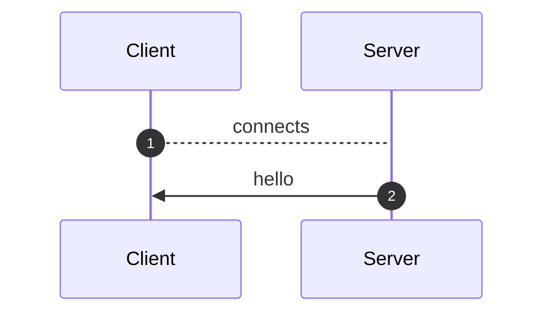
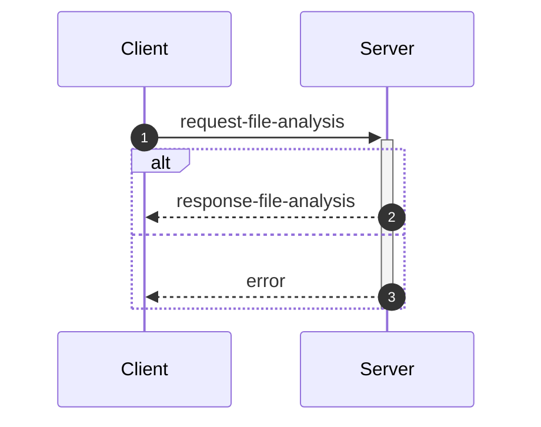
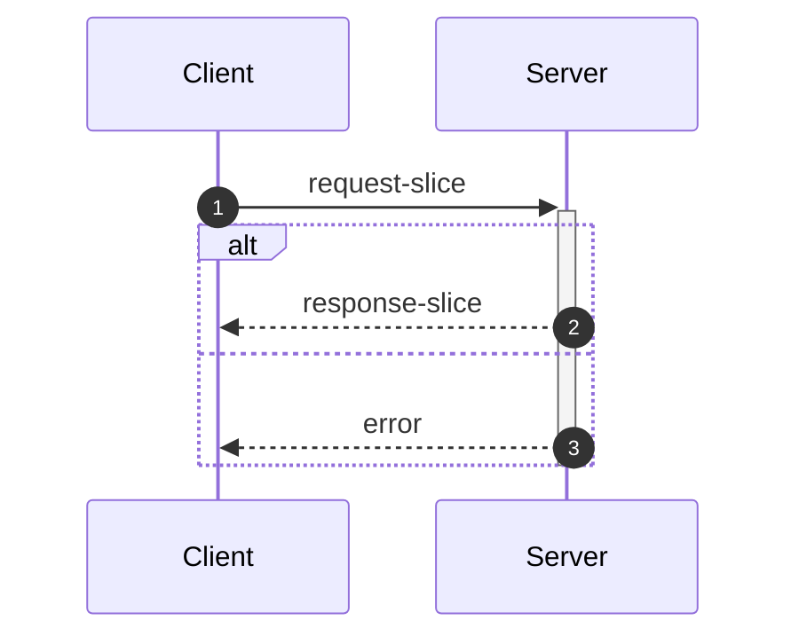
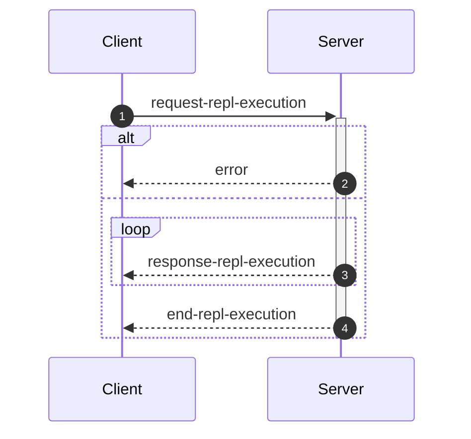

_This document was generated from '[src/documentation/wiki-interface.ts](https://github.com/flowr-analysis/flowr/tree/main//src/documentation/wiki-interface.ts)' on 2026-07-15, 10:36:52 UTC presenting an overview of flowR's interface (v2.12.3, using R v4.5.0). Please do not edit this file/wiki page directly._

Although far from being as detailed as the in-depth explanation of [_flowR_](https://github.com/flowr-analysis/flowr/wiki/core),
this wiki page explains how to interface with _flowR_ in more detail.
In general, command line arguments and other options provide short descriptions on hover over.

* [💻 Using the REPL](#using-the-repl)
* [⚙️ Configuring FlowR](#configuring-flowr)
* [⚒️ Writing Code](#writing-code)
* [💬 Communicating with the Server](#communicating-with-the-server)

<a id='using-the-repl'></a>
## 💻 Using the REPL


> [!NOTE]
> To execute arbitrary R commands with a repl request, _flowR_ has to be started explicitly with <span title="Description (Command Line Argument): Allow to access the underlying R session when using flowR (security warning: this allows the execution of arbitrary R code!)">`--r-session-access`</span>.
> Please be aware that this introduces a security risk and note that this relies on the [`r-shell` engine](https://github.com/flowr-analysis/flowr/wiki/engines) .

Although primarily meant for users to explore,
there is nothing which forbids simply calling _flowR_ as a subprocess to use standard-in, -output, and -error
for communication (although you can access the REPL using the server as well,
with the [REPL Request](#message-request-repl-execution) message).

The read-eval-print loop&nbsp;(REPL) works relatively simple.
You can submit an expression (using <kbd>Enter</kbd>),
which is interpreted as an R&nbsp;expression by default but interpreted as a *command* if it starts with a colon (`:`).
The best command to get started with the REPL is <span title="Description (Repl Command): Show help information (aliases: :h, :?)">`:help`</span>.
Besides, you can leave the REPL either with the command <span title="Description (Repl Command): End the repl (aliases: :q, :exit)">`:quit`</span> or by pressing <kbd>Ctrl</kbd>+<kbd>C</kbd> twice.
When writing a *command*, you may press <kbd>Tab</kbd> to get a list of completions, if available.
Multiple commands can be entered in a single line by separating them with a semicolon (`;`), e.g. `:parse "x<-2"; :df*`.
If a command is given without R code, the REPL will re-use R code given in a previous command.
The prior example will hence return first the parsed AST of the program and then the dataflow graph for `"x <- 2"`.

> [!NOTE]
> If you develop flowR, you may want to launch the repl using the `npm run main-dev` command, this way, you get a non-minified version of flowR with debug information and hot-reloading of source files.

<details>
<summary>Available Commands</summary>

We currently offer the following commands (this with a `[*]` suffix are available with and without the star):


| Command | Description |
| ------- | ----------- |
| **<span title="Description (Repl Command): End the repl (aliases: :q, :exit)">:quit</span>** | End the repl (aliases: **:<span title="Alias of ':quit'. End the repl">q</span>**, **:<span title="Alias of ':quit'. End the repl">exit</span>**) |
| **<span title="Description (Repl Command): Execute the given code as R code. This requires the `--r-session-access` flag to be set and requires the r-shell engine. (aliases: :e, :r)">:execute</span>** | Execute the given code as R code. This requires the `--r-session-access` flag to be set and requires the r-shell engine. (aliases: **:<span title="Alias of ':execute'. Execute the given code as R code. This requires the `--r-session-access` flag to be set and requires the r-shell engine.">e</span>**, **:<span title="Alias of ':execute'. Execute the given code as R code. This requires the `--r-session-access` flag to be set and requires the r-shell engine.">r</span>**) |
| **<span title="Description (Repl Command): Get mermaid code for the control-flow graph of R code (aliases: :cfg, :cf)">:controlflow[*]</span>** | Get mermaid code for the control-flow graph of R code (star: Returns the URL to mermaid.live) (aliases: **:<span title="Alias of ':controlflow'. Get mermaid code for the control-flow graph of R code">cfg</span>**, **:<span title="Alias of ':controlflow'. Get mermaid code for the control-flow graph of R code">cf</span>**) |
| **<span title="Description (Repl Command): Get mermaid code for the control-flow graph with basic blocks (aliases: :cfgb, :cfb)">:controlflowbb[*]</span>** | Get mermaid code for the control-flow graph with basic blocks (star: Returns the URL to mermaid.live) (aliases: **:<span title="Alias of ':controlflowbb'. Get mermaid code for the control-flow graph with basic blocks">cfgb</span>**, **:<span title="Alias of ':controlflowbb'. Get mermaid code for the control-flow graph with basic blocks">cfb</span>**) |
| **<span title="Description (Repl Command): Get mermaid code for the dataflow graph (aliases: :d, :df)">:dataflow[*]</span>** | Get mermaid code for the dataflow graph (star: Returns the URL to mermaid.live) (aliases: **:<span title="Alias of ':dataflow'. Get mermaid code for the dataflow graph">d</span>**, **:<span title="Alias of ':dataflow'. Get mermaid code for the dataflow graph">df</span>**) |
| **<span title="Description (Repl Command): Get mermaid code for the normalized AST of R code (aliases: :n)">:normalize[*]</span>** | Get mermaid code for the normalized AST of R code (star: Returns the URL to mermaid.live) (alias: **:<span title="Alias of ':normalize'. Get mermaid code for the normalized AST of R code">n</span>**) |
| **<span title="Description (Repl Command): Get mermaid code for the simplified dataflow graph (aliases: :ds, :dfs)">:dataflowsimple[*]</span>** | Get mermaid code for the simplified dataflow graph (star: Returns the URL to mermaid.live) (aliases: **:<span title="Alias of ':dataflowsimple'. Get mermaid code for the simplified dataflow graph">ds</span>**, **:<span title="Alias of ':dataflowsimple'. Get mermaid code for the simplified dataflow graph">dfs</span>**) |
| **<span title="Description (Repl Command): Inspect and extend the signature database: `query` (identical to :query @signature), `add <path>` to mount another database/source, `download` to fetch the full-history database. (aliases: :sig)">:signature</span>** | Inspect and extend the signature database: `query` (identical to :query @signature), `add <path>` to mount another database/source, `download` to fetch the full-history database. (alias: **:<span title="Alias of ':signature'. Inspect and extend the signature database: `query` (identical to :query @signature), `add <path>` to mount another database/source, `download` to fetch the full-history database.">sig</span>**) |
| **<span title="Description (Repl Command): Just calculates the DFG, but only prints summary info (aliases: :d#, :df#)">:dataflowsilent</span>** | Just calculates the DFG, but only prints summary info (aliases: **:<span title="Alias of ':dataflowsilent'. Just calculates the DFG, but only prints summary info">d#</span>**, **:<span title="Alias of ':dataflowsilent'. Just calculates the DFG, but only prints summary info">df#</span>**) |
| **<span title="Description (Repl Command): Prints ASCII Art of the parsed, unmodified AST (aliases: :p)">:parse</span>** | Prints ASCII Art of the parsed, unmodified AST (alias: **:<span title="Alias of ':parse'. Prints ASCII Art of the parsed, unmodified AST">p</span>**) |
| **<span title="Description (Repl Command): Prints the version of flowR as well as the current version of R">:version</span>** | Prints the version of flowR as well as the current version of R
| **<span title="Description (Repl Command): Query the given R code (use 'help' for more information)">:query[*]</span>** | Query the given R code (use 'help' for more information) (star: Similar to query, but returns the output in json format.)
| **<span title="Description (Repl Command): Returns an ASCII representation of the dataflow graph (aliases: :df!)">:dataflowascii</span>** | Returns an ASCII representation of the dataflow graph (alias: **:<span title="Alias of ':dataflowascii'. Returns an ASCII representation of the dataflow graph">df!</span>**) |
| **<span title="Description (Repl Command): Returns summarization stats for the normalized AST (aliases: :n#)">:normalize#</span>** | Returns summarization stats for the normalized AST (alias: **:<span title="Alias of ':normalize#'. Returns summarization stats for the normalized AST">n#</span>**) |
| **<span title="Description (Repl Command): Show help information (aliases: :h, :?)">:help</span>** | Show help information (aliases: **:<span title="Alias of ':help'. Show help information">h</span>**, **:<span title="Alias of ':help'. Show help information">?</span>**) |


</details>


> [!TIP]
> 
> As indicated by the examples before, all REPL commands that operate on code keep track of the state.
> Hence, if you run a command like <span title="Description (Repl Command, starred version): Returns the URL to mermaid.live; Base Command: Get mermaid code for the dataflow graph (aliases: :d*, :df*)">`:dataflow*`</span> without providing R code,
> the REPL will re-use the R code provided in a previous command.
> Likewise, doing this will benefit from incrementality!
> If you request the dataflow graph with `:df* x <- 2 * y` and then want to see the parsed AST with `:parse`,
> the REPL will re-use previously obtained information and not re-parse the code again.
> 		


Generally, many commands offer shortcut versions in the REPL. Many queries, for example, offer a shortened format (see the example below).
Of special note, the [Config Query](https://github.com/flowr-analysis/flowr/wiki/query-api#Config-Query)
can be used to also modify the currently active configuration of _flowR_ within the REPL (see the [wiki page](https://github.com/flowr-analysis/flowr/wiki/query-api#Config-Query) for more information).

### Example: Retrieving the Dataflow Graph

To retrieve a URL to the [mermaid](https://mermaid.js.org/) diagram of the dataflow of a given expression,
use <span title="Description (Repl Command, starred version): Returns the URL to mermaid.live; Base Command: Get mermaid code for the dataflow graph (aliases: :d*, :df*)">`:dataflow*`</span> (or <span title="Description (Repl Command): Get mermaid code for the dataflow graph (aliases: :d, :df)">`:dataflow`</span> to get the mermaid code in the cli):


```shell
$ docker run -it --rm eagleoutice/flowr # or npm run flowr 
flowR repl v2.12.3, R grammar v14 (tree-sitter engine)
R> :dataflow* y <- 1 + x
```

<details>
<summary style='color:gray'>Output</summary>


```text
https://mermaid.live/view#base64:eyJjb2RlIjoiZmxvd2NoYXJ0IEJUXG4gICAgMXt7XCJgKiM5MTtSTnVtYmVyIzkzOyogKioxKipcbiAgICAgICoxLjYqICgqKmlkOiAxKiopYFwifX1cbiAgICUlIE5vIGVkZ2VzIGZvdW5kIGZvciAxXG4gICAgMihbXCJgKiM5MTtSU3ltYm9sIzkzOyogKip4KipcbiAgICAgICoxLjEwKiAoKippZDogMioqKWBcIl0pXG4gICAlJSBObyBlZGdlcyBmb3VuZCBmb3IgMlxuICAgIDNbW1wiYCojOTE7UkJpbmFyeU9wIzkzOyogYmFzZSM1ODsjNTg7KiojNDM7KipcbiAgICAgICoxLjYtMTAqICgqKmlkOiAzKiopXG4gICAgYXJnOiAoMSwgMilgXCJdXVxuICAgIGJ1aWx0LWluOl9bXCJgQnVpbHQtSW46XG4jNDM7YFwiXVxuICAgIHN0eWxlIGJ1aWx0LWluOl8gc3Ryb2tlOmdyYXksZmlsbDpncmF5LHN0cm9rZS13aWR0aDoycHgsb3BhY2l0eTouODtcbiAgICAwW1wiYCojOTE7UlN5bWJvbCM5MzsqICoqeSoqXG4gICAgICAqMS4xKiAoKippZDogMCoqLCB2OiBbM10pYFwiXVxuICAgIDRbW1wiYCojOTE7UkJpbmFyeU9wIzkzOyogYmFzZSM1ODsjNTg7KiojNjA7IzQ1OyoqXG4gICAgICAqMS4xLTEwKiAoKippZDogNCoqKVxuICAgIGFyZzogKDAsIDMpYFwiXV1cbiAgICBidWlsdC1pbjpfLVtcImBCdWlsdC1JbjpcbiM2MDsjNDU7YFwiXVxuICAgIHN0eWxlIGJ1aWx0LWluOl8tIHN0cm9rZTpncmF5LGZpbGw6Z3JheSxzdHJva2Utd2lkdGg6MnB4LG9wYWNpdHk6Ljg7XG4gICAgMyAtLT58XCJyZWFkcywgYXJnXCJ8IDFcbiAgICAzIC0tPnxcInJlYWRzLCBhcmdcInwgMlxuICAgIDMgLS4tPnxcInJlYWRzLCBjYWxsc1wifCBidWlsdC1pbjpfXG4gICAgbGlua1N0eWxlIDIgc3Ryb2tlOmdyYXk7XG4gICAgMCAtLT58XCJkZWZpbmVkLWJ5XCJ8IDNcbiAgICAwIC0tPnxcImRlZmluZWQtYnlcInwgNFxuICAgIDQgLS0+fFwicmVhZHMsIGFyZ1wifCAzXG4gICAgNCAtLT58XCJyZXR1cm5zLCBhcmdcInwgMFxuICAgIDQgLS4tPnxcInJlYWRzLCBjYWxsc1wifCBidWlsdC1pbjpfLVxuICAgIGxpbmtTdHlsZSA3IHN0cm9rZTpncmF5OyIsIm1lcm1haWQiOnsiYXV0b1N5bmMiOnRydWV9fQ==
```


Retrieve the dataflow graph of the expression `y <- 1 + x`. It looks like this:


```mermaid
flowchart LR
    1{{"`*#91;RNumber#93;* **1**
      *1.6* (**id: 1**)`"}}
   %% No edges found for 1
    2(["`*#91;RSymbol#93;* **x**
      *1.10* (**id: 2**)`"])
   %% No edges found for 2
    3[["`*#91;RBinaryOp#93;* base#58;#58;**#43;**
      *1.6-10* (**id: 3**)
    arg: (1, 2)`"]]
    built-in:_["`Built-In:
#43;`"]
    style built-in:_ stroke:gray,fill:gray,stroke-width:2px,opacity:.8;
    0["`*#91;RSymbol#93;* **y**
      *1.1* (**id: 0**, v: [3])`"]
    4[["`*#91;RBinaryOp#93;* base#58;#58;**#60;#45;**
      *1.1-10* (**id: 4**)
    arg: (0, 3)`"]]
    built-in:_-["`Built-In:
#60;#45;`"]
    style built-in:_- stroke:gray,fill:gray,stroke-width:2px,opacity:.8;
    3 -->|"reads, arg"| 1
    3 -->|"reads, arg"| 2
    3 -.->|"reads, calls"| built-in:_
    linkStyle 2 stroke:gray;
    0 -->|"defined-by"| 3
    0 -->|"defined-by"| 4
    4 -->|"reads, arg"| 3
    4 -->|"returns, arg"| 0
    4 -.->|"reads, calls"| built-in:_-
    linkStyle 7 stroke:gray;
```

	
<details>

<summary style="color:gray">R Code of the Dataflow Graph</summary>

The analysis required _0.7 ms_ (including parse and normalize, using the [tree-sitter](https://github.com/flowr-analysis/flowr/wiki/Engines) engine) within the generation environment. No [signature database](https://github.com/flowr-analysis/flowr/wiki/Signature-Database) is mounted for these generated graphs, so `library()` calls attach no package exports; base-R names are still qualified via the generated base-package store (e.g. `acf` as `stats::acf`). 
We encountered no unknown side effects during the analysis.


```r
y <- 1 + x
```


</details>


</details>


For small graphs like this, <span title="Description (Repl Command): Returns an ASCII representation of the dataflow graph (aliases: :df!)">`:dataflowascii`</span> also provides an ASCII representation directly in the REPL:


```shell
$ docker run -it --rm eagleoutice/flowr # or npm run flowr 
flowR repl v2.12.3, R grammar v14 (tree-sitter engine)
R> :df! y <- 1 + x
```

<details open>
<summary style='color:gray'>Output</summary>


```text
                        0<1>0
                   ┌────| 1 |
    ┌────────┐     │    0---0
 c<4>c       └──c<3>c
 |<- |  v<0>v┌──| + |
 c---c──| y |┘  c---c   u<2>u
        v---v      └────| x |
                        u---u
Edges:
3 -> 1: reads, arg  3 -> 2: reads, arg
4 -> 3: reads, arg  4 -> 0: returns, arg
0 -> 3: defined-by  0 -> 4: defined-by
```


Retrieve the dataflow graph of the expression `y <- 1 + x` as ASCII art.

</details>


For the slicing with <span title="Description (Repl Command): Static backwards executable slicer for R">`:slicer`</span>, you have access to the same [magic comments](#slice-magic-comments) as with the [slice request](#message-request-slice).
Pass `--inline` to splice resolvable `source()` calls into the reconstruction so the slice is a single self-contained R text (the same as the static slice query's `inlineSources` flag).

### Example: Interfacing with the File System

Many commands that allow for an R-expression (like <span title="Description (Repl Command, starred version): Returns the URL to mermaid.live; Base Command: Get mermaid code for the dataflow graph (aliases: :d*, :df*)">`:dataflow*`</span>) allow for a file as well
if the argument starts with `file://`.
If you are working from the root directory of the _flowR_ repository, the following gives you the parsed AST of the example file using the <span title="Description (Repl Command): Prints ASCII Art of the parsed, unmodified AST (aliases: :p)">`:parse`</span> command:

> **Watch mode**: Replace `file://` with `watch://` to enter watch mode.
> flowR runs the command immediately and then re-runs it every time the file (or any file inside the folder) changes.
> Enter any other command to leave watch mode.
> For example: `:df watch://analysis.R`


```shell
$ docker run -it --rm eagleoutice/flowr # or npm run flowr 
flowR repl v2.12.3, R grammar v14 (tree-sitter engine)
R> :parse file://test/testfiles/example.R
```

<details>
<summary style='color:gray'>Output</summary>


```text
File: test/testfiles/example.R

program
├ binaryoperator
│ ├ identifier "sum" (1:1─4)
│ ├ <- "<-" (1:5─7)
│ ╰ float "0" (1:8─9)
├ binaryoperator
│ ├ identifier "product" (2:1─8)
│ ├ <- "<-" (2:9─11)
│ ╰ float "1" (2:12─13)
├ binaryoperator
│ ├ identifier "w" (3:1─2)
│ ├ <- "<-" (3:3─5)
│ ╰ float "7" (3:6─7)
├ binaryoperator
│ ├ identifier "N" (4:1─2)
│ ├ <- "<-" (4:3─5)
│ ╰ float "10" (4:6─8)
├ forstatement
│ ├ for "for" (6:1─4)
│ ├ ( "(" (6:5─6)
│ ├ identifier "i" (6:6─7)
│ ├ in "in" (6:8─10)
│ ├ binaryoperator
│ │ ├ float "1" (6:11─12)
│ │ ├ : ":" (6:12─13)
│ │ ╰ parenthesizedexpression
│ │   ├ ( "(" (6:13─14)
│ │   ├ binaryoperator
│ │   │ ├ identifier "N" (6:14─15)
│ │   │ ├ - "-" (6:15─16)
│ │   │ ╰ float "1" (6:16─17)
│ │   ╰ ) ")" (6:17─18)
│ ├ ) ")" (6:18─19)
│ ╰ bracedexpression
│   ├ { "{" (6:20─21)
│   ├ binaryoperator
│   │ ├ identifier "sum" (7:3─6)
│   │ ├ <- "<-" (7:7─9)
│   │ ╰ binaryoperator
│   │   ├ binaryoperator
│   │   │ ├ identifier "sum" (7:10─13)
│   │   │ ├ + "+" (7:14─15)
│   │   │ ╰ identifier "i" (7:16─17)
│   │   ├ + "+" (7:18─19)
│   │   ╰ identifier "w" (7:20─21)
│   ├ binaryoperator
│   │ ├ identifier "product" (8:3─10)
│   │ ├ <- "<-" (8:11─13)
│   │ ╰ binaryoperator
│   │   ├ identifier "product" (8:14─21)
│   │   ├  "" (8:22─23)
│   │   ╰ identifier "i" (8:24─25)
│   ╰ } "}" (9:1─2)
├ call
│ ├ identifier "cat" (11:1─4)
│ ╰ arguments
│   ├ ( "(" (11:4─5)
│   ├ argument
│   │ ╰ string
│   │   ├ " "\"" (11:5─6)
│   │   ├ stringcontent "Sum:" (11:6─10)
│   │   ╰ " "\"" (11:10─11)
│   ├ comma "," (11:11─12)
│   ├ argument
│   │ ╰ identifier "sum" (11:13─16)
│   ├ comma "," (11:16─17)
│   ├ argument
│   │ ╰ string
│   │   ├ " "\"" (11:18─19)
│   │   ├ stringcontent
│   │   │ ╰ escapesequence "\\n" (11:19─21)
│   │   ╰ " "\"" (11:21─22)
│   ╰ ) ")" (11:22─23)
╰ call
  ├ identifier "cat" (12:1─4)
  ╰ arguments
    ├ ( "(" (12:4─5)
    ├ argument
    │ ╰ string
    │   ├ " "\"" (12:5─6)
    │   ├ stringcontent "Product:" (12:6─14)
    │   ╰ " "\"" (12:14─15)
    ├ comma "," (12:15─16)
    ├ argument
    │ ╰ identifier "product" (12:17─24)
    ├ comma "," (12:24─25)
    ├ argument
    │ ╰ string
    │   ├ " "\"" (12:26─27)
    │   ├ stringcontent
    │   │ ╰ escapesequence "\\n" (12:27─29)
    │   ╰ " "\"" (12:29─30)
    ╰ ) ")" (12:30─31)
```


Retrieve the parsed AST of the example file.

<details>

<summary>File Content</summary>


```r
sum <- 0
product <- 1
w <- 7
N <- 10

for (i in 1:(N-1)) {
  sum <- sum + i + w
  product <- product * i
}

cat("Sum:", sum, "\n")
cat("Product:", product, "\n")
```


</details>

As _flowR_ directly transforms this AST the output focuses on being human-readable instead of being machine-readable.
		

</details>


### Example: Run a Query

You can run any query supported by _flowR_ using the <span title="Description (Repl Command): Query the given R code (use 'help' for more information)">`:query`</span> command.
For example, to obtain the shapes of all data frames in a given piece of code, you can run:


```shell
$ docker run -it --rm eagleoutice/flowr # or npm run flowr 
flowR repl v2.12.3, R grammar v14 (tree-sitter engine)
R> :query @absint df-shape "x <- data.frame(a = 1:10, b = 1:10)\ny <- x$a"
```

<details open>
<summary style='color:gray'>Output</summary>


```text
Query: absint (2 ms)
   ╰ $12: (colnames: [{"a", "b"}, {}], cols: [2, 2], rows: [10, 10])
   ╰ $0: (colnames: [{"a", "b"}, {}], cols: [2, 2], rows: [10, 10])
All queries together required ≈4 ms (1ms accuracy, total 5 ms)
```


Retrieve the shapes of all data frames in the given code.

</details>


To run the linter on a file, you can use (in this example, we just issue the `dead-code` linter on a small piece of code):


```shell
$ docker run -it --rm eagleoutice/flowr # or npm run flowr 
flowR repl v2.12.3, R grammar v14 (tree-sitter engine)
R> :query @linter rules:dead-code "if(FALSE) x <- 2"
```

<details open>
<summary style='color:gray'>Output</summary>


```text
Query: linter (0 ms)
   ╰ Dead Code (dead-code):
       ╰ certain:
           ╰ Code at 1.11-16
       ╰ Metadata: searchTimeMs: 0, processTimeMs: 0
All queries together required ≈0 ms (1ms accuracy, total 1 ms)
```


Run the linter on the given code, with only the `dead-code` rule enabled.

</details>


For more information on the available queries, please check out the [Query API](https://github.com/flowr-analysis/flowr/wiki/query-api).


<a id='configuring-flowr'></a>
## ⚙️ Configuring FlowR


When running _flowR_, you may want to specify some behaviors with a dedicated configuration file.
By default, flowR looks for a file named `flowr.json` in the current working directory (or any higher directory).
You can also specify a different file with <span title="Description (Command Line Argument): The name of the configuration file to use">`--config-file`</span> or pass the configuration inline using <span title="Description (Command Line Argument): The flowR configuration to use, as a JSON string">`--config-json`</span>.
To inspect the current configuration, you can run flowr with the <span title="Description (Command Line Argument): Run with verbose logging (will be passed to the corresponding script)">`--verbose`</span> flag, or use the `config` [Query](https://github.com/flowr-analysis/flowr/wiki/query-api).
Within the REPL this works by running the following:


```shell
:query @config
```


To work with the <a href="https://github.com/flowr-analysis/flowr/tree/main/src/config.ts#L122"><code><span title="The configuration file format for flowR.">FlowrConfig</span></code></a> you can use the provided helper objects alongside its methods like
<a href="https://github.com/flowr-analysis/flowr/tree/main/src/config.ts#L569"><code><span title="Creates a new flowr config that has the updated values.">FlowrConfig::<b>amend</b></span></code></a>.
The following summarizes the configuration options:

- `ignoreSourceCalls`: If set to `true`, _flowR_ will ignore source calls when analyzing the code, i.e., ignoring the inclusion of other files.
- `semantics`: allows to configure the way _flowR_ handles R, although we currently only support `semantics/environment/overwriteBuiltIns`.
  You may use this to overwrite _flowR_'s handling of built-in function and even completely clear the preset definitions shipped with flowR.
  See [Configure BuiltIn Semantics](#configure-builtin-semantics) for more information.
- `solver`: allows to configure how _flowR_ resolves variables and their values (currently we support: `disabled`, `alias`, `builtin`), as well as if pointer analysis should be active.
- `engines`: allows to configure the engines used by _flowR_ to interact with R code. See the [Engines wiki page](https://github.com/flowr-analysis/flowr/wiki/engines) for more information.
- `defaultEngine`: allows to specify the default engine to use for interacting with R code. If not set, an arbitrary engine from the specified list will be used.
- `abstractInterpretation`: allows to configure how _flowR_ performs abstract interpretation, although we currently only support data frame shape inference through abstract interpretation.
- `defaultPlugins`: allows to configure which plugins to load by default when creating a new <a href="https://github.com/flowr-analysis/flowr/tree/main/src/project/flowr-analyzer.ts#L162"><code><span title="Central class for conducting analyses with FlowR. Use the FlowrAnalyzerBuilder to create a new instance. If you want the original pattern of creating a pipeline and running all steps, you can still do this with FlowrAnalyzer#runFull . To inspect the context of the analyzer, use FlowrAnalyzer#inspectContext (if you are a plugin and need to modify it, use FlowrAnalyzer#context instead).">FlowrAnalyzer</span></code></a> instance.
- `repl.plugins`: allows to configure which plugins to load in the _flowR_ REPL. Use `flowr:default` to reference the plugins specified by `defaultPlugins`.

So you can configure _flowR_ by adding a file like the following:

<details>

<summary>Example Configuration File</summary>


```json
{
  "ignoreSourceCalls": true,
  "semantics": {
    "environment": {
      "overwriteBuiltIns": {
        "definitions": [
          {
            "type": "function",
            "names": [
              "foo"
            ],
            "processor": "builtin:assign",
            "config": {}
          }
        ]
      }
    }
  },
  "defaultPlugins": [
    "file:description",
    "versions:description"
  ],
  "repl": {
    "quickStats": false,
    "dfProcessorHeat": false,
    "hints": true,
    "plugins": [
      "flowr:default"
    ]
  },
  "project": {
    "resolveUnknownPathsOnDisk": true
  },
  "engines": [
    {
      "type": "r-shell"
    }
  ],
  "solver": {
    "variables": "alias",
    "evalStrings": true,
    "trackEnvironments": true,
    "sigdb": {
      "enabled": true,
      "loadProjectDependencies": true,
      "eagerlyLoad": false,
      "eagerlyLoadExports": false,
      "linkBaseR": false,
      "linkDescriptionDependencies": false
    },
    "resolveSource": {
      "dropPaths": "no",
      "ignoreCapitalization": true,
      "inferWorkingDirectory": "active-script",
      "searchPath": []
    },
    "instrument": {},
    "slicer": {
      "threshold": 50
    }
  },
  "abstractInterpretation": {
    "wideningThreshold": 4,
    "dataFrame": {
      "maxColNames": 20,
      "readLoadedData": {
        "readExternalFiles": true,
        "maxReadLines": 1000000
      }
    }
  },
  "gas": {
    "thresholds": {
      "memory": {
        "problematic": 0.7,
        "critical": 0.9
      },
      "timeMs": {
        "problematic": 100000,
        "critical": 120000
      }
    },
    "features": {}
  }
}
```


</details>

<details>
<a id='configure-builtin-semantics'></a>
<summary>Configure Built-In Semantics</summary>


`semantics/environment/overwriteBuiltins` accepts two keys:

- `loadDefaults` (boolean, initially `true`): If set to `true`, the default built-in definitions are loaded before applying the custom definitions. Setting this flag to `false` explicitly disables the loading of the default definitions.
- `definitions` (array, initially empty): Allows to overwrite or define new built-in elements. Each object within must have a `type` which is one of the below. Furthermore, they may define a string array of `names` which specifies the identifiers to bind the definitions to. You may use `assumePrimitive` to specify whether _flowR_ should assume that this is a primitive non-library definition (so you probably just do not want to specify the key).

  | Type            | Description                                                                                                                                                                                                                                                                                              | Example                                                                                                    |
  | --------------- | -------------------------------------------------------------------------------------------------------------------------------------------------------------------------------------------------------------------------------------------------------------------------------------------------------- | ---------------------------------------------------------------------------------------------------------- |
  | `constant`    | Additionally allows for a `value` this should resolve to.                                                                                                                                                                                                                                                | `{ type: 'constant', names: ['NULL', 'NA'],  value: null }`                                                |
  | `function`    | Is a rather flexible way to define and bind built-in functions. For the time, we do not have extensive documentation to cover all the cases, so please either consult the sources with the `default-builtin-config.ts` or open a [new issue](https://github.com/flowr-analysis/flowr/issues/new/choose). | `{ type: 'function', names: ['next'], processor: 'builtin:d', config: { cfg: ExitPointType.Next } }` |
  | `replacement` | A comfortable way to specify replacement functions like `$<-` or `names<-`. `suffixes` describes the... suffixes to attach automatically. | `{ type: 'replacement', suffixes: ['<-', '<<-'], names: ['[', '[['] }` |


</details>

<details>

<summary style='color:gray'>Full Configuration-File Schema</summary>

- _The configuration file format for flowR._ (object)
    - **ignoreSourceCalls** [optional] _Whether source calls should be ignored, causing {@link processSourceCall}'s behavior to be skipped._ (boolean)
    - **semantics** _Configure language semantics and how flowR handles them._ (object)
        - **environment** [optional] _Semantics regarding how to handle the R environment._ (object)
            - **overwriteBuiltIns** [optional] _Do you want to overwrite (parts) of the builtin definition?_ (object)
                - **loadDefaults** [optional] _Should the default configuration still be loaded?_ (boolean)
                - **definitions** [optional] _The definitions to load/overwrite._ (array)
                Valid item types:
                    - (object)
    - **defaultPlugins** [optional] _The default plugins to load when creating a new instance of FlowrAnalyzer_ (array)
    Valid item types:
        - (alternatives)
            - (string)
            - (array)
    - **repl** _Configuration options for the REPL._ (object)
        - **quickStats** [optional] _Whether to show quick stats in the REPL after each evaluation._ (boolean)
        - **dfProcessorHeat** [optional] _This instruments the dataflow processors to count how often each processor is called._ (boolean)
        - **hints** [optional] _Whether to show dim inline hints on the empty prompt (automatically disabled on non-interactive terminals)._ (boolean)
        - **plugins** [optional] _The plugins to load in REPL mode_ (array)
        Valid item types:
            - (alternatives)
                - (string)
                - (array)
    - **project** _Project specific configuration options._ (object)
        - **resolveUnknownPathsOnDisk** [optional] _Whether to resolve unknown paths loaded by the r project disk when trying to source/analyze files._ (boolean)
        - **basePackages** [optional] _The packages considered part of R itself (base and recommended); if unset, flowR uses its built-in list._ (array)
        Valid item types:
            - (string)
    - **engines** _The engine or set of engines to use for interacting with R code. An empty array means all available engines will be used._ (array)
    Valid item types:
        - (alternatives)
            - _The configuration for the tree sitter engine._ (object)
                - **type** [required] _Use the tree sitter engine._ (string)
                    Only allows: 'tree-sitter'
                - **wasmPath** [optional] _The path to the tree-sitter-r WASM binary to use. If this is undefined, this uses the default path._ (string)
                - **treeSitterWasmPath** [optional] _The path to the tree-sitter WASM binary to use. If this is undefined, this uses the default path._ (string)
                - **lax** [optional] _Whether to use the lax parser for parsing R code (allowing for syntax errors). If this is undefined, the strict parser will be used._ (boolean)
            - _The configuration for the R shell engine._ (object)
                - **type** [required] _Use the R shell engine._ (string)
                    Only allows: 'r-shell'
                - **rPath** [optional] _The path to the R executable to use. If this is undefined, this uses the default path._ (string)
    - **defaultEngine** [optional] _The default engine to use for interacting with R code. If this is undefined, an arbitrary engine from the specified list will be used._ (string)
        Only allows: 'tree-sitter', 'r-shell'
    - **solver** _How to resolve constants, constraints, cells, ..._ (object)
        - **variables** _How to resolve variables and their values._ (string)
            Only allows: 'disabled', 'alias', 'builtin'
        - **evalStrings** _Should we include eval(parse(text="...")) calls in the dataflow graph?_ (boolean)
        - **trackEnvironments** [optional] _Track user-created environments (new.env, assign/get/local with envir=, dollar-assign, attach). When false, all envir-style calls fall through conservatively._ (boolean)
        - **sigdb** _Resolving library exports from a signature database._ (object)
            - **enabled** [optional] _Resolve library()/use() exports from a signature database (default true); when false no database is consulted._ (boolean)
            - **loadProjectDependencies** [optional] _Load the project's declared dependencies from its metadata files (DESCRIPTION Imports/Depends, renv.lock, rv.lock) (default true); when false these files are not read for dependencies._ (boolean)
            - **eagerlyLoad** [optional] _Parse the database up front rather than on the first package load (default false, ignored if disabled)._ (boolean)
            - **eagerlyLoadExports** [optional] _Add a vertex for every export on load rather than on demand (default false); keeps the dataflow graph small._ (boolean)
            - **assumedRVersion** [optional] _R version assumed when resolving versioned (base-R) exports: a pin like "4.5" or "auto" to detect the installed R (default "auto")._ (string)
            - **linkBaseR** [optional] _Eagerly attach base-R namespaces so bare base calls resolve without library() (default false)._ (boolean)
            - **linkBaseRCalls** [optional] _Add a lightweight Reads edge from a bare base-R call to its signature-database function vertex (default false; base-R qualification is edge-free otherwise)._ (boolean)
            - **linkPackageCalls** [optional] _Add a lightweight Reads edge from a resolved package call to its signature-database function vertex (default false)._ (boolean)
            - **linkDescriptionDependencies** [optional] _Eagerly attach the namespaces of the project's declared DESCRIPTION dependencies (Imports/Depends) so their exports resolve without an explicit library() (default false)._ (boolean)
            - **warmInBackground** [optional] _Decompress the hot shards (base + most-downloaded) in a background task on startup so the first library() lookup is warm (default false; for long-running servers/REPLs)._ (boolean)
            - **additionalPaths** [optional] _Extra directories or bundle/manifest files searched for signature databases (alongside the shipped default and $FLOWR_SIGDB_DIR); a downloaded full-history bundle placed here is mounted automatically._ (array)
            Valid item types:
                - (string)
            - **downloadRepo** [optional] _GitHub owner/repo the full-history bundle is downloaded from via ":signature download" (default "flowr-analysis/flowr", release tag "sigdb-v<flowR-version>")._ (string)
            - **autoSync** [optional] _On startup, re-download shards whose committed sigdb.remote.json hash no longer matches the cache, in the background (default false; opt-in network sync after a git pull)._ (boolean)
            - **versionSelection** [optional] _When a project constrains a dependency, resolve to the newest (default), oldest, or system-installed version satisfying it; system needs R and falls back to newest. Base-R packages always resolve against the assumed R version._ (string)
                Only allows: 'newest', 'oldest', 'system'
            - **versionOverrides** [optional] _Force an exact version for specific packages (name -> version), overriding both the project constraint and the versionSelection policy (default {})._ (object)
        - **instrument** (object)
            - **dataflowExtractors** [optional] _These keys are only intended for use within code, allowing to instrument the dataflow analyzer!_ (any)
        - **resolveSource** [optional] _If lax source calls are active, flowR searches for sourced files much more freely, based on the configurations you give it. This option is only in effect if `ignoreSourceCalls` is set to false._ (object)
            - **dropPaths** _Allow to drop the first or all parts of the sourced path, if it is relative._ (string)
                Only allows: 'no', 'once', 'all'
            - **ignoreCapitalization** _Search for filenames matching in the lowercase._ (boolean)
            - **inferWorkingDirectory** _Try to infer the working directory from the main or any script to analyze._ (string)
                Only allows: 'no', 'main-script', 'active-script', 'any-script'
            - **searchPath** _Additionally search in these paths._ (array)
            Valid item types:
                - (string)
            - **repeatedSourceLimit** [optional] _How often the same file can be sourced within a single run? Please be aware: in case of cyclic sources this may not reach a fixpoint so give this a sensible limit._ (number)
            - **applyReplacements** _Provide name replacements for loaded files_ (array)
            Valid item types:
                - (object)
        - **slicer** [optional] _The configuration for the slicer._ (object)
            - **threshold** [optional] _The maximum number of iterations to perform on a single function call during slicing._ (number)
            - **autoExtend** [optional] _If set, the slicer will gain an additional post-pass._ (boolean)
    - **abstractInterpretation** _The configuration options for abstract interpretation._ (object)
        - **wideningThreshold** _The threshold for the number of visitations of a node at which widening should be performed to ensure the termination of the fixpoint iteration._ (number)
        - **dataFrame** _The configuration of the shape inference for data frames._ (object)
            - **maxColNames** _The maximum number of columns names to infer for data frames before over-approximating the column names to top._ (number)
            - **readLoadedData** _Configuration options for reading data frame shapes from loaded external data files, such as CSV files._ (object)
                - **readExternalFiles** _Whether data frame shapes should be extracted from loaded external files, such as CSV files._ (boolean)
                - **maxReadLines** _The maximum number of lines to read when extracting data frame shapes from loaded files, such as CSV files._ (number)
    - **gas** [optional] _Resource-usage guard (gas) configuration. All feature factors default to 0 (disabled). See https://github.com/flowr-analysis/flowr/wiki/Core#gas-resource-guard._ (object)
        - **thresholds** [optional] _Shared thresholds for all gas checks (scaled by per-feature factor)._ (object)
            - **memory** [optional] _Heap-usage fraction thresholds (0-1)._ (object)
                - **problematic** [optional] _Heap fraction (0-1) above which Problematic is returned._ (number)
                - **critical** [optional] _Heap fraction (0-1) above which Critical is returned._ (number)
            - **timeMs** [optional] _Elapsed analysis time thresholds in milliseconds._ (object)
                - **problematic** [optional] _Elapsed ms above which Problematic is returned._ (number)
                - **critical** [optional] _Elapsed ms above which Critical is returned._ (number)
        - **features** [optional] _Per-feature sensitivity factors. 0 or absent disables gas checking for that feature. A factor of 2 makes the feature twice as sensitive. Recognised keys: `source`, `side-effect-linking`, `linter`._ (object)
        - **heapProvider** [optional] _Custom heap statistics source (programmatic configs only), overriding the built-in v8/performance.memory detection._ (function)

</details>

	

<a id='writing-code'></a>
## ⚒️ Writing Code

_flowR_ can be used as a [module](https://www.npmjs.com/package/@eagleoutice/flowr) and offers several main classes and interfaces that are interesting for extension writers 
(see the [Visual Studio Code extension](https://marketplace.visualstudio.com/items?itemName=code-inspect.vscode-flowr) or the [Core](https://github.com/flowr-analysis/flowr/wiki/core) wiki page for more information).

### Creating Analyses with _flowR_

Nowadays, instances of the <a href="https://github.com/flowr-analysis/flowr/tree/main/src/project/flowr-analyzer.ts#L162"><code><span title="Central class for conducting analyses with FlowR. Use the FlowrAnalyzerBuilder to create a new instance. If you want the original pattern of creating a pipeline and running all steps, you can still do this with FlowrAnalyzer#runFull . To inspect the context of the analyzer, use FlowrAnalyzer#inspectContext (if you are a plugin and need to modify it, use FlowrAnalyzer#context instead).">FlowrAnalyzer</span></code></a> should be used as central frontend to get analysis results from _flowR_.
For example, a program slice can be created like this:


```ts
const analyzer = await new FlowrAnalyzerBuilder()
    .setEngine('tree-sitter')
    .build();
analyzer.addRequest('x <- 1\ny <- x\nx');
const result = await analyzer.query([
    {
        type:     'static-slice',
        criteria: ['3@x']
    }
]);
//console.log(result['static-slice']);
```


For more information, please have a look at the [Analyzer](https://github.com/flowr-analysis/flowr/wiki/analyzer) wiki page, which explains how to construct and use the <a href="https://github.com/flowr-analysis/flowr/tree/main/src/project/flowr-analyzer.ts#L162"><code><span title="Central class for conducting analyses with FlowR. Use the FlowrAnalyzerBuilder to create a new instance. If you want the original pattern of creating a pipeline and running all steps, you can still do this with FlowrAnalyzer#runFull . To inspect the context of the analyzer, use FlowrAnalyzer#inspectContext (if you are a plugin and need to modify it, use FlowrAnalyzer#context instead).">FlowrAnalyzer</span></code></a> in more detail.
To work with specific perspectives, you can also consult the respective pages like the [Dataflow Graph](https://github.com/flowr-analysis/flowr/wiki/dataflow-graph) or the [Abstract Interpretation](https://github.com/flowr-analysis/flowr/wiki/abstract-interpretation) wiki pages.
### The Pipeline Executor (Low-Level Interface)

Once, in the beginning, _flowR_ was meant to produce a dataflow graph merely to provide *program slices*. 
However, with continuous updates, the [Dataflow Graph](https://github.com/flowr-analysis/flowr/wiki/dataflow-graph) repeatedly proves to be the more interesting part.
With this, we restructured _flowR_'s originally *hardcoded* pipeline to be far more flexible. 
Now, it can be theoretically extended or replaced with arbitrary steps, optional steps, and what we call 'decorations' of these steps. 
In short, a slicing pipeline using the <a href="https://github.com/flowr-analysis/flowr/tree/main/src/core/pipeline-executor.ts#L97"><code><span title="**Please note:** The PipelineExecutor is now considered to be a rather low-level API for flowR. While it still works and is the basis for all other layers, we strongly recommend using the FlowrAnalyzer and its builder to create and use an analyzer instance that is pre-configured for your use-case. The pipeline executor allows to execute arbitrary pipelines in a step-by-step fashion. If you are not...">PipelineExecutor</span></code></a> looks like this:


```ts

const slicer = new PipelineExecutor(DEFAULT_SLICING_PIPELINE, {
  parser:    new RShell(),
  request:   requestFromInput('x <- 1\nx + 1'),
  criterion: ['2@x']
})
const slice = await slicer.allRemainingSteps()
// console.log(slice.reconstruct.code)
```


<details><summary>More Information</summary>


If you compare this, with what you would have done with the old (and removed) `SteppingSlicer`, 
this essentially just requires you to replace the `SteppingSlicer` with the <a href="https://github.com/flowr-analysis/flowr/tree/main/src/core/pipeline-executor.ts#L97"><code><span title="**Please note:** The PipelineExecutor is now considered to be a rather low-level API for flowR. While it still works and is the basis for all other layers, we strongly recommend using the FlowrAnalyzer and its builder to create and use an analyzer instance that is pre-configured for your use-case. The pipeline executor allows to execute arbitrary pipelines in a step-by-step fashion. If you are not...">PipelineExecutor</span></code></a>
and to pass the <a href="https://github.com/flowr-analysis/flowr/tree/main/src/core/steps/pipeline/default-pipelines.ts#L18"><code>DEFAULT_SLICING_PIPELINE</code></a> as the first argument.
The <a href="https://github.com/flowr-analysis/flowr/tree/main/src/core/pipeline-executor.ts#L97"><code><span title="**Please note:** The PipelineExecutor is now considered to be a rather low-level API for flowR. While it still works and is the basis for all other layers, we strongly recommend using the FlowrAnalyzer and its builder to create and use an analyzer instance that is pre-configured for your use-case. The pipeline executor allows to execute arbitrary pipelines in a step-by-step fashion. If you are not...">PipelineExecutor</span></code></a>...

1. Provides structures to investigate the results of all intermediate steps
2. Can be executed step-by-step
3. Can repeat steps (e.g., to calculate multiple slices on the same input)

See the in-code documentation for more information.


</details>

### Using the <a href="https://github.com/flowr-analysis/flowr/tree/main/src/r-bridge/shell.ts#L143"><code><span title="The RShell represents an interactive session with the R interpreter. You can configure it by RShellOptions . At the moment we are using a live R session (and not networking etc.) to communicate with R easily, which allows us to install packages etc. However, this might and probably will change in the future (leaving this as a legacy mode :D)">RShell</span></code></a> to Interact with R

The <a href="https://github.com/flowr-analysis/flowr/tree/main/src/r-bridge/shell.ts#L143"><code><span title="The RShell represents an interactive session with the R interpreter. You can configure it by RShellOptions . At the moment we are using a live R session (and not networking etc.) to communicate with R easily, which allows us to install packages etc. However, this might and probably will change in the future (leaving this as a legacy mode :D)">RShell</span></code></a> class allows interfacing with the `R`&nbsp;ecosystem installed on the host system.
Please have a look at [flowR's Engines](https://github.com/flowr-analysis/flowr/wiki/engines) for more information on alternatives (for example, the <a href="https://github.com/flowr-analysis/flowr/tree/main/src/r-bridge/lang-4.x/tree-sitter/tree-sitter-executor.ts#L18"><code><span title="Synchronous and (way) faster alternative to the RShell using tree-sitter.">TreeSitterExecutor</span></code></a>).


> [!IMPORTANT]
> 
> Each <a href="https://github.com/flowr-analysis/flowr/tree/main/src/r-bridge/shell.ts#L143"><code><span title="The RShell represents an interactive session with the R interpreter. You can configure it by RShellOptions . At the moment we are using a live R session (and not networking etc.) to communicate with R easily, which allows us to install packages etc. However, this might and probably will change in the future (leaving this as a legacy mode :D)">RShell</span></code></a> controls a new instance of the R&nbsp;interpreter, 
> make sure to call <code><a href="https://github.com/flowr-analysis/flowr/tree/main/src/r-bridge/shell.ts#L351"><span title="Close the current R session, makes the object effectively invalid (can no longer be reopened etc.)">RShell::<i>close</i></span></a>()</code> when you are done.


You can start a new "session" simply by constructing a new object with <code>new <a href="https://github.com/flowr-analysis/flowr/tree/main/src/r-bridge/shell.ts#L143"><span title="The RShell represents an interactive session with the R interpreter. You can configure it by RShellOptions . At the moment we are using a live R session (and not networking etc.) to communicate with R easily, which allows us to install packages etc. However, this might and probably will change in the future (leaving this as a legacy mode :D)">RShell</span></a>()</code>.

However, there are several options that may be of interest 
(e.g., to automatically revive the shell in case of errors or to control the name location of the R process on the system).

With a shell object (let's call it `shell`), you can execute R code by using <a href="https://github.com/flowr-analysis/flowr/tree/main/src/r-bridge/shell.ts#L212"><code><span title="sends the given command directly to the current R session will not do anything to alter input markers!">RShell::<i>sendCommand</i></span></code></a>,
for example <code>shell.<a href="https://github.com/flowr-analysis/flowr/tree/main/src/r-bridge/shell.ts#L212"><span title="sends the given command directly to the current R session will not do anything to alter input markers!">sendCommand</span></a>("1 + 1")</code>.
However, this does not return anything, so if you want to collect the output of your command, use
<a href="https://github.com/flowr-analysis/flowr/tree/main/src/r-bridge/shell.ts#L295"><code><span title="Send a command and collect the output">RShell::<i>sendCommandWithOutput</i></span></code></a> instead.


<a id='communicating-with-the-server'></a>
## 💬 Communicating with the Server


As explained in the [Overview](https://github.com/flowr-analysis/flowr/wiki/overview), you can simply run the [TCP](https://de.wikipedia.org/wiki/Transmission_Control_Protocol)&nbsp;server by adding the <span title="Description (Command Line Argument): Do not drop into a repl, but instead start a server on the given port (default: 1042) and listen for messages.">`--server`</span> flag (and, due to the interactive mode, exit with the conventional <kbd>CTRL</kbd>+<kbd>C</kbd>).
Currently, every connection is handled by the same underlying `RShell` - so the server is not designed to handle many clients at a time.
Additionally, the server is not well guarded against attacks (e.g., you can theoretically spawn an arbitrary number of&nbsp;RShell sessions on the target machine).

Every message has to be given in a single line (i.e., without a newline in-between) and end with a newline character. Nevertheless, we will pretty-print example given in the following segments for the ease of reading.


> [!NOTE]
> 
> The default <span title="Description (Command Line Argument): Do not drop into a repl, but instead start a server on the given port (default: 1042) and listen for messages.">`--server`</span> uses a simple [TCP](https://de.wikipedia.org/wiki/Transmission_Control_Protocol)
> connection. If you want _flowR_ to expose a [WebSocket](https://de.wikipedia.org/wiki/WebSocket) server instead, add the <span title="Description (Command Line Argument): If the server flag is set, use websocket for messaging">`--ws`</span> flag (i.e., <span title="Description (Command Line Argument): Do not drop into a repl, but instead start a server on the given port (default: 1042) and listen for messages.">`--server`</span> <span title="Description (Command Line Argument): If the server flag is set, use websocket for messaging">`--ws`</span>) when starting _flowR_ from the command line.


<ul><li>
<a id="message-hello"></a>
<b>Hello</b> Message (<code>hello</code>) 
<details>

<summary style="color:gray"> View Details. <i>The server informs the client about the successful connection and provides Meta-Information.</i> </summary>


```mermaid
sequenceDiagram
    autonumber
    participant Client
    participant Server

    
    Client-->Server: connects
    Server->>Client: hello
	
```


	
After launching _flowR_, for example, with <code>docker run -it --rm eagleoutice/flowr <span title="Description (Command Line Argument): Do not drop into a repl, but instead start a server on the given port (default: 1042) and listen for messages.">-<span/>-server</span></code>&nbsp;(🐳️), simply connecting should present you with a `hello` message, that amongst others should reveal the versions of&nbsp;_flowR_ and&nbsp;R, using the [semver 2.0](https://semver.org/spec/v2.0.0.html) versioning scheme.
The message looks like this:


```json
{
  "type": "hello",
  "clientName": "client-0",
  "versions": {
    "flowr": "2.12.3",
    "r": "4.5.0",
    "engine": "r-shell"
  }
}
```


There are currently a few messages that you can send after the hello message.
If you want to _slice_ a piece of R code you first have to send an [analysis request](#message-request-file-analysis), so that you can send one or multiple slice requests afterward.
Requests for the [REPL](#message-request-repl) are independent of that.
	

<hr>


<details>
<summary style="color:gray">Message schema (<code>hello</code>)</summary>

For the definition of the hello message, please see it's implementation at [`./src/cli/repl/server/messages/message-hello.ts`](https://github.com/flowr-analysis/flowr/tree/main/./src/cli/repl/server/messages/message-hello.ts).

- [required] (object)
    - **type** [required] _The type of the hello message._ (string)
        Only allows: 'hello'
    - **id** [forbidden] _The id of the message is always undefined (as it is the initial message and not requested)._ (any)
    - **clientName** [required] _A unique name that is assigned to each client. It has no semantic meaning and is only used/useful for debugging._ (string)
    - **versions** [required] (object)
        - **flowr** [required] _The version of the flowr server running in semver format._ (string)
        - **r** [required] _The version of the underlying R shell running in semver format._ (string)
        - **engine** [required] _The parser backend that is used to parse the R code._ (string)

</details>


<hr>

</details>
	</li>

<li>
<a id="message-request-file-analysis"></a>
<b>Analysis</b> Message (<code>request-file-analysis</code>) 
<details>

<summary style="color:gray"> View Details. <i>The server builds the dataflow graph for a given input file (or a set of files).</i> </summary>


```mermaid
sequenceDiagram
    autonumber
    participant Client
    participant Server

    
    Client->>+Server: request-file-analysis
    alt
        Server-->>Client: response-file-analysis
    else
        Server-->>Client: error
    end
    deactivate  Server
	
```


	
The request allows the server to analyze a file and prepare it for slicing.
The message can contain a `filetoken`, which is used to identify the file in later slice or query requests (if you do not add one, the request will not be stored and therefore, it is not available for subsequent requests).

> **Please note!**\
> If you want to send and process a lot of analysis requests, but do not want to slice them, please do not pass the `filetoken` field. This will save the server a lot of memory allocation.

Furthermore, the request must contain either a `content` field to directly pass the file's content or a `filepath` field which contains the path to the file (this path must be accessible for the server to be useful).
If you add the `id` field, the answer will use the same `id` so you can match requests and the corresponding answers.
See the implementation of the request-file-analysis message for more information.

You can drop one or more stored file tokens by adding the `invalidateToken` field (a single token or an array of tokens).
The server frees the corresponding analyses _after_ it has answered the request.

> **Tip!**\
> If you only want to drop tokens, you do not need a separate message: send a `request-file-analysis` that contains _just_ the `invalidateToken` field (and no `content` or `filepath`).
> Such a request behaves like an empty file analysis and the server replies with an empty `results` object.
> Because invalidation happens after the response, you may even pass the _current_ `filetoken` in `invalidateToken` to analyze a file once and have the server forget it right after you received the results.


<details>
<summary>Example of the <code>request-file-analysis</code> Message</summary>

_Note:_ even though we pretty-print these messages, they are sent as a single line, ending with a newline.

The following lists all messages that were sent and received in case you want to reproduce the scenario:

<ol>
<li> <code>hello</code> (response)
<details> 

<summary> Show Details </summary>

The first message is always a hello message.


```json
{
  "type": "hello",
  "clientName": "client-0",
  "versions": {
    "flowr": "2.12.3",
    "r": "4.5.0",
    "engine": "r-shell"
  }
}
```


</details>
</li>

<li> <b><code>request-file-analysis</code> (request)</b>
<details open> 

<summary> Show Details </summary>

Let's suppose you simply want to analyze the following script:
 
```r
x <- 1
x + 1
```

 For this, you can send the following request:


```json
{
  "type": "request-file-analysis",
  "id": "1",
  "filetoken": "x",
  "content": "x <- 1\nx + 1"
}
```


</details>
</li>

<li> <code>response-file-analysis</code> (response)
<details> 

<summary> Show Details </summary>


The `results` field of the response effectively contains three keys of importance:

- `parse`: which contains 1:1 the parse result in CSV format that we received from the `RShell` (i.e., the AST produced by the parser of the R interpreter).
- `normalize`: which contains the normalized AST, including ids (see the `info` field and the [Normalized AST](https://github.com/flowr-analysis/flowr/wiki/normalized-ast) wiki page).
- `dataflow`: especially important is the `graph` field which contains the dataflow graph as a set of root vertices (see the [Dataflow Graph](https://github.com/flowr-analysis/flowr/wiki/dataflow-graph) wiki page).
			


_As the code is pretty long, we inhibit pretty printing and syntax highlighting (JSON, hiding built-in):_

```text
{"type":"response-file-analysis","format":"json","id":"1","results":{"parse":{"files":[{"parsed":"[1,1,1,6,7,0,\"expr\",false,\"x <- 1\"],[1,1,1,1,1,3,\"SYMBOL\",true,\"x\"],[1,1,1,1,3,7,\"expr\",false,\"x\"],[1,3,1,4,2,7,\"LEFT_ASSIGN\",true,\"<-\"],[1,6,1,6,4,5,\"NUM_CONST\",true,\"1\"],[1,6,1,6,5,7,\"expr\",false,\"1\"],[2,1,2,5,16,0,\"expr\",false,\"x + 1\"],[2,1,2,1,10,12,\"SYMBOL\",true,\"x\"],[2,1,2,1,12,16,\"expr\",false,\"x\"],[2,3,2,3,11,16,\"'+'\",true,\"+\"],[2,5,2,5,13,14,\"NUM_CONST\",true,\"1\"],[2,5,2,5,14,16,\"expr\",false,\"1\"]","filePath":"/tmp/tmp-9030-X1ofBaTrNg0M-.R"}],".meta":{"timing":1}},"normalize":{"ast":{"type":"RProject","files":[{"root":{"type":"RExpressionList","children":[{"type":"RBinaryOp","location":[1,3,1,4],"lhs":{"type":"RSymbol","location":[1,1,1,1],"content":"x","lexeme":"x","info":{"fullRange":[1,1,1,1],"adToks":[],"id":0,"parent":2,"role":"bin-l","index":0,"nest":0,"file":"/tmp/tmp-9030-X1ofBaTrNg0M-.R"}},"rhs":{"location":[1,6,1,6],"lexeme":"1","info":{"fullRange":[1,6,1,6],"adToks":[],"id":1,"parent":2,"role":"bin-r","index":1,"nest":0,"file":"/tmp/tmp-9030-X1ofBaTrNg0M-.R"},"type":"RNumber","content":{"num":1,"complexNumber":false,"markedAsInt":false}},"operator":"<-","lexeme":"<-","info":{"fullRange":[1,1,1,6],"adToks":[],"id":2,"parent":6,"nest":0,"file":"/tmp/tmp-9030-X1ofBaTrNg0M-.R","index":0,"role":"el-c"}},{"type":"RBinaryOp","location":[2,3,2,3],"lhs":{"type":"RSymbol","location":[2,1,2,1],"content":"x","lexeme":"x","info":{"fullRange":[2,1,2,1],"adToks":[],"id":3,"parent":5,"role":"bin-l","index":0,"nest":0,"file":"/tmp/tmp-9030-X1ofBaTrNg0M-.R"}},"rhs":{"location":[2,5,2,5],"lexeme":"1","info":{"fullRange":[2,5,2,5],"adToks":[],"id":4,"parent":5,"role":"bin-r","index":1,"nest":0,"file":"/tmp/tmp-9030-X1ofBaTrNg0M-.R"},"type":"RNumber","content":{"num":1,"complexNumber":false,"markedAsInt":false}},"operator":"+","lexeme":"+","info":{"fullRange":[2,1,2,5],"adToks":[],"id":5,"parent":6,"nest":0,"file":"/tmp/tmp-9030-X1ofBaTrNg0M-.R","index":1,"role":"el-c"}}],"info":{"adToks":[],"id":6,"nest":0,"file":"/tmp/tmp-9030-X1ofBaTrNg0M-.R","role":"root","index":0}},"filePath":"/tmp/tmp-9030-X1ofBaTrNg0M-.R"}],"info":{"id":7}},".meta":{"timing":1}},"dataflow":{"unknownReferences":[],"in":[{"nodeId":2,"name":"<-","type":2},{"nodeId":5,"name":"+","type":2}],"out":[{"nodeId":0,"name":"x","type":4,"definedAt":2,"value":[1]}],"environment":{"current":{"id":1709,"parent":"<BuiltInEnvironment>","memory":[["x",[{"nodeId":0,"name":"x","type":4,"definedAt":2,"value":[1]}]]],"globalEnv":true},"level":0},"graph":{"rootVertices":[1,0,2,3,4,5],"vertexInformation":[[1,{"tag":"value","id":1}],[0,{"tag":"vdef","id":0,"source":[1]}],[2,{"tag":"fcall","id":2,"name":"<-","onlyBuiltin":true,"args":[{"nodeId":0,"type":32},{"nodeId":1,"type":32}],"origin":["builtin:assign"]}],[3,{"tag":"use","id":3}],[4,{"tag":"value","id":4}],[5,{"tag":"fcall","id":5,"name":"+","onlyBuiltin":true,"args":[{"nodeId":3,"type":32},{"nodeId":4,"type":32}],"origin":["builtin:d"]}]],"edgeInformation":[[2,[[1,{"types":65}],[0,{"types":72}],["built-in:<-",{"types":5}]]],[0,[[1,{"types":2}],[2,{"types":2}]]],[3,[[0,{"types":1}]]],[5,[[3,{"types":65}],[4,{"types":65}],["built-in:+",{"types":5}]]]],"_unknownSideEffects":[]},"entryPoint":2,"exitPoints":[{"type":0,"nodeId":5}],"hooks":[],".meta":{"timing":0}}}}
```


</details>
</li>
</ol>

The complete round-trip took 11.0 ms (including time required to validate the messages, start, and stop the internal mock server).

</details>


You receive an error if, for whatever reason, the analysis fails (e.g., the message or code you sent contained syntax errors).
It contains a human-readable description *why* the analysis failed (see the error message implementation for more details).


<details>
<summary>Example Error Message</summary>

_Note:_ even though we pretty-print these messages, they are sent as a single line, ending with a newline.

The following lists all messages that were sent and received in case you want to reproduce the scenario:

<ol>
<li> <code>hello</code> (response)
<details> 

<summary> Show Details </summary>

The first message is always a hello message.


```json
{
  "type": "hello",
  "clientName": "client-0",
  "versions": {
    "flowr": "2.12.3",
    "r": "4.5.0",
    "engine": "r-shell"
  }
}
```


</details>
</li>

<li> <code>request-file-analysis</code> (request)
<details> 

<summary> Show Details </summary>


```json
{
  "type": "request-file-analysis",
  "id": "1",
  "filename": "sample.R",
  "content": "x <-"
}
```


</details>
</li>

<li> <b><code>error</code> (response)</b>
<details open> 

<summary> Show Details </summary>


```json
{
  "id": "1",
  "type": "error",
  "fatal": false,
  "reason": "Error while analyzing file sample.R: GuardError: unable to parse R code (see the log for more information) for request {\"request\":\"text\",\"content\":\"x <-\"}}\n Report a Bug: https://github.com/flowr-analysis/flowr/issues/new?body=%3C!%2D%2D%20Please%20describe%20your%20issue%20in%20more%20detail%20below!%20%2D%2D%3E%0A%0A%0A%3C!%2D%2D%20Automatically%20generated%20issue%20metadata%2C%20please%20do%20not%20edit%20or%20delete%20content%20below%20this%20line%20%2D%2D%3E%0A%2D%2D%2D%0A%0AflowR%20version%3A%202.12.3%0Anode%20version%3A%20v25.6.1%0Anode%20arch%3A%20x64%0Anode%20platform%3A%20linux%0Amessage%3A%20%60unable%20to%20parse%20R%20code%20%28see%20the%20log%20for%20more%20information%29%20for%20request%20%7B%22request%22%3A%22text%22%2C%22content%22%3A%22x%20%3C%2D%22%7D%7D%60%0Astack%20trace%3A%0A%60%60%60%0A%20%20%20%20at%20guard%20%28%3C%3E%2Fsrc%2Futil%2Fassert.ts%3A128%3A9%29%0A%20%20%20%20at%20guardRetrievedOutput%20%28%3C%3E%2Fsrc%2Fr%2Dbridge%2Fretriever.ts%3A224%3A7%29%0A%20%20%20%20at%20%2Fhome%2Frunner%2Fwork%2Fflowr%2Fflowr%2Fsrc%2Fr%2Dbridge%2Fretriever.ts%3A185%3A4%0A%20%20%20%20at%20processTicksAndRejections%20%28node%3Ainternal%2Fprocess%2Ftask_queues%3A104%3A5%29%0A%20%20%20%20at%20async%20Object.parseRequests%20%5Bas%20processor%5D%20%28%3C%3E%2Fsrc%2Fr%2Dbridge%2Fparser.ts%3A98%3A19%29%0A%20%20%20%20at%20async%20PipelineExecutor.nextStep%20%28%3C%3E%2Fsrc%2Fcore%2Fpipeline%2Dexecutor.ts%3A192%3A25%29%0A%20%20%20%20at%20async%20FlowrAnalyzerCache.runTapeUntil%20%28%3C%3E%2Fsrc%2Fproject%2Fcache%2Fflowr%2Danalyzer%2Dcache.ts%3A101%3A4%29%0A%20%20%20%20at%20async%20FlowRServerConnection.sendFileAnalysisResponse%20%28%3C%3E%2Fsrc%2Fcli%2Frepl%2Fserver%2Fconnection.ts%3A211%3A53%29%0A%60%60%60%0A%0A%2D%2D%2D%0A%09"
}
```


</details>
</li>
</ol>

The complete round-trip took 8.0 ms (including time required to validate the messages, start, and stop the internal mock server).

</details>


&nbsp;

<a id="analysis-include-cfg"></a>
**Including the Control Flow Graph**

While _flowR_ does (for the time being) not use an explicit control flow graph but instead relies on control-dependency edges within the dataflow graph, 
the respective structure can still be exposed using the server (note that, as this feature is not needed within _flowR_, it is tested significantly less - 
so please create a [new issue](https://github.com/flowr-analysis/flowr/issues/new/choose) for any bug you may encounter).
For this, the analysis request may add `cfg: true` to its list of options.


<details>
<summary>Requesting a Control Flow Graph</summary>

_Note:_ even though we pretty-print these messages, they are sent as a single line, ending with a newline.

The following lists all messages that were sent and received in case you want to reproduce the scenario:

<ol>
<li> <code>hello</code> (response)
<details> 

<summary> Show Details </summary>

The first message is always a hello message.


```json
{
  "type": "hello",
  "clientName": "client-0",
  "versions": {
    "flowr": "2.12.3",
    "r": "4.5.0",
    "engine": "r-shell"
  }
}
```


</details>
</li>

<li> <b><code>request-file-analysis</code> (request)</b>
<details open> 

<summary> Show Details </summary>


```json
{
  "type": "request-file-analysis",
  "id": "1",
  "filetoken": "x",
  "content": "if(unknown > 0) { x <- 2 } else { x <- 5 }\nfor(i in 1:x) { print(x); print(i) }",
  "cfg": true
}
```


</details>
</li>

<li> <code>response-file-analysis</code> (response)
<details> 

<summary> Show Details </summary>


The response looks basically the same as a response sent without the `cfg` flag. However, additionally it contains a `cfg` field. 
If you are interested in a visual representation of the control flow graph, see the 
[visualization with mermaid](https://mermaid.live/view#base64:eyJjb2RlIjoiZmxvd2NoYXJ0IEJUXG4gICAgbjMyKFtcImBSRXhwcmVzc2lvbkxpc3QgKDMyKWBcIl0pXG4gICAgbjE1W1wiYFJJZlRoZW5FbHNlICgxNSlcbiMzNDtpZih1bmtub3duICM2MjsgMCkgIzEyMzsgeCAjNjA7IzQ1OyAyICMxMjU7IGVsc2UgIzEyMzsgeCAjNjA7IzQ1OyA1ICMxMjU7IzM0O2BcIl1cbiAgICBuMTUtZVtbMTUtZV1dXG4gICAgbjAoW1wiYFJTeW1ib2wgKDApXG4jMzQ7dW5rbm93biMzNDtgXCJdKVxuICAgIG4xKFtcImBSTnVtYmVyICgxKVxuIzM0OzAjMzQ7YFwiXSlcbiAgICBuMihbXCJgUkJpbmFyeU9wICgyKVxuIzM0O3Vua25vd24gIzYyOyAwIzM0O2BcIl0pXG4gICAgbjItZVtbMi1lXV1cbiAgICBuOChbXCJgUkV4cHJlc3Npb25MaXN0ICg4KWBcIl0pXG4gICAgbjUoW1wiYFJTeW1ib2wgKDUpXG4jMzQ7eCMzNDtgXCJdKVxuICAgIG42KFtcImBSTnVtYmVyICg2KVxuIzM0OzIjMzQ7YFwiXSlcbiAgICBuNyhbXCJgUkJpbmFyeU9wICg3KVxuIzM0O3ggIzYwOyM0NTsgMiMzNDtgXCJdKVxuICAgIG43LWVbWzctZV1dXG4gICAgbjgtZVtbOC1lXV1cbiAgICBuMTQoW1wiYFJFeHByZXNzaW9uTGlzdCAoMTQpYFwiXSlcbiAgICBuMTEoW1wiYFJTeW1ib2wgKDExKVxuIzM0O3gjMzQ7YFwiXSlcbiAgICBuMTIoW1wiYFJOdW1iZXIgKDEyKVxuIzM0OzUjMzQ7YFwiXSlcbiAgICBuMTMoW1wiYFJCaW5hcnlPcCAoMTMpXG4jMzQ7eCAjNjA7IzQ1OyA1IzM0O2BcIl0pXG4gICAgbjEzLWVbWzEzLWVdXVxuICAgIG4xNC1lW1sxNC1lXV1cbiAgICBuMTYoW1wiYFJTeW1ib2wgKDE2KVxuIzM0O2kjMzQ7YFwiXSlcbiAgICBuMzFbXCJgUkZvckxvb3AgKDMxKVxuIzM0O2ZvcihpIGluIDEjNTg7eCkgIzEyMzsgcHJpbnQoeCk7IHByaW50KGkpICMxMjU7IzM0O2BcIl1cbiAgICBuMTcoW1wiYFJOdW1iZXIgKDE3KVxuIzM0OzEjMzQ7YFwiXSlcbiAgICBuMTgoW1wiYFJTeW1ib2wgKDE4KVxuIzM0O3gjMzQ7YFwiXSlcbiAgICBuMTkoW1wiYFJCaW5hcnlPcCAoMTkpXG4jMzQ7MSM1ODt4IzM0O2BcIl0pXG4gICAgbjE5LWVbWzE5LWVdXVxuICAgIG4zMChbXCJgUkV4cHJlc3Npb25MaXN0ICgzMClgXCJdKVxuICAgIG4yMihbXCJgUlN5bWJvbCAoMjIpXG4jMzQ7cHJpbnQoeCkjMzQ7YFwiXSlcbiAgICBuMjVbXCJgUkZ1bmN0aW9uQ2FsbCAoMjUpXG4jMzQ7cHJpbnQoeCkjMzQ7YFwiXVxuICAgIG4yNS1lW1syNS1lXV1cbiAgICBuMjQoW1wiYFJBcmd1bWVudCAoMjQpXG4jMzQ7eCMzNDtgXCJdKVxuICAgIG4yMyhbXCJgUlN5bWJvbCAoMjMpXG4jMzQ7eCMzNDtgXCJdKVxuICAgIG4yNC1lW1syNC1lXV1cbiAgICBuMjYoW1wiYFJTeW1ib2wgKDI2KVxuIzM0O3ByaW50KGkpIzM0O2BcIl0pXG4gICAgbjI5W1wiYFJGdW5jdGlvbkNhbGwgKDI5KVxuIzM0O3ByaW50KGkpIzM0O2BcIl1cbiAgICBuMjktZVtbMjktZV1dXG4gICAgbjI4KFtcImBSQXJndW1lbnQgKDI4KVxuIzM0O2kjMzQ7YFwiXSlcbiAgICBuMjcoW1wiYFJTeW1ib2wgKDI3KVxuIzM0O2kjMzQ7YFwiXSlcbiAgICBuMjgtZVtbMjgtZV1dXG4gICAgbjMwLWVbWzMwLWVdXVxuICAgIG4zMS1lW1szMS1lXV1cbiAgICBuMzItZVtbMzItZV1dXG4gICAgbjE1IC0uLT58XCJGRFwifCBuMzJcbiAgICBuMSAtLi0+fFwiRkRcInwgbjBcbiAgICBuMCAtLi0+fFwiRkRcInwgbjJcbiAgICBuMi1lIC0uLT58XCJGRFwifCBuMVxuICAgIG43IC0uLT58XCJGRFwifCBuOFxuICAgIG42IC0uLT58XCJGRFwifCBuNVxuICAgIG41IC0uLT58XCJGRFwifCBuN1xuICAgIG43LWUgLS4tPnxcIkZEXCJ8IG42XG4gICAgbjgtZSAtLi0+fFwiRkRcInwgbjctZVxuICAgIG4xMyAtLi0+fFwiRkRcInwgbjE0XG4gICAgbjEyIC0uLT58XCJGRFwifCBuMTFcbiAgICBuMTEgLS4tPnxcIkZEXCJ8IG4xM1xuICAgIG4xMy1lIC0uLT58XCJGRFwifCBuMTJcbiAgICBuMTQtZSAtLi0+fFwiRkRcInwgbjEzLWVcbiAgICBuOCAtLT58XCJDRCAoVFJVRSlcInwgbjItZVxuICAgIG4xNCAtLT58XCJDRCAoRkFMU0UpXCJ8IG4yLWVcbiAgICBuMiAtLi0+fFwiRkRcInwgbjE1XG4gICAgbjE1LWUgLS4tPnxcIkZEXCJ8IG44LWVcbiAgICBuMTUtZSAtLi0+fFwiRkRcInwgbjE0LWVcbiAgICBuMzEgLS4tPnxcIkZEXCJ8IG4xNS1lXG4gICAgbjMxIC0uLT58XCJGRFwifCBuMzAtZVxuICAgIG4xOCAtLi0+fFwiRkRcInwgbjE3XG4gICAgbjE3IC0uLT58XCJGRFwifCBuMTlcbiAgICBuMTktZSAtLi0+fFwiRkRcInwgbjE4XG4gICAgbjI1IC0uLT58XCJGRFwifCBuMzBcbiAgICBuMjIgLS4tPnxcIkZEXCJ8IG4yNVxuICAgIG4yMyAtLi0+fFwiRkRcInwgbjI0XG4gICAgbjI0LWUgLS4tPnxcIkZEXCJ8IG4yM1xuICAgIG4yNCAtLi0+fFwiRkRcInwgbjIyXG4gICAgbjI1LWUgLS4tPnxcIkZEXCJ8IG4yNC1lXG4gICAgbjI5IC0uLT58XCJGRFwifCBuMjUtZVxuICAgIG4yNiAtLi0+fFwiRkRcInwgbjI5XG4gICAgbjI3IC0uLT58XCJGRFwifCBuMjhcbiAgICBuMjgtZSAtLi0+fFwiRkRcInwgbjI3XG4gICAgbjI4IC0uLT58XCJGRFwifCBuMjZcbiAgICBuMjktZSAtLi0+fFwiRkRcInwgbjI4LWVcbiAgICBuMzAtZSAtLi0+fFwiRkRcInwgbjI5LWVcbiAgICBuMTkgLS4tPnxcIkZEXCJ8IG4zMVxuICAgIG4xNiAtLi0+fFwiRkRcInwgbjE5LWVcbiAgICBuMzAgLS0+fFwiQ0QgKFRSVUUpXCJ8IG4xNlxuICAgIG4zMS1lIC0tPnxcIkNEIChGQUxTRSlcInwgbjE2XG4gICAgbjMyLWUgLS4tPnxcIkZEXCJ8IG4zMS1lXG4gICAgc3R5bGUgbjMyIHN0cm9rZTpjeWFuLHN0cm9rZS13aWR0aDo2LjVweDsgICAgc3R5bGUgbjMyLWUgc3Ryb2tlOmdyZWVuLHN0cm9rZS13aWR0aDo2LjVweDsiLCJtZXJtYWlkIjp7ImF1dG9TeW5jIjp0cnVlfX0=).
			


_As the code is pretty long, we inhibit pretty printing and syntax highlighting (JSON, hiding built-in):_

```text
{"type":"response-file-analysis","format":"json","id":"1","cfg":{"returns":[],"entryPoints":[32],"exitPoints":["32-e"],"breaks":[],"nexts":[],"graph":{"roots":[32,15,"15-e",0,1,2,"2-e",8,5,6,7,"7-e","8-e",14,11,12,13,"13-e","14-e",16,31,17,18,19,"19-e",30,22,25,"25-e",24,23,"24-e",26,29,"29-e",28,27,"28-e","30-e","31-e","32-e"],"vtxInfos":[[32,[2,32,null,["32-e"]]],[15,[1,15,["2-e"],["15-e"]]],["15-e","15-e"],[0,[2,0]],[1,[2,1]],[2,[2,2,null,["2-e"]]],["2-e","2-e"],[8,[2,8,null,["8-e"]]],[5,[2,5]],[6,[2,6]],[7,[2,7,null,["7-e"]]],["7-e","7-e"],["8-e","8-e"],[14,[2,14,null,["14-e"]]],[11,[2,11]],[12,[2,12]],[13,[2,13,null,["13-e"]]],["13-e","13-e"],["14-e","14-e"],[16,[2,16]],[31,[1,31,[16],["31-e"]]],[17,[2,17]],[18,[2,18]],[19,[2,19,null,["19-e"]]],["19-e","19-e"],[30,[2,30,null,["30-e"]]],[22,[2,22]],[25,[1,25,[22],["25-e"]]],["25-e","25-e"],[24,[2,24,[24],["24-e"]]],[23,[2,23]],["24-e","24-e"],[26,[2,26]],[29,[1,29,[26],["29-e"]]],["29-e","29-e"],[28,[2,28,[28],["28-e"]]],[27,[2,27]],["28-e","28-e"],["30-e","30-e"],["31-e","31-e"],["32-e","32-e"]],"bbChildren":[],"edgeInfos":[[15,[[32,0]]],[1,[[0,0]]],[0,[[2,0]]],["2-e",[[1,0]]],[7,[[8,0]]],[6,[[5,0]]],[5,[[7,0]]],["7-e",[[6,0]]],["8-e",[["7-e",0]]],[13,[[14,0]]],[12,[[11,0]]],[11,[[13,0]]],["13-e",[[12,0]]],["14-e",[["13-e",0]]],[8,[["2-e",[15,"TRUE"]]]],[14,[["2-e",[15,"FALSE"]]]],[2,[[15,0]]],["15-e",[["8-e",0],["14-e",0]]],[31,[["15-e",0],["30-e",0]]],[18,[[17,0]]],[17,[[19,0]]],["19-e",[[18,0]]],[25,[[30,0]]],[22,[[25,0]]],[23,[[24,0]]],["24-e",[[23,0]]],[24,[[22,0]]],["25-e",[["24-e",0]]],[29,[["25-e",0]]],[26,[[29,0]]],[27,[[28,0]]],["28-e",[[27,0]]],[28,[[26,0]]],["29-e",[["28-e",0]]],["30-e",[["29-e",0]]],[19,[[31,0]]],[16,[["19-e",0]]],[30,[[16,[31,"TRUE"]]]],["31-e",[[16,[31,"FALSE"]]]],["32-e",[["31-e",0]]]],"revEdgeInfos":[[32,[[15,0]]],[0,[[1,0]]],[2,[[0,0]]],[1,[["2-e",0]]],[8,[[7,0]]],[5,[[6,0]]],[7,[[5,0]]],[6,[["7-e",0]]],["7-e",[["8-e",0]]],[14,[[13,0]]],[11,[[12,0]]],[13,[[11,0]]],[12,[["13-e",0]]],["13-e",[["14-e",0]]],["2-e",[[8,[15,"TRUE"]],[14,[15,"FALSE"]]]],[15,[[2,0]]],["8-e",[["15-e",0]]],["14-e",[["15-e",0]]],["15-e",[[31,0]]],[17,[[18,0]]],[19,[[17,0]]],[18,[["19-e",0]]],[30,[[25,0]]],[25,[[22,0]]],[24,[[23,0]]],[23,[["24-e",0]]],[22,[[24,0]]],["24-e",[["25-e",0]]],["25-e",[[29,0]]],[29,[[26,0]]],[28,[[27,0]]],[27,[["28-e",0]]],[26,[[28,0]]],["28-e",[["29-e",0]]],["29-e",[["30-e",0]]],[31,[[19,0]]],["19-e",[[16,0]]],[16,[[30,[31,"TRUE"]],["31-e",[31,"FALSE"]]]],["30-e",[[31,0]]],["31-e",[["32-e",0]]]],"_mayBB":false}},"results":{"parse":{"files":[{"parsed":"[1,1,1,42,38,0,\"expr\",false,\"if(unknown > 0) { x <- 2 } else { x <- 5 }\"],[1,1,1,2,1,38,\"IF\",true,\"if\"],[1,3,1,3,2,38,\"'('\",true,\"(\"],[1,4,1,14,9,38,\"expr\",false,\"unknown > 0\"],[1,4,1,10,3,5,\"SYMBOL\",true,\"unknown\"],[1,4,1,10,5,9,\"expr\",false,\"unknown\"],[1,12,1,12,4,9,\"GT\",true,\">\"],[1,14,1,14,6,7,\"NUM_CONST\",true,\"0\"],[1,14,1,14,7,9,\"expr\",false,\"0\"],[1,15,1,15,8,38,\"')'\",true,\")\"],[1,17,1,26,22,38,\"expr\",false,\"{ x <- 2 }\"],[1,17,1,17,12,22,\"'{'\",true,\"{\"],[1,19,1,24,19,22,\"expr\",false,\"x <- 2\"],[1,19,1,19,13,15,\"SYMBOL\",true,\"x\"],[1,19,1,19,15,19,\"expr\",false,\"x\"],[1,21,1,22,14,19,\"LEFT_ASSIGN\",true,\"<-\"],[1,24,1,24,16,17,\"NUM_CONST\",true,\"2\"],[1,24,1,24,17,19,\"expr\",false,\"2\"],[1,26,1,26,18,22,\"'}'\",true,\"}\"],[1,28,1,31,23,38,\"ELSE\",true,\"else\"],[1,33,1,42,35,38,\"expr\",false,\"{ x <- 5 }\"],[1,33,1,33,25,35,\"'{'\",true,\"{\"],[1,35,1,40,32,35,\"expr\",false,\"x <- 5\"],[1,35,1,35,26,28,\"SYMBOL\",true,\"x\"],[1,35,1,35,28,32,\"expr\",false,\"x\"],[1,37,1,38,27,32,\"LEFT_ASSIGN\",true,\"<-\"],[1,40,1,40,29,30,\"NUM_CONST\",true,\"5\"],[1,40,1,40,30,32,\"expr\",false,\"5\"],[1,42,1,42,31,35,\"'}'\",true,\"}\"],[2,1,2,36,84,0,\"expr\",false,\"for(i in 1:x) { print(x); print(i) }\"],[2,1,2,3,41,84,\"FOR\",true,\"for\"],[2,4,2,13,53,84,\"forcond\",false,\"(i in 1:x)\"],[2,4,2,4,42,53,\"'('\",true,\"(\"],[2,5,2,5,43,53,\"SYMBOL\",true,\"i\"],[2,7,2,8,44,53,\"IN\",true,\"in\"],[2,10,2,12,51,53,\"expr\",false,\"1:x\"],[2,10,2,10,45,46,\"NUM_CONST\",true,\"1\"],[2,10,2,10,46,51,\"expr\",false,\"1\"],[2,11,2,11,47,51,\"':'\",true,\":\"],[2,12,2,12,48,50,\"SYMBOL\",true,\"x\"],[2,12,2,12,50,51,\"expr\",false,\"x\"],[2,13,2,13,49,53,\"')'\",true,\")\"],[2,15,2,36,81,84,\"expr\",false,\"{ print(x); print(i) }\"],[2,15,2,15,54,81,\"'{'\",true,\"{\"],[2,17,2,24,64,81,\"expr\",false,\"print(x)\"],[2,17,2,21,55,57,\"SYMBOL_FUNCTION_CALL\",true,\"print\"],[2,17,2,21,57,64,\"expr\",false,\"print\"],[2,22,2,22,56,64,\"'('\",true,\"(\"],[2,23,2,23,58,60,\"SYMBOL\",true,\"x\"],[2,23,2,23,60,64,\"expr\",false,\"x\"],[2,24,2,24,59,64,\"')'\",true,\")\"],[2,25,2,25,65,81,\"';'\",true,\";\"],[2,27,2,34,77,81,\"expr\",false,\"print(i)\"],[2,27,2,31,68,70,\"SYMBOL_FUNCTION_CALL\",true,\"print\"],[2,27,2,31,70,77,\"expr\",false,\"print\"],[2,32,2,32,69,77,\"'('\",true,\"(\"],[2,33,2,33,71,73,\"SYMBOL\",true,\"i\"],[2,33,2,33,73,77,\"expr\",false,\"i\"],[2,34,2,34,72,77,\"')'\",true,\")\"],[2,36,2,36,78,81,\"'}'\",true,\"}\"]","filePath":"/tmp/tmp-9030-6XSOPbrIKI4h-.R"}],".meta":{"timing":3}},"normalize":{"ast":{"type":"RProject","files":[{"root":{"type":"RExpressionList","children":[{"type":"RIfThenElse","condition":{"type":"RBinaryOp","location":[1,12,1,12],"lhs":{"type":"RSymbol","location":[1,4,1,10],"content":"unknown","lexeme":"unknown","info":{"fullRange":[1,4,1,10],"adToks":[],"id":0,"parent":2,"role":"bin-l","index":0,"nest":1,"file":"/tmp/tmp-9030-6XSOPbrIKI4h-.R"}},"rhs":{"location":[1,14,1,14],"lexeme":"0","info":{"fullRange":[1,14,1,14],"adToks":[],"id":1,"parent":2,"role":"bin-r","index":1,"nest":1,"file":"/tmp/tmp-9030-6XSOPbrIKI4h-.R"},"type":"RNumber","content":{"num":0,"complexNumber":false,"markedAsInt":false}},"operator":">","lexeme":">","info":{"fullRange":[1,4,1,14],"adToks":[],"id":2,"parent":15,"nest":1,"file":"/tmp/tmp-9030-6XSOPbrIKI4h-.R","role":"if-c"}},"then":{"type":"RExpressionList","children":[{"type":"RBinaryOp","location":[1,21,1,22],"lhs":{"type":"RSymbol","location":[1,19,1,19],"content":"x","lexeme":"x","info":{"fullRange":[1,19,1,19],"adToks":[],"id":5,"parent":7,"role":"bin-l","index":0,"nest":1,"file":"/tmp/tmp-9030-6XSOPbrIKI4h-.R"}},"rhs":{"location":[1,24,1,24],"lexeme":"2","info":{"fullRange":[1,24,1,24],"adToks":[],"id":6,"parent":7,"role":"bin-r","index":1,"nest":1,"file":"/tmp/tmp-9030-6XSOPbrIKI4h-.R"},"type":"RNumber","content":{"num":2,"complexNumber":false,"markedAsInt":false}},"operator":"<-","lexeme":"<-","info":{"fullRange":[1,19,1,24],"adToks":[],"id":7,"parent":8,"nest":1,"file":"/tmp/tmp-9030-6XSOPbrIKI4h-.R","index":0,"role":"el-c"}}],"grouping":[{"type":"RSymbol","location":[1,17,1,17],"content":"{","lexeme":"{","info":{"fullRange":[1,17,1,26],"adToks":[],"id":3,"role":"el-g","index":0,"nest":1,"file":"/tmp/tmp-9030-6XSOPbrIKI4h-.R"}},{"type":"RSymbol","location":[1,26,1,26],"content":"}","lexeme":"}","info":{"fullRange":[1,17,1,26],"adToks":[],"id":4,"role":"el-g","index":0,"nest":1,"file":"/tmp/tmp-9030-6XSOPbrIKI4h-.R"}}],"info":{"adToks":[],"id":8,"parent":15,"nest":1,"file":"/tmp/tmp-9030-6XSOPbrIKI4h-.R","index":1,"role":"if-then"}},"location":[1,1,1,2],"lexeme":"if","info":{"fullRange":[1,1,1,42],"adToks":[],"id":15,"parent":32,"nest":1,"file":"/tmp/tmp-9030-6XSOPbrIKI4h-.R","index":0,"role":"el-c"},"otherwise":{"type":"RExpressionList","children":[{"type":"RBinaryOp","location":[1,37,1,38],"lhs":{"type":"RSymbol","location":[1,35,1,35],"content":"x","lexeme":"x","info":{"fullRange":[1,35,1,35],"adToks":[],"id":11,"parent":13,"role":"bin-l","index":0,"nest":1,"file":"/tmp/tmp-9030-6XSOPbrIKI4h-.R"}},"rhs":{"location":[1,40,1,40],"lexeme":"5","info":{"fullRange":[1,40,1,40],"adToks":[],"id":12,"parent":13,"role":"bin-r","index":1,"nest":1,"file":"/tmp/tmp-9030-6XSOPbrIKI4h-.R"},"type":"RNumber","content":{"num":5,"complexNumber":false,"markedAsInt":false}},"operator":"<-","lexeme":"<-","info":{"fullRange":[1,35,1,40],"adToks":[],"id":13,"parent":14,"nest":1,"file":"/tmp/tmp-9030-6XSOPbrIKI4h-.R","index":0,"role":"el-c"}}],"grouping":[{"type":"RSymbol","location":[1,33,1,33],"content":"{","lexeme":"{","info":{"fullRange":[1,33,1,42],"adToks":[],"id":9,"role":"el-g","index":0,"nest":1,"file":"/tmp/tmp-9030-6XSOPbrIKI4h-.R"}},{"type":"RSymbol","location":[1,42,1,42],"content":"}","lexeme":"}","info":{"fullRange":[1,33,1,42],"adToks":[],"id":10,"role":"el-g","index":0,"nest":1,"file":"/tmp/tmp-9030-6XSOPbrIKI4h-.R"}}],"info":{"adToks":[],"id":14,"parent":15,"nest":1,"file":"/tmp/tmp-9030-6XSOPbrIKI4h-.R","index":2,"role":"if-other"}}},{"type":"RForLoop","variable":{"type":"RSymbol","location":[2,5,2,5],"content":"i","lexeme":"i","info":{"adToks":[],"id":16,"parent":31,"role":"for-var","index":0,"nest":1,"file":"/tmp/tmp-9030-6XSOPbrIKI4h-.R"}},"vector":{"type":"RBinaryOp","location":[2,11,2,11],"lhs":{"location":[2,10,2,10],"lexeme":"1","info":{"fullRange":[2,10,2,10],"adToks":[],"id":17,"parent":19,"role":"bin-l","index":0,"nest":1,"file":"/tmp/tmp-9030-6XSOPbrIKI4h-.R"},"type":"RNumber","content":{"num":1,"complexNumber":false,"markedAsInt":false}},"rhs":{"type":"RSymbol","location":[2,12,2,12],"content":"x","lexeme":"x","info":{"fullRange":[2,12,2,12],"adToks":[],"id":18,"parent":19,"role":"bin-r","index":1,"nest":1,"file":"/tmp/tmp-9030-6XSOPbrIKI4h-.R"}},"operator":":","lexeme":":","info":{"fullRange":[2,10,2,12],"adToks":[],"id":19,"parent":31,"nest":1,"file":"/tmp/tmp-9030-6XSOPbrIKI4h-.R","index":1,"role":"for-vec"}},"body":{"type":"RExpressionList","children":[{"type":"RFunctionCall","named":true,"location":[2,17,2,21],"lexeme":"print","functionName":{"type":"RSymbol","location":[2,17,2,21],"content":"print","lexeme":"print","info":{"fullRange":[2,17,2,24],"adToks":[],"id":22,"parent":25,"role":"call-name","index":0,"nest":1,"file":"/tmp/tmp-9030-6XSOPbrIKI4h-.R"}},"arguments":[{"type":"RArgument","location":[2,23,2,23],"lexeme":"x","value":{"type":"RSymbol","location":[2,23,2,23],"content":"x","lexeme":"x","info":{"fullRange":[2,23,2,23],"adToks":[],"id":23,"parent":24,"role":"arg-v","index":0,"nest":1,"file":"/tmp/tmp-9030-6XSOPbrIKI4h-.R"}},"info":{"fullRange":[2,23,2,23],"adToks":[],"id":24,"parent":25,"nest":1,"file":"/tmp/tmp-9030-6XSOPbrIKI4h-.R","index":1,"role":"call-arg"}}],"info":{"fullRange":[2,17,2,24],"adToks":[],"id":25,"parent":30,"nest":1,"file":"/tmp/tmp-9030-6XSOPbrIKI4h-.R","index":0,"role":"el-c"}},{"type":"RFunctionCall","named":true,"location":[2,27,2,31],"lexeme":"print","functionName":{"type":"RSymbol","location":[2,27,2,31],"content":"print","lexeme":"print","info":{"fullRange":[2,27,2,34],"adToks":[],"id":26,"parent":29,"role":"call-name","index":0,"nest":1,"file":"/tmp/tmp-9030-6XSOPbrIKI4h-.R"}},"arguments":[{"type":"RArgument","location":[2,33,2,33],"lexeme":"i","value":{"type":"RSymbol","location":[2,33,2,33],"content":"i","lexeme":"i","info":{"fullRange":[2,33,2,33],"adToks":[],"id":27,"parent":28,"role":"arg-v","index":0,"nest":1,"file":"/tmp/tmp-9030-6XSOPbrIKI4h-.R"}},"info":{"fullRange":[2,33,2,33],"adToks":[],"id":28,"parent":29,"nest":1,"file":"/tmp/tmp-9030-6XSOPbrIKI4h-.R","index":1,"role":"call-arg"}}],"info":{"fullRange":[2,27,2,34],"adToks":[],"id":29,"parent":30,"nest":1,"file":"/tmp/tmp-9030-6XSOPbrIKI4h-.R","index":1,"role":"el-c"}}],"grouping":[{"type":"RSymbol","location":[2,15,2,15],"content":"{","lexeme":"{","info":{"fullRange":[2,15,2,36],"adToks":[],"id":20,"role":"el-g","index":0,"nest":1,"file":"/tmp/tmp-9030-6XSOPbrIKI4h-.R"}},{"type":"RSymbol","location":[2,36,2,36],"content":"}","lexeme":"}","info":{"fullRange":[2,15,2,36],"adToks":[],"id":21,"role":"el-g","index":0,"nest":1,"file":"/tmp/tmp-9030-6XSOPbrIKI4h-.R"}}],"info":{"adToks":[],"id":30,"parent":31,"nest":1,"file":"/tmp/tmp-9030-6XSOPbrIKI4h-.R","index":2,"role":"for-b"}},"lexeme":"for","info":{"fullRange":[2,1,2,36],"adToks":[],"id":31,"parent":32,"nest":1,"file":"/tmp/tmp-9030-6XSOPbrIKI4h-.R","index":1,"role":"el-c"},"location":[2,1,2,3]}],"info":{"adToks":[],"id":32,"nest":0,"file":"/tmp/tmp-9030-6XSOPbrIKI4h-.R","role":"root","index":0}},"filePath":"/tmp/tmp-9030-6XSOPbrIKI4h-.R"}],"info":{"id":33}},".meta":{"timing":0}},"dataflow":{"unknownReferences":[],"in":[{"nodeId":15,"name":"if","type":2},{"nodeId":0,"name":"unknown","type":1},{"nodeId":2,"name":">","type":2},{"nodeId":7,"name":"<-","cds":[{"id":15,"when":true}],"type":2},{"nodeId":13,"name":"<-","cds":[{"id":15,"when":false}],"type":2},{"nodeId":8,"name":"{","cds":[{"id":15,"when":true}],"type":2},{"nodeId":14,"name":"{","cds":[{"id":15,"when":false}],"type":2},{"nodeId":31,"name":"for","type":2},{"nodeId":27,"name":"i","type":4},{"nodeId":19,"name":":","type":2},{"nodeId":25,"name":"print","type":2},{"nodeId":29,"name":"print","type":2}],"out":[{"nodeId":5,"name":"x","type":4,"definedAt":7,"cds":[{"id":15,"when":true}],"value":[6]},{"nodeId":11,"name":"x","type":4,"definedAt":13,"cds":[{"id":15,"when":false}],"value":[12]},{"nodeId":16,"name":"i","type":1}],"environment":{"current":{"id":1782,"parent":"<BuiltInEnvironment>","memory":[["x",[{"nodeId":5,"name":"x","type":4,"definedAt":7,"cds":[{"id":15,"when":true},{"id":15,"when":false}],"value":[6]},{"nodeId":11,"name":"x","type":4,"definedAt":13,"cds":[{"id":15,"when":true},{"id":15,"when":false}],"value":[12]}]],["i",[{"nodeId":16,"name":"i","type":4,"definedAt":31}]]],"globalEnv":true},"level":0},"graph":{"rootVertices":[0,1,2,6,5,7,8,12,11,13,14,15,16,17,18,19,23,25,27,29,30,31],"vertexInformation":[[0,{"tag":"use","id":0}],[1,{"tag":"value","id":1}],[2,{"tag":"fcall","id":2,"name":">","onlyBuiltin":true,"args":[{"nodeId":0,"type":32},{"nodeId":1,"type":32}],"origin":["builtin:d"]}],[6,{"tag":"value","id":6}],[5,{"tag":"vdef","id":5,"cds":[{"id":15,"when":true}],"source":[6]}],[7,{"tag":"fcall","id":7,"name":"<-","onlyBuiltin":true,"cds":[{"id":15,"when":true}],"args":[{"nodeId":5,"type":32},{"nodeId":6,"type":32}],"origin":["builtin:assign"]}],[8,{"tag":"fcall","id":8,"name":"{","onlyBuiltin":true,"cds":[{"id":15,"when":true}],"args":[{"nodeId":7,"type":32}],"origin":["builtin:el"]}],[12,{"tag":"value","id":12}],[11,{"tag":"vdef","id":11,"cds":[{"id":15,"when":false}],"source":[12]}],[13,{"tag":"fcall","id":13,"name":"<-","onlyBuiltin":true,"cds":[{"id":15,"when":false}],"args":[{"nodeId":11,"type":32},{"nodeId":12,"type":32}],"origin":["builtin:assign"]}],[14,{"tag":"fcall","id":14,"name":"{","onlyBuiltin":true,"cds":[{"id":15,"when":false}],"args":[{"nodeId":13,"type":32}],"origin":["builtin:el"]}],[15,{"tag":"fcall","id":15,"name":"if","onlyBuiltin":true,"args":[{"nodeId":2,"type":32},{"nodeId":8,"type":32},{"nodeId":14,"type":32}],"origin":["builtin:ite"]}],[16,{"tag":"vdef","id":16,"source":[19]}],[17,{"tag":"value","id":17}],[18,{"tag":"use","id":18}],[19,{"tag":"fcall","id":19,"name":":","onlyBuiltin":true,"args":[{"nodeId":17,"type":32},{"nodeId":18,"type":32}],"origin":["builtin:d"]}],[23,{"tag":"use","id":23,"cds":[{"id":31,"when":true}]}],[25,{"tag":"fcall","id":25,"name":"print","onlyBuiltin":true,"cds":[{"id":31,"when":true}],"args":[{"nodeId":23,"type":32}],"origin":["builtin:d"]}],[27,{"tag":"use","id":27,"cds":[{"id":31,"when":true}]}],[29,{"tag":"fcall","id":29,"name":"print","onlyBuiltin":true,"cds":[{"id":31,"when":true}],"args":[{"nodeId":27,"type":32}],"origin":["builtin:d"]}],[30,{"tag":"fcall","id":30,"name":"{","onlyBuiltin":true,"cds":[{"id":31,"when":true}],"args":[{"nodeId":25,"type":32},{"nodeId":29,"type":32}],"origin":["builtin:el"]}],[31,{"tag":"fcall","id":31,"name":"for","onlyBuiltin":true,"args":[{"nodeId":16,"type":32},{"nodeId":19,"type":32},{"nodeId":30,"type":32}],"origin":["builtin:fl"]}]],"edgeInformation":[[2,[[0,{"types":65}],[1,{"types":65}],["built-in:>",{"types":5}]]],[7,[[6,{"types":65}],[5,{"types":72}],["built-in:<-",{"types":5}]]],[5,[[6,{"types":2}],[7,{"types":2}]]],[8,[[7,{"types":72}],["built-in:{",{"types":5}]]],[15,[[8,{"types":72}],[14,{"types":72}],[2,{"types":65}],["built-in:if",{"types":5}]]],[13,[[12,{"types":65}],[11,{"types":72}],["built-in:<-",{"types":5}]]],[11,[[12,{"types":2}],[13,{"types":2}]]],[14,[[13,{"types":72}],["built-in:{",{"types":5}]]],[19,[[17,{"types":65}],[18,{"types":65}],["built-in::",{"types":5}]]],[18,[[5,{"types":1}],[11,{"types":1}]]],[25,[[23,{"types":73}],["built-in:print",{"types":5}]]],[23,[[5,{"types":1}],[11,{"types":1}]]],[29,[[27,{"types":73}],["built-in:print",{"types":5}]]],[27,[[16,{"types":1}]]],[30,[[25,{"types":64}],[29,{"types":72}],["built-in:{",{"types":5}]]],[16,[[19,{"types":2}]]],[31,[[16,{"types":64}],[19,{"types":65}],[30,{"types":320}],["built-in:for",{"types":5}]]]],"_unknownSideEffects":[{"id":25,"linkTo":{"type":"link-to-last-call","callName":{}}},{"id":29,"linkTo":{"type":"link-to-last-call","callName":{}}}]},"entryPoint":15,"exitPoints":[{"type":0,"nodeId":31}],"hooks":[],"cfgQuick":{"graph":{"roots":[32,15,"15-e",0,1,2,"2-e",8,5,6,7,"7-e","8-e",14,11,12,13,"13-e","14-e",16,31,17,18,19,"19-e",30,22,25,"25-e",24,23,"24-e",26,29,"29-e",28,27,"28-e","30-e","31-e","32-e"],"vtxInfos":[[32,[2,32,null,["32-e"]]],[15,[1,15,["2-e"],["15-e"]]],["15-e","15-e"],[0,[2,0]],[1,[2,1]],[2,[2,2,null,["2-e"]]],["2-e","2-e"],[8,[2,8,null,["8-e"]]],[5,[2,5]],[6,[2,6]],[7,[2,7,null,["7-e"]]],["7-e","7-e"],["8-e","8-e"],[14,[2,14,null,["14-e"]]],[11,[2,11]],[12,[2,12]],[13,[2,13,null,["13-e"]]],["13-e","13-e"],["14-e","14-e"],[16,[2,16]],[31,[1,31,[16],["31-e"]]],[17,[2,17]],[18,[2,18]],[19,[2,19,null,["19-e"]]],["19-e","19-e"],[30,[2,30,null,["30-e"]]],[22,[2,22]],[25,[1,25,[22],["25-e"]]],["25-e","25-e"],[24,[2,24,[24],["24-e"]]],[23,[2,23]],["24-e","24-e"],[26,[2,26]],[29,[1,29,[26],["29-e"]]],["29-e","29-e"],[28,[2,28,[28],["28-e"]]],[27,[2,27]],["28-e","28-e"],["30-e","30-e"],["31-e","31-e"],["32-e","32-e"]],"bbChildren":[],"edgeInfos":[[15,[[32,0]]],[1,[[0,0]]],[0,[[2,0]]],["2-e",[[1,0]]],[7,[[8,0]]],[6,[[5,0]]],[5,[[7,0]]],["7-e",[[6,0]]],["8-e",[["7-e",0]]],[13,[[14,0]]],[12,[[11,0]]],[11,[[13,0]]],["13-e",[[12,0]]],["14-e",[["13-e",0]]],[8,[["2-e",[15,"TRUE"]]]],[14,[["2-e",[15,"FALSE"]]]],[2,[[15,0]]],["15-e",[["8-e",0],["14-e",0]]],[31,[["15-e",0],["30-e",0]]],[18,[[17,0]]],[17,[[19,0]]],["19-e",[[18,0]]],[25,[[30,0]]],[22,[[25,0]]],[23,[[24,0]]],["24-e",[[23,0]]],[24,[[22,0]]],["25-e",[["24-e",0]]],[29,[["25-e",0]]],[26,[[29,0]]],[27,[[28,0]]],["28-e",[[27,0]]],[28,[[26,0]]],["29-e",[["28-e",0]]],["30-e",[["29-e",0]]],[19,[[31,0]]],[16,[["19-e",0]]],[30,[[16,[31,"TRUE"]]]],["31-e",[[16,[31,"FALSE"]]]],["32-e",[["31-e",0]]]],"revEdgeInfos":[[32,[[15,0]]],[0,[[1,0]]],[2,[[0,0]]],[1,[["2-e",0]]],[8,[[7,0]]],[5,[[6,0]]],[7,[[5,0]]],[6,[["7-e",0]]],["7-e",[["8-e",0]]],[14,[[13,0]]],[11,[[12,0]]],[13,[[11,0]]],[12,[["13-e",0]]],["13-e",[["14-e",0]]],["2-e",[[8,[15,"TRUE"]],[14,[15,"FALSE"]]]],[15,[[2,0]]],["8-e",[["15-e",0]]],["14-e",[["15-e",0]]],["15-e",[[31,0]]],[17,[[18,0]]],[19,[[17,0]]],[18,[["19-e",0]]],[30,[[25,0]]],[25,[[22,0]]],[24,[[23,0]]],[23,[["24-e",0]]],[22,[[24,0]]],["24-e",[["25-e",0]]],["25-e",[[29,0]]],[29,[[26,0]]],[28,[[27,0]]],[27,[["28-e",0]]],[26,[[28,0]]],["28-e",[["29-e",0]]],["29-e",[["30-e",0]]],[31,[[19,0]]],["19-e",[[16,0]]],[16,[[30,[31,"TRUE"]],["31-e",[31,"FALSE"]]]],["30-e",[[31,0]]],["31-e",[["32-e",0]]]],"_mayBB":false},"breaks":[],"nexts":[],"returns":[],"exitPoints":["32-e"],"entryPoints":[32]},".meta":{"timing":1}}}}
```


</details>
</li>
</ol>

The complete round-trip took 8.9 ms (including time required to validate the messages, start, and stop the internal mock server).

</details>


&nbsp;

<a id="analysis-format-n-quads"></a>
**Retrieve the Output as RDF N-Quads**

The default response is formatted as JSON.
However, by specifying `format: "n-quads"`, you can retrieve the individual results (e.g., the [Normalized AST](https://github.com/flowr-analysis/flowr/wiki/normalized-ast)),
as [RDF N-Quads](https://www.w3.org/TR/n-quads/).
This works with and without the control flow graph as described [above](#analysis-include-cfg).


<details>
<summary>Requesting RDF N-Quads</summary>

_Note:_ even though we pretty-print these messages, they are sent as a single line, ending with a newline.

The following lists all messages that were sent and received in case you want to reproduce the scenario:

<ol>
<li> <code>hello</code> (response)
<details> 

<summary> Show Details </summary>

The first message is always a hello message.


```json
{
  "type": "hello",
  "clientName": "client-0",
  "versions": {
    "flowr": "2.12.3",
    "r": "4.5.0",
    "engine": "r-shell"
  }
}
```


</details>
</li>

<li> <b><code>request-file-analysis</code> (request)</b>
<details open> 

<summary> Show Details </summary>


```json
{
  "type": "request-file-analysis",
  "id": "1",
  "filetoken": "x",
  "content": "x <- 1\nx + 1",
  "format": "n-quads",
  "cfg": true
}
```


</details>
</li>

<li> <code>response-file-analysis</code> (response)
<details> 

<summary> Show Details </summary>


Please note, that the base message format is still JSON. Only the individual results get converted. 
While the context is derived from the `filename`, we currently offer no way to customize other parts of the quads 
(please open a [new issue](https://github.com/flowr-analysis/flowr/issues/new/choose) if you require this).

			


_As the code is pretty long, we inhibit pretty printing and syntax highlighting (JSON, hiding built-in):_

```text
{"type":"response-file-analysis","format":"n-quads","id":"1","cfg":"<https://uni-ulm.de/r-ast/unknown/0> <https://uni-ulm.de/r-ast/rootIds> \"6\"^^<http://www.w3.org/2001/XMLSchema#integer> <unknown> .\n<https://uni-ulm.de/r-ast/unknown/0> <https://uni-ulm.de/r-ast/rootIds> \"0\"^^<http://www.w3.org/2001/XMLSchema#integer> <unknown> .\n<https://uni-ulm.de/r-ast/unknown/0> <https://uni-ulm.de/r-ast/rootIds> \"1\"^^<http://www.w3.org/2001/XMLSchema#integer> <unknown> .\n<https://uni-ulm.de/r-ast/unknown/0> <https://uni-ulm.de/r-ast/rootIds> \"2\"^^<http://www.w3.org/2001/XMLSchema#integer> <unknown> .\n<https://uni-ulm.de/r-ast/unknown/0> <https://uni-ulm.de/r-ast/rootIds> \"2-e\" <unknown> .\n<https://uni-ulm.de/r-ast/unknown/0> <https://uni-ulm.de/r-ast/rootIds> \"3\"^^<http://www.w3.org/2001/XMLSchema#integer> <unknown> .\n<https://uni-ulm.de/r-ast/unknown/0> <https://uni-ulm.de/r-ast/rootIds> \"4\"^^<http://www.w3.org/2001/XMLSchema#integer> <unknown> .\n<https://uni-ulm.de/r-ast/unknown/0> <https://uni-ulm.de/r-ast/rootIds> \"5\"^^<http://www.w3.org/2001/XMLSchema#integer> <unknown> .\n<https://uni-ulm.de/r-ast/unknown/0> <https://uni-ulm.de/r-ast/rootIds> \"5-e\" <unknown> .\n<https://uni-ulm.de/r-ast/unknown/0> <https://uni-ulm.de/r-ast/rootIds> \"6-e\" <unknown> .\n<https://uni-ulm.de/r-ast/unknown/0> <https://uni-ulm.de/r-ast/vertices> <https://uni-ulm.de/r-ast/unknown/1> <unknown> .\n<https://uni-ulm.de/r-ast/unknown/1> <https://uni-ulm.de/r-ast/next> <https://uni-ulm.de/r-ast/unknown/2> <unknown> .\n<https://uni-ulm.de/r-ast/unknown/1> <https://uni-ulm.de/r-ast/id> \"6\"^^<http://www.w3.org/2001/XMLSchema#integer> <unknown> .\n<https://uni-ulm.de/r-ast/unknown/0> <https://uni-ulm.de/r-ast/vertices> <https://uni-ulm.de/r-ast/unknown/2> <unknown> .\n<https://uni-ulm.de/r-ast/unknown/2> <https://uni-ulm.de/r-ast/next> <https://uni-ulm.de/r-ast/unknown/3> <unknown> .\n<https://uni-ulm.de/r-ast/unknown/2> <https://uni-ulm.de/r-ast/id> \"0\"^^<http://www.w3.org/2001/XMLSchema#integer> <unknown> .\n<https://uni-ulm.de/r-ast/unknown/0> <https://uni-ulm.de/r-ast/vertices> <https://uni-ulm.de/r-ast/unknown/3> <unknown> .\n<https://uni-ulm.de/r-ast/unknown/3> <https://uni-ulm.de/r-ast/next> <https://uni-ulm.de/r-ast/unknown/4> <unknown> .\n<https://uni-ulm.de/r-ast/unknown/3> <https://uni-ulm.de/r-ast/id> \"1\"^^<http://www.w3.org/2001/XMLSchema#integer> <unknown> .\n<https://uni-ulm.de/r-ast/unknown/0> <https://uni-ulm.de/r-ast/vertices> <https://uni-ulm.de/r-ast/unknown/4> <unknown> .\n<https://uni-ulm.de/r-ast/unknown/4> <https://uni-ulm.de/r-ast/next> <https://uni-ulm.de/r-ast/unknown/5> <unknown> .\n<https://uni-ulm.de/r-ast/unknown/4> <https://uni-ulm.de/r-ast/id> \"2\"^^<http://www.w3.org/2001/XMLSchema#integer> <unknown> .\n<https://uni-ulm.de/r-ast/unknown/0> <https://uni-ulm.de/r-ast/vertices> <https://uni-ulm.de/r-ast/unknown/5> <unknown> .\n<https://uni-ulm.de/r-ast/unknown/5> <https://uni-ulm.de/r-ast/next> <https://uni-ulm.de/r-ast/unknown/6> <unknown> .\n<https://uni-ulm.de/r-ast/unknown/5> <https://uni-ulm.de/r-ast/id> \"2-e\" <unknown> .\n<https://uni-ulm.de/r-ast/unknown/0> <https://uni-ulm.de/r-ast/vertices> <https://uni-ulm.de/r-ast/unknown/6> <unknown> .\n<https://uni-ulm.de/r-ast/unknown/6> <https://uni-ulm.de/r-ast/next> <https://uni-ulm.de/r-ast/unknown/7> <unknown> .\n<https://uni-ulm.de/r-ast/unknown/6> <https://uni-ulm.de/r-ast/id> \"3\"^^<http://www.w3.org/2001/XMLSchema#integer> <unknown> .\n<https://uni-ulm.de/r-ast/unknown/0> <https://uni-ulm.de/r-ast/vertices> <https://uni-ulm.de/r-ast/unknown/7> <unknown> .\n<https://uni-ulm.de/r-ast/unknown/7> <https://uni-ulm.de/r-ast/next> <https://uni-ulm.de/r-ast/unknown/8> <unknown> .\n<https://uni-ulm.de/r-ast/unknown/7> <https://uni-ulm.de/r-ast/id> \"4\"^^<http://www.w3.org/2001/XMLSchema#integer> <unknown> .\n<https://uni-ulm.de/r-ast/unknown/0> <https://uni-ulm.de/r-ast/vertices> <https://uni-ulm.de/r-ast/unknown/8> <unknown> .\n<https://uni-ulm.de/r-ast/unknown/8> <https://uni-ulm.de/r-ast/next> <https://uni-ulm.de/r-ast/unknown/9> <unknown> .\n<https://uni-ulm.de/r-ast/unknown/8> <https://uni-ulm.de/r-ast/id> \"5\"^^<http://www.w3.org/2001/XMLSchema#integer> <unknown> .\n<https://uni-ulm.de/r-ast/unknown/0> <https://uni-ulm.de/r-ast/vertices> <https://uni-ulm.de/r-ast/unknown/9> <unknown> .\n<https://uni-ulm.de/r-ast/unknown/9> <https://uni-ulm.de/r-ast/next> <https://uni-ulm.de/r-ast/unknown/10> <unknown> .\n<https://uni-ulm.de/r-ast/unknown/9> <https://uni-ulm.de/r-ast/id> \"5-e\" <unknown> .\n<https://uni-ulm.de/r-ast/unknown/0> <https://uni-ulm.de/r-ast/vertices> <https://uni-ulm.de/r-ast/unknown/10> <unknown> .\n<https://uni-ulm.de/r-ast/unknown/10> <https://uni-ulm.de/r-ast/id> \"6-e\" <unknown> .\n<https://uni-ulm.de/r-ast/unknown/0> <https://uni-ulm.de/r-ast/edges> <https://uni-ulm.de/r-ast/unknown/11> <unknown> .\n<https://uni-ulm.de/r-ast/unknown/11> <https://uni-ulm.de/r-ast/next> <https://uni-ulm.de/r-ast/unknown/12> <unknown> .\n<https://uni-ulm.de/r-ast/unknown/11> <https://uni-ulm.de/r-ast/from> \"2\"^^<http://www.w3.org/2001/XMLSchema#integer> <unknown> .\n<https://uni-ulm.de/r-ast/unknown/11> <https://uni-ulm.de/r-ast/to> \"6\"^^<http://www.w3.org/2001/XMLSchema#integer> <unknown> .\n<https://uni-ulm.de/r-ast/unknown/11> <https://uni-ulm.de/r-ast/type> \"0\"^^<http://www.w3.org/2001/XMLSchema#integer> <unknown> .\n<https://uni-ulm.de/r-ast/unknown/0> <https://uni-ulm.de/r-ast/edges> <https://uni-ulm.de/r-ast/unknown/12> <unknown> .\n<https://uni-ulm.de/r-ast/unknown/12> <https://uni-ulm.de/r-ast/next> <https://uni-ulm.de/r-ast/unknown/13> <unknown> .\n<https://uni-ulm.de/r-ast/unknown/12> <https://uni-ulm.de/r-ast/from> \"1\"^^<http://www.w3.org/2001/XMLSchema#integer> <unknown> .\n<https://uni-ulm.de/r-ast/unknown/12> <https://uni-ulm.de/r-ast/to> \"0\"^^<http://www.w3.org/2001/XMLSchema#integer> <unknown> .\n<https://uni-ulm.de/r-ast/unknown/12> <https://uni-ulm.de/r-ast/type> \"0\"^^<http://www.w3.org/2001/XMLSchema#integer> <unknown> .\n<https://uni-ulm.de/r-ast/unknown/0> <https://uni-ulm.de/r-ast/edges> <https://uni-ulm.de/r-ast/unknown/13> <unknown> .\n<https://uni-ulm.de/r-ast/unknown/13> <https://uni-ulm.de/r-ast/next> <https://uni-ulm.de/r-ast/unknown/14> <unknown> .\n<https://uni-ulm.de/r-ast/unknown/13> <https://uni-ulm.de/r-ast/from> \"0\"^^<http://www.w3.org/2001/XMLSchema#integer> <unknown> .\n<https://uni-ulm.de/r-ast/unknown/13> <https://uni-ulm.de/r-ast/to> \"2\"^^<http://www.w3.org/2001/XMLSchema#integer> <unknown> .\n<https://uni-ulm.de/r-ast/unknown/13> <https://uni-ulm.de/r-ast/type> \"0\"^^<http://www.w3.org/2001/XMLSchema#integer> <unknown> .\n<https://uni-ulm.de/r-ast/unknown/0> <https://uni-ulm.de/r-ast/edges> <https://uni-ulm.de/r-ast/unknown/14> <unknown> .\n<https://uni-ulm.de/r-ast/unknown/14> <https://uni-ulm.de/r-ast/next> <https://uni-ulm.de/r-ast/unknown/15> <unknown> .\n<https://uni-ulm.de/r-ast/unknown/14> <https://uni-ulm.de/r-ast/from> \"2-e\" <unknown> .\n<https://uni-ulm.de/r-ast/unknown/14> <https://uni-ulm.de/r-ast/to> \"1\"^^<http://www.w3.org/2001/XMLSchema#integer> <unknown> .\n<https://uni-ulm.de/r-ast/unknown/14> <https://uni-ulm.de/r-ast/type> \"0\"^^<http://www.w3.org/2001/XMLSchema#integer> <unknown> .\n<https://uni-ulm.de/r-ast/unknown/0> <https://uni-ulm.de/r-ast/edges> <https://uni-ulm.de/r-ast/unknown/15> <unknown> .\n<https://uni-ulm.de/r-ast/unknown/15> <https://uni-ulm.de/r-ast/next> <https://uni-ulm.de/r-ast/unknown/16> <unknown> .\n<https://uni-ulm.de/r-ast/unknown/15> <https://uni-ulm.de/r-ast/from> \"5\"^^<http://www.w3.org/2001/XMLSchema#integer> <unknown> .\n<https://uni-ulm.de/r-ast/unknown/15> <https://uni-ulm.de/r-ast/to> \"2-e\" <unknown> .\n<https://uni-ulm.de/r-ast/unknown/15> <https://uni-ulm.de/r-ast/type> \"0\"^^<http://www.w3.org/2001/XMLSchema#integer> <unknown> .\n<https://uni-ulm.de/r-ast/unknown/0> <https://uni-ulm.de/r-ast/edges> <https://uni-ulm.de/r-ast/unknown/16> <unknown> .\n<https://uni-ulm.de/r-ast/unknown/16> <https://uni-ulm.de/r-ast/next> <https://uni-ulm.de/r-ast/unknown/17> <unknown> .\n<https://uni-ulm.de/r-ast/unknown/16> <https://uni-ulm.de/r-ast/from> \"4\"^^<http://www.w3.org/2001/XMLSchema#integer> <unknown> .\n<https://uni-ulm.de/r-ast/unknown/16> <https://uni-ulm.de/r-ast/to> \"3\"^^<http://www.w3.org/2001/XMLSchema#integer> <unknown> .\n<https://uni-ulm.de/r-ast/unknown/16> <https://uni-ulm.de/r-ast/type> \"0\"^^<http://www.w3.org/2001/XMLSchema#integer> <unknown> .\n<https://uni-ulm.de/r-ast/unknown/0> <https://uni-ulm.de/r-ast/edges> <https://uni-ulm.de/r-ast/unknown/17> <unknown> .\n<https://uni-ulm.de/r-ast/unknown/17> <https://uni-ulm.de/r-ast/next> <https://uni-ulm.de/r-ast/unknown/18> <unknown> .\n<https://uni-ulm.de/r-ast/unknown/17> <https://uni-ulm.de/r-ast/from> \"3\"^^<http://www.w3.org/2001/XMLSchema#integer> <unknown> .\n<https://uni-ulm.de/r-ast/unknown/17> <https://uni-ulm.de/r-ast/to> \"5\"^^<http://www.w3.org/2001/XMLSchema#integer> <unknown> .\n<https://uni-ulm.de/r-ast/unknown/17> <https://uni-ulm.de/r-ast/type> \"0\"^^<http://www.w3.org/2001/XMLSchema#integer> <unknown> .\n<https://uni-ulm.de/r-ast/unknown/0> <https://uni-ulm.de/r-ast/edges> <https://uni-ulm.de/r-ast/unknown/18> <unknown> .\n<https://uni-ulm.de/r-ast/unknown/18> <https://uni-ulm.de/r-ast/next> <https://uni-ulm.de/r-ast/unknown/19> <unknown> .\n<https://uni-ulm.de/r-ast/unknown/18> <https://uni-ulm.de/r-ast/from> \"5-e\" <unknown> .\n<https://uni-ulm.de/r-ast/unknown/18> <https://uni-ulm.de/r-ast/to> \"4\"^^<http://www.w3.org/2001/XMLSchema#integer> <unknown> .\n<https://uni-ulm.de/r-ast/unknown/18> <https://uni-ulm.de/r-ast/type> \"0\"^^<http://www.w3.org/2001/XMLSchema#integer> <unknown> .\n<https://uni-ulm.de/r-ast/unknown/0> <https://uni-ulm.de/r-ast/edges> <https://uni-ulm.de/r-ast/unknown/19> <unknown> .\n<https://uni-ulm.de/r-ast/unknown/19> <https://uni-ulm.de/r-ast/from> \"6-e\" <unknown> .\n<https://uni-ulm.de/r-ast/unknown/19> <https://uni-ulm.de/r-ast/to> \"5-e\" <unknown> .\n<https://uni-ulm.de/r-ast/unknown/19> <https://uni-ulm.de/r-ast/type> \"0\"^^<http://www.w3.org/2001/XMLSchema#integer> <unknown> .\n<https://uni-ulm.de/r-ast/unknown/0> <https://uni-ulm.de/r-ast/entryPoints> \"6\"^^<http://www.w3.org/2001/XMLSchema#integer> <unknown> .\n<https://uni-ulm.de/r-ast/unknown/0> <https://uni-ulm.de/r-ast/exitPoints> \"6-e\" <unknown> .\n","results":{"parse":"<https://uni-ulm.de/r-ast/unknown/0> <https://uni-ulm.de/r-ast/token> \"exprlist\" <unknown> .\n<https://uni-ulm.de/r-ast/unknown/0> <https://uni-ulm.de/r-ast/text> \"\" <unknown> .\n<https://uni-ulm.de/r-ast/unknown/0> <https://uni-ulm.de/r-ast/id> \"0\"^^<http://www.w3.org/2001/XMLSchema#integer> <unknown> .\n<https://uni-ulm.de/r-ast/unknown/0> <https://uni-ulm.de/r-ast/parent> \"0\"^^<http://www.w3.org/2001/XMLSchema#integer> <unknown> .\n<https://uni-ulm.de/r-ast/unknown/0> <https://uni-ulm.de/r-ast/line1> \"1\"^^<http://www.w3.org/2001/XMLSchema#integer> <unknown> .\n<https://uni-ulm.de/r-ast/unknown/0> <https://uni-ulm.de/r-ast/col1> \"1\"^^<http://www.w3.org/2001/XMLSchema#integer> <unknown> .\n<https://uni-ulm.de/r-ast/unknown/0> <https://uni-ulm.de/r-ast/line2> \"2\"^^<http://www.w3.org/2001/XMLSchema#integer> <unknown> .\n<https://uni-ulm.de/r-ast/unknown/0> <https://uni-ulm.de/r-ast/col2> \"5\"^^<http://www.w3.org/2001/XMLSchema#integer> <unknown> .\n<https://uni-ulm.de/r-ast/unknown/0> <https://uni-ulm.de/r-ast/children> <https://uni-ulm.de/r-ast/unknown/1> <unknown> .\n<https://uni-ulm.de/r-ast/unknown/1> <https://uni-ulm.de/r-ast/next> <https://uni-ulm.de/r-ast/unknown/2> <unknown> .\n<https://uni-ulm.de/r-ast/unknown/1> <https://uni-ulm.de/r-ast/line1> \"1\"^^<http://www.w3.org/2001/XMLSchema#integer> <unknown> .\n<https://uni-ulm.de/r-ast/unknown/1> <https://uni-ulm.de/r-ast/col1> \"1\"^^<http://www.w3.org/2001/XMLSchema#integer> <unknown> .\n<https://uni-ulm.de/r-ast/unknown/1> <https://uni-ulm.de/r-ast/line2> \"1\"^^<http://www.w3.org/2001/XMLSchema#integer> <unknown> .\n<https://uni-ulm.de/r-ast/unknown/1> <https://uni-ulm.de/r-ast/col2> \"6\"^^<http://www.w3.org/2001/XMLSchema#integer> <unknown> .\n<https://uni-ulm.de/r-ast/unknown/1> <https://uni-ulm.de/r-ast/id> \"7\"^^<http://www.w3.org/2001/XMLSchema#integer> <unknown> .\n<https://uni-ulm.de/r-ast/unknown/1> <https://uni-ulm.de/r-ast/parent> \"0\"^^<http://www.w3.org/2001/XMLSchema#integer> <unknown> .\n<https://uni-ulm.de/r-ast/unknown/1> <https://uni-ulm.de/r-ast/token> \"expr\" <unknown> .\n<https://uni-ulm.de/r-ast/unknown/1> <https://uni-ulm.de/r-ast/terminal> \"false\"^^<http://www.w3.org/2001/XMLSchema#boolean> <unknown> .\n<https://uni-ulm.de/r-ast/unknown/1> <https://uni-ulm.de/r-ast/text> \"x <- 1\" <unknown> .\n<https://uni-ulm.de/r-ast/unknown/1> <https://uni-ulm.de/r-ast/children> <https://uni-ulm.de/r-ast/unknown/3> <unknown> .\n<https://uni-ulm.de/r-ast/unknown/3> <https://uni-ulm.de/r-ast/next> <https://uni-ulm.de/r-ast/unknown/4> <unknown> .\n<https://uni-ulm.de/r-ast/unknown/3> <https://uni-ulm.de/r-ast/line1> \"1\"^^<http://www.w3.org/2001/XMLSchema#integer> <unknown> .\n<https://uni-ulm.de/r-ast/unknown/3> <https://uni-ulm.de/r-ast/col1> \"1\"^^<http://www.w3.org/2001/XMLSchema#integer> <unknown> .\n<https://uni-ulm.de/r-ast/unknown/3> <https://uni-ulm.de/r-ast/line2> \"1\"^^<http://www.w3.org/2001/XMLSchema#integer> <unknown> .\n<https://uni-ulm.de/r-ast/unknown/3> <https://uni-ulm.de/r-ast/col2> \"1\"^^<http://www.w3.org/2001/XMLSchema#integer> <unknown> .\n<https://uni-ulm.de/r-ast/unknown/3> <https://uni-ulm.de/r-ast/id> \"3\"^^<http://www.w3.org/2001/XMLSchema#integer> <unknown> .\n<https://uni-ulm.de/r-ast/unknown/3> <https://uni-ulm.de/r-ast/parent> \"7\"^^<http://www.w3.org/2001/XMLSchema#integer> <unknown> .\n<https://uni-ulm.de/r-ast/unknown/3> <https://uni-ulm.de/r-ast/token> \"expr\" <unknown> .\n<https://uni-ulm.de/r-ast/unknown/3> <https://uni-ulm.de/r-ast/terminal> \"false\"^^<http://www.w3.org/2001/XMLSchema#boolean> <unknown> .\n<https://uni-ulm.de/r-ast/unknown/3> <https://uni-ulm.de/r-ast/text> \"x\" <unknown> .\n<https://uni-ulm.de/r-ast/unknown/3> <https://uni-ulm.de/r-ast/children> <https://uni-ulm.de/r-ast/unknown/5> <unknown> .\n<https://uni-ulm.de/r-ast/unknown/5> <https://uni-ulm.de/r-ast/line1> \"1\"^^<http://www.w3.org/2001/XMLSchema#integer> <unknown> .\n<https://uni-ulm.de/r-ast/unknown/5> <https://uni-ulm.de/r-ast/col1> \"1\"^^<http://www.w3.org/2001/XMLSchema#integer> <unknown> .\n<https://uni-ulm.de/r-ast/unknown/5> <https://uni-ulm.de/r-ast/line2> \"1\"^^<http://www.w3.org/2001/XMLSchema#integer> <unknown> .\n<https://uni-ulm.de/r-ast/unknown/5> <https://uni-ulm.de/r-ast/col2> \"1\"^^<http://www.w3.org/2001/XMLSchema#integer> <unknown> .\n<https://uni-ulm.de/r-ast/unknown/5> <https://uni-ulm.de/r-ast/id> \"1\"^^<http://www.w3.org/2001/XMLSchema#integer> <unknown> .\n<https://uni-ulm.de/r-ast/unknown/5> <https://uni-ulm.de/r-ast/parent> \"3\"^^<http://www.w3.org/2001/XMLSchema#integer> <unknown> .\n<https://uni-ulm.de/r-ast/unknown/5> <https://uni-ulm.de/r-ast/token> \"SYMBOL\" <unknown> .\n<https://uni-ulm.de/r-ast/unknown/5> <https://uni-ulm.de/r-ast/terminal> \"true\"^^<http://www.w3.org/2001/XMLSchema#boolean> <unknown> .\n<https://uni-ulm.de/r-ast/unknown/5> <https://uni-ulm.de/r-ast/text> \"x\" <unknown> .\n<https://uni-ulm.de/r-ast/unknown/1> <https://uni-ulm.de/r-ast/children> <https://uni-ulm.de/r-ast/unknown/4> <unknown> .\n<https://uni-ulm.de/r-ast/unknown/4> <https://uni-ulm.de/r-ast/next> <https://uni-ulm.de/r-ast/unknown/6> <unknown> .\n<https://uni-ulm.de/r-ast/unknown/4> <https://uni-ulm.de/r-ast/line1> \"1\"^^<http://www.w3.org/2001/XMLSchema#integer> <unknown> .\n<https://uni-ulm.de/r-ast/unknown/4> <https://uni-ulm.de/r-ast/col1> \"3\"^^<http://www.w3.org/2001/XMLSchema#integer> <unknown> .\n<https://uni-ulm.de/r-ast/unknown/4> <https://uni-ulm.de/r-ast/line2> \"1\"^^<http://www.w3.org/2001/XMLSchema#integer> <unknown> .\n<https://uni-ulm.de/r-ast/unknown/4> <https://uni-ulm.de/r-ast/col2> \"4\"^^<http://www.w3.org/2001/XMLSchema#integer> <unknown> .\n<https://uni-ulm.de/r-ast/unknown/4> <https://uni-ulm.de/r-ast/id> \"2\"^^<http://www.w3.org/2001/XMLSchema#integer> <unknown> .\n<https://uni-ulm.de/r-ast/unknown/4> <https://uni-ulm.de/r-ast/parent> \"7\"^^<http://www.w3.org/2001/XMLSchema#integer> <unknown> .\n<https://uni-ulm.de/r-ast/unknown/4> <https://uni-ulm.de/r-ast/token> \"LEFT_ASSIGN\" <unknown> .\n<https://uni-ulm.de/r-ast/unknown/4> <https://uni-ulm.de/r-ast/terminal> \"true\"^^<http://www.w3.org/2001/XMLSchema#boolean> <unknown> .\n<https://uni-ulm.de/r-ast/unknown/4> <https://uni-ulm.de/r-ast/text> \"<-\" <unknown> .\n<https://uni-ulm.de/r-ast/unknown/1> <https://uni-ulm.de/r-ast/children> <https://uni-ulm.de/r-ast/unknown/6> <unknown> .\n<https://uni-ulm.de/r-ast/unknown/6> <https://uni-ulm.de/r-ast/line1> \"1\"^^<http://www.w3.org/2001/XMLSchema#integer> <unknown> .\n<https://uni-ulm.de/r-ast/unknown/6> <https://uni-ulm.de/r-ast/col1> \"6\"^^<http://www.w3.org/2001/XMLSchema#integer> <unknown> .\n<https://uni-ulm.de/r-ast/unknown/6> <https://uni-ulm.de/r-ast/line2> \"1\"^^<http://www.w3.org/2001/XMLSchema#integer> <unknown> .\n<https://uni-ulm.de/r-ast/unknown/6> <https://uni-ulm.de/r-ast/col2> \"6\"^^<http://www.w3.org/2001/XMLSchema#integer> <unknown> .\n<https://uni-ulm.de/r-ast/unknown/6> <https://uni-ulm.de/r-ast/id> \"5\"^^<http://www.w3.org/2001/XMLSchema#integer> <unknown> .\n<https://uni-ulm.de/r-ast/unknown/6> <https://uni-ulm.de/r-ast/parent> \"7\"^^<http://www.w3.org/2001/XMLSchema#integer> <unknown> .\n<https://uni-ulm.de/r-ast/unknown/6> <https://uni-ulm.de/r-ast/token> \"expr\" <unknown> .\n<https://uni-ulm.de/r-ast/unknown/6> <https://uni-ulm.de/r-ast/terminal> \"false\"^^<http://www.w3.org/2001/XMLSchema#boolean> <unknown> .\n<https://uni-ulm.de/r-ast/unknown/6> <https://uni-ulm.de/r-ast/text> \"1\" <unknown> .\n<https://uni-ulm.de/r-ast/unknown/6> <https://uni-ulm.de/r-ast/children> <https://uni-ulm.de/r-ast/unknown/7> <unknown> .\n<https://uni-ulm.de/r-ast/unknown/7> <https://uni-ulm.de/r-ast/line1> \"1\"^^<http://www.w3.org/2001/XMLSchema#integer> <unknown> .\n<https://uni-ulm.de/r-ast/unknown/7> <https://uni-ulm.de/r-ast/col1> \"6\"^^<http://www.w3.org/2001/XMLSchema#integer> <unknown> .\n<https://uni-ulm.de/r-ast/unknown/7> <https://uni-ulm.de/r-ast/line2> \"1\"^^<http://www.w3.org/2001/XMLSchema#integer> <unknown> .\n<https://uni-ulm.de/r-ast/unknown/7> <https://uni-ulm.de/r-ast/col2> \"6\"^^<http://www.w3.org/2001/XMLSchema#integer> <unknown> .\n<https://uni-ulm.de/r-ast/unknown/7> <https://uni-ulm.de/r-ast/id> \"4\"^^<http://www.w3.org/2001/XMLSchema#integer> <unknown> .\n<https://uni-ulm.de/r-ast/unknown/7> <https://uni-ulm.de/r-ast/parent> \"5\"^^<http://www.w3.org/2001/XMLSchema#integer> <unknown> .\n<https://uni-ulm.de/r-ast/unknown/7> <https://uni-ulm.de/r-ast/token> \"NUM_CONST\" <unknown> .\n<https://uni-ulm.de/r-ast/unknown/7> <https://uni-ulm.de/r-ast/terminal> \"true\"^^<http://www.w3.org/2001/XMLSchema#boolean> <unknown> .\n<https://uni-ulm.de/r-ast/unknown/7> <https://uni-ulm.de/r-ast/text> \"1\" <unknown> .\n<https://uni-ulm.de/r-ast/unknown/0> <https://uni-ulm.de/r-ast/children> <https://uni-ulm.de/r-ast/unknown/2> <unknown> .\n<https://uni-ulm.de/r-ast/unknown/2> <https://uni-ulm.de/r-ast/line1> \"2\"^^<http://www.w3.org/2001/XMLSchema#integer> <unknown> .\n<https://uni-ulm.de/r-ast/unknown/2> <https://uni-ulm.de/r-ast/col1> \"1\"^^<http://www.w3.org/2001/XMLSchema#integer> <unknown> .\n<https://uni-ulm.de/r-ast/unknown/2> <https://uni-ulm.de/r-ast/line2> \"2\"^^<http://www.w3.org/2001/XMLSchema#integer> <unknown> .\n<https://uni-ulm.de/r-ast/unknown/2> <https://uni-ulm.de/r-ast/col2> \"5\"^^<http://www.w3.org/2001/XMLSchema#integer> <unknown> .\n<https://uni-ulm.de/r-ast/unknown/2> <https://uni-ulm.de/r-ast/id> \"16\"^^<http://www.w3.org/2001/XMLSchema#integer> <unknown> .\n<https://uni-ulm.de/r-ast/unknown/2> <https://uni-ulm.de/r-ast/parent> \"0\"^^<http://www.w3.org/2001/XMLSchema#integer> <unknown> .\n<https://uni-ulm.de/r-ast/unknown/2> <https://uni-ulm.de/r-ast/token> \"expr\" <unknown> .\n<https://uni-ulm.de/r-ast/unknown/2> <https://uni-ulm.de/r-ast/terminal> \"false\"^^<http://www.w3.org/2001/XMLSchema#boolean> <unknown> .\n<https://uni-ulm.de/r-ast/unknown/2> <https://uni-ulm.de/r-ast/text> \"x + 1\" <unknown> .\n<https://uni-ulm.de/r-ast/unknown/2> <https://uni-ulm.de/r-ast/children> <https://uni-ulm.de/r-ast/unknown/8> <unknown> .\n<https://uni-ulm.de/r-ast/unknown/8> <https://uni-ulm.de/r-ast/next> <https://uni-ulm.de/r-ast/unknown/9> <unknown> .\n<https://uni-ulm.de/r-ast/unknown/8> <https://uni-ulm.de/r-ast/line1> \"2\"^^<http://www.w3.org/2001/XMLSchema#integer> <unknown> .\n<https://uni-ulm.de/r-ast/unknown/8> <https://uni-ulm.de/r-ast/col1> \"1\"^^<http://www.w3.org/2001/XMLSchema#integer> <unknown> .\n<https://uni-ulm.de/r-ast/unknown/8> <https://uni-ulm.de/r-ast/line2> \"2\"^^<http://www.w3.org/2001/XMLSchema#integer> <unknown> .\n<https://uni-ulm.de/r-ast/unknown/8> <https://uni-ulm.de/r-ast/col2> \"1\"^^<http://www.w3.org/2001/XMLSchema#integer> <unknown> .\n<https://uni-ulm.de/r-ast/unknown/8> <https://uni-ulm.de/r-ast/id> \"12\"^^<http://www.w3.org/2001/XMLSchema#integer> <unknown> .\n<https://uni-ulm.de/r-ast/unknown/8> <https://uni-ulm.de/r-ast/parent> \"16\"^^<http://www.w3.org/2001/XMLSchema#integer> <unknown> .\n<https://uni-ulm.de/r-ast/unknown/8> <https://uni-ulm.de/r-ast/token> \"expr\" <unknown> .\n<https://uni-ulm.de/r-ast/unknown/8> <https://uni-ulm.de/r-ast/terminal> \"false\"^^<http://www.w3.org/2001/XMLSchema#boolean> <unknown> .\n<https://uni-ulm.de/r-ast/unknown/8> <https://uni-ulm.de/r-ast/text> \"x\" <unknown> .\n<https://uni-ulm.de/r-ast/unknown/8> <https://uni-ulm.de/r-ast/children> <https://uni-ulm.de/r-ast/unknown/10> <unknown> .\n<https://uni-ulm.de/r-ast/unknown/10> <https://uni-ulm.de/r-ast/line1> \"2\"^^<http://www.w3.org/2001/XMLSchema#integer> <unknown> .\n<https://uni-ulm.de/r-ast/unknown/10> <https://uni-ulm.de/r-ast/col1> \"1\"^^<http://www.w3.org/2001/XMLSchema#integer> <unknown> .\n<https://uni-ulm.de/r-ast/unknown/10> <https://uni-ulm.de/r-ast/line2> \"2\"^^<http://www.w3.org/2001/XMLSchema#integer> <unknown> .\n<https://uni-ulm.de/r-ast/unknown/10> <https://uni-ulm.de/r-ast/col2> \"1\"^^<http://www.w3.org/2001/XMLSchema#integer> <unknown> .\n<https://uni-ulm.de/r-ast/unknown/10> <https://uni-ulm.de/r-ast/id> \"10\"^^<http://www.w3.org/2001/XMLSchema#integer> <unknown> .\n<https://uni-ulm.de/r-ast/unknown/10> <https://uni-ulm.de/r-ast/parent> \"12\"^^<http://www.w3.org/2001/XMLSchema#integer> <unknown> .\n<https://uni-ulm.de/r-ast/unknown/10> <https://uni-ulm.de/r-ast/token> \"SYMBOL\" <unknown> .\n<https://uni-ulm.de/r-ast/unknown/10> <https://uni-ulm.de/r-ast/terminal> \"true\"^^<http://www.w3.org/2001/XMLSchema#boolean> <unknown> .\n<https://uni-ulm.de/r-ast/unknown/10> <https://uni-ulm.de/r-ast/text> \"x\" <unknown> .\n<https://uni-ulm.de/r-ast/unknown/2> <https://uni-ulm.de/r-ast/children> <https://uni-ulm.de/r-ast/unknown/9> <unknown> .\n<https://uni-ulm.de/r-ast/unknown/9> <https://uni-ulm.de/r-ast/next> <https://uni-ulm.de/r-ast/unknown/11> <unknown> .\n<https://uni-ulm.de/r-ast/unknown/9> <https://uni-ulm.de/r-ast/line1> \"2\"^^<http://www.w3.org/2001/XMLSchema#integer> <unknown> .\n<https://uni-ulm.de/r-ast/unknown/9> <https://uni-ulm.de/r-ast/col1> \"3\"^^<http://www.w3.org/2001/XMLSchema#integer> <unknown> .\n<https://uni-ulm.de/r-ast/unknown/9> <https://uni-ulm.de/r-ast/line2> \"2\"^^<http://www.w3.org/2001/XMLSchema#integer> <unknown> .\n<https://uni-ulm.de/r-ast/unknown/9> <https://uni-ulm.de/r-ast/col2> \"3\"^^<http://www.w3.org/2001/XMLSchema#integer> <unknown> .\n<https://uni-ulm.de/r-ast/unknown/9> <https://uni-ulm.de/r-ast/id> \"11\"^^<http://www.w3.org/2001/XMLSchema#integer> <unknown> .\n<https://uni-ulm.de/r-ast/unknown/9> <https://uni-ulm.de/r-ast/parent> \"16\"^^<http://www.w3.org/2001/XMLSchema#integer> <unknown> .\n<https://uni-ulm.de/r-ast/unknown/9> <https://uni-ulm.de/r-ast/token> \"+\" <unknown> .\n<https://uni-ulm.de/r-ast/unknown/9> <https://uni-ulm.de/r-ast/terminal> \"true\"^^<http://www.w3.org/2001/XMLSchema#boolean> <unknown> .\n<https://uni-ulm.de/r-ast/unknown/9> <https://uni-ulm.de/r-ast/text> \"+\" <unknown> .\n<https://uni-ulm.de/r-ast/unknown/2> <https://uni-ulm.de/r-ast/children> <https://uni-ulm.de/r-ast/unknown/11> <unknown> .\n<https://uni-ulm.de/r-ast/unknown/11> <https://uni-ulm.de/r-ast/line1> \"2\"^^<http://www.w3.org/2001/XMLSchema#integer> <unknown> .\n<https://uni-ulm.de/r-ast/unknown/11> <https://uni-ulm.de/r-ast/col1> \"5\"^^<http://www.w3.org/2001/XMLSchema#integer> <unknown> .\n<https://uni-ulm.de/r-ast/unknown/11> <https://uni-ulm.de/r-ast/line2> \"2\"^^<http://www.w3.org/2001/XMLSchema#integer> <unknown> .\n<https://uni-ulm.de/r-ast/unknown/11> <https://uni-ulm.de/r-ast/col2> \"5\"^^<http://www.w3.org/2001/XMLSchema#integer> <unknown> .\n<https://uni-ulm.de/r-ast/unknown/11> <https://uni-ulm.de/r-ast/id> \"14\"^^<http://www.w3.org/2001/XMLSchema#integer> <unknown> .\n<https://uni-ulm.de/r-ast/unknown/11> <https://uni-ulm.de/r-ast/parent> \"16\"^^<http://www.w3.org/2001/XMLSchema#integer> <unknown> .\n<https://uni-ulm.de/r-ast/unknown/11> <https://uni-ulm.de/r-ast/token> \"expr\" <unknown> .\n<https://uni-ulm.de/r-ast/unknown/11> <https://uni-ulm.de/r-ast/terminal> \"false\"^^<http://www.w3.org/2001/XMLSchema#boolean> <unknown> .\n<https://uni-ulm.de/r-ast/unknown/11> <https://uni-ulm.de/r-ast/text> \"1\" <unknown> .\n<https://uni-ulm.de/r-ast/unknown/11> <https://uni-ulm.de/r-ast/children> <https://uni-ulm.de/r-ast/unknown/12> <unknown> .\n<https://uni-ulm.de/r-ast/unknown/12> <https://uni-ulm.de/r-ast/line1> \"2\"^^<http://www.w3.org/2001/XMLSchema#integer> <unknown> .\n<https://uni-ulm.de/r-ast/unknown/12> <https://uni-ulm.de/r-ast/col1> \"5\"^^<http://www.w3.org/2001/XMLSchema#integer> <unknown> .\n<https://uni-ulm.de/r-ast/unknown/12> <https://uni-ulm.de/r-ast/line2> \"2\"^^<http://www.w3.org/2001/XMLSchema#integer> <unknown> .\n<https://uni-ulm.de/r-ast/unknown/12> <https://uni-ulm.de/r-ast/col2> \"5\"^^<http://www.w3.org/2001/XMLSchema#integer> <unknown> .\n<https://uni-ulm.de/r-ast/unknown/12> <https://uni-ulm.de/r-ast/id> \"13\"^^<http://www.w3.org/2001/XMLSchema#integer> <unknown> .\n<https://uni-ulm.de/r-ast/unknown/12> <https://uni-ulm.de/r-ast/parent> \"14\"^^<http://www.w3.org/2001/XMLSchema#integer> <unknown> .\n<https://uni-ulm.de/r-ast/unknown/12> <https://uni-ulm.de/r-ast/token> \"NUM_CONST\" <unknown> .\n<https://uni-ulm.de/r-ast/unknown/12> <https://uni-ulm.de/r-ast/terminal> \"true\"^^<http://www.w3.org/2001/XMLSchema#boolean> <unknown> .\n<https://uni-ulm.de/r-ast/unknown/12> <https://uni-ulm.de/r-ast/text> \"1\" <unknown> .\n<https://uni-ulm.de/r-ast/unknown/0> <https://uni-ulm.de/r-ast/terminal> \"false\"^^<http://www.w3.org/2001/XMLSchema#boolean> <unknown> .\n","normalize":"<https://uni-ulm.de/r-ast/unknown/0> <https://uni-ulm.de/r-ast/type> \"RExpressionList\" <unknown> .\n<https://uni-ulm.de/r-ast/unknown/0> <https://uni-ulm.de/r-ast/children> <https://uni-ulm.de/r-ast/unknown/1> <unknown> .\n<https://uni-ulm.de/r-ast/unknown/1> <https://uni-ulm.de/r-ast/next> <https://uni-ulm.de/r-ast/unknown/2> <unknown> .\n<https://uni-ulm.de/r-ast/unknown/1> <https://uni-ulm.de/r-ast/type> \"RBinaryOp\" <unknown> .\n<https://uni-ulm.de/r-ast/unknown/1> <https://uni-ulm.de/r-ast/location> \"1\"^^<http://www.w3.org/2001/XMLSchema#integer> <unknown> .\n<https://uni-ulm.de/r-ast/unknown/1> <https://uni-ulm.de/r-ast/location> \"3\"^^<http://www.w3.org/2001/XMLSchema#integer> <unknown> .\n<https://uni-ulm.de/r-ast/unknown/1> <https://uni-ulm.de/r-ast/location> \"1\"^^<http://www.w3.org/2001/XMLSchema#integer> <unknown> .\n<https://uni-ulm.de/r-ast/unknown/1> <https://uni-ulm.de/r-ast/location> \"4\"^^<http://www.w3.org/2001/XMLSchema#integer> <unknown> .\n<https://uni-ulm.de/r-ast/unknown/1> <https://uni-ulm.de/r-ast/lhs> <https://uni-ulm.de/r-ast/unknown/3> <unknown> .\n<https://uni-ulm.de/r-ast/unknown/3> <https://uni-ulm.de/r-ast/type> \"RSymbol\" <unknown> .\n<https://uni-ulm.de/r-ast/unknown/3> <https://uni-ulm.de/r-ast/location> \"1\"^^<http://www.w3.org/2001/XMLSchema#integer> <unknown> .\n<https://uni-ulm.de/r-ast/unknown/3> <https://uni-ulm.de/r-ast/location> \"1\"^^<http://www.w3.org/2001/XMLSchema#integer> <unknown> .\n<https://uni-ulm.de/r-ast/unknown/3> <https://uni-ulm.de/r-ast/location> \"1\"^^<http://www.w3.org/2001/XMLSchema#integer> <unknown> .\n<https://uni-ulm.de/r-ast/unknown/3> <https://uni-ulm.de/r-ast/location> \"1\"^^<http://www.w3.org/2001/XMLSchema#integer> <unknown> .\n<https://uni-ulm.de/r-ast/unknown/3> <https://uni-ulm.de/r-ast/content> \"x\" <unknown> .\n<https://uni-ulm.de/r-ast/unknown/3> <https://uni-ulm.de/r-ast/lexeme> \"x\" <unknown> .\n<https://uni-ulm.de/r-ast/unknown/1> <https://uni-ulm.de/r-ast/rhs> <https://uni-ulm.de/r-ast/unknown/4> <unknown> .\n<https://uni-ulm.de/r-ast/unknown/4> <https://uni-ulm.de/r-ast/location> \"1\"^^<http://www.w3.org/2001/XMLSchema#integer> <unknown> .\n<https://uni-ulm.de/r-ast/unknown/4> <https://uni-ulm.de/r-ast/location> \"6\"^^<http://www.w3.org/2001/XMLSchema#integer> <unknown> .\n<https://uni-ulm.de/r-ast/unknown/4> <https://uni-ulm.de/r-ast/location> \"1\"^^<http://www.w3.org/2001/XMLSchema#integer> <unknown> .\n<https://uni-ulm.de/r-ast/unknown/4> <https://uni-ulm.de/r-ast/location> \"6\"^^<http://www.w3.org/2001/XMLSchema#integer> <unknown> .\n<https://uni-ulm.de/r-ast/unknown/4> <https://uni-ulm.de/r-ast/lexeme> \"1\" <unknown> .\n<https://uni-ulm.de/r-ast/unknown/4> <https://uni-ulm.de/r-ast/type> \"RNumber\" <unknown> .\n<https://uni-ulm.de/r-ast/unknown/4> <https://uni-ulm.de/r-ast/content> <https://uni-ulm.de/r-ast/unknown/5> <unknown> .\n<https://uni-ulm.de/r-ast/unknown/5> <https://uni-ulm.de/r-ast/num> \"1\"^^<http://www.w3.org/2001/XMLSchema#integer> <unknown> .\n<https://uni-ulm.de/r-ast/unknown/1> <https://uni-ulm.de/r-ast/operator> \"<-\" <unknown> .\n<https://uni-ulm.de/r-ast/unknown/1> <https://uni-ulm.de/r-ast/lexeme> \"<-\" <unknown> .\n<https://uni-ulm.de/r-ast/unknown/0> <https://uni-ulm.de/r-ast/children> <https://uni-ulm.de/r-ast/unknown/2> <unknown> .\n<https://uni-ulm.de/r-ast/unknown/2> <https://uni-ulm.de/r-ast/type> \"RBinaryOp\" <unknown> .\n<https://uni-ulm.de/r-ast/unknown/2> <https://uni-ulm.de/r-ast/location> \"2\"^^<http://www.w3.org/2001/XMLSchema#integer> <unknown> .\n<https://uni-ulm.de/r-ast/unknown/2> <https://uni-ulm.de/r-ast/location> \"3\"^^<http://www.w3.org/2001/XMLSchema#integer> <unknown> .\n<https://uni-ulm.de/r-ast/unknown/2> <https://uni-ulm.de/r-ast/location> \"2\"^^<http://www.w3.org/2001/XMLSchema#integer> <unknown> .\n<https://uni-ulm.de/r-ast/unknown/2> <https://uni-ulm.de/r-ast/location> \"3\"^^<http://www.w3.org/2001/XMLSchema#integer> <unknown> .\n<https://uni-ulm.de/r-ast/unknown/2> <https://uni-ulm.de/r-ast/lhs> <https://uni-ulm.de/r-ast/unknown/6> <unknown> .\n<https://uni-ulm.de/r-ast/unknown/6> <https://uni-ulm.de/r-ast/type> \"RSymbol\" <unknown> .\n<https://uni-ulm.de/r-ast/unknown/6> <https://uni-ulm.de/r-ast/location> \"2\"^^<http://www.w3.org/2001/XMLSchema#integer> <unknown> .\n<https://uni-ulm.de/r-ast/unknown/6> <https://uni-ulm.de/r-ast/location> \"1\"^^<http://www.w3.org/2001/XMLSchema#integer> <unknown> .\n<https://uni-ulm.de/r-ast/unknown/6> <https://uni-ulm.de/r-ast/location> \"2\"^^<http://www.w3.org/2001/XMLSchema#integer> <unknown> .\n<https://uni-ulm.de/r-ast/unknown/6> <https://uni-ulm.de/r-ast/location> \"1\"^^<http://www.w3.org/2001/XMLSchema#integer> <unknown> .\n<https://uni-ulm.de/r-ast/unknown/6> <https://uni-ulm.de/r-ast/content> \"x\" <unknown> .\n<https://uni-ulm.de/r-ast/unknown/6> <https://uni-ulm.de/r-ast/lexeme> \"x\" <unknown> .\n<https://uni-ulm.de/r-ast/unknown/2> <https://uni-ulm.de/r-ast/rhs> <https://uni-ulm.de/r-ast/unknown/7> <unknown> .\n<https://uni-ulm.de/r-ast/unknown/7> <https://uni-ulm.de/r-ast/location> \"2\"^^<http://www.w3.org/2001/XMLSchema#integer> <unknown> .\n<https://uni-ulm.de/r-ast/unknown/7> <https://uni-ulm.de/r-ast/location> \"5\"^^<http://www.w3.org/2001/XMLSchema#integer> <unknown> .\n<https://uni-ulm.de/r-ast/unknown/7> <https://uni-ulm.de/r-ast/location> \"2\"^^<http://www.w3.org/2001/XMLSchema#integer> <unknown> .\n<https://uni-ulm.de/r-ast/unknown/7> <https://uni-ulm.de/r-ast/location> \"5\"^^<http://www.w3.org/2001/XMLSchema#integer> <unknown> .\n<https://uni-ulm.de/r-ast/unknown/7> <https://uni-ulm.de/r-ast/lexeme> \"1\" <unknown> .\n<https://uni-ulm.de/r-ast/unknown/7> <https://uni-ulm.de/r-ast/type> \"RNumber\" <unknown> .\n<https://uni-ulm.de/r-ast/unknown/7> <https://uni-ulm.de/r-ast/content> <https://uni-ulm.de/r-ast/unknown/8> <unknown> .\n<https://uni-ulm.de/r-ast/unknown/8> <https://uni-ulm.de/r-ast/num> \"1\"^^<http://www.w3.org/2001/XMLSchema#integer> <unknown> .\n<https://uni-ulm.de/r-ast/unknown/2> <https://uni-ulm.de/r-ast/operator> \"+\" <unknown> .\n<https://uni-ulm.de/r-ast/unknown/2> <https://uni-ulm.de/r-ast/lexeme> \"+\" <unknown> .\n","dataflow":"<https://uni-ulm.de/r-ast/unknown/0> <https://uni-ulm.de/r-ast/rootIds> \"1\"^^<http://www.w3.org/2001/XMLSchema#integer> <unknown> .\n<https://uni-ulm.de/r-ast/unknown/0> <https://uni-ulm.de/r-ast/rootIds> \"0\"^^<http://www.w3.org/2001/XMLSchema#integer> <unknown> .\n<https://uni-ulm.de/r-ast/unknown/0> <https://uni-ulm.de/r-ast/rootIds> \"2\"^^<http://www.w3.org/2001/XMLSchema#integer> <unknown> .\n<https://uni-ulm.de/r-ast/unknown/0> <https://uni-ulm.de/r-ast/rootIds> \"3\"^^<http://www.w3.org/2001/XMLSchema#integer> <unknown> .\n<https://uni-ulm.de/r-ast/unknown/0> <https://uni-ulm.de/r-ast/rootIds> \"4\"^^<http://www.w3.org/2001/XMLSchema#integer> <unknown> .\n<https://uni-ulm.de/r-ast/unknown/0> <https://uni-ulm.de/r-ast/rootIds> \"5\"^^<http://www.w3.org/2001/XMLSchema#integer> <unknown> .\n<https://uni-ulm.de/r-ast/unknown/0> <https://uni-ulm.de/r-ast/vertices> <https://uni-ulm.de/r-ast/unknown/1> <unknown> .\n<https://uni-ulm.de/r-ast/unknown/1> <https://uni-ulm.de/r-ast/next> <https://uni-ulm.de/r-ast/unknown/2> <unknown> .\n<https://uni-ulm.de/r-ast/unknown/1> <https://uni-ulm.de/r-ast/tag> \"value\" <unknown> .\n<https://uni-ulm.de/r-ast/unknown/1> <https://uni-ulm.de/r-ast/id> \"1\"^^<http://www.w3.org/2001/XMLSchema#integer> <unknown> .\n<https://uni-ulm.de/r-ast/unknown/0> <https://uni-ulm.de/r-ast/vertices> <https://uni-ulm.de/r-ast/unknown/2> <unknown> .\n<https://uni-ulm.de/r-ast/unknown/2> <https://uni-ulm.de/r-ast/next> <https://uni-ulm.de/r-ast/unknown/3> <unknown> .\n<https://uni-ulm.de/r-ast/unknown/2> <https://uni-ulm.de/r-ast/tag> \"vdef\" <unknown> .\n<https://uni-ulm.de/r-ast/unknown/2> <https://uni-ulm.de/r-ast/id> \"0\"^^<http://www.w3.org/2001/XMLSchema#integer> <unknown> .\n<https://uni-ulm.de/r-ast/unknown/2> <https://uni-ulm.de/r-ast/source> \"1\"^^<http://www.w3.org/2001/XMLSchema#integer> <unknown> .\n<https://uni-ulm.de/r-ast/unknown/0> <https://uni-ulm.de/r-ast/vertices> <https://uni-ulm.de/r-ast/unknown/3> <unknown> .\n<https://uni-ulm.de/r-ast/unknown/3> <https://uni-ulm.de/r-ast/next> <https://uni-ulm.de/r-ast/unknown/4> <unknown> .\n<https://uni-ulm.de/r-ast/unknown/3> <https://uni-ulm.de/r-ast/tag> \"fcall\" <unknown> .\n<https://uni-ulm.de/r-ast/unknown/3> <https://uni-ulm.de/r-ast/id> \"2\"^^<http://www.w3.org/2001/XMLSchema#integer> <unknown> .\n<https://uni-ulm.de/r-ast/unknown/3> <https://uni-ulm.de/r-ast/name> \"<-\" <unknown> .\n<https://uni-ulm.de/r-ast/unknown/3> <https://uni-ulm.de/r-ast/onlyBuiltin> \"true\"^^<http://www.w3.org/2001/XMLSchema#boolean> <unknown> .\n<https://uni-ulm.de/r-ast/unknown/3> <https://uni-ulm.de/r-ast/args> <https://uni-ulm.de/r-ast/unknown/5> <unknown> .\n<https://uni-ulm.de/r-ast/unknown/5> <https://uni-ulm.de/r-ast/next> <https://uni-ulm.de/r-ast/unknown/6> <unknown> .\n<https://uni-ulm.de/r-ast/unknown/5> <https://uni-ulm.de/r-ast/nodeId> \"0\"^^<http://www.w3.org/2001/XMLSchema#integer> <unknown> .\n<https://uni-ulm.de/r-ast/unknown/5> <https://uni-ulm.de/r-ast/type> \"32\"^^<http://www.w3.org/2001/XMLSchema#integer> <unknown> .\n<https://uni-ulm.de/r-ast/unknown/3> <https://uni-ulm.de/r-ast/args> <https://uni-ulm.de/r-ast/unknown/6> <unknown> .\n<https://uni-ulm.de/r-ast/unknown/6> <https://uni-ulm.de/r-ast/nodeId> \"1\"^^<http://www.w3.org/2001/XMLSchema#integer> <unknown> .\n<https://uni-ulm.de/r-ast/unknown/6> <https://uni-ulm.de/r-ast/type> \"32\"^^<http://www.w3.org/2001/XMLSchema#integer> <unknown> .\n<https://uni-ulm.de/r-ast/unknown/3> <https://uni-ulm.de/r-ast/origin> \"builtin:assign\" <unknown> .\n<https://uni-ulm.de/r-ast/unknown/0> <https://uni-ulm.de/r-ast/vertices> <https://uni-ulm.de/r-ast/unknown/4> <unknown> .\n<https://uni-ulm.de/r-ast/unknown/4> <https://uni-ulm.de/r-ast/next> <https://uni-ulm.de/r-ast/unknown/7> <unknown> .\n<https://uni-ulm.de/r-ast/unknown/4> <https://uni-ulm.de/r-ast/tag> \"use\" <unknown> .\n<https://uni-ulm.de/r-ast/unknown/4> <https://uni-ulm.de/r-ast/id> \"3\"^^<http://www.w3.org/2001/XMLSchema#integer> <unknown> .\n<https://uni-ulm.de/r-ast/unknown/0> <https://uni-ulm.de/r-ast/vertices> <https://uni-ulm.de/r-ast/unknown/7> <unknown> .\n<https://uni-ulm.de/r-ast/unknown/7> <https://uni-ulm.de/r-ast/next> <https://uni-ulm.de/r-ast/unknown/8> <unknown> .\n<https://uni-ulm.de/r-ast/unknown/7> <https://uni-ulm.de/r-ast/tag> \"value\" <unknown> .\n<https://uni-ulm.de/r-ast/unknown/7> <https://uni-ulm.de/r-ast/id> \"4\"^^<http://www.w3.org/2001/XMLSchema#integer> <unknown> .\n<https://uni-ulm.de/r-ast/unknown/0> <https://uni-ulm.de/r-ast/vertices> <https://uni-ulm.de/r-ast/unknown/8> <unknown> .\n<https://uni-ulm.de/r-ast/unknown/8> <https://uni-ulm.de/r-ast/tag> \"fcall\" <unknown> .\n<https://uni-ulm.de/r-ast/unknown/8> <https://uni-ulm.de/r-ast/id> \"5\"^^<http://www.w3.org/2001/XMLSchema#integer> <unknown> .\n<https://uni-ulm.de/r-ast/unknown/8> <https://uni-ulm.de/r-ast/name> \"+\" <unknown> .\n<https://uni-ulm.de/r-ast/unknown/8> <https://uni-ulm.de/r-ast/onlyBuiltin> \"true\"^^<http://www.w3.org/2001/XMLSchema#boolean> <unknown> .\n<https://uni-ulm.de/r-ast/unknown/8> <https://uni-ulm.de/r-ast/args> <https://uni-ulm.de/r-ast/unknown/9> <unknown> .\n<https://uni-ulm.de/r-ast/unknown/9> <https://uni-ulm.de/r-ast/next> <https://uni-ulm.de/r-ast/unknown/10> <unknown> .\n<https://uni-ulm.de/r-ast/unknown/9> <https://uni-ulm.de/r-ast/nodeId> \"3\"^^<http://www.w3.org/2001/XMLSchema#integer> <unknown> .\n<https://uni-ulm.de/r-ast/unknown/9> <https://uni-ulm.de/r-ast/type> \"32\"^^<http://www.w3.org/2001/XMLSchema#integer> <unknown> .\n<https://uni-ulm.de/r-ast/unknown/8> <https://uni-ulm.de/r-ast/args> <https://uni-ulm.de/r-ast/unknown/10> <unknown> .\n<https://uni-ulm.de/r-ast/unknown/10> <https://uni-ulm.de/r-ast/nodeId> \"4\"^^<http://www.w3.org/2001/XMLSchema#integer> <unknown> .\n<https://uni-ulm.de/r-ast/unknown/10> <https://uni-ulm.de/r-ast/type> \"32\"^^<http://www.w3.org/2001/XMLSchema#integer> <unknown> .\n<https://uni-ulm.de/r-ast/unknown/8> <https://uni-ulm.de/r-ast/origin> \"builtin:d\" <unknown> .\n<https://uni-ulm.de/r-ast/unknown/0> <https://uni-ulm.de/r-ast/edges> <https://uni-ulm.de/r-ast/unknown/11> <unknown> .\n<https://uni-ulm.de/r-ast/unknown/11> <https://uni-ulm.de/r-ast/next> <https://uni-ulm.de/r-ast/unknown/12> <unknown> .\n<https://uni-ulm.de/r-ast/unknown/11> <https://uni-ulm.de/r-ast/from> \"2\"^^<http://www.w3.org/2001/XMLSchema#integer> <unknown> .\n<https://uni-ulm.de/r-ast/unknown/11> <https://uni-ulm.de/r-ast/to> \"1\"^^<http://www.w3.org/2001/XMLSchema#integer> <unknown> .\n<https://uni-ulm.de/r-ast/unknown/11> <https://uni-ulm.de/r-ast/type> \"reads\" <unknown> .\n<https://uni-ulm.de/r-ast/unknown/11> <https://uni-ulm.de/r-ast/type> \"arg\" <unknown> .\n<https://uni-ulm.de/r-ast/unknown/0> <https://uni-ulm.de/r-ast/edges> <https://uni-ulm.de/r-ast/unknown/12> <unknown> .\n<https://uni-ulm.de/r-ast/unknown/12> <https://uni-ulm.de/r-ast/next> <https://uni-ulm.de/r-ast/unknown/13> <unknown> .\n<https://uni-ulm.de/r-ast/unknown/12> <https://uni-ulm.de/r-ast/from> \"2\"^^<http://www.w3.org/2001/XMLSchema#integer> <unknown> .\n<https://uni-ulm.de/r-ast/unknown/12> <https://uni-ulm.de/r-ast/to> \"0\"^^<http://www.w3.org/2001/XMLSchema#integer> <unknown> .\n<https://uni-ulm.de/r-ast/unknown/12> <https://uni-ulm.de/r-ast/type> \"returns\" <unknown> .\n<https://uni-ulm.de/r-ast/unknown/12> <https://uni-ulm.de/r-ast/type> \"arg\" <unknown> .\n<https://uni-ulm.de/r-ast/unknown/0> <https://uni-ulm.de/r-ast/edges> <https://uni-ulm.de/r-ast/unknown/13> <unknown> .\n<https://uni-ulm.de/r-ast/unknown/13> <https://uni-ulm.de/r-ast/next> <https://uni-ulm.de/r-ast/unknown/14> <unknown> .\n<https://uni-ulm.de/r-ast/unknown/13> <https://uni-ulm.de/r-ast/from> \"2\"^^<http://www.w3.org/2001/XMLSchema#integer> <unknown> .\n<https://uni-ulm.de/r-ast/unknown/13> <https://uni-ulm.de/r-ast/to> \"built-in:<-\" <unknown> .\n<https://uni-ulm.de/r-ast/unknown/13> <https://uni-ulm.de/r-ast/type> \"reads\" <unknown> .\n<https://uni-ulm.de/r-ast/unknown/13> <https://uni-ulm.de/r-ast/type> \"calls\" <unknown> .\n<https://uni-ulm.de/r-ast/unknown/0> <https://uni-ulm.de/r-ast/edges> <https://uni-ulm.de/r-ast/unknown/14> <unknown> .\n<https://uni-ulm.de/r-ast/unknown/14> <https://uni-ulm.de/r-ast/next> <https://uni-ulm.de/r-ast/unknown/15> <unknown> .\n<https://uni-ulm.de/r-ast/unknown/14> <https://uni-ulm.de/r-ast/from> \"0\"^^<http://www.w3.org/2001/XMLSchema#integer> <unknown> .\n<https://uni-ulm.de/r-ast/unknown/14> <https://uni-ulm.de/r-ast/to> \"1\"^^<http://www.w3.org/2001/XMLSchema#integer> <unknown> .\n<https://uni-ulm.de/r-ast/unknown/14> <https://uni-ulm.de/r-ast/type> \"defined-by\" <unknown> .\n<https://uni-ulm.de/r-ast/unknown/0> <https://uni-ulm.de/r-ast/edges> <https://uni-ulm.de/r-ast/unknown/15> <unknown> .\n<https://uni-ulm.de/r-ast/unknown/15> <https://uni-ulm.de/r-ast/next> <https://uni-ulm.de/r-ast/unknown/16> <unknown> .\n<https://uni-ulm.de/r-ast/unknown/15> <https://uni-ulm.de/r-ast/from> \"0\"^^<http://www.w3.org/2001/XMLSchema#integer> <unknown> .\n<https://uni-ulm.de/r-ast/unknown/15> <https://uni-ulm.de/r-ast/to> \"2\"^^<http://www.w3.org/2001/XMLSchema#integer> <unknown> .\n<https://uni-ulm.de/r-ast/unknown/15> <https://uni-ulm.de/r-ast/type> \"defined-by\" <unknown> .\n<https://uni-ulm.de/r-ast/unknown/0> <https://uni-ulm.de/r-ast/edges> <https://uni-ulm.de/r-ast/unknown/16> <unknown> .\n<https://uni-ulm.de/r-ast/unknown/16> <https://uni-ulm.de/r-ast/next> <https://uni-ulm.de/r-ast/unknown/17> <unknown> .\n<https://uni-ulm.de/r-ast/unknown/16> <https://uni-ulm.de/r-ast/from> \"3\"^^<http://www.w3.org/2001/XMLSchema#integer> <unknown> .\n<https://uni-ulm.de/r-ast/unknown/16> <https://uni-ulm.de/r-ast/to> \"0\"^^<http://www.w3.org/2001/XMLSchema#integer> <unknown> .\n<https://uni-ulm.de/r-ast/unknown/16> <https://uni-ulm.de/r-ast/type> \"reads\" <unknown> .\n<https://uni-ulm.de/r-ast/unknown/0> <https://uni-ulm.de/r-ast/edges> <https://uni-ulm.de/r-ast/unknown/17> <unknown> .\n<https://uni-ulm.de/r-ast/unknown/17> <https://uni-ulm.de/r-ast/next> <https://uni-ulm.de/r-ast/unknown/18> <unknown> .\n<https://uni-ulm.de/r-ast/unknown/17> <https://uni-ulm.de/r-ast/from> \"5\"^^<http://www.w3.org/2001/XMLSchema#integer> <unknown> .\n<https://uni-ulm.de/r-ast/unknown/17> <https://uni-ulm.de/r-ast/to> \"3\"^^<http://www.w3.org/2001/XMLSchema#integer> <unknown> .\n<https://uni-ulm.de/r-ast/unknown/17> <https://uni-ulm.de/r-ast/type> \"reads\" <unknown> .\n<https://uni-ulm.de/r-ast/unknown/17> <https://uni-ulm.de/r-ast/type> \"arg\" <unknown> .\n<https://uni-ulm.de/r-ast/unknown/0> <https://uni-ulm.de/r-ast/edges> <https://uni-ulm.de/r-ast/unknown/18> <unknown> .\n<https://uni-ulm.de/r-ast/unknown/18> <https://uni-ulm.de/r-ast/next> <https://uni-ulm.de/r-ast/unknown/19> <unknown> .\n<https://uni-ulm.de/r-ast/unknown/18> <https://uni-ulm.de/r-ast/from> \"5\"^^<http://www.w3.org/2001/XMLSchema#integer> <unknown> .\n<https://uni-ulm.de/r-ast/unknown/18> <https://uni-ulm.de/r-ast/to> \"4\"^^<http://www.w3.org/2001/XMLSchema#integer> <unknown> .\n<https://uni-ulm.de/r-ast/unknown/18> <https://uni-ulm.de/r-ast/type> \"reads\" <unknown> .\n<https://uni-ulm.de/r-ast/unknown/18> <https://uni-ulm.de/r-ast/type> \"arg\" <unknown> .\n<https://uni-ulm.de/r-ast/unknown/0> <https://uni-ulm.de/r-ast/edges> <https://uni-ulm.de/r-ast/unknown/19> <unknown> .\n<https://uni-ulm.de/r-ast/unknown/19> <https://uni-ulm.de/r-ast/from> \"5\"^^<http://www.w3.org/2001/XMLSchema#integer> <unknown> .\n<https://uni-ulm.de/r-ast/unknown/19> <https://uni-ulm.de/r-ast/to> \"built-in:+\" <unknown> .\n<https://uni-ulm.de/r-ast/unknown/19> <https://uni-ulm.de/r-ast/type> \"reads\" <unknown> .\n<https://uni-ulm.de/r-ast/unknown/19> <https://uni-ulm.de/r-ast/type> \"calls\" <unknown> .\n"}}
```


</details>
</li>
</ol>

The complete round-trip took 6.6 ms (including time required to validate the messages, start, and stop the internal mock server).

</details>


<a id="analysis-format-compact"></a>
**Retrieve the Output in a Compacted Form**

The default response is formatted as JSON. But this can get very big quickly.
By specifying `format: "compact"`, you can retrieve the results heavily compacted (using [lz-string](https://www.npmjs.com/package/lz-string)).
This works with and without the control flow graph as described [above](#analysis-include-cfg).


<details>
<summary>Requesting Compacted Results</summary>

_Note:_ even though we pretty-print these messages, they are sent as a single line, ending with a newline.

The following lists all messages that were sent and received in case you want to reproduce the scenario:

<ol>
<li> <code>hello</code> (response)
<details> 

<summary> Show Details </summary>

The first message is always a hello message.


```json
{
  "type": "hello",
  "clientName": "client-0",
  "versions": {
    "flowr": "2.12.3",
    "r": "4.5.0",
    "engine": "r-shell"
  }
}
```


</details>
</li>

<li> <b><code>request-file-analysis</code> (request)</b>
<details open> 

<summary> Show Details </summary>


```json
{
  "type": "request-file-analysis",
  "id": "1",
  "filetoken": "x",
  "content": "x <- 1\nx + 1",
  "format": "compact",
  "cfg": true
}
```


</details>
</li>

<li> <code>response-file-analysis</code> (response)
<details> 

<summary> Show Details </summary>


Please note, that the base message format is still JSON. Only the individual results are printed as binary objects.
			


_As the code is pretty long, we inhibit pretty printing and syntax highlighting (JSON, hiding built-in):_

```text
{"type":"response-file-analysis","format":"compact","id":"1","cfg":"ᯡ࠳䅬̀坐ᶡ乀஠洢琣℥犸ŜHߐএ妔Ǔ㗠ߙ⣬啕㑡偍ȱ琢᩠ѐې矏ġ巊☼Ćモ<M⥡䊵ᖻ■ƫCଠጮ᧾ၸƸ堠壐ː獞姣柾䀻䨣D帠ڊ℃⃱ヰᚱ砸-幊ᗭャ╥ස܉㑳ᚑ䝂斱㎬❅ⷜ㥀઻㖊⩞斻㇪㦄Დ⹹坲劇ᷲ嶧椑З禲廕ਔ䠠䁠ె均䐠䵁炒稨㋢䈨ᨾੈ䞄猒桦͔愆⭂畳⪭朾ݛᴗ寡歺ỽ烰綑紬簧䧠ӄ䃔ဳ㏝瑨ߠʫ㛛࡬Ꮁะ䖠໚䰠懼瓙⋇ᵨധ渰翿ଛůᑥ眘⦿ࣣ攦䘯ᡊ೛栠㺠஌ሰA㽕ثԑ∢\"籅† ","results":"ᯡࠣ䄬Ԁ朥ᢠ⹰ڀ■㚑䤦檲ⲐŒ≎ĸó⻀ᬵǸ吠拀ຨ㠠禥Ꮚᐰᨀ㢦瀠‣怫₱⧠ᝪ劭᫺⨡䲂ƴŔƄ¤Ȅ„Ƞ峀˙憮牲凃㮓✾㸢䉧溔㤦⫋㗈L⨠ጳ౬怪ဣࠠ吡稠䄽ຠበเβ嫹籡㉮唦㴵᱀૦ᗨˈ඲â፼仂⃎晀吮㥳䰚呕睎⽟аⱊᔁ甥⏈兕ਦᬧ䲛敔Ⲱͳ敫玱畖Դ㎿Ⲏ㔊瀍吮❔ٕ垤柺㹃㻲䒦椾†犍倅㦩嬻䛈声←厯⩔ⵖ䏁᭸崹䰸㥍憅䱩玭፿ᯄ偬ₔଠH₶\"晠ȉᘠ᛬φᥒ3䋤桸ᤠրϸŽᑗ᝷䑂咤&䥔㈠ຠɱ 待У៲火Ȥ䊡ᙔẶ䀠瘠㦲Ĵ⬵⨨狀窐䚠ÜࢄСáᚍ␩〡Ẁ㏄ζ䥰⽛䮠æ྅剮愐偐㯨穽὿噣䮂㇖̣↙͹䚧㪩ㄅᦦჀ㠡嬺箝罼咄ᯀ潩䘢ቐ幸ㅮ晋䑐⛅ѵ౅Ꭲ⟋哮丏删⍾⌢淖ᶼ漢烰⫐杙㎷਑ד懡櫒ᮤ☺⡾㏲䃸ᠬ๱̻仵ע呡䑤垰͹ߘ્Ղႌ㠺þ䵫ⰹげŚഹ͚ⵣⱠ硄ఘඌࢺ羈歨᥆⚥央◩祡ⱊ䖑╊攥⺉á樊宖毈ណ慳梞揙睤Ƞ⡣悋ཱི溚⾋撊潺῰὇欛彯減⡟晸൤攰䂀 䂣⍁⁶ጤཤلႢ搙⍬ဋᦔያ奮⏨Ձ≉䕩ⵋ故⦋ጺ殰汩朡ᓫ⫚⒠ገധᒡ䓵棩ゎ྆᳅ᢢ庛ȡ浈̘䡴䌢㉩ᒢ䊲ሢ祟┠⤻♢撍淢瞟▵⃖ኘ嵓憙⼻棛咞ᦊᾇ朙瀱ᠧ䔗სⵤᜧ㒰ᓥ瓝ᦥ಼᪇炫ᑧᓸᗄ攉瀉怬́䍅ↈ由擦殚攢ᮆ榈⤙旺灏䢒㒞晧ܴ擕䝩浚杪᧹瀣佐坕漅㜭僧紣恷夂姥䪾ᶖ溅浶Ӛ巸᫤ශᬘ墠檑姴䂙ᄤ䛵ἥ嫑劥㫔᏶ഌኅ焓ᡥⳄ唢໰৕⤍優ᚚᎶᤆ᫧廴ਗ㣻晭ء᭷ӈḛ䉐㢺⇹ᨧ䄇ሣ⃱廅ሄᏆ僦⺭㄃ᮥ䲢ᦇࢻᣔ͠兙᳢澗䇰ਇ榏ጆ祟Ꮲ嘕㈶㙫ℵ⌂̵拤梴ⶄ媷匀刣㚌宵䡷㜕૚㩴ᦿ僓᨟嫯欖㒢⇢೶ⴭᒤ㫽ᚬガ㍌ڼハ懝㔮✉字䵯桶㴺呄䏡㸘嬈绷঑㪮▤絏笌㽏ۀᅕ䢘椺֣⋅惄崻䥊⅏瓐௶ㇹ㡖爂ᮾ樂璢ᡄ囈㕍Ⓓ畣⊈罄屠⤨ʢ嬠༉璌ǂ緍㜐㔅ᰢ䂼禆ಃၐ⭋㗃͒㠍ርХ⠒喌㫭ᔭ垙Н絁䰒卯ㄞ杦㑊䯨㘱ᨐ૲羼ɟ㦔·剄孄䂼挥校Ӎ䩪ⵟጨᶤ⹥ٴ䭮ⴜ䚡䆠槵୸䀸ヸᐠ䥤攠⿭犬૩懿磈⦥䚤烸☤塘喨ͯ摨ನ慽⨉۳㴾̀ࠧ呓͐ভňᢠ琭˯僳⋆玐漩䡣①夿ᅘឣ亳摏ਗ਼忍烨嵣䣂₼㝠䁊侜灛碁䞤ぅ䄈䇃棋ྱ敤ࡒ᪰ੁ㖮䕦ⵚ߈嘭ŷྑ崻䠡ᢂᠿ̰Ӥ〹䙑㒭䒻௑庣Ɵ椳婆ሢ㟤呟䝄⇇⸾አ撨ीᒠ⅄â㌦剆䕤䞫棴䕉㝁⥵ἳख़፲⋦执➴厶璸㋩ܻȐᓤ婍捺ゅ䩼Ɣ勄⡟హ㋬ჽᣃ୮刺⍥犌搴牧ⲬԹ尰䧦᧥絏j㤆䚍䟠㙬㣉䦑粹熋ᜠ᭙㍶㷆粸Й⛪ԇ⇹㔸槭ᬒ浙ᆞ䀅ह朔旪媓໙䆵՜ޓ捊ᵆ㧤暔◜俨᭟䵥⾼⧨奩倢C҇⩲䜢䘫洉䦉䎴Ⲅ八ᕆબ⤡穢ᗄ䥪㋔内㑰礳᮳瓜੩㦷坋ᔴ穨䁼䋅涺凔儲⋀狾♵妙撒籌⃄⭵䭯㨖ᆫ䋅牵⽥啴囊㙥㙻࣠Ĵᅊࠫ㕁⯢⧇癮ᙀೄ嫾⛕孾喐媂峂扝⫷Я嘊穉擇ඕ嚴ൾ刻Ɉ䯄♱ఽ䜄㦩䁨˞僵姡ᔋ⃊ᮔ⥔卺㒆尥ڰ֥ி痺巹⪹ᰀᕗ啚㞲榏䛐氵䍹෪國מ宫㧔継唖䮋嬌樥峷◦巺痘㮝㋔剠㝼儋᜝ⲙ䱿䶾ᓛ燜欲๱橌⇪亍Ұ⢽決楛埛㏘〉଄殙砎守᪨溙叻冗傺‱ုⲕྂ哚型ừ池ᄳ㷲ᨚ࿕㪭☖㲇瞺籥⑓ǰ篺ᶮ君仌੭⸬ᄝ瞶筍ᮜ⁽᫹䎨㦳淉竑↶㱱ဎ氺纴Έ援喳嫳焰ݢ䐬䀫ྡ僌盆ᷱᙞ㖑⊡㒙⏧ㆭℂȩ怼猊溱䥕挽崚ᒂ⛸帔搼佁䢽⇜瀝崶半㏲珝䜔桯擹࿎戦ᨗ欠㐬ፔ嚧暚朠獠攥ʤԢ呶₨㨥⢺հ#䫨ⱔ಄簠洉䵜礿˧ὕ㢨䢩ର犧↌瑭羏ຘ汿䗤尣椷ीҀ䒩傩 䒩ᬮ㣨΄ᅀ)ᅄ摂†⥂₴≠ㅀ€䒶⭍ӡॉᄲ$⤲˄婄峔げ•Ѩ-⑨=⑨#⑨稨䠠ୱ猱⛔㋢ⲭ壭ᆨ当ⷕ䰆喡ᘢ⪐Ỵ檆俱瀏⇗⥛㏝䯎䎃֨䥨ᢥऩ䲠ৄ媊⊢≭摤䌘ⶨ䦕䩙ऩ牺㫱 Ғሡ㝛⽤⑖̪䒷㵍ᘈ䁄䙺χ⸎⿛❀䝋巧જ఑瘣徘䙩╁䨨¼৬䭺㊚䪒仉ڽ樃濵瘂ኘ䎠窙㐦ഠ䒵ᄘࢰ׶Რ㵿漦彜↓ヿ㈠㨮Á擠⌧Ⱚㅿټ㣑᚝⟔矯㮑簖杮㱮巓絟᫳㻵௝╉㮗ⵒ漱⃯⺇ẙΆ現㷐㞟柰Ѹ䌏䅐ᑼ⁘幫䈶䮬ܷ咧᝖y䎉⿷ࡉप幸៏⭫◨ū岊恌䖜ᥓ絸ᱦ潨䏛源孽掘䃥炡曀ĝ䊄焜熽䓲价结ㅔž倡㛉Ԡ䚦‚䷃睳ନഇ嬰妏Α͜㹇㘜檀۠❜ɦڿ埦絫煗Ἣ燈᫭幛籋‫玗澟砂ᨿ௣ჼἃ栶]ᒞ௨挙ᇣ㭏㓘䀯痟曚懏أཌྷ凷䑠㟕渌湾【ᨯ粍ਮ樱晚Ɨ旾ἓ瞬'晠戗ῄ҄֞˥志ᕠḡ䀕ោ಴採怕歙呩Ŋ耔Ž撻渪㈭➴ʗ樈㠪ῂɯ欈㐐忚˨⦡癕偠妨ࠒ潢⥑ᵂ把帯㻏βĢ☐㪺䠠᫞㮕梤䋄ᷞᠬゞ累悡␭῔桘ᆡᰑ炏Ѧⳁ䭦牕烰ಾℨ⦨䋽Ⓛ䠰叄щ 殔⴪粠᷆堗刣䏷ˁ眓⢄⡔Პ䈓の䋰េ歀ᆱ㳜ᔁ窰ࢅ䋬湾伬橗䍟暴〬⑳䎷杁㜪㏘ᒐằἭ䂚䐀ᠱ搯よ⋘῁ࢪ穊⊀ྱ債䒄籩把㲬䂵㱶Ⱳ㨗判⨓Ʊ᤭㡵˷擆亮瑣敻櫁ᝢゆ䍸ኡ崨咘≢汑校璋氺᱁獔ⱴƶ᭞݆瑳偈ὁ疩汲挖ᙑ弨䱱⎸ᗁ悭₅紆ᖡର沃凂ῡ焓䑱嵿椑㶯᫔ŲḔ朮ᵟ∸桑灱籿奮ᡱ缮ᑫʢፑ犮応挏権狇咋挺ᶁ嚲⊗槭⒈惡堸ƲŘⲔ撅ʡჁ伱扤ؑᡩʫ硡糁ᖑ塭岜ᐎᶒ੫扡Ꮵ挑䄫⊙䳹ᕩ䤷᫑ȓைͥ⯟掽ࠩᯗᦰ叽࢈ㅯ傘捛憑⦩䉹⊹ᷡ⪩䩨吅ᗩ㞩㿘䳕ᝉᰗ㒔䕷࿜椬巄厠ᬞ㍯䕘ᎉေ桭ᑨ⏵ᥱვ婻㦕Ꮹ猐窛畕Ƙ≫瑶∦ᙩ⁖࿘嵼䣉㸔䊅揆ᛉ丮㊛ฝḾᖭ≺扠ḹ石ᘪò䉾扨Კ㷓᮹梬䙹抵ጹᕮ㩭戳ᇉგᚃ岂ᚹ⬯᧝㌗୞ణ‵稖ᶱ権᪬[ᗹ筯ᱥ㉪᷁櫫ѫኋ⿹仮㲊掻Ṿ槪皛㊇Ჰ䩠粻渓ᏹ恫癠猀૙痩劐猉ᬹ啩㩭㋽ឞ䗫湺猿હ湯♧掗Ῑ寮⹵禲ৈėગ䦣ᩩ疪㹧獀䃉㋮䚑獋ᙙ妬♵⋏Ἑࠤ纃㐏Ὑ䟩⹠௿ⴥ絠嘷玄ቩ⥨⹳珰墙狭ƈ珎ᄥ嫬幾ଭޙ㵨႘ᓰ奥埫湽兾䧙ძ繪犸健၌㩣ᐃᅙ癓ⅤQ昉߯⾾ତ媥⟩䁋砩ⷹ噍慪狄墌乌䲑ହẙѮ狔଴卅ᑨ↜⊰圙浉ř哠৤奍纙㵬冘敎⪊䮘垑癒妀த墥煒㥶㏫ऎᙈ妋籄䃹勨䉱ઽḥ㡫ᆗᔜ剾硎兴粴愵㚫碹ㆩ䯱䭩繮ஜ啔㧦硰猨工㣫ṿ૊ᢵ䳍乳㐔幆⋌兜⩚ᕔ烠婲䓍ἁ瘑喜刢儉穫斘爼唥曌穼狪呑ỏ㺿Ꮂ຺໫啫䍲嶉煖ඈ毬ᎅᇮթୢ写湱䵿攆寅棊㑻哶噕矴㹑Ł™㭮祺⯤悕⏏᪜檢句糊畨ⱎ尉䷎窋紾岕捫碥殳ᠹᓎ慴檴昕䳮敷௺媙仌䅣殨࢕濊八毮唭ᡈڛ痃䇩獋ᵲ䱱嵩悉⦂櫴偵ე掇ጚ弑煔፵䳰࿨Ӧ⑋わഄ叏絴ⱉ啭᪈哕殒嘭剉ⵥ䗌業䬦卮ㅹ厄⿣楩᪴揭暈ச塬哭㺎漷煳潭䛋୬宲ݍᡀୋ⪯ử⫬獦䯙勍㖋傎冨ɍ絮⮏᭵彍╆扥ჷ᝭⃫絲寡⒈宋傆媒娭ᶎ⵾孹ᬍƆᮉ媈劊ដ刴婭ᾞ㸠Ẇ਺厱㻬䞍珑宅岏奤᭏Ἵ㟒穐嫖庩崷⛚敨୞▓኶⬵嬽㝷䁁ļ᛭侉֋劝啙⌋┶⭓劍洏ⲃ㫋塽䬏⸱料ො珕ត㏫函Ἆٟ㯋劙⾋垄珄ⅽ挋湸稱怽㜈⹨稷埽ᰢ瞜筍廍撡䄧㍡桝淮ྗ㬗ᢍ䪷潾假嘥◎侟૷叝ᆴ径η圭Ǎᾃ穏啔Ⰺ潳㫯喍⎴Ⳍৃ奕➋癣篯堣Ṁ換婡奝嬏⥬簏愣;ᙔް▽㠍兪ޗ嚣塅羃䍟岰〥父ど䚭ڏç筀㉣㈺嵂㨶宕炋գ抐㉒娿ᢝٻ堽ᣎ愕ؠ㇣爿᫞秬Ჵ竍ù㭺≃服䃮᪸㯍␾䤔⍿剅╒⤛璘؞ㅪᾈ㍔㟪㜅䣲㰄㸍␻椙ᓻ䋃坊⦹䝵溊㌁ă孄㯂笺ƀ⯕傣粋徫䝌㿵灳ᝐ䘭ྃᴿ᧞硼㢃䘸畢䟸樳㛂஋㫐㊊ᢼ悘㪲㟭ᚈ⭣娫ᬞ咿玍ᯏ垅㯍➗ᒒ㺳羌愊䟡≳䦎孪✢㢤倈僸۽⎳琏攒㬪㋣殱㓵婐㼳઼⓽⟽ó獴剏ᆥᣳ✼磈柦ャᯌ䓩䟸浓ᤖ烪筿擓࿎ᒱひ䅓∍㒶曁渳㦸獢曊ΐ庹焖欖㩓曠ӹ昼㖳煗漽杼㛵砽徂߂㩉殿ᴊ朾㘓涹ᦙᒡ澓ⷭ٦㖡㌓ⶉ垛杜㷪灹糢⛽⼫¿䋨ᜄ嶳ͥ⌄ᙝ圓㲏嵽縗䖫Ἵஅ❑㐫矵ᘪ⦲̜ᶾᾋ╉㾩᩽䴛䚁㾫湰㌕ᛕܳஹ枇䑙㍫刬恄ঢ㹾ቤƁ晹㞫⊸墸嘱㿳ᬪ૧䬞⳺乽匈㋫ೋ㟪㌖ᜀ㎝⥼瓭㑕ㆠᕾ欑᛭帪⍹᫶凭⊪ጌ攈៬残ዮ䂐଄㽓㰍ᴞᑮ泃犺夘ᒽ㇃带带琍㺫煔硐㛺㲃ཹ֤㙛䝋㽹᪼㘫帽ユجÓಈ㕼㬚㝓㽎ॾ䌞囙嶒㓽ჾ㘳㰃፵ᛦ㞷䲭䑅固᚜婭竺朓ᜫ㊽;䣔㠻㋓䑽㓗㛓㺊擾␮ኸ⣻璏ː睧ㆽ˽拧㞫㍺⧼汦㫭㐽㝲⻳֎㼕泿ឳ柗㛻㧸瓢矄⟛⯎猏更㩉淾籬㇧㥣㝰䁍皕㜋可垔䔿ギ⍢ᨿ搳İ㻽梧砖嶠ᇎ堣㙥㬕恟㩆捻㴛⌻敻睽ध偙䇷皟㦀㿿䫦ኰ紧፧ᫎש枛⚽㓞ั歛㵾奲٨瑨呝㙚ဟ㨂⩟᫇姠繆怷㭲ޠ⑮䓻㫋姭⍀᷽㿟࿒咣⅘俆ྔ漚\"倩籭劜ᐖ᧩汯岚榉Ὰ䚰㊔厕Ῡ櫂媔只淚嵯曀]ڿ䅤柺㤫㦽甄䭆兓秊┎❌㩳μࣉ͎㿠漬䵥栆倠ⅉ乭⠇୛忀⿌纋ß㺠ș纖畈崥箵㆒h઀ܡ抙煈徺䀡㰹㺫歩㌕栌㏫䞾⺗⊙㸓百ऒ㎨ȓ祿ㆉϵ㪟㴽⬛᠆倠Ἦ⾔⛷㣘壇⽢盛嚳㘙哄໷伲෷⿎⩗廜移咦竷狚㨘ᑺ獷癟㇂渺窷䐥⸀漆稻⛺⦴䂶猋༒℞滶糇崱ḙ吠੩㰁幀ᬏ禕⤛崵瞶瞓㯋峲܎ᖛ姽੽搎ྒ୿庝犏䖙煠㿞匏ኙ簙岺䈾䄜寧幣甏窚楸㾣烰儓宩泣紿羗㽫崃稏暏䞣⇝籚䱥篚⼈岿㖞掊㶑社唔嗻岊眿慴坄㳹淴ⴘ⻸㡳瑓瀫枺㾕み甙柶䠫甪瀭ފ㞶ᜎ̓ឬᔫ憂匐垮㶥碛匕䀪愓祁䈠ᛙ㳋潾ゟࠅ㽫棿猊᠕㾫烾⳹᠈㣪ೄܟ㟧㶭懛众㔀㳝恾༟ઓ⣺ᵻ㞟矗㘽筰䡔ྡ㉻濏㩎࿁咏圏㸏ὶ㱸䅟笉࿉廔䕞嚆瑛⼝∆拽倇ⱐ㤠䡙—⍤ⵞ℘䁲罄㱛嘗6˽滞บ砉ॗ浾则煖緸瞵㞕秡㣗櫰㸘⠒稗曆繃ˆ㥠ᲊ±ሏ庘䊞吔個䡏淘ᘕ矩粌縖ఋ㯺㪱摟䘞捽翗絞怓⬂㹖紒洃哮羟䀤䆫粇⶟堟帴渘䮙㲡䩋纪痐怔埛碟栟㐜䀔翬㽭䴀Ӡమ䲛澇妤Ľ䬻枟ሬ埤䁆ހʍᎠ㛖娓寠㐺F㍣湽㘣㠪⿪㥢͞捠㶜別絋え勗㭂͠䄜琭䴸㽷礸ྜྷᗐ濓瀺楛Ǥݨ䷠猣抆灘百₭À᧞並瑮悈䅜Ҡी玝἗ᦶ⃖Τఝ尞堓堲傟纘獈Ჟ▝樭Ⅻ摵Ϸ恐㍡ޫా⁰找⁻䈒ص戩ᮺ愉ϵ̇ᾡ暓氱㝅દݓ伀䦣均慹愐⨐僗ᱪ༧簴ࢗ䅕傑⠀䧈ᱷ᪻䢓רᘨ⓴墦们ྱ㼗篑䒰籣砂⑥ᝓ嵜⃨ⱚ㼰疤片㋝硙౰匢愪盬僭䑊ཐ⿦檤䨽碬R䌒亃٭㨐㫼幗⁺൅ὦᒦᕄ䇗⇍Ӓ䏀䯼䌭瑍僐Ͽ㚈ↄ䆊永䁗⇓ࠔᙹ⃢㌬璮䅚䉭⑸㶁⦦崬梛ƽ䬨ϟ㻣䈬ᱜ⭤̯煘⣰㎦䘾㍗℧ߖɞ㢕崪ᑆ儃䊅֘ⓁȘ帰梍∁冫性㍣Ἦ朹焆䌍ԣ妪栥ईѺ倴䊌⌣ע唶瑜घ⎎ଈⰱ㡥倠㰳⅒䏏ৈೀ㦲祪࣪巚௤∠ɧ୍ႉᄻ恲ჹ⛢࿖㑌䣺⋻ᗉ䴠梓灠䢓♘ߒ᡿ãὓ㉃䤙Η㜄㼤獰ᙤ⁖䛤䗯梠㣃瀡㕱ࢰ妅්䴱堑ᔻ㇘㬀䜛䧨緘ᒢ橒僝祌ϴ㺱ᵦഽ⑙哻挶׈糢ᚬ癷皝⊍੔䀁⮚瑠瑹凯кЕ㢭๖䩚砨搵౤䏱ᕧ仈಑洅䄺߼㛂ራقᤝ⋕眬⻱捥⌼㐿㡣墆ͻ́ᆬ碧࡬惘ㅗ伜泧匸埂ㅹ䗆ᖸ́␷ᣫ羙䊤¬သ㳧㥣ⱥ䉡䕉䣸䙰温囵宙䐕Č㽖罧㥭沙㚱ך䁘昣懲㉐䣜擅ೇ侶ᩤ✻摪戌㎮ᥨ儃瓕乒䣠䉁ෛ䔱Ɽ᰹䑦᳥䑷䟘簈憧䤤ᬮ䋣㉳ԑ桃␵㲅繢䓺⪘嚅ྫྷ晑Hƿ࿴⸑毤圻兇爑娪▝ం䊴䁾墫ࢠ二㰴ぅ沆ỏ㻰␯悈ⰳ瞭፺Ԏ緮䆜⬖玦刴䇚਀Ⓔ䶤考璤₠㵉捣ሢォ椦䢶䴮঎偱᣺ᚄ緳ᅅ磑琸䤜㺩䩇㼹焳঴◸曤糣䱩Ś犆ሯୂ⛶捸㎋㮸ヂ☏榤笸ቫ㨰乇≛瑠ᙩㅅ䔴ѹ䩏䠆Ȑ窳窬楙ቊ፺◲⳪琛坂桬C匱ዹল憣ᥚℜ畬䯕ᅎ嵠䐨殽䧶┨䷤䳀۠海䔒⋜䡑俑ର復犞傍揚Ũ๢ഔ碨ᓟዌ晀༡୆ⳇઔ䆀Ņᦈไ㨅Ⴊ簨刡ഏ䥉ᢥ紡恢⧏玒t璢╬Ⲻ䝈R䦼孉来爺⩩䪽䔵ᜅȣ剪呬4᳊䮠ፉᣣ圁檎༁槫⇼ܕ㞒൘䀱刧猺⊉⿑㪳檍⦪╭ṝ঵⑔堦T泰̠᪞४栍ᱵ㹋◍᧑⛳䥯浝㓃勲䶺⛉䛚梊媉榻箨ુః尠㵟⣇厜᝚㫉Ⳇᬊ穠榞ᆡèС歧䱏瓛‮〪㬄悄ƹ⩧槝✄ᢠђ㝕埳妕慁ཛྷ㞎䚈⥠䑻⥁㍹䆬呓嵬嵏哄㐐㕭嘪惣ࢊ䪜戍䆰䯨㥓ᾇ煆婊㋩䥪㐌瓇熹窚溬擳ᳬ樵粤ᕕೌ㷫嘆㩡㍇旪晼榭㢫Ἒԁಥ巺⳰㋑䯟๹㲇䖾宲妿猀ἴ罒〭梷⠴ĉ䬦⛔嶄妱㪛᧐攻Ἒ㳸ᐡㄥ磫㏍俴㛹斄঻٣娆叒ᴠ■㤁㹍泉絝俴㯹྆ᶺ㚄⦨ЛᎮ⃅嵨籎T㨆ঢᾰ䤅凯和㨑昧ጬ炒䧨ℷ㰴䓆䄌冱㚅䒁᫗凛❸඼暳㇩乺ℂ牏Վ⽙ᛠ⤫吷㌋㩷Ꮌ湂㗯ῠ彪䧙䲂㷙媆沽溇㥒⏗ᷬ竼楣៣峜厾ଝ䟙៤
ẟ㨔柞歜橲Ϫ绱圹犭Ȏⱱ㭠碢ᶺ⢀̝佐廀㏫湧ठ㌍྾へ⸇ྻ幽养暖␮㫽߮潄糝珿⒞⾒勠‭ຓ⥪㇟៝ᩰ৯ὗ粯爳䷞ⱐ簆憴Ɵ禞䫰ᅼ纲㫯浵ᑣ痟䤤儥⩦偾扢懈ឿ撢囓储煘ң㏄⏠儩壈䡎ສ⡄愱ᮢ敼ᑌ瘪Ⓢ敩↠ເЁྠ㐮䄒櫤ߌ浴䎦Ƹ䠻⃏䃰姲њ桳䱜䦛ㇵᢠࢪ怰厠ಡӗන╒悉֭怩䁈Ϥԓ㤬捤₵⌕୥ᅆᄜ㊧䆡挽⃒兀戬岪ᡏᣅᦓ⠥挠˥禦汱ㅮ囪ᔈ凂嗰婏ᢵ拝୛Q㊤䷣戢ㅢຮᙈ屨ګ‖㥝㞀䨥ᜮ壶㬶ᑿᢌ╮ᛠ挂媪湎儽⑯୲⼑❐弴Ạউ䘌㉄刲䈂䕎䓜㼥ଢ଼ࡎ⽞婈⩹抪◚ᑦ༂䙫檢磑劼䪛摑㿥䂵ႅኼ☂瀾᯲岪碕哅磼च⯉⏘Ḣ婹冓▐ͬ吂䝪繋ဿኤ᳦⪑ℑ㖷Ȿູ䁃៬Ꮢ磪䩌䳅⋌䫺⬌ᚅ禷婴㑇◫ប廦㻪之ḯ⌐䰆䥟嵌媷䵣偎旨ᒺ䨒䇫乊᳂狓䰚␥㝅⌴噴䇏支ᖤ嵘௫ᘔ䋋㋟ॆ挙㪥楥ᅷ禒┠咼卒灊壈Ⳋ狅䪸䜥㶬㑵ⅴ祬ᖭ㢲傪煩䣊穚勍䏱⯟巘ᕂŸ橖䗘噼嶒態㝊≏犣揾⼮印η昸ᕲ▬埴嚲垁俤擁匝ଶ⯩㮵ა䕼⥢䧏ᖦ⹒眈㓊哓僷礲Ĺ䀅晷她ᕮᕒ嘂姪熪Պ呷⫟䬾ⷌ㲵痙⵴ᦍ㻰㦍ḙ→惖㫓䕒慌ׁఢ岡⤪լ㢜ᕠB簤䉌娪ᑅ㠣⥐໢⁓⽢C׬ᘿཤ笪つ烜簨悧ư䙡䍠弣ၒ㰰⎇捔ㄙ֦ྡ媇∏牪ᬹུみ睏帺䚆Ҝ圂෋籧⭏⪝Ⱡ念㥷䆬䉟֐Ȩ巁⁘瀤䛋嫫ǃⱬឥӴ塼䵧ռᒆ娈ኩ姈Ἧ᫾‫⾔ࣕ歈岪ⵦ氵喸峺禜⫌埱婉ᓑᐺ㨠ᰥ᪲䖎槻憾叻Ⱜ淊䀷櫮民⾒ߕ惵筺ൠ瘁售嘠ᒊ㇈仍桤歸⥭㓔姶嚿ᶒ夐܆徺梳湄㱜⭍欸䇽㶬毴έ涡煈㞾吔煨ᢍൌ端⩕ލ⿵䩠;⹏籁圗䘺䠠ᇉ组㫑櫏⌈ṕU❼㹐ඉ垐带燱ொ䇅㪸᯷⾣⌐㋶䐉⵽籘㙺݈ೀ䦐䓖಼᫥௮ͩ㥖孰⍣甽圱剚椻㷏盘ᅡ殧⺝㉨㩖捰掄畩哑博窊悊ᴿ桨᮷⵽㘭拶㝰᎖瘆䅀撘љ慡䀧०屼涞つ糡倡ᰨऒ㚰䖸㾻玭澾竧歴淳さ㉗影⎇畴㞞尚礋Ԧ㧇最娢楁㰴䍡˷玑䬁棥宗Ż䃷ׅ⚲᮱䃳␕ⵕ㽳厇☚㒨䒣ᅻᦍࡷ嫷犀䒲᳢䪴栆疙䴒毕合㸻廎⧈䛒孿⽃⢐⫔ዳ⭿䖕㓅廦⽻㪧痃̙婚櫓ᚮ䜙囼ڬⶺ㗹壦匫䲋ピ朖ᩌ歀૭桖୷ͩ㔮㙁唆三怠淘᳔ᵶ桬ᥙ៥儂筮噻㙵取冺䂌᷎㬃媸䕛➭珔盷΀䷥笩啬᯺᧪ሧᓊ綈癮㳴渢曊གྷ楈皥媘պ熈䷇眉歳ⴣ㍕䯑㣽㎏ഷ㟹冠㡚䢈ᆼₔ㮁梱㤽痊䏨ࢀ᧿ᜮ᤬灕倣䗔9ⅴ䒁अа㛪呖ሖ怲ᨈ㊫槦嚵⡁ᨍ䛠⛰䃱砬ၹも☰仦ࡒ䒥᥮䈫汢ࡦ⿤ᨱ 摞㥽㗲圊Ớ܌煳県㪖湎⊰ᣃ戠㐳⃥圵೺ὕ取岸歕く߯Ỹ岔䳿䝹䶤瑎吮䶺粌巂仧ᭁ瀔ᓽ梩懵ྋ禷曽朜秚夏්漕䥌ח㻽䞖倬睮禼ጐ᭮㚒弉綩䜃ᨮ気⤍⳵Ϻ➈ᴨ㞶厖畛ਈ䃞ἓ⣇؀΍₆礦潢ど痞巖䜋唰粽Ẹč梗㫪➕⾢瞒皎琷娎傥弉ៗ眒簞泏❕ኔ䇿潸ḁ癮⌬➛ྍ䍕廧嬥ၬ឴᝵ヌ㞝ᛧ眔 橢䇋ි䚿㫫椣㿽๖⳺役涋喳嵢⶚䊎濜㓳⏽䯇ㅩ䀔俿偻࡛慙ߞ糢球崨ࠎ涡䋽ᔗ篰羋ത瓟劖尛䄈翆廋嬋梯Ⲡ栬䀍帼Ͻ監ᡡ砦値῜ᵻैᾏ㖽嚰桗彧淩癱嶎儚␊柘䠼筽槍᷽䌕柼⽾淅盀㴞䁛䔏㿖暭篟梧㮝䘯滷ݼ䏽璎ᤡ紧㩇ɉ䆤ٸᾫⶣഖ䟳᱘紺䌇帘㺚Ἂ怠⇽嬠毧⨝କ৵⾚縜㖧嶖縦䱧⢞↩୼ᩰ籚拠揯ᢗ䏷畦⢡縚ఊ墍䜅箌᳠硝倖㟴焖綞ภ㫊屧㐇䞮⾄䝖櫰朽悮緽ヸ⎡瑤㵾咧㠹翖盒絀ᎧⓃ੻䬦⇇ⷻ➕幾᭺唹矎缘婰ᰛ㳭ᘕ᝱შ㸄癳彾擛甹ⷖഞ䠚涿ᱤӢ⤣偅ऑՠ㩑啀ጻ坙ヽ礢Ẉ獃䠖䉖椘⌽඀㥁䎦㴾㢞縹䟦Ჸ溢㊬๗ᤒ⇛ۙಾ⴩扫⸢ȭ㔹⩸捃℮៽䤚揙ຌ㤱丧฻悛㻫䜎ᾨ狞㾯⹒㊡᱌百嘫⡇ഽ䗉Ǡᑺ᩿⸃ࡕ牟ㄈ㷛ྏ媴㪈¹㷽ঽ㮪➻འ剡桞ԙ䲘䰲㩡猧㸊緙Ƶ䙤᧐縃湖㹐⤗捥ཱི剩宧੭㊓懟৘ؔႳ婷㕾ፗጺ౜㺱矻咽㒀Ụ♞Ῠ枃⸖滸ᓻᏊ埪㧩䝥ₓ䓔䇈ݵᨴ朝䞮䕜磨⎈ඨ㞁瘧ಽ⊘凭☵᳏䨮ළ⡛窖硊ല㹾Ԁ皿䂘⦪❍櫄潳ⲭ噑ᔇ൦侌㊩泇唊㪉䆥޽Ṵ穤䀖䥚㽬㫲䙦㌉盆⊸窒懏☭ᾈ纳楬͓ऍ涑䶲㜮了睫翞槞♏ࢢ⅐⵬ɘ䴌ᎂ俢㐉氚劾⊛几朚ᭌ拳៚ୖ孨曢䥦㮗ᾧ嶻⒍榸⚩Τ瘃嫬たⴑ卒䶆㵮澇⶿ᦦ㨐栈挠䏍㻬掹⤒琑䱶す偧ẽⲕ᦭䟳ᢌ氝䊬摝䳺獞䈖㚼娇度皕沵杴ᴑᨼ௮㑕崒捛䳲㎱擆޸亓ᦿ䞎沜皓猓罐崔ᳰ然㗊䦆⛁Ɯ娀ᒕᩬ羍矬ᅛ瓲᏿乖㕙據偸ƕ縬ហ娢穓᷆䍂˳珎䵔㔑犇㮽ࢍ᧕穰婜榳Ꮿ⧸⌆ంけベ殚瞸㪕繶ᙗᦢ狓⇯⭒ᴚΠ睁䀉樷㾺ړ庫昴ἲ揓樮砫ᚌ䰝䲱㯉夶ࡽຐ☑枤姂瓳⃯擜๤烒ⵔጠᮀ恺ᯟ䦠㑓㉒殫䖬磘ᄒ䰂䰩㹁囦崼榉姡㬄䣒睓व峖భ句Ꭸ䕅➅䙹咜绕ݨ㖢寫䭎ㇲ紉ఐⷹ㢉傶乾䒔◩㬜嬪摓眮䋐ଔ䰃竊㈡䰂嚻7ᘒ✴客硣壎⣙棴⏲൳奎繷ջᒇᗋ篤Ꮨ礐ఠ幎唝獁⍕㵘᭷績熊ᗅᚂ姌绫㽬ዕ⬏⎢眾ୢ୶㵼抜晩囀ں柫團ᇽ攚淯㛍ヅ瑇宽妈㗘埴崺礓櫎׶筦欯㓍㙲煨澎ၼ硎⸆૚戢ᯍ⅗潵㎏䶵㿙唶᩼▙䧩㰎巔ላ墆给烑噯㙸˼傡枣憖凷磾潡Ƞࢍộ⓫歛】㟕堇ύඏㆸ㛯䎦淤姎Ⳁ䞌ᰐ油瘡堫ⶔමდɔᅾ柯૔䜀歈澵㤅敷ݿඊາ㛉屷丽Ⲏ㧚䋆値㢊㴠㴪絻厗䗷垖媆憳䧭ዘ᝸⤤㬧ᝍ朕⧐☶习坽⸪珤嗢㔡᱔୶〕㉵䯧庾ඞᖶ㞈婚檸ⶎ嗘挅煊洋㖵时㞷経ਂ曱䥕ྙ䈕嗹嬓殂潃㒍橖ὸᶌ淖㠝ޖ抰侌Ỹ盺巓獹䂤᫖栍ᦖ䔸皵悪磈歌ⱐ替宲沆㉅矷㋺➍ᗥᏳ❱ঋအ⍛磍眓ַレブ竽ஆ斬眗ᯄ恛厍㓙᝵㭗䁃䜮箖㱢⮁ᕥ䢵汒攙ᰴ巐ᚋ⒈ᠯ㣎氐ࣿ㪞䷲噅徚拋⾮寘ម箹䉯㩱䒫⯿ᦈ㷉㍟瑔㚤㎔張᱑紧沃媽绗㏼ᮑ巯枻婾旫⪃࿟弞己瑨夝沚嘮帮ᶸ枖䲐㌶ᔎ倦伐玹汏㳭帖桼ௗ綢睵ⲡ绻椲䡢䩏᐀⻛㜊㰯㫼䖎帔眇岆搧⦌罛仵ᣈύ㸪℮஼䀫䅦絩䧎紧ⷎ彛眕筨」㋽縖⇼儏จ㝸㧕䕈槣嫞挘䳋䂰瀝渚㑞䖋Ѐົ屾擳昽䠯戗ލ惧嗣氯燎੽㶾枴㧾毻䒌緐滥୘ᾇ㴅砮哣碅⏸㊬㧾穛団ߔ䈈篙椞恢䊆៺椔␚་᭦灛昍⦪᪡墌῏䮃嬢ὂ漫㸷拐ӾԌ樎ݟ⻳䝚ᾨ稣撮ٜ姟揰侁丩恇㯄ᤢ᫉ᑉ䃞ᚳ䰠ᥛᾀΧโ㫞橇ᰌ⒝᜞ࠞ䎄箳瞯з刽Ꭰ㋊噺禺檯嗐任寔㭳⠈綮ᡚę揑杼㪁湇㈡儁樕❱㏔番捯ᘢط䠴ēإ伋婛⚛᧺0嫳㱃䃷ᅝ劄厸仪㯂栋䖿̬姤᛼氼獓峮⃿ト෧֨՞୐戠氥ᡙ᮷᳽㻘෯⓿崑玭ງ岑棇ⶼᢟ槸ݒ濓ジ㏯䛕㴖珏怾㺒※婚䆝㧤᜿Ὑᱭ䊁㿺僄㸍㍛痃唷タ㛝凿李ỿ㬳偎⇺挚惮癄⭣嬷㾘෻⃯ࠈ帀奂䵎桟ᾛ叞ᛤ㻹眧ᴍ皘ᝦ㳔巨煂潎◺⯋硏砐峒⼇晿犚昘寸ὤ秫纯䓙㜽珈ཋ瘵暋ᆸ㷐٬偊ܘ㧋堡嫙挖䏜⹟’炷嶿䷟瑄㭺岈ᜮ嗏竛绸癟ᆟ㗛䌠❽椅稘➸Ἔ犋䅏╛愛䯊ㅽ㭣䛷वΛ⎣堁檆挘⣎僸偀籩⺤㼖烇絯ચ㗿坼屺灡亊⫚篻ᯥྱ䳐ٗඍé冢㟐⹿㊻繎絛ᬟ毬溸䁍杗獐ᮘ凡縁廫ᯞ宎ờ挓㎿⿋㽭慷犾䂡渓堛眮睧঵ݛ䴉做奾沽文槾ඒሗ垨⼚珓涏䇺എ㮷怷㠦殗׿喱瑱㟍ᷚ䉉ཆ撻ⴉᯏ⽋㸍浫}ঘḝ㞦䆾翫抳⟙ត牨㞫㤝熗඿រ勣䰒嶝〻䥎⿝⫛簌◟㑡擫ࡌ盉Й矤⿌炍瘎⯛眍㮬湗㪂ڮཎᒵ䏽様㿤凵縿ᵜ溚⯚ཱི㵽瀯ಏ㟴␈柡槡禀Ӯ徂ᨠ⸾程ص傯晞㧶揯睨㳆㹧樿ᒝ㎏㇏汸绘☘䁉懲᏷ဂ㴭⒈⬀瑂ἆެ約秔ྷṜ⮗揵㟗島级炾⪘⨈䏚 筳戯砡崣䱂俨Ὁ皇憶翿䈋古Ṕ罂歯]璔Ͻ㝬㳹熇憿゚税柜ậ΋㊶甿昵綰⿡䏈瑵掾㽞∟箱嘦㱵猯䃟䬬ఎ㋔㻡縷䪯⻬箞ㄈ㧣壝獧擾㔓㸋侧俙熧䱙懻䏏៨㍽䳓竧߭䮘ǻ៝ᾉ翻祾笽Ƈ柶䣚縢枤〷欑䗨㨝㽦硃禎㆞ᘅߖ廰砽砯㈣夷㺃㞠ⲭ牽屗䨄ก䯕帰㿓撯棝ଜ珩】㸢焛毁၆渔ߪ糖祎窖᪑桦ӈ⿫嫽繽窾᎘Ḋ㟲忈夋窯䟞ㅂ绮ཟ㷽繴⤥⑀㨸䎖怩ჺ⨯⃏ྚ椪@綣焠ў䶘ᔊ篩异祖礏㧝ᢧࠃ倨絃緷报焘ᖑ࿐ၫ姧琿択૴⠛く䀍狅燗౜搃栒㸱罫瘿檟ⶏ䭧ἽᆾὫ敼ⴞᐇ俺㽱箛紿䚟澕䠑ჼ綞᰼䃟愞幘࿼㼥翣䪿▟䈒執㝦崖缗凾ጞ㐛侭㾅硗灼䖞䈐㪗異糔瓇慟㤟ᰙᶽ幥寻摿窟緞毵࿗㓓瞏勿〄簍ᬫ㸷ᦇ纰炞䨙㠜㯶纘䠿炟ᄘ㰖巇㺚䀃窏䅝ϗ处㽄罧熗䯽⨟搀‘㺣線揋唟؟࿫俚羺煷憟レ᠔瀄䄓稷昑ⴜ昐Ⱇ枔緝㝋宿漞叁忛持欏渞抱㐑堕㇙翋翿ᑿ៞᠐瞬㼕罏碟䒞ณ瀌翩Ë絿䒳刂䲀怘㽷紾⣟ᛜᐑ簚᭢㾏勯土ᤨ〗ླ縪ဏ縿⃞嘚߭羺絎笷䍞矛᠅​繲箇替㰜䀚㏡笻㹵昛ຜ㻚撝⒛එ氅῵翕༤糠ȩ箲⚠Ῠḗᣬ䥀棙Ⲓข↬刵ܶ⹮粔ᬯ哯♞孝Ԛ⌭吊䱒៌矵徧ព级綎毀๠᨟叞ሡさ弳糷⢣徹䂊ᵑ纥㰧棻嗠េ唐㜦⨕㰸柳ᢈ࠾㺬垖⺉岆禝痛⭮ḡ῾啴㈤堨宠ⷫ㣒䂧绉甧欈㔀捸僣༦ጭ簸䐩㠏ử徹⼮绩⵴ܧោೀ㤌㪨ᐣ備ⴐ䡃じ⾮®ܘ˘ᨰ෰ፀ䡠椡ਝ性䘔䀻㭶ₙᝥኡ̝ኈ旀☰ⵠ羚朢砧瑐ဳ偀⁾䃹稦˨Ըࣀኀ⪠畚猢焉Ⱙ䓄Ʋ缢╜䇗砼穾皨ᯠ⃣┚㴕Ḥ䠯ᢃ灌⾫羕溛೐đ܏樻僀忄猨Ƌհ琷䧱ᯇò䅺Иٴఀ撰╽੡奼椦㼕ᠸᝡ㚦ⶌ䇽Ж厐߬ϟᆀ昡⥽堥叴栺灛⁥℃ٵДڬ෈ᴟ䝯⳾ཝɱᘭ䍆㡗巅殉惾䂭†Ꮪ掐⼀䵖ќ┤㘩瀰ᡝ恢⃝䅃ֱͤ煏愠⇀婆䞢ᦨỶȽ垶弭惨1䐾ާ䊤᚜䘀彡㞢⸦戫㠿ࡈぷ䂺䇛縞ؘతᵠ㈰淔㨢筪愨ሽᚰ滔ᾐ繵磰Ĕ༻掄र䱡㸣ἧ儮吼䡐炋彩ųˁ楲ౄᶆLJರ敥౫礨瀼濫䂛Κ∅ʨبຄ႐⬰攞ᱣ㪛㟳ᘯᒮໂ僛匐­Ș嗐Ṩ㻠紜䖰᪥ᰫ制⡎ၮ愂țΞ֠ைᲐ⩠畚㕢窥䡕樱尪炛癚࠳☆ज⚺⓿号㽡ⶣ̦瘮఼ၚ⡸䃶弛糼㥨爿ഈ㲚ס烣ວ濧ล᰺ழ͸戄啂ء⌔ከ㮀䓁䒣纥䴮氁㑍澦₺嚩䏁㡋㑌ᴸ␫ⲡ寘斤堮☼䄠桧惔⇞䉑Ӓ঴ᰀ㻀糁㿭儃䬭䍉ⱉ付㨰ᛶ䄐ጅ皧࿸⻧⻾垢ᨧ帮稸摁塴儌憟岮؆๯淞俐䐤䉣䮥翣㝊ṳၜ㵎犻䏗Ԫഔ᭸㊐綁።㼦యఱ၉Ί䞟⁃摅↎಍⬬䜐厰㯢⟉籥樬喣滆僋㻺䊠扣熿⫐㟀烁哢ಧ༬䨺㑌碘䂪Ẵ̷۽厜᱐⡀櫊塂羥㍃䮬枥ҕヺ∃䎱ܡ๔ᨤ㔐壡ࡂʙ₪帲渭Ґ㥻x㗄⋛农╤㾐欦䏢榤紩ḵ䱜Ѱヲ绘䏉棱ಳ敞䗝➚盽ᣪ䜬∹䉌⡱催懿θ䠁ංဨⷐ墶಑ቻㄵ⛡油淊¦⸲⑖䰊ਲᢈ㔰丱䳣帧ᬭ显摟ᢀ嵵ᅰ炃橉঱⡻䆠栁ㄝ徧呔夾剛䁶ऑℾ̝܉బ៟䶨璱擌ᒠ栫Njٶ摦ēᅁɿ஢ሪ᭤㭣㴱汃≤岬戶牛ࢋコ䄵㱢䙘ఒᅨр癄㠠ۢ⻁ᵨ⏣ᒍ❇咁≆椡઒ᘐ㩈厁壃㊧抪娹ᝧ䑆⤜冲㶒䖅௣惴㹨㉠ࢡ㴛ᒨ<橐桋⣂䄢⌠䑥๊ᓨⰨ䒱睂剤ኮਅ橀栯⣢⅕⎊㣕ஊᑕLj窈埠撥㼨㘈䀶㑨樲౱∌䚪ೲẸ㧨掁â缤⪬娱摟框椅兛⎁䩽໺ᯨ㎈厲嗃噧嚨㴾ᘽѨ僭䄬⋇Ցඒኔ◐姱䍂哢庭䰱ᅸಝ梦兊䐃灣ఴለ⺨䚱㫣婥䒭紾㑞㡡䤈ᄼ⏁䕊ദ᦬⧈晱᭵摓⢨㔿䙗ᢢᄞ刐抯كൊᲔ┸孁䯣↥㻢ጱᕦ㒃ᤌ䬀䌜⊍ໍ䌠ڣᑑ嫃㧓㦯㴴⩄⒁梹慌⍦䗪༺ᵧ䇈村纃䇨㦫猲㟼ᵆ棁䛾䀶䘳೪᳌㕸䅱產๧Ҫ椵ੈ璌烇绔抨䟳੶ᖙ卸統疃曥簔儰橁₊ᵰ庖拸ݲ୮桌⽸烑懃ⲥ㏗␾䙚味壮懒搝䙈౶ჴ⧨む㟥縒ᶬ收ๆ栬壸㈁⏩䖝ढᏄ♈忱終瓦ڔ戊๙桤㢡ザ掊㣧෮ᣔ㩘云ᨭ篨犩᜾์岎棯冱≝䘁ଖᯃ䟸焱ⴃᗦ掮䀧㑿Გ⁢燵揲䚅࿨⾍ឧኸ䷂Ϥ殨临乒䱡壱㆑∡䜛ష≜⹁㇦沃緦ឭ汉婓塴㣺両搃䘵࠺ᑌⓈ唑ᇂ㏤ᜩ㜰晓ᑠ㣎爅䌛䛴癶Ꮼ✘嘆㈃๧瞪ര湏⒊᢬熩㳯䟿੼棖偘嗑 ᝺涬收白囇₪燕ᱠ♝ಞᯌ℈䈑ᆂ䟦亩Ἲ㙁咄ӗ冟所⑜甡Ḭ㠤潜七䤠䃖䂿婑䒎ऑᆭ掬٬దᆔ┤惜⼂ч⾯悹垪塾Ұᛴ棋֋નៜ㷸尩侂濧ථ㜼䅇ʋԖǔጸ┖྆ᓔ㻰癱∃仰⑯⨰ȠⲇӸॏ捨✐伖ᅢ⺘偑夲䭈溪械Ⱦ䊐惛燴梇樰䡦ῌ㸤天ঢ࠘㑪傾㹘扮䓻ा疫䞟ૈ浔⵸玩໕⹇塩☸兘䉪㣒冉揿䒻೮ᘜ⾚ᘆ伲巧ᖮ䴿⅞Ϝţ॑ዜए໶។㓤綑ᔳ敧纪₼॓㒜Ⓨ㛫掊㤄䪑ᒕቨ㿦㜲䕅⹗岌⡐⑮壂৿≨❃৬ᠲ㾤噩⦃㜻⹗墷䩕剺礆冃崬⛖熯浣䲐畩ᒳ屆徯Ⓘ么ኇ磭冝ቓ笒✉ᗾ圸䝩癝則ρ㒱䉯呡烤熕扦◄䠩២㵤樑຃⡫偪ᵤ硼⊆⤟᫷䈆㮠䡄䲋Ę঩ં晄硫ಸ楟㉠䓙凗Ꭾ㨄䧙ᦒツ榮㓝╅繪侀兓㊀椉慯᎖◈䫑႒⇈恉ฌ㢘慫⤆䯾䊅ိ燷ቱ◐䱩ᇢ␴琑び⍄Ⅺ㜺祙劆⤔⧢ዞ⒲仡᭳怐㺞斲㭱涯ⲯ㥂㲃擜⥔捁⒦੅ᥪ㺴筩嶙瓇桩羮粢ၾӞ⨆͑➘以ᗢ㥤絩㧢筅Ⅻ㲲᪥_ᔎSᏫ扽ྵᎰⴄ浮媨篻䮩励侩㑡挦⥻ቅ⛇অၪ♴等ᇉ竅㥬檶ᣰ劊䃜ৢ卩䒌䨹ᄒ㕄擉⎃Ⳅ጑Ḁ穂႑擕⧥ჭ䐠䮊Ჰ౶ठ䌲᫦ແڻ橑激攄䥎取◚䭧挒⳴擩ۃ懇ͪ૪ോ䩺㓨榥ፖᇳ䟘ᶒ⽔唀枣ᕅ䦮㪸敕檑咦䧲勹Ⓠ䳪ᑺ␰垑۲泧絪ⴹ噯俔儵⤦卡┝્ᕊ⏴卞૜巅⵮䯂๝Ⱬ㍚⸽⍛⛆䢽᯵噟ಉ嬂㷅橫皾畔檍㓏⥓匫㫠ࣺ᧚㬏ᅑ㋡⁸測ᢳ䲪⼠䞂ự勊⛦䣍Ἲ▔抉᫳Ệ☔洲㵐穨╎燯勯☴䭏䓄⻠䯱◃殣斷ⲷٜ媁哼⥛ቭ➰乭ᇚ㍈堉暃傇罬ᒳ䯺犞⽧⥠㋏⒡不 㰬斩痳࿄᪪嘅祊ᶸ瓙冦䅵䘀侲ৌ⑴䶁ㅲ䩆䃨⚺៩ᩮಯṳቨ撇⌎Ṧ⛸䡩牃م㣮ʼ͉㩿䔊ㇵ刧❯為ὺ㒨厉ᑃ瑆Ἤ༱浗㓆椉᧽劑⒁䰳Ὼⶔ䐉♒ყ宵䆻⧡⚝ҿᇯ㵪⠉䬤䘂⪬弹╓䯆リশ卐㪈䳺书㎱ጼ俓ጘ㗔晱ὃم峭熶䍟䙲᣻樔㐏⓹䲶ᬆ↠皹戹䆇ᅮç䅍㥟ࢫ榅勜枹䠳ᢌ⼔点缢ᣧ८ì㥊ᚁⓀ⚵႓⚴仫Ẻ㏽ᒉ秳ំᝯ䖳獒暊䲨᦬㊧ⓔ义᭢Ì嘠噒彇狩暿⅟䱹ೱ纴㉐䖹伵᭦㟬䯞擓汥綯Ჺ῭䙢夕⥫統┊䷱඲㮘䨹Ԃ㶄森⦸䭏暀泯ሓ戺䠒Þᘒ⮌炑৓㈤೫悰㭘晷ⲯ刃揰摹䥳᫚⫌窹᫓柧呠ᦼ㥘癰ὂᦰ兯娸䶯⨆㓌潹旓另ၫ⌽Ֆ咛泎⨏浾既ྒྷၨⰌ秹潒哤囨ල㍄⚀ⳛᦰ猼撲ଧᘨ㷬䙙⢒俤绬嶷ݜ䁥炩䥰㌌斃䲓ᆮ㞴糉̳╅祪厲㍛噼⳼㤩㌞撄䠧ᭊ⚼嶩掳洆ᱯ傹ै᪎Ⳝড়牃⒆䩋ၒⓌ瑙㋓ㄇ᧯಴楎媛䒿⁝∺暆乙ᡎㅼ䜹▂๡槦杆ൃ⺉䍥᦬珪敽䩫Ⴎ╌烹ᰂ㬅㗪暾㝂䝋泫炄၄䥝༞樹ᎈ淙惴ᦊ仫㬴孏๴岦᧗㎌林ഴ䞎␸籉椂Ȇ巭父੯䴳橡㚱琗ㇳ䭛Ꭾ㏼卙вⴄ㾩ḁད咁ᄔ秞䢲ᡲԩဢ╃⺙尃处恭碰㝟ຊ⃢㥒狳敄⏯ჱ䲣඙専㨅私㔹䭏ᖭ㲶稉㏽攘䷉ᒾ⋤料䉳ῧ叨瞻ቂ⊰紎冹㊻摣犺ᩦ⏋ᤙ樒⌅〨⺾᝟⺄崄秲爧杷䷯ὔ⧌憖眓嵤ᚬ侱墻栴粢禜梯撿乏፲㥘妙澓纆ᇫ᪋作纜䡬祕犿柱⒭捾㦍⋺椓╁嫰ⷎ㵘嚌ⴏ妩犏族䨗ံ∜彔〓挃櫕枽Ï䷎㲢঍猰ᘫ挏ᵦ㓜欙㼓ၥ⯬䰎佉Ţ嬺禔቟斏䱔૾⠜粰園爄㷨恸㹋ƁࢼԾ㴇晰ⶠ峾㒢煒泌射穮⁼潋䅵̎秷獐ᛈ乗ᑖ㙻㮙帪ⰴु璹὘䱡㔉娓碋擨⥍ᠦ↌䍙ါȷṫ徲㝔↎㳥Տ犔ᕓಿᾈ᪻⨙嶘ᶳౌ徼᥈橥ⴋ姸㎝枏坯ᒁ㝄漙崓ิ၉䞷⭇ᚐ岳Ս㋜ᑸ⮭ᖁー櫹愫殄㲑垳烐噾䌗؅፵旘⤺䒑ᖈ⮩–栄⣯䶻幝ů㳰֔ଳ礳䷠嬞㹂爙ஃ␅牊瑠氪ኑ˞㑌዆曩倇䡡㑤䯑ᒝ吴㉏⡿䕆癤̋⇕ત◨೔懱⬘祥㊲╄翮斷坍↍ˁ׍ఏ柔ⷯᑑ㻜哥亳ㄷ㴢ឳ罁ㅣ磟׷刢ិ作ᶡ⎜湥崓䬷珩䱷暯ㅣ⍣稙గჃᛈ廑ᣂ䑰搓ᐵ偌ⶳ⃜扸拻֍ઊ奼ⵈ峡⣂搙厪ᐅ穊ᾳ὎ⅻ籗䗋⁲ᚶ䪕᫁∂硉ⱓ縆⃩汶㽟ᆁ⌇֐䩪ᜢ⤃Ế⾴欀羙疣圢夸睒熃紙⤸䫀Ī↞ඩ㢂䑅晲嚇䙊桺ࣟॱ橬╄䪿と⽤娠墲掤棣樄嗯玻ὁ幸ⓞ㧞ଘោ⠰婑⍢嫹ঃံ毨碷擂ᅡ抩☒狅ᙕ䶨嶊㨰睅䠓ᛄՏ屴棘⥫⌇䔳୾ᛊ⫵ᤱ⋴䇅䨓懄䱍᩺壂皏㳇䗰䯊昌㄄嶌ヲ槅䨓憠⦱⩷暥榞奰◈㎠ឲ⬣ᥩ❲畅罡樄㵌ᩲ೐纛㓉槛⓱ᚚ⹰嚱⍲僅䞪⊷ɋ੹ᣌ纇汆◃剘ᑴⳡᔢ㮢縩ᳪ桅湏ɹ哑ᦖ劻▖௥ᛀ䨯᫊伢䆅㳔妷ሡࣣ摤慳㋡≥䪝ᒶⲤ怉㳒䯥洪糲孊瑵瞦幠狸䖢狭ᜒ⡿ᛐ⦜䊙彪璇懪割჆䥿ᩑ敒䫧᝚⫎☠ᒂမጅ᮷橈愈棁᥷㋪夡䬷ᔦ⧏Ꮩ㒂ĥ崒ិ䏪ɼ槹瑰潔☙૩ᚖ⣄岙⟒滅㻪焷ᅉ䁹磉ক拱时抂ᘆ⻭Ῡ㷒猙ᆫ▵⅊汳ӑ䅯ዠ楢珅ᕾ⹼吥㗌彥栒禴ハ⩼Ⳑ祻犻Կ䬣ᐰ㏿ᔁ⛒焵䕪ة቎ᡎˆ㦋狟☏䪀固⿐山ヲ杤䕪睤䱊崷峝む勩煰⯛ᑑ⣌媹⮈䫱ᙋ汶⟯ㆲヂ╥劸㥺䯀埰⻸圥⒢䇀ѫ⑵ᓈᾳ२缰❭ᗸ⩛ᜁ⯂徥澅䃽婵懷㯍౔ᵚ偅纃᧺䔞䨻憅⾒╔ㇸ㩴⃍乿歀亁䫯整戌啹⪒嶰ⶒ▵䝊ᲇ㳎批緦ྮ妟ᖛ䡢哞⯲坙㷪粵塊ᖛˍ䓬๩ᖒ♷愱⪋稺ўⓒ⌂䠤ೋ桳㋎䕻拈祡䬘喬⪀䠅⫪垈ɯҪ潊շ⫋穡䫌憅ၰ唴䏜坕⮽ᩎ⠢䮵婋ㅴ⯨祸⋞害⬖硍⬩ߕ⤺媳䉊洢⧋剴◭䥿拌喀䫩㬖⫦啭ⴟƵ➨⭵濣并㛊ᕴ敟╱岥敁੊㢍Ⱙ抵㔊擵峀㯩Ϧ䵵㫄粠ˎ喀䮔圵⯢墕┒燵㈠㭵劥繺緣㖗櫦啷⯷䉥ך妅⠺櫮咪䥇ỏ海櫓ㆂ櫃ᕇ⬡堏䕺墭㠺竵⯋䩩㌢がᕣᕦ᫏䋮⪈哥⮒念⸺枵ҋᙶ燈呇狝඄䥦䈢喦嚀䊡△庺䤠䚋磴䯭畴⛖ඖ⊦֩⮹圠噦妅㙠罕㒋ᙵ煃所睌⮾⫋喂櫋勭⥿ὕ㺪䥕䇊庠㋉䭼溪䶈媴劽椉啽ⳕ䡙ᬺ滕攍䷁盌嚽ネ畡૳斿⩒嘋ⰼ哻嫺凕◨㫶ⳉ执>禎ዉ㗮櫫]Ɀᙎ₺䯵ϊ䄵້♼嫏疋媡㕷擣咫⯼䔉䐺璕4ჵㅯ䙿盆ൡऎ㔪⮙啽⦮嚌䍊䲕⤋澰氡‣侷ᕫĬ嗾唫喑⺼廭ズ姕䄋潷ώ䰺⻀嶚嫺喭毫吣Ⳓ吠㾰㨴皥䗷䓦祹滛嵥⓸新檚坷Ⱘ彙⻚啱܊坴߈㶾໎ᆞ嵡瘂࢓樉៏拝㭩㔵⬋䧶㧍❼౉㕤殕瘝璛稿ⵙ῿冨嬕濂狶⃉ᕾ㛀㖅嬌㼇殅穑࣌⡠㮘⼒䋔㨉忏㏆曊纖窺申橍咝⢞嬝㸚斞個濵ᇷ㯋㮻䀴ۋ痎Ⱏ嗥⭮債⾃భ媑Ҧ傏ᮮ຦͠ঙ䋸ᩧӥ䪚婝〚礕䐺篷懏渠㺽΅ܓ⣾䆀㟬ᗁ嚣⸦䝕л䓵ႏᕽ❡䎞屘㪼᯿⋰槡凵侦縭䀫ѕ緎䍳廒⒘壉畴愤㘲঱孞ሁἄ夢櫱⤤䡤ⓛ䞾⬥ලழ㙲ձ嫩ⶄ䄭潪䑕䒉ヵ曌䎉᪢ں᪴㖞ű彩⤁ᤦ䬻橃㒍棽揾⎐䁝撂塠煋䇤奍␂⚭༺忇缩刿ཋ㶑䚲෌᫬㝋⭺✃⇌枭䷫ᨅ粊૫ঢ়䦆䛵惍䅊₿ሴ䇘ݷⴙᒻ屛劋┩䧒␦䅭痟止㒌ⷾ刄㻚䞮岺楗⻌ᓾ痡ⶭ⚻ₕ᫉Դ浢䧃⭐Ꮐᬝ垡↓䯡槉煗⛷㤚ᮤ㘸洱媍ⱆ榭䪺剕͏瓵槎栰朘䷱᭚㙑∉咐嗦嘠Ꮂ眹矇昧矨嶄㌞㱭ᰊ擪◹兽㟺䡭熻敔⒌唾㩂掔⛴䵻ᮮ㖚嗖僙ᄆ䘔ᶺ佗媋峷䧗繦瀡䙰಺㙴䞠哣Ⲛ旭ㆃ坖⡭峱姞玀ᛟ礣ഺ㖜淉弡㶆箭䒻柢洠渣滟㎚戤䴷䆣╙Б⃑刊棭玺㟄䲈哶ᩚ㎄ᚴⷘ嫱㐲毮ᩞ✶䧨婺ᣖ瘲䓱姘‾祤㼓ᮚ㒈溩凫㒴⃭Ṻ㿶ⱋ疶◊玌磳熌嬗ᐒ欅嫓⛊憖䴺㋖֋⳹෱䭫✙ਟᯂ㒘棩嫳㏊俕滊捖䦈䳾◒⍭曆ၲ媂㔊澱Ἣ⎆盍ʻ㫖㺈泼姏㵌嫭⵮娦㞫⥖咋㐶爑嚓䅄ⶎ㫹痞捲暯ⷺ毧燊流೛ὐń㺺嫖ኌ䛵簺ᮞ尲䵂实斠⳰徝㼜ҍ㈱৔怡䛼ූ殜㚼浒䢃㝂湨෠ḒỀঋ㇙ل棱⷗⡄⨴渞୥㜺漵妲゜嶍䫻ᅱ䩔盰淜ṣ䚤ზ↵㔅⫥匓㩆没⇻峕沎ૼ淍᭶⊨䶹婍㑮滌౛ㆆ䛭旺红型ᛴ嗞⑆Ѹ渌婐ʒ檿៛㠶焭ύ羆叭恸嗐筠国浪犛㘒槝嚿仆⩅z㯩䏍狵כ獫嬏㕳䫮㚴棙实㑲敍獺濔羋⻷岺஛盠ॹ娱㖌櫕啂㟚涍㡛疄ᄋ櫷緀歩᜕䕠㮳ᒡ涣嘛㗐⨽筻囔ᾈᇿϘ䝽㖐渃嬼㝸槱吻ⷶ抭ᩛ䐠咊۳᷍ㅫ㜓浉犒ᙐ⠽唼嚮䯍朊૗⤈杏揓歹㛈ᴡᯒ㐢⣕兇䀔䰠抺৶䕪❶⧇ݰ㫜ᵒ㯞㙩梣姓㋄ᚽ煛彔ᎉᛷ朡䝮仅绥媳㖚滣庻㠮姍籛႔ഏ᧷䷋䍣ᛘᶵᄬ瑹歍崋⼖䶵ⵣ此Έ೽珒杧໵ᶳ殌砙欉堷⃖弄⽛ڡ瞏槸⏟ᎃ災ⵖҒ㓁汫彳⥢䆭ᔪ僶Ď姻䏌ឋ朕ⶲ⁨噺㑋嚧◔洔幚乕➉໻㋁䮲盆ᵊ᪊甥殽嶉⼚倭㭚婗礎㗵ோ垓ຽ෭㫫㒘澓垻⬺橽䋻㣔䜌䊢毋湾⻕ᴥ㬃㙭沓嵗㟎烽旚₩⤈䷲㤧坩亯൝㫸発⳨囷⥺挍㕻箖䤎勽寎⮃圛ᷕ᫆疭溳圛㼎䳽⭪䦷月䋺ϕ杹仈淃㯔畡溛呗ㅆ揭ൡ嗗ஐ嫱燘ཬ䙥᷆㊐喾椫堣⫆䳭䗚❂∎㳻燙ྖ朓㹕祖睥椕弓␾缍岚嵖刉㷴㯍瞈⺯嶽㬣㠃氳卹㚆簒᪛緔㈌䗻寑ᎄ⺣嵒⬘噋⮁忝㫆獝壛矔崊淼㷔᪀ễ嵟㬗刳榩啗㊒䀱ᄺ増̋䷱⟚扵ᜉ㷫㪗旳棧协✎曭竓䳕岡䦺ᷝཹໝ㸘婹㚳溈坅➾礭俚✔狫ᯰ㟏瞗ݳ㸈嬽知溉巏㐖淽ྛ欔⸈⭺⫚澙䛻㷾竼眛渋怗㟾妍ૻ拵箊䯽࿑慌㻳浊㪵瑃潳姻♞喍浛爗圥䟹珀㍰ᚳᷮ媡㒓殺嗯⁞䌍໛憕睆៱㯄㕞㻸ⷣ൵㜩氃忷⠆彺㞊㹗埢嗿揘彳㜖᷍㯩盇桻廛㇎亭ᬚ䌖ᤉ৺濉୳㻇ⷙᶼ㓩猗坳厖涭憺䓗㌊᣻䯞㭴朁緱㰇盏滳厳廇̝ᕺ㤕笉ㇸ柊⽵䛶組窳疏湛堿㉆瞝ᰛ᠖笎忱㿋ཱིἁ㴧窷璘樟剿㹺妝尊➖Ⰻ⫿翖彿绕൒㳫㜿䱯劇㘡暝㰛廗戏㗸䟕⽢Ȏ洳箲€ᬟ刿┞浽彛ྵ徏翷濐瞅庥喯筮疝漠㖠樮䈝㴚嵔而៰ᧄ䄔Ἒ㥙㮰ೇ浠㚿⑖挣⠧取氎㫿ₖ㾗廃䷢䡓☻毋奷ͮ䉽䲚乫Ъ⁕㏛㽥᛽線竾㛪≨ḿ㧾窣礧᠚⬎㟴燃ᾄ照崦ݤ瑇池〠笚毵嬊䐖⨈㗵῅䞙䇬͢㩧瑘ᯃ唀眡榥⏺ؗ䜎䫴緍徟糟㵠ڌྐᵰ㓋㲞䮣㼧帬ᰉ䇳႙占⛉㷒㫜㔤᧞到搡娣愛⚔ሺ桛⧁ᄖ真ϗ穬畊淟妀縦殍ぺ዗榨嫼⢕罭囈䌢婩疫楧嬋㟡䱭噛␮㨍⑐ǔჽ䇕ⷌ㩀ണ欭凱Ꮦ妀᩼家娸固ᢀ义曬ᴠ㭘཈ᵕ寰穆擣滅匭㐌æᢓ惽囄崻䁲璸ḷ幷╁疣溧椬砸᱑⏒怩⻏㲊嬮౐ᾞ∀橾悍ާਮᘈⱞׅ⾆⇇䍙穌ศᴭ帐斱᨝搓᜺ഡ堡Ļ捭㛺ᒺ᪡෎Ĥ㘨椁䂕Ꭷᐮ䀾䓽ҝ囇䡘⏝㭱ಪ┤㴾ݾ緭竓夬䴏扛収➜ᆴ疍嬝㒖歫咳⧾沣㲦∮䴌ᩩ傈䤗曆〉ݪཐ潈㰋㌖伽⿚沭ឬ䑘撜⃲℗㸕㊸໔Ṅ㾠沱碭ધ淕召ᗳₐ⤄刁Π䘤璊Ѡ㼠浱抝๦⃔倽ᱚ傘繱䇔㵽穱ඊᳯ噻⎖䍝倚堗呢໲⢃儉㻎䏄᪗界ᶐ㇈֖䥣嬛ᚮ㈉᳷䒛℗滼渙婹໨᪻岻ⶡ灭㦦䨬 埱䢓垄凰揔䛖㑆Ῠ㒛⣱哝抧伬画䏵悟⤋刚䎨糳༕棬䀐珡灃瑧刀Ȼ糱ᒆङ㇜淝篣ా⻬㜐狁翍岺梬焻噓ࢉ澛㇐⎵䜻疿椑兘೐ㄦ䤧Я欋⫴ᲊ᳁᜝⸒筃ໜẬ㌈搁杽䇧䎬Լ毼្㣨熽㵧筗㔘Ὸ㟟㤞綃⽪ᰖඊ䙘ῇ僲熠渓穂࿎ᡜ㯘毑篝甧㺭᠊䇿㒁够ˆ挫䙴ฆᨴ㶈杁獭䚦ಯ挿ⷸ䢟椓溷䌣竫ᑾᲵ塷㰩嵣㔦Ƭ䮈淼ᢙ彰盝捨㭁ແ᥽咘碚投墛䨗ᬻ䩕㷋ԝ燿䷟拝໺Ợㄘ栩翃䩠Ძ̺泷⊆ㄌ燴淓㬨乲ᾴ㵨榩抃竓屬ⴽ࿲ះ杺棂φݻ矓梔㠠槱硭䗦の䒹⣾柂䓻䇡᎞䞊㞑ᦜ㸓⵩嚃Ɇ微ᘼ幖緓┍㻈ᶜ☹എΐ司眱匝卆敆愸奕办羙燼掚⚶㟯歌ㇸ焞䮳᫦湮䔽߱ៈⓣ猑援䝝痹Ᾰ㏄縁河㮛࡯⎈毺⯐ᔄ㺳ጣ᭼䲂Ẁ㗳ㅉ涳ॆ嘬ᄾ㩝粉攛嚴厾♑࿡ẕ媴祆埽ᷛ單檏淾䪌儇༕秨ᰌᗞ潛孠簆惽٧䖮䈋տᾺ箊ㇹ㗡⛯ൡᲒ㸴网嫃浚浬瘎ᾲ循⾘榭糲䛥㛪ᤂ㱤掆哳䘙᢬䛆䵙珞㽫Ỷ䍶⟤俞ᨂ巄懩剃壦垯ဈ⥕䂛㓠廷淜ߺ䱲૏協殱䘍湚ᖚ溽痼姅┓✝㸋縗ູ椚㵘挮䬳姺汮䊹㙕⒌䞝廷㷇粺仴樚㫫⸖䁭㶦ᡭ筅䍗Ꮣᝨ暳挪筀䵻榬㚐漡屓䓦⒭㲈嗵⟀㍵ᓧ䏤杙✕ᾼゔ欹檣杺⓬庻ፑ礬㔒䧅緧犖伾ᮬ徤绩罳䏇壯〾㍟ʕ䳥槆㎥ݺฺ᷈㕴玱䵳瀪䈖㬋ୗ粀⳯冯䵉䘥㜵Ὤ䀀畹䐳䂆哬撺呕檅ⴞ⧻Ꮥ窵㛋᪈㶄监哝༺᫬⦸捑ₚ䳯燫㌦栀䓥ḷ劌憱矃ආ⚗嶼㭗㪊⳦㜄⎎䚧㕻ᱲ㼈玖毓㐛ክ㔏⥗⒎❢伖㍃歯๳ἆ㞌杉梣粇᮴䎒⩟璏❭৹Υ䘸䴼泬ㅌ睱亃ẇ⨮┼ᙟʜ峣戏Ᏸ㭠仨ἣ姌瘎劓ᶇ⶯⤸㝙⺟椘່縜桤নႸ㏼橡⎓㊛䷯㊼൞ⷀ㳼䅺紵嬴஗ᤶ㘔穞磓巇䪕㦼捒溄೾爥琒曇之ᡇ夘泹害⤇䵕ⶺ᝙粛ⴈ秽㍿㪣乣ᩞ㸌泖䨨☛矯ⶺ歒ẗ⓸秧珕穰⃠᣸㛐方砓∠㻭甽ᝓ粘繴戟獋❠ⱜ䇎㚧⩮䉓猈斔⸽䝛䊉➇ᦰ厇板䱿ᢪ㴢枩穽嵺ᇛ䎽㉜碁䓥穢獫晰⸕ᵾ㺜痙桓㍧丮漼㉝⺇᳠শ䍿❿കᥞ㿔昙塳శ砯稾彜↛ཪভ䴵婝倗Ṟ㩢採礫宆毮㢺ࣟ庀唖秐玢ᝳ从汞㽶㋉碫丛⡎㡾͓ᆙ⌃⧬珒ٺ䰮ᱩ喢砞䦫жL䮾❖ẛㄝ⚬玔ឌ⼀姷型␖歝屻淯塹⽕ᆒ䌚秫⵾比瓘嶨㡷㜹檫㔆〠冿⿱暂⌂㦪ఈᛈ⽈天ㇼ穙䅓㟇疆㚹ミ璍䳲ָ㷱ᚍ侓滑㷢愩槳̶孖̋潞䦖̘幗浹ᛒ畤峱㥂罅璫׆砯੻僕ό匃ּ௛܋佔汘㑜粡捫ἷ㩎䴋瓔䦗勥懢㎑ث丌檰㵈䪅缫晇䓕朻擞⿉匏ᆨ叜ᙪ⽬嫸㐯㡱䊣㜶⤕白絗៉㌋৆珑ᛘ⿤守㒒纶惃࢚㝍庺瓘䏈潩刊ஈ㭌⿑ᨄ㔔氮䗣㲆䖖售㿲凄⋷樗絚᫤ⷧᯢ㮲稙䗫ᴷ䵏個˝皍罠䧥చ܇矴璘㕳必翝怦䁌厾⿼㒙ݺᖴ惆更䰼嵼䛹⍥䊓ᖶ㣌੺峑燀擶Ț⯂䓽乱ᳩ樌疵拫㒇䭏ⅾ磗গ挅刍ᴢ嚋俁ᦙ㡪祥丳媷燯冹狘ᦏ䬐早⍗䞽侪廂㚟㔾䪫ፚ櫏呸䋜䆊ଙ旾⮷វ⺊廛寷⣵䋭历⋎智䙶嗂⬊᧚䭴嚅⻌娹㜪揦拋殦ᤔ栍⩘偷糷嗇玚垅ⰺ帹㲞⟵涝⃷䈩␷煘᷅㭥◱⮸☣䵦娶㖪硁扃婷糌㥿獜ຈ㭧◓絑㩿㞒䲆㦄恎䗳㳶峒絾ནֈ䔚旂㷱檫ⷳ᱊㡺睕䥓〇璖䖾൘䶊┄曇⮵圙二寁㢈梁橋ง䳬䴈図⦖櫴嘎⮞圽ⷪ宥㉚慕簳姶⿗㜿俷Ẓ匎㨮䷫圷侊姩㽲晅绋塶巍Ⲽ穖㪃㬕冺玻䝑㙺塙嵨紕儕䥷჌睾勖䢗૸秩⍗埐ⰲ╼㌬禁残懷ⷎ䭸ೕᶀ᫬痟毻曤瑒᭵ㆊ沑璣䴺ႍ㬻㛜㢋ᔔ痎毐㛨䴝⯁㊦緞仝᥺櫮㦈糔ڂ嬗旧淘㚫൞溑㢳㉙奋䤇翏ㅺ㻒䶘㌟䚸猡៨湑彉㨚柅敨㟷炎㊾䥙涐䜕׮ᮃᙘ淑嵖㞼痁䑝ሶ寏堸㻐疆䫺旞᮷㪈ⰲ嶭テ浑竳搚敭㺺奕喛ዴ丛⮳垄漑寔廚絭燋䋇琕౺⣐䊘ଊ痮叴䟡ⴉ墬㚒法弋ɖ䚍泼⋖ᦞ噪ᗮ嵪寥ඝḓ㿠涞䴃厶ï瓽凗ᎍ曡盃涪䜈Ⱕ寱叏㐵䷃㜦碍偺Ǖ涑ᛲᘄ寽晆䵏棍厶窭劋䑖榏擿ཟ䮛㳤槳㍁ᝈ潃ᥫ㷂痭絳ಛौؽ拻䚌宝嚫ፆ㯺渤涖መ接禋秆巍㫾槴ᮜ缪宕悩Ŕ㉍䒂♖渠ӻ䕲厌૿㛒㗘图掀恩আ湭屄ᛖ燢᳻䬡ஃಷࢠ㝻ၒ癉尓ӫȽ宠ಖ氐˻伶婏竺糚宗㠦㱋寤6潊છ㒖攍䞴௖⾏ᛠਲ਼箙㬿淥嬨㚘流壋準稍恛ⷖᾎ⻺䏐㮒໸癓子百滵忛㤔爍䁛彋᯻ᇾ焼囿潛爺䑗ฑ洀╧㌆悍䕾䉫僲৽䍉➀众粃扌䬅┳婄哮殭祃㧆ྎ織㏓缰䢍ᶾ㮼ḑ濖ʿ䩭䧡╒䚖䌏ㅋ․灸༗ථ殀眖᫳墷㉎欁揌熗滫ᗸ㏟䞝.⡟ᐎ檍ቓ廷㓎㜍䍫䁗篌⧸ᯕ䑰⾂䥺㮦癘擻孒ጘ廽媱㚖㊯㤿⏕枋⻣帀牮皑᪺⒇プ䰥∹k㔌Ϲ㸬䍒✃䷰寮㠝ⶻ塷䀎撏㸹殗爍澴ᆻ坱仴帾ⶂ砑沇庽岎瞕䲛竗㞊槹柟ᗕ⫑㷗㋇欝瀃娯㎆楩⍛焖ຎᬻ痖➓仱㸚篿氄㭷巋枮施䂮䤂ᵺ槻矛㶌㬝痝ᯱ睭渷廇⡞窐⣹व吏඀岏⾉獖哺篔睜ᆜ敇ま粽岛欗䰎秺⿑往⻫ḛⶖ᫓漿婫宾犵瓋プ䧌⋸篞㾈⤠䇙箬癯湷嶔࠳ڍ伜ဗ殎㟸保徛㻕炋 癎ޟ怍㼞栣困㟓溡㲖佊Ą䰴Є硢ᭂ⾮媓〦惭糛.瀾㬠ₓĘ᳀ϑ寸ຈ⍠㭁⨕ଣ亀⎰媆恘䂟ā♫巹厎皙嘌㟠璱ᬣ洧㰮搽⚭榾瑺䈖κ筑囖࢐㼉倦⼕介楖㠍૽䟙䄇䈙Ϥ簒̤ệ廅⡁綡㶒㫀吼࡟ႜ儎糗ⶦ䗝㛜ⶏ嶏㵮妣搧䴮恉ᶻౄ儘₪䐈慳䂩ᐳ䞍殁繻ẛ䟷㠎೽䢎ྫྷ戙䰻ࠊ槃֞憸ᶔ簐澧禢琿溺燸愊䎹刁䘆ۆᒠә噢涛㣸斨≾ו斕ǭභܸྎ橄㬁䜮孃禂焉䏐࿇ᡮҘ寁⏅烞⊅濓墀纽⾃ᥧჄḿ䯣咜⤐ᭌ⏣呲宎献枈簱矹䶽䪛ᴼᒌሿ植捰樾ࢴ渃犬㪝䔁晭硻圯㞉⹷䭠椕繜揑䠆䖗䫃↜☝㾲〛琮⮏㟴沞夘᳞搊⒙欬墖◷㧿アٵ厮乵♟࢚ޗ㇥⪹痳䃑漝⪘皑線瘄ߛ㘏㳌刡⡶爘綽䞲༾ṹ⸘罝㐳底Ḡ埠乡䏄曊疄Ꮙ僴壃䮌㦸禱獀䙵硯傽ᅞ杷ԛ䀴Ꮴ➹撽埘櫤炍㋪稐礊ል᯻梗羀懨㫋善倇埲㯮徎㑽䝶潋䲿ቛ絒ட徔掬䜯໱έ⿐ⶩ粺灮䊇幷節ΫԒ斘各⟜亡‒㪴猠ɳ秵⯋劽ᥞࠥ礟䇩眼㘊亅ᱨ㲿㭩粺仇Ⅿ႔畛杸‶ᶑٮ奷癇Ⱒ㥤矩想弄獯䚾ⵝ汍狝幟櫩⟵簎圊㿘睉懳楨潯亿嵙嵲㤆㼆扇₧⢀⺊㶉࿽ⱓ古䣮㺽旿媝ể嵼㎨柍␇嚼㹘䉠͓䑇屮占ⵘ折䴙㛿厴枛䢫὚㩌焩痨ឲἭⲿ兙嚝汽ݩ旴䝱盰᷺㵌瘅⇓亀嫮䫄䯋䊘洜㌩揄䓴叞ᵼ㤼籹抱䵇㋮ₐ㞤暑ᴏᵿϫ殖櫎呗夰線沝箇奯窼杝䢙⾮喗㸔喔义傊ٌ՟ᯰТ⍡⍶㵟⚰㝪䠹п₷俏Ṵ㶗ㄔ汃灇ᑺ瞽作㺑᫁䧩琛标亿ṽⳒ常ߓ厇喉䖠智䇝ᑻ斈ఋ℀⺍ॣ棄篁漍䮛瞖᾿㮬ດᦱײ丆䓽倀弪₢穃Ѓ䅄Ⲱ㞼坦璘Ǝ䜄徏ᔴ⾵ṹ⥽޽㊋ސⷀᚿᣛ扂♙׾槊➠亗ᶖ㯄玟ᖫ珇癏ⱽ珌؆氤凧⧀ᠻ⯦䭹ᒼ燮紫糇搅㉾ᙛ睳ጂ◩௶䜷埀崷ც嗅碝爧列堎浞溟羃؞䰙甶⽣ᱏ徬熉歓碇⎗嚽剜ᗛ甏䗹ᬈ嶉仍汁૘稅猉克䣊㈤㹦⎩㊞㾖宀仡⹿῰㮜獱懍羷ᡈ↉懗㥜㿌ᗰ⯒ᯘ婌嶸彪簻ᤅ偭䩯⡿瑜⦓⫭⭦Ⱈጾᫌ岹᾿彩摋爝⫏ᅼ䉝啞懈嘓䦺坸们法㡄羢癡䙇籮㵏櫮疓Ԏ嗯␜嵟䝅ပ㶊碄翱壷໏ᚎ┽ʚক㤿揇ឍ俲Ḋ㭒綈ノ峷佗ᕃ䅘㉖⬙ḡȁጡ➥皍቙‑殓櫷槮紗ໟ涔掝ᗭ毳㏰᠂徥㣖㺂极六⟏⥾⣚壗㾘冭憤ି⼲廍涚瞂总牘㕗⇭൜៲犈樀毊᝟⿶录㢦熠ኺ爋搛༫Ⴘ໓ূẈ琈枋场汮㬚稒烋泖㕻壾滙Ღ✆峪⯠㠙杊⍳㢪皕斋殷㗎䵼⊿厞綝䷭㨈ⶌϮᱢᱦ㼆浆佗祏唽檽綐᜖Ნƈ厎噂侓㲶礒皓曀癖ૼ䭼㎒猉ᨇ㏄㷴ᛩ怞᥄㝙曙尷廯㵾⩠ᮔ洘⸔⯱㜨湂䲻㦹䗕猫堷⇯㭾኏⎒笗ஓ寢㠘㙹岳㣧圍瓋受卯໿屸屚܅淩摔ᷡ濽廅壶竏㇥䜀焏㻾ϛ㶗暳䷥⯔㝸-櫼丆瘯㣭梓㔎卢⎀䞗⮓淵毛掰㮓岇㩪玽疁禗㸆᥽ࡼ媙ᥠ旪⏛⯦⿮当㳚种漡䥷৏㕗䫜疕姖帙⨞矹⼻庒㶌緩漃竗㝏⬖┺瞝㺞嚏㮹埿ᯰƞ㢜熙砓戓伪⯾ß⾛ܛ瘌揫㞘޷庾㵾琥瀅列N㾽⽘˕篚⧦篵㒪仭庤㦪癍窥渗䅗矼ǧΝீ䷴ᰃ緺澗崳㾜炝缵狗ଏ忽痜ペ䏅◱宱泰ḫ巃娡竭祥碷㥏羭ₘ榗庘唘㯚睸Ό忠筢碣毻甫尿žǟ㾒∁ᗸᮠ睇။ᶲ壌瀣揻算椏ॗ梞㗓∟᧻緘䐖竟䢄媦㫵畻勻⧯䓿௞絞ᬏ䋾ᜉ垸濝ྋ㾅㤺玖耗ľℎ⟚ទ漓兰真眹噷㙳㥮秛㣙ᝤ˯啾璟ᷞ吨ᜈ簆睖佻彈突稐瑋熯̾浽ಝ渢㈞ⷾߚ瞘Ḹ㹧㪾禰樮箯漏䵗Ꮫ瞙⤶ⷷ焼ྙ᪥怀硊硣摧吽悾ⴤ䩺Ԗ਎⸉姸侹滄徣檖碳營ዷ爎♼⻞च刁洀寙㝠潽庄簜⤣睻拗秎੟㊛ၔ朊搞⠉睹昩廻㻱粂眶渗㉶濾ᒝ䯒ⴋ搒燤䶏滸㲟㵩㐳爻愗⽖ー窚咞㜑嗱ࠅ୞漜㹬繦穓眓爗渎埼悟ᾝ納㸆枨俴伺㾘耔㷓攛众▿᯿嚜徚᫄䫦吅枃宥皍㺹笙樛䗗␾ㅖ㛞ഓ嬛᫫䧠禊ၗ⬟㴮㰓癶㻯幎⩞嘊奖నం嘷卟ợ曪敖㕕摛瞑฾㵼䆘皟樝ᐎᛤ⽅Ὸ㸂㦧⟜绫涷㰏Ӝ⍜㾐欗侊䞩ᷞ⼞Ⲳ紷姲礷呇▏瑝ẚ䖒税㐔⠏䷌ῤ㵶㣉烫惧浗㹿♜孟ᤜ猐⏢䯈侴彆岐羝㏫緇䧨圾抎኏㤒昞嘔姇紸箜㹒婵穣檧得税㝿曙ᶔᘗᗪள㯀忌㷦—㒋縕痏⺏垢灡䄞氰∪寺侽ڴ㸔笥璓癡叏ݾ桝䚞㬟ᜑ痢埾ဃᜳ層ή狋梋篽㱶傕Ι欗禎ᰅߵ俔彲㳽ḩ㵫洷榷୿獌䛀朚樚䯴؟埡律洆籭紕獗幯ॾ䵟殺ᜟฏ氟昐漡Ὄ湻῕玭漇燝Ֆ㻜嶚熜废ᗡ柊澹ٻ㰦秥礪ᗗ糗歾矼➘礘⼛᯻盉澞ṛ䯽㿅綫滛癏槾࡟῞ĕύ㯢矡⽝⼗佻㯌爻磻嘷曮⛟㣛眞㘐琅基䶧弛Ờ寠㞛测䴯叾䣝ᾘ圖漚簆ិ瀖澶㌬窝窌攇䛯毮操Ě崖㸇囥矓〈彝㰬秅怙枇樗ᇾ悞皞崛昌ḑ㟼㟖㝐ⴧ㹵笋燱篏ℾϜ澟ᇸ伎ḙ栟䯡溋䵵㠵筵牗屗縎潞┽喑␑䨝ៗ㝘Ệ䀁粲㡧籷朏♟彖᚟ज眐ࠑᏥ⽔尘㾑磪㍓涷䕏显ኜᎶഖ搎Ⰼޭឹ⽣巠罽灣羯糯䭻᪟ڙℒ⪚䋼毚瞯Ễ罵ᢃ窩息檳ᒏ煜ᛜܗȎ币俒⾊廈ො忳繃积是ㇾ矽㮙㨗皈瓻盟὚潧㰦篾ㆧ滗县属痝㔜䔓吃䰍⚨彩幢絅纚祶捗攻㳿璝矚娛吟捾㠁佉徿㷨壌㦧緗䐏ᢺᑟ䮝䘟渞១➬倆✓㚊篙ヷ笱澃⛿᣾┼甑ᨒ剗⠓ᾲ杌罆㡫痓⢇崗廞࿿ㅂޝמἴ濜丞㾚ᵎᬮ絗月泿㒻㊚㯎ഁ㪮曈⾘ƻ㸱劣堋籼瀧嵿㈡%耗㔅專綈᣽強䀖罻䰑ڧޗˮӠ㯘欚弜␑矬睓噏㼊惗嘭借婱ⶨༀ‧㣍眝Ћᰕ矀㽓⸗氝禍洠ᡗⳒ碟ᷙ弙䈑㘑↣⚥٨羽㣗垿ȶ䀿滲渰甁〡Й⻂搝➯⾈羑缳绽ᡯ漿抮ポ೴真獼ڣ夤灛㬔㓢䄤湛笓纘恾嚋ኙ稜罆恻ὑٰ纚瘤ࢫ硭櫯綿䆺亟䶚㲝䈓ʹ〖ཱུ⩪繫姞痛窻箊后㷟㌗☚瘫慫倃ࠋ漺绉倽⌺叏獿櫺㺉朞廳㢫垪േઝ㼼练ϫ禽綛搗ϟ⦎຃渟ᰙ幨糊婭䑰⼮幵昞✝㢫䭟㽔㌞ป㰑帇倗ᑐ罡翂አ圡ⰼ兟焷羟寫嬤测ℿ戚棿狹缦椔ທ筏痿䩞溟泜Ⱡ᠐٨忨᰹犗敜橿ᔽ玿泐զ㤅؞琝巤乣怋㿨羌縭緦剗烏竧䒆ऄ㸟≃ୄ癲秛㾺羽翣䧧ᆹ愹㳏劸┅ఝḚ䠐 䚰耗㼣彧籏篶⊼嘵ᮆऄ氟䵠!◛䆟磍ኺࣔ⎋⫱凅୦㚽䂍穷羣䡿稰⤘ᓢ䇷罇ᖒ嬤耐㰆纵䡦ῥ禷$∴つᘯ翰甧㚶ᲹḮ檩Ꮇ䠿翾矺唲总㰫⿯杣⠵S䔨P㿫↴P值R礣I缠窫漨䁒⼴඾3ᩪƣ⠦⠲䁖⽻K㿷LG劦䁎䁎ʧ⡢䁈㪣䙪㠤洽宷䁘ഡ䁎⿤Y䁝䘧䁟劤䁓懷簦ݸ䄳玺墢ij玧⬰⁌忩冯N怠䁁墾⁈塠碦⁉஠凧暼䈻≾イ䈺䲢䈺歶̩⁅姵⁎=⁂戸恀恚歠碮恇ᠩ㊰㨷䁥碦⠭恑⁗䉸E⁌\\氮ܨᄬᄷ⛷Ᵽ恑溱ᨶሠ怿㨥⠦⠽ᠢ⨦➦娦⠢၊ၒ栣恑㨩ၛሦ⠾ဦ栴ĭၕဲ၄⁩̴ၟ庠碨偍绦ၑ⩩搱㽾ゼ偎ၒ绰[恇X _恂ጰ၎ㄸၓ⑴偗ၟၚၖၒ偈炡ၝၚၐ嘰くၙၕ⠫၊㼵ᄻ偊ၙ憱ᨯ偁窺㭤偁ずüᴵၝ恐嘠⁁偑䁉偍⁅偈猬䀨ၒụ࡫偔ぇ偅၅぀ぜ၌ぃ၄ず灜灂せၚが灖ぐ偓ぉ嚻娰嘰㨲ぇၝ恇灚かぃⅧ恆䎪恅⠥笰灝偘灓栴灞灜う偟偟↶ࡖ灆ぃၟ灋严灀偝䘳၉灚⻤偍ࡐ䳻咴绣喰䡈⯮⤡ሦФ檧ᠬ偷䊮㸮抻ၒ䡌⡱ᐽ䘤䡝䁑%䡈㬬爷㛣凳䡇橣વ㾢䡂⪺䡎᪶䡄䌪㼡䡈⡙翹䡇䡑⩨䠧‷䠨嘠ሽ㜤䡋䡆欢䠼⒭⡝瑢忮⟡䲣⡃灏㌭⡖㸮ⴴ梮⼨桏⢾ᱴࡇ労桁ᢢ⁁㤪桃攰㚾೫ߵ碦翠㚰䚩窳䪷砬ᠥ%㰬␺䚩ᚥ濱᜾&ᐺ㎫ᒰ方氻ਧ碥桁⡥桁硪ᡃ繻㌭幡ᡇ⬺ḯ媦$ᡍ㶼ᡊሷᴽ㞰堻桕ȹ⁄ࡋ⚦恙㼧ᡃʺǷ滵栦懫㕽㑶主ၓ䔥ᡘᡘᠴᡃᐫ娻ᡉᡋ桅㰳䰩ㆽ笺攸塆娶塙㓦␶牤栽㜠㡎璵⑷⼪塜⒣夲㡎塘ഡ塍ᡉ塃ᡕ樭塀猯ᡑ+塗H塉¦㡌㡐堣失圢㡏㡝㕶һൡҶ̡㡝ᡜ斳ᡗ䈵㡗ᡓ塀塟媧塆㠯塚∪䠡Ҽ⚳缱圽硏崯䶪䬶戺ത㠱ᡊ䤳翱糢硈ᡑ㡍堹㡕塞ⅽ塝㡓㡄[㡟䔽㞴䗰ѓᎼ6䈮䈢ⲥрѝ礤㠩ᆿ硓翦唯抯э䫻䥰䑐甸䑖ᷬё䪲硉㡚硅㡖э㡁硒恉ъԧш䑋$䑑糣⺫ѝ㜼塕ћ屫䑚䑟ўᡄђ䑘⑒␡⼾ᢥᆢ䑈⑗ᐪ⑎ᢦᢼѕᡊ硌ᡑ䑐८х䑛塍䑁ㄣ䑂⑁⑍ጺ᢮梷䑋⺯夿⑞⑄䑉⑍梵硵㐶䂮摘ി暭堨ษ䐧࠷䖣尬憳᪮ず儼⁜⊵箮摅ᄻ校溸桋Ꮅ㐸ᑌ桑䪩摌ʬ䀭摘庣摎懥栰屦ᑇᱣ瘭䞥᤻ྭᑀ⤩̺怨ᑗ⢺桏摁Ѭᑏᑊ䂷ᑔ梬怸₾摔呈堼呗墦纪ᑅ摔〤⸮ᑘ䀳摓栩ᑕ摅ᑛ␼➽ᑂ尻呋ᑉᤨ呌呂呖䡪呒䠦呛硐㑚呂呀䑚春(Ƕ⑖㑞㑀㼼塗©㑏⡕㡕㑁㦮⒩搩ᷴ䨺塈㞻㑊㼽礯㑊䢣ᬧ㑘瑗⡐瑔瘤瑔㡌瑈瑊䠠桚䆽㈪牠ॲ㣢<൦纮䑊с䑆юಹ瑞硔栶↿瑟㺿瑎挠⩣喡Ц⡘ണ塉3※㺲౞篣ബၼ樴%碵ౌႤ=౎ິ6㸮熿⵶㹯ే偬䡆怠⡕䱢⡈⁊簫၂砷硏ؾ'劰䱕䡐斶䈱浯戺∥碭䱇⬭䆮ᐨ⤫ᒦᐧ‹ܥ㰩䡚亣䱎຺∼樷-䱞アⱓ䔫䱃尦咯䱀ⱁᐳ〻㺺ⱖ಺ⱜ樠$䮗׌ᰭୌᏬᶠÌᎧǯ淞䏌᰼䗌Ẋ K㮥㘻嘶佭昿ᘳ/昴㘻᠍彣㘼๥㘾㔨䀮➯ᡥ瘱ᥫ⠿僤ᘹᝫ瘻٫瘹瘼ำ瘼฿祯瘼㘻㭥瘽➧ݧฺ繤怃匊ತ瞨ᘮ䳁ᅤ⁦ᑮ㸫瀠佫丹㳋Ʃ杨❪爬焥ૉ㐡㴎᭩⸷❦‭㐧ᨧ᭠⸿嵠⨹⾫䁥ᨩƏ䭪渷丿⿩游⸸敬⸹琪⸹竌䫍⸴戭⸱䔫⸲㰭爾䀨渺笣③䬈殭Ḷ渻摉䠢䀫ࠥ渿ᡢ帶帻渳㽯渲琨ḿⷬḽ㸩䜨擄⨣į⸽❩帵渼๩㸾渷焫䁤ሾᢀӏ㸴帹披帺/帿₤ᒠ♌㸾᭢ᄣ⸰织丽爼縵㸲犦倏ᕂ績䩏娰旫嫀ᾣľ娾⒡缣१獦䨠爰䥬䄵眫౮䄰爿ĸ䀪栂䄳π㵃愫瀄䞀寫瀁籡來ℤ渼缨剨ℹℿ媪㬮┩␦ⵤ洯䘰Ӈ⹨愼愲⴩抬ᡡᔢ〠㐮䨿⭨㾠愴Ⱙ愼㛁䅮愲ᄷ洢昼⤫ℶⰪᄺ愻⾋ᄷ/ᄳ案≢ⴧ愰ᄷൣ愴爡儹ᄢ瘾挤儲儺搸ㄵᄻ摉4ㄴৠ䀼‡ㄳ喦儼洫儰ఽ儵 焿儵⢮ㄺㄺ搾焸津愺€఩㇬怃₧焾㝧焵届ᐾ㍨ᄵ⢣䲫䄇否र帴़ᆨ縻⾂䰹抪潧⠠礪焲ବ䤱䅬䤸ᮤᎯᡮ縫Ƥ瘄〧*㸩喨㈳฽❮縧ݥ䨩䮫㮠㮣㽤⤲⤰盎⤱䤸ᝣ⮧ݬ殦➭宠ӈ䀯⤷摥⢫椻ḿ䑯Ḿ宨ᤰ㋦⛭ṣⶮド昹条吤䕩墨଀ష㐭琥⬡ 㝠〧ᝯ浫慤瀺〹ረ㼣ਿ倰䎧ቡᤳ䄼㤼ト⺩〤䕦㤅ⲍᏇ᤿㐥縻緅琫᤹㤴墨夺〇弢夶夷!夶Ⱕ夷ൣ夷煯夺爸㤲怲礽㤻繎吥␫縤䀎溦Ը䷏沌䀰〪㴋縠㞩〤䔵Ի៏曩嫏ᤵគ୨焽㰬⤺⤼㖥㸠╦挤礳漥弢琥簠䘡矮ࢤ昶給ᝬ‪別ᕥ☠椩憮Ɱ㘫Ĭὣ㐣᠋Ẫࠬ䡌垦䔼䔱亩Ժ᦬‣Ժ庤ᔱ䔱⣬㖡㴅㘥ᤸ琰ल㔯庤༭ਠ唹抮摠䰧'ᐼ昼琫慥䔷㤰夷䔺椾斧伇ᔳਫ曡䅢唾㔾唸ᮯ䨯䤰⤸敫␴爡㔽䁠╫慨椴┼洮画᭩⤵⤱ᅥဣ⤾ຣဩ殯ᡢഹ抣-㵦#唻潡渫啡┼䭠捩甼椳甹ᐽ❮഻ٮഷ探殪റ櫢ള殫Ƭ电*甽⛪䴶਩ര٣രᅧ഼礿䔰㐨┲䴾爡हᝯ䴸⑊洸ᒧᴈɩ洳喤ⴲⴻ夸䴷$䆦⑤䜤牡ᔺ缬ᴹĵ⬬ᴸ♉〥ᴽ洸ⴷ䒢田唶ⴴ䆩嫇ᴵ⨂%⬭汫ᨮ宦崱ᴾຠ&⁝ෛ䉝ગ炠”ϱ໹୙δмƻͼ䓿琽ྃ՝࣡╝ཕٝজ➝৵䙕䃝ࠬॄঢ়ঠϝභ䅕࣑ԝ࡜♝ཕ Ȑ䆭巢䆫ẩ纯㲫纭庯庪⬭砢⃥䆨情䆬䆩䆫䆬庯粮庪↪Ƭܫ徦䆨憯㺠䆭暨ɷᆬ煦妣稠ኆ㚥೥㖂㤧ρ\"咦濂冭䍂冪巡㗠揠ɴ左熮冨浃䀣冪张ㆯ⭦ㆩ䨣䎤ภᠠ䵶ᒭᴣ䘰咨ϧ熯砭໥ᶣᤫ㪣熭Ꮳ碤巡秢⦯䱆榪⦩櫡冪মካ䀥পㆬீ䦭ᄡ䀦䦪徕䦬ᘰ⦬ே榪ϣ䏂㦯Ϣ䠥榨疄巧㦫䏤㋂᦮ভ᦮疇ᦪ匤妫汄玃ᠤᴥ烀ጦ妩䦮檯妮Ʈ岢禨ᦪ潂ࠖ堤㗤▬榮ᒤ巤␠禭熮斩禩心禩ᦫᦪ䀧ফ䎡怗֩烃䛂䖩妩㕳妫ᴧ梆㚫揣斫堑⦭▯ⷢ斯熮㏆卢ᨦ耗ఖ㎠͆疪ଓ㼪௃ே珀磆֮ு␪ঢ劫ත䳃ဥு䯆厃䯄⺠⯁㭶⯃ᣀඨ怡疯⯄愫⦩橇扢涫㿑͂ಧ䣇扡㯡櫦ඩ珅ඬ眧ද稢嶭伦䶫珁嶫䶪ㄠⶪ䄢ⶭ㠐␭ⶨྀફ徦ᶯᶭ᤬㗧綬凵禀ථဧ秅ᶫ潠䎨珀细珅珂㋅ധ䄠妬䶪䯆嶮ଥ巃㶬ଠ綯䯀䘁維㸫澧执άŤίⷦᶪᎩ䣇扢ᘥ๑ࠖ䩆ᶪ厭㼭䎩ඩ䶩嶪⎨䶯Ἥெ㎯⎮叄掭䯄綬⚦綬春綯癀ද厬䎥涪Ω஬別汃\"⺑✨㦣⺕澤嶩∷௅嶯䶩ྡ௄㶨⎭⤡㶭⎬⶯瘱掬⯄ய掩䮮罱Ꭸ΀⢕㟦ᶬᶬ㟢宮涩䎪珅⨦⮫ත㎫嶯⮪䶫⎮殨掮䯇㶯殩ⶭ措ᮩ៥宮Ꭿ஫畂ު妦Ϊ䂬嗡᮫ᶨ篢ᜬ㎩䨢㮩㎨掫㮭⎬玬箮玮箪掭箪綯箯ⶬ㥠䞩涬毂嵀ឩᥣᎮ䎫嶃ឪද䞬➬⎮➯㎬殩⮩殩玮掫箬᮫枯㕄垬ឫ焯᮫Ψ䎭ឬ䮮厩耖䩆䞬䊢䮨㎨㮨➨箨ெ֩➨玪㶪玬䯆㞮枯玭枩◤ިྪ瞫涭梡ྯ厮㏂䚒⪫㏃$⃖Ť嶯䎩⮩㮯䶮扁␫梯侯➬⾯甭➭徭㋀妬枭玨᮫ⶫ⾭⯀̀桃ᮨ堶羨厯ܖ宮Զ羬දྫྷᏂ嶫➮侫嶪徭⨡循殨䯀妨㾫侯䁬‡㊫嶭㾩㞩枫㞬羪呡̈́k宨愪ឭᎩn宫澩ᶮjᾯၨ嶯䞫ᾮ㮨掩䁩䨣䁬㞨措⁨㞫ණ䶨恮⾭⨠ய㞩֣恪偭羫䏀࡬㯣ၯᎨ偯ܗ࡮偨侭偪➮玨なね䶩は垪侭箯ѣ㾭㞨羪ம殡j䡪࡯㢃桫瞨橁mப癅ᡫྯ宯m䡭垯䡯Ѥね⡪㞭ね⡨灭㶪灮ⶪ恮桯推࡭஬ၮ瞫羬偭澨橅缥恀石玖แѩ․㲭ᾭ⡨徭㶩⎮と枨桬恨縣ᣄ䑯஠ᡬ⥇ࢢ੢䑫䟀摨⟁摭ѫn䈩塩劫塨㶬㡯⡫殨硫⑫䷂ᑫ摫பၪ㟀ᑯ簖纳䮯ឤ὆࢔⮩偭䑯偩⡬䁫⤦呩箭呯措瑬澬㠔ẖᒢ瑭h楃ު塭ᑫ瑨周殪呮⑩呫玫౯䱫硪澬碡䱭ၯݡ䱩㯠ὀឨⱩ㨠䁪㾭⮯䑨౨屪㞯㡨汮㧁ᱮ汬䱩䞫嵁䱯࡮ᱭ瞪垩䡪ⱬ⾨⑫の㶮౪枭౨㱬籨䱨㽄瞫㑭ྫྷྫ疪旃厬塮䡮塩籮⎮屩屩⑮⾬汨澪㑯硫䏁䱪ѫ弮ᶨᯅ崐瑭⩄ቬ殥ᱫ䎪≫㎬呬౫≯Ɑ帤扯扢ቫɪ㟀ථ㉬㬇㏀Ⓚ⮯朥瑬౫䑩ඩ剩屬ɬ桪⃥̢㬅ᮩު─宯Ԡ摯澩ቯঠ㑩⬱ᑫᱫᑪ䁬徯塬⡨ɮ玮㡬౭㡭殩౯屭⯅䩩㉨堶ᩪ疨樯ᡯ扥樫䞮籫牯瑩௃⨭剨推ᨩⱭ橮੭⑩灭⾩桩础ත横摮䄅穫嵄⩭毤䞭厨摩ٮ⩬剫婨呩␬㩪੮玩㩯㮫㩫ⱨᩯ㾫掯⑭摮ᾳ穬䩭ᩬ晨䙨牪婭٭浇੬ᙬ䙪㎨屯牯嶭䙨ゥ≮㩩徥㩨屫橪⾮ɬᓆᶮ普㑮݁ᙯ晩ᡫᶮ✩厩羀ණ✨≬Ɱ䙭籯塮㘢㩮玩峠㙩㙫屬ڡ㼮硬๬綧穬Ệ⹨厧٫✪癄湩䙱ᾭ牨噯婩␨乯䙬⾮乪♬㙯㩮灩䨤⹨晭ѭᒡ⹩普ࡩ湫ぇ綫癪ྮ᙭㹫ᙯᱩ器のṭ噪乩≩⮫乯≭呭⨡幭㙯⹮扩汭悬繯ᩆࠡ㴭埖廀怠紪䙡䑭๮≬੨Ŭ⾯乪桫措ġ怒ʨ੮⇀Ⅹᩫ䏆ⅪΣੀ全⟆全副ᙩ繯婩乪⑩慭Ũ汨ᅨ㨪ᅪ噪呣‥兪㱨㽆兩ᥥ八嶅煩婯i垯ᑬ⾭侯籨⾩㾭ㅫ♪ᮯㅩ竄煩ྤ㥥煭⹪技७ềⅫ䩯癭٠兮ᾩ瑭婨ṩ䙭䁭Ɐ循ůぬ幫ũ䨥灨䕇ׄ煩䁩֧楫ᅨ䣆㥪疮㉨偪〇ቮ๩⩪剮䁨奪橩ㅯ剫慬பṩ₢⹪㉮祯⥯ᦣቨ掗%䕩宫㉮祭८䈯५⩭㶪䥫ᥭ䥮լ硩綫թฦᮨ╮䅮ឪ╫䕫Ꭻ䞡⿒㨯ᕬ浇䈱漯湨ㅩᥩ㝁啩㡨掩䄦㕪慮Ū奫玭⨣┢绢⮰㯣更㢦穯уΨ啩㥮摭൯㕮ѫ晫㕮⩰ɶ٭䵭啫Ⅿ啯ᾬṭ⨤⵩㕮玨浨畬奩♪ɮ畩䨥畩焠杠൮勥䂦൪ឧ٨浮ᕭᎪ嵫൫ၨ祬婯ܐ祩祪䙮ᥫ๩௄橩䥮֩橨幫浩੩⾮恪ሡ奯ը涬偩㵮䕨②o㉮㱄猱濣䍫兮繭⵮玭⓴潢ㅪ⡨枮䣁敬⚦ㅀ䧃ዦ䔯掯እ曥䍥ห䍮᥄₤季䵬⢬祢䪗ᡢ⵫湪ᥨ㕬⾨亯⍬թ㾮毥♬⺥⍨嵫爰卪ᨫ婅¯㷓獫卯ࡢ㌷堃୨挭桴堀ᡷݧ〠ࠧ䱃䭮၁$⭭䍄⭭㭅ɖࠗ㹨ᆀ歩琴檯⸠ۀƫ卮猬⎪⃣歪催㗣᭪䭄孪ᾆ孩櫣᭨᭩䶢᭮㮪⃠严孨ṅ㭩歯桀⾠ⷅ㑣䯧侥䩦竂→䙧孩ໄ᭪刦᭯ᑩႤᾠ䝮礡瓇筩筮㝠ೇ䝯ᡥ筪໠ᨤ檨璗❭ɐ檩歨㭪㭫䡩᠔㖮犧ᘠ杪Ħฬ㗡ᝮ杫❬檬䦐刴坭ს杪檫杯ݫ偮曇砐㦮ᝪ杨㝫ᝮ焠坪睭ᘶ杪筄ཫ孭杭ݬ㭩㝨ᝨ瀐睨墥ᝪอ睯ⷠ杯⭮睭昅ɗ縱ݪ䗃ݬ刡䝫ത᝭窩֡坫䎧ᝨ⽭⽭Ⅷร䯣Ὦͧ⽬瓄潮潭縥潫⚨Ⱡ彫佪曧焫Ὥ侧ล坮縱䀠罬㝯歫཯杭塯彬㺪䅡罩睩㽫ႁ罫❮罯碯䩮壣b㽭䃢彨樷ཪ潭㝪íᣧ䃬䁢䀢Ὥ䍄咃㽫栮䃬罯ⴳ惯刣⽭ཨ潩⃭彨洢佯䖬⻤惨⎦惯佭惯僩㒖䉨岔代థ罭䗆彬僫⃩僪᝭堬烫éอ惬烩䒐ஆራణც㝯罨佬ï烫潯時䣬Ὢヮ݁戠ཀྵ卂审⽬棯祤㋂⃨㨵烬佯㝭僮䢤檬狤䕤ワî݃ᣮ檢㑇ᣫ栐ᴬ൭棩忇森‴ᣯ䣮ᣨ࣮岣㨧壩⣪士䏁磭壭ɂᢴ㢴䲩ӯ夔⃯ჩ烨ïᑯ⃬屇ӬŤ壩࣫悓曰ᢳ壪媀廅埑磨擭售ݪ䓮⃩䓯ᜣ䓪≃曱擫磮ⓨӭᓬ⬭⨨帡楪歬㫦ྠ᥯ᄠ⣬ᧆ氫ԧ漣᭨㈮佩ᛤ㓯ᓬḭ瓭♇ቪᠩ攤ⶑ忂í徵烀瓩歪瓩ᣭద祪ⓨ坩೮秄卦崰ὄࢡॳ砖䠓䛀堪䳪檩䳪磩嚦旀泫煨䃇⳩洵䧁⳩⳷㑭楩痃ᳪ峯〔磮泫㓬娥泯⸧泬⣨⠓峪ࢗ൭⫂ᳪ䔦糪ࡄ㱁㬃丢籬ᏁႠᲬ䛲ሣ㤭㤫࣫੩ˬ碯䋯ᩁ୨沖⋯婅⋯⇁୪⋯应⪭䃯ʧ獨⒴Ⴡ'拪ᙁ娭㾦ያ囦漦幭㚥煂䝂勨㥇ὀ权勭㈬㋯˫̮漧箴䛶㠨櫰䌪䝀狩ᠮ梷橀权狯堨篠⳯ⷢ૨ʫ梴⬶ڢ毧᥀ɱ疭䚥䫮䡀⫮媧˨惁⫫㣲溦傃墣⫪́櫭㚧橇檣⫩悪᫪櫫碥渤浀庖勮ሬ㈤㺐᫯ὀ嫫嫨㥄㠭嫪嫯㥅埧ゥ΅櫨疀䜤䤢㋨࿥竪竨᫨Ṅ۪㋬˧傦㉀㣨㌅۫乆╄竬䛭㈩䛯⹃栬狯皬ু㹄䫬䤧⛯橄曬堦曬㠯株狪曬⊡扅曯㱃ᛮ籆㑀园Ც囬ᛯ皪妥ს䨦➧竨㰶㑆㛮᫯ὅ僢㛭爧竩悪盯㛫᫨瑦稦㑅䛫斆໨⛮⴯໭໩悮罩໮⛯࿢仮ᙢწ㹴⻫ㅇ橅们䛫ࣆ傩噵⻭兄羡┦竨ɷ⸀盬ዮỮۭያ睰Ử໭灂墮˨❢砪Ȩ糨墤䀨⋩㹡䓂墭ᒦ渰Ⓚ绬㟀㻭沰ᳩ䡁绫渵ᥲǬ㛆籦ࢬ啨ᾨ扠䇪剁䇯ࢩ䇭ၢ噀᠃噀ᭂۄስ羢⫤࿆㏢⮢懯✨櫥懫ᄱ懬㴫碡婃°ɵᇫ攃沖ᘦ噴埠凨勡盫Ꮑ䝀㇨*䙧ૅ㌷ᜥ㳫䀧㳨㽫徧ു㑁淀ṃ燨巇᪣⒮粮ભ工৯⊫ફ᙮㐷ᑅḗᘣ䧬娢窥إ⮢ㄦ⧮⩆礬䧯২惂槮䪯᪥搤棢䧩⊩㹀᧬⪲᧭䯶ත䧫㱂朰℣㱂⧨両⧬渧⧭壣㴢㤧䐣碪㐥㘢3檪㻪⊤᧮槩悭᧪䪮䧫㋩໠⧫姩勯㋪姫捱╨礤ூ宧咧昢䈲ᘢᅩ䩦◩棷眪䘢䮦搂䮦礪૮䗨呁栤〤㗧旯׭卷࿠樦搣ᗮቩ峬䪪嗭姩䗫眬㎬䯀◬㳄ᰭ旭ʯ嗬⧯Ԧફສ㕤堢痫㱀糄〤揷◭巢ᗭ෮ᔬ注㺨䋁෫◪䷨⮦ᗯⷠ䷯䷮ᨬч糭㤢䇡堥噃ワѩ橀淭ࣆ∡淮⥧ᵪ乢ⷨ涨ᷫbᷪ㙃╇刀懡┴巪淮ᷭר捵知狭㷮捥ᷭ佧ᷯㆢ૨緬ⷩᗯ㷬䥇ာ秫䥅⊭ϫॄ緩䄦⿧犯掬⾠䏨⎥મ䊨䭀樠⏯㺠᧩ݢ䛬嗠揫ピዩ揬❨廪⦧揭爴䶥啡娢㱥工Ꮹ淨叨࿢叨塡叩悫可Ꮺ籠竪俢䯕疯ル㮇㭇㏫䛫㏮仴䍯㄃珫ᐪاᒑẕ巡䨡௩Ճ௬᳀᫁䳭縤燮燫Ԣ⯆丠ᯇ炣囨ዂ綡䫨⇠䯬汢䯬ᾁ悩毭௫ᯄມ嬠∯௭ᯬⰭሬ拃䯩㳪睫㳪㌷㲮⯨急⯨ᨥ媧狨㴠櫩⥪呡䨠寬⿰ᯭ篭ῶ䱨᯳⋴弢揮䩇ੁ߭੡琰⯨㯭烃㋀㈫ᗇ&أ稠²ಧ瞇枓㝪泩燬糨䪤䟬๧㜣⋳柮滩㜮ߨ弢䟨勢牢研埯丫寪燭䟫䛃㇭᳆㾩㓄᫄⟨ቂ䮦僬㳮柭ņ埫巁狦䩤埮堲ἕ埑杇⇳੩宑ᓀ㮓碥ἤ㇨疁俩㇮Ŧᓩ֧修ᐬᏯʡ⿬焒仫୨☱໨䭭䃧೬◧淃炯➠ᨡⶢ㤥爢ʨ᳭佢濯㇫ᘩ忪㟩嫧ु幅㈫䕫ؤ㈣㗬㯗㿨矬⧀㨭ᗃ⧅⼡䥂翮㰴㈡椡䅫㿫#㗬焁Kᇭ⿗护ᙴ㋁ᗆ෇翩〢⁃䁋㮳⁏枡叐恊⡄㸧K廮ဣ恌ȯ续秭炂墬၊䁦䁌恌癫၉䭀岨ㅆ倬屓⻬ᒨኪ㒫ᒭካᬧኮ抭㲮᪫ካ娢䔣ண⬢ⲪޥⲯⲬ沨绂忮⃤き充ң伬ⲯ焨樦ॄ䜀樦キ⊩⡎䌩お窩ኯ㤣ከ᪩㲪᪬甥灏㴮粪ޤࡏ㲮ⲩࡎ粫ࡋ䗀䡌⾣⡉仮⡊煂⡌堢䔣ѫϰ模㡎炨桌㚯̡桎㲩披㲬ᡏ灉ᡉ秨㇇ᡊ粩粩儁塏㡈绷咥䡋抯䡎㡌䝲㡉㡋䫩᜖䑎稧勬㋆⚫ぎ案灍桏硉灈灋灎ᡎ稥ᡍ烃эࡍ粯ࡉ၍佧⑈㥂㉁ಫ娴⑈摏ု௃文⩗珇⡏嚭ぉ᦯く憧摎灈ᡊᑊᡈࡉэࢦࡏъ塌單矮⿠瑌眡䡎ಫ䡊㑏ீ岮⣅⑊㨬⾣ⱌ硎瑌桉㒭硈⚨ᑊ౏憦ᑍొࡌ粬呌䑉呌䡊汈ⱏቄ㑈⮃䱉瀧㫨嗪⑥▯㑍㱉ྒ翁汎硍嬣摋硌౎㨤щᑋᑋ䛀呌塊呎塊屌⾣坃灣䑉Ġ⑉䉍Ὦ㑁昦幬ⰲᙯ珧໩≉瀠浣绩匱塌扈ᨥ≉扈ೀቊቋ嵂㪓嶂媗听㻩䱉嚢㪑䵅ὄ癣痯查㪐前㊗剏ᠫ㓮支前ᰐ稤㝇᪒恃岳斁曂怪牏煡ੋᘩ੊㑀墭㨴⁠碪။扊屋㨡墫狃䩎碮᭰Ӣ棨疅Ӧ㣨ッ੊呡橌䕠Ṅᩍ爲੢䀡㑃⟃߭浃ᩈ婌࿁琴ࠪຫႥ婉畔৪㩋簃“ᩌ䊤婊砓Ⴂ穋婍੉剎é֤穏㩎㝡…㉈䅅積ٍ爳ฦ㑂ᘡ摯෯໯䙎᧭扎嚰䡍䙉瑀♈惀晎♈熷漤䇅巧晈䩍♊䪰䡊ᙊ੉悯ᙌ全眪怤ᵩ䏔ᗁ椣噈巐َ၍剎䢦䘢㙈枥㈨癈䏖ᯩ噋䀣噊橈ɱ癉卯婏橉่֡◮栬㙋䕧ࡤ㙏焅㡊䦐癈⹉㙌⩋㙈圥噉⹈惆⹉┦䠬㙈ᙎ眭噈ṉᙊᬰ䡈癎Ṏ乊Ṋ䩏癉厣壀耄Ṉํ䣇幉ṋ庳Ṍ㙊㹋幄幌㹋幏ᔓ碠晎爦濨疇繋濬㋀㩏ㆦō忩您䅈㿨ૂ㼁⵲攃䅉䵱㹋禵烂⿫徥ἇ䅌杤ἃⷄ㝄⅏㬡Ეԁኖ䗳ᵴ牌ٌ矪柪ُ⅊岓ᵵ戇巯冖ᅏฯ崢䌫௓㤢䌮ⅉ㰅ⅉ㓬兎犤岁窱հ㴫牊恍ㅋ嵃您㘥扆稤¡㬂悮稧ौ䥈⩋♋䛃⅋掦䥍䥊ʱ悭्ⴥ⥉႒߫Հ帡奪ˢ὆⻨㌄ᨥ楈性楋Ä᥍⹈⥈㇂⥊堒差ྦྷ᥉㸤奉㳭ຬ秇奋楏ˤ奍䧅᥈⟇㥊ଐ堭奎岡᥎♥㶦畅䀪䧃⠓祎秅᥉໣卬⟧䧁䕎层刧䕏ㅍ䖄煊矮煋奌╋䕏殡䀮㳃㥎敎╌想弫祍䕈㈄ンⳬᕍ䃵╍涇╈免◂啌ヷ冧爧Ո䙉᪦Վྣᕊ䃶祎♠䐄堦炣Äᅈ疀畍拳絀ൊ䔦㚐Պ煈㕍畋ൎ淨䵍Չ㕏效㽅ᕋ䵌്㱭ᕍ傠珫淭梡൉Ტ浊奍ᙌ⥎䵋䷄济惬ⵍ㕈ᕍ畈ᵉ界畊╍祌ᕌᵍṎᵈ敉䵋嵉手敋䀬䕌㵍嵉㗗爡拭嗭⩅ᕋ᥀犗⛳啉䷭ᵉ䕉͈嵎ⵍᳪ䍏絎䕍界洦济ᜃ浏獢˯䥊ᵉ奉ᵎ煭ᕎ⍉䍊絍扫捌⋨ᱭᕋ౗僤啍畏ፉȵᅍ㙋ԤՌᳫፈᎢ烤絈䕊ፉ䕎卌ፓ⭴㪐᥉瞄ᙊ歱睤祋獌捎㵎捍㵎䓠୉獈奎୎㕌嵏ⷦ獌媖䭉䘣篤቎扏≏ᦢ手≊怬翠㔫䴩䠣⭊ሦථ䋬ア㊯╬㔮孧紦縡ᭋ徭㦄㰑纡掅籍↮唧᝶Ԧ孎㟯稤漤摄ᎅ掁㬮礬歎ቋ⿩ᪧ筋嵅性媨疅ݍৣ廇⹧嬬絇㲫Ჯ皪㘢㤢㬤攥ৡᱎю瓪ㄡନ䣀䝏㺥݋݈ɳ杌䝈⁎䝋䬭䝍烇䝎䷄㬢㙂ㄤڭ❉౏❍僯ဤሴᝍ杉杏㌫㝌⧄㸡䝎弧ᝎ⺨渤❊㝡㘮ᐣ坊эᑋ౉⬪杌⥀䬪ڭ㌩㝏㝍坏懂睍ᝉ睋䛀坏睊坊཈⽏砭ཉɍ剏ဤ位⫆佉低ᒤᅇ杍埕Ὂᝉ忇杦睎䱋ԣ⽋槀潎㬧㼣❋཈杊監⻪ृ⚦὏㽌㚢潉祅罌㪪彉ᝏ欭彎唣睈㽊❎坎ᐦ㽏坍㽍䳬ॄ݋㪥὎罌◨ᅂ罋撨疁兆怤Ê䙦彎⽍Í֫㪯⽌䃌潉ཎɏཌ⹃樠⃎㜫㚂像⃈勣僈È惈ɲ惉䀢潌睎အ彈د彍ໄ㽌攡䃉潈僌橤ナ㻥㩋⃊ハ傭Ǡ徦惎ナ擭⦫秅㑣ヌ彍惎Ì嵃䝏Í烉჊㽋Ⴭᱍ䳩䉈⣍ቷ䇪䣌⣉⃏棎䣋ニὊ㨫ᣉᣉ惎ţ惉Î烈棈ཎ❉坈࣏჋㽍㨧䣏ᣍ㈮壎扰⽏Ǯ堤壊䇨ǥ⦭壋ׅ⣋ᝍ⽊㣋烉坉棈㝈䡌≊ᣊ䀥ᣍӊӍ拪汅Ⓨ⣋壈䓉⽈㇁烎㣊䃏ド㽍潌敎磭⦩磌擎Ṅ䥃Ⓦ͋焆哊擏ӊ⽈㣏⣌玄坊棉❋堔ࣈ磏編Ṁ捱⃋瓉哏哩穦哋ӌ稧壋⣍睍㓎჌ཊ㽋㣍棈䡉瓌⃋泡೏燥ه➒⣉㬂垐泎怒㓈䳊䓊䳈䃉䳈瓎潏㣍䳫ធ滬㗧᳉⃊峌೉䉩᪡峈㓋೉擈჏擉䓎䃋䓋䃈䡏᳌碪泏磏ݤ煅罍䣊㨨ˉ䣌⽌烏惌㣈᳌棊᳍䓌瓍᳈䡉ˈ峎ཅㅄˋ兆ἢ罍峌珪珡⋎惍೉㨧ೌ䓋擎䓏㓍㣈糉ᓈ㿡拊⋈㸴勋糋⟐怠彉岇勏僉泏ˎ㓌䳊჌᳉㣎ཋ䋏䳊屍⓶僎៩㷧狏僌焂㋈䣌㯖並⃌㳏拎㳌䋈狎䋊狊ᓍ䃏ዉ䥄䫈罊ⳍ梦ૈ䣉焱᭤拉浌碣ࠫ拋䘥䫉㓏䫈ᓍ჉狏䓊屋࠭㈬ᫍⳎ傂䠫罈疄᫊᫋爵泌ዋ彎ዉ䋏㳌嫌糎嫊䠭嫌㫉⃍曫櫍ᒗ⯨渥㫈ው擌竊䋏ᫎ棍竉⫊呦囨᛭⛫磆ۏی䤢㫈ɱی䛉᫏㋍ᚮ䳌⫋䳊嫏⹎⛈櫊晀曌堥勏砄栮泋䠭娢䰥曏㫎䛋Í䛋㳎ᛋ竏⹉株勍䰅囉⃎益曍埐໊㛍㋋泊ዋ㛉ዉ竉᳍狊盍囎癋盉⃊⏮ဥۊ䦒⻉໊烏㲬淮差ㆩ䀦ᗭ㛋᫏㛋ዊ࣏灨תᗪήબ⻈廉⻈刳⻏⻈䋌滌ᷭ堠䘡滋滌჈ᛌ狌ᓈ盌⛉Ỏ䪮ජⷫ礲廏嫋碠欮廎縱ǎ䫎ᫎ㛊รክ㳌今绎Ọ௅ᬫ䏇Ǐ㺡ǍǏⴳ⇈䇋㫍ໍ䝉䇊竊ᛊỈ杉\"⇈䣄懏㺠嬯⇊฀凊懊䛎䇈灍䇎竏䇊ᇋ㬫䏆减ᇌ໊㨨凋廎㓋懈仌㇊㇌㝉㇈䣂燊Ǎళࢠ䢢䢤㴦䂢ᮧ牨探⢥室㔠嚠Ⴅ碡⨤篩窥㢫ធ眧ᵅὃೋ澅Ꮻ㏭䝍⠣〥洦吡⨡匆⍄ধ䠬检䬮倡模佃ဢ⧍ܣ⤢Ⴅ怣〣姉⼧ᚧ₤Ḧ縥縧努癡儤Ⴃ䰦缢㲨秉․翄炣橯㼡昧ޢᠢ昨㺮唠细䧋ឥ縢⢤栢缡缦ણथ○¢⧬汣ਇ̓䗈ⱇ⪬׉⠦栧㧋ဢ撪伡̡㧏Чᗊㄤ㧊嗍С㧉吣嗎ሧ׏缥巆¦䗎稥䗍帯䗍㨤◈旌皥̦族䴧䑤猥ා£旌兡嚠䘫狡࠷㑢瀦အ焤姈㛎姉洡⠥⠤ʢฦ禡㧋㧉¢ฤ〡旎䢧ধ攦淋ܡ⧉⠣〡姎׍夢ฦ᷊䐧᷍巍怦栠䬯淋巍䝩ⲢС吠䬫ᗈ᷍咢吡嗍巎嘡淊ύ終⦤笢㷏ώ緌娤㙱匳呪瀤䤥ⴥሦֳ⡭ధᡥ⏈Զ瘡䡧䄣ឧω綡歋㌥⨤䊨⼡樢⼢曥⼧ᨢ  "}
```


</details>
</li>
</ol>

The complete round-trip took 50.3 ms (including time required to validate the messages, start, and stop the internal mock server).

</details>

	

<hr>

<details>
<summary style="color:gray">Message schema (<code>request-file-analysis</code>)</summary>

For the definition of the hello message, please see it's implementation at [`./src/cli/repl/server/messages/message-analysis.ts`](https://github.com/flowr-analysis/flowr/tree/main/./src/cli/repl/server/messages/message-analysis.ts).

- (object)
    - **type** [required] _The type of the message._ (string)
        Only allows: 'request-file-analysis'
    - **id** [optional] _You may pass an id to link requests with responses (they get the same id)._ (string)
    - **filetoken** [optional] _A unique token to identify the file for subsequent requests. Only use this if you plan to send more queries!_ (string)
    - **filename** [optional] _A human-readable name of the file, only for debugging purposes._ (string)
    - **content** [optional] _The content of the file or an R expression (either give this or the filepath)._ (string)
    - **filepath** [optional] _The path to the file(s) on the local machine (either give this or the content)._ (alternatives)
        - (string)
        - (array)
        Valid item types:
            - (string)
    - **cfg** [optional] _If you want to extract the control flow information of the file._ (boolean)
    - **format** [optional] _The format of the results, if missing we assume json._ (string)
        Only allows: 'json', 'n-quads', 'compact'
    - **invalidateToken** [optional] _One or more file tokens to drop from the server store after this request has been answered._ (alternatives)
        - (string)
        - (array)
        Valid item types:
            - (string)

</details>

<details>
<summary style="color:gray">Message schema (<code>response-file-analysis</code>)</summary>

For the definition of the hello message, please see it's implementation at [`./src/cli/repl/server/messages/message-analysis.ts`](https://github.com/flowr-analysis/flowr/tree/main/./src/cli/repl/server/messages/message-analysis.ts).

- [required] _The response to a file analysis request (based on the `format` field)._ (alternatives)
    - _The response in JSON format._ (object)
        - **type** [required] _The type of the message._ (string)
            Only allows: 'response-file-analysis'
        - **id** [optional] _The id of the message, if you passed one in the request._ (string)
        - **format** [required] _The format of the results in json format._ (string)
            Only allows: 'json'
        - **results** [required] _The results of the analysis (one field per step)._ (object)
        - **cfg** [optional] _The control flow information of the file, only present if requested._ (object)
    - _The response as n-quads._ (object)
        - **type** [required] _The type of the message._ (string)
            Only allows: 'response-file-analysis'
        - **id** [optional] _The id of the message, if you passed one in the request._ (string)
        - **format** [required] _The format of the results in n-quads format._ (string)
            Only allows: 'n-quads'
        - **results** [required] _The results of the analysis (one field per step). Quads are presented as string._ (object)
        - **cfg** [optional] _The control flow information of the file, only present if requested._ (string)
    - (object)
        - **type** [required] _The type of the message._ (string)
            Only allows: 'response-file-analysis'
        - **id** [optional] _The id of the message, if you passed one in the request._ (string)
        - **format** [required] _The format of the results in bson format._ (string)
            Only allows: 'bson'
        - **results** [required] _The results of the analysis (one field per step)._ (string)
        - **cfg** [optional] _The control flow information of the file, only present if requested._ (string)

</details>


<hr>

</details>
	</li>

<li>
<a id="message-request-slice"></a>
<b>Slice</b> Message (<code>request-slice</code>) 
<details>

<summary style="color:gray"> View Details. <i>(<a href="https://github.com/flowr-analysis/flowr/wiki/Query%20API">deprecated</a>) The server slices a file based on the given criteria.</i> </summary>


```mermaid
sequenceDiagram
    autonumber
    participant Client
    participant Server

    
    Client->>+Server: request-slice

    alt
        Server-->>Client: response-slice
    else
        Server-->>Client: error
    end
    deactivate  Server
	
```


**We deprecated the slice request in favor of the `static-slice` [Query](https://github.com/flowr-analysis/flowr/wiki/query-api).**

To slice, you have to send a file analysis request first. The `filetoken` you assign is of use here as you can re-use it to repeatedly slice the same file.
Besides that, you only need to add an array of slicing criteria, using one of the formats described on the [terminology wiki page](https://github.com/flowr-analysis/flowr/wiki/Terminology#slicing-criterion) 
(however, instead of using `;`, you can simply pass separate array elements).
See the implementation of the request-slice message for more information.

Additionally, you may pass `"noMagicComments": true` to disable the automatic selection of elements based on magic comments (see below).


<details>
<summary>Example of the <code>request-slice</code> Message</summary>

_Note:_ even though we pretty-print these messages, they are sent as a single line, ending with a newline.

The following lists all messages that were sent and received in case you want to reproduce the scenario:

<ol>
<li> <code>hello</code> (response)
<details> 

<summary> Show Details </summary>

The first message is always a hello message.


```json
{
  "type": "hello",
  "clientName": "client-0",
  "versions": {
    "flowr": "2.12.3",
    "r": "4.5.0",
    "engine": "r-shell"
  }
}
```


</details>
</li>

<li> <code>request-file-analysis</code> (request)
<details> 

<summary> Show Details </summary>

Let's assume you want to slice the following script:

```r
x <- 1
x + 1
```


For this we first request the analysis, using a `filetoken` of `x` to slice the file in the next request.


```json
{
  "type": "request-file-analysis",
  "id": "1",
  "filetoken": "x",
  "content": "x <- 1\nx + 1"
}
```


</details>
</li>

<li> <code>response-file-analysis</code> (response)
<details> 

<summary> Show Details </summary>


See [above](#message-request-file-analysis) for the general structure of the response.
			


_As the code is pretty long, we inhibit pretty printing and syntax highlighting (JSON, hiding built-in):_

```text
{"type":"response-file-analysis","format":"json","id":"1","results":{"parse":{"files":[{"parsed":"[1,1,1,6,7,0,\"expr\",false,\"x <- 1\"],[1,1,1,1,1,3,\"SYMBOL\",true,\"x\"],[1,1,1,1,3,7,\"expr\",false,\"x\"],[1,3,1,4,2,7,\"LEFT_ASSIGN\",true,\"<-\"],[1,6,1,6,4,5,\"NUM_CONST\",true,\"1\"],[1,6,1,6,5,7,\"expr\",false,\"1\"],[2,1,2,5,16,0,\"expr\",false,\"x + 1\"],[2,1,2,1,10,12,\"SYMBOL\",true,\"x\"],[2,1,2,1,12,16,\"expr\",false,\"x\"],[2,3,2,3,11,16,\"'+'\",true,\"+\"],[2,5,2,5,13,14,\"NUM_CONST\",true,\"1\"],[2,5,2,5,14,16,\"expr\",false,\"1\"]","filePath":"/tmp/tmp-9030-4jZc23d9lHUu-.R"}],".meta":{"timing":5}},"normalize":{"ast":{"type":"RProject","files":[{"root":{"type":"RExpressionList","children":[{"type":"RBinaryOp","location":[1,3,1,4],"lhs":{"type":"RSymbol","location":[1,1,1,1],"content":"x","lexeme":"x","info":{"fullRange":[1,1,1,1],"adToks":[],"id":0,"parent":2,"role":"bin-l","index":0,"nest":0,"file":"/tmp/tmp-9030-4jZc23d9lHUu-.R"}},"rhs":{"location":[1,6,1,6],"lexeme":"1","info":{"fullRange":[1,6,1,6],"adToks":[],"id":1,"parent":2,"role":"bin-r","index":1,"nest":0,"file":"/tmp/tmp-9030-4jZc23d9lHUu-.R"},"type":"RNumber","content":{"num":1,"complexNumber":false,"markedAsInt":false}},"operator":"<-","lexeme":"<-","info":{"fullRange":[1,1,1,6],"adToks":[],"id":2,"parent":6,"nest":0,"file":"/tmp/tmp-9030-4jZc23d9lHUu-.R","index":0,"role":"el-c"}},{"type":"RBinaryOp","location":[2,3,2,3],"lhs":{"type":"RSymbol","location":[2,1,2,1],"content":"x","lexeme":"x","info":{"fullRange":[2,1,2,1],"adToks":[],"id":3,"parent":5,"role":"bin-l","index":0,"nest":0,"file":"/tmp/tmp-9030-4jZc23d9lHUu-.R"}},"rhs":{"location":[2,5,2,5],"lexeme":"1","info":{"fullRange":[2,5,2,5],"adToks":[],"id":4,"parent":5,"role":"bin-r","index":1,"nest":0,"file":"/tmp/tmp-9030-4jZc23d9lHUu-.R"},"type":"RNumber","content":{"num":1,"complexNumber":false,"markedAsInt":false}},"operator":"+","lexeme":"+","info":{"fullRange":[2,1,2,5],"adToks":[],"id":5,"parent":6,"nest":0,"file":"/tmp/tmp-9030-4jZc23d9lHUu-.R","index":1,"role":"el-c"}}],"info":{"adToks":[],"id":6,"nest":0,"file":"/tmp/tmp-9030-4jZc23d9lHUu-.R","role":"root","index":0}},"filePath":"/tmp/tmp-9030-4jZc23d9lHUu-.R"}],"info":{"id":7}},".meta":{"timing":0}},"dataflow":{"unknownReferences":[],"in":[{"nodeId":2,"name":"<-","type":2},{"nodeId":5,"name":"+","type":2}],"out":[{"nodeId":0,"name":"x","type":4,"definedAt":2,"value":[1]}],"environment":{"current":{"id":1803,"parent":"<BuiltInEnvironment>","memory":[["x",[{"nodeId":0,"name":"x","type":4,"definedAt":2,"value":[1]}]]],"globalEnv":true},"level":0},"graph":{"rootVertices":[1,0,2,3,4,5],"vertexInformation":[[1,{"tag":"value","id":1}],[0,{"tag":"vdef","id":0,"source":[1]}],[2,{"tag":"fcall","id":2,"name":"<-","onlyBuiltin":true,"args":[{"nodeId":0,"type":32},{"nodeId":1,"type":32}],"origin":["builtin:assign"]}],[3,{"tag":"use","id":3}],[4,{"tag":"value","id":4}],[5,{"tag":"fcall","id":5,"name":"+","onlyBuiltin":true,"args":[{"nodeId":3,"type":32},{"nodeId":4,"type":32}],"origin":["builtin:d"]}]],"edgeInformation":[[2,[[1,{"types":65}],[0,{"types":72}],["built-in:<-",{"types":5}]]],[0,[[1,{"types":2}],[2,{"types":2}]]],[3,[[0,{"types":1}]]],[5,[[3,{"types":65}],[4,{"types":65}],["built-in:+",{"types":5}]]]],"_unknownSideEffects":[]},"entryPoint":2,"exitPoints":[{"type":0,"nodeId":5}],"hooks":[],".meta":{"timing":0}}}}
```


</details>
</li>

<li> <b><code>request-slice</code> (request)</b>
<details open> 

<summary> Show Details </summary>

Of course, the second slice criterion `2:1` is redundant for the input, as they refer to the same variable. It is only for demonstration purposes.


```json
{
  "type": "request-slice",
  "id": "2",
  "filetoken": "x",
  "criterion": [
    "2@x",
    "2:1"
  ]
}
```


</details>
</li>

<li> <code>response-slice</code> (response)
<details> 

<summary> Show Details </summary>


The `results` field of the response contains two keys of importance:

- `slice`: which contains the result of the slicing (e.g., the ids included in the slice in `result`).
- `reconstruct`: contains the reconstructed code, as well as additional meta information. 
                   The automatically selected lines correspond to additional filters (e.g., magic comments) which force the unconditiojnal inclusion of certain elements.


```json
{
  "type": "response-slice",
  "id": "2",
  "results": {}
}
```


</details>
</li>
</ol>

The complete round-trip took 10.9 ms (including time required to validate the messages, start, and stop the internal mock server).

</details>


The semantics of the error message are similar. If, for example, the slicing criterion is invalid or the `filetoken` is unknown, _flowR_ will respond with an error.

&nbsp;

<a id="slice-magic-comments"></a>
**Magic Comments**


Within a document that is to be sliced, you can use magic comments to influence the slicing process:

- `# flowr@include_next_line` will cause the next line to be included, independent of if it is important for the slice.
- `# flowr@include_this_line` will cause the current line to be included, independent of if it is important for the slice.
- `# flowr@include_start` and `# flowr@include_end` will cause the lines between them to be included, independent of if they are important for the slice. These magic comments can be nested but should appear on a separate line.

	

<hr>

<details>
<summary style="color:gray">Message schema (<code>request-slice</code>)</summary>

For the definition of the hello message, please see it's implementation at [`./src/cli/repl/server/messages/message-slice.ts`](https://github.com/flowr-analysis/flowr/tree/main/./src/cli/repl/server/messages/message-slice.ts).

- (object)
    - **type** [required] _The type of the message._ (string)
        Only allows: 'request-slice'
    - **id** [optional] _The id of the message, if you passed one in the request._ (string)
    - **filetoken** [required] _The filetoken of the file to slice must be the same as with the analysis request._ (string)
    - **criterion** [required] _The slicing criteria to use._ (array)
    Valid item types:
        - (string)
    - **direction** _The direction to slice in. Defaults to backward slicing if unset._ (string)
        Only allows: 'backward', 'forward'

</details>

<details>
<summary style="color:gray">Message schema (<code>response-slice</code>)</summary>

For the definition of the hello message, please see it's implementation at [`./src/cli/repl/server/messages/message-slice.ts`](https://github.com/flowr-analysis/flowr/tree/main/./src/cli/repl/server/messages/message-slice.ts).

- _The response to a slice request._ (object)
    - **type** [required] _The type of the message._ (string)
        Only allows: 'response-slice'
    - **id** [optional] _The id of the message, if you passed one in the request._ (string)
    - **results** [required] _The results of the slice (one field per step slicing step)._ (object)

</details>


<hr>

</details>
	</li>

<li>
<a id="message-request-repl-execution"></a>
<b>REPL</b> Message (<code>request-repl-execution</code>) 
<details>

<summary style="color:gray"> View Details. <i>Access the read evaluate print loop of flowR.</i> </summary>


```mermaid
sequenceDiagram
    autonumber
    participant Client
    participant Server

    
    Client->>+Server: request-repl-execution

    alt
        Server-->>Client: error
    else

    loop
        Server-->>Client: response-repl-execution
    end
        Server-->>Client: end-repl-execution

    end

    deactivate  Server
	
```


> [!WARNING]
> To execute arbitrary R commands with a request, the server has to be started explicitly with <span title="Description (Command Line Argument): Allow to access the underlying R session when using flowR (security warning: this allows the execution of arbitrary R code!)">`--r-session-access`</span>.
> Please be aware that this introduces a security risk.


The REPL execution message allows to send a REPL command to receive its output. 
For more on the REPL, see the [introduction](https://github.com/flowr-analysis/flowr/wiki/overview#the-read-eval-print-loop-repl), or the [description below](#using-the-repl).
You only have to pass the command you want to execute in the `expression` field. 
Furthermore, you can set the `ansi` field to `true` if you are interested in output formatted using [ANSI escape codes](https://en.wikipedia.org/wiki/ANSI_escape_code).
We strongly recommend you to make use of the `id` field to link answers with requests as you can theoretically request the execution of multiple scripts at the same time, which then happens in parallel.

> [!WARNING]
> There is currently no automatic sandboxing or safeguarding against such requests. They simply execute the respective&nbsp;R code on your machine. 
> Please be very careful (and do not use <span title="Description (Command Line Argument): Allow to access the underlying R session when using flowR (security warning: this allows the execution of arbitrary R code!)">`--r-session-access`</span> if you are unsure).


The answer on such a request is different from the other messages as the `response-repl-execution` message may be sent multiple times. 
This allows to better handle requests that require more time but already output intermediate results.
You can detect the end of the execution by receiving the `end-repl-execution` message.

The semantics of the error message are similar to that of the other messages.

<details>
<summary>Example of the <code>request-slice</code> Message</summary>

_Note:_ even though we pretty-print these messages, they are sent as a single line, ending with a newline.

The following lists all messages that were sent and received in case you want to reproduce the scenario:

<ol>
<li> <code>hello</code> (response)
<details> 

<summary> Show Details </summary>

The first message is always a hello message.


```json
{
  "type": "hello",
  "clientName": "client-0",
  "versions": {
    "flowr": "2.12.3",
    "r": "4.5.0",
    "engine": "r-shell"
  }
}
```


</details>
</li>

<li> <b><code>request-repl-execution</code> (request)</b>
<details open> 

<summary> Show Details </summary>


```json
{
  "type": "request-repl-execution",
  "id": "1",
  "expression": ":help"
}
```


</details>
</li>

<li> <code>response-repl-execution</code> (response)
<details> 

<summary> Show Details </summary>


The `stream` field (either `stdout` or `stderr`) informs you of the output's origin: either the standard output or the standard error channel. After this message follows the end marker.


<details>
<summary>Pretty-Printed Result</summary>


```text

If enabled ('--r-session-access' and if using the 'r-shell' engine), you can just enter R expressions which get evaluated right away:
R> 1 + 1
[1] 2

Besides that, you can use the following commands. The scripts can accept further arguments. In general, those ending with [*] may be called with and without the star. 
There are the following basic commands:
  :controlflow[*]     Get mermaid code for the control-flow graph of R code (star: Returns the URL to mermaid.live) (aliases: :cfg, :cf)
     variants: :controlflowbb[*] (:cfgb, :cfb)
  :dataflow[*]        Get mermaid code for the dataflow graph (star: Returns the URL to mermaid.live) (aliases: :d, :df)
     variants: :dataflowascii (:df!), :dataflowsilent (:d#, :df#), :dataflowsimple[*] (:ds, :dfs)
  :execute            Execute the given code as R code. This requires the `--r-session-access` flag to be set and requires the r-shell engine. (aliases: :e, :r)
  :help               Show help information (aliases: :h, :?)
  :normalize[*]       Get mermaid code for the normalized AST of R code (star: Returns the URL to mermaid.live) (alias: :n)
     variants: :normalize# (:n#)
  :parse              Prints ASCII Art of the parsed, unmodified AST (alias: :p)
  :query[*]           Query the given R code (use 'help' for more information) (star: Similar to query, but returns the output in json format.)
  :quit               End the repl (aliases: :q, :exit)
  :signature          Inspect and extend the signature database: `query` (identical to :query @signature), `add <path>` to mount another database/source, `download` to fetch the full-history database. (alias: :sig)
  :version            Prints the version of flowR as well as the current version of R

Furthermore, you can directly call the following scripts which accept arguments. If you are unsure, try to add --help after the command.
  :benchmark          Benchmark the static backwards slicer
  :export-quads       Export quads of the normalized AST of a given R code file
  :slicer             Static backwards executable slicer for R
  :summarizer         Summarize the results of the benchmark

You can combine commands by separating them with a semicolon ;.

Commands that accept a file path support two path prefixes:
  file://<path>   run the command once on the given file or folder
  watch://<path>  re-run the command whenever the file (or any file in the folder) changes
                     Press Ctrl+C or enter any other command to leave watch mode.

You are running flowR v2.12.3 (use :version for details). Check for newer releases and per-install upgrade steps (Docker, npm, source) at:
  https://github.com/flowr-analysis/flowr/releases
```


</details>
				


```json
{
  "type": "response-repl-execution",
  "id": "1",
  "result": "\nIf enabled ('--r-session-access' and if using the 'r-shell' engine), you can just enter R expressions which get evaluated right away:\nR> 1 + 1\n[1] 2\n\nBesides that, you can use the following commands. The scripts can accept further arguments. In general, those ending with [*] may be called with and without the star. \nThere are the following basic commands:\n  :controlflow[*]     Get mermaid code for the control-flow graph of R code (star: Returns the URL to mermaid.live) (aliases: :cfg, :cf)\n     variants: :controlflowbb[*] (:cfgb, :cfb)\n  :dataflow[*]        Get mermaid code for the dataflow graph (star: Returns the URL to mermaid.live) (aliases: :d, :df)\n     variants: :dataflowascii (:df!), :dataflowsilent (:d#, :df#), :dataflowsimple[*] (:ds, :dfs)\n  :execute            Execute the given code as R code. This requires the `--r-session-access` flag to be set and requires the r-shell engine. (aliases: :e, :r)\n  :help               Show help information (aliases: :h, :?)\n  :normalize[*]       Get mermaid code for the normalized AST of R code (star: Returns the URL to mermaid.live) (alias: :n)\n     variants: :normalize# (:n#)\n  :parse              Prints ASCII Art of the parsed, unmodified AST (alias: :p)\n  :query[*]           Query the given R code (use 'help' for more information) (star: Similar to query, but returns the output in json format.)\n  :quit               End the repl (aliases: :q, :exit)\n  :signature          Inspect and extend the signature database: `query` (identical to :query @signature), `add <path>` to mount another database/source, `download` to fetch the full-history database. (alias: :sig)\n  :version            Prints the version of flowR as well as the current version of R\n\nFurthermore, you can directly call the following scripts which accept arguments. If you are unsure, try to add --help after the command.\n  :benchmark          Benchmark the static backwards slicer\n  :export-quads       Export quads of the normalized AST of a given R code file\n  :slicer             Static backwards executable slicer for R\n  :summarizer         Summarize the results of the benchmark\n\nYou can combine commands by separating them with a semicolon ;.\n\nCommands that accept a file path support two path prefixes:\n  file://<path>   run the command once on the given file or folder\n  watch://<path>  re-run the command whenever the file (or any file in the folder) changes\n                     Press Ctrl+C or enter any other command to leave watch mode.\n\nYou are running flowR v2.12.3 (use :version for details). Check for newer releases and per-install upgrade steps (Docker, npm, source) at:\n  https://github.com/flowr-analysis/flowr/releases\n",
  "stream": "stdout"
}
```


</details>
</li>

<li> <code>end-repl-execution</code> (response)
<details> 

<summary> Show Details </summary>


```json
{
  "type": "end-repl-execution",
  "id": "1"
}
```


</details>
</li>
</ol>

The complete round-trip took 2.0 ms (including time required to validate the messages, start, and stop the internal mock server).

</details>

	

<hr>

<details>
<summary style="color:gray">Message schema (<code>request-repl-execution</code>)</summary>

For the definition of the hello message, please see it's implementation at [`./src/cli/repl/server/messages/message-repl.ts`](https://github.com/flowr-analysis/flowr/tree/main/./src/cli/repl/server/messages/message-repl.ts).

- (object)
    - **type** [required] _The type of the message._ (string)
        Only allows: 'request-repl-execution'
    - **id** [optional] _The id of the message, will be the same for the request._ (string)
    - **ansi** [optional] _Should ansi formatting be enabled for the response? Is `false` by default._ (boolean)
    - **expression** [required] _The expression to execute._ (string)

</details>

<details>
<summary style="color:gray">Message schema (<code>response-repl-execution</code>)</summary>

For the definition of the hello message, please see it's implementation at [`./src/cli/repl/server/messages/message-repl.ts`](https://github.com/flowr-analysis/flowr/tree/main/./src/cli/repl/server/messages/message-repl.ts).

- (object)
    - **type** [required] _The type of the message._ (string)
        Only allows: 'response-repl-execution'
    - **id** [optional] _The id of the message, will be the same for the request._ (string)
    - **stream** [required] _The stream the message is from._ (string)
        Only allows: 'stdout', 'stderr'
    - **result** [required] _The output of the execution._ (string)

</details>

<details>
<summary style="color:gray">Message schema (<code>end-repl-execution</code>)</summary>

For the definition of the hello message, please see it's implementation at [`./src/cli/repl/server/messages/message-repl.ts`](https://github.com/flowr-analysis/flowr/tree/main/./src/cli/repl/server/messages/message-repl.ts).

- (object)
    - **type** [required] _The type of the message._ (string)
        Only allows: 'end-repl-execution'
    - **id** [optional] _The id of the message, will be the same for the request._ (string)

</details>


<hr>

</details>
	</li>

<li>
<a id="message-request-query"></a>
<b>Query</b> Message (<code>request-query</code>) 
<details>

<summary style="color:gray"> View Details. <i>Query an analysis result for specific information.</i> </summary>


```mermaid
sequenceDiagram
    autonumber
    participant Client
    participant Server

    
    Client->>+Server: request-query

    alt
        Server-->>Client: response-query
    else
        Server-->>Client: error
    end
    deactivate  Server
	
```


To send queries, you have to send an [analysis request](#message-request-file-analysis) first. The `filetoken` you assign is of use here as you can re-use it to repeatedly query the same file.
This message provides direct access to _flowR_'s Query API. Please consult the [Query API documentation](https://github.com/flowr-analysis/flowr/wiki/query-api) for more information.


<details>
<summary>Example of the <code>request-query</code> Message</summary>

_Note:_ even though we pretty-print these messages, they are sent as a single line, ending with a newline.

The following lists all messages that were sent and received in case you want to reproduce the scenario:

<ol>
<li> <code>hello</code> (response)
<details> 

<summary> Show Details </summary>

The first message is always a hello message.


```json
{
  "type": "hello",
  "clientName": "client-0",
  "versions": {
    "flowr": "2.12.3",
    "r": "4.5.0",
    "engine": "r-shell"
  }
}
```


</details>
</li>

<li> <code>request-file-analysis</code> (request)
<details> 

<summary> Show Details </summary>

Let's assume you want to query the following script:

```r
library(ggplot)
library(dplyr)
library(readr)

# read data with read_csv
data <- read_csv('data.csv')
data2 <- read_csv('data2.csv')

m <- mean(data$x) 
print(m)

data %>%
	ggplot(aes(x = x, y = y)) +
	geom_point()
	
plot(data2$x, data2$y)
points(data2$x, data2$y)
	
print(mean(data2$k))
```
.

For this we first request the analysis, using a dummy `filetoken` of `x` to slice the file in the next request.


```json
{
  "type": "request-file-analysis",
  "id": "1",
  "filetoken": "x",
  "content": "library(ggplot)\nlibrary(dplyr)\nlibrary(readr)\n\n# read data with read_csv\ndata <- read_csv('data.csv')\ndata2 <- read_csv('data2.csv')\n\nm <- mean(data$x) \nprint(m)\n\ndata %>%\n\tggplot(aes(x = x, y = y)) +\n\tgeom_point()\n\t\nplot(data2$x, data2$y)\npoints(data2$x, data2$y)\n\t\nprint(mean(data2$k))"
}
```


</details>
</li>

<li> <code>response-file-analysis</code> (response)
<details> 

<summary> Show Details </summary>


See [above](#message-request-file-analysis) for the general structure of the response.
			


_As the code is pretty long, we inhibit pretty printing and syntax highlighting (JSON, hiding built-in):_

```text
{"type":"response-file-analysis","format":"json","id":"1","results":{"parse":{"files":[{"parsed":"[1,1,1,15,10,0,\"expr\",false,\"library(ggplot)\"],[1,1,1,7,1,3,\"SYMBOL_FUNCTION_CALL\",true,\"library\"],[1,1,1,7,3,10,\"expr\",false,\"library\"],[1,8,1,8,2,10,\"'('\",true,\"(\"],[1,9,1,14,4,6,\"SYMBOL\",true,\"ggplot\"],[1,9,1,14,6,10,\"expr\",false,\"ggplot\"],[1,15,1,15,5,10,\"')'\",true,\")\"],[2,1,2,14,23,0,\"expr\",false,\"library(dplyr)\"],[2,1,2,7,14,16,\"SYMBOL_FUNCTION_CALL\",true,\"library\"],[2,1,2,7,16,23,\"expr\",false,\"library\"],[2,8,2,8,15,23,\"'('\",true,\"(\"],[2,9,2,13,17,19,\"SYMBOL\",true,\"dplyr\"],[2,9,2,13,19,23,\"expr\",false,\"dplyr\"],[2,14,2,14,18,23,\"')'\",true,\")\"],[3,1,3,14,36,0,\"expr\",false,\"library(readr)\"],[3,1,3,7,27,29,\"SYMBOL_FUNCTION_CALL\",true,\"library\"],[3,1,3,7,29,36,\"expr\",false,\"library\"],[3,8,3,8,28,36,\"'('\",true,\"(\"],[3,9,3,13,30,32,\"SYMBOL\",true,\"readr\"],[3,9,3,13,32,36,\"expr\",false,\"readr\"],[3,14,3,14,31,36,\"')'\",true,\")\"],[5,1,5,25,42,-59,\"COMMENT\",true,\"# read data with read_csv\"],[6,1,6,28,59,0,\"expr\",false,\"data <- read_csv('data.csv')\"],[6,1,6,4,45,47,\"SYMBOL\",true,\"data\"],[6,1,6,4,47,59,\"expr\",false,\"data\"],[6,6,6,7,46,59,\"LEFT_ASSIGN\",true,\"<-\"],[6,9,6,28,57,59,\"expr\",false,\"read_csv('data.csv')\"],[6,9,6,16,48,50,\"SYMBOL_FUNCTION_CALL\",true,\"read_csv\"],[6,9,6,16,50,57,\"expr\",false,\"read_csv\"],[6,17,6,17,49,57,\"'('\",true,\"(\"],[6,18,6,27,51,53,\"STR_CONST\",true,\"'data.csv'\"],[6,18,6,27,53,57,\"expr\",false,\"'data.csv'\"],[6,28,6,28,52,57,\"')'\",true,\")\"],[7,1,7,30,76,0,\"expr\",false,\"data2 <- read_csv('data2.csv')\"],[7,1,7,5,62,64,\"SYMBOL\",true,\"data2\"],[7,1,7,5,64,76,\"expr\",false,\"data2\"],[7,7,7,8,63,76,\"LEFT_ASSIGN\",true,\"<-\"],[7,10,7,30,74,76,\"expr\",false,\"read_csv('data2.csv')\"],[7,10,7,17,65,67,\"SYMBOL_FUNCTION_CALL\",true,\"read_csv\"],[7,10,7,17,67,74,\"expr\",false,\"read_csv\"],[7,18,7,18,66,74,\"'('\",true,\"(\"],[7,19,7,29,68,70,\"STR_CONST\",true,\"'data2.csv'\"],[7,19,7,29,70,74,\"expr\",false,\"'data2.csv'\"],[7,30,7,30,69,74,\"')'\",true,\")\"],[9,1,9,17,98,0,\"expr\",false,\"m <- mean(data$x)\"],[9,1,9,1,81,83,\"SYMBOL\",true,\"m\"],[9,1,9,1,83,98,\"expr\",false,\"m\"],[9,3,9,4,82,98,\"LEFT_ASSIGN\",true,\"<-\"],[9,6,9,17,96,98,\"expr\",false,\"mean(data$x)\"],[9,6,9,9,84,86,\"SYMBOL_FUNCTION_CALL\",true,\"mean\"],[9,6,9,9,86,96,\"expr\",false,\"mean\"],[9,10,9,10,85,96,\"'('\",true,\"(\"],[9,11,9,16,91,96,\"expr\",false,\"data$x\"],[9,11,9,14,87,89,\"SYMBOL\",true,\"data\"],[9,11,9,14,89,91,\"expr\",false,\"data\"],[9,15,9,15,88,91,\"'$'\",true,\"$\"],[9,16,9,16,90,91,\"SYMBOL\",true,\"x\"],[9,17,9,17,92,96,\"')'\",true,\")\"],[10,1,10,8,110,0,\"expr\",false,\"print(m)\"],[10,1,10,5,101,103,\"SYMBOL_FUNCTION_CALL\",true,\"print\"],[10,1,10,5,103,110,\"expr\",false,\"print\"],[10,6,10,6,102,110,\"'('\",true,\"(\"],[10,7,10,7,104,106,\"SYMBOL\",true,\"m\"],[10,7,10,7,106,110,\"expr\",false,\"m\"],[10,8,10,8,105,110,\"')'\",true,\")\"],[12,1,14,20,158,0,\"expr\",false,\"data %>%\\n\\tggplot(aes(x = x, y = y)) +\\n\\tgeom_point()\"],[12,1,13,33,149,158,\"expr\",false,\"data %>%\\n\\tggplot(aes(x = x, y = y))\"],[12,1,12,4,116,118,\"SYMBOL\",true,\"data\"],[12,1,12,4,118,149,\"expr\",false,\"data\"],[12,6,12,8,117,149,\"SPECIAL\",true,\"%>%\"],[13,9,13,33,147,149,\"expr\",false,\"ggplot(aes(x = x, y = y))\"],[13,9,13,14,120,122,\"SYMBOL_FUNCTION_CALL\",true,\"ggplot\"],[13,9,13,14,122,147,\"expr\",false,\"ggplot\"],[13,15,13,15,121,147,\"'('\",true,\"(\"],[13,16,13,32,142,147,\"expr\",false,\"aes(x = x, y = y)\"],[13,16,13,18,123,125,\"SYMBOL_FUNCTION_CALL\",true,\"aes\"],[13,16,13,18,125,142,\"expr\",false,\"aes\"],[13,19,13,19,124,142,\"'('\",true,\"(\"],[13,20,13,20,126,142,\"SYMBOL_SUB\",true,\"x\"],[13,22,13,22,127,142,\"EQ_SUB\",true,\"=\"],[13,24,13,24,128,130,\"SYMBOL\",true,\"x\"],[13,24,13,24,130,142,\"expr\",false,\"x\"],[13,25,13,25,129,142,\"','\",true,\",\"],[13,27,13,27,134,142,\"SYMBOL_SUB\",true,\"y\"],[13,29,13,29,135,142,\"EQ_SUB\",true,\"=\"],[13,31,13,31,136,138,\"SYMBOL\",true,\"y\"],[13,31,13,31,138,142,\"expr\",false,\"y\"],[13,32,13,32,137,142,\"')'\",true,\")\"],[13,33,13,33,143,147,\"')'\",true,\")\"],[13,35,13,35,148,158,\"'+'\",true,\"+\"],[14,9,14,20,156,158,\"expr\",false,\"geom_point()\"],[14,9,14,18,151,153,\"SYMBOL_FUNCTION_CALL\",true,\"geom_point\"],[14,9,14,18,153,156,\"expr\",false,\"geom_point\"],[14,19,14,19,152,156,\"'('\",true,\"(\"],[14,20,14,20,154,156,\"')'\",true,\")\"],[16,1,16,22,184,0,\"expr\",false,\"plot(data2$x, data2$y)\"],[16,1,16,4,163,165,\"SYMBOL_FUNCTION_CALL\",true,\"plot\"],[16,1,16,4,165,184,\"expr\",false,\"plot\"],[16,5,16,5,164,184,\"'('\",true,\"(\"],[16,6,16,12,170,184,\"expr\",false,\"data2$x\"],[16,6,16,10,166,168,\"SYMBOL\",true,\"data2\"],[16,6,16,10,168,170,\"expr\",false,\"data2\"],[16,11,16,11,167,170,\"'$'\",true,\"$\"],[16,12,16,12,169,170,\"SYMBOL\",true,\"x\"],[16,13,16,13,171,184,\"','\",true,\",\"],[16,15,16,21,179,184,\"expr\",false,\"data2$y\"],[16,15,16,19,175,177,\"SYMBOL\",true,\"data2\"],[16,15,16,19,177,179,\"expr\",false,\"data2\"],[16,20,16,20,176,179,\"'$'\",true,\"$\"],[16,21,16,21,178,179,\"SYMBOL\",true,\"y\"],[16,22,16,22,180,184,\"')'\",true,\")\"],[17,1,17,24,209,0,\"expr\",false,\"points(data2$x, data2$y)\"],[17,1,17,6,188,190,\"SYMBOL_FUNCTION_CALL\",true,\"points\"],[17,1,17,6,190,209,\"expr\",false,\"points\"],[17,7,17,7,189,209,\"'('\",true,\"(\"],[17,8,17,14,195,209,\"expr\",false,\"data2$x\"],[17,8,17,12,191,193,\"SYMBOL\",true,\"data2\"],[17,8,17,12,193,195,\"expr\",false,\"data2\"],[17,13,17,13,192,195,\"'$'\",true,\"$\"],[17,14,17,14,194,195,\"SYMBOL\",true,\"x\"],[17,15,17,15,196,209,\"','\",true,\",\"],[17,17,17,23,204,209,\"expr\",false,\"data2$y\"],[17,17,17,21,200,202,\"SYMBOL\",true,\"data2\"],[17,17,17,21,202,204,\"expr\",false,\"data2\"],[17,22,17,22,201,204,\"'$'\",true,\"$\"],[17,23,17,23,203,204,\"SYMBOL\",true,\"y\"],[17,24,17,24,205,209,\"')'\",true,\")\"],[19,1,19,20,235,0,\"expr\",false,\"print(mean(data2$k))\"],[19,1,19,5,215,217,\"SYMBOL_FUNCTION_CALL\",true,\"print\"],[19,1,19,5,217,235,\"expr\",false,\"print\"],[19,6,19,6,216,235,\"'('\",true,\"(\"],[19,7,19,19,230,235,\"expr\",false,\"mean(data2$k)\"],[19,7,19,10,218,220,\"SYMBOL_FUNCTION_CALL\",true,\"mean\"],[19,7,19,10,220,230,\"expr\",false,\"mean\"],[19,11,19,11,219,230,\"'('\",true,\"(\"],[19,12,19,18,225,230,\"expr\",false,\"data2$k\"],[19,12,19,16,221,223,\"SYMBOL\",true,\"data2\"],[19,12,19,16,223,225,\"expr\",false,\"data2\"],[19,17,19,17,222,225,\"'$'\",true,\"$\"],[19,18,19,18,224,225,\"SYMBOL\",true,\"k\"],[19,19,19,19,226,230,\"')'\",true,\")\"],[19,20,19,20,231,235,\"')'\",true,\")\"]","filePath":"/tmp/tmp-9030-2kY6MMcsoV2E-.R"}],".meta":{"timing":5}},"normalize":{"ast":{"type":"RProject","files":[{"root":{"type":"RExpressionList","children":[{"type":"RFunctionCall","named":true,"location":[1,1,1,7],"lexeme":"library","functionName":{"type":"RSymbol","location":[1,1,1,7],"content":"library","lexeme":"library","info":{"fullRange":[1,1,1,15],"adToks":[],"id":0,"parent":3,"role":"call-name","index":0,"nest":0,"file":"/tmp/tmp-9030-2kY6MMcsoV2E-.R"}},"arguments":[{"type":"RArgument","location":[1,9,1,14],"lexeme":"ggplot","value":{"type":"RSymbol","location":[1,9,1,14],"content":"ggplot","lexeme":"ggplot","info":{"fullRange":[1,9,1,14],"adToks":[],"id":1,"parent":2,"role":"arg-v","index":0,"nest":0,"file":"/tmp/tmp-9030-2kY6MMcsoV2E-.R"}},"info":{"fullRange":[1,9,1,14],"adToks":[],"id":2,"parent":3,"nest":0,"file":"/tmp/tmp-9030-2kY6MMcsoV2E-.R","index":1,"role":"call-arg"}}],"info":{"fullRange":[1,1,1,15],"adToks":[],"id":3,"parent":90,"nest":0,"file":"/tmp/tmp-9030-2kY6MMcsoV2E-.R","index":0,"role":"el-c"}},{"type":"RFunctionCall","named":true,"location":[2,1,2,7],"lexeme":"library","functionName":{"type":"RSymbol","location":[2,1,2,7],"content":"library","lexeme":"library","info":{"fullRange":[2,1,2,14],"adToks":[],"id":4,"parent":7,"role":"call-name","index":0,"nest":0,"file":"/tmp/tmp-9030-2kY6MMcsoV2E-.R"}},"arguments":[{"type":"RArgument","location":[2,9,2,13],"lexeme":"dplyr","value":{"type":"RSymbol","location":[2,9,2,13],"content":"dplyr","lexeme":"dplyr","info":{"fullRange":[2,9,2,13],"adToks":[],"id":5,"parent":6,"role":"arg-v","index":0,"nest":0,"file":"/tmp/tmp-9030-2kY6MMcsoV2E-.R"}},"info":{"fullRange":[2,9,2,13],"adToks":[],"id":6,"parent":7,"nest":0,"file":"/tmp/tmp-9030-2kY6MMcsoV2E-.R","index":1,"role":"call-arg"}}],"info":{"fullRange":[2,1,2,14],"adToks":[],"id":7,"parent":90,"nest":0,"file":"/tmp/tmp-9030-2kY6MMcsoV2E-.R","index":1,"role":"el-c"}},{"type":"RFunctionCall","named":true,"location":[3,1,3,7],"lexeme":"library","functionName":{"type":"RSymbol","location":[3,1,3,7],"content":"library","lexeme":"library","info":{"fullRange":[3,1,3,14],"adToks":[],"id":8,"parent":11,"role":"call-name","index":0,"nest":0,"file":"/tmp/tmp-9030-2kY6MMcsoV2E-.R"}},"arguments":[{"type":"RArgument","location":[3,9,3,13],"lexeme":"readr","value":{"type":"RSymbol","location":[3,9,3,13],"content":"readr","lexeme":"readr","info":{"fullRange":[3,9,3,13],"adToks":[],"id":9,"parent":10,"role":"arg-v","index":0,"nest":0,"file":"/tmp/tmp-9030-2kY6MMcsoV2E-.R"}},"info":{"fullRange":[3,9,3,13],"adToks":[],"id":10,"parent":11,"nest":0,"file":"/tmp/tmp-9030-2kY6MMcsoV2E-.R","index":1,"role":"call-arg"}}],"info":{"fullRange":[3,1,3,14],"adToks":[],"id":11,"parent":90,"nest":0,"file":"/tmp/tmp-9030-2kY6MMcsoV2E-.R","index":2,"role":"el-c"}},{"type":"RBinaryOp","location":[6,6,6,7],"lhs":{"type":"RSymbol","location":[6,1,6,4],"content":"data","lexeme":"data","info":{"fullRange":[6,1,6,4],"adToks":[],"id":12,"parent":17,"role":"bin-l","index":0,"nest":0,"file":"/tmp/tmp-9030-2kY6MMcsoV2E-.R"}},"rhs":{"type":"RFunctionCall","named":true,"location":[6,9,6,16],"lexeme":"read_csv","functionName":{"type":"RSymbol","location":[6,9,6,16],"content":"read_csv","lexeme":"read_csv","info":{"fullRange":[6,9,6,28],"adToks":[],"id":13,"parent":16,"role":"call-name","index":0,"nest":0,"file":"/tmp/tmp-9030-2kY6MMcsoV2E-.R"}},"arguments":[{"type":"RArgument","location":[6,18,6,27],"lexeme":"'data.csv'","value":{"type":"RString","location":[6,18,6,27],"content":{"str":"data.csv","quotes":"'"},"lexeme":"'data.csv'","info":{"fullRange":[6,18,6,27],"adToks":[],"id":14,"parent":15,"role":"arg-v","index":0,"nest":0,"file":"/tmp/tmp-9030-2kY6MMcsoV2E-.R"}},"info":{"fullRange":[6,18,6,27],"adToks":[],"id":15,"parent":16,"nest":0,"file":"/tmp/tmp-9030-2kY6MMcsoV2E-.R","index":1,"role":"call-arg"}}],"info":{"fullRange":[6,9,6,28],"adToks":[],"id":16,"parent":17,"nest":0,"file":"/tmp/tmp-9030-2kY6MMcsoV2E-.R","index":1,"role":"bin-r"}},"operator":"<-","lexeme":"<-","info":{"fullRange":[6,1,6,28],"adToks":[{"type":"RComment","location":[5,1,5,25],"lexeme":"# read data with read_csv","info":{"fullRange":[6,1,6,28],"adToks":[]}}],"id":17,"parent":90,"nest":0,"file":"/tmp/tmp-9030-2kY6MMcsoV2E-.R","index":3,"role":"el-c"}},{"type":"RBinaryOp","location":[7,7,7,8],"lhs":{"type":"RSymbol","location":[7,1,7,5],"content":"data2","lexeme":"data2","info":{"fullRange":[7,1,7,5],"adToks":[],"id":18,"parent":23,"role":"bin-l","index":0,"nest":0,"file":"/tmp/tmp-9030-2kY6MMcsoV2E-.R"}},"rhs":{"type":"RFunctionCall","named":true,"location":[7,10,7,17],"lexeme":"read_csv","functionName":{"type":"RSymbol","location":[7,10,7,17],"content":"read_csv","lexeme":"read_csv","info":{"fullRange":[7,10,7,30],"adToks":[],"id":19,"parent":22,"role":"call-name","index":0,"nest":0,"file":"/tmp/tmp-9030-2kY6MMcsoV2E-.R"}},"arguments":[{"type":"RArgument","location":[7,19,7,29],"lexeme":"'data2.csv'","value":{"type":"RString","location":[7,19,7,29],"content":{"str":"data2.csv","quotes":"'"},"lexeme":"'data2.csv'","info":{"fullRange":[7,19,7,29],"adToks":[],"id":20,"parent":21,"role":"arg-v","index":0,"nest":0,"file":"/tmp/tmp-9030-2kY6MMcsoV2E-.R"}},"info":{"fullRange":[7,19,7,29],"adToks":[],"id":21,"parent":22,"nest":0,"file":"/tmp/tmp-9030-2kY6MMcsoV2E-.R","index":1,"role":"call-arg"}}],"info":{"fullRange":[7,10,7,30],"adToks":[],"id":22,"parent":23,"nest":0,"file":"/tmp/tmp-9030-2kY6MMcsoV2E-.R","index":1,"role":"bin-r"}},"operator":"<-","lexeme":"<-","info":{"fullRange":[7,1,7,30],"adToks":[],"id":23,"parent":90,"nest":0,"file":"/tmp/tmp-9030-2kY6MMcsoV2E-.R","index":4,"role":"el-c"}},{"type":"RBinaryOp","location":[9,3,9,4],"lhs":{"type":"RSymbol","location":[9,1,9,1],"content":"m","lexeme":"m","info":{"fullRange":[9,1,9,1],"adToks":[],"id":24,"parent":32,"role":"bin-l","index":0,"nest":0,"file":"/tmp/tmp-9030-2kY6MMcsoV2E-.R"}},"rhs":{"type":"RFunctionCall","named":true,"location":[9,6,9,9],"lexeme":"mean","functionName":{"type":"RSymbol","location":[9,6,9,9],"content":"mean","lexeme":"mean","info":{"fullRange":[9,6,9,17],"adToks":[],"id":25,"parent":31,"role":"call-name","index":0,"nest":0,"file":"/tmp/tmp-9030-2kY6MMcsoV2E-.R"}},"arguments":[{"type":"RArgument","location":[9,11,9,16],"lexeme":"data$x","value":{"type":"RAccess","location":[9,15,9,15],"lexeme":"$","accessed":{"type":"RSymbol","location":[9,11,9,14],"content":"data","lexeme":"data","info":{"fullRange":[9,11,9,14],"adToks":[],"id":26,"parent":29,"role":"acc","index":0,"nest":0,"file":"/tmp/tmp-9030-2kY6MMcsoV2E-.R"}},"operator":"$","access":[{"type":"RArgument","location":[9,16,9,16],"lexeme":"x","value":{"type":"RSymbol","location":[9,16,9,16],"content":"x","lexeme":"x","info":{"fullRange":[9,11,9,16],"adToks":[],"id":27,"parent":28,"role":"arg-v","index":0,"nest":0,"file":"/tmp/tmp-9030-2kY6MMcsoV2E-.R"}},"info":{"fullRange":[9,16,9,16],"adToks":[],"id":28,"parent":29,"nest":0,"file":"/tmp/tmp-9030-2kY6MMcsoV2E-.R","index":1,"role":"idx-acc"}}],"info":{"fullRange":[9,11,9,16],"adToks":[],"id":29,"parent":30,"nest":0,"file":"/tmp/tmp-9030-2kY6MMcsoV2E-.R","index":0,"role":"arg-v"}},"info":{"fullRange":[9,11,9,16],"adToks":[],"id":30,"parent":31,"nest":0,"file":"/tmp/tmp-9030-2kY6MMcsoV2E-.R","index":1,"role":"call-arg"}}],"info":{"fullRange":[9,6,9,17],"adToks":[],"id":31,"parent":32,"nest":0,"file":"/tmp/tmp-9030-2kY6MMcsoV2E-.R","index":1,"role":"bin-r"}},"operator":"<-","lexeme":"<-","info":{"fullRange":[9,1,9,17],"adToks":[],"id":32,"parent":90,"nest":0,"file":"/tmp/tmp-9030-2kY6MMcsoV2E-.R","index":5,"role":"el-c"}},{"type":"RFunctionCall","named":true,"location":[10,1,10,5],"lexeme":"print","functionName":{"type":"RSymbol","location":[10,1,10,5],"content":"print","lexeme":"print","info":{"fullRange":[10,1,10,8],"adToks":[],"id":33,"parent":36,"role":"call-name","index":0,"nest":0,"file":"/tmp/tmp-9030-2kY6MMcsoV2E-.R"}},"arguments":[{"type":"RArgument","location":[10,7,10,7],"lexeme":"m","value":{"type":"RSymbol","location":[10,7,10,7],"content":"m","lexeme":"m","info":{"fullRange":[10,7,10,7],"adToks":[],"id":34,"parent":35,"role":"arg-v","index":0,"nest":0,"file":"/tmp/tmp-9030-2kY6MMcsoV2E-.R"}},"info":{"fullRange":[10,7,10,7],"adToks":[],"id":35,"parent":36,"nest":0,"file":"/tmp/tmp-9030-2kY6MMcsoV2E-.R","index":1,"role":"call-arg"}}],"info":{"fullRange":[10,1,10,8],"adToks":[],"id":36,"parent":90,"nest":0,"file":"/tmp/tmp-9030-2kY6MMcsoV2E-.R","index":6,"role":"el-c"}},{"type":"RBinaryOp","location":[13,35,13,35],"lhs":{"type":"RFunctionCall","named":true,"infixSpecial":true,"lexeme":"data %>%\n\tggplot(aes(x = x, y = y))","location":[12,6,12,8],"functionName":{"type":"RSymbol","location":[12,6,12,8],"lexeme":"%>%","content":"%>%","info":{"id":37,"parent":52,"role":"call-name","index":0,"nest":0,"file":"/tmp/tmp-9030-2kY6MMcsoV2E-.R"}},"arguments":[{"type":"RArgument","location":[12,1,12,4],"value":{"type":"RSymbol","location":[12,1,12,4],"content":"data","lexeme":"data","info":{"fullRange":[12,1,12,4],"adToks":[],"id":38,"parent":39,"role":"arg-v","index":0,"nest":0,"file":"/tmp/tmp-9030-2kY6MMcsoV2E-.R"}},"lexeme":"data","info":{"id":39,"parent":52,"nest":0,"file":"/tmp/tmp-9030-2kY6MMcsoV2E-.R","index":1,"role":"call-arg"}},{"type":"RArgument","location":[13,9,13,14],"value":{"type":"RFunctionCall","named":true,"location":[13,9,13,14],"lexeme":"ggplot","functionName":{"type":"RSymbol","location":[13,9,13,14],"content":"ggplot","lexeme":"ggplot","info":{"fullRange":[13,9,13,33],"adToks":[],"id":40,"parent":50,"role":"call-name","index":0,"nest":0,"file":"/tmp/tmp-9030-2kY6MMcsoV2E-.R"}},"arguments":[{"type":"RArgument","location":[13,16,13,32],"lexeme":"aes(x = x, y = y)","value":{"type":"RFunctionCall","named":true,"location":[13,16,13,18],"lexeme":"aes","functionName":{"type":"RSymbol","location":[13,16,13,18],"content":"aes","lexeme":"aes","info":{"fullRange":[13,16,13,32],"adToks":[],"id":41,"parent":48,"role":"call-name","index":0,"nest":0,"file":"/tmp/tmp-9030-2kY6MMcsoV2E-.R"}},"arguments":[{"type":"RArgument","location":[13,20,13,20],"lexeme":"x","name":{"type":"RSymbol","location":[13,20,13,20],"content":"x","lexeme":"x","info":{"fullRange":[13,20,13,20],"adToks":[],"id":42,"parent":44,"role":"arg-n","index":0,"nest":0,"file":"/tmp/tmp-9030-2kY6MMcsoV2E-.R"}},"value":{"type":"RSymbol","location":[13,24,13,24],"content":"x","lexeme":"x","info":{"fullRange":[13,24,13,24],"adToks":[],"id":43,"parent":44,"role":"arg-v","index":1,"nest":0,"file":"/tmp/tmp-9030-2kY6MMcsoV2E-.R"}},"info":{"fullRange":[13,20,13,20],"adToks":[],"id":44,"parent":48,"nest":0,"file":"/tmp/tmp-9030-2kY6MMcsoV2E-.R","index":1,"role":"call-arg"}},{"type":"RArgument","location":[13,27,13,27],"lexeme":"y","name":{"type":"RSymbol","location":[13,27,13,27],"content":"y","lexeme":"y","info":{"fullRange":[13,27,13,27],"adToks":[],"id":45,"parent":47,"role":"arg-n","index":0,"nest":0,"file":"/tmp/tmp-9030-2kY6MMcsoV2E-.R"}},"value":{"type":"RSymbol","location":[13,31,13,31],"content":"y","lexeme":"y","info":{"fullRange":[13,31,13,31],"adToks":[],"id":46,"parent":47,"role":"arg-v","index":1,"nest":0,"file":"/tmp/tmp-9030-2kY6MMcsoV2E-.R"}},"info":{"fullRange":[13,27,13,27],"adToks":[],"id":47,"parent":48,"nest":0,"file":"/tmp/tmp-9030-2kY6MMcsoV2E-.R","index":2,"role":"call-arg"}}],"info":{"fullRange":[13,16,13,32],"adToks":[],"id":48,"parent":49,"nest":0,"file":"/tmp/tmp-9030-2kY6MMcsoV2E-.R","index":0,"role":"arg-v"}},"info":{"fullRange":[13,16,13,32],"adToks":[],"id":49,"parent":50,"nest":0,"file":"/tmp/tmp-9030-2kY6MMcsoV2E-.R","index":1,"role":"call-arg"}}],"info":{"fullRange":[13,9,13,33],"adToks":[],"id":50,"parent":51,"nest":0,"file":"/tmp/tmp-9030-2kY6MMcsoV2E-.R","index":0,"role":"arg-v"}},"lexeme":"ggplot","info":{"id":51,"parent":52,"nest":0,"file":"/tmp/tmp-9030-2kY6MMcsoV2E-.R","index":2,"role":"call-arg"}}],"info":{"adToks":[],"id":52,"parent":55,"nest":0,"file":"/tmp/tmp-9030-2kY6MMcsoV2E-.R","role":"bin-l"}},"rhs":{"type":"RFunctionCall","named":true,"location":[14,9,14,18],"lexeme":"geom_point","functionName":{"type":"RSymbol","location":[14,9,14,18],"content":"geom_point","lexeme":"geom_point","info":{"fullRange":[14,9,14,20],"adToks":[],"id":53,"parent":54,"role":"call-name","index":0,"nest":0,"file":"/tmp/tmp-9030-2kY6MMcsoV2E-.R"}},"arguments":[],"info":{"fullRange":[14,9,14,20],"adToks":[],"id":54,"parent":55,"nest":0,"file":"/tmp/tmp-9030-2kY6MMcsoV2E-.R","index":1,"role":"bin-r"}},"operator":"+","lexeme":"+","info":{"fullRange":[12,1,14,20],"adToks":[],"id":55,"parent":90,"nest":0,"file":"/tmp/tmp-9030-2kY6MMcsoV2E-.R","index":7,"role":"el-c"}},{"type":"RFunctionCall","named":true,"location":[16,1,16,4],"lexeme":"plot","functionName":{"type":"RSymbol","location":[16,1,16,4],"content":"plot","lexeme":"plot","info":{"fullRange":[16,1,16,22],"adToks":[],"id":56,"parent":67,"role":"call-name","index":0,"nest":0,"file":"/tmp/tmp-9030-2kY6MMcsoV2E-.R"}},"arguments":[{"type":"RArgument","location":[16,6,16,12],"lexeme":"data2$x","value":{"type":"RAccess","location":[16,11,16,11],"lexeme":"$","accessed":{"type":"RSymbol","location":[16,6,16,10],"content":"data2","lexeme":"data2","info":{"fullRange":[16,6,16,10],"adToks":[],"id":57,"parent":60,"role":"acc","index":0,"nest":0,"file":"/tmp/tmp-9030-2kY6MMcsoV2E-.R"}},"operator":"$","access":[{"type":"RArgument","location":[16,12,16,12],"lexeme":"x","value":{"type":"RSymbol","location":[16,12,16,12],"content":"x","lexeme":"x","info":{"fullRange":[16,6,16,12],"adToks":[],"id":58,"parent":59,"role":"arg-v","index":0,"nest":0,"file":"/tmp/tmp-9030-2kY6MMcsoV2E-.R"}},"info":{"fullRange":[16,12,16,12],"adToks":[],"id":59,"parent":60,"nest":0,"file":"/tmp/tmp-9030-2kY6MMcsoV2E-.R","index":1,"role":"idx-acc"}}],"info":{"fullRange":[16,6,16,12],"adToks":[],"id":60,"parent":61,"nest":0,"file":"/tmp/tmp-9030-2kY6MMcsoV2E-.R","index":0,"role":"arg-v"}},"info":{"fullRange":[16,6,16,12],"adToks":[],"id":61,"parent":67,"nest":0,"file":"/tmp/tmp-9030-2kY6MMcsoV2E-.R","index":1,"role":"call-arg"}},{"type":"RArgument","location":[16,15,16,21],"lexeme":"data2$y","value":{"type":"RAccess","location":[16,20,16,20],"lexeme":"$","accessed":{"type":"RSymbol","location":[16,15,16,19],"content":"data2","lexeme":"data2","info":{"fullRange":[16,15,16,19],"adToks":[],"id":62,"parent":65,"role":"acc","index":0,"nest":0,"file":"/tmp/tmp-9030-2kY6MMcsoV2E-.R"}},"operator":"$","access":[{"type":"RArgument","location":[16,21,16,21],"lexeme":"y","value":{"type":"RSymbol","location":[16,21,16,21],"content":"y","lexeme":"y","info":{"fullRange":[16,15,16,21],"adToks":[],"id":63,"parent":64,"role":"arg-v","index":0,"nest":0,"file":"/tmp/tmp-9030-2kY6MMcsoV2E-.R"}},"info":{"fullRange":[16,21,16,21],"adToks":[],"id":64,"parent":65,"nest":0,"file":"/tmp/tmp-9030-2kY6MMcsoV2E-.R","index":1,"role":"idx-acc"}}],"info":{"fullRange":[16,15,16,21],"adToks":[],"id":65,"parent":66,"nest":0,"file":"/tmp/tmp-9030-2kY6MMcsoV2E-.R","index":0,"role":"arg-v"}},"info":{"fullRange":[16,15,16,21],"adToks":[],"id":66,"parent":67,"nest":0,"file":"/tmp/tmp-9030-2kY6MMcsoV2E-.R","index":2,"role":"call-arg"}}],"info":{"fullRange":[16,1,16,22],"adToks":[],"id":67,"parent":90,"nest":0,"file":"/tmp/tmp-9030-2kY6MMcsoV2E-.R","index":8,"role":"el-c"}},{"type":"RFunctionCall","named":true,"location":[17,1,17,6],"lexeme":"points","functionName":{"type":"RSymbol","location":[17,1,17,6],"content":"points","lexeme":"points","info":{"fullRange":[17,1,17,24],"adToks":[],"id":68,"parent":79,"role":"call-name","index":0,"nest":0,"file":"/tmp/tmp-9030-2kY6MMcsoV2E-.R"}},"arguments":[{"type":"RArgument","location":[17,8,17,14],"lexeme":"data2$x","value":{"type":"RAccess","location":[17,13,17,13],"lexeme":"$","accessed":{"type":"RSymbol","location":[17,8,17,12],"content":"data2","lexeme":"data2","info":{"fullRange":[17,8,17,12],"adToks":[],"id":69,"parent":72,"role":"acc","index":0,"nest":0,"file":"/tmp/tmp-9030-2kY6MMcsoV2E-.R"}},"operator":"$","access":[{"type":"RArgument","location":[17,14,17,14],"lexeme":"x","value":{"type":"RSymbol","location":[17,14,17,14],"content":"x","lexeme":"x","info":{"fullRange":[17,8,17,14],"adToks":[],"id":70,"parent":71,"role":"arg-v","index":0,"nest":0,"file":"/tmp/tmp-9030-2kY6MMcsoV2E-.R"}},"info":{"fullRange":[17,14,17,14],"adToks":[],"id":71,"parent":72,"nest":0,"file":"/tmp/tmp-9030-2kY6MMcsoV2E-.R","index":1,"role":"idx-acc"}}],"info":{"fullRange":[17,8,17,14],"adToks":[],"id":72,"parent":73,"nest":0,"file":"/tmp/tmp-9030-2kY6MMcsoV2E-.R","index":0,"role":"arg-v"}},"info":{"fullRange":[17,8,17,14],"adToks":[],"id":73,"parent":79,"nest":0,"file":"/tmp/tmp-9030-2kY6MMcsoV2E-.R","index":1,"role":"call-arg"}},{"type":"RArgument","location":[17,17,17,23],"lexeme":"data2$y","value":{"type":"RAccess","location":[17,22,17,22],"lexeme":"$","accessed":{"type":"RSymbol","location":[17,17,17,21],"content":"data2","lexeme":"data2","info":{"fullRange":[17,17,17,21],"adToks":[],"id":74,"parent":77,"role":"acc","index":0,"nest":0,"file":"/tmp/tmp-9030-2kY6MMcsoV2E-.R"}},"operator":"$","access":[{"type":"RArgument","location":[17,23,17,23],"lexeme":"y","value":{"type":"RSymbol","location":[17,23,17,23],"content":"y","lexeme":"y","info":{"fullRange":[17,17,17,23],"adToks":[],"id":75,"parent":76,"role":"arg-v","index":0,"nest":0,"file":"/tmp/tmp-9030-2kY6MMcsoV2E-.R"}},"info":{"fullRange":[17,23,17,23],"adToks":[],"id":76,"parent":77,"nest":0,"file":"/tmp/tmp-9030-2kY6MMcsoV2E-.R","index":1,"role":"idx-acc"}}],"info":{"fullRange":[17,17,17,23],"adToks":[],"id":77,"parent":78,"nest":0,"file":"/tmp/tmp-9030-2kY6MMcsoV2E-.R","index":0,"role":"arg-v"}},"info":{"fullRange":[17,17,17,23],"adToks":[],"id":78,"parent":79,"nest":0,"file":"/tmp/tmp-9030-2kY6MMcsoV2E-.R","index":2,"role":"call-arg"}}],"info":{"fullRange":[17,1,17,24],"adToks":[],"id":79,"parent":90,"nest":0,"file":"/tmp/tmp-9030-2kY6MMcsoV2E-.R","index":9,"role":"el-c"}},{"type":"RFunctionCall","named":true,"location":[19,1,19,5],"lexeme":"print","functionName":{"type":"RSymbol","location":[19,1,19,5],"content":"print","lexeme":"print","info":{"fullRange":[19,1,19,20],"adToks":[],"id":80,"parent":89,"role":"call-name","index":0,"nest":0,"file":"/tmp/tmp-9030-2kY6MMcsoV2E-.R"}},"arguments":[{"type":"RArgument","location":[19,7,19,19],"lexeme":"mean(data2$k)","value":{"type":"RFunctionCall","named":true,"location":[19,7,19,10],"lexeme":"mean","functionName":{"type":"RSymbol","location":[19,7,19,10],"content":"mean","lexeme":"mean","info":{"fullRange":[19,7,19,19],"adToks":[],"id":81,"parent":87,"role":"call-name","index":0,"nest":0,"file":"/tmp/tmp-9030-2kY6MMcsoV2E-.R"}},"arguments":[{"type":"RArgument","location":[19,12,19,18],"lexeme":"data2$k","value":{"type":"RAccess","location":[19,17,19,17],"lexeme":"$","accessed":{"type":"RSymbol","location":[19,12,19,16],"content":"data2","lexeme":"data2","info":{"fullRange":[19,12,19,16],"adToks":[],"id":82,"parent":85,"role":"acc","index":0,"nest":0,"file":"/tmp/tmp-9030-2kY6MMcsoV2E-.R"}},"operator":"$","access":[{"type":"RArgument","location":[19,18,19,18],"lexeme":"k","value":{"type":"RSymbol","location":[19,18,19,18],"content":"k","lexeme":"k","info":{"fullRange":[19,12,19,18],"adToks":[],"id":83,"parent":84,"role":"arg-v","index":0,"nest":0,"file":"/tmp/tmp-9030-2kY6MMcsoV2E-.R"}},"info":{"fullRange":[19,18,19,18],"adToks":[],"id":84,"parent":85,"nest":0,"file":"/tmp/tmp-9030-2kY6MMcsoV2E-.R","index":1,"role":"idx-acc"}}],"info":{"fullRange":[19,12,19,18],"adToks":[],"id":85,"parent":86,"nest":0,"file":"/tmp/tmp-9030-2kY6MMcsoV2E-.R","index":0,"role":"arg-v"}},"info":{"fullRange":[19,12,19,18],"adToks":[],"id":86,"parent":87,"nest":0,"file":"/tmp/tmp-9030-2kY6MMcsoV2E-.R","index":1,"role":"call-arg"}}],"info":{"fullRange":[19,7,19,19],"adToks":[],"id":87,"parent":88,"nest":0,"file":"/tmp/tmp-9030-2kY6MMcsoV2E-.R","index":0,"role":"arg-v"}},"info":{"fullRange":[19,7,19,19],"adToks":[],"id":88,"parent":89,"nest":0,"file":"/tmp/tmp-9030-2kY6MMcsoV2E-.R","index":1,"role":"call-arg"}}],"info":{"fullRange":[19,1,19,20],"adToks":[],"id":89,"parent":90,"nest":0,"file":"/tmp/tmp-9030-2kY6MMcsoV2E-.R","index":10,"role":"el-c"}}],"info":{"adToks":[],"id":90,"nest":0,"file":"/tmp/tmp-9030-2kY6MMcsoV2E-.R","role":"root","index":0}},"filePath":"/tmp/tmp-9030-2kY6MMcsoV2E-.R"}],"info":{"id":91}},".meta":{"timing":1}},"dataflow":{"unknownReferences":[],"in":[{"nodeId":3,"name":"library","type":2},{"nodeId":7,"name":"library","type":2},{"nodeId":11,"name":"library","type":2},{"nodeId":17,"name":"<-","type":2},{"nodeId":23,"name":"<-","type":2},{"nodeId":32,"name":"<-","type":2},{"nodeId":16,"name":"read_csv","type":2},{"nodeId":22,"name":"read_csv","type":2},{"nodeId":29,"name":"$","type":2},{"nodeId":60,"name":"$","type":2},{"nodeId":65,"name":"$","type":2},{"nodeId":72,"name":"$","type":2},{"nodeId":77,"name":"$","type":2},{"nodeId":85,"name":"$","type":2},{"nodeId":31,"name":"mean","type":2},{"nodeId":87,"name":"mean","type":2},{"nodeId":36,"name":"print","type":2},{"nodeId":89,"name":"print","type":2},{"nodeId":43,"name":"x","type":1},{"nodeId":46,"name":"y","type":1},{"nodeId":48,"name":"aes","type":2},{"nodeId":50,"name":"ggplot","type":2},{"nodeId":52,"name":"%>%","type":2},{"nodeId":54,"name":"geom_point","type":2},{"nodeId":55,"name":"+","type":2},{"nodeId":67,"name":"plot","type":2},{"nodeId":79,"name":"points","type":2}],"out":[{"nodeId":12,"name":"data","type":1,"definedAt":17,"value":[]},{"nodeId":18,"name":"data2","type":1,"definedAt":23,"value":[]},{"nodeId":24,"name":"m","type":1,"definedAt":32,"value":[31]}],"environment":{"current":{"id":1853,"parent":{"id":1823,"parent":{"id":1818,"parent":{"id":1813,"parent":"<BuiltInEnvironment>","memory":[[" library-load",[{"name":[" library-load","ggplot",false],"type":2,"nodeId":3,"definedAt":3}]]],"n":"ggplot","t":"lns"},"memory":[[" library-load",[{"name":[" library-load","dplyr",false],"type":2,"nodeId":7,"definedAt":7}]]],"n":"dplyr","t":"lns"},"memory":[[" library-load",[{"name":[" library-load","readr",false],"type":2,"nodeId":11,"definedAt":11}]]],"n":"readr","t":"lns"},"memory":[["data",[{"nodeId":12,"name":"data","type":1,"definedAt":17,"value":[]}]],["data2",[{"nodeId":18,"name":"data2","type":1,"definedAt":23,"value":[]}]],["m",[{"nodeId":24,"name":"m","type":1,"definedAt":32,"value":[31]}]]],"globalEnv":true},"level":0},"graph":{"rootVertices":[1,3,5,7,9,11,14,16,12,17,20,22,18,23,26,27,29,31,24,32,34,36,38,43,44,46,47,48,50,52,54,55,57,58,60,62,63,65,67,69,70,72,74,75,77,79,82,83,85,87,89],"vertexInformation":[[1,{"tag":"value","id":1}],[3,{"tag":"fcall","id":3,"name":"library","onlyBuiltin":true,"args":[{"nodeId":1,"type":32}],"origin":["builtin:lib"]}],[5,{"tag":"value","id":5}],[7,{"tag":"fcall","id":7,"name":"library","onlyBuiltin":true,"args":[{"nodeId":5,"type":32}],"origin":["builtin:lib"]}],[9,{"tag":"value","id":9}],[11,{"tag":"fcall","id":11,"name":"library","onlyBuiltin":true,"args":[{"nodeId":9,"type":32}],"origin":["builtin:lib"]}],[14,{"tag":"value","id":14}],[16,{"tag":"fcall","id":16,"environment":{"current":{"id":1831,"parent":{"id":1830,"parent":{"id":1829,"parent":{"id":1828,"parent":"<BuiltInEnvironment>","memory":[[" library-load",[{"name":[" library-load","ggplot",false],"type":2,"nodeId":3,"definedAt":3}]]],"n":"ggplot","t":"lns"},"memory":[[" library-load",[{"name":[" library-load","dplyr",false],"type":2,"nodeId":7,"definedAt":7}]]],"n":"dplyr","t":"lns"},"memory":[[" library-load",[{"name":[" library-load","readr",false],"type":2,"nodeId":11,"definedAt":11}]]],"n":"readr","t":"lns"},"memory":[],"globalEnv":true},"level":0},"name":"read_csv","onlyBuiltin":false,"args":[{"nodeId":14,"type":32}],"origin":["function"]}],[12,{"tag":"vdef","id":12,"source":[16]}],[17,{"tag":"fcall","id":17,"name":"<-","onlyBuiltin":true,"args":[{"nodeId":12,"type":32},{"nodeId":16,"type":32}],"origin":["builtin:assign"]}],[20,{"tag":"value","id":20}],[22,{"tag":"fcall","id":22,"environment":{"current":{"id":1841,"parent":{"id":1840,"parent":{"id":1839,"parent":{"id":1838,"parent":"<BuiltInEnvironment>","memory":[[" library-load",[{"name":[" library-load","ggplot",false],"type":2,"nodeId":3,"definedAt":3}]]],"n":"ggplot","t":"lns"},"memory":[[" library-load",[{"name":[" library-load","dplyr",false],"type":2,"nodeId":7,"definedAt":7}]]],"n":"dplyr","t":"lns"},"memory":[[" library-load",[{"name":[" library-load","readr",false],"type":2,"nodeId":11,"definedAt":11}]]],"n":"readr","t":"lns"},"memory":[["data",[{"nodeId":12,"name":"data","type":1,"definedAt":17,"value":[]}]]],"globalEnv":true},"level":0},"name":"read_csv","onlyBuiltin":false,"args":[{"nodeId":20,"type":32}],"origin":["function"]}],[18,{"tag":"vdef","id":18,"source":[22]}],[23,{"tag":"fcall","id":23,"name":"<-","onlyBuiltin":true,"args":[{"nodeId":18,"type":32},{"nodeId":22,"type":32}],"origin":["builtin:assign"]}],[26,{"tag":"use","id":26}],[27,{"tag":"value","id":27}],[29,{"tag":"fcall","id":29,"name":"$","onlyBuiltin":true,"args":[{"nodeId":26,"type":32},{"nodeId":27,"type":32}],"origin":["builtin:acc"]}],[31,{"tag":"fcall","id":31,"name":"mean","onlyBuiltin":true,"args":[{"nodeId":29,"type":32}],"origin":["builtin:d"]}],[24,{"tag":"vdef","id":24,"source":[31]}],[32,{"tag":"fcall","id":32,"name":"<-","onlyBuiltin":true,"args":[{"nodeId":24,"type":32},{"nodeId":31,"type":32}],"origin":["builtin:assign"]}],[34,{"tag":"use","id":34}],[36,{"tag":"fcall","id":36,"name":"print","onlyBuiltin":true,"args":[{"nodeId":34,"type":32}],"origin":["builtin:d"]}],[38,{"tag":"use","id":38}],[43,{"tag":"use","id":43}],[44,{"tag":"use","id":44}],[46,{"tag":"use","id":46}],[47,{"tag":"use","id":47}],[48,{"tag":"fcall","id":48,"name":"aes","onlyBuiltin":true,"args":[{"nodeId":44,"valueId":43,"name":"x","type":32},{"nodeId":47,"valueId":46,"name":"y","type":32}],"origin":["builtin:d"]}],[50,{"tag":"fcall","id":50,"name":"ggplot","onlyBuiltin":true,"args":[{"nodeId":38,"type":2},{"nodeId":48,"type":32}],"origin":["builtin:d"]}],[52,{"tag":"fcall","id":52,"name":"%>%","onlyBuiltin":true,"args":[{"nodeId":38,"type":32},{"nodeId":50,"type":32}],"origin":["builtin:pipe"]}],[54,{"tag":"fcall","id":54,"name":"geom_point","onlyBuiltin":true,"args":[],"origin":["builtin:d"]}],[55,{"tag":"fcall","id":55,"name":"+","onlyBuiltin":true,"args":[{"nodeId":52,"type":32},{"nodeId":54,"type":32}],"origin":["builtin:d"]}],[57,{"tag":"use","id":57}],[58,{"tag":"value","id":58}],[60,{"tag":"fcall","id":60,"name":"$","onlyBuiltin":true,"args":[{"nodeId":57,"type":32},{"nodeId":58,"type":32}],"origin":["builtin:acc"]}],[62,{"tag":"use","id":62}],[63,{"tag":"value","id":63}],[65,{"tag":"fcall","id":65,"name":"$","onlyBuiltin":true,"args":[{"nodeId":62,"type":32},{"nodeId":63,"type":32}],"origin":["builtin:acc"]}],[67,{"tag":"fcall","id":67,"name":"plot","onlyBuiltin":true,"args":[{"nodeId":60,"type":32},{"nodeId":65,"type":32}],"origin":["builtin:d"]}],[69,{"tag":"use","id":69}],[70,{"tag":"value","id":70}],[72,{"tag":"fcall","id":72,"name":"$","onlyBuiltin":true,"args":[{"nodeId":69,"type":32},{"nodeId":70,"type":32}],"origin":["builtin:acc"]}],[74,{"tag":"use","id":74}],[75,{"tag":"value","id":75}],[77,{"tag":"fcall","id":77,"name":"$","onlyBuiltin":true,"args":[{"nodeId":74,"type":32},{"nodeId":75,"type":32}],"origin":["builtin:acc"]}],[79,{"tag":"fcall","id":79,"name":"points","onlyBuiltin":true,"args":[{"nodeId":72,"type":32},{"nodeId":77,"type":32}],"origin":["builtin:d"]}],[82,{"tag":"use","id":82}],[83,{"tag":"value","id":83}],[85,{"tag":"fcall","id":85,"name":"$","onlyBuiltin":true,"args":[{"nodeId":82,"type":32},{"nodeId":83,"type":32}],"origin":["builtin:acc"]}],[87,{"tag":"fcall","id":87,"name":"mean","onlyBuiltin":true,"args":[{"nodeId":85,"type":32}],"origin":["builtin:d"]}],[89,{"tag":"fcall","id":89,"name":"print","onlyBuiltin":true,"args":[{"nodeId":87,"type":32}],"origin":["builtin:d"]}]],"edgeInformation":[[3,[[1,{"types":64}],["built-in:library",{"types":5}]]],[7,[[5,{"types":64}],["built-in:library",{"types":5}]]],[11,[[9,{"types":64}],["built-in:library",{"types":5}]]],[16,[[14,{"types":64}]]],[17,[[16,{"types":65}],[12,{"types":72}],["built-in:<-",{"types":5}]]],[12,[[16,{"types":2}],[17,{"types":2}]]],[22,[[20,{"types":64}]]],[23,[[22,{"types":65}],[18,{"types":72}],["built-in:<-",{"types":5}]]],[18,[[22,{"types":2}],[23,{"types":2}]]],[26,[[12,{"types":1}]]],[29,[[26,{"types":73}],[27,{"types":65}],["built-in:$",{"types":5}]]],[31,[[29,{"types":65}],["built-in:mean",{"types":5}]]],[32,[[31,{"types":65}],[24,{"types":72}],["built-in:<-",{"types":5}]]],[24,[[31,{"types":2}],[32,{"types":2}]]],[36,[[34,{"types":73}],["built-in:print",{"types":5}]]],[34,[[24,{"types":1}]]],[38,[[12,{"types":1}]]],[52,[[38,{"types":64}],[50,{"types":72}],["built-in:%>%",{"types":5}]]],[44,[[43,{"types":1}]]],[48,[[44,{"types":321}],[47,{"types":321}],[43,{"types":256}],[46,{"types":256}],["built-in:aes",{"types":5}]]],[47,[[46,{"types":1}]]],[50,[[48,{"types":65}],[38,{"types":65}],["built-in:ggplot",{"types":5}]]],[55,[[52,{"types":65}],[54,{"types":65}],["built-in:+",{"types":5}]]],[54,[["built-in:geom_point",{"types":5}],[50,{"types":1}]]],[57,[[18,{"types":1}]]],[60,[[57,{"types":73}],[58,{"types":65}],["built-in:$",{"types":5}]]],[67,[[60,{"types":65}],[65,{"types":65}],["built-in:plot",{"types":5}]]],[62,[[18,{"types":1}]]],[65,[[62,{"types":73}],[63,{"types":65}],["built-in:$",{"types":5}]]],[69,[[18,{"types":1}]]],[72,[[69,{"types":73}],[70,{"types":65}],["built-in:$",{"types":5}]]],[79,[[72,{"types":65}],[77,{"types":65}],["built-in:points",{"types":5}],[67,{"types":1}]]],[74,[[18,{"types":1}]]],[77,[[74,{"types":73}],[75,{"types":65}],["built-in:$",{"types":5}]]],[82,[[18,{"types":1}]]],[85,[[82,{"types":73}],[83,{"types":65}],["built-in:$",{"types":5}]]],[87,[[85,{"types":65}],["built-in:mean",{"types":5}]]],[89,[[87,{"types":73}],["built-in:print",{"types":5}]]]],"_unknownSideEffects":[3,7,11,{"id":36,"linkTo":{"type":"link-to-last-call","callName":{}}},{"id":50,"linkTo":{"type":"link-to-last-call","callName":{}}},{"id":67,"linkTo":{"type":"link-to-last-call","callName":{}}},{"id":89,"linkTo":{"type":"link-to-last-call","callName":{}}}]},"entryPoint":3,"exitPoints":[{"type":0,"nodeId":89}],"hooks":[],"cfgQuick":{"graph":{"roots":[90,0,3,"3-e",2,1,"2-e",4,7,"7-e",6,5,"6-e",8,11,"11-e",10,9,"10-e",12,13,16,"16-e",15,14,"15-e",17,"17-e",18,19,22,"22-e",21,20,"21-e",23,"23-e",24,25,31,"31-e",30,26,29,28,27,"28-e","29-e","30-e",32,"32-e",33,36,"36-e",35,34,"35-e",37,52,"52-e",39,38,"39-e",51,40,50,"50-e",49,41,48,"48-e",44,42,43,"44-e",47,45,46,"47-e","49-e","51-e",53,54,"54-e",55,"55-e",56,67,"67-e",61,57,60,59,58,"59-e","60-e","61-e",66,62,65,64,63,"64-e","65-e","66-e",68,79,"79-e",73,69,72,71,70,"71-e","72-e","73-e",78,74,77,76,75,"76-e","77-e","78-e",80,89,"89-e",88,81,87,"87-e",86,82,85,84,83,"84-e","85-e","86-e","88-e","90-e"],"vtxInfos":[[90,[2,90,null,["90-e"]]],[0,[2,0]],[3,[1,3,[0],["3-e"]]],["3-e","3-e"],[2,[2,2,[2],["2-e"]]],[1,[2,1]],["2-e","2-e"],[4,[2,4]],[7,[1,7,[4],["7-e"]]],["7-e","7-e"],[6,[2,6,[6],["6-e"]]],[5,[2,5]],["6-e","6-e"],[8,[2,8]],[11,[1,11,[8],["11-e"]]],["11-e","11-e"],[10,[2,10,[10],["10-e"]]],[9,[2,9]],["10-e","10-e"],[12,[2,12]],[13,[2,13]],[16,[2,16,[13],["16-e"]]],["16-e","16-e"],[15,[2,15,[15],["15-e"]]],[14,[2,14]],["15-e","15-e"],[17,[2,17,null,["17-e"]]],["17-e","17-e"],[18,[2,18]],[19,[2,19]],[22,[2,22,[19],["22-e"]]],["22-e","22-e"],[21,[2,21,[21],["21-e"]]],[20,[2,20]],["21-e","21-e"],[23,[2,23,null,["23-e"]]],["23-e","23-e"],[24,[2,24]],[25,[2,25]],[31,[2,31,[25],["31-e"]]],["31-e","31-e"],[30,[2,30,[30],["30-e"]]],[26,[2,26]],[29,[2,29,[26],["29-e"]]],[28,[2,28,[28],["28-e"]]],[27,[2,27]],["28-e","28-e"],["29-e","29-e"],["30-e","30-e"],[32,[2,32,null,["32-e"]]],["32-e","32-e"],[33,[2,33]],[36,[1,36,[33],["36-e"]]],["36-e","36-e"],[35,[2,35,[35],["35-e"]]],[34,[2,34]],["35-e","35-e"],[37,[2,37]],[52,[2,52,[37],["52-e"]]],["52-e","52-e"],[39,[2,39,[39],["39-e"]]],[38,[2,38]],["39-e","39-e"],[51,[2,51,[51],["51-e"]]],[40,[2,40]],[50,[2,50,[40],["50-e"]]],["50-e","50-e"],[49,[2,49,[49],["49-e"]]],[41,[2,41]],[48,[2,48,[41],["48-e"]]],["48-e","48-e"],[44,[2,44,[42],["44-e"]]],[42,[2,42]],[43,[2,43]],["44-e","44-e"],[47,[2,47,[45],["47-e"]]],[45,[2,45]],[46,[2,46]],["47-e","47-e"],["49-e","49-e"],["51-e","51-e"],[53,[2,53]],[54,[2,54,[53],["54-e"]]],["54-e","54-e"],[55,[2,55,null,["55-e"]]],["55-e","55-e"],[56,[2,56]],[67,[1,67,[56],["67-e"]]],["67-e","67-e"],[61,[2,61,[61],["61-e"]]],[57,[2,57]],[60,[2,60,[57],["60-e"]]],[59,[2,59,[59],["59-e"]]],[58,[2,58]],["59-e","59-e"],["60-e","60-e"],["61-e","61-e"],[66,[2,66,[66],["66-e"]]],[62,[2,62]],[65,[2,65,[62],["65-e"]]],[64,[2,64,[64],["64-e"]]],[63,[2,63]],["64-e","64-e"],["65-e","65-e"],["66-e","66-e"],[68,[2,68]],[79,[1,79,[68],["79-e"]]],["79-e","79-e"],[73,[2,73,[73],["73-e"]]],[69,[2,69]],[72,[2,72,[69],["72-e"]]],[71,[2,71,[71],["71-e"]]],[70,[2,70]],["71-e","71-e"],["72-e","72-e"],["73-e","73-e"],[78,[2,78,[78],["78-e"]]],[74,[2,74]],[77,[2,77,[74],["77-e"]]],[76,[2,76,[76],["76-e"]]],[75,[2,75]],["76-e","76-e"],["77-e","77-e"],["78-e","78-e"],[80,[2,80]],[89,[1,89,[80],["89-e"]]],["89-e","89-e"],[88,[2,88,[88],["88-e"]]],[81,[2,81]],[87,[2,87,[81],["87-e"]]],["87-e","87-e"],[86,[2,86,[86],["86-e"]]],[82,[2,82]],[85,[2,85,[82],["85-e"]]],[84,[2,84,[84],["84-e"]]],[83,[2,83]],["84-e","84-e"],["85-e","85-e"],["86-e","86-e"],["88-e","88-e"],["90-e","90-e"]],"bbChildren":[],"edgeInfos":[[3,[[90,0]]],[0,[[3,0]]],[1,[[2,0]]],["2-e",[[1,0]]],[2,[[0,0]]],["3-e",[["2-e",0]]],[7,[["3-e",0]]],[4,[[7,0]]],[5,[[6,0]]],["6-e",[[5,0]]],[6,[[4,0]]],["7-e",[["6-e",0]]],[11,[["7-e",0]]],[8,[[11,0]]],[9,[[10,0]]],["10-e",[[9,0]]],[10,[[8,0]]],["11-e",[["10-e",0]]],[17,[["11-e",0]]],[13,[[16,0]]],[14,[[15,0]]],["15-e",[[14,0]]],[15,[[13,0]]],["16-e",[["15-e",0]]],[16,[[12,0]]],[12,[[17,0]]],["17-e",[["16-e",0]]],[23,[["17-e",0]]],[19,[[22,0]]],[20,[[21,0]]],["21-e",[[20,0]]],[21,[[19,0]]],["22-e",[["21-e",0]]],[22,[[18,0]]],[18,[[23,0]]],["23-e",[["22-e",0]]],[32,[["23-e",0]]],[25,[[31,0]]],[26,[[29,0]]],[27,[[28,0]]],["28-e",[[27,0]]],[28,[[26,0]]],["29-e",[["28-e",0]]],[29,[[30,0]]],["30-e",[["29-e",0]]],[30,[[25,0]]],["31-e",[["30-e",0]]],[31,[[24,0]]],[24,[[32,0]]],["32-e",[["31-e",0]]],[36,[["32-e",0]]],[33,[[36,0]]],[34,[[35,0]]],["35-e",[[34,0]]],[35,[[33,0]]],["36-e",[["35-e",0]]],[55,[["36-e",0]]],[37,[[52,0]]],[38,[[39,0]]],["39-e",[[38,0]]],[39,[[37,0]]],[40,[[50,0]]],[41,[[48,0]]],[42,[[44,0]]],[43,[[42,0]]],["44-e",[[43,0]]],[44,[[41,0]]],[45,[[47,0]]],[46,[[45,0]]],["47-e",[[46,0]]],[47,[["44-e",0]]],["48-e",[["47-e",0]]],[48,[[49,0]]],["49-e",[["48-e",0]]],[49,[[40,0]]],["50-e",[["49-e",0]]],[50,[[51,0]]],["51-e",[["50-e",0]]],[51,[["39-e",0]]],["52-e",[["51-e",0]]],[53,[[54,0]]],["54-e",[[53,0]]],[54,[["52-e",0]]],[52,[[55,0]]],["55-e",[["54-e",0]]],[67,[["55-e",0]]],[56,[[67,0]]],[57,[[60,0]]],[58,[[59,0]]],["59-e",[[58,0]]],[59,[[57,0]]],["60-e",[["59-e",0]]],[60,[[61,0]]],["61-e",[["60-e",0]]],[61,[[56,0]]],[62,[[65,0]]],[63,[[64,0]]],["64-e",[[63,0]]],[64,[[62,0]]],["65-e",[["64-e",0]]],[65,[[66,0]]],["66-e",[["65-e",0]]],[66,[["61-e",0]]],["67-e",[["66-e",0]]],[79,[["67-e",0]]],[68,[[79,0]]],[69,[[72,0]]],[70,[[71,0]]],["71-e",[[70,0]]],[71,[[69,0]]],["72-e",[["71-e",0]]],[72,[[73,0]]],["73-e",[["72-e",0]]],[73,[[68,0]]],[74,[[77,0]]],[75,[[76,0]]],["76-e",[[75,0]]],[76,[[74,0]]],["77-e",[["76-e",0]]],[77,[[78,0]]],["78-e",[["77-e",0]]],[78,[["73-e",0]]],["79-e",[["78-e",0]]],[89,[["79-e",0]]],[80,[[89,0]]],[81,[[87,0]]],[82,[[85,0]]],[83,[[84,0]]],["84-e",[[83,0]]],[84,[[82,0]]],["85-e",[["84-e",0]]],[85,[[86,0]]],["86-e",[["85-e",0]]],[86,[[81,0]]],["87-e",[["86-e",0]]],[87,[[88,0]]],["88-e",[["87-e",0]]],[88,[[80,0]]],["89-e",[["88-e",0]]],["90-e",[["89-e",0]]]],"revEdgeInfos":[[90,[[3,0]]],[3,[[0,0]]],[2,[[1,0]]],[1,[["2-e",0]]],[0,[[2,0]]],["2-e",[["3-e",0]]],["3-e",[[7,0]]],[7,[[4,0]]],[6,[[5,0]]],[5,[["6-e",0]]],[4,[[6,0]]],["6-e",[["7-e",0]]],["7-e",[[11,0]]],[11,[[8,0]]],[10,[[9,0]]],[9,[["10-e",0]]],[8,[[10,0]]],["10-e",[["11-e",0]]],["11-e",[[17,0]]],[16,[[13,0]]],[15,[[14,0]]],[14,[["15-e",0]]],[13,[[15,0]]],["15-e",[["16-e",0]]],[12,[[16,0]]],[17,[[12,0]]],["16-e",[["17-e",0]]],["17-e",[[23,0]]],[22,[[19,0]]],[21,[[20,0]]],[20,[["21-e",0]]],[19,[[21,0]]],["21-e",[["22-e",0]]],[18,[[22,0]]],[23,[[18,0]]],["22-e",[["23-e",0]]],["23-e",[[32,0]]],[31,[[25,0]]],[29,[[26,0]]],[28,[[27,0]]],[27,[["28-e",0]]],[26,[[28,0]]],["28-e",[["29-e",0]]],[30,[[29,0]]],["29-e",[["30-e",0]]],[25,[[30,0]]],["30-e",[["31-e",0]]],[24,[[31,0]]],[32,[[24,0]]],["31-e",[["32-e",0]]],["32-e",[[36,0]]],[36,[[33,0]]],[35,[[34,0]]],[34,[["35-e",0]]],[33,[[35,0]]],["35-e",[["36-e",0]]],["36-e",[[55,0]]],[52,[[37,0]]],[39,[[38,0]]],[38,[["39-e",0]]],[37,[[39,0]]],[50,[[40,0]]],[48,[[41,0]]],[44,[[42,0]]],[42,[[43,0]]],[43,[["44-e",0]]],[41,[[44,0]]],[47,[[45,0]]],[45,[[46,0]]],[46,[["47-e",0]]],["44-e",[[47,0]]],["47-e",[["48-e",0]]],[49,[[48,0]]],["48-e",[["49-e",0]]],[40,[[49,0]]],["49-e",[["50-e",0]]],[51,[[50,0]]],["50-e",[["51-e",0]]],["39-e",[[51,0]]],["51-e",[["52-e",0]]],[54,[[53,0]]],[53,[["54-e",0]]],["52-e",[[54,0]]],[55,[[52,0]]],["54-e",[["55-e",0]]],["55-e",[[67,0]]],[67,[[56,0]]],[60,[[57,0]]],[59,[[58,0]]],[58,[["59-e",0]]],[57,[[59,0]]],["59-e",[["60-e",0]]],[61,[[60,0]]],["60-e",[["61-e",0]]],[56,[[61,0]]],[65,[[62,0]]],[64,[[63,0]]],[63,[["64-e",0]]],[62,[[64,0]]],["64-e",[["65-e",0]]],[66,[[65,0]]],["65-e",[["66-e",0]]],["61-e",[[66,0]]],["66-e",[["67-e",0]]],["67-e",[[79,0]]],[79,[[68,0]]],[72,[[69,0]]],[71,[[70,0]]],[70,[["71-e",0]]],[69,[[71,0]]],["71-e",[["72-e",0]]],[73,[[72,0]]],["72-e",[["73-e",0]]],[68,[[73,0]]],[77,[[74,0]]],[76,[[75,0]]],[75,[["76-e",0]]],[74,[[76,0]]],["76-e",[["77-e",0]]],[78,[[77,0]]],["77-e",[["78-e",0]]],["73-e",[[78,0]]],["78-e",[["79-e",0]]],["79-e",[[89,0]]],[89,[[80,0]]],[87,[[81,0]]],[85,[[82,0]]],[84,[[83,0]]],[83,[["84-e",0]]],[82,[[84,0]]],["84-e",[["85-e",0]]],[86,[[85,0]]],["85-e",[["86-e",0]]],[81,[[86,0]]],["86-e",[["87-e",0]]],[88,[[87,0]]],["87-e",[["88-e",0]]],[80,[[88,0]]],["88-e",[["89-e",0]]],["89-e",[["90-e",0]]]],"_mayBB":false},"breaks":[],"nexts":[],"returns":[],"exitPoints":["90-e"],"entryPoints":[90]},".meta":{"timing":5}}}}
```


</details>
</li>

<li> <b><code>request-query</code> (request)</b>
<details open> 

<summary> Show Details </summary>


```json
{
  "type": "request-query",
  "id": "2",
  "filetoken": "x",
  "query": [
    {
      "type": "compound",
      "query": "call-context",
      "commonArguments": {
        "kind": "visualize",
        "subkind": "text",
        "callTargets": "global"
      },
      "arguments": [
        {
          "callName": "^mean$"
        },
        {
          "callName": "^print$",
          "callTargets": "local"
        }
      ]
    }
  ]
}
```


</details>
</li>

<li> <code>response-query</code> (response)
<details> 

<summary> Show Details </summary>


```json
{
  "type": "response-query",
  "id": "2",
  "results": {
    "call-context": {
      ".meta": {
        "timing": 0
      },
      "kinds": {
        "visualize": {
          "subkinds": {
            "text": [
              {
                "id": 31,
                "name": "mean",
                "calls": [
                  "built-in"
                ]
              },
              {
                "id": 87,
                "name": "mean",
                "calls": [
                  "built-in"
                ]
              }
            ]
          }
        }
      }
    },
    ".meta": {
      "timing": 0
    }
  }
}
```


</details>
</li>
</ol>

The complete round-trip took 26.4 ms (including time required to validate the messages, start, and stop the internal mock server).

</details>


	

<hr>

<details>
<summary style="color:gray">Message schema (<code>request-query</code>)</summary>

For the definition of the hello message, please see it's implementation at [`./src/cli/repl/server/messages/message-query.ts`](https://github.com/flowr-analysis/flowr/tree/main/./src/cli/repl/server/messages/message-query.ts).

- _Request a query to be run on the file analysis information._ (object)
    - **type** [required] _The type of the message._ (string)
        Only allows: 'request-query'
    - **id** [optional] _If you give the id, the response will be sent to the client with the same id._ (string)
    - **filetoken** [required] _The filetoken of the file/data retrieved from the analysis request._ (string)
    - **query** [required] _The query to run on the file analysis information._ (array)
    Valid item types:
        - _A virtual or an active query!_ (alternatives)
            - _Supported queries_ (alternatives)
                - _Call context query used to find calls in the dataflow graph_ (object)
                    - **type** [required] _The type of the query._ (string)
                        Only allows: 'call-context'
                    - **callName** [required] _Regex regarding the function name!_ (string)
                    - **callNameExact** [optional] _Should we automatically add the `^` and `$` anchors to the regex to make it an exact match?_ (boolean)
                    - **kind** [optional] _The kind of the call, this can be used to group calls together (e.g., linking `plot` to `visualize`). Defaults to `.`_ (string)
                    - **subkind** [optional] _The subkind of the call, this can be used to uniquely identify the respective call type when grouping the output (e.g., the normalized name, linking `ggplot` to `plot`). Defaults to `.`_ (string)
                    - **callTargets** [optional] _Call targets the function may have. This defaults to `any`. Request this specifically to gain all call targets we can resolve._ (string)
                        Only allows: 'global', 'must-include-global', 'local', 'must-include-local', 'any'
                    - **callTargetNamespace** [optional] _Only keep calls that resolve to (or are explicitly qualified with) this package (e.g. `bar` to find `bar::foo`)._ (string)
                    - **ignoreParameterValues** [optional] _Should we ignore default values for parameters in the results?_ (boolean)
                    - **includeAliases** [optional] _Consider a case like `f <- function_of_interest`, do you want uses of `f` to be included in the results?_ (boolean)
                    - **fileFilter** [optional] _Filter that, when set, a node's file attribute must match to be considered_ (object)
                        - **fileFilter** [required] _Regex that a node's file attribute must match to be considered_ (string)
                        - **includeUndefinedFiles** [optional] _If `fileFilter` is set, but a nodes `file` attribute is `undefined`, should we include it in the results? Defaults to `true`._ (boolean)
                    - **linkTo** [optional] _Links the current call to the last call of the given kind. This way, you can link a call like `points` to the latest graphics plot etc._ (alternatives)
                        - (alternatives)
                            - _Links the current call to the last call of the given kind. This way, you can link a call like `points` to the latest graphics plot etc._ (object)
                                - **type** [required] _The type of the linkTo sub-query._ (string)
                                    Only allows: 'link-to-last-call'
                                - **callName** [required] _Test regarding the function name of the last call. Similar to `callName`, strings are interpreted as a regular expression, and string arrays are checked for containment._ (alternatives)
                                    - (string)
                                    - (array)
                                    Valid item types:
                                        - (string)
                                - **ignoreIf** [optional] _Should we ignore this (source) call? Currently, there is no well working serialization for this._ (function)
                                - **cascadeIf** [optional] _Should we continue searching after the link was created? Currently, there is no well working serialization for this._ (function)
                                - **attachLinkInfo** [optional] _Additional information to attach to the link._ (object)
                            - _Allows to link nested calls to their parent calls. This way, you can link an `assert_equal` call to the parent `test_that` call etc._ (object)
                                - **type** [required] _The type of the linkTo sub-query._ (string)
                                    Only allows: 'link-to-nested-call'
                                - **callName** [required] _Test regarding the function name of the last call. Similar to `callName`, strings are interpreted as a regular expression, and string arrays are checked for containment._ (alternatives)
                                    - (string)
                                    - (array)
                                    Valid item types:
                                        - (string)
                                - **ignoreIf** [optional] _Should we ignore this (source) call? Currently, there is no well working serialization for this._ (function)
                                - **attachLinkInfo** [optional] _Additional information to attach to the link._ (object)
                        - (array)
                        Valid item types:
                            - (alternatives)
                                - _Links the current call to the last call of the given kind. This way, you can link a call like `points` to the latest graphics plot etc._ (object)
                                    - **type** [required] _The type of the linkTo sub-query._ (string)
                                        Only allows: 'link-to-last-call'
                                    - **callName** [required] _Test regarding the function name of the last call. Similar to `callName`, strings are interpreted as a regular expression, and string arrays are checked for containment._ (alternatives)
                                        - (string)
                                        - (array)
                                        Valid item types:
                                            - (string)
                                    - **ignoreIf** [optional] _Should we ignore this (source) call? Currently, there is no well working serialization for this._ (function)
                                    - **cascadeIf** [optional] _Should we continue searching after the link was created? Currently, there is no well working serialization for this._ (function)
                                    - **attachLinkInfo** [optional] _Additional information to attach to the link._ (object)
                                - _Allows to link nested calls to their parent calls. This way, you can link an `assert_equal` call to the parent `test_that` call etc._ (object)
                                    - **type** [required] _The type of the linkTo sub-query._ (string)
                                        Only allows: 'link-to-nested-call'
                                    - **callName** [required] _Test regarding the function name of the last call. Similar to `callName`, strings are interpreted as a regular expression, and string arrays are checked for containment._ (alternatives)
                                        - (string)
                                        - (array)
                                        Valid item types:
                                            - (string)
                                    - **ignoreIf** [optional] _Should we ignore this (source) call? Currently, there is no well working serialization for this._ (function)
                                    - **attachLinkInfo** [optional] _Additional information to attach to the link._ (object)
                - _The config query retrieves the current configuration of the flowR instance and optionally also updates it._ (object)
                    - **type** [required] _The type of the query._ (string)
                        Only allows: 'config'
                    - **update** [optional] _An optional partial configuration to update the current configuration with before returning it. Only the provided fields will be updated, all other fields will remain unchanged._ (object)
                    - **inspect** [optional] _An optional `.`-separated path (as a string array) to read a single configuration value instead of returning the whole configuration._ (array)
                    Valid item types:
                        - (string)
                - _The control flow query provides the control flow graph of the analysis, optionally simplified._ (object)
                    - **type** [required] _The type of the query._ (string)
                        Only allows: 'control-flow'
                    - **config** [optional] _Optional configuration for the control flow query._ (object)
                        - **simplificationPasses** _The simplification passes to apply to the control flow graph. If unset, the default simplification order will be used._ (array)
                        Valid item types:
                            - (string)
                                Only allows: 'unique-cf-sets', 'analyze-dead-code', 'remove-dead-code', 'to-basic-blocks'
                - _A query to compute the Call Graph of the analyzed project._ (object)
                    - **type** [required] _The type of the query._ (string)
                        Only allows: 'call-graph'
                - _The dataflow query simply returns the dataflow graph, there is no need to pass it multiple times!_ (object)
                    - **type** [required] _The type of the query._ (string)
                        Only allows: 'dataflow'
                - _Either returns all function definitions alongside whether they are recursive, or just those matching the filters._ (object)
                    - **type** [required] _The type of the query._ (string)
                        Only allows: 'does-call'
                    - **queryId** [optional] _An optional unique identifier for this query, to identify it in the output._ (string)
                    - **call** _The function from which calls are being made. This is a slicing criterion that resolves to a function definition node._ (string)
                    - **calls** [required] _The constraints on which functions are being called. This can be a combination of name-based or id-based constraints, combined with logical operators (and, or, one-of)._ (object)
                - _The dataflow-lens query returns a simplified view on the dataflow graph_ (object)
                    - **type** [required] _The type of the query._ (string)
                        Only allows: 'dataflow-lens'
                - _The abstract interpretation query retrieves inferred abstract values_ (object)
                    - **type** [required] _The type of the query._ (string)
                        Only allows: 'absint'
                    - **inference** [required] _The type of abstract interpretation inference._ (string)
                        Only allows: 'df-shape'
                    - **criteria** [optional] _The slicing criteria of the nodes to get the inferred abstract values for._ (array)
                    Valid item types:
                        - (string)
                - _The file query finds files in the project based on their roles and path patterns._ (object)
                    - **type** [required] _The type of the query._ (string)
                        Only allows: 'files'
                    - **roles** [optional] _Optional roles of the files to query. If not provided, all roles are considered._ (array)
                    Valid item types:
                        - (string)
                            Only allows: 'description', 'namespace', 'news', 'vignette', 'test', 'install', 'data', 'license', 'virtual-env', 'source', 'other'
                    - **matchesPathRegex** [optional] _An optional regular expression to match the file paths against._ (string)
                - _The id map query retrieves the id map from the normalized AST._ (object)
                    - **type** [required] _The type of the query._ (string)
                        Only allows: 'id-map'
                - _The normalized AST query simply returns the normalized AST, there is no need to pass it multiple times!_ (object)
                    - **type** [required] _The type of the query._ (string)
                        Only allows: 'normalized-ast'
                - _The cluster query calculates and returns all clusters in the dataflow graph._ (object)
                    - **type** [required] _The type of the query._ (string)
                        Only allows: 'dataflow-cluster'
                - _Slice query used to slice the dataflow graph_ (object)
                    - **type** [required] _The type of the query._ (string)
                        Only allows: 'static-slice'
                    - **criteria** [required] _The slicing criteria to use._ (array)
                    Valid item types:
                        - (string)
                    - **noReconstruction** [optional] _Do not reconstruct the slice into readable code._ (boolean)
                    - **noMagicComments** [optional] _Should the magic comments (force-including lines within the slice) be ignored?_ (boolean)
                    - **direction** [optional] _The direction to slice in. Defaults to backward slicing if unset._ (string)
                        Only allows: 'backward', 'forward'
                    - **inlineSources** [optional] _Inline resolvable source() calls into the reconstruction so the result is a single self-contained R text._ (boolean)
                    - **includeCallees** [optional] _If set (and slicing backward), continue the slice past a function-definition boundary, also including the definition's binding and call sites._ (boolean)
                - _Provenance query definition_ (object)
                    - **type** [required] _The type of the query._ (string)
                        Only allows: 'provenance'
                    - **criterion** [required] _The slicing criterion to use._ (string)
                    - **restrictFdef** [required] _Whether to stop on fdef boundaries._ (boolean)
                - _Input Sources query definition_ (object)
                    - **type** [required] _The type of the query._ (string)
                        Only allows: 'input-sources'
                    - **criterion** [required] _The slicing criterion or array of criteria to use._ (alternatives)
                        - (string)
                        - (array)
                        Valid item types:
                            - (string)
                    - **config** [optional] (object)
                        - **pure** [optional] _Deterministic/pure functions: functions that preserve constantness of their inputs (e.g., arithmetic, parse)._ (array)
                        Valid item types:
                            - (string)
                        - **file** [optional] _Functions that read from the filesystem and produce data (e.g., read.csv, readRDS)._ (array)
                        Valid item types:
                            - (string)
                        - **tempfile** [optional] _Functions that produce temporary file paths (sub-type of File; e.g., tempfile, tempdir)._ (array)
                        Valid item types:
                            - (string)
                        - **net** [optional] _Functions that fetch data from the network (e.g., download.file, url connections)._ (array)
                        Valid item types:
                            - (string)
                        - **rand** [optional] _Functions that produce randomness (e.g., runif, rnorm)._ (array)
                        Valid item types:
                            - (string)
                        - **system** [optional] _Functions that execute system commands (e.g., system, system2, shell, pipe)._ (array)
                        Valid item types:
                            - (string)
                        - **ffi** [optional] _Functions that call native code via the R FFI (.C, .Call, .Fortran, .External, dyn.load)._ (array)
                        Valid item types:
                            - (string)
                        - **lang** [optional] _Functions that produce language objects (e.g., substitute, quote, bquote, expression)._ (array)
                        Valid item types:
                            - (string)
                        - **options** [optional] _Functions that access or set global options (e.g., options, getOption)._ (array)
                        Valid item types:
                            - (string)
                        - **user** [optional] _Functions that read interactive user input (e.g., file.choose, readline, menu, askYesNo)._ (array)
                        Valid item types:
                            - (string)
                - _The dependencies query retrieves and returns the set of all dependencies in the dataflow graph, which includes libraries, sourced files, read data, and written data._ (object)
                    - **type** [required] _The type of the query._ (string)
                        Only allows: 'dependencies'
                    - **ignoreDefaultFunctions** [optional] _Should the set of functions that are detected by default be ignored/skipped? Defaults to false._ (boolean)
                    - **libraryFunctions** [optional] _The set of library functions to search for._ (array)
                    Valid item types:
                        - (object)
                            - **name** [required] _The name of the library function._ (string)
                            - **package** [optional] _The package name of the library function_ (string)
                            - **argIdx** [optional] _The index of the argument that contains the library name._ (number)
                            - **argName** [optional] _The name of the argument that contains the library name._ (string)
                    - **sourceFunctions** [optional] _The set of source functions to search for._ (array)
                    Valid item types:
                        - (object)
                            - **name** [required] _The name of the library function._ (string)
                            - **package** [optional] _The package name of the library function_ (string)
                            - **argIdx** [optional] _The index of the argument that contains the library name._ (number)
                            - **argName** [optional] _The name of the argument that contains the library name._ (string)
                    - **readFunctions** [optional] _The set of read functions to search for._ (array)
                    Valid item types:
                        - (object)
                            - **name** [required] _The name of the library function._ (string)
                            - **package** [optional] _The package name of the library function_ (string)
                            - **argIdx** [optional] _The index of the argument that contains the library name._ (number)
                            - **argName** [optional] _The name of the argument that contains the library name._ (string)
                    - **writeFunctions** [optional] _The set of write functions to search for._ (array)
                    Valid item types:
                        - (object)
                            - **name** [required] _The name of the library function._ (string)
                            - **package** [optional] _The package name of the library function_ (string)
                            - **argIdx** [optional] _The index of the argument that contains the library name._ (number)
                            - **argName** [optional] _The name of the argument that contains the library name._ (string)
                    - **visualizeFunctions** [optional] _The set of visualize functions to search for._ (array)
                    Valid item types:
                        - (object)
                            - **name** [required] _The name of the library function._ (string)
                            - **package** [optional] _The package name of the library function_ (string)
                            - **argIdx** [optional] _The index of the argument that contains the library name._ (number)
                            - **argName** [optional] _The name of the argument that contains the library name._ (string)
                    - **testFunctions** [optional] _The set of test functions to search for._ (array)
                    Valid item types:
                        - (object)
                            - **name** [required] _The name of the library function._ (string)
                            - **package** [optional] _The package name of the library function_ (string)
                            - **argIdx** [optional] _The index of the argument that contains the library name._ (number)
                            - **argName** [optional] _The name of the argument that contains the library name._ (string)
                    - **enabledCategories** [optional] _A set of flags that determines what types of dependencies are searched for. If unset, all dependency types are searched for._ (array)
                    Valid item types:
                        - (string)
                    - **additionalCategories** [optional] _A set of additional, user-supplied dependency categories, whose results will be included in the query return value._ (object)
                        Only allows: '[object Object]'
                - _The location map query retrieves the location of every id in the ast._ (object)
                    - **type** [required] _The type of the query._ (string)
                        Only allows: 'location-map'
                    - **ids** [optional] _Optional list of ids to filter the results by._ (array)
                    Valid item types:
                        - (string)
                - _The search query searches the normalized AST and dataflow graph for nodes that match the given search query._ (object)
                    - **type** [required] _The type of the query._ (string)
                        Only allows: 'search'
                    - **search** [required] _The search query to execute._ (object)
                - _Happens-Before tracks whether a always happens before b._ (object)
                    - **type** [required] _The type of the query._ (string)
                        Only allows: 'happens-before'
                    - **a** [required] _The first slicing criterion._ (string)
                    - **b** [required] _The second slicing criterion._ (string)
                - _Query to inspect which functions throw exceptions._ (object)
                    - **type** [required] _The type of the query._ (string)
                        Only allows: 'inspect-exception'
                    - **filter** [optional] _If given, only function definitions that match one of the given slicing criteria are considered. Each criterion can be either `line:column`, `line@variable-name`, or `$id`, where the latter directly specifies the node id of the function definition to be considered._ (array)
                    Valid item types:
                        - [required] (string)
                - _Either returns all function definitions alongside whether they are higher-order functions, or just those matching the filters._ (object)
                    - **type** [required] _The type of the query._ (string)
                        Only allows: 'inspect-higher-order'
                    - **filter** [optional] _If given, only function definitions that match one of the given slicing criteria are considered. Each criterion can be either `line:column`, `line@variable-name`, or `$id`, where the latter directly specifies the node id of the function definition to be considered._ (array)
                    Valid item types:
                        - [required] (string)
                - _Either returns all function definitions alongside whether they are recursive, or just those matching the filters._ (object)
                    - **type** [required] _The type of the query._ (string)
                        Only allows: 'inspect-recursion'
                    - **filter** [optional] _If given, only function definitions that match one of the given slicing criteria are considered. Each criterion can be either `line:column`, `line@variable-name`, or `$id`, where the latter directly specifies the node id of the function definition to be considered._ (array)
                    Valid item types:
                        - [required] (string)
                - _The resolve value query used to get definitions of an identifier_ (object)
                    - **type** [required] _The type of the query._ (string)
                        Only allows: 'resolve-value'
                    - **criteria** [required] _The slicing criteria to use._ (array)
                    Valid item types:
                        - (string)
                - _The project query provides information on the analyzed project._ (object)
                    - **type** [required] _The type of the query._ (string)
                        Only allows: 'project'
                    - **withDf** [optional] _Whether to include Dataflow information in the result._ (boolean)
                - _Inspects the loaded signature database(s): loaded databases, a package, a function, or wildcard matches._ (object)
                    - **type** [required] _The type of the query._ (string)
                        Only allows: 'signature'
                    - **package** [optional] _The package to inspect (glob wildcards allowed); omit for a summary of the loaded databases._ (string)
                    - **function** [optional] _A function/symbol to inspect (glob wildcards allowed)._ (string)
                    - **version** [optional] _A version spec: an exact version, a glob (3.*), or a semver range (>=3.0.0, 3.x)._ (string)
                - _The resolve value query used to get definitions of an identifier_ (object)
                    - **type** [required] _The type of the query._ (string)
                        Only allows: 'origin'
                    - **criterion** [required] _The slicing criteria to use_ (string)
                - _The linter query lints for the given set of rules and returns the result._ (object)
                    - **type** [required] _The type of the query._ (string)
                        Only allows: 'linter'
                    - **rules** _The rules to lint for. If unset, all rules will be included._ (array)
                    Valid item types:
                        - (string)
                            Only allows: 'deprecated-functions', 'file-path-validity', 'seeded-randomness', 'absolute-file-paths', 'unused-definitions', 'naming-convention', 'network-functions', 'dataframe-access-validation', 'dead-code', 'useless-loop', 'problematic-inputs', 'stop-call', 'roxygen-arguments', 'software-has-license', 'software-has-tests', 'no-leaked-credentials', 'undefined-symbol'
                        - (object)
                            - **name** [required] (string)
                                Only allows: 'deprecated-functions', 'file-path-validity', 'seeded-randomness', 'absolute-file-paths', 'unused-definitions', 'naming-convention', 'network-functions', 'dataframe-access-validation', 'dead-code', 'useless-loop', 'problematic-inputs', 'stop-call', 'roxygen-arguments', 'software-has-license', 'software-has-tests', 'no-leaked-credentials', 'undefined-symbol'
                            - **config** (object)
                - _Dice query: selects only paths from the given start nodes that reach the given end nodes._ (object)
                    - **type** [required] _The type of the query._ (string)
                        Only allows: 'dice'
                    - **from** [required] _Slicing criteria for the start of the dice (forward slice seeds)._ (array)
                    Valid item types:
                        - (string)
                    - **to** [required] _Slicing criteria for the end of the dice (backward slice seeds)._ (array)
                    Valid item types:
                        - (string)
                    - **noReconstruction** [optional] _Do not reconstruct the dice into readable code._ (boolean)
                    - **noMagicComments** [optional] _Should the magic comments be ignored?_ (boolean)
            - _Virtual queries (used for structure)_ (alternatives)
                - _Compound query used to combine queries of the same type_ (object)
                    - **type** [required] _The type of the query._ (string)
                        Only allows: 'compound'
                    - **query** [required] _The query to run on the file analysis information._ (string)
                    - **commonArguments** [required] _Common arguments for all queries._ (object)
                    - **arguments** [required] _Arguments for each query._ (array)
                    Valid item types:
                        - (object)

</details>

<details>
<summary style="color:gray">Message schema (<code>response-query</code>)</summary>

For the definition of the hello message, please see it's implementation at [`./src/cli/repl/server/messages/message-query.ts`](https://github.com/flowr-analysis/flowr/tree/main/./src/cli/repl/server/messages/message-query.ts).

- _The response to a query request._ (object)
    - **type** [required] (string)
        Only allows: 'response-query'
    - **id** [optional] _The id of the message, will be the same for the request._ (string)
    - **results** [required] _The results of the query._ (object)

</details>


<hr>

</details>
	</li>

</ul>

### 📡 Ways of Connecting

If you are interested in clients that communicate with _flowR_, please check out the [R adapter](https://github.com/flowr-analysis/flowr-r-adapter)
as well as the [Visual Studio Code extension](https://github.com/flowr-analysis/vscode-flowr).

<ol>

<li>
<a id="using-netcat-without-websocket"></a>Using Netcat

<details>

<summary>Without Websocket</summary>

Suppose, you want to launch the server using a docker container. Then, start the server by (forwarding the internal default port):


```shell
docker run -p1042:1042 -it --rm eagleoutice/flowr --server
```


Now, using a tool like [_netcat_](https://linux.die.net/man/1/nc) to connect:


```shell
nc 127.0.0.1 1042
```


Within the started session, type the following message (as a single line) and press enter to see the response:


```json
{"type":"request-file-analysis","content":"x <- 1","id":"1"}
```


</details>
</li>

<li> Using Python
<details>
<summary>Without Websocket</summary>

In Python, a similar process would look like this. After starting the server as with using [netcat](#using-netcat-without-websocket), you can use the following script to connect:


```python

import socket

with socket.socket(socket.AF_INET, socket.SOCK_STREAM) as s:
    s.connect(('127.0.0.1', 1042))
    print(s.recv(4096))  # for the hello message

    s.send(b'{"type":"request-file-analysis","content":"x <- 1","id":"1"}\n')

    print(s.recv(65536))  # for the response (please use a more sophisticated mechanism)
```


</details>
</li>

</ol>


