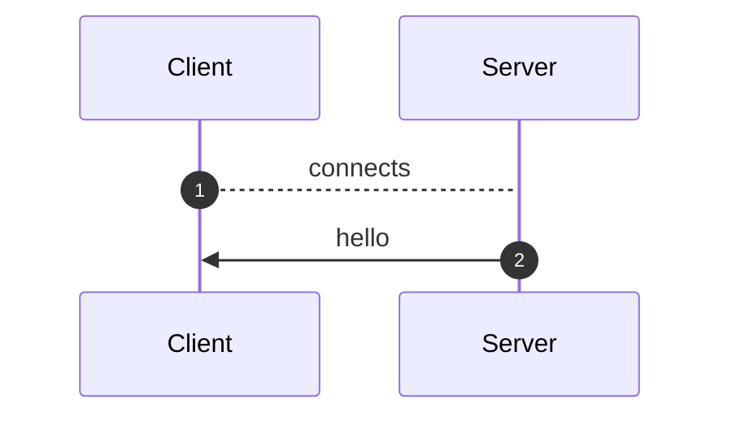
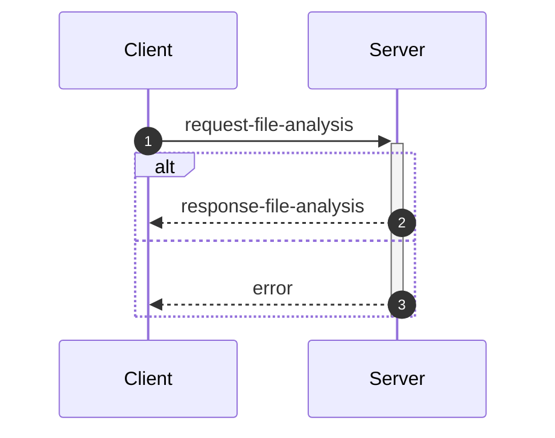
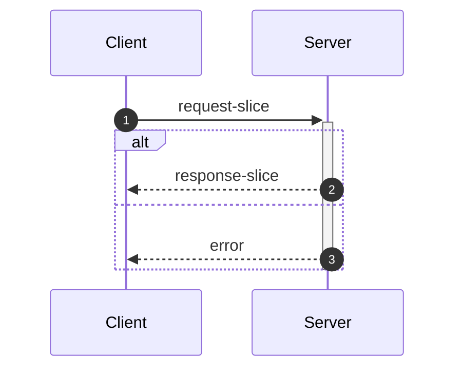
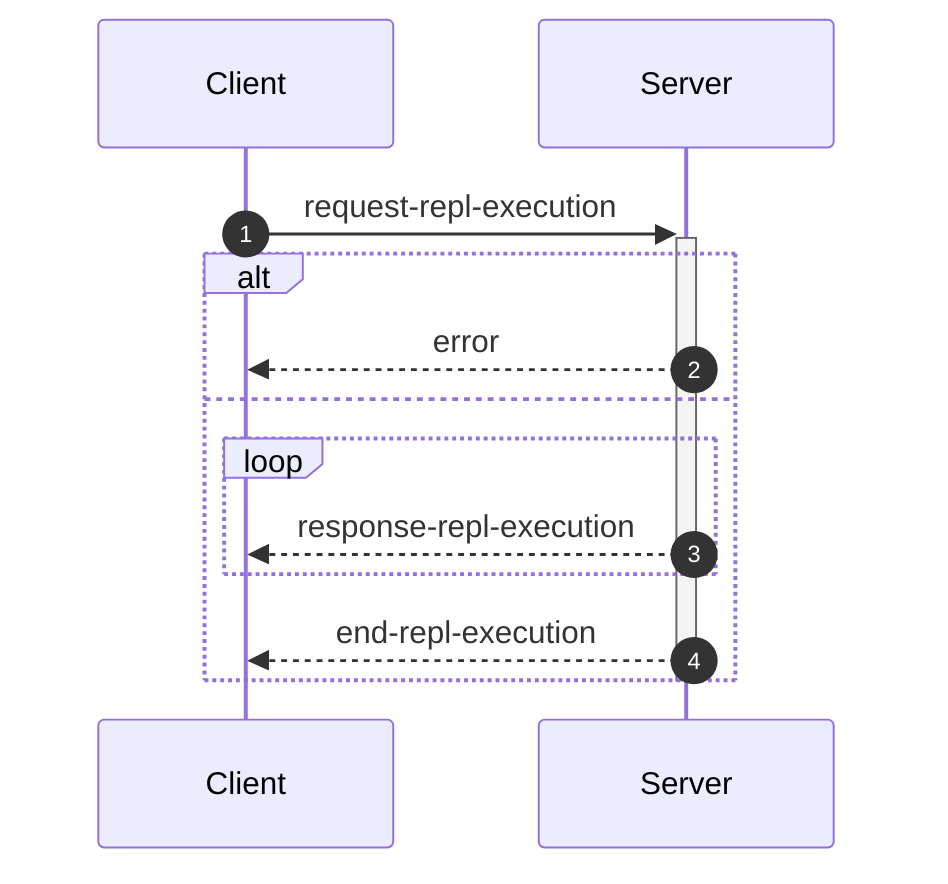

_This document was generated from '[src/documentation/wiki-interface.ts](https://github.com/flowr-analysis/flowr/tree/main//src/documentation/wiki-interface.ts)' on 2026-07-15, 09:53:18 UTC presenting an overview of flowR's interface (v2.12.1, using R v4.5.0). Please do not edit this file/wiki page directly._

Although far from being as detailed as the in-depth explanation of [_flowR_](https://github.com/flowr-analysis/flowr/wiki/core),
this wiki page explains how to interface with _flowR_ in more detail.
In general, command line arguments and other options provide short descriptions on hover over.

* [💻 Using the REPL](#using-the-repl)
* [⚙️ Configuring FlowR](#configuring-flowr)
* [⚒️ Writing Code](#writing-code)
* [💬 Communicating with the Server](#communicating-with-the-server)

<a id='using-the-repl'></a>
## 💻 Using the REPL


> [!NOTE]
> To execute arbitrary R commands with a repl request, _flowR_ has to be started explicitly with <span title="Description (Command Line Argument): Allow to access the underlying R session when using flowR (security warning: this allows the execution of arbitrary R code!)">`--r-session-access`</span>.
> Please be aware that this introduces a security risk and note that this relies on the [`r-shell` engine](https://github.com/flowr-analysis/flowr/wiki/engines) .

Although primarily meant for users to explore,
there is nothing which forbids simply calling _flowR_ as a subprocess to use standard-in, -output, and -error
for communication (although you can access the REPL using the server as well,
with the [REPL Request](#message-request-repl-execution) message).

The read-eval-print loop&nbsp;(REPL) works relatively simple.
You can submit an expression (using <kbd>Enter</kbd>),
which is interpreted as an R&nbsp;expression by default but interpreted as a *command* if it starts with a colon (`:`).
The best command to get started with the REPL is <span title="Description (Repl Command): Show help information (aliases: :h, :?)">`:help`</span>.
Besides, you can leave the REPL either with the command <span title="Description (Repl Command): End the repl (aliases: :q, :exit)">`:quit`</span> or by pressing <kbd>Ctrl</kbd>+<kbd>C</kbd> twice.
When writing a *command*, you may press <kbd>Tab</kbd> to get a list of completions, if available.
Multiple commands can be entered in a single line by separating them with a semicolon (`;`), e.g. `:parse "x<-2"; :df*`.
If a command is given without R code, the REPL will re-use R code given in a previous command.
The prior example will hence return first the parsed AST of the program and then the dataflow graph for `"x <- 2"`.

> [!NOTE]
> If you develop flowR, you may want to launch the repl using the `npm run main-dev` command, this way, you get a non-minified version of flowR with debug information and hot-reloading of source files.

<details>
<summary>Available Commands</summary>

We currently offer the following commands (this with a `[*]` suffix are available with and without the star):


| Command | Description |
| ------- | ----------- |
| **<span title="Description (Repl Command): End the repl (aliases: :q, :exit)">:quit</span>** | End the repl (aliases: **:<span title="Alias of ':quit'. End the repl">q</span>**, **:<span title="Alias of ':quit'. End the repl">exit</span>**) |
| **<span title="Description (Repl Command): Execute the given code as R code. This requires the `--r-session-access` flag to be set and requires the r-shell engine. (aliases: :e, :r)">:execute</span>** | Execute the given code as R code. This requires the `--r-session-access` flag to be set and requires the r-shell engine. (aliases: **:<span title="Alias of ':execute'. Execute the given code as R code. This requires the `--r-session-access` flag to be set and requires the r-shell engine.">e</span>**, **:<span title="Alias of ':execute'. Execute the given code as R code. This requires the `--r-session-access` flag to be set and requires the r-shell engine.">r</span>**) |
| **<span title="Description (Repl Command): Get mermaid code for the control-flow graph of R code (aliases: :cfg, :cf)">:controlflow[*]</span>** | Get mermaid code for the control-flow graph of R code (star: Returns the URL to mermaid.live) (aliases: **:<span title="Alias of ':controlflow'. Get mermaid code for the control-flow graph of R code">cfg</span>**, **:<span title="Alias of ':controlflow'. Get mermaid code for the control-flow graph of R code">cf</span>**) |
| **<span title="Description (Repl Command): Get mermaid code for the control-flow graph with basic blocks (aliases: :cfgb, :cfb)">:controlflowbb[*]</span>** | Get mermaid code for the control-flow graph with basic blocks (star: Returns the URL to mermaid.live) (aliases: **:<span title="Alias of ':controlflowbb'. Get mermaid code for the control-flow graph with basic blocks">cfgb</span>**, **:<span title="Alias of ':controlflowbb'. Get mermaid code for the control-flow graph with basic blocks">cfb</span>**) |
| **<span title="Description (Repl Command): Get mermaid code for the dataflow graph (aliases: :d, :df)">:dataflow[*]</span>** | Get mermaid code for the dataflow graph (star: Returns the URL to mermaid.live) (aliases: **:<span title="Alias of ':dataflow'. Get mermaid code for the dataflow graph">d</span>**, **:<span title="Alias of ':dataflow'. Get mermaid code for the dataflow graph">df</span>**) |
| **<span title="Description (Repl Command): Get mermaid code for the normalized AST of R code (aliases: :n)">:normalize[*]</span>** | Get mermaid code for the normalized AST of R code (star: Returns the URL to mermaid.live) (alias: **:<span title="Alias of ':normalize'. Get mermaid code for the normalized AST of R code">n</span>**) |
| **<span title="Description (Repl Command): Get mermaid code for the simplified dataflow graph (aliases: :ds, :dfs)">:dataflowsimple[*]</span>** | Get mermaid code for the simplified dataflow graph (star: Returns the URL to mermaid.live) (aliases: **:<span title="Alias of ':dataflowsimple'. Get mermaid code for the simplified dataflow graph">ds</span>**, **:<span title="Alias of ':dataflowsimple'. Get mermaid code for the simplified dataflow graph">dfs</span>**) |
| **<span title="Description (Repl Command): Inspect and extend the signature database: `query` (identical to :query @signature), `add <path>` to mount another database/source, `download` to fetch the full-history database. (aliases: :sig)">:signature</span>** | Inspect and extend the signature database: `query` (identical to :query @signature), `add <path>` to mount another database/source, `download` to fetch the full-history database. (alias: **:<span title="Alias of ':signature'. Inspect and extend the signature database: `query` (identical to :query @signature), `add <path>` to mount another database/source, `download` to fetch the full-history database.">sig</span>**) |
| **<span title="Description (Repl Command): Just calculates the DFG, but only prints summary info (aliases: :d#, :df#)">:dataflowsilent</span>** | Just calculates the DFG, but only prints summary info (aliases: **:<span title="Alias of ':dataflowsilent'. Just calculates the DFG, but only prints summary info">d#</span>**, **:<span title="Alias of ':dataflowsilent'. Just calculates the DFG, but only prints summary info">df#</span>**) |
| **<span title="Description (Repl Command): Prints ASCII Art of the parsed, unmodified AST (aliases: :p)">:parse</span>** | Prints ASCII Art of the parsed, unmodified AST (alias: **:<span title="Alias of ':parse'. Prints ASCII Art of the parsed, unmodified AST">p</span>**) |
| **<span title="Description (Repl Command): Prints the version of flowR as well as the current version of R">:version</span>** | Prints the version of flowR as well as the current version of R
| **<span title="Description (Repl Command): Query the given R code (use 'help' for more information)">:query[*]</span>** | Query the given R code (use 'help' for more information) (star: Similar to query, but returns the output in json format.)
| **<span title="Description (Repl Command): Returns an ASCII representation of the dataflow graph (aliases: :df!)">:dataflowascii</span>** | Returns an ASCII representation of the dataflow graph (alias: **:<span title="Alias of ':dataflowascii'. Returns an ASCII representation of the dataflow graph">df!</span>**) |
| **<span title="Description (Repl Command): Returns summarization stats for the normalized AST (aliases: :n#)">:normalize#</span>** | Returns summarization stats for the normalized AST (alias: **:<span title="Alias of ':normalize#'. Returns summarization stats for the normalized AST">n#</span>**) |
| **<span title="Description (Repl Command): Show help information (aliases: :h, :?)">:help</span>** | Show help information (aliases: **:<span title="Alias of ':help'. Show help information">h</span>**, **:<span title="Alias of ':help'. Show help information">?</span>**) |


</details>


> [!TIP]
> 
> As indicated by the examples before, all REPL commands that operate on code keep track of the state.
> Hence, if you run a command like <span title="Description (Repl Command, starred version): Returns the URL to mermaid.live; Base Command: Get mermaid code for the dataflow graph (aliases: :d*, :df*)">`:dataflow*`</span> without providing R code,
> the REPL will re-use the R code provided in a previous command.
> Likewise, doing this will benefit from incrementality!
> If you request the dataflow graph with `:df* x <- 2 * y` and then want to see the parsed AST with `:parse`,
> the REPL will re-use previously obtained information and not re-parse the code again.
> 		


Generally, many commands offer shortcut versions in the REPL. Many queries, for example, offer a shortened format (see the example below).
Of special note, the [Config Query](https://github.com/flowr-analysis/flowr/wiki/query-api#Config-Query)
can be used to also modify the currently active configuration of _flowR_ within the REPL (see the [wiki page](https://github.com/flowr-analysis/flowr/wiki/query-api#Config-Query) for more information).

### Example: Retrieving the Dataflow Graph

To retrieve a URL to the [mermaid](https://mermaid.js.org/) diagram of the dataflow of a given expression,
use <span title="Description (Repl Command, starred version): Returns the URL to mermaid.live; Base Command: Get mermaid code for the dataflow graph (aliases: :d*, :df*)">`:dataflow*`</span> (or <span title="Description (Repl Command): Get mermaid code for the dataflow graph (aliases: :d, :df)">`:dataflow`</span> to get the mermaid code in the cli):


```shell
$ docker run -it --rm eagleoutice/flowr # or npm run flowr 
flowR repl v2.12.1, R grammar v14 (tree-sitter engine)
R> :dataflow* y <- 1 + x
```

<details>
<summary style='color:gray'>Output</summary>


```text
https://mermaid.live/view#base64:eyJjb2RlIjoiZmxvd2NoYXJ0IEJUXG4gICAgMXt7XCJgKiM5MTtSTnVtYmVyIzkzOyogKioxKipcbiAgICAgICoxLjYqICgqKmlkOiAxKiopYFwifX1cbiAgICUlIE5vIGVkZ2VzIGZvdW5kIGZvciAxXG4gICAgMihbXCJgKiM5MTtSU3ltYm9sIzkzOyogKip4KipcbiAgICAgICoxLjEwKiAoKippZDogMioqKWBcIl0pXG4gICAlJSBObyBlZGdlcyBmb3VuZCBmb3IgMlxuICAgIDNbW1wiYCojOTE7UkJpbmFyeU9wIzkzOyogYmFzZSM1ODsjNTg7KiojNDM7KipcbiAgICAgICoxLjYtMTAqICgqKmlkOiAzKiopXG4gICAgYXJnOiAoMSwgMilgXCJdXVxuICAgIGJ1aWx0LWluOl9bXCJgQnVpbHQtSW46XG4jNDM7YFwiXVxuICAgIHN0eWxlIGJ1aWx0LWluOl8gc3Ryb2tlOmdyYXksZmlsbDpncmF5LHN0cm9rZS13aWR0aDoycHgsb3BhY2l0eTouODtcbiAgICAwW1wiYCojOTE7UlN5bWJvbCM5MzsqICoqeSoqXG4gICAgICAqMS4xKiAoKippZDogMCoqLCB2OiBbM10pYFwiXVxuICAgIDRbW1wiYCojOTE7UkJpbmFyeU9wIzkzOyogYmFzZSM1ODsjNTg7KiojNjA7IzQ1OyoqXG4gICAgICAqMS4xLTEwKiAoKippZDogNCoqKVxuICAgIGFyZzogKDAsIDMpYFwiXV1cbiAgICBidWlsdC1pbjpfLVtcImBCdWlsdC1JbjpcbiM2MDsjNDU7YFwiXVxuICAgIHN0eWxlIGJ1aWx0LWluOl8tIHN0cm9rZTpncmF5LGZpbGw6Z3JheSxzdHJva2Utd2lkdGg6MnB4LG9wYWNpdHk6Ljg7XG4gICAgMyAtLT58XCJyZWFkcywgYXJnXCJ8IDFcbiAgICAzIC0tPnxcInJlYWRzLCBhcmdcInwgMlxuICAgIDMgLS4tPnxcInJlYWRzLCBjYWxsc1wifCBidWlsdC1pbjpfXG4gICAgbGlua1N0eWxlIDIgc3Ryb2tlOmdyYXk7XG4gICAgMCAtLT58XCJkZWZpbmVkLWJ5XCJ8IDNcbiAgICAwIC0tPnxcImRlZmluZWQtYnlcInwgNFxuICAgIDQgLS0+fFwicmVhZHMsIGFyZ1wifCAzXG4gICAgNCAtLT58XCJyZXR1cm5zLCBhcmdcInwgMFxuICAgIDQgLS4tPnxcInJlYWRzLCBjYWxsc1wifCBidWlsdC1pbjpfLVxuICAgIGxpbmtTdHlsZSA3IHN0cm9rZTpncmF5OyIsIm1lcm1haWQiOnsiYXV0b1N5bmMiOnRydWV9fQ==
```


Retrieve the dataflow graph of the expression `y <- 1 + x`. It looks like this:


```mermaid
flowchart LR
    1{{"`*#91;RNumber#93;* **1**
      *1.6* (**id: 1**)`"}}
   %% No edges found for 1
    2(["`*#91;RSymbol#93;* **x**
      *1.10* (**id: 2**)`"])
   %% No edges found for 2
    3[["`*#91;RBinaryOp#93;* base#58;#58;**#43;**
      *1.6-10* (**id: 3**)
    arg: (1, 2)`"]]
    built-in:_["`Built-In:
#43;`"]
    style built-in:_ stroke:gray,fill:gray,stroke-width:2px,opacity:.8;
    0["`*#91;RSymbol#93;* **y**
      *1.1* (**id: 0**, v: [3])`"]
    4[["`*#91;RBinaryOp#93;* base#58;#58;**#60;#45;**
      *1.1-10* (**id: 4**)
    arg: (0, 3)`"]]
    built-in:_-["`Built-In:
#60;#45;`"]
    style built-in:_- stroke:gray,fill:gray,stroke-width:2px,opacity:.8;
    3 -->|"reads, arg"| 1
    3 -->|"reads, arg"| 2
    3 -.->|"reads, calls"| built-in:_
    linkStyle 2 stroke:gray;
    0 -->|"defined-by"| 3
    0 -->|"defined-by"| 4
    4 -->|"reads, arg"| 3
    4 -->|"returns, arg"| 0
    4 -.->|"reads, calls"| built-in:_-
    linkStyle 7 stroke:gray;
```

	
<details>

<summary style="color:gray">R Code of the Dataflow Graph</summary>

The analysis required _0.6 ms_ (including parse and normalize, using the [tree-sitter](https://github.com/flowr-analysis/flowr/wiki/Engines) engine) within the generation environment. No [signature database](https://github.com/flowr-analysis/flowr/wiki/Signature-Database) is mounted for these generated graphs, so `library()` calls attach no package exports; base-R names are still qualified via the generated base-package store (e.g. `acf` as `stats::acf`). 
We encountered no unknown side effects during the analysis.


```r
y <- 1 + x
```


</details>


</details>


For small graphs like this, <span title="Description (Repl Command): Returns an ASCII representation of the dataflow graph (aliases: :df!)">`:dataflowascii`</span> also provides an ASCII representation directly in the REPL:


```shell
$ docker run -it --rm eagleoutice/flowr # or npm run flowr 
flowR repl v2.12.1, R grammar v14 (tree-sitter engine)
R> :df! y <- 1 + x
```

<details open>
<summary style='color:gray'>Output</summary>


```text
                        0<1>0
                   ┌────| 1 |
    ┌────────┐     │    0---0
 c<4>c       └──c<3>c
 |<- |  v<0>v┌──| + |
 c---c──| y |┘  c---c   u<2>u
        v---v      └────| x |
                        u---u
Edges:
3 -> 1: reads, arg  3 -> 2: reads, arg
4 -> 3: reads, arg  4 -> 0: returns, arg
0 -> 3: defined-by  0 -> 4: defined-by
```


Retrieve the dataflow graph of the expression `y <- 1 + x` as ASCII art.

</details>


For the slicing with <span title="Description (Repl Command): Static backwards executable slicer for R">`:slicer`</span>, you have access to the same [magic comments](#slice-magic-comments) as with the [slice request](#message-request-slice).
Pass `--inline` to splice resolvable `source()` calls into the reconstruction so the slice is a single self-contained R text (the same as the static slice query's `inlineSources` flag).

### Example: Interfacing with the File System

Many commands that allow for an R-expression (like <span title="Description (Repl Command, starred version): Returns the URL to mermaid.live; Base Command: Get mermaid code for the dataflow graph (aliases: :d*, :df*)">`:dataflow*`</span>) allow for a file as well
if the argument starts with `file://`.
If you are working from the root directory of the _flowR_ repository, the following gives you the parsed AST of the example file using the <span title="Description (Repl Command): Prints ASCII Art of the parsed, unmodified AST (aliases: :p)">`:parse`</span> command:

> **Watch mode**: Replace `file://` with `watch://` to enter watch mode.
> flowR runs the command immediately and then re-runs it every time the file (or any file inside the folder) changes.
> Enter any other command to leave watch mode.
> For example: `:df watch://analysis.R`


```shell
$ docker run -it --rm eagleoutice/flowr # or npm run flowr 
flowR repl v2.12.1, R grammar v14 (tree-sitter engine)
R> :parse file://test/testfiles/example.R
```

<details>
<summary style='color:gray'>Output</summary>


```text
File: test/testfiles/example.R

program
├ binaryoperator
│ ├ identifier "sum" (1:1─4)
│ ├ <- "<-" (1:5─7)
│ ╰ float "0" (1:8─9)
├ binaryoperator
│ ├ identifier "product" (2:1─8)
│ ├ <- "<-" (2:9─11)
│ ╰ float "1" (2:12─13)
├ binaryoperator
│ ├ identifier "w" (3:1─2)
│ ├ <- "<-" (3:3─5)
│ ╰ float "7" (3:6─7)
├ binaryoperator
│ ├ identifier "N" (4:1─2)
│ ├ <- "<-" (4:3─5)
│ ╰ float "10" (4:6─8)
├ forstatement
│ ├ for "for" (6:1─4)
│ ├ ( "(" (6:5─6)
│ ├ identifier "i" (6:6─7)
│ ├ in "in" (6:8─10)
│ ├ binaryoperator
│ │ ├ float "1" (6:11─12)
│ │ ├ : ":" (6:12─13)
│ │ ╰ parenthesizedexpression
│ │   ├ ( "(" (6:13─14)
│ │   ├ binaryoperator
│ │   │ ├ identifier "N" (6:14─15)
│ │   │ ├ - "-" (6:15─16)
│ │   │ ╰ float "1" (6:16─17)
│ │   ╰ ) ")" (6:17─18)
│ ├ ) ")" (6:18─19)
│ ╰ bracedexpression
│   ├ { "{" (6:20─21)
│   ├ binaryoperator
│   │ ├ identifier "sum" (7:3─6)
│   │ ├ <- "<-" (7:7─9)
│   │ ╰ binaryoperator
│   │   ├ binaryoperator
│   │   │ ├ identifier "sum" (7:10─13)
│   │   │ ├ + "+" (7:14─15)
│   │   │ ╰ identifier "i" (7:16─17)
│   │   ├ + "+" (7:18─19)
│   │   ╰ identifier "w" (7:20─21)
│   ├ binaryoperator
│   │ ├ identifier "product" (8:3─10)
│   │ ├ <- "<-" (8:11─13)
│   │ ╰ binaryoperator
│   │   ├ identifier "product" (8:14─21)
│   │   ├  "" (8:22─23)
│   │   ╰ identifier "i" (8:24─25)
│   ╰ } "}" (9:1─2)
├ call
│ ├ identifier "cat" (11:1─4)
│ ╰ arguments
│   ├ ( "(" (11:4─5)
│   ├ argument
│   │ ╰ string
│   │   ├ " "\"" (11:5─6)
│   │   ├ stringcontent "Sum:" (11:6─10)
│   │   ╰ " "\"" (11:10─11)
│   ├ comma "," (11:11─12)
│   ├ argument
│   │ ╰ identifier "sum" (11:13─16)
│   ├ comma "," (11:16─17)
│   ├ argument
│   │ ╰ string
│   │   ├ " "\"" (11:18─19)
│   │   ├ stringcontent
│   │   │ ╰ escapesequence "\\n" (11:19─21)
│   │   ╰ " "\"" (11:21─22)
│   ╰ ) ")" (11:22─23)
╰ call
  ├ identifier "cat" (12:1─4)
  ╰ arguments
    ├ ( "(" (12:4─5)
    ├ argument
    │ ╰ string
    │   ├ " "\"" (12:5─6)
    │   ├ stringcontent "Product:" (12:6─14)
    │   ╰ " "\"" (12:14─15)
    ├ comma "," (12:15─16)
    ├ argument
    │ ╰ identifier "product" (12:17─24)
    ├ comma "," (12:24─25)
    ├ argument
    │ ╰ string
    │   ├ " "\"" (12:26─27)
    │   ├ stringcontent
    │   │ ╰ escapesequence "\\n" (12:27─29)
    │   ╰ " "\"" (12:29─30)
    ╰ ) ")" (12:30─31)
```


Retrieve the parsed AST of the example file.

<details>

<summary>File Content</summary>


```r
sum <- 0
product <- 1
w <- 7
N <- 10

for (i in 1:(N-1)) {
  sum <- sum + i + w
  product <- product * i
}

cat("Sum:", sum, "\n")
cat("Product:", product, "\n")
```


</details>

As _flowR_ directly transforms this AST the output focuses on being human-readable instead of being machine-readable.
		

</details>


### Example: Run a Query

You can run any query supported by _flowR_ using the <span title="Description (Repl Command): Query the given R code (use 'help' for more information)">`:query`</span> command.
For example, to obtain the shapes of all data frames in a given piece of code, you can run:


```shell
$ docker run -it --rm eagleoutice/flowr # or npm run flowr 
flowR repl v2.12.1, R grammar v14 (tree-sitter engine)
R> :query @absint df-shape "x <- data.frame(a = 1:10, b = 1:10)\ny <- x$a"
```

<details open>
<summary style='color:gray'>Output</summary>


```text
Query: absint (2 ms)
   ╰ $12: (colnames: [{"a", "b"}, {}], cols: [2, 2], rows: [10, 10])
   ╰ $0: (colnames: [{"a", "b"}, {}], cols: [2, 2], rows: [10, 10])
All queries together required ≈3 ms (1ms accuracy, total 4 ms)
```


Retrieve the shapes of all data frames in the given code.

</details>


To run the linter on a file, you can use (in this example, we just issue the `dead-code` linter on a small piece of code):


```shell
$ docker run -it --rm eagleoutice/flowr # or npm run flowr 
flowR repl v2.12.1, R grammar v14 (tree-sitter engine)
R> :query @linter rules:dead-code "if(FALSE) x <- 2"
```

<details open>
<summary style='color:gray'>Output</summary>


```text
Query: linter (1 ms)
   ╰ Dead Code (dead-code):
       ╰ certain:
           ╰ Code at 1.11-16
       ╰ Metadata: searchTimeMs: 1, processTimeMs: 0
All queries together required ≈1 ms (1ms accuracy, total 2 ms)
```


Run the linter on the given code, with only the `dead-code` rule enabled.

</details>


For more information on the available queries, please check out the [Query API](https://github.com/flowr-analysis/flowr/wiki/query-api).


<a id='configuring-flowr'></a>
## ⚙️ Configuring FlowR


When running _flowR_, you may want to specify some behaviors with a dedicated configuration file.
By default, flowR looks for a file named `flowr.json` in the current working directory (or any higher directory).
You can also specify a different file with <span title="Description (Command Line Argument): The name of the configuration file to use">`--config-file`</span> or pass the configuration inline using <span title="Description (Command Line Argument): The flowR configuration to use, as a JSON string">`--config-json`</span>.
To inspect the current configuration, you can run flowr with the <span title="Description (Command Line Argument): Run with verbose logging (will be passed to the corresponding script)">`--verbose`</span> flag, or use the `config` [Query](https://github.com/flowr-analysis/flowr/wiki/query-api).
Within the REPL this works by running the following:


```shell
:query @config
```


To work with the <a href="https://github.com/flowr-analysis/flowr/tree/main/src/config.ts#L122"><code><span title="The configuration file format for flowR.">FlowrConfig</span></code></a> you can use the provided helper objects alongside its methods like
<a href="https://github.com/flowr-analysis/flowr/tree/main/src/config.ts#L569"><code><span title="Creates a new flowr config that has the updated values.">FlowrConfig::<b>amend</b></span></code></a>.
The following summarizes the configuration options:

- `ignoreSourceCalls`: If set to `true`, _flowR_ will ignore source calls when analyzing the code, i.e., ignoring the inclusion of other files.
- `semantics`: allows to configure the way _flowR_ handles R, although we currently only support `semantics/environment/overwriteBuiltIns`.
  You may use this to overwrite _flowR_'s handling of built-in function and even completely clear the preset definitions shipped with flowR.
  See [Configure BuiltIn Semantics](#configure-builtin-semantics) for more information.
- `solver`: allows to configure how _flowR_ resolves variables and their values (currently we support: `disabled`, `alias`, `builtin`), as well as if pointer analysis should be active.
- `engines`: allows to configure the engines used by _flowR_ to interact with R code. See the [Engines wiki page](https://github.com/flowr-analysis/flowr/wiki/engines) for more information.
- `defaultEngine`: allows to specify the default engine to use for interacting with R code. If not set, an arbitrary engine from the specified list will be used.
- `abstractInterpretation`: allows to configure how _flowR_ performs abstract interpretation, although we currently only support data frame shape inference through abstract interpretation.
- `defaultPlugins`: allows to configure which plugins to load by default when creating a new <a href="https://github.com/flowr-analysis/flowr/tree/main/src/project/flowr-analyzer.ts#L162"><code><span title="Central class for conducting analyses with FlowR. Use the FlowrAnalyzerBuilder to create a new instance. If you want the original pattern of creating a pipeline and running all steps, you can still do this with FlowrAnalyzer#runFull . To inspect the context of the analyzer, use FlowrAnalyzer#inspectContext (if you are a plugin and need to modify it, use FlowrAnalyzer#context instead).">FlowrAnalyzer</span></code></a> instance.
- `repl.plugins`: allows to configure which plugins to load in the _flowR_ REPL. Use `flowr:default` to reference the plugins specified by `defaultPlugins`.

So you can configure _flowR_ by adding a file like the following:

<details>

<summary>Example Configuration File</summary>


```json
{
  "ignoreSourceCalls": true,
  "semantics": {
    "environment": {
      "overwriteBuiltIns": {
        "definitions": [
          {
            "type": "function",
            "names": [
              "foo"
            ],
            "processor": "builtin:assign",
            "config": {}
          }
        ]
      }
    }
  },
  "defaultPlugins": [
    "file:description",
    "versions:description"
  ],
  "repl": {
    "quickStats": false,
    "dfProcessorHeat": false,
    "hints": true,
    "plugins": [
      "flowr:default"
    ]
  },
  "project": {
    "resolveUnknownPathsOnDisk": true
  },
  "engines": [
    {
      "type": "r-shell"
    }
  ],
  "solver": {
    "variables": "alias",
    "evalStrings": true,
    "trackEnvironments": true,
    "sigdb": {
      "enabled": true,
      "loadProjectDependencies": true,
      "eagerlyLoad": false,
      "eagerlyLoadExports": false,
      "linkBaseR": false,
      "linkDescriptionDependencies": false
    },
    "resolveSource": {
      "dropPaths": "no",
      "ignoreCapitalization": true,
      "inferWorkingDirectory": "active-script",
      "searchPath": []
    },
    "instrument": {},
    "slicer": {
      "threshold": 50
    }
  },
  "abstractInterpretation": {
    "wideningThreshold": 4,
    "dataFrame": {
      "maxColNames": 20,
      "readLoadedData": {
        "readExternalFiles": true,
        "maxReadLines": 1000000
      }
    }
  },
  "gas": {
    "thresholds": {
      "memory": {
        "problematic": 0.7,
        "critical": 0.9
      },
      "timeMs": {
        "problematic": 100000,
        "critical": 120000
      }
    },
    "features": {}
  }
}
```


</details>

<details>
<a id='configure-builtin-semantics'></a>
<summary>Configure Built-In Semantics</summary>


`semantics/environment/overwriteBuiltins` accepts two keys:

- `loadDefaults` (boolean, initially `true`): If set to `true`, the default built-in definitions are loaded before applying the custom definitions. Setting this flag to `false` explicitly disables the loading of the default definitions.
- `definitions` (array, initially empty): Allows to overwrite or define new built-in elements. Each object within must have a `type` which is one of the below. Furthermore, they may define a string array of `names` which specifies the identifiers to bind the definitions to. You may use `assumePrimitive` to specify whether _flowR_ should assume that this is a primitive non-library definition (so you probably just do not want to specify the key).

  | Type            | Description                                                                                                                                                                                                                                                                                              | Example                                                                                                    |
  | --------------- | -------------------------------------------------------------------------------------------------------------------------------------------------------------------------------------------------------------------------------------------------------------------------------------------------------- | ---------------------------------------------------------------------------------------------------------- |
  | `constant`    | Additionally allows for a `value` this should resolve to.                                                                                                                                                                                                                                                | `{ type: 'constant', names: ['NULL', 'NA'],  value: null }`                                                |
  | `function`    | Is a rather flexible way to define and bind built-in functions. For the time, we do not have extensive documentation to cover all the cases, so please either consult the sources with the `default-builtin-config.ts` or open a [new issue](https://github.com/flowr-analysis/flowr/issues/new/choose). | `{ type: 'function', names: ['next'], processor: 'builtin:d', config: { cfg: ExitPointType.Next } }` |
  | `replacement` | A comfortable way to specify replacement functions like `$<-` or `names<-`. `suffixes` describes the... suffixes to attach automatically. | `{ type: 'replacement', suffixes: ['<-', '<<-'], names: ['[', '[['] }` |


</details>

<details>

<summary style='color:gray'>Full Configuration-File Schema</summary>

- _The configuration file format for flowR._ (object)
    - **ignoreSourceCalls** [optional] _Whether source calls should be ignored, causing {@link processSourceCall}'s behavior to be skipped._ (boolean)
    - **semantics** _Configure language semantics and how flowR handles them._ (object)
        - **environment** [optional] _Semantics regarding how to handle the R environment._ (object)
            - **overwriteBuiltIns** [optional] _Do you want to overwrite (parts) of the builtin definition?_ (object)
                - **loadDefaults** [optional] _Should the default configuration still be loaded?_ (boolean)
                - **definitions** [optional] _The definitions to load/overwrite._ (array)
                Valid item types:
                    - (object)
    - **defaultPlugins** [optional] _The default plugins to load when creating a new instance of FlowrAnalyzer_ (array)
    Valid item types:
        - (alternatives)
            - (string)
            - (array)
    - **repl** _Configuration options for the REPL._ (object)
        - **quickStats** [optional] _Whether to show quick stats in the REPL after each evaluation._ (boolean)
        - **dfProcessorHeat** [optional] _This instruments the dataflow processors to count how often each processor is called._ (boolean)
        - **hints** [optional] _Whether to show dim inline hints on the empty prompt (automatically disabled on non-interactive terminals)._ (boolean)
        - **plugins** [optional] _The plugins to load in REPL mode_ (array)
        Valid item types:
            - (alternatives)
                - (string)
                - (array)
    - **project** _Project specific configuration options._ (object)
        - **resolveUnknownPathsOnDisk** [optional] _Whether to resolve unknown paths loaded by the r project disk when trying to source/analyze files._ (boolean)
        - **basePackages** [optional] _The packages considered part of R itself (base and recommended); if unset, flowR uses its built-in list._ (array)
        Valid item types:
            - (string)
    - **engines** _The engine or set of engines to use for interacting with R code. An empty array means all available engines will be used._ (array)
    Valid item types:
        - (alternatives)
            - _The configuration for the tree sitter engine._ (object)
                - **type** [required] _Use the tree sitter engine._ (string)
                    Only allows: 'tree-sitter'
                - **wasmPath** [optional] _The path to the tree-sitter-r WASM binary to use. If this is undefined, this uses the default path._ (string)
                - **treeSitterWasmPath** [optional] _The path to the tree-sitter WASM binary to use. If this is undefined, this uses the default path._ (string)
                - **lax** [optional] _Whether to use the lax parser for parsing R code (allowing for syntax errors). If this is undefined, the strict parser will be used._ (boolean)
            - _The configuration for the R shell engine._ (object)
                - **type** [required] _Use the R shell engine._ (string)
                    Only allows: 'r-shell'
                - **rPath** [optional] _The path to the R executable to use. If this is undefined, this uses the default path._ (string)
    - **defaultEngine** [optional] _The default engine to use for interacting with R code. If this is undefined, an arbitrary engine from the specified list will be used._ (string)
        Only allows: 'tree-sitter', 'r-shell'
    - **solver** _How to resolve constants, constraints, cells, ..._ (object)
        - **variables** _How to resolve variables and their values._ (string)
            Only allows: 'disabled', 'alias', 'builtin'
        - **evalStrings** _Should we include eval(parse(text="...")) calls in the dataflow graph?_ (boolean)
        - **trackEnvironments** [optional] _Track user-created environments (new.env, assign/get/local with envir=, dollar-assign, attach). When false, all envir-style calls fall through conservatively._ (boolean)
        - **sigdb** _Resolving library exports from a signature database._ (object)
            - **enabled** [optional] _Resolve library()/use() exports from a signature database (default true); when false no database is consulted._ (boolean)
            - **loadProjectDependencies** [optional] _Load the project's declared dependencies from its metadata files (DESCRIPTION Imports/Depends, renv.lock, rv.lock) (default true); when false these files are not read for dependencies._ (boolean)
            - **eagerlyLoad** [optional] _Parse the database up front rather than on the first package load (default false, ignored if disabled)._ (boolean)
            - **eagerlyLoadExports** [optional] _Add a vertex for every export on load rather than on demand (default false); keeps the dataflow graph small._ (boolean)
            - **assumedRVersion** [optional] _R version assumed when resolving versioned (base-R) exports: a pin like "4.5" or "auto" to detect the installed R (default "auto")._ (string)
            - **linkBaseR** [optional] _Eagerly attach base-R namespaces so bare base calls resolve without library() (default false)._ (boolean)
            - **linkBaseRCalls** [optional] _Add a lightweight Reads edge from a bare base-R call to its signature-database function vertex (default false; base-R qualification is edge-free otherwise)._ (boolean)
            - **linkPackageCalls** [optional] _Add a lightweight Reads edge from a resolved package call to its signature-database function vertex (default false)._ (boolean)
            - **linkDescriptionDependencies** [optional] _Eagerly attach the namespaces of the project's declared DESCRIPTION dependencies (Imports/Depends) so their exports resolve without an explicit library() (default false)._ (boolean)
            - **warmInBackground** [optional] _Decompress the hot shards (base + most-downloaded) in a background task on startup so the first library() lookup is warm (default false; for long-running servers/REPLs)._ (boolean)
            - **additionalPaths** [optional] _Extra directories or bundle/manifest files searched for signature databases (alongside the shipped default and $FLOWR_SIGDB_DIR); a downloaded full-history bundle placed here is mounted automatically._ (array)
            Valid item types:
                - (string)
            - **downloadRepo** [optional] _GitHub owner/repo the full-history bundle is downloaded from via ":signature download" (default "flowr-analysis/flowr", release tag "sigdb-v<flowR-version>")._ (string)
            - **autoSync** [optional] _On startup, re-download shards whose committed sigdb.remote.json hash no longer matches the cache, in the background (default false; opt-in network sync after a git pull)._ (boolean)
            - **versionSelection** [optional] _When a project constrains a dependency, resolve to the newest (default), oldest, or system-installed version satisfying it; system needs R and falls back to newest. Base-R packages always resolve against the assumed R version._ (string)
                Only allows: 'newest', 'oldest', 'system'
            - **versionOverrides** [optional] _Force an exact version for specific packages (name -> version), overriding both the project constraint and the versionSelection policy (default {})._ (object)
        - **instrument** (object)
            - **dataflowExtractors** [optional] _These keys are only intended for use within code, allowing to instrument the dataflow analyzer!_ (any)
        - **resolveSource** [optional] _If lax source calls are active, flowR searches for sourced files much more freely, based on the configurations you give it. This option is only in effect if `ignoreSourceCalls` is set to false._ (object)
            - **dropPaths** _Allow to drop the first or all parts of the sourced path, if it is relative._ (string)
                Only allows: 'no', 'once', 'all'
            - **ignoreCapitalization** _Search for filenames matching in the lowercase._ (boolean)
            - **inferWorkingDirectory** _Try to infer the working directory from the main or any script to analyze._ (string)
                Only allows: 'no', 'main-script', 'active-script', 'any-script'
            - **searchPath** _Additionally search in these paths._ (array)
            Valid item types:
                - (string)
            - **repeatedSourceLimit** [optional] _How often the same file can be sourced within a single run? Please be aware: in case of cyclic sources this may not reach a fixpoint so give this a sensible limit._ (number)
            - **applyReplacements** _Provide name replacements for loaded files_ (array)
            Valid item types:
                - (object)
        - **slicer** [optional] _The configuration for the slicer._ (object)
            - **threshold** [optional] _The maximum number of iterations to perform on a single function call during slicing._ (number)
            - **autoExtend** [optional] _If set, the slicer will gain an additional post-pass._ (boolean)
    - **abstractInterpretation** _The configuration options for abstract interpretation._ (object)
        - **wideningThreshold** _The threshold for the number of visitations of a node at which widening should be performed to ensure the termination of the fixpoint iteration._ (number)
        - **dataFrame** _The configuration of the shape inference for data frames._ (object)
            - **maxColNames** _The maximum number of columns names to infer for data frames before over-approximating the column names to top._ (number)
            - **readLoadedData** _Configuration options for reading data frame shapes from loaded external data files, such as CSV files._ (object)
                - **readExternalFiles** _Whether data frame shapes should be extracted from loaded external files, such as CSV files._ (boolean)
                - **maxReadLines** _The maximum number of lines to read when extracting data frame shapes from loaded files, such as CSV files._ (number)
    - **gas** [optional] _Resource-usage guard (gas) configuration. All feature factors default to 0 (disabled). See https://github.com/flowr-analysis/flowr/wiki/Core#gas-resource-guard._ (object)
        - **thresholds** [optional] _Shared thresholds for all gas checks (scaled by per-feature factor)._ (object)
            - **memory** [optional] _Heap-usage fraction thresholds (0-1)._ (object)
                - **problematic** [optional] _Heap fraction (0-1) above which Problematic is returned._ (number)
                - **critical** [optional] _Heap fraction (0-1) above which Critical is returned._ (number)
            - **timeMs** [optional] _Elapsed analysis time thresholds in milliseconds._ (object)
                - **problematic** [optional] _Elapsed ms above which Problematic is returned._ (number)
                - **critical** [optional] _Elapsed ms above which Critical is returned._ (number)
        - **features** [optional] _Per-feature sensitivity factors. 0 or absent disables gas checking for that feature. A factor of 2 makes the feature twice as sensitive. Recognised keys: `source`, `side-effect-linking`, `linter`._ (object)
        - **heapProvider** [optional] _Custom heap statistics source (programmatic configs only), overriding the built-in v8/performance.memory detection._ (function)

</details>

	

<a id='writing-code'></a>
## ⚒️ Writing Code

_flowR_ can be used as a [module](https://www.npmjs.com/package/@eagleoutice/flowr) and offers several main classes and interfaces that are interesting for extension writers 
(see the [Visual Studio Code extension](https://marketplace.visualstudio.com/items?itemName=code-inspect.vscode-flowr) or the [Core](https://github.com/flowr-analysis/flowr/wiki/core) wiki page for more information).

### Creating Analyses with _flowR_

Nowadays, instances of the <a href="https://github.com/flowr-analysis/flowr/tree/main/src/project/flowr-analyzer.ts#L162"><code><span title="Central class for conducting analyses with FlowR. Use the FlowrAnalyzerBuilder to create a new instance. If you want the original pattern of creating a pipeline and running all steps, you can still do this with FlowrAnalyzer#runFull . To inspect the context of the analyzer, use FlowrAnalyzer#inspectContext (if you are a plugin and need to modify it, use FlowrAnalyzer#context instead).">FlowrAnalyzer</span></code></a> should be used as central frontend to get analysis results from _flowR_.
For example, a program slice can be created like this:


```ts
const analyzer = await new FlowrAnalyzerBuilder()
    .setEngine('tree-sitter')
    .build();
analyzer.addRequest('x <- 1\ny <- x\nx');
const result = await analyzer.query([
    {
        type:     'static-slice',
        criteria: ['3@x']
    }
]);
//console.log(result['static-slice']);
```


For more information, please have a look at the [Analyzer](https://github.com/flowr-analysis/flowr/wiki/analyzer) wiki page, which explains how to construct and use the <a href="https://github.com/flowr-analysis/flowr/tree/main/src/project/flowr-analyzer.ts#L162"><code><span title="Central class for conducting analyses with FlowR. Use the FlowrAnalyzerBuilder to create a new instance. If you want the original pattern of creating a pipeline and running all steps, you can still do this with FlowrAnalyzer#runFull . To inspect the context of the analyzer, use FlowrAnalyzer#inspectContext (if you are a plugin and need to modify it, use FlowrAnalyzer#context instead).">FlowrAnalyzer</span></code></a> in more detail.
To work with specific perspectives, you can also consult the respective pages like the [Dataflow Graph](https://github.com/flowr-analysis/flowr/wiki/dataflow-graph) or the [Abstract Interpretation](https://github.com/flowr-analysis/flowr/wiki/abstract-interpretation) wiki pages.
### The Pipeline Executor (Low-Level Interface)

Once, in the beginning, _flowR_ was meant to produce a dataflow graph merely to provide *program slices*. 
However, with continuous updates, the [Dataflow Graph](https://github.com/flowr-analysis/flowr/wiki/dataflow-graph) repeatedly proves to be the more interesting part.
With this, we restructured _flowR_'s originally *hardcoded* pipeline to be far more flexible. 
Now, it can be theoretically extended or replaced with arbitrary steps, optional steps, and what we call 'decorations' of these steps. 
In short, a slicing pipeline using the <a href="https://github.com/flowr-analysis/flowr/tree/main/src/core/pipeline-executor.ts#L97"><code><span title="**Please note:** The PipelineExecutor is now considered to be a rather low-level API for flowR. While it still works and is the basis for all other layers, we strongly recommend using the FlowrAnalyzer and its builder to create and use an analyzer instance that is pre-configured for your use-case. The pipeline executor allows to execute arbitrary pipelines in a step-by-step fashion. If you are not...">PipelineExecutor</span></code></a> looks like this:


```ts

const slicer = new PipelineExecutor(DEFAULT_SLICING_PIPELINE, {
  parser:    new RShell(),
  request:   requestFromInput('x <- 1\nx + 1'),
  criterion: ['2@x']
})
const slice = await slicer.allRemainingSteps()
// console.log(slice.reconstruct.code)
```


<details><summary>More Information</summary>


If you compare this, with what you would have done with the old (and removed) `SteppingSlicer`, 
this essentially just requires you to replace the `SteppingSlicer` with the <a href="https://github.com/flowr-analysis/flowr/tree/main/src/core/pipeline-executor.ts#L97"><code><span title="**Please note:** The PipelineExecutor is now considered to be a rather low-level API for flowR. While it still works and is the basis for all other layers, we strongly recommend using the FlowrAnalyzer and its builder to create and use an analyzer instance that is pre-configured for your use-case. The pipeline executor allows to execute arbitrary pipelines in a step-by-step fashion. If you are not...">PipelineExecutor</span></code></a>
and to pass the <a href="https://github.com/flowr-analysis/flowr/tree/main/src/core/steps/pipeline/default-pipelines.ts#L18"><code>DEFAULT_SLICING_PIPELINE</code></a> as the first argument.
The <a href="https://github.com/flowr-analysis/flowr/tree/main/src/core/pipeline-executor.ts#L97"><code><span title="**Please note:** The PipelineExecutor is now considered to be a rather low-level API for flowR. While it still works and is the basis for all other layers, we strongly recommend using the FlowrAnalyzer and its builder to create and use an analyzer instance that is pre-configured for your use-case. The pipeline executor allows to execute arbitrary pipelines in a step-by-step fashion. If you are not...">PipelineExecutor</span></code></a>...

1. Provides structures to investigate the results of all intermediate steps
2. Can be executed step-by-step
3. Can repeat steps (e.g., to calculate multiple slices on the same input)

See the in-code documentation for more information.


</details>

### Using the <a href="https://github.com/flowr-analysis/flowr/tree/main/src/r-bridge/shell.ts#L143"><code><span title="The RShell represents an interactive session with the R interpreter. You can configure it by RShellOptions . At the moment we are using a live R session (and not networking etc.) to communicate with R easily, which allows us to install packages etc. However, this might and probably will change in the future (leaving this as a legacy mode :D)">RShell</span></code></a> to Interact with R

The <a href="https://github.com/flowr-analysis/flowr/tree/main/src/r-bridge/shell.ts#L143"><code><span title="The RShell represents an interactive session with the R interpreter. You can configure it by RShellOptions . At the moment we are using a live R session (and not networking etc.) to communicate with R easily, which allows us to install packages etc. However, this might and probably will change in the future (leaving this as a legacy mode :D)">RShell</span></code></a> class allows interfacing with the `R`&nbsp;ecosystem installed on the host system.
Please have a look at [flowR's Engines](https://github.com/flowr-analysis/flowr/wiki/engines) for more information on alternatives (for example, the <a href="https://github.com/flowr-analysis/flowr/tree/main/src/r-bridge/lang-4.x/tree-sitter/tree-sitter-executor.ts#L18"><code><span title="Synchronous and (way) faster alternative to the RShell using tree-sitter.">TreeSitterExecutor</span></code></a>).


> [!IMPORTANT]
> 
> Each <a href="https://github.com/flowr-analysis/flowr/tree/main/src/r-bridge/shell.ts#L143"><code><span title="The RShell represents an interactive session with the R interpreter. You can configure it by RShellOptions . At the moment we are using a live R session (and not networking etc.) to communicate with R easily, which allows us to install packages etc. However, this might and probably will change in the future (leaving this as a legacy mode :D)">RShell</span></code></a> controls a new instance of the R&nbsp;interpreter, 
> make sure to call <code><a href="https://github.com/flowr-analysis/flowr/tree/main/src/r-bridge/shell.ts#L351"><span title="Close the current R session, makes the object effectively invalid (can no longer be reopened etc.)">RShell::<i>close</i></span></a>()</code> when you are done.


You can start a new "session" simply by constructing a new object with <code>new <a href="https://github.com/flowr-analysis/flowr/tree/main/src/r-bridge/shell.ts#L143"><span title="The RShell represents an interactive session with the R interpreter. You can configure it by RShellOptions . At the moment we are using a live R session (and not networking etc.) to communicate with R easily, which allows us to install packages etc. However, this might and probably will change in the future (leaving this as a legacy mode :D)">RShell</span></a>()</code>.

However, there are several options that may be of interest 
(e.g., to automatically revive the shell in case of errors or to control the name location of the R process on the system).

With a shell object (let's call it `shell`), you can execute R code by using <a href="https://github.com/flowr-analysis/flowr/tree/main/src/r-bridge/shell.ts#L212"><code><span title="sends the given command directly to the current R session will not do anything to alter input markers!">RShell::<i>sendCommand</i></span></code></a>,
for example <code>shell.<a href="https://github.com/flowr-analysis/flowr/tree/main/src/r-bridge/shell.ts#L212"><span title="sends the given command directly to the current R session will not do anything to alter input markers!">sendCommand</span></a>("1 + 1")</code>.
However, this does not return anything, so if you want to collect the output of your command, use
<a href="https://github.com/flowr-analysis/flowr/tree/main/src/r-bridge/shell.ts#L295"><code><span title="Send a command and collect the output">RShell::<i>sendCommandWithOutput</i></span></code></a> instead.


<a id='communicating-with-the-server'></a>
## 💬 Communicating with the Server


As explained in the [Overview](https://github.com/flowr-analysis/flowr/wiki/overview), you can simply run the [TCP](https://de.wikipedia.org/wiki/Transmission_Control_Protocol)&nbsp;server by adding the <span title="Description (Command Line Argument): Do not drop into a repl, but instead start a server on the given port (default: 1042) and listen for messages.">`--server`</span> flag (and, due to the interactive mode, exit with the conventional <kbd>CTRL</kbd>+<kbd>C</kbd>).
Currently, every connection is handled by the same underlying `RShell` - so the server is not designed to handle many clients at a time.
Additionally, the server is not well guarded against attacks (e.g., you can theoretically spawn an arbitrary number of&nbsp;RShell sessions on the target machine).

Every message has to be given in a single line (i.e., without a newline in-between) and end with a newline character. Nevertheless, we will pretty-print example given in the following segments for the ease of reading.


> [!NOTE]
> 
> The default <span title="Description (Command Line Argument): Do not drop into a repl, but instead start a server on the given port (default: 1042) and listen for messages.">`--server`</span> uses a simple [TCP](https://de.wikipedia.org/wiki/Transmission_Control_Protocol)
> connection. If you want _flowR_ to expose a [WebSocket](https://de.wikipedia.org/wiki/WebSocket) server instead, add the <span title="Description (Command Line Argument): If the server flag is set, use websocket for messaging">`--ws`</span> flag (i.e., <span title="Description (Command Line Argument): Do not drop into a repl, but instead start a server on the given port (default: 1042) and listen for messages.">`--server`</span> <span title="Description (Command Line Argument): If the server flag is set, use websocket for messaging">`--ws`</span>) when starting _flowR_ from the command line.


<ul><li>
<a id="message-hello"></a>
<b>Hello</b> Message (<code>hello</code>) 
<details>

<summary style="color:gray"> View Details. <i>The server informs the client about the successful connection and provides Meta-Information.</i> </summary>


```mermaid
sequenceDiagram
    autonumber
    participant Client
    participant Server

    
    Client-->Server: connects
    Server->>Client: hello
	
```


	
After launching _flowR_, for example, with <code>docker run -it --rm eagleoutice/flowr <span title="Description (Command Line Argument): Do not drop into a repl, but instead start a server on the given port (default: 1042) and listen for messages.">-<span/>-server</span></code>&nbsp;(🐳️), simply connecting should present you with a `hello` message, that amongst others should reveal the versions of&nbsp;_flowR_ and&nbsp;R, using the [semver 2.0](https://semver.org/spec/v2.0.0.html) versioning scheme.
The message looks like this:


```json
{
  "type": "hello",
  "clientName": "client-0",
  "versions": {
    "flowr": "2.12.1",
    "r": "4.5.0",
    "engine": "r-shell"
  }
}
```


There are currently a few messages that you can send after the hello message.
If you want to _slice_ a piece of R code you first have to send an [analysis request](#message-request-file-analysis), so that you can send one or multiple slice requests afterward.
Requests for the [REPL](#message-request-repl) are independent of that.
	

<hr>


<details>
<summary style="color:gray">Message schema (<code>hello</code>)</summary>

For the definition of the hello message, please see it's implementation at [`./src/cli/repl/server/messages/message-hello.ts`](https://github.com/flowr-analysis/flowr/tree/main/./src/cli/repl/server/messages/message-hello.ts).

- [required] (object)
    - **type** [required] _The type of the hello message._ (string)
        Only allows: 'hello'
    - **id** [forbidden] _The id of the message is always undefined (as it is the initial message and not requested)._ (any)
    - **clientName** [required] _A unique name that is assigned to each client. It has no semantic meaning and is only used/useful for debugging._ (string)
    - **versions** [required] (object)
        - **flowr** [required] _The version of the flowr server running in semver format._ (string)
        - **r** [required] _The version of the underlying R shell running in semver format._ (string)
        - **engine** [required] _The parser backend that is used to parse the R code._ (string)

</details>


<hr>

</details>
	</li>

<li>
<a id="message-request-file-analysis"></a>
<b>Analysis</b> Message (<code>request-file-analysis</code>) 
<details>

<summary style="color:gray"> View Details. <i>The server builds the dataflow graph for a given input file (or a set of files).</i> </summary>


```mermaid
sequenceDiagram
    autonumber
    participant Client
    participant Server

    
    Client->>+Server: request-file-analysis
    alt
        Server-->>Client: response-file-analysis
    else
        Server-->>Client: error
    end
    deactivate  Server
	
```


	
The request allows the server to analyze a file and prepare it for slicing.
The message can contain a `filetoken`, which is used to identify the file in later slice or query requests (if you do not add one, the request will not be stored and therefore, it is not available for subsequent requests).

> **Please note!**\
> If you want to send and process a lot of analysis requests, but do not want to slice them, please do not pass the `filetoken` field. This will save the server a lot of memory allocation.

Furthermore, the request must contain either a `content` field to directly pass the file's content or a `filepath` field which contains the path to the file (this path must be accessible for the server to be useful).
If you add the `id` field, the answer will use the same `id` so you can match requests and the corresponding answers.
See the implementation of the request-file-analysis message for more information.

You can drop one or more stored file tokens by adding the `invalidateToken` field (a single token or an array of tokens).
The server frees the corresponding analyses _after_ it has answered the request.

> **Tip!**\
> If you only want to drop tokens, you do not need a separate message: send a `request-file-analysis` that contains _just_ the `invalidateToken` field (and no `content` or `filepath`).
> Such a request behaves like an empty file analysis and the server replies with an empty `results` object.
> Because invalidation happens after the response, you may even pass the _current_ `filetoken` in `invalidateToken` to analyze a file once and have the server forget it right after you received the results.


<details>
<summary>Example of the <code>request-file-analysis</code> Message</summary>

_Note:_ even though we pretty-print these messages, they are sent as a single line, ending with a newline.

The following lists all messages that were sent and received in case you want to reproduce the scenario:

<ol>
<li> <code>hello</code> (response)
<details> 

<summary> Show Details </summary>

The first message is always a hello message.


```json
{
  "type": "hello",
  "clientName": "client-0",
  "versions": {
    "flowr": "2.12.1",
    "r": "4.5.0",
    "engine": "r-shell"
  }
}
```


</details>
</li>

<li> <b><code>request-file-analysis</code> (request)</b>
<details open> 

<summary> Show Details </summary>

Let's suppose you simply want to analyze the following script:
 
```r
x <- 1
x + 1
```

 For this, you can send the following request:


```json
{
  "type": "request-file-analysis",
  "id": "1",
  "filetoken": "x",
  "content": "x <- 1\nx + 1"
}
```


</details>
</li>

<li> <code>response-file-analysis</code> (response)
<details> 

<summary> Show Details </summary>


The `results` field of the response effectively contains three keys of importance:

- `parse`: which contains 1:1 the parse result in CSV format that we received from the `RShell` (i.e., the AST produced by the parser of the R interpreter).
- `normalize`: which contains the normalized AST, including ids (see the `info` field and the [Normalized AST](https://github.com/flowr-analysis/flowr/wiki/normalized-ast) wiki page).
- `dataflow`: especially important is the `graph` field which contains the dataflow graph as a set of root vertices (see the [Dataflow Graph](https://github.com/flowr-analysis/flowr/wiki/dataflow-graph) wiki page).
			


_As the code is pretty long, we inhibit pretty printing and syntax highlighting (JSON, hiding built-in):_

```text
{"type":"response-file-analysis","format":"json","id":"1","results":{"parse":{"files":[{"parsed":"[1,1,1,6,7,0,\"expr\",false,\"x <- 1\"],[1,1,1,1,1,3,\"SYMBOL\",true,\"x\"],[1,1,1,1,3,7,\"expr\",false,\"x\"],[1,3,1,4,2,7,\"LEFT_ASSIGN\",true,\"<-\"],[1,6,1,6,4,5,\"NUM_CONST\",true,\"1\"],[1,6,1,6,5,7,\"expr\",false,\"1\"],[2,1,2,5,16,0,\"expr\",false,\"x + 1\"],[2,1,2,1,10,12,\"SYMBOL\",true,\"x\"],[2,1,2,1,12,16,\"expr\",false,\"x\"],[2,3,2,3,11,16,\"'+'\",true,\"+\"],[2,5,2,5,13,14,\"NUM_CONST\",true,\"1\"],[2,5,2,5,14,16,\"expr\",false,\"1\"]","filePath":"/tmp/tmp-9021-uEOB7FIQDL31-.R"}],".meta":{"timing":2}},"normalize":{"ast":{"type":"RProject","files":[{"root":{"type":"RExpressionList","children":[{"type":"RBinaryOp","location":[1,3,1,4],"lhs":{"type":"RSymbol","location":[1,1,1,1],"content":"x","lexeme":"x","info":{"fullRange":[1,1,1,1],"adToks":[],"id":0,"parent":2,"role":"bin-l","index":0,"nest":0,"file":"/tmp/tmp-9021-uEOB7FIQDL31-.R"}},"rhs":{"location":[1,6,1,6],"lexeme":"1","info":{"fullRange":[1,6,1,6],"adToks":[],"id":1,"parent":2,"role":"bin-r","index":1,"nest":0,"file":"/tmp/tmp-9021-uEOB7FIQDL31-.R"},"type":"RNumber","content":{"num":1,"complexNumber":false,"markedAsInt":false}},"operator":"<-","lexeme":"<-","info":{"fullRange":[1,1,1,6],"adToks":[],"id":2,"parent":6,"nest":0,"file":"/tmp/tmp-9021-uEOB7FIQDL31-.R","index":0,"role":"el-c"}},{"type":"RBinaryOp","location":[2,3,2,3],"lhs":{"type":"RSymbol","location":[2,1,2,1],"content":"x","lexeme":"x","info":{"fullRange":[2,1,2,1],"adToks":[],"id":3,"parent":5,"role":"bin-l","index":0,"nest":0,"file":"/tmp/tmp-9021-uEOB7FIQDL31-.R"}},"rhs":{"location":[2,5,2,5],"lexeme":"1","info":{"fullRange":[2,5,2,5],"adToks":[],"id":4,"parent":5,"role":"bin-r","index":1,"nest":0,"file":"/tmp/tmp-9021-uEOB7FIQDL31-.R"},"type":"RNumber","content":{"num":1,"complexNumber":false,"markedAsInt":false}},"operator":"+","lexeme":"+","info":{"fullRange":[2,1,2,5],"adToks":[],"id":5,"parent":6,"nest":0,"file":"/tmp/tmp-9021-uEOB7FIQDL31-.R","index":1,"role":"el-c"}}],"info":{"adToks":[],"id":6,"nest":0,"file":"/tmp/tmp-9021-uEOB7FIQDL31-.R","role":"root","index":0}},"filePath":"/tmp/tmp-9021-uEOB7FIQDL31-.R"}],"info":{"id":7}},".meta":{"timing":0}},"dataflow":{"unknownReferences":[],"in":[{"nodeId":2,"name":"<-","type":2},{"nodeId":5,"name":"+","type":2}],"out":[{"nodeId":0,"name":"x","type":4,"definedAt":2,"value":[1]}],"environment":{"current":{"id":1709,"parent":"<BuiltInEnvironment>","memory":[["x",[{"nodeId":0,"name":"x","type":4,"definedAt":2,"value":[1]}]]],"globalEnv":true},"level":0},"graph":{"rootVertices":[1,0,2,3,4,5],"vertexInformation":[[1,{"tag":"value","id":1}],[0,{"tag":"vdef","id":0,"source":[1]}],[2,{"tag":"fcall","id":2,"name":"<-","onlyBuiltin":true,"args":[{"nodeId":0,"type":32},{"nodeId":1,"type":32}],"origin":["builtin:assign"]}],[3,{"tag":"use","id":3}],[4,{"tag":"value","id":4}],[5,{"tag":"fcall","id":5,"name":"+","onlyBuiltin":true,"args":[{"nodeId":3,"type":32},{"nodeId":4,"type":32}],"origin":["builtin:d"]}]],"edgeInformation":[[2,[[1,{"types":65}],[0,{"types":72}],["built-in:<-",{"types":5}]]],[0,[[1,{"types":2}],[2,{"types":2}]]],[3,[[0,{"types":1}]]],[5,[[3,{"types":65}],[4,{"types":65}],["built-in:+",{"types":5}]]]],"_unknownSideEffects":[]},"entryPoint":2,"exitPoints":[{"type":0,"nodeId":5}],"hooks":[],".meta":{"timing":1}}}}
```


</details>
</li>
</ol>

The complete round-trip took 10.1 ms (including time required to validate the messages, start, and stop the internal mock server).

</details>


You receive an error if, for whatever reason, the analysis fails (e.g., the message or code you sent contained syntax errors).
It contains a human-readable description *why* the analysis failed (see the error message implementation for more details).


<details>
<summary>Example Error Message</summary>

_Note:_ even though we pretty-print these messages, they are sent as a single line, ending with a newline.

The following lists all messages that were sent and received in case you want to reproduce the scenario:

<ol>
<li> <code>hello</code> (response)
<details> 

<summary> Show Details </summary>

The first message is always a hello message.


```json
{
  "type": "hello",
  "clientName": "client-0",
  "versions": {
    "flowr": "2.12.1",
    "r": "4.5.0",
    "engine": "r-shell"
  }
}
```


</details>
</li>

<li> <code>request-file-analysis</code> (request)
<details> 

<summary> Show Details </summary>


```json
{
  "type": "request-file-analysis",
  "id": "1",
  "filename": "sample.R",
  "content": "x <-"
}
```


</details>
</li>

<li> <b><code>error</code> (response)</b>
<details open> 

<summary> Show Details </summary>


```json
{
  "id": "1",
  "type": "error",
  "fatal": false,
  "reason": "Error while analyzing file sample.R: GuardError: unable to parse R code (see the log for more information) for request {\"request\":\"text\",\"content\":\"x <-\"}}\n Report a Bug: https://github.com/flowr-analysis/flowr/issues/new?body=%3C!%2D%2D%20Please%20describe%20your%20issue%20in%20more%20detail%20below!%20%2D%2D%3E%0A%0A%0A%3C!%2D%2D%20Automatically%20generated%20issue%20metadata%2C%20please%20do%20not%20edit%20or%20delete%20content%20below%20this%20line%20%2D%2D%3E%0A%2D%2D%2D%0A%0AflowR%20version%3A%202.12.1%0Anode%20version%3A%20v25.6.1%0Anode%20arch%3A%20x64%0Anode%20platform%3A%20linux%0Amessage%3A%20%60unable%20to%20parse%20R%20code%20%28see%20the%20log%20for%20more%20information%29%20for%20request%20%7B%22request%22%3A%22text%22%2C%22content%22%3A%22x%20%3C%2D%22%7D%7D%60%0Astack%20trace%3A%0A%60%60%60%0A%20%20%20%20at%20guard%20%28%3C%3E%2Fsrc%2Futil%2Fassert.ts%3A128%3A9%29%0A%20%20%20%20at%20guardRetrievedOutput%20%28%3C%3E%2Fsrc%2Fr%2Dbridge%2Fretriever.ts%3A224%3A7%29%0A%20%20%20%20at%20%2Fhome%2Frunner%2Fwork%2Fflowr%2Fflowr%2Fsrc%2Fr%2Dbridge%2Fretriever.ts%3A185%3A4%0A%20%20%20%20at%20processTicksAndRejections%20%28node%3Ainternal%2Fprocess%2Ftask_queues%3A104%3A5%29%0A%20%20%20%20at%20async%20Object.parseRequests%20%5Bas%20processor%5D%20%28%3C%3E%2Fsrc%2Fr%2Dbridge%2Fparser.ts%3A98%3A19%29%0A%20%20%20%20at%20async%20PipelineExecutor.nextStep%20%28%3C%3E%2Fsrc%2Fcore%2Fpipeline%2Dexecutor.ts%3A192%3A25%29%0A%20%20%20%20at%20async%20FlowrAnalyzerCache.runTapeUntil%20%28%3C%3E%2Fsrc%2Fproject%2Fcache%2Fflowr%2Danalyzer%2Dcache.ts%3A101%3A4%29%0A%20%20%20%20at%20async%20FlowRServerConnection.sendFileAnalysisResponse%20%28%3C%3E%2Fsrc%2Fcli%2Frepl%2Fserver%2Fconnection.ts%3A211%3A53%29%0A%60%60%60%0A%0A%2D%2D%2D%0A%09"
}
```


</details>
</li>
</ol>

The complete round-trip took 7.2 ms (including time required to validate the messages, start, and stop the internal mock server).

</details>


&nbsp;

<a id="analysis-include-cfg"></a>
**Including the Control Flow Graph**

While _flowR_ does (for the time being) not use an explicit control flow graph but instead relies on control-dependency edges within the dataflow graph, 
the respective structure can still be exposed using the server (note that, as this feature is not needed within _flowR_, it is tested significantly less - 
so please create a [new issue](https://github.com/flowr-analysis/flowr/issues/new/choose) for any bug you may encounter).
For this, the analysis request may add `cfg: true` to its list of options.


<details>
<summary>Requesting a Control Flow Graph</summary>

_Note:_ even though we pretty-print these messages, they are sent as a single line, ending with a newline.

The following lists all messages that were sent and received in case you want to reproduce the scenario:

<ol>
<li> <code>hello</code> (response)
<details> 

<summary> Show Details </summary>

The first message is always a hello message.


```json
{
  "type": "hello",
  "clientName": "client-0",
  "versions": {
    "flowr": "2.12.1",
    "r": "4.5.0",
    "engine": "r-shell"
  }
}
```


</details>
</li>

<li> <b><code>request-file-analysis</code> (request)</b>
<details open> 

<summary> Show Details </summary>


```json
{
  "type": "request-file-analysis",
  "id": "1",
  "filetoken": "x",
  "content": "if(unknown > 0) { x <- 2 } else { x <- 5 }\nfor(i in 1:x) { print(x); print(i) }",
  "cfg": true
}
```


</details>
</li>

<li> <code>response-file-analysis</code> (response)
<details> 

<summary> Show Details </summary>


The response looks basically the same as a response sent without the `cfg` flag. However, additionally it contains a `cfg` field. 
If you are interested in a visual representation of the control flow graph, see the 
[visualization with mermaid](https://mermaid.live/view#base64:eyJjb2RlIjoiZmxvd2NoYXJ0IEJUXG4gICAgbjMyKFtcImBSRXhwcmVzc2lvbkxpc3QgKDMyKWBcIl0pXG4gICAgbjE1W1wiYFJJZlRoZW5FbHNlICgxNSlcbiMzNDtpZih1bmtub3duICM2MjsgMCkgIzEyMzsgeCAjNjA7IzQ1OyAyICMxMjU7IGVsc2UgIzEyMzsgeCAjNjA7IzQ1OyA1ICMxMjU7IzM0O2BcIl1cbiAgICBuMTUtZVtbMTUtZV1dXG4gICAgbjAoW1wiYFJTeW1ib2wgKDApXG4jMzQ7dW5rbm93biMzNDtgXCJdKVxuICAgIG4xKFtcImBSTnVtYmVyICgxKVxuIzM0OzAjMzQ7YFwiXSlcbiAgICBuMihbXCJgUkJpbmFyeU9wICgyKVxuIzM0O3Vua25vd24gIzYyOyAwIzM0O2BcIl0pXG4gICAgbjItZVtbMi1lXV1cbiAgICBuOChbXCJgUkV4cHJlc3Npb25MaXN0ICg4KWBcIl0pXG4gICAgbjUoW1wiYFJTeW1ib2wgKDUpXG4jMzQ7eCMzNDtgXCJdKVxuICAgIG42KFtcImBSTnVtYmVyICg2KVxuIzM0OzIjMzQ7YFwiXSlcbiAgICBuNyhbXCJgUkJpbmFyeU9wICg3KVxuIzM0O3ggIzYwOyM0NTsgMiMzNDtgXCJdKVxuICAgIG43LWVbWzctZV1dXG4gICAgbjgtZVtbOC1lXV1cbiAgICBuMTQoW1wiYFJFeHByZXNzaW9uTGlzdCAoMTQpYFwiXSlcbiAgICBuMTEoW1wiYFJTeW1ib2wgKDExKVxuIzM0O3gjMzQ7YFwiXSlcbiAgICBuMTIoW1wiYFJOdW1iZXIgKDEyKVxuIzM0OzUjMzQ7YFwiXSlcbiAgICBuMTMoW1wiYFJCaW5hcnlPcCAoMTMpXG4jMzQ7eCAjNjA7IzQ1OyA1IzM0O2BcIl0pXG4gICAgbjEzLWVbWzEzLWVdXVxuICAgIG4xNC1lW1sxNC1lXV1cbiAgICBuMTYoW1wiYFJTeW1ib2wgKDE2KVxuIzM0O2kjMzQ7YFwiXSlcbiAgICBuMzFbXCJgUkZvckxvb3AgKDMxKVxuIzM0O2ZvcihpIGluIDEjNTg7eCkgIzEyMzsgcHJpbnQoeCk7IHByaW50KGkpICMxMjU7IzM0O2BcIl1cbiAgICBuMTcoW1wiYFJOdW1iZXIgKDE3KVxuIzM0OzEjMzQ7YFwiXSlcbiAgICBuMTgoW1wiYFJTeW1ib2wgKDE4KVxuIzM0O3gjMzQ7YFwiXSlcbiAgICBuMTkoW1wiYFJCaW5hcnlPcCAoMTkpXG4jMzQ7MSM1ODt4IzM0O2BcIl0pXG4gICAgbjE5LWVbWzE5LWVdXVxuICAgIG4zMChbXCJgUkV4cHJlc3Npb25MaXN0ICgzMClgXCJdKVxuICAgIG4yMihbXCJgUlN5bWJvbCAoMjIpXG4jMzQ7cHJpbnQoeCkjMzQ7YFwiXSlcbiAgICBuMjVbXCJgUkZ1bmN0aW9uQ2FsbCAoMjUpXG4jMzQ7cHJpbnQoeCkjMzQ7YFwiXVxuICAgIG4yNS1lW1syNS1lXV1cbiAgICBuMjQoW1wiYFJBcmd1bWVudCAoMjQpXG4jMzQ7eCMzNDtgXCJdKVxuICAgIG4yMyhbXCJgUlN5bWJvbCAoMjMpXG4jMzQ7eCMzNDtgXCJdKVxuICAgIG4yNC1lW1syNC1lXV1cbiAgICBuMjYoW1wiYFJTeW1ib2wgKDI2KVxuIzM0O3ByaW50KGkpIzM0O2BcIl0pXG4gICAgbjI5W1wiYFJGdW5jdGlvbkNhbGwgKDI5KVxuIzM0O3ByaW50KGkpIzM0O2BcIl1cbiAgICBuMjktZVtbMjktZV1dXG4gICAgbjI4KFtcImBSQXJndW1lbnQgKDI4KVxuIzM0O2kjMzQ7YFwiXSlcbiAgICBuMjcoW1wiYFJTeW1ib2wgKDI3KVxuIzM0O2kjMzQ7YFwiXSlcbiAgICBuMjgtZVtbMjgtZV1dXG4gICAgbjMwLWVbWzMwLWVdXVxuICAgIG4zMS1lW1szMS1lXV1cbiAgICBuMzItZVtbMzItZV1dXG4gICAgbjE1IC0uLT58XCJGRFwifCBuMzJcbiAgICBuMSAtLi0+fFwiRkRcInwgbjBcbiAgICBuMCAtLi0+fFwiRkRcInwgbjJcbiAgICBuMi1lIC0uLT58XCJGRFwifCBuMVxuICAgIG43IC0uLT58XCJGRFwifCBuOFxuICAgIG42IC0uLT58XCJGRFwifCBuNVxuICAgIG41IC0uLT58XCJGRFwifCBuN1xuICAgIG43LWUgLS4tPnxcIkZEXCJ8IG42XG4gICAgbjgtZSAtLi0+fFwiRkRcInwgbjctZVxuICAgIG4xMyAtLi0+fFwiRkRcInwgbjE0XG4gICAgbjEyIC0uLT58XCJGRFwifCBuMTFcbiAgICBuMTEgLS4tPnxcIkZEXCJ8IG4xM1xuICAgIG4xMy1lIC0uLT58XCJGRFwifCBuMTJcbiAgICBuMTQtZSAtLi0+fFwiRkRcInwgbjEzLWVcbiAgICBuOCAtLT58XCJDRCAoVFJVRSlcInwgbjItZVxuICAgIG4xNCAtLT58XCJDRCAoRkFMU0UpXCJ8IG4yLWVcbiAgICBuMiAtLi0+fFwiRkRcInwgbjE1XG4gICAgbjE1LWUgLS4tPnxcIkZEXCJ8IG44LWVcbiAgICBuMTUtZSAtLi0+fFwiRkRcInwgbjE0LWVcbiAgICBuMzEgLS4tPnxcIkZEXCJ8IG4xNS1lXG4gICAgbjMxIC0uLT58XCJGRFwifCBuMzAtZVxuICAgIG4xOCAtLi0+fFwiRkRcInwgbjE3XG4gICAgbjE3IC0uLT58XCJGRFwifCBuMTlcbiAgICBuMTktZSAtLi0+fFwiRkRcInwgbjE4XG4gICAgbjI1IC0uLT58XCJGRFwifCBuMzBcbiAgICBuMjIgLS4tPnxcIkZEXCJ8IG4yNVxuICAgIG4yMyAtLi0+fFwiRkRcInwgbjI0XG4gICAgbjI0LWUgLS4tPnxcIkZEXCJ8IG4yM1xuICAgIG4yNCAtLi0+fFwiRkRcInwgbjIyXG4gICAgbjI1LWUgLS4tPnxcIkZEXCJ8IG4yNC1lXG4gICAgbjI5IC0uLT58XCJGRFwifCBuMjUtZVxuICAgIG4yNiAtLi0+fFwiRkRcInwgbjI5XG4gICAgbjI3IC0uLT58XCJGRFwifCBuMjhcbiAgICBuMjgtZSAtLi0+fFwiRkRcInwgbjI3XG4gICAgbjI4IC0uLT58XCJGRFwifCBuMjZcbiAgICBuMjktZSAtLi0+fFwiRkRcInwgbjI4LWVcbiAgICBuMzAtZSAtLi0+fFwiRkRcInwgbjI5LWVcbiAgICBuMTkgLS4tPnxcIkZEXCJ8IG4zMVxuICAgIG4xNiAtLi0+fFwiRkRcInwgbjE5LWVcbiAgICBuMzAgLS0+fFwiQ0QgKFRSVUUpXCJ8IG4xNlxuICAgIG4zMS1lIC0tPnxcIkNEIChGQUxTRSlcInwgbjE2XG4gICAgbjMyLWUgLS4tPnxcIkZEXCJ8IG4zMS1lXG4gICAgc3R5bGUgbjMyIHN0cm9rZTpjeWFuLHN0cm9rZS13aWR0aDo2LjVweDsgICAgc3R5bGUgbjMyLWUgc3Ryb2tlOmdyZWVuLHN0cm9rZS13aWR0aDo2LjVweDsiLCJtZXJtYWlkIjp7ImF1dG9TeW5jIjp0cnVlfX0=).
			


_As the code is pretty long, we inhibit pretty printing and syntax highlighting (JSON, hiding built-in):_

```text
{"type":"response-file-analysis","format":"json","id":"1","cfg":{"returns":[],"entryPoints":[32],"exitPoints":["32-e"],"breaks":[],"nexts":[],"graph":{"roots":[32,15,"15-e",0,1,2,"2-e",8,5,6,7,"7-e","8-e",14,11,12,13,"13-e","14-e",16,31,17,18,19,"19-e",30,22,25,"25-e",24,23,"24-e",26,29,"29-e",28,27,"28-e","30-e","31-e","32-e"],"vtxInfos":[[32,[2,32,null,["32-e"]]],[15,[1,15,["2-e"],["15-e"]]],["15-e","15-e"],[0,[2,0]],[1,[2,1]],[2,[2,2,null,["2-e"]]],["2-e","2-e"],[8,[2,8,null,["8-e"]]],[5,[2,5]],[6,[2,6]],[7,[2,7,null,["7-e"]]],["7-e","7-e"],["8-e","8-e"],[14,[2,14,null,["14-e"]]],[11,[2,11]],[12,[2,12]],[13,[2,13,null,["13-e"]]],["13-e","13-e"],["14-e","14-e"],[16,[2,16]],[31,[1,31,[16],["31-e"]]],[17,[2,17]],[18,[2,18]],[19,[2,19,null,["19-e"]]],["19-e","19-e"],[30,[2,30,null,["30-e"]]],[22,[2,22]],[25,[1,25,[22],["25-e"]]],["25-e","25-e"],[24,[2,24,[24],["24-e"]]],[23,[2,23]],["24-e","24-e"],[26,[2,26]],[29,[1,29,[26],["29-e"]]],["29-e","29-e"],[28,[2,28,[28],["28-e"]]],[27,[2,27]],["28-e","28-e"],["30-e","30-e"],["31-e","31-e"],["32-e","32-e"]],"bbChildren":[],"edgeInfos":[[15,[[32,0]]],[1,[[0,0]]],[0,[[2,0]]],["2-e",[[1,0]]],[7,[[8,0]]],[6,[[5,0]]],[5,[[7,0]]],["7-e",[[6,0]]],["8-e",[["7-e",0]]],[13,[[14,0]]],[12,[[11,0]]],[11,[[13,0]]],["13-e",[[12,0]]],["14-e",[["13-e",0]]],[8,[["2-e",[15,"TRUE"]]]],[14,[["2-e",[15,"FALSE"]]]],[2,[[15,0]]],["15-e",[["8-e",0],["14-e",0]]],[31,[["15-e",0],["30-e",0]]],[18,[[17,0]]],[17,[[19,0]]],["19-e",[[18,0]]],[25,[[30,0]]],[22,[[25,0]]],[23,[[24,0]]],["24-e",[[23,0]]],[24,[[22,0]]],["25-e",[["24-e",0]]],[29,[["25-e",0]]],[26,[[29,0]]],[27,[[28,0]]],["28-e",[[27,0]]],[28,[[26,0]]],["29-e",[["28-e",0]]],["30-e",[["29-e",0]]],[19,[[31,0]]],[16,[["19-e",0]]],[30,[[16,[31,"TRUE"]]]],["31-e",[[16,[31,"FALSE"]]]],["32-e",[["31-e",0]]]],"revEdgeInfos":[[32,[[15,0]]],[0,[[1,0]]],[2,[[0,0]]],[1,[["2-e",0]]],[8,[[7,0]]],[5,[[6,0]]],[7,[[5,0]]],[6,[["7-e",0]]],["7-e",[["8-e",0]]],[14,[[13,0]]],[11,[[12,0]]],[13,[[11,0]]],[12,[["13-e",0]]],["13-e",[["14-e",0]]],["2-e",[[8,[15,"TRUE"]],[14,[15,"FALSE"]]]],[15,[[2,0]]],["8-e",[["15-e",0]]],["14-e",[["15-e",0]]],["15-e",[[31,0]]],[17,[[18,0]]],[19,[[17,0]]],[18,[["19-e",0]]],[30,[[25,0]]],[25,[[22,0]]],[24,[[23,0]]],[23,[["24-e",0]]],[22,[[24,0]]],["24-e",[["25-e",0]]],["25-e",[[29,0]]],[29,[[26,0]]],[28,[[27,0]]],[27,[["28-e",0]]],[26,[[28,0]]],["28-e",[["29-e",0]]],["29-e",[["30-e",0]]],[31,[[19,0]]],["19-e",[[16,0]]],[16,[[30,[31,"TRUE"]],["31-e",[31,"FALSE"]]]],["30-e",[[31,0]]],["31-e",[["32-e",0]]]],"_mayBB":false}},"results":{"parse":{"files":[{"parsed":"[1,1,1,42,38,0,\"expr\",false,\"if(unknown > 0) { x <- 2 } else { x <- 5 }\"],[1,1,1,2,1,38,\"IF\",true,\"if\"],[1,3,1,3,2,38,\"'('\",true,\"(\"],[1,4,1,14,9,38,\"expr\",false,\"unknown > 0\"],[1,4,1,10,3,5,\"SYMBOL\",true,\"unknown\"],[1,4,1,10,5,9,\"expr\",false,\"unknown\"],[1,12,1,12,4,9,\"GT\",true,\">\"],[1,14,1,14,6,7,\"NUM_CONST\",true,\"0\"],[1,14,1,14,7,9,\"expr\",false,\"0\"],[1,15,1,15,8,38,\"')'\",true,\")\"],[1,17,1,26,22,38,\"expr\",false,\"{ x <- 2 }\"],[1,17,1,17,12,22,\"'{'\",true,\"{\"],[1,19,1,24,19,22,\"expr\",false,\"x <- 2\"],[1,19,1,19,13,15,\"SYMBOL\",true,\"x\"],[1,19,1,19,15,19,\"expr\",false,\"x\"],[1,21,1,22,14,19,\"LEFT_ASSIGN\",true,\"<-\"],[1,24,1,24,16,17,\"NUM_CONST\",true,\"2\"],[1,24,1,24,17,19,\"expr\",false,\"2\"],[1,26,1,26,18,22,\"'}'\",true,\"}\"],[1,28,1,31,23,38,\"ELSE\",true,\"else\"],[1,33,1,42,35,38,\"expr\",false,\"{ x <- 5 }\"],[1,33,1,33,25,35,\"'{'\",true,\"{\"],[1,35,1,40,32,35,\"expr\",false,\"x <- 5\"],[1,35,1,35,26,28,\"SYMBOL\",true,\"x\"],[1,35,1,35,28,32,\"expr\",false,\"x\"],[1,37,1,38,27,32,\"LEFT_ASSIGN\",true,\"<-\"],[1,40,1,40,29,30,\"NUM_CONST\",true,\"5\"],[1,40,1,40,30,32,\"expr\",false,\"5\"],[1,42,1,42,31,35,\"'}'\",true,\"}\"],[2,1,2,36,84,0,\"expr\",false,\"for(i in 1:x) { print(x); print(i) }\"],[2,1,2,3,41,84,\"FOR\",true,\"for\"],[2,4,2,13,53,84,\"forcond\",false,\"(i in 1:x)\"],[2,4,2,4,42,53,\"'('\",true,\"(\"],[2,5,2,5,43,53,\"SYMBOL\",true,\"i\"],[2,7,2,8,44,53,\"IN\",true,\"in\"],[2,10,2,12,51,53,\"expr\",false,\"1:x\"],[2,10,2,10,45,46,\"NUM_CONST\",true,\"1\"],[2,10,2,10,46,51,\"expr\",false,\"1\"],[2,11,2,11,47,51,\"':'\",true,\":\"],[2,12,2,12,48,50,\"SYMBOL\",true,\"x\"],[2,12,2,12,50,51,\"expr\",false,\"x\"],[2,13,2,13,49,53,\"')'\",true,\")\"],[2,15,2,36,81,84,\"expr\",false,\"{ print(x); print(i) }\"],[2,15,2,15,54,81,\"'{'\",true,\"{\"],[2,17,2,24,64,81,\"expr\",false,\"print(x)\"],[2,17,2,21,55,57,\"SYMBOL_FUNCTION_CALL\",true,\"print\"],[2,17,2,21,57,64,\"expr\",false,\"print\"],[2,22,2,22,56,64,\"'('\",true,\"(\"],[2,23,2,23,58,60,\"SYMBOL\",true,\"x\"],[2,23,2,23,60,64,\"expr\",false,\"x\"],[2,24,2,24,59,64,\"')'\",true,\")\"],[2,25,2,25,65,81,\"';'\",true,\";\"],[2,27,2,34,77,81,\"expr\",false,\"print(i)\"],[2,27,2,31,68,70,\"SYMBOL_FUNCTION_CALL\",true,\"print\"],[2,27,2,31,70,77,\"expr\",false,\"print\"],[2,32,2,32,69,77,\"'('\",true,\"(\"],[2,33,2,33,71,73,\"SYMBOL\",true,\"i\"],[2,33,2,33,73,77,\"expr\",false,\"i\"],[2,34,2,34,72,77,\"')'\",true,\")\"],[2,36,2,36,78,81,\"'}'\",true,\"}\"]","filePath":"/tmp/tmp-9021-oJ7lXcUJHbXV-.R"}],".meta":{"timing":2}},"normalize":{"ast":{"type":"RProject","files":[{"root":{"type":"RExpressionList","children":[{"type":"RIfThenElse","condition":{"type":"RBinaryOp","location":[1,12,1,12],"lhs":{"type":"RSymbol","location":[1,4,1,10],"content":"unknown","lexeme":"unknown","info":{"fullRange":[1,4,1,10],"adToks":[],"id":0,"parent":2,"role":"bin-l","index":0,"nest":1,"file":"/tmp/tmp-9021-oJ7lXcUJHbXV-.R"}},"rhs":{"location":[1,14,1,14],"lexeme":"0","info":{"fullRange":[1,14,1,14],"adToks":[],"id":1,"parent":2,"role":"bin-r","index":1,"nest":1,"file":"/tmp/tmp-9021-oJ7lXcUJHbXV-.R"},"type":"RNumber","content":{"num":0,"complexNumber":false,"markedAsInt":false}},"operator":">","lexeme":">","info":{"fullRange":[1,4,1,14],"adToks":[],"id":2,"parent":15,"nest":1,"file":"/tmp/tmp-9021-oJ7lXcUJHbXV-.R","role":"if-c"}},"then":{"type":"RExpressionList","children":[{"type":"RBinaryOp","location":[1,21,1,22],"lhs":{"type":"RSymbol","location":[1,19,1,19],"content":"x","lexeme":"x","info":{"fullRange":[1,19,1,19],"adToks":[],"id":5,"parent":7,"role":"bin-l","index":0,"nest":1,"file":"/tmp/tmp-9021-oJ7lXcUJHbXV-.R"}},"rhs":{"location":[1,24,1,24],"lexeme":"2","info":{"fullRange":[1,24,1,24],"adToks":[],"id":6,"parent":7,"role":"bin-r","index":1,"nest":1,"file":"/tmp/tmp-9021-oJ7lXcUJHbXV-.R"},"type":"RNumber","content":{"num":2,"complexNumber":false,"markedAsInt":false}},"operator":"<-","lexeme":"<-","info":{"fullRange":[1,19,1,24],"adToks":[],"id":7,"parent":8,"nest":1,"file":"/tmp/tmp-9021-oJ7lXcUJHbXV-.R","index":0,"role":"el-c"}}],"grouping":[{"type":"RSymbol","location":[1,17,1,17],"content":"{","lexeme":"{","info":{"fullRange":[1,17,1,26],"adToks":[],"id":3,"role":"el-g","index":0,"nest":1,"file":"/tmp/tmp-9021-oJ7lXcUJHbXV-.R"}},{"type":"RSymbol","location":[1,26,1,26],"content":"}","lexeme":"}","info":{"fullRange":[1,17,1,26],"adToks":[],"id":4,"role":"el-g","index":0,"nest":1,"file":"/tmp/tmp-9021-oJ7lXcUJHbXV-.R"}}],"info":{"adToks":[],"id":8,"parent":15,"nest":1,"file":"/tmp/tmp-9021-oJ7lXcUJHbXV-.R","index":1,"role":"if-then"}},"location":[1,1,1,2],"lexeme":"if","info":{"fullRange":[1,1,1,42],"adToks":[],"id":15,"parent":32,"nest":1,"file":"/tmp/tmp-9021-oJ7lXcUJHbXV-.R","index":0,"role":"el-c"},"otherwise":{"type":"RExpressionList","children":[{"type":"RBinaryOp","location":[1,37,1,38],"lhs":{"type":"RSymbol","location":[1,35,1,35],"content":"x","lexeme":"x","info":{"fullRange":[1,35,1,35],"adToks":[],"id":11,"parent":13,"role":"bin-l","index":0,"nest":1,"file":"/tmp/tmp-9021-oJ7lXcUJHbXV-.R"}},"rhs":{"location":[1,40,1,40],"lexeme":"5","info":{"fullRange":[1,40,1,40],"adToks":[],"id":12,"parent":13,"role":"bin-r","index":1,"nest":1,"file":"/tmp/tmp-9021-oJ7lXcUJHbXV-.R"},"type":"RNumber","content":{"num":5,"complexNumber":false,"markedAsInt":false}},"operator":"<-","lexeme":"<-","info":{"fullRange":[1,35,1,40],"adToks":[],"id":13,"parent":14,"nest":1,"file":"/tmp/tmp-9021-oJ7lXcUJHbXV-.R","index":0,"role":"el-c"}}],"grouping":[{"type":"RSymbol","location":[1,33,1,33],"content":"{","lexeme":"{","info":{"fullRange":[1,33,1,42],"adToks":[],"id":9,"role":"el-g","index":0,"nest":1,"file":"/tmp/tmp-9021-oJ7lXcUJHbXV-.R"}},{"type":"RSymbol","location":[1,42,1,42],"content":"}","lexeme":"}","info":{"fullRange":[1,33,1,42],"adToks":[],"id":10,"role":"el-g","index":0,"nest":1,"file":"/tmp/tmp-9021-oJ7lXcUJHbXV-.R"}}],"info":{"adToks":[],"id":14,"parent":15,"nest":1,"file":"/tmp/tmp-9021-oJ7lXcUJHbXV-.R","index":2,"role":"if-other"}}},{"type":"RForLoop","variable":{"type":"RSymbol","location":[2,5,2,5],"content":"i","lexeme":"i","info":{"adToks":[],"id":16,"parent":31,"role":"for-var","index":0,"nest":1,"file":"/tmp/tmp-9021-oJ7lXcUJHbXV-.R"}},"vector":{"type":"RBinaryOp","location":[2,11,2,11],"lhs":{"location":[2,10,2,10],"lexeme":"1","info":{"fullRange":[2,10,2,10],"adToks":[],"id":17,"parent":19,"role":"bin-l","index":0,"nest":1,"file":"/tmp/tmp-9021-oJ7lXcUJHbXV-.R"},"type":"RNumber","content":{"num":1,"complexNumber":false,"markedAsInt":false}},"rhs":{"type":"RSymbol","location":[2,12,2,12],"content":"x","lexeme":"x","info":{"fullRange":[2,12,2,12],"adToks":[],"id":18,"parent":19,"role":"bin-r","index":1,"nest":1,"file":"/tmp/tmp-9021-oJ7lXcUJHbXV-.R"}},"operator":":","lexeme":":","info":{"fullRange":[2,10,2,12],"adToks":[],"id":19,"parent":31,"nest":1,"file":"/tmp/tmp-9021-oJ7lXcUJHbXV-.R","index":1,"role":"for-vec"}},"body":{"type":"RExpressionList","children":[{"type":"RFunctionCall","named":true,"location":[2,17,2,21],"lexeme":"print","functionName":{"type":"RSymbol","location":[2,17,2,21],"content":"print","lexeme":"print","info":{"fullRange":[2,17,2,24],"adToks":[],"id":22,"parent":25,"role":"call-name","index":0,"nest":1,"file":"/tmp/tmp-9021-oJ7lXcUJHbXV-.R"}},"arguments":[{"type":"RArgument","location":[2,23,2,23],"lexeme":"x","value":{"type":"RSymbol","location":[2,23,2,23],"content":"x","lexeme":"x","info":{"fullRange":[2,23,2,23],"adToks":[],"id":23,"parent":24,"role":"arg-v","index":0,"nest":1,"file":"/tmp/tmp-9021-oJ7lXcUJHbXV-.R"}},"info":{"fullRange":[2,23,2,23],"adToks":[],"id":24,"parent":25,"nest":1,"file":"/tmp/tmp-9021-oJ7lXcUJHbXV-.R","index":1,"role":"call-arg"}}],"info":{"fullRange":[2,17,2,24],"adToks":[],"id":25,"parent":30,"nest":1,"file":"/tmp/tmp-9021-oJ7lXcUJHbXV-.R","index":0,"role":"el-c"}},{"type":"RFunctionCall","named":true,"location":[2,27,2,31],"lexeme":"print","functionName":{"type":"RSymbol","location":[2,27,2,31],"content":"print","lexeme":"print","info":{"fullRange":[2,27,2,34],"adToks":[],"id":26,"parent":29,"role":"call-name","index":0,"nest":1,"file":"/tmp/tmp-9021-oJ7lXcUJHbXV-.R"}},"arguments":[{"type":"RArgument","location":[2,33,2,33],"lexeme":"i","value":{"type":"RSymbol","location":[2,33,2,33],"content":"i","lexeme":"i","info":{"fullRange":[2,33,2,33],"adToks":[],"id":27,"parent":28,"role":"arg-v","index":0,"nest":1,"file":"/tmp/tmp-9021-oJ7lXcUJHbXV-.R"}},"info":{"fullRange":[2,33,2,33],"adToks":[],"id":28,"parent":29,"nest":1,"file":"/tmp/tmp-9021-oJ7lXcUJHbXV-.R","index":1,"role":"call-arg"}}],"info":{"fullRange":[2,27,2,34],"adToks":[],"id":29,"parent":30,"nest":1,"file":"/tmp/tmp-9021-oJ7lXcUJHbXV-.R","index":1,"role":"el-c"}}],"grouping":[{"type":"RSymbol","location":[2,15,2,15],"content":"{","lexeme":"{","info":{"fullRange":[2,15,2,36],"adToks":[],"id":20,"role":"el-g","index":0,"nest":1,"file":"/tmp/tmp-9021-oJ7lXcUJHbXV-.R"}},{"type":"RSymbol","location":[2,36,2,36],"content":"}","lexeme":"}","info":{"fullRange":[2,15,2,36],"adToks":[],"id":21,"role":"el-g","index":0,"nest":1,"file":"/tmp/tmp-9021-oJ7lXcUJHbXV-.R"}}],"info":{"adToks":[],"id":30,"parent":31,"nest":1,"file":"/tmp/tmp-9021-oJ7lXcUJHbXV-.R","index":2,"role":"for-b"}},"lexeme":"for","info":{"fullRange":[2,1,2,36],"adToks":[],"id":31,"parent":32,"nest":1,"file":"/tmp/tmp-9021-oJ7lXcUJHbXV-.R","index":1,"role":"el-c"},"location":[2,1,2,3]}],"info":{"adToks":[],"id":32,"nest":0,"file":"/tmp/tmp-9021-oJ7lXcUJHbXV-.R","role":"root","index":0}},"filePath":"/tmp/tmp-9021-oJ7lXcUJHbXV-.R"}],"info":{"id":33}},".meta":{"timing":0}},"dataflow":{"unknownReferences":[],"in":[{"nodeId":15,"name":"if","type":2},{"nodeId":0,"name":"unknown","type":1},{"nodeId":2,"name":">","type":2},{"nodeId":7,"name":"<-","cds":[{"id":15,"when":true}],"type":2},{"nodeId":13,"name":"<-","cds":[{"id":15,"when":false}],"type":2},{"nodeId":8,"name":"{","cds":[{"id":15,"when":true}],"type":2},{"nodeId":14,"name":"{","cds":[{"id":15,"when":false}],"type":2},{"nodeId":31,"name":"for","type":2},{"nodeId":27,"name":"i","type":4},{"nodeId":19,"name":":","type":2},{"nodeId":25,"name":"print","type":2},{"nodeId":29,"name":"print","type":2}],"out":[{"nodeId":5,"name":"x","type":4,"definedAt":7,"cds":[{"id":15,"when":true}],"value":[6]},{"nodeId":11,"name":"x","type":4,"definedAt":13,"cds":[{"id":15,"when":false}],"value":[12]},{"nodeId":16,"name":"i","type":1}],"environment":{"current":{"id":1782,"parent":"<BuiltInEnvironment>","memory":[["x",[{"nodeId":5,"name":"x","type":4,"definedAt":7,"cds":[{"id":15,"when":true},{"id":15,"when":false}],"value":[6]},{"nodeId":11,"name":"x","type":4,"definedAt":13,"cds":[{"id":15,"when":true},{"id":15,"when":false}],"value":[12]}]],["i",[{"nodeId":16,"name":"i","type":4,"definedAt":31}]]],"globalEnv":true},"level":0},"graph":{"rootVertices":[0,1,2,6,5,7,8,12,11,13,14,15,16,17,18,19,23,25,27,29,30,31],"vertexInformation":[[0,{"tag":"use","id":0}],[1,{"tag":"value","id":1}],[2,{"tag":"fcall","id":2,"name":">","onlyBuiltin":true,"args":[{"nodeId":0,"type":32},{"nodeId":1,"type":32}],"origin":["builtin:d"]}],[6,{"tag":"value","id":6}],[5,{"tag":"vdef","id":5,"cds":[{"id":15,"when":true}],"source":[6]}],[7,{"tag":"fcall","id":7,"name":"<-","onlyBuiltin":true,"cds":[{"id":15,"when":true}],"args":[{"nodeId":5,"type":32},{"nodeId":6,"type":32}],"origin":["builtin:assign"]}],[8,{"tag":"fcall","id":8,"name":"{","onlyBuiltin":true,"cds":[{"id":15,"when":true}],"args":[{"nodeId":7,"type":32}],"origin":["builtin:el"]}],[12,{"tag":"value","id":12}],[11,{"tag":"vdef","id":11,"cds":[{"id":15,"when":false}],"source":[12]}],[13,{"tag":"fcall","id":13,"name":"<-","onlyBuiltin":true,"cds":[{"id":15,"when":false}],"args":[{"nodeId":11,"type":32},{"nodeId":12,"type":32}],"origin":["builtin:assign"]}],[14,{"tag":"fcall","id":14,"name":"{","onlyBuiltin":true,"cds":[{"id":15,"when":false}],"args":[{"nodeId":13,"type":32}],"origin":["builtin:el"]}],[15,{"tag":"fcall","id":15,"name":"if","onlyBuiltin":true,"args":[{"nodeId":2,"type":32},{"nodeId":8,"type":32},{"nodeId":14,"type":32}],"origin":["builtin:ite"]}],[16,{"tag":"vdef","id":16,"source":[19]}],[17,{"tag":"value","id":17}],[18,{"tag":"use","id":18}],[19,{"tag":"fcall","id":19,"name":":","onlyBuiltin":true,"args":[{"nodeId":17,"type":32},{"nodeId":18,"type":32}],"origin":["builtin:d"]}],[23,{"tag":"use","id":23,"cds":[{"id":31,"when":true}]}],[25,{"tag":"fcall","id":25,"name":"print","onlyBuiltin":true,"cds":[{"id":31,"when":true}],"args":[{"nodeId":23,"type":32}],"origin":["builtin:d"]}],[27,{"tag":"use","id":27,"cds":[{"id":31,"when":true}]}],[29,{"tag":"fcall","id":29,"name":"print","onlyBuiltin":true,"cds":[{"id":31,"when":true}],"args":[{"nodeId":27,"type":32}],"origin":["builtin:d"]}],[30,{"tag":"fcall","id":30,"name":"{","onlyBuiltin":true,"cds":[{"id":31,"when":true}],"args":[{"nodeId":25,"type":32},{"nodeId":29,"type":32}],"origin":["builtin:el"]}],[31,{"tag":"fcall","id":31,"name":"for","onlyBuiltin":true,"args":[{"nodeId":16,"type":32},{"nodeId":19,"type":32},{"nodeId":30,"type":32}],"origin":["builtin:fl"]}]],"edgeInformation":[[2,[[0,{"types":65}],[1,{"types":65}],["built-in:>",{"types":5}]]],[7,[[6,{"types":65}],[5,{"types":72}],["built-in:<-",{"types":5}]]],[5,[[6,{"types":2}],[7,{"types":2}]]],[8,[[7,{"types":72}],["built-in:{",{"types":5}]]],[15,[[8,{"types":72}],[14,{"types":72}],[2,{"types":65}],["built-in:if",{"types":5}]]],[13,[[12,{"types":65}],[11,{"types":72}],["built-in:<-",{"types":5}]]],[11,[[12,{"types":2}],[13,{"types":2}]]],[14,[[13,{"types":72}],["built-in:{",{"types":5}]]],[19,[[17,{"types":65}],[18,{"types":65}],["built-in::",{"types":5}]]],[18,[[5,{"types":1}],[11,{"types":1}]]],[25,[[23,{"types":73}],["built-in:print",{"types":5}]]],[23,[[5,{"types":1}],[11,{"types":1}]]],[29,[[27,{"types":73}],["built-in:print",{"types":5}]]],[27,[[16,{"types":1}]]],[30,[[25,{"types":64}],[29,{"types":72}],["built-in:{",{"types":5}]]],[16,[[19,{"types":2}]]],[31,[[16,{"types":64}],[19,{"types":65}],[30,{"types":320}],["built-in:for",{"types":5}]]]],"_unknownSideEffects":[{"id":25,"linkTo":{"type":"link-to-last-call","callName":{}}},{"id":29,"linkTo":{"type":"link-to-last-call","callName":{}}}]},"entryPoint":15,"exitPoints":[{"type":0,"nodeId":31}],"hooks":[],"cfgQuick":{"graph":{"roots":[32,15,"15-e",0,1,2,"2-e",8,5,6,7,"7-e","8-e",14,11,12,13,"13-e","14-e",16,31,17,18,19,"19-e",30,22,25,"25-e",24,23,"24-e",26,29,"29-e",28,27,"28-e","30-e","31-e","32-e"],"vtxInfos":[[32,[2,32,null,["32-e"]]],[15,[1,15,["2-e"],["15-e"]]],["15-e","15-e"],[0,[2,0]],[1,[2,1]],[2,[2,2,null,["2-e"]]],["2-e","2-e"],[8,[2,8,null,["8-e"]]],[5,[2,5]],[6,[2,6]],[7,[2,7,null,["7-e"]]],["7-e","7-e"],["8-e","8-e"],[14,[2,14,null,["14-e"]]],[11,[2,11]],[12,[2,12]],[13,[2,13,null,["13-e"]]],["13-e","13-e"],["14-e","14-e"],[16,[2,16]],[31,[1,31,[16],["31-e"]]],[17,[2,17]],[18,[2,18]],[19,[2,19,null,["19-e"]]],["19-e","19-e"],[30,[2,30,null,["30-e"]]],[22,[2,22]],[25,[1,25,[22],["25-e"]]],["25-e","25-e"],[24,[2,24,[24],["24-e"]]],[23,[2,23]],["24-e","24-e"],[26,[2,26]],[29,[1,29,[26],["29-e"]]],["29-e","29-e"],[28,[2,28,[28],["28-e"]]],[27,[2,27]],["28-e","28-e"],["30-e","30-e"],["31-e","31-e"],["32-e","32-e"]],"bbChildren":[],"edgeInfos":[[15,[[32,0]]],[1,[[0,0]]],[0,[[2,0]]],["2-e",[[1,0]]],[7,[[8,0]]],[6,[[5,0]]],[5,[[7,0]]],["7-e",[[6,0]]],["8-e",[["7-e",0]]],[13,[[14,0]]],[12,[[11,0]]],[11,[[13,0]]],["13-e",[[12,0]]],["14-e",[["13-e",0]]],[8,[["2-e",[15,"TRUE"]]]],[14,[["2-e",[15,"FALSE"]]]],[2,[[15,0]]],["15-e",[["8-e",0],["14-e",0]]],[31,[["15-e",0],["30-e",0]]],[18,[[17,0]]],[17,[[19,0]]],["19-e",[[18,0]]],[25,[[30,0]]],[22,[[25,0]]],[23,[[24,0]]],["24-e",[[23,0]]],[24,[[22,0]]],["25-e",[["24-e",0]]],[29,[["25-e",0]]],[26,[[29,0]]],[27,[[28,0]]],["28-e",[[27,0]]],[28,[[26,0]]],["29-e",[["28-e",0]]],["30-e",[["29-e",0]]],[19,[[31,0]]],[16,[["19-e",0]]],[30,[[16,[31,"TRUE"]]]],["31-e",[[16,[31,"FALSE"]]]],["32-e",[["31-e",0]]]],"revEdgeInfos":[[32,[[15,0]]],[0,[[1,0]]],[2,[[0,0]]],[1,[["2-e",0]]],[8,[[7,0]]],[5,[[6,0]]],[7,[[5,0]]],[6,[["7-e",0]]],["7-e",[["8-e",0]]],[14,[[13,0]]],[11,[[12,0]]],[13,[[11,0]]],[12,[["13-e",0]]],["13-e",[["14-e",0]]],["2-e",[[8,[15,"TRUE"]],[14,[15,"FALSE"]]]],[15,[[2,0]]],["8-e",[["15-e",0]]],["14-e",[["15-e",0]]],["15-e",[[31,0]]],[17,[[18,0]]],[19,[[17,0]]],[18,[["19-e",0]]],[30,[[25,0]]],[25,[[22,0]]],[24,[[23,0]]],[23,[["24-e",0]]],[22,[[24,0]]],["24-e",[["25-e",0]]],["25-e",[[29,0]]],[29,[[26,0]]],[28,[[27,0]]],[27,[["28-e",0]]],[26,[[28,0]]],["28-e",[["29-e",0]]],["29-e",[["30-e",0]]],[31,[[19,0]]],["19-e",[[16,0]]],[16,[[30,[31,"TRUE"]],["31-e",[31,"FALSE"]]]],["30-e",[[31,0]]],["31-e",[["32-e",0]]]],"_mayBB":false},"breaks":[],"nexts":[],"returns":[],"exitPoints":["32-e"],"entryPoints":[32]},".meta":{"timing":1}}}}
```


</details>
</li>
</ol>

The complete round-trip took 9.5 ms (including time required to validate the messages, start, and stop the internal mock server).

</details>


&nbsp;

<a id="analysis-format-n-quads"></a>
**Retrieve the Output as RDF N-Quads**

The default response is formatted as JSON.
However, by specifying `format: "n-quads"`, you can retrieve the individual results (e.g., the [Normalized AST](https://github.com/flowr-analysis/flowr/wiki/normalized-ast)),
as [RDF N-Quads](https://www.w3.org/TR/n-quads/).
This works with and without the control flow graph as described [above](#analysis-include-cfg).


<details>
<summary>Requesting RDF N-Quads</summary>

_Note:_ even though we pretty-print these messages, they are sent as a single line, ending with a newline.

The following lists all messages that were sent and received in case you want to reproduce the scenario:

<ol>
<li> <code>hello</code> (response)
<details> 

<summary> Show Details </summary>

The first message is always a hello message.


```json
{
  "type": "hello",
  "clientName": "client-0",
  "versions": {
    "flowr": "2.12.1",
    "r": "4.5.0",
    "engine": "r-shell"
  }
}
```


</details>
</li>

<li> <b><code>request-file-analysis</code> (request)</b>
<details open> 

<summary> Show Details </summary>


```json
{
  "type": "request-file-analysis",
  "id": "1",
  "filetoken": "x",
  "content": "x <- 1\nx + 1",
  "format": "n-quads",
  "cfg": true
}
```


</details>
</li>

<li> <code>response-file-analysis</code> (response)
<details> 

<summary> Show Details </summary>


Please note, that the base message format is still JSON. Only the individual results get converted. 
While the context is derived from the `filename`, we currently offer no way to customize other parts of the quads 
(please open a [new issue](https://github.com/flowr-analysis/flowr/issues/new/choose) if you require this).

			


_As the code is pretty long, we inhibit pretty printing and syntax highlighting (JSON, hiding built-in):_

```text
{"type":"response-file-analysis","format":"n-quads","id":"1","cfg":"<https://uni-ulm.de/r-ast/unknown/0> <https://uni-ulm.de/r-ast/rootIds> \"6\"^^<http://www.w3.org/2001/XMLSchema#integer> <unknown> .\n<https://uni-ulm.de/r-ast/unknown/0> <https://uni-ulm.de/r-ast/rootIds> \"0\"^^<http://www.w3.org/2001/XMLSchema#integer> <unknown> .\n<https://uni-ulm.de/r-ast/unknown/0> <https://uni-ulm.de/r-ast/rootIds> \"1\"^^<http://www.w3.org/2001/XMLSchema#integer> <unknown> .\n<https://uni-ulm.de/r-ast/unknown/0> <https://uni-ulm.de/r-ast/rootIds> \"2\"^^<http://www.w3.org/2001/XMLSchema#integer> <unknown> .\n<https://uni-ulm.de/r-ast/unknown/0> <https://uni-ulm.de/r-ast/rootIds> \"2-e\" <unknown> .\n<https://uni-ulm.de/r-ast/unknown/0> <https://uni-ulm.de/r-ast/rootIds> \"3\"^^<http://www.w3.org/2001/XMLSchema#integer> <unknown> .\n<https://uni-ulm.de/r-ast/unknown/0> <https://uni-ulm.de/r-ast/rootIds> \"4\"^^<http://www.w3.org/2001/XMLSchema#integer> <unknown> .\n<https://uni-ulm.de/r-ast/unknown/0> <https://uni-ulm.de/r-ast/rootIds> \"5\"^^<http://www.w3.org/2001/XMLSchema#integer> <unknown> .\n<https://uni-ulm.de/r-ast/unknown/0> <https://uni-ulm.de/r-ast/rootIds> \"5-e\" <unknown> .\n<https://uni-ulm.de/r-ast/unknown/0> <https://uni-ulm.de/r-ast/rootIds> \"6-e\" <unknown> .\n<https://uni-ulm.de/r-ast/unknown/0> <https://uni-ulm.de/r-ast/vertices> <https://uni-ulm.de/r-ast/unknown/1> <unknown> .\n<https://uni-ulm.de/r-ast/unknown/1> <https://uni-ulm.de/r-ast/next> <https://uni-ulm.de/r-ast/unknown/2> <unknown> .\n<https://uni-ulm.de/r-ast/unknown/1> <https://uni-ulm.de/r-ast/id> \"6\"^^<http://www.w3.org/2001/XMLSchema#integer> <unknown> .\n<https://uni-ulm.de/r-ast/unknown/0> <https://uni-ulm.de/r-ast/vertices> <https://uni-ulm.de/r-ast/unknown/2> <unknown> .\n<https://uni-ulm.de/r-ast/unknown/2> <https://uni-ulm.de/r-ast/next> <https://uni-ulm.de/r-ast/unknown/3> <unknown> .\n<https://uni-ulm.de/r-ast/unknown/2> <https://uni-ulm.de/r-ast/id> \"0\"^^<http://www.w3.org/2001/XMLSchema#integer> <unknown> .\n<https://uni-ulm.de/r-ast/unknown/0> <https://uni-ulm.de/r-ast/vertices> <https://uni-ulm.de/r-ast/unknown/3> <unknown> .\n<https://uni-ulm.de/r-ast/unknown/3> <https://uni-ulm.de/r-ast/next> <https://uni-ulm.de/r-ast/unknown/4> <unknown> .\n<https://uni-ulm.de/r-ast/unknown/3> <https://uni-ulm.de/r-ast/id> \"1\"^^<http://www.w3.org/2001/XMLSchema#integer> <unknown> .\n<https://uni-ulm.de/r-ast/unknown/0> <https://uni-ulm.de/r-ast/vertices> <https://uni-ulm.de/r-ast/unknown/4> <unknown> .\n<https://uni-ulm.de/r-ast/unknown/4> <https://uni-ulm.de/r-ast/next> <https://uni-ulm.de/r-ast/unknown/5> <unknown> .\n<https://uni-ulm.de/r-ast/unknown/4> <https://uni-ulm.de/r-ast/id> \"2\"^^<http://www.w3.org/2001/XMLSchema#integer> <unknown> .\n<https://uni-ulm.de/r-ast/unknown/0> <https://uni-ulm.de/r-ast/vertices> <https://uni-ulm.de/r-ast/unknown/5> <unknown> .\n<https://uni-ulm.de/r-ast/unknown/5> <https://uni-ulm.de/r-ast/next> <https://uni-ulm.de/r-ast/unknown/6> <unknown> .\n<https://uni-ulm.de/r-ast/unknown/5> <https://uni-ulm.de/r-ast/id> \"2-e\" <unknown> .\n<https://uni-ulm.de/r-ast/unknown/0> <https://uni-ulm.de/r-ast/vertices> <https://uni-ulm.de/r-ast/unknown/6> <unknown> .\n<https://uni-ulm.de/r-ast/unknown/6> <https://uni-ulm.de/r-ast/next> <https://uni-ulm.de/r-ast/unknown/7> <unknown> .\n<https://uni-ulm.de/r-ast/unknown/6> <https://uni-ulm.de/r-ast/id> \"3\"^^<http://www.w3.org/2001/XMLSchema#integer> <unknown> .\n<https://uni-ulm.de/r-ast/unknown/0> <https://uni-ulm.de/r-ast/vertices> <https://uni-ulm.de/r-ast/unknown/7> <unknown> .\n<https://uni-ulm.de/r-ast/unknown/7> <https://uni-ulm.de/r-ast/next> <https://uni-ulm.de/r-ast/unknown/8> <unknown> .\n<https://uni-ulm.de/r-ast/unknown/7> <https://uni-ulm.de/r-ast/id> \"4\"^^<http://www.w3.org/2001/XMLSchema#integer> <unknown> .\n<https://uni-ulm.de/r-ast/unknown/0> <https://uni-ulm.de/r-ast/vertices> <https://uni-ulm.de/r-ast/unknown/8> <unknown> .\n<https://uni-ulm.de/r-ast/unknown/8> <https://uni-ulm.de/r-ast/next> <https://uni-ulm.de/r-ast/unknown/9> <unknown> .\n<https://uni-ulm.de/r-ast/unknown/8> <https://uni-ulm.de/r-ast/id> \"5\"^^<http://www.w3.org/2001/XMLSchema#integer> <unknown> .\n<https://uni-ulm.de/r-ast/unknown/0> <https://uni-ulm.de/r-ast/vertices> <https://uni-ulm.de/r-ast/unknown/9> <unknown> .\n<https://uni-ulm.de/r-ast/unknown/9> <https://uni-ulm.de/r-ast/next> <https://uni-ulm.de/r-ast/unknown/10> <unknown> .\n<https://uni-ulm.de/r-ast/unknown/9> <https://uni-ulm.de/r-ast/id> \"5-e\" <unknown> .\n<https://uni-ulm.de/r-ast/unknown/0> <https://uni-ulm.de/r-ast/vertices> <https://uni-ulm.de/r-ast/unknown/10> <unknown> .\n<https://uni-ulm.de/r-ast/unknown/10> <https://uni-ulm.de/r-ast/id> \"6-e\" <unknown> .\n<https://uni-ulm.de/r-ast/unknown/0> <https://uni-ulm.de/r-ast/edges> <https://uni-ulm.de/r-ast/unknown/11> <unknown> .\n<https://uni-ulm.de/r-ast/unknown/11> <https://uni-ulm.de/r-ast/next> <https://uni-ulm.de/r-ast/unknown/12> <unknown> .\n<https://uni-ulm.de/r-ast/unknown/11> <https://uni-ulm.de/r-ast/from> \"2\"^^<http://www.w3.org/2001/XMLSchema#integer> <unknown> .\n<https://uni-ulm.de/r-ast/unknown/11> <https://uni-ulm.de/r-ast/to> \"6\"^^<http://www.w3.org/2001/XMLSchema#integer> <unknown> .\n<https://uni-ulm.de/r-ast/unknown/11> <https://uni-ulm.de/r-ast/type> \"0\"^^<http://www.w3.org/2001/XMLSchema#integer> <unknown> .\n<https://uni-ulm.de/r-ast/unknown/0> <https://uni-ulm.de/r-ast/edges> <https://uni-ulm.de/r-ast/unknown/12> <unknown> .\n<https://uni-ulm.de/r-ast/unknown/12> <https://uni-ulm.de/r-ast/next> <https://uni-ulm.de/r-ast/unknown/13> <unknown> .\n<https://uni-ulm.de/r-ast/unknown/12> <https://uni-ulm.de/r-ast/from> \"1\"^^<http://www.w3.org/2001/XMLSchema#integer> <unknown> .\n<https://uni-ulm.de/r-ast/unknown/12> <https://uni-ulm.de/r-ast/to> \"0\"^^<http://www.w3.org/2001/XMLSchema#integer> <unknown> .\n<https://uni-ulm.de/r-ast/unknown/12> <https://uni-ulm.de/r-ast/type> \"0\"^^<http://www.w3.org/2001/XMLSchema#integer> <unknown> .\n<https://uni-ulm.de/r-ast/unknown/0> <https://uni-ulm.de/r-ast/edges> <https://uni-ulm.de/r-ast/unknown/13> <unknown> .\n<https://uni-ulm.de/r-ast/unknown/13> <https://uni-ulm.de/r-ast/next> <https://uni-ulm.de/r-ast/unknown/14> <unknown> .\n<https://uni-ulm.de/r-ast/unknown/13> <https://uni-ulm.de/r-ast/from> \"0\"^^<http://www.w3.org/2001/XMLSchema#integer> <unknown> .\n<https://uni-ulm.de/r-ast/unknown/13> <https://uni-ulm.de/r-ast/to> \"2\"^^<http://www.w3.org/2001/XMLSchema#integer> <unknown> .\n<https://uni-ulm.de/r-ast/unknown/13> <https://uni-ulm.de/r-ast/type> \"0\"^^<http://www.w3.org/2001/XMLSchema#integer> <unknown> .\n<https://uni-ulm.de/r-ast/unknown/0> <https://uni-ulm.de/r-ast/edges> <https://uni-ulm.de/r-ast/unknown/14> <unknown> .\n<https://uni-ulm.de/r-ast/unknown/14> <https://uni-ulm.de/r-ast/next> <https://uni-ulm.de/r-ast/unknown/15> <unknown> .\n<https://uni-ulm.de/r-ast/unknown/14> <https://uni-ulm.de/r-ast/from> \"2-e\" <unknown> .\n<https://uni-ulm.de/r-ast/unknown/14> <https://uni-ulm.de/r-ast/to> \"1\"^^<http://www.w3.org/2001/XMLSchema#integer> <unknown> .\n<https://uni-ulm.de/r-ast/unknown/14> <https://uni-ulm.de/r-ast/type> \"0\"^^<http://www.w3.org/2001/XMLSchema#integer> <unknown> .\n<https://uni-ulm.de/r-ast/unknown/0> <https://uni-ulm.de/r-ast/edges> <https://uni-ulm.de/r-ast/unknown/15> <unknown> .\n<https://uni-ulm.de/r-ast/unknown/15> <https://uni-ulm.de/r-ast/next> <https://uni-ulm.de/r-ast/unknown/16> <unknown> .\n<https://uni-ulm.de/r-ast/unknown/15> <https://uni-ulm.de/r-ast/from> \"5\"^^<http://www.w3.org/2001/XMLSchema#integer> <unknown> .\n<https://uni-ulm.de/r-ast/unknown/15> <https://uni-ulm.de/r-ast/to> \"2-e\" <unknown> .\n<https://uni-ulm.de/r-ast/unknown/15> <https://uni-ulm.de/r-ast/type> \"0\"^^<http://www.w3.org/2001/XMLSchema#integer> <unknown> .\n<https://uni-ulm.de/r-ast/unknown/0> <https://uni-ulm.de/r-ast/edges> <https://uni-ulm.de/r-ast/unknown/16> <unknown> .\n<https://uni-ulm.de/r-ast/unknown/16> <https://uni-ulm.de/r-ast/next> <https://uni-ulm.de/r-ast/unknown/17> <unknown> .\n<https://uni-ulm.de/r-ast/unknown/16> <https://uni-ulm.de/r-ast/from> \"4\"^^<http://www.w3.org/2001/XMLSchema#integer> <unknown> .\n<https://uni-ulm.de/r-ast/unknown/16> <https://uni-ulm.de/r-ast/to> \"3\"^^<http://www.w3.org/2001/XMLSchema#integer> <unknown> .\n<https://uni-ulm.de/r-ast/unknown/16> <https://uni-ulm.de/r-ast/type> \"0\"^^<http://www.w3.org/2001/XMLSchema#integer> <unknown> .\n<https://uni-ulm.de/r-ast/unknown/0> <https://uni-ulm.de/r-ast/edges> <https://uni-ulm.de/r-ast/unknown/17> <unknown> .\n<https://uni-ulm.de/r-ast/unknown/17> <https://uni-ulm.de/r-ast/next> <https://uni-ulm.de/r-ast/unknown/18> <unknown> .\n<https://uni-ulm.de/r-ast/unknown/17> <https://uni-ulm.de/r-ast/from> \"3\"^^<http://www.w3.org/2001/XMLSchema#integer> <unknown> .\n<https://uni-ulm.de/r-ast/unknown/17> <https://uni-ulm.de/r-ast/to> \"5\"^^<http://www.w3.org/2001/XMLSchema#integer> <unknown> .\n<https://uni-ulm.de/r-ast/unknown/17> <https://uni-ulm.de/r-ast/type> \"0\"^^<http://www.w3.org/2001/XMLSchema#integer> <unknown> .\n<https://uni-ulm.de/r-ast/unknown/0> <https://uni-ulm.de/r-ast/edges> <https://uni-ulm.de/r-ast/unknown/18> <unknown> .\n<https://uni-ulm.de/r-ast/unknown/18> <https://uni-ulm.de/r-ast/next> <https://uni-ulm.de/r-ast/unknown/19> <unknown> .\n<https://uni-ulm.de/r-ast/unknown/18> <https://uni-ulm.de/r-ast/from> \"5-e\" <unknown> .\n<https://uni-ulm.de/r-ast/unknown/18> <https://uni-ulm.de/r-ast/to> \"4\"^^<http://www.w3.org/2001/XMLSchema#integer> <unknown> .\n<https://uni-ulm.de/r-ast/unknown/18> <https://uni-ulm.de/r-ast/type> \"0\"^^<http://www.w3.org/2001/XMLSchema#integer> <unknown> .\n<https://uni-ulm.de/r-ast/unknown/0> <https://uni-ulm.de/r-ast/edges> <https://uni-ulm.de/r-ast/unknown/19> <unknown> .\n<https://uni-ulm.de/r-ast/unknown/19> <https://uni-ulm.de/r-ast/from> \"6-e\" <unknown> .\n<https://uni-ulm.de/r-ast/unknown/19> <https://uni-ulm.de/r-ast/to> \"5-e\" <unknown> .\n<https://uni-ulm.de/r-ast/unknown/19> <https://uni-ulm.de/r-ast/type> \"0\"^^<http://www.w3.org/2001/XMLSchema#integer> <unknown> .\n<https://uni-ulm.de/r-ast/unknown/0> <https://uni-ulm.de/r-ast/entryPoints> \"6\"^^<http://www.w3.org/2001/XMLSchema#integer> <unknown> .\n<https://uni-ulm.de/r-ast/unknown/0> <https://uni-ulm.de/r-ast/exitPoints> \"6-e\" <unknown> .\n","results":{"parse":"<https://uni-ulm.de/r-ast/unknown/0> <https://uni-ulm.de/r-ast/token> \"exprlist\" <unknown> .\n<https://uni-ulm.de/r-ast/unknown/0> <https://uni-ulm.de/r-ast/text> \"\" <unknown> .\n<https://uni-ulm.de/r-ast/unknown/0> <https://uni-ulm.de/r-ast/id> \"0\"^^<http://www.w3.org/2001/XMLSchema#integer> <unknown> .\n<https://uni-ulm.de/r-ast/unknown/0> <https://uni-ulm.de/r-ast/parent> \"0\"^^<http://www.w3.org/2001/XMLSchema#integer> <unknown> .\n<https://uni-ulm.de/r-ast/unknown/0> <https://uni-ulm.de/r-ast/line1> \"1\"^^<http://www.w3.org/2001/XMLSchema#integer> <unknown> .\n<https://uni-ulm.de/r-ast/unknown/0> <https://uni-ulm.de/r-ast/col1> \"1\"^^<http://www.w3.org/2001/XMLSchema#integer> <unknown> .\n<https://uni-ulm.de/r-ast/unknown/0> <https://uni-ulm.de/r-ast/line2> \"2\"^^<http://www.w3.org/2001/XMLSchema#integer> <unknown> .\n<https://uni-ulm.de/r-ast/unknown/0> <https://uni-ulm.de/r-ast/col2> \"5\"^^<http://www.w3.org/2001/XMLSchema#integer> <unknown> .\n<https://uni-ulm.de/r-ast/unknown/0> <https://uni-ulm.de/r-ast/children> <https://uni-ulm.de/r-ast/unknown/1> <unknown> .\n<https://uni-ulm.de/r-ast/unknown/1> <https://uni-ulm.de/r-ast/next> <https://uni-ulm.de/r-ast/unknown/2> <unknown> .\n<https://uni-ulm.de/r-ast/unknown/1> <https://uni-ulm.de/r-ast/line1> \"1\"^^<http://www.w3.org/2001/XMLSchema#integer> <unknown> .\n<https://uni-ulm.de/r-ast/unknown/1> <https://uni-ulm.de/r-ast/col1> \"1\"^^<http://www.w3.org/2001/XMLSchema#integer> <unknown> .\n<https://uni-ulm.de/r-ast/unknown/1> <https://uni-ulm.de/r-ast/line2> \"1\"^^<http://www.w3.org/2001/XMLSchema#integer> <unknown> .\n<https://uni-ulm.de/r-ast/unknown/1> <https://uni-ulm.de/r-ast/col2> \"6\"^^<http://www.w3.org/2001/XMLSchema#integer> <unknown> .\n<https://uni-ulm.de/r-ast/unknown/1> <https://uni-ulm.de/r-ast/id> \"7\"^^<http://www.w3.org/2001/XMLSchema#integer> <unknown> .\n<https://uni-ulm.de/r-ast/unknown/1> <https://uni-ulm.de/r-ast/parent> \"0\"^^<http://www.w3.org/2001/XMLSchema#integer> <unknown> .\n<https://uni-ulm.de/r-ast/unknown/1> <https://uni-ulm.de/r-ast/token> \"expr\" <unknown> .\n<https://uni-ulm.de/r-ast/unknown/1> <https://uni-ulm.de/r-ast/terminal> \"false\"^^<http://www.w3.org/2001/XMLSchema#boolean> <unknown> .\n<https://uni-ulm.de/r-ast/unknown/1> <https://uni-ulm.de/r-ast/text> \"x <- 1\" <unknown> .\n<https://uni-ulm.de/r-ast/unknown/1> <https://uni-ulm.de/r-ast/children> <https://uni-ulm.de/r-ast/unknown/3> <unknown> .\n<https://uni-ulm.de/r-ast/unknown/3> <https://uni-ulm.de/r-ast/next> <https://uni-ulm.de/r-ast/unknown/4> <unknown> .\n<https://uni-ulm.de/r-ast/unknown/3> <https://uni-ulm.de/r-ast/line1> \"1\"^^<http://www.w3.org/2001/XMLSchema#integer> <unknown> .\n<https://uni-ulm.de/r-ast/unknown/3> <https://uni-ulm.de/r-ast/col1> \"1\"^^<http://www.w3.org/2001/XMLSchema#integer> <unknown> .\n<https://uni-ulm.de/r-ast/unknown/3> <https://uni-ulm.de/r-ast/line2> \"1\"^^<http://www.w3.org/2001/XMLSchema#integer> <unknown> .\n<https://uni-ulm.de/r-ast/unknown/3> <https://uni-ulm.de/r-ast/col2> \"1\"^^<http://www.w3.org/2001/XMLSchema#integer> <unknown> .\n<https://uni-ulm.de/r-ast/unknown/3> <https://uni-ulm.de/r-ast/id> \"3\"^^<http://www.w3.org/2001/XMLSchema#integer> <unknown> .\n<https://uni-ulm.de/r-ast/unknown/3> <https://uni-ulm.de/r-ast/parent> \"7\"^^<http://www.w3.org/2001/XMLSchema#integer> <unknown> .\n<https://uni-ulm.de/r-ast/unknown/3> <https://uni-ulm.de/r-ast/token> \"expr\" <unknown> .\n<https://uni-ulm.de/r-ast/unknown/3> <https://uni-ulm.de/r-ast/terminal> \"false\"^^<http://www.w3.org/2001/XMLSchema#boolean> <unknown> .\n<https://uni-ulm.de/r-ast/unknown/3> <https://uni-ulm.de/r-ast/text> \"x\" <unknown> .\n<https://uni-ulm.de/r-ast/unknown/3> <https://uni-ulm.de/r-ast/children> <https://uni-ulm.de/r-ast/unknown/5> <unknown> .\n<https://uni-ulm.de/r-ast/unknown/5> <https://uni-ulm.de/r-ast/line1> \"1\"^^<http://www.w3.org/2001/XMLSchema#integer> <unknown> .\n<https://uni-ulm.de/r-ast/unknown/5> <https://uni-ulm.de/r-ast/col1> \"1\"^^<http://www.w3.org/2001/XMLSchema#integer> <unknown> .\n<https://uni-ulm.de/r-ast/unknown/5> <https://uni-ulm.de/r-ast/line2> \"1\"^^<http://www.w3.org/2001/XMLSchema#integer> <unknown> .\n<https://uni-ulm.de/r-ast/unknown/5> <https://uni-ulm.de/r-ast/col2> \"1\"^^<http://www.w3.org/2001/XMLSchema#integer> <unknown> .\n<https://uni-ulm.de/r-ast/unknown/5> <https://uni-ulm.de/r-ast/id> \"1\"^^<http://www.w3.org/2001/XMLSchema#integer> <unknown> .\n<https://uni-ulm.de/r-ast/unknown/5> <https://uni-ulm.de/r-ast/parent> \"3\"^^<http://www.w3.org/2001/XMLSchema#integer> <unknown> .\n<https://uni-ulm.de/r-ast/unknown/5> <https://uni-ulm.de/r-ast/token> \"SYMBOL\" <unknown> .\n<https://uni-ulm.de/r-ast/unknown/5> <https://uni-ulm.de/r-ast/terminal> \"true\"^^<http://www.w3.org/2001/XMLSchema#boolean> <unknown> .\n<https://uni-ulm.de/r-ast/unknown/5> <https://uni-ulm.de/r-ast/text> \"x\" <unknown> .\n<https://uni-ulm.de/r-ast/unknown/1> <https://uni-ulm.de/r-ast/children> <https://uni-ulm.de/r-ast/unknown/4> <unknown> .\n<https://uni-ulm.de/r-ast/unknown/4> <https://uni-ulm.de/r-ast/next> <https://uni-ulm.de/r-ast/unknown/6> <unknown> .\n<https://uni-ulm.de/r-ast/unknown/4> <https://uni-ulm.de/r-ast/line1> \"1\"^^<http://www.w3.org/2001/XMLSchema#integer> <unknown> .\n<https://uni-ulm.de/r-ast/unknown/4> <https://uni-ulm.de/r-ast/col1> \"3\"^^<http://www.w3.org/2001/XMLSchema#integer> <unknown> .\n<https://uni-ulm.de/r-ast/unknown/4> <https://uni-ulm.de/r-ast/line2> \"1\"^^<http://www.w3.org/2001/XMLSchema#integer> <unknown> .\n<https://uni-ulm.de/r-ast/unknown/4> <https://uni-ulm.de/r-ast/col2> \"4\"^^<http://www.w3.org/2001/XMLSchema#integer> <unknown> .\n<https://uni-ulm.de/r-ast/unknown/4> <https://uni-ulm.de/r-ast/id> \"2\"^^<http://www.w3.org/2001/XMLSchema#integer> <unknown> .\n<https://uni-ulm.de/r-ast/unknown/4> <https://uni-ulm.de/r-ast/parent> \"7\"^^<http://www.w3.org/2001/XMLSchema#integer> <unknown> .\n<https://uni-ulm.de/r-ast/unknown/4> <https://uni-ulm.de/r-ast/token> \"LEFT_ASSIGN\" <unknown> .\n<https://uni-ulm.de/r-ast/unknown/4> <https://uni-ulm.de/r-ast/terminal> \"true\"^^<http://www.w3.org/2001/XMLSchema#boolean> <unknown> .\n<https://uni-ulm.de/r-ast/unknown/4> <https://uni-ulm.de/r-ast/text> \"<-\" <unknown> .\n<https://uni-ulm.de/r-ast/unknown/1> <https://uni-ulm.de/r-ast/children> <https://uni-ulm.de/r-ast/unknown/6> <unknown> .\n<https://uni-ulm.de/r-ast/unknown/6> <https://uni-ulm.de/r-ast/line1> \"1\"^^<http://www.w3.org/2001/XMLSchema#integer> <unknown> .\n<https://uni-ulm.de/r-ast/unknown/6> <https://uni-ulm.de/r-ast/col1> \"6\"^^<http://www.w3.org/2001/XMLSchema#integer> <unknown> .\n<https://uni-ulm.de/r-ast/unknown/6> <https://uni-ulm.de/r-ast/line2> \"1\"^^<http://www.w3.org/2001/XMLSchema#integer> <unknown> .\n<https://uni-ulm.de/r-ast/unknown/6> <https://uni-ulm.de/r-ast/col2> \"6\"^^<http://www.w3.org/2001/XMLSchema#integer> <unknown> .\n<https://uni-ulm.de/r-ast/unknown/6> <https://uni-ulm.de/r-ast/id> \"5\"^^<http://www.w3.org/2001/XMLSchema#integer> <unknown> .\n<https://uni-ulm.de/r-ast/unknown/6> <https://uni-ulm.de/r-ast/parent> \"7\"^^<http://www.w3.org/2001/XMLSchema#integer> <unknown> .\n<https://uni-ulm.de/r-ast/unknown/6> <https://uni-ulm.de/r-ast/token> \"expr\" <unknown> .\n<https://uni-ulm.de/r-ast/unknown/6> <https://uni-ulm.de/r-ast/terminal> \"false\"^^<http://www.w3.org/2001/XMLSchema#boolean> <unknown> .\n<https://uni-ulm.de/r-ast/unknown/6> <https://uni-ulm.de/r-ast/text> \"1\" <unknown> .\n<https://uni-ulm.de/r-ast/unknown/6> <https://uni-ulm.de/r-ast/children> <https://uni-ulm.de/r-ast/unknown/7> <unknown> .\n<https://uni-ulm.de/r-ast/unknown/7> <https://uni-ulm.de/r-ast/line1> \"1\"^^<http://www.w3.org/2001/XMLSchema#integer> <unknown> .\n<https://uni-ulm.de/r-ast/unknown/7> <https://uni-ulm.de/r-ast/col1> \"6\"^^<http://www.w3.org/2001/XMLSchema#integer> <unknown> .\n<https://uni-ulm.de/r-ast/unknown/7> <https://uni-ulm.de/r-ast/line2> \"1\"^^<http://www.w3.org/2001/XMLSchema#integer> <unknown> .\n<https://uni-ulm.de/r-ast/unknown/7> <https://uni-ulm.de/r-ast/col2> \"6\"^^<http://www.w3.org/2001/XMLSchema#integer> <unknown> .\n<https://uni-ulm.de/r-ast/unknown/7> <https://uni-ulm.de/r-ast/id> \"4\"^^<http://www.w3.org/2001/XMLSchema#integer> <unknown> .\n<https://uni-ulm.de/r-ast/unknown/7> <https://uni-ulm.de/r-ast/parent> \"5\"^^<http://www.w3.org/2001/XMLSchema#integer> <unknown> .\n<https://uni-ulm.de/r-ast/unknown/7> <https://uni-ulm.de/r-ast/token> \"NUM_CONST\" <unknown> .\n<https://uni-ulm.de/r-ast/unknown/7> <https://uni-ulm.de/r-ast/terminal> \"true\"^^<http://www.w3.org/2001/XMLSchema#boolean> <unknown> .\n<https://uni-ulm.de/r-ast/unknown/7> <https://uni-ulm.de/r-ast/text> \"1\" <unknown> .\n<https://uni-ulm.de/r-ast/unknown/0> <https://uni-ulm.de/r-ast/children> <https://uni-ulm.de/r-ast/unknown/2> <unknown> .\n<https://uni-ulm.de/r-ast/unknown/2> <https://uni-ulm.de/r-ast/line1> \"2\"^^<http://www.w3.org/2001/XMLSchema#integer> <unknown> .\n<https://uni-ulm.de/r-ast/unknown/2> <https://uni-ulm.de/r-ast/col1> \"1\"^^<http://www.w3.org/2001/XMLSchema#integer> <unknown> .\n<https://uni-ulm.de/r-ast/unknown/2> <https://uni-ulm.de/r-ast/line2> \"2\"^^<http://www.w3.org/2001/XMLSchema#integer> <unknown> .\n<https://uni-ulm.de/r-ast/unknown/2> <https://uni-ulm.de/r-ast/col2> \"5\"^^<http://www.w3.org/2001/XMLSchema#integer> <unknown> .\n<https://uni-ulm.de/r-ast/unknown/2> <https://uni-ulm.de/r-ast/id> \"16\"^^<http://www.w3.org/2001/XMLSchema#integer> <unknown> .\n<https://uni-ulm.de/r-ast/unknown/2> <https://uni-ulm.de/r-ast/parent> \"0\"^^<http://www.w3.org/2001/XMLSchema#integer> <unknown> .\n<https://uni-ulm.de/r-ast/unknown/2> <https://uni-ulm.de/r-ast/token> \"expr\" <unknown> .\n<https://uni-ulm.de/r-ast/unknown/2> <https://uni-ulm.de/r-ast/terminal> \"false\"^^<http://www.w3.org/2001/XMLSchema#boolean> <unknown> .\n<https://uni-ulm.de/r-ast/unknown/2> <https://uni-ulm.de/r-ast/text> \"x + 1\" <unknown> .\n<https://uni-ulm.de/r-ast/unknown/2> <https://uni-ulm.de/r-ast/children> <https://uni-ulm.de/r-ast/unknown/8> <unknown> .\n<https://uni-ulm.de/r-ast/unknown/8> <https://uni-ulm.de/r-ast/next> <https://uni-ulm.de/r-ast/unknown/9> <unknown> .\n<https://uni-ulm.de/r-ast/unknown/8> <https://uni-ulm.de/r-ast/line1> \"2\"^^<http://www.w3.org/2001/XMLSchema#integer> <unknown> .\n<https://uni-ulm.de/r-ast/unknown/8> <https://uni-ulm.de/r-ast/col1> \"1\"^^<http://www.w3.org/2001/XMLSchema#integer> <unknown> .\n<https://uni-ulm.de/r-ast/unknown/8> <https://uni-ulm.de/r-ast/line2> \"2\"^^<http://www.w3.org/2001/XMLSchema#integer> <unknown> .\n<https://uni-ulm.de/r-ast/unknown/8> <https://uni-ulm.de/r-ast/col2> \"1\"^^<http://www.w3.org/2001/XMLSchema#integer> <unknown> .\n<https://uni-ulm.de/r-ast/unknown/8> <https://uni-ulm.de/r-ast/id> \"12\"^^<http://www.w3.org/2001/XMLSchema#integer> <unknown> .\n<https://uni-ulm.de/r-ast/unknown/8> <https://uni-ulm.de/r-ast/parent> \"16\"^^<http://www.w3.org/2001/XMLSchema#integer> <unknown> .\n<https://uni-ulm.de/r-ast/unknown/8> <https://uni-ulm.de/r-ast/token> \"expr\" <unknown> .\n<https://uni-ulm.de/r-ast/unknown/8> <https://uni-ulm.de/r-ast/terminal> \"false\"^^<http://www.w3.org/2001/XMLSchema#boolean> <unknown> .\n<https://uni-ulm.de/r-ast/unknown/8> <https://uni-ulm.de/r-ast/text> \"x\" <unknown> .\n<https://uni-ulm.de/r-ast/unknown/8> <https://uni-ulm.de/r-ast/children> <https://uni-ulm.de/r-ast/unknown/10> <unknown> .\n<https://uni-ulm.de/r-ast/unknown/10> <https://uni-ulm.de/r-ast/line1> \"2\"^^<http://www.w3.org/2001/XMLSchema#integer> <unknown> .\n<https://uni-ulm.de/r-ast/unknown/10> <https://uni-ulm.de/r-ast/col1> \"1\"^^<http://www.w3.org/2001/XMLSchema#integer> <unknown> .\n<https://uni-ulm.de/r-ast/unknown/10> <https://uni-ulm.de/r-ast/line2> \"2\"^^<http://www.w3.org/2001/XMLSchema#integer> <unknown> .\n<https://uni-ulm.de/r-ast/unknown/10> <https://uni-ulm.de/r-ast/col2> \"1\"^^<http://www.w3.org/2001/XMLSchema#integer> <unknown> .\n<https://uni-ulm.de/r-ast/unknown/10> <https://uni-ulm.de/r-ast/id> \"10\"^^<http://www.w3.org/2001/XMLSchema#integer> <unknown> .\n<https://uni-ulm.de/r-ast/unknown/10> <https://uni-ulm.de/r-ast/parent> \"12\"^^<http://www.w3.org/2001/XMLSchema#integer> <unknown> .\n<https://uni-ulm.de/r-ast/unknown/10> <https://uni-ulm.de/r-ast/token> \"SYMBOL\" <unknown> .\n<https://uni-ulm.de/r-ast/unknown/10> <https://uni-ulm.de/r-ast/terminal> \"true\"^^<http://www.w3.org/2001/XMLSchema#boolean> <unknown> .\n<https://uni-ulm.de/r-ast/unknown/10> <https://uni-ulm.de/r-ast/text> \"x\" <unknown> .\n<https://uni-ulm.de/r-ast/unknown/2> <https://uni-ulm.de/r-ast/children> <https://uni-ulm.de/r-ast/unknown/9> <unknown> .\n<https://uni-ulm.de/r-ast/unknown/9> <https://uni-ulm.de/r-ast/next> <https://uni-ulm.de/r-ast/unknown/11> <unknown> .\n<https://uni-ulm.de/r-ast/unknown/9> <https://uni-ulm.de/r-ast/line1> \"2\"^^<http://www.w3.org/2001/XMLSchema#integer> <unknown> .\n<https://uni-ulm.de/r-ast/unknown/9> <https://uni-ulm.de/r-ast/col1> \"3\"^^<http://www.w3.org/2001/XMLSchema#integer> <unknown> .\n<https://uni-ulm.de/r-ast/unknown/9> <https://uni-ulm.de/r-ast/line2> \"2\"^^<http://www.w3.org/2001/XMLSchema#integer> <unknown> .\n<https://uni-ulm.de/r-ast/unknown/9> <https://uni-ulm.de/r-ast/col2> \"3\"^^<http://www.w3.org/2001/XMLSchema#integer> <unknown> .\n<https://uni-ulm.de/r-ast/unknown/9> <https://uni-ulm.de/r-ast/id> \"11\"^^<http://www.w3.org/2001/XMLSchema#integer> <unknown> .\n<https://uni-ulm.de/r-ast/unknown/9> <https://uni-ulm.de/r-ast/parent> \"16\"^^<http://www.w3.org/2001/XMLSchema#integer> <unknown> .\n<https://uni-ulm.de/r-ast/unknown/9> <https://uni-ulm.de/r-ast/token> \"+\" <unknown> .\n<https://uni-ulm.de/r-ast/unknown/9> <https://uni-ulm.de/r-ast/terminal> \"true\"^^<http://www.w3.org/2001/XMLSchema#boolean> <unknown> .\n<https://uni-ulm.de/r-ast/unknown/9> <https://uni-ulm.de/r-ast/text> \"+\" <unknown> .\n<https://uni-ulm.de/r-ast/unknown/2> <https://uni-ulm.de/r-ast/children> <https://uni-ulm.de/r-ast/unknown/11> <unknown> .\n<https://uni-ulm.de/r-ast/unknown/11> <https://uni-ulm.de/r-ast/line1> \"2\"^^<http://www.w3.org/2001/XMLSchema#integer> <unknown> .\n<https://uni-ulm.de/r-ast/unknown/11> <https://uni-ulm.de/r-ast/col1> \"5\"^^<http://www.w3.org/2001/XMLSchema#integer> <unknown> .\n<https://uni-ulm.de/r-ast/unknown/11> <https://uni-ulm.de/r-ast/line2> \"2\"^^<http://www.w3.org/2001/XMLSchema#integer> <unknown> .\n<https://uni-ulm.de/r-ast/unknown/11> <https://uni-ulm.de/r-ast/col2> \"5\"^^<http://www.w3.org/2001/XMLSchema#integer> <unknown> .\n<https://uni-ulm.de/r-ast/unknown/11> <https://uni-ulm.de/r-ast/id> \"14\"^^<http://www.w3.org/2001/XMLSchema#integer> <unknown> .\n<https://uni-ulm.de/r-ast/unknown/11> <https://uni-ulm.de/r-ast/parent> \"16\"^^<http://www.w3.org/2001/XMLSchema#integer> <unknown> .\n<https://uni-ulm.de/r-ast/unknown/11> <https://uni-ulm.de/r-ast/token> \"expr\" <unknown> .\n<https://uni-ulm.de/r-ast/unknown/11> <https://uni-ulm.de/r-ast/terminal> \"false\"^^<http://www.w3.org/2001/XMLSchema#boolean> <unknown> .\n<https://uni-ulm.de/r-ast/unknown/11> <https://uni-ulm.de/r-ast/text> \"1\" <unknown> .\n<https://uni-ulm.de/r-ast/unknown/11> <https://uni-ulm.de/r-ast/children> <https://uni-ulm.de/r-ast/unknown/12> <unknown> .\n<https://uni-ulm.de/r-ast/unknown/12> <https://uni-ulm.de/r-ast/line1> \"2\"^^<http://www.w3.org/2001/XMLSchema#integer> <unknown> .\n<https://uni-ulm.de/r-ast/unknown/12> <https://uni-ulm.de/r-ast/col1> \"5\"^^<http://www.w3.org/2001/XMLSchema#integer> <unknown> .\n<https://uni-ulm.de/r-ast/unknown/12> <https://uni-ulm.de/r-ast/line2> \"2\"^^<http://www.w3.org/2001/XMLSchema#integer> <unknown> .\n<https://uni-ulm.de/r-ast/unknown/12> <https://uni-ulm.de/r-ast/col2> \"5\"^^<http://www.w3.org/2001/XMLSchema#integer> <unknown> .\n<https://uni-ulm.de/r-ast/unknown/12> <https://uni-ulm.de/r-ast/id> \"13\"^^<http://www.w3.org/2001/XMLSchema#integer> <unknown> .\n<https://uni-ulm.de/r-ast/unknown/12> <https://uni-ulm.de/r-ast/parent> \"14\"^^<http://www.w3.org/2001/XMLSchema#integer> <unknown> .\n<https://uni-ulm.de/r-ast/unknown/12> <https://uni-ulm.de/r-ast/token> \"NUM_CONST\" <unknown> .\n<https://uni-ulm.de/r-ast/unknown/12> <https://uni-ulm.de/r-ast/terminal> \"true\"^^<http://www.w3.org/2001/XMLSchema#boolean> <unknown> .\n<https://uni-ulm.de/r-ast/unknown/12> <https://uni-ulm.de/r-ast/text> \"1\" <unknown> .\n<https://uni-ulm.de/r-ast/unknown/0> <https://uni-ulm.de/r-ast/terminal> \"false\"^^<http://www.w3.org/2001/XMLSchema#boolean> <unknown> .\n","normalize":"<https://uni-ulm.de/r-ast/unknown/0> <https://uni-ulm.de/r-ast/type> \"RExpressionList\" <unknown> .\n<https://uni-ulm.de/r-ast/unknown/0> <https://uni-ulm.de/r-ast/children> <https://uni-ulm.de/r-ast/unknown/1> <unknown> .\n<https://uni-ulm.de/r-ast/unknown/1> <https://uni-ulm.de/r-ast/next> <https://uni-ulm.de/r-ast/unknown/2> <unknown> .\n<https://uni-ulm.de/r-ast/unknown/1> <https://uni-ulm.de/r-ast/type> \"RBinaryOp\" <unknown> .\n<https://uni-ulm.de/r-ast/unknown/1> <https://uni-ulm.de/r-ast/location> \"1\"^^<http://www.w3.org/2001/XMLSchema#integer> <unknown> .\n<https://uni-ulm.de/r-ast/unknown/1> <https://uni-ulm.de/r-ast/location> \"3\"^^<http://www.w3.org/2001/XMLSchema#integer> <unknown> .\n<https://uni-ulm.de/r-ast/unknown/1> <https://uni-ulm.de/r-ast/location> \"1\"^^<http://www.w3.org/2001/XMLSchema#integer> <unknown> .\n<https://uni-ulm.de/r-ast/unknown/1> <https://uni-ulm.de/r-ast/location> \"4\"^^<http://www.w3.org/2001/XMLSchema#integer> <unknown> .\n<https://uni-ulm.de/r-ast/unknown/1> <https://uni-ulm.de/r-ast/lhs> <https://uni-ulm.de/r-ast/unknown/3> <unknown> .\n<https://uni-ulm.de/r-ast/unknown/3> <https://uni-ulm.de/r-ast/type> \"RSymbol\" <unknown> .\n<https://uni-ulm.de/r-ast/unknown/3> <https://uni-ulm.de/r-ast/location> \"1\"^^<http://www.w3.org/2001/XMLSchema#integer> <unknown> .\n<https://uni-ulm.de/r-ast/unknown/3> <https://uni-ulm.de/r-ast/location> \"1\"^^<http://www.w3.org/2001/XMLSchema#integer> <unknown> .\n<https://uni-ulm.de/r-ast/unknown/3> <https://uni-ulm.de/r-ast/location> \"1\"^^<http://www.w3.org/2001/XMLSchema#integer> <unknown> .\n<https://uni-ulm.de/r-ast/unknown/3> <https://uni-ulm.de/r-ast/location> \"1\"^^<http://www.w3.org/2001/XMLSchema#integer> <unknown> .\n<https://uni-ulm.de/r-ast/unknown/3> <https://uni-ulm.de/r-ast/content> \"x\" <unknown> .\n<https://uni-ulm.de/r-ast/unknown/3> <https://uni-ulm.de/r-ast/lexeme> \"x\" <unknown> .\n<https://uni-ulm.de/r-ast/unknown/1> <https://uni-ulm.de/r-ast/rhs> <https://uni-ulm.de/r-ast/unknown/4> <unknown> .\n<https://uni-ulm.de/r-ast/unknown/4> <https://uni-ulm.de/r-ast/location> \"1\"^^<http://www.w3.org/2001/XMLSchema#integer> <unknown> .\n<https://uni-ulm.de/r-ast/unknown/4> <https://uni-ulm.de/r-ast/location> \"6\"^^<http://www.w3.org/2001/XMLSchema#integer> <unknown> .\n<https://uni-ulm.de/r-ast/unknown/4> <https://uni-ulm.de/r-ast/location> \"1\"^^<http://www.w3.org/2001/XMLSchema#integer> <unknown> .\n<https://uni-ulm.de/r-ast/unknown/4> <https://uni-ulm.de/r-ast/location> \"6\"^^<http://www.w3.org/2001/XMLSchema#integer> <unknown> .\n<https://uni-ulm.de/r-ast/unknown/4> <https://uni-ulm.de/r-ast/lexeme> \"1\" <unknown> .\n<https://uni-ulm.de/r-ast/unknown/4> <https://uni-ulm.de/r-ast/type> \"RNumber\" <unknown> .\n<https://uni-ulm.de/r-ast/unknown/4> <https://uni-ulm.de/r-ast/content> <https://uni-ulm.de/r-ast/unknown/5> <unknown> .\n<https://uni-ulm.de/r-ast/unknown/5> <https://uni-ulm.de/r-ast/num> \"1\"^^<http://www.w3.org/2001/XMLSchema#integer> <unknown> .\n<https://uni-ulm.de/r-ast/unknown/1> <https://uni-ulm.de/r-ast/operator> \"<-\" <unknown> .\n<https://uni-ulm.de/r-ast/unknown/1> <https://uni-ulm.de/r-ast/lexeme> \"<-\" <unknown> .\n<https://uni-ulm.de/r-ast/unknown/0> <https://uni-ulm.de/r-ast/children> <https://uni-ulm.de/r-ast/unknown/2> <unknown> .\n<https://uni-ulm.de/r-ast/unknown/2> <https://uni-ulm.de/r-ast/type> \"RBinaryOp\" <unknown> .\n<https://uni-ulm.de/r-ast/unknown/2> <https://uni-ulm.de/r-ast/location> \"2\"^^<http://www.w3.org/2001/XMLSchema#integer> <unknown> .\n<https://uni-ulm.de/r-ast/unknown/2> <https://uni-ulm.de/r-ast/location> \"3\"^^<http://www.w3.org/2001/XMLSchema#integer> <unknown> .\n<https://uni-ulm.de/r-ast/unknown/2> <https://uni-ulm.de/r-ast/location> \"2\"^^<http://www.w3.org/2001/XMLSchema#integer> <unknown> .\n<https://uni-ulm.de/r-ast/unknown/2> <https://uni-ulm.de/r-ast/location> \"3\"^^<http://www.w3.org/2001/XMLSchema#integer> <unknown> .\n<https://uni-ulm.de/r-ast/unknown/2> <https://uni-ulm.de/r-ast/lhs> <https://uni-ulm.de/r-ast/unknown/6> <unknown> .\n<https://uni-ulm.de/r-ast/unknown/6> <https://uni-ulm.de/r-ast/type> \"RSymbol\" <unknown> .\n<https://uni-ulm.de/r-ast/unknown/6> <https://uni-ulm.de/r-ast/location> \"2\"^^<http://www.w3.org/2001/XMLSchema#integer> <unknown> .\n<https://uni-ulm.de/r-ast/unknown/6> <https://uni-ulm.de/r-ast/location> \"1\"^^<http://www.w3.org/2001/XMLSchema#integer> <unknown> .\n<https://uni-ulm.de/r-ast/unknown/6> <https://uni-ulm.de/r-ast/location> \"2\"^^<http://www.w3.org/2001/XMLSchema#integer> <unknown> .\n<https://uni-ulm.de/r-ast/unknown/6> <https://uni-ulm.de/r-ast/location> \"1\"^^<http://www.w3.org/2001/XMLSchema#integer> <unknown> .\n<https://uni-ulm.de/r-ast/unknown/6> <https://uni-ulm.de/r-ast/content> \"x\" <unknown> .\n<https://uni-ulm.de/r-ast/unknown/6> <https://uni-ulm.de/r-ast/lexeme> \"x\" <unknown> .\n<https://uni-ulm.de/r-ast/unknown/2> <https://uni-ulm.de/r-ast/rhs> <https://uni-ulm.de/r-ast/unknown/7> <unknown> .\n<https://uni-ulm.de/r-ast/unknown/7> <https://uni-ulm.de/r-ast/location> \"2\"^^<http://www.w3.org/2001/XMLSchema#integer> <unknown> .\n<https://uni-ulm.de/r-ast/unknown/7> <https://uni-ulm.de/r-ast/location> \"5\"^^<http://www.w3.org/2001/XMLSchema#integer> <unknown> .\n<https://uni-ulm.de/r-ast/unknown/7> <https://uni-ulm.de/r-ast/location> \"2\"^^<http://www.w3.org/2001/XMLSchema#integer> <unknown> .\n<https://uni-ulm.de/r-ast/unknown/7> <https://uni-ulm.de/r-ast/location> \"5\"^^<http://www.w3.org/2001/XMLSchema#integer> <unknown> .\n<https://uni-ulm.de/r-ast/unknown/7> <https://uni-ulm.de/r-ast/lexeme> \"1\" <unknown> .\n<https://uni-ulm.de/r-ast/unknown/7> <https://uni-ulm.de/r-ast/type> \"RNumber\" <unknown> .\n<https://uni-ulm.de/r-ast/unknown/7> <https://uni-ulm.de/r-ast/content> <https://uni-ulm.de/r-ast/unknown/8> <unknown> .\n<https://uni-ulm.de/r-ast/unknown/8> <https://uni-ulm.de/r-ast/num> \"1\"^^<http://www.w3.org/2001/XMLSchema#integer> <unknown> .\n<https://uni-ulm.de/r-ast/unknown/2> <https://uni-ulm.de/r-ast/operator> \"+\" <unknown> .\n<https://uni-ulm.de/r-ast/unknown/2> <https://uni-ulm.de/r-ast/lexeme> \"+\" <unknown> .\n","dataflow":"<https://uni-ulm.de/r-ast/unknown/0> <https://uni-ulm.de/r-ast/rootIds> \"1\"^^<http://www.w3.org/2001/XMLSchema#integer> <unknown> .\n<https://uni-ulm.de/r-ast/unknown/0> <https://uni-ulm.de/r-ast/rootIds> \"0\"^^<http://www.w3.org/2001/XMLSchema#integer> <unknown> .\n<https://uni-ulm.de/r-ast/unknown/0> <https://uni-ulm.de/r-ast/rootIds> \"2\"^^<http://www.w3.org/2001/XMLSchema#integer> <unknown> .\n<https://uni-ulm.de/r-ast/unknown/0> <https://uni-ulm.de/r-ast/rootIds> \"3\"^^<http://www.w3.org/2001/XMLSchema#integer> <unknown> .\n<https://uni-ulm.de/r-ast/unknown/0> <https://uni-ulm.de/r-ast/rootIds> \"4\"^^<http://www.w3.org/2001/XMLSchema#integer> <unknown> .\n<https://uni-ulm.de/r-ast/unknown/0> <https://uni-ulm.de/r-ast/rootIds> \"5\"^^<http://www.w3.org/2001/XMLSchema#integer> <unknown> .\n<https://uni-ulm.de/r-ast/unknown/0> <https://uni-ulm.de/r-ast/vertices> <https://uni-ulm.de/r-ast/unknown/1> <unknown> .\n<https://uni-ulm.de/r-ast/unknown/1> <https://uni-ulm.de/r-ast/next> <https://uni-ulm.de/r-ast/unknown/2> <unknown> .\n<https://uni-ulm.de/r-ast/unknown/1> <https://uni-ulm.de/r-ast/tag> \"value\" <unknown> .\n<https://uni-ulm.de/r-ast/unknown/1> <https://uni-ulm.de/r-ast/id> \"1\"^^<http://www.w3.org/2001/XMLSchema#integer> <unknown> .\n<https://uni-ulm.de/r-ast/unknown/0> <https://uni-ulm.de/r-ast/vertices> <https://uni-ulm.de/r-ast/unknown/2> <unknown> .\n<https://uni-ulm.de/r-ast/unknown/2> <https://uni-ulm.de/r-ast/next> <https://uni-ulm.de/r-ast/unknown/3> <unknown> .\n<https://uni-ulm.de/r-ast/unknown/2> <https://uni-ulm.de/r-ast/tag> \"vdef\" <unknown> .\n<https://uni-ulm.de/r-ast/unknown/2> <https://uni-ulm.de/r-ast/id> \"0\"^^<http://www.w3.org/2001/XMLSchema#integer> <unknown> .\n<https://uni-ulm.de/r-ast/unknown/2> <https://uni-ulm.de/r-ast/source> \"1\"^^<http://www.w3.org/2001/XMLSchema#integer> <unknown> .\n<https://uni-ulm.de/r-ast/unknown/0> <https://uni-ulm.de/r-ast/vertices> <https://uni-ulm.de/r-ast/unknown/3> <unknown> .\n<https://uni-ulm.de/r-ast/unknown/3> <https://uni-ulm.de/r-ast/next> <https://uni-ulm.de/r-ast/unknown/4> <unknown> .\n<https://uni-ulm.de/r-ast/unknown/3> <https://uni-ulm.de/r-ast/tag> \"fcall\" <unknown> .\n<https://uni-ulm.de/r-ast/unknown/3> <https://uni-ulm.de/r-ast/id> \"2\"^^<http://www.w3.org/2001/XMLSchema#integer> <unknown> .\n<https://uni-ulm.de/r-ast/unknown/3> <https://uni-ulm.de/r-ast/name> \"<-\" <unknown> .\n<https://uni-ulm.de/r-ast/unknown/3> <https://uni-ulm.de/r-ast/onlyBuiltin> \"true\"^^<http://www.w3.org/2001/XMLSchema#boolean> <unknown> .\n<https://uni-ulm.de/r-ast/unknown/3> <https://uni-ulm.de/r-ast/args> <https://uni-ulm.de/r-ast/unknown/5> <unknown> .\n<https://uni-ulm.de/r-ast/unknown/5> <https://uni-ulm.de/r-ast/next> <https://uni-ulm.de/r-ast/unknown/6> <unknown> .\n<https://uni-ulm.de/r-ast/unknown/5> <https://uni-ulm.de/r-ast/nodeId> \"0\"^^<http://www.w3.org/2001/XMLSchema#integer> <unknown> .\n<https://uni-ulm.de/r-ast/unknown/5> <https://uni-ulm.de/r-ast/type> \"32\"^^<http://www.w3.org/2001/XMLSchema#integer> <unknown> .\n<https://uni-ulm.de/r-ast/unknown/3> <https://uni-ulm.de/r-ast/args> <https://uni-ulm.de/r-ast/unknown/6> <unknown> .\n<https://uni-ulm.de/r-ast/unknown/6> <https://uni-ulm.de/r-ast/nodeId> \"1\"^^<http://www.w3.org/2001/XMLSchema#integer> <unknown> .\n<https://uni-ulm.de/r-ast/unknown/6> <https://uni-ulm.de/r-ast/type> \"32\"^^<http://www.w3.org/2001/XMLSchema#integer> <unknown> .\n<https://uni-ulm.de/r-ast/unknown/3> <https://uni-ulm.de/r-ast/origin> \"builtin:assign\" <unknown> .\n<https://uni-ulm.de/r-ast/unknown/0> <https://uni-ulm.de/r-ast/vertices> <https://uni-ulm.de/r-ast/unknown/4> <unknown> .\n<https://uni-ulm.de/r-ast/unknown/4> <https://uni-ulm.de/r-ast/next> <https://uni-ulm.de/r-ast/unknown/7> <unknown> .\n<https://uni-ulm.de/r-ast/unknown/4> <https://uni-ulm.de/r-ast/tag> \"use\" <unknown> .\n<https://uni-ulm.de/r-ast/unknown/4> <https://uni-ulm.de/r-ast/id> \"3\"^^<http://www.w3.org/2001/XMLSchema#integer> <unknown> .\n<https://uni-ulm.de/r-ast/unknown/0> <https://uni-ulm.de/r-ast/vertices> <https://uni-ulm.de/r-ast/unknown/7> <unknown> .\n<https://uni-ulm.de/r-ast/unknown/7> <https://uni-ulm.de/r-ast/next> <https://uni-ulm.de/r-ast/unknown/8> <unknown> .\n<https://uni-ulm.de/r-ast/unknown/7> <https://uni-ulm.de/r-ast/tag> \"value\" <unknown> .\n<https://uni-ulm.de/r-ast/unknown/7> <https://uni-ulm.de/r-ast/id> \"4\"^^<http://www.w3.org/2001/XMLSchema#integer> <unknown> .\n<https://uni-ulm.de/r-ast/unknown/0> <https://uni-ulm.de/r-ast/vertices> <https://uni-ulm.de/r-ast/unknown/8> <unknown> .\n<https://uni-ulm.de/r-ast/unknown/8> <https://uni-ulm.de/r-ast/tag> \"fcall\" <unknown> .\n<https://uni-ulm.de/r-ast/unknown/8> <https://uni-ulm.de/r-ast/id> \"5\"^^<http://www.w3.org/2001/XMLSchema#integer> <unknown> .\n<https://uni-ulm.de/r-ast/unknown/8> <https://uni-ulm.de/r-ast/name> \"+\" <unknown> .\n<https://uni-ulm.de/r-ast/unknown/8> <https://uni-ulm.de/r-ast/onlyBuiltin> \"true\"^^<http://www.w3.org/2001/XMLSchema#boolean> <unknown> .\n<https://uni-ulm.de/r-ast/unknown/8> <https://uni-ulm.de/r-ast/args> <https://uni-ulm.de/r-ast/unknown/9> <unknown> .\n<https://uni-ulm.de/r-ast/unknown/9> <https://uni-ulm.de/r-ast/next> <https://uni-ulm.de/r-ast/unknown/10> <unknown> .\n<https://uni-ulm.de/r-ast/unknown/9> <https://uni-ulm.de/r-ast/nodeId> \"3\"^^<http://www.w3.org/2001/XMLSchema#integer> <unknown> .\n<https://uni-ulm.de/r-ast/unknown/9> <https://uni-ulm.de/r-ast/type> \"32\"^^<http://www.w3.org/2001/XMLSchema#integer> <unknown> .\n<https://uni-ulm.de/r-ast/unknown/8> <https://uni-ulm.de/r-ast/args> <https://uni-ulm.de/r-ast/unknown/10> <unknown> .\n<https://uni-ulm.de/r-ast/unknown/10> <https://uni-ulm.de/r-ast/nodeId> \"4\"^^<http://www.w3.org/2001/XMLSchema#integer> <unknown> .\n<https://uni-ulm.de/r-ast/unknown/10> <https://uni-ulm.de/r-ast/type> \"32\"^^<http://www.w3.org/2001/XMLSchema#integer> <unknown> .\n<https://uni-ulm.de/r-ast/unknown/8> <https://uni-ulm.de/r-ast/origin> \"builtin:d\" <unknown> .\n<https://uni-ulm.de/r-ast/unknown/0> <https://uni-ulm.de/r-ast/edges> <https://uni-ulm.de/r-ast/unknown/11> <unknown> .\n<https://uni-ulm.de/r-ast/unknown/11> <https://uni-ulm.de/r-ast/next> <https://uni-ulm.de/r-ast/unknown/12> <unknown> .\n<https://uni-ulm.de/r-ast/unknown/11> <https://uni-ulm.de/r-ast/from> \"2\"^^<http://www.w3.org/2001/XMLSchema#integer> <unknown> .\n<https://uni-ulm.de/r-ast/unknown/11> <https://uni-ulm.de/r-ast/to> \"1\"^^<http://www.w3.org/2001/XMLSchema#integer> <unknown> .\n<https://uni-ulm.de/r-ast/unknown/11> <https://uni-ulm.de/r-ast/type> \"reads\" <unknown> .\n<https://uni-ulm.de/r-ast/unknown/11> <https://uni-ulm.de/r-ast/type> \"arg\" <unknown> .\n<https://uni-ulm.de/r-ast/unknown/0> <https://uni-ulm.de/r-ast/edges> <https://uni-ulm.de/r-ast/unknown/12> <unknown> .\n<https://uni-ulm.de/r-ast/unknown/12> <https://uni-ulm.de/r-ast/next> <https://uni-ulm.de/r-ast/unknown/13> <unknown> .\n<https://uni-ulm.de/r-ast/unknown/12> <https://uni-ulm.de/r-ast/from> \"2\"^^<http://www.w3.org/2001/XMLSchema#integer> <unknown> .\n<https://uni-ulm.de/r-ast/unknown/12> <https://uni-ulm.de/r-ast/to> \"0\"^^<http://www.w3.org/2001/XMLSchema#integer> <unknown> .\n<https://uni-ulm.de/r-ast/unknown/12> <https://uni-ulm.de/r-ast/type> \"returns\" <unknown> .\n<https://uni-ulm.de/r-ast/unknown/12> <https://uni-ulm.de/r-ast/type> \"arg\" <unknown> .\n<https://uni-ulm.de/r-ast/unknown/0> <https://uni-ulm.de/r-ast/edges> <https://uni-ulm.de/r-ast/unknown/13> <unknown> .\n<https://uni-ulm.de/r-ast/unknown/13> <https://uni-ulm.de/r-ast/next> <https://uni-ulm.de/r-ast/unknown/14> <unknown> .\n<https://uni-ulm.de/r-ast/unknown/13> <https://uni-ulm.de/r-ast/from> \"2\"^^<http://www.w3.org/2001/XMLSchema#integer> <unknown> .\n<https://uni-ulm.de/r-ast/unknown/13> <https://uni-ulm.de/r-ast/to> \"built-in:<-\" <unknown> .\n<https://uni-ulm.de/r-ast/unknown/13> <https://uni-ulm.de/r-ast/type> \"reads\" <unknown> .\n<https://uni-ulm.de/r-ast/unknown/13> <https://uni-ulm.de/r-ast/type> \"calls\" <unknown> .\n<https://uni-ulm.de/r-ast/unknown/0> <https://uni-ulm.de/r-ast/edges> <https://uni-ulm.de/r-ast/unknown/14> <unknown> .\n<https://uni-ulm.de/r-ast/unknown/14> <https://uni-ulm.de/r-ast/next> <https://uni-ulm.de/r-ast/unknown/15> <unknown> .\n<https://uni-ulm.de/r-ast/unknown/14> <https://uni-ulm.de/r-ast/from> \"0\"^^<http://www.w3.org/2001/XMLSchema#integer> <unknown> .\n<https://uni-ulm.de/r-ast/unknown/14> <https://uni-ulm.de/r-ast/to> \"1\"^^<http://www.w3.org/2001/XMLSchema#integer> <unknown> .\n<https://uni-ulm.de/r-ast/unknown/14> <https://uni-ulm.de/r-ast/type> \"defined-by\" <unknown> .\n<https://uni-ulm.de/r-ast/unknown/0> <https://uni-ulm.de/r-ast/edges> <https://uni-ulm.de/r-ast/unknown/15> <unknown> .\n<https://uni-ulm.de/r-ast/unknown/15> <https://uni-ulm.de/r-ast/next> <https://uni-ulm.de/r-ast/unknown/16> <unknown> .\n<https://uni-ulm.de/r-ast/unknown/15> <https://uni-ulm.de/r-ast/from> \"0\"^^<http://www.w3.org/2001/XMLSchema#integer> <unknown> .\n<https://uni-ulm.de/r-ast/unknown/15> <https://uni-ulm.de/r-ast/to> \"2\"^^<http://www.w3.org/2001/XMLSchema#integer> <unknown> .\n<https://uni-ulm.de/r-ast/unknown/15> <https://uni-ulm.de/r-ast/type> \"defined-by\" <unknown> .\n<https://uni-ulm.de/r-ast/unknown/0> <https://uni-ulm.de/r-ast/edges> <https://uni-ulm.de/r-ast/unknown/16> <unknown> .\n<https://uni-ulm.de/r-ast/unknown/16> <https://uni-ulm.de/r-ast/next> <https://uni-ulm.de/r-ast/unknown/17> <unknown> .\n<https://uni-ulm.de/r-ast/unknown/16> <https://uni-ulm.de/r-ast/from> \"3\"^^<http://www.w3.org/2001/XMLSchema#integer> <unknown> .\n<https://uni-ulm.de/r-ast/unknown/16> <https://uni-ulm.de/r-ast/to> \"0\"^^<http://www.w3.org/2001/XMLSchema#integer> <unknown> .\n<https://uni-ulm.de/r-ast/unknown/16> <https://uni-ulm.de/r-ast/type> \"reads\" <unknown> .\n<https://uni-ulm.de/r-ast/unknown/0> <https://uni-ulm.de/r-ast/edges> <https://uni-ulm.de/r-ast/unknown/17> <unknown> .\n<https://uni-ulm.de/r-ast/unknown/17> <https://uni-ulm.de/r-ast/next> <https://uni-ulm.de/r-ast/unknown/18> <unknown> .\n<https://uni-ulm.de/r-ast/unknown/17> <https://uni-ulm.de/r-ast/from> \"5\"^^<http://www.w3.org/2001/XMLSchema#integer> <unknown> .\n<https://uni-ulm.de/r-ast/unknown/17> <https://uni-ulm.de/r-ast/to> \"3\"^^<http://www.w3.org/2001/XMLSchema#integer> <unknown> .\n<https://uni-ulm.de/r-ast/unknown/17> <https://uni-ulm.de/r-ast/type> \"reads\" <unknown> .\n<https://uni-ulm.de/r-ast/unknown/17> <https://uni-ulm.de/r-ast/type> \"arg\" <unknown> .\n<https://uni-ulm.de/r-ast/unknown/0> <https://uni-ulm.de/r-ast/edges> <https://uni-ulm.de/r-ast/unknown/18> <unknown> .\n<https://uni-ulm.de/r-ast/unknown/18> <https://uni-ulm.de/r-ast/next> <https://uni-ulm.de/r-ast/unknown/19> <unknown> .\n<https://uni-ulm.de/r-ast/unknown/18> <https://uni-ulm.de/r-ast/from> \"5\"^^<http://www.w3.org/2001/XMLSchema#integer> <unknown> .\n<https://uni-ulm.de/r-ast/unknown/18> <https://uni-ulm.de/r-ast/to> \"4\"^^<http://www.w3.org/2001/XMLSchema#integer> <unknown> .\n<https://uni-ulm.de/r-ast/unknown/18> <https://uni-ulm.de/r-ast/type> \"reads\" <unknown> .\n<https://uni-ulm.de/r-ast/unknown/18> <https://uni-ulm.de/r-ast/type> \"arg\" <unknown> .\n<https://uni-ulm.de/r-ast/unknown/0> <https://uni-ulm.de/r-ast/edges> <https://uni-ulm.de/r-ast/unknown/19> <unknown> .\n<https://uni-ulm.de/r-ast/unknown/19> <https://uni-ulm.de/r-ast/from> \"5\"^^<http://www.w3.org/2001/XMLSchema#integer> <unknown> .\n<https://uni-ulm.de/r-ast/unknown/19> <https://uni-ulm.de/r-ast/to> \"built-in:+\" <unknown> .\n<https://uni-ulm.de/r-ast/unknown/19> <https://uni-ulm.de/r-ast/type> \"reads\" <unknown> .\n<https://uni-ulm.de/r-ast/unknown/19> <https://uni-ulm.de/r-ast/type> \"calls\" <unknown> .\n"}}
```


</details>
</li>
</ol>

The complete round-trip took 6.0 ms (including time required to validate the messages, start, and stop the internal mock server).

</details>


<a id="analysis-format-compact"></a>
**Retrieve the Output in a Compacted Form**

The default response is formatted as JSON. But this can get very big quickly.
By specifying `format: "compact"`, you can retrieve the results heavily compacted (using [lz-string](https://www.npmjs.com/package/lz-string)).
This works with and without the control flow graph as described [above](#analysis-include-cfg).


<details>
<summary>Requesting Compacted Results</summary>

_Note:_ even though we pretty-print these messages, they are sent as a single line, ending with a newline.

The following lists all messages that were sent and received in case you want to reproduce the scenario:

<ol>
<li> <code>hello</code> (response)
<details> 

<summary> Show Details </summary>

The first message is always a hello message.


```json
{
  "type": "hello",
  "clientName": "client-0",
  "versions": {
    "flowr": "2.12.1",
    "r": "4.5.0",
    "engine": "r-shell"
  }
}
```


</details>
</li>

<li> <b><code>request-file-analysis</code> (request)</b>
<details open> 

<summary> Show Details </summary>


```json
{
  "type": "request-file-analysis",
  "id": "1",
  "filetoken": "x",
  "content": "x <- 1\nx + 1",
  "format": "compact",
  "cfg": true
}
```


</details>
</li>

<li> <code>response-file-analysis</code> (response)
<details> 

<summary> Show Details </summary>


Please note, that the base message format is still JSON. Only the individual results are printed as binary objects.
			


_As the code is pretty long, we inhibit pretty printing and syntax highlighting (JSON, hiding built-in):_

```text
{"type":"response-file-analysis","format":"compact","id":"1","cfg":"ᯡ࠳䅬̀坐ᶡ乀஠洢琣℥犸ŜHߐএ妔Ǔ㗠ߙ⣬啕㑡偍ȱ琢᩠ѐې矏ġ巊☼Ćモ<M⥡䊵ᖻ■ƫCଠጮ᧾ၸƸ堠壐ː獞姣柾䀻䨣D帠ڊ℃⃱ヰᚱ砸-幊ᗭャ╥ස܉㑳ᚑ䝂斱㎬❅ⷜ㥀઻㖊⩞斻㇪㦄Დ⹹坲劇ᷲ嶧椑З禲廕ਔ䠠䁠ె均䐠䵁炒稨㋢䈨ᨾੈ䞄猒桦͔愆⭂畳⪭朾ݛᴗ寡歺ỽ烰綑紬簧䧠ӄ䃔ဳ㏝瑨ߠʫ㛛࡬Ꮁะ䖠໚䰠懼瓙⋇ᵨധ渰翿ଛůᑥ眘⦿ࣣ攦䘯ᡊ೛栠㺠஌ሰA㽕ثԑ∢\"籅† ","results":"ᯡࠣ䄬Ԁ朥ᢠ⹰ڀ■㚑䤦檲ⲐŒ≎ĸó⻀ᬵǸ吠拀ຨ㠠禥Ꮚᐰᨀ㢦瀠‣怫₱⧠ᝪ劭᫺⨡䲂ƴŔƄ¤Ȅ„Ƞ峀˙憮牲凃㮓✾㸢䉧溔㤦⫋㗈L⨠ጳ౬怪ဣࠠ吡稠䄽ຠበเβ嫹籡㉮唦㴵᱀૦ᗨˈ඲â፼仂⃎晀吮㥳䰚呕睎⽟аⱊᔁ甥⏈兕ਦᬧ䲛敔Ⲱͳ敫玱畖Դ㎿Ⲏ㔊瀍吮❔ٕ垤柺㹃㻲䒦椾†犍倅㦩嬻䛈声←厯⩔ⵖ䏁᭸崹䰸㥍憅䱩玭፿ᯄ偬ₔଠH₶\"晠ȉᘠ᛬φᥒ3䋠䑈᥆•⥠ဠᅠ⠣ⷘ]䱰ǚ牒.䏩 待Ы៲火Ȥ䊡ᙔẶ䀠瘠㦲Ť⬵⨨‹ી窐䚠ÜࢄСáᚍ␩〡Ẁ㏄Ȇ䥰ᣀ˓䀠振㋲➀硰ᡖᒚ⺿⿶ℓㅑ嬣ǀ抣⳦䏚䔐犹䌰偘÷ඛ㼟➴㈻傏ⓦIJᡑ㱑┇ᗤᡆ劤⪬ኳ䍆㗔杭矲Cᣃ֏宽溏Ɛ桊碗᳐⭩碵威愊夻䉆ൈᣓ楠永ا䢣෮檥慴⃤≬⸷ߘ્Ղႌ㠺ӽ၈䈣͌٢❣⍂杫⢋࠾Ң缣ⶡ፿挺椦⓫僖⇩㥾⿩ձ⅋╙⃋䵫┡ݯ⛸㭽⣘笪你ݽ濚ူš༣⊙伫斘潃➛椞䤛ί漚㾏浡羒悉ፀሧ綐ႈ摈໦惣梠ⓤᡸ羈榣綆↤妖⧫㥞⡈䖑╈料Ⓤⴴ歺爻ՙ悅ᦉ垉ဤ崣⤆䵷ᙊ᥌෠᳇᳆ၷ侀䁛┣Բર恬䵅ၐ婤䁑⠋祫Ή䡹ϛ㡝瀋㌈ᇦ伷⺚⾋殙ផࡆⵇ挙彜نë⡠㲦։ᄘᏆ䂶ῇ瓌ᲆ烓ၦⴂዅ愍ᰤ枟✠〹ูᔫ⏊䜶᝸ᭈӸ孫╤ណ殡㹣䧀ܪቚ匵幙✹杛⣎枠ນ䫛圯ᷙ㛆 ར姤䬎ṵ磻宐场屇檾棶ႍॄ㲺䥗㪰Æ⃑囄Ⴎ兖傾庥竃Ꭶ䴜ᆅऋᲷ䤁樣㚺ᯔⅥ䣦猆᫧壯媣㻾ល䧁䑅櫱ᴧ㾐䄬ዤԭ擐ᄤ岰̧䚭Წ僽ᚦ᤬㶤䳜Ẇ࣋ቦ洅倹˩洅୧叮䁏Ὠ粰ۛ精໎㗰姒⵨崷ࡸ張ፄ冈勔兪㊶᷐狜噣嶯屷槒壭纥䋮ǖヴ㧄Ԭ媾㛶㔄ᗵ甔㦦㇙㑖燅ガพ㋤曙僖㽂娊檱ᘿ؏挿䘘界೐࿵㈙㱕熥♥⛒¹⎁り唘Ჴ排╩⮹しㆥ㉗爜睮䯄ࣣዕ⇉㖄柊ള␛ጂŨ‴۸—⟃〭ネ㓗䇃攀ਬ牋㢋ౡ慵ⷍⰹ䧟ူ㑀㕐⯋⧱श嗆ᘏ砅޿畖算皔倂咂䎀䦿ǟ堚㪵僟᯲ቛበ⺋̈ࢤ㛦╍ታн䅎⊦⩫⃌䥦䃡䂉檧ⴭ䛡‴䥆⠢繳⒀噩༟䅣瑂㕇ۢぅ䏥Ⱡᩩ≠摮ଊ佨㚻椐ᜠ䁝↸ᦠ䱈੡䐧⁈᪝ڦᓗΥ㡬䈺∢䢹ૡ᰼瑾⦙ᚠ̏ብ橔䔲┃㨤Ŵ㰇/春᱃Ō፤ൖ䞸䲮⩀䒱咫ᅫ⪕੒楰╤ゃ䒈嚭摿௱ఫ䆨ࢂᠸ搀⼠粅䝸潦䄛༜墄煎ᄳ㹋扴ߧቁ傎ἲ䂄䐑怴䂡ሡ䅝Ͳ൤犋䞈橦ᔗፉઽ৑ἳख़䑄㉅媉❙❭䍔䷑ 䦁ᴃ䵀㉪⸠㩲剈㞨ഒ昰亷ᇫ⍲畕⋆㝅屪无᫪ኌ঩̽拝᪂݈獍૧恚◸䎩㆕ູ㲼䣋ᆠᕀ吚㗅ම%㫯礇⋹政⦭ḳ筇猜倄砨撼睯᳘ఉ⊻稟᪲睜㊀⨅᪋擂䱌ⴅ䨙䩭0ह䍒各㠵偮斂硉㔄䙌扺★Დ穉šㄶ⺁ᙒ䜆㊻䬹挱᦯ᶳ㓀㈹㾱ᦇ敌慭搨ר特奪ᕫⅆ䩾㾆敫ᚼ孈⊳๩᥷ᖜ庪˓஥㕷㒚喜櫆摖拑ఫ戜዁Ú匵⑄᪎杔泂嫑⇕㭱嘐咂᳙ቝ㫷Я吺䶪᫩䥵㶸䁡嘊⇏䐑テ攱䍸䳏⨸Ҡ䰊഻ဳ仔૽⭧ᎊ㟠䚉ዘԭဧև 㫇奵՗怺㞀⚏ᚤ欭箸ᕹᴓ凈嬻ⓔ孯呺澍㜛⧭⁷䷴劊㷁婧㟷⭢␦嶎ສ淙烱䥢巻滆㬧⩴⒂ℒᵥ䒙ⷭ₲ֳ姚婟㬯⺔ҁ⁼牪廃澍౹൳峳࿑ᬗ㤗䞉畊毊䜗槝䐨ሗ坻भ૷∅㮖ᗘ砸嬘䕨㌣偯噚仗穽ⰶ䵢ു同囶⽖籨崲ᶧ䢂ٛ㣴⽻䒱刏䈏正媶㷪圚婞Ⴀ汊䄑න䰈溸ᱠ噑㘑⊠璁≇⦮⤂ȩ倿㋺梱䥜紱叧㓒♍㮰㣐乲䘸ᛗ൳⅕樓処‧⛘慯ℍᔹ䗋Tݳ兟緬㜃ᚈݔᙰ⡈⁰ᕥ㈨䏀⪩偵 ᳌䣣惦⟠૯攚皹槈㦫⮨䒨䣑Ϩ㨺柰罔ö䓥屸◀ᢱ⢲fѨ䴨䠠Ѩ䦐疮ⵖℲ 䤲♢ሠʲሠڲችठ̤┚删☨䥩ࢰԱᅗࠤ◫✣䭧⡤䀠橤䀡橤䀠ᩤ䟀䒠Õ睉ጋ㵏挐溬懏׍ᱠ䷙䬶喡ᘧ䪐ǵ⩨佅稍熳孛Ⳛ璶ᑸ䒴䄨⢲瓨º◆劈ቄფⓢ䫸䒿ⶬ⢲体⤲$㤲თ᷏≄ᬬ㥤䏝ᚽ瑠౦ⴣ凍剋帇Ꭷ嗾⏏幇㤖ş≋坅ዪФ乩扫ٗ綸㴺≚╉窾槾佄嵹幂➨㠮枍㴠䒵ᄘࢰతƒ䠣嗝矋௤᝖ؖ䎎Ŗ䯎⌧⵪ᅸ䚌㵑暕⑴獯䚏㝲淤瘋​䗉᯹⇵௑╖㣯䵂滍漮㕽㖓垴㘾㰇嬮瞶䙎倸墥澢え徫䳜ℹ㣠চ䤒玁ֲ梔ॼ㝐⤲ত䙏⳶䭫䡲䟘᫨⴪打㐆嫸竸䢧㩩フЛ㩿箢樠࿸♮៯⻸休嶝礮፠昊v檰倨梀ᙉ娱瓑ゥ乧㘫圓宰㧻箎幍☠汄珠ᒅ∕Ⴈ䜟➺㒏࠾㼷捱㗛㺗䑶䂁∏㼐ῄ㱟ឦ⁘◧偌šᤞឰǿ☐㜵痞』㹍㫠漬¾⷇垺粻殆煑羡償授႔᭎ㇰ࢞漕矟㲀࡞㈡࿕籀⍀㰔ᙃ粱☡ࠨ™㷇旞尯翞塍≨Ṵš緖⳾婷ႚ㷀႞佧䁹粰ᆞ坢徭籐ቢⰨᦽʥ䱠㾶穒䧘愶棳灹ᴘᲰ瀶⿃啷敡䙑ൄᵁ縕䁳ί檞䐮₅綆䧡䰨㿏˘ⱒᔬ娨わڠೆࡩ世況࠳Ꮭ၀ⅨЦ寒栻氡㮒梣䍕ǘ唨矚䋂䧁琒࿛Δạ紩失ూ䤁ἪӀ䋌ᢎ㭔‷䊼᙮尪碓䉷朁ฑ◂⋲ᄢ木ぺ䉽ೡ⴫り̬̔ᷡ䑾⊂᭲㢬Ꮒ䵭⍱У促䥂䁸ಭ䡶⏈ᣁ婷保ᇺធ㜒ᑷ㱔Ⴁ₩⁧ˢᥱࢮן⌦ၱĨ䟜⏿梱禮䀧⋩滑⠤㩇⍎深Ԩ硻䗖ᯑ弫䁸扸᷁Ⴋ₍粆ᶡ匱ᱳ偾潱ᄯ淃扺ᯚ坦傠㡼᪔Ψ㏞淀࿨૆౿䎪ᆑ劮ҙ⏆ᾞ妪㾰ኞ᝱斨㒈䎺₩ી媱冣΀〦⑄灑榱‮摭涉▩瀵択ዮ ᐗಋˁᕑ宭䊝掲♩ᱫ扤岶ᑁᑯ淋቉ᙂ୶အ㆕ˆ喕粓刞᧞䒬છ儭੉䊫ʈ戢᭩⮮䊃ኘᤱ楮੼卙ዑ䈪䩰厅ᄞ侫⸾碄ῑ≩瑱挰ʉӅʙ抵ᦑ㊨㉷ʹႆ᭯㜮叙ᗞ睭⑨簩ᗱ୬Პ浕ঘও㤨抯愉䡬䲈⋵ᕱ惑٤㶾Ჩ垪ၿ勩湸ᐧ牞烥᪈䃨ɶ絓ᶹʯ٢千፩䝯劌㉽ỉ惒ᙹ㲱ᗩ哬⒝㏋樑ᠠ怺ŏ䥡眫㲇㏛ញ橬ѽኃ᎑᫯䙳籛ᗹ䖩㲕䉟濹ྮ碴獏䲰䩤᳋洩ὁ˫Ɫ獷ộ⩯ɴ㉆Ꮑ㇯ғጋⳙ㠣湳熳ᓹ㧩溔珏᩠㨕溆傣殹㤭皜猿᜙⡇䪝剋ᴹᏨ咋卂ᦙ撥纍玕ᅦ幗Ƅ੿ᤙ絤嘧牅Ꮁ煗Ųਯᣉ䁎ẕ扠孹䧭溆ஂኹ篯ⅱଭב≈䁛楗ᘙߩ⹽僱橹N๪厽ᚙ͐慭ી嘉ي平ૈ夙ᠡ㽔ᒛᱩᨭ᫘੤岌ⱏᙻઽᵹ之Ǝ犄噅ቋ幢⏨居免ĥ䷘久䭯涸,塙䏩慨玠匩Ɋ⊩䭏௥曯ঽ䭧樑⥃ួ੄寱即㥮㐟ᑙ敬⦉猎ႆὉ争૔實僈晬樇̱ཊᦁ㊂嵤ዩ䁹㉪ᮥ啯๼኱⹸ኃֆ䭶Ṇ峍䖂猪⼠Ⱕજ⪣ሞᧀ䙛㡸怅䫭ພੇᒪ狋啣䫨嬥嫍⯆Ꮡᮩ೴癹各⪥ቭ᫏Ꮂࡕଫ䦚⭌垥歍㖉䑆啕཭乤⭩῵䧋糔橍┘戧勘֍ᕵ淯া樮媉ᧈ䉦⩘尵䢫ᵯ剔崥⊕燝欮咉漳ᶂ㐝ẉⷬ䪉殨࿕⿌嵱猆妵敎ׇ毳ᤕ㹏綀᯳ᆊ备㊁䯊墱䒌剹䯐僅⫪ֈ஢暭๫ⶁ⮘澭㊔姄儳ರ㛥師䦮堕幓፥᫉噲悈妛઴宕惐㎅䅉宸暍夷瀪埉❋⁙ᯙ哭䶀妨婉嗜⿧⟍᫰彭⦎獬宀䑌ۏ᥶ᮺ僕泍ᢷ᮲ˍ稭橑ĥ匥婳歡宴䦩੣⹭ᨣᰕ֍ን專ọ䲈֖᩺反ᙪ㭰墭劍柌㭵၅廹㸧湪ఓ᝭㺩ݭ牑彅㞊歼㍝写⤍㶷倥唕䚮䚦㕶ⴙ盪⯑ᔂ垍穏ⅾ㯲䊵䘨歼㫌傽珨䣜Ĩʱ纎ᮚ㭱ᗂ㬏枉⮋剽✫㲸僗亖禋ආ㫛凘Ἃ睫᭕啽ⳉ垓綧喙惣ྃ㬝冽暳㞉㭧厠㨕侞宅干塄癨ᰧ奅∏坨積岰㸋橘筋录權煶端冝⠭箓㫾ᾝḏὬ楏姝ᐊ幹篫ߤ婌ជ䫍᫝漋羜攀䌽始㍮᪌儑㠍⭻摀㚮栉䎗⪟川䐿罼য়廽䰾ಸåම劆⍩毰㞣㐌ᄑڎ䔣⯍ͭ殑奙иჱٌ፣唊㝺ܚ᳣犲僻ܷƊ㸀塾扦帽ލ᪰䞊ግ夊㖄篡唞䤸ᒊܼ實䔻ᎯŸ極‸▂≔㹊竍▋௏嘭ຊ㾾䙩⻼攺疍ᗬ㯵侭䝉ك媊ܽ僨᪀㈍樉㣧ڷ勽㜰㤀䘭̃䐊禔㔗䘃椾䄀⩜ゆジ畂穿嗞墺悇抲㙍庋䮖䙱幆咹玕᫏孃ᰊ佬✢㒤岻玗䘲㢱Ჿஅ婲㉳睧愍媞命唿唒媗徳⁌ᔜ䚱⎳஌₺㫘ㅃ㚼㓹ᵉوⅬ㤘䟃⹓䦽㤋᫂㷍樍䴌㱊㑓ᦸ䴒⟜ⱸ哂䴀箺⏓斐䓽߼㓓㝯ഒ峌㻕却᳹ᴗ䮓ㄏ实曔⾓஼甕毹壣庹੻栂㻓暵㴎晌扪䂔㳫⛭别瞿儇最㲲䳵˺晴ㄫ烤Π⠁㟓␈ˡ凱㽓਎甉䟞㎫䑾夐柱ぉ惥抓硑㈳暳ᙊ⦲ի屾ᣣށ㝺㩼勶儞㒫卷㋣ᛕ١䰢䅐⛍ቨ㿮᳻䜶㮝䢭ૠ杘㷫ㄬଔ⬞♺㹾勵叫ೋᗬ㋿䩋偳ጺ紉䑕ㆠᕾ櫵暩孪⍹ᬟឭᔪᏑऋ䋤㴓㜵抴䜬㣵⺿欋ᙄ⌋┼ജ嘮㮋ൠ瞈慀ৼ㕿淇䂏ʽ煸ⴛ嫮㤱䣻۷ᙩ㴺䓹枖枣̠泦ᩘ㟝ᦻ泸⮬㜑㨋䗎ⓘ㈓㓜她礞淫㑣˻Ꮜ㥋㘫怿淃㚓㓫㵹㌉㜋⛻֓᫰宩咤䫸媺㞲֩稶㛮䟤橛燾䛻垕㈋⻼❤䒇㏑ᔏ眉孭⫛稰ӣ殥㿖箻㵴ᝮ㕋惔ụ殳㶓傹ੱ瞖嬸䧺擫氏㏋垌眈簬愠柺ᨱ儞⢸ࢧ糶䕟㇝侪Ȅ毌ӻ緺濈࿽ϑ盹㻬䜷㼛㯎怸ྀ烎濽缅䈟䀋䁙⇬ྦྷ㨑氵Ꭳ盨㭪≛䎱㞹㒧惗ᇱၐ相ⱘǻ䖈熊澄䈂⊠⌍樊¡Ა眂瞁⧎㜲ፀⱎ佨丨᧛棱৥吠դᐑ᧩挻司叩祑焠犑㔺⏩瞬媔厣ᬉ畮粘䁍ᱺ䀠竺㷅㦽甒ᅶ㱓䪏᩼柒㱳笼ᔅ❼㡓಼唗䠖㫱➽䧠¤ଢ଼ᫀ⿌簶მ姵瞺⠷୰_ࡏ凇௰嵟兎‡ŬĀ࣮熑㔠̓㌞៭ᗫ梼೰圲䀖槊ଂ欞㯫䤽Ლ᩵㩋摧欔埫櫱㵼ⵠœ糚棇⺲璪Ộ䘙坭⧷୲䠷⻼⩗廝ᢤ渦灛婵෧⿊猇幗㘕⹿㵝ᗛ㿌溦瞷ᇜ⸆❨窊⤥⸛佂ᒗ䷜䨓⓮熊%፽沏ࠫ㮦弥刏䶛熧巽朎㒧㮺彬秅垕篇嵟怏従᮫嶈堾攍㮹ᾝ榏㓅ް㲽稏儞㯒彦帿ᄘ㐸䀍盎羙䟠㵂嬎礚簝娳惰ᾙ碶ᄝ槷ࠩ⟕尹嚿庙்࣑˴᫟㯖㹭祄ᴚߴ㽔䶿᯽݊㺂痚瀨៚㶡㑾⤒氃䙫恿ᓱⲛ忠ሽ猜䌑㷬㑾⬕ៗ嵋獾猜ၾ㙋捿笗Ϥ㵐祿䜐坦㸭梛朔曍䚫癰╈㟨㩛盲欖㟷㿗૾宓㟯㶳䛱⫿㮠罛㺗䀭ἀ紫᯾愖焨綳俜ఏ㰘耓哾䣄俍㴒➝⓶琢睔旖尉—↷⒃台⿺䕧瞾婊　海斡瞓〜㼋㭞瀫。䀇槟㘐䛑⯽标̉枾涗痟⣵濙穣䨡䍰症伫礃␐㈒疧殪㐞侯穏瞋ఏ㰊㡱瑟叱必繄➟ⴘ㪭枃砎婍䓄濛杋ࠛ忂啿沢涩䩁㳲步ᯡᑕ㖏瞣砙သ⥓淤〙䨫⩿ঠн䠖台î摭瞟剂〥ᮃ柔延䧠Р二琀瞠桔Ɣ斧䩪ᐥ倰濒⓹䄺ઠ䟹易䁏¢ͲᗐѲ篛ᄡⁿ㸲ᅰὔℝ‷ၞ㒃壥̡̛棱嬨ⷄǡ㊐ᶟⷹⰫᎳ䂪{瞀㧄ℤ封㿉䔂ؐ᭪㒢Ⱚᨿ筧糍ᔀㅡ䤧ቢ偬䇆傈᫱Ȕ‪俻㺏ႈຟს堧㘍牙岧ፁ⩀枥ᘩ恎媕⇙悀㞬ܦ⬮㝅੪ٷ伀媣瘪硈䃗嵐块ު༥㟨኱䇁ڸ᥾༴ᛁآ愪֢౨䙁叐䐇῔窩פᴞ㞤ᦑ秭扔䊣圑ླྀ杁㭍濃䢥߰Ḁ䒨ԩ汬僟ͻㅈ⫁㊑崫ᐸ吶ᢄ殿ᔌ⽱䀩僂⨔㙨㣞࿺㨼桳ᒺݦ䣰惢ᐵ浳僙䤙囐ⷤ䚥☻桢勻穬Ỳ㴤㔪䇹チ䦊ㄚ叁严㭌ၚ繛ې័壍尯䉰烃↮ุⴲ玦⸱ᢅ岕Դἰ槵ᴬ呑焒䍽Ƙ∁檧䀍㟕戗ߊ཰巢皧ǰ͖䌿㗅ᇁ恤癌拉慨剢ᅨ㑂圬dz僈⋰ќ༁㘂㔫ᐶ㌎⨈ᔟⳣᴬ扂Œ⎫Ꮠ≤䚥ल④㊋؏桨笐咫㙻扁ു旡ਁ嚹倢摱㺫ܴ懨歂ᄬ⓵î⋩掹ࢠⴹ䄰㯔㑂䟠݉ઝ♂䩃啇Ή➴⻦漳Ŀ眻ᇔ凊ᐖ㯢媪≘渪∝惕஘ዣ唳ᢂæ䖖ⷈ泃䥀婝⤞⌲ᗔ㪰巈ഭ竈䚳簂ᢠ฀憵䉔扏⌕ഔ◱䄤⬤㑟㠺䖈᰸梃漪怸桨抉็ɑ❦㹃䐶ごᦺᲸ嚍汖婎媔揓Ѽᅱⷺ㌡䱠䚿नા፬溯˴橲捌ፄ㢰ସ‏㒘䳵䠟樑㻀᦯㛬棖搋㌨⃐滦ᬼ炏ㄤ㮘䥨乂㦳ᩄ㣲⊬ࢼ㪱ᾤ縋◝ᇃ䜦檨桂ᖫ柱ᆅ掋ࣼ㽑⚐ᄶ䑹ᴁ䁉ҟ㣂㤒梠碸ᆋଡ଼㴞㣦磩㲚㚥ᅠ࢘筝ྪᡁ礓揗ఇ刑Ū⿆ಔ㒢䥠▸䒨羯穈Ҥ㘇圏䰩⌤ഡʟ㇔兡᯽Ό殢૯࣋⒏ㅘ╁͒傿璆ॿ䟲ʂ㾕䡯涯磜ᎋੂⓔ恅甬≡繧憱ᐘ彝㷶ᅅ礚ኈ䦢㯪♇占涭আ䑑ἐ眳垭䅌䒠έ㋭弎烡ҹ忚॰֩ 梲溦ǻ戢戎࿒嚩ⴰᒿ्㇊⚹⋤擃Ἧ奵侕撺ঠᒔɆዄ簡䨖叜ᶽᦲअ樤⁕ᵌ伬ჩๆ攧牔櫪☘汨䮳㐓瑒ᆇ熼俴ᷘ睠⤥䡯纑႙ 楕䐧⁘擤䓠Ҫ㛑壄㻥䒾㳤ቿఴ濣ᘓ䕚ჟ⃸ສ㱬უ㊻Ⲟ⨓ᇱ攠㉳厳╎㣍ࢪ䥔ˬ໦犿⚤IJ⚓✧ቲ瀡╖ᡃ᳠ɠ㐂ᦊ㮫滞১䒿朂⽳䐧畖墱勦䳔ᗉ盄⪽࿙児↭ᆆᄭᘡ䀼孔àܿ倂䝻琵↪榋⒍ἴ狳⭩池瓉卪䮊㳉㕚皼㪚樏⨴䷠᪤湬‡瓟Ҭচ㴮珄暶叛榄玡èС᭣ᩏ瓛₮㈔㥄悄Ʋ⩹⧉◉愬䮁ድእ㢩絋ອዬ䒇抵沦炈獭ᦔ杳ᣩ惸椨h⌴᥀ӄ䒴⚐ツ日ᒀ䞁䓪卑ᓯ厑仨㫲઄䦶♼粲䄅ᡔ畝٪灉哩教䪦⌉ᢅഋ暏榬䏽楘Ӓ䘪䭙⸼㉥了㙹咩倵ગᨚ܊ʠ߸m❳ⳁ㋞䩓䍹⅐ⵧᬥŒ⅝ኌ姓漨孏Ⳇ㉢他⋴ᙧ
〶ᱯ♛ᙟ௓漫㭙治㈵䤪⯹ⲐՆ檅岐Ã乘傓ࡡ⎽烸ᅅخ㉙禄㪼暔㧑新ፔ➅Ү୞歍叽૔嫠唄ᒽດ狕䜇ᦘ㺒᧭㘢䡽⇛ၖ㝊㔆攠⺗㋌祗毣㕒暯爰徆狕䬦⻔㜄祯♬ᱭ斳ᒇྒє敄ޏ洛䪚∠爅䦴ぴ祦䁯ᰤᴒ檓住岫⤕ʾ⬒ⱨƳ笹刋昑ٛ㽀怢婋岩ग䳾ㄙ浥洡㡪ᚊ㦿ႜ眓䊪彊祒恀Ԯ㻉╥ι㻟Ⴑ枋វ䰓ᇪ彋奠㢬琞㰙咪⠴⺟冗➲ᚴ⺢櫨穀ഇሟफ़㗰堷紸䅠ˌ秠嫘筢ᛖ⃟䲼哀ᐂ㯪刪㹊䩉ᠣ─帨槉摊瘼⒨撩↠ເ縂ྠ㐮䃒櫤ৌ嵵䎡Ƹ䠻⅏䓰䙒旹ᶡ↟凔ᜆ݄慨⃬ࡾ瞉ળᆮ䑸渠䰢䁜℗ᢰ慔঩䩍⣄⥲ㅯ慈➸ဣ戧⠼哳槨兎ㄪ㮫&⊫⣥拑㹥㍦汳ᅢ䖽愐ׂ媪㝠棞ɗઔ⬌ཥ爱㜤ㅩ䔦㉘彂煀橈䨶擃ᱢ〄吂捹決璒ᦋ䜳䀬厫炔⣛拨恜⣲௥ᔷ屻䰿䕯∤层屫⥈壌₴䪳Ꮏ˅ҵ㎲䙪竵ᗩ⺲湪㹍儻ጕ⁒ⷱ㟜紴ɼ㆐䕂⯤怈罫噌ᇡ勇叐‹㧥啀㩵䥥擳᠄嗲羪搢ᓚ㶑䭪ⶼ⺉営⩹碹䃃ᖺᏒ䓪楉㣉⌆䭒ⶉ㚅Ꮆ㩴㑗╫᜔嵝㻫⥏ḧ⊨䮆䣏䷤箵㙽焮䃛៟᪊៪ݎ䣩匍୮⼌ළ㠡晰㐡┦ᝌ傆Ὺཏӆ㠷䬀ඥ␅䊰⛭禜ն䧂怒梜ᷢ䳂犹䩙✥㈵ẵɹࢶᖐ啜傪媽擉⋆ˇ૭ഹㄅ㱵ž关硙ᓒ専䋫Ս峃笣䫪Ⱓ䂅瀓兵Ⅴ凭ኊඪ崝㣍㣟ૺჹ⾉♵ࡵ㥵կᗵ੒忪宩拎೛扤䆥Ⱪ㜥印畱ᕤ㊠嘄巸᳊惈⫘䪻䭩⸫ჵ੶句╱亖囲帠ⰽ᭯੻㒯⌣掗婦狢Ⱕ⅘˙Ų֊䩑籋䀰⊽С掠ॼ扴䰧バಗ傠࣢猪ߧ兝䋸ᅘ⭞ቐ⊂⻢XǢ䃨ƴ␱娓䴤㹂恧抍᭰獠䰆疟凾坠儴 ᯭ䣉嫿傃吕⁕␫ʹ啼㢜ᘛ为䈤䉌娺ᐸ檛⮭⥐帷፲慺㔼ᖐ嶺柁牃曐栢檫⨲◤໡ᒸ㘥㘋ㆧ沴べ槁७嫍ᐍ斍㡖⸃‪䁽⤸堍亚吡់獂᤮欏⬍㊰ჴ傦൤㕁०婚嗫繏໖穎䂳⮔Օ嘷卾ⴼ畋⑎嫌㺋׋ਸ嬗Ⅻ⳽⎕ఢ⭼䁕㔦㋾徚翃ᢊ๐剬ᰎ矣㷕ൢ㭴උ畝因倞«ό䛘㬈櫠֭㹕䧷ýᵱ碀㚆巢吻❢⻟㱸ᰀ潽ⳕ坃㝼扎痳樱倸Ⳁ榔䓙䴜᫷䡎ਉ揣䇯γ疡垖尚䞱濏盓窡᩠Ľ㺭ㇶ᣸䵴痉囑孚嚋ႉᴿ核᭷⥍㤭狶⼪䍨䴦ぉ尮ఠ墵彀屹ᮨ⛬ነ偃擷愡よę嗨戙䪉㻍笈恟⻃Ⱅ婔罽榟甩嗸൝⇀庌ח會橴倓㯭㵈䬶ඝ溴㜥娈⡻⒏׏嫊ᬛ戽❭㩔ᣱᶁ⃳氅怈絺毭䄺␫Ҋ⤕㭙緒旂歯傒⤵嫆痫⇌槊ᜍᮔ滋‭㠡ዼ殎偝㟞ዄ哻ⶍ፡䝚粶榮彍ⵖ㝴㎈ෆ㒑円夠嚋䇍㫤᫥㈳㧰䝖ᝮ*流⚁棖抁䧪㵓ݛ尀獻㢍෗᣼㍻׻㟮寖䬱箋燈盛ᩰ槽㴭珔ự๱ᄉ⟹䃧㊒ᛆ瀪㕐碾䶧㮊碕ỹஙⵔ㔡哢䬺ᾈ曂ڼ欷⸛ㄍ孖ӿ㍰ᶛ埍乀ᱚ԰䏙瓪㰌ᒦ⨉ႅ操:᷀˪ۄᴨ䝍䂶婵⇱ಖᬱ佢ᑰ㙗Ḝ癛ʠ䷁♅䨯䁶ϫز㼤͒᧼樵Ӵᇉ森䀢呄䨳ᴖ嬊ⵜ㵽˔䪪䞐烱㖚૒□ㅧ䐠框䃫⥊೔溊枎傕᳉昷䤌⛺㏉揌曜㯀湽㞭䊗㓼䍣䷠瞓常⻛愌啙殀竷䪞㼎㐅擌筺ᵦ眇ᅨ᧚ᜊ寕;㨯䮁ɤ捸㖩㰳巿㇝嗖寚㮍䡻䚵樮槓㟽Ꮥ⭶➕ᣱ睓ᴾ䗉厥瀥㛀㋥ʏㅐᤔ෱⭢㷆瓠ຎ旛癶寒类㫷㟗㭝Ⱓь瞞㷎瞡弎朻ᚊ篚暤᪩櫽Ⓗ慔Ͼ➃㷷㙋᫾痺ʴ☬⪗⬓ᄋ⮜准Ⱐ㽧㵣㗧巆䯚⚌់眂稩潏⤭䬕僽⾟僇瞿墼缛崨㛞㸮ᇗ䚒஝㍥翲羶碠๽嵃ⲛ܎忊㻻窇橏㝕䠕៱⾊緇㟏嵬ࠦ:䀫㺰卐Ḏ尣眔᯽0͟ᝦ䖂㘦္拊ǎ穭橯㿝姢߱呚㷿䊇儎亚ᐋ染༗嫸淧⺝㷔៶⾒ϯ盀㕾稅⍀傝廥㎨᩻ぁ䬠䡝㵨ℴ䄀㤡枛椎矎䆴笋ਿ㦣刖ᷱ惦ᵀ㝯廦縛࠸࢏眅笝浇Ᵽ恤灝❭䍒ຜ≸Ⲙ暪㢋擒旈ὧ✝沗恒ㄞᶆഛ屁恚氋㿌䁷٣殺ⱃ㨒Ꮸ埔⏋㛈㒎垦㰽俛皲篝檟㤍ᄮ忶ᄁ㹰୳厱奙䶎ჭ囃篕殑Ⴣו扙㾔Ϗ㖐ま侧暈㿟戔䘡瀗⑃ᙃ䩓᭨⤽೤哙ࢩত刧₊ᄂภ濃⩢ّ⹢憧炘ケ氧帾ᢁ凳ژ汿㾭䂮婝䤈挣ബ㽡ṦᬿಉჍ䌪⎒͈⨰䒾屘ҏ穪嵑䰧㔺ᢗ䆴䚰᥸捃₭偖棣˧ഫ൮凧朽፯๠㍨ẉൈ೰⿶⮕⎟䩄㨖䋦縺Ⲑ⇧䙺᫐琬瀢繞ऋ斨Ȣ㼬柤玃栴䢆簞᫱ጳ汮⑒䝵⌵㞢㞞摇Ἆ䊜憴޾ᴰ愳籮⻽➝Ꭴຜⷠ⿀㢸⢑ᅶ➴ᫀ繃殮౗Ĝ挾疑儑翻䔉劋ᆤ⛙ᢄ瑝柅奜擲猀㧸奁瀧ા犒燾⚊ 溃㮮ᩙⓠ⍯෌ォ縼䪿㜯ᇵ☼ἑነ⸃摒ᕩ熎ᅺ㛉䒄圼檋ໄ䘰᪤瓝⩮噟ԙ洮佪㝔忇犼ᒴ红✯洜䥅幐䍙ℚ古亘㭑寇㸸劓樝✁Ḩ汣⣮ढ़❦㌭嚿厉廋呍繑ᡧ⟼ᣴ氳磬⅔ᔜ続佔㙉懇枍暟榴☻ᨬ扤圮䍟㮻㏱䵚㩹允Ⓙ咒娞ߋᨰ想Ὧ㧹洆㍒侮㎹䖀䔿㚉甎䜇ᩄ搳ቯ䭖ⓠ獟㕔㱙檆⼿⚆㧶嬷᫬澓ὣ子發玆䙣䣙䪧ㆹ䲆熡⚕ᱸ祓᫬埾ᓹ淼瑾㣹尣澹㚄h㥁揬盅࣮楫紑㍳ഖ㧡囆িኘ⧭极᷌璓犗Ñ系溨⾞㰙娇㢻㢭׎晫Ờ澳坬⭗惦獣仡㴙嶆澺纔榹⛐弜燝瑌㥞ፍ௸⺡㮥䯇尸ᆞ熸ᝥᵂ縫檂ᣑ᳠㏍璾㨑━㰤䭔◪䞷ᮬ眓浯ቛ唃獻䷡㚹䉆≾⮺亵ᘺ૭巐翭㗸̉哒▉㓥娀恸ᢟו木嵨禃⹎ⱔ匙渚⾦஁䳆白濕壂಩俒綳孭ڴ䣋䭽䢡㒅䬶斾䦒ؕ晌妤櫫᠖彞❨䑂⬙㒥斘㹿㦛稃❟楴攉倕ᝐᵵ緌ⷴ㡉禶⊸墂ᘔࠝ٪栝摯࠸唙綄஼㊘ؠ䬶⪃װ凊妼໋㜯ᣙይ猰⿑㝅婦੾熆明㩯ˁۋᛍ䫖節歰̭㴅瞨ྍ㊙㛻宆墲獋偮筚崟㎙⺑ふ晧ᅾ匦㖩㧉淺服䬣ㄹ¥炼妺ᄖ䤥❾ʉ㖵暢嬊戓Ọ䣝㋮猨䱽㊕燍⍾ᥪ໫噞壓਽吰‡㰸㏃⤍―樑þ㢺瘕嬢崊泫๏ࣞ૶步ⶰĖ䁖䃼綟ὐ㚤ݦ瀋寖悢⁼歧〃㊠呖⾉䎔旕堁徲樋䋎幚䜖D潓Ὥ䅖儾䀲䌜来ⶎ印托㋝۪殗ⷣ㷵斷᭹㺙බᄢ䨆泳㚏眸䱕ᳺⲴ㯅璈殤樲㡟᠕株羻墎⧔ᛸ⭂涱㹮狖狻䖛楹㝵壔烄␆๯穿搔⿳⛙Հ଍玌䷭㙉巪檻䟎ᇚ᛽ᰖ潻ㆭ䱲㻽⯘ᴵਅ弬罵䴊⳨䈺寈̹㟹寖㫺窄㨞埩棭ᡛ掍噁໲崆汨䨹灄籧㎀א瞺⇮熸稴烞櫾஌⸫ㄕ烗咿殚䲂瞏Χ᪽܍珝શቹ䍫匜㭝獁䯆n砐⼌捻灎巟㳧匾渋㏥翁翵瞟巟㚪刎換⸆䡹㓤傇眧唔甁簏⾉淌埩峎筻欎痛⼄简⋏㐾吠ᬋ侗䙭盷壞榑䬤䏒ۧ兎է㩶䷶剺殎ᷣ瘳廼皳珔忖优䰠ᾞ㱢⩰Ṹ玎槤Š㶞秳㸌狚Ỳ㐃漿㒽畑停ė䙔࿟Რᮢ㬘⦺⻻Ⰿ沕㉝沷忹⚑▷噡毡欛ࡸ炐Š⡓䏵㮍浈殤ჰ昕㟫廪眃ሽ䟓⼗午‚ˣ䌯ᑻ䵐⏌皳⨴嚛⟆屙ᇮ篫⼯㿝堖㱚ᾏ䎪໧ᢱ榛樾䵭ᇦ䞓猞涢䐮幼൯摲㞗妖慧п⃐䛤簜ᶰ҃湦㊻夈᢭灮柛䬠朽矨嫿ᰒῠ緣戯㱜➕␒㫼㳾ϧჇʒ爗純䉭⑪⪀佨㈺Ꮴ੬㮱擫猾粙㈕ᮾ混䀈㱮〡䔊亹⚒㯩焋䪋ਗ਼໡㌠䱑扳副㝼羂揊晒㻑灇᷎⪚ঞ歍ᴔㆍ䌼䆣ਥœ慡㝚毇惢窖䀢ᙷ䲐眣圯溻礙⎠伟弇㌮溿ڐ䖻➩䉌石懷汈㡸欭憨Ş᭐戠氥ᡁᮻẽ㏓廮徤ᴖ擯྽弑犇䓯劔䇪䞓ᾳ妧৯孙ြ玣亮㪆憮㞽᱋姣᭿ỹᮭ䍁ᘯ枇◢睋炃䗡簿糞᧹䝞ᵬ焓羯㿸䪄༈⻡㳱甹౾翯瞦崲༣㨊嗄娀ጚ厯瞨㩥织䞾暖䘗ᵄ屙㝔絎扙䯋硧皩㿻ַᇏ⺚㈍林䷄畫䩏摞㴚䱮⸹㥤瑷ㄼϐڌ傪Ә㖍䡒㋛ገ䏴佉㰼懇搽᪟琴垀Ɋ糬盏૞ᶿ摟浼㩕熮湿ኛ໽➊彲窫盷ᚍᬕℊ㩐•殂旵妜㽺抎巐紽儖⥜⌞玡⺆㷕汻树㶟拪ᏹ嬪Օ慨士䢜΢矪㫱ᙗᠼ揚嬂䟳ᴟ㑋浏攎✝Ϻ⦓㧂枝ٚ斐欆緥嵊煽翎偼ܓᯞ坕㵞淝㍼䊶⸑圶ㄬ石卡㖇川宱佛㣍玧㹾喔⌚坯ᾆ珕侏䊣眉䶩漛㼟ჰ㥮঑瘈̓峆簋族糞嬐⯚澥㻩斗㳽ᩇ巶ް濽岛沮㕘匀ᯭ溣㫭滷ᒎ侖槣㘔㩐稅畜保㖎௢ཋ㯙竗⯾殜竮瞄Ǟ疫獨䂜执符Ḍ⢊渗債䚙締睒⴮稵怏㓻࢚ߝ嚅᭣湞⍢緡㢓硨═繕㘿䴈㘭ӡ码㸅愯䯿ޓ㗭睁從控䤿䂚梾䠂ἐ竣涐樳嶚⤂ÿ墑穫秏柙⬊䟄Ứ㻽沗罢礓㑟ཁ♩秧墯志䀭桼惘籶搯㼒๧漖᛾巟㘃忏忙֟ᖭ⸠禂ůൟᔟ帔㓆㵉症砇忖㗎䬭຾䯓拐ݟ㍏淤枣弩碇椏㟙ᨈ梛ᾣғ景罜崘௻伮摋庙揗ゝ樝㯤῜秅矯΅ᷝ➄Ს澘䠙粎ნ✓׵濨篳珯῿⤕帟砂㶰ষ碏ι䜂∶⊠⥳爷䱎㡢䖾⾐㲙祧兾⊚㺔埄徊纋拯暲笕෸䞠沅ཷ乿Ẩ䂬Ϣ⚂秙惏盜഑嫱侅㼯䥗壎瀩ช㟧滷㋇ᰂၩ䴻ᶮ濙渋吋繾熚稑㞿Ἀ绻紲⏷⧰㯭濡壀ౢρⓨ瘯ক勒硶懏僃Ἒ篤ď㳕笷媎回ᘚ篑Ẳ窛燰㿜ȟ氓统㶠ܗ砱喞ሾྮ愒浧玶㏿䦔Ꮷ⼩㼦笑摞⾘␓ည㬩簛扢ಝ婤㱫砚ֳ籯啟溘⌟⠕囌㩻房䪝弲੽ᾏ㾾ᙡ╞䒗␊ယ㸥砳笿⫼᜚栅漤耓篿᝞㌘ᲂ≒㾮䯃㐏㊾㧛翏濪纇㵗但毞Ѓ㯰㾰穦穿⢝㘖寸殺羶拏砆攟刱ྯ徿㡑窾実渘ࠌ澇㼃熗找⇙㰟矄㾁磷樿㮝縐矣㗞縫猗炟ഘ刘ᖶ㹧㼗擿䤝刜暘㾜紧珯劌暭簁俱㾵㼷湟᩟䈓砏濡紇睏窟羝琄墲绾礷歟ᬟ缒៶ᾙ罓缍䥾⢘⊛ῆ罩碏祀Ɲ吒簈䥑猬ヵ奞䐟㝚Ῑ徃箏氿滟క࠘耉ԗ烟䱨ᐘဃ絬罧縛绯䨜㸑᠜䀘綨㙯伞⨞瀅柌 惞沏疜礟ྵ翺㻠瓯慿簜᠎㿷䘴罷㳿ṩ瀙ᑒᾤᢴ丫䰏㣾耝剢憗ㄊ毱ɍ;竩琧櫇困枎仔ᚚ㴭Ģ⟰஀㻩⎱彏㚂ౠ١劆慓ᐠ䍢ὔ⩃堂ြ䝦㞯ឃ㩶汔᫠૰擡䄠欦㈕㨉⠗嶁䁔➻网۴燠ఄ玺⧠㢠秘壽㉈Э栍卽⇔Ěڇ䃳毰௭⛡岝ਡᤜⰤ㎓〱濿綰䂰匔䀤ܽ䅱⵿ࠠ␮⸢怤伐䀻㈪㵭ۅ䔈ү呠ፀ⦠弞̝減ณࢇ偉䞻䑧ǿ灔㉰᎐᱀㎕⢡ጢ㐥䰮࿁佺₃ĝٖʇ窀૩晠ᕠ畚ണㅈ₄瀀⏣䃌⃙汑丒箘ঠს丠禡¢䠧塓䠼恊巋Î廪ϙ榀Ђຟ৷≡斅ᘢ糳ᩍ᭭ᛙĄ仉Ϥِ㠐ዡ偀爡㦔礧倬⠸⡞恢፺䇼ɱᰔ࢈ⷠÐ㬜ᆣ稤甕丈桔悄䂫ĬϺۀ෉悏叏⽶瘢ࢸ棅఼晣や䔩࣌ᷝĺϬ⺕䚐㻡㳥丘䐮ᠶ䡂ₜÙ䆍ʒҔनἽ䥠潡႕䜤อ⯯嫵炑ㆉ囧̀ʦቘᄾ᠀爒撣ئ⠬⟆၆ゕ惌䅶΢ࠋ瞫昏償⯶ᾣ囱ᰭ⊄䑟屄婭㩠ʏ穹䙛楐⊠瓡弣㌥Kл䡁炉ܾ䅸;姀8ᜠ䜰瑴ㅤ㔘㴷ᘣᑷ⾪₫䅭ɒӔ෰析ㆀ䘎依ጘᐓࢌ摘⏘圮咻梭И困ᔝ䐦㳨䥣ᐘय␻⁋䢅䂲∗΁޽瀴Ⴈ㴍㰠ॣᮡᯐ㤋ᑏ⡣↊ࢳ␹⢺ࡾ䚐⯠筁ࡣᤦ娮搻၍⡺Ĕ滨嶇礴ཇ␩኉ࡲར揱柠中ᰪ珐͟ⅴ啜؞⁴ᖐ㛰睁ݣ㲤爑䀇げ䢖僀慷ᶐᩆ৸ᐙ刼ᜡ篙㾸㌩عJ䂘ტ↰䌍ݢൄỈ㾰䈞婝⼹㌮ြ晪塸㰧㊰燍Ѐ❜惸㈢㳁止֤〈⨰塞₞ℎ䇋˽ݳ؜棸㻧ᳲ⇣ⶦ᮷㝉䠲ẳ榁牰Çݖ凬ᒀ⽐価䕢縤瑒瘳摇塷₷ↁɯ壑ּ὘㜏ೆϣሉ枖⫭佪⢛ᝂп㳸ᡬಟ擘ⰰ䬁烣䪧昬渹桙桭㝇䈑䏙權ݜፔὰ峲忣夦匭堥晱䢚嚙㢍䎷ټຈỘ㘐咁ⷢᾦ羒績࡟㢄आ㋀⌃炯劓涤㋰梁監⮥पᘺ呚ᢞ㽰䅈⌗ڝ䗢ភ䒝Κ圕ያ梬⸺ч庳烸ᅲЍݸൌᬸ㗰珡溕จ儯焸ች㒨䥮擀斡܉猬ᛤ✀䜱ᡢ交䈑ⰳ⛷䑡孱ᅈ䍤䬩ධ掠㌐匎朤䨻瀭怷䉗ᢃ炸ᆼ䌀䛼ࡢἘ㹨幞ૣ嘺璨2䑆憾䣴懠䔼ѓ僄⃨̄䐁ᙃ䙥ᔭᤳቄ塼䤅䅶⊫竜㚒ᗀ㻨宱ッᢱ怣礮㪨甴ྈ共᰾備ຂᵠエ憁䣣ᱤʫ䈹呚摢፞ၑ⊲䗽灪᬴㈗ㅱՁ䤠∦各矿⃞⣈伅⍊䕡੒ᇨ⟨笱拣ລᘮ放ⱘᒊདྷ冦䁊䓇≊ጴ㻈市ऱ㕥㛅㸩䑇⁷䭑儹偆䙕଒᳴ⶐ歱ቃࡦⲯ䈻䩜皬棢ೱⁱ֍஺ᔴ♈䶲䧃劤祆ᔴ㩞㒊⤇懞⋺䚱ඏ椐⊰樱俐杦▦㍆ᩜ瑡棈仢䌳猵ଚᓤ㉨䦱旃嶤ⲬԾ婛呾⢿優䒄硣ॴ⡲ಈ揪恵彤抯䌲↯瑡࣋冠拿ֲࡈῸ⥨畐㢃⛊皮ᔼ䙆琧椚⤙姨ᩃ౪Ṭ㙿㵡ᨭ偦ᚪᄱ䩖⑧⢭ⅽ⋶ڍ๊᭻ୖՑ埃᳧⦨Ⰴ穆ᒗ⌦兮㶪䜫੨ᙧ䐰翱ᛃ剤溭ⴲهᑸ᢮ㅢ抯ᮚĶᔬ╸砤囔൦䦭瀿ݿ㟑⣝㇘䐏Ӆ࿬ᚴ㏐簱䳂⳥䬭䀀᱂⟁売Ŕ䋾熭੖᜿ᣈ现惠ྪ簀ᬳ੃汭倾㇩⏅䕍බዔ㠸東它㣧涭笲㑋汧挬Ἆ抃䑳െ᠌㙘伒磃処㶯ႄђⱤ䣔ㅲ⎩ԣ૦៸ㅨ码犔捤厪朸♃Ჟ夈©䗜↭෨⹸嫈䟂܃ㄪ♐缋乞䱭傷憆⋍䘒༂ᯘ⛧া拃෥⮪䔊Ṕ䲖タㅱᷓا௮ာ⑘憑⹃㘤碭᜷䙘和磡兓挘ڜ⌺ᷱ劸䜞⊬ᝥ䶯⌸幓ಒ礒ᄯ⍈䘏൶ᙜㄘ䋺劃໨嫶吾乊Ꮃ礓凈招䒖਎᠄㷈羑ᘃϧ殖༳੝籫梭㆏挮㭟อ䙔㠓ȑ堳ῥ᪮眽㩔ᱱ㢽愴⊧䘫ஞᙏ஘牠堳࿧ᘂ伺繗ɡԊ憓拟䞻ਞᝌⱘ歑ं毥⎪悹⚴䉮ӿ暬ጋ܏๊Ꮘㆅ⣑ᣃ᱄ ₰婉ɦᤓᇈ፟տ࣡ፔヰ寜ᰳ㱄ኤ伶惠粖℃燌∷䐷ཞᖴ⚤岁䟂捦ᑭ猳ੑ⊉ᤎ䜝∯䘸佶᭬ⵣ㴑ᦃ⩇Ѩ弿㩇౽ӠẂ捵䔸䷱ᔳ䓤䣱䰲縘猧@㹔ϗ䔞ষ␓䜱੾Ể⛸暩氃䕦籪硃䅒ኋ䆖थ⋮ᢼ㜁ᢴ⅄䗦ᴂ匤Ɱܵㅏ屬゠ਈአ⒘䬘梲㰤䇴楁强䦩㜈巻䞸梪䥪Ꮬ䚄䨩ᛂ㫸䄑㲳䚘㱩咲煏ऱ㝻Ẽ捎䅄䡚䩧䳛ᓑಳ೤㜮墲ख़剸䔜䦃⌰䧿হṲ㣶㼐Ђ㺈漥ഊ摈㊙ӳ煹Ꮉ䠟ೞគ⭤奱ֳ䭛措സ㥍汬⤍ຎ㴚⑼䬎瀂┘恩⚃繥ᩭ撹ᥕ剸椋䥃䉱᧜佱渷乄呮䩡ч戩Ȍ⩟犉ӓ਑疦⟅ഹᶲⲨ涩ጃ筇乬漼㥏牦ヽ㇋ု䠞ӧ昪㴀䛩箲僇㙩撻奎ઘⒸ儸匏䚲䵆᠞Ȫޡ樃፰倢劽怽篘î熨Ꮯ䝀丩ᔒゴ普扲党⥬䐴䕖䪝ᓲ兜ቖᠿঠɊ㜄犩䬲൅䙨犻Ջ䪘䒮ਂ厪▪䵾杼㘸姱橲䑆吪抵㑇੪䔉⧰匎䞲௹ᷪぴ帑梣痦ᱪ欳琲咒ⁱⱄƬ⛋෕ᾊ≸惩晲Ɇ奪ࢸ㕙翓撳⤪单䔴㚕ᡋǴ䝩熂盇ͯ㢶ᩇㄭᱣ䅤Ꮓ❮շ䏊㼨廉⥲ཅ羨኷ᕑ友撿冡㐳◿ྭᘐ㵴伩喅恦亮ᚻ⥁䲄ᓫ㈘劁✺䩅 ➴䟸椲䛪繯ὤ⳵⾩棍碛揻┋眲Ẳ╔絩㓳㝤絬犵䵙㞧䔆時䌀஖䮭淲⤸禀㿭䜤ྪ晪ឯづ㓡ই抅┌䳭ᛯ亯ᅑײ毄㩩⺸嵅檬梭恖浫▖䤁ẚ㶔柉䷳廇朕窿ⵊ㊕瓅㢗挫珂㓕ጴ㉏ᄩ棜歇嵨ҿ啈㪜夐熁ሻ❄ū濪㵏ᆉ㫃ڠ䖩劰刴抟甞楌剈◒䲉ᷚ⻔糉៲䍥惨ി救ڄ㒿刈⊉⚁ࢵᝲ⒄疉䞳ᢇㆮ㺽䵆ᑹം䦸⍩䛮࡞᫦㲬斉ஃ㷤歪᪻⍛ڝ೯六易┩䵆Ꭰ⤏ȑㅓࢱ፬ᤱ畍ٷ咾᥃劗╫爊ጴ㉬䡄抲檆纥ষ剂♮䲮᤻勖❱䣭ᖦⲔ剾㇂㠥澨妺♍㤲ᤤ湗糾♠捁᪦㎄䇉Փ࿆䝭溾翸ઃ䲼ॖ㋮❄䵉ᕢ᱔亚⫂皆ₖ䲲䥘ᙶw⤤ᰠ旼䨣ឪ⣬涉㹓⚅睯䒸ଡ଼别哹䦱㋒枴伖ᑢ⁘璹佃†卬▾䵙ᚑ㤞ᨃ及⛫燡ᒼ㗔擀sំቃസ歔઒ജℰ勘期฽ἆ⥬惁炂ㅥ嫮⏍ॅઋ㓎Ȃ㌚⑭䪳ᇶ⇀坹䨲⡄汩ᦹ獅⚖磤Ⴓ㎪❭䣤䫺㴛☖㺳㮇ථᦄ๒䚗ೄ姜㍊曅䬓ၴ㮛ษϓ纆䦶∷楐ࢍ瓙ᨗ勼杯砋ᗈ㮽㦹䟒᪇ᄮ榱༭炎䳠㧇ʪ暻ವᡚⳌ潹࿓䮇ᓬඵ৯ばᲮ䦨猫⚭ँᝪ❤䵉䩲㩅᳭䦲獘ڕӰ䧋搁♖䳆佂⏄癙礲مᱪڲ୑檕唏ℝ⋂撦䷧ቶ㈼唹狓枅偩㲽⭊橱⍆㥹㍣⓳俺䮶㗔䇮⧠搋౬㤣✵Ძ洜㥰牠撈乇᪊㱼䳙䷴㡆嗬䮼乄⤩ѱዧ⋏ӕ侖Ꮞ⿼ᵡ姒瓧᳭抱杚๢䄎㦞劐敤烞௎ⵍษ䞒✇΄Ս暯㬣⬯㥅⌅晻䵛᧮ㅬ汙Ǔ媧㱅箼晧湯剶㛼樗䕝ሗᬾ㖼籹勒圆ᗪᎸŕ劜㳻焱狣栏ຯ἗䃰ἄ孓妘瀑箾⩏暞䳛榦㌣昕丯ᘖ㥛ᢙ㌒㺄Ა㞷橏晾㴁兑౉Ї云ᢾ∼䧹ồ⨄♫宱佅幡㴕ㅲ淙傗䯯᷑ᆼ䊰伓峰柯枷睁ᙪ㳢㥣猈枮䨗ᣞ⺜皙⼓将⣃枵歺㛉❮榋ࣣ政䣈毾⊬喉ē圆笭宱彉ឯ岫禽ే朴䞻⏶作簩ᕬ帇恪徹捁㚛ᒺᤷ㉶攺㌯᠞⸜帩盩␇䯩羹ὐ桙㴟礦㍼施䨯኶㐢梙⼒੢။㾽䃀䲢卌սፊ⛉猆桡㇗㌙攓㠆ߪ㺵⭉繣㳂Ո䍫摐⯯ᱬ㙔恉别峲塌⚶㝜扠甞祴ቤ❁ਇᝡ⯜圥䘪戅䑋枿㐿Ü約䃲௘ᘖ䴋១✜䄙㘒㐶⻮撆ཞ↘䋎秺ଓ昴䳫ᄺ㙢䆥暒ㆄ㮩↷䝟溊䋡֦籺⚏䬯ኁぼ渦ܪ㦅౎侶梱塓䓘ֳ⡜៍ȏᘮ㤌䪥Ī䮇偋䎹䃁㺏䋦㨃玻昏䲨咂Ⱌ䤩綃弇䁌⑸㭗毀⌎姡௦⟈⣠差䟼䬩䑲獫牍⑵墥慦ⴃՉቈ៓䫀囁⏬塥㲪攷幑桹睒兾㴏⃑珜។⫯ᒡ㋜䨥欒ㄆ䉉ް棋幷⊦㧭லʬ⩞ἁ₂➥堫䤶扉䱷烑Š⌙娈㋗✹䰸坾⌣ᢙ䘒㠴扈䑸壑乻㴈ԫୂ䇋ഫ᱾㈧᜙䢪䢆ᑋ䶼僓ᆂ洌䖕દ៷䵘壸ᩂ入ᶪ㜷屪澷╍㠠㸦总䃔䞑琘傕ဲ琐恪唷硊㱻ᕖ幦椁䔫琞ᛟ搴䤩㨖ᰙ䩲µ‥≴炵ᢆ㲦㤢犬ᗧ䧯ᱎ㓢瑅₫シH㾻⃄ᯞጞ㧔珂枬⮑ᙩ㪜磉漪⫇穗ቸ磈Ŧ抰ؕ૾ᑏ䩵ᆩ⑴庙熃㈵䕈垺筊幽納懂Ꭷ柸⬏ᅉ㧢担❳㼵䏨䘢湾㆗ᨭ▽攎ុ䳐勞⛂䶥Ղ㒶幑箳哜ㅥ匉祅去䒠懸寉ⵄ劥ஓڷⱉѷ擕熖拝祭吖ᛲ䵈尞㈤䠑漫⁆䷫橻惙榅˷◯୞摂⠴客⁒堩䠫熷㋰ၽ暹䣋ᆏ։䫲ᗒ࢘堡⌬潅橪ᨵ䁊瞹䳜ㅩ㋱◢珥ᑶⲴ彎㖜燅⃃泦ᅏ弳琧幻糗ঞ䯕ᒷጠёᯢ庒⻪妷噯ٽ⣒᥼ይ䕑䭝ᒖⴲᑑᥲ䔅痄睃♋ᱻ჆㹷ዼ昋੊搶ⷨ嬹⦒漙Ϊஷ䭈㎰擄᪗䋐楮੶ᔆ⭸儚₂篅ⶫ䕸䥏湲ᝈ䦔狆昇੹ᒼ⾠喀䭲匙櫪嘵㉉๵㳌㥭狌ձኝᗯ亸壙ⓡ⨅䇪ゴ祋⹷ᓑ纍ጏ䔿Ꮺ塌⾌幔➈煅㸓孧筋䖷潂䦔૎㧐⭭ᚈ⣢坔㮒樵瞓␇惨繸⍙㦙猗奖爨嘶⼨徾㐂䒎ੋ湅㏱ɲ⃙恮繏敎䪟ᕲ⢂凙㪸ܵᑢ≷㿣⹮启徤昫䕸䍀㨧⒲幭ʖཥ⥪紴敊℻ヘⅨ㞙ᕷ䤴堁䰢ᅅ❪璵咨ٵ⥮㢀櫻▉䫦⤦ϐ坿伄垹☪傥祪䦘Ⳏɵᵍ眫䪮儂⬒䁡䱔ໜ弯㍹倨♵Ⴣ祳⋞⚊ʺ秃䪵䔞ਪ尅⻰ ⢢ㅶ倳䕼㋛文㉃₴䆨ឝ烒嚵⍊桵㟓慶⽏⹿據䱖⪮磙⮹䪵⽪僺孪攢͊祷╎偲磚祤⃚唵⬊喙Ⲳ埤ፊ磾୊嵷櫍⥸櫚ᥴ⪼湆⬚嗕⼒埵⏊稒ᄐ煚䛏爭瑴ᦘᓓ斁Ⱊ៱Ⲓ圥㘃⽵秊⢥㛉ޥ᫜絑籺嗾⫷䅥ࠊ偮⻒桑۪⍷໌ᵾ᫒╩櫴ⲿࡌ哩წ⽠䛀䦵់妡䨰䅰㓂ᦟଜ斢⮪垄焚噄丁ɵ潋ή਷浵恟粱櫩ᕐ櫠⬑Ⱊ奩›竵䉊紤䳈⍺繧㖆᪰䢀ᘖ唂ⓤ⿎㭨纎ፋӴᯆ⥳Ⳉ楻勂唾䮡垙⽆孱᰺撵䚋䇐Ⳍ嫠Ჽ疗䪮㕸⩌ᗓ䪢待㼪婕䙋具㧌枆ⴧ൸嫭Ⲍ欆嗠şႎお䓵狠୶ᵏ屹˗ր嫔֟䮦咵ⶶ座彪動㦊⥶Ⓤ媇ۊ祉嫄㕣䰞呙⣲唅⭪䦵ஊⅨⳍ᭿嫟檪<簡⮘惙⧐།㞺叅忊围凉孲㓄ⶕ櫩ᖎ檹吴煒儽♺瞵䰝ኡჅ㑉盔䵼㬕㪩歲◚䰆咾ず帵ⶋ㓷᫉ㄡ㋞ᶚ㫩㖲⮫哈䀶ᛘ⵩Ᏺ⬋ᩨ经獱囕㥰嫻㔻⪯秇囎嗯巚䆴㈩೤母睹⛛祰㬆畁檤堚н኿冸侕洬寢ླ旆佦㶝ᴡ疜⪧嘇Ⱖ坭Ⲡᬁ؋⩸敔潻Ệຶ㶛峼/噻⠶哽㖚烕刊ޣ࿉Մ㻚丹᱃痿䓭࡟⠾榽㿺䎕㭊柴⋎歵㫚䱓窴↟橍⎚ٞ嚈䠦帕ᐋ෴⽋⵲滝඙浰ผ燉槠歇У㈚䍶携⿶拪杳䋃綄ܛ禋樫埃䟾䊨⴦囤෴垱㠩⭥␪⅖ዦẑ獨㛐䤮☘ኦ䑅綥恗る养䇂絰᫻ດᯨ㙐泄գ✲籵ܼ㱔呠僿懙䍫䩅撔᭥ㆡ扷৥㰏⫲愠垰撈纷㱈皊抵喊⫶䙋ਞ屵婦惌夺嶶ᡏ棹㰰捾ዚඨ⒍Ͽᐴ䧘ӗ㬥推ᙔᢗᒥ幦掔䡵̕毓嚿⧡孉㎦笕熍๕嬦㣿搵捳㝜䘡ᫌ㓘滄ᜃ⒦劭䧉㬰⃩帩㧱⼽܌恮䀲㗛䀹ᆣ⸚枭࠻汔粎䃺ໃƪ✘䶖䁒㜸涩媳≭綤球䊊ֽᒪ澧嫻▏ऊ㜏⁌ࣳ⿺嫕Ċ幕犏⥲ị䎟䛸䶶ᰊ㟔氕┌◆僭ؼ⍗ᘑ硫⧒㎀✗离䁊ᬠ㜩干؜䫕堊嵗忉⹽燏厝㋛ㇼᰆ㕸潹平⬠㽩掺 㪕坢㇃爹硻₻䂳坔椟Γ⻴刪޺᧵㊊泳䧍䍡⫈ฝᬜ㝟䆙垓㿥㛦愻ㅔ撎˾秆፹朁g昞窴橩季㙆汍≱楖ᆊ⽼䛗ᵷ笜瘟䬮㓢棠ܫⴶ䬭尬瑔冏䋽⧒⍹⨷䶱ᬘⓌ漥傃⚶俊Ḫ䭷嗉糺嫃䍡⛫疣᫮㓨沅圅⊆位ٻ䅕⊍翌⧍፱ᬄ䴵ᰂ㑪涁叓㟆皭㚂ݗ㦊幩⧀疄㫂䖂宿䣄⎹塋㓦焨㗸֡煄䫻嗃牞囏悦害獒滥᫫⹶濭๻罗炌⣲㗓扡嚸f婃擜歕嵉ࣶ仍⯩尠⃃樬⛔ॽܟⷚ䆜傘櫡宋㶶繭ݻ㣗ᖎ␪ැᮉ曟ⴡ嬹ॲ涩嗠⻨ᅍ罊何噁ࣸ䈫᭢ᜂⴱ完啦櫱僌ㅶ撑㱺摔呤ᛱ◙ᮝۚ涅ᮝ㗨⡅媫Ⅸ㨨捺垱䦏枹淖⮍૛ⵑ尖㕶澭叻⏖䭙セ䣕安ࠂ⦷熊暣牦檱㖼泑吳㆖䙍ᴋ᫷ㆋ惷ැୱ曵渚橃㯮澎斓㞖猍⦺䅕ἡ૵淜獰Ⳟⶇ⨵更⨺寃㫖不௺⅔ᮎ೶緊筫㛾෤ň㓪毅嚓㠖耍ઊ◔H໽ා㎅櫅⷇媋㑧ᐁ囋㲆班೻≔ᄈ䫲淅㭹䛛෩櫄叮浱弃⫶滉᭺႗䮍Ƽ坃ɳ囋撸㰐璞檑喧㨶唽㩚廔ⶎ廹䏙䝻囫ⶫ⯍㞔淩塛⨮亭ᡛᒗ亏ᒮ揝歩ᛝ济寭㒑梃圳ⵆ礍᥊卤禴櫻淅乸༄؇⪉垎槶埃⩶岽䍠緗䔋ᳺ嗞❬仯淶ᩥ㟞⿑州ᗆ禽䷠ਸ਼嗏橽姄䞀欘◺㩿㖹氅弐ⰶ娍㛡㟗֋姳Ꮨޟۂ浙嫢昸短僣〖災竻緖㒉㧹૙箜㛀巹娻㝅椫升♦梽㟋弆㶉ႥᏞ䩝盺斺㮜㙚淫嬋⃎䟍空竕猎竼恽夫朔嵫宴㐸沋廛⟆弽ջ㑆Ẫ৳ᇕ垄眇⸉㩐畑構墋㭎喽⅚沔䜋㫽竐䞒㔂ᶑ㬿㛙汫嬧㡮撽嫛㒔ᚊ旱䯀捣⛑䷷媄㜍樭䡷㪺咅◛ʔ庌᷾嗐筵⺯䢷㯽杉毛嶛㕶揽壛祶ℌ痶͟ተ伇巃᪮癵橓嵋㠎泭竚㞔唈⧺㽝ԫ暳᷏㨺噍桫店㐾瑝䍛䶖䲉᧲淓᝴漓甛㨬㚩歐哪㌦榍杚焗㿈⏼痗ལ㚬㸅㬇㔼樫ᤫ㷨᎑ペ䪔樌斶秞侑漁攢⩪甎梻庛㘆緭㚛羖ᤍ秲柟侘愰㵞㫌㞳檋嫗⩾孽幛澔⮊痹≇來滬㶚⯎瑫椳囏♮翍⊊懕Ί煽㏖ᎎ廇Ԛ篹睻⸾屛㻤粍᎚ᮡ丌௰䷑ݹ庶淊婮㝫涗妓㳾䬕ⷺ崕崏䛱矉㎋紏ᵊ専㒼樝媧⩎拭滕狴䧍懲䏞ބ㻗㶒竹㚱橷Ế㎜䑽ㄺ列࿭◱࿒䍸㼑㵊嬒㠨槁堧⣞截ጚ沘戈ർ⟇୿庵巙᱋瑨梍壿⿰▝᪻ؗ梊柲篌彷㻔ᵠ筚㙙漙噻㹎䥝ᇺ⮗ጉ㷼䟏径㻧师稬㝗溷千㆞犝ማ㘕㔎ⷳ毁㾕ۊ緳箷甏椏啃㙆捙箛㸔倊⛽⿃➉漘㸃窤瞿渒俷⬒㸝篚ኖ᠍矹䏅㽺仾䕷箟ᗷ泿彛▞搝嗛且帏䓶翇ណ介撿箆瓩䪓僗⌊䂽尛䪖>߻Ꮚá绪ⷷ᮹瞿⁔䎰㩾妽䵩䇄㺏᡽䧒᭱Ấε寍瓍桀㮠癠䏝ᨦ㊰爯߰俄ݽ庫緝筇皻棟嫟㲡煽乺͔⠋柿懏⾗ǀμ۸ෆ櫠㾫ザ寝弚㷕ᐊ翲勇羇἞̠媤矨ᴗ儏⍡悝ᏺ⬕ⲍ⣺揎䝡䇫累婈ോ棃垧㴔䀱ක䌗琺塓Ꮗ孯㺨ϲݱ㕯汰㕭⎾橕唧▕➌ድῈă䆡緻㭬㐡源㊯㜎栽ᠧ䖇ࠍ灝㿌㽵Ǎ絁ى唠ᡛ巋㏞翍狡磛㭋ј矓ჾᱡ綁䪘瓇洿堟㒾䪍㲦䐠ᮈ摖橿ᄐ↯䢾㯑皸梈㊀棎屣劦䠮䈎㑗忈⮅皠巀ߥ㖐ᬼ⎰税惣ʦⳕ਻⿶ん睦㲧巃ٻ睪殸㋻ㆼ処䍠㘣䁧䣾ᯮ罩━⒋ڃ憛櫥塵⎞奣ফ嬮嘿ⱐ淙ㄚ灓䎛ڦ眫歑墀漁熣ḧ瀭砽䛿⿏⃰ⳇ䍠۬琸ᷘ㖃ァ帣砚璔Ļ停碍瞊㻔禖િ柮椤㨫⍶䒽塦ˤ㸿ᒮœ㝭伈ͼ㪨瑬ᶨ㰟⤁䝣চ䆄倿䉐⒅ࣦƹᶬ牤ബ᭤㲟⧾眣眧ϴ฻糵㟛坽ڪ⎓ؽ痒ᢰ㌟⠮涍᫠㠬暈ᯰ凂᝶㛗ͱߡ昳榘㛰漱䉣慦粯簽⁙䷎⣰⇟䍡㍤矓䈤㞐浱绣䷻ܮ縏翽䂋⤝Ǿ㵺䙻㙘ᾄ㝀窖浃烺抬㉌䱚碙䤒廲ⶶ䝉ു毭尀痡拣会⬭㲧ⱝ俙㍮∏⏛۽㑈᧔㇃㰱䥣楦Ⲯ⚉㗃璆ḿ净緤䜸瓦ᨬ㼸睡呝狠怸ᨌ屾௑ས㈖爘筨౪Ἤ㻟⽱燣᤻Ꭱ猻䜸䲊ᙾቪ捒㭻畾▰㱐磞䢃䱦玗ㄼ䩛䒔夞ሒ綍窳甠ᢌ㪸瓮灃₧砬䜸੝咓綎刏ϼ突ຮế妧⺞埃捧ᤕ䜉懹亦杶溶䍇㫛೮ᾘ㧘疑䛽玬殖䜌׻撏夆䆮Ї䜻ຈᬤ㬯⪁礽⿛㊬⼹桛俀孿ᆢ絧穩໎❬倸瞾敀㹥璯៌㉟㗁棥䈌̠❽๣梢㮢ᦡ摽䨻儕⼹た應཰৬ⵚ䚹ཡ樌㍟℩纽৺ભлϼᲁ㎄ধ䍶᭨侎ᴐ㰽Ⱙ吃ग़ᑬ᜻出⊅澑㻠搇߽瓑᫘㬸浦穥ョ瞯洺慓ᒂ卧਄掌⟇瘮ᶂ㎐禑曃涚掯Ⓔ叹Თ㍧滧捓ح೩ᢂ㝄罎畝š楔Ⓒ汒⽙➎䦥ᐒ嬵睬ᣯ夠甁圳禦㩮㢺ٜ⊊掃⺭␖⚂痾᧏儘絞瑃ग़綖值懸ᯓ役准䶬簔ைẔ㤰淑氣ᢧᶬ吻㱟咅感漹ⷳ簜侒᪟奕ᆞ㓝䚒〢効㥜傋愔⨃䐉❒䴠Ὺ㙟ố熝䑇䶬Ⰽ⅚ಙ㖑㇗፰䞉ᓄ浊㞤絾焢ۆᕭᪿ噚㢽澇⧌叆࠘乀ᰲ㷄権水䵺癬䘉˵䲖╮㇭㶜篦䴹ᤋ劄祩妳槆甕᠖祗⏅㓾↔淳❴㙹潼㋝ዡ岭筛᭕ࠋၙઇᓭ঵ᏻ⛌඙滌㵧㬉䝳㒻Ⓟ㪼㵖䕒䓥弓疛䚂䲧榚㢒૩瞍㑲䬭ࢻ╔ڇ唋⇽揙⟐仯侊㇨梩恓✧咭予剟᲍Ӧ盉掸⠚䵦ᱦ㿨揆䗣沆箖䴼婘㊚⽯㛂㏀暗൥ᣚ㓔篖慓ᭇ≬ȹ卒ኒ⓷爐䌶➌䵏桑婬改筽֚撗岿啚ߔ䳪↮㏔暹䶍ᮣ凈ྱ兓⑆ይ尌獕⪞㝭⧞厴ݑ侫᫭塌悩簃妆⋯䲎恓⏖┑燝㎄曈乻栲㋌瘖紽⍧༭ⰿ绢咗㵙凟掗ٽ෭ᨆ㚿⻉姅᭚仮ⶾṔ皖波皸緡寐༾準ㄨ綜䰭㲪㚕κ筗珈浫㜟ׅⷲ痧ᶀⱀ塙䒃滦ͬ厏䝝ῑᳱ傄珑朑丝渏寏㤹糓໧૭┻❖㚈峤熧㵵暑东ὉՌ懹喭㦆慯∽ᵖ⺜അ᦯Ᏻ⟵份ᯃ墄旖刨榚䏭඿㵓矓甑憱獠ڰ∣ᣈ㶰愹牳㨆振㤋䁑溂䴉姧⍔䚷伃Ỿ㰌澶瘽峻偯㼿潒亄壤稌ጾ㰜睤檮㘛㛦棳⭧ʮ㘹䉞撔㴗弉挰柳仍洖㻄老柃暆忬ᯄ㥗㚕歋㨑␀㫮佱᣾㸤窉米澧䂭刿罟痑峢秧㵍昼瘴ᵾ㟤糙稓倆䡏㖺呚暜焏妧፭暢曕欆㽏⑙乥ħ䢬匉归䯞㽳⇋玆嶛眒溁で㐥淃ᱧ毬ㆼ潜痄糣廖௝߂㙐忈㳍㇁墫㗺ᑏ਻ὑ續泻ו浢暸⳧᪲れ缉结侧橎徹Ŕ᷊̍ਏ捛⚯ຈ屚㞄桌女ᐶ暖⪼烛投擲娓Кឌම度㐜槥洍簇晍皽㝯᷊挚ؑ䎸ឌ⾀宱㟢盡票⒚灌ᚋ⏺冖純䡽厧枦䱩欈㵂滱恫⼇糯⚺瑞ং᎓׸䨟昨ภ嵁㰢禙噃缷奮⁽烝Ƒ持◃୵ᝤ〒᧒❠疥份娧禯Ⳉ᏾ƍ㴙槝ஷ♹乂ᣇ哲熡没笇㚕抨壗⏎筻槗琈枵伤嵻幒栙瑫养爗悿烼䆓拣䛅䭹竰⼽ᣡㄴ揅奫榶ᕌ点ⳟ䆁澒⺡玽稻൝橉慒来缽ζ์ን䔆ኈ反▪Ꭽᝬ㟱ᩩ㷢珅祫޶㉗梺⣑礩䔇㻥⏑᷅䲯ᬙㄢ擹濫溷ූ䜥᳝㲔拺曫挥ᚧ೼壢㨤毅啓率維嚻屙粌ⴞ㦱瑄ᙰⷽ毁㷂挵溫ᡷ壍䥺祝Ⲗ䬝㛺䭭䙰⳨涌㰂料滫ⰷᷭㅾ睒暗କㇶ⮾笡俧᭟叭ݙ䒢䡶筏ⅿ峛֑了㧢厂垓䲢廜㐬簵彃ἷ孍籼狐ছ䬕ᗾ⮐囻疤壶㍌糺筳级⛎枋䡺窗徑仆卶垞係学㦪潵婫濆ᛏ偧嫒⟵č嗫Ⰴ卛皒Პ㿄暱米䥶峌硹䫝䖀ᬎᨔḉݵⴄ―凊理䧳⋦懌繸䛟喁ᬓ䗀ι囼⽑ᣏ弬涅凝⍛䘖䔾壝⪕ᬞ昛ௐ圧࿪Ọ㍺祱檫㌶疬㑽Ӝ涂䫳嗊Ⰹ坽⾻ᣌ㈼丱䶣Ỷ疭玽ђ䆖潱☖捅រ䳄娅㷺沕䄫᣷翭䥾㋘ⶈ❲痻揁嚕⾦嫍㍪悞婋樚毎弸ፗך筹ᛳ珕❔埛ᾔ㘊竑樋媶端幸粨㚃㬉☉⯻堕Ⳉ滖㟲瓦䴽↷㷎㌻ᅚ涏嬑Ƣ捿᯻䱶嶝㪄罵昽㿷緌媸䧳Ήࣥ漛㍌嚖瓟ẝ㕚睵型䯷仗㾼ː纄哥㺲⭋坺䷗潁㉼犕塓ⷷႏ㭼๗▀㬍෦⮭嘻䲼岒㐶⮅劋ᶶ悎㝻⛖綛嫹仾猣堘瀀婝㪫㔱焻⯷渖㊉ၚ΅ᬗ෪毴㟐潳᱅周悕侍ဧ䫏Ⴞ廴ௌ竽䖥᯹൓瘐殜㳒松䩳拆৮䳺奷䑆✛☐ᬿ⚢⸼怕冴泭嚓ୖ甭䲍䓘ઃ棂⇧歺៰湱娃㟆棳௭䌷Ɍಌᣒ淘⭾戉㶱㟘來⡶㮆粙綻޶ㆌᮉ◐㾻愼d䀺ᠶ惮බ懘୍䍉᳗淎ᒸⵗ暕燐〬嬥㝌ĵ廇ⅶ槢ᕻא穨䑠母䠭㬮ⷶ犛䃓拕嬜Ѷ濭祓×୭጗ᘬ殎W⸂U㞯ڕ妋㛶穊ࣻ㇖䮀未䷚ᮍ㬢渂實➙䷛ᨴᓖ纍䩁懖嶌国䷟宂㬧ⷙ寘⌚漻ᯓ㪲糍盻橃ᎎ仹滣㖠ἤ઀⒚❀㦂Ⱖ䌖杭甋᝷⼻廾㷛䗹䲿淼ђ沾渟䕘樮懲曋๶岌彼巓ᶗ盪ዿ■眱涣寁攖提ᤜڍษ䴳緑䞘ॺgʋ㠆䲍壝㙁圽叒Ⲗ㝬兗Ꮩ䞛ᡗ᱔㯸䯣✅ܧ働✑≛琡䴍㻼懛掁໳涮㰘♤㯓孤ℊ↽䣙ᕂ佩综漬ቑ櫩ⶲ㮖殙湓媷㷝ぽ彛ᕃ⌍捊Ã絊板淡废勫⿥害ㄦ炍䢎ᶖ䶛Ԥ䆲垑伎巨㌊睥牂槧㢮滽熍牗嫎懼◕㮌伃巧㉢᭍瀍⊗㦠稢ᏻ⶗׍绻毞斘匋嶬᭴㞭汋忺䆎窽扛桓廒ᇽㄏ䭛⻪㶹恔扽泣媯ざ泍柛⟗⨍⬸⟘⾓Ỡ声篏᧡湓墐䐓஽璛紖ࢸ⯽埜䞈ἅ㸕㯢婸㑛媛ㇾ橭䠻擶㚎෻䏓简弃ᶾ篊⌱涯应ⶈ͍笜䂸福䝿Փ侟朜䶸笼̇泯嫸Ở愥慨ᯡ同皧劬Ὸ揄祍範怯濚ɟ㑮旹摃劗欤俺瘦㾃ᑂ૗峛眒濿娯⺞禛༛㰗㦡幢়㾏㼉縖ᦷ盈ⵕ⧽匞篢㸛 唋䁟濚捊㼋綿篡眂Ɫᜟまⱝ呛ख䰏竹⿐澖旊Τ䷪癱ᣠ㵟㒾痰㸧严ᗫ檧翐䄀幥π૑㘧ᚷᡫ㼜揽減/砍桙⋭ゝ㟙϶ʴཱིݮۤ垮ƨ傧ẍ枍䞹ゟތ⇀䏵㓼໾烨㸰瘧䢀厾ფᘰ䍏ߑᶒἒ緃㯘࿞曈㫈ᑔ璲㺧擫Ղᎅ晁玛ᤕṓ޹䗓滩宗㥁碝䉆欯✧⧶㢓䦔戏H沬ᐜ䫝嬒橛ᾚ֤خ㙴߿墕ᦇ仸䎟ޫ戔䛘㴐秼ᯣ恧甹ㄿ盄凿㮴㬪⎹㰋㝽䳿彛⚱璦䩁岮䩕搄炯䛱ὑ␇洂ཆ⽚嫣㪧䳃岧ṩ㔽䧢潴䚩璳␔㓠ཱི䴀岚᫱愖尢溯䛴喉丬㮜敩䫞皽䤑盔屌㈱睝丧䷖ᣵ揌ಜ檝敨接䠝ཷᇎṠ瓱Ӫ敀᧛笍ᡜ࿞瞊⇼揩ᗻཫ啾⅘翕➠☐ྰ愊曎祹㤆㐣ᘰ犕眓滬㽛ↅ㼃痧➮睵⽀粘礇㱞櫓炏擌瑹Ⱔ紑暃癧冋ቶ䅞粚租燳檰㗖֎ṩ⯷ᡮ拃淫╇㨽䏊凶燪仼Ƈ啘佶ḗ⠛ҩ砚ఠ扯派摽ゖ礄敱Ᏻ䠚棩Ọ㣽⻑班互࿋䈠癘梘徎戔掽ߏཁᵱ澄睩榳櫧䈠更ỮǑᤚ朚亾❣矊ᴼ㫜䩉昳棇緊ḃ㛉ኜ⤫㲦暮᭺囐ᱽ塘礁窳瞵啮㍵᷉᥼㔄筱㫒篛ਖ倿ᦄ簹ᦃ燌ᶨ亠浛ʛ攂৶Ꮹ呶侽ᱵ௄穑掂㟇ᮇ炽湞瀥㤌⧧揷⟒俢Ὺ㹨ู昳碇ம湠岳᥼Ԅ敤ぼ恩佌治ଁ㔪牓恻䍯ት卞娦汿䭱ɴ枩侫Ọ㤗ᚕ境岕漩ᣆ汚䲝儗ᨊ縈杵依᷶㵸璡滳榇潋栿㕞䏝攉娞叙⠙今㘰㯤琵⛽傇⡮⋰㔡ᘦΆ栢Ŋ喂俰‹勄ɢ߰ጇ狊ᒿ使䯖ფ਌琕末仗Ჶ㷨䊅㖓崇෯஽䫎啶ⴝᨑ㐝㑅䀢乸㽶➙棓僄䟯䉐⍞ຕഔ㧬㐒朿乍ॽ梼瞑怫䍬⁏ㇴ䷋⒮唀並␂㭹༗ὦ㶢窉篪䅘oࠐ皡⺑䌅౮珽᭍伟ḭ㔎থ昳愷䱤ⓧ❜潊ᩡ撸吟Ἅ䂢ᷔ庴瑙懣䤇繮揑⣛咓洓喛ற❱夾㞖㭜縅㑖ₜ㡎堎䎼ᓿ⛒╰䯸᭫༤弑㠶ᦉ燳症ㅮ纽ᵝ⧰洑䘖ϗ➨⼟᳉㩲猩睫珇ɖ渔嗓㤈䜽䓥㺳ឧწ弁㼛㋥祛ऻ⯩ᙾǑ㟼⿉昂ᱺ䭲⹆义横㌓㏫砇晏㾿䎽Ϸ猔ᜉ䛟យ囻睢㧕㱿㨳䶷準禽˞ᛑ⿖ᗠ熸坯ྜྷ伜㧘竦糄♷⾮煿毻犟㌛Ď⯨犹ᚢ撵㩥㛑沩偹Ꭾ≼䁚㻼㢌枍⮷అᇮẗ榱凔埄䐋劄ᥢ篼䪟澃◾厠圩⺪彚洊琎悕䝷廎溏瞸䅩恊旤䘁䭸㤆崥嚒睵揃剻塶䉌䊈䐢嬔旷痑௢ា巙㩒灉挠㍇៮庌᳟动ᔝ㘅Ꮳ䟺䏎弪㢗幄灳帋໯泯㽸綟䬅爛参䷀竻ấ㨓㻜ዋ䧷ᛶ筼ᛛ嶛崕嵰⸌΀湺屣㺒簌斖椡ᚗ㈔㜾恒䜜Ø揋ᬣ⿟瓪㨜牕耋砃ⲏᴙ䫞㇘৕ฝ秠㝠ᛠ炣㪦瞥猳煗Ⴖ瓾㔢Ṟ⤭姦⯐៽⪣⾞᱌熹翫塧⊎㪕秞玝⦟稝珩䳕ើ徕㺚琕簳皷䓎Ⳮ旛懜ᔖ勿ᛤ㞆⿚岋㾦皩犵巫䃏⍼妹殟ᬍ㘗⇆୧⽕庽㿅֠ͽ˩㒎ǭዝ䭛㜆㐴㙡㝵༭当㲙㶩曁緗ᝎᘕ痫宖眈㋨⯺㝁々嶉㦦礕扮碗䲷㱑擜喚༕ଘ㯝㜽嘭弫㾓寯㙛幋揧慽≿ڶ崞㨆玻朠㘫幾㹜牽憻涷侎⋼姘应㴘帒珏㎦ଫ嵾㥜羜皳结犱᷼⏞㚔朖帊溾瞑瀉”䂪狋␋瑷ଛþ篜᎟䌉⸗寶㟷堈漷洆瓦涫崷櫏乗㣚垟଎㷱尓㏔⿈忰属珌柙盓⮎巾ࡻ䙛圝☞ᯆᝢ漗嶛㳣寄挛糫Ⰾ滔仝哛ഛ嘌㎹矣⼿尯㦱尝漭粇紎兽᮹㏳繶緲䆢㠟瀛庇㡹劵杛搯㏧᫯䟟厖喍徔篴矒瘰嵧㾾稪紧字Ѷ桞៞宛习ㄬ桋䬶⾦濊Њ箭玭愇䵎緾૚箘ᲂ䏽ࠟ㟦⾈㵰稹㘭皻丗嶮ᒏᢝ侟Ȟᮆ༘㟣潟怇㵆眰㱭娗䪏壿巜盓⼁Г㧇൴澻弩櫆絍捧劯俎ὂ撙掕䴆挈⎯㜹瀃㓨橑炕筧劯徆㓾兾愝ȃ惤䎧瞂Ὲ༓溾繭沧浫伏嵼篙愙䤚缂尝睒ᪧ廀ᬩ烩礻混泎㝿仞⤞伀Ϻ䟖ᯗ⸱巋㭾罽棛瘇✏ㅞ㊛㞙⼏緻䟶༣滬瘄磎瓽愻奯䜏㥶幸嶙᪉侓圆垡 弤翡稳惦獷㱖浿羿॔睙∲䥩矒朚㳪懾灵瀋䄗庾漄䚞㳐༘㐂噏睁举ᶅ㧨㐣熇柧⠾䉝㑙गȘ叫盵佷༞᳸磊瑒惫戅࠿Ếᓜᦚᨗ痨⟇睦۝ᰫ尳㾓猇䣛紏忿亝羜樔☕וГ宠㽀禬盓狋篯冶眮㺞㤐撟ⷦᏽ倂ᾙ砜簎㘫样浫績⭜ಌङ攍峳߁坥ῦ㸌筥窍竫帻椿㥍㏞䶞ܜ㗢⠈⿘征㷼ᣅ罢抷瑯㸱喾䆞ṑ氩䰅៲子幜㷼ᮅ綢ᱻ潏歸ⓜᚍ䶒䘅䯢旽堈幐Ẉ㷴笃糧副᩾奍໘䬐☝䷲氅⿋⿼巏㵙焍烾洫浾᳝旻㔗㨑烣查䜢孊ⱼ耔笓桷爃ᅾ⫟䇛嬑嘀毾ߐ琛潏䵊綞縃燷绷榎㞡禘ᤓ㬝䰕枥㝦张㲓ᰕ瓝渭珍ſ短榛ޖ☐叼堗ྚޘう績烫渇嫯䎿៼⫞ܙ༕民埋ෙ廿弼箙癍杗福䓾⩜Ⲟ猔⸒尐簞㜵仟徶稞祻氇絷㏛塭Ÿ圑਀掃㟉㠍⸬㕴绩繵㯋焏眎秜增匒寂஁珌伳忭廼殽羳禓弓昶៾抙ᮔ瘒㰈䟎⿔ᛗ䀍㹞绛碷態劾弾犛斞渃㗵ᐙ瞇彪崇㷇庵晧䱯玾狽⾟嶐㔖簟㧴俣濲䀟ᢥ庛男榭壏濟⇘᜖ธ߾⯜ᯀ俵徏㻶緝櫗扯擿哔ᄛ懒㼞納⯺㝭ṁ㼡᪥秫窗䪏⫎婟㪝἖ᦎ࠙栔Ὓ庖㰱穝媧怷稿↶㇞⿚㈘䐊䰍枲俿庣㷟㦭瑒愗摗媎粝䷝Ș朏㯱眃瀖廿帩糵耛汍槏䗏竝⤙挞搏గ痙ὠ潍㻉㫲㳍紛棏礿媞ᦸ羑ᐘ⠕㮺濾㟿庚縍窃☛䨏⤦ᛝ粝⋐ਇࠚ৔瞌㽣㽄缎烩纥浇㻉᛼垌⟮帏栂俄潼幕帥禳怷槦䘞倝ᕙ什৏寧翆๙Ԡ楻㟰祑繺羃甿敞纛揌☛ఝ⹦༤彑㾲綶儥敛䂇⊀⧽ⲟ焚昑㭢執㝋娬㦇㬩㊭䶟刧ᖨ伀漚♜ඛᘚ尜埱䠽㸣穀ދ牕䢣Ŏ孯᝽ⵇႉ䎣䋦័௽㽊ἕ羑畗糗ᒦ㇟㽨២׊氋斧к㡸Ś絪㯞緓楯宿ⱱ㮟㘕Ẑ拣㟾瀙἞㴱埥綦匽Ꮢ─玕授⋳氂㐏埽佤㗡㶁圽䛯䩬䏔歛夥羞忒㸒簁ᛘ⠳ㆀ㿤帍儧硗涕_濭䊰ធ☓嘋ᖁ瞎㒛⤄冣缌௢䨿䢿槿䤞猘ͣ嫃ညῥ媸繩精瓇玭朿毿ؾ⸙➙嘗礦俪Ⴖ䀄繃梏៶䏑ᨓ絯紤矨柊纘簐ᛘ῜㿉属綨絞⨜偿浤䀴㟨䁶䰓栘ᬽ礮总Ⓢ∦岡拏怹㿊狡夜䘝搘䵿࿤徸⽲给绋秷灱๿瀪㬕Ύ丟Ⱀ⣨Ჽ忽䀓䴽羋翗籏稏䇟䁔䜞矜䰐挦Ჳ徢䔑攱⧝扮⠿懿䲒Ẽ㚷磟ত乪῾忯䀔纝綬竫砤䡙㲟㏅僨Ꮂ璎倗ⲥ吠4篙؝ࣱ氒卬䚺䴾ミ䅦氉凋⢶䄳㆟Ⴥ؜堲㸢䰕掸倶翞璑⢤ଷ笹圠₨ຢ㰫尟浭卺Ღ⡧⫬擻—緲⮽ዠᜐ㒟ᬬ㔣倗ኻ态念ڝ缪/突䭟敚㫊渑ఞ繈樫ᐾ9树嶧羯紃㥿縏涟羟樈䰁သ䛃思㊤㝓缯羞䤟ࠖ㢏㪐㇔昞៤簜䦎怎怳㿩ਫ翼抩翮¤BℲĻ玫ᾪI᡺⌲翲࿺翣㿮嚶_ฬL㖵]⌿暴䈫䉭ᢻWᠫ䉾ܡM矿翦翠昨䈸䲬䈯䉽ᚭ戢䁇@Ш㨼⁩璶⠩䁈䁗翵㿷忿忲氤猭䄼ᄳ௹呥䁊溢∶⠲ሠ怨稥⠶⠣ᠧ䨭䞩㨴⁜⁒栥䁐ᨮ⁝ሶ⠾ဦ栬ĩ⁕ာ⁅z㴰⁓㪷㿯⁀Ỳ⁁䩹搪彬梸恚⁙滲⪸䁁䏠N%⠲ጸᄯ䁎㟦䁰恓⁛⁂⁊⁔恟ザ⁋⁞⁕⠠嘷恃恁⁍⁌㼸ऽ恜⁍冸⁋恎窸䭠恆၍䞱䁞眱⁆ᴦ恃憮恁恇䁉恆ㄿ䁓↭恈ၟ恂恛恁䆸⁙⁂⁐ၔ偏恅⁔၃⁀假⁀春၆䁆ᨠ嘨㨦停ၙ䁍偕৫忽䁊翳䁃㿻䁂⬻ၖषၕ恉偲偘ၕ⠡၇恜ぐ偂偕⠬偄ၝ⁜၎偟ȷ⁓偕⼠恝そ⌤爵ᇧす抨㾶У䪷ᠩ偷䊾㸪抽⁈灆ѩᐼ䁏ぉ偍咰罴懤爪囷じ‹灟うሰ灔檤灑᪬灐䌬㼲灛灎忡ᬩ灃恨㘬⠰嘷戨朾灃9灀¢䠼䲳᧼⿷濤濫㪫漽F嬾ࡎ㸦⴬纭ᱼ㝻ࡎ梬扣ၖ翿࡛⢷㿦$䡚ᔴ忻嶪䡄忤䚿嚱㊢㐼ᠥ9㰢␺忢忲怾ᚷ䊦Ḽ᪦;厵ᒯ嶤ᐪ㨴缸䚮窱ᴸФ⡗৭眹⚴具㌸䥶⡞ܻ䡖ᐯ䡃嶰⡛娫䶾⡉䡙㰫䰽။窨A焴㞰㊠桕㼽⁄䁤框ᴱ⡗䡘ᠿ䡕氨⡘焠桕搹䡙Ȥ䁝綼䢾支⡙ሺ丬桘С㉤栨朳桘哨⑮ⅰ⇧䷭盳夨ᡋ桚⌢桙⡓▵⡇ሽ⡈猱桑;⡍㿷⡚㴭⑼ᡙ曭⑭✽ᡟ桖秢ҽ畺Ҳᡞ)⡊桅⡗㈾ᡈ報ᡙᡗ念ᡀ昪䠺ҧ䠹撴砠沲䠬Ҫᆾ䬪戰ാ૥⦣塅忢૧પᡔ塆ᡜ塎桃⡊塙桂᪵桖㠽桂礴㞯य塞ૼ)⺲匽Ԯ㡓塂Դ㠽塂䤥忶唿抣㡌ૹᅷ塏滫/㡟塒⪰㡝堬塊ᨢ塁桋⡂㡚䚪㡗ၮㄭ㡇㡄硓㠿㡀儤攺䈥㡖ԥ硘硏ᐺ␣硆⡛㡟硏㡚ᢤᢷࡅ㫯硆᧭硐ќђᢨ塇䡚ᡀ⡄㡛㸾桐氼㡖恖塌Ժї㡝硞ћ⢫硙⺴ⲷіьⴡ᢬䂣翫ᕽ㐮┧暽堰฻ᰬ〥㖳尼㺨䰪ၘ溴W㘪ၦ䑛總㐲溧ࡒ䂯䑀梻ᱬ央䑆粱䑄ⸯấ䑘⇥栥ᱬ䀮⑇␯ީᤥ䐭Ⱦഺ㴺总栿䑎梷㿣⑋⑍⩶䂨⑇ࡌ怠₮Ꮀ摘堸摁窴⑊䐡䑄ᬨⰨ䨺⑔丶⑆᱾⑙摑⑝ᤥ⑄䞲劽⑌摒䠢摒s⑘⑏摚岠ᑈ摀₫㡍º㻦ᆵᐢᑗ婻撹硚ᑅ2ᑖ㚴㡒昱ᑛ禶Ⓓ搻䴪䠾ࡒ㲫ᬳᑂԨ䨪敩ゾ,㼠呇ᑃ炤呔瘰呙㲯ᑔ呛ᑁ媷嫢?厴宵㈵㉼硘塒桒硘㡚硞榵呒塙㰳簹▯呑ⲯ呁ള⩪東С䩮┳⡉3‬↲㑂矰㬪㑂樴)璵㑛悤=㑚亴.㸼熳䵻湯㑗ࡶ⤣灎 ࡊ溯翴瑆㠻㰱ᐳ〶翰瑐㊾瑂樢∩璹瑞ܻ庾ᐰ⤵ᒶᐧ‼ܧᬠ䘾,↵瑚亢∩瑙瑌梷5瑚⌽瑓尼咻瑗瑙㰺灜皢౅ࡹూ樠$侗Ƭጽബᨔᶠܬᚧ๖䙁䖬ሴ䆬ᆊ O㮡☽䘲㝡稻س#稰☱ࠆქ☲੡☱㔣➯㮡昼煩〰惨䘽来昲੡显昵昶㑣➫➠կ⟃းᄦღᘲ䑋ᘶ幭ခᰉ歩މ漦ჭ䁧⽢浏ቦ㸫瀥཭嘵᳍ᆬ杣䵦爥䤪狄␨崈㝮㘲ས‭㐠娤獧嘰⢫怆䁯籈篤瘳嘳⻊瘿嘳䕨㘹琬㘱ࡇম䜥㸠฿呍㘺㰮戾䀯㘲笯⑩㌆厮฼瘶✩䠢䀫ࠦ瘶㑠临丹瘹ᕭ瘲琫瘸⻏瘹㘲戩㘰ᔢ฻㘾㭪丶瘲੪⸷᳉碦䁣ȿẈⶍ⸷ำຩ为-丰您ᒣ䌇丼㝧摣㘲刹堬⸼ଯ⸶⸹璢ŧ╇ีੂఽᩊ৭噦᫄根᫋२୯搣∴穤簀帵唅ⵠ㌬帽眤栱帳戺犧㞂℡堅狠嵉愬码㉧帲㸻怄㸿帰桪㬢┩␤洪⴯娵㏁⹫㸿㸲洭ᨽ桢桥\"〠㐬刽ᘱ綣㸼Ⱚ縱ᛌ䨹瑠ķ㸿洡ᛇ剫⯮Ⱔĸ縸ⶉ㸳ıİᲯΧ䉢洭縻縸䵦ᡬ爮䄶ᄤ昲દ㸷+İ瘾䐸䪭ĸℴ䄼ඩ‌․ℶ瀄簣ℳສ䄶ⴣ䄿⠅䄵縳縻䄷縹ࢥℿℵ帴 ℶ€య凣င储ᄳཨᄵ᱇砾㍩愼ଥ䲡㾇吩ᄳฺᄸᆫ⸱夊ম丱ನ潧⠧㤧䄹ࢭ搿瑧儲ᮮᎦ㑦縭ᆦ昄〧\"㸭ᛀ搽ᄾ❦縭❭䨣䮯㮬㮣䕦ㄱㄾᛉ㸭ㄻ⭠䓪宭❣审➧宥㏈䀬焰Ⅺㄤहี䑭ิ㎦ऱᡠ⛫䨻श稼条否䕣墯ᬏ⠇㐭琩⬡!坠〮ᝡ൫慧‰‹尪㼯ሽ䀼ᅫቨ曤栾⤳჉庩〦䕦ᤏ璊䀋⤿㐦渺帼䰨䤴椲䤴୦䤾ᜩ䤽䤻䤽⍯䤿䀵‽ሬ⤽个⤻䀄䤼椹㽎吥␣縢ည纤椿⤹罃 〧ᴃ縨㞩〪夻ᤳ䜍曥櫌䤰➅椱ࠈ፠㐮ㄹㄼ㖡焱爮挥琮椰ᝬ
䘩濡ࢧ滥ℭ沢琥簦刮㕦‧⤯憪灩㘡ᤫ潣㐮ࠋ⺪ࠤ簵怅夾ᦢ亣᤾Կᤳ⪩夶夾煇庮ᜣਡ䱣Ⴢ砌㖨崃㘬䔴㪈㼢摨䰧#倯㨴㤽㤻漩᤹椽樣ㄴ䔠䔾䔻ਯऻ怉┴䔲曩碥ဠ⨬ㄲㄳ䕦㠼爭┲䁩焸ͪ然㤶ⴭ攱᭠䓤放Ꭲ੬ᔶ✣ဣ殦㑡ᔷኮ␰ٯ䔼社൩渣啬┻『ਫ放焰Ⱥ唶ჭᔼ晭ᔲ匮殩ᔰ櫡ᔿ殭ᆮ攵)政䁠ᔹ㐫ᔶ/ᔹ卤唳㤸┾唵ㄱ爮┿琬㔲䑁田ᒡ䈀櫤④ᔳ䒡改䔰ᔽầ甹㐩፭Եᒢ܆ḹ⬪ര㙉〣ി✏Φ㔱㔼ᤵ唰㌥櫀䴼∂)⬦汯ᨤ㎡䴷由㔠&≍࿛䅍໧炠”ā౭⚤਄ȼڻͼ䌗琵ನ䝍डཌྷํ୍્࣍࿇痍࿍಍ెࡓՍ஍େ ȑຯ巣ສ皮嚬Dž皩䀠㚨⯧紮㚮֤亩¬亨媧ສ㵀溯䇦᫦皬ክ亯亮瘣猪㾢溭瀗ຯ⺬᪪姱ຩ᪩拄妣稦抃ᚧ೥喆㤥⇁$粠⊂庩∰纩巧㗢揢姶巡纫䥥庫䀧庬弤㺭⭡㺭䨡䎢ภᠡ店᢯ᴧ稰ຬ䑧纩Ϣ彁琖堣⧦↬䏧秠ƪ㵆左憨⏡庯ⵆƯᲫ䀣Ʈ㺯Ꮔ䆫ᄦ䆭䆫抬☴↮珃憩憩ՄㆯᏦ碦巢䠡憫ᩇㆪㆮ䣢Ʃƭᆮ㖇ᆮ匤冨唩⁃ᠦᴥ烄ጡ䆪啳䆫冩梮㷠熩↪佃↩縫䏤⦬䏤␤熨㖆巤榨ᆬ䫃熩ᆫᆪ䀠䆩䎠䨯঩烄⛂䦩冯䆬崧䦪ϥ榮Φ⦭䑅⦭᪡榨Ƭх扠怢ᨥײ⬬⢄禮禪㏆凅㏇㏂䫇岯᷃㏆ᜯ珅㲬珇⤠⊁ெ䄧恇௄ڢ䯇㞅䯅ᣀ̈́占֬⯆縩⯀斪禨ߑ̈́ಥ䣀斪㯤㜪֩珀ு䖨℠冭珀⠪দ䖪眥䖯֪ᭀ▬㘰䯁▭瞁ʪ⊤ᖭᖪ⸩斪᧡疭䢵㙀斮အ秆ᖭ扥ද儒㜨喨㖯ദ單ভ喭⨧喨珄㖭˃ဧ䖮ତ▭氒⺠疪昢疮殡ණථ斮ᄮ㍄ᖬ䶫叅扦ᘢ禐䏱椴嶭㘬֩㏁䶩ⶫ䶫䖬ⶪ䖮㶫⤣ⶩㄠ涫ெ涮࠭涫▯䯀斪嶪ሢᄩ㦬壇劧嶨妢皕禩䕃皔ᜧᖭ䨤⨴௄磆ভྣ珆ⶭ֪ீ冩㖬涫㖮▫؃涩中水㮃Ϊ嵅႓$ᖯ斫埢厪斯䇦䶪⎬喬㖯䶯稤㎩伤掩⎪綪ⶨ䑥綯㖬Ꭼά䑤厫斫厫Ꭼ畅厨ߒ஭扥ᖯᶄඬ姐㎮⎪喫䖯⎫喪㎭ଣ䖭掭玨Ꭾ䯂Ꭹ៥䮭ήⸯᎩᖪථ䶃ᶪᶩ䮬ᶪ䶬⎨⮮㎪⮬䖨玩䖪玩綪涫玮殨஬獥᮫繥ப㎀箭፤ᖩί巃箯嶫ᖬ㶬㎭䶫֮ெ⮮玫ޮ掮ন殮㮪殭▨日殮Ϊޫ疩ᶪ巄ި଱͇ณ琖㾀́专ᙠ㎩֩⎩㎯⶯≀⠭您綩䞭㎯牠掭⮯㲯⮩环䞩涯玪➪Ϋ%⡂箫⠷枨嶭涖厭㤰瞬斬宩ޮឬ⮯֯ឭ⨤垪措㖮௅垩⮮䞬†粮綫䞯掩㞭㮫㞬䑦枪ྯ殯疭ᶯ枮澨禭涖䮨㖂澭疨ᬬ⎭ྩ宯ྨ䑥䨢侬玫䖫侪䞪垬⾬㞭ெ㞯維㞯涮⒥ᾫ㯢瞫墇澪㯤ᾯὣᮩᾯ澯ᶮީ曀䖨⾭ឮ綨侭徯垮垯ⶬ㾯㶮侪⾮玫㾭⾨羯⾪羯塃jᶫ➯ί宣恨ᖯ澯箬癅ၭ➯ᾩྨ⎭㎫䁫徨㮨㾫宩偫㮬恭⨠Ψ澯滀偪ଣ義䪂澩ίᮡ缣⁂儯กࢤ੡‥㒭\"ឩ偩䁨喯㎩偬㮩⾪▩̥ᣆ࡬䡩澯➫墇⡩ỳ模桪䟇ࡩࡨ㶬䁬復㶮徨⡨⾪⡪㞬恮Ꭾତᡨ桮ᶬၩ⥇塭桩䎭枪婧⽃र䙡䡮䁭㶮ぬ塭㾭㖩⡨縢◅ᎨᮨⰒ亗䥇நᡮமྩᡭ䡫硨塮㾪塨恮ѭ塬确澬㡭彆䑬琒䮩೓圫殨䁬稢䁮㾫䡨䖪⑮侩⑪ѫ綯⑬ᑨၮ摪ᮨ㛀摯m潁箪ᑩ㨡ᑮ侫ᑫ㶯宭ⶬѫ掫⑭Ѩ宬桪㡫㢦㑫ත摬䎮嶪Е᪠摯箯厨徨⑯ᡫ垨Ѯ㖮塬౪㧄枩౨㑫嶨ର摨毃唖禐穇汬殧㑮֪Ɱு瑬⡯瑬殭⡬汨斨ᱮ汨䑭扤㱬ᬇ參ᩆ㬄⽲偯䑭确Ɐ侮⑩屯㾭塬籮⮣火䵁ɯ塡桩枪ᱪ婡㡨ឬᾡ硭ᑬ⑨垮屯֮瑯ഥの⡩呫⡨䡫⬲㱭ᶪ䉨嶫䡷༮古ᖯᔮ籮ᑭᡯީ喩徯䈭Ɱ௄戩Ɱ㾪扯Ⱬ綨灬羭塯ቯ㜣ɩ⊆牬䉫扩ቭ䣁桪੫ᱪ㶪瑮≭⨧剨ɯ֪㉯籭ɯぬ䯄牭扩࡭੯周ඩ੬戭䓇牪⼭橨Ɱ偭籬屫剭傤呫䖫䩪㾨⩫Ɑ⑩扯⼯橭牫䁁ɪ੨禮ᒤ⬯㡬䑂䮩⬨⎬ᩪ≯ᡨ⠩㘠㉨冯䍆㉪婮ெ扨䯃䜪物ᖨ綠㩯硆䙨੫⩯⬬癁੯⬨ᩩ籭穮ᩫ珀٩䩮ெٯ䩩⎭㉩婨䙩欪物♩䙯Ѭቬ੮恃㱬穩ᬇ䙫੬瑩ឬ䩬䯅≭景硩㉬⩮ѭ⨤䙮佢㩭♭䙯涣癬欫懆ࠦ㔪姷Ề怣㔮硬ⱪᩭ剨呯微婮呩㮬➯⒦⧅ಯ䡨懅๨ቩՀ乬㵷䥅湪䟀Ṩ㙮剪珃乩٨⹫٫㉫帡⨣⹭瞣ឮࣃ•Ṩ橫埀Ṩ妢ṯᶂ㹬剨瑮宫ᡨ䞯㙫ᩬ⹨౯㉮⩮恩幨䨯⹫㎨ᦣ\"㹨๯查㹩畅๮䉩嶭劥湯䉮穯♨䩫穬侭㙨冯≩ぬ癮Ŭ灭⹯ū幭䁮ࣅⅮ湮叀兩㩬㱨ྫ砅ᱫ♪剨屫ṯ晬ぬŭ屪恩⹯穪₢䙩㱨ㅭ䅯⹀㱬殦䎪६ᱮⅬ䖤ᖭ公ㅮ繮ㅫ⎯繨幩措幨➬疮煭ล塬䮯八ᑀ४㥤䥮८ඨ䶨➤䄭⢪ၨᥨ流न≩乨晫乨⠭䄣᥯慯֭奯∷ṩ䖬ᙪ⹬ڧ爦绡㎴㯣㫳墡恩ឡඬᥬ兯灨ի奪࡬੬㥪᥮ࢬ橁੨䕮ᡪㅭ乨ⶩ徭䕨⾭ね䕯乩㥨ᅨ䯀祫無❦票㋠䲣祯Ꭷլժ摬橮ᕭկ業涕兯ၬྪ䥪繯ᱨ╫偩徨に瑫≯䥨敯ㅯ㾨牮恭⥭☥煪啯煨噮瞭啫楨絢猵碖叡ኧ曣䕨瑩ṭ偯ⶬ⅀潦㥭㕫ٯb⥪⺦煀䧆拤䋥塪䵫囤畢稷൮䕡ᢦ潣簰㖅եᵯ᥯Ⅿ䕪奮বᚮ⵫⮮㖩粪Ũ䯄⵬ᕨ嵮戮橂༨愰嘧䂤嵨䡠ጱ坴ͨ洫ࡱ⠀ጰ媧〠ࠣᩄ䍫塁!䍮㍁䍨㭃ⱕ琑䉯涡抩Ð䙧⍬斆瓃亨塤删紫䶮佢捯穆፨㟆፨澇፯䇢据ዅ捪删፬⌦佤两卭瀒㍮⍯㮰⾡䩧竁⍯६杠獮䷇摣䥦卩盅卯捫ྪႥᾧ卭ᨥ怓獨塠୩©㾧獮϶碠嘡抭⒐ᨥ⭩䝢୯㈩୬䭨䴣吓妪⊡⭫ⱑ䎡稫⧢᭭ܪ♇⭫ⱐ䵯桇᭨䰲歩据䶣捭歭縧歫㪮⒣孩᭭焣᭪孪უᎠ歯Ẇ᭬歫㍩卪㭫卫ྫ㭪碬䑠歮種筪᧥⭪⍫筭㭆孬୩ݮ୫ݭ୪徬䝪Ȯ֡披䎢䀥᭯䝩❭稲ࢭ䎯Ⅰ严❭抭ݮ㭨䝯気冬习坫ᄤᝨ䞰坩ᝩ孪秐丧孫❮歨杩㭪洣坨᭨㱤睪筩曥୆ཀྵ໧d㝫怩䀤㝪卮睬㭩坪杨཯㭮晄佪䁠ᝫ䝮㍁亅㝬孩佯刧㝪婦潯潬坨渦坯ݪ⽬⠔ཨ筫⽯杮㝩ՂὭ☱戥⒒ㄮݪ坯❬⽫ᡮ杪⺫ᣡ㽭䝭ཪ潪ㄩ໣ఠὨ䛦éὮ捬䨵睭坬彩⽩⻣ê㝬潯彫ì❫狢剔ᛑ抭⃭戰㭬䃨罫֪罪፫ⱔ惩཭稩嘴ჩ檠䱂ჭ攬僫佫㽩睭惭䂧惯瑆僨潯罪稱祪⒠僬掰㖃㨣Ꮆ柇ëὬ杬置⽪䝨䍣㫱掱ラძロ热焑ǣ㫷懢廄ᛑ烯䣬央抯佩惯Ὢࣩ䃩࣫᱅⇡䁀䣩唭森畆泡ྡྷⅩ䱪⮁ᣨ⠕ఔᧁ琯ԣ漢捬尯坪⊦⇅⡇棪᧦㣬⒕ᱫ♅攠犓ᙢ罬㕲爭筨渠㣪彮晆磮ძ᭫Ӭ私ᅵ潃炡ᅶ溮࣬ǁ堫士㍮ӭ䃨眧፣ⅶ㹩Ն◇洲圭䓮䔠႒䟇擫ດ壪㚯磬⛆⓭抭⓮棪⊡擨ᓫѭ澮擮ᓬᓩ぀滃㠓㓫੪Ⴁᒯ櫲ሢ㽨䤬孥癯丣繥瀖洠ߔ絨ᇃ捯ൄ䳩¯೪ᩃ捯㡃ᩄ絪硆歂⳨氩Ⴈ㩇䳯㢐呁݅䨢瓪㵀䝅泫㚡煁泫泪㐨ᳪ瓫പ漡䚒ಭ怨㖀䝆峯櫴ᒪ㋱Ү⒧峨ᒭ⚯Ӫ᧣㳩峨〭漶ڦ䙂᥂姶禫䚠˭噆˩媥᳭瀗˪⣰⚢ႆ–㚢͆墥ᳮ歅⺤䋯⳨ㆂ⋭䋪♄㈤源⋨㖃渠浄⺒ᳮ歀ይ拯᥅瀕ዪዯ炦ˡ傤ᳬˬᛒ䜢ᶆ⋩⃄㋫勫囁ア㋪拮䶀狨㉀Ἦ句㋬⹇䕁独૩¨૭ቀ佬㳭⚬囂㵇㳯磆䫯㱅䫬渧䫨勩糮䤤囃屄⫯摮᥮≃勬倬ီ歄㑄櫫∪焬㦄瑂᫭።ქ䨠攣㋯巄嫮嫮㋩㳫嚢僢嫫ਡ嫪㐮㫯嫪狫ᕦ稤瑁૬ص竬乇㱁佨۩乁᫪ᑱ竭狪池䛬⹁è羦䛮ᙧ栵怗䛮ㅃሮ⛯ㅆ羥┣泩吴曮ዩ⃅ฃ⋫۬ఱ曮勭䓂ပ储怑壬೮䝥炩幦㠗浥埀籪ဖᒦ丳〮㱱⽫曂㛭埃Ԅ盭ḱǣ¯⿧盭佄໬咯盪喆䱯⎖㒧羥䍪仩⠁㙆碠櫢宆瞃稠剪睇ਮ⻬⴨嫢⮤⻪ᩁᘡ㼷๭滮ḃࢀ婆㮱䪆Ữۥൂ㑃䘕窭㫨墁拁᫁㓆瘥縤哪ӨጱӬŁ廮槅动绮倖碢梫䀣ʯⲪ㵃绨ǩ掖䶭ᐵᑀ㢷ⶳ㱂窣إ⮡ㄡ䇫ਸ਼佦ǫ䊯穆⇮沫Ꭵ搠棡ǯ巤懨㊶懫੯ǯ呆༲䇫ᑀ⇫䇩┤严䇪呦Ḧ㤧䐤ࢪ㐣㘤怆㨣⓭懭䊯⇩­㇮懬峫໠嘠䇯泩݁燩ᇩ䵭欧Ꮔ㮦䩥簶ᘧ⹯৮प嫗ᗆ䘦䮡⤮䮧ㄯ峬ᇫ㱁栤〣⧡⧭燬Ɂ倖搦槬㱆€樣槪৫੮珄㮤㳀潲⧨䲬堦᧫燬㛆沨䚮ᝡ姯槫嗴糄〧牐䧬䕫᝭熧⧨秮भᓬ㣭ᢥ秮䧨फ䞠槪᧦רᘤ秫叀ᓫ㤡䇡堣ᙆᖭ䗨䣆∤◪䃠ᕨ幧ׯ▮◯e◩噂䵇Ȇᬀඪ㔪♗䗬◮燬絶矠৬嗯◭䄥恂旨慆嗪䥃׬槪㗭䥇寤堠㇯㗫䞰樢痮ॅ嗨㱦ʭ塪⾣痫䎤䊫䲫⧡෪䥀媤懪ᨧ擒姵䷭Փ䔪㾤ⷫ៧⋭熥ⷮ۠䶣啡娤畓ᩆ淫ᙆ畖歀ᷬ塦畕瀑ᷭ淪㱡勭樤矐㖄အ巫疑២㭀Ꮤ箪൯涆㷨㰮ࠪآ䒕亖␮緯祅緬䳆䫆Ӫ㻬ӭᴭ㻬䦮怡丠毁炥⫪渦䋮凢㾥䨧緫ャ液㐮⏩池Ϭ徂ຣ嬦ᐮ␭揭䐯儗廨⌰䴦㻯Ϩ㻯向䯆䏯墠ᨣ媣櫪㴠⏮ࣅ䨠Ꮽ濰ᠩ㏬編眡犣峰弣狯琗叶珩੥戳Ꮾ哬DŽ棄嫇ᇁㄢ䯃稠ቲ䱆ɡ❤レ䑡ੀ௮₩凨䶇ἤ௯㧂珯⯨㝄籠ͧ勅窬牣䥦௨䏬⛆Ꮽ㋇᳄尩ۂⶮ䮧睪棩杪㾣毭ӄ፡䪄㯩ỳ❅ቯ桇㯭噂篩ª篨媡ἢᏃᩀ߬研䫀⯮֦߯栯ⷭ加䟨ߖۮ扄ͯ端䟨叨簒壬ǃ漧㷆缬枠ᨦⶦ㤣ਥಫ⓫䟭ͪ㐬៯ͮᩡी幆䥇湄㈠姨䯖埩寪⧀䨫׀䯩〣☫埮灴㈥椥౮婣㟩䮀矫滩ߒ䊣µ竄㟮ᗆ㟫☬࿭᮳矬ឦ⏒俬ࡂဗئ䭄㛪㸠⿪硫ᙠ‪囮အ⿪欢俪矪傪濩咨ㅄ᧬堦煅ᢩ帥Შ檨㈪岭沩ከᲮ產岫娦䔣஦稠欦璨撪撯绯璫⏀៨樦煄剄䒨䞱翨ु倗弨沩I䝦㪩ᆬ忨嬢ካ沨汥⒬⺮瀬㿯஡㿬ኯ⒭璨翯ᘣ撩哯䃤堣N៨模I咮䔥ࡩឰ樦၎䴫Ύ㢩㪩猢忯㒯沯䁏忩ᗪ㿩⁍烃⁏㿩撬恈ಮ恍恃။⻳翭⒭୅灍桒ࡏ勮櫩䯤堦၏᥅ῩᲪ偌䁌岮䁎忨璭忮㨤お⁎㿮㇬⛃か璬灊翮灈幡ࡏҮቇ翭悀ᡉ咬ு痮੢眧L偋犨岩偈⡋偋䁌Ჭ⡏绮⁈桌ǂ案恏㾆翬塌㦷灊璬ࡍ硏≁倔⣅ࡊ䕪䥠樥ш偉䡍塌檩崬ᆤ⡏偎㡎䁈㿭㡏⡍㿯⁈灎硋桌睢я᥇硍Ĥъ䑉咨均໭ɳ伥ᶠ䪒滁䑈忯䡈⑌㡍ኩ⡉⑊か㡈摏が翨妯寫㕠呏↪Ң䜨ࡈN硧↭稴瑅春泩ర篨睭ైᨧ్㥅㛨犰៨䛫౉瀣䱍⛮䱍䱈㛄⪗ᶂ柖堬囪䅭䰂潂ὂ癤㧯卤஦羢汏ᥴ⪗䱉河⓫䢅䰂ᐒⷀᭆ⪗㙦⻄⯥㱍␫汋ŧ㱎៭㱈䱇储㋂⁠傩耓㛩摈籁炭瀓㨧炫哢宣ᩃӠ㙧䀬籋Ụӥ۪侣䵃䉌䡕咡Ⴂ㑁ᯅ珨穄੢䀦扊宅户⿨ᦧ扌ቈ卵努扊将濔ŁႣጲ቏巧扏削ⷫ⿬≈㯫剎前呡‡ᱍ劢㉌牎ۧภౄ刧࡯巤੊瑁ੈ籉Ɋ瑊ר䛮ᘠ䩊㐫ੋ䩏Ⲩӧ曇巣漥⩌䩈ⱍɏ⩎籍瀑橌Ⲱૢ急䨣淓液栅椦ᩊⷖɊ橎䩎⒡䘠婉ැ㗇ᩉᩉ㬪ᩊ䕧㬭㩍絮婕汊䩎罪⊣婋㩊㐯穌穉㩋䀢㑅┡၌䄃婉㄂䡭味⓪䙏ٌ㩊ᩎ䙈䡧ᩈ橋ᩊᩈ橎屈ኳ䙍♍橊䟪噅晈ᩉᙇᩉⓇ 㩍ٍᙏῠ≉穋嗁ᙊ壃ᙌً噎䯯㢳੉ؠ⟨㖅㙎ͮ噎婍穉䩌瑃㙎⟨⩈䛨่⌳企㩁啳䔇伀乊晋ᄵ烃ߪ㾦␖么㱏㟀ᭂ乏㕰冔䵠礂獳᝴伮琩積寭⟭癎⒢᝵ԃ㼆懧榒羡嫧㤢䴨䯔㴡幉乍㠃么⓪ṋ嚢ᲅȭ㥷售昫幈㛆漮稣坆稠¥㤇伬㘧繌Ō橉屌⛇义掦ŏⴥʼn岲漩䅋繎᭤ō䧄Մ帤䯁ˠ潅䛬⑤ᨣⅈ怠慉⋢慊婈䅌ǂ䅋䩅早ྠᅎਢᅋک奁牍䱨兏⅏䋢ᅍ⅌♢ᓫ慎ᅎ晌䅎㹊◄ㅋ繥ဖ㳇㧀煍ㅉྣ໣捨⟣秃態ॊ删䥈㹉າ㹋審㹍ὃ煎䥈ŗ玠ॏဒ㓪䥈屁䥍厡ॊ㑓⢓ñ䓮楌᥌燰チ壨Ṋ㚭煉᥊吳÷簓ဒ䧂楌♦䥈ί楈粣絀炡⋢湈㖅慎㥈祈◮䔤姑堫ᅎ⒥祍ॏ祊祈穣㕀㥏兌䩁⥈䕌Վੁ⥊傡禯㩪澣Սᣱ╌煍乎煌⥎奎㥊敍Ấ䨡䕊ैᕈᝪ╉奏ㅎ㥉楎敌㹍敌ṏ敍ॉ啊ᕉᕉÁ⥉啋㥌䵤䨠墓╉慉⥌᥂抬稦Չ煊㧇畎畉㶦䕌ो㕊䥈ൈ啎㥍೪啍ैⵏŊ煍ᅉൌ⯩⥎ⵏ奊䵋埄浊೫䵍ॊ摕♁祉⥊ᵍγ湉癌奌׭Սᵋ控ム楌㥎叀敍᫳嵍⎵◥䕆睦ㅍ㞂㵅㍰㶴ᅎ絋䥏㦰⥈㕉䓠絉ར絎㻠㵍䕈ˣ͈⪔慍㞀媦ⱈ䱊ߡ䱉ⱊՈ䨡夬┩䠣⍊ሦ䶫瓫傣岭Ṯ匢㽬㬢搕㲬ፉ侯㨲吗厠䎇嬥崩唥筱Ԡፈ㞭妄㍈䵎掄䎂㌯ㄪ⍍ⱏ晎䚡獈㛅怦㊨㖂୉મ࿪㸥匩䍄ኪ咭⚮㘦㤡㬤ਫ㼥⑎く㡉㹏အ⌨㢬籢୎୊姶歋୉拆杤䭊弥烁䭋细㬡噁ㄣબ⁋⑉か桏⭎㍃歋Ꭰ䌩歌ᛖ㭏歌䫄ᭉ䌪䭉ᭊڬ渣䭏┡娪⭉㑏⑉ӯဢ̩䪃㭊㭌㭉㴮䝈㟨䭊筎ᭌ⛅ᭋ筏ᭌ݊݋⡍孉婉ㄦ⌨㭌㭈⍡ᚡ㭋ࡍՇ⚥㊨筏⹢ᭌ瑏Ԧ❎䤧筈⭊攡મ⭍㑋㻨犣‬᛫䁃慄歏摀ᝌᝏю䚠睍ᝌ㻇ᝈ❌坉唥等坍❌⭏❉孍⭌磡⛫獎㒧睎䧥毨兀ᝊ᢭窩⽉ᝏ㭌ཏ䝍挩ཌྷব媩❏䭈孎ᐠ㝎݌杊⥌才慃佋㝍ࠐ潎怤睎ڃ彉䀢孏โ㽊孋䝎ဠ坏吖坈爨佊攢佉⭎嵋㋢㽏ᅂ彉ᝈ㽏ቄ呌ׇ摦㽋⽊㼪䃉徧彊潋ᙤ筍潎罋ཌྷ罊ὌݍὈ杉住缯Ǥ⃍㝍≊႐⃉䃈䃍㨥჎ɱ㽎烬像彈ཉ⃊ཋ⃎䭈惍坎὏㽌㝉݋⓭ᑎ䃊䉱®烌჋ભ浤呉睎秨䉆࣎⃉ׄヌ嵆ド၃ᭊ惌⭉惎佊Ì䃍瑉໮堧Ⴭᑎ像䃏⣏僌䣉潎䣉筍䣌Ὀ݌佌⣌Î㝍ᑏ⃆࣏჌統࣍畏থ壈䣌ᗂ䣎筊❉ニ罌孋ᣊ㝋ⓩ嗪㐬㣏湃ू棉ߔӍ棎㣏棍㣌ǁ罍ニ❊磌烍ɍ磍瀕壏჉㮑ࠣ壍⍪澡Ⓧ䃍痁㣌❌䓏㣏䣏坌㦭惎⣋曅箒჋⧤擎Ⓥᓊӊᝌ响Ӊ㨥⃈ᣋ㣊ᣏ཈ᓌ孈Î磍Ɍ擏穃哊⽏仫ㅂ⃏㏠ೊ擊ᇇӍ擊坏擉ᣌᓎ孏ᣋ⓯佥煇位ῦ೏჏䳎睋䃏䂮ⳏ哏䘡擋潊䓈磎ᐠ瓋䓊杈䢥ⳏㅁ­᳋僋瓌ᲁ丠睏Ⳋᝌⅅ峎擋್泌䳋坌磊ᓊ⣎㝈㳎彎჋䁆糌潉䮀怤⽍ᲂˋⳊ㳌罎ཏ⃉㓌惊䳏㓍䓏὏࿭ˋ᳋磉峋ˋ儶᭣Ⓣ獮㒡*泏ਮ㳊䋊犮ᣋ㳉Ὀ糍䳍Ɉ䀩©拊峈䢡拌拋ᣮ拏䀗㽏ୈ䋊ヌᣌው㓍䋈᳏䋋惌䑠勊㐭勎勊瀣䏫勈仪梢᫭拌㓈䓈䳎䋎䓈⣍ዌ瓎᳊ૌ䫬ဩ⫮⫌渧჏ૉ૎爄櫊㣈㓉泈ወὈ狎ዏニὉ狎֧᫩©櫌䀭娢䰢櫌ᯱၥ嫍櫎泏拉䣏㋉䋎ᫎ狉ᓈ㫊☵瀖竊擋໫䕶㽋嫎縃竊㋈᭏櫍㫌᫏㫋ヌ᳈⋍灤怩­ۏ჏෮ဦۋ࡫䊨䫈䛍烃䗫早㺩䀠槭ཉ䫏泍䛋᫊㾡⛊ሧ⧩⯀曌ૉ⛉响睉Ệ沫ۋᝉ㫎曉◭堤䘣曈ᛏ潍䭎ᛉᛉᓏᛉ㗨ඨ曏჋⌫⛉怅໊㫋拉㋎䣊岫泋㓉ዉ䳈⫋⭎ጮ叀介Ꭵ໋໌䄀滌仌䫊弥仍㳉䛌竍݉⻉䪆滋Ꭳጬ滊禀廉滈䛏滊ᛏ介盍݉㌮叆廏ị囍࣍᪠廌曉㫋廋㫍䫏罊ỏ㛮㻉䪂绋瓈琶ࢥࢧࢦ㴢䂧㾣䡩⃦ⴥ客㔢㮥䒤倧悢ⲡ⨠⏩窡梩Ⓨ眣ᵀ㽀㓍⾆淫࿦䣍⠣〧洦吡⨧挂捄ঢ䀯⣀䌮倡樢佃ဢ嚢ḧठႥ怣〤㇎⼤嚥₥㇍䂢㲯盃悧㇊䐢燈潶⿃ィ㼥映䞢ᠣ䘫ᓪ籣⏁䇌ၥ縧䢤栤ഭ欤ၠ䤥⧍¤娥淭戇̓䧌穄抩′Ц栥৉ㄣ梯ܣ̧㇏Ч᧎⇈ᑣゥЧ㇉吣姉‧ো缠⊂¦䧎稥䧊炤兦䭈㸨槌抧̦槊缧㾢猥׋¡汧構嚣⨫ᒁᧉ⨡ဣ無凉嫋凋洡⠥⠤ʦย禧㇌燎¦ฤ〡槉勍熠ᔢ旈䜢碢У〧凊倣ᗌ⾮৉嗏旌Ġ嗉⠦栠䌫旋夦รᨧ⇉⠡吠䌫᧌㗈⢢吡姈㗈痎咢෌媅熦笥嗏෎痍㺯⟫ᄱѬႦ䤧ⴥሡ榱㾭ఠ塥ⷋ失瘥䡠ℤၧ෎綠捏㌥⨡䲯伡樤⼣紩㟯ᨢ  "}
```


</details>
</li>
</ol>

The complete round-trip took 49.3 ms (including time required to validate the messages, start, and stop the internal mock server).

</details>

	

<hr>

<details>
<summary style="color:gray">Message schema (<code>request-file-analysis</code>)</summary>

For the definition of the hello message, please see it's implementation at [`./src/cli/repl/server/messages/message-analysis.ts`](https://github.com/flowr-analysis/flowr/tree/main/./src/cli/repl/server/messages/message-analysis.ts).

- (object)
    - **type** [required] _The type of the message._ (string)
        Only allows: 'request-file-analysis'
    - **id** [optional] _You may pass an id to link requests with responses (they get the same id)._ (string)
    - **filetoken** [optional] _A unique token to identify the file for subsequent requests. Only use this if you plan to send more queries!_ (string)
    - **filename** [optional] _A human-readable name of the file, only for debugging purposes._ (string)
    - **content** [optional] _The content of the file or an R expression (either give this or the filepath)._ (string)
    - **filepath** [optional] _The path to the file(s) on the local machine (either give this or the content)._ (alternatives)
        - (string)
        - (array)
        Valid item types:
            - (string)
    - **cfg** [optional] _If you want to extract the control flow information of the file._ (boolean)
    - **format** [optional] _The format of the results, if missing we assume json._ (string)
        Only allows: 'json', 'n-quads', 'compact'
    - **invalidateToken** [optional] _One or more file tokens to drop from the server store after this request has been answered._ (alternatives)
        - (string)
        - (array)
        Valid item types:
            - (string)

</details>

<details>
<summary style="color:gray">Message schema (<code>response-file-analysis</code>)</summary>

For the definition of the hello message, please see it's implementation at [`./src/cli/repl/server/messages/message-analysis.ts`](https://github.com/flowr-analysis/flowr/tree/main/./src/cli/repl/server/messages/message-analysis.ts).

- [required] _The response to a file analysis request (based on the `format` field)._ (alternatives)
    - _The response in JSON format._ (object)
        - **type** [required] _The type of the message._ (string)
            Only allows: 'response-file-analysis'
        - **id** [optional] _The id of the message, if you passed one in the request._ (string)
        - **format** [required] _The format of the results in json format._ (string)
            Only allows: 'json'
        - **results** [required] _The results of the analysis (one field per step)._ (object)
        - **cfg** [optional] _The control flow information of the file, only present if requested._ (object)
    - _The response as n-quads._ (object)
        - **type** [required] _The type of the message._ (string)
            Only allows: 'response-file-analysis'
        - **id** [optional] _The id of the message, if you passed one in the request._ (string)
        - **format** [required] _The format of the results in n-quads format._ (string)
            Only allows: 'n-quads'
        - **results** [required] _The results of the analysis (one field per step). Quads are presented as string._ (object)
        - **cfg** [optional] _The control flow information of the file, only present if requested._ (string)
    - (object)
        - **type** [required] _The type of the message._ (string)
            Only allows: 'response-file-analysis'
        - **id** [optional] _The id of the message, if you passed one in the request._ (string)
        - **format** [required] _The format of the results in bson format._ (string)
            Only allows: 'bson'
        - **results** [required] _The results of the analysis (one field per step)._ (string)
        - **cfg** [optional] _The control flow information of the file, only present if requested._ (string)

</details>


<hr>

</details>
	</li>

<li>
<a id="message-request-slice"></a>
<b>Slice</b> Message (<code>request-slice</code>) 
<details>

<summary style="color:gray"> View Details. <i>(<a href="https://github.com/flowr-analysis/flowr/wiki/Query%20API">deprecated</a>) The server slices a file based on the given criteria.</i> </summary>


```mermaid
sequenceDiagram
    autonumber
    participant Client
    participant Server

    
    Client->>+Server: request-slice

    alt
        Server-->>Client: response-slice
    else
        Server-->>Client: error
    end
    deactivate  Server
	
```


**We deprecated the slice request in favor of the `static-slice` [Query](https://github.com/flowr-analysis/flowr/wiki/query-api).**

To slice, you have to send a file analysis request first. The `filetoken` you assign is of use here as you can re-use it to repeatedly slice the same file.
Besides that, you only need to add an array of slicing criteria, using one of the formats described on the [terminology wiki page](https://github.com/flowr-analysis/flowr/wiki/Terminology#slicing-criterion) 
(however, instead of using `;`, you can simply pass separate array elements).
See the implementation of the request-slice message for more information.

Additionally, you may pass `"noMagicComments": true` to disable the automatic selection of elements based on magic comments (see below).


<details>
<summary>Example of the <code>request-slice</code> Message</summary>

_Note:_ even though we pretty-print these messages, they are sent as a single line, ending with a newline.

The following lists all messages that were sent and received in case you want to reproduce the scenario:

<ol>
<li> <code>hello</code> (response)
<details> 

<summary> Show Details </summary>

The first message is always a hello message.


```json
{
  "type": "hello",
  "clientName": "client-0",
  "versions": {
    "flowr": "2.12.1",
    "r": "4.5.0",
    "engine": "r-shell"
  }
}
```


</details>
</li>

<li> <code>request-file-analysis</code> (request)
<details> 

<summary> Show Details </summary>

Let's assume you want to slice the following script:

```r
x <- 1
x + 1
```


For this we first request the analysis, using a `filetoken` of `x` to slice the file in the next request.


```json
{
  "type": "request-file-analysis",
  "id": "1",
  "filetoken": "x",
  "content": "x <- 1\nx + 1"
}
```


</details>
</li>

<li> <code>response-file-analysis</code> (response)
<details> 

<summary> Show Details </summary>


See [above](#message-request-file-analysis) for the general structure of the response.
			


_As the code is pretty long, we inhibit pretty printing and syntax highlighting (JSON, hiding built-in):_

```text
{"type":"response-file-analysis","format":"json","id":"1","results":{"parse":{"files":[{"parsed":"[1,1,1,6,7,0,\"expr\",false,\"x <- 1\"],[1,1,1,1,1,3,\"SYMBOL\",true,\"x\"],[1,1,1,1,3,7,\"expr\",false,\"x\"],[1,3,1,4,2,7,\"LEFT_ASSIGN\",true,\"<-\"],[1,6,1,6,4,5,\"NUM_CONST\",true,\"1\"],[1,6,1,6,5,7,\"expr\",false,\"1\"],[2,1,2,5,16,0,\"expr\",false,\"x + 1\"],[2,1,2,1,10,12,\"SYMBOL\",true,\"x\"],[2,1,2,1,12,16,\"expr\",false,\"x\"],[2,3,2,3,11,16,\"'+'\",true,\"+\"],[2,5,2,5,13,14,\"NUM_CONST\",true,\"1\"],[2,5,2,5,14,16,\"expr\",false,\"1\"]","filePath":"/tmp/tmp-9021-iLq5ZE0q6HtC-.R"}],".meta":{"timing":2}},"normalize":{"ast":{"type":"RProject","files":[{"root":{"type":"RExpressionList","children":[{"type":"RBinaryOp","location":[1,3,1,4],"lhs":{"type":"RSymbol","location":[1,1,1,1],"content":"x","lexeme":"x","info":{"fullRange":[1,1,1,1],"adToks":[],"id":0,"parent":2,"role":"bin-l","index":0,"nest":0,"file":"/tmp/tmp-9021-iLq5ZE0q6HtC-.R"}},"rhs":{"location":[1,6,1,6],"lexeme":"1","info":{"fullRange":[1,6,1,6],"adToks":[],"id":1,"parent":2,"role":"bin-r","index":1,"nest":0,"file":"/tmp/tmp-9021-iLq5ZE0q6HtC-.R"},"type":"RNumber","content":{"num":1,"complexNumber":false,"markedAsInt":false}},"operator":"<-","lexeme":"<-","info":{"fullRange":[1,1,1,6],"adToks":[],"id":2,"parent":6,"nest":0,"file":"/tmp/tmp-9021-iLq5ZE0q6HtC-.R","index":0,"role":"el-c"}},{"type":"RBinaryOp","location":[2,3,2,3],"lhs":{"type":"RSymbol","location":[2,1,2,1],"content":"x","lexeme":"x","info":{"fullRange":[2,1,2,1],"adToks":[],"id":3,"parent":5,"role":"bin-l","index":0,"nest":0,"file":"/tmp/tmp-9021-iLq5ZE0q6HtC-.R"}},"rhs":{"location":[2,5,2,5],"lexeme":"1","info":{"fullRange":[2,5,2,5],"adToks":[],"id":4,"parent":5,"role":"bin-r","index":1,"nest":0,"file":"/tmp/tmp-9021-iLq5ZE0q6HtC-.R"},"type":"RNumber","content":{"num":1,"complexNumber":false,"markedAsInt":false}},"operator":"+","lexeme":"+","info":{"fullRange":[2,1,2,5],"adToks":[],"id":5,"parent":6,"nest":0,"file":"/tmp/tmp-9021-iLq5ZE0q6HtC-.R","index":1,"role":"el-c"}}],"info":{"adToks":[],"id":6,"nest":0,"file":"/tmp/tmp-9021-iLq5ZE0q6HtC-.R","role":"root","index":0}},"filePath":"/tmp/tmp-9021-iLq5ZE0q6HtC-.R"}],"info":{"id":7}},".meta":{"timing":0}},"dataflow":{"unknownReferences":[],"in":[{"nodeId":2,"name":"<-","type":2},{"nodeId":5,"name":"+","type":2}],"out":[{"nodeId":0,"name":"x","type":4,"definedAt":2,"value":[1]}],"environment":{"current":{"id":1803,"parent":"<BuiltInEnvironment>","memory":[["x",[{"nodeId":0,"name":"x","type":4,"definedAt":2,"value":[1]}]]],"globalEnv":true},"level":0},"graph":{"rootVertices":[1,0,2,3,4,5],"vertexInformation":[[1,{"tag":"value","id":1}],[0,{"tag":"vdef","id":0,"source":[1]}],[2,{"tag":"fcall","id":2,"name":"<-","onlyBuiltin":true,"args":[{"nodeId":0,"type":32},{"nodeId":1,"type":32}],"origin":["builtin:assign"]}],[3,{"tag":"use","id":3}],[4,{"tag":"value","id":4}],[5,{"tag":"fcall","id":5,"name":"+","onlyBuiltin":true,"args":[{"nodeId":3,"type":32},{"nodeId":4,"type":32}],"origin":["builtin:d"]}]],"edgeInformation":[[2,[[1,{"types":65}],[0,{"types":72}],["built-in:<-",{"types":5}]]],[0,[[1,{"types":2}],[2,{"types":2}]]],[3,[[0,{"types":1}]]],[5,[[3,{"types":65}],[4,{"types":65}],["built-in:+",{"types":5}]]]],"_unknownSideEffects":[]},"entryPoint":2,"exitPoints":[{"type":0,"nodeId":5}],"hooks":[],".meta":{"timing":0}}}}
```


</details>
</li>

<li> <b><code>request-slice</code> (request)</b>
<details open> 

<summary> Show Details </summary>

Of course, the second slice criterion `2:1` is redundant for the input, as they refer to the same variable. It is only for demonstration purposes.


```json
{
  "type": "request-slice",
  "id": "2",
  "filetoken": "x",
  "criterion": [
    "2@x",
    "2:1"
  ]
}
```


</details>
</li>

<li> <code>response-slice</code> (response)
<details> 

<summary> Show Details </summary>


The `results` field of the response contains two keys of importance:

- `slice`: which contains the result of the slicing (e.g., the ids included in the slice in `result`).
- `reconstruct`: contains the reconstructed code, as well as additional meta information. 
                   The automatically selected lines correspond to additional filters (e.g., magic comments) which force the unconditiojnal inclusion of certain elements.


```json
{
  "type": "response-slice",
  "id": "2",
  "results": {}
}
```


</details>
</li>
</ol>

The complete round-trip took 7.3 ms (including time required to validate the messages, start, and stop the internal mock server).

</details>


The semantics of the error message are similar. If, for example, the slicing criterion is invalid or the `filetoken` is unknown, _flowR_ will respond with an error.

&nbsp;

<a id="slice-magic-comments"></a>
**Magic Comments**


Within a document that is to be sliced, you can use magic comments to influence the slicing process:

- `# flowr@include_next_line` will cause the next line to be included, independent of if it is important for the slice.
- `# flowr@include_this_line` will cause the current line to be included, independent of if it is important for the slice.
- `# flowr@include_start` and `# flowr@include_end` will cause the lines between them to be included, independent of if they are important for the slice. These magic comments can be nested but should appear on a separate line.

	

<hr>

<details>
<summary style="color:gray">Message schema (<code>request-slice</code>)</summary>

For the definition of the hello message, please see it's implementation at [`./src/cli/repl/server/messages/message-slice.ts`](https://github.com/flowr-analysis/flowr/tree/main/./src/cli/repl/server/messages/message-slice.ts).

- (object)
    - **type** [required] _The type of the message._ (string)
        Only allows: 'request-slice'
    - **id** [optional] _The id of the message, if you passed one in the request._ (string)
    - **filetoken** [required] _The filetoken of the file to slice must be the same as with the analysis request._ (string)
    - **criterion** [required] _The slicing criteria to use._ (array)
    Valid item types:
        - (string)
    - **direction** _The direction to slice in. Defaults to backward slicing if unset._ (string)
        Only allows: 'backward', 'forward'

</details>

<details>
<summary style="color:gray">Message schema (<code>response-slice</code>)</summary>

For the definition of the hello message, please see it's implementation at [`./src/cli/repl/server/messages/message-slice.ts`](https://github.com/flowr-analysis/flowr/tree/main/./src/cli/repl/server/messages/message-slice.ts).

- _The response to a slice request._ (object)
    - **type** [required] _The type of the message._ (string)
        Only allows: 'response-slice'
    - **id** [optional] _The id of the message, if you passed one in the request._ (string)
    - **results** [required] _The results of the slice (one field per step slicing step)._ (object)

</details>


<hr>

</details>
	</li>

<li>
<a id="message-request-repl-execution"></a>
<b>REPL</b> Message (<code>request-repl-execution</code>) 
<details>

<summary style="color:gray"> View Details. <i>Access the read evaluate print loop of flowR.</i> </summary>


```mermaid
sequenceDiagram
    autonumber
    participant Client
    participant Server

    
    Client->>+Server: request-repl-execution

    alt
        Server-->>Client: error
    else

    loop
        Server-->>Client: response-repl-execution
    end
        Server-->>Client: end-repl-execution

    end

    deactivate  Server
	
```


> [!WARNING]
> To execute arbitrary R commands with a request, the server has to be started explicitly with <span title="Description (Command Line Argument): Allow to access the underlying R session when using flowR (security warning: this allows the execution of arbitrary R code!)">`--r-session-access`</span>.
> Please be aware that this introduces a security risk.


The REPL execution message allows to send a REPL command to receive its output. 
For more on the REPL, see the [introduction](https://github.com/flowr-analysis/flowr/wiki/overview#the-read-eval-print-loop-repl), or the [description below](#using-the-repl).
You only have to pass the command you want to execute in the `expression` field. 
Furthermore, you can set the `ansi` field to `true` if you are interested in output formatted using [ANSI escape codes](https://en.wikipedia.org/wiki/ANSI_escape_code).
We strongly recommend you to make use of the `id` field to link answers with requests as you can theoretically request the execution of multiple scripts at the same time, which then happens in parallel.

> [!WARNING]
> There is currently no automatic sandboxing or safeguarding against such requests. They simply execute the respective&nbsp;R code on your machine. 
> Please be very careful (and do not use <span title="Description (Command Line Argument): Allow to access the underlying R session when using flowR (security warning: this allows the execution of arbitrary R code!)">`--r-session-access`</span> if you are unsure).


The answer on such a request is different from the other messages as the `response-repl-execution` message may be sent multiple times. 
This allows to better handle requests that require more time but already output intermediate results.
You can detect the end of the execution by receiving the `end-repl-execution` message.

The semantics of the error message are similar to that of the other messages.

<details>
<summary>Example of the <code>request-slice</code> Message</summary>

_Note:_ even though we pretty-print these messages, they are sent as a single line, ending with a newline.

The following lists all messages that were sent and received in case you want to reproduce the scenario:

<ol>
<li> <code>hello</code> (response)
<details> 

<summary> Show Details </summary>

The first message is always a hello message.


```json
{
  "type": "hello",
  "clientName": "client-0",
  "versions": {
    "flowr": "2.12.1",
    "r": "4.5.0",
    "engine": "r-shell"
  }
}
```


</details>
</li>

<li> <b><code>request-repl-execution</code> (request)</b>
<details open> 

<summary> Show Details </summary>


```json
{
  "type": "request-repl-execution",
  "id": "1",
  "expression": ":help"
}
```


</details>
</li>

<li> <code>response-repl-execution</code> (response)
<details> 

<summary> Show Details </summary>


The `stream` field (either `stdout` or `stderr`) informs you of the output's origin: either the standard output or the standard error channel. After this message follows the end marker.


<details>
<summary>Pretty-Printed Result</summary>


```text

If enabled ('--r-session-access' and if using the 'r-shell' engine), you can just enter R expressions which get evaluated right away:
R> 1 + 1
[1] 2

Besides that, you can use the following commands. The scripts can accept further arguments. In general, those ending with [*] may be called with and without the star. 
There are the following basic commands:
  :controlflow[*]     Get mermaid code for the control-flow graph of R code (star: Returns the URL to mermaid.live) (aliases: :cfg, :cf)
     variants: :controlflowbb[*] (:cfgb, :cfb)
  :dataflow[*]        Get mermaid code for the dataflow graph (star: Returns the URL to mermaid.live) (aliases: :d, :df)
     variants: :dataflowascii (:df!), :dataflowsilent (:d#, :df#), :dataflowsimple[*] (:ds, :dfs)
  :execute            Execute the given code as R code. This requires the `--r-session-access` flag to be set and requires the r-shell engine. (aliases: :e, :r)
  :help               Show help information (aliases: :h, :?)
  :normalize[*]       Get mermaid code for the normalized AST of R code (star: Returns the URL to mermaid.live) (alias: :n)
     variants: :normalize# (:n#)
  :parse              Prints ASCII Art of the parsed, unmodified AST (alias: :p)
  :query[*]           Query the given R code (use 'help' for more information) (star: Similar to query, but returns the output in json format.)
  :quit               End the repl (aliases: :q, :exit)
  :signature          Inspect and extend the signature database: `query` (identical to :query @signature), `add <path>` to mount another database/source, `download` to fetch the full-history database. (alias: :sig)
  :version            Prints the version of flowR as well as the current version of R

Furthermore, you can directly call the following scripts which accept arguments. If you are unsure, try to add --help after the command.
  :benchmark          Benchmark the static backwards slicer
  :export-quads       Export quads of the normalized AST of a given R code file
  :slicer             Static backwards executable slicer for R
  :summarizer         Summarize the results of the benchmark

You can combine commands by separating them with a semicolon ;.

Commands that accept a file path support two path prefixes:
  file://<path>   run the command once on the given file or folder
  watch://<path>  re-run the command whenever the file (or any file in the folder) changes
                     Press Ctrl+C or enter any other command to leave watch mode.

You are running flowR v2.12.1 (use :version for details). Check for newer releases and per-install upgrade steps (Docker, npm, source) at:
  https://github.com/flowr-analysis/flowr/releases
```


</details>
				


```json
{
  "type": "response-repl-execution",
  "id": "1",
  "result": "\nIf enabled ('--r-session-access' and if using the 'r-shell' engine), you can just enter R expressions which get evaluated right away:\nR> 1 + 1\n[1] 2\n\nBesides that, you can use the following commands. The scripts can accept further arguments. In general, those ending with [*] may be called with and without the star. \nThere are the following basic commands:\n  :controlflow[*]     Get mermaid code for the control-flow graph of R code (star: Returns the URL to mermaid.live) (aliases: :cfg, :cf)\n     variants: :controlflowbb[*] (:cfgb, :cfb)\n  :dataflow[*]        Get mermaid code for the dataflow graph (star: Returns the URL to mermaid.live) (aliases: :d, :df)\n     variants: :dataflowascii (:df!), :dataflowsilent (:d#, :df#), :dataflowsimple[*] (:ds, :dfs)\n  :execute            Execute the given code as R code. This requires the `--r-session-access` flag to be set and requires the r-shell engine. (aliases: :e, :r)\n  :help               Show help information (aliases: :h, :?)\n  :normalize[*]       Get mermaid code for the normalized AST of R code (star: Returns the URL to mermaid.live) (alias: :n)\n     variants: :normalize# (:n#)\n  :parse              Prints ASCII Art of the parsed, unmodified AST (alias: :p)\n  :query[*]           Query the given R code (use 'help' for more information) (star: Similar to query, but returns the output in json format.)\n  :quit               End the repl (aliases: :q, :exit)\n  :signature          Inspect and extend the signature database: `query` (identical to :query @signature), `add <path>` to mount another database/source, `download` to fetch the full-history database. (alias: :sig)\n  :version            Prints the version of flowR as well as the current version of R\n\nFurthermore, you can directly call the following scripts which accept arguments. If you are unsure, try to add --help after the command.\n  :benchmark          Benchmark the static backwards slicer\n  :export-quads       Export quads of the normalized AST of a given R code file\n  :slicer             Static backwards executable slicer for R\n  :summarizer         Summarize the results of the benchmark\n\nYou can combine commands by separating them with a semicolon ;.\n\nCommands that accept a file path support two path prefixes:\n  file://<path>   run the command once on the given file or folder\n  watch://<path>  re-run the command whenever the file (or any file in the folder) changes\n                     Press Ctrl+C or enter any other command to leave watch mode.\n\nYou are running flowR v2.12.1 (use :version for details). Check for newer releases and per-install upgrade steps (Docker, npm, source) at:\n  https://github.com/flowr-analysis/flowr/releases\n",
  "stream": "stdout"
}
```


</details>
</li>

<li> <code>end-repl-execution</code> (response)
<details> 

<summary> Show Details </summary>


```json
{
  "type": "end-repl-execution",
  "id": "1"
}
```


</details>
</li>
</ol>

The complete round-trip took 1.9 ms (including time required to validate the messages, start, and stop the internal mock server).

</details>

	

<hr>

<details>
<summary style="color:gray">Message schema (<code>request-repl-execution</code>)</summary>

For the definition of the hello message, please see it's implementation at [`./src/cli/repl/server/messages/message-repl.ts`](https://github.com/flowr-analysis/flowr/tree/main/./src/cli/repl/server/messages/message-repl.ts).

- (object)
    - **type** [required] _The type of the message._ (string)
        Only allows: 'request-repl-execution'
    - **id** [optional] _The id of the message, will be the same for the request._ (string)
    - **ansi** [optional] _Should ansi formatting be enabled for the response? Is `false` by default._ (boolean)
    - **expression** [required] _The expression to execute._ (string)

</details>

<details>
<summary style="color:gray">Message schema (<code>response-repl-execution</code>)</summary>

For the definition of the hello message, please see it's implementation at [`./src/cli/repl/server/messages/message-repl.ts`](https://github.com/flowr-analysis/flowr/tree/main/./src/cli/repl/server/messages/message-repl.ts).

- (object)
    - **type** [required] _The type of the message._ (string)
        Only allows: 'response-repl-execution'
    - **id** [optional] _The id of the message, will be the same for the request._ (string)
    - **stream** [required] _The stream the message is from._ (string)
        Only allows: 'stdout', 'stderr'
    - **result** [required] _The output of the execution._ (string)

</details>

<details>
<summary style="color:gray">Message schema (<code>end-repl-execution</code>)</summary>

For the definition of the hello message, please see it's implementation at [`./src/cli/repl/server/messages/message-repl.ts`](https://github.com/flowr-analysis/flowr/tree/main/./src/cli/repl/server/messages/message-repl.ts).

- (object)
    - **type** [required] _The type of the message._ (string)
        Only allows: 'end-repl-execution'
    - **id** [optional] _The id of the message, will be the same for the request._ (string)

</details>


<hr>

</details>
	</li>

<li>
<a id="message-request-query"></a>
<b>Query</b> Message (<code>request-query</code>) 
<details>

<summary style="color:gray"> View Details. <i>Query an analysis result for specific information.</i> </summary>


```mermaid
sequenceDiagram
    autonumber
    participant Client
    participant Server

    
    Client->>+Server: request-query

    alt
        Server-->>Client: response-query
    else
        Server-->>Client: error
    end
    deactivate  Server
	
```


To send queries, you have to send an [analysis request](#message-request-file-analysis) first. The `filetoken` you assign is of use here as you can re-use it to repeatedly query the same file.
This message provides direct access to _flowR_'s Query API. Please consult the [Query API documentation](https://github.com/flowr-analysis/flowr/wiki/query-api) for more information.


<details>
<summary>Example of the <code>request-query</code> Message</summary>

_Note:_ even though we pretty-print these messages, they are sent as a single line, ending with a newline.

The following lists all messages that were sent and received in case you want to reproduce the scenario:

<ol>
<li> <code>hello</code> (response)
<details> 

<summary> Show Details </summary>

The first message is always a hello message.


```json
{
  "type": "hello",
  "clientName": "client-0",
  "versions": {
    "flowr": "2.12.1",
    "r": "4.5.0",
    "engine": "r-shell"
  }
}
```


</details>
</li>

<li> <code>request-file-analysis</code> (request)
<details> 

<summary> Show Details </summary>

Let's assume you want to query the following script:

```r
library(ggplot)
library(dplyr)
library(readr)

# read data with read_csv
data <- read_csv('data.csv')
data2 <- read_csv('data2.csv')

m <- mean(data$x) 
print(m)

data %>%
	ggplot(aes(x = x, y = y)) +
	geom_point()
	
plot(data2$x, data2$y)
points(data2$x, data2$y)
	
print(mean(data2$k))
```
.

For this we first request the analysis, using a dummy `filetoken` of `x` to slice the file in the next request.


```json
{
  "type": "request-file-analysis",
  "id": "1",
  "filetoken": "x",
  "content": "library(ggplot)\nlibrary(dplyr)\nlibrary(readr)\n\n# read data with read_csv\ndata <- read_csv('data.csv')\ndata2 <- read_csv('data2.csv')\n\nm <- mean(data$x) \nprint(m)\n\ndata %>%\n\tggplot(aes(x = x, y = y)) +\n\tgeom_point()\n\t\nplot(data2$x, data2$y)\npoints(data2$x, data2$y)\n\t\nprint(mean(data2$k))"
}
```


</details>
</li>

<li> <code>response-file-analysis</code> (response)
<details> 

<summary> Show Details </summary>


See [above](#message-request-file-analysis) for the general structure of the response.
			


_As the code is pretty long, we inhibit pretty printing and syntax highlighting (JSON, hiding built-in):_

```text
{"type":"response-file-analysis","format":"json","id":"1","results":{"parse":{"files":[{"parsed":"[1,1,1,15,10,0,\"expr\",false,\"library(ggplot)\"],[1,1,1,7,1,3,\"SYMBOL_FUNCTION_CALL\",true,\"library\"],[1,1,1,7,3,10,\"expr\",false,\"library\"],[1,8,1,8,2,10,\"'('\",true,\"(\"],[1,9,1,14,4,6,\"SYMBOL\",true,\"ggplot\"],[1,9,1,14,6,10,\"expr\",false,\"ggplot\"],[1,15,1,15,5,10,\"')'\",true,\")\"],[2,1,2,14,23,0,\"expr\",false,\"library(dplyr)\"],[2,1,2,7,14,16,\"SYMBOL_FUNCTION_CALL\",true,\"library\"],[2,1,2,7,16,23,\"expr\",false,\"library\"],[2,8,2,8,15,23,\"'('\",true,\"(\"],[2,9,2,13,17,19,\"SYMBOL\",true,\"dplyr\"],[2,9,2,13,19,23,\"expr\",false,\"dplyr\"],[2,14,2,14,18,23,\"')'\",true,\")\"],[3,1,3,14,36,0,\"expr\",false,\"library(readr)\"],[3,1,3,7,27,29,\"SYMBOL_FUNCTION_CALL\",true,\"library\"],[3,1,3,7,29,36,\"expr\",false,\"library\"],[3,8,3,8,28,36,\"'('\",true,\"(\"],[3,9,3,13,30,32,\"SYMBOL\",true,\"readr\"],[3,9,3,13,32,36,\"expr\",false,\"readr\"],[3,14,3,14,31,36,\"')'\",true,\")\"],[5,1,5,25,42,-59,\"COMMENT\",true,\"# read data with read_csv\"],[6,1,6,28,59,0,\"expr\",false,\"data <- read_csv('data.csv')\"],[6,1,6,4,45,47,\"SYMBOL\",true,\"data\"],[6,1,6,4,47,59,\"expr\",false,\"data\"],[6,6,6,7,46,59,\"LEFT_ASSIGN\",true,\"<-\"],[6,9,6,28,57,59,\"expr\",false,\"read_csv('data.csv')\"],[6,9,6,16,48,50,\"SYMBOL_FUNCTION_CALL\",true,\"read_csv\"],[6,9,6,16,50,57,\"expr\",false,\"read_csv\"],[6,17,6,17,49,57,\"'('\",true,\"(\"],[6,18,6,27,51,53,\"STR_CONST\",true,\"'data.csv'\"],[6,18,6,27,53,57,\"expr\",false,\"'data.csv'\"],[6,28,6,28,52,57,\"')'\",true,\")\"],[7,1,7,30,76,0,\"expr\",false,\"data2 <- read_csv('data2.csv')\"],[7,1,7,5,62,64,\"SYMBOL\",true,\"data2\"],[7,1,7,5,64,76,\"expr\",false,\"data2\"],[7,7,7,8,63,76,\"LEFT_ASSIGN\",true,\"<-\"],[7,10,7,30,74,76,\"expr\",false,\"read_csv('data2.csv')\"],[7,10,7,17,65,67,\"SYMBOL_FUNCTION_CALL\",true,\"read_csv\"],[7,10,7,17,67,74,\"expr\",false,\"read_csv\"],[7,18,7,18,66,74,\"'('\",true,\"(\"],[7,19,7,29,68,70,\"STR_CONST\",true,\"'data2.csv'\"],[7,19,7,29,70,74,\"expr\",false,\"'data2.csv'\"],[7,30,7,30,69,74,\"')'\",true,\")\"],[9,1,9,17,98,0,\"expr\",false,\"m <- mean(data$x)\"],[9,1,9,1,81,83,\"SYMBOL\",true,\"m\"],[9,1,9,1,83,98,\"expr\",false,\"m\"],[9,3,9,4,82,98,\"LEFT_ASSIGN\",true,\"<-\"],[9,6,9,17,96,98,\"expr\",false,\"mean(data$x)\"],[9,6,9,9,84,86,\"SYMBOL_FUNCTION_CALL\",true,\"mean\"],[9,6,9,9,86,96,\"expr\",false,\"mean\"],[9,10,9,10,85,96,\"'('\",true,\"(\"],[9,11,9,16,91,96,\"expr\",false,\"data$x\"],[9,11,9,14,87,89,\"SYMBOL\",true,\"data\"],[9,11,9,14,89,91,\"expr\",false,\"data\"],[9,15,9,15,88,91,\"'$'\",true,\"$\"],[9,16,9,16,90,91,\"SYMBOL\",true,\"x\"],[9,17,9,17,92,96,\"')'\",true,\")\"],[10,1,10,8,110,0,\"expr\",false,\"print(m)\"],[10,1,10,5,101,103,\"SYMBOL_FUNCTION_CALL\",true,\"print\"],[10,1,10,5,103,110,\"expr\",false,\"print\"],[10,6,10,6,102,110,\"'('\",true,\"(\"],[10,7,10,7,104,106,\"SYMBOL\",true,\"m\"],[10,7,10,7,106,110,\"expr\",false,\"m\"],[10,8,10,8,105,110,\"')'\",true,\")\"],[12,1,14,20,158,0,\"expr\",false,\"data %>%\\n\\tggplot(aes(x = x, y = y)) +\\n\\tgeom_point()\"],[12,1,13,33,149,158,\"expr\",false,\"data %>%\\n\\tggplot(aes(x = x, y = y))\"],[12,1,12,4,116,118,\"SYMBOL\",true,\"data\"],[12,1,12,4,118,149,\"expr\",false,\"data\"],[12,6,12,8,117,149,\"SPECIAL\",true,\"%>%\"],[13,9,13,33,147,149,\"expr\",false,\"ggplot(aes(x = x, y = y))\"],[13,9,13,14,120,122,\"SYMBOL_FUNCTION_CALL\",true,\"ggplot\"],[13,9,13,14,122,147,\"expr\",false,\"ggplot\"],[13,15,13,15,121,147,\"'('\",true,\"(\"],[13,16,13,32,142,147,\"expr\",false,\"aes(x = x, y = y)\"],[13,16,13,18,123,125,\"SYMBOL_FUNCTION_CALL\",true,\"aes\"],[13,16,13,18,125,142,\"expr\",false,\"aes\"],[13,19,13,19,124,142,\"'('\",true,\"(\"],[13,20,13,20,126,142,\"SYMBOL_SUB\",true,\"x\"],[13,22,13,22,127,142,\"EQ_SUB\",true,\"=\"],[13,24,13,24,128,130,\"SYMBOL\",true,\"x\"],[13,24,13,24,130,142,\"expr\",false,\"x\"],[13,25,13,25,129,142,\"','\",true,\",\"],[13,27,13,27,134,142,\"SYMBOL_SUB\",true,\"y\"],[13,29,13,29,135,142,\"EQ_SUB\",true,\"=\"],[13,31,13,31,136,138,\"SYMBOL\",true,\"y\"],[13,31,13,31,138,142,\"expr\",false,\"y\"],[13,32,13,32,137,142,\"')'\",true,\")\"],[13,33,13,33,143,147,\"')'\",true,\")\"],[13,35,13,35,148,158,\"'+'\",true,\"+\"],[14,9,14,20,156,158,\"expr\",false,\"geom_point()\"],[14,9,14,18,151,153,\"SYMBOL_FUNCTION_CALL\",true,\"geom_point\"],[14,9,14,18,153,156,\"expr\",false,\"geom_point\"],[14,19,14,19,152,156,\"'('\",true,\"(\"],[14,20,14,20,154,156,\"')'\",true,\")\"],[16,1,16,22,184,0,\"expr\",false,\"plot(data2$x, data2$y)\"],[16,1,16,4,163,165,\"SYMBOL_FUNCTION_CALL\",true,\"plot\"],[16,1,16,4,165,184,\"expr\",false,\"plot\"],[16,5,16,5,164,184,\"'('\",true,\"(\"],[16,6,16,12,170,184,\"expr\",false,\"data2$x\"],[16,6,16,10,166,168,\"SYMBOL\",true,\"data2\"],[16,6,16,10,168,170,\"expr\",false,\"data2\"],[16,11,16,11,167,170,\"'$'\",true,\"$\"],[16,12,16,12,169,170,\"SYMBOL\",true,\"x\"],[16,13,16,13,171,184,\"','\",true,\",\"],[16,15,16,21,179,184,\"expr\",false,\"data2$y\"],[16,15,16,19,175,177,\"SYMBOL\",true,\"data2\"],[16,15,16,19,177,179,\"expr\",false,\"data2\"],[16,20,16,20,176,179,\"'$'\",true,\"$\"],[16,21,16,21,178,179,\"SYMBOL\",true,\"y\"],[16,22,16,22,180,184,\"')'\",true,\")\"],[17,1,17,24,209,0,\"expr\",false,\"points(data2$x, data2$y)\"],[17,1,17,6,188,190,\"SYMBOL_FUNCTION_CALL\",true,\"points\"],[17,1,17,6,190,209,\"expr\",false,\"points\"],[17,7,17,7,189,209,\"'('\",true,\"(\"],[17,8,17,14,195,209,\"expr\",false,\"data2$x\"],[17,8,17,12,191,193,\"SYMBOL\",true,\"data2\"],[17,8,17,12,193,195,\"expr\",false,\"data2\"],[17,13,17,13,192,195,\"'$'\",true,\"$\"],[17,14,17,14,194,195,\"SYMBOL\",true,\"x\"],[17,15,17,15,196,209,\"','\",true,\",\"],[17,17,17,23,204,209,\"expr\",false,\"data2$y\"],[17,17,17,21,200,202,\"SYMBOL\",true,\"data2\"],[17,17,17,21,202,204,\"expr\",false,\"data2\"],[17,22,17,22,201,204,\"'$'\",true,\"$\"],[17,23,17,23,203,204,\"SYMBOL\",true,\"y\"],[17,24,17,24,205,209,\"')'\",true,\")\"],[19,1,19,20,235,0,\"expr\",false,\"print(mean(data2$k))\"],[19,1,19,5,215,217,\"SYMBOL_FUNCTION_CALL\",true,\"print\"],[19,1,19,5,217,235,\"expr\",false,\"print\"],[19,6,19,6,216,235,\"'('\",true,\"(\"],[19,7,19,19,230,235,\"expr\",false,\"mean(data2$k)\"],[19,7,19,10,218,220,\"SYMBOL_FUNCTION_CALL\",true,\"mean\"],[19,7,19,10,220,230,\"expr\",false,\"mean\"],[19,11,19,11,219,230,\"'('\",true,\"(\"],[19,12,19,18,225,230,\"expr\",false,\"data2$k\"],[19,12,19,16,221,223,\"SYMBOL\",true,\"data2\"],[19,12,19,16,223,225,\"expr\",false,\"data2\"],[19,17,19,17,222,225,\"'$'\",true,\"$\"],[19,18,19,18,224,225,\"SYMBOL\",true,\"k\"],[19,19,19,19,226,230,\"')'\",true,\")\"],[19,20,19,20,231,235,\"')'\",true,\")\"]","filePath":"/tmp/tmp-9021-QXxQTQ2M8X6K-.R"}],".meta":{"timing":4}},"normalize":{"ast":{"type":"RProject","files":[{"root":{"type":"RExpressionList","children":[{"type":"RFunctionCall","named":true,"location":[1,1,1,7],"lexeme":"library","functionName":{"type":"RSymbol","location":[1,1,1,7],"content":"library","lexeme":"library","info":{"fullRange":[1,1,1,15],"adToks":[],"id":0,"parent":3,"role":"call-name","index":0,"nest":0,"file":"/tmp/tmp-9021-QXxQTQ2M8X6K-.R"}},"arguments":[{"type":"RArgument","location":[1,9,1,14],"lexeme":"ggplot","value":{"type":"RSymbol","location":[1,9,1,14],"content":"ggplot","lexeme":"ggplot","info":{"fullRange":[1,9,1,14],"adToks":[],"id":1,"parent":2,"role":"arg-v","index":0,"nest":0,"file":"/tmp/tmp-9021-QXxQTQ2M8X6K-.R"}},"info":{"fullRange":[1,9,1,14],"adToks":[],"id":2,"parent":3,"nest":0,"file":"/tmp/tmp-9021-QXxQTQ2M8X6K-.R","index":1,"role":"call-arg"}}],"info":{"fullRange":[1,1,1,15],"adToks":[],"id":3,"parent":90,"nest":0,"file":"/tmp/tmp-9021-QXxQTQ2M8X6K-.R","index":0,"role":"el-c"}},{"type":"RFunctionCall","named":true,"location":[2,1,2,7],"lexeme":"library","functionName":{"type":"RSymbol","location":[2,1,2,7],"content":"library","lexeme":"library","info":{"fullRange":[2,1,2,14],"adToks":[],"id":4,"parent":7,"role":"call-name","index":0,"nest":0,"file":"/tmp/tmp-9021-QXxQTQ2M8X6K-.R"}},"arguments":[{"type":"RArgument","location":[2,9,2,13],"lexeme":"dplyr","value":{"type":"RSymbol","location":[2,9,2,13],"content":"dplyr","lexeme":"dplyr","info":{"fullRange":[2,9,2,13],"adToks":[],"id":5,"parent":6,"role":"arg-v","index":0,"nest":0,"file":"/tmp/tmp-9021-QXxQTQ2M8X6K-.R"}},"info":{"fullRange":[2,9,2,13],"adToks":[],"id":6,"parent":7,"nest":0,"file":"/tmp/tmp-9021-QXxQTQ2M8X6K-.R","index":1,"role":"call-arg"}}],"info":{"fullRange":[2,1,2,14],"adToks":[],"id":7,"parent":90,"nest":0,"file":"/tmp/tmp-9021-QXxQTQ2M8X6K-.R","index":1,"role":"el-c"}},{"type":"RFunctionCall","named":true,"location":[3,1,3,7],"lexeme":"library","functionName":{"type":"RSymbol","location":[3,1,3,7],"content":"library","lexeme":"library","info":{"fullRange":[3,1,3,14],"adToks":[],"id":8,"parent":11,"role":"call-name","index":0,"nest":0,"file":"/tmp/tmp-9021-QXxQTQ2M8X6K-.R"}},"arguments":[{"type":"RArgument","location":[3,9,3,13],"lexeme":"readr","value":{"type":"RSymbol","location":[3,9,3,13],"content":"readr","lexeme":"readr","info":{"fullRange":[3,9,3,13],"adToks":[],"id":9,"parent":10,"role":"arg-v","index":0,"nest":0,"file":"/tmp/tmp-9021-QXxQTQ2M8X6K-.R"}},"info":{"fullRange":[3,9,3,13],"adToks":[],"id":10,"parent":11,"nest":0,"file":"/tmp/tmp-9021-QXxQTQ2M8X6K-.R","index":1,"role":"call-arg"}}],"info":{"fullRange":[3,1,3,14],"adToks":[],"id":11,"parent":90,"nest":0,"file":"/tmp/tmp-9021-QXxQTQ2M8X6K-.R","index":2,"role":"el-c"}},{"type":"RBinaryOp","location":[6,6,6,7],"lhs":{"type":"RSymbol","location":[6,1,6,4],"content":"data","lexeme":"data","info":{"fullRange":[6,1,6,4],"adToks":[],"id":12,"parent":17,"role":"bin-l","index":0,"nest":0,"file":"/tmp/tmp-9021-QXxQTQ2M8X6K-.R"}},"rhs":{"type":"RFunctionCall","named":true,"location":[6,9,6,16],"lexeme":"read_csv","functionName":{"type":"RSymbol","location":[6,9,6,16],"content":"read_csv","lexeme":"read_csv","info":{"fullRange":[6,9,6,28],"adToks":[],"id":13,"parent":16,"role":"call-name","index":0,"nest":0,"file":"/tmp/tmp-9021-QXxQTQ2M8X6K-.R"}},"arguments":[{"type":"RArgument","location":[6,18,6,27],"lexeme":"'data.csv'","value":{"type":"RString","location":[6,18,6,27],"content":{"str":"data.csv","quotes":"'"},"lexeme":"'data.csv'","info":{"fullRange":[6,18,6,27],"adToks":[],"id":14,"parent":15,"role":"arg-v","index":0,"nest":0,"file":"/tmp/tmp-9021-QXxQTQ2M8X6K-.R"}},"info":{"fullRange":[6,18,6,27],"adToks":[],"id":15,"parent":16,"nest":0,"file":"/tmp/tmp-9021-QXxQTQ2M8X6K-.R","index":1,"role":"call-arg"}}],"info":{"fullRange":[6,9,6,28],"adToks":[],"id":16,"parent":17,"nest":0,"file":"/tmp/tmp-9021-QXxQTQ2M8X6K-.R","index":1,"role":"bin-r"}},"operator":"<-","lexeme":"<-","info":{"fullRange":[6,1,6,28],"adToks":[{"type":"RComment","location":[5,1,5,25],"lexeme":"# read data with read_csv","info":{"fullRange":[6,1,6,28],"adToks":[]}}],"id":17,"parent":90,"nest":0,"file":"/tmp/tmp-9021-QXxQTQ2M8X6K-.R","index":3,"role":"el-c"}},{"type":"RBinaryOp","location":[7,7,7,8],"lhs":{"type":"RSymbol","location":[7,1,7,5],"content":"data2","lexeme":"data2","info":{"fullRange":[7,1,7,5],"adToks":[],"id":18,"parent":23,"role":"bin-l","index":0,"nest":0,"file":"/tmp/tmp-9021-QXxQTQ2M8X6K-.R"}},"rhs":{"type":"RFunctionCall","named":true,"location":[7,10,7,17],"lexeme":"read_csv","functionName":{"type":"RSymbol","location":[7,10,7,17],"content":"read_csv","lexeme":"read_csv","info":{"fullRange":[7,10,7,30],"adToks":[],"id":19,"parent":22,"role":"call-name","index":0,"nest":0,"file":"/tmp/tmp-9021-QXxQTQ2M8X6K-.R"}},"arguments":[{"type":"RArgument","location":[7,19,7,29],"lexeme":"'data2.csv'","value":{"type":"RString","location":[7,19,7,29],"content":{"str":"data2.csv","quotes":"'"},"lexeme":"'data2.csv'","info":{"fullRange":[7,19,7,29],"adToks":[],"id":20,"parent":21,"role":"arg-v","index":0,"nest":0,"file":"/tmp/tmp-9021-QXxQTQ2M8X6K-.R"}},"info":{"fullRange":[7,19,7,29],"adToks":[],"id":21,"parent":22,"nest":0,"file":"/tmp/tmp-9021-QXxQTQ2M8X6K-.R","index":1,"role":"call-arg"}}],"info":{"fullRange":[7,10,7,30],"adToks":[],"id":22,"parent":23,"nest":0,"file":"/tmp/tmp-9021-QXxQTQ2M8X6K-.R","index":1,"role":"bin-r"}},"operator":"<-","lexeme":"<-","info":{"fullRange":[7,1,7,30],"adToks":[],"id":23,"parent":90,"nest":0,"file":"/tmp/tmp-9021-QXxQTQ2M8X6K-.R","index":4,"role":"el-c"}},{"type":"RBinaryOp","location":[9,3,9,4],"lhs":{"type":"RSymbol","location":[9,1,9,1],"content":"m","lexeme":"m","info":{"fullRange":[9,1,9,1],"adToks":[],"id":24,"parent":32,"role":"bin-l","index":0,"nest":0,"file":"/tmp/tmp-9021-QXxQTQ2M8X6K-.R"}},"rhs":{"type":"RFunctionCall","named":true,"location":[9,6,9,9],"lexeme":"mean","functionName":{"type":"RSymbol","location":[9,6,9,9],"content":"mean","lexeme":"mean","info":{"fullRange":[9,6,9,17],"adToks":[],"id":25,"parent":31,"role":"call-name","index":0,"nest":0,"file":"/tmp/tmp-9021-QXxQTQ2M8X6K-.R"}},"arguments":[{"type":"RArgument","location":[9,11,9,16],"lexeme":"data$x","value":{"type":"RAccess","location":[9,15,9,15],"lexeme":"$","accessed":{"type":"RSymbol","location":[9,11,9,14],"content":"data","lexeme":"data","info":{"fullRange":[9,11,9,14],"adToks":[],"id":26,"parent":29,"role":"acc","index":0,"nest":0,"file":"/tmp/tmp-9021-QXxQTQ2M8X6K-.R"}},"operator":"$","access":[{"type":"RArgument","location":[9,16,9,16],"lexeme":"x","value":{"type":"RSymbol","location":[9,16,9,16],"content":"x","lexeme":"x","info":{"fullRange":[9,11,9,16],"adToks":[],"id":27,"parent":28,"role":"arg-v","index":0,"nest":0,"file":"/tmp/tmp-9021-QXxQTQ2M8X6K-.R"}},"info":{"fullRange":[9,16,9,16],"adToks":[],"id":28,"parent":29,"nest":0,"file":"/tmp/tmp-9021-QXxQTQ2M8X6K-.R","index":1,"role":"idx-acc"}}],"info":{"fullRange":[9,11,9,16],"adToks":[],"id":29,"parent":30,"nest":0,"file":"/tmp/tmp-9021-QXxQTQ2M8X6K-.R","index":0,"role":"arg-v"}},"info":{"fullRange":[9,11,9,16],"adToks":[],"id":30,"parent":31,"nest":0,"file":"/tmp/tmp-9021-QXxQTQ2M8X6K-.R","index":1,"role":"call-arg"}}],"info":{"fullRange":[9,6,9,17],"adToks":[],"id":31,"parent":32,"nest":0,"file":"/tmp/tmp-9021-QXxQTQ2M8X6K-.R","index":1,"role":"bin-r"}},"operator":"<-","lexeme":"<-","info":{"fullRange":[9,1,9,17],"adToks":[],"id":32,"parent":90,"nest":0,"file":"/tmp/tmp-9021-QXxQTQ2M8X6K-.R","index":5,"role":"el-c"}},{"type":"RFunctionCall","named":true,"location":[10,1,10,5],"lexeme":"print","functionName":{"type":"RSymbol","location":[10,1,10,5],"content":"print","lexeme":"print","info":{"fullRange":[10,1,10,8],"adToks":[],"id":33,"parent":36,"role":"call-name","index":0,"nest":0,"file":"/tmp/tmp-9021-QXxQTQ2M8X6K-.R"}},"arguments":[{"type":"RArgument","location":[10,7,10,7],"lexeme":"m","value":{"type":"RSymbol","location":[10,7,10,7],"content":"m","lexeme":"m","info":{"fullRange":[10,7,10,7],"adToks":[],"id":34,"parent":35,"role":"arg-v","index":0,"nest":0,"file":"/tmp/tmp-9021-QXxQTQ2M8X6K-.R"}},"info":{"fullRange":[10,7,10,7],"adToks":[],"id":35,"parent":36,"nest":0,"file":"/tmp/tmp-9021-QXxQTQ2M8X6K-.R","index":1,"role":"call-arg"}}],"info":{"fullRange":[10,1,10,8],"adToks":[],"id":36,"parent":90,"nest":0,"file":"/tmp/tmp-9021-QXxQTQ2M8X6K-.R","index":6,"role":"el-c"}},{"type":"RBinaryOp","location":[13,35,13,35],"lhs":{"type":"RFunctionCall","named":true,"infixSpecial":true,"lexeme":"data %>%\n\tggplot(aes(x = x, y = y))","location":[12,6,12,8],"functionName":{"type":"RSymbol","location":[12,6,12,8],"lexeme":"%>%","content":"%>%","info":{"id":37,"parent":52,"role":"call-name","index":0,"nest":0,"file":"/tmp/tmp-9021-QXxQTQ2M8X6K-.R"}},"arguments":[{"type":"RArgument","location":[12,1,12,4],"value":{"type":"RSymbol","location":[12,1,12,4],"content":"data","lexeme":"data","info":{"fullRange":[12,1,12,4],"adToks":[],"id":38,"parent":39,"role":"arg-v","index":0,"nest":0,"file":"/tmp/tmp-9021-QXxQTQ2M8X6K-.R"}},"lexeme":"data","info":{"id":39,"parent":52,"nest":0,"file":"/tmp/tmp-9021-QXxQTQ2M8X6K-.R","index":1,"role":"call-arg"}},{"type":"RArgument","location":[13,9,13,14],"value":{"type":"RFunctionCall","named":true,"location":[13,9,13,14],"lexeme":"ggplot","functionName":{"type":"RSymbol","location":[13,9,13,14],"content":"ggplot","lexeme":"ggplot","info":{"fullRange":[13,9,13,33],"adToks":[],"id":40,"parent":50,"role":"call-name","index":0,"nest":0,"file":"/tmp/tmp-9021-QXxQTQ2M8X6K-.R"}},"arguments":[{"type":"RArgument","location":[13,16,13,32],"lexeme":"aes(x = x, y = y)","value":{"type":"RFunctionCall","named":true,"location":[13,16,13,18],"lexeme":"aes","functionName":{"type":"RSymbol","location":[13,16,13,18],"content":"aes","lexeme":"aes","info":{"fullRange":[13,16,13,32],"adToks":[],"id":41,"parent":48,"role":"call-name","index":0,"nest":0,"file":"/tmp/tmp-9021-QXxQTQ2M8X6K-.R"}},"arguments":[{"type":"RArgument","location":[13,20,13,20],"lexeme":"x","name":{"type":"RSymbol","location":[13,20,13,20],"content":"x","lexeme":"x","info":{"fullRange":[13,20,13,20],"adToks":[],"id":42,"parent":44,"role":"arg-n","index":0,"nest":0,"file":"/tmp/tmp-9021-QXxQTQ2M8X6K-.R"}},"value":{"type":"RSymbol","location":[13,24,13,24],"content":"x","lexeme":"x","info":{"fullRange":[13,24,13,24],"adToks":[],"id":43,"parent":44,"role":"arg-v","index":1,"nest":0,"file":"/tmp/tmp-9021-QXxQTQ2M8X6K-.R"}},"info":{"fullRange":[13,20,13,20],"adToks":[],"id":44,"parent":48,"nest":0,"file":"/tmp/tmp-9021-QXxQTQ2M8X6K-.R","index":1,"role":"call-arg"}},{"type":"RArgument","location":[13,27,13,27],"lexeme":"y","name":{"type":"RSymbol","location":[13,27,13,27],"content":"y","lexeme":"y","info":{"fullRange":[13,27,13,27],"adToks":[],"id":45,"parent":47,"role":"arg-n","index":0,"nest":0,"file":"/tmp/tmp-9021-QXxQTQ2M8X6K-.R"}},"value":{"type":"RSymbol","location":[13,31,13,31],"content":"y","lexeme":"y","info":{"fullRange":[13,31,13,31],"adToks":[],"id":46,"parent":47,"role":"arg-v","index":1,"nest":0,"file":"/tmp/tmp-9021-QXxQTQ2M8X6K-.R"}},"info":{"fullRange":[13,27,13,27],"adToks":[],"id":47,"parent":48,"nest":0,"file":"/tmp/tmp-9021-QXxQTQ2M8X6K-.R","index":2,"role":"call-arg"}}],"info":{"fullRange":[13,16,13,32],"adToks":[],"id":48,"parent":49,"nest":0,"file":"/tmp/tmp-9021-QXxQTQ2M8X6K-.R","index":0,"role":"arg-v"}},"info":{"fullRange":[13,16,13,32],"adToks":[],"id":49,"parent":50,"nest":0,"file":"/tmp/tmp-9021-QXxQTQ2M8X6K-.R","index":1,"role":"call-arg"}}],"info":{"fullRange":[13,9,13,33],"adToks":[],"id":50,"parent":51,"nest":0,"file":"/tmp/tmp-9021-QXxQTQ2M8X6K-.R","index":0,"role":"arg-v"}},"lexeme":"ggplot","info":{"id":51,"parent":52,"nest":0,"file":"/tmp/tmp-9021-QXxQTQ2M8X6K-.R","index":2,"role":"call-arg"}}],"info":{"adToks":[],"id":52,"parent":55,"nest":0,"file":"/tmp/tmp-9021-QXxQTQ2M8X6K-.R","role":"bin-l"}},"rhs":{"type":"RFunctionCall","named":true,"location":[14,9,14,18],"lexeme":"geom_point","functionName":{"type":"RSymbol","location":[14,9,14,18],"content":"geom_point","lexeme":"geom_point","info":{"fullRange":[14,9,14,20],"adToks":[],"id":53,"parent":54,"role":"call-name","index":0,"nest":0,"file":"/tmp/tmp-9021-QXxQTQ2M8X6K-.R"}},"arguments":[],"info":{"fullRange":[14,9,14,20],"adToks":[],"id":54,"parent":55,"nest":0,"file":"/tmp/tmp-9021-QXxQTQ2M8X6K-.R","index":1,"role":"bin-r"}},"operator":"+","lexeme":"+","info":{"fullRange":[12,1,14,20],"adToks":[],"id":55,"parent":90,"nest":0,"file":"/tmp/tmp-9021-QXxQTQ2M8X6K-.R","index":7,"role":"el-c"}},{"type":"RFunctionCall","named":true,"location":[16,1,16,4],"lexeme":"plot","functionName":{"type":"RSymbol","location":[16,1,16,4],"content":"plot","lexeme":"plot","info":{"fullRange":[16,1,16,22],"adToks":[],"id":56,"parent":67,"role":"call-name","index":0,"nest":0,"file":"/tmp/tmp-9021-QXxQTQ2M8X6K-.R"}},"arguments":[{"type":"RArgument","location":[16,6,16,12],"lexeme":"data2$x","value":{"type":"RAccess","location":[16,11,16,11],"lexeme":"$","accessed":{"type":"RSymbol","location":[16,6,16,10],"content":"data2","lexeme":"data2","info":{"fullRange":[16,6,16,10],"adToks":[],"id":57,"parent":60,"role":"acc","index":0,"nest":0,"file":"/tmp/tmp-9021-QXxQTQ2M8X6K-.R"}},"operator":"$","access":[{"type":"RArgument","location":[16,12,16,12],"lexeme":"x","value":{"type":"RSymbol","location":[16,12,16,12],"content":"x","lexeme":"x","info":{"fullRange":[16,6,16,12],"adToks":[],"id":58,"parent":59,"role":"arg-v","index":0,"nest":0,"file":"/tmp/tmp-9021-QXxQTQ2M8X6K-.R"}},"info":{"fullRange":[16,12,16,12],"adToks":[],"id":59,"parent":60,"nest":0,"file":"/tmp/tmp-9021-QXxQTQ2M8X6K-.R","index":1,"role":"idx-acc"}}],"info":{"fullRange":[16,6,16,12],"adToks":[],"id":60,"parent":61,"nest":0,"file":"/tmp/tmp-9021-QXxQTQ2M8X6K-.R","index":0,"role":"arg-v"}},"info":{"fullRange":[16,6,16,12],"adToks":[],"id":61,"parent":67,"nest":0,"file":"/tmp/tmp-9021-QXxQTQ2M8X6K-.R","index":1,"role":"call-arg"}},{"type":"RArgument","location":[16,15,16,21],"lexeme":"data2$y","value":{"type":"RAccess","location":[16,20,16,20],"lexeme":"$","accessed":{"type":"RSymbol","location":[16,15,16,19],"content":"data2","lexeme":"data2","info":{"fullRange":[16,15,16,19],"adToks":[],"id":62,"parent":65,"role":"acc","index":0,"nest":0,"file":"/tmp/tmp-9021-QXxQTQ2M8X6K-.R"}},"operator":"$","access":[{"type":"RArgument","location":[16,21,16,21],"lexeme":"y","value":{"type":"RSymbol","location":[16,21,16,21],"content":"y","lexeme":"y","info":{"fullRange":[16,15,16,21],"adToks":[],"id":63,"parent":64,"role":"arg-v","index":0,"nest":0,"file":"/tmp/tmp-9021-QXxQTQ2M8X6K-.R"}},"info":{"fullRange":[16,21,16,21],"adToks":[],"id":64,"parent":65,"nest":0,"file":"/tmp/tmp-9021-QXxQTQ2M8X6K-.R","index":1,"role":"idx-acc"}}],"info":{"fullRange":[16,15,16,21],"adToks":[],"id":65,"parent":66,"nest":0,"file":"/tmp/tmp-9021-QXxQTQ2M8X6K-.R","index":0,"role":"arg-v"}},"info":{"fullRange":[16,15,16,21],"adToks":[],"id":66,"parent":67,"nest":0,"file":"/tmp/tmp-9021-QXxQTQ2M8X6K-.R","index":2,"role":"call-arg"}}],"info":{"fullRange":[16,1,16,22],"adToks":[],"id":67,"parent":90,"nest":0,"file":"/tmp/tmp-9021-QXxQTQ2M8X6K-.R","index":8,"role":"el-c"}},{"type":"RFunctionCall","named":true,"location":[17,1,17,6],"lexeme":"points","functionName":{"type":"RSymbol","location":[17,1,17,6],"content":"points","lexeme":"points","info":{"fullRange":[17,1,17,24],"adToks":[],"id":68,"parent":79,"role":"call-name","index":0,"nest":0,"file":"/tmp/tmp-9021-QXxQTQ2M8X6K-.R"}},"arguments":[{"type":"RArgument","location":[17,8,17,14],"lexeme":"data2$x","value":{"type":"RAccess","location":[17,13,17,13],"lexeme":"$","accessed":{"type":"RSymbol","location":[17,8,17,12],"content":"data2","lexeme":"data2","info":{"fullRange":[17,8,17,12],"adToks":[],"id":69,"parent":72,"role":"acc","index":0,"nest":0,"file":"/tmp/tmp-9021-QXxQTQ2M8X6K-.R"}},"operator":"$","access":[{"type":"RArgument","location":[17,14,17,14],"lexeme":"x","value":{"type":"RSymbol","location":[17,14,17,14],"content":"x","lexeme":"x","info":{"fullRange":[17,8,17,14],"adToks":[],"id":70,"parent":71,"role":"arg-v","index":0,"nest":0,"file":"/tmp/tmp-9021-QXxQTQ2M8X6K-.R"}},"info":{"fullRange":[17,14,17,14],"adToks":[],"id":71,"parent":72,"nest":0,"file":"/tmp/tmp-9021-QXxQTQ2M8X6K-.R","index":1,"role":"idx-acc"}}],"info":{"fullRange":[17,8,17,14],"adToks":[],"id":72,"parent":73,"nest":0,"file":"/tmp/tmp-9021-QXxQTQ2M8X6K-.R","index":0,"role":"arg-v"}},"info":{"fullRange":[17,8,17,14],"adToks":[],"id":73,"parent":79,"nest":0,"file":"/tmp/tmp-9021-QXxQTQ2M8X6K-.R","index":1,"role":"call-arg"}},{"type":"RArgument","location":[17,17,17,23],"lexeme":"data2$y","value":{"type":"RAccess","location":[17,22,17,22],"lexeme":"$","accessed":{"type":"RSymbol","location":[17,17,17,21],"content":"data2","lexeme":"data2","info":{"fullRange":[17,17,17,21],"adToks":[],"id":74,"parent":77,"role":"acc","index":0,"nest":0,"file":"/tmp/tmp-9021-QXxQTQ2M8X6K-.R"}},"operator":"$","access":[{"type":"RArgument","location":[17,23,17,23],"lexeme":"y","value":{"type":"RSymbol","location":[17,23,17,23],"content":"y","lexeme":"y","info":{"fullRange":[17,17,17,23],"adToks":[],"id":75,"parent":76,"role":"arg-v","index":0,"nest":0,"file":"/tmp/tmp-9021-QXxQTQ2M8X6K-.R"}},"info":{"fullRange":[17,23,17,23],"adToks":[],"id":76,"parent":77,"nest":0,"file":"/tmp/tmp-9021-QXxQTQ2M8X6K-.R","index":1,"role":"idx-acc"}}],"info":{"fullRange":[17,17,17,23],"adToks":[],"id":77,"parent":78,"nest":0,"file":"/tmp/tmp-9021-QXxQTQ2M8X6K-.R","index":0,"role":"arg-v"}},"info":{"fullRange":[17,17,17,23],"adToks":[],"id":78,"parent":79,"nest":0,"file":"/tmp/tmp-9021-QXxQTQ2M8X6K-.R","index":2,"role":"call-arg"}}],"info":{"fullRange":[17,1,17,24],"adToks":[],"id":79,"parent":90,"nest":0,"file":"/tmp/tmp-9021-QXxQTQ2M8X6K-.R","index":9,"role":"el-c"}},{"type":"RFunctionCall","named":true,"location":[19,1,19,5],"lexeme":"print","functionName":{"type":"RSymbol","location":[19,1,19,5],"content":"print","lexeme":"print","info":{"fullRange":[19,1,19,20],"adToks":[],"id":80,"parent":89,"role":"call-name","index":0,"nest":0,"file":"/tmp/tmp-9021-QXxQTQ2M8X6K-.R"}},"arguments":[{"type":"RArgument","location":[19,7,19,19],"lexeme":"mean(data2$k)","value":{"type":"RFunctionCall","named":true,"location":[19,7,19,10],"lexeme":"mean","functionName":{"type":"RSymbol","location":[19,7,19,10],"content":"mean","lexeme":"mean","info":{"fullRange":[19,7,19,19],"adToks":[],"id":81,"parent":87,"role":"call-name","index":0,"nest":0,"file":"/tmp/tmp-9021-QXxQTQ2M8X6K-.R"}},"arguments":[{"type":"RArgument","location":[19,12,19,18],"lexeme":"data2$k","value":{"type":"RAccess","location":[19,17,19,17],"lexeme":"$","accessed":{"type":"RSymbol","location":[19,12,19,16],"content":"data2","lexeme":"data2","info":{"fullRange":[19,12,19,16],"adToks":[],"id":82,"parent":85,"role":"acc","index":0,"nest":0,"file":"/tmp/tmp-9021-QXxQTQ2M8X6K-.R"}},"operator":"$","access":[{"type":"RArgument","location":[19,18,19,18],"lexeme":"k","value":{"type":"RSymbol","location":[19,18,19,18],"content":"k","lexeme":"k","info":{"fullRange":[19,12,19,18],"adToks":[],"id":83,"parent":84,"role":"arg-v","index":0,"nest":0,"file":"/tmp/tmp-9021-QXxQTQ2M8X6K-.R"}},"info":{"fullRange":[19,18,19,18],"adToks":[],"id":84,"parent":85,"nest":0,"file":"/tmp/tmp-9021-QXxQTQ2M8X6K-.R","index":1,"role":"idx-acc"}}],"info":{"fullRange":[19,12,19,18],"adToks":[],"id":85,"parent":86,"nest":0,"file":"/tmp/tmp-9021-QXxQTQ2M8X6K-.R","index":0,"role":"arg-v"}},"info":{"fullRange":[19,12,19,18],"adToks":[],"id":86,"parent":87,"nest":0,"file":"/tmp/tmp-9021-QXxQTQ2M8X6K-.R","index":1,"role":"call-arg"}}],"info":{"fullRange":[19,7,19,19],"adToks":[],"id":87,"parent":88,"nest":0,"file":"/tmp/tmp-9021-QXxQTQ2M8X6K-.R","index":0,"role":"arg-v"}},"info":{"fullRange":[19,7,19,19],"adToks":[],"id":88,"parent":89,"nest":0,"file":"/tmp/tmp-9021-QXxQTQ2M8X6K-.R","index":1,"role":"call-arg"}}],"info":{"fullRange":[19,1,19,20],"adToks":[],"id":89,"parent":90,"nest":0,"file":"/tmp/tmp-9021-QXxQTQ2M8X6K-.R","index":10,"role":"el-c"}}],"info":{"adToks":[],"id":90,"nest":0,"file":"/tmp/tmp-9021-QXxQTQ2M8X6K-.R","role":"root","index":0}},"filePath":"/tmp/tmp-9021-QXxQTQ2M8X6K-.R"}],"info":{"id":91}},".meta":{"timing":0}},"dataflow":{"unknownReferences":[],"in":[{"nodeId":3,"name":"library","type":2},{"nodeId":7,"name":"library","type":2},{"nodeId":11,"name":"library","type":2},{"nodeId":17,"name":"<-","type":2},{"nodeId":23,"name":"<-","type":2},{"nodeId":32,"name":"<-","type":2},{"nodeId":16,"name":"read_csv","type":2},{"nodeId":22,"name":"read_csv","type":2},{"nodeId":29,"name":"$","type":2},{"nodeId":60,"name":"$","type":2},{"nodeId":65,"name":"$","type":2},{"nodeId":72,"name":"$","type":2},{"nodeId":77,"name":"$","type":2},{"nodeId":85,"name":"$","type":2},{"nodeId":31,"name":"mean","type":2},{"nodeId":87,"name":"mean","type":2},{"nodeId":36,"name":"print","type":2},{"nodeId":89,"name":"print","type":2},{"nodeId":43,"name":"x","type":1},{"nodeId":46,"name":"y","type":1},{"nodeId":48,"name":"aes","type":2},{"nodeId":50,"name":"ggplot","type":2},{"nodeId":52,"name":"%>%","type":2},{"nodeId":54,"name":"geom_point","type":2},{"nodeId":55,"name":"+","type":2},{"nodeId":67,"name":"plot","type":2},{"nodeId":79,"name":"points","type":2}],"out":[{"nodeId":12,"name":"data","type":1,"definedAt":17,"value":[]},{"nodeId":18,"name":"data2","type":1,"definedAt":23,"value":[]},{"nodeId":24,"name":"m","type":1,"definedAt":32,"value":[31]}],"environment":{"current":{"id":1853,"parent":{"id":1823,"parent":{"id":1818,"parent":{"id":1813,"parent":"<BuiltInEnvironment>","memory":[[" library-load",[{"name":[" library-load","ggplot",false],"type":2,"nodeId":3,"definedAt":3}]]],"n":"ggplot","t":"lns"},"memory":[[" library-load",[{"name":[" library-load","dplyr",false],"type":2,"nodeId":7,"definedAt":7}]]],"n":"dplyr","t":"lns"},"memory":[[" library-load",[{"name":[" library-load","readr",false],"type":2,"nodeId":11,"definedAt":11}]]],"n":"readr","t":"lns"},"memory":[["data",[{"nodeId":12,"name":"data","type":1,"definedAt":17,"value":[]}]],["data2",[{"nodeId":18,"name":"data2","type":1,"definedAt":23,"value":[]}]],["m",[{"nodeId":24,"name":"m","type":1,"definedAt":32,"value":[31]}]]],"globalEnv":true},"level":0},"graph":{"rootVertices":[1,3,5,7,9,11,14,16,12,17,20,22,18,23,26,27,29,31,24,32,34,36,38,43,44,46,47,48,50,52,54,55,57,58,60,62,63,65,67,69,70,72,74,75,77,79,82,83,85,87,89],"vertexInformation":[[1,{"tag":"value","id":1}],[3,{"tag":"fcall","id":3,"name":"library","onlyBuiltin":true,"args":[{"nodeId":1,"type":32}],"origin":["builtin:lib"]}],[5,{"tag":"value","id":5}],[7,{"tag":"fcall","id":7,"name":"library","onlyBuiltin":true,"args":[{"nodeId":5,"type":32}],"origin":["builtin:lib"]}],[9,{"tag":"value","id":9}],[11,{"tag":"fcall","id":11,"name":"library","onlyBuiltin":true,"args":[{"nodeId":9,"type":32}],"origin":["builtin:lib"]}],[14,{"tag":"value","id":14}],[16,{"tag":"fcall","id":16,"environment":{"current":{"id":1831,"parent":{"id":1830,"parent":{"id":1829,"parent":{"id":1828,"parent":"<BuiltInEnvironment>","memory":[[" library-load",[{"name":[" library-load","ggplot",false],"type":2,"nodeId":3,"definedAt":3}]]],"n":"ggplot","t":"lns"},"memory":[[" library-load",[{"name":[" library-load","dplyr",false],"type":2,"nodeId":7,"definedAt":7}]]],"n":"dplyr","t":"lns"},"memory":[[" library-load",[{"name":[" library-load","readr",false],"type":2,"nodeId":11,"definedAt":11}]]],"n":"readr","t":"lns"},"memory":[],"globalEnv":true},"level":0},"name":"read_csv","onlyBuiltin":false,"args":[{"nodeId":14,"type":32}],"origin":["function"]}],[12,{"tag":"vdef","id":12,"source":[16]}],[17,{"tag":"fcall","id":17,"name":"<-","onlyBuiltin":true,"args":[{"nodeId":12,"type":32},{"nodeId":16,"type":32}],"origin":["builtin:assign"]}],[20,{"tag":"value","id":20}],[22,{"tag":"fcall","id":22,"environment":{"current":{"id":1841,"parent":{"id":1840,"parent":{"id":1839,"parent":{"id":1838,"parent":"<BuiltInEnvironment>","memory":[[" library-load",[{"name":[" library-load","ggplot",false],"type":2,"nodeId":3,"definedAt":3}]]],"n":"ggplot","t":"lns"},"memory":[[" library-load",[{"name":[" library-load","dplyr",false],"type":2,"nodeId":7,"definedAt":7}]]],"n":"dplyr","t":"lns"},"memory":[[" library-load",[{"name":[" library-load","readr",false],"type":2,"nodeId":11,"definedAt":11}]]],"n":"readr","t":"lns"},"memory":[["data",[{"nodeId":12,"name":"data","type":1,"definedAt":17,"value":[]}]]],"globalEnv":true},"level":0},"name":"read_csv","onlyBuiltin":false,"args":[{"nodeId":20,"type":32}],"origin":["function"]}],[18,{"tag":"vdef","id":18,"source":[22]}],[23,{"tag":"fcall","id":23,"name":"<-","onlyBuiltin":true,"args":[{"nodeId":18,"type":32},{"nodeId":22,"type":32}],"origin":["builtin:assign"]}],[26,{"tag":"use","id":26}],[27,{"tag":"value","id":27}],[29,{"tag":"fcall","id":29,"name":"$","onlyBuiltin":true,"args":[{"nodeId":26,"type":32},{"nodeId":27,"type":32}],"origin":["builtin:acc"]}],[31,{"tag":"fcall","id":31,"name":"mean","onlyBuiltin":true,"args":[{"nodeId":29,"type":32}],"origin":["builtin:d"]}],[24,{"tag":"vdef","id":24,"source":[31]}],[32,{"tag":"fcall","id":32,"name":"<-","onlyBuiltin":true,"args":[{"nodeId":24,"type":32},{"nodeId":31,"type":32}],"origin":["builtin:assign"]}],[34,{"tag":"use","id":34}],[36,{"tag":"fcall","id":36,"name":"print","onlyBuiltin":true,"args":[{"nodeId":34,"type":32}],"origin":["builtin:d"]}],[38,{"tag":"use","id":38}],[43,{"tag":"use","id":43}],[44,{"tag":"use","id":44}],[46,{"tag":"use","id":46}],[47,{"tag":"use","id":47}],[48,{"tag":"fcall","id":48,"name":"aes","onlyBuiltin":true,"args":[{"nodeId":44,"valueId":43,"name":"x","type":32},{"nodeId":47,"valueId":46,"name":"y","type":32}],"origin":["builtin:d"]}],[50,{"tag":"fcall","id":50,"name":"ggplot","onlyBuiltin":true,"args":[{"nodeId":38,"type":2},{"nodeId":48,"type":32}],"origin":["builtin:d"]}],[52,{"tag":"fcall","id":52,"name":"%>%","onlyBuiltin":true,"args":[{"nodeId":38,"type":32},{"nodeId":50,"type":32}],"origin":["builtin:pipe"]}],[54,{"tag":"fcall","id":54,"name":"geom_point","onlyBuiltin":true,"args":[],"origin":["builtin:d"]}],[55,{"tag":"fcall","id":55,"name":"+","onlyBuiltin":true,"args":[{"nodeId":52,"type":32},{"nodeId":54,"type":32}],"origin":["builtin:d"]}],[57,{"tag":"use","id":57}],[58,{"tag":"value","id":58}],[60,{"tag":"fcall","id":60,"name":"$","onlyBuiltin":true,"args":[{"nodeId":57,"type":32},{"nodeId":58,"type":32}],"origin":["builtin:acc"]}],[62,{"tag":"use","id":62}],[63,{"tag":"value","id":63}],[65,{"tag":"fcall","id":65,"name":"$","onlyBuiltin":true,"args":[{"nodeId":62,"type":32},{"nodeId":63,"type":32}],"origin":["builtin:acc"]}],[67,{"tag":"fcall","id":67,"name":"plot","onlyBuiltin":true,"args":[{"nodeId":60,"type":32},{"nodeId":65,"type":32}],"origin":["builtin:d"]}],[69,{"tag":"use","id":69}],[70,{"tag":"value","id":70}],[72,{"tag":"fcall","id":72,"name":"$","onlyBuiltin":true,"args":[{"nodeId":69,"type":32},{"nodeId":70,"type":32}],"origin":["builtin:acc"]}],[74,{"tag":"use","id":74}],[75,{"tag":"value","id":75}],[77,{"tag":"fcall","id":77,"name":"$","onlyBuiltin":true,"args":[{"nodeId":74,"type":32},{"nodeId":75,"type":32}],"origin":["builtin:acc"]}],[79,{"tag":"fcall","id":79,"name":"points","onlyBuiltin":true,"args":[{"nodeId":72,"type":32},{"nodeId":77,"type":32}],"origin":["builtin:d"]}],[82,{"tag":"use","id":82}],[83,{"tag":"value","id":83}],[85,{"tag":"fcall","id":85,"name":"$","onlyBuiltin":true,"args":[{"nodeId":82,"type":32},{"nodeId":83,"type":32}],"origin":["builtin:acc"]}],[87,{"tag":"fcall","id":87,"name":"mean","onlyBuiltin":true,"args":[{"nodeId":85,"type":32}],"origin":["builtin:d"]}],[89,{"tag":"fcall","id":89,"name":"print","onlyBuiltin":true,"args":[{"nodeId":87,"type":32}],"origin":["builtin:d"]}]],"edgeInformation":[[3,[[1,{"types":64}],["built-in:library",{"types":5}]]],[7,[[5,{"types":64}],["built-in:library",{"types":5}]]],[11,[[9,{"types":64}],["built-in:library",{"types":5}]]],[16,[[14,{"types":64}]]],[17,[[16,{"types":65}],[12,{"types":72}],["built-in:<-",{"types":5}]]],[12,[[16,{"types":2}],[17,{"types":2}]]],[22,[[20,{"types":64}]]],[23,[[22,{"types":65}],[18,{"types":72}],["built-in:<-",{"types":5}]]],[18,[[22,{"types":2}],[23,{"types":2}]]],[26,[[12,{"types":1}]]],[29,[[26,{"types":73}],[27,{"types":65}],["built-in:$",{"types":5}]]],[31,[[29,{"types":65}],["built-in:mean",{"types":5}]]],[32,[[31,{"types":65}],[24,{"types":72}],["built-in:<-",{"types":5}]]],[24,[[31,{"types":2}],[32,{"types":2}]]],[36,[[34,{"types":73}],["built-in:print",{"types":5}]]],[34,[[24,{"types":1}]]],[38,[[12,{"types":1}]]],[52,[[38,{"types":64}],[50,{"types":72}],["built-in:%>%",{"types":5}]]],[44,[[43,{"types":1}]]],[48,[[44,{"types":321}],[47,{"types":321}],[43,{"types":256}],[46,{"types":256}],["built-in:aes",{"types":5}]]],[47,[[46,{"types":1}]]],[50,[[48,{"types":65}],[38,{"types":65}],["built-in:ggplot",{"types":5}]]],[55,[[52,{"types":65}],[54,{"types":65}],["built-in:+",{"types":5}]]],[54,[["built-in:geom_point",{"types":5}],[50,{"types":1}]]],[57,[[18,{"types":1}]]],[60,[[57,{"types":73}],[58,{"types":65}],["built-in:$",{"types":5}]]],[67,[[60,{"types":65}],[65,{"types":65}],["built-in:plot",{"types":5}]]],[62,[[18,{"types":1}]]],[65,[[62,{"types":73}],[63,{"types":65}],["built-in:$",{"types":5}]]],[69,[[18,{"types":1}]]],[72,[[69,{"types":73}],[70,{"types":65}],["built-in:$",{"types":5}]]],[79,[[72,{"types":65}],[77,{"types":65}],["built-in:points",{"types":5}],[67,{"types":1}]]],[74,[[18,{"types":1}]]],[77,[[74,{"types":73}],[75,{"types":65}],["built-in:$",{"types":5}]]],[82,[[18,{"types":1}]]],[85,[[82,{"types":73}],[83,{"types":65}],["built-in:$",{"types":5}]]],[87,[[85,{"types":65}],["built-in:mean",{"types":5}]]],[89,[[87,{"types":73}],["built-in:print",{"types":5}]]]],"_unknownSideEffects":[3,7,11,{"id":36,"linkTo":{"type":"link-to-last-call","callName":{}}},{"id":50,"linkTo":{"type":"link-to-last-call","callName":{}}},{"id":67,"linkTo":{"type":"link-to-last-call","callName":{}}},{"id":89,"linkTo":{"type":"link-to-last-call","callName":{}}}]},"entryPoint":3,"exitPoints":[{"type":0,"nodeId":89}],"hooks":[],"cfgQuick":{"graph":{"roots":[90,0,3,"3-e",2,1,"2-e",4,7,"7-e",6,5,"6-e",8,11,"11-e",10,9,"10-e",12,13,16,"16-e",15,14,"15-e",17,"17-e",18,19,22,"22-e",21,20,"21-e",23,"23-e",24,25,31,"31-e",30,26,29,28,27,"28-e","29-e","30-e",32,"32-e",33,36,"36-e",35,34,"35-e",37,52,"52-e",39,38,"39-e",51,40,50,"50-e",49,41,48,"48-e",44,42,43,"44-e",47,45,46,"47-e","49-e","51-e",53,54,"54-e",55,"55-e",56,67,"67-e",61,57,60,59,58,"59-e","60-e","61-e",66,62,65,64,63,"64-e","65-e","66-e",68,79,"79-e",73,69,72,71,70,"71-e","72-e","73-e",78,74,77,76,75,"76-e","77-e","78-e",80,89,"89-e",88,81,87,"87-e",86,82,85,84,83,"84-e","85-e","86-e","88-e","90-e"],"vtxInfos":[[90,[2,90,null,["90-e"]]],[0,[2,0]],[3,[1,3,[0],["3-e"]]],["3-e","3-e"],[2,[2,2,[2],["2-e"]]],[1,[2,1]],["2-e","2-e"],[4,[2,4]],[7,[1,7,[4],["7-e"]]],["7-e","7-e"],[6,[2,6,[6],["6-e"]]],[5,[2,5]],["6-e","6-e"],[8,[2,8]],[11,[1,11,[8],["11-e"]]],["11-e","11-e"],[10,[2,10,[10],["10-e"]]],[9,[2,9]],["10-e","10-e"],[12,[2,12]],[13,[2,13]],[16,[2,16,[13],["16-e"]]],["16-e","16-e"],[15,[2,15,[15],["15-e"]]],[14,[2,14]],["15-e","15-e"],[17,[2,17,null,["17-e"]]],["17-e","17-e"],[18,[2,18]],[19,[2,19]],[22,[2,22,[19],["22-e"]]],["22-e","22-e"],[21,[2,21,[21],["21-e"]]],[20,[2,20]],["21-e","21-e"],[23,[2,23,null,["23-e"]]],["23-e","23-e"],[24,[2,24]],[25,[2,25]],[31,[2,31,[25],["31-e"]]],["31-e","31-e"],[30,[2,30,[30],["30-e"]]],[26,[2,26]],[29,[2,29,[26],["29-e"]]],[28,[2,28,[28],["28-e"]]],[27,[2,27]],["28-e","28-e"],["29-e","29-e"],["30-e","30-e"],[32,[2,32,null,["32-e"]]],["32-e","32-e"],[33,[2,33]],[36,[1,36,[33],["36-e"]]],["36-e","36-e"],[35,[2,35,[35],["35-e"]]],[34,[2,34]],["35-e","35-e"],[37,[2,37]],[52,[2,52,[37],["52-e"]]],["52-e","52-e"],[39,[2,39,[39],["39-e"]]],[38,[2,38]],["39-e","39-e"],[51,[2,51,[51],["51-e"]]],[40,[2,40]],[50,[2,50,[40],["50-e"]]],["50-e","50-e"],[49,[2,49,[49],["49-e"]]],[41,[2,41]],[48,[2,48,[41],["48-e"]]],["48-e","48-e"],[44,[2,44,[42],["44-e"]]],[42,[2,42]],[43,[2,43]],["44-e","44-e"],[47,[2,47,[45],["47-e"]]],[45,[2,45]],[46,[2,46]],["47-e","47-e"],["49-e","49-e"],["51-e","51-e"],[53,[2,53]],[54,[2,54,[53],["54-e"]]],["54-e","54-e"],[55,[2,55,null,["55-e"]]],["55-e","55-e"],[56,[2,56]],[67,[1,67,[56],["67-e"]]],["67-e","67-e"],[61,[2,61,[61],["61-e"]]],[57,[2,57]],[60,[2,60,[57],["60-e"]]],[59,[2,59,[59],["59-e"]]],[58,[2,58]],["59-e","59-e"],["60-e","60-e"],["61-e","61-e"],[66,[2,66,[66],["66-e"]]],[62,[2,62]],[65,[2,65,[62],["65-e"]]],[64,[2,64,[64],["64-e"]]],[63,[2,63]],["64-e","64-e"],["65-e","65-e"],["66-e","66-e"],[68,[2,68]],[79,[1,79,[68],["79-e"]]],["79-e","79-e"],[73,[2,73,[73],["73-e"]]],[69,[2,69]],[72,[2,72,[69],["72-e"]]],[71,[2,71,[71],["71-e"]]],[70,[2,70]],["71-e","71-e"],["72-e","72-e"],["73-e","73-e"],[78,[2,78,[78],["78-e"]]],[74,[2,74]],[77,[2,77,[74],["77-e"]]],[76,[2,76,[76],["76-e"]]],[75,[2,75]],["76-e","76-e"],["77-e","77-e"],["78-e","78-e"],[80,[2,80]],[89,[1,89,[80],["89-e"]]],["89-e","89-e"],[88,[2,88,[88],["88-e"]]],[81,[2,81]],[87,[2,87,[81],["87-e"]]],["87-e","87-e"],[86,[2,86,[86],["86-e"]]],[82,[2,82]],[85,[2,85,[82],["85-e"]]],[84,[2,84,[84],["84-e"]]],[83,[2,83]],["84-e","84-e"],["85-e","85-e"],["86-e","86-e"],["88-e","88-e"],["90-e","90-e"]],"bbChildren":[],"edgeInfos":[[3,[[90,0]]],[0,[[3,0]]],[1,[[2,0]]],["2-e",[[1,0]]],[2,[[0,0]]],["3-e",[["2-e",0]]],[7,[["3-e",0]]],[4,[[7,0]]],[5,[[6,0]]],["6-e",[[5,0]]],[6,[[4,0]]],["7-e",[["6-e",0]]],[11,[["7-e",0]]],[8,[[11,0]]],[9,[[10,0]]],["10-e",[[9,0]]],[10,[[8,0]]],["11-e",[["10-e",0]]],[17,[["11-e",0]]],[13,[[16,0]]],[14,[[15,0]]],["15-e",[[14,0]]],[15,[[13,0]]],["16-e",[["15-e",0]]],[16,[[12,0]]],[12,[[17,0]]],["17-e",[["16-e",0]]],[23,[["17-e",0]]],[19,[[22,0]]],[20,[[21,0]]],["21-e",[[20,0]]],[21,[[19,0]]],["22-e",[["21-e",0]]],[22,[[18,0]]],[18,[[23,0]]],["23-e",[["22-e",0]]],[32,[["23-e",0]]],[25,[[31,0]]],[26,[[29,0]]],[27,[[28,0]]],["28-e",[[27,0]]],[28,[[26,0]]],["29-e",[["28-e",0]]],[29,[[30,0]]],["30-e",[["29-e",0]]],[30,[[25,0]]],["31-e",[["30-e",0]]],[31,[[24,0]]],[24,[[32,0]]],["32-e",[["31-e",0]]],[36,[["32-e",0]]],[33,[[36,0]]],[34,[[35,0]]],["35-e",[[34,0]]],[35,[[33,0]]],["36-e",[["35-e",0]]],[55,[["36-e",0]]],[37,[[52,0]]],[38,[[39,0]]],["39-e",[[38,0]]],[39,[[37,0]]],[40,[[50,0]]],[41,[[48,0]]],[42,[[44,0]]],[43,[[42,0]]],["44-e",[[43,0]]],[44,[[41,0]]],[45,[[47,0]]],[46,[[45,0]]],["47-e",[[46,0]]],[47,[["44-e",0]]],["48-e",[["47-e",0]]],[48,[[49,0]]],["49-e",[["48-e",0]]],[49,[[40,0]]],["50-e",[["49-e",0]]],[50,[[51,0]]],["51-e",[["50-e",0]]],[51,[["39-e",0]]],["52-e",[["51-e",0]]],[53,[[54,0]]],["54-e",[[53,0]]],[54,[["52-e",0]]],[52,[[55,0]]],["55-e",[["54-e",0]]],[67,[["55-e",0]]],[56,[[67,0]]],[57,[[60,0]]],[58,[[59,0]]],["59-e",[[58,0]]],[59,[[57,0]]],["60-e",[["59-e",0]]],[60,[[61,0]]],["61-e",[["60-e",0]]],[61,[[56,0]]],[62,[[65,0]]],[63,[[64,0]]],["64-e",[[63,0]]],[64,[[62,0]]],["65-e",[["64-e",0]]],[65,[[66,0]]],["66-e",[["65-e",0]]],[66,[["61-e",0]]],["67-e",[["66-e",0]]],[79,[["67-e",0]]],[68,[[79,0]]],[69,[[72,0]]],[70,[[71,0]]],["71-e",[[70,0]]],[71,[[69,0]]],["72-e",[["71-e",0]]],[72,[[73,0]]],["73-e",[["72-e",0]]],[73,[[68,0]]],[74,[[77,0]]],[75,[[76,0]]],["76-e",[[75,0]]],[76,[[74,0]]],["77-e",[["76-e",0]]],[77,[[78,0]]],["78-e",[["77-e",0]]],[78,[["73-e",0]]],["79-e",[["78-e",0]]],[89,[["79-e",0]]],[80,[[89,0]]],[81,[[87,0]]],[82,[[85,0]]],[83,[[84,0]]],["84-e",[[83,0]]],[84,[[82,0]]],["85-e",[["84-e",0]]],[85,[[86,0]]],["86-e",[["85-e",0]]],[86,[[81,0]]],["87-e",[["86-e",0]]],[87,[[88,0]]],["88-e",[["87-e",0]]],[88,[[80,0]]],["89-e",[["88-e",0]]],["90-e",[["89-e",0]]]],"revEdgeInfos":[[90,[[3,0]]],[3,[[0,0]]],[2,[[1,0]]],[1,[["2-e",0]]],[0,[[2,0]]],["2-e",[["3-e",0]]],["3-e",[[7,0]]],[7,[[4,0]]],[6,[[5,0]]],[5,[["6-e",0]]],[4,[[6,0]]],["6-e",[["7-e",0]]],["7-e",[[11,0]]],[11,[[8,0]]],[10,[[9,0]]],[9,[["10-e",0]]],[8,[[10,0]]],["10-e",[["11-e",0]]],["11-e",[[17,0]]],[16,[[13,0]]],[15,[[14,0]]],[14,[["15-e",0]]],[13,[[15,0]]],["15-e",[["16-e",0]]],[12,[[16,0]]],[17,[[12,0]]],["16-e",[["17-e",0]]],["17-e",[[23,0]]],[22,[[19,0]]],[21,[[20,0]]],[20,[["21-e",0]]],[19,[[21,0]]],["21-e",[["22-e",0]]],[18,[[22,0]]],[23,[[18,0]]],["22-e",[["23-e",0]]],["23-e",[[32,0]]],[31,[[25,0]]],[29,[[26,0]]],[28,[[27,0]]],[27,[["28-e",0]]],[26,[[28,0]]],["28-e",[["29-e",0]]],[30,[[29,0]]],["29-e",[["30-e",0]]],[25,[[30,0]]],["30-e",[["31-e",0]]],[24,[[31,0]]],[32,[[24,0]]],["31-e",[["32-e",0]]],["32-e",[[36,0]]],[36,[[33,0]]],[35,[[34,0]]],[34,[["35-e",0]]],[33,[[35,0]]],["35-e",[["36-e",0]]],["36-e",[[55,0]]],[52,[[37,0]]],[39,[[38,0]]],[38,[["39-e",0]]],[37,[[39,0]]],[50,[[40,0]]],[48,[[41,0]]],[44,[[42,0]]],[42,[[43,0]]],[43,[["44-e",0]]],[41,[[44,0]]],[47,[[45,0]]],[45,[[46,0]]],[46,[["47-e",0]]],["44-e",[[47,0]]],["47-e",[["48-e",0]]],[49,[[48,0]]],["48-e",[["49-e",0]]],[40,[[49,0]]],["49-e",[["50-e",0]]],[51,[[50,0]]],["50-e",[["51-e",0]]],["39-e",[[51,0]]],["51-e",[["52-e",0]]],[54,[[53,0]]],[53,[["54-e",0]]],["52-e",[[54,0]]],[55,[[52,0]]],["54-e",[["55-e",0]]],["55-e",[[67,0]]],[67,[[56,0]]],[60,[[57,0]]],[59,[[58,0]]],[58,[["59-e",0]]],[57,[[59,0]]],["59-e",[["60-e",0]]],[61,[[60,0]]],["60-e",[["61-e",0]]],[56,[[61,0]]],[65,[[62,0]]],[64,[[63,0]]],[63,[["64-e",0]]],[62,[[64,0]]],["64-e",[["65-e",0]]],[66,[[65,0]]],["65-e",[["66-e",0]]],["61-e",[[66,0]]],["66-e",[["67-e",0]]],["67-e",[[79,0]]],[79,[[68,0]]],[72,[[69,0]]],[71,[[70,0]]],[70,[["71-e",0]]],[69,[[71,0]]],["71-e",[["72-e",0]]],[73,[[72,0]]],["72-e",[["73-e",0]]],[68,[[73,0]]],[77,[[74,0]]],[76,[[75,0]]],[75,[["76-e",0]]],[74,[[76,0]]],["76-e",[["77-e",0]]],[78,[[77,0]]],["77-e",[["78-e",0]]],["73-e",[[78,0]]],["78-e",[["79-e",0]]],["79-e",[[89,0]]],[89,[[80,0]]],[87,[[81,0]]],[85,[[82,0]]],[84,[[83,0]]],[83,[["84-e",0]]],[82,[[84,0]]],["84-e",[["85-e",0]]],[86,[[85,0]]],["85-e",[["86-e",0]]],[81,[[86,0]]],["86-e",[["87-e",0]]],[88,[[87,0]]],["87-e",[["88-e",0]]],[80,[[88,0]]],["88-e",[["89-e",0]]],["89-e",[["90-e",0]]]],"_mayBB":false},"breaks":[],"nexts":[],"returns":[],"exitPoints":["90-e"],"entryPoints":[90]},".meta":{"timing":4}}}}
```


</details>
</li>

<li> <b><code>request-query</code> (request)</b>
<details open> 

<summary> Show Details </summary>


```json
{
  "type": "request-query",
  "id": "2",
  "filetoken": "x",
  "query": [
    {
      "type": "compound",
      "query": "call-context",
      "commonArguments": {
        "kind": "visualize",
        "subkind": "text",
        "callTargets": "global"
      },
      "arguments": [
        {
          "callName": "^mean$"
        },
        {
          "callName": "^print$",
          "callTargets": "local"
        }
      ]
    }
  ]
}
```


</details>
</li>

<li> <code>response-query</code> (response)
<details> 

<summary> Show Details </summary>


```json
{
  "type": "response-query",
  "id": "2",
  "results": {
    "call-context": {
      ".meta": {
        "timing": 1
      },
      "kinds": {
        "visualize": {
          "subkinds": {
            "text": [
              {
                "id": 31,
                "name": "mean",
                "calls": [
                  "built-in"
                ]
              },
              {
                "id": 87,
                "name": "mean",
                "calls": [
                  "built-in"
                ]
              }
            ]
          }
        }
      }
    },
    ".meta": {
      "timing": 1
    }
  }
}
```


</details>
</li>
</ol>

The complete round-trip took 22.3 ms (including time required to validate the messages, start, and stop the internal mock server).

</details>


	

<hr>

<details>
<summary style="color:gray">Message schema (<code>request-query</code>)</summary>

For the definition of the hello message, please see it's implementation at [`./src/cli/repl/server/messages/message-query.ts`](https://github.com/flowr-analysis/flowr/tree/main/./src/cli/repl/server/messages/message-query.ts).

- _Request a query to be run on the file analysis information._ (object)
    - **type** [required] _The type of the message._ (string)
        Only allows: 'request-query'
    - **id** [optional] _If you give the id, the response will be sent to the client with the same id._ (string)
    - **filetoken** [required] _The filetoken of the file/data retrieved from the analysis request._ (string)
    - **query** [required] _The query to run on the file analysis information._ (array)
    Valid item types:
        - _A virtual or an active query!_ (alternatives)
            - _Supported queries_ (alternatives)
                - _Call context query used to find calls in the dataflow graph_ (object)
                    - **type** [required] _The type of the query._ (string)
                        Only allows: 'call-context'
                    - **callName** [required] _Regex regarding the function name!_ (string)
                    - **callNameExact** [optional] _Should we automatically add the `^` and `$` anchors to the regex to make it an exact match?_ (boolean)
                    - **kind** [optional] _The kind of the call, this can be used to group calls together (e.g., linking `plot` to `visualize`). Defaults to `.`_ (string)
                    - **subkind** [optional] _The subkind of the call, this can be used to uniquely identify the respective call type when grouping the output (e.g., the normalized name, linking `ggplot` to `plot`). Defaults to `.`_ (string)
                    - **callTargets** [optional] _Call targets the function may have. This defaults to `any`. Request this specifically to gain all call targets we can resolve._ (string)
                        Only allows: 'global', 'must-include-global', 'local', 'must-include-local', 'any'
                    - **callTargetNamespace** [optional] _Only keep calls that resolve to (or are explicitly qualified with) this package (e.g. `bar` to find `bar::foo`)._ (string)
                    - **ignoreParameterValues** [optional] _Should we ignore default values for parameters in the results?_ (boolean)
                    - **includeAliases** [optional] _Consider a case like `f <- function_of_interest`, do you want uses of `f` to be included in the results?_ (boolean)
                    - **fileFilter** [optional] _Filter that, when set, a node's file attribute must match to be considered_ (object)
                        - **fileFilter** [required] _Regex that a node's file attribute must match to be considered_ (string)
                        - **includeUndefinedFiles** [optional] _If `fileFilter` is set, but a nodes `file` attribute is `undefined`, should we include it in the results? Defaults to `true`._ (boolean)
                    - **linkTo** [optional] _Links the current call to the last call of the given kind. This way, you can link a call like `points` to the latest graphics plot etc._ (alternatives)
                        - (alternatives)
                            - _Links the current call to the last call of the given kind. This way, you can link a call like `points` to the latest graphics plot etc._ (object)
                                - **type** [required] _The type of the linkTo sub-query._ (string)
                                    Only allows: 'link-to-last-call'
                                - **callName** [required] _Test regarding the function name of the last call. Similar to `callName`, strings are interpreted as a regular expression, and string arrays are checked for containment._ (alternatives)
                                    - (string)
                                    - (array)
                                    Valid item types:
                                        - (string)
                                - **ignoreIf** [optional] _Should we ignore this (source) call? Currently, there is no well working serialization for this._ (function)
                                - **cascadeIf** [optional] _Should we continue searching after the link was created? Currently, there is no well working serialization for this._ (function)
                                - **attachLinkInfo** [optional] _Additional information to attach to the link._ (object)
                            - _Allows to link nested calls to their parent calls. This way, you can link an `assert_equal` call to the parent `test_that` call etc._ (object)
                                - **type** [required] _The type of the linkTo sub-query._ (string)
                                    Only allows: 'link-to-nested-call'
                                - **callName** [required] _Test regarding the function name of the last call. Similar to `callName`, strings are interpreted as a regular expression, and string arrays are checked for containment._ (alternatives)
                                    - (string)
                                    - (array)
                                    Valid item types:
                                        - (string)
                                - **ignoreIf** [optional] _Should we ignore this (source) call? Currently, there is no well working serialization for this._ (function)
                                - **attachLinkInfo** [optional] _Additional information to attach to the link._ (object)
                        - (array)
                        Valid item types:
                            - (alternatives)
                                - _Links the current call to the last call of the given kind. This way, you can link a call like `points` to the latest graphics plot etc._ (object)
                                    - **type** [required] _The type of the linkTo sub-query._ (string)
                                        Only allows: 'link-to-last-call'
                                    - **callName** [required] _Test regarding the function name of the last call. Similar to `callName`, strings are interpreted as a regular expression, and string arrays are checked for containment._ (alternatives)
                                        - (string)
                                        - (array)
                                        Valid item types:
                                            - (string)
                                    - **ignoreIf** [optional] _Should we ignore this (source) call? Currently, there is no well working serialization for this._ (function)
                                    - **cascadeIf** [optional] _Should we continue searching after the link was created? Currently, there is no well working serialization for this._ (function)
                                    - **attachLinkInfo** [optional] _Additional information to attach to the link._ (object)
                                - _Allows to link nested calls to their parent calls. This way, you can link an `assert_equal` call to the parent `test_that` call etc._ (object)
                                    - **type** [required] _The type of the linkTo sub-query._ (string)
                                        Only allows: 'link-to-nested-call'
                                    - **callName** [required] _Test regarding the function name of the last call. Similar to `callName`, strings are interpreted as a regular expression, and string arrays are checked for containment._ (alternatives)
                                        - (string)
                                        - (array)
                                        Valid item types:
                                            - (string)
                                    - **ignoreIf** [optional] _Should we ignore this (source) call? Currently, there is no well working serialization for this._ (function)
                                    - **attachLinkInfo** [optional] _Additional information to attach to the link._ (object)
                - _The config query retrieves the current configuration of the flowR instance and optionally also updates it._ (object)
                    - **type** [required] _The type of the query._ (string)
                        Only allows: 'config'
                    - **update** [optional] _An optional partial configuration to update the current configuration with before returning it. Only the provided fields will be updated, all other fields will remain unchanged._ (object)
                    - **inspect** [optional] _An optional `.`-separated path (as a string array) to read a single configuration value instead of returning the whole configuration._ (array)
                    Valid item types:
                        - (string)
                - _The control flow query provides the control flow graph of the analysis, optionally simplified._ (object)
                    - **type** [required] _The type of the query._ (string)
                        Only allows: 'control-flow'
                    - **config** [optional] _Optional configuration for the control flow query._ (object)
                        - **simplificationPasses** _The simplification passes to apply to the control flow graph. If unset, the default simplification order will be used._ (array)
                        Valid item types:
                            - (string)
                                Only allows: 'unique-cf-sets', 'analyze-dead-code', 'remove-dead-code', 'to-basic-blocks'
                - _A query to compute the Call Graph of the analyzed project._ (object)
                    - **type** [required] _The type of the query._ (string)
                        Only allows: 'call-graph'
                - _The dataflow query simply returns the dataflow graph, there is no need to pass it multiple times!_ (object)
                    - **type** [required] _The type of the query._ (string)
                        Only allows: 'dataflow'
                - _Either returns all function definitions alongside whether they are recursive, or just those matching the filters._ (object)
                    - **type** [required] _The type of the query._ (string)
                        Only allows: 'does-call'
                    - **queryId** [optional] _An optional unique identifier for this query, to identify it in the output._ (string)
                    - **call** _The function from which calls are being made. This is a slicing criterion that resolves to a function definition node._ (string)
                    - **calls** [required] _The constraints on which functions are being called. This can be a combination of name-based or id-based constraints, combined with logical operators (and, or, one-of)._ (object)
                - _The dataflow-lens query returns a simplified view on the dataflow graph_ (object)
                    - **type** [required] _The type of the query._ (string)
                        Only allows: 'dataflow-lens'
                - _The abstract interpretation query retrieves inferred abstract values_ (object)
                    - **type** [required] _The type of the query._ (string)
                        Only allows: 'absint'
                    - **inference** [required] _The type of abstract interpretation inference._ (string)
                        Only allows: 'df-shape'
                    - **criteria** [optional] _The slicing criteria of the nodes to get the inferred abstract values for._ (array)
                    Valid item types:
                        - (string)
                - _The file query finds files in the project based on their roles and path patterns._ (object)
                    - **type** [required] _The type of the query._ (string)
                        Only allows: 'files'
                    - **roles** [optional] _Optional roles of the files to query. If not provided, all roles are considered._ (array)
                    Valid item types:
                        - (string)
                            Only allows: 'description', 'namespace', 'news', 'vignette', 'test', 'install', 'data', 'license', 'virtual-env', 'source', 'other'
                    - **matchesPathRegex** [optional] _An optional regular expression to match the file paths against._ (string)
                - _The id map query retrieves the id map from the normalized AST._ (object)
                    - **type** [required] _The type of the query._ (string)
                        Only allows: 'id-map'
                - _The normalized AST query simply returns the normalized AST, there is no need to pass it multiple times!_ (object)
                    - **type** [required] _The type of the query._ (string)
                        Only allows: 'normalized-ast'
                - _The cluster query calculates and returns all clusters in the dataflow graph._ (object)
                    - **type** [required] _The type of the query._ (string)
                        Only allows: 'dataflow-cluster'
                - _Slice query used to slice the dataflow graph_ (object)
                    - **type** [required] _The type of the query._ (string)
                        Only allows: 'static-slice'
                    - **criteria** [required] _The slicing criteria to use._ (array)
                    Valid item types:
                        - (string)
                    - **noReconstruction** [optional] _Do not reconstruct the slice into readable code._ (boolean)
                    - **noMagicComments** [optional] _Should the magic comments (force-including lines within the slice) be ignored?_ (boolean)
                    - **direction** [optional] _The direction to slice in. Defaults to backward slicing if unset._ (string)
                        Only allows: 'backward', 'forward'
                    - **inlineSources** [optional] _Inline resolvable source() calls into the reconstruction so the result is a single self-contained R text._ (boolean)
                    - **includeCallees** [optional] _If set (and slicing backward), continue the slice past a function-definition boundary, also including the definition's binding and call sites._ (boolean)
                - _Provenance query definition_ (object)
                    - **type** [required] _The type of the query._ (string)
                        Only allows: 'provenance'
                    - **criterion** [required] _The slicing criterion to use._ (string)
                    - **restrictFdef** [required] _Whether to stop on fdef boundaries._ (boolean)
                - _Input Sources query definition_ (object)
                    - **type** [required] _The type of the query._ (string)
                        Only allows: 'input-sources'
                    - **criterion** [required] _The slicing criterion or array of criteria to use._ (alternatives)
                        - (string)
                        - (array)
                        Valid item types:
                            - (string)
                    - **config** [optional] (object)
                        - **pure** [optional] _Deterministic/pure functions: functions that preserve constantness of their inputs (e.g., arithmetic, parse)._ (array)
                        Valid item types:
                            - (string)
                        - **file** [optional] _Functions that read from the filesystem and produce data (e.g., read.csv, readRDS)._ (array)
                        Valid item types:
                            - (string)
                        - **tempfile** [optional] _Functions that produce temporary file paths (sub-type of File; e.g., tempfile, tempdir)._ (array)
                        Valid item types:
                            - (string)
                        - **net** [optional] _Functions that fetch data from the network (e.g., download.file, url connections)._ (array)
                        Valid item types:
                            - (string)
                        - **rand** [optional] _Functions that produce randomness (e.g., runif, rnorm)._ (array)
                        Valid item types:
                            - (string)
                        - **system** [optional] _Functions that execute system commands (e.g., system, system2, shell, pipe)._ (array)
                        Valid item types:
                            - (string)
                        - **ffi** [optional] _Functions that call native code via the R FFI (.C, .Call, .Fortran, .External, dyn.load)._ (array)
                        Valid item types:
                            - (string)
                        - **lang** [optional] _Functions that produce language objects (e.g., substitute, quote, bquote, expression)._ (array)
                        Valid item types:
                            - (string)
                        - **options** [optional] _Functions that access or set global options (e.g., options, getOption)._ (array)
                        Valid item types:
                            - (string)
                        - **user** [optional] _Functions that read interactive user input (e.g., file.choose, readline, menu, askYesNo)._ (array)
                        Valid item types:
                            - (string)
                - _The dependencies query retrieves and returns the set of all dependencies in the dataflow graph, which includes libraries, sourced files, read data, and written data._ (object)
                    - **type** [required] _The type of the query._ (string)
                        Only allows: 'dependencies'
                    - **ignoreDefaultFunctions** [optional] _Should the set of functions that are detected by default be ignored/skipped? Defaults to false._ (boolean)
                    - **libraryFunctions** [optional] _The set of library functions to search for._ (array)
                    Valid item types:
                        - (object)
                            - **name** [required] _The name of the library function._ (string)
                            - **package** [optional] _The package name of the library function_ (string)
                            - **argIdx** [optional] _The index of the argument that contains the library name._ (number)
                            - **argName** [optional] _The name of the argument that contains the library name._ (string)
                    - **sourceFunctions** [optional] _The set of source functions to search for._ (array)
                    Valid item types:
                        - (object)
                            - **name** [required] _The name of the library function._ (string)
                            - **package** [optional] _The package name of the library function_ (string)
                            - **argIdx** [optional] _The index of the argument that contains the library name._ (number)
                            - **argName** [optional] _The name of the argument that contains the library name._ (string)
                    - **readFunctions** [optional] _The set of read functions to search for._ (array)
                    Valid item types:
                        - (object)
                            - **name** [required] _The name of the library function._ (string)
                            - **package** [optional] _The package name of the library function_ (string)
                            - **argIdx** [optional] _The index of the argument that contains the library name._ (number)
                            - **argName** [optional] _The name of the argument that contains the library name._ (string)
                    - **writeFunctions** [optional] _The set of write functions to search for._ (array)
                    Valid item types:
                        - (object)
                            - **name** [required] _The name of the library function._ (string)
                            - **package** [optional] _The package name of the library function_ (string)
                            - **argIdx** [optional] _The index of the argument that contains the library name._ (number)
                            - **argName** [optional] _The name of the argument that contains the library name._ (string)
                    - **visualizeFunctions** [optional] _The set of visualize functions to search for._ (array)
                    Valid item types:
                        - (object)
                            - **name** [required] _The name of the library function._ (string)
                            - **package** [optional] _The package name of the library function_ (string)
                            - **argIdx** [optional] _The index of the argument that contains the library name._ (number)
                            - **argName** [optional] _The name of the argument that contains the library name._ (string)
                    - **testFunctions** [optional] _The set of test functions to search for._ (array)
                    Valid item types:
                        - (object)
                            - **name** [required] _The name of the library function._ (string)
                            - **package** [optional] _The package name of the library function_ (string)
                            - **argIdx** [optional] _The index of the argument that contains the library name._ (number)
                            - **argName** [optional] _The name of the argument that contains the library name._ (string)
                    - **enabledCategories** [optional] _A set of flags that determines what types of dependencies are searched for. If unset, all dependency types are searched for._ (array)
                    Valid item types:
                        - (string)
                    - **additionalCategories** [optional] _A set of additional, user-supplied dependency categories, whose results will be included in the query return value._ (object)
                        Only allows: '[object Object]'
                - _The location map query retrieves the location of every id in the ast._ (object)
                    - **type** [required] _The type of the query._ (string)
                        Only allows: 'location-map'
                    - **ids** [optional] _Optional list of ids to filter the results by._ (array)
                    Valid item types:
                        - (string)
                - _The search query searches the normalized AST and dataflow graph for nodes that match the given search query._ (object)
                    - **type** [required] _The type of the query._ (string)
                        Only allows: 'search'
                    - **search** [required] _The search query to execute._ (object)
                - _Happens-Before tracks whether a always happens before b._ (object)
                    - **type** [required] _The type of the query._ (string)
                        Only allows: 'happens-before'
                    - **a** [required] _The first slicing criterion._ (string)
                    - **b** [required] _The second slicing criterion._ (string)
                - _Query to inspect which functions throw exceptions._ (object)
                    - **type** [required] _The type of the query._ (string)
                        Only allows: 'inspect-exception'
                    - **filter** [optional] _If given, only function definitions that match one of the given slicing criteria are considered. Each criterion can be either `line:column`, `line@variable-name`, or `$id`, where the latter directly specifies the node id of the function definition to be considered._ (array)
                    Valid item types:
                        - [required] (string)
                - _Either returns all function definitions alongside whether they are higher-order functions, or just those matching the filters._ (object)
                    - **type** [required] _The type of the query._ (string)
                        Only allows: 'inspect-higher-order'
                    - **filter** [optional] _If given, only function definitions that match one of the given slicing criteria are considered. Each criterion can be either `line:column`, `line@variable-name`, or `$id`, where the latter directly specifies the node id of the function definition to be considered._ (array)
                    Valid item types:
                        - [required] (string)
                - _Either returns all function definitions alongside whether they are recursive, or just those matching the filters._ (object)
                    - **type** [required] _The type of the query._ (string)
                        Only allows: 'inspect-recursion'
                    - **filter** [optional] _If given, only function definitions that match one of the given slicing criteria are considered. Each criterion can be either `line:column`, `line@variable-name`, or `$id`, where the latter directly specifies the node id of the function definition to be considered._ (array)
                    Valid item types:
                        - [required] (string)
                - _The resolve value query used to get definitions of an identifier_ (object)
                    - **type** [required] _The type of the query._ (string)
                        Only allows: 'resolve-value'
                    - **criteria** [required] _The slicing criteria to use._ (array)
                    Valid item types:
                        - (string)
                - _The project query provides information on the analyzed project._ (object)
                    - **type** [required] _The type of the query._ (string)
                        Only allows: 'project'
                    - **withDf** [optional] _Whether to include Dataflow information in the result._ (boolean)
                - _Inspects the loaded signature database(s): loaded databases, a package, a function, or wildcard matches._ (object)
                    - **type** [required] _The type of the query._ (string)
                        Only allows: 'signature'
                    - **package** [optional] _The package to inspect (glob wildcards allowed); omit for a summary of the loaded databases._ (string)
                    - **function** [optional] _A function/symbol to inspect (glob wildcards allowed)._ (string)
                    - **version** [optional] _A version spec: an exact version, a glob (3.*), or a semver range (>=3.0.0, 3.x)._ (string)
                - _The resolve value query used to get definitions of an identifier_ (object)
                    - **type** [required] _The type of the query._ (string)
                        Only allows: 'origin'
                    - **criterion** [required] _The slicing criteria to use_ (string)
                - _The linter query lints for the given set of rules and returns the result._ (object)
                    - **type** [required] _The type of the query._ (string)
                        Only allows: 'linter'
                    - **rules** _The rules to lint for. If unset, all rules will be included._ (array)
                    Valid item types:
                        - (string)
                            Only allows: 'deprecated-functions', 'file-path-validity', 'seeded-randomness', 'absolute-file-paths', 'unused-definitions', 'naming-convention', 'network-functions', 'dataframe-access-validation', 'dead-code', 'useless-loop', 'problematic-inputs', 'stop-call', 'roxygen-arguments', 'software-has-license', 'software-has-tests', 'no-leaked-credentials', 'undefined-symbol'
                        - (object)
                            - **name** [required] (string)
                                Only allows: 'deprecated-functions', 'file-path-validity', 'seeded-randomness', 'absolute-file-paths', 'unused-definitions', 'naming-convention', 'network-functions', 'dataframe-access-validation', 'dead-code', 'useless-loop', 'problematic-inputs', 'stop-call', 'roxygen-arguments', 'software-has-license', 'software-has-tests', 'no-leaked-credentials', 'undefined-symbol'
                            - **config** (object)
                - _Dice query: selects only paths from the given start nodes that reach the given end nodes._ (object)
                    - **type** [required] _The type of the query._ (string)
                        Only allows: 'dice'
                    - **from** [required] _Slicing criteria for the start of the dice (forward slice seeds)._ (array)
                    Valid item types:
                        - (string)
                    - **to** [required] _Slicing criteria for the end of the dice (backward slice seeds)._ (array)
                    Valid item types:
                        - (string)
                    - **noReconstruction** [optional] _Do not reconstruct the dice into readable code._ (boolean)
                    - **noMagicComments** [optional] _Should the magic comments be ignored?_ (boolean)
            - _Virtual queries (used for structure)_ (alternatives)
                - _Compound query used to combine queries of the same type_ (object)
                    - **type** [required] _The type of the query._ (string)
                        Only allows: 'compound'
                    - **query** [required] _The query to run on the file analysis information._ (string)
                    - **commonArguments** [required] _Common arguments for all queries._ (object)
                    - **arguments** [required] _Arguments for each query._ (array)
                    Valid item types:
                        - (object)

</details>

<details>
<summary style="color:gray">Message schema (<code>response-query</code>)</summary>

For the definition of the hello message, please see it's implementation at [`./src/cli/repl/server/messages/message-query.ts`](https://github.com/flowr-analysis/flowr/tree/main/./src/cli/repl/server/messages/message-query.ts).

- _The response to a query request._ (object)
    - **type** [required] (string)
        Only allows: 'response-query'
    - **id** [optional] _The id of the message, will be the same for the request._ (string)
    - **results** [required] _The results of the query._ (object)

</details>


<hr>

</details>
	</li>

</ul>

### 📡 Ways of Connecting

If you are interested in clients that communicate with _flowR_, please check out the [R adapter](https://github.com/flowr-analysis/flowr-r-adapter)
as well as the [Visual Studio Code extension](https://github.com/flowr-analysis/vscode-flowr).

<ol>

<li>
<a id="using-netcat-without-websocket"></a>Using Netcat

<details>

<summary>Without Websocket</summary>

Suppose, you want to launch the server using a docker container. Then, start the server by (forwarding the internal default port):


```shell
docker run -p1042:1042 -it --rm eagleoutice/flowr --server
```


Now, using a tool like [_netcat_](https://linux.die.net/man/1/nc) to connect:


```shell
nc 127.0.0.1 1042
```


Within the started session, type the following message (as a single line) and press enter to see the response:


```json
{"type":"request-file-analysis","content":"x <- 1","id":"1"}
```


</details>
</li>

<li> Using Python
<details>
<summary>Without Websocket</summary>

In Python, a similar process would look like this. After starting the server as with using [netcat](#using-netcat-without-websocket), you can use the following script to connect:


```python

import socket

with socket.socket(socket.AF_INET, socket.SOCK_STREAM) as s:
    s.connect(('127.0.0.1', 1042))
    print(s.recv(4096))  # for the hello message

    s.send(b'{"type":"request-file-analysis","content":"x <- 1","id":"1"}\n')

    print(s.recv(65536))  # for the response (please use a more sophisticated mechanism)
```


</details>
</li>

</ol>


