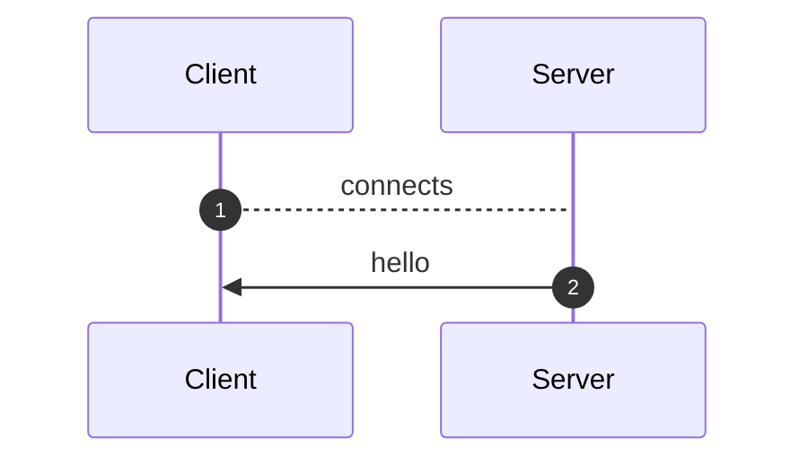
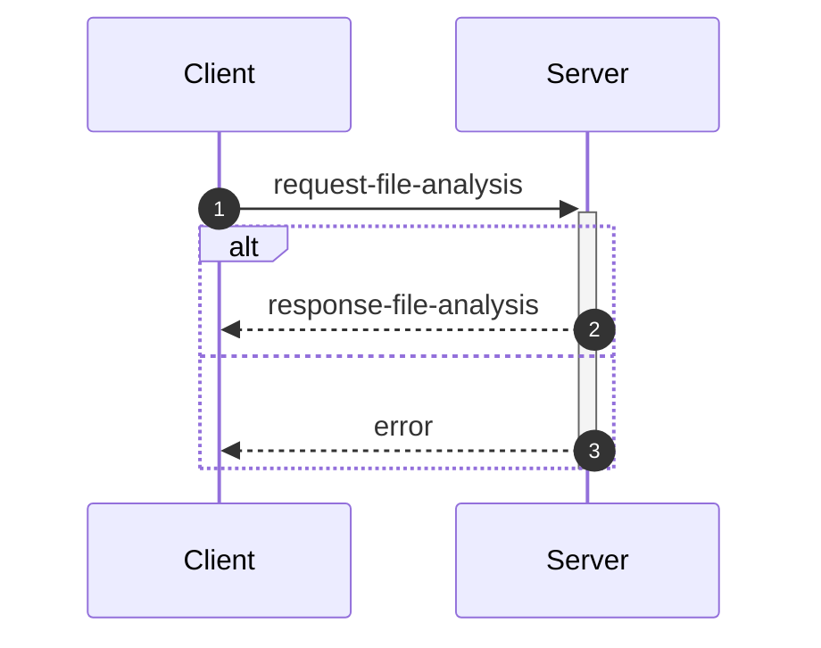
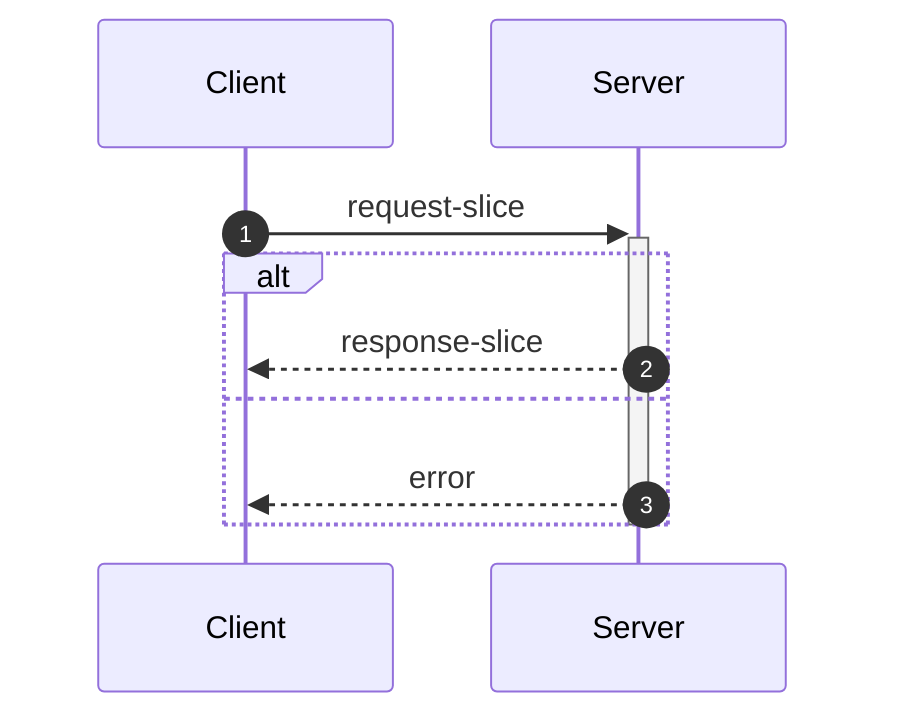
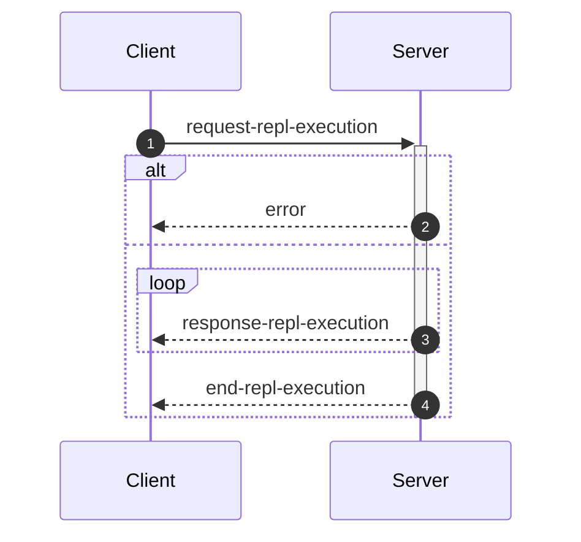

_This document was generated from '[src/documentation/wiki-interface.ts](https://github.com/flowr-analysis/flowr/tree/main//src/documentation/wiki-interface.ts)' on 2026-07-05, 12:10:49 UTC presenting an overview of flowR's interface (v2.10.10, using R v4.5.0). Please do not edit this file/wiki page directly._

Although far from being as detailed as the in-depth explanation of [_flowR_](https://github.com/flowr-analysis/flowr/wiki/core),
this wiki page explains how to interface with _flowR_ in more detail.
In general, command line arguments and other options provide short descriptions on hover over.

* [💻 Using the REPL](#using-the-repl)
* [⚙️ Configuring FlowR](#configuring-flowr)
* [⚒️ Writing Code](#writing-code)
* [💬 Communicating with the Server](#communicating-with-the-server)

<a id='using-the-repl'></a>
## 💻 Using the REPL


> [!NOTE]
> To execute arbitrary R commands with a repl request, _flowR_ has to be started explicitly with <span title="Description (Command Line Argument): Allow to access the underlying R session when using flowR (security warning: this allows the execution of arbitrary R code!)">`--r-session-access`</span>.
> Please be aware that this introduces a security risk and note that this relies on the [`r-shell` engine](https://github.com/flowr-analysis/flowr/wiki/engines) .

Although primarily meant for users to explore,
there is nothing which forbids simply calling _flowR_ as a subprocess to use standard-in, -output, and -error
for communication (although you can access the REPL using the server as well,
with the [REPL Request](#message-request-repl-execution) message).

The read-eval-print loop&nbsp;(REPL) works relatively simple.
You can submit an expression (using <kbd>Enter</kbd>),
which is interpreted as an R&nbsp;expression by default but interpreted as a *command* if it starts with a colon (`:`).
The best command to get started with the REPL is <span title="Description (Repl Command): Show help information (aliases: :h, :?)">`:help`</span>.
Besides, you can leave the REPL either with the command <span title="Description (Repl Command): End the repl (aliases: :q, :exit)">`:quit`</span> or by pressing <kbd>Ctrl</kbd>+<kbd>C</kbd> twice.
When writing a *command*, you may press <kbd>Tab</kbd> to get a list of completions, if available.
Multiple commands can be entered in a single line by separating them with a semicolon (`;`), e.g. `:parse "x<-2"; :df*`.
If a command is given without R code, the REPL will re-use R code given in a previous command.
The prior example will hence return first the parsed AST of the program and then the dataflow graph for `"x <- 2"`.

> [!NOTE]
> If you develop flowR, you may want to launch the repl using the `npm run main-dev` command, this way, you get a non-minified version of flowR with debug information and hot-reloading of source files.

<details>
<summary>Available Commands</summary>

We currently offer the following commands (this with a `[*]` suffix are available with and without the star):


| Command | Description |
| ------- | ----------- |
| **<span title="Description (Repl Command): End the repl (aliases: :q, :exit)">:quit</span>** | End the repl (aliases: **:<span title="Alias of ':quit'. End the repl">q</span>**, **:<span title="Alias of ':quit'. End the repl">exit</span>**) |
| **<span title="Description (Repl Command): Execute the given code as R code. This requires the `--r-session-access` flag to be set and requires the r-shell engine. (aliases: :e, :r)">:execute</span>** | Execute the given code as R code. This requires the `--r-session-access` flag to be set and requires the r-shell engine. (aliases: **:<span title="Alias of ':execute'. Execute the given code as R code. This requires the `--r-session-access` flag to be set and requires the r-shell engine.">e</span>**, **:<span title="Alias of ':execute'. Execute the given code as R code. This requires the `--r-session-access` flag to be set and requires the r-shell engine.">r</span>**) |
| **<span title="Description (Repl Command): Get mermaid code for the control-flow graph of R code (aliases: :cfg, :cf)">:controlflow[*]</span>** | Get mermaid code for the control-flow graph of R code (star: Returns the URL to mermaid.live) (aliases: **:<span title="Alias of ':controlflow'. Get mermaid code for the control-flow graph of R code">cfg</span>**, **:<span title="Alias of ':controlflow'. Get mermaid code for the control-flow graph of R code">cf</span>**) |
| **<span title="Description (Repl Command): Get mermaid code for the control-flow graph with basic blocks (aliases: :cfgb, :cfb)">:controlflowbb[*]</span>** | Get mermaid code for the control-flow graph with basic blocks (star: Returns the URL to mermaid.live) (aliases: **:<span title="Alias of ':controlflowbb'. Get mermaid code for the control-flow graph with basic blocks">cfgb</span>**, **:<span title="Alias of ':controlflowbb'. Get mermaid code for the control-flow graph with basic blocks">cfb</span>**) |
| **<span title="Description (Repl Command): Get mermaid code for the dataflow graph (aliases: :d, :df)">:dataflow[*]</span>** | Get mermaid code for the dataflow graph (star: Returns the URL to mermaid.live) (aliases: **:<span title="Alias of ':dataflow'. Get mermaid code for the dataflow graph">d</span>**, **:<span title="Alias of ':dataflow'. Get mermaid code for the dataflow graph">df</span>**) |
| **<span title="Description (Repl Command): Get mermaid code for the normalized AST of R code (aliases: :n)">:normalize[*]</span>** | Get mermaid code for the normalized AST of R code (star: Returns the URL to mermaid.live) (alias: **:<span title="Alias of ':normalize'. Get mermaid code for the normalized AST of R code">n</span>**) |
| **<span title="Description (Repl Command): Get mermaid code for the simplified dataflow graph (aliases: :ds, :dfs)">:dataflowsimple[*]</span>** | Get mermaid code for the simplified dataflow graph (star: Returns the URL to mermaid.live) (aliases: **:<span title="Alias of ':dataflowsimple'. Get mermaid code for the simplified dataflow graph">ds</span>**, **:<span title="Alias of ':dataflowsimple'. Get mermaid code for the simplified dataflow graph">dfs</span>**) |
| **<span title="Description (Repl Command): Just calculates the DFG, but only prints summary info (aliases: :d#, :df#)">:dataflowsilent</span>** | Just calculates the DFG, but only prints summary info (aliases: **:<span title="Alias of ':dataflowsilent'. Just calculates the DFG, but only prints summary info">d#</span>**, **:<span title="Alias of ':dataflowsilent'. Just calculates the DFG, but only prints summary info">df#</span>**) |
| **<span title="Description (Repl Command): Prints ASCII Art of the parsed, unmodified AST (aliases: :p)">:parse</span>** | Prints ASCII Art of the parsed, unmodified AST (alias: **:<span title="Alias of ':parse'. Prints ASCII Art of the parsed, unmodified AST">p</span>**) |
| **<span title="Description (Repl Command): Prints the version of flowR as well as the current version of R">:version</span>** | Prints the version of flowR as well as the current version of R
| **<span title="Description (Repl Command): Query the given R code (use 'help' for more information)">:query[*]</span>** | Query the given R code (use 'help' for more information) (star: Similar to query, but returns the output in json format.)
| **<span title="Description (Repl Command): Returns an ASCII representation of the dataflow graph (aliases: :df!)">:dataflowascii</span>** | Returns an ASCII representation of the dataflow graph (alias: **:<span title="Alias of ':dataflowascii'. Returns an ASCII representation of the dataflow graph">df!</span>**) |
| **<span title="Description (Repl Command): Returns summarization stats for the normalized AST (aliases: :n#)">:normalize#</span>** | Returns summarization stats for the normalized AST (alias: **:<span title="Alias of ':normalize#'. Returns summarization stats for the normalized AST">n#</span>**) |
| **<span title="Description (Repl Command): Show help information (aliases: :h, :?)">:help</span>** | Show help information (aliases: **:<span title="Alias of ':help'. Show help information">h</span>**, **:<span title="Alias of ':help'. Show help information">?</span>**) |


</details>


> [!TIP]
> 
> As indicated by the examples before, all REPL commands that operate on code keep track of the state.
> Hence, if you run a command like <span title="Description (Repl Command, starred version): Returns the URL to mermaid.live; Base Command: Get mermaid code for the dataflow graph (aliases: :d*, :df*)">`:dataflow*`</span> without providing R code,
> the REPL will re-use the R code provided in a previous command.
> Likewise, doing this will benefit from incrementality!
> If you request the dataflow graph with `:df* x <- 2 * y` and then want to see the parsed AST with `:parse`,
> the REPL will re-use previously obtained information and not re-parse the code again.
> 		


Generally, many commands offer shortcut versions in the REPL. Many queries, for example, offer a shortened format (see the example below).
Of special note, the [Config Query](https://github.com/flowr-analysis/flowr/wiki/query-api#Config-Query)
can be used to also modify the currently active configuration of _flowR_ within the REPL (see the [wiki page](https://github.com/flowr-analysis/flowr/wiki/query-api#Config-Query) for more information).

### Example: Retrieving the Dataflow Graph

To retrieve a URL to the [mermaid](https://mermaid.js.org/) diagram of the dataflow of a given expression,
use <span title="Description (Repl Command, starred version): Returns the URL to mermaid.live; Base Command: Get mermaid code for the dataflow graph (aliases: :d*, :df*)">`:dataflow*`</span> (or <span title="Description (Repl Command): Get mermaid code for the dataflow graph (aliases: :d, :df)">`:dataflow`</span> to get the mermaid code in the cli):


```shell
$ docker run -it --rm eagleoutice/flowr # or npm run flowr 
flowR repl using flowR v2.10.10, R grammar v14 (tree-sitter engine)
R> :dataflow* y <- 1 + x
```

<details>
<summary style='color:gray'>Output</summary>


```text
https://mermaid.live/view#base64:eyJjb2RlIjoiZmxvd2NoYXJ0IEJUXG4gICAgMXt7XCJgIzkxO1JOdW1iZXIjOTM7IDFcbiAgICAgICgxKVxuICAgICAgKjEuNipgXCJ9fVxuICAgJSUgTm8gZWRnZXMgZm91bmQgZm9yIDFcbiAgICAyKFtcImAjOTE7UlN5bWJvbCM5MzsgeFxuICAgICAgKDIpXG4gICAgICAqMS4xMCpgXCJdKVxuICAgJSUgTm8gZWRnZXMgZm91bmQgZm9yIDJcbiAgICAzW1tcImAjOTE7UkJpbmFyeU9wIzkzOyAjNDM7XG4gICAgICAoMylcbiAgICAgICoxLjYtMTAqXG4gICAgKDEsIDIpYFwiXV1cbiAgICBidWlsdC1pbjpfW1wiYEJ1aWx0LUluOlxuIzQzO2BcIl1cbiAgICBzdHlsZSBidWlsdC1pbjpfIHN0cm9rZTpncmF5LGZpbGw6Z3JheSxzdHJva2Utd2lkdGg6MnB4LG9wYWNpdHk6Ljg7XG4gICAgMFtcImAjOTE7UlN5bWJvbCM5MzsgeVxuICAgICAgKDAsIHNvdXJjZXM6IFszXSlcbiAgICAgICoxLjEqYFwiXVxuICAgIDRbW1wiYCM5MTtSQmluYXJ5T3AjOTM7ICM2MDsjNDU7XG4gICAgICAoNClcbiAgICAgICoxLjEtMTAqXG4gICAgKDAsIDMpYFwiXV1cbiAgICBidWlsdC1pbjpfLVtcImBCdWlsdC1JbjpcbiM2MDsjNDU7YFwiXVxuICAgIHN0eWxlIGJ1aWx0LWluOl8tIHN0cm9rZTpncmF5LGZpbGw6Z3JheSxzdHJva2Utd2lkdGg6MnB4LG9wYWNpdHk6Ljg7XG4gICAgMyAtLT58XCJyZWFkcywgYXJndW1lbnRcInwgMVxuICAgIDMgLS0+fFwicmVhZHMsIGFyZ3VtZW50XCJ8IDJcbiAgICAzIC0uLT58XCJyZWFkcywgY2FsbHNcInwgYnVpbHQtaW46X1xuICAgIGxpbmtTdHlsZSAyIHN0cm9rZTpncmF5O1xuICAgIDAgLS0+fFwiZGVmaW5lZC1ieVwifCAzXG4gICAgMCAtLT58XCJkZWZpbmVkLWJ5XCJ8IDRcbiAgICA0IC0tPnxcInJlYWRzLCBhcmd1bWVudFwifCAzXG4gICAgNCAtLT58XCJyZXR1cm5zLCBhcmd1bWVudFwifCAwXG4gICAgNCAtLi0+fFwicmVhZHMsIGNhbGxzXCJ8IGJ1aWx0LWluOl8tXG4gICAgbGlua1N0eWxlIDcgc3Ryb2tlOmdyYXk7IiwibWVybWFpZCI6eyJhdXRvU3luYyI6dHJ1ZX19
```


Retrieve the dataflow graph of the expression `y <- 1 + x`. It looks like this:


```mermaid
flowchart LR
    1{{"`#91;RNumber#93; 1
      (1)
      *1.6*`"}}
   %% No edges found for 1
    2(["`#91;RSymbol#93; x
      (2)
      *1.10*`"])
   %% No edges found for 2
    3[["`#91;RBinaryOp#93; #43;
      (3)
      *1.6-10*
    (1, 2)`"]]
    built-in:_["`Built-In:
#43;`"]
    style built-in:_ stroke:gray,fill:gray,stroke-width:2px,opacity:.8;
    0["`#91;RSymbol#93; y
      (0, sources: [3])
      *1.1*`"]
    4[["`#91;RBinaryOp#93; #60;#45;
      (4)
      *1.1-10*
    (0, 3)`"]]
    built-in:_-["`Built-In:
#60;#45;`"]
    style built-in:_- stroke:gray,fill:gray,stroke-width:2px,opacity:.8;
    3 -->|"reads, argument"| 1
    3 -->|"reads, argument"| 2
    3 -.->|"reads, calls"| built-in:_
    linkStyle 2 stroke:gray;
    0 -->|"defined-by"| 3
    0 -->|"defined-by"| 4
    4 -->|"reads, argument"| 3
    4 -->|"returns, argument"| 0
    4 -.->|"reads, calls"| built-in:_-
    linkStyle 7 stroke:gray;
```

	
<details>

<summary style="color:gray">R Code of the Dataflow Graph</summary>

The analysis required _0.6 ms_ (including parse and normalize, using the [tree-sitter](https://github.com/flowr-analysis/flowr/wiki/Engines) engine) within the generation environment. 
We encountered no unknown side effects during the analysis.


```r
y <- 1 + x
```


</details>


</details>


For small graphs like this, <span title="Description (Repl Command): Returns an ASCII representation of the dataflow graph (aliases: :df!)">`:dataflowascii`</span> also provides an ASCII representation directly in the REPL:


```shell
$ docker run -it --rm eagleoutice/flowr # or npm run flowr 
flowR repl using flowR v2.10.10, R grammar v14 (tree-sitter engine)
R> :df! y <- 1 + x
```

<details open>
<summary style='color:gray'>Output</summary>


```text
                        0<1>0
                   ┌────| 1 |
    ┌────────┐     │    0---0
 c<4>c       └──c<3>c
 |<- |  v<0>v┌──| + |
 c---c──| y |┘  c---c   u<2>u
        v---v      └────| x |
                        u---u
Edges:
3 -> 1: reads, argument  3 -> 2: reads, argument
4 -> 3: reads, argument  4 -> 0: returns, argument
0 -> 3: defined-by       0 -> 4: defined-by
```


Retrieve the dataflow graph of the expression `y <- 1 + x` as ASCII art.

</details>


For the slicing with <span title="Description (Repl Command): Static backwards executable slicer for R">`:slicer`</span>, you have access to the same [magic comments](#slice-magic-comments) as with the [slice request](#message-request-slice).

### Example: Interfacing with the File System

Many commands that allow for an R-expression (like <span title="Description (Repl Command, starred version): Returns the URL to mermaid.live; Base Command: Get mermaid code for the dataflow graph (aliases: :d*, :df*)">`:dataflow*`</span>) allow for a file as well
if the argument starts with `file://`.
If you are working from the root directory of the _flowR_ repository, the following gives you the parsed AST of the example file using the <span title="Description (Repl Command): Prints ASCII Art of the parsed, unmodified AST (aliases: :p)">`:parse`</span> command:

> **Watch mode**: Replace `file://` with `watch://` to enter watch mode.
> flowR runs the command immediately and then re-runs it every time the file (or any file inside the folder) changes.
> Enter any other command to leave watch mode.
> For example: `:df watch://analysis.R`


```shell
$ docker run -it --rm eagleoutice/flowr # or npm run flowr 
flowR repl using flowR v2.10.10, R grammar v14 (tree-sitter engine)
R> :parse file://test/testfiles/example.R
```

<details>
<summary style='color:gray'>Output</summary>


```text
File: test/testfiles/example.R

program
├ binaryoperator
│ ├ identifier "sum" (1:1─4)
│ ├ <- "<-" (1:5─7)
│ ╰ float "0" (1:8─9)
├ binaryoperator
│ ├ identifier "product" (2:1─8)
│ ├ <- "<-" (2:9─11)
│ ╰ float "1" (2:12─13)
├ binaryoperator
│ ├ identifier "w" (3:1─2)
│ ├ <- "<-" (3:3─5)
│ ╰ float "7" (3:6─7)
├ binaryoperator
│ ├ identifier "N" (4:1─2)
│ ├ <- "<-" (4:3─5)
│ ╰ float "10" (4:6─8)
├ forstatement
│ ├ for "for" (6:1─4)
│ ├ ( "(" (6:5─6)
│ ├ identifier "i" (6:6─7)
│ ├ in "in" (6:8─10)
│ ├ binaryoperator
│ │ ├ float "1" (6:11─12)
│ │ ├ : ":" (6:12─13)
│ │ ╰ parenthesizedexpression
│ │   ├ ( "(" (6:13─14)
│ │   ├ binaryoperator
│ │   │ ├ identifier "N" (6:14─15)
│ │   │ ├ - "-" (6:15─16)
│ │   │ ╰ float "1" (6:16─17)
│ │   ╰ ) ")" (6:17─18)
│ ├ ) ")" (6:18─19)
│ ╰ bracedexpression
│   ├ { "{" (6:20─21)
│   ├ binaryoperator
│   │ ├ identifier "sum" (7:3─6)
│   │ ├ <- "<-" (7:7─9)
│   │ ╰ binaryoperator
│   │   ├ binaryoperator
│   │   │ ├ identifier "sum" (7:10─13)
│   │   │ ├ + "+" (7:14─15)
│   │   │ ╰ identifier "i" (7:16─17)
│   │   ├ + "+" (7:18─19)
│   │   ╰ identifier "w" (7:20─21)
│   ├ binaryoperator
│   │ ├ identifier "product" (8:3─10)
│   │ ├ <- "<-" (8:11─13)
│   │ ╰ binaryoperator
│   │   ├ identifier "product" (8:14─21)
│   │   ├  "" (8:22─23)
│   │   ╰ identifier "i" (8:24─25)
│   ╰ } "}" (9:1─2)
├ call
│ ├ identifier "cat" (11:1─4)
│ ╰ arguments
│   ├ ( "(" (11:4─5)
│   ├ argument
│   │ ╰ string
│   │   ├ " "\"" (11:5─6)
│   │   ├ stringcontent "Sum:" (11:6─10)
│   │   ╰ " "\"" (11:10─11)
│   ├ comma "," (11:11─12)
│   ├ argument
│   │ ╰ identifier "sum" (11:13─16)
│   ├ comma "," (11:16─17)
│   ├ argument
│   │ ╰ string
│   │   ├ " "\"" (11:18─19)
│   │   ├ stringcontent
│   │   │ ╰ escapesequence "\\n" (11:19─21)
│   │   ╰ " "\"" (11:21─22)
│   ╰ ) ")" (11:22─23)
╰ call
  ├ identifier "cat" (12:1─4)
  ╰ arguments
    ├ ( "(" (12:4─5)
    ├ argument
    │ ╰ string
    │   ├ " "\"" (12:5─6)
    │   ├ stringcontent "Product:" (12:6─14)
    │   ╰ " "\"" (12:14─15)
    ├ comma "," (12:15─16)
    ├ argument
    │ ╰ identifier "product" (12:17─24)
    ├ comma "," (12:24─25)
    ├ argument
    │ ╰ string
    │   ├ " "\"" (12:26─27)
    │   ├ stringcontent
    │   │ ╰ escapesequence "\\n" (12:27─29)
    │   ╰ " "\"" (12:29─30)
    ╰ ) ")" (12:30─31)
```


Retrieve the parsed AST of the example file.

<details>

<summary>File Content</summary>


```r
sum <- 0
product <- 1
w <- 7
N <- 10

for (i in 1:(N-1)) {
  sum <- sum + i + w
  product <- product * i
}

cat("Sum:", sum, "\n")
cat("Product:", product, "\n")
```


</details>

As _flowR_ directly transforms this AST the output focuses on being human-readable instead of being machine-readable.
		

</details>


### Example: Run a Query

You can run any query supported by _flowR_ using the <span title="Description (Repl Command): Query the given R code (use 'help' for more information)">`:query`</span> command.
For example, to obtain the shapes of all data frames in a given piece of code, you can run:


```shell
$ docker run -it --rm eagleoutice/flowr # or npm run flowr 
flowR repl using flowR v2.10.10, R grammar v14 (tree-sitter engine)
R> :query @df-shape "x <- data.frame(a = 1:10, b = 1:10)\ny <- x$a"
```

<details open>
<summary style='color:gray'>Output</summary>


```text
Query: df-shape (2 ms)
   ╰ 12: (colnames: [{"a", "b"}, {}], cols: [2, 2], rows: [10, 10])
   ╰ 0: (colnames: [{"a", "b"}, {}], cols: [2, 2], rows: [10, 10])
All queries together required ≈4 ms (1ms accuracy, total 5 ms)
```


Retrieve the shapes of all data frames in the given code.

</details>


To run the linter on a file, you can use (in this example, we just issue the `dead-code` linter on a small piece of code):


```shell
$ docker run -it --rm eagleoutice/flowr # or npm run flowr 
flowR repl using flowR v2.10.10, R grammar v14 (tree-sitter engine)
R> :query @linter rules:dead-code "if(FALSE) x <- 2"
```

<details open>
<summary style='color:gray'>Output</summary>


```text
Query: linter (1 ms)
   ╰ Dead Code (dead-code):
       ╰ certain:
           ╰ Code at 1.11-16
       ╰ Metadata: searchTimeMs: 1, processTimeMs: 0
All queries together required ≈1 ms (1ms accuracy, total 2 ms)
```


Run the linter on the given code, with only the `dead-code` rule enabled.

</details>


For more information on the available queries, please check out the [Query API](https://github.com/flowr-analysis/flowr/wiki/query-api).


<a id='configuring-flowr'></a>
## ⚙️ Configuring FlowR


When running _flowR_, you may want to specify some behaviors with a dedicated configuration file.
By default, flowR looks for a file named `flowr.json` in the current working directory (or any higher directory).
You can also specify a different file with <span title="Description (Command Line Argument): The name of the configuration file to use">`--config-file`</span> or pass the configuration inline using <span title="Description (Command Line Argument): The flowR configuration to use, as a JSON string">`--config-json`</span>.
To inspect the current configuration, you can run flowr with the <span title="Description (Command Line Argument): Run with verbose logging (will be passed to the corresponding script)">`--verbose`</span> flag, or use the `config` [Query](https://github.com/flowr-analysis/flowr/wiki/query-api).
Within the REPL this works by running the following:


```shell
:query @config
```


To work with the <a href="https://github.com/flowr-analysis/flowr/tree/main/src/config.ts#L109"><code><span title="The configuration file format for flowR.">FlowrConfig</span></code></a> you can use the provided helper objects alongside its methods like
<a href="https://github.com/flowr-analysis/flowr/tree/main/src/config.ts#L458"><code><span title="Creates a new flowr config that has the updated values.">FlowrConfig::<b>amend</b></span></code></a>.
The following summarizes the configuration options:

- `ignoreSourceCalls`: If set to `true`, _flowR_ will ignore source calls when analyzing the code, i.e., ignoring the inclusion of other files.
- `semantics`: allows to configure the way _flowR_ handles R, although we currently only support `semantics/environment/overwriteBuiltIns`.
  You may use this to overwrite _flowR_'s handling of built-in function and even completely clear the preset definitions shipped with flowR.
  See [Configure BuiltIn Semantics](#configure-builtin-semantics) for more information.
- `solver`: allows to configure how _flowR_ resolves variables and their values (currently we support: `disabled`, `alias`, `builtin`), as well as if pointer analysis should be active.
- `engines`: allows to configure the engines used by _flowR_ to interact with R code. See the [Engines wiki page](https://github.com/flowr-analysis/flowr/wiki/engines) for more information.
- `defaultEngine`: allows to specify the default engine to use for interacting with R code. If not set, an arbitrary engine from the specified list will be used.
- `abstractInterpretation`: allows to configure how _flowR_ performs abstract interpretation, although we currently only support data frame shape inference through abstract interpretation.
- `defaultPlugins`: allows to configure which plugins to load by default when creating a new <a href="https://github.com/flowr-analysis/flowr/tree/main/src/project/flowr-analyzer.ts#L162"><code><span title="Central class for conducting analyses with FlowR. Use the FlowrAnalyzerBuilder to create a new instance. If you want the original pattern of creating a pipeline and running all steps, you can still do this with FlowrAnalyzer#runFull . To inspect the context of the analyzer, use FlowrAnalyzer#inspectContext (if you are a plugin and need to modify it, use FlowrAnalyzer#context instead).">FlowrAnalyzer</span></code></a> instance.
- `repl.plugins`: allows to configure which plugins to load in the _flowR_ REPL. Use `flowr:default` to reference the plugins specified by `defaultPlugins`.

So you can configure _flowR_ by adding a file like the following:

<details>

<summary>Example Configuration File</summary>


```json
{
  "ignoreSourceCalls": true,
  "semantics": {
    "environment": {
      "overwriteBuiltIns": {
        "definitions": [
          {
            "type": "function",
            "names": [
              "foo"
            ],
            "processor": "builtin:assign",
            "config": {}
          }
        ]
      }
    }
  },
  "defaultPlugins": [
    "file:description",
    "versions:description"
  ],
  "repl": {
    "quickStats": false,
    "dfProcessorHeat": false,
    "plugins": [
      "flowr:default"
    ]
  },
  "project": {
    "resolveUnknownPathsOnDisk": true
  },
  "engines": [
    {
      "type": "r-shell"
    }
  ],
  "solver": {
    "variables": "alias",
    "evalStrings": true,
    "trackEnvironments": true,
    "resolveSource": {
      "dropPaths": "no",
      "ignoreCapitalization": true,
      "inferWorkingDirectory": "active-script",
      "searchPath": []
    },
    "instrument": {},
    "slicer": {
      "threshold": 50
    }
  },
  "abstractInterpretation": {
    "wideningThreshold": 4,
    "dataFrame": {
      "maxColNames": 20,
      "readLoadedData": {
        "readExternalFiles": true,
        "maxReadLines": 1000000
      }
    }
  },
  "gas": {
    "thresholds": {
      "memory": {
        "problematic": 0.7,
        "critical": 0.9
      },
      "timeMs": {
        "problematic": 100000,
        "critical": 120000
      }
    },
    "features": {}
  }
}
```


</details>

<details>
<a id='configure-builtin-semantics'></a>
<summary>Configure Built-In Semantics</summary>


`semantics/environment/overwriteBuiltins` accepts two keys:

- `loadDefaults` (boolean, initially `true`): If set to `true`, the default built-in definitions are loaded before applying the custom definitions. Setting this flag to `false` explicitly disables the loading of the default definitions.
- `definitions` (array, initially empty): Allows to overwrite or define new built-in elements. Each object within must have a `type` which is one of the below. Furthermore, they may define a string array of `names` which specifies the identifiers to bind the definitions to. You may use `assumePrimitive` to specify whether _flowR_ should assume that this is a primitive non-library definition (so you probably just do not want to specify the key).

  | Type            | Description                                                                                                                                                                                                                                                                                              | Example                                                                                                    |
  | --------------- | -------------------------------------------------------------------------------------------------------------------------------------------------------------------------------------------------------------------------------------------------------------------------------------------------------- | ---------------------------------------------------------------------------------------------------------- |
  | `constant`    | Additionally allows for a `value` this should resolve to.                                                                                                                                                                                                                                                | `{ type: 'constant', names: ['NULL', 'NA'],  value: null }`                                                |
  | `function`    | Is a rather flexible way to define and bind built-in functions. For the time, we do not have extensive documentation to cover all the cases, so please either consult the sources with the `default-builtin-config.ts` or open a [new issue](https://github.com/flowr-analysis/flowr/issues/new/choose). | `{ type: 'function', names: ['next'], processor: 'builtin:d', config: { cfg: ExitPointType.Next } }` |
  | `replacement` | A comfortable way to specify replacement functions like `$<-` or `names<-`. `suffixes` describes the... suffixes to attach automatically. | `{ type: 'replacement', suffixes: ['<-', '<<-'], names: ['[', '[['] }` |


</details>

<details>

<summary style='color:gray'>Full Configuration-File Schema</summary>

- _The configuration file format for flowR._ (object)
    - **ignoreSourceCalls** [optional] _Whether source calls should be ignored, causing {@link processSourceCall}'s behavior to be skipped._ (boolean)
    - **semantics** _Configure language semantics and how flowR handles them._ (object)
        - **environment** [optional] _Semantics regarding how to handle the R environment._ (object)
            - **overwriteBuiltIns** [optional] _Do you want to overwrite (parts) of the builtin definition?_ (object)
                - **loadDefaults** [optional] _Should the default configuration still be loaded?_ (boolean)
                - **definitions** [optional] _The definitions to load/overwrite._ (array)
                Valid item types:
                    - (object)
    - **defaultPlugins** [optional] _The default plugins to load when creating a new instance of FlowrAnalyzer_ (array)
    Valid item types:
        - (alternatives)
            - (string)
            - (array)
    - **repl** _Configuration options for the REPL._ (object)
        - **quickStats** [optional] _Whether to show quick stats in the REPL after each evaluation._ (boolean)
        - **dfProcessorHeat** [optional] _This instruments the dataflow processors to count how often each processor is called._ (boolean)
        - **plugins** [optional] _The plugins to load in REPL mode_ (array)
        Valid item types:
            - (alternatives)
                - (string)
                - (array)
    - **project** _Project specific configuration options._ (object)
        - **resolveUnknownPathsOnDisk** [optional] _Whether to resolve unknown paths loaded by the r project disk when trying to source/analyze files._ (boolean)
    - **engines** _The engine or set of engines to use for interacting with R code. An empty array means all available engines will be used._ (array)
    Valid item types:
        - (alternatives)
            - _The configuration for the tree sitter engine._ (object)
                - **type** [required] _Use the tree sitter engine._ (string)
                    Only allows: 'tree-sitter'
                - **wasmPath** [optional] _The path to the tree-sitter-r WASM binary to use. If this is undefined, this uses the default path._ (string)
                - **treeSitterWasmPath** [optional] _The path to the tree-sitter WASM binary to use. If this is undefined, this uses the default path._ (string)
                - **lax** [optional] _Whether to use the lax parser for parsing R code (allowing for syntax errors). If this is undefined, the strict parser will be used._ (boolean)
            - _The configuration for the R shell engine._ (object)
                - **type** [required] _Use the R shell engine._ (string)
                    Only allows: 'r-shell'
                - **rPath** [optional] _The path to the R executable to use. If this is undefined, this uses the default path._ (string)
    - **defaultEngine** [optional] _The default engine to use for interacting with R code. If this is undefined, an arbitrary engine from the specified list will be used._ (string)
        Only allows: 'tree-sitter', 'r-shell'
    - **solver** _How to resolve constants, constraints, cells, ..._ (object)
        - **variables** _How to resolve variables and their values._ (string)
            Only allows: 'disabled', 'alias', 'builtin'
        - **evalStrings** _Should we include eval(parse(text="...")) calls in the dataflow graph?_ (boolean)
        - **trackEnvironments** [optional] _Track user-created environments (new.env, assign/get/local with envir=, dollar-assign, attach). When false, all envir-style calls fall through conservatively._ (boolean)
        - **instrument** (object)
            - **dataflowExtractors** [optional] _These keys are only intended for use within code, allowing to instrument the dataflow analyzer!_ (any)
        - **resolveSource** [optional] _If lax source calls are active, flowR searches for sourced files much more freely, based on the configurations you give it. This option is only in effect if `ignoreSourceCalls` is set to false._ (object)
            - **dropPaths** _Allow to drop the first or all parts of the sourced path, if it is relative._ (string)
                Only allows: 'no', 'once', 'all'
            - **ignoreCapitalization** _Search for filenames matching in the lowercase._ (boolean)
            - **inferWorkingDirectory** _Try to infer the working directory from the main or any script to analyze._ (string)
                Only allows: 'no', 'main-script', 'active-script', 'any-script'
            - **searchPath** _Additionally search in these paths._ (array)
            Valid item types:
                - (string)
            - **repeatedSourceLimit** [optional] _How often the same file can be sourced within a single run? Please be aware: in case of cyclic sources this may not reach a fixpoint so give this a sensible limit._ (number)
            - **applyReplacements** _Provide name replacements for loaded files_ (array)
            Valid item types:
                - (object)
        - **slicer** [optional] _The configuration for the slicer._ (object)
            - **threshold** [optional] _The maximum number of iterations to perform on a single function call during slicing._ (number)
            - **autoExtend** [optional] _If set, the slicer will gain an additional post-pass._ (boolean)
    - **abstractInterpretation** _The configuration options for abstract interpretation._ (object)
        - **wideningThreshold** _The threshold for the number of visitations of a node at which widening should be performed to ensure the termination of the fixpoint iteration._ (number)
        - **dataFrame** _The configuration of the shape inference for data frames._ (object)
            - **maxColNames** _The maximum number of columns names to infer for data frames before over-approximating the column names to top._ (number)
            - **readLoadedData** _Configuration options for reading data frame shapes from loaded external data files, such as CSV files._ (object)
                - **readExternalFiles** _Whether data frame shapes should be extracted from loaded external files, such as CSV files._ (boolean)
                - **maxReadLines** _The maximum number of lines to read when extracting data frame shapes from loaded files, such as CSV files._ (number)
    - **gas** [optional] _Resource-usage guard (gas) configuration. All feature factors default to 0 (disabled). See https://github.com/flowr-analysis/flowr/wiki/Core#gas-resource-guard._ (object)
        - **thresholds** [optional] _Shared thresholds for all gas checks (scaled by per-feature factor)._ (object)
            - **memory** [optional] _Heap-usage fraction thresholds (0-1)._ (object)
                - **problematic** [optional] _Heap fraction (0-1) above which Problematic is returned._ (number)
                - **critical** [optional] _Heap fraction (0-1) above which Critical is returned._ (number)
            - **timeMs** [optional] _Elapsed analysis time thresholds in milliseconds._ (object)
                - **problematic** [optional] _Elapsed ms above which Problematic is returned._ (number)
                - **critical** [optional] _Elapsed ms above which Critical is returned._ (number)
        - **features** [optional] _Per-feature sensitivity factors. 0 or absent disables gas checking for that feature. A factor of 2 makes the feature twice as sensitive. Recognised keys: `source`, `side-effect-linking`, `linter`._ (object)
        - **heapProvider** [optional] _Custom heap statistics source (programmatic configs only), overriding the built-in v8/performance.memory detection._ (function)

</details>

	

<a id='writing-code'></a>
## ⚒️ Writing Code

_flowR_ can be used as a [module](https://www.npmjs.com/package/@eagleoutice/flowr) and offers several main classes and interfaces that are interesting for extension writers 
(see the [Visual Studio Code extension](https://marketplace.visualstudio.com/items?itemName=code-inspect.vscode-flowr) or the [Core](https://github.com/flowr-analysis/flowr/wiki/core) wiki page for more information).

### Creating Analyses with _flowR_

Nowadays, instances of the <a href="https://github.com/flowr-analysis/flowr/tree/main/src/project/flowr-analyzer.ts#L162"><code><span title="Central class for conducting analyses with FlowR. Use the FlowrAnalyzerBuilder to create a new instance. If you want the original pattern of creating a pipeline and running all steps, you can still do this with FlowrAnalyzer#runFull . To inspect the context of the analyzer, use FlowrAnalyzer#inspectContext (if you are a plugin and need to modify it, use FlowrAnalyzer#context instead).">FlowrAnalyzer</span></code></a> should be used as central frontend to get analysis results from _flowR_.
For example, a program slice can be created like this:


```ts
const analyzer = await new FlowrAnalyzerBuilder()
    .setEngine('tree-sitter')
    .build();
analyzer.addRequest('x <- 1\ny <- x\nx');
const result = await analyzer.query([
    {
        type:     'static-slice',
        criteria: ['3@x']
    }
]);
//console.log(result['static-slice']);
```


For more information, please have a look at the [Analyzer](https://github.com/flowr-analysis/flowr/wiki/analyzer) wiki page, which explains how to construct and use the <a href="https://github.com/flowr-analysis/flowr/tree/main/src/project/flowr-analyzer.ts#L162"><code><span title="Central class for conducting analyses with FlowR. Use the FlowrAnalyzerBuilder to create a new instance. If you want the original pattern of creating a pipeline and running all steps, you can still do this with FlowrAnalyzer#runFull . To inspect the context of the analyzer, use FlowrAnalyzer#inspectContext (if you are a plugin and need to modify it, use FlowrAnalyzer#context instead).">FlowrAnalyzer</span></code></a> in more detail.
To work with specific perspectives, you can also consult the respective pages like the [Dataflow Graph](https://github.com/flowr-analysis/flowr/wiki/dataflow-graph) or the [Abstract Interpretation](https://github.com/flowr-analysis/flowr/wiki/abstract-interpretation) wiki pages.
### The Pipeline Executor (Low-Level Interface)

Once, in the beginning, _flowR_ was meant to produce a dataflow graph merely to provide *program slices*. 
However, with continuous updates, the [Dataflow Graph](https://github.com/flowr-analysis/flowr/wiki/dataflow-graph) repeatedly proves to be the more interesting part.
With this, we restructured _flowR_'s originally *hardcoded* pipeline to be far more flexible. 
Now, it can be theoretically extended or replaced with arbitrary steps, optional steps, and what we call 'decorations' of these steps. 
In short, a slicing pipeline using the <a href="https://github.com/flowr-analysis/flowr/tree/main/src/core/pipeline-executor.ts#L97"><code><span title="**Please note:** The PipelineExecutor is now considered to be a rather low-level API for flowR. While it still works and is the basis for all other layers, we strongly recommend using the FlowrAnalyzer and its builder to create and use an analyzer instance that is pre-configured for your use-case. The pipeline executor allows to execute arbitrary pipelines in a step-by-step fashion. If you are not...">PipelineExecutor</span></code></a> looks like this:


```ts

const slicer = new PipelineExecutor(DEFAULT_SLICING_PIPELINE, {
  parser:    new RShell(),
  request:   requestFromInput('x <- 1\nx + 1'),
  criterion: ['2@x']
})
const slice = await slicer.allRemainingSteps()
// console.log(slice.reconstruct.code)
```


<details><summary>More Information</summary>


If you compare this, with what you would have done with the old (and removed) `SteppingSlicer`, 
this essentially just requires you to replace the `SteppingSlicer` with the <a href="https://github.com/flowr-analysis/flowr/tree/main/src/core/pipeline-executor.ts#L97"><code><span title="**Please note:** The PipelineExecutor is now considered to be a rather low-level API for flowR. While it still works and is the basis for all other layers, we strongly recommend using the FlowrAnalyzer and its builder to create and use an analyzer instance that is pre-configured for your use-case. The pipeline executor allows to execute arbitrary pipelines in a step-by-step fashion. If you are not...">PipelineExecutor</span></code></a>
and to pass the <a href="https://github.com/flowr-analysis/flowr/tree/main/src/core/steps/pipeline/default-pipelines.ts#L18"><code>DEFAULT_SLICING_PIPELINE</code></a> as the first argument.
The <a href="https://github.com/flowr-analysis/flowr/tree/main/src/core/pipeline-executor.ts#L97"><code><span title="**Please note:** The PipelineExecutor is now considered to be a rather low-level API for flowR. While it still works and is the basis for all other layers, we strongly recommend using the FlowrAnalyzer and its builder to create and use an analyzer instance that is pre-configured for your use-case. The pipeline executor allows to execute arbitrary pipelines in a step-by-step fashion. If you are not...">PipelineExecutor</span></code></a>...

1. Provides structures to investigate the results of all intermediate steps
2. Can be executed step-by-step
3. Can repeat steps (e.g., to calculate multiple slices on the same input)

See the in-code documentation for more information.


</details>

### Using the <a href="https://github.com/flowr-analysis/flowr/tree/main/src/r-bridge/shell.ts#L143"><code><span title="The RShell represents an interactive session with the R interpreter. You can configure it by RShellOptions . At the moment we are using a live R session (and not networking etc.) to communicate with R easily, which allows us to install packages etc. However, this might and probably will change in the future (leaving this as a legacy mode :D)">RShell</span></code></a> to Interact with R

The <a href="https://github.com/flowr-analysis/flowr/tree/main/src/r-bridge/shell.ts#L143"><code><span title="The RShell represents an interactive session with the R interpreter. You can configure it by RShellOptions . At the moment we are using a live R session (and not networking etc.) to communicate with R easily, which allows us to install packages etc. However, this might and probably will change in the future (leaving this as a legacy mode :D)">RShell</span></code></a> class allows interfacing with the `R`&nbsp;ecosystem installed on the host system.
Please have a look at [flowR's Engines](https://github.com/flowr-analysis/flowr/wiki/engines) for more information on alternatives (for example, the <a href="https://github.com/flowr-analysis/flowr/tree/main/src/r-bridge/lang-4.x/tree-sitter/tree-sitter-executor.ts#L18"><code><span title="Synchronous and (way) faster alternative to the RShell using tree-sitter.">TreeSitterExecutor</span></code></a>).


> [!IMPORTANT]
> 
> Each <a href="https://github.com/flowr-analysis/flowr/tree/main/src/r-bridge/shell.ts#L143"><code><span title="The RShell represents an interactive session with the R interpreter. You can configure it by RShellOptions . At the moment we are using a live R session (and not networking etc.) to communicate with R easily, which allows us to install packages etc. However, this might and probably will change in the future (leaving this as a legacy mode :D)">RShell</span></code></a> controls a new instance of the R&nbsp;interpreter, 
> make sure to call <code><a href="https://github.com/flowr-analysis/flowr/tree/main/src/r-bridge/shell.ts#L333"><span title="Close the current R session, makes the object effectively invalid (can no longer be reopened etc.)">RShell::<i>close</i></span></a>()</code> when you are done.


You can start a new "session" simply by constructing a new object with <code>new <a href="https://github.com/flowr-analysis/flowr/tree/main/src/r-bridge/shell.ts#L143"><span title="The RShell represents an interactive session with the R interpreter. You can configure it by RShellOptions . At the moment we are using a live R session (and not networking etc.) to communicate with R easily, which allows us to install packages etc. However, this might and probably will change in the future (leaving this as a legacy mode :D)">RShell</span></a>()</code>.

However, there are several options that may be of interest 
(e.g., to automatically revive the shell in case of errors or to control the name location of the R process on the system).

With a shell object (let's call it `shell`), you can execute R code by using <a href="https://github.com/flowr-analysis/flowr/tree/main/src/r-bridge/shell.ts#L211"><code><span title="sends the given command directly to the current R session will not do anything to alter input markers!">RShell::<i>sendCommand</i></span></code></a>,
for example <code>shell.<a href="https://github.com/flowr-analysis/flowr/tree/main/src/r-bridge/shell.ts#L211"><span title="sends the given command directly to the current R session will not do anything to alter input markers!">sendCommand</span></a>("1 + 1")</code>.
However, this does not return anything, so if you want to collect the output of your command, use
<a href="https://github.com/flowr-analysis/flowr/tree/main/src/r-bridge/shell.ts#L277"><code><span title="Send a command and collect the output">RShell::<i>sendCommandWithOutput</i></span></code></a> instead.


<a id='communicating-with-the-server'></a>
## 💬 Communicating with the Server


As explained in the [Overview](https://github.com/flowr-analysis/flowr/wiki/overview), you can simply run the [TCP](https://de.wikipedia.org/wiki/Transmission_Control_Protocol)&nbsp;server by adding the <span title="Description (Command Line Argument): Do not drop into a repl, but instead start a server on the given port (default: 1042) and listen for messages.">`--server`</span> flag (and, due to the interactive mode, exit with the conventional <kbd>CTRL</kbd>+<kbd>C</kbd>).
Currently, every connection is handled by the same underlying `RShell` - so the server is not designed to handle many clients at a time.
Additionally, the server is not well guarded against attacks (e.g., you can theoretically spawn an arbitrary number of&nbsp;RShell sessions on the target machine).

Every message has to be given in a single line (i.e., without a newline in-between) and end with a newline character. Nevertheless, we will pretty-print example given in the following segments for the ease of reading.


> [!NOTE]
> 
> The default <span title="Description (Command Line Argument): Do not drop into a repl, but instead start a server on the given port (default: 1042) and listen for messages.">`--server`</span> uses a simple [TCP](https://de.wikipedia.org/wiki/Transmission_Control_Protocol)
> connection. If you want _flowR_ to expose a [WebSocket](https://de.wikipedia.org/wiki/WebSocket) server instead, add the <span title="Description (Command Line Argument): If the server flag is set, use websocket for messaging">`--ws`</span> flag (i.e., <span title="Description (Command Line Argument): Do not drop into a repl, but instead start a server on the given port (default: 1042) and listen for messages.">`--server`</span> <span title="Description (Command Line Argument): If the server flag is set, use websocket for messaging">`--ws`</span>) when starting _flowR_ from the command line.


<ul><li>
<a id="message-hello"></a>
<b>Hello</b> Message (<code>hello</code>) 
<details>

<summary style="color:gray"> View Details. <i>The server informs the client about the successful connection and provides Meta-Information.</i> </summary>


```mermaid
sequenceDiagram
    autonumber
    participant Client
    participant Server

    
    Client-->Server: connects
    Server->>Client: hello
	
```


	
After launching _flowR_, for example, with <code>docker run -it --rm eagleoutice/flowr <span title="Description (Command Line Argument): Do not drop into a repl, but instead start a server on the given port (default: 1042) and listen for messages.">-<span/>-server</span></code>&nbsp;(🐳️), simply connecting should present you with a `hello` message, that amongst others should reveal the versions of&nbsp;_flowR_ and&nbsp;R, using the [semver 2.0](https://semver.org/spec/v2.0.0.html) versioning scheme.
The message looks like this:


```json
{
  "type": "hello",
  "clientName": "client-0",
  "versions": {
    "flowr": "2.10.10",
    "r": "4.5.0",
    "engine": "r-shell"
  }
}
```


There are currently a few messages that you can send after the hello message.
If you want to _slice_ a piece of R code you first have to send an [analysis request](#message-request-file-analysis), so that you can send one or multiple slice requests afterward.
Requests for the [REPL](#message-request-repl) are independent of that.
	

<hr>


<details>
<summary style="color:gray">Message schema (<code>hello</code>)</summary>

For the definition of the hello message, please see it's implementation at [`./src/cli/repl/server/messages/message-hello.ts`](https://github.com/flowr-analysis/flowr/tree/main/./src/cli/repl/server/messages/message-hello.ts).

- [required] (object)
    - **type** [required] _The type of the hello message._ (string)
        Only allows: 'hello'
    - **id** [forbidden] _The id of the message is always undefined (as it is the initial message and not requested)._ (any)
    - **clientName** [required] _A unique name that is assigned to each client. It has no semantic meaning and is only used/useful for debugging._ (string)
    - **versions** [required] (object)
        - **flowr** [required] _The version of the flowr server running in semver format._ (string)
        - **r** [required] _The version of the underlying R shell running in semver format._ (string)
        - **engine** [required] _The parser backend that is used to parse the R code._ (string)

</details>


<hr>

</details>
	</li>

<li>
<a id="message-request-file-analysis"></a>
<b>Analysis</b> Message (<code>request-file-analysis</code>) 
<details>

<summary style="color:gray"> View Details. <i>The server builds the dataflow graph for a given input file (or a set of files).</i> </summary>


```mermaid
sequenceDiagram
    autonumber
    participant Client
    participant Server

    
    Client->>+Server: request-file-analysis
    alt
        Server-->>Client: response-file-analysis
    else
        Server-->>Client: error
    end
    deactivate  Server
	
```


	
The request allows the server to analyze a file and prepare it for slicing.
The message can contain a `filetoken`, which is used to identify the file in later slice or query requests (if you do not add one, the request will not be stored and therefore, it is not available for subsequent requests).

> **Please note!**\
> If you want to send and process a lot of analysis requests, but do not want to slice them, please do not pass the `filetoken` field. This will save the server a lot of memory allocation.

Furthermore, the request must contain either a `content` field to directly pass the file's content or a `filepath` field which contains the path to the file (this path must be accessible for the server to be useful).
If you add the `id` field, the answer will use the same `id` so you can match requests and the corresponding answers.
See the implementation of the request-file-analysis message for more information.

You can drop one or more stored file tokens by adding the `invalidateToken` field (a single token or an array of tokens).
The server frees the corresponding analyses _after_ it has answered the request.

> **Tip!**\
> If you only want to drop tokens, you do not need a separate message: send a `request-file-analysis` that contains _just_ the `invalidateToken` field (and no `content` or `filepath`).
> Such a request behaves like an empty file analysis and the server replies with an empty `results` object.
> Because invalidation happens after the response, you may even pass the _current_ `filetoken` in `invalidateToken` to analyze a file once and have the server forget it right after you received the results.


<details>
<summary>Example of the <code>request-file-analysis</code> Message</summary>

_Note:_ even though we pretty-print these messages, they are sent as a single line, ending with a newline.

The following lists all messages that were sent and received in case you want to reproduce the scenario:

<ol>
<li> <code>hello</code> (response)
<details> 

<summary> Show Details </summary>

The first message is always a hello message.


```json
{
  "type": "hello",
  "clientName": "client-0",
  "versions": {
    "flowr": "2.10.10",
    "r": "4.5.0",
    "engine": "r-shell"
  }
}
```


</details>
</li>

<li> <b><code>request-file-analysis</code> (request)</b>
<details open> 

<summary> Show Details </summary>

Let's suppose you simply want to analyze the following script:
 
```r
x <- 1
x + 1
```

 For this, you can send the following request:


```json
{
  "type": "request-file-analysis",
  "id": "1",
  "filetoken": "x",
  "content": "x <- 1\nx + 1"
}
```


</details>
</li>

<li> <code>response-file-analysis</code> (response)
<details> 

<summary> Show Details </summary>


The `results` field of the response effectively contains three keys of importance:

- `parse`: which contains 1:1 the parse result in CSV format that we received from the `RShell` (i.e., the AST produced by the parser of the R interpreter).
- `normalize`: which contains the normalized AST, including ids (see the `info` field and the [Normalized AST](https://github.com/flowr-analysis/flowr/wiki/normalized-ast) wiki page).
- `dataflow`: especially important is the `graph` field which contains the dataflow graph as a set of root vertices (see the [Dataflow Graph](https://github.com/flowr-analysis/flowr/wiki/dataflow-graph) wiki page).
			


_As the code is pretty long, we inhibit pretty printing and syntax highlighting (JSON, hiding built-in):_

```text
{"type":"response-file-analysis","format":"json","id":"1","results":{"parse":{"files":[{"parsed":"[1,1,1,6,7,0,\"expr\",false,\"x <- 1\"],[1,1,1,1,1,3,\"SYMBOL\",true,\"x\"],[1,1,1,1,3,7,\"expr\",false,\"x\"],[1,3,1,4,2,7,\"LEFT_ASSIGN\",true,\"<-\"],[1,6,1,6,4,5,\"NUM_CONST\",true,\"1\"],[1,6,1,6,5,7,\"expr\",false,\"1\"],[2,1,2,5,16,0,\"expr\",false,\"x + 1\"],[2,1,2,1,10,12,\"SYMBOL\",true,\"x\"],[2,1,2,1,12,16,\"expr\",false,\"x\"],[2,3,2,3,11,16,\"'+'\",true,\"+\"],[2,5,2,5,13,14,\"NUM_CONST\",true,\"1\"],[2,5,2,5,14,16,\"expr\",false,\"1\"]","filePath":"/tmp/tmp-8903-COqYPkWY7SQU-.R"}],".meta":{"timing":2}},"normalize":{"ast":{"type":"RProject","files":[{"root":{"type":"RExpressionList","children":[{"type":"RBinaryOp","location":[1,3,1,4],"lhs":{"type":"RSymbol","location":[1,1,1,1],"content":"x","lexeme":"x","info":{"fullRange":[1,1,1,1],"adToks":[],"id":0,"parent":2,"role":"bin-l","index":0,"nest":0,"file":"/tmp/tmp-8903-COqYPkWY7SQU-.R"}},"rhs":{"location":[1,6,1,6],"lexeme":"1","info":{"fullRange":[1,6,1,6],"adToks":[],"id":1,"parent":2,"role":"bin-r","index":1,"nest":0,"file":"/tmp/tmp-8903-COqYPkWY7SQU-.R"},"type":"RNumber","content":{"num":1,"complexNumber":false,"markedAsInt":false}},"operator":"<-","lexeme":"<-","info":{"fullRange":[1,1,1,6],"adToks":[],"id":2,"parent":6,"nest":0,"file":"/tmp/tmp-8903-COqYPkWY7SQU-.R","index":0,"role":"el-c"}},{"type":"RBinaryOp","location":[2,3,2,3],"lhs":{"type":"RSymbol","location":[2,1,2,1],"content":"x","lexeme":"x","info":{"fullRange":[2,1,2,1],"adToks":[],"id":3,"parent":5,"role":"bin-l","index":0,"nest":0,"file":"/tmp/tmp-8903-COqYPkWY7SQU-.R"}},"rhs":{"location":[2,5,2,5],"lexeme":"1","info":{"fullRange":[2,5,2,5],"adToks":[],"id":4,"parent":5,"role":"bin-r","index":1,"nest":0,"file":"/tmp/tmp-8903-COqYPkWY7SQU-.R"},"type":"RNumber","content":{"num":1,"complexNumber":false,"markedAsInt":false}},"operator":"+","lexeme":"+","info":{"fullRange":[2,1,2,5],"adToks":[],"id":5,"parent":6,"nest":0,"file":"/tmp/tmp-8903-COqYPkWY7SQU-.R","index":1,"role":"el-c"}}],"info":{"adToks":[],"id":6,"nest":0,"file":"/tmp/tmp-8903-COqYPkWY7SQU-.R","role":"root","index":0}},"filePath":"/tmp/tmp-8903-COqYPkWY7SQU-.R"}],"info":{"id":7}},".meta":{"timing":0}},"dataflow":{"unknownReferences":[],"in":[{"nodeId":2,"name":"<-","type":2},{"nodeId":5,"name":"+","type":2}],"out":[{"nodeId":0,"name":"x","type":4,"definedAt":2,"value":[1]}],"environment":{"current":{"id":1522,"parent":"<BuiltInEnvironment>","memory":[["x",[{"nodeId":0,"name":"x","type":4,"definedAt":2,"value":[1]}]]],"globalEnv":true},"level":0},"graph":{"rootVertices":[1,0,2,3,4,5],"vertexInformation":[[1,{"tag":"value","id":1}],[0,{"tag":"vdef","id":0,"source":[1]}],[2,{"tag":"fcall","id":2,"name":"<-","onlyBuiltin":true,"args":[{"nodeId":0,"type":32},{"nodeId":1,"type":32}],"origin":["builtin:assign"]}],[3,{"tag":"use","id":3}],[4,{"tag":"value","id":4}],[5,{"tag":"fcall","id":5,"name":"+","onlyBuiltin":true,"args":[{"nodeId":3,"type":32},{"nodeId":4,"type":32}],"origin":["builtin:d"]}]],"edgeInformation":[[2,[[1,{"types":65}],[0,{"types":72}],["built-in:<-",{"types":5}]]],[0,[[1,{"types":2}],[2,{"types":2}]]],[3,[[0,{"types":1}]]],[5,[[3,{"types":65}],[4,{"types":65}],["built-in:+",{"types":5}]]]],"_unknownSideEffects":[]},"entryPoint":2,"exitPoints":[{"type":0,"nodeId":5}],"hooks":[],".meta":{"timing":1}}}}
```


</details>
</li>
</ol>

The complete round-trip took 19.1 ms (including time required to validate the messages, start, and stop the internal mock server).

</details>


You receive an error if, for whatever reason, the analysis fails (e.g., the message or code you sent contained syntax errors).
It contains a human-readable description *why* the analysis failed (see the error message implementation for more details).


<details>
<summary>Example Error Message</summary>

_Note:_ even though we pretty-print these messages, they are sent as a single line, ending with a newline.

The following lists all messages that were sent and received in case you want to reproduce the scenario:

<ol>
<li> <code>hello</code> (response)
<details> 

<summary> Show Details </summary>

The first message is always a hello message.


```json
{
  "type": "hello",
  "clientName": "client-0",
  "versions": {
    "flowr": "2.10.10",
    "r": "4.5.0",
    "engine": "r-shell"
  }
}
```


</details>
</li>

<li> <code>request-file-analysis</code> (request)
<details> 

<summary> Show Details </summary>


```json
{
  "type": "request-file-analysis",
  "id": "1",
  "filename": "sample.R",
  "content": "x <-"
}
```


</details>
</li>

<li> <b><code>error</code> (response)</b>
<details open> 

<summary> Show Details </summary>


```json
{
  "id": "1",
  "type": "error",
  "fatal": false,
  "reason": "Error while analyzing file sample.R: GuardError: unable to parse R code (see the log for more information) for request {\"request\":\"text\",\"content\":\"x <-\"}}\n Report a Bug: https://github.com/flowr-analysis/flowr/issues/new?body=%3C!%2D%2D%20Please%20describe%20your%20issue%20in%20more%20detail%20below!%20%2D%2D%3E%0A%0A%0A%3C!%2D%2D%20Automatically%20generated%20issue%20metadata%2C%20please%20do%20not%20edit%20or%20delete%20content%20below%20this%20line%20%2D%2D%3E%0A%2D%2D%2D%0A%0AflowR%20version%3A%202.10.10%0Anode%20version%3A%20v25.6.1%0Anode%20arch%3A%20x64%0Anode%20platform%3A%20linux%0Amessage%3A%20%60unable%20to%20parse%20R%20code%20%28see%20the%20log%20for%20more%20information%29%20for%20request%20%7B%22request%22%3A%22text%22%2C%22content%22%3A%22x%20%3C%2D%22%7D%7D%60%0Astack%20trace%3A%0A%60%60%60%0A%20%20%20%20at%20guard%20%28%3C%3E%2Fsrc%2Futil%2Fassert.ts%3A128%3A9%29%0A%20%20%20%20at%20guardRetrievedOutput%20%28%3C%3E%2Fsrc%2Fr%2Dbridge%2Fretriever.ts%3A221%3A7%29%0A%20%20%20%20at%20%2Fhome%2Frunner%2Fwork%2Fflowr%2Fflowr%2Fsrc%2Fr%2Dbridge%2Fretriever.ts%3A182%3A4%0A%20%20%20%20at%20processTicksAndRejections%20%28node%3Ainternal%2Fprocess%2Ftask_queues%3A104%3A5%29%0A%20%20%20%20at%20async%20Object.parseRequests%20%5Bas%20processor%5D%20%28%3C%3E%2Fsrc%2Fr%2Dbridge%2Fparser.ts%3A96%3A19%29%0A%20%20%20%20at%20async%20PipelineExecutor.nextStep%20%28%3C%3E%2Fsrc%2Fcore%2Fpipeline%2Dexecutor.ts%3A192%3A25%29%0A%20%20%20%20at%20async%20FlowrAnalyzerCache.runTapeUntil%20%28%3C%3E%2Fsrc%2Fproject%2Fcache%2Fflowr%2Danalyzer%2Dcache.ts%3A101%3A4%29%0A%20%20%20%20at%20async%20FlowRServerConnection.sendFileAnalysisResponse%20%28%3C%3E%2Fsrc%2Fcli%2Frepl%2Fserver%2Fconnection.ts%3A198%3A52%29%0A%60%60%60%0A%0A%2D%2D%2D%0A%09"
}
```


</details>
</li>
</ol>

The complete round-trip took 6.9 ms (including time required to validate the messages, start, and stop the internal mock server).

</details>


&nbsp;

<a id="analysis-include-cfg"></a>
**Including the Control Flow Graph**

While _flowR_ does (for the time being) not use an explicit control flow graph but instead relies on control-dependency edges within the dataflow graph, 
the respective structure can still be exposed using the server (note that, as this feature is not needed within _flowR_, it is tested significantly less - 
so please create a [new issue](https://github.com/flowr-analysis/flowr/issues/new/choose) for any bug you may encounter).
For this, the analysis request may add `cfg: true` to its list of options.


<details>
<summary>Requesting a Control Flow Graph</summary>

_Note:_ even though we pretty-print these messages, they are sent as a single line, ending with a newline.

The following lists all messages that were sent and received in case you want to reproduce the scenario:

<ol>
<li> <code>hello</code> (response)
<details> 

<summary> Show Details </summary>

The first message is always a hello message.


```json
{
  "type": "hello",
  "clientName": "client-0",
  "versions": {
    "flowr": "2.10.10",
    "r": "4.5.0",
    "engine": "r-shell"
  }
}
```


</details>
</li>

<li> <b><code>request-file-analysis</code> (request)</b>
<details open> 

<summary> Show Details </summary>


```json
{
  "type": "request-file-analysis",
  "id": "1",
  "filetoken": "x",
  "content": "if(unknown > 0) { x <- 2 } else { x <- 5 }\nfor(i in 1:x) { print(x); print(i) }",
  "cfg": true
}
```


</details>
</li>

<li> <code>response-file-analysis</code> (response)
<details> 

<summary> Show Details </summary>


The response looks basically the same as a response sent without the `cfg` flag. However, additionally it contains a `cfg` field. 
If you are interested in a visual representation of the control flow graph, see the 
[visualization with mermaid](https://mermaid.live/view#base64:eyJjb2RlIjoiZmxvd2NoYXJ0IEJUXG4gICAgbjMyKFtcImBSRXhwcmVzc2lvbkxpc3QgKDMyKWBcIl0pXG4gICAgbjE1W1wiYFJJZlRoZW5FbHNlICgxNSlcbiMzNDtpZih1bmtub3duICM2MjsgMCkgIzEyMzsgeCAjNjA7IzQ1OyAyICMxMjU7IGVsc2UgIzEyMzsgeCAjNjA7IzQ1OyA1ICMxMjU7IzM0O2BcIl1cbiAgICBuMTUtZVtbMTUtZV1dXG4gICAgbjAoW1wiYFJTeW1ib2wgKDApXG4jMzQ7dW5rbm93biMzNDtgXCJdKVxuICAgIG4xKFtcImBSTnVtYmVyICgxKVxuIzM0OzAjMzQ7YFwiXSlcbiAgICBuMihbXCJgUkJpbmFyeU9wICgyKVxuIzM0O3Vua25vd24gIzYyOyAwIzM0O2BcIl0pXG4gICAgbjItZVtbMi1lXV1cbiAgICBuOChbXCJgUkV4cHJlc3Npb25MaXN0ICg4KWBcIl0pXG4gICAgbjUoW1wiYFJTeW1ib2wgKDUpXG4jMzQ7eCMzNDtgXCJdKVxuICAgIG42KFtcImBSTnVtYmVyICg2KVxuIzM0OzIjMzQ7YFwiXSlcbiAgICBuNyhbXCJgUkJpbmFyeU9wICg3KVxuIzM0O3ggIzYwOyM0NTsgMiMzNDtgXCJdKVxuICAgIG43LWVbWzctZV1dXG4gICAgbjgtZVtbOC1lXV1cbiAgICBuMTQoW1wiYFJFeHByZXNzaW9uTGlzdCAoMTQpYFwiXSlcbiAgICBuMTEoW1wiYFJTeW1ib2wgKDExKVxuIzM0O3gjMzQ7YFwiXSlcbiAgICBuMTIoW1wiYFJOdW1iZXIgKDEyKVxuIzM0OzUjMzQ7YFwiXSlcbiAgICBuMTMoW1wiYFJCaW5hcnlPcCAoMTMpXG4jMzQ7eCAjNjA7IzQ1OyA1IzM0O2BcIl0pXG4gICAgbjEzLWVbWzEzLWVdXVxuICAgIG4xNC1lW1sxNC1lXV1cbiAgICBuMTYoW1wiYFJTeW1ib2wgKDE2KVxuIzM0O2kjMzQ7YFwiXSlcbiAgICBuMzFbXCJgUkZvckxvb3AgKDMxKVxuIzM0O2ZvcihpIGluIDEjNTg7eCkgIzEyMzsgcHJpbnQoeCk7IHByaW50KGkpICMxMjU7IzM0O2BcIl1cbiAgICBuMTcoW1wiYFJOdW1iZXIgKDE3KVxuIzM0OzEjMzQ7YFwiXSlcbiAgICBuMTgoW1wiYFJTeW1ib2wgKDE4KVxuIzM0O3gjMzQ7YFwiXSlcbiAgICBuMTkoW1wiYFJCaW5hcnlPcCAoMTkpXG4jMzQ7MSM1ODt4IzM0O2BcIl0pXG4gICAgbjE5LWVbWzE5LWVdXVxuICAgIG4zMChbXCJgUkV4cHJlc3Npb25MaXN0ICgzMClgXCJdKVxuICAgIG4yMihbXCJgUlN5bWJvbCAoMjIpXG4jMzQ7cHJpbnQoeCkjMzQ7YFwiXSlcbiAgICBuMjVbXCJgUkZ1bmN0aW9uQ2FsbCAoMjUpXG4jMzQ7cHJpbnQoeCkjMzQ7YFwiXVxuICAgIG4yNS1lW1syNS1lXV1cbiAgICBuMjQoW1wiYFJBcmd1bWVudCAoMjQpXG4jMzQ7eCMzNDtgXCJdKVxuICAgIG4yMyhbXCJgUlN5bWJvbCAoMjMpXG4jMzQ7eCMzNDtgXCJdKVxuICAgIG4yNC1lW1syNC1lXV1cbiAgICBuMjYoW1wiYFJTeW1ib2wgKDI2KVxuIzM0O3ByaW50KGkpIzM0O2BcIl0pXG4gICAgbjI5W1wiYFJGdW5jdGlvbkNhbGwgKDI5KVxuIzM0O3ByaW50KGkpIzM0O2BcIl1cbiAgICBuMjktZVtbMjktZV1dXG4gICAgbjI4KFtcImBSQXJndW1lbnQgKDI4KVxuIzM0O2kjMzQ7YFwiXSlcbiAgICBuMjcoW1wiYFJTeW1ib2wgKDI3KVxuIzM0O2kjMzQ7YFwiXSlcbiAgICBuMjgtZVtbMjgtZV1dXG4gICAgbjMwLWVbWzMwLWVdXVxuICAgIG4zMS1lW1szMS1lXV1cbiAgICBuMzItZVtbMzItZV1dXG4gICAgbjE1IC0uLT58XCJGRFwifCBuMzJcbiAgICBuMSAtLi0+fFwiRkRcInwgbjBcbiAgICBuMCAtLi0+fFwiRkRcInwgbjJcbiAgICBuMi1lIC0uLT58XCJGRFwifCBuMVxuICAgIG43IC0uLT58XCJGRFwifCBuOFxuICAgIG42IC0uLT58XCJGRFwifCBuNVxuICAgIG41IC0uLT58XCJGRFwifCBuN1xuICAgIG43LWUgLS4tPnxcIkZEXCJ8IG42XG4gICAgbjgtZSAtLi0+fFwiRkRcInwgbjctZVxuICAgIG4xMyAtLi0+fFwiRkRcInwgbjE0XG4gICAgbjEyIC0uLT58XCJGRFwifCBuMTFcbiAgICBuMTEgLS4tPnxcIkZEXCJ8IG4xM1xuICAgIG4xMy1lIC0uLT58XCJGRFwifCBuMTJcbiAgICBuMTQtZSAtLi0+fFwiRkRcInwgbjEzLWVcbiAgICBuOCAtLT58XCJDRCAoVFJVRSlcInwgbjItZVxuICAgIG4xNCAtLT58XCJDRCAoRkFMU0UpXCJ8IG4yLWVcbiAgICBuMiAtLi0+fFwiRkRcInwgbjE1XG4gICAgbjE1LWUgLS4tPnxcIkZEXCJ8IG44LWVcbiAgICBuMTUtZSAtLi0+fFwiRkRcInwgbjE0LWVcbiAgICBuMzEgLS4tPnxcIkZEXCJ8IG4xNS1lXG4gICAgbjMxIC0uLT58XCJGRFwifCBuMzAtZVxuICAgIG4xOCAtLi0+fFwiRkRcInwgbjE3XG4gICAgbjE3IC0uLT58XCJGRFwifCBuMTlcbiAgICBuMTktZSAtLi0+fFwiRkRcInwgbjE4XG4gICAgbjI1IC0uLT58XCJGRFwifCBuMzBcbiAgICBuMjIgLS4tPnxcIkZEXCJ8IG4yNVxuICAgIG4yMyAtLi0+fFwiRkRcInwgbjI0XG4gICAgbjI0LWUgLS4tPnxcIkZEXCJ8IG4yM1xuICAgIG4yNCAtLi0+fFwiRkRcInwgbjIyXG4gICAgbjI1LWUgLS4tPnxcIkZEXCJ8IG4yNC1lXG4gICAgbjI5IC0uLT58XCJGRFwifCBuMjUtZVxuICAgIG4yNiAtLi0+fFwiRkRcInwgbjI5XG4gICAgbjI3IC0uLT58XCJGRFwifCBuMjhcbiAgICBuMjgtZSAtLi0+fFwiRkRcInwgbjI3XG4gICAgbjI4IC0uLT58XCJGRFwifCBuMjZcbiAgICBuMjktZSAtLi0+fFwiRkRcInwgbjI4LWVcbiAgICBuMzAtZSAtLi0+fFwiRkRcInwgbjI5LWVcbiAgICBuMTkgLS4tPnxcIkZEXCJ8IG4zMVxuICAgIG4xNiAtLi0+fFwiRkRcInwgbjE5LWVcbiAgICBuMzAgLS0+fFwiQ0QgKFRSVUUpXCJ8IG4xNlxuICAgIG4zMS1lIC0tPnxcIkNEIChGQUxTRSlcInwgbjE2XG4gICAgbjMyLWUgLS4tPnxcIkZEXCJ8IG4zMS1lXG4gICAgc3R5bGUgbjMyIHN0cm9rZTpjeWFuLHN0cm9rZS13aWR0aDo2LjVweDsgICAgc3R5bGUgbjMyLWUgc3Ryb2tlOmdyZWVuLHN0cm9rZS13aWR0aDo2LjVweDsiLCJtZXJtYWlkIjp7ImF1dG9TeW5jIjp0cnVlfX0=).
			


_As the code is pretty long, we inhibit pretty printing and syntax highlighting (JSON, hiding built-in):_

```text
{"type":"response-file-analysis","format":"json","id":"1","cfg":{"returns":[],"entryPoints":[32],"exitPoints":["32-e"],"breaks":[],"nexts":[],"graph":{"roots":[32,15,"15-e",0,1,2,"2-e",8,5,6,7,"7-e","8-e",14,11,12,13,"13-e","14-e",16,31,17,18,19,"19-e",30,22,25,"25-e",24,23,"24-e",26,29,"29-e",28,27,"28-e","30-e","31-e","32-e"],"vtxInfos":[[32,[2,32,null,["32-e"]]],[15,[1,15,["2-e"],["15-e"]]],["15-e","15-e"],[0,[2,0]],[1,[2,1]],[2,[2,2,null,["2-e"]]],["2-e","2-e"],[8,[2,8,null,["8-e"]]],[5,[2,5]],[6,[2,6]],[7,[2,7,null,["7-e"]]],["7-e","7-e"],["8-e","8-e"],[14,[2,14,null,["14-e"]]],[11,[2,11]],[12,[2,12]],[13,[2,13,null,["13-e"]]],["13-e","13-e"],["14-e","14-e"],[16,[2,16]],[31,[1,31,[16],["31-e"]]],[17,[2,17]],[18,[2,18]],[19,[2,19,null,["19-e"]]],["19-e","19-e"],[30,[2,30,null,["30-e"]]],[22,[2,22]],[25,[1,25,[22],["25-e"]]],["25-e","25-e"],[24,[2,24,[24],["24-e"]]],[23,[2,23]],["24-e","24-e"],[26,[2,26]],[29,[1,29,[26],["29-e"]]],["29-e","29-e"],[28,[2,28,[28],["28-e"]]],[27,[2,27]],["28-e","28-e"],["30-e","30-e"],["31-e","31-e"],["32-e","32-e"]],"bbChildren":[],"edgeInfos":[[15,[[32,0]]],[1,[[0,0]]],[0,[[2,0]]],["2-e",[[1,0]]],[7,[[8,0]]],[6,[[5,0]]],[5,[[7,0]]],["7-e",[[6,0]]],["8-e",[["7-e",0]]],[13,[[14,0]]],[12,[[11,0]]],[11,[[13,0]]],["13-e",[[12,0]]],["14-e",[["13-e",0]]],[8,[["2-e",[15,"TRUE"]]]],[14,[["2-e",[15,"FALSE"]]]],[2,[[15,0]]],["15-e",[["8-e",0],["14-e",0]]],[31,[["15-e",0],["30-e",0]]],[18,[[17,0]]],[17,[[19,0]]],["19-e",[[18,0]]],[25,[[30,0]]],[22,[[25,0]]],[23,[[24,0]]],["24-e",[[23,0]]],[24,[[22,0]]],["25-e",[["24-e",0]]],[29,[["25-e",0]]],[26,[[29,0]]],[27,[[28,0]]],["28-e",[[27,0]]],[28,[[26,0]]],["29-e",[["28-e",0]]],["30-e",[["29-e",0]]],[19,[[31,0]]],[16,[["19-e",0]]],[30,[[16,[31,"TRUE"]]]],["31-e",[[16,[31,"FALSE"]]]],["32-e",[["31-e",0]]]],"revEdgeInfos":[[32,[[15,0]]],[0,[[1,0]]],[2,[[0,0]]],[1,[["2-e",0]]],[8,[[7,0]]],[5,[[6,0]]],[7,[[5,0]]],[6,[["7-e",0]]],["7-e",[["8-e",0]]],[14,[[13,0]]],[11,[[12,0]]],[13,[[11,0]]],[12,[["13-e",0]]],["13-e",[["14-e",0]]],["2-e",[[8,[15,"TRUE"]],[14,[15,"FALSE"]]]],[15,[[2,0]]],["8-e",[["15-e",0]]],["14-e",[["15-e",0]]],["15-e",[[31,0]]],[17,[[18,0]]],[19,[[17,0]]],[18,[["19-e",0]]],[30,[[25,0]]],[25,[[22,0]]],[24,[[23,0]]],[23,[["24-e",0]]],[22,[[24,0]]],["24-e",[["25-e",0]]],["25-e",[[29,0]]],[29,[[26,0]]],[28,[[27,0]]],[27,[["28-e",0]]],[26,[[28,0]]],["28-e",[["29-e",0]]],["29-e",[["30-e",0]]],[31,[[19,0]]],["19-e",[[16,0]]],[16,[[30,[31,"TRUE"]],["31-e",[31,"FALSE"]]]],["30-e",[[31,0]]],["31-e",[["32-e",0]]]],"_mayBB":false}},"results":{"parse":{"files":[{"parsed":"[1,1,1,42,38,0,\"expr\",false,\"if(unknown > 0) { x <- 2 } else { x <- 5 }\"],[1,1,1,2,1,38,\"IF\",true,\"if\"],[1,3,1,3,2,38,\"'('\",true,\"(\"],[1,4,1,14,9,38,\"expr\",false,\"unknown > 0\"],[1,4,1,10,3,5,\"SYMBOL\",true,\"unknown\"],[1,4,1,10,5,9,\"expr\",false,\"unknown\"],[1,12,1,12,4,9,\"GT\",true,\">\"],[1,14,1,14,6,7,\"NUM_CONST\",true,\"0\"],[1,14,1,14,7,9,\"expr\",false,\"0\"],[1,15,1,15,8,38,\"')'\",true,\")\"],[1,17,1,26,22,38,\"expr\",false,\"{ x <- 2 }\"],[1,17,1,17,12,22,\"'{'\",true,\"{\"],[1,19,1,24,19,22,\"expr\",false,\"x <- 2\"],[1,19,1,19,13,15,\"SYMBOL\",true,\"x\"],[1,19,1,19,15,19,\"expr\",false,\"x\"],[1,21,1,22,14,19,\"LEFT_ASSIGN\",true,\"<-\"],[1,24,1,24,16,17,\"NUM_CONST\",true,\"2\"],[1,24,1,24,17,19,\"expr\",false,\"2\"],[1,26,1,26,18,22,\"'}'\",true,\"}\"],[1,28,1,31,23,38,\"ELSE\",true,\"else\"],[1,33,1,42,35,38,\"expr\",false,\"{ x <- 5 }\"],[1,33,1,33,25,35,\"'{'\",true,\"{\"],[1,35,1,40,32,35,\"expr\",false,\"x <- 5\"],[1,35,1,35,26,28,\"SYMBOL\",true,\"x\"],[1,35,1,35,28,32,\"expr\",false,\"x\"],[1,37,1,38,27,32,\"LEFT_ASSIGN\",true,\"<-\"],[1,40,1,40,29,30,\"NUM_CONST\",true,\"5\"],[1,40,1,40,30,32,\"expr\",false,\"5\"],[1,42,1,42,31,35,\"'}'\",true,\"}\"],[2,1,2,36,84,0,\"expr\",false,\"for(i in 1:x) { print(x); print(i) }\"],[2,1,2,3,41,84,\"FOR\",true,\"for\"],[2,4,2,13,53,84,\"forcond\",false,\"(i in 1:x)\"],[2,4,2,4,42,53,\"'('\",true,\"(\"],[2,5,2,5,43,53,\"SYMBOL\",true,\"i\"],[2,7,2,8,44,53,\"IN\",true,\"in\"],[2,10,2,12,51,53,\"expr\",false,\"1:x\"],[2,10,2,10,45,46,\"NUM_CONST\",true,\"1\"],[2,10,2,10,46,51,\"expr\",false,\"1\"],[2,11,2,11,47,51,\"':'\",true,\":\"],[2,12,2,12,48,50,\"SYMBOL\",true,\"x\"],[2,12,2,12,50,51,\"expr\",false,\"x\"],[2,13,2,13,49,53,\"')'\",true,\")\"],[2,15,2,36,81,84,\"expr\",false,\"{ print(x); print(i) }\"],[2,15,2,15,54,81,\"'{'\",true,\"{\"],[2,17,2,24,64,81,\"expr\",false,\"print(x)\"],[2,17,2,21,55,57,\"SYMBOL_FUNCTION_CALL\",true,\"print\"],[2,17,2,21,57,64,\"expr\",false,\"print\"],[2,22,2,22,56,64,\"'('\",true,\"(\"],[2,23,2,23,58,60,\"SYMBOL\",true,\"x\"],[2,23,2,23,60,64,\"expr\",false,\"x\"],[2,24,2,24,59,64,\"')'\",true,\")\"],[2,25,2,25,65,81,\"';'\",true,\";\"],[2,27,2,34,77,81,\"expr\",false,\"print(i)\"],[2,27,2,31,68,70,\"SYMBOL_FUNCTION_CALL\",true,\"print\"],[2,27,2,31,70,77,\"expr\",false,\"print\"],[2,32,2,32,69,77,\"'('\",true,\"(\"],[2,33,2,33,71,73,\"SYMBOL\",true,\"i\"],[2,33,2,33,73,77,\"expr\",false,\"i\"],[2,34,2,34,72,77,\"')'\",true,\")\"],[2,36,2,36,78,81,\"'}'\",true,\"}\"]","filePath":"/tmp/tmp-8903-4dvEHuAZjBQ1-.R"}],".meta":{"timing":2}},"normalize":{"ast":{"type":"RProject","files":[{"root":{"type":"RExpressionList","children":[{"type":"RIfThenElse","condition":{"type":"RBinaryOp","location":[1,12,1,12],"lhs":{"type":"RSymbol","location":[1,4,1,10],"content":"unknown","lexeme":"unknown","info":{"fullRange":[1,4,1,10],"adToks":[],"id":0,"parent":2,"role":"bin-l","index":0,"nest":1,"file":"/tmp/tmp-8903-4dvEHuAZjBQ1-.R"}},"rhs":{"location":[1,14,1,14],"lexeme":"0","info":{"fullRange":[1,14,1,14],"adToks":[],"id":1,"parent":2,"role":"bin-r","index":1,"nest":1,"file":"/tmp/tmp-8903-4dvEHuAZjBQ1-.R"},"type":"RNumber","content":{"num":0,"complexNumber":false,"markedAsInt":false}},"operator":">","lexeme":">","info":{"fullRange":[1,4,1,14],"adToks":[],"id":2,"parent":15,"nest":1,"file":"/tmp/tmp-8903-4dvEHuAZjBQ1-.R","role":"if-c"}},"then":{"type":"RExpressionList","children":[{"type":"RBinaryOp","location":[1,21,1,22],"lhs":{"type":"RSymbol","location":[1,19,1,19],"content":"x","lexeme":"x","info":{"fullRange":[1,19,1,19],"adToks":[],"id":5,"parent":7,"role":"bin-l","index":0,"nest":1,"file":"/tmp/tmp-8903-4dvEHuAZjBQ1-.R"}},"rhs":{"location":[1,24,1,24],"lexeme":"2","info":{"fullRange":[1,24,1,24],"adToks":[],"id":6,"parent":7,"role":"bin-r","index":1,"nest":1,"file":"/tmp/tmp-8903-4dvEHuAZjBQ1-.R"},"type":"RNumber","content":{"num":2,"complexNumber":false,"markedAsInt":false}},"operator":"<-","lexeme":"<-","info":{"fullRange":[1,19,1,24],"adToks":[],"id":7,"parent":8,"nest":1,"file":"/tmp/tmp-8903-4dvEHuAZjBQ1-.R","index":0,"role":"el-c"}}],"grouping":[{"type":"RSymbol","location":[1,17,1,17],"content":"{","lexeme":"{","info":{"fullRange":[1,17,1,26],"adToks":[],"id":3,"role":"el-g","index":0,"nest":1,"file":"/tmp/tmp-8903-4dvEHuAZjBQ1-.R"}},{"type":"RSymbol","location":[1,26,1,26],"content":"}","lexeme":"}","info":{"fullRange":[1,17,1,26],"adToks":[],"id":4,"role":"el-g","index":0,"nest":1,"file":"/tmp/tmp-8903-4dvEHuAZjBQ1-.R"}}],"info":{"adToks":[],"id":8,"parent":15,"nest":1,"file":"/tmp/tmp-8903-4dvEHuAZjBQ1-.R","index":1,"role":"if-then"}},"location":[1,1,1,2],"lexeme":"if","info":{"fullRange":[1,1,1,42],"adToks":[],"id":15,"parent":32,"nest":1,"file":"/tmp/tmp-8903-4dvEHuAZjBQ1-.R","index":0,"role":"el-c"},"otherwise":{"type":"RExpressionList","children":[{"type":"RBinaryOp","location":[1,37,1,38],"lhs":{"type":"RSymbol","location":[1,35,1,35],"content":"x","lexeme":"x","info":{"fullRange":[1,35,1,35],"adToks":[],"id":11,"parent":13,"role":"bin-l","index":0,"nest":1,"file":"/tmp/tmp-8903-4dvEHuAZjBQ1-.R"}},"rhs":{"location":[1,40,1,40],"lexeme":"5","info":{"fullRange":[1,40,1,40],"adToks":[],"id":12,"parent":13,"role":"bin-r","index":1,"nest":1,"file":"/tmp/tmp-8903-4dvEHuAZjBQ1-.R"},"type":"RNumber","content":{"num":5,"complexNumber":false,"markedAsInt":false}},"operator":"<-","lexeme":"<-","info":{"fullRange":[1,35,1,40],"adToks":[],"id":13,"parent":14,"nest":1,"file":"/tmp/tmp-8903-4dvEHuAZjBQ1-.R","index":0,"role":"el-c"}}],"grouping":[{"type":"RSymbol","location":[1,33,1,33],"content":"{","lexeme":"{","info":{"fullRange":[1,33,1,42],"adToks":[],"id":9,"role":"el-g","index":0,"nest":1,"file":"/tmp/tmp-8903-4dvEHuAZjBQ1-.R"}},{"type":"RSymbol","location":[1,42,1,42],"content":"}","lexeme":"}","info":{"fullRange":[1,33,1,42],"adToks":[],"id":10,"role":"el-g","index":0,"nest":1,"file":"/tmp/tmp-8903-4dvEHuAZjBQ1-.R"}}],"info":{"adToks":[],"id":14,"parent":15,"nest":1,"file":"/tmp/tmp-8903-4dvEHuAZjBQ1-.R","index":2,"role":"if-other"}}},{"type":"RForLoop","variable":{"type":"RSymbol","location":[2,5,2,5],"content":"i","lexeme":"i","info":{"adToks":[],"id":16,"parent":31,"role":"for-var","index":0,"nest":1,"file":"/tmp/tmp-8903-4dvEHuAZjBQ1-.R"}},"vector":{"type":"RBinaryOp","location":[2,11,2,11],"lhs":{"location":[2,10,2,10],"lexeme":"1","info":{"fullRange":[2,10,2,10],"adToks":[],"id":17,"parent":19,"role":"bin-l","index":0,"nest":1,"file":"/tmp/tmp-8903-4dvEHuAZjBQ1-.R"},"type":"RNumber","content":{"num":1,"complexNumber":false,"markedAsInt":false}},"rhs":{"type":"RSymbol","location":[2,12,2,12],"content":"x","lexeme":"x","info":{"fullRange":[2,12,2,12],"adToks":[],"id":18,"parent":19,"role":"bin-r","index":1,"nest":1,"file":"/tmp/tmp-8903-4dvEHuAZjBQ1-.R"}},"operator":":","lexeme":":","info":{"fullRange":[2,10,2,12],"adToks":[],"id":19,"parent":31,"nest":1,"file":"/tmp/tmp-8903-4dvEHuAZjBQ1-.R","index":1,"role":"for-vec"}},"body":{"type":"RExpressionList","children":[{"type":"RFunctionCall","named":true,"location":[2,17,2,21],"lexeme":"print","functionName":{"type":"RSymbol","location":[2,17,2,21],"content":"print","lexeme":"print","info":{"fullRange":[2,17,2,24],"adToks":[],"id":22,"parent":25,"role":"call-name","index":0,"nest":1,"file":"/tmp/tmp-8903-4dvEHuAZjBQ1-.R"}},"arguments":[{"type":"RArgument","location":[2,23,2,23],"lexeme":"x","value":{"type":"RSymbol","location":[2,23,2,23],"content":"x","lexeme":"x","info":{"fullRange":[2,23,2,23],"adToks":[],"id":23,"parent":24,"role":"arg-v","index":0,"nest":1,"file":"/tmp/tmp-8903-4dvEHuAZjBQ1-.R"}},"info":{"fullRange":[2,23,2,23],"adToks":[],"id":24,"parent":25,"nest":1,"file":"/tmp/tmp-8903-4dvEHuAZjBQ1-.R","index":1,"role":"call-arg"}}],"info":{"fullRange":[2,17,2,24],"adToks":[],"id":25,"parent":30,"nest":1,"file":"/tmp/tmp-8903-4dvEHuAZjBQ1-.R","index":0,"role":"el-c"}},{"type":"RFunctionCall","named":true,"location":[2,27,2,31],"lexeme":"print","functionName":{"type":"RSymbol","location":[2,27,2,31],"content":"print","lexeme":"print","info":{"fullRange":[2,27,2,34],"adToks":[],"id":26,"parent":29,"role":"call-name","index":0,"nest":1,"file":"/tmp/tmp-8903-4dvEHuAZjBQ1-.R"}},"arguments":[{"type":"RArgument","location":[2,33,2,33],"lexeme":"i","value":{"type":"RSymbol","location":[2,33,2,33],"content":"i","lexeme":"i","info":{"fullRange":[2,33,2,33],"adToks":[],"id":27,"parent":28,"role":"arg-v","index":0,"nest":1,"file":"/tmp/tmp-8903-4dvEHuAZjBQ1-.R"}},"info":{"fullRange":[2,33,2,33],"adToks":[],"id":28,"parent":29,"nest":1,"file":"/tmp/tmp-8903-4dvEHuAZjBQ1-.R","index":1,"role":"call-arg"}}],"info":{"fullRange":[2,27,2,34],"adToks":[],"id":29,"parent":30,"nest":1,"file":"/tmp/tmp-8903-4dvEHuAZjBQ1-.R","index":1,"role":"el-c"}}],"grouping":[{"type":"RSymbol","location":[2,15,2,15],"content":"{","lexeme":"{","info":{"fullRange":[2,15,2,36],"adToks":[],"id":20,"role":"el-g","index":0,"nest":1,"file":"/tmp/tmp-8903-4dvEHuAZjBQ1-.R"}},{"type":"RSymbol","location":[2,36,2,36],"content":"}","lexeme":"}","info":{"fullRange":[2,15,2,36],"adToks":[],"id":21,"role":"el-g","index":0,"nest":1,"file":"/tmp/tmp-8903-4dvEHuAZjBQ1-.R"}}],"info":{"adToks":[],"id":30,"parent":31,"nest":1,"file":"/tmp/tmp-8903-4dvEHuAZjBQ1-.R","index":2,"role":"for-b"}},"lexeme":"for","info":{"fullRange":[2,1,2,36],"adToks":[],"id":31,"parent":32,"nest":1,"file":"/tmp/tmp-8903-4dvEHuAZjBQ1-.R","index":1,"role":"el-c"},"location":[2,1,2,3]}],"info":{"adToks":[],"id":32,"nest":0,"file":"/tmp/tmp-8903-4dvEHuAZjBQ1-.R","role":"root","index":0}},"filePath":"/tmp/tmp-8903-4dvEHuAZjBQ1-.R"}],"info":{"id":33}},".meta":{"timing":0}},"dataflow":{"unknownReferences":[],"in":[{"nodeId":15,"name":"if","type":2},{"nodeId":0,"name":"unknown","type":1},{"nodeId":2,"name":">","type":2},{"nodeId":7,"name":"<-","cds":[{"id":15,"when":true}],"type":2},{"nodeId":13,"name":"<-","cds":[{"id":15,"when":false}],"type":2},{"nodeId":8,"name":"{","cds":[{"id":15,"when":true}],"type":2},{"nodeId":14,"name":"{","cds":[{"id":15,"when":false}],"type":2},{"nodeId":31,"name":"for","type":2},{"nodeId":27,"name":"i","type":4},{"nodeId":19,"name":":","type":2},{"nodeId":25,"name":"print","type":2},{"nodeId":29,"name":"print","type":2}],"out":[{"nodeId":5,"name":"x","type":4,"definedAt":7,"cds":[{"id":15,"when":true}],"value":[6]},{"nodeId":11,"name":"x","type":4,"definedAt":13,"cds":[{"id":15,"when":false}],"value":[12]},{"nodeId":16,"name":"i","type":1}],"environment":{"current":{"id":1595,"parent":"<BuiltInEnvironment>","memory":[["x",[{"nodeId":5,"name":"x","type":4,"definedAt":7,"cds":[{"id":15,"when":true},{"id":15,"when":false}],"value":[6]},{"nodeId":11,"name":"x","type":4,"definedAt":13,"cds":[{"id":15,"when":true},{"id":15,"when":false}],"value":[12]}]],["i",[{"nodeId":16,"name":"i","type":4,"definedAt":31}]]],"globalEnv":true},"level":0},"graph":{"rootVertices":[0,1,2,6,5,7,8,12,11,13,14,15,16,17,18,19,23,25,27,29,30,31],"vertexInformation":[[0,{"tag":"use","id":0}],[1,{"tag":"value","id":1}],[2,{"tag":"fcall","id":2,"name":">","onlyBuiltin":true,"args":[{"nodeId":0,"type":32},{"nodeId":1,"type":32}],"origin":["builtin:d"]}],[6,{"tag":"value","id":6}],[5,{"tag":"vdef","id":5,"cds":[{"id":15,"when":true}],"source":[6]}],[7,{"tag":"fcall","id":7,"name":"<-","onlyBuiltin":true,"cds":[{"id":15,"when":true}],"args":[{"nodeId":5,"type":32},{"nodeId":6,"type":32}],"origin":["builtin:assign"]}],[8,{"tag":"fcall","id":8,"name":"{","onlyBuiltin":true,"cds":[{"id":15,"when":true}],"args":[{"nodeId":7,"type":32}],"origin":["builtin:el"]}],[12,{"tag":"value","id":12}],[11,{"tag":"vdef","id":11,"cds":[{"id":15,"when":false}],"source":[12]}],[13,{"tag":"fcall","id":13,"name":"<-","onlyBuiltin":true,"cds":[{"id":15,"when":false}],"args":[{"nodeId":11,"type":32},{"nodeId":12,"type":32}],"origin":["builtin:assign"]}],[14,{"tag":"fcall","id":14,"name":"{","onlyBuiltin":true,"cds":[{"id":15,"when":false}],"args":[{"nodeId":13,"type":32}],"origin":["builtin:el"]}],[15,{"tag":"fcall","id":15,"name":"if","onlyBuiltin":true,"args":[{"nodeId":2,"type":32},{"nodeId":8,"type":32},{"nodeId":14,"type":32}],"origin":["builtin:ite"]}],[16,{"tag":"vdef","id":16,"source":[19]}],[17,{"tag":"value","id":17}],[18,{"tag":"use","id":18}],[19,{"tag":"fcall","id":19,"name":":","onlyBuiltin":true,"args":[{"nodeId":17,"type":32},{"nodeId":18,"type":32}],"origin":["builtin:d"]}],[23,{"tag":"use","id":23,"cds":[{"id":31,"when":true}]}],[25,{"tag":"fcall","id":25,"name":"print","onlyBuiltin":true,"cds":[{"id":31,"when":true}],"args":[{"nodeId":23,"type":32}],"origin":["builtin:d"]}],[27,{"tag":"use","id":27,"cds":[{"id":31,"when":true}]}],[29,{"tag":"fcall","id":29,"name":"print","onlyBuiltin":true,"cds":[{"id":31,"when":true}],"args":[{"nodeId":27,"type":32}],"origin":["builtin:d"]}],[30,{"tag":"fcall","id":30,"name":"{","onlyBuiltin":true,"cds":[{"id":31,"when":true}],"args":[{"nodeId":25,"type":32},{"nodeId":29,"type":32}],"origin":["builtin:el"]}],[31,{"tag":"fcall","id":31,"name":"for","onlyBuiltin":true,"args":[{"nodeId":16,"type":32},{"nodeId":19,"type":32},{"nodeId":30,"type":32}],"origin":["builtin:fl"]}]],"edgeInformation":[[2,[[0,{"types":65}],[1,{"types":65}],["built-in:>",{"types":5}]]],[7,[[6,{"types":65}],[5,{"types":72}],["built-in:<-",{"types":5}]]],[5,[[6,{"types":2}],[7,{"types":2}]]],[8,[[7,{"types":72}],["built-in:{",{"types":5}]]],[15,[[8,{"types":72}],[14,{"types":72}],[2,{"types":65}],["built-in:if",{"types":5}]]],[13,[[12,{"types":65}],[11,{"types":72}],["built-in:<-",{"types":5}]]],[11,[[12,{"types":2}],[13,{"types":2}]]],[14,[[13,{"types":72}],["built-in:{",{"types":5}]]],[19,[[17,{"types":65}],[18,{"types":65}],["built-in::",{"types":5}]]],[18,[[5,{"types":1}],[11,{"types":1}]]],[25,[[23,{"types":73}],["built-in:print",{"types":5}]]],[23,[[5,{"types":1}],[11,{"types":1}]]],[29,[[27,{"types":73}],["built-in:print",{"types":5}]]],[27,[[16,{"types":1}]]],[30,[[25,{"types":64}],[29,{"types":72}],["built-in:{",{"types":5}]]],[16,[[19,{"types":2}]]],[31,[[16,{"types":64}],[19,{"types":65}],[30,{"types":320}],["built-in:for",{"types":5}]]]],"_unknownSideEffects":[{"id":25,"linkTo":{"type":"link-to-last-call","callName":{}}},{"id":29,"linkTo":{"type":"link-to-last-call","callName":{}}}]},"entryPoint":15,"exitPoints":[{"type":0,"nodeId":31}],"hooks":[],"cfgQuick":{"graph":{"roots":[32,15,"15-e",0,1,2,"2-e",8,5,6,7,"7-e","8-e",14,11,12,13,"13-e","14-e",16,31,17,18,19,"19-e",30,22,25,"25-e",24,23,"24-e",26,29,"29-e",28,27,"28-e","30-e","31-e","32-e"],"vtxInfos":[[32,[2,32,null,["32-e"]]],[15,[1,15,["2-e"],["15-e"]]],["15-e","15-e"],[0,[2,0]],[1,[2,1]],[2,[2,2,null,["2-e"]]],["2-e","2-e"],[8,[2,8,null,["8-e"]]],[5,[2,5]],[6,[2,6]],[7,[2,7,null,["7-e"]]],["7-e","7-e"],["8-e","8-e"],[14,[2,14,null,["14-e"]]],[11,[2,11]],[12,[2,12]],[13,[2,13,null,["13-e"]]],["13-e","13-e"],["14-e","14-e"],[16,[2,16]],[31,[1,31,[16],["31-e"]]],[17,[2,17]],[18,[2,18]],[19,[2,19,null,["19-e"]]],["19-e","19-e"],[30,[2,30,null,["30-e"]]],[22,[2,22]],[25,[1,25,[22],["25-e"]]],["25-e","25-e"],[24,[2,24,[24],["24-e"]]],[23,[2,23]],["24-e","24-e"],[26,[2,26]],[29,[1,29,[26],["29-e"]]],["29-e","29-e"],[28,[2,28,[28],["28-e"]]],[27,[2,27]],["28-e","28-e"],["30-e","30-e"],["31-e","31-e"],["32-e","32-e"]],"bbChildren":[],"edgeInfos":[[15,[[32,0]]],[1,[[0,0]]],[0,[[2,0]]],["2-e",[[1,0]]],[7,[[8,0]]],[6,[[5,0]]],[5,[[7,0]]],["7-e",[[6,0]]],["8-e",[["7-e",0]]],[13,[[14,0]]],[12,[[11,0]]],[11,[[13,0]]],["13-e",[[12,0]]],["14-e",[["13-e",0]]],[8,[["2-e",[15,"TRUE"]]]],[14,[["2-e",[15,"FALSE"]]]],[2,[[15,0]]],["15-e",[["8-e",0],["14-e",0]]],[31,[["15-e",0],["30-e",0]]],[18,[[17,0]]],[17,[[19,0]]],["19-e",[[18,0]]],[25,[[30,0]]],[22,[[25,0]]],[23,[[24,0]]],["24-e",[[23,0]]],[24,[[22,0]]],["25-e",[["24-e",0]]],[29,[["25-e",0]]],[26,[[29,0]]],[27,[[28,0]]],["28-e",[[27,0]]],[28,[[26,0]]],["29-e",[["28-e",0]]],["30-e",[["29-e",0]]],[19,[[31,0]]],[16,[["19-e",0]]],[30,[[16,[31,"TRUE"]]]],["31-e",[[16,[31,"FALSE"]]]],["32-e",[["31-e",0]]]],"revEdgeInfos":[[32,[[15,0]]],[0,[[1,0]]],[2,[[0,0]]],[1,[["2-e",0]]],[8,[[7,0]]],[5,[[6,0]]],[7,[[5,0]]],[6,[["7-e",0]]],["7-e",[["8-e",0]]],[14,[[13,0]]],[11,[[12,0]]],[13,[[11,0]]],[12,[["13-e",0]]],["13-e",[["14-e",0]]],["2-e",[[8,[15,"TRUE"]],[14,[15,"FALSE"]]]],[15,[[2,0]]],["8-e",[["15-e",0]]],["14-e",[["15-e",0]]],["15-e",[[31,0]]],[17,[[18,0]]],[19,[[17,0]]],[18,[["19-e",0]]],[30,[[25,0]]],[25,[[22,0]]],[24,[[23,0]]],[23,[["24-e",0]]],[22,[[24,0]]],["24-e",[["25-e",0]]],["25-e",[[29,0]]],[29,[[26,0]]],[28,[[27,0]]],[27,[["28-e",0]]],[26,[[28,0]]],["28-e",[["29-e",0]]],["29-e",[["30-e",0]]],[31,[[19,0]]],["19-e",[[16,0]]],[16,[[30,[31,"TRUE"]],["31-e",[31,"FALSE"]]]],["30-e",[[31,0]]],["31-e",[["32-e",0]]]],"_mayBB":false},"breaks":[],"nexts":[],"returns":[],"exitPoints":["32-e"],"entryPoints":[32]},".meta":{"timing":1}}}}
```


</details>
</li>
</ol>

The complete round-trip took 8.4 ms (including time required to validate the messages, start, and stop the internal mock server).

</details>


&nbsp;

<a id="analysis-format-n-quads"></a>
**Retrieve the Output as RDF N-Quads**

The default response is formatted as JSON.
However, by specifying `format: "n-quads"`, you can retrieve the individual results (e.g., the [Normalized AST](https://github.com/flowr-analysis/flowr/wiki/normalized-ast)),
as [RDF N-Quads](https://www.w3.org/TR/n-quads/).
This works with and without the control flow graph as described [above](#analysis-include-cfg).


<details>
<summary>Requesting RDF N-Quads</summary>

_Note:_ even though we pretty-print these messages, they are sent as a single line, ending with a newline.

The following lists all messages that were sent and received in case you want to reproduce the scenario:

<ol>
<li> <code>hello</code> (response)
<details> 

<summary> Show Details </summary>

The first message is always a hello message.


```json
{
  "type": "hello",
  "clientName": "client-0",
  "versions": {
    "flowr": "2.10.10",
    "r": "4.5.0",
    "engine": "r-shell"
  }
}
```


</details>
</li>

<li> <b><code>request-file-analysis</code> (request)</b>
<details open> 

<summary> Show Details </summary>


```json
{
  "type": "request-file-analysis",
  "id": "1",
  "filetoken": "x",
  "content": "x <- 1\nx + 1",
  "format": "n-quads",
  "cfg": true
}
```


</details>
</li>

<li> <code>response-file-analysis</code> (response)
<details> 

<summary> Show Details </summary>


Please note, that the base message format is still JSON. Only the individual results get converted. 
While the context is derived from the `filename`, we currently offer no way to customize other parts of the quads 
(please open a [new issue](https://github.com/flowr-analysis/flowr/issues/new/choose) if you require this).

			


_As the code is pretty long, we inhibit pretty printing and syntax highlighting (JSON, hiding built-in):_

```text
{"type":"response-file-analysis","format":"n-quads","id":"1","cfg":"<https://uni-ulm.de/r-ast/unknown/0> <https://uni-ulm.de/r-ast/rootIds> \"6\"^^<http://www.w3.org/2001/XMLSchema#integer> <unknown> .\n<https://uni-ulm.de/r-ast/unknown/0> <https://uni-ulm.de/r-ast/rootIds> \"0\"^^<http://www.w3.org/2001/XMLSchema#integer> <unknown> .\n<https://uni-ulm.de/r-ast/unknown/0> <https://uni-ulm.de/r-ast/rootIds> \"1\"^^<http://www.w3.org/2001/XMLSchema#integer> <unknown> .\n<https://uni-ulm.de/r-ast/unknown/0> <https://uni-ulm.de/r-ast/rootIds> \"2\"^^<http://www.w3.org/2001/XMLSchema#integer> <unknown> .\n<https://uni-ulm.de/r-ast/unknown/0> <https://uni-ulm.de/r-ast/rootIds> \"2-e\" <unknown> .\n<https://uni-ulm.de/r-ast/unknown/0> <https://uni-ulm.de/r-ast/rootIds> \"3\"^^<http://www.w3.org/2001/XMLSchema#integer> <unknown> .\n<https://uni-ulm.de/r-ast/unknown/0> <https://uni-ulm.de/r-ast/rootIds> \"4\"^^<http://www.w3.org/2001/XMLSchema#integer> <unknown> .\n<https://uni-ulm.de/r-ast/unknown/0> <https://uni-ulm.de/r-ast/rootIds> \"5\"^^<http://www.w3.org/2001/XMLSchema#integer> <unknown> .\n<https://uni-ulm.de/r-ast/unknown/0> <https://uni-ulm.de/r-ast/rootIds> \"5-e\" <unknown> .\n<https://uni-ulm.de/r-ast/unknown/0> <https://uni-ulm.de/r-ast/rootIds> \"6-e\" <unknown> .\n<https://uni-ulm.de/r-ast/unknown/0> <https://uni-ulm.de/r-ast/vertices> <https://uni-ulm.de/r-ast/unknown/1> <unknown> .\n<https://uni-ulm.de/r-ast/unknown/1> <https://uni-ulm.de/r-ast/next> <https://uni-ulm.de/r-ast/unknown/2> <unknown> .\n<https://uni-ulm.de/r-ast/unknown/1> <https://uni-ulm.de/r-ast/id> \"6\"^^<http://www.w3.org/2001/XMLSchema#integer> <unknown> .\n<https://uni-ulm.de/r-ast/unknown/0> <https://uni-ulm.de/r-ast/vertices> <https://uni-ulm.de/r-ast/unknown/2> <unknown> .\n<https://uni-ulm.de/r-ast/unknown/2> <https://uni-ulm.de/r-ast/next> <https://uni-ulm.de/r-ast/unknown/3> <unknown> .\n<https://uni-ulm.de/r-ast/unknown/2> <https://uni-ulm.de/r-ast/id> \"0\"^^<http://www.w3.org/2001/XMLSchema#integer> <unknown> .\n<https://uni-ulm.de/r-ast/unknown/0> <https://uni-ulm.de/r-ast/vertices> <https://uni-ulm.de/r-ast/unknown/3> <unknown> .\n<https://uni-ulm.de/r-ast/unknown/3> <https://uni-ulm.de/r-ast/next> <https://uni-ulm.de/r-ast/unknown/4> <unknown> .\n<https://uni-ulm.de/r-ast/unknown/3> <https://uni-ulm.de/r-ast/id> \"1\"^^<http://www.w3.org/2001/XMLSchema#integer> <unknown> .\n<https://uni-ulm.de/r-ast/unknown/0> <https://uni-ulm.de/r-ast/vertices> <https://uni-ulm.de/r-ast/unknown/4> <unknown> .\n<https://uni-ulm.de/r-ast/unknown/4> <https://uni-ulm.de/r-ast/next> <https://uni-ulm.de/r-ast/unknown/5> <unknown> .\n<https://uni-ulm.de/r-ast/unknown/4> <https://uni-ulm.de/r-ast/id> \"2\"^^<http://www.w3.org/2001/XMLSchema#integer> <unknown> .\n<https://uni-ulm.de/r-ast/unknown/0> <https://uni-ulm.de/r-ast/vertices> <https://uni-ulm.de/r-ast/unknown/5> <unknown> .\n<https://uni-ulm.de/r-ast/unknown/5> <https://uni-ulm.de/r-ast/next> <https://uni-ulm.de/r-ast/unknown/6> <unknown> .\n<https://uni-ulm.de/r-ast/unknown/5> <https://uni-ulm.de/r-ast/id> \"2-e\" <unknown> .\n<https://uni-ulm.de/r-ast/unknown/0> <https://uni-ulm.de/r-ast/vertices> <https://uni-ulm.de/r-ast/unknown/6> <unknown> .\n<https://uni-ulm.de/r-ast/unknown/6> <https://uni-ulm.de/r-ast/next> <https://uni-ulm.de/r-ast/unknown/7> <unknown> .\n<https://uni-ulm.de/r-ast/unknown/6> <https://uni-ulm.de/r-ast/id> \"3\"^^<http://www.w3.org/2001/XMLSchema#integer> <unknown> .\n<https://uni-ulm.de/r-ast/unknown/0> <https://uni-ulm.de/r-ast/vertices> <https://uni-ulm.de/r-ast/unknown/7> <unknown> .\n<https://uni-ulm.de/r-ast/unknown/7> <https://uni-ulm.de/r-ast/next> <https://uni-ulm.de/r-ast/unknown/8> <unknown> .\n<https://uni-ulm.de/r-ast/unknown/7> <https://uni-ulm.de/r-ast/id> \"4\"^^<http://www.w3.org/2001/XMLSchema#integer> <unknown> .\n<https://uni-ulm.de/r-ast/unknown/0> <https://uni-ulm.de/r-ast/vertices> <https://uni-ulm.de/r-ast/unknown/8> <unknown> .\n<https://uni-ulm.de/r-ast/unknown/8> <https://uni-ulm.de/r-ast/next> <https://uni-ulm.de/r-ast/unknown/9> <unknown> .\n<https://uni-ulm.de/r-ast/unknown/8> <https://uni-ulm.de/r-ast/id> \"5\"^^<http://www.w3.org/2001/XMLSchema#integer> <unknown> .\n<https://uni-ulm.de/r-ast/unknown/0> <https://uni-ulm.de/r-ast/vertices> <https://uni-ulm.de/r-ast/unknown/9> <unknown> .\n<https://uni-ulm.de/r-ast/unknown/9> <https://uni-ulm.de/r-ast/next> <https://uni-ulm.de/r-ast/unknown/10> <unknown> .\n<https://uni-ulm.de/r-ast/unknown/9> <https://uni-ulm.de/r-ast/id> \"5-e\" <unknown> .\n<https://uni-ulm.de/r-ast/unknown/0> <https://uni-ulm.de/r-ast/vertices> <https://uni-ulm.de/r-ast/unknown/10> <unknown> .\n<https://uni-ulm.de/r-ast/unknown/10> <https://uni-ulm.de/r-ast/id> \"6-e\" <unknown> .\n<https://uni-ulm.de/r-ast/unknown/0> <https://uni-ulm.de/r-ast/edges> <https://uni-ulm.de/r-ast/unknown/11> <unknown> .\n<https://uni-ulm.de/r-ast/unknown/11> <https://uni-ulm.de/r-ast/next> <https://uni-ulm.de/r-ast/unknown/12> <unknown> .\n<https://uni-ulm.de/r-ast/unknown/11> <https://uni-ulm.de/r-ast/from> \"2\"^^<http://www.w3.org/2001/XMLSchema#integer> <unknown> .\n<https://uni-ulm.de/r-ast/unknown/11> <https://uni-ulm.de/r-ast/to> \"6\"^^<http://www.w3.org/2001/XMLSchema#integer> <unknown> .\n<https://uni-ulm.de/r-ast/unknown/11> <https://uni-ulm.de/r-ast/type> \"0\"^^<http://www.w3.org/2001/XMLSchema#integer> <unknown> .\n<https://uni-ulm.de/r-ast/unknown/0> <https://uni-ulm.de/r-ast/edges> <https://uni-ulm.de/r-ast/unknown/12> <unknown> .\n<https://uni-ulm.de/r-ast/unknown/12> <https://uni-ulm.de/r-ast/next> <https://uni-ulm.de/r-ast/unknown/13> <unknown> .\n<https://uni-ulm.de/r-ast/unknown/12> <https://uni-ulm.de/r-ast/from> \"1\"^^<http://www.w3.org/2001/XMLSchema#integer> <unknown> .\n<https://uni-ulm.de/r-ast/unknown/12> <https://uni-ulm.de/r-ast/to> \"0\"^^<http://www.w3.org/2001/XMLSchema#integer> <unknown> .\n<https://uni-ulm.de/r-ast/unknown/12> <https://uni-ulm.de/r-ast/type> \"0\"^^<http://www.w3.org/2001/XMLSchema#integer> <unknown> .\n<https://uni-ulm.de/r-ast/unknown/0> <https://uni-ulm.de/r-ast/edges> <https://uni-ulm.de/r-ast/unknown/13> <unknown> .\n<https://uni-ulm.de/r-ast/unknown/13> <https://uni-ulm.de/r-ast/next> <https://uni-ulm.de/r-ast/unknown/14> <unknown> .\n<https://uni-ulm.de/r-ast/unknown/13> <https://uni-ulm.de/r-ast/from> \"0\"^^<http://www.w3.org/2001/XMLSchema#integer> <unknown> .\n<https://uni-ulm.de/r-ast/unknown/13> <https://uni-ulm.de/r-ast/to> \"2\"^^<http://www.w3.org/2001/XMLSchema#integer> <unknown> .\n<https://uni-ulm.de/r-ast/unknown/13> <https://uni-ulm.de/r-ast/type> \"0\"^^<http://www.w3.org/2001/XMLSchema#integer> <unknown> .\n<https://uni-ulm.de/r-ast/unknown/0> <https://uni-ulm.de/r-ast/edges> <https://uni-ulm.de/r-ast/unknown/14> <unknown> .\n<https://uni-ulm.de/r-ast/unknown/14> <https://uni-ulm.de/r-ast/next> <https://uni-ulm.de/r-ast/unknown/15> <unknown> .\n<https://uni-ulm.de/r-ast/unknown/14> <https://uni-ulm.de/r-ast/from> \"2-e\" <unknown> .\n<https://uni-ulm.de/r-ast/unknown/14> <https://uni-ulm.de/r-ast/to> \"1\"^^<http://www.w3.org/2001/XMLSchema#integer> <unknown> .\n<https://uni-ulm.de/r-ast/unknown/14> <https://uni-ulm.de/r-ast/type> \"0\"^^<http://www.w3.org/2001/XMLSchema#integer> <unknown> .\n<https://uni-ulm.de/r-ast/unknown/0> <https://uni-ulm.de/r-ast/edges> <https://uni-ulm.de/r-ast/unknown/15> <unknown> .\n<https://uni-ulm.de/r-ast/unknown/15> <https://uni-ulm.de/r-ast/next> <https://uni-ulm.de/r-ast/unknown/16> <unknown> .\n<https://uni-ulm.de/r-ast/unknown/15> <https://uni-ulm.de/r-ast/from> \"5\"^^<http://www.w3.org/2001/XMLSchema#integer> <unknown> .\n<https://uni-ulm.de/r-ast/unknown/15> <https://uni-ulm.de/r-ast/to> \"2-e\" <unknown> .\n<https://uni-ulm.de/r-ast/unknown/15> <https://uni-ulm.de/r-ast/type> \"0\"^^<http://www.w3.org/2001/XMLSchema#integer> <unknown> .\n<https://uni-ulm.de/r-ast/unknown/0> <https://uni-ulm.de/r-ast/edges> <https://uni-ulm.de/r-ast/unknown/16> <unknown> .\n<https://uni-ulm.de/r-ast/unknown/16> <https://uni-ulm.de/r-ast/next> <https://uni-ulm.de/r-ast/unknown/17> <unknown> .\n<https://uni-ulm.de/r-ast/unknown/16> <https://uni-ulm.de/r-ast/from> \"4\"^^<http://www.w3.org/2001/XMLSchema#integer> <unknown> .\n<https://uni-ulm.de/r-ast/unknown/16> <https://uni-ulm.de/r-ast/to> \"3\"^^<http://www.w3.org/2001/XMLSchema#integer> <unknown> .\n<https://uni-ulm.de/r-ast/unknown/16> <https://uni-ulm.de/r-ast/type> \"0\"^^<http://www.w3.org/2001/XMLSchema#integer> <unknown> .\n<https://uni-ulm.de/r-ast/unknown/0> <https://uni-ulm.de/r-ast/edges> <https://uni-ulm.de/r-ast/unknown/17> <unknown> .\n<https://uni-ulm.de/r-ast/unknown/17> <https://uni-ulm.de/r-ast/next> <https://uni-ulm.de/r-ast/unknown/18> <unknown> .\n<https://uni-ulm.de/r-ast/unknown/17> <https://uni-ulm.de/r-ast/from> \"3\"^^<http://www.w3.org/2001/XMLSchema#integer> <unknown> .\n<https://uni-ulm.de/r-ast/unknown/17> <https://uni-ulm.de/r-ast/to> \"5\"^^<http://www.w3.org/2001/XMLSchema#integer> <unknown> .\n<https://uni-ulm.de/r-ast/unknown/17> <https://uni-ulm.de/r-ast/type> \"0\"^^<http://www.w3.org/2001/XMLSchema#integer> <unknown> .\n<https://uni-ulm.de/r-ast/unknown/0> <https://uni-ulm.de/r-ast/edges> <https://uni-ulm.de/r-ast/unknown/18> <unknown> .\n<https://uni-ulm.de/r-ast/unknown/18> <https://uni-ulm.de/r-ast/next> <https://uni-ulm.de/r-ast/unknown/19> <unknown> .\n<https://uni-ulm.de/r-ast/unknown/18> <https://uni-ulm.de/r-ast/from> \"5-e\" <unknown> .\n<https://uni-ulm.de/r-ast/unknown/18> <https://uni-ulm.de/r-ast/to> \"4\"^^<http://www.w3.org/2001/XMLSchema#integer> <unknown> .\n<https://uni-ulm.de/r-ast/unknown/18> <https://uni-ulm.de/r-ast/type> \"0\"^^<http://www.w3.org/2001/XMLSchema#integer> <unknown> .\n<https://uni-ulm.de/r-ast/unknown/0> <https://uni-ulm.de/r-ast/edges> <https://uni-ulm.de/r-ast/unknown/19> <unknown> .\n<https://uni-ulm.de/r-ast/unknown/19> <https://uni-ulm.de/r-ast/from> \"6-e\" <unknown> .\n<https://uni-ulm.de/r-ast/unknown/19> <https://uni-ulm.de/r-ast/to> \"5-e\" <unknown> .\n<https://uni-ulm.de/r-ast/unknown/19> <https://uni-ulm.de/r-ast/type> \"0\"^^<http://www.w3.org/2001/XMLSchema#integer> <unknown> .\n<https://uni-ulm.de/r-ast/unknown/0> <https://uni-ulm.de/r-ast/entryPoints> \"6\"^^<http://www.w3.org/2001/XMLSchema#integer> <unknown> .\n<https://uni-ulm.de/r-ast/unknown/0> <https://uni-ulm.de/r-ast/exitPoints> \"6-e\" <unknown> .\n","results":{"parse":"<https://uni-ulm.de/r-ast/unknown/0> <https://uni-ulm.de/r-ast/token> \"exprlist\" <unknown> .\n<https://uni-ulm.de/r-ast/unknown/0> <https://uni-ulm.de/r-ast/text> \"\" <unknown> .\n<https://uni-ulm.de/r-ast/unknown/0> <https://uni-ulm.de/r-ast/id> \"0\"^^<http://www.w3.org/2001/XMLSchema#integer> <unknown> .\n<https://uni-ulm.de/r-ast/unknown/0> <https://uni-ulm.de/r-ast/parent> \"0\"^^<http://www.w3.org/2001/XMLSchema#integer> <unknown> .\n<https://uni-ulm.de/r-ast/unknown/0> <https://uni-ulm.de/r-ast/line1> \"1\"^^<http://www.w3.org/2001/XMLSchema#integer> <unknown> .\n<https://uni-ulm.de/r-ast/unknown/0> <https://uni-ulm.de/r-ast/col1> \"1\"^^<http://www.w3.org/2001/XMLSchema#integer> <unknown> .\n<https://uni-ulm.de/r-ast/unknown/0> <https://uni-ulm.de/r-ast/line2> \"2\"^^<http://www.w3.org/2001/XMLSchema#integer> <unknown> .\n<https://uni-ulm.de/r-ast/unknown/0> <https://uni-ulm.de/r-ast/col2> \"5\"^^<http://www.w3.org/2001/XMLSchema#integer> <unknown> .\n<https://uni-ulm.de/r-ast/unknown/0> <https://uni-ulm.de/r-ast/children> <https://uni-ulm.de/r-ast/unknown/1> <unknown> .\n<https://uni-ulm.de/r-ast/unknown/1> <https://uni-ulm.de/r-ast/next> <https://uni-ulm.de/r-ast/unknown/2> <unknown> .\n<https://uni-ulm.de/r-ast/unknown/1> <https://uni-ulm.de/r-ast/line1> \"1\"^^<http://www.w3.org/2001/XMLSchema#integer> <unknown> .\n<https://uni-ulm.de/r-ast/unknown/1> <https://uni-ulm.de/r-ast/col1> \"1\"^^<http://www.w3.org/2001/XMLSchema#integer> <unknown> .\n<https://uni-ulm.de/r-ast/unknown/1> <https://uni-ulm.de/r-ast/line2> \"1\"^^<http://www.w3.org/2001/XMLSchema#integer> <unknown> .\n<https://uni-ulm.de/r-ast/unknown/1> <https://uni-ulm.de/r-ast/col2> \"6\"^^<http://www.w3.org/2001/XMLSchema#integer> <unknown> .\n<https://uni-ulm.de/r-ast/unknown/1> <https://uni-ulm.de/r-ast/id> \"7\"^^<http://www.w3.org/2001/XMLSchema#integer> <unknown> .\n<https://uni-ulm.de/r-ast/unknown/1> <https://uni-ulm.de/r-ast/parent> \"0\"^^<http://www.w3.org/2001/XMLSchema#integer> <unknown> .\n<https://uni-ulm.de/r-ast/unknown/1> <https://uni-ulm.de/r-ast/token> \"expr\" <unknown> .\n<https://uni-ulm.de/r-ast/unknown/1> <https://uni-ulm.de/r-ast/terminal> \"false\"^^<http://www.w3.org/2001/XMLSchema#boolean> <unknown> .\n<https://uni-ulm.de/r-ast/unknown/1> <https://uni-ulm.de/r-ast/text> \"x <- 1\" <unknown> .\n<https://uni-ulm.de/r-ast/unknown/1> <https://uni-ulm.de/r-ast/children> <https://uni-ulm.de/r-ast/unknown/3> <unknown> .\n<https://uni-ulm.de/r-ast/unknown/3> <https://uni-ulm.de/r-ast/next> <https://uni-ulm.de/r-ast/unknown/4> <unknown> .\n<https://uni-ulm.de/r-ast/unknown/3> <https://uni-ulm.de/r-ast/line1> \"1\"^^<http://www.w3.org/2001/XMLSchema#integer> <unknown> .\n<https://uni-ulm.de/r-ast/unknown/3> <https://uni-ulm.de/r-ast/col1> \"1\"^^<http://www.w3.org/2001/XMLSchema#integer> <unknown> .\n<https://uni-ulm.de/r-ast/unknown/3> <https://uni-ulm.de/r-ast/line2> \"1\"^^<http://www.w3.org/2001/XMLSchema#integer> <unknown> .\n<https://uni-ulm.de/r-ast/unknown/3> <https://uni-ulm.de/r-ast/col2> \"1\"^^<http://www.w3.org/2001/XMLSchema#integer> <unknown> .\n<https://uni-ulm.de/r-ast/unknown/3> <https://uni-ulm.de/r-ast/id> \"3\"^^<http://www.w3.org/2001/XMLSchema#integer> <unknown> .\n<https://uni-ulm.de/r-ast/unknown/3> <https://uni-ulm.de/r-ast/parent> \"7\"^^<http://www.w3.org/2001/XMLSchema#integer> <unknown> .\n<https://uni-ulm.de/r-ast/unknown/3> <https://uni-ulm.de/r-ast/token> \"expr\" <unknown> .\n<https://uni-ulm.de/r-ast/unknown/3> <https://uni-ulm.de/r-ast/terminal> \"false\"^^<http://www.w3.org/2001/XMLSchema#boolean> <unknown> .\n<https://uni-ulm.de/r-ast/unknown/3> <https://uni-ulm.de/r-ast/text> \"x\" <unknown> .\n<https://uni-ulm.de/r-ast/unknown/3> <https://uni-ulm.de/r-ast/children> <https://uni-ulm.de/r-ast/unknown/5> <unknown> .\n<https://uni-ulm.de/r-ast/unknown/5> <https://uni-ulm.de/r-ast/line1> \"1\"^^<http://www.w3.org/2001/XMLSchema#integer> <unknown> .\n<https://uni-ulm.de/r-ast/unknown/5> <https://uni-ulm.de/r-ast/col1> \"1\"^^<http://www.w3.org/2001/XMLSchema#integer> <unknown> .\n<https://uni-ulm.de/r-ast/unknown/5> <https://uni-ulm.de/r-ast/line2> \"1\"^^<http://www.w3.org/2001/XMLSchema#integer> <unknown> .\n<https://uni-ulm.de/r-ast/unknown/5> <https://uni-ulm.de/r-ast/col2> \"1\"^^<http://www.w3.org/2001/XMLSchema#integer> <unknown> .\n<https://uni-ulm.de/r-ast/unknown/5> <https://uni-ulm.de/r-ast/id> \"1\"^^<http://www.w3.org/2001/XMLSchema#integer> <unknown> .\n<https://uni-ulm.de/r-ast/unknown/5> <https://uni-ulm.de/r-ast/parent> \"3\"^^<http://www.w3.org/2001/XMLSchema#integer> <unknown> .\n<https://uni-ulm.de/r-ast/unknown/5> <https://uni-ulm.de/r-ast/token> \"SYMBOL\" <unknown> .\n<https://uni-ulm.de/r-ast/unknown/5> <https://uni-ulm.de/r-ast/terminal> \"true\"^^<http://www.w3.org/2001/XMLSchema#boolean> <unknown> .\n<https://uni-ulm.de/r-ast/unknown/5> <https://uni-ulm.de/r-ast/text> \"x\" <unknown> .\n<https://uni-ulm.de/r-ast/unknown/1> <https://uni-ulm.de/r-ast/children> <https://uni-ulm.de/r-ast/unknown/4> <unknown> .\n<https://uni-ulm.de/r-ast/unknown/4> <https://uni-ulm.de/r-ast/next> <https://uni-ulm.de/r-ast/unknown/6> <unknown> .\n<https://uni-ulm.de/r-ast/unknown/4> <https://uni-ulm.de/r-ast/line1> \"1\"^^<http://www.w3.org/2001/XMLSchema#integer> <unknown> .\n<https://uni-ulm.de/r-ast/unknown/4> <https://uni-ulm.de/r-ast/col1> \"3\"^^<http://www.w3.org/2001/XMLSchema#integer> <unknown> .\n<https://uni-ulm.de/r-ast/unknown/4> <https://uni-ulm.de/r-ast/line2> \"1\"^^<http://www.w3.org/2001/XMLSchema#integer> <unknown> .\n<https://uni-ulm.de/r-ast/unknown/4> <https://uni-ulm.de/r-ast/col2> \"4\"^^<http://www.w3.org/2001/XMLSchema#integer> <unknown> .\n<https://uni-ulm.de/r-ast/unknown/4> <https://uni-ulm.de/r-ast/id> \"2\"^^<http://www.w3.org/2001/XMLSchema#integer> <unknown> .\n<https://uni-ulm.de/r-ast/unknown/4> <https://uni-ulm.de/r-ast/parent> \"7\"^^<http://www.w3.org/2001/XMLSchema#integer> <unknown> .\n<https://uni-ulm.de/r-ast/unknown/4> <https://uni-ulm.de/r-ast/token> \"LEFT_ASSIGN\" <unknown> .\n<https://uni-ulm.de/r-ast/unknown/4> <https://uni-ulm.de/r-ast/terminal> \"true\"^^<http://www.w3.org/2001/XMLSchema#boolean> <unknown> .\n<https://uni-ulm.de/r-ast/unknown/4> <https://uni-ulm.de/r-ast/text> \"<-\" <unknown> .\n<https://uni-ulm.de/r-ast/unknown/1> <https://uni-ulm.de/r-ast/children> <https://uni-ulm.de/r-ast/unknown/6> <unknown> .\n<https://uni-ulm.de/r-ast/unknown/6> <https://uni-ulm.de/r-ast/line1> \"1\"^^<http://www.w3.org/2001/XMLSchema#integer> <unknown> .\n<https://uni-ulm.de/r-ast/unknown/6> <https://uni-ulm.de/r-ast/col1> \"6\"^^<http://www.w3.org/2001/XMLSchema#integer> <unknown> .\n<https://uni-ulm.de/r-ast/unknown/6> <https://uni-ulm.de/r-ast/line2> \"1\"^^<http://www.w3.org/2001/XMLSchema#integer> <unknown> .\n<https://uni-ulm.de/r-ast/unknown/6> <https://uni-ulm.de/r-ast/col2> \"6\"^^<http://www.w3.org/2001/XMLSchema#integer> <unknown> .\n<https://uni-ulm.de/r-ast/unknown/6> <https://uni-ulm.de/r-ast/id> \"5\"^^<http://www.w3.org/2001/XMLSchema#integer> <unknown> .\n<https://uni-ulm.de/r-ast/unknown/6> <https://uni-ulm.de/r-ast/parent> \"7\"^^<http://www.w3.org/2001/XMLSchema#integer> <unknown> .\n<https://uni-ulm.de/r-ast/unknown/6> <https://uni-ulm.de/r-ast/token> \"expr\" <unknown> .\n<https://uni-ulm.de/r-ast/unknown/6> <https://uni-ulm.de/r-ast/terminal> \"false\"^^<http://www.w3.org/2001/XMLSchema#boolean> <unknown> .\n<https://uni-ulm.de/r-ast/unknown/6> <https://uni-ulm.de/r-ast/text> \"1\" <unknown> .\n<https://uni-ulm.de/r-ast/unknown/6> <https://uni-ulm.de/r-ast/children> <https://uni-ulm.de/r-ast/unknown/7> <unknown> .\n<https://uni-ulm.de/r-ast/unknown/7> <https://uni-ulm.de/r-ast/line1> \"1\"^^<http://www.w3.org/2001/XMLSchema#integer> <unknown> .\n<https://uni-ulm.de/r-ast/unknown/7> <https://uni-ulm.de/r-ast/col1> \"6\"^^<http://www.w3.org/2001/XMLSchema#integer> <unknown> .\n<https://uni-ulm.de/r-ast/unknown/7> <https://uni-ulm.de/r-ast/line2> \"1\"^^<http://www.w3.org/2001/XMLSchema#integer> <unknown> .\n<https://uni-ulm.de/r-ast/unknown/7> <https://uni-ulm.de/r-ast/col2> \"6\"^^<http://www.w3.org/2001/XMLSchema#integer> <unknown> .\n<https://uni-ulm.de/r-ast/unknown/7> <https://uni-ulm.de/r-ast/id> \"4\"^^<http://www.w3.org/2001/XMLSchema#integer> <unknown> .\n<https://uni-ulm.de/r-ast/unknown/7> <https://uni-ulm.de/r-ast/parent> \"5\"^^<http://www.w3.org/2001/XMLSchema#integer> <unknown> .\n<https://uni-ulm.de/r-ast/unknown/7> <https://uni-ulm.de/r-ast/token> \"NUM_CONST\" <unknown> .\n<https://uni-ulm.de/r-ast/unknown/7> <https://uni-ulm.de/r-ast/terminal> \"true\"^^<http://www.w3.org/2001/XMLSchema#boolean> <unknown> .\n<https://uni-ulm.de/r-ast/unknown/7> <https://uni-ulm.de/r-ast/text> \"1\" <unknown> .\n<https://uni-ulm.de/r-ast/unknown/0> <https://uni-ulm.de/r-ast/children> <https://uni-ulm.de/r-ast/unknown/2> <unknown> .\n<https://uni-ulm.de/r-ast/unknown/2> <https://uni-ulm.de/r-ast/line1> \"2\"^^<http://www.w3.org/2001/XMLSchema#integer> <unknown> .\n<https://uni-ulm.de/r-ast/unknown/2> <https://uni-ulm.de/r-ast/col1> \"1\"^^<http://www.w3.org/2001/XMLSchema#integer> <unknown> .\n<https://uni-ulm.de/r-ast/unknown/2> <https://uni-ulm.de/r-ast/line2> \"2\"^^<http://www.w3.org/2001/XMLSchema#integer> <unknown> .\n<https://uni-ulm.de/r-ast/unknown/2> <https://uni-ulm.de/r-ast/col2> \"5\"^^<http://www.w3.org/2001/XMLSchema#integer> <unknown> .\n<https://uni-ulm.de/r-ast/unknown/2> <https://uni-ulm.de/r-ast/id> \"16\"^^<http://www.w3.org/2001/XMLSchema#integer> <unknown> .\n<https://uni-ulm.de/r-ast/unknown/2> <https://uni-ulm.de/r-ast/parent> \"0\"^^<http://www.w3.org/2001/XMLSchema#integer> <unknown> .\n<https://uni-ulm.de/r-ast/unknown/2> <https://uni-ulm.de/r-ast/token> \"expr\" <unknown> .\n<https://uni-ulm.de/r-ast/unknown/2> <https://uni-ulm.de/r-ast/terminal> \"false\"^^<http://www.w3.org/2001/XMLSchema#boolean> <unknown> .\n<https://uni-ulm.de/r-ast/unknown/2> <https://uni-ulm.de/r-ast/text> \"x + 1\" <unknown> .\n<https://uni-ulm.de/r-ast/unknown/2> <https://uni-ulm.de/r-ast/children> <https://uni-ulm.de/r-ast/unknown/8> <unknown> .\n<https://uni-ulm.de/r-ast/unknown/8> <https://uni-ulm.de/r-ast/next> <https://uni-ulm.de/r-ast/unknown/9> <unknown> .\n<https://uni-ulm.de/r-ast/unknown/8> <https://uni-ulm.de/r-ast/line1> \"2\"^^<http://www.w3.org/2001/XMLSchema#integer> <unknown> .\n<https://uni-ulm.de/r-ast/unknown/8> <https://uni-ulm.de/r-ast/col1> \"1\"^^<http://www.w3.org/2001/XMLSchema#integer> <unknown> .\n<https://uni-ulm.de/r-ast/unknown/8> <https://uni-ulm.de/r-ast/line2> \"2\"^^<http://www.w3.org/2001/XMLSchema#integer> <unknown> .\n<https://uni-ulm.de/r-ast/unknown/8> <https://uni-ulm.de/r-ast/col2> \"1\"^^<http://www.w3.org/2001/XMLSchema#integer> <unknown> .\n<https://uni-ulm.de/r-ast/unknown/8> <https://uni-ulm.de/r-ast/id> \"12\"^^<http://www.w3.org/2001/XMLSchema#integer> <unknown> .\n<https://uni-ulm.de/r-ast/unknown/8> <https://uni-ulm.de/r-ast/parent> \"16\"^^<http://www.w3.org/2001/XMLSchema#integer> <unknown> .\n<https://uni-ulm.de/r-ast/unknown/8> <https://uni-ulm.de/r-ast/token> \"expr\" <unknown> .\n<https://uni-ulm.de/r-ast/unknown/8> <https://uni-ulm.de/r-ast/terminal> \"false\"^^<http://www.w3.org/2001/XMLSchema#boolean> <unknown> .\n<https://uni-ulm.de/r-ast/unknown/8> <https://uni-ulm.de/r-ast/text> \"x\" <unknown> .\n<https://uni-ulm.de/r-ast/unknown/8> <https://uni-ulm.de/r-ast/children> <https://uni-ulm.de/r-ast/unknown/10> <unknown> .\n<https://uni-ulm.de/r-ast/unknown/10> <https://uni-ulm.de/r-ast/line1> \"2\"^^<http://www.w3.org/2001/XMLSchema#integer> <unknown> .\n<https://uni-ulm.de/r-ast/unknown/10> <https://uni-ulm.de/r-ast/col1> \"1\"^^<http://www.w3.org/2001/XMLSchema#integer> <unknown> .\n<https://uni-ulm.de/r-ast/unknown/10> <https://uni-ulm.de/r-ast/line2> \"2\"^^<http://www.w3.org/2001/XMLSchema#integer> <unknown> .\n<https://uni-ulm.de/r-ast/unknown/10> <https://uni-ulm.de/r-ast/col2> \"1\"^^<http://www.w3.org/2001/XMLSchema#integer> <unknown> .\n<https://uni-ulm.de/r-ast/unknown/10> <https://uni-ulm.de/r-ast/id> \"10\"^^<http://www.w3.org/2001/XMLSchema#integer> <unknown> .\n<https://uni-ulm.de/r-ast/unknown/10> <https://uni-ulm.de/r-ast/parent> \"12\"^^<http://www.w3.org/2001/XMLSchema#integer> <unknown> .\n<https://uni-ulm.de/r-ast/unknown/10> <https://uni-ulm.de/r-ast/token> \"SYMBOL\" <unknown> .\n<https://uni-ulm.de/r-ast/unknown/10> <https://uni-ulm.de/r-ast/terminal> \"true\"^^<http://www.w3.org/2001/XMLSchema#boolean> <unknown> .\n<https://uni-ulm.de/r-ast/unknown/10> <https://uni-ulm.de/r-ast/text> \"x\" <unknown> .\n<https://uni-ulm.de/r-ast/unknown/2> <https://uni-ulm.de/r-ast/children> <https://uni-ulm.de/r-ast/unknown/9> <unknown> .\n<https://uni-ulm.de/r-ast/unknown/9> <https://uni-ulm.de/r-ast/next> <https://uni-ulm.de/r-ast/unknown/11> <unknown> .\n<https://uni-ulm.de/r-ast/unknown/9> <https://uni-ulm.de/r-ast/line1> \"2\"^^<http://www.w3.org/2001/XMLSchema#integer> <unknown> .\n<https://uni-ulm.de/r-ast/unknown/9> <https://uni-ulm.de/r-ast/col1> \"3\"^^<http://www.w3.org/2001/XMLSchema#integer> <unknown> .\n<https://uni-ulm.de/r-ast/unknown/9> <https://uni-ulm.de/r-ast/line2> \"2\"^^<http://www.w3.org/2001/XMLSchema#integer> <unknown> .\n<https://uni-ulm.de/r-ast/unknown/9> <https://uni-ulm.de/r-ast/col2> \"3\"^^<http://www.w3.org/2001/XMLSchema#integer> <unknown> .\n<https://uni-ulm.de/r-ast/unknown/9> <https://uni-ulm.de/r-ast/id> \"11\"^^<http://www.w3.org/2001/XMLSchema#integer> <unknown> .\n<https://uni-ulm.de/r-ast/unknown/9> <https://uni-ulm.de/r-ast/parent> \"16\"^^<http://www.w3.org/2001/XMLSchema#integer> <unknown> .\n<https://uni-ulm.de/r-ast/unknown/9> <https://uni-ulm.de/r-ast/token> \"+\" <unknown> .\n<https://uni-ulm.de/r-ast/unknown/9> <https://uni-ulm.de/r-ast/terminal> \"true\"^^<http://www.w3.org/2001/XMLSchema#boolean> <unknown> .\n<https://uni-ulm.de/r-ast/unknown/9> <https://uni-ulm.de/r-ast/text> \"+\" <unknown> .\n<https://uni-ulm.de/r-ast/unknown/2> <https://uni-ulm.de/r-ast/children> <https://uni-ulm.de/r-ast/unknown/11> <unknown> .\n<https://uni-ulm.de/r-ast/unknown/11> <https://uni-ulm.de/r-ast/line1> \"2\"^^<http://www.w3.org/2001/XMLSchema#integer> <unknown> .\n<https://uni-ulm.de/r-ast/unknown/11> <https://uni-ulm.de/r-ast/col1> \"5\"^^<http://www.w3.org/2001/XMLSchema#integer> <unknown> .\n<https://uni-ulm.de/r-ast/unknown/11> <https://uni-ulm.de/r-ast/line2> \"2\"^^<http://www.w3.org/2001/XMLSchema#integer> <unknown> .\n<https://uni-ulm.de/r-ast/unknown/11> <https://uni-ulm.de/r-ast/col2> \"5\"^^<http://www.w3.org/2001/XMLSchema#integer> <unknown> .\n<https://uni-ulm.de/r-ast/unknown/11> <https://uni-ulm.de/r-ast/id> \"14\"^^<http://www.w3.org/2001/XMLSchema#integer> <unknown> .\n<https://uni-ulm.de/r-ast/unknown/11> <https://uni-ulm.de/r-ast/parent> \"16\"^^<http://www.w3.org/2001/XMLSchema#integer> <unknown> .\n<https://uni-ulm.de/r-ast/unknown/11> <https://uni-ulm.de/r-ast/token> \"expr\" <unknown> .\n<https://uni-ulm.de/r-ast/unknown/11> <https://uni-ulm.de/r-ast/terminal> \"false\"^^<http://www.w3.org/2001/XMLSchema#boolean> <unknown> .\n<https://uni-ulm.de/r-ast/unknown/11> <https://uni-ulm.de/r-ast/text> \"1\" <unknown> .\n<https://uni-ulm.de/r-ast/unknown/11> <https://uni-ulm.de/r-ast/children> <https://uni-ulm.de/r-ast/unknown/12> <unknown> .\n<https://uni-ulm.de/r-ast/unknown/12> <https://uni-ulm.de/r-ast/line1> \"2\"^^<http://www.w3.org/2001/XMLSchema#integer> <unknown> .\n<https://uni-ulm.de/r-ast/unknown/12> <https://uni-ulm.de/r-ast/col1> \"5\"^^<http://www.w3.org/2001/XMLSchema#integer> <unknown> .\n<https://uni-ulm.de/r-ast/unknown/12> <https://uni-ulm.de/r-ast/line2> \"2\"^^<http://www.w3.org/2001/XMLSchema#integer> <unknown> .\n<https://uni-ulm.de/r-ast/unknown/12> <https://uni-ulm.de/r-ast/col2> \"5\"^^<http://www.w3.org/2001/XMLSchema#integer> <unknown> .\n<https://uni-ulm.de/r-ast/unknown/12> <https://uni-ulm.de/r-ast/id> \"13\"^^<http://www.w3.org/2001/XMLSchema#integer> <unknown> .\n<https://uni-ulm.de/r-ast/unknown/12> <https://uni-ulm.de/r-ast/parent> \"14\"^^<http://www.w3.org/2001/XMLSchema#integer> <unknown> .\n<https://uni-ulm.de/r-ast/unknown/12> <https://uni-ulm.de/r-ast/token> \"NUM_CONST\" <unknown> .\n<https://uni-ulm.de/r-ast/unknown/12> <https://uni-ulm.de/r-ast/terminal> \"true\"^^<http://www.w3.org/2001/XMLSchema#boolean> <unknown> .\n<https://uni-ulm.de/r-ast/unknown/12> <https://uni-ulm.de/r-ast/text> \"1\" <unknown> .\n<https://uni-ulm.de/r-ast/unknown/0> <https://uni-ulm.de/r-ast/terminal> \"false\"^^<http://www.w3.org/2001/XMLSchema#boolean> <unknown> .\n","normalize":"<https://uni-ulm.de/r-ast/unknown/0> <https://uni-ulm.de/r-ast/type> \"RExpressionList\" <unknown> .\n<https://uni-ulm.de/r-ast/unknown/0> <https://uni-ulm.de/r-ast/children> <https://uni-ulm.de/r-ast/unknown/1> <unknown> .\n<https://uni-ulm.de/r-ast/unknown/1> <https://uni-ulm.de/r-ast/next> <https://uni-ulm.de/r-ast/unknown/2> <unknown> .\n<https://uni-ulm.de/r-ast/unknown/1> <https://uni-ulm.de/r-ast/type> \"RBinaryOp\" <unknown> .\n<https://uni-ulm.de/r-ast/unknown/1> <https://uni-ulm.de/r-ast/location> \"1\"^^<http://www.w3.org/2001/XMLSchema#integer> <unknown> .\n<https://uni-ulm.de/r-ast/unknown/1> <https://uni-ulm.de/r-ast/location> \"3\"^^<http://www.w3.org/2001/XMLSchema#integer> <unknown> .\n<https://uni-ulm.de/r-ast/unknown/1> <https://uni-ulm.de/r-ast/location> \"1\"^^<http://www.w3.org/2001/XMLSchema#integer> <unknown> .\n<https://uni-ulm.de/r-ast/unknown/1> <https://uni-ulm.de/r-ast/location> \"4\"^^<http://www.w3.org/2001/XMLSchema#integer> <unknown> .\n<https://uni-ulm.de/r-ast/unknown/1> <https://uni-ulm.de/r-ast/lhs> <https://uni-ulm.de/r-ast/unknown/3> <unknown> .\n<https://uni-ulm.de/r-ast/unknown/3> <https://uni-ulm.de/r-ast/type> \"RSymbol\" <unknown> .\n<https://uni-ulm.de/r-ast/unknown/3> <https://uni-ulm.de/r-ast/location> \"1\"^^<http://www.w3.org/2001/XMLSchema#integer> <unknown> .\n<https://uni-ulm.de/r-ast/unknown/3> <https://uni-ulm.de/r-ast/location> \"1\"^^<http://www.w3.org/2001/XMLSchema#integer> <unknown> .\n<https://uni-ulm.de/r-ast/unknown/3> <https://uni-ulm.de/r-ast/location> \"1\"^^<http://www.w3.org/2001/XMLSchema#integer> <unknown> .\n<https://uni-ulm.de/r-ast/unknown/3> <https://uni-ulm.de/r-ast/location> \"1\"^^<http://www.w3.org/2001/XMLSchema#integer> <unknown> .\n<https://uni-ulm.de/r-ast/unknown/3> <https://uni-ulm.de/r-ast/content> \"x\" <unknown> .\n<https://uni-ulm.de/r-ast/unknown/3> <https://uni-ulm.de/r-ast/lexeme> \"x\" <unknown> .\n<https://uni-ulm.de/r-ast/unknown/1> <https://uni-ulm.de/r-ast/rhs> <https://uni-ulm.de/r-ast/unknown/4> <unknown> .\n<https://uni-ulm.de/r-ast/unknown/4> <https://uni-ulm.de/r-ast/location> \"1\"^^<http://www.w3.org/2001/XMLSchema#integer> <unknown> .\n<https://uni-ulm.de/r-ast/unknown/4> <https://uni-ulm.de/r-ast/location> \"6\"^^<http://www.w3.org/2001/XMLSchema#integer> <unknown> .\n<https://uni-ulm.de/r-ast/unknown/4> <https://uni-ulm.de/r-ast/location> \"1\"^^<http://www.w3.org/2001/XMLSchema#integer> <unknown> .\n<https://uni-ulm.de/r-ast/unknown/4> <https://uni-ulm.de/r-ast/location> \"6\"^^<http://www.w3.org/2001/XMLSchema#integer> <unknown> .\n<https://uni-ulm.de/r-ast/unknown/4> <https://uni-ulm.de/r-ast/lexeme> \"1\" <unknown> .\n<https://uni-ulm.de/r-ast/unknown/4> <https://uni-ulm.de/r-ast/type> \"RNumber\" <unknown> .\n<https://uni-ulm.de/r-ast/unknown/4> <https://uni-ulm.de/r-ast/content> <https://uni-ulm.de/r-ast/unknown/5> <unknown> .\n<https://uni-ulm.de/r-ast/unknown/5> <https://uni-ulm.de/r-ast/num> \"1\"^^<http://www.w3.org/2001/XMLSchema#integer> <unknown> .\n<https://uni-ulm.de/r-ast/unknown/1> <https://uni-ulm.de/r-ast/operator> \"<-\" <unknown> .\n<https://uni-ulm.de/r-ast/unknown/1> <https://uni-ulm.de/r-ast/lexeme> \"<-\" <unknown> .\n<https://uni-ulm.de/r-ast/unknown/0> <https://uni-ulm.de/r-ast/children> <https://uni-ulm.de/r-ast/unknown/2> <unknown> .\n<https://uni-ulm.de/r-ast/unknown/2> <https://uni-ulm.de/r-ast/type> \"RBinaryOp\" <unknown> .\n<https://uni-ulm.de/r-ast/unknown/2> <https://uni-ulm.de/r-ast/location> \"2\"^^<http://www.w3.org/2001/XMLSchema#integer> <unknown> .\n<https://uni-ulm.de/r-ast/unknown/2> <https://uni-ulm.de/r-ast/location> \"3\"^^<http://www.w3.org/2001/XMLSchema#integer> <unknown> .\n<https://uni-ulm.de/r-ast/unknown/2> <https://uni-ulm.de/r-ast/location> \"2\"^^<http://www.w3.org/2001/XMLSchema#integer> <unknown> .\n<https://uni-ulm.de/r-ast/unknown/2> <https://uni-ulm.de/r-ast/location> \"3\"^^<http://www.w3.org/2001/XMLSchema#integer> <unknown> .\n<https://uni-ulm.de/r-ast/unknown/2> <https://uni-ulm.de/r-ast/lhs> <https://uni-ulm.de/r-ast/unknown/6> <unknown> .\n<https://uni-ulm.de/r-ast/unknown/6> <https://uni-ulm.de/r-ast/type> \"RSymbol\" <unknown> .\n<https://uni-ulm.de/r-ast/unknown/6> <https://uni-ulm.de/r-ast/location> \"2\"^^<http://www.w3.org/2001/XMLSchema#integer> <unknown> .\n<https://uni-ulm.de/r-ast/unknown/6> <https://uni-ulm.de/r-ast/location> \"1\"^^<http://www.w3.org/2001/XMLSchema#integer> <unknown> .\n<https://uni-ulm.de/r-ast/unknown/6> <https://uni-ulm.de/r-ast/location> \"2\"^^<http://www.w3.org/2001/XMLSchema#integer> <unknown> .\n<https://uni-ulm.de/r-ast/unknown/6> <https://uni-ulm.de/r-ast/location> \"1\"^^<http://www.w3.org/2001/XMLSchema#integer> <unknown> .\n<https://uni-ulm.de/r-ast/unknown/6> <https://uni-ulm.de/r-ast/content> \"x\" <unknown> .\n<https://uni-ulm.de/r-ast/unknown/6> <https://uni-ulm.de/r-ast/lexeme> \"x\" <unknown> .\n<https://uni-ulm.de/r-ast/unknown/2> <https://uni-ulm.de/r-ast/rhs> <https://uni-ulm.de/r-ast/unknown/7> <unknown> .\n<https://uni-ulm.de/r-ast/unknown/7> <https://uni-ulm.de/r-ast/location> \"2\"^^<http://www.w3.org/2001/XMLSchema#integer> <unknown> .\n<https://uni-ulm.de/r-ast/unknown/7> <https://uni-ulm.de/r-ast/location> \"5\"^^<http://www.w3.org/2001/XMLSchema#integer> <unknown> .\n<https://uni-ulm.de/r-ast/unknown/7> <https://uni-ulm.de/r-ast/location> \"2\"^^<http://www.w3.org/2001/XMLSchema#integer> <unknown> .\n<https://uni-ulm.de/r-ast/unknown/7> <https://uni-ulm.de/r-ast/location> \"5\"^^<http://www.w3.org/2001/XMLSchema#integer> <unknown> .\n<https://uni-ulm.de/r-ast/unknown/7> <https://uni-ulm.de/r-ast/lexeme> \"1\" <unknown> .\n<https://uni-ulm.de/r-ast/unknown/7> <https://uni-ulm.de/r-ast/type> \"RNumber\" <unknown> .\n<https://uni-ulm.de/r-ast/unknown/7> <https://uni-ulm.de/r-ast/content> <https://uni-ulm.de/r-ast/unknown/8> <unknown> .\n<https://uni-ulm.de/r-ast/unknown/8> <https://uni-ulm.de/r-ast/num> \"1\"^^<http://www.w3.org/2001/XMLSchema#integer> <unknown> .\n<https://uni-ulm.de/r-ast/unknown/2> <https://uni-ulm.de/r-ast/operator> \"+\" <unknown> .\n<https://uni-ulm.de/r-ast/unknown/2> <https://uni-ulm.de/r-ast/lexeme> \"+\" <unknown> .\n","dataflow":"<https://uni-ulm.de/r-ast/unknown/0> <https://uni-ulm.de/r-ast/rootIds> \"1\"^^<http://www.w3.org/2001/XMLSchema#integer> <unknown> .\n<https://uni-ulm.de/r-ast/unknown/0> <https://uni-ulm.de/r-ast/rootIds> \"0\"^^<http://www.w3.org/2001/XMLSchema#integer> <unknown> .\n<https://uni-ulm.de/r-ast/unknown/0> <https://uni-ulm.de/r-ast/rootIds> \"2\"^^<http://www.w3.org/2001/XMLSchema#integer> <unknown> .\n<https://uni-ulm.de/r-ast/unknown/0> <https://uni-ulm.de/r-ast/rootIds> \"3\"^^<http://www.w3.org/2001/XMLSchema#integer> <unknown> .\n<https://uni-ulm.de/r-ast/unknown/0> <https://uni-ulm.de/r-ast/rootIds> \"4\"^^<http://www.w3.org/2001/XMLSchema#integer> <unknown> .\n<https://uni-ulm.de/r-ast/unknown/0> <https://uni-ulm.de/r-ast/rootIds> \"5\"^^<http://www.w3.org/2001/XMLSchema#integer> <unknown> .\n<https://uni-ulm.de/r-ast/unknown/0> <https://uni-ulm.de/r-ast/vertices> <https://uni-ulm.de/r-ast/unknown/1> <unknown> .\n<https://uni-ulm.de/r-ast/unknown/1> <https://uni-ulm.de/r-ast/next> <https://uni-ulm.de/r-ast/unknown/2> <unknown> .\n<https://uni-ulm.de/r-ast/unknown/1> <https://uni-ulm.de/r-ast/tag> \"value\" <unknown> .\n<https://uni-ulm.de/r-ast/unknown/1> <https://uni-ulm.de/r-ast/id> \"1\"^^<http://www.w3.org/2001/XMLSchema#integer> <unknown> .\n<https://uni-ulm.de/r-ast/unknown/0> <https://uni-ulm.de/r-ast/vertices> <https://uni-ulm.de/r-ast/unknown/2> <unknown> .\n<https://uni-ulm.de/r-ast/unknown/2> <https://uni-ulm.de/r-ast/next> <https://uni-ulm.de/r-ast/unknown/3> <unknown> .\n<https://uni-ulm.de/r-ast/unknown/2> <https://uni-ulm.de/r-ast/tag> \"vdef\" <unknown> .\n<https://uni-ulm.de/r-ast/unknown/2> <https://uni-ulm.de/r-ast/id> \"0\"^^<http://www.w3.org/2001/XMLSchema#integer> <unknown> .\n<https://uni-ulm.de/r-ast/unknown/2> <https://uni-ulm.de/r-ast/source> \"1\"^^<http://www.w3.org/2001/XMLSchema#integer> <unknown> .\n<https://uni-ulm.de/r-ast/unknown/0> <https://uni-ulm.de/r-ast/vertices> <https://uni-ulm.de/r-ast/unknown/3> <unknown> .\n<https://uni-ulm.de/r-ast/unknown/3> <https://uni-ulm.de/r-ast/next> <https://uni-ulm.de/r-ast/unknown/4> <unknown> .\n<https://uni-ulm.de/r-ast/unknown/3> <https://uni-ulm.de/r-ast/tag> \"fcall\" <unknown> .\n<https://uni-ulm.de/r-ast/unknown/3> <https://uni-ulm.de/r-ast/id> \"2\"^^<http://www.w3.org/2001/XMLSchema#integer> <unknown> .\n<https://uni-ulm.de/r-ast/unknown/3> <https://uni-ulm.de/r-ast/name> \"<-\" <unknown> .\n<https://uni-ulm.de/r-ast/unknown/3> <https://uni-ulm.de/r-ast/onlyBuiltin> \"true\"^^<http://www.w3.org/2001/XMLSchema#boolean> <unknown> .\n<https://uni-ulm.de/r-ast/unknown/3> <https://uni-ulm.de/r-ast/args> <https://uni-ulm.de/r-ast/unknown/5> <unknown> .\n<https://uni-ulm.de/r-ast/unknown/5> <https://uni-ulm.de/r-ast/next> <https://uni-ulm.de/r-ast/unknown/6> <unknown> .\n<https://uni-ulm.de/r-ast/unknown/5> <https://uni-ulm.de/r-ast/nodeId> \"0\"^^<http://www.w3.org/2001/XMLSchema#integer> <unknown> .\n<https://uni-ulm.de/r-ast/unknown/5> <https://uni-ulm.de/r-ast/type> \"32\"^^<http://www.w3.org/2001/XMLSchema#integer> <unknown> .\n<https://uni-ulm.de/r-ast/unknown/3> <https://uni-ulm.de/r-ast/args> <https://uni-ulm.de/r-ast/unknown/6> <unknown> .\n<https://uni-ulm.de/r-ast/unknown/6> <https://uni-ulm.de/r-ast/nodeId> \"1\"^^<http://www.w3.org/2001/XMLSchema#integer> <unknown> .\n<https://uni-ulm.de/r-ast/unknown/6> <https://uni-ulm.de/r-ast/type> \"32\"^^<http://www.w3.org/2001/XMLSchema#integer> <unknown> .\n<https://uni-ulm.de/r-ast/unknown/3> <https://uni-ulm.de/r-ast/origin> \"builtin:assign\" <unknown> .\n<https://uni-ulm.de/r-ast/unknown/0> <https://uni-ulm.de/r-ast/vertices> <https://uni-ulm.de/r-ast/unknown/4> <unknown> .\n<https://uni-ulm.de/r-ast/unknown/4> <https://uni-ulm.de/r-ast/next> <https://uni-ulm.de/r-ast/unknown/7> <unknown> .\n<https://uni-ulm.de/r-ast/unknown/4> <https://uni-ulm.de/r-ast/tag> \"use\" <unknown> .\n<https://uni-ulm.de/r-ast/unknown/4> <https://uni-ulm.de/r-ast/id> \"3\"^^<http://www.w3.org/2001/XMLSchema#integer> <unknown> .\n<https://uni-ulm.de/r-ast/unknown/0> <https://uni-ulm.de/r-ast/vertices> <https://uni-ulm.de/r-ast/unknown/7> <unknown> .\n<https://uni-ulm.de/r-ast/unknown/7> <https://uni-ulm.de/r-ast/next> <https://uni-ulm.de/r-ast/unknown/8> <unknown> .\n<https://uni-ulm.de/r-ast/unknown/7> <https://uni-ulm.de/r-ast/tag> \"value\" <unknown> .\n<https://uni-ulm.de/r-ast/unknown/7> <https://uni-ulm.de/r-ast/id> \"4\"^^<http://www.w3.org/2001/XMLSchema#integer> <unknown> .\n<https://uni-ulm.de/r-ast/unknown/0> <https://uni-ulm.de/r-ast/vertices> <https://uni-ulm.de/r-ast/unknown/8> <unknown> .\n<https://uni-ulm.de/r-ast/unknown/8> <https://uni-ulm.de/r-ast/tag> \"fcall\" <unknown> .\n<https://uni-ulm.de/r-ast/unknown/8> <https://uni-ulm.de/r-ast/id> \"5\"^^<http://www.w3.org/2001/XMLSchema#integer> <unknown> .\n<https://uni-ulm.de/r-ast/unknown/8> <https://uni-ulm.de/r-ast/name> \"+\" <unknown> .\n<https://uni-ulm.de/r-ast/unknown/8> <https://uni-ulm.de/r-ast/onlyBuiltin> \"true\"^^<http://www.w3.org/2001/XMLSchema#boolean> <unknown> .\n<https://uni-ulm.de/r-ast/unknown/8> <https://uni-ulm.de/r-ast/args> <https://uni-ulm.de/r-ast/unknown/9> <unknown> .\n<https://uni-ulm.de/r-ast/unknown/9> <https://uni-ulm.de/r-ast/next> <https://uni-ulm.de/r-ast/unknown/10> <unknown> .\n<https://uni-ulm.de/r-ast/unknown/9> <https://uni-ulm.de/r-ast/nodeId> \"3\"^^<http://www.w3.org/2001/XMLSchema#integer> <unknown> .\n<https://uni-ulm.de/r-ast/unknown/9> <https://uni-ulm.de/r-ast/type> \"32\"^^<http://www.w3.org/2001/XMLSchema#integer> <unknown> .\n<https://uni-ulm.de/r-ast/unknown/8> <https://uni-ulm.de/r-ast/args> <https://uni-ulm.de/r-ast/unknown/10> <unknown> .\n<https://uni-ulm.de/r-ast/unknown/10> <https://uni-ulm.de/r-ast/nodeId> \"4\"^^<http://www.w3.org/2001/XMLSchema#integer> <unknown> .\n<https://uni-ulm.de/r-ast/unknown/10> <https://uni-ulm.de/r-ast/type> \"32\"^^<http://www.w3.org/2001/XMLSchema#integer> <unknown> .\n<https://uni-ulm.de/r-ast/unknown/8> <https://uni-ulm.de/r-ast/origin> \"builtin:d\" <unknown> .\n<https://uni-ulm.de/r-ast/unknown/0> <https://uni-ulm.de/r-ast/edges> <https://uni-ulm.de/r-ast/unknown/11> <unknown> .\n<https://uni-ulm.de/r-ast/unknown/11> <https://uni-ulm.de/r-ast/next> <https://uni-ulm.de/r-ast/unknown/12> <unknown> .\n<https://uni-ulm.de/r-ast/unknown/11> <https://uni-ulm.de/r-ast/from> \"2\"^^<http://www.w3.org/2001/XMLSchema#integer> <unknown> .\n<https://uni-ulm.de/r-ast/unknown/11> <https://uni-ulm.de/r-ast/to> \"1\"^^<http://www.w3.org/2001/XMLSchema#integer> <unknown> .\n<https://uni-ulm.de/r-ast/unknown/11> <https://uni-ulm.de/r-ast/type> \"reads\" <unknown> .\n<https://uni-ulm.de/r-ast/unknown/11> <https://uni-ulm.de/r-ast/type> \"argument\" <unknown> .\n<https://uni-ulm.de/r-ast/unknown/0> <https://uni-ulm.de/r-ast/edges> <https://uni-ulm.de/r-ast/unknown/12> <unknown> .\n<https://uni-ulm.de/r-ast/unknown/12> <https://uni-ulm.de/r-ast/next> <https://uni-ulm.de/r-ast/unknown/13> <unknown> .\n<https://uni-ulm.de/r-ast/unknown/12> <https://uni-ulm.de/r-ast/from> \"2\"^^<http://www.w3.org/2001/XMLSchema#integer> <unknown> .\n<https://uni-ulm.de/r-ast/unknown/12> <https://uni-ulm.de/r-ast/to> \"0\"^^<http://www.w3.org/2001/XMLSchema#integer> <unknown> .\n<https://uni-ulm.de/r-ast/unknown/12> <https://uni-ulm.de/r-ast/type> \"returns\" <unknown> .\n<https://uni-ulm.de/r-ast/unknown/12> <https://uni-ulm.de/r-ast/type> \"argument\" <unknown> .\n<https://uni-ulm.de/r-ast/unknown/0> <https://uni-ulm.de/r-ast/edges> <https://uni-ulm.de/r-ast/unknown/13> <unknown> .\n<https://uni-ulm.de/r-ast/unknown/13> <https://uni-ulm.de/r-ast/next> <https://uni-ulm.de/r-ast/unknown/14> <unknown> .\n<https://uni-ulm.de/r-ast/unknown/13> <https://uni-ulm.de/r-ast/from> \"2\"^^<http://www.w3.org/2001/XMLSchema#integer> <unknown> .\n<https://uni-ulm.de/r-ast/unknown/13> <https://uni-ulm.de/r-ast/to> \"built-in:<-\" <unknown> .\n<https://uni-ulm.de/r-ast/unknown/13> <https://uni-ulm.de/r-ast/type> \"reads\" <unknown> .\n<https://uni-ulm.de/r-ast/unknown/13> <https://uni-ulm.de/r-ast/type> \"calls\" <unknown> .\n<https://uni-ulm.de/r-ast/unknown/0> <https://uni-ulm.de/r-ast/edges> <https://uni-ulm.de/r-ast/unknown/14> <unknown> .\n<https://uni-ulm.de/r-ast/unknown/14> <https://uni-ulm.de/r-ast/next> <https://uni-ulm.de/r-ast/unknown/15> <unknown> .\n<https://uni-ulm.de/r-ast/unknown/14> <https://uni-ulm.de/r-ast/from> \"0\"^^<http://www.w3.org/2001/XMLSchema#integer> <unknown> .\n<https://uni-ulm.de/r-ast/unknown/14> <https://uni-ulm.de/r-ast/to> \"1\"^^<http://www.w3.org/2001/XMLSchema#integer> <unknown> .\n<https://uni-ulm.de/r-ast/unknown/14> <https://uni-ulm.de/r-ast/type> \"defined-by\" <unknown> .\n<https://uni-ulm.de/r-ast/unknown/0> <https://uni-ulm.de/r-ast/edges> <https://uni-ulm.de/r-ast/unknown/15> <unknown> .\n<https://uni-ulm.de/r-ast/unknown/15> <https://uni-ulm.de/r-ast/next> <https://uni-ulm.de/r-ast/unknown/16> <unknown> .\n<https://uni-ulm.de/r-ast/unknown/15> <https://uni-ulm.de/r-ast/from> \"0\"^^<http://www.w3.org/2001/XMLSchema#integer> <unknown> .\n<https://uni-ulm.de/r-ast/unknown/15> <https://uni-ulm.de/r-ast/to> \"2\"^^<http://www.w3.org/2001/XMLSchema#integer> <unknown> .\n<https://uni-ulm.de/r-ast/unknown/15> <https://uni-ulm.de/r-ast/type> \"defined-by\" <unknown> .\n<https://uni-ulm.de/r-ast/unknown/0> <https://uni-ulm.de/r-ast/edges> <https://uni-ulm.de/r-ast/unknown/16> <unknown> .\n<https://uni-ulm.de/r-ast/unknown/16> <https://uni-ulm.de/r-ast/next> <https://uni-ulm.de/r-ast/unknown/17> <unknown> .\n<https://uni-ulm.de/r-ast/unknown/16> <https://uni-ulm.de/r-ast/from> \"3\"^^<http://www.w3.org/2001/XMLSchema#integer> <unknown> .\n<https://uni-ulm.de/r-ast/unknown/16> <https://uni-ulm.de/r-ast/to> \"0\"^^<http://www.w3.org/2001/XMLSchema#integer> <unknown> .\n<https://uni-ulm.de/r-ast/unknown/16> <https://uni-ulm.de/r-ast/type> \"reads\" <unknown> .\n<https://uni-ulm.de/r-ast/unknown/0> <https://uni-ulm.de/r-ast/edges> <https://uni-ulm.de/r-ast/unknown/17> <unknown> .\n<https://uni-ulm.de/r-ast/unknown/17> <https://uni-ulm.de/r-ast/next> <https://uni-ulm.de/r-ast/unknown/18> <unknown> .\n<https://uni-ulm.de/r-ast/unknown/17> <https://uni-ulm.de/r-ast/from> \"5\"^^<http://www.w3.org/2001/XMLSchema#integer> <unknown> .\n<https://uni-ulm.de/r-ast/unknown/17> <https://uni-ulm.de/r-ast/to> \"3\"^^<http://www.w3.org/2001/XMLSchema#integer> <unknown> .\n<https://uni-ulm.de/r-ast/unknown/17> <https://uni-ulm.de/r-ast/type> \"reads\" <unknown> .\n<https://uni-ulm.de/r-ast/unknown/17> <https://uni-ulm.de/r-ast/type> \"argument\" <unknown> .\n<https://uni-ulm.de/r-ast/unknown/0> <https://uni-ulm.de/r-ast/edges> <https://uni-ulm.de/r-ast/unknown/18> <unknown> .\n<https://uni-ulm.de/r-ast/unknown/18> <https://uni-ulm.de/r-ast/next> <https://uni-ulm.de/r-ast/unknown/19> <unknown> .\n<https://uni-ulm.de/r-ast/unknown/18> <https://uni-ulm.de/r-ast/from> \"5\"^^<http://www.w3.org/2001/XMLSchema#integer> <unknown> .\n<https://uni-ulm.de/r-ast/unknown/18> <https://uni-ulm.de/r-ast/to> \"4\"^^<http://www.w3.org/2001/XMLSchema#integer> <unknown> .\n<https://uni-ulm.de/r-ast/unknown/18> <https://uni-ulm.de/r-ast/type> \"reads\" <unknown> .\n<https://uni-ulm.de/r-ast/unknown/18> <https://uni-ulm.de/r-ast/type> \"argument\" <unknown> .\n<https://uni-ulm.de/r-ast/unknown/0> <https://uni-ulm.de/r-ast/edges> <https://uni-ulm.de/r-ast/unknown/19> <unknown> .\n<https://uni-ulm.de/r-ast/unknown/19> <https://uni-ulm.de/r-ast/from> \"5\"^^<http://www.w3.org/2001/XMLSchema#integer> <unknown> .\n<https://uni-ulm.de/r-ast/unknown/19> <https://uni-ulm.de/r-ast/to> \"built-in:+\" <unknown> .\n<https://uni-ulm.de/r-ast/unknown/19> <https://uni-ulm.de/r-ast/type> \"reads\" <unknown> .\n<https://uni-ulm.de/r-ast/unknown/19> <https://uni-ulm.de/r-ast/type> \"calls\" <unknown> .\n"}}
```


</details>
</li>
</ol>

The complete round-trip took 6.6 ms (including time required to validate the messages, start, and stop the internal mock server).

</details>


<a id="analysis-format-compact"></a>
**Retrieve the Output in a Compacted Form**

The default response is formatted as JSON. But this can get very big quickly.
By specifying `format: "compact"`, you can retrieve the results heavily compacted (using [lz-string](https://www.npmjs.com/package/lz-string)).
This works with and without the control flow graph as described [above](#analysis-include-cfg).


<details>
<summary>Requesting Compacted Results</summary>

_Note:_ even though we pretty-print these messages, they are sent as a single line, ending with a newline.

The following lists all messages that were sent and received in case you want to reproduce the scenario:

<ol>
<li> <code>hello</code> (response)
<details> 

<summary> Show Details </summary>

The first message is always a hello message.


```json
{
  "type": "hello",
  "clientName": "client-0",
  "versions": {
    "flowr": "2.10.10",
    "r": "4.5.0",
    "engine": "r-shell"
  }
}
```


</details>
</li>

<li> <b><code>request-file-analysis</code> (request)</b>
<details open> 

<summary> Show Details </summary>


```json
{
  "type": "request-file-analysis",
  "id": "1",
  "filetoken": "x",
  "content": "x <- 1\nx + 1",
  "format": "compact",
  "cfg": true
}
```


</details>
</li>

<li> <code>response-file-analysis</code> (response)
<details> 

<summary> Show Details </summary>


Please note, that the base message format is still JSON. Only the individual results are printed as binary objects.
			


_As the code is pretty long, we inhibit pretty printing and syntax highlighting (JSON, hiding built-in):_

```text
{"type":"response-file-analysis","format":"compact","id":"1","cfg":"ᯡ࠳䅬̀坐ᶡ乀஠洢琣℥犸ŜHߐএ妔Ǔ㗠ߙ⣬啕㑡偍ȱ琢᩠ѐې矏ġ巊☼Ćモ<M⥡䊵ᖻ■ƫCଠጮ᧾ၸƸ堠壐ː獞姣柾䀻䨣D帠ڊ℃⃱ヰᚱ砸-幊ᗭャ╥ස܉㑳ᚑ䝂斱㎬❅ⷜ㥀઻㖊⩞斻㇪㦄Დ⹹坲劇ᷲ嶧椑З禲廕ਔ䠠䁠ె均䐠䵁炒稨㋢䈨ᨾੈ䞄猒桦͔愆⭂畳⪭朾ݛᴗ寡歺ỽ烰綑紬簧䧠ӄ䃔ဳ㏝瑨ߠʫ㛛࡬Ꮁะ䖠໚䰠懼瓙⋇ᵨധ渰翿ଛůᑥ眘⦿ࣣ攦䘯ᡊ೛栠㺠஌ሰA㽕ثԑ∢\"籅† ","results":"ᯡࠣ䄬Ԁ朥ᢠ⹰ڀ■㚑䤦檲ⲐŒ≎ĸó⻀ᬵǸ吠拀ຨ㠠禥Ꮚᐰᨀ㢦瀠‣怫₱⧠ᝪ劭᫺⨡䲂ƴŔƄ¤Ȅ„Ƞ峀˙憮牲凃㮓✾㸢䉧溔㤦⫋㗈L⨠ጳ౬怪ဣࠠ吡稠䄽ຠበเβ嫹籡㉮唦㴵᱀૦ᗨˈ඲â፼仂⃎晀吮㥳䰚呕睎⽟аⱊᔁ甥⏈兕ਦᬧ䲛敔Ⲱͳ敫玱畖Դ㎿Ⲏ㔊瀍吮❔ٕ垤柺㹃㻲䒦椾†犍倅㦩嬻䛈声←厯⩔ⵖ䏁᭸崹䰸㥍憅䱩玭፿ᯄ偬ₔଠH₶\"晠ȉᘠ᛬φᥒ#䀤烑ᨹപ柲I㱮倠㔲剠܆̪㈠ຠɱ 待У៲火Ȥ䊡ᙔẶ䀠瘠㦲Ť⬵⨨ˆȌ傚㡦䀠帨㈤ 悶㛄Ӑ¾〫刣䭩⡕倢姠ƒ⟒楇゘⠤Ỗ㷎濟歁旑᣻ơ僶䇌捠㵤䒒䳣ࡰᰠ澯㶞䂎⩒෰࿄挡स㗂ᣆ獵戸፲䉊䘲䧠叕窇∗椠ᇕ冣㙛⻾㞡㢈ᕤ㞼奋攘䛹焀畹෢ጭᑕ嘉₌ద݈䆭ដ䌁⩀扂ⶈnj⏼ն䊱ࡖᰭ×ሥࡠࢅ䃨ᔈ㒄ᴉ㔭ㄣ悰䀀㗐㊏綃ⵀ撹☶教㝋搥჊ᑅᓋᐵ㧉㓀ㄅ痻➋咷⾁⨈ℇ尯∢H㈀㕯㨉㷏⸄㘏⌿梿ఎ絟㠋緈1Ⱝ㊂ˠ䂉ȭಥŘ簴㴰ᒼ䊫 ൐Œ擐䭁擙ཇ攥ࣆᕅ㓏ᒵ◊䴋⹣㇇ᰪ卍㬋አ毀㖼槎珍⍅䇘Ꮂ獴截稌࠯㓀ᰂⅲ఩䦄刡௨䠭㘝ᐡ▍ᤫᆗ㜯尣⹻˘娊瑏ᘃ㴏㌎冤旌絿ࠇ䁄瀹㔨ឰ惍ਸ䌔砶挬憳䍬縱㊨疺⋴䈻占洀ഀأ၃዁㒕ᤆ搋⎅ƻ⮉㒈挃涐៨㥔℅⍧᪆婇㔋ḇⴽ洐ǯ᣷܅犗໲戣ሌ⯘奻捊䂿㮎⬇⭤捻涺戭凄垳⧆潲´琱ᩔ刵櫆稷歐䃲㌐禸⋌䤻㍲攲ᵠ⻷␖䑈妸繺揸朽筰⿿搏╔ᡤ䍾ᎀ瀎ࣁ剸䂁䊱ˀ宲Ā擵危娿剐捅䞐妰⍌焳㋨綺嬣ࡵᵼ熌笙栣琉ᾲǷ⁳慕盞ୖ◍ஂ焯ଲ犂䩍ᩱ䫒塲ǖṰ⫨⟕筪捑⮹䁐壹灑暺坔䂁孷晚皺䊚䆹䟐癐噦繒嚱凘ᛸ峰媶砂⫝㵶ቃ棛紃擘亅冶Ħ乘坦䅐呈䳶ℳ㒊ᘭ㪸䍲沎Ⓣ඗ᚦ湔囦慘⸹禔䄸⩶呕ᛂ䴕⇂㔟⩼⁉Т䇻.猔㘡厜㚮硔犼š⺅ガ熸ṋ喭垣᥏焢ڤ׆䕭㝚ᅒ櫕囃縜ヵ綉基㾫原૆娻٬簫缟淴嚭籞䢰Ჲē㰷₄Ꮦ㥉㔂䱀瘹㤴ᥲⵅ㎪ᨡأ❴㶌㙖Ԡ㉹ᥠࠒ䴽Ð⭅㕠዁䘵ᩳ䎁ᠲ愲噀൘兀㉄䖕⟄季璘஠‾僬ೠ☬Ӏ戣偔ཞ䍧ૻ䷣㱇䠭ᄢ撜䔀帩㨿ዜ䭤ȗ䍂甮⊩ઓ崢ÊГ䁇炢ḱ䂶ς穊搄㥱Ȭ䛄ʩⶓ共䭮䈊ᖢ⹛⌭ཧ粁䒀㸬″࣠㌸䆘ࠂ㙎掚ᘥ᲏珣⮯㣈䷨缳煊ࠃ䤰楗i⁒․株₀䤠傹䇉ূ祃挪Ⳇ㳅❴汯䓤乩噍ልṲ瀫史㸢㊃䝘嬲棗உ咡椵ᬅ啘匦㺄⭐䎔抭⶚䲉റ৓ၲ歎V⢲灼✸漷璫ྉ疱䃽Ἤ᥁挟孇皞✈䷮᳛䩴䔫爍ኌ怨ᕖい崮旈卩㓨侙禿禠媒䙉Ěℤډⓢ伧峻༹➷dz᫳ݙᅱ㮣ᙯ撴忬劈 ⣤奕ᓃ⃃̖✶↔⠂奌敪⫉㡾㤨妒䣚珁▴⦆珒旀挛୑枵᧙ᣫⓜ䫹⢶繤̄㕎泵௅炰攧ἒૃ䮚㮷䲊✄ᛎ૧䬵汹ᔺ埂嫅㍵ᭃ孍䒀ªࢵإ㪲喁ᳳ⽃抅۷ⴽ呚盈峳ਅ咵痖局终歑⓴庚嗜戡ڿ⬭䄽秞ፈ䘮戭㵰恄Ϳ㢊泀䶕灱畱᪻槑˓⊵恘㒠᧩櫠毵廪咉张᧛Ǔ㋕፤㚪器䪹䶭ዼ涅固绊氛㷖ᵾ㒢䆏勓Ⰽ⛶Ḟ嗪病ሻ㒕⭨呬磉擾洕㧼ᷤ嵃म⤊ᙁᖞ㒤塎伍檩䏼㴫墠≊獲✔侇㒎槊廽ຝ擲⦩છᏜ筵㷴捧䜞佩㨧樭ۺ̯᤻巋㮑㐗㾔䟤⩣ᠽƝ৲甠㜊ნ橰洬徕㟢旗扨ṣ呞䎃ᗻܹ፞㼮⣵埤 憦䣝㕳ᴾᓦ悙ᓍ䲬䀷ೡ甼滂深♕㖩⊡䲙⋇㶬㾂i希⌚溱՚絸崺ᲊሴ櫴摊亁璾懢渣⢻卼⣇㫙㯄㓮⓺䵦侈⇤ۓ⑞ˆՇ㓇٤無䁋侑䑑䨪Ԩਥ⤌䄰琪兔ી㥃ϒ⑖⦷᫃㟱厒㸇于ᄲᅂ戼儈᮹䧀ᳳ崶䬹㖶矚⊂␡ఱᅔᅀ1ᅄᆡỨ≠2≩䡤俨䒠DŽ䒠扠áू噺ঢቲ≄(剄ᜂù㦉傎傩!咩#咩ᡱा䄲\"桬方b峫᧘Ꭹ㾇ೀ瞪櫵ぅ䈪丢㫺䡓噘Ϙ㬺垆癪淰沑ㄲ⤦Ⴢ⇓ဢ㒶䵩と䥣ࢱ弻ㄲ⇓ᣂ⍜囄␠ऄ⑂殗庨䢌ᔅा空⟱i೔䝫寨嬗⹵࿷㵮伙咳氦㨑඲䩣ᐰ՘厧ᜬ猔᳽ᵲ⍞㐗怄寤┑ܠⴒ栬ᨡॊ∐ᅅజ㤠繠㼍㦙挆愡窍恖梠ঢ䘡廔䝲õ㤸䔂捙憽ᨐ弽䕝刓⹗溒杶嶎竎皉㝏ủ䟻䩭稉ఇὄ氢瑏㘧湥稠䭘帐☢䮨Ʒ㦜䈪熠㌕ᆵ曡୅儈᫜湰剄䶙ぞ巍ᚷ႕羑㖨尋瘗➧௻㞐㳖㜧Ẃ帰૴?䩬之ٝ䞾᧽ಏ罅抈૝䀹洂珟䷽乻沌㟋⸖絜澌筆ຄɜ崢簟㸍䠯ᐁ紓侃卭焰⸗㊇熴搮宗挜㺦桟⬓⎾ゞ囀È將㻸潍攍綗䌞橅繥栔῵绿࠶绍⚱濺㺯炓$忧序煟㒪䁋縷爟%ⵠš䀭㞱丒梠␫‘紘憡ᠮয粰᎞栔俖粠ጎ⢶忇縇渡搧㾥䑈Ⴖஔ秝ˍ†䊄܏堣ೆ惬Ѡ⾭尻䄗桙䶢囀ž㬤Ῥ䇚ጰ伤桒ŀڰ䠡⁳XҀ候䑊樠؀梘䊾樆⴬Ή綄៦累ι˰῁嘮梃嵶䕞ᐯ㎷ˌ᲌㳤᡿㴄ዡ䜭⿗糰ἁ材?ݢ渆䄟Ө㗢粌ࢡՅ䇭縵㕉$㔢犋ࢰ䛰㕅ऱ࣪㫦噂囋烋ܰ㼝㨳羌䐸㪣ℷୢ䚸っೈ⢸䔄㧵ᩢ⃛؏峴刨烊ր⹍䴰惕礟䏂囀r⽥扞戆堈入婏㙃཈摦ᥤ㆝ৄçⱜ瓖ऀ撦့冓സ漥拭㈓୨䤘㱻㇮㘈瘛晗ᇄഓᇤ癕冻༸燦㩋憒ヘ懦ത燕੸䒧乙焻੐囦㹒㈉࿸查⵭䐫ঔᯧ牍Ǡ䪐创⹙ર䴐氤⅙昵䛺⧤ᩓ䈆噤埤䩏㚸䰘廥≳ॶ垠ቘ䅔椕๸枻ो৩ࢍᕅ煒䦐ɧᅆᥙၸˌ⥅橏ᆡளㅆ奒壴䮰潅奎焨䨄䭇ՙ䤨癨ァ猰່䣄倚祆⧦䀴弹ᕝ塊俄拄奙⥆䒴䳃䩰ㆭතㅄ൉ᑩఴ捅䵓崐䭐壄ᇺ槮㗔㰱岾⨏ਟ㏄珪ॎৄ璪㵄Ⳗ䣈秋絙晦䆠ඣ׭樀䮳ᢄ⍕⦑㖬姚͊㈆呬玺‣栨Ą塇㥁昹䳼㲅盿᥹䷸枻ଢ଼ᨎ䓼ଡ൝৑噌疄ⵏ䜕䤴巅獒妐ی嗈ത墂盬祇嵍ǽ䦅ↇᅨ㧝䵌候䝕⑤䡧ᐣ〉᧙䲅ఢ杓屷༘廻ᝎ㥍䨬䧄坙晬痛̇扁昧䤼䖪佋⦈൜嗈䌠籟㉜僦捶秽捜橫὇瘳䭠簇᳻㳶䛪ᾅ㥘禬嘜耇㵘凞乄㮂䃙᨟઩࠷❟㫦掠☠垦奋ໞਸ਼㕌փ๥ش〵ַ䮳Ḷ僈䥝灔ᨠ泡秦䤑ກ഼䘟㍼癇ᅶ䘔⻼䪄䵌䔴⺓㉃㭍־㈂拲᭎ᘢ⮂氶瑤▷㛔᳆幟姱䢓㮀嗱䔰⡲梷煗≊Ⲳ净⠡奴ⷌ䞨ᓛ●䢍ƴ᭓禒ㅒ玸ᓂႜ⨟ᖵ೚⊖ⱂ粵ⓚ敤丒5乑⨎⻢䱄ⱼ᧰獒䎻糖仧ង溴噝⤜爲禚䋕╕疪巚ദ斈࿴㭄糝㧨啪屴翫ᖖ炠⟳䋆弙⿒味ૉ斬埔ሁ⵴ᢈۛບે繕⯊䣑ᓎⅭⰵᅀ㴢䡊ଈ娧嫛ⱽ互⮱倰┭ⰼ僵․㕅⡖ヶӐᖬ冺擶ᚪ欎䆴྆奣唾⭤䫦囝㔢匔歵磷㘜厅㙵⽆‹⥚䝴囂痣ᓉ㉵擵㖗⡚玧䃎Ⅿⴉោ惍▨Ě拨თ拋⡲䣷С畇䣚灖㬦ԉ⪂稄⇊╀溦矶㳨ന檦缄⻑㕳⫺䋇仆⡸殺懵拵㔤歚揶㇂㕳⧚嫀⤲㔥⦲怶ὃ拋⿔㖡倷๤毻ୖ槝䶄漦䵕姊喨⵺䜒㔦⡈Ӫ▙䛜䵒䔶䐣䗒ⵅ䴆版䗓㰪澗㳷䵵ⶂ梶䩩ⵠ粈g㸨燀㦒ざ凕ᗕ畘⣑㧗ීⷑ嗖嶚ი㉤˷৕擑䩎澠ᯔ懂վ沬෇ൾ焮㠖囙峊㤐޼䍖㳍ȁ䢮䛀䫎ᶱ氆匄⍙ᶙⳐ゛巑㥶烄ᚖ緎⇌濮牔狏ᷴ䋕༒䬫ᷲ梓▔䛘ล氃ᶗை᷂䷎喗䯘⴦䟧ඖ᥶硒癶稇㯅ᵺ渾旺⬨梣曮倵⧢㵳沎屹奒㴭楎娥័㱶凤㚁溺㵬檩᜔性ᡫ䚪版࿈綉⵾岹俎瑶到ᒃ罗帆叞嚘嫊淞⵩㐗⃕巍丢䃋㊱ᖧ桂搖捿⢠᫢愖剴͙䋢昔㧰声᯴戵旝⵲溮盶㳹Ϛ泏̕盳Ϊ椾沉炏ⶨⶆ嵕䇂啜椆尔㋈溴ᡁ毙梊樱䉲㸅傗൤⦁䥷ᢎԔ᪩㜬彆禼᷾甴ै⍘ṥᐡ䒖ά咱伭⵸䂚䝁秈ᒀᔰᢍમ碗∺ᬌ䢃ㇸ̾ၔ⺯⛈搅⽕↯⴯㱽佼ళ璊ዽ仚ਔⱾ捨漞伄ಚ揮ㅱ禪ཌྷ䏆梓ឭ䭤唡᳭⚮း᎑䇜䖯㲉⍯䪩恮᲍禑ᤩ榮抄粡ᬌ籮沗⋱ᡩ䎈犞洦Ὡ戴⌣Ď䈑緸獆㷑光奭㢔厧洩䵬᪊檥䟦漰抃拍ᱩॵ㪝卉ᴉ䕕⼩১ᙀ᫴怼㫞ᤖ䙄䚌㏚獱璫噴㌱䜹穚甤⁇㈚拮暙曏憴r櫃厖ᾶ绮坚䏐浩⻬亓喺䓐ཷρ㗧ῴ⟁⵬äӂ擬珎妏᥊毯绨桰߷⤫⾮玍沅⿯᳴ᤞ䚲䕮擓猾ᒥ䣨䫁୊砙恌䛎ᣊఊ呏卓⥹ᬓ㠭亂րˢ橍怨ସ帊牸啂嶐⃑祭ᑲ厛深༒榇㳈瞹䠠妛岔婄⥏䦄ୟ潕ᝏࠧ䭏Ổ߀怢ᢳ⬠ᒔ憑䵂ᷱᠣ䖖獲孠ೌ纙⮲庵枑禝ଢ宑呩ᖂ⯊彵嗋㠵绢᯲呫䶜Ǚằ෌冀஄寵䛮㳡毮㒢̀‥ि᫉䞪㶞椊焅䂏㶗䭮怅毌翤ᯍ䆙䣶㜾䶒妮特掁Җ妓╊燷⯠岭娧㳣ᯮ㔌ᤫⴹᄀ峕稴
孅弙媎஄ᡵ尙碌嶓୤⣍嶏䆈䨂䚥䍎憏歱᜹抶ঐ⦽嬭婏㎙孡⸽嗉✱䢧ᷱ㔍ΐ㮜㞽䤏ᶌ㮴墓㌍⵷⡈ޙ抏傇绻墂挏ӂ䔭崽䕏溜檧库ダ⠣䒅崓⸏澜⌶ኝ䬌⎜㮬厝嗉ේ¶чЌ翷箓䠣䰎剸ࠟ徝厏垑䨰㱇㲭䦟ඐϱ濍ᦌᎨ㹢㙙䄝⌸㹣吽垒箤ᷣ斮ლ悓⟢䗷悼䯓忝ց⼵却㽥䥵䤞䞴㵽䦆䪚癬㴝嘍椂䟒澃則孊勅寥晲㍄⟵廣䋯Ԟ寨瘳硌礉秒㾍烕ന梒㰣嘇唓⟲㮔຾䮔аݳ于Ề柿ᦉ緀ҹᄟἕ灙熏⣦㮠඾㊬-椅掿ⴖ枎㪧ㆼ䛂๪㴉喿ᴛ枽渑➿ᴜ堰ţ式墄ᷡ㹨ᑽ㄃朩㩫澽ി柆㾫厾ጓᑄ㸑ⳏ㮞⭶弲猾䊙珢棪㑙熛毎╱爍㧊埁᷋巁ᅚ埈㡵戢嬍᯽㡉䅆ඪ欉❆㵌汇守㨻瞃妌獀ͅడ樰糧恔ຠ缲婛堮䤀⃴硰۞⩡‬ᦄذᴀ⃂㞙䍇⮯壃扇㡔ม狌 刎䝼䬑¡忛噅㮽⑆Š㱠ྪᢗ⊺㦪㼛矽但⻽ന㖜栃ᵢᕢՏ㶯⡮戒≶唷᷽戋➒㙧毼䉝睜Ч俿䦾Ƞ笛幟㬴က综Ⴣ∎ℸ絧煁爏程ᰫ呫⨑ྨⵉ䩜἖ឞᲅ᭞㈆෸缀⹟ȏ睺②⃞缏ᣄ糁㥝∎撜㈇䵟⒊仾嶛兇ᘕ྘妠᫜ߚ㞂怷兝؞䑂罴ᣜ䈏㞄筀՞明ᚺ羇桬清⾨ⷡⷝ刁普縇挷稄濢站ៜ☌潲磗䳜⃍漪罛墶ဤὌ縑ᦡ㘆䝑纗彞瘗潝䉗尣ᐒ⽏ⓗ䐷搗伷䘧絟疂睱ᇯ屝ⵧ⃑禗捋䰁Ἶ穯统䘅὞翏槝䈀ᾌ⋯岧Ⱇᾔ綼↟䐋必籢䋸Ⰿ௣秏仟㮧࿭缗佋吟澹稯岥䠛怙縏噾᥹㾣簦珜欜㿰䶔ᶝȁ彍▿甝縕弫糇凴ᐑ⿑喯圌䠑睋೴Ἔ屓澇稌ఒ䘃缹碧䞝磥罾㶏焑အ⸘罨翇ṳ᫦䢰֝ਔ俯⽃縑瑠ఞ掘耏᾿纫稑䌠䊜稗彭㽦㵟⟟優儓䵇䖩LJᰏ悸ۀ㑆巷၊↟灮ᢰ孠眇宨炎䄬搮㯁玒Ἢᎅ帀䖨ඎ⣠䦯㬨Ę⨿̀ᚙ偤噡㑣嶫ћ䗔㠒劧୙ǁᣈណ㚀云凳ᩭ㸞䋧䋐䬠栳=ƴ䁐ἢ᛼Ⱟ淭䑹͘஻䆎帤圀ၥ硢֚ӂ⢣ڣ㸢ℋ⃄औ١วද႒璝煈ጵ∕ᨯ瓪ኍ͔࣎娠牊熄翇䱛惤ၥὝ稬ᡘ想˱䚀⸠備堽ぬ湼׸ኜἣ⮒㡖猷ϵ䌰⏡䤧檎焴᫰槴Ⴠ䴥䄮⊱჈Ƃॷᠡ⢲娾梓䳽ӱ柰庣含㑈愚ϰಀ㳡沦堰㮿䇓㮐ᣗㅣฯⷼ儓僼༰㫁椥樷ၵ炭Ԥᄥãơ䨩Ω㲀爵䙁材伧ܣ乥戬ႀ烣椫ౌ惌䊒ຸ㨺妦਴宣䆢ִᚔᔬ硛惺䌒࢈ぁ獡緍㡴⡐М滟㧈ᜯ᱐≢惰ʼᰨ䬘愿Ѯと䙻⥠栰䌭偔カ紙䍢ਁ⦥ⰴᦸᇄᏂᲨ彽㩄ᨼ䣤⏠䆙巐䋚䜌⮪戠兆ܗӣ伩ቕ炢䊘ੈ㐁劧к灿戋Ԙ᧐箰ĭㄷコ秠҄⢰偻䵦摥⻞ᅊᒧ౼䖒⛯ᥦ⋵ऄ⢱䬧堳撍䆜䒜ῠ埢䊨呝感䊊ฐ㻁䥤崭ᒄ೒䕆ψ䧢疶橓އ᧘˭ౡ⳩熅瑠ᔊጊᷗⓣ窫摍焃∶୔㦁徦ⴺᒀᆞܢᕈ桂㊯穇椙⌥㖭ᕑ䃦漅傈㙸筠ঀ栠㊠椡䊘ȩ白ᕰ⫋ᶮᚷ僚礻ེ⫁ኆ㬬䕻⁌↴ྠ⥈⬠槁ҥ樆Ḡഩ㑆䉄Ͱ沸㇁ᱰ彧戳缤ゃ䚂ᜟ❃䒨ᩙʕ䥌ުṀ͡ᨫၹ⠵剸̇✨๲㎼䞍゛࿨⣱禤Դ塯憄ªᘀ痃抯硛グ⎺ࠬ᪑⠣䜾䱡囚პ᜘於愨㧸ᝀ扌෨⿡㉘⤪岚熻䛀ෘ漃㾧湋ⱋ悯ຖ᱑㏦䴸ᒔㅷ䛦᎘䛢䂫婑₺╥䠜㗱⃙∸䊬烜Ǫከ沉⑪⩀Ұ抠亦䐩ᗤ怦屦煣ᦎᶜ༃罓湔₣搀䵲ᤑ⑇氲䉥燕ૌᕰ昲抮慁磄抿ࢢ᫰㉇夸≴⑴◪ὃኁ歲㉑ㅑ嵚焵博ᙰ⠷᱾冔┲D罂䉮㡒磖ᇏࠤ⛱ⶤ〣墒ㆮ䔉Ễ簂䘒棭ⓝᎼ本䮨市岭≥॔⠿ఙ༑㹯ᅏ侙捣স㞱摄䨼ቨ䅶⛾᥄嶳ྫ態擀剢䡲ギÇ㲱㇚⧪䒴䮂ᐠ繫拠哟ዢ䱒☁◧๨抓र✲Ԥ朲の煎ӌĘ䱢⩉䅄抾㉨䨑▁Ⴘ串䴫慄哰刵ೂ㨠橄㏄⪄煉⡲ੴ䟝慪ᥞ撅拠䦂⺐㙄㔭ʊⓅ᭕Ⴄ䶢猨畑ノ匂䣢㫩㯦ጿ㑣䤭䛓⩴䣲౔堼㓤ᕫɯ༶䟇璼⢳ǡ䖒ᣘ滳漬䙕ҫ፤䫔㟉孥Ⓘ㩬䦌⃝ጄ碜ცቭḺᵓ់䬱秄⪽穤㈇䘽᱈燲५畄೼ኅྦ㈹Ή熰䏕滕⢓懈缌样䄤䳿₈䴚ⱑ盆䲹檗懽⚃ᐬ涳癫͕䚊㊅懚⩄⪄猣♱ጂᅆ२ມ㑤浣⾁㋉̶⊰䷉䪱穢爔暾῔咃罩畂┌㊲亲╉⦆䖾ᙷ勜月䌠⻒㋮㕠嬭慀▔䪉≈ⶳ⅍ᦪ晥᳌捒ݮ㍈瓕䏤侬㠹ⶆ䆷䉧䡹燻ᣄ栃㛨ͤ刬僓⇃䱙׺ᆾ⪗ᇦ⑓ኈ卓暩ⱝ⳯㏹乪♱䤄শⳉ᱑婁ⱈạ⒧ᅏஜ猫䣪⺉ᤅ㺲㱾槮曋ዬ篒❬╃䳜ቫ为⍑༰宾摹嚞䄷ᶌ䎹尦睌崉岱䶮┹棄嶴乬㈕斃ᘌ厒⦨ན屣㌰ࠎ㼉弰㴭ᗄ榰ע査᭔⤔ཚᲥ㉂䱔㫙ԇ䞶䊅䧌撋፜窓ຫ⽍⮋勻仾㶙ᕄ䢳带稄日棪ᔁ⿭՜岣父䫎⠉㒆嶱䙴禌摪Ꭼ䃲㊪罞粯挰ڡ㨙弰璺⹦䧀䦉ᔗሪ㿪ག峅㎯业㙉ဵ䒰溆姓晙ᒸ㈪姩羣ˮ犰㉬น晦㔸攮䧓▀堜牒M⍌攀੍ഡ㌙㔇㖳ᑳ׍曠塂甫㹁㵜䌟ዂ✱㌥縆¶慩䥇曷ᜌ愫叫烇油⏄⣪㆙䴵犽ᅟᧄ摨垫㺫㺠䣞ⳙ੧侁ⲙ┴ࡸڏ؀លᮬ掳ᖠେ桳ଷ乑㗥д䩠䝁䗝曡檂瀓晌坁⋜௱企╥〷漰熄֮䔘呂殳ࠣ䓔⌏਱揁㍩ᙦ㳠䝊╒ᐹ᫢䖪⅊Â㴔ኘ⵮㻥ሴᬵ䥬ԩᙴ嘂璨奍磓㳾涔⟉❅㟇޼জ㧁ᖐ岼䘓╊䓜努扺⫱∙暵ቻ农ᢒ⑔弜坝曅ᅀ኶ઢ⧡〥丵੾㹩╖▴嶜䎂獏䓜Ἵ䮲⺱ઐ帠椄㥴㧙ᙌ夌渫Ջὀ೘扖〉⮅૦乱ⅺ˯ᓽ⌠ހ楍⃃኿磪㔙㗅弓庱㥱秫ᙇ᎒䪓睋ᵑ抦挞⢬ૅ焚慲幩│ኋ払៪撱糅ᖑⱋ㎥‵珣べ㦈ᗇ旋᯲摋絨㩒甌⫱ⷹ⠊ᑴ煴䖔䓗斠ഄ撪䛩潅䫓ஈ侱㏅殴䥾妉樄命ᅸ半᳌⽄⪯ᎏ哖㔐ణ࠮䖇ሬᕟ╊洁㋋拌吢⩡⤁ⰵ㹴≷ㅣ昜ᙚ᪘ഩ勉⫘㋸ଭ⪠ᣵٵᴹけㆄ柰公特媯睞泣猃䪖ㅥ㿅殳啿╰哤僸櫃仌݋晇⫃甮㭱ⷛ椩㰶僌圦崈䒊凉㫟粢䩶⼥㒵Ŵⁱ╥㇊䟦婳௫໋䛖桨殓⢄㧱琰
㰪Ը告圈榋柧ᛍ扤毙⾕⯅営湱癹ᔹ唪孬⫂旈囏ᫍ⎋⨰࿕ዴ浿ȫ਱枊ᙚ夵ා擇䪴毕ⷑ⟵䅶㦳涖ó唦嫚礊ヮ䀤㞔䯋⧂印᪑㈎楲斺圲嘊挊᷎䓓᫺ペ剝㍉渄睾㚆偳䇪士❽殡㻙䋹૙ⶽ㧕年⽷㦚㗷喖崘劀䴇䋇畯橀淉㰠䩡⪸ඤ㨐㑲ࢦ爋櫋㫊猙欠澍㠭Ʒ㭼䍷圊牏ᜇȺ⎬Ⅻ᪕ࣿ⭡▂੗Ⴍ継旟咔怚嘻䩌廗ۧ䮏⼓ອ᩶⥅捺峐㝀妴ḁ㯎糟㫈䤤溆઎῵榸╹痶ឤ囦排ᲈآ✁ᰛⲅᕭŀ漈䊥ㄟᮆ৸尐㒕構墯䮌灦↭ᥔ㕵ㆇ嗌㔡哆绊ථ᧟⛓᯴溹佭䐈೰ᮩট䪇⍘䧪㺊繖㣖䯰派╹᭔汷㎑ת㛩ᛄ徺䇉丶ᛷ抽嘑ቊ͡⣹䕼䳉㟱尶幪䲌懋⬌᪨⫞⇭૥㋳据⫁⥺婢㩰㷬㓍ފ寒氥┕套⳿䅢䶱㜵廂揂ඏᗍľ娮⠢ತᅕ⭰畻㉣㓮垶克犉瓟䬛᫚瀕㗖咓ࣸ宙奪嫵嵒吢ṇ⸭㛝牌梖⫭フ嫳ᮗ啷嘁嘦仺௩೑宇;☉佔椏㭫䶈㜅媚歺慎᷑⛈婪淆਍䦊峻ി润㔲⛨筼疌痻梠偆殛ㄍ࿖➲㮛ൟ㐦म䁴拍ϒ斃䧗䁮䙕Ⱑ㞥㭔ᵍ㛣已籚後痚પ掑櫧㌍堶⧿䝶眔䍄̠᥈榡䛁䡦㮹樫⧍ზⱴ➋㔰噃彖䖂洊㏖圠㩠ࢇ⑽㓠䝺撽喛嚭嘫⍂㌈Ꮐ皺珢澋✭㧗䧽涂嵔笱収梋剂⩘ᢋ⁰Lȼᣵෲ౉嶈λ姪斺ᢊ䷍⻯婚歱⭽âⷲ㝹嶂瘺棨燛圈䎤㬅岫⣄Ҡ㐀猬‭䁳n咸ႚ凌游䁐窟ү㶆ៗŰ睼䵮璳匎曪䤋ဩ⣸筘甯ⶕक⏱嶃ᄥ璧傾熛䨎槅⣦⍲渻㹵禖ᔿ⾈⩲㘍嬊桻⬊᷋ậ㯞氷㭽ⓠ᯽瞂囍盾୾䥩稄ᕝ㜛⩟丬岑樖盳䭺㵽璚叾煪ऌ每檪拇沣㏬帖惵汯焉㖩寂ሚ⛍㵋价嬩漏⸽ถ䧺瞖緔掿埞倘」䇀䛠沅ے䙕倗㶍羒帉矝屮縛娋櫀㺠感欠#⃵⁐ą没ⅆО幌ᠤₒ怿笍濻⠣庖卻ᮟ㶎畾ᚡ䘧௭₉⣷ᗨ澐┝朔㣈㹃⸘坿勎嬚砋ⳓ㼜ڿ湧㊣廔祉惠渑姽፞峚琍䚯䇚۵⢀笣尔䁒惣絙瑠㙠ࢦ尸㦡↡宴䩠翭祇偘Ċ絍圀㫡奛氽䥃∂ێ浰獣ឹⷶ㝳₍ほ冁䷚嘺梇仩ܙ歭⮝᯷巻・焖ಎ刁綦寔ᨾ㲺ᶕ܎呣吣㧼䵡ⷖ㘗忁宧爿碕绔Ңᠨ憱䫵᯴ყ䐠剿彡䬛ฺり⇖檪沟♃㙀㉒ᾐ㘃៉敡婦兀咕⫰䟤Ự怭䢬ਜ਼სΌ⃴㪊䉫洿ᒈ桅⏵琑㕒Ắᤳ⟀▬㓣唁溦㈿•冠㤦ᩬ᝽⯕㩖”䔊㪫䟗⎀㙗璖ᨵ䘫ླྀ懣炯佴椊䕍స㛱凁⬸旵粈㔷仸涃䮮䍄㑚烔ቴ㍒囦༽娱㻬䛤Ứ羃槖篼棴捇೬㤑䟧┿⧸ো⯴瞠ᷰ㳣ṙ宕⎁䬼䈒婻㔺˔ㆻ箒Ẑ漣梮䃶⁄Ꭸ䳢㣁捈碾䊙ড寴狆㳐ߔ捾┅ゴ佝妡枚㤹梁㫐ޝ⩈暃੬䌯┕捦䊒ㄖ倍⢋拡๴ᨹᩭ⺕ࢬ⋵ँ⍘䷑౉徃௫䪗᳿৒⡲⡳Ⴎ兟㝣⍌㙪䀑孆㊹%⨊㯊⫕⣺罚慕库╜ၦܘ㫇䶌゙䧢媮ᠤ綳卯ⵟࣼ䳎䳺㬦禊娇᪉勿哀⇋⦝Ⱇ㹞ᓡ捚䵚㟉杒㺺ڈ榤⬣ᢤ犊冻․ᎎ䆘塕ᣮ⴨䇥⟍ਛ✺᢬牅⣭炱䳪㏹䱞寂আ妺唶絲ऽō叐撢₧瓺่˶㽹䐡ර⫥৛♄ᣤ抃噯᝷䊋㍮䏖㧹篆ຆຎ娆⩛᪌瘭䧯孓⏜珳丌㘹濧›䪘爖⚷ᴌᓃ淭㔣⳨珳䲔䫣㡚侓溘禵枸梴絽嵮ݓᒙ獜ᤦ儙䂭ࡷẗɋ㍯᥸专燨䙙哳ᐙ䳾㤹帆ۋ㚈稗林ᴢ懓灌བྷ⳶嚐Б嫉曦ṇ于֤᝞ᯈ瑓⯯䍘́㏠ⱖእ响灿ຘՖ杰嫕㺓穠᭛ᴂி亙䅥唶嶾ڋᇼ枛ᢔ焃屎㭹暝୓乑㜹俵屻ຎ㧖杈庭⼶湎⽟䮖௮璎㴉织扺㺘▽暀幨ѫ௬捰ጃ珂䵖奅嬇券ຓ䗁朴夌獫䘄㓒紏䐢⾡㻅冷䤢妋◟檔峯㶓寬೟㳭䮖⺹㼅壙䩹ᓱḩ㊰客䷓彌━ጃ帋瘉㍅円湹ຘᗙ㍜妪湄჏ᓑ│玍䳅㎹怆㼺㦂ᖷᙠ欂测婬⃒ᳪ⭶剢㙘率ᶓᖕ磻⛢ᵼ筋粭Ú猃兵⹪ࡩ䃧憶喖ۅⷪ⒏㸕⟛㫛ቛ㷫瓑㣔啳䭭啎綕刺䳺➩ᛆȦ橶௚ⱕ㇥并硨ඌ傭母Ȋ羒⑦̳൳Ᲊ䒅㖡棷ㅜӶፀ侂⎉捊曓媟珺䴁㯊呷ຨᶏ㘒枞嗺穜㮑硕偯歧⹒ヤ磶᝻啊瘉嚎建㗉ⵯ⽝ጎ⮇㖰ཨῷ潸⎇䂑䪝ช窭佑凐焀ᮇⳍẘ㵲䦹䶂น囁媲瀃䛎囓ᑶ᭡喃㗛੗Ŀ原瘟犑姊㠻䧌㢸✘ᮧ䙣㾕瑗擹ⶎූᄱ屾⠋爈Ң粮ᵃስ㓭嬪⳿ᶕ㓫囆崆瘩溌䧛曹ᯮⱳ㡍梢勸䮝痌ǥ嵀࿣䬣ᄷ䗎偆溓峥怆狻掍㒮㛘䫺㕻繅櫞଒歯⸁㑎浵ᒩ஋渄婪⟪僐ᩘϔ᫨㍃⾚Ӕ湖፸ᎁ添嚙嫪痻纖屟唐㯅ೇ㙋Ⲙ䚦Ὤ䃹悝Ӯ浊忯ໞ໸殱淓㴽捳໽煍⸘瞸ᮖ榕⛏絳仾㯅෍宽匁槻稢䢛ᰢ屵䝛䠣柀⻠ᬱ滓ネ䡖䫹䞘万㜶忊煛㘯奒滿㬭欱寽林榳•㣺᚟朓ዻ⾭䏓㛴㯀潋㓴取୼㦁ᶷއ忴殛服埜ᦻ媂㠧ⶭ儗狿掀縑瞯嵆榋ᨏㅙ晥ぞ橏ᰝ磫瀢ᨪ⾔㙒横䒄ှ῜⼐筏涯㹽沖嗹㮆巏矅ᴆ⠧䠽;䇶瀳睨䊹位筽傿Лᝋ䯾瓛堏悑ứ箁⽀纝砖硫愍䭴眨㲁梲䧠朢佦庌᷏捍䖫⑙ྜྷ下噵峎犛同梕䔊݉▐犾篶〢䤇Σ☱摚桳䔽廐ἓ᭯滻㣍緖ᑟ㾝ⷯ瞈㢱晱Ⲷໞ笑䟹䙁▲䷁嶖⤊搓ᮦ廖捧縍悔✎䟵渄㊣朇窼夐嫲䟜㶋䜒慚㈠≸亡ᰱᱣ幢籝䄛⎷ྤ㫁捝㐏䒙燯篁ᶤἕ碽˂Ԙ䒢峛ᨂ㐧吗潣䧼ु浻㡽摮盼ई緸也庾惧Ⓗ炻吠ᓙẴン䖗牝堫孹穾ᤑ᷇⠾仓ș➀洨睕䢯呟㤖叹᚟幷ᓃẾ䫘✕᎓ᾤ簤掮摞㤋䷊伔㧉煇ি୐娕掤浮杄窧㵞啙綡伯壎碇㢿Y䓾䎦Ṛᩤ楦ཚヿԿⱗ孠䓆㕻ດܟޅ泤禓畮ढ़崎厹≞㩃⬍偾槣᩶殣⼆ប瑎᭼ⴞ䔅亞㽁瀇㯍岓㨄揯⹽ᔫ盶䇊嵞ఙཹ囆漶承呬⧮笮ὠ窓嚮ᕘ崝௄໦㫹笷勔⤭⛲ᮌ徲稹ᰠŧ抲ɲϛ屠h广圠㹚଺亴粫呮瓘℄㐘令㨥箇ᥧ֐枈堆䯝㋋彎拞猗䯅ᆲ¨ԓුⵔᗯᜬ瘊炋埮◹⌕㏁丹㪾瀷ⱼ㷛♆堆岞ⶑ槏ᶸᨿ⯃㜰哵歔矣埔㘟厞嵊欴●絝匐㏪倞㣹懷絎⧜櫧堞嶦琺䢎Ǚ欁仕䴣㴉渳૬㶕丘㝔庯㴳嫮㇘挟姨嚽㠬፷˾原且壅Ⲛ瀣䴽᫞㜇䎲໅㭙減疿䮒攅㠕汶᫻䐖痝猙實澙㷠㼾橬㶙ᷮ窨幵៳冎ɚ䜞䯘眹㳥繗涎㖛ḑ稺峮籯ᮗ㻘笊⮑ⲀJ◗揼䌨㻙砍層移撏杝䬊玼ܛ㶦積㚮⾚㷭瞛岪疛娏幺἗䮯੍㺽栯朶䦲М睇Ⲽ秃熎㋜儀஥⼽㠽秷ཿĖ痢授㾡簈׏揘㏕瘈祠翣琋渌ホ弝瞐㳎甛戾䳜⬅䯴ᾙ㡃擒睾ᤒ⏦㟩˙ȸ⒭㶷⚃毮ᾍܝ浧妌⤜布眨㻦璧朏濘ί䟢࿘礶֯ڗ礟ᐛ࿪㰵ᗽ寮ㆵ䨋䠕Ἣ㶣瑯滽䮞工㞏弇创潎檞䀱㷬Ṍ箳睯㱟ሯ檧獡巁構厾窚㤄寻⻷㿕牯综᎐汻俕⧥㎇䍛溘㨉⏡⽕㥑桯帼䔛稉㞖庨筧爾Ɯ༃殳༴綄峧弲㖑煥瞀㾓ሇ䫮庞䜉៱乗䀓殗ⱝ଒ᷣḙ㱙簛ⲱ勢ሙ၆律㪣棛䗿甐䰗侨Ἑ犷咾暙䨗䰖幺稝憽㇟椸Є潄䬑穗䥅ᶛᔁ篣Ὺ羵炏⫟┙嗶◀䲚珗捾労䘓➧᧖籛畧ַ䤝◯⿈幅琇牿ᖝᨎ∓ᾆ绫炯ঢ়嬖㯷歓㹓儣倱⶚愝⯸幛㫛珯硞岜㐋睺涍璻濿櫚昀ဒ䙒稂⃏ڔ⯜Ⱅ埅㻎翷緾⚚䐘㠈徱篋疲撜ᴑ熗坈繅涧俁攝弉㎰㹪笧柗࢞ᵐ᜔ᾥ㳘卯篾攝戛砊嫤ࣇ澿Ⓤ樔䘝Ἰ繓璇䃾ྛ搉瞱帹氷浊ⳟ昞揿妶摳狏䂒䮟䘆矞弅㻙眿嚟爜㸐㧛㲪粏䎿☸吂瀁㸷㦣琿⩟䔛淫‎況絻䟎土㸂澧Ṝ㖋篿䶞䘝ᘝ怀繫翏珞榘㈕⮧෾礑峿劺ྩ㠌㿖産瞛翞巙椉倀罁硗晿᝼ᐒ㟹埙籙琮塚⺜喃毂翱砯汯ℜ爙倈㿵㼒繿兟昜᠈瞲纾瓵犰ᣜ⼕☗⾖絷线䶞伛垌ῷ㸻糫瑏撢㰓䯩Ⓔ帡੅呾ớ倂忴绱㯛拏ᄟࠟ〞ဋሇ絉༞ນ䀥„䄞徻扽␞ᇔ俽῝籓砿䄟氝堓㿖㻯繟熻矞ဒ耗¨缒粌侺᪛㠅ㅟ⻚斷磍獯慏傟㬶㬜倚᧲4⟧羨妖ṇ簷笒烟淿剷ઞဣⰛ㈗怄ῴ皴ā㘳絥宝督沰Ұᘠ䍼㧛ඓ昅⟠殩ì„Πٱ砏映㬠䐡䠝ܛ娐䈌‶䂜बỐᓈޓᇀ᩠⒠㬾䧉䴁㏒‰杴炜盈̧寀ಀ᫗䶟㫾⦜娛♕㜈䑺₎罉Ƨ嶒祆痽借召῎⏹劉倮怆៶翓ąĻ綐ߐୟ毟償㬾ᄴ⤹竐6䏶䋗㎎㫫㰴ڠ୻柏䈟ඡ洜渧硐璎ྯ៛䃒♓屋˄凮慯䉺⍄ᜌత഑破偏恮¡㪊͂ߤনᑯ乀瑡▭㌚᧴渪秠息籟⹥̲ܕ獋抰☗ᩡ┍ᳩ䨫⮯ぜ偣佡☲ɴ娖ᓟ扏䳠斞䔢堥Ⱟ砾䡐৆圱♹㴰殻瑔ȧ唟⟎䡝ᴤ渖紃桙ၿ⃴䇌Ȣ҄෵慐㞠杦㞜ᬤ䐪䴊毧叕很ἓɷ竽牸፰▀惡癭ⷙ瘯㸃᧻矚➚咍Ⱦ۟⅐ᝀ㯀䧡ᶝ俛䙐ష⡘妳㞁ᱺȡљ睺檹字₦⺽唸㶑ȶ⳶ぱ惋⸫͐܋睘ၹ删涡ዹ烚䄭瀍њ姗澕嘴紑ؼଋ殏䜟ጡ弣䢦ồ〸ࡗ䮡ᄗ庘䌫竆抸ἦ䪦⯡甽爥ሬ∵硏妯悫眕˫竆枛擨㥿を渣琤縖਴၃祌Ⴢ⇧ɐڼ੤Ḑ㛀佁㾣✚撤孂ᑘⁱᾕ㹵၅ߑ燝敐はⲡ噣漦攬簳⏥₊჊ↆ巧ᆅ睝愇屰⮞ਣ䇘㶗娾㯥䢐佖↵ˑ篪଄ᣈ⺧㋎杣搙砨ؽΌㆦ⾕ࢸ䍺礚Ⴌ᠏声瞡๢暧Ⱜ尿哺៘ヒ晹㳃ԧ̗朶䪀恺ણ嬙⨫ᰰ呂炏感⅂崂楧琓Ⱘ▛⭾،禤涐ᘽ瑍䖪ც↋ȹ櫶ੇ歸㠰掖焣䞙॒䈽汆⁻僘帾䐓֚ഄᓸ⊰櫡↣綤㏕漅䯥嶳㬣繧糱簝發ᡯ䙐煁猣⒧⨪ᘼ汊㡵惝Ǥ紀䯸୼Ი㒿ᕞ潽檧䠯Ȼ䷤殧ÿ₷䊕زଐỨ⹰礁L・☕㘹⟻䳃烚ĺ䋙硾ర‘⟷⺡⁝乣᧧ᇡ⟢Ổ炆劕䍑筱炳懗刏㠁ᡃၥ簲昆䉎ѣ佋炄ၪㆢളⵡ䏤⛎屃宒⤲䨲籓梂ࣧ㻥䊵ڶੳ淹༨矖ਝ⑧炬祃㦫⮠坾戆僚儎፵湋䟓᱁ࣼ熥弨☽摏桭礮ሜ⍪ᬑംᠣ䎨繾ᣵ㉦ᒨ渳ᑄ⒉僄ሆ䉻آ㙲ᕯ䙨䊱㵃寈眳欈ᑉ⑧ࢳሜ䉈䖋矌ᙘⱨ濁㮼ඪ撨夻䜬⫙䣣₳簰䄹ക捯䍾᮱⽼㌦യ㨻ౕ硦䢺ᆛ䊳׀琒᧯嗨䕀潂㴚垰焿犺ᑕὅ႐攲䝙٪ᨋ帨磞㉣㮦✨䔲䩽ᒝၬ凉⍐㤵ॊᒵ௨䫼曜㓩䲭䔽⩜淖幁懠綢䕱ࢗ泯嚨䒱䝂ᱤ᪭ፏ剞呵ᥦ刌⎂䔍珊Ꮨ咈檱硢ἤᬯ㸰竳碊䂽ᄼ≆䓥༺ᓩᲭᾱ千㹦抪⤪㉒㒐䢰兓⌌䚕࢒᱊䎈罁ᗃỚԪ礵㟫㒑䣙ቕ⸊᭪઺ኈㄈ暱䓢▦⒮洿㩍喩劓ᇿ∦櫩৽昵ၷ⁑ϽΤ㯲ᨹ屁࢈䣗刂≮䛾儂ᐬ㿈伂⒂幤ᴣ兦䩖ᒚᤐ㈖ᵬգ຺ᮄ㘸綱恽ὤ眶挼䙚⥞ਬㅾ⋕վ೦៤㱰䠱泂ᘦ犩稼㩄䲗⣸凔抿Ө犲ᣬ➠烱ᷤ䥥ᬡ礲ٜ周墠凭⎳竕഼ᵤ⏈硱࿃᳥֨攱ᙓ゘㹹ᇢ捖䎳猒ᖲ嘏ıᇔ唹奱ഹ篴䞤块䈘找䘳ପᾴㅸ槱掂竤⦭欶䱦䲑彑农嵵ҋ狒ቘ⛨峑ഝ䓥ᖕጾ癟沢佋嫒⋕ث๨Јᅨ深䤂⩥㶩䬳癝呿外ㄡ抵䛧௲ᙴ㙈咑䍃武抬欽⟳㑸壜煊拕䜍ྮᆌ㵨毱殃獤⴮䲁噄屡㤓凁揥䚷ഒᮼ㥸煱⛡ጥந眼䩒Ɽᣀ儵戮䕻ྶᎌ⺨悑紃႘⺬伺Ʉ刦壃缋䆽ቖӼ޳䢨搊ↂ௥罂䀠况簪礆ㇻ䌫דࡶṜⵘ簞䘃寧ឫ䘩乃㱿ᝅ燛扂㏗ਜᇯ堨䃑㞃崙㠩猾⹍⒐磿㈀ί䖕௖Ꮨ帘嵑氂俦䦳縰ᙋ摼É瑑揀⟙搪᱘⅘䈱│翥䞨°䙏ᱬþㆸ᎟硧ལ潬Ⱔ举䥢ࡄ媪༶橚徫ğ爐掱根࠰ᛌス⴩᜵煥枨焹఺嬬㣖০ȧ䙀䭁ᭌ┤攩㐳呅䠥䤹慂䲈䓈ਚׁ̽枾῜㟀掁࿣糺殬ⴷ也癔磆抯拆簋൨愨⣸磱䤕䶛䢩Ⴝᙗ䊂㢪ਝН䟱燁ቔ㽤䝾௃ᩄ⎬㭠⅑抓焋ᇨዬ❌ુᇬ〤牠朳塄眴㢵牝籡Ӏ䥎Ꮭ䗘䯟溂╘斩愳ే䁪似湖ᑰⓏሄ㣵㎬䎖ኲⰠᩩ㷂䯛䡨䒱煐≷䒬ज़䑒▄䣚ቲ⿻⍊ᜃ㌊ࢬᬸ䀾岇㣭僒ጶߨ䮺ᣂ㭨筆窳䥤⦯朷䅚䁧磆㆏挚⒠仩ᶗ哤幩牢㗧婯檋剎䊐撫凤ʕݽ਷挼㓈䣩㼜牆暫玉囡㑧ⓟᄴ捲䕠侒䬢㯪᠑柃ᗤ䞮✹煕Თ䔀哀Ꭲ兠䴭旂◠敄䓃ཅᩯ䘴♊ት㜸䦙拾◼䮙ᓒ⃰㞑湃㽧㚩氺ॉɮ⢽慧截❼䩉ᵐ㺤䯩ひ䃆枭䅊幖剶椪⺄㲛碸伩ᦀ㽄擩緣窺ㅭᒂ╋㭜ඕ⃖Ⳗ孾৉Ꮒ㼔Չ杙抣⥯㲳ٚ屻Ⓜ⦼擉5˅ᣢࡕᝉ䩲䳆ᡧኽ故㲓䂬㘧堹ⓟ牯ے⒰䛩⏂均≪உᕔ⪓➅⥽↥♲䵪䤇΃ࡉဥዅ㕯娯⡨扵罼⥰匯䑮౅ၴ♱㽉杘ۆ䇃犿啐桖唎ᒲ勉䙲̵ᘣ冴෉泜䚣嵩㊺੔㲅哻㇔懝◚䰂濥ᗴ侘㽲᫅ṯર䣡䪟哊熡叹╺䲔⎊㕴矐ᣲ㚓ㇳᮉᕀ␠䣯ǎይⓔ䫹Ꮅ䰐恆潳秄㍬劵ⵋ᪍亊䤦按♶䳪Ӵ㮤椩瀃㥇煨䲲䵘᩠ゆ椱燋⒥憍ጊ㮴䜐ᣁĺ╫ຸ俸橷⃳⥌揁⑺䨍ኜ⡽┉校㜈䗕⺾ᵋᩳ☼惃⤥㮚䧽ᶭٴ圁㥳ὄᕮ粴啛䪁瓙吻勏⟴旽ቚ㊴係㓙ⴊ⍬悧䮱ᩥ擴ॡ厷⒦䮝በД䏉湳俄㽪暳〵猨㴩槼叠暫╖ᡄ⨈绱仳⳦ᝮ沴兝䧗咸ᦰ㊠晲䳣ၹ୔牄効埡⃬劰⍂婇瓿焢ኟ⟀䰍᥊㒬儹汓云棨咽琯ᩥ〦槺ᎏݖ䮠ૺ㜸科໲籇屮皺䍊㊇ᓶ᧼㌧ⓙ朳ᖺⰙㄹ杘㊄Ⅻ亰㹄婦孒楛ᐕᮚ侳ἕ䍬繼኱廄ఱ†ⲵ穨咻&㌀昶䬩ᱺ㎄䪹嬌᳇檖⪲㍐晶䴛ᧆ㌿❙愊湈ᕊ⏡嵲元㵯㦹獅灻㔃ਜ㋦▖䯪ᕦ⡤昉䩲纇䌨䦽୙Ш㦉ࠢᷚ㏉㊢Ⲷ㤔瑑óᝆ慬⪷ϭᚉ䭴娍ᦏ匜煫᪫䅬灹㱳䢄ᑮ঻㍞科ⴗ圌䊪敽ㇾଇᆓᐲ曒ᴤ杫䰶㥇粟Ө䨇剽禰1滶ⰷ᧊㛒ⶅ䶂浃⎻䁄泒姽㊰摎䫋᫆⴬细槒䴂䩕ⶻ㜱Ք泥౑嗖旸甮措㳌方祳妄⽯࠯䊵ີ浝姮ゝí䯥䮖ⶌ泹䑒ʇ䙫ִ嵚䙹'妆焷䦝䧛ᆖ⚮ⷹᷓ榄ন冷歔癠泖Ⴀ獎曠劧ᨄ䨺㎼ὤⳓࠢ刬䠮粝咭㴐猕䕃䥧ᚮ⣴哑፲䞇杯᪸孆暊㓧ᆸ猱攞ǧᆜ⼃☮ઓ橃㇬刪䝆予ᩂⒸ獨ش୷ສ⺴擌愡亐㧬晩䥜䚏Ⲣ⨏㉂撠؇ᖠѰ杙→甅秮䮸᝞⏄崇ᳶᦍÙ暜۝器㈦ႃᤆ嗪咫㎡⌶瀬ۇᎾ撥䳋᫲㫌奙慵㬆滷殹䨰湶岹ᅖ珻ǻ䣷ᒎ⸼糙᳡亣娮箣啄傌㩬㥾玍⛾ٯⱎぬ对䮓㷇Ѭ޴琸ẏ峇㦾玃攛䴯ᛮ㹼櫙ᨱ঒ତᆈ㍃๺㳻娹爴㇡㒓኎❄䯹僒デ䋬ᒼ䝹湺僢秹玸窧৏ၾ⭜红晓䬅禑㮶⤰㑿⣅ᅕ狊⌕්ᰮ㋸桙冓ሆ置垷体幠精㊭獇旋亿ሎ⩼䝙ఀ皡㜢禿睇䥛᳚ń̊燏䠫᯦㈸慙╒嚇璖㌆㭝庒糽禾⁣䛠僟ᷞ▜哜lj撊㇮ࠦ玣姝傘秝琅曟䭅ಾ㻴儙玲␅Ӫⶲፅᒫ粬猟敼㖿ᕎ⠜簙ᄓⴇ`䮱杀溆岯⨙ᴏ敾ݷᄎ⃔揱䩂昇䷭ᚺ❊ṻ࡬֗ᅰᘝ熱旞⬢䔥Ⓛ⨅◪޸䮫ڎ㲦թ玀斧䶛ᅾⱼ喙椓ਇ㷯ぷ᝕䆟˨ᨔఙ枏䵁ҹ僐⎆㢅吵湠䡳簪ⅹ尲秃ቊ摍䣗ሡ⛌丒夫㙹䡠⡳:ↀ䋑ոఄᘷ亰婁㥀ⅈ嵡⡓㳪ᭉ䝒慾偓ᦘફ┳乳᪞⺯㨙㬫䠘᱈➵᝞慡炓՞䐼䅠⦰彎あ涀悪來䯫᮶僈䅧䝘⤳狅斤〔ı⪢桥田䄴㿩➴䃖Ť˿祪⅐₤⧨夡㽂䀱攫歇ᩩᾹ姽慤Ჩ㨀பᘺH墁㊸絥͠Է䱋殹፝䚓擥⒝獚ᒐ⽏ኦ⍢嗙寵㴵瓱侻㽔ㅻ೥祊琓曛䧠塱⚂简ഓ㐶灎撏䃚ᆑᴕפ௧朐⪷Ế⺂娥Ἣଵ唩ⱽᣋ๵᳆㤢੸ᑃ䢇ᆑ⦢熙仒䉥≍⡹壖ᆘ朼娍獉权䳘喦㕂扥宫強湋㞻棑⺖岻֕ቡᔴঠಎ㈂䈹枫䞅佯βῷ㆑拊䣀䪮ᒗ䭷ẩ㷂淙ᴫሷ瑌䙣坎㹵␳֪చᘰ⻓ᜱ␂潥剪Ҵㅈ瑻Ⓦ憖⋗ᥩ牪ᓲ䲍ᮘ㷜挥㙫撴扌剾磃慿˙᤭ਠ䖪冯Ḏ➲久▪ܵ㜦̾ӝ庞挌ֈઑ䐽䯦ᒞ㔔孉㈒ᾆ䡊㞳ᓖ␢弸קஶ៻乴嚑Ⰲ䩙䲫椅ॏ籹䎮熅勜㦡㈩旭䡀埩ⷢ橾涍ἴň婰䃚Ť拔䗖䬡៺⭘凮ㆲ弉祫娶䍍牺磟䥹粺䖄଑ᘈ⿥Ʃ⑒溥匫䭳᥎䮴ೋ繲納祹䨠ᔕ伯ᗡ⭲磙磪禵䕎⁻䳇楹抦◉䫄ᖦ⣿ᐵڲ涅紫Ӳ慏Ⱳ磕慵⌗◲㰵ᜂⲬ哱⛒繅⓫昴㧫垺潁㆔峑攺䄼ᗌ⺐岞┌料碪⢶❉㞽᳙ᦖ糉斘㉓ᙐ⳼嬺㏴伱煫ᆒ坈㱿䝖㪚努䔫䯘ᕎ⧴呉㍜写ܒ纵ъṿ㳘ᦖ精◹䪬ᗼ䞜徹㺌璅㝪䎘昗䙽糜奮㋌ֲ䩓ᓆ⨼廩⎬燎磫ಷ࡭ṵ歔湧㋪䖑嵖笭玢峹ㅎ㬅挪塶六呷ὃṣ糝礳䬵ᜱ⻟ᔹ㏒娵ᑂ㩦畉澺彂䕠狹䘔⬿摅䡂埑⿒帵剋ᱵ⃌兺䋏枭મ䥭䮘啑ⴏἥⴂ慈塒嘵睈恹烊▗䋨䕊਱ᚊ⨸剡㶪玼䥊∋Ⓢ批勓㡖䬓֬਷撞ⲇⒾ⣪倅ᝪ羵㭈ŷ⹐祷㳍恝猞ᓒ⼗პ⁂埅⚒䙷⹏ᱸӌ敹⋹⤷䬱ᙎ⻄怉㤮ᷥ㍊⁴湈ٲ䝅斖犮㫬犗䕺⼬娎㙊湙㹋ិ୉灳㳁䆒⪶㧞䨲⦒⻪張⤎څ獫᜷ཉ䥶幖憐⫦㦗䰋曅⠪喙⡊䷅჋¶睈扲⫆喘犱旻牲圹⤇Ᏽ㳪䛥⩊ɷ䭪ॱⳋƟ⬐嗲牲垸⻇淅㣪泵Պʹ僋╺勇ㆆ⬇ᰫ⯐㉭⳺尩㢲屵嶭䙴㩏畻狄窟䪵ᗻ௕៉ⳤ啲ʊ懅毋筵湐ᥴ佇喇䫦ק⫻ᗮ⣴岺㵊瘅⯊潴狈承竐喕㌆ᖥ狶㇭㑚娭バ㡕៉ࡵṊ⥲烟䖒ࢱ嗳ገ喣〜᎞⽊婕梊ᣵ䵋㥴ӎ㖇䬖嘒⯐ソ⣫ᒺ⭌恵䅪䵷⫉፰糋൵⫛䖔櫮ᗠ⯒却⯂岉专怆牎ᦍ潐㹹᪰㥂玠ᑽ⥌坱㠜塵㯋⳷⋍⽉Ӌ亗૮禪猊垽⫄嵭㔲䳙◔睴㩌⭾フ䶋⬃ᗚ櫪啋⼚嫕㌊箙Ί⾵ᩏ᭻⫋啶ˋ䗶䭟ᔢ⩖奭⇊櫕䧫㼶⛍๲Ⴣᦁᐪ怫瓲⚙⨖噫ᒼഅ䯝჆ᇉ⵲ᛃᕵ櫠疞氉埋ഐ對㡚氅ᨪ⚶效乲䃕ᶞ勇㗿剽嗦⻰勑⃲搅ފ׵义湵勁▋櫖؅歩咝⣓ḽ㻊俵䛊乶⌆坷໐䳍䬆㕓⪣䘺ǐढᮼ杅䲓唙綱睷滛ᶅ೼痨䯶噧༎各ᒚ卥∊ᮠ䟌➢ۚ⦚嬙㖊䌵噉⽈划㥺䃅㴋ѵ兊䉿ⓙ䖖媬攽௱噷㒦姾⌚䑕○䩷෌䝻竗妕窼㖷欼埽⧞唞♺䈕ߊॴᭊ⹧⋝畼᫘┨氇ᑗ⥖婍⠚淵⌋ᢴ㏮䵱䳚俓ᬙ唤欶含⸿ᑍ≜䐭⤋渆ႍ㝱䓗;䬏׎⮰䄤⯶呭㵂硥㶊矷母潻೒㵵櫄䗯䮊啔ⲁ凵ⶒ哅㕣ಶौ╱拕㵷ۑ疀狉堏⸁姣⬪矹䶋䱷碉歳曅Ε䌟甧䯙噠⩡嵣Ⱖ洭檫瑕䷉䣼凒㖎嫜൘䮺端Ɐۭ⢈摕̻㷵ಉ祻⻌ᶊ䚧畊殤㓬⭑埽㣦䎵䧋䏶ಏ桽ᛎ㲖䋉怵䆢䭙犱ᄮ實澭墋ີ低㩸᫉൶䣭؄狦喞⸩妭㹚汭䛭煖䯍䕱狞涛ᵺ峮ᰙ啸汳ᘕ㧺掕型ጋᴀ䭳ǘ厖⚣㩷⯯嘻⫞囎⪦娭䀪ᡕ୊惴绗兵۷ෘ䭺咐棯Ό㏪担绪⩗犉杸⧞掌ڲ╸⪏⑨氁兓⼺䤭炫楔碈䕱吾㍿᪾᧊䬘枤湺帣㈚厕㶂䄶䪈㍴櫟㎊暵疊䍉̻␉峥㴆䢕䏓᭗濈ᓲ槗㎂匋䷧歷哜湁峵┼簅爻ᅵ᧮繰槀妇ˡ䕛᭽埕⸢垕ⰶ䣅籋俵嗩㳻⧊刼ᛡ䶇⮌㘏⣱寱ㄶ䝭伓潔拊擶燜掟㫸ᖡ玂嘂殾咫➚䩍㨺ẵ঍拸廝掀ᬂⷔ少㚼樉嗥㛆䭍ᅊ擖奨勾凊䭯笑ᗂ⭤㜑⪚帎Ⓐ猕捋శ䖊抶㙐繽暺෼寛ᒁⷒ奋〺劙敺᱕⩢晹㧓幾㊠⷟䪦坃⭳ᚣ埂妅⦺欅͎䣴凙䅦⛽േ䭢㕁⾤坋∆䡍冺㛕富剦ᛃ姛ˎ疻䧰ᑵ⢤彎㪿࿍Ļ␆ẍ㭸ා㥜竦㪛䠬囥⼙决㳆翭岻枷䦊㫷㇍୲⫌一嫪㛦檥婽㙜䔅ℓ䇗׋⛻旉祪圇⃇ᯕտ倒棓㼊礵㦅㫔ⳏ櫵৘ㅢ⋕㘕娭䪺櫍僥㬊ᨕ屫ଅ敏䣲㒶ⶆ⒵╅᱖㝁⿙屓㑖棭ⶊ傶ௌᳶ囀㭾㜏㥫緥㕇䭽姫㍌甍杻槕Ὃ瀌㤼宓久繽欃㛶楪ᮻ⮚徵ᓺ㯔䮉癸ồ毃⌗男孺ᜨ଎噣⍆戭᪺寔⧍建䗔学櫖ථ㏖唡淺呱㠜狍綊㉖℉绵絜㵨曝淧寀癒浅參㤮掭昊㛵湤䇹狃乬໦洱ᩃ嗾汵咳☮䟕渒櫗ૈ僼䣇ݦ⛶ธ㪳㛪槑媻䀖縍惊䄵䤈䋽⏁捰⍆ⷽᬯ喓䬤呛⚪ᴵ瑪埖仉廿φ㮂໑上殬ᣠ汴嶩⿖欕␺嫖毫惾Ꮬ䵼໡ള樠盩滱媋⃜庭敚✵♋㋷㝜⚆仡㖥䮡㜱氢坥Ⲃ毭博劇㷍㉥ኰ救䫢⠶⣌矀槓剮⻮䶵禒店崍ᥩ᫘᝶䩮擎㩟㛶沲帛₮园㔺૗洊׺χ▊⼕ⵓ檹㟢泫婫㹎唍⥛㯕甈瑹揁➎ዪ᷿櫅擀䙒啷㘮倥䰻֕夌嗶ᰩ兪ю疩檨n⻇滷⭄幽䝺翖⦌㗸ϛ坻嚾䔡宲̭溅埉㍣㦽╫漄紌㓷珋ㅠ⻺ᕟ橶៩汽孇ⶎ斍夻敶橩䋵⤹⎏⼆ḝ㪙㘭椞凇㸚稕捚ᖕ嗋孻ⷊ瞍嚣禣掳㖒榃偗⒮䢭ϛ滵㮌㭾バ䩍ຸ嵙㫥㛵檉宇㖮䟽ൊ䄔㗉䃿篅ކຳᴹ獕㒄汴友ㆮ攍㻚֗ᜍ൲ᇑཱུ㊡ⷘ簃斁涻夎㟊眙ⷛ玖ƈ౿珜ྒ⻰ᘄ୓坭澞冽ⷼ揙⊛ຖ䨉❹㏄ྂ滗䘏㮉眷⭓哯Ⲿ哥繛櫶ވӴ箦୦㴅洴笕㙤澚ᛕ⫆䨕秺亗☉⯺៌箐仞沔⬳㜠澌德❮䈽⋛䱵㎈淸哜խ漛喺穅瓱嘈寏⻶籕渋⾔伊◸௓瞃盱╟㩍疘毺剽㭎忝溚䃗⨋珶矍ⵠ㻬ⶊ牫嚫毛嗏㋊九⿛ྗ嚉䫾䟘瞆Ẻ㷁簔瞝测勇⯺旝凫⿴⇍懱峀彨⛇嵜ቾ瞎歯刿▎嵝㯪ヴ኏㝴䧓絻ଝ巤箝㘍沸勯㖂梕㲻䣕弍ᷱߞ疉抡⵳㮆㚜檇ု㙞翍᪊眴ᤋ毹竏彫弋ᕕ窶㝵⥋凗㷊祽ᾚ奶䗷૱杨宝⻌㷈橓㓓垞屳㥚巨㡺䘕が⋴㯈㍵㺡縜篅撂毚凮㬶旝䘺Ꮆ䀍䯴淞⽼ᤌด猆㚿沺娟㑾䋭⨚北篩ᳳ翐䞖曃給媟吼汩弿⋆姥巪ᄶ㳏⁚䟞㽽㫴綦範瘉櫠㞯㸚儣䊚ၷ㟯S㟝歲⛫൘ߌ㟿濠ヷゞ䝙␧ถ氌磸敡算仯ᗴ緜瘧櫇哗㵞䬝樊簬䄈奡秈ᆕ庻憤寸瞤⿗噿㷔匽ئ⇕ᠺ㿺懔澒Dž䶲ޓ㜪渴嬛⮠嬍䬊ኵↈỽൿ䃥ጟ昈⪿瞒⥐㧛㊊䶣紧☭么჻寇乣皡؆ݽᕹ⫐ㆿ◡縭忛⺕␽劰ễវ䇄緯㪴๏梟嬏㡡慈ദ氮∎篹悄罳ܑ斛竒㟴歧儋⼡䪣砦怴刽◴棜卷⚤㵵ႜ㝁板ᕠ璎䨣犦織ဎ㓺傃ᾙ庴丘竪ೄ氛复㏮杣伧ᙷ⣉⍰䂗憗⇐崡ݍ矀᳀㵀翳㮙ㆧ倬稾㛰埔涆ᴉ䐖⬧晭⩸㻭►何৪瀷樻Ͻ⿛ི໗礸䯖ള欳嶟⼄ᢽ妦耔Ɑ㭰ᝊচ滭̪猎ྍ淈㥰抁璩㮚⴮⸺ᇴ႟ヵ廯䌱竺౴ᦏ巁㕮䙭例є毋偛濒➃ǜ䎘摡౽潃宍㬎眝㝓ㅵል图⧛ã庰൮筋盢ᨘ㲟➞牥፻姕㊏᫺⢊ྚ窬禓窑ဋ棧偨澁元⍪啃堈㱘哋㾒∐ᴽ䱾坺榱吣⺱䌝ᡧ㤮स౐㢗纔ڭ巌氀㒟殒嘟⹱䰣ӛ狗᠍籒⫍啼冮䍡嫚ඊᬘ㜠瑱繣䆦㪯غ۲㢅⽧ἓ䎆䞕ๅ楴㳨爁坙׺༮渿婖㣄楸囯ᗎ䛅㟡俄㎰磖练硧猄㴸扸ಒጭ晘©q寍䆭∸ᑑ碃倝ᆭⴾ⩓炐৔ㆰ竑䝌Ϧ„渦厐᪃痐㞳眧枭䠩ᧄ㈛眂ᇧਸ਼᨜༸漞呣䙧ဗ♐嘪ⲎY㈂9䛎毶ᡌ㑸碆΃⛧ᮁ⌿晖ⲉ᦯ㆤ搝窂࿒㎌㿸栐℃而綮ᬸ๙沝夏ᒲ搓䘰嘪ᷠ㳀矱千‍厭ᬾ䴅岟㏑♍煼όί凃亜ㄑ傺佧暇栾噒ᒃ㤏夣揧緯ິ㕜ㄘ礑匬篦ฤ捶㹑粈㣲组搌䳟່伥漘絤澨柧ᶡ权⻅યସয়沰⛧㙲獴夰硱笃嫧¸悸䅓䰪ᕛ殔ፋ拰Г䎜㴉ᚠ繰桋崷店幞䀸䓮戀緈⠟ྱᾆ䨏㘥㐃੆濗眼ᅝ帳珇爒ፏ᳈丨ᷜ㈫䮩䜳汆ɭᕑᒬ粓構ℐ▂⛍᧞Ĵ數礩戝㽧ຩⒿ秢ᡈԁ਑ᎄ㕠俾ᲄ䨾㎩愳ᵇ者撾㯽ࢆ椇ᦇ挦➒垧杒㰛࣊嚳䉆ቭ⠎㹛ኋᄈە挪✘䵉῜㫄熩垳䵇≯漻ⷃ揰⯓燠君珢ྷ橢㲄曑䤃絬Ⅾ朦娶力㲚ჲ䲌⪼䴝搟数沩綳瓆㱮稉兛ઋ擮⧀檉⚧Ꮋᑂ㊉〚晳ᮅ敬㗬ᥒ犏ए皳᎟䘪䳵ᡱ倞㆙㐃ે㙯緕㑵䲕愍烻恖䅣༅᦬徴穓⽳懆䇊ڻ畟岢㓾梜⢞ⳁ氍㎺㹬Ɖ䟀◆㾭᪼ॼ以㔗さ卹燁摄嚺㎓ྉ甂痆床Dž浗䰼㝠ᄅ卣⠆作ऺ㦀箉磳篇⭮Ẻ䵕㪋毃榵呿⟺ܴ૊㊙ဉ玳⡦ᘖ᪾䕚㊞䏐ᨙ♷㖮俭ᬸᗽฉ廳Չ㪣ⵐዿ瓮ഊ榴㐞㡏൘⵼㶘攩䱳埆妯ᆺ䥪䚑呇槄㏷⟑䷃ᤕ倉ᴹ娼᧡實䧢㵝炅甀榚㎯ᵙ亵㒾䰍䗗⽓஍Ⳮ稼᫼ⳠⴓࣞƂ枸暘ܿ⏝༶㓓ኅ㯙ಿ打㲌㓾ঙ㐇楪ᯋ᧞䢥ṹ圡௓㕰ᦼ痫嚛ឳ晼㏓䰑俩ᢈ㜨燱㇓綆ࣚ឵孜帬僆穾×䃘݋䧃䲌揹拃Κ⫭঻⭚皛屃ᶘ㦺朣俛᤮㩵䞤ᤊ᛼凭⾬浑ڙ唝⃸珰筚ᭇḈ⬇ᇓݕ緫㇃۬杔ᚘ㕨妹⋙曇ά⡩ⱼ狆澹姠ய睬䪱祿Ւ熥͡㍂佋᱆㤬竴涓⬇ࣄ╮犷⺈⪉๩⦴䈋ᘣᬕၜ痒桓朇惭綻㝖䵔㳤䳡珎㉘箐۞ޒϱᆹ䩲㰣ើ␪庞᳴秤玖㏙⒏ᮺל漮̹䘇ᯬ㴲暱㸽⣐秋沲勏倇ᡕ峖㑬睉簇⟯澾溻䝼⽻懮尧卟䱟ᦍ囅㠙汴吇硧炿睝敍䬸᱕珮㥀〟Ᾰ㹎㯴氫吇く㝮ࠤẛ糳渣榈ᜀ〟渚喢挠⓭堵硏午ᗩᕐ䁌䲲江上佾檪㯜綹箓湳摎便ვ䵇幐甈அላ─廘㍱㯴嬫dz⟯硸坑溅ᔌ㳎Ţ㪏伨ㄱ㴠౥绎渶彆硾䣙᪹桘䗸娑➴Ⲱα㖺ㄙ忙䤶竄ྺ⽗ᨾ⌟ⴚ෾劔Ⱪ佑㷂揨㻬⟄㗬྾壚ƻ徍暴綎⛍义ᢌ⚂懥瑕ଶ幍ଢ暻扞㿘ዿᥗᣬോᲾ㫼澙䌫⣒ⅎ择䓕䵁擾䖿ᨚ剚枯ᦑぬ緩櫓⢷䈄䛨Ⓧ畁ഉַ玈ǧॲ́ఈᤪ⿉眚䷅澺ᓑ吴堼爿℅᜝┛ᢄ㝢翁缓䩳栣੻哖⦊᪘㔎猽ᚊⲴ忉㣲粅➫㳠㙌眳坣低挚秿ளᝫɇ漽岿㭁殫嶧᥌枿壞ᦑ挒⁉䭃㰃⚌委ි瞅䌓痰ᱎ乹潑ঞ䋦旪⨇ត⓼壩জ羷⣔妆㍏秪㳗娸拲ግ㛾匭⮗ę㜜縅繜㫲⋓ 僛擣堹妾綀柔盔屎㶒摎ࡋᔇ戒⭬⋐庒D纟സឿ熰宖㩿㱉抣㒷᛭噿筕䦒䋦ᖩᨈ噽၏ᯎ㍂敥䔫᩶ᩌᮿ拔源䬍׫䮍ᝩⱒ嬱㛂瑥嵋᣺奔彵揁䜽ᄒ⋡⯧ᆥⱼ壩㉪止䅣ㅷ旋榈ૐ㫼⫥绒⭴埭໊寥㓒扁歋ᜆ勏➹䓻⿒䬇㚸഼犭⼢ᡈ㬜瘊汵堇ው屸祐㖍ࣶ⚻Ⱆߍ⸁攷参礙瘓ⱷ听倸竝庌ዬᘖ⮐嘽⻩氕㊜猎猵ヶ㪅㤹㉙´̐↹͈ࠇ佔娔㟊牅䳋⓷э上峲↕औ岹Ⱞᣮಶ拯ĉ㇙叅ᵷ慍卺峒ඔ櫩㖼ᖗါ⾕᦭㵎ⶎ爞╷狏啽㛗ᖂ⫠㗚嶖埶⳶帷嗿≀ᮋ౤᷍؉❼ᶔ㫰嗴䷘寐Ⲫ奷὚盵煋絷圄਺䍥䶁焙⚭歊嘢⿇⻿៚敕櫫橇勎ݺ恸㶂㫥凭炳㯇⽊妻巺琅傭ᥛ઴ώ㑛㶞⬈廝㦿ⱨ亓Ⲍ吝Ⱅ墢♶嫌⊸囘ඊ嫧ᖬ毑嘠油㑓嫨盼砋淛ߍ唌ώ㶈笚☞毇囷⿛棝〨烀瘋睶獏⤺咩ఫ㌗䗔᭤噯⻎夸吝⒭懫㉖ᇎ埍凑ᦅ⫮瘕⯌㞷⹱彭㚚笮匋⑦㲌ࡹ⫒壝笐嗂止㝿ⲑ市ず欭䃝⼛䊏死㟷᎟䫭໌ă䖃礞廮㉇㶕䪻㧀滮ώ槶㯛㬖䷕ᬪ垴洧⹓ㆷ⳵笕ᅙ㣍䊾ǐ▅㌚ඵ歼㟄濽ⳓ㉟⍵秋ᐦ溍唈架玂⛾⧬᯴㛜泹嵷嶆粵䙽亷㕎䩸㓛榊服Î䯱㙦⸉婗嚗⏂摻↶㵌⩺㧽呐㌗▸孹㙒畀幣㏒映ᐫ罗⍮˻㛿㫉ˣ෕㥈ᚑ㝄⩣㼻㙊䘋廷№㣾囒玜卮ෛ嗽㜂⹲ἥ㨪暎惻䡷乌᳸凙᎒園狥╃㝢泹敥ㆷ㉶岻泚䮏䓻㗓柂囵්寥㬁砈⼳㮦疍箋ಐ䔗䱿⫚㮜圓榨᯼㛯䴸媈凮㋥䦽⫺廌፼䱛棆欚淀綳㛖潭巤崊栎簓⩚䀭峩䓜㋕䎋⸊ଲ㫹⾡席㌆氽䡛砊焏烸㗜玬䝑⣻孶嘥⿶ὴ੺禵禋燖儌ヾ緕Ờ厊Ḍ㭆㙱涃婑ㆷ㘕煻㗖ᄍ㔋盔玓困ⷕ㘛㚞瑞屻㼦瀭屻桖竸㻸ࡐஈ仲廮秜盛䰧䯺婎断坛䟬䗎◿ᇐ➉仵涷ᮘ㯅渋㐃㶕ℭ棝⛗瞗ᘍ⇑㮍䳲嶶㯒㪚澇棾忶潞眙⋖悮ⷽᗜ䮀䃹溮㥕㟵濵峗凨纕侻噦䯏秸塐㞆໱巗㬢㛿ⴎ崷庶潍剻᧛∎ዽ䗟ភ⬁ḇᰞ瞸噧帹㴾盍儵峖刌૿ၓ㿞᫧ዤ欮殳》帶㔜惱纛䷶य‍曜涛㫳ࣕ࠼ё泱槏㩠⻽捣愧嘍䢭埙㊜廻㸜ᅭ癮游奾㊜棕咋朗囯⻾࿗㮛㺐綬嵼圉⾅榿㩱㺽疽俗̏揾淟淝⌗ᘗᰓ矁㜔ⵛ㱶納矛⼦䘎䁏穞矜眎ට寎睃〗婃㎖朽嶻ᙷ礎揼⯗瞍㼃ර箏坏渆备፮竽嘥㪗⥍ῼ囗ྙ仵⶿筧㠄沓峄㣺眝䰧ᤗ䀼忾៚㾖᫼ϴ筂㤋⺞巜஢᜝枀䄱ⅎ៽秼従㜊綿寋殐ᾀ㨯㖡羓⏻㜚⏎翹毙潋嫤Иހ㙠ḻ実㤿↾崧是㖍✎炖ᶘ眅ል篗瞤᳐㲇ㇶ綣椧ชᰎ査ₘ杦⇫ো篋檸ᰨ㷟㋁暕墧盖後䡚佳ᮋ䈒淙ࠊྵⴳ潀砲戡皥匮␏屾⯑⏊䈜䷫ܶ㜋⾅浠碞矁䆓␯ႎ峺㢛愘嬕栬布砗瀗崕㖁绵䮻ຫ搌籚俓℉䜃䗘孑ဈ滘㮸㮢樆湅碯勄⿼ᇒ㮐䛹渌䞥矼Ჿ崐羖睃竛㒯[㑊⟙䮉勱㖪䠙㚺⸄㲞ぱ笍䵧焗៏拺䗜侓Ỳ䏳᷒㠈Ᾰ㵻僯⃣执⮦੏὾ㅶᎇ䇤㼃╝เᲧ尿㲯ㅝ碋↯弮䉘⟚廏眉巂ᖎ嚈ố幋㻦榃廃ᖮ᰾㷼ߓ焘Ỷ㷛䢶土汼㱸灡憎儧䯗』ᝌ徵䎽⻠ᶫ㭔ୱ⺖崘罱急拝磫㎌⟸粑֛㞒㘂嬥砖ὺ᧰籎瘶妛ὶ櫷枸旰Ԙ因Ꮏ䠐ᘠ༛漘箦皍拻㬮⮎煝⊜䤕涑⼜✧㜌Ṃ㠸篱煅岝ㄚᒼ硘䊘䲔Ǵ䏉崦໑Ỳ㵰犐慣窻奊䥖䑘ና憆❠峮⠒㞤Ჸ㷻㳖白壇.⮭⼸䷒徑䧴窵㬸㬖汬㶟內㉳䳧䩦圌ᡛ⨳⮞䨐燁㮰٪涵岸畲׽䴞Ʈ笄宐媛㝄ᇴ万⻶乽暢ゔ耝៷Ⲅ仌䦣╆ဠゎ廴⽗⟍ⱝ὞ܔ羞愩䔍 ⰾၜ㒘ᷯ槲兯❡佡᭦㱷⠹犸压歴帹䠴㉅烯䧨損㙪䕓ḋ剬ఁ䒩ᯓૌ侒汦眠穜泬厥㬲༾Ὤ䙌琔㿶㶇ᔬ捪ᤰ䣝疊ᬫ㏕ں๖汜㤐緒叓捝䘄䍩呒仡ಣࢩ㎵䓼ᆹ憀Ì甪抙碇᫮綽ṳຓᴁ姲䤵枈⸎ᣞ佬毩倬彜籈厡圶ࢨ⠦ᡍ⮝❰俩ᨎ㨄暷ጌ▄ዸȸ廻⇣⡾秳୷‧亯ự挈ോ㭫ᛳ䤯ᙩ潞ᆄ垣栫珱䮑ളᶚ㰨春恓䐷ⲙ澼笤淦㴗礜吏⁰⻩䓡㫳᪥癓窄㜰塼ⷱ憘഍眼ః板倀晢㹢熱圫篶੎Ѽ缶姬歖啟⨃⸱㢖⹭⑹㜙焱ࠇяཥ䣛纝ᄹ䘝௧᥶㥒瀰ᑠ࿥疫猹晏ᶠ斁储挟槄䰏ⳗխ䔱㴜礴ᒫ䍇幏硨猂䦘匝ᝐ䯀欒⿄屶ԑ䢧᭫䲷ᩘ咑囀⦖㌖קఘᝇ俟᱙㘜筹潥ষ⭎䙾ⴢ曡㶽拋䯣៬㉌岻咱ỹ犹∼ÏѾ泞ᆚ匑׳䯅柨刜崎柣䘅欍ᱷ၆╀ 僱杪玐䵁Ṃ玘毠攴斞竽ᘄ䪇惩予珖Ŋ琨媎⾎⹏晊瀡ࢬ㱱㵕倪垞ӈ熇䟠⍭䧋岇晩ᘠ瞢犗痒ᵏ⯗峵「弯Ꮚ硰Nj䜄ൡͿ䈲ᭅᬚ୦倹ℐUҋ恺瓕栭毀懎⑼掳඗〢㘓ੵ堐ⱟኔᖺ玊䶋嵓戠姯犑両㬈㗤Ἲ域咖巠Ϻ熂ᬋ䳘揎灉群哱൴庸䭢櫅甙犍㲪瞲刋珷ဈ罿⒗㶝笝㍆窘⌄ဣ烦允ѻʤ┥ྙþ佞Ο⬂Ղᯘ㞴௾徃㯬?ҔṖᣴ㊣৘Η㬄㘖氚垮管媳㳼ⵂٰⅨ̠⟀唡䨩䰰⨽挵桬湹幺Ն簺ᮻ晨ᥡ焢洢ṟ娵⠠寢࠰⤉帘រ絍敓字倝⹢槫拠圃䷽⧌⊈渼岣㧆牝乻罗咡䳾ן㎔圔ഷᮣ㝜潵ŵ䍖碍疻烗㧨䊋痙宖١丑寖䌟玅廛㲚墥ྻ䥗⫐夒㗝ඝ✗ऍ᯻㘬湅弓㴖窍汛秗䆎囿⏙宛朎済寧㝌澽幻㴩䟭撔ኗގ⓿㏚慚䜂䷶殬㠃⺕嶚϶綍拻櫗ᎏ⭫揜垗༜ⷬ㯻㝂渽屷㾺敍潛䘔ㄘ㽱מ㞖Ɨ戹ᙪ卡⻏冼䎛䢈៫㰰䐥嶢淐䆮ಮ眨審瞙䆍壅ΰ䁝旦ⰸކ⏾㟃Ღ䲓洖篷绕秛ᇤ䂾瘬㪛綷娎䫑杀⾚㧤∶ᯝ瞿粩Ĉ۔൶ῤࢷ嘎㯽ᢀ刢㲓縁Ⴞ៮〜ਧ❾縫君兄ᙹ㩩憵ğ亶ឨᮨᑐ@㳏⌎祩ว烬室忮὜痪䡭傻測࿘䑬࡜ኺĸԠ⬐⥁ਃ㈱䀬㝸ଧ斗ポ倩ᄂ዗䅸嬧伃ᐿ汧劣┲戋༩࠘億—楰篩ො䶧燐䈿⡃凝喘屴ญቿ⚖硄㳍⊆㥲悉䲯㟘ᱝ䢙ء∛ᐬ㑞ཡ夤㹀Ȇ੕瑧䐴⚐⋿ᇥ䠂㐤☞䟍擯ᳰͪ➱稘缪▯̿江怤焜创䐋撕࿥䅔㾈绺篃湢߮嬾害岧慤ᱫ㚭䟳࿃ᝉ¸旭ኃ྾⊯⸾Ẉ碝炪爝摛䠁༯⻜㰠ጩ熃ኌỬ㏠≽⤢ᣣٽᑃ㌲坵㮜䐴緑࢘秎呯ܾ䩜㬦㤖刍䫟ޢ࿋恜㼣㵩綏៳Ⅿ犿⠕䀠็扬咉⟂侃䈒㶠ĉ燧䬠ᓜ搝䶔䪞ഖ⨔㏡⡹ဳὯ璛暩甃癇䮯窾ᩝ᪞┕摷ΰ晑ྵᐚ㶐஺ݓ枑ൽ溿㑂窝猰㨖㐘柶帋⋎㴼缹绝͉儗⃉浜暘㴕尯䥑傞盳㦶㳴絹睳滄䒯䒿᭝㗝㔑岭珩⮯倓Ế㴲͙硘䑫竳榾僝䚜紛؋㭃⓶㪸弙煂ᄌĮ᝘ᣠ㤅巠媱ጦ会总殤༧夺⒂稔ǘ䰧噏婾旱弅挝㓬䀮၂⿤i㶚ٳ曫湯Ὸ疬焑墠您㮱༤઒⾔幻删穁㧔ɷ塼嵒㋝䯃ᠥኰᆢ埽ቪ帧ㆂᆅ羫璀ⓘ严䓜妽㨣昗᰿៝Ⴗഥ㼲5穋湢㣏䕿䫞ᚴ㌖嘙⯮⟵⽅䇵㽐缓ʠࢉ欯ཾ廝厂⌑⊷毵ᅀ〉‣㰭卉䬄ԇ奈夿䛛䎛乬㿪ᯩ⩸澱忟巚ў䄻檰⠗ጾ槝掘朞᥼僤“㫥◶⍮䫤⠓敧屯㜰䩫஛㤚帻簴֊瀑㗋㶖⒆枫ᤨ㸗ⲙ൝ဤ栧䉭寿◡攔泍⊠ƭ⑛笮ࠠᇿ௪䀢ቩ㙾䙦庉濆拧崿㮠֝甛冗氁䋽⼠攒⌾,ߙ澖禗㵺䚱̺儗彜مॠᒆ˯ਧ※ᨵ⑻开ȁᙝ磜婤ȏ䏾磒瀦ἑ瞴簗㡝ⲷ忏㻏پ礈丗楦䁞囀!ჱ挣疯ᐗ稏氠㿞⛁弓㼆⢤ဗ嚀㻍†1凮䐒ࠒ煓濿庀ž箣竜į揂䱟潻儚ɬүୂh␧滵廍᠝烸䪯楦䙟撜⤜ଅ␚䟤繺ἱ⼐䯑窃糧秺⁷㐾侑㣅擪ᘰԌՎᑍᡏ䌘ǃ䅥ຈཽ様֫а礣䤥⪅倦䮌є翆ፀΈঈᲤ㥞㊜曝ঝᐜ㉍稣„欥㯀œ窌⥯埀ᕟ爹㪧⨓㸯฼㧽ᾌ↔緇㫓罇擒㈬ㅷŝ惇᨜捓ဪx䂦㼑㌥紫烇欱⶿坡皝ה㨒琓⠋俲僟愔繚Ⴋ碇縋ٿ卞ʞ䚘娞ӂ䔾⾻ῤ䕠ǥ窤䃃ગ≿礭ԣ㔚ଙ堭៼Ɫ忾㿞揽惙磜䧏䲿䛽凝ᴯↁʪ婱俺槌礱અӥ犡墏䂘㵘޼䜘匕ᘁኴ澿㢙䝭ᯙ㿞擗璯д⢢㱃峚ܑ尌䉓೹㈴光Ö䝍͛灷㻿ዠ䞝季㷧媭䨩䀣₢庨缳⛛—挏夹⍞枞༜຦⍑㠆濘O㹮羢⧻煸ဏ槑漸淂漟帟㌚砀咐㾲ၴ忍秲㯗砿桬䂟㾞㼚ᆼ⬘䀲ᾼ㪽⻑縓攧煺ؿ䑷着坲岤ᐗࠎ⅙⯬㾈繫Ꮭ㳇璯眚ࢀ挜咿䊤㐑摱俰✫矿о縍䂶䇔潰❟罟㩂稘嵒⤤䏭๑㽸票䧴ܹ๯澬ӟ⃾挜扃ᾧ䖣簧幼ݦĀƿ҉找௨㝟砀栃廕攩傦䜫⊉崊罕耑働ۿཿ䂀䜩௫㑂ɣ⢼ংs㾴р僛缛ۍ࿯䢷ྟ潋坱嗨ƣ಄ྡྷ戺䆧牭≵㑯瓊࿀⛐ဣ䜰ᠪ汫䢤ಜ㟨澄䊣掅笭溧䫔䄟᷾朘⋍倓擈㾧‵㽎怕㱏罼懪䠏ᄟᘡ䐛慑䑲”傈翑缀ϧ磌ࢿ绫犟⦘樞玠栓Ȍ忢䋡稊䃉ȟЏ䡬俟熟̟ᘠథ哗縮ದ偉罣翶崊ˏ獿扟䪷।ڠ㘚氘⍘珯౲ᢧ哋␿晀ಬἓⳜྴ㑁࣬‑別 て䣕⢏卻ڙӤ困ࠇ䙵℡嗖寧‚㿧牡羴䆧縫築᨟惟沅橳ò枌྿挺伤Ƞ᜴ภ៯ҍҸܠझ溟渦྅濟桿渿板歏朶ठᄾഠṚ䒇涠ᨠἴך䢥ՀѴˏ櫏浗ଢ଼欄Ѡᙥඏ椯殘য়榏描柬Ώ掴Ȝࣜ䩠ᖞࢥ̀ఱޫϠ᜗ଣ渋ࢠሔ䷼̠䟗½۟瀀䇟憏淏揟榠ᅸ俠ᐺ俠Ꮖఁ௠ᡋ䏠ḱȏՠᔠ͠ᝥݠᘙ桀ᘠీᏗੀᕿ椿溏旟斏每桰ޤ䇀ᩱ䞀ᖊ ٨瀳⎬瀸⌁(琫ࠄ倆㤧ᐬᰬ嬯ͧ㌇〡ʦ瀴㐆瀴瀺瀾瀹瀹ည弋瀳/瀿撯ြ䔢瀺࠼猠#畨ৃ䝨ನଐྏ爐ఐࠨ෿盽现䋨੓狨૕èভ⃈࿼焐২ଜ熨࿨ࡨ࿃珻ˈྚ烨཈୰༤啨೰ົ䜓ࠔю⃍؟熵▒҈℠ٹƴ⌈ൈ悸ఈ䘐䆘䜤嘈䆸஛䘈஠ࠈໞиঔ䄸঴٧ؼP؉ヷ瓚ށ會现䞸৸䋓䖂盐ࠟ癘ౘ䆀䁸ভ☈䛘೘䈈୵䙸໿獸ุ࣌⓸ࣂ۸෸ࡠ઱摘ಔ⏘৘ྚ怤࠸䐈䊰ǘ௥䘈䌤࢘૤≸ॸ஠֘ઠø੄͉䍂䍐՚£نǸࣉ㏸ธ౨࣑Ҥత൘ห掋狛⁄तౢ䘈䑨ܤవ擄తग䖤ঘ๵⎘ෆĘ໤Ⅱ獤ࣻ䟒瓤༘࿸໚Ϥ൩ׄक़๓䍘ॄඡ␴ಥ昹烠ɔױ㆙烁䒴ິ஛䆫牌⅌⠇䝌ↄૌ☆璳_䍌⓲ƴ⇌⚌⏂䖌☭Č➓ⅰ䆧䜕䖄䁴ඊȉ砟琭䓔६珔౔䆭⒔ధ摳煋瓌◌⇴੢ޘࣴಌ└਎״ಔ⟴ජє੒煽Ŕ॓➟睏Ôઔဌ❙痔বீ允䃔เɤ◬☹畬ฬ甠ɴऔ໴ࠬ༔ུ୫燌⏬༶ϴઌℬ૑掌€໬ʬ೪䅬୬໔ྫྷल珔೬ࢴ຅ӥ㈳炪䃔ौד㖔Ǭ์⠔಺Lࠬ<ா˴ൌ‬൯䍀جശԬૌ଄撬௹畊䘹爌஥燔ຌ༌଩睬䁩㖴౴Ω㎟䠌ा揌⠛䞘ਜ਼䛌✼൴బࢌ↼ঌ⌬ࢆ盌༌≅䄴枥甴ࡩ⌠ߩ㔮⏔઴঴ഌୌ䌜૔ఇ䑜఼๟爬ଡ଼೴ย࿌➘ཌ඼ೌ๔ࡼৌ੼ྜࣔ༜୼ઌࣽ⠜६牢ู犔ୀ↔༵戢ौढໜଢఔూಢ঄ຢොྼഌ⁢જ౬എƜဟ狢ࡹۼ࿌ਜ෯㠔暂ඌ࿬➔঴ɜଔ௴ू์ࢼൌਬೂ஼஢ূಜர䌂ࢌ஬ࡥ睢ஂංॼૼࣗ⏔ർਂౌ╴ࠂ࿬లੌࣜ๜઼ஂǜࢲ༬ྡྷາઌ䝲൲ྲග༯䚂ർෛ䎌瘜ൎ䌠Ƥ嚫瘂ॴ๜฼ຼ૊䘆疧焲ࣲɒ൴˕畂ࠪय़䛜༲ජ୒લ୔ฌ▒ൢࡲअ枪ಒ࿔ཬऽㅢೲะ‼ୂड़ౌ໌⠒೜ਪ঴Īา೜ໟ皼ಪ੔ສൔ෌ශ䖒൪ಌ౪౾␭䝪ࡴ४ৢవ憊ং೪୎甒࠲ਬฒสࢢ૜྘ॊࡒ৴ཊ๒ೊ௜൴œඪః̊ඬಂࣼ࿊౔䅪༂൅朕䄽㜂ఢऒฺ༒๒఺ฺ๊੊଺ฺ಺ఔࡔપ࿜དྷྺ஫̊৺๺࿥拺౫䍬४ࣲ೺࿊ࣲ෺૲໪ପ෪़ਗ਼ࡊ౒௴୚৪॒ࣚ໚යේ්ಡ䆚༚ચ੪ऽをु䐞Â䅏痉ᜱq䅠͹噎Ϻ৪࡚औ଼ग़ୌභ䋂ઊƧ䍦০ࡪිළ⋆೉叴߆ඳ狦ས౴࿦ယె഼ཛྷॆଲ୆൒ଜЖ䆆ໆಊෆഓ҆໦ࢆৼຒୠ䒓䍙⎚⠌ఊෲ࠺࿲ਆࢪఆ໚੼බ৆ဟ狶ਜ➴ྂঢ厲烢ஆบ౶਼௴ดൊदฆ૚૊࠶࿳癖श৶๖௶༊జ⟂ॖ૪ୖੂਔॶ৪੊຺࿜Ӷ௢໶ल疶ংඖࣺవ朮৺ग䁶࿺ࣖఖယ࠮ྲྀ௖ฮੲખମঌசຖ䋒ऌंୣ䜮༚ம྆೜ആೖ༺಼െූ௜཮ॲशѦྋ珮མ⏔༼⇯㑖౎ඎࡗȊඔК୎౮ๆဖ໎࣌୮శࣔஎമ࿲猎೏㔰⊶ࡎഋ䕠慩ぜൎ଒࠾༆ਾ৖ा෎๲䚜ོ৆愜ັȶਔʒ྾છ䉞ஒ๾ൖ࡮๶࿪൶ഺ੮୊฾ঢാ౎䟆࣠撎૛❞஌༞甚ິ䟢ॾညໜਗ਼ഞ烾ໜม睾ယࢦమಲ৊੼௔७焞ඡ➡༹≞ఞ૰⟆ୡ਎๴ໞਡභ䒇߁ъ௴༡༢༦ઞཆ໊౼ೆࢶೡ৒ු࣡ม疇䙡୊犁ૡ෬आ࠾ฆ無๮ੁນ䂡ಞ೾ພ໾ࣇ熁ශल瑾ู炁५↬ళ畞ଌ໢ଁាࠡ੶෡໌▌ԡ྘ভ䐁๜ડ൮঺঴ڋ玡ັಾ੪୉Ū瑞࣡ळ畅惑ࡱథ➮ࡆँය௞঄ೱुಡୁဆ൴Qુས൑๑ຊ໑೒䒔঱ऎࡾ਩ഖชৡถ൱ઑ़঑പခ୶ৎ஌⌑ัੑ೮࿾ੑຨ⃠э琵摨⛩༩ฎ༖୴ద࢞໖౩૾ໂඡࣂǤ⌏牆ர䏩෗②୎㘰/⚖䂉ඳ瞉ඁఎൾ৞૱৴८੩୎ۡ痉഼࿳甉റ࿲瞉ঙ䔉ୀ✹ॎบ৲བഢ൉ဉྑદྌ↦ॴع௻䚼ਜ਼䆲༹ઉ௒હౢ䂉फ़ऩછ䕙ࡉ໡࿑৞ఒ঩ຼଦ஑࠱ཁ৚প೩۹ൾω઎䆉ྞ௾ྚ擙ෛ䗒朎พࢾଉ੉ࠦ਒ॹ૎ນऑࣹஙฆ熵䌼ёู甥ࢹ॑ࢾঙ䚾ࢮ⋥ଉ౹ਖ঄ਲ೎ലཉఱ೉ಬࡥॡѢ৥୥ใ⋥థྡྷƵ䚙皶೫Ⅼ൯ޡធ૞৙ॱฆ炅ాՁਬฅཎ䐉ࠬৱహॽӪݳ䀢ၔ䟰咑֦ࢍƌஅ఑ഞඅಅ෇áవཡແࣵଥ಩௪ਅ౵စໜࣵాઙॅঙ൴µ࠲Ĝ䚵૾㚙εད૵౵ཀྵ੦杵౵४ഥചऽ㕥ྐྵଖ෵ॉෞཱ঄ಙࡩઢ෱୅ৌࣅ੥པ࿊൥ౙළ↚ࣥึ䅝悉䟺晭વ发ཱྀਬ໑䇛䘵ๅઢ໛䌭อߩ䑘⍫⃅+䏱獭ঋ疯ԶนⓍ୓玑֘㚅ࢼ昁ӵ㐌ੱ੹੕࿣㗭ప௴঴Ӹଵࢆ煎㉄ù໠֒Μ≼ॄζⅵ∔Ǎୠ䒽ଞ光޽৚务Ѽ憍๽သഅ೭഍೴ʥ௭঄఍్ॽȽࡥଌ⌽࿑¢䉽൧ᅽ೔Ԭל׊䛪IJ瓝ಡܹ↲ѡǹ㗊䊅නഓ֝೅ᔡ瞅ೞตଅ྘ஶ䗽਍ଲૌ=൴ۭ࿕໤❑ޝ྾䚽ලளȝডㄝਜ䌦ᑼ惣ള牦ኜ惣૕ހ0ϥ䁃੒䄠كਭ♃ਝ䘎嚹㜤厠ஂ甠׃ब⍇䎨झଢ଼爼ࢢ䂃ഩ䄃ઽ䄃ভ⊼ȃචૃಃड晻ƃଔࢢ䐃ళഩ䂳ྠഒ⍮䝖抡ֲ皱Ꮃ්䁳஛䂃ࢀ⚃ૄփढुԧ䛳ൔơ癳ࡐ⒓រ牮䞳ૼ堎灔Πഖ㋓ฎ即ళࣳळ૳ည๲疀ࢍӌۓࣂɑ砟焓௓দ玠ౖ㊛䘓༵䟓ྠಓള੶ඓ৐ॾ痓फଓဂȓණྱ攓਴揓૧䝳ସ⓳ೄ߳઺ʫਨர䔓ഢܓल盓ೃ஫൫஫࠳ଫ೫ઓ໫ও༪砄ࢍ+౑火ोฎ剷ᒼΦ┋ཫ࢓োࢫ੹௫௝琴䜋ੋඋೡ攋ඁ柄ЫৃⒼʵ僫࿤◙䗋৫လлড疻ঋॴ䑥睻দ疱抇痼තڑ℻ग䞻ઃ੻࿋౜琨਻ఃћࠪ䊠ًਭ⇛ຓǛົഓڛഫ೼ܫຓಫࢋஓັΛྫ೻࢛໛䛻৶㑅灦猧ોछఋଛ࠻ਛຫ໛ࢧ௛଻ྚ枅熖㐀ƛਟǤλซࡻ૫๻৺Χ࿫ࡧཧࣻ๑炛ସ٫ฎ勾㞗Ë໇ತ㎟䅛ำဋढൻࡋેࢗԻధ൑枇แ䐦䆵ে൛砇࿇ச⒇໡捛༛ࣛఘๆ䈷ौ䉧ଇ౾➔χ௻矰兼ု牜ᗛ㒧ਲ਼ଷງྡևਗ਼䅷ོᎷେྚ摷୧懚䑈၃爮柰嗞⁅䋤┷఺朷ටಷಋ෡曗ฝ畇ဟ瑷ৗౡ䔢㑛䍙ൂㆍ䋜Þச␻ଲႣ^ƒ૞犷௻ψ⃠扗ဟ疯છ࿪ގ࠯࢓ϼ̾㎟䔯ඦᜯණ೼ʯগസ܎ഇ๗࢖㙯த⊅ᅭ拘⃏ੲ瑇ಪӶ炯ళ࿯ป଎ۏੵࢳ琱ݭ憉䄏ඪࠚ㖳眏໩㌪皗ࢣߏ෯੽烣ࡏৄ‭昏ຕྋ砏ฏಲ䝦䛧瑿ਚะ⅁ݯ炰剄ޅ灅璷ͮ痺;爳LJ⁼Ŭ琝ဈ⍣୭䅟੓煟৅䅉㕡猝ਟН਷揳䂟৯灟୎ㄝೊᑢ䓣䟱ऍ֍癣䜟ஹ䂋䔼䐟୿੓猟୿ຍ燾ă斦灆琛星ಠ䤏煦琠䪑䙣䊠䢰冠併枯ल瓣䕠䩦瑆瘕攭΄䂹䜤嚴࡭р䥊䅀䯕Ġ䨭烀䰇ቭʽ䏑Ġ乊₀䤍ϳ䄵ˀ侚玀䯀䧶㒄͉㈟వ柼ѥી䤅䀰一䷷Ϧ爀䢉㌀䥴➁Ǖ⒀䰵憮ְ䦀䤅䁰借൰↰䵰䦙䝰䫡䑳ഋ䅰仰䨙䋰信䉓珰信䆦獠䥯瓐p⁦皠䣐䫐䯳䁠䶲ϐ䯦燐䪷䁰⛆䂐伋獣䕺䄐䱭烚䈐䮛琐䦐䨢̵䃚䋯հ䣗✵䆴̨䨰䩠䵩ɕ䊨仔ܨ䨭瞨亨䪰䮾ሔÚ䟰䩲შ䥡䍻瘻೨䩐䨭疱恈万ཨ䥈乩䔁杈䮮ㄅ䙈䷨䭛䗯瑆⇨仰侱昔掰䨩㝪ƨ䮗盕焈䦀侚疈䭨䢒䔊獊爸倖瑎狛ಊ皜ԩ䓇瓒䔊獉ة搵擇玸䵩恎烯掓ര▸䢫䕅ჸ倜ⅺ䊛盎䕛珸倝ச䉚䑘事䕘䲵⟮ཙଜ攢䍱䞚◼憔瘑٤䋊≓⍷ژ䴳犘䥭犼㠔ұॉώ䕖早ൌёገ䲔␘䯹㎳Ԥ䴑䑨伴≑⊤䳊狤⑟䜿လྠએྦྷૠඤ䦶瓅瓆⃤䥬皷皏猟燃䏤便瘟瑿玔ޔ༶斺䗤擌ӄ䳔ȕܬ˷΂τ䢞据牄䡄䩓疄䨠૕רŦ晄䦿熭✄䴟昄䵄䧬ࣄ䩺䋄侫ቝኄ䢄䭪ʼ߄亙䌚֒ި҇犈ތĊ晠ੇ஫4䲿玄䨭狴䨴䧹䅠䴴仦䎠仭Ⴔ䣯౱૲ࢌℇ౏ᐎ慌׉৔䭎䏿査䆬޷ȵ瞷ͮ盠䩔䮺䇰Ҁࠟ甔仄䬴伊盨,乔䤦ჴج䭔䫙ಔℇ௯䐻ប丏瓐¬䧄䪪̟焿炄䑬䤬䦾ਔ䯜嗔䴝૘䴓۬䢔俅矼痏ࢢ䑌䱌׬䢞瘔䤲睌位̡焽جʖ㇉㇃䆴Ҍ䪙䚌䫧䁤䡗䈌ɤ䴿൤䬜猌▼ܼ⠁Ȩ䢧䇀䯹ః֌䲺䞌䮜≓犼䪌伜✖炖ێ熌乼䮖独ྟ䟯ฌ䲯༿ࣤ໠ȼ䪑T•נ䦚ܼ䳯玌⍼䷇ር熴Ӝ䱠圫䛟ᅿዞǰ丳炜䳞܌䕖ᙤ䯯෼俒瑇䋞烨✠Ĭࠔ؜Ꮪ䈳ℜ䏷ಋ疜䦲߃ጎſᒜ侜䧶ಢ䪜䴑䚽དྷ煢侁琌伜䬜猌也䙠⊏䐜䯡璌➷Gਿ୤䷡䍢䶴↽ဟ猔炗䘑Ã䔐䡾ࡨ疨乒䟃㗇眑㋕͞ڤ䰵愂䮤䳯ൌ䮰䜂䳤䢈䴓2䥬痈䧣ೈ伶䋣ौ䥂䬜灞ٔ◛珯T˻֒۔̏皏ଲ䪲䵓ઈ䯣้䅜㌁䒉䁍䒄֬䴜㉒䩂䥨⇤ℸ◡灻ฎܑ畒䦰ᒄ߲ɣ࢓¬ϒ佖ₒ倘䲲〪ܓȤ䮟䛡瓒䣨ↀ¢䠙ܻ昪丹晊㌒䢍文䔊熒䠦㟻࿲䚪䦽䔸䵸䵂乇j䡽䞒䩜ℊ皜ƪ䢿燩䅺瓐ߩ䍷炀র໿玏䂪ߒٿ熱㕿睊䵊䖪ڷ˶ߏ炯Ư环灯癄❲䣴ߩ䘓炯瑥焊䩉䕾⃴ɛ疿瓐侩䐇䃐઀ர৊䵠໏狊䣠৊俔ϊ䢯Š䲰࢏皊亏疊䳐➊为乩䉈䠺䰊䮾ჴ֪æਇၚ䬇削亰೐຀ಖ؃ʺ䥿疺七޺亏瑺佴䴱ʊ䪏熏瘝⓺䱚䴗猶䜗瓡慚䳉咮䑚䩀䢠㠚䠠䫤⌺䶰୊仚䳊你ชκ䡍璚䨔ɺ䢣ź䮚佺䴄ࣴ䲺瓐Ȧ会侶䘚䦱攦䢿珌≲ჴن䴺乊䣚䢺亦估຺䶦䦔ަ䡺䩦亚他֚䦊䶏玊䥪䰒䕆䭌℩̗眊䰚䨨戎܊痷䘦亇璮䄶䫛烆伺䪦䯿熦䷏玦俚䡦俊了䪯畺侚䮏瓦俺琶䨀׷̊䯏爊件伀ȱ܊疶ⓘ䵯੼䁾ۛ،ോ状䲦䬒Һ䮶今䱶䲆书俒畦䮆䤚䴆䵩Ү䕖䷦䪨倆䡆䧙䝘ඁ惚䏬߱ༀY䛨䴮䡔ܮ䲮但癪䳶䰒䇨䬮䨀ή䫲亮䶮伹⊁㍀⋁ヶ猸䩅䜼䔫䄺䍬䳾怣恋䛮俽ኁ㞮䧏暏௚✼䑨曂⇩熁ダ掯扲ថ◚灮伸䣼䞎䩓皡䖉ఇ૧瀯痧煸䧎䬖䢍ޔק瞚炾仇皓^—ϥ䎾䣶䄾俟暏౾仡䞚獾䰒畣㉑⏷㙾倈ᚏण೔ɘⅎ䳆≧㑡⍁ͺ䙼⚜䥸䁱䊠Ӟ䫊╖ᐦ炢䗞俞丘垚熞䱂旯光מ俥˞佒獁؞䢞䤎䴾䱮䵩Ȟ䴞䲓ᅠŞ䮳ܡ䰞䭏䇨䥌˦ৃ䂼Ú䑡䰄从䥾䬾亱š䳚䉡䩓燡䭡俢偞ӈ✷珛爎䣡俾䫡䱰䍁䶎䡷燁倎䱽࿲ƴ̼㛞䯂抁䦁両䳡䴡䢍֬ځ亼㔩䘁䤁俍஠Ё侾䳓瞁䳌ɾ䫊矮䮰䐱䲱佾䫤䮳α䯵ر䭺䝪ɚ䷜ᘁ任◦ࣺ熱䰃˱佱䠱䪁仱䨜䊁䥁佲捑佁䯾䰐ᚏก佑䨭珑侎䵱乷䚶挲抁䦑䰇㚱䴎䣝ྑ䯛䚶悑丑䨢俢凡䴬ˣ௥䄩䪲仑䦝暏ࢩ伌䴩䖩也䐐朎䝭ᖇ⠐慩䣁䧑俒眢䯻Ѩ杩䢎䮴⇩獩䡭᠑㇭ᖙ㈛朵擶盩乥ؓᛧ↸捀栟燉伹␖↍瘪㚚ލ烩亩䫩䰂䰃ډ侉䴵ᗭ灯உ䵦朻瓺ֶ䈔ȡ͊焹䨔̹䢹䩪䤡䲪ˉ䣑޻甹䣚疹䨭癹亹䵹丧⚖䛛䓴˜ތ⍍ઓ䃧শ෹䱛䁙仔扙䴁䳁䬜瑹䵩є̊䟹仭Μә䩞䭹䚡䤮䕙䲙䱙䫳⎤ₙ䡖བ䵤␙䫙䳩䧙伉䢢䨥佝ܴΊ癘➚柙䯹䥬玥䱛䇓䄝஬䆭⑥䧀入䩰匑侹乂䴂狁佥佀哥伛ͅ䚥侙䴖䔙䱅䫄ά䌏ఙ乥䥖撛ዘ◅䣫䟅䫥䯮䴎䷥䳛ତ⊅䬖撛ᖃʥ䡏䁢伅䦅丙侥䴌擐܁۔敉䡋烅䬵䢵䶪É䬸䤅亯๥E䶵䧐ҵ䴎֊瀵䬮঵䴕䎵䡮䇅䴵䧁࠙丝㝅䷅乕严䴉䴥䦲䬎䥵䦵䣕䲥䵅䰵䩕䯛व䩥亅䰏ਵ䳕优Ⴃי䢍յ䤕䲕仵俲熵䤕䱕䩥伹䗟࿬䨟յ䲭伕䬄ᘕ䬥䯻֭伴ͪ䋵侊疥䦵䮭伭䫠叿ക䴵䯭䮹䬁䡹䩭䯕䷅䱍䰅䪕䧵位䩟க乐啇ƙ㚵䷅䰖厽抩䨕䬉䧕䬅䴵䦍䷽杭䦥䶿ຍ䢍䧰ᔷ炣ᓼӁベ䨙䦭◣ᚓ䊙䦙䤉侍仕䯥企亱ڽ伽亙䲽䳍中侚敽䶽䨙䰻䆮䵮係䪛䅮䢮䣉䰜䛵甕熰ѝ乤ྔ૿ࢁɟ癉அ瑅皖B瓟睂ࠬB瀣ߍ⋚丐Ɲ䵓ጪߝ䫟熴⋾ʽ்␍⎧獮煝䭮䱱䢓ʣ伹◠̀వ恣䡗焗䑹䇣盭䒰।௰ૼƌ֒ΖǪW炚乶乵䠬狛♣亓c䱣伤勃䥣亻䍣䬝烣䢣ˣ䣐䷣䳪ƞ䎀ృ䩶䪚䥃䭀̓䶡◃䳃䣃䩝瘳佒亜ݣ䧞ڃ仯犷䎃俣䮂ĞɃ䨃䲋ཀࠃ䡩⎝牗瑢䝳仃䪿勳䯃䫤₃亣烦䲪ƃ䦳䶖ă侳䡳伃䪆七䮂У爭◳䧹䍍۳亇眑䃀࿳䤹䂳䩓䯊ڳ䧣䭓䵱癈̃䦖亚䢢䟩䞚疓䬀ฑ֓亓䮪䩙䓭Ԁૡ焓䲃䲳俒煓专䯣体么ӓ䨫䧓亱ԫ䦣䢙䎫䣳佞俄ܫ倞䥋䪓䯳丒䱫䱓䲯畫䶲ֳ䣫䫫䱦䶖乽䢉ϴϫ䨲䳁➋䣋䴑䜋䱋乷琵朩䆠ޫ䰸✳䩫䬓䵭熂䕓佫倓䤻䷊事丫䮰䈻䴩䈻侫䷸䮆䜁žᚫ䪍ఎ䋖䱤⁳฻䳋䮚⁓䦕䓣䨓俋䰓侖ʋ乃䡏ൖ俻䯾᎛珻䳻仠ɋ倖抛䡛䤻䧋䞛䫻䮓䫋䬻䧋䭛䪻䭫侃䶻仛䩳亏௛些俈䶟ࡥ✛䦛䶛䷡拖任䯟૜䉧䩛䰥⅛䪃䥫佛䳐‹䶻䰫䡻䧫䮔˖䭘仐g乇䭇乧亭䵧䳇佧䬔ӧ乫䬜珋䷧䳛䴃专䛫䷛䥇䲛䷇䡍䟝዇䠥仉䐇䯇䶔‡䢻亇䯧䫛䡇䧛亏৽ᒉ䈷万䭉䔛个㐇丛乛介䵛䪳䨧䣛䦻䫛䬧仓䡏භ䩓燽፻䶇䍓㑛䭊獗䵷䣧佷䫧䪇䧧䢷䡃侇䱇䡏੓㚧借疗佇䤗倇䵕䶾䕳㘻䫗俇䧗䲇乓俗䶇䣓䪷伧䫁䶗䪸䳗佇䷱䕋䪬㉩䆛丷䫀⠛䣷仧䫷䦇䧷䲗䦆䤇亏ྯ䤺侚灏䮫䢫䥉ُ侧䠻䠧牯倗䥯令⍯䷗䤯䳯䢗伯䪗亷䫁住䮗䤲焏䥗䫲ムo亢㖼o䬳乀ԓ䷋䴯仯侳䢯俷䦷䰿䱏俫何ۑ䕋䮜㐏䪓众䣳㐁䖿個䡫俏丯伓䪏䬯䳫䪿䦋䷕䣑ѿ䮿䴋䭂ㅿ䫿䡙惚獿䫚甚瀯䤷䨯䬷伿䤧䲷䶏䲯䶋䶚犳࢟䵏䱙₟䯟䰕喚玻䵣亟䬿俿䢿䱟䤟亿䫁伟䩓瘠⽇䤐䰠ⷉበ⷏䴷传ⷀว䮳䠫亠⹟䫦甼䠡熧䨚䕠⪛ࡀ⩷伤剠ⲟ䵯䤿伻䣠⻣价䮟䮇䷯亗亏တ䨭瓀Ⱏ侚⑕᝗佲朦爀⸿䴿䰧䳠⢀⻠⯷䯠ⶱ䰀⠱䰀⽇䪦燏䱼暰⫀⯏䧀⠧䳷丰⫯䲀⦏亀⮏䶋䶰⪰⯔ʸȏ乥⌟癠⯅ሟ琞Ѱ⽠Ⲱऒ;❵䫺乧☔䯿䭰⺏䧠⫰ⴟ䥟䲡䇴䨔䷔๐ⴀ⭐⹀݀⪿吐⤠⿃䬠⫐ⵛ䙤ʬĸঠⲻ䪐⡟䮻䱳䦠ⶋ䰐⫌伐⡿瑐⺱ģ煐ⷜየ⭠⴨⧊伷侨⩟䱻䲔≣瑾◨⺓˨⻨⹕拈⯨⧿䤼H⶟䴰⬰⥈⢌⍈⫛◈⺓գ盈〔月⯈⹰ⵛ䲈⢠⣰⦐⾻仰⾐⮂Ń瑾␈⬈⠨⺇眈⣐⿨⸃шⲠ⡨⫓估⹃畈恸⢫乜⌱±ʱ֚ơ֠䑆෧ɱڗş䇍всșŴܼ䰕ַ牓㇒䠧֓䛄ķ䨓⁻­畛䵰΀њۈŴ➭䂳К牠⎝盀ɿ甙೘⹜ҲɁנ΀ܤ⭀ܴݡʤ⾡͟瘬⁁Ƥ⪨ޤ⨵珜━ÚञϬ֯ɐ؁瓛ொل≘⯠䠜ɱӰύ矶Ϡ䊲˄⼡ׄ䲺䃘敩ہ痱ƃ侺戨۰ˤⱰ䋩ᔁ܍爨ܨȄⲤⲮ˱熤⧈Ȅ⥠Ǥ⠡ƴ℡D⨔Ʉ⾩煄⭄䳐❄⻥Ҧ„⨞֠䈆Ӵ⢡ڄ⩪䂍΄⬩䔄⥴ŀ2Ȥ⿰⤤⡚Űհإļ̫Ƥ⮤ⴡļҀ҄ⱙₓɊϔ⪮ȑȨ΀Ԥ⫀̔⹠⃤⠬⺔⸢Ȕ⥰۰Ν犔⢒ļ͔ǘ⥰LjΝ眄⴬⹱ˈƤ⨴⥬⢔⸑γؖЬ⭬⧘⥴ȑ៟柖଀ֲӺՄޥ慟䑝䣌⻺昌׈䉢Ϡ䟬⨧ݝ䴆մп瑾Ǵپǝ琪佔Ƞ  "}
```


</details>
</li>
</ol>

The complete round-trip took 49.4 ms (including time required to validate the messages, start, and stop the internal mock server).

</details>

	

<hr>

<details>
<summary style="color:gray">Message schema (<code>request-file-analysis</code>)</summary>

For the definition of the hello message, please see it's implementation at [`./src/cli/repl/server/messages/message-analysis.ts`](https://github.com/flowr-analysis/flowr/tree/main/./src/cli/repl/server/messages/message-analysis.ts).

- (object)
    - **type** [required] _The type of the message._ (string)
        Only allows: 'request-file-analysis'
    - **id** [optional] _You may pass an id to link requests with responses (they get the same id)._ (string)
    - **filetoken** [optional] _A unique token to identify the file for subsequent requests. Only use this if you plan to send more queries!_ (string)
    - **filename** [optional] _A human-readable name of the file, only for debugging purposes._ (string)
    - **content** [optional] _The content of the file or an R expression (either give this or the filepath)._ (string)
    - **filepath** [optional] _The path to the file(s) on the local machine (either give this or the content)._ (alternatives)
        - (string)
        - (array)
        Valid item types:
            - (string)
    - **cfg** [optional] _If you want to extract the control flow information of the file._ (boolean)
    - **format** [optional] _The format of the results, if missing we assume json._ (string)
        Only allows: 'json', 'n-quads', 'compact'
    - **invalidateToken** [optional] _One or more file tokens to drop from the server store after this request has been answered._ (alternatives)
        - (string)
        - (array)
        Valid item types:
            - (string)

</details>

<details>
<summary style="color:gray">Message schema (<code>response-file-analysis</code>)</summary>

For the definition of the hello message, please see it's implementation at [`./src/cli/repl/server/messages/message-analysis.ts`](https://github.com/flowr-analysis/flowr/tree/main/./src/cli/repl/server/messages/message-analysis.ts).

- [required] _The response to a file analysis request (based on the `format` field)._ (alternatives)
    - _The response in JSON format._ (object)
        - **type** [required] _The type of the message._ (string)
            Only allows: 'response-file-analysis'
        - **id** [optional] _The id of the message, if you passed one in the request._ (string)
        - **format** [required] _The format of the results in json format._ (string)
            Only allows: 'json'
        - **results** [required] _The results of the analysis (one field per step)._ (object)
        - **cfg** [optional] _The control flow information of the file, only present if requested._ (object)
    - _The response as n-quads._ (object)
        - **type** [required] _The type of the message._ (string)
            Only allows: 'response-file-analysis'
        - **id** [optional] _The id of the message, if you passed one in the request._ (string)
        - **format** [required] _The format of the results in n-quads format._ (string)
            Only allows: 'n-quads'
        - **results** [required] _The results of the analysis (one field per step). Quads are presented as string._ (object)
        - **cfg** [optional] _The control flow information of the file, only present if requested._ (string)
    - (object)
        - **type** [required] _The type of the message._ (string)
            Only allows: 'response-file-analysis'
        - **id** [optional] _The id of the message, if you passed one in the request._ (string)
        - **format** [required] _The format of the results in bson format._ (string)
            Only allows: 'bson'
        - **results** [required] _The results of the analysis (one field per step)._ (string)
        - **cfg** [optional] _The control flow information of the file, only present if requested._ (string)

</details>


<hr>

</details>
	</li>

<li>
<a id="message-request-slice"></a>
<b>Slice</b> Message (<code>request-slice</code>) 
<details>

<summary style="color:gray"> View Details. <i>(<a href="https://github.com/flowr-analysis/flowr/wiki/Query%20API">deprecated</a>) The server slices a file based on the given criteria.</i> </summary>


```mermaid
sequenceDiagram
    autonumber
    participant Client
    participant Server

    
    Client->>+Server: request-slice

    alt
        Server-->>Client: response-slice
    else
        Server-->>Client: error
    end
    deactivate  Server
	
```


**We deprecated the slice request in favor of the `static-slice` [Query](https://github.com/flowr-analysis/flowr/wiki/query-api).**

To slice, you have to send a file analysis request first. The `filetoken` you assign is of use here as you can re-use it to repeatedly slice the same file.
Besides that, you only need to add an array of slicing criteria, using one of the formats described on the [terminology wiki page](https://github.com/flowr-analysis/flowr/wiki/Terminology#slicing-criterion) 
(however, instead of using `;`, you can simply pass separate array elements).
See the implementation of the request-slice message for more information.

Additionally, you may pass `"noMagicComments": true` to disable the automatic selection of elements based on magic comments (see below).


<details>
<summary>Example of the <code>request-slice</code> Message</summary>

_Note:_ even though we pretty-print these messages, they are sent as a single line, ending with a newline.

The following lists all messages that were sent and received in case you want to reproduce the scenario:

<ol>
<li> <code>hello</code> (response)
<details> 

<summary> Show Details </summary>

The first message is always a hello message.


```json
{
  "type": "hello",
  "clientName": "client-0",
  "versions": {
    "flowr": "2.10.10",
    "r": "4.5.0",
    "engine": "r-shell"
  }
}
```


</details>
</li>

<li> <code>request-file-analysis</code> (request)
<details> 

<summary> Show Details </summary>

Let's assume you want to slice the following script:

```r
x <- 1
x + 1
```


For this we first request the analysis, using a `filetoken` of `x` to slice the file in the next request.


```json
{
  "type": "request-file-analysis",
  "id": "1",
  "filetoken": "x",
  "content": "x <- 1\nx + 1"
}
```


</details>
</li>

<li> <code>response-file-analysis</code> (response)
<details> 

<summary> Show Details </summary>


See [above](#message-request-file-analysis) for the general structure of the response.
			


_As the code is pretty long, we inhibit pretty printing and syntax highlighting (JSON, hiding built-in):_

```text
{"type":"response-file-analysis","format":"json","id":"1","results":{"parse":{"files":[{"parsed":"[1,1,1,6,7,0,\"expr\",false,\"x <- 1\"],[1,1,1,1,1,3,\"SYMBOL\",true,\"x\"],[1,1,1,1,3,7,\"expr\",false,\"x\"],[1,3,1,4,2,7,\"LEFT_ASSIGN\",true,\"<-\"],[1,6,1,6,4,5,\"NUM_CONST\",true,\"1\"],[1,6,1,6,5,7,\"expr\",false,\"1\"],[2,1,2,5,16,0,\"expr\",false,\"x + 1\"],[2,1,2,1,10,12,\"SYMBOL\",true,\"x\"],[2,1,2,1,12,16,\"expr\",false,\"x\"],[2,3,2,3,11,16,\"'+'\",true,\"+\"],[2,5,2,5,13,14,\"NUM_CONST\",true,\"1\"],[2,5,2,5,14,16,\"expr\",false,\"1\"]","filePath":"/tmp/tmp-8903-RA10JSlOZNla-.R"}],".meta":{"timing":2}},"normalize":{"ast":{"type":"RProject","files":[{"root":{"type":"RExpressionList","children":[{"type":"RBinaryOp","location":[1,3,1,4],"lhs":{"type":"RSymbol","location":[1,1,1,1],"content":"x","lexeme":"x","info":{"fullRange":[1,1,1,1],"adToks":[],"id":0,"parent":2,"role":"bin-l","index":0,"nest":0,"file":"/tmp/tmp-8903-RA10JSlOZNla-.R"}},"rhs":{"location":[1,6,1,6],"lexeme":"1","info":{"fullRange":[1,6,1,6],"adToks":[],"id":1,"parent":2,"role":"bin-r","index":1,"nest":0,"file":"/tmp/tmp-8903-RA10JSlOZNla-.R"},"type":"RNumber","content":{"num":1,"complexNumber":false,"markedAsInt":false}},"operator":"<-","lexeme":"<-","info":{"fullRange":[1,1,1,6],"adToks":[],"id":2,"parent":6,"nest":0,"file":"/tmp/tmp-8903-RA10JSlOZNla-.R","index":0,"role":"el-c"}},{"type":"RBinaryOp","location":[2,3,2,3],"lhs":{"type":"RSymbol","location":[2,1,2,1],"content":"x","lexeme":"x","info":{"fullRange":[2,1,2,1],"adToks":[],"id":3,"parent":5,"role":"bin-l","index":0,"nest":0,"file":"/tmp/tmp-8903-RA10JSlOZNla-.R"}},"rhs":{"location":[2,5,2,5],"lexeme":"1","info":{"fullRange":[2,5,2,5],"adToks":[],"id":4,"parent":5,"role":"bin-r","index":1,"nest":0,"file":"/tmp/tmp-8903-RA10JSlOZNla-.R"},"type":"RNumber","content":{"num":1,"complexNumber":false,"markedAsInt":false}},"operator":"+","lexeme":"+","info":{"fullRange":[2,1,2,5],"adToks":[],"id":5,"parent":6,"nest":0,"file":"/tmp/tmp-8903-RA10JSlOZNla-.R","index":1,"role":"el-c"}}],"info":{"adToks":[],"id":6,"nest":0,"file":"/tmp/tmp-8903-RA10JSlOZNla-.R","role":"root","index":0}},"filePath":"/tmp/tmp-8903-RA10JSlOZNla-.R"}],"info":{"id":7}},".meta":{"timing":0}},"dataflow":{"unknownReferences":[],"in":[{"nodeId":2,"name":"<-","type":2},{"nodeId":5,"name":"+","type":2}],"out":[{"nodeId":0,"name":"x","type":4,"definedAt":2,"value":[1]}],"environment":{"current":{"id":1616,"parent":"<BuiltInEnvironment>","memory":[["x",[{"nodeId":0,"name":"x","type":4,"definedAt":2,"value":[1]}]]],"globalEnv":true},"level":0},"graph":{"rootVertices":[1,0,2,3,4,5],"vertexInformation":[[1,{"tag":"value","id":1}],[0,{"tag":"vdef","id":0,"source":[1]}],[2,{"tag":"fcall","id":2,"name":"<-","onlyBuiltin":true,"args":[{"nodeId":0,"type":32},{"nodeId":1,"type":32}],"origin":["builtin:assign"]}],[3,{"tag":"use","id":3}],[4,{"tag":"value","id":4}],[5,{"tag":"fcall","id":5,"name":"+","onlyBuiltin":true,"args":[{"nodeId":3,"type":32},{"nodeId":4,"type":32}],"origin":["builtin:d"]}]],"edgeInformation":[[2,[[1,{"types":65}],[0,{"types":72}],["built-in:<-",{"types":5}]]],[0,[[1,{"types":2}],[2,{"types":2}]]],[3,[[0,{"types":1}]]],[5,[[3,{"types":65}],[4,{"types":65}],["built-in:+",{"types":5}]]]],"_unknownSideEffects":[]},"entryPoint":2,"exitPoints":[{"type":0,"nodeId":5}],"hooks":[],".meta":{"timing":0}}}}
```


</details>
</li>

<li> <b><code>request-slice</code> (request)</b>
<details open> 

<summary> Show Details </summary>

Of course, the second slice criterion `2:1` is redundant for the input, as they refer to the same variable. It is only for demonstration purposes.


```json
{
  "type": "request-slice",
  "id": "2",
  "filetoken": "x",
  "criterion": [
    "2@x",
    "2:1"
  ]
}
```


</details>
</li>

<li> <code>response-slice</code> (response)
<details> 

<summary> Show Details </summary>


The `results` field of the response contains two keys of importance:

- `slice`: which contains the result of the slicing (e.g., the ids included in the slice in `result`).
- `reconstruct`: contains the reconstructed code, as well as additional meta information. 
                   The automatically selected lines correspond to additional filters (e.g., magic comments) which force the unconditiojnal inclusion of certain elements.


```json
{
  "type": "response-slice",
  "id": "2",
  "results": {}
}
```


</details>
</li>
</ol>

The complete round-trip took 7.0 ms (including time required to validate the messages, start, and stop the internal mock server).

</details>


The semantics of the error message are similar. If, for example, the slicing criterion is invalid or the `filetoken` is unknown, _flowR_ will respond with an error.

&nbsp;

<a id="slice-magic-comments"></a>
**Magic Comments**


Within a document that is to be sliced, you can use magic comments to influence the slicing process:

- `# flowr@include_next_line` will cause the next line to be included, independent of if it is important for the slice.
- `# flowr@include_this_line` will cause the current line to be included, independent of if it is important for the slice.
- `# flowr@include_start` and `# flowr@include_end` will cause the lines between them to be included, independent of if they are important for the slice. These magic comments can be nested but should appear on a separate line.

	

<hr>

<details>
<summary style="color:gray">Message schema (<code>request-slice</code>)</summary>

For the definition of the hello message, please see it's implementation at [`./src/cli/repl/server/messages/message-slice.ts`](https://github.com/flowr-analysis/flowr/tree/main/./src/cli/repl/server/messages/message-slice.ts).

- (object)
    - **type** [required] _The type of the message._ (string)
        Only allows: 'request-slice'
    - **id** [optional] _The id of the message, if you passed one in the request._ (string)
    - **filetoken** [required] _The filetoken of the file to slice must be the same as with the analysis request._ (string)
    - **criterion** [required] _The slicing criteria to use._ (array)
    Valid item types:
        - (string)
    - **direction** _The direction to slice in. Defaults to backward slicing if unset._ (string)
        Only allows: 'backward', 'forward'

</details>

<details>
<summary style="color:gray">Message schema (<code>response-slice</code>)</summary>

For the definition of the hello message, please see it's implementation at [`./src/cli/repl/server/messages/message-slice.ts`](https://github.com/flowr-analysis/flowr/tree/main/./src/cli/repl/server/messages/message-slice.ts).

- _The response to a slice request._ (object)
    - **type** [required] _The type of the message._ (string)
        Only allows: 'response-slice'
    - **id** [optional] _The id of the message, if you passed one in the request._ (string)
    - **results** [required] _The results of the slice (one field per step slicing step)._ (object)

</details>


<hr>

</details>
	</li>

<li>
<a id="message-request-repl-execution"></a>
<b>REPL</b> Message (<code>request-repl-execution</code>) 
<details>

<summary style="color:gray"> View Details. <i>Access the read evaluate print loop of flowR.</i> </summary>


```mermaid
sequenceDiagram
    autonumber
    participant Client
    participant Server

    
    Client->>+Server: request-repl-execution

    alt
        Server-->>Client: error
    else

    loop
        Server-->>Client: response-repl-execution
    end
        Server-->>Client: end-repl-execution

    end

    deactivate  Server
	
```


> [!WARNING]
> To execute arbitrary R commands with a request, the server has to be started explicitly with <span title="Description (Command Line Argument): Allow to access the underlying R session when using flowR (security warning: this allows the execution of arbitrary R code!)">`--r-session-access`</span>.
> Please be aware that this introduces a security risk.


The REPL execution message allows to send a REPL command to receive its output. 
For more on the REPL, see the [introduction](https://github.com/flowr-analysis/flowr/wiki/overview#the-read-eval-print-loop-repl), or the [description below](#using-the-repl).
You only have to pass the command you want to execute in the `expression` field. 
Furthermore, you can set the `ansi` field to `true` if you are interested in output formatted using [ANSI escape codes](https://en.wikipedia.org/wiki/ANSI_escape_code).
We strongly recommend you to make use of the `id` field to link answers with requests as you can theoretically request the execution of multiple scripts at the same time, which then happens in parallel.

> [!WARNING]
> There is currently no automatic sandboxing or safeguarding against such requests. They simply execute the respective&nbsp;R code on your machine. 
> Please be very careful (and do not use <span title="Description (Command Line Argument): Allow to access the underlying R session when using flowR (security warning: this allows the execution of arbitrary R code!)">`--r-session-access`</span> if you are unsure).


The answer on such a request is different from the other messages as the `response-repl-execution` message may be sent multiple times. 
This allows to better handle requests that require more time but already output intermediate results.
You can detect the end of the execution by receiving the `end-repl-execution` message.

The semantics of the error message are similar to that of the other messages.

<details>
<summary>Example of the <code>request-slice</code> Message</summary>

_Note:_ even though we pretty-print these messages, they are sent as a single line, ending with a newline.

The following lists all messages that were sent and received in case you want to reproduce the scenario:

<ol>
<li> <code>hello</code> (response)
<details> 

<summary> Show Details </summary>

The first message is always a hello message.


```json
{
  "type": "hello",
  "clientName": "client-0",
  "versions": {
    "flowr": "2.10.10",
    "r": "4.5.0",
    "engine": "r-shell"
  }
}
```


</details>
</li>

<li> <b><code>request-repl-execution</code> (request)</b>
<details open> 

<summary> Show Details </summary>


```json
{
  "type": "request-repl-execution",
  "id": "1",
  "expression": ":help"
}
```


</details>
</li>

<li> <code>response-repl-execution</code> (response)
<details> 

<summary> Show Details </summary>


The `stream` field (either `stdout` or `stderr`) informs you of the output's origin: either the standard output or the standard error channel. After this message follows the end marker.


<details>
<summary>Pretty-Printed Result</summary>


```text

If enabled ('--r-session-access' and if using the 'r-shell' engine), you can just enter R expressions which get evaluated right away:
R> 1 + 1
[1] 2

Besides that, you can use the following commands. The scripts can accept further arguments. In general, those ending with [*] may be called with and without the star. 
There are the following basic commands:
  :controlflow[*]     Get mermaid code for the control-flow graph of R code (star: Returns the URL to mermaid.live) (aliases: :cfg, :cf)
  :controlflowbb[*]   Get mermaid code for the control-flow graph with basic blocks (star: Returns the URL to mermaid.live) (aliases: :cfgb, :cfb)
  :dataflow[*]        Get mermaid code for the dataflow graph (star: Returns the URL to mermaid.live) (aliases: :d, :df)
  :dataflowascii      Returns an ASCII representation of the dataflow graph (alias: :df!)
  :dataflowsilent     Just calculates the DFG, but only prints summary info (aliases: :d#, :df#)
  :dataflowsimple[*]  Get mermaid code for the simplified dataflow graph (star: Returns the URL to mermaid.live) (aliases: :ds, :dfs)
  :execute            Execute the given code as R code. This requires the `--r-session-access` flag to be set and requires the r-shell engine. (aliases: :e, :r)
  :help               Show help information (aliases: :h, :?)
  :normalize#         Returns summarization stats for the normalized AST (alias: :n#)
  :normalize[*]       Get mermaid code for the normalized AST of R code (star: Returns the URL to mermaid.live) (alias: :n)
  :parse              Prints ASCII Art of the parsed, unmodified AST (alias: :p)
  :query[*]           Query the given R code (use 'help' for more information) (star: Similar to query, but returns the output in json format.)
  :quit               End the repl (aliases: :q, :exit)
  :version            Prints the version of flowR as well as the current version of R

Furthermore, you can directly call the following scripts which accept arguments. If you are unsure, try to add --help after the command.
  :benchmark          Benchmark the static backwards slicer
  :export-quads       Export quads of the normalized AST of a given R code file
  :slicer             Static backwards executable slicer for R
  :summarizer         Summarize the results of the benchmark

You can combine commands by separating them with a semicolon ;.

Commands that accept a file path support two path prefixes:
  file://<path>   run the command once on the given file or folder
  watch://<path>  re-run the command whenever the file (or any file in the folder) changes
                     Press Ctrl+C or enter any other command to leave watch mode.
```


</details>
				


```json
{
  "type": "response-repl-execution",
  "id": "1",
  "result": "\nIf enabled ('--r-session-access' and if using the 'r-shell' engine), you can just enter R expressions which get evaluated right away:\nR> 1 + 1\n[1] 2\n\nBesides that, you can use the following commands. The scripts can accept further arguments. In general, those ending with [*] may be called with and without the star. \nThere are the following basic commands:\n  :controlflow[*]     Get mermaid code for the control-flow graph of R code (star: Returns the URL to mermaid.live) (aliases: :cfg, :cf)\n  :controlflowbb[*]   Get mermaid code for the control-flow graph with basic blocks (star: Returns the URL to mermaid.live) (aliases: :cfgb, :cfb)\n  :dataflow[*]        Get mermaid code for the dataflow graph (star: Returns the URL to mermaid.live) (aliases: :d, :df)\n  :dataflowascii      Returns an ASCII representation of the dataflow graph (alias: :df!)\n  :dataflowsilent     Just calculates the DFG, but only prints summary info (aliases: :d#, :df#)\n  :dataflowsimple[*]  Get mermaid code for the simplified dataflow graph (star: Returns the URL to mermaid.live) (aliases: :ds, :dfs)\n  :execute            Execute the given code as R code. This requires the `--r-session-access` flag to be set and requires the r-shell engine. (aliases: :e, :r)\n  :help               Show help information (aliases: :h, :?)\n  :normalize#         Returns summarization stats for the normalized AST (alias: :n#)\n  :normalize[*]       Get mermaid code for the normalized AST of R code (star: Returns the URL to mermaid.live) (alias: :n)\n  :parse              Prints ASCII Art of the parsed, unmodified AST (alias: :p)\n  :query[*]           Query the given R code (use 'help' for more information) (star: Similar to query, but returns the output in json format.)\n  :quit               End the repl (aliases: :q, :exit)\n  :version            Prints the version of flowR as well as the current version of R\n\nFurthermore, you can directly call the following scripts which accept arguments. If you are unsure, try to add --help after the command.\n  :benchmark          Benchmark the static backwards slicer\n  :export-quads       Export quads of the normalized AST of a given R code file\n  :slicer             Static backwards executable slicer for R\n  :summarizer         Summarize the results of the benchmark\n\nYou can combine commands by separating them with a semicolon ;.\n\nCommands that accept a file path support two path prefixes:\n  file://<path>   run the command once on the given file or folder\n  watch://<path>  re-run the command whenever the file (or any file in the folder) changes\n                     Press Ctrl+C or enter any other command to leave watch mode.\n",
  "stream": "stdout"
}
```


</details>
</li>

<li> <code>end-repl-execution</code> (response)
<details> 

<summary> Show Details </summary>


```json
{
  "type": "end-repl-execution",
  "id": "1"
}
```


</details>
</li>
</ol>

The complete round-trip took 1.1 ms (including time required to validate the messages, start, and stop the internal mock server).

</details>

	

<hr>

<details>
<summary style="color:gray">Message schema (<code>request-repl-execution</code>)</summary>

For the definition of the hello message, please see it's implementation at [`./src/cli/repl/server/messages/message-repl.ts`](https://github.com/flowr-analysis/flowr/tree/main/./src/cli/repl/server/messages/message-repl.ts).

- (object)
    - **type** [required] _The type of the message._ (string)
        Only allows: 'request-repl-execution'
    - **id** [optional] _The id of the message, will be the same for the request._ (string)
    - **ansi** [optional] _Should ansi formatting be enabled for the response? Is `false` by default._ (boolean)
    - **expression** [required] _The expression to execute._ (string)

</details>

<details>
<summary style="color:gray">Message schema (<code>response-repl-execution</code>)</summary>

For the definition of the hello message, please see it's implementation at [`./src/cli/repl/server/messages/message-repl.ts`](https://github.com/flowr-analysis/flowr/tree/main/./src/cli/repl/server/messages/message-repl.ts).

- (object)
    - **type** [required] _The type of the message._ (string)
        Only allows: 'response-repl-execution'
    - **id** [optional] _The id of the message, will be the same for the request._ (string)
    - **stream** [required] _The stream the message is from._ (string)
        Only allows: 'stdout', 'stderr'
    - **result** [required] _The output of the execution._ (string)

</details>

<details>
<summary style="color:gray">Message schema (<code>end-repl-execution</code>)</summary>

For the definition of the hello message, please see it's implementation at [`./src/cli/repl/server/messages/message-repl.ts`](https://github.com/flowr-analysis/flowr/tree/main/./src/cli/repl/server/messages/message-repl.ts).

- (object)
    - **type** [required] _The type of the message._ (string)
        Only allows: 'end-repl-execution'
    - **id** [optional] _The id of the message, will be the same for the request._ (string)

</details>


<hr>

</details>
	</li>

<li>
<a id="message-request-query"></a>
<b>Query</b> Message (<code>request-query</code>) 
<details>

<summary style="color:gray"> View Details. <i>Query an analysis result for specific information.</i> </summary>


```mermaid
sequenceDiagram
    autonumber
    participant Client
    participant Server

    
    Client->>+Server: request-query

    alt
        Server-->>Client: response-query
    else
        Server-->>Client: error
    end
    deactivate  Server
	
```


To send queries, you have to send an [analysis request](#message-request-file-analysis) first. The `filetoken` you assign is of use here as you can re-use it to repeatedly query the same file.
This message provides direct access to _flowR_'s Query API. Please consult the [Query API documentation](https://github.com/flowr-analysis/flowr/wiki/query-api) for more information.


<details>
<summary>Example of the <code>request-query</code> Message</summary>

_Note:_ even though we pretty-print these messages, they are sent as a single line, ending with a newline.

The following lists all messages that were sent and received in case you want to reproduce the scenario:

<ol>
<li> <code>hello</code> (response)
<details> 

<summary> Show Details </summary>

The first message is always a hello message.


```json
{
  "type": "hello",
  "clientName": "client-0",
  "versions": {
    "flowr": "2.10.10",
    "r": "4.5.0",
    "engine": "r-shell"
  }
}
```


</details>
</li>

<li> <code>request-file-analysis</code> (request)
<details> 

<summary> Show Details </summary>

Let's assume you want to query the following script:

```r
library(ggplot)
library(dplyr)
library(readr)

# read data with read_csv
data <- read_csv('data.csv')
data2 <- read_csv('data2.csv')

m <- mean(data$x) 
print(m)

data %>%
	ggplot(aes(x = x, y = y)) +
	geom_point()
	
plot(data2$x, data2$y)
points(data2$x, data2$y)
	
print(mean(data2$k))
```
.

For this we first request the analysis, using a dummy `filetoken` of `x` to slice the file in the next request.


```json
{
  "type": "request-file-analysis",
  "id": "1",
  "filetoken": "x",
  "content": "library(ggplot)\nlibrary(dplyr)\nlibrary(readr)\n\n# read data with read_csv\ndata <- read_csv('data.csv')\ndata2 <- read_csv('data2.csv')\n\nm <- mean(data$x) \nprint(m)\n\ndata %>%\n\tggplot(aes(x = x, y = y)) +\n\tgeom_point()\n\t\nplot(data2$x, data2$y)\npoints(data2$x, data2$y)\n\t\nprint(mean(data2$k))"
}
```


</details>
</li>

<li> <code>response-file-analysis</code> (response)
<details> 

<summary> Show Details </summary>


See [above](#message-request-file-analysis) for the general structure of the response.
			


_As the code is pretty long, we inhibit pretty printing and syntax highlighting (JSON, hiding built-in):_

```text
{"type":"response-file-analysis","format":"json","id":"1","results":{"parse":{"files":[{"parsed":"[1,1,1,15,10,0,\"expr\",false,\"library(ggplot)\"],[1,1,1,7,1,3,\"SYMBOL_FUNCTION_CALL\",true,\"library\"],[1,1,1,7,3,10,\"expr\",false,\"library\"],[1,8,1,8,2,10,\"'('\",true,\"(\"],[1,9,1,14,4,6,\"SYMBOL\",true,\"ggplot\"],[1,9,1,14,6,10,\"expr\",false,\"ggplot\"],[1,15,1,15,5,10,\"')'\",true,\")\"],[2,1,2,14,23,0,\"expr\",false,\"library(dplyr)\"],[2,1,2,7,14,16,\"SYMBOL_FUNCTION_CALL\",true,\"library\"],[2,1,2,7,16,23,\"expr\",false,\"library\"],[2,8,2,8,15,23,\"'('\",true,\"(\"],[2,9,2,13,17,19,\"SYMBOL\",true,\"dplyr\"],[2,9,2,13,19,23,\"expr\",false,\"dplyr\"],[2,14,2,14,18,23,\"')'\",true,\")\"],[3,1,3,14,36,0,\"expr\",false,\"library(readr)\"],[3,1,3,7,27,29,\"SYMBOL_FUNCTION_CALL\",true,\"library\"],[3,1,3,7,29,36,\"expr\",false,\"library\"],[3,8,3,8,28,36,\"'('\",true,\"(\"],[3,9,3,13,30,32,\"SYMBOL\",true,\"readr\"],[3,9,3,13,32,36,\"expr\",false,\"readr\"],[3,14,3,14,31,36,\"')'\",true,\")\"],[5,1,5,25,42,-59,\"COMMENT\",true,\"# read data with read_csv\"],[6,1,6,28,59,0,\"expr\",false,\"data <- read_csv('data.csv')\"],[6,1,6,4,45,47,\"SYMBOL\",true,\"data\"],[6,1,6,4,47,59,\"expr\",false,\"data\"],[6,6,6,7,46,59,\"LEFT_ASSIGN\",true,\"<-\"],[6,9,6,28,57,59,\"expr\",false,\"read_csv('data.csv')\"],[6,9,6,16,48,50,\"SYMBOL_FUNCTION_CALL\",true,\"read_csv\"],[6,9,6,16,50,57,\"expr\",false,\"read_csv\"],[6,17,6,17,49,57,\"'('\",true,\"(\"],[6,18,6,27,51,53,\"STR_CONST\",true,\"'data.csv'\"],[6,18,6,27,53,57,\"expr\",false,\"'data.csv'\"],[6,28,6,28,52,57,\"')'\",true,\")\"],[7,1,7,30,76,0,\"expr\",false,\"data2 <- read_csv('data2.csv')\"],[7,1,7,5,62,64,\"SYMBOL\",true,\"data2\"],[7,1,7,5,64,76,\"expr\",false,\"data2\"],[7,7,7,8,63,76,\"LEFT_ASSIGN\",true,\"<-\"],[7,10,7,30,74,76,\"expr\",false,\"read_csv('data2.csv')\"],[7,10,7,17,65,67,\"SYMBOL_FUNCTION_CALL\",true,\"read_csv\"],[7,10,7,17,67,74,\"expr\",false,\"read_csv\"],[7,18,7,18,66,74,\"'('\",true,\"(\"],[7,19,7,29,68,70,\"STR_CONST\",true,\"'data2.csv'\"],[7,19,7,29,70,74,\"expr\",false,\"'data2.csv'\"],[7,30,7,30,69,74,\"')'\",true,\")\"],[9,1,9,17,98,0,\"expr\",false,\"m <- mean(data$x)\"],[9,1,9,1,81,83,\"SYMBOL\",true,\"m\"],[9,1,9,1,83,98,\"expr\",false,\"m\"],[9,3,9,4,82,98,\"LEFT_ASSIGN\",true,\"<-\"],[9,6,9,17,96,98,\"expr\",false,\"mean(data$x)\"],[9,6,9,9,84,86,\"SYMBOL_FUNCTION_CALL\",true,\"mean\"],[9,6,9,9,86,96,\"expr\",false,\"mean\"],[9,10,9,10,85,96,\"'('\",true,\"(\"],[9,11,9,16,91,96,\"expr\",false,\"data$x\"],[9,11,9,14,87,89,\"SYMBOL\",true,\"data\"],[9,11,9,14,89,91,\"expr\",false,\"data\"],[9,15,9,15,88,91,\"'$'\",true,\"$\"],[9,16,9,16,90,91,\"SYMBOL\",true,\"x\"],[9,17,9,17,92,96,\"')'\",true,\")\"],[10,1,10,8,110,0,\"expr\",false,\"print(m)\"],[10,1,10,5,101,103,\"SYMBOL_FUNCTION_CALL\",true,\"print\"],[10,1,10,5,103,110,\"expr\",false,\"print\"],[10,6,10,6,102,110,\"'('\",true,\"(\"],[10,7,10,7,104,106,\"SYMBOL\",true,\"m\"],[10,7,10,7,106,110,\"expr\",false,\"m\"],[10,8,10,8,105,110,\"')'\",true,\")\"],[12,1,14,20,158,0,\"expr\",false,\"data %>%\\n\\tggplot(aes(x = x, y = y)) +\\n\\tgeom_point()\"],[12,1,13,33,149,158,\"expr\",false,\"data %>%\\n\\tggplot(aes(x = x, y = y))\"],[12,1,12,4,116,118,\"SYMBOL\",true,\"data\"],[12,1,12,4,118,149,\"expr\",false,\"data\"],[12,6,12,8,117,149,\"SPECIAL\",true,\"%>%\"],[13,9,13,33,147,149,\"expr\",false,\"ggplot(aes(x = x, y = y))\"],[13,9,13,14,120,122,\"SYMBOL_FUNCTION_CALL\",true,\"ggplot\"],[13,9,13,14,122,147,\"expr\",false,\"ggplot\"],[13,15,13,15,121,147,\"'('\",true,\"(\"],[13,16,13,32,142,147,\"expr\",false,\"aes(x = x, y = y)\"],[13,16,13,18,123,125,\"SYMBOL_FUNCTION_CALL\",true,\"aes\"],[13,16,13,18,125,142,\"expr\",false,\"aes\"],[13,19,13,19,124,142,\"'('\",true,\"(\"],[13,20,13,20,126,142,\"SYMBOL_SUB\",true,\"x\"],[13,22,13,22,127,142,\"EQ_SUB\",true,\"=\"],[13,24,13,24,128,130,\"SYMBOL\",true,\"x\"],[13,24,13,24,130,142,\"expr\",false,\"x\"],[13,25,13,25,129,142,\"','\",true,\",\"],[13,27,13,27,134,142,\"SYMBOL_SUB\",true,\"y\"],[13,29,13,29,135,142,\"EQ_SUB\",true,\"=\"],[13,31,13,31,136,138,\"SYMBOL\",true,\"y\"],[13,31,13,31,138,142,\"expr\",false,\"y\"],[13,32,13,32,137,142,\"')'\",true,\")\"],[13,33,13,33,143,147,\"')'\",true,\")\"],[13,35,13,35,148,158,\"'+'\",true,\"+\"],[14,9,14,20,156,158,\"expr\",false,\"geom_point()\"],[14,9,14,18,151,153,\"SYMBOL_FUNCTION_CALL\",true,\"geom_point\"],[14,9,14,18,153,156,\"expr\",false,\"geom_point\"],[14,19,14,19,152,156,\"'('\",true,\"(\"],[14,20,14,20,154,156,\"')'\",true,\")\"],[16,1,16,22,184,0,\"expr\",false,\"plot(data2$x, data2$y)\"],[16,1,16,4,163,165,\"SYMBOL_FUNCTION_CALL\",true,\"plot\"],[16,1,16,4,165,184,\"expr\",false,\"plot\"],[16,5,16,5,164,184,\"'('\",true,\"(\"],[16,6,16,12,170,184,\"expr\",false,\"data2$x\"],[16,6,16,10,166,168,\"SYMBOL\",true,\"data2\"],[16,6,16,10,168,170,\"expr\",false,\"data2\"],[16,11,16,11,167,170,\"'$'\",true,\"$\"],[16,12,16,12,169,170,\"SYMBOL\",true,\"x\"],[16,13,16,13,171,184,\"','\",true,\",\"],[16,15,16,21,179,184,\"expr\",false,\"data2$y\"],[16,15,16,19,175,177,\"SYMBOL\",true,\"data2\"],[16,15,16,19,177,179,\"expr\",false,\"data2\"],[16,20,16,20,176,179,\"'$'\",true,\"$\"],[16,21,16,21,178,179,\"SYMBOL\",true,\"y\"],[16,22,16,22,180,184,\"')'\",true,\")\"],[17,1,17,24,209,0,\"expr\",false,\"points(data2$x, data2$y)\"],[17,1,17,6,188,190,\"SYMBOL_FUNCTION_CALL\",true,\"points\"],[17,1,17,6,190,209,\"expr\",false,\"points\"],[17,7,17,7,189,209,\"'('\",true,\"(\"],[17,8,17,14,195,209,\"expr\",false,\"data2$x\"],[17,8,17,12,191,193,\"SYMBOL\",true,\"data2\"],[17,8,17,12,193,195,\"expr\",false,\"data2\"],[17,13,17,13,192,195,\"'$'\",true,\"$\"],[17,14,17,14,194,195,\"SYMBOL\",true,\"x\"],[17,15,17,15,196,209,\"','\",true,\",\"],[17,17,17,23,204,209,\"expr\",false,\"data2$y\"],[17,17,17,21,200,202,\"SYMBOL\",true,\"data2\"],[17,17,17,21,202,204,\"expr\",false,\"data2\"],[17,22,17,22,201,204,\"'$'\",true,\"$\"],[17,23,17,23,203,204,\"SYMBOL\",true,\"y\"],[17,24,17,24,205,209,\"')'\",true,\")\"],[19,1,19,20,235,0,\"expr\",false,\"print(mean(data2$k))\"],[19,1,19,5,215,217,\"SYMBOL_FUNCTION_CALL\",true,\"print\"],[19,1,19,5,217,235,\"expr\",false,\"print\"],[19,6,19,6,216,235,\"'('\",true,\"(\"],[19,7,19,19,230,235,\"expr\",false,\"mean(data2$k)\"],[19,7,19,10,218,220,\"SYMBOL_FUNCTION_CALL\",true,\"mean\"],[19,7,19,10,220,230,\"expr\",false,\"mean\"],[19,11,19,11,219,230,\"'('\",true,\"(\"],[19,12,19,18,225,230,\"expr\",false,\"data2$k\"],[19,12,19,16,221,223,\"SYMBOL\",true,\"data2\"],[19,12,19,16,223,225,\"expr\",false,\"data2\"],[19,17,19,17,222,225,\"'$'\",true,\"$\"],[19,18,19,18,224,225,\"SYMBOL\",true,\"k\"],[19,19,19,19,226,230,\"')'\",true,\")\"],[19,20,19,20,231,235,\"')'\",true,\")\"]","filePath":"/tmp/tmp-8903-AaNt7D1RxigW-.R"}],".meta":{"timing":4}},"normalize":{"ast":{"type":"RProject","files":[{"root":{"type":"RExpressionList","children":[{"type":"RFunctionCall","named":true,"location":[1,1,1,7],"lexeme":"library","functionName":{"type":"RSymbol","location":[1,1,1,7],"content":"library","lexeme":"library","info":{"fullRange":[1,1,1,15],"adToks":[],"id":0,"parent":3,"role":"call-name","index":0,"nest":0,"file":"/tmp/tmp-8903-AaNt7D1RxigW-.R"}},"arguments":[{"type":"RArgument","location":[1,9,1,14],"lexeme":"ggplot","value":{"type":"RSymbol","location":[1,9,1,14],"content":"ggplot","lexeme":"ggplot","info":{"fullRange":[1,9,1,14],"adToks":[],"id":1,"parent":2,"role":"arg-v","index":0,"nest":0,"file":"/tmp/tmp-8903-AaNt7D1RxigW-.R"}},"info":{"fullRange":[1,9,1,14],"adToks":[],"id":2,"parent":3,"nest":0,"file":"/tmp/tmp-8903-AaNt7D1RxigW-.R","index":1,"role":"call-arg"}}],"info":{"fullRange":[1,1,1,15],"adToks":[],"id":3,"parent":90,"nest":0,"file":"/tmp/tmp-8903-AaNt7D1RxigW-.R","index":0,"role":"el-c"}},{"type":"RFunctionCall","named":true,"location":[2,1,2,7],"lexeme":"library","functionName":{"type":"RSymbol","location":[2,1,2,7],"content":"library","lexeme":"library","info":{"fullRange":[2,1,2,14],"adToks":[],"id":4,"parent":7,"role":"call-name","index":0,"nest":0,"file":"/tmp/tmp-8903-AaNt7D1RxigW-.R"}},"arguments":[{"type":"RArgument","location":[2,9,2,13],"lexeme":"dplyr","value":{"type":"RSymbol","location":[2,9,2,13],"content":"dplyr","lexeme":"dplyr","info":{"fullRange":[2,9,2,13],"adToks":[],"id":5,"parent":6,"role":"arg-v","index":0,"nest":0,"file":"/tmp/tmp-8903-AaNt7D1RxigW-.R"}},"info":{"fullRange":[2,9,2,13],"adToks":[],"id":6,"parent":7,"nest":0,"file":"/tmp/tmp-8903-AaNt7D1RxigW-.R","index":1,"role":"call-arg"}}],"info":{"fullRange":[2,1,2,14],"adToks":[],"id":7,"parent":90,"nest":0,"file":"/tmp/tmp-8903-AaNt7D1RxigW-.R","index":1,"role":"el-c"}},{"type":"RFunctionCall","named":true,"location":[3,1,3,7],"lexeme":"library","functionName":{"type":"RSymbol","location":[3,1,3,7],"content":"library","lexeme":"library","info":{"fullRange":[3,1,3,14],"adToks":[],"id":8,"parent":11,"role":"call-name","index":0,"nest":0,"file":"/tmp/tmp-8903-AaNt7D1RxigW-.R"}},"arguments":[{"type":"RArgument","location":[3,9,3,13],"lexeme":"readr","value":{"type":"RSymbol","location":[3,9,3,13],"content":"readr","lexeme":"readr","info":{"fullRange":[3,9,3,13],"adToks":[],"id":9,"parent":10,"role":"arg-v","index":0,"nest":0,"file":"/tmp/tmp-8903-AaNt7D1RxigW-.R"}},"info":{"fullRange":[3,9,3,13],"adToks":[],"id":10,"parent":11,"nest":0,"file":"/tmp/tmp-8903-AaNt7D1RxigW-.R","index":1,"role":"call-arg"}}],"info":{"fullRange":[3,1,3,14],"adToks":[],"id":11,"parent":90,"nest":0,"file":"/tmp/tmp-8903-AaNt7D1RxigW-.R","index":2,"role":"el-c"}},{"type":"RBinaryOp","location":[6,6,6,7],"lhs":{"type":"RSymbol","location":[6,1,6,4],"content":"data","lexeme":"data","info":{"fullRange":[6,1,6,4],"adToks":[],"id":12,"parent":17,"role":"bin-l","index":0,"nest":0,"file":"/tmp/tmp-8903-AaNt7D1RxigW-.R"}},"rhs":{"type":"RFunctionCall","named":true,"location":[6,9,6,16],"lexeme":"read_csv","functionName":{"type":"RSymbol","location":[6,9,6,16],"content":"read_csv","lexeme":"read_csv","info":{"fullRange":[6,9,6,28],"adToks":[],"id":13,"parent":16,"role":"call-name","index":0,"nest":0,"file":"/tmp/tmp-8903-AaNt7D1RxigW-.R"}},"arguments":[{"type":"RArgument","location":[6,18,6,27],"lexeme":"'data.csv'","value":{"type":"RString","location":[6,18,6,27],"content":{"str":"data.csv","quotes":"'"},"lexeme":"'data.csv'","info":{"fullRange":[6,18,6,27],"adToks":[],"id":14,"parent":15,"role":"arg-v","index":0,"nest":0,"file":"/tmp/tmp-8903-AaNt7D1RxigW-.R"}},"info":{"fullRange":[6,18,6,27],"adToks":[],"id":15,"parent":16,"nest":0,"file":"/tmp/tmp-8903-AaNt7D1RxigW-.R","index":1,"role":"call-arg"}}],"info":{"fullRange":[6,9,6,28],"adToks":[],"id":16,"parent":17,"nest":0,"file":"/tmp/tmp-8903-AaNt7D1RxigW-.R","index":1,"role":"bin-r"}},"operator":"<-","lexeme":"<-","info":{"fullRange":[6,1,6,28],"adToks":[{"type":"RComment","location":[5,1,5,25],"lexeme":"# read data with read_csv","info":{"fullRange":[6,1,6,28],"adToks":[]}}],"id":17,"parent":90,"nest":0,"file":"/tmp/tmp-8903-AaNt7D1RxigW-.R","index":3,"role":"el-c"}},{"type":"RBinaryOp","location":[7,7,7,8],"lhs":{"type":"RSymbol","location":[7,1,7,5],"content":"data2","lexeme":"data2","info":{"fullRange":[7,1,7,5],"adToks":[],"id":18,"parent":23,"role":"bin-l","index":0,"nest":0,"file":"/tmp/tmp-8903-AaNt7D1RxigW-.R"}},"rhs":{"type":"RFunctionCall","named":true,"location":[7,10,7,17],"lexeme":"read_csv","functionName":{"type":"RSymbol","location":[7,10,7,17],"content":"read_csv","lexeme":"read_csv","info":{"fullRange":[7,10,7,30],"adToks":[],"id":19,"parent":22,"role":"call-name","index":0,"nest":0,"file":"/tmp/tmp-8903-AaNt7D1RxigW-.R"}},"arguments":[{"type":"RArgument","location":[7,19,7,29],"lexeme":"'data2.csv'","value":{"type":"RString","location":[7,19,7,29],"content":{"str":"data2.csv","quotes":"'"},"lexeme":"'data2.csv'","info":{"fullRange":[7,19,7,29],"adToks":[],"id":20,"parent":21,"role":"arg-v","index":0,"nest":0,"file":"/tmp/tmp-8903-AaNt7D1RxigW-.R"}},"info":{"fullRange":[7,19,7,29],"adToks":[],"id":21,"parent":22,"nest":0,"file":"/tmp/tmp-8903-AaNt7D1RxigW-.R","index":1,"role":"call-arg"}}],"info":{"fullRange":[7,10,7,30],"adToks":[],"id":22,"parent":23,"nest":0,"file":"/tmp/tmp-8903-AaNt7D1RxigW-.R","index":1,"role":"bin-r"}},"operator":"<-","lexeme":"<-","info":{"fullRange":[7,1,7,30],"adToks":[],"id":23,"parent":90,"nest":0,"file":"/tmp/tmp-8903-AaNt7D1RxigW-.R","index":4,"role":"el-c"}},{"type":"RBinaryOp","location":[9,3,9,4],"lhs":{"type":"RSymbol","location":[9,1,9,1],"content":"m","lexeme":"m","info":{"fullRange":[9,1,9,1],"adToks":[],"id":24,"parent":32,"role":"bin-l","index":0,"nest":0,"file":"/tmp/tmp-8903-AaNt7D1RxigW-.R"}},"rhs":{"type":"RFunctionCall","named":true,"location":[9,6,9,9],"lexeme":"mean","functionName":{"type":"RSymbol","location":[9,6,9,9],"content":"mean","lexeme":"mean","info":{"fullRange":[9,6,9,17],"adToks":[],"id":25,"parent":31,"role":"call-name","index":0,"nest":0,"file":"/tmp/tmp-8903-AaNt7D1RxigW-.R"}},"arguments":[{"type":"RArgument","location":[9,11,9,16],"lexeme":"data$x","value":{"type":"RAccess","location":[9,15,9,15],"lexeme":"$","accessed":{"type":"RSymbol","location":[9,11,9,14],"content":"data","lexeme":"data","info":{"fullRange":[9,11,9,14],"adToks":[],"id":26,"parent":29,"role":"acc","index":0,"nest":0,"file":"/tmp/tmp-8903-AaNt7D1RxigW-.R"}},"operator":"$","access":[{"type":"RArgument","location":[9,16,9,16],"lexeme":"x","value":{"type":"RSymbol","location":[9,16,9,16],"content":"x","lexeme":"x","info":{"fullRange":[9,11,9,16],"adToks":[],"id":27,"parent":28,"role":"arg-v","index":0,"nest":0,"file":"/tmp/tmp-8903-AaNt7D1RxigW-.R"}},"info":{"fullRange":[9,16,9,16],"adToks":[],"id":28,"parent":29,"nest":0,"file":"/tmp/tmp-8903-AaNt7D1RxigW-.R","index":1,"role":"idx-acc"}}],"info":{"fullRange":[9,11,9,16],"adToks":[],"id":29,"parent":30,"nest":0,"file":"/tmp/tmp-8903-AaNt7D1RxigW-.R","index":0,"role":"arg-v"}},"info":{"fullRange":[9,11,9,16],"adToks":[],"id":30,"parent":31,"nest":0,"file":"/tmp/tmp-8903-AaNt7D1RxigW-.R","index":1,"role":"call-arg"}}],"info":{"fullRange":[9,6,9,17],"adToks":[],"id":31,"parent":32,"nest":0,"file":"/tmp/tmp-8903-AaNt7D1RxigW-.R","index":1,"role":"bin-r"}},"operator":"<-","lexeme":"<-","info":{"fullRange":[9,1,9,17],"adToks":[],"id":32,"parent":90,"nest":0,"file":"/tmp/tmp-8903-AaNt7D1RxigW-.R","index":5,"role":"el-c"}},{"type":"RFunctionCall","named":true,"location":[10,1,10,5],"lexeme":"print","functionName":{"type":"RSymbol","location":[10,1,10,5],"content":"print","lexeme":"print","info":{"fullRange":[10,1,10,8],"adToks":[],"id":33,"parent":36,"role":"call-name","index":0,"nest":0,"file":"/tmp/tmp-8903-AaNt7D1RxigW-.R"}},"arguments":[{"type":"RArgument","location":[10,7,10,7],"lexeme":"m","value":{"type":"RSymbol","location":[10,7,10,7],"content":"m","lexeme":"m","info":{"fullRange":[10,7,10,7],"adToks":[],"id":34,"parent":35,"role":"arg-v","index":0,"nest":0,"file":"/tmp/tmp-8903-AaNt7D1RxigW-.R"}},"info":{"fullRange":[10,7,10,7],"adToks":[],"id":35,"parent":36,"nest":0,"file":"/tmp/tmp-8903-AaNt7D1RxigW-.R","index":1,"role":"call-arg"}}],"info":{"fullRange":[10,1,10,8],"adToks":[],"id":36,"parent":90,"nest":0,"file":"/tmp/tmp-8903-AaNt7D1RxigW-.R","index":6,"role":"el-c"}},{"type":"RBinaryOp","location":[13,35,13,35],"lhs":{"type":"RFunctionCall","named":true,"infixSpecial":true,"lexeme":"data %>%\n\tggplot(aes(x = x, y = y))","location":[12,6,12,8],"functionName":{"type":"RSymbol","location":[12,6,12,8],"lexeme":"%>%","content":"%>%","info":{"id":37,"parent":52,"role":"call-name","index":0,"nest":0,"file":"/tmp/tmp-8903-AaNt7D1RxigW-.R"}},"arguments":[{"type":"RArgument","location":[12,1,12,4],"value":{"type":"RSymbol","location":[12,1,12,4],"content":"data","lexeme":"data","info":{"fullRange":[12,1,12,4],"adToks":[],"id":38,"parent":39,"role":"arg-v","index":0,"nest":0,"file":"/tmp/tmp-8903-AaNt7D1RxigW-.R"}},"lexeme":"data","info":{"id":39,"parent":52,"nest":0,"file":"/tmp/tmp-8903-AaNt7D1RxigW-.R","index":1,"role":"call-arg"}},{"type":"RArgument","location":[13,9,13,14],"value":{"type":"RFunctionCall","named":true,"location":[13,9,13,14],"lexeme":"ggplot","functionName":{"type":"RSymbol","location":[13,9,13,14],"content":"ggplot","lexeme":"ggplot","info":{"fullRange":[13,9,13,33],"adToks":[],"id":40,"parent":50,"role":"call-name","index":0,"nest":0,"file":"/tmp/tmp-8903-AaNt7D1RxigW-.R"}},"arguments":[{"type":"RArgument","location":[13,16,13,32],"lexeme":"aes(x = x, y = y)","value":{"type":"RFunctionCall","named":true,"location":[13,16,13,18],"lexeme":"aes","functionName":{"type":"RSymbol","location":[13,16,13,18],"content":"aes","lexeme":"aes","info":{"fullRange":[13,16,13,32],"adToks":[],"id":41,"parent":48,"role":"call-name","index":0,"nest":0,"file":"/tmp/tmp-8903-AaNt7D1RxigW-.R"}},"arguments":[{"type":"RArgument","location":[13,20,13,20],"lexeme":"x","name":{"type":"RSymbol","location":[13,20,13,20],"content":"x","lexeme":"x","info":{"fullRange":[13,20,13,20],"adToks":[],"id":42,"parent":44,"role":"arg-n","index":0,"nest":0,"file":"/tmp/tmp-8903-AaNt7D1RxigW-.R"}},"value":{"type":"RSymbol","location":[13,24,13,24],"content":"x","lexeme":"x","info":{"fullRange":[13,24,13,24],"adToks":[],"id":43,"parent":44,"role":"arg-v","index":1,"nest":0,"file":"/tmp/tmp-8903-AaNt7D1RxigW-.R"}},"info":{"fullRange":[13,20,13,20],"adToks":[],"id":44,"parent":48,"nest":0,"file":"/tmp/tmp-8903-AaNt7D1RxigW-.R","index":1,"role":"call-arg"}},{"type":"RArgument","location":[13,27,13,27],"lexeme":"y","name":{"type":"RSymbol","location":[13,27,13,27],"content":"y","lexeme":"y","info":{"fullRange":[13,27,13,27],"adToks":[],"id":45,"parent":47,"role":"arg-n","index":0,"nest":0,"file":"/tmp/tmp-8903-AaNt7D1RxigW-.R"}},"value":{"type":"RSymbol","location":[13,31,13,31],"content":"y","lexeme":"y","info":{"fullRange":[13,31,13,31],"adToks":[],"id":46,"parent":47,"role":"arg-v","index":1,"nest":0,"file":"/tmp/tmp-8903-AaNt7D1RxigW-.R"}},"info":{"fullRange":[13,27,13,27],"adToks":[],"id":47,"parent":48,"nest":0,"file":"/tmp/tmp-8903-AaNt7D1RxigW-.R","index":2,"role":"call-arg"}}],"info":{"fullRange":[13,16,13,32],"adToks":[],"id":48,"parent":49,"nest":0,"file":"/tmp/tmp-8903-AaNt7D1RxigW-.R","index":0,"role":"arg-v"}},"info":{"fullRange":[13,16,13,32],"adToks":[],"id":49,"parent":50,"nest":0,"file":"/tmp/tmp-8903-AaNt7D1RxigW-.R","index":1,"role":"call-arg"}}],"info":{"fullRange":[13,9,13,33],"adToks":[],"id":50,"parent":51,"nest":0,"file":"/tmp/tmp-8903-AaNt7D1RxigW-.R","index":0,"role":"arg-v"}},"lexeme":"ggplot","info":{"id":51,"parent":52,"nest":0,"file":"/tmp/tmp-8903-AaNt7D1RxigW-.R","index":2,"role":"call-arg"}}],"info":{"adToks":[],"id":52,"parent":55,"nest":0,"file":"/tmp/tmp-8903-AaNt7D1RxigW-.R","role":"bin-l"}},"rhs":{"type":"RFunctionCall","named":true,"location":[14,9,14,18],"lexeme":"geom_point","functionName":{"type":"RSymbol","location":[14,9,14,18],"content":"geom_point","lexeme":"geom_point","info":{"fullRange":[14,9,14,20],"adToks":[],"id":53,"parent":54,"role":"call-name","index":0,"nest":0,"file":"/tmp/tmp-8903-AaNt7D1RxigW-.R"}},"arguments":[],"info":{"fullRange":[14,9,14,20],"adToks":[],"id":54,"parent":55,"nest":0,"file":"/tmp/tmp-8903-AaNt7D1RxigW-.R","index":1,"role":"bin-r"}},"operator":"+","lexeme":"+","info":{"fullRange":[12,1,14,20],"adToks":[],"id":55,"parent":90,"nest":0,"file":"/tmp/tmp-8903-AaNt7D1RxigW-.R","index":7,"role":"el-c"}},{"type":"RFunctionCall","named":true,"location":[16,1,16,4],"lexeme":"plot","functionName":{"type":"RSymbol","location":[16,1,16,4],"content":"plot","lexeme":"plot","info":{"fullRange":[16,1,16,22],"adToks":[],"id":56,"parent":67,"role":"call-name","index":0,"nest":0,"file":"/tmp/tmp-8903-AaNt7D1RxigW-.R"}},"arguments":[{"type":"RArgument","location":[16,6,16,12],"lexeme":"data2$x","value":{"type":"RAccess","location":[16,11,16,11],"lexeme":"$","accessed":{"type":"RSymbol","location":[16,6,16,10],"content":"data2","lexeme":"data2","info":{"fullRange":[16,6,16,10],"adToks":[],"id":57,"parent":60,"role":"acc","index":0,"nest":0,"file":"/tmp/tmp-8903-AaNt7D1RxigW-.R"}},"operator":"$","access":[{"type":"RArgument","location":[16,12,16,12],"lexeme":"x","value":{"type":"RSymbol","location":[16,12,16,12],"content":"x","lexeme":"x","info":{"fullRange":[16,6,16,12],"adToks":[],"id":58,"parent":59,"role":"arg-v","index":0,"nest":0,"file":"/tmp/tmp-8903-AaNt7D1RxigW-.R"}},"info":{"fullRange":[16,12,16,12],"adToks":[],"id":59,"parent":60,"nest":0,"file":"/tmp/tmp-8903-AaNt7D1RxigW-.R","index":1,"role":"idx-acc"}}],"info":{"fullRange":[16,6,16,12],"adToks":[],"id":60,"parent":61,"nest":0,"file":"/tmp/tmp-8903-AaNt7D1RxigW-.R","index":0,"role":"arg-v"}},"info":{"fullRange":[16,6,16,12],"adToks":[],"id":61,"parent":67,"nest":0,"file":"/tmp/tmp-8903-AaNt7D1RxigW-.R","index":1,"role":"call-arg"}},{"type":"RArgument","location":[16,15,16,21],"lexeme":"data2$y","value":{"type":"RAccess","location":[16,20,16,20],"lexeme":"$","accessed":{"type":"RSymbol","location":[16,15,16,19],"content":"data2","lexeme":"data2","info":{"fullRange":[16,15,16,19],"adToks":[],"id":62,"parent":65,"role":"acc","index":0,"nest":0,"file":"/tmp/tmp-8903-AaNt7D1RxigW-.R"}},"operator":"$","access":[{"type":"RArgument","location":[16,21,16,21],"lexeme":"y","value":{"type":"RSymbol","location":[16,21,16,21],"content":"y","lexeme":"y","info":{"fullRange":[16,15,16,21],"adToks":[],"id":63,"parent":64,"role":"arg-v","index":0,"nest":0,"file":"/tmp/tmp-8903-AaNt7D1RxigW-.R"}},"info":{"fullRange":[16,21,16,21],"adToks":[],"id":64,"parent":65,"nest":0,"file":"/tmp/tmp-8903-AaNt7D1RxigW-.R","index":1,"role":"idx-acc"}}],"info":{"fullRange":[16,15,16,21],"adToks":[],"id":65,"parent":66,"nest":0,"file":"/tmp/tmp-8903-AaNt7D1RxigW-.R","index":0,"role":"arg-v"}},"info":{"fullRange":[16,15,16,21],"adToks":[],"id":66,"parent":67,"nest":0,"file":"/tmp/tmp-8903-AaNt7D1RxigW-.R","index":2,"role":"call-arg"}}],"info":{"fullRange":[16,1,16,22],"adToks":[],"id":67,"parent":90,"nest":0,"file":"/tmp/tmp-8903-AaNt7D1RxigW-.R","index":8,"role":"el-c"}},{"type":"RFunctionCall","named":true,"location":[17,1,17,6],"lexeme":"points","functionName":{"type":"RSymbol","location":[17,1,17,6],"content":"points","lexeme":"points","info":{"fullRange":[17,1,17,24],"adToks":[],"id":68,"parent":79,"role":"call-name","index":0,"nest":0,"file":"/tmp/tmp-8903-AaNt7D1RxigW-.R"}},"arguments":[{"type":"RArgument","location":[17,8,17,14],"lexeme":"data2$x","value":{"type":"RAccess","location":[17,13,17,13],"lexeme":"$","accessed":{"type":"RSymbol","location":[17,8,17,12],"content":"data2","lexeme":"data2","info":{"fullRange":[17,8,17,12],"adToks":[],"id":69,"parent":72,"role":"acc","index":0,"nest":0,"file":"/tmp/tmp-8903-AaNt7D1RxigW-.R"}},"operator":"$","access":[{"type":"RArgument","location":[17,14,17,14],"lexeme":"x","value":{"type":"RSymbol","location":[17,14,17,14],"content":"x","lexeme":"x","info":{"fullRange":[17,8,17,14],"adToks":[],"id":70,"parent":71,"role":"arg-v","index":0,"nest":0,"file":"/tmp/tmp-8903-AaNt7D1RxigW-.R"}},"info":{"fullRange":[17,14,17,14],"adToks":[],"id":71,"parent":72,"nest":0,"file":"/tmp/tmp-8903-AaNt7D1RxigW-.R","index":1,"role":"idx-acc"}}],"info":{"fullRange":[17,8,17,14],"adToks":[],"id":72,"parent":73,"nest":0,"file":"/tmp/tmp-8903-AaNt7D1RxigW-.R","index":0,"role":"arg-v"}},"info":{"fullRange":[17,8,17,14],"adToks":[],"id":73,"parent":79,"nest":0,"file":"/tmp/tmp-8903-AaNt7D1RxigW-.R","index":1,"role":"call-arg"}},{"type":"RArgument","location":[17,17,17,23],"lexeme":"data2$y","value":{"type":"RAccess","location":[17,22,17,22],"lexeme":"$","accessed":{"type":"RSymbol","location":[17,17,17,21],"content":"data2","lexeme":"data2","info":{"fullRange":[17,17,17,21],"adToks":[],"id":74,"parent":77,"role":"acc","index":0,"nest":0,"file":"/tmp/tmp-8903-AaNt7D1RxigW-.R"}},"operator":"$","access":[{"type":"RArgument","location":[17,23,17,23],"lexeme":"y","value":{"type":"RSymbol","location":[17,23,17,23],"content":"y","lexeme":"y","info":{"fullRange":[17,17,17,23],"adToks":[],"id":75,"parent":76,"role":"arg-v","index":0,"nest":0,"file":"/tmp/tmp-8903-AaNt7D1RxigW-.R"}},"info":{"fullRange":[17,23,17,23],"adToks":[],"id":76,"parent":77,"nest":0,"file":"/tmp/tmp-8903-AaNt7D1RxigW-.R","index":1,"role":"idx-acc"}}],"info":{"fullRange":[17,17,17,23],"adToks":[],"id":77,"parent":78,"nest":0,"file":"/tmp/tmp-8903-AaNt7D1RxigW-.R","index":0,"role":"arg-v"}},"info":{"fullRange":[17,17,17,23],"adToks":[],"id":78,"parent":79,"nest":0,"file":"/tmp/tmp-8903-AaNt7D1RxigW-.R","index":2,"role":"call-arg"}}],"info":{"fullRange":[17,1,17,24],"adToks":[],"id":79,"parent":90,"nest":0,"file":"/tmp/tmp-8903-AaNt7D1RxigW-.R","index":9,"role":"el-c"}},{"type":"RFunctionCall","named":true,"location":[19,1,19,5],"lexeme":"print","functionName":{"type":"RSymbol","location":[19,1,19,5],"content":"print","lexeme":"print","info":{"fullRange":[19,1,19,20],"adToks":[],"id":80,"parent":89,"role":"call-name","index":0,"nest":0,"file":"/tmp/tmp-8903-AaNt7D1RxigW-.R"}},"arguments":[{"type":"RArgument","location":[19,7,19,19],"lexeme":"mean(data2$k)","value":{"type":"RFunctionCall","named":true,"location":[19,7,19,10],"lexeme":"mean","functionName":{"type":"RSymbol","location":[19,7,19,10],"content":"mean","lexeme":"mean","info":{"fullRange":[19,7,19,19],"adToks":[],"id":81,"parent":87,"role":"call-name","index":0,"nest":0,"file":"/tmp/tmp-8903-AaNt7D1RxigW-.R"}},"arguments":[{"type":"RArgument","location":[19,12,19,18],"lexeme":"data2$k","value":{"type":"RAccess","location":[19,17,19,17],"lexeme":"$","accessed":{"type":"RSymbol","location":[19,12,19,16],"content":"data2","lexeme":"data2","info":{"fullRange":[19,12,19,16],"adToks":[],"id":82,"parent":85,"role":"acc","index":0,"nest":0,"file":"/tmp/tmp-8903-AaNt7D1RxigW-.R"}},"operator":"$","access":[{"type":"RArgument","location":[19,18,19,18],"lexeme":"k","value":{"type":"RSymbol","location":[19,18,19,18],"content":"k","lexeme":"k","info":{"fullRange":[19,12,19,18],"adToks":[],"id":83,"parent":84,"role":"arg-v","index":0,"nest":0,"file":"/tmp/tmp-8903-AaNt7D1RxigW-.R"}},"info":{"fullRange":[19,18,19,18],"adToks":[],"id":84,"parent":85,"nest":0,"file":"/tmp/tmp-8903-AaNt7D1RxigW-.R","index":1,"role":"idx-acc"}}],"info":{"fullRange":[19,12,19,18],"adToks":[],"id":85,"parent":86,"nest":0,"file":"/tmp/tmp-8903-AaNt7D1RxigW-.R","index":0,"role":"arg-v"}},"info":{"fullRange":[19,12,19,18],"adToks":[],"id":86,"parent":87,"nest":0,"file":"/tmp/tmp-8903-AaNt7D1RxigW-.R","index":1,"role":"call-arg"}}],"info":{"fullRange":[19,7,19,19],"adToks":[],"id":87,"parent":88,"nest":0,"file":"/tmp/tmp-8903-AaNt7D1RxigW-.R","index":0,"role":"arg-v"}},"info":{"fullRange":[19,7,19,19],"adToks":[],"id":88,"parent":89,"nest":0,"file":"/tmp/tmp-8903-AaNt7D1RxigW-.R","index":1,"role":"call-arg"}}],"info":{"fullRange":[19,1,19,20],"adToks":[],"id":89,"parent":90,"nest":0,"file":"/tmp/tmp-8903-AaNt7D1RxigW-.R","index":10,"role":"el-c"}}],"info":{"adToks":[],"id":90,"nest":0,"file":"/tmp/tmp-8903-AaNt7D1RxigW-.R","role":"root","index":0}},"filePath":"/tmp/tmp-8903-AaNt7D1RxigW-.R"}],"info":{"id":91}},".meta":{"timing":1}},"dataflow":{"unknownReferences":[],"in":[{"nodeId":3,"name":"library","type":2},{"nodeId":7,"name":"library","type":2},{"nodeId":11,"name":"library","type":2},{"nodeId":17,"name":"<-","type":2},{"nodeId":23,"name":"<-","type":2},{"nodeId":32,"name":"<-","type":2},{"nodeId":16,"name":"read_csv","type":2},{"nodeId":22,"name":"read_csv","type":2},{"nodeId":29,"name":"$","type":2},{"nodeId":60,"name":"$","type":2},{"nodeId":65,"name":"$","type":2},{"nodeId":72,"name":"$","type":2},{"nodeId":77,"name":"$","type":2},{"nodeId":85,"name":"$","type":2},{"nodeId":31,"name":"mean","type":2},{"nodeId":87,"name":"mean","type":2},{"nodeId":36,"name":"print","type":2},{"nodeId":89,"name":"print","type":2},{"nodeId":43,"name":"x","type":1},{"nodeId":46,"name":"y","type":1},{"nodeId":48,"name":"aes","type":2},{"nodeId":50,"name":"ggplot","type":2},{"nodeId":52,"name":"%>%","type":2},{"nodeId":54,"name":"geom_point","type":2},{"nodeId":55,"name":"+","type":2},{"nodeId":67,"name":"plot","type":2},{"nodeId":79,"name":"points","type":2}],"out":[{"nodeId":12,"name":"data","type":1,"definedAt":17,"value":[]},{"nodeId":18,"name":"data2","type":1,"definedAt":23,"value":[]},{"nodeId":24,"name":"m","type":1,"definedAt":32,"value":[31]}],"environment":{"current":{"id":1651,"parent":"<BuiltInEnvironment>","memory":[["data",[{"nodeId":12,"name":"data","type":1,"definedAt":17,"value":[]}]],["data2",[{"nodeId":18,"name":"data2","type":1,"definedAt":23,"value":[]}]],["m",[{"nodeId":24,"name":"m","type":1,"definedAt":32,"value":[31]}]]],"globalEnv":true},"level":0},"graph":{"rootVertices":[1,3,5,7,9,11,14,16,12,17,20,22,18,23,26,27,29,31,24,32,34,36,38,43,44,46,47,48,50,52,54,55,57,58,60,62,63,65,67,69,70,72,74,75,77,79,82,83,85,87,89],"vertexInformation":[[1,{"tag":"value","id":1}],[3,{"tag":"fcall","id":3,"name":"library","onlyBuiltin":true,"args":[{"nodeId":1,"type":32}],"origin":["builtin:lib"]}],[5,{"tag":"value","id":5}],[7,{"tag":"fcall","id":7,"name":"library","onlyBuiltin":true,"args":[{"nodeId":5,"type":32}],"origin":["builtin:lib"]}],[9,{"tag":"value","id":9}],[11,{"tag":"fcall","id":11,"name":"library","onlyBuiltin":true,"args":[{"nodeId":9,"type":32}],"origin":["builtin:lib"]}],[14,{"tag":"value","id":14}],[16,{"tag":"fcall","id":16,"environment":{"current":{"id":1632,"parent":"<BuiltInEnvironment>","memory":[],"globalEnv":true},"level":0},"name":"read_csv","onlyBuiltin":false,"args":[{"nodeId":14,"type":32}],"origin":["function"]}],[12,{"tag":"vdef","id":12,"source":[16]}],[17,{"tag":"fcall","id":17,"name":"<-","onlyBuiltin":true,"args":[{"nodeId":12,"type":32},{"nodeId":16,"type":32}],"origin":["builtin:assign"]}],[20,{"tag":"value","id":20}],[22,{"tag":"fcall","id":22,"environment":{"current":{"id":1639,"parent":"<BuiltInEnvironment>","memory":[["data",[{"nodeId":12,"name":"data","type":1,"definedAt":17,"value":[]}]]],"globalEnv":true},"level":0},"name":"read_csv","onlyBuiltin":false,"args":[{"nodeId":20,"type":32}],"origin":["function"]}],[18,{"tag":"vdef","id":18,"source":[22]}],[23,{"tag":"fcall","id":23,"name":"<-","onlyBuiltin":true,"args":[{"nodeId":18,"type":32},{"nodeId":22,"type":32}],"origin":["builtin:assign"]}],[26,{"tag":"use","id":26}],[27,{"tag":"value","id":27}],[29,{"tag":"fcall","id":29,"name":"$","onlyBuiltin":true,"args":[{"nodeId":26,"type":32},{"nodeId":27,"type":32}],"origin":["builtin:acc"]}],[31,{"tag":"fcall","id":31,"name":"mean","onlyBuiltin":true,"args":[{"nodeId":29,"type":32}],"origin":["builtin:d"]}],[24,{"tag":"vdef","id":24,"source":[31]}],[32,{"tag":"fcall","id":32,"name":"<-","onlyBuiltin":true,"args":[{"nodeId":24,"type":32},{"nodeId":31,"type":32}],"origin":["builtin:assign"]}],[34,{"tag":"use","id":34}],[36,{"tag":"fcall","id":36,"name":"print","onlyBuiltin":true,"args":[{"nodeId":34,"type":32}],"origin":["builtin:d"]}],[38,{"tag":"use","id":38}],[43,{"tag":"use","id":43}],[44,{"tag":"use","id":44}],[46,{"tag":"use","id":46}],[47,{"tag":"use","id":47}],[48,{"tag":"fcall","id":48,"environment":{"current":{"id":1667,"parent":"<BuiltInEnvironment>","memory":[["data",[{"nodeId":12,"name":"data","type":1,"definedAt":17,"value":[]}]],["data2",[{"nodeId":18,"name":"data2","type":1,"definedAt":23,"value":[]}]],["m",[{"nodeId":24,"name":"m","type":1,"definedAt":32,"value":[31]}]]],"globalEnv":true},"level":0},"name":"aes","onlyBuiltin":false,"args":[{"nodeId":44,"valueId":43,"name":"x","type":32},{"nodeId":47,"valueId":46,"name":"y","type":32}],"origin":["function"]}],[50,{"tag":"fcall","id":50,"name":"ggplot","onlyBuiltin":true,"args":[{"nodeId":38,"type":2},{"nodeId":48,"type":32}],"origin":["builtin:d"]}],[52,{"tag":"fcall","id":52,"name":"%>%","onlyBuiltin":true,"args":[{"nodeId":38,"type":32},{"nodeId":50,"type":32}],"origin":["builtin:pipe"]}],[54,{"tag":"fcall","id":54,"name":"geom_point","onlyBuiltin":true,"args":[],"origin":["builtin:d"]}],[55,{"tag":"fcall","id":55,"name":"+","onlyBuiltin":true,"args":[{"nodeId":52,"type":32},{"nodeId":54,"type":32}],"origin":["builtin:d"]}],[57,{"tag":"use","id":57}],[58,{"tag":"value","id":58}],[60,{"tag":"fcall","id":60,"name":"$","onlyBuiltin":true,"args":[{"nodeId":57,"type":32},{"nodeId":58,"type":32}],"origin":["builtin:acc"]}],[62,{"tag":"use","id":62}],[63,{"tag":"value","id":63}],[65,{"tag":"fcall","id":65,"name":"$","onlyBuiltin":true,"args":[{"nodeId":62,"type":32},{"nodeId":63,"type":32}],"origin":["builtin:acc"]}],[67,{"tag":"fcall","id":67,"name":"plot","onlyBuiltin":true,"args":[{"nodeId":60,"type":32},{"nodeId":65,"type":32}],"origin":["builtin:d"]}],[69,{"tag":"use","id":69}],[70,{"tag":"value","id":70}],[72,{"tag":"fcall","id":72,"name":"$","onlyBuiltin":true,"args":[{"nodeId":69,"type":32},{"nodeId":70,"type":32}],"origin":["builtin:acc"]}],[74,{"tag":"use","id":74}],[75,{"tag":"value","id":75}],[77,{"tag":"fcall","id":77,"name":"$","onlyBuiltin":true,"args":[{"nodeId":74,"type":32},{"nodeId":75,"type":32}],"origin":["builtin:acc"]}],[79,{"tag":"fcall","id":79,"name":"points","onlyBuiltin":true,"args":[{"nodeId":72,"type":32},{"nodeId":77,"type":32}],"origin":["builtin:d"]}],[82,{"tag":"use","id":82}],[83,{"tag":"value","id":83}],[85,{"tag":"fcall","id":85,"name":"$","onlyBuiltin":true,"args":[{"nodeId":82,"type":32},{"nodeId":83,"type":32}],"origin":["builtin:acc"]}],[87,{"tag":"fcall","id":87,"name":"mean","onlyBuiltin":true,"args":[{"nodeId":85,"type":32}],"origin":["builtin:d"]}],[89,{"tag":"fcall","id":89,"name":"print","onlyBuiltin":true,"args":[{"nodeId":87,"type":32}],"origin":["builtin:d"]}]],"edgeInformation":[[3,[[1,{"types":64}],["built-in:library",{"types":5}]]],[7,[[5,{"types":64}],["built-in:library",{"types":5}]]],[11,[[9,{"types":64}],["built-in:library",{"types":5}]]],[16,[[14,{"types":64}]]],[17,[[16,{"types":65}],[12,{"types":72}],["built-in:<-",{"types":5}]]],[12,[[16,{"types":2}],[17,{"types":2}]]],[22,[[20,{"types":64}]]],[23,[[22,{"types":65}],[18,{"types":72}],["built-in:<-",{"types":5}]]],[18,[[22,{"types":2}],[23,{"types":2}]]],[26,[[12,{"types":1}]]],[29,[[26,{"types":73}],[27,{"types":65}],["built-in:$",{"types":5}]]],[31,[[29,{"types":65}],["built-in:mean",{"types":5}]]],[32,[[31,{"types":65}],[24,{"types":72}],["built-in:<-",{"types":5}]]],[24,[[31,{"types":2}],[32,{"types":2}]]],[36,[[34,{"types":73}],["built-in:print",{"types":5}]]],[34,[[24,{"types":1}]]],[38,[[12,{"types":1}]]],[52,[[38,{"types":64}],[50,{"types":72}],["built-in:%>%",{"types":5}]]],[44,[[43,{"types":1}]]],[48,[[43,{"types":1}],[44,{"types":64}],[46,{"types":1}],[47,{"types":64}]]],[47,[[46,{"types":1}]]],[50,[[48,{"types":65}],[38,{"types":65}],["built-in:ggplot",{"types":5}]]],[55,[[52,{"types":65}],[54,{"types":65}],["built-in:+",{"types":5}]]],[54,[["built-in:geom_point",{"types":5}],[50,{"types":1}]]],[57,[[18,{"types":1}]]],[60,[[57,{"types":73}],[58,{"types":65}],["built-in:$",{"types":5}]]],[67,[[60,{"types":65}],[65,{"types":65}],["built-in:plot",{"types":5}]]],[62,[[18,{"types":1}]]],[65,[[62,{"types":73}],[63,{"types":65}],["built-in:$",{"types":5}]]],[69,[[18,{"types":1}]]],[72,[[69,{"types":73}],[70,{"types":65}],["built-in:$",{"types":5}]]],[79,[[72,{"types":65}],[77,{"types":65}],["built-in:points",{"types":5}],[67,{"types":1}]]],[74,[[18,{"types":1}]]],[77,[[74,{"types":73}],[75,{"types":65}],["built-in:$",{"types":5}]]],[82,[[18,{"types":1}]]],[85,[[82,{"types":73}],[83,{"types":65}],["built-in:$",{"types":5}]]],[87,[[85,{"types":65}],["built-in:mean",{"types":5}]]],[89,[[87,{"types":73}],["built-in:print",{"types":5}]]]],"_unknownSideEffects":[3,7,11,{"id":36,"linkTo":{"type":"link-to-last-call","callName":{}}},{"id":50,"linkTo":{"type":"link-to-last-call","callName":{}}},{"id":67,"linkTo":{"type":"link-to-last-call","callName":{}}},{"id":89,"linkTo":{"type":"link-to-last-call","callName":{}}}]},"entryPoint":3,"exitPoints":[{"type":0,"nodeId":89}],"hooks":[],"cfgQuick":{"graph":{"roots":[90,0,3,"3-e",2,1,"2-e",4,7,"7-e",6,5,"6-e",8,11,"11-e",10,9,"10-e",12,13,16,"16-e",15,14,"15-e",17,"17-e",18,19,22,"22-e",21,20,"21-e",23,"23-e",24,25,31,"31-e",30,26,29,28,27,"28-e","29-e","30-e",32,"32-e",33,36,"36-e",35,34,"35-e",37,52,"52-e",39,38,"39-e",51,40,50,"50-e",49,41,48,"48-e",44,42,43,"44-e",47,45,46,"47-e","49-e","51-e",53,54,"54-e",55,"55-e",56,67,"67-e",61,57,60,59,58,"59-e","60-e","61-e",66,62,65,64,63,"64-e","65-e","66-e",68,79,"79-e",73,69,72,71,70,"71-e","72-e","73-e",78,74,77,76,75,"76-e","77-e","78-e",80,89,"89-e",88,81,87,"87-e",86,82,85,84,83,"84-e","85-e","86-e","88-e","90-e"],"vtxInfos":[[90,[2,90,null,["90-e"]]],[0,[2,0]],[3,[1,3,[0],["3-e"]]],["3-e","3-e"],[2,[2,2,[2],["2-e"]]],[1,[2,1]],["2-e","2-e"],[4,[2,4]],[7,[1,7,[4],["7-e"]]],["7-e","7-e"],[6,[2,6,[6],["6-e"]]],[5,[2,5]],["6-e","6-e"],[8,[2,8]],[11,[1,11,[8],["11-e"]]],["11-e","11-e"],[10,[2,10,[10],["10-e"]]],[9,[2,9]],["10-e","10-e"],[12,[2,12]],[13,[2,13]],[16,[2,16,[13],["16-e"]]],["16-e","16-e"],[15,[2,15,[15],["15-e"]]],[14,[2,14]],["15-e","15-e"],[17,[2,17,null,["17-e"]]],["17-e","17-e"],[18,[2,18]],[19,[2,19]],[22,[2,22,[19],["22-e"]]],["22-e","22-e"],[21,[2,21,[21],["21-e"]]],[20,[2,20]],["21-e","21-e"],[23,[2,23,null,["23-e"]]],["23-e","23-e"],[24,[2,24]],[25,[2,25]],[31,[2,31,[25],["31-e"]]],["31-e","31-e"],[30,[2,30,[30],["30-e"]]],[26,[2,26]],[29,[2,29,[26],["29-e"]]],[28,[2,28,[28],["28-e"]]],[27,[2,27]],["28-e","28-e"],["29-e","29-e"],["30-e","30-e"],[32,[2,32,null,["32-e"]]],["32-e","32-e"],[33,[2,33]],[36,[1,36,[33],["36-e"]]],["36-e","36-e"],[35,[2,35,[35],["35-e"]]],[34,[2,34]],["35-e","35-e"],[37,[2,37]],[52,[2,52,[37],["52-e"]]],["52-e","52-e"],[39,[2,39,[39],["39-e"]]],[38,[2,38]],["39-e","39-e"],[51,[2,51,[51],["51-e"]]],[40,[2,40]],[50,[2,50,[40],["50-e"]]],["50-e","50-e"],[49,[2,49,[49],["49-e"]]],[41,[2,41]],[48,[2,48,[41],["48-e"]]],["48-e","48-e"],[44,[2,44,[42],["44-e"]]],[42,[2,42]],[43,[2,43]],["44-e","44-e"],[47,[2,47,[45],["47-e"]]],[45,[2,45]],[46,[2,46]],["47-e","47-e"],["49-e","49-e"],["51-e","51-e"],[53,[2,53]],[54,[2,54,[53],["54-e"]]],["54-e","54-e"],[55,[2,55,null,["55-e"]]],["55-e","55-e"],[56,[2,56]],[67,[1,67,[56],["67-e"]]],["67-e","67-e"],[61,[2,61,[61],["61-e"]]],[57,[2,57]],[60,[2,60,[57],["60-e"]]],[59,[2,59,[59],["59-e"]]],[58,[2,58]],["59-e","59-e"],["60-e","60-e"],["61-e","61-e"],[66,[2,66,[66],["66-e"]]],[62,[2,62]],[65,[2,65,[62],["65-e"]]],[64,[2,64,[64],["64-e"]]],[63,[2,63]],["64-e","64-e"],["65-e","65-e"],["66-e","66-e"],[68,[2,68]],[79,[1,79,[68],["79-e"]]],["79-e","79-e"],[73,[2,73,[73],["73-e"]]],[69,[2,69]],[72,[2,72,[69],["72-e"]]],[71,[2,71,[71],["71-e"]]],[70,[2,70]],["71-e","71-e"],["72-e","72-e"],["73-e","73-e"],[78,[2,78,[78],["78-e"]]],[74,[2,74]],[77,[2,77,[74],["77-e"]]],[76,[2,76,[76],["76-e"]]],[75,[2,75]],["76-e","76-e"],["77-e","77-e"],["78-e","78-e"],[80,[2,80]],[89,[1,89,[80],["89-e"]]],["89-e","89-e"],[88,[2,88,[88],["88-e"]]],[81,[2,81]],[87,[2,87,[81],["87-e"]]],["87-e","87-e"],[86,[2,86,[86],["86-e"]]],[82,[2,82]],[85,[2,85,[82],["85-e"]]],[84,[2,84,[84],["84-e"]]],[83,[2,83]],["84-e","84-e"],["85-e","85-e"],["86-e","86-e"],["88-e","88-e"],["90-e","90-e"]],"bbChildren":[],"edgeInfos":[[3,[[90,0]]],[0,[[3,0]]],[1,[[2,0]]],["2-e",[[1,0]]],[2,[[0,0]]],["3-e",[["2-e",0]]],[7,[["3-e",0]]],[4,[[7,0]]],[5,[[6,0]]],["6-e",[[5,0]]],[6,[[4,0]]],["7-e",[["6-e",0]]],[11,[["7-e",0]]],[8,[[11,0]]],[9,[[10,0]]],["10-e",[[9,0]]],[10,[[8,0]]],["11-e",[["10-e",0]]],[17,[["11-e",0]]],[13,[[16,0]]],[14,[[15,0]]],["15-e",[[14,0]]],[15,[[13,0]]],["16-e",[["15-e",0]]],[16,[[12,0]]],[12,[[17,0]]],["17-e",[["16-e",0]]],[23,[["17-e",0]]],[19,[[22,0]]],[20,[[21,0]]],["21-e",[[20,0]]],[21,[[19,0]]],["22-e",[["21-e",0]]],[22,[[18,0]]],[18,[[23,0]]],["23-e",[["22-e",0]]],[32,[["23-e",0]]],[25,[[31,0]]],[26,[[29,0]]],[27,[[28,0]]],["28-e",[[27,0]]],[28,[[26,0]]],["29-e",[["28-e",0]]],[29,[[30,0]]],["30-e",[["29-e",0]]],[30,[[25,0]]],["31-e",[["30-e",0]]],[31,[[24,0]]],[24,[[32,0]]],["32-e",[["31-e",0]]],[36,[["32-e",0]]],[33,[[36,0]]],[34,[[35,0]]],["35-e",[[34,0]]],[35,[[33,0]]],["36-e",[["35-e",0]]],[55,[["36-e",0]]],[37,[[52,0]]],[38,[[39,0]]],["39-e",[[38,0]]],[39,[[37,0]]],[40,[[50,0]]],[41,[[48,0]]],[42,[[44,0]]],[43,[[42,0]]],["44-e",[[43,0]]],[44,[[41,0]]],[45,[[47,0]]],[46,[[45,0]]],["47-e",[[46,0]]],[47,[["44-e",0]]],["48-e",[["47-e",0]]],[48,[[49,0]]],["49-e",[["48-e",0]]],[49,[[40,0]]],["50-e",[["49-e",0]]],[50,[[51,0]]],["51-e",[["50-e",0]]],[51,[["39-e",0]]],["52-e",[["51-e",0]]],[53,[[54,0]]],["54-e",[[53,0]]],[54,[["52-e",0]]],[52,[[55,0]]],["55-e",[["54-e",0]]],[67,[["55-e",0]]],[56,[[67,0]]],[57,[[60,0]]],[58,[[59,0]]],["59-e",[[58,0]]],[59,[[57,0]]],["60-e",[["59-e",0]]],[60,[[61,0]]],["61-e",[["60-e",0]]],[61,[[56,0]]],[62,[[65,0]]],[63,[[64,0]]],["64-e",[[63,0]]],[64,[[62,0]]],["65-e",[["64-e",0]]],[65,[[66,0]]],["66-e",[["65-e",0]]],[66,[["61-e",0]]],["67-e",[["66-e",0]]],[79,[["67-e",0]]],[68,[[79,0]]],[69,[[72,0]]],[70,[[71,0]]],["71-e",[[70,0]]],[71,[[69,0]]],["72-e",[["71-e",0]]],[72,[[73,0]]],["73-e",[["72-e",0]]],[73,[[68,0]]],[74,[[77,0]]],[75,[[76,0]]],["76-e",[[75,0]]],[76,[[74,0]]],["77-e",[["76-e",0]]],[77,[[78,0]]],["78-e",[["77-e",0]]],[78,[["73-e",0]]],["79-e",[["78-e",0]]],[89,[["79-e",0]]],[80,[[89,0]]],[81,[[87,0]]],[82,[[85,0]]],[83,[[84,0]]],["84-e",[[83,0]]],[84,[[82,0]]],["85-e",[["84-e",0]]],[85,[[86,0]]],["86-e",[["85-e",0]]],[86,[[81,0]]],["87-e",[["86-e",0]]],[87,[[88,0]]],["88-e",[["87-e",0]]],[88,[[80,0]]],["89-e",[["88-e",0]]],["90-e",[["89-e",0]]]],"revEdgeInfos":[[90,[[3,0]]],[3,[[0,0]]],[2,[[1,0]]],[1,[["2-e",0]]],[0,[[2,0]]],["2-e",[["3-e",0]]],["3-e",[[7,0]]],[7,[[4,0]]],[6,[[5,0]]],[5,[["6-e",0]]],[4,[[6,0]]],["6-e",[["7-e",0]]],["7-e",[[11,0]]],[11,[[8,0]]],[10,[[9,0]]],[9,[["10-e",0]]],[8,[[10,0]]],["10-e",[["11-e",0]]],["11-e",[[17,0]]],[16,[[13,0]]],[15,[[14,0]]],[14,[["15-e",0]]],[13,[[15,0]]],["15-e",[["16-e",0]]],[12,[[16,0]]],[17,[[12,0]]],["16-e",[["17-e",0]]],["17-e",[[23,0]]],[22,[[19,0]]],[21,[[20,0]]],[20,[["21-e",0]]],[19,[[21,0]]],["21-e",[["22-e",0]]],[18,[[22,0]]],[23,[[18,0]]],["22-e",[["23-e",0]]],["23-e",[[32,0]]],[31,[[25,0]]],[29,[[26,0]]],[28,[[27,0]]],[27,[["28-e",0]]],[26,[[28,0]]],["28-e",[["29-e",0]]],[30,[[29,0]]],["29-e",[["30-e",0]]],[25,[[30,0]]],["30-e",[["31-e",0]]],[24,[[31,0]]],[32,[[24,0]]],["31-e",[["32-e",0]]],["32-e",[[36,0]]],[36,[[33,0]]],[35,[[34,0]]],[34,[["35-e",0]]],[33,[[35,0]]],["35-e",[["36-e",0]]],["36-e",[[55,0]]],[52,[[37,0]]],[39,[[38,0]]],[38,[["39-e",0]]],[37,[[39,0]]],[50,[[40,0]]],[48,[[41,0]]],[44,[[42,0]]],[42,[[43,0]]],[43,[["44-e",0]]],[41,[[44,0]]],[47,[[45,0]]],[45,[[46,0]]],[46,[["47-e",0]]],["44-e",[[47,0]]],["47-e",[["48-e",0]]],[49,[[48,0]]],["48-e",[["49-e",0]]],[40,[[49,0]]],["49-e",[["50-e",0]]],[51,[[50,0]]],["50-e",[["51-e",0]]],["39-e",[[51,0]]],["51-e",[["52-e",0]]],[54,[[53,0]]],[53,[["54-e",0]]],["52-e",[[54,0]]],[55,[[52,0]]],["54-e",[["55-e",0]]],["55-e",[[67,0]]],[67,[[56,0]]],[60,[[57,0]]],[59,[[58,0]]],[58,[["59-e",0]]],[57,[[59,0]]],["59-e",[["60-e",0]]],[61,[[60,0]]],["60-e",[["61-e",0]]],[56,[[61,0]]],[65,[[62,0]]],[64,[[63,0]]],[63,[["64-e",0]]],[62,[[64,0]]],["64-e",[["65-e",0]]],[66,[[65,0]]],["65-e",[["66-e",0]]],["61-e",[[66,0]]],["66-e",[["67-e",0]]],["67-e",[[79,0]]],[79,[[68,0]]],[72,[[69,0]]],[71,[[70,0]]],[70,[["71-e",0]]],[69,[[71,0]]],["71-e",[["72-e",0]]],[73,[[72,0]]],["72-e",[["73-e",0]]],[68,[[73,0]]],[77,[[74,0]]],[76,[[75,0]]],[75,[["76-e",0]]],[74,[[76,0]]],["76-e",[["77-e",0]]],[78,[[77,0]]],["77-e",[["78-e",0]]],["73-e",[[78,0]]],["78-e",[["79-e",0]]],["79-e",[[89,0]]],[89,[[80,0]]],[87,[[81,0]]],[85,[[82,0]]],[84,[[83,0]]],[83,[["84-e",0]]],[82,[[84,0]]],["84-e",[["85-e",0]]],[86,[[85,0]]],["85-e",[["86-e",0]]],[81,[[86,0]]],["86-e",[["87-e",0]]],[88,[[87,0]]],["87-e",[["88-e",0]]],[80,[[88,0]]],["88-e",[["89-e",0]]],["89-e",[["90-e",0]]]],"_mayBB":false},"breaks":[],"nexts":[],"returns":[],"exitPoints":["90-e"],"entryPoints":[90]},".meta":{"timing":1}}}}
```


</details>
</li>

<li> <b><code>request-query</code> (request)</b>
<details open> 

<summary> Show Details </summary>


```json
{
  "type": "request-query",
  "id": "2",
  "filetoken": "x",
  "query": [
    {
      "type": "compound",
      "query": "call-context",
      "commonArguments": {
        "kind": "visualize",
        "subkind": "text",
        "callTargets": "global"
      },
      "arguments": [
        {
          "callName": "^mean$"
        },
        {
          "callName": "^print$",
          "callTargets": "local"
        }
      ]
    }
  ]
}
```


</details>
</li>

<li> <code>response-query</code> (response)
<details> 

<summary> Show Details </summary>


```json
{
  "type": "response-query",
  "id": "2",
  "results": {
    "call-context": {
      ".meta": {
        "timing": 0
      },
      "kinds": {
        "visualize": {
          "subkinds": {
            "text": [
              {
                "id": 31,
                "name": "mean",
                "calls": [
                  "built-in"
                ]
              },
              {
                "id": 87,
                "name": "mean",
                "calls": [
                  "built-in"
                ]
              }
            ]
          }
        }
      }
    },
    ".meta": {
      "timing": 0
    }
  }
}
```


</details>
</li>
</ol>

The complete round-trip took 22.1 ms (including time required to validate the messages, start, and stop the internal mock server).

</details>


	

<hr>

<details>
<summary style="color:gray">Message schema (<code>request-query</code>)</summary>

For the definition of the hello message, please see it's implementation at [`./src/cli/repl/server/messages/message-query.ts`](https://github.com/flowr-analysis/flowr/tree/main/./src/cli/repl/server/messages/message-query.ts).

- _Request a query to be run on the file analysis information._ (object)
    - **type** [required] _The type of the message._ (string)
        Only allows: 'request-query'
    - **id** [optional] _If you give the id, the response will be sent to the client with the same id._ (string)
    - **filetoken** [required] _The filetoken of the file/data retrieved from the analysis request._ (string)
    - **query** [required] _The query to run on the file analysis information._ (array)
    Valid item types:
        - _A virtual or an active query!_ (alternatives)
            - _Supported queries_ (alternatives)
                - _Call context query used to find calls in the dataflow graph_ (object)
                    - **type** [required] _The type of the query._ (string)
                        Only allows: 'call-context'
                    - **callName** [required] _Regex regarding the function name!_ (string)
                    - **callNameExact** [optional] _Should we automatically add the `^` and `$` anchors to the regex to make it an exact match?_ (boolean)
                    - **kind** [optional] _The kind of the call, this can be used to group calls together (e.g., linking `plot` to `visualize`). Defaults to `.`_ (string)
                    - **subkind** [optional] _The subkind of the call, this can be used to uniquely identify the respective call type when grouping the output (e.g., the normalized name, linking `ggplot` to `plot`). Defaults to `.`_ (string)
                    - **callTargets** [optional] _Call targets the function may have. This defaults to `any`. Request this specifically to gain all call targets we can resolve._ (string)
                        Only allows: 'global', 'must-include-global', 'local', 'must-include-local', 'any'
                    - **ignoreParameterValues** [optional] _Should we ignore default values for parameters in the results?_ (boolean)
                    - **includeAliases** [optional] _Consider a case like `f <- function_of_interest`, do you want uses of `f` to be included in the results?_ (boolean)
                    - **fileFilter** [optional] _Filter that, when set, a node's file attribute must match to be considered_ (object)
                        - **fileFilter** [required] _Regex that a node's file attribute must match to be considered_ (string)
                        - **includeUndefinedFiles** [optional] _If `fileFilter` is set, but a nodes `file` attribute is `undefined`, should we include it in the results? Defaults to `true`._ (boolean)
                    - **linkTo** [optional] _Links the current call to the last call of the given kind. This way, you can link a call like `points` to the latest graphics plot etc._ (alternatives)
                        - (alternatives)
                            - _Links the current call to the last call of the given kind. This way, you can link a call like `points` to the latest graphics plot etc._ (object)
                                - **type** [required] _The type of the linkTo sub-query._ (string)
                                    Only allows: 'link-to-last-call'
                                - **callName** [required] _Test regarding the function name of the last call. Similar to `callName`, strings are interpreted as a regular expression, and string arrays are checked for containment._ (alternatives)
                                    - (string)
                                    - (array)
                                    Valid item types:
                                        - (string)
                                - **ignoreIf** [optional] _Should we ignore this (source) call? Currently, there is no well working serialization for this._ (function)
                                - **cascadeIf** [optional] _Should we continue searching after the link was created? Currently, there is no well working serialization for this._ (function)
                                - **attachLinkInfo** [optional] _Additional information to attach to the link._ (object)
                            - _Allows to link nested calls to their parent calls. This way, you can link an `assert_equal` call to the parent `test_that` call etc._ (object)
                                - **type** [required] _The type of the linkTo sub-query._ (string)
                                    Only allows: 'link-to-nested-call'
                                - **callName** [required] _Test regarding the function name of the last call. Similar to `callName`, strings are interpreted as a regular expression, and string arrays are checked for containment._ (alternatives)
                                    - (string)
                                    - (array)
                                    Valid item types:
                                        - (string)
                                - **ignoreIf** [optional] _Should we ignore this (source) call? Currently, there is no well working serialization for this._ (function)
                                - **attachLinkInfo** [optional] _Additional information to attach to the link._ (object)
                        - (array)
                        Valid item types:
                            - (alternatives)
                                - _Links the current call to the last call of the given kind. This way, you can link a call like `points` to the latest graphics plot etc._ (object)
                                    - **type** [required] _The type of the linkTo sub-query._ (string)
                                        Only allows: 'link-to-last-call'
                                    - **callName** [required] _Test regarding the function name of the last call. Similar to `callName`, strings are interpreted as a regular expression, and string arrays are checked for containment._ (alternatives)
                                        - (string)
                                        - (array)
                                        Valid item types:
                                            - (string)
                                    - **ignoreIf** [optional] _Should we ignore this (source) call? Currently, there is no well working serialization for this._ (function)
                                    - **cascadeIf** [optional] _Should we continue searching after the link was created? Currently, there is no well working serialization for this._ (function)
                                    - **attachLinkInfo** [optional] _Additional information to attach to the link._ (object)
                                - _Allows to link nested calls to their parent calls. This way, you can link an `assert_equal` call to the parent `test_that` call etc._ (object)
                                    - **type** [required] _The type of the linkTo sub-query._ (string)
                                        Only allows: 'link-to-nested-call'
                                    - **callName** [required] _Test regarding the function name of the last call. Similar to `callName`, strings are interpreted as a regular expression, and string arrays are checked for containment._ (alternatives)
                                        - (string)
                                        - (array)
                                        Valid item types:
                                            - (string)
                                    - **ignoreIf** [optional] _Should we ignore this (source) call? Currently, there is no well working serialization for this._ (function)
                                    - **attachLinkInfo** [optional] _Additional information to attach to the link._ (object)
                - _The config query retrieves the current configuration of the flowR instance and optionally also updates it._ (object)
                    - **type** [required] _The type of the query._ (string)
                        Only allows: 'config'
                    - **update** [optional] _An optional partial configuration to update the current configuration with before returning it. Only the provided fields will be updated, all other fields will remain unchanged._ (object)
                - _The control flow query provides the control flow graph of the analysis, optionally simplified._ (object)
                    - **type** [required] _The type of the query._ (string)
                        Only allows: 'control-flow'
                    - **config** [optional] _Optional configuration for the control flow query._ (object)
                        - **simplificationPasses** _The simplification passes to apply to the control flow graph. If unset, the default simplification order will be used._ (array)
                        Valid item types:
                            - (string)
                                Only allows: 'unique-cf-sets', 'analyze-dead-code', 'remove-dead-code', 'to-basic-blocks'
                - _A query to compute the Call Graph of the analyzed project._ (object)
                    - **type** [required] _The type of the query._ (string)
                        Only allows: 'call-graph'
                - _The dataflow query simply returns the dataflow graph, there is no need to pass it multiple times!_ (object)
                    - **type** [required] _The type of the query._ (string)
                        Only allows: 'dataflow'
                - _Either returns all function definitions alongside whether they are recursive, or just those matching the filters._ (object)
                    - **type** [required] _The type of the query._ (string)
                        Only allows: 'does-call'
                    - **queryId** [optional] _An optional unique identifier for this query, to identify it in the output._ (string)
                    - **call** _The function from which calls are being made. This is a slicing criterion that resolves to a function definition node._ (string)
                    - **calls** [required] _The constraints on which functions are being called. This can be a combination of name-based or id-based constraints, combined with logical operators (and, or, one-of)._ (object)
                - _The dataflow-lens query returns a simplified view on the dataflow graph_ (object)
                    - **type** [required] _The type of the query._ (string)
                        Only allows: 'dataflow-lens'
                - _The df-shape query retrieves information on the shape of dataframes_ (object)
                    - **type** [required] _The type of the query._ (string)
                        Only allows: 'df-shape'
                    - **criterion** [optional] _The slicing criterion of the node to get the dataframe shape for._ (string)
                - _The file query finds files in the project based on their roles and path patterns._ (object)
                    - **type** [required] _The type of the query._ (string)
                        Only allows: 'files'
                    - **roles** [optional] _Optional roles of the files to query. If not provided, all roles are considered._ (array)
                    Valid item types:
                        - (string)
                            Only allows: 'description', 'namespace', 'news', 'vignette', 'test', 'data', 'license', 'source', 'other'
                    - **matchesPathRegex** [optional] _An optional regular expression to match the file paths against._ (string)
                - _The id map query retrieves the id map from the normalized AST._ (object)
                    - **type** [required] _The type of the query._ (string)
                        Only allows: 'id-map'
                - _The normalized AST query simply returns the normalized AST, there is no need to pass it multiple times!_ (object)
                    - **type** [required] _The type of the query._ (string)
                        Only allows: 'normalized-ast'
                - _The cluster query calculates and returns all clusters in the dataflow graph._ (object)
                    - **type** [required] _The type of the query._ (string)
                        Only allows: 'dataflow-cluster'
                - _Slice query used to slice the dataflow graph_ (object)
                    - **type** [required] _The type of the query._ (string)
                        Only allows: 'static-slice'
                    - **criteria** [required] _The slicing criteria to use._ (array)
                    Valid item types:
                        - (string)
                    - **noReconstruction** [optional] _Do not reconstruct the slice into readable code._ (boolean)
                    - **noMagicComments** [optional] _Should the magic comments (force-including lines within the slice) be ignored?_ (boolean)
                    - **direction** [optional] _The direction to slice in. Defaults to backward slicing if unset._ (string)
                        Only allows: 'backward', 'forward'
                - _Provenance query definition_ (object)
                    - **type** [required] _The type of the query._ (string)
                        Only allows: 'provenance'
                    - **criterion** [required] _The slicing criterion to use._ (string)
                    - **restrictFdef** [required] _Whether to stop on fdef boundaries._ (boolean)
                - _Input Sources query definition_ (object)
                    - **type** [required] _The type of the query._ (string)
                        Only allows: 'input-sources'
                    - **criterion** [required] _The slicing criterion or array of criteria to use._ (alternatives)
                        - (string)
                        - (array)
                        Valid item types:
                            - (string)
                    - **config** [optional] (object)
                        - **pure** [optional] _Deterministic/pure functions: functions that preserve constantness of their inputs (e.g., arithmetic, parse)._ (array)
                        Valid item types:
                            - (string)
                        - **file** [optional] _Functions that read from the filesystem and produce data (e.g., read.csv, readRDS)._ (array)
                        Valid item types:
                            - (string)
                        - **tempfile** [optional] _Functions that produce temporary file paths (sub-type of File; e.g., tempfile, tempdir)._ (array)
                        Valid item types:
                            - (string)
                        - **net** [optional] _Functions that fetch data from the network (e.g., download.file, url connections)._ (array)
                        Valid item types:
                            - (string)
                        - **rand** [optional] _Functions that produce randomness (e.g., runif, rnorm)._ (array)
                        Valid item types:
                            - (string)
                        - **system** [optional] _Functions that execute system commands (e.g., system, system2, shell, pipe)._ (array)
                        Valid item types:
                            - (string)
                        - **ffi** [optional] _Functions that call native code via the R FFI (.C, .Call, .Fortran, .External, dyn.load)._ (array)
                        Valid item types:
                            - (string)
                        - **lang** [optional] _Functions that produce language objects (e.g., substitute, quote, bquote, expression)._ (array)
                        Valid item types:
                            - (string)
                        - **options** [optional] _Functions that access or set global options (e.g., options, getOption)._ (array)
                        Valid item types:
                            - (string)
                        - **user** [optional] _Functions that read interactive user input (e.g., file.choose, readline, menu, askYesNo)._ (array)
                        Valid item types:
                            - (string)
                - _The dependencies query retrieves and returns the set of all dependencies in the dataflow graph, which includes libraries, sourced files, read data, and written data._ (object)
                    - **type** [required] _The type of the query._ (string)
                        Only allows: 'dependencies'
                    - **ignoreDefaultFunctions** [optional] _Should the set of functions that are detected by default be ignored/skipped? Defaults to false._ (boolean)
                    - **libraryFunctions** [optional] _The set of library functions to search for._ (array)
                    Valid item types:
                        - (object)
                            - **name** [required] _The name of the library function._ (string)
                            - **package** [optional] _The package name of the library function_ (string)
                            - **argIdx** [optional] _The index of the argument that contains the library name._ (number)
                            - **argName** [optional] _The name of the argument that contains the library name._ (string)
                    - **sourceFunctions** [optional] _The set of source functions to search for._ (array)
                    Valid item types:
                        - (object)
                            - **name** [required] _The name of the library function._ (string)
                            - **package** [optional] _The package name of the library function_ (string)
                            - **argIdx** [optional] _The index of the argument that contains the library name._ (number)
                            - **argName** [optional] _The name of the argument that contains the library name._ (string)
                    - **readFunctions** [optional] _The set of read functions to search for._ (array)
                    Valid item types:
                        - (object)
                            - **name** [required] _The name of the library function._ (string)
                            - **package** [optional] _The package name of the library function_ (string)
                            - **argIdx** [optional] _The index of the argument that contains the library name._ (number)
                            - **argName** [optional] _The name of the argument that contains the library name._ (string)
                    - **writeFunctions** [optional] _The set of write functions to search for._ (array)
                    Valid item types:
                        - (object)
                            - **name** [required] _The name of the library function._ (string)
                            - **package** [optional] _The package name of the library function_ (string)
                            - **argIdx** [optional] _The index of the argument that contains the library name._ (number)
                            - **argName** [optional] _The name of the argument that contains the library name._ (string)
                    - **visualizeFunctions** [optional] _The set of visualize functions to search for._ (array)
                    Valid item types:
                        - (object)
                            - **name** [required] _The name of the library function._ (string)
                            - **package** [optional] _The package name of the library function_ (string)
                            - **argIdx** [optional] _The index of the argument that contains the library name._ (number)
                            - **argName** [optional] _The name of the argument that contains the library name._ (string)
                    - **testFunctions** [optional] _The set of test functions to search for._ (array)
                    Valid item types:
                        - (object)
                            - **name** [required] _The name of the library function._ (string)
                            - **package** [optional] _The package name of the library function_ (string)
                            - **argIdx** [optional] _The index of the argument that contains the library name._ (number)
                            - **argName** [optional] _The name of the argument that contains the library name._ (string)
                    - **enabledCategories** [optional] _A set of flags that determines what types of dependencies are searched for. If unset, all dependency types are searched for._ (array)
                    Valid item types:
                        - (string)
                    - **additionalCategories** [optional] _A set of additional, user-supplied dependency categories, whose results will be included in the query return value._ (object)
                        Only allows: '[object Object]'
                - _The location map query retrieves the location of every id in the ast._ (object)
                    - **type** [required] _The type of the query._ (string)
                        Only allows: 'location-map'
                    - **ids** [optional] _Optional list of ids to filter the results by._ (array)
                    Valid item types:
                        - (string)
                - _The search query searches the normalized AST and dataflow graph for nodes that match the given search query._ (object)
                    - **type** [required] _The type of the query._ (string)
                        Only allows: 'search'
                    - **search** [required] _The search query to execute._ (object)
                - _Happens-Before tracks whether a always happens before b._ (object)
                    - **type** [required] _The type of the query._ (string)
                        Only allows: 'happens-before'
                    - **a** [required] _The first slicing criterion._ (string)
                    - **b** [required] _The second slicing criterion._ (string)
                - _Query to inspect which functions throw exceptions._ (object)
                    - **type** [required] _The type of the query._ (string)
                        Only allows: 'inspect-exception'
                    - **filter** [optional] _If given, only function definitions that match one of the given slicing criteria are considered. Each criterion can be either `line:column`, `line@variable-name`, or `$id`, where the latter directly specifies the node id of the function definition to be considered._ (array)
                    Valid item types:
                        - [required] (string)
                - _Either returns all function definitions alongside whether they are higher-order functions, or just those matching the filters._ (object)
                    - **type** [required] _The type of the query._ (string)
                        Only allows: 'inspect-higher-order'
                    - **filter** [optional] _If given, only function definitions that match one of the given slicing criteria are considered. Each criterion can be either `line:column`, `line@variable-name`, or `$id`, where the latter directly specifies the node id of the function definition to be considered._ (array)
                    Valid item types:
                        - [required] (string)
                - _Either returns all function definitions alongside whether they are recursive, or just those matching the filters._ (object)
                    - **type** [required] _The type of the query._ (string)
                        Only allows: 'inspect-recursion'
                    - **filter** [optional] _If given, only function definitions that match one of the given slicing criteria are considered. Each criterion can be either `line:column`, `line@variable-name`, or `$id`, where the latter directly specifies the node id of the function definition to be considered._ (array)
                    Valid item types:
                        - [required] (string)
                - _The resolve value query used to get definitions of an identifier_ (object)
                    - **type** [required] _The type of the query._ (string)
                        Only allows: 'resolve-value'
                    - **criteria** [required] _The slicing criteria to use._ (array)
                    Valid item types:
                        - (string)
                - _The project query provides information on the analyzed project._ (object)
                    - **type** [required] _The type of the query._ (string)
                        Only allows: 'project'
                    - **withDf** [optional] _Whether to include Dataflow information in the result._ (boolean)
                - _The resolve value query used to get definitions of an identifier_ (object)
                    - **type** [required] _The type of the query._ (string)
                        Only allows: 'origin'
                    - **criterion** [required] _The slicing criteria to use_ (string)
                - _The linter query lints for the given set of rules and returns the result._ (object)
                    - **type** [required] _The type of the query._ (string)
                        Only allows: 'linter'
                    - **rules** _The rules to lint for. If unset, all rules will be included._ (array)
                    Valid item types:
                        - (string)
                            Only allows: 'deprecated-functions', 'file-path-validity', 'seeded-randomness', 'absolute-file-paths', 'unused-definitions', 'naming-convention', 'network-functions', 'dataframe-access-validation', 'dead-code', 'useless-loop', 'problematic-inputs', 'stop-call', 'roxygen-arguments', 'software-has-license', 'software-has-tests', 'no-leaked-credentials'
                        - (object)
                            - **name** [required] (string)
                                Only allows: 'deprecated-functions', 'file-path-validity', 'seeded-randomness', 'absolute-file-paths', 'unused-definitions', 'naming-convention', 'network-functions', 'dataframe-access-validation', 'dead-code', 'useless-loop', 'problematic-inputs', 'stop-call', 'roxygen-arguments', 'software-has-license', 'software-has-tests', 'no-leaked-credentials'
                            - **config** (object)
                - _Dice query: selects only paths from the given start nodes that reach the given end nodes._ (object)
                    - **type** [required] _The type of the query._ (string)
                        Only allows: 'dice'
                    - **from** [required] _Slicing criteria for the start of the dice (forward slice seeds)._ (array)
                    Valid item types:
                        - (string)
                    - **to** [required] _Slicing criteria for the end of the dice (backward slice seeds)._ (array)
                    Valid item types:
                        - (string)
                    - **noReconstruction** [optional] _Do not reconstruct the dice into readable code._ (boolean)
                    - **noMagicComments** [optional] _Should the magic comments be ignored?_ (boolean)
            - _Virtual queries (used for structure)_ (alternatives)
                - _Compound query used to combine queries of the same type_ (object)
                    - **type** [required] _The type of the query._ (string)
                        Only allows: 'compound'
                    - **query** [required] _The query to run on the file analysis information._ (string)
                    - **commonArguments** [required] _Common arguments for all queries._ (object)
                    - **arguments** [required] _Arguments for each query._ (array)
                    Valid item types:
                        - (object)

</details>

<details>
<summary style="color:gray">Message schema (<code>response-query</code>)</summary>

For the definition of the hello message, please see it's implementation at [`./src/cli/repl/server/messages/message-query.ts`](https://github.com/flowr-analysis/flowr/tree/main/./src/cli/repl/server/messages/message-query.ts).

- _The response to a query request._ (object)
    - **type** [required] (string)
        Only allows: 'response-query'
    - **id** [optional] _The id of the message, will be the same for the request._ (string)
    - **results** [required] _The results of the query._ (object)

</details>


<hr>

</details>
	</li>

</ul>

### 📡 Ways of Connecting

If you are interested in clients that communicate with _flowR_, please check out the [R adapter](https://github.com/flowr-analysis/flowr-r-adapter)
as well as the [Visual Studio Code extension](https://github.com/flowr-analysis/vscode-flowr).

<ol>

<li>
<a id="using-netcat-without-websocket"></a>Using Netcat

<details>

<summary>Without Websocket</summary>

Suppose, you want to launch the server using a docker container. Then, start the server by (forwarding the internal default port):


```shell
docker run -p1042:1042 -it --rm eagleoutice/flowr --server
```


Now, using a tool like [_netcat_](https://linux.die.net/man/1/nc) to connect:


```shell
nc 127.0.0.1 1042
```


Within the started session, type the following message (as a single line) and press enter to see the response:


```json
{"type":"request-file-analysis","content":"x <- 1","id":"1"}
```


</details>
</li>

<li> Using Python
<details>
<summary>Without Websocket</summary>

In Python, a similar process would look like this. After starting the server as with using [netcat](#using-netcat-without-websocket), you can use the following script to connect:


```python

import socket

with socket.socket(socket.AF_INET, socket.SOCK_STREAM) as s:
    s.connect(('127.0.0.1', 1042))
    print(s.recv(4096))  # for the hello message

    s.send(b'{"type":"request-file-analysis","content":"x <- 1","id":"1"}\n')

    print(s.recv(65536))  # for the response (please use a more sophisticated mechanism)
```


</details>
</li>

</ol>


