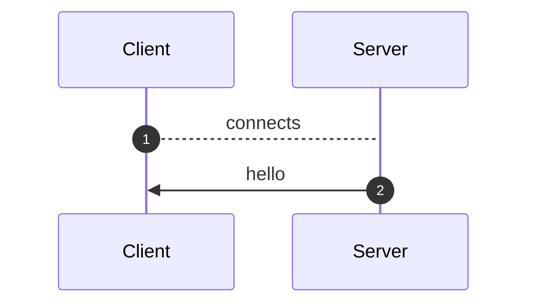
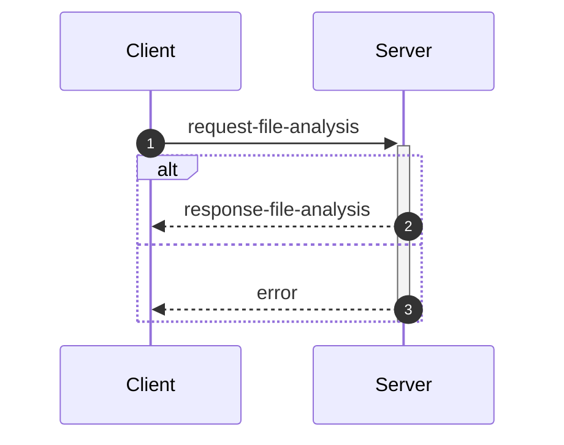
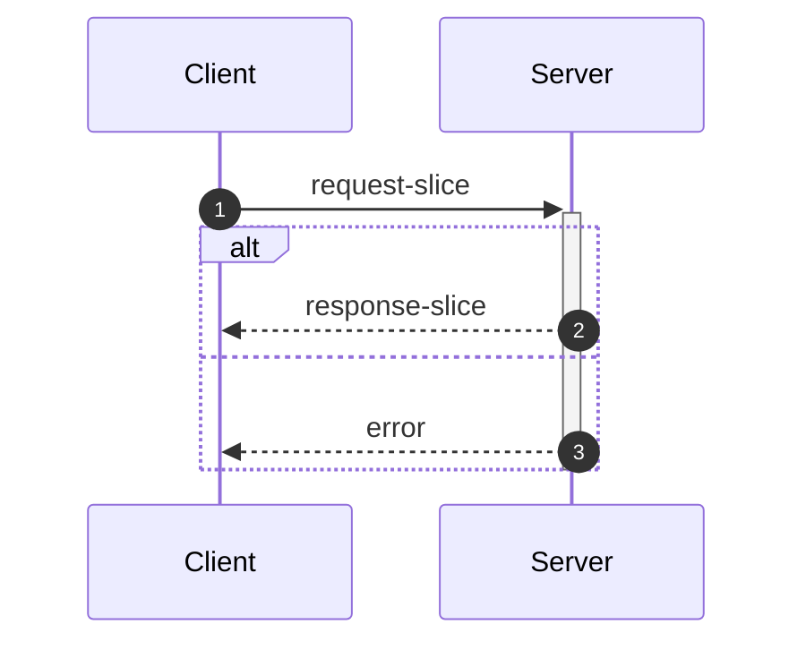
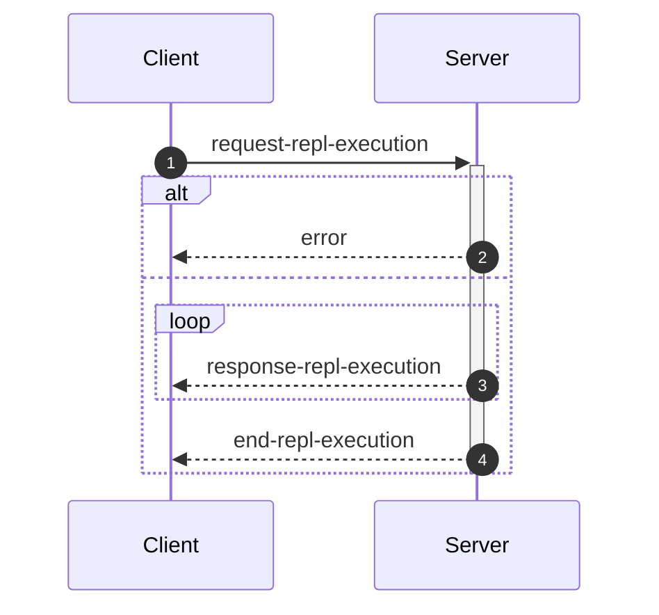

_This document was generated from '[src/documentation/wiki-interface.ts](https://github.com/flowr-analysis/flowr/tree/main//src/documentation/wiki-interface.ts)' on 2026-06-15, 13:21:55 UTC presenting an overview of flowR's interface (v2.10.8, using R v4.5.0). Please do not edit this file/wiki page directly._

Although far from being as detailed as the in-depth explanation of [_flowR_](https://github.com/flowr-analysis/flowr/wiki/core),
this wiki page explains how to interface with _flowR_ in more detail.
In general, command line arguments and other options provide short descriptions on hover over.

* [💻 Using the REPL](#using-the-repl)
* [⚙️ Configuring FlowR](#configuring-flowr)
* [⚒️ Writing Code](#writing-code)
* [💬 Communicating with the Server](#communicating-with-the-server)

<a id='using-the-repl'></a>
## 💻 Using the REPL


> [!NOTE]
> To execute arbitrary R commands with a repl request, _flowR_ has to be started explicitly with <span title="Description (Command Line Argument): Allow to access the underlying R session when using flowR (security warning: this allows the execution of arbitrary R code!)">`--r-session-access`</span>.
> Please be aware that this introduces a security risk and note that this relies on the [`r-shell` engine](https://github.com/flowr-analysis/flowr/wiki/engines) .

Although primarily meant for users to explore,
there is nothing which forbids simply calling _flowR_ as a subprocess to use standard-in, -output, and -error
for communication (although you can access the REPL using the server as well,
with the [REPL Request](#message-request-repl-execution) message).

The read-eval-print loop&nbsp;(REPL) works relatively simple.
You can submit an expression (using <kbd>Enter</kbd>),
which is interpreted as an R&nbsp;expression by default but interpreted as a *command* if it starts with a colon (`:`).
The best command to get started with the REPL is <span title="Description (Repl Command): Show help information (aliases: :h, :?)">`:help`</span>.
Besides, you can leave the REPL either with the command <span title="Description (Repl Command): End the repl (aliases: :q, :exit)">`:quit`</span> or by pressing <kbd>Ctrl</kbd>+<kbd>C</kbd> twice.
When writing a *command*, you may press <kbd>Tab</kbd> to get a list of completions, if available.
Multiple commands can be entered in a single line by separating them with a semicolon (`;`), e.g. `:parse "x<-2"; :df*`.
If a command is given without R code, the REPL will re-use R code given in a previous command.
The prior example will hence return first the parsed AST of the program and then the dataflow graph for `"x <- 2"`.

> [!NOTE]
> If you develop flowR, you may want to launch the repl using the `npm run main-dev` command, this way, you get a non-minified version of flowR with debug information and hot-reloading of source files.

<details>
<summary>Available Commands</summary>

We currently offer the following commands (this with a `[*]` suffix are available with and without the star):


| Command | Description |
| ------- | ----------- |
| **<span title="Description (Repl Command): End the repl (aliases: :q, :exit)">:quit</span>** | End the repl (aliases: **:<span title="Alias of ':quit'. End the repl">q</span>**, **:<span title="Alias of ':quit'. End the repl">exit</span>**) |
| **<span title="Description (Repl Command): Execute the given code as R code. This requires the `--r-session-access` flag to be set and requires the r-shell engine. (aliases: :e, :r)">:execute</span>** | Execute the given code as R code. This requires the `--r-session-access` flag to be set and requires the r-shell engine. (aliases: **:<span title="Alias of ':execute'. Execute the given code as R code. This requires the `--r-session-access` flag to be set and requires the r-shell engine.">e</span>**, **:<span title="Alias of ':execute'. Execute the given code as R code. This requires the `--r-session-access` flag to be set and requires the r-shell engine.">r</span>**) |
| **<span title="Description (Repl Command): Get mermaid code for the control-flow graph of R code, start with 'file://' to indicate a file (aliases: :cfg, :cf)">:controlflow[*]</span>** | Get mermaid code for the control-flow graph of R code, start with 'file://' to indicate a file (star: Returns the URL to mermaid.live) (aliases: **:<span title="Alias of ':controlflow'. Get mermaid code for the control-flow graph of R code, start with 'file://' to indicate a file">cfg</span>**, **:<span title="Alias of ':controlflow'. Get mermaid code for the control-flow graph of R code, start with 'file://' to indicate a file">cf</span>**) |
| **<span title="Description (Repl Command): Get mermaid code for the control-flow graph with basic blocks, start with 'file://' to indicate a file (aliases: :cfgb, :cfb)">:controlflowbb[*]</span>** | Get mermaid code for the control-flow graph with basic blocks, start with 'file://' to indicate a file (star: Returns the URL to mermaid.live) (aliases: **:<span title="Alias of ':controlflowbb'. Get mermaid code for the control-flow graph with basic blocks, start with 'file://' to indicate a file">cfgb</span>**, **:<span title="Alias of ':controlflowbb'. Get mermaid code for the control-flow graph with basic blocks, start with 'file://' to indicate a file">cfb</span>**) |
| **<span title="Description (Repl Command): Get mermaid code for the dataflow graph, start with 'file://' to indicate a file (aliases: :d, :df)">:dataflow[*]</span>** | Get mermaid code for the dataflow graph, start with 'file://' to indicate a file (star: Returns the URL to mermaid.live) (aliases: **:<span title="Alias of ':dataflow'. Get mermaid code for the dataflow graph, start with 'file://' to indicate a file">d</span>**, **:<span title="Alias of ':dataflow'. Get mermaid code for the dataflow graph, start with 'file://' to indicate a file">df</span>**) |
| **<span title="Description (Repl Command): Get mermaid code for the normalized AST of R code, start with 'file://' to indicate a file (aliases: :n)">:normalize[*]</span>** | Get mermaid code for the normalized AST of R code, start with 'file://' to indicate a file (star: Returns the URL to mermaid.live) (alias: **:<span title="Alias of ':normalize'. Get mermaid code for the normalized AST of R code, start with 'file://' to indicate a file">n</span>**) |
| **<span title="Description (Repl Command): Get mermaid code for the simplified dataflow graph, start with 'file://' to indicate a file (aliases: :ds, :dfs)">:dataflowsimple[*]</span>** | Get mermaid code for the simplified dataflow graph, start with 'file://' to indicate a file (star: Returns the URL to mermaid.live) (aliases: **:<span title="Alias of ':dataflowsimple'. Get mermaid code for the simplified dataflow graph, start with 'file://' to indicate a file">ds</span>**, **:<span title="Alias of ':dataflowsimple'. Get mermaid code for the simplified dataflow graph, start with 'file://' to indicate a file">dfs</span>**) |
| **<span title="Description (Repl Command): Just calculates the DFG, but only prints summary info (aliases: :d#, :df#)">:dataflowsilent</span>** | Just calculates the DFG, but only prints summary info (aliases: **:<span title="Alias of ':dataflowsilent'. Just calculates the DFG, but only prints summary info">d#</span>**, **:<span title="Alias of ':dataflowsilent'. Just calculates the DFG, but only prints summary info">df#</span>**) |
| **<span title="Description (Repl Command): Prints ASCII Art of the parsed, unmodified AST, start with 'file://' to indicate a file (aliases: :p)">:parse</span>** | Prints ASCII Art of the parsed, unmodified AST, start with 'file://' to indicate a file (alias: **:<span title="Alias of ':parse'. Prints ASCII Art of the parsed, unmodified AST, start with 'file://' to indicate a file">p</span>**) |
| **<span title="Description (Repl Command): Prints the version of flowR as well as the current version of R">:version</span>** | Prints the version of flowR as well as the current version of R
| **<span title="Description (Repl Command): Query the given R code, start with 'file://' to indicate a file. The query is to be a valid query in json format (use 'help' to get more information).">:query[*]</span>** | Query the given R code, start with 'file://' to indicate a file. The query is to be a valid query in json format (use 'help' to get more information). (star: Similar to query, but returns the output in json format.)
| **<span title="Description (Repl Command): Returns an ASCII representation of the dataflow graph (aliases: :df!)">:dataflowascii</span>** | Returns an ASCII representation of the dataflow graph (alias: **:<span title="Alias of ':dataflowascii'. Returns an ASCII representation of the dataflow graph">df!</span>**) |
| **<span title="Description (Repl Command): Returns summarization stats for the normalized AST (aliases: :n#)">:normalize#</span>** | Returns summarization stats for the normalized AST (alias: **:<span title="Alias of ':normalize#'. Returns summarization stats for the normalized AST">n#</span>**) |
| **<span title="Description (Repl Command): Show help information (aliases: :h, :?)">:help</span>** | Show help information (aliases: **:<span title="Alias of ':help'. Show help information">h</span>**, **:<span title="Alias of ':help'. Show help information">?</span>**) |


</details>


> [!TIP]
> 
> As indicated by the examples before, all REPL commands that operate on code keep track of the state.
> Hence, if you run a command like <span title="Description (Repl Command, starred version): Returns the URL to mermaid.live; Base Command: Get mermaid code for the dataflow graph, start with 'file://' to indicate a file (aliases: :d*, :df*)">`:dataflow*`</span> without providing R code,
> the REPL will re-use the R code provided in a previous command.
> Likewise, doing this will benefit from incrementality!
> If you request the dataflow graph with `:df* x <- 2 * y` and then want to see the parsed AST with `:parse`,
> the REPL will re-use previously obtained information and not re-parse the code again.
> 		


Generally, many commands offer shortcut versions in the REPL. Many queries, for example, offer a shortened format (see the example below).
Of special note, the [Config Query](https://github.com/flowr-analysis/flowr/wiki/query-api#Config-Query)
can be used to also modify the currently active configuration of _flowR_ within the REPL (see the [wiki page](https://github.com/flowr-analysis/flowr/wiki/query-api#Config-Query) for more information).

### Example: Retrieving the Dataflow Graph

To retrieve a URL to the [mermaid](https://mermaid.js.org/) diagram of the dataflow of a given expression,
use <span title="Description (Repl Command, starred version): Returns the URL to mermaid.live; Base Command: Get mermaid code for the dataflow graph, start with 'file://' to indicate a file (aliases: :d*, :df*)">`:dataflow*`</span> (or <span title="Description (Repl Command): Get mermaid code for the dataflow graph, start with 'file://' to indicate a file (aliases: :d, :df)">`:dataflow`</span> to get the mermaid code in the cli):


```shell
$ docker run -it --rm eagleoutice/flowr # or npm run flowr 
flowR repl using flowR v2.10.8, R grammar v14 (tree-sitter engine)
R> :dataflow* y <- 1 + x
```

<details>
<summary style='color:gray'>Output</summary>


```text
https://mermaid.live/view#base64:eyJjb2RlIjoiZmxvd2NoYXJ0IEJUXG4gICAgMXt7XCJgIzkxO1JOdW1iZXIjOTM7IDFcbiAgICAgICgxKVxuICAgICAgKjEuNipgXCJ9fVxuICAgJSUgTm8gZWRnZXMgZm91bmQgZm9yIDFcbiAgICAyKFtcImAjOTE7UlN5bWJvbCM5MzsgeFxuICAgICAgKDIpXG4gICAgICAqMS4xMCpgXCJdKVxuICAgJSUgTm8gZWRnZXMgZm91bmQgZm9yIDJcbiAgICAzW1tcImAjOTE7UkJpbmFyeU9wIzkzOyAjNDM7XG4gICAgICAoMylcbiAgICAgICoxLjYtMTAqXG4gICAgKDEsIDIpYFwiXV1cbiAgICBidWlsdC1pbjpfW1wiYEJ1aWx0LUluOlxuIzQzO2BcIl1cbiAgICBzdHlsZSBidWlsdC1pbjpfIHN0cm9rZTpncmF5LGZpbGw6Z3JheSxzdHJva2Utd2lkdGg6MnB4LG9wYWNpdHk6Ljg7XG4gICAgMFtcImAjOTE7UlN5bWJvbCM5MzsgeVxuICAgICAgKDAsIHNvdXJjZXM6IFszXSlcbiAgICAgICoxLjEqYFwiXVxuICAgIDRbW1wiYCM5MTtSQmluYXJ5T3AjOTM7ICM2MDsjNDU7XG4gICAgICAoNClcbiAgICAgICoxLjEtMTAqXG4gICAgKDAsIDMpYFwiXV1cbiAgICBidWlsdC1pbjpfLVtcImBCdWlsdC1JbjpcbiM2MDsjNDU7YFwiXVxuICAgIHN0eWxlIGJ1aWx0LWluOl8tIHN0cm9rZTpncmF5LGZpbGw6Z3JheSxzdHJva2Utd2lkdGg6MnB4LG9wYWNpdHk6Ljg7XG4gICAgMyAtLT58XCJyZWFkcywgYXJndW1lbnRcInwgMVxuICAgIDMgLS0+fFwicmVhZHMsIGFyZ3VtZW50XCJ8IDJcbiAgICAzIC0uLT58XCJyZWFkcywgY2FsbHNcInwgYnVpbHQtaW46X1xuICAgIGxpbmtTdHlsZSAyIHN0cm9rZTpncmF5O1xuICAgIDAgLS0+fFwiZGVmaW5lZC1ieVwifCAzXG4gICAgMCAtLT58XCJkZWZpbmVkLWJ5XCJ8IDRcbiAgICA0IC0tPnxcInJlYWRzLCBhcmd1bWVudFwifCAzXG4gICAgNCAtLT58XCJyZXR1cm5zLCBhcmd1bWVudFwifCAwXG4gICAgNCAtLi0+fFwicmVhZHMsIGNhbGxzXCJ8IGJ1aWx0LWluOl8tXG4gICAgbGlua1N0eWxlIDcgc3Ryb2tlOmdyYXk7IiwibWVybWFpZCI6eyJhdXRvU3luYyI6dHJ1ZX19
```


Retrieve the dataflow graph of the expression `y <- 1 + x`. It looks like this:


```mermaid
flowchart LR
    1{{"`#91;RNumber#93; 1
      (1)
      *1.6*`"}}
   %% No edges found for 1
    2(["`#91;RSymbol#93; x
      (2)
      *1.10*`"])
   %% No edges found for 2
    3[["`#91;RBinaryOp#93; #43;
      (3)
      *1.6-10*
    (1, 2)`"]]
    built-in:_["`Built-In:
#43;`"]
    style built-in:_ stroke:gray,fill:gray,stroke-width:2px,opacity:.8;
    0["`#91;RSymbol#93; y
      (0, sources: [3])
      *1.1*`"]
    4[["`#91;RBinaryOp#93; #60;#45;
      (4)
      *1.1-10*
    (0, 3)`"]]
    built-in:_-["`Built-In:
#60;#45;`"]
    style built-in:_- stroke:gray,fill:gray,stroke-width:2px,opacity:.8;
    3 -->|"reads, argument"| 1
    3 -->|"reads, argument"| 2
    3 -.->|"reads, calls"| built-in:_
    linkStyle 2 stroke:gray;
    0 -->|"defined-by"| 3
    0 -->|"defined-by"| 4
    4 -->|"reads, argument"| 3
    4 -->|"returns, argument"| 0
    4 -.->|"reads, calls"| built-in:_-
    linkStyle 7 stroke:gray;
```

	
<details>

<summary style="color:gray">R Code of the Dataflow Graph</summary>

The analysis required _0.8 ms_ (including parse and normalize, using the [tree-sitter](https://github.com/flowr-analysis/flowr/wiki/Engines) engine) within the generation environment. 
We encountered no unknown side effects during the analysis.


```r
y <- 1 + x
```


</details>


</details>


For small graphs like this, <span title="Description (Repl Command): Returns an ASCII representation of the dataflow graph (aliases: :df!)">`:dataflowascii`</span> also provides an ASCII representation directly in the REPL:


```shell
$ docker run -it --rm eagleoutice/flowr # or npm run flowr 
flowR repl using flowR v2.10.8, R grammar v14 (tree-sitter engine)
R> :df! y <- 1 + x
```

<details open>
<summary style='color:gray'>Output</summary>


```text
                        0<1>0
                   ┌────| 1 |
    ┌────────┐     │    0---0
 c<4>c       └──c<3>c
 |<- |  v<0>v┌──| + |
 c---c──| y |┘  c---c   u<2>u
        v---v      └────| x |
                        u---u
Edges:
3 -> 1: reads, argument  3 -> 2: reads, argument
4 -> 3: reads, argument  4 -> 0: returns, argument
0 -> 3: defined-by       0 -> 4: defined-by
```


Retrieve the dataflow graph of the expression `y <- 1 + x` as ASCII art.

</details>


For the slicing with <span title="Description (Repl Command): Static backwards executable slicer for R">`:slicer`</span>, you have access to the same [magic comments](#slice-magic-comments) as with the [slice request](#message-request-slice).

### Example: Interfacing with the File System

Many commands that allow for an R-expression (like <span title="Description (Repl Command, starred version): Returns the URL to mermaid.live; Base Command: Get mermaid code for the dataflow graph, start with 'file://' to indicate a file (aliases: :d*, :df*)">`:dataflow*`</span>) allow for a file as well
if the argument starts with `file://`.
If you are working from the root directory of the _flowR_ repository, the following gives you the parsed AST of the example file using the <span title="Description (Repl Command): Prints ASCII Art of the parsed, unmodified AST, start with 'file://' to indicate a file (aliases: :p)">`:parse`</span> command:


```shell
$ docker run -it --rm eagleoutice/flowr # or npm run flowr 
flowR repl using flowR v2.10.8, R grammar v14 (tree-sitter engine)
R> :parse file://test/testfiles/example.R
```

<details>
<summary style='color:gray'>Output</summary>


```text
File: test/testfiles/example.R

program
├ binaryoperator
│ ├ identifier "sum" (1:1─4)
│ ├ <- "<-" (1:5─7)
│ ╰ float "0" (1:8─9)
├ binaryoperator
│ ├ identifier "product" (2:1─8)
│ ├ <- "<-" (2:9─11)
│ ╰ float "1" (2:12─13)
├ binaryoperator
│ ├ identifier "w" (3:1─2)
│ ├ <- "<-" (3:3─5)
│ ╰ float "7" (3:6─7)
├ binaryoperator
│ ├ identifier "N" (4:1─2)
│ ├ <- "<-" (4:3─5)
│ ╰ float "10" (4:6─8)
├ forstatement
│ ├ for "for" (6:1─4)
│ ├ ( "(" (6:5─6)
│ ├ identifier "i" (6:6─7)
│ ├ in "in" (6:8─10)
│ ├ binaryoperator
│ │ ├ float "1" (6:11─12)
│ │ ├ : ":" (6:12─13)
│ │ ╰ parenthesizedexpression
│ │   ├ ( "(" (6:13─14)
│ │   ├ binaryoperator
│ │   │ ├ identifier "N" (6:14─15)
│ │   │ ├ - "-" (6:15─16)
│ │   │ ╰ float "1" (6:16─17)
│ │   ╰ ) ")" (6:17─18)
│ ├ ) ")" (6:18─19)
│ ╰ bracedexpression
│   ├ { "{" (6:20─21)
│   ├ binaryoperator
│   │ ├ identifier "sum" (7:3─6)
│   │ ├ <- "<-" (7:7─9)
│   │ ╰ binaryoperator
│   │   ├ binaryoperator
│   │   │ ├ identifier "sum" (7:10─13)
│   │   │ ├ + "+" (7:14─15)
│   │   │ ╰ identifier "i" (7:16─17)
│   │   ├ + "+" (7:18─19)
│   │   ╰ identifier "w" (7:20─21)
│   ├ binaryoperator
│   │ ├ identifier "product" (8:3─10)
│   │ ├ <- "<-" (8:11─13)
│   │ ╰ binaryoperator
│   │   ├ identifier "product" (8:14─21)
│   │   ├  "" (8:22─23)
│   │   ╰ identifier "i" (8:24─25)
│   ╰ } "}" (9:1─2)
├ call
│ ├ identifier "cat" (11:1─4)
│ ╰ arguments
│   ├ ( "(" (11:4─5)
│   ├ argument
│   │ ╰ string
│   │   ├ " "\"" (11:5─6)
│   │   ├ stringcontent "Sum:" (11:6─10)
│   │   ╰ " "\"" (11:10─11)
│   ├ comma "," (11:11─12)
│   ├ argument
│   │ ╰ identifier "sum" (11:13─16)
│   ├ comma "," (11:16─17)
│   ├ argument
│   │ ╰ string
│   │   ├ " "\"" (11:18─19)
│   │   ├ stringcontent
│   │   │ ╰ escapesequence "\\n" (11:19─21)
│   │   ╰ " "\"" (11:21─22)
│   ╰ ) ")" (11:22─23)
╰ call
  ├ identifier "cat" (12:1─4)
  ╰ arguments
    ├ ( "(" (12:4─5)
    ├ argument
    │ ╰ string
    │   ├ " "\"" (12:5─6)
    │   ├ stringcontent "Product:" (12:6─14)
    │   ╰ " "\"" (12:14─15)
    ├ comma "," (12:15─16)
    ├ argument
    │ ╰ identifier "product" (12:17─24)
    ├ comma "," (12:24─25)
    ├ argument
    │ ╰ string
    │   ├ " "\"" (12:26─27)
    │   ├ stringcontent
    │   │ ╰ escapesequence "\\n" (12:27─29)
    │   ╰ " "\"" (12:29─30)
    ╰ ) ")" (12:30─31)
```


Retrieve the parsed AST of the example file.

<details>

<summary>File Content</summary>


```r
sum <- 0
product <- 1
w <- 7
N <- 10

for (i in 1:(N-1)) {
  sum <- sum + i + w
  product <- product * i
}

cat("Sum:", sum, "\n")
cat("Product:", product, "\n")
```


</details>

As _flowR_ directly transforms this AST the output focuses on being human-readable instead of being machine-readable.
		

</details>


### Example: Run a Query

You can run any query supported by _flowR_ using the <span title="Description (Repl Command): Query the given R code, start with 'file://' to indicate a file. The query is to be a valid query in json format (use 'help' to get more information).">`:query`</span> command.
For example, to obtain the shapes of all data frames in a given piece of code, you can run:


```shell
$ docker run -it --rm eagleoutice/flowr # or npm run flowr 
flowR repl using flowR v2.10.8, R grammar v14 (tree-sitter engine)
R> :query @df-shape "x <- data.frame(a = 1:10, b = 1:10)\ny <- x$a"
```

<details open>
<summary style='color:gray'>Output</summary>


```text
Query: df-shape (2 ms)
   ╰ 12: (colnames: [{"a", "b"}, {}], cols: [2, 2], rows: [10, 10])
   ╰ 0: (colnames: [{"a", "b"}, {}], cols: [2, 2], rows: [10, 10])
All queries together required ≈4 ms (1ms accuracy, total 5 ms)
```


Retrieve the shapes of all data frames in the given code.

</details>


To run the linter on a file, you can use (in this example, we just issue the `dead-code` linter on a small piece of code):


```shell
$ docker run -it --rm eagleoutice/flowr # or npm run flowr 
flowR repl using flowR v2.10.8, R grammar v14 (tree-sitter engine)
R> :query @linter rules:dead-code "if(FALSE) x <- 2"
```

<details open>
<summary style='color:gray'>Output</summary>


```text
Query: linter (1 ms)
   ╰ Dead Code (dead-code):
       ╰ certain:
           ╰ Code at 1.11-16
       ╰ Metadata: consideredNodes: 7, searchTimeMs: 1, processTimeMs: 0
All queries together required ≈1 ms (1ms accuracy, total 2 ms)
```


Run the linter on the given code, with only the `dead-code` rule enabled.

</details>


For more information on the available queries, please check out the [Query API](https://github.com/flowr-analysis/flowr/wiki/query-api).


<a id='configuring-flowr'></a>
## ⚙️ Configuring FlowR


When running _flowR_, you may want to specify some behaviors with a dedicated configuration file.
By default, flowR looks for a file named `flowr.json` in the current working directory (or any higher directory).
You can also specify a different file with <span title="Description (Command Line Argument): The name of the configuration file to use">`--config-file`</span> or pass the configuration inline using <span title="Description (Command Line Argument): The flowR configuration to use, as a JSON string">`--config-json`</span>.
To inspect the current configuration, you can run flowr with the <span title="Description (Command Line Argument): Run with verbose logging (will be passed to the corresponding script)">`--verbose`</span> flag, or use the `config` [Query](https://github.com/flowr-analysis/flowr/wiki/Query%20API).
Within the REPL this works by running the following:


```shell
:query @config
```


To work with the <a href="https://github.com/flowr-analysis/flowr/tree/main/src/config.ts#L118"><code><span title="The configuration file format for flowR.">FlowrConfig</span></code></a> you can use the provided helper objects alongside its methods like
<a href="https://github.com/flowr-analysis/flowr/tree/main/src/config.ts#L442"><code><span title="Creates a new flowr config that has the updated values.">FlowrConfig::<b>amend</b></span></code></a>.
The following summarizes the configuration options:

- `ignoreSourceCalls`: If set to `true`, _flowR_ will ignore source calls when analyzing the code, i.e., ignoring the inclusion of other files.
- `semantics`: allows to configure the way _flowR_ handles R, although we currently only support `semantics/environment/overwriteBuiltIns`.
  You may use this to overwrite _flowR_'s handling of built-in function and even completely clear the preset definitions shipped with flowR.
  See [Configure BuiltIn Semantics](#configure-builtin-semantics) for more information.
- `solver`: allows to configure how _flowR_ resolves variables and their values (currently we support: `disabled`, `alias`, `builtin`), as well as if pointer analysis should be active.
- `engines`: allows to configure the engines used by _flowR_ to interact with R code. See the [Engines wiki page](https://github.com/flowr-analysis/flowr/wiki/Engines) for more information.
- `defaultEngine`: allows to specify the default engine to use for interacting with R code. If not set, an arbitrary engine from the specified list will be used.
- `abstractInterpretation`: allows to configure how _flowR_ performs abstract interpretation, although we currently only support data frame shape inference through abstract interpretation.
- `defaultPlugins`: allows to configure which plugins to load by default when creating a new <a href="https://github.com/flowr-analysis/flowr/tree/main/src/project/flowr-analyzer.ts#L162"><code><span title="Central class for conducting analyses with FlowR. Use the FlowrAnalyzerBuilder to create a new instance. If you want the original pattern of creating a pipeline and running all steps, you can still do this with FlowrAnalyzer#runFull . To inspect the context of the analyzer, use FlowrAnalyzer#inspectContext (if you are a plugin and need to modify it, use FlowrAnalyzer#context instead).">FlowrAnalyzer</span></code></a> instance.
- `repl.plugins`: allows to configure which plugins to load in the _flowR_ REPL. Use `flowr:default` to reference the plugins specified by `defaultPlugins`.

So you can configure _flowR_ by adding a file like the following:

<details>

<summary>Example Configuration File</summary>


```json
{
  "ignoreSourceCalls": true,
  "semantics": {
    "environment": {
      "overwriteBuiltIns": {
        "definitions": [
          {
            "type": "function",
            "names": [
              "foo"
            ],
            "processor": "builtin:assign",
            "config": {}
          }
        ]
      }
    }
  },
  "defaultPlugins": [
    "file:description",
    "versions:description"
  ],
  "repl": {
    "quickStats": false,
    "dfProcessorHeat": false,
    "plugins": [
      "flowr:default"
    ]
  },
  "project": {
    "resolveUnknownPathsOnDisk": true
  },
  "engines": [
    {
      "type": "r-shell"
    }
  ],
  "solver": {
    "variables": "alias",
    "evalStrings": true,
    "trackEnvironments": true,
    "resolveSource": {
      "dropPaths": "no",
      "ignoreCapitalization": true,
      "inferWorkingDirectory": "active-script",
      "searchPath": []
    },
    "instrument": {},
    "slicer": {
      "threshold": 50
    }
  },
  "abstractInterpretation": {
    "wideningThreshold": 4,
    "dataFrame": {
      "maxColNames": 20,
      "readLoadedData": {
        "readExternalFiles": true,
        "maxReadLines": 1000000
      }
    }
  }
}
```


</details>

<details>
<a id='configure-builtin-semantics'></a>
<summary>Configure Built-In Semantics</summary>


`semantics/environment/overwriteBuiltins` accepts two keys:

- `loadDefaults` (boolean, initially `true`): If set to `true`, the default built-in definitions are loaded before applying the custom definitions. Setting this flag to `false` explicitly disables the loading of the default definitions.
- `definitions` (array, initially empty): Allows to overwrite or define new built-in elements. Each object within must have a `type` which is one of the below. Furthermore, they may define a string array of `names` which specifies the identifiers to bind the definitions to. You may use `assumePrimitive` to specify whether _flowR_ should assume that this is a primitive non-library definition (so you probably just do not want to specify the key).

  | Type            | Description                                                                                                                                                                                                                                                                                              | Example                                                                                                    |
  | --------------- | -------------------------------------------------------------------------------------------------------------------------------------------------------------------------------------------------------------------------------------------------------------------------------------------------------- | ---------------------------------------------------------------------------------------------------------- |
  | `constant`    | Additionally allows for a `value` this should resolve to.                                                                                                                                                                                                                                                | `{ type: 'constant', names: ['NULL', 'NA'],  value: null }`                                                |
  | `function`    | Is a rather flexible way to define and bind built-in functions. For the time, we do not have extensive documentation to cover all the cases, so please either consult the sources with the `default-builtin-config.ts` or open a [new issue](https://github.com/flowr-analysis/flowr/issues/new/choose). | `{ type: 'function', names: ['next'], processor: 'builtin:d', config: { cfg: ExitPointType.Next } }` |
  | `replacement` | A comfortable way to specify replacement functions like `$<-` or `names<-`. `suffixes` describes the... suffixes to attach automatically. | `{ type: 'replacement', suffixes: ['<-', '<<-'], names: ['[', '[['] }` |


</details>

<details>

<summary style='color:gray'>Full Configuration-File Schema</summary>

- _The configuration file format for flowR._ (object)
    - **ignoreSourceCalls** [optional] _Whether source calls should be ignored, causing {@link processSourceCall}'s behavior to be skipped._ (boolean)
    - **semantics** _Configure language semantics and how flowR handles them._ (object)
        - **environment** [optional] _Semantics regarding how to handle the R environment._ (object)
            - **overwriteBuiltIns** [optional] _Do you want to overwrite (parts) of the builtin definition?_ (object)
                - **loadDefaults** [optional] _Should the default configuration still be loaded?_ (boolean)
                - **definitions** [optional] _The definitions to load/overwrite._ (array)
                Valid item types:
                    - (object)
    - **defaultPlugins** [optional] _The default plugins to load when creating a new instance of FlowrAnalyzer_ (array)
    Valid item types:
        - (alternatives)
            - (string)
            - (array)
    - **repl** _Configuration options for the REPL._ (object)
        - **quickStats** [optional] _Whether to show quick stats in the REPL after each evaluation._ (boolean)
        - **dfProcessorHeat** [optional] _This instruments the dataflow processors to count how often each processor is called._ (boolean)
        - **plugins** [optional] _The plugins to load in REPL mode_ (array)
        Valid item types:
            - (alternatives)
                - (string)
                - (array)
    - **project** _Project specific configuration options._ (object)
        - **resolveUnknownPathsOnDisk** [optional] _Whether to resolve unknown paths loaded by the r project disk when trying to source/analyze files._ (boolean)
    - **engines** _The engine or set of engines to use for interacting with R code. An empty array means all available engines will be used._ (array)
    Valid item types:
        - (alternatives)
            - _The configuration for the tree sitter engine._ (object)
                - **type** [required] _Use the tree sitter engine._ (string)
                    Only allows: 'tree-sitter'
                - **wasmPath** [optional] _The path to the tree-sitter-r WASM binary to use. If this is undefined, this uses the default path._ (string)
                - **treeSitterWasmPath** [optional] _The path to the tree-sitter WASM binary to use. If this is undefined, this uses the default path._ (string)
                - **lax** [optional] _Whether to use the lax parser for parsing R code (allowing for syntax errors). If this is undefined, the strict parser will be used._ (boolean)
            - _The configuration for the R shell engine._ (object)
                - **type** [required] _Use the R shell engine._ (string)
                    Only allows: 'r-shell'
                - **rPath** [optional] _The path to the R executable to use. If this is undefined, this uses the default path._ (string)
    - **defaultEngine** [optional] _The default engine to use for interacting with R code. If this is undefined, an arbitrary engine from the specified list will be used._ (string)
        Only allows: 'tree-sitter', 'r-shell'
    - **solver** _How to resolve constants, constraints, cells, ..._ (object)
        - **variables** _How to resolve variables and their values._ (string)
            Only allows: 'disabled', 'alias', 'builtin'
        - **evalStrings** _Should we include eval(parse(text="...")) calls in the dataflow graph?_ (boolean)
        - **trackEnvironments** [optional] _Track user-created environments (new.env, assign/get/local with envir=, dollar-assign, attach). When false, all envir-style calls fall through conservatively._ (boolean)
        - **instrument** (object)
            - **dataflowExtractors** [optional] _These keys are only intended for use within code, allowing to instrument the dataflow analyzer!_ (any)
        - **resolveSource** [optional] _If lax source calls are active, flowR searches for sourced files much more freely, based on the configurations you give it. This option is only in effect if `ignoreSourceCalls` is set to false._ (object)
            - **dropPaths** _Allow to drop the first or all parts of the sourced path, if it is relative._ (string)
                Only allows: 'no', 'once', 'all'
            - **ignoreCapitalization** _Search for filenames matching in the lowercase._ (boolean)
            - **inferWorkingDirectory** _Try to infer the working directory from the main or any script to analyze._ (string)
                Only allows: 'no', 'main-script', 'active-script', 'any-script'
            - **searchPath** _Additionally search in these paths._ (array)
            Valid item types:
                - (string)
            - **repeatedSourceLimit** [optional] _How often the same file can be sourced within a single run? Please be aware: in case of cyclic sources this may not reach a fixpoint so give this a sensible limit._ (number)
            - **applyReplacements** _Provide name replacements for loaded files_ (array)
            Valid item types:
                - (object)
            - **checkMemoryOnSource** [optional] _Check heap memory usage before analyzing a sourced file, skipping when memory pressure exceeds the configured threshold._ (boolean)
            - **memoryThreshold** [optional] _Fraction of the V8 heap limit (0-1) at which source analysis is skipped. Only effective when checkMemoryOnSource is true._ (number)
        - **slicer** [optional] _The configuration for the slicer._ (object)
            - **threshold** [optional] _The maximum number of iterations to perform on a single function call during slicing._ (number)
            - **autoExtend** [optional] _If set, the slicer will gain an additional post-pass._ (boolean)
    - **abstractInterpretation** _The configuration options for abstract interpretation._ (object)
        - **wideningThreshold** _The threshold for the number of visitations of a node at which widening should be performed to ensure the termination of the fixpoint iteration._ (number)
        - **dataFrame** _The configuration of the shape inference for data frames._ (object)
            - **maxColNames** _The maximum number of columns names to infer for data frames before over-approximating the column names to top._ (number)
            - **readLoadedData** _Configuration options for reading data frame shapes from loaded external data files, such as CSV files._ (object)
                - **readExternalFiles** _Whether data frame shapes should be extracted from loaded external files, such as CSV files._ (boolean)
                - **maxReadLines** _The maximum number of lines to read when extracting data frame shapes from loaded files, such as CSV files._ (number)

</details>

	

<a id='writing-code'></a>
## ⚒️ Writing Code

_flowR_ can be used as a [module](https://www.npmjs.com/package/@eagleoutice/flowr) and offers several main classes and interfaces that are interesting for extension writers 
(see the [Visual Studio Code extension](https://marketplace.visualstudio.com/items?itemName=code-inspect.vscode-flowr) or the [Core](https://github.com/flowr-analysis/flowr/wiki/core) wiki page for more information).

### Creating Analyses with _flowR_

Nowadays, instances of the <a href="https://github.com/flowr-analysis/flowr/tree/main/src/project/flowr-analyzer.ts#L162"><code><span title="Central class for conducting analyses with FlowR. Use the FlowrAnalyzerBuilder to create a new instance. If you want the original pattern of creating a pipeline and running all steps, you can still do this with FlowrAnalyzer#runFull . To inspect the context of the analyzer, use FlowrAnalyzer#inspectContext (if you are a plugin and need to modify it, use FlowrAnalyzer#context instead).">FlowrAnalyzer</span></code></a> should be used as central frontend to get analysis results from _flowR_.
For example, a program slice can be created like this:


```ts
const analyzer = await new FlowrAnalyzerBuilder()
    .setEngine('tree-sitter')
    .build();
analyzer.addRequest('x <- 1\ny <- x\nx');
const result = await analyzer.query([
    {
        type:     'static-slice',
        criteria: ['3@x']
    }
]);
//console.log(result['static-slice']);
```


For more information, please have a look at the [Analyzer](https://github.com/flowr-analysis/flowr/wiki/analyzer) wiki page, which explains how to construct and use the <a href="https://github.com/flowr-analysis/flowr/tree/main/src/project/flowr-analyzer.ts#L162"><code><span title="Central class for conducting analyses with FlowR. Use the FlowrAnalyzerBuilder to create a new instance. If you want the original pattern of creating a pipeline and running all steps, you can still do this with FlowrAnalyzer#runFull . To inspect the context of the analyzer, use FlowrAnalyzer#inspectContext (if you are a plugin and need to modify it, use FlowrAnalyzer#context instead).">FlowrAnalyzer</span></code></a> in more detail.
To work with specific perspectives, you can also consult the respective pages like the [Dataflow Graph](https://github.com/flowr-analysis/flowr/wiki/dataflow-graph) or the [Abstract Interpretation](https://github.com/flowr-analysis/flowr/wiki/abstract-interpretation) wiki pages.
        
### The Pipeline Executor (Low-Level Interface)

Once, in the beginning, _flowR_ was meant to produce a dataflow graph merely to provide *program slices*. 
However, with continuous updates, the [Dataflow Graph](https://github.com/flowr-analysis/flowr/wiki/dataflow-graph) repeatedly proves to be the more interesting part.
With this, we restructured _flowR_'s originally *hardcoded* pipeline to be far more flexible. 
Now, it can be theoretically extended or replaced with arbitrary steps, optional steps, and what we call 'decorations' of these steps. 
In short, a slicing pipeline using the <a href="https://github.com/flowr-analysis/flowr/tree/main/src/core/pipeline-executor.ts#L97"><code><span title="**Please note:** The PipelineExecutor is now considered to be a rather low-level API for flowR. While it still works and is the basis for all other layers, we strongly recommend using the FlowrAnalyzer and its builder to create and use an analyzer instance that is pre-configured for your use-case. The pipeline executor allows to execute arbitrary pipelines in a step-by-step fashion. If you are not...">PipelineExecutor</span></code></a> looks like this:


```ts

const slicer = new PipelineExecutor(DEFAULT_SLICING_PIPELINE, {
  parser:    new RShell(),
  request:   requestFromInput('x <- 1\nx + 1'),
  criterion: ['2@x']
})
const slice = await slicer.allRemainingSteps()
// console.log(slice.reconstruct.code)
```


<details><summary>More Information</summary>


If you compare this, with what you would have done with the old (and removed) `SteppingSlicer`, 
this essentially just requires you to replace the `SteppingSlicer` with the <a href="https://github.com/flowr-analysis/flowr/tree/main/src/core/pipeline-executor.ts#L97"><code><span title="**Please note:** The PipelineExecutor is now considered to be a rather low-level API for flowR. While it still works and is the basis for all other layers, we strongly recommend using the FlowrAnalyzer and its builder to create and use an analyzer instance that is pre-configured for your use-case. The pipeline executor allows to execute arbitrary pipelines in a step-by-step fashion. If you are not...">PipelineExecutor</span></code></a>
and to pass the <a href="https://github.com/flowr-analysis/flowr/tree/main/src/core/steps/pipeline/default-pipelines.ts#L18"><code>DEFAULT_SLICING_PIPELINE</code></a> as the first argument.
The <a href="https://github.com/flowr-analysis/flowr/tree/main/src/core/pipeline-executor.ts#L97"><code><span title="**Please note:** The PipelineExecutor is now considered to be a rather low-level API for flowR. While it still works and is the basis for all other layers, we strongly recommend using the FlowrAnalyzer and its builder to create and use an analyzer instance that is pre-configured for your use-case. The pipeline executor allows to execute arbitrary pipelines in a step-by-step fashion. If you are not...">PipelineExecutor</span></code></a>...

1. Provides structures to investigate the results of all intermediate steps
2. Can be executed step-by-step
3. Can repeat steps (e.g., to calculate multiple slices on the same input)

See the in-code documentation for more information.

	

</details>
    

### Using the <a href="https://github.com/flowr-analysis/flowr/tree/main/src/r-bridge/shell.ts#L143"><code><span title="The RShell represents an interactive session with the R interpreter. You can configure it by RShellOptions . At the moment we are using a live R session (and not networking etc.) to communicate with R easily, which allows us to install packages etc. However, this might and probably will change in the future (leaving this as a legacy mode :D)">RShell</span></code></a> to Interact with R

The <a href="https://github.com/flowr-analysis/flowr/tree/main/src/r-bridge/shell.ts#L143"><code><span title="The RShell represents an interactive session with the R interpreter. You can configure it by RShellOptions . At the moment we are using a live R session (and not networking etc.) to communicate with R easily, which allows us to install packages etc. However, this might and probably will change in the future (leaving this as a legacy mode :D)">RShell</span></code></a> class allows interfacing with the `R`&nbsp;ecosystem installed on the host system.
Please have a look at [flowR's Engines](https://github.com/flowr-analysis/flowr/wiki/engines) for more information on alternatives (for example, the <a href="https://github.com/flowr-analysis/flowr/tree/main/src/r-bridge/lang-4.x/tree-sitter/tree-sitter-executor.ts#L18"><code><span title="Synchronous and (way) faster alternative to the RShell using tree-sitter.">TreeSitterExecutor</span></code></a>).


> [!IMPORTANT]
> 
> Each <a href="https://github.com/flowr-analysis/flowr/tree/main/src/r-bridge/shell.ts#L143"><code><span title="The RShell represents an interactive session with the R interpreter. You can configure it by RShellOptions . At the moment we are using a live R session (and not networking etc.) to communicate with R easily, which allows us to install packages etc. However, this might and probably will change in the future (leaving this as a legacy mode :D)">RShell</span></code></a> controls a new instance of the R&nbsp;interpreter, 
> make sure to call <code><a href="https://github.com/flowr-analysis/flowr/tree/main/src/r-bridge/shell.ts#L317"><span title="Close the current R session, makes the object effectively invalid (can no longer be reopened etc.)">RShell::<i>close</i></span></a>()</code> when you are done.


You can start a new "session" simply by constructing a new object with <code>new <a href="https://github.com/flowr-analysis/flowr/tree/main/src/r-bridge/shell.ts#L143"><span title="The RShell represents an interactive session with the R interpreter. You can configure it by RShellOptions . At the moment we are using a live R session (and not networking etc.) to communicate with R easily, which allows us to install packages etc. However, this might and probably will change in the future (leaving this as a legacy mode :D)">RShell</span></a>()</code>.

However, there are several options that may be of interest 
(e.g., to automatically revive the shell in case of errors or to control the name location of the R process on the system).

With a shell object (let's call it `shell`), you can execute R code by using <a href="https://github.com/flowr-analysis/flowr/tree/main/src/r-bridge/shell.ts#L195"><code><span title="sends the given command directly to the current R session will not do anything to alter input markers!">RShell::<i>sendCommand</i></span></code></a>, 
for example <code>shell.<a href="https://github.com/flowr-analysis/flowr/tree/main/src/r-bridge/shell.ts#L195"><span title="sends the given command directly to the current R session will not do anything to alter input markers!">sendCommand</span></a>("1 + 1")</code>. 
However, this does not return anything, so if you want to collect the output of your command, use
<a href="https://github.com/flowr-analysis/flowr/tree/main/src/r-bridge/shell.ts#L261"><code><span title="Send a command and collect the output">RShell::<i>sendCommandWithOutput</i></span></code></a> instead.

Besides that, the command <a href="https://github.com/flowr-analysis/flowr/tree/main/src/r-bridge/shell.ts#L233"><code>RShell::<b>tryToInjectHomeLibPath</b></code></a> may be of interest, as it enables all libraries available on the host system.


### Generate Statistics (No longer a Focus of flowR)


<details>

<summary>Adding a New Feature to Extract</summary>

In this example, we construct a new feature to extract, with the name "*example*".
Whenever this name appears, you may substitute this with whatever name fits your feature best (as long as the name is unique).

1. **Create a new file in `src/statistics/features/supported`**\
   Create the file `example.ts`, and add its export to the `index.ts` file in the same directory (if not done automatically).

2. **Create the basic structure**\
   To get a better feel of what a feature must have, let's look
   at the basic structure (of course, due to TypeScript syntax,
   there are other ways to achieve the same goal):

   ```ts
   const initialExampleInfo = {
       /* whatever start value is good for you */
       someCounter: 0
   }

   export type ExampleInfo = Writable<typeof initialExampleInfo>

   export const example: Feature<ExampleInfo> = {
    name:        'Example Feature',
    description: 'A longer example description',

    process(existing: ExampleInfo, input: FeatureProcessorInput): ExampleInfo {
      /* perform analysis on the input */
      return existing
    },

    initialValue: initialExampleInfo
   }
   ```

   The `initialExampleInfo` type holds the initial values for each counter that you want to maintain during the feature extraction (they will usually be initialized with 0). The resulting `ExampleInfo` type holds the structure of the data that is to be counted. Due to the vast amount of data processed, information like the name and location of a function call is not stored here, but instead written to disk (see below).

   Every new feature must be of the `Feature<Info>` type, with `Info` referring to a `FeatureInfo` (like `ExampleInfo` in this example). Next to a `name` and a `description`, each Feature must provide:

   - a processor that extracts the information from the input, adding it to the existing information.
   - a function returning the initial value of the information (in this case, `initialExampleInfo`).

3. **Add it to the feature-mapping**\
   Now, in the `feature.ts` file in `src/statistics/features`, add your feature to the `ALL_FEATURES` object.

Now, we want to extract something. For the *example* feature created in the previous steps, we choose to count the amount of `COMMENT` tokens.
So we define a corresponding [XPath](https://developer.mozilla.org/en-US/docs/Web/XPath) query:

```ts
const commentQuery: Query = xpath.parse('//COMMENT')
```

Within our feature's `process` function, running the query is as simple as:

```ts
const comments = commentQuery.select({ node: input.parsedRAst })
```

Now we could do a lot of further processing, but for simplicity, we only record every comment found this way:

```ts
appendStatisticsFile(example.name, 'comments', comments, input.filepath)
```

We use `example.name` to avoid duplication with the name that we’ve assigned to the feature. It corresponds to the name of the folder in the statistics output.
`'comments'` refers to a freely chosen (but unique) name, that will be used as the name for the output file within the folder. The `comments` variable holds the result of the query, which is an array of nodes. Finally, we pass the `filepath` of the file that was analyzed (if known), so that it can be added to the statistics file (as additional information).

</details>
	

<a id='communicating-with-the-server'></a>
## 💬 Communicating with the Server


As explained in the [Overview](https://github.com/flowr-analysis/flowr/wiki/Overview), you can simply run the [TCP](https://de.wikipedia.org/wiki/Transmission_Control_Protocol)&nbsp;server by adding the <span title="Description (Command Line Argument): Do not drop into a repl, but instead start a server on the given port (default: 1042) and listen for messages.">`--server`</span> flag (and, due to the interactive mode, exit with the conventional <kbd>CTRL</kbd>+<kbd>C</kbd>).
Currently, every connection is handled by the same underlying `RShell` - so the server is not designed to handle many clients at a time.
Additionally, the server is not well guarded against attacks (e.g., you can theoretically spawn an arbitrary number of&nbsp;RShell sessions on the target machine).

Every message has to be given in a single line (i.e., without a newline in-between) and end with a newline character. Nevertheless, we will pretty-print example given in the following segments for the ease of reading.


> [!NOTE]
> 
> The default <span title="Description (Command Line Argument): Do not drop into a repl, but instead start a server on the given port (default: 1042) and listen for messages.">`--server`</span> uses a simple [TCP](https://de.wikipedia.org/wiki/Transmission_Control_Protocol)
> connection. If you want _flowR_ to expose a [WebSocket](https://de.wikipedia.org/wiki/WebSocket) server instead, add the <span title="Description (Command Line Argument): If the server flag is set, use websocket for messaging">`--ws`</span> flag (i.e., <span title="Description (Command Line Argument): Do not drop into a repl, but instead start a server on the given port (default: 1042) and listen for messages.">`--server`</span> <span title="Description (Command Line Argument): If the server flag is set, use websocket for messaging">`--ws`</span>) when starting _flowR_ from the command line.
> 			


<ul><li>
<a id="message-hello"></a>
<b>Hello</b> Message (<code>hello</code>) 
<details>

<summary style="color:gray"> View Details. <i>The server informs the client about the successful connection and provides Meta-Information.</i> </summary>


```mermaid
sequenceDiagram
    autonumber
    participant Client
    participant Server

    
    Client-->Server: connects
    Server->>Client: hello
	
```


	
After launching _flowR_, for example, with <code>docker run -it --rm eagleoutice/flowr <span title="Description (Command Line Argument): Do not drop into a repl, but instead start a server on the given port (default: 1042) and listen for messages.">-<span/>-server</span></code>&nbsp;(🐳️), simply connecting should present you with a `hello` message, that amongst others should reveal the versions of&nbsp;_flowR_ and&nbsp;R, using the [semver 2.0](https://semver.org/spec/v2.0.0.html) versioning scheme.
The message looks like this:


```json
{
  "type": "hello",
  "clientName": "client-0",
  "versions": {
    "flowr": "2.10.8",
    "r": "4.5.0",
    "engine": "r-shell"
  }
}
```


There are currently a few messages that you can send after the hello message.
If you want to _slice_ a piece of R code you first have to send an [analysis request](#message-request-file-analysis), so that you can send one or multiple slice requests afterward.
Requests for the [REPL](#message-request-repl) are independent of that.
	

<hr>


<details>
<summary style="color:gray">Message schema (<code>hello</code>)</summary>

For the definition of the hello message, please see it's implementation at [`./src/cli/repl/server/messages/message-hello.ts`](https://github.com/flowr-analysis/flowr/tree/main/./src/cli/repl/server/messages/message-hello.ts).

- [required] (object)
    - **type** [required] _The type of the hello message._ (string)
        Only allows: 'hello'
    - **id** [forbidden] _The id of the message is always undefined (as it is the initial message and not requested)._ (any)
    - **clientName** [required] _A unique name that is assigned to each client. It has no semantic meaning and is only used/useful for debugging._ (string)
    - **versions** [required] (object)
        - **flowr** [required] _The version of the flowr server running in semver format._ (string)
        - **r** [required] _The version of the underlying R shell running in semver format._ (string)
        - **engine** [required] _The parser backend that is used to parse the R code._ (string)

</details>


<hr>

</details>
	</li>

<li>
<a id="message-request-file-analysis"></a>
<b>Analysis</b> Message (<code>request-file-analysis</code>) 
<details>

<summary style="color:gray"> View Details. <i>The server builds the dataflow graph for a given input file (or a set of files).</i> </summary>


```mermaid
sequenceDiagram
    autonumber
    participant Client
    participant Server

    
    Client->>+Server: request-file-analysis
    alt
        Server-->>Client: response-file-analysis
    else
        Server-->>Client: error
    end
    deactivate  Server
	
```


	
The request allows the server to analyze a file and prepare it for slicing.
The message can contain a `filetoken`, which is used to identify the file in later slice or query requests (if you do not add one, the request will not be stored and therefore, it is not available for subsequent requests).

> **Please note!**\
> If you want to send and process a lot of analysis requests, but do not want to slice them, please do not pass the `filetoken` field. This will save the server a lot of memory allocation.

Furthermore, the request must contain either a `content` field to directly pass the file's content or a `filepath` field which contains the path to the file (this path must be accessible for the server to be useful).
If you add the `id` field, the answer will use the same `id` so you can match requests and the corresponding answers.
See the implementation of the request-file-analysis message for more information.


<details>
<summary>Example of the <code>request-file-analysis</code> Message</summary>

_Note:_ even though we pretty-print these messages, they are sent as a single line, ending with a newline.

The following lists all messages that were sent and received in case you want to reproduce the scenario:

<ol>
<li> <code>hello</code> (response)
<details> 

<summary> Show Details </summary>

The first message is always a hello message.


```json
{
  "type": "hello",
  "clientName": "client-0",
  "versions": {
    "flowr": "2.10.8",
    "r": "4.5.0",
    "engine": "r-shell"
  }
}
```


</details>
</li>

<li> <b><code>request-file-analysis</code> (request)</b>
<details open> 

<summary> Show Details </summary>

Let's suppose you simply want to analyze the following script:
 
```r
x <- 1
x + 1
```

 For this, you can send the following request:


```json
{
  "type": "request-file-analysis",
  "id": "1",
  "filetoken": "x",
  "content": "x <- 1\nx + 1"
}
```


</details>
</li>

<li> <code>response-file-analysis</code> (response)
<details> 

<summary> Show Details </summary>


The `results` field of the response effectively contains three keys of importance:

- `parse`: which contains 1:1 the parse result in CSV format that we received from the `RShell` (i.e., the AST produced by the parser of the R interpreter).
- `normalize`: which contains the normalized AST, including ids (see the `info` field and the [Normalized AST](https://github.com/flowr-analysis/flowr/wiki/Normalized%20AST) wiki page).
- `dataflow`: especially important is the `graph` field which contains the dataflow graph as a set of root vertices (see the [Dataflow Graph](https://github.com/flowr-analysis/flowr/wiki/Dataflow%20Graph) wiki page).
			


_As the code is pretty long, we inhibit pretty printing and syntax highlighting (JSON, hiding built-in):_

```text
{"type":"response-file-analysis","format":"json","id":"1","results":{"parse":{"files":[{"parsed":"[1,1,1,6,7,0,\"expr\",false,\"x <- 1\"],[1,1,1,1,1,3,\"SYMBOL\",true,\"x\"],[1,1,1,1,3,7,\"expr\",false,\"x\"],[1,3,1,4,2,7,\"LEFT_ASSIGN\",true,\"<-\"],[1,6,1,6,4,5,\"NUM_CONST\",true,\"1\"],[1,6,1,6,5,7,\"expr\",false,\"1\"],[2,1,2,5,16,0,\"expr\",false,\"x + 1\"],[2,1,2,1,10,12,\"SYMBOL\",true,\"x\"],[2,1,2,1,12,16,\"expr\",false,\"x\"],[2,3,2,3,11,16,\"'+'\",true,\"+\"],[2,5,2,5,13,14,\"NUM_CONST\",true,\"1\"],[2,5,2,5,14,16,\"expr\",false,\"1\"]","filePath":"/tmp/tmp-8891-hq416xDbulaj-.R"}],".meta":{"timing":4}},"normalize":{"ast":{"type":"RProject","files":[{"root":{"type":"RExpressionList","children":[{"type":"RBinaryOp","location":[1,3,1,4],"lhs":{"type":"RSymbol","location":[1,1,1,1],"content":"x","lexeme":"x","info":{"fullRange":[1,1,1,1],"adToks":[],"id":0,"parent":2,"role":"bin-l","index":0,"nest":0,"file":"/tmp/tmp-8891-hq416xDbulaj-.R"}},"rhs":{"location":[1,6,1,6],"lexeme":"1","info":{"fullRange":[1,6,1,6],"adToks":[],"id":1,"parent":2,"role":"bin-r","index":1,"nest":0,"file":"/tmp/tmp-8891-hq416xDbulaj-.R"},"type":"RNumber","content":{"num":1,"complexNumber":false,"markedAsInt":false}},"operator":"<-","lexeme":"<-","info":{"fullRange":[1,1,1,6],"adToks":[],"id":2,"parent":6,"nest":0,"file":"/tmp/tmp-8891-hq416xDbulaj-.R","index":0,"role":"el-c"}},{"type":"RBinaryOp","location":[2,3,2,3],"lhs":{"type":"RSymbol","location":[2,1,2,1],"content":"x","lexeme":"x","info":{"fullRange":[2,1,2,1],"adToks":[],"id":3,"parent":5,"role":"bin-l","index":0,"nest":0,"file":"/tmp/tmp-8891-hq416xDbulaj-.R"}},"rhs":{"location":[2,5,2,5],"lexeme":"1","info":{"fullRange":[2,5,2,5],"adToks":[],"id":4,"parent":5,"role":"bin-r","index":1,"nest":0,"file":"/tmp/tmp-8891-hq416xDbulaj-.R"},"type":"RNumber","content":{"num":1,"complexNumber":false,"markedAsInt":false}},"operator":"+","lexeme":"+","info":{"fullRange":[2,1,2,5],"adToks":[],"id":5,"parent":6,"nest":0,"file":"/tmp/tmp-8891-hq416xDbulaj-.R","index":1,"role":"el-c"}}],"info":{"adToks":[],"id":6,"nest":0,"file":"/tmp/tmp-8891-hq416xDbulaj-.R","role":"root","index":0}},"filePath":"/tmp/tmp-8891-hq416xDbulaj-.R"}],"info":{"id":7}},".meta":{"timing":0}},"dataflow":{"unknownReferences":[],"in":[{"nodeId":2,"name":"<-","type":2},{"nodeId":5,"name":"+","type":2}],"out":[{"nodeId":0,"name":"x","type":4,"definedAt":2,"value":[1]}],"environment":{"current":{"id":1851,"parent":"<BuiltInEnvironment>","memory":[["x",[{"nodeId":0,"name":"x","type":4,"definedAt":2,"value":[1]}]]]},"level":0},"graph":{"rootVertices":[1,0,2,3,4,5],"vertexInformation":[[1,{"tag":"value","id":1}],[0,{"tag":"vdef","id":0,"source":[1]}],[2,{"tag":"fcall","id":2,"name":"<-","onlyBuiltin":true,"args":[{"nodeId":0,"type":32},{"nodeId":1,"type":32}],"origin":["builtin:assign"]}],[3,{"tag":"use","id":3}],[4,{"tag":"value","id":4}],[5,{"tag":"fcall","id":5,"name":"+","onlyBuiltin":true,"args":[{"nodeId":3,"type":32},{"nodeId":4,"type":32}],"origin":["builtin:d"]}]],"edgeInformation":[[2,[[1,{"types":65}],[0,{"types":72}],["built-in:<-",{"types":5}]]],[0,[[1,{"types":2}],[2,{"types":2}]]],[3,[[0,{"types":1}]]],[5,[[3,{"types":65}],[4,{"types":65}],["built-in:+",{"types":5}]]]],"_unknownSideEffects":[]},"entryPoint":2,"exitPoints":[{"type":0,"nodeId":5}],"hooks":[],".meta":{"timing":0}}}}
```


</details>
</li>
</ol>

The complete round-trip took 11.4 ms (including time required to validate the messages, start, and stop the internal mock server).

</details>


You receive an error if, for whatever reason, the analysis fails (e.g., the message or code you sent contained syntax errors).
It contains a human-readable description *why* the analysis failed (see the error message implementation for more details).


<details>
<summary>Example Error Message</summary>

_Note:_ even though we pretty-print these messages, they are sent as a single line, ending with a newline.

The following lists all messages that were sent and received in case you want to reproduce the scenario:

<ol>
<li> <code>hello</code> (response)
<details> 

<summary> Show Details </summary>

The first message is always a hello message.


```json
{
  "type": "hello",
  "clientName": "client-0",
  "versions": {
    "flowr": "2.10.8",
    "r": "4.5.0",
    "engine": "r-shell"
  }
}
```


</details>
</li>

<li> <code>request-file-analysis</code> (request)
<details> 

<summary> Show Details </summary>


```json
{
  "type": "request-file-analysis",
  "id": "1",
  "filename": "sample.R",
  "content": "x <-"
}
```


</details>
</li>

<li> <b><code>error</code> (response)</b>
<details open> 

<summary> Show Details </summary>


```json
{
  "id": "1",
  "type": "error",
  "fatal": false,
  "reason": "Error while analyzing file sample.R: GuardError: unable to parse R code (see the log for more information) for request {\"request\":\"text\",\"content\":\"x <-\"}}\n Report a Bug: https://github.com/flowr-analysis/flowr/issues/new?body=%3C!%2D%2D%20Please%20describe%20your%20issue%20in%20more%20detail%20below!%20%2D%2D%3E%0A%0A%0A%3C!%2D%2D%20Automatically%20generated%20issue%20metadata%2C%20please%20do%20not%20edit%20or%20delete%20content%20below%20this%20line%20%2D%2D%3E%0A%2D%2D%2D%0A%0AflowR%20version%3A%202.10.8%0Anode%20version%3A%20v25.6.1%0Anode%20arch%3A%20x64%0Anode%20platform%3A%20linux%0Amessage%3A%20%60unable%20to%20parse%20R%20code%20%28see%20the%20log%20for%20more%20information%29%20for%20request%20%7B%22request%22%3A%22text%22%2C%22content%22%3A%22x%20%3C%2D%22%7D%7D%60%0Astack%20trace%3A%0A%60%60%60%0A%20%20%20%20at%20guard%20%28%3C%3E%2Fsrc%2Futil%2Fassert.ts%3A128%3A9%29%0A%20%20%20%20at%20guardRetrievedOutput%20%28%3C%3E%2Fsrc%2Fr%2Dbridge%2Fretriever.ts%3A221%3A7%29%0A%20%20%20%20at%20%2Fhome%2Frunner%2Fwork%2Fflowr%2Fflowr%2Fsrc%2Fr%2Dbridge%2Fretriever.ts%3A182%3A4%0A%20%20%20%20at%20processTicksAndRejections%20%28node%3Ainternal%2Fprocess%2Ftask_queues%3A104%3A5%29%0A%20%20%20%20at%20async%20Object.parseRequests%20%5Bas%20processor%5D%20%28%3C%3E%2Fsrc%2Fr%2Dbridge%2Fparser.ts%3A104%3A19%29%0A%20%20%20%20at%20async%20PipelineExecutor.nextStep%20%28%3C%3E%2Fsrc%2Fcore%2Fpipeline%2Dexecutor.ts%3A192%3A25%29%0A%20%20%20%20at%20async%20FlowrAnalyzerCache.runTapeUntil%20%28%3C%3E%2Fsrc%2Fproject%2Fcache%2Fflowr%2Danalyzer%2Dcache.ts%3A92%3A4%29%0A%20%20%20%20at%20async%20FlowRServerConnection.sendFileAnalysisResponse%20%28%3C%3E%2Fsrc%2Fcli%2Frepl%2Fserver%2Fconnection.ts%3A163%3A52%29%0A%60%60%60%0A%0A%2D%2D%2D%0A%09"
}
```


</details>
</li>
</ol>

The complete round-trip took 7.1 ms (including time required to validate the messages, start, and stop the internal mock server).

</details>


&nbsp;

<a id="analysis-include-cfg"></a>
**Including the Control Flow Graph**

While _flowR_ does (for the time being) not use an explicit control flow graph but instead relies on control-dependency edges within the dataflow graph, 
the respective structure can still be exposed using the server (note that, as this feature is not needed within _flowR_, it is tested significantly less - 
so please create a [new issue](https://github.com/flowr-analysis/flowr/issues/new/choose) for any bug you may encounter).
For this, the analysis request may add `cfg: true` to its list of options.


<details>
<summary>Requesting a Control Flow Graph</summary>

_Note:_ even though we pretty-print these messages, they are sent as a single line, ending with a newline.

The following lists all messages that were sent and received in case you want to reproduce the scenario:

<ol>
<li> <code>hello</code> (response)
<details> 

<summary> Show Details </summary>

The first message is always a hello message.


```json
{
  "type": "hello",
  "clientName": "client-0",
  "versions": {
    "flowr": "2.10.8",
    "r": "4.5.0",
    "engine": "r-shell"
  }
}
```


</details>
</li>

<li> <b><code>request-file-analysis</code> (request)</b>
<details open> 

<summary> Show Details </summary>


```json
{
  "type": "request-file-analysis",
  "id": "1",
  "filetoken": "x",
  "content": "if(unknown > 0) { x <- 2 } else { x <- 5 }\nfor(i in 1:x) { print(x); print(i) }",
  "cfg": true
}
```


</details>
</li>

<li> <code>response-file-analysis</code> (response)
<details> 

<summary> Show Details </summary>


The response looks basically the same as a response sent without the `cfg` flag. However, additionally it contains a `cfg` field. 
If you are interested in a visual representation of the control flow graph, see the 
[visualization with mermaid](https://mermaid.live/view#base64:eyJjb2RlIjoiZmxvd2NoYXJ0IEJUXG4gICAgbjMyKFtcImBSRXhwcmVzc2lvbkxpc3QgKDMyKWBcIl0pXG4gICAgbjE1W1wiYFJJZlRoZW5FbHNlICgxNSlcbiMzNDtpZih1bmtub3duICM2MjsgMCkgIzEyMzsgeCAjNjA7IzQ1OyAyICMxMjU7IGVsc2UgIzEyMzsgeCAjNjA7IzQ1OyA1ICMxMjU7IzM0O2BcIl1cbiAgICBuMTUtZVtbMTUtZV1dXG4gICAgbjAoW1wiYFJTeW1ib2wgKDApXG4jMzQ7dW5rbm93biMzNDtgXCJdKVxuICAgIG4xKFtcImBSTnVtYmVyICgxKVxuIzM0OzAjMzQ7YFwiXSlcbiAgICBuMihbXCJgUkJpbmFyeU9wICgyKVxuIzM0O3Vua25vd24gIzYyOyAwIzM0O2BcIl0pXG4gICAgbjItZVtbMi1lXV1cbiAgICBuOChbXCJgUkV4cHJlc3Npb25MaXN0ICg4KWBcIl0pXG4gICAgbjUoW1wiYFJTeW1ib2wgKDUpXG4jMzQ7eCMzNDtgXCJdKVxuICAgIG42KFtcImBSTnVtYmVyICg2KVxuIzM0OzIjMzQ7YFwiXSlcbiAgICBuNyhbXCJgUkJpbmFyeU9wICg3KVxuIzM0O3ggIzYwOyM0NTsgMiMzNDtgXCJdKVxuICAgIG43LWVbWzctZV1dXG4gICAgbjgtZVtbOC1lXV1cbiAgICBuMTQoW1wiYFJFeHByZXNzaW9uTGlzdCAoMTQpYFwiXSlcbiAgICBuMTEoW1wiYFJTeW1ib2wgKDExKVxuIzM0O3gjMzQ7YFwiXSlcbiAgICBuMTIoW1wiYFJOdW1iZXIgKDEyKVxuIzM0OzUjMzQ7YFwiXSlcbiAgICBuMTMoW1wiYFJCaW5hcnlPcCAoMTMpXG4jMzQ7eCAjNjA7IzQ1OyA1IzM0O2BcIl0pXG4gICAgbjEzLWVbWzEzLWVdXVxuICAgIG4xNC1lW1sxNC1lXV1cbiAgICBuMTYoW1wiYFJTeW1ib2wgKDE2KVxuIzM0O2kjMzQ7YFwiXSlcbiAgICBuMzFbXCJgUkZvckxvb3AgKDMxKVxuIzM0O2ZvcihpIGluIDEjNTg7eCkgIzEyMzsgcHJpbnQoeCk7IHByaW50KGkpICMxMjU7IzM0O2BcIl1cbiAgICBuMTcoW1wiYFJOdW1iZXIgKDE3KVxuIzM0OzEjMzQ7YFwiXSlcbiAgICBuMTgoW1wiYFJTeW1ib2wgKDE4KVxuIzM0O3gjMzQ7YFwiXSlcbiAgICBuMTkoW1wiYFJCaW5hcnlPcCAoMTkpXG4jMzQ7MSM1ODt4IzM0O2BcIl0pXG4gICAgbjE5LWVbWzE5LWVdXVxuICAgIG4zMChbXCJgUkV4cHJlc3Npb25MaXN0ICgzMClgXCJdKVxuICAgIG4yMihbXCJgUlN5bWJvbCAoMjIpXG4jMzQ7cHJpbnQoeCkjMzQ7YFwiXSlcbiAgICBuMjVbXCJgUkZ1bmN0aW9uQ2FsbCAoMjUpXG4jMzQ7cHJpbnQoeCkjMzQ7YFwiXVxuICAgIG4yNS1lW1syNS1lXV1cbiAgICBuMjQoW1wiYFJBcmd1bWVudCAoMjQpXG4jMzQ7eCMzNDtgXCJdKVxuICAgIG4yMyhbXCJgUlN5bWJvbCAoMjMpXG4jMzQ7eCMzNDtgXCJdKVxuICAgIG4yNC1lW1syNC1lXV1cbiAgICBuMjYoW1wiYFJTeW1ib2wgKDI2KVxuIzM0O3ByaW50KGkpIzM0O2BcIl0pXG4gICAgbjI5W1wiYFJGdW5jdGlvbkNhbGwgKDI5KVxuIzM0O3ByaW50KGkpIzM0O2BcIl1cbiAgICBuMjktZVtbMjktZV1dXG4gICAgbjI4KFtcImBSQXJndW1lbnQgKDI4KVxuIzM0O2kjMzQ7YFwiXSlcbiAgICBuMjcoW1wiYFJTeW1ib2wgKDI3KVxuIzM0O2kjMzQ7YFwiXSlcbiAgICBuMjgtZVtbMjgtZV1dXG4gICAgbjMwLWVbWzMwLWVdXVxuICAgIG4zMS1lW1szMS1lXV1cbiAgICBuMzItZVtbMzItZV1dXG4gICAgbjE1IC0uLT58XCJGRFwifCBuMzJcbiAgICBuMSAtLi0+fFwiRkRcInwgbjBcbiAgICBuMCAtLi0+fFwiRkRcInwgbjJcbiAgICBuMi1lIC0uLT58XCJGRFwifCBuMVxuICAgIG43IC0uLT58XCJGRFwifCBuOFxuICAgIG42IC0uLT58XCJGRFwifCBuNVxuICAgIG41IC0uLT58XCJGRFwifCBuN1xuICAgIG43LWUgLS4tPnxcIkZEXCJ8IG42XG4gICAgbjgtZSAtLi0+fFwiRkRcInwgbjctZVxuICAgIG4xMyAtLi0+fFwiRkRcInwgbjE0XG4gICAgbjEyIC0uLT58XCJGRFwifCBuMTFcbiAgICBuMTEgLS4tPnxcIkZEXCJ8IG4xM1xuICAgIG4xMy1lIC0uLT58XCJGRFwifCBuMTJcbiAgICBuMTQtZSAtLi0+fFwiRkRcInwgbjEzLWVcbiAgICBuOCAtLT58XCJDRCAoVFJVRSlcInwgbjItZVxuICAgIG4xNCAtLT58XCJDRCAoRkFMU0UpXCJ8IG4yLWVcbiAgICBuMiAtLi0+fFwiRkRcInwgbjE1XG4gICAgbjE1LWUgLS4tPnxcIkZEXCJ8IG44LWVcbiAgICBuMTUtZSAtLi0+fFwiRkRcInwgbjE0LWVcbiAgICBuMzEgLS4tPnxcIkZEXCJ8IG4xNS1lXG4gICAgbjMxIC0uLT58XCJGRFwifCBuMzAtZVxuICAgIG4xOCAtLi0+fFwiRkRcInwgbjE3XG4gICAgbjE3IC0uLT58XCJGRFwifCBuMTlcbiAgICBuMTktZSAtLi0+fFwiRkRcInwgbjE4XG4gICAgbjI1IC0uLT58XCJGRFwifCBuMzBcbiAgICBuMjIgLS4tPnxcIkZEXCJ8IG4yNVxuICAgIG4yMyAtLi0+fFwiRkRcInwgbjI0XG4gICAgbjI0LWUgLS4tPnxcIkZEXCJ8IG4yM1xuICAgIG4yNCAtLi0+fFwiRkRcInwgbjIyXG4gICAgbjI1LWUgLS4tPnxcIkZEXCJ8IG4yNC1lXG4gICAgbjI5IC0uLT58XCJGRFwifCBuMjUtZVxuICAgIG4yNiAtLi0+fFwiRkRcInwgbjI5XG4gICAgbjI3IC0uLT58XCJGRFwifCBuMjhcbiAgICBuMjgtZSAtLi0+fFwiRkRcInwgbjI3XG4gICAgbjI4IC0uLT58XCJGRFwifCBuMjZcbiAgICBuMjktZSAtLi0+fFwiRkRcInwgbjI4LWVcbiAgICBuMzAtZSAtLi0+fFwiRkRcInwgbjI5LWVcbiAgICBuMTkgLS4tPnxcIkZEXCJ8IG4zMVxuICAgIG4xNiAtLi0+fFwiRkRcInwgbjE5LWVcbiAgICBuMzAgLS0+fFwiQ0QgKFRSVUUpXCJ8IG4xNlxuICAgIG4zMS1lIC0tPnxcIkNEIChGQUxTRSlcInwgbjE2XG4gICAgbjMyLWUgLS4tPnxcIkZEXCJ8IG4zMS1lXG4gICAgc3R5bGUgbjMyIHN0cm9rZTpjeWFuLHN0cm9rZS13aWR0aDo2LjVweDsgICAgc3R5bGUgbjMyLWUgc3Ryb2tlOmdyZWVuLHN0cm9rZS13aWR0aDo2LjVweDsiLCJtZXJtYWlkIjp7ImF1dG9TeW5jIjp0cnVlfX0=).
			


_As the code is pretty long, we inhibit pretty printing and syntax highlighting (JSON, hiding built-in):_

```text
{"type":"response-file-analysis","format":"json","id":"1","cfg":{"returns":[],"entryPoints":[32],"exitPoints":["32-e"],"breaks":[],"nexts":[],"graph":{"roots":[32,15,"15-e",0,1,2,"2-e",8,5,6,7,"7-e","8-e",14,11,12,13,"13-e","14-e",16,31,17,18,19,"19-e",30,22,25,"25-e",24,23,"24-e",26,29,"29-e",28,27,"28-e","30-e","31-e","32-e"],"vtxInfos":[[32,[2,32,null,["32-e"]]],[15,[1,15,["2-e"],["15-e"]]],["15-e","15-e"],[0,[2,0]],[1,[2,1]],[2,[2,2,null,["2-e"]]],["2-e","2-e"],[8,[2,8,null,["8-e"]]],[5,[2,5]],[6,[2,6]],[7,[2,7,null,["7-e"]]],["7-e","7-e"],["8-e","8-e"],[14,[2,14,null,["14-e"]]],[11,[2,11]],[12,[2,12]],[13,[2,13,null,["13-e"]]],["13-e","13-e"],["14-e","14-e"],[16,[2,16]],[31,[1,31,[16],["31-e"]]],[17,[2,17]],[18,[2,18]],[19,[2,19,null,["19-e"]]],["19-e","19-e"],[30,[2,30,null,["30-e"]]],[22,[2,22]],[25,[1,25,[22],["25-e"]]],["25-e","25-e"],[24,[2,24,[24],["24-e"]]],[23,[2,23]],["24-e","24-e"],[26,[2,26]],[29,[1,29,[26],["29-e"]]],["29-e","29-e"],[28,[2,28,[28],["28-e"]]],[27,[2,27]],["28-e","28-e"],["30-e","30-e"],["31-e","31-e"],["32-e","32-e"]],"bbChildren":[],"edgeInfos":[[15,[[32,0]]],[1,[[0,0]]],[0,[[2,0]]],["2-e",[[1,0]]],[7,[[8,0]]],[6,[[5,0]]],[5,[[7,0]]],["7-e",[[6,0]]],["8-e",[["7-e",0]]],[13,[[14,0]]],[12,[[11,0]]],[11,[[13,0]]],["13-e",[[12,0]]],["14-e",[["13-e",0]]],[8,[["2-e",[15,"TRUE"]]]],[14,[["2-e",[15,"FALSE"]]]],[2,[[15,0]]],["15-e",[["8-e",0],["14-e",0]]],[31,[["15-e",0],["30-e",0]]],[18,[[17,0]]],[17,[[19,0]]],["19-e",[[18,0]]],[25,[[30,0]]],[22,[[25,0]]],[23,[[24,0]]],["24-e",[[23,0]]],[24,[[22,0]]],["25-e",[["24-e",0]]],[29,[["25-e",0]]],[26,[[29,0]]],[27,[[28,0]]],["28-e",[[27,0]]],[28,[[26,0]]],["29-e",[["28-e",0]]],["30-e",[["29-e",0]]],[19,[[31,0]]],[16,[["19-e",0]]],[30,[[16,[31,"TRUE"]]]],["31-e",[[16,[31,"FALSE"]]]],["32-e",[["31-e",0]]]],"revEdgeInfos":[[32,[[15,0]]],[0,[[1,0]]],[2,[[0,0]]],[1,[["2-e",0]]],[8,[[7,0]]],[5,[[6,0]]],[7,[[5,0]]],[6,[["7-e",0]]],["7-e",[["8-e",0]]],[14,[[13,0]]],[11,[[12,0]]],[13,[[11,0]]],[12,[["13-e",0]]],["13-e",[["14-e",0]]],["2-e",[[8,[15,"TRUE"]],[14,[15,"FALSE"]]]],[15,[[2,0]]],["8-e",[["15-e",0]]],["14-e",[["15-e",0]]],["15-e",[[31,0]]],[17,[[18,0]]],[19,[[17,0]]],[18,[["19-e",0]]],[30,[[25,0]]],[25,[[22,0]]],[24,[[23,0]]],[23,[["24-e",0]]],[22,[[24,0]]],["24-e",[["25-e",0]]],["25-e",[[29,0]]],[29,[[26,0]]],[28,[[27,0]]],[27,[["28-e",0]]],[26,[[28,0]]],["28-e",[["29-e",0]]],["29-e",[["30-e",0]]],[31,[[19,0]]],["19-e",[[16,0]]],[16,[[30,[31,"TRUE"]],["31-e",[31,"FALSE"]]]],["30-e",[[31,0]]],["31-e",[["32-e",0]]]],"_mayBB":false}},"results":{"parse":{"files":[{"parsed":"[1,1,1,42,38,0,\"expr\",false,\"if(unknown > 0) { x <- 2 } else { x <- 5 }\"],[1,1,1,2,1,38,\"IF\",true,\"if\"],[1,3,1,3,2,38,\"'('\",true,\"(\"],[1,4,1,14,9,38,\"expr\",false,\"unknown > 0\"],[1,4,1,10,3,5,\"SYMBOL\",true,\"unknown\"],[1,4,1,10,5,9,\"expr\",false,\"unknown\"],[1,12,1,12,4,9,\"GT\",true,\">\"],[1,14,1,14,6,7,\"NUM_CONST\",true,\"0\"],[1,14,1,14,7,9,\"expr\",false,\"0\"],[1,15,1,15,8,38,\"')'\",true,\")\"],[1,17,1,26,22,38,\"expr\",false,\"{ x <- 2 }\"],[1,17,1,17,12,22,\"'{'\",true,\"{\"],[1,19,1,24,19,22,\"expr\",false,\"x <- 2\"],[1,19,1,19,13,15,\"SYMBOL\",true,\"x\"],[1,19,1,19,15,19,\"expr\",false,\"x\"],[1,21,1,22,14,19,\"LEFT_ASSIGN\",true,\"<-\"],[1,24,1,24,16,17,\"NUM_CONST\",true,\"2\"],[1,24,1,24,17,19,\"expr\",false,\"2\"],[1,26,1,26,18,22,\"'}'\",true,\"}\"],[1,28,1,31,23,38,\"ELSE\",true,\"else\"],[1,33,1,42,35,38,\"expr\",false,\"{ x <- 5 }\"],[1,33,1,33,25,35,\"'{'\",true,\"{\"],[1,35,1,40,32,35,\"expr\",false,\"x <- 5\"],[1,35,1,35,26,28,\"SYMBOL\",true,\"x\"],[1,35,1,35,28,32,\"expr\",false,\"x\"],[1,37,1,38,27,32,\"LEFT_ASSIGN\",true,\"<-\"],[1,40,1,40,29,30,\"NUM_CONST\",true,\"5\"],[1,40,1,40,30,32,\"expr\",false,\"5\"],[1,42,1,42,31,35,\"'}'\",true,\"}\"],[2,1,2,36,84,0,\"expr\",false,\"for(i in 1:x) { print(x); print(i) }\"],[2,1,2,3,41,84,\"FOR\",true,\"for\"],[2,4,2,13,53,84,\"forcond\",false,\"(i in 1:x)\"],[2,4,2,4,42,53,\"'('\",true,\"(\"],[2,5,2,5,43,53,\"SYMBOL\",true,\"i\"],[2,7,2,8,44,53,\"IN\",true,\"in\"],[2,10,2,12,51,53,\"expr\",false,\"1:x\"],[2,10,2,10,45,46,\"NUM_CONST\",true,\"1\"],[2,10,2,10,46,51,\"expr\",false,\"1\"],[2,11,2,11,47,51,\"':'\",true,\":\"],[2,12,2,12,48,50,\"SYMBOL\",true,\"x\"],[2,12,2,12,50,51,\"expr\",false,\"x\"],[2,13,2,13,49,53,\"')'\",true,\")\"],[2,15,2,36,81,84,\"expr\",false,\"{ print(x); print(i) }\"],[2,15,2,15,54,81,\"'{'\",true,\"{\"],[2,17,2,24,64,81,\"expr\",false,\"print(x)\"],[2,17,2,21,55,57,\"SYMBOL_FUNCTION_CALL\",true,\"print\"],[2,17,2,21,57,64,\"expr\",false,\"print\"],[2,22,2,22,56,64,\"'('\",true,\"(\"],[2,23,2,23,58,60,\"SYMBOL\",true,\"x\"],[2,23,2,23,60,64,\"expr\",false,\"x\"],[2,24,2,24,59,64,\"')'\",true,\")\"],[2,25,2,25,65,81,\"';'\",true,\";\"],[2,27,2,34,77,81,\"expr\",false,\"print(i)\"],[2,27,2,31,68,70,\"SYMBOL_FUNCTION_CALL\",true,\"print\"],[2,27,2,31,70,77,\"expr\",false,\"print\"],[2,32,2,32,69,77,\"'('\",true,\"(\"],[2,33,2,33,71,73,\"SYMBOL\",true,\"i\"],[2,33,2,33,73,77,\"expr\",false,\"i\"],[2,34,2,34,72,77,\"')'\",true,\")\"],[2,36,2,36,78,81,\"'}'\",true,\"}\"]","filePath":"/tmp/tmp-8891-0E2Lcy1UwvEk-.R"}],".meta":{"timing":2}},"normalize":{"ast":{"type":"RProject","files":[{"root":{"type":"RExpressionList","children":[{"type":"RIfThenElse","condition":{"type":"RBinaryOp","location":[1,12,1,12],"lhs":{"type":"RSymbol","location":[1,4,1,10],"content":"unknown","lexeme":"unknown","info":{"fullRange":[1,4,1,10],"adToks":[],"id":0,"parent":2,"role":"bin-l","index":0,"nest":1,"file":"/tmp/tmp-8891-0E2Lcy1UwvEk-.R"}},"rhs":{"location":[1,14,1,14],"lexeme":"0","info":{"fullRange":[1,14,1,14],"adToks":[],"id":1,"parent":2,"role":"bin-r","index":1,"nest":1,"file":"/tmp/tmp-8891-0E2Lcy1UwvEk-.R"},"type":"RNumber","content":{"num":0,"complexNumber":false,"markedAsInt":false}},"operator":">","lexeme":">","info":{"fullRange":[1,4,1,14],"adToks":[],"id":2,"parent":15,"nest":1,"file":"/tmp/tmp-8891-0E2Lcy1UwvEk-.R","role":"if-c"}},"then":{"type":"RExpressionList","children":[{"type":"RBinaryOp","location":[1,21,1,22],"lhs":{"type":"RSymbol","location":[1,19,1,19],"content":"x","lexeme":"x","info":{"fullRange":[1,19,1,19],"adToks":[],"id":5,"parent":7,"role":"bin-l","index":0,"nest":1,"file":"/tmp/tmp-8891-0E2Lcy1UwvEk-.R"}},"rhs":{"location":[1,24,1,24],"lexeme":"2","info":{"fullRange":[1,24,1,24],"adToks":[],"id":6,"parent":7,"role":"bin-r","index":1,"nest":1,"file":"/tmp/tmp-8891-0E2Lcy1UwvEk-.R"},"type":"RNumber","content":{"num":2,"complexNumber":false,"markedAsInt":false}},"operator":"<-","lexeme":"<-","info":{"fullRange":[1,19,1,24],"adToks":[],"id":7,"parent":8,"nest":1,"file":"/tmp/tmp-8891-0E2Lcy1UwvEk-.R","index":0,"role":"el-c"}}],"grouping":[{"type":"RSymbol","location":[1,17,1,17],"content":"{","lexeme":"{","info":{"fullRange":[1,17,1,26],"adToks":[],"id":3,"role":"el-g","index":0,"nest":1,"file":"/tmp/tmp-8891-0E2Lcy1UwvEk-.R"}},{"type":"RSymbol","location":[1,26,1,26],"content":"}","lexeme":"}","info":{"fullRange":[1,17,1,26],"adToks":[],"id":4,"role":"el-g","index":0,"nest":1,"file":"/tmp/tmp-8891-0E2Lcy1UwvEk-.R"}}],"info":{"adToks":[],"id":8,"parent":15,"nest":1,"file":"/tmp/tmp-8891-0E2Lcy1UwvEk-.R","index":1,"role":"if-then"}},"location":[1,1,1,2],"lexeme":"if","info":{"fullRange":[1,1,1,42],"adToks":[],"id":15,"parent":32,"nest":1,"file":"/tmp/tmp-8891-0E2Lcy1UwvEk-.R","index":0,"role":"el-c"},"otherwise":{"type":"RExpressionList","children":[{"type":"RBinaryOp","location":[1,37,1,38],"lhs":{"type":"RSymbol","location":[1,35,1,35],"content":"x","lexeme":"x","info":{"fullRange":[1,35,1,35],"adToks":[],"id":11,"parent":13,"role":"bin-l","index":0,"nest":1,"file":"/tmp/tmp-8891-0E2Lcy1UwvEk-.R"}},"rhs":{"location":[1,40,1,40],"lexeme":"5","info":{"fullRange":[1,40,1,40],"adToks":[],"id":12,"parent":13,"role":"bin-r","index":1,"nest":1,"file":"/tmp/tmp-8891-0E2Lcy1UwvEk-.R"},"type":"RNumber","content":{"num":5,"complexNumber":false,"markedAsInt":false}},"operator":"<-","lexeme":"<-","info":{"fullRange":[1,35,1,40],"adToks":[],"id":13,"parent":14,"nest":1,"file":"/tmp/tmp-8891-0E2Lcy1UwvEk-.R","index":0,"role":"el-c"}}],"grouping":[{"type":"RSymbol","location":[1,33,1,33],"content":"{","lexeme":"{","info":{"fullRange":[1,33,1,42],"adToks":[],"id":9,"role":"el-g","index":0,"nest":1,"file":"/tmp/tmp-8891-0E2Lcy1UwvEk-.R"}},{"type":"RSymbol","location":[1,42,1,42],"content":"}","lexeme":"}","info":{"fullRange":[1,33,1,42],"adToks":[],"id":10,"role":"el-g","index":0,"nest":1,"file":"/tmp/tmp-8891-0E2Lcy1UwvEk-.R"}}],"info":{"adToks":[],"id":14,"parent":15,"nest":1,"file":"/tmp/tmp-8891-0E2Lcy1UwvEk-.R","index":2,"role":"if-other"}}},{"type":"RForLoop","variable":{"type":"RSymbol","location":[2,5,2,5],"content":"i","lexeme":"i","info":{"adToks":[],"id":16,"parent":31,"role":"for-var","index":0,"nest":1,"file":"/tmp/tmp-8891-0E2Lcy1UwvEk-.R"}},"vector":{"type":"RBinaryOp","location":[2,11,2,11],"lhs":{"location":[2,10,2,10],"lexeme":"1","info":{"fullRange":[2,10,2,10],"adToks":[],"id":17,"parent":19,"role":"bin-l","index":0,"nest":1,"file":"/tmp/tmp-8891-0E2Lcy1UwvEk-.R"},"type":"RNumber","content":{"num":1,"complexNumber":false,"markedAsInt":false}},"rhs":{"type":"RSymbol","location":[2,12,2,12],"content":"x","lexeme":"x","info":{"fullRange":[2,12,2,12],"adToks":[],"id":18,"parent":19,"role":"bin-r","index":1,"nest":1,"file":"/tmp/tmp-8891-0E2Lcy1UwvEk-.R"}},"operator":":","lexeme":":","info":{"fullRange":[2,10,2,12],"adToks":[],"id":19,"parent":31,"nest":1,"file":"/tmp/tmp-8891-0E2Lcy1UwvEk-.R","index":1,"role":"for-vec"}},"body":{"type":"RExpressionList","children":[{"type":"RFunctionCall","named":true,"location":[2,17,2,21],"lexeme":"print","functionName":{"type":"RSymbol","location":[2,17,2,21],"content":"print","lexeme":"print","info":{"fullRange":[2,17,2,24],"adToks":[],"id":22,"parent":25,"role":"call-name","index":0,"nest":1,"file":"/tmp/tmp-8891-0E2Lcy1UwvEk-.R"}},"arguments":[{"type":"RArgument","location":[2,23,2,23],"lexeme":"x","value":{"type":"RSymbol","location":[2,23,2,23],"content":"x","lexeme":"x","info":{"fullRange":[2,23,2,23],"adToks":[],"id":23,"parent":24,"role":"arg-v","index":0,"nest":1,"file":"/tmp/tmp-8891-0E2Lcy1UwvEk-.R"}},"info":{"fullRange":[2,23,2,23],"adToks":[],"id":24,"parent":25,"nest":1,"file":"/tmp/tmp-8891-0E2Lcy1UwvEk-.R","index":1,"role":"call-arg"}}],"info":{"fullRange":[2,17,2,24],"adToks":[],"id":25,"parent":30,"nest":1,"file":"/tmp/tmp-8891-0E2Lcy1UwvEk-.R","index":0,"role":"el-c"}},{"type":"RFunctionCall","named":true,"location":[2,27,2,31],"lexeme":"print","functionName":{"type":"RSymbol","location":[2,27,2,31],"content":"print","lexeme":"print","info":{"fullRange":[2,27,2,34],"adToks":[],"id":26,"parent":29,"role":"call-name","index":0,"nest":1,"file":"/tmp/tmp-8891-0E2Lcy1UwvEk-.R"}},"arguments":[{"type":"RArgument","location":[2,33,2,33],"lexeme":"i","value":{"type":"RSymbol","location":[2,33,2,33],"content":"i","lexeme":"i","info":{"fullRange":[2,33,2,33],"adToks":[],"id":27,"parent":28,"role":"arg-v","index":0,"nest":1,"file":"/tmp/tmp-8891-0E2Lcy1UwvEk-.R"}},"info":{"fullRange":[2,33,2,33],"adToks":[],"id":28,"parent":29,"nest":1,"file":"/tmp/tmp-8891-0E2Lcy1UwvEk-.R","index":1,"role":"call-arg"}}],"info":{"fullRange":[2,27,2,34],"adToks":[],"id":29,"parent":30,"nest":1,"file":"/tmp/tmp-8891-0E2Lcy1UwvEk-.R","index":1,"role":"el-c"}}],"grouping":[{"type":"RSymbol","location":[2,15,2,15],"content":"{","lexeme":"{","info":{"fullRange":[2,15,2,36],"adToks":[],"id":20,"role":"el-g","index":0,"nest":1,"file":"/tmp/tmp-8891-0E2Lcy1UwvEk-.R"}},{"type":"RSymbol","location":[2,36,2,36],"content":"}","lexeme":"}","info":{"fullRange":[2,15,2,36],"adToks":[],"id":21,"role":"el-g","index":0,"nest":1,"file":"/tmp/tmp-8891-0E2Lcy1UwvEk-.R"}}],"info":{"adToks":[],"id":30,"parent":31,"nest":1,"file":"/tmp/tmp-8891-0E2Lcy1UwvEk-.R","index":2,"role":"for-b"}},"lexeme":"for","info":{"fullRange":[2,1,2,36],"adToks":[],"id":31,"parent":32,"nest":1,"file":"/tmp/tmp-8891-0E2Lcy1UwvEk-.R","index":1,"role":"el-c"},"location":[2,1,2,3]}],"info":{"adToks":[],"id":32,"nest":0,"file":"/tmp/tmp-8891-0E2Lcy1UwvEk-.R","role":"root","index":0}},"filePath":"/tmp/tmp-8891-0E2Lcy1UwvEk-.R"}],"info":{"id":33}},".meta":{"timing":0}},"dataflow":{"unknownReferences":[],"in":[{"nodeId":15,"name":"if","type":2},{"nodeId":0,"name":"unknown","type":1},{"nodeId":2,"name":">","type":2},{"nodeId":7,"name":"<-","cds":[{"id":15,"when":true}],"type":2},{"nodeId":13,"name":"<-","cds":[{"id":15,"when":false}],"type":2},{"nodeId":8,"name":"{","cds":[{"id":15,"when":true}],"type":2},{"nodeId":14,"name":"{","cds":[{"id":15,"when":false}],"type":2},{"nodeId":31,"name":"for","type":2},{"nodeId":27,"name":"i","type":4},{"nodeId":19,"name":":","type":2},{"nodeId":25,"name":"print","type":2},{"nodeId":29,"name":"print","type":2}],"out":[{"nodeId":5,"name":"x","type":4,"definedAt":7,"cds":[{"id":15,"when":true}],"value":[6]},{"nodeId":11,"name":"x","type":4,"definedAt":13,"cds":[{"id":15,"when":true},{"id":15,"when":false}],"value":[12]},{"nodeId":16,"name":"i","type":1}],"environment":{"current":{"id":1937,"parent":"<BuiltInEnvironment>","memory":[["x",[{"nodeId":5,"name":"x","type":4,"definedAt":7,"cds":[{"id":15,"when":true},{"id":15,"when":false}],"value":[6]},{"nodeId":11,"name":"x","type":4,"definedAt":13,"cds":[{"id":15,"when":true},{"id":15,"when":false}],"value":[12]}]],["i",[{"nodeId":16,"name":"i","type":4,"definedAt":31}]]]},"level":0},"graph":{"rootVertices":[0,1,2,6,5,7,8,12,11,13,14,15,16,17,18,19,23,25,27,29,30,31],"vertexInformation":[[0,{"tag":"use","id":0}],[1,{"tag":"value","id":1}],[2,{"tag":"fcall","id":2,"name":">","onlyBuiltin":true,"args":[{"nodeId":0,"type":32},{"nodeId":1,"type":32}],"origin":["builtin:d"]}],[6,{"tag":"value","id":6}],[5,{"tag":"vdef","id":5,"cds":[{"id":15,"when":true}],"source":[6]}],[7,{"tag":"fcall","id":7,"name":"<-","onlyBuiltin":true,"cds":[{"id":15,"when":true}],"args":[{"nodeId":5,"type":32},{"nodeId":6,"type":32}],"origin":["builtin:assign"]}],[8,{"tag":"fcall","id":8,"name":"{","onlyBuiltin":true,"cds":[{"id":15,"when":true}],"args":[{"nodeId":7,"type":32}],"origin":["builtin:el"]}],[12,{"tag":"value","id":12}],[11,{"tag":"vdef","id":11,"cds":[{"id":15,"when":false}],"source":[12]}],[13,{"tag":"fcall","id":13,"name":"<-","onlyBuiltin":true,"cds":[{"id":15,"when":false}],"args":[{"nodeId":11,"type":32},{"nodeId":12,"type":32}],"origin":["builtin:assign"]}],[14,{"tag":"fcall","id":14,"name":"{","onlyBuiltin":true,"cds":[{"id":15,"when":false}],"args":[{"nodeId":13,"type":32}],"origin":["builtin:el"]}],[15,{"tag":"fcall","id":15,"name":"if","onlyBuiltin":true,"args":[{"nodeId":2,"type":32},{"nodeId":8,"type":32},{"nodeId":14,"type":32}],"origin":["builtin:ite"]}],[16,{"tag":"vdef","id":16,"source":[19]}],[17,{"tag":"value","id":17}],[18,{"tag":"use","id":18}],[19,{"tag":"fcall","id":19,"name":":","onlyBuiltin":true,"args":[{"nodeId":17,"type":32},{"nodeId":18,"type":32}],"origin":["builtin:d"]}],[23,{"tag":"use","id":23,"cds":[{"id":31,"when":true}]}],[25,{"tag":"fcall","id":25,"name":"print","onlyBuiltin":true,"cds":[{"id":31,"when":true}],"args":[{"nodeId":23,"type":32}],"origin":["builtin:d"]}],[27,{"tag":"use","id":27,"cds":[{"id":31,"when":true}]}],[29,{"tag":"fcall","id":29,"name":"print","onlyBuiltin":true,"cds":[{"id":31,"when":true}],"args":[{"nodeId":27,"type":32}],"origin":["builtin:d"]}],[30,{"tag":"fcall","id":30,"name":"{","onlyBuiltin":true,"cds":[{"id":31,"when":true}],"args":[{"nodeId":25,"type":32},{"nodeId":29,"type":32}],"origin":["builtin:el"]}],[31,{"tag":"fcall","id":31,"name":"for","onlyBuiltin":true,"args":[{"nodeId":16,"type":32},{"nodeId":19,"type":32},{"nodeId":30,"type":32}],"origin":["builtin:fl"]}]],"edgeInformation":[[2,[[0,{"types":65}],[1,{"types":65}],["built-in:>",{"types":5}]]],[7,[[6,{"types":65}],[5,{"types":72}],["built-in:<-",{"types":5}]]],[5,[[6,{"types":2}],[7,{"types":2}]]],[8,[[7,{"types":72}],["built-in:{",{"types":5}]]],[15,[[8,{"types":72}],[14,{"types":72}],[2,{"types":65}],["built-in:if",{"types":5}]]],[13,[[12,{"types":65}],[11,{"types":72}],["built-in:<-",{"types":5}]]],[11,[[12,{"types":2}],[13,{"types":2}]]],[14,[[13,{"types":72}],["built-in:{",{"types":5}]]],[19,[[17,{"types":65}],[18,{"types":65}],["built-in::",{"types":5}]]],[18,[[5,{"types":1}],[11,{"types":1}]]],[25,[[23,{"types":73}],["built-in:print",{"types":5}]]],[23,[[5,{"types":1}],[11,{"types":1}]]],[29,[[27,{"types":73}],["built-in:print",{"types":5}]]],[27,[[16,{"types":1}]]],[30,[[25,{"types":64}],[29,{"types":72}],["built-in:{",{"types":5}]]],[16,[[19,{"types":2}]]],[31,[[16,{"types":64}],[19,{"types":65}],[30,{"types":320}],["built-in:for",{"types":5}]]]],"_unknownSideEffects":[{"id":25,"linkTo":{"type":"link-to-last-call","callName":{}}},{"id":29,"linkTo":{"type":"link-to-last-call","callName":{}}}]},"entryPoint":15,"exitPoints":[{"type":0,"nodeId":31}],"hooks":[],"cfgQuick":{"graph":{"roots":[32,15,"15-e",0,1,2,"2-e",8,5,6,7,"7-e","8-e",14,11,12,13,"13-e","14-e",16,31,17,18,19,"19-e",30,22,25,"25-e",24,23,"24-e",26,29,"29-e",28,27,"28-e","30-e","31-e","32-e"],"vtxInfos":[[32,[2,32,null,["32-e"]]],[15,[1,15,["2-e"],["15-e"]]],["15-e","15-e"],[0,[2,0]],[1,[2,1]],[2,[2,2,null,["2-e"]]],["2-e","2-e"],[8,[2,8,null,["8-e"]]],[5,[2,5]],[6,[2,6]],[7,[2,7,null,["7-e"]]],["7-e","7-e"],["8-e","8-e"],[14,[2,14,null,["14-e"]]],[11,[2,11]],[12,[2,12]],[13,[2,13,null,["13-e"]]],["13-e","13-e"],["14-e","14-e"],[16,[2,16]],[31,[1,31,[16],["31-e"]]],[17,[2,17]],[18,[2,18]],[19,[2,19,null,["19-e"]]],["19-e","19-e"],[30,[2,30,null,["30-e"]]],[22,[2,22]],[25,[1,25,[22],["25-e"]]],["25-e","25-e"],[24,[2,24,[24],["24-e"]]],[23,[2,23]],["24-e","24-e"],[26,[2,26]],[29,[1,29,[26],["29-e"]]],["29-e","29-e"],[28,[2,28,[28],["28-e"]]],[27,[2,27]],["28-e","28-e"],["30-e","30-e"],["31-e","31-e"],["32-e","32-e"]],"bbChildren":[],"edgeInfos":[[15,[[32,0]]],[1,[[0,0]]],[0,[[2,0]]],["2-e",[[1,0]]],[7,[[8,0]]],[6,[[5,0]]],[5,[[7,0]]],["7-e",[[6,0]]],["8-e",[["7-e",0]]],[13,[[14,0]]],[12,[[11,0]]],[11,[[13,0]]],["13-e",[[12,0]]],["14-e",[["13-e",0]]],[8,[["2-e",[15,"TRUE"]]]],[14,[["2-e",[15,"FALSE"]]]],[2,[[15,0]]],["15-e",[["8-e",0],["14-e",0]]],[31,[["15-e",0],["30-e",0]]],[18,[[17,0]]],[17,[[19,0]]],["19-e",[[18,0]]],[25,[[30,0]]],[22,[[25,0]]],[23,[[24,0]]],["24-e",[[23,0]]],[24,[[22,0]]],["25-e",[["24-e",0]]],[29,[["25-e",0]]],[26,[[29,0]]],[27,[[28,0]]],["28-e",[[27,0]]],[28,[[26,0]]],["29-e",[["28-e",0]]],["30-e",[["29-e",0]]],[19,[[31,0]]],[16,[["19-e",0]]],[30,[[16,[31,"TRUE"]]]],["31-e",[[16,[31,"FALSE"]]]],["32-e",[["31-e",0]]]],"revEdgeInfos":[[32,[[15,0]]],[0,[[1,0]]],[2,[[0,0]]],[1,[["2-e",0]]],[8,[[7,0]]],[5,[[6,0]]],[7,[[5,0]]],[6,[["7-e",0]]],["7-e",[["8-e",0]]],[14,[[13,0]]],[11,[[12,0]]],[13,[[11,0]]],[12,[["13-e",0]]],["13-e",[["14-e",0]]],["2-e",[[8,[15,"TRUE"]],[14,[15,"FALSE"]]]],[15,[[2,0]]],["8-e",[["15-e",0]]],["14-e",[["15-e",0]]],["15-e",[[31,0]]],[17,[[18,0]]],[19,[[17,0]]],[18,[["19-e",0]]],[30,[[25,0]]],[25,[[22,0]]],[24,[[23,0]]],[23,[["24-e",0]]],[22,[[24,0]]],["24-e",[["25-e",0]]],["25-e",[[29,0]]],[29,[[26,0]]],[28,[[27,0]]],[27,[["28-e",0]]],[26,[[28,0]]],["28-e",[["29-e",0]]],["29-e",[["30-e",0]]],[31,[[19,0]]],["19-e",[[16,0]]],[16,[[30,[31,"TRUE"]],["31-e",[31,"FALSE"]]]],["30-e",[[31,0]]],["31-e",[["32-e",0]]]],"_mayBB":false},"breaks":[],"nexts":[],"returns":[],"exitPoints":["32-e"],"entryPoints":[32]},".meta":{"timing":0}}}}
```


</details>
</li>
</ol>

The complete round-trip took 8.4 ms (including time required to validate the messages, start, and stop the internal mock server).

</details>


&nbsp;

<a id="analysis-format-n-quads"></a>
**Retrieve the Output as RDF N-Quads**

The default response is formatted as JSON.
However, by specifying `format: "n-quads"`, you can retrieve the individual results (e.g., the [Normalized AST](https://github.com/flowr-analysis/flowr/wiki/Normalized%20AST)),
as [RDF N-Quads](https://www.w3.org/TR/n-quads/).
This works with and without the control flow graph as described [above](#analysis-include-cfg).


<details>
<summary>Requesting RDF N-Quads</summary>

_Note:_ even though we pretty-print these messages, they are sent as a single line, ending with a newline.

The following lists all messages that were sent and received in case you want to reproduce the scenario:

<ol>
<li> <code>hello</code> (response)
<details> 

<summary> Show Details </summary>

The first message is always a hello message.


```json
{
  "type": "hello",
  "clientName": "client-0",
  "versions": {
    "flowr": "2.10.8",
    "r": "4.5.0",
    "engine": "r-shell"
  }
}
```


</details>
</li>

<li> <b><code>request-file-analysis</code> (request)</b>
<details open> 

<summary> Show Details </summary>


```json
{
  "type": "request-file-analysis",
  "id": "1",
  "filetoken": "x",
  "content": "x <- 1\nx + 1",
  "format": "n-quads",
  "cfg": true
}
```


</details>
</li>

<li> <code>response-file-analysis</code> (response)
<details> 

<summary> Show Details </summary>


Please note, that the base message format is still JSON. Only the individual results get converted. 
While the context is derived from the `filename`, we currently offer no way to customize other parts of the quads 
(please open a [new issue](https://github.com/flowr-analysis/flowr/issues/new/choose) if you require this).

			


_As the code is pretty long, we inhibit pretty printing and syntax highlighting (JSON, hiding built-in):_

```text
{"type":"response-file-analysis","format":"n-quads","id":"1","cfg":"<https://uni-ulm.de/r-ast/unknown/0> <https://uni-ulm.de/r-ast/rootIds> \"6\"^^<http://www.w3.org/2001/XMLSchema#integer> <unknown> .\n<https://uni-ulm.de/r-ast/unknown/0> <https://uni-ulm.de/r-ast/rootIds> \"0\"^^<http://www.w3.org/2001/XMLSchema#integer> <unknown> .\n<https://uni-ulm.de/r-ast/unknown/0> <https://uni-ulm.de/r-ast/rootIds> \"1\"^^<http://www.w3.org/2001/XMLSchema#integer> <unknown> .\n<https://uni-ulm.de/r-ast/unknown/0> <https://uni-ulm.de/r-ast/rootIds> \"2\"^^<http://www.w3.org/2001/XMLSchema#integer> <unknown> .\n<https://uni-ulm.de/r-ast/unknown/0> <https://uni-ulm.de/r-ast/rootIds> \"2-e\" <unknown> .\n<https://uni-ulm.de/r-ast/unknown/0> <https://uni-ulm.de/r-ast/rootIds> \"3\"^^<http://www.w3.org/2001/XMLSchema#integer> <unknown> .\n<https://uni-ulm.de/r-ast/unknown/0> <https://uni-ulm.de/r-ast/rootIds> \"4\"^^<http://www.w3.org/2001/XMLSchema#integer> <unknown> .\n<https://uni-ulm.de/r-ast/unknown/0> <https://uni-ulm.de/r-ast/rootIds> \"5\"^^<http://www.w3.org/2001/XMLSchema#integer> <unknown> .\n<https://uni-ulm.de/r-ast/unknown/0> <https://uni-ulm.de/r-ast/rootIds> \"5-e\" <unknown> .\n<https://uni-ulm.de/r-ast/unknown/0> <https://uni-ulm.de/r-ast/rootIds> \"6-e\" <unknown> .\n<https://uni-ulm.de/r-ast/unknown/0> <https://uni-ulm.de/r-ast/vertices> <https://uni-ulm.de/r-ast/unknown/1> <unknown> .\n<https://uni-ulm.de/r-ast/unknown/1> <https://uni-ulm.de/r-ast/next> <https://uni-ulm.de/r-ast/unknown/2> <unknown> .\n<https://uni-ulm.de/r-ast/unknown/1> <https://uni-ulm.de/r-ast/id> \"6\"^^<http://www.w3.org/2001/XMLSchema#integer> <unknown> .\n<https://uni-ulm.de/r-ast/unknown/0> <https://uni-ulm.de/r-ast/vertices> <https://uni-ulm.de/r-ast/unknown/2> <unknown> .\n<https://uni-ulm.de/r-ast/unknown/2> <https://uni-ulm.de/r-ast/next> <https://uni-ulm.de/r-ast/unknown/3> <unknown> .\n<https://uni-ulm.de/r-ast/unknown/2> <https://uni-ulm.de/r-ast/id> \"0\"^^<http://www.w3.org/2001/XMLSchema#integer> <unknown> .\n<https://uni-ulm.de/r-ast/unknown/0> <https://uni-ulm.de/r-ast/vertices> <https://uni-ulm.de/r-ast/unknown/3> <unknown> .\n<https://uni-ulm.de/r-ast/unknown/3> <https://uni-ulm.de/r-ast/next> <https://uni-ulm.de/r-ast/unknown/4> <unknown> .\n<https://uni-ulm.de/r-ast/unknown/3> <https://uni-ulm.de/r-ast/id> \"1\"^^<http://www.w3.org/2001/XMLSchema#integer> <unknown> .\n<https://uni-ulm.de/r-ast/unknown/0> <https://uni-ulm.de/r-ast/vertices> <https://uni-ulm.de/r-ast/unknown/4> <unknown> .\n<https://uni-ulm.de/r-ast/unknown/4> <https://uni-ulm.de/r-ast/next> <https://uni-ulm.de/r-ast/unknown/5> <unknown> .\n<https://uni-ulm.de/r-ast/unknown/4> <https://uni-ulm.de/r-ast/id> \"2\"^^<http://www.w3.org/2001/XMLSchema#integer> <unknown> .\n<https://uni-ulm.de/r-ast/unknown/0> <https://uni-ulm.de/r-ast/vertices> <https://uni-ulm.de/r-ast/unknown/5> <unknown> .\n<https://uni-ulm.de/r-ast/unknown/5> <https://uni-ulm.de/r-ast/next> <https://uni-ulm.de/r-ast/unknown/6> <unknown> .\n<https://uni-ulm.de/r-ast/unknown/5> <https://uni-ulm.de/r-ast/id> \"2-e\" <unknown> .\n<https://uni-ulm.de/r-ast/unknown/0> <https://uni-ulm.de/r-ast/vertices> <https://uni-ulm.de/r-ast/unknown/6> <unknown> .\n<https://uni-ulm.de/r-ast/unknown/6> <https://uni-ulm.de/r-ast/next> <https://uni-ulm.de/r-ast/unknown/7> <unknown> .\n<https://uni-ulm.de/r-ast/unknown/6> <https://uni-ulm.de/r-ast/id> \"3\"^^<http://www.w3.org/2001/XMLSchema#integer> <unknown> .\n<https://uni-ulm.de/r-ast/unknown/0> <https://uni-ulm.de/r-ast/vertices> <https://uni-ulm.de/r-ast/unknown/7> <unknown> .\n<https://uni-ulm.de/r-ast/unknown/7> <https://uni-ulm.de/r-ast/next> <https://uni-ulm.de/r-ast/unknown/8> <unknown> .\n<https://uni-ulm.de/r-ast/unknown/7> <https://uni-ulm.de/r-ast/id> \"4\"^^<http://www.w3.org/2001/XMLSchema#integer> <unknown> .\n<https://uni-ulm.de/r-ast/unknown/0> <https://uni-ulm.de/r-ast/vertices> <https://uni-ulm.de/r-ast/unknown/8> <unknown> .\n<https://uni-ulm.de/r-ast/unknown/8> <https://uni-ulm.de/r-ast/next> <https://uni-ulm.de/r-ast/unknown/9> <unknown> .\n<https://uni-ulm.de/r-ast/unknown/8> <https://uni-ulm.de/r-ast/id> \"5\"^^<http://www.w3.org/2001/XMLSchema#integer> <unknown> .\n<https://uni-ulm.de/r-ast/unknown/0> <https://uni-ulm.de/r-ast/vertices> <https://uni-ulm.de/r-ast/unknown/9> <unknown> .\n<https://uni-ulm.de/r-ast/unknown/9> <https://uni-ulm.de/r-ast/next> <https://uni-ulm.de/r-ast/unknown/10> <unknown> .\n<https://uni-ulm.de/r-ast/unknown/9> <https://uni-ulm.de/r-ast/id> \"5-e\" <unknown> .\n<https://uni-ulm.de/r-ast/unknown/0> <https://uni-ulm.de/r-ast/vertices> <https://uni-ulm.de/r-ast/unknown/10> <unknown> .\n<https://uni-ulm.de/r-ast/unknown/10> <https://uni-ulm.de/r-ast/id> \"6-e\" <unknown> .\n<https://uni-ulm.de/r-ast/unknown/0> <https://uni-ulm.de/r-ast/edges> <https://uni-ulm.de/r-ast/unknown/11> <unknown> .\n<https://uni-ulm.de/r-ast/unknown/11> <https://uni-ulm.de/r-ast/next> <https://uni-ulm.de/r-ast/unknown/12> <unknown> .\n<https://uni-ulm.de/r-ast/unknown/11> <https://uni-ulm.de/r-ast/from> \"2\"^^<http://www.w3.org/2001/XMLSchema#integer> <unknown> .\n<https://uni-ulm.de/r-ast/unknown/11> <https://uni-ulm.de/r-ast/to> \"6\"^^<http://www.w3.org/2001/XMLSchema#integer> <unknown> .\n<https://uni-ulm.de/r-ast/unknown/11> <https://uni-ulm.de/r-ast/type> \"0\"^^<http://www.w3.org/2001/XMLSchema#integer> <unknown> .\n<https://uni-ulm.de/r-ast/unknown/0> <https://uni-ulm.de/r-ast/edges> <https://uni-ulm.de/r-ast/unknown/12> <unknown> .\n<https://uni-ulm.de/r-ast/unknown/12> <https://uni-ulm.de/r-ast/next> <https://uni-ulm.de/r-ast/unknown/13> <unknown> .\n<https://uni-ulm.de/r-ast/unknown/12> <https://uni-ulm.de/r-ast/from> \"1\"^^<http://www.w3.org/2001/XMLSchema#integer> <unknown> .\n<https://uni-ulm.de/r-ast/unknown/12> <https://uni-ulm.de/r-ast/to> \"0\"^^<http://www.w3.org/2001/XMLSchema#integer> <unknown> .\n<https://uni-ulm.de/r-ast/unknown/12> <https://uni-ulm.de/r-ast/type> \"0\"^^<http://www.w3.org/2001/XMLSchema#integer> <unknown> .\n<https://uni-ulm.de/r-ast/unknown/0> <https://uni-ulm.de/r-ast/edges> <https://uni-ulm.de/r-ast/unknown/13> <unknown> .\n<https://uni-ulm.de/r-ast/unknown/13> <https://uni-ulm.de/r-ast/next> <https://uni-ulm.de/r-ast/unknown/14> <unknown> .\n<https://uni-ulm.de/r-ast/unknown/13> <https://uni-ulm.de/r-ast/from> \"0\"^^<http://www.w3.org/2001/XMLSchema#integer> <unknown> .\n<https://uni-ulm.de/r-ast/unknown/13> <https://uni-ulm.de/r-ast/to> \"2\"^^<http://www.w3.org/2001/XMLSchema#integer> <unknown> .\n<https://uni-ulm.de/r-ast/unknown/13> <https://uni-ulm.de/r-ast/type> \"0\"^^<http://www.w3.org/2001/XMLSchema#integer> <unknown> .\n<https://uni-ulm.de/r-ast/unknown/0> <https://uni-ulm.de/r-ast/edges> <https://uni-ulm.de/r-ast/unknown/14> <unknown> .\n<https://uni-ulm.de/r-ast/unknown/14> <https://uni-ulm.de/r-ast/next> <https://uni-ulm.de/r-ast/unknown/15> <unknown> .\n<https://uni-ulm.de/r-ast/unknown/14> <https://uni-ulm.de/r-ast/from> \"2-e\" <unknown> .\n<https://uni-ulm.de/r-ast/unknown/14> <https://uni-ulm.de/r-ast/to> \"1\"^^<http://www.w3.org/2001/XMLSchema#integer> <unknown> .\n<https://uni-ulm.de/r-ast/unknown/14> <https://uni-ulm.de/r-ast/type> \"0\"^^<http://www.w3.org/2001/XMLSchema#integer> <unknown> .\n<https://uni-ulm.de/r-ast/unknown/0> <https://uni-ulm.de/r-ast/edges> <https://uni-ulm.de/r-ast/unknown/15> <unknown> .\n<https://uni-ulm.de/r-ast/unknown/15> <https://uni-ulm.de/r-ast/next> <https://uni-ulm.de/r-ast/unknown/16> <unknown> .\n<https://uni-ulm.de/r-ast/unknown/15> <https://uni-ulm.de/r-ast/from> \"5\"^^<http://www.w3.org/2001/XMLSchema#integer> <unknown> .\n<https://uni-ulm.de/r-ast/unknown/15> <https://uni-ulm.de/r-ast/to> \"2-e\" <unknown> .\n<https://uni-ulm.de/r-ast/unknown/15> <https://uni-ulm.de/r-ast/type> \"0\"^^<http://www.w3.org/2001/XMLSchema#integer> <unknown> .\n<https://uni-ulm.de/r-ast/unknown/0> <https://uni-ulm.de/r-ast/edges> <https://uni-ulm.de/r-ast/unknown/16> <unknown> .\n<https://uni-ulm.de/r-ast/unknown/16> <https://uni-ulm.de/r-ast/next> <https://uni-ulm.de/r-ast/unknown/17> <unknown> .\n<https://uni-ulm.de/r-ast/unknown/16> <https://uni-ulm.de/r-ast/from> \"4\"^^<http://www.w3.org/2001/XMLSchema#integer> <unknown> .\n<https://uni-ulm.de/r-ast/unknown/16> <https://uni-ulm.de/r-ast/to> \"3\"^^<http://www.w3.org/2001/XMLSchema#integer> <unknown> .\n<https://uni-ulm.de/r-ast/unknown/16> <https://uni-ulm.de/r-ast/type> \"0\"^^<http://www.w3.org/2001/XMLSchema#integer> <unknown> .\n<https://uni-ulm.de/r-ast/unknown/0> <https://uni-ulm.de/r-ast/edges> <https://uni-ulm.de/r-ast/unknown/17> <unknown> .\n<https://uni-ulm.de/r-ast/unknown/17> <https://uni-ulm.de/r-ast/next> <https://uni-ulm.de/r-ast/unknown/18> <unknown> .\n<https://uni-ulm.de/r-ast/unknown/17> <https://uni-ulm.de/r-ast/from> \"3\"^^<http://www.w3.org/2001/XMLSchema#integer> <unknown> .\n<https://uni-ulm.de/r-ast/unknown/17> <https://uni-ulm.de/r-ast/to> \"5\"^^<http://www.w3.org/2001/XMLSchema#integer> <unknown> .\n<https://uni-ulm.de/r-ast/unknown/17> <https://uni-ulm.de/r-ast/type> \"0\"^^<http://www.w3.org/2001/XMLSchema#integer> <unknown> .\n<https://uni-ulm.de/r-ast/unknown/0> <https://uni-ulm.de/r-ast/edges> <https://uni-ulm.de/r-ast/unknown/18> <unknown> .\n<https://uni-ulm.de/r-ast/unknown/18> <https://uni-ulm.de/r-ast/next> <https://uni-ulm.de/r-ast/unknown/19> <unknown> .\n<https://uni-ulm.de/r-ast/unknown/18> <https://uni-ulm.de/r-ast/from> \"5-e\" <unknown> .\n<https://uni-ulm.de/r-ast/unknown/18> <https://uni-ulm.de/r-ast/to> \"4\"^^<http://www.w3.org/2001/XMLSchema#integer> <unknown> .\n<https://uni-ulm.de/r-ast/unknown/18> <https://uni-ulm.de/r-ast/type> \"0\"^^<http://www.w3.org/2001/XMLSchema#integer> <unknown> .\n<https://uni-ulm.de/r-ast/unknown/0> <https://uni-ulm.de/r-ast/edges> <https://uni-ulm.de/r-ast/unknown/19> <unknown> .\n<https://uni-ulm.de/r-ast/unknown/19> <https://uni-ulm.de/r-ast/from> \"6-e\" <unknown> .\n<https://uni-ulm.de/r-ast/unknown/19> <https://uni-ulm.de/r-ast/to> \"5-e\" <unknown> .\n<https://uni-ulm.de/r-ast/unknown/19> <https://uni-ulm.de/r-ast/type> \"0\"^^<http://www.w3.org/2001/XMLSchema#integer> <unknown> .\n<https://uni-ulm.de/r-ast/unknown/0> <https://uni-ulm.de/r-ast/entryPoints> \"6\"^^<http://www.w3.org/2001/XMLSchema#integer> <unknown> .\n<https://uni-ulm.de/r-ast/unknown/0> <https://uni-ulm.de/r-ast/exitPoints> \"6-e\" <unknown> .\n","results":{"parse":"<https://uni-ulm.de/r-ast/unknown/0> <https://uni-ulm.de/r-ast/token> \"exprlist\" <unknown> .\n<https://uni-ulm.de/r-ast/unknown/0> <https://uni-ulm.de/r-ast/text> \"\" <unknown> .\n<https://uni-ulm.de/r-ast/unknown/0> <https://uni-ulm.de/r-ast/id> \"0\"^^<http://www.w3.org/2001/XMLSchema#integer> <unknown> .\n<https://uni-ulm.de/r-ast/unknown/0> <https://uni-ulm.de/r-ast/parent> \"0\"^^<http://www.w3.org/2001/XMLSchema#integer> <unknown> .\n<https://uni-ulm.de/r-ast/unknown/0> <https://uni-ulm.de/r-ast/line1> \"1\"^^<http://www.w3.org/2001/XMLSchema#integer> <unknown> .\n<https://uni-ulm.de/r-ast/unknown/0> <https://uni-ulm.de/r-ast/col1> \"1\"^^<http://www.w3.org/2001/XMLSchema#integer> <unknown> .\n<https://uni-ulm.de/r-ast/unknown/0> <https://uni-ulm.de/r-ast/line2> \"2\"^^<http://www.w3.org/2001/XMLSchema#integer> <unknown> .\n<https://uni-ulm.de/r-ast/unknown/0> <https://uni-ulm.de/r-ast/col2> \"5\"^^<http://www.w3.org/2001/XMLSchema#integer> <unknown> .\n<https://uni-ulm.de/r-ast/unknown/0> <https://uni-ulm.de/r-ast/children> <https://uni-ulm.de/r-ast/unknown/1> <unknown> .\n<https://uni-ulm.de/r-ast/unknown/1> <https://uni-ulm.de/r-ast/next> <https://uni-ulm.de/r-ast/unknown/2> <unknown> .\n<https://uni-ulm.de/r-ast/unknown/1> <https://uni-ulm.de/r-ast/line1> \"1\"^^<http://www.w3.org/2001/XMLSchema#integer> <unknown> .\n<https://uni-ulm.de/r-ast/unknown/1> <https://uni-ulm.de/r-ast/col1> \"1\"^^<http://www.w3.org/2001/XMLSchema#integer> <unknown> .\n<https://uni-ulm.de/r-ast/unknown/1> <https://uni-ulm.de/r-ast/line2> \"1\"^^<http://www.w3.org/2001/XMLSchema#integer> <unknown> .\n<https://uni-ulm.de/r-ast/unknown/1> <https://uni-ulm.de/r-ast/col2> \"6\"^^<http://www.w3.org/2001/XMLSchema#integer> <unknown> .\n<https://uni-ulm.de/r-ast/unknown/1> <https://uni-ulm.de/r-ast/id> \"7\"^^<http://www.w3.org/2001/XMLSchema#integer> <unknown> .\n<https://uni-ulm.de/r-ast/unknown/1> <https://uni-ulm.de/r-ast/parent> \"0\"^^<http://www.w3.org/2001/XMLSchema#integer> <unknown> .\n<https://uni-ulm.de/r-ast/unknown/1> <https://uni-ulm.de/r-ast/token> \"expr\" <unknown> .\n<https://uni-ulm.de/r-ast/unknown/1> <https://uni-ulm.de/r-ast/terminal> \"false\"^^<http://www.w3.org/2001/XMLSchema#boolean> <unknown> .\n<https://uni-ulm.de/r-ast/unknown/1> <https://uni-ulm.de/r-ast/text> \"x <- 1\" <unknown> .\n<https://uni-ulm.de/r-ast/unknown/1> <https://uni-ulm.de/r-ast/children> <https://uni-ulm.de/r-ast/unknown/3> <unknown> .\n<https://uni-ulm.de/r-ast/unknown/3> <https://uni-ulm.de/r-ast/next> <https://uni-ulm.de/r-ast/unknown/4> <unknown> .\n<https://uni-ulm.de/r-ast/unknown/3> <https://uni-ulm.de/r-ast/line1> \"1\"^^<http://www.w3.org/2001/XMLSchema#integer> <unknown> .\n<https://uni-ulm.de/r-ast/unknown/3> <https://uni-ulm.de/r-ast/col1> \"1\"^^<http://www.w3.org/2001/XMLSchema#integer> <unknown> .\n<https://uni-ulm.de/r-ast/unknown/3> <https://uni-ulm.de/r-ast/line2> \"1\"^^<http://www.w3.org/2001/XMLSchema#integer> <unknown> .\n<https://uni-ulm.de/r-ast/unknown/3> <https://uni-ulm.de/r-ast/col2> \"1\"^^<http://www.w3.org/2001/XMLSchema#integer> <unknown> .\n<https://uni-ulm.de/r-ast/unknown/3> <https://uni-ulm.de/r-ast/id> \"3\"^^<http://www.w3.org/2001/XMLSchema#integer> <unknown> .\n<https://uni-ulm.de/r-ast/unknown/3> <https://uni-ulm.de/r-ast/parent> \"7\"^^<http://www.w3.org/2001/XMLSchema#integer> <unknown> .\n<https://uni-ulm.de/r-ast/unknown/3> <https://uni-ulm.de/r-ast/token> \"expr\" <unknown> .\n<https://uni-ulm.de/r-ast/unknown/3> <https://uni-ulm.de/r-ast/terminal> \"false\"^^<http://www.w3.org/2001/XMLSchema#boolean> <unknown> .\n<https://uni-ulm.de/r-ast/unknown/3> <https://uni-ulm.de/r-ast/text> \"x\" <unknown> .\n<https://uni-ulm.de/r-ast/unknown/3> <https://uni-ulm.de/r-ast/children> <https://uni-ulm.de/r-ast/unknown/5> <unknown> .\n<https://uni-ulm.de/r-ast/unknown/5> <https://uni-ulm.de/r-ast/line1> \"1\"^^<http://www.w3.org/2001/XMLSchema#integer> <unknown> .\n<https://uni-ulm.de/r-ast/unknown/5> <https://uni-ulm.de/r-ast/col1> \"1\"^^<http://www.w3.org/2001/XMLSchema#integer> <unknown> .\n<https://uni-ulm.de/r-ast/unknown/5> <https://uni-ulm.de/r-ast/line2> \"1\"^^<http://www.w3.org/2001/XMLSchema#integer> <unknown> .\n<https://uni-ulm.de/r-ast/unknown/5> <https://uni-ulm.de/r-ast/col2> \"1\"^^<http://www.w3.org/2001/XMLSchema#integer> <unknown> .\n<https://uni-ulm.de/r-ast/unknown/5> <https://uni-ulm.de/r-ast/id> \"1\"^^<http://www.w3.org/2001/XMLSchema#integer> <unknown> .\n<https://uni-ulm.de/r-ast/unknown/5> <https://uni-ulm.de/r-ast/parent> \"3\"^^<http://www.w3.org/2001/XMLSchema#integer> <unknown> .\n<https://uni-ulm.de/r-ast/unknown/5> <https://uni-ulm.de/r-ast/token> \"SYMBOL\" <unknown> .\n<https://uni-ulm.de/r-ast/unknown/5> <https://uni-ulm.de/r-ast/terminal> \"true\"^^<http://www.w3.org/2001/XMLSchema#boolean> <unknown> .\n<https://uni-ulm.de/r-ast/unknown/5> <https://uni-ulm.de/r-ast/text> \"x\" <unknown> .\n<https://uni-ulm.de/r-ast/unknown/1> <https://uni-ulm.de/r-ast/children> <https://uni-ulm.de/r-ast/unknown/4> <unknown> .\n<https://uni-ulm.de/r-ast/unknown/4> <https://uni-ulm.de/r-ast/next> <https://uni-ulm.de/r-ast/unknown/6> <unknown> .\n<https://uni-ulm.de/r-ast/unknown/4> <https://uni-ulm.de/r-ast/line1> \"1\"^^<http://www.w3.org/2001/XMLSchema#integer> <unknown> .\n<https://uni-ulm.de/r-ast/unknown/4> <https://uni-ulm.de/r-ast/col1> \"3\"^^<http://www.w3.org/2001/XMLSchema#integer> <unknown> .\n<https://uni-ulm.de/r-ast/unknown/4> <https://uni-ulm.de/r-ast/line2> \"1\"^^<http://www.w3.org/2001/XMLSchema#integer> <unknown> .\n<https://uni-ulm.de/r-ast/unknown/4> <https://uni-ulm.de/r-ast/col2> \"4\"^^<http://www.w3.org/2001/XMLSchema#integer> <unknown> .\n<https://uni-ulm.de/r-ast/unknown/4> <https://uni-ulm.de/r-ast/id> \"2\"^^<http://www.w3.org/2001/XMLSchema#integer> <unknown> .\n<https://uni-ulm.de/r-ast/unknown/4> <https://uni-ulm.de/r-ast/parent> \"7\"^^<http://www.w3.org/2001/XMLSchema#integer> <unknown> .\n<https://uni-ulm.de/r-ast/unknown/4> <https://uni-ulm.de/r-ast/token> \"LEFT_ASSIGN\" <unknown> .\n<https://uni-ulm.de/r-ast/unknown/4> <https://uni-ulm.de/r-ast/terminal> \"true\"^^<http://www.w3.org/2001/XMLSchema#boolean> <unknown> .\n<https://uni-ulm.de/r-ast/unknown/4> <https://uni-ulm.de/r-ast/text> \"<-\" <unknown> .\n<https://uni-ulm.de/r-ast/unknown/1> <https://uni-ulm.de/r-ast/children> <https://uni-ulm.de/r-ast/unknown/6> <unknown> .\n<https://uni-ulm.de/r-ast/unknown/6> <https://uni-ulm.de/r-ast/line1> \"1\"^^<http://www.w3.org/2001/XMLSchema#integer> <unknown> .\n<https://uni-ulm.de/r-ast/unknown/6> <https://uni-ulm.de/r-ast/col1> \"6\"^^<http://www.w3.org/2001/XMLSchema#integer> <unknown> .\n<https://uni-ulm.de/r-ast/unknown/6> <https://uni-ulm.de/r-ast/line2> \"1\"^^<http://www.w3.org/2001/XMLSchema#integer> <unknown> .\n<https://uni-ulm.de/r-ast/unknown/6> <https://uni-ulm.de/r-ast/col2> \"6\"^^<http://www.w3.org/2001/XMLSchema#integer> <unknown> .\n<https://uni-ulm.de/r-ast/unknown/6> <https://uni-ulm.de/r-ast/id> \"5\"^^<http://www.w3.org/2001/XMLSchema#integer> <unknown> .\n<https://uni-ulm.de/r-ast/unknown/6> <https://uni-ulm.de/r-ast/parent> \"7\"^^<http://www.w3.org/2001/XMLSchema#integer> <unknown> .\n<https://uni-ulm.de/r-ast/unknown/6> <https://uni-ulm.de/r-ast/token> \"expr\" <unknown> .\n<https://uni-ulm.de/r-ast/unknown/6> <https://uni-ulm.de/r-ast/terminal> \"false\"^^<http://www.w3.org/2001/XMLSchema#boolean> <unknown> .\n<https://uni-ulm.de/r-ast/unknown/6> <https://uni-ulm.de/r-ast/text> \"1\" <unknown> .\n<https://uni-ulm.de/r-ast/unknown/6> <https://uni-ulm.de/r-ast/children> <https://uni-ulm.de/r-ast/unknown/7> <unknown> .\n<https://uni-ulm.de/r-ast/unknown/7> <https://uni-ulm.de/r-ast/line1> \"1\"^^<http://www.w3.org/2001/XMLSchema#integer> <unknown> .\n<https://uni-ulm.de/r-ast/unknown/7> <https://uni-ulm.de/r-ast/col1> \"6\"^^<http://www.w3.org/2001/XMLSchema#integer> <unknown> .\n<https://uni-ulm.de/r-ast/unknown/7> <https://uni-ulm.de/r-ast/line2> \"1\"^^<http://www.w3.org/2001/XMLSchema#integer> <unknown> .\n<https://uni-ulm.de/r-ast/unknown/7> <https://uni-ulm.de/r-ast/col2> \"6\"^^<http://www.w3.org/2001/XMLSchema#integer> <unknown> .\n<https://uni-ulm.de/r-ast/unknown/7> <https://uni-ulm.de/r-ast/id> \"4\"^^<http://www.w3.org/2001/XMLSchema#integer> <unknown> .\n<https://uni-ulm.de/r-ast/unknown/7> <https://uni-ulm.de/r-ast/parent> \"5\"^^<http://www.w3.org/2001/XMLSchema#integer> <unknown> .\n<https://uni-ulm.de/r-ast/unknown/7> <https://uni-ulm.de/r-ast/token> \"NUM_CONST\" <unknown> .\n<https://uni-ulm.de/r-ast/unknown/7> <https://uni-ulm.de/r-ast/terminal> \"true\"^^<http://www.w3.org/2001/XMLSchema#boolean> <unknown> .\n<https://uni-ulm.de/r-ast/unknown/7> <https://uni-ulm.de/r-ast/text> \"1\" <unknown> .\n<https://uni-ulm.de/r-ast/unknown/0> <https://uni-ulm.de/r-ast/children> <https://uni-ulm.de/r-ast/unknown/2> <unknown> .\n<https://uni-ulm.de/r-ast/unknown/2> <https://uni-ulm.de/r-ast/line1> \"2\"^^<http://www.w3.org/2001/XMLSchema#integer> <unknown> .\n<https://uni-ulm.de/r-ast/unknown/2> <https://uni-ulm.de/r-ast/col1> \"1\"^^<http://www.w3.org/2001/XMLSchema#integer> <unknown> .\n<https://uni-ulm.de/r-ast/unknown/2> <https://uni-ulm.de/r-ast/line2> \"2\"^^<http://www.w3.org/2001/XMLSchema#integer> <unknown> .\n<https://uni-ulm.de/r-ast/unknown/2> <https://uni-ulm.de/r-ast/col2> \"5\"^^<http://www.w3.org/2001/XMLSchema#integer> <unknown> .\n<https://uni-ulm.de/r-ast/unknown/2> <https://uni-ulm.de/r-ast/id> \"16\"^^<http://www.w3.org/2001/XMLSchema#integer> <unknown> .\n<https://uni-ulm.de/r-ast/unknown/2> <https://uni-ulm.de/r-ast/parent> \"0\"^^<http://www.w3.org/2001/XMLSchema#integer> <unknown> .\n<https://uni-ulm.de/r-ast/unknown/2> <https://uni-ulm.de/r-ast/token> \"expr\" <unknown> .\n<https://uni-ulm.de/r-ast/unknown/2> <https://uni-ulm.de/r-ast/terminal> \"false\"^^<http://www.w3.org/2001/XMLSchema#boolean> <unknown> .\n<https://uni-ulm.de/r-ast/unknown/2> <https://uni-ulm.de/r-ast/text> \"x + 1\" <unknown> .\n<https://uni-ulm.de/r-ast/unknown/2> <https://uni-ulm.de/r-ast/children> <https://uni-ulm.de/r-ast/unknown/8> <unknown> .\n<https://uni-ulm.de/r-ast/unknown/8> <https://uni-ulm.de/r-ast/next> <https://uni-ulm.de/r-ast/unknown/9> <unknown> .\n<https://uni-ulm.de/r-ast/unknown/8> <https://uni-ulm.de/r-ast/line1> \"2\"^^<http://www.w3.org/2001/XMLSchema#integer> <unknown> .\n<https://uni-ulm.de/r-ast/unknown/8> <https://uni-ulm.de/r-ast/col1> \"1\"^^<http://www.w3.org/2001/XMLSchema#integer> <unknown> .\n<https://uni-ulm.de/r-ast/unknown/8> <https://uni-ulm.de/r-ast/line2> \"2\"^^<http://www.w3.org/2001/XMLSchema#integer> <unknown> .\n<https://uni-ulm.de/r-ast/unknown/8> <https://uni-ulm.de/r-ast/col2> \"1\"^^<http://www.w3.org/2001/XMLSchema#integer> <unknown> .\n<https://uni-ulm.de/r-ast/unknown/8> <https://uni-ulm.de/r-ast/id> \"12\"^^<http://www.w3.org/2001/XMLSchema#integer> <unknown> .\n<https://uni-ulm.de/r-ast/unknown/8> <https://uni-ulm.de/r-ast/parent> \"16\"^^<http://www.w3.org/2001/XMLSchema#integer> <unknown> .\n<https://uni-ulm.de/r-ast/unknown/8> <https://uni-ulm.de/r-ast/token> \"expr\" <unknown> .\n<https://uni-ulm.de/r-ast/unknown/8> <https://uni-ulm.de/r-ast/terminal> \"false\"^^<http://www.w3.org/2001/XMLSchema#boolean> <unknown> .\n<https://uni-ulm.de/r-ast/unknown/8> <https://uni-ulm.de/r-ast/text> \"x\" <unknown> .\n<https://uni-ulm.de/r-ast/unknown/8> <https://uni-ulm.de/r-ast/children> <https://uni-ulm.de/r-ast/unknown/10> <unknown> .\n<https://uni-ulm.de/r-ast/unknown/10> <https://uni-ulm.de/r-ast/line1> \"2\"^^<http://www.w3.org/2001/XMLSchema#integer> <unknown> .\n<https://uni-ulm.de/r-ast/unknown/10> <https://uni-ulm.de/r-ast/col1> \"1\"^^<http://www.w3.org/2001/XMLSchema#integer> <unknown> .\n<https://uni-ulm.de/r-ast/unknown/10> <https://uni-ulm.de/r-ast/line2> \"2\"^^<http://www.w3.org/2001/XMLSchema#integer> <unknown> .\n<https://uni-ulm.de/r-ast/unknown/10> <https://uni-ulm.de/r-ast/col2> \"1\"^^<http://www.w3.org/2001/XMLSchema#integer> <unknown> .\n<https://uni-ulm.de/r-ast/unknown/10> <https://uni-ulm.de/r-ast/id> \"10\"^^<http://www.w3.org/2001/XMLSchema#integer> <unknown> .\n<https://uni-ulm.de/r-ast/unknown/10> <https://uni-ulm.de/r-ast/parent> \"12\"^^<http://www.w3.org/2001/XMLSchema#integer> <unknown> .\n<https://uni-ulm.de/r-ast/unknown/10> <https://uni-ulm.de/r-ast/token> \"SYMBOL\" <unknown> .\n<https://uni-ulm.de/r-ast/unknown/10> <https://uni-ulm.de/r-ast/terminal> \"true\"^^<http://www.w3.org/2001/XMLSchema#boolean> <unknown> .\n<https://uni-ulm.de/r-ast/unknown/10> <https://uni-ulm.de/r-ast/text> \"x\" <unknown> .\n<https://uni-ulm.de/r-ast/unknown/2> <https://uni-ulm.de/r-ast/children> <https://uni-ulm.de/r-ast/unknown/9> <unknown> .\n<https://uni-ulm.de/r-ast/unknown/9> <https://uni-ulm.de/r-ast/next> <https://uni-ulm.de/r-ast/unknown/11> <unknown> .\n<https://uni-ulm.de/r-ast/unknown/9> <https://uni-ulm.de/r-ast/line1> \"2\"^^<http://www.w3.org/2001/XMLSchema#integer> <unknown> .\n<https://uni-ulm.de/r-ast/unknown/9> <https://uni-ulm.de/r-ast/col1> \"3\"^^<http://www.w3.org/2001/XMLSchema#integer> <unknown> .\n<https://uni-ulm.de/r-ast/unknown/9> <https://uni-ulm.de/r-ast/line2> \"2\"^^<http://www.w3.org/2001/XMLSchema#integer> <unknown> .\n<https://uni-ulm.de/r-ast/unknown/9> <https://uni-ulm.de/r-ast/col2> \"3\"^^<http://www.w3.org/2001/XMLSchema#integer> <unknown> .\n<https://uni-ulm.de/r-ast/unknown/9> <https://uni-ulm.de/r-ast/id> \"11\"^^<http://www.w3.org/2001/XMLSchema#integer> <unknown> .\n<https://uni-ulm.de/r-ast/unknown/9> <https://uni-ulm.de/r-ast/parent> \"16\"^^<http://www.w3.org/2001/XMLSchema#integer> <unknown> .\n<https://uni-ulm.de/r-ast/unknown/9> <https://uni-ulm.de/r-ast/token> \"+\" <unknown> .\n<https://uni-ulm.de/r-ast/unknown/9> <https://uni-ulm.de/r-ast/terminal> \"true\"^^<http://www.w3.org/2001/XMLSchema#boolean> <unknown> .\n<https://uni-ulm.de/r-ast/unknown/9> <https://uni-ulm.de/r-ast/text> \"+\" <unknown> .\n<https://uni-ulm.de/r-ast/unknown/2> <https://uni-ulm.de/r-ast/children> <https://uni-ulm.de/r-ast/unknown/11> <unknown> .\n<https://uni-ulm.de/r-ast/unknown/11> <https://uni-ulm.de/r-ast/line1> \"2\"^^<http://www.w3.org/2001/XMLSchema#integer> <unknown> .\n<https://uni-ulm.de/r-ast/unknown/11> <https://uni-ulm.de/r-ast/col1> \"5\"^^<http://www.w3.org/2001/XMLSchema#integer> <unknown> .\n<https://uni-ulm.de/r-ast/unknown/11> <https://uni-ulm.de/r-ast/line2> \"2\"^^<http://www.w3.org/2001/XMLSchema#integer> <unknown> .\n<https://uni-ulm.de/r-ast/unknown/11> <https://uni-ulm.de/r-ast/col2> \"5\"^^<http://www.w3.org/2001/XMLSchema#integer> <unknown> .\n<https://uni-ulm.de/r-ast/unknown/11> <https://uni-ulm.de/r-ast/id> \"14\"^^<http://www.w3.org/2001/XMLSchema#integer> <unknown> .\n<https://uni-ulm.de/r-ast/unknown/11> <https://uni-ulm.de/r-ast/parent> \"16\"^^<http://www.w3.org/2001/XMLSchema#integer> <unknown> .\n<https://uni-ulm.de/r-ast/unknown/11> <https://uni-ulm.de/r-ast/token> \"expr\" <unknown> .\n<https://uni-ulm.de/r-ast/unknown/11> <https://uni-ulm.de/r-ast/terminal> \"false\"^^<http://www.w3.org/2001/XMLSchema#boolean> <unknown> .\n<https://uni-ulm.de/r-ast/unknown/11> <https://uni-ulm.de/r-ast/text> \"1\" <unknown> .\n<https://uni-ulm.de/r-ast/unknown/11> <https://uni-ulm.de/r-ast/children> <https://uni-ulm.de/r-ast/unknown/12> <unknown> .\n<https://uni-ulm.de/r-ast/unknown/12> <https://uni-ulm.de/r-ast/line1> \"2\"^^<http://www.w3.org/2001/XMLSchema#integer> <unknown> .\n<https://uni-ulm.de/r-ast/unknown/12> <https://uni-ulm.de/r-ast/col1> \"5\"^^<http://www.w3.org/2001/XMLSchema#integer> <unknown> .\n<https://uni-ulm.de/r-ast/unknown/12> <https://uni-ulm.de/r-ast/line2> \"2\"^^<http://www.w3.org/2001/XMLSchema#integer> <unknown> .\n<https://uni-ulm.de/r-ast/unknown/12> <https://uni-ulm.de/r-ast/col2> \"5\"^^<http://www.w3.org/2001/XMLSchema#integer> <unknown> .\n<https://uni-ulm.de/r-ast/unknown/12> <https://uni-ulm.de/r-ast/id> \"13\"^^<http://www.w3.org/2001/XMLSchema#integer> <unknown> .\n<https://uni-ulm.de/r-ast/unknown/12> <https://uni-ulm.de/r-ast/parent> \"14\"^^<http://www.w3.org/2001/XMLSchema#integer> <unknown> .\n<https://uni-ulm.de/r-ast/unknown/12> <https://uni-ulm.de/r-ast/token> \"NUM_CONST\" <unknown> .\n<https://uni-ulm.de/r-ast/unknown/12> <https://uni-ulm.de/r-ast/terminal> \"true\"^^<http://www.w3.org/2001/XMLSchema#boolean> <unknown> .\n<https://uni-ulm.de/r-ast/unknown/12> <https://uni-ulm.de/r-ast/text> \"1\" <unknown> .\n<https://uni-ulm.de/r-ast/unknown/0> <https://uni-ulm.de/r-ast/terminal> \"false\"^^<http://www.w3.org/2001/XMLSchema#boolean> <unknown> .\n","normalize":"<https://uni-ulm.de/r-ast/unknown/0> <https://uni-ulm.de/r-ast/type> \"RExpressionList\" <unknown> .\n<https://uni-ulm.de/r-ast/unknown/0> <https://uni-ulm.de/r-ast/children> <https://uni-ulm.de/r-ast/unknown/1> <unknown> .\n<https://uni-ulm.de/r-ast/unknown/1> <https://uni-ulm.de/r-ast/next> <https://uni-ulm.de/r-ast/unknown/2> <unknown> .\n<https://uni-ulm.de/r-ast/unknown/1> <https://uni-ulm.de/r-ast/type> \"RBinaryOp\" <unknown> .\n<https://uni-ulm.de/r-ast/unknown/1> <https://uni-ulm.de/r-ast/location> \"1\"^^<http://www.w3.org/2001/XMLSchema#integer> <unknown> .\n<https://uni-ulm.de/r-ast/unknown/1> <https://uni-ulm.de/r-ast/location> \"3\"^^<http://www.w3.org/2001/XMLSchema#integer> <unknown> .\n<https://uni-ulm.de/r-ast/unknown/1> <https://uni-ulm.de/r-ast/location> \"1\"^^<http://www.w3.org/2001/XMLSchema#integer> <unknown> .\n<https://uni-ulm.de/r-ast/unknown/1> <https://uni-ulm.de/r-ast/location> \"4\"^^<http://www.w3.org/2001/XMLSchema#integer> <unknown> .\n<https://uni-ulm.de/r-ast/unknown/1> <https://uni-ulm.de/r-ast/lhs> <https://uni-ulm.de/r-ast/unknown/3> <unknown> .\n<https://uni-ulm.de/r-ast/unknown/3> <https://uni-ulm.de/r-ast/type> \"RSymbol\" <unknown> .\n<https://uni-ulm.de/r-ast/unknown/3> <https://uni-ulm.de/r-ast/location> \"1\"^^<http://www.w3.org/2001/XMLSchema#integer> <unknown> .\n<https://uni-ulm.de/r-ast/unknown/3> <https://uni-ulm.de/r-ast/location> \"1\"^^<http://www.w3.org/2001/XMLSchema#integer> <unknown> .\n<https://uni-ulm.de/r-ast/unknown/3> <https://uni-ulm.de/r-ast/location> \"1\"^^<http://www.w3.org/2001/XMLSchema#integer> <unknown> .\n<https://uni-ulm.de/r-ast/unknown/3> <https://uni-ulm.de/r-ast/location> \"1\"^^<http://www.w3.org/2001/XMLSchema#integer> <unknown> .\n<https://uni-ulm.de/r-ast/unknown/3> <https://uni-ulm.de/r-ast/content> \"x\" <unknown> .\n<https://uni-ulm.de/r-ast/unknown/3> <https://uni-ulm.de/r-ast/lexeme> \"x\" <unknown> .\n<https://uni-ulm.de/r-ast/unknown/1> <https://uni-ulm.de/r-ast/rhs> <https://uni-ulm.de/r-ast/unknown/4> <unknown> .\n<https://uni-ulm.de/r-ast/unknown/4> <https://uni-ulm.de/r-ast/location> \"1\"^^<http://www.w3.org/2001/XMLSchema#integer> <unknown> .\n<https://uni-ulm.de/r-ast/unknown/4> <https://uni-ulm.de/r-ast/location> \"6\"^^<http://www.w3.org/2001/XMLSchema#integer> <unknown> .\n<https://uni-ulm.de/r-ast/unknown/4> <https://uni-ulm.de/r-ast/location> \"1\"^^<http://www.w3.org/2001/XMLSchema#integer> <unknown> .\n<https://uni-ulm.de/r-ast/unknown/4> <https://uni-ulm.de/r-ast/location> \"6\"^^<http://www.w3.org/2001/XMLSchema#integer> <unknown> .\n<https://uni-ulm.de/r-ast/unknown/4> <https://uni-ulm.de/r-ast/lexeme> \"1\" <unknown> .\n<https://uni-ulm.de/r-ast/unknown/4> <https://uni-ulm.de/r-ast/type> \"RNumber\" <unknown> .\n<https://uni-ulm.de/r-ast/unknown/4> <https://uni-ulm.de/r-ast/content> <https://uni-ulm.de/r-ast/unknown/5> <unknown> .\n<https://uni-ulm.de/r-ast/unknown/5> <https://uni-ulm.de/r-ast/num> \"1\"^^<http://www.w3.org/2001/XMLSchema#integer> <unknown> .\n<https://uni-ulm.de/r-ast/unknown/1> <https://uni-ulm.de/r-ast/operator> \"<-\" <unknown> .\n<https://uni-ulm.de/r-ast/unknown/1> <https://uni-ulm.de/r-ast/lexeme> \"<-\" <unknown> .\n<https://uni-ulm.de/r-ast/unknown/0> <https://uni-ulm.de/r-ast/children> <https://uni-ulm.de/r-ast/unknown/2> <unknown> .\n<https://uni-ulm.de/r-ast/unknown/2> <https://uni-ulm.de/r-ast/type> \"RBinaryOp\" <unknown> .\n<https://uni-ulm.de/r-ast/unknown/2> <https://uni-ulm.de/r-ast/location> \"2\"^^<http://www.w3.org/2001/XMLSchema#integer> <unknown> .\n<https://uni-ulm.de/r-ast/unknown/2> <https://uni-ulm.de/r-ast/location> \"3\"^^<http://www.w3.org/2001/XMLSchema#integer> <unknown> .\n<https://uni-ulm.de/r-ast/unknown/2> <https://uni-ulm.de/r-ast/location> \"2\"^^<http://www.w3.org/2001/XMLSchema#integer> <unknown> .\n<https://uni-ulm.de/r-ast/unknown/2> <https://uni-ulm.de/r-ast/location> \"3\"^^<http://www.w3.org/2001/XMLSchema#integer> <unknown> .\n<https://uni-ulm.de/r-ast/unknown/2> <https://uni-ulm.de/r-ast/lhs> <https://uni-ulm.de/r-ast/unknown/6> <unknown> .\n<https://uni-ulm.de/r-ast/unknown/6> <https://uni-ulm.de/r-ast/type> \"RSymbol\" <unknown> .\n<https://uni-ulm.de/r-ast/unknown/6> <https://uni-ulm.de/r-ast/location> \"2\"^^<http://www.w3.org/2001/XMLSchema#integer> <unknown> .\n<https://uni-ulm.de/r-ast/unknown/6> <https://uni-ulm.de/r-ast/location> \"1\"^^<http://www.w3.org/2001/XMLSchema#integer> <unknown> .\n<https://uni-ulm.de/r-ast/unknown/6> <https://uni-ulm.de/r-ast/location> \"2\"^^<http://www.w3.org/2001/XMLSchema#integer> <unknown> .\n<https://uni-ulm.de/r-ast/unknown/6> <https://uni-ulm.de/r-ast/location> \"1\"^^<http://www.w3.org/2001/XMLSchema#integer> <unknown> .\n<https://uni-ulm.de/r-ast/unknown/6> <https://uni-ulm.de/r-ast/content> \"x\" <unknown> .\n<https://uni-ulm.de/r-ast/unknown/6> <https://uni-ulm.de/r-ast/lexeme> \"x\" <unknown> .\n<https://uni-ulm.de/r-ast/unknown/2> <https://uni-ulm.de/r-ast/rhs> <https://uni-ulm.de/r-ast/unknown/7> <unknown> .\n<https://uni-ulm.de/r-ast/unknown/7> <https://uni-ulm.de/r-ast/location> \"2\"^^<http://www.w3.org/2001/XMLSchema#integer> <unknown> .\n<https://uni-ulm.de/r-ast/unknown/7> <https://uni-ulm.de/r-ast/location> \"5\"^^<http://www.w3.org/2001/XMLSchema#integer> <unknown> .\n<https://uni-ulm.de/r-ast/unknown/7> <https://uni-ulm.de/r-ast/location> \"2\"^^<http://www.w3.org/2001/XMLSchema#integer> <unknown> .\n<https://uni-ulm.de/r-ast/unknown/7> <https://uni-ulm.de/r-ast/location> \"5\"^^<http://www.w3.org/2001/XMLSchema#integer> <unknown> .\n<https://uni-ulm.de/r-ast/unknown/7> <https://uni-ulm.de/r-ast/lexeme> \"1\" <unknown> .\n<https://uni-ulm.de/r-ast/unknown/7> <https://uni-ulm.de/r-ast/type> \"RNumber\" <unknown> .\n<https://uni-ulm.de/r-ast/unknown/7> <https://uni-ulm.de/r-ast/content> <https://uni-ulm.de/r-ast/unknown/8> <unknown> .\n<https://uni-ulm.de/r-ast/unknown/8> <https://uni-ulm.de/r-ast/num> \"1\"^^<http://www.w3.org/2001/XMLSchema#integer> <unknown> .\n<https://uni-ulm.de/r-ast/unknown/2> <https://uni-ulm.de/r-ast/operator> \"+\" <unknown> .\n<https://uni-ulm.de/r-ast/unknown/2> <https://uni-ulm.de/r-ast/lexeme> \"+\" <unknown> .\n","dataflow":"<https://uni-ulm.de/r-ast/unknown/0> <https://uni-ulm.de/r-ast/rootIds> \"1\"^^<http://www.w3.org/2001/XMLSchema#integer> <unknown> .\n<https://uni-ulm.de/r-ast/unknown/0> <https://uni-ulm.de/r-ast/rootIds> \"0\"^^<http://www.w3.org/2001/XMLSchema#integer> <unknown> .\n<https://uni-ulm.de/r-ast/unknown/0> <https://uni-ulm.de/r-ast/rootIds> \"2\"^^<http://www.w3.org/2001/XMLSchema#integer> <unknown> .\n<https://uni-ulm.de/r-ast/unknown/0> <https://uni-ulm.de/r-ast/rootIds> \"3\"^^<http://www.w3.org/2001/XMLSchema#integer> <unknown> .\n<https://uni-ulm.de/r-ast/unknown/0> <https://uni-ulm.de/r-ast/rootIds> \"4\"^^<http://www.w3.org/2001/XMLSchema#integer> <unknown> .\n<https://uni-ulm.de/r-ast/unknown/0> <https://uni-ulm.de/r-ast/rootIds> \"5\"^^<http://www.w3.org/2001/XMLSchema#integer> <unknown> .\n<https://uni-ulm.de/r-ast/unknown/0> <https://uni-ulm.de/r-ast/vertices> <https://uni-ulm.de/r-ast/unknown/1> <unknown> .\n<https://uni-ulm.de/r-ast/unknown/1> <https://uni-ulm.de/r-ast/next> <https://uni-ulm.de/r-ast/unknown/2> <unknown> .\n<https://uni-ulm.de/r-ast/unknown/1> <https://uni-ulm.de/r-ast/tag> \"value\" <unknown> .\n<https://uni-ulm.de/r-ast/unknown/1> <https://uni-ulm.de/r-ast/id> \"1\"^^<http://www.w3.org/2001/XMLSchema#integer> <unknown> .\n<https://uni-ulm.de/r-ast/unknown/0> <https://uni-ulm.de/r-ast/vertices> <https://uni-ulm.de/r-ast/unknown/2> <unknown> .\n<https://uni-ulm.de/r-ast/unknown/2> <https://uni-ulm.de/r-ast/next> <https://uni-ulm.de/r-ast/unknown/3> <unknown> .\n<https://uni-ulm.de/r-ast/unknown/2> <https://uni-ulm.de/r-ast/tag> \"vdef\" <unknown> .\n<https://uni-ulm.de/r-ast/unknown/2> <https://uni-ulm.de/r-ast/id> \"0\"^^<http://www.w3.org/2001/XMLSchema#integer> <unknown> .\n<https://uni-ulm.de/r-ast/unknown/2> <https://uni-ulm.de/r-ast/source> \"1\"^^<http://www.w3.org/2001/XMLSchema#integer> <unknown> .\n<https://uni-ulm.de/r-ast/unknown/0> <https://uni-ulm.de/r-ast/vertices> <https://uni-ulm.de/r-ast/unknown/3> <unknown> .\n<https://uni-ulm.de/r-ast/unknown/3> <https://uni-ulm.de/r-ast/next> <https://uni-ulm.de/r-ast/unknown/4> <unknown> .\n<https://uni-ulm.de/r-ast/unknown/3> <https://uni-ulm.de/r-ast/tag> \"fcall\" <unknown> .\n<https://uni-ulm.de/r-ast/unknown/3> <https://uni-ulm.de/r-ast/id> \"2\"^^<http://www.w3.org/2001/XMLSchema#integer> <unknown> .\n<https://uni-ulm.de/r-ast/unknown/3> <https://uni-ulm.de/r-ast/name> \"<-\" <unknown> .\n<https://uni-ulm.de/r-ast/unknown/3> <https://uni-ulm.de/r-ast/onlyBuiltin> \"true\"^^<http://www.w3.org/2001/XMLSchema#boolean> <unknown> .\n<https://uni-ulm.de/r-ast/unknown/3> <https://uni-ulm.de/r-ast/args> <https://uni-ulm.de/r-ast/unknown/5> <unknown> .\n<https://uni-ulm.de/r-ast/unknown/5> <https://uni-ulm.de/r-ast/next> <https://uni-ulm.de/r-ast/unknown/6> <unknown> .\n<https://uni-ulm.de/r-ast/unknown/5> <https://uni-ulm.de/r-ast/nodeId> \"0\"^^<http://www.w3.org/2001/XMLSchema#integer> <unknown> .\n<https://uni-ulm.de/r-ast/unknown/5> <https://uni-ulm.de/r-ast/type> \"32\"^^<http://www.w3.org/2001/XMLSchema#integer> <unknown> .\n<https://uni-ulm.de/r-ast/unknown/3> <https://uni-ulm.de/r-ast/args> <https://uni-ulm.de/r-ast/unknown/6> <unknown> .\n<https://uni-ulm.de/r-ast/unknown/6> <https://uni-ulm.de/r-ast/nodeId> \"1\"^^<http://www.w3.org/2001/XMLSchema#integer> <unknown> .\n<https://uni-ulm.de/r-ast/unknown/6> <https://uni-ulm.de/r-ast/type> \"32\"^^<http://www.w3.org/2001/XMLSchema#integer> <unknown> .\n<https://uni-ulm.de/r-ast/unknown/3> <https://uni-ulm.de/r-ast/origin> \"builtin:assign\" <unknown> .\n<https://uni-ulm.de/r-ast/unknown/0> <https://uni-ulm.de/r-ast/vertices> <https://uni-ulm.de/r-ast/unknown/4> <unknown> .\n<https://uni-ulm.de/r-ast/unknown/4> <https://uni-ulm.de/r-ast/next> <https://uni-ulm.de/r-ast/unknown/7> <unknown> .\n<https://uni-ulm.de/r-ast/unknown/4> <https://uni-ulm.de/r-ast/tag> \"use\" <unknown> .\n<https://uni-ulm.de/r-ast/unknown/4> <https://uni-ulm.de/r-ast/id> \"3\"^^<http://www.w3.org/2001/XMLSchema#integer> <unknown> .\n<https://uni-ulm.de/r-ast/unknown/0> <https://uni-ulm.de/r-ast/vertices> <https://uni-ulm.de/r-ast/unknown/7> <unknown> .\n<https://uni-ulm.de/r-ast/unknown/7> <https://uni-ulm.de/r-ast/next> <https://uni-ulm.de/r-ast/unknown/8> <unknown> .\n<https://uni-ulm.de/r-ast/unknown/7> <https://uni-ulm.de/r-ast/tag> \"value\" <unknown> .\n<https://uni-ulm.de/r-ast/unknown/7> <https://uni-ulm.de/r-ast/id> \"4\"^^<http://www.w3.org/2001/XMLSchema#integer> <unknown> .\n<https://uni-ulm.de/r-ast/unknown/0> <https://uni-ulm.de/r-ast/vertices> <https://uni-ulm.de/r-ast/unknown/8> <unknown> .\n<https://uni-ulm.de/r-ast/unknown/8> <https://uni-ulm.de/r-ast/tag> \"fcall\" <unknown> .\n<https://uni-ulm.de/r-ast/unknown/8> <https://uni-ulm.de/r-ast/id> \"5\"^^<http://www.w3.org/2001/XMLSchema#integer> <unknown> .\n<https://uni-ulm.de/r-ast/unknown/8> <https://uni-ulm.de/r-ast/name> \"+\" <unknown> .\n<https://uni-ulm.de/r-ast/unknown/8> <https://uni-ulm.de/r-ast/onlyBuiltin> \"true\"^^<http://www.w3.org/2001/XMLSchema#boolean> <unknown> .\n<https://uni-ulm.de/r-ast/unknown/8> <https://uni-ulm.de/r-ast/args> <https://uni-ulm.de/r-ast/unknown/9> <unknown> .\n<https://uni-ulm.de/r-ast/unknown/9> <https://uni-ulm.de/r-ast/next> <https://uni-ulm.de/r-ast/unknown/10> <unknown> .\n<https://uni-ulm.de/r-ast/unknown/9> <https://uni-ulm.de/r-ast/nodeId> \"3\"^^<http://www.w3.org/2001/XMLSchema#integer> <unknown> .\n<https://uni-ulm.de/r-ast/unknown/9> <https://uni-ulm.de/r-ast/type> \"32\"^^<http://www.w3.org/2001/XMLSchema#integer> <unknown> .\n<https://uni-ulm.de/r-ast/unknown/8> <https://uni-ulm.de/r-ast/args> <https://uni-ulm.de/r-ast/unknown/10> <unknown> .\n<https://uni-ulm.de/r-ast/unknown/10> <https://uni-ulm.de/r-ast/nodeId> \"4\"^^<http://www.w3.org/2001/XMLSchema#integer> <unknown> .\n<https://uni-ulm.de/r-ast/unknown/10> <https://uni-ulm.de/r-ast/type> \"32\"^^<http://www.w3.org/2001/XMLSchema#integer> <unknown> .\n<https://uni-ulm.de/r-ast/unknown/8> <https://uni-ulm.de/r-ast/origin> \"builtin:d\" <unknown> .\n<https://uni-ulm.de/r-ast/unknown/0> <https://uni-ulm.de/r-ast/edges> <https://uni-ulm.de/r-ast/unknown/11> <unknown> .\n<https://uni-ulm.de/r-ast/unknown/11> <https://uni-ulm.de/r-ast/next> <https://uni-ulm.de/r-ast/unknown/12> <unknown> .\n<https://uni-ulm.de/r-ast/unknown/11> <https://uni-ulm.de/r-ast/from> \"2\"^^<http://www.w3.org/2001/XMLSchema#integer> <unknown> .\n<https://uni-ulm.de/r-ast/unknown/11> <https://uni-ulm.de/r-ast/to> \"1\"^^<http://www.w3.org/2001/XMLSchema#integer> <unknown> .\n<https://uni-ulm.de/r-ast/unknown/11> <https://uni-ulm.de/r-ast/type> \"reads\" <unknown> .\n<https://uni-ulm.de/r-ast/unknown/11> <https://uni-ulm.de/r-ast/type> \"argument\" <unknown> .\n<https://uni-ulm.de/r-ast/unknown/0> <https://uni-ulm.de/r-ast/edges> <https://uni-ulm.de/r-ast/unknown/12> <unknown> .\n<https://uni-ulm.de/r-ast/unknown/12> <https://uni-ulm.de/r-ast/next> <https://uni-ulm.de/r-ast/unknown/13> <unknown> .\n<https://uni-ulm.de/r-ast/unknown/12> <https://uni-ulm.de/r-ast/from> \"2\"^^<http://www.w3.org/2001/XMLSchema#integer> <unknown> .\n<https://uni-ulm.de/r-ast/unknown/12> <https://uni-ulm.de/r-ast/to> \"0\"^^<http://www.w3.org/2001/XMLSchema#integer> <unknown> .\n<https://uni-ulm.de/r-ast/unknown/12> <https://uni-ulm.de/r-ast/type> \"returns\" <unknown> .\n<https://uni-ulm.de/r-ast/unknown/12> <https://uni-ulm.de/r-ast/type> \"argument\" <unknown> .\n<https://uni-ulm.de/r-ast/unknown/0> <https://uni-ulm.de/r-ast/edges> <https://uni-ulm.de/r-ast/unknown/13> <unknown> .\n<https://uni-ulm.de/r-ast/unknown/13> <https://uni-ulm.de/r-ast/next> <https://uni-ulm.de/r-ast/unknown/14> <unknown> .\n<https://uni-ulm.de/r-ast/unknown/13> <https://uni-ulm.de/r-ast/from> \"2\"^^<http://www.w3.org/2001/XMLSchema#integer> <unknown> .\n<https://uni-ulm.de/r-ast/unknown/13> <https://uni-ulm.de/r-ast/to> \"built-in:<-\" <unknown> .\n<https://uni-ulm.de/r-ast/unknown/13> <https://uni-ulm.de/r-ast/type> \"reads\" <unknown> .\n<https://uni-ulm.de/r-ast/unknown/13> <https://uni-ulm.de/r-ast/type> \"calls\" <unknown> .\n<https://uni-ulm.de/r-ast/unknown/0> <https://uni-ulm.de/r-ast/edges> <https://uni-ulm.de/r-ast/unknown/14> <unknown> .\n<https://uni-ulm.de/r-ast/unknown/14> <https://uni-ulm.de/r-ast/next> <https://uni-ulm.de/r-ast/unknown/15> <unknown> .\n<https://uni-ulm.de/r-ast/unknown/14> <https://uni-ulm.de/r-ast/from> \"0\"^^<http://www.w3.org/2001/XMLSchema#integer> <unknown> .\n<https://uni-ulm.de/r-ast/unknown/14> <https://uni-ulm.de/r-ast/to> \"1\"^^<http://www.w3.org/2001/XMLSchema#integer> <unknown> .\n<https://uni-ulm.de/r-ast/unknown/14> <https://uni-ulm.de/r-ast/type> \"defined-by\" <unknown> .\n<https://uni-ulm.de/r-ast/unknown/0> <https://uni-ulm.de/r-ast/edges> <https://uni-ulm.de/r-ast/unknown/15> <unknown> .\n<https://uni-ulm.de/r-ast/unknown/15> <https://uni-ulm.de/r-ast/next> <https://uni-ulm.de/r-ast/unknown/16> <unknown> .\n<https://uni-ulm.de/r-ast/unknown/15> <https://uni-ulm.de/r-ast/from> \"0\"^^<http://www.w3.org/2001/XMLSchema#integer> <unknown> .\n<https://uni-ulm.de/r-ast/unknown/15> <https://uni-ulm.de/r-ast/to> \"2\"^^<http://www.w3.org/2001/XMLSchema#integer> <unknown> .\n<https://uni-ulm.de/r-ast/unknown/15> <https://uni-ulm.de/r-ast/type> \"defined-by\" <unknown> .\n<https://uni-ulm.de/r-ast/unknown/0> <https://uni-ulm.de/r-ast/edges> <https://uni-ulm.de/r-ast/unknown/16> <unknown> .\n<https://uni-ulm.de/r-ast/unknown/16> <https://uni-ulm.de/r-ast/next> <https://uni-ulm.de/r-ast/unknown/17> <unknown> .\n<https://uni-ulm.de/r-ast/unknown/16> <https://uni-ulm.de/r-ast/from> \"3\"^^<http://www.w3.org/2001/XMLSchema#integer> <unknown> .\n<https://uni-ulm.de/r-ast/unknown/16> <https://uni-ulm.de/r-ast/to> \"0\"^^<http://www.w3.org/2001/XMLSchema#integer> <unknown> .\n<https://uni-ulm.de/r-ast/unknown/16> <https://uni-ulm.de/r-ast/type> \"reads\" <unknown> .\n<https://uni-ulm.de/r-ast/unknown/0> <https://uni-ulm.de/r-ast/edges> <https://uni-ulm.de/r-ast/unknown/17> <unknown> .\n<https://uni-ulm.de/r-ast/unknown/17> <https://uni-ulm.de/r-ast/next> <https://uni-ulm.de/r-ast/unknown/18> <unknown> .\n<https://uni-ulm.de/r-ast/unknown/17> <https://uni-ulm.de/r-ast/from> \"5\"^^<http://www.w3.org/2001/XMLSchema#integer> <unknown> .\n<https://uni-ulm.de/r-ast/unknown/17> <https://uni-ulm.de/r-ast/to> \"3\"^^<http://www.w3.org/2001/XMLSchema#integer> <unknown> .\n<https://uni-ulm.de/r-ast/unknown/17> <https://uni-ulm.de/r-ast/type> \"reads\" <unknown> .\n<https://uni-ulm.de/r-ast/unknown/17> <https://uni-ulm.de/r-ast/type> \"argument\" <unknown> .\n<https://uni-ulm.de/r-ast/unknown/0> <https://uni-ulm.de/r-ast/edges> <https://uni-ulm.de/r-ast/unknown/18> <unknown> .\n<https://uni-ulm.de/r-ast/unknown/18> <https://uni-ulm.de/r-ast/next> <https://uni-ulm.de/r-ast/unknown/19> <unknown> .\n<https://uni-ulm.de/r-ast/unknown/18> <https://uni-ulm.de/r-ast/from> \"5\"^^<http://www.w3.org/2001/XMLSchema#integer> <unknown> .\n<https://uni-ulm.de/r-ast/unknown/18> <https://uni-ulm.de/r-ast/to> \"4\"^^<http://www.w3.org/2001/XMLSchema#integer> <unknown> .\n<https://uni-ulm.de/r-ast/unknown/18> <https://uni-ulm.de/r-ast/type> \"reads\" <unknown> .\n<https://uni-ulm.de/r-ast/unknown/18> <https://uni-ulm.de/r-ast/type> \"argument\" <unknown> .\n<https://uni-ulm.de/r-ast/unknown/0> <https://uni-ulm.de/r-ast/edges> <https://uni-ulm.de/r-ast/unknown/19> <unknown> .\n<https://uni-ulm.de/r-ast/unknown/19> <https://uni-ulm.de/r-ast/from> \"5\"^^<http://www.w3.org/2001/XMLSchema#integer> <unknown> .\n<https://uni-ulm.de/r-ast/unknown/19> <https://uni-ulm.de/r-ast/to> \"built-in:+\" <unknown> .\n<https://uni-ulm.de/r-ast/unknown/19> <https://uni-ulm.de/r-ast/type> \"reads\" <unknown> .\n<https://uni-ulm.de/r-ast/unknown/19> <https://uni-ulm.de/r-ast/type> \"calls\" <unknown> .\n"}}
```


</details>
</li>
</ol>

The complete round-trip took 6.4 ms (including time required to validate the messages, start, and stop the internal mock server).

</details>


<a id="analysis-format-compact"></a>
**Retrieve the Output in a Compacted Form**

The default response is formatted as JSON. But this can get very big quickly.
By specifying `format: "compact"`, you can retrieve the results heavily compacted (using [lz-string](https://www.npmjs.com/package/lz-string)).
This works with and without the control flow graph as described [above](#analysis-include-cfg).


<details>
<summary>Requesting Compacted Results</summary>

_Note:_ even though we pretty-print these messages, they are sent as a single line, ending with a newline.

The following lists all messages that were sent and received in case you want to reproduce the scenario:

<ol>
<li> <code>hello</code> (response)
<details> 

<summary> Show Details </summary>

The first message is always a hello message.


```json
{
  "type": "hello",
  "clientName": "client-0",
  "versions": {
    "flowr": "2.10.8",
    "r": "4.5.0",
    "engine": "r-shell"
  }
}
```


</details>
</li>

<li> <b><code>request-file-analysis</code> (request)</b>
<details open> 

<summary> Show Details </summary>


```json
{
  "type": "request-file-analysis",
  "id": "1",
  "filetoken": "x",
  "content": "x <- 1\nx + 1",
  "format": "compact",
  "cfg": true
}
```


</details>
</li>

<li> <code>response-file-analysis</code> (response)
<details> 

<summary> Show Details </summary>


Please note, that the base message format is still JSON. Only the individual results are printed as binary objects.
			


_As the code is pretty long, we inhibit pretty printing and syntax highlighting (JSON, hiding built-in):_

```text
{"type":"response-file-analysis","format":"compact","id":"1","cfg":"ᯡ࠳䅬̀坐ᶡ乀஠洢琣℥犸ŜHߐএ妔Ǔ㗠ߙ⣬啕㑡偍ȱ琢᩠ѐې矏ġ巊☼Ćモ<M⥡䊵ᖻ■ƫCଠጮ᧾ၸƸ堠壐ː獞姣柾䀻䨣D帠ڊ℃⃱ヰᚱ砸-幊ᗭャ╥ස܉㑳ᚑ䝂斱㎬❅ⷜ㥀઻㖊⩞斻㇪㦄Დ⹹坲劇ᷲ嶧椑З禲廕ਔ䠠䁠ె均䐠䵁炒稨㋢䈨ᨾੈ䞄猒桦͔愆⭂畳⪭朾ݛᴗ寡歺ỽ烰綑紬簧䧠ӄ䃔ဳ㏝瑨ߠʫ㛛࡬Ꮁะ䖠໚䰠懼瓙⋇ᵨധ渰翿ଛůᑥ眘⦿ࣣ攦䘯ᡊ೛栠㺠஌ሰA㽕ثԑ∢\"籅† ","results":"ᯡࠣ䄬Ԁ朥ᢠ⹰ڀ■㚑䤦檲ⲐŒ≎ĸó⻀ᬵǸ吠拀ຨ㠠禥Ꮚᐰᨀ㢦瀠‣怫₱⧠ᝪ劭᫺⨡䲂ƴŔƄ¤Ȅ„Ƞ峀˙憮牲凃㮓✾㸢䉧溔㤦⫋㗈L⨠ጳ౬怪ဣࠠ吡稠䄽ຠበเβ嫹籡㉮唦㴵᱀૦ᗨˈ඲â፼仂⃎晀吮㥳䰚呕睎⽟аⱊᔁ甥⏈兕ਦᬧ䲛敔Ⲱͳ敫玱畖Դ㎿Ⲏ㔊瀍吮❔ٕ垤柺㹃㻲䒦椾†犍倅㦩嬻䛈声←厯⩔ⵖ䏁᭸崹䰸㥍憅䱩玭፿ᯄ偬ₔଠH₶\"晠ȉᘠ᛬φᥒ#䫨Řᐹ\"ᇐzੑ&ᠠኔ*≎炄=$儠Þ攨୏匀䬤ҥŌ㑝ᚠȓሢ䉵ᕴ࠰栣泀窐䚠ÜࢄСáᘽ␩〡Ẁ⯄޶䥰ව˓䆥⽵剮愐偈㎊竽㽠㙧䮂㇖̣₍䍹䚤窩憅ᦦჀ㡁弹簝䄜咂ᯀ彩䘢ቐᮐ六曋䑐⛅յ౅Ꭱ➋瓮䰏删⌻⌦沖巜漢烱⬁⽙㉷䨑ී懠᫒ᮤ┺⠻㯲䃸ᠬṱ»⻵ת呡䑤䛰͸䟘⫍Ղႌ㠺Ǝ␪Ⴀ僫ư⧨棨㧪椺戧䅀翰殀擿竦婡䥒䱍䪒湯䨪ᅼ⥪慦⡊敲檡懻毖仯⥎廢台䇯㠾䐤p揰檾珲签寸毾䙟兞៽窞濷筰B娺擤֡䃲غᤪʑ硈穀⥙Զ㿦᪀䃹䦁ᙽ䦒幠⤪ㅲ⭪㥱⡱哮嬄ᬺ㧠啊毎奈ך䍩斺㝆橒ⰻ䉙杕♀垾悠ݪǞስრ䲶╀烂楺᭠ᥠ੮榰夷㮐緰ᤅ塋䖾㝢祾ᯮ筎甸╺柵碞㰢✡⭰䊙غ棁䑏➡㙐昹᱔栁ୈ䝹㉈埉⻔ۮ䃮€ᤸ⮱⨷⦮㙞婖⠹嫖⭦䙎ỷƜ䎳∮⩔㧆嗂㭮姾㫱滯<禭㢎佇㮍ᙐ᤾⋛䚵幂吩㯖狎嫔⑕廩噀洺⚙᪪㔕ဩ❡㕁܉໇◁絃ْ组昁獐䕹ቆ晍䩄㪠᷎䘍ࡱ㍑㳕䟑之盀῟䟾䪈ォ竜⛡忼ባ䓑ͣՂա坄ǡ⒋⚕撝ܕ䱋༁㍀䙹扔䛹⭾柆惊㣙择瘓倻柲彄ώÇ䊋涌ᚌ⭪ᓥ戮ᑅ擹ᑱ㓅暅僄Ό峟ᖰ侓璵䚜坓翁㇓₃乕⺉ͣ囏俕浕ޕ͖⾁沁⼭粅⹃ൊ☫㙖㟭牛笵潮喩औ⼞㤒ⷃ墏哇禈㘃斐䵺崊㕆ⴑӅ承➲⩣ഹ〠㔃䖄㐳㉅⨛潧祀䘻忊䵻⣆絨檺㿻弰੢À盠ϛ㴻ࢉ彻⯞඙✠倷᥻՘樭ଊ残惬䰘䃣™槢卹亨䦋疻┞罔᧟ⵕ筏疔 呖䎁䦿Ǎ’恓穭〯㵂❶䐣朐⺡䡮洄䫰;塡汒版┒灣⏡㐪ದ䇈竸沌ਠ擒㊠ഔ椮⋈ࢃ๬ᅽ፪㢌ጢⰢ⫤㤪₄₪൯⒖䰈砷`ề䰹䁬Ⱛ⃚áఄ㓑ⷙ㱟䊄ࣲြ䑈縬ჷ✒⯥㓨ᙡ穈䤿䄦缼ᨐ䘤堽౔㴷⤒᳉ਨᆄ㕂ᒒ榽પ婬ཱᰱ̖ᤃ㩗ᇜヤ〱ـন恓ྞ䃡ॶἣࡍ䓔⇥᱾䞘䫄磼䂠岣熀ᒡ繄Ģ㬦剆䚤噯擢䪩ᢷऩ᭭㕅ሠ⑇㒘␴箫擴䙨⍩尢┡䤨厴㕥て䟔景Ӿ倉㠨᧣έ䙗䒺⥄晧䯬歩壩䬩朱ঝỒ⹸㎒╡㲒⁶゠ⳅॺ劾⤳ẳ啚㋮⸠⹱ူ瑪ⳳ໔䒱㇝Ẓᠡ㌀⷇湧✌濮㴟伉Ꮇ奆昡Ų玜㗰湺䑴啩̌乨ᡷ׏ᒂ䠱勞㧆窆ᔐN壔䯑㑽؞⬫䓒઄㨶⥔`ᒄᲱ仙ㆴ঵᷒㕐䨹⍋ᥰ枂篭挅俥喱䗜哫ᮠ⫬㕆汦┌穉ᙦ々⎱煇ᭉ夽壇ᡡѾے徯㊴⬅崱啺友䉑㎥㐇䱻઺䷆檬׵䶶☒喲盁檽㤄撌儸߃䂜䣴ᠩW攊⨡੪ヵ溙ᕬ玩竟⠭氬ඐ਺‭爺⑴浺匚簠⛀檅擱㖠嗓䃆ᬰ๔玂☆䢎࣏⫭㽺൷ႊřૃ㗴䶖㐶廌嫸䣭澻㔽劻Ⓨ⨾㙔ݭ㗊䲬⒙⏈墯喨夻䅄娵⪔枀哤梩ⳒŽ姳ᕠ崻䯚㮇㛖ሼ瑦玏೥濽Ⲳ㷽凛⋋㮽㢕兩盶籥⑓ǰ᷸渓庚᳕୫⸔㽮盆乌宜⟝㙈ο夛䛙拀椔❨Ϥ⨌⁄⣝乴嵹Ყ巜ᕗ㈬愆༈爽嚠Б↳䖄忴㖤㴂撏擘䴡埐q⚋凂榕ᇸ䂄㭻㻻竭ɂ⣹ⓖ昋㜇ഡ睎䁬㋦緃氨欖璇嫶䲧ᆡ᫃囹揪㽧ኇ⧄皺㔛൞榎⧺栠⨵ᰳ宲Ꮌ㚆媑䚔漬䀭䰹氼⁓᷍ᩮ㎊㖆棃枌橬ᴏ余䴼 ᷍'唓⅞䐟僊ᆏ栌戬䀼ⴥ精㢨巍(⒫䭑䏉㢠妞ឰᝮ̡ⳅ梿旺⤠/曫慛䰅㍷֙䘼燍䬇೵榹姞ᳲ啕ட匆⚉晄滭ૣ中岿ᘑ巍+暻嫝୎㭖㫡䠜煍ᜎ眶幺ⷬ宻ー⥝ㆆ疆ᛒ⍎眑娆㚽෤嵛৙捗㭺/佗綘ᚾ槏ૹǝ孻⋇巍⤬篴㞷羝瘼砿㼉㠝揽渎壃⽟⮼ㄖ枘㝶獖ል洝峻縈㼭ϗߧ㯂利๎撏ᬂ⸳穘䏬㱣*⛇ž厈孯䮒睩獕᧦沑捛叺滇ᩧ➛㚣ㄏ圡糎稟᾽䫸◖㰇ઐ喂祷唄栙显竮〃玬Ⱁ㹧⦓Ꮊ筎奏⺙棳ᗮᴫ嫙㨊㹗暒✿㛥ᜐ槥梔ⷵ延嬰வ南⏒玎煎ⴖ滨ξೢ嗑ⶈ噍具䏐寡㘿圅ຄ晞ϫ䳧涏䀠җ吏ᵍ㔛ཚ筭娑ᾢ筜叼ˇ牢恊林㏉睱瞶樌彋ݝ⼆㗷禟毽এܜ⿅籀禴楋痳⯫滷䦞␾祔䜚杒㝾搏忡慷⠛㎯垝䪞䣯碖䖉狟।༲玞埡㼯檚濏◍捣V՘氝⼰ജ⿤耛渜徣罋䠙⯛橸▪繼縝假紏暉羿紇斲䀮前㖥Ơཡ恟㸘椾∗ᖤˀᾞݔǀᰡ崵ƋⱠ給⃔Ƀ枮᝕悝ሐᲡ䓑ၹο槦䨬囅Ⱝž䈮ணᵫ⃡爬暻ψᚪ㘭嚣偞䓡玖ֿϸፆ愪炋ɀҘ嫵䲱Ã؞惑䢜Ą„ᥔ⢄㇃ơ朳⡼䉳憞砦䘠䋝桾㴬樨䌓抁പ㯑䋇࿁稨刿紬፾狐㩅䂠᷎✕࢝䏉แձ㢇米檾⠠ᢉ嵵撁嬔Ѧ䏼ᥞ㴐䑻㶼⌠墭嚤Œὁ㳖⒚˂‎璫䒂ǒᨾ⠴ᩉ€ᮮ昬枢啣࢜⊭箭尼慱䊩摽⍨୺ḁ娶⦪ᡞᆔ熫⋺ᵱ㤕南≥䖁㳐ಅⲏ䦠嘅③̀๑爑⢍ᣦᆠ঩硶␶ᅑᔔ㇁僰ʠ䦬熮ㆭ৑涫䲀ㄖ႑Ჩᱶ捊沨䍠ⵛ⍢ᔁ乒屭掚ᮾ䃤㱮⋾᭺監矃䐀᧦⾫ᢀ㈞᳑崷粇抍ಈਡ〮拱☑䡨ɹƁᔩ恮㣂ፊ昑ࢦ䊉㗱Ἡ㙆抒ጰඩ崬᭍挀᧱ฑ礱拨ພ扬梂ljὡ枴と⍩ዡ弬㉮ፂ仩籨橍煊梜㐥➱ѩᑡ惗犀到३㙃ੰ厉ᵉХ囄ŝʼnᾫ኉㔵᧘๯⩤厉ᗉ䫒橲ት᫩ⲷ檆剝৘⑩橹匀ԩ儖㳑ƅైᠢ盁勪ᖲ玷媃勛ⴑ༭卛刽ᔉګ媟匕ⵁᠥ䨼║჊䋧ڏ࡙ᴹ࣯抜㎃᭺΁㥏絃ᖲ哪䁚㍅ᶈ❃♳抦Ṷ⳯♲⋣ᓊ㹲䪦㎔∈ݨ䫟ᑙ᭹૬䫖娑ᓹ竪噹㎯杒囩㪚絫⭹妴ೃ㋣ᑙ园劀爮⫄⻪粏綤൹朵嚌獛̤潮䒀シḩ㧭⹱㍘槙捦溅ⶋቹ᮫皕綯Ᾱ泪㲆∼憙ൢ幮⌏ၹ⏫٫䏓ῡ晩੺⍿ᅨ矩ບ冟ᚠ࿀乯珌Х䫒䀲䢪ᚙ┒䅧ፀ圤ګ䅪㍣࿜慭ᒟ㈵⢈呈犖ઍڥ婫憞硳Ộᡁ䆐ⷎᖔ峬兮玅⌆ᩌ屦梺؁׬⁕䆝೥圮硺猁䍤㟣ီႩê䊪恌ǝ̄僧㬤䪚ᖢ愠怴䓸䭅⯢䣗㥓⻥乊Ž狱⻅ᙍ嚮ᇓஔ瑌ࡾ⸔嚡䍋⺟嵬厸◧扵䮎䳱䥳㒙஦ᤅᆁ庂ⲤԸẪ榉㕜妀ⳅ炁ん୑李㡰⪶ᆅݐᨹ䮆᭩棎։僛᧜ⵥ䨪R䂘⍋ҙⶋᲵࠥ▚⯕ἅ䳱敶稒帒㛫ڎ⫪傘ᰭᕺ⯪娵ᨫ啡⩙ᕵ竈斍ዺ勵ᓫ斟䣰ఱ緐瑱厔✜奣疄⎩柱䃥඘檒ፕ͡ῂ൰啡䛋⋒欈᮹痌ڣ␐噡Ỏ涆Ⰾᚪ⨬䖂Ɱ吅ⱋ傍㔍༤坅ⶉ㒎幙⋉䧃欦ᝥ惕㵺ፋಈ缄ᶏ抁ḕ忍ᶆ㗫搕湈嵶╡忼⒬ᨴ䔞嫉յ帼ᮡ卆⒌㺌ᭊ扡噊掎㊑姵絣塸੟ᡕ㮯絤䊩凩㟯Ɨጠ啁䑖਼ఁ展朰㎂ஓ᫭窯执᪺ᢦ殭狋ଙ崠屈噼橥僉戤Ო樵☠ঌ檌少ፍ涭嚸〣ฑ俨憕籵坒๪殌籁寂嶋橨⯵岅狓L⮾孬王殛欒涍㠓䅞ਨኍⳌ燎礽寜ಬ䵫拨།䊪㭮⌝屠Ĉ⩭兝̠慦晸&塎劈⎑勣妀ऊ䝤歅搉䃣B㮳嚠椉撆㯣夽ᴌⶇ䗘ෆ⚍㪎䕫垆峪坭嬗⹶嬌嗄࠹Ġ焑㭱歫⳽ݢ洪ᮉ䗽圉撟㭻É怔湑ᮃ勩଎㢸ŧ傤峩侓ᖠ忍樍佽᭜⧸䨱婒ℵ嫥ญٖ簅寽䃣潶窗嗭ࠤ潡窵墦❫⭩ᭇ妥ⲵ彧Ꮏ復栍嚴焹૥倉瞅嬴䘝籩羅拖᥍看።唕ʠ䎪όŀ㴣昋ㅨ݊怠പ‘᳛࿻兴࿀昦汭䆼䠀盕ʽkŚᖫ䑔࣒༆⊧⑓䢺ධ祻絵Ⲭ຋⦦佽眔疰౐汖笚皑宧ᘩ泤ᣧ⏼燼曖ᒒ㋣㛾⮂璼嗚⹬Ⓣ㖄幧皨洔僲Ω⩘㙰穈氧燻兵ຍ⍧剙捵ཽ㩛嶬眛疞㳌楮♏㗇㐠ೃZ䄿ԙڣ倿捆䨧樲ᱛ檾ਠ㟪䡈ƿ䲠牼吧᧸狦㤵ড়掀ㄭ巻՘㕈睥य़ኩ窫Ⴢ㰢〴Ϥᄘ冫㪄㍀䝆祝㤒㌤磱禷晄᧴Ⴥ缆䨄㑀懇ᖀぶ畄疫ⵖ–䵕升橢⨜侳थॏ槒侖ˆ啝岘䋴扇উ樎仲⺇楙磖俄斦⺉Î仌枪拭怱䰴纨婬᧼䰬沆⅑᧒Ŭ滆ກ娙䱀朆䭓㺵佄潧打G䲄枆筘᧭჌䰇❙⦺੬窇缆秭乔擦ᰎ秺栰䰷ⱳؙ䵤㟇奜㧱䰼砆⣟姣⎬瀶᝜֧ᯢ殆ࡐ▵ᙁ䳡潖娀妲瘶㵙禬⾜焆ᪧ秜掂稉ᝓ᧬楲眆ლ⵮ⱜ珤㨮▴佘䁷哝姌伌溷Ր旘Œ欶杓䗨ᨂ煌⋕旞ෂ䕶糒㤠NJօ獳池໎䖑௔嵉晍ම厲庅糎妉⮹呕櫎㛼圖峵䲪疚挺榓㥍䖏厶娌Ⱁດ氅ổ畭妋ᇂ峱汎歫⣴娵嬵㶘氂嶵獲䕶⭌夭淌擺ᬮ崇⦉㎅歀Ѩᯌ⟆掼㑍凌㢙䊩帕犌ⶐᰟὙ拍⺑ᚅ廭傛⽪ந㐀㼚掋寻爂䖂ⰾ䊦䆠⹡⤭ᬩ晄᷁ʄፃ䞔ᘁӃ棎Ṟ⻶㲞ӑȑ咀䦿㙀Ѹ刐搿旰⍔糳䊍撒⡭຺哆⛝媱嫍啛ᦩ☀皀 琴寫₉庅簝峴ᄌ䞌㯡墽䁯➔ᎌ⅝䠣Ᲊ㰎ᵽ瞮⾳㯾䍡།ഭ礛委∎㴸簓嵝嘃侈嚷巆㰏ᾛ⥭᪝忲歷㳰Ӹ燗嶔涎潃䑶ᆀ㭟崽敃䞒㒠㮠ծ枔ࠀ㮑䬍㲝㭐㩮尼嚡ޛ塝搥儅㧋䲳瘿᣷ޡ䍃吠⤎嶮姃抽噑ت㪄唾巍઺㣩䌾ᔗ篬䀝欽➝䝓嬩䘽䄑㭜㵞ᐿ礗换㭚ࢽᄌ❧岳熁侏嫒䀗ế煏⟲๎Ⰿ䫤碇䈉䆿މ䝌㪶ᦼ㤒柋伃猍洏䜻尳槲őߨ㵣推㴓ܸƳ䗃練᝙๋恼⡧ᡳ䜢ま㣨椅㭠╾ૂ寀✝憽⌄村㰩禿Ď㮓䉋礪ା坵㷄浼܁垚侌ࢭ⯬␚嶥ސ窍䞑㤣喾ጒ݉㠳圏愗㯎㥣碼猔߲㼓慼ᳶ㝗女婈伜㝩䜬尡僇嬳㻛䄶ᆁ㜶㩻䉼洉᜾᭻掿匁হ㮓䒿看柌∓燿漙Ф⡡䧼ἒ囼ȭ⼏ᕏ⮸ẑⱞ慽∹ẛ睽㤝矋㭽橼㜘❻㫫滿儊❠綔࡞ዥတ秨啝列䄣滋眤ᨇ䗰أ栢攣⒵墺ᅬ擣佤敪甓䖜毜究氳癎椗䍴ἣ䅂墈నⷘ摻嵤䌠㴨ᡥ炻մ፬ߜȔᏡɟ㔃崪嘴⻞ᬑ掳崋拼笕̇ᓐᱳ戰棬⾽楳獲惩ٔ㚆缦⊰૶ᘃ㖤䉶䅻漾爝㝮㣫梼眝枠竣懽攌䃦窠Ờ牞ᾩ纰䏀徖ᰚ䁃穞挅睶筶ෝ渁瀁ẗ丒帝潌጗牦暴☒砯癝К߿㧧஽਒ὶ㡛灝༑ᚹ紝䈬簞⦨ㆼ⼠✛絖䘿峼磃ྼ㫓疣Ṷ潐ߗ揝朤徺䎗䟝瀧㭵縗檳縚李ᷓ柿Љ忻屇翽眝径磝翙ࠂ瞠ᬿ䗼灉ᠵ䲻䄛✉ྨخ圴䢛ἶ緯噟砃瞛ᴑ甯堎焛㌂⟇仱窗欿ᬱ‖㿧ᅘΙ▱䙤琑㢧師䣗竦檠䭥㯠恄㾙岓瓧妎笛ጄ㿌๟㬂⠗ҜĐ忪Ē㳛皏ᄘᰥ瀱ᾢ۸߀ᔠНЖ䀳ä㷏曵Ꭱ簦⠈ₔ绋䫯慨↜䰗ḥ潕籋瓿䟾ᬚ砈࿉ƭ箰᳿⨝启ῴ佚ˏ炓a尚楏偨缔穸௠䇝恒撥愣ʾ焰㹎殙栉႑㻈èṿ⟝爮埯漪ᆴ౟啡㓛吵ₘǙ㬻ট฽畐删惍㵬๐ㄬ勡ନ柉㓑ۇ⋮㧜䂕ࡁ㬠ʑ瘐㼾杘㐸ࡴ㼙㣧瀎≢㤶ᑅṭ憔㝐㽦碫䨳翊↖׷憰䎜ຓ⡄缠䎩爨⏞稤怲2勦᫾潞ൢ㠴嘧ᡟ⇑嘸㿊撈氻羱Ə㩔ዀ獢縭㑌Ė䐒ࡋ寁硃ށᡢȃڬኾҨ䦤刧⁺ᆸ㋠㾁⩡ั⑓ۢݬᚰ䍢႒㑘ªɻ獟䈡㳙嘲ֹ憧ܼṙᬣἨ屐⎍㇠ჼਤ㯉砲獛䤞⯰䭰坽㜫濾焙䌾တ㦁㜛㐰⢔Ȟ灢ረ劝䂪䉁⤷Ⴃ▂嵈ɤ࠳㢝←䐿搠䢜伭摅ヺ˱ଈ㿼≤築ߞᇣ橁䲣ạ⒧恖ᬮ⋙ࢿ䪁㪦弎䢜ᅞьᶰ墝宓摎䤗䈼昄⡡й攱湍㓼К෨塃䆁⩚惆峇獄㯡䩧ဉ宻ⅈ䙠Ὠ溣ᔕ⩕䄎ⰵ⓴㩁伲㴥ູ䇥墚桾ᠵ᭗牛⣻ʥ௘⊱⿘娸㒒ᅔۂፈ漙⺨䑊棇畣ු┄⧢瞨璈䘯氐ᬸ傢ʩ䉗⢲ͥ౤⦁䥦椴ಁ↚Նᦈ罢奁䙋䃯य़琄☞堨䮆䕙㇩䒚ᩨ埃撬W棥䐝໬㣱㞥猱₲〵䑀ᏸ咂㉄翮ᣉ尳เ䥐ⵥ七咃㆚䓖Ṉ栣涬ل椀捓∼㹱烦瑪屲兑ضঀ⾃焨⪱ო揎ఴ⽞⛦㈶ᑨƴЦᗀ匂嶬暰磕披෱ȑⷥ䬳墏傛䛦懐䣢ᾫ噒㣯⍯়ⲡ囤਄㒂熽䟂ᄆ㠂ጪṁΈጝ،⢦俧唷䭊㱧䓆ᦏ䀜⊯橏棰Ꮟ඘㡁ᴦ䈰猺য䖽橺⤳⾩ᲵṴ禧ඟ咑惐梱Გⅳ䘡Ẹ串⁩摌һ所䢄⒩婅䢳䶢呬␮ሠള䡬呜⎑ጟং
ⱄ紼ɼ煷䑎Ꮴ愳⚮ᅑᚉጫག㡩䩇့ظ縲╚ᵧᩈ䐗⅞墳搄二ㅩ䯧ḹ偡ঽֺᦺᦳɫ㛷∷ወ䦱ઐ帣㿃物ᆶ✰ᝐ䚂咪≅⒧ቢࣇ姩㽆ళ特㉐–ݤ喃亮繾ᔁ↸䥇Ձ哧✾抌燖⓲ᇸ媳䮭⍭Ĥ卼䴕䓉㓆䒱ᄻ曟牅ቱ঳ⰳݢ絪叽လ⇑㙅ʱ扲䦖╪᮸搳আ啙哐抿ຑႉ嫆䒿㑮㬐ࠎᄸ咕卮ṋᒮ叐䷪㪱湇䊴⊄⥳狚ὔ嬣孪⁒噳戈╜̠戡檴᫞嚧╠ಔ槲㉨敕䓋Ꮿ೬ⷑ圛䂸⩽煒㉽ᶔ烲㩪撳瓹悎䴒㰠篘唸⒐ᦳѹᣔ䏲༩Ջᢷ却䲒⍩䳱∂٢媀晽榀⩴皧刲碍₆䷱ਾ»ㆹÔᆸ☥᳔䶳⭯慃储券૝弎䊄熷仝᥸晓჉㷽ᡀ䀲硪搊䧳䵲的⾩晣䑄星晬䊲夫敍㔊㉖䷆⫺纅Х晳᥷㢓჌孒䫮怣ㅰ㋵䥘塹ᦧԶᙥ熴斥ᕌ窳᭭䭋ⲭ㍱佖㾂䫒㴭5䛦✓ၐ巒㫭䉈ԑ㌭䮦㶉ᎄ於㢶傂⧟⠌籭毲☹ᅓ勿盟ᶐⵡ✮䩳ಹ⚳᭐祓滭Փ洃㊪侸䑙椅䪼ୄ㧁暩ᘠ╀琒⯯ഉ琫䣄ׇࣙ掷嚕䥩曣ጐ檓潪孴岶疹ོⓙ䌇㘃㺬竨↧ფ涘巫䀦ᴓ愄䴶㫙·Ꮇ⺊愭朼⿼矲䉪㽦㳱ቋ࣪༐箇挽ⲉ㑫杓ăⲳ浪䍁ࢸ㎾䢾㩱⨅䠩幪祙ি၄႒❀嘽澌悅瞞ᖪ将昏છ庯栙᤬䤓ཨ὏Ӄ㍇倊㍔标澶繿⅟␸杒ఒ࿮棰㽶䕼ᅗ咞⠛恱纅㧾䚯ᔔ瀒⧯罏䓤墇ѡ⅞䉚宸䁎֐᠀僩⸀㷯⽍䦒எ䶮㼉〇↰㑦է昕ᶢ䜥ವ位擱司ⴲ⊤㓁唹ኞ囜ᘯᩴㄒ৯歝ˎዉ䫡⧩ᥑѵ乾Ⲓᘣᤠ┩⯩๒䌃⑏堖⋙ᆅ䑶䅯禲ᘟᲜ䀪埔棝Ũ㵬ⴸ䵈姡朋ේ点棰呜漓瑏潑䊣୐⩑㖥ᥑ汽ㆉ溓暀▂梳प䃕䕀䩠⦖ⵑ仄嚾ẝ䨕朸孬⡫楱ᑇ㤀䩳斻䋁ކฏẛご䢁Ꮒ喓忭㣂⤗੸⦱⽜㒵乎⦇拯ᄏઁ㆒Ҷ哋D䌎䴱㽅ض炶熓ח䗤堩ͫ㕍剫焺Ⳙ庰撠怠攺ゕᑒ੒磫✑潀ᓽਪ⾉⣅亶確⦋扃ᖬ彃㯤ᭉ䳝೒禾〱㸞Ꮫ百খ⦱ᑳᴲ潲嵌磌泷㴩㑁㤅糸伂భ偈6࿥ᵫ位ح狔^⻱㝹吶ᙹ抒救ᝨ墬嵒㶮糝狥㎗થ㠅璆㲄♥၄οθㄠ㘢䰳Ⳬı⧦㎐戢关簦ᕂʼ哔碫穉ˊ狵䯡ⷙ✵䠩煰▚ᖸ噻ᶪ绁㣉⋝⳦⮩⵶↰䙪呿⊚䘘摭揩ㄌⓋ潘ᓢ䰇้㬅㖵䠢㯐喆ᑜ告潋ᖁ娯⽡ʌ⥢㛦㕷Ѻ䀫■嗔尪擊⭋㵛勒ŵ⦀㟥丶ီ㖚嘚⛫搘ԫ䥯ᖾ檠㊺ⷁ⽵㏤ൽ檞⧏⑃᪌悀⻈烉Ḯ⭫ख़৙漊攡䒽☁囗⤺棋乏ૉ㋃⭡⤑♵㙀捶<㘘䢆场柤Ţ☪᫸汐߭㋠⣷繺癮⤷ᛷኺ䥫哌ɤ嫒欎ろ⛹䑚ᵰ檜糍员剂厪୊竂ⳉ୳⯍⪲价㒷熜≃堉ᙝᑢᫌ᳚繉檕⮮⽅絴屴䶒䥲啲怊氬㰦仒檷ᨇⴲ✞৚୹喇ಧ吶强澊⯌ᫍ㬃⬝⨖∨簙ླྀể瘇告✪尀䴤搰䤗歟⣝㗅⯷㵹ᙸᖻ嗑൏࿪Ὴ绁ⴿ櫟⪭䣰୧㦾㪛纚䋣⃚崫៌⛚窾劓ີ⢕㙃ჿΛ抐㚦卂ⱈ࢏݅晲ᬟ⹽⌭䁔ݻ⵨ൠ朎尶┻⠆ᨭ嫧㋒♔ත⻶畳涟畔㠖墂紻矋ㄫ䛀殢挳㑩䥕ጪ姌㛲㙸ד⹪Ì竀ۡ᯷⥕✅䃣擿㥨楗玑卆䥍Ṃ燕匰䴻͂䔕㑳೺枹䵴㓉偆䟓㟉卛僋᭬殞ᚪ嵔峰㲻䶵㆑廘̩沌擗≿ᬍו㛭㞅䞽ⶅᔺ㗆删ほ纏䣅纃ℜ洫㖭砠㴧䰠ⴶԥ嚞㏩煬ᨵگ⯢梱⊵汔㝲ᎌⵙ㟅徶䉻ᲂ燍ᛜ宨棋⎁狣ɷ⥷෭㚦ز爪䯋始哕ᬼ溶㧭捠㫺殍ግ㙶˶塪䑒᝖᭴秫䩳⋕玴殸㹭㕘㑑坖獜ࡐ淍䣯ࠤ䦽⍅ⳗᱧ孻單៬忦彺ຍⷌ圎䎮毁凍䅪翦籆⵵ـĖ烀侉燑㬅᪪潅㥕⣕潳㭿ԏ㞩媤做ᾌ͓䴟ᖾ漱刽㸶媷ᦇ稈㑽妒楻再懝梈ँ檃ⵂ䲖᫺炌僰͏ếֻ◇提什燚漛㋕旕ᡵ㭺ᴬ㖳僢՚授篠仆㭊䚈䊤❣㟉汒₰⍣冔坚㴈䀯亼畞正㴍⢶⋺䝠Ḟ烀ю堡㴏珆囔⨅溔᡽冖᫶垗ᶪ眃ᬻ㛛䌋ך亨婶瀛⧭㦔ᗹ氮∦看傔旚⌋㍿⼛㰖⋈䆍ࢶᎲ㞍ᶆ瘭冎竛㬉㯚漇㬰唇⿽应ࡪҌ畎・嘾僕ᔌⷃ漂嬞榷㳽ݓ⏲ម㶡皧庾僔∎珙ᵘ'倁ℍ។෿侁㸐睔埦画䤎䯀哹㭳樷ⳝ႗䫪⾄㨥疋呎絀䬋௟㛕犽⬈叝演૵⾏⵲皻岾俚ฏ⯋庱㮵洽⫵Δ柹垈䦫畻坲欛㣯ᛝ滒⩅⧝⺽笔㳈ᾆ紨ᢏ垎甛㴌㯄亥⡗栯⹝渕瑻彶ඕ瓇增稚༌獶䤻箣汣ܝഗ埴㾒₟疏嚒䊛㾋濛漏㏚ฟ㙝倔Q侎㴸卤䓉қ䘏࣠溨Ҍ٠棽◖㷱榞絏皆亡刦圩Ὲ⺬ېᡠ种噈෵⃽絀ഏ嫚君㻈ႃ瓁㮈ᶠ絽⨮勻垠帏秵叡磛֎ᯑἐه沠戜尐ᐌ澍ⶲ฀䣶暕絃狉ᔖ樳呰盭焧栈徳䇤䃘ở⾁渮濶影立⼿㨝䨖ዠ儌䠪圉妁悼䤴嗭ཚ䮲ᛇ亣古㑘灳廮ڷ歀宣弐硇㽏Τᬠ榣碄塛♓䎮౮℁爱琲仕䖚ℂᶐ琮眬᠄⿇䍚྘㬀䜜縼ᢉ⃀䜿樕㑃猬㡈䣼⪑ຜ⻂ኦ㳬ׅ४䟴ᡏ啃⤤堆⾾䎵硈ᨀ疚搊篌⇔狣玬ἲ碛⾳ᅂ⏑媴㜎掂⤺條ᇯᕷ狨罣Ხᐸ࣮͂ತ㘌潦寎瀻ູ෗⬚䁨争୳沧縃ෘヱ哧䰒碖ㇶ䘬ᱸ珃ጯ㩖ㄘ䏷ᨼ㕱ᷭ伾á✝㵰῵佰ྯ橐炃⏺೬㋱岢ସ璘憺㬐ᢠ綃㱗竄ᮢٟྡұ㜡֥ㅲℴ⚲ᦿ唃㒯乑䤅捀䶏掑硇㠹ᗁ爈⟽٤竣〶ᝁ⓾勓䌚ಈප㷓劁䦪禠ᥘ考㎯␹䣵揀䰤㮑䑆Ⓘ゘凋涹᧒䝲六⬪ໜ䪰̝ⓩ瓆ᒦ煸爄䛑᪈挃恮籐⓸፟㐴㐦愊ಏ壟栥✓叄晳〪㮆䁇掝瓈㾬䗆缸䡀ਉ䞔ῤ緃㹭॒夁⎋ಿᨦ淆૵媖榅փヌᥢ㙯ᕑ攖፼丂㇉䯆䘾檑䆯➂ⳳⲠ⃭㙚㇚䉖旬䠫ᕧࢎ徾ƒ⅓ᯔ獣烯ᩓ焖⎺仚㬹昻熾ǜ囼栓ᮞ䍓ⷡٞ琣С楘㋹柔ָ碇ী♫Ᾰ泓ᣯ牗എ叢㞔ᡮ殆Ꮇ㚉妸ŇƼᢵ㪷❙㨼獁亂㘹櫇㢿⪔娈朒Ṹ硃⫭畓ⳬ珓䉲㙚嵅޺狑غቼᶻ㕜ᜯ᝖ၪ厠䵚㔹羦ι溇⧚᫶潋㌓䢭㛳㳽ḷ仇䮈↭垺Ƈከ㉰⨔ȓ䝯㥜瓫珻亠㼙傻Ᾱ巐׌㌈㕢泦◉ⵅF₉空㛂羚歶憗׌籑῜疓䟬惜紎⍫ు㑙䠇垏箣ᒄ٨帏傥晍╪拠纾ሊପ᜜妿ᇘᙾᚒỾ㋝㏗琁⌔ற于㜥洶఼嚘㨄᠝昲羫䉕磓瞳㏖ǿ☑簜婼皁樎暿ᦲ暫繯॔侉፾亡΀㊼➻榔纕糺梒漓笧浙攑㎓ු㭅榷溼⦑䖧ᣒῤ䭃ဉ䠊ῐ੪䳎㬅円檽皓斳᛽᷼矫窗䫴ΐ疋梼䄡ຕ㯴ⱷ綐ᚚ沸橋痬拝㣶厣䱉ュ剷崨斅峽᫊屆団Ŏ箼烘⅖䇈㙥䮷ֻ⺇妯ឪ彌瓋婕თ狠槭⻕㜵ヶ嘼፰㈘䙉Һ淋ॎ⋙櫱䮝䶎㝅䐛瑸ං嗐䈴毈暺⷏㒣獼Ğ₂䁱᤻ൽ嗀疱䯷ўԍ滷䓙̄䮦⵱㲅慆ᖿ疝⚣筓′ᄋ䯍简䇇欷⼽㿕懶䩦␢ႈᓏ洃㴋冖ഢ܋巙⽉徵䋷ེⶋ昘地定汃ⵖ⇜܈᭙ਝ㔭䱗ø泓ᴸ典另桔矢晶ጂḍⶖㄹ䜇䣻䖅瘞尐Ḵ皸㊏৐Ⅷ䶰澳㉭標჻横坙ᰙ彦ᚋ㯏曙⌔䬬潝㟵獖傼妏ඡ㝙嫄朜憎ᅘ䌾ᯩ亳㤭曗⋸⎂⸚㞂庶渓㗏凚朆ᮧⴋ㙖盖榻玐疫慱㋳䝫民營㛹囚浡ㄕ擗۹ᖘ淒埶徚晬ឌ了ᔏ殰滛㡓ⷖ᝽حġ˕嬚穛ᠢ揞眝殔洵㯩氆瑻箔淧䜲揦牚ㄊᏓĈ㰑氷㬽撗䤧䅗格㛺沦狛欏᳗᫧Ⱊ淇㿹簷牽㶀㚼癞巎縑笏௒᥽㭜椹夭䑦ㄹ垐痱睉徕⒝㶍ⓐ㛯⬹濗㭍佧狹ྚᇅ㙯᯦犛䊏ርዄ૑甫㢕弖䧸㞌ⷆ眇妎禋潌ዞ⫠㮌湣㲝冗ы掑縉旵增旓縍‭烁筃ᛟ㣉屗キ侓渙石宎疋ⴎ㯖⓫箿氨ḭ㐖ῼ䥮ν瘤ㅘ㰻⃖⇚䈛ڍ⛽㰣檗嵻ą㗀⩛妆毛䄎ん懎᬴ᰢ᜝焗ݺ庝Їऑ巜籋牏䗑㻡ߍ洰矺旺狽᫔⛨㞏‎泜翭梐Ἓ熑澨秐棣䧿㄄ϫ癱媆瞧ᘏ碛୯㯲ᾢ旭懷ᗹ澘䍹ၥ帞祀㴾ᗟ勻䯱⺐疝橖⛺䄕㷣垬㤶櫻㬼ㅿ出宂ᴸ纾㤖⍉兔探囚娄殧氍凓㈊䞘澘砵摗幟ឆ䒱໧屑穇ᘾ–⑾ࠎ〘禃劮⤈妄Ꭸ佫戱愧㬼犚ᇩ撄汖㷞↯㖺Ķ␓砄㣑照ᦏᒙ䨂㌢ḽ㹳俶祘泄吝Ꮈ㫿剧㌓㪙⨍ᭉỡ㣭嵮ᥚઌ䐛砈㰉燧ᆴ牓弅㬤溘煽簂ଢ଼ᾙᐓི㷉矻ሽ碘槺䟺Ὄ矽孮䭘椀丒瞘ⷽ䟇玽ണ爂᭾汏㸣焯䯸㔆ᛜ㛎㶄硧㞼矙䑴ᆫᾜ眅≮ጸ箟έ侦㫹樇ㆿₙۿ杴ᶝ㎨洮䕚掅窳嘥⪁焷爛⻛掎ݠ帬絥凗᧾洅⏽休孝╓䭕冗䝴᝴⨸穥෯䷹唔జ⿡㩈粇玏绞玒宙浽๽敽㞠糐掾⺯䗅控ၽ熔弝✰廸牒䃎罎च⮽瘲⾞ョս䃓䈕ᮭ氬结僯⋘䄀䰇俱毦祷᡼䙸㘙㮴䁐社䒻჻ᬒᇶຉ塒砷⵼緘昘埬幢碕痎揾䴙ု⿘塥抛现窘Ɇ緖忊羋乎佺㬌⯱佽㲵璜ÿ䊟瘓摛泠ʠ㉠⌼ㄅ⸆佳㬸怷癭撐瘎ឱ崊瓫柆奚服ᮽ䘳㣹㭗ᶯ䯓G慝ῶ笢䀯⫘䆍㏢堉㻵爇᝾䮔☗ᬭ嵶穒䎏旿✂毜堵峍疇汾㖘⸏⮀崖点䯯糼优␒䟿忹捧傏ሢ␶€涮猞㪮㾪漇㮲¥㻉摷⋿㮝ฏ㝫岎璛無寜怷㯃⾮㿝爗徙ߗ痨旹䥮͘⏖嚸燃Ϋ㠊琝洗˼⎗ḓ執幎翋盖ₙވ玿潠篍琦緽仕䷸ခ嵫㦛伯傞嚙朎㠀㉙敗㦿䜴⽠ཕຆ灝夾ᘎ例ழ盐编爯⣾毱ᗹ㟴㴎匛會ᵛނ塺ጉᨉ浊ጐ൙䏬眰㹏㱻䌏碘㾷䠁Ḥ簽桯繟玆✆炍槁癫獯⪝ਃ宫澸粳漯緬ङ叠祏嵊⏖堏䤡䷃ᯜ㠆淭瑓糾᤟㨗ߊ㕩碇䲿ݿ᝘⏅㷙㩔᫛繾紛܋㞙⽮珇揎窚引䞸濸窦焇ⴽ▐௮箚⹌璷唎ಛਛࠐ徐粫朗塜ⷝ㋫瞖⿎縛瘶㵘熛Τ㫻㤫濧ボ┑ఉ䎌㸖熍䥿ϛᘞஹऑ巐梽籏祸⌉ᶰ溕糮䢎柸欔៹澊竫经⣞ᬒᥠ澵∮筗䤼䖞潥嗲俌耋斏౽㻴ǵ⾫ⵑ繗䮾ڙຝ枹幖禝監祽柄嗼竉㱙纷廾མ丞熦徏㹕笏愼ஶ䬛⾴廩Ȩ簏保紎௟彯䀉汗㯝ᴘਕ䟄ᷚ耕俿瑂Ѕ燃伞㾧枛┏禓ð瀍彵癗䏾ޞ昆ަ㫑媞湏㺔珴対Ԇ嵛㌆⯮ग़؞ල庱忛积策༔匟䮰澳琙凮ᴙ䒜帘㳚稉澿䇝洑૵⠀㲅翗獞礞䨍倚࿴⠇炗䆜㧴尒㻽㽈㠧橎彺⃆矱㼼籁房䠽∛෪彏弻繽槆㵟ᰄ࿓ས缳朿䦞✓䯡ᾧ⹻瘋秞朘䪂澯㻍縑瞏炝Ⲑ㟮杏㽍罅୆枘簅߾亝璍畗妿㸛㨈ܡ‛篋珿㦞園Ό公禯篇猏暜㷳矠縸箿䐎⟜؂堀廲秗籿㮜毰砞 㘃㑿牟Ϝ㠄忙亼䘝竞ế兽ᰢ䇺㶃箏卞㘚㸊㟀翛礏櫮愽䠛瀙㯷扰䄡⫟唼᷊䟽矎Ꮏ梎ಟ樗㧾彩粶睿冾翽【ፘ⚮㶿椟彼倵呋廿⽂篷叒堘ΎῚ⾔碷梟䡮ও஍娗絽㚑☞䝾而傪⃏峖௮㘟揃刟ノ᫝嘙㩓䀇嗡䛇罀ŒᶉᏠৱ怠㗾ざ࿝ⱳ怯‽㯣㾥㾞繵紧筠ఴ扟崽ᘡ⍡廙弔჆⁚ඦôȘ洜碆盀ዓ圠淾䬝ഛ瘖⠂⁎羌㘨綔楐০杠㪲ᑰ彠僺〭而၉堸䄐ȇ嵀ذ௘挠╟㜡䀣ሤ㚦䠴䁂⁳䠱Ƃ̈֘柱捃䬡〞㴢㼻䆵名寯徍缉᳅秙炓༠㣠瀡ണ$ᰭ汃㺷羸❣Ơˢ㮋焻澠㶠伞坜䞙氯㠱燩悋幨于̠Չàሠ⩀净ᢢ㸦䈓〷矺悍㾉㹁䔂غhᯔ區洡䢢栥ᆗ࠵ࡐ偬䃑㼞Ͳܯ璗捹䞠䥡ア紊ਫ倾໰敇䃷㱭˥ᣐ৷是䫠䣮ᬢ䄤㈭㐼໽玵ÿ纍ͅᰄി࣑᫹ⱡ垙ມ☬␽㟯恪₾䆉Όࠔࢸᆌ什泡ㆢ皪耒␊濺ぱ歸㹣ሖ߬ਗ惯䦀紎᚝ͻᯥ永ߤ灮ℛ繧α礨૰ᕀ↠窾ⴑᨧ椦栿⻣傏䃫Ʃ籊و଀ᵰ╠毡㔣㆛ᗗ䀺偔₀䄑䈑ᴼᣔྑ挳䪛⧺㕽䎙ሬⰽ桒炏⃶㺋ȱښ炘Შ㪾ᴡ桼ܥ䤭᰿࿡⎣᜶ṋ̚Ӽఠᅨ⢰瑎㨣㺡䀪∶摂⏉⃽㺠䎶ٴ௿戫᠟❁഼䀚.ਲ਼籦沷愍őʱӢࣀᘵ塿ᬮ亣䤧ㄪ䈋䑚灶楐⇿˄ބุᗈ㩰䈰ឣ媤㚧㰹⟥棞僆惟̵׺灸ဨⵇὁ恢唧㨶䈾ъ嶿Èⅲ䍍ڞ烟拀㕗㬀ᯉජ㜠㖂䗮䤤䃟⇍ࣀ̀⎞и⿟᷁䶼檥椫戰摕漪㝃嘡䏃ࠔ㏈᪸㿰撁䃢熡栩㠏俯㮹僺磀Ȯ㬷牌ᬸ㴀櫁婣粧刮☰䁖ࡥク滂䍽父ঌᑀₗⳁǽᒥ–䠱恗㿝ロⅉ䊛Բઍ悐剰怡䈌䔥嬭瞊⿪䷅⼫ǵ䎙Ԃ౬ᇈ⽜ᦁ䷽溤佖‷᱒㢋幨愒梱ؾມ䠐㌰岁ᩣ窛唨涌ࡐi烶懛涥˫∰ᪧ䓐祸档➧ⴭ܋㑙㢝僵憕䍶іृ怼埰缁⌽乘䲐᰿ㇽ㾷炬⅟䋗磎࡬ဤ㺰焁灃㞢₫吽ɜ羯ⅿ纒䢇݄Ϣᷨ⯀戱嫣຤ԭ帺瞰䑽⃜ᄥ䏫ࠁ੏數ℨ态⑂摥ܨ渵ᱎ䑨ࣹ慇ᴁԌ௜ᖘݚ㰠籃嘒ҭ∳㫽ࢆἫ慽崾竑ఢ᪤⑨堠⅂屦矐स剛ѫ儃℧ᓿ܌└ᇔᆨ䊞晃⑧ࠪ㨸ᑂ桾䤅ᅐ䋠䘯㊏撨㫨䧡㏣灤ಯ䘴㉜斲䃰⇼⋿㯼௴ሄ⊁ẞ໣挥ᒧ愸ੈ䑪傲ᅷ䋷Ӿ୸ᰴ⻀恱⍣硧楁Ե䑌ᑽ⾄ᅩ䍰䑅૬ᐄࡠ䝖磂㥦ኪ䤳䏷ྤ⣛盞摴؅૬Ꮄ⺠劰卢ᒙ᠖倵㑌恲❭繮⍏Ӆ඲ኤ㶨娡ӝ䩧⪮稿ၸᢍ罨㓹਒䜞ຒḴ㕈笁䁩䍧穳摬ᆠ岦偠ٍⶫ۵ছ╨Ὀ⋱ᨀ⍥᢫ശ橘撙ࣤ墋∶䘀䉺ἑẈ尠ෂ給ຯᴴె翕厇ࡷ≋㧤ᘌᄠ㬿㲡ŭ⹤䄮瑀穆璉椕兟⋃ㆽ೓撈፞㦺ྡྷၒƨぢٟ⒕서≆䙥୲䄬㠸䏀發➸Ậ䌲䙒煀ᣩ䆴䆎䟋玂䶬ㆬ⹑梃ᷚય小ل和٢㇦䆩䠂ₚᎬ㊕᧱噈坤䦮䀅A⁾棖ᇏࢹ䗳આာ㶈䂰㲃ᒘẬ଺晟塠⃋䄨捓㈣ശᯬ⁸榤纂୥徲椲婜⌨墬僆˫秳牼ᷔ㗈䲱亂牦榧⬱3⏒它ㆦ㑮⁝೾ഴᦸ恑殂罈Ძ᰻噖ಙᤖ冉⊭䗻ຠ͋傥ᗑ⾂壧嚪恣䲴㇀ᣠ燷䦀䙩ഺ៌⸸寑䧂哤ίৣ䰰夯墰焩捫ᇭེἯ᳐Р寘᧛榪ҡ䨱睘㤆児择䛟灖ᇴ㮸䚑紃姦纨ⴹ乀岟墥兖…卂嗖Ổ㧘牴ㅃᣘ⒮᜺♓។㤒爎捋䕗঎ᇉ๸䤑伃෧享ީ¦簻㢥兓搓↫කၘ぀儑㤂௦௲⼾Ṛ㱶磙熪揮䗿ᅶၥ伈䅑Ƃᖢ㖨⸾⿵䁲⣣ሃ⊃䕫खẜ⸠⧑㒂㋤⾪伷杧ᱸᣌ䠯⊃୏࠿櫜㉸救㱕ç義漵繓粀瘴ƒ掣䘝৐̢⯘图⛂㫤媩㬶⹃瑩䢧᣿∰▯හ䎢ㄤ树琐ਐᡅ癫乐಑Ӝࣄᐞ㩕థ檢ⓘ羑垃Ϧ掭¾婒䊕Ӻ爇⏸◫灚⍀䅒㻚㸳ㆱ㚫₺⹈䂆ԝ冤ത⑯瑁⏹䉒δ䟍氉ೖࢰ慅羸䓱ېϪ気矤俿幤欜帀ᥡ唖椺坦⃞䔆㲮拉ؗ൱ᇬ㱤坑㈠㶺䱮喌图扡䒸㳾祸厐Α᳂㋤筑矃橅岮瑁煙ᄭṗ৪䔶Ꮔ啶ΉϤ䅔⼲泥庫ᦇ煓璟屈䧀ᑯ᭄䳋ఈᏤ沌ಲ䅄扯଴љ䊃磠惹኿拲♉Ẳⱄ欴ಳ兇ậ䠲幂ⲕ炰ीÊⓄ䫕Ⳳ⛹଄珃焓巆ဥ␹ၚㄙ攓䱚Ⓜ༉᯲㿄咼⌃瑇㱫䒳狶綦ᭊ④ዚ┞Թ᮸㯭ᰔֳ橀䙬刧楅㊜爴硣ኗ㪬啳恔㔘䒔愡杤๫ᨊዮ䞯㣩䧑አ⑔䮹ᛤᔄ嘠㿝݄޶ẅ㕹犙擇溏ጴ䟔䭙ᒕ巐შ㠅㠱㜦ể繝帰擲ᒖ䃷獞Ô歄ೕ㦩㻢畇物墸㙘焴ᔋૠ剒䊢䡥ᚑጴ偉塳㣆䭷粲祇ᠫ偫ỗ䂩⪀ਹṪ㴈䏀潀̈́橫ᐱ㡅䑡ⓦ䥿፦⭚߅ᕪ⦴嬢婳峆⥬㊻殦紡ᓿ廘ਓ櫠䲀ᙊ⸿Ӊ㜔硅ᅩ㴸Ş劑⣧䥝҅┬䎵ၛΛ⟩൲ᗺଧ䪾剌⩰搷ǧ抚碼乕៲΁ড2Ч湭⪶㛾㉠ᔈ⥆反♘စᴊ⬴嗉ⷠ嬩癨ʰ㥒籝偍悄ቁ⟤⟹ᐒご恌狜埧㖩弰⩑䉦Ҥ䥸᎗掦䫜ෛ䅦ら常傦卯粩൓᪉ᔓ凢ȓ䢫傅ᵪや䁉⋲ುիᚼ敇䡽磽冈剋䕚䦙᥺ⓔ潉咃㫄⭨怬ⵚ媎擱⨞办⒢侥ᑌ⻈争≳䏆浯ᐰ瑝䩺哮⤧ኧ⑴牠ᙚ↔䐌绲擆լ伾ⵝ㩥ᓭ槕厨䟶俶᣺㶘叩Ų㯆宫ⲰՎ䩥㭶熞剾␼䣁ȏა὚ᩲυ卨㺳簩穩ⓥ⧕Ꮅ⛂䩭ᅂ⪜ᤉ矲዇Ὠ康㵇犐೯椥厲ΐͭ濈Ɵ㚆ᝑ᳆惫模檻穫ᒺ戗抇♚䥝ဪ┬簹籲碅惩啦嵓劚䒛ო卡䔸䫯໒㤨Թ勲䳇僫嚳婐窟瓻৘㉾⟣柃Ỻガ朹牓㖢⣮䆺浊ූз楍叛╶䩲੆㝄䩉槲䟄塯⪵浇婴䴀㹫労晩䩔੆㜔秱ᝲ氐徫঳卋橱磩槌剼䗑佥ᳺレ慉捒悅⳩䊼㍛⚀ᓿ幋剧ⓝ唅ᴪ⸿ஹፓᢄ᭯ᦴ浃䙽䳯ᥘ則⛹䪓ᐶ⸴倰䝓ୄ穪油嵋Í಻屫ᎂ枾䯽ᨴ℔䄑祓Նⳮ಴䭚穾ү⦜㏡猅䲾ᤆ㝬早灳咇柤媾⭛暒⣶᧋ఠ昇䛋ᒒ㇕ᔡ曓潄ㅅᖵ畒٬pᨑ㍝☲䨋ᨦ㕌渑ᙒᦅ糮Ẹ卅犎䳁奅ሪ旹䨹ୖ㨬嘉ᕓ䭤侯挹故㚆䳵ᥬ㐗▭䪁ᦶ⎴樉珃⮆磪炸ᕔ癷ⴖ愁㎩⠞睻ᥧ巬疪ᯓ䏆奕涶䭟㚂㒦娌㋆春以ᄶ㙨ს縢竄峮氲㤳䪔⳾䤬㋈摤侟丮⎄湹⢓㖇勨ᶱᭁ♼᳂契㌤暥䢧ᗒㄼ掹篳ᑀ㽭疺㲺⪋生䡣㋣䛰䯭泈㒌咑ᒒ径⳨ֺ祂乹洆㦤牠摍ߧᐒㄼ圉澲槄秩඿ൊ抏䒦㨞㊞曜䠷ὖ≼伹⯒ツ姭玴獑㚛᳇榴狕䞸஭᤼㴤媩冓ᎆỬ඼坘事Ჹ夦牑⍡䡙ᗊ㍰ȹ䅍㘁䝨宰啂㉦崇㇂Ꮜ⛃䫫ᓮ㳼䇉浳ⴄ㷬䪴㕒穦瓯㦶爬斒䧽ᠾ㻼啙筜㔅ש碿े⹺ᴃ娚厝曓䫝ណ⿼砹㓳➄ᗨᲹ佐⺆崇㥂猗ᦫ䮽ᐒ❜哙洓宅窮ា組湺洓⤻㊠擷䩧ሖ㭼憙嶒ฆὭ疽屓媚㴒㦭玅旣班ሄԣౙᳬ竆ߪ屆策乶岷㦑狽枫䤓Ა⍔儙⎒來៪ڼ彖⹲岮礵涣朻仿὘㬄持䞒≄፩㞸䫨癠泙㦭獢昏䩇Ꮮ㇬氹伃⢅ⷭᶁ弨㊃約⫯犻旳䴛᫾㹜儹⠒҆䋨羹尫纃䳋槆厣摠⮕ᢠ㊜璙榲㟻緕亰佒ƈⴈ՞卼׺ၫ᧒㯴纡㍲欘Ữ恻䭕Ǝ㳇㧇犇星䮿Ắㅌ晙ሪ匄燭恳㕜Ŭ斍䥱䈦⠕䭅ዡⲄ砙樒؇修⁹㵋䅮撮楨㎉┨⮀削⬢䁉ث⨇ϩ䡶ཉɤ嶏慮扯末䶯ᥡ⌜慹ᨫ㵆摎掿ݓຌ䋎㦉变ᖇ䨙ኁ㒢檥ᤒ㍅၉憾ᝀ犙䋒禆தᝡ䴰ᘞⅼ殥‪ᘴ呪塸䃛ᶹ፮⤾ਗ਼八䰨嚾↌欥᭔ଆ瓯ᡷÏẙ˞דᎌᘋ䦥ᄁⷌ昙↱尷䁌લッ䆙沪⧱਽敧䶨囁㫢徥䭍ᮅ㉎㡶䃂兤䌈ᤫ猳搫㇏䤱㖜絥紜㑅嗩₼㽛慢ˀ亦絴㥄ⶵᏘ嗂䬙毓ٌ᫆ᢅୟⅮ䋯祠઒ᔅ䡐嵑⴬䅥羢䔴籉瑸࿴䁱̙䗀ଡ଼៰Ⲹ岶㮂䤹⤫抄筭⁻ᣘ♩ʸ䖄ப᜘⸩毓厴秥ᠫ⿧㯬ᚱፁ滃拺䕾华✏䴘咒➢纙甫簶቏㖷祆繯挗䥢㍾ᙇ䱕᰾㡬溥⼪升浨匰ი煵㓘╲玁ᑈ⭗ᐒ⹌楙ἒ禆ᑈ竁๊熊拨㼋଀ۻ䥫ᤁⵔ䥹剒ゅṣ⫄剖ㆌಪ怬䨩ᓯ㘎ធ╴剅䒄奏扃啔↏ዘÌ䫑ᗆ䤧᰾㺔灹ⷡ⾅ᙏḲ壛冉጗縻૩枮亴帎ゔ哅“䮄㝨Ⱳ罄ᢙ⋓椧ૹ៱甈傩⮲䐑䴫㤷京tࣕᆖ甋◚䩼ᘼ๣⎀ਤ㇩笒Æ䐨䉄㐵榆͟䖑ਡᑄ⦅涶⯲䜀Ὢ溶姭ٿ击搤㌞祣პᕔ⤸尒⬄婁␓Էै⩰࿩⦙ያ禐簳ᗉ亻ᳱⰂ朙ᚫغፉ䊱ᕁ冔㓣秷揳ᙸⳬ姠㥔玘䭳ᖵٍɸ╕妘拺▕௒ᜂ⸛ḱ㖄籅乪翆柬婶ଢ଼ᆅ⊢昝䩒ᛲⴰᎉ⽲惱䡳ặ煋㡴᳏ቼ䳷㦃䬇ᙚ⴫ᷙ⣲琹⹒ʆ瑍䱸㳀ᠴዏ㥒㎟⒎ⴼ岩Ⲭ崹⏫ᢵ瑏并㳐憗㌆䕫㏫ᗣ焜囙㙬老୫㞷䝌‚㝎㙽匞敫㌼曢⧼嚑㈲紅罫圵噎晳⳨㊄ଝ旁㉰嚊Cᗶ㩒濅廓✵筎㩾೓ǃ˧Ʒఋᙂ〜叩ヒ瘵㝫䑶ဪ䮽瓆ᥱ૨զఞⅮÌ஠墜緹凲⪵壉巭ⳕᦍ㌅䔹䯨垁丬弎ⓜ笵ᾥ⁶幭煱拙㙫˜ᗁ匉ᆨ⾱䭥㌘䶅売疵㩉ॸ㭀ֆ敓斔௄堉⽚᳥⸒䞅䟫㌶瓫䉺⋛▙勱ᘞ੻ᙞ⪼壎㴒備㣪䁷㟩Ꮄ募其糛秊犃⟋䫲嚉⒒䚥J男旮㥾ૄ溇ᳺ◇䩬埜⡷᜵⵪尵ቪ妴㑮㨰䭂䚁䫀㧲ఘ搹⾘弅㊰Ⴤ䭋䴵૎ᩳ㥔榐猋旁⭈堖⭊屑㠏㵵পᤆ穬枲㳏ㅨ䲽姒䬼䛹⤪堩ⱪ磙ث☇Ⓤ൱⽃熁ᔚ嘅䪦≭⨜喙〒綵㊫ᛄ曏兵畉喍ጃᔤ⬸埚ⱀ塁㕪䌵᱊⥴ᭌุ杜⹦欝唱䫰ᓐ⽚堉㷪價嬒з㣌ᙴ䳎疁檽ᖻ䫢埞⻟ᤵ㐊缙浪ᓇ⻎浸竊榆檣喷䬍◹ⷲ孵⑜憹橊纵⩏絶ೋ㖘檸⥜牪嘲䠷ᎅ㡊畵绊๵削掽竝൬峺☈⪁ᓡ⥫᦭⫊糵䢊ͷ湋፿䭚╩᫧ᧂȲᄤ☯᳭㙂ᡕ⧲哷廊䍾曕䶎狱䪩৶哐⮊徥⎊亙ઋ殷㧉幵ۜ⵸櫫嗊⭎柍⼅ᔡ╺杕卒墇⧍捿㓙Ṫ媲昃牣♵䪞䦊⃺孥Êᴵˌ卶敋ⶂ櫜㗆樺嗏䪭ᛷ府塅䕂瞅毩浴竆અ撹┱牥礩⭂儭➺䵕恪〢Ǯ暷䛇浿櫢樑嶆ᕾ䨭欕⡚䳕ᄋ缄⥨❿ۆᵲ㝆㖽Ⰾ噏玓ᑒ㑠䓕滊⨶竎捴೛⶙棢瘒殼啷ⱔ׆㚒段⥳年ௌ㝾⫍ᥠ㫲痲檊哇⦙᝙⧪灥圊Ⴔ筨ͺ⛘㶂᫰㗓⯡嘕⽎宍┲䣚ሊ桶ⅉི拄൥櫹䔧ሷ噯⬆嶍㡚䖕垳᯵⥏粬廖ᕾ⪸㕎䫷堁⩪姝㉺瀅ḋ䧵矊彾Ể疓䫧痐櫇ᨊ䧋ᨙ㹒䭹䔋叴汉睿泓絡᫿幕㏼囡⬞務㏢丕㧊矷㯋潷⣜ΐ۹⦮䯼哹䭦崆␘竕ὓ疅悍使泆晲܌⨚㈿斷䜤䜩ż氹周塕櫯඿㻏ͽዊ෮⭈㖰槔䭩㈜䖵籋汕Ꮾ僼䝗繮ᬚർᯁᜠⰾ剹↚稭↱執ை墵㛌晽۞䖶刯坩ⷳᲝ⤂痱㇠ଇ喡烼潂䆟ܙഠ協㝙⽶ල⾲儠㚋璷祍罶⻟絾竱ņ᪴䓷⽑媃㔦曅ቲၔ峬⊵ᇙ੬۹ෘᬔ㖛⺛ᘪ⇊䁭㱲▷䂏ࣹǑㅿ嫅ℽ櫑喗ⷱ垑◒伅总᫄傋ᥱⳜ窘⛽槰᫇啸浈堃ⱂ漉ᗊᶴ潫ヺ廎൳ዒ䵉䯤䟗⮴居⥚澭Һ䒆ᒉ敲祖٪䛐㦚危堁⯈冭㏦勉Ჺ煔柏擸˒⹲䜆䖘玉ᙪ〛ᬃ㶚䛅榺ṕ⊉娲⻖ᎌܘ䴿綷ⓘ涋ዳ⾼翨眻⊶皌惻᧌⦆ۍ町殜旨沉垩₦戕㵒ᛤ倰罴㥝浣欜痙䯟埜世廱⺤敵⦋⭕ڌ峸Ǒ獰⛗䶎殱嗣甶峽㘆井䬻͗ⲏ僷⣘㖖曠ᕪ歴㓙⼥咍⦒埕↰䗶ᚎ⡽ᇇ獯䛕䷪䭑㕢澌匪㤶䝭㲋抵⛍⩵哋⍯糓禟᯶㙲榑帽➐旉煪恔㊎瓼棋፿⚿椣ᮞ㛢渹傣㊲壭⓪㒴冉箵ⳓ䕧嫀㗏፛ᙔⵙ嶣㚦䍭♺碴ᖊ䥸䗊⭰抲敾㏉㘊橵卣㺼櫍≺愴ඊᓿ㍅捡犮喂᭏哺檞圭ヶ漭ٺ䋗纋䱻楙卤㫍՘௺㟼淺兒乚滪㩻㰶͍㫶嗋䉰㜇ᗦⰖ㞚癊徥℄䳵治寴ঌ㋺㗕犒欉ᔩ媨⍕⳴ໃ㷊琅㜋ɶ檌ݷ经፻囘嗌牋㟙Ⱳ庫ⱔ摍ப糔リ᫷懕᭮㌟෎剐ᕜⰴ廻㥊掹唒夆晏盻槇୼अ䵒᭕圏⿁呛➬桹槻䋄掉囲Ὓ孮朄嗡尞ᒴⷘ帻㘄癵⽺⯖䳉⋺၊䎌拣浌ᯁ㘪歍嗛┖䑄୨϶允曱⍍୲盢碹⨤枂洙嵮♆礍玺⛕宋幻䷌祢᛽浈䈿㖭⳨兪㖌岎⓼ଅ㛫坲′ސ㝦淬㐉㔈涍咥㕚䧹ଓ炖痏ǹ䏁ᶖ㪼┰宛堂⭝劻ⱖ媍㷪ʷᾎ⹱ᗂ䮋⚲ⴵ᫿㞻⬙妍㼶䔍஺寖惬Ƕ旈䚙ᛟⶼ୴圾⬶勡㫪戽㷓䢗手ᇻ線㊠伞畦⮤皂⾒孅ヺ名ᮓვᔋ᭱勐ᖇ盶᷿嬩㕩澥奅⭔眽ỻ檗⃩p峂橠̒㗂㯾枩洭军ⵖ禽嚒井箈⡺巐㭻亦浃媩ᒶ淩姛ⵖ羍᷻䚗ⵌ称⫘䶋拱甬偨痑樝嚧⺚歙囲㇖㿊᳿礨Ͳ㛓䵘ᬔ痥楽吣✆栭㒺壖എ籸╔杺皠攻定ᗚ淳᩷㥆彚⋚⯵䊏䛽䓉᎚⼅ⷦ嫒璅⥴墣✆氵昫⩵㪌ᇱෟ坬盇ⷺᩄ瑙檳凕㒆才⧚䓴冋呻㗐㞀૩෾㩙ᔉ泫媧㏎侍佻䆗ᜈ㫾绝♨嵾敫㮤栄⵻宒㶎䫍໚⃓჌䉲䣑உ漇ՙ孖◨⯸崷㝮曽ᯛ㥴嫏䄈䗇๹仡㘜橊㓓⳻擁㒖幍尋⒔✎旷Ⓞྒྷ仠㸚Ⓥ曅氥媁ⵔ咕㋛灶ᕏ╵篏চἇᔷጡ㙙丫ṳ㼪煝⪻巤檉畲姊ྟ仉ᶄ筹柳濨䦟丠≠淵䡑ᾱ݉尵來掖㴸筲噖ⲋ်厾䭝㚚㭳ᨎ珹〽侍利࢚秒›昇堹徐㧊㦚㾢稍෷㏂坹ጒ娵䂅痠ŷ屠ൾ䈬ᶛ䬗昈䅤埖⽧幝o旭瘋泗弗⎎撽涚㜗瘊寿䒸潥庿恶篅璻泺ᣏ㝾绝箚垖㼍呬矉斱廰絓悡ࣽ⍭泜债䯺᳢࿛Ⱕ帮⟙ʓ།ᶰ窂睽楠䄸ㅞ沝汥刕ᐉૅ࿒ᢈ敷慊㨰ᄇ浏堿㷎炝䓐ਕⰊ獩⿄䟑㺧溽䂢Ꮛᘄ䝲廞宝⃢栢㰏⯲ී⾂૪嚵窛璗涅喊寞䤬爛ᙋ␏‧䨷ᶂഌ犵簇疕⽛帓⍞䟽䞚␕栊Ū十͝㻵綝⌯瞅㗾䋟㔞彝⏊毤ᓩΌ䫱彼绳絍篠䙝勓擅㻞寺㟡㚛堉ㇹ忁澔ẽ絅穟皙瑁⼟ⰽ㞾窉ᘔ䯣ᚻㅲđڑ䧿篳瞘泯孿㍔㶝⠦糄䀽䁝╉羋绺涨ȋ疟澝夾ㄡ䃍᪛ᖔ拰ၙ孳Ĕ㼐ϡ旃矸偞憻廞䌣൚ɶ㓉ၜ䷙Ė纬⊵穸ဇ楏埠朡繬‌䰮Ⰾ捇暺彫㜎Ϲ窈༨ ㄛ屡群ࠧ列˯ぺႅ⃼ᓦᥖ㫇柎様幠紽㶝唦∷᠈桛䂯媇䑻惖䆹盂㏎屏㉡䯍耚夲氾塖油惩⚫Ύߩ䂂䓠瀅᱄圵៕ᘮ㨎瘭炓桟䢛͈㯄ๅ䐨㦟塁燜傦ⵆ㶄硛ࢇ惸↸㑶ޖ䆼䚋欻ᩁ䙣囝愯䜍叾⭧ჷ䇜䏎߲಴᥋暰桁庀䩳ه䰋湤䢆儁džᴿ宫㚗⽝塰璓⍣梍䀮瓶ᑜ࢖䃼䚎䏄᪞剝厯匮墁埤㵡澈吋ϳ珝價Ǎ㵽ߪ༤᪸㙐紺ૣ᪦欬昺㝪窼ㄞ嘹悱䐑ఄΐ姰笞ợ柴䜭䓅㇀䓢枞ᣎ᫗ٮയ滧怅咁濦䃌漮岑Ჩ瀹ᾓ€湟ݖ௔໰㼡⸊笽璔¯Ⳁ俲猢झ䩤ᠠ䘿㦤倊俐縞㱃ᄼ୲昼ቶ寗罰㻨䎹共โᰳ䮅ហ⸀Ѧ⯡汓䉜⒐先攮䧌⥱ග䪘㟀榁斴䩦࿛椺቙*䤝ᇳ碜ሀ䍂ẖ揨獐歽曺อ丿禀ᒃ牵ᾑ⎏瀬☓埠垽㱦Ω奦ಬ჉㱘䬱⣴灎淡ㇵ෼樔Ţ㚐⿝爲汇甸ᾶ悋❻∊㵼ྀܼ䯴㣑௜弊᭧ሗ厨ⴹ␫敾Ƨ兎䞵ඃ瀑᳅倸䟃࠲Ậྭ澍怦籟撐㴓揮䔐Ĭ㲰౑昝偧㆕㺬̹ಖ㑔ㆻ岼ኣ൦ᬬ㠸猘㠑㝧ç㌼穖䫛椕刕则䙀⠆ᰬ㽟叞尩׃ᖬ㺉㑜ₜ棷盟緂䘮䓇଄侢ⷑ潄䃧ự䌧ٜ䠧壡ㆡ㷿㈾䐮ᢡၘ拑炠坧甯㓁ܹᲐ㤑櫑㤯≷ᅇෳⓘ溑悃䈠綮㜽䙟⧋ᾋ㈕击䙛ాᵇ揥倸挸ං綯伹ᬿᲚ罼粧具䝕ฅ䟜㳌⢤洀校峄ᾐ喽Თᬭ列捎䅟೾ḡᛊ∈籲䠩妳缹Ά䲔ӿ燘ᶽ㊽౦Ḭㆿ劅⊃䑇瀭࠿筸沒睭㻼⏲揶䕆Ṑ㔘攩䢃倃ᆡ猣畧ࡺ壤㈗ᄄ❡皂ᣛ嶨笩嗃緦୦䢽娭઴䮯燜Ᏼ⟸䴰䳟柎僱䋱倜࢔ြ慐把⃳৤ㆌጘ䵡Ẳ㠸眡砃炃歧ᨼ槱㛃䃦⺼⌲➐䱍จ㚌∸䞒另▭倣毥␲䈿傉䑔捼旋௬㒄獰⦀₩㺣䲽匰ῗ⃪凂揬⟞✹ᯒ㚄梸䜳䕆୧値祚㊁擯䦲ᏼ⚗ఖᵌӽ㝑圳㉇汬⊿畨ⷝ䄈䧄ͻ答䵟ং㘴珰㱳窋⮮ጼ敚瞧縦剠揺儹ᐩᥛ᠊ဩ䏩嬪翤⪸䂲⪛ѣ棣劥খ䈖᪊㲵ᳪჃ杺ᄭ劾༾㥀兛⦤ộ♫ပᦊ㠸碍ހ㹧皬֮ݨ璲哣咡啂抆䱪ᨲ捌⦉树๧㝱㜹቟拚危㛊㵭䙔䳖Ჲピ⎉曍嵇䞭㊆㭲ʍ礘ঢ纅❦⣽ᤜ㝔箲䋳忧㝭洹ⵔ㒌ӳ槞嶇䫃䠬凐ԡ▢翳枱ì眽ᛴ㪐ڟ國凮ൡ佇並㬬玹಍叆㋗ẍ㳦ᵅഓ榪ᔠ᭾⚃ᴫ႒㌹濳玳⦯℉ぺⲙ攙⻦⏣窑甭歜幬橼䛵狦楕戗慒䲇ᣢ䨃㖰孹䳦ᣆ㦯パ扩㬢竇㦹ፘ⇝ᤒ㇬揬柆啮‐㺬父心庇純᜻㞷ᚅ㣰໚䔡䝆㔜亮䕫䧎媉涆桯欸慟媋Ԙ䧨㍭㉵᠋ὴ埌翪⒥婚⯗岋✈䚌೪⺺ⷅ唽䱕扦㸬濮纣⥚南२䐮皀೵妣专ᬣ䷣ᩆㆪຑ楓㷊凬ᖺ忴ʖ⵵櫸猬暳䲀ƪ奋⠄傳५᧯Ⓔ筓ׇ唖Ⲣ㵻憣丼乎㼅␹染琺焘⮻͗ຎ᣾爆新媋䴢欮㒬緪䯉梭గⷯ㸷啃崎瘳⏛⚲伻ᬲ㉈柹䱝ך壆㮹㝗溛络溿䗥柉㖇ᯮㇰ沙国オ䯮權杞狕䓭ਂ巟㲗䴑Ṿ㣐窹惓⺇祬宸ὓ屦ᮒ爌玉劏䴿᳔㚌挴䫅簇礔繩归廅暋㨇㏚晣伲伞㖬憊热㾇䏄捗᧟紓㦨琓紕牠⟸摇⾊嘠堶⒮y孼᧌畲׹偈ᘵ喾⦡㖢绂অ㲇慕熻坛岅ôᨂⵄᙍ㔬䑆㥌箚㛳咇犯疁祿→甊ש淢宺ᕰ嬵尗嚥崓䉲Ů沺՘犒攓ֳ㕖♬俹ᤱ㻢氱纽⽳Ɏ⑾祑㊁涃睠卲ᙢ䲶ⴼ㸳㒑椫ࢇ⯬榹㥳冚䌟ㆸÝ䙃䵏ᰭ嫅⎙杳㇛✯瑽Ὗ揌祦禴獶ង䷰强㭔淦嫳ࠇ⥭ι斷⣃挒槵ᵝ嬢⽃⢱志Ⱕ硭Š恎瑾答撁拸⌈䯭杩㞤实倢斚縳將罂㉹磜沞拪㒵╙᛿䷆䳩㿍Ⓓ硭犆㙌㘊博咑崑᜚㍜᜷朱⅞偻㓙囀埛ⵏⱾɟᓞ崙ؓ㍺ੈ杘夺媝ⷅ盀इ㐓㸪⅙㆏瓮庭…晴䷇湪㩠爙繫㪷㓯⺭䳔䊊ᮐ᧭䯖朘疤⹩㸳㥅汫紆繍᧭榼㦘拴֢嶪狇佲榾㒑寅嵭㴷煌੾ደ禃甐◤䮳栛使ᨙ㦞䦎䜕羷ཌ䒾དྷ䪏ጋ旕䰛殡⺜娎㌜昵桍瀊௭⮺⋞榗ጁ槵䬴ᘡ㑏ᴶ㗜獹媉ⴷ㿬䱽癞䖑䓹旛՟ኬ⺆泅㪂焵撓㔆篭戕㽕⦐㽭◗፰嘶睇ᨁ㓪綑崫Զ幯ʾ⣑ǟ䬐䖰叄坭亂怉㿹⑵窫ⅷ⋬敺⣜♅㵿冷㐒晹ⳙᬔが清䬍禆㝔㖹⋶㫍㾺䐬ᳳᚔ攺姽捂繑䆫䍶栘⵹惖㖖櫳眸淢柹䳫ᬱ㡲甩孓䭶෭ㅽ㲲疄崟喲旰⟾丏ᾬ夔耑矋㺷俯঎۔窅ዣ樏匱噫ᔄ弩呲絵敓坆嫌㥺窴⦘按◚୉埙㕆⭭㔒矮槫䥷减筍曝斈㉞㖬玉匮ⴲ幙㺺澹儃Ꮚ䤔批峽㦟䌏ֻ㎬嚈⸖張㩜爵濋㪫ᛮ䦋䐉㚝崍瀢झ坃侰䘲㺤穆勫丧㹌⭿磜棓堢瘉獓囦⳼墖㣺榎溹϶仮⍹慕ᖅ敩疯㏕枬⵾娮㼅㙕䒋࠻࿍堊⻔姂྘ᖬ⭃噏ⷴ⦝㬪瞂ࠕ烷⟛᲍ݘ㶏ëכ殐暧⾕ὅㄦ玆枋᫷⻬ξ盗㚟㶎痌䰓垇⽡塈㻚籪帓瑗恏烾滘←㬑ס歇ᙷ侞峍㌅㲕浽⧶㝏絾勸掂䜑秺䯃嚓⺚娆㞺玭檃擷柭᣿燒掅㋵ත殤协䵝௭㺜捅缻ជ抎梿㉿⊓竹ᗼ᬴噪⸩姙坆晖䋋䅷㓤嶾槝ᆛ۽䖱ᮘ㞓⑨堵ゆ磅榻㔷૎ሎβ燒ዱ㖬ෳ᪂Ⳗ屶㮘沒䁫筗ᝎჺ罒䎟㌀૲捈埳☷ഥ㙛⓹焋ᐇ嫌˹୑㗀㺏ර䰗曂⻧ᶓ㼼櫉乓攺峎ᆈ旐斅㶀ⷂ⮵ᝫⱌḳ㤶樵䂉ᣗ响卪㍟⶗㎗䖷㏁ᜬ潜ᾅ㰊纔瞫䭖漑嚹ᙲ喑更姓欥柮⻍⵶㯗㝬绋呗䟎櫾痞殂㔏ⷸᰌ孺滾夋ザ悭剻淶ඍ奺曞掐䩶痌ᯕ㫖渎娍㠖㈥樋絺庍໺৖嶘曫嬋᥇㟏Ⳉ帓㪚斚怋౗ྎ囼曔泙圆㧀ᰟ囿擊ⲛ㋝⥅击ជ羌滹㷙喍盥痀⮉ៜ涊澞ㄲ濭旻忝Ӎཾ㑳内ᜏ☓毴㜊ᕲ嫫㲮皵綶杖⻆䧗姐➄༟᧐㭺㒩涂䷦慮栴侺夭䝋ἠ㼂㶮⚽ᶩ峃熨ɓ徏䡶拱移዗Ǹ姺☦枃仡৤媴ᐉ濓墸្根ኀ念Ὀ✁䯖㮂ଏ᷻䬒睁燫妣ⷠ僂⼦縤⒯߱ᩳ翉⛤喫寺兕泋唎䏎愕༢⟴畉షỂ➍嫸岻㯎ᬬ੻嶝⡟̜ͼⶖ⺂硥缅䀷⻥⬝㯫ᚙ淑導伎矽槛ձ弌㷺䧌᭡屻ⴸ筕抚㉌⊼ྏѤⅠᣠ䈻䭸州歶Ỹ涘篭᝜⌍曾乧䷵簜䌖௉ᏹ⟖抭Ἂ㻲⫥㞣浭૪㵁䘲ᧄ⌗ë烳௕溕纎㙂ᫌ瘹沄惏㏸ῦڛ䩖䬎幁矐ត廽ᤑ筓Ϲ澭憿㧾摐椺䆗縏欄埔ᾄ㺫旱篒吼⍏嵦⽞狌㾜继妱⊸獛儰缞䒤卋瞳港廏㘯㎝綛㈡栏࿼凷䬩缅練簤㥃佧⟁ސ犯∛仡怌⬢忖徖缐緶᭭㞉䐟嶎䡛ࠣ抄㱌怌恞愿ȯȣ劈ݟ盦ࣀ㠠碡砣丛⺠㘍䕴ᯕ徖Ð勴ޠ๿澵䙠穡笣僢ᐯ⽉䰉៝㼲䇽μ߉眐᷿宩㑡桬ⴧ⠹嬫㡞彩焠%ᖪႧ烘ⶒ⌃绠ֳ搫Ÿ㡂ྉᄨ㬤䴘ᖪ㮀䔮㵑ᒕࢯ眹⇷淌⑖䄴᱈㨷㓁杣级售畛埼ੋ䀴≎縰㒦ๅ洄⓰玁磜■帀ఎᝏ䑩吩懦♕߀฻ஸ㱈ঁ檜ᮧ⴯琀ɟ⚁䙾=樏ᖺ䆅Ƥ㠾㔃ӣ垧㌮ᘼ䆄䒝ऌ煒⎢窝⊇̰δ㓟⽌♧畋庢㱛゙瑧懽䁟ޝ樟䉞Ὃޱ愉ᙒ♵笊橚⺈䖰凤⡉扅ༀƴ㰬࡬䦵⠚ڮ䶺⬠㺷䰧ଽ▞䞻槈≎䪈眱棃瞧䒮຀䙚傤ᤖ䤼握䞱㌰拪ʰ❲䶃综⛙䴿叾䲛焗஖䍭䝮秝⁤䁐୚ᕰⳀ䳠勃㳷梋ᐴ爙揋₋๗燼㵨ڑ矀ᫀ碠皢ఎ㲟㤞⽟屃䟢睘怢㳋঑玃ர喳㇒䅞岕傌漮援綍ཱུϖ瘤箑砃䗧⮯悿杁⊚礁燺偆䁟࿑῜㶴਑桂㌒籮漼䡧粞䔑✦ǽᩰ乑ṫ媘燑漳熧秽☽㊰⊐㤝ᇒᎳ䜤仱ᶢ㻄糟޳祇䞮碽ㅞઑ礋爉Ꮡ⠇࿚੒㷄䔑盔ᅇ䥮喬㎒⪒┟彤揶⠑࿹ᱸ㴄玩害嫀呯༽⥙岔ᔇ৳搉➤侩ᾜ㳔煩懬᫇澯碰ᵝኗ劭牍ᇗ❔姎፤䞢ݻཐ፦㯱栁㪂粛甈姒⡹䜾伶ᷚ㶔籀ɾ篇ᣯᏘᎀ悃甐ゟ吊管体儤ℬ窹滠▴㞱ㆾ泃暛ⷾ䴥ၽ瑅佥寿墠粝೓浄婀㛫巂煩䁞姻䈠⸨乡ㅖ㸛唨㷓姝ᠮ何᡽榆ᄟ✸䏃ᳱ㨟̪Šۜ੨☦癘〠幱弢⩽汜咐੝俹㏧䀼眏ₓ奢㓁戥㝙瓥ᴎᑌ琛爫佢⏗䊧ⱸᲓ删ẁⴽ⸀璕⒴秠㥍栖ೞỂ㑘㧗侓䴇僠玿抲ẟ愤秮球ㄇ俰⌌㭐継歂ఇ䟨恿䁄ⱪἬ׷㻈៩ࢿἎ㾠࿙搓戇涱㾾翀ƙ㴘凨ழҐ⺀島㯢甙怸临摆⑼磃㺐㴞㧺ఊ䊟仧᷏ˢ縁末殃㉏為⤡慩崌)ὤ継嬸գ匂皻嵦礷⑏澼㬥↔崽׹琚ᝠ⿹ᵑ㧘ᚴᾫ䆭巅牿㕦熖䰣䘟௹儙ↄ䀩㠭寥祫琀ᕂ婾帀᣸䖢䗪ொ᠂⺈岁㪲缩癫囲絎࿚㓜ˣ匜䇮䢧ឦ⾼崸殐ἅ槫圀笐⚢敓榙挅◧䯟ᝰ桻㭄ፒ穅拫缈ॎ湢マ䦘宵歜瘻杯ጘ岥㸒緅籋倞὎堣᳞斕඼撈掓ᅜ⥊炖ࠂ䞼ಀ̌ᅉ䜬焆悲⬞া䣢圼⣜ᆸܤ䳬⦪⭷盎㵑䫟㷀ኪ嗽㸺垂⣽ȏ〲䨝䢰ኴ璹ੱ䳲ⳬ勳嗷੖坖ⳍ⤉⁺绵掫囤⬧宼柁
嬗᥈∍埛⹔ׅú焮䴢ர捎ೂ䑿㿥¼痺㝫坃䨀Ĥ⏚絹獦᧷⟎咠䭘置㤯䮦㝾ᔰ=䕕抪稙歈▷∵彾ⓞĭ㾼฀ڐ㝉䥋㫦晢৑䍆ᴷ␡ᨣ緤⎛犓ᤱ㏯ࣀĊ⬃㷡䈠Ἳ䈬倠⨀䄳伿ᳬ䷲Ӄ⁩伀Ɔ㹏䛩球嘀籈䥢㘡˩✌煛᯺桒ᄊ⮓㨂䇁䅈⸤㧮煠琣ŮἬٜŸ㣜渰ヨ䌆緭癖⸠序࣓秜ᑫ缻P寱㞋惣ṅ䁶玱ݻ消 Ⓦ⤭崔晶硍浻䰠ᆏ矑垧⢐猸渍ባ㟕倠*壆㮒㜆漠寵㝐ǵ嵻㶀眠ῼ⯗婩仿⑇傛ᗅ皥扼攁澦琐㥙בᚈ⥳╋ㇾ簠擪枫㭛䡻࡟⋍Yᶽ䖽敄ᤠ孠䓢㍤➟㇏彅硄短ࢫ弟婿溠ᓛ維䑸⧿㴣➕嵩瑮㯖ၙ溅∇㭜ԡ䋛痚漏㗂㈡‫᷽ࠩ▞瞣澋嵕柎眈ᇛ帺仁᧾澢㒹䱟᷻࢜矽ѧ崯㷄䫝桨炗ᕃ燽瀺汭弉ɤ篰s湅挀␹䭝皖⢨崏ੲ㘠រ債ᮼ㯷ឈ儗屟㿺斕移Ὢ䀈搢斪宏剭ᔸ∕竁䁵㨛䏣͂ရ䵄絠ᦿ⌧ԩ垦⊀ߔ┕㡒䄵㣭撾焧繧丹猸ႚ㘤␾唚广Pᾔ检竡箉ȍⰧ䖚⑝㮨⯬殼䐖ߺ台ῷὰ簛৆ᙖ⠐䑸寍ణ䀮㸯䖭砥ⱖ滩搉䁡䎴ڌ⬴⊐朑墘焗幈昏尟㢇〰ㅳ䔑ࢠᬼኵԾᲳᒟ扬刎ᒥ妌䎆⤆Ջ㶇䧈ݶ㚄墇㻿ⶡᬺᐢ>帣2礶燾䉸癑癨լʼn經❅幭刊ऐⱈк搼ᴊ旔㰠⬡㺯䝡⟽傝樧划怡䟞綃㣋渀㢔ఈ೧䖯⬾⾐沚㤜夞揨♧༯剷ḇ䠑球溪唡Ⲿῆかι吠恍䨟炸ʪ㲴禨琈ч塯⌿ᅜ⊣ङ或㲄䠑㜱ℝ䪫ஔИͨሰ࿄㍓抷傧ṃ向-ᄞ妉䎴䠊侅᫸㰨ؘ皢⯹⁊ࠨ懓㲒佴䅪㿶㓐౳禇影硁ူ᲻嬪爌ブ柸傛ẚ㈪≬ܠݠ㭗㪾櫣⪟㹛⨗䏪煌୛ἂ䎋៤䗓擸懯涄羂દㄒ戉址㎷ၯṖᄐ经ン执偏ᳯℂ㾠घሑج䁗壑妁㲄憠٧ఠ㧯线沒੄ᛢ঴慅栀䊦䇸㹔翭ث濻䎸ѿ碰ᆚ⦠笮௦㝸⽿ㄱ㈜窠+羂ᅏ⭠䣞寅⌑㞣௨⠃࿘怑㺢紒ޓ晬൏Შ䋞歠&┵童ᱷ羛ࠠ亠ᓁ外社⡐瀠Ċ̅㠿জ▥ᘟऴ埑⾲必㻪缅籉㡠⋏ᠠ⫝̸ᯣ唟眢⯶埪堠回壅嬗嘎Ⱅ㷣⿷䆵㻊禆簀ῼϏ籨ໞ正嬗⥿毯੨Ԛ庑㳚繕窋某ᛗ䳱ǜႃ嬗瘊䯲䬋⿔庺烯‬ר彔╀翄⹣㄁$㤡昲㞼䐥庙恝䅗Ӆ㪼এಹ⧝性✓㸳ᯩ榌濜碩Οㆠ€ߩ笯ு㎹⒘㦮⸑湁Ծ漪灒恶築⵮႗囘ᓾ㧳⮚㔗⸖甮㟹徧˖磒㻻洓ត䓐⏝ޝ剮帛中᱉c徃㍳䗽癛泾ᖏ᫾瀣➘㜛☮㰍⡷྆n䇾䚍磛眸猏䗭⯝姤ἓ䢠篥㞾㢩ė㲆盇Л椗牢᏾叝㎚䀫ḉ寸䏻澞᧋汞箍皓斗秏滾œ㾞∟➳䗦ƒ⃰爸᳙䜎䙾ጯ犗៙洒㨂⋥樞槴䈪ဢ硚㴫戙䢶~԰ඨጓṞ䯧㹮⽊⯥㳍椐绎ⅷ䃢ᗨᴯ凍梟焛∟夭緮ྮ‛灹爱筴౧枆წ䯿撞Ṟ汥␛佔噒”㻥無㒷䭈᦯䰒־緃夜熞ᐛ䟺幜ℐȐ㽋㗣竞࡯焠䫘卺㣞娟ᦄ屄俞㱪㺱䎔箳翯ᅯ坜熁皾䘅ମឨȍ損Ό䆔绑߳煽䛯䭰喙㲜㘁卧㐆柰侲悬ᚒᵕ㔂碷悯孜⥟̓㨃㨘య作硯ὄ㾥牾縓烧恏矈⃟Ⲟ⢝或䰒៯࿼࿆㾂羪䚖嘠ṩ瘿晕䩮ᴘ昛ᐧব侾㲷徚灱硋篷敯淈ዟ纞㔘嘓䀭䠘’牦㿂縀硶䡐播⸿౞增䏟࣢氃䠊瀔彻姚綅經羉悏䊿緟姠紙䳪Ⰲ㠇ⴽῳ㽖簩笃男经筧䗞实Ԝ盡㐕㞲䫻忢㺖羚ϻ猇璯洿⏞檡ܞ划ᰘမ瀑彬㻎缥秛缗换᳿䟞暜佒縙㐍矧ရᾤ䖐粃稉䢝浰ཿ橞㦞唚Й␋栉濺ᾃ㹔絣禷䌯犧埿沟怠Ἑᨔ簇⤶‘很署緑㳧燧曏䒿⻟礟㌜ḑ琄矱⿼弴缸縥级祷搧䳿溟ᴞ欞ᨗ搒ཕ⿮㾈㻟෕箝䫽Ɔ牢岟亞䨝䨛䰊⅃接ᒚ纈纆䖴˅ႏ烟䐠⍞䘘䐙⠂〕Έ㼰㈔綶偧瓯椿嗊漈灮㱢簙搖柠㨍彘纼罩硇癧暆㧟⮞愜␟昕㠆瀊俑㾅㻅牫窻畷獿忟禟玜ᬟ爐ပ矯忔翽塓㬛缳睽硟嗟䊟㛂ป⨬㠐堉忾㰶羮耝种䉏໿磟狟䨜䌜䯤』嬻忥㾤ᓛ耉ᘗ綯癖℟ࣟ㴞眙ࠐ᠖䠅㾨羭羋繾翏縯皟岟凞⸞ᐚ樞瀚㟨耛徕㿽绥砮ㆯ畿卿羞䠝К瘑 矴耐翵羦翺㡿牯曟猟炟璞∘㰒搅—忿㽜纛糥绯璟瞢䀐ⶨ沮漆乐र尨ᐠ₾曬㐞㌞ㄞᤞ娞⤞Ԟ篠丞!瀡斘䚞弞嵔倡䀡Ж䰡ᐡ㪴絠搡ࠡᶞ琞ž㎞神䘞᎞砡嘞䐡䨾簡〡撈瀞מ懘ᰡᵦ䴘㪦疞იໞ㝠∡校䰞堡ਡ㏞栞箞⿠ᨡ姞㐡„㼘◞冀ᗞ籞㰡椡ݞ⸡匞娞猞䳞㸡ᬞ䨡䄡圞槞嘡甞ڞḞ琡斌洡淞ဖ͞࿞帎㢞῞㝠嶞ᬞ攡㳞䮞㠡ġ畞䴡ᄡㅞ漞ㄡ䘡डᜡ組洡∞೼漡刞ጞ⠡┡ᠡ㬡縡犞⨡䛀朡㣞渞֞無䈴㼡䦖洡᫞ഘ斞嘦ԡ䂡᎞ᬡ㈡簞ᰞァഡ㋞ⴡᒡ吡㴡墡嵔䒡ᖞ䑐洡㶘榆痞絸䪡䣠ଡ≞ḡ刡↞笡岡䜡粡䢡䀬窡ഞ䒞㠮๞⪡㑨回᪡化両倠渡₡帡Ⴁ㔡ܡ㽞℡槞拴暘ءⴞ⛴絆Ꮀ昡㖞憡氐疡ڡ䳞ড暡ਫ਼氞傞尞ᚡ᎞䠞㕞妡✡သȡ垞㜡斡㼞殡㬨乎㋮戞๞櫮¡爞⚡庘樞ዮ嚡㎞俎⦡廞㎡С⪞㠞༞ธ属櫮□暞⶘➡Ȟȡ刐ᅞℨ硡㞡爎䔡ಡᠡ䞮ᾡ傡㾡ᐐa橞⁡炡堞毞⫞摡碞审桡管㨡ѡ䆡垡䑡㳐֡塡ᶡ⬡廞䲡焞ⱡ榡婞羡ܞ厡ᦡ௞ࢡ榞١橡ạ帞纴ࡡȞㅞᄎ㒆絸୞俢㎘熡瑡帡䞮因御庘戈㱡溘ɡ㲡䵞᠎丞ॡ⊡ᢡ眡㼞㵡耞⩡焎戞硡䤎瞡忞戡綞啞樞敡污啡Ꭱࠞ幡᠞潰ᵡቡ卡核⡡ྞᱞୡ椎⾘ᥡ┮⃡吞ྡ㶡⾡焞ݡ๡㎞㕡湡ᝡ㚡஡㘞ཡšს崡͡㮡Ⱦ⃡剘愠῎╊㉘ఠŽ㥡㑡次悡㣡Ს㎞恡≡ᢞ圀ㄮܾଞಾ䦘糡㾴ὡ罘᳡Ж⛡噈㐠໡僡歡価睞唡狡朞ⵡ猀ࣘ㫡ᔡ榞⻡㛡慡紡Ꮼ䧡ˡ㵨满Ỹ满㈞忞纞ఞ㎞択႞敞坡℡┞䞞⧞᫡Ữ㇡㷞媞旡ᛡᵨ໡泡ˡඡ⥡砘⛡⶞ೄ祡ዡ䕡⬞䤞採ǡ籡ᷡ圞㷡偡啠凡咾竡䨾篡絡䴞੡嵔恁⅞ơ㪴属⡁ᗡ䬡᭡㻞Ξ条䇡拞䉡㜞緡≠ⵞ疀嵡乎塁珡ᡡ⺡甆Ꮀ⿞⡁Ỹᡁ溡㡁皘㗡ሡ庘䷡㟡ӡ㹡⫡㦘╡汁媞牁➨籁޴癁䞡▼椈ᄦ╊ⲞȄ₈⭡硁㻡⑁ਫ਼础㹁夞筮䥁梈畡⒀䵡皡䵞ೀ⹔啒ᘐ廒欰ち紬䅁⥁槡ኡ獞璞⅁㍬ᾞ硡奁繁㰦昡幁慁呡璡柡綡䞮㍁楁婞䝁࿡ൡ⿡㘞ᕁŀ⪨畁棦砰ⵁ䖘十⍁၁庡㣈䃁⥁䐞剁䌞㔞塁ᅁ䚡烡绡⎞穁㎞㰞ⷡՁ睁䯞ుᙁ㇠᱁Ć㱁牡彡ℨ棁窡⒨紌晁沦勁ᔚ⟡ᙡ筮剈氨祁㊞ૡ⌚╁枮Ꮘ奠䐀惰繈槞♰Ԍ≠ᯄ彠偁ˁ㒨ુτ縰敚瘡⺨凁咡ㆡ拡櫁杁㌆竁ᆞ啞奠㧾懡宮൦䱁㸠氠ᝀ䔘槞በ⮤㻁ǁ洲䧁ᇁܰ䎰⠰㩡᜔䧁㺲栰♡сᬡ峈摁⎡婞旁㑁㕠痁╡妘淁Р巁⯁珁廁Ⓒ䏁倔忁ᯁ孨搰绦终獁吖朰᥀䒰炁歁⋡孁姁㎞߁坁潞犞䥬曁宮嫁罁曘め竮湈ρჁ焚㲁ࢁτ䆢樬犁峨冢殔犁嫰瘠Ġ壸突๨⚁籨⚁∸坪ᐖ燁㑰Ꮎ焒撤ẁ⻘স፾ࢁƎ坞羐纁㨸ກ求⧠熁殖ᦁṈ纁燸ↁ⩠ᆁ⺾氘㦁и榁䦁ᮄ㴨ᾬ栰䬎㝒ᶁ终㶁ಸց翸▁䩠ᖁ䧀纮સ䮁䵀ၸ䎁䇸᳆⡢ށ掁㵈䍠Ꮎ婦瞁坪ᎁ䦁䖁╾憁儞ј氖埾㵞㈰ཱྀ圀㠶㼐᧡⭴䫠ཱྀ㞁Ꮎ䧆惐夁坪ᔚ厁䤮⬬羁斁䄁Ȗᄁ僞㄁ᔁ⛾䤁⊁䈴攁ㄈ䫐焁委澁掾征㎁䴁஁洁嘖㕾䨾焁偀⌁ᅡⷔ澁皁㌁㪴ԁᾁ厾㾁ā䨞ᴁ䑞枞ㅄ́ँ繀持嵔弁ᔐ䧠䰢㨁欁缁嬁䈁ఞ戁ž㴁׬䌁䨁省⨢㨁威穠䔁嬐䧠唁ᬁ甁┈㬁宁翠㘁䊠䨾׬琨⠠㜁椁⑒搁䫐憤؁壸㠁‾ೄ㔁䆁ఁ܁愁ሁ᭰ᤰ倁⸁妨⠁━懸㸁㡦䠱Ё侁㰁㼁䷠ȁⴁ∁䜁崁䦘倁簁䠁絁Ꮼఱ堁ǎခǎ禁吁态ᘁž氁灾刁䅈ਁ〱氱ᤁ⫎㵈ㆠ䐁狐ᱠᐁ☁㐁玁䰁淀吱䀱儁ᘱ倱⤁娱桦䘱猁坪棦ۈ೼Ꮎㄱ䢺㺁戱䳬䀁ᐱ1瘁䦘䤱猰樱ı䍡樁儱猰㋨⤱綁ᢔു狈∱㘱ሱ搱嘁渱┱ธའ崱縱⨁斌⬱洱䑐⬱夜ⴾ甜礡倠 㤱刱䧀爱畾‱睠廒夜圁渁瀱濨圱៨䎲ᾎ✬廒䧄ஈ⛘༱䛬礱㌱䔱ᰁ榞⬱ᢱ娐ࠁ悱䄱眾梱ඎ冨㥈ᯡ㻮ऄʱᘮ᱾㡮䐀纁ხ㐱ธ䥘㋴䲱ᨱറ斌媱㰱溡ȱੁ䑸ἱ嘂㯰઱䦁⪱ḱ㴁㷠➨窱由ೡ斌䆱Ж爰ઌ仡䦱ኌ䔖猱欖犱⾁厾㺱଱紬嫘⦱㵁䚱姡ᦱ求疱ᣀ媦榱揂綱冡℁ီ㰮䖱䪱犁纱䦘㶱ṲἈ乁务ᶱαとᗨ̮垱ỡᇎ愰㴀✾≠䅈䫎㸠導媀᷀䁮ᡨנ䦖粁噈ࡱ峨⡱婨ࡱ剘ࢁ殼㪴粁䑱ʎ摱㜾㳐㑱䫐炘奠纮ƈᯘᱱ䋰倎☎籱山籨汱山㢎帀ᘜƮ㬾ு乐炘橱冮֮≱ᤰٱ嬾֮憱嬱Ꮼ㙱Ⓘ婱ὔ㍰猐杨歜ű剱ʎ䱞筰㎲䋰忌ᅱ燰估竆剱壸祱䉱૸氘㽰共ඁ㕱奱澦䙠㍆୰ခᵱ݆敱䜸䭈ͱ畱ጁ危⵱ቔ䁀奀ɱⅱ俞歱಄共≱庀䝱⥱޴ݱ孱㵨ཱ盈㴱᧘潱ᛈ稈罱䌱猴䘰櫈求癱ⷠ珸憮幱䁸⣱ʎࣱ奀㣱иӱ䬠珸⻨ᓱ呬ヨೱ峨嫨泱၈孱♱ᖮ估紈奠罈佱侴ㄈ勱᭠狱ʎዱ㋱㍱ᬬ䫱竱䭱Ấ彠ヨά稁盱ñʎ槬⻱惱币㻱䎪を㛱ヱ☱嶨ᇱά犚ၸৱˈ₶矢᧱⯈愸ក㵱崂旱⽨東⢔۱㎂㗱㑨欮缘̮͎緱᙮杼喱᷸㷱㱌嬮珱ⴘ⒨䄸♰䢁⺁Ǩ寱曮捱寨⟱໮Ꮼ䮤㯱᪮ⓞ怡喔Ẩ東¸殔È◈Ȅ㨘殚àᑡ៱䓐ㄐけ痮ࡑ組‐䆌೼䑑ਾݐᑑ䄈勠⾦䇤櫱峘⿤᱑ⶮ㎘፸⮱翠ằ斱⮱叱愈吮椲嵔䩑མ嫰㪠砠疾䳾朮吂ّ㠠♑ᖾ䩁㔼摀ߨļṑ᳨ဠ筰࣠㤨㙀⅑ᮌ羐㙑๑䂮Ⲱ䥑ા䫐岠淴⥑噈Ց䶬║ྱ倠㶬柨㹑柨哀⧠慑淠ㅑᴨ俀ᝀ碠䀾⚠盠戲坠叱ᕑ㖾㥑籨᭑║䩱㞘䫠ᵑҎᯘ村繑罊处岞䳰唱㊰䋠ᥬዠ㇡ॲ䃑ⶲ笎ᣠ䐀㬲䣑溤ٱ䵑ߨ㉱睑㣑㔂㭤䵠沠ᝑ磑㼾䬠㓑佑ᶡ彑䌱箌⣑䥬⒮ⳑ瓑ő㘤哑勑≁ᤰᴠ䘠䔒僑噈᫑㫑ᙈ㦱撱਱䳰䛑ბ曑婨໑Ñ嵈單რ㉦ᭆ噈奠Ǒ׈⇑佮ὸ㺱ቑ▱䷠ᖱᡞ氠姠㶘䄰ᣱ柀煱ݰۡ啞凑熾䔘❮ⷑ㵠ᔘ單ހ穮懑⏑Ůྸ⫸⧑⭠剑姑牑科偆◑䍠嵰䋱檸㗑嶲筮发䇪и奠࿑猦ᤎ−䃲氀影砘ᤨ‘殨␲毑媎寑㰮嫸䆢棘瀠僠àᎼ⇨昄⪨ἱ㻘⥰傑犎懘翑Ⰰゑ䲈㻁沈ʑ差᧑䢑ތ湾≑㊑殞瑸ხ㢑哈䣑⸱囑弱ᥐ皖囸戨ʑબ੆搾Ⰶ峨䖨ॖ䈴庑組琀屑೼↑ɑ撤㒑ݐ冑橑斌⦑䦖廱㪑㊑秬ৱ䪁⃾禱㰮䐀࿘ጠ䍠岠㳠繠ᝀ᭠㫡叱禑檁㠈斑㊑瀨师๨䇖䨚冨䙠ˑ⼚㮑窑⿸Ữ懮盘椮榞慠䞑ᥪ䙠絀䂁К⾑䬴ᾑ⑑㠚⩰ܼ穘⇮㛘㐁⼀ྑ儑ᡂℑ囨Ⴑଚ礑己柠侑㘡䶡疸䌮㔑༮䦮⚑㴁䴮洑㽀礑㾑纑ⴑ〈ܮᗈ䘢䵠Ꮘ嘾寠幾⸾暾屐⪾Ȿ傾ᮾࢾ✑ݠᣀ嚸彠ⶀ湾梾墾癑碾恘⎑欑෈␢刑淈ܮ峰㊾哱㈑嬑㱾焾ܑո✑㚾缾䌾眑⮀䣀翎癑ᎂ弑᱾缑猾䈑ૠ款ᒱ帐䵠樑喾樑ܮᣀ‡⼖₮䬠ᰑ撎㬑䘑⚾昑丑嘑圑瘑Ề༑渑漑㸑㯰Б㢾搑Ҿ向䖾ࠑ絒喾䠑民᠂㭱灖䵠ᰑ痱⛘ၾ☑佀ᘑ殾】坠‑⼑帑⭑欖䀩␑Ⳅሑ瀩彠⽨狑戩შᰈొ↘秬⨩ীẸ搩堑吩砑琩炾瀑丑休ḑἑ尩⢾匾䐑䬾怩我倩缮摔㨩爑ᄩ䍢䨩焩渠堩⢁㩨娩Ḡ䐩儾树ɾ渾☩灐ထ᪾ฑ灐ษ䀑温㄰帩
䈩℩䲾⤩利岾匩Ⴎ䮤῱㰑⠈䘀䄸⧁Ṿ᠑䉾㔩儠朑䆂䴩㘩洩怑ᰩ㼑̩ȩᐑ㛑愩⬩咮䰜欠ᮄᇱ㳠ᱱ摬㩱ฐࢩ䍠⢩终ᴑ⵮䂩㴐㢩ҩ䲎眐㒩Ḡ䒩ը䘦筱ܩ暮䙤⊜斌䷦⣸淦冬䏦䵮Ᏹ挩垨䏦硬助ᰈ䑘䰢⚩揱ㅼ⎑ᚩ␢⚩戾㸰ૠ峰⓰殚爾㺩渂Ṉ䊩ᄚ䆩䫰纩稾ẩ罰঩☂㴮↩犎⋴䌮֩␲冩䓐䴮ᖩ䯱柠䶩ᯱⵠዠ䶩✬㟱Ωᆩ崑Ⲩ⎩妩ⲑ䴸玩䃰纩㋨Ωⴾ掩⪩㚩᪩ジᇸன䠎Ǩ㞩ᮩ㦩䑐⧮噈㾩嚩䥜喱ᤰi㢀娾沱㳐㾩嫰䐀唱壸ᡩ䌱➩⁩ឩ⥨㬊绱嵔硩⇱䇤摶೼߁䁩滼ੑᱶ㡄㌆䑐尨⠠ݨᮘₑ䘮䨰物㨘喩厩⡄橩㜔兺ᩑ䙩੩䲈䨰౰㙩㪴剩乩婩⒩檩ᒩ䃠ṩ♩➁Ꮼ慩㙩嫰ৠ狨䩠倡ۑᇱዠ奩㱩Ḽ叱⥩㫨䕩滑祩ᥩ劾桩䍠ⷘ義嵩ຩ䑩籩摩ဠ䐀㵩籨㍩⺩—絀奠瞚䩩⤔᭩㭩繩枩䅩㬲䝩ᮚἎⰠ孩ཀྵ猎⽩ᢁೈ綔睩㽑⍩敩፩壠潩㽑ᐔ⃩澰彩㠠ݨ㓀少ტ烩㬴ࠡ㖩䈬᭩ᓩ佩㣩䳩壩滞ᚩ䃩⽩獩Ꭹ撩㴑亮᭩⋩⣩䋩⭩估烩㚸৔樬᭩㫩ၶ撤㓩࿄䛩⺸竩⏁⽩⛩㻂啩ム䪁壸㻩ᖑჩ᝜ᕩᇱ绩䖑൩ヨ৩㍸塔墈ᚂ䦴㡔ש择ũࣀ঑ς◩Ẃ簲䷩澀䃦嬨摆㘲ဎ涮崑ڑ㎱勩ข⸲㺴噎䏩組ࡤ碎儦ཀ⒎╩凩欖痩㼱㯩⟩ὠᑀ࿎⠾ࡩଚ䟩組䈾ව奠Ⲯ怰┮䰾恉偉砄ᗩᝩ㗩㖑珩䨤㙊⛠၉彠ぉƬࡉ彠ᑉぉ䃘宄⯠ⵞ♰㟠ɘㇱ⠎懸ⵠ㱉ແ≉杩⑩㰮㟩唨剉㥈籉矔䩉䓨穉牉ɉ䩉᱉㉉㗞寡氐⍠屉㜱¢㯰婉䠮噉ၱ勰㹉⹉঱繉㞘ࢁ㰐㰡光᥉⩠㥉ᡉ橉㡉䚑㻘楉Ϩ╉၊䞱䵉奉䰐义㥈䕉䲲弡Չⵉ伲ᕉ捩ᩉ硉൉⹉捉Ჲ沑㵉Ք₲䍉ഒ终帰矔媴ഘՉ月ཉᣀ䷜㡮慉䃠ॉ⍉彉ᬠ佉಩⴨Ὁ睉烉罉⥉㭉稰湉⊱ᝐ჉㓲䓉⩉⭉㕉㏩孉⍉瓉ᙉ楉瓉坉嶺䒩祉❉೉僩歉畉ݐ哉拉䣉䐠᫉䕉磉⍉❨廮擞᫘Չᛉ狉៩䫉泉櫉້㰰瑱ი绉傒ᤰۉ恱榱楉燉柩答ⅉᭉ㻉䧉ぱዘՉ燉⋉⺡堠㾦ԎՉ٪ໆ揩ዩ叩✁秉㭉淉䇆̡ⷉ籤塦估༂摴稶♉Ⰴ義刂珂੉㯉槉௔姉⫉䓐⯉䷠ᯉ䉉柉奨߉濉้䑐䢩沩ᢩ߈碩ႉ༮嚨૎扠敀ࢉ嫀䥞㾱昰↾孡羱朾睠娖䆾ہ咈娖珰䆄䞀嚎嫀䐲僀⒉憾寨⊉廁Ƅք獾溤悉梩ᢸ炉㪉⺎⾾೼尠ι㎘睨ྎ㧮湾༾♾ⷠᛠ垀罈瞀倀ᴩἩ殱㈠⦎䈴嚉捐䑐嚉暉╊妉結焑柠争尀㯰ẉ婱纉ೀ䆉泀憉漩⸩檱㙀উ嵔։䫐֎㦉㰦㎉䖉⛘ຉᖎ⺉᱾疉䁸䶉㞀泀結ᆉ綉ㆉ䎉⎉斌䮉厉ᎉẎ㾉⿸斉安喉欖މ㺉瓀枉㙀⤠嶉氩瞉叱ᶎ籨㎉桾估簨玉天唉⮉皉㭨ᖉ桞㰮ㄉ奀➉涉⤉垉㶉耑፩珈䈴ഉⱱ䫰椉☾೼唉㚉撤ᮉ㎎崉ࣀ紉䬠䌉ႎ抠ᤉ丩㌉坩☎㈑и܉榉㋤㰨ᬉ㬉╊娨䃰䜉ೄ有侎溉圾䞉उ⌉抠ጉ変㼉щ网刨䈉䈴⨉氠攉Ꮀ㸉ᠠ嬉沈㈉樉ᨉ处㨉㮉㖉䘉焉Ɖ⼉ᐉጾ瘉㴩羐␉Ф㐉縉Љ坸笩竘㶁搉ਉ㰦⬩怉⃢ఉ潠Ⰹᄉ㴉尉̉昉ࠉ㘉弉᠉埱え帰ᣢ㛨 搹縉ሉ㤸㐹䀉䠉沦氹္倹㝠瀹圉毾Ꭸ☉簉↉Ἁ崩Ή睠簹؎䈴‹琹搉〉娹欠㔉߱䒈笩䈹Ӡ洉愉ሹ缱㈹㰉ⶉ堹≠㞉ฉ㎩ォ吹㘹䰹瀉㘹瘹഑眾⸹渹曘℉ᜉ؉䄹根ਹᶉ㠹樹ྉ嘹⍚⭴⬩ᐉ䡎⠨礹ṉ灤Ԃ改戹甹䁾ℹ䤉嘉儹匉й㬚Ԃ┘䬹᤹掀䬹㌹擉洄⼹䴉✉帹㔹箉⠹༉ᠹ䨹ᴹ冉叱Ⱘ㜹匹ᘹ䰶ᄠ漹㛉ˆ堶耉䇮唹稉悹ഹ傹ⴹ按䜹栉ᨹ碹㧱㾨慪㤎㢹ኹҹ䒹忱ⱨ犹昹缹娉䂹ಹᰉⲹ伉点㲹砹ʹ᪹嬮᪹挹◈巈爉ບ吀纹儮璹氉儉Ⴙᚹញ㚹崹叱ⷈ稹嵔妹咹粨䆹琉9天ֹ䠉䄉戠ᴉᬹ庉䴹愹嚹⠉皹㴹ֹ᷈方倉༹剈⬉⼚姠⮹䶹涹䲹嬹㶹笹⨹䢹፩䮹ḉᫌ᮹纹⁤ఠ戉㐚徹ᬉ⬹ڹ冹䠹暹ス洹⦹垹缉珐yψ᫮⾹ᖹ嶦Ⲯ䪹ᬩ睄મ⁹ᆹ࠹㜉熹灹岹䎹榹፩檮㰘摹༹㲮尹忎瑹౹ⶹ㸹ᶹඉ屹漉ࢹ㤉䉹મ柴摹ᘹᓱᑹტ๹㪹䰉恹ⱹ刹䞹油綹䦹籹⡹三㳱擱ᗑ奀癹⥹䬠特╊๹⩹箹⚹䅹হ⤉ឹ♹桹ॹጁ她ẹ᫩庮乹ᜮダ͹ṹ〹㹹縹眉㕹ܹ兹䵹三⺮◬ᐔ፹濱ᒂ媹樬͹╹᩹޹嶹ⅹ枹൹焹唔庮⁑筠⦠㵹㖡ા䍹吂ൠ඾ཹ₹㯰着筤烉娑㴐䘠≠䭹穹㽹朹㘴඾Შ⣹晑ᘹ峹耀祹ୁ烹᣹䚹恾㢸摠⣠᳾ᠠᓹŹ潹⭹ඹㄹ䳹儨㭑㣈ዹ༹綎ࣹ粂仹卹∹獹ཾ圩㓹Ჹ歹⸑粹㴹㮎иỹ䫐仹⻹䩜᧹廹ḹ䱹ᇠ✑⇹慹畹䙹罹䓐৹䈴秹䫐䞎姹☜緹׹ᔹ橹₹ᗹᱹ懹೹ᨹĎи⏹㷹⋹天緹勹㮉珹べ䯹⯹㴹᯹䈴⟹ሉ帘焰䤰椰ៀ堰⬨攡恈㐰װ౐၀㓰䅀ሰ༰帘碹椑壔̲橠∹場⵸珎ಹ唠㘠π檠啠㕴㈈Ӏ⺮澸֎樠悾㘀ၐⅰ䤀㮁₠㘠㉙㈠㰰䰰揠忠翠㺾付戰䨀緀◀⪾牙ᐠ₤ᘰ䠞倀㳠祈⌠揮㕾碉恘恙矈翠㐰䴠 ⹙⬨⥀ᥙ࠰哀注⽔ธ䗮䗨㶾塙ᔠ洠㩙⥨笺ᘰ㒎₠炠㵙ਖ਼ᥨᘰ傠๙᪠卙幙偘ᘰ‰ᥐ倰⅙彠ᅙ΅ㅙ䠡俠䀀⁰ࢀ╙怀⃐Ẁ彙䠰啙殼紬൙ဘ禘㕰⸠戠ŀ䉙媮扙乙቙⹙筀ᇠ㨠⪠๙婙〰ᇠ䘠教⽄乐䋀Ѱᇠ㓙㡙ᔠ㘠䓙˙䢎㦠ⓙ嫠ᇠ࠰ৰ洠֎೙擙㍠岰₠᪠֎嵙䳙ኰ⋙ᔠፙ仙呐滙峙㑰往狙纀ᛙ啠ɂㅼ愡⭠ⷠව剠叜⪑冠终㧙㔬廠Ა⑀矈滙じ⢉亀㕠⣹☀嵠ᘀㆎ椮ୠ†  "}
```


</details>
</li>
</ol>

The complete round-trip took 42.8 ms (including time required to validate the messages, start, and stop the internal mock server).

</details>

	

<hr>

<details>
<summary style="color:gray">Message schema (<code>request-file-analysis</code>)</summary>

For the definition of the hello message, please see it's implementation at [`./src/cli/repl/server/messages/message-analysis.ts`](https://github.com/flowr-analysis/flowr/tree/main/./src/cli/repl/server/messages/message-analysis.ts).

- (object)
    - **type** [required] _The type of the message._ (string)
        Only allows: 'request-file-analysis'
    - **id** [optional] _You may pass an id to link requests with responses (they get the same id)._ (string)
    - **filetoken** [optional] _A unique token to identify the file for subsequent requests. Only use this if you plan to send more queries!_ (string)
    - **filename** [optional] _A human-readable name of the file, only for debugging purposes._ (string)
    - **content** [optional] _The content of the file or an R expression (either give this or the filepath)._ (string)
    - **filepath** [optional] _The path to the file(s) on the local machine (either give this or the content)._ (alternatives)
        - (string)
        - (array)
        Valid item types:
            - (string)
    - **cfg** [optional] _If you want to extract the control flow information of the file._ (boolean)
    - **format** [optional] _The format of the results, if missing we assume json._ (string)
        Only allows: 'json', 'n-quads', 'compact'

</details>

<details>
<summary style="color:gray">Message schema (<code>response-file-analysis</code>)</summary>

For the definition of the hello message, please see it's implementation at [`./src/cli/repl/server/messages/message-analysis.ts`](https://github.com/flowr-analysis/flowr/tree/main/./src/cli/repl/server/messages/message-analysis.ts).

- [required] _The response to a file analysis request (based on the `format` field)._ (alternatives)
    - _The response in JSON format._ (object)
        - **type** [required] _The type of the message._ (string)
            Only allows: 'response-file-analysis'
        - **id** [optional] _The id of the message, if you passed one in the request._ (string)
        - **format** [required] _The format of the results in json format._ (string)
            Only allows: 'json'
        - **results** [required] _The results of the analysis (one field per step)._ (object)
        - **cfg** [optional] _The control flow information of the file, only present if requested._ (object)
    - _The response as n-quads._ (object)
        - **type** [required] _The type of the message._ (string)
            Only allows: 'response-file-analysis'
        - **id** [optional] _The id of the message, if you passed one in the request._ (string)
        - **format** [required] _The format of the results in n-quads format._ (string)
            Only allows: 'n-quads'
        - **results** [required] _The results of the analysis (one field per step). Quads are presented as string._ (object)
        - **cfg** [optional] _The control flow information of the file, only present if requested._ (string)
    - (object)
        - **type** [required] _The type of the message._ (string)
            Only allows: 'response-file-analysis'
        - **id** [optional] _The id of the message, if you passed one in the request._ (string)
        - **format** [required] _The format of the results in bson format._ (string)
            Only allows: 'bson'
        - **results** [required] _The results of the analysis (one field per step)._ (string)
        - **cfg** [optional] _The control flow information of the file, only present if requested._ (string)

</details>


<hr>

</details>
	</li>

<li>
<a id="message-request-slice"></a>
<b>Slice</b> Message (<code>request-slice</code>) 
<details>

<summary style="color:gray"> View Details. <i>(<a href="https://github.com/flowr-analysis/flowr/wiki/Query%20API">deprecated</a>) The server slices a file based on the given criteria.</i> </summary>


```mermaid
sequenceDiagram
    autonumber
    participant Client
    participant Server

    
    Client->>+Server: request-slice

    alt
        Server-->>Client: response-slice
    else
        Server-->>Client: error
    end
    deactivate  Server
	
```


**We deprecated the slice request in favor of the `static-slice` [Query](https://github.com/flowr-analysis/flowr/wiki/Query%20API).**

To slice, you have to send a file analysis request first. The `filetoken` you assign is of use here as you can re-use it to repeatedly slice the same file.
Besides that, you only need to add an array of slicing criteria, using one of the formats described on the [terminology wiki page](https://github.com/flowr-analysis/flowr/wiki/Terminology#slicing-criterion) 
(however, instead of using `;`, you can simply pass separate array elements).
See the implementation of the request-slice message for more information.

Additionally, you may pass `"noMagicComments": true` to disable the automatic selection of elements based on magic comments (see below).


<details>
<summary>Example of the <code>request-slice</code> Message</summary>

_Note:_ even though we pretty-print these messages, they are sent as a single line, ending with a newline.

The following lists all messages that were sent and received in case you want to reproduce the scenario:

<ol>
<li> <code>hello</code> (response)
<details> 

<summary> Show Details </summary>

The first message is always a hello message.


```json
{
  "type": "hello",
  "clientName": "client-0",
  "versions": {
    "flowr": "2.10.8",
    "r": "4.5.0",
    "engine": "r-shell"
  }
}
```


</details>
</li>

<li> <code>request-file-analysis</code> (request)
<details> 

<summary> Show Details </summary>

Let's assume you want to slice the following script:

```r
x <- 1
x + 1
```


For this we first request the analysis, using a `filetoken` of `x` to slice the file in the next request.


```json
{
  "type": "request-file-analysis",
  "id": "1",
  "filetoken": "x",
  "content": "x <- 1\nx + 1"
}
```


</details>
</li>

<li> <code>response-file-analysis</code> (response)
<details> 

<summary> Show Details </summary>


See [above](#message-request-file-analysis) for the general structure of the response.
			


_As the code is pretty long, we inhibit pretty printing and syntax highlighting (JSON, hiding built-in):_

```text
{"type":"response-file-analysis","format":"json","id":"1","results":{"parse":{"files":[{"parsed":"[1,1,1,6,7,0,\"expr\",false,\"x <- 1\"],[1,1,1,1,1,3,\"SYMBOL\",true,\"x\"],[1,1,1,1,3,7,\"expr\",false,\"x\"],[1,3,1,4,2,7,\"LEFT_ASSIGN\",true,\"<-\"],[1,6,1,6,4,5,\"NUM_CONST\",true,\"1\"],[1,6,1,6,5,7,\"expr\",false,\"1\"],[2,1,2,5,16,0,\"expr\",false,\"x + 1\"],[2,1,2,1,10,12,\"SYMBOL\",true,\"x\"],[2,1,2,1,12,16,\"expr\",false,\"x\"],[2,3,2,3,11,16,\"'+'\",true,\"+\"],[2,5,2,5,13,14,\"NUM_CONST\",true,\"1\"],[2,5,2,5,14,16,\"expr\",false,\"1\"]","filePath":"/tmp/tmp-8891-m6JoIYtpC7T3-.R"}],".meta":{"timing":2}},"normalize":{"ast":{"type":"RProject","files":[{"root":{"type":"RExpressionList","children":[{"type":"RBinaryOp","location":[1,3,1,4],"lhs":{"type":"RSymbol","location":[1,1,1,1],"content":"x","lexeme":"x","info":{"fullRange":[1,1,1,1],"adToks":[],"id":0,"parent":2,"role":"bin-l","index":0,"nest":0,"file":"/tmp/tmp-8891-m6JoIYtpC7T3-.R"}},"rhs":{"location":[1,6,1,6],"lexeme":"1","info":{"fullRange":[1,6,1,6],"adToks":[],"id":1,"parent":2,"role":"bin-r","index":1,"nest":0,"file":"/tmp/tmp-8891-m6JoIYtpC7T3-.R"},"type":"RNumber","content":{"num":1,"complexNumber":false,"markedAsInt":false}},"operator":"<-","lexeme":"<-","info":{"fullRange":[1,1,1,6],"adToks":[],"id":2,"parent":6,"nest":0,"file":"/tmp/tmp-8891-m6JoIYtpC7T3-.R","index":0,"role":"el-c"}},{"type":"RBinaryOp","location":[2,3,2,3],"lhs":{"type":"RSymbol","location":[2,1,2,1],"content":"x","lexeme":"x","info":{"fullRange":[2,1,2,1],"adToks":[],"id":3,"parent":5,"role":"bin-l","index":0,"nest":0,"file":"/tmp/tmp-8891-m6JoIYtpC7T3-.R"}},"rhs":{"location":[2,5,2,5],"lexeme":"1","info":{"fullRange":[2,5,2,5],"adToks":[],"id":4,"parent":5,"role":"bin-r","index":1,"nest":0,"file":"/tmp/tmp-8891-m6JoIYtpC7T3-.R"},"type":"RNumber","content":{"num":1,"complexNumber":false,"markedAsInt":false}},"operator":"+","lexeme":"+","info":{"fullRange":[2,1,2,5],"adToks":[],"id":5,"parent":6,"nest":0,"file":"/tmp/tmp-8891-m6JoIYtpC7T3-.R","index":1,"role":"el-c"}}],"info":{"adToks":[],"id":6,"nest":0,"file":"/tmp/tmp-8891-m6JoIYtpC7T3-.R","role":"root","index":0}},"filePath":"/tmp/tmp-8891-m6JoIYtpC7T3-.R"}],"info":{"id":7}},".meta":{"timing":0}},"dataflow":{"unknownReferences":[],"in":[{"nodeId":2,"name":"<-","type":2},{"nodeId":5,"name":"+","type":2}],"out":[{"nodeId":0,"name":"x","type":4,"definedAt":2,"value":[1]}],"environment":{"current":{"id":1963,"parent":"<BuiltInEnvironment>","memory":[["x",[{"nodeId":0,"name":"x","type":4,"definedAt":2,"value":[1]}]]]},"level":0},"graph":{"rootVertices":[1,0,2,3,4,5],"vertexInformation":[[1,{"tag":"value","id":1}],[0,{"tag":"vdef","id":0,"source":[1]}],[2,{"tag":"fcall","id":2,"name":"<-","onlyBuiltin":true,"args":[{"nodeId":0,"type":32},{"nodeId":1,"type":32}],"origin":["builtin:assign"]}],[3,{"tag":"use","id":3}],[4,{"tag":"value","id":4}],[5,{"tag":"fcall","id":5,"name":"+","onlyBuiltin":true,"args":[{"nodeId":3,"type":32},{"nodeId":4,"type":32}],"origin":["builtin:d"]}]],"edgeInformation":[[2,[[1,{"types":65}],[0,{"types":72}],["built-in:<-",{"types":5}]]],[0,[[1,{"types":2}],[2,{"types":2}]]],[3,[[0,{"types":1}]]],[5,[[3,{"types":65}],[4,{"types":65}],["built-in:+",{"types":5}]]]],"_unknownSideEffects":[]},"entryPoint":2,"exitPoints":[{"type":0,"nodeId":5}],"hooks":[],".meta":{"timing":0}}}}
```


</details>
</li>

<li> <b><code>request-slice</code> (request)</b>
<details open> 

<summary> Show Details </summary>

Of course, the second slice criterion `2:1` is redundant for the input, as they refer to the same variable. It is only for demonstration purposes.


```json
{
  "type": "request-slice",
  "id": "2",
  "filetoken": "x",
  "criterion": [
    "2@x",
    "2:1"
  ]
}
```


</details>
</li>

<li> <code>response-slice</code> (response)
<details> 

<summary> Show Details </summary>


The `results` field of the response contains two keys of importance:

- `slice`: which contains the result of the slicing (e.g., the ids included in the slice in `result`).
- `reconstruct`: contains the reconstructed code, as well as additional meta information. 
                   The automatically selected lines correspond to additional filters (e.g., magic comments) which force the unconditiojnal inclusion of certain elements.


```json
{
  "type": "response-slice",
  "id": "2",
  "results": {}
}
```


</details>
</li>
</ol>

The complete round-trip took 7.2 ms (including time required to validate the messages, start, and stop the internal mock server).

</details>


The semantics of the error message are similar. If, for example, the slicing criterion is invalid or the `filetoken` is unknown, _flowR_ will respond with an error.

&nbsp;

<a id="slice-magic-comments"></a>
**Magic Comments**


Within a document that is to be sliced, you can use magic comments to influence the slicing process:

- `# flowr@include_next_line` will cause the next line to be included, independent of if it is important for the slice.
- `# flowr@include_this_line` will cause the current line to be included, independent of if it is important for the slice.
- `# flowr@include_start` and `# flowr@include_end` will cause the lines between them to be included, independent of if they are important for the slice. These magic comments can be nested but should appear on a separate line.

	

<hr>

<details>
<summary style="color:gray">Message schema (<code>request-slice</code>)</summary>

For the definition of the hello message, please see it's implementation at [`./src/cli/repl/server/messages/message-slice.ts`](https://github.com/flowr-analysis/flowr/tree/main/./src/cli/repl/server/messages/message-slice.ts).

- (object)
    - **type** [required] _The type of the message._ (string)
        Only allows: 'request-slice'
    - **id** [optional] _The id of the message, if you passed one in the request._ (string)
    - **filetoken** [required] _The filetoken of the file to slice must be the same as with the analysis request._ (string)
    - **criterion** [required] _The slicing criteria to use._ (array)
    Valid item types:
        - (string)
    - **direction** _The direction to slice in. Defaults to backward slicing if unset._ (string)
        Only allows: 'backward', 'forward'

</details>

<details>
<summary style="color:gray">Message schema (<code>response-slice</code>)</summary>

For the definition of the hello message, please see it's implementation at [`./src/cli/repl/server/messages/message-slice.ts`](https://github.com/flowr-analysis/flowr/tree/main/./src/cli/repl/server/messages/message-slice.ts).

- _The response to a slice request._ (object)
    - **type** [required] _The type of the message._ (string)
        Only allows: 'response-slice'
    - **id** [optional] _The id of the message, if you passed one in the request._ (string)
    - **results** [required] _The results of the slice (one field per step slicing step)._ (object)

</details>


<hr>

</details>
	</li>

<li>
<a id="message-request-repl-execution"></a>
<b>REPL</b> Message (<code>request-repl-execution</code>) 
<details>

<summary style="color:gray"> View Details. <i>Access the read evaluate print loop of flowR.</i> </summary>


```mermaid
sequenceDiagram
    autonumber
    participant Client
    participant Server

    
    Client->>+Server: request-repl-execution

    alt
        Server-->>Client: error
    else

    loop
        Server-->>Client: response-repl-execution
    end
        Server-->>Client: end-repl-execution

    end

    deactivate  Server
	
```


> [!WARNING]
> To execute arbitrary R commands with a request, the server has to be started explicitly with <span title="Description (Command Line Argument): Allow to access the underlying R session when using flowR (security warning: this allows the execution of arbitrary R code!)">`--r-session-access`</span>.
> Please be aware that this introduces a security risk.


The REPL execution message allows to send a REPL command to receive its output. 
For more on the REPL, see the [introduction](https://github.com/flowr-analysis/flowr/wiki/Overview#the-read-eval-print-loop-repl), or the [description below](#using-the-repl).
You only have to pass the command you want to execute in the `expression` field. 
Furthermore, you can set the `ansi` field to `true` if you are interested in output formatted using [ANSI escape codes](https://en.wikipedia.org/wiki/ANSI_escape_code).
We strongly recommend you to make use of the `id` field to link answers with requests as you can theoretically request the execution of multiple scripts at the same time, which then happens in parallel.

> [!WARNING]
> There is currently no automatic sandboxing or safeguarding against such requests. They simply execute the respective&nbsp;R code on your machine. 
> Please be very careful (and do not use <span title="Description (Command Line Argument): Allow to access the underlying R session when using flowR (security warning: this allows the execution of arbitrary R code!)">`--r-session-access`</span> if you are unsure).


The answer on such a request is different from the other messages as the `response-repl-execution` message may be sent multiple times. 
This allows to better handle requests that require more time but already output intermediate results.
You can detect the end of the execution by receiving the `end-repl-execution` message.

The semantics of the error message are similar to that of the other messages.

<details>
<summary>Example of the <code>request-slice</code> Message</summary>

_Note:_ even though we pretty-print these messages, they are sent as a single line, ending with a newline.

The following lists all messages that were sent and received in case you want to reproduce the scenario:

<ol>
<li> <code>hello</code> (response)
<details> 

<summary> Show Details </summary>

The first message is always a hello message.


```json
{
  "type": "hello",
  "clientName": "client-0",
  "versions": {
    "flowr": "2.10.8",
    "r": "4.5.0",
    "engine": "r-shell"
  }
}
```


</details>
</li>

<li> <b><code>request-repl-execution</code> (request)</b>
<details open> 

<summary> Show Details </summary>


```json
{
  "type": "request-repl-execution",
  "id": "1",
  "expression": ":help"
}
```


</details>
</li>

<li> <code>response-repl-execution</code> (response)
<details> 

<summary> Show Details </summary>


The `stream` field (either `stdout` or `stderr`) informs you of the output's origin: either the standard output or the standard error channel. After this message follows the end marker.


<details>
<summary>Pretty-Printed Result</summary>


```text

If enabled ('--r-session-access' and if using the 'r-shell' engine), you can just enter R expressions which get evaluated right away:
R> 1 + 1
[1] 2

Besides that, you can use the following commands. The scripts can accept further arguments. In general, those ending with [*] may be called with and without the star. 
There are the following basic commands:
  :controlflow[*]     Get mermaid code for the control-flow graph of R code, start with 'file://' to indicate a file (star: Returns the URL to mermaid.live) (aliases: :cfg, :cf)
  :controlflowbb[*]   Get mermaid code for the control-flow graph with basic blocks, start with 'file://' to indicate a file (star: Returns the URL to mermaid.live) (aliases: :cfgb, :cfb)
  :dataflow[*]        Get mermaid code for the dataflow graph, start with 'file://' to indicate a file (star: Returns the URL to mermaid.live) (aliases: :d, :df)
  :dataflowascii      Returns an ASCII representation of the dataflow graph (alias: :df!)
  :dataflowsilent     Just calculates the DFG, but only prints summary info (aliases: :d#, :df#)
  :dataflowsimple[*]  Get mermaid code for the simplified dataflow graph, start with 'file://' to indicate a file (star: Returns the URL to mermaid.live) (aliases: :ds, :dfs)
  :execute            Execute the given code as R code. This requires the `--r-session-access` flag to be set and requires the r-shell engine. (aliases: :e, :r)
  :help               Show help information (aliases: :h, :?)
  :normalize#         Returns summarization stats for the normalized AST (alias: :n#)
  :normalize[*]       Get mermaid code for the normalized AST of R code, start with 'file://' to indicate a file (star: Returns the URL to mermaid.live) (alias: :n)
  :parse              Prints ASCII Art of the parsed, unmodified AST, start with 'file://' to indicate a file (alias: :p)
  :query[*]           Query the given R code, start with 'file://' to indicate a file. The query is to be a valid query in json format (use 'help' to get more information). (star: Similar to query, but returns the output in json format.)
  :quit               End the repl (aliases: :q, :exit)
  :version            Prints the version of flowR as well as the current version of R

Furthermore, you can directly call the following scripts which accept arguments. If you are unsure, try to add --help after the command.
  :benchmark          Benchmark the static backwards slicer
  :export-quads       Export quads of the normalized AST of a given R code file
  :slicer             Static backwards executable slicer for R
  :stats              Generate usage Statistics for R scripts
  :summarizer         Summarize the results of the benchmark

You can combine commands by separating them with a semicolon ;.
```


</details>
				


```json
{
  "type": "response-repl-execution",
  "id": "1",
  "result": "\nIf enabled ('--r-session-access' and if using the 'r-shell' engine), you can just enter R expressions which get evaluated right away:\nR> 1 + 1\n[1] 2\n\nBesides that, you can use the following commands. The scripts can accept further arguments. In general, those ending with [*] may be called with and without the star. \nThere are the following basic commands:\n  :controlflow[*]     Get mermaid code for the control-flow graph of R code, start with 'file://' to indicate a file (star: Returns the URL to mermaid.live) (aliases: :cfg, :cf)\n  :controlflowbb[*]   Get mermaid code for the control-flow graph with basic blocks, start with 'file://' to indicate a file (star: Returns the URL to mermaid.live) (aliases: :cfgb, :cfb)\n  :dataflow[*]        Get mermaid code for the dataflow graph, start with 'file://' to indicate a file (star: Returns the URL to mermaid.live) (aliases: :d, :df)\n  :dataflowascii      Returns an ASCII representation of the dataflow graph (alias: :df!)\n  :dataflowsilent     Just calculates the DFG, but only prints summary info (aliases: :d#, :df#)\n  :dataflowsimple[*]  Get mermaid code for the simplified dataflow graph, start with 'file://' to indicate a file (star: Returns the URL to mermaid.live) (aliases: :ds, :dfs)\n  :execute            Execute the given code as R code. This requires the `--r-session-access` flag to be set and requires the r-shell engine. (aliases: :e, :r)\n  :help               Show help information (aliases: :h, :?)\n  :normalize#         Returns summarization stats for the normalized AST (alias: :n#)\n  :normalize[*]       Get mermaid code for the normalized AST of R code, start with 'file://' to indicate a file (star: Returns the URL to mermaid.live) (alias: :n)\n  :parse              Prints ASCII Art of the parsed, unmodified AST, start with 'file://' to indicate a file (alias: :p)\n  :query[*]           Query the given R code, start with 'file://' to indicate a file. The query is to be a valid query in json format (use 'help' to get more information). (star: Similar to query, but returns the output in json format.)\n  :quit               End the repl (aliases: :q, :exit)\n  :version            Prints the version of flowR as well as the current version of R\n\nFurthermore, you can directly call the following scripts which accept arguments. If you are unsure, try to add --help after the command.\n  :benchmark          Benchmark the static backwards slicer\n  :export-quads       Export quads of the normalized AST of a given R code file\n  :slicer             Static backwards executable slicer for R\n  :stats              Generate usage Statistics for R scripts\n  :summarizer         Summarize the results of the benchmark\n\nYou can combine commands by separating them with a semicolon ;.\n",
  "stream": "stdout"
}
```


</details>
</li>

<li> <code>end-repl-execution</code> (response)
<details> 

<summary> Show Details </summary>


```json
{
  "type": "end-repl-execution",
  "id": "1"
}
```


</details>
</li>
</ol>

The complete round-trip took 1.1 ms (including time required to validate the messages, start, and stop the internal mock server).

</details>

	

<hr>

<details>
<summary style="color:gray">Message schema (<code>request-repl-execution</code>)</summary>

For the definition of the hello message, please see it's implementation at [`./src/cli/repl/server/messages/message-repl.ts`](https://github.com/flowr-analysis/flowr/tree/main/./src/cli/repl/server/messages/message-repl.ts).

- (object)
    - **type** [required] _The type of the message._ (string)
        Only allows: 'request-repl-execution'
    - **id** [optional] _The id of the message, will be the same for the request._ (string)
    - **ansi** [optional] _Should ansi formatting be enabled for the response? Is `false` by default._ (boolean)
    - **expression** [required] _The expression to execute._ (string)

</details>

<details>
<summary style="color:gray">Message schema (<code>response-repl-execution</code>)</summary>

For the definition of the hello message, please see it's implementation at [`./src/cli/repl/server/messages/message-repl.ts`](https://github.com/flowr-analysis/flowr/tree/main/./src/cli/repl/server/messages/message-repl.ts).

- (object)
    - **type** [required] _The type of the message._ (string)
        Only allows: 'response-repl-execution'
    - **id** [optional] _The id of the message, will be the same for the request._ (string)
    - **stream** [required] _The stream the message is from._ (string)
        Only allows: 'stdout', 'stderr'
    - **result** [required] _The output of the execution._ (string)

</details>

<details>
<summary style="color:gray">Message schema (<code>end-repl-execution</code>)</summary>

For the definition of the hello message, please see it's implementation at [`./src/cli/repl/server/messages/message-repl.ts`](https://github.com/flowr-analysis/flowr/tree/main/./src/cli/repl/server/messages/message-repl.ts).

- (object)
    - **type** [required] _The type of the message._ (string)
        Only allows: 'end-repl-execution'
    - **id** [optional] _The id of the message, will be the same for the request._ (string)

</details>


<hr>

</details>
	</li>

<li>
<a id="message-request-query"></a>
<b>Query</b> Message (<code>request-query</code>) 
<details>

<summary style="color:gray"> View Details. <i>Query an analysis result for specific information.</i> </summary>


```mermaid
sequenceDiagram
    autonumber
    participant Client
    participant Server

    
    Client->>+Server: request-query

    alt
        Server-->>Client: response-query
    else
        Server-->>Client: error
    end
    deactivate  Server
	
```


To send queries, you have to send an [analysis request](#message-request-file-analysis) first. The `filetoken` you assign is of use here as you can re-use it to repeatedly query the same file.
This message provides direct access to _flowR_'s Query API. Please consult the [Query API documentation](https://github.com/flowr-analysis/flowr/wiki/Query%20API) for more information.


<details>
<summary>Example of the <code>request-query</code> Message</summary>

_Note:_ even though we pretty-print these messages, they are sent as a single line, ending with a newline.

The following lists all messages that were sent and received in case you want to reproduce the scenario:

<ol>
<li> <code>hello</code> (response)
<details> 

<summary> Show Details </summary>

The first message is always a hello message.


```json
{
  "type": "hello",
  "clientName": "client-0",
  "versions": {
    "flowr": "2.10.8",
    "r": "4.5.0",
    "engine": "r-shell"
  }
}
```


</details>
</li>

<li> <code>request-file-analysis</code> (request)
<details> 

<summary> Show Details </summary>

Let's assume you want to query the following script:

```r
library(ggplot)
library(dplyr)
library(readr)

# read data with read_csv
data <- read_csv('data.csv')
data2 <- read_csv('data2.csv')

m <- mean(data$x) 
print(m)

data %>%
	ggplot(aes(x = x, y = y)) +
	geom_point()
	
plot(data2$x, data2$y)
points(data2$x, data2$y)
	
print(mean(data2$k))
```
.

For this we first request the analysis, using a dummy `filetoken` of `x` to slice the file in the next request.


```json
{
  "type": "request-file-analysis",
  "id": "1",
  "filetoken": "x",
  "content": "library(ggplot)\nlibrary(dplyr)\nlibrary(readr)\n\n# read data with read_csv\ndata <- read_csv('data.csv')\ndata2 <- read_csv('data2.csv')\n\nm <- mean(data$x) \nprint(m)\n\ndata %>%\n\tggplot(aes(x = x, y = y)) +\n\tgeom_point()\n\t\nplot(data2$x, data2$y)\npoints(data2$x, data2$y)\n\t\nprint(mean(data2$k))"
}
```


</details>
</li>

<li> <code>response-file-analysis</code> (response)
<details> 

<summary> Show Details </summary>


See [above](#message-request-file-analysis) for the general structure of the response.
			


_As the code is pretty long, we inhibit pretty printing and syntax highlighting (JSON, hiding built-in):_

```text
{"type":"response-file-analysis","format":"json","id":"1","results":{"parse":{"files":[{"parsed":"[1,1,1,15,10,0,\"expr\",false,\"library(ggplot)\"],[1,1,1,7,1,3,\"SYMBOL_FUNCTION_CALL\",true,\"library\"],[1,1,1,7,3,10,\"expr\",false,\"library\"],[1,8,1,8,2,10,\"'('\",true,\"(\"],[1,9,1,14,4,6,\"SYMBOL\",true,\"ggplot\"],[1,9,1,14,6,10,\"expr\",false,\"ggplot\"],[1,15,1,15,5,10,\"')'\",true,\")\"],[2,1,2,14,23,0,\"expr\",false,\"library(dplyr)\"],[2,1,2,7,14,16,\"SYMBOL_FUNCTION_CALL\",true,\"library\"],[2,1,2,7,16,23,\"expr\",false,\"library\"],[2,8,2,8,15,23,\"'('\",true,\"(\"],[2,9,2,13,17,19,\"SYMBOL\",true,\"dplyr\"],[2,9,2,13,19,23,\"expr\",false,\"dplyr\"],[2,14,2,14,18,23,\"')'\",true,\")\"],[3,1,3,14,36,0,\"expr\",false,\"library(readr)\"],[3,1,3,7,27,29,\"SYMBOL_FUNCTION_CALL\",true,\"library\"],[3,1,3,7,29,36,\"expr\",false,\"library\"],[3,8,3,8,28,36,\"'('\",true,\"(\"],[3,9,3,13,30,32,\"SYMBOL\",true,\"readr\"],[3,9,3,13,32,36,\"expr\",false,\"readr\"],[3,14,3,14,31,36,\"')'\",true,\")\"],[5,1,5,25,42,-59,\"COMMENT\",true,\"# read data with read_csv\"],[6,1,6,28,59,0,\"expr\",false,\"data <- read_csv('data.csv')\"],[6,1,6,4,45,47,\"SYMBOL\",true,\"data\"],[6,1,6,4,47,59,\"expr\",false,\"data\"],[6,6,6,7,46,59,\"LEFT_ASSIGN\",true,\"<-\"],[6,9,6,28,57,59,\"expr\",false,\"read_csv('data.csv')\"],[6,9,6,16,48,50,\"SYMBOL_FUNCTION_CALL\",true,\"read_csv\"],[6,9,6,16,50,57,\"expr\",false,\"read_csv\"],[6,17,6,17,49,57,\"'('\",true,\"(\"],[6,18,6,27,51,53,\"STR_CONST\",true,\"'data.csv'\"],[6,18,6,27,53,57,\"expr\",false,\"'data.csv'\"],[6,28,6,28,52,57,\"')'\",true,\")\"],[7,1,7,30,76,0,\"expr\",false,\"data2 <- read_csv('data2.csv')\"],[7,1,7,5,62,64,\"SYMBOL\",true,\"data2\"],[7,1,7,5,64,76,\"expr\",false,\"data2\"],[7,7,7,8,63,76,\"LEFT_ASSIGN\",true,\"<-\"],[7,10,7,30,74,76,\"expr\",false,\"read_csv('data2.csv')\"],[7,10,7,17,65,67,\"SYMBOL_FUNCTION_CALL\",true,\"read_csv\"],[7,10,7,17,67,74,\"expr\",false,\"read_csv\"],[7,18,7,18,66,74,\"'('\",true,\"(\"],[7,19,7,29,68,70,\"STR_CONST\",true,\"'data2.csv'\"],[7,19,7,29,70,74,\"expr\",false,\"'data2.csv'\"],[7,30,7,30,69,74,\"')'\",true,\")\"],[9,1,9,17,98,0,\"expr\",false,\"m <- mean(data$x)\"],[9,1,9,1,81,83,\"SYMBOL\",true,\"m\"],[9,1,9,1,83,98,\"expr\",false,\"m\"],[9,3,9,4,82,98,\"LEFT_ASSIGN\",true,\"<-\"],[9,6,9,17,96,98,\"expr\",false,\"mean(data$x)\"],[9,6,9,9,84,86,\"SYMBOL_FUNCTION_CALL\",true,\"mean\"],[9,6,9,9,86,96,\"expr\",false,\"mean\"],[9,10,9,10,85,96,\"'('\",true,\"(\"],[9,11,9,16,91,96,\"expr\",false,\"data$x\"],[9,11,9,14,87,89,\"SYMBOL\",true,\"data\"],[9,11,9,14,89,91,\"expr\",false,\"data\"],[9,15,9,15,88,91,\"'$'\",true,\"$\"],[9,16,9,16,90,91,\"SYMBOL\",true,\"x\"],[9,17,9,17,92,96,\"')'\",true,\")\"],[10,1,10,8,110,0,\"expr\",false,\"print(m)\"],[10,1,10,5,101,103,\"SYMBOL_FUNCTION_CALL\",true,\"print\"],[10,1,10,5,103,110,\"expr\",false,\"print\"],[10,6,10,6,102,110,\"'('\",true,\"(\"],[10,7,10,7,104,106,\"SYMBOL\",true,\"m\"],[10,7,10,7,106,110,\"expr\",false,\"m\"],[10,8,10,8,105,110,\"')'\",true,\")\"],[12,1,14,20,158,0,\"expr\",false,\"data %>%\\n\\tggplot(aes(x = x, y = y)) +\\n\\tgeom_point()\"],[12,1,13,33,149,158,\"expr\",false,\"data %>%\\n\\tggplot(aes(x = x, y = y))\"],[12,1,12,4,116,118,\"SYMBOL\",true,\"data\"],[12,1,12,4,118,149,\"expr\",false,\"data\"],[12,6,12,8,117,149,\"SPECIAL\",true,\"%>%\"],[13,9,13,33,147,149,\"expr\",false,\"ggplot(aes(x = x, y = y))\"],[13,9,13,14,120,122,\"SYMBOL_FUNCTION_CALL\",true,\"ggplot\"],[13,9,13,14,122,147,\"expr\",false,\"ggplot\"],[13,15,13,15,121,147,\"'('\",true,\"(\"],[13,16,13,32,142,147,\"expr\",false,\"aes(x = x, y = y)\"],[13,16,13,18,123,125,\"SYMBOL_FUNCTION_CALL\",true,\"aes\"],[13,16,13,18,125,142,\"expr\",false,\"aes\"],[13,19,13,19,124,142,\"'('\",true,\"(\"],[13,20,13,20,126,142,\"SYMBOL_SUB\",true,\"x\"],[13,22,13,22,127,142,\"EQ_SUB\",true,\"=\"],[13,24,13,24,128,130,\"SYMBOL\",true,\"x\"],[13,24,13,24,130,142,\"expr\",false,\"x\"],[13,25,13,25,129,142,\"','\",true,\",\"],[13,27,13,27,134,142,\"SYMBOL_SUB\",true,\"y\"],[13,29,13,29,135,142,\"EQ_SUB\",true,\"=\"],[13,31,13,31,136,138,\"SYMBOL\",true,\"y\"],[13,31,13,31,138,142,\"expr\",false,\"y\"],[13,32,13,32,137,142,\"')'\",true,\")\"],[13,33,13,33,143,147,\"')'\",true,\")\"],[13,35,13,35,148,158,\"'+'\",true,\"+\"],[14,9,14,20,156,158,\"expr\",false,\"geom_point()\"],[14,9,14,18,151,153,\"SYMBOL_FUNCTION_CALL\",true,\"geom_point\"],[14,9,14,18,153,156,\"expr\",false,\"geom_point\"],[14,19,14,19,152,156,\"'('\",true,\"(\"],[14,20,14,20,154,156,\"')'\",true,\")\"],[16,1,16,22,184,0,\"expr\",false,\"plot(data2$x, data2$y)\"],[16,1,16,4,163,165,\"SYMBOL_FUNCTION_CALL\",true,\"plot\"],[16,1,16,4,165,184,\"expr\",false,\"plot\"],[16,5,16,5,164,184,\"'('\",true,\"(\"],[16,6,16,12,170,184,\"expr\",false,\"data2$x\"],[16,6,16,10,166,168,\"SYMBOL\",true,\"data2\"],[16,6,16,10,168,170,\"expr\",false,\"data2\"],[16,11,16,11,167,170,\"'$'\",true,\"$\"],[16,12,16,12,169,170,\"SYMBOL\",true,\"x\"],[16,13,16,13,171,184,\"','\",true,\",\"],[16,15,16,21,179,184,\"expr\",false,\"data2$y\"],[16,15,16,19,175,177,\"SYMBOL\",true,\"data2\"],[16,15,16,19,177,179,\"expr\",false,\"data2\"],[16,20,16,20,176,179,\"'$'\",true,\"$\"],[16,21,16,21,178,179,\"SYMBOL\",true,\"y\"],[16,22,16,22,180,184,\"')'\",true,\")\"],[17,1,17,24,209,0,\"expr\",false,\"points(data2$x, data2$y)\"],[17,1,17,6,188,190,\"SYMBOL_FUNCTION_CALL\",true,\"points\"],[17,1,17,6,190,209,\"expr\",false,\"points\"],[17,7,17,7,189,209,\"'('\",true,\"(\"],[17,8,17,14,195,209,\"expr\",false,\"data2$x\"],[17,8,17,12,191,193,\"SYMBOL\",true,\"data2\"],[17,8,17,12,193,195,\"expr\",false,\"data2\"],[17,13,17,13,192,195,\"'$'\",true,\"$\"],[17,14,17,14,194,195,\"SYMBOL\",true,\"x\"],[17,15,17,15,196,209,\"','\",true,\",\"],[17,17,17,23,204,209,\"expr\",false,\"data2$y\"],[17,17,17,21,200,202,\"SYMBOL\",true,\"data2\"],[17,17,17,21,202,204,\"expr\",false,\"data2\"],[17,22,17,22,201,204,\"'$'\",true,\"$\"],[17,23,17,23,203,204,\"SYMBOL\",true,\"y\"],[17,24,17,24,205,209,\"')'\",true,\")\"],[19,1,19,20,235,0,\"expr\",false,\"print(mean(data2$k))\"],[19,1,19,5,215,217,\"SYMBOL_FUNCTION_CALL\",true,\"print\"],[19,1,19,5,217,235,\"expr\",false,\"print\"],[19,6,19,6,216,235,\"'('\",true,\"(\"],[19,7,19,19,230,235,\"expr\",false,\"mean(data2$k)\"],[19,7,19,10,218,220,\"SYMBOL_FUNCTION_CALL\",true,\"mean\"],[19,7,19,10,220,230,\"expr\",false,\"mean\"],[19,11,19,11,219,230,\"'('\",true,\"(\"],[19,12,19,18,225,230,\"expr\",false,\"data2$k\"],[19,12,19,16,221,223,\"SYMBOL\",true,\"data2\"],[19,12,19,16,223,225,\"expr\",false,\"data2\"],[19,17,19,17,222,225,\"'$'\",true,\"$\"],[19,18,19,18,224,225,\"SYMBOL\",true,\"k\"],[19,19,19,19,226,230,\"')'\",true,\")\"],[19,20,19,20,231,235,\"')'\",true,\")\"]","filePath":"/tmp/tmp-8891-FhDjiqCAQbV5-.R"}],".meta":{"timing":4}},"normalize":{"ast":{"type":"RProject","files":[{"root":{"type":"RExpressionList","children":[{"type":"RFunctionCall","named":true,"location":[1,1,1,7],"lexeme":"library","functionName":{"type":"RSymbol","location":[1,1,1,7],"content":"library","lexeme":"library","info":{"fullRange":[1,1,1,15],"adToks":[],"id":0,"parent":3,"role":"call-name","index":0,"nest":0,"file":"/tmp/tmp-8891-FhDjiqCAQbV5-.R"}},"arguments":[{"type":"RArgument","location":[1,9,1,14],"lexeme":"ggplot","value":{"type":"RSymbol","location":[1,9,1,14],"content":"ggplot","lexeme":"ggplot","info":{"fullRange":[1,9,1,14],"adToks":[],"id":1,"parent":2,"role":"arg-v","index":0,"nest":0,"file":"/tmp/tmp-8891-FhDjiqCAQbV5-.R"}},"info":{"fullRange":[1,9,1,14],"adToks":[],"id":2,"parent":3,"nest":0,"file":"/tmp/tmp-8891-FhDjiqCAQbV5-.R","index":1,"role":"call-arg"}}],"info":{"fullRange":[1,1,1,15],"adToks":[],"id":3,"parent":90,"nest":0,"file":"/tmp/tmp-8891-FhDjiqCAQbV5-.R","index":0,"role":"el-c"}},{"type":"RFunctionCall","named":true,"location":[2,1,2,7],"lexeme":"library","functionName":{"type":"RSymbol","location":[2,1,2,7],"content":"library","lexeme":"library","info":{"fullRange":[2,1,2,14],"adToks":[],"id":4,"parent":7,"role":"call-name","index":0,"nest":0,"file":"/tmp/tmp-8891-FhDjiqCAQbV5-.R"}},"arguments":[{"type":"RArgument","location":[2,9,2,13],"lexeme":"dplyr","value":{"type":"RSymbol","location":[2,9,2,13],"content":"dplyr","lexeme":"dplyr","info":{"fullRange":[2,9,2,13],"adToks":[],"id":5,"parent":6,"role":"arg-v","index":0,"nest":0,"file":"/tmp/tmp-8891-FhDjiqCAQbV5-.R"}},"info":{"fullRange":[2,9,2,13],"adToks":[],"id":6,"parent":7,"nest":0,"file":"/tmp/tmp-8891-FhDjiqCAQbV5-.R","index":1,"role":"call-arg"}}],"info":{"fullRange":[2,1,2,14],"adToks":[],"id":7,"parent":90,"nest":0,"file":"/tmp/tmp-8891-FhDjiqCAQbV5-.R","index":1,"role":"el-c"}},{"type":"RFunctionCall","named":true,"location":[3,1,3,7],"lexeme":"library","functionName":{"type":"RSymbol","location":[3,1,3,7],"content":"library","lexeme":"library","info":{"fullRange":[3,1,3,14],"adToks":[],"id":8,"parent":11,"role":"call-name","index":0,"nest":0,"file":"/tmp/tmp-8891-FhDjiqCAQbV5-.R"}},"arguments":[{"type":"RArgument","location":[3,9,3,13],"lexeme":"readr","value":{"type":"RSymbol","location":[3,9,3,13],"content":"readr","lexeme":"readr","info":{"fullRange":[3,9,3,13],"adToks":[],"id":9,"parent":10,"role":"arg-v","index":0,"nest":0,"file":"/tmp/tmp-8891-FhDjiqCAQbV5-.R"}},"info":{"fullRange":[3,9,3,13],"adToks":[],"id":10,"parent":11,"nest":0,"file":"/tmp/tmp-8891-FhDjiqCAQbV5-.R","index":1,"role":"call-arg"}}],"info":{"fullRange":[3,1,3,14],"adToks":[],"id":11,"parent":90,"nest":0,"file":"/tmp/tmp-8891-FhDjiqCAQbV5-.R","index":2,"role":"el-c"}},{"type":"RBinaryOp","location":[6,6,6,7],"lhs":{"type":"RSymbol","location":[6,1,6,4],"content":"data","lexeme":"data","info":{"fullRange":[6,1,6,4],"adToks":[],"id":12,"parent":17,"role":"bin-l","index":0,"nest":0,"file":"/tmp/tmp-8891-FhDjiqCAQbV5-.R"}},"rhs":{"type":"RFunctionCall","named":true,"location":[6,9,6,16],"lexeme":"read_csv","functionName":{"type":"RSymbol","location":[6,9,6,16],"content":"read_csv","lexeme":"read_csv","info":{"fullRange":[6,9,6,28],"adToks":[],"id":13,"parent":16,"role":"call-name","index":0,"nest":0,"file":"/tmp/tmp-8891-FhDjiqCAQbV5-.R"}},"arguments":[{"type":"RArgument","location":[6,18,6,27],"lexeme":"'data.csv'","value":{"type":"RString","location":[6,18,6,27],"content":{"str":"data.csv","quotes":"'"},"lexeme":"'data.csv'","info":{"fullRange":[6,18,6,27],"adToks":[],"id":14,"parent":15,"role":"arg-v","index":0,"nest":0,"file":"/tmp/tmp-8891-FhDjiqCAQbV5-.R"}},"info":{"fullRange":[6,18,6,27],"adToks":[],"id":15,"parent":16,"nest":0,"file":"/tmp/tmp-8891-FhDjiqCAQbV5-.R","index":1,"role":"call-arg"}}],"info":{"fullRange":[6,9,6,28],"adToks":[],"id":16,"parent":17,"nest":0,"file":"/tmp/tmp-8891-FhDjiqCAQbV5-.R","index":1,"role":"bin-r"}},"operator":"<-","lexeme":"<-","info":{"fullRange":[6,1,6,28],"adToks":[{"type":"RComment","location":[5,1,5,25],"lexeme":"# read data with read_csv","info":{"fullRange":[6,1,6,28],"adToks":[]}}],"id":17,"parent":90,"nest":0,"file":"/tmp/tmp-8891-FhDjiqCAQbV5-.R","index":3,"role":"el-c"}},{"type":"RBinaryOp","location":[7,7,7,8],"lhs":{"type":"RSymbol","location":[7,1,7,5],"content":"data2","lexeme":"data2","info":{"fullRange":[7,1,7,5],"adToks":[],"id":18,"parent":23,"role":"bin-l","index":0,"nest":0,"file":"/tmp/tmp-8891-FhDjiqCAQbV5-.R"}},"rhs":{"type":"RFunctionCall","named":true,"location":[7,10,7,17],"lexeme":"read_csv","functionName":{"type":"RSymbol","location":[7,10,7,17],"content":"read_csv","lexeme":"read_csv","info":{"fullRange":[7,10,7,30],"adToks":[],"id":19,"parent":22,"role":"call-name","index":0,"nest":0,"file":"/tmp/tmp-8891-FhDjiqCAQbV5-.R"}},"arguments":[{"type":"RArgument","location":[7,19,7,29],"lexeme":"'data2.csv'","value":{"type":"RString","location":[7,19,7,29],"content":{"str":"data2.csv","quotes":"'"},"lexeme":"'data2.csv'","info":{"fullRange":[7,19,7,29],"adToks":[],"id":20,"parent":21,"role":"arg-v","index":0,"nest":0,"file":"/tmp/tmp-8891-FhDjiqCAQbV5-.R"}},"info":{"fullRange":[7,19,7,29],"adToks":[],"id":21,"parent":22,"nest":0,"file":"/tmp/tmp-8891-FhDjiqCAQbV5-.R","index":1,"role":"call-arg"}}],"info":{"fullRange":[7,10,7,30],"adToks":[],"id":22,"parent":23,"nest":0,"file":"/tmp/tmp-8891-FhDjiqCAQbV5-.R","index":1,"role":"bin-r"}},"operator":"<-","lexeme":"<-","info":{"fullRange":[7,1,7,30],"adToks":[],"id":23,"parent":90,"nest":0,"file":"/tmp/tmp-8891-FhDjiqCAQbV5-.R","index":4,"role":"el-c"}},{"type":"RBinaryOp","location":[9,3,9,4],"lhs":{"type":"RSymbol","location":[9,1,9,1],"content":"m","lexeme":"m","info":{"fullRange":[9,1,9,1],"adToks":[],"id":24,"parent":32,"role":"bin-l","index":0,"nest":0,"file":"/tmp/tmp-8891-FhDjiqCAQbV5-.R"}},"rhs":{"type":"RFunctionCall","named":true,"location":[9,6,9,9],"lexeme":"mean","functionName":{"type":"RSymbol","location":[9,6,9,9],"content":"mean","lexeme":"mean","info":{"fullRange":[9,6,9,17],"adToks":[],"id":25,"parent":31,"role":"call-name","index":0,"nest":0,"file":"/tmp/tmp-8891-FhDjiqCAQbV5-.R"}},"arguments":[{"type":"RArgument","location":[9,11,9,16],"lexeme":"data$x","value":{"type":"RAccess","location":[9,15,9,15],"lexeme":"$","accessed":{"type":"RSymbol","location":[9,11,9,14],"content":"data","lexeme":"data","info":{"fullRange":[9,11,9,14],"adToks":[],"id":26,"parent":29,"role":"acc","index":0,"nest":0,"file":"/tmp/tmp-8891-FhDjiqCAQbV5-.R"}},"operator":"$","access":[{"type":"RArgument","location":[9,16,9,16],"lexeme":"x","value":{"type":"RSymbol","location":[9,16,9,16],"content":"x","lexeme":"x","info":{"fullRange":[9,11,9,16],"adToks":[],"id":27,"parent":28,"role":"arg-v","index":0,"nest":0,"file":"/tmp/tmp-8891-FhDjiqCAQbV5-.R"}},"info":{"fullRange":[9,16,9,16],"adToks":[],"id":28,"parent":29,"nest":0,"file":"/tmp/tmp-8891-FhDjiqCAQbV5-.R","index":1,"role":"idx-acc"}}],"info":{"fullRange":[9,11,9,16],"adToks":[],"id":29,"parent":30,"nest":0,"file":"/tmp/tmp-8891-FhDjiqCAQbV5-.R","index":0,"role":"arg-v"}},"info":{"fullRange":[9,11,9,16],"adToks":[],"id":30,"parent":31,"nest":0,"file":"/tmp/tmp-8891-FhDjiqCAQbV5-.R","index":1,"role":"call-arg"}}],"info":{"fullRange":[9,6,9,17],"adToks":[],"id":31,"parent":32,"nest":0,"file":"/tmp/tmp-8891-FhDjiqCAQbV5-.R","index":1,"role":"bin-r"}},"operator":"<-","lexeme":"<-","info":{"fullRange":[9,1,9,17],"adToks":[],"id":32,"parent":90,"nest":0,"file":"/tmp/tmp-8891-FhDjiqCAQbV5-.R","index":5,"role":"el-c"}},{"type":"RFunctionCall","named":true,"location":[10,1,10,5],"lexeme":"print","functionName":{"type":"RSymbol","location":[10,1,10,5],"content":"print","lexeme":"print","info":{"fullRange":[10,1,10,8],"adToks":[],"id":33,"parent":36,"role":"call-name","index":0,"nest":0,"file":"/tmp/tmp-8891-FhDjiqCAQbV5-.R"}},"arguments":[{"type":"RArgument","location":[10,7,10,7],"lexeme":"m","value":{"type":"RSymbol","location":[10,7,10,7],"content":"m","lexeme":"m","info":{"fullRange":[10,7,10,7],"adToks":[],"id":34,"parent":35,"role":"arg-v","index":0,"nest":0,"file":"/tmp/tmp-8891-FhDjiqCAQbV5-.R"}},"info":{"fullRange":[10,7,10,7],"adToks":[],"id":35,"parent":36,"nest":0,"file":"/tmp/tmp-8891-FhDjiqCAQbV5-.R","index":1,"role":"call-arg"}}],"info":{"fullRange":[10,1,10,8],"adToks":[],"id":36,"parent":90,"nest":0,"file":"/tmp/tmp-8891-FhDjiqCAQbV5-.R","index":6,"role":"el-c"}},{"type":"RBinaryOp","location":[13,35,13,35],"lhs":{"type":"RFunctionCall","named":true,"infixSpecial":true,"lexeme":"data %>%\n\tggplot(aes(x = x, y = y))","location":[12,6,12,8],"functionName":{"type":"RSymbol","location":[12,6,12,8],"lexeme":"%>%","content":"%>%","info":{"id":37,"parent":52,"role":"call-name","index":0,"nest":0,"file":"/tmp/tmp-8891-FhDjiqCAQbV5-.R"}},"arguments":[{"type":"RArgument","location":[12,1,12,4],"value":{"type":"RSymbol","location":[12,1,12,4],"content":"data","lexeme":"data","info":{"fullRange":[12,1,12,4],"adToks":[],"id":38,"parent":39,"role":"arg-v","index":0,"nest":0,"file":"/tmp/tmp-8891-FhDjiqCAQbV5-.R"}},"lexeme":"data","info":{"id":39,"parent":52,"nest":0,"file":"/tmp/tmp-8891-FhDjiqCAQbV5-.R","index":1,"role":"call-arg"}},{"type":"RArgument","location":[13,9,13,14],"value":{"type":"RFunctionCall","named":true,"location":[13,9,13,14],"lexeme":"ggplot","functionName":{"type":"RSymbol","location":[13,9,13,14],"content":"ggplot","lexeme":"ggplot","info":{"fullRange":[13,9,13,33],"adToks":[],"id":40,"parent":50,"role":"call-name","index":0,"nest":0,"file":"/tmp/tmp-8891-FhDjiqCAQbV5-.R"}},"arguments":[{"type":"RArgument","location":[13,16,13,32],"lexeme":"aes(x = x, y = y)","value":{"type":"RFunctionCall","named":true,"location":[13,16,13,18],"lexeme":"aes","functionName":{"type":"RSymbol","location":[13,16,13,18],"content":"aes","lexeme":"aes","info":{"fullRange":[13,16,13,32],"adToks":[],"id":41,"parent":48,"role":"call-name","index":0,"nest":0,"file":"/tmp/tmp-8891-FhDjiqCAQbV5-.R"}},"arguments":[{"type":"RArgument","location":[13,20,13,20],"lexeme":"x","name":{"type":"RSymbol","location":[13,20,13,20],"content":"x","lexeme":"x","info":{"fullRange":[13,20,13,20],"adToks":[],"id":42,"parent":44,"role":"arg-n","index":0,"nest":0,"file":"/tmp/tmp-8891-FhDjiqCAQbV5-.R"}},"value":{"type":"RSymbol","location":[13,24,13,24],"content":"x","lexeme":"x","info":{"fullRange":[13,24,13,24],"adToks":[],"id":43,"parent":44,"role":"arg-v","index":1,"nest":0,"file":"/tmp/tmp-8891-FhDjiqCAQbV5-.R"}},"info":{"fullRange":[13,20,13,20],"adToks":[],"id":44,"parent":48,"nest":0,"file":"/tmp/tmp-8891-FhDjiqCAQbV5-.R","index":1,"role":"call-arg"}},{"type":"RArgument","location":[13,27,13,27],"lexeme":"y","name":{"type":"RSymbol","location":[13,27,13,27],"content":"y","lexeme":"y","info":{"fullRange":[13,27,13,27],"adToks":[],"id":45,"parent":47,"role":"arg-n","index":0,"nest":0,"file":"/tmp/tmp-8891-FhDjiqCAQbV5-.R"}},"value":{"type":"RSymbol","location":[13,31,13,31],"content":"y","lexeme":"y","info":{"fullRange":[13,31,13,31],"adToks":[],"id":46,"parent":47,"role":"arg-v","index":1,"nest":0,"file":"/tmp/tmp-8891-FhDjiqCAQbV5-.R"}},"info":{"fullRange":[13,27,13,27],"adToks":[],"id":47,"parent":48,"nest":0,"file":"/tmp/tmp-8891-FhDjiqCAQbV5-.R","index":2,"role":"call-arg"}}],"info":{"fullRange":[13,16,13,32],"adToks":[],"id":48,"parent":49,"nest":0,"file":"/tmp/tmp-8891-FhDjiqCAQbV5-.R","index":0,"role":"arg-v"}},"info":{"fullRange":[13,16,13,32],"adToks":[],"id":49,"parent":50,"nest":0,"file":"/tmp/tmp-8891-FhDjiqCAQbV5-.R","index":1,"role":"call-arg"}}],"info":{"fullRange":[13,9,13,33],"adToks":[],"id":50,"parent":51,"nest":0,"file":"/tmp/tmp-8891-FhDjiqCAQbV5-.R","index":0,"role":"arg-v"}},"lexeme":"ggplot","info":{"id":51,"parent":52,"nest":0,"file":"/tmp/tmp-8891-FhDjiqCAQbV5-.R","index":2,"role":"call-arg"}}],"info":{"adToks":[],"id":52,"parent":55,"nest":0,"file":"/tmp/tmp-8891-FhDjiqCAQbV5-.R","role":"bin-l"}},"rhs":{"type":"RFunctionCall","named":true,"location":[14,9,14,18],"lexeme":"geom_point","functionName":{"type":"RSymbol","location":[14,9,14,18],"content":"geom_point","lexeme":"geom_point","info":{"fullRange":[14,9,14,20],"adToks":[],"id":53,"parent":54,"role":"call-name","index":0,"nest":0,"file":"/tmp/tmp-8891-FhDjiqCAQbV5-.R"}},"arguments":[],"info":{"fullRange":[14,9,14,20],"adToks":[],"id":54,"parent":55,"nest":0,"file":"/tmp/tmp-8891-FhDjiqCAQbV5-.R","index":1,"role":"bin-r"}},"operator":"+","lexeme":"+","info":{"fullRange":[12,1,14,20],"adToks":[],"id":55,"parent":90,"nest":0,"file":"/tmp/tmp-8891-FhDjiqCAQbV5-.R","index":7,"role":"el-c"}},{"type":"RFunctionCall","named":true,"location":[16,1,16,4],"lexeme":"plot","functionName":{"type":"RSymbol","location":[16,1,16,4],"content":"plot","lexeme":"plot","info":{"fullRange":[16,1,16,22],"adToks":[],"id":56,"parent":67,"role":"call-name","index":0,"nest":0,"file":"/tmp/tmp-8891-FhDjiqCAQbV5-.R"}},"arguments":[{"type":"RArgument","location":[16,6,16,12],"lexeme":"data2$x","value":{"type":"RAccess","location":[16,11,16,11],"lexeme":"$","accessed":{"type":"RSymbol","location":[16,6,16,10],"content":"data2","lexeme":"data2","info":{"fullRange":[16,6,16,10],"adToks":[],"id":57,"parent":60,"role":"acc","index":0,"nest":0,"file":"/tmp/tmp-8891-FhDjiqCAQbV5-.R"}},"operator":"$","access":[{"type":"RArgument","location":[16,12,16,12],"lexeme":"x","value":{"type":"RSymbol","location":[16,12,16,12],"content":"x","lexeme":"x","info":{"fullRange":[16,6,16,12],"adToks":[],"id":58,"parent":59,"role":"arg-v","index":0,"nest":0,"file":"/tmp/tmp-8891-FhDjiqCAQbV5-.R"}},"info":{"fullRange":[16,12,16,12],"adToks":[],"id":59,"parent":60,"nest":0,"file":"/tmp/tmp-8891-FhDjiqCAQbV5-.R","index":1,"role":"idx-acc"}}],"info":{"fullRange":[16,6,16,12],"adToks":[],"id":60,"parent":61,"nest":0,"file":"/tmp/tmp-8891-FhDjiqCAQbV5-.R","index":0,"role":"arg-v"}},"info":{"fullRange":[16,6,16,12],"adToks":[],"id":61,"parent":67,"nest":0,"file":"/tmp/tmp-8891-FhDjiqCAQbV5-.R","index":1,"role":"call-arg"}},{"type":"RArgument","location":[16,15,16,21],"lexeme":"data2$y","value":{"type":"RAccess","location":[16,20,16,20],"lexeme":"$","accessed":{"type":"RSymbol","location":[16,15,16,19],"content":"data2","lexeme":"data2","info":{"fullRange":[16,15,16,19],"adToks":[],"id":62,"parent":65,"role":"acc","index":0,"nest":0,"file":"/tmp/tmp-8891-FhDjiqCAQbV5-.R"}},"operator":"$","access":[{"type":"RArgument","location":[16,21,16,21],"lexeme":"y","value":{"type":"RSymbol","location":[16,21,16,21],"content":"y","lexeme":"y","info":{"fullRange":[16,15,16,21],"adToks":[],"id":63,"parent":64,"role":"arg-v","index":0,"nest":0,"file":"/tmp/tmp-8891-FhDjiqCAQbV5-.R"}},"info":{"fullRange":[16,21,16,21],"adToks":[],"id":64,"parent":65,"nest":0,"file":"/tmp/tmp-8891-FhDjiqCAQbV5-.R","index":1,"role":"idx-acc"}}],"info":{"fullRange":[16,15,16,21],"adToks":[],"id":65,"parent":66,"nest":0,"file":"/tmp/tmp-8891-FhDjiqCAQbV5-.R","index":0,"role":"arg-v"}},"info":{"fullRange":[16,15,16,21],"adToks":[],"id":66,"parent":67,"nest":0,"file":"/tmp/tmp-8891-FhDjiqCAQbV5-.R","index":2,"role":"call-arg"}}],"info":{"fullRange":[16,1,16,22],"adToks":[],"id":67,"parent":90,"nest":0,"file":"/tmp/tmp-8891-FhDjiqCAQbV5-.R","index":8,"role":"el-c"}},{"type":"RFunctionCall","named":true,"location":[17,1,17,6],"lexeme":"points","functionName":{"type":"RSymbol","location":[17,1,17,6],"content":"points","lexeme":"points","info":{"fullRange":[17,1,17,24],"adToks":[],"id":68,"parent":79,"role":"call-name","index":0,"nest":0,"file":"/tmp/tmp-8891-FhDjiqCAQbV5-.R"}},"arguments":[{"type":"RArgument","location":[17,8,17,14],"lexeme":"data2$x","value":{"type":"RAccess","location":[17,13,17,13],"lexeme":"$","accessed":{"type":"RSymbol","location":[17,8,17,12],"content":"data2","lexeme":"data2","info":{"fullRange":[17,8,17,12],"adToks":[],"id":69,"parent":72,"role":"acc","index":0,"nest":0,"file":"/tmp/tmp-8891-FhDjiqCAQbV5-.R"}},"operator":"$","access":[{"type":"RArgument","location":[17,14,17,14],"lexeme":"x","value":{"type":"RSymbol","location":[17,14,17,14],"content":"x","lexeme":"x","info":{"fullRange":[17,8,17,14],"adToks":[],"id":70,"parent":71,"role":"arg-v","index":0,"nest":0,"file":"/tmp/tmp-8891-FhDjiqCAQbV5-.R"}},"info":{"fullRange":[17,14,17,14],"adToks":[],"id":71,"parent":72,"nest":0,"file":"/tmp/tmp-8891-FhDjiqCAQbV5-.R","index":1,"role":"idx-acc"}}],"info":{"fullRange":[17,8,17,14],"adToks":[],"id":72,"parent":73,"nest":0,"file":"/tmp/tmp-8891-FhDjiqCAQbV5-.R","index":0,"role":"arg-v"}},"info":{"fullRange":[17,8,17,14],"adToks":[],"id":73,"parent":79,"nest":0,"file":"/tmp/tmp-8891-FhDjiqCAQbV5-.R","index":1,"role":"call-arg"}},{"type":"RArgument","location":[17,17,17,23],"lexeme":"data2$y","value":{"type":"RAccess","location":[17,22,17,22],"lexeme":"$","accessed":{"type":"RSymbol","location":[17,17,17,21],"content":"data2","lexeme":"data2","info":{"fullRange":[17,17,17,21],"adToks":[],"id":74,"parent":77,"role":"acc","index":0,"nest":0,"file":"/tmp/tmp-8891-FhDjiqCAQbV5-.R"}},"operator":"$","access":[{"type":"RArgument","location":[17,23,17,23],"lexeme":"y","value":{"type":"RSymbol","location":[17,23,17,23],"content":"y","lexeme":"y","info":{"fullRange":[17,17,17,23],"adToks":[],"id":75,"parent":76,"role":"arg-v","index":0,"nest":0,"file":"/tmp/tmp-8891-FhDjiqCAQbV5-.R"}},"info":{"fullRange":[17,23,17,23],"adToks":[],"id":76,"parent":77,"nest":0,"file":"/tmp/tmp-8891-FhDjiqCAQbV5-.R","index":1,"role":"idx-acc"}}],"info":{"fullRange":[17,17,17,23],"adToks":[],"id":77,"parent":78,"nest":0,"file":"/tmp/tmp-8891-FhDjiqCAQbV5-.R","index":0,"role":"arg-v"}},"info":{"fullRange":[17,17,17,23],"adToks":[],"id":78,"parent":79,"nest":0,"file":"/tmp/tmp-8891-FhDjiqCAQbV5-.R","index":2,"role":"call-arg"}}],"info":{"fullRange":[17,1,17,24],"adToks":[],"id":79,"parent":90,"nest":0,"file":"/tmp/tmp-8891-FhDjiqCAQbV5-.R","index":9,"role":"el-c"}},{"type":"RFunctionCall","named":true,"location":[19,1,19,5],"lexeme":"print","functionName":{"type":"RSymbol","location":[19,1,19,5],"content":"print","lexeme":"print","info":{"fullRange":[19,1,19,20],"adToks":[],"id":80,"parent":89,"role":"call-name","index":0,"nest":0,"file":"/tmp/tmp-8891-FhDjiqCAQbV5-.R"}},"arguments":[{"type":"RArgument","location":[19,7,19,19],"lexeme":"mean(data2$k)","value":{"type":"RFunctionCall","named":true,"location":[19,7,19,10],"lexeme":"mean","functionName":{"type":"RSymbol","location":[19,7,19,10],"content":"mean","lexeme":"mean","info":{"fullRange":[19,7,19,19],"adToks":[],"id":81,"parent":87,"role":"call-name","index":0,"nest":0,"file":"/tmp/tmp-8891-FhDjiqCAQbV5-.R"}},"arguments":[{"type":"RArgument","location":[19,12,19,18],"lexeme":"data2$k","value":{"type":"RAccess","location":[19,17,19,17],"lexeme":"$","accessed":{"type":"RSymbol","location":[19,12,19,16],"content":"data2","lexeme":"data2","info":{"fullRange":[19,12,19,16],"adToks":[],"id":82,"parent":85,"role":"acc","index":0,"nest":0,"file":"/tmp/tmp-8891-FhDjiqCAQbV5-.R"}},"operator":"$","access":[{"type":"RArgument","location":[19,18,19,18],"lexeme":"k","value":{"type":"RSymbol","location":[19,18,19,18],"content":"k","lexeme":"k","info":{"fullRange":[19,12,19,18],"adToks":[],"id":83,"parent":84,"role":"arg-v","index":0,"nest":0,"file":"/tmp/tmp-8891-FhDjiqCAQbV5-.R"}},"info":{"fullRange":[19,18,19,18],"adToks":[],"id":84,"parent":85,"nest":0,"file":"/tmp/tmp-8891-FhDjiqCAQbV5-.R","index":1,"role":"idx-acc"}}],"info":{"fullRange":[19,12,19,18],"adToks":[],"id":85,"parent":86,"nest":0,"file":"/tmp/tmp-8891-FhDjiqCAQbV5-.R","index":0,"role":"arg-v"}},"info":{"fullRange":[19,12,19,18],"adToks":[],"id":86,"parent":87,"nest":0,"file":"/tmp/tmp-8891-FhDjiqCAQbV5-.R","index":1,"role":"call-arg"}}],"info":{"fullRange":[19,7,19,19],"adToks":[],"id":87,"parent":88,"nest":0,"file":"/tmp/tmp-8891-FhDjiqCAQbV5-.R","index":0,"role":"arg-v"}},"info":{"fullRange":[19,7,19,19],"adToks":[],"id":88,"parent":89,"nest":0,"file":"/tmp/tmp-8891-FhDjiqCAQbV5-.R","index":1,"role":"call-arg"}}],"info":{"fullRange":[19,1,19,20],"adToks":[],"id":89,"parent":90,"nest":0,"file":"/tmp/tmp-8891-FhDjiqCAQbV5-.R","index":10,"role":"el-c"}}],"info":{"adToks":[],"id":90,"nest":0,"file":"/tmp/tmp-8891-FhDjiqCAQbV5-.R","role":"root","index":0}},"filePath":"/tmp/tmp-8891-FhDjiqCAQbV5-.R"}],"info":{"id":91}},".meta":{"timing":0}},"dataflow":{"unknownReferences":[],"in":[{"nodeId":3,"name":"library","type":2},{"nodeId":7,"name":"library","type":2},{"nodeId":11,"name":"library","type":2},{"nodeId":17,"name":"<-","type":2},{"nodeId":23,"name":"<-","type":2},{"nodeId":32,"name":"<-","type":2},{"nodeId":16,"name":"read_csv","type":2},{"nodeId":22,"name":"read_csv","type":2},{"nodeId":29,"name":"$","type":2},{"nodeId":60,"name":"$","type":2},{"nodeId":65,"name":"$","type":2},{"nodeId":72,"name":"$","type":2},{"nodeId":77,"name":"$","type":2},{"nodeId":85,"name":"$","type":2},{"nodeId":31,"name":"mean","type":2},{"nodeId":87,"name":"mean","type":2},{"nodeId":36,"name":"print","type":2},{"nodeId":89,"name":"print","type":2},{"nodeId":43,"name":"x","type":1},{"nodeId":46,"name":"y","type":1},{"nodeId":48,"name":"aes","type":2},{"nodeId":50,"name":"ggplot","type":2},{"nodeId":52,"name":"%>%","type":2},{"nodeId":54,"name":"geom_point","type":2},{"nodeId":55,"name":"+","type":2},{"nodeId":67,"name":"plot","type":2},{"nodeId":79,"name":"points","type":2}],"out":[{"nodeId":12,"name":"data","type":1,"definedAt":17,"value":[]},{"nodeId":18,"name":"data2","type":1,"definedAt":23,"value":[]},{"nodeId":24,"name":"m","type":1,"definedAt":32,"value":[31]}],"environment":{"current":{"id":2007,"parent":"<BuiltInEnvironment>","memory":[["data",[{"nodeId":12,"name":"data","type":1,"definedAt":17,"value":[]}]],["data2",[{"nodeId":18,"name":"data2","type":1,"definedAt":23,"value":[]}]],["m",[{"nodeId":24,"name":"m","type":1,"definedAt":32,"value":[31]}]]]},"level":0},"graph":{"rootVertices":[1,3,5,7,9,11,14,16,12,17,20,22,18,23,26,27,29,31,24,32,34,36,38,43,44,46,47,48,50,52,54,55,57,58,60,62,63,65,67,69,70,72,74,75,77,79,82,83,85,87,89],"vertexInformation":[[1,{"tag":"value","id":1}],[3,{"tag":"fcall","id":3,"name":"library","onlyBuiltin":true,"args":[{"nodeId":1,"type":32}],"origin":["builtin:lib"]}],[5,{"tag":"value","id":5}],[7,{"tag":"fcall","id":7,"name":"library","onlyBuiltin":true,"args":[{"nodeId":5,"type":32}],"origin":["builtin:lib"]}],[9,{"tag":"value","id":9}],[11,{"tag":"fcall","id":11,"name":"library","onlyBuiltin":true,"args":[{"nodeId":9,"type":32}],"origin":["builtin:lib"]}],[14,{"tag":"value","id":14}],[16,{"tag":"fcall","id":16,"environment":{"current":{"id":1983,"parent":"<BuiltInEnvironment>","memory":[]},"level":0},"name":"read_csv","onlyBuiltin":false,"args":[{"nodeId":14,"type":32}],"origin":["function"]}],[12,{"tag":"vdef","id":12,"source":[16]}],[17,{"tag":"fcall","id":17,"name":"<-","onlyBuiltin":true,"args":[{"nodeId":12,"type":32},{"nodeId":16,"type":32}],"origin":["builtin:assign"]}],[20,{"tag":"value","id":20}],[22,{"tag":"fcall","id":22,"environment":{"current":{"id":1991,"parent":"<BuiltInEnvironment>","memory":[["data",[{"nodeId":12,"name":"data","type":1,"definedAt":17,"value":[]}]]]},"level":0},"name":"read_csv","onlyBuiltin":false,"args":[{"nodeId":20,"type":32}],"origin":["function"]}],[18,{"tag":"vdef","id":18,"source":[22]}],[23,{"tag":"fcall","id":23,"name":"<-","onlyBuiltin":true,"args":[{"nodeId":18,"type":32},{"nodeId":22,"type":32}],"origin":["builtin:assign"]}],[26,{"tag":"use","id":26}],[27,{"tag":"value","id":27}],[29,{"tag":"fcall","id":29,"name":"$","onlyBuiltin":true,"args":[{"nodeId":26,"type":32},{"nodeId":27,"type":32}],"origin":["builtin:acc"]}],[31,{"tag":"fcall","id":31,"name":"mean","onlyBuiltin":true,"args":[{"nodeId":29,"type":32}],"origin":["builtin:d"]}],[24,{"tag":"vdef","id":24,"source":[31]}],[32,{"tag":"fcall","id":32,"name":"<-","onlyBuiltin":true,"args":[{"nodeId":24,"type":32},{"nodeId":31,"type":32}],"origin":["builtin:assign"]}],[34,{"tag":"use","id":34}],[36,{"tag":"fcall","id":36,"name":"print","onlyBuiltin":true,"args":[{"nodeId":34,"type":32}],"origin":["builtin:d"]}],[38,{"tag":"use","id":38}],[43,{"tag":"use","id":43}],[44,{"tag":"use","id":44}],[46,{"tag":"use","id":46}],[47,{"tag":"use","id":47}],[48,{"tag":"fcall","id":48,"environment":{"current":{"id":2024,"parent":"<BuiltInEnvironment>","memory":[["data",[{"nodeId":12,"name":"data","type":1,"definedAt":17,"value":[]}]],["data2",[{"nodeId":18,"name":"data2","type":1,"definedAt":23,"value":[]}]],["m",[{"nodeId":24,"name":"m","type":1,"definedAt":32,"value":[31]}]]]},"level":0},"name":"aes","onlyBuiltin":false,"args":[{"nodeId":44,"valueId":43,"name":"x","type":32},{"nodeId":47,"valueId":46,"name":"y","type":32}],"origin":["function"]}],[50,{"tag":"fcall","id":50,"name":"ggplot","onlyBuiltin":true,"args":[{"nodeId":38,"type":2},{"nodeId":48,"type":32}],"origin":["builtin:d"]}],[52,{"tag":"fcall","id":52,"name":"%>%","onlyBuiltin":true,"args":[{"nodeId":38,"type":32},{"nodeId":50,"type":32}],"origin":["builtin:pipe"]}],[54,{"tag":"fcall","id":54,"name":"geom_point","onlyBuiltin":true,"args":[],"origin":["builtin:d"]}],[55,{"tag":"fcall","id":55,"name":"+","onlyBuiltin":true,"args":[{"nodeId":52,"type":32},{"nodeId":54,"type":32}],"origin":["builtin:d"]}],[57,{"tag":"use","id":57}],[58,{"tag":"value","id":58}],[60,{"tag":"fcall","id":60,"name":"$","onlyBuiltin":true,"args":[{"nodeId":57,"type":32},{"nodeId":58,"type":32}],"origin":["builtin:acc"]}],[62,{"tag":"use","id":62}],[63,{"tag":"value","id":63}],[65,{"tag":"fcall","id":65,"name":"$","onlyBuiltin":true,"args":[{"nodeId":62,"type":32},{"nodeId":63,"type":32}],"origin":["builtin:acc"]}],[67,{"tag":"fcall","id":67,"name":"plot","onlyBuiltin":true,"args":[{"nodeId":60,"type":32},{"nodeId":65,"type":32}],"origin":["builtin:d"]}],[69,{"tag":"use","id":69}],[70,{"tag":"value","id":70}],[72,{"tag":"fcall","id":72,"name":"$","onlyBuiltin":true,"args":[{"nodeId":69,"type":32},{"nodeId":70,"type":32}],"origin":["builtin:acc"]}],[74,{"tag":"use","id":74}],[75,{"tag":"value","id":75}],[77,{"tag":"fcall","id":77,"name":"$","onlyBuiltin":true,"args":[{"nodeId":74,"type":32},{"nodeId":75,"type":32}],"origin":["builtin:acc"]}],[79,{"tag":"fcall","id":79,"name":"points","onlyBuiltin":true,"args":[{"nodeId":72,"type":32},{"nodeId":77,"type":32}],"origin":["builtin:d"]}],[82,{"tag":"use","id":82}],[83,{"tag":"value","id":83}],[85,{"tag":"fcall","id":85,"name":"$","onlyBuiltin":true,"args":[{"nodeId":82,"type":32},{"nodeId":83,"type":32}],"origin":["builtin:acc"]}],[87,{"tag":"fcall","id":87,"name":"mean","onlyBuiltin":true,"args":[{"nodeId":85,"type":32}],"origin":["builtin:d"]}],[89,{"tag":"fcall","id":89,"name":"print","onlyBuiltin":true,"args":[{"nodeId":87,"type":32}],"origin":["builtin:d"]}]],"edgeInformation":[[3,[[1,{"types":64}],["built-in:library",{"types":5}]]],[7,[[5,{"types":64}],["built-in:library",{"types":5}]]],[11,[[9,{"types":64}],["built-in:library",{"types":5}]]],[16,[[14,{"types":64}]]],[17,[[16,{"types":65}],[12,{"types":72}],["built-in:<-",{"types":5}]]],[12,[[16,{"types":2}],[17,{"types":2}]]],[22,[[20,{"types":64}]]],[23,[[22,{"types":65}],[18,{"types":72}],["built-in:<-",{"types":5}]]],[18,[[22,{"types":2}],[23,{"types":2}]]],[26,[[12,{"types":1}]]],[29,[[26,{"types":73}],[27,{"types":65}],["built-in:$",{"types":5}]]],[31,[[29,{"types":65}],["built-in:mean",{"types":5}]]],[32,[[31,{"types":65}],[24,{"types":72}],["built-in:<-",{"types":5}]]],[24,[[31,{"types":2}],[32,{"types":2}]]],[36,[[34,{"types":73}],["built-in:print",{"types":5}]]],[34,[[24,{"types":1}]]],[38,[[12,{"types":1}]]],[52,[[38,{"types":64}],[50,{"types":72}],["built-in:%>%",{"types":5}]]],[44,[[43,{"types":1}]]],[48,[[43,{"types":1}],[44,{"types":64}],[46,{"types":1}],[47,{"types":64}]]],[47,[[46,{"types":1}]]],[50,[[48,{"types":65}],[38,{"types":65}],["built-in:ggplot",{"types":5}]]],[55,[[52,{"types":65}],[54,{"types":65}],["built-in:+",{"types":5}]]],[54,[["built-in:geom_point",{"types":5}],[50,{"types":1}]]],[57,[[18,{"types":1}]]],[60,[[57,{"types":73}],[58,{"types":65}],["built-in:$",{"types":5}]]],[67,[[60,{"types":65}],[65,{"types":65}],["built-in:plot",{"types":5}]]],[62,[[18,{"types":1}]]],[65,[[62,{"types":73}],[63,{"types":65}],["built-in:$",{"types":5}]]],[69,[[18,{"types":1}]]],[72,[[69,{"types":73}],[70,{"types":65}],["built-in:$",{"types":5}]]],[79,[[72,{"types":65}],[77,{"types":65}],["built-in:points",{"types":5}],[67,{"types":1}]]],[74,[[18,{"types":1}]]],[77,[[74,{"types":73}],[75,{"types":65}],["built-in:$",{"types":5}]]],[82,[[18,{"types":1}]]],[85,[[82,{"types":73}],[83,{"types":65}],["built-in:$",{"types":5}]]],[87,[[85,{"types":65}],["built-in:mean",{"types":5}]]],[89,[[87,{"types":73}],["built-in:print",{"types":5}]]]],"_unknownSideEffects":[3,7,11,{"id":36,"linkTo":{"type":"link-to-last-call","callName":{}}},{"id":50,"linkTo":{"type":"link-to-last-call","callName":{}}},{"id":67,"linkTo":{"type":"link-to-last-call","callName":{}}},{"id":89,"linkTo":{"type":"link-to-last-call","callName":{}}}]},"entryPoint":3,"exitPoints":[{"type":0,"nodeId":89}],"hooks":[],"cfgQuick":{"graph":{"roots":[90,0,3,"3-e",2,1,"2-e",4,7,"7-e",6,5,"6-e",8,11,"11-e",10,9,"10-e",12,13,16,"16-e",15,14,"15-e",17,"17-e",18,19,22,"22-e",21,20,"21-e",23,"23-e",24,25,31,"31-e",30,26,29,28,27,"28-e","29-e","30-e",32,"32-e",33,36,"36-e",35,34,"35-e",37,52,"52-e",39,38,"39-e",51,40,50,"50-e",49,41,48,"48-e",44,42,43,"44-e",47,45,46,"47-e","49-e","51-e",53,54,"54-e",55,"55-e",56,67,"67-e",61,57,60,59,58,"59-e","60-e","61-e",66,62,65,64,63,"64-e","65-e","66-e",68,79,"79-e",73,69,72,71,70,"71-e","72-e","73-e",78,74,77,76,75,"76-e","77-e","78-e",80,89,"89-e",88,81,87,"87-e",86,82,85,84,83,"84-e","85-e","86-e","88-e","90-e"],"vtxInfos":[[90,[2,90,null,["90-e"]]],[0,[2,0]],[3,[1,3,[0],["3-e"]]],["3-e","3-e"],[2,[2,2,[2],["2-e"]]],[1,[2,1]],["2-e","2-e"],[4,[2,4]],[7,[1,7,[4],["7-e"]]],["7-e","7-e"],[6,[2,6,[6],["6-e"]]],[5,[2,5]],["6-e","6-e"],[8,[2,8]],[11,[1,11,[8],["11-e"]]],["11-e","11-e"],[10,[2,10,[10],["10-e"]]],[9,[2,9]],["10-e","10-e"],[12,[2,12]],[13,[2,13]],[16,[2,16,[13],["16-e"]]],["16-e","16-e"],[15,[2,15,[15],["15-e"]]],[14,[2,14]],["15-e","15-e"],[17,[2,17,null,["17-e"]]],["17-e","17-e"],[18,[2,18]],[19,[2,19]],[22,[2,22,[19],["22-e"]]],["22-e","22-e"],[21,[2,21,[21],["21-e"]]],[20,[2,20]],["21-e","21-e"],[23,[2,23,null,["23-e"]]],["23-e","23-e"],[24,[2,24]],[25,[2,25]],[31,[2,31,[25],["31-e"]]],["31-e","31-e"],[30,[2,30,[30],["30-e"]]],[26,[2,26]],[29,[2,29,[26],["29-e"]]],[28,[2,28,[28],["28-e"]]],[27,[2,27]],["28-e","28-e"],["29-e","29-e"],["30-e","30-e"],[32,[2,32,null,["32-e"]]],["32-e","32-e"],[33,[2,33]],[36,[1,36,[33],["36-e"]]],["36-e","36-e"],[35,[2,35,[35],["35-e"]]],[34,[2,34]],["35-e","35-e"],[37,[2,37]],[52,[2,52,[37],["52-e"]]],["52-e","52-e"],[39,[2,39,[39],["39-e"]]],[38,[2,38]],["39-e","39-e"],[51,[2,51,[51],["51-e"]]],[40,[2,40]],[50,[2,50,[40],["50-e"]]],["50-e","50-e"],[49,[2,49,[49],["49-e"]]],[41,[2,41]],[48,[2,48,[41],["48-e"]]],["48-e","48-e"],[44,[2,44,[42],["44-e"]]],[42,[2,42]],[43,[2,43]],["44-e","44-e"],[47,[2,47,[45],["47-e"]]],[45,[2,45]],[46,[2,46]],["47-e","47-e"],["49-e","49-e"],["51-e","51-e"],[53,[2,53]],[54,[2,54,[53],["54-e"]]],["54-e","54-e"],[55,[2,55,null,["55-e"]]],["55-e","55-e"],[56,[2,56]],[67,[1,67,[56],["67-e"]]],["67-e","67-e"],[61,[2,61,[61],["61-e"]]],[57,[2,57]],[60,[2,60,[57],["60-e"]]],[59,[2,59,[59],["59-e"]]],[58,[2,58]],["59-e","59-e"],["60-e","60-e"],["61-e","61-e"],[66,[2,66,[66],["66-e"]]],[62,[2,62]],[65,[2,65,[62],["65-e"]]],[64,[2,64,[64],["64-e"]]],[63,[2,63]],["64-e","64-e"],["65-e","65-e"],["66-e","66-e"],[68,[2,68]],[79,[1,79,[68],["79-e"]]],["79-e","79-e"],[73,[2,73,[73],["73-e"]]],[69,[2,69]],[72,[2,72,[69],["72-e"]]],[71,[2,71,[71],["71-e"]]],[70,[2,70]],["71-e","71-e"],["72-e","72-e"],["73-e","73-e"],[78,[2,78,[78],["78-e"]]],[74,[2,74]],[77,[2,77,[74],["77-e"]]],[76,[2,76,[76],["76-e"]]],[75,[2,75]],["76-e","76-e"],["77-e","77-e"],["78-e","78-e"],[80,[2,80]],[89,[1,89,[80],["89-e"]]],["89-e","89-e"],[88,[2,88,[88],["88-e"]]],[81,[2,81]],[87,[2,87,[81],["87-e"]]],["87-e","87-e"],[86,[2,86,[86],["86-e"]]],[82,[2,82]],[85,[2,85,[82],["85-e"]]],[84,[2,84,[84],["84-e"]]],[83,[2,83]],["84-e","84-e"],["85-e","85-e"],["86-e","86-e"],["88-e","88-e"],["90-e","90-e"]],"bbChildren":[],"edgeInfos":[[3,[[90,0]]],[0,[[3,0]]],[1,[[2,0]]],["2-e",[[1,0]]],[2,[[0,0]]],["3-e",[["2-e",0]]],[7,[["3-e",0]]],[4,[[7,0]]],[5,[[6,0]]],["6-e",[[5,0]]],[6,[[4,0]]],["7-e",[["6-e",0]]],[11,[["7-e",0]]],[8,[[11,0]]],[9,[[10,0]]],["10-e",[[9,0]]],[10,[[8,0]]],["11-e",[["10-e",0]]],[17,[["11-e",0]]],[13,[[16,0]]],[14,[[15,0]]],["15-e",[[14,0]]],[15,[[13,0]]],["16-e",[["15-e",0]]],[16,[[12,0]]],[12,[[17,0]]],["17-e",[["16-e",0]]],[23,[["17-e",0]]],[19,[[22,0]]],[20,[[21,0]]],["21-e",[[20,0]]],[21,[[19,0]]],["22-e",[["21-e",0]]],[22,[[18,0]]],[18,[[23,0]]],["23-e",[["22-e",0]]],[32,[["23-e",0]]],[25,[[31,0]]],[26,[[29,0]]],[27,[[28,0]]],["28-e",[[27,0]]],[28,[[26,0]]],["29-e",[["28-e",0]]],[29,[[30,0]]],["30-e",[["29-e",0]]],[30,[[25,0]]],["31-e",[["30-e",0]]],[31,[[24,0]]],[24,[[32,0]]],["32-e",[["31-e",0]]],[36,[["32-e",0]]],[33,[[36,0]]],[34,[[35,0]]],["35-e",[[34,0]]],[35,[[33,0]]],["36-e",[["35-e",0]]],[55,[["36-e",0]]],[37,[[52,0]]],[38,[[39,0]]],["39-e",[[38,0]]],[39,[[37,0]]],[40,[[50,0]]],[41,[[48,0]]],[42,[[44,0]]],[43,[[42,0]]],["44-e",[[43,0]]],[44,[[41,0]]],[45,[[47,0]]],[46,[[45,0]]],["47-e",[[46,0]]],[47,[["44-e",0]]],["48-e",[["47-e",0]]],[48,[[49,0]]],["49-e",[["48-e",0]]],[49,[[40,0]]],["50-e",[["49-e",0]]],[50,[[51,0]]],["51-e",[["50-e",0]]],[51,[["39-e",0]]],["52-e",[["51-e",0]]],[53,[[54,0]]],["54-e",[[53,0]]],[54,[["52-e",0]]],[52,[[55,0]]],["55-e",[["54-e",0]]],[67,[["55-e",0]]],[56,[[67,0]]],[57,[[60,0]]],[58,[[59,0]]],["59-e",[[58,0]]],[59,[[57,0]]],["60-e",[["59-e",0]]],[60,[[61,0]]],["61-e",[["60-e",0]]],[61,[[56,0]]],[62,[[65,0]]],[63,[[64,0]]],["64-e",[[63,0]]],[64,[[62,0]]],["65-e",[["64-e",0]]],[65,[[66,0]]],["66-e",[["65-e",0]]],[66,[["61-e",0]]],["67-e",[["66-e",0]]],[79,[["67-e",0]]],[68,[[79,0]]],[69,[[72,0]]],[70,[[71,0]]],["71-e",[[70,0]]],[71,[[69,0]]],["72-e",[["71-e",0]]],[72,[[73,0]]],["73-e",[["72-e",0]]],[73,[[68,0]]],[74,[[77,0]]],[75,[[76,0]]],["76-e",[[75,0]]],[76,[[74,0]]],["77-e",[["76-e",0]]],[77,[[78,0]]],["78-e",[["77-e",0]]],[78,[["73-e",0]]],["79-e",[["78-e",0]]],[89,[["79-e",0]]],[80,[[89,0]]],[81,[[87,0]]],[82,[[85,0]]],[83,[[84,0]]],["84-e",[[83,0]]],[84,[[82,0]]],["85-e",[["84-e",0]]],[85,[[86,0]]],["86-e",[["85-e",0]]],[86,[[81,0]]],["87-e",[["86-e",0]]],[87,[[88,0]]],["88-e",[["87-e",0]]],[88,[[80,0]]],["89-e",[["88-e",0]]],["90-e",[["89-e",0]]]],"revEdgeInfos":[[90,[[3,0]]],[3,[[0,0]]],[2,[[1,0]]],[1,[["2-e",0]]],[0,[[2,0]]],["2-e",[["3-e",0]]],["3-e",[[7,0]]],[7,[[4,0]]],[6,[[5,0]]],[5,[["6-e",0]]],[4,[[6,0]]],["6-e",[["7-e",0]]],["7-e",[[11,0]]],[11,[[8,0]]],[10,[[9,0]]],[9,[["10-e",0]]],[8,[[10,0]]],["10-e",[["11-e",0]]],["11-e",[[17,0]]],[16,[[13,0]]],[15,[[14,0]]],[14,[["15-e",0]]],[13,[[15,0]]],["15-e",[["16-e",0]]],[12,[[16,0]]],[17,[[12,0]]],["16-e",[["17-e",0]]],["17-e",[[23,0]]],[22,[[19,0]]],[21,[[20,0]]],[20,[["21-e",0]]],[19,[[21,0]]],["21-e",[["22-e",0]]],[18,[[22,0]]],[23,[[18,0]]],["22-e",[["23-e",0]]],["23-e",[[32,0]]],[31,[[25,0]]],[29,[[26,0]]],[28,[[27,0]]],[27,[["28-e",0]]],[26,[[28,0]]],["28-e",[["29-e",0]]],[30,[[29,0]]],["29-e",[["30-e",0]]],[25,[[30,0]]],["30-e",[["31-e",0]]],[24,[[31,0]]],[32,[[24,0]]],["31-e",[["32-e",0]]],["32-e",[[36,0]]],[36,[[33,0]]],[35,[[34,0]]],[34,[["35-e",0]]],[33,[[35,0]]],["35-e",[["36-e",0]]],["36-e",[[55,0]]],[52,[[37,0]]],[39,[[38,0]]],[38,[["39-e",0]]],[37,[[39,0]]],[50,[[40,0]]],[48,[[41,0]]],[44,[[42,0]]],[42,[[43,0]]],[43,[["44-e",0]]],[41,[[44,0]]],[47,[[45,0]]],[45,[[46,0]]],[46,[["47-e",0]]],["44-e",[[47,0]]],["47-e",[["48-e",0]]],[49,[[48,0]]],["48-e",[["49-e",0]]],[40,[[49,0]]],["49-e",[["50-e",0]]],[51,[[50,0]]],["50-e",[["51-e",0]]],["39-e",[[51,0]]],["51-e",[["52-e",0]]],[54,[[53,0]]],[53,[["54-e",0]]],["52-e",[[54,0]]],[55,[[52,0]]],["54-e",[["55-e",0]]],["55-e",[[67,0]]],[67,[[56,0]]],[60,[[57,0]]],[59,[[58,0]]],[58,[["59-e",0]]],[57,[[59,0]]],["59-e",[["60-e",0]]],[61,[[60,0]]],["60-e",[["61-e",0]]],[56,[[61,0]]],[65,[[62,0]]],[64,[[63,0]]],[63,[["64-e",0]]],[62,[[64,0]]],["64-e",[["65-e",0]]],[66,[[65,0]]],["65-e",[["66-e",0]]],["61-e",[[66,0]]],["66-e",[["67-e",0]]],["67-e",[[79,0]]],[79,[[68,0]]],[72,[[69,0]]],[71,[[70,0]]],[70,[["71-e",0]]],[69,[[71,0]]],["71-e",[["72-e",0]]],[73,[[72,0]]],["72-e",[["73-e",0]]],[68,[[73,0]]],[77,[[74,0]]],[76,[[75,0]]],[75,[["76-e",0]]],[74,[[76,0]]],["76-e",[["77-e",0]]],[78,[[77,0]]],["77-e",[["78-e",0]]],["73-e",[[78,0]]],["78-e",[["79-e",0]]],["79-e",[[89,0]]],[89,[[80,0]]],[87,[[81,0]]],[85,[[82,0]]],[84,[[83,0]]],[83,[["84-e",0]]],[82,[[84,0]]],["84-e",[["85-e",0]]],[86,[[85,0]]],["85-e",[["86-e",0]]],[81,[[86,0]]],["86-e",[["87-e",0]]],[88,[[87,0]]],["87-e",[["88-e",0]]],[80,[[88,0]]],["88-e",[["89-e",0]]],["89-e",[["90-e",0]]]],"_mayBB":false},"breaks":[],"nexts":[],"returns":[],"exitPoints":["90-e"],"entryPoints":[90]},".meta":{"timing":1}}}}
```


</details>
</li>

<li> <b><code>request-query</code> (request)</b>
<details open> 

<summary> Show Details </summary>


```json
{
  "type": "request-query",
  "id": "2",
  "filetoken": "x",
  "query": [
    {
      "type": "compound",
      "query": "call-context",
      "commonArguments": {
        "kind": "visualize",
        "subkind": "text",
        "callTargets": "global"
      },
      "arguments": [
        {
          "callName": "^mean$"
        },
        {
          "callName": "^print$",
          "callTargets": "local"
        }
      ]
    }
  ]
}
```


</details>
</li>

<li> <code>response-query</code> (response)
<details> 

<summary> Show Details </summary>


```json
{
  "type": "response-query",
  "id": "2",
  "results": {
    "call-context": {
      ".meta": {
        "timing": 1
      },
      "kinds": {
        "visualize": {
          "subkinds": {
            "text": [
              {
                "id": 31,
                "name": "mean",
                "calls": [
                  "built-in"
                ]
              },
              {
                "id": 87,
                "name": "mean",
                "calls": [
                  "built-in"
                ]
              }
            ]
          }
        }
      }
    },
    ".meta": {
      "timing": 1
    }
  }
}
```


</details>
</li>
</ol>

The complete round-trip took 21.4 ms (including time required to validate the messages, start, and stop the internal mock server).

</details>


	

<hr>

<details>
<summary style="color:gray">Message schema (<code>request-query</code>)</summary>

For the definition of the hello message, please see it's implementation at [`./src/cli/repl/server/messages/message-query.ts`](https://github.com/flowr-analysis/flowr/tree/main/./src/cli/repl/server/messages/message-query.ts).

- _Request a query to be run on the file analysis information._ (object)
    - **type** [required] _The type of the message._ (string)
        Only allows: 'request-query'
    - **id** [optional] _If you give the id, the response will be sent to the client with the same id._ (string)
    - **filetoken** [required] _The filetoken of the file/data retrieved from the analysis request._ (string)
    - **query** [required] _The query to run on the file analysis information._ (array)
    Valid item types:
        - _A virtual or an active query!_ (alternatives)
            - _Supported queries_ (alternatives)
                - _Call context query used to find calls in the dataflow graph_ (object)
                    - **type** [required] _The type of the query._ (string)
                        Only allows: 'call-context'
                    - **callName** [required] _Regex regarding the function name!_ (string)
                    - **callNameExact** [optional] _Should we automatically add the `^` and `$` anchors to the regex to make it an exact match?_ (boolean)
                    - **kind** [optional] _The kind of the call, this can be used to group calls together (e.g., linking `plot` to `visualize`). Defaults to `.`_ (string)
                    - **subkind** [optional] _The subkind of the call, this can be used to uniquely identify the respective call type when grouping the output (e.g., the normalized name, linking `ggplot` to `plot`). Defaults to `.`_ (string)
                    - **callTargets** [optional] _Call targets the function may have. This defaults to `any`. Request this specifically to gain all call targets we can resolve._ (string)
                        Only allows: 'global', 'must-include-global', 'local', 'must-include-local', 'any'
                    - **ignoreParameterValues** [optional] _Should we ignore default values for parameters in the results?_ (boolean)
                    - **includeAliases** [optional] _Consider a case like `f <- function_of_interest`, do you want uses of `f` to be included in the results?_ (boolean)
                    - **fileFilter** [optional] _Filter that, when set, a node's file attribute must match to be considered_ (object)
                        - **fileFilter** [required] _Regex that a node's file attribute must match to be considered_ (string)
                        - **includeUndefinedFiles** [optional] _If `fileFilter` is set, but a nodes `file` attribute is `undefined`, should we include it in the results? Defaults to `true`._ (boolean)
                    - **linkTo** [optional] _Links the current call to the last call of the given kind. This way, you can link a call like `points` to the latest graphics plot etc._ (alternatives)
                        - (alternatives)
                            - _Links the current call to the last call of the given kind. This way, you can link a call like `points` to the latest graphics plot etc._ (object)
                                - **type** [required] _The type of the linkTo sub-query._ (string)
                                    Only allows: 'link-to-last-call'
                                - **callName** [required] _Test regarding the function name of the last call. Similar to `callName`, strings are interpreted as a regular expression, and string arrays are checked for containment._ (alternatives)
                                    - (string)
                                    - (array)
                                    Valid item types:
                                        - (string)
                                - **ignoreIf** [optional] _Should we ignore this (source) call? Currently, there is no well working serialization for this._ (function)
                                - **cascadeIf** [optional] _Should we continue searching after the link was created? Currently, there is no well working serialization for this._ (function)
                                - **attachLinkInfo** [optional] _Additional information to attach to the link._ (object)
                            - _Allows to link nested calls to their parent calls. This way, you can link an `assert_equal` call to the parent `test_that` call etc._ (object)
                                - **type** [required] _The type of the linkTo sub-query._ (string)
                                    Only allows: 'link-to-nested-call'
                                - **callName** [required] _Test regarding the function name of the last call. Similar to `callName`, strings are interpreted as a regular expression, and string arrays are checked for containment._ (alternatives)
                                    - (string)
                                    - (array)
                                    Valid item types:
                                        - (string)
                                - **ignoreIf** [optional] _Should we ignore this (source) call? Currently, there is no well working serialization for this._ (function)
                                - **attachLinkInfo** [optional] _Additional information to attach to the link._ (object)
                        - (array)
                        Valid item types:
                            - (alternatives)
                                - _Links the current call to the last call of the given kind. This way, you can link a call like `points` to the latest graphics plot etc._ (object)
                                    - **type** [required] _The type of the linkTo sub-query._ (string)
                                        Only allows: 'link-to-last-call'
                                    - **callName** [required] _Test regarding the function name of the last call. Similar to `callName`, strings are interpreted as a regular expression, and string arrays are checked for containment._ (alternatives)
                                        - (string)
                                        - (array)
                                        Valid item types:
                                            - (string)
                                    - **ignoreIf** [optional] _Should we ignore this (source) call? Currently, there is no well working serialization for this._ (function)
                                    - **cascadeIf** [optional] _Should we continue searching after the link was created? Currently, there is no well working serialization for this._ (function)
                                    - **attachLinkInfo** [optional] _Additional information to attach to the link._ (object)
                                - _Allows to link nested calls to their parent calls. This way, you can link an `assert_equal` call to the parent `test_that` call etc._ (object)
                                    - **type** [required] _The type of the linkTo sub-query._ (string)
                                        Only allows: 'link-to-nested-call'
                                    - **callName** [required] _Test regarding the function name of the last call. Similar to `callName`, strings are interpreted as a regular expression, and string arrays are checked for containment._ (alternatives)
                                        - (string)
                                        - (array)
                                        Valid item types:
                                            - (string)
                                    - **ignoreIf** [optional] _Should we ignore this (source) call? Currently, there is no well working serialization for this._ (function)
                                    - **attachLinkInfo** [optional] _Additional information to attach to the link._ (object)
                - _The config query retrieves the current configuration of the flowR instance and optionally also updates it._ (object)
                    - **type** [required] _The type of the query._ (string)
                        Only allows: 'config'
                    - **update** [optional] _An optional partial configuration to update the current configuration with before returning it. Only the provided fields will be updated, all other fields will remain unchanged._ (object)
                - _The control flow query provides the control flow graph of the analysis, optionally simplified._ (object)
                    - **type** [required] _The type of the query._ (string)
                        Only allows: 'control-flow'
                    - **config** [optional] _Optional configuration for the control flow query._ (object)
                        - **simplificationPasses** _The simplification passes to apply to the control flow graph. If unset, the default simplification order will be used._ (array)
                        Valid item types:
                            - (string)
                                Only allows: 'unique-cf-sets', 'analyze-dead-code', 'remove-dead-code', 'to-basic-blocks'
                - _A query to compute the Call Graph of the analyzed project._ (object)
                    - **type** [required] _The type of the query._ (string)
                        Only allows: 'call-graph'
                - _The dataflow query simply returns the dataflow graph, there is no need to pass it multiple times!_ (object)
                    - **type** [required] _The type of the query._ (string)
                        Only allows: 'dataflow'
                - _Either returns all function definitions alongside whether they are recursive, or just those matching the filters._ (object)
                    - **type** [required] _The type of the query._ (string)
                        Only allows: 'does-call'
                    - **queryId** [optional] _An optional unique identifier for this query, to identify it in the output._ (string)
                    - **call** _The function from which calls are being made. This is a slicing criterion that resolves to a function definition node._ (string)
                    - **calls** [required] _The constraints on which functions are being called. This can be a combination of name-based or id-based constraints, combined with logical operators (and, or, one-of)._ (object)
                - _The dataflow-lens query returns a simplified view on the dataflow graph_ (object)
                    - **type** [required] _The type of the query._ (string)
                        Only allows: 'dataflow-lens'
                - _The df-shape query retrieves information on the shape of dataframes_ (object)
                    - **type** [required] _The type of the query._ (string)
                        Only allows: 'df-shape'
                    - **criterion** [optional] _The slicing criterion of the node to get the dataframe shape for._ (string)
                - _The file query finds files in the project based on their roles and path patterns._ (object)
                    - **type** [required] _The type of the query._ (string)
                        Only allows: 'files'
                    - **roles** [optional] _Optional roles of the files to query. If not provided, all roles are considered._ (array)
                    Valid item types:
                        - (string)
                            Only allows: 'description', 'namespace', 'news', 'vignette', 'test', 'data', 'license', 'source', 'other'
                    - **matchesPathRegex** [optional] _An optional regular expression to match the file paths against._ (string)
                - _The id map query retrieves the id map from the normalized AST._ (object)
                    - **type** [required] _The type of the query._ (string)
                        Only allows: 'id-map'
                - _The normalized AST query simply returns the normalized AST, there is no need to pass it multiple times!_ (object)
                    - **type** [required] _The type of the query._ (string)
                        Only allows: 'normalized-ast'
                - _The cluster query calculates and returns all clusters in the dataflow graph._ (object)
                    - **type** [required] _The type of the query._ (string)
                        Only allows: 'dataflow-cluster'
                - _Slice query used to slice the dataflow graph_ (object)
                    - **type** [required] _The type of the query._ (string)
                        Only allows: 'static-slice'
                    - **criteria** [required] _The slicing criteria to use._ (array)
                    Valid item types:
                        - (string)
                    - **noReconstruction** [optional] _Do not reconstruct the slice into readable code._ (boolean)
                    - **noMagicComments** [optional] _Should the magic comments (force-including lines within the slice) be ignored?_ (boolean)
                    - **direction** [optional] _The direction to slice in. Defaults to backward slicing if unset._ (string)
                        Only allows: 'backward', 'forward'
                - _Provenance query definition_ (object)
                    - **type** [required] _The type of the query._ (string)
                        Only allows: 'provenance'
                    - **criterion** [required] _The slicing criterion to use._ (string)
                    - **restrictFdef** [required] _Whether to stop on fdef boundaries._ (boolean)
                - _Input Sources query definition_ (object)
                    - **type** [required] _The type of the query._ (string)
                        Only allows: 'input-sources'
                    - **criterion** [required] _The slicing criterion or array of criteria to use._ (alternatives)
                        - (string)
                        - (array)
                        Valid item types:
                            - (string)
                    - **config** [optional] (object)
                        - **pure** [optional] _Deterministic/pure functions: functions that preserve constantness of their inputs (e.g., arithmetic, parse)._ (array)
                        Valid item types:
                            - (string)
                        - **file** [optional] _Functions that read from the filesystem and produce data (e.g., read.csv, readRDS)._ (array)
                        Valid item types:
                            - (string)
                        - **tempfile** [optional] _Functions that produce temporary file paths (sub-type of File; e.g., tempfile, tempdir)._ (array)
                        Valid item types:
                            - (string)
                        - **net** [optional] _Functions that fetch data from the network (e.g., download.file, url connections)._ (array)
                        Valid item types:
                            - (string)
                        - **rand** [optional] _Functions that produce randomness (e.g., runif, rnorm)._ (array)
                        Valid item types:
                            - (string)
                        - **system** [optional] _Functions that execute system commands (e.g., system, system2, shell, pipe)._ (array)
                        Valid item types:
                            - (string)
                        - **ffi** [optional] _Functions that call native code via the R FFI (.C, .Call, .Fortran, .External, dyn.load)._ (array)
                        Valid item types:
                            - (string)
                        - **lang** [optional] _Functions that produce language objects (e.g., substitute, quote, bquote, expression)._ (array)
                        Valid item types:
                            - (string)
                        - **options** [optional] _Functions that access or set global options (e.g., options, getOption)._ (array)
                        Valid item types:
                            - (string)
                        - **user** [optional] _Functions that read interactive user input (e.g., file.choose, readline, menu, askYesNo)._ (array)
                        Valid item types:
                            - (string)
                - _The dependencies query retrieves and returns the set of all dependencies in the dataflow graph, which includes libraries, sourced files, read data, and written data._ (object)
                    - **type** [required] _The type of the query._ (string)
                        Only allows: 'dependencies'
                    - **ignoreDefaultFunctions** [optional] _Should the set of functions that are detected by default be ignored/skipped? Defaults to false._ (boolean)
                    - **libraryFunctions** [optional] _The set of library functions to search for._ (array)
                    Valid item types:
                        - (object)
                            - **name** [required] _The name of the library function._ (string)
                            - **package** [optional] _The package name of the library function_ (string)
                            - **argIdx** [optional] _The index of the argument that contains the library name._ (number)
                            - **argName** [optional] _The name of the argument that contains the library name._ (string)
                    - **sourceFunctions** [optional] _The set of source functions to search for._ (array)
                    Valid item types:
                        - (object)
                            - **name** [required] _The name of the library function._ (string)
                            - **package** [optional] _The package name of the library function_ (string)
                            - **argIdx** [optional] _The index of the argument that contains the library name._ (number)
                            - **argName** [optional] _The name of the argument that contains the library name._ (string)
                    - **readFunctions** [optional] _The set of read functions to search for._ (array)
                    Valid item types:
                        - (object)
                            - **name** [required] _The name of the library function._ (string)
                            - **package** [optional] _The package name of the library function_ (string)
                            - **argIdx** [optional] _The index of the argument that contains the library name._ (number)
                            - **argName** [optional] _The name of the argument that contains the library name._ (string)
                    - **writeFunctions** [optional] _The set of write functions to search for._ (array)
                    Valid item types:
                        - (object)
                            - **name** [required] _The name of the library function._ (string)
                            - **package** [optional] _The package name of the library function_ (string)
                            - **argIdx** [optional] _The index of the argument that contains the library name._ (number)
                            - **argName** [optional] _The name of the argument that contains the library name._ (string)
                    - **visualizeFunctions** [optional] _The set of visualize functions to search for._ (array)
                    Valid item types:
                        - (object)
                            - **name** [required] _The name of the library function._ (string)
                            - **package** [optional] _The package name of the library function_ (string)
                            - **argIdx** [optional] _The index of the argument that contains the library name._ (number)
                            - **argName** [optional] _The name of the argument that contains the library name._ (string)
                    - **testFunctions** [optional] _The set of test functions to search for._ (array)
                    Valid item types:
                        - (object)
                            - **name** [required] _The name of the library function._ (string)
                            - **package** [optional] _The package name of the library function_ (string)
                            - **argIdx** [optional] _The index of the argument that contains the library name._ (number)
                            - **argName** [optional] _The name of the argument that contains the library name._ (string)
                    - **enabledCategories** [optional] _A set of flags that determines what types of dependencies are searched for. If unset, all dependency types are searched for._ (array)
                    Valid item types:
                        - (string)
                    - **additionalCategories** [optional] _A set of additional, user-supplied dependency categories, whose results will be included in the query return value._ (object)
                        Only allows: '[object Object]'
                - _The location map query retrieves the location of every id in the ast._ (object)
                    - **type** [required] _The type of the query._ (string)
                        Only allows: 'location-map'
                    - **ids** [optional] _Optional list of ids to filter the results by._ (array)
                    Valid item types:
                        - (string)
                - _The search query searches the normalized AST and dataflow graph for nodes that match the given search query._ (object)
                    - **type** [required] _The type of the query._ (string)
                        Only allows: 'search'
                    - **search** [required] _The search query to execute._ (object)
                - _Happens-Before tracks whether a always happens before b._ (object)
                    - **type** [required] _The type of the query._ (string)
                        Only allows: 'happens-before'
                    - **a** [required] _The first slicing criterion._ (string)
                    - **b** [required] _The second slicing criterion._ (string)
                - _Query to inspect which functions throw exceptions._ (object)
                    - **type** [required] _The type of the query._ (string)
                        Only allows: 'inspect-exception'
                    - **filter** [optional] _If given, only function definitions that match one of the given slicing criteria are considered. Each criterion can be either `line:column`, `line@variable-name`, or `$id`, where the latter directly specifies the node id of the function definition to be considered._ (array)
                    Valid item types:
                        - [required] (string)
                - _Either returns all function definitions alongside whether they are higher-order functions, or just those matching the filters._ (object)
                    - **type** [required] _The type of the query._ (string)
                        Only allows: 'inspect-higher-order'
                    - **filter** [optional] _If given, only function definitions that match one of the given slicing criteria are considered. Each criterion can be either `line:column`, `line@variable-name`, or `$id`, where the latter directly specifies the node id of the function definition to be considered._ (array)
                    Valid item types:
                        - [required] (string)
                - _Either returns all function definitions alongside whether they are recursive, or just those matching the filters._ (object)
                    - **type** [required] _The type of the query._ (string)
                        Only allows: 'inspect-recursion'
                    - **filter** [optional] _If given, only function definitions that match one of the given slicing criteria are considered. Each criterion can be either `line:column`, `line@variable-name`, or `$id`, where the latter directly specifies the node id of the function definition to be considered._ (array)
                    Valid item types:
                        - [required] (string)
                - _The resolve value query used to get definitions of an identifier_ (object)
                    - **type** [required] _The type of the query._ (string)
                        Only allows: 'resolve-value'
                    - **criteria** [required] _The slicing criteria to use._ (array)
                    Valid item types:
                        - (string)
                - _The project query provides information on the analyzed project._ (object)
                    - **type** [required] _The type of the query._ (string)
                        Only allows: 'project'
                    - **withDf** [optional] _Whether to include Dataflow information in the result._ (boolean)
                - _The resolve value query used to get definitions of an identifier_ (object)
                    - **type** [required] _The type of the query._ (string)
                        Only allows: 'origin'
                    - **criterion** [required] _The slicing criteria to use_ (string)
                - _The linter query lints for the given set of rules and returns the result._ (object)
                    - **type** [required] _The type of the query._ (string)
                        Only allows: 'linter'
                    - **rules** _The rules to lint for. If unset, all rules will be included._ (array)
                    Valid item types:
                        - (string)
                            Only allows: 'deprecated-functions', 'file-path-validity', 'seeded-randomness', 'absolute-file-paths', 'unused-definitions', 'naming-convention', 'network-functions', 'dataframe-access-validation', 'dead-code', 'useless-loop', 'problematic-inputs', 'stop-call', 'roxygen-arguments'
                        - (object)
                            - **name** [required] (string)
                                Only allows: 'deprecated-functions', 'file-path-validity', 'seeded-randomness', 'absolute-file-paths', 'unused-definitions', 'naming-convention', 'network-functions', 'dataframe-access-validation', 'dead-code', 'useless-loop', 'problematic-inputs', 'stop-call', 'roxygen-arguments'
                            - **config** (object)
            - _Virtual queries (used for structure)_ (alternatives)
                - _Compound query used to combine queries of the same type_ (object)
                    - **type** [required] _The type of the query._ (string)
                        Only allows: 'compound'
                    - **query** [required] _The query to run on the file analysis information._ (string)
                    - **commonArguments** [required] _Common arguments for all queries._ (object)
                    - **arguments** [required] _Arguments for each query._ (array)
                    Valid item types:
                        - (object)

</details>

<details>
<summary style="color:gray">Message schema (<code>response-query</code>)</summary>

For the definition of the hello message, please see it's implementation at [`./src/cli/repl/server/messages/message-query.ts`](https://github.com/flowr-analysis/flowr/tree/main/./src/cli/repl/server/messages/message-query.ts).

- _The response to a query request._ (object)
    - **type** [required] (string)
        Only allows: 'response-query'
    - **id** [optional] _The id of the message, will be the same for the request._ (string)
    - **results** [required] _The results of the query._ (object)

</details>


<hr>

</details>
	</li>

</ul>

### 📡 Ways of Connecting

If you are interested in clients that communicate with _flowR_, please check out the [R adapter](https://github.com/flowr-analysis/flowr-r-adapter)
as well as the [Visual Studio Code extension](https://github.com/flowr-analysis/vscode-flowr).

<ol>

<li>
<a id="using-netcat-without-websocket"></a>Using Netcat

<details>

<summary>Without Websocket</summary>

Suppose, you want to launch the server using a docker container. Then, start the server by (forwarding the internal default port):


```shell
docker run -p1042:1042 -it --rm eagleoutice/flowr --server
```


Now, using a tool like [_netcat_](https://linux.die.net/man/1/nc) to connect:


```shell
nc 127.0.0.1 1042
```


Within the started session, type the following message (as a single line) and press enter to see the response:


```json
{"type":"request-file-analysis","content":"x <- 1","id":"1"}
```


</details>
</li>

<li> Using Python
<details>
<summary>Without Websocket</summary>

In Python, a similar process would look like this. After starting the server as with using [netcat](#using-netcat-without-websocket), you can use the following script to connect:


```python

import socket

with socket.socket(socket.AF_INET, socket.SOCK_STREAM) as s:
    s.connect(('127.0.0.1', 1042))
    print(s.recv(4096))  # for the hello message

    s.send(b'{"type":"request-file-analysis","content":"x <- 1","id":"1"}\n')

    print(s.recv(65536))  # for the response (please use a more sophisticated mechanism)
```


</details>
</li>

</ol>


