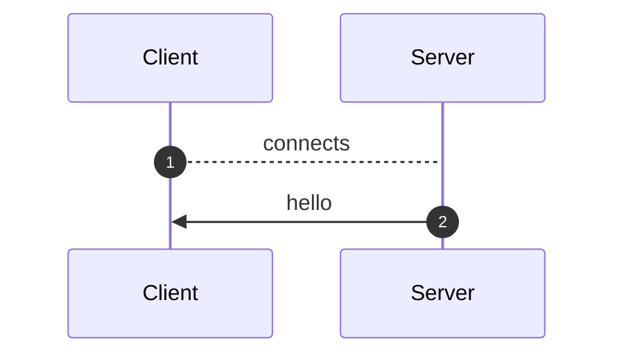
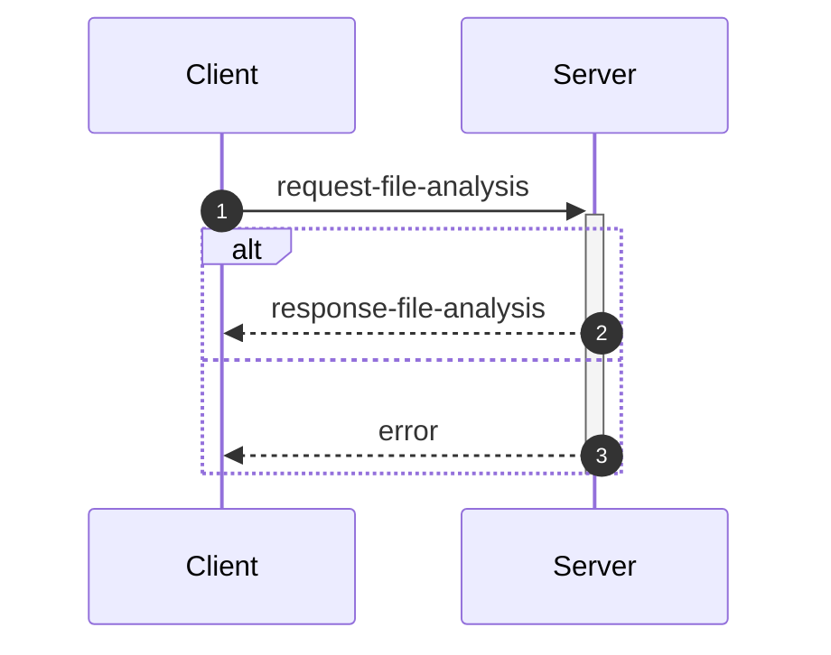
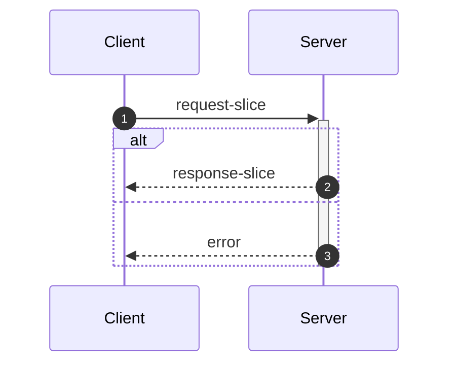
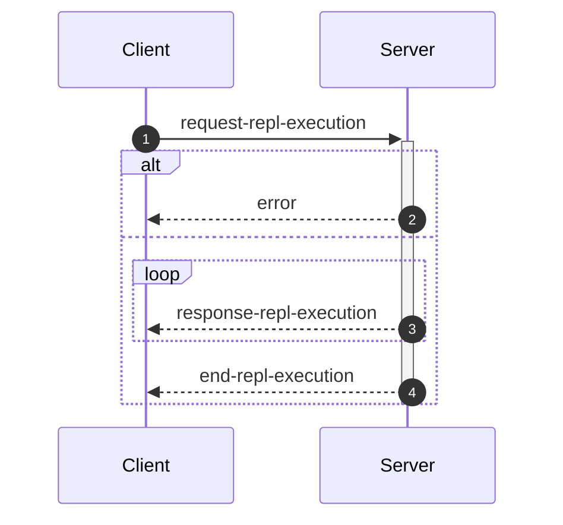

_This document was generated from '[src/documentation/wiki-interface.ts](https://github.com/flowr-analysis/flowr/tree/main//src/documentation/wiki-interface.ts)' on 2026-07-05, 05:32:53 UTC presenting an overview of flowR's interface (v2.10.10, using R v4.6.0). Please do not edit this file/wiki page directly._

Although far from being as detailed as the in-depth explanation of [_flowR_](https://github.com/flowr-analysis/flowr/wiki/core),
this wiki page explains how to interface with _flowR_ in more detail.
In general, command line arguments and other options provide short descriptions on hover over.

* [💻 Using the REPL](#using-the-repl)
* [⚙️ Configuring FlowR](#configuring-flowr)
* [⚒️ Writing Code](#writing-code)
* [💬 Communicating with the Server](#communicating-with-the-server)

<a id='using-the-repl'></a>
## 💻 Using the REPL


> [!NOTE]
> To execute arbitrary R commands with a repl request, _flowR_ has to be started explicitly with <span title="Description (Command Line Argument): Allow to access the underlying R session when using flowR (security warning: this allows the execution of arbitrary R code!)">`--r-session-access`</span>.
> Please be aware that this introduces a security risk and note that this relies on the [`r-shell` engine](https://github.com/flowr-analysis/flowr/wiki/engines) .

Although primarily meant for users to explore,
there is nothing which forbids simply calling _flowR_ as a subprocess to use standard-in, -output, and -error
for communication (although you can access the REPL using the server as well,
with the [REPL Request](#message-request-repl-execution) message).

The read-eval-print loop&nbsp;(REPL) works relatively simple.
You can submit an expression (using <kbd>Enter</kbd>),
which is interpreted as an R&nbsp;expression by default but interpreted as a *command* if it starts with a colon (`:`).
The best command to get started with the REPL is <span title="Description (Repl Command): Show help information (aliases: :h, :?)">`:help`</span>.
Besides, you can leave the REPL either with the command <span title="Description (Repl Command): End the repl (aliases: :q, :exit)">`:quit`</span> or by pressing <kbd>Ctrl</kbd>+<kbd>C</kbd> twice.
When writing a *command*, you may press <kbd>Tab</kbd> to get a list of completions, if available.
Multiple commands can be entered in a single line by separating them with a semicolon (`;`), e.g. `:parse "x<-2"; :df*`.
If a command is given without R code, the REPL will re-use R code given in a previous command.
The prior example will hence return first the parsed AST of the program and then the dataflow graph for `"x <- 2"`.

> [!NOTE]
> If you develop flowR, you may want to launch the repl using the `npm run main-dev` command, this way, you get a non-minified version of flowR with debug information and hot-reloading of source files.

<details>
<summary>Available Commands</summary>

We currently offer the following commands (this with a `[*]` suffix are available with and without the star):


| Command | Description |
| ------- | ----------- |
| **<span title="Description (Repl Command): End the repl (aliases: :q, :exit)">:quit</span>** | End the repl (aliases: **:<span title="Alias of ':quit'. End the repl">q</span>**, **:<span title="Alias of ':quit'. End the repl">exit</span>**) |
| **<span title="Description (Repl Command): Execute the given code as R code. This requires the `--r-session-access` flag to be set and requires the r-shell engine. (aliases: :e, :r)">:execute</span>** | Execute the given code as R code. This requires the `--r-session-access` flag to be set and requires the r-shell engine. (aliases: **:<span title="Alias of ':execute'. Execute the given code as R code. This requires the `--r-session-access` flag to be set and requires the r-shell engine.">e</span>**, **:<span title="Alias of ':execute'. Execute the given code as R code. This requires the `--r-session-access` flag to be set and requires the r-shell engine.">r</span>**) |
| **<span title="Description (Repl Command): Get mermaid code for the control-flow graph of R code (aliases: :cfg, :cf)">:controlflow[*]</span>** | Get mermaid code for the control-flow graph of R code (star: Returns the URL to mermaid.live) (aliases: **:<span title="Alias of ':controlflow'. Get mermaid code for the control-flow graph of R code">cfg</span>**, **:<span title="Alias of ':controlflow'. Get mermaid code for the control-flow graph of R code">cf</span>**) |
| **<span title="Description (Repl Command): Get mermaid code for the control-flow graph with basic blocks (aliases: :cfgb, :cfb)">:controlflowbb[*]</span>** | Get mermaid code for the control-flow graph with basic blocks (star: Returns the URL to mermaid.live) (aliases: **:<span title="Alias of ':controlflowbb'. Get mermaid code for the control-flow graph with basic blocks">cfgb</span>**, **:<span title="Alias of ':controlflowbb'. Get mermaid code for the control-flow graph with basic blocks">cfb</span>**) |
| **<span title="Description (Repl Command): Get mermaid code for the dataflow graph (aliases: :d, :df)">:dataflow[*]</span>** | Get mermaid code for the dataflow graph (star: Returns the URL to mermaid.live) (aliases: **:<span title="Alias of ':dataflow'. Get mermaid code for the dataflow graph">d</span>**, **:<span title="Alias of ':dataflow'. Get mermaid code for the dataflow graph">df</span>**) |
| **<span title="Description (Repl Command): Get mermaid code for the normalized AST of R code (aliases: :n)">:normalize[*]</span>** | Get mermaid code for the normalized AST of R code (star: Returns the URL to mermaid.live) (alias: **:<span title="Alias of ':normalize'. Get mermaid code for the normalized AST of R code">n</span>**) |
| **<span title="Description (Repl Command): Get mermaid code for the simplified dataflow graph (aliases: :ds, :dfs)">:dataflowsimple[*]</span>** | Get mermaid code for the simplified dataflow graph (star: Returns the URL to mermaid.live) (aliases: **:<span title="Alias of ':dataflowsimple'. Get mermaid code for the simplified dataflow graph">ds</span>**, **:<span title="Alias of ':dataflowsimple'. Get mermaid code for the simplified dataflow graph">dfs</span>**) |
| **<span title="Description (Repl Command): Just calculates the DFG, but only prints summary info (aliases: :d#, :df#)">:dataflowsilent</span>** | Just calculates the DFG, but only prints summary info (aliases: **:<span title="Alias of ':dataflowsilent'. Just calculates the DFG, but only prints summary info">d#</span>**, **:<span title="Alias of ':dataflowsilent'. Just calculates the DFG, but only prints summary info">df#</span>**) |
| **<span title="Description (Repl Command): Prints ASCII Art of the parsed, unmodified AST (aliases: :p)">:parse</span>** | Prints ASCII Art of the parsed, unmodified AST (alias: **:<span title="Alias of ':parse'. Prints ASCII Art of the parsed, unmodified AST">p</span>**) |
| **<span title="Description (Repl Command): Prints the version of flowR as well as the current version of R">:version</span>** | Prints the version of flowR as well as the current version of R
| **<span title="Description (Repl Command): Query the given R code (use 'help' for more information)">:query[*]</span>** | Query the given R code (use 'help' for more information) (star: Similar to query, but returns the output in json format.)
| **<span title="Description (Repl Command): Returns an ASCII representation of the dataflow graph (aliases: :df!)">:dataflowascii</span>** | Returns an ASCII representation of the dataflow graph (alias: **:<span title="Alias of ':dataflowascii'. Returns an ASCII representation of the dataflow graph">df!</span>**) |
| **<span title="Description (Repl Command): Returns summarization stats for the normalized AST (aliases: :n#)">:normalize#</span>** | Returns summarization stats for the normalized AST (alias: **:<span title="Alias of ':normalize#'. Returns summarization stats for the normalized AST">n#</span>**) |
| **<span title="Description (Repl Command): Show help information (aliases: :h, :?)">:help</span>** | Show help information (aliases: **:<span title="Alias of ':help'. Show help information">h</span>**, **:<span title="Alias of ':help'. Show help information">?</span>**) |


</details>


> [!TIP]
> 
> As indicated by the examples before, all REPL commands that operate on code keep track of the state.
> Hence, if you run a command like <span title="Description (Repl Command, starred version): Returns the URL to mermaid.live; Base Command: Get mermaid code for the dataflow graph (aliases: :d*, :df*)">`:dataflow*`</span> without providing R code,
> the REPL will re-use the R code provided in a previous command.
> Likewise, doing this will benefit from incrementality!
> If you request the dataflow graph with `:df* x <- 2 * y` and then want to see the parsed AST with `:parse`,
> the REPL will re-use previously obtained information and not re-parse the code again.
> 		


Generally, many commands offer shortcut versions in the REPL. Many queries, for example, offer a shortened format (see the example below).
Of special note, the [Config Query](https://github.com/flowr-analysis/flowr/wiki/query-api#Config-Query)
can be used to also modify the currently active configuration of _flowR_ within the REPL (see the [wiki page](https://github.com/flowr-analysis/flowr/wiki/query-api#Config-Query) for more information).

### Example: Retrieving the Dataflow Graph

To retrieve a URL to the [mermaid](https://mermaid.js.org/) diagram of the dataflow of a given expression,
use <span title="Description (Repl Command, starred version): Returns the URL to mermaid.live; Base Command: Get mermaid code for the dataflow graph (aliases: :d*, :df*)">`:dataflow*`</span> (or <span title="Description (Repl Command): Get mermaid code for the dataflow graph (aliases: :d, :df)">`:dataflow`</span> to get the mermaid code in the cli):


```shell
$ docker run -it --rm eagleoutice/flowr # or npm run flowr 
flowR repl using flowR v2.10.10, R grammar v14 (tree-sitter engine)
R> :dataflow* y <- 1 + x
```

<details>
<summary style='color:gray'>Output</summary>


```text
https://mermaid.live/view#base64:eyJjb2RlIjoiZmxvd2NoYXJ0IEJUXG4gICAgMXt7XCJgIzkxO1JOdW1iZXIjOTM7IDFcbiAgICAgICgxKVxuICAgICAgKjEuNipgXCJ9fVxuICAgJSUgTm8gZWRnZXMgZm91bmQgZm9yIDFcbiAgICAyKFtcImAjOTE7UlN5bWJvbCM5MzsgeFxuICAgICAgKDIpXG4gICAgICAqMS4xMCpgXCJdKVxuICAgJSUgTm8gZWRnZXMgZm91bmQgZm9yIDJcbiAgICAzW1tcImAjOTE7UkJpbmFyeU9wIzkzOyAjNDM7XG4gICAgICAoMylcbiAgICAgICoxLjYtMTAqXG4gICAgKDEsIDIpYFwiXV1cbiAgICBidWlsdC1pbjpfW1wiYEJ1aWx0LUluOlxuIzQzO2BcIl1cbiAgICBzdHlsZSBidWlsdC1pbjpfIHN0cm9rZTpncmF5LGZpbGw6Z3JheSxzdHJva2Utd2lkdGg6MnB4LG9wYWNpdHk6Ljg7XG4gICAgMFtcImAjOTE7UlN5bWJvbCM5MzsgeVxuICAgICAgKDAsIHNvdXJjZXM6IFszXSlcbiAgICAgICoxLjEqYFwiXVxuICAgIDRbW1wiYCM5MTtSQmluYXJ5T3AjOTM7ICM2MDsjNDU7XG4gICAgICAoNClcbiAgICAgICoxLjEtMTAqXG4gICAgKDAsIDMpYFwiXV1cbiAgICBidWlsdC1pbjpfLVtcImBCdWlsdC1JbjpcbiM2MDsjNDU7YFwiXVxuICAgIHN0eWxlIGJ1aWx0LWluOl8tIHN0cm9rZTpncmF5LGZpbGw6Z3JheSxzdHJva2Utd2lkdGg6MnB4LG9wYWNpdHk6Ljg7XG4gICAgMyAtLT58XCJyZWFkcywgYXJndW1lbnRcInwgMVxuICAgIDMgLS0+fFwicmVhZHMsIGFyZ3VtZW50XCJ8IDJcbiAgICAzIC0uLT58XCJyZWFkcywgY2FsbHNcInwgYnVpbHQtaW46X1xuICAgIGxpbmtTdHlsZSAyIHN0cm9rZTpncmF5O1xuICAgIDAgLS0+fFwiZGVmaW5lZC1ieVwifCAzXG4gICAgMCAtLT58XCJkZWZpbmVkLWJ5XCJ8IDRcbiAgICA0IC0tPnxcInJlYWRzLCBhcmd1bWVudFwifCAzXG4gICAgNCAtLT58XCJyZXR1cm5zLCBhcmd1bWVudFwifCAwXG4gICAgNCAtLi0+fFwicmVhZHMsIGNhbGxzXCJ8IGJ1aWx0LWluOl8tXG4gICAgbGlua1N0eWxlIDcgc3Ryb2tlOmdyYXk7IiwibWVybWFpZCI6eyJhdXRvU3luYyI6dHJ1ZX19
```


Retrieve the dataflow graph of the expression `y <- 1 + x`. It looks like this:


```mermaid
flowchart LR
    1{{"`#91;RNumber#93; 1
      (1)
      *1.6*`"}}
   %% No edges found for 1
    2(["`#91;RSymbol#93; x
      (2)
      *1.10*`"])
   %% No edges found for 2
    3[["`#91;RBinaryOp#93; #43;
      (3)
      *1.6-10*
    (1, 2)`"]]
    built-in:_["`Built-In:
#43;`"]
    style built-in:_ stroke:gray,fill:gray,stroke-width:2px,opacity:.8;
    0["`#91;RSymbol#93; y
      (0, sources: [3])
      *1.1*`"]
    4[["`#91;RBinaryOp#93; #60;#45;
      (4)
      *1.1-10*
    (0, 3)`"]]
    built-in:_-["`Built-In:
#60;#45;`"]
    style built-in:_- stroke:gray,fill:gray,stroke-width:2px,opacity:.8;
    3 -->|"reads, argument"| 1
    3 -->|"reads, argument"| 2
    3 -.->|"reads, calls"| built-in:_
    linkStyle 2 stroke:gray;
    0 -->|"defined-by"| 3
    0 -->|"defined-by"| 4
    4 -->|"reads, argument"| 3
    4 -->|"returns, argument"| 0
    4 -.->|"reads, calls"| built-in:_-
    linkStyle 7 stroke:gray;
```

	
<details>

<summary style="color:gray">R Code of the Dataflow Graph</summary>

The analysis required _0.9 ms_ (including parse and normalize, using the [tree-sitter](https://github.com/flowr-analysis/flowr/wiki/Engines) engine) within the generation environment. 
We encountered no unknown side effects during the analysis.


```r
y <- 1 + x
```


</details>


</details>


For small graphs like this, <span title="Description (Repl Command): Returns an ASCII representation of the dataflow graph (aliases: :df!)">`:dataflowascii`</span> also provides an ASCII representation directly in the REPL:


```shell
$ docker run -it --rm eagleoutice/flowr # or npm run flowr 
flowR repl using flowR v2.10.10, R grammar v14 (tree-sitter engine)
R> :df! y <- 1 + x
```

<details open>
<summary style='color:gray'>Output</summary>


```text
                        0<1>0
                   ┌────| 1 |
    ┌────────┐     │    0---0
 c<4>c       └──c<3>c
 |<- |  v<0>v┌──| + |
 c---c──| y |┘  c---c   u<2>u
        v---v      └────| x |
                        u---u
Edges:
3 -> 1: reads, argument  3 -> 2: reads, argument
4 -> 3: reads, argument  4 -> 0: returns, argument
0 -> 3: defined-by       0 -> 4: defined-by
```


Retrieve the dataflow graph of the expression `y <- 1 + x` as ASCII art.

</details>


For the slicing with <span title="Description (Repl Command): Static backwards executable slicer for R">`:slicer`</span>, you have access to the same [magic comments](#slice-magic-comments) as with the [slice request](#message-request-slice).

### Example: Interfacing with the File System

Many commands that allow for an R-expression (like <span title="Description (Repl Command, starred version): Returns the URL to mermaid.live; Base Command: Get mermaid code for the dataflow graph (aliases: :d*, :df*)">`:dataflow*`</span>) allow for a file as well
if the argument starts with `file://`.
If you are working from the root directory of the _flowR_ repository, the following gives you the parsed AST of the example file using the <span title="Description (Repl Command): Prints ASCII Art of the parsed, unmodified AST (aliases: :p)">`:parse`</span> command:

> **Watch mode**: Replace `file://` with `watch://` to enter watch mode.
> flowR runs the command immediately and then re-runs it every time the file (or any file inside the folder) changes.
> Enter any other command to leave watch mode.
> For example: `:df watch://analysis.R`


```shell
$ docker run -it --rm eagleoutice/flowr # or npm run flowr 
flowR repl using flowR v2.10.10, R grammar v14 (tree-sitter engine)
R> :parse file://test/testfiles/example.R
```

<details>
<summary style='color:gray'>Output</summary>


```text
File: test/testfiles/example.R

program
├ binaryoperator
│ ├ identifier "sum" (1:1─4)
│ ├ <- "<-" (1:5─7)
│ ╰ float "0" (1:8─9)
├ binaryoperator
│ ├ identifier "product" (2:1─8)
│ ├ <- "<-" (2:9─11)
│ ╰ float "1" (2:12─13)
├ binaryoperator
│ ├ identifier "w" (3:1─2)
│ ├ <- "<-" (3:3─5)
│ ╰ float "7" (3:6─7)
├ binaryoperator
│ ├ identifier "N" (4:1─2)
│ ├ <- "<-" (4:3─5)
│ ╰ float "10" (4:6─8)
├ forstatement
│ ├ for "for" (6:1─4)
│ ├ ( "(" (6:5─6)
│ ├ identifier "i" (6:6─7)
│ ├ in "in" (6:8─10)
│ ├ binaryoperator
│ │ ├ float "1" (6:11─12)
│ │ ├ : ":" (6:12─13)
│ │ ╰ parenthesizedexpression
│ │   ├ ( "(" (6:13─14)
│ │   ├ binaryoperator
│ │   │ ├ identifier "N" (6:14─15)
│ │   │ ├ - "-" (6:15─16)
│ │   │ ╰ float "1" (6:16─17)
│ │   ╰ ) ")" (6:17─18)
│ ├ ) ")" (6:18─19)
│ ╰ bracedexpression
│   ├ { "{" (6:20─21)
│   ├ binaryoperator
│   │ ├ identifier "sum" (7:3─6)
│   │ ├ <- "<-" (7:7─9)
│   │ ╰ binaryoperator
│   │   ├ binaryoperator
│   │   │ ├ identifier "sum" (7:10─13)
│   │   │ ├ + "+" (7:14─15)
│   │   │ ╰ identifier "i" (7:16─17)
│   │   ├ + "+" (7:18─19)
│   │   ╰ identifier "w" (7:20─21)
│   ├ binaryoperator
│   │ ├ identifier "product" (8:3─10)
│   │ ├ <- "<-" (8:11─13)
│   │ ╰ binaryoperator
│   │   ├ identifier "product" (8:14─21)
│   │   ├  "" (8:22─23)
│   │   ╰ identifier "i" (8:24─25)
│   ╰ } "}" (9:1─2)
├ call
│ ├ identifier "cat" (11:1─4)
│ ╰ arguments
│   ├ ( "(" (11:4─5)
│   ├ argument
│   │ ╰ string
│   │   ├ " "\"" (11:5─6)
│   │   ├ stringcontent "Sum:" (11:6─10)
│   │   ╰ " "\"" (11:10─11)
│   ├ comma "," (11:11─12)
│   ├ argument
│   │ ╰ identifier "sum" (11:13─16)
│   ├ comma "," (11:16─17)
│   ├ argument
│   │ ╰ string
│   │   ├ " "\"" (11:18─19)
│   │   ├ stringcontent
│   │   │ ╰ escapesequence "\\n" (11:19─21)
│   │   ╰ " "\"" (11:21─22)
│   ╰ ) ")" (11:22─23)
╰ call
  ├ identifier "cat" (12:1─4)
  ╰ arguments
    ├ ( "(" (12:4─5)
    ├ argument
    │ ╰ string
    │   ├ " "\"" (12:5─6)
    │   ├ stringcontent "Product:" (12:6─14)
    │   ╰ " "\"" (12:14─15)
    ├ comma "," (12:15─16)
    ├ argument
    │ ╰ identifier "product" (12:17─24)
    ├ comma "," (12:24─25)
    ├ argument
    │ ╰ string
    │   ├ " "\"" (12:26─27)
    │   ├ stringcontent
    │   │ ╰ escapesequence "\\n" (12:27─29)
    │   ╰ " "\"" (12:29─30)
    ╰ ) ")" (12:30─31)
```


Retrieve the parsed AST of the example file.

<details>

<summary>File Content</summary>


```r
sum <- 0
product <- 1
w <- 7
N <- 10

for (i in 1:(N-1)) {
  sum <- sum + i + w
  product <- product * i
}

cat("Sum:", sum, "\n")
cat("Product:", product, "\n")
```


</details>

As _flowR_ directly transforms this AST the output focuses on being human-readable instead of being machine-readable.
		

</details>


### Example: Run a Query

You can run any query supported by _flowR_ using the <span title="Description (Repl Command): Query the given R code (use 'help' for more information)">`:query`</span> command.
For example, to obtain the shapes of all data frames in a given piece of code, you can run:


```shell
$ docker run -it --rm eagleoutice/flowr # or npm run flowr 
flowR repl using flowR v2.10.10, R grammar v14 (tree-sitter engine)
R> :query @df-shape "x <- data.frame(a = 1:10, b = 1:10)\ny <- x$a"
```

<details open>
<summary style='color:gray'>Output</summary>


```text
Query: df-shape (5 ms)
   ╰ 12: (colnames: [{"a", "b"}, {}], cols: [2, 2], rows: [10, 10])
   ╰ 0: (colnames: [{"a", "b"}, {}], cols: [2, 2], rows: [10, 10])
All queries together required ≈7 ms (1ms accuracy, total 8 ms)
```


Retrieve the shapes of all data frames in the given code.

</details>


To run the linter on a file, you can use (in this example, we just issue the `dead-code` linter on a small piece of code):


```shell
$ docker run -it --rm eagleoutice/flowr # or npm run flowr 
flowR repl using flowR v2.10.10, R grammar v14 (tree-sitter engine)
R> :query @linter rules:dead-code "if(FALSE) x <- 2"
```

<details open>
<summary style='color:gray'>Output</summary>


```text
Query: linter (3 ms)
   ╰ Dead Code (dead-code):
       ╰ certain:
           ╰ Code at 1.11-16
       ╰ Metadata: searchTimeMs: 3, processTimeMs: 0
All queries together required ≈4 ms (1ms accuracy, total 5 ms)
```


Run the linter on the given code, with only the `dead-code` rule enabled.

</details>


For more information on the available queries, please check out the [Query API](https://github.com/flowr-analysis/flowr/wiki/query-api).


<a id='configuring-flowr'></a>
## ⚙️ Configuring FlowR


When running _flowR_, you may want to specify some behaviors with a dedicated configuration file.
By default, flowR looks for a file named `flowr.json` in the current working directory (or any higher directory).
You can also specify a different file with <span title="Description (Command Line Argument): The name of the configuration file to use">`--config-file`</span> or pass the configuration inline using <span title="Description (Command Line Argument): The flowR configuration to use, as a JSON string">`--config-json`</span>.
To inspect the current configuration, you can run flowr with the <span title="Description (Command Line Argument): Run with verbose logging (will be passed to the corresponding script)">`--verbose`</span> flag, or use the `config` [Query](https://github.com/flowr-analysis/flowr/wiki/query-api).
Within the REPL this works by running the following:


```shell
:query @config
```


To work with the <a href="https://github.com/flowr-analysis/flowr/tree/main/src/config.ts#L109"><code><span title="The configuration file format for flowR.">FlowrConfig</span></code></a> you can use the provided helper objects alongside its methods like
<a href="https://github.com/flowr-analysis/flowr/tree/main/src/config.ts#L458"><code><span title="Creates a new flowr config that has the updated values.">FlowrConfig::<b>amend</b></span></code></a>.
The following summarizes the configuration options:

- `ignoreSourceCalls`: If set to `true`, _flowR_ will ignore source calls when analyzing the code, i.e., ignoring the inclusion of other files.
- `semantics`: allows to configure the way _flowR_ handles R, although we currently only support `semantics/environment/overwriteBuiltIns`.
  You may use this to overwrite _flowR_'s handling of built-in function and even completely clear the preset definitions shipped with flowR.
  See [Configure BuiltIn Semantics](#configure-builtin-semantics) for more information.
- `solver`: allows to configure how _flowR_ resolves variables and their values (currently we support: `disabled`, `alias`, `builtin`), as well as if pointer analysis should be active.
- `engines`: allows to configure the engines used by _flowR_ to interact with R code. See the [Engines wiki page](https://github.com/flowr-analysis/flowr/wiki/engines) for more information.
- `defaultEngine`: allows to specify the default engine to use for interacting with R code. If not set, an arbitrary engine from the specified list will be used.
- `abstractInterpretation`: allows to configure how _flowR_ performs abstract interpretation, although we currently only support data frame shape inference through abstract interpretation.
- `defaultPlugins`: allows to configure which plugins to load by default when creating a new <a href="https://github.com/flowr-analysis/flowr/tree/main/src/project/flowr-analyzer.ts#L162"><code><span title="Central class for conducting analyses with FlowR. Use the FlowrAnalyzerBuilder to create a new instance. If you want the original pattern of creating a pipeline and running all steps, you can still do this with FlowrAnalyzer#runFull . To inspect the context of the analyzer, use FlowrAnalyzer#inspectContext (if you are a plugin and need to modify it, use FlowrAnalyzer#context instead).">FlowrAnalyzer</span></code></a> instance.
- `repl.plugins`: allows to configure which plugins to load in the _flowR_ REPL. Use `flowr:default` to reference the plugins specified by `defaultPlugins`.

So you can configure _flowR_ by adding a file like the following:

<details>

<summary>Example Configuration File</summary>


```json
{
  "ignoreSourceCalls": true,
  "semantics": {
    "environment": {
      "overwriteBuiltIns": {
        "definitions": [
          {
            "type": "function",
            "names": [
              "foo"
            ],
            "processor": "builtin:assign",
            "config": {}
          }
        ]
      }
    }
  },
  "defaultPlugins": [
    "file:description",
    "versions:description"
  ],
  "repl": {
    "quickStats": false,
    "dfProcessorHeat": false,
    "plugins": [
      "flowr:default"
    ]
  },
  "project": {
    "resolveUnknownPathsOnDisk": true
  },
  "engines": [
    {
      "type": "r-shell"
    }
  ],
  "solver": {
    "variables": "alias",
    "evalStrings": true,
    "trackEnvironments": true,
    "resolveSource": {
      "dropPaths": "no",
      "ignoreCapitalization": true,
      "inferWorkingDirectory": "active-script",
      "searchPath": []
    },
    "instrument": {},
    "slicer": {
      "threshold": 50
    }
  },
  "abstractInterpretation": {
    "wideningThreshold": 4,
    "dataFrame": {
      "maxColNames": 20,
      "readLoadedData": {
        "readExternalFiles": true,
        "maxReadLines": 1000000
      }
    }
  },
  "gas": {
    "thresholds": {
      "memory": {
        "problematic": 0.7,
        "critical": 0.9
      },
      "timeMs": {
        "problematic": 100000,
        "critical": 120000
      }
    },
    "features": {}
  }
}
```


</details>

<details>
<a id='configure-builtin-semantics'></a>
<summary>Configure Built-In Semantics</summary>


`semantics/environment/overwriteBuiltins` accepts two keys:

- `loadDefaults` (boolean, initially `true`): If set to `true`, the default built-in definitions are loaded before applying the custom definitions. Setting this flag to `false` explicitly disables the loading of the default definitions.
- `definitions` (array, initially empty): Allows to overwrite or define new built-in elements. Each object within must have a `type` which is one of the below. Furthermore, they may define a string array of `names` which specifies the identifiers to bind the definitions to. You may use `assumePrimitive` to specify whether _flowR_ should assume that this is a primitive non-library definition (so you probably just do not want to specify the key).

  | Type            | Description                                                                                                                                                                                                                                                                                              | Example                                                                                                    |
  | --------------- | -------------------------------------------------------------------------------------------------------------------------------------------------------------------------------------------------------------------------------------------------------------------------------------------------------- | ---------------------------------------------------------------------------------------------------------- |
  | `constant`    | Additionally allows for a `value` this should resolve to.                                                                                                                                                                                                                                                | `{ type: 'constant', names: ['NULL', 'NA'],  value: null }`                                                |
  | `function`    | Is a rather flexible way to define and bind built-in functions. For the time, we do not have extensive documentation to cover all the cases, so please either consult the sources with the `default-builtin-config.ts` or open a [new issue](https://github.com/flowr-analysis/flowr/issues/new/choose). | `{ type: 'function', names: ['next'], processor: 'builtin:d', config: { cfg: ExitPointType.Next } }` |
  | `replacement` | A comfortable way to specify replacement functions like `$<-` or `names<-`. `suffixes` describes the... suffixes to attach automatically. | `{ type: 'replacement', suffixes: ['<-', '<<-'], names: ['[', '[['] }` |


</details>

<details>

<summary style='color:gray'>Full Configuration-File Schema</summary>

- _The configuration file format for flowR._ (object)
    - **ignoreSourceCalls** [optional] _Whether source calls should be ignored, causing {@link processSourceCall}'s behavior to be skipped._ (boolean)
    - **semantics** _Configure language semantics and how flowR handles them._ (object)
        - **environment** [optional] _Semantics regarding how to handle the R environment._ (object)
            - **overwriteBuiltIns** [optional] _Do you want to overwrite (parts) of the builtin definition?_ (object)
                - **loadDefaults** [optional] _Should the default configuration still be loaded?_ (boolean)
                - **definitions** [optional] _The definitions to load/overwrite._ (array)
                Valid item types:
                    - (object)
    - **defaultPlugins** [optional] _The default plugins to load when creating a new instance of FlowrAnalyzer_ (array)
    Valid item types:
        - (alternatives)
            - (string)
            - (array)
    - **repl** _Configuration options for the REPL._ (object)
        - **quickStats** [optional] _Whether to show quick stats in the REPL after each evaluation._ (boolean)
        - **dfProcessorHeat** [optional] _This instruments the dataflow processors to count how often each processor is called._ (boolean)
        - **plugins** [optional] _The plugins to load in REPL mode_ (array)
        Valid item types:
            - (alternatives)
                - (string)
                - (array)
    - **project** _Project specific configuration options._ (object)
        - **resolveUnknownPathsOnDisk** [optional] _Whether to resolve unknown paths loaded by the r project disk when trying to source/analyze files._ (boolean)
    - **engines** _The engine or set of engines to use for interacting with R code. An empty array means all available engines will be used._ (array)
    Valid item types:
        - (alternatives)
            - _The configuration for the tree sitter engine._ (object)
                - **type** [required] _Use the tree sitter engine._ (string)
                    Only allows: 'tree-sitter'
                - **wasmPath** [optional] _The path to the tree-sitter-r WASM binary to use. If this is undefined, this uses the default path._ (string)
                - **treeSitterWasmPath** [optional] _The path to the tree-sitter WASM binary to use. If this is undefined, this uses the default path._ (string)
                - **lax** [optional] _Whether to use the lax parser for parsing R code (allowing for syntax errors). If this is undefined, the strict parser will be used._ (boolean)
            - _The configuration for the R shell engine._ (object)
                - **type** [required] _Use the R shell engine._ (string)
                    Only allows: 'r-shell'
                - **rPath** [optional] _The path to the R executable to use. If this is undefined, this uses the default path._ (string)
    - **defaultEngine** [optional] _The default engine to use for interacting with R code. If this is undefined, an arbitrary engine from the specified list will be used._ (string)
        Only allows: 'tree-sitter', 'r-shell'
    - **solver** _How to resolve constants, constraints, cells, ..._ (object)
        - **variables** _How to resolve variables and their values._ (string)
            Only allows: 'disabled', 'alias', 'builtin'
        - **evalStrings** _Should we include eval(parse(text="...")) calls in the dataflow graph?_ (boolean)
        - **trackEnvironments** [optional] _Track user-created environments (new.env, assign/get/local with envir=, dollar-assign, attach). When false, all envir-style calls fall through conservatively._ (boolean)
        - **instrument** (object)
            - **dataflowExtractors** [optional] _These keys are only intended for use within code, allowing to instrument the dataflow analyzer!_ (any)
        - **resolveSource** [optional] _If lax source calls are active, flowR searches for sourced files much more freely, based on the configurations you give it. This option is only in effect if `ignoreSourceCalls` is set to false._ (object)
            - **dropPaths** _Allow to drop the first or all parts of the sourced path, if it is relative._ (string)
                Only allows: 'no', 'once', 'all'
            - **ignoreCapitalization** _Search for filenames matching in the lowercase._ (boolean)
            - **inferWorkingDirectory** _Try to infer the working directory from the main or any script to analyze._ (string)
                Only allows: 'no', 'main-script', 'active-script', 'any-script'
            - **searchPath** _Additionally search in these paths._ (array)
            Valid item types:
                - (string)
            - **repeatedSourceLimit** [optional] _How often the same file can be sourced within a single run? Please be aware: in case of cyclic sources this may not reach a fixpoint so give this a sensible limit._ (number)
            - **applyReplacements** _Provide name replacements for loaded files_ (array)
            Valid item types:
                - (object)
        - **slicer** [optional] _The configuration for the slicer._ (object)
            - **threshold** [optional] _The maximum number of iterations to perform on a single function call during slicing._ (number)
            - **autoExtend** [optional] _If set, the slicer will gain an additional post-pass._ (boolean)
    - **abstractInterpretation** _The configuration options for abstract interpretation._ (object)
        - **wideningThreshold** _The threshold for the number of visitations of a node at which widening should be performed to ensure the termination of the fixpoint iteration._ (number)
        - **dataFrame** _The configuration of the shape inference for data frames._ (object)
            - **maxColNames** _The maximum number of columns names to infer for data frames before over-approximating the column names to top._ (number)
            - **readLoadedData** _Configuration options for reading data frame shapes from loaded external data files, such as CSV files._ (object)
                - **readExternalFiles** _Whether data frame shapes should be extracted from loaded external files, such as CSV files._ (boolean)
                - **maxReadLines** _The maximum number of lines to read when extracting data frame shapes from loaded files, such as CSV files._ (number)
    - **gas** [optional] _Resource-usage guard (gas) configuration. All feature factors default to 0 (disabled). See https://github.com/flowr-analysis/flowr/wiki/Core#gas-resource-guard._ (object)
        - **thresholds** [optional] _Shared thresholds for all gas checks (scaled by per-feature factor)._ (object)
            - **memory** [optional] _Heap-usage fraction thresholds (0-1)._ (object)
                - **problematic** [optional] _Heap fraction (0-1) above which Problematic is returned._ (number)
                - **critical** [optional] _Heap fraction (0-1) above which Critical is returned._ (number)
            - **timeMs** [optional] _Elapsed analysis time thresholds in milliseconds._ (object)
                - **problematic** [optional] _Elapsed ms above which Problematic is returned._ (number)
                - **critical** [optional] _Elapsed ms above which Critical is returned._ (number)
        - **features** [optional] _Per-feature sensitivity factors. 0 or absent disables gas checking for that feature. A factor of 2 makes the feature twice as sensitive. Recognised keys: `source`, `side-effect-linking`, `linter`._ (object)
        - **heapProvider** [optional] _Custom heap statistics source (programmatic configs only), overriding the built-in v8/performance.memory detection._ (function)

</details>

	

<a id='writing-code'></a>
## ⚒️ Writing Code

_flowR_ can be used as a [module](https://www.npmjs.com/package/@eagleoutice/flowr) and offers several main classes and interfaces that are interesting for extension writers 
(see the [Visual Studio Code extension](https://marketplace.visualstudio.com/items?itemName=code-inspect.vscode-flowr) or the [Core](https://github.com/flowr-analysis/flowr/wiki/core) wiki page for more information).

### Creating Analyses with _flowR_

Nowadays, instances of the <a href="https://github.com/flowr-analysis/flowr/tree/main/src/project/flowr-analyzer.ts#L162"><code><span title="Central class for conducting analyses with FlowR. Use the FlowrAnalyzerBuilder to create a new instance. If you want the original pattern of creating a pipeline and running all steps, you can still do this with FlowrAnalyzer#runFull . To inspect the context of the analyzer, use FlowrAnalyzer#inspectContext (if you are a plugin and need to modify it, use FlowrAnalyzer#context instead).">FlowrAnalyzer</span></code></a> should be used as central frontend to get analysis results from _flowR_.
For example, a program slice can be created like this:


```ts
const analyzer = await new FlowrAnalyzerBuilder()
    .setEngine('tree-sitter')
    .build();
analyzer.addRequest('x <- 1\ny <- x\nx');
const result = await analyzer.query([
    {
        type:     'static-slice',
        criteria: ['3@x']
    }
]);
//console.log(result['static-slice']);
```


For more information, please have a look at the [Analyzer](https://github.com/flowr-analysis/flowr/wiki/analyzer) wiki page, which explains how to construct and use the <a href="https://github.com/flowr-analysis/flowr/tree/main/src/project/flowr-analyzer.ts#L162"><code><span title="Central class for conducting analyses with FlowR. Use the FlowrAnalyzerBuilder to create a new instance. If you want the original pattern of creating a pipeline and running all steps, you can still do this with FlowrAnalyzer#runFull . To inspect the context of the analyzer, use FlowrAnalyzer#inspectContext (if you are a plugin and need to modify it, use FlowrAnalyzer#context instead).">FlowrAnalyzer</span></code></a> in more detail.
To work with specific perspectives, you can also consult the respective pages like the [Dataflow Graph](https://github.com/flowr-analysis/flowr/wiki/dataflow-graph) or the [Abstract Interpretation](https://github.com/flowr-analysis/flowr/wiki/abstract-interpretation) wiki pages.
### The Pipeline Executor (Low-Level Interface)

Once, in the beginning, _flowR_ was meant to produce a dataflow graph merely to provide *program slices*. 
However, with continuous updates, the [Dataflow Graph](https://github.com/flowr-analysis/flowr/wiki/dataflow-graph) repeatedly proves to be the more interesting part.
With this, we restructured _flowR_'s originally *hardcoded* pipeline to be far more flexible. 
Now, it can be theoretically extended or replaced with arbitrary steps, optional steps, and what we call 'decorations' of these steps. 
In short, a slicing pipeline using the <a href="https://github.com/flowr-analysis/flowr/tree/main/src/core/pipeline-executor.ts#L97"><code><span title="**Please note:** The PipelineExecutor is now considered to be a rather low-level API for flowR. While it still works and is the basis for all other layers, we strongly recommend using the FlowrAnalyzer and its builder to create and use an analyzer instance that is pre-configured for your use-case. The pipeline executor allows to execute arbitrary pipelines in a step-by-step fashion. If you are not...">PipelineExecutor</span></code></a> looks like this:


```ts

const slicer = new PipelineExecutor(DEFAULT_SLICING_PIPELINE, {
  parser:    new RShell(),
  request:   requestFromInput('x <- 1\nx + 1'),
  criterion: ['2@x']
})
const slice = await slicer.allRemainingSteps()
// console.log(slice.reconstruct.code)
```


<details><summary>More Information</summary>


If you compare this, with what you would have done with the old (and removed) `SteppingSlicer`, 
this essentially just requires you to replace the `SteppingSlicer` with the <a href="https://github.com/flowr-analysis/flowr/tree/main/src/core/pipeline-executor.ts#L97"><code><span title="**Please note:** The PipelineExecutor is now considered to be a rather low-level API for flowR. While it still works and is the basis for all other layers, we strongly recommend using the FlowrAnalyzer and its builder to create and use an analyzer instance that is pre-configured for your use-case. The pipeline executor allows to execute arbitrary pipelines in a step-by-step fashion. If you are not...">PipelineExecutor</span></code></a>
and to pass the <a href="https://github.com/flowr-analysis/flowr/tree/main/src/core/steps/pipeline/default-pipelines.ts#L18"><code>DEFAULT_SLICING_PIPELINE</code></a> as the first argument.
The <a href="https://github.com/flowr-analysis/flowr/tree/main/src/core/pipeline-executor.ts#L97"><code><span title="**Please note:** The PipelineExecutor is now considered to be a rather low-level API for flowR. While it still works and is the basis for all other layers, we strongly recommend using the FlowrAnalyzer and its builder to create and use an analyzer instance that is pre-configured for your use-case. The pipeline executor allows to execute arbitrary pipelines in a step-by-step fashion. If you are not...">PipelineExecutor</span></code></a>...

1. Provides structures to investigate the results of all intermediate steps
2. Can be executed step-by-step
3. Can repeat steps (e.g., to calculate multiple slices on the same input)

See the in-code documentation for more information.


</details>

### Using the <a href="https://github.com/flowr-analysis/flowr/tree/main/src/r-bridge/shell.ts#L143"><code><span title="The RShell represents an interactive session with the R interpreter. You can configure it by RShellOptions . At the moment we are using a live R session (and not networking etc.) to communicate with R easily, which allows us to install packages etc. However, this might and probably will change in the future (leaving this as a legacy mode :D)">RShell</span></code></a> to Interact with R

The <a href="https://github.com/flowr-analysis/flowr/tree/main/src/r-bridge/shell.ts#L143"><code><span title="The RShell represents an interactive session with the R interpreter. You can configure it by RShellOptions . At the moment we are using a live R session (and not networking etc.) to communicate with R easily, which allows us to install packages etc. However, this might and probably will change in the future (leaving this as a legacy mode :D)">RShell</span></code></a> class allows interfacing with the `R`&nbsp;ecosystem installed on the host system.
Please have a look at [flowR's Engines](https://github.com/flowr-analysis/flowr/wiki/engines) for more information on alternatives (for example, the <a href="https://github.com/flowr-analysis/flowr/tree/main/src/r-bridge/lang-4.x/tree-sitter/tree-sitter-executor.ts#L18"><code><span title="Synchronous and (way) faster alternative to the RShell using tree-sitter.">TreeSitterExecutor</span></code></a>).


> [!IMPORTANT]
> 
> Each <a href="https://github.com/flowr-analysis/flowr/tree/main/src/r-bridge/shell.ts#L143"><code><span title="The RShell represents an interactive session with the R interpreter. You can configure it by RShellOptions . At the moment we are using a live R session (and not networking etc.) to communicate with R easily, which allows us to install packages etc. However, this might and probably will change in the future (leaving this as a legacy mode :D)">RShell</span></code></a> controls a new instance of the R&nbsp;interpreter, 
> make sure to call <code><a href="https://github.com/flowr-analysis/flowr/tree/main/src/r-bridge/shell.ts#L333"><span title="Close the current R session, makes the object effectively invalid (can no longer be reopened etc.)">RShell::<i>close</i></span></a>()</code> when you are done.


You can start a new "session" simply by constructing a new object with <code>new <a href="https://github.com/flowr-analysis/flowr/tree/main/src/r-bridge/shell.ts#L143"><span title="The RShell represents an interactive session with the R interpreter. You can configure it by RShellOptions . At the moment we are using a live R session (and not networking etc.) to communicate with R easily, which allows us to install packages etc. However, this might and probably will change in the future (leaving this as a legacy mode :D)">RShell</span></a>()</code>.

However, there are several options that may be of interest 
(e.g., to automatically revive the shell in case of errors or to control the name location of the R process on the system).

With a shell object (let's call it `shell`), you can execute R code by using <a href="https://github.com/flowr-analysis/flowr/tree/main/src/r-bridge/shell.ts#L211"><code><span title="sends the given command directly to the current R session will not do anything to alter input markers!">RShell::<i>sendCommand</i></span></code></a>,
for example <code>shell.<a href="https://github.com/flowr-analysis/flowr/tree/main/src/r-bridge/shell.ts#L211"><span title="sends the given command directly to the current R session will not do anything to alter input markers!">sendCommand</span></a>("1 + 1")</code>.
However, this does not return anything, so if you want to collect the output of your command, use
<a href="https://github.com/flowr-analysis/flowr/tree/main/src/r-bridge/shell.ts#L277"><code><span title="Send a command and collect the output">RShell::<i>sendCommandWithOutput</i></span></code></a> instead.


<a id='communicating-with-the-server'></a>
## 💬 Communicating with the Server


As explained in the [Overview](https://github.com/flowr-analysis/flowr/wiki/overview), you can simply run the [TCP](https://de.wikipedia.org/wiki/Transmission_Control_Protocol)&nbsp;server by adding the <span title="Description (Command Line Argument): Do not drop into a repl, but instead start a server on the given port (default: 1042) and listen for messages.">`--server`</span> flag (and, due to the interactive mode, exit with the conventional <kbd>CTRL</kbd>+<kbd>C</kbd>).
Currently, every connection is handled by the same underlying `RShell` - so the server is not designed to handle many clients at a time.
Additionally, the server is not well guarded against attacks (e.g., you can theoretically spawn an arbitrary number of&nbsp;RShell sessions on the target machine).

Every message has to be given in a single line (i.e., without a newline in-between) and end with a newline character. Nevertheless, we will pretty-print example given in the following segments for the ease of reading.


> [!NOTE]
> 
> The default <span title="Description (Command Line Argument): Do not drop into a repl, but instead start a server on the given port (default: 1042) and listen for messages.">`--server`</span> uses a simple [TCP](https://de.wikipedia.org/wiki/Transmission_Control_Protocol)
> connection. If you want _flowR_ to expose a [WebSocket](https://de.wikipedia.org/wiki/WebSocket) server instead, add the <span title="Description (Command Line Argument): If the server flag is set, use websocket for messaging">`--ws`</span> flag (i.e., <span title="Description (Command Line Argument): Do not drop into a repl, but instead start a server on the given port (default: 1042) and listen for messages.">`--server`</span> <span title="Description (Command Line Argument): If the server flag is set, use websocket for messaging">`--ws`</span>) when starting _flowR_ from the command line.


<ul><li>
<a id="message-hello"></a>
<b>Hello</b> Message (<code>hello</code>) 
<details>

<summary style="color:gray"> View Details. <i>The server informs the client about the successful connection and provides Meta-Information.</i> </summary>


```mermaid
sequenceDiagram
    autonumber
    participant Client
    participant Server

    
    Client-->Server: connects
    Server->>Client: hello
	
```


	
After launching _flowR_, for example, with <code>docker run -it --rm eagleoutice/flowr <span title="Description (Command Line Argument): Do not drop into a repl, but instead start a server on the given port (default: 1042) and listen for messages.">-<span/>-server</span></code>&nbsp;(🐳️), simply connecting should present you with a `hello` message, that amongst others should reveal the versions of&nbsp;_flowR_ and&nbsp;R, using the [semver 2.0](https://semver.org/spec/v2.0.0.html) versioning scheme.
The message looks like this:


```json
{
  "type": "hello",
  "clientName": "client-0",
  "versions": {
    "flowr": "2.10.10",
    "r": "4.6.0",
    "engine": "r-shell"
  }
}
```


There are currently a few messages that you can send after the hello message.
If you want to _slice_ a piece of R code you first have to send an [analysis request](#message-request-file-analysis), so that you can send one or multiple slice requests afterward.
Requests for the [REPL](#message-request-repl) are independent of that.
	

<hr>


<details>
<summary style="color:gray">Message schema (<code>hello</code>)</summary>

For the definition of the hello message, please see it's implementation at [`./src/cli/repl/server/messages/message-hello.ts`](https://github.com/flowr-analysis/flowr/tree/main/./src/cli/repl/server/messages/message-hello.ts).

- [required] (object)
    - **type** [required] _The type of the hello message._ (string)
        Only allows: 'hello'
    - **id** [forbidden] _The id of the message is always undefined (as it is the initial message and not requested)._ (any)
    - **clientName** [required] _A unique name that is assigned to each client. It has no semantic meaning and is only used/useful for debugging._ (string)
    - **versions** [required] (object)
        - **flowr** [required] _The version of the flowr server running in semver format._ (string)
        - **r** [required] _The version of the underlying R shell running in semver format._ (string)
        - **engine** [required] _The parser backend that is used to parse the R code._ (string)

</details>


<hr>

</details>
	</li>

<li>
<a id="message-request-file-analysis"></a>
<b>Analysis</b> Message (<code>request-file-analysis</code>) 
<details>

<summary style="color:gray"> View Details. <i>The server builds the dataflow graph for a given input file (or a set of files).</i> </summary>


```mermaid
sequenceDiagram
    autonumber
    participant Client
    participant Server

    
    Client->>+Server: request-file-analysis
    alt
        Server-->>Client: response-file-analysis
    else
        Server-->>Client: error
    end
    deactivate  Server
	
```


	
The request allows the server to analyze a file and prepare it for slicing.
The message can contain a `filetoken`, which is used to identify the file in later slice or query requests (if you do not add one, the request will not be stored and therefore, it is not available for subsequent requests).

> **Please note!**\
> If you want to send and process a lot of analysis requests, but do not want to slice them, please do not pass the `filetoken` field. This will save the server a lot of memory allocation.

Furthermore, the request must contain either a `content` field to directly pass the file's content or a `filepath` field which contains the path to the file (this path must be accessible for the server to be useful).
If you add the `id` field, the answer will use the same `id` so you can match requests and the corresponding answers.
See the implementation of the request-file-analysis message for more information.

You can drop one or more stored file tokens by adding the `invalidateToken` field (a single token or an array of tokens).
The server frees the corresponding analyses _after_ it has answered the request.

> **Tip!**\
> If you only want to drop tokens, you do not need a separate message: send a `request-file-analysis` that contains _just_ the `invalidateToken` field (and no `content` or `filepath`).
> Such a request behaves like an empty file analysis and the server replies with an empty `results` object.
> Because invalidation happens after the response, you may even pass the _current_ `filetoken` in `invalidateToken` to analyze a file once and have the server forget it right after you received the results.


<details>
<summary>Example of the <code>request-file-analysis</code> Message</summary>

_Note:_ even though we pretty-print these messages, they are sent as a single line, ending with a newline.

The following lists all messages that were sent and received in case you want to reproduce the scenario:

<ol>
<li> <code>hello</code> (response)
<details> 

<summary> Show Details </summary>

The first message is always a hello message.


```json
{
  "type": "hello",
  "clientName": "client-0",
  "versions": {
    "flowr": "2.10.10",
    "r": "4.6.0",
    "engine": "r-shell"
  }
}
```


</details>
</li>

<li> <b><code>request-file-analysis</code> (request)</b>
<details open> 

<summary> Show Details </summary>

Let's suppose you simply want to analyze the following script:
 
```r
x <- 1
x + 1
```

 For this, you can send the following request:


```json
{
  "type": "request-file-analysis",
  "id": "1",
  "filetoken": "x",
  "content": "x <- 1\nx + 1"
}
```


</details>
</li>

<li> <code>response-file-analysis</code> (response)
<details> 

<summary> Show Details </summary>


The `results` field of the response effectively contains three keys of importance:

- `parse`: which contains 1:1 the parse result in CSV format that we received from the `RShell` (i.e., the AST produced by the parser of the R interpreter).
- `normalize`: which contains the normalized AST, including ids (see the `info` field and the [Normalized AST](https://github.com/flowr-analysis/flowr/wiki/normalized-ast) wiki page).
- `dataflow`: especially important is the `graph` field which contains the dataflow graph as a set of root vertices (see the [Dataflow Graph](https://github.com/flowr-analysis/flowr/wiki/dataflow-graph) wiki page).
			


_As the code is pretty long, we inhibit pretty printing and syntax highlighting (JSON, hiding built-in):_

```text
{"type":"response-file-analysis","format":"json","id":"1","results":{"parse":{"files":[{"parsed":"[1,1,1,6,7,0,\"expr\",false,\"x <- 1\"],[1,1,1,1,1,3,\"SYMBOL\",true,\"x\"],[1,1,1,1,3,7,\"expr\",false,\"x\"],[1,3,1,4,2,7,\"LEFT_ASSIGN\",true,\"<-\"],[1,6,1,6,4,5,\"NUM_CONST\",true,\"1\"],[1,6,1,6,5,7,\"expr\",false,\"1\"],[2,1,2,5,16,0,\"expr\",false,\"x + 1\"],[2,1,2,1,10,12,\"SYMBOL\",true,\"x\"],[2,1,2,1,12,16,\"expr\",false,\"x\"],[2,3,2,3,11,16,\"'+'\",true,\"+\"],[2,5,2,5,13,14,\"NUM_CONST\",true,\"1\"],[2,5,2,5,14,16,\"expr\",false,\"1\"]","filePath":"/tmp/tmp-81973-U3jWFEY1eoMm-.R"}],".meta":{"timing":3}},"normalize":{"ast":{"type":"RProject","files":[{"root":{"type":"RExpressionList","children":[{"type":"RBinaryOp","location":[1,3,1,4],"lhs":{"type":"RSymbol","location":[1,1,1,1],"content":"x","lexeme":"x","info":{"fullRange":[1,1,1,1],"adToks":[],"id":0,"parent":2,"role":"bin-l","index":0,"nest":0,"file":"/tmp/tmp-81973-U3jWFEY1eoMm-.R"}},"rhs":{"location":[1,6,1,6],"lexeme":"1","info":{"fullRange":[1,6,1,6],"adToks":[],"id":1,"parent":2,"role":"bin-r","index":1,"nest":0,"file":"/tmp/tmp-81973-U3jWFEY1eoMm-.R"},"type":"RNumber","content":{"num":1,"complexNumber":false,"markedAsInt":false}},"operator":"<-","lexeme":"<-","info":{"fullRange":[1,1,1,6],"adToks":[],"id":2,"parent":6,"nest":0,"file":"/tmp/tmp-81973-U3jWFEY1eoMm-.R","index":0,"role":"el-c"}},{"type":"RBinaryOp","location":[2,3,2,3],"lhs":{"type":"RSymbol","location":[2,1,2,1],"content":"x","lexeme":"x","info":{"fullRange":[2,1,2,1],"adToks":[],"id":3,"parent":5,"role":"bin-l","index":0,"nest":0,"file":"/tmp/tmp-81973-U3jWFEY1eoMm-.R"}},"rhs":{"location":[2,5,2,5],"lexeme":"1","info":{"fullRange":[2,5,2,5],"adToks":[],"id":4,"parent":5,"role":"bin-r","index":1,"nest":0,"file":"/tmp/tmp-81973-U3jWFEY1eoMm-.R"},"type":"RNumber","content":{"num":1,"complexNumber":false,"markedAsInt":false}},"operator":"+","lexeme":"+","info":{"fullRange":[2,1,2,5],"adToks":[],"id":5,"parent":6,"nest":0,"file":"/tmp/tmp-81973-U3jWFEY1eoMm-.R","index":1,"role":"el-c"}}],"info":{"adToks":[],"id":6,"nest":0,"file":"/tmp/tmp-81973-U3jWFEY1eoMm-.R","role":"root","index":0}},"filePath":"/tmp/tmp-81973-U3jWFEY1eoMm-.R"}],"info":{"id":7}},".meta":{"timing":0}},"dataflow":{"unknownReferences":[],"in":[{"nodeId":2,"name":"<-","type":2},{"nodeId":5,"name":"+","type":2}],"out":[{"nodeId":0,"name":"x","type":4,"definedAt":2,"value":[1]}],"environment":{"current":{"id":145,"parent":"<BuiltInEnvironment>","memory":[["x",[{"nodeId":0,"name":"x","type":4,"definedAt":2,"value":[1]}]]],"globalEnv":true},"level":0},"graph":{"rootVertices":[1,0,2,3,4,5],"vertexInformation":[[1,{"tag":"value","id":1}],[0,{"tag":"vdef","id":0,"source":[1]}],[2,{"tag":"fcall","id":2,"name":"<-","onlyBuiltin":true,"args":[{"nodeId":0,"type":32},{"nodeId":1,"type":32}],"origin":["builtin:assign"]}],[3,{"tag":"use","id":3}],[4,{"tag":"value","id":4}],[5,{"tag":"fcall","id":5,"name":"+","onlyBuiltin":true,"args":[{"nodeId":3,"type":32},{"nodeId":4,"type":32}],"origin":["builtin:d"]}]],"edgeInformation":[[2,[[1,{"types":65}],[0,{"types":72}],["built-in:<-",{"types":5}]]],[0,[[1,{"types":2}],[2,{"types":2}]]],[3,[[0,{"types":1}]]],[5,[[3,{"types":65}],[4,{"types":65}],["built-in:+",{"types":5}]]]],"_unknownSideEffects":[]},"entryPoint":2,"exitPoints":[{"type":0,"nodeId":5}],"hooks":[],".meta":{"timing":0}}}}
```


</details>
</li>
</ol>

The complete round-trip took 10.1 ms (including time required to validate the messages, start, and stop the internal mock server).

</details>


You receive an error if, for whatever reason, the analysis fails (e.g., the message or code you sent contained syntax errors).
It contains a human-readable description *why* the analysis failed (see the error message implementation for more details).


<details>
<summary>Example Error Message</summary>

_Note:_ even though we pretty-print these messages, they are sent as a single line, ending with a newline.

The following lists all messages that were sent and received in case you want to reproduce the scenario:

<ol>
<li> <code>hello</code> (response)
<details> 

<summary> Show Details </summary>

The first message is always a hello message.


```json
{
  "type": "hello",
  "clientName": "client-0",
  "versions": {
    "flowr": "2.10.10",
    "r": "4.6.0",
    "engine": "r-shell"
  }
}
```


</details>
</li>

<li> <code>request-file-analysis</code> (request)
<details> 

<summary> Show Details </summary>


```json
{
  "type": "request-file-analysis",
  "id": "1",
  "filename": "sample.R",
  "content": "x <-"
}
```


</details>
</li>

<li> <b><code>error</code> (response)</b>
<details open> 

<summary> Show Details </summary>


```json
{
  "id": "1",
  "type": "error",
  "fatal": false,
  "reason": "Error while analyzing file sample.R: GuardError: unable to parse R code (see the log for more information) for request {\"request\":\"text\",\"content\":\"x <-\"}}\n Report a Bug: https://github.com/flowr-analysis/flowr/issues/new?body=%3C!%2D%2D%20Please%20describe%20your%20issue%20in%20more%20detail%20below!%20%2D%2D%3E%0A%0A%0A%3C!%2D%2D%20Automatically%20generated%20issue%20metadata%2C%20please%20do%20not%20edit%20or%20delete%20content%20below%20this%20line%20%2D%2D%3E%0A%2D%2D%2D%0A%0AflowR%20version%3A%202.10.10%0Anode%20version%3A%20v22.13.1%0Anode%20arch%3A%20x64%0Anode%20platform%3A%20linux%0Amessage%3A%20%60unable%20to%20parse%20R%20code%20%28see%20the%20log%20for%20more%20information%29%20for%20request%20%7B%22request%22%3A%22text%22%2C%22content%22%3A%22x%20%3C%2D%22%7D%7D%60%0Astack%20trace%3A%0A%60%60%60%0A%20%20%20%20at%20guard%20%28%3C%3E%2Fsrc%2Futil%2Fassert.ts%3A128%3A9%29%0A%20%20%20%20at%20guardRetrievedOutput%20%28%3C%3E%2Fsrc%2Fr%2Dbridge%2Fretriever.ts%3A221%3A7%29%0A%20%20%20%20at%20%2Fhome%2Fhappy%2Dfeet%2Fgit%2Fphd%2Fflowr%2Dfield%2Fflowr%2Fsrc%2Fr%2Dbridge%2Fretriever.ts%3A182%3A4%0A%20%20%20%20at%20processTicksAndRejections%20%28node%3Ainternal%2Fprocess%2Ftask_queues%3A105%3A5%29%0A%20%20%20%20at%20async%20Object.parseRequests%20%5Bas%20processor%5D%20%28%3C%3E%2Fsrc%2Fr%2Dbridge%2Fparser.ts%3A96%3A19%29%0A%20%20%20%20at%20async%20PipelineExecutor.nextStep%20%28%3C%3E%2Fsrc%2Fcore%2Fpipeline%2Dexecutor.ts%3A192%3A25%29%0A%20%20%20%20at%20async%20FlowrAnalyzerCache.runTapeUntil%20%28%3C%3E%2Fsrc%2Fproject%2Fcache%2Fflowr%2Danalyzer%2Dcache.ts%3A101%3A4%29%0A%20%20%20%20at%20async%20FlowRServerConnection.sendFileAnalysisResponse%20%28%3C%3E%2Fsrc%2Fcli%2Frepl%2Fserver%2Fconnection.ts%3A198%3A52%29%0A%60%60%60%0A%0A%2D%2D%2D%0A%09"
}
```


</details>
</li>
</ol>

The complete round-trip took 6.7 ms (including time required to validate the messages, start, and stop the internal mock server).

</details>


&nbsp;

<a id="analysis-include-cfg"></a>
**Including the Control Flow Graph**

While _flowR_ does (for the time being) not use an explicit control flow graph but instead relies on control-dependency edges within the dataflow graph, 
the respective structure can still be exposed using the server (note that, as this feature is not needed within _flowR_, it is tested significantly less - 
so please create a [new issue](https://github.com/flowr-analysis/flowr/issues/new/choose) for any bug you may encounter).
For this, the analysis request may add `cfg: true` to its list of options.


<details>
<summary>Requesting a Control Flow Graph</summary>

_Note:_ even though we pretty-print these messages, they are sent as a single line, ending with a newline.

The following lists all messages that were sent and received in case you want to reproduce the scenario:

<ol>
<li> <code>hello</code> (response)
<details> 

<summary> Show Details </summary>

The first message is always a hello message.


```json
{
  "type": "hello",
  "clientName": "client-0",
  "versions": {
    "flowr": "2.10.10",
    "r": "4.6.0",
    "engine": "r-shell"
  }
}
```


</details>
</li>

<li> <b><code>request-file-analysis</code> (request)</b>
<details open> 

<summary> Show Details </summary>


```json
{
  "type": "request-file-analysis",
  "id": "1",
  "filetoken": "x",
  "content": "if(unknown > 0) { x <- 2 } else { x <- 5 }\nfor(i in 1:x) { print(x); print(i) }",
  "cfg": true
}
```


</details>
</li>

<li> <code>response-file-analysis</code> (response)
<details> 

<summary> Show Details </summary>


The response looks basically the same as a response sent without the `cfg` flag. However, additionally it contains a `cfg` field. 
If you are interested in a visual representation of the control flow graph, see the 
[visualization with mermaid](https://mermaid.live/view#base64:eyJjb2RlIjoiZmxvd2NoYXJ0IEJUXG4gICAgbjMyKFtcImBSRXhwcmVzc2lvbkxpc3QgKDMyKWBcIl0pXG4gICAgbjE1W1wiYFJJZlRoZW5FbHNlICgxNSlcbiMzNDtpZih1bmtub3duICM2MjsgMCkgIzEyMzsgeCAjNjA7IzQ1OyAyICMxMjU7IGVsc2UgIzEyMzsgeCAjNjA7IzQ1OyA1ICMxMjU7IzM0O2BcIl1cbiAgICBuMTUtZVtbMTUtZV1dXG4gICAgbjAoW1wiYFJTeW1ib2wgKDApXG4jMzQ7dW5rbm93biMzNDtgXCJdKVxuICAgIG4xKFtcImBSTnVtYmVyICgxKVxuIzM0OzAjMzQ7YFwiXSlcbiAgICBuMihbXCJgUkJpbmFyeU9wICgyKVxuIzM0O3Vua25vd24gIzYyOyAwIzM0O2BcIl0pXG4gICAgbjItZVtbMi1lXV1cbiAgICBuOChbXCJgUkV4cHJlc3Npb25MaXN0ICg4KWBcIl0pXG4gICAgbjUoW1wiYFJTeW1ib2wgKDUpXG4jMzQ7eCMzNDtgXCJdKVxuICAgIG42KFtcImBSTnVtYmVyICg2KVxuIzM0OzIjMzQ7YFwiXSlcbiAgICBuNyhbXCJgUkJpbmFyeU9wICg3KVxuIzM0O3ggIzYwOyM0NTsgMiMzNDtgXCJdKVxuICAgIG43LWVbWzctZV1dXG4gICAgbjgtZVtbOC1lXV1cbiAgICBuMTQoW1wiYFJFeHByZXNzaW9uTGlzdCAoMTQpYFwiXSlcbiAgICBuMTEoW1wiYFJTeW1ib2wgKDExKVxuIzM0O3gjMzQ7YFwiXSlcbiAgICBuMTIoW1wiYFJOdW1iZXIgKDEyKVxuIzM0OzUjMzQ7YFwiXSlcbiAgICBuMTMoW1wiYFJCaW5hcnlPcCAoMTMpXG4jMzQ7eCAjNjA7IzQ1OyA1IzM0O2BcIl0pXG4gICAgbjEzLWVbWzEzLWVdXVxuICAgIG4xNC1lW1sxNC1lXV1cbiAgICBuMTYoW1wiYFJTeW1ib2wgKDE2KVxuIzM0O2kjMzQ7YFwiXSlcbiAgICBuMzFbXCJgUkZvckxvb3AgKDMxKVxuIzM0O2ZvcihpIGluIDEjNTg7eCkgIzEyMzsgcHJpbnQoeCk7IHByaW50KGkpICMxMjU7IzM0O2BcIl1cbiAgICBuMTcoW1wiYFJOdW1iZXIgKDE3KVxuIzM0OzEjMzQ7YFwiXSlcbiAgICBuMTgoW1wiYFJTeW1ib2wgKDE4KVxuIzM0O3gjMzQ7YFwiXSlcbiAgICBuMTkoW1wiYFJCaW5hcnlPcCAoMTkpXG4jMzQ7MSM1ODt4IzM0O2BcIl0pXG4gICAgbjE5LWVbWzE5LWVdXVxuICAgIG4zMChbXCJgUkV4cHJlc3Npb25MaXN0ICgzMClgXCJdKVxuICAgIG4yMihbXCJgUlN5bWJvbCAoMjIpXG4jMzQ7cHJpbnQoeCkjMzQ7YFwiXSlcbiAgICBuMjVbXCJgUkZ1bmN0aW9uQ2FsbCAoMjUpXG4jMzQ7cHJpbnQoeCkjMzQ7YFwiXVxuICAgIG4yNS1lW1syNS1lXV1cbiAgICBuMjQoW1wiYFJBcmd1bWVudCAoMjQpXG4jMzQ7eCMzNDtgXCJdKVxuICAgIG4yMyhbXCJgUlN5bWJvbCAoMjMpXG4jMzQ7eCMzNDtgXCJdKVxuICAgIG4yNC1lW1syNC1lXV1cbiAgICBuMjYoW1wiYFJTeW1ib2wgKDI2KVxuIzM0O3ByaW50KGkpIzM0O2BcIl0pXG4gICAgbjI5W1wiYFJGdW5jdGlvbkNhbGwgKDI5KVxuIzM0O3ByaW50KGkpIzM0O2BcIl1cbiAgICBuMjktZVtbMjktZV1dXG4gICAgbjI4KFtcImBSQXJndW1lbnQgKDI4KVxuIzM0O2kjMzQ7YFwiXSlcbiAgICBuMjcoW1wiYFJTeW1ib2wgKDI3KVxuIzM0O2kjMzQ7YFwiXSlcbiAgICBuMjgtZVtbMjgtZV1dXG4gICAgbjMwLWVbWzMwLWVdXVxuICAgIG4zMS1lW1szMS1lXV1cbiAgICBuMzItZVtbMzItZV1dXG4gICAgbjE1IC0uLT58XCJGRFwifCBuMzJcbiAgICBuMSAtLi0+fFwiRkRcInwgbjBcbiAgICBuMCAtLi0+fFwiRkRcInwgbjJcbiAgICBuMi1lIC0uLT58XCJGRFwifCBuMVxuICAgIG43IC0uLT58XCJGRFwifCBuOFxuICAgIG42IC0uLT58XCJGRFwifCBuNVxuICAgIG41IC0uLT58XCJGRFwifCBuN1xuICAgIG43LWUgLS4tPnxcIkZEXCJ8IG42XG4gICAgbjgtZSAtLi0+fFwiRkRcInwgbjctZVxuICAgIG4xMyAtLi0+fFwiRkRcInwgbjE0XG4gICAgbjEyIC0uLT58XCJGRFwifCBuMTFcbiAgICBuMTEgLS4tPnxcIkZEXCJ8IG4xM1xuICAgIG4xMy1lIC0uLT58XCJGRFwifCBuMTJcbiAgICBuMTQtZSAtLi0+fFwiRkRcInwgbjEzLWVcbiAgICBuOCAtLT58XCJDRCAoVFJVRSlcInwgbjItZVxuICAgIG4xNCAtLT58XCJDRCAoRkFMU0UpXCJ8IG4yLWVcbiAgICBuMiAtLi0+fFwiRkRcInwgbjE1XG4gICAgbjE1LWUgLS4tPnxcIkZEXCJ8IG44LWVcbiAgICBuMTUtZSAtLi0+fFwiRkRcInwgbjE0LWVcbiAgICBuMzEgLS4tPnxcIkZEXCJ8IG4xNS1lXG4gICAgbjMxIC0uLT58XCJGRFwifCBuMzAtZVxuICAgIG4xOCAtLi0+fFwiRkRcInwgbjE3XG4gICAgbjE3IC0uLT58XCJGRFwifCBuMTlcbiAgICBuMTktZSAtLi0+fFwiRkRcInwgbjE4XG4gICAgbjI1IC0uLT58XCJGRFwifCBuMzBcbiAgICBuMjIgLS4tPnxcIkZEXCJ8IG4yNVxuICAgIG4yMyAtLi0+fFwiRkRcInwgbjI0XG4gICAgbjI0LWUgLS4tPnxcIkZEXCJ8IG4yM1xuICAgIG4yNCAtLi0+fFwiRkRcInwgbjIyXG4gICAgbjI1LWUgLS4tPnxcIkZEXCJ8IG4yNC1lXG4gICAgbjI5IC0uLT58XCJGRFwifCBuMjUtZVxuICAgIG4yNiAtLi0+fFwiRkRcInwgbjI5XG4gICAgbjI3IC0uLT58XCJGRFwifCBuMjhcbiAgICBuMjgtZSAtLi0+fFwiRkRcInwgbjI3XG4gICAgbjI4IC0uLT58XCJGRFwifCBuMjZcbiAgICBuMjktZSAtLi0+fFwiRkRcInwgbjI4LWVcbiAgICBuMzAtZSAtLi0+fFwiRkRcInwgbjI5LWVcbiAgICBuMTkgLS4tPnxcIkZEXCJ8IG4zMVxuICAgIG4xNiAtLi0+fFwiRkRcInwgbjE5LWVcbiAgICBuMzAgLS0+fFwiQ0QgKFRSVUUpXCJ8IG4xNlxuICAgIG4zMS1lIC0tPnxcIkNEIChGQUxTRSlcInwgbjE2XG4gICAgbjMyLWUgLS4tPnxcIkZEXCJ8IG4zMS1lXG4gICAgc3R5bGUgbjMyIHN0cm9rZTpjeWFuLHN0cm9rZS13aWR0aDo2LjVweDsgICAgc3R5bGUgbjMyLWUgc3Ryb2tlOmdyZWVuLHN0cm9rZS13aWR0aDo2LjVweDsiLCJtZXJtYWlkIjp7ImF1dG9TeW5jIjp0cnVlfX0=).
			


_As the code is pretty long, we inhibit pretty printing and syntax highlighting (JSON, hiding built-in):_

```text
{"type":"response-file-analysis","format":"json","id":"1","cfg":{"returns":[],"entryPoints":[32],"exitPoints":["32-e"],"breaks":[],"nexts":[],"graph":{"roots":[32,15,"15-e",0,1,2,"2-e",8,5,6,7,"7-e","8-e",14,11,12,13,"13-e","14-e",16,31,17,18,19,"19-e",30,22,25,"25-e",24,23,"24-e",26,29,"29-e",28,27,"28-e","30-e","31-e","32-e"],"vtxInfos":[[32,[2,32,null,["32-e"]]],[15,[1,15,["2-e"],["15-e"]]],["15-e","15-e"],[0,[2,0]],[1,[2,1]],[2,[2,2,null,["2-e"]]],["2-e","2-e"],[8,[2,8,null,["8-e"]]],[5,[2,5]],[6,[2,6]],[7,[2,7,null,["7-e"]]],["7-e","7-e"],["8-e","8-e"],[14,[2,14,null,["14-e"]]],[11,[2,11]],[12,[2,12]],[13,[2,13,null,["13-e"]]],["13-e","13-e"],["14-e","14-e"],[16,[2,16]],[31,[1,31,[16],["31-e"]]],[17,[2,17]],[18,[2,18]],[19,[2,19,null,["19-e"]]],["19-e","19-e"],[30,[2,30,null,["30-e"]]],[22,[2,22]],[25,[1,25,[22],["25-e"]]],["25-e","25-e"],[24,[2,24,[24],["24-e"]]],[23,[2,23]],["24-e","24-e"],[26,[2,26]],[29,[1,29,[26],["29-e"]]],["29-e","29-e"],[28,[2,28,[28],["28-e"]]],[27,[2,27]],["28-e","28-e"],["30-e","30-e"],["31-e","31-e"],["32-e","32-e"]],"bbChildren":[],"edgeInfos":[[15,[[32,0]]],[1,[[0,0]]],[0,[[2,0]]],["2-e",[[1,0]]],[7,[[8,0]]],[6,[[5,0]]],[5,[[7,0]]],["7-e",[[6,0]]],["8-e",[["7-e",0]]],[13,[[14,0]]],[12,[[11,0]]],[11,[[13,0]]],["13-e",[[12,0]]],["14-e",[["13-e",0]]],[8,[["2-e",[15,"TRUE"]]]],[14,[["2-e",[15,"FALSE"]]]],[2,[[15,0]]],["15-e",[["8-e",0],["14-e",0]]],[31,[["15-e",0],["30-e",0]]],[18,[[17,0]]],[17,[[19,0]]],["19-e",[[18,0]]],[25,[[30,0]]],[22,[[25,0]]],[23,[[24,0]]],["24-e",[[23,0]]],[24,[[22,0]]],["25-e",[["24-e",0]]],[29,[["25-e",0]]],[26,[[29,0]]],[27,[[28,0]]],["28-e",[[27,0]]],[28,[[26,0]]],["29-e",[["28-e",0]]],["30-e",[["29-e",0]]],[19,[[31,0]]],[16,[["19-e",0]]],[30,[[16,[31,"TRUE"]]]],["31-e",[[16,[31,"FALSE"]]]],["32-e",[["31-e",0]]]],"revEdgeInfos":[[32,[[15,0]]],[0,[[1,0]]],[2,[[0,0]]],[1,[["2-e",0]]],[8,[[7,0]]],[5,[[6,0]]],[7,[[5,0]]],[6,[["7-e",0]]],["7-e",[["8-e",0]]],[14,[[13,0]]],[11,[[12,0]]],[13,[[11,0]]],[12,[["13-e",0]]],["13-e",[["14-e",0]]],["2-e",[[8,[15,"TRUE"]],[14,[15,"FALSE"]]]],[15,[[2,0]]],["8-e",[["15-e",0]]],["14-e",[["15-e",0]]],["15-e",[[31,0]]],[17,[[18,0]]],[19,[[17,0]]],[18,[["19-e",0]]],[30,[[25,0]]],[25,[[22,0]]],[24,[[23,0]]],[23,[["24-e",0]]],[22,[[24,0]]],["24-e",[["25-e",0]]],["25-e",[[29,0]]],[29,[[26,0]]],[28,[[27,0]]],[27,[["28-e",0]]],[26,[[28,0]]],["28-e",[["29-e",0]]],["29-e",[["30-e",0]]],[31,[[19,0]]],["19-e",[[16,0]]],[16,[[30,[31,"TRUE"]],["31-e",[31,"FALSE"]]]],["30-e",[[31,0]]],["31-e",[["32-e",0]]]],"_mayBB":false}},"results":{"parse":{"files":[{"parsed":"[1,1,1,42,38,0,\"expr\",false,\"if(unknown > 0) { x <- 2 } else { x <- 5 }\"],[1,1,1,2,1,38,\"IF\",true,\"if\"],[1,3,1,3,2,38,\"'('\",true,\"(\"],[1,4,1,14,9,38,\"expr\",false,\"unknown > 0\"],[1,4,1,10,3,5,\"SYMBOL\",true,\"unknown\"],[1,4,1,10,5,9,\"expr\",false,\"unknown\"],[1,12,1,12,4,9,\"GT\",true,\">\"],[1,14,1,14,6,7,\"NUM_CONST\",true,\"0\"],[1,14,1,14,7,9,\"expr\",false,\"0\"],[1,15,1,15,8,38,\"')'\",true,\")\"],[1,17,1,26,22,38,\"expr\",false,\"{ x <- 2 }\"],[1,17,1,17,12,22,\"'{'\",true,\"{\"],[1,19,1,24,19,22,\"expr\",false,\"x <- 2\"],[1,19,1,19,13,15,\"SYMBOL\",true,\"x\"],[1,19,1,19,15,19,\"expr\",false,\"x\"],[1,21,1,22,14,19,\"LEFT_ASSIGN\",true,\"<-\"],[1,24,1,24,16,17,\"NUM_CONST\",true,\"2\"],[1,24,1,24,17,19,\"expr\",false,\"2\"],[1,26,1,26,18,22,\"'}'\",true,\"}\"],[1,28,1,31,23,38,\"ELSE\",true,\"else\"],[1,33,1,42,35,38,\"expr\",false,\"{ x <- 5 }\"],[1,33,1,33,25,35,\"'{'\",true,\"{\"],[1,35,1,40,32,35,\"expr\",false,\"x <- 5\"],[1,35,1,35,26,28,\"SYMBOL\",true,\"x\"],[1,35,1,35,28,32,\"expr\",false,\"x\"],[1,37,1,38,27,32,\"LEFT_ASSIGN\",true,\"<-\"],[1,40,1,40,29,30,\"NUM_CONST\",true,\"5\"],[1,40,1,40,30,32,\"expr\",false,\"5\"],[1,42,1,42,31,35,\"'}'\",true,\"}\"],[2,1,2,36,84,0,\"expr\",false,\"for(i in 1:x) { print(x); print(i) }\"],[2,1,2,3,41,84,\"FOR\",true,\"for\"],[2,4,2,13,53,84,\"forcond\",false,\"(i in 1:x)\"],[2,4,2,4,42,53,\"'('\",true,\"(\"],[2,5,2,5,43,53,\"SYMBOL\",true,\"i\"],[2,7,2,8,44,53,\"IN\",true,\"in\"],[2,10,2,12,51,53,\"expr\",false,\"1:x\"],[2,10,2,10,45,46,\"NUM_CONST\",true,\"1\"],[2,10,2,10,46,51,\"expr\",false,\"1\"],[2,11,2,11,47,51,\"':'\",true,\":\"],[2,12,2,12,48,50,\"SYMBOL\",true,\"x\"],[2,12,2,12,50,51,\"expr\",false,\"x\"],[2,13,2,13,49,53,\"')'\",true,\")\"],[2,15,2,36,81,84,\"expr\",false,\"{ print(x); print(i) }\"],[2,15,2,15,54,81,\"'{'\",true,\"{\"],[2,17,2,24,64,81,\"expr\",false,\"print(x)\"],[2,17,2,21,55,57,\"SYMBOL_FUNCTION_CALL\",true,\"print\"],[2,17,2,21,57,64,\"expr\",false,\"print\"],[2,22,2,22,56,64,\"'('\",true,\"(\"],[2,23,2,23,58,60,\"SYMBOL\",true,\"x\"],[2,23,2,23,60,64,\"expr\",false,\"x\"],[2,24,2,24,59,64,\"')'\",true,\")\"],[2,25,2,25,65,81,\"';'\",true,\";\"],[2,27,2,34,77,81,\"expr\",false,\"print(i)\"],[2,27,2,31,68,70,\"SYMBOL_FUNCTION_CALL\",true,\"print\"],[2,27,2,31,70,77,\"expr\",false,\"print\"],[2,32,2,32,69,77,\"'('\",true,\"(\"],[2,33,2,33,71,73,\"SYMBOL\",true,\"i\"],[2,33,2,33,73,77,\"expr\",false,\"i\"],[2,34,2,34,72,77,\"')'\",true,\")\"],[2,36,2,36,78,81,\"'}'\",true,\"}\"]","filePath":"/tmp/tmp-81973-R4MLHs1tf3y8-.R"}],".meta":{"timing":3}},"normalize":{"ast":{"type":"RProject","files":[{"root":{"type":"RExpressionList","children":[{"type":"RIfThenElse","condition":{"type":"RBinaryOp","location":[1,12,1,12],"lhs":{"type":"RSymbol","location":[1,4,1,10],"content":"unknown","lexeme":"unknown","info":{"fullRange":[1,4,1,10],"adToks":[],"id":0,"parent":2,"role":"bin-l","index":0,"nest":1,"file":"/tmp/tmp-81973-R4MLHs1tf3y8-.R"}},"rhs":{"location":[1,14,1,14],"lexeme":"0","info":{"fullRange":[1,14,1,14],"adToks":[],"id":1,"parent":2,"role":"bin-r","index":1,"nest":1,"file":"/tmp/tmp-81973-R4MLHs1tf3y8-.R"},"type":"RNumber","content":{"num":0,"complexNumber":false,"markedAsInt":false}},"operator":">","lexeme":">","info":{"fullRange":[1,4,1,14],"adToks":[],"id":2,"parent":15,"nest":1,"file":"/tmp/tmp-81973-R4MLHs1tf3y8-.R","role":"if-c"}},"then":{"type":"RExpressionList","children":[{"type":"RBinaryOp","location":[1,21,1,22],"lhs":{"type":"RSymbol","location":[1,19,1,19],"content":"x","lexeme":"x","info":{"fullRange":[1,19,1,19],"adToks":[],"id":5,"parent":7,"role":"bin-l","index":0,"nest":1,"file":"/tmp/tmp-81973-R4MLHs1tf3y8-.R"}},"rhs":{"location":[1,24,1,24],"lexeme":"2","info":{"fullRange":[1,24,1,24],"adToks":[],"id":6,"parent":7,"role":"bin-r","index":1,"nest":1,"file":"/tmp/tmp-81973-R4MLHs1tf3y8-.R"},"type":"RNumber","content":{"num":2,"complexNumber":false,"markedAsInt":false}},"operator":"<-","lexeme":"<-","info":{"fullRange":[1,19,1,24],"adToks":[],"id":7,"parent":8,"nest":1,"file":"/tmp/tmp-81973-R4MLHs1tf3y8-.R","index":0,"role":"el-c"}}],"grouping":[{"type":"RSymbol","location":[1,17,1,17],"content":"{","lexeme":"{","info":{"fullRange":[1,17,1,26],"adToks":[],"id":3,"role":"el-g","index":0,"nest":1,"file":"/tmp/tmp-81973-R4MLHs1tf3y8-.R"}},{"type":"RSymbol","location":[1,26,1,26],"content":"}","lexeme":"}","info":{"fullRange":[1,17,1,26],"adToks":[],"id":4,"role":"el-g","index":0,"nest":1,"file":"/tmp/tmp-81973-R4MLHs1tf3y8-.R"}}],"info":{"adToks":[],"id":8,"parent":15,"nest":1,"file":"/tmp/tmp-81973-R4MLHs1tf3y8-.R","index":1,"role":"if-then"}},"location":[1,1,1,2],"lexeme":"if","info":{"fullRange":[1,1,1,42],"adToks":[],"id":15,"parent":32,"nest":1,"file":"/tmp/tmp-81973-R4MLHs1tf3y8-.R","index":0,"role":"el-c"},"otherwise":{"type":"RExpressionList","children":[{"type":"RBinaryOp","location":[1,37,1,38],"lhs":{"type":"RSymbol","location":[1,35,1,35],"content":"x","lexeme":"x","info":{"fullRange":[1,35,1,35],"adToks":[],"id":11,"parent":13,"role":"bin-l","index":0,"nest":1,"file":"/tmp/tmp-81973-R4MLHs1tf3y8-.R"}},"rhs":{"location":[1,40,1,40],"lexeme":"5","info":{"fullRange":[1,40,1,40],"adToks":[],"id":12,"parent":13,"role":"bin-r","index":1,"nest":1,"file":"/tmp/tmp-81973-R4MLHs1tf3y8-.R"},"type":"RNumber","content":{"num":5,"complexNumber":false,"markedAsInt":false}},"operator":"<-","lexeme":"<-","info":{"fullRange":[1,35,1,40],"adToks":[],"id":13,"parent":14,"nest":1,"file":"/tmp/tmp-81973-R4MLHs1tf3y8-.R","index":0,"role":"el-c"}}],"grouping":[{"type":"RSymbol","location":[1,33,1,33],"content":"{","lexeme":"{","info":{"fullRange":[1,33,1,42],"adToks":[],"id":9,"role":"el-g","index":0,"nest":1,"file":"/tmp/tmp-81973-R4MLHs1tf3y8-.R"}},{"type":"RSymbol","location":[1,42,1,42],"content":"}","lexeme":"}","info":{"fullRange":[1,33,1,42],"adToks":[],"id":10,"role":"el-g","index":0,"nest":1,"file":"/tmp/tmp-81973-R4MLHs1tf3y8-.R"}}],"info":{"adToks":[],"id":14,"parent":15,"nest":1,"file":"/tmp/tmp-81973-R4MLHs1tf3y8-.R","index":2,"role":"if-other"}}},{"type":"RForLoop","variable":{"type":"RSymbol","location":[2,5,2,5],"content":"i","lexeme":"i","info":{"adToks":[],"id":16,"parent":31,"role":"for-var","index":0,"nest":1,"file":"/tmp/tmp-81973-R4MLHs1tf3y8-.R"}},"vector":{"type":"RBinaryOp","location":[2,11,2,11],"lhs":{"location":[2,10,2,10],"lexeme":"1","info":{"fullRange":[2,10,2,10],"adToks":[],"id":17,"parent":19,"role":"bin-l","index":0,"nest":1,"file":"/tmp/tmp-81973-R4MLHs1tf3y8-.R"},"type":"RNumber","content":{"num":1,"complexNumber":false,"markedAsInt":false}},"rhs":{"type":"RSymbol","location":[2,12,2,12],"content":"x","lexeme":"x","info":{"fullRange":[2,12,2,12],"adToks":[],"id":18,"parent":19,"role":"bin-r","index":1,"nest":1,"file":"/tmp/tmp-81973-R4MLHs1tf3y8-.R"}},"operator":":","lexeme":":","info":{"fullRange":[2,10,2,12],"adToks":[],"id":19,"parent":31,"nest":1,"file":"/tmp/tmp-81973-R4MLHs1tf3y8-.R","index":1,"role":"for-vec"}},"body":{"type":"RExpressionList","children":[{"type":"RFunctionCall","named":true,"location":[2,17,2,21],"lexeme":"print","functionName":{"type":"RSymbol","location":[2,17,2,21],"content":"print","lexeme":"print","info":{"fullRange":[2,17,2,24],"adToks":[],"id":22,"parent":25,"role":"call-name","index":0,"nest":1,"file":"/tmp/tmp-81973-R4MLHs1tf3y8-.R"}},"arguments":[{"type":"RArgument","location":[2,23,2,23],"lexeme":"x","value":{"type":"RSymbol","location":[2,23,2,23],"content":"x","lexeme":"x","info":{"fullRange":[2,23,2,23],"adToks":[],"id":23,"parent":24,"role":"arg-v","index":0,"nest":1,"file":"/tmp/tmp-81973-R4MLHs1tf3y8-.R"}},"info":{"fullRange":[2,23,2,23],"adToks":[],"id":24,"parent":25,"nest":1,"file":"/tmp/tmp-81973-R4MLHs1tf3y8-.R","index":1,"role":"call-arg"}}],"info":{"fullRange":[2,17,2,24],"adToks":[],"id":25,"parent":30,"nest":1,"file":"/tmp/tmp-81973-R4MLHs1tf3y8-.R","index":0,"role":"el-c"}},{"type":"RFunctionCall","named":true,"location":[2,27,2,31],"lexeme":"print","functionName":{"type":"RSymbol","location":[2,27,2,31],"content":"print","lexeme":"print","info":{"fullRange":[2,27,2,34],"adToks":[],"id":26,"parent":29,"role":"call-name","index":0,"nest":1,"file":"/tmp/tmp-81973-R4MLHs1tf3y8-.R"}},"arguments":[{"type":"RArgument","location":[2,33,2,33],"lexeme":"i","value":{"type":"RSymbol","location":[2,33,2,33],"content":"i","lexeme":"i","info":{"fullRange":[2,33,2,33],"adToks":[],"id":27,"parent":28,"role":"arg-v","index":0,"nest":1,"file":"/tmp/tmp-81973-R4MLHs1tf3y8-.R"}},"info":{"fullRange":[2,33,2,33],"adToks":[],"id":28,"parent":29,"nest":1,"file":"/tmp/tmp-81973-R4MLHs1tf3y8-.R","index":1,"role":"call-arg"}}],"info":{"fullRange":[2,27,2,34],"adToks":[],"id":29,"parent":30,"nest":1,"file":"/tmp/tmp-81973-R4MLHs1tf3y8-.R","index":1,"role":"el-c"}}],"grouping":[{"type":"RSymbol","location":[2,15,2,15],"content":"{","lexeme":"{","info":{"fullRange":[2,15,2,36],"adToks":[],"id":20,"role":"el-g","index":0,"nest":1,"file":"/tmp/tmp-81973-R4MLHs1tf3y8-.R"}},{"type":"RSymbol","location":[2,36,2,36],"content":"}","lexeme":"}","info":{"fullRange":[2,15,2,36],"adToks":[],"id":21,"role":"el-g","index":0,"nest":1,"file":"/tmp/tmp-81973-R4MLHs1tf3y8-.R"}}],"info":{"adToks":[],"id":30,"parent":31,"nest":1,"file":"/tmp/tmp-81973-R4MLHs1tf3y8-.R","index":2,"role":"for-b"}},"lexeme":"for","info":{"fullRange":[2,1,2,36],"adToks":[],"id":31,"parent":32,"nest":1,"file":"/tmp/tmp-81973-R4MLHs1tf3y8-.R","index":1,"role":"el-c"},"location":[2,1,2,3]}],"info":{"adToks":[],"id":32,"nest":0,"file":"/tmp/tmp-81973-R4MLHs1tf3y8-.R","role":"root","index":0}},"filePath":"/tmp/tmp-81973-R4MLHs1tf3y8-.R"}],"info":{"id":33}},".meta":{"timing":1}},"dataflow":{"unknownReferences":[],"in":[{"nodeId":15,"name":"if","type":2},{"nodeId":0,"name":"unknown","type":1},{"nodeId":2,"name":">","type":2},{"nodeId":7,"name":"<-","cds":[{"id":15,"when":true}],"type":2},{"nodeId":13,"name":"<-","cds":[{"id":15,"when":false}],"type":2},{"nodeId":8,"name":"{","cds":[{"id":15,"when":true}],"type":2},{"nodeId":14,"name":"{","cds":[{"id":15,"when":false}],"type":2},{"nodeId":31,"name":"for","type":2},{"nodeId":27,"name":"i","type":4},{"nodeId":19,"name":":","type":2},{"nodeId":25,"name":"print","type":2},{"nodeId":29,"name":"print","type":2}],"out":[{"nodeId":5,"name":"x","type":4,"definedAt":7,"cds":[{"id":15,"when":true}],"value":[6]},{"nodeId":11,"name":"x","type":4,"definedAt":13,"cds":[{"id":15,"when":false}],"value":[12]},{"nodeId":16,"name":"i","type":1}],"environment":{"current":{"id":218,"parent":"<BuiltInEnvironment>","memory":[["x",[{"nodeId":5,"name":"x","type":4,"definedAt":7,"cds":[{"id":15,"when":true},{"id":15,"when":false}],"value":[6]},{"nodeId":11,"name":"x","type":4,"definedAt":13,"cds":[{"id":15,"when":true},{"id":15,"when":false}],"value":[12]}]],["i",[{"nodeId":16,"name":"i","type":4,"definedAt":31}]]],"globalEnv":true},"level":0},"graph":{"rootVertices":[0,1,2,6,5,7,8,12,11,13,14,15,16,17,18,19,23,25,27,29,30,31],"vertexInformation":[[0,{"tag":"use","id":0}],[1,{"tag":"value","id":1}],[2,{"tag":"fcall","id":2,"name":">","onlyBuiltin":true,"args":[{"nodeId":0,"type":32},{"nodeId":1,"type":32}],"origin":["builtin:d"]}],[6,{"tag":"value","id":6}],[5,{"tag":"vdef","id":5,"cds":[{"id":15,"when":true}],"source":[6]}],[7,{"tag":"fcall","id":7,"name":"<-","onlyBuiltin":true,"cds":[{"id":15,"when":true}],"args":[{"nodeId":5,"type":32},{"nodeId":6,"type":32}],"origin":["builtin:assign"]}],[8,{"tag":"fcall","id":8,"name":"{","onlyBuiltin":true,"cds":[{"id":15,"when":true}],"args":[{"nodeId":7,"type":32}],"origin":["builtin:el"]}],[12,{"tag":"value","id":12}],[11,{"tag":"vdef","id":11,"cds":[{"id":15,"when":false}],"source":[12]}],[13,{"tag":"fcall","id":13,"name":"<-","onlyBuiltin":true,"cds":[{"id":15,"when":false}],"args":[{"nodeId":11,"type":32},{"nodeId":12,"type":32}],"origin":["builtin:assign"]}],[14,{"tag":"fcall","id":14,"name":"{","onlyBuiltin":true,"cds":[{"id":15,"when":false}],"args":[{"nodeId":13,"type":32}],"origin":["builtin:el"]}],[15,{"tag":"fcall","id":15,"name":"if","onlyBuiltin":true,"args":[{"nodeId":2,"type":32},{"nodeId":8,"type":32},{"nodeId":14,"type":32}],"origin":["builtin:ite"]}],[16,{"tag":"vdef","id":16,"source":[19]}],[17,{"tag":"value","id":17}],[18,{"tag":"use","id":18}],[19,{"tag":"fcall","id":19,"name":":","onlyBuiltin":true,"args":[{"nodeId":17,"type":32},{"nodeId":18,"type":32}],"origin":["builtin:d"]}],[23,{"tag":"use","id":23,"cds":[{"id":31,"when":true}]}],[25,{"tag":"fcall","id":25,"name":"print","onlyBuiltin":true,"cds":[{"id":31,"when":true}],"args":[{"nodeId":23,"type":32}],"origin":["builtin:d"]}],[27,{"tag":"use","id":27,"cds":[{"id":31,"when":true}]}],[29,{"tag":"fcall","id":29,"name":"print","onlyBuiltin":true,"cds":[{"id":31,"when":true}],"args":[{"nodeId":27,"type":32}],"origin":["builtin:d"]}],[30,{"tag":"fcall","id":30,"name":"{","onlyBuiltin":true,"cds":[{"id":31,"when":true}],"args":[{"nodeId":25,"type":32},{"nodeId":29,"type":32}],"origin":["builtin:el"]}],[31,{"tag":"fcall","id":31,"name":"for","onlyBuiltin":true,"args":[{"nodeId":16,"type":32},{"nodeId":19,"type":32},{"nodeId":30,"type":32}],"origin":["builtin:fl"]}]],"edgeInformation":[[2,[[0,{"types":65}],[1,{"types":65}],["built-in:>",{"types":5}]]],[7,[[6,{"types":65}],[5,{"types":72}],["built-in:<-",{"types":5}]]],[5,[[6,{"types":2}],[7,{"types":2}]]],[8,[[7,{"types":72}],["built-in:{",{"types":5}]]],[15,[[8,{"types":72}],[14,{"types":72}],[2,{"types":65}],["built-in:if",{"types":5}]]],[13,[[12,{"types":65}],[11,{"types":72}],["built-in:<-",{"types":5}]]],[11,[[12,{"types":2}],[13,{"types":2}]]],[14,[[13,{"types":72}],["built-in:{",{"types":5}]]],[19,[[17,{"types":65}],[18,{"types":65}],["built-in::",{"types":5}]]],[18,[[5,{"types":1}],[11,{"types":1}]]],[25,[[23,{"types":73}],["built-in:print",{"types":5}]]],[23,[[5,{"types":1}],[11,{"types":1}]]],[29,[[27,{"types":73}],["built-in:print",{"types":5}]]],[27,[[16,{"types":1}]]],[30,[[25,{"types":64}],[29,{"types":72}],["built-in:{",{"types":5}]]],[16,[[19,{"types":2}]]],[31,[[16,{"types":64}],[19,{"types":65}],[30,{"types":320}],["built-in:for",{"types":5}]]]],"_unknownSideEffects":[{"id":25,"linkTo":{"type":"link-to-last-call","callName":{}}},{"id":29,"linkTo":{"type":"link-to-last-call","callName":{}}}]},"entryPoint":15,"exitPoints":[{"type":0,"nodeId":31}],"hooks":[],"cfgQuick":{"graph":{"roots":[32,15,"15-e",0,1,2,"2-e",8,5,6,7,"7-e","8-e",14,11,12,13,"13-e","14-e",16,31,17,18,19,"19-e",30,22,25,"25-e",24,23,"24-e",26,29,"29-e",28,27,"28-e","30-e","31-e","32-e"],"vtxInfos":[[32,[2,32,null,["32-e"]]],[15,[1,15,["2-e"],["15-e"]]],["15-e","15-e"],[0,[2,0]],[1,[2,1]],[2,[2,2,null,["2-e"]]],["2-e","2-e"],[8,[2,8,null,["8-e"]]],[5,[2,5]],[6,[2,6]],[7,[2,7,null,["7-e"]]],["7-e","7-e"],["8-e","8-e"],[14,[2,14,null,["14-e"]]],[11,[2,11]],[12,[2,12]],[13,[2,13,null,["13-e"]]],["13-e","13-e"],["14-e","14-e"],[16,[2,16]],[31,[1,31,[16],["31-e"]]],[17,[2,17]],[18,[2,18]],[19,[2,19,null,["19-e"]]],["19-e","19-e"],[30,[2,30,null,["30-e"]]],[22,[2,22]],[25,[1,25,[22],["25-e"]]],["25-e","25-e"],[24,[2,24,[24],["24-e"]]],[23,[2,23]],["24-e","24-e"],[26,[2,26]],[29,[1,29,[26],["29-e"]]],["29-e","29-e"],[28,[2,28,[28],["28-e"]]],[27,[2,27]],["28-e","28-e"],["30-e","30-e"],["31-e","31-e"],["32-e","32-e"]],"bbChildren":[],"edgeInfos":[[15,[[32,0]]],[1,[[0,0]]],[0,[[2,0]]],["2-e",[[1,0]]],[7,[[8,0]]],[6,[[5,0]]],[5,[[7,0]]],["7-e",[[6,0]]],["8-e",[["7-e",0]]],[13,[[14,0]]],[12,[[11,0]]],[11,[[13,0]]],["13-e",[[12,0]]],["14-e",[["13-e",0]]],[8,[["2-e",[15,"TRUE"]]]],[14,[["2-e",[15,"FALSE"]]]],[2,[[15,0]]],["15-e",[["8-e",0],["14-e",0]]],[31,[["15-e",0],["30-e",0]]],[18,[[17,0]]],[17,[[19,0]]],["19-e",[[18,0]]],[25,[[30,0]]],[22,[[25,0]]],[23,[[24,0]]],["24-e",[[23,0]]],[24,[[22,0]]],["25-e",[["24-e",0]]],[29,[["25-e",0]]],[26,[[29,0]]],[27,[[28,0]]],["28-e",[[27,0]]],[28,[[26,0]]],["29-e",[["28-e",0]]],["30-e",[["29-e",0]]],[19,[[31,0]]],[16,[["19-e",0]]],[30,[[16,[31,"TRUE"]]]],["31-e",[[16,[31,"FALSE"]]]],["32-e",[["31-e",0]]]],"revEdgeInfos":[[32,[[15,0]]],[0,[[1,0]]],[2,[[0,0]]],[1,[["2-e",0]]],[8,[[7,0]]],[5,[[6,0]]],[7,[[5,0]]],[6,[["7-e",0]]],["7-e",[["8-e",0]]],[14,[[13,0]]],[11,[[12,0]]],[13,[[11,0]]],[12,[["13-e",0]]],["13-e",[["14-e",0]]],["2-e",[[8,[15,"TRUE"]],[14,[15,"FALSE"]]]],[15,[[2,0]]],["8-e",[["15-e",0]]],["14-e",[["15-e",0]]],["15-e",[[31,0]]],[17,[[18,0]]],[19,[[17,0]]],[18,[["19-e",0]]],[30,[[25,0]]],[25,[[22,0]]],[24,[[23,0]]],[23,[["24-e",0]]],[22,[[24,0]]],["24-e",[["25-e",0]]],["25-e",[[29,0]]],[29,[[26,0]]],[28,[[27,0]]],[27,[["28-e",0]]],[26,[[28,0]]],["28-e",[["29-e",0]]],["29-e",[["30-e",0]]],[31,[[19,0]]],["19-e",[[16,0]]],[16,[[30,[31,"TRUE"]],["31-e",[31,"FALSE"]]]],["30-e",[[31,0]]],["31-e",[["32-e",0]]]],"_mayBB":false},"breaks":[],"nexts":[],"returns":[],"exitPoints":["32-e"],"entryPoints":[32]},".meta":{"timing":1}}}}
```


</details>
</li>
</ol>

The complete round-trip took 9.9 ms (including time required to validate the messages, start, and stop the internal mock server).

</details>


&nbsp;

<a id="analysis-format-n-quads"></a>
**Retrieve the Output as RDF N-Quads**

The default response is formatted as JSON.
However, by specifying `format: "n-quads"`, you can retrieve the individual results (e.g., the [Normalized AST](https://github.com/flowr-analysis/flowr/wiki/normalized-ast)),
as [RDF N-Quads](https://www.w3.org/TR/n-quads/).
This works with and without the control flow graph as described [above](#analysis-include-cfg).


<details>
<summary>Requesting RDF N-Quads</summary>

_Note:_ even though we pretty-print these messages, they are sent as a single line, ending with a newline.

The following lists all messages that were sent and received in case you want to reproduce the scenario:

<ol>
<li> <code>hello</code> (response)
<details> 

<summary> Show Details </summary>

The first message is always a hello message.


```json
{
  "type": "hello",
  "clientName": "client-0",
  "versions": {
    "flowr": "2.10.10",
    "r": "4.6.0",
    "engine": "r-shell"
  }
}
```


</details>
</li>

<li> <b><code>request-file-analysis</code> (request)</b>
<details open> 

<summary> Show Details </summary>


```json
{
  "type": "request-file-analysis",
  "id": "1",
  "filetoken": "x",
  "content": "x <- 1\nx + 1",
  "format": "n-quads",
  "cfg": true
}
```


</details>
</li>

<li> <code>response-file-analysis</code> (response)
<details> 

<summary> Show Details </summary>


Please note, that the base message format is still JSON. Only the individual results get converted. 
While the context is derived from the `filename`, we currently offer no way to customize other parts of the quads 
(please open a [new issue](https://github.com/flowr-analysis/flowr/issues/new/choose) if you require this).

			


_As the code is pretty long, we inhibit pretty printing and syntax highlighting (JSON, hiding built-in):_

```text
{"type":"response-file-analysis","format":"n-quads","id":"1","cfg":"<https://uni-ulm.de/r-ast/unknown/0> <https://uni-ulm.de/r-ast/rootIds> \"6\"^^<http://www.w3.org/2001/XMLSchema#integer> <unknown> .\n<https://uni-ulm.de/r-ast/unknown/0> <https://uni-ulm.de/r-ast/rootIds> \"0\"^^<http://www.w3.org/2001/XMLSchema#integer> <unknown> .\n<https://uni-ulm.de/r-ast/unknown/0> <https://uni-ulm.de/r-ast/rootIds> \"1\"^^<http://www.w3.org/2001/XMLSchema#integer> <unknown> .\n<https://uni-ulm.de/r-ast/unknown/0> <https://uni-ulm.de/r-ast/rootIds> \"2\"^^<http://www.w3.org/2001/XMLSchema#integer> <unknown> .\n<https://uni-ulm.de/r-ast/unknown/0> <https://uni-ulm.de/r-ast/rootIds> \"2-e\" <unknown> .\n<https://uni-ulm.de/r-ast/unknown/0> <https://uni-ulm.de/r-ast/rootIds> \"3\"^^<http://www.w3.org/2001/XMLSchema#integer> <unknown> .\n<https://uni-ulm.de/r-ast/unknown/0> <https://uni-ulm.de/r-ast/rootIds> \"4\"^^<http://www.w3.org/2001/XMLSchema#integer> <unknown> .\n<https://uni-ulm.de/r-ast/unknown/0> <https://uni-ulm.de/r-ast/rootIds> \"5\"^^<http://www.w3.org/2001/XMLSchema#integer> <unknown> .\n<https://uni-ulm.de/r-ast/unknown/0> <https://uni-ulm.de/r-ast/rootIds> \"5-e\" <unknown> .\n<https://uni-ulm.de/r-ast/unknown/0> <https://uni-ulm.de/r-ast/rootIds> \"6-e\" <unknown> .\n<https://uni-ulm.de/r-ast/unknown/0> <https://uni-ulm.de/r-ast/vertices> <https://uni-ulm.de/r-ast/unknown/1> <unknown> .\n<https://uni-ulm.de/r-ast/unknown/1> <https://uni-ulm.de/r-ast/next> <https://uni-ulm.de/r-ast/unknown/2> <unknown> .\n<https://uni-ulm.de/r-ast/unknown/1> <https://uni-ulm.de/r-ast/id> \"6\"^^<http://www.w3.org/2001/XMLSchema#integer> <unknown> .\n<https://uni-ulm.de/r-ast/unknown/0> <https://uni-ulm.de/r-ast/vertices> <https://uni-ulm.de/r-ast/unknown/2> <unknown> .\n<https://uni-ulm.de/r-ast/unknown/2> <https://uni-ulm.de/r-ast/next> <https://uni-ulm.de/r-ast/unknown/3> <unknown> .\n<https://uni-ulm.de/r-ast/unknown/2> <https://uni-ulm.de/r-ast/id> \"0\"^^<http://www.w3.org/2001/XMLSchema#integer> <unknown> .\n<https://uni-ulm.de/r-ast/unknown/0> <https://uni-ulm.de/r-ast/vertices> <https://uni-ulm.de/r-ast/unknown/3> <unknown> .\n<https://uni-ulm.de/r-ast/unknown/3> <https://uni-ulm.de/r-ast/next> <https://uni-ulm.de/r-ast/unknown/4> <unknown> .\n<https://uni-ulm.de/r-ast/unknown/3> <https://uni-ulm.de/r-ast/id> \"1\"^^<http://www.w3.org/2001/XMLSchema#integer> <unknown> .\n<https://uni-ulm.de/r-ast/unknown/0> <https://uni-ulm.de/r-ast/vertices> <https://uni-ulm.de/r-ast/unknown/4> <unknown> .\n<https://uni-ulm.de/r-ast/unknown/4> <https://uni-ulm.de/r-ast/next> <https://uni-ulm.de/r-ast/unknown/5> <unknown> .\n<https://uni-ulm.de/r-ast/unknown/4> <https://uni-ulm.de/r-ast/id> \"2\"^^<http://www.w3.org/2001/XMLSchema#integer> <unknown> .\n<https://uni-ulm.de/r-ast/unknown/0> <https://uni-ulm.de/r-ast/vertices> <https://uni-ulm.de/r-ast/unknown/5> <unknown> .\n<https://uni-ulm.de/r-ast/unknown/5> <https://uni-ulm.de/r-ast/next> <https://uni-ulm.de/r-ast/unknown/6> <unknown> .\n<https://uni-ulm.de/r-ast/unknown/5> <https://uni-ulm.de/r-ast/id> \"2-e\" <unknown> .\n<https://uni-ulm.de/r-ast/unknown/0> <https://uni-ulm.de/r-ast/vertices> <https://uni-ulm.de/r-ast/unknown/6> <unknown> .\n<https://uni-ulm.de/r-ast/unknown/6> <https://uni-ulm.de/r-ast/next> <https://uni-ulm.de/r-ast/unknown/7> <unknown> .\n<https://uni-ulm.de/r-ast/unknown/6> <https://uni-ulm.de/r-ast/id> \"3\"^^<http://www.w3.org/2001/XMLSchema#integer> <unknown> .\n<https://uni-ulm.de/r-ast/unknown/0> <https://uni-ulm.de/r-ast/vertices> <https://uni-ulm.de/r-ast/unknown/7> <unknown> .\n<https://uni-ulm.de/r-ast/unknown/7> <https://uni-ulm.de/r-ast/next> <https://uni-ulm.de/r-ast/unknown/8> <unknown> .\n<https://uni-ulm.de/r-ast/unknown/7> <https://uni-ulm.de/r-ast/id> \"4\"^^<http://www.w3.org/2001/XMLSchema#integer> <unknown> .\n<https://uni-ulm.de/r-ast/unknown/0> <https://uni-ulm.de/r-ast/vertices> <https://uni-ulm.de/r-ast/unknown/8> <unknown> .\n<https://uni-ulm.de/r-ast/unknown/8> <https://uni-ulm.de/r-ast/next> <https://uni-ulm.de/r-ast/unknown/9> <unknown> .\n<https://uni-ulm.de/r-ast/unknown/8> <https://uni-ulm.de/r-ast/id> \"5\"^^<http://www.w3.org/2001/XMLSchema#integer> <unknown> .\n<https://uni-ulm.de/r-ast/unknown/0> <https://uni-ulm.de/r-ast/vertices> <https://uni-ulm.de/r-ast/unknown/9> <unknown> .\n<https://uni-ulm.de/r-ast/unknown/9> <https://uni-ulm.de/r-ast/next> <https://uni-ulm.de/r-ast/unknown/10> <unknown> .\n<https://uni-ulm.de/r-ast/unknown/9> <https://uni-ulm.de/r-ast/id> \"5-e\" <unknown> .\n<https://uni-ulm.de/r-ast/unknown/0> <https://uni-ulm.de/r-ast/vertices> <https://uni-ulm.de/r-ast/unknown/10> <unknown> .\n<https://uni-ulm.de/r-ast/unknown/10> <https://uni-ulm.de/r-ast/id> \"6-e\" <unknown> .\n<https://uni-ulm.de/r-ast/unknown/0> <https://uni-ulm.de/r-ast/edges> <https://uni-ulm.de/r-ast/unknown/11> <unknown> .\n<https://uni-ulm.de/r-ast/unknown/11> <https://uni-ulm.de/r-ast/next> <https://uni-ulm.de/r-ast/unknown/12> <unknown> .\n<https://uni-ulm.de/r-ast/unknown/11> <https://uni-ulm.de/r-ast/from> \"2\"^^<http://www.w3.org/2001/XMLSchema#integer> <unknown> .\n<https://uni-ulm.de/r-ast/unknown/11> <https://uni-ulm.de/r-ast/to> \"6\"^^<http://www.w3.org/2001/XMLSchema#integer> <unknown> .\n<https://uni-ulm.de/r-ast/unknown/11> <https://uni-ulm.de/r-ast/type> \"0\"^^<http://www.w3.org/2001/XMLSchema#integer> <unknown> .\n<https://uni-ulm.de/r-ast/unknown/0> <https://uni-ulm.de/r-ast/edges> <https://uni-ulm.de/r-ast/unknown/12> <unknown> .\n<https://uni-ulm.de/r-ast/unknown/12> <https://uni-ulm.de/r-ast/next> <https://uni-ulm.de/r-ast/unknown/13> <unknown> .\n<https://uni-ulm.de/r-ast/unknown/12> <https://uni-ulm.de/r-ast/from> \"1\"^^<http://www.w3.org/2001/XMLSchema#integer> <unknown> .\n<https://uni-ulm.de/r-ast/unknown/12> <https://uni-ulm.de/r-ast/to> \"0\"^^<http://www.w3.org/2001/XMLSchema#integer> <unknown> .\n<https://uni-ulm.de/r-ast/unknown/12> <https://uni-ulm.de/r-ast/type> \"0\"^^<http://www.w3.org/2001/XMLSchema#integer> <unknown> .\n<https://uni-ulm.de/r-ast/unknown/0> <https://uni-ulm.de/r-ast/edges> <https://uni-ulm.de/r-ast/unknown/13> <unknown> .\n<https://uni-ulm.de/r-ast/unknown/13> <https://uni-ulm.de/r-ast/next> <https://uni-ulm.de/r-ast/unknown/14> <unknown> .\n<https://uni-ulm.de/r-ast/unknown/13> <https://uni-ulm.de/r-ast/from> \"0\"^^<http://www.w3.org/2001/XMLSchema#integer> <unknown> .\n<https://uni-ulm.de/r-ast/unknown/13> <https://uni-ulm.de/r-ast/to> \"2\"^^<http://www.w3.org/2001/XMLSchema#integer> <unknown> .\n<https://uni-ulm.de/r-ast/unknown/13> <https://uni-ulm.de/r-ast/type> \"0\"^^<http://www.w3.org/2001/XMLSchema#integer> <unknown> .\n<https://uni-ulm.de/r-ast/unknown/0> <https://uni-ulm.de/r-ast/edges> <https://uni-ulm.de/r-ast/unknown/14> <unknown> .\n<https://uni-ulm.de/r-ast/unknown/14> <https://uni-ulm.de/r-ast/next> <https://uni-ulm.de/r-ast/unknown/15> <unknown> .\n<https://uni-ulm.de/r-ast/unknown/14> <https://uni-ulm.de/r-ast/from> \"2-e\" <unknown> .\n<https://uni-ulm.de/r-ast/unknown/14> <https://uni-ulm.de/r-ast/to> \"1\"^^<http://www.w3.org/2001/XMLSchema#integer> <unknown> .\n<https://uni-ulm.de/r-ast/unknown/14> <https://uni-ulm.de/r-ast/type> \"0\"^^<http://www.w3.org/2001/XMLSchema#integer> <unknown> .\n<https://uni-ulm.de/r-ast/unknown/0> <https://uni-ulm.de/r-ast/edges> <https://uni-ulm.de/r-ast/unknown/15> <unknown> .\n<https://uni-ulm.de/r-ast/unknown/15> <https://uni-ulm.de/r-ast/next> <https://uni-ulm.de/r-ast/unknown/16> <unknown> .\n<https://uni-ulm.de/r-ast/unknown/15> <https://uni-ulm.de/r-ast/from> \"5\"^^<http://www.w3.org/2001/XMLSchema#integer> <unknown> .\n<https://uni-ulm.de/r-ast/unknown/15> <https://uni-ulm.de/r-ast/to> \"2-e\" <unknown> .\n<https://uni-ulm.de/r-ast/unknown/15> <https://uni-ulm.de/r-ast/type> \"0\"^^<http://www.w3.org/2001/XMLSchema#integer> <unknown> .\n<https://uni-ulm.de/r-ast/unknown/0> <https://uni-ulm.de/r-ast/edges> <https://uni-ulm.de/r-ast/unknown/16> <unknown> .\n<https://uni-ulm.de/r-ast/unknown/16> <https://uni-ulm.de/r-ast/next> <https://uni-ulm.de/r-ast/unknown/17> <unknown> .\n<https://uni-ulm.de/r-ast/unknown/16> <https://uni-ulm.de/r-ast/from> \"4\"^^<http://www.w3.org/2001/XMLSchema#integer> <unknown> .\n<https://uni-ulm.de/r-ast/unknown/16> <https://uni-ulm.de/r-ast/to> \"3\"^^<http://www.w3.org/2001/XMLSchema#integer> <unknown> .\n<https://uni-ulm.de/r-ast/unknown/16> <https://uni-ulm.de/r-ast/type> \"0\"^^<http://www.w3.org/2001/XMLSchema#integer> <unknown> .\n<https://uni-ulm.de/r-ast/unknown/0> <https://uni-ulm.de/r-ast/edges> <https://uni-ulm.de/r-ast/unknown/17> <unknown> .\n<https://uni-ulm.de/r-ast/unknown/17> <https://uni-ulm.de/r-ast/next> <https://uni-ulm.de/r-ast/unknown/18> <unknown> .\n<https://uni-ulm.de/r-ast/unknown/17> <https://uni-ulm.de/r-ast/from> \"3\"^^<http://www.w3.org/2001/XMLSchema#integer> <unknown> .\n<https://uni-ulm.de/r-ast/unknown/17> <https://uni-ulm.de/r-ast/to> \"5\"^^<http://www.w3.org/2001/XMLSchema#integer> <unknown> .\n<https://uni-ulm.de/r-ast/unknown/17> <https://uni-ulm.de/r-ast/type> \"0\"^^<http://www.w3.org/2001/XMLSchema#integer> <unknown> .\n<https://uni-ulm.de/r-ast/unknown/0> <https://uni-ulm.de/r-ast/edges> <https://uni-ulm.de/r-ast/unknown/18> <unknown> .\n<https://uni-ulm.de/r-ast/unknown/18> <https://uni-ulm.de/r-ast/next> <https://uni-ulm.de/r-ast/unknown/19> <unknown> .\n<https://uni-ulm.de/r-ast/unknown/18> <https://uni-ulm.de/r-ast/from> \"5-e\" <unknown> .\n<https://uni-ulm.de/r-ast/unknown/18> <https://uni-ulm.de/r-ast/to> \"4\"^^<http://www.w3.org/2001/XMLSchema#integer> <unknown> .\n<https://uni-ulm.de/r-ast/unknown/18> <https://uni-ulm.de/r-ast/type> \"0\"^^<http://www.w3.org/2001/XMLSchema#integer> <unknown> .\n<https://uni-ulm.de/r-ast/unknown/0> <https://uni-ulm.de/r-ast/edges> <https://uni-ulm.de/r-ast/unknown/19> <unknown> .\n<https://uni-ulm.de/r-ast/unknown/19> <https://uni-ulm.de/r-ast/from> \"6-e\" <unknown> .\n<https://uni-ulm.de/r-ast/unknown/19> <https://uni-ulm.de/r-ast/to> \"5-e\" <unknown> .\n<https://uni-ulm.de/r-ast/unknown/19> <https://uni-ulm.de/r-ast/type> \"0\"^^<http://www.w3.org/2001/XMLSchema#integer> <unknown> .\n<https://uni-ulm.de/r-ast/unknown/0> <https://uni-ulm.de/r-ast/entryPoints> \"6\"^^<http://www.w3.org/2001/XMLSchema#integer> <unknown> .\n<https://uni-ulm.de/r-ast/unknown/0> <https://uni-ulm.de/r-ast/exitPoints> \"6-e\" <unknown> .\n","results":{"parse":"<https://uni-ulm.de/r-ast/unknown/0> <https://uni-ulm.de/r-ast/token> \"exprlist\" <unknown> .\n<https://uni-ulm.de/r-ast/unknown/0> <https://uni-ulm.de/r-ast/text> \"\" <unknown> .\n<https://uni-ulm.de/r-ast/unknown/0> <https://uni-ulm.de/r-ast/id> \"0\"^^<http://www.w3.org/2001/XMLSchema#integer> <unknown> .\n<https://uni-ulm.de/r-ast/unknown/0> <https://uni-ulm.de/r-ast/parent> \"0\"^^<http://www.w3.org/2001/XMLSchema#integer> <unknown> .\n<https://uni-ulm.de/r-ast/unknown/0> <https://uni-ulm.de/r-ast/line1> \"1\"^^<http://www.w3.org/2001/XMLSchema#integer> <unknown> .\n<https://uni-ulm.de/r-ast/unknown/0> <https://uni-ulm.de/r-ast/col1> \"1\"^^<http://www.w3.org/2001/XMLSchema#integer> <unknown> .\n<https://uni-ulm.de/r-ast/unknown/0> <https://uni-ulm.de/r-ast/line2> \"2\"^^<http://www.w3.org/2001/XMLSchema#integer> <unknown> .\n<https://uni-ulm.de/r-ast/unknown/0> <https://uni-ulm.de/r-ast/col2> \"5\"^^<http://www.w3.org/2001/XMLSchema#integer> <unknown> .\n<https://uni-ulm.de/r-ast/unknown/0> <https://uni-ulm.de/r-ast/children> <https://uni-ulm.de/r-ast/unknown/1> <unknown> .\n<https://uni-ulm.de/r-ast/unknown/1> <https://uni-ulm.de/r-ast/next> <https://uni-ulm.de/r-ast/unknown/2> <unknown> .\n<https://uni-ulm.de/r-ast/unknown/1> <https://uni-ulm.de/r-ast/line1> \"1\"^^<http://www.w3.org/2001/XMLSchema#integer> <unknown> .\n<https://uni-ulm.de/r-ast/unknown/1> <https://uni-ulm.de/r-ast/col1> \"1\"^^<http://www.w3.org/2001/XMLSchema#integer> <unknown> .\n<https://uni-ulm.de/r-ast/unknown/1> <https://uni-ulm.de/r-ast/line2> \"1\"^^<http://www.w3.org/2001/XMLSchema#integer> <unknown> .\n<https://uni-ulm.de/r-ast/unknown/1> <https://uni-ulm.de/r-ast/col2> \"6\"^^<http://www.w3.org/2001/XMLSchema#integer> <unknown> .\n<https://uni-ulm.de/r-ast/unknown/1> <https://uni-ulm.de/r-ast/id> \"7\"^^<http://www.w3.org/2001/XMLSchema#integer> <unknown> .\n<https://uni-ulm.de/r-ast/unknown/1> <https://uni-ulm.de/r-ast/parent> \"0\"^^<http://www.w3.org/2001/XMLSchema#integer> <unknown> .\n<https://uni-ulm.de/r-ast/unknown/1> <https://uni-ulm.de/r-ast/token> \"expr\" <unknown> .\n<https://uni-ulm.de/r-ast/unknown/1> <https://uni-ulm.de/r-ast/terminal> \"false\"^^<http://www.w3.org/2001/XMLSchema#boolean> <unknown> .\n<https://uni-ulm.de/r-ast/unknown/1> <https://uni-ulm.de/r-ast/text> \"x <- 1\" <unknown> .\n<https://uni-ulm.de/r-ast/unknown/1> <https://uni-ulm.de/r-ast/children> <https://uni-ulm.de/r-ast/unknown/3> <unknown> .\n<https://uni-ulm.de/r-ast/unknown/3> <https://uni-ulm.de/r-ast/next> <https://uni-ulm.de/r-ast/unknown/4> <unknown> .\n<https://uni-ulm.de/r-ast/unknown/3> <https://uni-ulm.de/r-ast/line1> \"1\"^^<http://www.w3.org/2001/XMLSchema#integer> <unknown> .\n<https://uni-ulm.de/r-ast/unknown/3> <https://uni-ulm.de/r-ast/col1> \"1\"^^<http://www.w3.org/2001/XMLSchema#integer> <unknown> .\n<https://uni-ulm.de/r-ast/unknown/3> <https://uni-ulm.de/r-ast/line2> \"1\"^^<http://www.w3.org/2001/XMLSchema#integer> <unknown> .\n<https://uni-ulm.de/r-ast/unknown/3> <https://uni-ulm.de/r-ast/col2> \"1\"^^<http://www.w3.org/2001/XMLSchema#integer> <unknown> .\n<https://uni-ulm.de/r-ast/unknown/3> <https://uni-ulm.de/r-ast/id> \"3\"^^<http://www.w3.org/2001/XMLSchema#integer> <unknown> .\n<https://uni-ulm.de/r-ast/unknown/3> <https://uni-ulm.de/r-ast/parent> \"7\"^^<http://www.w3.org/2001/XMLSchema#integer> <unknown> .\n<https://uni-ulm.de/r-ast/unknown/3> <https://uni-ulm.de/r-ast/token> \"expr\" <unknown> .\n<https://uni-ulm.de/r-ast/unknown/3> <https://uni-ulm.de/r-ast/terminal> \"false\"^^<http://www.w3.org/2001/XMLSchema#boolean> <unknown> .\n<https://uni-ulm.de/r-ast/unknown/3> <https://uni-ulm.de/r-ast/text> \"x\" <unknown> .\n<https://uni-ulm.de/r-ast/unknown/3> <https://uni-ulm.de/r-ast/children> <https://uni-ulm.de/r-ast/unknown/5> <unknown> .\n<https://uni-ulm.de/r-ast/unknown/5> <https://uni-ulm.de/r-ast/line1> \"1\"^^<http://www.w3.org/2001/XMLSchema#integer> <unknown> .\n<https://uni-ulm.de/r-ast/unknown/5> <https://uni-ulm.de/r-ast/col1> \"1\"^^<http://www.w3.org/2001/XMLSchema#integer> <unknown> .\n<https://uni-ulm.de/r-ast/unknown/5> <https://uni-ulm.de/r-ast/line2> \"1\"^^<http://www.w3.org/2001/XMLSchema#integer> <unknown> .\n<https://uni-ulm.de/r-ast/unknown/5> <https://uni-ulm.de/r-ast/col2> \"1\"^^<http://www.w3.org/2001/XMLSchema#integer> <unknown> .\n<https://uni-ulm.de/r-ast/unknown/5> <https://uni-ulm.de/r-ast/id> \"1\"^^<http://www.w3.org/2001/XMLSchema#integer> <unknown> .\n<https://uni-ulm.de/r-ast/unknown/5> <https://uni-ulm.de/r-ast/parent> \"3\"^^<http://www.w3.org/2001/XMLSchema#integer> <unknown> .\n<https://uni-ulm.de/r-ast/unknown/5> <https://uni-ulm.de/r-ast/token> \"SYMBOL\" <unknown> .\n<https://uni-ulm.de/r-ast/unknown/5> <https://uni-ulm.de/r-ast/terminal> \"true\"^^<http://www.w3.org/2001/XMLSchema#boolean> <unknown> .\n<https://uni-ulm.de/r-ast/unknown/5> <https://uni-ulm.de/r-ast/text> \"x\" <unknown> .\n<https://uni-ulm.de/r-ast/unknown/1> <https://uni-ulm.de/r-ast/children> <https://uni-ulm.de/r-ast/unknown/4> <unknown> .\n<https://uni-ulm.de/r-ast/unknown/4> <https://uni-ulm.de/r-ast/next> <https://uni-ulm.de/r-ast/unknown/6> <unknown> .\n<https://uni-ulm.de/r-ast/unknown/4> <https://uni-ulm.de/r-ast/line1> \"1\"^^<http://www.w3.org/2001/XMLSchema#integer> <unknown> .\n<https://uni-ulm.de/r-ast/unknown/4> <https://uni-ulm.de/r-ast/col1> \"3\"^^<http://www.w3.org/2001/XMLSchema#integer> <unknown> .\n<https://uni-ulm.de/r-ast/unknown/4> <https://uni-ulm.de/r-ast/line2> \"1\"^^<http://www.w3.org/2001/XMLSchema#integer> <unknown> .\n<https://uni-ulm.de/r-ast/unknown/4> <https://uni-ulm.de/r-ast/col2> \"4\"^^<http://www.w3.org/2001/XMLSchema#integer> <unknown> .\n<https://uni-ulm.de/r-ast/unknown/4> <https://uni-ulm.de/r-ast/id> \"2\"^^<http://www.w3.org/2001/XMLSchema#integer> <unknown> .\n<https://uni-ulm.de/r-ast/unknown/4> <https://uni-ulm.de/r-ast/parent> \"7\"^^<http://www.w3.org/2001/XMLSchema#integer> <unknown> .\n<https://uni-ulm.de/r-ast/unknown/4> <https://uni-ulm.de/r-ast/token> \"LEFT_ASSIGN\" <unknown> .\n<https://uni-ulm.de/r-ast/unknown/4> <https://uni-ulm.de/r-ast/terminal> \"true\"^^<http://www.w3.org/2001/XMLSchema#boolean> <unknown> .\n<https://uni-ulm.de/r-ast/unknown/4> <https://uni-ulm.de/r-ast/text> \"<-\" <unknown> .\n<https://uni-ulm.de/r-ast/unknown/1> <https://uni-ulm.de/r-ast/children> <https://uni-ulm.de/r-ast/unknown/6> <unknown> .\n<https://uni-ulm.de/r-ast/unknown/6> <https://uni-ulm.de/r-ast/line1> \"1\"^^<http://www.w3.org/2001/XMLSchema#integer> <unknown> .\n<https://uni-ulm.de/r-ast/unknown/6> <https://uni-ulm.de/r-ast/col1> \"6\"^^<http://www.w3.org/2001/XMLSchema#integer> <unknown> .\n<https://uni-ulm.de/r-ast/unknown/6> <https://uni-ulm.de/r-ast/line2> \"1\"^^<http://www.w3.org/2001/XMLSchema#integer> <unknown> .\n<https://uni-ulm.de/r-ast/unknown/6> <https://uni-ulm.de/r-ast/col2> \"6\"^^<http://www.w3.org/2001/XMLSchema#integer> <unknown> .\n<https://uni-ulm.de/r-ast/unknown/6> <https://uni-ulm.de/r-ast/id> \"5\"^^<http://www.w3.org/2001/XMLSchema#integer> <unknown> .\n<https://uni-ulm.de/r-ast/unknown/6> <https://uni-ulm.de/r-ast/parent> \"7\"^^<http://www.w3.org/2001/XMLSchema#integer> <unknown> .\n<https://uni-ulm.de/r-ast/unknown/6> <https://uni-ulm.de/r-ast/token> \"expr\" <unknown> .\n<https://uni-ulm.de/r-ast/unknown/6> <https://uni-ulm.de/r-ast/terminal> \"false\"^^<http://www.w3.org/2001/XMLSchema#boolean> <unknown> .\n<https://uni-ulm.de/r-ast/unknown/6> <https://uni-ulm.de/r-ast/text> \"1\" <unknown> .\n<https://uni-ulm.de/r-ast/unknown/6> <https://uni-ulm.de/r-ast/children> <https://uni-ulm.de/r-ast/unknown/7> <unknown> .\n<https://uni-ulm.de/r-ast/unknown/7> <https://uni-ulm.de/r-ast/line1> \"1\"^^<http://www.w3.org/2001/XMLSchema#integer> <unknown> .\n<https://uni-ulm.de/r-ast/unknown/7> <https://uni-ulm.de/r-ast/col1> \"6\"^^<http://www.w3.org/2001/XMLSchema#integer> <unknown> .\n<https://uni-ulm.de/r-ast/unknown/7> <https://uni-ulm.de/r-ast/line2> \"1\"^^<http://www.w3.org/2001/XMLSchema#integer> <unknown> .\n<https://uni-ulm.de/r-ast/unknown/7> <https://uni-ulm.de/r-ast/col2> \"6\"^^<http://www.w3.org/2001/XMLSchema#integer> <unknown> .\n<https://uni-ulm.de/r-ast/unknown/7> <https://uni-ulm.de/r-ast/id> \"4\"^^<http://www.w3.org/2001/XMLSchema#integer> <unknown> .\n<https://uni-ulm.de/r-ast/unknown/7> <https://uni-ulm.de/r-ast/parent> \"5\"^^<http://www.w3.org/2001/XMLSchema#integer> <unknown> .\n<https://uni-ulm.de/r-ast/unknown/7> <https://uni-ulm.de/r-ast/token> \"NUM_CONST\" <unknown> .\n<https://uni-ulm.de/r-ast/unknown/7> <https://uni-ulm.de/r-ast/terminal> \"true\"^^<http://www.w3.org/2001/XMLSchema#boolean> <unknown> .\n<https://uni-ulm.de/r-ast/unknown/7> <https://uni-ulm.de/r-ast/text> \"1\" <unknown> .\n<https://uni-ulm.de/r-ast/unknown/0> <https://uni-ulm.de/r-ast/children> <https://uni-ulm.de/r-ast/unknown/2> <unknown> .\n<https://uni-ulm.de/r-ast/unknown/2> <https://uni-ulm.de/r-ast/line1> \"2\"^^<http://www.w3.org/2001/XMLSchema#integer> <unknown> .\n<https://uni-ulm.de/r-ast/unknown/2> <https://uni-ulm.de/r-ast/col1> \"1\"^^<http://www.w3.org/2001/XMLSchema#integer> <unknown> .\n<https://uni-ulm.de/r-ast/unknown/2> <https://uni-ulm.de/r-ast/line2> \"2\"^^<http://www.w3.org/2001/XMLSchema#integer> <unknown> .\n<https://uni-ulm.de/r-ast/unknown/2> <https://uni-ulm.de/r-ast/col2> \"5\"^^<http://www.w3.org/2001/XMLSchema#integer> <unknown> .\n<https://uni-ulm.de/r-ast/unknown/2> <https://uni-ulm.de/r-ast/id> \"16\"^^<http://www.w3.org/2001/XMLSchema#integer> <unknown> .\n<https://uni-ulm.de/r-ast/unknown/2> <https://uni-ulm.de/r-ast/parent> \"0\"^^<http://www.w3.org/2001/XMLSchema#integer> <unknown> .\n<https://uni-ulm.de/r-ast/unknown/2> <https://uni-ulm.de/r-ast/token> \"expr\" <unknown> .\n<https://uni-ulm.de/r-ast/unknown/2> <https://uni-ulm.de/r-ast/terminal> \"false\"^^<http://www.w3.org/2001/XMLSchema#boolean> <unknown> .\n<https://uni-ulm.de/r-ast/unknown/2> <https://uni-ulm.de/r-ast/text> \"x + 1\" <unknown> .\n<https://uni-ulm.de/r-ast/unknown/2> <https://uni-ulm.de/r-ast/children> <https://uni-ulm.de/r-ast/unknown/8> <unknown> .\n<https://uni-ulm.de/r-ast/unknown/8> <https://uni-ulm.de/r-ast/next> <https://uni-ulm.de/r-ast/unknown/9> <unknown> .\n<https://uni-ulm.de/r-ast/unknown/8> <https://uni-ulm.de/r-ast/line1> \"2\"^^<http://www.w3.org/2001/XMLSchema#integer> <unknown> .\n<https://uni-ulm.de/r-ast/unknown/8> <https://uni-ulm.de/r-ast/col1> \"1\"^^<http://www.w3.org/2001/XMLSchema#integer> <unknown> .\n<https://uni-ulm.de/r-ast/unknown/8> <https://uni-ulm.de/r-ast/line2> \"2\"^^<http://www.w3.org/2001/XMLSchema#integer> <unknown> .\n<https://uni-ulm.de/r-ast/unknown/8> <https://uni-ulm.de/r-ast/col2> \"1\"^^<http://www.w3.org/2001/XMLSchema#integer> <unknown> .\n<https://uni-ulm.de/r-ast/unknown/8> <https://uni-ulm.de/r-ast/id> \"12\"^^<http://www.w3.org/2001/XMLSchema#integer> <unknown> .\n<https://uni-ulm.de/r-ast/unknown/8> <https://uni-ulm.de/r-ast/parent> \"16\"^^<http://www.w3.org/2001/XMLSchema#integer> <unknown> .\n<https://uni-ulm.de/r-ast/unknown/8> <https://uni-ulm.de/r-ast/token> \"expr\" <unknown> .\n<https://uni-ulm.de/r-ast/unknown/8> <https://uni-ulm.de/r-ast/terminal> \"false\"^^<http://www.w3.org/2001/XMLSchema#boolean> <unknown> .\n<https://uni-ulm.de/r-ast/unknown/8> <https://uni-ulm.de/r-ast/text> \"x\" <unknown> .\n<https://uni-ulm.de/r-ast/unknown/8> <https://uni-ulm.de/r-ast/children> <https://uni-ulm.de/r-ast/unknown/10> <unknown> .\n<https://uni-ulm.de/r-ast/unknown/10> <https://uni-ulm.de/r-ast/line1> \"2\"^^<http://www.w3.org/2001/XMLSchema#integer> <unknown> .\n<https://uni-ulm.de/r-ast/unknown/10> <https://uni-ulm.de/r-ast/col1> \"1\"^^<http://www.w3.org/2001/XMLSchema#integer> <unknown> .\n<https://uni-ulm.de/r-ast/unknown/10> <https://uni-ulm.de/r-ast/line2> \"2\"^^<http://www.w3.org/2001/XMLSchema#integer> <unknown> .\n<https://uni-ulm.de/r-ast/unknown/10> <https://uni-ulm.de/r-ast/col2> \"1\"^^<http://www.w3.org/2001/XMLSchema#integer> <unknown> .\n<https://uni-ulm.de/r-ast/unknown/10> <https://uni-ulm.de/r-ast/id> \"10\"^^<http://www.w3.org/2001/XMLSchema#integer> <unknown> .\n<https://uni-ulm.de/r-ast/unknown/10> <https://uni-ulm.de/r-ast/parent> \"12\"^^<http://www.w3.org/2001/XMLSchema#integer> <unknown> .\n<https://uni-ulm.de/r-ast/unknown/10> <https://uni-ulm.de/r-ast/token> \"SYMBOL\" <unknown> .\n<https://uni-ulm.de/r-ast/unknown/10> <https://uni-ulm.de/r-ast/terminal> \"true\"^^<http://www.w3.org/2001/XMLSchema#boolean> <unknown> .\n<https://uni-ulm.de/r-ast/unknown/10> <https://uni-ulm.de/r-ast/text> \"x\" <unknown> .\n<https://uni-ulm.de/r-ast/unknown/2> <https://uni-ulm.de/r-ast/children> <https://uni-ulm.de/r-ast/unknown/9> <unknown> .\n<https://uni-ulm.de/r-ast/unknown/9> <https://uni-ulm.de/r-ast/next> <https://uni-ulm.de/r-ast/unknown/11> <unknown> .\n<https://uni-ulm.de/r-ast/unknown/9> <https://uni-ulm.de/r-ast/line1> \"2\"^^<http://www.w3.org/2001/XMLSchema#integer> <unknown> .\n<https://uni-ulm.de/r-ast/unknown/9> <https://uni-ulm.de/r-ast/col1> \"3\"^^<http://www.w3.org/2001/XMLSchema#integer> <unknown> .\n<https://uni-ulm.de/r-ast/unknown/9> <https://uni-ulm.de/r-ast/line2> \"2\"^^<http://www.w3.org/2001/XMLSchema#integer> <unknown> .\n<https://uni-ulm.de/r-ast/unknown/9> <https://uni-ulm.de/r-ast/col2> \"3\"^^<http://www.w3.org/2001/XMLSchema#integer> <unknown> .\n<https://uni-ulm.de/r-ast/unknown/9> <https://uni-ulm.de/r-ast/id> \"11\"^^<http://www.w3.org/2001/XMLSchema#integer> <unknown> .\n<https://uni-ulm.de/r-ast/unknown/9> <https://uni-ulm.de/r-ast/parent> \"16\"^^<http://www.w3.org/2001/XMLSchema#integer> <unknown> .\n<https://uni-ulm.de/r-ast/unknown/9> <https://uni-ulm.de/r-ast/token> \"+\" <unknown> .\n<https://uni-ulm.de/r-ast/unknown/9> <https://uni-ulm.de/r-ast/terminal> \"true\"^^<http://www.w3.org/2001/XMLSchema#boolean> <unknown> .\n<https://uni-ulm.de/r-ast/unknown/9> <https://uni-ulm.de/r-ast/text> \"+\" <unknown> .\n<https://uni-ulm.de/r-ast/unknown/2> <https://uni-ulm.de/r-ast/children> <https://uni-ulm.de/r-ast/unknown/11> <unknown> .\n<https://uni-ulm.de/r-ast/unknown/11> <https://uni-ulm.de/r-ast/line1> \"2\"^^<http://www.w3.org/2001/XMLSchema#integer> <unknown> .\n<https://uni-ulm.de/r-ast/unknown/11> <https://uni-ulm.de/r-ast/col1> \"5\"^^<http://www.w3.org/2001/XMLSchema#integer> <unknown> .\n<https://uni-ulm.de/r-ast/unknown/11> <https://uni-ulm.de/r-ast/line2> \"2\"^^<http://www.w3.org/2001/XMLSchema#integer> <unknown> .\n<https://uni-ulm.de/r-ast/unknown/11> <https://uni-ulm.de/r-ast/col2> \"5\"^^<http://www.w3.org/2001/XMLSchema#integer> <unknown> .\n<https://uni-ulm.de/r-ast/unknown/11> <https://uni-ulm.de/r-ast/id> \"14\"^^<http://www.w3.org/2001/XMLSchema#integer> <unknown> .\n<https://uni-ulm.de/r-ast/unknown/11> <https://uni-ulm.de/r-ast/parent> \"16\"^^<http://www.w3.org/2001/XMLSchema#integer> <unknown> .\n<https://uni-ulm.de/r-ast/unknown/11> <https://uni-ulm.de/r-ast/token> \"expr\" <unknown> .\n<https://uni-ulm.de/r-ast/unknown/11> <https://uni-ulm.de/r-ast/terminal> \"false\"^^<http://www.w3.org/2001/XMLSchema#boolean> <unknown> .\n<https://uni-ulm.de/r-ast/unknown/11> <https://uni-ulm.de/r-ast/text> \"1\" <unknown> .\n<https://uni-ulm.de/r-ast/unknown/11> <https://uni-ulm.de/r-ast/children> <https://uni-ulm.de/r-ast/unknown/12> <unknown> .\n<https://uni-ulm.de/r-ast/unknown/12> <https://uni-ulm.de/r-ast/line1> \"2\"^^<http://www.w3.org/2001/XMLSchema#integer> <unknown> .\n<https://uni-ulm.de/r-ast/unknown/12> <https://uni-ulm.de/r-ast/col1> \"5\"^^<http://www.w3.org/2001/XMLSchema#integer> <unknown> .\n<https://uni-ulm.de/r-ast/unknown/12> <https://uni-ulm.de/r-ast/line2> \"2\"^^<http://www.w3.org/2001/XMLSchema#integer> <unknown> .\n<https://uni-ulm.de/r-ast/unknown/12> <https://uni-ulm.de/r-ast/col2> \"5\"^^<http://www.w3.org/2001/XMLSchema#integer> <unknown> .\n<https://uni-ulm.de/r-ast/unknown/12> <https://uni-ulm.de/r-ast/id> \"13\"^^<http://www.w3.org/2001/XMLSchema#integer> <unknown> .\n<https://uni-ulm.de/r-ast/unknown/12> <https://uni-ulm.de/r-ast/parent> \"14\"^^<http://www.w3.org/2001/XMLSchema#integer> <unknown> .\n<https://uni-ulm.de/r-ast/unknown/12> <https://uni-ulm.de/r-ast/token> \"NUM_CONST\" <unknown> .\n<https://uni-ulm.de/r-ast/unknown/12> <https://uni-ulm.de/r-ast/terminal> \"true\"^^<http://www.w3.org/2001/XMLSchema#boolean> <unknown> .\n<https://uni-ulm.de/r-ast/unknown/12> <https://uni-ulm.de/r-ast/text> \"1\" <unknown> .\n<https://uni-ulm.de/r-ast/unknown/0> <https://uni-ulm.de/r-ast/terminal> \"false\"^^<http://www.w3.org/2001/XMLSchema#boolean> <unknown> .\n","normalize":"<https://uni-ulm.de/r-ast/unknown/0> <https://uni-ulm.de/r-ast/type> \"RExpressionList\" <unknown> .\n<https://uni-ulm.de/r-ast/unknown/0> <https://uni-ulm.de/r-ast/children> <https://uni-ulm.de/r-ast/unknown/1> <unknown> .\n<https://uni-ulm.de/r-ast/unknown/1> <https://uni-ulm.de/r-ast/next> <https://uni-ulm.de/r-ast/unknown/2> <unknown> .\n<https://uni-ulm.de/r-ast/unknown/1> <https://uni-ulm.de/r-ast/type> \"RBinaryOp\" <unknown> .\n<https://uni-ulm.de/r-ast/unknown/1> <https://uni-ulm.de/r-ast/location> \"1\"^^<http://www.w3.org/2001/XMLSchema#integer> <unknown> .\n<https://uni-ulm.de/r-ast/unknown/1> <https://uni-ulm.de/r-ast/location> \"3\"^^<http://www.w3.org/2001/XMLSchema#integer> <unknown> .\n<https://uni-ulm.de/r-ast/unknown/1> <https://uni-ulm.de/r-ast/location> \"1\"^^<http://www.w3.org/2001/XMLSchema#integer> <unknown> .\n<https://uni-ulm.de/r-ast/unknown/1> <https://uni-ulm.de/r-ast/location> \"4\"^^<http://www.w3.org/2001/XMLSchema#integer> <unknown> .\n<https://uni-ulm.de/r-ast/unknown/1> <https://uni-ulm.de/r-ast/lhs> <https://uni-ulm.de/r-ast/unknown/3> <unknown> .\n<https://uni-ulm.de/r-ast/unknown/3> <https://uni-ulm.de/r-ast/type> \"RSymbol\" <unknown> .\n<https://uni-ulm.de/r-ast/unknown/3> <https://uni-ulm.de/r-ast/location> \"1\"^^<http://www.w3.org/2001/XMLSchema#integer> <unknown> .\n<https://uni-ulm.de/r-ast/unknown/3> <https://uni-ulm.de/r-ast/location> \"1\"^^<http://www.w3.org/2001/XMLSchema#integer> <unknown> .\n<https://uni-ulm.de/r-ast/unknown/3> <https://uni-ulm.de/r-ast/location> \"1\"^^<http://www.w3.org/2001/XMLSchema#integer> <unknown> .\n<https://uni-ulm.de/r-ast/unknown/3> <https://uni-ulm.de/r-ast/location> \"1\"^^<http://www.w3.org/2001/XMLSchema#integer> <unknown> .\n<https://uni-ulm.de/r-ast/unknown/3> <https://uni-ulm.de/r-ast/content> \"x\" <unknown> .\n<https://uni-ulm.de/r-ast/unknown/3> <https://uni-ulm.de/r-ast/lexeme> \"x\" <unknown> .\n<https://uni-ulm.de/r-ast/unknown/1> <https://uni-ulm.de/r-ast/rhs> <https://uni-ulm.de/r-ast/unknown/4> <unknown> .\n<https://uni-ulm.de/r-ast/unknown/4> <https://uni-ulm.de/r-ast/location> \"1\"^^<http://www.w3.org/2001/XMLSchema#integer> <unknown> .\n<https://uni-ulm.de/r-ast/unknown/4> <https://uni-ulm.de/r-ast/location> \"6\"^^<http://www.w3.org/2001/XMLSchema#integer> <unknown> .\n<https://uni-ulm.de/r-ast/unknown/4> <https://uni-ulm.de/r-ast/location> \"1\"^^<http://www.w3.org/2001/XMLSchema#integer> <unknown> .\n<https://uni-ulm.de/r-ast/unknown/4> <https://uni-ulm.de/r-ast/location> \"6\"^^<http://www.w3.org/2001/XMLSchema#integer> <unknown> .\n<https://uni-ulm.de/r-ast/unknown/4> <https://uni-ulm.de/r-ast/lexeme> \"1\" <unknown> .\n<https://uni-ulm.de/r-ast/unknown/4> <https://uni-ulm.de/r-ast/type> \"RNumber\" <unknown> .\n<https://uni-ulm.de/r-ast/unknown/4> <https://uni-ulm.de/r-ast/content> <https://uni-ulm.de/r-ast/unknown/5> <unknown> .\n<https://uni-ulm.de/r-ast/unknown/5> <https://uni-ulm.de/r-ast/num> \"1\"^^<http://www.w3.org/2001/XMLSchema#integer> <unknown> .\n<https://uni-ulm.de/r-ast/unknown/1> <https://uni-ulm.de/r-ast/operator> \"<-\" <unknown> .\n<https://uni-ulm.de/r-ast/unknown/1> <https://uni-ulm.de/r-ast/lexeme> \"<-\" <unknown> .\n<https://uni-ulm.de/r-ast/unknown/0> <https://uni-ulm.de/r-ast/children> <https://uni-ulm.de/r-ast/unknown/2> <unknown> .\n<https://uni-ulm.de/r-ast/unknown/2> <https://uni-ulm.de/r-ast/type> \"RBinaryOp\" <unknown> .\n<https://uni-ulm.de/r-ast/unknown/2> <https://uni-ulm.de/r-ast/location> \"2\"^^<http://www.w3.org/2001/XMLSchema#integer> <unknown> .\n<https://uni-ulm.de/r-ast/unknown/2> <https://uni-ulm.de/r-ast/location> \"3\"^^<http://www.w3.org/2001/XMLSchema#integer> <unknown> .\n<https://uni-ulm.de/r-ast/unknown/2> <https://uni-ulm.de/r-ast/location> \"2\"^^<http://www.w3.org/2001/XMLSchema#integer> <unknown> .\n<https://uni-ulm.de/r-ast/unknown/2> <https://uni-ulm.de/r-ast/location> \"3\"^^<http://www.w3.org/2001/XMLSchema#integer> <unknown> .\n<https://uni-ulm.de/r-ast/unknown/2> <https://uni-ulm.de/r-ast/lhs> <https://uni-ulm.de/r-ast/unknown/6> <unknown> .\n<https://uni-ulm.de/r-ast/unknown/6> <https://uni-ulm.de/r-ast/type> \"RSymbol\" <unknown> .\n<https://uni-ulm.de/r-ast/unknown/6> <https://uni-ulm.de/r-ast/location> \"2\"^^<http://www.w3.org/2001/XMLSchema#integer> <unknown> .\n<https://uni-ulm.de/r-ast/unknown/6> <https://uni-ulm.de/r-ast/location> \"1\"^^<http://www.w3.org/2001/XMLSchema#integer> <unknown> .\n<https://uni-ulm.de/r-ast/unknown/6> <https://uni-ulm.de/r-ast/location> \"2\"^^<http://www.w3.org/2001/XMLSchema#integer> <unknown> .\n<https://uni-ulm.de/r-ast/unknown/6> <https://uni-ulm.de/r-ast/location> \"1\"^^<http://www.w3.org/2001/XMLSchema#integer> <unknown> .\n<https://uni-ulm.de/r-ast/unknown/6> <https://uni-ulm.de/r-ast/content> \"x\" <unknown> .\n<https://uni-ulm.de/r-ast/unknown/6> <https://uni-ulm.de/r-ast/lexeme> \"x\" <unknown> .\n<https://uni-ulm.de/r-ast/unknown/2> <https://uni-ulm.de/r-ast/rhs> <https://uni-ulm.de/r-ast/unknown/7> <unknown> .\n<https://uni-ulm.de/r-ast/unknown/7> <https://uni-ulm.de/r-ast/location> \"2\"^^<http://www.w3.org/2001/XMLSchema#integer> <unknown> .\n<https://uni-ulm.de/r-ast/unknown/7> <https://uni-ulm.de/r-ast/location> \"5\"^^<http://www.w3.org/2001/XMLSchema#integer> <unknown> .\n<https://uni-ulm.de/r-ast/unknown/7> <https://uni-ulm.de/r-ast/location> \"2\"^^<http://www.w3.org/2001/XMLSchema#integer> <unknown> .\n<https://uni-ulm.de/r-ast/unknown/7> <https://uni-ulm.de/r-ast/location> \"5\"^^<http://www.w3.org/2001/XMLSchema#integer> <unknown> .\n<https://uni-ulm.de/r-ast/unknown/7> <https://uni-ulm.de/r-ast/lexeme> \"1\" <unknown> .\n<https://uni-ulm.de/r-ast/unknown/7> <https://uni-ulm.de/r-ast/type> \"RNumber\" <unknown> .\n<https://uni-ulm.de/r-ast/unknown/7> <https://uni-ulm.de/r-ast/content> <https://uni-ulm.de/r-ast/unknown/8> <unknown> .\n<https://uni-ulm.de/r-ast/unknown/8> <https://uni-ulm.de/r-ast/num> \"1\"^^<http://www.w3.org/2001/XMLSchema#integer> <unknown> .\n<https://uni-ulm.de/r-ast/unknown/2> <https://uni-ulm.de/r-ast/operator> \"+\" <unknown> .\n<https://uni-ulm.de/r-ast/unknown/2> <https://uni-ulm.de/r-ast/lexeme> \"+\" <unknown> .\n","dataflow":"<https://uni-ulm.de/r-ast/unknown/0> <https://uni-ulm.de/r-ast/rootIds> \"1\"^^<http://www.w3.org/2001/XMLSchema#integer> <unknown> .\n<https://uni-ulm.de/r-ast/unknown/0> <https://uni-ulm.de/r-ast/rootIds> \"0\"^^<http://www.w3.org/2001/XMLSchema#integer> <unknown> .\n<https://uni-ulm.de/r-ast/unknown/0> <https://uni-ulm.de/r-ast/rootIds> \"2\"^^<http://www.w3.org/2001/XMLSchema#integer> <unknown> .\n<https://uni-ulm.de/r-ast/unknown/0> <https://uni-ulm.de/r-ast/rootIds> \"3\"^^<http://www.w3.org/2001/XMLSchema#integer> <unknown> .\n<https://uni-ulm.de/r-ast/unknown/0> <https://uni-ulm.de/r-ast/rootIds> \"4\"^^<http://www.w3.org/2001/XMLSchema#integer> <unknown> .\n<https://uni-ulm.de/r-ast/unknown/0> <https://uni-ulm.de/r-ast/rootIds> \"5\"^^<http://www.w3.org/2001/XMLSchema#integer> <unknown> .\n<https://uni-ulm.de/r-ast/unknown/0> <https://uni-ulm.de/r-ast/vertices> <https://uni-ulm.de/r-ast/unknown/1> <unknown> .\n<https://uni-ulm.de/r-ast/unknown/1> <https://uni-ulm.de/r-ast/next> <https://uni-ulm.de/r-ast/unknown/2> <unknown> .\n<https://uni-ulm.de/r-ast/unknown/1> <https://uni-ulm.de/r-ast/tag> \"value\" <unknown> .\n<https://uni-ulm.de/r-ast/unknown/1> <https://uni-ulm.de/r-ast/id> \"1\"^^<http://www.w3.org/2001/XMLSchema#integer> <unknown> .\n<https://uni-ulm.de/r-ast/unknown/0> <https://uni-ulm.de/r-ast/vertices> <https://uni-ulm.de/r-ast/unknown/2> <unknown> .\n<https://uni-ulm.de/r-ast/unknown/2> <https://uni-ulm.de/r-ast/next> <https://uni-ulm.de/r-ast/unknown/3> <unknown> .\n<https://uni-ulm.de/r-ast/unknown/2> <https://uni-ulm.de/r-ast/tag> \"vdef\" <unknown> .\n<https://uni-ulm.de/r-ast/unknown/2> <https://uni-ulm.de/r-ast/id> \"0\"^^<http://www.w3.org/2001/XMLSchema#integer> <unknown> .\n<https://uni-ulm.de/r-ast/unknown/2> <https://uni-ulm.de/r-ast/source> \"1\"^^<http://www.w3.org/2001/XMLSchema#integer> <unknown> .\n<https://uni-ulm.de/r-ast/unknown/0> <https://uni-ulm.de/r-ast/vertices> <https://uni-ulm.de/r-ast/unknown/3> <unknown> .\n<https://uni-ulm.de/r-ast/unknown/3> <https://uni-ulm.de/r-ast/next> <https://uni-ulm.de/r-ast/unknown/4> <unknown> .\n<https://uni-ulm.de/r-ast/unknown/3> <https://uni-ulm.de/r-ast/tag> \"fcall\" <unknown> .\n<https://uni-ulm.de/r-ast/unknown/3> <https://uni-ulm.de/r-ast/id> \"2\"^^<http://www.w3.org/2001/XMLSchema#integer> <unknown> .\n<https://uni-ulm.de/r-ast/unknown/3> <https://uni-ulm.de/r-ast/name> \"<-\" <unknown> .\n<https://uni-ulm.de/r-ast/unknown/3> <https://uni-ulm.de/r-ast/onlyBuiltin> \"true\"^^<http://www.w3.org/2001/XMLSchema#boolean> <unknown> .\n<https://uni-ulm.de/r-ast/unknown/3> <https://uni-ulm.de/r-ast/args> <https://uni-ulm.de/r-ast/unknown/5> <unknown> .\n<https://uni-ulm.de/r-ast/unknown/5> <https://uni-ulm.de/r-ast/next> <https://uni-ulm.de/r-ast/unknown/6> <unknown> .\n<https://uni-ulm.de/r-ast/unknown/5> <https://uni-ulm.de/r-ast/nodeId> \"0\"^^<http://www.w3.org/2001/XMLSchema#integer> <unknown> .\n<https://uni-ulm.de/r-ast/unknown/5> <https://uni-ulm.de/r-ast/type> \"32\"^^<http://www.w3.org/2001/XMLSchema#integer> <unknown> .\n<https://uni-ulm.de/r-ast/unknown/3> <https://uni-ulm.de/r-ast/args> <https://uni-ulm.de/r-ast/unknown/6> <unknown> .\n<https://uni-ulm.de/r-ast/unknown/6> <https://uni-ulm.de/r-ast/nodeId> \"1\"^^<http://www.w3.org/2001/XMLSchema#integer> <unknown> .\n<https://uni-ulm.de/r-ast/unknown/6> <https://uni-ulm.de/r-ast/type> \"32\"^^<http://www.w3.org/2001/XMLSchema#integer> <unknown> .\n<https://uni-ulm.de/r-ast/unknown/3> <https://uni-ulm.de/r-ast/origin> \"builtin:assign\" <unknown> .\n<https://uni-ulm.de/r-ast/unknown/0> <https://uni-ulm.de/r-ast/vertices> <https://uni-ulm.de/r-ast/unknown/4> <unknown> .\n<https://uni-ulm.de/r-ast/unknown/4> <https://uni-ulm.de/r-ast/next> <https://uni-ulm.de/r-ast/unknown/7> <unknown> .\n<https://uni-ulm.de/r-ast/unknown/4> <https://uni-ulm.de/r-ast/tag> \"use\" <unknown> .\n<https://uni-ulm.de/r-ast/unknown/4> <https://uni-ulm.de/r-ast/id> \"3\"^^<http://www.w3.org/2001/XMLSchema#integer> <unknown> .\n<https://uni-ulm.de/r-ast/unknown/0> <https://uni-ulm.de/r-ast/vertices> <https://uni-ulm.de/r-ast/unknown/7> <unknown> .\n<https://uni-ulm.de/r-ast/unknown/7> <https://uni-ulm.de/r-ast/next> <https://uni-ulm.de/r-ast/unknown/8> <unknown> .\n<https://uni-ulm.de/r-ast/unknown/7> <https://uni-ulm.de/r-ast/tag> \"value\" <unknown> .\n<https://uni-ulm.de/r-ast/unknown/7> <https://uni-ulm.de/r-ast/id> \"4\"^^<http://www.w3.org/2001/XMLSchema#integer> <unknown> .\n<https://uni-ulm.de/r-ast/unknown/0> <https://uni-ulm.de/r-ast/vertices> <https://uni-ulm.de/r-ast/unknown/8> <unknown> .\n<https://uni-ulm.de/r-ast/unknown/8> <https://uni-ulm.de/r-ast/tag> \"fcall\" <unknown> .\n<https://uni-ulm.de/r-ast/unknown/8> <https://uni-ulm.de/r-ast/id> \"5\"^^<http://www.w3.org/2001/XMLSchema#integer> <unknown> .\n<https://uni-ulm.de/r-ast/unknown/8> <https://uni-ulm.de/r-ast/name> \"+\" <unknown> .\n<https://uni-ulm.de/r-ast/unknown/8> <https://uni-ulm.de/r-ast/onlyBuiltin> \"true\"^^<http://www.w3.org/2001/XMLSchema#boolean> <unknown> .\n<https://uni-ulm.de/r-ast/unknown/8> <https://uni-ulm.de/r-ast/args> <https://uni-ulm.de/r-ast/unknown/9> <unknown> .\n<https://uni-ulm.de/r-ast/unknown/9> <https://uni-ulm.de/r-ast/next> <https://uni-ulm.de/r-ast/unknown/10> <unknown> .\n<https://uni-ulm.de/r-ast/unknown/9> <https://uni-ulm.de/r-ast/nodeId> \"3\"^^<http://www.w3.org/2001/XMLSchema#integer> <unknown> .\n<https://uni-ulm.de/r-ast/unknown/9> <https://uni-ulm.de/r-ast/type> \"32\"^^<http://www.w3.org/2001/XMLSchema#integer> <unknown> .\n<https://uni-ulm.de/r-ast/unknown/8> <https://uni-ulm.de/r-ast/args> <https://uni-ulm.de/r-ast/unknown/10> <unknown> .\n<https://uni-ulm.de/r-ast/unknown/10> <https://uni-ulm.de/r-ast/nodeId> \"4\"^^<http://www.w3.org/2001/XMLSchema#integer> <unknown> .\n<https://uni-ulm.de/r-ast/unknown/10> <https://uni-ulm.de/r-ast/type> \"32\"^^<http://www.w3.org/2001/XMLSchema#integer> <unknown> .\n<https://uni-ulm.de/r-ast/unknown/8> <https://uni-ulm.de/r-ast/origin> \"builtin:d\" <unknown> .\n<https://uni-ulm.de/r-ast/unknown/0> <https://uni-ulm.de/r-ast/edges> <https://uni-ulm.de/r-ast/unknown/11> <unknown> .\n<https://uni-ulm.de/r-ast/unknown/11> <https://uni-ulm.de/r-ast/next> <https://uni-ulm.de/r-ast/unknown/12> <unknown> .\n<https://uni-ulm.de/r-ast/unknown/11> <https://uni-ulm.de/r-ast/from> \"2\"^^<http://www.w3.org/2001/XMLSchema#integer> <unknown> .\n<https://uni-ulm.de/r-ast/unknown/11> <https://uni-ulm.de/r-ast/to> \"1\"^^<http://www.w3.org/2001/XMLSchema#integer> <unknown> .\n<https://uni-ulm.de/r-ast/unknown/11> <https://uni-ulm.de/r-ast/type> \"reads\" <unknown> .\n<https://uni-ulm.de/r-ast/unknown/11> <https://uni-ulm.de/r-ast/type> \"argument\" <unknown> .\n<https://uni-ulm.de/r-ast/unknown/0> <https://uni-ulm.de/r-ast/edges> <https://uni-ulm.de/r-ast/unknown/12> <unknown> .\n<https://uni-ulm.de/r-ast/unknown/12> <https://uni-ulm.de/r-ast/next> <https://uni-ulm.de/r-ast/unknown/13> <unknown> .\n<https://uni-ulm.de/r-ast/unknown/12> <https://uni-ulm.de/r-ast/from> \"2\"^^<http://www.w3.org/2001/XMLSchema#integer> <unknown> .\n<https://uni-ulm.de/r-ast/unknown/12> <https://uni-ulm.de/r-ast/to> \"0\"^^<http://www.w3.org/2001/XMLSchema#integer> <unknown> .\n<https://uni-ulm.de/r-ast/unknown/12> <https://uni-ulm.de/r-ast/type> \"returns\" <unknown> .\n<https://uni-ulm.de/r-ast/unknown/12> <https://uni-ulm.de/r-ast/type> \"argument\" <unknown> .\n<https://uni-ulm.de/r-ast/unknown/0> <https://uni-ulm.de/r-ast/edges> <https://uni-ulm.de/r-ast/unknown/13> <unknown> .\n<https://uni-ulm.de/r-ast/unknown/13> <https://uni-ulm.de/r-ast/next> <https://uni-ulm.de/r-ast/unknown/14> <unknown> .\n<https://uni-ulm.de/r-ast/unknown/13> <https://uni-ulm.de/r-ast/from> \"2\"^^<http://www.w3.org/2001/XMLSchema#integer> <unknown> .\n<https://uni-ulm.de/r-ast/unknown/13> <https://uni-ulm.de/r-ast/to> \"built-in:<-\" <unknown> .\n<https://uni-ulm.de/r-ast/unknown/13> <https://uni-ulm.de/r-ast/type> \"reads\" <unknown> .\n<https://uni-ulm.de/r-ast/unknown/13> <https://uni-ulm.de/r-ast/type> \"calls\" <unknown> .\n<https://uni-ulm.de/r-ast/unknown/0> <https://uni-ulm.de/r-ast/edges> <https://uni-ulm.de/r-ast/unknown/14> <unknown> .\n<https://uni-ulm.de/r-ast/unknown/14> <https://uni-ulm.de/r-ast/next> <https://uni-ulm.de/r-ast/unknown/15> <unknown> .\n<https://uni-ulm.de/r-ast/unknown/14> <https://uni-ulm.de/r-ast/from> \"0\"^^<http://www.w3.org/2001/XMLSchema#integer> <unknown> .\n<https://uni-ulm.de/r-ast/unknown/14> <https://uni-ulm.de/r-ast/to> \"1\"^^<http://www.w3.org/2001/XMLSchema#integer> <unknown> .\n<https://uni-ulm.de/r-ast/unknown/14> <https://uni-ulm.de/r-ast/type> \"defined-by\" <unknown> .\n<https://uni-ulm.de/r-ast/unknown/0> <https://uni-ulm.de/r-ast/edges> <https://uni-ulm.de/r-ast/unknown/15> <unknown> .\n<https://uni-ulm.de/r-ast/unknown/15> <https://uni-ulm.de/r-ast/next> <https://uni-ulm.de/r-ast/unknown/16> <unknown> .\n<https://uni-ulm.de/r-ast/unknown/15> <https://uni-ulm.de/r-ast/from> \"0\"^^<http://www.w3.org/2001/XMLSchema#integer> <unknown> .\n<https://uni-ulm.de/r-ast/unknown/15> <https://uni-ulm.de/r-ast/to> \"2\"^^<http://www.w3.org/2001/XMLSchema#integer> <unknown> .\n<https://uni-ulm.de/r-ast/unknown/15> <https://uni-ulm.de/r-ast/type> \"defined-by\" <unknown> .\n<https://uni-ulm.de/r-ast/unknown/0> <https://uni-ulm.de/r-ast/edges> <https://uni-ulm.de/r-ast/unknown/16> <unknown> .\n<https://uni-ulm.de/r-ast/unknown/16> <https://uni-ulm.de/r-ast/next> <https://uni-ulm.de/r-ast/unknown/17> <unknown> .\n<https://uni-ulm.de/r-ast/unknown/16> <https://uni-ulm.de/r-ast/from> \"3\"^^<http://www.w3.org/2001/XMLSchema#integer> <unknown> .\n<https://uni-ulm.de/r-ast/unknown/16> <https://uni-ulm.de/r-ast/to> \"0\"^^<http://www.w3.org/2001/XMLSchema#integer> <unknown> .\n<https://uni-ulm.de/r-ast/unknown/16> <https://uni-ulm.de/r-ast/type> \"reads\" <unknown> .\n<https://uni-ulm.de/r-ast/unknown/0> <https://uni-ulm.de/r-ast/edges> <https://uni-ulm.de/r-ast/unknown/17> <unknown> .\n<https://uni-ulm.de/r-ast/unknown/17> <https://uni-ulm.de/r-ast/next> <https://uni-ulm.de/r-ast/unknown/18> <unknown> .\n<https://uni-ulm.de/r-ast/unknown/17> <https://uni-ulm.de/r-ast/from> \"5\"^^<http://www.w3.org/2001/XMLSchema#integer> <unknown> .\n<https://uni-ulm.de/r-ast/unknown/17> <https://uni-ulm.de/r-ast/to> \"3\"^^<http://www.w3.org/2001/XMLSchema#integer> <unknown> .\n<https://uni-ulm.de/r-ast/unknown/17> <https://uni-ulm.de/r-ast/type> \"reads\" <unknown> .\n<https://uni-ulm.de/r-ast/unknown/17> <https://uni-ulm.de/r-ast/type> \"argument\" <unknown> .\n<https://uni-ulm.de/r-ast/unknown/0> <https://uni-ulm.de/r-ast/edges> <https://uni-ulm.de/r-ast/unknown/18> <unknown> .\n<https://uni-ulm.de/r-ast/unknown/18> <https://uni-ulm.de/r-ast/next> <https://uni-ulm.de/r-ast/unknown/19> <unknown> .\n<https://uni-ulm.de/r-ast/unknown/18> <https://uni-ulm.de/r-ast/from> \"5\"^^<http://www.w3.org/2001/XMLSchema#integer> <unknown> .\n<https://uni-ulm.de/r-ast/unknown/18> <https://uni-ulm.de/r-ast/to> \"4\"^^<http://www.w3.org/2001/XMLSchema#integer> <unknown> .\n<https://uni-ulm.de/r-ast/unknown/18> <https://uni-ulm.de/r-ast/type> \"reads\" <unknown> .\n<https://uni-ulm.de/r-ast/unknown/18> <https://uni-ulm.de/r-ast/type> \"argument\" <unknown> .\n<https://uni-ulm.de/r-ast/unknown/0> <https://uni-ulm.de/r-ast/edges> <https://uni-ulm.de/r-ast/unknown/19> <unknown> .\n<https://uni-ulm.de/r-ast/unknown/19> <https://uni-ulm.de/r-ast/from> \"5\"^^<http://www.w3.org/2001/XMLSchema#integer> <unknown> .\n<https://uni-ulm.de/r-ast/unknown/19> <https://uni-ulm.de/r-ast/to> \"built-in:+\" <unknown> .\n<https://uni-ulm.de/r-ast/unknown/19> <https://uni-ulm.de/r-ast/type> \"reads\" <unknown> .\n<https://uni-ulm.de/r-ast/unknown/19> <https://uni-ulm.de/r-ast/type> \"calls\" <unknown> .\n"}}
```


</details>
</li>
</ol>

The complete round-trip took 6.8 ms (including time required to validate the messages, start, and stop the internal mock server).

</details>


<a id="analysis-format-compact"></a>
**Retrieve the Output in a Compacted Form**

The default response is formatted as JSON. But this can get very big quickly.
By specifying `format: "compact"`, you can retrieve the results heavily compacted (using [lz-string](https://www.npmjs.com/package/lz-string)).
This works with and without the control flow graph as described [above](#analysis-include-cfg).


<details>
<summary>Requesting Compacted Results</summary>

_Note:_ even though we pretty-print these messages, they are sent as a single line, ending with a newline.

The following lists all messages that were sent and received in case you want to reproduce the scenario:

<ol>
<li> <code>hello</code> (response)
<details> 

<summary> Show Details </summary>

The first message is always a hello message.


```json
{
  "type": "hello",
  "clientName": "client-0",
  "versions": {
    "flowr": "2.10.10",
    "r": "4.6.0",
    "engine": "r-shell"
  }
}
```


</details>
</li>

<li> <b><code>request-file-analysis</code> (request)</b>
<details open> 

<summary> Show Details </summary>


```json
{
  "type": "request-file-analysis",
  "id": "1",
  "filetoken": "x",
  "content": "x <- 1\nx + 1",
  "format": "compact",
  "cfg": true
}
```


</details>
</li>

<li> <code>response-file-analysis</code> (response)
<details> 

<summary> Show Details </summary>


Please note, that the base message format is still JSON. Only the individual results are printed as binary objects.
			


_As the code is pretty long, we inhibit pretty printing and syntax highlighting (JSON, hiding built-in):_

```text
{"type":"response-file-analysis","format":"compact","id":"1","cfg":"ᯡ࠳䅬̀坐ᶡ乀஠洢琣℥犸ŜHߐএ妔Ǔ㗠ߙ⣬啕㑡偍ȱ琢᩠ѐې矏ġ巊☼Ćモ<M⥡䊵ᖻ■ƫCଠጮ᧾ၸƸ堠壐ː獞姣柾䀻䨣D帠ڊ℃⃱ヰᚱ砸-幊ᗭャ╥ස܉㑳ᚑ䝂斱㎬❅ⷜ㥀઻㖊⩞斻㇪㦄Დ⹹坲劇ᷲ嶧椑З禲廕ਔ䠠䁠ె均䐠䵁炒稨㋢䈨ᨾੈ䞄猒桦͔愆⭂畳⪭朾ݛᴗ寡歺ỽ烰綑紬簧䧠ӄ䃔ဳ㏝瑨ߠʫ㛛࡬Ꮁะ䖠໚䰠懼瓙⋇ᵨധ渰翿ଛůᑥ眘⦿ࣣ攦䘯ᡊ೛栠㺠஌ሰA㽕ثԑ∢\"籅† ","results":"ᯡࠣ䄬Ԁ朥ᢠ⹰ڀ■㚑䤦檲ⲐŒ≎ĸó⻀ᬵǸ吠拀ຨ㠠禥Ꮚᐰᨀ㢦瀠‣怫₱⧠ᝪ劭᫺⨡䲂ƴŔƄ¤Ȅ„Ƞ峀˙憮牲凃㮓✾㸢䉧溔㤦⫋㗈L⨠ጳ౬怪ဣࠠ吡稠䄽ຠበเβ嫹籡㉮唦㴵᱀૦ᗨˈ඲â፼仂⃎晀吮㥳䰚呕睎⽟аⱊᔁ甥⏈兕ਦᬧ䲛敔Ⲱͳ敫玱畖Դ㎿Ⲏ㔊瀍吮❔ٕ垤柺㹃㻲䒦椾†犍倅㦩嬻䛈声←厯⩔ⵖ䏁᭸崹䰸㥍憅䱩玭፿ᯄ偬ₔଠH₶\"晠ȉᘠ᛬φᥒ#䅠ř౭٧⧰IଠԐDŽ灭ೠ〠᫄䲠π´†៹℡昔尲悡Ⴠ▭߅倠ᶠຄ䁱䬅⪢ĺ›ᐾ丱倠អಡ@ᡅ䯉Ōⅸ܉5剴ஈÌ瀠᣻滔䧸ḴԮ淾篏栭䠪汬㛠悈ⷈ歑偾兒᳆ヤᐮɔᏞ翐ᡵ೦琨⥑䁤䘶沬⦙疑ة品᫃ӄ烉嶃᧱ؔ䀨殈懻众㾻恼ᨺ夿杌⫪㹇㚘㡆噦炩捪உ穰ᬦƠ⩀卻嫁㣵ࡑࢵ娠歱眦嗁⑤ථǀ㜄䃂ࠪ೐᤭ᶭಯ᷍㇌ₘሠʭ㘢䰠岋␹ፅ䋹❍料ÌᓥӍᖅ⋂响ᠲᲝޅ渕㌇汊㴤ḗ∈䁠Ԣ㲭ᨁ㳏ง㱭Є搚㐊籟᠃紟㔨͋ᇂ䵠砸ೀ凃Ⴠᜰ䎯∭ተ熏綃☨ඹ㘲旹ᝃ攙⃊ᗥⓃᘅዉ⋳㶋䢌ഇô痁崄瀾璭ா㑜淈擐㜬獼媸䅾㶢Ľᐮ籨⩣ŒᲴ䅂旍㖍…I㷆ↄἍ怯₇䬀眾㷽☍㶏㸂巴ࢽ㑿ᰉ紐⒲ύℭ爸්䊰纱ϸ冴㎐妰⍌焳㋨勂⩔佶̇₇P಩ై唧嗧㬰治ᐢ泻㗋⊷⾋䃞⇩傧㔶ᷳ۹ᲇᴀ崈侇䀮㳮嵗㞻崖欸දॳ揪張⬤揻㣷㵶ኺ徂欰㚣Ꮬ䵫ᬚ䠬劀窸䌔坻台䆹䌹⃺㐐䖴⏌椷㉶唺ᵠ㻿⌮䑈塸䅶托圻筰㿰ሿൔᥤ捱ጀ怎ࢁ牸䄁抹π箲Ȁ橝叚婑䐚嘻䜐禸⋌䤻㏨䎾媣⡽᳼䦊笥栫琉㾲Wၳ悕廑ୖ㗃ଂ焠䪲䪊䭈䙶珒硲ǖ㹸⫨࿓竪䭙⫹偐奙桝枺潔䄁筸᝚亶䎚憰嚐幜坦兞坆䓔㗆嚽㑥笰媶䔳絪俀毤璑ᜟ⊓ᝑ䉐᯳勒ᬩ嫑᪩㆛᮳ਖ਼剸᩼␬祅◑熶¦繒囦煑噋獗⺰⌤ṕᛃ啳nj㓭ᚴᾨՁpހǼ㺭䉕澽噞䚢厠⠻䫍ᇜウ╭㏔ࢆ␝ⁱ傠഑ⷍᝢჍࣺ洧稞᱑缦〮6瑠ᛉ㚦恳ἠ浈נ⠑䵨ଚ≨牨࿬ࡽp击擕倠ᯐ䇸଄⡵⛔⫢ↈਸ䚳⤭䳸水˩અ愢䴭጑懢䯭෇ۢぅ䅅Ɫᨲ੠摥઺佩皨⤐ᜠ䁝↸ᦠ䲄ৡ䐧ₘឝ䚾ᒗࡤ䑬䌺∡⣕ു父瓞⶙嚳̐ᥥ橊䔲㔄稤ʹ砆䆟䢭䉃Ōᣥ൉䙘媭⩀䙱咮冋⦕婚樐⽥ࢄघ復᣼䜩଱䀴ᢡ噃ƌ㠘Ἰ❘殭琴ଡҴ㇩Ḳⅅ⃢㥃ശ爩ᐦ␨䦡␭ीଳѕာㅇ粉䛄൪禚䲉㒱䥹Ꮂ汩≲㿅橻䤬扔ᔗൡ琾抦ᰂ㵒㎊⸢٪剈⡬䳪昰↱刋⫳浟⍪㖇䪒␌䘥䳒ཀྵ⬷抃ឲ筎.⃇怱⒘勮磒䠩ា禵ᅒ絜泠ᡊຄ◚৭梮䬉徻槩Ȫ惈䤎⒆ṭ匄綬䳤⨀妲焿გ╙㏚㌇㆗ɔ恎哲暠࠭౓ᓳᩊਨⴅॼᖂ敆勺⢉摹ㅨ੓棜㍉㶵㋇ᜂ糭壥䬑ᖴ䦟ᰪ䋆䫗ழ⦎⁠⹧匃䧱♿ौ冒罅⯙㼆祺ᗸ徆⣝⻔㱶爂塪㽇⭬⽴⥼厄ށ㢬ܱ䤲倰勲ᫎፚ㴇▂ɚ珎ࡗ⿵味㈜垳ǖ桽⑗䵸圴枫窾䪭ᣱᇻᨲ犨慼㥶㔬ɠᐕ䛃䪩潳թ劃᧛ᮒ⽔楼˦䠡⊧伭捴儵张㧛ȓ㛕卼㠂嗌✍〕囷č嵺׍ᨽ⭗恁㚚嚩ᜆ⧕䇹ᵽ弋症䭒⣴ㅩ售嶈嫯䢵㋰৻幚㭊匲ű橌⇊熉䔈⾽⥳榇军⇍槄⨇沃百侌媤漙篲ㄿ庻⟊筁⺕㕢瑞琊䣢䎝፸䤏Ḛ归⮩⁅惥៤⩣ᠽԝ⋲͗始㻀㪚㴮ㄇ盎䇉宜₭笼⍸㼦篚欟⁄椅痁瀺竜ᨕ塻㘑दᒔ⃈擴磷矱羏Ƴਃੴ䩈ۧ㏃䝫ガ䱴休彎㚰ɳ慐◂㣧ࠩ♉♣哮࿑孭廐ỳ絝拪㇚˜柄捭箏睁戡姠ᩱ〦䁒㣫ᲀ笰෮礆䇪ԥЪˈ๡࢔ձᨪ兹ர㥔᫉澻妿橣㡻猴圱ऱᆂŰ琧亡䄻ঠ佫䳝䯜㓃⥄¬ࢱᨱဠࢱ኱傹Œ䉄!ቄ䲤├䑨⊨䧬␠ఱዊ痁ᡂ╄≠ª≫乙㶈炚椊ࢰ:䢰Z䢱┱ለᅀM⟬滅ੋⳓᮓ᯺䦛朮擌⥶ɸˉ怯⺉奜㐘㗧绚瞎瓌㵓䒶ᅅ်੄孒†䶉咮ҩ౑ज़珖ᅁ᭻੄珦橤䀡໽摨瞗梩ۣᅱ኿㗆細q歬璛お澍擱瞖㓣䷢楝䀷Ẫ䷩⒒䄡厺㦒湭澃䷨岴㐆㶇憷䨜䞘䒾ᄀ྿笔IJ⩣灂⁐ࠠ❀࿩柳囏ቼ氰Რຣ䁽儠ጭಣ㮈⯆囃ᢽ牷ᵲፙ㏚᳇擛㖆珯ᜂ䬍湱沝汒幹㶾䪗ព⌹ᓃ̗斻᡾䘍䈧病䯈Ռ䦗悸͎猙⹰奼ぜ廄᫙墂曔䶖{䘴䒷⽌ᩕ痕匄ǘṽ㜶⎔繙缃箞俙秼ㆂ⹁瞺箬⣅'熳Ꭺ攌窇຃帢宩倮笠┵⨞祛џ崪〲Ḃ䨣僭㒤⎗叺稉籠根猈౟␆忀⊿泭怚俓槮穿἟䮆㿍Л㺀楤搵尿瞿循⠠⩳繿去澐圞Ћ㾕ޜէ縳焳ᕚ浭縴凄㰛俣湆ᒠ瀙߿绗焠ᰧZ滾㒠䕈/┡ᘗ䦡ⴰඡ砩徠䲴⡡听㾺緐ᬞ‐⾷㷀Ḇ᠒†簰Რ+擃ȿ暖㘐灥ᐠࡣ䃯硿凭簴⃤Ұ␠∾⃎ࠀ㾢ᓀž¤䳨←偰梦塉NJठ∪〧ˆ୿ʤ⥠Ü䌬⢓淜沁Ⱃ翚䏤ᆁ䜒俞Ɍ១ጭ㯚椈ᮡຓ䋏μᚌ糢塨粰ᘁ个㞺索ᅪ#犸㖝砱ࣕ࠘㱢ㄵᄀ䝤⺼利ࣜމ啃ㄶ愛઄ㅃ瘱䣚㦤㧣㐶㾗֟围䔹ザפ㕭ᔷウᩙ勂ᓅႂ䓮䷣ȳ 䣔⫃䐺厎䟴⭭ຍ梪⠠ᒤㆉऐ淉䙇冂൳㓤ٔȞ嚸棤椼ㅎ೚㭥ᑓ冨ĸ櫤晚憓௸䋦࿧勛༸棤忭ㅅटᛧ㳤ㆷ࿸䵤毾熋௨䍥慥熔焸燁⹍凅ई巤繑燹ॕ㟥വ爛皰皹䅜煇剱㬳噍梻୐嬘ᅇ懷疸䶙兒३໳㬰⥲壛⛘紥埰䧠䩠奇๛暄䣅㰣ᇱਆ䠘淥埮䨄估歅⥅䦐٧ⵇ㥙ၸی͆៦煈俠嵇祊墌䵳㣄Ոሙಓೆ╗䦨癨ィ猨໤䭈犦浼⦊䵔ᓄ毷⤽䟴杅䕏䦚䭔㋅收刳཈翉楚槩⋨判ᵆ槆仳⯇ኢ䬖䁢㮲㕀ঋ爔憛兏慀䩱ႇ䖧਒䮥҅槤桐ǐὛ絙䨘ྫྷ抄ീ⪉䬷ᒇ幖橹䯇␡㴡b乤呧㓰奻䃬幨⭘妏స䩺㴲头凌䬢浛⨞册喇汳娎䲓➄⥨桴吔忤䕌妮㐼僉㭄樳䢷⾅慦㦊◄扙…ᣩ䴴䟇ᝆᡁ仈墄䀦»䮴溇浀礴嚇᷹坌㦐卜唅ᑺ禓䷕㘄ु̙掌盦䌼糟㛼潤毽祏俜翊罔䀴剞ⷀ犤奬佼掸䃌տ䳤䃋⃒ᨑ嗤吴㬧ᐴ办☣㞵秾モ䘡ベ樂෢縵歑ㅝቂ细楈㹦䍠ⶸ⽝ᄪ䫂䴴潏㦬⠧ງ歇⧌⯇㉂ݛ֋爂狰ࣕ☢ⱜ䜷絤╷㗔ۄ䝄䨘ऌ㫛ᡛ祄犲梶䣄挒⯇㲴⠵娀ⴼ紷⧪◺⺂嚴瓄䕇ི憶孒╆䂨ἵ擊◖⨲䶛擑斆⼓வ槡ᥐ珂擧浏摮⠵ា哜攡ሪ揚幰⥞⯔柘⋙䖺䈷䀄拈⺮癔ᶷ㓰梢䶢䇤毣ᗡ⺏⩶ᷢÿ⊪箆㷨喑⽊扴䱱棧䃅ᢁ倦皥煊盧櫑嘂摲尵牵唪啧㛂ⰷℴ࿠睵疠㥎⎒ᨢә嗾㙖㣶Ӌᕯ࠵೵•㖙⭿ዴ囔祐δᄇ敩啒⫴盦㴻㖒唅㌵໇㗇⫊䁫仄畝⳺揇♸㤯㕌纴Ὃ㔻៉᧷廀㋡侂媷⻛疯⯇ᇷ擂㗢ͪ掸䇊▀涢㳶睊െ䆦櫷灁൨濚競⛟㔡䥦围㇋痮猺狵曏畁Ⱡᇵ燞疮䛐ᨣો൉仳ᇵ⧙㖘焊癴ձ䴴䚆牔᧋㕬槆灕㛟㳺䎴ਡ㊰磚ⶲ何攨ⴰĶ壖歕䴫⯩ᇴ旎ⴭ玒嬘嗀粊汜Ջ侭¨烁Ӕ໛朚汖䋖籇㥨ୖ凔㗟Ŗ桠Ո㙨䂚癖癗㓹渐֖展ၓ浱䋼䥗㳯涚痄抇怵㦔沢屈ፚ㤁溂䲕揊疨n囁槪䶱玖絖㧢䠹樖碧叄ຖ潪亗⤢䫧捌ڕ⛍㼅梺憖ᗗ㥕淮悗⯂巅殤䟁ഠ乵楦枕仗嵩毜ʩ⻪塆䌾⚕⏖樢䴾嶖ⷉ▙ኾ夕௑昫殎桨焧ᠯ✾昆浽㵐׬㌀ˏዛ濾晷ᯟǧ梚〷敬׽滳Ⴃ⌦ؕ橠縗珱ׇ㙢屈忍؍汔἗烖綼牌⺀䵏᷊㘞瀯嗬縉⨡嘴⥵ⷂ梏-慾В溂䨯嗊ή㝡滔翓东櫾毷絯䵌涾杷汸䏼滮畖櫝嶱䙲⿹႖檔ᾢ㌷ᢏ祫殥ᬭÝ嵰߁䑕慷䍌ᱞ綪ҝ䎸ᠱ弭悀検ᷕㄣ⒘⍆厱䱘㢖⏲ᠼ梀燱䐞剔گᣇ⏖䇧ય㒗⌣䣼ⰱ㒇劣䷚ʭᑪ提漱淉沎乪᳡㨆⏛㸞冑喉傀棎᳁爮粛捯仞㞬ࢗ敝ჱ徬沖㑁ᷭ㾮浲፡ᾎ呬Ⲅ扱ᴡ䶛劁揺ᩩ桪⌣¾䎑珴⃃掄⡉弖墜各牢璅ᢊ厔牌ŗ⼦␞咉噫ᣍ厜➩歮燋匤䶙ㄣ㛆Ď啩䁫癰㎱䘹猷䚈㍋困䢠䁔䵓Ჹ撨ݖⶡ₊䭮ⲝ㎦䋼吗䑇粒䃹圅㴢䠣⪤礄皓㏭乀ⴷ岐䍝ጠⷯᣉ猠煔ᐡ෮䉯杙䠖浵玔猬ƒⓘ厚⼩䦪Ɠ㋬⢥竛库猳⾬ấۈଥ䥔棬糤Лᾫ࠮憎ᡥ惷䭂䘍湞㰰ಈ厺ᆚ塌ɤ䰙捅猴榘䂔廔ํ熇珕―͍榙姖䌔ఢ⌹㕹狹䦩䀧䰝々娢֚ፂ帅磎▐฿ᷥ籍妈禯ᴵ彌֛栴圀’䊚ᕆᛵ䈧⊀歐塵歎᚛曦寇ᐰᤢd俙啎်殮䛷♌毩毖婄୍ᖜ残瞕它ᭂ㕻䗆䡎●妡屢ᓏ䎏๾弙俏灍曔凁幬‾䋖䙨㿮疔商ጌ⪏厙珱᧭梁玍珆引扏㓰安怙浄䡸଴奉䏬䱸㌪ⵁ孕特宾嵍沏䮁⧕嫕捁րዳ䀽瑯ޛ⹑忥䗭慬㯼⧂巬䎄渜⮽猷甥E宥瞌঑曋庳Չ┢䂼⓭盧瞐笹ᠵ਎㮃㮳帙翈⾂䪦溠□২篾ゝ䬇ᾌ箙᎝后⾑⮻媽淋㾈亐ᷥ珙怳␖寵䁨Ⴄ䊀㱑毌զސ㸝姌箙π㥢⨐⥺怫⏢惕羘妈姣瘂᪆ࠐ好斀䤟ޘ後Ճ甩粑廳ㄽ焚ⴤ㯇ᙱୁ刹孥䜼ᕸ寳᲌䳨㎌Ң㪠㿭儁Ꮒ䀃樄䴤検㦝曖攞➿忑Сᔘ❹△挾⇝⟯᪖揂ҹᄏᷕ䡙冀梊㮠ᆽ㊬S棤宏汼枦㹓䶿⇭✳ⲧҾ媀架㺓欕⩱架㣌Р℁㰎沓ረ᠐㶍勔ᴛ枱㫪↬ഝ柺㮥ѽ⌛䖣屠Ử挗㤡槉䫌䱳Ⰽ淕害㳒ݹ廚晳ᒁߪ滋睬穴圮䞃祾䌋ᴢ᧋湼⥙⏹ᢩ䧓㵋ṝ䝅殤ᮁ欹⋆ᩚᗄČ冠ᵠ⾪籦䇰。歭㰞洼Ⰻा桯敨ᐣ捌䃢޼⼇䜈㜭㥑ㇿ猧¥⬠⡉㯂埻ຕ䷾ṏ᰺⅐ਣ戼糱䂚ᩒふ砏㰼啐眄梃ⰶࠣ戮僊嗼䏽Ᏼ眡ኧ儗寖⻷㺧䊿灑ྯ㶨珼砷眿㫆ت牻ဟ㨌 ȇ㢀碧別则࿤䇧栴ᚓ杝ᓇ籞䉠卨緛孼⟕盖彧糶㈛䀤紛䌳㒿ྏ㧧兞眄侄͇䫁၅俼縋窵㨚࿔䱷孟殔୰㹮䫝ἒⲜ礷慞؉猜砧磝ᡴ倀纷筅㘉ᵐ˷䕉䡵佹㿗睝✇⽦笛僞㔭瀙䙇槞☜濛䪗啟昀ኡ窇啩䰪澈墯䏜㈕澚砷澀㸎~穔࿝庪⿛亯睞⼿矔繵墴穫Ὢ美亢␎矾㕏䲜税ᾟ㡯槐缞ῦ稧濟墣Ὠ೏皜樎㤙耚戠㰘忁ᑻᦟ娔卆ሿ喜帟ᱸ粏篞ฆ㿾祗窟縉ȃ紏溟㰕៖啿䄝⩸㾊紭嘄⠆ៜ祯歰⍥ᾉ礧実䑊潦᲋䏟ㄏ㽃㽷敿㌖羳禛紞笻糢総厜☕待緤ᛴ૞愙怀翛㪩ş懑⣼ᬒ䁈罛ᵘ⊿坾䀙㼃翇广穿暏㥝户䁍㼧瑗矇怔宛寍༳劈妰Ꮇ∢恢樵䉃₀רરⰤ暦㰤㲐ȣ橘߁䵖γ桙嵏䁑冎旚截寔㄄恝䈠Ḵ១䠿ḸᄻቺĎዠ༎浟籣揥䳕Ꮔ砖૽ℂ嵢◭۾䂀刎䪮〶㥝楸■琨ぉ䃥紥䝢எ瘦眉恢䅜ۭ潗¢䮐ℸℛ煤ਔ፤धമ籔䇖䋨ᘈ㲣尫ᬩ⃭桧数❊挤హ傌ốٛⱫ㐡呵⋼徊瑲โ䪎㌤ⰸ悅წ۫ހ䜣箓ц㝞ȶ瞐▎⼧竃灶墲Фፀ祬繂瘬Ⴖ䉐ٰ㖢梤լ㹆⅀ᦠᏰ吡⤬婹ს䋒瀸㍊沦核ᢅ䈙ݸ᲼⛼氮ᑝ䑇φ瘀㗡氂⨹灺滕ٽࠀ咣ഫ䡍僥ϏĈ⩁܈刵ᬼ儓ᤗ橭㣢ൔ地愐尾ਇ䝁榥爰⢍䆫јተ汔支ⱐ₯ɤৈ⌈䃣樸࢐⇭ӌᛰ槣ᚥ湴碘㧂䆠Ḇ业媉⸳娲ᄶڠ㔀ၤ㱍ᜬ⎓ۤ⋺樦帿ₛ憓Ӑᑰ矣䬮㓮ज⋑৤㹁䐣ധ℡ᄰ⍖⇸Ҕ␔㛠ተ⤛䃧喡淙⤵悏憋ࠐᇐ傢䂫ࡗ惐∮न⤁ཀ∶戹慐㎠Ǩ兀㟔㳭⤖⎳٣圱㾸㤻呯Ḣ䟸ៗ㕂⊩㡌⢠⋊໸␱㈠攴ࡳ⇁ۣ⴨摣ォ⩗䣫ĭࣴ㡶ͦㄇ❗™剨ᡧ㩣砰ٔ੝ࢾ癔⦁慥ध碅冻٪Ꮠ桃縯ɑ椙⏢क़㗱⺥㺨౤ㅻ姢䘸傂槰端⣂౫ਇ娠卦䀧ᑆ䡨зತ✉檥啲䐱㒝Ƿ廞䛦嬹∵ଖ䉦䟠ᒵᖠ哪䉄ֽ㉄ఠ嘱塢䑹⬞嫰櫢ऩ䆪牁歨愇੄⿢֦Ժ㑬ㇶ䄁慨ɱ焢ᨩ倥Ϫ䇍ዠ⭙㡢㔡⛚捾ߌ㄃⬨婂傩⏊઴⻁ᓦ改ҋ↪䗚ೈ䂸ⱂ䀾㤕⏹㍂䖑ڻ㴅䮠⺱䙲᧘䫢㮬堯㢣抯ൠԑ㏥缤充燘㣾ᥤᲂྫྷɉ磄挍ග⇱䎥ℹ籪䅀䡫ਤ纃㛇ł䩹憘ʹ㓑Ẳ梱瑤ॿաᘰ䰲灬ṙ厃抿䕜㸆珦傼杚ঊ⋾ᖤ宣ྩ婆㩝䈺ూ⹱扆㌴呻兟䕑ὤ䀽绁⥏屘ඳȼ厱縚ត䃃ᚶĉዤ䜃อᑔ⤌Ꮝ༐㛱癃洱ѳ凧ߔᖸ夳ٮᥒ䓯ු䨵ݡ⪰ፍ戩碎⍑ფ厍柡Ÿ簠却䪻䩑Ⅴ嘶ኘ兘♩Ṁ嶲榯䥉擥Ꮣୀ៩僇䊷摺䥝ኅ 墼媯㝥扢匙୥䓉䃅ഹɹ䧐梑ጠ㼂屯丧䓍↰俑ഩ毤䒹䉥䨂⟥ᶄ咲䥪ᅃ碥ዟੲ㣴㦲䪵峗兣孠೤慵ᘤՍ୊㕊䲪㫉ᾧは奌ਕ⟡ᷤ戳㱭㕂磁ቚ䰨௉篤窵㊐ም␱ᾄ窂⺫╌䓅却䪺ㄠ߆㒾溹ㄉ燂演唢殪䕍䔓⏪୚⮁㻆ኵ㪒⥣⛅ቔ穳汢絀Ӣ尢↦㚲洑㌄ⳇ⻴ܝ፴沃嵫䕜甇掖࠺⹩炄愵پ牨柙឴剒ₗ偁啵㶿灟噦⫢猧琩䥆䒃ᴀ䁓壪͂環㐖඲㸑杤䢹桫䤬杳ᬬ䆜♀K䳆㎉Ꮁᥐ䩠琧∯⩡⚥⍌啁狫凸ᤵ卸䶆⼑皅ⴹ暎᧩䔓ᶔ䩲䓫ᅆ5㌅䡶㡒⟇䶺ˊ奶晎⭣✀ࡂ㵯ⓐ嵘㚖㖤暇⌳੶ᦚ晆ᎄ璳⦬ൟ䴁卨䥴㏨紑㶶⚖㚾晛ᨲ♰秂旱Ჷ⶯睦ⶉ㚇縰䲎ড栃៬掳⛯㩌亍㢾䥮⺼⥡琪⑝ঈ塷ᕼ乳᫭᥃Ჽ㋓䢲㠹楦䆲๡㧮Ⓤ᭼揳iᢷ峷卢✀῰欄䌽匨秫◇᫔姃ᣭᵃ䲠獎䩖ⰹ億↾๯熳昗ᜬ戡ᯪཇ攊㒱獊㲙ըྵṺᥓ斎᳼粃ⷪ獝崅獛䡴ⱙ䆄唵琠嚵⓻᪜关ⅆ丸簥厯亽堙ࣇ➵噳㧑⠛Ꮌ匒㉮᭐䴎玴䰡❉⟄羻᪛㪦◷ᯄ浓穮榵ˀ௯䤡㚙䴇⾻檍祏䟿ၬ欓ש繛ʤఛ亣奐㐷᲌䰿禫䒋梄娒㽨彗洙珠⡪⼙⠴垵湽楊䛐嗜壓㑏䵋糊䣞俁⥹䐡⑳䆛֘ᙿᘢ皒㱉჏䊧牓୾㨙ῥ摽↖秚យᓂӓ೪਺⋔ⶬ⻆㩥⫆ᑹ憎奊ᗗᛂ炒摈࣒ು㍅䵑⑥弘ⱷ瑝ؗ妸怜怼噈㝅䳰ଝ俑㢥㲄㮼熃祺ឞᙔ托噊㵁ኩ઴⑧ᄼ☵嶾毀༉៨嵱㬂⅏惊糫ᐕ䯢㛩⢷玳॥ؑᔄ埂梫ࠣⓙ˰䣲】㦥堛᩻䦐紙ᔛẄ圫慈᭟Ӳ੊⳱⫅䛧婻⦏㺃ᘸ墬ⷁ尡㓓ኮ㴸䦹⡅怶᮸⦒䕗栔噲惪๬哖ˑ厈䱩⚥䝹ᙲ䦂ᣜƅ浘㧫粨烇勛੖ⵉ⡙㟤發᥾断䙼剼凫潈୦n恒⣡㷹㟈繹఻֙ះᛒ填睍杜匇䮎䶑╱䊺繹熉ᨨ圢媒岨㜐䵯犸ɿ矛䞶ᓺ兿⹪攥ᕈ優儫ᭌ㳗䲸⨥䮩㇑瑷煾繱斔嚂媒氒ዓ㥍୶⫠Β㫥喴䥻榄ᖰᕘ呒汋毫൓䬎⩟䠵壩恈嶶㰦äƂ咩Ⱓ〓ḵ䉙⨵⤉⌐᮷纲湹ᔯᘇᕪ吒㓈㌵⫈ǵ⢅㮙卷䵺㥧兕䓳ᶪ嵒ᶰᩄ㴏㏂䷙㝵ᲇ畽խ槴嚭᣸淊⻉䝇䤇⫣疓ñ嘧椥㰮偒᛺儺咋⻋絎㳛䬕⪥㮅ή൷畣ᣑ基ऺ䅭⋭矻ᪧ∃⻴㏱簰‥㱚Ԯ嚀培ǂ旈囁ᬍ㏶⥭ふ➷卻আ㖡䋺坺澩种፫嫛燫⨍ⓕ噚猢㑄⨡ᕚ又䈱⏈䱈䬎䪕ⱁ㏵哷命५斢ᔞῺ䴋㷎禳㫊ᕜ围ᚼᤶ予㵯ᗤ囸刊䥫䯊ૐ欖殩九ⴼဇ
㮳姺䍮࣊捄㣉慹ᢆ㡡ⴉⰵ㹷፴嵫㖴嗖剒䍐ᮥ㻂櫚䩀樝⛵䩢幣㖽囍ឌ⎇Ȼ⎮峆挗⬷ⳝ㠭样䡺祶㘐㑲຦湳䋒ᇑۯᓼ慢ḕ慪ᵷ䩵ൺ犊年㛊䧈廑㴎㉷⸵㟵㯴ᣵΏ㺙刈䣲啨桊放碁峋⠥㿴ᅕ妩ᮼ疎呎屲笻㱎廔ڢᬣڳⱭ淵埡厀䣯嚤䥸㯬㦠๗籌尬氼⠅捚冰冏ᘇ垁哆掫ⷉ᭍⛒ì橓㋭ⵗ灊獾竦㠕汴巓䮫繁㤙䭧爽忭恄ン㍶ඪ㑠処䪺亏⻟㋐嬢椓㭬姣㒼ʘ⪗䃱奫۝煲ᨷ竍⭐桳〹策≶䶜ⶐ唞ា弻⓶嗔狚ࡒ䌾㤭潐᫰⮓൥㛑垆䱻䪌㧆ʤ嬻උ⤵ᛕ猤ᎋ䱉娾兠磻㊍惒ᜂ娷伋⇭ၔ⫺ᖟ啳㓅培᫻桰攮㡃玺歿ΐᅹ᣺䀫തᝥ嫂奻Ᲊ廌۠怮槻㊉⎶滺㥷楞㖅洖箺ᆋỊᚲ娶棛⹍㻖⫶᩻涂母圪ၚ⚍剷䣶嶢漄㥚䢔᭺টᗭ囥寶縻綈㌰ᣠ偡槴丽戊ྭ㬶⹸ȃ媽߻珌痌皧ஞ楧◥ᗔᦨ❱磤皱倲ᵛ礎懾䢄䂀ޅᵐᤴ᤮枇᷋䚢劖八徏᷐泫孴歧ぐẔ㧺⮶Ḃ⧓嵎窀●牾櫅⭟⭿ϱ斗懾ւᵠ㝃哖翺㔌盃䣭㪣⨓᣽ḙ䍷ↈえȶमಊᲩض栻㫰ϗ㔕劖仼ᝥ᷂瘝媮䁛终㯚滻㮅泴⫽➕ϲ⵲滙呲ɠ⸑㦦ဦ恉䆳䤄㉝⣵㜬⁌㷟䁇僓ज़犋Ꮣ溨䯝櫇㞅ক䠡瑪㴥ᧇ冾粛਍ᯌ庣ⅳ榯㬠䴖Ᏺ⵾⸂㛋坦促䦣㟋⺠᫸樛ポ綖緸㞉㴼䔗孾多ᅳ槊刲硆䫫嚝㛗໱歧帓㒫偒壛䮎棌㒥窦氬庑㨗窇ྖⷪ嗞⓾䛋Ӊ䷓盙寘⬗㶝ᾗ⧵徃ㆣ䜞Ͷ畄栍ේ㝔ᮍ㎴ᇪ俅㿶/緝盹幮䆚砊៍㫟㨹䝃㧶䀮䷽ė緖⥽䐴㊁䀈仇刬ư᳐ᗪ悷巴ដ緗疌凞䇛ဍ叓Ƿᒾ䣠揱䐯富Ǜ烧痋噉㾣ఊ瓗ẵ窏洠炣簗௹Āピໟ勩ጧ❊ۼ⋽寁梕塣是罼Ğ㸄吺幎伦搠䢗㼜Ҵ᯾⥤൅け㥬整ഠ㘖縦᰸勏ڧ箭⩲᭣๧䡙祹䍈శ⠾䯚䴠疦᫻߿ߐ督氕穵疙ⷤಸ㩾厦⸽埗憮姐癔ᒙ儯繵䦘䫡๨㡎压㬉痈㼃ٛⱰ牃攭ᤌ䣺䏊䙶凾疊⦁盇Ụ櫸ᾐ欕瀬䕲⃱帗㞏ᨪᓫ㊗傓庠䧊ᩛ▣粭灞愌䏾嚏币笱甿೔䵎䛊ᥔϱ撙冋棵Ṙ໐㳱慧㢏烛䆱筚 掱⪙Ẽᤈ㖠為฾≔㿧ᣭƳ঄獸槐来擴棬⍘㘋咁瓧┻ဧ㇪挖ḯ㮃喭⹑壼㉆䂎ۢ൧夻晩爛ℇ毨燕剶托安挰೬㋑珦弼㏑yᱡ᤟㙮砢㴯䱋掲㔔䴩毨㽏旁凉ܔᦈ揣∯߾㤌捐䳂㿡檅熶⊎৳䮄炶⋐។摾⓵ゴ保圎壦䜽ᗐ㺠♪ᤈ斃੮䌯│捆䊒㌖縍梋⋱า᭦᱘砃掭扚攗඄✪㹸剫⎯廾ਐ䚚⇉㰉Ɨ៾ᣠ啇൬㠩湆‥⪆熠䠭῝塤䣡桔歸䌺稻⼇ᑦ᪺㊀㻐ࠂ᭘綳歭䵘┖䳎侺㺱禋稂⪁㊳࢝᲋⌝歕⿷侞䏍ຘ㎩筇ƿ㪒൤ࢣ᫈禊䆻‪፡䅣െ㓮ᬩ⇦粁໠ᩅ‘杳㙮቙棦㍉來㘩缳䦺暚咀ᔈ⚔ᵖ⻣ሥȿ十㑥ݹ䎆ဢ㚂⭔⟂ἴ禳䝭║䶑᥈ϖ㗪枇䶹⒊ձ朻ᢼ絃ᇬ崡泶⼓俶㙙殦憼抈凇➕ᾄ禓䗮䷻崊珕䱎㙙罨౒沀ሣ朻ᨱ䆳ㅬ痿䴅ᵻ䴶㱙甇ᶾ庉瓫板ᦜ䤓ᗮ᭖⅋妁ယ㆙䰇䤣纍㦢䛕Ჴ烓楬唱糨௓䦢㬥样徿㏟䭘ĸ洨扭敬䱫崚嚈⻺㭖笆ጾ檃⋇曨䧢甫瑏䩗⦙வ䉱㝮⼇璡些妬ᛒᡤ笫目ᣞᴓஊ丞对帇綼炘刈᚟ࢂ榫壮㿁拸䯇ᚩ㴺婌㉻Ɠ⧄㭀奂硫㇇擟崄䭚䍁㧥樆䮼榗▼柕毬恫䌭⃔᳹చⷞ㒒䲷㩾榗秹攄忲琫䍍篵歺綢⹞㫅掂㙾㦁ׇᙅ晢罆㔒ᖸ狢獡⺑情緇湽ᦅ☓ 後籋䖅糖ଚ␱⽁ㅩ庶ஸ斅昉ߣ᫤殣淯ଡ଼⑛㏹⽅㽹䙶ᓆ䊎㢶暁櫊瀑籎䍞˲䬥以㮚夲畹Ⴜ☗䘳៊曵孢橮潧痕ങ俵岱厉ڗǚ刺䡢㢰⑆⭖檁楸ʕᓵ忦ྼຍ嘗⍦姈㛝⷏⟻㳖ᆙ䗂泮ᆂ㥿ㅃ㓮ኆ忞䗉秌ີ㱲毧Ⓧ㾙䭆晸涇礃圓ତ縋Ԓᷬჶ⼔䌝㪕浳杺浑咫愆婬憋㯌ジ竩䮒࿔㑵翶㰢冗彤㟘ʹ⡑䇎棶礋沚Ꭽ㻉䄷宮Κ㖽历寺✋䅅⇜嬂䯋⽝㫵痺͏䘴溬㟘剦歎Œ潝噴毻╕ᯔ痶ჽ嶘⒧埉媚悓៏槞扛᭯✝㱝₰羳⋫y㝟ᔴ玻⊏㧖۹ᰜ汳㡍梲綸㪃昕埥墰㎄婮൘䀢孆洤㦀โ䒐㕡䤅㚻䬆琻曅碹囤䆫⽣㱍汖洺碈嘝⃍巌䩻宍ሺऱ⩥䆅樽幗㱸檑淫埡堲ⷻ䪍וૡ͑⻎婥籋尣ޔ溨瘫Ꮌࡰ፠࿁⁾㬥滮妞擷⫺㮗䶷㠃徊㼋ᶏ磗圊㭼㗥㇚熖߳ʐ眜瞷܅䥜䠡䟄⼏㬴䋹慕壦ㇹᎊ瘊癰䡮筻Ꮗ೘滼᭞漳᧽得׵ᝏᶵ瘫፠ࡍN孖獟ᵱ氳㰈֗ㇸ殆帗㛉幮惣؍⍔⫾篆淿㿳⯔㲗筡◑皙嵆澻㐎Ꮯ⻼篱⽿ケ煓ᖦ筩瓀ໆ⾠Ӱ厚㇓䮋缀Ṡ笝爗揻䞊㷺癝峞打汬–㚆撐ẻ嬣眀筸稭䉆Ⲯ婁礘䤎૸㻻簊溟㲣稖䧽殏縏㚏幆╓♺㻚⇡ݐŮ୘㚚᳎焃㽠㟶䡣⌋䐾俛∗篓瀗壣撇ᡙ㽟䐌竡ᬁ月ֻ澈䜩止䷈爕緗Պ儙渝動婚⠛⤼叟缓卥ⷄ劕塆ᙘ䙕⏛↺熱ⵅ㬽⳿䜃⭧漨爭䨖㑜䎆㶸㠇媁癧ῦᲓ䶉孡ὕ恩⢽ᤠ兇䜨么䤆懻п忑἞䟳游祃家♟礌揠ຂ㥐㓽幙岩৩䅡ຢ䢔吮⠎禿⠲仏ཁ緍䨼ኝ∄篾Ễ簃璮ᡚ攌䓪俺䢝⤅亾䪞掺峆㐬硃慗湞᎑Ꮔ຺㯎浇ု傐⬚㭟䛸໎࠮͜喂ช⛶㮩杧窽璞⛪❳᳔熳䲯浙⩞㗳㰆姂⚅⴬䢆⼈篻ᵷ㲳䨮៸ㄐ珖伪幆㚩厌㺞䊾੨㙺㬟㹬዗䄔㏕㚖㶖爇稼ᯚ槼松⾡吓槖Ù乗₪⁥〺瀋摾盔؎焾Ẩ瘃䃗䵜箏揃仾㿚㴷呾䷴婦ន❓㍂啕哜洒糽ဎ㷹簷⌿劕㼆⟤峊᭫湗⛾猇⑘攀ЪĴ柪㉔ᬖᮨ个目䜁柡熂䏷༹㤞燇㱿皐◴ᝢⳗ㙔悰䋞䬃⃥䝅㸵晷Ž֜剒‱ƾ㟖檅站ᬌ毬⽖䬹懇޽梚旬栙⿊笕曎回ᨴ毯攕㹕毷᭾⫟嗾㐿䎏㦥怷悺܄⭘再㤱粇ㄾ⚚䈓栌崲罓䟎䋞ܚᯓ佃㤭棷㚗甭㜙猱崪羻编狟ម௪眵㲕执ο᎚稊㞭䖊瞻噐姞ᜋౠ溥㴡歎⛽⹢缐枎ᶂ羋桎忹礕⮷俁㣵燗絽㮚添ᵽ岖目亜瘖功⯅澑砍慷Ⓙᦔ瘔杒໚稅攎ೡ眍㯭瑋ᵽ瑾漏寃渟ᙜ壠ɴ瞏站式㶛湗㯙櫗淼殖᷽㜳忚畛盏↦㼞׿⻅㠣漗Í⾟嘗䕢䃺狛僎備䈞䰈ዿ㫽氷᷾殛᧻垦洖缧俎䝎战ⳟ‣㢣桷⿎䎚拶கည穧䲏壛䜗ண๵㭡羗Ώ᳹棵༧ⱇ䭛櫄Პފ刾滼䔬ឦݎட揱ݢ㿕ₑ䫖ᗜ礉⮦ἳ㲥粗䱞夘ݞ圢㿺̛娎䋛⨜⟼澲۳擉単䔚司伦㳱瑛协⢜缉䟭晸祏⶯ⵜ䴝J箘㼹硇榾௞␸㖟曣㶌柗⽝䴒ץ佃怂綇擦瓾⨏枦咲帣珯⣜䛌⏻Ḋᴹ瑋斯婘㌙ީ侵㾳砛䕜ྛ緱砚幸猷冂ẚ䈁篘Ḩ羷൏⑟┓䘌供ᾅ粃砎䪛娅➪忼ⵖ缯ໜ㴐綼䡍崬㿋潾◘ؒ宴ᾢ粃楗ౝ猕䐀漩瘕烨䱾䎟㜁᠄䃲⽋涽㗞徛⯽ပ㳒篛并㚛ஂ១怉ᓳ掏Ṩ圖䦟ኧ⽅纗痿Ნ∌瘍帽㤝璗僟ࣖ们ឡ䄖疗兾⺚ଗ瞻๶篡粡察姽䈐ࡻ㸮砷簏᚛㸒㠆Ắ綋柗႟ᇓ棰㜰続⋗筳殟牰璱庄绍縿՟ᬝᰑ潉䀃痧也▜嘛毼㻀篇樿㭼或ᰘ䟤紅穯涾ਿ娍亦㸰禫澿渺䉣淣ⶲ܃穏橴䴝䜅矘㹢硧焏烟ሟ嗤徹⣥狏溿ᇩ㭗࿭㿃䲛栻柟ޖ柼彄絭痯假埛䝓埧潍礓捣岝渕᠍དྷ羭磷孏✚␛俖廹梗洏⛭ⱕ⤕徻౺緆ן笹崉凭潒箳樇᎞መ堇忁絻緋深㜘ᓢ粛㻳綗㫏⟟√᯴㼭㳧燯篟爟ᰊ毬纳缗糟ཝ䇵ݮ篕《獿䅞疚ᐘ濂缃紛焗濜ᰔⱞ㳼倝目掟嘚☘ῧᢛ㳄ᕏ䥟抐㟰⽦籭笿䋞ḟ昋忁⿧礚晏嘟㻒寰࣒ⶣ緟厞㮙㠎㿖縷纎榟஭⤟夥㿊䩿爇䰠⠦␠ඡ忳㿟綻洟瘛倁῏㻗瓷熟ఙ丙羧绌泘秿琠ᚭ坯ⷒ妅㤘‬⽦翨⎧羆繿粯礟瞏檟怟㳚஄堛‫秤儧寃罐㻏絇禌皿欯䗿↞搢⠙⻷ᐇ䷨徉㙋㲐筄ń֠᳷΅涨嶘䱳ᬈ恓Sĝ绮綇竛熕慠㹣⦞盜ᰧࠢ瀽㱷ߖ禖Ǵ敘Րीே妊୘䌌愙ᐭ个⻤㶤㼬弑峒禰஗抠㊠勞仼墫吪怆偒篐彀漓奸ޙ䅧怮ᘠ䣮砢ࠚဨ࠷巨ₜᮂ㊖͐܎柀ᣢ䋳ᶞݹ墙簮ڂ燼害䃞ĩ崔بଫ栟䪠摼悢椚氬䈀䡗⟈媎Ⓗ涑秄ཀྵ➽垠懞䢢მထ䐺䁎ၶ€䅼㵪Ԅෟ旘᠇a඘⤛⨭搳῿႓块ť̬ч爭惰㠠䍡ཝʹ䈑ઈ⁝៑ö㻭Ж碎㎈᱀⽳ྎቔ㆘ᕑ⸌刦޳羏㻦䀰硘࠽泯佟ມ検ԧ䠨䰱灝嗇坃ℜ縛禖㉘ᑏ侯㔎↼䬥⹢ഇ埮f惯绒粰ࠈྐᣝ䄀枎客㆚ᚔ⠺Ꮇ࿞✩ἁ糄箤௨ᯀ➀䯡㶢漤亖伋硋䟟惽Ṉ崄䋆㍃晋䶫┾ⅼࢧⰧᚆ塒ᾶ悢纀䏂ҝ癈ᒀⶽف③堚䤭ܡ珣ࢎᾊ↮緬碰ကᔰ㗀慁皢∤䤪涎⑃䢕㼨泷Ѐ歼瓰ᐨ∀䈡➣⸤༐䈼懽灠缨泞紙ҋ玮⅀➠氾⥽犧搪⮈ᡆ埐჆䇀䉺֪঄ᥐ㶳מ㥀⻨ᔨ⠵揧⾣⑵⇚㱿㭼ࣳ涨㭠紾㱢㪧䘫樿塊࢑址ṇЏ㢙煁౟䛠嬘ᆜᐚĪ倉呁䢈愔ḦЕԵ〬ᛟ䔀俁₝ᘤ匓梦⑉⢝漯ヵ℉ӓ矯柗屐毡ॢ溦ጒ☾⳸埁ズ晋㰢氞ᅬṸ㓗⵮祽皦眓∅緷羱Ⴎ䇺巢欛狌Ἠ⢛ു⻢ᦦ㘨㨽䱑塤ヷ⅟䒛㢏㌃懝䪰宖燴␙慥ี᱑傈ㄍↃʨ孉㖨ᱨ㵖㴁燣玦瀗怃䟥ᡨÝ憗̼Ԫຐቈ⦰滁嗣䶥夯㏋屒俏弣战粉篘圕抈■浡堘㈥紡㸹㑗境惲Ș䎹پ඄ᕐ㈯ⵞ㤣尦䴭簈៵碎侘穓䄎寳熒ˮᜮ́ᆢ䮤猯ਰ৭ᯏὄᄨ⋘秡๢፨䖏␐稱祓ᄪ掊䑈宻ᴲᄱ焍寊৯折≀稱䇣㦥カ缍≐㥉ࢥ幇ʈ䖱࿽Ⅸ÷⡞᧢㪱竄ऻᗦ塸⃦ᅀ䏖՚ॼድ䶐柞厹➨疔␲撴⑪䤞ᇇ䓪社唲᷄⤐竡榝剦ᴮ⸱˾⑵烝♪⍂牵畖榄ⳏ≒ł⛚攩椰牋殳䤝ᅘ䐛іྛ搤㉐帊元๧┬㻊㱠ᑲ㚝牎⊭ɓ焅〄㿷᫁⃢䐤䌫ℳቄ撓⭕嘾粡᩹໕敀⻅ٱᣃᩧ姱㤣ਨ⡉愄㋂⋜刵๊ᰘ㡰老奃♦助᠁㉔呡⤆怵⌴㩕࿄๴㥨ṱ旘継ᦶ㤺㱻呿孊弔⏿祩૴ᒴ⌨䯁䡢㾪Ⲩലᙷψ䣹兲撈᪩೻攴⁨曾睂疦ပ਼瑇撐烑⩋⍮礥ൻ憗呄๱⍠乥嚮Լ㐭摽儁䅹䋜䟫瓢Დ媈瑱௃ť๷ᴻᑞ撐⤟㹅∼䘝ೊ᪘㫈牱᪍⋻檯㊁䩐ಋ⢠㆔◲᩹ढ़拀㡨緄元ࣤ㐭л㧾璎Ⴁ懾⋬䜡ದ᪬⌗⫞促ӧ瘆嘣穕⤾ੑ欟⍯ग़ۆᐬ⦨磱ᙃ佦㦕㴰቎䲑ᤍ状≙䘅པጤ⿈烎⍣ⱃ禬洵䙓摵佇决⌓ד๲ወ∨噱繕橥斬䠷䩌咓⣥䆥嵌䗋໺࣯呸䉱߂ዧ树㌰淽ົ⤒凧˙䖻ྲྀẐ⥤▱䂝Კ⺩ᴺ䱕ѡ外㻛˅䗑ൖỔ╲῾䮃廧ᶨ匾㑆䲀壈爠䈥ܦഺᣘ⦸湑㫂੧努⬴ᙜⱑ检焴报Ήಖᚼ㫨䍑⍂㣦▫洵ᩀ瑠䣬焽㸆䔷௒᳔⁨监⋃ᝦ㖪嬳噖璐椛䆦⋦䜹ࢺᾼ㩸憑古嗧ሣ㤼㩛岗梪煽抺䞍öᲬ㲹░戃傚抯ܿ੒ᲂ⣶燬扝䓝എᾴ㷈玀ஃ奥殪伺噞羦瀿⑭䃗ƴ炀戉ᓈ漑偈倡撁缨㹅沖ᣧ兦抷䛓ॾሠ⾘䘑Ѓ೸憪眶㹟㱵礘怴揀䔞ಖ“㹸丑熂滧䄨㼲㙗䇎䣐ሂʟҟ૒ᴘ㰨䫑ં堧έ₽久岎㤛爍捝䕠䳎ᆠ㓘垑ఢ翦⬕༷瑌⥔ԗો̻䜾ຎᔼ↘䲑媌燤᪨ळ䏦撅ӑƙ⋃І撖ᷢ㻠䴩͂优玫弸⡂ɷ漬勂⌘⟐䠲ᕂ┤疡矣嬱㖯炷ੈゞ壻熦捤─乾᣸䥤璩倂祥ᜐᜆṉ嬪棙廣㱐⟰䫡ᧂ⼸澱㎅♅漧ᢿŐ抏ཻ㇂∽匧ྑᆂ㺘喩瞂婆ᾩ梶煚䕙婝৩Ǽ⒰䱡᜘⟯ౚ孂い䁯嘱兗扭䔝儡፸⛤䱁Ⴂⓥᵞઃ㢐▀粠ᙇቸ\\䦚指䛛༟渢⿤搩ल㉄䤄ᒰ໤䲕Ⓙ丿ၰ♯ୡዲ⯤楩枢Ҥ⩯ࢾ戫ⱻ┘ॵ挒䑐ࠡ᭼㕄唩堳䁇婯⢶ŋ割⒢煉ዔ䚰䢹ዌ㵄烩怲ᓦ㪨ହ奘剽ԏूጲ⛧དྷၬ㱈䡩仃䵆氒䒰疯劓䜣盕䋥䟤䦹ᠤ⺄䞑ֳ⯤䉫ըṝ亴㞒ᇰᴴ⚵༙ᜲ㮈稁巃但灪咵湀ચ⒬湎ቩ䮥ୁჂ㯬㧱樲⩄㔩ᒽ᥌劌擣䨘抪奂䡶ᩭ᜴暴㯩狹潁沴ᅓʞ攒䧀叔⛳充ᅡ划㮔⩡ՠ䃗疉ड़䟘㝦⦺䆹▐䊹ᨢ⌴叩ⱳ㙄唰犹㎤䈫ᓳ㛢務⓻ด༦厴我兼ᑤ⤖旣ᕒ朼哠⥎Ρ◩࠵Ჲ↸Ӊ啳✊畮甭䎹⪒‬唆㢣箰䪃䲊㓴揀ㄜ㏦呫⊻敓功ᓆ१᎝奺乔ڊ㱴築橈㛇㣆᪵♒䡜哿䤵ḝ┯䐭ᛊⴐ䀱௢哇籩檺ൄ桘㔝⨑口┺䰖෮奴䒉ႂ淤捬咱ᛣᩲ㓟ド卙☩ȭṳ循㇉ዳᧆᤪ䚲Ջ⪜擘楬卋␶乍᪽ࣔ侼Ⳁ⬈儬⪱ᕘ朰梴⤬⎖⒔䧺᧊◴癉抄㷄㭪窸浒㩻㓨峰č椱晕῜ᙈᖉャ௧㩬砈僩㪜瓉榼厷♣䖽ᾳ჆૴瓲䳅ཫ罧᪮瑺䓧⧣厊䚮䰵ᐘ䉴稉峠獱◖᪼絃㔣ᓰ榤ᄲ燓㜝በ᠔佉޲糇⍫嚲祁媇ᓀ戹㦻♹抣ᰚ㚔䶠➹刉罪㊸䍈ⵕヅ窕Ḏ┢䧍ቚ㰸猩癬ዅ僮↳͔ቲೆ摿効☲⁉䃧ᔔ杉橒㗂坮ㄸ慟ڋ唑槦券曱䬤慊㎬䱉৲瀢㭨⪾敂媅ぞ榖危☮佥ᔊ㐬縉浳ገ䓨঻嵝媂䳹楟摰暒䭳ᐦ✬䵱ᓃ㊇歯䦴敓⚗ഃ⦊㎇➸ᅠॹຬ䫉ᬠᚄレ㒈ᑒ♭璭⦗卸斮䤉沊㳬方捒䳆㳫熼㕇喩Ь咛⦬␤䂵ံ⡌墑ಂ娧ワ⪻䍅暞孔冚䳢旮Ⴋᓆ㽈怂哒埱皷㓣ᅩᎮⳲ⨔䌖⑄䳅ᘦⰴ笰㳒嵓睒ⅎ榫ᙷ䝼夳᳔曥䧳ᘬ⅌䑑⋌⌥⫯䜋⭔磑碋ᱫ䲰䬕佌▚⇴瀹楓㗅瓯Ƹ఩Ꮐ沯䪶否昕䫵䦘䭎㜠◓ආ⍮㖲ᛵ噡ೂ噋㎹抻㗻᫮ᆌ粬㑸⮇撀ᖹ䱊⚍瓽᧎㈿▭ᕛ᳃ਉ㷹㪐䊢囫⋢筏㙺泌樋劓└俧૖ⰳ㯹䏓淰廮ᶸⷤ๭擒溸描⚭䫛ዶ⧛᮹ᕥ愆䷒⎻⒥僌ೝࡄ妨Ų٨ผ㰺ሊ㒓⦦㇮掻䝖橴ⲧᦄ卌⑲䳥ᅖⳌ弄ʒ䆩৬刣䝕籣捼༔牑朞هዮ㰺⩙愡ᚑᠯ㏍⡈粐歞Ⲝ爵ث䫷ͳ匬巩梓媆䆬涿ݖ癮䒢㤢犫ሴ䧒ዎ㮠䓙疓㴅〦ଁ氡剑乙೻䅰ᢥ乮䁮⳦㷀⭘⾡㟓䤭䃠≧䢸㧮㏎斍䮃ᚌ䋼仺䎒奣෫宱坌⺅峏㥖牭暙⁇᮸ᗰ৉㯠娋ᆵ޲琲权倠磄玎♩ಓᔎ⹌䯙䖒犄㊱䞾ཞṴ㳖㦂狣旧䲯Ꮾ⚣ߙ໡䋥撅憉㍃䪹㴃↵獰妙主ኾ⹼皉勓哆硕垱⽈堣㳚䥼捛摔䟏 䘴棙㶒Ȅ橠䭈ᩚẟ峯㨃珗ǭཛ៸㕜䛹⾌⧚绩ྐྵ㎬㺂椙㡖斋摔䋿ሾⱼ䃙簀ຣ㜦ֱ㕁⥆崋悬˪犿䲫ᒾ⨼䣹ᜓ待寭䚱潐繶崃秆种䪝೟᎒ᐜ渙В笇С姩泷ṾᲺ禂玠្䂯Ⴞ⦬璑㴂㾆㝭環❊ƈ̂秐梗晠⣠ȡ☢咙嶓紅㗪ᮻ㝔媑碫稏狏攰ⲧ惞【疉易ӛ殓⾻罚湯峵ᆂ䢸ᙰ⫧暔㭜恼ቒဵ痬ិᵑ幣峍六㐅擏䢀咡⺼䆙夓ȶ篮攽惖ↀʢշ猈ⅆ㉌ӹ䪜廙Ɠ⨶缧⡶ᜩ幥᳂妯ኄ擽䳯Ს㲢䷨ᴫᘄ㑏枵僋⹵䋝ժலƲ䟴ํྡྷ於ᜪڡ泯⊂ᩙ庈䋶祔珻文䬷ᨁ㱺⊮ʓℷ߯㎲䈱摎ֺ̐揂ᖊόܱㅜ摙棓㌇籎㾸ࣕ纐⋝㥡䖂ᖠ⣠吞ⱼ繥撫Եᱍ⁺㡐䉆䋫Ჵழ䍴ⴛ᭡Ɫ紥´ۻ埬匳䃞冄࣬ՠௐᝠ⬈啊㷂夙䍕ʇͩ㉫彊杂䳦䖋剸曛䡧ᵔ⊂䣥㾓␄柪Ɀ䃟⺑傮Մ੥栗亀屡⸢䌩Ъ〆獪䡲壜庀㲶׫੗攍嘶ᗑ⧢䍙互䴇僩呸❑熂䌉䗬㊮ង⥘廱∂噙➪⒇䉉ᑱ束熂䌕䖃狵擠՗ẞ㩚ӥ䡫眇筭硸ト㪓峘㧆Გី⭘喎㸲嗥ඪീ煏ɳὁ慬;؎଑ᒡ㟁ு⒲纥愪ㆇ囮㑶嗬俋⽁䕤䭉᝸⬷ϱ㬂䇙੪樷⥊㡰Ⴠㅫ抡◦䀺ᝰ⫊ᓱ⁂榥絓㤶ⴆੴ㐴⦇጖㩒ଥᘲ⽘埑㮐㔁ᡪ㪲癊汾䙞纚⋧禹ஆᒇ亴妩⮲曥澓䐶㦯䡽Ὅ⦎匛䕀䯑枴⿧ᰩ㌮ᯥ杪抷ƨ䩵䣊⦄油●ୡᒚⱴ堑⧲稥✫娵奏⡹䚬溛⊨旜䨱‼⨑ቶ㰂挥ପ㲵⥈♻ベↅ䋨敄䮶䏌⠷ᴉⲲ憅リἷ恎悸䃌羹匑㥡䮪ᗸ⫟ṱ㕲嗙扫ᦵ䥋ྲ泒窍ኬ䘔䭅ᗬ⩷Ắ䊂䞅屫涶獈♰ⳋ⺀糍 ያ◐⭬奙⡢扅✃䢶⻭≰坝९拆ؓ䬄᠑哼巾⢜罅ᤪ宵Ռṷ峊㦂㋊㧮厝ᛳ侈偁⤒嚅╫戅ཏ๵㽐⥫匚敗ᅿᚚⲆᢑ⋒燥哫澵⩎瑷ⳛᦀૡ䕬੻ᛒ䬍ḻ噒綥凫句䧨䜷烇奯勞斆୮ᒡ⢢宩⹒䚅か㚷യ羵爻枻ᓶ晌䫵ᐱ⩪悁ヌ䩅㔒梴㦐湷䋘ⲙଏ禝爸呺য়ᡥ⧢䤅磫ၵөᅸ᳎֙猂姴狏ᔤ⻌嗥✪焅噫屵᱋ኮ䍕憔狲א䩢ᛨ⾲塅㣢磹ᅊᢷ僎㡲勋憎ዹᗱ畴埌⠰忞⸒泅ᤫ♵㽎ࢴዒ禊૳◺⩬呯便ᣉ㇪崙◂尶嵏Ǧ磔敹ኰ敬獌噱⣛ᔆ⚪嬅㩋羷凫㩺Ӓ斐㋧☞⪼埙⨒⨾⾽㍙䰃焴捊╺⮥ᖕ捒敟䯌☞Ⲱ厙㥊䥙屪ଊⴆᕾ壏斄⹳旵爲ᚙⲇᕵ⫝̸瞥䆕༅΅᩾峜ᕠ㌌㦗䪡ᘄⶪ僵⟜碅ⶓ䕵䳏஼᫊料ᒻᕆଌ嘚⻌偎Ⲋ担㧋崆༅ាᝈ咊䪱喋⬔唅⩬居㪊瘅ʓ᭵䉌⩸㫊ᅾદ䣣⫻ᓯ䬺堵㆜歵⾫᩷棊找㫉㖄䬎★⩶堐⦰冕㛊柵焓坵㭌᩼䋍啸⪢唪ఆ圡⢜噵☊厅⼒庠₪ᅵˏ䖋દ嘙帎宍⣜啕⓲䳵测ᜆ懍⍼拆楶ዜ㘐樽ᙥ⬊墅⮊澵㻊牵㛏൹❒㕦䫝嗂⯔噵⧆咕∺歕ઊ㡐㳍瑳䃇敯櫺䖝୿ᯥ⬳Ⴅ㚘刵⿓䃶埭͵䃏䵨嫼▵గ敖⿤呎☂䑅喋棴᧋憴曋▉ଌ┺檚垺⥶奎⋂僕绋箴䛌命櫆畭ʹ䘗⪕噝ⰶ厡㯊担⮋啶仈ż磄㕠峏㖔檬ᒡ䲆喭㾊崅䁪୴❎↾壌䩅ゝ窙ዩᕧⷥ䙮৊璖ᄪ䃷淊ݼ曝农㪸痻䰑⑤⸍涽り䔥䭪᪴幈ி㓓⶚䬍㘉殕埐⹎坄᫲伅㓫皷ೌṵ曁╮按֯䫻嗉⠮啽㷊䳕忊㰵㜧⵸㛒ඎ䬎㖩⭶咧๔΀Ĥベ煼䷐໎佻爮㵯㫑妝橡啶⻲呴㉙ക嘋瞴矌渧廍ṇ઻䗦毵播ⷦ庝⩼綹䑋䮷ˋ偸擌澥䣽䖰䭾场ஞ峍┺䥕䰊㐆⯯捷㽍ᆙ᳊ᕋ䩢垨ⶈ峇佺䄙Ἔ㿶䟋྿组䵬ᬇ嗉⯭⑂伸岭䀊挅娳矵៨㉻䯹綄᣽䘀橸唳⹡嶑嶂共㚋淴៍դ廊䍺竸㧁⯅喏⾈奣㯚䈕爊Ỵ⋊⑰఼浹犱嗅஘㝻⠦免㯲哕पⱖቍ䑲盃䵾䒉ฎ歯嗊⦌咹z䛥憃䩔ᢍ⹾Dž埂䣽䔺ᰏᕿ⽬廩㓺珕瘺撵⷏ヷ盚䖃笜ඩ㌨㛫⺠彣㼒䖭戊究ो瘂廍Ṍ精凃ઇᒚ℗ሃ㚚垭Ê≔炋嵻糅ᥠ笋䖡ᬇ垘沿ႃ⤚枭ቪ䫴㻉Žᰲ堸⤤㗜⯂═⽩帧͹⡭်࿵炌琇㇇઎⚬䴤欻吡⯩妳㾲牵纋楴௨㓿ᛂ嶏㬘姵欽圓哪崵∺極㢺⋩㿋幹㫛䦐䛌ජኪ㜀渌姳⏊簭Ժॖ䚈⣴䇈捴㋕㖇橶㘆⳱嘣◂亭瓂穖䝍㺱ې捰犪喒᮲ᙔ櫴徉੦秭嚺噖䂉壺⧍噽疋䷜ᮚ㒰漁嬱╆何獫䋦⤢᭢᧘桿曄畸㏛ᙫ⭮忽㉦牕⁻濶纈傪㧌䵳᳷整樱㚡⫹儓⧐糥ㅵष櫌繳ૅ୪勴丄䯁㜟⼄屫⼆煭榺ვ婈䱶◑⥸紈ⷦ⮲圏⩩呉⦶扭₺㟴籊⹹᧜፾⫨䶰尘ᗒ榩劝㼒罭智᳖ᒎᨹ䋄䭴嚡ᖍ᯷咔櫅夣㾆璵ֻ㋗Ⓣ㝾ཛྷ⮞竒┢௕㒪潅啓┪䳭⢺揷疎甎秌殛ᛵ畿檫ᛈ欿ሉ⛺磅㮊ᅔọ䳳ὖ妅嚧ⶁ䯶ᓘ滁奤㷂忍㑺╔㆏癶罗䶃䛰田檣㑰澇ₙΊ岍ᗩ䇖⦌潽◊㶞牄洼ᩓ㖠烪寣⤶檭纻᾵ᶊ穲痏䭻図ⶥ婥ᔡⳕ奻㹲䊡䵻绖ᕩ幻ཙᮑ囅ⷬ䯘ᒵ⦍嘝⦪噭ㆫ㎵Ỏ徲㽃䖜囦෺᪹ᜈ歚呛Ⱌ劑⎺㐆箌䫽㻓⥺ڡ浦毕擠ϴ吣⼚位⍫惖厎⫵᷒ॣ㫼疧媥枳౅偁⾟ࣵ䯻᠚䞊棳姂㭾曮痕ஏ㚯⧝嬒ৢ共糺䵕痪绵ⷞ֞匀ൡ⪭㞨梡击⪚湍ࢊ翕殍慻総䍭⪿涶㥈㟬汕寫℄罍㓺炔撌嫼䏑啩䜈؆婾ᙴⱃ垛㮆吕㊻佔᲌皂⏔㶑་ⵇ殿ᓼ䅃屹⭼䴽拻徴盍奲㗀⭨઺ᶁ櫏昱澥口㩆绀ᙺɕ亍烶提厐໔ᷩ䯫㔑浬ᬱ⾮沭᢫䤶Ԍዸ㇇६圁ㅺ㭰眎涕儍㷶嫅嵚瓗嚈ቱ叝㍳䚠ⴵ獌㟑滒好ㅶ缍灛⑖㢉䋰Ὓ嶒曅䗺㫝敬⯳媽⃮眽䱚㽔紎澷᷎榈䲹ᘜ䥌僜⭅ʅᗖ栽嶺⿷ᓋ䗿㳖ប⻨瘐㬻㝡⯮噓㱬䄉セ窕䮌᧺㗖╪໥◅㬐疟⺃律⚜咽熺⵶ଏ⇿Ꮘយጅᵾ宊矱洁恮✤ࣵỚ纕䆈׾淒㭾峞嶪䪐⋦溮墽☂共䧚䐣挋滼懅坬溤疓㩘㛭檉ᆇ㱎備従店啉淿毌⍢溩്㬬㖌⣐滷⮎䬥樭彗䥊姳⯔㎍伉ᷗ⬺痩湋僇㸦断博ྖ岈佻㙂ㅷ媠⸎㨷ᘅ橤叛㿮兽䃚ߖލ筵篊溓抬巵㬰甉⯋刯㮶䲽៛㭶∎㧱烙㵤围巘窍㚍湔ឋ⤾憭䝺侖淌籸ᯉ析漀嵉ૼ石沃埗㍣㟕䈪痴娈᷺ⷉ坻溶嶅毹瞽汆別ⴎ憕᮰应夊᝻珎杤檧ḉ犦畞栢嘇㒚彝ᕒ䔔甋Ỷ姘枚廲Ḉ媧߹⯶囏㉼爍䑳⿷嘎⳽緒獾⥽䕥婉睚櫇儯⹾剽᝛႔⼎ᨰ◆睸紓㵋尜㕮滗彷╚䃽箚㔗昋⻼矐⾙዗㶳欧㞷Ⱗ峯㎖䒱ࠓ≕㨍㷵䟖侙ጒ疐᭶៓潝式㋮漥篚瘆Ŋ䯿⛆⾍૥嵰笉瓣欫偿⊬䷽ᾊさີ㏵㽁ͣ㻮㶖篙瓇港幎㧞婕▚Ꮇ氏嶅绎煬嚫䘛௕璦混嶭⨦獝砊␗¢৿⫑ཥ廥疕⫾ᓃ欶徊ㅞ宝攚༗沍畲䗍坸㻪嘊㪎皵ⶅ华䲞䪍㌛夗㪊珆総亨庾爟᭴㐫䭅呿㿺䋍妚䈖ḉŻ◂൫绘ⶤ嬤㖅橦域㡮糽檚堖吊[䓚Ē暫䵾竨ᓙ椩堏⺲䂝眚㰗䪎⍶秌ᾁ䛏䶱笢珛⿇剕⮒儣圛斶Ќ䁙濄䄇囐練ڝ㘲样ἠ猄䛜ᡊ堇ွ⏽䇌ེȍ絿算璡⻠㵳㾡糕壺⦕䥊ᔲ䯌䄎⬔Ϝݐ෡械㲕⩎䧀⍈䊖扌篼悆Ϋ曫᳞穘౬潧帯㩡攣瀛ગቍ߸႘惾㜟洧䯣搬⻟戛㬖狅翻㘯⍴䡙揓൦Ǫᶣ歠啘ᬍ嶀燡弞壺Ė咋ーߝ㽤䲢帚ژุᰀ㲰ᡁ井掚号戌ዶ┭ℑ઼䷪⯔຤Ύ嗠焎䐣換昔瓍ᡒ㷏⺒⇫ά孒圬桍岵㝎晣傚稯㠼揾炝溓✒䎅㬚㕴᩹嫏⇄⵭㐒࠭ᓊ㯹⧐Μ㺣▻篨సᯨ㶟ユ督姺⼗֪䱙ௐჲảᕁܠ瞎毈㎰抡磣唚䬭房⃼⢌ঁᚲͬݲർ䡇ᢐ眆尝欻搖墨杺㢐䃠䇂䌤ܺ听桪堗⪮儽↋怬㘻Ǻ俕Ţ媯䍬竔瞫槙ே⌁緭⮧䛤㫍⮴ᝀ⽹䇈⎲珎砀Ἧ偐捾嗙㦦᠕安䡑炄ᾒᇕ⵽ޱ൓毛咯⟺揽ᐧ⃗嘻ౝ碓徑ᆿ嵛ݷ㖗椓军㥊䥝☛㑗ᨽ烾⟔䤀ᬚ䍼㬺೟ᗭ呾㘢棍♧琬琋⩸志儖匄㖋究ྫ⼨㷨淡晃⚦⺔ဋᡘ㇘羂ᇪ䗿⪱皊ᦚ庨慎損⌦㪬傋籓䃝畭滟ᕏ੍ชᩛ奨棡嗃刊ᚬ㌎曳௑ᮘ䤉㧩猅ྲᲨ㧐珞奈杧礗ᴸɕ埈च盘縎䘳皚ᩯ僰煱彃㓪䟕ナ殿ಝㆅ励ⶄ䩳ຒ溊怏⯱璃⢧㈮ⴇ♛䓀壳牞咐IJŃ・͂呐ঃ㋦棸⬹㡑䛐ᶏᆥ仿哗ö᳐ݸ搧ஃ勧斯夀Ḣ⼻ဲ㌪揯洄⏮ြ㰘໑桃੺᢮猼ć沔㤀燳㚵䁧෠̼㱠Ό㽬旧⮭㛤噗ᲅ㣲㎍搕䛕噙榼㙤䦑羃緧ம眺湛沓㣺极搇䟙☾᥏哣⟱廆㏧玮Ἱą㲂බ洿␯絤毯Ⳃጜ㱠晁稥Ἤ⤼◾擸ԟ燛怶寀殿ढ〤溼㐳㰜妐傾⢳傁坤↼描䛀䱁᧜Ἣ弩樳忦៤ᅤ㻤潡ᔺᚈ፽䁷ၱᬬ㮝㙱癣⣦㲬挹繍⊜䔎〤咀䷸仱ᴂ㶿⫄㐳琠ՠ磏盱⶿Ӱ䧨ᆳ䙠瓺Ტ㑵偩䵔櫻灭缸䥕ᕐ⓼᜹ઊ✡㭺ᷨ㮈漩犳畇屯䒻䌂⊜₇卞䆆珀䶹ᨻᎏⓖ圝᱇㩭撿慕㊖㙲䧲Ꮾ➰倁ἄ䞾⪩枳߹⤵غǼ篛ӫ঳挱斜万䱒㠘毩䦙㲹硯䲹㉘䀺Ӡ惮⍃ۄྚᢒ㱬䥉峆ߔ煬㶁ᥑ局匿㛟ථ㇀丽垢敄癮綳奇᥯炻ᕝᢕ攘䃚匾✟๦傼䚤湉䟼戌㔭刊՟ᒑ夋৑剩❚丱ᦊ㱔罉旅㓊९₸䵟犜ᤐ懨掖♢企Გ㠘暉䣳剆歮佇䩵沜ᷖ榲搀⟲併ᭂ➘໰㻳洌筬⏉ᗡ㪊䰢ᒀ嚸璄⢽ᦌ㏸ᜉ埀篆侯媌翺ઍ痕樇叫䕾䱝䩙⤔濊⿳㯇㺈䏑絟䰪爬Ⴣ嘰時䗢໲㘐椉籊墆僬⋗ᵚ㪀瑊᧛呷♑䳽ᾪㅈ翴ၓ䲇䥮ズ晜抁⣷槑剤朑侅Ỿ⵬稉峡炇㣯ế䥯⎩吣榴㏌柼炆Ṯ媠筑勳ೇ䝮㦺䥦暎ԏ㺚㎰曙䶺ぁ歘̘奘⴬独佰啑䟀Ⳳᨅሱ䣥亳▶㰉§Ⲽ㾌䙄ኻ歔໠瓵⦣⌦䍧医᭙憌翻ᵘ伡の㟃⋧㚊䳛㮅㏡♉位Ṇ┌攚⧖⾇៳寂㭞၏Վ晠Ꭺ刣佽瘮㊌畹姓⋌懭θ㕩嚛晌㧍灕щ↧὿ᖷ൙婙䤇滮ֹ⩉亏乯姾—䇤߇᳊求᪕㞎猇濦嶻畑廒䴃㝊猩栝ٗᯇ͖⧓⾭䕋㛁宾个ᛆ⣦纥參ܮ佧Ṇⷼ瑎眒分绅ᥩ糇䊤┑⧘⢁㌇ɞ᧎㿬杙嫓㇄௬枻▽ẋ䉌瓪⃱䨲䱪䯾㶼翉經ࡓᚑ྽ᆴ㺖㩯G灗ᄝॹ䯳淠᜙牠簇潬䀍៱皝晳ᒻ猫ⁿ価捫ᐜ漙耓姳矠䌀὜㕔̑秚玿暥①怞㩦㈥戉䊕䯗吾汤絙˴؃捐᜿⟞䣡㩦Ⲩ牴䩓᳅䢗Π纄䌆ׯ司៷伺佁㩦㲥戉愡篬হ璤絑䋥֯珙暐ⶾ䮁㾢涥洉䈡檆ⴀ࣐䚂Ԑ秏玼厤⾙䢱㸧呄Ӊ∑Ꮔ᾿䣗༤⋰禢ඎ効╈嬾㝲乥澉䨇᳇➾䀫ཛྷₔጆ୥㨜旮ё㬈ᣥ笫៧ᱏ⡺佑㆙㔵䗳⹻朼ⴸ妑㶜標䋰䄷࿮澹壞᷍⌛ഏ獾ᚪតႵᠢ潥於⣡禠㚀絈ⷼጇ䡸䮎䘸倗᪂㣔疙墫堷忮ች罪惒檖▸䯙ᝂ⸫䡞Ђ楨玣昇擬侺僘汬ᙿ⪇Ώ勇俴幉㾬甥䢉♲⓯㪼灖墊匔כ௕ᛍ⛳ự㡒焷ᕨॳ栣朲刯ℯ格P槻ઈ㕊䪅ᅒ歰ᦀᗨ䊢晸⚼䦋䮗◾卋柊〔孞㗠㊅櫫ᦶ獍勮ⳕᦍ㋦斴楤ᛂⴄ娏沰ۚȽ瀶Ս津擘禌塒懍涬⚚⿄忹㛜悅毫ⒶὌ᫅剟䦓䪔◗䬯ᚾ⸙䱓ᡲș漈ᔷ⛮ɿࣕ傞૴䗔⬻㮄Ⱡ府䑍ǹ籫ᱶᾰວ磐緅૶◮⧊嘓䌲塡㮪碵洉幭ᶠ䎾স浑䭄昲Ⰴ㪾㛂婓䫪槙䪦૲㳏੼䀥ᾨ唇㨑ᓦ劥⼚➅㮃㎵祋ℷ䗭⪍፡ᕂ⬜⾌⬮ᜪ䴸孉㜂櫥哋䞻宅ɿ棕喑┏㸭玶᠋㙒ᳪ嬚傽♘毻䥶⵽㲭㖍糸盲⬴㪵໪ⷕ㲕廵䥵睷ҫ䭰㿼善⫧㪠ᘞ嚕⺦止嫠朄る篪̇ͻᑛ懒˭嗬嘑圽⿾椅㟊痵丝纓灍瀌⛜Ɠ儏䗿琗柌瑔䐡㠜穎ੳȆ楯ᅹ㫛ಅ杩㗷珐箥䗶巭㩈瀶匫㚷㬭樈彜䶌䞔嗔歕坛⸼榸ヲଙ䌣ⶒ娃ⲁٞᶖ㓪◐䎉ᜧ䵶妵パⵒ唋Ӧ堄坺㏶㯁羧嗿⮭筥砓櫽㐊懵敫㾶経Ÿ๴滟㫽喽毝窫垍櫠悚櫵絭䳊⴩孾᱒悟䣹ব½䯫ⷮ峍㔼沵匋䅻俌硾曙Ꮟ䌈痋稅ᝫ噆ẉ㒪耕疋䁖⁵⃺䛓Δ匒曋毶嚫ⱞ崕㜦捅䀻ⱻ䣴ヸ㏴⎙㍠㲮ồ来⹻檴㨎㲭䢋ਛ䇷ᔹ凙ၯજ⇦ᬦ玈涟⹣㌿㤭瞋ᶛ圬母Ỻ⦗ࣩ☍₲嬻⿼宩㩯㶆摋Ⓐ璏磺瓸㇆⛱◕⸂㜪ⴗ炟匚稭䂽ၗ䟏板䇘嶀䛠૭ᭈ㟔涞墟嗑㬭伋ღᚍࣽ懟禓ጂฑ㥖㟗ⱚ怃埚漕斻䲑㇌㟪怯ᱭᾥ෠殎垿⼙塺౼湭䑃ૺ䳔䋿秕疘ᛢ㪸孿歃⳧沭㯦簱墩卺搄勽䏵掾⬜㥤⎦᪲瀇渶኶睭怋㱖ࢎ೻叵䮊徑ⷼ宫媮Ⳍ庹㻒洅焝ۗᝎ乼泞஝᜛漙消Ʈⵕ廙㞲無嬍ஶ❏᫼痕绖䋬㻺௉㝏瓴彝㡛⚍登䞶〣䇦秒ᎇ㾲἞䵜㝪滘ΐ㾦祼孃奫ゎ䃾ᷖ䎏᫣ᗖ⯛㭎洓ᤥ嗨澅樋ݗᖍ和᮰ᖅ✋淦Ⱅ㟭㚙奤ヲᰍ涻姗厯替۶巟盫䶹紤竜㒱墣㎒Ʌ漋糷叏㙽桛妗勶֣䭀知旣姝㬮摅絻磶㈕፽淐沑盡涥孃㛓⽍屡㠠扮姻兗抖唍烳宆擧༂㮈盯ⲃ娠㇖昡䵛⺗殌焇㔽熁ᬏܞ㮺䄱溆ᰆ㪮犥穛罫絔䗼௚㮟磡灱㰕㞌泧栧㑮椑哛皗纵䟨Ϝ定໫㗟孬㚤ョ歃㳦母䜉ỗ岵䷺如矈漛ณ㭬窍淫㚟嫧㣽第඗侬ɸ嗘㮈望嶶ᬽ埥杛嶣坯⮭养ᖊ䊎ǿ橚➃༆亳嬭噃溩媇啖痽嘙᧗Ἄ㺸烝垖㕶峅実箓滍嬳㠖枥嘻捖刌撺㷛瞎佹㶤箿堓ᘆ崻ざ旍嘻䜖坌嫿៓力Ữᬕ䷍癚湆䣯噥⿍捻㜖ᎌ懹眺綑ൺ↠ᕽ噓濟᷑㗾籕礛嗶㝀䝹ῴ旋䒎䒎˚寷滱೿㙎瞹奃䦖娎⯻Ꮡ䶁ਦ緆Ǒ㝄瑿开ᄟ⧕堫匷ⲬÏ忑㞒妏ọ㥏癬洃庞㠈厭懋Ö୍⠈ᣔ熒┓ḛᶹ砇沿嶯㍞㠣䛋慗〿㕺罷ކὶ᷹筮坳ⷛ倍㹩⬽狻ࢷ䭗ၟߐ䞕缞⫋㯦䊐ᳵ幍㮮榾櫛唖㝃嗻ែȗ嶣᭵知昋忯㖞⃽繻疺⯎眍炑澑೴ν㭜ဓ护姠㉁敟ẋ⻠ቂ㛸╟埘廬䐂ܸ㰒්ᯜ٢ƾ璧甯Ж⽿Ϛ殓㬝ο毟᜔澵妀窞碂产䏶ᄏ瑟Ϝ姁ȉ僌ᮖภ瞜嵩㒁泍绻ᾖ昽䴏翐柑懱㸆㴱ž潽壐礚滭䥛༯倾⼎ၰझ䇰瘟ݟ㚽淈㶰礞糼媅䴮ᕌᡞ៴愙欉䎬㬢狲὏孂㣁煍梧志槐䩝Җ枈⇸䪹稜ྶ濎婇奡栝簫ᐮⅎ䭺⢜毅⇬糯笣盍擟婠煆纅䂍প䪏哸咕垊列㸎╃࿳愔㹍け漝糧碗匽㙿௘㾄笅⎸簞䨥杌㡈珑榾澛燗ৄ䌸Იᮝ凯Ἔ䍧犧濕屘瑖濁䠵Ꭾ李㴏㏸ऋܓ䷫ރྯ溌㻈礱箐⁧ắ㜷Ṛ炚碅枞ᷢޤ癒῟潠篺猣掻䌺䧎毺变㞎弉⏒箈๳⽢㳥嫡沜䶛⬛䘍䳿沜椖䈕糒毄晅濌㼸瘑筪则ખ᰽翮㛘䒌嵻渋ᮏ㘤Ẩ峄磞服䅧乮忴⾹䟳ᾂਅ懙寲矞ᵻ䬍㳖疝眧湫Ჽ瑙㊖䔇嬎喸⟯㞦ᓒ㹻㷩懃慧甯ⶏ牘粙ĝ䧤挍⟓๕ᶉ㝴眑摃䲝卮㢎奝⣞घ⇴叠⟚༭ᱺ㸕〨篣籛弮㪿ᡛ盘玕⺋同㰌痜ᵛ崋匑梳塛瞮嚼᝺窜箏ᇰ㎸䞁篃Ἢ楄吩犃燁ᔖ劍問⟐ᔌࣰ厥篛ଓ滤㿁㖛娃䂙滼䖾㷫Ბ濊ら㎣㦽㳋ᾟ☷暹់㊀啩䐣䐪㡄ᣡ娇⮃㩏䅻Ổᓬ畘穝䷇㱭啹㭙㚙♌∏㸮嘺痛ᶮ㡌䇨俣Ԣ㧮฻䍟槙ട滒たؽ洷ᵺ晎㍵䇶ந紀൸㴽绗完ᇮ⏨ၛ佇᭮惜纱䋉㦦ழ㍩潘窝䤕㧣᡻柶൭槞㳰捤兒⅂差ᬑѡ㎥䀰秤㈃柌癉Ḯ㼑ࠥ溫ࠇ΅䁽䥕犈͝娔ಾ㲘⧇Ўኣװڕ䙆叮⾿㼐↜ள埞ௌᴍ梺ெ栐Ỻ湪⎄㉎Ω㩵↞䌛᝔ౌណౖᱡ㵂痵厾ៀ橎半䔉ҋ♅姻᭔䚜⺼Ὶς篸ΎቛǮ枼◔জ洀Ừ䌹៽侇ᴩ㩯ⳅ挾⢷౎兠ⓘ埙┒凌䰛盞ᄔ怉惓䤒禊㏫撮ᆒ竭˔箽◣௬᝺⽛浴㩱ƅ瓫涄擘暹✱᢬猊旱䯣ᱽ䃓拐䘠㌮䉎ᾷ猥ᖣⳚ扏⌜◿ୡݿຼ忥愪瀵痮≔睎䐨ɦ֛㖴ᗬᓄᰩ⻢峨囪熵煋媷࣎找ᣟ妓ଐ㧱䕰᱙⾋ၮ懘⸆Ὃ羷ノₒ愂㯏ᅂ䗶հ᳍⿢巁㥊瞅穋孇૏䚀嫛⻢䎬孉嵄ᱽ⹉†Â旣ᬃ༩ᄹ䈿Ө䧭㬤捕牪ఀ᧮㉈㬠涕Ѹ罕佈垘ᖐͨ䗜⫆ᮋ侇墈ん珤၄曶栮毂ᆇ⋕̿ 瀻㈋炷倡签䫙佄㬐倩毣Ⓩ⺁獇⠚篩Ᏹ㰠笯᫥㔣䨪܍痫ࢣ埋ᗞ巸ؚ砵Ȼ呗懲⇛ↅᕖ㡑.珣ⳑ弗ᨔȕ濋懷描㮱燘Ζ✆⪣债窒ⲓ⣷切䡭獫執኏俲様⤆b᪫㶟㌸䐸⌛憱⭢ᕖ⌨⨪厐᧝䘤朇瘎犞㝜滈ᖠᒶ羸៾ψ傌㉉攤⮟✞⿌ᮢ䬐漀NJu泍椑ஈᒰآ⽣⨧ᐫᠢ吧䙻倭崻㻔್绤᳀䮎䕁攧䐯㐴ԍ尛㝴ᆗጋ㬨☠叻狵ೱ⛽岥㎶䖤淺ᬠ瞘獵忯睶瓐卻盗㟼㻾川␨㜁渟寡䌀桍屇㫖终ᫌ᪗䔏䛽ᷙ⹪፾ᷮ㯈㉍决廓䲄ⰽ泻䱳⪰㛽ᗞ喡䞤ⷣਈ睛ᚆ姧㻮熽招梗⛅竿变㮕伛差㰋㞙湽巗㹚∍滛禗櫐ແߘប圚㷷ਁ㞊潞弳㨚糽撻⮗缏淾䯝➑弗币㰖瞓漮䏊Ζ籽絰ȗ໿ᷘរ于爦㦻矑礧Ꮔ䁢ઠ彐Ꮦෘ঳⼆㮜缄ொ⡄Ә壣峫㧞綝硠ᮃ小䁜栬俤૩緱᣷瞬⿿岪慼䘝昧嶠঎着䂘枫㐦噘⑴垨ğ岀ġ纥ʰᨳ䈿線ⓝ憟ㄮ䐠᮪࿔䡩ㄹᑓ挹⚧溔洽凾睁䀠成崸Ŷ༭⥃搔攪犢渕氜ብ☩☵ቅべ彗䠠Ⴑ䁰ďڲھᶡఠ䞕彐繲笥ᔤ所䟳揢὏༐翽↴ӈ亯ಙ㉜አ⤔㍹␂␳চử䅨緡੍焋䲂䒏淒絕⎐爔祌姡䞪厹捛㪛䂃繧梀䔾㥠ݣᤒ疲搂žむ喏ፔ揑竇ק瞐㔜暣ゟ㤔䷛玺ŽḾṔ丁♩离➾ឯ⌿庈䲙ࢠ਄堰➰使⾌㼎‥溳澆ḴཎŁ䪟䔝挒䡎䚔椭ὒ㿠ё球磧忈精Ṣઞ夗܄史Ɋḵļ杜ඣ悇䆬派怡᭐涓毊ᑦ⡉佀⟧Ј禉縃珐㭯缿ⅰᲚ甓帨叭䞥ȱṭ⋝Ჹ猂Ƈ渝燤汀䒷䴷ᨘ珣羑您擎㲍㡺ࡴ๨෯⺕㍝ຘ㴕䀴漫柛᥹Ỻ㴄礉燓糧撯涾㵜㗛甞撷槜柝ếᾞḕ歙祘嬧懯⡿ཝ㺟෼婞琘䂴⿟๷匈羙禫昷珯᱾䭝撞攔刀ఒ㩭伶ṡ㹗㼥絉ሷ痯ⱿӜ䟄⽯؂琋⢬⿰庾㺾ᇥ綧ᮈ᭖㹾ᤓㄴ瘩ܤ尸恬㌙悶害Ş綀Ṽᠢ᥿屳㚤ṋ∟䯰偅⾬ᾯ焪羒穋穼༢ॿ狯崦樆‰氞䠭䛰秪昌㉷䞷ᅷ䦔Ž㋝喞怴㻵⯩㩓J⧙歺緁猋旖㔢䵾⋞䘡欚塯Ⰽᰣ⾂㲭㲦祕炗Ť㧏卾䏱⶚㬑瘕氃堛⾾廊㱑㮭穸ᥗ巯㝐⠢亽挓⊧ᰔ♣侙庒䢐縔摻檅Ⅼ㝁➩⤦ᄔ㫯㵅㞧缌僽࿣⏍狙Ǘ焯འⷜ滤㜒丂尋㠊潳ᔒ㑠}᡻傗嚞搙㽞嚟紞娑歞摌繡Ạ⃊ᔽ稓嚗嵘ᑀ怤摳⼜䦘௲m„╗㺻㟽煪ᐠಪ揾⪓墥ἔ穴Mሷ㋔㉙⣾篓ᲈሧ尠䐾䞫嗚㮝㰼㏿ౘL‏㻃㸝煪।ಪ䁞㴐悲┧ᆻ猢⠽ô樕ᆞ筂Ⱗ樉ከ_内怬Њ㝈လ灪奀罡秾Н树⨿厌Ҝ⥠\"⋫䩧挾ؿ灟堣ㄟ⡃帺∹঒ᾀ䵨籲䀠E䮭䟥ྭ劀㻐糠ʣ筧捫夲๞悹夘动䀡ऺᙑῺ礨垻㯣癔副槚䥟⊟攘䨟ᐚ彔俴研㹵঩筤䔔孯䍬㛏籟㙂ㅠ冢Ⱐ᱇剬⢽叿ؐؤ䫯兩⧙ᖩ䐴礥焯⪞ᲇ烎㿚㦰ϔ੬ᕬഴ׀䕅䀵稝㐘Հ⿸疥巰˹篓ᄇ柰Ꮏ䔭嵣ⴧⳙ恡០९ 䁯徥簓筹ᕺ᷋ᓿ榝̟㝩䠥L₋ὒᐪ紵篓粟੏節ᣞዹ挟㨖
᠘吴忾㼻વ繋瘩嗏噋罙砘㌙娝؜堕Ū忀NJ翂⎱仛仏䓖䊡䦟䫬氬氀⨭ਫ਼徹㺎燒罓緷潏斡圿懙᭫ἓ䁁亸Ū槠⥣|䱓縆ᑺ᯳嫙療伞⣠㐾З傌ྷ㽔冂ዪK繻⏿儑宝簷⓶簌Êே快ോͺ㗪紝䀿䘹巩羟ѥ斘摬ဝи⧥⃱㐟ʻ䵁棠ᰠ尀╚⯦礩吇磟硇劙€ᆅ朐䂯漐቟ᒞ㒅㦘਒呻愳椳ӂ㽺ᆻ䱠ྯ毎㢤㪞㾃㗆昝䈉倆橍樯✟右ण祸䭰ᄜ旈Ọ㓛嬧ᜥ嘤™戦ƛौ჻䭍灻岰䂘䛟㧘寪匸穯ῐˊ耘任ဇ甈ᒏ乗䀯嬜枿侾䐏倅䀡㾈¥绹㦱੏籿尠䦟ᖣ☜㆛᠔漢徲灪繸㰻緰寴㩈૫倰畽㥅ᰓ堐㍭͍…罝㪍刿江叼ϴ◅丘少宱ဒῦᩕ偻牥ۼ⊏淑ㄠȀへ⸁糊愡䝛偿悺⇰ਦމõጚ᷐吱畫洧军㙔ူ安⒱绉ʠ䚧ؿ濿姄䬡∟ᰚ䪰䈠博旧ー缘㹯墕䯿湼㱰䈞侒ෆ☧'⁏矫䀉羖王簷硨䲿碤刟縜ኤ琘摽䀘翍櫭ঁ縶犰༯礞㰗㝁ᰝ⣁㟠倐俲㿴㿄罍綱቟羞ᓽ␟㪐㈠扃⋦耉睋߻ⳓ耓翐៮Ԡ䣟抸֟撈ѯ沿暯桌Ư晔䨟檎䨟柆ر༟桻䜟悱՗ટ攠ຟ晚䦟欣揰䘠ట棐䀠ᆿ潟渰䨠᎟扯斠Უ拈䲠᪍䕠ᅪ ٫‵䮯‽㌁,琩ฃ᠇㤠吢ᰢ嬯ͫ欍縄䂤怴交怷‸怼怺怼᠅怡怵怳怺怊匠怸့✠#灰૫䉰ര஀ಗ環ঠ܀಴䖣牠䕰੮䕰ࣅٰ঱♐ॢ熀཰ೢ痡甀૰ະ෰༰䕐ଠ♰੐ౠୗၰॠ๟䎓,ˎ⇍ӄμؔ䄈℠݅Ŵ⎐ൖ愨സ䌨䘘䍗ᄸ䂨છ䔐஠ܐઞؐྵ⎒(ழ܎ļPι㉧盚ȁ憰ຘ䆨ष砂⇛ٻ牙⚨ඤ䔩ĸ䘀䁈୥䓈ࡈਇ䎨ࡨ஠ɨတഌ❨ঠӨ೹㛨ྱ揨ࢆ׈඘䊚␈ଘ䊰ۈ్愸䘸඘䊻䂈े皈२ඈ࿊п獐ݚû䊠è૨ি眈࿟牠䌸ைࡓ䕒盐ŭ相཈ૉĸ䑨ĸન൘ࢸऐࢵ䞨ຸఐමࢆͨ੎ر瑸ཻ䒂煸ྈ୸২ේӸ༰䅘৸୳䏸ै໾␘੘ੱڕ䠄䅔ա垊目䒹烠Ҥછ䐻犌⎌♠⏧䂘ຌ⛖皳я煤౎Ȝ⌌⎢̽☌◖砌⑓∼⒧䗕䂤ඦ䖅煭眤தถ狉ܤஔ䑺❄ஔ䃌⋄⛌◌☇䕤బnj╆֌⋤ࡎɯ䍀ϤࢶDପ狽لན₏燪䚄ࣰ⋄໡炄ഀ埄ངเۤ⍥撹煴ຽ㑤਄င൦Œ⍤ค೤ௌ⊶Ŵ☴਌⌴঍´৬ʴ࠵ܤ଼ࣴ₼∤௉◔൴૛䁥߉獴ஔస㔠˴ऄྌ✛䔌❤ུєഄ৤଺╔ഴఌ⌄撴࿹猤ངൌܶδཅ掬ྔຌ䖉㙛睷┉㔉⋴ྞ搔௴༄౛䆌☬ఔఴྂܬ௑撬࠼⋔ব༠Ń⑬ऎ撆㋉̠DŽྤভ⚌೴஄ུǬ໤௬਴ࡌࣤ๤࠴॔෽䟤ཌ੄બૌ෼䊌ངහ࿔ཙ煭犼ඤྤ൬঴ࣻ痾恴๩㛬࠼෴॔ఌਬૼೲŌ௼༌€଼ೌൄ੠䁼હּࡥ痏❼ࡌ䚔તཬྭ䂜ࡤऌழ̌࿌⇼ࡔ࿼ऌₘ฼ऴ഼༴༼ཛྷ༰䓜௔ஊ”ྼজ๼ಹ瞬๮✤஢ࣧ䓼৴໯痤෼ఄ੔࡜਼ࣗ䍔࣌ॄ෰䒼ࡢྔࢢ஼໡瓜஢૛䅑㚤஥ڕ䁤卼∔ਜန࿴ঌ⒭瓢ผ༄ভ砌ॢୟ䌬လ෢൜࿢໔ൗו䖒䏌ચ◂์⌠(熼৅愲ࣄගૌ≤༂ં༄්䛖疂ब౜ழԂ௼๲ॏ爴ంड़ਢଡ଼ࡂ़⎲ল༠Ңྴདྷ੼෡䊲૜඲࿒঄࿓玜ด༌॔୲ུò์॔৲࣢ब࿲ൌ౒ఢࣔย൒࿮䎲঄ଲಅ⒪౴ඬ࿒༢઄ࡪ൴੢ඒಂ਌ൌഒ໲ಂ૲ఒੌ໤పੜ़ౄ๒ల໌ෂಫ䅪೒ൂ੬๪௄ྪࠨ瑢੪ಊโ඄౲໴ஂॲ਴૪༒໤෪༜௲໢๜पུӔढଡ䎲ౢ໊ড়ତ惊ࣂਞ䔡ǂ䏷瓂Ꮁα䅠ߦ瞔‚๲࣪੤ൾߪ఼෤สॊ༜ҧ䑺ེໜಔ०捚๸恔ۚଢ╺੺ࡲରℊब৺਄௺৪਺๊པ໌ේ୺ྷڪ໾␚ಚ੒燈ᛂૂ⓬૎ͪ໺ऒ࠺ഊ૲ਗ਼ਚத◌૒ൗ❓䔹㎪皼ঌ୓䎌ચਔƚ෬ඦच๲ࡦৢ੒ग़ถ䗦ू঺ན痦ദ࢒০ॼ௦ྔFྒ෤బဒ਒ౚ୆पบ௜ໆ೚െ䝦૜࿆౪్昶༢ஊບஒജ྆஦ೲଚࠢ๚ఆ๴૊ద௉₶ঔྎ䘶ઊ༶ੂଔు枊শ໼ஶๆྦ౶ဂࢦ٦๬࡬൦ତ懶६໶༤ྼ₿㛩傕䘶খຆ྄ཪ੆ౌച༆ฺ๶໖ಹ甖࠶७焖๗ɠ慌➶撦೺຦ഊசआ࿺๔࠮༚࢜ی࣠杌❶ฏ䓮ࣦ࿇ࠚૂજཪ䛚ூ௩⋺࡮੆ིဖବ௪ಂొୌਮ़ⅎࣚໄຎඔ্瑍朤ྍ熒੖ਖൖ໖瑁煆॔ు獖ࠪࣖཆഺପਲཁ䝄ྍ目෋▾હₚེ൴䕼ধ♾੊ᜎ࣋瞮ක೎ུоབ෤ाఖ఺൮੶པಾ॒຾ॕþൾ঎ྴ໚௞મಹ焎ୗᗮ௞൪ฎদဎ࿾ခ̆ବ๞ଂഊ࿎౦཮෼䞞ா௖ࣀ挎੾ຄࡓ瘿痫⎡ଖੲ࣎ਞழΌȾ෤ပ䅞ม༾ऺழȋ睊੡ମ໒ಹ烓灺ယ৉ޡ஖෫⒞๓状࿦๖ൢବ૪࣡౞ବ໡ਡା୞ೖ঍с൚ು࿁྾ຏρਐᚇ䂄ແല㙾䂱๡ආබঁࣗ䝡໎ഌ━ෲ෡ਁࢾࡁ໓烮঱ुઆ憱୎䘰ؽ獗ለ⃠̽瀻燾ెൖৡࡶࣱ࿡଺ཙ䅄↗痺੠䕑඗☱ࣨ⍑ࢉ䎑ଢ∑ഞຶఎࡱാသഌ┡෎ʑ෻䜊๷燏͠Б຺శਮ䈑ຌ䐑ࣀ⎩਎ບजॖବར๮ૢ௑๚ೞ୊ઘก皑ྜຩ࠵̠Ωऑྭ䉩๨⍑౎ࡡඟ䎑ൎ૬೑ஆ਩૎ೡৎྶఔडਆࡉཡા୴©৾Ƒ༰䚉࿞ൗ₹ඔമ੪ढ晗ࠑಁ఩ࠬਉఊ௡࠹࢑੄ݡৡɁमࡹྩໄངഖঢྐྵඖ઱५ږ࿹ཀྵ࿦೩ກഌ⇩๱జဉࣞహ૞໖狯ܼی೜മ࡙ୂ೙࿏㉥杴૷ࠎ攎๴ลଊ㖉ଞൡउུb˯ۄ՞ବ஥ାةࡊཹঙೳ䐲Ԝ䛔䅄儑۞ྪ૒ឥಹයଥ੅ಗҞ๥ு灪㗞೅නઁ଄઩ঌ◅౥ഌ◅൥ࡎЉమࣥ୳䋥ૹ཰句ཊࣅ༥ๅ༲ਵ୅௒ࠨ疹ഥ࿒ਙ໙আ࿅ଊ೪౱ช࡚༉྅൦ԅ୮࠲಴ྙ৹ୄ঵࿹້๎䁕ࠥ෿䊝抅㖌懅ԣ揅๹࢘୑䓛䇑ऩజଢ㌅ಭݩ䋘⟫⇅ē䞦䝕ਛɻ爍瘕ห瘑Ȉ㜦ပńÂ图થ෾෤শ䕹൵ഌ⎴ͨඕූ爎㋹ఀ۠Βࠜ⛌༭ฬ䃵∴i୿ǭ௫㉱ɍ১ᑡɼ愱ƹaüஉྱඅୣ㒕୹෤౭ນಭխྙ఼⓭஑׼䕍ໍଧϜŠ䇪ϛ瓍ཚ坍ဉ䓡ҙり䋅๨疲שҽঠᒭࠩ༞੥ࢍଁક༄໭疍ූ矕࿥ী₽ু瑎䏭ࡍഓ⋌ν࡝࿂扆ቼ擝॓獦ᕖ旝ࣅހ0ͥ䒝઼䄠Ɲൗ↝॔暿狫䊿猙㞔؝॔ⅇ䋰ઽଣ痴෼䀣ࠦ炣ূ₣঱⚼ƣਇ䀣ૠ☣ૄԣ࠾Ն瞣ଠ⎣඾减划⌮䐖摡Ъ狙Ꮳࢊ䁃ಿ監ణಡ慻ģஆශЧ䕣པƁ癃ཐ⌓ᄁ犃ൃ൮㉔ʿ烮㔃඾千຿牣ૃॣஆ৒犠৏ˌ̃੎Ʃ煭眳ฃःિ烕ধ↳ਅ䐃ૼ3ໃබळై¶爃๳ಳ࠲ڳ৳ࡁ悳਴昃ࣧ䑣ஸ♣ೄ߃୦ӳࣀ༰䂳ଢʳ໡猃ଝࡳ࢕䞳ॳࣃ࿡搳૓ำ๊爈ଝ䖾卧ʠʓൗℓහ䊼٦⒫୓གྷ୳ਲ਼ࣳဓਘິ䚫ಓ࿳౥璫ࢫ࿄Γঀ㊼Ǟ坓଱猺戓໓ࠢדఀ྄䗫ຩ獫෡惋ःੱ會ோফဃ࣓ੋఓਊ瀫࿑†Ⅻफોତ攋ଦ㋉Ћ໫ඟ䐻ഓ஫ณ࡫஋੫ଳ࿀⃋௳࿴䛡焻൮㌵理登ࡣණ຋ཱིॖോࢶ畻་ྻൗ⇤ז㌸Ȼ໸䇤ϫཻࡋည䆋ࢻಪ狳พ癛ೋ࿻ซ࢛ଝঞ㑡䑍抿玛ନ劻䟫ਣ໛ૻ౫ള࠵ԛ༗ϻඩ猫඾匛থᔔʧ༮日ྲྀ䈛ࣛఛ೻ൢ໻੠䆧ധഫച枧ป儍珧拜⎧࿧ྷ㑧ઋ೛೓๋௺Ч௛য়䅄呜ጧ਍症ಜᅋ䅄喅⍨⍗ᆧඇକ獼☛ೃ१঺ͧেష᠃玻༧໧਷ඡ䗁䁛䂉ুမ抷༊痛ೢ炎睞#ଞ瞋ॕΈ▒䟇໡烷ਜ਼ࡹಖおܝ㍼╋৬჻䙷གྷ൷઻࠵߼κ䋷࡛ࡗ࿘┵ᓭ捓䂱ǭ扊璻ࣻ䉷৳ૼ×ਧ௩ڄ▗น୦গອ杤⒗੏ጦ੎ઘ⌯ࢯᕮ⛀♗দ璂獗຿爗໇ਓ瘯༯वਖ਼⠗பƯೲ䑼Ҝಉ໸䟺ތ౲ශѷ異剄ћ໵瑼䜡࿯ࠦ癏ඎ㊽ସ⊏ຩ䝝੮䝝୎䊽ಷ捥䁝ಷ枛瘏൞䁋䏉‿ൽ眣䁁།ͥ䓣䜿ॽݛ皼䌿୏੮䊿୏࠼䜣䏳朆玶璧撿ൿગ父炇畳ӣ䍿൰僿ࣰ◗ତ恟৿பధȭ4䄹䄳曟ࡿྛ璤ອЇᜍ҄⊟কٿ๊░ཊ✟ඟ඿཰搟ॽӣਠ䷖㒄ƹタ్恜ę࢟ࠠ䬀ܠ佹㖟শ灠䴟࡮∢βڿ๮❠䴔■䯿৏ЁӠ䩮䁀䵠䲌໠䧶䑃ࣷ䁀䡡䜛௠䣉ୀ什䷌䌠⋀䵡䄃੟ஷ瓐ٰ␆睿ྀ䴀供烟ऀ䣡䈿ฏ䠀买⟚䠀䮧຿࠶瘆瞛牚䜰䠾䋺䜰伅䋺䟯р䩎晰䷔р供皵䎴Ű䢟઀䨅䇰䣰䥀䷖ሴ˺䂀䪫୐䵡䁍畐佀䵦燐佐䢫೐䴩䐁抐䮩䛐䶐侞ᄁ矐侶䁁昔戟ྩ㞖ࠟව䯩А䩠䨰䱵㐨䵹䅂痚眯眭捚犛䂆痏জߏন䯯ࣺ眢⋺熨䧉֩恾炮畯ಌ⍚盨䷩挤摈仂⅋䇛Džڽഭಋ䃈併瑠➦䗈侁眨伓σ䓈係懞䌫璞䘨䭀ր⏝ௌ狉ф䁣╓⋷ȸ䥓琸侍猜〬ľๅ䍌V㙨燎䏂ៈ䥴⁸䬥㒓Ÿ䢁⛺䎌瑍撅䓸丌盀⇏䓝୦ɯ༗ౘ丗࿑Ǹ佬⌠⃘䡰⃅ψޠ̏瘐ඨ䶌揘䷗犯瑹ྔֶ斺䝟慢Ɇ䎧ڼ¬Ϸނڭ$䳵䗼䆘䢘䦏牮䜤䪯牵ɦ悤䪘䦧◨Τ䮘䢁घ䫌̘䮃战䥝ᄠؤ䦞戤倘䦞朌✂Βިћ犈ČȊ憝ߨ䠵ɤ䭦枤䠦痄䴏熤乩䕿ഘ丘䣽疄佤侄䵤䩖Ҍ✗ӏᐎ敌ڑ࠴䥎䛟揻䖬ɷ݋ቷŞ灟஄令䧰Ҁŭ疴䬄䴝ႚ瓐ۨŴ䭙ாㇴ䋴ô䫤䱗୎ऌ଺✗ǯ䈈亴侗睴䳴䶏眏瞏焔䗴䫔䣅t䢊吴䫈䲯஥ʔ䤴乵玗ࡷୋ൳Ĕ䩌Ɣ䩄t䥭研仍ٵ炕Ĭٮ㈿㋫䎴Ҭ䷹䚬俞生䃗ࠢ٘亝畘䮘໠μ޼⌱܀䦏䋟ຟ౛䉠䖬乺䞬䣌ᝎ玬住砜ₕږԎ熬䧌䥮皽じ䭆ᆺլ䥯ೢ琼⋬䭡ɔΕʰ䮚ޟਇቌ俌䭎眖爼䫎犒瑂噟ᒞÀ䶟䚖䒼䰼䈙猗୬二䩀࢏䌞灈✠Ԭ,ڜᄚ䔳├䀷୯ࡵμ䬃ᕜΒɜ䲿Ȧࢼ䢞޼云䏭૫䆌皗䜽瑼䮌䪪ʌ䯏䑠ŏ烟䝄∪੷Ӈྗໄ䯩ߜ䫇䠕໡琢乸揣䍾࢕䜢乒䔸璄⊢䣅מ޴⍥䁢䷺环ે௓൳٢䬖皈䭿Ӣ俊௼䟐仝ঐ䤶䛝ॢ獢䪪ݞӔ⅐ɔُɔۻΒהƗ獘䡙灂二仗䆂䯏䝢䍢㖁䓁癢㒄Ք䣲㐂䨜䦘☱瑺猜䰾ɠ䒬в䶽⒄Rٝ࣍䊲䤒ㆲ䮸仈䶮≲䯓ၺ獄ⓛ੢Չ琪Γς፲䮲䥊㗲乻暇䆨䲲䢯౏ྒ䍒䤽䜮癟抂䵢⛒䵮⁒䥭獚睒䴒䋴ũ䜦瓐ݩ䁇煀็煯眒ͯ瘔ŗ环煿猝焷玪ַȴ׶ܰಔȴ̷炷犷狄⟒䯼䄒䴩䎉Ƈ爷瑥獪䮩䘦焽٦⋴ߪ䣧䑯砒䢠খזت䨠പ䰊Ȫ䲔Ҫ䮷ƪ䩀ப䡪䷗牪䵔Ⅺ伮䉊䲄┊䷩䈒⋴Ϊٺࢯ瓐:䪛䅊传௟爪䦯牿睗猪䷊䨽痗炊䫄䳢皊䧗珗灉ℊ倊专勫狪䷡擺乸朮䀺䷟ব叺䦿๟䌺䷟畯烊䪺䠯癿燊䣊䯊䡺亪䩺䫗瞪䵺䮊䶘ར䰚瘺䠳ᅽۺ䥿盪会䨴ʨ䭴侌≝⋴Ԧ䨇䝚䭀ప䫚䤪䱑プ玺俊䪚䶪仗瑪俗癪倜俑ܮ䂦䰚䢢&侌☦燷䉚䮰眦习╚什⊦䠪䰶Һ䮦䷚䮔Ѧ䲚䲊䣻䅺䭦佺䳦䡙畆䣲ؚ䳪倚䷺䴳匆侒䰊䟸ଦ䨶䡖ೆ䭊䥪֦䫊侦䶺俚侺䪪䪆䲂熆䶊佦侊來䫷甶亇瘶䖇理䯃䙍࿢䫺䟬A೮悢䧫ౖ䩔ٖ䳹䟎瑾甚䰪䇐䩖䨀˖伊俖䣖䲖䪹☱㒻⁖౨䣜ྡྷ易䂺䗔䣻⟶侺☳捗ᘮ䬖䧖且䧏̮仡в煭皮䳂䝯扝⠐⁨䢮䦁癮仗䙮倉䘧焽ԍظ仮䫍׮他䯨䷖䯩ʧ瓌Ǯ䲃ቮ䍎丽N䲃᝺癀Î䷝瑍捚璎䯓᜖估䆎䷎䬃᜛熨䶎並䒈䰎䢚〾䬎䮎䵮佧฾䷭ю䲄█䵌Ў䳺䐾䷍琾䷒佀ᅪ䴔ɾ佷炀ℾ䯇ֱ狫䇾䩎䯒佶䫰䠓盢俖䔋牱ݞƗͥ䃞䡧௺猾估䛞䬨匠₞䫪爳㝑⒯㗨䡞䥎佘䲯㛘Ⅽ疭઱䊠ۺ䃺⚼仸䎱䐡䵢摏嗞乎䲮䱣䟁ȡ䡣⒀䥞䫡⎡䢡䧣ੑ⟁eء䯜䣡䵡䴾亡䷼䌡䳡䡡倛.䠩䐛㋡䲔䧐䵌պ૫䒼˺䛁䲤乾䦘ᅪ䯁乚䇁䩮䖁䢁䪵᝞߈◾䩔؁俾䥾䱞䨁佮䲄ℱ佯戭஠δޜㄡ䥛灒ڱ䷼ㅮ信亞䞱䦱䠦玬q乼㟂敱䵝ஐ匫燱众Ğ䨱䬞䥕ñ䶽ಞ䩡䪢䁑䶏ގ䃱䡛␺伭揑䣪úྚ珞䵳ʑ䬠ֵ瓑䴞䞱俑仱䫠ޜ཮䮲枱䠱䪁䰰ᅪ䣱䴩來焩䳮䷑侱䬇䅖旫ឩ仛䑩䬩䮐Ⴉ乩䫼䴜䚩䠩䡩䬜慏䇐䬬т䱍斁䩉䶂䭩䡛憁䱉䥂䬠╉䳝ਨ攎䘵ဲ璉俭჉䣼惻䟼䪮丨抉仼▮䴹眉䣭ᖽᑮ䑽ኾょ≑亁䲂甉䠵̫ႇ☈旒䔹砓ᖍኖ⌒ݽ爒ㅹ乩ゎ犹䯩Ү⇀Ꮅ᠍煭燹䬠ዛ֛盺ڶ䈴ҡG⅙䨴͙䣙䰱䢹䳢狹䮊⋙䧙䥓≮䈛皌ƙ個༼䵙䛜ݡକ࣓䅛ਮ䟀⛴ؙ俭ޜ%䩱䴞䪪ҙ䥕ٔș䣠Й䭔悥仔؞仡玥䤥䡥䬥䢥佤➥䬢☥䥢䭼⓹䭂䷄◥䧝Ł˚珇䈯෥䧥䣥䩓䊽ཬ䆱❥䡛䏅䫄…䮉䱈愉久世䟥䣀埅䬷Ӛ珯䜮ਅ䴷吅俘➥䦅䶛᜶ี䢵䤛ច䲥┅䰜䥑伙䷅䱦䋖斵䠵仚矖ີ䵵䩻ᇅ亅仕䈱͔晇⚗༵䡕䧐ɕ䣹䢮东䨔䥅䷅䭕䣕䨛ץ䃅䵁䫂⚵俕䮪ʹ⊅䫟ᖁOষ੓皵䨕䲥乑亥䬅估䌕䧙Э䭅井䨵伵䰭䯵丅䵖䦼仵䪖伹伩䲹䴭䭯༵䵵䲕佅䰵䭥乭䴕亵丹䈿琕䨥伵乍䨭俙䤭䱵䦡䰗੍䥁Ӫ䃵䳅䫵位䢍䬵䷅䢏ಅ亵䴍䮵䥭⁵䧕伅伵䨍䪍䦕䵤∽䯏ྭ䳐升ߥ㍗ᜭ侹ච՝敭佩佭䧍䷕亅䦮啝愽䦭䷅䣽䣐ዉكዼݭ䠙䷳◾佃Ꮅ㉥䥝䯙䭭䢙䣭䧏]佝伥䳝䨺皭仡矝䩝䣝丞ណ䂖䥖便▖䨝俎產䘕盭熰Ζ䩄Ѥ૏ഁ˯炅໏ࣗ䑲瑏犣䴬ಌ⑲珣н❊丐ӂўȊ䞣乏瞥◓᜶܍☠૳फ़眝䪖䬠⅃䪹◠_獗ᓃ䪟瘲䦜܃疭䉀ࣷ畗䖌Ė֞䗪׃䢚䡶亚䮣瑃燧瞎䓃䫃䡪㐳䷃䲸⟃䳣璃䣻䚃仼փ䫪ރ侂Ɵ炪䲆䨃䥴➣牙ℳ䯇գ爳乨狳䴳也䜹䂃亞ʳ䰿熃䳪Ԗă䶓䉦䱶䥑佀ͳ仾◳䳳䣳䨣犓䯃乀ѓ䤚䪪ڳ䮲ֳ体䡳倞̃䱺䭷ී䱃烳䭹䗭۳䥲䠩֑䙟癄‹䞓估ଓ䳐ȓ侳么ԃ侶䰫䳗௩˩䜑䲑䋍ࠃ䴩ګ䢫䮔䷫伫䦫䭼⁓䢳䩓䲂瑫乫䰑癈ࠓ佫书䳫俑۫侞䉙⑋亟š␩䜫䪟睑✋仠͋䯩⃋䫃焓侸ঽ╓䮃䯋䢋䫓䥳䭿砋仉䎋仾⌑䈋云䞻䱳䰋俄ċ䨱眳䤻䡫䥓䦳䭓䥫䱳亪ҋ仓䷍佘侻䠦登䠻俫䷿䙈૤⁃ঠɋ䳒䳶䟛䨱ўᐻ䴉☻伕䊃俻伓䱛䪻䭫䦻䭷ො䎛䲛䠦珶䢛䤛䴋䤮挧䤛些䵍䶛仆䞛䧛䯳䶫䧻䨛乓伻䡛䲻䬖ٛ䠫䪋䵾䮧䴐䧫䱆㙇䪛䷛䴧仐g余࢜䙈ഛ䨔ܛ䲳介䰛䩫䠧䯧䨧乳䤧䤔وࢧ俇䦧䯛仇䧇仴䭇䨷䭧佋䮫䳋䴻䤍盧倛䷧䷪ڻ䬇事䥕϶䰇䬷乢㋉䘷䳃㛭䓷伷䨻䲷䷻丛䶷䮇侷䡳䴇伃伇亝ᓁ痷䣷䱉䝻䱍暝ᙛ䬳䮓䪷䯻乗䷋䯧䱷䣗乷䩱˗䩮䒗䳇䩖搓㊛下于侫ㄯ任䦗䱗䫧䣟燧䮳䰧䳓䩷䥪享ほ作䯉Ⅿ䰯䣯䫷为拯䯷䬛䡗䳧䦇侗侇䡷佗䣫乯伯俏༯䦟瘩䚫䴯䭗ᑩ䅻侺灏亇䳢燋䥏䭗䱯众䥪䲏䥇䱻䯉☏䢯䷏䯫仯䡹㐿䪗俳䦏䫋䮏䶇䤗䵏䬏住䱞䰿䠦眿䰯䭑䏏侊ムÿ亏䣧䶏䴓䶿䤏䵫䡿䱇䱞使佪䬠⍟䥻䫻⋿䤿俏䪺㎼˻䧿䪯䱏䦿乏䵗俋䭏䥟䩵䨐䇟䮐䲄ⓟ䵧䫕䔡ȴԿ䳂Ꮶ炇侔ʇ亿俿䮟侯䤇也䭛䵆瘠⽆瘠Ⱟ传ⴠⱵᝠ⯯䲇䪿亷侏侟俧䵛䶻䵳͆牮䋠ⷖ㗬仼à⼭栀䢠ⱬנ⮗䶯䮷䮠⣓䩳伏䱞䮰䲄◀⠷䩱׀⻀ⶌ搀⻠Ⲡ⢀⩗䪀⥗䦀Ⱃ䴟䱠⸞瓀⣰↶疰ⳐǏ䷑䶆炯䷫ᅰ⯀⧀◿亠⬻䬰⮿䴏䮀Ɀ伟䤆玆畇䨉ِ⨿买⫆焰ߗ䭗ᝐ⢿佧亟䯿䧰Ⳡய专䤟䡠⹀⧏ݐ⽱佰Ⱟ䳴܏砀⽾ଯ烰⪠⺷䴒֞❕䠰佧⑴亐⾀䯰⩟䡐⬟佛䧞।丬侴ศ⨀⼗瀨Ⱘ⢕䠐Ⲙ俐⢷䫰⬨⣛䙤ڬ(ঠƨ⦷䷰ⱟ䱀⸧䨗䫨Ⲙ䨬䱴佨⻨⳨⹃燨⣷䞈⨰⿀⩈Ⲷ䳃ߠ⢰⡨⥛䯈⪂䤠҃犚⌈⯇ވ⤈⶟䚸⼈⳰Ⲑ⺞Ȫ䠸⮐ⷈ⩯來䬸ⵖ掸⯇ƃ熸⻸䗸⾸⴨Ⰸ〃Ÿ⩛䪰ⴐ⢆ȳ犚⁘⧸⧐⡪㗸⤨⤰⹸⡟䡀⬗䱐⹨⤠˘⩙ₘ⦧䷜▱ޱѱޚ١ب䇺௧ӱޗ͟䂍Ӂĩʹࠌ䶕ͭȘຫ㛲亅䛓䁥౬ϖ⑻Ӎ爛䵰΀ٚۈʹ߿∭䊳׆痧䐌հϴͳ䍀ʤ⦮׾Ȩ΀ÄⴹुߡŜМ\"ϯ玀⚤⮸պت䴹ॠݬ❜⑊သ߬ɯɐՑ瘀࿊˄☤⪿\"ӱӰ}無хڲִ⮡ݪٺ䝸柑ű瀦䋽⋁Ȩ۰„⭀Ͼ䠱׽爨ܨߴ⾂ۄ⠱ԨہנLj͔⹄ࠄ⼡Ŵ⚡ش⨴Դ⯩眴ⱖଜt」ڦٴ⸡̀䠆Д⾡ʹ⵪䅕ӴⱠՀǴ⭴ŀвل⫆畄ⵣ犨գ盀¥Լܫ۔⿄⦡ԼҀŴ⽰戸䊟畬ⶮƤ⥰΀٬⼄ⲒԼ׬⪨ь⾜乌ⷠ۰գ瓬⣌⢃৹ȨLjգ珴⫬⦉ˈ۔ⵔ⬌⫱Ȍ⼞⒓.njⰼⶌ⻔ԩᝀ჆଀Ѥᕑ℄វ䧁Ŗ䵄å搌ƽ٢ʿм⸧У䨆ݴࠐ⣾ϴ˾ƣ琾ӔȠ  "}
```


</details>
</li>
</ol>

The complete round-trip took 54.3 ms (including time required to validate the messages, start, and stop the internal mock server).

</details>

	

<hr>

<details>
<summary style="color:gray">Message schema (<code>request-file-analysis</code>)</summary>

For the definition of the hello message, please see it's implementation at [`./src/cli/repl/server/messages/message-analysis.ts`](https://github.com/flowr-analysis/flowr/tree/main/./src/cli/repl/server/messages/message-analysis.ts).

- (object)
    - **type** [required] _The type of the message._ (string)
        Only allows: 'request-file-analysis'
    - **id** [optional] _You may pass an id to link requests with responses (they get the same id)._ (string)
    - **filetoken** [optional] _A unique token to identify the file for subsequent requests. Only use this if you plan to send more queries!_ (string)
    - **filename** [optional] _A human-readable name of the file, only for debugging purposes._ (string)
    - **content** [optional] _The content of the file or an R expression (either give this or the filepath)._ (string)
    - **filepath** [optional] _The path to the file(s) on the local machine (either give this or the content)._ (alternatives)
        - (string)
        - (array)
        Valid item types:
            - (string)
    - **cfg** [optional] _If you want to extract the control flow information of the file._ (boolean)
    - **format** [optional] _The format of the results, if missing we assume json._ (string)
        Only allows: 'json', 'n-quads', 'compact'
    - **invalidateToken** [optional] _One or more file tokens to drop from the server store after this request has been answered._ (alternatives)
        - (string)
        - (array)
        Valid item types:
            - (string)

</details>

<details>
<summary style="color:gray">Message schema (<code>response-file-analysis</code>)</summary>

For the definition of the hello message, please see it's implementation at [`./src/cli/repl/server/messages/message-analysis.ts`](https://github.com/flowr-analysis/flowr/tree/main/./src/cli/repl/server/messages/message-analysis.ts).

- [required] _The response to a file analysis request (based on the `format` field)._ (alternatives)
    - _The response in JSON format._ (object)
        - **type** [required] _The type of the message._ (string)
            Only allows: 'response-file-analysis'
        - **id** [optional] _The id of the message, if you passed one in the request._ (string)
        - **format** [required] _The format of the results in json format._ (string)
            Only allows: 'json'
        - **results** [required] _The results of the analysis (one field per step)._ (object)
        - **cfg** [optional] _The control flow information of the file, only present if requested._ (object)
    - _The response as n-quads._ (object)
        - **type** [required] _The type of the message._ (string)
            Only allows: 'response-file-analysis'
        - **id** [optional] _The id of the message, if you passed one in the request._ (string)
        - **format** [required] _The format of the results in n-quads format._ (string)
            Only allows: 'n-quads'
        - **results** [required] _The results of the analysis (one field per step). Quads are presented as string._ (object)
        - **cfg** [optional] _The control flow information of the file, only present if requested._ (string)
    - (object)
        - **type** [required] _The type of the message._ (string)
            Only allows: 'response-file-analysis'
        - **id** [optional] _The id of the message, if you passed one in the request._ (string)
        - **format** [required] _The format of the results in bson format._ (string)
            Only allows: 'bson'
        - **results** [required] _The results of the analysis (one field per step)._ (string)
        - **cfg** [optional] _The control flow information of the file, only present if requested._ (string)

</details>


<hr>

</details>
	</li>

<li>
<a id="message-request-slice"></a>
<b>Slice</b> Message (<code>request-slice</code>) 
<details>

<summary style="color:gray"> View Details. <i>(<a href="https://github.com/flowr-analysis/flowr/wiki/Query%20API">deprecated</a>) The server slices a file based on the given criteria.</i> </summary>


```mermaid
sequenceDiagram
    autonumber
    participant Client
    participant Server

    
    Client->>+Server: request-slice

    alt
        Server-->>Client: response-slice
    else
        Server-->>Client: error
    end
    deactivate  Server
	
```


**We deprecated the slice request in favor of the `static-slice` [Query](https://github.com/flowr-analysis/flowr/wiki/query-api).**

To slice, you have to send a file analysis request first. The `filetoken` you assign is of use here as you can re-use it to repeatedly slice the same file.
Besides that, you only need to add an array of slicing criteria, using one of the formats described on the [terminology wiki page](https://github.com/flowr-analysis/flowr/wiki/Terminology#slicing-criterion) 
(however, instead of using `;`, you can simply pass separate array elements).
See the implementation of the request-slice message for more information.

Additionally, you may pass `"noMagicComments": true` to disable the automatic selection of elements based on magic comments (see below).


<details>
<summary>Example of the <code>request-slice</code> Message</summary>

_Note:_ even though we pretty-print these messages, they are sent as a single line, ending with a newline.

The following lists all messages that were sent and received in case you want to reproduce the scenario:

<ol>
<li> <code>hello</code> (response)
<details> 

<summary> Show Details </summary>

The first message is always a hello message.


```json
{
  "type": "hello",
  "clientName": "client-0",
  "versions": {
    "flowr": "2.10.10",
    "r": "4.6.0",
    "engine": "r-shell"
  }
}
```


</details>
</li>

<li> <code>request-file-analysis</code> (request)
<details> 

<summary> Show Details </summary>

Let's assume you want to slice the following script:

```r
x <- 1
x + 1
```


For this we first request the analysis, using a `filetoken` of `x` to slice the file in the next request.


```json
{
  "type": "request-file-analysis",
  "id": "1",
  "filetoken": "x",
  "content": "x <- 1\nx + 1"
}
```


</details>
</li>

<li> <code>response-file-analysis</code> (response)
<details> 

<summary> Show Details </summary>


See [above](#message-request-file-analysis) for the general structure of the response.
			


_As the code is pretty long, we inhibit pretty printing and syntax highlighting (JSON, hiding built-in):_

```text
{"type":"response-file-analysis","format":"json","id":"1","results":{"parse":{"files":[{"parsed":"[1,1,1,6,7,0,\"expr\",false,\"x <- 1\"],[1,1,1,1,1,3,\"SYMBOL\",true,\"x\"],[1,1,1,1,3,7,\"expr\",false,\"x\"],[1,3,1,4,2,7,\"LEFT_ASSIGN\",true,\"<-\"],[1,6,1,6,4,5,\"NUM_CONST\",true,\"1\"],[1,6,1,6,5,7,\"expr\",false,\"1\"],[2,1,2,5,16,0,\"expr\",false,\"x + 1\"],[2,1,2,1,10,12,\"SYMBOL\",true,\"x\"],[2,1,2,1,12,16,\"expr\",false,\"x\"],[2,3,2,3,11,16,\"'+'\",true,\"+\"],[2,5,2,5,13,14,\"NUM_CONST\",true,\"1\"],[2,5,2,5,14,16,\"expr\",false,\"1\"]","filePath":"/tmp/tmp-81973-kjdOOnaFWUIK-.R"}],".meta":{"timing":2}},"normalize":{"ast":{"type":"RProject","files":[{"root":{"type":"RExpressionList","children":[{"type":"RBinaryOp","location":[1,3,1,4],"lhs":{"type":"RSymbol","location":[1,1,1,1],"content":"x","lexeme":"x","info":{"fullRange":[1,1,1,1],"adToks":[],"id":0,"parent":2,"role":"bin-l","index":0,"nest":0,"file":"/tmp/tmp-81973-kjdOOnaFWUIK-.R"}},"rhs":{"location":[1,6,1,6],"lexeme":"1","info":{"fullRange":[1,6,1,6],"adToks":[],"id":1,"parent":2,"role":"bin-r","index":1,"nest":0,"file":"/tmp/tmp-81973-kjdOOnaFWUIK-.R"},"type":"RNumber","content":{"num":1,"complexNumber":false,"markedAsInt":false}},"operator":"<-","lexeme":"<-","info":{"fullRange":[1,1,1,6],"adToks":[],"id":2,"parent":6,"nest":0,"file":"/tmp/tmp-81973-kjdOOnaFWUIK-.R","index":0,"role":"el-c"}},{"type":"RBinaryOp","location":[2,3,2,3],"lhs":{"type":"RSymbol","location":[2,1,2,1],"content":"x","lexeme":"x","info":{"fullRange":[2,1,2,1],"adToks":[],"id":3,"parent":5,"role":"bin-l","index":0,"nest":0,"file":"/tmp/tmp-81973-kjdOOnaFWUIK-.R"}},"rhs":{"location":[2,5,2,5],"lexeme":"1","info":{"fullRange":[2,5,2,5],"adToks":[],"id":4,"parent":5,"role":"bin-r","index":1,"nest":0,"file":"/tmp/tmp-81973-kjdOOnaFWUIK-.R"},"type":"RNumber","content":{"num":1,"complexNumber":false,"markedAsInt":false}},"operator":"+","lexeme":"+","info":{"fullRange":[2,1,2,5],"adToks":[],"id":5,"parent":6,"nest":0,"file":"/tmp/tmp-81973-kjdOOnaFWUIK-.R","index":1,"role":"el-c"}}],"info":{"adToks":[],"id":6,"nest":0,"file":"/tmp/tmp-81973-kjdOOnaFWUIK-.R","role":"root","index":0}},"filePath":"/tmp/tmp-81973-kjdOOnaFWUIK-.R"}],"info":{"id":7}},".meta":{"timing":0}},"dataflow":{"unknownReferences":[],"in":[{"nodeId":2,"name":"<-","type":2},{"nodeId":5,"name":"+","type":2}],"out":[{"nodeId":0,"name":"x","type":4,"definedAt":2,"value":[1]}],"environment":{"current":{"id":239,"parent":"<BuiltInEnvironment>","memory":[["x",[{"nodeId":0,"name":"x","type":4,"definedAt":2,"value":[1]}]]],"globalEnv":true},"level":0},"graph":{"rootVertices":[1,0,2,3,4,5],"vertexInformation":[[1,{"tag":"value","id":1}],[0,{"tag":"vdef","id":0,"source":[1]}],[2,{"tag":"fcall","id":2,"name":"<-","onlyBuiltin":true,"args":[{"nodeId":0,"type":32},{"nodeId":1,"type":32}],"origin":["builtin:assign"]}],[3,{"tag":"use","id":3}],[4,{"tag":"value","id":4}],[5,{"tag":"fcall","id":5,"name":"+","onlyBuiltin":true,"args":[{"nodeId":3,"type":32},{"nodeId":4,"type":32}],"origin":["builtin:d"]}]],"edgeInformation":[[2,[[1,{"types":65}],[0,{"types":72}],["built-in:<-",{"types":5}]]],[0,[[1,{"types":2}],[2,{"types":2}]]],[3,[[0,{"types":1}]]],[5,[[3,{"types":65}],[4,{"types":65}],["built-in:+",{"types":5}]]]],"_unknownSideEffects":[]},"entryPoint":2,"exitPoints":[{"type":0,"nodeId":5}],"hooks":[],".meta":{"timing":0}}}}
```


</details>
</li>

<li> <b><code>request-slice</code> (request)</b>
<details open> 

<summary> Show Details </summary>

Of course, the second slice criterion `2:1` is redundant for the input, as they refer to the same variable. It is only for demonstration purposes.


```json
{
  "type": "request-slice",
  "id": "2",
  "filetoken": "x",
  "criterion": [
    "2@x",
    "2:1"
  ]
}
```


</details>
</li>

<li> <code>response-slice</code> (response)
<details> 

<summary> Show Details </summary>


The `results` field of the response contains two keys of importance:

- `slice`: which contains the result of the slicing (e.g., the ids included in the slice in `result`).
- `reconstruct`: contains the reconstructed code, as well as additional meta information. 
                   The automatically selected lines correspond to additional filters (e.g., magic comments) which force the unconditiojnal inclusion of certain elements.


```json
{
  "type": "response-slice",
  "id": "2",
  "results": {}
}
```


</details>
</li>
</ol>

The complete round-trip took 7.0 ms (including time required to validate the messages, start, and stop the internal mock server).

</details>


The semantics of the error message are similar. If, for example, the slicing criterion is invalid or the `filetoken` is unknown, _flowR_ will respond with an error.

&nbsp;

<a id="slice-magic-comments"></a>
**Magic Comments**


Within a document that is to be sliced, you can use magic comments to influence the slicing process:

- `# flowr@include_next_line` will cause the next line to be included, independent of if it is important for the slice.
- `# flowr@include_this_line` will cause the current line to be included, independent of if it is important for the slice.
- `# flowr@include_start` and `# flowr@include_end` will cause the lines between them to be included, independent of if they are important for the slice. These magic comments can be nested but should appear on a separate line.

	

<hr>

<details>
<summary style="color:gray">Message schema (<code>request-slice</code>)</summary>

For the definition of the hello message, please see it's implementation at [`./src/cli/repl/server/messages/message-slice.ts`](https://github.com/flowr-analysis/flowr/tree/main/./src/cli/repl/server/messages/message-slice.ts).

- (object)
    - **type** [required] _The type of the message._ (string)
        Only allows: 'request-slice'
    - **id** [optional] _The id of the message, if you passed one in the request._ (string)
    - **filetoken** [required] _The filetoken of the file to slice must be the same as with the analysis request._ (string)
    - **criterion** [required] _The slicing criteria to use._ (array)
    Valid item types:
        - (string)
    - **direction** _The direction to slice in. Defaults to backward slicing if unset._ (string)
        Only allows: 'backward', 'forward'

</details>

<details>
<summary style="color:gray">Message schema (<code>response-slice</code>)</summary>

For the definition of the hello message, please see it's implementation at [`./src/cli/repl/server/messages/message-slice.ts`](https://github.com/flowr-analysis/flowr/tree/main/./src/cli/repl/server/messages/message-slice.ts).

- _The response to a slice request._ (object)
    - **type** [required] _The type of the message._ (string)
        Only allows: 'response-slice'
    - **id** [optional] _The id of the message, if you passed one in the request._ (string)
    - **results** [required] _The results of the slice (one field per step slicing step)._ (object)

</details>


<hr>

</details>
	</li>

<li>
<a id="message-request-repl-execution"></a>
<b>REPL</b> Message (<code>request-repl-execution</code>) 
<details>

<summary style="color:gray"> View Details. <i>Access the read evaluate print loop of flowR.</i> </summary>


```mermaid
sequenceDiagram
    autonumber
    participant Client
    participant Server

    
    Client->>+Server: request-repl-execution

    alt
        Server-->>Client: error
    else

    loop
        Server-->>Client: response-repl-execution
    end
        Server-->>Client: end-repl-execution

    end

    deactivate  Server
	
```


> [!WARNING]
> To execute arbitrary R commands with a request, the server has to be started explicitly with <span title="Description (Command Line Argument): Allow to access the underlying R session when using flowR (security warning: this allows the execution of arbitrary R code!)">`--r-session-access`</span>.
> Please be aware that this introduces a security risk.


The REPL execution message allows to send a REPL command to receive its output. 
For more on the REPL, see the [introduction](https://github.com/flowr-analysis/flowr/wiki/overview#the-read-eval-print-loop-repl), or the [description below](#using-the-repl).
You only have to pass the command you want to execute in the `expression` field. 
Furthermore, you can set the `ansi` field to `true` if you are interested in output formatted using [ANSI escape codes](https://en.wikipedia.org/wiki/ANSI_escape_code).
We strongly recommend you to make use of the `id` field to link answers with requests as you can theoretically request the execution of multiple scripts at the same time, which then happens in parallel.

> [!WARNING]
> There is currently no automatic sandboxing or safeguarding against such requests. They simply execute the respective&nbsp;R code on your machine. 
> Please be very careful (and do not use <span title="Description (Command Line Argument): Allow to access the underlying R session when using flowR (security warning: this allows the execution of arbitrary R code!)">`--r-session-access`</span> if you are unsure).


The answer on such a request is different from the other messages as the `response-repl-execution` message may be sent multiple times. 
This allows to better handle requests that require more time but already output intermediate results.
You can detect the end of the execution by receiving the `end-repl-execution` message.

The semantics of the error message are similar to that of the other messages.

<details>
<summary>Example of the <code>request-slice</code> Message</summary>

_Note:_ even though we pretty-print these messages, they are sent as a single line, ending with a newline.

The following lists all messages that were sent and received in case you want to reproduce the scenario:

<ol>
<li> <code>hello</code> (response)
<details> 

<summary> Show Details </summary>

The first message is always a hello message.


```json
{
  "type": "hello",
  "clientName": "client-0",
  "versions": {
    "flowr": "2.10.10",
    "r": "4.6.0",
    "engine": "r-shell"
  }
}
```


</details>
</li>

<li> <b><code>request-repl-execution</code> (request)</b>
<details open> 

<summary> Show Details </summary>


```json
{
  "type": "request-repl-execution",
  "id": "1",
  "expression": ":help"
}
```


</details>
</li>

<li> <code>response-repl-execution</code> (response)
<details> 

<summary> Show Details </summary>


The `stream` field (either `stdout` or `stderr`) informs you of the output's origin: either the standard output or the standard error channel. After this message follows the end marker.


<details>
<summary>Pretty-Printed Result</summary>


```text

If enabled ('--r-session-access' and if using the 'r-shell' engine), you can just enter R expressions which get evaluated right away:
R> 1 + 1
[1] 2

Besides that, you can use the following commands. The scripts can accept further arguments. In general, those ending with [*] may be called with and without the star. 
There are the following basic commands:
  :controlflow[*]     Get mermaid code for the control-flow graph of R code (star: Returns the URL to mermaid.live) (aliases: :cfg, :cf)
  :controlflowbb[*]   Get mermaid code for the control-flow graph with basic blocks (star: Returns the URL to mermaid.live) (aliases: :cfgb, :cfb)
  :dataflow[*]        Get mermaid code for the dataflow graph (star: Returns the URL to mermaid.live) (aliases: :d, :df)
  :dataflowascii      Returns an ASCII representation of the dataflow graph (alias: :df!)
  :dataflowsilent     Just calculates the DFG, but only prints summary info (aliases: :d#, :df#)
  :dataflowsimple[*]  Get mermaid code for the simplified dataflow graph (star: Returns the URL to mermaid.live) (aliases: :ds, :dfs)
  :execute            Execute the given code as R code. This requires the `--r-session-access` flag to be set and requires the r-shell engine. (aliases: :e, :r)
  :help               Show help information (aliases: :h, :?)
  :normalize#         Returns summarization stats for the normalized AST (alias: :n#)
  :normalize[*]       Get mermaid code for the normalized AST of R code (star: Returns the URL to mermaid.live) (alias: :n)
  :parse              Prints ASCII Art of the parsed, unmodified AST (alias: :p)
  :query[*]           Query the given R code (use 'help' for more information) (star: Similar to query, but returns the output in json format.)
  :quit               End the repl (aliases: :q, :exit)
  :version            Prints the version of flowR as well as the current version of R

Furthermore, you can directly call the following scripts which accept arguments. If you are unsure, try to add --help after the command.
  :benchmark          Benchmark the static backwards slicer
  :export-quads       Export quads of the normalized AST of a given R code file
  :slicer             Static backwards executable slicer for R
  :summarizer         Summarize the results of the benchmark

You can combine commands by separating them with a semicolon ;.

Commands that accept a file path support two path prefixes:
  file://<path>   run the command once on the given file or folder
  watch://<path>  re-run the command whenever the file (or any file in the folder) changes
                     Press Ctrl+C or enter any other command to leave watch mode.
```


</details>
				


```json
{
  "type": "response-repl-execution",
  "id": "1",
  "result": "\nIf enabled ('--r-session-access' and if using the 'r-shell' engine), you can just enter R expressions which get evaluated right away:\nR> 1 + 1\n[1] 2\n\nBesides that, you can use the following commands. The scripts can accept further arguments. In general, those ending with [*] may be called with and without the star. \nThere are the following basic commands:\n  :controlflow[*]     Get mermaid code for the control-flow graph of R code (star: Returns the URL to mermaid.live) (aliases: :cfg, :cf)\n  :controlflowbb[*]   Get mermaid code for the control-flow graph with basic blocks (star: Returns the URL to mermaid.live) (aliases: :cfgb, :cfb)\n  :dataflow[*]        Get mermaid code for the dataflow graph (star: Returns the URL to mermaid.live) (aliases: :d, :df)\n  :dataflowascii      Returns an ASCII representation of the dataflow graph (alias: :df!)\n  :dataflowsilent     Just calculates the DFG, but only prints summary info (aliases: :d#, :df#)\n  :dataflowsimple[*]  Get mermaid code for the simplified dataflow graph (star: Returns the URL to mermaid.live) (aliases: :ds, :dfs)\n  :execute            Execute the given code as R code. This requires the `--r-session-access` flag to be set and requires the r-shell engine. (aliases: :e, :r)\n  :help               Show help information (aliases: :h, :?)\n  :normalize#         Returns summarization stats for the normalized AST (alias: :n#)\n  :normalize[*]       Get mermaid code for the normalized AST of R code (star: Returns the URL to mermaid.live) (alias: :n)\n  :parse              Prints ASCII Art of the parsed, unmodified AST (alias: :p)\n  :query[*]           Query the given R code (use 'help' for more information) (star: Similar to query, but returns the output in json format.)\n  :quit               End the repl (aliases: :q, :exit)\n  :version            Prints the version of flowR as well as the current version of R\n\nFurthermore, you can directly call the following scripts which accept arguments. If you are unsure, try to add --help after the command.\n  :benchmark          Benchmark the static backwards slicer\n  :export-quads       Export quads of the normalized AST of a given R code file\n  :slicer             Static backwards executable slicer for R\n  :summarizer         Summarize the results of the benchmark\n\nYou can combine commands by separating them with a semicolon ;.\n\nCommands that accept a file path support two path prefixes:\n  file://<path>   run the command once on the given file or folder\n  watch://<path>  re-run the command whenever the file (or any file in the folder) changes\n                     Press Ctrl+C or enter any other command to leave watch mode.\n",
  "stream": "stdout"
}
```


</details>
</li>

<li> <code>end-repl-execution</code> (response)
<details> 

<summary> Show Details </summary>


```json
{
  "type": "end-repl-execution",
  "id": "1"
}
```


</details>
</li>
</ol>

The complete round-trip took 1.3 ms (including time required to validate the messages, start, and stop the internal mock server).

</details>

	

<hr>

<details>
<summary style="color:gray">Message schema (<code>request-repl-execution</code>)</summary>

For the definition of the hello message, please see it's implementation at [`./src/cli/repl/server/messages/message-repl.ts`](https://github.com/flowr-analysis/flowr/tree/main/./src/cli/repl/server/messages/message-repl.ts).

- (object)
    - **type** [required] _The type of the message._ (string)
        Only allows: 'request-repl-execution'
    - **id** [optional] _The id of the message, will be the same for the request._ (string)
    - **ansi** [optional] _Should ansi formatting be enabled for the response? Is `false` by default._ (boolean)
    - **expression** [required] _The expression to execute._ (string)

</details>

<details>
<summary style="color:gray">Message schema (<code>response-repl-execution</code>)</summary>

For the definition of the hello message, please see it's implementation at [`./src/cli/repl/server/messages/message-repl.ts`](https://github.com/flowr-analysis/flowr/tree/main/./src/cli/repl/server/messages/message-repl.ts).

- (object)
    - **type** [required] _The type of the message._ (string)
        Only allows: 'response-repl-execution'
    - **id** [optional] _The id of the message, will be the same for the request._ (string)
    - **stream** [required] _The stream the message is from._ (string)
        Only allows: 'stdout', 'stderr'
    - **result** [required] _The output of the execution._ (string)

</details>

<details>
<summary style="color:gray">Message schema (<code>end-repl-execution</code>)</summary>

For the definition of the hello message, please see it's implementation at [`./src/cli/repl/server/messages/message-repl.ts`](https://github.com/flowr-analysis/flowr/tree/main/./src/cli/repl/server/messages/message-repl.ts).

- (object)
    - **type** [required] _The type of the message._ (string)
        Only allows: 'end-repl-execution'
    - **id** [optional] _The id of the message, will be the same for the request._ (string)

</details>


<hr>

</details>
	</li>

<li>
<a id="message-request-query"></a>
<b>Query</b> Message (<code>request-query</code>) 
<details>

<summary style="color:gray"> View Details. <i>Query an analysis result for specific information.</i> </summary>


```mermaid
sequenceDiagram
    autonumber
    participant Client
    participant Server

    
    Client->>+Server: request-query

    alt
        Server-->>Client: response-query
    else
        Server-->>Client: error
    end
    deactivate  Server
	
```


To send queries, you have to send an [analysis request](#message-request-file-analysis) first. The `filetoken` you assign is of use here as you can re-use it to repeatedly query the same file.
This message provides direct access to _flowR_'s Query API. Please consult the [Query API documentation](https://github.com/flowr-analysis/flowr/wiki/query-api) for more information.


<details>
<summary>Example of the <code>request-query</code> Message</summary>

_Note:_ even though we pretty-print these messages, they are sent as a single line, ending with a newline.

The following lists all messages that were sent and received in case you want to reproduce the scenario:

<ol>
<li> <code>hello</code> (response)
<details> 

<summary> Show Details </summary>

The first message is always a hello message.


```json
{
  "type": "hello",
  "clientName": "client-0",
  "versions": {
    "flowr": "2.10.10",
    "r": "4.6.0",
    "engine": "r-shell"
  }
}
```


</details>
</li>

<li> <code>request-file-analysis</code> (request)
<details> 

<summary> Show Details </summary>

Let's assume you want to query the following script:

```r
library(ggplot)
library(dplyr)
library(readr)

# read data with read_csv
data <- read_csv('data.csv')
data2 <- read_csv('data2.csv')

m <- mean(data$x) 
print(m)

data %>%
	ggplot(aes(x = x, y = y)) +
	geom_point()
	
plot(data2$x, data2$y)
points(data2$x, data2$y)
	
print(mean(data2$k))
```
.

For this we first request the analysis, using a dummy `filetoken` of `x` to slice the file in the next request.


```json
{
  "type": "request-file-analysis",
  "id": "1",
  "filetoken": "x",
  "content": "library(ggplot)\nlibrary(dplyr)\nlibrary(readr)\n\n# read data with read_csv\ndata <- read_csv('data.csv')\ndata2 <- read_csv('data2.csv')\n\nm <- mean(data$x) \nprint(m)\n\ndata %>%\n\tggplot(aes(x = x, y = y)) +\n\tgeom_point()\n\t\nplot(data2$x, data2$y)\npoints(data2$x, data2$y)\n\t\nprint(mean(data2$k))"
}
```


</details>
</li>

<li> <code>response-file-analysis</code> (response)
<details> 

<summary> Show Details </summary>


See [above](#message-request-file-analysis) for the general structure of the response.
			


_As the code is pretty long, we inhibit pretty printing and syntax highlighting (JSON, hiding built-in):_

```text
{"type":"response-file-analysis","format":"json","id":"1","results":{"parse":{"files":[{"parsed":"[1,1,1,15,10,0,\"expr\",false,\"library(ggplot)\"],[1,1,1,7,1,3,\"SYMBOL_FUNCTION_CALL\",true,\"library\"],[1,1,1,7,3,10,\"expr\",false,\"library\"],[1,8,1,8,2,10,\"'('\",true,\"(\"],[1,9,1,14,4,6,\"SYMBOL\",true,\"ggplot\"],[1,9,1,14,6,10,\"expr\",false,\"ggplot\"],[1,15,1,15,5,10,\"')'\",true,\")\"],[2,1,2,14,23,0,\"expr\",false,\"library(dplyr)\"],[2,1,2,7,14,16,\"SYMBOL_FUNCTION_CALL\",true,\"library\"],[2,1,2,7,16,23,\"expr\",false,\"library\"],[2,8,2,8,15,23,\"'('\",true,\"(\"],[2,9,2,13,17,19,\"SYMBOL\",true,\"dplyr\"],[2,9,2,13,19,23,\"expr\",false,\"dplyr\"],[2,14,2,14,18,23,\"')'\",true,\")\"],[3,1,3,14,36,0,\"expr\",false,\"library(readr)\"],[3,1,3,7,27,29,\"SYMBOL_FUNCTION_CALL\",true,\"library\"],[3,1,3,7,29,36,\"expr\",false,\"library\"],[3,8,3,8,28,36,\"'('\",true,\"(\"],[3,9,3,13,30,32,\"SYMBOL\",true,\"readr\"],[3,9,3,13,32,36,\"expr\",false,\"readr\"],[3,14,3,14,31,36,\"')'\",true,\")\"],[5,1,5,25,42,-59,\"COMMENT\",true,\"# read data with read_csv\"],[6,1,6,28,59,0,\"expr\",false,\"data <- read_csv('data.csv')\"],[6,1,6,4,45,47,\"SYMBOL\",true,\"data\"],[6,1,6,4,47,59,\"expr\",false,\"data\"],[6,6,6,7,46,59,\"LEFT_ASSIGN\",true,\"<-\"],[6,9,6,28,57,59,\"expr\",false,\"read_csv('data.csv')\"],[6,9,6,16,48,50,\"SYMBOL_FUNCTION_CALL\",true,\"read_csv\"],[6,9,6,16,50,57,\"expr\",false,\"read_csv\"],[6,17,6,17,49,57,\"'('\",true,\"(\"],[6,18,6,27,51,53,\"STR_CONST\",true,\"'data.csv'\"],[6,18,6,27,53,57,\"expr\",false,\"'data.csv'\"],[6,28,6,28,52,57,\"')'\",true,\")\"],[7,1,7,30,76,0,\"expr\",false,\"data2 <- read_csv('data2.csv')\"],[7,1,7,5,62,64,\"SYMBOL\",true,\"data2\"],[7,1,7,5,64,76,\"expr\",false,\"data2\"],[7,7,7,8,63,76,\"LEFT_ASSIGN\",true,\"<-\"],[7,10,7,30,74,76,\"expr\",false,\"read_csv('data2.csv')\"],[7,10,7,17,65,67,\"SYMBOL_FUNCTION_CALL\",true,\"read_csv\"],[7,10,7,17,67,74,\"expr\",false,\"read_csv\"],[7,18,7,18,66,74,\"'('\",true,\"(\"],[7,19,7,29,68,70,\"STR_CONST\",true,\"'data2.csv'\"],[7,19,7,29,70,74,\"expr\",false,\"'data2.csv'\"],[7,30,7,30,69,74,\"')'\",true,\")\"],[9,1,9,17,98,0,\"expr\",false,\"m <- mean(data$x)\"],[9,1,9,1,81,83,\"SYMBOL\",true,\"m\"],[9,1,9,1,83,98,\"expr\",false,\"m\"],[9,3,9,4,82,98,\"LEFT_ASSIGN\",true,\"<-\"],[9,6,9,17,96,98,\"expr\",false,\"mean(data$x)\"],[9,6,9,9,84,86,\"SYMBOL_FUNCTION_CALL\",true,\"mean\"],[9,6,9,9,86,96,\"expr\",false,\"mean\"],[9,10,9,10,85,96,\"'('\",true,\"(\"],[9,11,9,16,91,96,\"expr\",false,\"data$x\"],[9,11,9,14,87,89,\"SYMBOL\",true,\"data\"],[9,11,9,14,89,91,\"expr\",false,\"data\"],[9,15,9,15,88,91,\"'$'\",true,\"$\"],[9,16,9,16,90,91,\"SYMBOL\",true,\"x\"],[9,17,9,17,92,96,\"')'\",true,\")\"],[10,1,10,8,110,0,\"expr\",false,\"print(m)\"],[10,1,10,5,101,103,\"SYMBOL_FUNCTION_CALL\",true,\"print\"],[10,1,10,5,103,110,\"expr\",false,\"print\"],[10,6,10,6,102,110,\"'('\",true,\"(\"],[10,7,10,7,104,106,\"SYMBOL\",true,\"m\"],[10,7,10,7,106,110,\"expr\",false,\"m\"],[10,8,10,8,105,110,\"')'\",true,\")\"],[12,1,14,20,158,0,\"expr\",false,\"data %>%\\n\\tggplot(aes(x = x, y = y)) +\\n\\tgeom_point()\"],[12,1,13,33,149,158,\"expr\",false,\"data %>%\\n\\tggplot(aes(x = x, y = y))\"],[12,1,12,4,116,118,\"SYMBOL\",true,\"data\"],[12,1,12,4,118,149,\"expr\",false,\"data\"],[12,6,12,8,117,149,\"SPECIAL\",true,\"%>%\"],[13,9,13,33,147,149,\"expr\",false,\"ggplot(aes(x = x, y = y))\"],[13,9,13,14,120,122,\"SYMBOL_FUNCTION_CALL\",true,\"ggplot\"],[13,9,13,14,122,147,\"expr\",false,\"ggplot\"],[13,15,13,15,121,147,\"'('\",true,\"(\"],[13,16,13,32,142,147,\"expr\",false,\"aes(x = x, y = y)\"],[13,16,13,18,123,125,\"SYMBOL_FUNCTION_CALL\",true,\"aes\"],[13,16,13,18,125,142,\"expr\",false,\"aes\"],[13,19,13,19,124,142,\"'('\",true,\"(\"],[13,20,13,20,126,142,\"SYMBOL_SUB\",true,\"x\"],[13,22,13,22,127,142,\"EQ_SUB\",true,\"=\"],[13,24,13,24,128,130,\"SYMBOL\",true,\"x\"],[13,24,13,24,130,142,\"expr\",false,\"x\"],[13,25,13,25,129,142,\"','\",true,\",\"],[13,27,13,27,134,142,\"SYMBOL_SUB\",true,\"y\"],[13,29,13,29,135,142,\"EQ_SUB\",true,\"=\"],[13,31,13,31,136,138,\"SYMBOL\",true,\"y\"],[13,31,13,31,138,142,\"expr\",false,\"y\"],[13,32,13,32,137,142,\"')'\",true,\")\"],[13,33,13,33,143,147,\"')'\",true,\")\"],[13,35,13,35,148,158,\"'+'\",true,\"+\"],[14,9,14,20,156,158,\"expr\",false,\"geom_point()\"],[14,9,14,18,151,153,\"SYMBOL_FUNCTION_CALL\",true,\"geom_point\"],[14,9,14,18,153,156,\"expr\",false,\"geom_point\"],[14,19,14,19,152,156,\"'('\",true,\"(\"],[14,20,14,20,154,156,\"')'\",true,\")\"],[16,1,16,22,184,0,\"expr\",false,\"plot(data2$x, data2$y)\"],[16,1,16,4,163,165,\"SYMBOL_FUNCTION_CALL\",true,\"plot\"],[16,1,16,4,165,184,\"expr\",false,\"plot\"],[16,5,16,5,164,184,\"'('\",true,\"(\"],[16,6,16,12,170,184,\"expr\",false,\"data2$x\"],[16,6,16,10,166,168,\"SYMBOL\",true,\"data2\"],[16,6,16,10,168,170,\"expr\",false,\"data2\"],[16,11,16,11,167,170,\"'$'\",true,\"$\"],[16,12,16,12,169,170,\"SYMBOL\",true,\"x\"],[16,13,16,13,171,184,\"','\",true,\",\"],[16,15,16,21,179,184,\"expr\",false,\"data2$y\"],[16,15,16,19,175,177,\"SYMBOL\",true,\"data2\"],[16,15,16,19,177,179,\"expr\",false,\"data2\"],[16,20,16,20,176,179,\"'$'\",true,\"$\"],[16,21,16,21,178,179,\"SYMBOL\",true,\"y\"],[16,22,16,22,180,184,\"')'\",true,\")\"],[17,1,17,24,209,0,\"expr\",false,\"points(data2$x, data2$y)\"],[17,1,17,6,188,190,\"SYMBOL_FUNCTION_CALL\",true,\"points\"],[17,1,17,6,190,209,\"expr\",false,\"points\"],[17,7,17,7,189,209,\"'('\",true,\"(\"],[17,8,17,14,195,209,\"expr\",false,\"data2$x\"],[17,8,17,12,191,193,\"SYMBOL\",true,\"data2\"],[17,8,17,12,193,195,\"expr\",false,\"data2\"],[17,13,17,13,192,195,\"'$'\",true,\"$\"],[17,14,17,14,194,195,\"SYMBOL\",true,\"x\"],[17,15,17,15,196,209,\"','\",true,\",\"],[17,17,17,23,204,209,\"expr\",false,\"data2$y\"],[17,17,17,21,200,202,\"SYMBOL\",true,\"data2\"],[17,17,17,21,202,204,\"expr\",false,\"data2\"],[17,22,17,22,201,204,\"'$'\",true,\"$\"],[17,23,17,23,203,204,\"SYMBOL\",true,\"y\"],[17,24,17,24,205,209,\"')'\",true,\")\"],[19,1,19,20,235,0,\"expr\",false,\"print(mean(data2$k))\"],[19,1,19,5,215,217,\"SYMBOL_FUNCTION_CALL\",true,\"print\"],[19,1,19,5,217,235,\"expr\",false,\"print\"],[19,6,19,6,216,235,\"'('\",true,\"(\"],[19,7,19,19,230,235,\"expr\",false,\"mean(data2$k)\"],[19,7,19,10,218,220,\"SYMBOL_FUNCTION_CALL\",true,\"mean\"],[19,7,19,10,220,230,\"expr\",false,\"mean\"],[19,11,19,11,219,230,\"'('\",true,\"(\"],[19,12,19,18,225,230,\"expr\",false,\"data2$k\"],[19,12,19,16,221,223,\"SYMBOL\",true,\"data2\"],[19,12,19,16,223,225,\"expr\",false,\"data2\"],[19,17,19,17,222,225,\"'$'\",true,\"$\"],[19,18,19,18,224,225,\"SYMBOL\",true,\"k\"],[19,19,19,19,226,230,\"')'\",true,\")\"],[19,20,19,20,231,235,\"')'\",true,\")\"]","filePath":"/tmp/tmp-81973-uCLXAKsCq442-.R"}],".meta":{"timing":3}},"normalize":{"ast":{"type":"RProject","files":[{"root":{"type":"RExpressionList","children":[{"type":"RFunctionCall","named":true,"location":[1,1,1,7],"lexeme":"library","functionName":{"type":"RSymbol","location":[1,1,1,7],"content":"library","lexeme":"library","info":{"fullRange":[1,1,1,15],"adToks":[],"id":0,"parent":3,"role":"call-name","index":0,"nest":0,"file":"/tmp/tmp-81973-uCLXAKsCq442-.R"}},"arguments":[{"type":"RArgument","location":[1,9,1,14],"lexeme":"ggplot","value":{"type":"RSymbol","location":[1,9,1,14],"content":"ggplot","lexeme":"ggplot","info":{"fullRange":[1,9,1,14],"adToks":[],"id":1,"parent":2,"role":"arg-v","index":0,"nest":0,"file":"/tmp/tmp-81973-uCLXAKsCq442-.R"}},"info":{"fullRange":[1,9,1,14],"adToks":[],"id":2,"parent":3,"nest":0,"file":"/tmp/tmp-81973-uCLXAKsCq442-.R","index":1,"role":"call-arg"}}],"info":{"fullRange":[1,1,1,15],"adToks":[],"id":3,"parent":90,"nest":0,"file":"/tmp/tmp-81973-uCLXAKsCq442-.R","index":0,"role":"el-c"}},{"type":"RFunctionCall","named":true,"location":[2,1,2,7],"lexeme":"library","functionName":{"type":"RSymbol","location":[2,1,2,7],"content":"library","lexeme":"library","info":{"fullRange":[2,1,2,14],"adToks":[],"id":4,"parent":7,"role":"call-name","index":0,"nest":0,"file":"/tmp/tmp-81973-uCLXAKsCq442-.R"}},"arguments":[{"type":"RArgument","location":[2,9,2,13],"lexeme":"dplyr","value":{"type":"RSymbol","location":[2,9,2,13],"content":"dplyr","lexeme":"dplyr","info":{"fullRange":[2,9,2,13],"adToks":[],"id":5,"parent":6,"role":"arg-v","index":0,"nest":0,"file":"/tmp/tmp-81973-uCLXAKsCq442-.R"}},"info":{"fullRange":[2,9,2,13],"adToks":[],"id":6,"parent":7,"nest":0,"file":"/tmp/tmp-81973-uCLXAKsCq442-.R","index":1,"role":"call-arg"}}],"info":{"fullRange":[2,1,2,14],"adToks":[],"id":7,"parent":90,"nest":0,"file":"/tmp/tmp-81973-uCLXAKsCq442-.R","index":1,"role":"el-c"}},{"type":"RFunctionCall","named":true,"location":[3,1,3,7],"lexeme":"library","functionName":{"type":"RSymbol","location":[3,1,3,7],"content":"library","lexeme":"library","info":{"fullRange":[3,1,3,14],"adToks":[],"id":8,"parent":11,"role":"call-name","index":0,"nest":0,"file":"/tmp/tmp-81973-uCLXAKsCq442-.R"}},"arguments":[{"type":"RArgument","location":[3,9,3,13],"lexeme":"readr","value":{"type":"RSymbol","location":[3,9,3,13],"content":"readr","lexeme":"readr","info":{"fullRange":[3,9,3,13],"adToks":[],"id":9,"parent":10,"role":"arg-v","index":0,"nest":0,"file":"/tmp/tmp-81973-uCLXAKsCq442-.R"}},"info":{"fullRange":[3,9,3,13],"adToks":[],"id":10,"parent":11,"nest":0,"file":"/tmp/tmp-81973-uCLXAKsCq442-.R","index":1,"role":"call-arg"}}],"info":{"fullRange":[3,1,3,14],"adToks":[],"id":11,"parent":90,"nest":0,"file":"/tmp/tmp-81973-uCLXAKsCq442-.R","index":2,"role":"el-c"}},{"type":"RBinaryOp","location":[6,6,6,7],"lhs":{"type":"RSymbol","location":[6,1,6,4],"content":"data","lexeme":"data","info":{"fullRange":[6,1,6,4],"adToks":[],"id":12,"parent":17,"role":"bin-l","index":0,"nest":0,"file":"/tmp/tmp-81973-uCLXAKsCq442-.R"}},"rhs":{"type":"RFunctionCall","named":true,"location":[6,9,6,16],"lexeme":"read_csv","functionName":{"type":"RSymbol","location":[6,9,6,16],"content":"read_csv","lexeme":"read_csv","info":{"fullRange":[6,9,6,28],"adToks":[],"id":13,"parent":16,"role":"call-name","index":0,"nest":0,"file":"/tmp/tmp-81973-uCLXAKsCq442-.R"}},"arguments":[{"type":"RArgument","location":[6,18,6,27],"lexeme":"'data.csv'","value":{"type":"RString","location":[6,18,6,27],"content":{"str":"data.csv","quotes":"'"},"lexeme":"'data.csv'","info":{"fullRange":[6,18,6,27],"adToks":[],"id":14,"parent":15,"role":"arg-v","index":0,"nest":0,"file":"/tmp/tmp-81973-uCLXAKsCq442-.R"}},"info":{"fullRange":[6,18,6,27],"adToks":[],"id":15,"parent":16,"nest":0,"file":"/tmp/tmp-81973-uCLXAKsCq442-.R","index":1,"role":"call-arg"}}],"info":{"fullRange":[6,9,6,28],"adToks":[],"id":16,"parent":17,"nest":0,"file":"/tmp/tmp-81973-uCLXAKsCq442-.R","index":1,"role":"bin-r"}},"operator":"<-","lexeme":"<-","info":{"fullRange":[6,1,6,28],"adToks":[{"type":"RComment","location":[5,1,5,25],"lexeme":"# read data with read_csv","info":{"fullRange":[6,1,6,28],"adToks":[]}}],"id":17,"parent":90,"nest":0,"file":"/tmp/tmp-81973-uCLXAKsCq442-.R","index":3,"role":"el-c"}},{"type":"RBinaryOp","location":[7,7,7,8],"lhs":{"type":"RSymbol","location":[7,1,7,5],"content":"data2","lexeme":"data2","info":{"fullRange":[7,1,7,5],"adToks":[],"id":18,"parent":23,"role":"bin-l","index":0,"nest":0,"file":"/tmp/tmp-81973-uCLXAKsCq442-.R"}},"rhs":{"type":"RFunctionCall","named":true,"location":[7,10,7,17],"lexeme":"read_csv","functionName":{"type":"RSymbol","location":[7,10,7,17],"content":"read_csv","lexeme":"read_csv","info":{"fullRange":[7,10,7,30],"adToks":[],"id":19,"parent":22,"role":"call-name","index":0,"nest":0,"file":"/tmp/tmp-81973-uCLXAKsCq442-.R"}},"arguments":[{"type":"RArgument","location":[7,19,7,29],"lexeme":"'data2.csv'","value":{"type":"RString","location":[7,19,7,29],"content":{"str":"data2.csv","quotes":"'"},"lexeme":"'data2.csv'","info":{"fullRange":[7,19,7,29],"adToks":[],"id":20,"parent":21,"role":"arg-v","index":0,"nest":0,"file":"/tmp/tmp-81973-uCLXAKsCq442-.R"}},"info":{"fullRange":[7,19,7,29],"adToks":[],"id":21,"parent":22,"nest":0,"file":"/tmp/tmp-81973-uCLXAKsCq442-.R","index":1,"role":"call-arg"}}],"info":{"fullRange":[7,10,7,30],"adToks":[],"id":22,"parent":23,"nest":0,"file":"/tmp/tmp-81973-uCLXAKsCq442-.R","index":1,"role":"bin-r"}},"operator":"<-","lexeme":"<-","info":{"fullRange":[7,1,7,30],"adToks":[],"id":23,"parent":90,"nest":0,"file":"/tmp/tmp-81973-uCLXAKsCq442-.R","index":4,"role":"el-c"}},{"type":"RBinaryOp","location":[9,3,9,4],"lhs":{"type":"RSymbol","location":[9,1,9,1],"content":"m","lexeme":"m","info":{"fullRange":[9,1,9,1],"adToks":[],"id":24,"parent":32,"role":"bin-l","index":0,"nest":0,"file":"/tmp/tmp-81973-uCLXAKsCq442-.R"}},"rhs":{"type":"RFunctionCall","named":true,"location":[9,6,9,9],"lexeme":"mean","functionName":{"type":"RSymbol","location":[9,6,9,9],"content":"mean","lexeme":"mean","info":{"fullRange":[9,6,9,17],"adToks":[],"id":25,"parent":31,"role":"call-name","index":0,"nest":0,"file":"/tmp/tmp-81973-uCLXAKsCq442-.R"}},"arguments":[{"type":"RArgument","location":[9,11,9,16],"lexeme":"data$x","value":{"type":"RAccess","location":[9,15,9,15],"lexeme":"$","accessed":{"type":"RSymbol","location":[9,11,9,14],"content":"data","lexeme":"data","info":{"fullRange":[9,11,9,14],"adToks":[],"id":26,"parent":29,"role":"acc","index":0,"nest":0,"file":"/tmp/tmp-81973-uCLXAKsCq442-.R"}},"operator":"$","access":[{"type":"RArgument","location":[9,16,9,16],"lexeme":"x","value":{"type":"RSymbol","location":[9,16,9,16],"content":"x","lexeme":"x","info":{"fullRange":[9,11,9,16],"adToks":[],"id":27,"parent":28,"role":"arg-v","index":0,"nest":0,"file":"/tmp/tmp-81973-uCLXAKsCq442-.R"}},"info":{"fullRange":[9,16,9,16],"adToks":[],"id":28,"parent":29,"nest":0,"file":"/tmp/tmp-81973-uCLXAKsCq442-.R","index":1,"role":"idx-acc"}}],"info":{"fullRange":[9,11,9,16],"adToks":[],"id":29,"parent":30,"nest":0,"file":"/tmp/tmp-81973-uCLXAKsCq442-.R","index":0,"role":"arg-v"}},"info":{"fullRange":[9,11,9,16],"adToks":[],"id":30,"parent":31,"nest":0,"file":"/tmp/tmp-81973-uCLXAKsCq442-.R","index":1,"role":"call-arg"}}],"info":{"fullRange":[9,6,9,17],"adToks":[],"id":31,"parent":32,"nest":0,"file":"/tmp/tmp-81973-uCLXAKsCq442-.R","index":1,"role":"bin-r"}},"operator":"<-","lexeme":"<-","info":{"fullRange":[9,1,9,17],"adToks":[],"id":32,"parent":90,"nest":0,"file":"/tmp/tmp-81973-uCLXAKsCq442-.R","index":5,"role":"el-c"}},{"type":"RFunctionCall","named":true,"location":[10,1,10,5],"lexeme":"print","functionName":{"type":"RSymbol","location":[10,1,10,5],"content":"print","lexeme":"print","info":{"fullRange":[10,1,10,8],"adToks":[],"id":33,"parent":36,"role":"call-name","index":0,"nest":0,"file":"/tmp/tmp-81973-uCLXAKsCq442-.R"}},"arguments":[{"type":"RArgument","location":[10,7,10,7],"lexeme":"m","value":{"type":"RSymbol","location":[10,7,10,7],"content":"m","lexeme":"m","info":{"fullRange":[10,7,10,7],"adToks":[],"id":34,"parent":35,"role":"arg-v","index":0,"nest":0,"file":"/tmp/tmp-81973-uCLXAKsCq442-.R"}},"info":{"fullRange":[10,7,10,7],"adToks":[],"id":35,"parent":36,"nest":0,"file":"/tmp/tmp-81973-uCLXAKsCq442-.R","index":1,"role":"call-arg"}}],"info":{"fullRange":[10,1,10,8],"adToks":[],"id":36,"parent":90,"nest":0,"file":"/tmp/tmp-81973-uCLXAKsCq442-.R","index":6,"role":"el-c"}},{"type":"RBinaryOp","location":[13,35,13,35],"lhs":{"type":"RFunctionCall","named":true,"infixSpecial":true,"lexeme":"data %>%\n\tggplot(aes(x = x, y = y))","location":[12,6,12,8],"functionName":{"type":"RSymbol","location":[12,6,12,8],"lexeme":"%>%","content":"%>%","info":{"id":37,"parent":52,"role":"call-name","index":0,"nest":0,"file":"/tmp/tmp-81973-uCLXAKsCq442-.R"}},"arguments":[{"type":"RArgument","location":[12,1,12,4],"value":{"type":"RSymbol","location":[12,1,12,4],"content":"data","lexeme":"data","info":{"fullRange":[12,1,12,4],"adToks":[],"id":38,"parent":39,"role":"arg-v","index":0,"nest":0,"file":"/tmp/tmp-81973-uCLXAKsCq442-.R"}},"lexeme":"data","info":{"id":39,"parent":52,"nest":0,"file":"/tmp/tmp-81973-uCLXAKsCq442-.R","index":1,"role":"call-arg"}},{"type":"RArgument","location":[13,9,13,14],"value":{"type":"RFunctionCall","named":true,"location":[13,9,13,14],"lexeme":"ggplot","functionName":{"type":"RSymbol","location":[13,9,13,14],"content":"ggplot","lexeme":"ggplot","info":{"fullRange":[13,9,13,33],"adToks":[],"id":40,"parent":50,"role":"call-name","index":0,"nest":0,"file":"/tmp/tmp-81973-uCLXAKsCq442-.R"}},"arguments":[{"type":"RArgument","location":[13,16,13,32],"lexeme":"aes(x = x, y = y)","value":{"type":"RFunctionCall","named":true,"location":[13,16,13,18],"lexeme":"aes","functionName":{"type":"RSymbol","location":[13,16,13,18],"content":"aes","lexeme":"aes","info":{"fullRange":[13,16,13,32],"adToks":[],"id":41,"parent":48,"role":"call-name","index":0,"nest":0,"file":"/tmp/tmp-81973-uCLXAKsCq442-.R"}},"arguments":[{"type":"RArgument","location":[13,20,13,20],"lexeme":"x","name":{"type":"RSymbol","location":[13,20,13,20],"content":"x","lexeme":"x","info":{"fullRange":[13,20,13,20],"adToks":[],"id":42,"parent":44,"role":"arg-n","index":0,"nest":0,"file":"/tmp/tmp-81973-uCLXAKsCq442-.R"}},"value":{"type":"RSymbol","location":[13,24,13,24],"content":"x","lexeme":"x","info":{"fullRange":[13,24,13,24],"adToks":[],"id":43,"parent":44,"role":"arg-v","index":1,"nest":0,"file":"/tmp/tmp-81973-uCLXAKsCq442-.R"}},"info":{"fullRange":[13,20,13,20],"adToks":[],"id":44,"parent":48,"nest":0,"file":"/tmp/tmp-81973-uCLXAKsCq442-.R","index":1,"role":"call-arg"}},{"type":"RArgument","location":[13,27,13,27],"lexeme":"y","name":{"type":"RSymbol","location":[13,27,13,27],"content":"y","lexeme":"y","info":{"fullRange":[13,27,13,27],"adToks":[],"id":45,"parent":47,"role":"arg-n","index":0,"nest":0,"file":"/tmp/tmp-81973-uCLXAKsCq442-.R"}},"value":{"type":"RSymbol","location":[13,31,13,31],"content":"y","lexeme":"y","info":{"fullRange":[13,31,13,31],"adToks":[],"id":46,"parent":47,"role":"arg-v","index":1,"nest":0,"file":"/tmp/tmp-81973-uCLXAKsCq442-.R"}},"info":{"fullRange":[13,27,13,27],"adToks":[],"id":47,"parent":48,"nest":0,"file":"/tmp/tmp-81973-uCLXAKsCq442-.R","index":2,"role":"call-arg"}}],"info":{"fullRange":[13,16,13,32],"adToks":[],"id":48,"parent":49,"nest":0,"file":"/tmp/tmp-81973-uCLXAKsCq442-.R","index":0,"role":"arg-v"}},"info":{"fullRange":[13,16,13,32],"adToks":[],"id":49,"parent":50,"nest":0,"file":"/tmp/tmp-81973-uCLXAKsCq442-.R","index":1,"role":"call-arg"}}],"info":{"fullRange":[13,9,13,33],"adToks":[],"id":50,"parent":51,"nest":0,"file":"/tmp/tmp-81973-uCLXAKsCq442-.R","index":0,"role":"arg-v"}},"lexeme":"ggplot","info":{"id":51,"parent":52,"nest":0,"file":"/tmp/tmp-81973-uCLXAKsCq442-.R","index":2,"role":"call-arg"}}],"info":{"adToks":[],"id":52,"parent":55,"nest":0,"file":"/tmp/tmp-81973-uCLXAKsCq442-.R","role":"bin-l"}},"rhs":{"type":"RFunctionCall","named":true,"location":[14,9,14,18],"lexeme":"geom_point","functionName":{"type":"RSymbol","location":[14,9,14,18],"content":"geom_point","lexeme":"geom_point","info":{"fullRange":[14,9,14,20],"adToks":[],"id":53,"parent":54,"role":"call-name","index":0,"nest":0,"file":"/tmp/tmp-81973-uCLXAKsCq442-.R"}},"arguments":[],"info":{"fullRange":[14,9,14,20],"adToks":[],"id":54,"parent":55,"nest":0,"file":"/tmp/tmp-81973-uCLXAKsCq442-.R","index":1,"role":"bin-r"}},"operator":"+","lexeme":"+","info":{"fullRange":[12,1,14,20],"adToks":[],"id":55,"parent":90,"nest":0,"file":"/tmp/tmp-81973-uCLXAKsCq442-.R","index":7,"role":"el-c"}},{"type":"RFunctionCall","named":true,"location":[16,1,16,4],"lexeme":"plot","functionName":{"type":"RSymbol","location":[16,1,16,4],"content":"plot","lexeme":"plot","info":{"fullRange":[16,1,16,22],"adToks":[],"id":56,"parent":67,"role":"call-name","index":0,"nest":0,"file":"/tmp/tmp-81973-uCLXAKsCq442-.R"}},"arguments":[{"type":"RArgument","location":[16,6,16,12],"lexeme":"data2$x","value":{"type":"RAccess","location":[16,11,16,11],"lexeme":"$","accessed":{"type":"RSymbol","location":[16,6,16,10],"content":"data2","lexeme":"data2","info":{"fullRange":[16,6,16,10],"adToks":[],"id":57,"parent":60,"role":"acc","index":0,"nest":0,"file":"/tmp/tmp-81973-uCLXAKsCq442-.R"}},"operator":"$","access":[{"type":"RArgument","location":[16,12,16,12],"lexeme":"x","value":{"type":"RSymbol","location":[16,12,16,12],"content":"x","lexeme":"x","info":{"fullRange":[16,6,16,12],"adToks":[],"id":58,"parent":59,"role":"arg-v","index":0,"nest":0,"file":"/tmp/tmp-81973-uCLXAKsCq442-.R"}},"info":{"fullRange":[16,12,16,12],"adToks":[],"id":59,"parent":60,"nest":0,"file":"/tmp/tmp-81973-uCLXAKsCq442-.R","index":1,"role":"idx-acc"}}],"info":{"fullRange":[16,6,16,12],"adToks":[],"id":60,"parent":61,"nest":0,"file":"/tmp/tmp-81973-uCLXAKsCq442-.R","index":0,"role":"arg-v"}},"info":{"fullRange":[16,6,16,12],"adToks":[],"id":61,"parent":67,"nest":0,"file":"/tmp/tmp-81973-uCLXAKsCq442-.R","index":1,"role":"call-arg"}},{"type":"RArgument","location":[16,15,16,21],"lexeme":"data2$y","value":{"type":"RAccess","location":[16,20,16,20],"lexeme":"$","accessed":{"type":"RSymbol","location":[16,15,16,19],"content":"data2","lexeme":"data2","info":{"fullRange":[16,15,16,19],"adToks":[],"id":62,"parent":65,"role":"acc","index":0,"nest":0,"file":"/tmp/tmp-81973-uCLXAKsCq442-.R"}},"operator":"$","access":[{"type":"RArgument","location":[16,21,16,21],"lexeme":"y","value":{"type":"RSymbol","location":[16,21,16,21],"content":"y","lexeme":"y","info":{"fullRange":[16,15,16,21],"adToks":[],"id":63,"parent":64,"role":"arg-v","index":0,"nest":0,"file":"/tmp/tmp-81973-uCLXAKsCq442-.R"}},"info":{"fullRange":[16,21,16,21],"adToks":[],"id":64,"parent":65,"nest":0,"file":"/tmp/tmp-81973-uCLXAKsCq442-.R","index":1,"role":"idx-acc"}}],"info":{"fullRange":[16,15,16,21],"adToks":[],"id":65,"parent":66,"nest":0,"file":"/tmp/tmp-81973-uCLXAKsCq442-.R","index":0,"role":"arg-v"}},"info":{"fullRange":[16,15,16,21],"adToks":[],"id":66,"parent":67,"nest":0,"file":"/tmp/tmp-81973-uCLXAKsCq442-.R","index":2,"role":"call-arg"}}],"info":{"fullRange":[16,1,16,22],"adToks":[],"id":67,"parent":90,"nest":0,"file":"/tmp/tmp-81973-uCLXAKsCq442-.R","index":8,"role":"el-c"}},{"type":"RFunctionCall","named":true,"location":[17,1,17,6],"lexeme":"points","functionName":{"type":"RSymbol","location":[17,1,17,6],"content":"points","lexeme":"points","info":{"fullRange":[17,1,17,24],"adToks":[],"id":68,"parent":79,"role":"call-name","index":0,"nest":0,"file":"/tmp/tmp-81973-uCLXAKsCq442-.R"}},"arguments":[{"type":"RArgument","location":[17,8,17,14],"lexeme":"data2$x","value":{"type":"RAccess","location":[17,13,17,13],"lexeme":"$","accessed":{"type":"RSymbol","location":[17,8,17,12],"content":"data2","lexeme":"data2","info":{"fullRange":[17,8,17,12],"adToks":[],"id":69,"parent":72,"role":"acc","index":0,"nest":0,"file":"/tmp/tmp-81973-uCLXAKsCq442-.R"}},"operator":"$","access":[{"type":"RArgument","location":[17,14,17,14],"lexeme":"x","value":{"type":"RSymbol","location":[17,14,17,14],"content":"x","lexeme":"x","info":{"fullRange":[17,8,17,14],"adToks":[],"id":70,"parent":71,"role":"arg-v","index":0,"nest":0,"file":"/tmp/tmp-81973-uCLXAKsCq442-.R"}},"info":{"fullRange":[17,14,17,14],"adToks":[],"id":71,"parent":72,"nest":0,"file":"/tmp/tmp-81973-uCLXAKsCq442-.R","index":1,"role":"idx-acc"}}],"info":{"fullRange":[17,8,17,14],"adToks":[],"id":72,"parent":73,"nest":0,"file":"/tmp/tmp-81973-uCLXAKsCq442-.R","index":0,"role":"arg-v"}},"info":{"fullRange":[17,8,17,14],"adToks":[],"id":73,"parent":79,"nest":0,"file":"/tmp/tmp-81973-uCLXAKsCq442-.R","index":1,"role":"call-arg"}},{"type":"RArgument","location":[17,17,17,23],"lexeme":"data2$y","value":{"type":"RAccess","location":[17,22,17,22],"lexeme":"$","accessed":{"type":"RSymbol","location":[17,17,17,21],"content":"data2","lexeme":"data2","info":{"fullRange":[17,17,17,21],"adToks":[],"id":74,"parent":77,"role":"acc","index":0,"nest":0,"file":"/tmp/tmp-81973-uCLXAKsCq442-.R"}},"operator":"$","access":[{"type":"RArgument","location":[17,23,17,23],"lexeme":"y","value":{"type":"RSymbol","location":[17,23,17,23],"content":"y","lexeme":"y","info":{"fullRange":[17,17,17,23],"adToks":[],"id":75,"parent":76,"role":"arg-v","index":0,"nest":0,"file":"/tmp/tmp-81973-uCLXAKsCq442-.R"}},"info":{"fullRange":[17,23,17,23],"adToks":[],"id":76,"parent":77,"nest":0,"file":"/tmp/tmp-81973-uCLXAKsCq442-.R","index":1,"role":"idx-acc"}}],"info":{"fullRange":[17,17,17,23],"adToks":[],"id":77,"parent":78,"nest":0,"file":"/tmp/tmp-81973-uCLXAKsCq442-.R","index":0,"role":"arg-v"}},"info":{"fullRange":[17,17,17,23],"adToks":[],"id":78,"parent":79,"nest":0,"file":"/tmp/tmp-81973-uCLXAKsCq442-.R","index":2,"role":"call-arg"}}],"info":{"fullRange":[17,1,17,24],"adToks":[],"id":79,"parent":90,"nest":0,"file":"/tmp/tmp-81973-uCLXAKsCq442-.R","index":9,"role":"el-c"}},{"type":"RFunctionCall","named":true,"location":[19,1,19,5],"lexeme":"print","functionName":{"type":"RSymbol","location":[19,1,19,5],"content":"print","lexeme":"print","info":{"fullRange":[19,1,19,20],"adToks":[],"id":80,"parent":89,"role":"call-name","index":0,"nest":0,"file":"/tmp/tmp-81973-uCLXAKsCq442-.R"}},"arguments":[{"type":"RArgument","location":[19,7,19,19],"lexeme":"mean(data2$k)","value":{"type":"RFunctionCall","named":true,"location":[19,7,19,10],"lexeme":"mean","functionName":{"type":"RSymbol","location":[19,7,19,10],"content":"mean","lexeme":"mean","info":{"fullRange":[19,7,19,19],"adToks":[],"id":81,"parent":87,"role":"call-name","index":0,"nest":0,"file":"/tmp/tmp-81973-uCLXAKsCq442-.R"}},"arguments":[{"type":"RArgument","location":[19,12,19,18],"lexeme":"data2$k","value":{"type":"RAccess","location":[19,17,19,17],"lexeme":"$","accessed":{"type":"RSymbol","location":[19,12,19,16],"content":"data2","lexeme":"data2","info":{"fullRange":[19,12,19,16],"adToks":[],"id":82,"parent":85,"role":"acc","index":0,"nest":0,"file":"/tmp/tmp-81973-uCLXAKsCq442-.R"}},"operator":"$","access":[{"type":"RArgument","location":[19,18,19,18],"lexeme":"k","value":{"type":"RSymbol","location":[19,18,19,18],"content":"k","lexeme":"k","info":{"fullRange":[19,12,19,18],"adToks":[],"id":83,"parent":84,"role":"arg-v","index":0,"nest":0,"file":"/tmp/tmp-81973-uCLXAKsCq442-.R"}},"info":{"fullRange":[19,18,19,18],"adToks":[],"id":84,"parent":85,"nest":0,"file":"/tmp/tmp-81973-uCLXAKsCq442-.R","index":1,"role":"idx-acc"}}],"info":{"fullRange":[19,12,19,18],"adToks":[],"id":85,"parent":86,"nest":0,"file":"/tmp/tmp-81973-uCLXAKsCq442-.R","index":0,"role":"arg-v"}},"info":{"fullRange":[19,12,19,18],"adToks":[],"id":86,"parent":87,"nest":0,"file":"/tmp/tmp-81973-uCLXAKsCq442-.R","index":1,"role":"call-arg"}}],"info":{"fullRange":[19,7,19,19],"adToks":[],"id":87,"parent":88,"nest":0,"file":"/tmp/tmp-81973-uCLXAKsCq442-.R","index":0,"role":"arg-v"}},"info":{"fullRange":[19,7,19,19],"adToks":[],"id":88,"parent":89,"nest":0,"file":"/tmp/tmp-81973-uCLXAKsCq442-.R","index":1,"role":"call-arg"}}],"info":{"fullRange":[19,1,19,20],"adToks":[],"id":89,"parent":90,"nest":0,"file":"/tmp/tmp-81973-uCLXAKsCq442-.R","index":10,"role":"el-c"}}],"info":{"adToks":[],"id":90,"nest":0,"file":"/tmp/tmp-81973-uCLXAKsCq442-.R","role":"root","index":0}},"filePath":"/tmp/tmp-81973-uCLXAKsCq442-.R"}],"info":{"id":91}},".meta":{"timing":1}},"dataflow":{"unknownReferences":[],"in":[{"nodeId":3,"name":"library","type":2},{"nodeId":7,"name":"library","type":2},{"nodeId":11,"name":"library","type":2},{"nodeId":17,"name":"<-","type":2},{"nodeId":23,"name":"<-","type":2},{"nodeId":32,"name":"<-","type":2},{"nodeId":16,"name":"read_csv","type":2},{"nodeId":22,"name":"read_csv","type":2},{"nodeId":29,"name":"$","type":2},{"nodeId":60,"name":"$","type":2},{"nodeId":65,"name":"$","type":2},{"nodeId":72,"name":"$","type":2},{"nodeId":77,"name":"$","type":2},{"nodeId":85,"name":"$","type":2},{"nodeId":31,"name":"mean","type":2},{"nodeId":87,"name":"mean","type":2},{"nodeId":36,"name":"print","type":2},{"nodeId":89,"name":"print","type":2},{"nodeId":43,"name":"x","type":1},{"nodeId":46,"name":"y","type":1},{"nodeId":48,"name":"aes","type":2},{"nodeId":50,"name":"ggplot","type":2},{"nodeId":52,"name":"%>%","type":2},{"nodeId":54,"name":"geom_point","type":2},{"nodeId":55,"name":"+","type":2},{"nodeId":67,"name":"plot","type":2},{"nodeId":79,"name":"points","type":2}],"out":[{"nodeId":12,"name":"data","type":1,"definedAt":17,"value":[]},{"nodeId":18,"name":"data2","type":1,"definedAt":23,"value":[]},{"nodeId":24,"name":"m","type":1,"definedAt":32,"value":[31]}],"environment":{"current":{"id":274,"parent":"<BuiltInEnvironment>","memory":[["data",[{"nodeId":12,"name":"data","type":1,"definedAt":17,"value":[]}]],["data2",[{"nodeId":18,"name":"data2","type":1,"definedAt":23,"value":[]}]],["m",[{"nodeId":24,"name":"m","type":1,"definedAt":32,"value":[31]}]]],"globalEnv":true},"level":0},"graph":{"rootVertices":[1,3,5,7,9,11,14,16,12,17,20,22,18,23,26,27,29,31,24,32,34,36,38,43,44,46,47,48,50,52,54,55,57,58,60,62,63,65,67,69,70,72,74,75,77,79,82,83,85,87,89],"vertexInformation":[[1,{"tag":"value","id":1}],[3,{"tag":"fcall","id":3,"name":"library","onlyBuiltin":true,"args":[{"nodeId":1,"type":32}],"origin":["builtin:lib"]}],[5,{"tag":"value","id":5}],[7,{"tag":"fcall","id":7,"name":"library","onlyBuiltin":true,"args":[{"nodeId":5,"type":32}],"origin":["builtin:lib"]}],[9,{"tag":"value","id":9}],[11,{"tag":"fcall","id":11,"name":"library","onlyBuiltin":true,"args":[{"nodeId":9,"type":32}],"origin":["builtin:lib"]}],[14,{"tag":"value","id":14}],[16,{"tag":"fcall","id":16,"environment":{"current":{"id":255,"parent":"<BuiltInEnvironment>","memory":[],"globalEnv":true},"level":0},"name":"read_csv","onlyBuiltin":false,"args":[{"nodeId":14,"type":32}],"origin":["function"]}],[12,{"tag":"vdef","id":12,"source":[16]}],[17,{"tag":"fcall","id":17,"name":"<-","onlyBuiltin":true,"args":[{"nodeId":12,"type":32},{"nodeId":16,"type":32}],"origin":["builtin:assign"]}],[20,{"tag":"value","id":20}],[22,{"tag":"fcall","id":22,"environment":{"current":{"id":262,"parent":"<BuiltInEnvironment>","memory":[["data",[{"nodeId":12,"name":"data","type":1,"definedAt":17,"value":[]}]]],"globalEnv":true},"level":0},"name":"read_csv","onlyBuiltin":false,"args":[{"nodeId":20,"type":32}],"origin":["function"]}],[18,{"tag":"vdef","id":18,"source":[22]}],[23,{"tag":"fcall","id":23,"name":"<-","onlyBuiltin":true,"args":[{"nodeId":18,"type":32},{"nodeId":22,"type":32}],"origin":["builtin:assign"]}],[26,{"tag":"use","id":26}],[27,{"tag":"value","id":27}],[29,{"tag":"fcall","id":29,"name":"$","onlyBuiltin":true,"args":[{"nodeId":26,"type":32},{"nodeId":27,"type":32}],"origin":["builtin:acc"]}],[31,{"tag":"fcall","id":31,"name":"mean","onlyBuiltin":true,"args":[{"nodeId":29,"type":32}],"origin":["builtin:d"]}],[24,{"tag":"vdef","id":24,"source":[31]}],[32,{"tag":"fcall","id":32,"name":"<-","onlyBuiltin":true,"args":[{"nodeId":24,"type":32},{"nodeId":31,"type":32}],"origin":["builtin:assign"]}],[34,{"tag":"use","id":34}],[36,{"tag":"fcall","id":36,"name":"print","onlyBuiltin":true,"args":[{"nodeId":34,"type":32}],"origin":["builtin:d"]}],[38,{"tag":"use","id":38}],[43,{"tag":"use","id":43}],[44,{"tag":"use","id":44}],[46,{"tag":"use","id":46}],[47,{"tag":"use","id":47}],[48,{"tag":"fcall","id":48,"environment":{"current":{"id":290,"parent":"<BuiltInEnvironment>","memory":[["data",[{"nodeId":12,"name":"data","type":1,"definedAt":17,"value":[]}]],["data2",[{"nodeId":18,"name":"data2","type":1,"definedAt":23,"value":[]}]],["m",[{"nodeId":24,"name":"m","type":1,"definedAt":32,"value":[31]}]]],"globalEnv":true},"level":0},"name":"aes","onlyBuiltin":false,"args":[{"nodeId":44,"valueId":43,"name":"x","type":32},{"nodeId":47,"valueId":46,"name":"y","type":32}],"origin":["function"]}],[50,{"tag":"fcall","id":50,"name":"ggplot","onlyBuiltin":true,"args":[{"nodeId":38,"type":2},{"nodeId":48,"type":32}],"origin":["builtin:d"]}],[52,{"tag":"fcall","id":52,"name":"%>%","onlyBuiltin":true,"args":[{"nodeId":38,"type":32},{"nodeId":50,"type":32}],"origin":["builtin:pipe"]}],[54,{"tag":"fcall","id":54,"name":"geom_point","onlyBuiltin":true,"args":[],"origin":["builtin:d"]}],[55,{"tag":"fcall","id":55,"name":"+","onlyBuiltin":true,"args":[{"nodeId":52,"type":32},{"nodeId":54,"type":32}],"origin":["builtin:d"]}],[57,{"tag":"use","id":57}],[58,{"tag":"value","id":58}],[60,{"tag":"fcall","id":60,"name":"$","onlyBuiltin":true,"args":[{"nodeId":57,"type":32},{"nodeId":58,"type":32}],"origin":["builtin:acc"]}],[62,{"tag":"use","id":62}],[63,{"tag":"value","id":63}],[65,{"tag":"fcall","id":65,"name":"$","onlyBuiltin":true,"args":[{"nodeId":62,"type":32},{"nodeId":63,"type":32}],"origin":["builtin:acc"]}],[67,{"tag":"fcall","id":67,"name":"plot","onlyBuiltin":true,"args":[{"nodeId":60,"type":32},{"nodeId":65,"type":32}],"origin":["builtin:d"]}],[69,{"tag":"use","id":69}],[70,{"tag":"value","id":70}],[72,{"tag":"fcall","id":72,"name":"$","onlyBuiltin":true,"args":[{"nodeId":69,"type":32},{"nodeId":70,"type":32}],"origin":["builtin:acc"]}],[74,{"tag":"use","id":74}],[75,{"tag":"value","id":75}],[77,{"tag":"fcall","id":77,"name":"$","onlyBuiltin":true,"args":[{"nodeId":74,"type":32},{"nodeId":75,"type":32}],"origin":["builtin:acc"]}],[79,{"tag":"fcall","id":79,"name":"points","onlyBuiltin":true,"args":[{"nodeId":72,"type":32},{"nodeId":77,"type":32}],"origin":["builtin:d"]}],[82,{"tag":"use","id":82}],[83,{"tag":"value","id":83}],[85,{"tag":"fcall","id":85,"name":"$","onlyBuiltin":true,"args":[{"nodeId":82,"type":32},{"nodeId":83,"type":32}],"origin":["builtin:acc"]}],[87,{"tag":"fcall","id":87,"name":"mean","onlyBuiltin":true,"args":[{"nodeId":85,"type":32}],"origin":["builtin:d"]}],[89,{"tag":"fcall","id":89,"name":"print","onlyBuiltin":true,"args":[{"nodeId":87,"type":32}],"origin":["builtin:d"]}]],"edgeInformation":[[3,[[1,{"types":64}],["built-in:library",{"types":5}]]],[7,[[5,{"types":64}],["built-in:library",{"types":5}]]],[11,[[9,{"types":64}],["built-in:library",{"types":5}]]],[16,[[14,{"types":64}]]],[17,[[16,{"types":65}],[12,{"types":72}],["built-in:<-",{"types":5}]]],[12,[[16,{"types":2}],[17,{"types":2}]]],[22,[[20,{"types":64}]]],[23,[[22,{"types":65}],[18,{"types":72}],["built-in:<-",{"types":5}]]],[18,[[22,{"types":2}],[23,{"types":2}]]],[26,[[12,{"types":1}]]],[29,[[26,{"types":73}],[27,{"types":65}],["built-in:$",{"types":5}]]],[31,[[29,{"types":65}],["built-in:mean",{"types":5}]]],[32,[[31,{"types":65}],[24,{"types":72}],["built-in:<-",{"types":5}]]],[24,[[31,{"types":2}],[32,{"types":2}]]],[36,[[34,{"types":73}],["built-in:print",{"types":5}]]],[34,[[24,{"types":1}]]],[38,[[12,{"types":1}]]],[52,[[38,{"types":64}],[50,{"types":72}],["built-in:%>%",{"types":5}]]],[44,[[43,{"types":1}]]],[48,[[43,{"types":1}],[44,{"types":64}],[46,{"types":1}],[47,{"types":64}]]],[47,[[46,{"types":1}]]],[50,[[48,{"types":65}],[38,{"types":65}],["built-in:ggplot",{"types":5}]]],[55,[[52,{"types":65}],[54,{"types":65}],["built-in:+",{"types":5}]]],[54,[["built-in:geom_point",{"types":5}],[50,{"types":1}]]],[57,[[18,{"types":1}]]],[60,[[57,{"types":73}],[58,{"types":65}],["built-in:$",{"types":5}]]],[67,[[60,{"types":65}],[65,{"types":65}],["built-in:plot",{"types":5}]]],[62,[[18,{"types":1}]]],[65,[[62,{"types":73}],[63,{"types":65}],["built-in:$",{"types":5}]]],[69,[[18,{"types":1}]]],[72,[[69,{"types":73}],[70,{"types":65}],["built-in:$",{"types":5}]]],[79,[[72,{"types":65}],[77,{"types":65}],["built-in:points",{"types":5}],[67,{"types":1}]]],[74,[[18,{"types":1}]]],[77,[[74,{"types":73}],[75,{"types":65}],["built-in:$",{"types":5}]]],[82,[[18,{"types":1}]]],[85,[[82,{"types":73}],[83,{"types":65}],["built-in:$",{"types":5}]]],[87,[[85,{"types":65}],["built-in:mean",{"types":5}]]],[89,[[87,{"types":73}],["built-in:print",{"types":5}]]]],"_unknownSideEffects":[3,7,11,{"id":36,"linkTo":{"type":"link-to-last-call","callName":{}}},{"id":50,"linkTo":{"type":"link-to-last-call","callName":{}}},{"id":67,"linkTo":{"type":"link-to-last-call","callName":{}}},{"id":89,"linkTo":{"type":"link-to-last-call","callName":{}}}]},"entryPoint":3,"exitPoints":[{"type":0,"nodeId":89}],"hooks":[],"cfgQuick":{"graph":{"roots":[90,0,3,"3-e",2,1,"2-e",4,7,"7-e",6,5,"6-e",8,11,"11-e",10,9,"10-e",12,13,16,"16-e",15,14,"15-e",17,"17-e",18,19,22,"22-e",21,20,"21-e",23,"23-e",24,25,31,"31-e",30,26,29,28,27,"28-e","29-e","30-e",32,"32-e",33,36,"36-e",35,34,"35-e",37,52,"52-e",39,38,"39-e",51,40,50,"50-e",49,41,48,"48-e",44,42,43,"44-e",47,45,46,"47-e","49-e","51-e",53,54,"54-e",55,"55-e",56,67,"67-e",61,57,60,59,58,"59-e","60-e","61-e",66,62,65,64,63,"64-e","65-e","66-e",68,79,"79-e",73,69,72,71,70,"71-e","72-e","73-e",78,74,77,76,75,"76-e","77-e","78-e",80,89,"89-e",88,81,87,"87-e",86,82,85,84,83,"84-e","85-e","86-e","88-e","90-e"],"vtxInfos":[[90,[2,90,null,["90-e"]]],[0,[2,0]],[3,[1,3,[0],["3-e"]]],["3-e","3-e"],[2,[2,2,[2],["2-e"]]],[1,[2,1]],["2-e","2-e"],[4,[2,4]],[7,[1,7,[4],["7-e"]]],["7-e","7-e"],[6,[2,6,[6],["6-e"]]],[5,[2,5]],["6-e","6-e"],[8,[2,8]],[11,[1,11,[8],["11-e"]]],["11-e","11-e"],[10,[2,10,[10],["10-e"]]],[9,[2,9]],["10-e","10-e"],[12,[2,12]],[13,[2,13]],[16,[2,16,[13],["16-e"]]],["16-e","16-e"],[15,[2,15,[15],["15-e"]]],[14,[2,14]],["15-e","15-e"],[17,[2,17,null,["17-e"]]],["17-e","17-e"],[18,[2,18]],[19,[2,19]],[22,[2,22,[19],["22-e"]]],["22-e","22-e"],[21,[2,21,[21],["21-e"]]],[20,[2,20]],["21-e","21-e"],[23,[2,23,null,["23-e"]]],["23-e","23-e"],[24,[2,24]],[25,[2,25]],[31,[2,31,[25],["31-e"]]],["31-e","31-e"],[30,[2,30,[30],["30-e"]]],[26,[2,26]],[29,[2,29,[26],["29-e"]]],[28,[2,28,[28],["28-e"]]],[27,[2,27]],["28-e","28-e"],["29-e","29-e"],["30-e","30-e"],[32,[2,32,null,["32-e"]]],["32-e","32-e"],[33,[2,33]],[36,[1,36,[33],["36-e"]]],["36-e","36-e"],[35,[2,35,[35],["35-e"]]],[34,[2,34]],["35-e","35-e"],[37,[2,37]],[52,[2,52,[37],["52-e"]]],["52-e","52-e"],[39,[2,39,[39],["39-e"]]],[38,[2,38]],["39-e","39-e"],[51,[2,51,[51],["51-e"]]],[40,[2,40]],[50,[2,50,[40],["50-e"]]],["50-e","50-e"],[49,[2,49,[49],["49-e"]]],[41,[2,41]],[48,[2,48,[41],["48-e"]]],["48-e","48-e"],[44,[2,44,[42],["44-e"]]],[42,[2,42]],[43,[2,43]],["44-e","44-e"],[47,[2,47,[45],["47-e"]]],[45,[2,45]],[46,[2,46]],["47-e","47-e"],["49-e","49-e"],["51-e","51-e"],[53,[2,53]],[54,[2,54,[53],["54-e"]]],["54-e","54-e"],[55,[2,55,null,["55-e"]]],["55-e","55-e"],[56,[2,56]],[67,[1,67,[56],["67-e"]]],["67-e","67-e"],[61,[2,61,[61],["61-e"]]],[57,[2,57]],[60,[2,60,[57],["60-e"]]],[59,[2,59,[59],["59-e"]]],[58,[2,58]],["59-e","59-e"],["60-e","60-e"],["61-e","61-e"],[66,[2,66,[66],["66-e"]]],[62,[2,62]],[65,[2,65,[62],["65-e"]]],[64,[2,64,[64],["64-e"]]],[63,[2,63]],["64-e","64-e"],["65-e","65-e"],["66-e","66-e"],[68,[2,68]],[79,[1,79,[68],["79-e"]]],["79-e","79-e"],[73,[2,73,[73],["73-e"]]],[69,[2,69]],[72,[2,72,[69],["72-e"]]],[71,[2,71,[71],["71-e"]]],[70,[2,70]],["71-e","71-e"],["72-e","72-e"],["73-e","73-e"],[78,[2,78,[78],["78-e"]]],[74,[2,74]],[77,[2,77,[74],["77-e"]]],[76,[2,76,[76],["76-e"]]],[75,[2,75]],["76-e","76-e"],["77-e","77-e"],["78-e","78-e"],[80,[2,80]],[89,[1,89,[80],["89-e"]]],["89-e","89-e"],[88,[2,88,[88],["88-e"]]],[81,[2,81]],[87,[2,87,[81],["87-e"]]],["87-e","87-e"],[86,[2,86,[86],["86-e"]]],[82,[2,82]],[85,[2,85,[82],["85-e"]]],[84,[2,84,[84],["84-e"]]],[83,[2,83]],["84-e","84-e"],["85-e","85-e"],["86-e","86-e"],["88-e","88-e"],["90-e","90-e"]],"bbChildren":[],"edgeInfos":[[3,[[90,0]]],[0,[[3,0]]],[1,[[2,0]]],["2-e",[[1,0]]],[2,[[0,0]]],["3-e",[["2-e",0]]],[7,[["3-e",0]]],[4,[[7,0]]],[5,[[6,0]]],["6-e",[[5,0]]],[6,[[4,0]]],["7-e",[["6-e",0]]],[11,[["7-e",0]]],[8,[[11,0]]],[9,[[10,0]]],["10-e",[[9,0]]],[10,[[8,0]]],["11-e",[["10-e",0]]],[17,[["11-e",0]]],[13,[[16,0]]],[14,[[15,0]]],["15-e",[[14,0]]],[15,[[13,0]]],["16-e",[["15-e",0]]],[16,[[12,0]]],[12,[[17,0]]],["17-e",[["16-e",0]]],[23,[["17-e",0]]],[19,[[22,0]]],[20,[[21,0]]],["21-e",[[20,0]]],[21,[[19,0]]],["22-e",[["21-e",0]]],[22,[[18,0]]],[18,[[23,0]]],["23-e",[["22-e",0]]],[32,[["23-e",0]]],[25,[[31,0]]],[26,[[29,0]]],[27,[[28,0]]],["28-e",[[27,0]]],[28,[[26,0]]],["29-e",[["28-e",0]]],[29,[[30,0]]],["30-e",[["29-e",0]]],[30,[[25,0]]],["31-e",[["30-e",0]]],[31,[[24,0]]],[24,[[32,0]]],["32-e",[["31-e",0]]],[36,[["32-e",0]]],[33,[[36,0]]],[34,[[35,0]]],["35-e",[[34,0]]],[35,[[33,0]]],["36-e",[["35-e",0]]],[55,[["36-e",0]]],[37,[[52,0]]],[38,[[39,0]]],["39-e",[[38,0]]],[39,[[37,0]]],[40,[[50,0]]],[41,[[48,0]]],[42,[[44,0]]],[43,[[42,0]]],["44-e",[[43,0]]],[44,[[41,0]]],[45,[[47,0]]],[46,[[45,0]]],["47-e",[[46,0]]],[47,[["44-e",0]]],["48-e",[["47-e",0]]],[48,[[49,0]]],["49-e",[["48-e",0]]],[49,[[40,0]]],["50-e",[["49-e",0]]],[50,[[51,0]]],["51-e",[["50-e",0]]],[51,[["39-e",0]]],["52-e",[["51-e",0]]],[53,[[54,0]]],["54-e",[[53,0]]],[54,[["52-e",0]]],[52,[[55,0]]],["55-e",[["54-e",0]]],[67,[["55-e",0]]],[56,[[67,0]]],[57,[[60,0]]],[58,[[59,0]]],["59-e",[[58,0]]],[59,[[57,0]]],["60-e",[["59-e",0]]],[60,[[61,0]]],["61-e",[["60-e",0]]],[61,[[56,0]]],[62,[[65,0]]],[63,[[64,0]]],["64-e",[[63,0]]],[64,[[62,0]]],["65-e",[["64-e",0]]],[65,[[66,0]]],["66-e",[["65-e",0]]],[66,[["61-e",0]]],["67-e",[["66-e",0]]],[79,[["67-e",0]]],[68,[[79,0]]],[69,[[72,0]]],[70,[[71,0]]],["71-e",[[70,0]]],[71,[[69,0]]],["72-e",[["71-e",0]]],[72,[[73,0]]],["73-e",[["72-e",0]]],[73,[[68,0]]],[74,[[77,0]]],[75,[[76,0]]],["76-e",[[75,0]]],[76,[[74,0]]],["77-e",[["76-e",0]]],[77,[[78,0]]],["78-e",[["77-e",0]]],[78,[["73-e",0]]],["79-e",[["78-e",0]]],[89,[["79-e",0]]],[80,[[89,0]]],[81,[[87,0]]],[82,[[85,0]]],[83,[[84,0]]],["84-e",[[83,0]]],[84,[[82,0]]],["85-e",[["84-e",0]]],[85,[[86,0]]],["86-e",[["85-e",0]]],[86,[[81,0]]],["87-e",[["86-e",0]]],[87,[[88,0]]],["88-e",[["87-e",0]]],[88,[[80,0]]],["89-e",[["88-e",0]]],["90-e",[["89-e",0]]]],"revEdgeInfos":[[90,[[3,0]]],[3,[[0,0]]],[2,[[1,0]]],[1,[["2-e",0]]],[0,[[2,0]]],["2-e",[["3-e",0]]],["3-e",[[7,0]]],[7,[[4,0]]],[6,[[5,0]]],[5,[["6-e",0]]],[4,[[6,0]]],["6-e",[["7-e",0]]],["7-e",[[11,0]]],[11,[[8,0]]],[10,[[9,0]]],[9,[["10-e",0]]],[8,[[10,0]]],["10-e",[["11-e",0]]],["11-e",[[17,0]]],[16,[[13,0]]],[15,[[14,0]]],[14,[["15-e",0]]],[13,[[15,0]]],["15-e",[["16-e",0]]],[12,[[16,0]]],[17,[[12,0]]],["16-e",[["17-e",0]]],["17-e",[[23,0]]],[22,[[19,0]]],[21,[[20,0]]],[20,[["21-e",0]]],[19,[[21,0]]],["21-e",[["22-e",0]]],[18,[[22,0]]],[23,[[18,0]]],["22-e",[["23-e",0]]],["23-e",[[32,0]]],[31,[[25,0]]],[29,[[26,0]]],[28,[[27,0]]],[27,[["28-e",0]]],[26,[[28,0]]],["28-e",[["29-e",0]]],[30,[[29,0]]],["29-e",[["30-e",0]]],[25,[[30,0]]],["30-e",[["31-e",0]]],[24,[[31,0]]],[32,[[24,0]]],["31-e",[["32-e",0]]],["32-e",[[36,0]]],[36,[[33,0]]],[35,[[34,0]]],[34,[["35-e",0]]],[33,[[35,0]]],["35-e",[["36-e",0]]],["36-e",[[55,0]]],[52,[[37,0]]],[39,[[38,0]]],[38,[["39-e",0]]],[37,[[39,0]]],[50,[[40,0]]],[48,[[41,0]]],[44,[[42,0]]],[42,[[43,0]]],[43,[["44-e",0]]],[41,[[44,0]]],[47,[[45,0]]],[45,[[46,0]]],[46,[["47-e",0]]],["44-e",[[47,0]]],["47-e",[["48-e",0]]],[49,[[48,0]]],["48-e",[["49-e",0]]],[40,[[49,0]]],["49-e",[["50-e",0]]],[51,[[50,0]]],["50-e",[["51-e",0]]],["39-e",[[51,0]]],["51-e",[["52-e",0]]],[54,[[53,0]]],[53,[["54-e",0]]],["52-e",[[54,0]]],[55,[[52,0]]],["54-e",[["55-e",0]]],["55-e",[[67,0]]],[67,[[56,0]]],[60,[[57,0]]],[59,[[58,0]]],[58,[["59-e",0]]],[57,[[59,0]]],["59-e",[["60-e",0]]],[61,[[60,0]]],["60-e",[["61-e",0]]],[56,[[61,0]]],[65,[[62,0]]],[64,[[63,0]]],[63,[["64-e",0]]],[62,[[64,0]]],["64-e",[["65-e",0]]],[66,[[65,0]]],["65-e",[["66-e",0]]],["61-e",[[66,0]]],["66-e",[["67-e",0]]],["67-e",[[79,0]]],[79,[[68,0]]],[72,[[69,0]]],[71,[[70,0]]],[70,[["71-e",0]]],[69,[[71,0]]],["71-e",[["72-e",0]]],[73,[[72,0]]],["72-e",[["73-e",0]]],[68,[[73,0]]],[77,[[74,0]]],[76,[[75,0]]],[75,[["76-e",0]]],[74,[[76,0]]],["76-e",[["77-e",0]]],[78,[[77,0]]],["77-e",[["78-e",0]]],["73-e",[[78,0]]],["78-e",[["79-e",0]]],["79-e",[[89,0]]],[89,[[80,0]]],[87,[[81,0]]],[85,[[82,0]]],[84,[[83,0]]],[83,[["84-e",0]]],[82,[[84,0]]],["84-e",[["85-e",0]]],[86,[[85,0]]],["85-e",[["86-e",0]]],[81,[[86,0]]],["86-e",[["87-e",0]]],[88,[[87,0]]],["87-e",[["88-e",0]]],[80,[[88,0]]],["88-e",[["89-e",0]]],["89-e",[["90-e",0]]]],"_mayBB":false},"breaks":[],"nexts":[],"returns":[],"exitPoints":["90-e"],"entryPoints":[90]},".meta":{"timing":6}}}}
```


</details>
</li>

<li> <b><code>request-query</code> (request)</b>
<details open> 

<summary> Show Details </summary>


```json
{
  "type": "request-query",
  "id": "2",
  "filetoken": "x",
  "query": [
    {
      "type": "compound",
      "query": "call-context",
      "commonArguments": {
        "kind": "visualize",
        "subkind": "text",
        "callTargets": "global"
      },
      "arguments": [
        {
          "callName": "^mean$"
        },
        {
          "callName": "^print$",
          "callTargets": "local"
        }
      ]
    }
  ]
}
```


</details>
</li>

<li> <code>response-query</code> (response)
<details> 

<summary> Show Details </summary>


```json
{
  "type": "response-query",
  "id": "2",
  "results": {
    "call-context": {
      ".meta": {
        "timing": 0
      },
      "kinds": {
        "visualize": {
          "subkinds": {
            "text": [
              {
                "id": 31,
                "name": "mean",
                "calls": [
                  "built-in"
                ]
              },
              {
                "id": 87,
                "name": "mean",
                "calls": [
                  "built-in"
                ]
              }
            ]
          }
        }
      }
    },
    ".meta": {
      "timing": 1
    }
  }
}
```


</details>
</li>
</ol>

The complete round-trip took 25.8 ms (including time required to validate the messages, start, and stop the internal mock server).

</details>


	

<hr>

<details>
<summary style="color:gray">Message schema (<code>request-query</code>)</summary>

For the definition of the hello message, please see it's implementation at [`./src/cli/repl/server/messages/message-query.ts`](https://github.com/flowr-analysis/flowr/tree/main/./src/cli/repl/server/messages/message-query.ts).

- _Request a query to be run on the file analysis information._ (object)
    - **type** [required] _The type of the message._ (string)
        Only allows: 'request-query'
    - **id** [optional] _If you give the id, the response will be sent to the client with the same id._ (string)
    - **filetoken** [required] _The filetoken of the file/data retrieved from the analysis request._ (string)
    - **query** [required] _The query to run on the file analysis information._ (array)
    Valid item types:
        - _A virtual or an active query!_ (alternatives)
            - _Supported queries_ (alternatives)
                - _Call context query used to find calls in the dataflow graph_ (object)
                    - **type** [required] _The type of the query._ (string)
                        Only allows: 'call-context'
                    - **callName** [required] _Regex regarding the function name!_ (string)
                    - **callNameExact** [optional] _Should we automatically add the `^` and `$` anchors to the regex to make it an exact match?_ (boolean)
                    - **kind** [optional] _The kind of the call, this can be used to group calls together (e.g., linking `plot` to `visualize`). Defaults to `.`_ (string)
                    - **subkind** [optional] _The subkind of the call, this can be used to uniquely identify the respective call type when grouping the output (e.g., the normalized name, linking `ggplot` to `plot`). Defaults to `.`_ (string)
                    - **callTargets** [optional] _Call targets the function may have. This defaults to `any`. Request this specifically to gain all call targets we can resolve._ (string)
                        Only allows: 'global', 'must-include-global', 'local', 'must-include-local', 'any'
                    - **ignoreParameterValues** [optional] _Should we ignore default values for parameters in the results?_ (boolean)
                    - **includeAliases** [optional] _Consider a case like `f <- function_of_interest`, do you want uses of `f` to be included in the results?_ (boolean)
                    - **fileFilter** [optional] _Filter that, when set, a node's file attribute must match to be considered_ (object)
                        - **fileFilter** [required] _Regex that a node's file attribute must match to be considered_ (string)
                        - **includeUndefinedFiles** [optional] _If `fileFilter` is set, but a nodes `file` attribute is `undefined`, should we include it in the results? Defaults to `true`._ (boolean)
                    - **linkTo** [optional] _Links the current call to the last call of the given kind. This way, you can link a call like `points` to the latest graphics plot etc._ (alternatives)
                        - (alternatives)
                            - _Links the current call to the last call of the given kind. This way, you can link a call like `points` to the latest graphics plot etc._ (object)
                                - **type** [required] _The type of the linkTo sub-query._ (string)
                                    Only allows: 'link-to-last-call'
                                - **callName** [required] _Test regarding the function name of the last call. Similar to `callName`, strings are interpreted as a regular expression, and string arrays are checked for containment._ (alternatives)
                                    - (string)
                                    - (array)
                                    Valid item types:
                                        - (string)
                                - **ignoreIf** [optional] _Should we ignore this (source) call? Currently, there is no well working serialization for this._ (function)
                                - **cascadeIf** [optional] _Should we continue searching after the link was created? Currently, there is no well working serialization for this._ (function)
                                - **attachLinkInfo** [optional] _Additional information to attach to the link._ (object)
                            - _Allows to link nested calls to their parent calls. This way, you can link an `assert_equal` call to the parent `test_that` call etc._ (object)
                                - **type** [required] _The type of the linkTo sub-query._ (string)
                                    Only allows: 'link-to-nested-call'
                                - **callName** [required] _Test regarding the function name of the last call. Similar to `callName`, strings are interpreted as a regular expression, and string arrays are checked for containment._ (alternatives)
                                    - (string)
                                    - (array)
                                    Valid item types:
                                        - (string)
                                - **ignoreIf** [optional] _Should we ignore this (source) call? Currently, there is no well working serialization for this._ (function)
                                - **attachLinkInfo** [optional] _Additional information to attach to the link._ (object)
                        - (array)
                        Valid item types:
                            - (alternatives)
                                - _Links the current call to the last call of the given kind. This way, you can link a call like `points` to the latest graphics plot etc._ (object)
                                    - **type** [required] _The type of the linkTo sub-query._ (string)
                                        Only allows: 'link-to-last-call'
                                    - **callName** [required] _Test regarding the function name of the last call. Similar to `callName`, strings are interpreted as a regular expression, and string arrays are checked for containment._ (alternatives)
                                        - (string)
                                        - (array)
                                        Valid item types:
                                            - (string)
                                    - **ignoreIf** [optional] _Should we ignore this (source) call? Currently, there is no well working serialization for this._ (function)
                                    - **cascadeIf** [optional] _Should we continue searching after the link was created? Currently, there is no well working serialization for this._ (function)
                                    - **attachLinkInfo** [optional] _Additional information to attach to the link._ (object)
                                - _Allows to link nested calls to their parent calls. This way, you can link an `assert_equal` call to the parent `test_that` call etc._ (object)
                                    - **type** [required] _The type of the linkTo sub-query._ (string)
                                        Only allows: 'link-to-nested-call'
                                    - **callName** [required] _Test regarding the function name of the last call. Similar to `callName`, strings are interpreted as a regular expression, and string arrays are checked for containment._ (alternatives)
                                        - (string)
                                        - (array)
                                        Valid item types:
                                            - (string)
                                    - **ignoreIf** [optional] _Should we ignore this (source) call? Currently, there is no well working serialization for this._ (function)
                                    - **attachLinkInfo** [optional] _Additional information to attach to the link._ (object)
                - _The config query retrieves the current configuration of the flowR instance and optionally also updates it._ (object)
                    - **type** [required] _The type of the query._ (string)
                        Only allows: 'config'
                    - **update** [optional] _An optional partial configuration to update the current configuration with before returning it. Only the provided fields will be updated, all other fields will remain unchanged._ (object)
                - _The control flow query provides the control flow graph of the analysis, optionally simplified._ (object)
                    - **type** [required] _The type of the query._ (string)
                        Only allows: 'control-flow'
                    - **config** [optional] _Optional configuration for the control flow query._ (object)
                        - **simplificationPasses** _The simplification passes to apply to the control flow graph. If unset, the default simplification order will be used._ (array)
                        Valid item types:
                            - (string)
                                Only allows: 'unique-cf-sets', 'analyze-dead-code', 'remove-dead-code', 'to-basic-blocks'
                - _A query to compute the Call Graph of the analyzed project._ (object)
                    - **type** [required] _The type of the query._ (string)
                        Only allows: 'call-graph'
                - _The dataflow query simply returns the dataflow graph, there is no need to pass it multiple times!_ (object)
                    - **type** [required] _The type of the query._ (string)
                        Only allows: 'dataflow'
                - _Either returns all function definitions alongside whether they are recursive, or just those matching the filters._ (object)
                    - **type** [required] _The type of the query._ (string)
                        Only allows: 'does-call'
                    - **queryId** [optional] _An optional unique identifier for this query, to identify it in the output._ (string)
                    - **call** _The function from which calls are being made. This is a slicing criterion that resolves to a function definition node._ (string)
                    - **calls** [required] _The constraints on which functions are being called. This can be a combination of name-based or id-based constraints, combined with logical operators (and, or, one-of)._ (object)
                - _The dataflow-lens query returns a simplified view on the dataflow graph_ (object)
                    - **type** [required] _The type of the query._ (string)
                        Only allows: 'dataflow-lens'
                - _The df-shape query retrieves information on the shape of dataframes_ (object)
                    - **type** [required] _The type of the query._ (string)
                        Only allows: 'df-shape'
                    - **criterion** [optional] _The slicing criterion of the node to get the dataframe shape for._ (string)
                - _The file query finds files in the project based on their roles and path patterns._ (object)
                    - **type** [required] _The type of the query._ (string)
                        Only allows: 'files'
                    - **roles** [optional] _Optional roles of the files to query. If not provided, all roles are considered._ (array)
                    Valid item types:
                        - (string)
                            Only allows: 'description', 'namespace', 'news', 'vignette', 'test', 'data', 'license', 'source', 'other'
                    - **matchesPathRegex** [optional] _An optional regular expression to match the file paths against._ (string)
                - _The id map query retrieves the id map from the normalized AST._ (object)
                    - **type** [required] _The type of the query._ (string)
                        Only allows: 'id-map'
                - _The normalized AST query simply returns the normalized AST, there is no need to pass it multiple times!_ (object)
                    - **type** [required] _The type of the query._ (string)
                        Only allows: 'normalized-ast'
                - _The cluster query calculates and returns all clusters in the dataflow graph._ (object)
                    - **type** [required] _The type of the query._ (string)
                        Only allows: 'dataflow-cluster'
                - _Slice query used to slice the dataflow graph_ (object)
                    - **type** [required] _The type of the query._ (string)
                        Only allows: 'static-slice'
                    - **criteria** [required] _The slicing criteria to use._ (array)
                    Valid item types:
                        - (string)
                    - **noReconstruction** [optional] _Do not reconstruct the slice into readable code._ (boolean)
                    - **noMagicComments** [optional] _Should the magic comments (force-including lines within the slice) be ignored?_ (boolean)
                    - **direction** [optional] _The direction to slice in. Defaults to backward slicing if unset._ (string)
                        Only allows: 'backward', 'forward'
                - _Provenance query definition_ (object)
                    - **type** [required] _The type of the query._ (string)
                        Only allows: 'provenance'
                    - **criterion** [required] _The slicing criterion to use._ (string)
                    - **restrictFdef** [required] _Whether to stop on fdef boundaries._ (boolean)
                - _Input Sources query definition_ (object)
                    - **type** [required] _The type of the query._ (string)
                        Only allows: 'input-sources'
                    - **criterion** [required] _The slicing criterion or array of criteria to use._ (alternatives)
                        - (string)
                        - (array)
                        Valid item types:
                            - (string)
                    - **config** [optional] (object)
                        - **pure** [optional] _Deterministic/pure functions: functions that preserve constantness of their inputs (e.g., arithmetic, parse)._ (array)
                        Valid item types:
                            - (string)
                        - **file** [optional] _Functions that read from the filesystem and produce data (e.g., read.csv, readRDS)._ (array)
                        Valid item types:
                            - (string)
                        - **tempfile** [optional] _Functions that produce temporary file paths (sub-type of File; e.g., tempfile, tempdir)._ (array)
                        Valid item types:
                            - (string)
                        - **net** [optional] _Functions that fetch data from the network (e.g., download.file, url connections)._ (array)
                        Valid item types:
                            - (string)
                        - **rand** [optional] _Functions that produce randomness (e.g., runif, rnorm)._ (array)
                        Valid item types:
                            - (string)
                        - **system** [optional] _Functions that execute system commands (e.g., system, system2, shell, pipe)._ (array)
                        Valid item types:
                            - (string)
                        - **ffi** [optional] _Functions that call native code via the R FFI (.C, .Call, .Fortran, .External, dyn.load)._ (array)
                        Valid item types:
                            - (string)
                        - **lang** [optional] _Functions that produce language objects (e.g., substitute, quote, bquote, expression)._ (array)
                        Valid item types:
                            - (string)
                        - **options** [optional] _Functions that access or set global options (e.g., options, getOption)._ (array)
                        Valid item types:
                            - (string)
                        - **user** [optional] _Functions that read interactive user input (e.g., file.choose, readline, menu, askYesNo)._ (array)
                        Valid item types:
                            - (string)
                - _The dependencies query retrieves and returns the set of all dependencies in the dataflow graph, which includes libraries, sourced files, read data, and written data._ (object)
                    - **type** [required] _The type of the query._ (string)
                        Only allows: 'dependencies'
                    - **ignoreDefaultFunctions** [optional] _Should the set of functions that are detected by default be ignored/skipped? Defaults to false._ (boolean)
                    - **libraryFunctions** [optional] _The set of library functions to search for._ (array)
                    Valid item types:
                        - (object)
                            - **name** [required] _The name of the library function._ (string)
                            - **package** [optional] _The package name of the library function_ (string)
                            - **argIdx** [optional] _The index of the argument that contains the library name._ (number)
                            - **argName** [optional] _The name of the argument that contains the library name._ (string)
                    - **sourceFunctions** [optional] _The set of source functions to search for._ (array)
                    Valid item types:
                        - (object)
                            - **name** [required] _The name of the library function._ (string)
                            - **package** [optional] _The package name of the library function_ (string)
                            - **argIdx** [optional] _The index of the argument that contains the library name._ (number)
                            - **argName** [optional] _The name of the argument that contains the library name._ (string)
                    - **readFunctions** [optional] _The set of read functions to search for._ (array)
                    Valid item types:
                        - (object)
                            - **name** [required] _The name of the library function._ (string)
                            - **package** [optional] _The package name of the library function_ (string)
                            - **argIdx** [optional] _The index of the argument that contains the library name._ (number)
                            - **argName** [optional] _The name of the argument that contains the library name._ (string)
                    - **writeFunctions** [optional] _The set of write functions to search for._ (array)
                    Valid item types:
                        - (object)
                            - **name** [required] _The name of the library function._ (string)
                            - **package** [optional] _The package name of the library function_ (string)
                            - **argIdx** [optional] _The index of the argument that contains the library name._ (number)
                            - **argName** [optional] _The name of the argument that contains the library name._ (string)
                    - **visualizeFunctions** [optional] _The set of visualize functions to search for._ (array)
                    Valid item types:
                        - (object)
                            - **name** [required] _The name of the library function._ (string)
                            - **package** [optional] _The package name of the library function_ (string)
                            - **argIdx** [optional] _The index of the argument that contains the library name._ (number)
                            - **argName** [optional] _The name of the argument that contains the library name._ (string)
                    - **testFunctions** [optional] _The set of test functions to search for._ (array)
                    Valid item types:
                        - (object)
                            - **name** [required] _The name of the library function._ (string)
                            - **package** [optional] _The package name of the library function_ (string)
                            - **argIdx** [optional] _The index of the argument that contains the library name._ (number)
                            - **argName** [optional] _The name of the argument that contains the library name._ (string)
                    - **enabledCategories** [optional] _A set of flags that determines what types of dependencies are searched for. If unset, all dependency types are searched for._ (array)
                    Valid item types:
                        - (string)
                    - **additionalCategories** [optional] _A set of additional, user-supplied dependency categories, whose results will be included in the query return value._ (object)
                        Only allows: '[object Object]'
                - _The location map query retrieves the location of every id in the ast._ (object)
                    - **type** [required] _The type of the query._ (string)
                        Only allows: 'location-map'
                    - **ids** [optional] _Optional list of ids to filter the results by._ (array)
                    Valid item types:
                        - (string)
                - _The search query searches the normalized AST and dataflow graph for nodes that match the given search query._ (object)
                    - **type** [required] _The type of the query._ (string)
                        Only allows: 'search'
                    - **search** [required] _The search query to execute._ (object)
                - _Happens-Before tracks whether a always happens before b._ (object)
                    - **type** [required] _The type of the query._ (string)
                        Only allows: 'happens-before'
                    - **a** [required] _The first slicing criterion._ (string)
                    - **b** [required] _The second slicing criterion._ (string)
                - _Query to inspect which functions throw exceptions._ (object)
                    - **type** [required] _The type of the query._ (string)
                        Only allows: 'inspect-exception'
                    - **filter** [optional] _If given, only function definitions that match one of the given slicing criteria are considered. Each criterion can be either `line:column`, `line@variable-name`, or `$id`, where the latter directly specifies the node id of the function definition to be considered._ (array)
                    Valid item types:
                        - [required] (string)
                - _Either returns all function definitions alongside whether they are higher-order functions, or just those matching the filters._ (object)
                    - **type** [required] _The type of the query._ (string)
                        Only allows: 'inspect-higher-order'
                    - **filter** [optional] _If given, only function definitions that match one of the given slicing criteria are considered. Each criterion can be either `line:column`, `line@variable-name`, or `$id`, where the latter directly specifies the node id of the function definition to be considered._ (array)
                    Valid item types:
                        - [required] (string)
                - _Either returns all function definitions alongside whether they are recursive, or just those matching the filters._ (object)
                    - **type** [required] _The type of the query._ (string)
                        Only allows: 'inspect-recursion'
                    - **filter** [optional] _If given, only function definitions that match one of the given slicing criteria are considered. Each criterion can be either `line:column`, `line@variable-name`, or `$id`, where the latter directly specifies the node id of the function definition to be considered._ (array)
                    Valid item types:
                        - [required] (string)
                - _The resolve value query used to get definitions of an identifier_ (object)
                    - **type** [required] _The type of the query._ (string)
                        Only allows: 'resolve-value'
                    - **criteria** [required] _The slicing criteria to use._ (array)
                    Valid item types:
                        - (string)
                - _The project query provides information on the analyzed project._ (object)
                    - **type** [required] _The type of the query._ (string)
                        Only allows: 'project'
                    - **withDf** [optional] _Whether to include Dataflow information in the result._ (boolean)
                - _The resolve value query used to get definitions of an identifier_ (object)
                    - **type** [required] _The type of the query._ (string)
                        Only allows: 'origin'
                    - **criterion** [required] _The slicing criteria to use_ (string)
                - _The linter query lints for the given set of rules and returns the result._ (object)
                    - **type** [required] _The type of the query._ (string)
                        Only allows: 'linter'
                    - **rules** _The rules to lint for. If unset, all rules will be included._ (array)
                    Valid item types:
                        - (string)
                            Only allows: 'deprecated-functions', 'file-path-validity', 'seeded-randomness', 'absolute-file-paths', 'unused-definitions', 'naming-convention', 'network-functions', 'dataframe-access-validation', 'dead-code', 'useless-loop', 'problematic-inputs', 'stop-call', 'roxygen-arguments', 'software-has-license', 'software-has-tests', 'no-leaked-credentials'
                        - (object)
                            - **name** [required] (string)
                                Only allows: 'deprecated-functions', 'file-path-validity', 'seeded-randomness', 'absolute-file-paths', 'unused-definitions', 'naming-convention', 'network-functions', 'dataframe-access-validation', 'dead-code', 'useless-loop', 'problematic-inputs', 'stop-call', 'roxygen-arguments', 'software-has-license', 'software-has-tests', 'no-leaked-credentials'
                            - **config** (object)
                - _Dice query: selects only paths from the given start nodes that reach the given end nodes._ (object)
                    - **type** [required] _The type of the query._ (string)
                        Only allows: 'dice'
                    - **from** [required] _Slicing criteria for the start of the dice (forward slice seeds)._ (array)
                    Valid item types:
                        - (string)
                    - **to** [required] _Slicing criteria for the end of the dice (backward slice seeds)._ (array)
                    Valid item types:
                        - (string)
                    - **noReconstruction** [optional] _Do not reconstruct the dice into readable code._ (boolean)
                    - **noMagicComments** [optional] _Should the magic comments be ignored?_ (boolean)
            - _Virtual queries (used for structure)_ (alternatives)
                - _Compound query used to combine queries of the same type_ (object)
                    - **type** [required] _The type of the query._ (string)
                        Only allows: 'compound'
                    - **query** [required] _The query to run on the file analysis information._ (string)
                    - **commonArguments** [required] _Common arguments for all queries._ (object)
                    - **arguments** [required] _Arguments for each query._ (array)
                    Valid item types:
                        - (object)

</details>

<details>
<summary style="color:gray">Message schema (<code>response-query</code>)</summary>

For the definition of the hello message, please see it's implementation at [`./src/cli/repl/server/messages/message-query.ts`](https://github.com/flowr-analysis/flowr/tree/main/./src/cli/repl/server/messages/message-query.ts).

- _The response to a query request._ (object)
    - **type** [required] (string)
        Only allows: 'response-query'
    - **id** [optional] _The id of the message, will be the same for the request._ (string)
    - **results** [required] _The results of the query._ (object)

</details>


<hr>

</details>
	</li>

</ul>

### 📡 Ways of Connecting

If you are interested in clients that communicate with _flowR_, please check out the [R adapter](https://github.com/flowr-analysis/flowr-r-adapter)
as well as the [Visual Studio Code extension](https://github.com/flowr-analysis/vscode-flowr).

<ol>

<li>
<a id="using-netcat-without-websocket"></a>Using Netcat

<details>

<summary>Without Websocket</summary>

Suppose, you want to launch the server using a docker container. Then, start the server by (forwarding the internal default port):


```shell
docker run -p1042:1042 -it --rm eagleoutice/flowr --server
```


Now, using a tool like [_netcat_](https://linux.die.net/man/1/nc) to connect:


```shell
nc 127.0.0.1 1042
```


Within the started session, type the following message (as a single line) and press enter to see the response:


```json
{"type":"request-file-analysis","content":"x <- 1","id":"1"}
```


</details>
</li>

<li> Using Python
<details>
<summary>Without Websocket</summary>

In Python, a similar process would look like this. After starting the server as with using [netcat](#using-netcat-without-websocket), you can use the following script to connect:


```python

import socket

with socket.socket(socket.AF_INET, socket.SOCK_STREAM) as s:
    s.connect(('127.0.0.1', 1042))
    print(s.recv(4096))  # for the hello message

    s.send(b'{"type":"request-file-analysis","content":"x <- 1","id":"1"}\n')

    print(s.recv(65536))  # for the response (please use a more sophisticated mechanism)
```


</details>
</li>

</ol>


