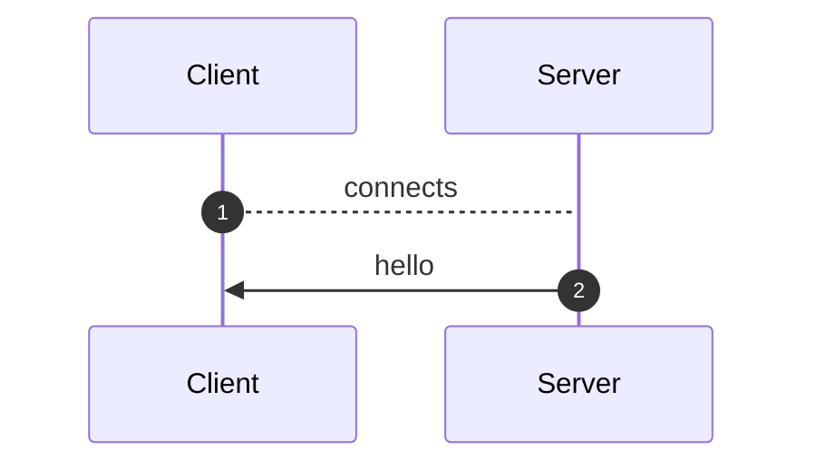
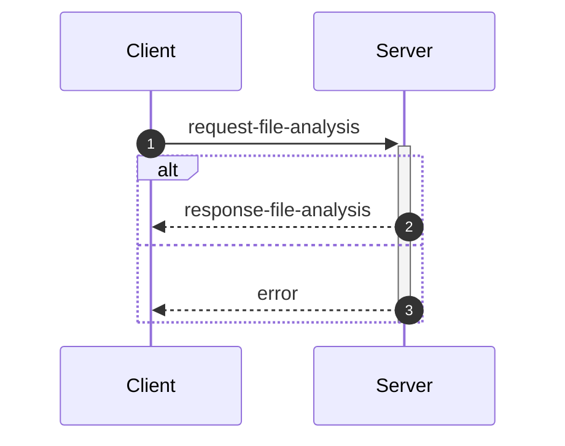
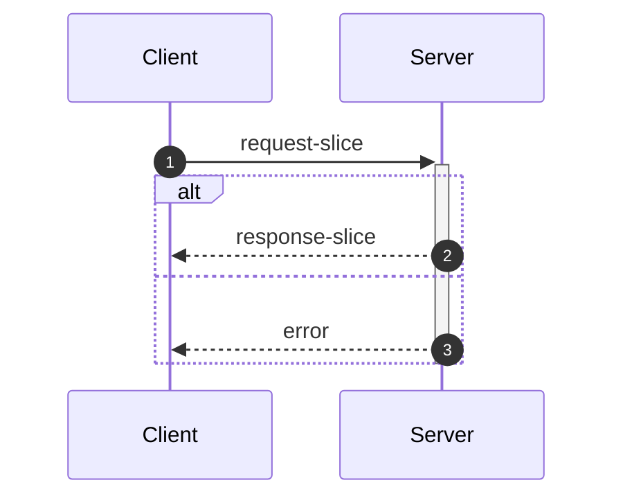
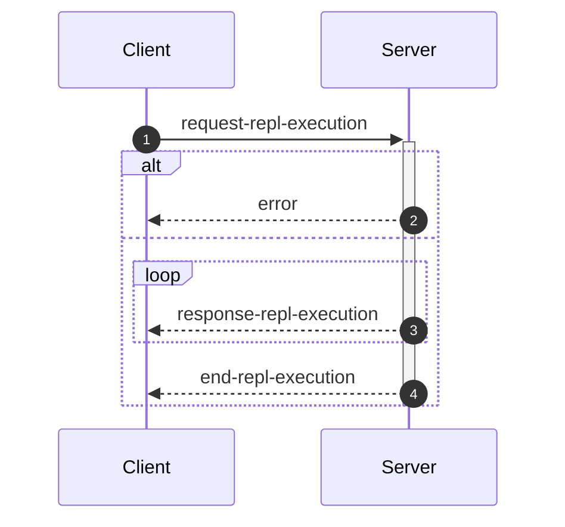

_This document was generated from '[src/documentation/wiki-interface.ts](https://github.com/flowr-analysis/flowr/tree/main//src/documentation/wiki-interface.ts)' on 2026-07-03, 06:45:06 UTC presenting an overview of flowR's interface (v2.10.10, using R v4.5.0). Please do not edit this file/wiki page directly._

Although far from being as detailed as the in-depth explanation of [_flowR_](https://github.com/flowr-analysis/flowr/wiki/core),
this wiki page explains how to interface with _flowR_ in more detail.
In general, command line arguments and other options provide short descriptions on hover over.

* [💻 Using the REPL](#using-the-repl)
* [⚙️ Configuring FlowR](#configuring-flowr)
* [⚒️ Writing Code](#writing-code)
* [💬 Communicating with the Server](#communicating-with-the-server)

<a id='using-the-repl'></a>
## 💻 Using the REPL


> [!NOTE]
> To execute arbitrary R commands with a repl request, _flowR_ has to be started explicitly with <span title="Description (Command Line Argument): Allow to access the underlying R session when using flowR (security warning: this allows the execution of arbitrary R code!)">`--r-session-access`</span>.
> Please be aware that this introduces a security risk and note that this relies on the [`r-shell` engine](https://github.com/flowr-analysis/flowr/wiki/engines) .

Although primarily meant for users to explore,
there is nothing which forbids simply calling _flowR_ as a subprocess to use standard-in, -output, and -error
for communication (although you can access the REPL using the server as well,
with the [REPL Request](#message-request-repl-execution) message).

The read-eval-print loop&nbsp;(REPL) works relatively simple.
You can submit an expression (using <kbd>Enter</kbd>),
which is interpreted as an R&nbsp;expression by default but interpreted as a *command* if it starts with a colon (`:`).
The best command to get started with the REPL is <span title="Description (Repl Command): Show help information (aliases: :h, :?)">`:help`</span>.
Besides, you can leave the REPL either with the command <span title="Description (Repl Command): End the repl (aliases: :q, :exit)">`:quit`</span> or by pressing <kbd>Ctrl</kbd>+<kbd>C</kbd> twice.
When writing a *command*, you may press <kbd>Tab</kbd> to get a list of completions, if available.
Multiple commands can be entered in a single line by separating them with a semicolon (`;`), e.g. `:parse "x<-2"; :df*`.
If a command is given without R code, the REPL will re-use R code given in a previous command.
The prior example will hence return first the parsed AST of the program and then the dataflow graph for `"x <- 2"`.

> [!NOTE]
> If you develop flowR, you may want to launch the repl using the `npm run main-dev` command, this way, you get a non-minified version of flowR with debug information and hot-reloading of source files.

<details>
<summary>Available Commands</summary>

We currently offer the following commands (this with a `[*]` suffix are available with and without the star):


| Command | Description |
| ------- | ----------- |
| **<span title="Description (Repl Command): End the repl (aliases: :q, :exit)">:quit</span>** | End the repl (aliases: **:<span title="Alias of ':quit'. End the repl">q</span>**, **:<span title="Alias of ':quit'. End the repl">exit</span>**) |
| **<span title="Description (Repl Command): Execute the given code as R code. This requires the `--r-session-access` flag to be set and requires the r-shell engine. (aliases: :e, :r)">:execute</span>** | Execute the given code as R code. This requires the `--r-session-access` flag to be set and requires the r-shell engine. (aliases: **:<span title="Alias of ':execute'. Execute the given code as R code. This requires the `--r-session-access` flag to be set and requires the r-shell engine.">e</span>**, **:<span title="Alias of ':execute'. Execute the given code as R code. This requires the `--r-session-access` flag to be set and requires the r-shell engine.">r</span>**) |
| **<span title="Description (Repl Command): Get mermaid code for the control-flow graph of R code (aliases: :cfg, :cf)">:controlflow[*]</span>** | Get mermaid code for the control-flow graph of R code (star: Returns the URL to mermaid.live) (aliases: **:<span title="Alias of ':controlflow'. Get mermaid code for the control-flow graph of R code">cfg</span>**, **:<span title="Alias of ':controlflow'. Get mermaid code for the control-flow graph of R code">cf</span>**) |
| **<span title="Description (Repl Command): Get mermaid code for the control-flow graph with basic blocks (aliases: :cfgb, :cfb)">:controlflowbb[*]</span>** | Get mermaid code for the control-flow graph with basic blocks (star: Returns the URL to mermaid.live) (aliases: **:<span title="Alias of ':controlflowbb'. Get mermaid code for the control-flow graph with basic blocks">cfgb</span>**, **:<span title="Alias of ':controlflowbb'. Get mermaid code for the control-flow graph with basic blocks">cfb</span>**) |
| **<span title="Description (Repl Command): Get mermaid code for the dataflow graph (aliases: :d, :df)">:dataflow[*]</span>** | Get mermaid code for the dataflow graph (star: Returns the URL to mermaid.live) (aliases: **:<span title="Alias of ':dataflow'. Get mermaid code for the dataflow graph">d</span>**, **:<span title="Alias of ':dataflow'. Get mermaid code for the dataflow graph">df</span>**) |
| **<span title="Description (Repl Command): Get mermaid code for the normalized AST of R code (aliases: :n)">:normalize[*]</span>** | Get mermaid code for the normalized AST of R code (star: Returns the URL to mermaid.live) (alias: **:<span title="Alias of ':normalize'. Get mermaid code for the normalized AST of R code">n</span>**) |
| **<span title="Description (Repl Command): Get mermaid code for the simplified dataflow graph (aliases: :ds, :dfs)">:dataflowsimple[*]</span>** | Get mermaid code for the simplified dataflow graph (star: Returns the URL to mermaid.live) (aliases: **:<span title="Alias of ':dataflowsimple'. Get mermaid code for the simplified dataflow graph">ds</span>**, **:<span title="Alias of ':dataflowsimple'. Get mermaid code for the simplified dataflow graph">dfs</span>**) |
| **<span title="Description (Repl Command): Just calculates the DFG, but only prints summary info (aliases: :d#, :df#)">:dataflowsilent</span>** | Just calculates the DFG, but only prints summary info (aliases: **:<span title="Alias of ':dataflowsilent'. Just calculates the DFG, but only prints summary info">d#</span>**, **:<span title="Alias of ':dataflowsilent'. Just calculates the DFG, but only prints summary info">df#</span>**) |
| **<span title="Description (Repl Command): Prints ASCII Art of the parsed, unmodified AST (aliases: :p)">:parse</span>** | Prints ASCII Art of the parsed, unmodified AST (alias: **:<span title="Alias of ':parse'. Prints ASCII Art of the parsed, unmodified AST">p</span>**) |
| **<span title="Description (Repl Command): Prints the version of flowR as well as the current version of R">:version</span>** | Prints the version of flowR as well as the current version of R
| **<span title="Description (Repl Command): Query the given R code (use 'help' for more information)">:query[*]</span>** | Query the given R code (use 'help' for more information) (star: Similar to query, but returns the output in json format.)
| **<span title="Description (Repl Command): Returns an ASCII representation of the dataflow graph (aliases: :df!)">:dataflowascii</span>** | Returns an ASCII representation of the dataflow graph (alias: **:<span title="Alias of ':dataflowascii'. Returns an ASCII representation of the dataflow graph">df!</span>**) |
| **<span title="Description (Repl Command): Returns summarization stats for the normalized AST (aliases: :n#)">:normalize#</span>** | Returns summarization stats for the normalized AST (alias: **:<span title="Alias of ':normalize#'. Returns summarization stats for the normalized AST">n#</span>**) |
| **<span title="Description (Repl Command): Show help information (aliases: :h, :?)">:help</span>** | Show help information (aliases: **:<span title="Alias of ':help'. Show help information">h</span>**, **:<span title="Alias of ':help'. Show help information">?</span>**) |


</details>


> [!TIP]
> 
> As indicated by the examples before, all REPL commands that operate on code keep track of the state.
> Hence, if you run a command like <span title="Description (Repl Command, starred version): Returns the URL to mermaid.live; Base Command: Get mermaid code for the dataflow graph (aliases: :d*, :df*)">`:dataflow*`</span> without providing R code,
> the REPL will re-use the R code provided in a previous command.
> Likewise, doing this will benefit from incrementality!
> If you request the dataflow graph with `:df* x <- 2 * y` and then want to see the parsed AST with `:parse`,
> the REPL will re-use previously obtained information and not re-parse the code again.
> 		


Generally, many commands offer shortcut versions in the REPL. Many queries, for example, offer a shortened format (see the example below).
Of special note, the [Config Query](https://github.com/flowr-analysis/flowr/wiki/query-api#Config-Query)
can be used to also modify the currently active configuration of _flowR_ within the REPL (see the [wiki page](https://github.com/flowr-analysis/flowr/wiki/query-api#Config-Query) for more information).

### Example: Retrieving the Dataflow Graph

To retrieve a URL to the [mermaid](https://mermaid.js.org/) diagram of the dataflow of a given expression,
use <span title="Description (Repl Command, starred version): Returns the URL to mermaid.live; Base Command: Get mermaid code for the dataflow graph (aliases: :d*, :df*)">`:dataflow*`</span> (or <span title="Description (Repl Command): Get mermaid code for the dataflow graph (aliases: :d, :df)">`:dataflow`</span> to get the mermaid code in the cli):


```shell
$ docker run -it --rm eagleoutice/flowr # or npm run flowr 
flowR repl using flowR v2.10.10, R grammar v14 (tree-sitter engine)
R> :dataflow* y <- 1 + x
```

<details>
<summary style='color:gray'>Output</summary>


```text
https://mermaid.live/view#base64:eyJjb2RlIjoiZmxvd2NoYXJ0IEJUXG4gICAgMXt7XCJgIzkxO1JOdW1iZXIjOTM7IDFcbiAgICAgICgxKVxuICAgICAgKjEuNipgXCJ9fVxuICAgJSUgTm8gZWRnZXMgZm91bmQgZm9yIDFcbiAgICAyKFtcImAjOTE7UlN5bWJvbCM5MzsgeFxuICAgICAgKDIpXG4gICAgICAqMS4xMCpgXCJdKVxuICAgJSUgTm8gZWRnZXMgZm91bmQgZm9yIDJcbiAgICAzW1tcImAjOTE7UkJpbmFyeU9wIzkzOyAjNDM7XG4gICAgICAoMylcbiAgICAgICoxLjYtMTAqXG4gICAgKDEsIDIpYFwiXV1cbiAgICBidWlsdC1pbjpfW1wiYEJ1aWx0LUluOlxuIzQzO2BcIl1cbiAgICBzdHlsZSBidWlsdC1pbjpfIHN0cm9rZTpncmF5LGZpbGw6Z3JheSxzdHJva2Utd2lkdGg6MnB4LG9wYWNpdHk6Ljg7XG4gICAgMFtcImAjOTE7UlN5bWJvbCM5MzsgeVxuICAgICAgKDAsIHNvdXJjZXM6IFszXSlcbiAgICAgICoxLjEqYFwiXVxuICAgIDRbW1wiYCM5MTtSQmluYXJ5T3AjOTM7ICM2MDsjNDU7XG4gICAgICAoNClcbiAgICAgICoxLjEtMTAqXG4gICAgKDAsIDMpYFwiXV1cbiAgICBidWlsdC1pbjpfLVtcImBCdWlsdC1JbjpcbiM2MDsjNDU7YFwiXVxuICAgIHN0eWxlIGJ1aWx0LWluOl8tIHN0cm9rZTpncmF5LGZpbGw6Z3JheSxzdHJva2Utd2lkdGg6MnB4LG9wYWNpdHk6Ljg7XG4gICAgMyAtLT58XCJyZWFkcywgYXJndW1lbnRcInwgMVxuICAgIDMgLS0+fFwicmVhZHMsIGFyZ3VtZW50XCJ8IDJcbiAgICAzIC0uLT58XCJyZWFkcywgY2FsbHNcInwgYnVpbHQtaW46X1xuICAgIGxpbmtTdHlsZSAyIHN0cm9rZTpncmF5O1xuICAgIDAgLS0+fFwiZGVmaW5lZC1ieVwifCAzXG4gICAgMCAtLT58XCJkZWZpbmVkLWJ5XCJ8IDRcbiAgICA0IC0tPnxcInJlYWRzLCBhcmd1bWVudFwifCAzXG4gICAgNCAtLT58XCJyZXR1cm5zLCBhcmd1bWVudFwifCAwXG4gICAgNCAtLi0+fFwicmVhZHMsIGNhbGxzXCJ8IGJ1aWx0LWluOl8tXG4gICAgbGlua1N0eWxlIDcgc3Ryb2tlOmdyYXk7IiwibWVybWFpZCI6eyJhdXRvU3luYyI6dHJ1ZX19
```


Retrieve the dataflow graph of the expression `y <- 1 + x`. It looks like this:


```mermaid
flowchart LR
    1{{"`#91;RNumber#93; 1
      (1)
      *1.6*`"}}
   %% No edges found for 1
    2(["`#91;RSymbol#93; x
      (2)
      *1.10*`"])
   %% No edges found for 2
    3[["`#91;RBinaryOp#93; #43;
      (3)
      *1.6-10*
    (1, 2)`"]]
    built-in:_["`Built-In:
#43;`"]
    style built-in:_ stroke:gray,fill:gray,stroke-width:2px,opacity:.8;
    0["`#91;RSymbol#93; y
      (0, sources: [3])
      *1.1*`"]
    4[["`#91;RBinaryOp#93; #60;#45;
      (4)
      *1.1-10*
    (0, 3)`"]]
    built-in:_-["`Built-In:
#60;#45;`"]
    style built-in:_- stroke:gray,fill:gray,stroke-width:2px,opacity:.8;
    3 -->|"reads, argument"| 1
    3 -->|"reads, argument"| 2
    3 -.->|"reads, calls"| built-in:_
    linkStyle 2 stroke:gray;
    0 -->|"defined-by"| 3
    0 -->|"defined-by"| 4
    4 -->|"reads, argument"| 3
    4 -->|"returns, argument"| 0
    4 -.->|"reads, calls"| built-in:_-
    linkStyle 7 stroke:gray;
```

	
<details>

<summary style="color:gray">R Code of the Dataflow Graph</summary>

The analysis required _0.6 ms_ (including parse and normalize, using the [tree-sitter](https://github.com/flowr-analysis/flowr/wiki/Engines) engine) within the generation environment. 
We encountered no unknown side effects during the analysis.


```r
y <- 1 + x
```


</details>


</details>


For small graphs like this, <span title="Description (Repl Command): Returns an ASCII representation of the dataflow graph (aliases: :df!)">`:dataflowascii`</span> also provides an ASCII representation directly in the REPL:


```shell
$ docker run -it --rm eagleoutice/flowr # or npm run flowr 
flowR repl using flowR v2.10.10, R grammar v14 (tree-sitter engine)
R> :df! y <- 1 + x
```

<details open>
<summary style='color:gray'>Output</summary>


```text
                        0<1>0
                   ┌────| 1 |
    ┌────────┐     │    0---0
 c<4>c       └──c<3>c
 |<- |  v<0>v┌──| + |
 c---c──| y |┘  c---c   u<2>u
        v---v      └────| x |
                        u---u
Edges:
3 -> 1: reads, argument  3 -> 2: reads, argument
4 -> 3: reads, argument  4 -> 0: returns, argument
0 -> 3: defined-by       0 -> 4: defined-by
```


Retrieve the dataflow graph of the expression `y <- 1 + x` as ASCII art.

</details>


For the slicing with <span title="Description (Repl Command): Static backwards executable slicer for R">`:slicer`</span>, you have access to the same [magic comments](#slice-magic-comments) as with the [slice request](#message-request-slice).

### Example: Interfacing with the File System

Many commands that allow for an R-expression (like <span title="Description (Repl Command, starred version): Returns the URL to mermaid.live; Base Command: Get mermaid code for the dataflow graph (aliases: :d*, :df*)">`:dataflow*`</span>) allow for a file as well
if the argument starts with `file://`.
If you are working from the root directory of the _flowR_ repository, the following gives you the parsed AST of the example file using the <span title="Description (Repl Command): Prints ASCII Art of the parsed, unmodified AST (aliases: :p)">`:parse`</span> command:

> **Watch mode**: Replace `file://` with `watch://` to enter watch mode.
> flowR runs the command immediately and then re-runs it every time the file (or any file inside the folder) changes.
> Enter any other command to leave watch mode.
> For example: `:df watch://analysis.R`


```shell
$ docker run -it --rm eagleoutice/flowr # or npm run flowr 
flowR repl using flowR v2.10.10, R grammar v14 (tree-sitter engine)
R> :parse file://test/testfiles/example.R
```

<details>
<summary style='color:gray'>Output</summary>


```text
File: test/testfiles/example.R

program
├ binaryoperator
│ ├ identifier "sum" (1:1─4)
│ ├ <- "<-" (1:5─7)
│ ╰ float "0" (1:8─9)
├ binaryoperator
│ ├ identifier "product" (2:1─8)
│ ├ <- "<-" (2:9─11)
│ ╰ float "1" (2:12─13)
├ binaryoperator
│ ├ identifier "w" (3:1─2)
│ ├ <- "<-" (3:3─5)
│ ╰ float "7" (3:6─7)
├ binaryoperator
│ ├ identifier "N" (4:1─2)
│ ├ <- "<-" (4:3─5)
│ ╰ float "10" (4:6─8)
├ forstatement
│ ├ for "for" (6:1─4)
│ ├ ( "(" (6:5─6)
│ ├ identifier "i" (6:6─7)
│ ├ in "in" (6:8─10)
│ ├ binaryoperator
│ │ ├ float "1" (6:11─12)
│ │ ├ : ":" (6:12─13)
│ │ ╰ parenthesizedexpression
│ │   ├ ( "(" (6:13─14)
│ │   ├ binaryoperator
│ │   │ ├ identifier "N" (6:14─15)
│ │   │ ├ - "-" (6:15─16)
│ │   │ ╰ float "1" (6:16─17)
│ │   ╰ ) ")" (6:17─18)
│ ├ ) ")" (6:18─19)
│ ╰ bracedexpression
│   ├ { "{" (6:20─21)
│   ├ binaryoperator
│   │ ├ identifier "sum" (7:3─6)
│   │ ├ <- "<-" (7:7─9)
│   │ ╰ binaryoperator
│   │   ├ binaryoperator
│   │   │ ├ identifier "sum" (7:10─13)
│   │   │ ├ + "+" (7:14─15)
│   │   │ ╰ identifier "i" (7:16─17)
│   │   ├ + "+" (7:18─19)
│   │   ╰ identifier "w" (7:20─21)
│   ├ binaryoperator
│   │ ├ identifier "product" (8:3─10)
│   │ ├ <- "<-" (8:11─13)
│   │ ╰ binaryoperator
│   │   ├ identifier "product" (8:14─21)
│   │   ├  "" (8:22─23)
│   │   ╰ identifier "i" (8:24─25)
│   ╰ } "}" (9:1─2)
├ call
│ ├ identifier "cat" (11:1─4)
│ ╰ arguments
│   ├ ( "(" (11:4─5)
│   ├ argument
│   │ ╰ string
│   │   ├ " "\"" (11:5─6)
│   │   ├ stringcontent "Sum:" (11:6─10)
│   │   ╰ " "\"" (11:10─11)
│   ├ comma "," (11:11─12)
│   ├ argument
│   │ ╰ identifier "sum" (11:13─16)
│   ├ comma "," (11:16─17)
│   ├ argument
│   │ ╰ string
│   │   ├ " "\"" (11:18─19)
│   │   ├ stringcontent
│   │   │ ╰ escapesequence "\\n" (11:19─21)
│   │   ╰ " "\"" (11:21─22)
│   ╰ ) ")" (11:22─23)
╰ call
  ├ identifier "cat" (12:1─4)
  ╰ arguments
    ├ ( "(" (12:4─5)
    ├ argument
    │ ╰ string
    │   ├ " "\"" (12:5─6)
    │   ├ stringcontent "Product:" (12:6─14)
    │   ╰ " "\"" (12:14─15)
    ├ comma "," (12:15─16)
    ├ argument
    │ ╰ identifier "product" (12:17─24)
    ├ comma "," (12:24─25)
    ├ argument
    │ ╰ string
    │   ├ " "\"" (12:26─27)
    │   ├ stringcontent
    │   │ ╰ escapesequence "\\n" (12:27─29)
    │   ╰ " "\"" (12:29─30)
    ╰ ) ")" (12:30─31)
```


Retrieve the parsed AST of the example file.

<details>

<summary>File Content</summary>


```r
sum <- 0
product <- 1
w <- 7
N <- 10

for (i in 1:(N-1)) {
  sum <- sum + i + w
  product <- product * i
}

cat("Sum:", sum, "\n")
cat("Product:", product, "\n")
```


</details>

As _flowR_ directly transforms this AST the output focuses on being human-readable instead of being machine-readable.
		

</details>


### Example: Run a Query

You can run any query supported by _flowR_ using the <span title="Description (Repl Command): Query the given R code (use 'help' for more information)">`:query`</span> command.
For example, to obtain the shapes of all data frames in a given piece of code, you can run:


```shell
$ docker run -it --rm eagleoutice/flowr # or npm run flowr 
flowR repl using flowR v2.10.10, R grammar v14 (tree-sitter engine)
R> :query @df-shape "x <- data.frame(a = 1:10, b = 1:10)\ny <- x$a"
```

<details open>
<summary style='color:gray'>Output</summary>


```text
Query: df-shape (1 ms)
   ╰ 12: (colnames: [{"a", "b"}, {}], cols: [2, 2], rows: [10, 10])
   ╰ 0: (colnames: [{"a", "b"}, {}], cols: [2, 2], rows: [10, 10])
All queries together required ≈3 ms (1ms accuracy, total 3 ms)
```


Retrieve the shapes of all data frames in the given code.

</details>


To run the linter on a file, you can use (in this example, we just issue the `dead-code` linter on a small piece of code):


```shell
$ docker run -it --rm eagleoutice/flowr # or npm run flowr 
flowR repl using flowR v2.10.10, R grammar v14 (tree-sitter engine)
R> :query @linter rules:dead-code "if(FALSE) x <- 2"
```

<details open>
<summary style='color:gray'>Output</summary>


```text
Query: linter (1 ms)
   ╰ Dead Code (dead-code):
       ╰ certain:
           ╰ Code at 1.11-16
       ╰ Metadata: searchTimeMs: 0, processTimeMs: 1
All queries together required ≈1 ms (1ms accuracy, total 2 ms)
```


Run the linter on the given code, with only the `dead-code` rule enabled.

</details>


For more information on the available queries, please check out the [Query API](https://github.com/flowr-analysis/flowr/wiki/query-api).


<a id='configuring-flowr'></a>
## ⚙️ Configuring FlowR


When running _flowR_, you may want to specify some behaviors with a dedicated configuration file.
By default, flowR looks for a file named `flowr.json` in the current working directory (or any higher directory).
You can also specify a different file with <span title="Description (Command Line Argument): The name of the configuration file to use">`--config-file`</span> or pass the configuration inline using <span title="Description (Command Line Argument): The flowR configuration to use, as a JSON string">`--config-json`</span>.
To inspect the current configuration, you can run flowr with the <span title="Description (Command Line Argument): Run with verbose logging (will be passed to the corresponding script)">`--verbose`</span> flag, or use the `config` [Query](https://github.com/flowr-analysis/flowr/wiki/query-api).
Within the REPL this works by running the following:


```shell
:query @config
```


To work with the <a href="https://github.com/flowr-analysis/flowr/tree/main/src/config.ts#L109"><code><span title="The configuration file format for flowR.">FlowrConfig</span></code></a> you can use the provided helper objects alongside its methods like
<a href="https://github.com/flowr-analysis/flowr/tree/main/src/config.ts#L458"><code><span title="Creates a new flowr config that has the updated values.">FlowrConfig::<b>amend</b></span></code></a>.
The following summarizes the configuration options:

- `ignoreSourceCalls`: If set to `true`, _flowR_ will ignore source calls when analyzing the code, i.e., ignoring the inclusion of other files.
- `semantics`: allows to configure the way _flowR_ handles R, although we currently only support `semantics/environment/overwriteBuiltIns`.
  You may use this to overwrite _flowR_'s handling of built-in function and even completely clear the preset definitions shipped with flowR.
  See [Configure BuiltIn Semantics](#configure-builtin-semantics) for more information.
- `solver`: allows to configure how _flowR_ resolves variables and their values (currently we support: `disabled`, `alias`, `builtin`), as well as if pointer analysis should be active.
- `engines`: allows to configure the engines used by _flowR_ to interact with R code. See the [Engines wiki page](https://github.com/flowr-analysis/flowr/wiki/engines) for more information.
- `defaultEngine`: allows to specify the default engine to use for interacting with R code. If not set, an arbitrary engine from the specified list will be used.
- `abstractInterpretation`: allows to configure how _flowR_ performs abstract interpretation, although we currently only support data frame shape inference through abstract interpretation.
- `defaultPlugins`: allows to configure which plugins to load by default when creating a new <a href="https://github.com/flowr-analysis/flowr/tree/main/src/project/flowr-analyzer.ts#L162"><code><span title="Central class for conducting analyses with FlowR. Use the FlowrAnalyzerBuilder to create a new instance. If you want the original pattern of creating a pipeline and running all steps, you can still do this with FlowrAnalyzer#runFull . To inspect the context of the analyzer, use FlowrAnalyzer#inspectContext (if you are a plugin and need to modify it, use FlowrAnalyzer#context instead).">FlowrAnalyzer</span></code></a> instance.
- `repl.plugins`: allows to configure which plugins to load in the _flowR_ REPL. Use `flowr:default` to reference the plugins specified by `defaultPlugins`.

So you can configure _flowR_ by adding a file like the following:

<details>

<summary>Example Configuration File</summary>


```json
{
  "ignoreSourceCalls": true,
  "semantics": {
    "environment": {
      "overwriteBuiltIns": {
        "definitions": [
          {
            "type": "function",
            "names": [
              "foo"
            ],
            "processor": "builtin:assign",
            "config": {}
          }
        ]
      }
    }
  },
  "defaultPlugins": [
    "file:description",
    "versions:description"
  ],
  "repl": {
    "quickStats": false,
    "dfProcessorHeat": false,
    "plugins": [
      "flowr:default"
    ]
  },
  "project": {
    "resolveUnknownPathsOnDisk": true
  },
  "engines": [
    {
      "type": "r-shell"
    }
  ],
  "solver": {
    "variables": "alias",
    "evalStrings": true,
    "trackEnvironments": true,
    "resolveSource": {
      "dropPaths": "no",
      "ignoreCapitalization": true,
      "inferWorkingDirectory": "active-script",
      "searchPath": []
    },
    "instrument": {},
    "slicer": {
      "threshold": 50
    }
  },
  "abstractInterpretation": {
    "wideningThreshold": 4,
    "dataFrame": {
      "maxColNames": 20,
      "readLoadedData": {
        "readExternalFiles": true,
        "maxReadLines": 1000000
      }
    }
  },
  "gas": {
    "thresholds": {
      "memory": {
        "problematic": 0.7,
        "critical": 0.9
      },
      "timeMs": {
        "problematic": 100000,
        "critical": 120000
      }
    },
    "features": {}
  }
}
```


</details>

<details>
<a id='configure-builtin-semantics'></a>
<summary>Configure Built-In Semantics</summary>


`semantics/environment/overwriteBuiltins` accepts two keys:

- `loadDefaults` (boolean, initially `true`): If set to `true`, the default built-in definitions are loaded before applying the custom definitions. Setting this flag to `false` explicitly disables the loading of the default definitions.
- `definitions` (array, initially empty): Allows to overwrite or define new built-in elements. Each object within must have a `type` which is one of the below. Furthermore, they may define a string array of `names` which specifies the identifiers to bind the definitions to. You may use `assumePrimitive` to specify whether _flowR_ should assume that this is a primitive non-library definition (so you probably just do not want to specify the key).

  | Type            | Description                                                                                                                                                                                                                                                                                              | Example                                                                                                    |
  | --------------- | -------------------------------------------------------------------------------------------------------------------------------------------------------------------------------------------------------------------------------------------------------------------------------------------------------- | ---------------------------------------------------------------------------------------------------------- |
  | `constant`    | Additionally allows for a `value` this should resolve to.                                                                                                                                                                                                                                                | `{ type: 'constant', names: ['NULL', 'NA'],  value: null }`                                                |
  | `function`    | Is a rather flexible way to define and bind built-in functions. For the time, we do not have extensive documentation to cover all the cases, so please either consult the sources with the `default-builtin-config.ts` or open a [new issue](https://github.com/flowr-analysis/flowr/issues/new/choose). | `{ type: 'function', names: ['next'], processor: 'builtin:d', config: { cfg: ExitPointType.Next } }` |
  | `replacement` | A comfortable way to specify replacement functions like `$<-` or `names<-`. `suffixes` describes the... suffixes to attach automatically. | `{ type: 'replacement', suffixes: ['<-', '<<-'], names: ['[', '[['] }` |


</details>

<details>

<summary style='color:gray'>Full Configuration-File Schema</summary>

- _The configuration file format for flowR._ (object)
    - **ignoreSourceCalls** [optional] _Whether source calls should be ignored, causing {@link processSourceCall}'s behavior to be skipped._ (boolean)
    - **semantics** _Configure language semantics and how flowR handles them._ (object)
        - **environment** [optional] _Semantics regarding how to handle the R environment._ (object)
            - **overwriteBuiltIns** [optional] _Do you want to overwrite (parts) of the builtin definition?_ (object)
                - **loadDefaults** [optional] _Should the default configuration still be loaded?_ (boolean)
                - **definitions** [optional] _The definitions to load/overwrite._ (array)
                Valid item types:
                    - (object)
    - **defaultPlugins** [optional] _The default plugins to load when creating a new instance of FlowrAnalyzer_ (array)
    Valid item types:
        - (alternatives)
            - (string)
            - (array)
    - **repl** _Configuration options for the REPL._ (object)
        - **quickStats** [optional] _Whether to show quick stats in the REPL after each evaluation._ (boolean)
        - **dfProcessorHeat** [optional] _This instruments the dataflow processors to count how often each processor is called._ (boolean)
        - **plugins** [optional] _The plugins to load in REPL mode_ (array)
        Valid item types:
            - (alternatives)
                - (string)
                - (array)
    - **project** _Project specific configuration options._ (object)
        - **resolveUnknownPathsOnDisk** [optional] _Whether to resolve unknown paths loaded by the r project disk when trying to source/analyze files._ (boolean)
    - **engines** _The engine or set of engines to use for interacting with R code. An empty array means all available engines will be used._ (array)
    Valid item types:
        - (alternatives)
            - _The configuration for the tree sitter engine._ (object)
                - **type** [required] _Use the tree sitter engine._ (string)
                    Only allows: 'tree-sitter'
                - **wasmPath** [optional] _The path to the tree-sitter-r WASM binary to use. If this is undefined, this uses the default path._ (string)
                - **treeSitterWasmPath** [optional] _The path to the tree-sitter WASM binary to use. If this is undefined, this uses the default path._ (string)
                - **lax** [optional] _Whether to use the lax parser for parsing R code (allowing for syntax errors). If this is undefined, the strict parser will be used._ (boolean)
            - _The configuration for the R shell engine._ (object)
                - **type** [required] _Use the R shell engine._ (string)
                    Only allows: 'r-shell'
                - **rPath** [optional] _The path to the R executable to use. If this is undefined, this uses the default path._ (string)
    - **defaultEngine** [optional] _The default engine to use for interacting with R code. If this is undefined, an arbitrary engine from the specified list will be used._ (string)
        Only allows: 'tree-sitter', 'r-shell'
    - **solver** _How to resolve constants, constraints, cells, ..._ (object)
        - **variables** _How to resolve variables and their values._ (string)
            Only allows: 'disabled', 'alias', 'builtin'
        - **evalStrings** _Should we include eval(parse(text="...")) calls in the dataflow graph?_ (boolean)
        - **trackEnvironments** [optional] _Track user-created environments (new.env, assign/get/local with envir=, dollar-assign, attach). When false, all envir-style calls fall through conservatively._ (boolean)
        - **instrument** (object)
            - **dataflowExtractors** [optional] _These keys are only intended for use within code, allowing to instrument the dataflow analyzer!_ (any)
        - **resolveSource** [optional] _If lax source calls are active, flowR searches for sourced files much more freely, based on the configurations you give it. This option is only in effect if `ignoreSourceCalls` is set to false._ (object)
            - **dropPaths** _Allow to drop the first or all parts of the sourced path, if it is relative._ (string)
                Only allows: 'no', 'once', 'all'
            - **ignoreCapitalization** _Search for filenames matching in the lowercase._ (boolean)
            - **inferWorkingDirectory** _Try to infer the working directory from the main or any script to analyze._ (string)
                Only allows: 'no', 'main-script', 'active-script', 'any-script'
            - **searchPath** _Additionally search in these paths._ (array)
            Valid item types:
                - (string)
            - **repeatedSourceLimit** [optional] _How often the same file can be sourced within a single run? Please be aware: in case of cyclic sources this may not reach a fixpoint so give this a sensible limit._ (number)
            - **applyReplacements** _Provide name replacements for loaded files_ (array)
            Valid item types:
                - (object)
        - **slicer** [optional] _The configuration for the slicer._ (object)
            - **threshold** [optional] _The maximum number of iterations to perform on a single function call during slicing._ (number)
            - **autoExtend** [optional] _If set, the slicer will gain an additional post-pass._ (boolean)
    - **abstractInterpretation** _The configuration options for abstract interpretation._ (object)
        - **wideningThreshold** _The threshold for the number of visitations of a node at which widening should be performed to ensure the termination of the fixpoint iteration._ (number)
        - **dataFrame** _The configuration of the shape inference for data frames._ (object)
            - **maxColNames** _The maximum number of columns names to infer for data frames before over-approximating the column names to top._ (number)
            - **readLoadedData** _Configuration options for reading data frame shapes from loaded external data files, such as CSV files._ (object)
                - **readExternalFiles** _Whether data frame shapes should be extracted from loaded external files, such as CSV files._ (boolean)
                - **maxReadLines** _The maximum number of lines to read when extracting data frame shapes from loaded files, such as CSV files._ (number)
    - **gas** [optional] _Resource-usage guard (gas) configuration. All feature factors default to 0 (disabled). See https://github.com/flowr-analysis/flowr/wiki/Core#gas-resource-guard._ (object)
        - **thresholds** [optional] _Shared thresholds for all gas checks (scaled by per-feature factor)._ (object)
            - **memory** [optional] _Heap-usage fraction thresholds (0-1)._ (object)
                - **problematic** [optional] _Heap fraction (0-1) above which Problematic is returned._ (number)
                - **critical** [optional] _Heap fraction (0-1) above which Critical is returned._ (number)
            - **timeMs** [optional] _Elapsed analysis time thresholds in milliseconds._ (object)
                - **problematic** [optional] _Elapsed ms above which Problematic is returned._ (number)
                - **critical** [optional] _Elapsed ms above which Critical is returned._ (number)
        - **features** [optional] _Per-feature sensitivity factors. 0 or absent disables gas checking for that feature. A factor of 2 makes the feature twice as sensitive. Recognised keys: `source`, `side-effect-linking`, `linter`._ (object)
        - **heapProvider** [optional] _Custom heap statistics source (programmatic configs only), overriding the built-in v8/performance.memory detection._ (function)

</details>

	

<a id='writing-code'></a>
## ⚒️ Writing Code

_flowR_ can be used as a [module](https://www.npmjs.com/package/@eagleoutice/flowr) and offers several main classes and interfaces that are interesting for extension writers 
(see the [Visual Studio Code extension](https://marketplace.visualstudio.com/items?itemName=code-inspect.vscode-flowr) or the [Core](https://github.com/flowr-analysis/flowr/wiki/core) wiki page for more information).

### Creating Analyses with _flowR_

Nowadays, instances of the <a href="https://github.com/flowr-analysis/flowr/tree/main/src/project/flowr-analyzer.ts#L162"><code><span title="Central class for conducting analyses with FlowR. Use the FlowrAnalyzerBuilder to create a new instance. If you want the original pattern of creating a pipeline and running all steps, you can still do this with FlowrAnalyzer#runFull . To inspect the context of the analyzer, use FlowrAnalyzer#inspectContext (if you are a plugin and need to modify it, use FlowrAnalyzer#context instead).">FlowrAnalyzer</span></code></a> should be used as central frontend to get analysis results from _flowR_.
For example, a program slice can be created like this:


```ts
const analyzer = await new FlowrAnalyzerBuilder()
    .setEngine('tree-sitter')
    .build();
analyzer.addRequest('x <- 1\ny <- x\nx');
const result = await analyzer.query([
    {
        type:     'static-slice',
        criteria: ['3@x']
    }
]);
//console.log(result['static-slice']);
```


For more information, please have a look at the [Analyzer](https://github.com/flowr-analysis/flowr/wiki/analyzer) wiki page, which explains how to construct and use the <a href="https://github.com/flowr-analysis/flowr/tree/main/src/project/flowr-analyzer.ts#L162"><code><span title="Central class for conducting analyses with FlowR. Use the FlowrAnalyzerBuilder to create a new instance. If you want the original pattern of creating a pipeline and running all steps, you can still do this with FlowrAnalyzer#runFull . To inspect the context of the analyzer, use FlowrAnalyzer#inspectContext (if you are a plugin and need to modify it, use FlowrAnalyzer#context instead).">FlowrAnalyzer</span></code></a> in more detail.
To work with specific perspectives, you can also consult the respective pages like the [Dataflow Graph](https://github.com/flowr-analysis/flowr/wiki/dataflow-graph) or the [Abstract Interpretation](https://github.com/flowr-analysis/flowr/wiki/abstract-interpretation) wiki pages.
        
### The Pipeline Executor (Low-Level Interface)

Once, in the beginning, _flowR_ was meant to produce a dataflow graph merely to provide *program slices*. 
However, with continuous updates, the [Dataflow Graph](https://github.com/flowr-analysis/flowr/wiki/dataflow-graph) repeatedly proves to be the more interesting part.
With this, we restructured _flowR_'s originally *hardcoded* pipeline to be far more flexible. 
Now, it can be theoretically extended or replaced with arbitrary steps, optional steps, and what we call 'decorations' of these steps. 
In short, a slicing pipeline using the <a href="https://github.com/flowr-analysis/flowr/tree/main/src/core/pipeline-executor.ts#L97"><code><span title="**Please note:** The PipelineExecutor is now considered to be a rather low-level API for flowR. While it still works and is the basis for all other layers, we strongly recommend using the FlowrAnalyzer and its builder to create and use an analyzer instance that is pre-configured for your use-case. The pipeline executor allows to execute arbitrary pipelines in a step-by-step fashion. If you are not...">PipelineExecutor</span></code></a> looks like this:


```ts

const slicer = new PipelineExecutor(DEFAULT_SLICING_PIPELINE, {
  parser:    new RShell(),
  request:   requestFromInput('x <- 1\nx + 1'),
  criterion: ['2@x']
})
const slice = await slicer.allRemainingSteps()
// console.log(slice.reconstruct.code)
```


<details><summary>More Information</summary>


If you compare this, with what you would have done with the old (and removed) `SteppingSlicer`, 
this essentially just requires you to replace the `SteppingSlicer` with the <a href="https://github.com/flowr-analysis/flowr/tree/main/src/core/pipeline-executor.ts#L97"><code><span title="**Please note:** The PipelineExecutor is now considered to be a rather low-level API for flowR. While it still works and is the basis for all other layers, we strongly recommend using the FlowrAnalyzer and its builder to create and use an analyzer instance that is pre-configured for your use-case. The pipeline executor allows to execute arbitrary pipelines in a step-by-step fashion. If you are not...">PipelineExecutor</span></code></a>
and to pass the <a href="https://github.com/flowr-analysis/flowr/tree/main/src/core/steps/pipeline/default-pipelines.ts#L18"><code>DEFAULT_SLICING_PIPELINE</code></a> as the first argument.
The <a href="https://github.com/flowr-analysis/flowr/tree/main/src/core/pipeline-executor.ts#L97"><code><span title="**Please note:** The PipelineExecutor is now considered to be a rather low-level API for flowR. While it still works and is the basis for all other layers, we strongly recommend using the FlowrAnalyzer and its builder to create and use an analyzer instance that is pre-configured for your use-case. The pipeline executor allows to execute arbitrary pipelines in a step-by-step fashion. If you are not...">PipelineExecutor</span></code></a>...

1. Provides structures to investigate the results of all intermediate steps
2. Can be executed step-by-step
3. Can repeat steps (e.g., to calculate multiple slices on the same input)

See the in-code documentation for more information.

	

</details>
    

### Using the <a href="https://github.com/flowr-analysis/flowr/tree/main/src/r-bridge/shell.ts#L143"><code><span title="The RShell represents an interactive session with the R interpreter. You can configure it by RShellOptions . At the moment we are using a live R session (and not networking etc.) to communicate with R easily, which allows us to install packages etc. However, this might and probably will change in the future (leaving this as a legacy mode :D)">RShell</span></code></a> to Interact with R

The <a href="https://github.com/flowr-analysis/flowr/tree/main/src/r-bridge/shell.ts#L143"><code><span title="The RShell represents an interactive session with the R interpreter. You can configure it by RShellOptions . At the moment we are using a live R session (and not networking etc.) to communicate with R easily, which allows us to install packages etc. However, this might and probably will change in the future (leaving this as a legacy mode :D)">RShell</span></code></a> class allows interfacing with the `R`&nbsp;ecosystem installed on the host system.
Please have a look at [flowR's Engines](https://github.com/flowr-analysis/flowr/wiki/engines) for more information on alternatives (for example, the <a href="https://github.com/flowr-analysis/flowr/tree/main/src/r-bridge/lang-4.x/tree-sitter/tree-sitter-executor.ts#L18"><code><span title="Synchronous and (way) faster alternative to the RShell using tree-sitter.">TreeSitterExecutor</span></code></a>).


> [!IMPORTANT]
> 
> Each <a href="https://github.com/flowr-analysis/flowr/tree/main/src/r-bridge/shell.ts#L143"><code><span title="The RShell represents an interactive session with the R interpreter. You can configure it by RShellOptions . At the moment we are using a live R session (and not networking etc.) to communicate with R easily, which allows us to install packages etc. However, this might and probably will change in the future (leaving this as a legacy mode :D)">RShell</span></code></a> controls a new instance of the R&nbsp;interpreter, 
> make sure to call <code><a href="https://github.com/flowr-analysis/flowr/tree/main/src/r-bridge/shell.ts#L333"><span title="Close the current R session, makes the object effectively invalid (can no longer be reopened etc.)">RShell::<i>close</i></span></a>()</code> when you are done.


You can start a new "session" simply by constructing a new object with <code>new <a href="https://github.com/flowr-analysis/flowr/tree/main/src/r-bridge/shell.ts#L143"><span title="The RShell represents an interactive session with the R interpreter. You can configure it by RShellOptions . At the moment we are using a live R session (and not networking etc.) to communicate with R easily, which allows us to install packages etc. However, this might and probably will change in the future (leaving this as a legacy mode :D)">RShell</span></a>()</code>.

However, there are several options that may be of interest 
(e.g., to automatically revive the shell in case of errors or to control the name location of the R process on the system).

With a shell object (let's call it `shell`), you can execute R code by using <a href="https://github.com/flowr-analysis/flowr/tree/main/src/r-bridge/shell.ts#L211"><code><span title="sends the given command directly to the current R session will not do anything to alter input markers!">RShell::<i>sendCommand</i></span></code></a>, 
for example <code>shell.<a href="https://github.com/flowr-analysis/flowr/tree/main/src/r-bridge/shell.ts#L211"><span title="sends the given command directly to the current R session will not do anything to alter input markers!">sendCommand</span></a>("1 + 1")</code>. 
However, this does not return anything, so if you want to collect the output of your command, use
<a href="https://github.com/flowr-analysis/flowr/tree/main/src/r-bridge/shell.ts#L277"><code><span title="Send a command and collect the output">RShell::<i>sendCommandWithOutput</i></span></code></a> instead.

Besides that, the command <a href="https://github.com/flowr-analysis/flowr/tree/main/src/r-bridge/shell.ts#L249"><code>RShell::<b>tryToInjectHomeLibPath</b></code></a> may be of interest, as it enables all libraries available on the host system.


### Generate Statistics (No longer a Focus of flowR)


<details>

<summary>Adding a New Feature to Extract</summary>

In this example, we construct a new feature to extract, with the name "*example*".
Whenever this name appears, you may substitute this with whatever name fits your feature best (as long as the name is unique).

1. **Create a new file in `src/statistics/features/supported`**\
   Create the file `example.ts`, and add its export to the `index.ts` file in the same directory (if not done automatically).

2. **Create the basic structure**\
   To get a better feel of what a feature must have, let's look
   at the basic structure (of course, due to TypeScript syntax,
   there are other ways to achieve the same goal):

   ```ts
   const initialExampleInfo = {
       /* whatever start value is good for you */
       someCounter: 0
   }

   export type ExampleInfo = Writable<typeof initialExampleInfo>

   export const example: Feature<ExampleInfo> = {
    name:        'Example Feature',
    description: 'A longer example description',

    process(existing: ExampleInfo, input: FeatureProcessorInput): ExampleInfo {
      /* perform analysis on the input */
      return existing
    },

    initialValue: initialExampleInfo
   }
   ```

   The `initialExampleInfo` type holds the initial values for each counter that you want to maintain during the feature extraction (they will usually be initialized with 0). The resulting `ExampleInfo` type holds the structure of the data that is to be counted. Due to the vast amount of data processed, information like the name and location of a function call is not stored here, but instead written to disk (see below).

   Every new feature must be of the `Feature<Info>` type, with `Info` referring to a `FeatureInfo` (like `ExampleInfo` in this example). Next to a `name` and a `description`, each Feature must provide:

   - a processor that extracts the information from the input, adding it to the existing information.
   - a function returning the initial value of the information (in this case, `initialExampleInfo`).

3. **Add it to the feature-mapping**\
   Now, in the `feature.ts` file in `src/statistics/features`, add your feature to the `ALL_FEATURES` object.

Now, we want to extract something. For the *example* feature created in the previous steps, we choose to count the amount of `COMMENT` tokens.
So we define a corresponding [XPath](https://developer.mozilla.org/en-US/docs/Web/XPath) query:

```ts
const commentQuery: Query = xpath.parse('//COMMENT')
```

Within our feature's `process` function, running the query is as simple as:

```ts
const comments = commentQuery.select({ node: input.parsedRAst })
```

Now we could do a lot of further processing, but for simplicity, we only record every comment found this way:

```ts
appendStatisticsFile(example.name, 'comments', comments, input.filepath)
```

We use `example.name` to avoid duplication with the name that we’ve assigned to the feature. It corresponds to the name of the folder in the statistics output.
`'comments'` refers to a freely chosen (but unique) name, that will be used as the name for the output file within the folder. The `comments` variable holds the result of the query, which is an array of nodes. Finally, we pass the `filepath` of the file that was analyzed (if known), so that it can be added to the statistics file (as additional information).

</details>
	

<a id='communicating-with-the-server'></a>
## 💬 Communicating with the Server


As explained in the [Overview](https://github.com/flowr-analysis/flowr/wiki/overview), you can simply run the [TCP](https://de.wikipedia.org/wiki/Transmission_Control_Protocol)&nbsp;server by adding the <span title="Description (Command Line Argument): Do not drop into a repl, but instead start a server on the given port (default: 1042) and listen for messages.">`--server`</span> flag (and, due to the interactive mode, exit with the conventional <kbd>CTRL</kbd>+<kbd>C</kbd>).
Currently, every connection is handled by the same underlying `RShell` - so the server is not designed to handle many clients at a time.
Additionally, the server is not well guarded against attacks (e.g., you can theoretically spawn an arbitrary number of&nbsp;RShell sessions on the target machine).

Every message has to be given in a single line (i.e., without a newline in-between) and end with a newline character. Nevertheless, we will pretty-print example given in the following segments for the ease of reading.


> [!NOTE]
> 
> The default <span title="Description (Command Line Argument): Do not drop into a repl, but instead start a server on the given port (default: 1042) and listen for messages.">`--server`</span> uses a simple [TCP](https://de.wikipedia.org/wiki/Transmission_Control_Protocol)
> connection. If you want _flowR_ to expose a [WebSocket](https://de.wikipedia.org/wiki/WebSocket) server instead, add the <span title="Description (Command Line Argument): If the server flag is set, use websocket for messaging">`--ws`</span> flag (i.e., <span title="Description (Command Line Argument): Do not drop into a repl, but instead start a server on the given port (default: 1042) and listen for messages.">`--server`</span> <span title="Description (Command Line Argument): If the server flag is set, use websocket for messaging">`--ws`</span>) when starting _flowR_ from the command line.
> 			


<ul><li>
<a id="message-hello"></a>
<b>Hello</b> Message (<code>hello</code>) 
<details>

<summary style="color:gray"> View Details. <i>The server informs the client about the successful connection and provides Meta-Information.</i> </summary>


```mermaid
sequenceDiagram
    autonumber
    participant Client
    participant Server

    
    Client-->Server: connects
    Server->>Client: hello
	
```


	
After launching _flowR_, for example, with <code>docker run -it --rm eagleoutice/flowr <span title="Description (Command Line Argument): Do not drop into a repl, but instead start a server on the given port (default: 1042) and listen for messages.">-<span/>-server</span></code>&nbsp;(🐳️), simply connecting should present you with a `hello` message, that amongst others should reveal the versions of&nbsp;_flowR_ and&nbsp;R, using the [semver 2.0](https://semver.org/spec/v2.0.0.html) versioning scheme.
The message looks like this:


```json
{
  "type": "hello",
  "clientName": "client-0",
  "versions": {
    "flowr": "2.10.10",
    "r": "4.5.0",
    "engine": "r-shell"
  }
}
```


There are currently a few messages that you can send after the hello message.
If you want to _slice_ a piece of R code you first have to send an [analysis request](#message-request-file-analysis), so that you can send one or multiple slice requests afterward.
Requests for the [REPL](#message-request-repl) are independent of that.
	

<hr>


<details>
<summary style="color:gray">Message schema (<code>hello</code>)</summary>

For the definition of the hello message, please see it's implementation at [`./src/cli/repl/server/messages/message-hello.ts`](https://github.com/flowr-analysis/flowr/tree/main/./src/cli/repl/server/messages/message-hello.ts).

- [required] (object)
    - **type** [required] _The type of the hello message._ (string)
        Only allows: 'hello'
    - **id** [forbidden] _The id of the message is always undefined (as it is the initial message and not requested)._ (any)
    - **clientName** [required] _A unique name that is assigned to each client. It has no semantic meaning and is only used/useful for debugging._ (string)
    - **versions** [required] (object)
        - **flowr** [required] _The version of the flowr server running in semver format._ (string)
        - **r** [required] _The version of the underlying R shell running in semver format._ (string)
        - **engine** [required] _The parser backend that is used to parse the R code._ (string)

</details>


<hr>

</details>
	</li>

<li>
<a id="message-request-file-analysis"></a>
<b>Analysis</b> Message (<code>request-file-analysis</code>) 
<details>

<summary style="color:gray"> View Details. <i>The server builds the dataflow graph for a given input file (or a set of files).</i> </summary>


```mermaid
sequenceDiagram
    autonumber
    participant Client
    participant Server

    
    Client->>+Server: request-file-analysis
    alt
        Server-->>Client: response-file-analysis
    else
        Server-->>Client: error
    end
    deactivate  Server
	
```


	
The request allows the server to analyze a file and prepare it for slicing.
The message can contain a `filetoken`, which is used to identify the file in later slice or query requests (if you do not add one, the request will not be stored and therefore, it is not available for subsequent requests).

> **Please note!**\
> If you want to send and process a lot of analysis requests, but do not want to slice them, please do not pass the `filetoken` field. This will save the server a lot of memory allocation.

Furthermore, the request must contain either a `content` field to directly pass the file's content or a `filepath` field which contains the path to the file (this path must be accessible for the server to be useful).
If you add the `id` field, the answer will use the same `id` so you can match requests and the corresponding answers.
See the implementation of the request-file-analysis message for more information.

You can drop one or more stored file tokens by adding the `invalidateToken` field (a single token or an array of tokens).
The server frees the corresponding analyses _after_ it has answered the request.

> **Tip!**\
> If you only want to drop tokens, you do not need a separate message: send a `request-file-analysis` that contains _just_ the `invalidateToken` field (and no `content` or `filepath`).
> Such a request behaves like an empty file analysis and the server replies with an empty `results` object.
> Because invalidation happens after the response, you may even pass the _current_ `filetoken` in `invalidateToken` to analyze a file once and have the server forget it right after you received the results.


<details>
<summary>Example of the <code>request-file-analysis</code> Message</summary>

_Note:_ even though we pretty-print these messages, they are sent as a single line, ending with a newline.

The following lists all messages that were sent and received in case you want to reproduce the scenario:

<ol>
<li> <code>hello</code> (response)
<details> 

<summary> Show Details </summary>

The first message is always a hello message.


```json
{
  "type": "hello",
  "clientName": "client-0",
  "versions": {
    "flowr": "2.10.10",
    "r": "4.5.0",
    "engine": "r-shell"
  }
}
```


</details>
</li>

<li> <b><code>request-file-analysis</code> (request)</b>
<details open> 

<summary> Show Details </summary>

Let's suppose you simply want to analyze the following script:
 
```r
x <- 1
x + 1
```

 For this, you can send the following request:


```json
{
  "type": "request-file-analysis",
  "id": "1",
  "filetoken": "x",
  "content": "x <- 1\nx + 1"
}
```


</details>
</li>

<li> <code>response-file-analysis</code> (response)
<details> 

<summary> Show Details </summary>


The `results` field of the response effectively contains three keys of importance:

- `parse`: which contains 1:1 the parse result in CSV format that we received from the `RShell` (i.e., the AST produced by the parser of the R interpreter).
- `normalize`: which contains the normalized AST, including ids (see the `info` field and the [Normalized AST](https://github.com/flowr-analysis/flowr/wiki/normalized-ast) wiki page).
- `dataflow`: especially important is the `graph` field which contains the dataflow graph as a set of root vertices (see the [Dataflow Graph](https://github.com/flowr-analysis/flowr/wiki/dataflow-graph) wiki page).
			


_As the code is pretty long, we inhibit pretty printing and syntax highlighting (JSON, hiding built-in):_

```text
{"type":"response-file-analysis","format":"json","id":"1","results":{"parse":{"files":[{"parsed":"[1,1,1,6,7,0,\"expr\",false,\"x <- 1\"],[1,1,1,1,1,3,\"SYMBOL\",true,\"x\"],[1,1,1,1,3,7,\"expr\",false,\"x\"],[1,3,1,4,2,7,\"LEFT_ASSIGN\",true,\"<-\"],[1,6,1,6,4,5,\"NUM_CONST\",true,\"1\"],[1,6,1,6,5,7,\"expr\",false,\"1\"],[2,1,2,5,16,0,\"expr\",false,\"x + 1\"],[2,1,2,1,10,12,\"SYMBOL\",true,\"x\"],[2,1,2,1,12,16,\"expr\",false,\"x\"],[2,3,2,3,11,16,\"'+'\",true,\"+\"],[2,5,2,5,13,14,\"NUM_CONST\",true,\"1\"],[2,5,2,5,14,16,\"expr\",false,\"1\"]","filePath":"/tmp/tmp-8899-fhJuydCp9oRO-.R"}],".meta":{"timing":3}},"normalize":{"ast":{"type":"RProject","files":[{"root":{"type":"RExpressionList","children":[{"type":"RBinaryOp","location":[1,3,1,4],"lhs":{"type":"RSymbol","location":[1,1,1,1],"content":"x","lexeme":"x","info":{"fullRange":[1,1,1,1],"adToks":[],"id":0,"parent":2,"role":"bin-l","index":0,"nest":0,"file":"/tmp/tmp-8899-fhJuydCp9oRO-.R"}},"rhs":{"location":[1,6,1,6],"lexeme":"1","info":{"fullRange":[1,6,1,6],"adToks":[],"id":1,"parent":2,"role":"bin-r","index":1,"nest":0,"file":"/tmp/tmp-8899-fhJuydCp9oRO-.R"},"type":"RNumber","content":{"num":1,"complexNumber":false,"markedAsInt":false}},"operator":"<-","lexeme":"<-","info":{"fullRange":[1,1,1,6],"adToks":[],"id":2,"parent":6,"nest":0,"file":"/tmp/tmp-8899-fhJuydCp9oRO-.R","index":0,"role":"el-c"}},{"type":"RBinaryOp","location":[2,3,2,3],"lhs":{"type":"RSymbol","location":[2,1,2,1],"content":"x","lexeme":"x","info":{"fullRange":[2,1,2,1],"adToks":[],"id":3,"parent":5,"role":"bin-l","index":0,"nest":0,"file":"/tmp/tmp-8899-fhJuydCp9oRO-.R"}},"rhs":{"location":[2,5,2,5],"lexeme":"1","info":{"fullRange":[2,5,2,5],"adToks":[],"id":4,"parent":5,"role":"bin-r","index":1,"nest":0,"file":"/tmp/tmp-8899-fhJuydCp9oRO-.R"},"type":"RNumber","content":{"num":1,"complexNumber":false,"markedAsInt":false}},"operator":"+","lexeme":"+","info":{"fullRange":[2,1,2,5],"adToks":[],"id":5,"parent":6,"nest":0,"file":"/tmp/tmp-8899-fhJuydCp9oRO-.R","index":1,"role":"el-c"}}],"info":{"adToks":[],"id":6,"nest":0,"file":"/tmp/tmp-8899-fhJuydCp9oRO-.R","role":"root","index":0}},"filePath":"/tmp/tmp-8899-fhJuydCp9oRO-.R"}],"info":{"id":7}},".meta":{"timing":0}},"dataflow":{"unknownReferences":[],"in":[{"nodeId":2,"name":"<-","type":2},{"nodeId":5,"name":"+","type":2}],"out":[{"nodeId":0,"name":"x","type":4,"definedAt":2,"value":[1]}],"environment":{"current":{"id":1613,"parent":"<BuiltInEnvironment>","memory":[["x",[{"nodeId":0,"name":"x","type":4,"definedAt":2,"value":[1]}]]]},"level":0},"graph":{"rootVertices":[1,0,2,3,4,5],"vertexInformation":[[1,{"tag":"value","id":1}],[0,{"tag":"vdef","id":0,"source":[1]}],[2,{"tag":"fcall","id":2,"name":"<-","onlyBuiltin":true,"args":[{"nodeId":0,"type":32},{"nodeId":1,"type":32}],"origin":["builtin:assign"]}],[3,{"tag":"use","id":3}],[4,{"tag":"value","id":4}],[5,{"tag":"fcall","id":5,"name":"+","onlyBuiltin":true,"args":[{"nodeId":3,"type":32},{"nodeId":4,"type":32}],"origin":["builtin:d"]}]],"edgeInformation":[[2,[[1,{"types":65}],[0,{"types":72}],["built-in:<-",{"types":5}]]],[0,[[1,{"types":2}],[2,{"types":2}]]],[3,[[0,{"types":1}]]],[5,[[3,{"types":65}],[4,{"types":65}],["built-in:+",{"types":5}]]]],"_unknownSideEffects":[]},"entryPoint":2,"exitPoints":[{"type":0,"nodeId":5}],"hooks":[],".meta":{"timing":0}}}}
```


</details>
</li>
</ol>

The complete round-trip took 10.2 ms (including time required to validate the messages, start, and stop the internal mock server).

</details>


You receive an error if, for whatever reason, the analysis fails (e.g., the message or code you sent contained syntax errors).
It contains a human-readable description *why* the analysis failed (see the error message implementation for more details).


<details>
<summary>Example Error Message</summary>

_Note:_ even though we pretty-print these messages, they are sent as a single line, ending with a newline.

The following lists all messages that were sent and received in case you want to reproduce the scenario:

<ol>
<li> <code>hello</code> (response)
<details> 

<summary> Show Details </summary>

The first message is always a hello message.


```json
{
  "type": "hello",
  "clientName": "client-0",
  "versions": {
    "flowr": "2.10.10",
    "r": "4.5.0",
    "engine": "r-shell"
  }
}
```


</details>
</li>

<li> <code>request-file-analysis</code> (request)
<details> 

<summary> Show Details </summary>


```json
{
  "type": "request-file-analysis",
  "id": "1",
  "filename": "sample.R",
  "content": "x <-"
}
```


</details>
</li>

<li> <b><code>error</code> (response)</b>
<details open> 

<summary> Show Details </summary>


```json
{
  "id": "1",
  "type": "error",
  "fatal": false,
  "reason": "Error while analyzing file sample.R: GuardError: unable to parse R code (see the log for more information) for request {\"request\":\"text\",\"content\":\"x <-\"}}\n Report a Bug: https://github.com/flowr-analysis/flowr/issues/new?body=%3C!%2D%2D%20Please%20describe%20your%20issue%20in%20more%20detail%20below!%20%2D%2D%3E%0A%0A%0A%3C!%2D%2D%20Automatically%20generated%20issue%20metadata%2C%20please%20do%20not%20edit%20or%20delete%20content%20below%20this%20line%20%2D%2D%3E%0A%2D%2D%2D%0A%0AflowR%20version%3A%202.10.10%0Anode%20version%3A%20v25.6.1%0Anode%20arch%3A%20x64%0Anode%20platform%3A%20linux%0Amessage%3A%20%60unable%20to%20parse%20R%20code%20%28see%20the%20log%20for%20more%20information%29%20for%20request%20%7B%22request%22%3A%22text%22%2C%22content%22%3A%22x%20%3C%2D%22%7D%7D%60%0Astack%20trace%3A%0A%60%60%60%0A%20%20%20%20at%20guard%20%28%3C%3E%2Fsrc%2Futil%2Fassert.ts%3A128%3A9%29%0A%20%20%20%20at%20guardRetrievedOutput%20%28%3C%3E%2Fsrc%2Fr%2Dbridge%2Fretriever.ts%3A221%3A7%29%0A%20%20%20%20at%20%2Fhome%2Frunner%2Fwork%2Fflowr%2Fflowr%2Fsrc%2Fr%2Dbridge%2Fretriever.ts%3A182%3A4%0A%20%20%20%20at%20processTicksAndRejections%20%28node%3Ainternal%2Fprocess%2Ftask_queues%3A104%3A5%29%0A%20%20%20%20at%20async%20Object.parseRequests%20%5Bas%20processor%5D%20%28%3C%3E%2Fsrc%2Fr%2Dbridge%2Fparser.ts%3A96%3A19%29%0A%20%20%20%20at%20async%20PipelineExecutor.nextStep%20%28%3C%3E%2Fsrc%2Fcore%2Fpipeline%2Dexecutor.ts%3A192%3A25%29%0A%20%20%20%20at%20async%20FlowrAnalyzerCache.runTapeUntil%20%28%3C%3E%2Fsrc%2Fproject%2Fcache%2Fflowr%2Danalyzer%2Dcache.ts%3A92%3A4%29%0A%20%20%20%20at%20async%20FlowRServerConnection.sendFileAnalysisResponse%20%28%3C%3E%2Fsrc%2Fcli%2Frepl%2Fserver%2Fconnection.ts%3A190%3A52%29%0A%60%60%60%0A%0A%2D%2D%2D%0A%09"
}
```


</details>
</li>
</ol>

The complete round-trip took 8.4 ms (including time required to validate the messages, start, and stop the internal mock server).

</details>


&nbsp;

<a id="analysis-include-cfg"></a>
**Including the Control Flow Graph**

While _flowR_ does (for the time being) not use an explicit control flow graph but instead relies on control-dependency edges within the dataflow graph, 
the respective structure can still be exposed using the server (note that, as this feature is not needed within _flowR_, it is tested significantly less - 
so please create a [new issue](https://github.com/flowr-analysis/flowr/issues/new/choose) for any bug you may encounter).
For this, the analysis request may add `cfg: true` to its list of options.


<details>
<summary>Requesting a Control Flow Graph</summary>

_Note:_ even though we pretty-print these messages, they are sent as a single line, ending with a newline.

The following lists all messages that were sent and received in case you want to reproduce the scenario:

<ol>
<li> <code>hello</code> (response)
<details> 

<summary> Show Details </summary>

The first message is always a hello message.


```json
{
  "type": "hello",
  "clientName": "client-0",
  "versions": {
    "flowr": "2.10.10",
    "r": "4.5.0",
    "engine": "r-shell"
  }
}
```


</details>
</li>

<li> <b><code>request-file-analysis</code> (request)</b>
<details open> 

<summary> Show Details </summary>


```json
{
  "type": "request-file-analysis",
  "id": "1",
  "filetoken": "x",
  "content": "if(unknown > 0) { x <- 2 } else { x <- 5 }\nfor(i in 1:x) { print(x); print(i) }",
  "cfg": true
}
```


</details>
</li>

<li> <code>response-file-analysis</code> (response)
<details> 

<summary> Show Details </summary>


The response looks basically the same as a response sent without the `cfg` flag. However, additionally it contains a `cfg` field. 
If you are interested in a visual representation of the control flow graph, see the 
[visualization with mermaid](https://mermaid.live/view#base64:eyJjb2RlIjoiZmxvd2NoYXJ0IEJUXG4gICAgbjMyKFtcImBSRXhwcmVzc2lvbkxpc3QgKDMyKWBcIl0pXG4gICAgbjE1W1wiYFJJZlRoZW5FbHNlICgxNSlcbiMzNDtpZih1bmtub3duICM2MjsgMCkgIzEyMzsgeCAjNjA7IzQ1OyAyICMxMjU7IGVsc2UgIzEyMzsgeCAjNjA7IzQ1OyA1ICMxMjU7IzM0O2BcIl1cbiAgICBuMTUtZVtbMTUtZV1dXG4gICAgbjAoW1wiYFJTeW1ib2wgKDApXG4jMzQ7dW5rbm93biMzNDtgXCJdKVxuICAgIG4xKFtcImBSTnVtYmVyICgxKVxuIzM0OzAjMzQ7YFwiXSlcbiAgICBuMihbXCJgUkJpbmFyeU9wICgyKVxuIzM0O3Vua25vd24gIzYyOyAwIzM0O2BcIl0pXG4gICAgbjItZVtbMi1lXV1cbiAgICBuOChbXCJgUkV4cHJlc3Npb25MaXN0ICg4KWBcIl0pXG4gICAgbjUoW1wiYFJTeW1ib2wgKDUpXG4jMzQ7eCMzNDtgXCJdKVxuICAgIG42KFtcImBSTnVtYmVyICg2KVxuIzM0OzIjMzQ7YFwiXSlcbiAgICBuNyhbXCJgUkJpbmFyeU9wICg3KVxuIzM0O3ggIzYwOyM0NTsgMiMzNDtgXCJdKVxuICAgIG43LWVbWzctZV1dXG4gICAgbjgtZVtbOC1lXV1cbiAgICBuMTQoW1wiYFJFeHByZXNzaW9uTGlzdCAoMTQpYFwiXSlcbiAgICBuMTEoW1wiYFJTeW1ib2wgKDExKVxuIzM0O3gjMzQ7YFwiXSlcbiAgICBuMTIoW1wiYFJOdW1iZXIgKDEyKVxuIzM0OzUjMzQ7YFwiXSlcbiAgICBuMTMoW1wiYFJCaW5hcnlPcCAoMTMpXG4jMzQ7eCAjNjA7IzQ1OyA1IzM0O2BcIl0pXG4gICAgbjEzLWVbWzEzLWVdXVxuICAgIG4xNC1lW1sxNC1lXV1cbiAgICBuMTYoW1wiYFJTeW1ib2wgKDE2KVxuIzM0O2kjMzQ7YFwiXSlcbiAgICBuMzFbXCJgUkZvckxvb3AgKDMxKVxuIzM0O2ZvcihpIGluIDEjNTg7eCkgIzEyMzsgcHJpbnQoeCk7IHByaW50KGkpICMxMjU7IzM0O2BcIl1cbiAgICBuMTcoW1wiYFJOdW1iZXIgKDE3KVxuIzM0OzEjMzQ7YFwiXSlcbiAgICBuMTgoW1wiYFJTeW1ib2wgKDE4KVxuIzM0O3gjMzQ7YFwiXSlcbiAgICBuMTkoW1wiYFJCaW5hcnlPcCAoMTkpXG4jMzQ7MSM1ODt4IzM0O2BcIl0pXG4gICAgbjE5LWVbWzE5LWVdXVxuICAgIG4zMChbXCJgUkV4cHJlc3Npb25MaXN0ICgzMClgXCJdKVxuICAgIG4yMihbXCJgUlN5bWJvbCAoMjIpXG4jMzQ7cHJpbnQoeCkjMzQ7YFwiXSlcbiAgICBuMjVbXCJgUkZ1bmN0aW9uQ2FsbCAoMjUpXG4jMzQ7cHJpbnQoeCkjMzQ7YFwiXVxuICAgIG4yNS1lW1syNS1lXV1cbiAgICBuMjQoW1wiYFJBcmd1bWVudCAoMjQpXG4jMzQ7eCMzNDtgXCJdKVxuICAgIG4yMyhbXCJgUlN5bWJvbCAoMjMpXG4jMzQ7eCMzNDtgXCJdKVxuICAgIG4yNC1lW1syNC1lXV1cbiAgICBuMjYoW1wiYFJTeW1ib2wgKDI2KVxuIzM0O3ByaW50KGkpIzM0O2BcIl0pXG4gICAgbjI5W1wiYFJGdW5jdGlvbkNhbGwgKDI5KVxuIzM0O3ByaW50KGkpIzM0O2BcIl1cbiAgICBuMjktZVtbMjktZV1dXG4gICAgbjI4KFtcImBSQXJndW1lbnQgKDI4KVxuIzM0O2kjMzQ7YFwiXSlcbiAgICBuMjcoW1wiYFJTeW1ib2wgKDI3KVxuIzM0O2kjMzQ7YFwiXSlcbiAgICBuMjgtZVtbMjgtZV1dXG4gICAgbjMwLWVbWzMwLWVdXVxuICAgIG4zMS1lW1szMS1lXV1cbiAgICBuMzItZVtbMzItZV1dXG4gICAgbjE1IC0uLT58XCJGRFwifCBuMzJcbiAgICBuMSAtLi0+fFwiRkRcInwgbjBcbiAgICBuMCAtLi0+fFwiRkRcInwgbjJcbiAgICBuMi1lIC0uLT58XCJGRFwifCBuMVxuICAgIG43IC0uLT58XCJGRFwifCBuOFxuICAgIG42IC0uLT58XCJGRFwifCBuNVxuICAgIG41IC0uLT58XCJGRFwifCBuN1xuICAgIG43LWUgLS4tPnxcIkZEXCJ8IG42XG4gICAgbjgtZSAtLi0+fFwiRkRcInwgbjctZVxuICAgIG4xMyAtLi0+fFwiRkRcInwgbjE0XG4gICAgbjEyIC0uLT58XCJGRFwifCBuMTFcbiAgICBuMTEgLS4tPnxcIkZEXCJ8IG4xM1xuICAgIG4xMy1lIC0uLT58XCJGRFwifCBuMTJcbiAgICBuMTQtZSAtLi0+fFwiRkRcInwgbjEzLWVcbiAgICBuOCAtLT58XCJDRCAoVFJVRSlcInwgbjItZVxuICAgIG4xNCAtLT58XCJDRCAoRkFMU0UpXCJ8IG4yLWVcbiAgICBuMiAtLi0+fFwiRkRcInwgbjE1XG4gICAgbjE1LWUgLS4tPnxcIkZEXCJ8IG44LWVcbiAgICBuMTUtZSAtLi0+fFwiRkRcInwgbjE0LWVcbiAgICBuMzEgLS4tPnxcIkZEXCJ8IG4xNS1lXG4gICAgbjMxIC0uLT58XCJGRFwifCBuMzAtZVxuICAgIG4xOCAtLi0+fFwiRkRcInwgbjE3XG4gICAgbjE3IC0uLT58XCJGRFwifCBuMTlcbiAgICBuMTktZSAtLi0+fFwiRkRcInwgbjE4XG4gICAgbjI1IC0uLT58XCJGRFwifCBuMzBcbiAgICBuMjIgLS4tPnxcIkZEXCJ8IG4yNVxuICAgIG4yMyAtLi0+fFwiRkRcInwgbjI0XG4gICAgbjI0LWUgLS4tPnxcIkZEXCJ8IG4yM1xuICAgIG4yNCAtLi0+fFwiRkRcInwgbjIyXG4gICAgbjI1LWUgLS4tPnxcIkZEXCJ8IG4yNC1lXG4gICAgbjI5IC0uLT58XCJGRFwifCBuMjUtZVxuICAgIG4yNiAtLi0+fFwiRkRcInwgbjI5XG4gICAgbjI3IC0uLT58XCJGRFwifCBuMjhcbiAgICBuMjgtZSAtLi0+fFwiRkRcInwgbjI3XG4gICAgbjI4IC0uLT58XCJGRFwifCBuMjZcbiAgICBuMjktZSAtLi0+fFwiRkRcInwgbjI4LWVcbiAgICBuMzAtZSAtLi0+fFwiRkRcInwgbjI5LWVcbiAgICBuMTkgLS4tPnxcIkZEXCJ8IG4zMVxuICAgIG4xNiAtLi0+fFwiRkRcInwgbjE5LWVcbiAgICBuMzAgLS0+fFwiQ0QgKFRSVUUpXCJ8IG4xNlxuICAgIG4zMS1lIC0tPnxcIkNEIChGQUxTRSlcInwgbjE2XG4gICAgbjMyLWUgLS4tPnxcIkZEXCJ8IG4zMS1lXG4gICAgc3R5bGUgbjMyIHN0cm9rZTpjeWFuLHN0cm9rZS13aWR0aDo2LjVweDsgICAgc3R5bGUgbjMyLWUgc3Ryb2tlOmdyZWVuLHN0cm9rZS13aWR0aDo2LjVweDsiLCJtZXJtYWlkIjp7ImF1dG9TeW5jIjp0cnVlfX0=).
			


_As the code is pretty long, we inhibit pretty printing and syntax highlighting (JSON, hiding built-in):_

```text
{"type":"response-file-analysis","format":"json","id":"1","cfg":{"returns":[],"entryPoints":[32],"exitPoints":["32-e"],"breaks":[],"nexts":[],"graph":{"roots":[32,15,"15-e",0,1,2,"2-e",8,5,6,7,"7-e","8-e",14,11,12,13,"13-e","14-e",16,31,17,18,19,"19-e",30,22,25,"25-e",24,23,"24-e",26,29,"29-e",28,27,"28-e","30-e","31-e","32-e"],"vtxInfos":[[32,[2,32,null,["32-e"]]],[15,[1,15,["2-e"],["15-e"]]],["15-e","15-e"],[0,[2,0]],[1,[2,1]],[2,[2,2,null,["2-e"]]],["2-e","2-e"],[8,[2,8,null,["8-e"]]],[5,[2,5]],[6,[2,6]],[7,[2,7,null,["7-e"]]],["7-e","7-e"],["8-e","8-e"],[14,[2,14,null,["14-e"]]],[11,[2,11]],[12,[2,12]],[13,[2,13,null,["13-e"]]],["13-e","13-e"],["14-e","14-e"],[16,[2,16]],[31,[1,31,[16],["31-e"]]],[17,[2,17]],[18,[2,18]],[19,[2,19,null,["19-e"]]],["19-e","19-e"],[30,[2,30,null,["30-e"]]],[22,[2,22]],[25,[1,25,[22],["25-e"]]],["25-e","25-e"],[24,[2,24,[24],["24-e"]]],[23,[2,23]],["24-e","24-e"],[26,[2,26]],[29,[1,29,[26],["29-e"]]],["29-e","29-e"],[28,[2,28,[28],["28-e"]]],[27,[2,27]],["28-e","28-e"],["30-e","30-e"],["31-e","31-e"],["32-e","32-e"]],"bbChildren":[],"edgeInfos":[[15,[[32,0]]],[1,[[0,0]]],[0,[[2,0]]],["2-e",[[1,0]]],[7,[[8,0]]],[6,[[5,0]]],[5,[[7,0]]],["7-e",[[6,0]]],["8-e",[["7-e",0]]],[13,[[14,0]]],[12,[[11,0]]],[11,[[13,0]]],["13-e",[[12,0]]],["14-e",[["13-e",0]]],[8,[["2-e",[15,"TRUE"]]]],[14,[["2-e",[15,"FALSE"]]]],[2,[[15,0]]],["15-e",[["8-e",0],["14-e",0]]],[31,[["15-e",0],["30-e",0]]],[18,[[17,0]]],[17,[[19,0]]],["19-e",[[18,0]]],[25,[[30,0]]],[22,[[25,0]]],[23,[[24,0]]],["24-e",[[23,0]]],[24,[[22,0]]],["25-e",[["24-e",0]]],[29,[["25-e",0]]],[26,[[29,0]]],[27,[[28,0]]],["28-e",[[27,0]]],[28,[[26,0]]],["29-e",[["28-e",0]]],["30-e",[["29-e",0]]],[19,[[31,0]]],[16,[["19-e",0]]],[30,[[16,[31,"TRUE"]]]],["31-e",[[16,[31,"FALSE"]]]],["32-e",[["31-e",0]]]],"revEdgeInfos":[[32,[[15,0]]],[0,[[1,0]]],[2,[[0,0]]],[1,[["2-e",0]]],[8,[[7,0]]],[5,[[6,0]]],[7,[[5,0]]],[6,[["7-e",0]]],["7-e",[["8-e",0]]],[14,[[13,0]]],[11,[[12,0]]],[13,[[11,0]]],[12,[["13-e",0]]],["13-e",[["14-e",0]]],["2-e",[[8,[15,"TRUE"]],[14,[15,"FALSE"]]]],[15,[[2,0]]],["8-e",[["15-e",0]]],["14-e",[["15-e",0]]],["15-e",[[31,0]]],[17,[[18,0]]],[19,[[17,0]]],[18,[["19-e",0]]],[30,[[25,0]]],[25,[[22,0]]],[24,[[23,0]]],[23,[["24-e",0]]],[22,[[24,0]]],["24-e",[["25-e",0]]],["25-e",[[29,0]]],[29,[[26,0]]],[28,[[27,0]]],[27,[["28-e",0]]],[26,[[28,0]]],["28-e",[["29-e",0]]],["29-e",[["30-e",0]]],[31,[[19,0]]],["19-e",[[16,0]]],[16,[[30,[31,"TRUE"]],["31-e",[31,"FALSE"]]]],["30-e",[[31,0]]],["31-e",[["32-e",0]]]],"_mayBB":false}},"results":{"parse":{"files":[{"parsed":"[1,1,1,42,38,0,\"expr\",false,\"if(unknown > 0) { x <- 2 } else { x <- 5 }\"],[1,1,1,2,1,38,\"IF\",true,\"if\"],[1,3,1,3,2,38,\"'('\",true,\"(\"],[1,4,1,14,9,38,\"expr\",false,\"unknown > 0\"],[1,4,1,10,3,5,\"SYMBOL\",true,\"unknown\"],[1,4,1,10,5,9,\"expr\",false,\"unknown\"],[1,12,1,12,4,9,\"GT\",true,\">\"],[1,14,1,14,6,7,\"NUM_CONST\",true,\"0\"],[1,14,1,14,7,9,\"expr\",false,\"0\"],[1,15,1,15,8,38,\"')'\",true,\")\"],[1,17,1,26,22,38,\"expr\",false,\"{ x <- 2 }\"],[1,17,1,17,12,22,\"'{'\",true,\"{\"],[1,19,1,24,19,22,\"expr\",false,\"x <- 2\"],[1,19,1,19,13,15,\"SYMBOL\",true,\"x\"],[1,19,1,19,15,19,\"expr\",false,\"x\"],[1,21,1,22,14,19,\"LEFT_ASSIGN\",true,\"<-\"],[1,24,1,24,16,17,\"NUM_CONST\",true,\"2\"],[1,24,1,24,17,19,\"expr\",false,\"2\"],[1,26,1,26,18,22,\"'}'\",true,\"}\"],[1,28,1,31,23,38,\"ELSE\",true,\"else\"],[1,33,1,42,35,38,\"expr\",false,\"{ x <- 5 }\"],[1,33,1,33,25,35,\"'{'\",true,\"{\"],[1,35,1,40,32,35,\"expr\",false,\"x <- 5\"],[1,35,1,35,26,28,\"SYMBOL\",true,\"x\"],[1,35,1,35,28,32,\"expr\",false,\"x\"],[1,37,1,38,27,32,\"LEFT_ASSIGN\",true,\"<-\"],[1,40,1,40,29,30,\"NUM_CONST\",true,\"5\"],[1,40,1,40,30,32,\"expr\",false,\"5\"],[1,42,1,42,31,35,\"'}'\",true,\"}\"],[2,1,2,36,84,0,\"expr\",false,\"for(i in 1:x) { print(x); print(i) }\"],[2,1,2,3,41,84,\"FOR\",true,\"for\"],[2,4,2,13,53,84,\"forcond\",false,\"(i in 1:x)\"],[2,4,2,4,42,53,\"'('\",true,\"(\"],[2,5,2,5,43,53,\"SYMBOL\",true,\"i\"],[2,7,2,8,44,53,\"IN\",true,\"in\"],[2,10,2,12,51,53,\"expr\",false,\"1:x\"],[2,10,2,10,45,46,\"NUM_CONST\",true,\"1\"],[2,10,2,10,46,51,\"expr\",false,\"1\"],[2,11,2,11,47,51,\"':'\",true,\":\"],[2,12,2,12,48,50,\"SYMBOL\",true,\"x\"],[2,12,2,12,50,51,\"expr\",false,\"x\"],[2,13,2,13,49,53,\"')'\",true,\")\"],[2,15,2,36,81,84,\"expr\",false,\"{ print(x); print(i) }\"],[2,15,2,15,54,81,\"'{'\",true,\"{\"],[2,17,2,24,64,81,\"expr\",false,\"print(x)\"],[2,17,2,21,55,57,\"SYMBOL_FUNCTION_CALL\",true,\"print\"],[2,17,2,21,57,64,\"expr\",false,\"print\"],[2,22,2,22,56,64,\"'('\",true,\"(\"],[2,23,2,23,58,60,\"SYMBOL\",true,\"x\"],[2,23,2,23,60,64,\"expr\",false,\"x\"],[2,24,2,24,59,64,\"')'\",true,\")\"],[2,25,2,25,65,81,\"';'\",true,\";\"],[2,27,2,34,77,81,\"expr\",false,\"print(i)\"],[2,27,2,31,68,70,\"SYMBOL_FUNCTION_CALL\",true,\"print\"],[2,27,2,31,70,77,\"expr\",false,\"print\"],[2,32,2,32,69,77,\"'('\",true,\"(\"],[2,33,2,33,71,73,\"SYMBOL\",true,\"i\"],[2,33,2,33,73,77,\"expr\",false,\"i\"],[2,34,2,34,72,77,\"')'\",true,\")\"],[2,36,2,36,78,81,\"'}'\",true,\"}\"]","filePath":"/tmp/tmp-8899-LejGem5yEOGY-.R"}],".meta":{"timing":2}},"normalize":{"ast":{"type":"RProject","files":[{"root":{"type":"RExpressionList","children":[{"type":"RIfThenElse","condition":{"type":"RBinaryOp","location":[1,12,1,12],"lhs":{"type":"RSymbol","location":[1,4,1,10],"content":"unknown","lexeme":"unknown","info":{"fullRange":[1,4,1,10],"adToks":[],"id":0,"parent":2,"role":"bin-l","index":0,"nest":1,"file":"/tmp/tmp-8899-LejGem5yEOGY-.R"}},"rhs":{"location":[1,14,1,14],"lexeme":"0","info":{"fullRange":[1,14,1,14],"adToks":[],"id":1,"parent":2,"role":"bin-r","index":1,"nest":1,"file":"/tmp/tmp-8899-LejGem5yEOGY-.R"},"type":"RNumber","content":{"num":0,"complexNumber":false,"markedAsInt":false}},"operator":">","lexeme":">","info":{"fullRange":[1,4,1,14],"adToks":[],"id":2,"parent":15,"nest":1,"file":"/tmp/tmp-8899-LejGem5yEOGY-.R","role":"if-c"}},"then":{"type":"RExpressionList","children":[{"type":"RBinaryOp","location":[1,21,1,22],"lhs":{"type":"RSymbol","location":[1,19,1,19],"content":"x","lexeme":"x","info":{"fullRange":[1,19,1,19],"adToks":[],"id":5,"parent":7,"role":"bin-l","index":0,"nest":1,"file":"/tmp/tmp-8899-LejGem5yEOGY-.R"}},"rhs":{"location":[1,24,1,24],"lexeme":"2","info":{"fullRange":[1,24,1,24],"adToks":[],"id":6,"parent":7,"role":"bin-r","index":1,"nest":1,"file":"/tmp/tmp-8899-LejGem5yEOGY-.R"},"type":"RNumber","content":{"num":2,"complexNumber":false,"markedAsInt":false}},"operator":"<-","lexeme":"<-","info":{"fullRange":[1,19,1,24],"adToks":[],"id":7,"parent":8,"nest":1,"file":"/tmp/tmp-8899-LejGem5yEOGY-.R","index":0,"role":"el-c"}}],"grouping":[{"type":"RSymbol","location":[1,17,1,17],"content":"{","lexeme":"{","info":{"fullRange":[1,17,1,26],"adToks":[],"id":3,"role":"el-g","index":0,"nest":1,"file":"/tmp/tmp-8899-LejGem5yEOGY-.R"}},{"type":"RSymbol","location":[1,26,1,26],"content":"}","lexeme":"}","info":{"fullRange":[1,17,1,26],"adToks":[],"id":4,"role":"el-g","index":0,"nest":1,"file":"/tmp/tmp-8899-LejGem5yEOGY-.R"}}],"info":{"adToks":[],"id":8,"parent":15,"nest":1,"file":"/tmp/tmp-8899-LejGem5yEOGY-.R","index":1,"role":"if-then"}},"location":[1,1,1,2],"lexeme":"if","info":{"fullRange":[1,1,1,42],"adToks":[],"id":15,"parent":32,"nest":1,"file":"/tmp/tmp-8899-LejGem5yEOGY-.R","index":0,"role":"el-c"},"otherwise":{"type":"RExpressionList","children":[{"type":"RBinaryOp","location":[1,37,1,38],"lhs":{"type":"RSymbol","location":[1,35,1,35],"content":"x","lexeme":"x","info":{"fullRange":[1,35,1,35],"adToks":[],"id":11,"parent":13,"role":"bin-l","index":0,"nest":1,"file":"/tmp/tmp-8899-LejGem5yEOGY-.R"}},"rhs":{"location":[1,40,1,40],"lexeme":"5","info":{"fullRange":[1,40,1,40],"adToks":[],"id":12,"parent":13,"role":"bin-r","index":1,"nest":1,"file":"/tmp/tmp-8899-LejGem5yEOGY-.R"},"type":"RNumber","content":{"num":5,"complexNumber":false,"markedAsInt":false}},"operator":"<-","lexeme":"<-","info":{"fullRange":[1,35,1,40],"adToks":[],"id":13,"parent":14,"nest":1,"file":"/tmp/tmp-8899-LejGem5yEOGY-.R","index":0,"role":"el-c"}}],"grouping":[{"type":"RSymbol","location":[1,33,1,33],"content":"{","lexeme":"{","info":{"fullRange":[1,33,1,42],"adToks":[],"id":9,"role":"el-g","index":0,"nest":1,"file":"/tmp/tmp-8899-LejGem5yEOGY-.R"}},{"type":"RSymbol","location":[1,42,1,42],"content":"}","lexeme":"}","info":{"fullRange":[1,33,1,42],"adToks":[],"id":10,"role":"el-g","index":0,"nest":1,"file":"/tmp/tmp-8899-LejGem5yEOGY-.R"}}],"info":{"adToks":[],"id":14,"parent":15,"nest":1,"file":"/tmp/tmp-8899-LejGem5yEOGY-.R","index":2,"role":"if-other"}}},{"type":"RForLoop","variable":{"type":"RSymbol","location":[2,5,2,5],"content":"i","lexeme":"i","info":{"adToks":[],"id":16,"parent":31,"role":"for-var","index":0,"nest":1,"file":"/tmp/tmp-8899-LejGem5yEOGY-.R"}},"vector":{"type":"RBinaryOp","location":[2,11,2,11],"lhs":{"location":[2,10,2,10],"lexeme":"1","info":{"fullRange":[2,10,2,10],"adToks":[],"id":17,"parent":19,"role":"bin-l","index":0,"nest":1,"file":"/tmp/tmp-8899-LejGem5yEOGY-.R"},"type":"RNumber","content":{"num":1,"complexNumber":false,"markedAsInt":false}},"rhs":{"type":"RSymbol","location":[2,12,2,12],"content":"x","lexeme":"x","info":{"fullRange":[2,12,2,12],"adToks":[],"id":18,"parent":19,"role":"bin-r","index":1,"nest":1,"file":"/tmp/tmp-8899-LejGem5yEOGY-.R"}},"operator":":","lexeme":":","info":{"fullRange":[2,10,2,12],"adToks":[],"id":19,"parent":31,"nest":1,"file":"/tmp/tmp-8899-LejGem5yEOGY-.R","index":1,"role":"for-vec"}},"body":{"type":"RExpressionList","children":[{"type":"RFunctionCall","named":true,"location":[2,17,2,21],"lexeme":"print","functionName":{"type":"RSymbol","location":[2,17,2,21],"content":"print","lexeme":"print","info":{"fullRange":[2,17,2,24],"adToks":[],"id":22,"parent":25,"role":"call-name","index":0,"nest":1,"file":"/tmp/tmp-8899-LejGem5yEOGY-.R"}},"arguments":[{"type":"RArgument","location":[2,23,2,23],"lexeme":"x","value":{"type":"RSymbol","location":[2,23,2,23],"content":"x","lexeme":"x","info":{"fullRange":[2,23,2,23],"adToks":[],"id":23,"parent":24,"role":"arg-v","index":0,"nest":1,"file":"/tmp/tmp-8899-LejGem5yEOGY-.R"}},"info":{"fullRange":[2,23,2,23],"adToks":[],"id":24,"parent":25,"nest":1,"file":"/tmp/tmp-8899-LejGem5yEOGY-.R","index":1,"role":"call-arg"}}],"info":{"fullRange":[2,17,2,24],"adToks":[],"id":25,"parent":30,"nest":1,"file":"/tmp/tmp-8899-LejGem5yEOGY-.R","index":0,"role":"el-c"}},{"type":"RFunctionCall","named":true,"location":[2,27,2,31],"lexeme":"print","functionName":{"type":"RSymbol","location":[2,27,2,31],"content":"print","lexeme":"print","info":{"fullRange":[2,27,2,34],"adToks":[],"id":26,"parent":29,"role":"call-name","index":0,"nest":1,"file":"/tmp/tmp-8899-LejGem5yEOGY-.R"}},"arguments":[{"type":"RArgument","location":[2,33,2,33],"lexeme":"i","value":{"type":"RSymbol","location":[2,33,2,33],"content":"i","lexeme":"i","info":{"fullRange":[2,33,2,33],"adToks":[],"id":27,"parent":28,"role":"arg-v","index":0,"nest":1,"file":"/tmp/tmp-8899-LejGem5yEOGY-.R"}},"info":{"fullRange":[2,33,2,33],"adToks":[],"id":28,"parent":29,"nest":1,"file":"/tmp/tmp-8899-LejGem5yEOGY-.R","index":1,"role":"call-arg"}}],"info":{"fullRange":[2,27,2,34],"adToks":[],"id":29,"parent":30,"nest":1,"file":"/tmp/tmp-8899-LejGem5yEOGY-.R","index":1,"role":"el-c"}}],"grouping":[{"type":"RSymbol","location":[2,15,2,15],"content":"{","lexeme":"{","info":{"fullRange":[2,15,2,36],"adToks":[],"id":20,"role":"el-g","index":0,"nest":1,"file":"/tmp/tmp-8899-LejGem5yEOGY-.R"}},{"type":"RSymbol","location":[2,36,2,36],"content":"}","lexeme":"}","info":{"fullRange":[2,15,2,36],"adToks":[],"id":21,"role":"el-g","index":0,"nest":1,"file":"/tmp/tmp-8899-LejGem5yEOGY-.R"}}],"info":{"adToks":[],"id":30,"parent":31,"nest":1,"file":"/tmp/tmp-8899-LejGem5yEOGY-.R","index":2,"role":"for-b"}},"lexeme":"for","info":{"fullRange":[2,1,2,36],"adToks":[],"id":31,"parent":32,"nest":1,"file":"/tmp/tmp-8899-LejGem5yEOGY-.R","index":1,"role":"el-c"},"location":[2,1,2,3]}],"info":{"adToks":[],"id":32,"nest":0,"file":"/tmp/tmp-8899-LejGem5yEOGY-.R","role":"root","index":0}},"filePath":"/tmp/tmp-8899-LejGem5yEOGY-.R"}],"info":{"id":33}},".meta":{"timing":0}},"dataflow":{"unknownReferences":[],"in":[{"nodeId":15,"name":"if","type":2},{"nodeId":0,"name":"unknown","type":1},{"nodeId":2,"name":">","type":2},{"nodeId":7,"name":"<-","cds":[{"id":15,"when":true}],"type":2},{"nodeId":13,"name":"<-","cds":[{"id":15,"when":false}],"type":2},{"nodeId":8,"name":"{","cds":[{"id":15,"when":true}],"type":2},{"nodeId":14,"name":"{","cds":[{"id":15,"when":false}],"type":2},{"nodeId":31,"name":"for","type":2},{"nodeId":27,"name":"i","type":4},{"nodeId":19,"name":":","type":2},{"nodeId":25,"name":"print","type":2},{"nodeId":29,"name":"print","type":2}],"out":[{"nodeId":5,"name":"x","type":4,"definedAt":7,"cds":[{"id":15,"when":true}],"value":[6]},{"nodeId":11,"name":"x","type":4,"definedAt":13,"cds":[{"id":15,"when":false}],"value":[12]},{"nodeId":16,"name":"i","type":1}],"environment":{"current":{"id":1686,"parent":"<BuiltInEnvironment>","memory":[["x",[{"nodeId":5,"name":"x","type":4,"definedAt":7,"cds":[{"id":15,"when":true},{"id":15,"when":false}],"value":[6]},{"nodeId":11,"name":"x","type":4,"definedAt":13,"cds":[{"id":15,"when":true},{"id":15,"when":false}],"value":[12]}]],["i",[{"nodeId":16,"name":"i","type":4,"definedAt":31}]]]},"level":0},"graph":{"rootVertices":[0,1,2,6,5,7,8,12,11,13,14,15,16,17,18,19,23,25,27,29,30,31],"vertexInformation":[[0,{"tag":"use","id":0}],[1,{"tag":"value","id":1}],[2,{"tag":"fcall","id":2,"name":">","onlyBuiltin":true,"args":[{"nodeId":0,"type":32},{"nodeId":1,"type":32}],"origin":["builtin:d"]}],[6,{"tag":"value","id":6}],[5,{"tag":"vdef","id":5,"cds":[{"id":15,"when":true}],"source":[6]}],[7,{"tag":"fcall","id":7,"name":"<-","onlyBuiltin":true,"cds":[{"id":15,"when":true}],"args":[{"nodeId":5,"type":32},{"nodeId":6,"type":32}],"origin":["builtin:assign"]}],[8,{"tag":"fcall","id":8,"name":"{","onlyBuiltin":true,"cds":[{"id":15,"when":true}],"args":[{"nodeId":7,"type":32}],"origin":["builtin:el"]}],[12,{"tag":"value","id":12}],[11,{"tag":"vdef","id":11,"cds":[{"id":15,"when":false}],"source":[12]}],[13,{"tag":"fcall","id":13,"name":"<-","onlyBuiltin":true,"cds":[{"id":15,"when":false}],"args":[{"nodeId":11,"type":32},{"nodeId":12,"type":32}],"origin":["builtin:assign"]}],[14,{"tag":"fcall","id":14,"name":"{","onlyBuiltin":true,"cds":[{"id":15,"when":false}],"args":[{"nodeId":13,"type":32}],"origin":["builtin:el"]}],[15,{"tag":"fcall","id":15,"name":"if","onlyBuiltin":true,"args":[{"nodeId":2,"type":32},{"nodeId":8,"type":32},{"nodeId":14,"type":32}],"origin":["builtin:ite"]}],[16,{"tag":"vdef","id":16,"source":[19]}],[17,{"tag":"value","id":17}],[18,{"tag":"use","id":18}],[19,{"tag":"fcall","id":19,"name":":","onlyBuiltin":true,"args":[{"nodeId":17,"type":32},{"nodeId":18,"type":32}],"origin":["builtin:d"]}],[23,{"tag":"use","id":23,"cds":[{"id":31,"when":true}]}],[25,{"tag":"fcall","id":25,"name":"print","onlyBuiltin":true,"cds":[{"id":31,"when":true}],"args":[{"nodeId":23,"type":32}],"origin":["builtin:d"]}],[27,{"tag":"use","id":27,"cds":[{"id":31,"when":true}]}],[29,{"tag":"fcall","id":29,"name":"print","onlyBuiltin":true,"cds":[{"id":31,"when":true}],"args":[{"nodeId":27,"type":32}],"origin":["builtin:d"]}],[30,{"tag":"fcall","id":30,"name":"{","onlyBuiltin":true,"cds":[{"id":31,"when":true}],"args":[{"nodeId":25,"type":32},{"nodeId":29,"type":32}],"origin":["builtin:el"]}],[31,{"tag":"fcall","id":31,"name":"for","onlyBuiltin":true,"args":[{"nodeId":16,"type":32},{"nodeId":19,"type":32},{"nodeId":30,"type":32}],"origin":["builtin:fl"]}]],"edgeInformation":[[2,[[0,{"types":65}],[1,{"types":65}],["built-in:>",{"types":5}]]],[7,[[6,{"types":65}],[5,{"types":72}],["built-in:<-",{"types":5}]]],[5,[[6,{"types":2}],[7,{"types":2}]]],[8,[[7,{"types":72}],["built-in:{",{"types":5}]]],[15,[[8,{"types":72}],[14,{"types":72}],[2,{"types":65}],["built-in:if",{"types":5}]]],[13,[[12,{"types":65}],[11,{"types":72}],["built-in:<-",{"types":5}]]],[11,[[12,{"types":2}],[13,{"types":2}]]],[14,[[13,{"types":72}],["built-in:{",{"types":5}]]],[19,[[17,{"types":65}],[18,{"types":65}],["built-in::",{"types":5}]]],[18,[[5,{"types":1}],[11,{"types":1}]]],[25,[[23,{"types":73}],["built-in:print",{"types":5}]]],[23,[[5,{"types":1}],[11,{"types":1}]]],[29,[[27,{"types":73}],["built-in:print",{"types":5}]]],[27,[[16,{"types":1}]]],[30,[[25,{"types":64}],[29,{"types":72}],["built-in:{",{"types":5}]]],[16,[[19,{"types":2}]]],[31,[[16,{"types":64}],[19,{"types":65}],[30,{"types":320}],["built-in:for",{"types":5}]]]],"_unknownSideEffects":[{"id":25,"linkTo":{"type":"link-to-last-call","callName":{}}},{"id":29,"linkTo":{"type":"link-to-last-call","callName":{}}}]},"entryPoint":15,"exitPoints":[{"type":0,"nodeId":31}],"hooks":[],"cfgQuick":{"graph":{"roots":[32,15,"15-e",0,1,2,"2-e",8,5,6,7,"7-e","8-e",14,11,12,13,"13-e","14-e",16,31,17,18,19,"19-e",30,22,25,"25-e",24,23,"24-e",26,29,"29-e",28,27,"28-e","30-e","31-e","32-e"],"vtxInfos":[[32,[2,32,null,["32-e"]]],[15,[1,15,["2-e"],["15-e"]]],["15-e","15-e"],[0,[2,0]],[1,[2,1]],[2,[2,2,null,["2-e"]]],["2-e","2-e"],[8,[2,8,null,["8-e"]]],[5,[2,5]],[6,[2,6]],[7,[2,7,null,["7-e"]]],["7-e","7-e"],["8-e","8-e"],[14,[2,14,null,["14-e"]]],[11,[2,11]],[12,[2,12]],[13,[2,13,null,["13-e"]]],["13-e","13-e"],["14-e","14-e"],[16,[2,16]],[31,[1,31,[16],["31-e"]]],[17,[2,17]],[18,[2,18]],[19,[2,19,null,["19-e"]]],["19-e","19-e"],[30,[2,30,null,["30-e"]]],[22,[2,22]],[25,[1,25,[22],["25-e"]]],["25-e","25-e"],[24,[2,24,[24],["24-e"]]],[23,[2,23]],["24-e","24-e"],[26,[2,26]],[29,[1,29,[26],["29-e"]]],["29-e","29-e"],[28,[2,28,[28],["28-e"]]],[27,[2,27]],["28-e","28-e"],["30-e","30-e"],["31-e","31-e"],["32-e","32-e"]],"bbChildren":[],"edgeInfos":[[15,[[32,0]]],[1,[[0,0]]],[0,[[2,0]]],["2-e",[[1,0]]],[7,[[8,0]]],[6,[[5,0]]],[5,[[7,0]]],["7-e",[[6,0]]],["8-e",[["7-e",0]]],[13,[[14,0]]],[12,[[11,0]]],[11,[[13,0]]],["13-e",[[12,0]]],["14-e",[["13-e",0]]],[8,[["2-e",[15,"TRUE"]]]],[14,[["2-e",[15,"FALSE"]]]],[2,[[15,0]]],["15-e",[["8-e",0],["14-e",0]]],[31,[["15-e",0],["30-e",0]]],[18,[[17,0]]],[17,[[19,0]]],["19-e",[[18,0]]],[25,[[30,0]]],[22,[[25,0]]],[23,[[24,0]]],["24-e",[[23,0]]],[24,[[22,0]]],["25-e",[["24-e",0]]],[29,[["25-e",0]]],[26,[[29,0]]],[27,[[28,0]]],["28-e",[[27,0]]],[28,[[26,0]]],["29-e",[["28-e",0]]],["30-e",[["29-e",0]]],[19,[[31,0]]],[16,[["19-e",0]]],[30,[[16,[31,"TRUE"]]]],["31-e",[[16,[31,"FALSE"]]]],["32-e",[["31-e",0]]]],"revEdgeInfos":[[32,[[15,0]]],[0,[[1,0]]],[2,[[0,0]]],[1,[["2-e",0]]],[8,[[7,0]]],[5,[[6,0]]],[7,[[5,0]]],[6,[["7-e",0]]],["7-e",[["8-e",0]]],[14,[[13,0]]],[11,[[12,0]]],[13,[[11,0]]],[12,[["13-e",0]]],["13-e",[["14-e",0]]],["2-e",[[8,[15,"TRUE"]],[14,[15,"FALSE"]]]],[15,[[2,0]]],["8-e",[["15-e",0]]],["14-e",[["15-e",0]]],["15-e",[[31,0]]],[17,[[18,0]]],[19,[[17,0]]],[18,[["19-e",0]]],[30,[[25,0]]],[25,[[22,0]]],[24,[[23,0]]],[23,[["24-e",0]]],[22,[[24,0]]],["24-e",[["25-e",0]]],["25-e",[[29,0]]],[29,[[26,0]]],[28,[[27,0]]],[27,[["28-e",0]]],[26,[[28,0]]],["28-e",[["29-e",0]]],["29-e",[["30-e",0]]],[31,[[19,0]]],["19-e",[[16,0]]],[16,[[30,[31,"TRUE"]],["31-e",[31,"FALSE"]]]],["30-e",[[31,0]]],["31-e",[["32-e",0]]]],"_mayBB":false},"breaks":[],"nexts":[],"returns":[],"exitPoints":["32-e"],"entryPoints":[32]},".meta":{"timing":0}}}}
```


</details>
</li>
</ol>

The complete round-trip took 7.9 ms (including time required to validate the messages, start, and stop the internal mock server).

</details>


&nbsp;

<a id="analysis-format-n-quads"></a>
**Retrieve the Output as RDF N-Quads**

The default response is formatted as JSON.
However, by specifying `format: "n-quads"`, you can retrieve the individual results (e.g., the [Normalized AST](https://github.com/flowr-analysis/flowr/wiki/normalized-ast)),
as [RDF N-Quads](https://www.w3.org/TR/n-quads/).
This works with and without the control flow graph as described [above](#analysis-include-cfg).


<details>
<summary>Requesting RDF N-Quads</summary>

_Note:_ even though we pretty-print these messages, they are sent as a single line, ending with a newline.

The following lists all messages that were sent and received in case you want to reproduce the scenario:

<ol>
<li> <code>hello</code> (response)
<details> 

<summary> Show Details </summary>

The first message is always a hello message.


```json
{
  "type": "hello",
  "clientName": "client-0",
  "versions": {
    "flowr": "2.10.10",
    "r": "4.5.0",
    "engine": "r-shell"
  }
}
```


</details>
</li>

<li> <b><code>request-file-analysis</code> (request)</b>
<details open> 

<summary> Show Details </summary>


```json
{
  "type": "request-file-analysis",
  "id": "1",
  "filetoken": "x",
  "content": "x <- 1\nx + 1",
  "format": "n-quads",
  "cfg": true
}
```


</details>
</li>

<li> <code>response-file-analysis</code> (response)
<details> 

<summary> Show Details </summary>


Please note, that the base message format is still JSON. Only the individual results get converted. 
While the context is derived from the `filename`, we currently offer no way to customize other parts of the quads 
(please open a [new issue](https://github.com/flowr-analysis/flowr/issues/new/choose) if you require this).

			


_As the code is pretty long, we inhibit pretty printing and syntax highlighting (JSON, hiding built-in):_

```text
{"type":"response-file-analysis","format":"n-quads","id":"1","cfg":"<https://uni-ulm.de/r-ast/unknown/0> <https://uni-ulm.de/r-ast/rootIds> \"6\"^^<http://www.w3.org/2001/XMLSchema#integer> <unknown> .\n<https://uni-ulm.de/r-ast/unknown/0> <https://uni-ulm.de/r-ast/rootIds> \"0\"^^<http://www.w3.org/2001/XMLSchema#integer> <unknown> .\n<https://uni-ulm.de/r-ast/unknown/0> <https://uni-ulm.de/r-ast/rootIds> \"1\"^^<http://www.w3.org/2001/XMLSchema#integer> <unknown> .\n<https://uni-ulm.de/r-ast/unknown/0> <https://uni-ulm.de/r-ast/rootIds> \"2\"^^<http://www.w3.org/2001/XMLSchema#integer> <unknown> .\n<https://uni-ulm.de/r-ast/unknown/0> <https://uni-ulm.de/r-ast/rootIds> \"2-e\" <unknown> .\n<https://uni-ulm.de/r-ast/unknown/0> <https://uni-ulm.de/r-ast/rootIds> \"3\"^^<http://www.w3.org/2001/XMLSchema#integer> <unknown> .\n<https://uni-ulm.de/r-ast/unknown/0> <https://uni-ulm.de/r-ast/rootIds> \"4\"^^<http://www.w3.org/2001/XMLSchema#integer> <unknown> .\n<https://uni-ulm.de/r-ast/unknown/0> <https://uni-ulm.de/r-ast/rootIds> \"5\"^^<http://www.w3.org/2001/XMLSchema#integer> <unknown> .\n<https://uni-ulm.de/r-ast/unknown/0> <https://uni-ulm.de/r-ast/rootIds> \"5-e\" <unknown> .\n<https://uni-ulm.de/r-ast/unknown/0> <https://uni-ulm.de/r-ast/rootIds> \"6-e\" <unknown> .\n<https://uni-ulm.de/r-ast/unknown/0> <https://uni-ulm.de/r-ast/vertices> <https://uni-ulm.de/r-ast/unknown/1> <unknown> .\n<https://uni-ulm.de/r-ast/unknown/1> <https://uni-ulm.de/r-ast/next> <https://uni-ulm.de/r-ast/unknown/2> <unknown> .\n<https://uni-ulm.de/r-ast/unknown/1> <https://uni-ulm.de/r-ast/id> \"6\"^^<http://www.w3.org/2001/XMLSchema#integer> <unknown> .\n<https://uni-ulm.de/r-ast/unknown/0> <https://uni-ulm.de/r-ast/vertices> <https://uni-ulm.de/r-ast/unknown/2> <unknown> .\n<https://uni-ulm.de/r-ast/unknown/2> <https://uni-ulm.de/r-ast/next> <https://uni-ulm.de/r-ast/unknown/3> <unknown> .\n<https://uni-ulm.de/r-ast/unknown/2> <https://uni-ulm.de/r-ast/id> \"0\"^^<http://www.w3.org/2001/XMLSchema#integer> <unknown> .\n<https://uni-ulm.de/r-ast/unknown/0> <https://uni-ulm.de/r-ast/vertices> <https://uni-ulm.de/r-ast/unknown/3> <unknown> .\n<https://uni-ulm.de/r-ast/unknown/3> <https://uni-ulm.de/r-ast/next> <https://uni-ulm.de/r-ast/unknown/4> <unknown> .\n<https://uni-ulm.de/r-ast/unknown/3> <https://uni-ulm.de/r-ast/id> \"1\"^^<http://www.w3.org/2001/XMLSchema#integer> <unknown> .\n<https://uni-ulm.de/r-ast/unknown/0> <https://uni-ulm.de/r-ast/vertices> <https://uni-ulm.de/r-ast/unknown/4> <unknown> .\n<https://uni-ulm.de/r-ast/unknown/4> <https://uni-ulm.de/r-ast/next> <https://uni-ulm.de/r-ast/unknown/5> <unknown> .\n<https://uni-ulm.de/r-ast/unknown/4> <https://uni-ulm.de/r-ast/id> \"2\"^^<http://www.w3.org/2001/XMLSchema#integer> <unknown> .\n<https://uni-ulm.de/r-ast/unknown/0> <https://uni-ulm.de/r-ast/vertices> <https://uni-ulm.de/r-ast/unknown/5> <unknown> .\n<https://uni-ulm.de/r-ast/unknown/5> <https://uni-ulm.de/r-ast/next> <https://uni-ulm.de/r-ast/unknown/6> <unknown> .\n<https://uni-ulm.de/r-ast/unknown/5> <https://uni-ulm.de/r-ast/id> \"2-e\" <unknown> .\n<https://uni-ulm.de/r-ast/unknown/0> <https://uni-ulm.de/r-ast/vertices> <https://uni-ulm.de/r-ast/unknown/6> <unknown> .\n<https://uni-ulm.de/r-ast/unknown/6> <https://uni-ulm.de/r-ast/next> <https://uni-ulm.de/r-ast/unknown/7> <unknown> .\n<https://uni-ulm.de/r-ast/unknown/6> <https://uni-ulm.de/r-ast/id> \"3\"^^<http://www.w3.org/2001/XMLSchema#integer> <unknown> .\n<https://uni-ulm.de/r-ast/unknown/0> <https://uni-ulm.de/r-ast/vertices> <https://uni-ulm.de/r-ast/unknown/7> <unknown> .\n<https://uni-ulm.de/r-ast/unknown/7> <https://uni-ulm.de/r-ast/next> <https://uni-ulm.de/r-ast/unknown/8> <unknown> .\n<https://uni-ulm.de/r-ast/unknown/7> <https://uni-ulm.de/r-ast/id> \"4\"^^<http://www.w3.org/2001/XMLSchema#integer> <unknown> .\n<https://uni-ulm.de/r-ast/unknown/0> <https://uni-ulm.de/r-ast/vertices> <https://uni-ulm.de/r-ast/unknown/8> <unknown> .\n<https://uni-ulm.de/r-ast/unknown/8> <https://uni-ulm.de/r-ast/next> <https://uni-ulm.de/r-ast/unknown/9> <unknown> .\n<https://uni-ulm.de/r-ast/unknown/8> <https://uni-ulm.de/r-ast/id> \"5\"^^<http://www.w3.org/2001/XMLSchema#integer> <unknown> .\n<https://uni-ulm.de/r-ast/unknown/0> <https://uni-ulm.de/r-ast/vertices> <https://uni-ulm.de/r-ast/unknown/9> <unknown> .\n<https://uni-ulm.de/r-ast/unknown/9> <https://uni-ulm.de/r-ast/next> <https://uni-ulm.de/r-ast/unknown/10> <unknown> .\n<https://uni-ulm.de/r-ast/unknown/9> <https://uni-ulm.de/r-ast/id> \"5-e\" <unknown> .\n<https://uni-ulm.de/r-ast/unknown/0> <https://uni-ulm.de/r-ast/vertices> <https://uni-ulm.de/r-ast/unknown/10> <unknown> .\n<https://uni-ulm.de/r-ast/unknown/10> <https://uni-ulm.de/r-ast/id> \"6-e\" <unknown> .\n<https://uni-ulm.de/r-ast/unknown/0> <https://uni-ulm.de/r-ast/edges> <https://uni-ulm.de/r-ast/unknown/11> <unknown> .\n<https://uni-ulm.de/r-ast/unknown/11> <https://uni-ulm.de/r-ast/next> <https://uni-ulm.de/r-ast/unknown/12> <unknown> .\n<https://uni-ulm.de/r-ast/unknown/11> <https://uni-ulm.de/r-ast/from> \"2\"^^<http://www.w3.org/2001/XMLSchema#integer> <unknown> .\n<https://uni-ulm.de/r-ast/unknown/11> <https://uni-ulm.de/r-ast/to> \"6\"^^<http://www.w3.org/2001/XMLSchema#integer> <unknown> .\n<https://uni-ulm.de/r-ast/unknown/11> <https://uni-ulm.de/r-ast/type> \"0\"^^<http://www.w3.org/2001/XMLSchema#integer> <unknown> .\n<https://uni-ulm.de/r-ast/unknown/0> <https://uni-ulm.de/r-ast/edges> <https://uni-ulm.de/r-ast/unknown/12> <unknown> .\n<https://uni-ulm.de/r-ast/unknown/12> <https://uni-ulm.de/r-ast/next> <https://uni-ulm.de/r-ast/unknown/13> <unknown> .\n<https://uni-ulm.de/r-ast/unknown/12> <https://uni-ulm.de/r-ast/from> \"1\"^^<http://www.w3.org/2001/XMLSchema#integer> <unknown> .\n<https://uni-ulm.de/r-ast/unknown/12> <https://uni-ulm.de/r-ast/to> \"0\"^^<http://www.w3.org/2001/XMLSchema#integer> <unknown> .\n<https://uni-ulm.de/r-ast/unknown/12> <https://uni-ulm.de/r-ast/type> \"0\"^^<http://www.w3.org/2001/XMLSchema#integer> <unknown> .\n<https://uni-ulm.de/r-ast/unknown/0> <https://uni-ulm.de/r-ast/edges> <https://uni-ulm.de/r-ast/unknown/13> <unknown> .\n<https://uni-ulm.de/r-ast/unknown/13> <https://uni-ulm.de/r-ast/next> <https://uni-ulm.de/r-ast/unknown/14> <unknown> .\n<https://uni-ulm.de/r-ast/unknown/13> <https://uni-ulm.de/r-ast/from> \"0\"^^<http://www.w3.org/2001/XMLSchema#integer> <unknown> .\n<https://uni-ulm.de/r-ast/unknown/13> <https://uni-ulm.de/r-ast/to> \"2\"^^<http://www.w3.org/2001/XMLSchema#integer> <unknown> .\n<https://uni-ulm.de/r-ast/unknown/13> <https://uni-ulm.de/r-ast/type> \"0\"^^<http://www.w3.org/2001/XMLSchema#integer> <unknown> .\n<https://uni-ulm.de/r-ast/unknown/0> <https://uni-ulm.de/r-ast/edges> <https://uni-ulm.de/r-ast/unknown/14> <unknown> .\n<https://uni-ulm.de/r-ast/unknown/14> <https://uni-ulm.de/r-ast/next> <https://uni-ulm.de/r-ast/unknown/15> <unknown> .\n<https://uni-ulm.de/r-ast/unknown/14> <https://uni-ulm.de/r-ast/from> \"2-e\" <unknown> .\n<https://uni-ulm.de/r-ast/unknown/14> <https://uni-ulm.de/r-ast/to> \"1\"^^<http://www.w3.org/2001/XMLSchema#integer> <unknown> .\n<https://uni-ulm.de/r-ast/unknown/14> <https://uni-ulm.de/r-ast/type> \"0\"^^<http://www.w3.org/2001/XMLSchema#integer> <unknown> .\n<https://uni-ulm.de/r-ast/unknown/0> <https://uni-ulm.de/r-ast/edges> <https://uni-ulm.de/r-ast/unknown/15> <unknown> .\n<https://uni-ulm.de/r-ast/unknown/15> <https://uni-ulm.de/r-ast/next> <https://uni-ulm.de/r-ast/unknown/16> <unknown> .\n<https://uni-ulm.de/r-ast/unknown/15> <https://uni-ulm.de/r-ast/from> \"5\"^^<http://www.w3.org/2001/XMLSchema#integer> <unknown> .\n<https://uni-ulm.de/r-ast/unknown/15> <https://uni-ulm.de/r-ast/to> \"2-e\" <unknown> .\n<https://uni-ulm.de/r-ast/unknown/15> <https://uni-ulm.de/r-ast/type> \"0\"^^<http://www.w3.org/2001/XMLSchema#integer> <unknown> .\n<https://uni-ulm.de/r-ast/unknown/0> <https://uni-ulm.de/r-ast/edges> <https://uni-ulm.de/r-ast/unknown/16> <unknown> .\n<https://uni-ulm.de/r-ast/unknown/16> <https://uni-ulm.de/r-ast/next> <https://uni-ulm.de/r-ast/unknown/17> <unknown> .\n<https://uni-ulm.de/r-ast/unknown/16> <https://uni-ulm.de/r-ast/from> \"4\"^^<http://www.w3.org/2001/XMLSchema#integer> <unknown> .\n<https://uni-ulm.de/r-ast/unknown/16> <https://uni-ulm.de/r-ast/to> \"3\"^^<http://www.w3.org/2001/XMLSchema#integer> <unknown> .\n<https://uni-ulm.de/r-ast/unknown/16> <https://uni-ulm.de/r-ast/type> \"0\"^^<http://www.w3.org/2001/XMLSchema#integer> <unknown> .\n<https://uni-ulm.de/r-ast/unknown/0> <https://uni-ulm.de/r-ast/edges> <https://uni-ulm.de/r-ast/unknown/17> <unknown> .\n<https://uni-ulm.de/r-ast/unknown/17> <https://uni-ulm.de/r-ast/next> <https://uni-ulm.de/r-ast/unknown/18> <unknown> .\n<https://uni-ulm.de/r-ast/unknown/17> <https://uni-ulm.de/r-ast/from> \"3\"^^<http://www.w3.org/2001/XMLSchema#integer> <unknown> .\n<https://uni-ulm.de/r-ast/unknown/17> <https://uni-ulm.de/r-ast/to> \"5\"^^<http://www.w3.org/2001/XMLSchema#integer> <unknown> .\n<https://uni-ulm.de/r-ast/unknown/17> <https://uni-ulm.de/r-ast/type> \"0\"^^<http://www.w3.org/2001/XMLSchema#integer> <unknown> .\n<https://uni-ulm.de/r-ast/unknown/0> <https://uni-ulm.de/r-ast/edges> <https://uni-ulm.de/r-ast/unknown/18> <unknown> .\n<https://uni-ulm.de/r-ast/unknown/18> <https://uni-ulm.de/r-ast/next> <https://uni-ulm.de/r-ast/unknown/19> <unknown> .\n<https://uni-ulm.de/r-ast/unknown/18> <https://uni-ulm.de/r-ast/from> \"5-e\" <unknown> .\n<https://uni-ulm.de/r-ast/unknown/18> <https://uni-ulm.de/r-ast/to> \"4\"^^<http://www.w3.org/2001/XMLSchema#integer> <unknown> .\n<https://uni-ulm.de/r-ast/unknown/18> <https://uni-ulm.de/r-ast/type> \"0\"^^<http://www.w3.org/2001/XMLSchema#integer> <unknown> .\n<https://uni-ulm.de/r-ast/unknown/0> <https://uni-ulm.de/r-ast/edges> <https://uni-ulm.de/r-ast/unknown/19> <unknown> .\n<https://uni-ulm.de/r-ast/unknown/19> <https://uni-ulm.de/r-ast/from> \"6-e\" <unknown> .\n<https://uni-ulm.de/r-ast/unknown/19> <https://uni-ulm.de/r-ast/to> \"5-e\" <unknown> .\n<https://uni-ulm.de/r-ast/unknown/19> <https://uni-ulm.de/r-ast/type> \"0\"^^<http://www.w3.org/2001/XMLSchema#integer> <unknown> .\n<https://uni-ulm.de/r-ast/unknown/0> <https://uni-ulm.de/r-ast/entryPoints> \"6\"^^<http://www.w3.org/2001/XMLSchema#integer> <unknown> .\n<https://uni-ulm.de/r-ast/unknown/0> <https://uni-ulm.de/r-ast/exitPoints> \"6-e\" <unknown> .\n","results":{"parse":"<https://uni-ulm.de/r-ast/unknown/0> <https://uni-ulm.de/r-ast/token> \"exprlist\" <unknown> .\n<https://uni-ulm.de/r-ast/unknown/0> <https://uni-ulm.de/r-ast/text> \"\" <unknown> .\n<https://uni-ulm.de/r-ast/unknown/0> <https://uni-ulm.de/r-ast/id> \"0\"^^<http://www.w3.org/2001/XMLSchema#integer> <unknown> .\n<https://uni-ulm.de/r-ast/unknown/0> <https://uni-ulm.de/r-ast/parent> \"0\"^^<http://www.w3.org/2001/XMLSchema#integer> <unknown> .\n<https://uni-ulm.de/r-ast/unknown/0> <https://uni-ulm.de/r-ast/line1> \"1\"^^<http://www.w3.org/2001/XMLSchema#integer> <unknown> .\n<https://uni-ulm.de/r-ast/unknown/0> <https://uni-ulm.de/r-ast/col1> \"1\"^^<http://www.w3.org/2001/XMLSchema#integer> <unknown> .\n<https://uni-ulm.de/r-ast/unknown/0> <https://uni-ulm.de/r-ast/line2> \"2\"^^<http://www.w3.org/2001/XMLSchema#integer> <unknown> .\n<https://uni-ulm.de/r-ast/unknown/0> <https://uni-ulm.de/r-ast/col2> \"5\"^^<http://www.w3.org/2001/XMLSchema#integer> <unknown> .\n<https://uni-ulm.de/r-ast/unknown/0> <https://uni-ulm.de/r-ast/children> <https://uni-ulm.de/r-ast/unknown/1> <unknown> .\n<https://uni-ulm.de/r-ast/unknown/1> <https://uni-ulm.de/r-ast/next> <https://uni-ulm.de/r-ast/unknown/2> <unknown> .\n<https://uni-ulm.de/r-ast/unknown/1> <https://uni-ulm.de/r-ast/line1> \"1\"^^<http://www.w3.org/2001/XMLSchema#integer> <unknown> .\n<https://uni-ulm.de/r-ast/unknown/1> <https://uni-ulm.de/r-ast/col1> \"1\"^^<http://www.w3.org/2001/XMLSchema#integer> <unknown> .\n<https://uni-ulm.de/r-ast/unknown/1> <https://uni-ulm.de/r-ast/line2> \"1\"^^<http://www.w3.org/2001/XMLSchema#integer> <unknown> .\n<https://uni-ulm.de/r-ast/unknown/1> <https://uni-ulm.de/r-ast/col2> \"6\"^^<http://www.w3.org/2001/XMLSchema#integer> <unknown> .\n<https://uni-ulm.de/r-ast/unknown/1> <https://uni-ulm.de/r-ast/id> \"7\"^^<http://www.w3.org/2001/XMLSchema#integer> <unknown> .\n<https://uni-ulm.de/r-ast/unknown/1> <https://uni-ulm.de/r-ast/parent> \"0\"^^<http://www.w3.org/2001/XMLSchema#integer> <unknown> .\n<https://uni-ulm.de/r-ast/unknown/1> <https://uni-ulm.de/r-ast/token> \"expr\" <unknown> .\n<https://uni-ulm.de/r-ast/unknown/1> <https://uni-ulm.de/r-ast/terminal> \"false\"^^<http://www.w3.org/2001/XMLSchema#boolean> <unknown> .\n<https://uni-ulm.de/r-ast/unknown/1> <https://uni-ulm.de/r-ast/text> \"x <- 1\" <unknown> .\n<https://uni-ulm.de/r-ast/unknown/1> <https://uni-ulm.de/r-ast/children> <https://uni-ulm.de/r-ast/unknown/3> <unknown> .\n<https://uni-ulm.de/r-ast/unknown/3> <https://uni-ulm.de/r-ast/next> <https://uni-ulm.de/r-ast/unknown/4> <unknown> .\n<https://uni-ulm.de/r-ast/unknown/3> <https://uni-ulm.de/r-ast/line1> \"1\"^^<http://www.w3.org/2001/XMLSchema#integer> <unknown> .\n<https://uni-ulm.de/r-ast/unknown/3> <https://uni-ulm.de/r-ast/col1> \"1\"^^<http://www.w3.org/2001/XMLSchema#integer> <unknown> .\n<https://uni-ulm.de/r-ast/unknown/3> <https://uni-ulm.de/r-ast/line2> \"1\"^^<http://www.w3.org/2001/XMLSchema#integer> <unknown> .\n<https://uni-ulm.de/r-ast/unknown/3> <https://uni-ulm.de/r-ast/col2> \"1\"^^<http://www.w3.org/2001/XMLSchema#integer> <unknown> .\n<https://uni-ulm.de/r-ast/unknown/3> <https://uni-ulm.de/r-ast/id> \"3\"^^<http://www.w3.org/2001/XMLSchema#integer> <unknown> .\n<https://uni-ulm.de/r-ast/unknown/3> <https://uni-ulm.de/r-ast/parent> \"7\"^^<http://www.w3.org/2001/XMLSchema#integer> <unknown> .\n<https://uni-ulm.de/r-ast/unknown/3> <https://uni-ulm.de/r-ast/token> \"expr\" <unknown> .\n<https://uni-ulm.de/r-ast/unknown/3> <https://uni-ulm.de/r-ast/terminal> \"false\"^^<http://www.w3.org/2001/XMLSchema#boolean> <unknown> .\n<https://uni-ulm.de/r-ast/unknown/3> <https://uni-ulm.de/r-ast/text> \"x\" <unknown> .\n<https://uni-ulm.de/r-ast/unknown/3> <https://uni-ulm.de/r-ast/children> <https://uni-ulm.de/r-ast/unknown/5> <unknown> .\n<https://uni-ulm.de/r-ast/unknown/5> <https://uni-ulm.de/r-ast/line1> \"1\"^^<http://www.w3.org/2001/XMLSchema#integer> <unknown> .\n<https://uni-ulm.de/r-ast/unknown/5> <https://uni-ulm.de/r-ast/col1> \"1\"^^<http://www.w3.org/2001/XMLSchema#integer> <unknown> .\n<https://uni-ulm.de/r-ast/unknown/5> <https://uni-ulm.de/r-ast/line2> \"1\"^^<http://www.w3.org/2001/XMLSchema#integer> <unknown> .\n<https://uni-ulm.de/r-ast/unknown/5> <https://uni-ulm.de/r-ast/col2> \"1\"^^<http://www.w3.org/2001/XMLSchema#integer> <unknown> .\n<https://uni-ulm.de/r-ast/unknown/5> <https://uni-ulm.de/r-ast/id> \"1\"^^<http://www.w3.org/2001/XMLSchema#integer> <unknown> .\n<https://uni-ulm.de/r-ast/unknown/5> <https://uni-ulm.de/r-ast/parent> \"3\"^^<http://www.w3.org/2001/XMLSchema#integer> <unknown> .\n<https://uni-ulm.de/r-ast/unknown/5> <https://uni-ulm.de/r-ast/token> \"SYMBOL\" <unknown> .\n<https://uni-ulm.de/r-ast/unknown/5> <https://uni-ulm.de/r-ast/terminal> \"true\"^^<http://www.w3.org/2001/XMLSchema#boolean> <unknown> .\n<https://uni-ulm.de/r-ast/unknown/5> <https://uni-ulm.de/r-ast/text> \"x\" <unknown> .\n<https://uni-ulm.de/r-ast/unknown/1> <https://uni-ulm.de/r-ast/children> <https://uni-ulm.de/r-ast/unknown/4> <unknown> .\n<https://uni-ulm.de/r-ast/unknown/4> <https://uni-ulm.de/r-ast/next> <https://uni-ulm.de/r-ast/unknown/6> <unknown> .\n<https://uni-ulm.de/r-ast/unknown/4> <https://uni-ulm.de/r-ast/line1> \"1\"^^<http://www.w3.org/2001/XMLSchema#integer> <unknown> .\n<https://uni-ulm.de/r-ast/unknown/4> <https://uni-ulm.de/r-ast/col1> \"3\"^^<http://www.w3.org/2001/XMLSchema#integer> <unknown> .\n<https://uni-ulm.de/r-ast/unknown/4> <https://uni-ulm.de/r-ast/line2> \"1\"^^<http://www.w3.org/2001/XMLSchema#integer> <unknown> .\n<https://uni-ulm.de/r-ast/unknown/4> <https://uni-ulm.de/r-ast/col2> \"4\"^^<http://www.w3.org/2001/XMLSchema#integer> <unknown> .\n<https://uni-ulm.de/r-ast/unknown/4> <https://uni-ulm.de/r-ast/id> \"2\"^^<http://www.w3.org/2001/XMLSchema#integer> <unknown> .\n<https://uni-ulm.de/r-ast/unknown/4> <https://uni-ulm.de/r-ast/parent> \"7\"^^<http://www.w3.org/2001/XMLSchema#integer> <unknown> .\n<https://uni-ulm.de/r-ast/unknown/4> <https://uni-ulm.de/r-ast/token> \"LEFT_ASSIGN\" <unknown> .\n<https://uni-ulm.de/r-ast/unknown/4> <https://uni-ulm.de/r-ast/terminal> \"true\"^^<http://www.w3.org/2001/XMLSchema#boolean> <unknown> .\n<https://uni-ulm.de/r-ast/unknown/4> <https://uni-ulm.de/r-ast/text> \"<-\" <unknown> .\n<https://uni-ulm.de/r-ast/unknown/1> <https://uni-ulm.de/r-ast/children> <https://uni-ulm.de/r-ast/unknown/6> <unknown> .\n<https://uni-ulm.de/r-ast/unknown/6> <https://uni-ulm.de/r-ast/line1> \"1\"^^<http://www.w3.org/2001/XMLSchema#integer> <unknown> .\n<https://uni-ulm.de/r-ast/unknown/6> <https://uni-ulm.de/r-ast/col1> \"6\"^^<http://www.w3.org/2001/XMLSchema#integer> <unknown> .\n<https://uni-ulm.de/r-ast/unknown/6> <https://uni-ulm.de/r-ast/line2> \"1\"^^<http://www.w3.org/2001/XMLSchema#integer> <unknown> .\n<https://uni-ulm.de/r-ast/unknown/6> <https://uni-ulm.de/r-ast/col2> \"6\"^^<http://www.w3.org/2001/XMLSchema#integer> <unknown> .\n<https://uni-ulm.de/r-ast/unknown/6> <https://uni-ulm.de/r-ast/id> \"5\"^^<http://www.w3.org/2001/XMLSchema#integer> <unknown> .\n<https://uni-ulm.de/r-ast/unknown/6> <https://uni-ulm.de/r-ast/parent> \"7\"^^<http://www.w3.org/2001/XMLSchema#integer> <unknown> .\n<https://uni-ulm.de/r-ast/unknown/6> <https://uni-ulm.de/r-ast/token> \"expr\" <unknown> .\n<https://uni-ulm.de/r-ast/unknown/6> <https://uni-ulm.de/r-ast/terminal> \"false\"^^<http://www.w3.org/2001/XMLSchema#boolean> <unknown> .\n<https://uni-ulm.de/r-ast/unknown/6> <https://uni-ulm.de/r-ast/text> \"1\" <unknown> .\n<https://uni-ulm.de/r-ast/unknown/6> <https://uni-ulm.de/r-ast/children> <https://uni-ulm.de/r-ast/unknown/7> <unknown> .\n<https://uni-ulm.de/r-ast/unknown/7> <https://uni-ulm.de/r-ast/line1> \"1\"^^<http://www.w3.org/2001/XMLSchema#integer> <unknown> .\n<https://uni-ulm.de/r-ast/unknown/7> <https://uni-ulm.de/r-ast/col1> \"6\"^^<http://www.w3.org/2001/XMLSchema#integer> <unknown> .\n<https://uni-ulm.de/r-ast/unknown/7> <https://uni-ulm.de/r-ast/line2> \"1\"^^<http://www.w3.org/2001/XMLSchema#integer> <unknown> .\n<https://uni-ulm.de/r-ast/unknown/7> <https://uni-ulm.de/r-ast/col2> \"6\"^^<http://www.w3.org/2001/XMLSchema#integer> <unknown> .\n<https://uni-ulm.de/r-ast/unknown/7> <https://uni-ulm.de/r-ast/id> \"4\"^^<http://www.w3.org/2001/XMLSchema#integer> <unknown> .\n<https://uni-ulm.de/r-ast/unknown/7> <https://uni-ulm.de/r-ast/parent> \"5\"^^<http://www.w3.org/2001/XMLSchema#integer> <unknown> .\n<https://uni-ulm.de/r-ast/unknown/7> <https://uni-ulm.de/r-ast/token> \"NUM_CONST\" <unknown> .\n<https://uni-ulm.de/r-ast/unknown/7> <https://uni-ulm.de/r-ast/terminal> \"true\"^^<http://www.w3.org/2001/XMLSchema#boolean> <unknown> .\n<https://uni-ulm.de/r-ast/unknown/7> <https://uni-ulm.de/r-ast/text> \"1\" <unknown> .\n<https://uni-ulm.de/r-ast/unknown/0> <https://uni-ulm.de/r-ast/children> <https://uni-ulm.de/r-ast/unknown/2> <unknown> .\n<https://uni-ulm.de/r-ast/unknown/2> <https://uni-ulm.de/r-ast/line1> \"2\"^^<http://www.w3.org/2001/XMLSchema#integer> <unknown> .\n<https://uni-ulm.de/r-ast/unknown/2> <https://uni-ulm.de/r-ast/col1> \"1\"^^<http://www.w3.org/2001/XMLSchema#integer> <unknown> .\n<https://uni-ulm.de/r-ast/unknown/2> <https://uni-ulm.de/r-ast/line2> \"2\"^^<http://www.w3.org/2001/XMLSchema#integer> <unknown> .\n<https://uni-ulm.de/r-ast/unknown/2> <https://uni-ulm.de/r-ast/col2> \"5\"^^<http://www.w3.org/2001/XMLSchema#integer> <unknown> .\n<https://uni-ulm.de/r-ast/unknown/2> <https://uni-ulm.de/r-ast/id> \"16\"^^<http://www.w3.org/2001/XMLSchema#integer> <unknown> .\n<https://uni-ulm.de/r-ast/unknown/2> <https://uni-ulm.de/r-ast/parent> \"0\"^^<http://www.w3.org/2001/XMLSchema#integer> <unknown> .\n<https://uni-ulm.de/r-ast/unknown/2> <https://uni-ulm.de/r-ast/token> \"expr\" <unknown> .\n<https://uni-ulm.de/r-ast/unknown/2> <https://uni-ulm.de/r-ast/terminal> \"false\"^^<http://www.w3.org/2001/XMLSchema#boolean> <unknown> .\n<https://uni-ulm.de/r-ast/unknown/2> <https://uni-ulm.de/r-ast/text> \"x + 1\" <unknown> .\n<https://uni-ulm.de/r-ast/unknown/2> <https://uni-ulm.de/r-ast/children> <https://uni-ulm.de/r-ast/unknown/8> <unknown> .\n<https://uni-ulm.de/r-ast/unknown/8> <https://uni-ulm.de/r-ast/next> <https://uni-ulm.de/r-ast/unknown/9> <unknown> .\n<https://uni-ulm.de/r-ast/unknown/8> <https://uni-ulm.de/r-ast/line1> \"2\"^^<http://www.w3.org/2001/XMLSchema#integer> <unknown> .\n<https://uni-ulm.de/r-ast/unknown/8> <https://uni-ulm.de/r-ast/col1> \"1\"^^<http://www.w3.org/2001/XMLSchema#integer> <unknown> .\n<https://uni-ulm.de/r-ast/unknown/8> <https://uni-ulm.de/r-ast/line2> \"2\"^^<http://www.w3.org/2001/XMLSchema#integer> <unknown> .\n<https://uni-ulm.de/r-ast/unknown/8> <https://uni-ulm.de/r-ast/col2> \"1\"^^<http://www.w3.org/2001/XMLSchema#integer> <unknown> .\n<https://uni-ulm.de/r-ast/unknown/8> <https://uni-ulm.de/r-ast/id> \"12\"^^<http://www.w3.org/2001/XMLSchema#integer> <unknown> .\n<https://uni-ulm.de/r-ast/unknown/8> <https://uni-ulm.de/r-ast/parent> \"16\"^^<http://www.w3.org/2001/XMLSchema#integer> <unknown> .\n<https://uni-ulm.de/r-ast/unknown/8> <https://uni-ulm.de/r-ast/token> \"expr\" <unknown> .\n<https://uni-ulm.de/r-ast/unknown/8> <https://uni-ulm.de/r-ast/terminal> \"false\"^^<http://www.w3.org/2001/XMLSchema#boolean> <unknown> .\n<https://uni-ulm.de/r-ast/unknown/8> <https://uni-ulm.de/r-ast/text> \"x\" <unknown> .\n<https://uni-ulm.de/r-ast/unknown/8> <https://uni-ulm.de/r-ast/children> <https://uni-ulm.de/r-ast/unknown/10> <unknown> .\n<https://uni-ulm.de/r-ast/unknown/10> <https://uni-ulm.de/r-ast/line1> \"2\"^^<http://www.w3.org/2001/XMLSchema#integer> <unknown> .\n<https://uni-ulm.de/r-ast/unknown/10> <https://uni-ulm.de/r-ast/col1> \"1\"^^<http://www.w3.org/2001/XMLSchema#integer> <unknown> .\n<https://uni-ulm.de/r-ast/unknown/10> <https://uni-ulm.de/r-ast/line2> \"2\"^^<http://www.w3.org/2001/XMLSchema#integer> <unknown> .\n<https://uni-ulm.de/r-ast/unknown/10> <https://uni-ulm.de/r-ast/col2> \"1\"^^<http://www.w3.org/2001/XMLSchema#integer> <unknown> .\n<https://uni-ulm.de/r-ast/unknown/10> <https://uni-ulm.de/r-ast/id> \"10\"^^<http://www.w3.org/2001/XMLSchema#integer> <unknown> .\n<https://uni-ulm.de/r-ast/unknown/10> <https://uni-ulm.de/r-ast/parent> \"12\"^^<http://www.w3.org/2001/XMLSchema#integer> <unknown> .\n<https://uni-ulm.de/r-ast/unknown/10> <https://uni-ulm.de/r-ast/token> \"SYMBOL\" <unknown> .\n<https://uni-ulm.de/r-ast/unknown/10> <https://uni-ulm.de/r-ast/terminal> \"true\"^^<http://www.w3.org/2001/XMLSchema#boolean> <unknown> .\n<https://uni-ulm.de/r-ast/unknown/10> <https://uni-ulm.de/r-ast/text> \"x\" <unknown> .\n<https://uni-ulm.de/r-ast/unknown/2> <https://uni-ulm.de/r-ast/children> <https://uni-ulm.de/r-ast/unknown/9> <unknown> .\n<https://uni-ulm.de/r-ast/unknown/9> <https://uni-ulm.de/r-ast/next> <https://uni-ulm.de/r-ast/unknown/11> <unknown> .\n<https://uni-ulm.de/r-ast/unknown/9> <https://uni-ulm.de/r-ast/line1> \"2\"^^<http://www.w3.org/2001/XMLSchema#integer> <unknown> .\n<https://uni-ulm.de/r-ast/unknown/9> <https://uni-ulm.de/r-ast/col1> \"3\"^^<http://www.w3.org/2001/XMLSchema#integer> <unknown> .\n<https://uni-ulm.de/r-ast/unknown/9> <https://uni-ulm.de/r-ast/line2> \"2\"^^<http://www.w3.org/2001/XMLSchema#integer> <unknown> .\n<https://uni-ulm.de/r-ast/unknown/9> <https://uni-ulm.de/r-ast/col2> \"3\"^^<http://www.w3.org/2001/XMLSchema#integer> <unknown> .\n<https://uni-ulm.de/r-ast/unknown/9> <https://uni-ulm.de/r-ast/id> \"11\"^^<http://www.w3.org/2001/XMLSchema#integer> <unknown> .\n<https://uni-ulm.de/r-ast/unknown/9> <https://uni-ulm.de/r-ast/parent> \"16\"^^<http://www.w3.org/2001/XMLSchema#integer> <unknown> .\n<https://uni-ulm.de/r-ast/unknown/9> <https://uni-ulm.de/r-ast/token> \"+\" <unknown> .\n<https://uni-ulm.de/r-ast/unknown/9> <https://uni-ulm.de/r-ast/terminal> \"true\"^^<http://www.w3.org/2001/XMLSchema#boolean> <unknown> .\n<https://uni-ulm.de/r-ast/unknown/9> <https://uni-ulm.de/r-ast/text> \"+\" <unknown> .\n<https://uni-ulm.de/r-ast/unknown/2> <https://uni-ulm.de/r-ast/children> <https://uni-ulm.de/r-ast/unknown/11> <unknown> .\n<https://uni-ulm.de/r-ast/unknown/11> <https://uni-ulm.de/r-ast/line1> \"2\"^^<http://www.w3.org/2001/XMLSchema#integer> <unknown> .\n<https://uni-ulm.de/r-ast/unknown/11> <https://uni-ulm.de/r-ast/col1> \"5\"^^<http://www.w3.org/2001/XMLSchema#integer> <unknown> .\n<https://uni-ulm.de/r-ast/unknown/11> <https://uni-ulm.de/r-ast/line2> \"2\"^^<http://www.w3.org/2001/XMLSchema#integer> <unknown> .\n<https://uni-ulm.de/r-ast/unknown/11> <https://uni-ulm.de/r-ast/col2> \"5\"^^<http://www.w3.org/2001/XMLSchema#integer> <unknown> .\n<https://uni-ulm.de/r-ast/unknown/11> <https://uni-ulm.de/r-ast/id> \"14\"^^<http://www.w3.org/2001/XMLSchema#integer> <unknown> .\n<https://uni-ulm.de/r-ast/unknown/11> <https://uni-ulm.de/r-ast/parent> \"16\"^^<http://www.w3.org/2001/XMLSchema#integer> <unknown> .\n<https://uni-ulm.de/r-ast/unknown/11> <https://uni-ulm.de/r-ast/token> \"expr\" <unknown> .\n<https://uni-ulm.de/r-ast/unknown/11> <https://uni-ulm.de/r-ast/terminal> \"false\"^^<http://www.w3.org/2001/XMLSchema#boolean> <unknown> .\n<https://uni-ulm.de/r-ast/unknown/11> <https://uni-ulm.de/r-ast/text> \"1\" <unknown> .\n<https://uni-ulm.de/r-ast/unknown/11> <https://uni-ulm.de/r-ast/children> <https://uni-ulm.de/r-ast/unknown/12> <unknown> .\n<https://uni-ulm.de/r-ast/unknown/12> <https://uni-ulm.de/r-ast/line1> \"2\"^^<http://www.w3.org/2001/XMLSchema#integer> <unknown> .\n<https://uni-ulm.de/r-ast/unknown/12> <https://uni-ulm.de/r-ast/col1> \"5\"^^<http://www.w3.org/2001/XMLSchema#integer> <unknown> .\n<https://uni-ulm.de/r-ast/unknown/12> <https://uni-ulm.de/r-ast/line2> \"2\"^^<http://www.w3.org/2001/XMLSchema#integer> <unknown> .\n<https://uni-ulm.de/r-ast/unknown/12> <https://uni-ulm.de/r-ast/col2> \"5\"^^<http://www.w3.org/2001/XMLSchema#integer> <unknown> .\n<https://uni-ulm.de/r-ast/unknown/12> <https://uni-ulm.de/r-ast/id> \"13\"^^<http://www.w3.org/2001/XMLSchema#integer> <unknown> .\n<https://uni-ulm.de/r-ast/unknown/12> <https://uni-ulm.de/r-ast/parent> \"14\"^^<http://www.w3.org/2001/XMLSchema#integer> <unknown> .\n<https://uni-ulm.de/r-ast/unknown/12> <https://uni-ulm.de/r-ast/token> \"NUM_CONST\" <unknown> .\n<https://uni-ulm.de/r-ast/unknown/12> <https://uni-ulm.de/r-ast/terminal> \"true\"^^<http://www.w3.org/2001/XMLSchema#boolean> <unknown> .\n<https://uni-ulm.de/r-ast/unknown/12> <https://uni-ulm.de/r-ast/text> \"1\" <unknown> .\n<https://uni-ulm.de/r-ast/unknown/0> <https://uni-ulm.de/r-ast/terminal> \"false\"^^<http://www.w3.org/2001/XMLSchema#boolean> <unknown> .\n","normalize":"<https://uni-ulm.de/r-ast/unknown/0> <https://uni-ulm.de/r-ast/type> \"RExpressionList\" <unknown> .\n<https://uni-ulm.de/r-ast/unknown/0> <https://uni-ulm.de/r-ast/children> <https://uni-ulm.de/r-ast/unknown/1> <unknown> .\n<https://uni-ulm.de/r-ast/unknown/1> <https://uni-ulm.de/r-ast/next> <https://uni-ulm.de/r-ast/unknown/2> <unknown> .\n<https://uni-ulm.de/r-ast/unknown/1> <https://uni-ulm.de/r-ast/type> \"RBinaryOp\" <unknown> .\n<https://uni-ulm.de/r-ast/unknown/1> <https://uni-ulm.de/r-ast/location> \"1\"^^<http://www.w3.org/2001/XMLSchema#integer> <unknown> .\n<https://uni-ulm.de/r-ast/unknown/1> <https://uni-ulm.de/r-ast/location> \"3\"^^<http://www.w3.org/2001/XMLSchema#integer> <unknown> .\n<https://uni-ulm.de/r-ast/unknown/1> <https://uni-ulm.de/r-ast/location> \"1\"^^<http://www.w3.org/2001/XMLSchema#integer> <unknown> .\n<https://uni-ulm.de/r-ast/unknown/1> <https://uni-ulm.de/r-ast/location> \"4\"^^<http://www.w3.org/2001/XMLSchema#integer> <unknown> .\n<https://uni-ulm.de/r-ast/unknown/1> <https://uni-ulm.de/r-ast/lhs> <https://uni-ulm.de/r-ast/unknown/3> <unknown> .\n<https://uni-ulm.de/r-ast/unknown/3> <https://uni-ulm.de/r-ast/type> \"RSymbol\" <unknown> .\n<https://uni-ulm.de/r-ast/unknown/3> <https://uni-ulm.de/r-ast/location> \"1\"^^<http://www.w3.org/2001/XMLSchema#integer> <unknown> .\n<https://uni-ulm.de/r-ast/unknown/3> <https://uni-ulm.de/r-ast/location> \"1\"^^<http://www.w3.org/2001/XMLSchema#integer> <unknown> .\n<https://uni-ulm.de/r-ast/unknown/3> <https://uni-ulm.de/r-ast/location> \"1\"^^<http://www.w3.org/2001/XMLSchema#integer> <unknown> .\n<https://uni-ulm.de/r-ast/unknown/3> <https://uni-ulm.de/r-ast/location> \"1\"^^<http://www.w3.org/2001/XMLSchema#integer> <unknown> .\n<https://uni-ulm.de/r-ast/unknown/3> <https://uni-ulm.de/r-ast/content> \"x\" <unknown> .\n<https://uni-ulm.de/r-ast/unknown/3> <https://uni-ulm.de/r-ast/lexeme> \"x\" <unknown> .\n<https://uni-ulm.de/r-ast/unknown/1> <https://uni-ulm.de/r-ast/rhs> <https://uni-ulm.de/r-ast/unknown/4> <unknown> .\n<https://uni-ulm.de/r-ast/unknown/4> <https://uni-ulm.de/r-ast/location> \"1\"^^<http://www.w3.org/2001/XMLSchema#integer> <unknown> .\n<https://uni-ulm.de/r-ast/unknown/4> <https://uni-ulm.de/r-ast/location> \"6\"^^<http://www.w3.org/2001/XMLSchema#integer> <unknown> .\n<https://uni-ulm.de/r-ast/unknown/4> <https://uni-ulm.de/r-ast/location> \"1\"^^<http://www.w3.org/2001/XMLSchema#integer> <unknown> .\n<https://uni-ulm.de/r-ast/unknown/4> <https://uni-ulm.de/r-ast/location> \"6\"^^<http://www.w3.org/2001/XMLSchema#integer> <unknown> .\n<https://uni-ulm.de/r-ast/unknown/4> <https://uni-ulm.de/r-ast/lexeme> \"1\" <unknown> .\n<https://uni-ulm.de/r-ast/unknown/4> <https://uni-ulm.de/r-ast/type> \"RNumber\" <unknown> .\n<https://uni-ulm.de/r-ast/unknown/4> <https://uni-ulm.de/r-ast/content> <https://uni-ulm.de/r-ast/unknown/5> <unknown> .\n<https://uni-ulm.de/r-ast/unknown/5> <https://uni-ulm.de/r-ast/num> \"1\"^^<http://www.w3.org/2001/XMLSchema#integer> <unknown> .\n<https://uni-ulm.de/r-ast/unknown/1> <https://uni-ulm.de/r-ast/operator> \"<-\" <unknown> .\n<https://uni-ulm.de/r-ast/unknown/1> <https://uni-ulm.de/r-ast/lexeme> \"<-\" <unknown> .\n<https://uni-ulm.de/r-ast/unknown/0> <https://uni-ulm.de/r-ast/children> <https://uni-ulm.de/r-ast/unknown/2> <unknown> .\n<https://uni-ulm.de/r-ast/unknown/2> <https://uni-ulm.de/r-ast/type> \"RBinaryOp\" <unknown> .\n<https://uni-ulm.de/r-ast/unknown/2> <https://uni-ulm.de/r-ast/location> \"2\"^^<http://www.w3.org/2001/XMLSchema#integer> <unknown> .\n<https://uni-ulm.de/r-ast/unknown/2> <https://uni-ulm.de/r-ast/location> \"3\"^^<http://www.w3.org/2001/XMLSchema#integer> <unknown> .\n<https://uni-ulm.de/r-ast/unknown/2> <https://uni-ulm.de/r-ast/location> \"2\"^^<http://www.w3.org/2001/XMLSchema#integer> <unknown> .\n<https://uni-ulm.de/r-ast/unknown/2> <https://uni-ulm.de/r-ast/location> \"3\"^^<http://www.w3.org/2001/XMLSchema#integer> <unknown> .\n<https://uni-ulm.de/r-ast/unknown/2> <https://uni-ulm.de/r-ast/lhs> <https://uni-ulm.de/r-ast/unknown/6> <unknown> .\n<https://uni-ulm.de/r-ast/unknown/6> <https://uni-ulm.de/r-ast/type> \"RSymbol\" <unknown> .\n<https://uni-ulm.de/r-ast/unknown/6> <https://uni-ulm.de/r-ast/location> \"2\"^^<http://www.w3.org/2001/XMLSchema#integer> <unknown> .\n<https://uni-ulm.de/r-ast/unknown/6> <https://uni-ulm.de/r-ast/location> \"1\"^^<http://www.w3.org/2001/XMLSchema#integer> <unknown> .\n<https://uni-ulm.de/r-ast/unknown/6> <https://uni-ulm.de/r-ast/location> \"2\"^^<http://www.w3.org/2001/XMLSchema#integer> <unknown> .\n<https://uni-ulm.de/r-ast/unknown/6> <https://uni-ulm.de/r-ast/location> \"1\"^^<http://www.w3.org/2001/XMLSchema#integer> <unknown> .\n<https://uni-ulm.de/r-ast/unknown/6> <https://uni-ulm.de/r-ast/content> \"x\" <unknown> .\n<https://uni-ulm.de/r-ast/unknown/6> <https://uni-ulm.de/r-ast/lexeme> \"x\" <unknown> .\n<https://uni-ulm.de/r-ast/unknown/2> <https://uni-ulm.de/r-ast/rhs> <https://uni-ulm.de/r-ast/unknown/7> <unknown> .\n<https://uni-ulm.de/r-ast/unknown/7> <https://uni-ulm.de/r-ast/location> \"2\"^^<http://www.w3.org/2001/XMLSchema#integer> <unknown> .\n<https://uni-ulm.de/r-ast/unknown/7> <https://uni-ulm.de/r-ast/location> \"5\"^^<http://www.w3.org/2001/XMLSchema#integer> <unknown> .\n<https://uni-ulm.de/r-ast/unknown/7> <https://uni-ulm.de/r-ast/location> \"2\"^^<http://www.w3.org/2001/XMLSchema#integer> <unknown> .\n<https://uni-ulm.de/r-ast/unknown/7> <https://uni-ulm.de/r-ast/location> \"5\"^^<http://www.w3.org/2001/XMLSchema#integer> <unknown> .\n<https://uni-ulm.de/r-ast/unknown/7> <https://uni-ulm.de/r-ast/lexeme> \"1\" <unknown> .\n<https://uni-ulm.de/r-ast/unknown/7> <https://uni-ulm.de/r-ast/type> \"RNumber\" <unknown> .\n<https://uni-ulm.de/r-ast/unknown/7> <https://uni-ulm.de/r-ast/content> <https://uni-ulm.de/r-ast/unknown/8> <unknown> .\n<https://uni-ulm.de/r-ast/unknown/8> <https://uni-ulm.de/r-ast/num> \"1\"^^<http://www.w3.org/2001/XMLSchema#integer> <unknown> .\n<https://uni-ulm.de/r-ast/unknown/2> <https://uni-ulm.de/r-ast/operator> \"+\" <unknown> .\n<https://uni-ulm.de/r-ast/unknown/2> <https://uni-ulm.de/r-ast/lexeme> \"+\" <unknown> .\n","dataflow":"<https://uni-ulm.de/r-ast/unknown/0> <https://uni-ulm.de/r-ast/rootIds> \"1\"^^<http://www.w3.org/2001/XMLSchema#integer> <unknown> .\n<https://uni-ulm.de/r-ast/unknown/0> <https://uni-ulm.de/r-ast/rootIds> \"0\"^^<http://www.w3.org/2001/XMLSchema#integer> <unknown> .\n<https://uni-ulm.de/r-ast/unknown/0> <https://uni-ulm.de/r-ast/rootIds> \"2\"^^<http://www.w3.org/2001/XMLSchema#integer> <unknown> .\n<https://uni-ulm.de/r-ast/unknown/0> <https://uni-ulm.de/r-ast/rootIds> \"3\"^^<http://www.w3.org/2001/XMLSchema#integer> <unknown> .\n<https://uni-ulm.de/r-ast/unknown/0> <https://uni-ulm.de/r-ast/rootIds> \"4\"^^<http://www.w3.org/2001/XMLSchema#integer> <unknown> .\n<https://uni-ulm.de/r-ast/unknown/0> <https://uni-ulm.de/r-ast/rootIds> \"5\"^^<http://www.w3.org/2001/XMLSchema#integer> <unknown> .\n<https://uni-ulm.de/r-ast/unknown/0> <https://uni-ulm.de/r-ast/vertices> <https://uni-ulm.de/r-ast/unknown/1> <unknown> .\n<https://uni-ulm.de/r-ast/unknown/1> <https://uni-ulm.de/r-ast/next> <https://uni-ulm.de/r-ast/unknown/2> <unknown> .\n<https://uni-ulm.de/r-ast/unknown/1> <https://uni-ulm.de/r-ast/tag> \"value\" <unknown> .\n<https://uni-ulm.de/r-ast/unknown/1> <https://uni-ulm.de/r-ast/id> \"1\"^^<http://www.w3.org/2001/XMLSchema#integer> <unknown> .\n<https://uni-ulm.de/r-ast/unknown/0> <https://uni-ulm.de/r-ast/vertices> <https://uni-ulm.de/r-ast/unknown/2> <unknown> .\n<https://uni-ulm.de/r-ast/unknown/2> <https://uni-ulm.de/r-ast/next> <https://uni-ulm.de/r-ast/unknown/3> <unknown> .\n<https://uni-ulm.de/r-ast/unknown/2> <https://uni-ulm.de/r-ast/tag> \"vdef\" <unknown> .\n<https://uni-ulm.de/r-ast/unknown/2> <https://uni-ulm.de/r-ast/id> \"0\"^^<http://www.w3.org/2001/XMLSchema#integer> <unknown> .\n<https://uni-ulm.de/r-ast/unknown/2> <https://uni-ulm.de/r-ast/source> \"1\"^^<http://www.w3.org/2001/XMLSchema#integer> <unknown> .\n<https://uni-ulm.de/r-ast/unknown/0> <https://uni-ulm.de/r-ast/vertices> <https://uni-ulm.de/r-ast/unknown/3> <unknown> .\n<https://uni-ulm.de/r-ast/unknown/3> <https://uni-ulm.de/r-ast/next> <https://uni-ulm.de/r-ast/unknown/4> <unknown> .\n<https://uni-ulm.de/r-ast/unknown/3> <https://uni-ulm.de/r-ast/tag> \"fcall\" <unknown> .\n<https://uni-ulm.de/r-ast/unknown/3> <https://uni-ulm.de/r-ast/id> \"2\"^^<http://www.w3.org/2001/XMLSchema#integer> <unknown> .\n<https://uni-ulm.de/r-ast/unknown/3> <https://uni-ulm.de/r-ast/name> \"<-\" <unknown> .\n<https://uni-ulm.de/r-ast/unknown/3> <https://uni-ulm.de/r-ast/onlyBuiltin> \"true\"^^<http://www.w3.org/2001/XMLSchema#boolean> <unknown> .\n<https://uni-ulm.de/r-ast/unknown/3> <https://uni-ulm.de/r-ast/args> <https://uni-ulm.de/r-ast/unknown/5> <unknown> .\n<https://uni-ulm.de/r-ast/unknown/5> <https://uni-ulm.de/r-ast/next> <https://uni-ulm.de/r-ast/unknown/6> <unknown> .\n<https://uni-ulm.de/r-ast/unknown/5> <https://uni-ulm.de/r-ast/nodeId> \"0\"^^<http://www.w3.org/2001/XMLSchema#integer> <unknown> .\n<https://uni-ulm.de/r-ast/unknown/5> <https://uni-ulm.de/r-ast/type> \"32\"^^<http://www.w3.org/2001/XMLSchema#integer> <unknown> .\n<https://uni-ulm.de/r-ast/unknown/3> <https://uni-ulm.de/r-ast/args> <https://uni-ulm.de/r-ast/unknown/6> <unknown> .\n<https://uni-ulm.de/r-ast/unknown/6> <https://uni-ulm.de/r-ast/nodeId> \"1\"^^<http://www.w3.org/2001/XMLSchema#integer> <unknown> .\n<https://uni-ulm.de/r-ast/unknown/6> <https://uni-ulm.de/r-ast/type> \"32\"^^<http://www.w3.org/2001/XMLSchema#integer> <unknown> .\n<https://uni-ulm.de/r-ast/unknown/3> <https://uni-ulm.de/r-ast/origin> \"builtin:assign\" <unknown> .\n<https://uni-ulm.de/r-ast/unknown/0> <https://uni-ulm.de/r-ast/vertices> <https://uni-ulm.de/r-ast/unknown/4> <unknown> .\n<https://uni-ulm.de/r-ast/unknown/4> <https://uni-ulm.de/r-ast/next> <https://uni-ulm.de/r-ast/unknown/7> <unknown> .\n<https://uni-ulm.de/r-ast/unknown/4> <https://uni-ulm.de/r-ast/tag> \"use\" <unknown> .\n<https://uni-ulm.de/r-ast/unknown/4> <https://uni-ulm.de/r-ast/id> \"3\"^^<http://www.w3.org/2001/XMLSchema#integer> <unknown> .\n<https://uni-ulm.de/r-ast/unknown/0> <https://uni-ulm.de/r-ast/vertices> <https://uni-ulm.de/r-ast/unknown/7> <unknown> .\n<https://uni-ulm.de/r-ast/unknown/7> <https://uni-ulm.de/r-ast/next> <https://uni-ulm.de/r-ast/unknown/8> <unknown> .\n<https://uni-ulm.de/r-ast/unknown/7> <https://uni-ulm.de/r-ast/tag> \"value\" <unknown> .\n<https://uni-ulm.de/r-ast/unknown/7> <https://uni-ulm.de/r-ast/id> \"4\"^^<http://www.w3.org/2001/XMLSchema#integer> <unknown> .\n<https://uni-ulm.de/r-ast/unknown/0> <https://uni-ulm.de/r-ast/vertices> <https://uni-ulm.de/r-ast/unknown/8> <unknown> .\n<https://uni-ulm.de/r-ast/unknown/8> <https://uni-ulm.de/r-ast/tag> \"fcall\" <unknown> .\n<https://uni-ulm.de/r-ast/unknown/8> <https://uni-ulm.de/r-ast/id> \"5\"^^<http://www.w3.org/2001/XMLSchema#integer> <unknown> .\n<https://uni-ulm.de/r-ast/unknown/8> <https://uni-ulm.de/r-ast/name> \"+\" <unknown> .\n<https://uni-ulm.de/r-ast/unknown/8> <https://uni-ulm.de/r-ast/onlyBuiltin> \"true\"^^<http://www.w3.org/2001/XMLSchema#boolean> <unknown> .\n<https://uni-ulm.de/r-ast/unknown/8> <https://uni-ulm.de/r-ast/args> <https://uni-ulm.de/r-ast/unknown/9> <unknown> .\n<https://uni-ulm.de/r-ast/unknown/9> <https://uni-ulm.de/r-ast/next> <https://uni-ulm.de/r-ast/unknown/10> <unknown> .\n<https://uni-ulm.de/r-ast/unknown/9> <https://uni-ulm.de/r-ast/nodeId> \"3\"^^<http://www.w3.org/2001/XMLSchema#integer> <unknown> .\n<https://uni-ulm.de/r-ast/unknown/9> <https://uni-ulm.de/r-ast/type> \"32\"^^<http://www.w3.org/2001/XMLSchema#integer> <unknown> .\n<https://uni-ulm.de/r-ast/unknown/8> <https://uni-ulm.de/r-ast/args> <https://uni-ulm.de/r-ast/unknown/10> <unknown> .\n<https://uni-ulm.de/r-ast/unknown/10> <https://uni-ulm.de/r-ast/nodeId> \"4\"^^<http://www.w3.org/2001/XMLSchema#integer> <unknown> .\n<https://uni-ulm.de/r-ast/unknown/10> <https://uni-ulm.de/r-ast/type> \"32\"^^<http://www.w3.org/2001/XMLSchema#integer> <unknown> .\n<https://uni-ulm.de/r-ast/unknown/8> <https://uni-ulm.de/r-ast/origin> \"builtin:d\" <unknown> .\n<https://uni-ulm.de/r-ast/unknown/0> <https://uni-ulm.de/r-ast/edges> <https://uni-ulm.de/r-ast/unknown/11> <unknown> .\n<https://uni-ulm.de/r-ast/unknown/11> <https://uni-ulm.de/r-ast/next> <https://uni-ulm.de/r-ast/unknown/12> <unknown> .\n<https://uni-ulm.de/r-ast/unknown/11> <https://uni-ulm.de/r-ast/from> \"2\"^^<http://www.w3.org/2001/XMLSchema#integer> <unknown> .\n<https://uni-ulm.de/r-ast/unknown/11> <https://uni-ulm.de/r-ast/to> \"1\"^^<http://www.w3.org/2001/XMLSchema#integer> <unknown> .\n<https://uni-ulm.de/r-ast/unknown/11> <https://uni-ulm.de/r-ast/type> \"reads\" <unknown> .\n<https://uni-ulm.de/r-ast/unknown/11> <https://uni-ulm.de/r-ast/type> \"argument\" <unknown> .\n<https://uni-ulm.de/r-ast/unknown/0> <https://uni-ulm.de/r-ast/edges> <https://uni-ulm.de/r-ast/unknown/12> <unknown> .\n<https://uni-ulm.de/r-ast/unknown/12> <https://uni-ulm.de/r-ast/next> <https://uni-ulm.de/r-ast/unknown/13> <unknown> .\n<https://uni-ulm.de/r-ast/unknown/12> <https://uni-ulm.de/r-ast/from> \"2\"^^<http://www.w3.org/2001/XMLSchema#integer> <unknown> .\n<https://uni-ulm.de/r-ast/unknown/12> <https://uni-ulm.de/r-ast/to> \"0\"^^<http://www.w3.org/2001/XMLSchema#integer> <unknown> .\n<https://uni-ulm.de/r-ast/unknown/12> <https://uni-ulm.de/r-ast/type> \"returns\" <unknown> .\n<https://uni-ulm.de/r-ast/unknown/12> <https://uni-ulm.de/r-ast/type> \"argument\" <unknown> .\n<https://uni-ulm.de/r-ast/unknown/0> <https://uni-ulm.de/r-ast/edges> <https://uni-ulm.de/r-ast/unknown/13> <unknown> .\n<https://uni-ulm.de/r-ast/unknown/13> <https://uni-ulm.de/r-ast/next> <https://uni-ulm.de/r-ast/unknown/14> <unknown> .\n<https://uni-ulm.de/r-ast/unknown/13> <https://uni-ulm.de/r-ast/from> \"2\"^^<http://www.w3.org/2001/XMLSchema#integer> <unknown> .\n<https://uni-ulm.de/r-ast/unknown/13> <https://uni-ulm.de/r-ast/to> \"built-in:<-\" <unknown> .\n<https://uni-ulm.de/r-ast/unknown/13> <https://uni-ulm.de/r-ast/type> \"reads\" <unknown> .\n<https://uni-ulm.de/r-ast/unknown/13> <https://uni-ulm.de/r-ast/type> \"calls\" <unknown> .\n<https://uni-ulm.de/r-ast/unknown/0> <https://uni-ulm.de/r-ast/edges> <https://uni-ulm.de/r-ast/unknown/14> <unknown> .\n<https://uni-ulm.de/r-ast/unknown/14> <https://uni-ulm.de/r-ast/next> <https://uni-ulm.de/r-ast/unknown/15> <unknown> .\n<https://uni-ulm.de/r-ast/unknown/14> <https://uni-ulm.de/r-ast/from> \"0\"^^<http://www.w3.org/2001/XMLSchema#integer> <unknown> .\n<https://uni-ulm.de/r-ast/unknown/14> <https://uni-ulm.de/r-ast/to> \"1\"^^<http://www.w3.org/2001/XMLSchema#integer> <unknown> .\n<https://uni-ulm.de/r-ast/unknown/14> <https://uni-ulm.de/r-ast/type> \"defined-by\" <unknown> .\n<https://uni-ulm.de/r-ast/unknown/0> <https://uni-ulm.de/r-ast/edges> <https://uni-ulm.de/r-ast/unknown/15> <unknown> .\n<https://uni-ulm.de/r-ast/unknown/15> <https://uni-ulm.de/r-ast/next> <https://uni-ulm.de/r-ast/unknown/16> <unknown> .\n<https://uni-ulm.de/r-ast/unknown/15> <https://uni-ulm.de/r-ast/from> \"0\"^^<http://www.w3.org/2001/XMLSchema#integer> <unknown> .\n<https://uni-ulm.de/r-ast/unknown/15> <https://uni-ulm.de/r-ast/to> \"2\"^^<http://www.w3.org/2001/XMLSchema#integer> <unknown> .\n<https://uni-ulm.de/r-ast/unknown/15> <https://uni-ulm.de/r-ast/type> \"defined-by\" <unknown> .\n<https://uni-ulm.de/r-ast/unknown/0> <https://uni-ulm.de/r-ast/edges> <https://uni-ulm.de/r-ast/unknown/16> <unknown> .\n<https://uni-ulm.de/r-ast/unknown/16> <https://uni-ulm.de/r-ast/next> <https://uni-ulm.de/r-ast/unknown/17> <unknown> .\n<https://uni-ulm.de/r-ast/unknown/16> <https://uni-ulm.de/r-ast/from> \"3\"^^<http://www.w3.org/2001/XMLSchema#integer> <unknown> .\n<https://uni-ulm.de/r-ast/unknown/16> <https://uni-ulm.de/r-ast/to> \"0\"^^<http://www.w3.org/2001/XMLSchema#integer> <unknown> .\n<https://uni-ulm.de/r-ast/unknown/16> <https://uni-ulm.de/r-ast/type> \"reads\" <unknown> .\n<https://uni-ulm.de/r-ast/unknown/0> <https://uni-ulm.de/r-ast/edges> <https://uni-ulm.de/r-ast/unknown/17> <unknown> .\n<https://uni-ulm.de/r-ast/unknown/17> <https://uni-ulm.de/r-ast/next> <https://uni-ulm.de/r-ast/unknown/18> <unknown> .\n<https://uni-ulm.de/r-ast/unknown/17> <https://uni-ulm.de/r-ast/from> \"5\"^^<http://www.w3.org/2001/XMLSchema#integer> <unknown> .\n<https://uni-ulm.de/r-ast/unknown/17> <https://uni-ulm.de/r-ast/to> \"3\"^^<http://www.w3.org/2001/XMLSchema#integer> <unknown> .\n<https://uni-ulm.de/r-ast/unknown/17> <https://uni-ulm.de/r-ast/type> \"reads\" <unknown> .\n<https://uni-ulm.de/r-ast/unknown/17> <https://uni-ulm.de/r-ast/type> \"argument\" <unknown> .\n<https://uni-ulm.de/r-ast/unknown/0> <https://uni-ulm.de/r-ast/edges> <https://uni-ulm.de/r-ast/unknown/18> <unknown> .\n<https://uni-ulm.de/r-ast/unknown/18> <https://uni-ulm.de/r-ast/next> <https://uni-ulm.de/r-ast/unknown/19> <unknown> .\n<https://uni-ulm.de/r-ast/unknown/18> <https://uni-ulm.de/r-ast/from> \"5\"^^<http://www.w3.org/2001/XMLSchema#integer> <unknown> .\n<https://uni-ulm.de/r-ast/unknown/18> <https://uni-ulm.de/r-ast/to> \"4\"^^<http://www.w3.org/2001/XMLSchema#integer> <unknown> .\n<https://uni-ulm.de/r-ast/unknown/18> <https://uni-ulm.de/r-ast/type> \"reads\" <unknown> .\n<https://uni-ulm.de/r-ast/unknown/18> <https://uni-ulm.de/r-ast/type> \"argument\" <unknown> .\n<https://uni-ulm.de/r-ast/unknown/0> <https://uni-ulm.de/r-ast/edges> <https://uni-ulm.de/r-ast/unknown/19> <unknown> .\n<https://uni-ulm.de/r-ast/unknown/19> <https://uni-ulm.de/r-ast/from> \"5\"^^<http://www.w3.org/2001/XMLSchema#integer> <unknown> .\n<https://uni-ulm.de/r-ast/unknown/19> <https://uni-ulm.de/r-ast/to> \"built-in:+\" <unknown> .\n<https://uni-ulm.de/r-ast/unknown/19> <https://uni-ulm.de/r-ast/type> \"reads\" <unknown> .\n<https://uni-ulm.de/r-ast/unknown/19> <https://uni-ulm.de/r-ast/type> \"calls\" <unknown> .\n"}}
```


</details>
</li>
</ol>

The complete round-trip took 5.9 ms (including time required to validate the messages, start, and stop the internal mock server).

</details>


<a id="analysis-format-compact"></a>
**Retrieve the Output in a Compacted Form**

The default response is formatted as JSON. But this can get very big quickly.
By specifying `format: "compact"`, you can retrieve the results heavily compacted (using [lz-string](https://www.npmjs.com/package/lz-string)).
This works with and without the control flow graph as described [above](#analysis-include-cfg).


<details>
<summary>Requesting Compacted Results</summary>

_Note:_ even though we pretty-print these messages, they are sent as a single line, ending with a newline.

The following lists all messages that were sent and received in case you want to reproduce the scenario:

<ol>
<li> <code>hello</code> (response)
<details> 

<summary> Show Details </summary>

The first message is always a hello message.


```json
{
  "type": "hello",
  "clientName": "client-0",
  "versions": {
    "flowr": "2.10.10",
    "r": "4.5.0",
    "engine": "r-shell"
  }
}
```


</details>
</li>

<li> <b><code>request-file-analysis</code> (request)</b>
<details open> 

<summary> Show Details </summary>


```json
{
  "type": "request-file-analysis",
  "id": "1",
  "filetoken": "x",
  "content": "x <- 1\nx + 1",
  "format": "compact",
  "cfg": true
}
```


</details>
</li>

<li> <code>response-file-analysis</code> (response)
<details> 

<summary> Show Details </summary>


Please note, that the base message format is still JSON. Only the individual results are printed as binary objects.
			


_As the code is pretty long, we inhibit pretty printing and syntax highlighting (JSON, hiding built-in):_

```text
{"type":"response-file-analysis","format":"compact","id":"1","cfg":"ᯡ࠳䅬̀坐ᶡ乀஠洢琣℥犸ŜHߐএ妔Ǔ㗠ߙ⣬啕㑡偍ȱ琢᩠ѐې矏ġ巊☼Ćモ<M⥡䊵ᖻ■ƫCଠጮ᧾ၸƸ堠壐ː獞姣柾䀻䨣D帠ڊ℃⃱ヰᚱ砸-幊ᗭャ╥ස܉㑳ᚑ䝂斱㎬❅ⷜ㥀઻㖊⩞斻㇪㦄Დ⹹坲劇ᷲ嶧椑З禲廕ਔ䠠䁠ె均䐠䵁炒稨㋢䈨ᨾੈ䞄猒桦͔愆⭂畳⪭朾ݛᴗ寡歺ỽ烰綑紬簧䧠ӄ䃔ဳ㏝瑨ߠʫ㛛࡬Ꮁะ䖠໚䰠懼瓙⋇ᵨധ渰翿ଛůᑥ眘⦿ࣣ攦䘯ᡊ೛栠㺠஌ሰA㽕ثԑ∢\"籅† ","results":"ᯡࠣ䄬Ԁ朥ᢠ⹰ڀ■㚑䤦檲ⲐŒ≎ĸó⻀ᬵǸ吠拀ຨ㠠禥Ꮚᐰᨀ㢦瀠‣怫₱⧠ᝪ劭᫺⨡䲂ƴŔƄ¤Ȅ„Ƞ峀˙憮牲凃㮓✾㸢䉧溔㤦⫋㗈L⨠ጳ౬怪ဣࠠ吡稠䄽ຠበเβ嫹籡㉮唦㴵᱀૦ᗨˈ඲â፼仂⃎晀吮㥳䰚呕睎⽟аⱊᔁ甥⏈兕ਦᬧ䲛敔Ⲱͳ敫玱畖Դ㎿Ⲏ㔊瀍吮❔ٕ垤柺㹃㻲䒦椾†犍倅㦩嬻䛈声←厯⩔ⵖ䏁᭸崹䰸㥍憅䱩玭፿ᯄ偬ₔଠH₶\"晠ȉᘠ᛬φᥒ#䫨ŘᲹਠź㋼㵌摨ₔᰲ斨搠ᴠӂ!㻪ࠪ⿇䔰ሴӑ儔娠ϐǬ䠪ṿᕰ⁽ ㊣槢ᨠ̐↰ဤ̤塕၅䀤禡ະٺ╠᛾⸠̹嶆䥛Ϣ䂡䗍檕㵞夦ⶩ䛸భÖ疆ᨵ橄䎴昸䊡惚璃漖絒冯⺢㵆ᠨ䣠ⵁ䕓᭎ს᪴ቴゴ両᳏ፚ⟞䠡్ళ㋻㛓㰫䍢⩣ⴅ䩿䟤⛯ܥ⫨渱៉⁍睪΀恐ᥤŒ㭴ᜲ儦ᄲୠ඀ἀ䫔ᒨ䇑悈ඔ䅤⁀㋠搸珴㈴獔竑Ȁ䡗痵塜㜝ᇍႄ䳊அ᳗ᐄʰ儴护嚴犩協偟㞕䷋㋴珇ド瑏㋼㯂Ġᑞ痵ߑ畝柅矵埍ဈ瞣皝⿛甝启煍㫜〢䂏唣㪯ᖃ偾瑠抜௬徤㓡㻓።ⳛጄ㳟ᐵ䋈圵ዌ側曂㋍㤭䜼瀴߬⮿犕㪽䩔曒璄塗ד皃䱡⽝䄠㚴ʜ⑊↡᥄䩠䆑ठᚯ加ᒵ十㉆省寏坫ၻੜ亩獜឵瞽機୕矃熜砨倜曁ƒౙ偣ゆ丢䱮䧲ᡡ代䙾୓҂䦢᪀ಽ㺼à㈨ふ⛆刼䲕㗌偝㒌暥඼᷎̙݆䘌撀牬୨眽Ꮤ瓃涾Y猲皒ㅳ௼正ดཨ]禊ԃ䕯೛㝂烋ʕⴍ㖂۱扫䧉⎛⤠犘਻䩼ঊ⎒ऋ⡷⿲塱䷣♡࣓熉࠽⁚櫃᭤ᑹ璆ⲃ䲋ྂև漃埉ᨸɵ⸳ႇ眨惽梦㉨ଣຎ⩲ẓ⽲䡶䥣಺᳣ٮ॓碙䩂嚜气繸炒亄䦓※俄䋷䬠㹪孷Ɔ捕↘⹁ᆔ⾬熉偪䥪⠪⁖惪她ڗ㥭ᤚ䖝ᨚଳ‚Ⳮ⮆䠤ᢊ睳⭳ࡻ⻳⤚ཧ勿⻧狼ᨶ㳳ࢺ卬澜禛哊䉰㶛ᾤ㱧⋴ᴊ燴帊壼尺⑸歁㇘㖛㫀嬝熄㝄哘已恗⣦㌟⧦䒖㴗ײҁ煪卵溶凴ڱ垫䐥Ⴀ⡓〡漎䛥橯勳⿚䙳䁈ǭᙁ䩒ϙ㳔嫰㍄縠㝰䂴杈嚧≅丆䋶徿䈿徴緾㾮嘙ᔥ僸㲇悗甞囎㐯洔䒺撰λ⃚ϡג䥓†㞁ϐ秨傪䚉▭˰ၒ畊函⠡ػʠॏೀȘ䚮䃙Ị罉֯ࣳ฻Ӡ䬭૑ை桉Ʊᡊ啝ᅺ⟃恼Ġ窦ゆŐ恎̰ຠႁ稊ѷ⹖ँᤧ咨ł剝͐ㇱ岹熺ဖ庑ை䤴⒃䌈ࠩ⣏丠澨ௐ䘤墕෴䴺ㅲᣈ䄼⍲ᩥ曁毨姄⃅ॡ笶儺᮱幇≐ଦၞ䒀↮䃜̑猹㇝ร㙓私䇥ᱸ➘䞩⡏๨㵪屜┡䤧搟䤣籨Ȥ爭␵૩朹凉ࡲ᫤勪㉇⊌⟤挳ऐ䦉抰猍ᴬ⥚扟嵄䊃䙔彪ᓘΉը傾៲▸⇺♧暵⓴犨䴌䦑▷Kᑨᡊጔ㎫㪑䘌䇫ᨫྠ咳㆖ᓥ⩒㊒㥃ᙦƴ幭甆䯶Ὂ姞ᤈ᭑⎊㻆䊎斜䗆社ȹ⎹槇ᔢ㵀叞㈷ቭ暬䐨㲦亙䑽意დ祏别ᨠ‸㈬祭䢠⩡ⶾ䕀哳䤠䮲墶䪁月刢瓘⽙⾹⒤僪䍚狌ュ䚝暄畏拮⿅嗨政Ṃ့ᅩ㶄ᑥᜤ啊㳽亵♼㥌嬪䙑᎒ᕵ⹨栒婊ଅ⳱啹ᕲ䶱䶢扐ᮦ硪䈜敯䫀䯉涸樆妋䈦櫵☴౻ᙄ寈婋ⴕ㵲䔦幒䫇㌰ῶͯ߬枪䩃ӑᵺ呐ड⟨᫶⿦ᵰᓚ䚯䛤溡ᓴ▐к›੮⟵㖇㍊ʏ䁄滠哼ⵑ尺糍ጥ㈄⍾㛶䆈㛯⭕᫸淖冻罋ᭉ⣴㮟㒶妈檪桩⫹洣岪ⷎ牒㷖嵤瓦擌␹⏈墫ᖹ倳Ô㭷⍥㝮疚揇烓䱩叻巭宒˅㩑◤澌㠄扣漁桝ռ瘁壳濃剏チ⽵㠞烩۶沝橾網弱⤬悔᜕ݣ喞収̃ⶣ硛㷅峫䛿ঝ⫔モ๎縌ᬃ榑䉛嵐㈛䢚匯ㅵ䞃⟤㨍䔳㟣ㄴ掗媪懁䙔⦮▔⣀㔻䢱濃㉘䀢㳦ㅓ⮇Ɽ┇຦宊㼑ᮂ埶ᅒ݆䢘♰策罦䟉䪸ȉ殩㙒Ě㡇犂ړ◥䴊侠ᨢ਒ⵣ⭘䂀྇ڄ೅ʢ䈥Ŵ݀䑚ˈ䴥⢼䣠Ჴോⱦ崑එ抾勈岵㢨䢩ର㊧‼摬罯೘找◴岳ㄱीҀ䒩傩 䒩ବ㣨΄ᅀ)ᅄ摂†⥂†楂⛱ဠつ䍊暤悩ᒱठɉ़冺᩻ᩰᯈ≠Š≠Ċ≠:≧偤䀠嫗ፆ‧ᙲ犍䃲瑞玻淜岵Ⱙ㄂厠盂勔皯㽺౦䗺帜应猿䱤䩠硈䧬搢ഹ卲␲ቾ≄⟤汤䏍و䢯ỉठəय़ᢠ㗸穂⇐䎴␻暈⽤⋭໳㜜᝝䎱⏾⥃湖፤笡㚈⍄励┤Ʈᤇ☍ᩝ╓❴佯ക瞺猑ड़⇠፛ᨣڠ≪䢜ѩ䌗๠᧍㞫⺾⣙墟夠ᴧË∠☬ᦚ拲浨Ƶ梀ᐃ྇㪐枢碖攖ឭ⣾㧳Ṫ嗚檻孅೘箭ណढ़曤➽岽㈓䃝墏㨷栠Ⳃ矡ᠢ⹀੼昜৫䘢䯴䑷ᬧ䰳㫏⮿撩;Ⱐ㗋ᧅ撍㻼善䞚窝⨚抖痼眥低玻ឤҵ'爳Ꭺ摌穆䪞彜䭓偁區ⷐ䖰Ώ㎓ர㲋瘒⯽卮ᰓ㺅墻羅掂㐥濠Ͼ㮏絩炟ᴓ婪䲠㞨䊏篔珚㶇櫳幕ট慶籷燸ῤ˿䥰t減徻ዿ哞翻溜᠉缸氘ྥᨿࣿ㾲凄К⟹渺ሠ尛࿻廠㌱㠤翲晷爠擈/Ⱑ㸑榶ⴰʡ࠯侩緀ሠⰫ䂅㳏抡㰕㿘粗戡杕志綇椡䘓悕ς氞⨨Žᓤ†䉴՟䪜䪉愌ҟ伢簸⃫碀㎣ዀžᜥ棧䇴咰缦灄暒ठࠪ〧‹狟⒦╠Ü⴪䡣涼揁␑恴ɬ梁కᆲ䴬᥊瘭档帆䅞㐭㏕ᒌᒁĩᦫ䏬Ṯ席梄吠ߧ儝碀㿣爲ヾ笤㡢ᘽ▟٪䩠ľ䃑᫤⑃琲㍤䑤⯣哋ࣟ۸㲣ဍჰӘ埣㘲zܸ㥂愴⣵筐⬝Ի㍉΄㻴⩡⃧ݟ壴町炥ܗ䷃ḱ㜨槔㉴*⠈履᱘檣ྈ桤盬ㇽట⍩䙀ㅔ䈸嶦ມ懼࿨戣穁㈃ୈ擦㙚㇮ヸ僤ٖ纫২攥⿿凧૸栚ቢ熫୨佦晒焣௴৤ᩅ㆙࿸䯥⹏ȝଘ廧之熲劂ዦᴽ爚૟ぇ੃廅໘喊⅒刐࣠匲╤壋╘獤摘櫈优䦻ㅟ焸໤擋怡เ䩔፦噙曤䧤澙⥟ং㋄充怮໩ˠᦂ䥑凙༤䘧ॅ䧅䛄仸祕䥬౤絅ᥗ䦅䒄獇Ы᤟㝤䕅⿧䧲侾ቦ慌⊪二㋇湆ㄺ᝴䳆泸䥲䉉ヤ婂ᨦ䩔䫅灌楑⏄効ⵍ梲勔㐳禮⤿૟⏅㏪ਏ焈任嵉ศ䩀䘦絖朚䆠ජץ楼䬳ࢅ䍟䨐嚬槛組ⅱ䴬䷙塇磎䁠㭅䅐ᆂ㒠چ捘抙䵼ツ͗᥎䙌擉୎Lٔ晄⍪奕䣔䦸᭄奩䩳ஆ╷⢔嗌嫥㭔⨥䱩ᾄ䗦槴刼掱ॎ๰ܬ҄獖榳䪎॥屆䨓䶌摧൦K䲵͛⻦㨑ੳ㜄݊娧䤼燈ཅৠᆎ྇ᳰ᡻挛⟅桕⧃◜欇剋ष䵀Ⓤ垢棉⋬祆嵃ſ䨜縄慏ƠⰔ终䕉⚀ⷓ⨒〯⣒䮘怆⍉⛐⣠㰶ཌ⋈⽢䨄⍫ؓ扄級甭Ć㗼䣦䵐䗤⣢牘⣗皩䭼礷用䖢㒵㉁㭊祷疂瓱᭗庼⦜䏤㑷䘇ピȶ滻ᦛ仅㎁ᗱ㧾䱇サ磛⥎ᒲ涺Ⓜ䂭䵂䧆ᩥ▭丢匄盫☒⺓㺵ӟ⠱ނ䘦ⓔ旼⯲炶ⳋ⦦⧒织岷禼䶼畊䍒๚⦲熫峀攪侒ⷛ癭䨊⯌䯚ˊ䗊䘇ึ䋗他珴ᦵ䓮㴁⮪呴㑱ᗖ炠ϳˍㅖ䆚㒴♞ਖ਼⸒䘦૒⫝̸䍠◹㏫ᗮ㍊䕵ᇯᗻྥ൷䕨䣎䃄᪥⩃ŭ⭶➅没撈̂啵⿻ⲝ⬂枷狘拣⪠㽵ૌ⚳⺺圄怪⢔剅㍷᳌焸ঔዶ䕥㔾俊搆㛙㔬冺缆ᛐ痭⡺懆婲喨⦒碶佑㕓ᅉᔶ㛑甾䯂氄⍥畷⼼媆㛒☝⸰㱴今⤟ⶌб䛁嗦ᐚ炴ǜฏ。䮫⇟⣐淓⛵曀㕗⽺墹凗啳ⴺ廵灇්䏦燷⥨䵃ⵦ拴洺悈Ӫ晔ㅍㆻ⻆哶狚৚⾥ፔ⤥䷄濚䫁㧖䶴檴ጒⰢr䅠㉳䯰㔻ⱺ烖䗜ⶎ炦维旙㲂梶暅泊纻ⶶ櫔ቲ⩻捠᱙ね㔬溓㻖ෝⴤ楓᧕සⴸ໖䶙卆㉤ӷ㇗敃Ů澠௖ᗏľ洬᎓懁▨ؖ曙ौᨐڼ絕州䦁漴ᔴ卜ᵜ浔䲗浍᧴樯⯗罁ᔴ䝮矔䳭ᶠ痖嚖ⰨẲ卾Ↄ及ⶂ㍎罴௒淝盎五ϙ昭滄ᜆ男ີ濼算ớ嵉ⱦ瞗仴多䌎ڗჂ╣椾準篵䧣桎厕⿦㵽撵ใ匢瓃涒燈埆9䎼ᖷ慫㵛殄憕ᓠ紷├䫴罓巴到ᢁÎ嵛㇞䚛䃜ۅ䪢䘔结扚䛾瘵⿒滙䃬⛇激嘟滢爗⥫素᱔Ⓥ㗞ⶲ沮暕ᓦΊ櫂刬ᗞ㴸ൡ伃勆䶔洲刴㟂᫬栶弖෿䵏❡冗㧒⩁䎲៺翗ה᫂䴭₱ᶭᚁ昄兑䐋毚䒉‫䍳槻Ἤ墏嶨ȱ䜭単䃺䈦畊⒃敠ṑⲮ境⊪ᴌ悁ㇾ䎭ᗴ᪭⣋⌶䋧ᠯ൷⌻攌猀₣⌺ጌ槰䢐㧆ᩱ䮪Ⲋ㣰Ỵᆨ睞΃湕Ⲭ岅Ϯᡍᶮဳ揞὜弒粛䎄ⲉ᪭㲚捵傩䡬ಗ䎚ᬑ构䊜搖ᶩ粮ݖጴᩳ≭卄ᠸƔ⮭炖疁ᣱṬઉ䐙Ỿ徭䪊厲嗬ᓂ扺⏦埉捭⊌≍ᴂᾬ㪌磖㙹ㄡᛆ£厑䄯䊟㌝᤬⃭⣏匣᧷ત䐼溡溹䓮硩፲䜥㥵᪂ᬗ捹什ᝍ䵾⣩们㚌棍Ⳑ㭶⃔㧂潹䪖㱬äł烬碑劗ḛ㩭⭥獤䟴ᐡ痠䋇杙氕拾珖㘄࿀䓖⊂⥉䮨䆖㉴⺥務㺇琝⪬㪦㫔௖㌠㋄劅暠Ό磶ባఐ弙尢纙ଽⷬ縵卍㱰⏱慯䆟ͯᣱᕌ宦䭴⪅焠妌栨幅剏纍姴厅䭎⭂棎䆠ࢁ⛌1橉噗存⮇ᬵ娠▊䖀ֵ棏䖉屼奅潏棙獊徵拎╻䃧甩䚴㑰歘உ碡ඏ癤峵䋯ᳬ歰᭬栰ᤢˆ䲙摎္歖䍷ᯭ䑫毎崙䷌禎歷砕掂⭟嗋䗡嵏઄歎ᖓㅊ始榘徙撌悳䭡尙䢌ぁ᭱妢䐢ࡢ棩ę燌䋔匥尬ㆍƂ母䑍喎绣⯡奥墺殒嬿ᩄ娩䆞戔夕惭ⓗர汩ᾎΑ୹庍淆㮖暃䒄⛮᩺㭞堽搇构㯼嬽奍ᓹ㭌⹂䏭▄洼⻽唵㔥-峭楌⺘橧庂媇ᛢ䁌╍嫤澎笢ᾥ␌垖氃廅Ⰾ╰淰Ӑ㹛澙晟媼耏ᾘ扠㰝對ᮝ㯴圣繛ₘ䬭ᮠ㪯嶎ᰞᡣ簳璗比㍡∿璑宋彝䒋₧ܸ㷓㖠⚭Ւ浽暅㆜䞇䟉焽ᆐ筅䟃唼䦉場䋴⨓㎌⚔㳃僗⤗吅䰹঍㆙ᐹ䵉঎䄑ጂ㼵㶎ᇸ❰ę䠍ㅑ⠒㫼练甾✠㳶暿㔚❧䯳咿ኳ❜㿼冽Ǝ卖䈂㉡㺕殠狥盀…枖㬠ⶖជ淶㮠⶿ክ朰皓罵䇥✱劓䮾紕嶮欓牣ଢè㷽咕ᓴ៾㦫昼㴄晩㺫牳璚枡㭓畈㌅ង㶽䂶ྏ捗Ῡ⯌Ჲ๸峋痃ỉᐾ⫩奔ᬗ叵㥣妌屮圶嬋屯䊇Ⱞ䢵箂榛寑夋戢ኸ䱈矊䠢㥦•۾⼒甧‿䙍㈍緀㢷噄ᗂ侵ၰĬ夣б掘ࢻ僽粄睹䇠㩵䀿ⰽ澋癶嶆睻ຎኰ䰥đ˾ᢀ⺤㑦ᖛ篽㭘䳛㿴⽵溤đψೊὛ殯㤱呜揶曢盛屜甃Ĩ级䑗ἇ䃟㤛煒⁧瞏㻧箂Șဋ䌧䑝灕ཨ繄㙟㽞㏡㲉՜䑼瘯㩧噏犑ི皻吲㈟ဟ㬛檳࿜竬ᅜ䡤倀糒হ娍཭㹕ᓝ戈䧬緛籼ႍ斪窛坟㠰⾿㻂㽞唫⼠篻煝䠴伲秄嫜䒆Š粵ث娘坎ᇗ婞㨅峼簛盜㬷⾐߷慞ด⿦缷搄Ḓ佒碭₞ᨍᦆݗ噌␖潩ࣧ曜稍潢揧毜จ࿞窂৞὚ᾈ祜㿼樋⬿ⲉ㚟昍ᥚү巿ᳬ彑罧䛝㸇⾇Ꮟ滀䘅擀耗帥Ⰷῴ粼Ɯᇑ=祏枪曼忪羑䒉ࠚ彮禛䊜爅␭线矝吅徹篠礞㰏´篫燊堀㼵㦯䵼⠀㮑粏嵱奱忭礧猜䳼濝㣱ᗝ卄⶛磏䜷〒㽎硇由澠〓縷保᠍彆ゟ婾ࡈƁ㶽纾Ⴊटज⍑ấ罣綋真䏐候瘀䂙纂禳抆Т氕彣㽚㲀෗勒⧋ⵅ䖨㳶䯃扸■ᑅ樦|䃉ՠ㈤䏡‣宾渣䍚ϳX⺧䷧㰤䶶皢ᙀ㗙䌠♍汀ǁⷜಠᨇļ奉儮矬ᄎ㫰俯੏㱄ࠛⰠ彍䛂⡚五憼燃䨞拊㐽穌㼄ٰᵠ洣䀓崩ҍ崀Ч䖡椧堷ᮢ滼Ӎ柠刐ȩ伩ⰱʿ̰⋰द崥ၻǥ૨᭚⌘ਭឯℕ㖣甪定⴦泦幔d⪂揀喕ㄭú㝣ˀˀ⚡䩡栴䘥䅶н栀泽ᰬⷧ䃵嶼୙嗡䏃з吧䈂ٴ攂ᡕ惷呎ℎ禢ྥف㒦䂎ࢃᙩѲ樂᭢䅰⑉♞䊾畨㵁ጦ᠆つすݐឰ硔ԯ塏㲂䊼ཻ峁彣尹炗䆕Ӹ 娀䴪ё祁䋭ƴੰ㦸簈ະ憕ᤇಯᢸ潦౜⡃ɒ૨㳡䘦ⰽᡳࡻ׬ᗠ䋣ฯ灌傣其ૈ㶁媦簰桠↬∌ᐍ◢Ⅱ䀫獭籢燮́Ȱ㌦᱐ࡷم揢⺀栦≂浣籦๐㍁匥⎥寓懙לᏳ␄窤≓ࢴ⊏熑ʱ౥ㄾ䗓ゲ壦测ᱸ䲪㷡䃆Ж畄㚁ว昴寗懅بᭂ╣∩呒ℚ䊄৸ぁ።慎[ᇰ㧈Ứ斄䲭懮漷᥵ൃ噞乤帽撋ǜ䗸ᨐ䃃㰩籘⣗ȡ༴⟡䥦㲪҃儀䠁佈岀檬⩞奭⊰痓ᮠᓰ䐽側Ĭ壘䨈绐䩀牊ポ⏾ఄ⣱䖦䴲塹‹ٺ᧐徣ഩ䩅儇僝ਬ◱䚰̽璕ᰡ嫂ḣ຃椖䀻䣰Åٲڤ枛憬͒傛䉯ࡆᏀᬒ⟶㪅↸咢ᆪ⭣౥ᐿâ⢶ճศ砶竨䡐HⓁᘱថ΍↥҈ᄚየ弌ᠷႪi掣ไ㘁給恬奅䂱⏤ை፡刨ᔨ婫œ痁૔粺喦㰺壝䓭游兣ʮⱏ炸才ଐ⠱歧㘱䁎懒䙶᝘䌃榭ᓢ㢧㕜≫嵱翧㔲ಕ䆞ޱ慨܂宩湕]戯ജ౤揤⤆㲍堿վኈ僃冪ㄶᢧ扅૸ㅑづ弰璀ত㩔倘擈Ꭵ瀡⣌ⷨ俶๐䗥㤲ʘ᪀⟎ጠ✃宩瓷㣳爗ଙ儑硄᧨䊃䤇䓁ᄀ娲㞨㑴⤊䏐䫔㜩孧搷ᒕप䜱ᇂ㲳㑮䃮ᡚ⦹ऻ喱༹咺ᔾ曩嫀త䳢䒢ो炱ቼො㌩篤㘼Ѵ兏䕆ᝈ筍䗵楈䠰ʨ燲㠖䝉墮帣䡔⒉᳑ྍ⢕٫擝ಜ䡲㪎ᵤ䤲岍䆥ܩተ梲䈪慚擇挐䯔₩䫳ᇥ帷犋报᭤堂⹂Ջᒼ只琕娠彇唱ㄲ亁☿愴猂嬪ㅂӖ዇Ă㱰塆በ䊉焢❁ᦘ汲䬯᥌ⓤ匿າ㩱籇ጲɉ⤪⛙᝛㣲⩭❢䡒厓೗ຉ⫇璴⒝०╹ۘ䍲偮ሦԎጀ丰⾩ໆȥ檁凈◥៴䉲噬ുᢹᎺழ㪺秆ᒲ焣槪䗆⡸⊘壗㵏ⓚն䷴↩捇㪺㊙槟ࠕᖔ串㝮ൕᓱ劸䌚◩唤⍫ٱ቉珊ᆹᲭ啬᥇䢠㍮䨊⩑େ䒸Ҙ᥀䙣᭄斃⣫䍛⬽▱侣䪡狉ᘍᱢ⹒᪶Ƹៀ瑫絝㒫揑䨦㟉ႆ⺶ᒄ䨑䔳ង䣲๪㍖䴒㌫癱呹ᚅॄᄼゴ䄈।⫴壑䀶Ⳋ‵䴃垊璅᜺ಞ↠机ᰬ姂ᔨ൐䳻፿຦㤼喇斸噧劳┊⦌竓㕱䅥㢀ঽး㪴娐㏡⅋ᦱ▦᧬结峬᭟烞㊲䨺⡹⢅攱癫娂朗椼埓ᖶᎭ歿≝㉪Ք澆檻噿妱䟁ឬ燒剨䍌Ჲ㈽८⵼宇掀亍䳫㈈੨┲滮᪲崊玒佧䛉ᶄള੷᧘暣᰼痳˫᭎⤚牆侦㇄缄暹煗þ䃷ᒼ樼揬㵜ᒬ㋂䤆ⷙ羄㮻晤䥁标᯼斃叨ག䴟⏧䤾㽄坣䖏᪒奔橃棼洓嫯絚ᔞ⋓侪⑱崄ֺ㚝䧄暿ᤔ榓ࠤὁ⭒勨䭾ᤙ嬄⍦ᱏ秫┝᳼嘒௩彚碫吏䬦⽙ἇᾰ璀֏是ᓄ倫篫ࢱ撦猜䴤䁉㇘ぼƉ⋟┛ᆼ挓㟪䃜棎牭䧔㢹㯆⬷䆃㨏旰屴畨熣罒㳼੸⿡↜䈷厺湤ֆ┓ᴢ䔫お㽘⳺੘⿁㤥ᜲᲽ繻槙䉸ঢ竂彨⣈ӫ珹䥒⦙洆㮺店㥂ឧ᥸劫寨䭅戣૰ⷃڹ⽣ᑵ䗔आᚚೂ厒班筄䋨ਤ⽁㭥䨷ἱ幣凶ᝓᮂ憫㸖磖䲥௟㓑䀙䚱懧ㅥ禋⚃ᶜ䒃乌ݎ磁ି䫁⃙ᨴᴾॿ䖡毄媂屘焅マ䲵㶭⇩⚙ⶅ≿ẚ䗄ᓘ和䰪䥈磞̔努⣩〮岶庹焮╁ᗐ囑᭫ᱎḡ挂ଘ⡖〈粅挳㊒▾៴喲厑濪瓔挒ᏺ⿩㒞㧸ⴭ怤╅ᗓᴲ砫ㅏ烞ያጲ⤹㛅儴ၴ好䘏曬勲繨接瀼哫䩴ⵉ㇥纴θᥣ禛ᓅ᡼穲ᝉᝒ⋯ⵎ⡺䘠ᛡ特剬燸殏⠒睪ե瓗䋭䨦⧮㫅架溿㒚⤥ᢢ兂伓ࠤ⋄ᠹୟ嘵䃖瑴➿ᦔǯ▂念ㅪ⭭Í⋝㉊⻹⢅纆慽↜ᖭ䔨䦏ᅋൊ御䬌⩑⡞㔙畄冹斓䥗ᗌ噲祊煌㳆଄匁⭪㇑倅䀥敾⤿攒刄栄⻬ḣ‚Ȟ〒㒎㖪༡Ⅎ啊嚢傄檫歏ᓈ⬈⮖ⴵ㚵煶⦩啴ú啀努旋囋᳒ᙵ⋧佴㟩ዤ㨊奱԰喽ᄒ燊湎ࣔ㋚䬻ඕ㧵᥷Ͷ࿍曊䑐Ὠ⨁檠ⵕ棇⋃⦭ⵙᜅㆴ煶既咺娼壪䇌䛊梈氒㚮ず坶፰⵪兮䙀䄠⨀塋ች⬇᥽⣍⫕擵䁸㖚㗞吳 绪穊᝕⢦欼⑍⻕Ỷྩ⵿㖅噸Gځ౱㫐㪩檯咩㾵㮶ⅳ當䘍哴匒橫楯四bᘛ⫟᎕᧷畂ᚵᲑ噔䫵ላ癏櫀⫬犭⹽㢅却剷▅ᣇ哃伜吊仩୬㡵⯐ⷍ⬜旣彼╨؀囆徒猓ɋ竕㫑⯭丝↼᭵౸䀴ി呚帠╁筁㫱᳜⬝ও᤭੣笷文啠㙎刦殪⯉勞笓⮝Γ䔭᱕ẹ䎅ඃ䗆⊺ኩΈ囋⓳╼枢―ȶ䥰㖀嗍哾嵪帋姌㻍䛵㦹⼄塭癵䑩䆒⡷䌭曊䬻ൂ䧞䱉屝⨁㼭潶ࣵ⦆㘋昦奬⊺㊉滃ŝ᪘䓛䵒ዡ㺎䰷ㄯ揊ᚆ瞃㽋姭ಲ⬠榩㵭䴴垼⍠䵚㜚Ά䖻皈᧌⚏ᮡ⸓ⲩ濫௃粙⥁㒞ᶨ掺ៈ⻅曛犨淝⭕佔䂡୸ⵒ呮ۄ塺Ŵ帩䚮☄浪偊๕㡵掅疉啢埦嬒灈᳝ᒨ喕ƣ㟞嫔⓺ⵆベ㑢檧ĩ॥櫛䊴殼槦㗭偗峴䮕ⶭ䒕彶悕⎌⇒b঄欝㽍磸⮌厔⷗ᘔ偦罺এ燈㛎橗⡻⿭盨盽⇂⢳䌅ᖫ㌁䫒痄囸嬚澫㍭ご䣸ᎏ僇㔽奒柫ྌ⇋瓫᫺焉㧬矖系䎊䷝㟗ᛖ䷻Ύ様㛪ゞ梶垍橰⇵㍱ቔ⚝度澍焊㛌䫋殘殓ㅍ傕㛱ᖒᵒ喚Ḫ㊵筅⼶ᶃ橔⋠֘ௐ函捺ḅ㒃凖噛⽌㙜伂㮾楥㦽䪔壏⑒⁐ʒ䒸⥚⹀㈻仾㫂栣♍ᗕ拶←ᶸ畵嶮救̉珒坈㩏㌇ⅽⓢ䝲撽ᤠ呓ᓈ岀ᬊ叔圀᪡樮㜍ཕ䇾⍳ᆚ皦冎伝໋䘠ᠫ⁰Ǭ఼纔㔷㞀ギ痀എ程䮊竊盩㮭椧♽䚖⦫犝崾疛弜梛漊㯑䣘憶短⊰ሠྡ䱑VŬ՚岛媡䛕㢂Ƴ検൝禹绳武攲癴倾瓛㩎ߜ滬稳槯⽝唗叵㝭㷹畇嗚䎛獕໖嚹宸氥㷒♥㯿垅涠睽幾絚䈏⻇᫘性檏↰䃈䳹煎㲵✽娲䚩ఊᗇ勑㮝渿㿽Ҵ䷹孵㶄Ǐ婆墸䠍ᣛ墯慺槡ⶂ琔畾㹪䷥瓖孮䃺ᘈی溦烻欻㬒ပ廻⍸r䉹⨔瀛而࿜⻟㫫淿そ䬔⟾ݰϖ⯟ᖦ樻䀿ᶻ摘怠᥿ㅪᐮⰫ㊼疘㐣凂䤚္㿓媣筐䳠渣侴〦℞創ٿ帚睄㐿᷉暲章᳅⨅厖旻琠ٯ䊟僉̧♊䛲恺܆池c瘕䅹彺䵌ಆ埞䍛倽稴∃窴恰暅▶粶䃷淁嫈㓨瘧砎㛇䛇篶泋⨣߶撥儊ͪ琠嚁嘧棖䟓滆䂺憗㏑焗汒ö縘ഏ叒䲧搉ᢌ䁇ڽ榐瑕嬭ἢ烶眍椨㯾畈媣ґ䆩ܐᣅ㩣䠮忱惹qฏ᫮氻⤺㗟Ⲋ欒梨楱濆㣴愃絫嗳咁剦␿䩝ᇾ緒Ḭ彰炯㗱െ亂ช后撧小“懤䞨᮰沠⚮ᑝ┿⏆ᘬ㦀ଢ଼格‸㇪㲐‛㦣皮塒ᖞ絝൑ő哙濮Ⲗ刁㤖痌೦ㆮ㔁夒ᬗ恔ᯁ橚斉ᒙ绑箬ᭃ㟃絡癕壥䎭ጌ㡸淧ዄ槹㡪ਊᡉ㇃絢幔彡⏥㔴㿁槧ع棜凥䜞挘櫰ᾭ湑儫挰䵕姇㰠⺢昽熥䯁᤬径徵櫳ऋ⎑ཾ婱灇崹碉㇔✱᳤礵塗慞䓲Ꭸ㚉涂熀ᾏ⩆䧲愉ḛ㯽秶䁛ᣢ⍤෎塩塇㒼إ䧵䠕Є纳濸烵䖼ᱴ㕬ㄞ䁆᪍࿌冢❎᪂ɳ糥♿沗盨倂墠㍪砊ⷍ䧗ࠂᮍ⮳ࡕ攽哵⎹ᕕ墍⁼᪸懒榰懘᫤潳㚯屑棵ᘒ侒㣉䠡㚿媌䧾糝᪋㋕ഓⵑ疠㎽㔊㩎癆㌾㪎㇍ᯜᤔ摓Ḭ㛂ň㍬ᘍὮ┨㻡㯕ᨈDŽ濰㖳尮⍐㓥⸘俚㺌嚇榹ᔦ⫒暓Ḝ㽄ᐠࡧ㑑㛍䍄ਤႇ⢓嚞桦晀ڌ慶ݯ獜⤌厤ྼ㈩佇涸㚊⫎晻 磴凮㭝泳ⵓ侮㻈䌇ⶥ㢉槢朑ᾑⓓ㥧᝛ඕ൛仹䏙䭨瑓ಐ稁ഓẸ翓⎖ݖ甑厵䚾㦙ೋ瞸繭ᥣ晐▖⍣K歛᳻珋䴂㺮姦㞻᫜泷枧ᏼ氓燯ሣ紇牿今朠ࢻ䰈續☹枀徢砃ด⍙㳡νഺ㐥眆ほ૮֤暰忢擐呌ཕ紝ၭ乮ゥ扚涸冊䖾曣᱈癃ˮ煐̑㏗䱚ፙ收Ꮌㆌ樇᧘墂纓穎捵䗀䯛䵪㟁䵛º䯈㦥➠夲樳ᜳ䓞⋧㍜ⴾ㓙䢶᩺៊△䘧Ợ湫ⷭ潕勹琏枩㇅琶橺㚇禷㯬姒紓楯ⓟ匋匼⼁㲅営嶿妌旍ᛀ妜氓㲸Ꮴ噩琞ⵤ䅇〇Ɀ纈৭杘彪⚓Í䋘糨⮡⾕⠅䞇㒼榍ᗆ⟢峢揣ᝏ⋖狷୿俅㢵晷扔碾঩捻ᬻ䋋秧ᩝ殎䮦疁㞵䞊䙸㩆嗔ࢨ婳᷋Ⲭⴤ⥗㷙౔㏋ί慿啅䓨ᏸ亢㎩囅༸㩶½☞め沷}ᇜ洅ⶦ崭㟋䥃柱⯒ᆉ䓵毕咘㩿㍔㗶Ꮦ䧞䗉㷅媻᫲फ⳩㝉殶⭻䩁乌抅⺚桑宐ў咝Ⴟⴽ㻒䧷捺㕒㖫囆基㷉㧏ົ㬓䮌ౌ㏩矶㰧熅䫯埮扱Ή㛕䜍璂渁乚㇔䨺孨䶇㓉坎妺攑炎ҳᓵ猦⽍㾖䉪冡䫃ිḁ彴⠋ݍ䁿笃⧧䌍ር嗶⓹嶂ᗥ堎忪爋䫧᧞繲ᮉ䦀ϤЇⴕ䲫ᗿ堇䮆洋二碰㩯ᰓ⸓㞕瘆ཾ厓ҹ㘿ể≻ⳍ㞂ᣴ煺璜㣲ᛁ䛹ඓ㓑培床⮩⺏য়扤ᰊ浣㽑沦㲸定䣱㟪嘢ஒ渢献呦⨡淫㝴痗❿掜瘛㞵嬦瞻᳌嵝ܛ宑倛㴚柪䇾涒ᙩ慝ߴរ戦㏝伌畧ฝ㘽䁖᳼ᎁ淾፵庖湛棭㱑㤊殙漏ⵦ姺姻丨⬸祀ľ坛県⤮珎吙䱋ㄽ勗⃾嶍⸊睙᱒晋⃶㏑满㪱睯㏽穌校ᮎ⛜䠋ቾ櫻岌淘囹㯱沯㕽祖䵸➖᧵執崭㶛ᑩ緍㎅筁溡ᱽ淖䃺䞘㷪盩媒抻曏䃰⬚⥅䆛⼜砖䱏䀿⡱㵱嫟㊲妱‘弘ॻ港㏝吖仹㾏◗皯寎湱?䂗䝸ދ䏇㴈┨᳑嗧ϕ煑庂打Ȏǐ✐ᯛ潟㊔䈯߻㮘緇堐㥮攵泮֏⎈瀳䈷峌嬮ᰑ徑䓛矗彁瘧⏇悘欎⭨Ἦ㈉䰠屜៚䛩๮䄏ⵒᲴ廞ᓼᱏⳓ㲕弯偘छ䷘່㤱繛娿႙Ⲃ䞉䝱岃咙忓䎲桎嶴㫑懭ⲏ篑刉ޱ潭ㅽ亯ჼ℀搑࿭䧩㛧╍㕙ㇾ㕢㡩榰ួ嚌⧤Ꮘ䊘㵼㎛焍Ე἖䝢Ἀ竖䴮ㆼᤁ棹᰼䂩睓怏䊚৶眚戽ᰣ崧㲑皐厨ྸ䶩瓛ⴾᷘ䨛䝉ỷ㘃峂媠ᔄ磦๒ᵉ症庺ᗭ㎗❱ᴃ㤣敮盹㤅⷗๽夑畇䚾⬻〲峟澔紑块ᦸⴍ⏂皂㥎梇⊎岛⧸栕ᶔ㫵穳᝼嚋一寃㕖攳ᜳ䢾⧾ᮑ᳠炳楖䥝ំ巽佇峆̇瓕ᙳʺઈ㚼秉幬૔崊Ћ俊㳹漇㪾䒙爜䬱暜砃濯懕䵐⇭囪গ∉Ѿࢗ磫ୄᵴ礝淯ㇸᾌன乁㳌㤷痏⣴◶毹䒬㊭埶ᒧ厏厯ℼ㳥碇ᤎ䟛䘞䠘希罪畏ᓙ䫚䶚㞾ᮠᰴ婰⽃䣺ᮋऑK猀寣↜∂ဉ㽹糛ᆽ㚖ἁ匳溟㣸壎崈䬔䃵䠙㣵桷惨疝洎僩dಙ戶嵸ᬎ⒃⼏ᒲ絧喿濖⇶᝕Ტ緓幎൘ግ喫⼕˕濧畾ඝ痿ᜢ峆䴘㌗㎍⾞熣⺣㼪 䆼Ῐ旾篢ὄ笋可⫝̸匷毨濵囵灗敹⎐෷ᵺ䃂ᖫ⿏秙ை䐌㜉㯕羧䝿Ɠ䘋筛ᴁ㑍䟎˞ᜇ殣⾻㷭昄氎ஐ㗿篱巌笻䛮૞㬉⯂朥延瀌滿⿝⎏坝忖箿⊝ᦸᬎ㮼㶉㣥湷ਾ䚜ᷦ獍⽜簈⿎䯛⽪㯥濿炴䵒彽䖌ᖬ5⑒る稏寲弅㯹〛㾵榷縎殔丝㞃嶾砸ḏ⁼會Ⰿ潏㤷ᷗµ㴢㘕眢岡稈ᠾ࿘圓⏊漧㧍窧矼喐渞朦幡紧戎ႚ䭊ࠇ柪塕渋䏍㮐ᘁཅ巂獋氿ß䈅箤渾㼾檻擕ᙐ⏡欹府尋椿竘ଁ摠愘㘼墯⺗㤕㑝矫Ύ㤛䏎燜儔௶⻽㾅畗;ԛ揲Ჟ彄Ç嘏淝⨚'Ზᾳ朧䕞篟㈔揋嵞绛拎Ⳝ㴃篦ῧ㬃睯૆柖揮作㻹秧坚嵷㺖䘊嘭㶓矗筿Აᷭဗᵨ㳋䌾瀊㈀⯏Ὃᴓ糊珊侐㗲䟺㰪竃䷎⭘ഏ少Ἔ羭恏๭̕圅俞廈糇嚃䂙戜ߎ㭀缓狗ड़㞖㐝ཙ㲥疇楿䖘䘛޻஼繨ࠖ䥁䖠巠堍㽖猧䩾㺟䔉毤ἔ㽓支俼ඓ氇⽸㶓套濖㆞瘄䦞Ỻ祄䑯儎⤐昚⾲㳚絇犏⢛⬂㞵徴秩㗏Ჴ奇嬜⽓㽒⢷憗⊟⸍㯡ວ㻋筏凾猐㯹澧⽭糗篾㖻ࢭᮬຨࣛ箽翝▒棹㝦㷅紛䙾劝ธ᠄䝢祷㠿᛾Θ䠛㠍⒵狩⇳斛䈒埳ỿ㧻拯㫝猙䟳⽼痃瑷䶫廚瘁垪㽐穫眏络⬙寵⾘糣筷屟疞䗧ߪ㽞粣翷秝㧱歨䈈縫粵⫿㟻帘枧徦籭缿㇞弐ᗨ彧歉磏歿㇫㨛玬᫯㺖⯹㻜⪚䰏侰綍秛笶⾜ᐆ簍㺴翓籷ஞ嬜劐址ᵿ䰋州多切࿧幹秋瓿皝ḕヲὼ睛绻涬唜ଐ燞眬笳惿፟帔䐌忐籴㗏硕䪝壽射⍏ڗ⦏唟㞢矦澦罓猿歞弟䠂氜䳓祇秓ጝ䇮淬ᴨ璋爋⿏嘞栞砌⾹㤗稏淼厛巡圭綷烿喞熛ᬀ㇎翎笯磝炞␕៫䀙纛绿廾犘଒䢜廍笇↟矏稜䡏烂⸣營掟ጞ㠕築绻礞皟伜䤜夿怋綿绻䰠⠦␧病忏緟熻嶝⺓俴㿲緱碟巻猙⯆羱㚷缇㠟⍖Ⱍ᛫刑⭂୿⟉㜧า籁租璿扗媟ሞ燝ǘ䀫᠆Nⳋ⽛纠綹姳獻惯嬿፞岜࠘䞑倄䁏᮳罯庂渐筕爑⊋奀ीⰡ⛛崕଎䏧ߍĚń—磠ࢿ濟帠栞瘬䘛⠭卆恓#ē縸㶨ǰरᇠ㷗ᓴ䚐㧺ȕ䠱ᰠ嶨罶㘱紦筶玠ፏ䃟ड瀜⽂ㄲ⠾㿱₋㭕绷絠ۜ懛殠⽿þᮼ䎚㐨而⁑Ž䃳Ljˏㅰോ湂廿ㅮ獼႘㰬瀾`㿍འ帮˟离爐ᡁ䪓⍦瑝㸦枑ᘫ䥳ᷚᾑ㑬䦻娘཰Ⴇ仠偡ⷽฦ䈪珈䡎ႅẅộβտ畼ؓ䖛⃶桬ᇘ䨩␳ぃÍĨɢޛ瓈ᫎᴟڄ塼渧ሣઈ߲⦥䄑㺘ͽ砰ຯ毠㡀缡偭㻙⣶⨆哭㾼䢈ḹ紕˳瘈ᯣ娠羡嬢甧氬搸桀₟徙䆗䦴磬௣澲᪗⽮◝卛⨪̆䡍て₳㹚ϒӜ䘉樗唀䲡䕙椘㊓啨塚Ꮯ⃷综̢օ焸ጭ䏳㔎枢昚席㘆嫲⑕㎔㺀䏌†㌷擐㐀厞喢㼥⍐㐺ᡇ䧏坈ℰ䋫碂ਖ໻䨰摁Ѽ朧⤒䐍寻⁶⃆䄢崑ւࡄᕿ嵖ዾ摔䧐കဆ偆健惄∋䷎ֲ૸ᲰẰ稞ṣȘ⸔䠺㱱䂍㽴ᱺ組䃛ᐴᩀ㨟N⾢Ħ㌖∷恟炉㎓㼂䉈≪ऀᙿ䵿㫁Σ㾘ⶓ爈߸➮Þ䅶̹笇瑀᱐⎀橁b窦⸑⋄矨޺罔झ粸ݙ䘕攈ⓧᇁ㡢⚧瀫ᨴᡞ傂僤盪䈵穏珔ႋ巰禮㘝庪ㄪ⸅ెࢇ傯䇾䈦ܚྟ斐⩋෡牣┙ᑤ戹篶ᡩ⡠纉㒶穥呄ᜏ䕐濡䭢䪥攳ἆ䭳瞱ーÅ涣磯㙌ᡐ㓐䋁㾣Ʀ⬨ᬈ汋ࡢ筼ℭ渚࠯癕ຨ⿐厁擣椥䬨爹塌ょ㄁慴䊃搇㖋感䴿ゞ䗣䔚愨☲翡ࢍ⃖↌ⳳڒ઼ᠻ䜟ጁ俜⮤伵㘋柸⁰儔㼇䉄ߐ໕漐㿇⊁奣ࢧ支㈻屒㡺ႶŔ粏ը෸‟嬐盁㏢癢᧠凥㱈ѩᬱ懐͎ޮஜᖈ⡐楾あ⁥䰕⟎᰼Қ低撤ᄒウ爏⹰◤⿎᐀ᡧ⤷䘰籃㢎羇懰籱Ѷೌ➤㴨挢⾍耛炭儳篹ศ媝抺嵜ܨ㕙䡋剷б澢⾤眪ⶆ柢凇ࣖᆞᶤ䘊牦ⅨᎿ୾ផᱥ䬖䨳෫䁼儒ᄡ䌈㣟ᒲᝄ♧଱⥂㹈ུ䤹㗧䡬䣍ሚ⏳㇎โፈ㎐歁㹃ᅸҬ᠊ӳ䒑䢷偏咬䖚琄ὦ姨凎妢挻沪笀塅₍垘⇄⋗չဆ槍囨但潂Ṧ缩⋁੏俇䑮ሎ⥢䊚ѕ淪剨䉱㫡䥧撯氊䡟柒䣖懊∽௥௒ࢴ⍈暱哂䕧劫䤫剟㢪渮幌攬䙩৊ᆍ巵ᾱ擝ྤⲩ攲⑂䒛フᇵ⏌⥕ലᗄ㇈壒ृ箫༗唺ᩅ㞱ऒ渡⌴䖱ഊዄⵇ㩲乂捦䪨䴵⩐殡䢳犚⌕9൒ᵔⷈ恱䭃㥧䬮田⩝撎棇ᇻ⎕˙பᒄ㟿㣱曭睥皫ဍ䩘䢑弸ᆴ⋮䘉ચᦔ㾑ž㝃ቧ瞗䠰᱔椶䣀㇪̹ۈ๸ᬔ⣿᏾㳃୤╳̼㷠㒀ᤄㅃ⏷私Ⓗ℔㛰ᙑ柃䲧丨甾穆撚チᅺ⊑䕋甙⧤㲸竱ⵣ㞤劭㄰ᑎ䲆⤋Ĥ拾䗣ग़ᾴ⦈嚱媂㾤冨㌺呔刽ᤔㆉ⎶䉳狺Ῐ䑸剱彃ყ粨ᴻᩈᒑ梩懐≰㦉ಶᷯ堈睚狃⋥䄗⌺㯹桨僑峫⋎碚࿜῔⒨糑⏃獧憬䴅穂㒗潞ㅿ㴪砣ဆᨌ嵿ᥡ㎍ᓪ⒫Ⰳ扉⑵墮ㄨ挿⮓ৗ枮䡘䃑痃ạ撯଼䠢ᲃ⽜ㇰ批س྆ᓌ㐈坑䥂㇧⒭ⴽ์埐壍ㅩ⍖䖙൶ᮼ㮰䦱⧂⽤Ꭻ㌺濺沛坴焲披䑽ೆ᡼㺰ㅱᯂ᳉䪪㜷ⰳ摨ᢳ檭挲䝫ಠḿ幘歑境ᗧ綩嬳⹓ⲛ㤅傸㱕䙫৶ᴌ†惎䝩㖢圢ᔁ払Ɑ羅恫搏䃏ਖ᝔⢸䃖ኂ癧垬⼵2⍖磺㚹房窏൞᳜⩐㩑翢䳥⎨㼻晙䲉僨ᇻ䏌䐿௼Ḵ⭨琑䯢⇧咪琁㱔ₐ墴ű拰ٯ╎ᾬ⢰焑∣⏧⮬⌺䩅…碰ȗ捸ܪྖᚓ噵
᬴緧䤓Ѝń塸烶成ᎄ窐㘞Ả⇸碡痃↣⮂䜻⅜恫⤚㺒扶ыఖ᲼㔈礑ز໧㡮ଳ嶥桢劕燛拸⠏പᢜ⠘橱忐㏦尭㜺ᩍầ⼢渥捄䛭獃溥䂤愑ᠲ稘⴨点晑ɼ䓫惝㵓䓈佺ᾍẸ牠匳⿤累㼼੃ⷅ᭡ᅧ捄䑸䳮᪂ⴤ堁㌳垧Ѭ嬺ᅎ扸⢩ิዼ␠俼∂㴸䔼ո㝀ậҶ<ቼ㢹凌ዜ╇च᧢⽤䪾穘兆外䔵剒ቭ搼熳捕檀䳴桴㝄枩䔂⏤瑨ܾ⅍岂⢧ㆲ揶䞨ࠢᄔ⻄卑ᢲⱄ憪梿瑊屹ӒÒ⏰⟴䳮ᣲ㞸穑䫂ཥٮ㒾㙎ቩⓘঅዧ䝄䤹ᇌ㋈乩㌲㹲ⱪ☽ㅑⲂ⓽ড拻䝴倒作㵗⋩泽⩇▗⢻ॕ劙儖䧄ኗ㦔䵶႒㫄䷩䆲㬥䱯氼⥂岄攕䨅ዎ╽຾ჼ㐄仁ᖍ⯥䎓Ꮜ㲴㊙䣣儳Ꮤ◜亹ᥬᤑ᭮弙僅䤆⇊吲׏⬬ু岐䒨づḇത㉉枳ぇ䅮ጽ繃榵၌偨厈⃪剅ᢪ⬴洨ᙈᣆ‐絆᣼䪗丵煀縊嫫ହ᪒⿰竡⦲ࡅ旱労敏掣ᓺ⥬ᐥ◯ʓ䷑䯘䂴ᩲ⋄津ࠃᙕ呻ᔒ燘叮▒䴉ᓤᡴ廀关糆╯⪽ᕞઑᓬㆴ䇸䐢䠷⍪㽴獉௕䚧敪༶楓䩤ᔎ⨒౭⟯䁕᧊⽴揉ⅲᣅ᧗㪼奉硨䒤䨘叿ز䴕ᵦ䆴滉䑲㱢൫⊰ᕌᩮᔋ⧉䌝❋ึ捪⩔奉䓳ㇳ⥮኷㎯ኊᒯ㇦右❅ڊᭊ㦤旉䴲杄浫䚲乑壄㓜槮卣╶䭭ᢪ⦘ᡰཱི䓄᭪篅Ń≱ӈᅄᎵ♼䵵፪◔疉擙倢Ⱇ忣╆匦〬㔂劓♂䬽ᵕ௴筱ឲ磅㾯窾㙠⩬瓱哂浧♴朽ሺ㯮㟂䋘⼈ի溵䮺ᩩ㓸楫吃⑚ᑝᐲᤔ犉ᝳ䡃ཫ嚽玦怽晤穭匱❞丶䢒㐿ᐡᎲૄ据䄶ⵉቯᔂ⤿卿⛾依ጚ⋒उ扳⢳犆燠㵆䪌ೂ桇剙▾䬱ၪ▔戹ᅕ䢇䃮秤䍛䝃璿Აœ➁໭Ẫ㝔焹ᑒⶦ弬Ʊ奞橥ವ䚿ᕋ♱䱃ᠢ且瞼㙒珆䅨⺴啖橪咯⁔単攦䰳ᲃᨬ扉ਤ⠣ୀ↼╂♴䴀⤪⏦┑䵍ẚ㳔瀹煒㘢⓯⒱䣷䩦䳈ᦾဥ⚦➼❜ᬊ┉牓ࣆ೫€㍍灳ӫť剛⒟पᐂ㱤䂉扲ᚅ⳨ູ噈晶ィ晐╺ㆩ㘓᧳஬䗑び㲆棯㲴戹揋♝昡㋩ࣞ㞩殅幌粹Ⳃ翆佨Ʋ午ڏ傟Ư丂㮿⊺曜៮ጆᡅ禇猳㚻絊檊Ⳏ榜㊛➩癋ሒ囵ᅹ˒ۓ༷⩍怹噰⳥ᦪ厴柁乽ᝈ嗌䍘㼼綆卅ཆ䊦忞⒬ᫍ㋄㏕侅ᵦ㾨穹㩓㮠䛨ම孒⩇偖奸奶栕䪻኶㔬婹滒ះ劰涺㜽糁泻ᣋ㍆柍䱻ᗖ㳌仹䫒憆Ⅽ稦㭃救洅娔㓡匎䩱իᢠᕀ撠實ǁ䤶筛矇洏姟㊅⠗઄Ỻ㧐焩ᩒ率䋮⎠ݛ械ᳪ ㊏䐼㔲Ἦ␌䠀悒⤆ǂበݞ䂗ᴲ䈟ዱ⚪昰งἼ孡呼橄罩㒽孆㚇磝姊㍘ᨃ䤰ၮ㕼౉䄈┅〤䨺杊ኞ删㧆ᣍę柜ӝ剨㪦ij岳秪᷊⤮杄䙕恚ಌ摺䤥ᰶ⥬娹❒ᢄ傔䮼氺⺒⡹㧂狱暳䤯桎♼䣙欭㤄෨映琳傅瀢穈搡摻伓䎈௼⡙簳唅泬䎹浚๣Წ好ግ柺—ᶎ「䲮従ᜆᷩ家㝋习峕↲ᦀ奩乶⧎≰璙Ɍ犆䫩厽㭎亃䴗癝㍩䯧䪯᮸ड़嚹弙ᴇ㴄䞺⤱ẙņᅥ猭暴䈺᝴⹜䇙Ɠ嘅窫୅㭘婭泯㦊狓搵ྯ᣾ⶐ㎙ℓ瘅◬ᒤ潚ⳋ沣㨘犯䍺ͼʆ㱼組暒枡株嗥὚晡㓻ᥪ牚栞䷛ጮ㼌俙㈒ⴄ⟭௣㙲䱼糗䤛犷易䡗᱀෮ឆ儒羅毪玹㽓䨵峇㥴㋁曭䬗ὖ⦨▙ࠓ堄Ϭ⠄㽂繦K祯狣暯䬇ᾮ㣼怀翓㰇柨䁺⁥ṻ峱愾狿撗俻ᅊ夜僙嶒ࣸ◮䁶礶Ɵ简禣厃料ࡀ崷బ剹ᚃ⸇叭墹何ƃ甲ֿ吕斓俗ᩡ⽬䈒琪р䇕昬泶湮˨ᚤၟƐⵗ༡⶜瓹堓甄偌㎳彌ūᲮԢ઀ΐ⯧⻡㾢璙渫戇㴆披ḫѠ歒ᦵ牔ដ̝ዪ⹴䢥媒戴㏫इ㕊↚䋻缚ସᕸ⳰庞⮼矂歁䀶濮ၰ㝉憅〷׮狉搯ୋᥡ㓢甥猫粆⯨硳琫憍䌏廮એ晘攠帇ᰜ懎搰㰷濬x罎⑂⊶稖㊌⛛㎅浶Ⱌ䩥幍㪣剏瞼䣈ź⌉Ǒો攱䥃᷁⬤料ܒ唴忪⁾჆䆄䋯秽爺ᙈ⠿ᗎ⇂媥䎒檥灊⑼⽈盟⊽㥆猺ᑙ䰨師塂亙涓䌆⁎ᑴᣙ堨拙䕑↚ᑃ䳧ᒮ↢吥䜪ᤅ㻬汶⃘Ⅲ䳱խ૬ᕬⷨ庮⌮ۥᘪ؄㧨屴䎪煣˾䘕੉斫䡖ᛑໂ愙ឫ挵㉏ഃᏼ煷⋡㥿୚ᑧ䴘塮㓪Ꮵ䈓㈴呏٦烄গ⋈▢௞ᗌ䯛ᆁⷂ䁅劰ࢷ摊ᶿ罎ঀ峬◊੊ᝐ⭈努㒬浥ራ䒵ᅏサ⭃必䌎㪞爲ᒊࡸ坩㋼䕅ࡪ䬶晌恿汆㺍刹䔸੭摣ଧᔬ⿢晥摪将克䎰әㆇከ䕅猙ᗎŝ朴⼂扙炫嬷廬屷壅⦙˗燜⍥៟䶧ሱ㞂矹梪ᄷ噈橼㓗冞ᴜ┳叙ᗙ≰姡㹢織厂日叨ѽ䣏煭ዔ◲ఇ敺⢨妉㥢圥槀ᚴ姮᩺哛乨㋍╶ንᕲ⥤嵑㞢碅៵样䵈呿⣇榈㊴昞䨽ᙲ⼑ዱ㯼柅䖪碴㍍劣ᓒঁ㋠攵఑斷伴ׁ⑷╄琫ᖷᏪ㩸⅝湤拗◛㳧㩷䣌垾㳜濅ᚓ疴⯯偵泊妀挆◩㤧ᑖ⡷ᘈ™櫩棪抶捊みⓏ奤⌆֫䪣៯䣄娹㼼笅࣪⭅⍎晴ࣟ煷勗䡻䨳ᜐⶄ幹♢憅ቪ㔴੫婷ლ᜶㋿⧓䨯ᖳ䣜徉㼒灅៫庶⽈㡿䳍⢉粭ゎ拓▲Ⲵ塌㆜䀵߫╇⥎​ⓖ⦟狵呬䮀喡⺫棉㴲弥㟪垴歈⩮棟ॽ炩昋䎬ᓚ⥘契❂䟅५㢴ㅎ繱糒兮િ早Ǒ⊞俐娹㺪抚䙋宷㵯䒹ˆᦓ狚ᗷ୸咾⬇᳥㖐㶥庫䰴毮呹䋛Ɯ狫㦂⩀囜䬂婥㋜梵戓ಇ⊩ၳውㆁ勄㥒⭣ᚺ⼛᷅ⶪ紉仓⬄獈羶⋍⦝抭☚Ⱈ垹⹴廅ゲ烚撒柦屍ᦸ勁敨᳹ᖫ匕ត䯬呎勎⎵宬呶嗶秮狃▚匏妫䪔嚉⺫䙙⃢秉䧪ѷ籊ᅺ泀俛ἣ▁⭖ᓥ⥔唵▒稅稓湴㝉㎿䫀斗ೃᗛ㉄ᜆ⭒差⣊疵⫋处扉ⅵ杉ᒃ૛秾㢺哸⣨峹⠂嶎㦜疚⯫㕾⼩䦟⬞旈Ⱂ哕Ⳉ呵㄂特䉊ⶶ繋㙹㏣熗⌊啘䰓ᚴ䄪塩㺲棵填库ᡈ䵸泂ຂʹ嗽⬃秹ी哕㕪秙්當棍䩽ཟᯘ᭔旣୫旨劰᳞ひ歉ӊ⊴杊祾ᓁ㕢㴇啧Ⓢ哽〚席告䖵烊ⱷ嫋ൻ募ㅰ䬖嗥⮵暵⳿ḕ⺒䶵ުჴۉ啽ۗ䕭䋾䘑௔喭⯦峅⏪桹⟪ੴǬ፻潎味ኪ㗕⏣⧐ⵢ兮㢒珥䊓䓵㫯ᕺ㋗疉⑦㖠歡ᗓ䷂弱≊䅕粫兴揭䕴惹概⫣嗨㶮垥ཆ屍≊畕禋᥶坋㲥壌㕥㊣䖛⮥ᚕⷴ廭㽲嶅㈪㕴㗍ぶ咠ຖᐲ悳䒨̮⽖屫ᢼᣕ瑼䶴໊畽ᛞ抌媣㥖歍坤䧊刍⻺洵瀫⌷敎๿盅ㆅ䀡╎玜ᛇ䲶崍㙟⯕ऽ栵灈匾㫐祼勩ဪ䰉啩ⱀ幈ሺ囵ᇫ壴ی䵱⃓畾狓䖄橎噻䢂圭⛊猅璋䍶ᫌଁ毭摐т㥚ਡ故ख⟈۠᎕嚋䙷睍᝷⻝嶃㪤砱ૻ哎Ď嗽ⶲ䓁溊捶敎獿۝㹥ⴖ祆Ⱅ咡⨇Ữ㛒䬕䚊Ᏽọ㨢竉䶀系嗛橚啛ⷶ哝㯪敵窪ߴLjⅿ廘൪⬦嗟䭶啽⢚廩㿪橙␋厷௉ᅽˇ斌勓嗐㖞嗊୺徝㩘底櫪༚Ⓧ㕺Ǜ嵹⫳畟⭻啠櫂咴⋚嘬ફℶ䝍୼᳍ͨ嬜称᪱嘋⭞嚵㱰➥֋ᣵᑦ㡳䫘Ό匜═䩼園⻁宣㆚澕瀋柶ịⅷ㳛ॲ㪧疌ᯁ᠓⾶卽㢒䃕縻濶睌㹼䛛䖀䛸㔸殶咃ਠ岣㛚僥܋ᷴᏢྐྵ⛜▘۹礣猴㕗⥱孭↦爥堺⣷毊䒄凞ⅵ䬉ണ橬㔈瀊ው㧓ঀ泅v䥉幺㳎掆奜ᖆ⊮ᒸ⩪孕╊傱琪掠岍娿经捠⛺ᕡ⫌㝗䬺嘳㽪䆕浫㻦㿏㩼懕敿䫓඼ᮜ喤⯒奣✚䘭栋̄ᗉ䓹೎ᎈ䜜ඐ᭰咰潑喳✦䔕㕣⦷⟍ヺ䳎㶑拉㕑殜➻အ入⸒笉犺⿴絍ͼ烟൮㫌෱᫕噧⩎味⃦眵䆺䓵⣌䳺凚疋۪⁦榊㓟⡹徍⊯㛕搊彷ઌ᣻ᓅ㎑㌅䵸ᅡ坊⽼唭⩊圅粺㮶ઌ煺⛑፲勋䗧䯄㖃⭜妳㯂滭᲻╂庈㓹燉厉ხ祫⏺ᒜ槊影㞆䢵݊ᙕ㯍ٶৌ୰笁භᬄ坼澌垎㐶椕䈊毵ハ᮴䗋⍰竊不ᬏᒁ⽱叩▚䴵᡺篥䚊ヰ䗐䮅ଋ痽ᯟᒩ⿄唫㧚瀵ഊ䙕䟎䋹秚㖔㪿䷔હ斷⡱岃㰶卅昫瓕暎瑲೉㎀崐昇᯸咥䮆幓⿚䫵䵫Öߪ♼ǂ⍸ۏǖ䨠ᛨ泶圃⳸䟵ᶋ᭖斉峹嗑繶拥㕺婭噵⩪ᇙ઒ㄅ⭺⮳উ窵㧌⍼嚰෶嫐ᒈ毎國㑆䎵掺㧵䊋᳼᧊㥨䛇⵻ᯘ堚毴ѱ⫚俍ࣻ攷宼᳞᭣嚮ᖐ宽㔺森哙⿼烍䆒灷⟫㱾廜䕢糩稀⪳㝪樎剽ⵖ糍᳻Ŗ௯㑵ⷋ᭷᫢㥼䬓㗂桍兮ⱚ侥炓歔㿍ዾⷜ䮋㛦涛ᬡᐮ淅妎㮟э穪揕妊䝲㻌䮜檲ֳ嫋呮泟慱⥈濍娺܆垉䛻䋅㺂岯ฌ媇㜖殽凛↲呱₻䟕ẏ❹ǐ⵮㫄ඹ⩫㓋䦡孛㟊簭㊻⥖澈惻䛘⵰困昑௟㕮洹刻ヶ徍㢪志ᆉᣱࣗ筸༑痙⫾⎞潶勮〖操䍊ᰆᢌỼ緗䅿盃㔨㫀疂浡噣㏢尽ƻ碕䉌⇸ා⭦朘䶓⯰甌⾢ഁ㌮䏭扛㳔妊愆槕㶋拑姝妙ᔢ〝忋㊮侭Ꮚ᯵䅌໶呋熖ᚤං嫃攨樃內⟖堕恚紶䯪䧸嗅絼䛌浃ୈ攄潳徺⸊冥㷻叔ඊ㻺䫗䦙䴵ᖇ宑ᖉ淂嶪Ὢጵᙩ䉲哃棼棐枏䜗㗖㰕Ϲ櫂喇⻮䶄庫瑵澋ൻ珛᎔伎涠㪼琩栲嶣㯒䞽ࣚ䎵㟎㋲䗏㶗⋲ᵚ婅吡業娻◶絥穛⥖㌉懲揀๼Ѱ攥㪢眦歫吧⤖坙⋚㕵恥瑴䩂涏嫰旕㮍啻⿝墭㔮岽狛ၕ欎㗸᫃寇嬙പ㩳坸㓳凩⓼糙᷻煵甍◹狝ᝥ㚡嶘௨ᮅ涁彗㻖碽ᴊ៵┊⇲⫅ޞ䛰嶎樫㛉樆己㕮汽㖊殗矎櫾ᯟք滾᷒㨲㟩潻坆㥮湭埲㺕挏dz㏉ច漗൳Ⱄ瘑樊咇◮噽㍚嘵֋৺ᗌ睫窩ⶄ㯎瓩椫嚧‾禽励熵㪈䨼嗒算ᴅ崥⪀ᐧ⯷ዷ㮎掽碛亗Ꮜ援擘ᶆ̐═㩚១滧凇㣎汍槚斗⤌繻䃄塉人淜੬痉梍囮⧖䜽䃄岔ދ揰廇㞁Ố嵼᫻㜩漇唲ⵚ槕ᘊ比浏⹫擀ᮒ⻧㗡㭪眍殮坏⮖擝ᏺ⮗明㛱ǒ冒廏巚媁痋梇减㗆筥箻஗㩈廻ៀ孢㪤嵦犑皧⢓媑㷎卝䪪伖༉㯲ໆ⽫ڵᶀ㉄癉漼劏╎䷽㢛ἔሊ烺㗉瞄享ⴽ䮛᛿⢑嶙⌭ኝ稓៷滋史◊ώ溮巼狓瘿䵩姹➚凲壚̵庌෾矘䖞㻏㸕ୋ畲気妡㚪噕䉛比椋ʹ䝓睮仢樄㯭璳⵭彇ⷞ湽ⳋ極弎䇷ෘ⺢㜉絢竻撫溯呯㮊洝Ż吔沍㳽⟍爧曭崨民璛每匿㮼䁍椻礇Ƌ懻⏈㡄⪫綜璓癚潷婏⾎禵䫚ಗ』痻ᓟ卧㻎ൣ᩵砍⠿卋㋾䛙ᘊ⥗Ȉ෱䧝ཿ㊵▃⩀ൣ樟嗻Ⓨ䗝ࠛᬕ㧮䁛罂ᅪȇ祖᩟瑋浔亡㰞碝喛瀮ࠉ䷿ᏟຐȖ㷩櫠౛没嶇Ⲋ剱歛㠗ᎈ⁘忌⽨ܚ͕⬈඙涏壧㝾嘝∺愷ญ矺彌澁ȟ綨ۍ矘⼀㎏␡嘭箛ᕵॊ滱㿿㈢㜚◤䬴౩㚧吗⪎儣䚛ࠗ搼ᑲ‭⃦㚶┪ߗ磵滘宋㳡崝⨫䥷缊⿲ǎᾔ䛄൏㩊គ䟷埯ヸ姕Ḧమ䮌㻶႐Ę⻉Єیᛨᩩ嘱㬖栝㒻桔炊塚瓛掍䆶΁᭿㒠ᱨ㳍㥒欭缺䢒玏㡞磉⽨⚸䍾᪮囧⼰㢯㛦晣櫻㜵昉Ӻ篔睤⇡ᗋᮮ⒬沯徟㦡搝Ṋฮ劋呛⋂öƣ㴾嫂ྷ伩啭➞紕稚Ԕ娺 梊妀懖㴵ް೥⺸㯣⬜䂭粪㘔氹䭱ᢆ⎇ᐨᵋڌ㔢⳿囧㖁屣疧䔯ᨈ᱕⋜买仸崹ࠌ㝛浉ඐ痦縣怚∭䮏౒㢈潾⇆綗ۊ๳桛忐愎瞣ߺ硔琻塜㛋ᵴ䚲緝䰘㒢氒帯≁塭ᠧ༭怿叽傀Ė㴔ⵐ䝰ล⢒嚯⪡䃽眛堬併牳濜ᶇ㛦䏐箺ి毐㭉⠾偣㱧␖㾊y嫂ᄜ⋽嗐۩ฟ榘㥨斡䭃⠊曖Ὺþ䟚ආۭᖧܪ೔瀐㪭⾂夝⼛ᚗ㧷嫿珎⣭圜䏿᫚䒓ⴐ㘋⩎埍嶧̗瘸䯼咃䮊刅痩欕ຳ榇ᅏ㟂棥桺捶ⴼ厴㥕溟㼇䏞ݾ౪ᦙ౎㖶䵵᭧㵑挤⟈䠾්氷㪡䁸䗠ؔ㷠ዠ㿃gⶔ᠊牓擰ᣯ凟⎞ᶃ໎Ĭ㘸矆㜀崑夠䇗穖Ꭽᤄ焬挿䇣༬Ᲊ傈憈娕ዠ䉂猼晐䲇᣼\\揤Ŷ恿㝌㍸搻㫸ç單欹㙑ಏ㾍㻊Ḍ糫࿆Ẍ㕸燑箃哦䎬ᚖ晚Ე䪇㈁㶃߃ಚ㐌ㅸ犑瀖㛦䝚犆繪㹖翔䴦ⵟ᳷౨຤ᕠ呱䯕照澨眸湙㰵஌焳掛䛐㭿ࢰᴀ┍ਃ朢厮䘿濳沂冭熠ǰ尿೨䳢䊘痐ᔄⷵᅳ漼㩫┷笠ਖ涖䙃唦湤㩀秱爃恆羬垫
઺䛛熤ᎀ⚽䬡ὠ঴༶竍捱澭ゼ㉸ⲋ玑ㆮ䧵㐐仳⒄弜岩瘳ే殮垣紂睿Ӵឝ⌧宀䱚ኂヤ攩䨃穇洧牧㹕瓫傉䴞ᐌᄍᤔ஄㔤睞䕃埧₻Ҽסᡅ皩熡᎔㕜⏞᪄䎎ㆩ䨃㕇ȅࢿ滰㏏惼ਕ捺✟擂啲㐛Ị弳Ꮷɬऽᓩ㊄噦䇢畭ڸ໮Უ⮄滌氺矦匤咹Ṗ㭿⡰䨏Ꮃ䅠変ḛ宗㩩但矦㹯䨾㦮઀ᓧ稫Ꮰ⟃⨖❴∄搎Сቦ䊷夼㩔ҕछ৫ፉ❟࿥ᯪゖ堩棥杋噬屧㹒⪛慤৲⌲✏留ᴪ㈉䋉烙䄒呬似啚䚰冗凂׆㍏ɺȬ゘秆玹玅㵭㪹屼猤㔟⧖璝♖䋲䐪恮䗽ӳᧇ摂崧䵔粚惱懂䍯ⵚ䳑ྌ୔斉叹唍孭ᚻ䵟殷由樂ノ䘲壵杚㯔搰䬳㵆汬ᅱ嵕䰲甜ଗ犫♎䲢઺㗴瞉喳度巳⚸嵖ኑࣦ⨈Ꮌ䘺伭ẚ㒋幩匮⢆圆碻ࢡ窗㔄䩎ᳵ‶䷣ᥦ㠷ᛱ砉䡆ອ䆺㩜犋㔀ᨄ㏢⥱侾Ủ䆬璹噓⧹㺱㜸懁ᰴ粑ᰡ厼孺ᝣ׆㠃䆹叄ⰽ᪒㷓⫼ყ䳯定䐖䞤ဃ᫪㿄淋ㄔ䆆㻚▼完康䀹燕瑸奜K᲎搴歡䰳䊇ᖫᖹ午滽糖姣瓖㇕䱨ऻṵູ䟌⎆枚皆捘ハ彨姩ᐕ⠘甒ブ㊌焷㔺枇媢䶼᭟ᚅ屗ᵗ娊䑍䴷了㢈洚䂓㾆㋊䎽Ꮌಽ䉔ࡓ㏂䏃䱿୶㤄攱磓綽燯䦺疆亚჏了暊ᮐ䱦䗋Ꮌ桙䦃煪׭䜡䱜溻᳹㦽槼畇ʲ䷃䍪㠅ᨴ添Ȯ瞌桔亃ⳤᧆ中枋亾渏䂆⟙疓䩡嚷纼䒃╈㳱㧲Ꮔ⨥➯ᷣᷨⳒ纹ᩲ㰢侣㲥呾崑ᓅ猳↲Ɗ፺㬰汱僳⼇毯㠦⽕庝棌禭獋柽਱䩞ܷ೉妹㊓⟬瞸ᑘ㲟㳢㔂⧷晜柟᱃ᦤ〩絉䷲慳溻緼㢀純甒㪩比朲伞〿⁴䄮႑劆ᅩ䃑Ẃ牴禺⤨ជ䱀嬞㱀ᢙ癣村⯆ぼ⃝浙ˤל௓曡可ῩJ゠㬹拹ů沽䓿㚙ᴃ榪楔午⻯᳁㡦㺜ᖉ㠷庐㡿ޯ䆊ո眡⥜៫䲑⇅ᑂ站掓栠缄␯ㇴ˓⧟㨜䱳⠽ͨ封㽅㦦粫䤶䩏ඐ禱ᆑ⋡䆪㴫术住᫁㺜敥籍䭜˄䱻ὔ㺂㑕㧰恹䇶ㇲ䵓ᆂ皜Ϋ㍳拴࠽ୖ毓ⴅ瓥獎ᛟ叚橰氂绥羫然ⱦ㠒㣐溌ጉ䗁縆ᝂ⽏۱㔲炬忳氶≏८͒溂㝻㨒⌮栂ಛ㒵ዉ䦬繫҆ʅ徻
ᱪ䡁яₐŽ╰彠๲烐ᔄ佡問產㪰Ƅᔃ妷ᦨ匊⾪‰㕲曅洓溶ᕎ᩾㓔畐䙽䗫℞ឲͷ✊㮜秥火㤴华ଣ߱䦊睶▮⌤杛仟ᱥṒ痥拫狈据剾泗熁㌔旆ᄢ卩憐庌抲ළ庝䶶㹏२峜ፁ狪⑋琏䡖䋴宙㳛则䫃指粄լ櫂渽狠旯䮇棤枙戴拸ᙙ壼䣳泐⚆䓜ₖጚ㓸Ⰹ杧䵂岥㵼爠㏜唚ቶ礆ベ㰩楜ᘀ⏀䱈。幏帢焴晋ɷ҄瑺䣕ↆ䫲䗢⯹⟲䯈己㯼灚ୋ婷傭䉏㻎❽ฤᚧᕜ堖−弙㉤椥泽セˎ⭲⹰ᖙ疰嗟㕌獉ⶄᶱ㺿㴢拋埊楯廋字⪁䌗䗟䷜૵ⴖ⾿ႊ段縓ᰆ⏮ᘏ≖ࣝ糭旉ጽ᛾ඤ滕㫟⿪栓㒦⿷侹ὖ㖅ጁ廹☎埗乇ứ㏊漅廋ኧ㻌᾿䟺⤴ᬈ䴇䴲䊇䲧殾㣪教娥ᘊ㏭ᰋ⨾Ẇ捤噋ഛݓ⵵᧦㍴漹紫༆盌崿掳䶐櫻摒歖ᰆ盿疵㕊款䭝ᄊᄠ歺扇ⶄ⬋৽⭩垩盛檍㥊硵嘽沛ා᭽狝痏斉ֹ緃垨ⷖ墚ㇺ溢旋挓Ꮝ⎈仑䀬䌎ᆫ䐑᠋ⰳ佽㕚瀥曳㑧䚭≿᱖㒑ጋ喩⇝垽痊ଢ଼㎊杅倫㷶屖⽽⛚⤬竸亦礧Ⲑ䲑੄㕎㘕䊋䘷㏌䨹㻒ၭ䬞㛎ฟ噸㋥浙串眙杕䷶⋳㽹仝旟孶症崭専ⶩ槹㈲碎䪾掷ਃ㝿㓛䦃ワ嗌ᬡᙕ㒦屃㽊纜夋෶ᒌ烽峜ⶖ笗᳊ᰝ垀瘀嫍㬏⢕峋෶砵壽㛟疝㋸妿氐㝮ຑ忝㣦炎圻璐⛎楢怩ᱤ徻痃⤿攱㚮媳ㅔἵ氻⃷᷏᠌⧛㛆✔嗭᯲㙴滥桕㕿ロ画孶碍帿呼㎉ܕ׌⭼篌氲壣㲆枭晳⼶檎罺烹㎅ེ儃⭇圥䖴娉㥲槅罫ㅻ㺏橸גᦍ拣嫇䎾ᛃ໙堳㥱ゅ潫䃖ⵍࣸ嫐ⷁᛸⶺ䯑㭰⼥媹㌠ᘥ䦻毷㯍㯭ⅺ䆓焎ⶰ㠲㟠澮嬨啶欕悋婗䖍ᡈ㥻⮉櫭⸃毱堚ᝂ彝㵎⯍嵻⋶暌崽䩱֎ଏ廮專垂矲欳㮐択犭篶亏⋹乛ஆր糩寢㙱皴䕻㭺籭敝䬷笮ⱸᗟ⮀㛽ผ㨛㙤沸嶫嶊杍揋秗׏䆸㗜ඒ學㘕嬫狃⸪ἀ㭶攆氝桗樯䒸ᛝ喟园痦孯筜ᓕ嵁嘖櫍䒻牘䷤汿狗狊༊偼歖暤෌库㌶缍窻䢦ᮯ㜠⏓厛䫹ㆼ㯑㭏ⴅ宻㭢惆添භ植峼呶宖澀峇歞㛋斞嫏刦潻෻翖瞍໺ϙ⣅伀බ渒媙涱嶣娚怭傕汚嬅᧸᷐ވ団渚ᯢ睬墿欷㑇䑽墽࿖ᄖ⟈ộឃ伀ᶹ㭓橕澦弛㡎糍棛稓▍姼じ㮛⻦Ḝ㧅㙤激奝㛈⊭岋⩖朌簻燗Ι㛫窦ᮾ㙖潑志㈶翭烫⃖欍罋秔ᦏ匒ⷵ᮴眂满⴯㢶籍仝瓗Ȍ⏿⿵䆙⬇໾Չ噽渢ᦓ㔾皲樝人Ⴏ柯⛟㋔㫡ࣥࢌՂ㚢歏㽠㉝杛ᦗთ⯹࠻䞘広㷸姠ᩮ潸壞㨊浝罝師ᇎ毼寕➃弑稍率㝛沚奻彪捰乻⨗䷬㕽槲䞁㛫燼筟歞ᓥ᷅㰏⮺笛ٷ㆖盻⯑ඓ廠縉㬸砊ᚽ庛㺖濽䪾䐖ᢏ盺柙಑㛪締紲䋯滳孴ᆞ緝䭙⊖㧷燩Ꮫ箋⬙巉㭧䛙洟嫻㹺檍墽㋶ຌ㏤⏗૕㋣䦠殠๿䶓嶴夡戕熌栯㚎嬡炡Μ櫮Ƶ畸๐ℿ娠珎疦䄧巭笍䡙ⷽⶋ绤↦緽囆渕嫷㲞檽崧䇶㔌䀽ゞ⟜ȅ緹篽㚋䱈壿㧎抽嶛ᐗⱖ硝෕往⇮緫篴འᲁ嶰狺硵帛⻦欯ᡞ䟔寞䈛Ϻ⍣㝔Ạ㧑奡犭昀䈯ిќ࿗ட๡䏳␄㚬ῊSㆡ棭綧℮漍᛽⿝棕ǵ䷪欬砛海漐甁杝䢧ᘯІ籚姟澗㼉඿ࠁ༜᷃堨绁篂娻㤵ϔ⍽ᇓ㇞ሃ䗨ᰈ୲ᱥ孹娬粽玧䠖ᨕ幤撖Ĉ凭䛤簁睺「ᭈ璶病呧ࠖㄽ珻澻ྃᛤ㷣氓狊ῧ嬳呆湣岋⺯਽࡚ₒ℅綏␁欲ཤ濳夋㨥㯝掭ᕶ⯷⻽Ꮡ㧗ሟ䏓ܾ癅ٚ忷㌊穕俛旷厏᷿䲕ᗛἔ␅䟎༥斛巇㗑斕敵爓⟮⩘㽜儚㤒縚䝞⫎ 愳㇑紾砥廗笯۾孛ě瞜Ͼ᭫໴᱔㦠寶櫣渥⻗㆖捿濟඄懾⏧䝯矾㐷夀硞㣝曧孙Ἷ⅞粟椝⹽ඦ緀仌涂㢻㎁枃煇塯¿࡝࢘䯔䧹ⷪܵ筸泰㽨窥㢃笻媮༽๘⊖ᤎ⇹⸆❲垖ྏ庿㸞泱罇㨖ᷗ劽啐ĉ䇥Ꮑ筢仄ṱᡷ㽞㞣级峚ి瘼淗椌䨁揀❯࿐皂澰嗁皁槣㕯䏍䔎旜ྔ剉川䟨㰎ᾖῨ篩⛽矛⎗獘䏊垰擵䛣㴌⟟᫵㧚㪷ᐋ寳囙媬ᚆ粷「•䅢滱䦊塻埜ਹ慑◇ⷛ嚾呚䪛巢᧧⭈杁乑䜹ὄ抹桓璇೯㈊ⰠҌ⁩䢠⍶❖倁Ἑᅌ社壓卸㉅磍⫓ⱡㄥ尽⭿䟆笷湌㳴璹沉ᎇࢢ卫㭙䳍ᩨ㝵ड枃㩶⸜㯁㻮瓣囇憰㼸ᜍ䇁⩭↴癐摸䘋Ὑ䎁࣮ଠ㎇眶冏孛咞攍㨒玾杪Ⓑ᲎㻄摉䜔碇緳椑僃ษ屯䈰ౄ㰌䴁ῒ㧄掚⪗ᨇ壙䩳䭆᛫䕷Ȇ䩏枕⷏Ỿ㤰澙旓伋仯ᡫ罜ẘ劲؟͝₉ඣứ墭ᜥ杓䢇⟙|㬤淪̗ܛᏬ䚉侙沀◢篎婓捂緥䑾᱔㢠䌍؆ᅀី〞ᣱ彌煥沫厖䙏⡽ⴂ桅ᦊ㔬旿机ၒ琅俹㕥朓䘷၎瑾䳺Პ榪᜿௙ᥙ㤍᢮ሂ煅玫匱೙ⶠ▀傧暎⛲䯷ⰴѫ)㧂籅斫ᠷƮ㮀㓙⦝匔氠⸹៘։॥晲病榨焼◉᩾哟⩏㌆旳䯸紈⼏ᶔœ翉䏓憷硰⹾᳝ᦝ㖴㬹瘦ਨ㥼徉㾣䎧ǽ㼩湎剈ᄁ䖓匈◷䯌᠔⻤征捹䲛ሮļハ兽㋜䪠\"仈䣋䆢㮤椩焴㱇ᑤ嘕ൂ坢⨏Ȇ㦗⳸ị渲䐘䫚棟櫋䀿䉙熉琶䆺帘ᙃ䆾ܡᵖ廎ㆿ䲻⩮ᐭ㱂஽Գ⹥ᵚΊ矅橅❷䊡嵼Ձ䶗熼ᵄ氝│䃅Ϡ4猅㮋滷姏‣曙░䙩㗽䀵堐凣儍㮢枙Ꮑ㹲Ϗ㝼榾ါ亘↤瀷坯㡮弥̃⺕渠◷挱潽◧嶙疣簽᫑ࡱ唻榩㏭⣾崾៷䦤ᵽ㫜㹡ܚ⏐ᰄ㝸Ḑ∶晁ड⥹穂∱㼒搃䎘プ瘟毤䠸漑忬⸦癭歐⿜㍱泸已䨧✖ෳ澖垫⻚嶮㿦惭枑ᢨ⥡慀థ溤吪⡊ゑ⣈猇⌓䀆皈ƻ忈㆏⥁┧䐥㐯㣴寴䂜澮䩞┆砀堻嫗㇏䪡ט㤦绋ୀ寰揚濔仕㺆烕涅ㅗ皏⑚㗜⮜圀ⷮ寔䊠楥嵋㼶糈ᓌᏗ宎ዽ旚乭፦渟ᰈ㋼瀍巟⧄⤺ၛ乙㓩ዿ槝ᖠ✔渉殤㟫⽍忚ۖ缍旻䇗憏໿㧞䮐ᜍ淦㰇㝒滝屋㹮狍漢җ意ዽ䵧枓眞䷥㰄Ᏻ㤩崝㮆竹绷ኗᴎỿ㗜ᮐ眉咫㮴矹澵ʇ㴖罍査憗ᰱ⫿⯚ὡ圔㸁姃䤞曇廧援5娨જ盡㛺㜅٭㮾⸂篌惖洂䈀♅䠾㊻唗昈䝃ጾ侜း縌篎摱့弾百羙疛狌⧨᯽嚗炨粷㷦S矪灍Ƶ䜑অ焠Ⱇ搏呐⤢╘Ȗ䮡䮼❆ㅈ䍴搡瑩શᎲᒄぜ珂☌✑礬˜ྒྷ桴୥ൡ窸歫潝἖掐䘵屍䈂嗡ᅨࡁ䁰Ɨ䌲¾ዡఠ箔罒繴㬮洣≞ߙ⌘ẅ⥐箒ᢴ᮵ܯ夙ᑞ⊡儑㍾䏶⑪㉼ᾪᆰ羡༭熋䬂኎嗀嚻⮬܆␊ᨦ㐁勨摓䞶甗ާ甯䃡㑞劧ڤሇ歈䟤<悞幨翺䣃焼ঞ䍠㿼咙嫽↭՚罳ྫྷ➌㵸纅ể澧灊ľ᱂璟是刐揹氃྘ঞ㧸統稄പⲷ狇๞䲞劽冡ٴ⠔㱎ὔ䀐绹ਃ珨㞯焿曽粘I␦Ᏹ憏擁῱➈扦⢴ଅ漃䰚⟪ઘ墬⨆羔湘位䀲㴈翪⠹䯧垘Ἶᵿ劙剨೨名罫縀§ࠩᄮᙳ绋畽瘾怠㪘䴥䨲⑇⟞㫅ᾦ㾴祩ᙓ羑ᅽ⪿瀢碟䔖爑ᐝ⠁࿄Ẻ㻄祄⢬柆ᒯ㕩浜暝ചអ㐚婡抴ᆚ㺉ဉ煀㤇嬀厾ߋ⺝䴒㨑㴶伷ᖧ 廼缹猓浧勯ാ㕞嚛唛ᕣ㏪⟂㟍ḥᏜ秙疠ᨇ䔔̉束ܱ羓ሄ㏴៛俿Ṹ卍ʆ溫癞㉂ᛠ愃厣ఠ٥尼欢ㄞ漉㤣㽡熱崷婏佡宪悘Ẽ娦䯢ߣ糸庄市缷໠傷卓❠ઙ䠦猙删熼Ḩ奻ฅ牞⛐൫筚ᨯ᠈䲇榟ଖ⎺⯳䥓’⤉㶪羵磋紾㍏屿⌡妘幁昊丷៽Ṝ怕㸒籛䉂ၷ罏䚘⋝斘ᘠ嘉⹈垦⾴䇍㼄緕繋懷䅯坐⠡窼焖瘃毥嘹࿤⧝㼧㸕缋瓥Ŭ݁獞㥢⤕䅄᯴牻缁徾厏┭猻砧珀磾厱⤤ę㈅᯸㟈཮妶⏇猸憰戠⮉䐙啝㒟㤘焩Ⓨ㟦借䄄䩶罫⥻珒ᐞⱹ灢䌺㷩娉F䁙⋭干涌戠ᚹᐠ௚绾ڐ䀤༞繴1ሷ㌐㎵䡮硐坝猛尠䠎㟾揝ἧᜌ砾䘶ᣞư㽮罺痛牴ᢨប篟刂ㅍਲ⌿晨做‰可ף༠๱ȏ砄扂瞛漕䖷!砉屧幻䄒捝熛毜㜗ݥ保粓缙ᔠ)ᵱ〿夘濜侞怩縐䂷㲇瞵䕠罱嘣祊 Ú儴ᾀ㻷ା礝猠ᴗ琿低瀡攳∝⍥߰ኀ⑸夰ɢ⊗䚽槉ဏ瓅撝粓划␔䟸排ἴ㼀ࠡ⤶笧懱ି穞ಞ᷅䖕疚烃ҧ撵䕈僪哂䝳घ⾠Eኟ≮䷨Ɒ⃌簬䢜勭Ŕ妀⫇渹ᤠ䭠㍠緁䨖ࡼ䰏㺂ᐳ⇒ⓞ㑓畇盫⦿奟ࠓ攟㨨吅ᆫ⠵ᾇ恠ω者ে椐ॏ琡㪞㻡⭨ᖗᏧ促Ὤ⍒À֨ڇ欶ⁿ惟᚜嚶娔琶栊唛Ὦ㼼罙羞ଇ筯䏂マ暟⣳☜㐏碭羟ῲ㹲⑥稚┷沤 ಱટ䫀Ἆ吕⪁‭ἱ㍖Å縏౥὏竔ᵵẢ⺟㽈気៿ᜨ澺䲳␹旴᳀剷梁☵拳暻ঈమ推ਲ਼ᡃ㹜厊ߞ眈ࠛ瓿敉᢫ኤ挚枹㠟属徵؜㒍縦継斏塗䁀橮ࡣ⦖䕖ႛр坸㣮缽簑䖗牋媄᳀壑ᾦ䷥䄈怼#瀥Ძ惙ԃ纴䨘㰒瓁娳唲ᑬ簒硋瀗徐㌆㸁箴⑱ḙྤ㓩ࠣ橅ᦿࠊ䔲ᾠ䣾㾅⼄穧琒宕˳瀉㣦徜ᙎᐨ㼴檔㿠⻜峺ԔݶȠ│̠涨䤴淥✋ค䡠㱜徑庻懻sᬿ炗ຟᏊ᥄堤ᾩ峤⛏ᆤ羍ɨ戸㢟ᄕᢉ⊞䡬ᤵᐐᄼṅ 㿔罾௳緦絭涐㍟甁ⴟ႞ఐ᠊䶊偊‿慮ઠ琇牏碈紺煠ؠ穸缢䙢濵心圾䀩粻繇獏玎௿㟟墆㼛崤ਪ摃怗‿䁋঑シ䰒䊤㜼㫥䐣ᒢ⁋琦剙⿶盆惦⃑ዔХ浲⡠枌㒲渘ᰗ㲿々ၣ㿙ΰ剻磯箆ᨨ㹬⚶ᛢ爙愝ᤃ欱䀐砱⃫絝摖䜸ภຠⷿ㌜縛淬᠙瀛⢏彛ニ粷粪࿚䑦ྟᬟ篈所㸖ᣪ″濣糋渼䈗籂亿ᗿ䡟瞞ᾜ∝䰗ᑼ䀙粊᪋羌惨ب䖫ᮟ叼ᐿ⻑ᰙ࠙づ尨偖耑䈇缊ԧ爏禟垟䪀簜敳瀙強愮翑䛻翢፭抿甠ڟ挴㨟㟼戳\"‖ቅ―簑㠗硂怔〗Г耓堣䩇䀓礃䀬䪠#ቀߊፀׁ㡠Ǻº篳礼䃪ЖM䍁卅㰁稀⇀Ҩ懀Հۀ߀ڀ؁稀䄀؀а٣笰ؘ惀٪䀠Ę堧唱堦⠥〧潚忚瀤怣瀥祁⾙ࠤ䳢㠤䒂㠦堤㠥㠧⠥㠢栧砧栥Цὃ堥䐦泠堦怚䳪吥ἂ峠紣⮱ୣ㐛ᕰᲡᨰ䀣幢⬰㐤数㐤ق籂幂䳫穂Ⱖ㐤ᖁ怠琦価琥ᵂథ┢ᇣ笠ఢ嵪弛ຣ墐ᠤ䳠氥湃ⴂ㣛Ⱒ犘Ȧ泣穃塂氤巰∥∧刁㐤ᰧ䈛ᰤదᬱ尤䢠㰥㰦ᰙ⒑簧劰戥湃徲爧䈥␡∥ㆃ穁ਥ湃✃戦ᰥ怡ሥ•尥ण㨛㌣皢㜃熢㰧ዻ㰥㈤堘繁䨧紃㢲⻡嬚㹲䨦氤قሣਥ䙓穀䘧䨦ဂ⨦ሦ✠尤刦ᇡ䫚ᨤ㜃潘娤㈤簦亢㨧簤☤稧ȧ稤关䘥ئ暳ژ〣甡䕪澻㶀奂严ἁଙ⬱縛䬲爀刧⬲涡䗁渦宠㸁䠠带涢ࣁ嬱絢㬳䳰笲∂嶂⸧䇁憙瘦惰⸤严㗘⸧䵁ㆃ℥恉ⴚ帳ଲ䬱搀Ḧ⦠䬰匘帥欳渦栀ᴲ㸤嬱ⲓ嬱縦泲吚䯡ħ䵃㪘⺚犙愥ᡰ⸧ࠣᄱ⦓ڙ椦ᇸ渧儥ㄦ审悢Ḥㄦ欱䬱带⬱焦庢嬳㓙条ध匠䤤ુĥᤤܰ窙⤤┧椥⼂楢㊘ᤤᔧ啺玢ᄦ渥大ڠ㤥儥Ḥ◛㤤儤焧劳礧㸥ԧ㧘䔤ĥ笱Ĥଡᇢ䄤攧ڙⴧ冃ቺ炙噁䀣剹㡰夦䢓欳㼀刦ᲃḥ甦㴧帥ᢡദԦध祓ध皛䀡⣰洤翘崧ᒻ牠挧ล⸦᱐Ωጤ଱唤䇂带㔥礤紦甤㌧ᒠ̥ᬰ☃ത䌥㬲䔧䌧挧ĥ┦⤧⌧ጥ㗛䬤愥䙑欧愦⌙匤㴧ㄥ㔦紣匤欲猤ᬱ儧ᬰԤद縦䌦䬦ὂᬥᮡ⌦䍳⤤ᴦ攥严拘峢椧椦搃崧㬥㴥儧㌤ତ㔥猥礥笥ଦܤ䬧䴧ᭃ朤䄧┧⬧✥✥洦ᔥጦⴤ⼦匥ଳᔢ嬧夥㌥㤧ᜧ猥̤ܧԥܧ眦ᐰ⸧洧檣༤✥⼦抹䑣㶀摸Ⱊ儃§⸥匧ᄦ㴧嬤㸧⬰◘䶘礧ڠ弧䶘猤㜤倂ധ㜧̦眧縥呂ĥ䀢泃䜤䦒嶃瑻牣¤⬥ᆓࢧ䢤漦в夦ႤКഥ悧ᔠႧ甧Ⴅἥ傦ဢ␘㸦ゥ弦䴤㼦炤ⴧ炥⢦ࢧ徱䢦℧㌲ҧ欦䳩䢧䤥攚₧ᜤ悦̦ᢥ┣ᢧ紥礤傧圥梧傤刧㢤縧弥眧碥珂⢧䤧Ҧ㹳⒦噉ล᭺┤⢦ҥⲧ⢦Ꮩ₥嬥礥ᒤ咧ㄦ墥㬧墦㢦̤璤䴧ᔡ䴤ದ篡䢦沤䲤兲ʥ攤ⲧᔤᤥ᭸缥沥ᴢ梧甤ᒦ渧Ḥ岦礦焧咦ㄦ㒤㢥㜦ଥゥ璤炥䔦䢂ҧ⊧ʧ䄦⢧洦淠㾣ࣂ廙擹Ѣ⒀倣㔉崥撧墤ኧ儧岤㊤弧㲧⼣䌤檦⪦⬧憛㦐⪥檦泣㔠ڥ⪥八ڦ檧檦唦漥抧₥Ქ墥媥㊥㸤犥弣䤳㪦ڦ缥⬥䔙嚤༙ᴂ䨩ᴧ᳢皤₧⚤Ფἦ焤甤㒤墦ᚧ焦璤嚦㴃猳તച㲻牢皧䢦ᴀ欥຤梤亦㌥产暦⺦焤㪤檢嚥ĥ䒤㚥窧⣰庥䒥壛ښ⒦澸庤撤ᄧວ撥暦媥纤ェ㊤碧䌥憦䠰Ầρㆥᡰ庥ⲥ度伦ᜦ᪤㊧ᪧ产劦冧㒧冤溦ㆦ༦窥䄦Ầ伥↤⊤巰座⊦撦ᆥᪧᆦ紧ἥ⺧符榥Ƨ伧ⴥ缧䆧㼦ᔤ妦✲叺䂥䜀庥▤㺧沥ᆤ纤冦咧纤榤䴥榥ħ斦䆦ᦦ熤⸧斧ၐ猲娂崥⚦㺥ᖤᢦ约喥冥ᚤㆦὂ⡓溦䖧徳涧੻㚤䂥合㶂嶤ᖦ报㺧梦㤥እ禦劦⶧ㄦ㲤ତ润֥笰䚤ࢦᶦ䲦⎧䒧堓㬘ヰ⸥᎚㦥䶧㦧ᖤ◚›墤弥ₚ禤㲧禤眦犥䌥炧掤ᦦ洤䮧䪤⚤䮥ᆐ䚥⮤报ᄧ䶥綤㎧⡡⦥儤玦傤㊤䎦弤溦粥碧犦ባ㚦殤熥⯠殧㎚㱣ᶥ⮧ඥħᎤᆦ厥䦧ᆥᮤΦഥ室⺦㴦㮤ƥơ涥Ꭵ䜧⎥姱㞥掦䔚愥䤥Ԙࡰ夤綦儤㬥ᒦᬡ㎥礧䎂玤㮧玧ᚧᔢ猙㪥ྦ䮤翛℧㼸䊠殤ྥ䙐ަ䔙殧唥枧厦粦ឤ刦澧宧甥垧喧嬳ᾦ∃㾦绡ޤ女恧ᓀ㾧唳䞧群厦ᖥ厤⶧ḥ⾤ᚦ焧䁤垧Τᾤ碥ᾥ┛䌧偤ၤ瞦惲⡧∳С玚䳨戰〡஛ᬥ㦥d灥澤室㬧垦碧璦剠䘰㘚እ灁ᡥ㷲ၤ぀䑥ڤ⑥妥⑤d暦Ყᖦ㡥⶧⦥䎤㖤䢢ᘦѤ媤緀摥䑧⸰⑦⭁⑧࠰摦て抧漧㺦ഥ圦⦥ᑦ笧⁧ゥ䌥呧゘㑥༃ᭃ㑧⡧⩑瑦⦃桥嶤煺ز㱥㶧殧てᮥᢦ䁥儥劥紧ࡥ喤呧ଥ犥ᔠѥ眂悥娚娲籤疦犘䑤䢥¥㖧痣Ⲧ⃒㉦摥侤圤⾥Τ劧⶧⺤粤㬲箤◘▁ܠ徧ڛ㖤⤥䆤䒤㉤⹛䬧㖧࠳疤牧౧ଲ䱦綦圦੥Ⴄ䡧㮥䩥硤⩥恡䬥婦䛀瑧孁䙥控₠▂庛两┧Ꮲ劺䶥で塦ɤԂ晧ᜦ㮤晥ែᑧ䉧੤֦䩤䴀碡潂ൃ摈污箥⭢椦ᙥ徧㦐ᙤ㙤⮦⪦㨐㙧⮦⮧㙥ᙥᴢ侤ᮧ㔤☃噥㮡玦焥幦穤␛穦๧ᴃ๥ढ乥㞹䙠⹥¤殦ŧቧ徥慧⹥⼁᭸婦羦⢦橤㩦g抧枥ɧ⾦Τ喥癧ᑤ䩥≧ध٥⩥炦兤牤♥猲Ҥඦ绂澑ⅺᧂᥥ籧ㅦ暦焦䲂⼂癥੧㒧眺≥絢⊃ᔡ㞢卡̃盀奤ɠ漂疧䚸奦㽀㡡ᕸ斤㕱敤唤㹦䦤煤Ť僻㥥穦焥┡尧祥条⮸⩧㬰Რᜳ䌤䤣惈嬙╥⿡䵥濊歑ᕤ绨䁡ᝑ浧cᥪ㹤ɥ儦旁Ť笤㬤畤汧略◡䩧〣൥ⱡᇙᵤᵥ䴢礢⼣䫂加᜚䍥ᡰ⒣⁡♻䫁晦朧捧恹፦奥摦亦ത㵦।祦笤╀䥥絢㥤慦༙ౢ፦⟀ⵦ犚卧㴀悘⌂㱣䆩ᝓᆩ⊁⨁؁䁺簀᭦╣堠Сㆁ㭦ཀ䀢筤敲筧㾂㯉㣘ԙᓣ氛ᙹ㡰❦申ਃ砥፧ྚ㔦ὃ❥粃ᝥ䢳ᝤ己䜣坧刃❦倱来⤠ᝧ憡ខ㝧ǚ㝤䝤⯩䏀ⷐ䁠优瑈⽧䫁⽥氙佦睤ᛣ杧摧灢Ȁཤអⵂ潤⠱擩撛㽧潧ែ産氛綹æ㯈ὤᰙὤ彦交㳚㘦篢䬣ä䢣䲚犛惥䃦ç氙ᥧ᳠僧փ䃦圢⃧睧摤惥瀛ౡヤ凡‡ფ翘䣦泠ყ䕑䃦搀睤ऱ睦⤠㽤䚢ࣦਡᝦ棦£䣤敳çݧヤ巳僤烤来“ὧ烧⃧⣚ࠧ壥磦㣧㢢犘ӥू䜠冰ᓥ棦ὤᣤ䓥ᣤࣧ䓧㈤Ձᓧⓧ枠ᆘᓧ擧椠ヤᕂ䜣ⶻ棧䘱亁哧ᣧ㼢壤怦ⵂ䳥䲘擧瓥೦ඹ⠱ᓤ燚撒ӥ烧哥䓦ә㓧矁峤㳁䣥᳧䎺˦峦撓೤ぁᦰ᳧ᓤ⃦哥⃧㺦泧Х惦˦䣥㣥嶺勥㶹妙ᖻ熚拦烧拦䓦ዦ㓦惤盠焢᳥瓧䎻熙方砢⋥䓠無䳤哤⳦ᣧ⳥嚣૥ࣦ䧙䘡勤䋥嶺㫥⣦㯉㞹巠棥ஃ淣㝦᫦来ⳤ㓥糤䫧慣氘ۤۋˤ⫦䲓童㕠ᛁ曧⽦⎙乤ᗃ✃䳧䛤ዤЙዥᗁ囧䫤Ⲛ廒㛤傊㱠崠㈒伨爙⻤懺䛥拥᫤⛦糦瓙泥〃摉༨ᛤ仧⣲⻥䨒练摊㾳戰窻绥㾙㳤૤糥૥⛧嫥གྷǦ焚ყ㫧庸懧僀™伡㱧熋嶲ༀ䝙㡱ዧᒪ㜁㞣❦Ί糧ౣ樲泂㻦犛৥㶺㉤狧婦ဃ㇧暪燦䃤ᰘ১⛧ࣦ㊢䛂䧤⣦姥ڤ硣ΐ³㧥⎓峙嫧潚৙燥佥᧥⇧媁秥亚屦熦◥㧥ㅫ䊣憺秧旧編ក嚲槧פ᧦圡䗥壤ℳᗦᗤᅥ䔚◦ᗥӁ䇁偤朣ᤥ唧灠娘㡉ड䫦妛䝁涧䷥粃嚡㗚歧唱巤ⶀ㷧ϙ左䯁፧዁ㆂ武䘑㄂ϥ䟛甙丱緤Ј㄁┡ⷤ己⏤揦㜙揥᭣ϚᏤ嚁區㄀唒嘚ᨘᎤ㶃古ᨛ燘Ꮵᄀ㏤㡉嘚䠳姤敲珦㏤槚侓嵢奁ڂ䳪两͢䧩Ꮵ㄀ᯥⵣ揧ǚ寥᯦另㱢祠揥ݚ盛ᯥ匂篢篥Ꮴ佦ⱡⷧែᤡ⩹᭡ᖹ⟥᩺ߧ環忙柧寥䏦ョ៤㝡十䎡䝱篤ᬥᡣ㟤៧ԛᭁ矧⏦䟦埦睳࿤⟦㟧࿦悃囦㕑㟤痃珉ߤ監濤濥粀忧ႂç௥㏥搰己珥圠翦㜙翦⒠F⧚⯧翦痁绤俥㿧燘欂ᛁD䈑ᗁ⁆㇛珧ǚ㛃恇冃ց┠㏡⁄嵲ぇぇ揥㄃ᖂᛃ灆俦ܚ惱ࡅいⴠ灇擦ᛂ忤撪㴢桇ႀ綘ᡄῥ甙䡆௨塆忤框塆櫦浂㡅嗃ㆻႛ硆㊁俧㥃ч፡䤂አ知ᱹ⑄࿦✘磂摄痣ǚ͒⿥䞤䛙䷧漢㻘換ዧⳂ㑄䒁᫚繨ె੢䊒᫘䛛ె⊑᧚少⇧б䱅ࢱᶦ汅犒绂⻡ॣ፥䝥䧃᱆ᦚ៦ী㱄▙໡ᢐ籄དྷ⿀佑濁ῤ⵱Á䳒加⿐紣›㌻≄၅⚒嗠僱⬹扇∲ଢᑪᡥ剅㽩攳⯁梨兰牅泙⡇ⴱⱲ੄嫘嚳怱᧧㼠䗦᧧ᆫ᧦ባ妀᳛嗚䑅䓣橆┲╡樣怣琛㐙⛙に婅怢㩇⸘䦦漦◐⧁ᤓ悠䧁䴠̢ͣ㗡ᢢ♆⿐䦚穇穅滙ᩅᓠᙅ渚波爣懒ᙇ唰㙆䌹㙆نгل䧂䙄⧀♅䜡♇圢晄䏀㶠Უ戣䜙ᨣᬢ೪â廦篠癆Ⱑ癇Ϛ幅㙄ᮙ垢洂䬠久ᮚ௦ๆ杨g劰䛧⏨㯐ଢѧ䅇䖘〓眀⌢无⋪无䦛句ņ䛀琢ᠢ犘充繄䧂稛㈣ㅆ杫ᖳ䔡煅䙇Ņㅦ䅄ᗂ琁䠢⥄䦛䏃ॄ乄䊡渙ธᕁे煄⹛兄䗈ⅆ屇皥⿣奇ⅆ榙⽚קṄ盢祆猢㥅ण兆犘䕆ୢ悙䵠̠㶹㔢㼳痙敆皁系嘃䬳က䚡⩅㗤橇ᨧ〢✢✱㡡䁄䈂㯥ᱦ篡┣ᕇ䬚㼲䯘ⵄᕅᢩ┡ⶡෘ朥屇ൣ浇夛ෙ䩇啄ဲ⁡㕇枘畄嘥畄〠െ甠浣၄尀䵄ቧ嬰ᵄ㯙粂嵅⤙㧧䕠⟨侢濤ヱ᷂ፅ㭀ై絇㗥㳛ᐃྑ㈳䀢̠素⨒ể⓱潀໤ℰፇྣ升⦠Ს升㤀翚卆⭄ࣨ⒀嬛᳘孇㢚㗦絆孧␧䩄橆␙倃࢙㲦既嫦⇤痤䳠䍙刂╦犛䝄淲⨱剚朦⤃扆☀ቛ瑄ቚ╠ྡ੅䙓坆䩄纱䭄䳡㝆ᩇ塆σ睅㗚⒒桅᭦㢑佅㭄פ䝅㳙㞡ര䰢甠珢甠㛠Რⴠ㘛䗧ᇢ㡅᭤Ι㽅㭇⢁ኹᢃ⪀惂ᤢ⥆ᢸ䃅݅䠲ᘥ࢘⳦悢ὀ䌣䃄௒ᤡ㒢ⵦ朰ჅᶱჇ剆澹疡✐刱⃄Ḱ݄堡惇䅢峢ࢫࣇჅ䧥䣅朑呇漣情皤ᕧ泀棄枃⏙ⱆ䝄竚ᣄកヅ伳ۛ壅㛚䏋ኁؙ磄⑆搁帙䈙ୣ吃㸘ḛ候☘䨘Ⓞ洣䊢◢喣␧䨘ᘙ穅ᘛ㤰㽇䏂է㗀紘ᆛ䔠犁披䔡止硅峂೅劂က䓄瀛䓆壠☛尛☛媢擆ங穇䏢ᓅ䀧ᓅ⨚哄䬡樚壆囚Ⱑೇ囚䳄⑆稛䊢䚧⛚Ⱓˆ官᠚䓆㸛ⶣⳆḛⓄ昘᳇擇᳅ṅ昘⨛峄樚㳇ᘛ㳅⻛䔣䋆刘䗁ぇ刚瓅䋄士丘䫆㴡毦⃺狇ࣨ痣Ș‥⋇᠘Ⓞ泅ḙ泆ᴢዅ᳆㴠峆㜁峆ᘚ㋇哇㋇㳃⫄⫅㴘ૄ瓇傓䫇㯤ྱ㏋渤撫⛆֣ӆ⋆Ⳅ岡᫅拆⑸擆壡擄㫅㫇潘竄㳅噰㓅曄䲫㓅ે䛇欲稘㘂⫆朧䏀⻄⋇櫅ᛅ㸚担Ⓟ囄ዄ㛆᳄ᓄ勅䳙勆竇盄ۅނ໇㠠痣ໄᤳૄ滆稚㤃ㅹ凧坁唡稦滇〙᠙ⳅ烣᫇拇泆廅዆㫄㻄䊣昛勅哇ᘥՄ狄墨䈧狆䗁䛄撓⇄䈧㡅㌣⏧緓㏦ʰ塆⧄砣ຂⱄတ㓅槆甡⧆ᧅ撚姇姅ᡰ塻࠰桸嚱㻘䜦䃒崃䯁᥄玀ᴫ瓪秇楨塹ᧆ砨㽆ђ䃒ࣛ朙䥩塻棱⨰决嗇ᣇᧆ织⒚㗄Λ嗄⿒ⵐ䬡ೄ᭡⿑ළ怠䷄烪旇紨㽆漘⷇㭡⷇Ǚ淆ⷅᭇ⣇ࠠ巇ፄ㶀ౄ㷅㑄壅燇ౣ㷄᷇惫Ϛχ።䷅㝀籄緄ᚺ⏅τొׇ㱄䗀ଡ⏅㨘揅䏇შᛁ⏆恇Ꮖ毛㑅ᗃᏆ假⠲揆波⢛唰䯅㗅旄病䑡䯇Ϙ䯅痂੊ۥ䙑㞠䛤珅緄瑇慡ᯅ傃ᙇ⥠㯇仧牠㵤巳篇ⷄ䀐㽆߄丱❄僸⒂ࡡᛁ圲㷆儂⒁‣⟄僱揆珅灃柆ៅ䡋Ǚ埄࣓᰺㱣柆楠柇᳚ࡣ矅ំ緇㗇緅橅࿇㟅擨倡䗇ᩆ⿄࿆╠䜢仂⤠檧唱῅㛂忇䯄淆⯇ᗠ塄ଢ㿇ϛ忇翇⸙毇尲䯆甡䂅㿇߄翅㞢₄毄₄හ䴙〡┣机柅䜂⌠傇⬺俄⯇俅⭠ゆ傅粃炅ゆ敧ႇ⭦ᵦ䢆䬡㛤䷚寄䍤⢄䛦凙㒢や囥ႅ怡ᛂአ䋅とゆ仲⚥曘埅✚ᢇ㢆ࢄ҇墄དྷᢆ₅䓑䒅痄寅俅寇ౠゅ悄ᢇႅ䂄䢆墄ἂ旐⒇ႅ咆姻⢄撆梆咇⼂旓Ϙゅ㒆繫忆礣佅䙑䲇㽇⒄炆撆ቡⲅ⽆„塇䲅罇瀁惛ͨཫ岆ͨ沇㿅㳚睄磁㲆嶡ⲣმ夰翚剓ͫ⥸䧱垻䳨䧱߆̒㜃粄盠೪抇ْ䳁䊄ᮺ卪圸㖠官㒻㊇ᥪ৚ኇ慠㶳䠩ᥩ厛ᗅ㢹犅᜛㜛ᚡׂ㴠羡偧團檄廛檅₇抇潚઄φ᪆㴢檄媄䏅㪄窆懲᷁⠰䗁传㬱ॡἡ㐳ೇ᪃چ༁䚅浒⚇ゆ粇ʠ㪆ቡ產嫂䚄䕤ᚅ䴡䟇歄暄㚇䚄ᚄ⸳嚅ᵇ㥇巁皆ᇸઆՅ沅⭡嚄䚇䇀ۛ琂犚溇␱຅溆洁፤捁妧亇庅⤢㺅抅㌐ኅ⺇䤳㺇ᇂ纆䷠ẅۛ䆤䆄㺅۫ầↄ䙒㛪ᴃ憅嫫纄ᔪƄ潇⺄◧ຄ纄冄ↆ樂෧ㆆ䆇᫪庆༃㭒Ⱑ塡浑⊅䙓ẅ坋䫀⦇䊣犇㑇݄廦ㆇᮣㆇᶃ榆抅熆濅儳妅榄氢⦇熧㺄⡠亇棅⿠榅幠䖆ᚇ₅粅Ƅℳㆅ▄ཡ偢ۛ熅ↄᖅ䣥㧦ইກᆅ㖆ᦆ寇ᦄⓧ斅庆䆆㻣ঀ善禇猃憆㖅庆ڃ䰛嶦儀▇㧱偣䂻໙ᦅ㜘妇Ƈㆆ涆䶇ᖆẆ皅㶇ᶇⶆ䦄左秧ㆄ䎆媄Ƈ媅文匃㺇䎇㄃䶅Ẇ掅ᷤ䦇㵋ৢᖻ⦇㺆㷈ྐ粄文ᚇ⎄ᬚ㎅历ᯓ㦆ᎇㆅ㎇ప㱢䃪圣⡻暇ೲ䯆⃫㴂㚅殄⎅内⎄ㆆὁ⮆ᮄງᮇ掅綄敲㮄殄⚅殄ᵁ姄ᧄ槅䜃槇⧆㻛㽀㖛嶘搡䞇樦ⷧ熙䐛㩧䚡⫧红㼠档䐙㵤༂僙㽣ݰ拄㞘⪢㓨ʡ㞇Ťᴰ垣䵥ݲ᭰堘䦚➄㧅㯇ൣ澅ᡲ瀢䠚䳪徇堚烇漢ㄙ㎁䀤ᨦ䘀ᬠᲠᶡ劣堚㛇廆৥䠢澚㹰㾆波待徆澹愆㾄焱䚀羅侢㜃羅圢ćኡ῁务ᾡ䄇ዄ℅ᢡ℄兲ᄆ愄愇瞛䤆⃇㾇徚羇儅䰘ć涠焅ᢡ焅廄आ橅इआ想ᾛ缙千㤇愆朥礅ᄄ嚱窂儆燇ʠㄆ⒡ㄇćᤄ夅凇㛆炇䠢㤆簂Ԇ泠岃礇ᵅ㚀ୠ⠛Ԅ億椅儇潘┆Ⱑ┅ᤇਢ䄆备准अ䑢էǙ唄濡句㔇唆了曀ᴅԄ纰䔅甅䔄⪣椆ㄆᤇ㒛ਢ攅㛄勆ὃⴆᾆ㔇።㠙ᲃ椢洆࿅⌅㔆崄ࡳ崄ℚ㴇᎘杰ᤅĄ䴄̇䄇备偰粁ӇϘʃ䌅洆矆猇〢㠘߄䬄怡䬅⤇ࠢ䔇␦ഇഅ紅⬇焄ⴇ㌇⩠⬅粀ଆ䬄礄⻥稦ㄱ⽦⬇俠欂笅塠垫㔅崆甅ጅ欇㴆┆紆ᶢ㌅处㽇䇅笄瞨䒁ᜄ䜆䬅଄⬃܇笅䬅܄槃圆⬅䜄ጄ✇΁羇✅ആ朆焅䴅攅̄Ꮖ搫笅粁圄眇㬅㜇Ⱒᴅ䖄㛁稥༅㡲ጆ伅椆匄紇匆ᬇ⼆̆ⴇᴠ懆圅㼆㜆ᆹ㼇弇涅䜃䇅⬅㾄欄㴅✄Ȅ朅ȅ朇朄嬆ᜄ∄叅弄弆チ㝩戇㱧嶳ਇ挄缄伆椄ഇ伄ᬅ朄䈅㌄㽅䝫⪃䨄㺐ં眅䙑䝩ሇᄇ⤆✅伇刄⼆㈅⼇紀漅䈇ᨄ䒁㨆ਇб㓸܅偤昇㼇崢缇⨅㳛欆⼇ᤄᨄᜄ翅ᓸ凚䌆㓃昇∇☇⓺༆܅䙓㘇ฆ渲稅缄樄؅樇؅䳚䘆嬅万ᷧ昅☄抂ଇ⳰ኁ挄⸄刅稇缆栚ȇㄇȄ䘆䈆嬅帄⾩᷆㸇帅ʁ唄䨆⇇抃ʃ䌄ᘅᴡᘇ甄嘆樅嘇約㘄爄翅䐄䧢瘆ᢚ␅㬄ฆ䲃⌄㒸〢䰇⬆欇稇縄㈆Ї樇Іᨄ翄䰄䑆ཅ⊺✣⌄໳䰄崅ኻ將㰆䫚⸇ᘇ䔇吅؄攅㐇攆妇ᰅ猇ǚ⠅ఇỚ㴢搅玺ᙰ廙ᐄ挡⨆吅ࠄ渄㐇㈇䠅គ䇙粂Ǚ☄င᠅廚䇛㨄甄ࠇ堅㴆㠄䠆㐄ᰆ㘆炅綁砄䒁ငง恇စ擹怄⨆ᘅ堇ጆ嘄瀇㠆漄䳣偄䒂䀆峧⁅圠㨆䳩怄堆༘〆耇ࠅ氅渆㇄Ḅ㽇7ϛ‴ฅ凛怅兩〵䀇ᐄ者刄氆؆့嘅瀇㐄 ळ╩理尅ⵧ⇘䐡★〷〵䣪ᠵ瀶堅怶࠶耘Ї┆瀇渄䐄㽅凚ࢅ样丄ˀ㐙ᠵど㐘㾠怴吇ጆ柢ྰֆ糄╰ㅅ々࠶渆䠶砶ᰄ⠴␵潀╇徥渙★㐶‷严琵␴࠵䀦搷ᄡ䌢త怡ᐴ匄吵㠄5䈅㐷䕄ㅆ琶䐵☆ę䐶㕐㰶堶怴縆伄Ⓟ耄䠶䴅䠴砅愙粓㰶泠㰶㰴ヱ∴簷␷垚䐢氶㠶氇㠵ᬇ䴆䈴ᴳ愛徲戶泡ᄛ∴㶁爵戶䰴ȴံ刵䠆7劲छ徲ਸ਼父శ朥爴䰷堵Чᐷሷ࠶刴᰷处䀡⨶㹰ᨵଇ伲ѣѢ䑠㜠满ࡀኤ庢摡ᷠ倁❠梠灠ᙣ伳㘆惄㎃洂ᘄ䋲曢䎚伆吡堣㚣⨡ᔢⷉ⎀ӣ⇘栃ᾛ⠢㔣ᴁ䠡❣Π咢灢瀡堢丵㯢䭢ၣ眢㼣㼣Лḳっ⸵∡渵⥅ἲ༰䎥ᾡ㌠握ఢҚࠤ⪢帱䁢䘶ᖢຢ㐢御⠡㖢⿡䒢摣ℶ灠ኡ⛃癒በᢚᇂ氚昴吣㐡㸵ᢣ⯆༰㮙ȣ䈡焷ャ啢⸶䈣⸴樢䤴倠縵㾢⬱羠Ķ㴡Ĵ㲘䄷ん㤳䄶⿢䆢ᄴ愵愵兠㦠礷ᄵⴣ柡拁⭠ㄷ粃າ煡㠣ࠠ碠ืⴣ幺㬡㚠吢吡繠ܠˣ⸶渷羠ܢᠢc乱ᓠ犢唴䎠㱡ȡ堣ึ愵㔷⮙昣䴷Ⲡܢa塃㐣ᾚ㔴洴ឡ昴吠樣ᾚ焴ⴵ摡⨣⸴䤵㴷唴篥ᓣ嶢ശဠ紵昵ᔣ䱪砪溥㠣䄪汰प㊦䘣䫂䤠冓䬢摡悢⿡䌴Ǡ枆妣ᔣ瘛唠ጠ㶺⾚ࣄ䴡  "}
```


</details>
</li>
</ol>

The complete round-trip took 43.3 ms (including time required to validate the messages, start, and stop the internal mock server).

</details>

	

<hr>

<details>
<summary style="color:gray">Message schema (<code>request-file-analysis</code>)</summary>

For the definition of the hello message, please see it's implementation at [`./src/cli/repl/server/messages/message-analysis.ts`](https://github.com/flowr-analysis/flowr/tree/main/./src/cli/repl/server/messages/message-analysis.ts).

- (object)
    - **type** [required] _The type of the message._ (string)
        Only allows: 'request-file-analysis'
    - **id** [optional] _You may pass an id to link requests with responses (they get the same id)._ (string)
    - **filetoken** [optional] _A unique token to identify the file for subsequent requests. Only use this if you plan to send more queries!_ (string)
    - **filename** [optional] _A human-readable name of the file, only for debugging purposes._ (string)
    - **content** [optional] _The content of the file or an R expression (either give this or the filepath)._ (string)
    - **filepath** [optional] _The path to the file(s) on the local machine (either give this or the content)._ (alternatives)
        - (string)
        - (array)
        Valid item types:
            - (string)
    - **cfg** [optional] _If you want to extract the control flow information of the file._ (boolean)
    - **format** [optional] _The format of the results, if missing we assume json._ (string)
        Only allows: 'json', 'n-quads', 'compact'
    - **invalidateToken** [optional] _One or more file tokens to drop from the server store after this request has been answered._ (alternatives)
        - (string)
        - (array)
        Valid item types:
            - (string)

</details>

<details>
<summary style="color:gray">Message schema (<code>response-file-analysis</code>)</summary>

For the definition of the hello message, please see it's implementation at [`./src/cli/repl/server/messages/message-analysis.ts`](https://github.com/flowr-analysis/flowr/tree/main/./src/cli/repl/server/messages/message-analysis.ts).

- [required] _The response to a file analysis request (based on the `format` field)._ (alternatives)
    - _The response in JSON format._ (object)
        - **type** [required] _The type of the message._ (string)
            Only allows: 'response-file-analysis'
        - **id** [optional] _The id of the message, if you passed one in the request._ (string)
        - **format** [required] _The format of the results in json format._ (string)
            Only allows: 'json'
        - **results** [required] _The results of the analysis (one field per step)._ (object)
        - **cfg** [optional] _The control flow information of the file, only present if requested._ (object)
    - _The response as n-quads._ (object)
        - **type** [required] _The type of the message._ (string)
            Only allows: 'response-file-analysis'
        - **id** [optional] _The id of the message, if you passed one in the request._ (string)
        - **format** [required] _The format of the results in n-quads format._ (string)
            Only allows: 'n-quads'
        - **results** [required] _The results of the analysis (one field per step). Quads are presented as string._ (object)
        - **cfg** [optional] _The control flow information of the file, only present if requested._ (string)
    - (object)
        - **type** [required] _The type of the message._ (string)
            Only allows: 'response-file-analysis'
        - **id** [optional] _The id of the message, if you passed one in the request._ (string)
        - **format** [required] _The format of the results in bson format._ (string)
            Only allows: 'bson'
        - **results** [required] _The results of the analysis (one field per step)._ (string)
        - **cfg** [optional] _The control flow information of the file, only present if requested._ (string)

</details>


<hr>

</details>
	</li>

<li>
<a id="message-request-slice"></a>
<b>Slice</b> Message (<code>request-slice</code>) 
<details>

<summary style="color:gray"> View Details. <i>(<a href="https://github.com/flowr-analysis/flowr/wiki/Query%20API">deprecated</a>) The server slices a file based on the given criteria.</i> </summary>


```mermaid
sequenceDiagram
    autonumber
    participant Client
    participant Server

    
    Client->>+Server: request-slice

    alt
        Server-->>Client: response-slice
    else
        Server-->>Client: error
    end
    deactivate  Server
	
```


**We deprecated the slice request in favor of the `static-slice` [Query](https://github.com/flowr-analysis/flowr/wiki/query-api).**

To slice, you have to send a file analysis request first. The `filetoken` you assign is of use here as you can re-use it to repeatedly slice the same file.
Besides that, you only need to add an array of slicing criteria, using one of the formats described on the [terminology wiki page](https://github.com/flowr-analysis/flowr/wiki/Terminology#slicing-criterion) 
(however, instead of using `;`, you can simply pass separate array elements).
See the implementation of the request-slice message for more information.

Additionally, you may pass `"noMagicComments": true` to disable the automatic selection of elements based on magic comments (see below).


<details>
<summary>Example of the <code>request-slice</code> Message</summary>

_Note:_ even though we pretty-print these messages, they are sent as a single line, ending with a newline.

The following lists all messages that were sent and received in case you want to reproduce the scenario:

<ol>
<li> <code>hello</code> (response)
<details> 

<summary> Show Details </summary>

The first message is always a hello message.


```json
{
  "type": "hello",
  "clientName": "client-0",
  "versions": {
    "flowr": "2.10.10",
    "r": "4.5.0",
    "engine": "r-shell"
  }
}
```


</details>
</li>

<li> <code>request-file-analysis</code> (request)
<details> 

<summary> Show Details </summary>

Let's assume you want to slice the following script:

```r
x <- 1
x + 1
```


For this we first request the analysis, using a `filetoken` of `x` to slice the file in the next request.


```json
{
  "type": "request-file-analysis",
  "id": "1",
  "filetoken": "x",
  "content": "x <- 1\nx + 1"
}
```


</details>
</li>

<li> <code>response-file-analysis</code> (response)
<details> 

<summary> Show Details </summary>


See [above](#message-request-file-analysis) for the general structure of the response.
			


_As the code is pretty long, we inhibit pretty printing and syntax highlighting (JSON, hiding built-in):_

```text
{"type":"response-file-analysis","format":"json","id":"1","results":{"parse":{"files":[{"parsed":"[1,1,1,6,7,0,\"expr\",false,\"x <- 1\"],[1,1,1,1,1,3,\"SYMBOL\",true,\"x\"],[1,1,1,1,3,7,\"expr\",false,\"x\"],[1,3,1,4,2,7,\"LEFT_ASSIGN\",true,\"<-\"],[1,6,1,6,4,5,\"NUM_CONST\",true,\"1\"],[1,6,1,6,5,7,\"expr\",false,\"1\"],[2,1,2,5,16,0,\"expr\",false,\"x + 1\"],[2,1,2,1,10,12,\"SYMBOL\",true,\"x\"],[2,1,2,1,12,16,\"expr\",false,\"x\"],[2,3,2,3,11,16,\"'+'\",true,\"+\"],[2,5,2,5,13,14,\"NUM_CONST\",true,\"1\"],[2,5,2,5,14,16,\"expr\",false,\"1\"]","filePath":"/tmp/tmp-8899-4jriG6FD0c4S-.R"}],".meta":{"timing":1}},"normalize":{"ast":{"type":"RProject","files":[{"root":{"type":"RExpressionList","children":[{"type":"RBinaryOp","location":[1,3,1,4],"lhs":{"type":"RSymbol","location":[1,1,1,1],"content":"x","lexeme":"x","info":{"fullRange":[1,1,1,1],"adToks":[],"id":0,"parent":2,"role":"bin-l","index":0,"nest":0,"file":"/tmp/tmp-8899-4jriG6FD0c4S-.R"}},"rhs":{"location":[1,6,1,6],"lexeme":"1","info":{"fullRange":[1,6,1,6],"adToks":[],"id":1,"parent":2,"role":"bin-r","index":1,"nest":0,"file":"/tmp/tmp-8899-4jriG6FD0c4S-.R"},"type":"RNumber","content":{"num":1,"complexNumber":false,"markedAsInt":false}},"operator":"<-","lexeme":"<-","info":{"fullRange":[1,1,1,6],"adToks":[],"id":2,"parent":6,"nest":0,"file":"/tmp/tmp-8899-4jriG6FD0c4S-.R","index":0,"role":"el-c"}},{"type":"RBinaryOp","location":[2,3,2,3],"lhs":{"type":"RSymbol","location":[2,1,2,1],"content":"x","lexeme":"x","info":{"fullRange":[2,1,2,1],"adToks":[],"id":3,"parent":5,"role":"bin-l","index":0,"nest":0,"file":"/tmp/tmp-8899-4jriG6FD0c4S-.R"}},"rhs":{"location":[2,5,2,5],"lexeme":"1","info":{"fullRange":[2,5,2,5],"adToks":[],"id":4,"parent":5,"role":"bin-r","index":1,"nest":0,"file":"/tmp/tmp-8899-4jriG6FD0c4S-.R"},"type":"RNumber","content":{"num":1,"complexNumber":false,"markedAsInt":false}},"operator":"+","lexeme":"+","info":{"fullRange":[2,1,2,5],"adToks":[],"id":5,"parent":6,"nest":0,"file":"/tmp/tmp-8899-4jriG6FD0c4S-.R","index":1,"role":"el-c"}}],"info":{"adToks":[],"id":6,"nest":0,"file":"/tmp/tmp-8899-4jriG6FD0c4S-.R","role":"root","index":0}},"filePath":"/tmp/tmp-8899-4jriG6FD0c4S-.R"}],"info":{"id":7}},".meta":{"timing":0}},"dataflow":{"unknownReferences":[],"in":[{"nodeId":2,"name":"<-","type":2},{"nodeId":5,"name":"+","type":2}],"out":[{"nodeId":0,"name":"x","type":4,"definedAt":2,"value":[1]}],"environment":{"current":{"id":1707,"parent":"<BuiltInEnvironment>","memory":[["x",[{"nodeId":0,"name":"x","type":4,"definedAt":2,"value":[1]}]]]},"level":0},"graph":{"rootVertices":[1,0,2,3,4,5],"vertexInformation":[[1,{"tag":"value","id":1}],[0,{"tag":"vdef","id":0,"source":[1]}],[2,{"tag":"fcall","id":2,"name":"<-","onlyBuiltin":true,"args":[{"nodeId":0,"type":32},{"nodeId":1,"type":32}],"origin":["builtin:assign"]}],[3,{"tag":"use","id":3}],[4,{"tag":"value","id":4}],[5,{"tag":"fcall","id":5,"name":"+","onlyBuiltin":true,"args":[{"nodeId":3,"type":32},{"nodeId":4,"type":32}],"origin":["builtin:d"]}]],"edgeInformation":[[2,[[1,{"types":65}],[0,{"types":72}],["built-in:<-",{"types":5}]]],[0,[[1,{"types":2}],[2,{"types":2}]]],[3,[[0,{"types":1}]]],[5,[[3,{"types":65}],[4,{"types":65}],["built-in:+",{"types":5}]]]],"_unknownSideEffects":[]},"entryPoint":2,"exitPoints":[{"type":0,"nodeId":5}],"hooks":[],".meta":{"timing":0}}}}
```


</details>
</li>

<li> <b><code>request-slice</code> (request)</b>
<details open> 

<summary> Show Details </summary>

Of course, the second slice criterion `2:1` is redundant for the input, as they refer to the same variable. It is only for demonstration purposes.


```json
{
  "type": "request-slice",
  "id": "2",
  "filetoken": "x",
  "criterion": [
    "2@x",
    "2:1"
  ]
}
```


</details>
</li>

<li> <code>response-slice</code> (response)
<details> 

<summary> Show Details </summary>


The `results` field of the response contains two keys of importance:

- `slice`: which contains the result of the slicing (e.g., the ids included in the slice in `result`).
- `reconstruct`: contains the reconstructed code, as well as additional meta information. 
                   The automatically selected lines correspond to additional filters (e.g., magic comments) which force the unconditiojnal inclusion of certain elements.


```json
{
  "type": "response-slice",
  "id": "2",
  "results": {}
}
```


</details>
</li>
</ol>

The complete round-trip took 6.8 ms (including time required to validate the messages, start, and stop the internal mock server).

</details>


The semantics of the error message are similar. If, for example, the slicing criterion is invalid or the `filetoken` is unknown, _flowR_ will respond with an error.

&nbsp;

<a id="slice-magic-comments"></a>
**Magic Comments**


Within a document that is to be sliced, you can use magic comments to influence the slicing process:

- `# flowr@include_next_line` will cause the next line to be included, independent of if it is important for the slice.
- `# flowr@include_this_line` will cause the current line to be included, independent of if it is important for the slice.
- `# flowr@include_start` and `# flowr@include_end` will cause the lines between them to be included, independent of if they are important for the slice. These magic comments can be nested but should appear on a separate line.

	

<hr>

<details>
<summary style="color:gray">Message schema (<code>request-slice</code>)</summary>

For the definition of the hello message, please see it's implementation at [`./src/cli/repl/server/messages/message-slice.ts`](https://github.com/flowr-analysis/flowr/tree/main/./src/cli/repl/server/messages/message-slice.ts).

- (object)
    - **type** [required] _The type of the message._ (string)
        Only allows: 'request-slice'
    - **id** [optional] _The id of the message, if you passed one in the request._ (string)
    - **filetoken** [required] _The filetoken of the file to slice must be the same as with the analysis request._ (string)
    - **criterion** [required] _The slicing criteria to use._ (array)
    Valid item types:
        - (string)
    - **direction** _The direction to slice in. Defaults to backward slicing if unset._ (string)
        Only allows: 'backward', 'forward'

</details>

<details>
<summary style="color:gray">Message schema (<code>response-slice</code>)</summary>

For the definition of the hello message, please see it's implementation at [`./src/cli/repl/server/messages/message-slice.ts`](https://github.com/flowr-analysis/flowr/tree/main/./src/cli/repl/server/messages/message-slice.ts).

- _The response to a slice request._ (object)
    - **type** [required] _The type of the message._ (string)
        Only allows: 'response-slice'
    - **id** [optional] _The id of the message, if you passed one in the request._ (string)
    - **results** [required] _The results of the slice (one field per step slicing step)._ (object)

</details>


<hr>

</details>
	</li>

<li>
<a id="message-request-repl-execution"></a>
<b>REPL</b> Message (<code>request-repl-execution</code>) 
<details>

<summary style="color:gray"> View Details. <i>Access the read evaluate print loop of flowR.</i> </summary>


```mermaid
sequenceDiagram
    autonumber
    participant Client
    participant Server

    
    Client->>+Server: request-repl-execution

    alt
        Server-->>Client: error
    else

    loop
        Server-->>Client: response-repl-execution
    end
        Server-->>Client: end-repl-execution

    end

    deactivate  Server
	
```


> [!WARNING]
> To execute arbitrary R commands with a request, the server has to be started explicitly with <span title="Description (Command Line Argument): Allow to access the underlying R session when using flowR (security warning: this allows the execution of arbitrary R code!)">`--r-session-access`</span>.
> Please be aware that this introduces a security risk.


The REPL execution message allows to send a REPL command to receive its output. 
For more on the REPL, see the [introduction](https://github.com/flowr-analysis/flowr/wiki/overview#the-read-eval-print-loop-repl), or the [description below](#using-the-repl).
You only have to pass the command you want to execute in the `expression` field. 
Furthermore, you can set the `ansi` field to `true` if you are interested in output formatted using [ANSI escape codes](https://en.wikipedia.org/wiki/ANSI_escape_code).
We strongly recommend you to make use of the `id` field to link answers with requests as you can theoretically request the execution of multiple scripts at the same time, which then happens in parallel.

> [!WARNING]
> There is currently no automatic sandboxing or safeguarding against such requests. They simply execute the respective&nbsp;R code on your machine. 
> Please be very careful (and do not use <span title="Description (Command Line Argument): Allow to access the underlying R session when using flowR (security warning: this allows the execution of arbitrary R code!)">`--r-session-access`</span> if you are unsure).


The answer on such a request is different from the other messages as the `response-repl-execution` message may be sent multiple times. 
This allows to better handle requests that require more time but already output intermediate results.
You can detect the end of the execution by receiving the `end-repl-execution` message.

The semantics of the error message are similar to that of the other messages.

<details>
<summary>Example of the <code>request-slice</code> Message</summary>

_Note:_ even though we pretty-print these messages, they are sent as a single line, ending with a newline.

The following lists all messages that were sent and received in case you want to reproduce the scenario:

<ol>
<li> <code>hello</code> (response)
<details> 

<summary> Show Details </summary>

The first message is always a hello message.


```json
{
  "type": "hello",
  "clientName": "client-0",
  "versions": {
    "flowr": "2.10.10",
    "r": "4.5.0",
    "engine": "r-shell"
  }
}
```


</details>
</li>

<li> <b><code>request-repl-execution</code> (request)</b>
<details open> 

<summary> Show Details </summary>


```json
{
  "type": "request-repl-execution",
  "id": "1",
  "expression": ":help"
}
```


</details>
</li>

<li> <code>response-repl-execution</code> (response)
<details> 

<summary> Show Details </summary>


The `stream` field (either `stdout` or `stderr`) informs you of the output's origin: either the standard output or the standard error channel. After this message follows the end marker.


<details>
<summary>Pretty-Printed Result</summary>


```text

If enabled ('--r-session-access' and if using the 'r-shell' engine), you can just enter R expressions which get evaluated right away:
R> 1 + 1
[1] 2

Besides that, you can use the following commands. The scripts can accept further arguments. In general, those ending with [*] may be called with and without the star. 
There are the following basic commands:
  :controlflow[*]     Get mermaid code for the control-flow graph of R code (star: Returns the URL to mermaid.live) (aliases: :cfg, :cf)
  :controlflowbb[*]   Get mermaid code for the control-flow graph with basic blocks (star: Returns the URL to mermaid.live) (aliases: :cfgb, :cfb)
  :dataflow[*]        Get mermaid code for the dataflow graph (star: Returns the URL to mermaid.live) (aliases: :d, :df)
  :dataflowascii      Returns an ASCII representation of the dataflow graph (alias: :df!)
  :dataflowsilent     Just calculates the DFG, but only prints summary info (aliases: :d#, :df#)
  :dataflowsimple[*]  Get mermaid code for the simplified dataflow graph (star: Returns the URL to mermaid.live) (aliases: :ds, :dfs)
  :execute            Execute the given code as R code. This requires the `--r-session-access` flag to be set and requires the r-shell engine. (aliases: :e, :r)
  :help               Show help information (aliases: :h, :?)
  :normalize#         Returns summarization stats for the normalized AST (alias: :n#)
  :normalize[*]       Get mermaid code for the normalized AST of R code (star: Returns the URL to mermaid.live) (alias: :n)
  :parse              Prints ASCII Art of the parsed, unmodified AST (alias: :p)
  :query[*]           Query the given R code (use 'help' for more information) (star: Similar to query, but returns the output in json format.)
  :quit               End the repl (aliases: :q, :exit)
  :version            Prints the version of flowR as well as the current version of R

Furthermore, you can directly call the following scripts which accept arguments. If you are unsure, try to add --help after the command.
  :benchmark          Benchmark the static backwards slicer
  :export-quads       Export quads of the normalized AST of a given R code file
  :slicer             Static backwards executable slicer for R
  :stats              Generate usage Statistics for R scripts
  :summarizer         Summarize the results of the benchmark

You can combine commands by separating them with a semicolon ;.

Commands that accept a file path support two path prefixes:
  file://<path>   run the command once on the given file or folder
  watch://<path>  re-run the command whenever the file (or any file in the folder) changes
                     Press Ctrl+C or enter any other command to leave watch mode.
```


</details>
				


```json
{
  "type": "response-repl-execution",
  "id": "1",
  "result": "\nIf enabled ('--r-session-access' and if using the 'r-shell' engine), you can just enter R expressions which get evaluated right away:\nR> 1 + 1\n[1] 2\n\nBesides that, you can use the following commands. The scripts can accept further arguments. In general, those ending with [*] may be called with and without the star. \nThere are the following basic commands:\n  :controlflow[*]     Get mermaid code for the control-flow graph of R code (star: Returns the URL to mermaid.live) (aliases: :cfg, :cf)\n  :controlflowbb[*]   Get mermaid code for the control-flow graph with basic blocks (star: Returns the URL to mermaid.live) (aliases: :cfgb, :cfb)\n  :dataflow[*]        Get mermaid code for the dataflow graph (star: Returns the URL to mermaid.live) (aliases: :d, :df)\n  :dataflowascii      Returns an ASCII representation of the dataflow graph (alias: :df!)\n  :dataflowsilent     Just calculates the DFG, but only prints summary info (aliases: :d#, :df#)\n  :dataflowsimple[*]  Get mermaid code for the simplified dataflow graph (star: Returns the URL to mermaid.live) (aliases: :ds, :dfs)\n  :execute            Execute the given code as R code. This requires the `--r-session-access` flag to be set and requires the r-shell engine. (aliases: :e, :r)\n  :help               Show help information (aliases: :h, :?)\n  :normalize#         Returns summarization stats for the normalized AST (alias: :n#)\n  :normalize[*]       Get mermaid code for the normalized AST of R code (star: Returns the URL to mermaid.live) (alias: :n)\n  :parse              Prints ASCII Art of the parsed, unmodified AST (alias: :p)\n  :query[*]           Query the given R code (use 'help' for more information) (star: Similar to query, but returns the output in json format.)\n  :quit               End the repl (aliases: :q, :exit)\n  :version            Prints the version of flowR as well as the current version of R\n\nFurthermore, you can directly call the following scripts which accept arguments. If you are unsure, try to add --help after the command.\n  :benchmark          Benchmark the static backwards slicer\n  :export-quads       Export quads of the normalized AST of a given R code file\n  :slicer             Static backwards executable slicer for R\n  :stats              Generate usage Statistics for R scripts\n  :summarizer         Summarize the results of the benchmark\n\nYou can combine commands by separating them with a semicolon ;.\n\nCommands that accept a file path support two path prefixes:\n  file://<path>   run the command once on the given file or folder\n  watch://<path>  re-run the command whenever the file (or any file in the folder) changes\n                     Press Ctrl+C or enter any other command to leave watch mode.\n",
  "stream": "stdout"
}
```


</details>
</li>

<li> <code>end-repl-execution</code> (response)
<details> 

<summary> Show Details </summary>


```json
{
  "type": "end-repl-execution",
  "id": "1"
}
```


</details>
</li>
</ol>

The complete round-trip took 1.1 ms (including time required to validate the messages, start, and stop the internal mock server).

</details>

	

<hr>

<details>
<summary style="color:gray">Message schema (<code>request-repl-execution</code>)</summary>

For the definition of the hello message, please see it's implementation at [`./src/cli/repl/server/messages/message-repl.ts`](https://github.com/flowr-analysis/flowr/tree/main/./src/cli/repl/server/messages/message-repl.ts).

- (object)
    - **type** [required] _The type of the message._ (string)
        Only allows: 'request-repl-execution'
    - **id** [optional] _The id of the message, will be the same for the request._ (string)
    - **ansi** [optional] _Should ansi formatting be enabled for the response? Is `false` by default._ (boolean)
    - **expression** [required] _The expression to execute._ (string)

</details>

<details>
<summary style="color:gray">Message schema (<code>response-repl-execution</code>)</summary>

For the definition of the hello message, please see it's implementation at [`./src/cli/repl/server/messages/message-repl.ts`](https://github.com/flowr-analysis/flowr/tree/main/./src/cli/repl/server/messages/message-repl.ts).

- (object)
    - **type** [required] _The type of the message._ (string)
        Only allows: 'response-repl-execution'
    - **id** [optional] _The id of the message, will be the same for the request._ (string)
    - **stream** [required] _The stream the message is from._ (string)
        Only allows: 'stdout', 'stderr'
    - **result** [required] _The output of the execution._ (string)

</details>

<details>
<summary style="color:gray">Message schema (<code>end-repl-execution</code>)</summary>

For the definition of the hello message, please see it's implementation at [`./src/cli/repl/server/messages/message-repl.ts`](https://github.com/flowr-analysis/flowr/tree/main/./src/cli/repl/server/messages/message-repl.ts).

- (object)
    - **type** [required] _The type of the message._ (string)
        Only allows: 'end-repl-execution'
    - **id** [optional] _The id of the message, will be the same for the request._ (string)

</details>


<hr>

</details>
	</li>

<li>
<a id="message-request-query"></a>
<b>Query</b> Message (<code>request-query</code>) 
<details>

<summary style="color:gray"> View Details. <i>Query an analysis result for specific information.</i> </summary>


```mermaid
sequenceDiagram
    autonumber
    participant Client
    participant Server

    
    Client->>+Server: request-query

    alt
        Server-->>Client: response-query
    else
        Server-->>Client: error
    end
    deactivate  Server
	
```


To send queries, you have to send an [analysis request](#message-request-file-analysis) first. The `filetoken` you assign is of use here as you can re-use it to repeatedly query the same file.
This message provides direct access to _flowR_'s Query API. Please consult the [Query API documentation](https://github.com/flowr-analysis/flowr/wiki/query-api) for more information.


<details>
<summary>Example of the <code>request-query</code> Message</summary>

_Note:_ even though we pretty-print these messages, they are sent as a single line, ending with a newline.

The following lists all messages that were sent and received in case you want to reproduce the scenario:

<ol>
<li> <code>hello</code> (response)
<details> 

<summary> Show Details </summary>

The first message is always a hello message.


```json
{
  "type": "hello",
  "clientName": "client-0",
  "versions": {
    "flowr": "2.10.10",
    "r": "4.5.0",
    "engine": "r-shell"
  }
}
```


</details>
</li>

<li> <code>request-file-analysis</code> (request)
<details> 

<summary> Show Details </summary>

Let's assume you want to query the following script:

```r
library(ggplot)
library(dplyr)
library(readr)

# read data with read_csv
data <- read_csv('data.csv')
data2 <- read_csv('data2.csv')

m <- mean(data$x) 
print(m)

data %>%
	ggplot(aes(x = x, y = y)) +
	geom_point()
	
plot(data2$x, data2$y)
points(data2$x, data2$y)
	
print(mean(data2$k))
```
.

For this we first request the analysis, using a dummy `filetoken` of `x` to slice the file in the next request.


```json
{
  "type": "request-file-analysis",
  "id": "1",
  "filetoken": "x",
  "content": "library(ggplot)\nlibrary(dplyr)\nlibrary(readr)\n\n# read data with read_csv\ndata <- read_csv('data.csv')\ndata2 <- read_csv('data2.csv')\n\nm <- mean(data$x) \nprint(m)\n\ndata %>%\n\tggplot(aes(x = x, y = y)) +\n\tgeom_point()\n\t\nplot(data2$x, data2$y)\npoints(data2$x, data2$y)\n\t\nprint(mean(data2$k))"
}
```


</details>
</li>

<li> <code>response-file-analysis</code> (response)
<details> 

<summary> Show Details </summary>


See [above](#message-request-file-analysis) for the general structure of the response.
			


_As the code is pretty long, we inhibit pretty printing and syntax highlighting (JSON, hiding built-in):_

```text
{"type":"response-file-analysis","format":"json","id":"1","results":{"parse":{"files":[{"parsed":"[1,1,1,15,10,0,\"expr\",false,\"library(ggplot)\"],[1,1,1,7,1,3,\"SYMBOL_FUNCTION_CALL\",true,\"library\"],[1,1,1,7,3,10,\"expr\",false,\"library\"],[1,8,1,8,2,10,\"'('\",true,\"(\"],[1,9,1,14,4,6,\"SYMBOL\",true,\"ggplot\"],[1,9,1,14,6,10,\"expr\",false,\"ggplot\"],[1,15,1,15,5,10,\"')'\",true,\")\"],[2,1,2,14,23,0,\"expr\",false,\"library(dplyr)\"],[2,1,2,7,14,16,\"SYMBOL_FUNCTION_CALL\",true,\"library\"],[2,1,2,7,16,23,\"expr\",false,\"library\"],[2,8,2,8,15,23,\"'('\",true,\"(\"],[2,9,2,13,17,19,\"SYMBOL\",true,\"dplyr\"],[2,9,2,13,19,23,\"expr\",false,\"dplyr\"],[2,14,2,14,18,23,\"')'\",true,\")\"],[3,1,3,14,36,0,\"expr\",false,\"library(readr)\"],[3,1,3,7,27,29,\"SYMBOL_FUNCTION_CALL\",true,\"library\"],[3,1,3,7,29,36,\"expr\",false,\"library\"],[3,8,3,8,28,36,\"'('\",true,\"(\"],[3,9,3,13,30,32,\"SYMBOL\",true,\"readr\"],[3,9,3,13,32,36,\"expr\",false,\"readr\"],[3,14,3,14,31,36,\"')'\",true,\")\"],[5,1,5,25,42,-59,\"COMMENT\",true,\"# read data with read_csv\"],[6,1,6,28,59,0,\"expr\",false,\"data <- read_csv('data.csv')\"],[6,1,6,4,45,47,\"SYMBOL\",true,\"data\"],[6,1,6,4,47,59,\"expr\",false,\"data\"],[6,6,6,7,46,59,\"LEFT_ASSIGN\",true,\"<-\"],[6,9,6,28,57,59,\"expr\",false,\"read_csv('data.csv')\"],[6,9,6,16,48,50,\"SYMBOL_FUNCTION_CALL\",true,\"read_csv\"],[6,9,6,16,50,57,\"expr\",false,\"read_csv\"],[6,17,6,17,49,57,\"'('\",true,\"(\"],[6,18,6,27,51,53,\"STR_CONST\",true,\"'data.csv'\"],[6,18,6,27,53,57,\"expr\",false,\"'data.csv'\"],[6,28,6,28,52,57,\"')'\",true,\")\"],[7,1,7,30,76,0,\"expr\",false,\"data2 <- read_csv('data2.csv')\"],[7,1,7,5,62,64,\"SYMBOL\",true,\"data2\"],[7,1,7,5,64,76,\"expr\",false,\"data2\"],[7,7,7,8,63,76,\"LEFT_ASSIGN\",true,\"<-\"],[7,10,7,30,74,76,\"expr\",false,\"read_csv('data2.csv')\"],[7,10,7,17,65,67,\"SYMBOL_FUNCTION_CALL\",true,\"read_csv\"],[7,10,7,17,67,74,\"expr\",false,\"read_csv\"],[7,18,7,18,66,74,\"'('\",true,\"(\"],[7,19,7,29,68,70,\"STR_CONST\",true,\"'data2.csv'\"],[7,19,7,29,70,74,\"expr\",false,\"'data2.csv'\"],[7,30,7,30,69,74,\"')'\",true,\")\"],[9,1,9,17,98,0,\"expr\",false,\"m <- mean(data$x)\"],[9,1,9,1,81,83,\"SYMBOL\",true,\"m\"],[9,1,9,1,83,98,\"expr\",false,\"m\"],[9,3,9,4,82,98,\"LEFT_ASSIGN\",true,\"<-\"],[9,6,9,17,96,98,\"expr\",false,\"mean(data$x)\"],[9,6,9,9,84,86,\"SYMBOL_FUNCTION_CALL\",true,\"mean\"],[9,6,9,9,86,96,\"expr\",false,\"mean\"],[9,10,9,10,85,96,\"'('\",true,\"(\"],[9,11,9,16,91,96,\"expr\",false,\"data$x\"],[9,11,9,14,87,89,\"SYMBOL\",true,\"data\"],[9,11,9,14,89,91,\"expr\",false,\"data\"],[9,15,9,15,88,91,\"'$'\",true,\"$\"],[9,16,9,16,90,91,\"SYMBOL\",true,\"x\"],[9,17,9,17,92,96,\"')'\",true,\")\"],[10,1,10,8,110,0,\"expr\",false,\"print(m)\"],[10,1,10,5,101,103,\"SYMBOL_FUNCTION_CALL\",true,\"print\"],[10,1,10,5,103,110,\"expr\",false,\"print\"],[10,6,10,6,102,110,\"'('\",true,\"(\"],[10,7,10,7,104,106,\"SYMBOL\",true,\"m\"],[10,7,10,7,106,110,\"expr\",false,\"m\"],[10,8,10,8,105,110,\"')'\",true,\")\"],[12,1,14,20,158,0,\"expr\",false,\"data %>%\\n\\tggplot(aes(x = x, y = y)) +\\n\\tgeom_point()\"],[12,1,13,33,149,158,\"expr\",false,\"data %>%\\n\\tggplot(aes(x = x, y = y))\"],[12,1,12,4,116,118,\"SYMBOL\",true,\"data\"],[12,1,12,4,118,149,\"expr\",false,\"data\"],[12,6,12,8,117,149,\"SPECIAL\",true,\"%>%\"],[13,9,13,33,147,149,\"expr\",false,\"ggplot(aes(x = x, y = y))\"],[13,9,13,14,120,122,\"SYMBOL_FUNCTION_CALL\",true,\"ggplot\"],[13,9,13,14,122,147,\"expr\",false,\"ggplot\"],[13,15,13,15,121,147,\"'('\",true,\"(\"],[13,16,13,32,142,147,\"expr\",false,\"aes(x = x, y = y)\"],[13,16,13,18,123,125,\"SYMBOL_FUNCTION_CALL\",true,\"aes\"],[13,16,13,18,125,142,\"expr\",false,\"aes\"],[13,19,13,19,124,142,\"'('\",true,\"(\"],[13,20,13,20,126,142,\"SYMBOL_SUB\",true,\"x\"],[13,22,13,22,127,142,\"EQ_SUB\",true,\"=\"],[13,24,13,24,128,130,\"SYMBOL\",true,\"x\"],[13,24,13,24,130,142,\"expr\",false,\"x\"],[13,25,13,25,129,142,\"','\",true,\",\"],[13,27,13,27,134,142,\"SYMBOL_SUB\",true,\"y\"],[13,29,13,29,135,142,\"EQ_SUB\",true,\"=\"],[13,31,13,31,136,138,\"SYMBOL\",true,\"y\"],[13,31,13,31,138,142,\"expr\",false,\"y\"],[13,32,13,32,137,142,\"')'\",true,\")\"],[13,33,13,33,143,147,\"')'\",true,\")\"],[13,35,13,35,148,158,\"'+'\",true,\"+\"],[14,9,14,20,156,158,\"expr\",false,\"geom_point()\"],[14,9,14,18,151,153,\"SYMBOL_FUNCTION_CALL\",true,\"geom_point\"],[14,9,14,18,153,156,\"expr\",false,\"geom_point\"],[14,19,14,19,152,156,\"'('\",true,\"(\"],[14,20,14,20,154,156,\"')'\",true,\")\"],[16,1,16,22,184,0,\"expr\",false,\"plot(data2$x, data2$y)\"],[16,1,16,4,163,165,\"SYMBOL_FUNCTION_CALL\",true,\"plot\"],[16,1,16,4,165,184,\"expr\",false,\"plot\"],[16,5,16,5,164,184,\"'('\",true,\"(\"],[16,6,16,12,170,184,\"expr\",false,\"data2$x\"],[16,6,16,10,166,168,\"SYMBOL\",true,\"data2\"],[16,6,16,10,168,170,\"expr\",false,\"data2\"],[16,11,16,11,167,170,\"'$'\",true,\"$\"],[16,12,16,12,169,170,\"SYMBOL\",true,\"x\"],[16,13,16,13,171,184,\"','\",true,\",\"],[16,15,16,21,179,184,\"expr\",false,\"data2$y\"],[16,15,16,19,175,177,\"SYMBOL\",true,\"data2\"],[16,15,16,19,177,179,\"expr\",false,\"data2\"],[16,20,16,20,176,179,\"'$'\",true,\"$\"],[16,21,16,21,178,179,\"SYMBOL\",true,\"y\"],[16,22,16,22,180,184,\"')'\",true,\")\"],[17,1,17,24,209,0,\"expr\",false,\"points(data2$x, data2$y)\"],[17,1,17,6,188,190,\"SYMBOL_FUNCTION_CALL\",true,\"points\"],[17,1,17,6,190,209,\"expr\",false,\"points\"],[17,7,17,7,189,209,\"'('\",true,\"(\"],[17,8,17,14,195,209,\"expr\",false,\"data2$x\"],[17,8,17,12,191,193,\"SYMBOL\",true,\"data2\"],[17,8,17,12,193,195,\"expr\",false,\"data2\"],[17,13,17,13,192,195,\"'$'\",true,\"$\"],[17,14,17,14,194,195,\"SYMBOL\",true,\"x\"],[17,15,17,15,196,209,\"','\",true,\",\"],[17,17,17,23,204,209,\"expr\",false,\"data2$y\"],[17,17,17,21,200,202,\"SYMBOL\",true,\"data2\"],[17,17,17,21,202,204,\"expr\",false,\"data2\"],[17,22,17,22,201,204,\"'$'\",true,\"$\"],[17,23,17,23,203,204,\"SYMBOL\",true,\"y\"],[17,24,17,24,205,209,\"')'\",true,\")\"],[19,1,19,20,235,0,\"expr\",false,\"print(mean(data2$k))\"],[19,1,19,5,215,217,\"SYMBOL_FUNCTION_CALL\",true,\"print\"],[19,1,19,5,217,235,\"expr\",false,\"print\"],[19,6,19,6,216,235,\"'('\",true,\"(\"],[19,7,19,19,230,235,\"expr\",false,\"mean(data2$k)\"],[19,7,19,10,218,220,\"SYMBOL_FUNCTION_CALL\",true,\"mean\"],[19,7,19,10,220,230,\"expr\",false,\"mean\"],[19,11,19,11,219,230,\"'('\",true,\"(\"],[19,12,19,18,225,230,\"expr\",false,\"data2$k\"],[19,12,19,16,221,223,\"SYMBOL\",true,\"data2\"],[19,12,19,16,223,225,\"expr\",false,\"data2\"],[19,17,19,17,222,225,\"'$'\",true,\"$\"],[19,18,19,18,224,225,\"SYMBOL\",true,\"k\"],[19,19,19,19,226,230,\"')'\",true,\")\"],[19,20,19,20,231,235,\"')'\",true,\")\"]","filePath":"/tmp/tmp-8899-wxSHoZKWTqnh-.R"}],".meta":{"timing":3}},"normalize":{"ast":{"type":"RProject","files":[{"root":{"type":"RExpressionList","children":[{"type":"RFunctionCall","named":true,"location":[1,1,1,7],"lexeme":"library","functionName":{"type":"RSymbol","location":[1,1,1,7],"content":"library","lexeme":"library","info":{"fullRange":[1,1,1,15],"adToks":[],"id":0,"parent":3,"role":"call-name","index":0,"nest":0,"file":"/tmp/tmp-8899-wxSHoZKWTqnh-.R"}},"arguments":[{"type":"RArgument","location":[1,9,1,14],"lexeme":"ggplot","value":{"type":"RSymbol","location":[1,9,1,14],"content":"ggplot","lexeme":"ggplot","info":{"fullRange":[1,9,1,14],"adToks":[],"id":1,"parent":2,"role":"arg-v","index":0,"nest":0,"file":"/tmp/tmp-8899-wxSHoZKWTqnh-.R"}},"info":{"fullRange":[1,9,1,14],"adToks":[],"id":2,"parent":3,"nest":0,"file":"/tmp/tmp-8899-wxSHoZKWTqnh-.R","index":1,"role":"call-arg"}}],"info":{"fullRange":[1,1,1,15],"adToks":[],"id":3,"parent":90,"nest":0,"file":"/tmp/tmp-8899-wxSHoZKWTqnh-.R","index":0,"role":"el-c"}},{"type":"RFunctionCall","named":true,"location":[2,1,2,7],"lexeme":"library","functionName":{"type":"RSymbol","location":[2,1,2,7],"content":"library","lexeme":"library","info":{"fullRange":[2,1,2,14],"adToks":[],"id":4,"parent":7,"role":"call-name","index":0,"nest":0,"file":"/tmp/tmp-8899-wxSHoZKWTqnh-.R"}},"arguments":[{"type":"RArgument","location":[2,9,2,13],"lexeme":"dplyr","value":{"type":"RSymbol","location":[2,9,2,13],"content":"dplyr","lexeme":"dplyr","info":{"fullRange":[2,9,2,13],"adToks":[],"id":5,"parent":6,"role":"arg-v","index":0,"nest":0,"file":"/tmp/tmp-8899-wxSHoZKWTqnh-.R"}},"info":{"fullRange":[2,9,2,13],"adToks":[],"id":6,"parent":7,"nest":0,"file":"/tmp/tmp-8899-wxSHoZKWTqnh-.R","index":1,"role":"call-arg"}}],"info":{"fullRange":[2,1,2,14],"adToks":[],"id":7,"parent":90,"nest":0,"file":"/tmp/tmp-8899-wxSHoZKWTqnh-.R","index":1,"role":"el-c"}},{"type":"RFunctionCall","named":true,"location":[3,1,3,7],"lexeme":"library","functionName":{"type":"RSymbol","location":[3,1,3,7],"content":"library","lexeme":"library","info":{"fullRange":[3,1,3,14],"adToks":[],"id":8,"parent":11,"role":"call-name","index":0,"nest":0,"file":"/tmp/tmp-8899-wxSHoZKWTqnh-.R"}},"arguments":[{"type":"RArgument","location":[3,9,3,13],"lexeme":"readr","value":{"type":"RSymbol","location":[3,9,3,13],"content":"readr","lexeme":"readr","info":{"fullRange":[3,9,3,13],"adToks":[],"id":9,"parent":10,"role":"arg-v","index":0,"nest":0,"file":"/tmp/tmp-8899-wxSHoZKWTqnh-.R"}},"info":{"fullRange":[3,9,3,13],"adToks":[],"id":10,"parent":11,"nest":0,"file":"/tmp/tmp-8899-wxSHoZKWTqnh-.R","index":1,"role":"call-arg"}}],"info":{"fullRange":[3,1,3,14],"adToks":[],"id":11,"parent":90,"nest":0,"file":"/tmp/tmp-8899-wxSHoZKWTqnh-.R","index":2,"role":"el-c"}},{"type":"RBinaryOp","location":[6,6,6,7],"lhs":{"type":"RSymbol","location":[6,1,6,4],"content":"data","lexeme":"data","info":{"fullRange":[6,1,6,4],"adToks":[],"id":12,"parent":17,"role":"bin-l","index":0,"nest":0,"file":"/tmp/tmp-8899-wxSHoZKWTqnh-.R"}},"rhs":{"type":"RFunctionCall","named":true,"location":[6,9,6,16],"lexeme":"read_csv","functionName":{"type":"RSymbol","location":[6,9,6,16],"content":"read_csv","lexeme":"read_csv","info":{"fullRange":[6,9,6,28],"adToks":[],"id":13,"parent":16,"role":"call-name","index":0,"nest":0,"file":"/tmp/tmp-8899-wxSHoZKWTqnh-.R"}},"arguments":[{"type":"RArgument","location":[6,18,6,27],"lexeme":"'data.csv'","value":{"type":"RString","location":[6,18,6,27],"content":{"str":"data.csv","quotes":"'"},"lexeme":"'data.csv'","info":{"fullRange":[6,18,6,27],"adToks":[],"id":14,"parent":15,"role":"arg-v","index":0,"nest":0,"file":"/tmp/tmp-8899-wxSHoZKWTqnh-.R"}},"info":{"fullRange":[6,18,6,27],"adToks":[],"id":15,"parent":16,"nest":0,"file":"/tmp/tmp-8899-wxSHoZKWTqnh-.R","index":1,"role":"call-arg"}}],"info":{"fullRange":[6,9,6,28],"adToks":[],"id":16,"parent":17,"nest":0,"file":"/tmp/tmp-8899-wxSHoZKWTqnh-.R","index":1,"role":"bin-r"}},"operator":"<-","lexeme":"<-","info":{"fullRange":[6,1,6,28],"adToks":[{"type":"RComment","location":[5,1,5,25],"lexeme":"# read data with read_csv","info":{"fullRange":[6,1,6,28],"adToks":[]}}],"id":17,"parent":90,"nest":0,"file":"/tmp/tmp-8899-wxSHoZKWTqnh-.R","index":3,"role":"el-c"}},{"type":"RBinaryOp","location":[7,7,7,8],"lhs":{"type":"RSymbol","location":[7,1,7,5],"content":"data2","lexeme":"data2","info":{"fullRange":[7,1,7,5],"adToks":[],"id":18,"parent":23,"role":"bin-l","index":0,"nest":0,"file":"/tmp/tmp-8899-wxSHoZKWTqnh-.R"}},"rhs":{"type":"RFunctionCall","named":true,"location":[7,10,7,17],"lexeme":"read_csv","functionName":{"type":"RSymbol","location":[7,10,7,17],"content":"read_csv","lexeme":"read_csv","info":{"fullRange":[7,10,7,30],"adToks":[],"id":19,"parent":22,"role":"call-name","index":0,"nest":0,"file":"/tmp/tmp-8899-wxSHoZKWTqnh-.R"}},"arguments":[{"type":"RArgument","location":[7,19,7,29],"lexeme":"'data2.csv'","value":{"type":"RString","location":[7,19,7,29],"content":{"str":"data2.csv","quotes":"'"},"lexeme":"'data2.csv'","info":{"fullRange":[7,19,7,29],"adToks":[],"id":20,"parent":21,"role":"arg-v","index":0,"nest":0,"file":"/tmp/tmp-8899-wxSHoZKWTqnh-.R"}},"info":{"fullRange":[7,19,7,29],"adToks":[],"id":21,"parent":22,"nest":0,"file":"/tmp/tmp-8899-wxSHoZKWTqnh-.R","index":1,"role":"call-arg"}}],"info":{"fullRange":[7,10,7,30],"adToks":[],"id":22,"parent":23,"nest":0,"file":"/tmp/tmp-8899-wxSHoZKWTqnh-.R","index":1,"role":"bin-r"}},"operator":"<-","lexeme":"<-","info":{"fullRange":[7,1,7,30],"adToks":[],"id":23,"parent":90,"nest":0,"file":"/tmp/tmp-8899-wxSHoZKWTqnh-.R","index":4,"role":"el-c"}},{"type":"RBinaryOp","location":[9,3,9,4],"lhs":{"type":"RSymbol","location":[9,1,9,1],"content":"m","lexeme":"m","info":{"fullRange":[9,1,9,1],"adToks":[],"id":24,"parent":32,"role":"bin-l","index":0,"nest":0,"file":"/tmp/tmp-8899-wxSHoZKWTqnh-.R"}},"rhs":{"type":"RFunctionCall","named":true,"location":[9,6,9,9],"lexeme":"mean","functionName":{"type":"RSymbol","location":[9,6,9,9],"content":"mean","lexeme":"mean","info":{"fullRange":[9,6,9,17],"adToks":[],"id":25,"parent":31,"role":"call-name","index":0,"nest":0,"file":"/tmp/tmp-8899-wxSHoZKWTqnh-.R"}},"arguments":[{"type":"RArgument","location":[9,11,9,16],"lexeme":"data$x","value":{"type":"RAccess","location":[9,15,9,15],"lexeme":"$","accessed":{"type":"RSymbol","location":[9,11,9,14],"content":"data","lexeme":"data","info":{"fullRange":[9,11,9,14],"adToks":[],"id":26,"parent":29,"role":"acc","index":0,"nest":0,"file":"/tmp/tmp-8899-wxSHoZKWTqnh-.R"}},"operator":"$","access":[{"type":"RArgument","location":[9,16,9,16],"lexeme":"x","value":{"type":"RSymbol","location":[9,16,9,16],"content":"x","lexeme":"x","info":{"fullRange":[9,11,9,16],"adToks":[],"id":27,"parent":28,"role":"arg-v","index":0,"nest":0,"file":"/tmp/tmp-8899-wxSHoZKWTqnh-.R"}},"info":{"fullRange":[9,16,9,16],"adToks":[],"id":28,"parent":29,"nest":0,"file":"/tmp/tmp-8899-wxSHoZKWTqnh-.R","index":1,"role":"idx-acc"}}],"info":{"fullRange":[9,11,9,16],"adToks":[],"id":29,"parent":30,"nest":0,"file":"/tmp/tmp-8899-wxSHoZKWTqnh-.R","index":0,"role":"arg-v"}},"info":{"fullRange":[9,11,9,16],"adToks":[],"id":30,"parent":31,"nest":0,"file":"/tmp/tmp-8899-wxSHoZKWTqnh-.R","index":1,"role":"call-arg"}}],"info":{"fullRange":[9,6,9,17],"adToks":[],"id":31,"parent":32,"nest":0,"file":"/tmp/tmp-8899-wxSHoZKWTqnh-.R","index":1,"role":"bin-r"}},"operator":"<-","lexeme":"<-","info":{"fullRange":[9,1,9,17],"adToks":[],"id":32,"parent":90,"nest":0,"file":"/tmp/tmp-8899-wxSHoZKWTqnh-.R","index":5,"role":"el-c"}},{"type":"RFunctionCall","named":true,"location":[10,1,10,5],"lexeme":"print","functionName":{"type":"RSymbol","location":[10,1,10,5],"content":"print","lexeme":"print","info":{"fullRange":[10,1,10,8],"adToks":[],"id":33,"parent":36,"role":"call-name","index":0,"nest":0,"file":"/tmp/tmp-8899-wxSHoZKWTqnh-.R"}},"arguments":[{"type":"RArgument","location":[10,7,10,7],"lexeme":"m","value":{"type":"RSymbol","location":[10,7,10,7],"content":"m","lexeme":"m","info":{"fullRange":[10,7,10,7],"adToks":[],"id":34,"parent":35,"role":"arg-v","index":0,"nest":0,"file":"/tmp/tmp-8899-wxSHoZKWTqnh-.R"}},"info":{"fullRange":[10,7,10,7],"adToks":[],"id":35,"parent":36,"nest":0,"file":"/tmp/tmp-8899-wxSHoZKWTqnh-.R","index":1,"role":"call-arg"}}],"info":{"fullRange":[10,1,10,8],"adToks":[],"id":36,"parent":90,"nest":0,"file":"/tmp/tmp-8899-wxSHoZKWTqnh-.R","index":6,"role":"el-c"}},{"type":"RBinaryOp","location":[13,35,13,35],"lhs":{"type":"RFunctionCall","named":true,"infixSpecial":true,"lexeme":"data %>%\n\tggplot(aes(x = x, y = y))","location":[12,6,12,8],"functionName":{"type":"RSymbol","location":[12,6,12,8],"lexeme":"%>%","content":"%>%","info":{"id":37,"parent":52,"role":"call-name","index":0,"nest":0,"file":"/tmp/tmp-8899-wxSHoZKWTqnh-.R"}},"arguments":[{"type":"RArgument","location":[12,1,12,4],"value":{"type":"RSymbol","location":[12,1,12,4],"content":"data","lexeme":"data","info":{"fullRange":[12,1,12,4],"adToks":[],"id":38,"parent":39,"role":"arg-v","index":0,"nest":0,"file":"/tmp/tmp-8899-wxSHoZKWTqnh-.R"}},"lexeme":"data","info":{"id":39,"parent":52,"nest":0,"file":"/tmp/tmp-8899-wxSHoZKWTqnh-.R","index":1,"role":"call-arg"}},{"type":"RArgument","location":[13,9,13,14],"value":{"type":"RFunctionCall","named":true,"location":[13,9,13,14],"lexeme":"ggplot","functionName":{"type":"RSymbol","location":[13,9,13,14],"content":"ggplot","lexeme":"ggplot","info":{"fullRange":[13,9,13,33],"adToks":[],"id":40,"parent":50,"role":"call-name","index":0,"nest":0,"file":"/tmp/tmp-8899-wxSHoZKWTqnh-.R"}},"arguments":[{"type":"RArgument","location":[13,16,13,32],"lexeme":"aes(x = x, y = y)","value":{"type":"RFunctionCall","named":true,"location":[13,16,13,18],"lexeme":"aes","functionName":{"type":"RSymbol","location":[13,16,13,18],"content":"aes","lexeme":"aes","info":{"fullRange":[13,16,13,32],"adToks":[],"id":41,"parent":48,"role":"call-name","index":0,"nest":0,"file":"/tmp/tmp-8899-wxSHoZKWTqnh-.R"}},"arguments":[{"type":"RArgument","location":[13,20,13,20],"lexeme":"x","name":{"type":"RSymbol","location":[13,20,13,20],"content":"x","lexeme":"x","info":{"fullRange":[13,20,13,20],"adToks":[],"id":42,"parent":44,"role":"arg-n","index":0,"nest":0,"file":"/tmp/tmp-8899-wxSHoZKWTqnh-.R"}},"value":{"type":"RSymbol","location":[13,24,13,24],"content":"x","lexeme":"x","info":{"fullRange":[13,24,13,24],"adToks":[],"id":43,"parent":44,"role":"arg-v","index":1,"nest":0,"file":"/tmp/tmp-8899-wxSHoZKWTqnh-.R"}},"info":{"fullRange":[13,20,13,20],"adToks":[],"id":44,"parent":48,"nest":0,"file":"/tmp/tmp-8899-wxSHoZKWTqnh-.R","index":1,"role":"call-arg"}},{"type":"RArgument","location":[13,27,13,27],"lexeme":"y","name":{"type":"RSymbol","location":[13,27,13,27],"content":"y","lexeme":"y","info":{"fullRange":[13,27,13,27],"adToks":[],"id":45,"parent":47,"role":"arg-n","index":0,"nest":0,"file":"/tmp/tmp-8899-wxSHoZKWTqnh-.R"}},"value":{"type":"RSymbol","location":[13,31,13,31],"content":"y","lexeme":"y","info":{"fullRange":[13,31,13,31],"adToks":[],"id":46,"parent":47,"role":"arg-v","index":1,"nest":0,"file":"/tmp/tmp-8899-wxSHoZKWTqnh-.R"}},"info":{"fullRange":[13,27,13,27],"adToks":[],"id":47,"parent":48,"nest":0,"file":"/tmp/tmp-8899-wxSHoZKWTqnh-.R","index":2,"role":"call-arg"}}],"info":{"fullRange":[13,16,13,32],"adToks":[],"id":48,"parent":49,"nest":0,"file":"/tmp/tmp-8899-wxSHoZKWTqnh-.R","index":0,"role":"arg-v"}},"info":{"fullRange":[13,16,13,32],"adToks":[],"id":49,"parent":50,"nest":0,"file":"/tmp/tmp-8899-wxSHoZKWTqnh-.R","index":1,"role":"call-arg"}}],"info":{"fullRange":[13,9,13,33],"adToks":[],"id":50,"parent":51,"nest":0,"file":"/tmp/tmp-8899-wxSHoZKWTqnh-.R","index":0,"role":"arg-v"}},"lexeme":"ggplot","info":{"id":51,"parent":52,"nest":0,"file":"/tmp/tmp-8899-wxSHoZKWTqnh-.R","index":2,"role":"call-arg"}}],"info":{"adToks":[],"id":52,"parent":55,"nest":0,"file":"/tmp/tmp-8899-wxSHoZKWTqnh-.R","role":"bin-l"}},"rhs":{"type":"RFunctionCall","named":true,"location":[14,9,14,18],"lexeme":"geom_point","functionName":{"type":"RSymbol","location":[14,9,14,18],"content":"geom_point","lexeme":"geom_point","info":{"fullRange":[14,9,14,20],"adToks":[],"id":53,"parent":54,"role":"call-name","index":0,"nest":0,"file":"/tmp/tmp-8899-wxSHoZKWTqnh-.R"}},"arguments":[],"info":{"fullRange":[14,9,14,20],"adToks":[],"id":54,"parent":55,"nest":0,"file":"/tmp/tmp-8899-wxSHoZKWTqnh-.R","index":1,"role":"bin-r"}},"operator":"+","lexeme":"+","info":{"fullRange":[12,1,14,20],"adToks":[],"id":55,"parent":90,"nest":0,"file":"/tmp/tmp-8899-wxSHoZKWTqnh-.R","index":7,"role":"el-c"}},{"type":"RFunctionCall","named":true,"location":[16,1,16,4],"lexeme":"plot","functionName":{"type":"RSymbol","location":[16,1,16,4],"content":"plot","lexeme":"plot","info":{"fullRange":[16,1,16,22],"adToks":[],"id":56,"parent":67,"role":"call-name","index":0,"nest":0,"file":"/tmp/tmp-8899-wxSHoZKWTqnh-.R"}},"arguments":[{"type":"RArgument","location":[16,6,16,12],"lexeme":"data2$x","value":{"type":"RAccess","location":[16,11,16,11],"lexeme":"$","accessed":{"type":"RSymbol","location":[16,6,16,10],"content":"data2","lexeme":"data2","info":{"fullRange":[16,6,16,10],"adToks":[],"id":57,"parent":60,"role":"acc","index":0,"nest":0,"file":"/tmp/tmp-8899-wxSHoZKWTqnh-.R"}},"operator":"$","access":[{"type":"RArgument","location":[16,12,16,12],"lexeme":"x","value":{"type":"RSymbol","location":[16,12,16,12],"content":"x","lexeme":"x","info":{"fullRange":[16,6,16,12],"adToks":[],"id":58,"parent":59,"role":"arg-v","index":0,"nest":0,"file":"/tmp/tmp-8899-wxSHoZKWTqnh-.R"}},"info":{"fullRange":[16,12,16,12],"adToks":[],"id":59,"parent":60,"nest":0,"file":"/tmp/tmp-8899-wxSHoZKWTqnh-.R","index":1,"role":"idx-acc"}}],"info":{"fullRange":[16,6,16,12],"adToks":[],"id":60,"parent":61,"nest":0,"file":"/tmp/tmp-8899-wxSHoZKWTqnh-.R","index":0,"role":"arg-v"}},"info":{"fullRange":[16,6,16,12],"adToks":[],"id":61,"parent":67,"nest":0,"file":"/tmp/tmp-8899-wxSHoZKWTqnh-.R","index":1,"role":"call-arg"}},{"type":"RArgument","location":[16,15,16,21],"lexeme":"data2$y","value":{"type":"RAccess","location":[16,20,16,20],"lexeme":"$","accessed":{"type":"RSymbol","location":[16,15,16,19],"content":"data2","lexeme":"data2","info":{"fullRange":[16,15,16,19],"adToks":[],"id":62,"parent":65,"role":"acc","index":0,"nest":0,"file":"/tmp/tmp-8899-wxSHoZKWTqnh-.R"}},"operator":"$","access":[{"type":"RArgument","location":[16,21,16,21],"lexeme":"y","value":{"type":"RSymbol","location":[16,21,16,21],"content":"y","lexeme":"y","info":{"fullRange":[16,15,16,21],"adToks":[],"id":63,"parent":64,"role":"arg-v","index":0,"nest":0,"file":"/tmp/tmp-8899-wxSHoZKWTqnh-.R"}},"info":{"fullRange":[16,21,16,21],"adToks":[],"id":64,"parent":65,"nest":0,"file":"/tmp/tmp-8899-wxSHoZKWTqnh-.R","index":1,"role":"idx-acc"}}],"info":{"fullRange":[16,15,16,21],"adToks":[],"id":65,"parent":66,"nest":0,"file":"/tmp/tmp-8899-wxSHoZKWTqnh-.R","index":0,"role":"arg-v"}},"info":{"fullRange":[16,15,16,21],"adToks":[],"id":66,"parent":67,"nest":0,"file":"/tmp/tmp-8899-wxSHoZKWTqnh-.R","index":2,"role":"call-arg"}}],"info":{"fullRange":[16,1,16,22],"adToks":[],"id":67,"parent":90,"nest":0,"file":"/tmp/tmp-8899-wxSHoZKWTqnh-.R","index":8,"role":"el-c"}},{"type":"RFunctionCall","named":true,"location":[17,1,17,6],"lexeme":"points","functionName":{"type":"RSymbol","location":[17,1,17,6],"content":"points","lexeme":"points","info":{"fullRange":[17,1,17,24],"adToks":[],"id":68,"parent":79,"role":"call-name","index":0,"nest":0,"file":"/tmp/tmp-8899-wxSHoZKWTqnh-.R"}},"arguments":[{"type":"RArgument","location":[17,8,17,14],"lexeme":"data2$x","value":{"type":"RAccess","location":[17,13,17,13],"lexeme":"$","accessed":{"type":"RSymbol","location":[17,8,17,12],"content":"data2","lexeme":"data2","info":{"fullRange":[17,8,17,12],"adToks":[],"id":69,"parent":72,"role":"acc","index":0,"nest":0,"file":"/tmp/tmp-8899-wxSHoZKWTqnh-.R"}},"operator":"$","access":[{"type":"RArgument","location":[17,14,17,14],"lexeme":"x","value":{"type":"RSymbol","location":[17,14,17,14],"content":"x","lexeme":"x","info":{"fullRange":[17,8,17,14],"adToks":[],"id":70,"parent":71,"role":"arg-v","index":0,"nest":0,"file":"/tmp/tmp-8899-wxSHoZKWTqnh-.R"}},"info":{"fullRange":[17,14,17,14],"adToks":[],"id":71,"parent":72,"nest":0,"file":"/tmp/tmp-8899-wxSHoZKWTqnh-.R","index":1,"role":"idx-acc"}}],"info":{"fullRange":[17,8,17,14],"adToks":[],"id":72,"parent":73,"nest":0,"file":"/tmp/tmp-8899-wxSHoZKWTqnh-.R","index":0,"role":"arg-v"}},"info":{"fullRange":[17,8,17,14],"adToks":[],"id":73,"parent":79,"nest":0,"file":"/tmp/tmp-8899-wxSHoZKWTqnh-.R","index":1,"role":"call-arg"}},{"type":"RArgument","location":[17,17,17,23],"lexeme":"data2$y","value":{"type":"RAccess","location":[17,22,17,22],"lexeme":"$","accessed":{"type":"RSymbol","location":[17,17,17,21],"content":"data2","lexeme":"data2","info":{"fullRange":[17,17,17,21],"adToks":[],"id":74,"parent":77,"role":"acc","index":0,"nest":0,"file":"/tmp/tmp-8899-wxSHoZKWTqnh-.R"}},"operator":"$","access":[{"type":"RArgument","location":[17,23,17,23],"lexeme":"y","value":{"type":"RSymbol","location":[17,23,17,23],"content":"y","lexeme":"y","info":{"fullRange":[17,17,17,23],"adToks":[],"id":75,"parent":76,"role":"arg-v","index":0,"nest":0,"file":"/tmp/tmp-8899-wxSHoZKWTqnh-.R"}},"info":{"fullRange":[17,23,17,23],"adToks":[],"id":76,"parent":77,"nest":0,"file":"/tmp/tmp-8899-wxSHoZKWTqnh-.R","index":1,"role":"idx-acc"}}],"info":{"fullRange":[17,17,17,23],"adToks":[],"id":77,"parent":78,"nest":0,"file":"/tmp/tmp-8899-wxSHoZKWTqnh-.R","index":0,"role":"arg-v"}},"info":{"fullRange":[17,17,17,23],"adToks":[],"id":78,"parent":79,"nest":0,"file":"/tmp/tmp-8899-wxSHoZKWTqnh-.R","index":2,"role":"call-arg"}}],"info":{"fullRange":[17,1,17,24],"adToks":[],"id":79,"parent":90,"nest":0,"file":"/tmp/tmp-8899-wxSHoZKWTqnh-.R","index":9,"role":"el-c"}},{"type":"RFunctionCall","named":true,"location":[19,1,19,5],"lexeme":"print","functionName":{"type":"RSymbol","location":[19,1,19,5],"content":"print","lexeme":"print","info":{"fullRange":[19,1,19,20],"adToks":[],"id":80,"parent":89,"role":"call-name","index":0,"nest":0,"file":"/tmp/tmp-8899-wxSHoZKWTqnh-.R"}},"arguments":[{"type":"RArgument","location":[19,7,19,19],"lexeme":"mean(data2$k)","value":{"type":"RFunctionCall","named":true,"location":[19,7,19,10],"lexeme":"mean","functionName":{"type":"RSymbol","location":[19,7,19,10],"content":"mean","lexeme":"mean","info":{"fullRange":[19,7,19,19],"adToks":[],"id":81,"parent":87,"role":"call-name","index":0,"nest":0,"file":"/tmp/tmp-8899-wxSHoZKWTqnh-.R"}},"arguments":[{"type":"RArgument","location":[19,12,19,18],"lexeme":"data2$k","value":{"type":"RAccess","location":[19,17,19,17],"lexeme":"$","accessed":{"type":"RSymbol","location":[19,12,19,16],"content":"data2","lexeme":"data2","info":{"fullRange":[19,12,19,16],"adToks":[],"id":82,"parent":85,"role":"acc","index":0,"nest":0,"file":"/tmp/tmp-8899-wxSHoZKWTqnh-.R"}},"operator":"$","access":[{"type":"RArgument","location":[19,18,19,18],"lexeme":"k","value":{"type":"RSymbol","location":[19,18,19,18],"content":"k","lexeme":"k","info":{"fullRange":[19,12,19,18],"adToks":[],"id":83,"parent":84,"role":"arg-v","index":0,"nest":0,"file":"/tmp/tmp-8899-wxSHoZKWTqnh-.R"}},"info":{"fullRange":[19,18,19,18],"adToks":[],"id":84,"parent":85,"nest":0,"file":"/tmp/tmp-8899-wxSHoZKWTqnh-.R","index":1,"role":"idx-acc"}}],"info":{"fullRange":[19,12,19,18],"adToks":[],"id":85,"parent":86,"nest":0,"file":"/tmp/tmp-8899-wxSHoZKWTqnh-.R","index":0,"role":"arg-v"}},"info":{"fullRange":[19,12,19,18],"adToks":[],"id":86,"parent":87,"nest":0,"file":"/tmp/tmp-8899-wxSHoZKWTqnh-.R","index":1,"role":"call-arg"}}],"info":{"fullRange":[19,7,19,19],"adToks":[],"id":87,"parent":88,"nest":0,"file":"/tmp/tmp-8899-wxSHoZKWTqnh-.R","index":0,"role":"arg-v"}},"info":{"fullRange":[19,7,19,19],"adToks":[],"id":88,"parent":89,"nest":0,"file":"/tmp/tmp-8899-wxSHoZKWTqnh-.R","index":1,"role":"call-arg"}}],"info":{"fullRange":[19,1,19,20],"adToks":[],"id":89,"parent":90,"nest":0,"file":"/tmp/tmp-8899-wxSHoZKWTqnh-.R","index":10,"role":"el-c"}}],"info":{"adToks":[],"id":90,"nest":0,"file":"/tmp/tmp-8899-wxSHoZKWTqnh-.R","role":"root","index":0}},"filePath":"/tmp/tmp-8899-wxSHoZKWTqnh-.R"}],"info":{"id":91}},".meta":{"timing":1}},"dataflow":{"unknownReferences":[],"in":[{"nodeId":3,"name":"library","type":2},{"nodeId":7,"name":"library","type":2},{"nodeId":11,"name":"library","type":2},{"nodeId":17,"name":"<-","type":2},{"nodeId":23,"name":"<-","type":2},{"nodeId":32,"name":"<-","type":2},{"nodeId":16,"name":"read_csv","type":2},{"nodeId":22,"name":"read_csv","type":2},{"nodeId":29,"name":"$","type":2},{"nodeId":60,"name":"$","type":2},{"nodeId":65,"name":"$","type":2},{"nodeId":72,"name":"$","type":2},{"nodeId":77,"name":"$","type":2},{"nodeId":85,"name":"$","type":2},{"nodeId":31,"name":"mean","type":2},{"nodeId":87,"name":"mean","type":2},{"nodeId":36,"name":"print","type":2},{"nodeId":89,"name":"print","type":2},{"nodeId":43,"name":"x","type":1},{"nodeId":46,"name":"y","type":1},{"nodeId":48,"name":"aes","type":2},{"nodeId":50,"name":"ggplot","type":2},{"nodeId":52,"name":"%>%","type":2},{"nodeId":54,"name":"geom_point","type":2},{"nodeId":55,"name":"+","type":2},{"nodeId":67,"name":"plot","type":2},{"nodeId":79,"name":"points","type":2}],"out":[{"nodeId":12,"name":"data","type":1,"definedAt":17,"value":[]},{"nodeId":18,"name":"data2","type":1,"definedAt":23,"value":[]},{"nodeId":24,"name":"m","type":1,"definedAt":32,"value":[31]}],"environment":{"current":{"id":1742,"parent":"<BuiltInEnvironment>","memory":[["data",[{"nodeId":12,"name":"data","type":1,"definedAt":17,"value":[]}]],["data2",[{"nodeId":18,"name":"data2","type":1,"definedAt":23,"value":[]}]],["m",[{"nodeId":24,"name":"m","type":1,"definedAt":32,"value":[31]}]]]},"level":0},"graph":{"rootVertices":[1,3,5,7,9,11,14,16,12,17,20,22,18,23,26,27,29,31,24,32,34,36,38,43,44,46,47,48,50,52,54,55,57,58,60,62,63,65,67,69,70,72,74,75,77,79,82,83,85,87,89],"vertexInformation":[[1,{"tag":"value","id":1}],[3,{"tag":"fcall","id":3,"name":"library","onlyBuiltin":true,"args":[{"nodeId":1,"type":32}],"origin":["builtin:lib"]}],[5,{"tag":"value","id":5}],[7,{"tag":"fcall","id":7,"name":"library","onlyBuiltin":true,"args":[{"nodeId":5,"type":32}],"origin":["builtin:lib"]}],[9,{"tag":"value","id":9}],[11,{"tag":"fcall","id":11,"name":"library","onlyBuiltin":true,"args":[{"nodeId":9,"type":32}],"origin":["builtin:lib"]}],[14,{"tag":"value","id":14}],[16,{"tag":"fcall","id":16,"environment":{"current":{"id":1723,"parent":"<BuiltInEnvironment>","memory":[]},"level":0},"name":"read_csv","onlyBuiltin":false,"args":[{"nodeId":14,"type":32}],"origin":["function"]}],[12,{"tag":"vdef","id":12,"source":[16]}],[17,{"tag":"fcall","id":17,"name":"<-","onlyBuiltin":true,"args":[{"nodeId":12,"type":32},{"nodeId":16,"type":32}],"origin":["builtin:assign"]}],[20,{"tag":"value","id":20}],[22,{"tag":"fcall","id":22,"environment":{"current":{"id":1730,"parent":"<BuiltInEnvironment>","memory":[["data",[{"nodeId":12,"name":"data","type":1,"definedAt":17,"value":[]}]]]},"level":0},"name":"read_csv","onlyBuiltin":false,"args":[{"nodeId":20,"type":32}],"origin":["function"]}],[18,{"tag":"vdef","id":18,"source":[22]}],[23,{"tag":"fcall","id":23,"name":"<-","onlyBuiltin":true,"args":[{"nodeId":18,"type":32},{"nodeId":22,"type":32}],"origin":["builtin:assign"]}],[26,{"tag":"use","id":26}],[27,{"tag":"value","id":27}],[29,{"tag":"fcall","id":29,"name":"$","onlyBuiltin":true,"args":[{"nodeId":26,"type":32},{"nodeId":27,"type":32}],"origin":["builtin:acc"]}],[31,{"tag":"fcall","id":31,"name":"mean","onlyBuiltin":true,"args":[{"nodeId":29,"type":32}],"origin":["builtin:d"]}],[24,{"tag":"vdef","id":24,"source":[31]}],[32,{"tag":"fcall","id":32,"name":"<-","onlyBuiltin":true,"args":[{"nodeId":24,"type":32},{"nodeId":31,"type":32}],"origin":["builtin:assign"]}],[34,{"tag":"use","id":34}],[36,{"tag":"fcall","id":36,"name":"print","onlyBuiltin":true,"args":[{"nodeId":34,"type":32}],"origin":["builtin:d"]}],[38,{"tag":"use","id":38}],[43,{"tag":"use","id":43}],[44,{"tag":"use","id":44}],[46,{"tag":"use","id":46}],[47,{"tag":"use","id":47}],[48,{"tag":"fcall","id":48,"environment":{"current":{"id":1758,"parent":"<BuiltInEnvironment>","memory":[["data",[{"nodeId":12,"name":"data","type":1,"definedAt":17,"value":[]}]],["data2",[{"nodeId":18,"name":"data2","type":1,"definedAt":23,"value":[]}]],["m",[{"nodeId":24,"name":"m","type":1,"definedAt":32,"value":[31]}]]]},"level":0},"name":"aes","onlyBuiltin":false,"args":[{"nodeId":44,"valueId":43,"name":"x","type":32},{"nodeId":47,"valueId":46,"name":"y","type":32}],"origin":["function"]}],[50,{"tag":"fcall","id":50,"name":"ggplot","onlyBuiltin":true,"args":[{"nodeId":38,"type":2},{"nodeId":48,"type":32}],"origin":["builtin:d"]}],[52,{"tag":"fcall","id":52,"name":"%>%","onlyBuiltin":true,"args":[{"nodeId":38,"type":32},{"nodeId":50,"type":32}],"origin":["builtin:pipe"]}],[54,{"tag":"fcall","id":54,"name":"geom_point","onlyBuiltin":true,"args":[],"origin":["builtin:d"]}],[55,{"tag":"fcall","id":55,"name":"+","onlyBuiltin":true,"args":[{"nodeId":52,"type":32},{"nodeId":54,"type":32}],"origin":["builtin:d"]}],[57,{"tag":"use","id":57}],[58,{"tag":"value","id":58}],[60,{"tag":"fcall","id":60,"name":"$","onlyBuiltin":true,"args":[{"nodeId":57,"type":32},{"nodeId":58,"type":32}],"origin":["builtin:acc"]}],[62,{"tag":"use","id":62}],[63,{"tag":"value","id":63}],[65,{"tag":"fcall","id":65,"name":"$","onlyBuiltin":true,"args":[{"nodeId":62,"type":32},{"nodeId":63,"type":32}],"origin":["builtin:acc"]}],[67,{"tag":"fcall","id":67,"name":"plot","onlyBuiltin":true,"args":[{"nodeId":60,"type":32},{"nodeId":65,"type":32}],"origin":["builtin:d"]}],[69,{"tag":"use","id":69}],[70,{"tag":"value","id":70}],[72,{"tag":"fcall","id":72,"name":"$","onlyBuiltin":true,"args":[{"nodeId":69,"type":32},{"nodeId":70,"type":32}],"origin":["builtin:acc"]}],[74,{"tag":"use","id":74}],[75,{"tag":"value","id":75}],[77,{"tag":"fcall","id":77,"name":"$","onlyBuiltin":true,"args":[{"nodeId":74,"type":32},{"nodeId":75,"type":32}],"origin":["builtin:acc"]}],[79,{"tag":"fcall","id":79,"name":"points","onlyBuiltin":true,"args":[{"nodeId":72,"type":32},{"nodeId":77,"type":32}],"origin":["builtin:d"]}],[82,{"tag":"use","id":82}],[83,{"tag":"value","id":83}],[85,{"tag":"fcall","id":85,"name":"$","onlyBuiltin":true,"args":[{"nodeId":82,"type":32},{"nodeId":83,"type":32}],"origin":["builtin:acc"]}],[87,{"tag":"fcall","id":87,"name":"mean","onlyBuiltin":true,"args":[{"nodeId":85,"type":32}],"origin":["builtin:d"]}],[89,{"tag":"fcall","id":89,"name":"print","onlyBuiltin":true,"args":[{"nodeId":87,"type":32}],"origin":["builtin:d"]}]],"edgeInformation":[[3,[[1,{"types":64}],["built-in:library",{"types":5}]]],[7,[[5,{"types":64}],["built-in:library",{"types":5}]]],[11,[[9,{"types":64}],["built-in:library",{"types":5}]]],[16,[[14,{"types":64}]]],[17,[[16,{"types":65}],[12,{"types":72}],["built-in:<-",{"types":5}]]],[12,[[16,{"types":2}],[17,{"types":2}]]],[22,[[20,{"types":64}]]],[23,[[22,{"types":65}],[18,{"types":72}],["built-in:<-",{"types":5}]]],[18,[[22,{"types":2}],[23,{"types":2}]]],[26,[[12,{"types":1}]]],[29,[[26,{"types":73}],[27,{"types":65}],["built-in:$",{"types":5}]]],[31,[[29,{"types":65}],["built-in:mean",{"types":5}]]],[32,[[31,{"types":65}],[24,{"types":72}],["built-in:<-",{"types":5}]]],[24,[[31,{"types":2}],[32,{"types":2}]]],[36,[[34,{"types":73}],["built-in:print",{"types":5}]]],[34,[[24,{"types":1}]]],[38,[[12,{"types":1}]]],[52,[[38,{"types":64}],[50,{"types":72}],["built-in:%>%",{"types":5}]]],[44,[[43,{"types":1}]]],[48,[[43,{"types":1}],[44,{"types":64}],[46,{"types":1}],[47,{"types":64}]]],[47,[[46,{"types":1}]]],[50,[[48,{"types":65}],[38,{"types":65}],["built-in:ggplot",{"types":5}]]],[55,[[52,{"types":65}],[54,{"types":65}],["built-in:+",{"types":5}]]],[54,[["built-in:geom_point",{"types":5}],[50,{"types":1}]]],[57,[[18,{"types":1}]]],[60,[[57,{"types":73}],[58,{"types":65}],["built-in:$",{"types":5}]]],[67,[[60,{"types":65}],[65,{"types":65}],["built-in:plot",{"types":5}]]],[62,[[18,{"types":1}]]],[65,[[62,{"types":73}],[63,{"types":65}],["built-in:$",{"types":5}]]],[69,[[18,{"types":1}]]],[72,[[69,{"types":73}],[70,{"types":65}],["built-in:$",{"types":5}]]],[79,[[72,{"types":65}],[77,{"types":65}],["built-in:points",{"types":5}],[67,{"types":1}]]],[74,[[18,{"types":1}]]],[77,[[74,{"types":73}],[75,{"types":65}],["built-in:$",{"types":5}]]],[82,[[18,{"types":1}]]],[85,[[82,{"types":73}],[83,{"types":65}],["built-in:$",{"types":5}]]],[87,[[85,{"types":65}],["built-in:mean",{"types":5}]]],[89,[[87,{"types":73}],["built-in:print",{"types":5}]]]],"_unknownSideEffects":[3,7,11,{"id":36,"linkTo":{"type":"link-to-last-call","callName":{}}},{"id":50,"linkTo":{"type":"link-to-last-call","callName":{}}},{"id":67,"linkTo":{"type":"link-to-last-call","callName":{}}},{"id":89,"linkTo":{"type":"link-to-last-call","callName":{}}}]},"entryPoint":3,"exitPoints":[{"type":0,"nodeId":89}],"hooks":[],"cfgQuick":{"graph":{"roots":[90,0,3,"3-e",2,1,"2-e",4,7,"7-e",6,5,"6-e",8,11,"11-e",10,9,"10-e",12,13,16,"16-e",15,14,"15-e",17,"17-e",18,19,22,"22-e",21,20,"21-e",23,"23-e",24,25,31,"31-e",30,26,29,28,27,"28-e","29-e","30-e",32,"32-e",33,36,"36-e",35,34,"35-e",37,52,"52-e",39,38,"39-e",51,40,50,"50-e",49,41,48,"48-e",44,42,43,"44-e",47,45,46,"47-e","49-e","51-e",53,54,"54-e",55,"55-e",56,67,"67-e",61,57,60,59,58,"59-e","60-e","61-e",66,62,65,64,63,"64-e","65-e","66-e",68,79,"79-e",73,69,72,71,70,"71-e","72-e","73-e",78,74,77,76,75,"76-e","77-e","78-e",80,89,"89-e",88,81,87,"87-e",86,82,85,84,83,"84-e","85-e","86-e","88-e","90-e"],"vtxInfos":[[90,[2,90,null,["90-e"]]],[0,[2,0]],[3,[1,3,[0],["3-e"]]],["3-e","3-e"],[2,[2,2,[2],["2-e"]]],[1,[2,1]],["2-e","2-e"],[4,[2,4]],[7,[1,7,[4],["7-e"]]],["7-e","7-e"],[6,[2,6,[6],["6-e"]]],[5,[2,5]],["6-e","6-e"],[8,[2,8]],[11,[1,11,[8],["11-e"]]],["11-e","11-e"],[10,[2,10,[10],["10-e"]]],[9,[2,9]],["10-e","10-e"],[12,[2,12]],[13,[2,13]],[16,[2,16,[13],["16-e"]]],["16-e","16-e"],[15,[2,15,[15],["15-e"]]],[14,[2,14]],["15-e","15-e"],[17,[2,17,null,["17-e"]]],["17-e","17-e"],[18,[2,18]],[19,[2,19]],[22,[2,22,[19],["22-e"]]],["22-e","22-e"],[21,[2,21,[21],["21-e"]]],[20,[2,20]],["21-e","21-e"],[23,[2,23,null,["23-e"]]],["23-e","23-e"],[24,[2,24]],[25,[2,25]],[31,[2,31,[25],["31-e"]]],["31-e","31-e"],[30,[2,30,[30],["30-e"]]],[26,[2,26]],[29,[2,29,[26],["29-e"]]],[28,[2,28,[28],["28-e"]]],[27,[2,27]],["28-e","28-e"],["29-e","29-e"],["30-e","30-e"],[32,[2,32,null,["32-e"]]],["32-e","32-e"],[33,[2,33]],[36,[1,36,[33],["36-e"]]],["36-e","36-e"],[35,[2,35,[35],["35-e"]]],[34,[2,34]],["35-e","35-e"],[37,[2,37]],[52,[2,52,[37],["52-e"]]],["52-e","52-e"],[39,[2,39,[39],["39-e"]]],[38,[2,38]],["39-e","39-e"],[51,[2,51,[51],["51-e"]]],[40,[2,40]],[50,[2,50,[40],["50-e"]]],["50-e","50-e"],[49,[2,49,[49],["49-e"]]],[41,[2,41]],[48,[2,48,[41],["48-e"]]],["48-e","48-e"],[44,[2,44,[42],["44-e"]]],[42,[2,42]],[43,[2,43]],["44-e","44-e"],[47,[2,47,[45],["47-e"]]],[45,[2,45]],[46,[2,46]],["47-e","47-e"],["49-e","49-e"],["51-e","51-e"],[53,[2,53]],[54,[2,54,[53],["54-e"]]],["54-e","54-e"],[55,[2,55,null,["55-e"]]],["55-e","55-e"],[56,[2,56]],[67,[1,67,[56],["67-e"]]],["67-e","67-e"],[61,[2,61,[61],["61-e"]]],[57,[2,57]],[60,[2,60,[57],["60-e"]]],[59,[2,59,[59],["59-e"]]],[58,[2,58]],["59-e","59-e"],["60-e","60-e"],["61-e","61-e"],[66,[2,66,[66],["66-e"]]],[62,[2,62]],[65,[2,65,[62],["65-e"]]],[64,[2,64,[64],["64-e"]]],[63,[2,63]],["64-e","64-e"],["65-e","65-e"],["66-e","66-e"],[68,[2,68]],[79,[1,79,[68],["79-e"]]],["79-e","79-e"],[73,[2,73,[73],["73-e"]]],[69,[2,69]],[72,[2,72,[69],["72-e"]]],[71,[2,71,[71],["71-e"]]],[70,[2,70]],["71-e","71-e"],["72-e","72-e"],["73-e","73-e"],[78,[2,78,[78],["78-e"]]],[74,[2,74]],[77,[2,77,[74],["77-e"]]],[76,[2,76,[76],["76-e"]]],[75,[2,75]],["76-e","76-e"],["77-e","77-e"],["78-e","78-e"],[80,[2,80]],[89,[1,89,[80],["89-e"]]],["89-e","89-e"],[88,[2,88,[88],["88-e"]]],[81,[2,81]],[87,[2,87,[81],["87-e"]]],["87-e","87-e"],[86,[2,86,[86],["86-e"]]],[82,[2,82]],[85,[2,85,[82],["85-e"]]],[84,[2,84,[84],["84-e"]]],[83,[2,83]],["84-e","84-e"],["85-e","85-e"],["86-e","86-e"],["88-e","88-e"],["90-e","90-e"]],"bbChildren":[],"edgeInfos":[[3,[[90,0]]],[0,[[3,0]]],[1,[[2,0]]],["2-e",[[1,0]]],[2,[[0,0]]],["3-e",[["2-e",0]]],[7,[["3-e",0]]],[4,[[7,0]]],[5,[[6,0]]],["6-e",[[5,0]]],[6,[[4,0]]],["7-e",[["6-e",0]]],[11,[["7-e",0]]],[8,[[11,0]]],[9,[[10,0]]],["10-e",[[9,0]]],[10,[[8,0]]],["11-e",[["10-e",0]]],[17,[["11-e",0]]],[13,[[16,0]]],[14,[[15,0]]],["15-e",[[14,0]]],[15,[[13,0]]],["16-e",[["15-e",0]]],[16,[[12,0]]],[12,[[17,0]]],["17-e",[["16-e",0]]],[23,[["17-e",0]]],[19,[[22,0]]],[20,[[21,0]]],["21-e",[[20,0]]],[21,[[19,0]]],["22-e",[["21-e",0]]],[22,[[18,0]]],[18,[[23,0]]],["23-e",[["22-e",0]]],[32,[["23-e",0]]],[25,[[31,0]]],[26,[[29,0]]],[27,[[28,0]]],["28-e",[[27,0]]],[28,[[26,0]]],["29-e",[["28-e",0]]],[29,[[30,0]]],["30-e",[["29-e",0]]],[30,[[25,0]]],["31-e",[["30-e",0]]],[31,[[24,0]]],[24,[[32,0]]],["32-e",[["31-e",0]]],[36,[["32-e",0]]],[33,[[36,0]]],[34,[[35,0]]],["35-e",[[34,0]]],[35,[[33,0]]],["36-e",[["35-e",0]]],[55,[["36-e",0]]],[37,[[52,0]]],[38,[[39,0]]],["39-e",[[38,0]]],[39,[[37,0]]],[40,[[50,0]]],[41,[[48,0]]],[42,[[44,0]]],[43,[[42,0]]],["44-e",[[43,0]]],[44,[[41,0]]],[45,[[47,0]]],[46,[[45,0]]],["47-e",[[46,0]]],[47,[["44-e",0]]],["48-e",[["47-e",0]]],[48,[[49,0]]],["49-e",[["48-e",0]]],[49,[[40,0]]],["50-e",[["49-e",0]]],[50,[[51,0]]],["51-e",[["50-e",0]]],[51,[["39-e",0]]],["52-e",[["51-e",0]]],[53,[[54,0]]],["54-e",[[53,0]]],[54,[["52-e",0]]],[52,[[55,0]]],["55-e",[["54-e",0]]],[67,[["55-e",0]]],[56,[[67,0]]],[57,[[60,0]]],[58,[[59,0]]],["59-e",[[58,0]]],[59,[[57,0]]],["60-e",[["59-e",0]]],[60,[[61,0]]],["61-e",[["60-e",0]]],[61,[[56,0]]],[62,[[65,0]]],[63,[[64,0]]],["64-e",[[63,0]]],[64,[[62,0]]],["65-e",[["64-e",0]]],[65,[[66,0]]],["66-e",[["65-e",0]]],[66,[["61-e",0]]],["67-e",[["66-e",0]]],[79,[["67-e",0]]],[68,[[79,0]]],[69,[[72,0]]],[70,[[71,0]]],["71-e",[[70,0]]],[71,[[69,0]]],["72-e",[["71-e",0]]],[72,[[73,0]]],["73-e",[["72-e",0]]],[73,[[68,0]]],[74,[[77,0]]],[75,[[76,0]]],["76-e",[[75,0]]],[76,[[74,0]]],["77-e",[["76-e",0]]],[77,[[78,0]]],["78-e",[["77-e",0]]],[78,[["73-e",0]]],["79-e",[["78-e",0]]],[89,[["79-e",0]]],[80,[[89,0]]],[81,[[87,0]]],[82,[[85,0]]],[83,[[84,0]]],["84-e",[[83,0]]],[84,[[82,0]]],["85-e",[["84-e",0]]],[85,[[86,0]]],["86-e",[["85-e",0]]],[86,[[81,0]]],["87-e",[["86-e",0]]],[87,[[88,0]]],["88-e",[["87-e",0]]],[88,[[80,0]]],["89-e",[["88-e",0]]],["90-e",[["89-e",0]]]],"revEdgeInfos":[[90,[[3,0]]],[3,[[0,0]]],[2,[[1,0]]],[1,[["2-e",0]]],[0,[[2,0]]],["2-e",[["3-e",0]]],["3-e",[[7,0]]],[7,[[4,0]]],[6,[[5,0]]],[5,[["6-e",0]]],[4,[[6,0]]],["6-e",[["7-e",0]]],["7-e",[[11,0]]],[11,[[8,0]]],[10,[[9,0]]],[9,[["10-e",0]]],[8,[[10,0]]],["10-e",[["11-e",0]]],["11-e",[[17,0]]],[16,[[13,0]]],[15,[[14,0]]],[14,[["15-e",0]]],[13,[[15,0]]],["15-e",[["16-e",0]]],[12,[[16,0]]],[17,[[12,0]]],["16-e",[["17-e",0]]],["17-e",[[23,0]]],[22,[[19,0]]],[21,[[20,0]]],[20,[["21-e",0]]],[19,[[21,0]]],["21-e",[["22-e",0]]],[18,[[22,0]]],[23,[[18,0]]],["22-e",[["23-e",0]]],["23-e",[[32,0]]],[31,[[25,0]]],[29,[[26,0]]],[28,[[27,0]]],[27,[["28-e",0]]],[26,[[28,0]]],["28-e",[["29-e",0]]],[30,[[29,0]]],["29-e",[["30-e",0]]],[25,[[30,0]]],["30-e",[["31-e",0]]],[24,[[31,0]]],[32,[[24,0]]],["31-e",[["32-e",0]]],["32-e",[[36,0]]],[36,[[33,0]]],[35,[[34,0]]],[34,[["35-e",0]]],[33,[[35,0]]],["35-e",[["36-e",0]]],["36-e",[[55,0]]],[52,[[37,0]]],[39,[[38,0]]],[38,[["39-e",0]]],[37,[[39,0]]],[50,[[40,0]]],[48,[[41,0]]],[44,[[42,0]]],[42,[[43,0]]],[43,[["44-e",0]]],[41,[[44,0]]],[47,[[45,0]]],[45,[[46,0]]],[46,[["47-e",0]]],["44-e",[[47,0]]],["47-e",[["48-e",0]]],[49,[[48,0]]],["48-e",[["49-e",0]]],[40,[[49,0]]],["49-e",[["50-e",0]]],[51,[[50,0]]],["50-e",[["51-e",0]]],["39-e",[[51,0]]],["51-e",[["52-e",0]]],[54,[[53,0]]],[53,[["54-e",0]]],["52-e",[[54,0]]],[55,[[52,0]]],["54-e",[["55-e",0]]],["55-e",[[67,0]]],[67,[[56,0]]],[60,[[57,0]]],[59,[[58,0]]],[58,[["59-e",0]]],[57,[[59,0]]],["59-e",[["60-e",0]]],[61,[[60,0]]],["60-e",[["61-e",0]]],[56,[[61,0]]],[65,[[62,0]]],[64,[[63,0]]],[63,[["64-e",0]]],[62,[[64,0]]],["64-e",[["65-e",0]]],[66,[[65,0]]],["65-e",[["66-e",0]]],["61-e",[[66,0]]],["66-e",[["67-e",0]]],["67-e",[[79,0]]],[79,[[68,0]]],[72,[[69,0]]],[71,[[70,0]]],[70,[["71-e",0]]],[69,[[71,0]]],["71-e",[["72-e",0]]],[73,[[72,0]]],["72-e",[["73-e",0]]],[68,[[73,0]]],[77,[[74,0]]],[76,[[75,0]]],[75,[["76-e",0]]],[74,[[76,0]]],["76-e",[["77-e",0]]],[78,[[77,0]]],["77-e",[["78-e",0]]],["73-e",[[78,0]]],["78-e",[["79-e",0]]],["79-e",[[89,0]]],[89,[[80,0]]],[87,[[81,0]]],[85,[[82,0]]],[84,[[83,0]]],[83,[["84-e",0]]],[82,[[84,0]]],["84-e",[["85-e",0]]],[86,[[85,0]]],["85-e",[["86-e",0]]],[81,[[86,0]]],["86-e",[["87-e",0]]],[88,[[87,0]]],["87-e",[["88-e",0]]],[80,[[88,0]]],["88-e",[["89-e",0]]],["89-e",[["90-e",0]]]],"_mayBB":false},"breaks":[],"nexts":[],"returns":[],"exitPoints":["90-e"],"entryPoints":[90]},".meta":{"timing":2}}}}
```


</details>
</li>

<li> <b><code>request-query</code> (request)</b>
<details open> 

<summary> Show Details </summary>


```json
{
  "type": "request-query",
  "id": "2",
  "filetoken": "x",
  "query": [
    {
      "type": "compound",
      "query": "call-context",
      "commonArguments": {
        "kind": "visualize",
        "subkind": "text",
        "callTargets": "global"
      },
      "arguments": [
        {
          "callName": "^mean$"
        },
        {
          "callName": "^print$",
          "callTargets": "local"
        }
      ]
    }
  ]
}
```


</details>
</li>

<li> <code>response-query</code> (response)
<details> 

<summary> Show Details </summary>


```json
{
  "type": "response-query",
  "id": "2",
  "results": {
    "call-context": {
      ".meta": {
        "timing": 1
      },
      "kinds": {
        "visualize": {
          "subkinds": {
            "text": [
              {
                "id": 31,
                "name": "mean",
                "calls": [
                  "built-in"
                ]
              },
              {
                "id": 87,
                "name": "mean",
                "calls": [
                  "built-in"
                ]
              }
            ]
          }
        }
      }
    },
    ".meta": {
      "timing": 1
    }
  }
}
```


</details>
</li>
</ol>

The complete round-trip took 21.6 ms (including time required to validate the messages, start, and stop the internal mock server).

</details>


	

<hr>

<details>
<summary style="color:gray">Message schema (<code>request-query</code>)</summary>

For the definition of the hello message, please see it's implementation at [`./src/cli/repl/server/messages/message-query.ts`](https://github.com/flowr-analysis/flowr/tree/main/./src/cli/repl/server/messages/message-query.ts).

- _Request a query to be run on the file analysis information._ (object)
    - **type** [required] _The type of the message._ (string)
        Only allows: 'request-query'
    - **id** [optional] _If you give the id, the response will be sent to the client with the same id._ (string)
    - **filetoken** [required] _The filetoken of the file/data retrieved from the analysis request._ (string)
    - **query** [required] _The query to run on the file analysis information._ (array)
    Valid item types:
        - _A virtual or an active query!_ (alternatives)
            - _Supported queries_ (alternatives)
                - _Call context query used to find calls in the dataflow graph_ (object)
                    - **type** [required] _The type of the query._ (string)
                        Only allows: 'call-context'
                    - **callName** [required] _Regex regarding the function name!_ (string)
                    - **callNameExact** [optional] _Should we automatically add the `^` and `$` anchors to the regex to make it an exact match?_ (boolean)
                    - **kind** [optional] _The kind of the call, this can be used to group calls together (e.g., linking `plot` to `visualize`). Defaults to `.`_ (string)
                    - **subkind** [optional] _The subkind of the call, this can be used to uniquely identify the respective call type when grouping the output (e.g., the normalized name, linking `ggplot` to `plot`). Defaults to `.`_ (string)
                    - **callTargets** [optional] _Call targets the function may have. This defaults to `any`. Request this specifically to gain all call targets we can resolve._ (string)
                        Only allows: 'global', 'must-include-global', 'local', 'must-include-local', 'any'
                    - **ignoreParameterValues** [optional] _Should we ignore default values for parameters in the results?_ (boolean)
                    - **includeAliases** [optional] _Consider a case like `f <- function_of_interest`, do you want uses of `f` to be included in the results?_ (boolean)
                    - **fileFilter** [optional] _Filter that, when set, a node's file attribute must match to be considered_ (object)
                        - **fileFilter** [required] _Regex that a node's file attribute must match to be considered_ (string)
                        - **includeUndefinedFiles** [optional] _If `fileFilter` is set, but a nodes `file` attribute is `undefined`, should we include it in the results? Defaults to `true`._ (boolean)
                    - **linkTo** [optional] _Links the current call to the last call of the given kind. This way, you can link a call like `points` to the latest graphics plot etc._ (alternatives)
                        - (alternatives)
                            - _Links the current call to the last call of the given kind. This way, you can link a call like `points` to the latest graphics plot etc._ (object)
                                - **type** [required] _The type of the linkTo sub-query._ (string)
                                    Only allows: 'link-to-last-call'
                                - **callName** [required] _Test regarding the function name of the last call. Similar to `callName`, strings are interpreted as a regular expression, and string arrays are checked for containment._ (alternatives)
                                    - (string)
                                    - (array)
                                    Valid item types:
                                        - (string)
                                - **ignoreIf** [optional] _Should we ignore this (source) call? Currently, there is no well working serialization for this._ (function)
                                - **cascadeIf** [optional] _Should we continue searching after the link was created? Currently, there is no well working serialization for this._ (function)
                                - **attachLinkInfo** [optional] _Additional information to attach to the link._ (object)
                            - _Allows to link nested calls to their parent calls. This way, you can link an `assert_equal` call to the parent `test_that` call etc._ (object)
                                - **type** [required] _The type of the linkTo sub-query._ (string)
                                    Only allows: 'link-to-nested-call'
                                - **callName** [required] _Test regarding the function name of the last call. Similar to `callName`, strings are interpreted as a regular expression, and string arrays are checked for containment._ (alternatives)
                                    - (string)
                                    - (array)
                                    Valid item types:
                                        - (string)
                                - **ignoreIf** [optional] _Should we ignore this (source) call? Currently, there is no well working serialization for this._ (function)
                                - **attachLinkInfo** [optional] _Additional information to attach to the link._ (object)
                        - (array)
                        Valid item types:
                            - (alternatives)
                                - _Links the current call to the last call of the given kind. This way, you can link a call like `points` to the latest graphics plot etc._ (object)
                                    - **type** [required] _The type of the linkTo sub-query._ (string)
                                        Only allows: 'link-to-last-call'
                                    - **callName** [required] _Test regarding the function name of the last call. Similar to `callName`, strings are interpreted as a regular expression, and string arrays are checked for containment._ (alternatives)
                                        - (string)
                                        - (array)
                                        Valid item types:
                                            - (string)
                                    - **ignoreIf** [optional] _Should we ignore this (source) call? Currently, there is no well working serialization for this._ (function)
                                    - **cascadeIf** [optional] _Should we continue searching after the link was created? Currently, there is no well working serialization for this._ (function)
                                    - **attachLinkInfo** [optional] _Additional information to attach to the link._ (object)
                                - _Allows to link nested calls to their parent calls. This way, you can link an `assert_equal` call to the parent `test_that` call etc._ (object)
                                    - **type** [required] _The type of the linkTo sub-query._ (string)
                                        Only allows: 'link-to-nested-call'
                                    - **callName** [required] _Test regarding the function name of the last call. Similar to `callName`, strings are interpreted as a regular expression, and string arrays are checked for containment._ (alternatives)
                                        - (string)
                                        - (array)
                                        Valid item types:
                                            - (string)
                                    - **ignoreIf** [optional] _Should we ignore this (source) call? Currently, there is no well working serialization for this._ (function)
                                    - **attachLinkInfo** [optional] _Additional information to attach to the link._ (object)
                - _The config query retrieves the current configuration of the flowR instance and optionally also updates it._ (object)
                    - **type** [required] _The type of the query._ (string)
                        Only allows: 'config'
                    - **update** [optional] _An optional partial configuration to update the current configuration with before returning it. Only the provided fields will be updated, all other fields will remain unchanged._ (object)
                - _The control flow query provides the control flow graph of the analysis, optionally simplified._ (object)
                    - **type** [required] _The type of the query._ (string)
                        Only allows: 'control-flow'
                    - **config** [optional] _Optional configuration for the control flow query._ (object)
                        - **simplificationPasses** _The simplification passes to apply to the control flow graph. If unset, the default simplification order will be used._ (array)
                        Valid item types:
                            - (string)
                                Only allows: 'unique-cf-sets', 'analyze-dead-code', 'remove-dead-code', 'to-basic-blocks'
                - _A query to compute the Call Graph of the analyzed project._ (object)
                    - **type** [required] _The type of the query._ (string)
                        Only allows: 'call-graph'
                - _The dataflow query simply returns the dataflow graph, there is no need to pass it multiple times!_ (object)
                    - **type** [required] _The type of the query._ (string)
                        Only allows: 'dataflow'
                - _Either returns all function definitions alongside whether they are recursive, or just those matching the filters._ (object)
                    - **type** [required] _The type of the query._ (string)
                        Only allows: 'does-call'
                    - **queryId** [optional] _An optional unique identifier for this query, to identify it in the output._ (string)
                    - **call** _The function from which calls are being made. This is a slicing criterion that resolves to a function definition node._ (string)
                    - **calls** [required] _The constraints on which functions are being called. This can be a combination of name-based or id-based constraints, combined with logical operators (and, or, one-of)._ (object)
                - _The dataflow-lens query returns a simplified view on the dataflow graph_ (object)
                    - **type** [required] _The type of the query._ (string)
                        Only allows: 'dataflow-lens'
                - _The df-shape query retrieves information on the shape of dataframes_ (object)
                    - **type** [required] _The type of the query._ (string)
                        Only allows: 'df-shape'
                    - **criterion** [optional] _The slicing criterion of the node to get the dataframe shape for._ (string)
                - _The file query finds files in the project based on their roles and path patterns._ (object)
                    - **type** [required] _The type of the query._ (string)
                        Only allows: 'files'
                    - **roles** [optional] _Optional roles of the files to query. If not provided, all roles are considered._ (array)
                    Valid item types:
                        - (string)
                            Only allows: 'description', 'namespace', 'news', 'vignette', 'test', 'data', 'license', 'source', 'other'
                    - **matchesPathRegex** [optional] _An optional regular expression to match the file paths against._ (string)
                - _The id map query retrieves the id map from the normalized AST._ (object)
                    - **type** [required] _The type of the query._ (string)
                        Only allows: 'id-map'
                - _The normalized AST query simply returns the normalized AST, there is no need to pass it multiple times!_ (object)
                    - **type** [required] _The type of the query._ (string)
                        Only allows: 'normalized-ast'
                - _The cluster query calculates and returns all clusters in the dataflow graph._ (object)
                    - **type** [required] _The type of the query._ (string)
                        Only allows: 'dataflow-cluster'
                - _Slice query used to slice the dataflow graph_ (object)
                    - **type** [required] _The type of the query._ (string)
                        Only allows: 'static-slice'
                    - **criteria** [required] _The slicing criteria to use._ (array)
                    Valid item types:
                        - (string)
                    - **noReconstruction** [optional] _Do not reconstruct the slice into readable code._ (boolean)
                    - **noMagicComments** [optional] _Should the magic comments (force-including lines within the slice) be ignored?_ (boolean)
                    - **direction** [optional] _The direction to slice in. Defaults to backward slicing if unset._ (string)
                        Only allows: 'backward', 'forward'
                - _Provenance query definition_ (object)
                    - **type** [required] _The type of the query._ (string)
                        Only allows: 'provenance'
                    - **criterion** [required] _The slicing criterion to use._ (string)
                    - **restrictFdef** [required] _Whether to stop on fdef boundaries._ (boolean)
                - _Input Sources query definition_ (object)
                    - **type** [required] _The type of the query._ (string)
                        Only allows: 'input-sources'
                    - **criterion** [required] _The slicing criterion or array of criteria to use._ (alternatives)
                        - (string)
                        - (array)
                        Valid item types:
                            - (string)
                    - **config** [optional] (object)
                        - **pure** [optional] _Deterministic/pure functions: functions that preserve constantness of their inputs (e.g., arithmetic, parse)._ (array)
                        Valid item types:
                            - (string)
                        - **file** [optional] _Functions that read from the filesystem and produce data (e.g., read.csv, readRDS)._ (array)
                        Valid item types:
                            - (string)
                        - **tempfile** [optional] _Functions that produce temporary file paths (sub-type of File; e.g., tempfile, tempdir)._ (array)
                        Valid item types:
                            - (string)
                        - **net** [optional] _Functions that fetch data from the network (e.g., download.file, url connections)._ (array)
                        Valid item types:
                            - (string)
                        - **rand** [optional] _Functions that produce randomness (e.g., runif, rnorm)._ (array)
                        Valid item types:
                            - (string)
                        - **system** [optional] _Functions that execute system commands (e.g., system, system2, shell, pipe)._ (array)
                        Valid item types:
                            - (string)
                        - **ffi** [optional] _Functions that call native code via the R FFI (.C, .Call, .Fortran, .External, dyn.load)._ (array)
                        Valid item types:
                            - (string)
                        - **lang** [optional] _Functions that produce language objects (e.g., substitute, quote, bquote, expression)._ (array)
                        Valid item types:
                            - (string)
                        - **options** [optional] _Functions that access or set global options (e.g., options, getOption)._ (array)
                        Valid item types:
                            - (string)
                        - **user** [optional] _Functions that read interactive user input (e.g., file.choose, readline, menu, askYesNo)._ (array)
                        Valid item types:
                            - (string)
                - _The dependencies query retrieves and returns the set of all dependencies in the dataflow graph, which includes libraries, sourced files, read data, and written data._ (object)
                    - **type** [required] _The type of the query._ (string)
                        Only allows: 'dependencies'
                    - **ignoreDefaultFunctions** [optional] _Should the set of functions that are detected by default be ignored/skipped? Defaults to false._ (boolean)
                    - **libraryFunctions** [optional] _The set of library functions to search for._ (array)
                    Valid item types:
                        - (object)
                            - **name** [required] _The name of the library function._ (string)
                            - **package** [optional] _The package name of the library function_ (string)
                            - **argIdx** [optional] _The index of the argument that contains the library name._ (number)
                            - **argName** [optional] _The name of the argument that contains the library name._ (string)
                    - **sourceFunctions** [optional] _The set of source functions to search for._ (array)
                    Valid item types:
                        - (object)
                            - **name** [required] _The name of the library function._ (string)
                            - **package** [optional] _The package name of the library function_ (string)
                            - **argIdx** [optional] _The index of the argument that contains the library name._ (number)
                            - **argName** [optional] _The name of the argument that contains the library name._ (string)
                    - **readFunctions** [optional] _The set of read functions to search for._ (array)
                    Valid item types:
                        - (object)
                            - **name** [required] _The name of the library function._ (string)
                            - **package** [optional] _The package name of the library function_ (string)
                            - **argIdx** [optional] _The index of the argument that contains the library name._ (number)
                            - **argName** [optional] _The name of the argument that contains the library name._ (string)
                    - **writeFunctions** [optional] _The set of write functions to search for._ (array)
                    Valid item types:
                        - (object)
                            - **name** [required] _The name of the library function._ (string)
                            - **package** [optional] _The package name of the library function_ (string)
                            - **argIdx** [optional] _The index of the argument that contains the library name._ (number)
                            - **argName** [optional] _The name of the argument that contains the library name._ (string)
                    - **visualizeFunctions** [optional] _The set of visualize functions to search for._ (array)
                    Valid item types:
                        - (object)
                            - **name** [required] _The name of the library function._ (string)
                            - **package** [optional] _The package name of the library function_ (string)
                            - **argIdx** [optional] _The index of the argument that contains the library name._ (number)
                            - **argName** [optional] _The name of the argument that contains the library name._ (string)
                    - **testFunctions** [optional] _The set of test functions to search for._ (array)
                    Valid item types:
                        - (object)
                            - **name** [required] _The name of the library function._ (string)
                            - **package** [optional] _The package name of the library function_ (string)
                            - **argIdx** [optional] _The index of the argument that contains the library name._ (number)
                            - **argName** [optional] _The name of the argument that contains the library name._ (string)
                    - **enabledCategories** [optional] _A set of flags that determines what types of dependencies are searched for. If unset, all dependency types are searched for._ (array)
                    Valid item types:
                        - (string)
                    - **additionalCategories** [optional] _A set of additional, user-supplied dependency categories, whose results will be included in the query return value._ (object)
                        Only allows: '[object Object]'
                - _The location map query retrieves the location of every id in the ast._ (object)
                    - **type** [required] _The type of the query._ (string)
                        Only allows: 'location-map'
                    - **ids** [optional] _Optional list of ids to filter the results by._ (array)
                    Valid item types:
                        - (string)
                - _The search query searches the normalized AST and dataflow graph for nodes that match the given search query._ (object)
                    - **type** [required] _The type of the query._ (string)
                        Only allows: 'search'
                    - **search** [required] _The search query to execute._ (object)
                - _Happens-Before tracks whether a always happens before b._ (object)
                    - **type** [required] _The type of the query._ (string)
                        Only allows: 'happens-before'
                    - **a** [required] _The first slicing criterion._ (string)
                    - **b** [required] _The second slicing criterion._ (string)
                - _Query to inspect which functions throw exceptions._ (object)
                    - **type** [required] _The type of the query._ (string)
                        Only allows: 'inspect-exception'
                    - **filter** [optional] _If given, only function definitions that match one of the given slicing criteria are considered. Each criterion can be either `line:column`, `line@variable-name`, or `$id`, where the latter directly specifies the node id of the function definition to be considered._ (array)
                    Valid item types:
                        - [required] (string)
                - _Either returns all function definitions alongside whether they are higher-order functions, or just those matching the filters._ (object)
                    - **type** [required] _The type of the query._ (string)
                        Only allows: 'inspect-higher-order'
                    - **filter** [optional] _If given, only function definitions that match one of the given slicing criteria are considered. Each criterion can be either `line:column`, `line@variable-name`, or `$id`, where the latter directly specifies the node id of the function definition to be considered._ (array)
                    Valid item types:
                        - [required] (string)
                - _Either returns all function definitions alongside whether they are recursive, or just those matching the filters._ (object)
                    - **type** [required] _The type of the query._ (string)
                        Only allows: 'inspect-recursion'
                    - **filter** [optional] _If given, only function definitions that match one of the given slicing criteria are considered. Each criterion can be either `line:column`, `line@variable-name`, or `$id`, where the latter directly specifies the node id of the function definition to be considered._ (array)
                    Valid item types:
                        - [required] (string)
                - _The resolve value query used to get definitions of an identifier_ (object)
                    - **type** [required] _The type of the query._ (string)
                        Only allows: 'resolve-value'
                    - **criteria** [required] _The slicing criteria to use._ (array)
                    Valid item types:
                        - (string)
                - _The project query provides information on the analyzed project._ (object)
                    - **type** [required] _The type of the query._ (string)
                        Only allows: 'project'
                    - **withDf** [optional] _Whether to include Dataflow information in the result._ (boolean)
                - _The resolve value query used to get definitions of an identifier_ (object)
                    - **type** [required] _The type of the query._ (string)
                        Only allows: 'origin'
                    - **criterion** [required] _The slicing criteria to use_ (string)
                - _The linter query lints for the given set of rules and returns the result._ (object)
                    - **type** [required] _The type of the query._ (string)
                        Only allows: 'linter'
                    - **rules** _The rules to lint for. If unset, all rules will be included._ (array)
                    Valid item types:
                        - (string)
                            Only allows: 'deprecated-functions', 'file-path-validity', 'seeded-randomness', 'absolute-file-paths', 'unused-definitions', 'naming-convention', 'network-functions', 'dataframe-access-validation', 'dead-code', 'useless-loop', 'problematic-inputs', 'stop-call', 'roxygen-arguments', 'software-has-license', 'software-has-tests', 'no-leaked-credentials'
                        - (object)
                            - **name** [required] (string)
                                Only allows: 'deprecated-functions', 'file-path-validity', 'seeded-randomness', 'absolute-file-paths', 'unused-definitions', 'naming-convention', 'network-functions', 'dataframe-access-validation', 'dead-code', 'useless-loop', 'problematic-inputs', 'stop-call', 'roxygen-arguments', 'software-has-license', 'software-has-tests', 'no-leaked-credentials'
                            - **config** (object)
                - _Dice query: selects only paths from the given start nodes that reach the given end nodes._ (object)
                    - **type** [required] _The type of the query._ (string)
                        Only allows: 'dice'
                    - **from** [required] _Slicing criteria for the start of the dice (forward slice seeds)._ (array)
                    Valid item types:
                        - (string)
                    - **to** [required] _Slicing criteria for the end of the dice (backward slice seeds)._ (array)
                    Valid item types:
                        - (string)
                    - **noReconstruction** [optional] _Do not reconstruct the dice into readable code._ (boolean)
                    - **noMagicComments** [optional] _Should the magic comments be ignored?_ (boolean)
            - _Virtual queries (used for structure)_ (alternatives)
                - _Compound query used to combine queries of the same type_ (object)
                    - **type** [required] _The type of the query._ (string)
                        Only allows: 'compound'
                    - **query** [required] _The query to run on the file analysis information._ (string)
                    - **commonArguments** [required] _Common arguments for all queries._ (object)
                    - **arguments** [required] _Arguments for each query._ (array)
                    Valid item types:
                        - (object)

</details>

<details>
<summary style="color:gray">Message schema (<code>response-query</code>)</summary>

For the definition of the hello message, please see it's implementation at [`./src/cli/repl/server/messages/message-query.ts`](https://github.com/flowr-analysis/flowr/tree/main/./src/cli/repl/server/messages/message-query.ts).

- _The response to a query request._ (object)
    - **type** [required] (string)
        Only allows: 'response-query'
    - **id** [optional] _The id of the message, will be the same for the request._ (string)
    - **results** [required] _The results of the query._ (object)

</details>


<hr>

</details>
	</li>

</ul>

### 📡 Ways of Connecting

If you are interested in clients that communicate with _flowR_, please check out the [R adapter](https://github.com/flowr-analysis/flowr-r-adapter)
as well as the [Visual Studio Code extension](https://github.com/flowr-analysis/vscode-flowr).

<ol>

<li>
<a id="using-netcat-without-websocket"></a>Using Netcat

<details>

<summary>Without Websocket</summary>

Suppose, you want to launch the server using a docker container. Then, start the server by (forwarding the internal default port):


```shell
docker run -p1042:1042 -it --rm eagleoutice/flowr --server
```


Now, using a tool like [_netcat_](https://linux.die.net/man/1/nc) to connect:


```shell
nc 127.0.0.1 1042
```


Within the started session, type the following message (as a single line) and press enter to see the response:


```json
{"type":"request-file-analysis","content":"x <- 1","id":"1"}
```


</details>
</li>

<li> Using Python
<details>
<summary>Without Websocket</summary>

In Python, a similar process would look like this. After starting the server as with using [netcat](#using-netcat-without-websocket), you can use the following script to connect:


```python

import socket

with socket.socket(socket.AF_INET, socket.SOCK_STREAM) as s:
    s.connect(('127.0.0.1', 1042))
    print(s.recv(4096))  # for the hello message

    s.send(b'{"type":"request-file-analysis","content":"x <- 1","id":"1"}\n')

    print(s.recv(65536))  # for the response (please use a more sophisticated mechanism)
```


</details>
</li>

</ol>


