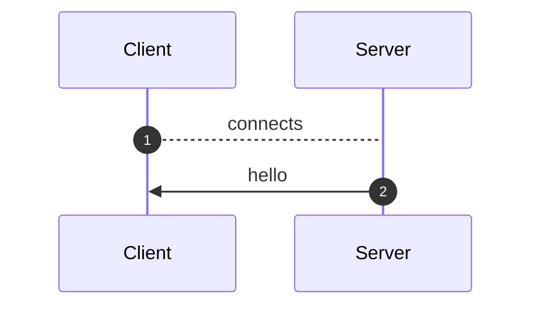
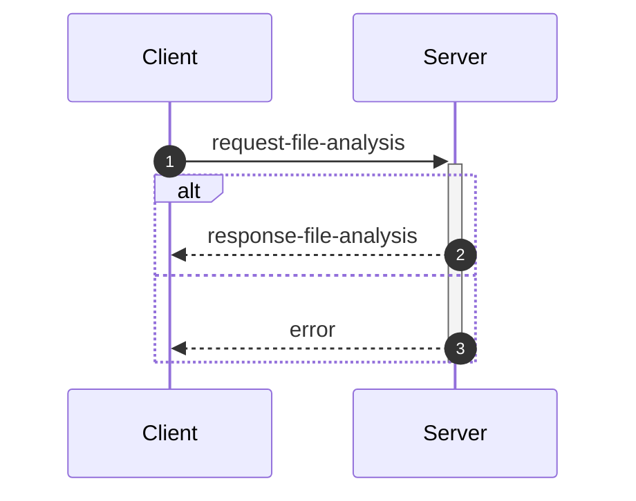
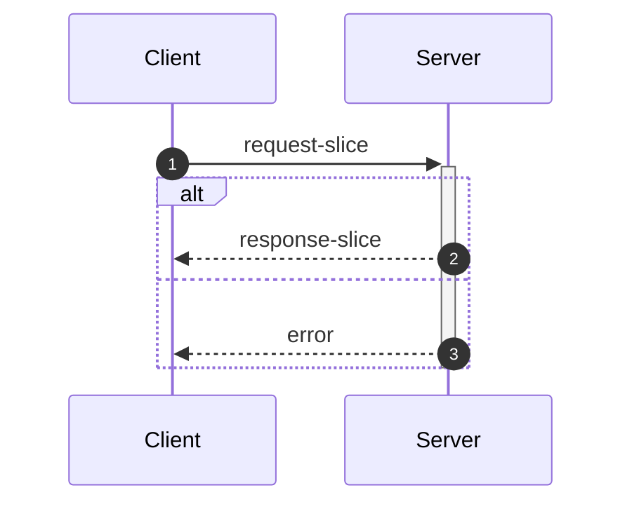
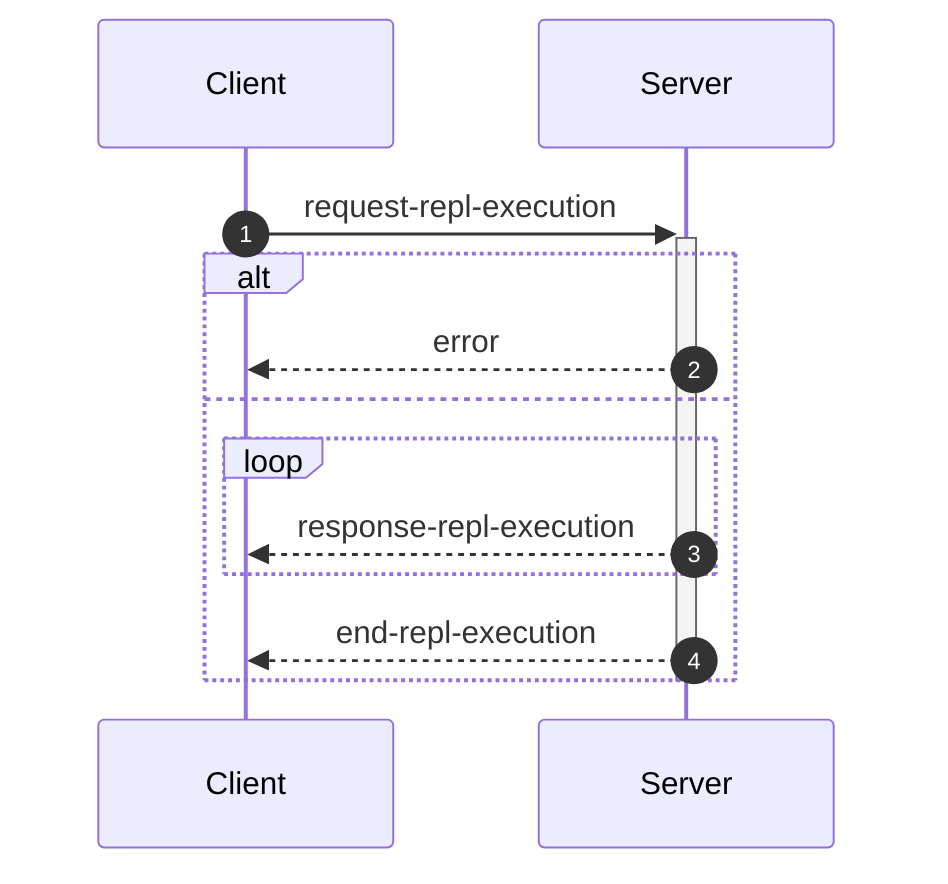

_This document was generated from '[src/documentation/wiki-interface.ts](https://github.com/flowr-analysis/flowr/tree/main//src/documentation/wiki-interface.ts)' on 2026-04-03, 09:57:44 UTC presenting an overview of flowR's interface (v2.10.2, using R v4.5.3). Please do not edit this file/wiki page directly._

Although far from being as detailed as the in-depth explanation of [_flowR_](https://github.com/flowr-analysis/flowr/wiki/core),
this wiki page explains how to interface with _flowR_ in more detail.
In general, command line arguments and other options provide short descriptions on hover over.

* [💻 Using the REPL](#using-the-repl)
* [⚙️ Configuring FlowR](#configuring-flowr)
* [⚒️ Writing Code](#writing-code)
* [💬 Communicating with the Server](#communicating-with-the-server)

<a id='using-the-repl'></a>
## 💻 Using the REPL


> [!NOTE]
> To execute arbitrary R commands with a repl request, _flowR_ has to be started explicitly with <span title="Description (Command Line Argument): Allow to access the underlying R session when using flowR (security warning: this allows the execution of arbitrary R code!)">`--r-session-access`</span>.
> Please be aware that this introduces a security risk and note that this relies on the [`r-shell` engine](https://github.com/flowr-analysis/flowr/wiki/engines) .

Although primarily meant for users to explore, 
there is nothing which forbids simply calling _flowR_ as a subprocess to use standard-in, -output, and -error 
for communication (although you can access the REPL using the server as well, 
with the [REPL Request](#message-request-repl-execution) message).

The read-eval-print loop&nbsp;(REPL) works relatively simple.
You can submit an expression (using <kbd>Enter</kbd>),
which is interpreted as an R&nbsp;expression by default but interpreted as a *command* if it starts with a colon (`:`).
The best command to get started with the REPL is <span title="Description (Repl Command): Show help information (aliases: :h, :?)">`:help`</span>.
Besides, you can leave the REPL either with the command <span title="Description (Repl Command): End the repl (aliases: :q, :exit)">`:quit`</span> or by pressing <kbd>Ctrl</kbd>+<kbd>C</kbd> twice.
When writing a *command*, you may press <kbd>Tab</kbd> to get a list of completions, if available.
Multiple commands can be entered in a single line by separating them with a semicolon (`;`), e.g. `:parse "x<-2"; :df*`.
If a command is given without R code, the REPL will re-use R code given in a previous command. 
The prior example will hence return first the parsed AST of the program and then the dataflow graph for `"x <- 2"`.

> [!NOTE]
> If you develop flowR, you may want to launch the repl using the `npm run main-dev` command, this way, you get a non-minified version of flowR with debug information and hot-reloading of source files.

<details>
<summary>Available Commands</summary>

We currently offer the following commands (this with a `[*]` suffix are available with and without the star):


| Command | Description |
| ------- | ----------- |
| **<span title="Description (Repl Command): End the repl (aliases: :q, :exit)">:quit</span>** | End the repl (aliases: **:<span title="Alias of ':quit'. End the repl">q</span>**, **:<span title="Alias of ':quit'. End the repl">exit</span>**) |
| **<span title="Description (Repl Command): Execute the given code as R code. This requires the `--r-session-access` flag to be set and requires the r-shell engine. (aliases: :e, :r)">:execute</span>** | Execute the given code as R code. This requires the `--r-session-access` flag to be set and requires the r-shell engine. (aliases: **:<span title="Alias of ':execute'. Execute the given code as R code. This requires the `--r-session-access` flag to be set and requires the r-shell engine.">e</span>**, **:<span title="Alias of ':execute'. Execute the given code as R code. This requires the `--r-session-access` flag to be set and requires the r-shell engine.">r</span>**) |
| **<span title="Description (Repl Command): Get mermaid code for the control-flow graph of R code, start with 'file://' to indicate a file (aliases: :cfg, :cf)">:controlflow[*]</span>** | Get mermaid code for the control-flow graph of R code, start with 'file://' to indicate a file (star: Returns the URL to mermaid.live) (aliases: **:<span title="Alias of ':controlflow'. Get mermaid code for the control-flow graph of R code, start with 'file://' to indicate a file">cfg</span>**, **:<span title="Alias of ':controlflow'. Get mermaid code for the control-flow graph of R code, start with 'file://' to indicate a file">cf</span>**) |
| **<span title="Description (Repl Command): Get mermaid code for the control-flow graph with basic blocks, start with 'file://' to indicate a file (aliases: :cfgb, :cfb)">:controlflowbb[*]</span>** | Get mermaid code for the control-flow graph with basic blocks, start with 'file://' to indicate a file (star: Returns the URL to mermaid.live) (aliases: **:<span title="Alias of ':controlflowbb'. Get mermaid code for the control-flow graph with basic blocks, start with 'file://' to indicate a file">cfgb</span>**, **:<span title="Alias of ':controlflowbb'. Get mermaid code for the control-flow graph with basic blocks, start with 'file://' to indicate a file">cfb</span>**) |
| **<span title="Description (Repl Command): Get mermaid code for the dataflow graph, start with 'file://' to indicate a file (aliases: :d, :df)">:dataflow[*]</span>** | Get mermaid code for the dataflow graph, start with 'file://' to indicate a file (star: Returns the URL to mermaid.live) (aliases: **:<span title="Alias of ':dataflow'. Get mermaid code for the dataflow graph, start with 'file://' to indicate a file">d</span>**, **:<span title="Alias of ':dataflow'. Get mermaid code for the dataflow graph, start with 'file://' to indicate a file">df</span>**) |
| **<span title="Description (Repl Command): Get mermaid code for the normalized AST of R code, start with 'file://' to indicate a file (aliases: :n)">:normalize[*]</span>** | Get mermaid code for the normalized AST of R code, start with 'file://' to indicate a file (star: Returns the URL to mermaid.live) (alias: **:<span title="Alias of ':normalize'. Get mermaid code for the normalized AST of R code, start with 'file://' to indicate a file">n</span>**) |
| **<span title="Description (Repl Command): Get mermaid code for the simplified dataflow graph, start with 'file://' to indicate a file (aliases: :ds, :dfs)">:dataflowsimple[*]</span>** | Get mermaid code for the simplified dataflow graph, start with 'file://' to indicate a file (star: Returns the URL to mermaid.live) (aliases: **:<span title="Alias of ':dataflowsimple'. Get mermaid code for the simplified dataflow graph, start with 'file://' to indicate a file">ds</span>**, **:<span title="Alias of ':dataflowsimple'. Get mermaid code for the simplified dataflow graph, start with 'file://' to indicate a file">dfs</span>**) |
| **<span title="Description (Repl Command): Just calculates the DFG, but only prints summary info (aliases: :d#, :df#)">:dataflowsilent</span>** | Just calculates the DFG, but only prints summary info (aliases: **:<span title="Alias of ':dataflowsilent'. Just calculates the DFG, but only prints summary info">d#</span>**, **:<span title="Alias of ':dataflowsilent'. Just calculates the DFG, but only prints summary info">df#</span>**) |
| **<span title="Description (Repl Command): Prints ASCII Art of the parsed, unmodified AST, start with 'file://' to indicate a file (aliases: :p)">:parse</span>** | Prints ASCII Art of the parsed, unmodified AST, start with 'file://' to indicate a file (alias: **:<span title="Alias of ':parse'. Prints ASCII Art of the parsed, unmodified AST, start with 'file://' to indicate a file">p</span>**) |
| **<span title="Description (Repl Command): Prints the version of flowR as well as the current version of R">:version</span>** | Prints the version of flowR as well as the current version of R
| **<span title="Description (Repl Command): Query the given R code, start with 'file://' to indicate a file. The query is to be a valid query in json format (use 'help' to get more information).">:query[*]</span>** | Query the given R code, start with 'file://' to indicate a file. The query is to be a valid query in json format (use 'help' to get more information). (star: Similar to query, but returns the output in json format.)
| **<span title="Description (Repl Command): Returns an ASCII representation of the dataflow graph (aliases: :df!)">:dataflowascii</span>** | Returns an ASCII representation of the dataflow graph (alias: **:<span title="Alias of ':dataflowascii'. Returns an ASCII representation of the dataflow graph">df!</span>**) |
| **<span title="Description (Repl Command): Returns summarization stats for the normalized AST (aliases: :n#)">:normalize#</span>** | Returns summarization stats for the normalized AST (alias: **:<span title="Alias of ':normalize#'. Returns summarization stats for the normalized AST">n#</span>**) |
| **<span title="Description (Repl Command): Show help information (aliases: :h, :?)">:help</span>** | Show help information (aliases: **:<span title="Alias of ':help'. Show help information">h</span>**, **:<span title="Alias of ':help'. Show help information">?</span>**) |


</details>


> [!TIP]
> 
> As indicated by the examples before, all REPL commands that operate on code keep track of the state.
> Hence, if you run a command like <span title="Description (Repl Command, starred version): Returns the URL to mermaid.live; Base Command: Get mermaid code for the dataflow graph, start with 'file://' to indicate a file (aliases: :d*, :df*)">`:dataflow*`</span> without providing R code,
> the REPL will re-use the R code provided in a previous command.
> Likewise, doing this will benefit from incrementality!
> If you request the dataflow graph with `:df* x <- 2 * y` and then want to see the parsed AST with `:parse`,
> the REPL will re-use previously obtained information and not re-parse the code again.
> 		


Generally, many commands offer shortcut versions in the REPL. Many queries, for example, offer a shortened format (see the example below).
Of special note, the [Config Query](https://github.com/flowr-analysis/flowr/wiki/query-api#Config-Query)
can be used to also modify the currently active configuration of _flowR_ within the REPL (see the [wiki page](https://github.com/flowr-analysis/flowr/wiki/query-api#Config-Query) for more information).

### Example: Retrieving the Dataflow Graph

To retrieve a URL to the [mermaid](https://mermaid.js.org/) diagram of the dataflow of a given expression, 
use <span title="Description (Repl Command, starred version): Returns the URL to mermaid.live; Base Command: Get mermaid code for the dataflow graph, start with 'file://' to indicate a file (aliases: :d*, :df*)">`:dataflow*`</span> (or <span title="Description (Repl Command): Get mermaid code for the dataflow graph, start with 'file://' to indicate a file (aliases: :d, :df)">`:dataflow`</span> to get the mermaid code in the cli):


```shell
$ docker run -it --rm eagleoutice/flowr # or npm run flowr 
flowR repl using flowR v2.10.2, R grammar v14 (tree-sitter engine)
R> :dataflow* y <- 1 + x
```

<details>
<summary style='color:gray'>Output</summary>


```text
https://mermaid.live/view#base64:eyJjb2RlIjoiZmxvd2NoYXJ0IEJUXG4gICAgMXt7XCJgIzkxO1JOdW1iZXIjOTM7IDFcbiAgICAgICgxKVxuICAgICAgKjEuNipgXCJ9fVxuICAgJSUgTm8gZWRnZXMgZm91bmQgZm9yIDFcbiAgICAyKFtcImAjOTE7UlN5bWJvbCM5MzsgeFxuICAgICAgKDIpXG4gICAgICAqMS4xMCpgXCJdKVxuICAgJSUgTm8gZWRnZXMgZm91bmQgZm9yIDJcbiAgICAzW1tcImAjOTE7UkJpbmFyeU9wIzkzOyAjNDM7XG4gICAgICAoMylcbiAgICAgICoxLjYtMTAqXG4gICAgKDEsIDIpYFwiXV1cbiAgICBidWlsdC1pbjpfW1wiYEJ1aWx0LUluOlxuIzQzO2BcIl1cbiAgICBzdHlsZSBidWlsdC1pbjpfIHN0cm9rZTpncmF5LGZpbGw6Z3JheSxzdHJva2Utd2lkdGg6MnB4LG9wYWNpdHk6Ljg7XG4gICAgMFtcImAjOTE7UlN5bWJvbCM5MzsgeVxuICAgICAgKDAsIHNvdXJjZXM6IFszXSlcbiAgICAgICoxLjEqYFwiXVxuICAgIDRbW1wiYCM5MTtSQmluYXJ5T3AjOTM7ICM2MDsjNDU7XG4gICAgICAoNClcbiAgICAgICoxLjEtMTAqXG4gICAgKDAsIDMpYFwiXV1cbiAgICBidWlsdC1pbjpfLVtcImBCdWlsdC1JbjpcbiM2MDsjNDU7YFwiXVxuICAgIHN0eWxlIGJ1aWx0LWluOl8tIHN0cm9rZTpncmF5LGZpbGw6Z3JheSxzdHJva2Utd2lkdGg6MnB4LG9wYWNpdHk6Ljg7XG4gICAgMyAtLT58XCJyZWFkcywgYXJndW1lbnRcInwgMVxuICAgIDMgLS0+fFwicmVhZHMsIGFyZ3VtZW50XCJ8IDJcbiAgICAzIC0uLT58XCJyZWFkcywgY2FsbHNcInwgYnVpbHQtaW46X1xuICAgIGxpbmtTdHlsZSAyIHN0cm9rZTpncmF5O1xuICAgIDAgLS0+fFwiZGVmaW5lZC1ieVwifCAzXG4gICAgMCAtLT58XCJkZWZpbmVkLWJ5XCJ8IDRcbiAgICA0IC0tPnxcInJlYWRzLCBhcmd1bWVudFwifCAzXG4gICAgNCAtLT58XCJyZXR1cm5zLCBhcmd1bWVudFwifCAwXG4gICAgNCAtLi0+fFwicmVhZHMsIGNhbGxzXCJ8IGJ1aWx0LWluOl8tXG4gICAgbGlua1N0eWxlIDcgc3Ryb2tlOmdyYXk7IiwibWVybWFpZCI6eyJhdXRvU3luYyI6dHJ1ZX19
Copied mermaid url to clipboard (dataflow: 0ms).
```


Retrieve the dataflow graph of the expression `y <- 1 + x`. It looks like this:


```mermaid
flowchart LR
    1{{"`#91;RNumber#93; 1
      (1)
      *1.6*`"}}
   %% No edges found for 1
    2(["`#91;RSymbol#93; x
      (2)
      *1.10*`"])
   %% No edges found for 2
    3[["`#91;RBinaryOp#93; #43;
      (3)
      *1.6-10*
    (1, 2)`"]]
    built-in:_["`Built-In:
#43;`"]
    style built-in:_ stroke:gray,fill:gray,stroke-width:2px,opacity:.8;
    0["`#91;RSymbol#93; y
      (0, sources: [3])
      *1.1*`"]
    4[["`#91;RBinaryOp#93; #60;#45;
      (4)
      *1.1-10*
    (0, 3)`"]]
    built-in:_-["`Built-In:
#60;#45;`"]
    style built-in:_- stroke:gray,fill:gray,stroke-width:2px,opacity:.8;
    3 -->|"reads, argument"| 1
    3 -->|"reads, argument"| 2
    3 -.->|"reads, calls"| built-in:_
    linkStyle 2 stroke:gray;
    0 -->|"defined-by"| 3
    0 -->|"defined-by"| 4
    4 -->|"reads, argument"| 3
    4 -->|"returns, argument"| 0
    4 -.->|"reads, calls"| built-in:_-
    linkStyle 7 stroke:gray;
```

	
<details>

<summary style="color:gray">R Code of the Dataflow Graph</summary>

The analysis required _0.3 ms_ (including parse and normalize, using the [tree-sitter](https://github.com/flowr-analysis/flowr/wiki/Engines) engine) within the generation environment. 
We encountered no unknown side effects during the analysis.


```r
y <- 1 + x
```


</details>


</details>


For small graphs like this, <span title="Description (Repl Command): Returns an ASCII representation of the dataflow graph (aliases: :df!)">`:dataflowascii`</span> also provides an ASCII representation directly in the REPL:


```shell
$ docker run -it --rm eagleoutice/flowr # or npm run flowr 
flowR repl using flowR v2.10.2, R grammar v14 (tree-sitter engine)
R> :df! y <- 1 + x
```

<details open>
<summary style='color:gray'>Output</summary>


```text
                        0<1>0
                   ┌────| 1 |
    ┌────────┐     │    0---0
 c<4>c       └──c<3>c
 |<- |  v<0>v┌──| + |
 c---c──| y |┘  c---c   u<2>u
        v---v      └────| x |
                        u---u
Edges:
3 -> 1: reads, argument  3 -> 2: reads, argument
4 -> 3: reads, argument  4 -> 0: returns, argument
0 -> 3: defined-by       0 -> 4: defined-by
```


Retrieve the dataflow graph of the expression `y <- 1 + x` as ASCII art.

</details>


For the slicing with <span title="Description (Repl Command): Static backwards executable slicer for R">`:slicer`</span>, you have access to the same [magic comments](#slice-magic-comments) as with the [slice request](#message-request-slice).

### Example: Interfacing with the File System

Many commands that allow for an R-expression (like <span title="Description (Repl Command, starred version): Returns the URL to mermaid.live; Base Command: Get mermaid code for the dataflow graph, start with 'file://' to indicate a file (aliases: :d*, :df*)">`:dataflow*`</span>) allow for a file as well 
if the argument starts with `file://`. 
If you are working from the root directory of the _flowR_ repository, the following gives you the parsed AST of the example file using the <span title="Description (Repl Command): Prints ASCII Art of the parsed, unmodified AST, start with 'file://' to indicate a file (aliases: :p)">`:parse`</span> command:


```shell
$ docker run -it --rm eagleoutice/flowr # or npm run flowr 
flowR repl using flowR v2.10.2, R grammar v14 (tree-sitter engine)
R> :parse file://test/testfiles/example.R
```

<details>
<summary style='color:gray'>Output</summary>


```text
File: test/testfiles/example.R

program
├ binaryoperator
│ ├ identifier "sum" (1:1─4)
│ ├ <- "<-" (1:5─7)
│ ╰ float "0" (1:8─9)
├ binaryoperator
│ ├ identifier "product" (2:1─8)
│ ├ <- "<-" (2:9─11)
│ ╰ float "1" (2:12─13)
├ binaryoperator
│ ├ identifier "w" (3:1─2)
│ ├ <- "<-" (3:3─5)
│ ╰ float "7" (3:6─7)
├ binaryoperator
│ ├ identifier "N" (4:1─2)
│ ├ <- "<-" (4:3─5)
│ ╰ float "10" (4:6─8)
├ forstatement
│ ├ for "for" (6:1─4)
│ ├ ( "(" (6:5─6)
│ ├ identifier "i" (6:6─7)
│ ├ in "in" (6:8─10)
│ ├ binaryoperator
│ │ ├ float "1" (6:11─12)
│ │ ├ : ":" (6:12─13)
│ │ ╰ parenthesizedexpression
│ │   ├ ( "(" (6:13─14)
│ │   ├ binaryoperator
│ │   │ ├ identifier "N" (6:14─15)
│ │   │ ├ - "-" (6:15─16)
│ │   │ ╰ float "1" (6:16─17)
│ │   ╰ ) ")" (6:17─18)
│ ├ ) ")" (6:18─19)
│ ╰ bracedexpression
│   ├ { "{" (6:20─21)
│   ├ binaryoperator
│   │ ├ identifier "sum" (7:3─6)
│   │ ├ <- "<-" (7:7─9)
│   │ ╰ binaryoperator
│   │   ├ binaryoperator
│   │   │ ├ identifier "sum" (7:10─13)
│   │   │ ├ + "+" (7:14─15)
│   │   │ ╰ identifier "i" (7:16─17)
│   │   ├ + "+" (7:18─19)
│   │   ╰ identifier "w" (7:20─21)
│   ├ binaryoperator
│   │ ├ identifier "product" (8:3─10)
│   │ ├ <- "<-" (8:11─13)
│   │ ╰ binaryoperator
│   │   ├ identifier "product" (8:14─21)
│   │   ├  "" (8:22─23)
│   │   ╰ identifier "i" (8:24─25)
│   ╰ } "}" (9:1─2)
├ call
│ ├ identifier "cat" (11:1─4)
│ ╰ arguments
│   ├ ( "(" (11:4─5)
│   ├ argument
│   │ ╰ string
│   │   ├ " "\"" (11:5─6)
│   │   ├ stringcontent "Sum:" (11:6─10)
│   │   ╰ " "\"" (11:10─11)
│   ├ comma "," (11:11─12)
│   ├ argument
│   │ ╰ identifier "sum" (11:13─16)
│   ├ comma "," (11:16─17)
│   ├ argument
│   │ ╰ string
│   │   ├ " "\"" (11:18─19)
│   │   ├ stringcontent
│   │   │ ╰ escapesequence "\\n" (11:19─21)
│   │   ╰ " "\"" (11:21─22)
│   ╰ ) ")" (11:22─23)
╰ call
  ├ identifier "cat" (12:1─4)
  ╰ arguments
    ├ ( "(" (12:4─5)
    ├ argument
    │ ╰ string
    │   ├ " "\"" (12:5─6)
    │   ├ stringcontent "Product:" (12:6─14)
    │   ╰ " "\"" (12:14─15)
    ├ comma "," (12:15─16)
    ├ argument
    │ ╰ identifier "product" (12:17─24)
    ├ comma "," (12:24─25)
    ├ argument
    │ ╰ string
    │   ├ " "\"" (12:26─27)
    │   ├ stringcontent
    │   │ ╰ escapesequence "\\n" (12:27─29)
    │   ╰ " "\"" (12:29─30)
    ╰ ) ")" (12:30─31)
```


Retrieve the parsed AST of the example file.

<details>

<summary>File Content</summary>


```r
sum <- 0
product <- 1
w <- 7
N <- 10

for (i in 1:(N-1)) {
  sum <- sum + i + w
  product <- product * i
}

cat("Sum:", sum, "\n")
cat("Product:", product, "\n")
```


</details>

As _flowR_ directly transforms this AST the output focuses on being human-readable instead of being machine-readable. 
		

</details>


### Example: Run a Query

You can run any query supported by _flowR_ using the <span title="Description (Repl Command): Query the given R code, start with 'file://' to indicate a file. The query is to be a valid query in json format (use 'help' to get more information).">`:query`</span> command.
For example, to obtain the shapes of all data frames in a given piece of code, you can run:


```shell
$ docker run -it --rm eagleoutice/flowr # or npm run flowr 
flowR repl using flowR v2.10.2, R grammar v14 (tree-sitter engine)
R> :query @df-shape "x <- data.frame(a = 1:10, b = 1:10)\ny <- x$a"
```

<details open>
<summary style='color:gray'>Output</summary>


```text
Query: df-shape (0 ms)
   ╰ 12: (colnames: [{"a", "b"}, {}], cols: [2, 2], rows: [10, 10])
   ╰ 0: (colnames: [{"a", "b"}, {}], cols: [2, 2], rows: [10, 10])
All queries together required ≈1 ms (1ms accuracy, total 1 ms)
```


Retrieve the shapes of all data frames in the given code.

</details>


To run the linter on a file, you can use (in this example, we just issue the `dead-code` linter on a small piece of code):


```shell
$ docker run -it --rm eagleoutice/flowr # or npm run flowr 
flowR repl using flowR v2.10.2, R grammar v14 (tree-sitter engine)
R> :query @linter rules:dead-code "if(FALSE) x <- 2"
```

<details open>
<summary style='color:gray'>Output</summary>


```text
Query: linter (0 ms)
   ╰ Dead Code (dead-code):
       ╰ certain:
           ╰ Code at 1.11-16
       ╰ Metadata: consideredNodes: 7, searchTimeMs: 0, processTimeMs: 0
All queries together required ≈0 ms (1ms accuracy, total 0 ms)
```


Run the linter on the given code, with only the `dead-code` rule enabled.

</details>


For more information on the available queries, please check out the [Query API](https://github.com/flowr-analysis/flowr/wiki/query-api).


<a id='configuring-flowr'></a>
## ⚙️ Configuring FlowR


When running _flowR_, you may want to specify some behaviors with a dedicated configuration file. 
By default, flowR looks for a file named `flowr.json` in the current working directory (or any higher directory). 
You can also specify a different file with <span title="Description (Command Line Argument): The name of the configuration file to use">`--config-file`</span> or pass the configuration inline using <span title="Description (Command Line Argument): The flowR configuration to use, as a JSON string">`--config-json`</span>.
To inspect the current configuration, you can run flowr with the <span title="Description (Command Line Argument): Run with verbose logging (will be passed to the corresponding script)">`--verbose`</span> flag, or use the `config` [Query](https://github.com/flowr-analysis/flowr/wiki/Query%20API).
Within the REPL this works by running the following:


```shell
:query @config
```


To work with the <a href="https://github.com/flowr-analysis/flowr/tree/main//src/config.ts#L104"><code><span title="The configuration file format for flowR.">FlowrConfig</span></code></a> you can use the provided helper objects alongside its methods like
<a href="https://github.com/flowr-analysis/flowr/tree/main//src/config.ts#L392"><code><span title="Creates a new flowr config that has the updated values.">FlowrConfig::<b>amend</b></span></code></a>.
The following summarizes the configuration options:

- `ignoreSourceCalls`: If set to `true`, _flowR_ will ignore source calls when analyzing the code, i.e., ignoring the inclusion of other files.
- `semantics`: allows to configure the way _flowR_ handles R, although we currently only support `semantics/environment/overwriteBuiltIns`. 
  You may use this to overwrite _flowR_'s handling of built-in function and even completely clear the preset definitions shipped with flowR. 
  See [Configure BuiltIn Semantics](#configure-builtin-semantics) for more information.
- `solver`: allows to configure how _flowR_ resolves variables and their values (currently we support: `disabled`, `alias`, `builtin`), as well as if pointer analysis should be active.
- `engines`: allows to configure the engines used by _flowR_ to interact with R code. See the [Engines wiki page](https://github.com/flowr-analysis/flowr/wiki/Engines) for more information.
- `defaultEngine`: allows to specify the default engine to use for interacting with R code. If not set, an arbitrary engine from the specified list will be used.
- `abstractInterpretation`: allows to configure how _flowR_ performs abstract interpretation, although we currently only support data frame shape inference through abstract interpretation.

So you can configure _flowR_ by adding a file like the following:

<details>

<summary>Example Configuration File</summary>


```json
{
  "ignoreSourceCalls": true,
  "semantics": {
    "environment": {
      "overwriteBuiltIns": {
        "definitions": [
          {
            "type": "function",
            "names": [
              "foo"
            ],
            "processor": "builtin:assignment",
            "config": {}
          }
        ]
      }
    }
  },
  "repl": {
    "quickStats": false,
    "dfProcessorHeat": false
  },
  "project": {
    "resolveUnknownPathsOnDisk": true
  },
  "engines": [
    {
      "type": "r-shell"
    }
  ],
  "solver": {
    "variables": "alias",
    "evalStrings": true,
    "resolveSource": {
      "dropPaths": "no",
      "ignoreCapitalization": true,
      "inferWorkingDirectory": "active-script",
      "searchPath": []
    },
    "instrument": {},
    "slicer": {
      "threshold": 50
    }
  },
  "abstractInterpretation": {
    "wideningThreshold": 4,
    "dataFrame": {
      "maxColNames": 20,
      "readLoadedData": {
        "readExternalFiles": true,
        "maxReadLines": 1000000
      }
    }
  }
}
```


</details>

<details> 
<a id='configure-builtin-semantics'></a>
<summary>Configure Built-In Semantics</summary> 


`semantics/environment/overwriteBuiltins` accepts two keys:

- `loadDefaults` (boolean, initially `true`): If set to `true`, the default built-in definitions are loaded before applying the custom definitions. Setting this flag to `false` explicitly disables the loading of the default definitions.
- `definitions` (array, initially empty): Allows to overwrite or define new built-in elements. Each object within must have a `type` which is one of the below. Furthermore, they may define a string array of `names` which specifies the identifiers to bind the definitions to. You may use `assumePrimitive` to specify whether _flowR_ should assume that this is a primitive non-library definition (so you probably just do not want to specify the key).

  | Type            | Description                                                                                                                                                                                                                                                                                              | Example                                                                                                    |
  | --------------- | -------------------------------------------------------------------------------------------------------------------------------------------------------------------------------------------------------------------------------------------------------------------------------------------------------- | ---------------------------------------------------------------------------------------------------------- |
  | `constant`    | Additionally allows for a `value` this should resolve to.                                                                                                                                                                                                                                                | `{ type: 'constant', names: ['NULL', 'NA'],  value: null }`                                                |
  | `function`    | Is a rather flexible way to define and bind built-in functions. For the time, we do not have extensive documentation to cover all the cases, so please either consult the sources with the `default-builtin-config.ts` or open a [new issue](https://github.com/flowr-analysis/flowr/issues/new/choose). | `{ type: 'function', names: ['next'], processor: 'builtin:default', config: { cfg: ExitPointType.Next } }` |
  | `replacement` | A comfortable way to specify replacement functions like `$<-` or `names<-`. `suffixes` describes the... suffixes to attach automatically. | `{ type: 'replacement', suffixes: ['<-', '<<-'], names: ['[', '[['] }` |


</details>

<details>

<summary style='color:gray'>Full Configuration-File Schema</summary>

- _The configuration file format for flowR._ (object)
    - **ignoreSourceCalls** [optional] _Whether source calls should be ignored, causing {@link processSourceCall}'s behavior to be skipped._ (boolean)
    - **semantics** _Configure language semantics and how flowR handles them._ (object)
        - **environment** [optional] _Semantics regarding how to handle the R environment._ (object)
            - **overwriteBuiltIns** [optional] _Do you want to overwrite (parts) of the builtin definition?_ (object)
                - **loadDefaults** [optional] _Should the default configuration still be loaded?_ (boolean)
                - **definitions** [optional] _The definitions to load/overwrite._ (array)
                Valid item types:
                    - (object)
    - **repl** _Configuration options for the REPL._ (object)
        - **quickStats** [optional] _Whether to show quick stats in the REPL after each evaluation._ (boolean)
        - **dfProcessorHeat** [optional] _This instruments the dataflow processors to count how often each processor is called._ (boolean)
    - **project** _Project specific configuration options._ (object)
        - **resolveUnknownPathsOnDisk** [optional] _Whether to resolve unknown paths loaded by the r project disk when trying to source/analyze files._ (boolean)
    - **engines** _The engine or set of engines to use for interacting with R code. An empty array means all available engines will be used._ (array)
    Valid item types:
        - (alternatives)
            - _The configuration for the tree sitter engine._ (object)
                - **type** [required] _Use the tree sitter engine._ (string)
                    Only allows: 'tree-sitter'
                - **wasmPath** [optional] _The path to the tree-sitter-r WASM binary to use. If this is undefined, this uses the default path._ (string)
                - **treeSitterWasmPath** [optional] _The path to the tree-sitter WASM binary to use. If this is undefined, this uses the default path._ (string)
                - **lax** [optional] _Whether to use the lax parser for parsing R code (allowing for syntax errors). If this is undefined, the strict parser will be used._ (boolean)
            - _The configuration for the R shell engine._ (object)
                - **type** [required] _Use the R shell engine._ (string)
                    Only allows: 'r-shell'
                - **rPath** [optional] _The path to the R executable to use. If this is undefined, this uses the default path._ (string)
    - **defaultEngine** [optional] _The default engine to use for interacting with R code. If this is undefined, an arbitrary engine from the specified list will be used._ (string)
        Only allows: 'tree-sitter', 'r-shell'
    - **solver** _How to resolve constants, constraints, cells, ..._ (object)
        - **variables** _How to resolve variables and their values._ (string)
            Only allows: 'disabled', 'alias', 'builtin'
        - **evalStrings** _Should we include eval(parse(text="...")) calls in the dataflow graph?_ (boolean)
        - **instrument** (object)
            - **dataflowExtractors** [optional] _These keys are only intended for use within code, allowing to instrument the dataflow analyzer!_ (any)
        - **resolveSource** [optional] _If lax source calls are active, flowR searches for sourced files much more freely, based on the configurations you give it. This option is only in effect if `ignoreSourceCalls` is set to false._ (object)
            - **dropPaths** _Allow to drop the first or all parts of the sourced path, if it is relative._ (string)
                Only allows: 'no', 'once', 'all'
            - **ignoreCapitalization** _Search for filenames matching in the lowercase._ (boolean)
            - **inferWorkingDirectory** _Try to infer the working directory from the main or any script to analyze._ (string)
                Only allows: 'no', 'main-script', 'active-script', 'any-script'
            - **searchPath** _Additionally search in these paths._ (array)
            Valid item types:
                - (string)
            - **repeatedSourceLimit** [optional] _How often the same file can be sourced within a single run? Please be aware: in case of cyclic sources this may not reach a fixpoint so give this a sensible limit._ (number)
            - **applyReplacements** _Provide name replacements for loaded files_ (array)
            Valid item types:
                - (object)
        - **slicer** [optional] _The configuration for the slicer._ (object)
            - **threshold** [optional] _The maximum number of iterations to perform on a single function call during slicing._ (number)
            - **autoExtend** [optional] _If set, the slicer will gain an additional post-pass._ (boolean)
    - **abstractInterpretation** _The configuration options for abstract interpretation._ (object)
        - **wideningThreshold** _The threshold for the number of visitations of a node at which widening should be performed to ensure the termination of the fixpoint iteration._ (number)
        - **dataFrame** _The configuration of the shape inference for data frames._ (object)
            - **maxColNames** _The maximum number of columns names to infer for data frames before over-approximating the column names to top._ (number)
            - **readLoadedData** _Configuration options for reading data frame shapes from loaded external data files, such as CSV files._ (object)
                - **readExternalFiles** _Whether data frame shapes should be extracted from loaded external files, such as CSV files._ (boolean)
                - **maxReadLines** _The maximum number of lines to read when extracting data frame shapes from loaded files, such as CSV files._ (number)

</details>

	

<a id='writing-code'></a>
## ⚒️ Writing Code

_flowR_ can be used as a [module](https://www.npmjs.com/package/@eagleoutice/flowr) and offers several main classes and interfaces that are interesting for extension writers 
(see the [Visual Studio Code extension](https://marketplace.visualstudio.com/items?itemName=code-inspect.vscode-flowr) or the [Core](https://github.com/flowr-analysis/flowr/wiki/core) wiki page for more information).

### Creating Analyses with _flowR_

Nowadays, instances of the <a href="https://github.com/flowr-analysis/flowr/tree/main//src/project/flowr-analyzer.ts#L162"><code><span title="Central class for conducting analyses with FlowR. Use the FlowrAnalyzerBuilder to create a new instance. If you want the original pattern of creating a pipeline and running all steps, you can still do this with FlowrAnalyzer#runFull . To inspect the context of the analyzer, use FlowrAnalyzer#inspectContext (if you are a plugin and need to modify it, use FlowrAnalyzer#context instead).">FlowrAnalyzer</span></code></a> should be used as central frontend to get analysis results from _flowR_.
For example, a program slice can be created like this:


```ts
const analyzer = await new FlowrAnalyzerBuilder()
    .setEngine('tree-sitter')
    .build();
analyzer.addRequest('x <- 1\ny <- x\nx');
const result = await analyzer.query([
    {
        type:     'static-slice',
        criteria: ['3@x']
    }
]);
//console.log(result['static-slice']);
```


For more information, please have a look at the [Analyzer](https://github.com/flowr-analysis/flowr/wiki/analyzer) wiki page, which explains how to construct and use the <a href="https://github.com/flowr-analysis/flowr/tree/main//src/project/flowr-analyzer.ts#L162"><code><span title="Central class for conducting analyses with FlowR. Use the FlowrAnalyzerBuilder to create a new instance. If you want the original pattern of creating a pipeline and running all steps, you can still do this with FlowrAnalyzer#runFull . To inspect the context of the analyzer, use FlowrAnalyzer#inspectContext (if you are a plugin and need to modify it, use FlowrAnalyzer#context instead).">FlowrAnalyzer</span></code></a> in more detail.
To work with specific perspectives, you can also consult the respective pages like the [Dataflow Graph](https://github.com/flowr-analysis/flowr/wiki/dataflow-graph) or the [Abstract Interpretation](https://github.com/flowr-analysis/flowr/wiki/abstract-interpretation) wiki pages.
        
### The Pipeline Executor (Low-Level Interface)

Once, in the beginning, _flowR_ was meant to produce a dataflow graph merely to provide *program slices*. 
However, with continuous updates, the [Dataflow Graph](https://github.com/flowr-analysis/flowr/wiki/dataflow-graph) repeatedly proves to be the more interesting part.
With this, we restructured _flowR_'s originally *hardcoded* pipeline to be far more flexible. 
Now, it can be theoretically extended or replaced with arbitrary steps, optional steps, and what we call 'decorations' of these steps. 
In short, a slicing pipeline using the <a href="https://github.com/flowr-analysis/flowr/tree/main//src/core/pipeline-executor.ts#L97"><code><span title="**Please note:** The PipelineExecutor is now considered to be a rather low-level API for flowR. While it still works and is the basis for all other layers, we strongly recommend using the FlowrAnalyzer and its builder to create and use an analyzer instance that is pre-configured for your use-case. The pipeline executor allows to execute arbitrary pipelines in a step-by-step fashion. If you are not...">PipelineExecutor</span></code></a> looks like this:


```ts

const slicer = new PipelineExecutor(DEFAULT_SLICING_PIPELINE, {
  parser:    new RShell(),
  request:   requestFromInput('x <- 1\nx + 1'),
  criterion: ['2@x']
})
const slice = await slicer.allRemainingSteps()
// console.log(slice.reconstruct.code)
```


<details><summary>More Information</summary>


If you compare this, with what you would have done with the old (and removed) `SteppingSlicer`, 
this essentially just requires you to replace the `SteppingSlicer` with the <a href="https://github.com/flowr-analysis/flowr/tree/main//src/core/pipeline-executor.ts#L97"><code><span title="**Please note:** The PipelineExecutor is now considered to be a rather low-level API for flowR. While it still works and is the basis for all other layers, we strongly recommend using the FlowrAnalyzer and its builder to create and use an analyzer instance that is pre-configured for your use-case. The pipeline executor allows to execute arbitrary pipelines in a step-by-step fashion. If you are not...">PipelineExecutor</span></code></a>
and to pass the <a href="https://github.com/flowr-analysis/flowr/tree/main//src/core/steps/pipeline/default-pipelines.ts#L18"><code>DEFAULT_SLICING_PIPELINE</code></a> as the first argument.
The <a href="https://github.com/flowr-analysis/flowr/tree/main//src/core/pipeline-executor.ts#L97"><code><span title="**Please note:** The PipelineExecutor is now considered to be a rather low-level API for flowR. While it still works and is the basis for all other layers, we strongly recommend using the FlowrAnalyzer and its builder to create and use an analyzer instance that is pre-configured for your use-case. The pipeline executor allows to execute arbitrary pipelines in a step-by-step fashion. If you are not...">PipelineExecutor</span></code></a>...

1. Provides structures to investigate the results of all intermediate steps
2. Can be executed step-by-step
3. Can repeat steps (e.g., to calculate multiple slices on the same input)

See the in-code documentation for more information.

	

</details>
    

### Using the <a href="https://github.com/flowr-analysis/flowr/tree/main//src/r-bridge/shell.ts#L143"><code><span title="The RShell represents an interactive session with the R interpreter. You can configure it by RShellOptions . At the moment we are using a live R session (and not networking etc.) to communicate with R easily, which allows us to install packages etc. However, this might and probably will change in the future (leaving this as a legacy mode :D)">RShell</span></code></a> to Interact with R

The <a href="https://github.com/flowr-analysis/flowr/tree/main//src/r-bridge/shell.ts#L143"><code><span title="The RShell represents an interactive session with the R interpreter. You can configure it by RShellOptions . At the moment we are using a live R session (and not networking etc.) to communicate with R easily, which allows us to install packages etc. However, this might and probably will change in the future (leaving this as a legacy mode :D)">RShell</span></code></a> class allows interfacing with the `R`&nbsp;ecosystem installed on the host system.
Please have a look at [flowR's Engines](https://github.com/flowr-analysis/flowr/wiki/engines) for more information on alternatives (for example, the <a href="https://github.com/flowr-analysis/flowr/tree/main//src/r-bridge/lang-4.x/tree-sitter/tree-sitter-executor.ts#L18"><code><span title="Synchronous and (way) faster alternative to the RShell using tree-sitter.">TreeSitterExecutor</span></code></a>).


> [!IMPORTANT]
> 
> Each <a href="https://github.com/flowr-analysis/flowr/tree/main//src/r-bridge/shell.ts#L143"><code><span title="The RShell represents an interactive session with the R interpreter. You can configure it by RShellOptions . At the moment we are using a live R session (and not networking etc.) to communicate with R easily, which allows us to install packages etc. However, this might and probably will change in the future (leaving this as a legacy mode :D)">RShell</span></code></a> controls a new instance of the R&nbsp;interpreter, 
> make sure to call <code><a href="https://github.com/flowr-analysis/flowr/tree/main//src/r-bridge/shell.ts#L317"><span title="Close the current R session, makes the object effectively invalid (can no longer be reopened etc.)">RShell::<i>close</i></span></a>()</code> when you are done.


You can start a new "session" simply by constructing a new object with <code>new <a href="https://github.com/flowr-analysis/flowr/tree/main//src/r-bridge/shell.ts#L143"><span title="The RShell represents an interactive session with the R interpreter. You can configure it by RShellOptions . At the moment we are using a live R session (and not networking etc.) to communicate with R easily, which allows us to install packages etc. However, this might and probably will change in the future (leaving this as a legacy mode :D)">RShell</span></a>()</code>.

However, there are several options that may be of interest 
(e.g., to automatically revive the shell in case of errors or to control the name location of the R process on the system).

With a shell object (let's call it `shell`), you can execute R code by using <a href="https://github.com/flowr-analysis/flowr/tree/main//src/r-bridge/shell.ts#L195"><code><span title="sends the given command directly to the current R session will not do anything to alter input markers!">RShell::<i>sendCommand</i></span></code></a>, 
for example <code>shell.<a href="https://github.com/flowr-analysis/flowr/tree/main//src/r-bridge/shell.ts#L195"><span title="sends the given command directly to the current R session will not do anything to alter input markers!">sendCommand</span></a>("1 + 1")</code>. 
However, this does not return anything, so if you want to collect the output of your command, use
<a href="https://github.com/flowr-analysis/flowr/tree/main//src/r-bridge/shell.ts#L261"><code><span title="Send a command and collect the output">RShell::<i>sendCommandWithOutput</i></span></code></a> instead.

Besides that, the command <a href="https://github.com/flowr-analysis/flowr/tree/main//src/r-bridge/shell.ts#L233"><code>RShell::<b>tryToInjectHomeLibPath</b></code></a> may be of interest, as it enables all libraries available on the host system.


### Generate Statistics (No longer a Focus of flowR)


<details>

<summary>Adding a New Feature to Extract</summary>

In this example, we construct a new feature to extract, with the name "*example*".
Whenever this name appears, you may substitute this with whatever name fits your feature best (as long as the name is unique).

1. **Create a new file in `src/statistics/features/supported`**\
   Create the file `example.ts`, and add its export to the `index.ts` file in the same directory (if not done automatically).

2. **Create the basic structure**\
   To get a better feel of what a feature must have, let's look
   at the basic structure (of course, due to TypeScript syntax,
   there are other ways to achieve the same goal):

   ```ts
   const initialExampleInfo = {
       /* whatever start value is good for you */
       someCounter: 0
   }

   export type ExampleInfo = Writable<typeof initialExampleInfo>

   export const example: Feature<ExampleInfo> = {
    name:        'Example Feature',
    description: 'A longer example description',

    process(existing: ExampleInfo, input: FeatureProcessorInput): ExampleInfo {
      /* perform analysis on the input */
      return existing
    },

    initialValue: initialExampleInfo
   }
   ```

   The `initialExampleInfo` type holds the initial values for each counter that you want to maintain during the feature extraction (they will usually be initialized with 0). The resulting `ExampleInfo` type holds the structure of the data that is to be counted. Due to the vast amount of data processed, information like the name and location of a function call is not stored here, but instead written to disk (see below).

   Every new feature must be of the `Feature<Info>` type, with `Info` referring to a `FeatureInfo` (like `ExampleInfo` in this example). Next to a `name` and a `description`, each Feature must provide:

   - a processor that extracts the information from the input, adding it to the existing information.
   - a function returning the initial value of the information (in this case, `initialExampleInfo`).

3. **Add it to the feature-mapping**\
   Now, in the `feature.ts` file in `src/statistics/features`, add your feature to the `ALL_FEATURES` object.

Now, we want to extract something. For the *example* feature created in the previous steps, we choose to count the amount of `COMMENT` tokens.
So we define a corresponding [XPath](https://developer.mozilla.org/en-US/docs/Web/XPath) query:

```ts
const commentQuery: Query = xpath.parse('//COMMENT')
```

Within our feature's `process` function, running the query is as simple as:

```ts
const comments = commentQuery.select({ node: input.parsedRAst })
```

Now we could do a lot of further processing, but for simplicity, we only record every comment found this way:

```ts
appendStatisticsFile(example.name, 'comments', comments, input.filepath)
```

We use `example.name` to avoid duplication with the name that we’ve assigned to the feature. It corresponds to the name of the folder in the statistics output.
`'comments'` refers to a freely chosen (but unique) name, that will be used as the name for the output file within the folder. The `comments` variable holds the result of the query, which is an array of nodes. Finally, we pass the `filepath` of the file that was analyzed (if known), so that it can be added to the statistics file (as additional information).

</details>
	

<a id='communicating-with-the-server'></a>
## 💬 Communicating with the Server


As explained in the [Overview](https://github.com/flowr-analysis/flowr/wiki/Overview), you can simply run the [TCP](https://de.wikipedia.org/wiki/Transmission_Control_Protocol)&nbsp;server by adding the <span title="Description (Command Line Argument): Do not drop into a repl, but instead start a server on the given port (default: 1042) and listen for messages.">`--server`</span> flag (and, due to the interactive mode, exit with the conventional <kbd>CTRL</kbd>+<kbd>C</kbd>).
Currently, every connection is handled by the same underlying `RShell` - so the server is not designed to handle many clients at a time.
Additionally, the server is not well guarded against attacks (e.g., you can theoretically spawn an arbitrary number of&nbsp;RShell sessions on the target machine).

Every message has to be given in a single line (i.e., without a newline in-between) and end with a newline character. Nevertheless, we will pretty-print example given in the following segments for the ease of reading.


> [!NOTE]
> 
> The default <span title="Description (Command Line Argument): Do not drop into a repl, but instead start a server on the given port (default: 1042) and listen for messages.">`--server`</span> uses a simple [TCP](https://de.wikipedia.org/wiki/Transmission_Control_Protocol)
> connection. If you want _flowR_ to expose a [WebSocket](https://de.wikipedia.org/wiki/WebSocket) server instead, add the <span title="Description (Command Line Argument): If the server flag is set, use websocket for messaging">`--ws`</span> flag (i.e., <span title="Description (Command Line Argument): Do not drop into a repl, but instead start a server on the given port (default: 1042) and listen for messages.">`--server`</span> <span title="Description (Command Line Argument): If the server flag is set, use websocket for messaging">`--ws`</span>) when starting _flowR_ from the command line.
> 			


<ul><li>
<a id="message-hello"></a>
<b>Hello</b> Message (<code>hello</code>) 
<details>

<summary style="color:gray"> View Details. <i>The server informs the client about the successful connection and provides Meta-Information.</i> </summary>


```mermaid
sequenceDiagram
    autonumber
    participant Client
    participant Server

    
    Client-->Server: connects
    Server->>Client: hello
	
```


	
After launching _flowR_, for example, with <code>docker run -it --rm eagleoutice/flowr <span title="Description (Command Line Argument): Do not drop into a repl, but instead start a server on the given port (default: 1042) and listen for messages.">-<span/>-server</span></code>&nbsp;(🐳️), simply connecting should present you with a `hello` message, that amongst others should reveal the versions of&nbsp;_flowR_ and&nbsp;R, using the [semver 2.0](https://semver.org/spec/v2.0.0.html) versioning scheme.
The message looks like this:


```json
{
  "type": "hello",
  "clientName": "client-0",
  "versions": {
    "flowr": "2.10.2",
    "r": "4.5.3",
    "engine": "r-shell"
  }
}
```


There are currently a few messages that you can send after the hello message.
If you want to _slice_ a piece of R code you first have to send an [analysis request](#message-request-file-analysis), so that you can send one or multiple slice requests afterward.
Requests for the [REPL](#message-request-repl) are independent of that.
	

<hr>


<details>
<summary style="color:gray">Message schema (<code>hello</code>)</summary>

For the definition of the hello message, please see it's implementation at [`./src/cli/repl/server/messages/message-hello.ts`](https://github.com/flowr-analysis/flowr/tree/main/./src/cli/repl/server/messages/message-hello.ts).

- [required] (object)
    - **type** [required] _The type of the hello message._ (string)
        Only allows: 'hello'
    - **id** [forbidden] _The id of the message is always undefined (as it is the initial message and not requested)._ (any)
    - **clientName** [required] _A unique name that is assigned to each client. It has no semantic meaning and is only used/useful for debugging._ (string)
    - **versions** [required] (object)
        - **flowr** [required] _The version of the flowr server running in semver format._ (string)
        - **r** [required] _The version of the underlying R shell running in semver format._ (string)
        - **engine** [required] _The parser backend that is used to parse the R code._ (string)

</details>


<hr>

</details>
	</li>

<li>
<a id="message-request-file-analysis"></a>
<b>Analysis</b> Message (<code>request-file-analysis</code>) 
<details>

<summary style="color:gray"> View Details. <i>The server builds the dataflow graph for a given input file (or a set of files).</i> </summary>


```mermaid
sequenceDiagram
    autonumber
    participant Client
    participant Server

    
    Client->>+Server: request-file-analysis
    alt
        Server-->>Client: response-file-analysis
    else
        Server-->>Client: error
    end
    deactivate  Server
	
```


	
The request allows the server to analyze a file and prepare it for slicing.
The message can contain a `filetoken`, which is used to identify the file in later slice or query requests (if you do not add one, the request will not be stored and therefore, it is not available for subsequent requests).

> **Please note!**\
> If you want to send and process a lot of analysis requests, but do not want to slice them, please do not pass the `filetoken` field. This will save the server a lot of memory allocation.

Furthermore, the request must contain either a `content` field to directly pass the file's content or a `filepath` field which contains the path to the file (this path must be accessible for the server to be useful).
If you add the `id` field, the answer will use the same `id` so you can match requests and the corresponding answers.
See the implementation of the request-file-analysis message for more information.


<details>
<summary>Example of the <code>request-file-analysis</code> Message</summary>

_Note:_ even though we pretty-print these messages, they are sent as a single line, ending with a newline.

The following lists all messages that were sent and received in case you want to reproduce the scenario:

<ol>
<li> <code>hello</code> (response)
<details> 

<summary> Show Details </summary>

The first message is always a hello message.


```json
{
  "type": "hello",
  "clientName": "client-0",
  "versions": {
    "flowr": "2.10.2",
    "r": "4.5.3",
    "engine": "r-shell"
  }
}
```


</details>
</li>

<li> <b><code>request-file-analysis</code> (request)</b>
<details open> 

<summary> Show Details </summary>

Let's suppose you simply want to analyze the following script:
 
```r
x <- 1
x + 1
```

 For this, you can send the following request:


```json
{
  "type": "request-file-analysis",
  "id": "1",
  "filetoken": "x",
  "content": "x <- 1\nx + 1"
}
```


</details>
</li>

<li> <code>response-file-analysis</code> (response)
<details> 

<summary> Show Details </summary>


The `results` field of the response effectively contains three keys of importance:

- `parse`: which contains 1:1 the parse result in CSV format that we received from the `RShell` (i.e., the AST produced by the parser of the R interpreter).
- `normalize`: which contains the normalized AST, including ids (see the `info` field and the [Normalized AST](https://github.com/flowr-analysis/flowr/wiki/Normalized%20AST) wiki page).
- `dataflow`: especially important is the `graph` field which contains the dataflow graph as a set of root vertices (see the [Dataflow Graph](https://github.com/flowr-analysis/flowr/wiki/Dataflow%20Graph) wiki page).
			


_As the code is pretty long, we inhibit pretty printing and syntax highlighting (JSON, hiding built-in):_

```text
{"type":"response-file-analysis","format":"json","id":"1","results":{"parse":{"files":[{"parsed":"[1,1,1,6,7,0,\"expr\",false,\"x <- 1\"],[1,1,1,1,1,3,\"SYMBOL\",true,\"x\"],[1,1,1,1,3,7,\"expr\",false,\"x\"],[1,3,1,4,2,7,\"LEFT_ASSIGN\",true,\"<-\"],[1,6,1,6,4,5,\"NUM_CONST\",true,\"1\"],[1,6,1,6,5,7,\"expr\",false,\"1\"],[2,1,2,5,16,0,\"expr\",false,\"x + 1\"],[2,1,2,1,10,12,\"SYMBOL\",true,\"x\"],[2,1,2,1,12,16,\"expr\",false,\"x\"],[2,3,2,3,11,16,\"'+'\",true,\"+\"],[2,5,2,5,13,14,\"NUM_CONST\",true,\"1\"],[2,5,2,5,14,16,\"expr\",false,\"1\"]","filePath":"/tmp/tmp-284152-u1zPpyiuIeJu-.R"}],".meta":{"timing":1}},"normalize":{"ast":{"type":"RProject","files":[{"root":{"type":"RExpressionList","children":[{"type":"RBinaryOp","location":[1,3,1,4],"lhs":{"type":"RSymbol","location":[1,1,1,1],"content":"x","lexeme":"x","info":{"fullRange":[1,1,1,1],"adToks":[],"id":0,"parent":2,"role":"bin-l","index":0,"nesting":0,"file":"/tmp/tmp-284152-u1zPpyiuIeJu-.R"}},"rhs":{"location":[1,6,1,6],"lexeme":"1","info":{"fullRange":[1,6,1,6],"adToks":[],"id":1,"parent":2,"role":"bin-r","index":1,"nesting":0,"file":"/tmp/tmp-284152-u1zPpyiuIeJu-.R"},"type":"RNumber","content":{"num":1,"complexNumber":false,"markedAsInt":false}},"operator":"<-","lexeme":"<-","info":{"fullRange":[1,1,1,6],"adToks":[],"id":2,"parent":6,"nesting":0,"file":"/tmp/tmp-284152-u1zPpyiuIeJu-.R","index":0,"role":"el-c"}},{"type":"RBinaryOp","location":[2,3,2,3],"lhs":{"type":"RSymbol","location":[2,1,2,1],"content":"x","lexeme":"x","info":{"fullRange":[2,1,2,1],"adToks":[],"id":3,"parent":5,"role":"bin-l","index":0,"nesting":0,"file":"/tmp/tmp-284152-u1zPpyiuIeJu-.R"}},"rhs":{"location":[2,5,2,5],"lexeme":"1","info":{"fullRange":[2,5,2,5],"adToks":[],"id":4,"parent":5,"role":"bin-r","index":1,"nesting":0,"file":"/tmp/tmp-284152-u1zPpyiuIeJu-.R"},"type":"RNumber","content":{"num":1,"complexNumber":false,"markedAsInt":false}},"operator":"+","lexeme":"+","info":{"fullRange":[2,1,2,5],"adToks":[],"id":5,"parent":6,"nesting":0,"file":"/tmp/tmp-284152-u1zPpyiuIeJu-.R","index":1,"role":"el-c"}}],"info":{"adToks":[],"id":6,"nesting":0,"file":"/tmp/tmp-284152-u1zPpyiuIeJu-.R","role":"root","index":0}},"filePath":"/tmp/tmp-284152-u1zPpyiuIeJu-.R"}],"info":{"id":7}},".meta":{"timing":0}},"dataflow":{"unknownReferences":[],"in":[{"nodeId":2,"name":"<-","type":2},{"nodeId":5,"name":"+","type":2}],"out":[{"nodeId":0,"name":"x","type":4,"definedAt":2,"value":[1]}],"environment":{"current":{"id":2084,"parent":"<BuiltInEnvironment>","memory":[["x",[{"nodeId":0,"name":"x","type":4,"definedAt":2,"value":[1]}]]]},"level":0},"graph":{"rootVertices":[1,0,2,3,4,5],"vertexInformation":[[1,{"tag":"value","id":1}],[0,{"tag":"vdef","id":0,"source":[1]}],[2,{"tag":"fcall","id":2,"name":"<-","onlyBuiltin":true,"args":[{"nodeId":0,"type":32},{"nodeId":1,"type":32}],"origin":["builtin:assignment"]}],[3,{"tag":"use","id":3}],[4,{"tag":"value","id":4}],[5,{"tag":"fcall","id":5,"name":"+","onlyBuiltin":true,"args":[{"nodeId":3,"type":32},{"nodeId":4,"type":32}],"origin":["builtin:default"]}]],"edgeInformation":[[2,[[1,{"types":65}],[0,{"types":72}],["built-in:<-",{"types":5}]]],[0,[[1,{"types":2}],[2,{"types":2}]]],[3,[[0,{"types":1}]]],[5,[[3,{"types":65}],[4,{"types":65}],["built-in:+",{"types":5}]]]],"_unknownSideEffects":[]},"entryPoint":2,"exitPoints":[{"type":0,"nodeId":5}],"hooks":[],".meta":{"timing":0}}}}
```


</details>
</li>
</ol>

The complete round-trip took 3.8 ms (including time required to validate the messages, start, and stop the internal mock server).

</details>


You receive an error if, for whatever reason, the analysis fails (e.g., the message or code you sent contained syntax errors).
It contains a human-readable description *why* the analysis failed (see the error message implementation for more details).


<details>
<summary>Example Error Message</summary>

_Note:_ even though we pretty-print these messages, they are sent as a single line, ending with a newline.

The following lists all messages that were sent and received in case you want to reproduce the scenario:

<ol>
<li> <code>hello</code> (response)
<details> 

<summary> Show Details </summary>

The first message is always a hello message.


```json
{
  "type": "hello",
  "clientName": "client-0",
  "versions": {
    "flowr": "2.10.2",
    "r": "4.5.3",
    "engine": "r-shell"
  }
}
```


</details>
</li>

<li> <code>request-file-analysis</code> (request)
<details> 

<summary> Show Details </summary>


```json
{
  "type": "request-file-analysis",
  "id": "1",
  "filename": "sample.R",
  "content": "x <-"
}
```


</details>
</li>

<li> <b><code>error</code> (response)</b>
<details open> 

<summary> Show Details </summary>


```json
{
  "id": "1",
  "type": "error",
  "fatal": false,
  "reason": "Error while analyzing file sample.R: GuardError: unable to parse R code (see the log for more information) for request {\"request\":\"text\",\"content\":\"x <-\"}}\n Report a Bug: https://github.com/flowr-analysis/flowr/issues/new?body=%3C!%2D%2D%20Please%20describe%20your%20issue%20in%20more%20detail%20below!%20%2D%2D%3E%0A%0A%0A%3C!%2D%2D%20Automatically%20generated%20issue%20metadata%2C%20please%20do%20not%20edit%20or%20delete%20content%20below%20this%20line%20%2D%2D%3E%0A%2D%2D%2D%0A%0AflowR%20version%3A%202.10.2%0Anode%20version%3A%20v24.13.0%0Anode%20arch%3A%20x64%0Anode%20platform%3A%20linux%0Amessage%3A%20%60unable%20to%20parse%20R%20code%20%28see%20the%20log%20for%20more%20information%29%20for%20request%20%7B%22request%22%3A%22text%22%2C%22content%22%3A%22x%20%3C%2D%22%7D%7D%60%0Astack%20trace%3A%0A%60%60%60%0A%20%20%20%20at%20guard%20%28%3C%3E%2Fsrc%2Futil%2Fassert.ts%3A128%3A9%29%0A%20%20%20%20at%20guardRetrievedOutput%20%28%3C%3E%2Fsrc%2Fr%2Dbridge%2Fretriever.ts%3A221%3A7%29%0A%20%20%20%20at%20%2Fhome%2Fostwind%2Fgit%2Fphd%2Fflowr%2Dfield%2Fflowr%2Fsrc%2Fr%2Dbridge%2Fretriever.ts%3A182%3A4%0A%20%20%20%20at%20processTicksAndRejections%20%28node%3Ainternal%2Fprocess%2Ftask_queues%3A103%3A5%29%0A%20%20%20%20at%20async%20Object.parseRequests%20%5Bas%20processor%5D%20%28%3C%3E%2Fsrc%2Fr%2Dbridge%2Fparser.ts%3A104%3A19%29%0A%20%20%20%20at%20async%20PipelineExecutor.nextStep%20%28%3C%3E%2Fsrc%2Fcore%2Fpipeline%2Dexecutor.ts%3A192%3A25%29%0A%20%20%20%20at%20async%20FlowrAnalyzerCache.runTapeUntil%20%28%3C%3E%2Fsrc%2Fproject%2Fcache%2Fflowr%2Danalyzer%2Dcache.ts%3A92%3A4%29%0A%20%20%20%20at%20async%20FlowRServerConnection.sendFileAnalysisResponse%20%28%3C%3E%2Fsrc%2Fcli%2Frepl%2Fserver%2Fconnection.ts%3A163%3A52%29%0A%60%60%60%0A%0A%2D%2D%2D%0A%09"
}
```


</details>
</li>
</ol>

The complete round-trip took 3.0 ms (including time required to validate the messages, start, and stop the internal mock server).

</details>


&nbsp;

<a id="analysis-include-cfg"></a>
**Including the Control Flow Graph**

While _flowR_ does (for the time being) not use an explicit control flow graph but instead relies on control-dependency edges within the dataflow graph, 
the respective structure can still be exposed using the server (note that, as this feature is not needed within _flowR_, it is tested significantly less - 
so please create a [new issue](https://github.com/flowr-analysis/flowr/issues/new/choose) for any bug you may encounter).
For this, the analysis request may add `cfg: true` to its list of options.


<details>
<summary>Requesting a Control Flow Graph</summary>

_Note:_ even though we pretty-print these messages, they are sent as a single line, ending with a newline.

The following lists all messages that were sent and received in case you want to reproduce the scenario:

<ol>
<li> <code>hello</code> (response)
<details> 

<summary> Show Details </summary>

The first message is always a hello message.


```json
{
  "type": "hello",
  "clientName": "client-0",
  "versions": {
    "flowr": "2.10.2",
    "r": "4.5.3",
    "engine": "r-shell"
  }
}
```


</details>
</li>

<li> <b><code>request-file-analysis</code> (request)</b>
<details open> 

<summary> Show Details </summary>


```json
{
  "type": "request-file-analysis",
  "id": "1",
  "filetoken": "x",
  "content": "if(unknown > 0) { x <- 2 } else { x <- 5 }\nfor(i in 1:x) { print(x); print(i) }",
  "cfg": true
}
```


</details>
</li>

<li> <code>response-file-analysis</code> (response)
<details> 

<summary> Show Details </summary>


The response looks basically the same as a response sent without the `cfg` flag. However, additionally it contains a `cfg` field. 
If you are interested in a visual representation of the control flow graph, see the 
[visualization with mermaid](https://mermaid.live/view#base64:eyJjb2RlIjoiZmxvd2NoYXJ0IEJUXG4gICAgbjMyKFtcImBSRXhwcmVzc2lvbkxpc3QgKDMyKWBcIl0pXG4gICAgbjE1W1wiYFJJZlRoZW5FbHNlICgxNSlcbiMzNDtpZih1bmtub3duICM2MjsgMCkgIzEyMzsgeCAjNjA7IzQ1OyAyICMxMjU7IGVsc2UgIzEyMzsgeCAjNjA7IzQ1OyA1ICMxMjU7IzM0O2BcIl1cbiAgICBuMTUtZVtbMTUtZV1dXG4gICAgbjAoW1wiYFJTeW1ib2wgKDApXG4jMzQ7dW5rbm93biMzNDtgXCJdKVxuICAgIG4xKFtcImBSTnVtYmVyICgxKVxuIzM0OzAjMzQ7YFwiXSlcbiAgICBuMihbXCJgUkJpbmFyeU9wICgyKVxuIzM0O3Vua25vd24gIzYyOyAwIzM0O2BcIl0pXG4gICAgbjItZVtbMi1lXV1cbiAgICBuOChbXCJgUkV4cHJlc3Npb25MaXN0ICg4KWBcIl0pXG4gICAgbjUoW1wiYFJTeW1ib2wgKDUpXG4jMzQ7eCMzNDtgXCJdKVxuICAgIG42KFtcImBSTnVtYmVyICg2KVxuIzM0OzIjMzQ7YFwiXSlcbiAgICBuNyhbXCJgUkJpbmFyeU9wICg3KVxuIzM0O3ggIzYwOyM0NTsgMiMzNDtgXCJdKVxuICAgIG43LWVbWzctZV1dXG4gICAgbjgtZVtbOC1lXV1cbiAgICBuMTQoW1wiYFJFeHByZXNzaW9uTGlzdCAoMTQpYFwiXSlcbiAgICBuMTEoW1wiYFJTeW1ib2wgKDExKVxuIzM0O3gjMzQ7YFwiXSlcbiAgICBuMTIoW1wiYFJOdW1iZXIgKDEyKVxuIzM0OzUjMzQ7YFwiXSlcbiAgICBuMTMoW1wiYFJCaW5hcnlPcCAoMTMpXG4jMzQ7eCAjNjA7IzQ1OyA1IzM0O2BcIl0pXG4gICAgbjEzLWVbWzEzLWVdXVxuICAgIG4xNC1lW1sxNC1lXV1cbiAgICBuMTYoW1wiYFJTeW1ib2wgKDE2KVxuIzM0O2kjMzQ7YFwiXSlcbiAgICBuMzFbXCJgUkZvckxvb3AgKDMxKVxuIzM0O2ZvcihpIGluIDEjNTg7eCkgIzEyMzsgcHJpbnQoeCk7IHByaW50KGkpICMxMjU7IzM0O2BcIl1cbiAgICBuMTcoW1wiYFJOdW1iZXIgKDE3KVxuIzM0OzEjMzQ7YFwiXSlcbiAgICBuMTgoW1wiYFJTeW1ib2wgKDE4KVxuIzM0O3gjMzQ7YFwiXSlcbiAgICBuMTkoW1wiYFJCaW5hcnlPcCAoMTkpXG4jMzQ7MSM1ODt4IzM0O2BcIl0pXG4gICAgbjE5LWVbWzE5LWVdXVxuICAgIG4zMChbXCJgUkV4cHJlc3Npb25MaXN0ICgzMClgXCJdKVxuICAgIG4yMihbXCJgUlN5bWJvbCAoMjIpXG4jMzQ7cHJpbnQoeCkjMzQ7YFwiXSlcbiAgICBuMjVbXCJgUkZ1bmN0aW9uQ2FsbCAoMjUpXG4jMzQ7cHJpbnQoeCkjMzQ7YFwiXVxuICAgIG4yNS1lW1syNS1lXV1cbiAgICBuMjQoW1wiYFJBcmd1bWVudCAoMjQpXG4jMzQ7eCMzNDtgXCJdKVxuICAgIG4yMyhbXCJgUlN5bWJvbCAoMjMpXG4jMzQ7eCMzNDtgXCJdKVxuICAgIG4yNC1lW1syNC1lXV1cbiAgICBuMjYoW1wiYFJTeW1ib2wgKDI2KVxuIzM0O3ByaW50KGkpIzM0O2BcIl0pXG4gICAgbjI5W1wiYFJGdW5jdGlvbkNhbGwgKDI5KVxuIzM0O3ByaW50KGkpIzM0O2BcIl1cbiAgICBuMjktZVtbMjktZV1dXG4gICAgbjI4KFtcImBSQXJndW1lbnQgKDI4KVxuIzM0O2kjMzQ7YFwiXSlcbiAgICBuMjcoW1wiYFJTeW1ib2wgKDI3KVxuIzM0O2kjMzQ7YFwiXSlcbiAgICBuMjgtZVtbMjgtZV1dXG4gICAgbjMwLWVbWzMwLWVdXVxuICAgIG4zMS1lW1szMS1lXV1cbiAgICBuMzItZVtbMzItZV1dXG4gICAgbjE1IC0uLT58XCJGRFwifCBuMzJcbiAgICBuMSAtLi0+fFwiRkRcInwgbjBcbiAgICBuMCAtLi0+fFwiRkRcInwgbjJcbiAgICBuMi1lIC0uLT58XCJGRFwifCBuMVxuICAgIG43IC0uLT58XCJGRFwifCBuOFxuICAgIG42IC0uLT58XCJGRFwifCBuNVxuICAgIG41IC0uLT58XCJGRFwifCBuN1xuICAgIG43LWUgLS4tPnxcIkZEXCJ8IG42XG4gICAgbjgtZSAtLi0+fFwiRkRcInwgbjctZVxuICAgIG4xMyAtLi0+fFwiRkRcInwgbjE0XG4gICAgbjEyIC0uLT58XCJGRFwifCBuMTFcbiAgICBuMTEgLS4tPnxcIkZEXCJ8IG4xM1xuICAgIG4xMy1lIC0uLT58XCJGRFwifCBuMTJcbiAgICBuMTQtZSAtLi0+fFwiRkRcInwgbjEzLWVcbiAgICBuOCAtLT58XCJDRCAoVFJVRSlcInwgbjItZVxuICAgIG4xNCAtLT58XCJDRCAoRkFMU0UpXCJ8IG4yLWVcbiAgICBuMiAtLi0+fFwiRkRcInwgbjE1XG4gICAgbjE1LWUgLS4tPnxcIkZEXCJ8IG44LWVcbiAgICBuMTUtZSAtLi0+fFwiRkRcInwgbjE0LWVcbiAgICBuMzEgLS4tPnxcIkZEXCJ8IG4xNS1lXG4gICAgbjMxIC0uLT58XCJGRFwifCBuMzAtZVxuICAgIG4xOCAtLi0+fFwiRkRcInwgbjE3XG4gICAgbjE3IC0uLT58XCJGRFwifCBuMTlcbiAgICBuMTktZSAtLi0+fFwiRkRcInwgbjE4XG4gICAgbjI1IC0uLT58XCJGRFwifCBuMzBcbiAgICBuMjIgLS4tPnxcIkZEXCJ8IG4yNVxuICAgIG4yMyAtLi0+fFwiRkRcInwgbjI0XG4gICAgbjI0LWUgLS4tPnxcIkZEXCJ8IG4yM1xuICAgIG4yNCAtLi0+fFwiRkRcInwgbjIyXG4gICAgbjI1LWUgLS4tPnxcIkZEXCJ8IG4yNC1lXG4gICAgbjI5IC0uLT58XCJGRFwifCBuMjUtZVxuICAgIG4yNiAtLi0+fFwiRkRcInwgbjI5XG4gICAgbjI3IC0uLT58XCJGRFwifCBuMjhcbiAgICBuMjgtZSAtLi0+fFwiRkRcInwgbjI3XG4gICAgbjI4IC0uLT58XCJGRFwifCBuMjZcbiAgICBuMjktZSAtLi0+fFwiRkRcInwgbjI4LWVcbiAgICBuMzAtZSAtLi0+fFwiRkRcInwgbjI5LWVcbiAgICBuMTkgLS4tPnxcIkZEXCJ8IG4zMVxuICAgIG4xNiAtLi0+fFwiRkRcInwgbjE5LWVcbiAgICBuMzAgLS0+fFwiQ0QgKFRSVUUpXCJ8IG4xNlxuICAgIG4zMS1lIC0tPnxcIkNEIChGQUxTRSlcInwgbjE2XG4gICAgbjMyLWUgLS4tPnxcIkZEXCJ8IG4zMS1lXG4gICAgc3R5bGUgbjMyIHN0cm9rZTpjeWFuLHN0cm9rZS13aWR0aDo2LjVweDsgICAgc3R5bGUgbjMyLWUgc3Ryb2tlOmdyZWVuLHN0cm9rZS13aWR0aDo2LjVweDsiLCJtZXJtYWlkIjp7ImF1dG9TeW5jIjp0cnVlfX0=).
			


_As the code is pretty long, we inhibit pretty printing and syntax highlighting (JSON, hiding built-in):_

```text
{"type":"response-file-analysis","format":"json","id":"1","cfg":{"returns":[],"entryPoints":[32],"exitPoints":["32-e"],"breaks":[],"nexts":[],"graph":{"roots":[32,15,"15-e",0,1,2,"2-e",8,5,6,7,"7-e","8-e",14,11,12,13,"13-e","14-e",16,31,17,18,19,"19-e",30,22,25,"25-e",24,23,"24-e",26,29,"29-e",28,27,"28-e","30-e","31-e","32-e"],"vtxInfos":[[32,[2,32,null,["32-e"]]],[15,[1,15,["2-e"],["15-e"]]],["15-e","15-e"],[0,[2,0]],[1,[2,1]],[2,[2,2,null,["2-e"]]],["2-e","2-e"],[8,[2,8,null,["8-e"]]],[5,[2,5]],[6,[2,6]],[7,[2,7,null,["7-e"]]],["7-e","7-e"],["8-e","8-e"],[14,[2,14,null,["14-e"]]],[11,[2,11]],[12,[2,12]],[13,[2,13,null,["13-e"]]],["13-e","13-e"],["14-e","14-e"],[16,[2,16]],[31,[1,31,[16],["31-e"]]],[17,[2,17]],[18,[2,18]],[19,[2,19,null,["19-e"]]],["19-e","19-e"],[30,[2,30,null,["30-e"]]],[22,[2,22]],[25,[1,25,[22],["25-e"]]],["25-e","25-e"],[24,[2,24,[24],["24-e"]]],[23,[2,23]],["24-e","24-e"],[26,[2,26]],[29,[1,29,[26],["29-e"]]],["29-e","29-e"],[28,[2,28,[28],["28-e"]]],[27,[2,27]],["28-e","28-e"],["30-e","30-e"],["31-e","31-e"],["32-e","32-e"]],"bbChildren":[],"edgeInfos":[[15,[[32,0]]],[1,[[0,0]]],[0,[[2,0]]],["2-e",[[1,0]]],[7,[[8,0]]],[6,[[5,0]]],[5,[[7,0]]],["7-e",[[6,0]]],["8-e",[["7-e",0]]],[13,[[14,0]]],[12,[[11,0]]],[11,[[13,0]]],["13-e",[[12,0]]],["14-e",[["13-e",0]]],[8,[["2-e",[15,"TRUE"]]]],[14,[["2-e",[15,"FALSE"]]]],[2,[[15,0]]],["15-e",[["8-e",0],["14-e",0]]],[31,[["15-e",0],["30-e",0]]],[18,[[17,0]]],[17,[[19,0]]],["19-e",[[18,0]]],[25,[[30,0]]],[22,[[25,0]]],[23,[[24,0]]],["24-e",[[23,0]]],[24,[[22,0]]],["25-e",[["24-e",0]]],[29,[["25-e",0]]],[26,[[29,0]]],[27,[[28,0]]],["28-e",[[27,0]]],[28,[[26,0]]],["29-e",[["28-e",0]]],["30-e",[["29-e",0]]],[19,[[31,0]]],[16,[["19-e",0]]],[30,[[16,[31,"TRUE"]]]],["31-e",[[16,[31,"FALSE"]]]],["32-e",[["31-e",0]]]],"revEdgeInfos":[[32,[[15,0]]],[0,[[1,0]]],[2,[[0,0]]],[1,[["2-e",0]]],[8,[[7,0]]],[5,[[6,0]]],[7,[[5,0]]],[6,[["7-e",0]]],["7-e",[["8-e",0]]],[14,[[13,0]]],[11,[[12,0]]],[13,[[11,0]]],[12,[["13-e",0]]],["13-e",[["14-e",0]]],["2-e",[[8,[15,"TRUE"]],[14,[15,"FALSE"]]]],[15,[[2,0]]],["8-e",[["15-e",0]]],["14-e",[["15-e",0]]],["15-e",[[31,0]]],[17,[[18,0]]],[19,[[17,0]]],[18,[["19-e",0]]],[30,[[25,0]]],[25,[[22,0]]],[24,[[23,0]]],[23,[["24-e",0]]],[22,[[24,0]]],["24-e",[["25-e",0]]],["25-e",[[29,0]]],[29,[[26,0]]],[28,[[27,0]]],[27,[["28-e",0]]],[26,[[28,0]]],["28-e",[["29-e",0]]],["29-e",[["30-e",0]]],[31,[[19,0]]],["19-e",[[16,0]]],[16,[[30,[31,"TRUE"]],["31-e",[31,"FALSE"]]]],["30-e",[[31,0]]],["31-e",[["32-e",0]]]],"_mayBB":false}},"results":{"parse":{"files":[{"parsed":"[1,1,1,42,38,0,\"expr\",false,\"if(unknown > 0) { x <- 2 } else { x <- 5 }\"],[1,1,1,2,1,38,\"IF\",true,\"if\"],[1,3,1,3,2,38,\"'('\",true,\"(\"],[1,4,1,14,9,38,\"expr\",false,\"unknown > 0\"],[1,4,1,10,3,5,\"SYMBOL\",true,\"unknown\"],[1,4,1,10,5,9,\"expr\",false,\"unknown\"],[1,12,1,12,4,9,\"GT\",true,\">\"],[1,14,1,14,6,7,\"NUM_CONST\",true,\"0\"],[1,14,1,14,7,9,\"expr\",false,\"0\"],[1,15,1,15,8,38,\"')'\",true,\")\"],[1,17,1,26,22,38,\"expr\",false,\"{ x <- 2 }\"],[1,17,1,17,12,22,\"'{'\",true,\"{\"],[1,19,1,24,19,22,\"expr\",false,\"x <- 2\"],[1,19,1,19,13,15,\"SYMBOL\",true,\"x\"],[1,19,1,19,15,19,\"expr\",false,\"x\"],[1,21,1,22,14,19,\"LEFT_ASSIGN\",true,\"<-\"],[1,24,1,24,16,17,\"NUM_CONST\",true,\"2\"],[1,24,1,24,17,19,\"expr\",false,\"2\"],[1,26,1,26,18,22,\"'}'\",true,\"}\"],[1,28,1,31,23,38,\"ELSE\",true,\"else\"],[1,33,1,42,35,38,\"expr\",false,\"{ x <- 5 }\"],[1,33,1,33,25,35,\"'{'\",true,\"{\"],[1,35,1,40,32,35,\"expr\",false,\"x <- 5\"],[1,35,1,35,26,28,\"SYMBOL\",true,\"x\"],[1,35,1,35,28,32,\"expr\",false,\"x\"],[1,37,1,38,27,32,\"LEFT_ASSIGN\",true,\"<-\"],[1,40,1,40,29,30,\"NUM_CONST\",true,\"5\"],[1,40,1,40,30,32,\"expr\",false,\"5\"],[1,42,1,42,31,35,\"'}'\",true,\"}\"],[2,1,2,36,84,0,\"expr\",false,\"for(i in 1:x) { print(x); print(i) }\"],[2,1,2,3,41,84,\"FOR\",true,\"for\"],[2,4,2,13,53,84,\"forcond\",false,\"(i in 1:x)\"],[2,4,2,4,42,53,\"'('\",true,\"(\"],[2,5,2,5,43,53,\"SYMBOL\",true,\"i\"],[2,7,2,8,44,53,\"IN\",true,\"in\"],[2,10,2,12,51,53,\"expr\",false,\"1:x\"],[2,10,2,10,45,46,\"NUM_CONST\",true,\"1\"],[2,10,2,10,46,51,\"expr\",false,\"1\"],[2,11,2,11,47,51,\"':'\",true,\":\"],[2,12,2,12,48,50,\"SYMBOL\",true,\"x\"],[2,12,2,12,50,51,\"expr\",false,\"x\"],[2,13,2,13,49,53,\"')'\",true,\")\"],[2,15,2,36,81,84,\"expr\",false,\"{ print(x); print(i) }\"],[2,15,2,15,54,81,\"'{'\",true,\"{\"],[2,17,2,24,64,81,\"expr\",false,\"print(x)\"],[2,17,2,21,55,57,\"SYMBOL_FUNCTION_CALL\",true,\"print\"],[2,17,2,21,57,64,\"expr\",false,\"print\"],[2,22,2,22,56,64,\"'('\",true,\"(\"],[2,23,2,23,58,60,\"SYMBOL\",true,\"x\"],[2,23,2,23,60,64,\"expr\",false,\"x\"],[2,24,2,24,59,64,\"')'\",true,\")\"],[2,25,2,25,65,81,\"';'\",true,\";\"],[2,27,2,34,77,81,\"expr\",false,\"print(i)\"],[2,27,2,31,68,70,\"SYMBOL_FUNCTION_CALL\",true,\"print\"],[2,27,2,31,70,77,\"expr\",false,\"print\"],[2,32,2,32,69,77,\"'('\",true,\"(\"],[2,33,2,33,71,73,\"SYMBOL\",true,\"i\"],[2,33,2,33,73,77,\"expr\",false,\"i\"],[2,34,2,34,72,77,\"')'\",true,\")\"],[2,36,2,36,78,81,\"'}'\",true,\"}\"]","filePath":"/tmp/tmp-284152-AE3cK7uq5HNb-.R"}],".meta":{"timing":1}},"normalize":{"ast":{"type":"RProject","files":[{"root":{"type":"RExpressionList","children":[{"type":"RIfThenElse","condition":{"type":"RBinaryOp","location":[1,12,1,12],"lhs":{"type":"RSymbol","location":[1,4,1,10],"content":"unknown","lexeme":"unknown","info":{"fullRange":[1,4,1,10],"adToks":[],"id":0,"parent":2,"role":"bin-l","index":0,"nesting":1,"file":"/tmp/tmp-284152-AE3cK7uq5HNb-.R"}},"rhs":{"location":[1,14,1,14],"lexeme":"0","info":{"fullRange":[1,14,1,14],"adToks":[],"id":1,"parent":2,"role":"bin-r","index":1,"nesting":1,"file":"/tmp/tmp-284152-AE3cK7uq5HNb-.R"},"type":"RNumber","content":{"num":0,"complexNumber":false,"markedAsInt":false}},"operator":">","lexeme":">","info":{"fullRange":[1,4,1,14],"adToks":[],"id":2,"parent":15,"nesting":1,"file":"/tmp/tmp-284152-AE3cK7uq5HNb-.R","role":"if-c"}},"then":{"type":"RExpressionList","children":[{"type":"RBinaryOp","location":[1,21,1,22],"lhs":{"type":"RSymbol","location":[1,19,1,19],"content":"x","lexeme":"x","info":{"fullRange":[1,19,1,19],"adToks":[],"id":5,"parent":7,"role":"bin-l","index":0,"nesting":1,"file":"/tmp/tmp-284152-AE3cK7uq5HNb-.R"}},"rhs":{"location":[1,24,1,24],"lexeme":"2","info":{"fullRange":[1,24,1,24],"adToks":[],"id":6,"parent":7,"role":"bin-r","index":1,"nesting":1,"file":"/tmp/tmp-284152-AE3cK7uq5HNb-.R"},"type":"RNumber","content":{"num":2,"complexNumber":false,"markedAsInt":false}},"operator":"<-","lexeme":"<-","info":{"fullRange":[1,19,1,24],"adToks":[],"id":7,"parent":8,"nesting":1,"file":"/tmp/tmp-284152-AE3cK7uq5HNb-.R","index":0,"role":"el-c"}}],"grouping":[{"type":"RSymbol","location":[1,17,1,17],"content":"{","lexeme":"{","info":{"fullRange":[1,17,1,26],"adToks":[],"id":3,"role":"el-g","index":0,"nesting":1,"file":"/tmp/tmp-284152-AE3cK7uq5HNb-.R"}},{"type":"RSymbol","location":[1,26,1,26],"content":"}","lexeme":"}","info":{"fullRange":[1,17,1,26],"adToks":[],"id":4,"role":"el-g","index":0,"nesting":1,"file":"/tmp/tmp-284152-AE3cK7uq5HNb-.R"}}],"info":{"adToks":[],"id":8,"parent":15,"nesting":1,"file":"/tmp/tmp-284152-AE3cK7uq5HNb-.R","index":1,"role":"if-then"}},"location":[1,1,1,2],"lexeme":"if","info":{"fullRange":[1,1,1,42],"adToks":[],"id":15,"parent":32,"nesting":1,"file":"/tmp/tmp-284152-AE3cK7uq5HNb-.R","index":0,"role":"el-c"},"otherwise":{"type":"RExpressionList","children":[{"type":"RBinaryOp","location":[1,37,1,38],"lhs":{"type":"RSymbol","location":[1,35,1,35],"content":"x","lexeme":"x","info":{"fullRange":[1,35,1,35],"adToks":[],"id":11,"parent":13,"role":"bin-l","index":0,"nesting":1,"file":"/tmp/tmp-284152-AE3cK7uq5HNb-.R"}},"rhs":{"location":[1,40,1,40],"lexeme":"5","info":{"fullRange":[1,40,1,40],"adToks":[],"id":12,"parent":13,"role":"bin-r","index":1,"nesting":1,"file":"/tmp/tmp-284152-AE3cK7uq5HNb-.R"},"type":"RNumber","content":{"num":5,"complexNumber":false,"markedAsInt":false}},"operator":"<-","lexeme":"<-","info":{"fullRange":[1,35,1,40],"adToks":[],"id":13,"parent":14,"nesting":1,"file":"/tmp/tmp-284152-AE3cK7uq5HNb-.R","index":0,"role":"el-c"}}],"grouping":[{"type":"RSymbol","location":[1,33,1,33],"content":"{","lexeme":"{","info":{"fullRange":[1,33,1,42],"adToks":[],"id":9,"role":"el-g","index":0,"nesting":1,"file":"/tmp/tmp-284152-AE3cK7uq5HNb-.R"}},{"type":"RSymbol","location":[1,42,1,42],"content":"}","lexeme":"}","info":{"fullRange":[1,33,1,42],"adToks":[],"id":10,"role":"el-g","index":0,"nesting":1,"file":"/tmp/tmp-284152-AE3cK7uq5HNb-.R"}}],"info":{"adToks":[],"id":14,"parent":15,"nesting":1,"file":"/tmp/tmp-284152-AE3cK7uq5HNb-.R","index":2,"role":"if-other"}}},{"type":"RForLoop","variable":{"type":"RSymbol","location":[2,5,2,5],"content":"i","lexeme":"i","info":{"adToks":[],"id":16,"parent":31,"role":"for-var","index":0,"nesting":1,"file":"/tmp/tmp-284152-AE3cK7uq5HNb-.R"}},"vector":{"type":"RBinaryOp","location":[2,11,2,11],"lhs":{"location":[2,10,2,10],"lexeme":"1","info":{"fullRange":[2,10,2,10],"adToks":[],"id":17,"parent":19,"role":"bin-l","index":0,"nesting":1,"file":"/tmp/tmp-284152-AE3cK7uq5HNb-.R"},"type":"RNumber","content":{"num":1,"complexNumber":false,"markedAsInt":false}},"rhs":{"type":"RSymbol","location":[2,12,2,12],"content":"x","lexeme":"x","info":{"fullRange":[2,12,2,12],"adToks":[],"id":18,"parent":19,"role":"bin-r","index":1,"nesting":1,"file":"/tmp/tmp-284152-AE3cK7uq5HNb-.R"}},"operator":":","lexeme":":","info":{"fullRange":[2,10,2,12],"adToks":[],"id":19,"parent":31,"nesting":1,"file":"/tmp/tmp-284152-AE3cK7uq5HNb-.R","index":1,"role":"for-vec"}},"body":{"type":"RExpressionList","children":[{"type":"RFunctionCall","named":true,"location":[2,17,2,21],"lexeme":"print","functionName":{"type":"RSymbol","location":[2,17,2,21],"content":"print","lexeme":"print","info":{"fullRange":[2,17,2,24],"adToks":[],"id":22,"parent":25,"role":"call-name","index":0,"nesting":1,"file":"/tmp/tmp-284152-AE3cK7uq5HNb-.R"}},"arguments":[{"type":"RArgument","location":[2,23,2,23],"lexeme":"x","value":{"type":"RSymbol","location":[2,23,2,23],"content":"x","lexeme":"x","info":{"fullRange":[2,23,2,23],"adToks":[],"id":23,"parent":24,"role":"arg-v","index":0,"nesting":1,"file":"/tmp/tmp-284152-AE3cK7uq5HNb-.R"}},"info":{"fullRange":[2,23,2,23],"adToks":[],"id":24,"parent":25,"nesting":1,"file":"/tmp/tmp-284152-AE3cK7uq5HNb-.R","index":1,"role":"call-arg"}}],"info":{"fullRange":[2,17,2,24],"adToks":[],"id":25,"parent":30,"nesting":1,"file":"/tmp/tmp-284152-AE3cK7uq5HNb-.R","index":0,"role":"el-c"}},{"type":"RFunctionCall","named":true,"location":[2,27,2,31],"lexeme":"print","functionName":{"type":"RSymbol","location":[2,27,2,31],"content":"print","lexeme":"print","info":{"fullRange":[2,27,2,34],"adToks":[],"id":26,"parent":29,"role":"call-name","index":0,"nesting":1,"file":"/tmp/tmp-284152-AE3cK7uq5HNb-.R"}},"arguments":[{"type":"RArgument","location":[2,33,2,33],"lexeme":"i","value":{"type":"RSymbol","location":[2,33,2,33],"content":"i","lexeme":"i","info":{"fullRange":[2,33,2,33],"adToks":[],"id":27,"parent":28,"role":"arg-v","index":0,"nesting":1,"file":"/tmp/tmp-284152-AE3cK7uq5HNb-.R"}},"info":{"fullRange":[2,33,2,33],"adToks":[],"id":28,"parent":29,"nesting":1,"file":"/tmp/tmp-284152-AE3cK7uq5HNb-.R","index":1,"role":"call-arg"}}],"info":{"fullRange":[2,27,2,34],"adToks":[],"id":29,"parent":30,"nesting":1,"file":"/tmp/tmp-284152-AE3cK7uq5HNb-.R","index":1,"role":"el-c"}}],"grouping":[{"type":"RSymbol","location":[2,15,2,15],"content":"{","lexeme":"{","info":{"fullRange":[2,15,2,36],"adToks":[],"id":20,"role":"el-g","index":0,"nesting":1,"file":"/tmp/tmp-284152-AE3cK7uq5HNb-.R"}},{"type":"RSymbol","location":[2,36,2,36],"content":"}","lexeme":"}","info":{"fullRange":[2,15,2,36],"adToks":[],"id":21,"role":"el-g","index":0,"nesting":1,"file":"/tmp/tmp-284152-AE3cK7uq5HNb-.R"}}],"info":{"adToks":[],"id":30,"parent":31,"nesting":1,"file":"/tmp/tmp-284152-AE3cK7uq5HNb-.R","index":2,"role":"for-b"}},"lexeme":"for","info":{"fullRange":[2,1,2,36],"adToks":[],"id":31,"parent":32,"nesting":1,"file":"/tmp/tmp-284152-AE3cK7uq5HNb-.R","index":1,"role":"el-c"},"location":[2,1,2,3]}],"info":{"adToks":[],"id":32,"nesting":0,"file":"/tmp/tmp-284152-AE3cK7uq5HNb-.R","role":"root","index":0}},"filePath":"/tmp/tmp-284152-AE3cK7uq5HNb-.R"}],"info":{"id":33}},".meta":{"timing":0}},"dataflow":{"unknownReferences":[],"in":[{"nodeId":15,"name":"if","type":2},{"nodeId":0,"name":"unknown","type":1},{"nodeId":2,"name":">","type":2},{"nodeId":7,"name":"<-","cds":[{"id":15,"when":true}],"type":2},{"nodeId":13,"name":"<-","cds":[{"id":15,"when":false}],"type":2},{"nodeId":8,"name":"{","cds":[{"id":15,"when":true}],"type":2},{"nodeId":14,"name":"{","cds":[{"id":15,"when":false}],"type":2},{"nodeId":31,"name":"for","type":2},{"nodeId":27,"name":"i","type":4},{"nodeId":19,"name":":","type":2},{"nodeId":25,"name":"print","type":2},{"nodeId":29,"name":"print","type":2}],"out":[{"nodeId":5,"name":"x","type":4,"definedAt":7,"cds":[{"id":15,"when":true}],"value":[6]},{"nodeId":11,"name":"x","type":4,"definedAt":13,"cds":[{"id":15,"when":true},{"id":15,"when":false}],"value":[12]},{"nodeId":16,"name":"i","type":1}],"environment":{"current":{"id":2170,"parent":"<BuiltInEnvironment>","memory":[["x",[{"nodeId":5,"name":"x","type":4,"definedAt":7,"cds":[{"id":15,"when":true},{"id":15,"when":false}],"value":[6]},{"nodeId":11,"name":"x","type":4,"definedAt":13,"cds":[{"id":15,"when":true},{"id":15,"when":false}],"value":[12]}]],["i",[{"nodeId":16,"name":"i","type":4,"definedAt":31}]]]},"level":0},"graph":{"rootVertices":[0,1,2,6,5,7,8,12,11,13,14,15,16,17,18,19,23,25,27,29,30,31],"vertexInformation":[[0,{"tag":"use","id":0}],[1,{"tag":"value","id":1}],[2,{"tag":"fcall","id":2,"name":">","onlyBuiltin":true,"args":[{"nodeId":0,"type":32},{"nodeId":1,"type":32}],"origin":["builtin:default"]}],[6,{"tag":"value","id":6}],[5,{"tag":"vdef","id":5,"cds":[{"id":15,"when":true}],"source":[6]}],[7,{"tag":"fcall","id":7,"name":"<-","onlyBuiltin":true,"cds":[{"id":15,"when":true}],"args":[{"nodeId":5,"type":32},{"nodeId":6,"type":32}],"origin":["builtin:assignment"]}],[8,{"tag":"fcall","id":8,"name":"{","onlyBuiltin":true,"cds":[{"id":15,"when":true}],"args":[{"nodeId":7,"type":32}],"origin":["builtin:expression-list"]}],[12,{"tag":"value","id":12}],[11,{"tag":"vdef","id":11,"cds":[{"id":15,"when":false}],"source":[12]}],[13,{"tag":"fcall","id":13,"name":"<-","onlyBuiltin":true,"cds":[{"id":15,"when":false}],"args":[{"nodeId":11,"type":32},{"nodeId":12,"type":32}],"origin":["builtin:assignment"]}],[14,{"tag":"fcall","id":14,"name":"{","onlyBuiltin":true,"cds":[{"id":15,"when":false}],"args":[{"nodeId":13,"type":32}],"origin":["builtin:expression-list"]}],[15,{"tag":"fcall","id":15,"name":"if","onlyBuiltin":true,"args":[{"nodeId":2,"type":32},{"nodeId":8,"type":32},{"nodeId":14,"type":32}],"origin":["builtin:if-then-else"]}],[16,{"tag":"vdef","id":16,"source":[19]}],[17,{"tag":"value","id":17}],[18,{"tag":"use","id":18}],[19,{"tag":"fcall","id":19,"name":":","onlyBuiltin":true,"args":[{"nodeId":17,"type":32},{"nodeId":18,"type":32}],"origin":["builtin:default"]}],[23,{"tag":"use","id":23,"cds":[{"id":31,"when":true}]}],[25,{"tag":"fcall","id":25,"name":"print","onlyBuiltin":true,"cds":[{"id":31,"when":true}],"args":[{"nodeId":23,"type":32}],"origin":["builtin:default"]}],[27,{"tag":"use","id":27,"cds":[{"id":31,"when":true}]}],[29,{"tag":"fcall","id":29,"name":"print","onlyBuiltin":true,"cds":[{"id":31,"when":true}],"args":[{"nodeId":27,"type":32}],"origin":["builtin:default"]}],[30,{"tag":"fcall","id":30,"name":"{","onlyBuiltin":true,"cds":[{"id":31,"when":true}],"args":[{"nodeId":25,"type":32},{"nodeId":29,"type":32}],"origin":["builtin:expression-list"]}],[31,{"tag":"fcall","id":31,"name":"for","onlyBuiltin":true,"args":[{"nodeId":16,"type":32},{"nodeId":19,"type":32},{"nodeId":30,"type":32}],"origin":["builtin:for-loop"]}]],"edgeInformation":[[2,[[0,{"types":65}],[1,{"types":65}],["built-in:>",{"types":5}]]],[7,[[6,{"types":65}],[5,{"types":72}],["built-in:<-",{"types":5}]]],[5,[[6,{"types":2}],[7,{"types":2}]]],[8,[[7,{"types":72}],["built-in:{",{"types":5}]]],[15,[[8,{"types":72}],[14,{"types":72}],[2,{"types":65}],["built-in:if",{"types":5}]]],[13,[[12,{"types":65}],[11,{"types":72}],["built-in:<-",{"types":5}]]],[11,[[12,{"types":2}],[13,{"types":2}]]],[14,[[13,{"types":72}],["built-in:{",{"types":5}]]],[19,[[17,{"types":65}],[18,{"types":65}],["built-in::",{"types":5}]]],[18,[[5,{"types":1}],[11,{"types":1}]]],[25,[[23,{"types":73}],["built-in:print",{"types":5}]]],[23,[[5,{"types":1}],[11,{"types":1}]]],[29,[[27,{"types":73}],["built-in:print",{"types":5}]]],[27,[[16,{"types":1}]]],[30,[[25,{"types":64}],[29,{"types":72}],["built-in:{",{"types":5}]]],[16,[[19,{"types":2}]]],[31,[[16,{"types":64}],[19,{"types":65}],[30,{"types":320}],["built-in:for",{"types":5}]]]],"_unknownSideEffects":[{"id":25,"linkTo":{"type":"link-to-last-call","callName":{}}},{"id":29,"linkTo":{"type":"link-to-last-call","callName":{}}}]},"entryPoint":15,"exitPoints":[{"type":0,"nodeId":31}],"hooks":[],"cfgQuick":{"graph":{"roots":[32,15,"15-e",0,1,2,"2-e",8,5,6,7,"7-e","8-e",14,11,12,13,"13-e","14-e",16,31,17,18,19,"19-e",30,22,25,"25-e",24,23,"24-e",26,29,"29-e",28,27,"28-e","30-e","31-e","32-e"],"vtxInfos":[[32,[2,32,null,["32-e"]]],[15,[1,15,["2-e"],["15-e"]]],["15-e","15-e"],[0,[2,0]],[1,[2,1]],[2,[2,2,null,["2-e"]]],["2-e","2-e"],[8,[2,8,null,["8-e"]]],[5,[2,5]],[6,[2,6]],[7,[2,7,null,["7-e"]]],["7-e","7-e"],["8-e","8-e"],[14,[2,14,null,["14-e"]]],[11,[2,11]],[12,[2,12]],[13,[2,13,null,["13-e"]]],["13-e","13-e"],["14-e","14-e"],[16,[2,16]],[31,[1,31,[16],["31-e"]]],[17,[2,17]],[18,[2,18]],[19,[2,19,null,["19-e"]]],["19-e","19-e"],[30,[2,30,null,["30-e"]]],[22,[2,22]],[25,[1,25,[22],["25-e"]]],["25-e","25-e"],[24,[2,24,[24],["24-e"]]],[23,[2,23]],["24-e","24-e"],[26,[2,26]],[29,[1,29,[26],["29-e"]]],["29-e","29-e"],[28,[2,28,[28],["28-e"]]],[27,[2,27]],["28-e","28-e"],["30-e","30-e"],["31-e","31-e"],["32-e","32-e"]],"bbChildren":[],"edgeInfos":[[15,[[32,0]]],[1,[[0,0]]],[0,[[2,0]]],["2-e",[[1,0]]],[7,[[8,0]]],[6,[[5,0]]],[5,[[7,0]]],["7-e",[[6,0]]],["8-e",[["7-e",0]]],[13,[[14,0]]],[12,[[11,0]]],[11,[[13,0]]],["13-e",[[12,0]]],["14-e",[["13-e",0]]],[8,[["2-e",[15,"TRUE"]]]],[14,[["2-e",[15,"FALSE"]]]],[2,[[15,0]]],["15-e",[["8-e",0],["14-e",0]]],[31,[["15-e",0],["30-e",0]]],[18,[[17,0]]],[17,[[19,0]]],["19-e",[[18,0]]],[25,[[30,0]]],[22,[[25,0]]],[23,[[24,0]]],["24-e",[[23,0]]],[24,[[22,0]]],["25-e",[["24-e",0]]],[29,[["25-e",0]]],[26,[[29,0]]],[27,[[28,0]]],["28-e",[[27,0]]],[28,[[26,0]]],["29-e",[["28-e",0]]],["30-e",[["29-e",0]]],[19,[[31,0]]],[16,[["19-e",0]]],[30,[[16,[31,"TRUE"]]]],["31-e",[[16,[31,"FALSE"]]]],["32-e",[["31-e",0]]]],"revEdgeInfos":[[32,[[15,0]]],[0,[[1,0]]],[2,[[0,0]]],[1,[["2-e",0]]],[8,[[7,0]]],[5,[[6,0]]],[7,[[5,0]]],[6,[["7-e",0]]],["7-e",[["8-e",0]]],[14,[[13,0]]],[11,[[12,0]]],[13,[[11,0]]],[12,[["13-e",0]]],["13-e",[["14-e",0]]],["2-e",[[8,[15,"TRUE"]],[14,[15,"FALSE"]]]],[15,[[2,0]]],["8-e",[["15-e",0]]],["14-e",[["15-e",0]]],["15-e",[[31,0]]],[17,[[18,0]]],[19,[[17,0]]],[18,[["19-e",0]]],[30,[[25,0]]],[25,[[22,0]]],[24,[[23,0]]],[23,[["24-e",0]]],[22,[[24,0]]],["24-e",[["25-e",0]]],["25-e",[[29,0]]],[29,[[26,0]]],[28,[[27,0]]],[27,[["28-e",0]]],[26,[[28,0]]],["28-e",[["29-e",0]]],["29-e",[["30-e",0]]],[31,[[19,0]]],["19-e",[[16,0]]],[16,[[30,[31,"TRUE"]],["31-e",[31,"FALSE"]]]],["30-e",[[31,0]]],["31-e",[["32-e",0]]]],"_mayBB":false},"breaks":[],"nexts":[],"returns":[],"exitPoints":["32-e"],"entryPoints":[32]},".meta":{"timing":0}}}}
```


</details>
</li>
</ol>

The complete round-trip took 3.5 ms (including time required to validate the messages, start, and stop the internal mock server).

</details>


&nbsp;

<a id="analysis-format-n-quads"></a>
**Retrieve the Output as RDF N-Quads**

The default response is formatted as JSON.
However, by specifying `format: "n-quads"`, you can retrieve the individual results (e.g., the [Normalized AST](https://github.com/flowr-analysis/flowr/wiki/Normalized%20AST)),
as [RDF N-Quads](https://www.w3.org/TR/n-quads/).
This works with and without the control flow graph as described [above](#analysis-include-cfg).


<details>
<summary>Requesting RDF N-Quads</summary>

_Note:_ even though we pretty-print these messages, they are sent as a single line, ending with a newline.

The following lists all messages that were sent and received in case you want to reproduce the scenario:

<ol>
<li> <code>hello</code> (response)
<details> 

<summary> Show Details </summary>

The first message is always a hello message.


```json
{
  "type": "hello",
  "clientName": "client-0",
  "versions": {
    "flowr": "2.10.2",
    "r": "4.5.3",
    "engine": "r-shell"
  }
}
```


</details>
</li>

<li> <b><code>request-file-analysis</code> (request)</b>
<details open> 

<summary> Show Details </summary>


```json
{
  "type": "request-file-analysis",
  "id": "1",
  "filetoken": "x",
  "content": "x <- 1\nx + 1",
  "format": "n-quads",
  "cfg": true
}
```


</details>
</li>

<li> <code>response-file-analysis</code> (response)
<details> 

<summary> Show Details </summary>


Please note, that the base message format is still JSON. Only the individual results get converted. 
While the context is derived from the `filename`, we currently offer no way to customize other parts of the quads 
(please open a [new issue](https://github.com/flowr-analysis/flowr/issues/new/choose) if you require this).

			


_As the code is pretty long, we inhibit pretty printing and syntax highlighting (JSON, hiding built-in):_

```text
{"type":"response-file-analysis","format":"n-quads","id":"1","cfg":"<https://uni-ulm.de/r-ast/unknown/0> <https://uni-ulm.de/r-ast/rootIds> \"6\"^^<http://www.w3.org/2001/XMLSchema#integer> <unknown> .\n<https://uni-ulm.de/r-ast/unknown/0> <https://uni-ulm.de/r-ast/rootIds> \"0\"^^<http://www.w3.org/2001/XMLSchema#integer> <unknown> .\n<https://uni-ulm.de/r-ast/unknown/0> <https://uni-ulm.de/r-ast/rootIds> \"1\"^^<http://www.w3.org/2001/XMLSchema#integer> <unknown> .\n<https://uni-ulm.de/r-ast/unknown/0> <https://uni-ulm.de/r-ast/rootIds> \"2\"^^<http://www.w3.org/2001/XMLSchema#integer> <unknown> .\n<https://uni-ulm.de/r-ast/unknown/0> <https://uni-ulm.de/r-ast/rootIds> \"2-e\" <unknown> .\n<https://uni-ulm.de/r-ast/unknown/0> <https://uni-ulm.de/r-ast/rootIds> \"3\"^^<http://www.w3.org/2001/XMLSchema#integer> <unknown> .\n<https://uni-ulm.de/r-ast/unknown/0> <https://uni-ulm.de/r-ast/rootIds> \"4\"^^<http://www.w3.org/2001/XMLSchema#integer> <unknown> .\n<https://uni-ulm.de/r-ast/unknown/0> <https://uni-ulm.de/r-ast/rootIds> \"5\"^^<http://www.w3.org/2001/XMLSchema#integer> <unknown> .\n<https://uni-ulm.de/r-ast/unknown/0> <https://uni-ulm.de/r-ast/rootIds> \"5-e\" <unknown> .\n<https://uni-ulm.de/r-ast/unknown/0> <https://uni-ulm.de/r-ast/rootIds> \"6-e\" <unknown> .\n<https://uni-ulm.de/r-ast/unknown/0> <https://uni-ulm.de/r-ast/vertices> <https://uni-ulm.de/r-ast/unknown/1> <unknown> .\n<https://uni-ulm.de/r-ast/unknown/1> <https://uni-ulm.de/r-ast/next> <https://uni-ulm.de/r-ast/unknown/2> <unknown> .\n<https://uni-ulm.de/r-ast/unknown/1> <https://uni-ulm.de/r-ast/id> \"6\"^^<http://www.w3.org/2001/XMLSchema#integer> <unknown> .\n<https://uni-ulm.de/r-ast/unknown/0> <https://uni-ulm.de/r-ast/vertices> <https://uni-ulm.de/r-ast/unknown/2> <unknown> .\n<https://uni-ulm.de/r-ast/unknown/2> <https://uni-ulm.de/r-ast/next> <https://uni-ulm.de/r-ast/unknown/3> <unknown> .\n<https://uni-ulm.de/r-ast/unknown/2> <https://uni-ulm.de/r-ast/id> \"0\"^^<http://www.w3.org/2001/XMLSchema#integer> <unknown> .\n<https://uni-ulm.de/r-ast/unknown/0> <https://uni-ulm.de/r-ast/vertices> <https://uni-ulm.de/r-ast/unknown/3> <unknown> .\n<https://uni-ulm.de/r-ast/unknown/3> <https://uni-ulm.de/r-ast/next> <https://uni-ulm.de/r-ast/unknown/4> <unknown> .\n<https://uni-ulm.de/r-ast/unknown/3> <https://uni-ulm.de/r-ast/id> \"1\"^^<http://www.w3.org/2001/XMLSchema#integer> <unknown> .\n<https://uni-ulm.de/r-ast/unknown/0> <https://uni-ulm.de/r-ast/vertices> <https://uni-ulm.de/r-ast/unknown/4> <unknown> .\n<https://uni-ulm.de/r-ast/unknown/4> <https://uni-ulm.de/r-ast/next> <https://uni-ulm.de/r-ast/unknown/5> <unknown> .\n<https://uni-ulm.de/r-ast/unknown/4> <https://uni-ulm.de/r-ast/id> \"2\"^^<http://www.w3.org/2001/XMLSchema#integer> <unknown> .\n<https://uni-ulm.de/r-ast/unknown/0> <https://uni-ulm.de/r-ast/vertices> <https://uni-ulm.de/r-ast/unknown/5> <unknown> .\n<https://uni-ulm.de/r-ast/unknown/5> <https://uni-ulm.de/r-ast/next> <https://uni-ulm.de/r-ast/unknown/6> <unknown> .\n<https://uni-ulm.de/r-ast/unknown/5> <https://uni-ulm.de/r-ast/id> \"2-e\" <unknown> .\n<https://uni-ulm.de/r-ast/unknown/0> <https://uni-ulm.de/r-ast/vertices> <https://uni-ulm.de/r-ast/unknown/6> <unknown> .\n<https://uni-ulm.de/r-ast/unknown/6> <https://uni-ulm.de/r-ast/next> <https://uni-ulm.de/r-ast/unknown/7> <unknown> .\n<https://uni-ulm.de/r-ast/unknown/6> <https://uni-ulm.de/r-ast/id> \"3\"^^<http://www.w3.org/2001/XMLSchema#integer> <unknown> .\n<https://uni-ulm.de/r-ast/unknown/0> <https://uni-ulm.de/r-ast/vertices> <https://uni-ulm.de/r-ast/unknown/7> <unknown> .\n<https://uni-ulm.de/r-ast/unknown/7> <https://uni-ulm.de/r-ast/next> <https://uni-ulm.de/r-ast/unknown/8> <unknown> .\n<https://uni-ulm.de/r-ast/unknown/7> <https://uni-ulm.de/r-ast/id> \"4\"^^<http://www.w3.org/2001/XMLSchema#integer> <unknown> .\n<https://uni-ulm.de/r-ast/unknown/0> <https://uni-ulm.de/r-ast/vertices> <https://uni-ulm.de/r-ast/unknown/8> <unknown> .\n<https://uni-ulm.de/r-ast/unknown/8> <https://uni-ulm.de/r-ast/next> <https://uni-ulm.de/r-ast/unknown/9> <unknown> .\n<https://uni-ulm.de/r-ast/unknown/8> <https://uni-ulm.de/r-ast/id> \"5\"^^<http://www.w3.org/2001/XMLSchema#integer> <unknown> .\n<https://uni-ulm.de/r-ast/unknown/0> <https://uni-ulm.de/r-ast/vertices> <https://uni-ulm.de/r-ast/unknown/9> <unknown> .\n<https://uni-ulm.de/r-ast/unknown/9> <https://uni-ulm.de/r-ast/next> <https://uni-ulm.de/r-ast/unknown/10> <unknown> .\n<https://uni-ulm.de/r-ast/unknown/9> <https://uni-ulm.de/r-ast/id> \"5-e\" <unknown> .\n<https://uni-ulm.de/r-ast/unknown/0> <https://uni-ulm.de/r-ast/vertices> <https://uni-ulm.de/r-ast/unknown/10> <unknown> .\n<https://uni-ulm.de/r-ast/unknown/10> <https://uni-ulm.de/r-ast/id> \"6-e\" <unknown> .\n<https://uni-ulm.de/r-ast/unknown/0> <https://uni-ulm.de/r-ast/edges> <https://uni-ulm.de/r-ast/unknown/11> <unknown> .\n<https://uni-ulm.de/r-ast/unknown/11> <https://uni-ulm.de/r-ast/next> <https://uni-ulm.de/r-ast/unknown/12> <unknown> .\n<https://uni-ulm.de/r-ast/unknown/11> <https://uni-ulm.de/r-ast/from> \"2\"^^<http://www.w3.org/2001/XMLSchema#integer> <unknown> .\n<https://uni-ulm.de/r-ast/unknown/11> <https://uni-ulm.de/r-ast/to> \"6\"^^<http://www.w3.org/2001/XMLSchema#integer> <unknown> .\n<https://uni-ulm.de/r-ast/unknown/11> <https://uni-ulm.de/r-ast/type> \"0\"^^<http://www.w3.org/2001/XMLSchema#integer> <unknown> .\n<https://uni-ulm.de/r-ast/unknown/0> <https://uni-ulm.de/r-ast/edges> <https://uni-ulm.de/r-ast/unknown/12> <unknown> .\n<https://uni-ulm.de/r-ast/unknown/12> <https://uni-ulm.de/r-ast/next> <https://uni-ulm.de/r-ast/unknown/13> <unknown> .\n<https://uni-ulm.de/r-ast/unknown/12> <https://uni-ulm.de/r-ast/from> \"1\"^^<http://www.w3.org/2001/XMLSchema#integer> <unknown> .\n<https://uni-ulm.de/r-ast/unknown/12> <https://uni-ulm.de/r-ast/to> \"0\"^^<http://www.w3.org/2001/XMLSchema#integer> <unknown> .\n<https://uni-ulm.de/r-ast/unknown/12> <https://uni-ulm.de/r-ast/type> \"0\"^^<http://www.w3.org/2001/XMLSchema#integer> <unknown> .\n<https://uni-ulm.de/r-ast/unknown/0> <https://uni-ulm.de/r-ast/edges> <https://uni-ulm.de/r-ast/unknown/13> <unknown> .\n<https://uni-ulm.de/r-ast/unknown/13> <https://uni-ulm.de/r-ast/next> <https://uni-ulm.de/r-ast/unknown/14> <unknown> .\n<https://uni-ulm.de/r-ast/unknown/13> <https://uni-ulm.de/r-ast/from> \"0\"^^<http://www.w3.org/2001/XMLSchema#integer> <unknown> .\n<https://uni-ulm.de/r-ast/unknown/13> <https://uni-ulm.de/r-ast/to> \"2\"^^<http://www.w3.org/2001/XMLSchema#integer> <unknown> .\n<https://uni-ulm.de/r-ast/unknown/13> <https://uni-ulm.de/r-ast/type> \"0\"^^<http://www.w3.org/2001/XMLSchema#integer> <unknown> .\n<https://uni-ulm.de/r-ast/unknown/0> <https://uni-ulm.de/r-ast/edges> <https://uni-ulm.de/r-ast/unknown/14> <unknown> .\n<https://uni-ulm.de/r-ast/unknown/14> <https://uni-ulm.de/r-ast/next> <https://uni-ulm.de/r-ast/unknown/15> <unknown> .\n<https://uni-ulm.de/r-ast/unknown/14> <https://uni-ulm.de/r-ast/from> \"2-e\" <unknown> .\n<https://uni-ulm.de/r-ast/unknown/14> <https://uni-ulm.de/r-ast/to> \"1\"^^<http://www.w3.org/2001/XMLSchema#integer> <unknown> .\n<https://uni-ulm.de/r-ast/unknown/14> <https://uni-ulm.de/r-ast/type> \"0\"^^<http://www.w3.org/2001/XMLSchema#integer> <unknown> .\n<https://uni-ulm.de/r-ast/unknown/0> <https://uni-ulm.de/r-ast/edges> <https://uni-ulm.de/r-ast/unknown/15> <unknown> .\n<https://uni-ulm.de/r-ast/unknown/15> <https://uni-ulm.de/r-ast/next> <https://uni-ulm.de/r-ast/unknown/16> <unknown> .\n<https://uni-ulm.de/r-ast/unknown/15> <https://uni-ulm.de/r-ast/from> \"5\"^^<http://www.w3.org/2001/XMLSchema#integer> <unknown> .\n<https://uni-ulm.de/r-ast/unknown/15> <https://uni-ulm.de/r-ast/to> \"2-e\" <unknown> .\n<https://uni-ulm.de/r-ast/unknown/15> <https://uni-ulm.de/r-ast/type> \"0\"^^<http://www.w3.org/2001/XMLSchema#integer> <unknown> .\n<https://uni-ulm.de/r-ast/unknown/0> <https://uni-ulm.de/r-ast/edges> <https://uni-ulm.de/r-ast/unknown/16> <unknown> .\n<https://uni-ulm.de/r-ast/unknown/16> <https://uni-ulm.de/r-ast/next> <https://uni-ulm.de/r-ast/unknown/17> <unknown> .\n<https://uni-ulm.de/r-ast/unknown/16> <https://uni-ulm.de/r-ast/from> \"4\"^^<http://www.w3.org/2001/XMLSchema#integer> <unknown> .\n<https://uni-ulm.de/r-ast/unknown/16> <https://uni-ulm.de/r-ast/to> \"3\"^^<http://www.w3.org/2001/XMLSchema#integer> <unknown> .\n<https://uni-ulm.de/r-ast/unknown/16> <https://uni-ulm.de/r-ast/type> \"0\"^^<http://www.w3.org/2001/XMLSchema#integer> <unknown> .\n<https://uni-ulm.de/r-ast/unknown/0> <https://uni-ulm.de/r-ast/edges> <https://uni-ulm.de/r-ast/unknown/17> <unknown> .\n<https://uni-ulm.de/r-ast/unknown/17> <https://uni-ulm.de/r-ast/next> <https://uni-ulm.de/r-ast/unknown/18> <unknown> .\n<https://uni-ulm.de/r-ast/unknown/17> <https://uni-ulm.de/r-ast/from> \"3\"^^<http://www.w3.org/2001/XMLSchema#integer> <unknown> .\n<https://uni-ulm.de/r-ast/unknown/17> <https://uni-ulm.de/r-ast/to> \"5\"^^<http://www.w3.org/2001/XMLSchema#integer> <unknown> .\n<https://uni-ulm.de/r-ast/unknown/17> <https://uni-ulm.de/r-ast/type> \"0\"^^<http://www.w3.org/2001/XMLSchema#integer> <unknown> .\n<https://uni-ulm.de/r-ast/unknown/0> <https://uni-ulm.de/r-ast/edges> <https://uni-ulm.de/r-ast/unknown/18> <unknown> .\n<https://uni-ulm.de/r-ast/unknown/18> <https://uni-ulm.de/r-ast/next> <https://uni-ulm.de/r-ast/unknown/19> <unknown> .\n<https://uni-ulm.de/r-ast/unknown/18> <https://uni-ulm.de/r-ast/from> \"5-e\" <unknown> .\n<https://uni-ulm.de/r-ast/unknown/18> <https://uni-ulm.de/r-ast/to> \"4\"^^<http://www.w3.org/2001/XMLSchema#integer> <unknown> .\n<https://uni-ulm.de/r-ast/unknown/18> <https://uni-ulm.de/r-ast/type> \"0\"^^<http://www.w3.org/2001/XMLSchema#integer> <unknown> .\n<https://uni-ulm.de/r-ast/unknown/0> <https://uni-ulm.de/r-ast/edges> <https://uni-ulm.de/r-ast/unknown/19> <unknown> .\n<https://uni-ulm.de/r-ast/unknown/19> <https://uni-ulm.de/r-ast/from> \"6-e\" <unknown> .\n<https://uni-ulm.de/r-ast/unknown/19> <https://uni-ulm.de/r-ast/to> \"5-e\" <unknown> .\n<https://uni-ulm.de/r-ast/unknown/19> <https://uni-ulm.de/r-ast/type> \"0\"^^<http://www.w3.org/2001/XMLSchema#integer> <unknown> .\n<https://uni-ulm.de/r-ast/unknown/0> <https://uni-ulm.de/r-ast/entryPoints> \"6\"^^<http://www.w3.org/2001/XMLSchema#integer> <unknown> .\n<https://uni-ulm.de/r-ast/unknown/0> <https://uni-ulm.de/r-ast/exitPoints> \"6-e\" <unknown> .\n","results":{"parse":"<https://uni-ulm.de/r-ast/unknown/0> <https://uni-ulm.de/r-ast/token> \"exprlist\" <unknown> .\n<https://uni-ulm.de/r-ast/unknown/0> <https://uni-ulm.de/r-ast/text> \"\" <unknown> .\n<https://uni-ulm.de/r-ast/unknown/0> <https://uni-ulm.de/r-ast/id> \"0\"^^<http://www.w3.org/2001/XMLSchema#integer> <unknown> .\n<https://uni-ulm.de/r-ast/unknown/0> <https://uni-ulm.de/r-ast/parent> \"0\"^^<http://www.w3.org/2001/XMLSchema#integer> <unknown> .\n<https://uni-ulm.de/r-ast/unknown/0> <https://uni-ulm.de/r-ast/line1> \"1\"^^<http://www.w3.org/2001/XMLSchema#integer> <unknown> .\n<https://uni-ulm.de/r-ast/unknown/0> <https://uni-ulm.de/r-ast/col1> \"1\"^^<http://www.w3.org/2001/XMLSchema#integer> <unknown> .\n<https://uni-ulm.de/r-ast/unknown/0> <https://uni-ulm.de/r-ast/line2> \"2\"^^<http://www.w3.org/2001/XMLSchema#integer> <unknown> .\n<https://uni-ulm.de/r-ast/unknown/0> <https://uni-ulm.de/r-ast/col2> \"5\"^^<http://www.w3.org/2001/XMLSchema#integer> <unknown> .\n<https://uni-ulm.de/r-ast/unknown/0> <https://uni-ulm.de/r-ast/children> <https://uni-ulm.de/r-ast/unknown/1> <unknown> .\n<https://uni-ulm.de/r-ast/unknown/1> <https://uni-ulm.de/r-ast/next> <https://uni-ulm.de/r-ast/unknown/2> <unknown> .\n<https://uni-ulm.de/r-ast/unknown/1> <https://uni-ulm.de/r-ast/line1> \"1\"^^<http://www.w3.org/2001/XMLSchema#integer> <unknown> .\n<https://uni-ulm.de/r-ast/unknown/1> <https://uni-ulm.de/r-ast/col1> \"1\"^^<http://www.w3.org/2001/XMLSchema#integer> <unknown> .\n<https://uni-ulm.de/r-ast/unknown/1> <https://uni-ulm.de/r-ast/line2> \"1\"^^<http://www.w3.org/2001/XMLSchema#integer> <unknown> .\n<https://uni-ulm.de/r-ast/unknown/1> <https://uni-ulm.de/r-ast/col2> \"6\"^^<http://www.w3.org/2001/XMLSchema#integer> <unknown> .\n<https://uni-ulm.de/r-ast/unknown/1> <https://uni-ulm.de/r-ast/id> \"7\"^^<http://www.w3.org/2001/XMLSchema#integer> <unknown> .\n<https://uni-ulm.de/r-ast/unknown/1> <https://uni-ulm.de/r-ast/parent> \"0\"^^<http://www.w3.org/2001/XMLSchema#integer> <unknown> .\n<https://uni-ulm.de/r-ast/unknown/1> <https://uni-ulm.de/r-ast/token> \"expr\" <unknown> .\n<https://uni-ulm.de/r-ast/unknown/1> <https://uni-ulm.de/r-ast/terminal> \"false\"^^<http://www.w3.org/2001/XMLSchema#boolean> <unknown> .\n<https://uni-ulm.de/r-ast/unknown/1> <https://uni-ulm.de/r-ast/text> \"x <- 1\" <unknown> .\n<https://uni-ulm.de/r-ast/unknown/1> <https://uni-ulm.de/r-ast/children> <https://uni-ulm.de/r-ast/unknown/3> <unknown> .\n<https://uni-ulm.de/r-ast/unknown/3> <https://uni-ulm.de/r-ast/next> <https://uni-ulm.de/r-ast/unknown/4> <unknown> .\n<https://uni-ulm.de/r-ast/unknown/3> <https://uni-ulm.de/r-ast/line1> \"1\"^^<http://www.w3.org/2001/XMLSchema#integer> <unknown> .\n<https://uni-ulm.de/r-ast/unknown/3> <https://uni-ulm.de/r-ast/col1> \"1\"^^<http://www.w3.org/2001/XMLSchema#integer> <unknown> .\n<https://uni-ulm.de/r-ast/unknown/3> <https://uni-ulm.de/r-ast/line2> \"1\"^^<http://www.w3.org/2001/XMLSchema#integer> <unknown> .\n<https://uni-ulm.de/r-ast/unknown/3> <https://uni-ulm.de/r-ast/col2> \"1\"^^<http://www.w3.org/2001/XMLSchema#integer> <unknown> .\n<https://uni-ulm.de/r-ast/unknown/3> <https://uni-ulm.de/r-ast/id> \"3\"^^<http://www.w3.org/2001/XMLSchema#integer> <unknown> .\n<https://uni-ulm.de/r-ast/unknown/3> <https://uni-ulm.de/r-ast/parent> \"7\"^^<http://www.w3.org/2001/XMLSchema#integer> <unknown> .\n<https://uni-ulm.de/r-ast/unknown/3> <https://uni-ulm.de/r-ast/token> \"expr\" <unknown> .\n<https://uni-ulm.de/r-ast/unknown/3> <https://uni-ulm.de/r-ast/terminal> \"false\"^^<http://www.w3.org/2001/XMLSchema#boolean> <unknown> .\n<https://uni-ulm.de/r-ast/unknown/3> <https://uni-ulm.de/r-ast/text> \"x\" <unknown> .\n<https://uni-ulm.de/r-ast/unknown/3> <https://uni-ulm.de/r-ast/children> <https://uni-ulm.de/r-ast/unknown/5> <unknown> .\n<https://uni-ulm.de/r-ast/unknown/5> <https://uni-ulm.de/r-ast/line1> \"1\"^^<http://www.w3.org/2001/XMLSchema#integer> <unknown> .\n<https://uni-ulm.de/r-ast/unknown/5> <https://uni-ulm.de/r-ast/col1> \"1\"^^<http://www.w3.org/2001/XMLSchema#integer> <unknown> .\n<https://uni-ulm.de/r-ast/unknown/5> <https://uni-ulm.de/r-ast/line2> \"1\"^^<http://www.w3.org/2001/XMLSchema#integer> <unknown> .\n<https://uni-ulm.de/r-ast/unknown/5> <https://uni-ulm.de/r-ast/col2> \"1\"^^<http://www.w3.org/2001/XMLSchema#integer> <unknown> .\n<https://uni-ulm.de/r-ast/unknown/5> <https://uni-ulm.de/r-ast/id> \"1\"^^<http://www.w3.org/2001/XMLSchema#integer> <unknown> .\n<https://uni-ulm.de/r-ast/unknown/5> <https://uni-ulm.de/r-ast/parent> \"3\"^^<http://www.w3.org/2001/XMLSchema#integer> <unknown> .\n<https://uni-ulm.de/r-ast/unknown/5> <https://uni-ulm.de/r-ast/token> \"SYMBOL\" <unknown> .\n<https://uni-ulm.de/r-ast/unknown/5> <https://uni-ulm.de/r-ast/terminal> \"true\"^^<http://www.w3.org/2001/XMLSchema#boolean> <unknown> .\n<https://uni-ulm.de/r-ast/unknown/5> <https://uni-ulm.de/r-ast/text> \"x\" <unknown> .\n<https://uni-ulm.de/r-ast/unknown/1> <https://uni-ulm.de/r-ast/children> <https://uni-ulm.de/r-ast/unknown/4> <unknown> .\n<https://uni-ulm.de/r-ast/unknown/4> <https://uni-ulm.de/r-ast/next> <https://uni-ulm.de/r-ast/unknown/6> <unknown> .\n<https://uni-ulm.de/r-ast/unknown/4> <https://uni-ulm.de/r-ast/line1> \"1\"^^<http://www.w3.org/2001/XMLSchema#integer> <unknown> .\n<https://uni-ulm.de/r-ast/unknown/4> <https://uni-ulm.de/r-ast/col1> \"3\"^^<http://www.w3.org/2001/XMLSchema#integer> <unknown> .\n<https://uni-ulm.de/r-ast/unknown/4> <https://uni-ulm.de/r-ast/line2> \"1\"^^<http://www.w3.org/2001/XMLSchema#integer> <unknown> .\n<https://uni-ulm.de/r-ast/unknown/4> <https://uni-ulm.de/r-ast/col2> \"4\"^^<http://www.w3.org/2001/XMLSchema#integer> <unknown> .\n<https://uni-ulm.de/r-ast/unknown/4> <https://uni-ulm.de/r-ast/id> \"2\"^^<http://www.w3.org/2001/XMLSchema#integer> <unknown> .\n<https://uni-ulm.de/r-ast/unknown/4> <https://uni-ulm.de/r-ast/parent> \"7\"^^<http://www.w3.org/2001/XMLSchema#integer> <unknown> .\n<https://uni-ulm.de/r-ast/unknown/4> <https://uni-ulm.de/r-ast/token> \"LEFT_ASSIGN\" <unknown> .\n<https://uni-ulm.de/r-ast/unknown/4> <https://uni-ulm.de/r-ast/terminal> \"true\"^^<http://www.w3.org/2001/XMLSchema#boolean> <unknown> .\n<https://uni-ulm.de/r-ast/unknown/4> <https://uni-ulm.de/r-ast/text> \"<-\" <unknown> .\n<https://uni-ulm.de/r-ast/unknown/1> <https://uni-ulm.de/r-ast/children> <https://uni-ulm.de/r-ast/unknown/6> <unknown> .\n<https://uni-ulm.de/r-ast/unknown/6> <https://uni-ulm.de/r-ast/line1> \"1\"^^<http://www.w3.org/2001/XMLSchema#integer> <unknown> .\n<https://uni-ulm.de/r-ast/unknown/6> <https://uni-ulm.de/r-ast/col1> \"6\"^^<http://www.w3.org/2001/XMLSchema#integer> <unknown> .\n<https://uni-ulm.de/r-ast/unknown/6> <https://uni-ulm.de/r-ast/line2> \"1\"^^<http://www.w3.org/2001/XMLSchema#integer> <unknown> .\n<https://uni-ulm.de/r-ast/unknown/6> <https://uni-ulm.de/r-ast/col2> \"6\"^^<http://www.w3.org/2001/XMLSchema#integer> <unknown> .\n<https://uni-ulm.de/r-ast/unknown/6> <https://uni-ulm.de/r-ast/id> \"5\"^^<http://www.w3.org/2001/XMLSchema#integer> <unknown> .\n<https://uni-ulm.de/r-ast/unknown/6> <https://uni-ulm.de/r-ast/parent> \"7\"^^<http://www.w3.org/2001/XMLSchema#integer> <unknown> .\n<https://uni-ulm.de/r-ast/unknown/6> <https://uni-ulm.de/r-ast/token> \"expr\" <unknown> .\n<https://uni-ulm.de/r-ast/unknown/6> <https://uni-ulm.de/r-ast/terminal> \"false\"^^<http://www.w3.org/2001/XMLSchema#boolean> <unknown> .\n<https://uni-ulm.de/r-ast/unknown/6> <https://uni-ulm.de/r-ast/text> \"1\" <unknown> .\n<https://uni-ulm.de/r-ast/unknown/6> <https://uni-ulm.de/r-ast/children> <https://uni-ulm.de/r-ast/unknown/7> <unknown> .\n<https://uni-ulm.de/r-ast/unknown/7> <https://uni-ulm.de/r-ast/line1> \"1\"^^<http://www.w3.org/2001/XMLSchema#integer> <unknown> .\n<https://uni-ulm.de/r-ast/unknown/7> <https://uni-ulm.de/r-ast/col1> \"6\"^^<http://www.w3.org/2001/XMLSchema#integer> <unknown> .\n<https://uni-ulm.de/r-ast/unknown/7> <https://uni-ulm.de/r-ast/line2> \"1\"^^<http://www.w3.org/2001/XMLSchema#integer> <unknown> .\n<https://uni-ulm.de/r-ast/unknown/7> <https://uni-ulm.de/r-ast/col2> \"6\"^^<http://www.w3.org/2001/XMLSchema#integer> <unknown> .\n<https://uni-ulm.de/r-ast/unknown/7> <https://uni-ulm.de/r-ast/id> \"4\"^^<http://www.w3.org/2001/XMLSchema#integer> <unknown> .\n<https://uni-ulm.de/r-ast/unknown/7> <https://uni-ulm.de/r-ast/parent> \"5\"^^<http://www.w3.org/2001/XMLSchema#integer> <unknown> .\n<https://uni-ulm.de/r-ast/unknown/7> <https://uni-ulm.de/r-ast/token> \"NUM_CONST\" <unknown> .\n<https://uni-ulm.de/r-ast/unknown/7> <https://uni-ulm.de/r-ast/terminal> \"true\"^^<http://www.w3.org/2001/XMLSchema#boolean> <unknown> .\n<https://uni-ulm.de/r-ast/unknown/7> <https://uni-ulm.de/r-ast/text> \"1\" <unknown> .\n<https://uni-ulm.de/r-ast/unknown/0> <https://uni-ulm.de/r-ast/children> <https://uni-ulm.de/r-ast/unknown/2> <unknown> .\n<https://uni-ulm.de/r-ast/unknown/2> <https://uni-ulm.de/r-ast/line1> \"2\"^^<http://www.w3.org/2001/XMLSchema#integer> <unknown> .\n<https://uni-ulm.de/r-ast/unknown/2> <https://uni-ulm.de/r-ast/col1> \"1\"^^<http://www.w3.org/2001/XMLSchema#integer> <unknown> .\n<https://uni-ulm.de/r-ast/unknown/2> <https://uni-ulm.de/r-ast/line2> \"2\"^^<http://www.w3.org/2001/XMLSchema#integer> <unknown> .\n<https://uni-ulm.de/r-ast/unknown/2> <https://uni-ulm.de/r-ast/col2> \"5\"^^<http://www.w3.org/2001/XMLSchema#integer> <unknown> .\n<https://uni-ulm.de/r-ast/unknown/2> <https://uni-ulm.de/r-ast/id> \"16\"^^<http://www.w3.org/2001/XMLSchema#integer> <unknown> .\n<https://uni-ulm.de/r-ast/unknown/2> <https://uni-ulm.de/r-ast/parent> \"0\"^^<http://www.w3.org/2001/XMLSchema#integer> <unknown> .\n<https://uni-ulm.de/r-ast/unknown/2> <https://uni-ulm.de/r-ast/token> \"expr\" <unknown> .\n<https://uni-ulm.de/r-ast/unknown/2> <https://uni-ulm.de/r-ast/terminal> \"false\"^^<http://www.w3.org/2001/XMLSchema#boolean> <unknown> .\n<https://uni-ulm.de/r-ast/unknown/2> <https://uni-ulm.de/r-ast/text> \"x + 1\" <unknown> .\n<https://uni-ulm.de/r-ast/unknown/2> <https://uni-ulm.de/r-ast/children> <https://uni-ulm.de/r-ast/unknown/8> <unknown> .\n<https://uni-ulm.de/r-ast/unknown/8> <https://uni-ulm.de/r-ast/next> <https://uni-ulm.de/r-ast/unknown/9> <unknown> .\n<https://uni-ulm.de/r-ast/unknown/8> <https://uni-ulm.de/r-ast/line1> \"2\"^^<http://www.w3.org/2001/XMLSchema#integer> <unknown> .\n<https://uni-ulm.de/r-ast/unknown/8> <https://uni-ulm.de/r-ast/col1> \"1\"^^<http://www.w3.org/2001/XMLSchema#integer> <unknown> .\n<https://uni-ulm.de/r-ast/unknown/8> <https://uni-ulm.de/r-ast/line2> \"2\"^^<http://www.w3.org/2001/XMLSchema#integer> <unknown> .\n<https://uni-ulm.de/r-ast/unknown/8> <https://uni-ulm.de/r-ast/col2> \"1\"^^<http://www.w3.org/2001/XMLSchema#integer> <unknown> .\n<https://uni-ulm.de/r-ast/unknown/8> <https://uni-ulm.de/r-ast/id> \"12\"^^<http://www.w3.org/2001/XMLSchema#integer> <unknown> .\n<https://uni-ulm.de/r-ast/unknown/8> <https://uni-ulm.de/r-ast/parent> \"16\"^^<http://www.w3.org/2001/XMLSchema#integer> <unknown> .\n<https://uni-ulm.de/r-ast/unknown/8> <https://uni-ulm.de/r-ast/token> \"expr\" <unknown> .\n<https://uni-ulm.de/r-ast/unknown/8> <https://uni-ulm.de/r-ast/terminal> \"false\"^^<http://www.w3.org/2001/XMLSchema#boolean> <unknown> .\n<https://uni-ulm.de/r-ast/unknown/8> <https://uni-ulm.de/r-ast/text> \"x\" <unknown> .\n<https://uni-ulm.de/r-ast/unknown/8> <https://uni-ulm.de/r-ast/children> <https://uni-ulm.de/r-ast/unknown/10> <unknown> .\n<https://uni-ulm.de/r-ast/unknown/10> <https://uni-ulm.de/r-ast/line1> \"2\"^^<http://www.w3.org/2001/XMLSchema#integer> <unknown> .\n<https://uni-ulm.de/r-ast/unknown/10> <https://uni-ulm.de/r-ast/col1> \"1\"^^<http://www.w3.org/2001/XMLSchema#integer> <unknown> .\n<https://uni-ulm.de/r-ast/unknown/10> <https://uni-ulm.de/r-ast/line2> \"2\"^^<http://www.w3.org/2001/XMLSchema#integer> <unknown> .\n<https://uni-ulm.de/r-ast/unknown/10> <https://uni-ulm.de/r-ast/col2> \"1\"^^<http://www.w3.org/2001/XMLSchema#integer> <unknown> .\n<https://uni-ulm.de/r-ast/unknown/10> <https://uni-ulm.de/r-ast/id> \"10\"^^<http://www.w3.org/2001/XMLSchema#integer> <unknown> .\n<https://uni-ulm.de/r-ast/unknown/10> <https://uni-ulm.de/r-ast/parent> \"12\"^^<http://www.w3.org/2001/XMLSchema#integer> <unknown> .\n<https://uni-ulm.de/r-ast/unknown/10> <https://uni-ulm.de/r-ast/token> \"SYMBOL\" <unknown> .\n<https://uni-ulm.de/r-ast/unknown/10> <https://uni-ulm.de/r-ast/terminal> \"true\"^^<http://www.w3.org/2001/XMLSchema#boolean> <unknown> .\n<https://uni-ulm.de/r-ast/unknown/10> <https://uni-ulm.de/r-ast/text> \"x\" <unknown> .\n<https://uni-ulm.de/r-ast/unknown/2> <https://uni-ulm.de/r-ast/children> <https://uni-ulm.de/r-ast/unknown/9> <unknown> .\n<https://uni-ulm.de/r-ast/unknown/9> <https://uni-ulm.de/r-ast/next> <https://uni-ulm.de/r-ast/unknown/11> <unknown> .\n<https://uni-ulm.de/r-ast/unknown/9> <https://uni-ulm.de/r-ast/line1> \"2\"^^<http://www.w3.org/2001/XMLSchema#integer> <unknown> .\n<https://uni-ulm.de/r-ast/unknown/9> <https://uni-ulm.de/r-ast/col1> \"3\"^^<http://www.w3.org/2001/XMLSchema#integer> <unknown> .\n<https://uni-ulm.de/r-ast/unknown/9> <https://uni-ulm.de/r-ast/line2> \"2\"^^<http://www.w3.org/2001/XMLSchema#integer> <unknown> .\n<https://uni-ulm.de/r-ast/unknown/9> <https://uni-ulm.de/r-ast/col2> \"3\"^^<http://www.w3.org/2001/XMLSchema#integer> <unknown> .\n<https://uni-ulm.de/r-ast/unknown/9> <https://uni-ulm.de/r-ast/id> \"11\"^^<http://www.w3.org/2001/XMLSchema#integer> <unknown> .\n<https://uni-ulm.de/r-ast/unknown/9> <https://uni-ulm.de/r-ast/parent> \"16\"^^<http://www.w3.org/2001/XMLSchema#integer> <unknown> .\n<https://uni-ulm.de/r-ast/unknown/9> <https://uni-ulm.de/r-ast/token> \"+\" <unknown> .\n<https://uni-ulm.de/r-ast/unknown/9> <https://uni-ulm.de/r-ast/terminal> \"true\"^^<http://www.w3.org/2001/XMLSchema#boolean> <unknown> .\n<https://uni-ulm.de/r-ast/unknown/9> <https://uni-ulm.de/r-ast/text> \"+\" <unknown> .\n<https://uni-ulm.de/r-ast/unknown/2> <https://uni-ulm.de/r-ast/children> <https://uni-ulm.de/r-ast/unknown/11> <unknown> .\n<https://uni-ulm.de/r-ast/unknown/11> <https://uni-ulm.de/r-ast/line1> \"2\"^^<http://www.w3.org/2001/XMLSchema#integer> <unknown> .\n<https://uni-ulm.de/r-ast/unknown/11> <https://uni-ulm.de/r-ast/col1> \"5\"^^<http://www.w3.org/2001/XMLSchema#integer> <unknown> .\n<https://uni-ulm.de/r-ast/unknown/11> <https://uni-ulm.de/r-ast/line2> \"2\"^^<http://www.w3.org/2001/XMLSchema#integer> <unknown> .\n<https://uni-ulm.de/r-ast/unknown/11> <https://uni-ulm.de/r-ast/col2> \"5\"^^<http://www.w3.org/2001/XMLSchema#integer> <unknown> .\n<https://uni-ulm.de/r-ast/unknown/11> <https://uni-ulm.de/r-ast/id> \"14\"^^<http://www.w3.org/2001/XMLSchema#integer> <unknown> .\n<https://uni-ulm.de/r-ast/unknown/11> <https://uni-ulm.de/r-ast/parent> \"16\"^^<http://www.w3.org/2001/XMLSchema#integer> <unknown> .\n<https://uni-ulm.de/r-ast/unknown/11> <https://uni-ulm.de/r-ast/token> \"expr\" <unknown> .\n<https://uni-ulm.de/r-ast/unknown/11> <https://uni-ulm.de/r-ast/terminal> \"false\"^^<http://www.w3.org/2001/XMLSchema#boolean> <unknown> .\n<https://uni-ulm.de/r-ast/unknown/11> <https://uni-ulm.de/r-ast/text> \"1\" <unknown> .\n<https://uni-ulm.de/r-ast/unknown/11> <https://uni-ulm.de/r-ast/children> <https://uni-ulm.de/r-ast/unknown/12> <unknown> .\n<https://uni-ulm.de/r-ast/unknown/12> <https://uni-ulm.de/r-ast/line1> \"2\"^^<http://www.w3.org/2001/XMLSchema#integer> <unknown> .\n<https://uni-ulm.de/r-ast/unknown/12> <https://uni-ulm.de/r-ast/col1> \"5\"^^<http://www.w3.org/2001/XMLSchema#integer> <unknown> .\n<https://uni-ulm.de/r-ast/unknown/12> <https://uni-ulm.de/r-ast/line2> \"2\"^^<http://www.w3.org/2001/XMLSchema#integer> <unknown> .\n<https://uni-ulm.de/r-ast/unknown/12> <https://uni-ulm.de/r-ast/col2> \"5\"^^<http://www.w3.org/2001/XMLSchema#integer> <unknown> .\n<https://uni-ulm.de/r-ast/unknown/12> <https://uni-ulm.de/r-ast/id> \"13\"^^<http://www.w3.org/2001/XMLSchema#integer> <unknown> .\n<https://uni-ulm.de/r-ast/unknown/12> <https://uni-ulm.de/r-ast/parent> \"14\"^^<http://www.w3.org/2001/XMLSchema#integer> <unknown> .\n<https://uni-ulm.de/r-ast/unknown/12> <https://uni-ulm.de/r-ast/token> \"NUM_CONST\" <unknown> .\n<https://uni-ulm.de/r-ast/unknown/12> <https://uni-ulm.de/r-ast/terminal> \"true\"^^<http://www.w3.org/2001/XMLSchema#boolean> <unknown> .\n<https://uni-ulm.de/r-ast/unknown/12> <https://uni-ulm.de/r-ast/text> \"1\" <unknown> .\n<https://uni-ulm.de/r-ast/unknown/0> <https://uni-ulm.de/r-ast/terminal> \"false\"^^<http://www.w3.org/2001/XMLSchema#boolean> <unknown> .\n","normalize":"<https://uni-ulm.de/r-ast/unknown/0> <https://uni-ulm.de/r-ast/type> \"RExpressionList\" <unknown> .\n<https://uni-ulm.de/r-ast/unknown/0> <https://uni-ulm.de/r-ast/children> <https://uni-ulm.de/r-ast/unknown/1> <unknown> .\n<https://uni-ulm.de/r-ast/unknown/1> <https://uni-ulm.de/r-ast/next> <https://uni-ulm.de/r-ast/unknown/2> <unknown> .\n<https://uni-ulm.de/r-ast/unknown/1> <https://uni-ulm.de/r-ast/type> \"RBinaryOp\" <unknown> .\n<https://uni-ulm.de/r-ast/unknown/1> <https://uni-ulm.de/r-ast/location> \"1\"^^<http://www.w3.org/2001/XMLSchema#integer> <unknown> .\n<https://uni-ulm.de/r-ast/unknown/1> <https://uni-ulm.de/r-ast/location> \"3\"^^<http://www.w3.org/2001/XMLSchema#integer> <unknown> .\n<https://uni-ulm.de/r-ast/unknown/1> <https://uni-ulm.de/r-ast/location> \"1\"^^<http://www.w3.org/2001/XMLSchema#integer> <unknown> .\n<https://uni-ulm.de/r-ast/unknown/1> <https://uni-ulm.de/r-ast/location> \"4\"^^<http://www.w3.org/2001/XMLSchema#integer> <unknown> .\n<https://uni-ulm.de/r-ast/unknown/1> <https://uni-ulm.de/r-ast/lhs> <https://uni-ulm.de/r-ast/unknown/3> <unknown> .\n<https://uni-ulm.de/r-ast/unknown/3> <https://uni-ulm.de/r-ast/type> \"RSymbol\" <unknown> .\n<https://uni-ulm.de/r-ast/unknown/3> <https://uni-ulm.de/r-ast/location> \"1\"^^<http://www.w3.org/2001/XMLSchema#integer> <unknown> .\n<https://uni-ulm.de/r-ast/unknown/3> <https://uni-ulm.de/r-ast/location> \"1\"^^<http://www.w3.org/2001/XMLSchema#integer> <unknown> .\n<https://uni-ulm.de/r-ast/unknown/3> <https://uni-ulm.de/r-ast/location> \"1\"^^<http://www.w3.org/2001/XMLSchema#integer> <unknown> .\n<https://uni-ulm.de/r-ast/unknown/3> <https://uni-ulm.de/r-ast/location> \"1\"^^<http://www.w3.org/2001/XMLSchema#integer> <unknown> .\n<https://uni-ulm.de/r-ast/unknown/3> <https://uni-ulm.de/r-ast/content> \"x\" <unknown> .\n<https://uni-ulm.de/r-ast/unknown/3> <https://uni-ulm.de/r-ast/lexeme> \"x\" <unknown> .\n<https://uni-ulm.de/r-ast/unknown/1> <https://uni-ulm.de/r-ast/rhs> <https://uni-ulm.de/r-ast/unknown/4> <unknown> .\n<https://uni-ulm.de/r-ast/unknown/4> <https://uni-ulm.de/r-ast/location> \"1\"^^<http://www.w3.org/2001/XMLSchema#integer> <unknown> .\n<https://uni-ulm.de/r-ast/unknown/4> <https://uni-ulm.de/r-ast/location> \"6\"^^<http://www.w3.org/2001/XMLSchema#integer> <unknown> .\n<https://uni-ulm.de/r-ast/unknown/4> <https://uni-ulm.de/r-ast/location> \"1\"^^<http://www.w3.org/2001/XMLSchema#integer> <unknown> .\n<https://uni-ulm.de/r-ast/unknown/4> <https://uni-ulm.de/r-ast/location> \"6\"^^<http://www.w3.org/2001/XMLSchema#integer> <unknown> .\n<https://uni-ulm.de/r-ast/unknown/4> <https://uni-ulm.de/r-ast/lexeme> \"1\" <unknown> .\n<https://uni-ulm.de/r-ast/unknown/4> <https://uni-ulm.de/r-ast/type> \"RNumber\" <unknown> .\n<https://uni-ulm.de/r-ast/unknown/4> <https://uni-ulm.de/r-ast/content> <https://uni-ulm.de/r-ast/unknown/5> <unknown> .\n<https://uni-ulm.de/r-ast/unknown/5> <https://uni-ulm.de/r-ast/num> \"1\"^^<http://www.w3.org/2001/XMLSchema#integer> <unknown> .\n<https://uni-ulm.de/r-ast/unknown/1> <https://uni-ulm.de/r-ast/operator> \"<-\" <unknown> .\n<https://uni-ulm.de/r-ast/unknown/1> <https://uni-ulm.de/r-ast/lexeme> \"<-\" <unknown> .\n<https://uni-ulm.de/r-ast/unknown/0> <https://uni-ulm.de/r-ast/children> <https://uni-ulm.de/r-ast/unknown/2> <unknown> .\n<https://uni-ulm.de/r-ast/unknown/2> <https://uni-ulm.de/r-ast/type> \"RBinaryOp\" <unknown> .\n<https://uni-ulm.de/r-ast/unknown/2> <https://uni-ulm.de/r-ast/location> \"2\"^^<http://www.w3.org/2001/XMLSchema#integer> <unknown> .\n<https://uni-ulm.de/r-ast/unknown/2> <https://uni-ulm.de/r-ast/location> \"3\"^^<http://www.w3.org/2001/XMLSchema#integer> <unknown> .\n<https://uni-ulm.de/r-ast/unknown/2> <https://uni-ulm.de/r-ast/location> \"2\"^^<http://www.w3.org/2001/XMLSchema#integer> <unknown> .\n<https://uni-ulm.de/r-ast/unknown/2> <https://uni-ulm.de/r-ast/location> \"3\"^^<http://www.w3.org/2001/XMLSchema#integer> <unknown> .\n<https://uni-ulm.de/r-ast/unknown/2> <https://uni-ulm.de/r-ast/lhs> <https://uni-ulm.de/r-ast/unknown/6> <unknown> .\n<https://uni-ulm.de/r-ast/unknown/6> <https://uni-ulm.de/r-ast/type> \"RSymbol\" <unknown> .\n<https://uni-ulm.de/r-ast/unknown/6> <https://uni-ulm.de/r-ast/location> \"2\"^^<http://www.w3.org/2001/XMLSchema#integer> <unknown> .\n<https://uni-ulm.de/r-ast/unknown/6> <https://uni-ulm.de/r-ast/location> \"1\"^^<http://www.w3.org/2001/XMLSchema#integer> <unknown> .\n<https://uni-ulm.de/r-ast/unknown/6> <https://uni-ulm.de/r-ast/location> \"2\"^^<http://www.w3.org/2001/XMLSchema#integer> <unknown> .\n<https://uni-ulm.de/r-ast/unknown/6> <https://uni-ulm.de/r-ast/location> \"1\"^^<http://www.w3.org/2001/XMLSchema#integer> <unknown> .\n<https://uni-ulm.de/r-ast/unknown/6> <https://uni-ulm.de/r-ast/content> \"x\" <unknown> .\n<https://uni-ulm.de/r-ast/unknown/6> <https://uni-ulm.de/r-ast/lexeme> \"x\" <unknown> .\n<https://uni-ulm.de/r-ast/unknown/2> <https://uni-ulm.de/r-ast/rhs> <https://uni-ulm.de/r-ast/unknown/7> <unknown> .\n<https://uni-ulm.de/r-ast/unknown/7> <https://uni-ulm.de/r-ast/location> \"2\"^^<http://www.w3.org/2001/XMLSchema#integer> <unknown> .\n<https://uni-ulm.de/r-ast/unknown/7> <https://uni-ulm.de/r-ast/location> \"5\"^^<http://www.w3.org/2001/XMLSchema#integer> <unknown> .\n<https://uni-ulm.de/r-ast/unknown/7> <https://uni-ulm.de/r-ast/location> \"2\"^^<http://www.w3.org/2001/XMLSchema#integer> <unknown> .\n<https://uni-ulm.de/r-ast/unknown/7> <https://uni-ulm.de/r-ast/location> \"5\"^^<http://www.w3.org/2001/XMLSchema#integer> <unknown> .\n<https://uni-ulm.de/r-ast/unknown/7> <https://uni-ulm.de/r-ast/lexeme> \"1\" <unknown> .\n<https://uni-ulm.de/r-ast/unknown/7> <https://uni-ulm.de/r-ast/type> \"RNumber\" <unknown> .\n<https://uni-ulm.de/r-ast/unknown/7> <https://uni-ulm.de/r-ast/content> <https://uni-ulm.de/r-ast/unknown/8> <unknown> .\n<https://uni-ulm.de/r-ast/unknown/8> <https://uni-ulm.de/r-ast/num> \"1\"^^<http://www.w3.org/2001/XMLSchema#integer> <unknown> .\n<https://uni-ulm.de/r-ast/unknown/2> <https://uni-ulm.de/r-ast/operator> \"+\" <unknown> .\n<https://uni-ulm.de/r-ast/unknown/2> <https://uni-ulm.de/r-ast/lexeme> \"+\" <unknown> .\n","dataflow":"<https://uni-ulm.de/r-ast/unknown/0> <https://uni-ulm.de/r-ast/rootIds> \"1\"^^<http://www.w3.org/2001/XMLSchema#integer> <unknown> .\n<https://uni-ulm.de/r-ast/unknown/0> <https://uni-ulm.de/r-ast/rootIds> \"0\"^^<http://www.w3.org/2001/XMLSchema#integer> <unknown> .\n<https://uni-ulm.de/r-ast/unknown/0> <https://uni-ulm.de/r-ast/rootIds> \"2\"^^<http://www.w3.org/2001/XMLSchema#integer> <unknown> .\n<https://uni-ulm.de/r-ast/unknown/0> <https://uni-ulm.de/r-ast/rootIds> \"3\"^^<http://www.w3.org/2001/XMLSchema#integer> <unknown> .\n<https://uni-ulm.de/r-ast/unknown/0> <https://uni-ulm.de/r-ast/rootIds> \"4\"^^<http://www.w3.org/2001/XMLSchema#integer> <unknown> .\n<https://uni-ulm.de/r-ast/unknown/0> <https://uni-ulm.de/r-ast/rootIds> \"5\"^^<http://www.w3.org/2001/XMLSchema#integer> <unknown> .\n<https://uni-ulm.de/r-ast/unknown/0> <https://uni-ulm.de/r-ast/vertices> <https://uni-ulm.de/r-ast/unknown/1> <unknown> .\n<https://uni-ulm.de/r-ast/unknown/1> <https://uni-ulm.de/r-ast/next> <https://uni-ulm.de/r-ast/unknown/2> <unknown> .\n<https://uni-ulm.de/r-ast/unknown/1> <https://uni-ulm.de/r-ast/tag> \"value\" <unknown> .\n<https://uni-ulm.de/r-ast/unknown/1> <https://uni-ulm.de/r-ast/id> \"1\"^^<http://www.w3.org/2001/XMLSchema#integer> <unknown> .\n<https://uni-ulm.de/r-ast/unknown/0> <https://uni-ulm.de/r-ast/vertices> <https://uni-ulm.de/r-ast/unknown/2> <unknown> .\n<https://uni-ulm.de/r-ast/unknown/2> <https://uni-ulm.de/r-ast/next> <https://uni-ulm.de/r-ast/unknown/3> <unknown> .\n<https://uni-ulm.de/r-ast/unknown/2> <https://uni-ulm.de/r-ast/tag> \"vdef\" <unknown> .\n<https://uni-ulm.de/r-ast/unknown/2> <https://uni-ulm.de/r-ast/id> \"0\"^^<http://www.w3.org/2001/XMLSchema#integer> <unknown> .\n<https://uni-ulm.de/r-ast/unknown/2> <https://uni-ulm.de/r-ast/source> \"1\"^^<http://www.w3.org/2001/XMLSchema#integer> <unknown> .\n<https://uni-ulm.de/r-ast/unknown/0> <https://uni-ulm.de/r-ast/vertices> <https://uni-ulm.de/r-ast/unknown/3> <unknown> .\n<https://uni-ulm.de/r-ast/unknown/3> <https://uni-ulm.de/r-ast/next> <https://uni-ulm.de/r-ast/unknown/4> <unknown> .\n<https://uni-ulm.de/r-ast/unknown/3> <https://uni-ulm.de/r-ast/tag> \"fcall\" <unknown> .\n<https://uni-ulm.de/r-ast/unknown/3> <https://uni-ulm.de/r-ast/id> \"2\"^^<http://www.w3.org/2001/XMLSchema#integer> <unknown> .\n<https://uni-ulm.de/r-ast/unknown/3> <https://uni-ulm.de/r-ast/name> \"<-\" <unknown> .\n<https://uni-ulm.de/r-ast/unknown/3> <https://uni-ulm.de/r-ast/onlyBuiltin> \"true\"^^<http://www.w3.org/2001/XMLSchema#boolean> <unknown> .\n<https://uni-ulm.de/r-ast/unknown/3> <https://uni-ulm.de/r-ast/args> <https://uni-ulm.de/r-ast/unknown/5> <unknown> .\n<https://uni-ulm.de/r-ast/unknown/5> <https://uni-ulm.de/r-ast/next> <https://uni-ulm.de/r-ast/unknown/6> <unknown> .\n<https://uni-ulm.de/r-ast/unknown/5> <https://uni-ulm.de/r-ast/nodeId> \"0\"^^<http://www.w3.org/2001/XMLSchema#integer> <unknown> .\n<https://uni-ulm.de/r-ast/unknown/5> <https://uni-ulm.de/r-ast/type> \"32\"^^<http://www.w3.org/2001/XMLSchema#integer> <unknown> .\n<https://uni-ulm.de/r-ast/unknown/3> <https://uni-ulm.de/r-ast/args> <https://uni-ulm.de/r-ast/unknown/6> <unknown> .\n<https://uni-ulm.de/r-ast/unknown/6> <https://uni-ulm.de/r-ast/nodeId> \"1\"^^<http://www.w3.org/2001/XMLSchema#integer> <unknown> .\n<https://uni-ulm.de/r-ast/unknown/6> <https://uni-ulm.de/r-ast/type> \"32\"^^<http://www.w3.org/2001/XMLSchema#integer> <unknown> .\n<https://uni-ulm.de/r-ast/unknown/3> <https://uni-ulm.de/r-ast/origin> \"builtin:assignment\" <unknown> .\n<https://uni-ulm.de/r-ast/unknown/0> <https://uni-ulm.de/r-ast/vertices> <https://uni-ulm.de/r-ast/unknown/4> <unknown> .\n<https://uni-ulm.de/r-ast/unknown/4> <https://uni-ulm.de/r-ast/next> <https://uni-ulm.de/r-ast/unknown/7> <unknown> .\n<https://uni-ulm.de/r-ast/unknown/4> <https://uni-ulm.de/r-ast/tag> \"use\" <unknown> .\n<https://uni-ulm.de/r-ast/unknown/4> <https://uni-ulm.de/r-ast/id> \"3\"^^<http://www.w3.org/2001/XMLSchema#integer> <unknown> .\n<https://uni-ulm.de/r-ast/unknown/0> <https://uni-ulm.de/r-ast/vertices> <https://uni-ulm.de/r-ast/unknown/7> <unknown> .\n<https://uni-ulm.de/r-ast/unknown/7> <https://uni-ulm.de/r-ast/next> <https://uni-ulm.de/r-ast/unknown/8> <unknown> .\n<https://uni-ulm.de/r-ast/unknown/7> <https://uni-ulm.de/r-ast/tag> \"value\" <unknown> .\n<https://uni-ulm.de/r-ast/unknown/7> <https://uni-ulm.de/r-ast/id> \"4\"^^<http://www.w3.org/2001/XMLSchema#integer> <unknown> .\n<https://uni-ulm.de/r-ast/unknown/0> <https://uni-ulm.de/r-ast/vertices> <https://uni-ulm.de/r-ast/unknown/8> <unknown> .\n<https://uni-ulm.de/r-ast/unknown/8> <https://uni-ulm.de/r-ast/tag> \"fcall\" <unknown> .\n<https://uni-ulm.de/r-ast/unknown/8> <https://uni-ulm.de/r-ast/id> \"5\"^^<http://www.w3.org/2001/XMLSchema#integer> <unknown> .\n<https://uni-ulm.de/r-ast/unknown/8> <https://uni-ulm.de/r-ast/name> \"+\" <unknown> .\n<https://uni-ulm.de/r-ast/unknown/8> <https://uni-ulm.de/r-ast/onlyBuiltin> \"true\"^^<http://www.w3.org/2001/XMLSchema#boolean> <unknown> .\n<https://uni-ulm.de/r-ast/unknown/8> <https://uni-ulm.de/r-ast/args> <https://uni-ulm.de/r-ast/unknown/9> <unknown> .\n<https://uni-ulm.de/r-ast/unknown/9> <https://uni-ulm.de/r-ast/next> <https://uni-ulm.de/r-ast/unknown/10> <unknown> .\n<https://uni-ulm.de/r-ast/unknown/9> <https://uni-ulm.de/r-ast/nodeId> \"3\"^^<http://www.w3.org/2001/XMLSchema#integer> <unknown> .\n<https://uni-ulm.de/r-ast/unknown/9> <https://uni-ulm.de/r-ast/type> \"32\"^^<http://www.w3.org/2001/XMLSchema#integer> <unknown> .\n<https://uni-ulm.de/r-ast/unknown/8> <https://uni-ulm.de/r-ast/args> <https://uni-ulm.de/r-ast/unknown/10> <unknown> .\n<https://uni-ulm.de/r-ast/unknown/10> <https://uni-ulm.de/r-ast/nodeId> \"4\"^^<http://www.w3.org/2001/XMLSchema#integer> <unknown> .\n<https://uni-ulm.de/r-ast/unknown/10> <https://uni-ulm.de/r-ast/type> \"32\"^^<http://www.w3.org/2001/XMLSchema#integer> <unknown> .\n<https://uni-ulm.de/r-ast/unknown/8> <https://uni-ulm.de/r-ast/origin> \"builtin:default\" <unknown> .\n<https://uni-ulm.de/r-ast/unknown/0> <https://uni-ulm.de/r-ast/edges> <https://uni-ulm.de/r-ast/unknown/11> <unknown> .\n<https://uni-ulm.de/r-ast/unknown/11> <https://uni-ulm.de/r-ast/next> <https://uni-ulm.de/r-ast/unknown/12> <unknown> .\n<https://uni-ulm.de/r-ast/unknown/11> <https://uni-ulm.de/r-ast/from> \"2\"^^<http://www.w3.org/2001/XMLSchema#integer> <unknown> .\n<https://uni-ulm.de/r-ast/unknown/11> <https://uni-ulm.de/r-ast/to> \"1\"^^<http://www.w3.org/2001/XMLSchema#integer> <unknown> .\n<https://uni-ulm.de/r-ast/unknown/11> <https://uni-ulm.de/r-ast/type> \"reads\" <unknown> .\n<https://uni-ulm.de/r-ast/unknown/11> <https://uni-ulm.de/r-ast/type> \"argument\" <unknown> .\n<https://uni-ulm.de/r-ast/unknown/0> <https://uni-ulm.de/r-ast/edges> <https://uni-ulm.de/r-ast/unknown/12> <unknown> .\n<https://uni-ulm.de/r-ast/unknown/12> <https://uni-ulm.de/r-ast/next> <https://uni-ulm.de/r-ast/unknown/13> <unknown> .\n<https://uni-ulm.de/r-ast/unknown/12> <https://uni-ulm.de/r-ast/from> \"2\"^^<http://www.w3.org/2001/XMLSchema#integer> <unknown> .\n<https://uni-ulm.de/r-ast/unknown/12> <https://uni-ulm.de/r-ast/to> \"0\"^^<http://www.w3.org/2001/XMLSchema#integer> <unknown> .\n<https://uni-ulm.de/r-ast/unknown/12> <https://uni-ulm.de/r-ast/type> \"returns\" <unknown> .\n<https://uni-ulm.de/r-ast/unknown/12> <https://uni-ulm.de/r-ast/type> \"argument\" <unknown> .\n<https://uni-ulm.de/r-ast/unknown/0> <https://uni-ulm.de/r-ast/edges> <https://uni-ulm.de/r-ast/unknown/13> <unknown> .\n<https://uni-ulm.de/r-ast/unknown/13> <https://uni-ulm.de/r-ast/next> <https://uni-ulm.de/r-ast/unknown/14> <unknown> .\n<https://uni-ulm.de/r-ast/unknown/13> <https://uni-ulm.de/r-ast/from> \"2\"^^<http://www.w3.org/2001/XMLSchema#integer> <unknown> .\n<https://uni-ulm.de/r-ast/unknown/13> <https://uni-ulm.de/r-ast/to> \"built-in:<-\" <unknown> .\n<https://uni-ulm.de/r-ast/unknown/13> <https://uni-ulm.de/r-ast/type> \"reads\" <unknown> .\n<https://uni-ulm.de/r-ast/unknown/13> <https://uni-ulm.de/r-ast/type> \"calls\" <unknown> .\n<https://uni-ulm.de/r-ast/unknown/0> <https://uni-ulm.de/r-ast/edges> <https://uni-ulm.de/r-ast/unknown/14> <unknown> .\n<https://uni-ulm.de/r-ast/unknown/14> <https://uni-ulm.de/r-ast/next> <https://uni-ulm.de/r-ast/unknown/15> <unknown> .\n<https://uni-ulm.de/r-ast/unknown/14> <https://uni-ulm.de/r-ast/from> \"0\"^^<http://www.w3.org/2001/XMLSchema#integer> <unknown> .\n<https://uni-ulm.de/r-ast/unknown/14> <https://uni-ulm.de/r-ast/to> \"1\"^^<http://www.w3.org/2001/XMLSchema#integer> <unknown> .\n<https://uni-ulm.de/r-ast/unknown/14> <https://uni-ulm.de/r-ast/type> \"defined-by\" <unknown> .\n<https://uni-ulm.de/r-ast/unknown/0> <https://uni-ulm.de/r-ast/edges> <https://uni-ulm.de/r-ast/unknown/15> <unknown> .\n<https://uni-ulm.de/r-ast/unknown/15> <https://uni-ulm.de/r-ast/next> <https://uni-ulm.de/r-ast/unknown/16> <unknown> .\n<https://uni-ulm.de/r-ast/unknown/15> <https://uni-ulm.de/r-ast/from> \"0\"^^<http://www.w3.org/2001/XMLSchema#integer> <unknown> .\n<https://uni-ulm.de/r-ast/unknown/15> <https://uni-ulm.de/r-ast/to> \"2\"^^<http://www.w3.org/2001/XMLSchema#integer> <unknown> .\n<https://uni-ulm.de/r-ast/unknown/15> <https://uni-ulm.de/r-ast/type> \"defined-by\" <unknown> .\n<https://uni-ulm.de/r-ast/unknown/0> <https://uni-ulm.de/r-ast/edges> <https://uni-ulm.de/r-ast/unknown/16> <unknown> .\n<https://uni-ulm.de/r-ast/unknown/16> <https://uni-ulm.de/r-ast/next> <https://uni-ulm.de/r-ast/unknown/17> <unknown> .\n<https://uni-ulm.de/r-ast/unknown/16> <https://uni-ulm.de/r-ast/from> \"3\"^^<http://www.w3.org/2001/XMLSchema#integer> <unknown> .\n<https://uni-ulm.de/r-ast/unknown/16> <https://uni-ulm.de/r-ast/to> \"0\"^^<http://www.w3.org/2001/XMLSchema#integer> <unknown> .\n<https://uni-ulm.de/r-ast/unknown/16> <https://uni-ulm.de/r-ast/type> \"reads\" <unknown> .\n<https://uni-ulm.de/r-ast/unknown/0> <https://uni-ulm.de/r-ast/edges> <https://uni-ulm.de/r-ast/unknown/17> <unknown> .\n<https://uni-ulm.de/r-ast/unknown/17> <https://uni-ulm.de/r-ast/next> <https://uni-ulm.de/r-ast/unknown/18> <unknown> .\n<https://uni-ulm.de/r-ast/unknown/17> <https://uni-ulm.de/r-ast/from> \"5\"^^<http://www.w3.org/2001/XMLSchema#integer> <unknown> .\n<https://uni-ulm.de/r-ast/unknown/17> <https://uni-ulm.de/r-ast/to> \"3\"^^<http://www.w3.org/2001/XMLSchema#integer> <unknown> .\n<https://uni-ulm.de/r-ast/unknown/17> <https://uni-ulm.de/r-ast/type> \"reads\" <unknown> .\n<https://uni-ulm.de/r-ast/unknown/17> <https://uni-ulm.de/r-ast/type> \"argument\" <unknown> .\n<https://uni-ulm.de/r-ast/unknown/0> <https://uni-ulm.de/r-ast/edges> <https://uni-ulm.de/r-ast/unknown/18> <unknown> .\n<https://uni-ulm.de/r-ast/unknown/18> <https://uni-ulm.de/r-ast/next> <https://uni-ulm.de/r-ast/unknown/19> <unknown> .\n<https://uni-ulm.de/r-ast/unknown/18> <https://uni-ulm.de/r-ast/from> \"5\"^^<http://www.w3.org/2001/XMLSchema#integer> <unknown> .\n<https://uni-ulm.de/r-ast/unknown/18> <https://uni-ulm.de/r-ast/to> \"4\"^^<http://www.w3.org/2001/XMLSchema#integer> <unknown> .\n<https://uni-ulm.de/r-ast/unknown/18> <https://uni-ulm.de/r-ast/type> \"reads\" <unknown> .\n<https://uni-ulm.de/r-ast/unknown/18> <https://uni-ulm.de/r-ast/type> \"argument\" <unknown> .\n<https://uni-ulm.de/r-ast/unknown/0> <https://uni-ulm.de/r-ast/edges> <https://uni-ulm.de/r-ast/unknown/19> <unknown> .\n<https://uni-ulm.de/r-ast/unknown/19> <https://uni-ulm.de/r-ast/from> \"5\"^^<http://www.w3.org/2001/XMLSchema#integer> <unknown> .\n<https://uni-ulm.de/r-ast/unknown/19> <https://uni-ulm.de/r-ast/to> \"built-in:+\" <unknown> .\n<https://uni-ulm.de/r-ast/unknown/19> <https://uni-ulm.de/r-ast/type> \"reads\" <unknown> .\n<https://uni-ulm.de/r-ast/unknown/19> <https://uni-ulm.de/r-ast/type> \"calls\" <unknown> .\n"}}
```


</details>
</li>
</ol>

The complete round-trip took 5.5 ms (including time required to validate the messages, start, and stop the internal mock server).

</details>


<a id="analysis-format-compact"></a>
**Retrieve the Output in a Compacted Form**

The default response is formatted as JSON. But this can get very big quickly.
By specifying `format: "compact"`, you can retrieve the results heavily compacted (using [lz-string](https://www.npmjs.com/package/lz-string)).
This works with and without the control flow graph as described [above](#analysis-include-cfg).


<details>
<summary>Requesting Compacted Results</summary>

_Note:_ even though we pretty-print these messages, they are sent as a single line, ending with a newline.

The following lists all messages that were sent and received in case you want to reproduce the scenario:

<ol>
<li> <code>hello</code> (response)
<details> 

<summary> Show Details </summary>

The first message is always a hello message.


```json
{
  "type": "hello",
  "clientName": "client-0",
  "versions": {
    "flowr": "2.10.2",
    "r": "4.5.3",
    "engine": "r-shell"
  }
}
```


</details>
</li>

<li> <b><code>request-file-analysis</code> (request)</b>
<details open> 

<summary> Show Details </summary>


```json
{
  "type": "request-file-analysis",
  "id": "1",
  "filetoken": "x",
  "content": "x <- 1\nx + 1",
  "format": "compact",
  "cfg": true
}
```


</details>
</li>

<li> <code>response-file-analysis</code> (response)
<details> 

<summary> Show Details </summary>


Please note, that the base message format is still JSON. Only the individual results are printed as binary objects.
			


_As the code is pretty long, we inhibit pretty printing and syntax highlighting (JSON, hiding built-in):_

```text
{"type":"response-file-analysis","format":"compact","id":"1","cfg":"ᯡ࠳䅬̀坐ᶡ乀஠洢琣℥犸ŜHߐএ妔Ǔ㗠ߙ⣬啕㑡偍ȱ琢᩠ѐې矏ġ巊☼Ćモ<M⥡䊵ᖻ■ƫCଠጮ᧾ၸƸ堠壐ː獞姣柾䀻䨣D帠ڊ℃⃱ヰᚱ砸-幊ᗭャ╥ස܉㑳ᚑ䝂斱㎬❅ⷜ㥀઻㖊⩞斻㇪㦄Დ⹹坲劇ᷲ嶧椑З禲廕ਔ䠠䁠ె均䐠䵁炒稨㋢䈨ᨾੈ䞄猒桦͔愆⭂畳⪭朾ݛᴗ寡歺ỽ烰綑紬簧䧠ӄ䃔ဳ㏝瑨ߠʫ㛛࡬Ꮁะ䖠໚䰠懼瓙⋇ᵨധ渰翿ଛůᑥ眘⦿ࣣ攦䘯ᡊ೛栠㺠஌ሰA㽕ثԑ∢\"籅† ","results":"ᯡࠣ䄬Ԁ朥ᢠ⹰ڀ■㚑䤦檲ⲐŒ≎ĸó⻀ᬵǸ吠拀ຨ㠠禥Ꮚᐰᨀ㢦瀠‣怫₱⧠ᝪ劭᫺⨡䲂ƴŔƄ¤Ȅ„Ƞ峀˙憮牲凃㮓✾㸢䉧溔㤦⫋㗈L⨠ጳ౬怪ဣࠠ吡稠䄽ຠበเβ嫹籡㉮唦㴵᱀૦ᗨˈ඲â፼仂⃎晀吮㥳䰚呕睎⽟аⱊᔁ甥⏈兕ਦᬧ䲛敔Ⲱͳ敫玱畖Դ㎿Ⲏ㔊瀍吮❔ٕ垤柺㹃㻲䒦椾†犍倅㦩嬻䛈声←厯⩔ⵖ䏁᭸崹䰸㥍憅䱩玭፿ᯄ偬ₔଠH₶\"晠ȉᘠ᛬φᥒѠąш⪤⍃䄸㠡䬶烀6䀨倠⑂1䙠ǰjဠఌ傠猚⸩だ䡰ዦ䏲栠໠ݒ⁈斒啡­]䨯✨栠௡٠䀰ల旴䂶3昣㩠։ᔥ娠⭘,㜗ⵄ瘯ԡ䏖矝瀖΄ˈⰃぐᨶ橕䲈ៈ䪮⦸ㄪΡඩ激ᨬᕦ㇚Д䲀ᅃו⌴纆屣ʊ⡭⣢⥘᪞峬璞絚ⷔ〽垇塍灎ഭ⪬ஶ㖕ἰ㭜ᰳ⭃㡤燅ה絈ඣàᔰ⧍浰岊䐸䑪洠㖸箣⫰剂ۧðᮒⁱУٸದ䫦䙧件壶ၜठŦ嬧櫆䤫䚸ࡖ㉬䆳Ì䎲牜侰੢呴䩒干⪶嫲䃃䟴盽彶⼝䋇僣徔ẨР假䣳ḷ䬑店䓰㺌㿆㻏䐒繟倖傠⫒᫉启š䨪ᩒਣ焨㤔ℒ┪竦䳷纸∮煘✨ᆼ宵猜偶ଂ䩵䪪䕶嬉䇕摖ړ䁺㫰湪㠯㩦䯯᪞㛴㉸ᮤ秾⭬⃏ỡ®䨧㹄ᕁ䂹४ℑ⚩Ö偒䀴廳გྖ瀧䡑ᖐ㾯Ἆ化廗弑⼊ɮ婏且纘ᙩǶ傤Ԭ۵Ⅶ⌮ቸ㚳憶㶶姤⻫ᆮ㊩㥵❮්ⲣ䀸٢䙊䫳樳宬㛭䨥㜍嫴ㅫ俕恿ᄄ棣庯ู侊乓亐⹬㟓性ẇ⺻偍湇㎪ۧ䫈৕⡨㗂㸍岋嗊䤽㿒疨᭠⦡⛃Ɠ䵮䇐␧䆨ⓨඦ㴭搑䲌㈳ォ奄㻯ᅮ⪪淔㜍Ç㦯ᴰ冀熅⮩熜㠽⃀摨㹌梄䨍♫䆟层⎹ㄡ⍋㮯⦺㭩搚よጠ⢿ᨃ⼪奤㛭ᄮ⊮㧴ⷭ淡婎䩞㓖網琦ؔ呉;䉉烆系䖻᫲╉㢣┹㕖敶坏斥㙉ûᓏᖄᑚ͕➿喜戸Ⲣ稾஽㑺⁈矌䰝⃫⇦㕽ช撼殳㭸叓㽹厫ㅽ冈疏ⶻ㋱绵⟳㗲╚掟䭞⯙瓮愺斶᠄暋毴憍⎆㔹☪睩す㹗ቴ墽戝沾䷚檿䷴㇞琍椤す⍲橚䵐ᩣ䀑旤ʰ䁈ᏐĎὦ愺矮棿⍡⧠ᐧ杶⣡᧣⫖姺щ䢟䨤䚢Y勉歝桤㛱婻␡㿢䛀ᇭᇲ˽ᨥ啍僸⪇恸ྡ懄䄠摩湩ǥ䄫倪ছ㊶娠Ζ࡛ż䔪哶䵹呍ãࣲ㔵寻ජ䁥ᕬ倫籀Ⅰ沿呓徤矎᭪ඤ恫ê墤㓴ᒡ䢡ᕕẳ洿刀⸡š䍐㌡ᡘᱣ࠮䅨㸛ൊ⤎ᒩ䢹ٔ䐣冚።瑍榢嬓ⴡְᶪሠ஠‹˲ᆡᘺ抭ᛥ橎䓊⊢ҍ൨紳嬗ⲃ嚬䋬㊦籵䓸湢䒧࣠稸䃮ᆡ⹌ʣെ㱼ޘ态kထ䂻ㅱ᫈ᅗ၀ᝃ⊊Հᱩ$䣁咡㆞ဳ⥞助ᚦ㉳䔩Ṩ獚䢉圼⥞ᭌ嵒卦ⱆ檊⍄㇂湱አ撨榦ዲ浜掲⋆剢敌尡ⳕ䣩ⲳ䧣ၳ筀ᒮ⣅灴擄偫ⓥ䫙὆奕዁ᅙ჋ᡣ๡䜍⛭ᤖ䴉箵⦿ᜡ彏匼⤡乭各箨ⳏ䣠掻䅅Ꮣ嵁琁ⰶᅼ柜揨㭐Ҫᾳ঎倓摛㌎㞇冒∂䅈䊡䪥↳Ճდ哇䂱⯦♹❬廪匐埥噽䕺᮫ᒺ@ِ庚昜䦭ዄ佅㑲օ䉊拕㎉㔄᥻䞑჌⫍晵熻㦼尫ᫀ咵㘇䊛晄˃呸䂵墵ᖩᇳ⣒叭㋴啻午秫၇⫕嵲䗒夊ᛊ櫾⭦ቕ圲淌ʧ⧑惲㧎塱滛䓃㤴㦙◪炌ڰި咦ず؋㽆氂‵䦞呲戠曌欕ု楹ἴ燝᭓㭔湯唶峍᜚歭碢෭ᘻיᭊ㷗⍶⧛⍊ٞ汭劳浖Ỻ槀Ĝ᷏◹ὗ▝圚䶩仐堂㐬㋠ဍ櫄ŷ㒔⍰⓮媌䝼殔Ꭶ搫垊䃘婰㿫偆瞎汎焴྅ㇵ敡ᨼ槆ↇ㴖⾘㝎偮绕濝嵨紼搧節ܰᰕ占Ű羜盔䆉䫆泉硜̻娦㗝݀甬沜ෆ䵀↫橣䗽㶒呦ᢁ窋㊮焘甤儻⚠϶ᇟ漍矸䁌㕦墈㫨஭棧೑媈b⬽ᇋ桝䐪ᏼ㲠悈ᧄ息ƈ䷆䀧熩囩√ᱠ㕓፻卺㪑➫⵭愚຾秄↭᩽㱔৐㎦矓ބ第焋癩涸ર 帯έ摕㍺㘆᛽㯈瞯㢠⾚劈熠夳潒偤庆⒒柨狇Ӭ⿻Ɓǧᤫဢ䬭儶䪛曳‡碜沮┑⼉岻႒屓㥼⮉啀▂⛀懌⫭㓕䵼咦婋ᣖ㎓傷㺉ᚌノ匝伥伎෼宝恱ᰕ㏶熏囸獬㣴䂭穸㧝᫫ᗙ᮲㗖槀Ũ箑堟㫮အ渥䙸涽歛烕ᯥ嚗箆䤮癍ᩢ澩燺槝岛珞宵㷥ᾉ癚曧缛不氺㷾帝㟞揠娮Ĕ㚘欍䈖浡汙Ѓ✧秙ީ㥆箝࿞沍Ὠ̃净ηᥧ㲖䷼ⴗًฦ牭⧺ⴥ䉜Ꭶ㭇Ꮭ抉啹䝢์溽⃷ 獘猡㧛䥐ញ张1撗儘嫅灾㋮矫棚䈙㢷㠩៩֠㖺侖嚾䬊岋回嘥㳛䊕៦珏Ĉቍ筿峥弨ƃ᩽㿚綔歇ㄏᶽպ歎㷳彃䟚ᯧ㽢疙ធ䓒㌉㞡⩿䐆⤛勘毸綬殘䁑焾槄梀ۣ╄㸙䜼栌絗忒%玾⬄睫緬濙ㆶ⺜ව仏㐫】硯น平淟⤺㕦ؤ稼Ɨ㏻朦犖㸏庫曖䟬З䪜侼ͭ戠㐤῾㴟垧歬᠝ᅏ礚断竿猞徫羲琔櫔ヰ痪繍庞˓绿ᷳ䀛燦㠍ᬽး⿴ᵧ熉㿻籇【翷無䞦䴣䤰ِ瘉ᎀߠᐢ⸁昨ݦᥜ洅卸ڠ≽娏x懟嬽⬊䃍⎟䎸娍ᑔЧ䭭砸ℇ硲᧜ᠷ朳婚ዡ渏ݥ㤟岣咧罯祐㻽ጅ”ڃ䢝漌₮݇庢朇䄞԰⎬〢ე桠¢怵͉ݯ偣䘇ჱܢ䥣ᴉ䅃⊰熉㾚穀౐࿩僦㡽壝稱儅ܶ哣␦䶋狺ࣈ娺筬ҽ䛢瘴タ壶姣㹢伯ߙ尙ᠤ᪛כ希᲋炬И㗢ԁ昰䖤℣䄷_ҧ䔜‧䰳℺ഠ⠣Ⴏ㢎啃椽À捄㭃昷ᖜ䗄㷭䢤㑭値➢䄼Ւ䑴㱂䌄౺䘴㋄䴶䵮捛劢氁掖䜀⡐㴲惙⤔ⷃ㚢㐪Ð͂媎棑䜔Ⲡ匾ᢡ䙴亃溎梨䁬㯂⌺壼䛬⎃䴳ㄵ䟻䑉ᔺ彾֨㄃田惜ּ♃刂ઇ禢崝尼㤊䚟异㌽扭⇾គ䅁確懆䈘栩រ़❣኏磠⑀ஃ屦ӀⓇ娲ࠦ䵨ƚȳᴲ㤀⩂⮐漸Ʉ▜ㄡ梿Ӥ䘂㺂⢼磙⨲㌲撰墻ল㎼惌⁙Ⅶءੌԗ祿䋣㒿ⓦ⚂Ⰴ環擆Ⓡ宲Ჸ兀Ӡ๰㥆夀⬶ᑲ䉩䓩▪㊲䅋ᔉ◆䛸㹤澑✶䕲倦哨⓺௩⪷⤋䒊⽲媿⹤䚚ẳ䋄㖍⯊⹵暰啋➻ݲ皹㓱⭺㹳ࠬ瓍⮻ቢ⊰㤵䣺㋅暷瓧➼⡢䆤ഇ䪘ン㚻瓨柙峳洴澁&⛤লᣄ暃Ţ㗆䲳₆✲㦷䲿╪㍰⚲䳀䮺㍳媺೥Ҫ㋒ڱ᥻壦㣓窿ಱ⓰⭳〈碰⛨ⷒᒡ泬➺㷒栨ش種⿓䎾獈ω፣䒻᝙⥮㸨岽᲼⑎ⳣ䪶౛獒㇢媄㐭暂㞓㚩岴砾⼙䪱屸ዮ␜狎⤇儊✓ᣭ೪䯾㓃ݤ桖֎⪢媍た⇞㚣䰺೒䩑ḑ⭦ᡂ〉䍢堫?ℙ౑䇣ʷް塠ᠡ冎ቁ㬐ᩃ䨽殞㠓済粻஁ⶢ槃䑼懝В崼ւᕯ咫喳⵪ᘆᦑ溷⋗卸㗲瘹㳶◪䡠ㆢ烌斅䮫ᘢ烜ᔤ循䕬羂戆᯽汻僣ⅱ㯼㑵䬹ᑩ㧼⨈勁儶⌙媧ᐴ5ᄐ摺䔂殺⍪ဥ劽ᑢ㹪㯈㋫点㘵溹㋭ញ㘵琅㊧ᜉ⩫ኄ㌋ᜉ㳫ԁ犷ᖹ⡫ࠫ狳៙吤犮੔Ɛ☍ķ᳇朹㱊ȶ嬨䔦ᑋ煳䒴嘺ᯰ樲繃禶⽣޷徏ᜫ彊㥾璭斏奲╶狈ᠵ㞪㯀⪠垵ㅃ皠䉿ᅵ┍䵲೺嘳䏊冰泩ᤕ㦃喢㐥爉⒳଴᪱嘵⿂፿粠型墊帆㓃₈咊ㅺ䴅吮⎋㙱嬙砺ᝊᰉ䒣埚ℊ搽〩曍⬓ᕄᲱ斕⎹坳䔛垗妒᝱拪䥦ᨊ卶ₗ噎㷳彶峤䞴㋳㥸܈Ў㻲楾ڤ✰݂浵卐ͣ㲲ࣾ甘㟄ⵕ憨మ䖖△㨾䛣䪂㜻䩰ઢ㟙䰡ት䜍撑咻䩻㫀慳✲瓶䴻珡ᄓ䰎⛯撑䦺ᨲ曬⚓㢡峾瓾㞓ℳ㚥琸Ŧ୲怩઺㥴ⶊ䅆1㙸౺ደ䫆㡼㚺૴囔ɫ㺺᫾ᛍ㚅ㅃ尢̷圈⣻ᢃ哓㘳⿊傉㜗ᥡưိ杖㞱㣕相璃劝㙸ᅾ皼◛ㇺ⓴潍抖⩊㋹㫊☧ㄨ㪶(璮⁋凶ᕠل㯐汋㒄䃃㝋䧶౔畃㏻盡4瞇❂㐏仌矇≽呉䚰畜㙻⨁⻬♒⫺竌⃚痆婱ಫ䫖璛⚻ၮ漗⚗㓂椳܇㠉⹵窢䁂瞗㮨援⺠坯㷬!僀⼰䷒⚫湾溕埇঻歭⁇′惮䗪漖㡀絚䩞缔煌紧武䑵嵖഼㜬ถ㫑ᔭୀЖⰭ楉玞病卪⶚甮毷烓ਐ໖䧸ෂኮ樒ⷐ埖∙⊡溔₁椙䶡攅₎締呡仄ゟ䧖捭ṱᦵ䵵漌筶◗夒ພ篃զ•Ҟ㐑ധ⃟䎠Ᵽ䟎ƃ䎕ㅃ活糉ʠ⚙䠩׎⋫Ḯ䢇ঢᡌ㈘≽渘兺娮塌²ᵗᙐ㑇䁆Š㱠ᾦᢏ◦īᒕ␅આᜬ䴯⦲杭ᵠ᩸帲Ṣ䏶᷎⎉偐ᖬⲚ͇㗑沯沀׸最㚭咉䴘៩ޮ璗多᱑伃戤搜᧽Ꭽ撝樁ᣑ孥沊⏣欺廦択⎎ḑ窬墿⑞ᥱ枯粛䎡ᭀの䲆嫝皑䫴司叶ᱨ䰡ኁ揤້殮ᒝ捹ᰑ穯乵᎚ᷩ朩ʄᏥ狉䥬煗匵ᢩ⴩窆匼㘹䑯檇⒍ᣱ䙮㔺㌥䀩杯犛单圹䮬ˍ㌸ⱨ妣⪚⎒凹䣮⚉⍭᭩徂暎ēᩔ⋬纠叁᱇Ǭ⚀ᔯẩ扤琷㐑᧎寮ຐK᪹䧭㲏Ⓧ’乬ಉ㏼◙熙㺑獀᫳ᑌ庂ሠͷ㴁ߑ奆⑾紙ؤ⃳䮻嬶䞡ビູ峪曒溫桺㝧൩㼫瞶⌔寋嘽狨挊嫑㠓ᴽᴗ⢧⦓殺ᣤ៓ᢓÊ⓯窉㠝㩸ð◕࣫௕紑杹〫ဴ擬噡㞳灾ዶଊ㭝ż⒂₥㬎耍桶噅㻖⥼㓢噸䝋㦿拵朩㷫ᕼᏞ囩㣺ⵓ嫵ᛔ⟠क೺ዕ᜾J噅䂘⒈ᠥ搵კ㪸喀烼Ȕ㙘ས常ଢ଼ൣ⠇斝ذ䓣ခ䘸爆戠催㼬䀤匤你ӗ㇃㠄⑋咷ࣗ⦥䊕㫷圃娋〿㳆僇愠炇㫫戻㓻潺樿嘣㐻⭹ۼャㄻ帼ᛨň㜻娼✃޸㪻ὤᢦ㞭༘泽婎㛝ǔ㸺᜕火㜈㋻ᤎㄻ䀅᡼㾮矡䣭栥⑹ᩱㅭ恱弩盢ᐓὼ眀㝉఻懃ḴŘ㷣䣽⼐瞃㍣Ӹㄒ㙸㵛掄朜皓㯾旸ᜆ㎫㔚ⷹ嚵盀છ䜈㫧ᯏケࢳ䇣揯㻭䯹Ἔ䜏㼧⻼㻯㞿㿻矼༆ᡧ㐛᠇༟盇㞔㺫仢皷㾻俸䇦睠湻ງ⇮ዘ琡✆㛼啯ຘ嵓ħ㠐焛⟼ጩຘ㷤俸刜㛈砛䧼⮀ဎ䭛⳽Ǿ㙷㑛噞䈅冫桇ᱨᨏླྀ➸楠䅟ཊⲈ፛‹们宛兟笘亨祇埿܉ຄ紻絘⣑れ纇ᔒ姯侌牭以置噥㯁籴佐乿㜛楚䜙࿟㽇㨼⧪㞴睧妨㇦俠狧⡝᛾事⤷怿ዺቢ簷ᓥ੼ŗ៓䪴ᗥ⺯ᐓᣛ㧼⾄碷ㇹ◠࿲緤恜ㇸྸ緇峜漞⻒歷ᑂṼ㩢睷睖瀬ȑ⚂峎丌湰佃䛘໧串畣䩞◲㚴皻៓⧨༷㯷ⵜ䈚瞔燧丆㜗㱷拰ⷵ濼損୙壃渠崠楝<冔䳫ᲆ⅁ᵞ筬畧⒛僼㮫㿝⍼ࡲᾈߧ⨿fᕸ⨔я浯瀍ề烏Ѿ৐㕠կ寛揢樶≧栉㢠⣣揽佑㻣坝⸜⺨☒䬣╜₭ܙ棽啈哕ರ።橿烔⯾㎆幙夸ⶈ㥛㘖潲篗᧾痶⼚犗ణ㈌䷮瘕劙扩Ềྯ睐ᩎ瞒廏㛸㗴也㑛欣ʽẀï⚟丫῟䦀皜現S㕁㗄䆂ἥ竷忹௧⿳ㅏ䏜槤ཫW癟樃僻〵⶟扤▇௠勚㷰ⓣ硷旝毹ຉ碏窜㏿߭盯ຜࣟㆍ篯ޘ௷癖璷橙淪倈织侞星⽮瞷禝䭍凣男ᔖ䠉〇抸筭؀緢缅᜜婪孅㋗睞右怓籏৽఑㹒穿♞ᷯ彋硗欝㒷㼗厩㺋纂繰ῤ封礬㽃窾ࠁ塭祗焿K砓⺧㑏យ࿻弖爏䨞篺皅皗ẽ濦绀ןᔒ柚缯႟䨅㞔×絷ᬶ䨷罣粕瓇忞俸ก␲㻆硾૯◝樒珫ᾛ㸙砖ഞ՚帋⏛庹㦷敏㔝砒埸幠ɿ瑟䁊䈤搊㪿纤窪梠ഥ】V᝝㵑䂠⣾᎘吊䁌Ŷ碇淯ᷜ紒椷ὴ˖烟䌡Ⱉ〳㾮⹓稛捺ണ䐯滿繫è౨峐ዣ㠈偯㺦嬿惠䲌䐗ῦ䝔嵐ࢿ䤎尙珎ၼ廥烈Ꭹᦢጂ渵ͪΔቤ並㨥ᬁ傀练守ᑿ❽箑痫潑̐඿䟆⬧窏炜糵䈆ဈ㻵䄨䕴匧ˉ熋䭡㐦л傐䈚֘ᅿྡྷሩ澼ჰ䎮僨⮆ࢰ怦優ゴ䄈Ӥ⸔㘬䦯჻ӉɈ⊰ဉ∶‰绮秤Ꮐ壜䂑ࡀ意΅熣埼粦⨼⡨㈡⮴ၰ啣濶穩ᵭ慐▊品⡓粠ኯӑ窠ኟ㫼⸬㑍惝Ȯ田╁ລ܃嵔戃Ջ晐波ࢱ礦㝼嘒䙘㩎㤙圉偲愢Քᙟ᝽⴮⑚⽭䌇畘⏺㤉฾氺㔓樈੨ҝ耒һ烿䐋痈ↁ⮦㜈⿈缎ݿ曰䛢ထ嚰उʎ玵ı瀚වి憳ҽ䷠㩃䂯ᏽ℘綼༤㷎℧䘀碙㹯עᖶ㙃【պ䣆絊㍚姦⣛縺佃ᇔ؂ᆐ䄜稖层࣫絩੨㲱尧ḷ灤婔䓨ᝎᭃ璭ߦ簪͐熖乴楠攼gሓ՘ᷨ元栨⑟䣕䊁ࣄ㼡᫲ᔶᑲᆵሺᕈ篩䰒ɍ徍ձ㊣˱敥ᦁ⟝Ĥ䟊ၿㅂ媩㑀⢼̏瘴⛔㭧氀િ凕妈䳟ⳃ㓒ჽ㸴懹࢔㼱䮦ऺ璆凭ۉ洨揢䊬則㨰挱੣場೦儱प䆶䜅⾸緃㸔牆Ⴞ⋽౬ⓞᵤ匽瑺ㆤ然 磂狀㙈ᣄ᨝エ⃑渘Ⴎ沟傽䔿橸絣ㄩ居ヤ䏋ఴ㛑絧刳汿傝䐦ᶰ䆂㯴癅䣩㤛त⵱縦礲⑧冃䖚ᒀ橢☩嚥㣬挒晍ऑ峧幩ᝄ峁䜪游䜹ឪ䙄壵⎽ࣼ⋑㮤㰹឴縳䜘ᢘ嘃䞬㙲力拭૱጑◦ㄵ匨৥䗈ၘ拢᪯䑒夑粗ജ⾑ὥ㋡ʃ㇦䓸䚤殂戕Ŏ⢱瑭ා喑ᕥᴻ౫凣竼ᔨ奃㮩槲㢽梐䰜㉬穇伵兔僜—⛤秢侭ᅅ碤拿๬㲑摅欱晋এՖኈ嬲㺱䀫墋拢痜╢⨓Ⓓʆ璮䙘ᴘ䍣䎬䉕ワȤ䧂㰑ⳑ篨劚ॹ䐹⃄咁爯ࣤ⶜瓬䣤⼩һ㹉㉳㰯䕡ᗤ坂㱫䅏䓊ኰ䷲ⵁ㰐Ჽ㉱䥇䗪䛂ᕭ๪ʼnᅦ⍻痪䯰ঊ⊹扩ৎ⟉᧘篂䦬祐意ሯทɉ漘ȳખ⧶஬ᚘء䐡䥝彙Ꭻ⍜ޤ䋇઴剥烰▢Ἰ箳ᑬ穋擿㱒䧽ˉ⠡⪴㒑䦼⠵᝘㕳䱯\"㞌≮ฺ㉁扆咽抂⧏䕕ᢤ婳⵬瑇㩺屦书䲉㋚Ⱕ勝儔䅾ψ㜝㖑㻻㓾礆ྪⳑ塄⢵剧爓✸ᣔ䖌᎐ᵇ㔚㔎䫺∉Ѩ✆ℤw䅺ᄁᘽ䗅嗽瓯厮䲺ⅉ⇥኿ʝ懭╽Ῐ䷲᳣絝簯吜⒚㳎翄ᆺ穲᧸Ƅ⩔婓礴͚ს揫ข㚉浇⢰婶懗▃ᆬ櫳擩⑾溍⃀囿䯰校䢍౽⦑䞱ቘ盂䓩㕚瓲㌐ᗆ㪜纥禳炪ひࢵᶈ䘍䗀渻⢉₼乲♑悇熸橥槸֓ᔬ佒䆤䭄Ⲧ዆ึ㩹ヅ䀩⑁庯㣒ῌ懒⤗癅擳刺佚㒑了↲䉲椦摲̗Ვ໨㭳烪䷃兢ᑹ濇改⤬溆ძ᭴䗒磫ᵝ䴍掍侈⡩㲪㶷W⦡☛ጼ禳潄婀咛怨㌬⛱Ꮠ厷昳᦯䒽ሼ嗒懩╂೨玈䱇᭙㔄煁⺈䢂ᯜ䕸ݝ㦣䏬ɼ嘋侧䩩ປ᮷ੰᦶ旓ᧄ䷓᝭ᝏⒽ楻䲎⏙㠸˂Ṣ䦃旻ⅰ狝⬖濶㠶紵猎㜹ᡆஷ湧ᤣ曢ᙼ炳㏮⽁彝牵焯他箫㶽઱ṟਧ᭴୒摭㡃㴐狗䯴⢙‒侵嚕ˏ昭᫢Ṱ㙨杜ⳙ⣟䫞㔠ᰅ岽㚆秪旻ᔼ夠K㽋⚈ଦ䲠ඤ甄漹乼ᩅ欇ᴄ纒毭睏䢧珠ⰾ⟩ૹ偿⚱׽爅ݘ㍂恮Ѭ䊺叏丮⬥㰄灼⹼樘ᗕᡮ܁狱䃊䊮ଦ䥰⧙欦河⻏׳擏ᝰ紫䬯彉䊨珗亞⎸ℴ瓎ゑ〢⭯ᅎ⑽籍罇瓂䕴⧦㑥竇ふ岄䖯曆Ꮬ璓ᶧཌⒻॎ眪ႊⰁ〥窙祴ր΂两≍ɕ䲦ఔ⫌⩥⠄ࡱ晃䗷捘噳ᡉ繍㙁䢄䂀ص͐渚䉾।ۺᛘ宜碫ౌ磐拏抜Ⲉ庰ゴ≽㮯⥍ࢄ匲䚁⣬対掃㉢狷Ᲊ暅桻军䗩❄垢璪楋ူ坒䬱䩉❁瞲ଊ్偈ĶథỲ↔瓛勔ƚ⽖㌥⪶ቱ煢ॾᔸ卂浕絋ذ㌁䯦煬…ặ嚿⇁椴䂰ܜẁ䐡堪ぬ㍌ݹ➉ⷣ࠭妏炛ᒨܲ笃卨ፉⴕ䏜ⶁ☹კ๻漩文ᜌ忒敓݈ᨸ狍䯱䤙㌅䊴繄䆌䥈ᙳ∷お坋⥄ಹ匎ⷴ㪅ڷ㢨⯄ᕿᙢ宣㹜䐨僀⋂㶍å〥ᕆ垶ᥦ䥩ᙬ劲悳䙋့૏粪燩⛤⩶ㅺ沜ở䆿ᯋᣙ罏拎Ⲿ珊⬦㸑㪴ṽٰぬ吭፪粒㙂ૉ᳍ॽ侖买䶨夵ᖃ婒啢啔䱋㝏睏䪤⬾⨬ṵ〢ᕾ瓖喪嗔ℴઁ㋌僘ਬ­Ⳑᎂᆷ㮰⹾䕕ᚲ廊橫ᫍ䱢櫋⬆喕㻼㧸奱濊屾哰吢敪湏ೞ欐㎸⿉㧵湀Ⓨ簼㨟䑸堊惲䇳䡇約ଟ䦈䞠⓶焱⦈敡圲兒梊半㫀⫒ij⦭㉬ድ䊸濑唽櫷桷ᗊ殮䋁⳰ஐ⿙⍵⋴氇⿅嗞棶刷⫤ࢷ䳇勆䅒Ř㿕↶ݴ喜姁摨孲䮋׋⭑励毿̽㤺׵䝳绑偘䗸嫪吸桠滜㫎⮣⨅㾩抇㦷ᾮ病垎廚䓊䍬滇檳娑╰㙹怴湸噺啓垲卒捪࣭ⵕ墳ܕⳉ㥲罱敳畊哞嘢尋楫㛄幟歘⸥࠭デ惲䱑◆圶䢦斠⹗囙⫦檫亽㸵姵栆䎚朆ᔤ䡦孪婅绖掎රÜ䔭䁔䴩⎎㋀ኆ⅔慊㧍̓撲珣⪣⊭㟛⣳䒯൴㕑弆《ᮥ炿竐⬀楔ᑭٵ睻㖗ᔼ㖦忪崋屡৞根᯽ᕳⱭі㏦Դ䥦䎩媺䶩㿏䀳栢憠氭ⅅ峴䍻敤ൄ搱叆榻窍䇕ڧᬔ櫝㠕滦⬧憎⨾㝶؆炫囍㇒朖ᬩ䭅㈭敗⃹獸〡㐥Ⰶ䚥冏䣇㵃㎈栢☎䱔❾幩ᘙ喥垆熙ጆ㭘䛤Ȓ瀖䞚͔㑰ʙ䷹圥嬪氊碏㻑રƟࠪ㙕₱᫺沀ቭ獦岺桋ڍ㗚≈惚泭⽙᭵䑵㎁痉ⓐ唦䝺ΏỄ皉嬦涌␉ʼn䫻皊㉸᎟ᑖ䘪⎊ዄᛘ⪋࿋≕ལ囻᭶䱫㒍吚杜犦䀵᳆汹ྠ⬍帱探熕旀㕖傂揊ގ燒看媾楯Ἅῖ᪭ニӮ䇇ⷸ㉠偡⷟һࡰا㐽ࠣ䇵囟唤唈囦䵻悋嗜ᛙ粁榔฽Ҕ仱捖ᵀ疠خ䑚慬Ꮞ໼嗩湇㞉䃔函⮊嘈砍妮熘唎瘧ॶ㪕ȧ✽檕ṣᲪⷰ監叮俵㔏䓄ʼᨽⷓ┕ᚖ׶ސ崡⢓寮箸଍傢ㄌ⫈๷㐺柔᭹ᵶⵖ㒃家箤㌏䏅⼖㪭湨ӽ⺔䇴嚼Ñ枕婴䒻敭䏚滻㭖沝⋭㆕❱ឞ嵲瘻厮珛礎ʼ伟㫩涧㺰ኖᇵ䖚䗋㜩⨾碛ᖎ淕຦㮻⼗㕹Ⲗ揿މᷭ㙩乮墚ᨈ䟕墼竹滿僝᪗勿嵸洪㐶娖䑺☍ᯇ໼窵潯ㅽ挕᯼᝹㶒㐾奾乺㼋煵廓׽ᅏㅽ䮗ራ侙嶺瓒ᡞ䧚嬊懇⻜欕檇⃽弗毶ݴ絾ॗ冎扥攉瞦恄╵檯⨽ᤔ燽徎緒㚭寖浺ఉ矝哸㮯椞幽ᰖ㉢㾐綾㙳嬮䰛合旎欑存橳ⵝᲗ忶徟綞㜩偾૝ᄋ契ƒᬑ瞯⡍ྖ痴㵪娖昳䔡堧事凋Ṵࠀⷔ঄ၷ添殎ዸ൉ຢ寚喊おöΩހ㸡ᮘ稄䂏ňݞ圖渻᠍⟘庙㒐᧶䎣䤩䴇ᯖ繲௽戞砣㔗႙佖ɍ焀℡娬砸矝ᶀ㝇勡刦᳧炗䇱撘᩻娜䓶狏⑆䎢ဋ汁燝䨕࢒䈑߈ᳯ䩣ᴘᡚ箘巹㒝峮撢㨹⥳⇖䓬◠汹狕療焉紩穠ႁ琣⨓䁚潓ߘ࣐煝㤯廹ឋͥ᪘㼉ᗽ㗪梧↶∼ᾏㆡ紬場ヷઉ稤㗠皝䠭҉䇏㨴Ს⪚瓴煄焂≸ʩ࿾䭂ᔾ—↴䜳瘐抣ಬə悂Dzฐᣡ疧琉楑㺽梊‏ぅ䪭ⱈ䣞儈㐳曎溥⌻秹ሏ޸౐泾ㄮ㉚椙䏙໨㾱䶦ᄼ⢑儨唜疾䞃搅㑠Ñベ⤼㱡傓␽⒞ㆸɬ᫨淃Ⴍ噕棢̰ᑲ升㜡䜽奭燘䟠μ࿰፠ᣌ㙯掟ൻ䍑宱᜻碑ㆶ䝄Ḩ疃㠭柴礄洱㒐少䌴⨂⊈ল㒞ᲠҊoჅ䔟牀会ة卦吽岅㈚ܒᲘ抍⹖ᅙ䓥დ⨵咩幆Ƿಟ㺨߃升䭕Ԗॐ棺⌫༸㓑呆㤿ኁ燯㩖᥯⮃䚵倭䦈喒楪㥙ᰤⷨ⪎凹䙤ᰄ秃ब桝Ԑ叐佹弩畆琒嘪ƞ␵ίӰ人屓癡緉爼争垧₹犊爟ٕᨨ桳᤬畝羂䷍呥张ᧇ宧獐嚿➍Ჰ垤纈夽㮟ᩂ痊ᙡ捧椹ኙ㇍⛽ᴈ瑳溯ཹञ䥁䳿ဉ䘳新暋熸LJּጅ窄ୗ᰹揔ᑼㄉ硇粼䊓⧷♚᫐祓㵮翳榩㍥䷟櫹埧ឨ࢙㣩㠤Წ秱森祝㣠叕䷰㢹䎇瀺劙妿挛ᠪ䯓㧘矉᜽倸ᤖ㳙綢ⲋ叐㧧♁Ẕ筃㇯歝䎃㍳䶚㝟☂殸彩㧍升Ꮽ䟨䲠Ђ擪㘎ത䁴⼚瞸毹⨛⚜ᨼ槳匭睞椅䎧乮㐞䨆☱床W朣瑋☓浰⃐㤏储瞐ᆉ綫ጸ↗佒昣⣌氓淯⭛峽捐䵆㐥柇碎ឿ⢜⤰嵈甫㗁㹛ぅ㫌䳷⍥巇岺憊娕➟ᯢ筳ɍ慜㴑୕偑㩵ච暠枺澍緈ᤜ榫㦬壗ഀ君䰡㭞滇屾埀䜁᜞滗嗚嬛⭳㪦琑ᖎ㥅䷧熻嚖◬嫘帢枫ⳑ䐅涂㨱ᄗ䗍ڕℲ睫◈暩ᶬ潫楏网⓱獆⹉㱾㖷≮暘佛ᘾ烄ᶣ∭㑔ଁϪ㦩㏅煆⹽ຍ斱✨嫏⻣Չ䋑愛剔ޥ㘑䴥ㄽ֝܈䠛ᵂ⩋杌䝒瓬䰎ⱅ㷾媆砀刻ᗔ埊崐捜㠣䊣攣硗吡奲⢰䵸渥嗦ᜪ孴橫壏湞瓷㷖༔㲡捶᥊疊孢婚墺絢ῷ䛐䝱僩d߮䓧ኁ䶑㘅圬၄矋懬歒⫼⭣⺥剕嘚捺㖝⑍堘桺挋ᗏӰ嫬渿䁞㏶吇ဿ嶞ⴴ傚媒濋ᣌ໘ᬇఒ⺙㒵伈᭸㶃疭᫾岚漋⛏甮㎽洫ⳣ㇩烺䆍涇秲☳ᡜ湫཮ዚ᫧ᠻⱃ㖕瑗⍠㖉嗣❺増〭׎䧙笅㏱⼵㠙忶Ꮎᦈ䗏ᚋ⃺檻炌䧒㔂∻⹾ೳؼ瑺Ꮷ丌䱱᧺氋㷎烖┘玠ⵓ㶭槷㣸⶗䷖ⱙ壩ㅻ⼻৑᫸び爰ᐆ䋷拱୦㝂嬶画絎䫟૬嬵ⱪ㋆滗᫸ᮓ⻟媍忶筻疏ር汨↞䋽㉅䋶滸䑓渜囙०枓㙎◑䛱䬠潓㐭姶᥉箟桟㞂漖筁富巜僲湾浕㊽扖宎⎘淀盱塒泋஌仙⫴㯩‡ね䙪旹㮞Չ旧瀇⒭׏⯘㜟孢ೳ㑵绷瓿憑丐瞅幎繻⛎ᯟ㜜㰝沦㍽嚰嗹ྐ䄆ԁ帾瘪䨏⧜挍ᰍ濑㕍晗䍼沈冲砻墾稠穭糑嫠箔Ⅳㆲ堕ຶ侘緧畜ᔶ痛濍槜弈㭿痏㹉䜖᭹ᾗ啝瘶嶞椛ⶒ硖㼗築潗㟁瘗拾ޝ෣ᘿ幚綛ឮ㟔欌珳ⱍ㾗௖ㇻ䓭㗈ᡖ婡纛ॎ៑ᜈܥ澗㦍琖৾乜巷㟒ଞ瞚╂䚦仦☄ 㒍倮⛽㦁三㜐㩎櫻栿⢗奥ߛ෠瓵䴮䓾玁㗫投币穼㨼៖漖࠙澻㋣搮῎宄␂຤㦖猑䀍ỗ䃫欻Ⳉ矹嘗扙徉㶰盠㾳∧⠍ₙ分峐῟㉃檮忼ژъ໢⧔滧?橛刐ޙ涻㒕建㴻䮈ᠰ㜼㪺狧㲷粟᫬߼ܨ熲咦ᡝ⪍揳㜮怚欻簾䲟Ǹ⟪涋䘳戯夬嶞揄໒㺑敳ᣭ璙ᇧ䠑ṟ㡱剮䵹攎ᶾ࿃峩楛Ľ᫕纆㜁Ά徸፮扜愂⎰ໄ㴑挝漾篛燢殭Ἲౣ僯㼷唖㗅ᆖ࿑极妧媝ৣܣ⺗㳣䉯ⱘᄓ嘝䋿巅㻛疾⚐㢘栀瞖夾搇刍㶜痣丿⽘殳䄌烕樑❽泌筃䍺᭼囄⪶孮㣩☇』佌樗枓ᰴ猳挮䭝⾘插伄㾁枴߫⪑׷箆㧾௲瀗ボ㼪ᐟ丶㸚样ㄌẒㇸ៯἗䒫橯ࣞť淙୛丞碷痮㥝伝ߙ滤瓣灎幝⚍䎭囩㹁禷≿㭗⼛柩ɲස䎶ι枆琗༂㿙瓇㺾ᦐ嬗ᝊയㆲ䓏樿洈ѽ原徵礷濯⦘ק௢岢穋嫮ᗺ粸䏅⹽妠Ԡ撠ቑ旨᭦嵄㯫䅷糝㆐⯺⹑㤵憷浽䉾㗩⏉Ḻ粋䥦۞瑊㷳『引祷汌涓☚᠀ῲ碡収̬䵪⯐䰝㦖擷ᐼ⯯܋垙ẞㇳ慯㝚ଙ㎧⿣㽉捅ܯ⎖⣤⒈ṇ㱠㉠⒢怵㖡㛈ํ窑ᗍ䮙䀥㜡弉㮝䆯㡜挔ே伨㾖滗狼䠬⇲ݝ屖矻䯖媶䨶㢞㞮㫔涻᭛䞔淶ܹ巺稻潯ໝ朓爹湱ậ璗姼ඔẢ㝺ㆺ睛杯㛙܈提澾ụ缋ᨉ↘㗷筙䖳㾡娯ᆪ⏓䫠ོ㵥換畽㎙嗪眷屴甛嚛⡞箟箰乵嫌଑ᾯ᪝劦屨举纻爏Ί匙㮼澟㴣稯࡞劕И࿮客璩Ꮤ篟枾痍戌壅玓歿竖䗢ဖ從粧枎䵽战䐚ṽ幫㼯㡔ᛖ䮅圡涱琕䠎⯺刌箤☨殃泹棼爏娚䢾求粈ῖ㩛✀௥佈穽熽⵾垞ᐁ䋱廉瘝強㿻熅ᰑ᠆㵵繯幞ᔟᄒ佈㺜䁅焮౹༌؆俀媞䒯浍㤒淮߲ῖ窇派᥋娓㎹❙㬓氛惏Ⱔ箏笡㳽妽䤦坚㨟⎷ẚ㩳栗ཝ収ଈ⿤Ქ眼௖ƞ㔝៟乵㠵硗՞侔䐙砑㺅焍卷榚ጒᵲ⽃嗳笇⃽喔㐞⿑㳱碖华喞䜀泫៾⃺暇喲箙⸄眰ඕ燓綎紖涃䞶盿㡓抯竞㯽␁⿭㼋㑗潿䑞瘘㟦湽屖愷箌攟叮⾕㿿ヷ䦾熟东痡盁㺖羇樳妒搊ඣᴒ焇掶哝渐栝庆考罳挐㛙㰄坰嶝筋冏灛ᢩ᠛໎爧竏䣝ઙ丂ྭ㷭緦䁞⡥К᮰㽲翹溙㔽屒㧷〛枍犫擾㲙㸂廹帤礛睻縇⎚䠟侔䲅祯噿ǟሏ࿣ཾ硋梿嚌ᛔ攊❬䷅砩翧㻝ᘋ倀⛦綝癯矽濐柡ᾏ㽮㖶۶梸漊ఉ㻦䀛溯⍾⊟㈛埪綣礗浿依జ缈㾹粷猗㒾稀揲怉‌祳榎䮞攖厫㺧㴻缏㹼㘗⟨徍徆猯䑺㗟㮋㗵弛㵩糿澟ِ堔㭾↮羏㍯㭉主ὸἄ窻缿ᶞ༔氌ἵἧ礿濟䨝ࠊ帒䓸∏ി䭬ܐ漆㿏孬く䮮䌝搙濷ώ篷砻紝⌥倗ޡὄ؜ᶞ灸㍒潩堏㦚痟曍㶍䠖⾺糧総婛爛㰎㽎翻砨⊰漞嬵瀚ࠔ枊এⴟ欘三瞡繽籇縏᫰栚∛剻細禀攞᝿㘊ᔙ罖婟暿曽⌝槩⠋籫瓎ਟࠝ㘀ᨛ羭̅焨縞⸃㫿⿯Ⲽ痿栞刞క宥㼻繀ⵗ筟牺敳俫〞᠜畚爱 伾䠲⡟₫⶯穯瞠ᢠ㤠稞秽炛✓ఄ柣㿆⥴ž⇰߉¿榏ഠ䮀搣瀚ᙦ癊᣹ε㝻ɇ簸ば瓨ⓟ哟ଞ窜氛䘑0⁒漳úDŽψގ¨⍬功Ⴎ㨝∦䒕〳寿徧Àżͬ姿炰၀⥧͂Н䚡們㉅H根罉Ř緸޷熫江䫟㧘〢㨤ֳ⠽偍翊䂯缇ᱰӸऍ〟䳟‡䌣愹㆐㗋翶恮羛绖ˈۋ㕂䧀┟ᾡᆍ䘛犓砄矹悕羙Ō沘ֶ瘶斎᳠旜₣猛幢砄琺䳘䃫㲉Й篻狕椏宯ơ䢢砦瀑ᠹΎၠ䃒䅴ɶ穻瀨ᥟ䫀淞䜣稤∨欅ࡒ᷏᥺䆫㸊֘ྈᯓ䟏㵡⨣搦ຢ攃⡌䁱ªDz㱢ۆ皰Ḱ㩏Ⅱ嶝砦ᐩర䁌ぺ佇纤ʶجঠኰ┟ᚮ‌᳙㰑氿绷忍ᾜ䅭˟㣔০枱ᮀ禮濝ဥ⸮変⡃㎽䂾⡝ȺӨࡈᳰ⣀眡֣伤昶稆秬㿃惊ƞ䆇第๨న㮟⺡ア✤昨簷ᡘ偻⃫㴀䊨㦔౤ả忀棡䆢ᨥ瘫䀱䑉n䃃䄷籁穎灛欀⏗⇺⼜̥焬䀋㡍゚Ã缈䏶қ㌟滃䠟แ䙣挤爬爇䡙枵罸ⅦІҴ౸ᢠ∠囮噥㒤嬤氵儢䡱圭惭⦻Ǝɢ旚䏼ᰡᥣ㘱†⾪ġ⢋愉䇜䋮ڜࡰᡈ㧷཈㥣᪤ጡ∴㑖⢚儙℩䃈؛盈ᶨ㊟᷁亣Ⴇษ爷㧯⡼჏䆦䊽ҭ瀰ᐈⶏ㖡᣼ᔨ綖帄⢮Ÿ坬ŧ嶒礀ய橨㷯㥁烣䆤Ь䜈媶ƒ傲湯ȧ㧻牦橧宰昞睢儛礯䈹㡝ᢍ㜵䅔䈷碆ીᴸऺ⡁᫢Ᏸ☫樇偍炉惢憑䊮祡匏潸⁠瞁纣㯛栫ᑂ呛⢔ჽ↍䎸᯦ഌᑘ㳰与⨢籚懐㨹㞮㡸⽫亴嶷磖তለ⣐埁ѣ䤡ᜮ⠹懿ඵØ⑯ί٦ண洸㙟ᄞ盢ਛ㵑 㱍缽烴䔀䡤ٶຼ⑐←䤮㟢Ფ猬㨇䱈䡩睦㺾䈭Ԏབྷ栈㫿ఁ䜝垡㗇䀤硞潔अ戅䱂稞ࡽ怤㜠倱梣弥悫#ɜ桶ࢸᄬ䌰՜ೄ᱘ⷰ摞㹝窤ガᨼ≚㢎Ⴈᅹ䐝窆्惤ⴐ璞夢⸧䜨瘻㱔増㜻㻞䏭߱੻敠⒠䙡ఢ⺦ऩℷ䯰Ѷ焀ᅅ䉟第睔በ↰儱㎨ҥ〨常Ῡổ炱纞Ӷ݆ෘ䠸㐻ພ摍Φ倯㶀䉃ֲࣕ慚䈫ޱར᫰㙨塪㍃䦥Ცवᏹ䢚Ὃ♺ϟև㗬ᖄ⒐䶱捜婧఩渱叡⑻䤅䑪ৗ焓杢沮堐徱剃䒥⒪԰ᑗ拄⣒䳊ࡦᠻᓴຎ嬣㮱崜㗱⤧ᔣ䩐∫ࢠĻ䋧дゼᄶ僈癱樱㥦䩒攷8呠㾗䡕⊺䑊ए抓䷈䟎┤扥咫渁剌ᆧࢻ懇唺䔕඙智䲈䝱动捥俧⯣⍴ᡫ≹処䈆䒱࿬ᙤえ烱浂㗃㪫䴸琲ி䭽克␖䓭੊ᨱӰ╀仂嚻㪯ᴹ㩍㒟烩ᆈ⏄䙱आΔ⎔ᷱ睨潤⺩ӈ橗ᔻ⤛儲⊃վૺᰴ㇂⿱促㽤翃ഺሪ瑤Ύ児戡䞀೜ᧄ␸䩱も䕤ᆨ䌱䙇Ĵ᢬ㄥ℈ࠕ灊ᴬ㼸扑畃ᰤ⢯夼⵸䱤r䳓槉䖱嘔ٔ⌘㉰㿂䳧…ೊ削ᡠ椒㆖≎ճ੊ᳬㆅⅺ滃˦亮攻Ἳ⥂⍑儲挊ናཛྷᷬ⹠䕑㺂右▫ǧ䰾奁棵㆝烵ጃ໪ᖗዐР⫘᳙庨傠⨾坃ズ延≖䒲൦ᱸ㾸廑䒰曤᪫ᴸ癐汸壆兖ȁ劌喆ᑴ㏸䚴獃ㅤ἗䔾婑ᑳ椄冖扵䜛ଖᆩସ癱㾃廦疪㔵朷幗砿ㇹ⎳䛓敆჌㶨敱乃⍥ન机乖ᱲ㣻㪹挳䕻掠l㰟㗱抃ᗥ㎪氃晙璅ᣨ燹∻䫳ึ᭼↸睱䕤槥᪩眺⩉悙⣻ᅭ掵䙓੊ῼ╜㞑叩ᥥભ竢䀦ᱴ壹煖ȇ䐧ঝ承䪀羱殂䥦涮渾䙛ᑼ碸熳拆䝏ࣤ乼⌣㔨㐑⟻ණാ㹒粅笫㈀紡䝃਺ᮼ⒈䤶ᰂ礑澮㬽䩖粀ὅ㬌ԅၯ倡ᵉ˜捡∃᭦微洷抸ɰ皙㩐ᐇÑ↪汾忋⠩痣⎧ޯܻ幌䁆弡笝ⴰ◓懞t༯ā⡑檺࡫ᭇᙕ䒛惭憸ኄ䞀侀⹢㟫⣁㈲䑅✁珯ᮽ䊊Ӌ㇁掃ԏுᷤᮠ✩ᔑɅ⑃シ媻㽀䔑ঝ⋙䑗౶ᯬ⟧ሀ储晉糔䢳䆱ᄿ偮ौ䑔⚨䬁᧜➤灑䠳⃥䠦梶⼥ḩ䔗ᠺᏤ█䩱ὼ㖟Ჩሂੇ㢤墼兔⢓䔛㠥墺䕽抆䱠ર㉠፣䦳榰確击抏䔟৬㕙ޭ玀ᚢ⁈䷑䌲棥䠣୬ဳ批䐰䦴䄜╺ਲ਼⏟䡄垩忡⅄㉮♡ᜨኙ㝐䩤㴵۾噀䑲⇗३处ㅥ垭к瑄ᲊࣾ঑ቃ䕄Ⓣᶘ᫄瘱纹浆ᅥ戇䳨ኙ犛⁶硿Ū㉲ʊ冈䖪Ƴ摊噠着弻㠽㔧燨⊱䘭ླྀ抹丘朞⦳ᶠ晨ᔧ᥌㊗Ⓞ䤰岦⛬䴹᧺僄䇩㳡⺠䟳帡㥪ᒰ⒫䥭⌽̥)ᵂ㹸沩ᴂ抹䤬瘷㥅栣攋䧯ᐚஜ䳙ᤒ✄姩Ⱑ݄硥㮌ⰼⴶ偃ᅪ䉊␼䰹ᄪ↜㗚䐃ᑅ䪯₱Ń牵⣱纻Ꮶ੢䥥ᵉ怀湉⑲僄綁㠋䕕㈿āơሱ❬䰰᳠㳅ခℂ兇㡪㒰ㅋ੾㢾䰴吉⠐૩᭪⮄佉愣⃅᪮ᒱ縡桖灋焳ኍ愔䭍椣ɴ縑ࢳ̘㞨┶故౫Ⓦ঱咅▪䴉䟰䁓ᛉ㥲š䟔哤क़⁞妘㫠刢⚈ॕᆠ೴嗩➳慅ᥨ㰌แ瑰ᣕ⤼叶✛䛕ᮊ⋴䇱兣ॅ䅭᪼ᔮ橨ᔃ⤧Ꭺ✼䯑斊ⱔ啩ࣲ㸚᙮㪴繅㊅፠㛃搝⒪䦭Ꮢ┄绩び懆㍮Ĭᕌኯ擷㛾抉▢俙ᱺ㔴粉ᙲ穆啩㼾畊ɲ屠⥭␝䞆䪊Ṻ◔䆉抳ⱂ㨆ᘮݶ犔㒮䧽原̖䵑ᚪ゘䙉墳病౬檰ᵑਰ甄⦝匙┆䫉὚⒔箩γ尣ඐᨫ՜剸䉀䦻吕ƙ⌽ᘢ⊔眑畳籅婨溵嵋攠ᓋ榧叩␼䫛伄ᡔ旉㶣奅䱦㺳畖扻ࣹ䄮ᐚ㡄依ኤᐔ忩彲㺙卭⤌͞檚璠楖劣⟉Á࿺☬淉硒㼘幪傺汃ɿҷ写ࣝ◡乔¦⦔危䃲稉ഠ↰ⵐ㊖據燅劺䑱䣎ᣪ⟨山櫲⫆Ắ㒵ᵞቬ瓐⧔㋻䛖䱙ᥦ↸砹䑳孄䙬䚶絟䩾ᓸ椷ᴰ䛎ઃᣲ▬等㖲෇䷦ኴፗ㉤棵㣪㎦⛉亣Ჲ㒎⹩㒲⷇⣮ҷ卂媊碻状抋◩䮕჆㪔昉ひ㥄籯榲ⵍ罀೪峦㉛⚦䴃ᝪ⿄磩ሲἃ㥮禽絚䉥⣖᧍ሤ料䵉ᜊ佴墹喰Ƈ䣫劺嵆B瓈榾㈥⑅䱽ᚦ㴴䱩㏲ↄ㕭妳⍞ᙻҁ榩㍬⛾䥫ᑒⵌ亘˳旄僫攼㉝⚙擂楕㌢撁䳥ᶆ㶬幹䋳ᝅ᫬ᆹ歏岞ഁ渾㐒暖¥ᅆ⊗㖑ࠬ憇۩⦲㥛ႃ哼䄩厶♗ශᶦ‬墹ᇒ秅ᒧ䐵ୌ嚚洁ᦻ㏔改䢓ጚↈ澹硲的剮ᦵ絗⊓೷⦕勺暥䦓᪲㤌伹筓㹅㽬皲嵐噢璪䓩㏳☮䬛᯺㙸喉敳㊆滭Ⲵ泷ᚘ೎椠猲撋కፊⵌ槄岤㋅⻭綺对皕泰㧯握摉㚎ᇶ㣄嗹杓㏇ừ䖺䭆๵ᑤᥣ㏪枳䨧ᣊ㶘玁噳ᚅ滨䎱㵒㚕Ჾ槐犘曱䱧႖㣄牉桲௦䓮⺱楟乹ᔆ娀ፇ⟽䲧ፊ㑼䱉Ṓ紆䥫䮵⭈媌峡㥲即慖俥၎㓬䖺獒㞇㇮⚱໵᪆峵㦤勪ࢻ䱷᪜れ穙滒椇੮疱䭜㩶Ⳑ煸㌑散䫉ᄎ㓌忹䑰䶄㻯綱杕淅ᴔ㦉㏓ё亅ሮ◴䇙ཌ䜆ᱯ掹筀ẙㄘ㧤牣搽䰳ᭊ㱴應ℒ樇㕯䪾᝔穫崓楋㉘敳䢥Ꮎ㍜佹洒ۇ㿆宽杜亍Ⳙ⦛参擔灯ើ㧼欹⦓ⴇ㥩➱⽀噫㲢榻吝䟾䨯ၞ㎅ᄙ䲓ህ፮䞳滭䏘ಱ祻䃧攳䬥᝞⭰㜉ϓ旅⥬摆䝝㹭Ċ⦮牯◗侳ዮ⣜䝹渒䈤堪箻歐⪈™槏㋲⒏䫎የ㏨揹捓砆寪漰⽇ᚇ㳧椷㊮曟䨋ᮞ⬜缹㮲奋剨樺絝⺘ജ䩭⋢◟俱ᖆ⤜寙怪ၒ䁋燃歊Ūˁᩗ犟朘䵗ᐾ•渥爓৅᛭㮼㝛纎䳃夤ଷ攉䶓ᅡ㋼䐉憓ࣀ恌ᦼ⥉䅾紈䨏珻摀ⵀ僡⌢翩淓弆硈₽㝉x糔㥂୷昰ⱻᾂ㦌戥γ戴潯灶њ窝ˊ㧋Ⴘᗃ䷃᫡㤔笥㠫䴆燮灺僐ⅷ᳚⥐வ晼佰呎ⷔ冉⴫䄄᧨妶ݐ溔粭皰ௌ᠄䴣ᑪ⇌禥㜫⨇䡱ኸ㈺⇁䳔秨劁塛撰噬㩢䤥夒洅籉ѻ啒f䴀䕣岭❃䭀卡✢椙प椇灈摴㵖慴ᄝ㦳珪嫌犡渦㭂紙प吶໯⑾⣐砡㔂ᦠણ柴Ⱏᛡㆼ䎥⨓ख़䆗ƴ棇㺙糥׽૯攠⪏៲⭜硹᪳〶歩掲䵊ᆟ䳲䧦ਥ✬⯈嬦㸽ĥ㒓甶⡎桺棊ṱ⋧伄䎐杌⯀另ⶂ䇥㾓ࣀ೫宵⥀晫⌛ջଫ夌⬙ᱮ㌂䘙㺒১ⷬ溵Ⱓમࣔ㦏଀œ⧷ᦥ䙬䔙戫؆摊⾺Է煯ഏ䘀䩮ᚉ䦻ᐾ㝔廹䬡㎅䏪㪰ӈ䅤⌀┦௱暭侷ᆺℲ牡⥢✄牉溶櫲㊇䌆楤䯦ᕓ䲸匾䀔熙䰓Є⩈徾浂䥡㓄dz֭øӡٲ⒲瓉㤪㼤㥊特Ⓧ冖拗Ǜଙ្⸪ࡉ⟌孅䷠ʴ矱硵᭓劗ጒ㚞摔本⬨嶼㠔䲥䱪樇啌呻哖ㆉ᳁䦩ਢᒈ⯅኉㑂嗥ʪ䂶㿮ᾶ杕㈥勘䕩狪摚ⱱ⒱ⅲ幉ପဴ㓩塷❞劘䣉؏ቛ旺⨔币⟜担匫䈴䳭ࡹドⅣዼ䖞䭆׸⻔庩㛲䡅⛂䠧捋ᮿ⭌આ㊶◶犿⟶˷ᙎレ憅䃡䖵旨橶祋⦄⋺┽㋫᝖䡘怞␔内尪䚴Ⅸ喲ᣑ⦇㋊斖ኣᖐ⺸囖㖄྅絫㸷ݏᎹ⭚湺抪▦㏇ᓴⰘ妄㔲悅᫪ᢶ݊↴ോᦁ担䗱䭷日䣁楉➝ͥ䂫㊴ཌ▼棃㆕拢䗗୥៼ⴓῙ㎲戅暪᠄╈㹶㳇冀抾ײ䃋Џ揿⡬⢾㯙າ徶⬇娇ᭋ䡢洐䘝䰔ᗎ⠰吥⠒久䁋徴䘱⑶ⵄſ糍秈⯿ᔪ⧘千䜒矆␫斵Ὄ⡾䃕繱勷┤勛᜺⪌喉⬼嘅᱋ὅ烊㞹⃙禙匃䕕狧᝗䩋ᅮ㤒瞅᪒塶棋㨉敃㉰犮ᗿ㌆ᘂ䨇ᖡ⠬内㑋ㆴᭊṽ⋐ঊ㌀昉䩀杩Ⳣ峹⩪䄵䱋涶噤判Ҭ概勝ᔫ䯄摧䭤夥⪂嶅梫㩴慆ㅸ㋞䉄䫔䖉ᎍ曩⻠唅㿌梙烜♷ፉ关㓙▆አ־猴ᐥ⾒刉㫪煅ᕫ⒴嵊猃Ң祪㌓ᕔ䪇枒䩒噅ⱊ嬙ဪ⾵╏ⅼ䃃ᖜ勾敟匙ފ⺢妲孊䨅埪㲇偉敿楘▗㲣ᘂ⬋昑⸒偙㋪䚹漓⎴磋瞽㝜媅⫀祽⭪啪⡲嚅▒媅䱫㵷潏畴擈媗⫲ᔸ玊囌䑇ᬵ⟪劵⛋ॵᯬᎻ㋈㊛泉旻䫮ᛦ⮼岅㟨包ࡊ䍵糊ᕷ嫋㦍唗᧨⩓ᖤ儰䢆⤠碤丨൵ᛊ䅼櫏䥣櫕ᦞ㋾周┊刡㧪矅玳㽴䋋整୓ڊ狷啈⮰ᘥ⾨倭㈺䡵㌫慷灑㡺琩疜⫇Յ઻➵⨙ᨵ㵜仉快掄毇婳䛗Ẑ᪶妲玶坘⼅ᙾ⼝⊥婒哵჉␳ᣆ剸泧礳㌹垁੤娅ℊ榵旪ն歉⵵૏剶洈㔢歪⠂⥟ᑺ⥷↹狳ዴۉ獳⅏䵥᫒◅涕㧀⢶寋喲拶ɒ戶㗍↰嫑▊᪮䘎ʢ╀દ崉㬊濙⣪⬶捌晵⋏ⶀ櫾㖀氙坽⪂壁⛺礵䖫㛇㫍乽峋涌嫃售殦嚽⨖埵㝊敥窪卷ⷮᒵ盜照⓿㖖欅圥䥚席⁢濕➪啄⏊嵺勜妔㪷ᖺⰒ断⴮弽㿺糕䞋૷仫板擔祫沶旹橣啵⧻ጶ≌䔵ࡲƄ䧈䮽䭉ᵳ嬐⦭檊♥丶剾⟚瘱廴汶ᕌ湽拏੸竟㖺䨣嚗⭎偝➒䊥缋巴៉⡼廛䚘笕奴㋇坶⦾幭㴺炵瘊海䓪嘡糉咆瓅䒦㏯咬⚸䛽㽜朥៊巵⿍౯ᢲ关笉䔝牋ᗋ䵛᣾㐲童㲪േ痎ᵷ廓冞瓯痹䭞土ⶂ妽㚬井翊兵描罰೘嶂㬀൦檻曇⧆坪⍚䍕γ䑂೫惽廏奰ڧ疓殭㡮ȋᱢͺ篥⎤ࣶ㰖᭶ӆ䍪ᬂശ⫛啀ແ呠ެ嬭ᾫ౔瓉䉿ᥙ嶔洞෗樯柠⥁忝⇚弭㶳憷࿈≼ỚΙ効旓⩷啐淾噃␦挵᧪䟴ᵏ晿ᇀ⩮櫘ඦ୎ᔷ⺾剽ず犕幒⚄勌壱绖Η笈磀ᨰ㙆⪌ᾱㆊ䇕披橖䅈惴廓㪖ڢ◢⭱曦⭯ὕㄦ罱ḋ♖柏ࣿọ㖆ۥ▻⭓埢⵳ᐆ〒唢KࣀⓨⲴ燏⺋䜆ഩ⭨㑄楙៽⳺噅ී❆⏈暵⍆ᵺ⚳畊ᯢ㛀欴叡ㄚ媕ຳ岆碌୰ᇉ⥧᪵慼毜嘠浱勣㒦䇅⚊扴寍ୱ瓂੿櫛ඒ灔摛乑嘳┦媭㐺ቖ䷋ƽ᧎൨竁䤳᮲㛸ᜅፓ⑆䲩∺絖犌䓱㇙㍧䋈唶殔㔼䥉峭⏨歕✓墷҈灸㽁㎝⛣ԯ᫔㙨汤噓㭦堕ⶻ朇ӊ᣷姕牡曺䵏ᮏ៯Ⲙ匳⊚䯥確᜵嵍᩻ು⺟䋫◓ᩡ㟬瀉岓⤶汥㾣罔硌㩼䣇ʹ⪩ᤴ⬤㗦䳩夜⅚桕㌺巵㣩ᓵ㇘䭣䫇姖ᬞ㔆⻀哫⻚䵭瑺䝔㲋㋼㍋捱⚠מᩯ斄刊剋㈆溥橪棴禎ᕹॲ兴˾㥵Ꮂ坐Ⱶ匵⠶稹眊 ⊎䫼⥉⮅⊽⸖⨫ᓷⷁ吟䗬䄭呻祶䆈拽ᗁ妕㫜痿᪯ᛵ⢥ẙ⵶晹➻≕ⶌ⳿Ố䕲竔祄⯍暻䦺嬹⁖灭牺䭇ႊ勵嗓歸ڬ㦵ண㒡䡵凲♪䆭璓他䎏Ų㇋䭴囈淥Ꮭ㔴槭巅⩒䘕涊៶࢈嫹䷐涋曅Յ婏敀੸䄅㨔曭粋羶䶊ᙻ姍ᮁ檬洱嬊㞢櫮埶㒬樹ఒ牴⺌ድニ嚛䬅㖀傚噕伽卍㳶䡕囓巔ᣋᚽᷟ安㜹㔳⫧㛎梽姮勺䦉涋×宎獾ශ㭸ᛅ淮檼擶滑嬑❺継巳癕⽫㛺˒ቱ目浇婝㙶泽᪓㜶娕᯺楷၊孼䷝ſ竣浝ᰍ噺漅唻⠮唵♪‵孏⳾᧑վ᪶㔤毆㙁洅嗻㔖义態ふᵉ⳽䏍ݧ笝ඳ᪪አ桝唛⥴栽䩺濔℈绹㇇嚒粣夡媳㜱浴傒⦮窵勻珕䧌懵敍䝽̙ᔷ珸琬⡛ᱦ㇂勥瑛咕㎌固Ꮗ嚈伈◍歊㕊⣩幧㺼䮭庻悕┉盼⥕嵾囊䧑㏶㛌䇣咧㜆䨽✒䚔┎燾緇宍ഓᷲᬬ琱歉剎ㅦ才஫ᩕ枍፱滑㭶ໜⶺ᪺㚼⧱剛♶濩⡒勴䁉۲叟榈⛔ⴸ㫌疾樫医☮爥㢻ƕ叮㋴淅፦䳧റ㪳ᗉ欣幻㷦咍哚᳗⒈䊴ᗋ冖狏╌㭂唱䣋嘹㎮䞽䵺庖礏⹿ݵ䅥級䖱䭓囿䯠嬅⋮枽Ṛ䉷䯌㥻㗘㝧笗嗣犎噝⼵兑㇢䖍ỻᯇ䜏凹ᯚ㾬哖䷪婚◍濋凋㼚汽潚ȶ㜋秱槀皆㓼喈牮直䭓ᅫ㤖施ᩚ㷗伉熿㯍⅜罘©dz⯯↎ⱌ䮐⯽渡ᘣ弎䷵ⓖ㝡⻣媁䆾瞝減務ᐎ䯽㟛犹呧揭䠳伿溶≵䆁痠ާ尘ဎ国㰋佖眉ᡠ㰪䪺ἂ8穇䨃殧傯☾繝亘稢ᕑ⏰⟊侟漁◷䰈吺ㅇ媯㊾䬄᚛㔗䨍Ᏺ⩉ཧἅᜎ㯖瞃淛儶夾䕝ዃ䚸樍⦊᡹啑坴狪䰐്᩺样忶ώ䛚Ε㋤⯻៎砶㍱↺箵疜㓷厛实⇝ۢₖ猊凳㯓❤ⴳ㶛҅瓮ື廈⪴ἔ璅ἳซ⨺ⷻ塇ȷ㶽᫄枔潗嶗㿎九਑漕Ḋ篷䰵潬簰綾稵׀Ԙ䩢䙾稠㋁㟔祎Ꮲ࿑ᾎ媷⵮狽㘈⨯减ⵞ焄ǻ֊㘏⟲橋≑㺠嚎稳瑷泧剃❞烝㨙昔法給俀ᗜ㻧㸓㖸祵権৏⏞䔩䴛簇㐌䫷ᯚ潨㻾絬ኜ礗瀋⼘ᑯᖶᄚᬀ湬埸矞㾓撡㵸篽㟷漒束㞚㮥䥑ᬗ᠊ࡻῆ⾇㺶ⵃ灣矑獗倣⽎䱽ป䈕ဎ਄⿌罩ⴧ㷅屘⫷㝷᧏㘞䋉泛乖〈寸࿆罾㺹㶿箍癛渠㛿㓗㛲䂈᧱個⣯䓿彮䊹帍ડ畡哷夠眪Н␛ֱ〭䯹䵜ŷ㻴絘٦Ⓩ澠㧑㾪斞盓ᬖ瀹濽噰䃢簢䥫⤍͝楘橦㈾櫝ᷚ,ⳁご悛㕃Ƹⷴ壘ල˅Ϟ䁪᪪ᐛ➈к㌤ႋ栵䖚㷸⨤咚䴀㯠牡䥜椦⹄紓帤傗場䆱Б䡄ඈᰓ柡佡䆀侰㚚搻ၜB穦䇯帚ݬຮ≐㓕俯⒤符均࡫ࡑ挪愜罍Ї篟疄潳德⼂䑺༧Ȭ૳禄࢒⃬缞κެ࿔⟴V幾䯶ウ娬戼痁㯗⹵滷涶箧痯摨㴰撂Ᵽເ㰯ⰽ摜᪥წ禕Ⅷ׋⮴ᯆ⍿ゞ恝¦琒朢呓埇柃↶呿ඟ⥬㙕啛䓁壦㘦䌕⸏姉梟䚯↨ၤ⦘΋瀐ᇫ叠ӣ悢᠕ႈ摟翀ㄑ㲉䐍䒅稙ㅸ㽥౺䫣勼䩄⋇䑒㧻ㄗ第哉ࠞᓞ殹嶟⦁洴熦ᨱ฻汓䒰焎戅ᲃ݀ü᭭᮵ᄁ寣㌧൷嘉溡碃抝戋䏅峾ಇ䚱¤ᾁ唎偦暤樸䫷⢗ա൨⏭۾㠸悁䘑冤硚ࠒ⚕ਃ≝ᐾ䚇᫦ᦇ߂癩櫨㱾ᬱ箑㽍⒯嶫Ӈᰧ侕磂兲╢႙⬉徨犮䂝㖛㨕チ弽⒑ṯ侎刔䜤⎷ೄЖ㚱癱䅦累堌展䬻咈刂煼岱曕଺Ꮰᰘ≈凙㷦ᰖ瀤咙ဪ减䏯⯹ำ䜊ᣈ消⛃䫙忥᪨ᩜ咘椙㢯灦揵枕૔㙈滞䓃๦䕥洹䩗㒜岖㽷㶫揥䙘列冄⯪翝֦沬㠻橚噕焬冯⎂毚䚆㜬ૈ穑緃∛䠯⪫ഷಆ⣼㈗⏢¥೺Ặᆸ繑汃⚛濥નᛧ݇䤖ㆬ’䠂᦭ీૈ櫑盃㜻甬ା攳Ⲉ籱⣊搅扗₳઩♔㷑䵑峦䠯欹洵沃岹ᇱ⇽⏛඗ഄ㯾୲⯀勼䥗匌䲁Ლ/撹揝䙥᠆ᠼ㝨源⌃槧䭸䴺剙Ᲊ㣮爒熆䝵༾᷌㎳ㇱ䢃⋃➯ᬾ攼㲈礟䢐呪ӝ຺ᢜ㍅ቬ心㾛䀖夿け㲕瑢凷措ᖗསLघ栈嵃稜૛Ի㚱ʅ㤃Ἄ⤭䟀乿׼㫿䞖䑨巂⤓Ἱ㡛ʎ䖜ਕ揹≢ಮᶺᔟ⴩壱琡礑⤣ク琮ᅗ棵⎄⛕ζԀ䠈᪩䟱桧࠮圽慙ᒔ䓺’ጬ⛈保च嘙ன伳䩆䱯碼剜ʎ栻爄䂭熞㗮Ჺᖘ怩埀楇斢⭫䱕ௌ孥戂⎘♿ಡ᪲㍄簦悳Շ㩮ᑶ⥑મח㣯⁽܁䖭ఠ⎤㖩䁝㻦炬Ⴟω㊗㤍䨓Ꮔ⟴ႉⒸ㖸秱垳㏁塯搼⦷粏擡䈠収䠜䷋ㆾ᫼⾺̈́啦⚢抹᱘峀䣦䧂⎩䠓䓥ᬌࢨ繩晳㣇旤帹㕭Ⲏ硁⧓控ᮟฏઊၴ眮寮滂啬ঈ噑岟㤔燵␔䛗ಇ歲㿓㕉晣瓇乮媺乘⿓ⲃ⧖叅箥㝀⪶⤂䛠⣍㇇簹䅤䵚⪃❶䧯⥐毫ឭᶺ㹵␢櫳࿄৖ᅣ啗ӊ劎標吞ڼ中栰傔睮䝩巆善䁉㩕䫜奫创ጬ窐丩⩺ㄭ⼉燃㐫坬ⴿ䇺夬棱刋␘ی嗊ᣴ㗈戉岣爦྇Ӎ絒ڝ㕤ᓈ㍿❎㑢亴㤋㝪浙ἧ椯主╟沅甜笉⍧欱侶ᮯᆔ恪৹㜧矔硌䭫㲴ങ䈓䅥⮪⑳Ềㄣ㔉煓淇ὔ∦ᬃ᪋㔚滊䷒᯹仹攆㕬簁滃㰨㋇劍獑᪞֗᧤䶂曶䵽Ừ厸瑎峓㋧ů䆾䮼媆䚜姙⸉⪓࿩榢㗬擄刳䏇ᩬ窹ᵞ䝅Ӥ娝㏺䈍㚍ᮺ㲬穹罓嘛㘔ጺ捘浘▕威䷋ჽ伐棃ᛁ奞䑵幪቗㶼曨撗澓ᆠ挸柚佛ᩳ᱅す峚⡻▗♩筝䛌洘竦甦春䴊Ḭ㱌梂滓ྺ曮碈䥚ʝ卡㧗揪晌ದⲦ㣄恩倕程䗮¾䉴ⲏ㔌㪭㌮枊๙᭼㶬紼䎓Ồ凷㖼㧹ᚄ牽妻㍎㮺㒴氾㩼暹禭粻审䞾睛䓕♸秹㏹櫐Ѓ日氌焺縵ᩓ䯭嚦ᕞẉⱱ⪪啻杷俍Ừ墜枙瓵φ䩕亹㝓ҍ峧ষ㍱⫮俍⵹ঔ簉媔拇ዄƸ榵㺄䄅狡㎹暐朩Ⲟ㜼稙簓竆ᶆ槎煟⊄┓৸㇆㫂嗱ᣂ㣤春漓礳晔⁾॔䆌⓽会游᜘䳱Ẻ劸楦䪃甆疯ຸ睛⍘䋳稉ፐƒ๏ᱢ㦌慹禅攆⑏似ⵟ㺍婨̆ன㪸ⳡḁ傴歉筭縶煮඼捖↝䋺竤后柹牨庺奵⚙劭㤶滬䑸䝖ᆊᴜۚ畓晞㙈夆㥔稲樃䕛垯⾻ㅗʙ甘䘂䧷䜮痾ᡓ孊䀉楓⦺万溺ᣐ犝䔉䗕஦ఎ䵰宔㢋⋚犓Ⲫ䛔ⶽៃ纎ᖋ؃㌽朄喐娪怂潙俵㇇䤖㔡ፗን䮜⺣㰨˶䃀尝ᗽ㴢䩫碷䟬嚻䓖䦚㕲䗅൪ᙸⶵᮁ㜂拦䥫⨷ữⱹ䝕⣰፶ڤ獡柲⸵⭡㣲殄抓氶界䚽⓻捓匂伎䭍ᘵ嚂潮哲癙匕⤊捏绀⍚亁䌍娆୮᜾䴥᧓ᠬ扅俍癋兎憈璸↘㴂ᒂ஫ᛡ䶷ᥲ屲㊥报Ꮆ㑏涊睛㚋崉▥叁៤⻅棶㌬疄Γ帺ࡎ碽॓⊃㶏⃼ிᙸ䰼廆㟜淅担瞷偍ほ捓禊̆؜஝枅๗ᱥ஬怵怓狇⮄硍捘㯔⣽׊⣭緫㥭Ữ厪懗ძ匋䝔⫈ዛň䖚⫒⬧笢瞸彴㢈歱䆫㩷暯䶨畜׋唂戒䭹暘ᗣᬻ䚒櫄佋┇ᮯ窻⽗⇈ㅰ嗅捤埉㐬欓Ṋ秉瘫㻆ዏ⛏棐榀⪁䗀䯹᫪⿼壉㭦⋥呍ῆ䳏涎⫝̸䷍Ṻ嗶Ⰺ嫷瑚ᴅ〢扦滋疷વⱺ泘䔨匎旭୨噓䳂寄屲⫅彋າ㕌晻❬暛狠㗪㎎坨⿗ᢙ㻥㺹咫⣶廭漥傮槛堢䑠䮆坽㓿ᦑダ筵笵䓷燌䬉㳗ඕӪ⻚⧂枽⼺婍㉳ⶹ䥫僶ⅎ⎺狖秜嬆䗊௥嚔⿺桵㝊纅泋盆棭䎌ٓ粊權ᘙ痍嘦䴴淴出柅䚹⛶糭޽ᛘ哂㬘娅଼囕⻶孾彺篵巋᤺勭絹勞仟ᬜᗇ㵩坅⹦泍叼羕洓✇篏侼ۙ㺐ᬍ旃吁坓Ⱚ䪭㶢晕疫Ŷ⧭ƿ勞窆竱妺毶圬ᛞ夙偊極斓ቻปÿ仔ಃ欘ך⧕枚䕰妣㋗㢼簻巶䢏䃽盘嶗笚Ჴᰇ✱⅁庤娪稵䟱䕛碍灿糞喏愗痵୫坥♠屡㉦櫙奓ī䒍繸⇑ᇂ⚜䖵Ⰻ嘧乶孃㖟㑥帋◶樅壽⻜ᶝ䕰丆殏៾任Ბ㏦瀞䐻㻶璶⯭狖嶔府᧢欢勎ⲑ寭㓌甭罣祖傏哺㳗喉潲姜᮲㙽⽩奭㖿ⵕ䦫೶咍⩨磓疑਷䗧⯲ᘤ⸋ᨱ㒴翱堃ỷ㪏僿盕䓒⌉痔䵒៌ⵃᳳ㜪杭磃㵗ӷ兺᧙䖚拧䶰ᮩ㝂湺尓テ棕恻ྻ঎摹滖綛ᬒ㗎氉寣䱎娝䀆昦湻ⴶ㯏⛋৙ᶉᜈ税᮶㘧睹媚㮆挭浍Ѫ෍೹嗞᚞➈痽殣垣䲞ᴮ㸆磍岻㓗Ӯ穫痔ஏ㤐榶㏺ដ渋Ά㝚氕弻㰆ᕎ♸᝸䭘⛾຾ի㚅仟᧹㵚漴绫ᥗ微糽ᗞ䮑⦉昅ᯋჳྒྷ㔾ㅦ⟭ϻ榲ߍᬍ㎌箋㊟യ寂⧙媠㛁Ӳ䘐ᬍ䋸瞉绸Ϝ
໣唄☓㉛㚭季㆖稭㨑ゖᄏؼ⏚⥰༉㭯ᰤ䡢煎光⊸কૻᔷ粎晳揔ᵫ狊畤䒠єᎠ㇎䥮硵⯻ᾧԂ槸ߊ皸哵畲ɝ呛儠ው⊶槹攻㕀崎㭳睠ណ⎛摉ࢃ峐ͳ婇䙎目ద俧献懿ᷗ林托嶷㬔㝽厇䆷㷆䃸涫䒶ᘀኺ㬼Ꮄᅔ倦㱪ᆃ∧໷Ⅶ梽夠པ܍绷毖癆ጲ䧩㬮ᔓ㇇≧⒎擽戠㘸畇ᅻ槛殭滠༳夞盏⦾卧㸮瀈昊ㄗΎ枆ᯗ氻滨൛䰐督泆Վ渾琈撛ᔗď̄搶侄劮㸈笾眃涻娗㼊潭縊唗岭店៕侈ŝ玉፺䦄佁橇䰿ờ妳礹؎䷺琮㞆㻅巕子ऋ渰䮏㼉ם愛⮒ᅀ対瘩ᚧ䈵䦺琳眽匚拌໾曮⟛礗漋⭺⯝戮㻴緥篣看湯塿㜥䄨㔨穩琏⟻ь㾟㻹緣㯫皫涗奏㘺濝傀␖⠏㟸ᥑ挹缅緥筡֯涔堌គ湴㐛怖䰎揼矐䨾缚緋㯼℠ᾯ≿䐑ⱊధ㓰 ⦒區㸳䞧ᇮ㞌偹Š枡嚪䄅ṒЁ䑏䆒劖ɀ籇ऋ⬛ቅ㠣ᑥ柧棶桉ϒ䲔๦䲰㹧㔴ㆣ䙛䢗䩫䡞៑㡪䈁›ޤ熸ῐ㧤䡁澦㫘䬠㟠䕹者吢∜䙎ޗ皘ὰ㨉䵁狝奢支省㔣䨯'濆䂭ݺ࿃淨㬠烁澣劧හ稿窅梓㝤㔌炂8䠒䕫审ந柰Ƨ㻸屪硛堯愗㲭䏎橾ဒ䡚ԙ⅞䮉⟪I丿㯻㢗#懰〣剡စ樤㰥⢱֤ઔะ⊇嗨⒞愩㌹Ћ縴ཆ䦤㢨竔ᯮᩧ✼Ų剘ᘤ妭ᨼ傈˻秪᳑杇䈱晑๧᳛塹⩞㏥儮⠺②⃝ǵĪ۵ц卞⭧咡洽唧ᒓ㞯几搋ₒ䈂Ϻٷ屑淃嗈䘱䘁ᩘ㍕匡㈛䱙⁽ຜ䊄䦄⫑栎竧戦ສ橚ᢞ焁凵㎅䟝ຆᲔ㫸緱祒⧧纯㌽䙚㐭ᤆ爙掩䞼ॳ䡜㠸睟̃仧䖮ᲂ㹟䇯₂ሰ揪䠗๒ᲊ狨竗ể倝掮縸婛Იᤍㇿ揓㱐伾Ḭ㿘綑璃竀枮匽兝䲑礘৪㱁䞅དỜ㳈瑩扞俬綯⸿⡚Ბ⃤燲ᐔ⟟ບᷲ㷘终ᔳ升➯ጾ幞折䞾㈉Ꮑ㗂䏦Გ㮯弱翄㯣ᅯ䊓ദ激䈤歃厅࣫ۥ᳇䈘怑縄ጰഈᒢᣐ㿚熒ᄺ叿咊久慓␜䔴彳崤䭼㤼窂᪛廯檙吙☫皎㗸㫀⺡眮μɘነ¢䘢䀸摜䠽笁墀ʔ圞Ä塘㊈ㅴຑ溆஬ഔ啐㏫ʙ↯祦㸳䘉浈⿇䜄ƽ㩠壌孴塛厲ࡎ཈έ旨示啓垡⣯尺♙ᲈ條磨X杞代Ț㪲Ⓓ晤ઇᣯ監卜‮ᘮ刖㏥х倓Ꮦ㼏਱ᓛ㮇掛嶽⑂᚛ഞ\\㏪枩佱⇶㬎䣹秓伧囮ᐃ筝皓Ἶ㧱㏈㆛䥛໎㠢乹慓翇燮㜁獘㚜㈺㨋䏹枼⟷ᷳ௼䤹氠ள▛摔ȫ攥㴌䎌嚿䲻佧ᾎ㶵ř浓䈇䳯夿ཛ怇㴐Õ珹ⴢ攟᳞œ狿妍㸇㗁敡ᒥƝഒ稟珨ᅰ⽍熺潇䴙毐ᤇ㟯㮿歛㪙純ᇯ玳Ǡ⽫㩡㴉䌥罓尷၎䑿➼僰摠䗢ం᠓⧑ᮂূ煥稫紷㠦ສ僚嚔⨣؋ᅌᝳ仟ᾢ㯢篬䦫嘠㩎㍰ȶঘ䌒渢樷擖༊暠摚གྷ೮ក恉屠無䛡ʢ僼帽優⽞䑉㨞䬙ঢᦠᆨ罤೛繤㌚䵙ṅᜣ㑠刐ݲ籠ሪ⻼欍⭠䟒ሦ䊢捊ઊ᫱ᡨ媹㭌຅瓃ྷ䩠繼⽛⑨悖ר⯷㩏榓ḅܪ盎汐瑷ᐡⅾ⒱礤䌘⩌ׂ㲝熲强番灙જ♷⩡媾䝅料悫ᘎ厪㭿ሁ㢒爢儠θ䨷懮ᖽ僝㺔洠Ù⮯杀
ࣕ㰎䋵祲⯎ᙤ⡠缏䣭䌉F䂂碝⾂嵞┕梱ᐠ㜜⧏㧰曘ժ\"⹘慂熺ʶ尧ࢴ禲ੳ屡㼬夼♞帨㲠㩏䀾䳋〚㌽㭭ׂᮞ㧷H䰨㊠⾧甍ᐮ䁓吤懒䃶䓚瀵୤᧷珎Ⲫ瀤嶓禺痦䉆磸Ȏ幝㹒ക歌㟷ᱩ惽占\"◪䌭确ῷ寏ü怠㶙疸摌厺梐湳惣㭭 wᔾᰘ㟔碎尣㦠Э画栧挐Ӽ口掔¯缎巤ӆ箬ჶ䅈䱞町≤㒨呸柾㟑縷恜䙗峛㨜䊴䚺ᶈ঩撌冎䕁䠣娠ާ㨧᯾㟌潙嵋営稑⎷㨠Ẏ癬纇玓琰⸑㕴ၤ䇥嵘䪤㕍箨ᓗⲔ䫽忼߆㜝晆‴Ñą峒ᛖ箍絻祜䶏溣㗞ᒋ機ⷨ‘㠃ᅅ徾ο䄍湻䪘ď硧姚ᬀ圛㼺≨ᅮ渽ࣛ㴠܍熼̘⼸⋼群ኃ㋆呅;㞓祃徧䀓䘽獛䂮㓏嗘ɴ佩廬㗱䴼ㆻ瓣ʨῆ灮䫛寤ⴱ婰携挨搰㨜⡌㲥㔻巈䢩Ҏ惈ື檬㚒篜㢖嚦䆠箶恤䇼䲃昐໽濫ྗ㈎㒰㫱濛柁㸙䣄㱂㦷徯㶒㞨Ḡ㔗兢悛③翘䢲含ᄨ࡟ᤳⴸΠܜಫ㠐べ棾㛠䆠ત吺㑙夊獶恚፞熝瓘瘗䃁㟼睥■ઠ噂≤ï瀐ഠ糤䨣緲⠯䥄ᓩ䍒兮䡊痻湍⁨壕ჭᴠ缌ڸ䓀ࠡ礐ఢ䏪宧縁᲍㆐’㋠笶嚡श̓橲㨾Ⱓᄜᵅ䂏殤ུἷೀ笗㚎燰῀ా塜炟㧧䈏ł߇₩澧ඡ丁繣笜敬ⵠأ梻䂥੬⏤䠈篔撁䕀綯吷ᦧ垛砏៼厬←㬔⁏傚ཞ䆟ͯސ俣੩༨唃䄓ࠥ椦㖩绠ᐨ哬⧽䌴䙗侈ᏽ品傠㈸Ꮴ堮ሊ䡄䞽绲Ṝ㲭ᡢ௾঩埐戾愫粝┤ਘ❀ሴ悐”̽㹱炴๧漯搾䩟㢜夒ਐᐖ᥌䋉Ỳ䎃់ҝ掷ᒠᐏ攑㏧攥䨋ᄭ篓㯊Ὗ岈綩籾὇縗䋕㕟峡䠮⬥䢳⠙౐Ïㆠک粃籖ڤ⵹屐灅䔔ⶨ桙篕࿌磪㷸ُ૳緲⭯⿱փ᪘猄樚嘯時佞㳄✹炴᷇揔⺿ᔒ窙椘ᨏᵐ枯睷滊㽄筀࣓朲ׯ㓰!䧎㼅◙绾戠㏀ᑈ汒ᕙ帪ᰠZ䃹⸛㠡䘀ẟ㩠稆琝柧俯ὰ㶐ࠉÈᐇ矯઎㗁溘̞猠/䄷湴⑾⃜庛ᯖ稒௬O但煽䈽㧍ફ緲⩏㓱䣟㠅ጐʷ幈ឣ侸廁㼂紦珚Ჷ䁴摾ⓟ暟⮰䘉㐙Ẉ璡䆞૓擄࿴䟨Ⳝအ⽀ঞ喤明噂≝墥け揋䲵眮Ꮇ囔㠠㳟㾣猔⩠⯿湂ₔ₀8ࠂ㺝爈ↆ᡾如料扤㘟㙐䱉⿙⤖憺箵焈䮷拏甾⫝̸嫄ଗᐣⰈ炍⿿⎕㻖さ疖૷燏὿箁␧ᬝ徯㘠㠋⾲妍㵊箠ċ海䝐板ⵣ࢛ᠫ㨭䍆埗⾷≝㵝͗䚓瀌࢏捿姟盤␨ฅ䢾沜濁弭㎦翕翫樠Ꮟൾຐ᎝ユ㞙ᯮ埈侾忊㳶䉍砻敜ᮏ䏐搲⽘怢㐡ዳ㷊̎棕或簆缇Ў៼⍹幐掜o瘫╎䞦䳀碃㾣拦यᆝ潧墘෨ሁ暜䞧寨矴㳜ᆜ䇗㷊毛窵伏➱׿Ⓞ㭮㸔㰛溕″幡犈搛䍛沃停濙㩣亃ဧḟ氶≈㳣๗㷗ᆑ甚ഗ富瀠椒ྜ揬㸚簗㟷㚆㥢婾㹀ଧ确ⲗ㯿珝ᚤ㼝Ḁ༼砀㰫弡ㆅ䌝焯ᦓ㑜㥡翞猤ȕ戬篢࿬むà繯㻾礧犯恶䯮斣ഋ媙㸉䠅၏綦妰耝曣皧砎ؿ縁⿞➝戓崿ߪ矢ᾟ帲檱绽碴ଗ猿≡咜ྜྷ刞ऒࠜ侤ⓧ窋巂✐㗧沗竀㹬࿟礚اᐡʌ矁Ἧ幟㾑̳琛涗䭧቞寞埛\"箱⠚ṍ睊㽱ᡤᦕ䑛矗羏䱦吪ᴚ弝理簎溃Ὲ㺞烶䄫硇瑏簏烟䯟ⴚሗ㐇,借὇帴糱經珝柯㉿懿⟟䀢༖疸沾⿒ⶲ姘耉秣碇琗䦿៾冞រᨛక㰜⿉‖㼃⊙竝爧积砿⨏䣲ଝ㙅䰁䟾楁澝㽾猉礫篧汏帿䫟ē⬙ਖ޿䌼⿩ᾐ秄籙砻碧琯势瓞嶝⾘㈞后⟧ླ䉣怄絁縻穷澯硿৞墝徙嘙縎埤倕澭㼲絍移稁᷏犿ೞ嘏眝渝渖㣠矖Ὺ㪔绾稃熗累冿䀨挼僄Б㐝⠦ੳέ㹌㵽綻罷纏朏篟䶞攛%㕹砚澵ᒮ桥洎箆㠷箞㯔㲞篝ܟ縟㸌堘⾰㾰细籣箴ԯ櫏棿猾㆟戙帛㐎矹ဈ㲤習绅筻璛欿婟⺟ᾟ⾘ᐝ䠈⿩ 径繮縁糇筯窿硿㪟᎜᨟㋪ᐚ砏矻弫㺺粥䗧穏挿潟沘⌟古⑩栏埫ᅃ㽋㹕弭碷癗瑯瓟ゟ䊜樟䰞㰘⠌ΎὊ續糣掇獇瓿唿㓟㬞૲簘損䳡澳㽂縮綫稔/硯祿䭞㜞昛成砌柮ဇ㾳㿟㱃筷璯綿䷜亟∜瘘䈗栐ῧ濣㾐ჲዩ㢏ᶞࣟ䨠∏‣㤜尟刊〆ྤ羈㺉绛碜ਏ糟楬ᴟᶜ哃㠖垭∢簪羺禛缷稫縿曟唏悟瘞搞Ⱌ栕〗灵眦䇛耎禓簏濫㴟㼞೧嘅㡙吘娦老耎䁃簹磇煟煿瓿◿吜洙䨓怑㿧⿚„㡜罗㠫矛斱ܟ⺟ޞ䨚丕စࠄ〃罭绯糗箿瘇碿䏟䜟䡞 ❏娟彏䎷ᰠ⣏倏屿帟償䰟尿䦿䕟䖿䌟寏宿䦟坟䐠㗏午ᛝ厏儯䨟妏䎣姘˿丠⻟䄠⻿䤠₯䚟唠⼠㯿䞿匠ネ᨟䮏嶻帏䖯乫儢ᖠ㞟岗咠㫿䤟儠⼯姟又‟刏崠㬟䷯䬠㶯䰥娟弾ፑ弡婠㩐஠┯够䐟怎Რ㳯加㱯媠㡠㌓䙠㑠☏垝䬗坠ヵ̩䎷ᳵ࿞䙛䒠㥠㸠㨿尟䍠⺏丸ᖛ䳠⏺ࠠ㱠ネৠ∎ෟ䰏埯婪Ꮰㅠ㾟岿䲠㐿功倎ṟ䘿仠㕟嚟䔿傟䋟崿䟿䆠⿫ᩀ⏻ᆯ哛̗剬ࢗ䃋峿丟䫠぀㵰൳因⼯坳䛠〿䥟䫯䉀㷿嵿夿卿唿䕀⽠㌿使匓哋䋩ඟ䛀₿䷟䗀ⱟ侟咟䠿吗婿佀㾠㑯僀㺿壀㱀▿峀㵟嗟姀⃋䗠㘏䵀ⷀ㇀㸄ৠ◀㫃ᵀ㓓嫟䞠⨗徦଍ᱤᵠ⃀㍊ࣀ⧿䒀⭠┿冀⪀⹀㏟巵ଗ庀㠯亻小䵀㗏冻䘠⒟嶀䲃巐ὀ㑯吁ᾀ∗䓀だ㟃䅻叿开㛀㦟呰住䶻䧀㣟冄܀㯠㚀㧀▻䏀㮠㭀㞠㚗一㿀『᐀⢀℀⁠㠟境怀㖛兀㈰⠰㹀␰ⷀⓂᣠ㌓䖻妀〰㘟嘠㄰⎀㤰㡀♗崰ⅿ墀⬰㤠⚟嵰ᜰ㤀㐰グ㴀ⷠ㮰㤖̠ˋ嵼䬖ၰ⿠⯀╠㨗妰⊠㖰⪠ⷿ墯䏿嚨Ǯὦ߀⑓娾Ѱ㢅᪀⁺ᡠႷᶻ嵰㍾཰㪰⨀㚰䰀✯䠟䶰㴟兰⛳奰㩟啰⛾ഠð㖏䌠㞰▟佰Ⅎð㣹ᇰ㍀㡏夏䫿倎ഏ䇟䫘ٰ㍠⹰⅏䏃崣䛰⽯仰㍞ఠᇰ㍰㔳෰ㅂᵰ⯠㖯剬ᥐⱰ㨀㲟嚗囿䞀㑯呀㤟䠀㬰ⵟ䀯䵰ɐ㮦հ㖛嵐⬟彠⏜᭰✿嫀㝠㡿䝠Ⅰヰ㏀㍐⋐㓰㇟儀㑐⶿嘀㢤0㧐⻂Ṑ㻀㳽Š㮏傐⾏僠◐㸰⩐㣰⣯䁐↰㛏䣐㖿䋀⢰᢯忐∏䊐㫐⻀↳ࢗ䣠ヿ厏噙ƫ嵼䂏䤐ⶫ壏勠〿䉰㎀ℨቺ᪰Ð㱏圐↘ൠㅟ寐⢯䃈᠕ᔬ屜ᅌ䯤͟卞ᔐ⼐➰㠠⿿儐〨㨜ව⨐⑐弡弰㈨⍐⺐⋐ⲃ嘨∐⼯嘨☐⴯僐⋰㸐㇖ᑨტᰐ㍱壄တ㔜Ȩⴐ⠨㗠⅀㢨Ⱘℐ㾿凐㡟媨㪐㯰⣰⬐㸠⡀㸀⑀⾠㌰⪟匨ㄿ䀯俐⊐ⶹ凐⧰Ⱡ⚀⨬Ꮏ徐㰦ཻľྣቨ♈䶀㸨㋯崒ຜᏐ⡐㥿䕾䮨㟃䃊๰Șሠ᫫䙯呴᛻ࢰ᫉࿰ᡨ㛪٨ㅻ忤Й思勄Ұہ᧻匐㉟刐⤩䴨╨『๰᧷嵨◃䜱䶐❐ḠङႨ⒈˨㏢ࣨⓨ⯢٤Ẻ䇛䱈ⵢ䬤ኽቈ⿤婈㗐ℰ⦨┨⧨㥨㩏伯䷨㦐㵰௨㘀㸾ߨᕾٯ䛨☄ጤᥜᡈ⛐㹽ᙈ㣈㹳¤ᩩ䉊ਨ⫨⡓嫈㽳崐㈀ⷐ㹨㵰࣪ᶨ㝐ⰾ᠂ᙰ⢯全㿨ㅨὄۈ㊊ᓈ➐⿫ႈ㭈䧈⥽เ劽ڈ❲ी嶽ڈⵔᶠ`ֱֈ㌲ᶈ㷲ᶈ➚Ꮂ凝娰⨬ɇ啩剶ᄈ⧎၆ᬷ囈✋䠎ཌྷឈ㳻唑܈⻺Ԉ⏚ለ㱇䜈㡖ᴈ⪰ገ㪘¡ᨈ⇞ለ┢¢ᒃତ஻䕆唢း⤈ヶԈ⸈␇䌈⁀▤ὦᐈ㳰ሞ8≊࠸㿆ᐸ┸ⲝ帄᫐ɇ币䣰ܸ☈㉇䨸☸㉿䏝䗗䫀㬸㎲䍷圷᧼ᠰ⟯ʸ⿻幃伸㎲就䈣Ẹ♈券⟖Ḉ㊰ĸ㜸ᒸ㍗䭤ම⪸⑨ೈネၸ➈⡮ᦑኸ₸⮐ࢸ␈⁀⾸ダᖛ弸Ⱘ᪸⑸⿫ܸ㱸▸⛚ɇ嶸㘈㎸㨸⹸Ⓒ✝䯷䠯凍ᦸ⡸㯼ᚸ⸇ݸ㻼᪐੉໸㩸㔈㳳ø㮸㹸㣸Ⲹ㵴ੰ䇸╸㡸Ⲉ⿴仸≼᪐୸䀒䡘㹦θ⬣䢣׸➸
Ÿ⊇䔿当Ằ᪜ਠᕸ⿸Ⱜ员⢪ῶǸ▱ᡁ᯸⠆᱘ⴈ⩘ⷸ␣䏸㓸❘⸦ᥘ㟸⫸㉬೘㷬೘㡘⪡໘ⱘ⽸≘ㅺი⣸㣘㾸⮠ፘㅘ⋸⚸⢰⺸㯘Ⰳ൫实ᢘ‪὘㧸㢸ⲏ噘㠇䔿咘⋘㋸㿘⸇൫威亹᭘Ⲁ᝸ジ㽸㊘㛟媘㖛䜰क़╘⫘⨬ᾘ㷬ɇ危䛪ቸ㕚෤ᇸ㙸㗸㷘▝典┿䴘㬘⟸↘◰㑰娘㇪ೲࠐ⌘⎷Ᏸᴘ⅒夈㧘⃘㮘㢈ម┿怘☘㺘⿘㸘㵡䠘㛂尘ヿ൅侣ᅌ䵿མ㠤⊘ヸ⪘㷸㏘䀘⵿ᨤ⵸㑰伤㓿ᰦᅌ婉ῢا䓄岻䜘⮘⬤➘✤㈘⫀䀘㲤⹪¤㕘⸇ᦤ㠻䟢पՐ㶠㡂ޤ㠣䈘⯝䑃䈘Ԉ㩳䓸㲯侑૵ඤ⤘⒜dⲁ䗐⶘㺨㲾᪘⶟ඦᑤ✈㱤ⓘ㉤㾐ໂ٤㆘㫘Ⳉ¹䫮ሻɛ䅤ᓤ⊷䆤㡤㍃䳽䍤㉇䭤㏘ⓤⰻࡨイ⟯৤⸫ᷤ⬩䳤⻈䕈௤㋤⏘⳽䑤⦸㻤⚈㭤㨾Ꮴ⧯䴀㠨▟峤㟤⼟唈߯啐⨬ńㅠ▤གྷ寔䢰൫啫吪ພՄ♃ᆐݏ䘖ኽުጶֽၪϛ䠍䉄஼ჾᅳၐ̀㓄㞫ᙙۄ㱓仄㗑ᇜẐ塰㳐ࣟশұ䯄㜈⹴᷄ㄝ困ԝ堽䎷ྺ҄⢠↿䜶᜸໤⮐Ǥㆤ㵑ᢄメQ঄㑣兂ເḠᷧ侷剣䫳΄⁰٧兠㋃ג᫻ḿ૒ᛰᩰቐᐢᮨᴄ㌄⾀⛔྄⮄㏧䕜Ȅ℄ⵔᝀᵕሄ➄∣Ḅ⠎各㄄㫐ᤄ㎛ᔄ⻂܄ⅳᬄ⌄⓳࠸ߨṀ૛䧀Ꮠ̣ٔ๘⭌ࠄⷧ䄄㷲Դ〄㯋䜘ᶾ4㓒ᮞᒎܴ㠴ㅠ⻊۪ᗄᣐଳ೐ቐ㤴䊴ⵄ卻乐Șᬤ䆴⺞´⤄⼴㤒ዎႴ◒ౣ孀᜴㉸侀䭰޴⢴ⅈ⭌ؘ㞻ᆴ㠂ӣ側◒௧勠ੴ㓒ൔݠᆠἴ䚴㝊ᅴ㥴㸒ῤ⡤⚘⭌൴㪴⍴⁊᝴㲴オᅂ๰ᑐԘὰẙᎃ䳴⍊ሥ奆ᬶ˶ᢈᚄ⸠Ẅ⯝帾ຐἾ๤ὃ䓃䠈࿗崄⃄屏嫴㫧庙ἳ偔⋴⸫๰߸ః坊ɔヴ卄䤆᣶ᑄ
৴◴ⅈ෴⌠ϴ⣰Ṥᯔ寴⣦៴〡Ĥ屏剔ℳ䜲ٔ㌃䰠ヴ䱴䰘ᠸ㝢ᠢዔ㳂X奔㑄ⶦ༶ᩳ䉮ᰠ౐ၐฐ俲ᕙტᰤ⭌ᛔ㐘Ổヮ˔ゔ㕘府ࣨ㾊ʔ㙓塄⺄⧔⳽䕆Ǵㄠ˧厶᧮ှƴ┈૤㭴㵑ઔ╜᰽傆ƀ〩䩈儔㝚ᑂᘭ䷠⻙兂ธ᜞ֱଔ㫃䇱࿔➔᜔㲵俫ਔ❏当Ѳƈ㣓Д⺈㍴⠇嫰ȘॎӠࣰᝀÐѰߨᛰ۰㍗䥂࿰ᰔ⾻ῆج⭪ঈ⥚͚ጲᣑ万¹䴢ྜኧ䛊Ჾˇ䔇䰶᫔᭧忇䆧兇䳨ႬㇰՈᛦ࿰೸ష喧嶧䁰Ꭷ婮ਬ㌬Ⓤพ୰ᇊᝁ୰ΖỘ㛡஬㖬㔛伐҇勇䂬ゔṇ䒬ㅧ䲬ゔʬ⁰ڸ䚬ℇ京㌧䆬⫐ᜧ䆄㳼ྫྷ㻖᳣勠ᮬ㵣勠Ոӟ伖乼୰ཬ₋偬㤇嵧䑬㼰ࢬ㹧冧䥧岬㫋䙬㪬ㄴ╤ᴧ公㬧奬⮧啬➧坬⮚忁࣬⻘䱣佬⦲ኧ偌⓬⤇咇䰛剸ႬⱬⅧ䦧们㊬㙬⧬ⴧ䶧嗬ㆬ⻗䤴㗧䑌♴⑌Ᵽ䐾ẹ֜䆗塮༬㳬えੌ㺧䙌㛬⩬㻬⪬⹬ⶦŬ⎧巬⦬㏬⽂Ὄ⦈ٴ␾݌⇆ࡌ㾴⴨ݨྲlⱌ㡬Ⓦ㑬Ⳍ⛬㉬㋬㩬㫌ㅌ㙯奌㻌㊉᦬◌➠ྲ៬⟌ㆌ❬㫁ච㓟僬㺟᫠ᑌ⡬㼬⢌㋬㩌㒌ⷰ์⇬⛌▧䗬㚌╬㵌⵬㮌✶僼༌㛸⑲Ð๰ޠɊỸ㨌⣰ᘌ⸃ᓓ䃣䗓ᐌ㰌㸌➟Ĭ☌⸌⟏丞弡䧑岳䛤✌☹ᔏ࿫ᗑ䒃ۑ元਼⛃䘼⮔⽱䧑嚚ᄼ㝁ຖ੉༼␳䰗᦬₼⸞༼㺛徛丠ᮬ❨㫔ⶵᦛ䪼㍘傼㠷ਬ⾛䶤ኼ⤜᪼㶾亼㶼Ⳙ峃ᆣ庼㦋哠⾼㮼⣘塃崼㣜ᦣ徼㿄ㆂࡼ㻖μ㉢Ḛᑴኰቼ┃żⳐ᥼ㆼ⪯ਬ㫁ᅼ㵼㒒ᕼ⥼㡼⸫Ᏸᵼ☧坼㨼㐳䧌㞦Vჼ㽒᫼㙼➼≄௳坊ৼ⍼㰧Ꮨ◼Ⳅ᎛噤⭬ৼ㹼㭰ʢဘ㽼㙣䱼㭒࡜㛪࡜。ᒬ堘㵼䈘ؘ㳼⢼㋼⨲ੜ㆚呰噜Ⱈ≄ψ⯑൙幜⦼ㅜ㗄൙䁑২ㅂƜਠẲᚾڼ㛱ඤ೜ヾX倌㟱૜㨴䌖働Ӝ㫜⾡塑ඤ઴᳜㾊Ϝ㇜㰸㎣䑜➜ߜ⯜㤊࢜⛜㷬ઐѲ೐៟啴ℬ⪜⨄❜㍼⽜⊜⋲᪜㷲ᦜ⺜⒉䈘ᠮ᧼⣰ᮜ㗼⣧ਬ⮜Ⓖ⁊ज⤷᫢ନ๰ᑾ勴╻䌜⬜㛜ₜ㷉᜜▾嶽ਜ┾峨⸠ጜ㫐ᩜ㼡幐ᐜ⹜ⴼ⋼㘼㉃䨜☘㳈⬠လ㵜㸄᠜㶥Ὤ╞娢⽈ዟ䠠䨬㸢Ⱐg万Ԣ↸堜⾜⊝̜⾜㑼〢⌼⎸ଢ㤜⏛圢Ⲽ㎝̜⫦ᛃܢ㰢⪢₃Ɯⷼ⽜㠜⺢╣咤劢㙦ᠣŴℬ㱐ຈ▱ᦜ➢⸬㾜⚏ਬ㾢⠔⃴㮢⤬⴩嶕 䩅ᩢ㰸弢⅜⯝䈔⽱乢㱘ᵝ妊 䴘姥ጩ傢ࡢ₿ඦᥢ⑉䠘䁅ຸ亱䋛嚞䁈Ή䷾勢㠌㴼⎔⁄⠢⛾᪁ᥗψ彋噐᯼⪥ۢ㦂ᒛ儈๰ۣ䤤ᢣ䟢⿰࿢⿰B⽢⑍â㎔㱼⡂⑂ⱂⳆق㿢㧙ឮƹᬐ᢯呴Ḑពެ㰢ῶ᭰ᕂ❨⍂⛙ᡜ₢㻢⭴⯮Ղ⌠ൂ₍ፂ㢔㳂㋂⃂⛰嶻䝂㖖ਟ䧂㭮\"ㅢⅈტ⡐ᣰ᳂⛂㝂㳔㳂㶾ᛈボ೤も㝒ર҂Ⅲ㝜⥢⩂㦻嗂ⵆ墂Ⓦ冠㺂⢂⊂㊒岝䖂㲂㍤删㎂➃ݤ䪂㆜⚂⇢ア㯂㞂㴭ᾂ⡞ം㶤奂㿂ℽዠ੤᭢➂も㻺Ȃ╈ᛢ㣂♝哂⺂☂≊ขⓢ㦂㠂㼂⛠ሂ㗑߂㜂➤ᅄ⾤≲ւ㈲⣂⏂Ⓜ⠇䳂∲㥘⿂⤪᥀า✂㴲㲂㍾ം㸲㪂㏂㚂㿔⼲㢝伲⬲⎎媤ᛳ娲㮟䖂ㆲ៱䤢⳽䯂Ⲡᰲ㴲⺲ⴲ⊲ⱺ䖲⏄佄◂も⽄ℂㆢ⤂㰂㢲⾲⃄㶲ㄴՄ㲲⺔䤁ߩ习▂␂媪Ƣℜㆲ⢲♻干♲ⶁ呰䮲㩲㘠ᦪᅂṘ䮐น䫂ヂ㮞ò㋉嵂㫂㱂⚉ቂ㤂㣜ೲ⣲㻂㭉䨬Ỳ㽂㫂㜦ఌⰼ㝊ᐼ⠌㙣团ի墰ͨᏲ㗈ᝯ䭄⁤೧䲟䛫䲛ᨸတ౒ⵈ⋪൝咬ḹ៸ᎀῸଘ᫲ᓧ冿彩֘䡈⸹9᫇亞᯲⠼╜გ㗑ᜠᝇ嵼䳒∬Ữؐᢻ俳䰷䂧䥃䥨ැߨࡘᣈȬʌ⅌≤⡐ᘋ働ዒ㷬೒㳒㼡䂒⫒㲾᮲ᛒ⠘ඦǒ㏆᧒⃈jᡘLJ䴧幌㇬⯒Ⲡߒ⿫ᢒ㿒⿒⌋䮒㷖ے䀋仒ℇ䪒㮐ڒ㗒㮨Ȥϒ㦒ⱄ㖒ⶒ㑰尋创兂༒を㻈⡄ሒ⒒⇱ಒ㾒⊒⳽䤒⧒じຒ㣈ᴒ⫌㏒⬒㮨᰻已ᘒ⑊ज਒⮟嬒ਪ⸒㉶Вㄻ䵌ⅈࠒ㋠Ԓ䀒ⴒ㷒⠪㌒⨬㻊Ⴭজἒ≄ª㨪㜀㫊ਪ⃇帒㚲Გ㤪⹗彂᪒〒⮫壀ဪ⦒㴌㇢㣻喬⇊Ც☬ᣜㄜỖҪ㾈┌វสㇳ侒⤪㻒㢧庪◒〉㣀ପ▪⧬㣜ࡪ⍬⒜㎜ᡪ㞊ժ⾪㾪⥄な㞪㬠ƒ㞒㢠᪪㱪⺪㤒↪㺒㦪ⴌ㹪㻜㵪・姜❪☠LJ俼㒗࠸㻪⠬౓Ḛ৪ⅰ䊪K⪪㐒⚪⏰ɪ⓪⩪ㆪ㳪㊌▒♮ᷪ⛮᧪㽒Ɋ⩤Ꮺ㮪㰦ي㧪→ⷪⴊᙊ㝪⯪ヶᄪⒻ䣪㓇偊㚒㡊⑊㠪⭼ㅊ⭰屜㕊⥊オ㪶ᷪ㍪㪲㛲᫊㸪㍊⟪ⱪㄒ⁊㠒⡊㺒㙪⋪ⱊ⏰ᷪ㩊㫠ዊ㄃᫊⛊㎌⻊㿊⍊㥩୊ℒ㊒㗊⴪㓪‪㏊㑊␪⟊➌Ⳋ⨠Ǫ⥚൸墊⃬⹴᚜ᲊ⟰ኊⰒ⯝唪㴪㡊↊⣊⽜㚜ॾᎊ㹊㥳厊⮊╞垊⾊㷰Ċ⿪㤊⺊ⴒナ✪⌊⵸䬊⿜ᶊ㯛宦䑠Ἂ⿹儠ᄙ䗪⑪⃪㟪❊㶇佊㔒♪⢰̒㖪│㚂်⧲⡝唺₊⍖̺㠺㼣఺⽪㫒㈺㧊㪊㣪ⷊ㽊⳪ⴊⰊⶪ⬺▙䴺㊂ᬺ✊⭤ೊᡪ㮞঺⾪⇊⊊⧊㭊◊Ⓔ㚊㷊ⷒ℺㬪⤺ⓢᣊ४㾲Ѻ㝪↺㔸ᭊͪ㗪⎷ᖺ㵊㶺㾊㎺⪊㰒⚊┊㲺⁺⹪㯊㹺㚺⎬ݺ䀊㥳亐ª㙺㸞䣺㦺㽪リ㮺㝊㒺⸺㐊⡺㡞䌠༪⿫ᴒ᣺⡹ᇺ⮪㨡巺♺∺㋺㢺㫺㞺Ⲻ㺊㍺⯊⦊◺⎪∞䯺ⅺ⚙ۣ䜺☋᫣俰ਊ⥐᥺ㄊ┪⵺㸊㸺㆒⑚⨬㹚㯣䅚㉺㹚㥊㋋䇣强㒒㥚㘊ⵚ⾺␊⊺㻺Ⳬǣ坚⃺⁸⯴㇒㋠ᙚ℁䧚㏆ᅚ⑮ᑪ⮺⿺☺⛺㩪⻺㋪⭌ᣃ姚㼁巚㮐ጺ⒚⏚㗚⫳ચ⊚㏚☊㨺㧚㵺⡚㍚ㆊ⨬⺚⁇ᑰ厚◚㌺⩃䠺⓺⠜㙃尺ⴣ䳚⦚㉪ず㌪㡚㶚⦢㤚㶽ᤚ⾚√⚚∣ᾚ㻪↚ⴚ⫺⿚⁚㛺゚㯊㘚㼚⿣䠺㌺㍰ߧ娚⛚Ц㮄㸚㯚╺╧呦ᤰِၷ䘠ᆠࢰช㋚⍚㙯䭺⦊∦⨄㬾٧堦⼦Ⱖ⌙¦ㅺ㨊␚ⶦῨᩉв⭬㳼ᤦ㚪㿺▚⫚㬚㴊⪺㬦㖢㸙ᐦ㌺⨻傦⪡஦⒦⥚㨦⠘Ⴌ㔦㌚㴦ㄺ⢚➔ጻ䁊ឦ㷬஦㮦㝢ᙦ⾦⯚ズ⮺⡦⋚⑦⽪ⱦ㯊㉦ネŦ㷬ܻ书㉬ὦㅦ㆚⼷䭧塦㛺㫚㱦ゼ઻䁊ࣦ⽦ペ㵼彦⨦㥦ℒ㕦➺↦⦪㋦㯊⛦ネ০㹊㝞ᕤᵤ፤᠈ܤ಼П䒒ფ௔ٴᐨዔ౨ᆤ᱄᝞ᄙ䤨Ὸϙόᾊ⋁Ķ᥋䮺㕠චገᫀ൰̵࡚͈੃䀶ᰋ媠཰ᇖਥሴᕘཨতᜠචˆ㣨˔ತԐတ(ࣧ嗮Ƥໆ⩀ᇆ㬤僡͞य़䈤Ðᤪ࣠ᥓ倔⏰ᷮᑆ㫺(ფ፠ᨤઠ᫸᫺Ṩᚆ㴤᫰ỰΔᢇ፞ၓ峒ڊㄾࡀ᭠ំ⨲໩䍞ᢋ䡀᱀ᄆ⋔᫆≤ᑀໆ⛀̆┠ῆℤ۔Ԥᢆ⿰ᒆ㛓岆◻䪆㜄ᄸֆ☤಼ᱸဆ⌤୲ᆭ۾ᮆおᝒℹṆ⵰Ҡᑨᣆぃ哆⌈ՠᕠࢴಐຠીໆ⇆㔤ಐᆠᖆ▩ᦌࠬᔶⵘۄࡀචೆↆ㬶ⷋ亀ʶ㷨ಐᴤԜ᭠ᰋ䬶㚶ㄸⅆ╠ۀᰋ䄆㊶⣤̶ⴆ⚶㻐ശ㞶㑽䎬ቘࢶ⩸Ҷ⵰̲㠷ቀ⯘㰒ᒰ᱋ᶶ఼㹶⎣ῐẌᤨ᫺ࡶ㢖࿲⑸ᵰЦ⤘཰Ԙո཮ࠠ  "}
```


</details>
</li>
</ol>

The complete round-trip took 20.0 ms (including time required to validate the messages, start, and stop the internal mock server).

</details>

	

<hr>

<details>
<summary style="color:gray">Message schema (<code>request-file-analysis</code>)</summary>

For the definition of the hello message, please see it's implementation at [`./src/cli/repl/server/messages/message-analysis.ts`](https://github.com/flowr-analysis/flowr/tree/main/./src/cli/repl/server/messages/message-analysis.ts).

- (object)
    - **type** [required] _The type of the message._ (string)
        Only allows: 'request-file-analysis'
    - **id** [optional] _You may pass an id to link requests with responses (they get the same id)._ (string)
    - **filetoken** [optional] _A unique token to identify the file for subsequent requests. Only use this if you plan to send more queries!_ (string)
    - **filename** [optional] _A human-readable name of the file, only for debugging purposes._ (string)
    - **content** [optional] _The content of the file or an R expression (either give this or the filepath)._ (string)
    - **filepath** [optional] _The path to the file(s) on the local machine (either give this or the content)._ (alternatives)
        - (string)
        - (array)
        Valid item types:
            - (string)
    - **cfg** [optional] _If you want to extract the control flow information of the file._ (boolean)
    - **format** [optional] _The format of the results, if missing we assume json._ (string)
        Only allows: 'json', 'n-quads', 'compact'

</details>

<details>
<summary style="color:gray">Message schema (<code>response-file-analysis</code>)</summary>

For the definition of the hello message, please see it's implementation at [`./src/cli/repl/server/messages/message-analysis.ts`](https://github.com/flowr-analysis/flowr/tree/main/./src/cli/repl/server/messages/message-analysis.ts).

- [required] _The response to a file analysis request (based on the `format` field)._ (alternatives)
    - _The response in JSON format._ (object)
        - **type** [required] _The type of the message._ (string)
            Only allows: 'response-file-analysis'
        - **id** [optional] _The id of the message, if you passed one in the request._ (string)
        - **format** [required] _The format of the results in json format._ (string)
            Only allows: 'json'
        - **results** [required] _The results of the analysis (one field per step)._ (object)
        - **cfg** [optional] _The control flow information of the file, only present if requested._ (object)
    - _The response as n-quads._ (object)
        - **type** [required] _The type of the message._ (string)
            Only allows: 'response-file-analysis'
        - **id** [optional] _The id of the message, if you passed one in the request._ (string)
        - **format** [required] _The format of the results in n-quads format._ (string)
            Only allows: 'n-quads'
        - **results** [required] _The results of the analysis (one field per step). Quads are presented as string._ (object)
        - **cfg** [optional] _The control flow information of the file, only present if requested._ (string)
    - (object)
        - **type** [required] _The type of the message._ (string)
            Only allows: 'response-file-analysis'
        - **id** [optional] _The id of the message, if you passed one in the request._ (string)
        - **format** [required] _The format of the results in bson format._ (string)
            Only allows: 'bson'
        - **results** [required] _The results of the analysis (one field per step)._ (string)
        - **cfg** [optional] _The control flow information of the file, only present if requested._ (string)

</details>


<hr>

</details>
	</li>

<li>
<a id="message-request-slice"></a>
<b>Slice</b> Message (<code>request-slice</code>) 
<details>

<summary style="color:gray"> View Details. <i>(<a href="https://github.com/flowr-analysis/flowr/wiki/Query%20API">deprecated</a>) The server slices a file based on the given criteria.</i> </summary>


```mermaid
sequenceDiagram
    autonumber
    participant Client
    participant Server

    
    Client->>+Server: request-slice

    alt
        Server-->>Client: response-slice
    else
        Server-->>Client: error
    end
    deactivate  Server
	
```


**We deprecated the slice request in favor of the `static-slice` [Query](https://github.com/flowr-analysis/flowr/wiki/Query%20API).**

To slice, you have to send a file analysis request first. The `filetoken` you assign is of use here as you can re-use it to repeatedly slice the same file.
Besides that, you only need to add an array of slicing criteria, using one of the formats described on the [terminology wiki page](https://github.com/flowr-analysis/flowr/wiki/Terminology#slicing-criterion) 
(however, instead of using `;`, you can simply pass separate array elements).
See the implementation of the request-slice message for more information.

Additionally, you may pass `"noMagicComments": true` to disable the automatic selection of elements based on magic comments (see below).


<details>
<summary>Example of the <code>request-slice</code> Message</summary>

_Note:_ even though we pretty-print these messages, they are sent as a single line, ending with a newline.

The following lists all messages that were sent and received in case you want to reproduce the scenario:

<ol>
<li> <code>hello</code> (response)
<details> 

<summary> Show Details </summary>

The first message is always a hello message.


```json
{
  "type": "hello",
  "clientName": "client-0",
  "versions": {
    "flowr": "2.10.2",
    "r": "4.5.3",
    "engine": "r-shell"
  }
}
```


</details>
</li>

<li> <code>request-file-analysis</code> (request)
<details> 

<summary> Show Details </summary>

Let's assume you want to slice the following script:

```r
x <- 1
x + 1
```


For this we first request the analysis, using a `filetoken` of `x` to slice the file in the next request.


```json
{
  "type": "request-file-analysis",
  "id": "1",
  "filetoken": "x",
  "content": "x <- 1\nx + 1"
}
```


</details>
</li>

<li> <code>response-file-analysis</code> (response)
<details> 

<summary> Show Details </summary>


See [above](#message-request-file-analysis) for the general structure of the response.
			


_As the code is pretty long, we inhibit pretty printing and syntax highlighting (JSON, hiding built-in):_

```text
{"type":"response-file-analysis","format":"json","id":"1","results":{"parse":{"files":[{"parsed":"[1,1,1,6,7,0,\"expr\",false,\"x <- 1\"],[1,1,1,1,1,3,\"SYMBOL\",true,\"x\"],[1,1,1,1,3,7,\"expr\",false,\"x\"],[1,3,1,4,2,7,\"LEFT_ASSIGN\",true,\"<-\"],[1,6,1,6,4,5,\"NUM_CONST\",true,\"1\"],[1,6,1,6,5,7,\"expr\",false,\"1\"],[2,1,2,5,16,0,\"expr\",false,\"x + 1\"],[2,1,2,1,10,12,\"SYMBOL\",true,\"x\"],[2,1,2,1,12,16,\"expr\",false,\"x\"],[2,3,2,3,11,16,\"'+'\",true,\"+\"],[2,5,2,5,13,14,\"NUM_CONST\",true,\"1\"],[2,5,2,5,14,16,\"expr\",false,\"1\"]","filePath":"/tmp/tmp-284152-Am2FJjmgRf8U-.R"}],".meta":{"timing":1}},"normalize":{"ast":{"type":"RProject","files":[{"root":{"type":"RExpressionList","children":[{"type":"RBinaryOp","location":[1,3,1,4],"lhs":{"type":"RSymbol","location":[1,1,1,1],"content":"x","lexeme":"x","info":{"fullRange":[1,1,1,1],"adToks":[],"id":0,"parent":2,"role":"bin-l","index":0,"nesting":0,"file":"/tmp/tmp-284152-Am2FJjmgRf8U-.R"}},"rhs":{"location":[1,6,1,6],"lexeme":"1","info":{"fullRange":[1,6,1,6],"adToks":[],"id":1,"parent":2,"role":"bin-r","index":1,"nesting":0,"file":"/tmp/tmp-284152-Am2FJjmgRf8U-.R"},"type":"RNumber","content":{"num":1,"complexNumber":false,"markedAsInt":false}},"operator":"<-","lexeme":"<-","info":{"fullRange":[1,1,1,6],"adToks":[],"id":2,"parent":6,"nesting":0,"file":"/tmp/tmp-284152-Am2FJjmgRf8U-.R","index":0,"role":"el-c"}},{"type":"RBinaryOp","location":[2,3,2,3],"lhs":{"type":"RSymbol","location":[2,1,2,1],"content":"x","lexeme":"x","info":{"fullRange":[2,1,2,1],"adToks":[],"id":3,"parent":5,"role":"bin-l","index":0,"nesting":0,"file":"/tmp/tmp-284152-Am2FJjmgRf8U-.R"}},"rhs":{"location":[2,5,2,5],"lexeme":"1","info":{"fullRange":[2,5,2,5],"adToks":[],"id":4,"parent":5,"role":"bin-r","index":1,"nesting":0,"file":"/tmp/tmp-284152-Am2FJjmgRf8U-.R"},"type":"RNumber","content":{"num":1,"complexNumber":false,"markedAsInt":false}},"operator":"+","lexeme":"+","info":{"fullRange":[2,1,2,5],"adToks":[],"id":5,"parent":6,"nesting":0,"file":"/tmp/tmp-284152-Am2FJjmgRf8U-.R","index":1,"role":"el-c"}}],"info":{"adToks":[],"id":6,"nesting":0,"file":"/tmp/tmp-284152-Am2FJjmgRf8U-.R","role":"root","index":0}},"filePath":"/tmp/tmp-284152-Am2FJjmgRf8U-.R"}],"info":{"id":7}},".meta":{"timing":0}},"dataflow":{"unknownReferences":[],"in":[{"nodeId":2,"name":"<-","type":2},{"nodeId":5,"name":"+","type":2}],"out":[{"nodeId":0,"name":"x","type":4,"definedAt":2,"value":[1]}],"environment":{"current":{"id":2196,"parent":"<BuiltInEnvironment>","memory":[["x",[{"nodeId":0,"name":"x","type":4,"definedAt":2,"value":[1]}]]]},"level":0},"graph":{"rootVertices":[1,0,2,3,4,5],"vertexInformation":[[1,{"tag":"value","id":1}],[0,{"tag":"vdef","id":0,"source":[1]}],[2,{"tag":"fcall","id":2,"name":"<-","onlyBuiltin":true,"args":[{"nodeId":0,"type":32},{"nodeId":1,"type":32}],"origin":["builtin:assignment"]}],[3,{"tag":"use","id":3}],[4,{"tag":"value","id":4}],[5,{"tag":"fcall","id":5,"name":"+","onlyBuiltin":true,"args":[{"nodeId":3,"type":32},{"nodeId":4,"type":32}],"origin":["builtin:default"]}]],"edgeInformation":[[2,[[1,{"types":65}],[0,{"types":72}],["built-in:<-",{"types":5}]]],[0,[[1,{"types":2}],[2,{"types":2}]]],[3,[[0,{"types":1}]]],[5,[[3,{"types":65}],[4,{"types":65}],["built-in:+",{"types":5}]]]],"_unknownSideEffects":[]},"entryPoint":2,"exitPoints":[{"type":0,"nodeId":5}],"hooks":[],".meta":{"timing":0}}}}
```


</details>
</li>

<li> <b><code>request-slice</code> (request)</b>
<details open> 

<summary> Show Details </summary>

Of course, the second slice criterion `2:1` is redundant for the input, as they refer to the same variable. It is only for demonstration purposes.


```json
{
  "type": "request-slice",
  "id": "2",
  "filetoken": "x",
  "criterion": [
    "2@x",
    "2:1"
  ]
}
```


</details>
</li>

<li> <code>response-slice</code> (response)
<details> 

<summary> Show Details </summary>


The `results` field of the response contains two keys of importance:

- `slice`: which contains the result of the slicing (e.g., the ids included in the slice in `result`).
- `reconstruct`: contains the reconstructed code, as well as additional meta information. 
                   The automatically selected lines correspond to additional filters (e.g., magic comments) which force the unconditiojnal inclusion of certain elements.


```json
{
  "type": "response-slice",
  "id": "2",
  "results": {}
}
```


</details>
</li>
</ol>

The complete round-trip took 3.6 ms (including time required to validate the messages, start, and stop the internal mock server).

</details>


The semantics of the error message are similar. If, for example, the slicing criterion is invalid or the `filetoken` is unknown, _flowR_ will respond with an error.

&nbsp;

<a id="slice-magic-comments"></a>
**Magic Comments**


Within a document that is to be sliced, you can use magic comments to influence the slicing process:

- `# flowr@include_next_line` will cause the next line to be included, independent of if it is important for the slice.
- `# flowr@include_this_line` will cause the current line to be included, independent of if it is important for the slice.
- `# flowr@include_start` and `# flowr@include_end` will cause the lines between them to be included, independent of if they are important for the slice. These magic comments can be nested but should appear on a separate line.

	

<hr>

<details>
<summary style="color:gray">Message schema (<code>request-slice</code>)</summary>

For the definition of the hello message, please see it's implementation at [`./src/cli/repl/server/messages/message-slice.ts`](https://github.com/flowr-analysis/flowr/tree/main/./src/cli/repl/server/messages/message-slice.ts).

- (object)
    - **type** [required] _The type of the message._ (string)
        Only allows: 'request-slice'
    - **id** [optional] _The id of the message, if you passed one in the request._ (string)
    - **filetoken** [required] _The filetoken of the file to slice must be the same as with the analysis request._ (string)
    - **criterion** [required] _The slicing criteria to use._ (array)
    Valid item types:
        - (string)
    - **direction** _The direction to slice in. Defaults to backward slicing if unset._ (string)
        Only allows: 'backward', 'forward'

</details>

<details>
<summary style="color:gray">Message schema (<code>response-slice</code>)</summary>

For the definition of the hello message, please see it's implementation at [`./src/cli/repl/server/messages/message-slice.ts`](https://github.com/flowr-analysis/flowr/tree/main/./src/cli/repl/server/messages/message-slice.ts).

- _The response to a slice request._ (object)
    - **type** [required] _The type of the message._ (string)
        Only allows: 'response-slice'
    - **id** [optional] _The id of the message, if you passed one in the request._ (string)
    - **results** [required] _The results of the slice (one field per step slicing step)._ (object)

</details>


<hr>

</details>
	</li>

<li>
<a id="message-request-repl-execution"></a>
<b>REPL</b> Message (<code>request-repl-execution</code>) 
<details>

<summary style="color:gray"> View Details. <i>Access the read evaluate print loop of flowR.</i> </summary>


```mermaid
sequenceDiagram
    autonumber
    participant Client
    participant Server

    
    Client->>+Server: request-repl-execution

    alt
        Server-->>Client: error
    else

    loop
        Server-->>Client: response-repl-execution
    end
        Server-->>Client: end-repl-execution

    end

    deactivate  Server
	
```


> [!WARNING]
> To execute arbitrary R commands with a request, the server has to be started explicitly with <span title="Description (Command Line Argument): Allow to access the underlying R session when using flowR (security warning: this allows the execution of arbitrary R code!)">`--r-session-access`</span>.
> Please be aware that this introduces a security risk.


The REPL execution message allows to send a REPL command to receive its output. 
For more on the REPL, see the [introduction](https://github.com/flowr-analysis/flowr/wiki/Overview#the-read-eval-print-loop-repl), or the [description below](#using-the-repl).
You only have to pass the command you want to execute in the `expression` field. 
Furthermore, you can set the `ansi` field to `true` if you are interested in output formatted using [ANSI escape codes](https://en.wikipedia.org/wiki/ANSI_escape_code).
We strongly recommend you to make use of the `id` field to link answers with requests as you can theoretically request the execution of multiple scripts at the same time, which then happens in parallel.

> [!WARNING]
> There is currently no automatic sandboxing or safeguarding against such requests. They simply execute the respective&nbsp;R code on your machine. 
> Please be very careful (and do not use <span title="Description (Command Line Argument): Allow to access the underlying R session when using flowR (security warning: this allows the execution of arbitrary R code!)">`--r-session-access`</span> if you are unsure).


The answer on such a request is different from the other messages as the `response-repl-execution` message may be sent multiple times. 
This allows to better handle requests that require more time but already output intermediate results.
You can detect the end of the execution by receiving the `end-repl-execution` message.

The semantics of the error message are similar to that of the other messages.

<details>
<summary>Example of the <code>request-slice</code> Message</summary>

_Note:_ even though we pretty-print these messages, they are sent as a single line, ending with a newline.

The following lists all messages that were sent and received in case you want to reproduce the scenario:

<ol>
<li> <code>hello</code> (response)
<details> 

<summary> Show Details </summary>

The first message is always a hello message.


```json
{
  "type": "hello",
  "clientName": "client-0",
  "versions": {
    "flowr": "2.10.2",
    "r": "4.5.3",
    "engine": "r-shell"
  }
}
```


</details>
</li>

<li> <b><code>request-repl-execution</code> (request)</b>
<details open> 

<summary> Show Details </summary>


```json
{
  "type": "request-repl-execution",
  "id": "1",
  "expression": ":help"
}
```


</details>
</li>

<li> <code>response-repl-execution</code> (response)
<details> 

<summary> Show Details </summary>


The `stream` field (either `stdout` or `stderr`) informs you of the output's origin: either the standard output or the standard error channel. After this message follows the end marker.


<details>
<summary>Pretty-Printed Result</summary>


```text

If enabled ('--r-session-access' and if using the 'r-shell' engine), you can just enter R expressions which get evaluated right away:
R> 1 + 1
[1] 2

Besides that, you can use the following commands. The scripts can accept further arguments. In general, those ending with [*] may be called with and without the star. 
There are the following basic commands:
  :controlflow[*]     Get mermaid code for the control-flow graph of R code, start with 'file://' to indicate a file (star: Returns the URL to mermaid.live) (aliases: :cfg, :cf)
  :controlflowbb[*]   Get mermaid code for the control-flow graph with basic blocks, start with 'file://' to indicate a file (star: Returns the URL to mermaid.live) (aliases: :cfgb, :cfb)
  :dataflow[*]        Get mermaid code for the dataflow graph, start with 'file://' to indicate a file (star: Returns the URL to mermaid.live) (aliases: :d, :df)
  :dataflowascii      Returns an ASCII representation of the dataflow graph (alias: :df!)
  :dataflowsilent     Just calculates the DFG, but only prints summary info (aliases: :d#, :df#)
  :dataflowsimple[*]  Get mermaid code for the simplified dataflow graph, start with 'file://' to indicate a file (star: Returns the URL to mermaid.live) (aliases: :ds, :dfs)
  :execute            Execute the given code as R code. This requires the `--r-session-access` flag to be set and requires the r-shell engine. (aliases: :e, :r)
  :help               Show help information (aliases: :h, :?)
  :normalize#         Returns summarization stats for the normalized AST (alias: :n#)
  :normalize[*]       Get mermaid code for the normalized AST of R code, start with 'file://' to indicate a file (star: Returns the URL to mermaid.live) (alias: :n)
  :parse              Prints ASCII Art of the parsed, unmodified AST, start with 'file://' to indicate a file (alias: :p)
  :query[*]           Query the given R code, start with 'file://' to indicate a file. The query is to be a valid query in json format (use 'help' to get more information). (star: Similar to query, but returns the output in json format.)
  :quit               End the repl (aliases: :q, :exit)
  :version            Prints the version of flowR as well as the current version of R

Furthermore, you can directly call the following scripts which accept arguments. If you are unsure, try to add --help after the command.
  :benchmark          Benchmark the static backwards slicer
  :export-quads       Export quads of the normalized AST of a given R code file
  :slicer             Static backwards executable slicer for R
  :stats              Generate usage Statistics for R scripts
  :summarizer         Summarize the results of the benchmark

You can combine commands by separating them with a semicolon ;.
```


</details>
				


```json
{
  "type": "response-repl-execution",
  "id": "1",
  "result": "\nIf enabled ('--r-session-access' and if using the 'r-shell' engine), you can just enter R expressions which get evaluated right away:\nR> 1 + 1\n[1] 2\n\nBesides that, you can use the following commands. The scripts can accept further arguments. In general, those ending with [*] may be called with and without the star. \nThere are the following basic commands:\n  :controlflow[*]     Get mermaid code for the control-flow graph of R code, start with 'file://' to indicate a file (star: Returns the URL to mermaid.live) (aliases: :cfg, :cf)\n  :controlflowbb[*]   Get mermaid code for the control-flow graph with basic blocks, start with 'file://' to indicate a file (star: Returns the URL to mermaid.live) (aliases: :cfgb, :cfb)\n  :dataflow[*]        Get mermaid code for the dataflow graph, start with 'file://' to indicate a file (star: Returns the URL to mermaid.live) (aliases: :d, :df)\n  :dataflowascii      Returns an ASCII representation of the dataflow graph (alias: :df!)\n  :dataflowsilent     Just calculates the DFG, but only prints summary info (aliases: :d#, :df#)\n  :dataflowsimple[*]  Get mermaid code for the simplified dataflow graph, start with 'file://' to indicate a file (star: Returns the URL to mermaid.live) (aliases: :ds, :dfs)\n  :execute            Execute the given code as R code. This requires the `--r-session-access` flag to be set and requires the r-shell engine. (aliases: :e, :r)\n  :help               Show help information (aliases: :h, :?)\n  :normalize#         Returns summarization stats for the normalized AST (alias: :n#)\n  :normalize[*]       Get mermaid code for the normalized AST of R code, start with 'file://' to indicate a file (star: Returns the URL to mermaid.live) (alias: :n)\n  :parse              Prints ASCII Art of the parsed, unmodified AST, start with 'file://' to indicate a file (alias: :p)\n  :query[*]           Query the given R code, start with 'file://' to indicate a file. The query is to be a valid query in json format (use 'help' to get more information). (star: Similar to query, but returns the output in json format.)\n  :quit               End the repl (aliases: :q, :exit)\n  :version            Prints the version of flowR as well as the current version of R\n\nFurthermore, you can directly call the following scripts which accept arguments. If you are unsure, try to add --help after the command.\n  :benchmark          Benchmark the static backwards slicer\n  :export-quads       Export quads of the normalized AST of a given R code file\n  :slicer             Static backwards executable slicer for R\n  :stats              Generate usage Statistics for R scripts\n  :summarizer         Summarize the results of the benchmark\n\nYou can combine commands by separating them with a semicolon ;.\n",
  "stream": "stdout"
}
```


</details>
</li>

<li> <code>end-repl-execution</code> (response)
<details> 

<summary> Show Details </summary>


```json
{
  "type": "end-repl-execution",
  "id": "1"
}
```


</details>
</li>
</ol>

The complete round-trip took 0.5 ms (including time required to validate the messages, start, and stop the internal mock server).

</details>

	

<hr>

<details>
<summary style="color:gray">Message schema (<code>request-repl-execution</code>)</summary>

For the definition of the hello message, please see it's implementation at [`./src/cli/repl/server/messages/message-repl.ts`](https://github.com/flowr-analysis/flowr/tree/main/./src/cli/repl/server/messages/message-repl.ts).

- (object)
    - **type** [required] _The type of the message._ (string)
        Only allows: 'request-repl-execution'
    - **id** [optional] _The id of the message, will be the same for the request._ (string)
    - **ansi** [optional] _Should ansi formatting be enabled for the response? Is `false` by default._ (boolean)
    - **expression** [required] _The expression to execute._ (string)

</details>

<details>
<summary style="color:gray">Message schema (<code>response-repl-execution</code>)</summary>

For the definition of the hello message, please see it's implementation at [`./src/cli/repl/server/messages/message-repl.ts`](https://github.com/flowr-analysis/flowr/tree/main/./src/cli/repl/server/messages/message-repl.ts).

- (object)
    - **type** [required] _The type of the message._ (string)
        Only allows: 'response-repl-execution'
    - **id** [optional] _The id of the message, will be the same for the request._ (string)
    - **stream** [required] _The stream the message is from._ (string)
        Only allows: 'stdout', 'stderr'
    - **result** [required] _The output of the execution._ (string)

</details>

<details>
<summary style="color:gray">Message schema (<code>end-repl-execution</code>)</summary>

For the definition of the hello message, please see it's implementation at [`./src/cli/repl/server/messages/message-repl.ts`](https://github.com/flowr-analysis/flowr/tree/main/./src/cli/repl/server/messages/message-repl.ts).

- (object)
    - **type** [required] _The type of the message._ (string)
        Only allows: 'end-repl-execution'
    - **id** [optional] _The id of the message, will be the same for the request._ (string)

</details>


<hr>

</details>
	</li>

<li>
<a id="message-request-query"></a>
<b>Query</b> Message (<code>request-query</code>) 
<details>

<summary style="color:gray"> View Details. <i>Query an analysis result for specific information.</i> </summary>


```mermaid
sequenceDiagram
    autonumber
    participant Client
    participant Server

    
    Client->>+Server: request-query

    alt
        Server-->>Client: response-query
    else
        Server-->>Client: error
    end
    deactivate  Server
	
```


To send queries, you have to send an [analysis request](#message-request-file-analysis) first. The `filetoken` you assign is of use here as you can re-use it to repeatedly query the same file.
This message provides direct access to _flowR_'s Query API. Please consult the [Query API documentation](https://github.com/flowr-analysis/flowr/wiki/Query%20API) for more information.


<details>
<summary>Example of the <code>request-query</code> Message</summary>

_Note:_ even though we pretty-print these messages, they are sent as a single line, ending with a newline.

The following lists all messages that were sent and received in case you want to reproduce the scenario:

<ol>
<li> <code>hello</code> (response)
<details> 

<summary> Show Details </summary>

The first message is always a hello message.


```json
{
  "type": "hello",
  "clientName": "client-0",
  "versions": {
    "flowr": "2.10.2",
    "r": "4.5.3",
    "engine": "r-shell"
  }
}
```


</details>
</li>

<li> <code>request-file-analysis</code> (request)
<details> 

<summary> Show Details </summary>

Let's assume you want to query the following script:

```r
library(ggplot)
library(dplyr)
library(readr)

# read data with read_csv
data <- read_csv('data.csv')
data2 <- read_csv('data2.csv')

m <- mean(data$x) 
print(m)

data %>%
	ggplot(aes(x = x, y = y)) +
	geom_point()
	
plot(data2$x, data2$y)
points(data2$x, data2$y)
	
print(mean(data2$k))
```
.

For this we first request the analysis, using a dummy `filetoken` of `x` to slice the file in the next request.


```json
{
  "type": "request-file-analysis",
  "id": "1",
  "filetoken": "x",
  "content": "library(ggplot)\nlibrary(dplyr)\nlibrary(readr)\n\n# read data with read_csv\ndata <- read_csv('data.csv')\ndata2 <- read_csv('data2.csv')\n\nm <- mean(data$x) \nprint(m)\n\ndata %>%\n\tggplot(aes(x = x, y = y)) +\n\tgeom_point()\n\t\nplot(data2$x, data2$y)\npoints(data2$x, data2$y)\n\t\nprint(mean(data2$k))"
}
```


</details>
</li>

<li> <code>response-file-analysis</code> (response)
<details> 

<summary> Show Details </summary>


See [above](#message-request-file-analysis) for the general structure of the response.
			


_As the code is pretty long, we inhibit pretty printing and syntax highlighting (JSON, hiding built-in):_

```text
{"type":"response-file-analysis","format":"json","id":"1","results":{"parse":{"files":[{"parsed":"[1,1,1,15,10,0,\"expr\",false,\"library(ggplot)\"],[1,1,1,7,1,3,\"SYMBOL_FUNCTION_CALL\",true,\"library\"],[1,1,1,7,3,10,\"expr\",false,\"library\"],[1,8,1,8,2,10,\"'('\",true,\"(\"],[1,9,1,14,4,6,\"SYMBOL\",true,\"ggplot\"],[1,9,1,14,6,10,\"expr\",false,\"ggplot\"],[1,15,1,15,5,10,\"')'\",true,\")\"],[2,1,2,14,23,0,\"expr\",false,\"library(dplyr)\"],[2,1,2,7,14,16,\"SYMBOL_FUNCTION_CALL\",true,\"library\"],[2,1,2,7,16,23,\"expr\",false,\"library\"],[2,8,2,8,15,23,\"'('\",true,\"(\"],[2,9,2,13,17,19,\"SYMBOL\",true,\"dplyr\"],[2,9,2,13,19,23,\"expr\",false,\"dplyr\"],[2,14,2,14,18,23,\"')'\",true,\")\"],[3,1,3,14,36,0,\"expr\",false,\"library(readr)\"],[3,1,3,7,27,29,\"SYMBOL_FUNCTION_CALL\",true,\"library\"],[3,1,3,7,29,36,\"expr\",false,\"library\"],[3,8,3,8,28,36,\"'('\",true,\"(\"],[3,9,3,13,30,32,\"SYMBOL\",true,\"readr\"],[3,9,3,13,32,36,\"expr\",false,\"readr\"],[3,14,3,14,31,36,\"')'\",true,\")\"],[5,1,5,25,42,-59,\"COMMENT\",true,\"# read data with read_csv\"],[6,1,6,28,59,0,\"expr\",false,\"data <- read_csv('data.csv')\"],[6,1,6,4,45,47,\"SYMBOL\",true,\"data\"],[6,1,6,4,47,59,\"expr\",false,\"data\"],[6,6,6,7,46,59,\"LEFT_ASSIGN\",true,\"<-\"],[6,9,6,28,57,59,\"expr\",false,\"read_csv('data.csv')\"],[6,9,6,16,48,50,\"SYMBOL_FUNCTION_CALL\",true,\"read_csv\"],[6,9,6,16,50,57,\"expr\",false,\"read_csv\"],[6,17,6,17,49,57,\"'('\",true,\"(\"],[6,18,6,27,51,53,\"STR_CONST\",true,\"'data.csv'\"],[6,18,6,27,53,57,\"expr\",false,\"'data.csv'\"],[6,28,6,28,52,57,\"')'\",true,\")\"],[7,1,7,30,76,0,\"expr\",false,\"data2 <- read_csv('data2.csv')\"],[7,1,7,5,62,64,\"SYMBOL\",true,\"data2\"],[7,1,7,5,64,76,\"expr\",false,\"data2\"],[7,7,7,8,63,76,\"LEFT_ASSIGN\",true,\"<-\"],[7,10,7,30,74,76,\"expr\",false,\"read_csv('data2.csv')\"],[7,10,7,17,65,67,\"SYMBOL_FUNCTION_CALL\",true,\"read_csv\"],[7,10,7,17,67,74,\"expr\",false,\"read_csv\"],[7,18,7,18,66,74,\"'('\",true,\"(\"],[7,19,7,29,68,70,\"STR_CONST\",true,\"'data2.csv'\"],[7,19,7,29,70,74,\"expr\",false,\"'data2.csv'\"],[7,30,7,30,69,74,\"')'\",true,\")\"],[9,1,9,17,98,0,\"expr\",false,\"m <- mean(data$x)\"],[9,1,9,1,81,83,\"SYMBOL\",true,\"m\"],[9,1,9,1,83,98,\"expr\",false,\"m\"],[9,3,9,4,82,98,\"LEFT_ASSIGN\",true,\"<-\"],[9,6,9,17,96,98,\"expr\",false,\"mean(data$x)\"],[9,6,9,9,84,86,\"SYMBOL_FUNCTION_CALL\",true,\"mean\"],[9,6,9,9,86,96,\"expr\",false,\"mean\"],[9,10,9,10,85,96,\"'('\",true,\"(\"],[9,11,9,16,91,96,\"expr\",false,\"data$x\"],[9,11,9,14,87,89,\"SYMBOL\",true,\"data\"],[9,11,9,14,89,91,\"expr\",false,\"data\"],[9,15,9,15,88,91,\"'$'\",true,\"$\"],[9,16,9,16,90,91,\"SYMBOL\",true,\"x\"],[9,17,9,17,92,96,\"')'\",true,\")\"],[10,1,10,8,110,0,\"expr\",false,\"print(m)\"],[10,1,10,5,101,103,\"SYMBOL_FUNCTION_CALL\",true,\"print\"],[10,1,10,5,103,110,\"expr\",false,\"print\"],[10,6,10,6,102,110,\"'('\",true,\"(\"],[10,7,10,7,104,106,\"SYMBOL\",true,\"m\"],[10,7,10,7,106,110,\"expr\",false,\"m\"],[10,8,10,8,105,110,\"')'\",true,\")\"],[12,1,14,20,158,0,\"expr\",false,\"data %>%\\n\\tggplot(aes(x = x, y = y)) +\\n\\tgeom_point()\"],[12,1,13,33,149,158,\"expr\",false,\"data %>%\\n\\tggplot(aes(x = x, y = y))\"],[12,1,12,4,116,118,\"SYMBOL\",true,\"data\"],[12,1,12,4,118,149,\"expr\",false,\"data\"],[12,6,12,8,117,149,\"SPECIAL\",true,\"%>%\"],[13,9,13,33,147,149,\"expr\",false,\"ggplot(aes(x = x, y = y))\"],[13,9,13,14,120,122,\"SYMBOL_FUNCTION_CALL\",true,\"ggplot\"],[13,9,13,14,122,147,\"expr\",false,\"ggplot\"],[13,15,13,15,121,147,\"'('\",true,\"(\"],[13,16,13,32,142,147,\"expr\",false,\"aes(x = x, y = y)\"],[13,16,13,18,123,125,\"SYMBOL_FUNCTION_CALL\",true,\"aes\"],[13,16,13,18,125,142,\"expr\",false,\"aes\"],[13,19,13,19,124,142,\"'('\",true,\"(\"],[13,20,13,20,126,142,\"SYMBOL_SUB\",true,\"x\"],[13,22,13,22,127,142,\"EQ_SUB\",true,\"=\"],[13,24,13,24,128,130,\"SYMBOL\",true,\"x\"],[13,24,13,24,130,142,\"expr\",false,\"x\"],[13,25,13,25,129,142,\"','\",true,\",\"],[13,27,13,27,134,142,\"SYMBOL_SUB\",true,\"y\"],[13,29,13,29,135,142,\"EQ_SUB\",true,\"=\"],[13,31,13,31,136,138,\"SYMBOL\",true,\"y\"],[13,31,13,31,138,142,\"expr\",false,\"y\"],[13,32,13,32,137,142,\"')'\",true,\")\"],[13,33,13,33,143,147,\"')'\",true,\")\"],[13,35,13,35,148,158,\"'+'\",true,\"+\"],[14,9,14,20,156,158,\"expr\",false,\"geom_point()\"],[14,9,14,18,151,153,\"SYMBOL_FUNCTION_CALL\",true,\"geom_point\"],[14,9,14,18,153,156,\"expr\",false,\"geom_point\"],[14,19,14,19,152,156,\"'('\",true,\"(\"],[14,20,14,20,154,156,\"')'\",true,\")\"],[16,1,16,22,184,0,\"expr\",false,\"plot(data2$x, data2$y)\"],[16,1,16,4,163,165,\"SYMBOL_FUNCTION_CALL\",true,\"plot\"],[16,1,16,4,165,184,\"expr\",false,\"plot\"],[16,5,16,5,164,184,\"'('\",true,\"(\"],[16,6,16,12,170,184,\"expr\",false,\"data2$x\"],[16,6,16,10,166,168,\"SYMBOL\",true,\"data2\"],[16,6,16,10,168,170,\"expr\",false,\"data2\"],[16,11,16,11,167,170,\"'$'\",true,\"$\"],[16,12,16,12,169,170,\"SYMBOL\",true,\"x\"],[16,13,16,13,171,184,\"','\",true,\",\"],[16,15,16,21,179,184,\"expr\",false,\"data2$y\"],[16,15,16,19,175,177,\"SYMBOL\",true,\"data2\"],[16,15,16,19,177,179,\"expr\",false,\"data2\"],[16,20,16,20,176,179,\"'$'\",true,\"$\"],[16,21,16,21,178,179,\"SYMBOL\",true,\"y\"],[16,22,16,22,180,184,\"')'\",true,\")\"],[17,1,17,24,209,0,\"expr\",false,\"points(data2$x, data2$y)\"],[17,1,17,6,188,190,\"SYMBOL_FUNCTION_CALL\",true,\"points\"],[17,1,17,6,190,209,\"expr\",false,\"points\"],[17,7,17,7,189,209,\"'('\",true,\"(\"],[17,8,17,14,195,209,\"expr\",false,\"data2$x\"],[17,8,17,12,191,193,\"SYMBOL\",true,\"data2\"],[17,8,17,12,193,195,\"expr\",false,\"data2\"],[17,13,17,13,192,195,\"'$'\",true,\"$\"],[17,14,17,14,194,195,\"SYMBOL\",true,\"x\"],[17,15,17,15,196,209,\"','\",true,\",\"],[17,17,17,23,204,209,\"expr\",false,\"data2$y\"],[17,17,17,21,200,202,\"SYMBOL\",true,\"data2\"],[17,17,17,21,202,204,\"expr\",false,\"data2\"],[17,22,17,22,201,204,\"'$'\",true,\"$\"],[17,23,17,23,203,204,\"SYMBOL\",true,\"y\"],[17,24,17,24,205,209,\"')'\",true,\")\"],[19,1,19,20,235,0,\"expr\",false,\"print(mean(data2$k))\"],[19,1,19,5,215,217,\"SYMBOL_FUNCTION_CALL\",true,\"print\"],[19,1,19,5,217,235,\"expr\",false,\"print\"],[19,6,19,6,216,235,\"'('\",true,\"(\"],[19,7,19,19,230,235,\"expr\",false,\"mean(data2$k)\"],[19,7,19,10,218,220,\"SYMBOL_FUNCTION_CALL\",true,\"mean\"],[19,7,19,10,220,230,\"expr\",false,\"mean\"],[19,11,19,11,219,230,\"'('\",true,\"(\"],[19,12,19,18,225,230,\"expr\",false,\"data2$k\"],[19,12,19,16,221,223,\"SYMBOL\",true,\"data2\"],[19,12,19,16,223,225,\"expr\",false,\"data2\"],[19,17,19,17,222,225,\"'$'\",true,\"$\"],[19,18,19,18,224,225,\"SYMBOL\",true,\"k\"],[19,19,19,19,226,230,\"')'\",true,\")\"],[19,20,19,20,231,235,\"')'\",true,\")\"]","filePath":"/tmp/tmp-284152-TeQuftHVeYGX-.R"}],".meta":{"timing":1}},"normalize":{"ast":{"type":"RProject","files":[{"root":{"type":"RExpressionList","children":[{"type":"RFunctionCall","named":true,"location":[1,1,1,7],"lexeme":"library","functionName":{"type":"RSymbol","location":[1,1,1,7],"content":"library","lexeme":"library","info":{"fullRange":[1,1,1,15],"adToks":[],"id":0,"parent":3,"role":"call-name","index":0,"nesting":0,"file":"/tmp/tmp-284152-TeQuftHVeYGX-.R"}},"arguments":[{"type":"RArgument","location":[1,9,1,14],"lexeme":"ggplot","value":{"type":"RSymbol","location":[1,9,1,14],"content":"ggplot","lexeme":"ggplot","info":{"fullRange":[1,9,1,14],"adToks":[],"id":1,"parent":2,"role":"arg-v","index":0,"nesting":0,"file":"/tmp/tmp-284152-TeQuftHVeYGX-.R"}},"info":{"fullRange":[1,9,1,14],"adToks":[],"id":2,"parent":3,"nesting":0,"file":"/tmp/tmp-284152-TeQuftHVeYGX-.R","index":1,"role":"call-arg"}}],"info":{"fullRange":[1,1,1,15],"adToks":[],"id":3,"parent":90,"nesting":0,"file":"/tmp/tmp-284152-TeQuftHVeYGX-.R","index":0,"role":"el-c"}},{"type":"RFunctionCall","named":true,"location":[2,1,2,7],"lexeme":"library","functionName":{"type":"RSymbol","location":[2,1,2,7],"content":"library","lexeme":"library","info":{"fullRange":[2,1,2,14],"adToks":[],"id":4,"parent":7,"role":"call-name","index":0,"nesting":0,"file":"/tmp/tmp-284152-TeQuftHVeYGX-.R"}},"arguments":[{"type":"RArgument","location":[2,9,2,13],"lexeme":"dplyr","value":{"type":"RSymbol","location":[2,9,2,13],"content":"dplyr","lexeme":"dplyr","info":{"fullRange":[2,9,2,13],"adToks":[],"id":5,"parent":6,"role":"arg-v","index":0,"nesting":0,"file":"/tmp/tmp-284152-TeQuftHVeYGX-.R"}},"info":{"fullRange":[2,9,2,13],"adToks":[],"id":6,"parent":7,"nesting":0,"file":"/tmp/tmp-284152-TeQuftHVeYGX-.R","index":1,"role":"call-arg"}}],"info":{"fullRange":[2,1,2,14],"adToks":[],"id":7,"parent":90,"nesting":0,"file":"/tmp/tmp-284152-TeQuftHVeYGX-.R","index":1,"role":"el-c"}},{"type":"RFunctionCall","named":true,"location":[3,1,3,7],"lexeme":"library","functionName":{"type":"RSymbol","location":[3,1,3,7],"content":"library","lexeme":"library","info":{"fullRange":[3,1,3,14],"adToks":[],"id":8,"parent":11,"role":"call-name","index":0,"nesting":0,"file":"/tmp/tmp-284152-TeQuftHVeYGX-.R"}},"arguments":[{"type":"RArgument","location":[3,9,3,13],"lexeme":"readr","value":{"type":"RSymbol","location":[3,9,3,13],"content":"readr","lexeme":"readr","info":{"fullRange":[3,9,3,13],"adToks":[],"id":9,"parent":10,"role":"arg-v","index":0,"nesting":0,"file":"/tmp/tmp-284152-TeQuftHVeYGX-.R"}},"info":{"fullRange":[3,9,3,13],"adToks":[],"id":10,"parent":11,"nesting":0,"file":"/tmp/tmp-284152-TeQuftHVeYGX-.R","index":1,"role":"call-arg"}}],"info":{"fullRange":[3,1,3,14],"adToks":[],"id":11,"parent":90,"nesting":0,"file":"/tmp/tmp-284152-TeQuftHVeYGX-.R","index":2,"role":"el-c"}},{"type":"RBinaryOp","location":[6,6,6,7],"lhs":{"type":"RSymbol","location":[6,1,6,4],"content":"data","lexeme":"data","info":{"fullRange":[6,1,6,4],"adToks":[],"id":12,"parent":17,"role":"bin-l","index":0,"nesting":0,"file":"/tmp/tmp-284152-TeQuftHVeYGX-.R"}},"rhs":{"type":"RFunctionCall","named":true,"location":[6,9,6,16],"lexeme":"read_csv","functionName":{"type":"RSymbol","location":[6,9,6,16],"content":"read_csv","lexeme":"read_csv","info":{"fullRange":[6,9,6,28],"adToks":[],"id":13,"parent":16,"role":"call-name","index":0,"nesting":0,"file":"/tmp/tmp-284152-TeQuftHVeYGX-.R"}},"arguments":[{"type":"RArgument","location":[6,18,6,27],"lexeme":"'data.csv'","value":{"type":"RString","location":[6,18,6,27],"content":{"str":"data.csv","quotes":"'"},"lexeme":"'data.csv'","info":{"fullRange":[6,18,6,27],"adToks":[],"id":14,"parent":15,"role":"arg-v","index":0,"nesting":0,"file":"/tmp/tmp-284152-TeQuftHVeYGX-.R"}},"info":{"fullRange":[6,18,6,27],"adToks":[],"id":15,"parent":16,"nesting":0,"file":"/tmp/tmp-284152-TeQuftHVeYGX-.R","index":1,"role":"call-arg"}}],"info":{"fullRange":[6,9,6,28],"adToks":[],"id":16,"parent":17,"nesting":0,"file":"/tmp/tmp-284152-TeQuftHVeYGX-.R","index":1,"role":"bin-r"}},"operator":"<-","lexeme":"<-","info":{"fullRange":[6,1,6,28],"adToks":[{"type":"RComment","location":[5,1,5,25],"lexeme":"# read data with read_csv","info":{"fullRange":[6,1,6,28],"adToks":[]}}],"id":17,"parent":90,"nesting":0,"file":"/tmp/tmp-284152-TeQuftHVeYGX-.R","index":3,"role":"el-c"}},{"type":"RBinaryOp","location":[7,7,7,8],"lhs":{"type":"RSymbol","location":[7,1,7,5],"content":"data2","lexeme":"data2","info":{"fullRange":[7,1,7,5],"adToks":[],"id":18,"parent":23,"role":"bin-l","index":0,"nesting":0,"file":"/tmp/tmp-284152-TeQuftHVeYGX-.R"}},"rhs":{"type":"RFunctionCall","named":true,"location":[7,10,7,17],"lexeme":"read_csv","functionName":{"type":"RSymbol","location":[7,10,7,17],"content":"read_csv","lexeme":"read_csv","info":{"fullRange":[7,10,7,30],"adToks":[],"id":19,"parent":22,"role":"call-name","index":0,"nesting":0,"file":"/tmp/tmp-284152-TeQuftHVeYGX-.R"}},"arguments":[{"type":"RArgument","location":[7,19,7,29],"lexeme":"'data2.csv'","value":{"type":"RString","location":[7,19,7,29],"content":{"str":"data2.csv","quotes":"'"},"lexeme":"'data2.csv'","info":{"fullRange":[7,19,7,29],"adToks":[],"id":20,"parent":21,"role":"arg-v","index":0,"nesting":0,"file":"/tmp/tmp-284152-TeQuftHVeYGX-.R"}},"info":{"fullRange":[7,19,7,29],"adToks":[],"id":21,"parent":22,"nesting":0,"file":"/tmp/tmp-284152-TeQuftHVeYGX-.R","index":1,"role":"call-arg"}}],"info":{"fullRange":[7,10,7,30],"adToks":[],"id":22,"parent":23,"nesting":0,"file":"/tmp/tmp-284152-TeQuftHVeYGX-.R","index":1,"role":"bin-r"}},"operator":"<-","lexeme":"<-","info":{"fullRange":[7,1,7,30],"adToks":[],"id":23,"parent":90,"nesting":0,"file":"/tmp/tmp-284152-TeQuftHVeYGX-.R","index":4,"role":"el-c"}},{"type":"RBinaryOp","location":[9,3,9,4],"lhs":{"type":"RSymbol","location":[9,1,9,1],"content":"m","lexeme":"m","info":{"fullRange":[9,1,9,1],"adToks":[],"id":24,"parent":32,"role":"bin-l","index":0,"nesting":0,"file":"/tmp/tmp-284152-TeQuftHVeYGX-.R"}},"rhs":{"type":"RFunctionCall","named":true,"location":[9,6,9,9],"lexeme":"mean","functionName":{"type":"RSymbol","location":[9,6,9,9],"content":"mean","lexeme":"mean","info":{"fullRange":[9,6,9,17],"adToks":[],"id":25,"parent":31,"role":"call-name","index":0,"nesting":0,"file":"/tmp/tmp-284152-TeQuftHVeYGX-.R"}},"arguments":[{"type":"RArgument","location":[9,11,9,16],"lexeme":"data$x","value":{"type":"RAccess","location":[9,15,9,15],"lexeme":"$","accessed":{"type":"RSymbol","location":[9,11,9,14],"content":"data","lexeme":"data","info":{"fullRange":[9,11,9,14],"adToks":[],"id":26,"parent":29,"role":"acc","index":0,"nesting":0,"file":"/tmp/tmp-284152-TeQuftHVeYGX-.R"}},"operator":"$","access":[{"type":"RArgument","location":[9,16,9,16],"lexeme":"x","value":{"type":"RSymbol","location":[9,16,9,16],"content":"x","lexeme":"x","info":{"fullRange":[9,11,9,16],"adToks":[],"id":27,"parent":28,"role":"arg-v","index":0,"nesting":0,"file":"/tmp/tmp-284152-TeQuftHVeYGX-.R"}},"info":{"fullRange":[9,16,9,16],"adToks":[],"id":28,"parent":29,"nesting":0,"file":"/tmp/tmp-284152-TeQuftHVeYGX-.R","index":1,"role":"idx-acc"}}],"info":{"fullRange":[9,11,9,16],"adToks":[],"id":29,"parent":30,"nesting":0,"file":"/tmp/tmp-284152-TeQuftHVeYGX-.R","index":0,"role":"arg-v"}},"info":{"fullRange":[9,11,9,16],"adToks":[],"id":30,"parent":31,"nesting":0,"file":"/tmp/tmp-284152-TeQuftHVeYGX-.R","index":1,"role":"call-arg"}}],"info":{"fullRange":[9,6,9,17],"adToks":[],"id":31,"parent":32,"nesting":0,"file":"/tmp/tmp-284152-TeQuftHVeYGX-.R","index":1,"role":"bin-r"}},"operator":"<-","lexeme":"<-","info":{"fullRange":[9,1,9,17],"adToks":[],"id":32,"parent":90,"nesting":0,"file":"/tmp/tmp-284152-TeQuftHVeYGX-.R","index":5,"role":"el-c"}},{"type":"RFunctionCall","named":true,"location":[10,1,10,5],"lexeme":"print","functionName":{"type":"RSymbol","location":[10,1,10,5],"content":"print","lexeme":"print","info":{"fullRange":[10,1,10,8],"adToks":[],"id":33,"parent":36,"role":"call-name","index":0,"nesting":0,"file":"/tmp/tmp-284152-TeQuftHVeYGX-.R"}},"arguments":[{"type":"RArgument","location":[10,7,10,7],"lexeme":"m","value":{"type":"RSymbol","location":[10,7,10,7],"content":"m","lexeme":"m","info":{"fullRange":[10,7,10,7],"adToks":[],"id":34,"parent":35,"role":"arg-v","index":0,"nesting":0,"file":"/tmp/tmp-284152-TeQuftHVeYGX-.R"}},"info":{"fullRange":[10,7,10,7],"adToks":[],"id":35,"parent":36,"nesting":0,"file":"/tmp/tmp-284152-TeQuftHVeYGX-.R","index":1,"role":"call-arg"}}],"info":{"fullRange":[10,1,10,8],"adToks":[],"id":36,"parent":90,"nesting":0,"file":"/tmp/tmp-284152-TeQuftHVeYGX-.R","index":6,"role":"el-c"}},{"type":"RBinaryOp","location":[13,35,13,35],"lhs":{"type":"RFunctionCall","named":true,"infixSpecial":true,"lexeme":"data %>%\n\tggplot(aes(x = x, y = y))","location":[12,6,12,8],"functionName":{"type":"RSymbol","location":[12,6,12,8],"lexeme":"%>%","content":"%>%","info":{"id":37,"parent":52,"role":"call-name","index":0,"nesting":0,"file":"/tmp/tmp-284152-TeQuftHVeYGX-.R"}},"arguments":[{"type":"RArgument","location":[12,1,12,4],"value":{"type":"RSymbol","location":[12,1,12,4],"content":"data","lexeme":"data","info":{"fullRange":[12,1,12,4],"adToks":[],"id":38,"parent":39,"role":"arg-v","index":0,"nesting":0,"file":"/tmp/tmp-284152-TeQuftHVeYGX-.R"}},"lexeme":"data","info":{"id":39,"parent":52,"nesting":0,"file":"/tmp/tmp-284152-TeQuftHVeYGX-.R","index":1,"role":"call-arg"}},{"type":"RArgument","location":[13,9,13,14],"value":{"type":"RFunctionCall","named":true,"location":[13,9,13,14],"lexeme":"ggplot","functionName":{"type":"RSymbol","location":[13,9,13,14],"content":"ggplot","lexeme":"ggplot","info":{"fullRange":[13,9,13,33],"adToks":[],"id":40,"parent":50,"role":"call-name","index":0,"nesting":0,"file":"/tmp/tmp-284152-TeQuftHVeYGX-.R"}},"arguments":[{"type":"RArgument","location":[13,16,13,32],"lexeme":"aes(x = x, y = y)","value":{"type":"RFunctionCall","named":true,"location":[13,16,13,18],"lexeme":"aes","functionName":{"type":"RSymbol","location":[13,16,13,18],"content":"aes","lexeme":"aes","info":{"fullRange":[13,16,13,32],"adToks":[],"id":41,"parent":48,"role":"call-name","index":0,"nesting":0,"file":"/tmp/tmp-284152-TeQuftHVeYGX-.R"}},"arguments":[{"type":"RArgument","location":[13,20,13,20],"lexeme":"x","name":{"type":"RSymbol","location":[13,20,13,20],"content":"x","lexeme":"x","info":{"fullRange":[13,20,13,20],"adToks":[],"id":42,"parent":44,"role":"arg-n","index":0,"nesting":0,"file":"/tmp/tmp-284152-TeQuftHVeYGX-.R"}},"value":{"type":"RSymbol","location":[13,24,13,24],"content":"x","lexeme":"x","info":{"fullRange":[13,24,13,24],"adToks":[],"id":43,"parent":44,"role":"arg-v","index":1,"nesting":0,"file":"/tmp/tmp-284152-TeQuftHVeYGX-.R"}},"info":{"fullRange":[13,20,13,20],"adToks":[],"id":44,"parent":48,"nesting":0,"file":"/tmp/tmp-284152-TeQuftHVeYGX-.R","index":1,"role":"call-arg"}},{"type":"RArgument","location":[13,27,13,27],"lexeme":"y","name":{"type":"RSymbol","location":[13,27,13,27],"content":"y","lexeme":"y","info":{"fullRange":[13,27,13,27],"adToks":[],"id":45,"parent":47,"role":"arg-n","index":0,"nesting":0,"file":"/tmp/tmp-284152-TeQuftHVeYGX-.R"}},"value":{"type":"RSymbol","location":[13,31,13,31],"content":"y","lexeme":"y","info":{"fullRange":[13,31,13,31],"adToks":[],"id":46,"parent":47,"role":"arg-v","index":1,"nesting":0,"file":"/tmp/tmp-284152-TeQuftHVeYGX-.R"}},"info":{"fullRange":[13,27,13,27],"adToks":[],"id":47,"parent":48,"nesting":0,"file":"/tmp/tmp-284152-TeQuftHVeYGX-.R","index":2,"role":"call-arg"}}],"info":{"fullRange":[13,16,13,32],"adToks":[],"id":48,"parent":49,"nesting":0,"file":"/tmp/tmp-284152-TeQuftHVeYGX-.R","index":0,"role":"arg-v"}},"info":{"fullRange":[13,16,13,32],"adToks":[],"id":49,"parent":50,"nesting":0,"file":"/tmp/tmp-284152-TeQuftHVeYGX-.R","index":1,"role":"call-arg"}}],"info":{"fullRange":[13,9,13,33],"adToks":[],"id":50,"parent":51,"nesting":0,"file":"/tmp/tmp-284152-TeQuftHVeYGX-.R","index":0,"role":"arg-v"}},"lexeme":"ggplot","info":{"id":51,"parent":52,"nesting":0,"file":"/tmp/tmp-284152-TeQuftHVeYGX-.R","index":2,"role":"call-arg"}}],"info":{"adToks":[],"id":52,"parent":55,"nesting":0,"file":"/tmp/tmp-284152-TeQuftHVeYGX-.R","role":"bin-l"}},"rhs":{"type":"RFunctionCall","named":true,"location":[14,9,14,18],"lexeme":"geom_point","functionName":{"type":"RSymbol","location":[14,9,14,18],"content":"geom_point","lexeme":"geom_point","info":{"fullRange":[14,9,14,20],"adToks":[],"id":53,"parent":54,"role":"call-name","index":0,"nesting":0,"file":"/tmp/tmp-284152-TeQuftHVeYGX-.R"}},"arguments":[],"info":{"fullRange":[14,9,14,20],"adToks":[],"id":54,"parent":55,"nesting":0,"file":"/tmp/tmp-284152-TeQuftHVeYGX-.R","index":1,"role":"bin-r"}},"operator":"+","lexeme":"+","info":{"fullRange":[12,1,14,20],"adToks":[],"id":55,"parent":90,"nesting":0,"file":"/tmp/tmp-284152-TeQuftHVeYGX-.R","index":7,"role":"el-c"}},{"type":"RFunctionCall","named":true,"location":[16,1,16,4],"lexeme":"plot","functionName":{"type":"RSymbol","location":[16,1,16,4],"content":"plot","lexeme":"plot","info":{"fullRange":[16,1,16,22],"adToks":[],"id":56,"parent":67,"role":"call-name","index":0,"nesting":0,"file":"/tmp/tmp-284152-TeQuftHVeYGX-.R"}},"arguments":[{"type":"RArgument","location":[16,6,16,12],"lexeme":"data2$x","value":{"type":"RAccess","location":[16,11,16,11],"lexeme":"$","accessed":{"type":"RSymbol","location":[16,6,16,10],"content":"data2","lexeme":"data2","info":{"fullRange":[16,6,16,10],"adToks":[],"id":57,"parent":60,"role":"acc","index":0,"nesting":0,"file":"/tmp/tmp-284152-TeQuftHVeYGX-.R"}},"operator":"$","access":[{"type":"RArgument","location":[16,12,16,12],"lexeme":"x","value":{"type":"RSymbol","location":[16,12,16,12],"content":"x","lexeme":"x","info":{"fullRange":[16,6,16,12],"adToks":[],"id":58,"parent":59,"role":"arg-v","index":0,"nesting":0,"file":"/tmp/tmp-284152-TeQuftHVeYGX-.R"}},"info":{"fullRange":[16,12,16,12],"adToks":[],"id":59,"parent":60,"nesting":0,"file":"/tmp/tmp-284152-TeQuftHVeYGX-.R","index":1,"role":"idx-acc"}}],"info":{"fullRange":[16,6,16,12],"adToks":[],"id":60,"parent":61,"nesting":0,"file":"/tmp/tmp-284152-TeQuftHVeYGX-.R","index":0,"role":"arg-v"}},"info":{"fullRange":[16,6,16,12],"adToks":[],"id":61,"parent":67,"nesting":0,"file":"/tmp/tmp-284152-TeQuftHVeYGX-.R","index":1,"role":"call-arg"}},{"type":"RArgument","location":[16,15,16,21],"lexeme":"data2$y","value":{"type":"RAccess","location":[16,20,16,20],"lexeme":"$","accessed":{"type":"RSymbol","location":[16,15,16,19],"content":"data2","lexeme":"data2","info":{"fullRange":[16,15,16,19],"adToks":[],"id":62,"parent":65,"role":"acc","index":0,"nesting":0,"file":"/tmp/tmp-284152-TeQuftHVeYGX-.R"}},"operator":"$","access":[{"type":"RArgument","location":[16,21,16,21],"lexeme":"y","value":{"type":"RSymbol","location":[16,21,16,21],"content":"y","lexeme":"y","info":{"fullRange":[16,15,16,21],"adToks":[],"id":63,"parent":64,"role":"arg-v","index":0,"nesting":0,"file":"/tmp/tmp-284152-TeQuftHVeYGX-.R"}},"info":{"fullRange":[16,21,16,21],"adToks":[],"id":64,"parent":65,"nesting":0,"file":"/tmp/tmp-284152-TeQuftHVeYGX-.R","index":1,"role":"idx-acc"}}],"info":{"fullRange":[16,15,16,21],"adToks":[],"id":65,"parent":66,"nesting":0,"file":"/tmp/tmp-284152-TeQuftHVeYGX-.R","index":0,"role":"arg-v"}},"info":{"fullRange":[16,15,16,21],"adToks":[],"id":66,"parent":67,"nesting":0,"file":"/tmp/tmp-284152-TeQuftHVeYGX-.R","index":2,"role":"call-arg"}}],"info":{"fullRange":[16,1,16,22],"adToks":[],"id":67,"parent":90,"nesting":0,"file":"/tmp/tmp-284152-TeQuftHVeYGX-.R","index":8,"role":"el-c"}},{"type":"RFunctionCall","named":true,"location":[17,1,17,6],"lexeme":"points","functionName":{"type":"RSymbol","location":[17,1,17,6],"content":"points","lexeme":"points","info":{"fullRange":[17,1,17,24],"adToks":[],"id":68,"parent":79,"role":"call-name","index":0,"nesting":0,"file":"/tmp/tmp-284152-TeQuftHVeYGX-.R"}},"arguments":[{"type":"RArgument","location":[17,8,17,14],"lexeme":"data2$x","value":{"type":"RAccess","location":[17,13,17,13],"lexeme":"$","accessed":{"type":"RSymbol","location":[17,8,17,12],"content":"data2","lexeme":"data2","info":{"fullRange":[17,8,17,12],"adToks":[],"id":69,"parent":72,"role":"acc","index":0,"nesting":0,"file":"/tmp/tmp-284152-TeQuftHVeYGX-.R"}},"operator":"$","access":[{"type":"RArgument","location":[17,14,17,14],"lexeme":"x","value":{"type":"RSymbol","location":[17,14,17,14],"content":"x","lexeme":"x","info":{"fullRange":[17,8,17,14],"adToks":[],"id":70,"parent":71,"role":"arg-v","index":0,"nesting":0,"file":"/tmp/tmp-284152-TeQuftHVeYGX-.R"}},"info":{"fullRange":[17,14,17,14],"adToks":[],"id":71,"parent":72,"nesting":0,"file":"/tmp/tmp-284152-TeQuftHVeYGX-.R","index":1,"role":"idx-acc"}}],"info":{"fullRange":[17,8,17,14],"adToks":[],"id":72,"parent":73,"nesting":0,"file":"/tmp/tmp-284152-TeQuftHVeYGX-.R","index":0,"role":"arg-v"}},"info":{"fullRange":[17,8,17,14],"adToks":[],"id":73,"parent":79,"nesting":0,"file":"/tmp/tmp-284152-TeQuftHVeYGX-.R","index":1,"role":"call-arg"}},{"type":"RArgument","location":[17,17,17,23],"lexeme":"data2$y","value":{"type":"RAccess","location":[17,22,17,22],"lexeme":"$","accessed":{"type":"RSymbol","location":[17,17,17,21],"content":"data2","lexeme":"data2","info":{"fullRange":[17,17,17,21],"adToks":[],"id":74,"parent":77,"role":"acc","index":0,"nesting":0,"file":"/tmp/tmp-284152-TeQuftHVeYGX-.R"}},"operator":"$","access":[{"type":"RArgument","location":[17,23,17,23],"lexeme":"y","value":{"type":"RSymbol","location":[17,23,17,23],"content":"y","lexeme":"y","info":{"fullRange":[17,17,17,23],"adToks":[],"id":75,"parent":76,"role":"arg-v","index":0,"nesting":0,"file":"/tmp/tmp-284152-TeQuftHVeYGX-.R"}},"info":{"fullRange":[17,23,17,23],"adToks":[],"id":76,"parent":77,"nesting":0,"file":"/tmp/tmp-284152-TeQuftHVeYGX-.R","index":1,"role":"idx-acc"}}],"info":{"fullRange":[17,17,17,23],"adToks":[],"id":77,"parent":78,"nesting":0,"file":"/tmp/tmp-284152-TeQuftHVeYGX-.R","index":0,"role":"arg-v"}},"info":{"fullRange":[17,17,17,23],"adToks":[],"id":78,"parent":79,"nesting":0,"file":"/tmp/tmp-284152-TeQuftHVeYGX-.R","index":2,"role":"call-arg"}}],"info":{"fullRange":[17,1,17,24],"adToks":[],"id":79,"parent":90,"nesting":0,"file":"/tmp/tmp-284152-TeQuftHVeYGX-.R","index":9,"role":"el-c"}},{"type":"RFunctionCall","named":true,"location":[19,1,19,5],"lexeme":"print","functionName":{"type":"RSymbol","location":[19,1,19,5],"content":"print","lexeme":"print","info":{"fullRange":[19,1,19,20],"adToks":[],"id":80,"parent":89,"role":"call-name","index":0,"nesting":0,"file":"/tmp/tmp-284152-TeQuftHVeYGX-.R"}},"arguments":[{"type":"RArgument","location":[19,7,19,19],"lexeme":"mean(data2$k)","value":{"type":"RFunctionCall","named":true,"location":[19,7,19,10],"lexeme":"mean","functionName":{"type":"RSymbol","location":[19,7,19,10],"content":"mean","lexeme":"mean","info":{"fullRange":[19,7,19,19],"adToks":[],"id":81,"parent":87,"role":"call-name","index":0,"nesting":0,"file":"/tmp/tmp-284152-TeQuftHVeYGX-.R"}},"arguments":[{"type":"RArgument","location":[19,12,19,18],"lexeme":"data2$k","value":{"type":"RAccess","location":[19,17,19,17],"lexeme":"$","accessed":{"type":"RSymbol","location":[19,12,19,16],"content":"data2","lexeme":"data2","info":{"fullRange":[19,12,19,16],"adToks":[],"id":82,"parent":85,"role":"acc","index":0,"nesting":0,"file":"/tmp/tmp-284152-TeQuftHVeYGX-.R"}},"operator":"$","access":[{"type":"RArgument","location":[19,18,19,18],"lexeme":"k","value":{"type":"RSymbol","location":[19,18,19,18],"content":"k","lexeme":"k","info":{"fullRange":[19,12,19,18],"adToks":[],"id":83,"parent":84,"role":"arg-v","index":0,"nesting":0,"file":"/tmp/tmp-284152-TeQuftHVeYGX-.R"}},"info":{"fullRange":[19,18,19,18],"adToks":[],"id":84,"parent":85,"nesting":0,"file":"/tmp/tmp-284152-TeQuftHVeYGX-.R","index":1,"role":"idx-acc"}}],"info":{"fullRange":[19,12,19,18],"adToks":[],"id":85,"parent":86,"nesting":0,"file":"/tmp/tmp-284152-TeQuftHVeYGX-.R","index":0,"role":"arg-v"}},"info":{"fullRange":[19,12,19,18],"adToks":[],"id":86,"parent":87,"nesting":0,"file":"/tmp/tmp-284152-TeQuftHVeYGX-.R","index":1,"role":"call-arg"}}],"info":{"fullRange":[19,7,19,19],"adToks":[],"id":87,"parent":88,"nesting":0,"file":"/tmp/tmp-284152-TeQuftHVeYGX-.R","index":0,"role":"arg-v"}},"info":{"fullRange":[19,7,19,19],"adToks":[],"id":88,"parent":89,"nesting":0,"file":"/tmp/tmp-284152-TeQuftHVeYGX-.R","index":1,"role":"call-arg"}}],"info":{"fullRange":[19,1,19,20],"adToks":[],"id":89,"parent":90,"nesting":0,"file":"/tmp/tmp-284152-TeQuftHVeYGX-.R","index":10,"role":"el-c"}}],"info":{"adToks":[],"id":90,"nesting":0,"file":"/tmp/tmp-284152-TeQuftHVeYGX-.R","role":"root","index":0}},"filePath":"/tmp/tmp-284152-TeQuftHVeYGX-.R"}],"info":{"id":91}},".meta":{"timing":1}},"dataflow":{"unknownReferences":[],"in":[{"nodeId":3,"name":"library","type":2},{"nodeId":7,"name":"library","type":2},{"nodeId":11,"name":"library","type":2},{"nodeId":17,"name":"<-","type":2},{"nodeId":23,"name":"<-","type":2},{"nodeId":32,"name":"<-","type":2},{"nodeId":16,"name":"read_csv","type":2},{"nodeId":22,"name":"read_csv","type":2},{"nodeId":29,"name":"$","type":2},{"nodeId":60,"name":"$","type":2},{"nodeId":65,"name":"$","type":2},{"nodeId":72,"name":"$","type":2},{"nodeId":77,"name":"$","type":2},{"nodeId":85,"name":"$","type":2},{"nodeId":31,"name":"mean","type":2},{"nodeId":87,"name":"mean","type":2},{"nodeId":36,"name":"print","type":2},{"nodeId":89,"name":"print","type":2},{"nodeId":43,"name":"x","type":1},{"nodeId":46,"name":"y","type":1},{"nodeId":48,"name":"aes","type":2},{"nodeId":50,"name":"ggplot","type":2},{"nodeId":52,"name":"%>%","type":2},{"nodeId":54,"name":"geom_point","type":2},{"nodeId":55,"name":"+","type":2},{"nodeId":67,"name":"plot","type":2},{"nodeId":79,"name":"points","type":2}],"out":[{"nodeId":12,"name":"data","type":1,"definedAt":17,"value":[]},{"nodeId":18,"name":"data2","type":1,"definedAt":23,"value":[]},{"nodeId":24,"name":"m","type":1,"definedAt":32,"value":[31]}],"environment":{"current":{"id":2240,"parent":"<BuiltInEnvironment>","memory":[["data",[{"nodeId":12,"name":"data","type":1,"definedAt":17,"value":[]}]],["data2",[{"nodeId":18,"name":"data2","type":1,"definedAt":23,"value":[]}]],["m",[{"nodeId":24,"name":"m","type":1,"definedAt":32,"value":[31]}]]]},"level":0},"graph":{"rootVertices":[1,3,5,7,9,11,14,16,12,17,20,22,18,23,26,27,29,31,24,32,34,36,38,43,44,46,47,48,50,52,54,55,57,58,60,62,63,65,67,69,70,72,74,75,77,79,82,83,85,87,89],"vertexInformation":[[1,{"tag":"value","id":1}],[3,{"tag":"fcall","id":3,"name":"library","onlyBuiltin":true,"args":[{"nodeId":1,"type":32}],"origin":["builtin:library"]}],[5,{"tag":"value","id":5}],[7,{"tag":"fcall","id":7,"name":"library","onlyBuiltin":true,"args":[{"nodeId":5,"type":32}],"origin":["builtin:library"]}],[9,{"tag":"value","id":9}],[11,{"tag":"fcall","id":11,"name":"library","onlyBuiltin":true,"args":[{"nodeId":9,"type":32}],"origin":["builtin:library"]}],[14,{"tag":"value","id":14}],[16,{"tag":"fcall","id":16,"environment":{"current":{"id":2216,"parent":"<BuiltInEnvironment>","memory":[]},"level":0},"name":"read_csv","onlyBuiltin":false,"args":[{"nodeId":14,"type":32}],"origin":["function"]}],[12,{"tag":"vdef","id":12,"source":[16]}],[17,{"tag":"fcall","id":17,"name":"<-","onlyBuiltin":true,"args":[{"nodeId":12,"type":32},{"nodeId":16,"type":32}],"origin":["builtin:assignment"]}],[20,{"tag":"value","id":20}],[22,{"tag":"fcall","id":22,"environment":{"current":{"id":2224,"parent":"<BuiltInEnvironment>","memory":[["data",[{"nodeId":12,"name":"data","type":1,"definedAt":17,"value":[]}]]]},"level":0},"name":"read_csv","onlyBuiltin":false,"args":[{"nodeId":20,"type":32}],"origin":["function"]}],[18,{"tag":"vdef","id":18,"source":[22]}],[23,{"tag":"fcall","id":23,"name":"<-","onlyBuiltin":true,"args":[{"nodeId":18,"type":32},{"nodeId":22,"type":32}],"origin":["builtin:assignment"]}],[26,{"tag":"use","id":26}],[27,{"tag":"value","id":27}],[29,{"tag":"fcall","id":29,"name":"$","onlyBuiltin":true,"args":[{"nodeId":26,"type":32},{"nodeId":27,"type":32}],"origin":["builtin:access"]}],[31,{"tag":"fcall","id":31,"name":"mean","onlyBuiltin":true,"args":[{"nodeId":29,"type":32}],"origin":["builtin:default"]}],[24,{"tag":"vdef","id":24,"source":[31]}],[32,{"tag":"fcall","id":32,"name":"<-","onlyBuiltin":true,"args":[{"nodeId":24,"type":32},{"nodeId":31,"type":32}],"origin":["builtin:assignment"]}],[34,{"tag":"use","id":34}],[36,{"tag":"fcall","id":36,"name":"print","onlyBuiltin":true,"args":[{"nodeId":34,"type":32}],"origin":["builtin:default"]}],[38,{"tag":"use","id":38}],[43,{"tag":"use","id":43}],[44,{"tag":"use","id":44}],[46,{"tag":"use","id":46}],[47,{"tag":"use","id":47}],[48,{"tag":"fcall","id":48,"environment":{"current":{"id":2257,"parent":"<BuiltInEnvironment>","memory":[["data",[{"nodeId":12,"name":"data","type":1,"definedAt":17,"value":[]}]],["data2",[{"nodeId":18,"name":"data2","type":1,"definedAt":23,"value":[]}]],["m",[{"nodeId":24,"name":"m","type":1,"definedAt":32,"value":[31]}]]]},"level":0},"name":"aes","onlyBuiltin":false,"args":[{"nodeId":44,"valueId":43,"name":"x","type":32},{"nodeId":47,"valueId":46,"name":"y","type":32}],"origin":["function"]}],[50,{"tag":"fcall","id":50,"name":"ggplot","onlyBuiltin":true,"args":[{"nodeId":38,"type":2},{"nodeId":48,"type":32}],"origin":["builtin:default"]}],[52,{"tag":"fcall","id":52,"name":"%>%","onlyBuiltin":true,"args":[{"nodeId":38,"type":32},{"nodeId":50,"type":32}],"origin":["builtin:pipe"]}],[54,{"tag":"fcall","id":54,"name":"geom_point","onlyBuiltin":true,"args":[],"origin":["builtin:default"]}],[55,{"tag":"fcall","id":55,"name":"+","onlyBuiltin":true,"args":[{"nodeId":52,"type":32},{"nodeId":54,"type":32}],"origin":["builtin:default"]}],[57,{"tag":"use","id":57}],[58,{"tag":"value","id":58}],[60,{"tag":"fcall","id":60,"name":"$","onlyBuiltin":true,"args":[{"nodeId":57,"type":32},{"nodeId":58,"type":32}],"origin":["builtin:access"]}],[62,{"tag":"use","id":62}],[63,{"tag":"value","id":63}],[65,{"tag":"fcall","id":65,"name":"$","onlyBuiltin":true,"args":[{"nodeId":62,"type":32},{"nodeId":63,"type":32}],"origin":["builtin:access"]}],[67,{"tag":"fcall","id":67,"name":"plot","onlyBuiltin":true,"args":[{"nodeId":60,"type":32},{"nodeId":65,"type":32}],"origin":["builtin:default"]}],[69,{"tag":"use","id":69}],[70,{"tag":"value","id":70}],[72,{"tag":"fcall","id":72,"name":"$","onlyBuiltin":true,"args":[{"nodeId":69,"type":32},{"nodeId":70,"type":32}],"origin":["builtin:access"]}],[74,{"tag":"use","id":74}],[75,{"tag":"value","id":75}],[77,{"tag":"fcall","id":77,"name":"$","onlyBuiltin":true,"args":[{"nodeId":74,"type":32},{"nodeId":75,"type":32}],"origin":["builtin:access"]}],[79,{"tag":"fcall","id":79,"name":"points","onlyBuiltin":true,"args":[{"nodeId":72,"type":32},{"nodeId":77,"type":32}],"origin":["builtin:default"]}],[82,{"tag":"use","id":82}],[83,{"tag":"value","id":83}],[85,{"tag":"fcall","id":85,"name":"$","onlyBuiltin":true,"args":[{"nodeId":82,"type":32},{"nodeId":83,"type":32}],"origin":["builtin:access"]}],[87,{"tag":"fcall","id":87,"name":"mean","onlyBuiltin":true,"args":[{"nodeId":85,"type":32}],"origin":["builtin:default"]}],[89,{"tag":"fcall","id":89,"name":"print","onlyBuiltin":true,"args":[{"nodeId":87,"type":32}],"origin":["builtin:default"]}]],"edgeInformation":[[3,[[1,{"types":64}],["built-in:library",{"types":5}]]],[7,[[5,{"types":64}],["built-in:library",{"types":5}]]],[11,[[9,{"types":64}],["built-in:library",{"types":5}]]],[16,[[14,{"types":64}]]],[17,[[16,{"types":65}],[12,{"types":72}],["built-in:<-",{"types":5}]]],[12,[[16,{"types":2}],[17,{"types":2}]]],[22,[[20,{"types":64}]]],[23,[[22,{"types":65}],[18,{"types":72}],["built-in:<-",{"types":5}]]],[18,[[22,{"types":2}],[23,{"types":2}]]],[26,[[12,{"types":1}]]],[29,[[26,{"types":73}],[27,{"types":65}],["built-in:$",{"types":5}]]],[31,[[29,{"types":65}],["built-in:mean",{"types":5}]]],[32,[[31,{"types":65}],[24,{"types":72}],["built-in:<-",{"types":5}]]],[24,[[31,{"types":2}],[32,{"types":2}]]],[36,[[34,{"types":73}],["built-in:print",{"types":5}]]],[34,[[24,{"types":1}]]],[38,[[12,{"types":1}]]],[52,[[38,{"types":64}],[50,{"types":72}],["built-in:%>%",{"types":5}]]],[44,[[43,{"types":1}]]],[48,[[43,{"types":1}],[44,{"types":64}],[46,{"types":1}],[47,{"types":64}]]],[47,[[46,{"types":1}]]],[50,[[48,{"types":65}],[38,{"types":65}],["built-in:ggplot",{"types":5}]]],[55,[[52,{"types":65}],[54,{"types":65}],["built-in:+",{"types":5}]]],[54,[["built-in:geom_point",{"types":5}],[50,{"types":1}]]],[57,[[18,{"types":1}]]],[60,[[57,{"types":73}],[58,{"types":65}],["built-in:$",{"types":5}]]],[67,[[60,{"types":65}],[65,{"types":65}],["built-in:plot",{"types":5}]]],[62,[[18,{"types":1}]]],[65,[[62,{"types":73}],[63,{"types":65}],["built-in:$",{"types":5}]]],[69,[[18,{"types":1}]]],[72,[[69,{"types":73}],[70,{"types":65}],["built-in:$",{"types":5}]]],[79,[[72,{"types":65}],[77,{"types":65}],["built-in:points",{"types":5}],[67,{"types":1}]]],[74,[[18,{"types":1}]]],[77,[[74,{"types":73}],[75,{"types":65}],["built-in:$",{"types":5}]]],[82,[[18,{"types":1}]]],[85,[[82,{"types":73}],[83,{"types":65}],["built-in:$",{"types":5}]]],[87,[[85,{"types":65}],["built-in:mean",{"types":5}]]],[89,[[87,{"types":73}],["built-in:print",{"types":5}]]]],"_unknownSideEffects":[3,7,11,{"id":36,"linkTo":{"type":"link-to-last-call","callName":{}}},{"id":50,"linkTo":{"type":"link-to-last-call","callName":{}}},{"id":67,"linkTo":{"type":"link-to-last-call","callName":{}}},{"id":89,"linkTo":{"type":"link-to-last-call","callName":{}}}]},"entryPoint":3,"exitPoints":[{"type":0,"nodeId":89}],"hooks":[],"cfgQuick":{"graph":{"roots":[90,0,3,"3-e",2,1,"2-e",4,7,"7-e",6,5,"6-e",8,11,"11-e",10,9,"10-e",12,13,16,"16-e",15,14,"15-e",17,"17-e",18,19,22,"22-e",21,20,"21-e",23,"23-e",24,25,31,"31-e",30,26,29,28,27,"28-e","29-e","30-e",32,"32-e",33,36,"36-e",35,34,"35-e",37,52,"52-e",39,38,"39-e",51,40,50,"50-e",49,41,48,"48-e",44,42,43,"44-e",47,45,46,"47-e","49-e","51-e",53,54,"54-e",55,"55-e",56,67,"67-e",61,57,60,59,58,"59-e","60-e","61-e",66,62,65,64,63,"64-e","65-e","66-e",68,79,"79-e",73,69,72,71,70,"71-e","72-e","73-e",78,74,77,76,75,"76-e","77-e","78-e",80,89,"89-e",88,81,87,"87-e",86,82,85,84,83,"84-e","85-e","86-e","88-e","90-e"],"vtxInfos":[[90,[2,90,null,["90-e"]]],[0,[2,0]],[3,[1,3,[0],["3-e"]]],["3-e","3-e"],[2,[2,2,[2],["2-e"]]],[1,[2,1]],["2-e","2-e"],[4,[2,4]],[7,[1,7,[4],["7-e"]]],["7-e","7-e"],[6,[2,6,[6],["6-e"]]],[5,[2,5]],["6-e","6-e"],[8,[2,8]],[11,[1,11,[8],["11-e"]]],["11-e","11-e"],[10,[2,10,[10],["10-e"]]],[9,[2,9]],["10-e","10-e"],[12,[2,12]],[13,[2,13]],[16,[2,16,[13],["16-e"]]],["16-e","16-e"],[15,[2,15,[15],["15-e"]]],[14,[2,14]],["15-e","15-e"],[17,[2,17,null,["17-e"]]],["17-e","17-e"],[18,[2,18]],[19,[2,19]],[22,[2,22,[19],["22-e"]]],["22-e","22-e"],[21,[2,21,[21],["21-e"]]],[20,[2,20]],["21-e","21-e"],[23,[2,23,null,["23-e"]]],["23-e","23-e"],[24,[2,24]],[25,[2,25]],[31,[2,31,[25],["31-e"]]],["31-e","31-e"],[30,[2,30,[30],["30-e"]]],[26,[2,26]],[29,[2,29,[26],["29-e"]]],[28,[2,28,[28],["28-e"]]],[27,[2,27]],["28-e","28-e"],["29-e","29-e"],["30-e","30-e"],[32,[2,32,null,["32-e"]]],["32-e","32-e"],[33,[2,33]],[36,[1,36,[33],["36-e"]]],["36-e","36-e"],[35,[2,35,[35],["35-e"]]],[34,[2,34]],["35-e","35-e"],[37,[2,37]],[52,[2,52,[37],["52-e"]]],["52-e","52-e"],[39,[2,39,[39],["39-e"]]],[38,[2,38]],["39-e","39-e"],[51,[2,51,[51],["51-e"]]],[40,[2,40]],[50,[2,50,[40],["50-e"]]],["50-e","50-e"],[49,[2,49,[49],["49-e"]]],[41,[2,41]],[48,[2,48,[41],["48-e"]]],["48-e","48-e"],[44,[2,44,[42],["44-e"]]],[42,[2,42]],[43,[2,43]],["44-e","44-e"],[47,[2,47,[45],["47-e"]]],[45,[2,45]],[46,[2,46]],["47-e","47-e"],["49-e","49-e"],["51-e","51-e"],[53,[2,53]],[54,[2,54,[53],["54-e"]]],["54-e","54-e"],[55,[2,55,null,["55-e"]]],["55-e","55-e"],[56,[2,56]],[67,[1,67,[56],["67-e"]]],["67-e","67-e"],[61,[2,61,[61],["61-e"]]],[57,[2,57]],[60,[2,60,[57],["60-e"]]],[59,[2,59,[59],["59-e"]]],[58,[2,58]],["59-e","59-e"],["60-e","60-e"],["61-e","61-e"],[66,[2,66,[66],["66-e"]]],[62,[2,62]],[65,[2,65,[62],["65-e"]]],[64,[2,64,[64],["64-e"]]],[63,[2,63]],["64-e","64-e"],["65-e","65-e"],["66-e","66-e"],[68,[2,68]],[79,[1,79,[68],["79-e"]]],["79-e","79-e"],[73,[2,73,[73],["73-e"]]],[69,[2,69]],[72,[2,72,[69],["72-e"]]],[71,[2,71,[71],["71-e"]]],[70,[2,70]],["71-e","71-e"],["72-e","72-e"],["73-e","73-e"],[78,[2,78,[78],["78-e"]]],[74,[2,74]],[77,[2,77,[74],["77-e"]]],[76,[2,76,[76],["76-e"]]],[75,[2,75]],["76-e","76-e"],["77-e","77-e"],["78-e","78-e"],[80,[2,80]],[89,[1,89,[80],["89-e"]]],["89-e","89-e"],[88,[2,88,[88],["88-e"]]],[81,[2,81]],[87,[2,87,[81],["87-e"]]],["87-e","87-e"],[86,[2,86,[86],["86-e"]]],[82,[2,82]],[85,[2,85,[82],["85-e"]]],[84,[2,84,[84],["84-e"]]],[83,[2,83]],["84-e","84-e"],["85-e","85-e"],["86-e","86-e"],["88-e","88-e"],["90-e","90-e"]],"bbChildren":[],"edgeInfos":[[3,[[90,0]]],[0,[[3,0]]],[1,[[2,0]]],["2-e",[[1,0]]],[2,[[0,0]]],["3-e",[["2-e",0]]],[7,[["3-e",0]]],[4,[[7,0]]],[5,[[6,0]]],["6-e",[[5,0]]],[6,[[4,0]]],["7-e",[["6-e",0]]],[11,[["7-e",0]]],[8,[[11,0]]],[9,[[10,0]]],["10-e",[[9,0]]],[10,[[8,0]]],["11-e",[["10-e",0]]],[17,[["11-e",0]]],[13,[[16,0]]],[14,[[15,0]]],["15-e",[[14,0]]],[15,[[13,0]]],["16-e",[["15-e",0]]],[16,[[12,0]]],[12,[[17,0]]],["17-e",[["16-e",0]]],[23,[["17-e",0]]],[19,[[22,0]]],[20,[[21,0]]],["21-e",[[20,0]]],[21,[[19,0]]],["22-e",[["21-e",0]]],[22,[[18,0]]],[18,[[23,0]]],["23-e",[["22-e",0]]],[32,[["23-e",0]]],[25,[[31,0]]],[26,[[29,0]]],[27,[[28,0]]],["28-e",[[27,0]]],[28,[[26,0]]],["29-e",[["28-e",0]]],[29,[[30,0]]],["30-e",[["29-e",0]]],[30,[[25,0]]],["31-e",[["30-e",0]]],[31,[[24,0]]],[24,[[32,0]]],["32-e",[["31-e",0]]],[36,[["32-e",0]]],[33,[[36,0]]],[34,[[35,0]]],["35-e",[[34,0]]],[35,[[33,0]]],["36-e",[["35-e",0]]],[55,[["36-e",0]]],[37,[[52,0]]],[38,[[39,0]]],["39-e",[[38,0]]],[39,[[37,0]]],[40,[[50,0]]],[41,[[48,0]]],[42,[[44,0]]],[43,[[42,0]]],["44-e",[[43,0]]],[44,[[41,0]]],[45,[[47,0]]],[46,[[45,0]]],["47-e",[[46,0]]],[47,[["44-e",0]]],["48-e",[["47-e",0]]],[48,[[49,0]]],["49-e",[["48-e",0]]],[49,[[40,0]]],["50-e",[["49-e",0]]],[50,[[51,0]]],["51-e",[["50-e",0]]],[51,[["39-e",0]]],["52-e",[["51-e",0]]],[53,[[54,0]]],["54-e",[[53,0]]],[54,[["52-e",0]]],[52,[[55,0]]],["55-e",[["54-e",0]]],[67,[["55-e",0]]],[56,[[67,0]]],[57,[[60,0]]],[58,[[59,0]]],["59-e",[[58,0]]],[59,[[57,0]]],["60-e",[["59-e",0]]],[60,[[61,0]]],["61-e",[["60-e",0]]],[61,[[56,0]]],[62,[[65,0]]],[63,[[64,0]]],["64-e",[[63,0]]],[64,[[62,0]]],["65-e",[["64-e",0]]],[65,[[66,0]]],["66-e",[["65-e",0]]],[66,[["61-e",0]]],["67-e",[["66-e",0]]],[79,[["67-e",0]]],[68,[[79,0]]],[69,[[72,0]]],[70,[[71,0]]],["71-e",[[70,0]]],[71,[[69,0]]],["72-e",[["71-e",0]]],[72,[[73,0]]],["73-e",[["72-e",0]]],[73,[[68,0]]],[74,[[77,0]]],[75,[[76,0]]],["76-e",[[75,0]]],[76,[[74,0]]],["77-e",[["76-e",0]]],[77,[[78,0]]],["78-e",[["77-e",0]]],[78,[["73-e",0]]],["79-e",[["78-e",0]]],[89,[["79-e",0]]],[80,[[89,0]]],[81,[[87,0]]],[82,[[85,0]]],[83,[[84,0]]],["84-e",[[83,0]]],[84,[[82,0]]],["85-e",[["84-e",0]]],[85,[[86,0]]],["86-e",[["85-e",0]]],[86,[[81,0]]],["87-e",[["86-e",0]]],[87,[[88,0]]],["88-e",[["87-e",0]]],[88,[[80,0]]],["89-e",[["88-e",0]]],["90-e",[["89-e",0]]]],"revEdgeInfos":[[90,[[3,0]]],[3,[[0,0]]],[2,[[1,0]]],[1,[["2-e",0]]],[0,[[2,0]]],["2-e",[["3-e",0]]],["3-e",[[7,0]]],[7,[[4,0]]],[6,[[5,0]]],[5,[["6-e",0]]],[4,[[6,0]]],["6-e",[["7-e",0]]],["7-e",[[11,0]]],[11,[[8,0]]],[10,[[9,0]]],[9,[["10-e",0]]],[8,[[10,0]]],["10-e",[["11-e",0]]],["11-e",[[17,0]]],[16,[[13,0]]],[15,[[14,0]]],[14,[["15-e",0]]],[13,[[15,0]]],["15-e",[["16-e",0]]],[12,[[16,0]]],[17,[[12,0]]],["16-e",[["17-e",0]]],["17-e",[[23,0]]],[22,[[19,0]]],[21,[[20,0]]],[20,[["21-e",0]]],[19,[[21,0]]],["21-e",[["22-e",0]]],[18,[[22,0]]],[23,[[18,0]]],["22-e",[["23-e",0]]],["23-e",[[32,0]]],[31,[[25,0]]],[29,[[26,0]]],[28,[[27,0]]],[27,[["28-e",0]]],[26,[[28,0]]],["28-e",[["29-e",0]]],[30,[[29,0]]],["29-e",[["30-e",0]]],[25,[[30,0]]],["30-e",[["31-e",0]]],[24,[[31,0]]],[32,[[24,0]]],["31-e",[["32-e",0]]],["32-e",[[36,0]]],[36,[[33,0]]],[35,[[34,0]]],[34,[["35-e",0]]],[33,[[35,0]]],["35-e",[["36-e",0]]],["36-e",[[55,0]]],[52,[[37,0]]],[39,[[38,0]]],[38,[["39-e",0]]],[37,[[39,0]]],[50,[[40,0]]],[48,[[41,0]]],[44,[[42,0]]],[42,[[43,0]]],[43,[["44-e",0]]],[41,[[44,0]]],[47,[[45,0]]],[45,[[46,0]]],[46,[["47-e",0]]],["44-e",[[47,0]]],["47-e",[["48-e",0]]],[49,[[48,0]]],["48-e",[["49-e",0]]],[40,[[49,0]]],["49-e",[["50-e",0]]],[51,[[50,0]]],["50-e",[["51-e",0]]],["39-e",[[51,0]]],["51-e",[["52-e",0]]],[54,[[53,0]]],[53,[["54-e",0]]],["52-e",[[54,0]]],[55,[[52,0]]],["54-e",[["55-e",0]]],["55-e",[[67,0]]],[67,[[56,0]]],[60,[[57,0]]],[59,[[58,0]]],[58,[["59-e",0]]],[57,[[59,0]]],["59-e",[["60-e",0]]],[61,[[60,0]]],["60-e",[["61-e",0]]],[56,[[61,0]]],[65,[[62,0]]],[64,[[63,0]]],[63,[["64-e",0]]],[62,[[64,0]]],["64-e",[["65-e",0]]],[66,[[65,0]]],["65-e",[["66-e",0]]],["61-e",[[66,0]]],["66-e",[["67-e",0]]],["67-e",[[79,0]]],[79,[[68,0]]],[72,[[69,0]]],[71,[[70,0]]],[70,[["71-e",0]]],[69,[[71,0]]],["71-e",[["72-e",0]]],[73,[[72,0]]],["72-e",[["73-e",0]]],[68,[[73,0]]],[77,[[74,0]]],[76,[[75,0]]],[75,[["76-e",0]]],[74,[[76,0]]],["76-e",[["77-e",0]]],[78,[[77,0]]],["77-e",[["78-e",0]]],["73-e",[[78,0]]],["78-e",[["79-e",0]]],["79-e",[[89,0]]],[89,[[80,0]]],[87,[[81,0]]],[85,[[82,0]]],[84,[[83,0]]],[83,[["84-e",0]]],[82,[[84,0]]],["84-e",[["85-e",0]]],[86,[[85,0]]],["85-e",[["86-e",0]]],[81,[[86,0]]],["86-e",[["87-e",0]]],[88,[[87,0]]],["87-e",[["88-e",0]]],[80,[[88,0]]],["88-e",[["89-e",0]]],["89-e",[["90-e",0]]]],"_mayBB":false},"breaks":[],"nexts":[],"returns":[],"exitPoints":["90-e"],"entryPoints":[90]},".meta":{"timing":1}}}}
```


</details>
</li>

<li> <b><code>request-query</code> (request)</b>
<details open> 

<summary> Show Details </summary>


```json
{
  "type": "request-query",
  "id": "2",
  "filetoken": "x",
  "query": [
    {
      "type": "compound",
      "query": "call-context",
      "commonArguments": {
        "kind": "visualize",
        "subkind": "text",
        "callTargets": "global"
      },
      "arguments": [
        {
          "callName": "^mean$"
        },
        {
          "callName": "^print$",
          "callTargets": "local"
        }
      ]
    }
  ]
}
```


</details>
</li>

<li> <code>response-query</code> (response)
<details> 

<summary> Show Details </summary>


```json
{
  "type": "response-query",
  "id": "2",
  "results": {
    "call-context": {
      ".meta": {
        "timing": 0
      },
      "kinds": {
        "visualize": {
          "subkinds": {
            "text": [
              {
                "id": 31,
                "name": "mean",
                "calls": [
                  "built-in"
                ]
              },
              {
                "id": 87,
                "name": "mean",
                "calls": [
                  "built-in"
                ]
              }
            ]
          }
        }
      }
    },
    ".meta": {
      "timing": 0
    }
  }
}
```


</details>
</li>
</ol>

The complete round-trip took 9.4 ms (including time required to validate the messages, start, and stop the internal mock server).

</details>


	

<hr>

<details>
<summary style="color:gray">Message schema (<code>request-query</code>)</summary>

For the definition of the hello message, please see it's implementation at [`./src/cli/repl/server/messages/message-query.ts`](https://github.com/flowr-analysis/flowr/tree/main/./src/cli/repl/server/messages/message-query.ts).

- _Request a query to be run on the file analysis information._ (object)
    - **type** [required] _The type of the message._ (string)
        Only allows: 'request-query'
    - **id** [optional] _If you give the id, the response will be sent to the client with the same id._ (string)
    - **filetoken** [required] _The filetoken of the file/data retrieved from the analysis request._ (string)
    - **query** [required] _The query to run on the file analysis information._ (array)
    Valid item types:
        - _A virtual or an active query!_ (alternatives)
            - _Supported queries_ (alternatives)
                - _Call context query used to find calls in the dataflow graph_ (object)
                    - **type** [required] _The type of the query._ (string)
                        Only allows: 'call-context'
                    - **callName** [required] _Regex regarding the function name!_ (string)
                    - **callNameExact** [optional] _Should we automatically add the `^` and `$` anchors to the regex to make it an exact match?_ (boolean)
                    - **kind** [optional] _The kind of the call, this can be used to group calls together (e.g., linking `plot` to `visualize`). Defaults to `.`_ (string)
                    - **subkind** [optional] _The subkind of the call, this can be used to uniquely identify the respective call type when grouping the output (e.g., the normalized name, linking `ggplot` to `plot`). Defaults to `.`_ (string)
                    - **callTargets** [optional] _Call targets the function may have. This defaults to `any`. Request this specifically to gain all call targets we can resolve._ (string)
                        Only allows: 'global', 'must-include-global', 'local', 'must-include-local', 'any'
                    - **ignoreParameterValues** [optional] _Should we ignore default values for parameters in the results?_ (boolean)
                    - **includeAliases** [optional] _Consider a case like `f <- function_of_interest`, do you want uses of `f` to be included in the results?_ (boolean)
                    - **fileFilter** [optional] _Filter that, when set, a node's file attribute must match to be considered_ (object)
                        - **fileFilter** [required] _Regex that a node's file attribute must match to be considered_ (string)
                        - **includeUndefinedFiles** [optional] _If `fileFilter` is set, but a nodes `file` attribute is `undefined`, should we include it in the results? Defaults to `true`._ (boolean)
                    - **linkTo** [optional] _Links the current call to the last call of the given kind. This way, you can link a call like `points` to the latest graphics plot etc._ (alternatives)
                        - (alternatives)
                            - _Links the current call to the last call of the given kind. This way, you can link a call like `points` to the latest graphics plot etc._ (object)
                                - **type** [required] _The type of the linkTo sub-query._ (string)
                                    Only allows: 'link-to-last-call'
                                - **callName** [required] _Test regarding the function name of the last call. Similar to `callName`, strings are interpreted as a regular expression, and string arrays are checked for containment._ (alternatives)
                                    - (string)
                                    - (array)
                                    Valid item types:
                                        - (string)
                                - **ignoreIf** [optional] _Should we ignore this (source) call? Currently, there is no well working serialization for this._ (function)
                                - **cascadeIf** [optional] _Should we continue searching after the link was created? Currently, there is no well working serialization for this._ (function)
                                - **attachLinkInfo** [optional] _Additional information to attach to the link._ (object)
                            - _Allows to link nested calls to their parent calls. This way, you can link an `assert_equal` call to the parent `test_that` call etc._ (object)
                                - **type** [required] _The type of the linkTo sub-query._ (string)
                                    Only allows: 'link-to-nested-call'
                                - **callName** [required] _Test regarding the function name of the last call. Similar to `callName`, strings are interpreted as a regular expression, and string arrays are checked for containment._ (alternatives)
                                    - (string)
                                    - (array)
                                    Valid item types:
                                        - (string)
                                - **ignoreIf** [optional] _Should we ignore this (source) call? Currently, there is no well working serialization for this._ (function)
                                - **attachLinkInfo** [optional] _Additional information to attach to the link._ (object)
                        - (array)
                        Valid item types:
                            - (alternatives)
                                - _Links the current call to the last call of the given kind. This way, you can link a call like `points` to the latest graphics plot etc._ (object)
                                    - **type** [required] _The type of the linkTo sub-query._ (string)
                                        Only allows: 'link-to-last-call'
                                    - **callName** [required] _Test regarding the function name of the last call. Similar to `callName`, strings are interpreted as a regular expression, and string arrays are checked for containment._ (alternatives)
                                        - (string)
                                        - (array)
                                        Valid item types:
                                            - (string)
                                    - **ignoreIf** [optional] _Should we ignore this (source) call? Currently, there is no well working serialization for this._ (function)
                                    - **cascadeIf** [optional] _Should we continue searching after the link was created? Currently, there is no well working serialization for this._ (function)
                                    - **attachLinkInfo** [optional] _Additional information to attach to the link._ (object)
                                - _Allows to link nested calls to their parent calls. This way, you can link an `assert_equal` call to the parent `test_that` call etc._ (object)
                                    - **type** [required] _The type of the linkTo sub-query._ (string)
                                        Only allows: 'link-to-nested-call'
                                    - **callName** [required] _Test regarding the function name of the last call. Similar to `callName`, strings are interpreted as a regular expression, and string arrays are checked for containment._ (alternatives)
                                        - (string)
                                        - (array)
                                        Valid item types:
                                            - (string)
                                    - **ignoreIf** [optional] _Should we ignore this (source) call? Currently, there is no well working serialization for this._ (function)
                                    - **attachLinkInfo** [optional] _Additional information to attach to the link._ (object)
                - _The config query retrieves the current configuration of the flowR instance and optionally also updates it._ (object)
                    - **type** [required] _The type of the query._ (string)
                        Only allows: 'config'
                    - **update** [optional] _An optional partial configuration to update the current configuration with before returning it. Only the provided fields will be updated, all other fields will remain unchanged._ (object)
                - _The control flow query provides the control flow graph of the analysis, optionally simplified._ (object)
                    - **type** [required] _The type of the query._ (string)
                        Only allows: 'control-flow'
                    - **config** [optional] _Optional configuration for the control flow query._ (object)
                        - **simplificationPasses** _The simplification passes to apply to the control flow graph. If unset, the default simplification order will be used._ (array)
                        Valid item types:
                            - (string)
                                Only allows: 'unique-cf-sets', 'analyze-dead-code', 'remove-dead-code', 'to-basic-blocks'
                - _A query to compute the Call Graph of the analyzed project._ (object)
                    - **type** [required] _The type of the query._ (string)
                        Only allows: 'call-graph'
                - _The dataflow query simply returns the dataflow graph, there is no need to pass it multiple times!_ (object)
                    - **type** [required] _The type of the query._ (string)
                        Only allows: 'dataflow'
                - _Either returns all function definitions alongside whether they are recursive, or just those matching the filters._ (object)
                    - **type** [required] _The type of the query._ (string)
                        Only allows: 'does-call'
                    - **queryId** [optional] _An optional unique identifier for this query, to identify it in the output._ (string)
                    - **call** _The function from which calls are being made. This is a slicing criterion that resolves to a function definition node._ (string)
                    - **calls** [required] _The constraints on which functions are being called. This can be a combination of name-based or id-based constraints, combined with logical operators (and, or, one-of)._ (object)
                - _The dataflow-lens query returns a simplified view on the dataflow graph_ (object)
                    - **type** [required] _The type of the query._ (string)
                        Only allows: 'dataflow-lens'
                - _The df-shape query retrieves information on the shape of dataframes_ (object)
                    - **type** [required] _The type of the query._ (string)
                        Only allows: 'df-shape'
                    - **criterion** [optional] _The slicing criterion of the node to get the dataframe shape for._ (string)
                - _The file query finds files in the project based on their roles and path patterns._ (object)
                    - **type** [required] _The type of the query._ (string)
                        Only allows: 'files'
                    - **roles** [optional] _Optional roles of the files to query. If not provided, all roles are considered._ (array)
                    Valid item types:
                        - (string)
                            Only allows: 'description', 'namespace', 'news', 'vignette', 'test', 'data', 'license', 'source', 'other'
                    - **matchesPathRegex** [optional] _An optional regular expression to match the file paths against._ (string)
                - _The id map query retrieves the id map from the normalized AST._ (object)
                    - **type** [required] _The type of the query._ (string)
                        Only allows: 'id-map'
                - _The normalized AST query simply returns the normalized AST, there is no need to pass it multiple times!_ (object)
                    - **type** [required] _The type of the query._ (string)
                        Only allows: 'normalized-ast'
                - _The cluster query calculates and returns all clusters in the dataflow graph._ (object)
                    - **type** [required] _The type of the query._ (string)
                        Only allows: 'dataflow-cluster'
                - _Slice query used to slice the dataflow graph_ (object)
                    - **type** [required] _The type of the query._ (string)
                        Only allows: 'static-slice'
                    - **criteria** [required] _The slicing criteria to use._ (array)
                    Valid item types:
                        - (string)
                    - **noReconstruction** [optional] _Do not reconstruct the slice into readable code._ (boolean)
                    - **noMagicComments** [optional] _Should the magic comments (force-including lines within the slice) be ignored?_ (boolean)
                    - **direction** [optional] _The direction to slice in. Defaults to backward slicing if unset._ (string)
                        Only allows: 'backward', 'forward'
                - _Provenance query definition_ (object)
                    - **type** [required] _The type of the query._ (string)
                        Only allows: 'provenance'
                    - **criterion** [required] _The slicing criterion to use._ (string)
                    - **restrictFdef** [required] _Whether to stop on fdef boundaries._ (boolean)
                - _Input Sources query definition_ (object)
                    - **type** [required] _The type of the query._ (string)
                        Only allows: 'input-sources'
                    - **criterion** [required] _The slicing criterion to use._ (string)
                    - **config** [optional] (object)
                        - **networkFunctions** [optional] _Functions that fetch data from the network._ (array)
                        Valid item types:
                            - (string)
                        - **randomnessConsumers** [optional] _Functions that consume randomness._ (array)
                        Valid item types:
                            - (string)
                        - **randomnessProducers** [optional] _Functions or assignments that produce randomness seeds._ (array)
                        Valid item types:
                            - (object)
                                - **type** (string)
                                    Only allows: 'function', 'assignment'
                                - **name** [required] (string)
                        - **configurableFunctions** [optional] _Functions that read configuration (options/env)._ (array)
                        Valid item types:
                            - (string)
                        - **pureFunctions** [optional] _Deterministic functions that keep constant inputs constant._ (array)
                        Valid item types:
                            - (string)
                - _The dependencies query retrieves and returns the set of all dependencies in the dataflow graph, which includes libraries, sourced files, read data, and written data._ (object)
                    - **type** [required] _The type of the query._ (string)
                        Only allows: 'dependencies'
                    - **ignoreDefaultFunctions** [optional] _Should the set of functions that are detected by default be ignored/skipped? Defaults to false._ (boolean)
                    - **libraryFunctions** [optional] _The set of library functions to search for._ (array)
                    Valid item types:
                        - (object)
                            - **name** [required] _The name of the library function._ (string)
                            - **package** [optional] _The package name of the library function_ (string)
                            - **argIdx** [optional] _The index of the argument that contains the library name._ (number)
                            - **argName** [optional] _The name of the argument that contains the library name._ (string)
                    - **sourceFunctions** [optional] _The set of source functions to search for._ (array)
                    Valid item types:
                        - (object)
                            - **name** [required] _The name of the library function._ (string)
                            - **package** [optional] _The package name of the library function_ (string)
                            - **argIdx** [optional] _The index of the argument that contains the library name._ (number)
                            - **argName** [optional] _The name of the argument that contains the library name._ (string)
                    - **readFunctions** [optional] _The set of read functions to search for._ (array)
                    Valid item types:
                        - (object)
                            - **name** [required] _The name of the library function._ (string)
                            - **package** [optional] _The package name of the library function_ (string)
                            - **argIdx** [optional] _The index of the argument that contains the library name._ (number)
                            - **argName** [optional] _The name of the argument that contains the library name._ (string)
                    - **writeFunctions** [optional] _The set of write functions to search for._ (array)
                    Valid item types:
                        - (object)
                            - **name** [required] _The name of the library function._ (string)
                            - **package** [optional] _The package name of the library function_ (string)
                            - **argIdx** [optional] _The index of the argument that contains the library name._ (number)
                            - **argName** [optional] _The name of the argument that contains the library name._ (string)
                    - **visualizeFunctions** [optional] _The set of visualize functions to search for._ (array)
                    Valid item types:
                        - (object)
                            - **name** [required] _The name of the library function._ (string)
                            - **package** [optional] _The package name of the library function_ (string)
                            - **argIdx** [optional] _The index of the argument that contains the library name._ (number)
                            - **argName** [optional] _The name of the argument that contains the library name._ (string)
                    - **testFunctions** [optional] _The set of test functions to search for._ (array)
                    Valid item types:
                        - (object)
                            - **name** [required] _The name of the library function._ (string)
                            - **package** [optional] _The package name of the library function_ (string)
                            - **argIdx** [optional] _The index of the argument that contains the library name._ (number)
                            - **argName** [optional] _The name of the argument that contains the library name._ (string)
                    - **enabledCategories** [optional] _A set of flags that determines what types of dependencies are searched for. If unset, all dependency types are searched for._ (array)
                    Valid item types:
                        - (string)
                    - **additionalCategories** [optional] _A set of additional, user-supplied dependency categories, whose results will be included in the query return value._ (object)
                        Only allows: '[object Object]'
                - _The location map query retrieves the location of every id in the ast._ (object)
                    - **type** [required] _The type of the query._ (string)
                        Only allows: 'location-map'
                    - **ids** [optional] _Optional list of ids to filter the results by._ (array)
                    Valid item types:
                        - (string)
                - _The search query searches the normalized AST and dataflow graph for nodes that match the given search query._ (object)
                    - **type** [required] _The type of the query._ (string)
                        Only allows: 'search'
                    - **search** [required] _The search query to execute._ (object)
                - _Happens-Before tracks whether a always happens before b._ (object)
                    - **type** [required] _The type of the query._ (string)
                        Only allows: 'happens-before'
                    - **a** [required] _The first slicing criterion._ (string)
                    - **b** [required] _The second slicing criterion._ (string)
                - _Query to inspect which functions throw exceptions._ (object)
                    - **type** [required] _The type of the query._ (string)
                        Only allows: 'inspect-exception'
                    - **filter** [optional] _If given, only function definitions that match one of the given slicing criteria are considered. Each criterion can be either `line:column`, `line@variable-name`, or `$id`, where the latter directly specifies the node id of the function definition to be considered._ (array)
                    Valid item types:
                        - [required] (string)
                - _Either returns all function definitions alongside whether they are higher-order functions, or just those matching the filters._ (object)
                    - **type** [required] _The type of the query._ (string)
                        Only allows: 'inspect-higher-order'
                    - **filter** [optional] _If given, only function definitions that match one of the given slicing criteria are considered. Each criterion can be either `line:column`, `line@variable-name`, or `$id`, where the latter directly specifies the node id of the function definition to be considered._ (array)
                    Valid item types:
                        - [required] (string)
                - _Either returns all function definitions alongside whether they are recursive, or just those matching the filters._ (object)
                    - **type** [required] _The type of the query._ (string)
                        Only allows: 'inspect-recursion'
                    - **filter** [optional] _If given, only function definitions that match one of the given slicing criteria are considered. Each criterion can be either `line:column`, `line@variable-name`, or `$id`, where the latter directly specifies the node id of the function definition to be considered._ (array)
                    Valid item types:
                        - [required] (string)
                - _The resolve value query used to get definitions of an identifier_ (object)
                    - **type** [required] _The type of the query._ (string)
                        Only allows: 'resolve-value'
                    - **criteria** [required] _The slicing criteria to use._ (array)
                    Valid item types:
                        - (string)
                - _The project query provides information on the analyzed project._ (object)
                    - **type** [required] _The type of the query._ (string)
                        Only allows: 'project'
                    - **withDf** [optional] _Whether to include Dataflow information in the result._ (boolean)
                - _The resolve value query used to get definitions of an identifier_ (object)
                    - **type** [required] _The type of the query._ (string)
                        Only allows: 'origin'
                    - **criterion** [required] _The slicing criteria to use_ (string)
                - _The linter query lints for the given set of rules and returns the result._ (object)
                    - **type** [required] _The type of the query._ (string)
                        Only allows: 'linter'
                    - **rules** _The rules to lint for. If unset, all rules will be included._ (array)
                    Valid item types:
                        - (string)
                            Only allows: 'deprecated-functions', 'file-path-validity', 'seeded-randomness', 'absolute-file-paths', 'unused-definitions', 'naming-convention', 'network-functions', 'dataframe-access-validation', 'dead-code', 'useless-loop', 'problematic-eval', 'stop-call', 'roxygen-arguments'
                        - (object)
                            - **name** [required] (string)
                                Only allows: 'deprecated-functions', 'file-path-validity', 'seeded-randomness', 'absolute-file-paths', 'unused-definitions', 'naming-convention', 'network-functions', 'dataframe-access-validation', 'dead-code', 'useless-loop', 'problematic-eval', 'stop-call', 'roxygen-arguments'
                            - **config** (object)
            - _Virtual queries (used for structure)_ (alternatives)
                - _Compound query used to combine queries of the same type_ (object)
                    - **type** [required] _The type of the query._ (string)
                        Only allows: 'compound'
                    - **query** [required] _The query to run on the file analysis information._ (string)
                    - **commonArguments** [required] _Common arguments for all queries._ (object)
                    - **arguments** [required] _Arguments for each query._ (array)
                    Valid item types:
                        - (object)

</details>

<details>
<summary style="color:gray">Message schema (<code>response-query</code>)</summary>

For the definition of the hello message, please see it's implementation at [`./src/cli/repl/server/messages/message-query.ts`](https://github.com/flowr-analysis/flowr/tree/main/./src/cli/repl/server/messages/message-query.ts).

- _The response to a query request._ (object)
    - **type** [required] (string)
        Only allows: 'response-query'
    - **id** [optional] _The id of the message, will be the same for the request._ (string)
    - **results** [required] _The results of the query._ (object)

</details>


<hr>

</details>
	</li>

</ul>

### 📡 Ways of Connecting

If you are interested in clients that communicate with _flowR_, please check out the [R adapter](https://github.com/flowr-analysis/flowr-r-adapter)
as well as the [Visual Studio Code extension](https://github.com/flowr-analysis/vscode-flowr). 

<ol>

<li>
<a id="using-netcat-without-websocket"></a>Using Netcat

<details>

<summary>Without Websocket</summary>

Suppose, you want to launch the server using a docker container. Then, start the server by (forwarding the internal default port):


```shell
docker run -p1042:1042 -it --rm eagleoutice/flowr --server
```


Now, using a tool like [_netcat_](https://linux.die.net/man/1/nc) to connect:


```shell
nc 127.0.0.1 1042
```


Within the started session, type the following message (as a single line) and press enter to see the response:


```json
{"type":"request-file-analysis","content":"x <- 1","id":"1"}
```


</details>
</li>

<li> Using Python
<details>
<summary>Without Websocket</summary>

In Python, a similar process would look like this. After starting the server as with using [netcat](#using-netcat-without-websocket), you can use the following script to connect:


```python

import socket

with socket.socket(socket.AF_INET, socket.SOCK_STREAM) as s:
    s.connect(('127.0.0.1', 1042))
    print(s.recv(4096))  # for the hello message

    s.send(b'{"type":"request-file-analysis","content":"x <- 1","id":"1"}\n')

    print(s.recv(65536))  # for the response (please use a more sophisticated mechanism)
```


</details>
</li>

</ol>


