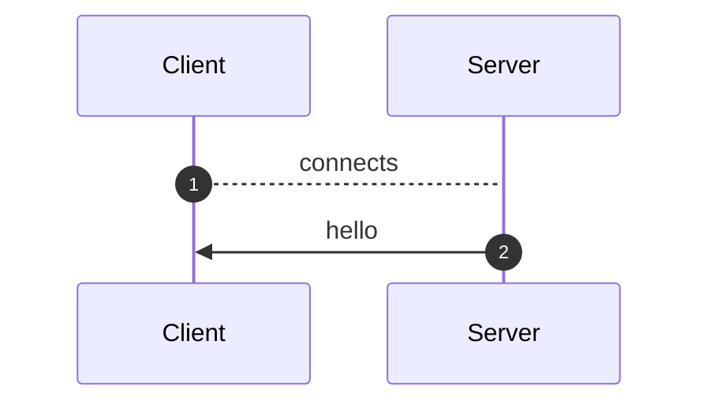
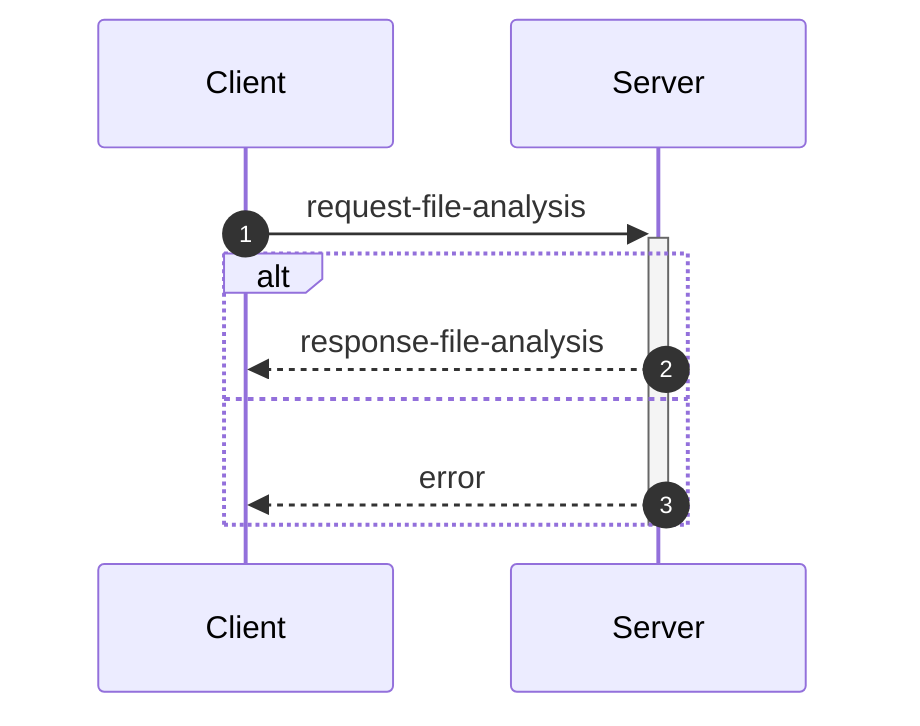
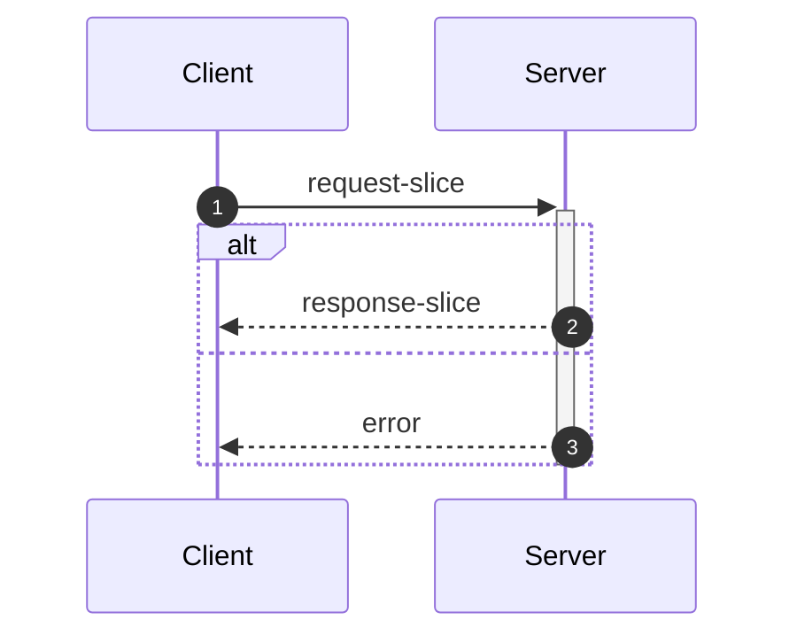
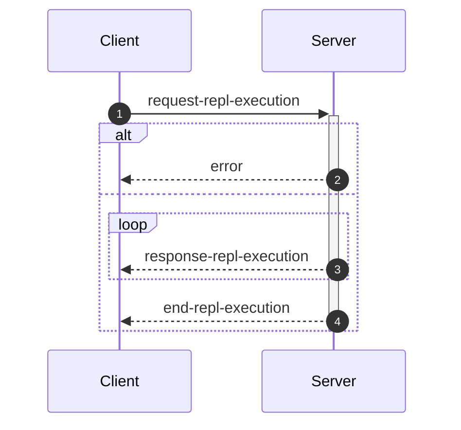

_This document was generated from '[src/documentation/wiki-interface.ts](https://github.com/flowr-analysis/flowr/tree/main//src/documentation/wiki-interface.ts)' on 2026-06-20, 09:01:23 UTC presenting an overview of flowR's interface (v2.10.9, using R v4.6.0). Please do not edit this file/wiki page directly._

Although far from being as detailed as the in-depth explanation of [_flowR_](https://github.com/flowr-analysis/flowr/wiki/core),
this wiki page explains how to interface with _flowR_ in more detail.
In general, command line arguments and other options provide short descriptions on hover over.

* [💻 Using the REPL](#using-the-repl)
* [⚙️ Configuring FlowR](#configuring-flowr)
* [⚒️ Writing Code](#writing-code)
* [💬 Communicating with the Server](#communicating-with-the-server)

<a id='using-the-repl'></a>
## 💻 Using the REPL


> [!NOTE]
> To execute arbitrary R commands with a repl request, _flowR_ has to be started explicitly with <span title="Description (Command Line Argument): Allow to access the underlying R session when using flowR (security warning: this allows the execution of arbitrary R code!)">`--r-session-access`</span>.
> Please be aware that this introduces a security risk and note that this relies on the [`r-shell` engine](https://github.com/flowr-analysis/flowr/wiki/engines) .

Although primarily meant for users to explore,
there is nothing which forbids simply calling _flowR_ as a subprocess to use standard-in, -output, and -error
for communication (although you can access the REPL using the server as well,
with the [REPL Request](#message-request-repl-execution) message).

The read-eval-print loop&nbsp;(REPL) works relatively simple.
You can submit an expression (using <kbd>Enter</kbd>),
which is interpreted as an R&nbsp;expression by default but interpreted as a *command* if it starts with a colon (`:`).
The best command to get started with the REPL is <span title="Description (Repl Command): Show help information (aliases: :h, :?)">`:help`</span>.
Besides, you can leave the REPL either with the command <span title="Description (Repl Command): End the repl (aliases: :q, :exit)">`:quit`</span> or by pressing <kbd>Ctrl</kbd>+<kbd>C</kbd> twice.
When writing a *command*, you may press <kbd>Tab</kbd> to get a list of completions, if available.
Multiple commands can be entered in a single line by separating them with a semicolon (`;`), e.g. `:parse "x<-2"; :df*`.
If a command is given without R code, the REPL will re-use R code given in a previous command.
The prior example will hence return first the parsed AST of the program and then the dataflow graph for `"x <- 2"`.

> [!NOTE]
> If you develop flowR, you may want to launch the repl using the `npm run main-dev` command, this way, you get a non-minified version of flowR with debug information and hot-reloading of source files.

<details>
<summary>Available Commands</summary>

We currently offer the following commands (this with a `[*]` suffix are available with and without the star):


| Command | Description |
| ------- | ----------- |
| **<span title="Description (Repl Command): End the repl (aliases: :q, :exit)">:quit</span>** | End the repl (aliases: **:<span title="Alias of ':quit'. End the repl">q</span>**, **:<span title="Alias of ':quit'. End the repl">exit</span>**) |
| **<span title="Description (Repl Command): Execute the given code as R code. This requires the `--r-session-access` flag to be set and requires the r-shell engine. (aliases: :e, :r)">:execute</span>** | Execute the given code as R code. This requires the `--r-session-access` flag to be set and requires the r-shell engine. (aliases: **:<span title="Alias of ':execute'. Execute the given code as R code. This requires the `--r-session-access` flag to be set and requires the r-shell engine.">e</span>**, **:<span title="Alias of ':execute'. Execute the given code as R code. This requires the `--r-session-access` flag to be set and requires the r-shell engine.">r</span>**) |
| **<span title="Description (Repl Command): Get mermaid code for the control-flow graph of R code, start with 'file://' to indicate a file (aliases: :cfg, :cf)">:controlflow[*]</span>** | Get mermaid code for the control-flow graph of R code, start with 'file://' to indicate a file (star: Returns the URL to mermaid.live) (aliases: **:<span title="Alias of ':controlflow'. Get mermaid code for the control-flow graph of R code, start with 'file://' to indicate a file">cfg</span>**, **:<span title="Alias of ':controlflow'. Get mermaid code for the control-flow graph of R code, start with 'file://' to indicate a file">cf</span>**) |
| **<span title="Description (Repl Command): Get mermaid code for the control-flow graph with basic blocks, start with 'file://' to indicate a file (aliases: :cfgb, :cfb)">:controlflowbb[*]</span>** | Get mermaid code for the control-flow graph with basic blocks, start with 'file://' to indicate a file (star: Returns the URL to mermaid.live) (aliases: **:<span title="Alias of ':controlflowbb'. Get mermaid code for the control-flow graph with basic blocks, start with 'file://' to indicate a file">cfgb</span>**, **:<span title="Alias of ':controlflowbb'. Get mermaid code for the control-flow graph with basic blocks, start with 'file://' to indicate a file">cfb</span>**) |
| **<span title="Description (Repl Command): Get mermaid code for the dataflow graph, start with 'file://' to indicate a file (aliases: :d, :df)">:dataflow[*]</span>** | Get mermaid code for the dataflow graph, start with 'file://' to indicate a file (star: Returns the URL to mermaid.live) (aliases: **:<span title="Alias of ':dataflow'. Get mermaid code for the dataflow graph, start with 'file://' to indicate a file">d</span>**, **:<span title="Alias of ':dataflow'. Get mermaid code for the dataflow graph, start with 'file://' to indicate a file">df</span>**) |
| **<span title="Description (Repl Command): Get mermaid code for the normalized AST of R code, start with 'file://' to indicate a file (aliases: :n)">:normalize[*]</span>** | Get mermaid code for the normalized AST of R code, start with 'file://' to indicate a file (star: Returns the URL to mermaid.live) (alias: **:<span title="Alias of ':normalize'. Get mermaid code for the normalized AST of R code, start with 'file://' to indicate a file">n</span>**) |
| **<span title="Description (Repl Command): Get mermaid code for the simplified dataflow graph, start with 'file://' to indicate a file (aliases: :ds, :dfs)">:dataflowsimple[*]</span>** | Get mermaid code for the simplified dataflow graph, start with 'file://' to indicate a file (star: Returns the URL to mermaid.live) (aliases: **:<span title="Alias of ':dataflowsimple'. Get mermaid code for the simplified dataflow graph, start with 'file://' to indicate a file">ds</span>**, **:<span title="Alias of ':dataflowsimple'. Get mermaid code for the simplified dataflow graph, start with 'file://' to indicate a file">dfs</span>**) |
| **<span title="Description (Repl Command): Just calculates the DFG, but only prints summary info (aliases: :d#, :df#)">:dataflowsilent</span>** | Just calculates the DFG, but only prints summary info (aliases: **:<span title="Alias of ':dataflowsilent'. Just calculates the DFG, but only prints summary info">d#</span>**, **:<span title="Alias of ':dataflowsilent'. Just calculates the DFG, but only prints summary info">df#</span>**) |
| **<span title="Description (Repl Command): Prints ASCII Art of the parsed, unmodified AST, start with 'file://' to indicate a file (aliases: :p)">:parse</span>** | Prints ASCII Art of the parsed, unmodified AST, start with 'file://' to indicate a file (alias: **:<span title="Alias of ':parse'. Prints ASCII Art of the parsed, unmodified AST, start with 'file://' to indicate a file">p</span>**) |
| **<span title="Description (Repl Command): Prints the version of flowR as well as the current version of R">:version</span>** | Prints the version of flowR as well as the current version of R
| **<span title="Description (Repl Command): Query the given R code, start with 'file://' to indicate a file. The query is to be a valid query in json format (use 'help' to get more information).">:query[*]</span>** | Query the given R code, start with 'file://' to indicate a file. The query is to be a valid query in json format (use 'help' to get more information). (star: Similar to query, but returns the output in json format.)
| **<span title="Description (Repl Command): Returns an ASCII representation of the dataflow graph (aliases: :df!)">:dataflowascii</span>** | Returns an ASCII representation of the dataflow graph (alias: **:<span title="Alias of ':dataflowascii'. Returns an ASCII representation of the dataflow graph">df!</span>**) |
| **<span title="Description (Repl Command): Returns summarization stats for the normalized AST (aliases: :n#)">:normalize#</span>** | Returns summarization stats for the normalized AST (alias: **:<span title="Alias of ':normalize#'. Returns summarization stats for the normalized AST">n#</span>**) |
| **<span title="Description (Repl Command): Show help information (aliases: :h, :?)">:help</span>** | Show help information (aliases: **:<span title="Alias of ':help'. Show help information">h</span>**, **:<span title="Alias of ':help'. Show help information">?</span>**) |


</details>


> [!TIP]
> 
> As indicated by the examples before, all REPL commands that operate on code keep track of the state.
> Hence, if you run a command like <span title="Description (Repl Command, starred version): Returns the URL to mermaid.live; Base Command: Get mermaid code for the dataflow graph, start with 'file://' to indicate a file (aliases: :d*, :df*)">`:dataflow*`</span> without providing R code,
> the REPL will re-use the R code provided in a previous command.
> Likewise, doing this will benefit from incrementality!
> If you request the dataflow graph with `:df* x <- 2 * y` and then want to see the parsed AST with `:parse`,
> the REPL will re-use previously obtained information and not re-parse the code again.
> 		


Generally, many commands offer shortcut versions in the REPL. Many queries, for example, offer a shortened format (see the example below).
Of special note, the [Config Query](https://github.com/flowr-analysis/flowr/wiki/query-api#Config-Query)
can be used to also modify the currently active configuration of _flowR_ within the REPL (see the [wiki page](https://github.com/flowr-analysis/flowr/wiki/query-api#Config-Query) for more information).

### Example: Retrieving the Dataflow Graph

To retrieve a URL to the [mermaid](https://mermaid.js.org/) diagram of the dataflow of a given expression,
use <span title="Description (Repl Command, starred version): Returns the URL to mermaid.live; Base Command: Get mermaid code for the dataflow graph, start with 'file://' to indicate a file (aliases: :d*, :df*)">`:dataflow*`</span> (or <span title="Description (Repl Command): Get mermaid code for the dataflow graph, start with 'file://' to indicate a file (aliases: :d, :df)">`:dataflow`</span> to get the mermaid code in the cli):


```shell
$ docker run -it --rm eagleoutice/flowr # or npm run flowr 
flowR repl using flowR v2.10.9, R grammar v14 (tree-sitter engine)
R> :dataflow* y <- 1 + x
```

<details>
<summary style='color:gray'>Output</summary>


```text
https://mermaid.live/view#base64:eyJjb2RlIjoiZmxvd2NoYXJ0IEJUXG4gICAgMXt7XCJgIzkxO1JOdW1iZXIjOTM7IDFcbiAgICAgICgxKVxuICAgICAgKjEuNipgXCJ9fVxuICAgJSUgTm8gZWRnZXMgZm91bmQgZm9yIDFcbiAgICAyKFtcImAjOTE7UlN5bWJvbCM5MzsgeFxuICAgICAgKDIpXG4gICAgICAqMS4xMCpgXCJdKVxuICAgJSUgTm8gZWRnZXMgZm91bmQgZm9yIDJcbiAgICAzW1tcImAjOTE7UkJpbmFyeU9wIzkzOyAjNDM7XG4gICAgICAoMylcbiAgICAgICoxLjYtMTAqXG4gICAgKDEsIDIpYFwiXV1cbiAgICBidWlsdC1pbjpfW1wiYEJ1aWx0LUluOlxuIzQzO2BcIl1cbiAgICBzdHlsZSBidWlsdC1pbjpfIHN0cm9rZTpncmF5LGZpbGw6Z3JheSxzdHJva2Utd2lkdGg6MnB4LG9wYWNpdHk6Ljg7XG4gICAgMFtcImAjOTE7UlN5bWJvbCM5MzsgeVxuICAgICAgKDAsIHNvdXJjZXM6IFszXSlcbiAgICAgICoxLjEqYFwiXVxuICAgIDRbW1wiYCM5MTtSQmluYXJ5T3AjOTM7ICM2MDsjNDU7XG4gICAgICAoNClcbiAgICAgICoxLjEtMTAqXG4gICAgKDAsIDMpYFwiXV1cbiAgICBidWlsdC1pbjpfLVtcImBCdWlsdC1JbjpcbiM2MDsjNDU7YFwiXVxuICAgIHN0eWxlIGJ1aWx0LWluOl8tIHN0cm9rZTpncmF5LGZpbGw6Z3JheSxzdHJva2Utd2lkdGg6MnB4LG9wYWNpdHk6Ljg7XG4gICAgMyAtLT58XCJyZWFkcywgYXJndW1lbnRcInwgMVxuICAgIDMgLS0+fFwicmVhZHMsIGFyZ3VtZW50XCJ8IDJcbiAgICAzIC0uLT58XCJyZWFkcywgY2FsbHNcInwgYnVpbHQtaW46X1xuICAgIGxpbmtTdHlsZSAyIHN0cm9rZTpncmF5O1xuICAgIDAgLS0+fFwiZGVmaW5lZC1ieVwifCAzXG4gICAgMCAtLT58XCJkZWZpbmVkLWJ5XCJ8IDRcbiAgICA0IC0tPnxcInJlYWRzLCBhcmd1bWVudFwifCAzXG4gICAgNCAtLT58XCJyZXR1cm5zLCBhcmd1bWVudFwifCAwXG4gICAgNCAtLi0+fFwicmVhZHMsIGNhbGxzXCJ8IGJ1aWx0LWluOl8tXG4gICAgbGlua1N0eWxlIDcgc3Ryb2tlOmdyYXk7IiwibWVybWFpZCI6eyJhdXRvU3luYyI6dHJ1ZX19
Copied mermaid url to clipboard (dataflow: 0ms).
```


Retrieve the dataflow graph of the expression `y <- 1 + x`. It looks like this:


```mermaid
flowchart LR
    1{{"`#91;RNumber#93; 1
      (1)
      *1.6*`"}}
   %% No edges found for 1
    2(["`#91;RSymbol#93; x
      (2)
      *1.10*`"])
   %% No edges found for 2
    3[["`#91;RBinaryOp#93; #43;
      (3)
      *1.6-10*
    (1, 2)`"]]
    built-in:_["`Built-In:
#43;`"]
    style built-in:_ stroke:gray,fill:gray,stroke-width:2px,opacity:.8;
    0["`#91;RSymbol#93; y
      (0, sources: [3])
      *1.1*`"]
    4[["`#91;RBinaryOp#93; #60;#45;
      (4)
      *1.1-10*
    (0, 3)`"]]
    built-in:_-["`Built-In:
#60;#45;`"]
    style built-in:_- stroke:gray,fill:gray,stroke-width:2px,opacity:.8;
    3 -->|"reads, argument"| 1
    3 -->|"reads, argument"| 2
    3 -.->|"reads, calls"| built-in:_
    linkStyle 2 stroke:gray;
    0 -->|"defined-by"| 3
    0 -->|"defined-by"| 4
    4 -->|"reads, argument"| 3
    4 -->|"returns, argument"| 0
    4 -.->|"reads, calls"| built-in:_-
    linkStyle 7 stroke:gray;
```

	
<details>

<summary style="color:gray">R Code of the Dataflow Graph</summary>

The analysis required _0.6 ms_ (including parse and normalize, using the [tree-sitter](https://github.com/flowr-analysis/flowr/wiki/Engines) engine) within the generation environment. 
We encountered no unknown side effects during the analysis.


```r
y <- 1 + x
```


</details>


</details>


For small graphs like this, <span title="Description (Repl Command): Returns an ASCII representation of the dataflow graph (aliases: :df!)">`:dataflowascii`</span> also provides an ASCII representation directly in the REPL:


```shell
$ docker run -it --rm eagleoutice/flowr # or npm run flowr 
flowR repl using flowR v2.10.9, R grammar v14 (tree-sitter engine)
R> :df! y <- 1 + x
```

<details open>
<summary style='color:gray'>Output</summary>


```text
                        0<1>0
                   ┌────| 1 |
    ┌────────┐     │    0---0
 c<4>c       └──c<3>c
 |<- |  v<0>v┌──| + |
 c---c──| y |┘  c---c   u<2>u
        v---v      └────| x |
                        u---u
Edges:
3 -> 1: reads, argument  3 -> 2: reads, argument
4 -> 3: reads, argument  4 -> 0: returns, argument
0 -> 3: defined-by       0 -> 4: defined-by
```


Retrieve the dataflow graph of the expression `y <- 1 + x` as ASCII art.

</details>


For the slicing with <span title="Description (Repl Command): Static backwards executable slicer for R">`:slicer`</span>, you have access to the same [magic comments](#slice-magic-comments) as with the [slice request](#message-request-slice).

### Example: Interfacing with the File System

Many commands that allow for an R-expression (like <span title="Description (Repl Command, starred version): Returns the URL to mermaid.live; Base Command: Get mermaid code for the dataflow graph, start with 'file://' to indicate a file (aliases: :d*, :df*)">`:dataflow*`</span>) allow for a file as well
if the argument starts with `file://`.
If you are working from the root directory of the _flowR_ repository, the following gives you the parsed AST of the example file using the <span title="Description (Repl Command): Prints ASCII Art of the parsed, unmodified AST, start with 'file://' to indicate a file (aliases: :p)">`:parse`</span> command:


```shell
$ docker run -it --rm eagleoutice/flowr # or npm run flowr 
flowR repl using flowR v2.10.9, R grammar v14 (tree-sitter engine)
R> :parse file://test/testfiles/example.R
```

<details>
<summary style='color:gray'>Output</summary>


```text
File: test/testfiles/example.R

program
├ binaryoperator
│ ├ identifier "sum" (1:1─4)
│ ├ <- "<-" (1:5─7)
│ ╰ float "0" (1:8─9)
├ binaryoperator
│ ├ identifier "product" (2:1─8)
│ ├ <- "<-" (2:9─11)
│ ╰ float "1" (2:12─13)
├ binaryoperator
│ ├ identifier "w" (3:1─2)
│ ├ <- "<-" (3:3─5)
│ ╰ float "7" (3:6─7)
├ binaryoperator
│ ├ identifier "N" (4:1─2)
│ ├ <- "<-" (4:3─5)
│ ╰ float "10" (4:6─8)
├ forstatement
│ ├ for "for" (6:1─4)
│ ├ ( "(" (6:5─6)
│ ├ identifier "i" (6:6─7)
│ ├ in "in" (6:8─10)
│ ├ binaryoperator
│ │ ├ float "1" (6:11─12)
│ │ ├ : ":" (6:12─13)
│ │ ╰ parenthesizedexpression
│ │   ├ ( "(" (6:13─14)
│ │   ├ binaryoperator
│ │   │ ├ identifier "N" (6:14─15)
│ │   │ ├ - "-" (6:15─16)
│ │   │ ╰ float "1" (6:16─17)
│ │   ╰ ) ")" (6:17─18)
│ ├ ) ")" (6:18─19)
│ ╰ bracedexpression
│   ├ { "{" (6:20─21)
│   ├ binaryoperator
│   │ ├ identifier "sum" (7:3─6)
│   │ ├ <- "<-" (7:7─9)
│   │ ╰ binaryoperator
│   │   ├ binaryoperator
│   │   │ ├ identifier "sum" (7:10─13)
│   │   │ ├ + "+" (7:14─15)
│   │   │ ╰ identifier "i" (7:16─17)
│   │   ├ + "+" (7:18─19)
│   │   ╰ identifier "w" (7:20─21)
│   ├ binaryoperator
│   │ ├ identifier "product" (8:3─10)
│   │ ├ <- "<-" (8:11─13)
│   │ ╰ binaryoperator
│   │   ├ identifier "product" (8:14─21)
│   │   ├  "" (8:22─23)
│   │   ╰ identifier "i" (8:24─25)
│   ╰ } "}" (9:1─2)
├ call
│ ├ identifier "cat" (11:1─4)
│ ╰ arguments
│   ├ ( "(" (11:4─5)
│   ├ argument
│   │ ╰ string
│   │   ├ " "\"" (11:5─6)
│   │   ├ stringcontent "Sum:" (11:6─10)
│   │   ╰ " "\"" (11:10─11)
│   ├ comma "," (11:11─12)
│   ├ argument
│   │ ╰ identifier "sum" (11:13─16)
│   ├ comma "," (11:16─17)
│   ├ argument
│   │ ╰ string
│   │   ├ " "\"" (11:18─19)
│   │   ├ stringcontent
│   │   │ ╰ escapesequence "\\n" (11:19─21)
│   │   ╰ " "\"" (11:21─22)
│   ╰ ) ")" (11:22─23)
╰ call
  ├ identifier "cat" (12:1─4)
  ╰ arguments
    ├ ( "(" (12:4─5)
    ├ argument
    │ ╰ string
    │   ├ " "\"" (12:5─6)
    │   ├ stringcontent "Product:" (12:6─14)
    │   ╰ " "\"" (12:14─15)
    ├ comma "," (12:15─16)
    ├ argument
    │ ╰ identifier "product" (12:17─24)
    ├ comma "," (12:24─25)
    ├ argument
    │ ╰ string
    │   ├ " "\"" (12:26─27)
    │   ├ stringcontent
    │   │ ╰ escapesequence "\\n" (12:27─29)
    │   ╰ " "\"" (12:29─30)
    ╰ ) ")" (12:30─31)
```


Retrieve the parsed AST of the example file.

<details>

<summary>File Content</summary>


```r
sum <- 0
product <- 1
w <- 7
N <- 10

for (i in 1:(N-1)) {
  sum <- sum + i + w
  product <- product * i
}

cat("Sum:", sum, "\n")
cat("Product:", product, "\n")
```


</details>

As _flowR_ directly transforms this AST the output focuses on being human-readable instead of being machine-readable.
		

</details>


### Example: Run a Query

You can run any query supported by _flowR_ using the <span title="Description (Repl Command): Query the given R code, start with 'file://' to indicate a file. The query is to be a valid query in json format (use 'help' to get more information).">`:query`</span> command.
For example, to obtain the shapes of all data frames in a given piece of code, you can run:


```shell
$ docker run -it --rm eagleoutice/flowr # or npm run flowr 
flowR repl using flowR v2.10.9, R grammar v14 (tree-sitter engine)
R> :query @df-shape "x <- data.frame(a = 1:10, b = 1:10)\ny <- x$a"
```

<details open>
<summary style='color:gray'>Output</summary>


```text
Query: df-shape (1 ms)
   ╰ 12: (colnames: [{"a", "b"}, {}], cols: [2, 2], rows: [10, 10])
   ╰ 0: (colnames: [{"a", "b"}, {}], cols: [2, 2], rows: [10, 10])
All queries together required ≈1 ms (1ms accuracy, total 2 ms)
```


Retrieve the shapes of all data frames in the given code.

</details>


To run the linter on a file, you can use (in this example, we just issue the `dead-code` linter on a small piece of code):


```shell
$ docker run -it --rm eagleoutice/flowr # or npm run flowr 
flowR repl using flowR v2.10.9, R grammar v14 (tree-sitter engine)
R> :query @linter rules:dead-code "if(FALSE) x <- 2"
```

<details open>
<summary style='color:gray'>Output</summary>


```text
Query: linter (0 ms)
   ╰ Dead Code (dead-code):
       ╰ certain:
           ╰ Code at 1.11-16
       ╰ Metadata: searchTimeMs: 0, processTimeMs: 0
All queries together required ≈0 ms (1ms accuracy, total 1 ms)
```


Run the linter on the given code, with only the `dead-code` rule enabled.

</details>


For more information on the available queries, please check out the [Query API](https://github.com/flowr-analysis/flowr/wiki/query-api).


<a id='configuring-flowr'></a>
## ⚙️ Configuring FlowR


When running _flowR_, you may want to specify some behaviors with a dedicated configuration file.
By default, flowR looks for a file named `flowr.json` in the current working directory (or any higher directory).
You can also specify a different file with <span title="Description (Command Line Argument): The name of the configuration file to use">`--config-file`</span> or pass the configuration inline using <span title="Description (Command Line Argument): The flowR configuration to use, as a JSON string">`--config-json`</span>.
To inspect the current configuration, you can run flowr with the <span title="Description (Command Line Argument): Run with verbose logging (will be passed to the corresponding script)">`--verbose`</span> flag, or use the `config` [Query](https://github.com/flowr-analysis/flowr/wiki/query-api).
Within the REPL this works by running the following:


```shell
:query @config
```


To work with the <a href="https://github.com/flowr-analysis/flowr/tree/main/src/config.ts#L118"><code><span title="The configuration file format for flowR.">FlowrConfig</span></code></a> you can use the provided helper objects alongside its methods like
<a href="https://github.com/flowr-analysis/flowr/tree/main/src/config.ts#L442"><code><span title="Creates a new flowr config that has the updated values.">FlowrConfig::<b>amend</b></span></code></a>.
The following summarizes the configuration options:

- `ignoreSourceCalls`: If set to `true`, _flowR_ will ignore source calls when analyzing the code, i.e., ignoring the inclusion of other files.
- `semantics`: allows to configure the way _flowR_ handles R, although we currently only support `semantics/environment/overwriteBuiltIns`.
  You may use this to overwrite _flowR_'s handling of built-in function and even completely clear the preset definitions shipped with flowR.
  See [Configure BuiltIn Semantics](#configure-builtin-semantics) for more information.
- `solver`: allows to configure how _flowR_ resolves variables and their values (currently we support: `disabled`, `alias`, `builtin`), as well as if pointer analysis should be active.
- `engines`: allows to configure the engines used by _flowR_ to interact with R code. See the [Engines wiki page](https://github.com/flowr-analysis/flowr/wiki/engines) for more information.
- `defaultEngine`: allows to specify the default engine to use for interacting with R code. If not set, an arbitrary engine from the specified list will be used.
- `abstractInterpretation`: allows to configure how _flowR_ performs abstract interpretation, although we currently only support data frame shape inference through abstract interpretation.
- `defaultPlugins`: allows to configure which plugins to load by default when creating a new <a href="https://github.com/flowr-analysis/flowr/tree/main/src/project/flowr-analyzer.ts#L162"><code><span title="Central class for conducting analyses with FlowR. Use the FlowrAnalyzerBuilder to create a new instance. If you want the original pattern of creating a pipeline and running all steps, you can still do this with FlowrAnalyzer#runFull . To inspect the context of the analyzer, use FlowrAnalyzer#inspectContext (if you are a plugin and need to modify it, use FlowrAnalyzer#context instead).">FlowrAnalyzer</span></code></a> instance.
- `repl.plugins`: allows to configure which plugins to load in the _flowR_ REPL. Use `flowr:default` to reference the plugins specified by `defaultPlugins`.

So you can configure _flowR_ by adding a file like the following:

<details>

<summary>Example Configuration File</summary>


```json
{
  "ignoreSourceCalls": true,
  "semantics": {
    "environment": {
      "overwriteBuiltIns": {
        "definitions": [
          {
            "type": "function",
            "names": [
              "foo"
            ],
            "processor": "builtin:assign",
            "config": {}
          }
        ]
      }
    }
  },
  "defaultPlugins": [
    "file:description",
    "versions:description"
  ],
  "repl": {
    "quickStats": false,
    "dfProcessorHeat": false,
    "plugins": [
      "flowr:default"
    ]
  },
  "project": {
    "resolveUnknownPathsOnDisk": true
  },
  "engines": [
    {
      "type": "r-shell"
    }
  ],
  "solver": {
    "variables": "alias",
    "evalStrings": true,
    "trackEnvironments": true,
    "resolveSource": {
      "dropPaths": "no",
      "ignoreCapitalization": true,
      "inferWorkingDirectory": "active-script",
      "searchPath": []
    },
    "instrument": {},
    "slicer": {
      "threshold": 50
    }
  },
  "abstractInterpretation": {
    "wideningThreshold": 4,
    "dataFrame": {
      "maxColNames": 20,
      "readLoadedData": {
        "readExternalFiles": true,
        "maxReadLines": 1000000
      }
    }
  }
}
```


</details>

<details>
<a id='configure-builtin-semantics'></a>
<summary>Configure Built-In Semantics</summary>


`semantics/environment/overwriteBuiltins` accepts two keys:

- `loadDefaults` (boolean, initially `true`): If set to `true`, the default built-in definitions are loaded before applying the custom definitions. Setting this flag to `false` explicitly disables the loading of the default definitions.
- `definitions` (array, initially empty): Allows to overwrite or define new built-in elements. Each object within must have a `type` which is one of the below. Furthermore, they may define a string array of `names` which specifies the identifiers to bind the definitions to. You may use `assumePrimitive` to specify whether _flowR_ should assume that this is a primitive non-library definition (so you probably just do not want to specify the key).

  | Type            | Description                                                                                                                                                                                                                                                                                              | Example                                                                                                    |
  | --------------- | -------------------------------------------------------------------------------------------------------------------------------------------------------------------------------------------------------------------------------------------------------------------------------------------------------- | ---------------------------------------------------------------------------------------------------------- |
  | `constant`    | Additionally allows for a `value` this should resolve to.                                                                                                                                                                                                                                                | `{ type: 'constant', names: ['NULL', 'NA'],  value: null }`                                                |
  | `function`    | Is a rather flexible way to define and bind built-in functions. For the time, we do not have extensive documentation to cover all the cases, so please either consult the sources with the `default-builtin-config.ts` or open a [new issue](https://github.com/flowr-analysis/flowr/issues/new/choose). | `{ type: 'function', names: ['next'], processor: 'builtin:d', config: { cfg: ExitPointType.Next } }` |
  | `replacement` | A comfortable way to specify replacement functions like `$<-` or `names<-`. `suffixes` describes the... suffixes to attach automatically. | `{ type: 'replacement', suffixes: ['<-', '<<-'], names: ['[', '[['] }` |


</details>

<details>

<summary style='color:gray'>Full Configuration-File Schema</summary>

- _The configuration file format for flowR._ (object)
    - **ignoreSourceCalls** [optional] _Whether source calls should be ignored, causing {@link processSourceCall}'s behavior to be skipped._ (boolean)
    - **semantics** _Configure language semantics and how flowR handles them._ (object)
        - **environment** [optional] _Semantics regarding how to handle the R environment._ (object)
            - **overwriteBuiltIns** [optional] _Do you want to overwrite (parts) of the builtin definition?_ (object)
                - **loadDefaults** [optional] _Should the default configuration still be loaded?_ (boolean)
                - **definitions** [optional] _The definitions to load/overwrite._ (array)
                Valid item types:
                    - (object)
    - **defaultPlugins** [optional] _The default plugins to load when creating a new instance of FlowrAnalyzer_ (array)
    Valid item types:
        - (alternatives)
            - (string)
            - (array)
    - **repl** _Configuration options for the REPL._ (object)
        - **quickStats** [optional] _Whether to show quick stats in the REPL after each evaluation._ (boolean)
        - **dfProcessorHeat** [optional] _This instruments the dataflow processors to count how often each processor is called._ (boolean)
        - **plugins** [optional] _The plugins to load in REPL mode_ (array)
        Valid item types:
            - (alternatives)
                - (string)
                - (array)
    - **project** _Project specific configuration options._ (object)
        - **resolveUnknownPathsOnDisk** [optional] _Whether to resolve unknown paths loaded by the r project disk when trying to source/analyze files._ (boolean)
    - **engines** _The engine or set of engines to use for interacting with R code. An empty array means all available engines will be used._ (array)
    Valid item types:
        - (alternatives)
            - _The configuration for the tree sitter engine._ (object)
                - **type** [required] _Use the tree sitter engine._ (string)
                    Only allows: 'tree-sitter'
                - **wasmPath** [optional] _The path to the tree-sitter-r WASM binary to use. If this is undefined, this uses the default path._ (string)
                - **treeSitterWasmPath** [optional] _The path to the tree-sitter WASM binary to use. If this is undefined, this uses the default path._ (string)
                - **lax** [optional] _Whether to use the lax parser for parsing R code (allowing for syntax errors). If this is undefined, the strict parser will be used._ (boolean)
            - _The configuration for the R shell engine._ (object)
                - **type** [required] _Use the R shell engine._ (string)
                    Only allows: 'r-shell'
                - **rPath** [optional] _The path to the R executable to use. If this is undefined, this uses the default path._ (string)
    - **defaultEngine** [optional] _The default engine to use for interacting with R code. If this is undefined, an arbitrary engine from the specified list will be used._ (string)
        Only allows: 'tree-sitter', 'r-shell'
    - **solver** _How to resolve constants, constraints, cells, ..._ (object)
        - **variables** _How to resolve variables and their values._ (string)
            Only allows: 'disabled', 'alias', 'builtin'
        - **evalStrings** _Should we include eval(parse(text="...")) calls in the dataflow graph?_ (boolean)
        - **trackEnvironments** [optional] _Track user-created environments (new.env, assign/get/local with envir=, dollar-assign, attach). When false, all envir-style calls fall through conservatively._ (boolean)
        - **instrument** (object)
            - **dataflowExtractors** [optional] _These keys are only intended for use within code, allowing to instrument the dataflow analyzer!_ (any)
        - **resolveSource** [optional] _If lax source calls are active, flowR searches for sourced files much more freely, based on the configurations you give it. This option is only in effect if `ignoreSourceCalls` is set to false._ (object)
            - **dropPaths** _Allow to drop the first or all parts of the sourced path, if it is relative._ (string)
                Only allows: 'no', 'once', 'all'
            - **ignoreCapitalization** _Search for filenames matching in the lowercase._ (boolean)
            - **inferWorkingDirectory** _Try to infer the working directory from the main or any script to analyze._ (string)
                Only allows: 'no', 'main-script', 'active-script', 'any-script'
            - **searchPath** _Additionally search in these paths._ (array)
            Valid item types:
                - (string)
            - **repeatedSourceLimit** [optional] _How often the same file can be sourced within a single run? Please be aware: in case of cyclic sources this may not reach a fixpoint so give this a sensible limit._ (number)
            - **applyReplacements** _Provide name replacements for loaded files_ (array)
            Valid item types:
                - (object)
            - **checkMemoryOnSource** [optional] _Check heap memory usage before analyzing a sourced file, skipping when memory pressure exceeds the configured threshold._ (boolean)
            - **memoryThreshold** [optional] _Fraction of the V8 heap limit (0-1) at which source analysis is skipped. Only effective when checkMemoryOnSource is true._ (number)
        - **slicer** [optional] _The configuration for the slicer._ (object)
            - **threshold** [optional] _The maximum number of iterations to perform on a single function call during slicing._ (number)
            - **autoExtend** [optional] _If set, the slicer will gain an additional post-pass._ (boolean)
    - **abstractInterpretation** _The configuration options for abstract interpretation._ (object)
        - **wideningThreshold** _The threshold for the number of visitations of a node at which widening should be performed to ensure the termination of the fixpoint iteration._ (number)
        - **dataFrame** _The configuration of the shape inference for data frames._ (object)
            - **maxColNames** _The maximum number of columns names to infer for data frames before over-approximating the column names to top._ (number)
            - **readLoadedData** _Configuration options for reading data frame shapes from loaded external data files, such as CSV files._ (object)
                - **readExternalFiles** _Whether data frame shapes should be extracted from loaded external files, such as CSV files._ (boolean)
                - **maxReadLines** _The maximum number of lines to read when extracting data frame shapes from loaded files, such as CSV files._ (number)

</details>

	

<a id='writing-code'></a>
## ⚒️ Writing Code

_flowR_ can be used as a [module](https://www.npmjs.com/package/@eagleoutice/flowr) and offers several main classes and interfaces that are interesting for extension writers 
(see the [Visual Studio Code extension](https://marketplace.visualstudio.com/items?itemName=code-inspect.vscode-flowr) or the [Core](https://github.com/flowr-analysis/flowr/wiki/core) wiki page for more information).

### Creating Analyses with _flowR_

Nowadays, instances of the <a href="https://github.com/flowr-analysis/flowr/tree/main/src/project/flowr-analyzer.ts#L162"><code><span title="Central class for conducting analyses with FlowR. Use the FlowrAnalyzerBuilder to create a new instance. If you want the original pattern of creating a pipeline and running all steps, you can still do this with FlowrAnalyzer#runFull . To inspect the context of the analyzer, use FlowrAnalyzer#inspectContext (if you are a plugin and need to modify it, use FlowrAnalyzer#context instead).">FlowrAnalyzer</span></code></a> should be used as central frontend to get analysis results from _flowR_.
For example, a program slice can be created like this:


```ts
const analyzer = await new FlowrAnalyzerBuilder()
    .setEngine('tree-sitter')
    .build();
analyzer.addRequest('x <- 1\ny <- x\nx');
const result = await analyzer.query([
    {
        type:     'static-slice',
        criteria: ['3@x']
    }
]);
//console.log(result['static-slice']);
```


For more information, please have a look at the [Analyzer](https://github.com/flowr-analysis/flowr/wiki/analyzer) wiki page, which explains how to construct and use the <a href="https://github.com/flowr-analysis/flowr/tree/main/src/project/flowr-analyzer.ts#L162"><code><span title="Central class for conducting analyses with FlowR. Use the FlowrAnalyzerBuilder to create a new instance. If you want the original pattern of creating a pipeline and running all steps, you can still do this with FlowrAnalyzer#runFull . To inspect the context of the analyzer, use FlowrAnalyzer#inspectContext (if you are a plugin and need to modify it, use FlowrAnalyzer#context instead).">FlowrAnalyzer</span></code></a> in more detail.
To work with specific perspectives, you can also consult the respective pages like the [Dataflow Graph](https://github.com/flowr-analysis/flowr/wiki/dataflow-graph) or the [Abstract Interpretation](https://github.com/flowr-analysis/flowr/wiki/abstract-interpretation) wiki pages.
        
### The Pipeline Executor (Low-Level Interface)

Once, in the beginning, _flowR_ was meant to produce a dataflow graph merely to provide *program slices*. 
However, with continuous updates, the [Dataflow Graph](https://github.com/flowr-analysis/flowr/wiki/dataflow-graph) repeatedly proves to be the more interesting part.
With this, we restructured _flowR_'s originally *hardcoded* pipeline to be far more flexible. 
Now, it can be theoretically extended or replaced with arbitrary steps, optional steps, and what we call 'decorations' of these steps. 
In short, a slicing pipeline using the <a href="https://github.com/flowr-analysis/flowr/tree/main/src/core/pipeline-executor.ts#L97"><code><span title="**Please note:** The PipelineExecutor is now considered to be a rather low-level API for flowR. While it still works and is the basis for all other layers, we strongly recommend using the FlowrAnalyzer and its builder to create and use an analyzer instance that is pre-configured for your use-case. The pipeline executor allows to execute arbitrary pipelines in a step-by-step fashion. If you are not...">PipelineExecutor</span></code></a> looks like this:


```ts

const slicer = new PipelineExecutor(DEFAULT_SLICING_PIPELINE, {
  parser:    new RShell(),
  request:   requestFromInput('x <- 1\nx + 1'),
  criterion: ['2@x']
})
const slice = await slicer.allRemainingSteps()
// console.log(slice.reconstruct.code)
```


<details><summary>More Information</summary>


If you compare this, with what you would have done with the old (and removed) `SteppingSlicer`, 
this essentially just requires you to replace the `SteppingSlicer` with the <a href="https://github.com/flowr-analysis/flowr/tree/main/src/core/pipeline-executor.ts#L97"><code><span title="**Please note:** The PipelineExecutor is now considered to be a rather low-level API for flowR. While it still works and is the basis for all other layers, we strongly recommend using the FlowrAnalyzer and its builder to create and use an analyzer instance that is pre-configured for your use-case. The pipeline executor allows to execute arbitrary pipelines in a step-by-step fashion. If you are not...">PipelineExecutor</span></code></a>
and to pass the <a href="https://github.com/flowr-analysis/flowr/tree/main/src/core/steps/pipeline/default-pipelines.ts#L18"><code>DEFAULT_SLICING_PIPELINE</code></a> as the first argument.
The <a href="https://github.com/flowr-analysis/flowr/tree/main/src/core/pipeline-executor.ts#L97"><code><span title="**Please note:** The PipelineExecutor is now considered to be a rather low-level API for flowR. While it still works and is the basis for all other layers, we strongly recommend using the FlowrAnalyzer and its builder to create and use an analyzer instance that is pre-configured for your use-case. The pipeline executor allows to execute arbitrary pipelines in a step-by-step fashion. If you are not...">PipelineExecutor</span></code></a>...

1. Provides structures to investigate the results of all intermediate steps
2. Can be executed step-by-step
3. Can repeat steps (e.g., to calculate multiple slices on the same input)

See the in-code documentation for more information.

	

</details>
    

### Using the <a href="https://github.com/flowr-analysis/flowr/tree/main/src/r-bridge/shell.ts#L143"><code><span title="The RShell represents an interactive session with the R interpreter. You can configure it by RShellOptions . At the moment we are using a live R session (and not networking etc.) to communicate with R easily, which allows us to install packages etc. However, this might and probably will change in the future (leaving this as a legacy mode :D)">RShell</span></code></a> to Interact with R

The <a href="https://github.com/flowr-analysis/flowr/tree/main/src/r-bridge/shell.ts#L143"><code><span title="The RShell represents an interactive session with the R interpreter. You can configure it by RShellOptions . At the moment we are using a live R session (and not networking etc.) to communicate with R easily, which allows us to install packages etc. However, this might and probably will change in the future (leaving this as a legacy mode :D)">RShell</span></code></a> class allows interfacing with the `R`&nbsp;ecosystem installed on the host system.
Please have a look at [flowR's Engines](https://github.com/flowr-analysis/flowr/wiki/engines) for more information on alternatives (for example, the <a href="https://github.com/flowr-analysis/flowr/tree/main/src/r-bridge/lang-4.x/tree-sitter/tree-sitter-executor.ts#L18"><code><span title="Synchronous and (way) faster alternative to the RShell using tree-sitter.">TreeSitterExecutor</span></code></a>).


> [!IMPORTANT]
> 
> Each <a href="https://github.com/flowr-analysis/flowr/tree/main/src/r-bridge/shell.ts#L143"><code><span title="The RShell represents an interactive session with the R interpreter. You can configure it by RShellOptions . At the moment we are using a live R session (and not networking etc.) to communicate with R easily, which allows us to install packages etc. However, this might and probably will change in the future (leaving this as a legacy mode :D)">RShell</span></code></a> controls a new instance of the R&nbsp;interpreter, 
> make sure to call <code><a href="https://github.com/flowr-analysis/flowr/tree/main/src/r-bridge/shell.ts#L317"><span title="Close the current R session, makes the object effectively invalid (can no longer be reopened etc.)">RShell::<i>close</i></span></a>()</code> when you are done.


You can start a new "session" simply by constructing a new object with <code>new <a href="https://github.com/flowr-analysis/flowr/tree/main/src/r-bridge/shell.ts#L143"><span title="The RShell represents an interactive session with the R interpreter. You can configure it by RShellOptions . At the moment we are using a live R session (and not networking etc.) to communicate with R easily, which allows us to install packages etc. However, this might and probably will change in the future (leaving this as a legacy mode :D)">RShell</span></a>()</code>.

However, there are several options that may be of interest 
(e.g., to automatically revive the shell in case of errors or to control the name location of the R process on the system).

With a shell object (let's call it `shell`), you can execute R code by using <a href="https://github.com/flowr-analysis/flowr/tree/main/src/r-bridge/shell.ts#L195"><code><span title="sends the given command directly to the current R session will not do anything to alter input markers!">RShell::<i>sendCommand</i></span></code></a>, 
for example <code>shell.<a href="https://github.com/flowr-analysis/flowr/tree/main/src/r-bridge/shell.ts#L195"><span title="sends the given command directly to the current R session will not do anything to alter input markers!">sendCommand</span></a>("1 + 1")</code>. 
However, this does not return anything, so if you want to collect the output of your command, use
<a href="https://github.com/flowr-analysis/flowr/tree/main/src/r-bridge/shell.ts#L261"><code><span title="Send a command and collect the output">RShell::<i>sendCommandWithOutput</i></span></code></a> instead.

Besides that, the command <a href="https://github.com/flowr-analysis/flowr/tree/main/src/r-bridge/shell.ts#L233"><code>RShell::<b>tryToInjectHomeLibPath</b></code></a> may be of interest, as it enables all libraries available on the host system.


### Generate Statistics (No longer a Focus of flowR)


<details>

<summary>Adding a New Feature to Extract</summary>

In this example, we construct a new feature to extract, with the name "*example*".
Whenever this name appears, you may substitute this with whatever name fits your feature best (as long as the name is unique).

1. **Create a new file in `src/statistics/features/supported`**\
   Create the file `example.ts`, and add its export to the `index.ts` file in the same directory (if not done automatically).

2. **Create the basic structure**\
   To get a better feel of what a feature must have, let's look
   at the basic structure (of course, due to TypeScript syntax,
   there are other ways to achieve the same goal):

   ```ts
   const initialExampleInfo = {
       /* whatever start value is good for you */
       someCounter: 0
   }

   export type ExampleInfo = Writable<typeof initialExampleInfo>

   export const example: Feature<ExampleInfo> = {
    name:        'Example Feature',
    description: 'A longer example description',

    process(existing: ExampleInfo, input: FeatureProcessorInput): ExampleInfo {
      /* perform analysis on the input */
      return existing
    },

    initialValue: initialExampleInfo
   }
   ```

   The `initialExampleInfo` type holds the initial values for each counter that you want to maintain during the feature extraction (they will usually be initialized with 0). The resulting `ExampleInfo` type holds the structure of the data that is to be counted. Due to the vast amount of data processed, information like the name and location of a function call is not stored here, but instead written to disk (see below).

   Every new feature must be of the `Feature<Info>` type, with `Info` referring to a `FeatureInfo` (like `ExampleInfo` in this example). Next to a `name` and a `description`, each Feature must provide:

   - a processor that extracts the information from the input, adding it to the existing information.
   - a function returning the initial value of the information (in this case, `initialExampleInfo`).

3. **Add it to the feature-mapping**\
   Now, in the `feature.ts` file in `src/statistics/features`, add your feature to the `ALL_FEATURES` object.

Now, we want to extract something. For the *example* feature created in the previous steps, we choose to count the amount of `COMMENT` tokens.
So we define a corresponding [XPath](https://developer.mozilla.org/en-US/docs/Web/XPath) query:

```ts
const commentQuery: Query = xpath.parse('//COMMENT')
```

Within our feature's `process` function, running the query is as simple as:

```ts
const comments = commentQuery.select({ node: input.parsedRAst })
```

Now we could do a lot of further processing, but for simplicity, we only record every comment found this way:

```ts
appendStatisticsFile(example.name, 'comments', comments, input.filepath)
```

We use `example.name` to avoid duplication with the name that we’ve assigned to the feature. It corresponds to the name of the folder in the statistics output.
`'comments'` refers to a freely chosen (but unique) name, that will be used as the name for the output file within the folder. The `comments` variable holds the result of the query, which is an array of nodes. Finally, we pass the `filepath` of the file that was analyzed (if known), so that it can be added to the statistics file (as additional information).

</details>
	

<a id='communicating-with-the-server'></a>
## 💬 Communicating with the Server


As explained in the [Overview](https://github.com/flowr-analysis/flowr/wiki/overview), you can simply run the [TCP](https://de.wikipedia.org/wiki/Transmission_Control_Protocol)&nbsp;server by adding the <span title="Description (Command Line Argument): Do not drop into a repl, but instead start a server on the given port (default: 1042) and listen for messages.">`--server`</span> flag (and, due to the interactive mode, exit with the conventional <kbd>CTRL</kbd>+<kbd>C</kbd>).
Currently, every connection is handled by the same underlying `RShell` - so the server is not designed to handle many clients at a time.
Additionally, the server is not well guarded against attacks (e.g., you can theoretically spawn an arbitrary number of&nbsp;RShell sessions on the target machine).

Every message has to be given in a single line (i.e., without a newline in-between) and end with a newline character. Nevertheless, we will pretty-print example given in the following segments for the ease of reading.


> [!NOTE]
> 
> The default <span title="Description (Command Line Argument): Do not drop into a repl, but instead start a server on the given port (default: 1042) and listen for messages.">`--server`</span> uses a simple [TCP](https://de.wikipedia.org/wiki/Transmission_Control_Protocol)
> connection. If you want _flowR_ to expose a [WebSocket](https://de.wikipedia.org/wiki/WebSocket) server instead, add the <span title="Description (Command Line Argument): If the server flag is set, use websocket for messaging">`--ws`</span> flag (i.e., <span title="Description (Command Line Argument): Do not drop into a repl, but instead start a server on the given port (default: 1042) and listen for messages.">`--server`</span> <span title="Description (Command Line Argument): If the server flag is set, use websocket for messaging">`--ws`</span>) when starting _flowR_ from the command line.
> 			


<ul><li>
<a id="message-hello"></a>
<b>Hello</b> Message (<code>hello</code>) 
<details>

<summary style="color:gray"> View Details. <i>The server informs the client about the successful connection and provides Meta-Information.</i> </summary>


```mermaid
sequenceDiagram
    autonumber
    participant Client
    participant Server

    
    Client-->Server: connects
    Server->>Client: hello
	
```


	
After launching _flowR_, for example, with <code>docker run -it --rm eagleoutice/flowr <span title="Description (Command Line Argument): Do not drop into a repl, but instead start a server on the given port (default: 1042) and listen for messages.">-<span/>-server</span></code>&nbsp;(🐳️), simply connecting should present you with a `hello` message, that amongst others should reveal the versions of&nbsp;_flowR_ and&nbsp;R, using the [semver 2.0](https://semver.org/spec/v2.0.0.html) versioning scheme.
The message looks like this:


```json
{
  "type": "hello",
  "clientName": "client-0",
  "versions": {
    "flowr": "2.10.9",
    "r": "4.6.0",
    "engine": "r-shell"
  }
}
```


There are currently a few messages that you can send after the hello message.
If you want to _slice_ a piece of R code you first have to send an [analysis request](#message-request-file-analysis), so that you can send one or multiple slice requests afterward.
Requests for the [REPL](#message-request-repl) are independent of that.
	

<hr>


<details>
<summary style="color:gray">Message schema (<code>hello</code>)</summary>

For the definition of the hello message, please see it's implementation at [`./src/cli/repl/server/messages/message-hello.ts`](https://github.com/flowr-analysis/flowr/tree/main/./src/cli/repl/server/messages/message-hello.ts).

- [required] (object)
    - **type** [required] _The type of the hello message._ (string)
        Only allows: 'hello'
    - **id** [forbidden] _The id of the message is always undefined (as it is the initial message and not requested)._ (any)
    - **clientName** [required] _A unique name that is assigned to each client. It has no semantic meaning and is only used/useful for debugging._ (string)
    - **versions** [required] (object)
        - **flowr** [required] _The version of the flowr server running in semver format._ (string)
        - **r** [required] _The version of the underlying R shell running in semver format._ (string)
        - **engine** [required] _The parser backend that is used to parse the R code._ (string)

</details>


<hr>

</details>
	</li>

<li>
<a id="message-request-file-analysis"></a>
<b>Analysis</b> Message (<code>request-file-analysis</code>) 
<details>

<summary style="color:gray"> View Details. <i>The server builds the dataflow graph for a given input file (or a set of files).</i> </summary>


```mermaid
sequenceDiagram
    autonumber
    participant Client
    participant Server

    
    Client->>+Server: request-file-analysis
    alt
        Server-->>Client: response-file-analysis
    else
        Server-->>Client: error
    end
    deactivate  Server
	
```


	
The request allows the server to analyze a file and prepare it for slicing.
The message can contain a `filetoken`, which is used to identify the file in later slice or query requests (if you do not add one, the request will not be stored and therefore, it is not available for subsequent requests).

> **Please note!**\
> If you want to send and process a lot of analysis requests, but do not want to slice them, please do not pass the `filetoken` field. This will save the server a lot of memory allocation.

Furthermore, the request must contain either a `content` field to directly pass the file's content or a `filepath` field which contains the path to the file (this path must be accessible for the server to be useful).
If you add the `id` field, the answer will use the same `id` so you can match requests and the corresponding answers.
See the implementation of the request-file-analysis message for more information.


<details>
<summary>Example of the <code>request-file-analysis</code> Message</summary>

_Note:_ even though we pretty-print these messages, they are sent as a single line, ending with a newline.

The following lists all messages that were sent and received in case you want to reproduce the scenario:

<ol>
<li> <code>hello</code> (response)
<details> 

<summary> Show Details </summary>

The first message is always a hello message.


```json
{
  "type": "hello",
  "clientName": "client-0",
  "versions": {
    "flowr": "2.10.9",
    "r": "4.6.0",
    "engine": "r-shell"
  }
}
```


</details>
</li>

<li> <b><code>request-file-analysis</code> (request)</b>
<details open> 

<summary> Show Details </summary>

Let's suppose you simply want to analyze the following script:
 
```r
x <- 1
x + 1
```

 For this, you can send the following request:


```json
{
  "type": "request-file-analysis",
  "id": "1",
  "filetoken": "x",
  "content": "x <- 1\nx + 1"
}
```


</details>
</li>

<li> <code>response-file-analysis</code> (response)
<details> 

<summary> Show Details </summary>


The `results` field of the response effectively contains three keys of importance:

- `parse`: which contains 1:1 the parse result in CSV format that we received from the `RShell` (i.e., the AST produced by the parser of the R interpreter).
- `normalize`: which contains the normalized AST, including ids (see the `info` field and the [Normalized AST](https://github.com/flowr-analysis/flowr/wiki/normalized-ast) wiki page).
- `dataflow`: especially important is the `graph` field which contains the dataflow graph as a set of root vertices (see the [Dataflow Graph](https://github.com/flowr-analysis/flowr/wiki/dataflow-graph) wiki page).
			


_As the code is pretty long, we inhibit pretty printing and syntax highlighting (JSON, hiding built-in):_

```text
{"type":"response-file-analysis","format":"json","id":"1","results":{"parse":{"files":[{"parsed":"[1,1,1,6,7,0,\"expr\",false,\"x <- 1\"],[1,1,1,1,1,3,\"SYMBOL\",true,\"x\"],[1,1,1,1,3,7,\"expr\",false,\"x\"],[1,3,1,4,2,7,\"LEFT_ASSIGN\",true,\"<-\"],[1,6,1,6,4,5,\"NUM_CONST\",true,\"1\"],[1,6,1,6,5,7,\"expr\",false,\"1\"],[2,1,2,5,16,0,\"expr\",false,\"x + 1\"],[2,1,2,1,10,12,\"SYMBOL\",true,\"x\"],[2,1,2,1,12,16,\"expr\",false,\"x\"],[2,3,2,3,11,16,\"'+'\",true,\"+\"],[2,5,2,5,13,14,\"NUM_CONST\",true,\"1\"],[2,5,2,5,14,16,\"expr\",false,\"1\"]","filePath":"/tmp/tmp-1238152-7Uu2l2fy5nkL-.R"}],".meta":{"timing":1}},"normalize":{"ast":{"type":"RProject","files":[{"root":{"type":"RExpressionList","children":[{"type":"RBinaryOp","location":[1,3,1,4],"lhs":{"type":"RSymbol","location":[1,1,1,1],"content":"x","lexeme":"x","info":{"fullRange":[1,1,1,1],"adToks":[],"id":0,"parent":2,"role":"bin-l","index":0,"nest":0,"file":"/tmp/tmp-1238152-7Uu2l2fy5nkL-.R"}},"rhs":{"location":[1,6,1,6],"lexeme":"1","info":{"fullRange":[1,6,1,6],"adToks":[],"id":1,"parent":2,"role":"bin-r","index":1,"nest":0,"file":"/tmp/tmp-1238152-7Uu2l2fy5nkL-.R"},"type":"RNumber","content":{"num":1,"complexNumber":false,"markedAsInt":false}},"operator":"<-","lexeme":"<-","info":{"fullRange":[1,1,1,6],"adToks":[],"id":2,"parent":6,"nest":0,"file":"/tmp/tmp-1238152-7Uu2l2fy5nkL-.R","index":0,"role":"el-c"}},{"type":"RBinaryOp","location":[2,3,2,3],"lhs":{"type":"RSymbol","location":[2,1,2,1],"content":"x","lexeme":"x","info":{"fullRange":[2,1,2,1],"adToks":[],"id":3,"parent":5,"role":"bin-l","index":0,"nest":0,"file":"/tmp/tmp-1238152-7Uu2l2fy5nkL-.R"}},"rhs":{"location":[2,5,2,5],"lexeme":"1","info":{"fullRange":[2,5,2,5],"adToks":[],"id":4,"parent":5,"role":"bin-r","index":1,"nest":0,"file":"/tmp/tmp-1238152-7Uu2l2fy5nkL-.R"},"type":"RNumber","content":{"num":1,"complexNumber":false,"markedAsInt":false}},"operator":"+","lexeme":"+","info":{"fullRange":[2,1,2,5],"adToks":[],"id":5,"parent":6,"nest":0,"file":"/tmp/tmp-1238152-7Uu2l2fy5nkL-.R","index":1,"role":"el-c"}}],"info":{"adToks":[],"id":6,"nest":0,"file":"/tmp/tmp-1238152-7Uu2l2fy5nkL-.R","role":"root","index":0}},"filePath":"/tmp/tmp-1238152-7Uu2l2fy5nkL-.R"}],"info":{"id":7}},".meta":{"timing":0}},"dataflow":{"unknownReferences":[],"in":[{"nodeId":2,"name":"<-","type":2},{"nodeId":5,"name":"+","type":2}],"out":[{"nodeId":0,"name":"x","type":4,"definedAt":2,"value":[1]}],"environment":{"current":{"id":3547,"parent":"<BuiltInEnvironment>","memory":[["x",[{"nodeId":0,"name":"x","type":4,"definedAt":2,"value":[1]}]]]},"level":0},"graph":{"rootVertices":[1,0,2,3,4,5],"vertexInformation":[[1,{"tag":"value","id":1}],[0,{"tag":"vdef","id":0,"source":[1]}],[2,{"tag":"fcall","id":2,"name":"<-","onlyBuiltin":true,"args":[{"nodeId":0,"type":32},{"nodeId":1,"type":32}],"origin":["builtin:assign"]}],[3,{"tag":"use","id":3}],[4,{"tag":"value","id":4}],[5,{"tag":"fcall","id":5,"name":"+","onlyBuiltin":true,"args":[{"nodeId":3,"type":32},{"nodeId":4,"type":32}],"origin":["builtin:d"]}]],"edgeInformation":[[2,[[1,{"types":65}],[0,{"types":72}],["built-in:<-",{"types":5}]]],[0,[[1,{"types":2}],[2,{"types":2}]]],[3,[[0,{"types":1}]]],[5,[[3,{"types":65}],[4,{"types":65}],["built-in:+",{"types":5}]]]],"_unknownSideEffects":[]},"entryPoint":2,"exitPoints":[{"type":0,"nodeId":5}],"hooks":[],".meta":{"timing":1}}}}
```


</details>
</li>
</ol>

The complete round-trip took 4.3 ms (including time required to validate the messages, start, and stop the internal mock server).

</details>


You receive an error if, for whatever reason, the analysis fails (e.g., the message or code you sent contained syntax errors).
It contains a human-readable description *why* the analysis failed (see the error message implementation for more details).


<details>
<summary>Example Error Message</summary>

_Note:_ even though we pretty-print these messages, they are sent as a single line, ending with a newline.

The following lists all messages that were sent and received in case you want to reproduce the scenario:

<ol>
<li> <code>hello</code> (response)
<details> 

<summary> Show Details </summary>

The first message is always a hello message.


```json
{
  "type": "hello",
  "clientName": "client-0",
  "versions": {
    "flowr": "2.10.9",
    "r": "4.6.0",
    "engine": "r-shell"
  }
}
```


</details>
</li>

<li> <code>request-file-analysis</code> (request)
<details> 

<summary> Show Details </summary>


```json
{
  "type": "request-file-analysis",
  "id": "1",
  "filename": "sample.R",
  "content": "x <-"
}
```


</details>
</li>

<li> <b><code>error</code> (response)</b>
<details open> 

<summary> Show Details </summary>


```json
{
  "id": "1",
  "type": "error",
  "fatal": false,
  "reason": "Error while analyzing file sample.R: GuardError: unable to parse R code (see the log for more information) for request {\"request\":\"text\",\"content\":\"x <-\"}}\n Report a Bug: https://github.com/flowr-analysis/flowr/issues/new?body=%3C!%2D%2D%20Please%20describe%20your%20issue%20in%20more%20detail%20below!%20%2D%2D%3E%0A%0A%0A%3C!%2D%2D%20Automatically%20generated%20issue%20metadata%2C%20please%20do%20not%20edit%20or%20delete%20content%20below%20this%20line%20%2D%2D%3E%0A%2D%2D%2D%0A%0AflowR%20version%3A%202.10.9%0Anode%20version%3A%20v24.16.0%0Anode%20arch%3A%20x64%0Anode%20platform%3A%20linux%0Amessage%3A%20%60unable%20to%20parse%20R%20code%20%28see%20the%20log%20for%20more%20information%29%20for%20request%20%7B%22request%22%3A%22text%22%2C%22content%22%3A%22x%20%3C%2D%22%7D%7D%60%0Astack%20trace%3A%0A%60%60%60%0A%20%20%20%20at%20guard%20%28%3C%3E%2Fsrc%2Futil%2Fassert.ts%3A128%3A9%29%0A%20%20%20%20at%20guardRetrievedOutput%20%28%3C%3E%2Fsrc%2Fr%2Dbridge%2Fretriever.ts%3A221%3A7%29%0A%20%20%20%20at%20%2Fhome%2Fostwind%2Fgit%2Fphd%2Fflowr%2Dfield%2Fflowr%2Fsrc%2Fr%2Dbridge%2Fretriever.ts%3A182%3A4%0A%20%20%20%20at%20processTicksAndRejections%20%28node%3Ainternal%2Fprocess%2Ftask_queues%3A104%3A5%29%0A%20%20%20%20at%20async%20Object.parseRequests%20%5Bas%20processor%5D%20%28%3C%3E%2Fsrc%2Fr%2Dbridge%2Fparser.ts%3A104%3A19%29%0A%20%20%20%20at%20async%20PipelineExecutor.nextStep%20%28%3C%3E%2Fsrc%2Fcore%2Fpipeline%2Dexecutor.ts%3A192%3A25%29%0A%20%20%20%20at%20async%20FlowrAnalyzerCache.runTapeUntil%20%28%3C%3E%2Fsrc%2Fproject%2Fcache%2Fflowr%2Danalyzer%2Dcache.ts%3A92%3A4%29%0A%20%20%20%20at%20async%20FlowRServerConnection.sendFileAnalysisResponse%20%28%3C%3E%2Fsrc%2Fcli%2Frepl%2Fserver%2Fconnection.ts%3A163%3A52%29%0A%60%60%60%0A%0A%2D%2D%2D%0A%09"
}
```


</details>
</li>
</ol>

The complete round-trip took 3.4 ms (including time required to validate the messages, start, and stop the internal mock server).

</details>


&nbsp;

<a id="analysis-include-cfg"></a>
**Including the Control Flow Graph**

While _flowR_ does (for the time being) not use an explicit control flow graph but instead relies on control-dependency edges within the dataflow graph, 
the respective structure can still be exposed using the server (note that, as this feature is not needed within _flowR_, it is tested significantly less - 
so please create a [new issue](https://github.com/flowr-analysis/flowr/issues/new/choose) for any bug you may encounter).
For this, the analysis request may add `cfg: true` to its list of options.


<details>
<summary>Requesting a Control Flow Graph</summary>

_Note:_ even though we pretty-print these messages, they are sent as a single line, ending with a newline.

The following lists all messages that were sent and received in case you want to reproduce the scenario:

<ol>
<li> <code>hello</code> (response)
<details> 

<summary> Show Details </summary>

The first message is always a hello message.


```json
{
  "type": "hello",
  "clientName": "client-0",
  "versions": {
    "flowr": "2.10.9",
    "r": "4.6.0",
    "engine": "r-shell"
  }
}
```


</details>
</li>

<li> <b><code>request-file-analysis</code> (request)</b>
<details open> 

<summary> Show Details </summary>


```json
{
  "type": "request-file-analysis",
  "id": "1",
  "filetoken": "x",
  "content": "if(unknown > 0) { x <- 2 } else { x <- 5 }\nfor(i in 1:x) { print(x); print(i) }",
  "cfg": true
}
```


</details>
</li>

<li> <code>response-file-analysis</code> (response)
<details> 

<summary> Show Details </summary>


The response looks basically the same as a response sent without the `cfg` flag. However, additionally it contains a `cfg` field. 
If you are interested in a visual representation of the control flow graph, see the 
[visualization with mermaid](https://mermaid.live/view#base64:eyJjb2RlIjoiZmxvd2NoYXJ0IEJUXG4gICAgbjMyKFtcImBSRXhwcmVzc2lvbkxpc3QgKDMyKWBcIl0pXG4gICAgbjE1W1wiYFJJZlRoZW5FbHNlICgxNSlcbiMzNDtpZih1bmtub3duICM2MjsgMCkgIzEyMzsgeCAjNjA7IzQ1OyAyICMxMjU7IGVsc2UgIzEyMzsgeCAjNjA7IzQ1OyA1ICMxMjU7IzM0O2BcIl1cbiAgICBuMTUtZVtbMTUtZV1dXG4gICAgbjAoW1wiYFJTeW1ib2wgKDApXG4jMzQ7dW5rbm93biMzNDtgXCJdKVxuICAgIG4xKFtcImBSTnVtYmVyICgxKVxuIzM0OzAjMzQ7YFwiXSlcbiAgICBuMihbXCJgUkJpbmFyeU9wICgyKVxuIzM0O3Vua25vd24gIzYyOyAwIzM0O2BcIl0pXG4gICAgbjItZVtbMi1lXV1cbiAgICBuOChbXCJgUkV4cHJlc3Npb25MaXN0ICg4KWBcIl0pXG4gICAgbjUoW1wiYFJTeW1ib2wgKDUpXG4jMzQ7eCMzNDtgXCJdKVxuICAgIG42KFtcImBSTnVtYmVyICg2KVxuIzM0OzIjMzQ7YFwiXSlcbiAgICBuNyhbXCJgUkJpbmFyeU9wICg3KVxuIzM0O3ggIzYwOyM0NTsgMiMzNDtgXCJdKVxuICAgIG43LWVbWzctZV1dXG4gICAgbjgtZVtbOC1lXV1cbiAgICBuMTQoW1wiYFJFeHByZXNzaW9uTGlzdCAoMTQpYFwiXSlcbiAgICBuMTEoW1wiYFJTeW1ib2wgKDExKVxuIzM0O3gjMzQ7YFwiXSlcbiAgICBuMTIoW1wiYFJOdW1iZXIgKDEyKVxuIzM0OzUjMzQ7YFwiXSlcbiAgICBuMTMoW1wiYFJCaW5hcnlPcCAoMTMpXG4jMzQ7eCAjNjA7IzQ1OyA1IzM0O2BcIl0pXG4gICAgbjEzLWVbWzEzLWVdXVxuICAgIG4xNC1lW1sxNC1lXV1cbiAgICBuMTYoW1wiYFJTeW1ib2wgKDE2KVxuIzM0O2kjMzQ7YFwiXSlcbiAgICBuMzFbXCJgUkZvckxvb3AgKDMxKVxuIzM0O2ZvcihpIGluIDEjNTg7eCkgIzEyMzsgcHJpbnQoeCk7IHByaW50KGkpICMxMjU7IzM0O2BcIl1cbiAgICBuMTcoW1wiYFJOdW1iZXIgKDE3KVxuIzM0OzEjMzQ7YFwiXSlcbiAgICBuMTgoW1wiYFJTeW1ib2wgKDE4KVxuIzM0O3gjMzQ7YFwiXSlcbiAgICBuMTkoW1wiYFJCaW5hcnlPcCAoMTkpXG4jMzQ7MSM1ODt4IzM0O2BcIl0pXG4gICAgbjE5LWVbWzE5LWVdXVxuICAgIG4zMChbXCJgUkV4cHJlc3Npb25MaXN0ICgzMClgXCJdKVxuICAgIG4yMihbXCJgUlN5bWJvbCAoMjIpXG4jMzQ7cHJpbnQoeCkjMzQ7YFwiXSlcbiAgICBuMjVbXCJgUkZ1bmN0aW9uQ2FsbCAoMjUpXG4jMzQ7cHJpbnQoeCkjMzQ7YFwiXVxuICAgIG4yNS1lW1syNS1lXV1cbiAgICBuMjQoW1wiYFJBcmd1bWVudCAoMjQpXG4jMzQ7eCMzNDtgXCJdKVxuICAgIG4yMyhbXCJgUlN5bWJvbCAoMjMpXG4jMzQ7eCMzNDtgXCJdKVxuICAgIG4yNC1lW1syNC1lXV1cbiAgICBuMjYoW1wiYFJTeW1ib2wgKDI2KVxuIzM0O3ByaW50KGkpIzM0O2BcIl0pXG4gICAgbjI5W1wiYFJGdW5jdGlvbkNhbGwgKDI5KVxuIzM0O3ByaW50KGkpIzM0O2BcIl1cbiAgICBuMjktZVtbMjktZV1dXG4gICAgbjI4KFtcImBSQXJndW1lbnQgKDI4KVxuIzM0O2kjMzQ7YFwiXSlcbiAgICBuMjcoW1wiYFJTeW1ib2wgKDI3KVxuIzM0O2kjMzQ7YFwiXSlcbiAgICBuMjgtZVtbMjgtZV1dXG4gICAgbjMwLWVbWzMwLWVdXVxuICAgIG4zMS1lW1szMS1lXV1cbiAgICBuMzItZVtbMzItZV1dXG4gICAgbjE1IC0uLT58XCJGRFwifCBuMzJcbiAgICBuMSAtLi0+fFwiRkRcInwgbjBcbiAgICBuMCAtLi0+fFwiRkRcInwgbjJcbiAgICBuMi1lIC0uLT58XCJGRFwifCBuMVxuICAgIG43IC0uLT58XCJGRFwifCBuOFxuICAgIG42IC0uLT58XCJGRFwifCBuNVxuICAgIG41IC0uLT58XCJGRFwifCBuN1xuICAgIG43LWUgLS4tPnxcIkZEXCJ8IG42XG4gICAgbjgtZSAtLi0+fFwiRkRcInwgbjctZVxuICAgIG4xMyAtLi0+fFwiRkRcInwgbjE0XG4gICAgbjEyIC0uLT58XCJGRFwifCBuMTFcbiAgICBuMTEgLS4tPnxcIkZEXCJ8IG4xM1xuICAgIG4xMy1lIC0uLT58XCJGRFwifCBuMTJcbiAgICBuMTQtZSAtLi0+fFwiRkRcInwgbjEzLWVcbiAgICBuOCAtLT58XCJDRCAoVFJVRSlcInwgbjItZVxuICAgIG4xNCAtLT58XCJDRCAoRkFMU0UpXCJ8IG4yLWVcbiAgICBuMiAtLi0+fFwiRkRcInwgbjE1XG4gICAgbjE1LWUgLS4tPnxcIkZEXCJ8IG44LWVcbiAgICBuMTUtZSAtLi0+fFwiRkRcInwgbjE0LWVcbiAgICBuMzEgLS4tPnxcIkZEXCJ8IG4xNS1lXG4gICAgbjMxIC0uLT58XCJGRFwifCBuMzAtZVxuICAgIG4xOCAtLi0+fFwiRkRcInwgbjE3XG4gICAgbjE3IC0uLT58XCJGRFwifCBuMTlcbiAgICBuMTktZSAtLi0+fFwiRkRcInwgbjE4XG4gICAgbjI1IC0uLT58XCJGRFwifCBuMzBcbiAgICBuMjIgLS4tPnxcIkZEXCJ8IG4yNVxuICAgIG4yMyAtLi0+fFwiRkRcInwgbjI0XG4gICAgbjI0LWUgLS4tPnxcIkZEXCJ8IG4yM1xuICAgIG4yNCAtLi0+fFwiRkRcInwgbjIyXG4gICAgbjI1LWUgLS4tPnxcIkZEXCJ8IG4yNC1lXG4gICAgbjI5IC0uLT58XCJGRFwifCBuMjUtZVxuICAgIG4yNiAtLi0+fFwiRkRcInwgbjI5XG4gICAgbjI3IC0uLT58XCJGRFwifCBuMjhcbiAgICBuMjgtZSAtLi0+fFwiRkRcInwgbjI3XG4gICAgbjI4IC0uLT58XCJGRFwifCBuMjZcbiAgICBuMjktZSAtLi0+fFwiRkRcInwgbjI4LWVcbiAgICBuMzAtZSAtLi0+fFwiRkRcInwgbjI5LWVcbiAgICBuMTkgLS4tPnxcIkZEXCJ8IG4zMVxuICAgIG4xNiAtLi0+fFwiRkRcInwgbjE5LWVcbiAgICBuMzAgLS0+fFwiQ0QgKFRSVUUpXCJ8IG4xNlxuICAgIG4zMS1lIC0tPnxcIkNEIChGQUxTRSlcInwgbjE2XG4gICAgbjMyLWUgLS4tPnxcIkZEXCJ8IG4zMS1lXG4gICAgc3R5bGUgbjMyIHN0cm9rZTpjeWFuLHN0cm9rZS13aWR0aDo2LjVweDsgICAgc3R5bGUgbjMyLWUgc3Ryb2tlOmdyZWVuLHN0cm9rZS13aWR0aDo2LjVweDsiLCJtZXJtYWlkIjp7ImF1dG9TeW5jIjp0cnVlfX0=).
			


_As the code is pretty long, we inhibit pretty printing and syntax highlighting (JSON, hiding built-in):_

```text
{"type":"response-file-analysis","format":"json","id":"1","cfg":{"returns":[],"entryPoints":[32],"exitPoints":["32-e"],"breaks":[],"nexts":[],"graph":{"roots":[32,15,"15-e",0,1,2,"2-e",8,5,6,7,"7-e","8-e",14,11,12,13,"13-e","14-e",16,31,17,18,19,"19-e",30,22,25,"25-e",24,23,"24-e",26,29,"29-e",28,27,"28-e","30-e","31-e","32-e"],"vtxInfos":[[32,[2,32,null,["32-e"]]],[15,[1,15,["2-e"],["15-e"]]],["15-e","15-e"],[0,[2,0]],[1,[2,1]],[2,[2,2,null,["2-e"]]],["2-e","2-e"],[8,[2,8,null,["8-e"]]],[5,[2,5]],[6,[2,6]],[7,[2,7,null,["7-e"]]],["7-e","7-e"],["8-e","8-e"],[14,[2,14,null,["14-e"]]],[11,[2,11]],[12,[2,12]],[13,[2,13,null,["13-e"]]],["13-e","13-e"],["14-e","14-e"],[16,[2,16]],[31,[1,31,[16],["31-e"]]],[17,[2,17]],[18,[2,18]],[19,[2,19,null,["19-e"]]],["19-e","19-e"],[30,[2,30,null,["30-e"]]],[22,[2,22]],[25,[1,25,[22],["25-e"]]],["25-e","25-e"],[24,[2,24,[24],["24-e"]]],[23,[2,23]],["24-e","24-e"],[26,[2,26]],[29,[1,29,[26],["29-e"]]],["29-e","29-e"],[28,[2,28,[28],["28-e"]]],[27,[2,27]],["28-e","28-e"],["30-e","30-e"],["31-e","31-e"],["32-e","32-e"]],"bbChildren":[],"edgeInfos":[[15,[[32,0]]],[1,[[0,0]]],[0,[[2,0]]],["2-e",[[1,0]]],[7,[[8,0]]],[6,[[5,0]]],[5,[[7,0]]],["7-e",[[6,0]]],["8-e",[["7-e",0]]],[13,[[14,0]]],[12,[[11,0]]],[11,[[13,0]]],["13-e",[[12,0]]],["14-e",[["13-e",0]]],[8,[["2-e",[15,"TRUE"]]]],[14,[["2-e",[15,"FALSE"]]]],[2,[[15,0]]],["15-e",[["8-e",0],["14-e",0]]],[31,[["15-e",0],["30-e",0]]],[18,[[17,0]]],[17,[[19,0]]],["19-e",[[18,0]]],[25,[[30,0]]],[22,[[25,0]]],[23,[[24,0]]],["24-e",[[23,0]]],[24,[[22,0]]],["25-e",[["24-e",0]]],[29,[["25-e",0]]],[26,[[29,0]]],[27,[[28,0]]],["28-e",[[27,0]]],[28,[[26,0]]],["29-e",[["28-e",0]]],["30-e",[["29-e",0]]],[19,[[31,0]]],[16,[["19-e",0]]],[30,[[16,[31,"TRUE"]]]],["31-e",[[16,[31,"FALSE"]]]],["32-e",[["31-e",0]]]],"revEdgeInfos":[[32,[[15,0]]],[0,[[1,0]]],[2,[[0,0]]],[1,[["2-e",0]]],[8,[[7,0]]],[5,[[6,0]]],[7,[[5,0]]],[6,[["7-e",0]]],["7-e",[["8-e",0]]],[14,[[13,0]]],[11,[[12,0]]],[13,[[11,0]]],[12,[["13-e",0]]],["13-e",[["14-e",0]]],["2-e",[[8,[15,"TRUE"]],[14,[15,"FALSE"]]]],[15,[[2,0]]],["8-e",[["15-e",0]]],["14-e",[["15-e",0]]],["15-e",[[31,0]]],[17,[[18,0]]],[19,[[17,0]]],[18,[["19-e",0]]],[30,[[25,0]]],[25,[[22,0]]],[24,[[23,0]]],[23,[["24-e",0]]],[22,[[24,0]]],["24-e",[["25-e",0]]],["25-e",[[29,0]]],[29,[[26,0]]],[28,[[27,0]]],[27,[["28-e",0]]],[26,[[28,0]]],["28-e",[["29-e",0]]],["29-e",[["30-e",0]]],[31,[[19,0]]],["19-e",[[16,0]]],[16,[[30,[31,"TRUE"]],["31-e",[31,"FALSE"]]]],["30-e",[[31,0]]],["31-e",[["32-e",0]]]],"_mayBB":false}},"results":{"parse":{"files":[{"parsed":"[1,1,1,42,38,0,\"expr\",false,\"if(unknown > 0) { x <- 2 } else { x <- 5 }\"],[1,1,1,2,1,38,\"IF\",true,\"if\"],[1,3,1,3,2,38,\"'('\",true,\"(\"],[1,4,1,14,9,38,\"expr\",false,\"unknown > 0\"],[1,4,1,10,3,5,\"SYMBOL\",true,\"unknown\"],[1,4,1,10,5,9,\"expr\",false,\"unknown\"],[1,12,1,12,4,9,\"GT\",true,\">\"],[1,14,1,14,6,7,\"NUM_CONST\",true,\"0\"],[1,14,1,14,7,9,\"expr\",false,\"0\"],[1,15,1,15,8,38,\"')'\",true,\")\"],[1,17,1,26,22,38,\"expr\",false,\"{ x <- 2 }\"],[1,17,1,17,12,22,\"'{'\",true,\"{\"],[1,19,1,24,19,22,\"expr\",false,\"x <- 2\"],[1,19,1,19,13,15,\"SYMBOL\",true,\"x\"],[1,19,1,19,15,19,\"expr\",false,\"x\"],[1,21,1,22,14,19,\"LEFT_ASSIGN\",true,\"<-\"],[1,24,1,24,16,17,\"NUM_CONST\",true,\"2\"],[1,24,1,24,17,19,\"expr\",false,\"2\"],[1,26,1,26,18,22,\"'}'\",true,\"}\"],[1,28,1,31,23,38,\"ELSE\",true,\"else\"],[1,33,1,42,35,38,\"expr\",false,\"{ x <- 5 }\"],[1,33,1,33,25,35,\"'{'\",true,\"{\"],[1,35,1,40,32,35,\"expr\",false,\"x <- 5\"],[1,35,1,35,26,28,\"SYMBOL\",true,\"x\"],[1,35,1,35,28,32,\"expr\",false,\"x\"],[1,37,1,38,27,32,\"LEFT_ASSIGN\",true,\"<-\"],[1,40,1,40,29,30,\"NUM_CONST\",true,\"5\"],[1,40,1,40,30,32,\"expr\",false,\"5\"],[1,42,1,42,31,35,\"'}'\",true,\"}\"],[2,1,2,36,84,0,\"expr\",false,\"for(i in 1:x) { print(x); print(i) }\"],[2,1,2,3,41,84,\"FOR\",true,\"for\"],[2,4,2,13,53,84,\"forcond\",false,\"(i in 1:x)\"],[2,4,2,4,42,53,\"'('\",true,\"(\"],[2,5,2,5,43,53,\"SYMBOL\",true,\"i\"],[2,7,2,8,44,53,\"IN\",true,\"in\"],[2,10,2,12,51,53,\"expr\",false,\"1:x\"],[2,10,2,10,45,46,\"NUM_CONST\",true,\"1\"],[2,10,2,10,46,51,\"expr\",false,\"1\"],[2,11,2,11,47,51,\"':'\",true,\":\"],[2,12,2,12,48,50,\"SYMBOL\",true,\"x\"],[2,12,2,12,50,51,\"expr\",false,\"x\"],[2,13,2,13,49,53,\"')'\",true,\")\"],[2,15,2,36,81,84,\"expr\",false,\"{ print(x); print(i) }\"],[2,15,2,15,54,81,\"'{'\",true,\"{\"],[2,17,2,24,64,81,\"expr\",false,\"print(x)\"],[2,17,2,21,55,57,\"SYMBOL_FUNCTION_CALL\",true,\"print\"],[2,17,2,21,57,64,\"expr\",false,\"print\"],[2,22,2,22,56,64,\"'('\",true,\"(\"],[2,23,2,23,58,60,\"SYMBOL\",true,\"x\"],[2,23,2,23,60,64,\"expr\",false,\"x\"],[2,24,2,24,59,64,\"')'\",true,\")\"],[2,25,2,25,65,81,\"';'\",true,\";\"],[2,27,2,34,77,81,\"expr\",false,\"print(i)\"],[2,27,2,31,68,70,\"SYMBOL_FUNCTION_CALL\",true,\"print\"],[2,27,2,31,70,77,\"expr\",false,\"print\"],[2,32,2,32,69,77,\"'('\",true,\"(\"],[2,33,2,33,71,73,\"SYMBOL\",true,\"i\"],[2,33,2,33,73,77,\"expr\",false,\"i\"],[2,34,2,34,72,77,\"')'\",true,\")\"],[2,36,2,36,78,81,\"'}'\",true,\"}\"]","filePath":"/tmp/tmp-1238152-f8R1mEPMAP6F-.R"}],".meta":{"timing":1}},"normalize":{"ast":{"type":"RProject","files":[{"root":{"type":"RExpressionList","children":[{"type":"RIfThenElse","condition":{"type":"RBinaryOp","location":[1,12,1,12],"lhs":{"type":"RSymbol","location":[1,4,1,10],"content":"unknown","lexeme":"unknown","info":{"fullRange":[1,4,1,10],"adToks":[],"id":0,"parent":2,"role":"bin-l","index":0,"nest":1,"file":"/tmp/tmp-1238152-f8R1mEPMAP6F-.R"}},"rhs":{"location":[1,14,1,14],"lexeme":"0","info":{"fullRange":[1,14,1,14],"adToks":[],"id":1,"parent":2,"role":"bin-r","index":1,"nest":1,"file":"/tmp/tmp-1238152-f8R1mEPMAP6F-.R"},"type":"RNumber","content":{"num":0,"complexNumber":false,"markedAsInt":false}},"operator":">","lexeme":">","info":{"fullRange":[1,4,1,14],"adToks":[],"id":2,"parent":15,"nest":1,"file":"/tmp/tmp-1238152-f8R1mEPMAP6F-.R","role":"if-c"}},"then":{"type":"RExpressionList","children":[{"type":"RBinaryOp","location":[1,21,1,22],"lhs":{"type":"RSymbol","location":[1,19,1,19],"content":"x","lexeme":"x","info":{"fullRange":[1,19,1,19],"adToks":[],"id":5,"parent":7,"role":"bin-l","index":0,"nest":1,"file":"/tmp/tmp-1238152-f8R1mEPMAP6F-.R"}},"rhs":{"location":[1,24,1,24],"lexeme":"2","info":{"fullRange":[1,24,1,24],"adToks":[],"id":6,"parent":7,"role":"bin-r","index":1,"nest":1,"file":"/tmp/tmp-1238152-f8R1mEPMAP6F-.R"},"type":"RNumber","content":{"num":2,"complexNumber":false,"markedAsInt":false}},"operator":"<-","lexeme":"<-","info":{"fullRange":[1,19,1,24],"adToks":[],"id":7,"parent":8,"nest":1,"file":"/tmp/tmp-1238152-f8R1mEPMAP6F-.R","index":0,"role":"el-c"}}],"grouping":[{"type":"RSymbol","location":[1,17,1,17],"content":"{","lexeme":"{","info":{"fullRange":[1,17,1,26],"adToks":[],"id":3,"role":"el-g","index":0,"nest":1,"file":"/tmp/tmp-1238152-f8R1mEPMAP6F-.R"}},{"type":"RSymbol","location":[1,26,1,26],"content":"}","lexeme":"}","info":{"fullRange":[1,17,1,26],"adToks":[],"id":4,"role":"el-g","index":0,"nest":1,"file":"/tmp/tmp-1238152-f8R1mEPMAP6F-.R"}}],"info":{"adToks":[],"id":8,"parent":15,"nest":1,"file":"/tmp/tmp-1238152-f8R1mEPMAP6F-.R","index":1,"role":"if-then"}},"location":[1,1,1,2],"lexeme":"if","info":{"fullRange":[1,1,1,42],"adToks":[],"id":15,"parent":32,"nest":1,"file":"/tmp/tmp-1238152-f8R1mEPMAP6F-.R","index":0,"role":"el-c"},"otherwise":{"type":"RExpressionList","children":[{"type":"RBinaryOp","location":[1,37,1,38],"lhs":{"type":"RSymbol","location":[1,35,1,35],"content":"x","lexeme":"x","info":{"fullRange":[1,35,1,35],"adToks":[],"id":11,"parent":13,"role":"bin-l","index":0,"nest":1,"file":"/tmp/tmp-1238152-f8R1mEPMAP6F-.R"}},"rhs":{"location":[1,40,1,40],"lexeme":"5","info":{"fullRange":[1,40,1,40],"adToks":[],"id":12,"parent":13,"role":"bin-r","index":1,"nest":1,"file":"/tmp/tmp-1238152-f8R1mEPMAP6F-.R"},"type":"RNumber","content":{"num":5,"complexNumber":false,"markedAsInt":false}},"operator":"<-","lexeme":"<-","info":{"fullRange":[1,35,1,40],"adToks":[],"id":13,"parent":14,"nest":1,"file":"/tmp/tmp-1238152-f8R1mEPMAP6F-.R","index":0,"role":"el-c"}}],"grouping":[{"type":"RSymbol","location":[1,33,1,33],"content":"{","lexeme":"{","info":{"fullRange":[1,33,1,42],"adToks":[],"id":9,"role":"el-g","index":0,"nest":1,"file":"/tmp/tmp-1238152-f8R1mEPMAP6F-.R"}},{"type":"RSymbol","location":[1,42,1,42],"content":"}","lexeme":"}","info":{"fullRange":[1,33,1,42],"adToks":[],"id":10,"role":"el-g","index":0,"nest":1,"file":"/tmp/tmp-1238152-f8R1mEPMAP6F-.R"}}],"info":{"adToks":[],"id":14,"parent":15,"nest":1,"file":"/tmp/tmp-1238152-f8R1mEPMAP6F-.R","index":2,"role":"if-other"}}},{"type":"RForLoop","variable":{"type":"RSymbol","location":[2,5,2,5],"content":"i","lexeme":"i","info":{"adToks":[],"id":16,"parent":31,"role":"for-var","index":0,"nest":1,"file":"/tmp/tmp-1238152-f8R1mEPMAP6F-.R"}},"vector":{"type":"RBinaryOp","location":[2,11,2,11],"lhs":{"location":[2,10,2,10],"lexeme":"1","info":{"fullRange":[2,10,2,10],"adToks":[],"id":17,"parent":19,"role":"bin-l","index":0,"nest":1,"file":"/tmp/tmp-1238152-f8R1mEPMAP6F-.R"},"type":"RNumber","content":{"num":1,"complexNumber":false,"markedAsInt":false}},"rhs":{"type":"RSymbol","location":[2,12,2,12],"content":"x","lexeme":"x","info":{"fullRange":[2,12,2,12],"adToks":[],"id":18,"parent":19,"role":"bin-r","index":1,"nest":1,"file":"/tmp/tmp-1238152-f8R1mEPMAP6F-.R"}},"operator":":","lexeme":":","info":{"fullRange":[2,10,2,12],"adToks":[],"id":19,"parent":31,"nest":1,"file":"/tmp/tmp-1238152-f8R1mEPMAP6F-.R","index":1,"role":"for-vec"}},"body":{"type":"RExpressionList","children":[{"type":"RFunctionCall","named":true,"location":[2,17,2,21],"lexeme":"print","functionName":{"type":"RSymbol","location":[2,17,2,21],"content":"print","lexeme":"print","info":{"fullRange":[2,17,2,24],"adToks":[],"id":22,"parent":25,"role":"call-name","index":0,"nest":1,"file":"/tmp/tmp-1238152-f8R1mEPMAP6F-.R"}},"arguments":[{"type":"RArgument","location":[2,23,2,23],"lexeme":"x","value":{"type":"RSymbol","location":[2,23,2,23],"content":"x","lexeme":"x","info":{"fullRange":[2,23,2,23],"adToks":[],"id":23,"parent":24,"role":"arg-v","index":0,"nest":1,"file":"/tmp/tmp-1238152-f8R1mEPMAP6F-.R"}},"info":{"fullRange":[2,23,2,23],"adToks":[],"id":24,"parent":25,"nest":1,"file":"/tmp/tmp-1238152-f8R1mEPMAP6F-.R","index":1,"role":"call-arg"}}],"info":{"fullRange":[2,17,2,24],"adToks":[],"id":25,"parent":30,"nest":1,"file":"/tmp/tmp-1238152-f8R1mEPMAP6F-.R","index":0,"role":"el-c"}},{"type":"RFunctionCall","named":true,"location":[2,27,2,31],"lexeme":"print","functionName":{"type":"RSymbol","location":[2,27,2,31],"content":"print","lexeme":"print","info":{"fullRange":[2,27,2,34],"adToks":[],"id":26,"parent":29,"role":"call-name","index":0,"nest":1,"file":"/tmp/tmp-1238152-f8R1mEPMAP6F-.R"}},"arguments":[{"type":"RArgument","location":[2,33,2,33],"lexeme":"i","value":{"type":"RSymbol","location":[2,33,2,33],"content":"i","lexeme":"i","info":{"fullRange":[2,33,2,33],"adToks":[],"id":27,"parent":28,"role":"arg-v","index":0,"nest":1,"file":"/tmp/tmp-1238152-f8R1mEPMAP6F-.R"}},"info":{"fullRange":[2,33,2,33],"adToks":[],"id":28,"parent":29,"nest":1,"file":"/tmp/tmp-1238152-f8R1mEPMAP6F-.R","index":1,"role":"call-arg"}}],"info":{"fullRange":[2,27,2,34],"adToks":[],"id":29,"parent":30,"nest":1,"file":"/tmp/tmp-1238152-f8R1mEPMAP6F-.R","index":1,"role":"el-c"}}],"grouping":[{"type":"RSymbol","location":[2,15,2,15],"content":"{","lexeme":"{","info":{"fullRange":[2,15,2,36],"adToks":[],"id":20,"role":"el-g","index":0,"nest":1,"file":"/tmp/tmp-1238152-f8R1mEPMAP6F-.R"}},{"type":"RSymbol","location":[2,36,2,36],"content":"}","lexeme":"}","info":{"fullRange":[2,15,2,36],"adToks":[],"id":21,"role":"el-g","index":0,"nest":1,"file":"/tmp/tmp-1238152-f8R1mEPMAP6F-.R"}}],"info":{"adToks":[],"id":30,"parent":31,"nest":1,"file":"/tmp/tmp-1238152-f8R1mEPMAP6F-.R","index":2,"role":"for-b"}},"lexeme":"for","info":{"fullRange":[2,1,2,36],"adToks":[],"id":31,"parent":32,"nest":1,"file":"/tmp/tmp-1238152-f8R1mEPMAP6F-.R","index":1,"role":"el-c"},"location":[2,1,2,3]}],"info":{"adToks":[],"id":32,"nest":0,"file":"/tmp/tmp-1238152-f8R1mEPMAP6F-.R","role":"root","index":0}},"filePath":"/tmp/tmp-1238152-f8R1mEPMAP6F-.R"}],"info":{"id":33}},".meta":{"timing":1}},"dataflow":{"unknownReferences":[],"in":[{"nodeId":15,"name":"if","type":2},{"nodeId":0,"name":"unknown","type":1},{"nodeId":2,"name":">","type":2},{"nodeId":7,"name":"<-","cds":[{"id":15,"when":true}],"type":2},{"nodeId":13,"name":"<-","cds":[{"id":15,"when":false}],"type":2},{"nodeId":8,"name":"{","cds":[{"id":15,"when":true}],"type":2},{"nodeId":14,"name":"{","cds":[{"id":15,"when":false}],"type":2},{"nodeId":31,"name":"for","type":2},{"nodeId":27,"name":"i","type":4},{"nodeId":19,"name":":","type":2},{"nodeId":25,"name":"print","type":2},{"nodeId":29,"name":"print","type":2}],"out":[{"nodeId":5,"name":"x","type":4,"definedAt":7,"cds":[{"id":15,"when":true}],"value":[6]},{"nodeId":11,"name":"x","type":4,"definedAt":13,"cds":[{"id":15,"when":true},{"id":15,"when":false}],"value":[12]},{"nodeId":16,"name":"i","type":1}],"environment":{"current":{"id":3633,"parent":"<BuiltInEnvironment>","memory":[["x",[{"nodeId":5,"name":"x","type":4,"definedAt":7,"cds":[{"id":15,"when":true},{"id":15,"when":false}],"value":[6]},{"nodeId":11,"name":"x","type":4,"definedAt":13,"cds":[{"id":15,"when":true},{"id":15,"when":false}],"value":[12]}]],["i",[{"nodeId":16,"name":"i","type":4,"definedAt":31}]]]},"level":0},"graph":{"rootVertices":[0,1,2,6,5,7,8,12,11,13,14,15,16,17,18,19,23,25,27,29,30,31],"vertexInformation":[[0,{"tag":"use","id":0}],[1,{"tag":"value","id":1}],[2,{"tag":"fcall","id":2,"name":">","onlyBuiltin":true,"args":[{"nodeId":0,"type":32},{"nodeId":1,"type":32}],"origin":["builtin:d"]}],[6,{"tag":"value","id":6}],[5,{"tag":"vdef","id":5,"cds":[{"id":15,"when":true}],"source":[6]}],[7,{"tag":"fcall","id":7,"name":"<-","onlyBuiltin":true,"cds":[{"id":15,"when":true}],"args":[{"nodeId":5,"type":32},{"nodeId":6,"type":32}],"origin":["builtin:assign"]}],[8,{"tag":"fcall","id":8,"name":"{","onlyBuiltin":true,"cds":[{"id":15,"when":true}],"args":[{"nodeId":7,"type":32}],"origin":["builtin:el"]}],[12,{"tag":"value","id":12}],[11,{"tag":"vdef","id":11,"cds":[{"id":15,"when":false}],"source":[12]}],[13,{"tag":"fcall","id":13,"name":"<-","onlyBuiltin":true,"cds":[{"id":15,"when":false}],"args":[{"nodeId":11,"type":32},{"nodeId":12,"type":32}],"origin":["builtin:assign"]}],[14,{"tag":"fcall","id":14,"name":"{","onlyBuiltin":true,"cds":[{"id":15,"when":false}],"args":[{"nodeId":13,"type":32}],"origin":["builtin:el"]}],[15,{"tag":"fcall","id":15,"name":"if","onlyBuiltin":true,"args":[{"nodeId":2,"type":32},{"nodeId":8,"type":32},{"nodeId":14,"type":32}],"origin":["builtin:ite"]}],[16,{"tag":"vdef","id":16,"source":[19]}],[17,{"tag":"value","id":17}],[18,{"tag":"use","id":18}],[19,{"tag":"fcall","id":19,"name":":","onlyBuiltin":true,"args":[{"nodeId":17,"type":32},{"nodeId":18,"type":32}],"origin":["builtin:d"]}],[23,{"tag":"use","id":23,"cds":[{"id":31,"when":true}]}],[25,{"tag":"fcall","id":25,"name":"print","onlyBuiltin":true,"cds":[{"id":31,"when":true}],"args":[{"nodeId":23,"type":32}],"origin":["builtin:d"]}],[27,{"tag":"use","id":27,"cds":[{"id":31,"when":true}]}],[29,{"tag":"fcall","id":29,"name":"print","onlyBuiltin":true,"cds":[{"id":31,"when":true}],"args":[{"nodeId":27,"type":32}],"origin":["builtin:d"]}],[30,{"tag":"fcall","id":30,"name":"{","onlyBuiltin":true,"cds":[{"id":31,"when":true}],"args":[{"nodeId":25,"type":32},{"nodeId":29,"type":32}],"origin":["builtin:el"]}],[31,{"tag":"fcall","id":31,"name":"for","onlyBuiltin":true,"args":[{"nodeId":16,"type":32},{"nodeId":19,"type":32},{"nodeId":30,"type":32}],"origin":["builtin:fl"]}]],"edgeInformation":[[2,[[0,{"types":65}],[1,{"types":65}],["built-in:>",{"types":5}]]],[7,[[6,{"types":65}],[5,{"types":72}],["built-in:<-",{"types":5}]]],[5,[[6,{"types":2}],[7,{"types":2}]]],[8,[[7,{"types":72}],["built-in:{",{"types":5}]]],[15,[[8,{"types":72}],[14,{"types":72}],[2,{"types":65}],["built-in:if",{"types":5}]]],[13,[[12,{"types":65}],[11,{"types":72}],["built-in:<-",{"types":5}]]],[11,[[12,{"types":2}],[13,{"types":2}]]],[14,[[13,{"types":72}],["built-in:{",{"types":5}]]],[19,[[17,{"types":65}],[18,{"types":65}],["built-in::",{"types":5}]]],[18,[[5,{"types":1}],[11,{"types":1}]]],[25,[[23,{"types":73}],["built-in:print",{"types":5}]]],[23,[[5,{"types":1}],[11,{"types":1}]]],[29,[[27,{"types":73}],["built-in:print",{"types":5}]]],[27,[[16,{"types":1}]]],[30,[[25,{"types":64}],[29,{"types":72}],["built-in:{",{"types":5}]]],[16,[[19,{"types":2}]]],[31,[[16,{"types":64}],[19,{"types":65}],[30,{"types":320}],["built-in:for",{"types":5}]]]],"_unknownSideEffects":[{"id":25,"linkTo":{"type":"link-to-last-call","callName":{}}},{"id":29,"linkTo":{"type":"link-to-last-call","callName":{}}}]},"entryPoint":15,"exitPoints":[{"type":0,"nodeId":31}],"hooks":[],"cfgQuick":{"graph":{"roots":[32,15,"15-e",0,1,2,"2-e",8,5,6,7,"7-e","8-e",14,11,12,13,"13-e","14-e",16,31,17,18,19,"19-e",30,22,25,"25-e",24,23,"24-e",26,29,"29-e",28,27,"28-e","30-e","31-e","32-e"],"vtxInfos":[[32,[2,32,null,["32-e"]]],[15,[1,15,["2-e"],["15-e"]]],["15-e","15-e"],[0,[2,0]],[1,[2,1]],[2,[2,2,null,["2-e"]]],["2-e","2-e"],[8,[2,8,null,["8-e"]]],[5,[2,5]],[6,[2,6]],[7,[2,7,null,["7-e"]]],["7-e","7-e"],["8-e","8-e"],[14,[2,14,null,["14-e"]]],[11,[2,11]],[12,[2,12]],[13,[2,13,null,["13-e"]]],["13-e","13-e"],["14-e","14-e"],[16,[2,16]],[31,[1,31,[16],["31-e"]]],[17,[2,17]],[18,[2,18]],[19,[2,19,null,["19-e"]]],["19-e","19-e"],[30,[2,30,null,["30-e"]]],[22,[2,22]],[25,[1,25,[22],["25-e"]]],["25-e","25-e"],[24,[2,24,[24],["24-e"]]],[23,[2,23]],["24-e","24-e"],[26,[2,26]],[29,[1,29,[26],["29-e"]]],["29-e","29-e"],[28,[2,28,[28],["28-e"]]],[27,[2,27]],["28-e","28-e"],["30-e","30-e"],["31-e","31-e"],["32-e","32-e"]],"bbChildren":[],"edgeInfos":[[15,[[32,0]]],[1,[[0,0]]],[0,[[2,0]]],["2-e",[[1,0]]],[7,[[8,0]]],[6,[[5,0]]],[5,[[7,0]]],["7-e",[[6,0]]],["8-e",[["7-e",0]]],[13,[[14,0]]],[12,[[11,0]]],[11,[[13,0]]],["13-e",[[12,0]]],["14-e",[["13-e",0]]],[8,[["2-e",[15,"TRUE"]]]],[14,[["2-e",[15,"FALSE"]]]],[2,[[15,0]]],["15-e",[["8-e",0],["14-e",0]]],[31,[["15-e",0],["30-e",0]]],[18,[[17,0]]],[17,[[19,0]]],["19-e",[[18,0]]],[25,[[30,0]]],[22,[[25,0]]],[23,[[24,0]]],["24-e",[[23,0]]],[24,[[22,0]]],["25-e",[["24-e",0]]],[29,[["25-e",0]]],[26,[[29,0]]],[27,[[28,0]]],["28-e",[[27,0]]],[28,[[26,0]]],["29-e",[["28-e",0]]],["30-e",[["29-e",0]]],[19,[[31,0]]],[16,[["19-e",0]]],[30,[[16,[31,"TRUE"]]]],["31-e",[[16,[31,"FALSE"]]]],["32-e",[["31-e",0]]]],"revEdgeInfos":[[32,[[15,0]]],[0,[[1,0]]],[2,[[0,0]]],[1,[["2-e",0]]],[8,[[7,0]]],[5,[[6,0]]],[7,[[5,0]]],[6,[["7-e",0]]],["7-e",[["8-e",0]]],[14,[[13,0]]],[11,[[12,0]]],[13,[[11,0]]],[12,[["13-e",0]]],["13-e",[["14-e",0]]],["2-e",[[8,[15,"TRUE"]],[14,[15,"FALSE"]]]],[15,[[2,0]]],["8-e",[["15-e",0]]],["14-e",[["15-e",0]]],["15-e",[[31,0]]],[17,[[18,0]]],[19,[[17,0]]],[18,[["19-e",0]]],[30,[[25,0]]],[25,[[22,0]]],[24,[[23,0]]],[23,[["24-e",0]]],[22,[[24,0]]],["24-e",[["25-e",0]]],["25-e",[[29,0]]],[29,[[26,0]]],[28,[[27,0]]],[27,[["28-e",0]]],[26,[[28,0]]],["28-e",[["29-e",0]]],["29-e",[["30-e",0]]],[31,[[19,0]]],["19-e",[[16,0]]],[16,[[30,[31,"TRUE"]],["31-e",[31,"FALSE"]]]],["30-e",[[31,0]]],["31-e",[["32-e",0]]]],"_mayBB":false},"breaks":[],"nexts":[],"returns":[],"exitPoints":["32-e"],"entryPoints":[32]},".meta":{"timing":0}}}}
```


</details>
</li>
</ol>

The complete round-trip took 3.7 ms (including time required to validate the messages, start, and stop the internal mock server).

</details>


&nbsp;

<a id="analysis-format-n-quads"></a>
**Retrieve the Output as RDF N-Quads**

The default response is formatted as JSON.
However, by specifying `format: "n-quads"`, you can retrieve the individual results (e.g., the [Normalized AST](https://github.com/flowr-analysis/flowr/wiki/normalized-ast)),
as [RDF N-Quads](https://www.w3.org/TR/n-quads/).
This works with and without the control flow graph as described [above](#analysis-include-cfg).


<details>
<summary>Requesting RDF N-Quads</summary>

_Note:_ even though we pretty-print these messages, they are sent as a single line, ending with a newline.

The following lists all messages that were sent and received in case you want to reproduce the scenario:

<ol>
<li> <code>hello</code> (response)
<details> 

<summary> Show Details </summary>

The first message is always a hello message.


```json
{
  "type": "hello",
  "clientName": "client-0",
  "versions": {
    "flowr": "2.10.9",
    "r": "4.6.0",
    "engine": "r-shell"
  }
}
```


</details>
</li>

<li> <b><code>request-file-analysis</code> (request)</b>
<details open> 

<summary> Show Details </summary>


```json
{
  "type": "request-file-analysis",
  "id": "1",
  "filetoken": "x",
  "content": "x <- 1\nx + 1",
  "format": "n-quads",
  "cfg": true
}
```


</details>
</li>

<li> <code>response-file-analysis</code> (response)
<details> 

<summary> Show Details </summary>


Please note, that the base message format is still JSON. Only the individual results get converted. 
While the context is derived from the `filename`, we currently offer no way to customize other parts of the quads 
(please open a [new issue](https://github.com/flowr-analysis/flowr/issues/new/choose) if you require this).

			


_As the code is pretty long, we inhibit pretty printing and syntax highlighting (JSON, hiding built-in):_

```text
{"type":"response-file-analysis","format":"n-quads","id":"1","cfg":"<https://uni-ulm.de/r-ast/unknown/0> <https://uni-ulm.de/r-ast/rootIds> \"6\"^^<http://www.w3.org/2001/XMLSchema#integer> <unknown> .\n<https://uni-ulm.de/r-ast/unknown/0> <https://uni-ulm.de/r-ast/rootIds> \"0\"^^<http://www.w3.org/2001/XMLSchema#integer> <unknown> .\n<https://uni-ulm.de/r-ast/unknown/0> <https://uni-ulm.de/r-ast/rootIds> \"1\"^^<http://www.w3.org/2001/XMLSchema#integer> <unknown> .\n<https://uni-ulm.de/r-ast/unknown/0> <https://uni-ulm.de/r-ast/rootIds> \"2\"^^<http://www.w3.org/2001/XMLSchema#integer> <unknown> .\n<https://uni-ulm.de/r-ast/unknown/0> <https://uni-ulm.de/r-ast/rootIds> \"2-e\" <unknown> .\n<https://uni-ulm.de/r-ast/unknown/0> <https://uni-ulm.de/r-ast/rootIds> \"3\"^^<http://www.w3.org/2001/XMLSchema#integer> <unknown> .\n<https://uni-ulm.de/r-ast/unknown/0> <https://uni-ulm.de/r-ast/rootIds> \"4\"^^<http://www.w3.org/2001/XMLSchema#integer> <unknown> .\n<https://uni-ulm.de/r-ast/unknown/0> <https://uni-ulm.de/r-ast/rootIds> \"5\"^^<http://www.w3.org/2001/XMLSchema#integer> <unknown> .\n<https://uni-ulm.de/r-ast/unknown/0> <https://uni-ulm.de/r-ast/rootIds> \"5-e\" <unknown> .\n<https://uni-ulm.de/r-ast/unknown/0> <https://uni-ulm.de/r-ast/rootIds> \"6-e\" <unknown> .\n<https://uni-ulm.de/r-ast/unknown/0> <https://uni-ulm.de/r-ast/vertices> <https://uni-ulm.de/r-ast/unknown/1> <unknown> .\n<https://uni-ulm.de/r-ast/unknown/1> <https://uni-ulm.de/r-ast/next> <https://uni-ulm.de/r-ast/unknown/2> <unknown> .\n<https://uni-ulm.de/r-ast/unknown/1> <https://uni-ulm.de/r-ast/id> \"6\"^^<http://www.w3.org/2001/XMLSchema#integer> <unknown> .\n<https://uni-ulm.de/r-ast/unknown/0> <https://uni-ulm.de/r-ast/vertices> <https://uni-ulm.de/r-ast/unknown/2> <unknown> .\n<https://uni-ulm.de/r-ast/unknown/2> <https://uni-ulm.de/r-ast/next> <https://uni-ulm.de/r-ast/unknown/3> <unknown> .\n<https://uni-ulm.de/r-ast/unknown/2> <https://uni-ulm.de/r-ast/id> \"0\"^^<http://www.w3.org/2001/XMLSchema#integer> <unknown> .\n<https://uni-ulm.de/r-ast/unknown/0> <https://uni-ulm.de/r-ast/vertices> <https://uni-ulm.de/r-ast/unknown/3> <unknown> .\n<https://uni-ulm.de/r-ast/unknown/3> <https://uni-ulm.de/r-ast/next> <https://uni-ulm.de/r-ast/unknown/4> <unknown> .\n<https://uni-ulm.de/r-ast/unknown/3> <https://uni-ulm.de/r-ast/id> \"1\"^^<http://www.w3.org/2001/XMLSchema#integer> <unknown> .\n<https://uni-ulm.de/r-ast/unknown/0> <https://uni-ulm.de/r-ast/vertices> <https://uni-ulm.de/r-ast/unknown/4> <unknown> .\n<https://uni-ulm.de/r-ast/unknown/4> <https://uni-ulm.de/r-ast/next> <https://uni-ulm.de/r-ast/unknown/5> <unknown> .\n<https://uni-ulm.de/r-ast/unknown/4> <https://uni-ulm.de/r-ast/id> \"2\"^^<http://www.w3.org/2001/XMLSchema#integer> <unknown> .\n<https://uni-ulm.de/r-ast/unknown/0> <https://uni-ulm.de/r-ast/vertices> <https://uni-ulm.de/r-ast/unknown/5> <unknown> .\n<https://uni-ulm.de/r-ast/unknown/5> <https://uni-ulm.de/r-ast/next> <https://uni-ulm.de/r-ast/unknown/6> <unknown> .\n<https://uni-ulm.de/r-ast/unknown/5> <https://uni-ulm.de/r-ast/id> \"2-e\" <unknown> .\n<https://uni-ulm.de/r-ast/unknown/0> <https://uni-ulm.de/r-ast/vertices> <https://uni-ulm.de/r-ast/unknown/6> <unknown> .\n<https://uni-ulm.de/r-ast/unknown/6> <https://uni-ulm.de/r-ast/next> <https://uni-ulm.de/r-ast/unknown/7> <unknown> .\n<https://uni-ulm.de/r-ast/unknown/6> <https://uni-ulm.de/r-ast/id> \"3\"^^<http://www.w3.org/2001/XMLSchema#integer> <unknown> .\n<https://uni-ulm.de/r-ast/unknown/0> <https://uni-ulm.de/r-ast/vertices> <https://uni-ulm.de/r-ast/unknown/7> <unknown> .\n<https://uni-ulm.de/r-ast/unknown/7> <https://uni-ulm.de/r-ast/next> <https://uni-ulm.de/r-ast/unknown/8> <unknown> .\n<https://uni-ulm.de/r-ast/unknown/7> <https://uni-ulm.de/r-ast/id> \"4\"^^<http://www.w3.org/2001/XMLSchema#integer> <unknown> .\n<https://uni-ulm.de/r-ast/unknown/0> <https://uni-ulm.de/r-ast/vertices> <https://uni-ulm.de/r-ast/unknown/8> <unknown> .\n<https://uni-ulm.de/r-ast/unknown/8> <https://uni-ulm.de/r-ast/next> <https://uni-ulm.de/r-ast/unknown/9> <unknown> .\n<https://uni-ulm.de/r-ast/unknown/8> <https://uni-ulm.de/r-ast/id> \"5\"^^<http://www.w3.org/2001/XMLSchema#integer> <unknown> .\n<https://uni-ulm.de/r-ast/unknown/0> <https://uni-ulm.de/r-ast/vertices> <https://uni-ulm.de/r-ast/unknown/9> <unknown> .\n<https://uni-ulm.de/r-ast/unknown/9> <https://uni-ulm.de/r-ast/next> <https://uni-ulm.de/r-ast/unknown/10> <unknown> .\n<https://uni-ulm.de/r-ast/unknown/9> <https://uni-ulm.de/r-ast/id> \"5-e\" <unknown> .\n<https://uni-ulm.de/r-ast/unknown/0> <https://uni-ulm.de/r-ast/vertices> <https://uni-ulm.de/r-ast/unknown/10> <unknown> .\n<https://uni-ulm.de/r-ast/unknown/10> <https://uni-ulm.de/r-ast/id> \"6-e\" <unknown> .\n<https://uni-ulm.de/r-ast/unknown/0> <https://uni-ulm.de/r-ast/edges> <https://uni-ulm.de/r-ast/unknown/11> <unknown> .\n<https://uni-ulm.de/r-ast/unknown/11> <https://uni-ulm.de/r-ast/next> <https://uni-ulm.de/r-ast/unknown/12> <unknown> .\n<https://uni-ulm.de/r-ast/unknown/11> <https://uni-ulm.de/r-ast/from> \"2\"^^<http://www.w3.org/2001/XMLSchema#integer> <unknown> .\n<https://uni-ulm.de/r-ast/unknown/11> <https://uni-ulm.de/r-ast/to> \"6\"^^<http://www.w3.org/2001/XMLSchema#integer> <unknown> .\n<https://uni-ulm.de/r-ast/unknown/11> <https://uni-ulm.de/r-ast/type> \"0\"^^<http://www.w3.org/2001/XMLSchema#integer> <unknown> .\n<https://uni-ulm.de/r-ast/unknown/0> <https://uni-ulm.de/r-ast/edges> <https://uni-ulm.de/r-ast/unknown/12> <unknown> .\n<https://uni-ulm.de/r-ast/unknown/12> <https://uni-ulm.de/r-ast/next> <https://uni-ulm.de/r-ast/unknown/13> <unknown> .\n<https://uni-ulm.de/r-ast/unknown/12> <https://uni-ulm.de/r-ast/from> \"1\"^^<http://www.w3.org/2001/XMLSchema#integer> <unknown> .\n<https://uni-ulm.de/r-ast/unknown/12> <https://uni-ulm.de/r-ast/to> \"0\"^^<http://www.w3.org/2001/XMLSchema#integer> <unknown> .\n<https://uni-ulm.de/r-ast/unknown/12> <https://uni-ulm.de/r-ast/type> \"0\"^^<http://www.w3.org/2001/XMLSchema#integer> <unknown> .\n<https://uni-ulm.de/r-ast/unknown/0> <https://uni-ulm.de/r-ast/edges> <https://uni-ulm.de/r-ast/unknown/13> <unknown> .\n<https://uni-ulm.de/r-ast/unknown/13> <https://uni-ulm.de/r-ast/next> <https://uni-ulm.de/r-ast/unknown/14> <unknown> .\n<https://uni-ulm.de/r-ast/unknown/13> <https://uni-ulm.de/r-ast/from> \"0\"^^<http://www.w3.org/2001/XMLSchema#integer> <unknown> .\n<https://uni-ulm.de/r-ast/unknown/13> <https://uni-ulm.de/r-ast/to> \"2\"^^<http://www.w3.org/2001/XMLSchema#integer> <unknown> .\n<https://uni-ulm.de/r-ast/unknown/13> <https://uni-ulm.de/r-ast/type> \"0\"^^<http://www.w3.org/2001/XMLSchema#integer> <unknown> .\n<https://uni-ulm.de/r-ast/unknown/0> <https://uni-ulm.de/r-ast/edges> <https://uni-ulm.de/r-ast/unknown/14> <unknown> .\n<https://uni-ulm.de/r-ast/unknown/14> <https://uni-ulm.de/r-ast/next> <https://uni-ulm.de/r-ast/unknown/15> <unknown> .\n<https://uni-ulm.de/r-ast/unknown/14> <https://uni-ulm.de/r-ast/from> \"2-e\" <unknown> .\n<https://uni-ulm.de/r-ast/unknown/14> <https://uni-ulm.de/r-ast/to> \"1\"^^<http://www.w3.org/2001/XMLSchema#integer> <unknown> .\n<https://uni-ulm.de/r-ast/unknown/14> <https://uni-ulm.de/r-ast/type> \"0\"^^<http://www.w3.org/2001/XMLSchema#integer> <unknown> .\n<https://uni-ulm.de/r-ast/unknown/0> <https://uni-ulm.de/r-ast/edges> <https://uni-ulm.de/r-ast/unknown/15> <unknown> .\n<https://uni-ulm.de/r-ast/unknown/15> <https://uni-ulm.de/r-ast/next> <https://uni-ulm.de/r-ast/unknown/16> <unknown> .\n<https://uni-ulm.de/r-ast/unknown/15> <https://uni-ulm.de/r-ast/from> \"5\"^^<http://www.w3.org/2001/XMLSchema#integer> <unknown> .\n<https://uni-ulm.de/r-ast/unknown/15> <https://uni-ulm.de/r-ast/to> \"2-e\" <unknown> .\n<https://uni-ulm.de/r-ast/unknown/15> <https://uni-ulm.de/r-ast/type> \"0\"^^<http://www.w3.org/2001/XMLSchema#integer> <unknown> .\n<https://uni-ulm.de/r-ast/unknown/0> <https://uni-ulm.de/r-ast/edges> <https://uni-ulm.de/r-ast/unknown/16> <unknown> .\n<https://uni-ulm.de/r-ast/unknown/16> <https://uni-ulm.de/r-ast/next> <https://uni-ulm.de/r-ast/unknown/17> <unknown> .\n<https://uni-ulm.de/r-ast/unknown/16> <https://uni-ulm.de/r-ast/from> \"4\"^^<http://www.w3.org/2001/XMLSchema#integer> <unknown> .\n<https://uni-ulm.de/r-ast/unknown/16> <https://uni-ulm.de/r-ast/to> \"3\"^^<http://www.w3.org/2001/XMLSchema#integer> <unknown> .\n<https://uni-ulm.de/r-ast/unknown/16> <https://uni-ulm.de/r-ast/type> \"0\"^^<http://www.w3.org/2001/XMLSchema#integer> <unknown> .\n<https://uni-ulm.de/r-ast/unknown/0> <https://uni-ulm.de/r-ast/edges> <https://uni-ulm.de/r-ast/unknown/17> <unknown> .\n<https://uni-ulm.de/r-ast/unknown/17> <https://uni-ulm.de/r-ast/next> <https://uni-ulm.de/r-ast/unknown/18> <unknown> .\n<https://uni-ulm.de/r-ast/unknown/17> <https://uni-ulm.de/r-ast/from> \"3\"^^<http://www.w3.org/2001/XMLSchema#integer> <unknown> .\n<https://uni-ulm.de/r-ast/unknown/17> <https://uni-ulm.de/r-ast/to> \"5\"^^<http://www.w3.org/2001/XMLSchema#integer> <unknown> .\n<https://uni-ulm.de/r-ast/unknown/17> <https://uni-ulm.de/r-ast/type> \"0\"^^<http://www.w3.org/2001/XMLSchema#integer> <unknown> .\n<https://uni-ulm.de/r-ast/unknown/0> <https://uni-ulm.de/r-ast/edges> <https://uni-ulm.de/r-ast/unknown/18> <unknown> .\n<https://uni-ulm.de/r-ast/unknown/18> <https://uni-ulm.de/r-ast/next> <https://uni-ulm.de/r-ast/unknown/19> <unknown> .\n<https://uni-ulm.de/r-ast/unknown/18> <https://uni-ulm.de/r-ast/from> \"5-e\" <unknown> .\n<https://uni-ulm.de/r-ast/unknown/18> <https://uni-ulm.de/r-ast/to> \"4\"^^<http://www.w3.org/2001/XMLSchema#integer> <unknown> .\n<https://uni-ulm.de/r-ast/unknown/18> <https://uni-ulm.de/r-ast/type> \"0\"^^<http://www.w3.org/2001/XMLSchema#integer> <unknown> .\n<https://uni-ulm.de/r-ast/unknown/0> <https://uni-ulm.de/r-ast/edges> <https://uni-ulm.de/r-ast/unknown/19> <unknown> .\n<https://uni-ulm.de/r-ast/unknown/19> <https://uni-ulm.de/r-ast/from> \"6-e\" <unknown> .\n<https://uni-ulm.de/r-ast/unknown/19> <https://uni-ulm.de/r-ast/to> \"5-e\" <unknown> .\n<https://uni-ulm.de/r-ast/unknown/19> <https://uni-ulm.de/r-ast/type> \"0\"^^<http://www.w3.org/2001/XMLSchema#integer> <unknown> .\n<https://uni-ulm.de/r-ast/unknown/0> <https://uni-ulm.de/r-ast/entryPoints> \"6\"^^<http://www.w3.org/2001/XMLSchema#integer> <unknown> .\n<https://uni-ulm.de/r-ast/unknown/0> <https://uni-ulm.de/r-ast/exitPoints> \"6-e\" <unknown> .\n","results":{"parse":"<https://uni-ulm.de/r-ast/unknown/0> <https://uni-ulm.de/r-ast/token> \"exprlist\" <unknown> .\n<https://uni-ulm.de/r-ast/unknown/0> <https://uni-ulm.de/r-ast/text> \"\" <unknown> .\n<https://uni-ulm.de/r-ast/unknown/0> <https://uni-ulm.de/r-ast/id> \"0\"^^<http://www.w3.org/2001/XMLSchema#integer> <unknown> .\n<https://uni-ulm.de/r-ast/unknown/0> <https://uni-ulm.de/r-ast/parent> \"0\"^^<http://www.w3.org/2001/XMLSchema#integer> <unknown> .\n<https://uni-ulm.de/r-ast/unknown/0> <https://uni-ulm.de/r-ast/line1> \"1\"^^<http://www.w3.org/2001/XMLSchema#integer> <unknown> .\n<https://uni-ulm.de/r-ast/unknown/0> <https://uni-ulm.de/r-ast/col1> \"1\"^^<http://www.w3.org/2001/XMLSchema#integer> <unknown> .\n<https://uni-ulm.de/r-ast/unknown/0> <https://uni-ulm.de/r-ast/line2> \"2\"^^<http://www.w3.org/2001/XMLSchema#integer> <unknown> .\n<https://uni-ulm.de/r-ast/unknown/0> <https://uni-ulm.de/r-ast/col2> \"5\"^^<http://www.w3.org/2001/XMLSchema#integer> <unknown> .\n<https://uni-ulm.de/r-ast/unknown/0> <https://uni-ulm.de/r-ast/children> <https://uni-ulm.de/r-ast/unknown/1> <unknown> .\n<https://uni-ulm.de/r-ast/unknown/1> <https://uni-ulm.de/r-ast/next> <https://uni-ulm.de/r-ast/unknown/2> <unknown> .\n<https://uni-ulm.de/r-ast/unknown/1> <https://uni-ulm.de/r-ast/line1> \"1\"^^<http://www.w3.org/2001/XMLSchema#integer> <unknown> .\n<https://uni-ulm.de/r-ast/unknown/1> <https://uni-ulm.de/r-ast/col1> \"1\"^^<http://www.w3.org/2001/XMLSchema#integer> <unknown> .\n<https://uni-ulm.de/r-ast/unknown/1> <https://uni-ulm.de/r-ast/line2> \"1\"^^<http://www.w3.org/2001/XMLSchema#integer> <unknown> .\n<https://uni-ulm.de/r-ast/unknown/1> <https://uni-ulm.de/r-ast/col2> \"6\"^^<http://www.w3.org/2001/XMLSchema#integer> <unknown> .\n<https://uni-ulm.de/r-ast/unknown/1> <https://uni-ulm.de/r-ast/id> \"7\"^^<http://www.w3.org/2001/XMLSchema#integer> <unknown> .\n<https://uni-ulm.de/r-ast/unknown/1> <https://uni-ulm.de/r-ast/parent> \"0\"^^<http://www.w3.org/2001/XMLSchema#integer> <unknown> .\n<https://uni-ulm.de/r-ast/unknown/1> <https://uni-ulm.de/r-ast/token> \"expr\" <unknown> .\n<https://uni-ulm.de/r-ast/unknown/1> <https://uni-ulm.de/r-ast/terminal> \"false\"^^<http://www.w3.org/2001/XMLSchema#boolean> <unknown> .\n<https://uni-ulm.de/r-ast/unknown/1> <https://uni-ulm.de/r-ast/text> \"x <- 1\" <unknown> .\n<https://uni-ulm.de/r-ast/unknown/1> <https://uni-ulm.de/r-ast/children> <https://uni-ulm.de/r-ast/unknown/3> <unknown> .\n<https://uni-ulm.de/r-ast/unknown/3> <https://uni-ulm.de/r-ast/next> <https://uni-ulm.de/r-ast/unknown/4> <unknown> .\n<https://uni-ulm.de/r-ast/unknown/3> <https://uni-ulm.de/r-ast/line1> \"1\"^^<http://www.w3.org/2001/XMLSchema#integer> <unknown> .\n<https://uni-ulm.de/r-ast/unknown/3> <https://uni-ulm.de/r-ast/col1> \"1\"^^<http://www.w3.org/2001/XMLSchema#integer> <unknown> .\n<https://uni-ulm.de/r-ast/unknown/3> <https://uni-ulm.de/r-ast/line2> \"1\"^^<http://www.w3.org/2001/XMLSchema#integer> <unknown> .\n<https://uni-ulm.de/r-ast/unknown/3> <https://uni-ulm.de/r-ast/col2> \"1\"^^<http://www.w3.org/2001/XMLSchema#integer> <unknown> .\n<https://uni-ulm.de/r-ast/unknown/3> <https://uni-ulm.de/r-ast/id> \"3\"^^<http://www.w3.org/2001/XMLSchema#integer> <unknown> .\n<https://uni-ulm.de/r-ast/unknown/3> <https://uni-ulm.de/r-ast/parent> \"7\"^^<http://www.w3.org/2001/XMLSchema#integer> <unknown> .\n<https://uni-ulm.de/r-ast/unknown/3> <https://uni-ulm.de/r-ast/token> \"expr\" <unknown> .\n<https://uni-ulm.de/r-ast/unknown/3> <https://uni-ulm.de/r-ast/terminal> \"false\"^^<http://www.w3.org/2001/XMLSchema#boolean> <unknown> .\n<https://uni-ulm.de/r-ast/unknown/3> <https://uni-ulm.de/r-ast/text> \"x\" <unknown> .\n<https://uni-ulm.de/r-ast/unknown/3> <https://uni-ulm.de/r-ast/children> <https://uni-ulm.de/r-ast/unknown/5> <unknown> .\n<https://uni-ulm.de/r-ast/unknown/5> <https://uni-ulm.de/r-ast/line1> \"1\"^^<http://www.w3.org/2001/XMLSchema#integer> <unknown> .\n<https://uni-ulm.de/r-ast/unknown/5> <https://uni-ulm.de/r-ast/col1> \"1\"^^<http://www.w3.org/2001/XMLSchema#integer> <unknown> .\n<https://uni-ulm.de/r-ast/unknown/5> <https://uni-ulm.de/r-ast/line2> \"1\"^^<http://www.w3.org/2001/XMLSchema#integer> <unknown> .\n<https://uni-ulm.de/r-ast/unknown/5> <https://uni-ulm.de/r-ast/col2> \"1\"^^<http://www.w3.org/2001/XMLSchema#integer> <unknown> .\n<https://uni-ulm.de/r-ast/unknown/5> <https://uni-ulm.de/r-ast/id> \"1\"^^<http://www.w3.org/2001/XMLSchema#integer> <unknown> .\n<https://uni-ulm.de/r-ast/unknown/5> <https://uni-ulm.de/r-ast/parent> \"3\"^^<http://www.w3.org/2001/XMLSchema#integer> <unknown> .\n<https://uni-ulm.de/r-ast/unknown/5> <https://uni-ulm.de/r-ast/token> \"SYMBOL\" <unknown> .\n<https://uni-ulm.de/r-ast/unknown/5> <https://uni-ulm.de/r-ast/terminal> \"true\"^^<http://www.w3.org/2001/XMLSchema#boolean> <unknown> .\n<https://uni-ulm.de/r-ast/unknown/5> <https://uni-ulm.de/r-ast/text> \"x\" <unknown> .\n<https://uni-ulm.de/r-ast/unknown/1> <https://uni-ulm.de/r-ast/children> <https://uni-ulm.de/r-ast/unknown/4> <unknown> .\n<https://uni-ulm.de/r-ast/unknown/4> <https://uni-ulm.de/r-ast/next> <https://uni-ulm.de/r-ast/unknown/6> <unknown> .\n<https://uni-ulm.de/r-ast/unknown/4> <https://uni-ulm.de/r-ast/line1> \"1\"^^<http://www.w3.org/2001/XMLSchema#integer> <unknown> .\n<https://uni-ulm.de/r-ast/unknown/4> <https://uni-ulm.de/r-ast/col1> \"3\"^^<http://www.w3.org/2001/XMLSchema#integer> <unknown> .\n<https://uni-ulm.de/r-ast/unknown/4> <https://uni-ulm.de/r-ast/line2> \"1\"^^<http://www.w3.org/2001/XMLSchema#integer> <unknown> .\n<https://uni-ulm.de/r-ast/unknown/4> <https://uni-ulm.de/r-ast/col2> \"4\"^^<http://www.w3.org/2001/XMLSchema#integer> <unknown> .\n<https://uni-ulm.de/r-ast/unknown/4> <https://uni-ulm.de/r-ast/id> \"2\"^^<http://www.w3.org/2001/XMLSchema#integer> <unknown> .\n<https://uni-ulm.de/r-ast/unknown/4> <https://uni-ulm.de/r-ast/parent> \"7\"^^<http://www.w3.org/2001/XMLSchema#integer> <unknown> .\n<https://uni-ulm.de/r-ast/unknown/4> <https://uni-ulm.de/r-ast/token> \"LEFT_ASSIGN\" <unknown> .\n<https://uni-ulm.de/r-ast/unknown/4> <https://uni-ulm.de/r-ast/terminal> \"true\"^^<http://www.w3.org/2001/XMLSchema#boolean> <unknown> .\n<https://uni-ulm.de/r-ast/unknown/4> <https://uni-ulm.de/r-ast/text> \"<-\" <unknown> .\n<https://uni-ulm.de/r-ast/unknown/1> <https://uni-ulm.de/r-ast/children> <https://uni-ulm.de/r-ast/unknown/6> <unknown> .\n<https://uni-ulm.de/r-ast/unknown/6> <https://uni-ulm.de/r-ast/line1> \"1\"^^<http://www.w3.org/2001/XMLSchema#integer> <unknown> .\n<https://uni-ulm.de/r-ast/unknown/6> <https://uni-ulm.de/r-ast/col1> \"6\"^^<http://www.w3.org/2001/XMLSchema#integer> <unknown> .\n<https://uni-ulm.de/r-ast/unknown/6> <https://uni-ulm.de/r-ast/line2> \"1\"^^<http://www.w3.org/2001/XMLSchema#integer> <unknown> .\n<https://uni-ulm.de/r-ast/unknown/6> <https://uni-ulm.de/r-ast/col2> \"6\"^^<http://www.w3.org/2001/XMLSchema#integer> <unknown> .\n<https://uni-ulm.de/r-ast/unknown/6> <https://uni-ulm.de/r-ast/id> \"5\"^^<http://www.w3.org/2001/XMLSchema#integer> <unknown> .\n<https://uni-ulm.de/r-ast/unknown/6> <https://uni-ulm.de/r-ast/parent> \"7\"^^<http://www.w3.org/2001/XMLSchema#integer> <unknown> .\n<https://uni-ulm.de/r-ast/unknown/6> <https://uni-ulm.de/r-ast/token> \"expr\" <unknown> .\n<https://uni-ulm.de/r-ast/unknown/6> <https://uni-ulm.de/r-ast/terminal> \"false\"^^<http://www.w3.org/2001/XMLSchema#boolean> <unknown> .\n<https://uni-ulm.de/r-ast/unknown/6> <https://uni-ulm.de/r-ast/text> \"1\" <unknown> .\n<https://uni-ulm.de/r-ast/unknown/6> <https://uni-ulm.de/r-ast/children> <https://uni-ulm.de/r-ast/unknown/7> <unknown> .\n<https://uni-ulm.de/r-ast/unknown/7> <https://uni-ulm.de/r-ast/line1> \"1\"^^<http://www.w3.org/2001/XMLSchema#integer> <unknown> .\n<https://uni-ulm.de/r-ast/unknown/7> <https://uni-ulm.de/r-ast/col1> \"6\"^^<http://www.w3.org/2001/XMLSchema#integer> <unknown> .\n<https://uni-ulm.de/r-ast/unknown/7> <https://uni-ulm.de/r-ast/line2> \"1\"^^<http://www.w3.org/2001/XMLSchema#integer> <unknown> .\n<https://uni-ulm.de/r-ast/unknown/7> <https://uni-ulm.de/r-ast/col2> \"6\"^^<http://www.w3.org/2001/XMLSchema#integer> <unknown> .\n<https://uni-ulm.de/r-ast/unknown/7> <https://uni-ulm.de/r-ast/id> \"4\"^^<http://www.w3.org/2001/XMLSchema#integer> <unknown> .\n<https://uni-ulm.de/r-ast/unknown/7> <https://uni-ulm.de/r-ast/parent> \"5\"^^<http://www.w3.org/2001/XMLSchema#integer> <unknown> .\n<https://uni-ulm.de/r-ast/unknown/7> <https://uni-ulm.de/r-ast/token> \"NUM_CONST\" <unknown> .\n<https://uni-ulm.de/r-ast/unknown/7> <https://uni-ulm.de/r-ast/terminal> \"true\"^^<http://www.w3.org/2001/XMLSchema#boolean> <unknown> .\n<https://uni-ulm.de/r-ast/unknown/7> <https://uni-ulm.de/r-ast/text> \"1\" <unknown> .\n<https://uni-ulm.de/r-ast/unknown/0> <https://uni-ulm.de/r-ast/children> <https://uni-ulm.de/r-ast/unknown/2> <unknown> .\n<https://uni-ulm.de/r-ast/unknown/2> <https://uni-ulm.de/r-ast/line1> \"2\"^^<http://www.w3.org/2001/XMLSchema#integer> <unknown> .\n<https://uni-ulm.de/r-ast/unknown/2> <https://uni-ulm.de/r-ast/col1> \"1\"^^<http://www.w3.org/2001/XMLSchema#integer> <unknown> .\n<https://uni-ulm.de/r-ast/unknown/2> <https://uni-ulm.de/r-ast/line2> \"2\"^^<http://www.w3.org/2001/XMLSchema#integer> <unknown> .\n<https://uni-ulm.de/r-ast/unknown/2> <https://uni-ulm.de/r-ast/col2> \"5\"^^<http://www.w3.org/2001/XMLSchema#integer> <unknown> .\n<https://uni-ulm.de/r-ast/unknown/2> <https://uni-ulm.de/r-ast/id> \"16\"^^<http://www.w3.org/2001/XMLSchema#integer> <unknown> .\n<https://uni-ulm.de/r-ast/unknown/2> <https://uni-ulm.de/r-ast/parent> \"0\"^^<http://www.w3.org/2001/XMLSchema#integer> <unknown> .\n<https://uni-ulm.de/r-ast/unknown/2> <https://uni-ulm.de/r-ast/token> \"expr\" <unknown> .\n<https://uni-ulm.de/r-ast/unknown/2> <https://uni-ulm.de/r-ast/terminal> \"false\"^^<http://www.w3.org/2001/XMLSchema#boolean> <unknown> .\n<https://uni-ulm.de/r-ast/unknown/2> <https://uni-ulm.de/r-ast/text> \"x + 1\" <unknown> .\n<https://uni-ulm.de/r-ast/unknown/2> <https://uni-ulm.de/r-ast/children> <https://uni-ulm.de/r-ast/unknown/8> <unknown> .\n<https://uni-ulm.de/r-ast/unknown/8> <https://uni-ulm.de/r-ast/next> <https://uni-ulm.de/r-ast/unknown/9> <unknown> .\n<https://uni-ulm.de/r-ast/unknown/8> <https://uni-ulm.de/r-ast/line1> \"2\"^^<http://www.w3.org/2001/XMLSchema#integer> <unknown> .\n<https://uni-ulm.de/r-ast/unknown/8> <https://uni-ulm.de/r-ast/col1> \"1\"^^<http://www.w3.org/2001/XMLSchema#integer> <unknown> .\n<https://uni-ulm.de/r-ast/unknown/8> <https://uni-ulm.de/r-ast/line2> \"2\"^^<http://www.w3.org/2001/XMLSchema#integer> <unknown> .\n<https://uni-ulm.de/r-ast/unknown/8> <https://uni-ulm.de/r-ast/col2> \"1\"^^<http://www.w3.org/2001/XMLSchema#integer> <unknown> .\n<https://uni-ulm.de/r-ast/unknown/8> <https://uni-ulm.de/r-ast/id> \"12\"^^<http://www.w3.org/2001/XMLSchema#integer> <unknown> .\n<https://uni-ulm.de/r-ast/unknown/8> <https://uni-ulm.de/r-ast/parent> \"16\"^^<http://www.w3.org/2001/XMLSchema#integer> <unknown> .\n<https://uni-ulm.de/r-ast/unknown/8> <https://uni-ulm.de/r-ast/token> \"expr\" <unknown> .\n<https://uni-ulm.de/r-ast/unknown/8> <https://uni-ulm.de/r-ast/terminal> \"false\"^^<http://www.w3.org/2001/XMLSchema#boolean> <unknown> .\n<https://uni-ulm.de/r-ast/unknown/8> <https://uni-ulm.de/r-ast/text> \"x\" <unknown> .\n<https://uni-ulm.de/r-ast/unknown/8> <https://uni-ulm.de/r-ast/children> <https://uni-ulm.de/r-ast/unknown/10> <unknown> .\n<https://uni-ulm.de/r-ast/unknown/10> <https://uni-ulm.de/r-ast/line1> \"2\"^^<http://www.w3.org/2001/XMLSchema#integer> <unknown> .\n<https://uni-ulm.de/r-ast/unknown/10> <https://uni-ulm.de/r-ast/col1> \"1\"^^<http://www.w3.org/2001/XMLSchema#integer> <unknown> .\n<https://uni-ulm.de/r-ast/unknown/10> <https://uni-ulm.de/r-ast/line2> \"2\"^^<http://www.w3.org/2001/XMLSchema#integer> <unknown> .\n<https://uni-ulm.de/r-ast/unknown/10> <https://uni-ulm.de/r-ast/col2> \"1\"^^<http://www.w3.org/2001/XMLSchema#integer> <unknown> .\n<https://uni-ulm.de/r-ast/unknown/10> <https://uni-ulm.de/r-ast/id> \"10\"^^<http://www.w3.org/2001/XMLSchema#integer> <unknown> .\n<https://uni-ulm.de/r-ast/unknown/10> <https://uni-ulm.de/r-ast/parent> \"12\"^^<http://www.w3.org/2001/XMLSchema#integer> <unknown> .\n<https://uni-ulm.de/r-ast/unknown/10> <https://uni-ulm.de/r-ast/token> \"SYMBOL\" <unknown> .\n<https://uni-ulm.de/r-ast/unknown/10> <https://uni-ulm.de/r-ast/terminal> \"true\"^^<http://www.w3.org/2001/XMLSchema#boolean> <unknown> .\n<https://uni-ulm.de/r-ast/unknown/10> <https://uni-ulm.de/r-ast/text> \"x\" <unknown> .\n<https://uni-ulm.de/r-ast/unknown/2> <https://uni-ulm.de/r-ast/children> <https://uni-ulm.de/r-ast/unknown/9> <unknown> .\n<https://uni-ulm.de/r-ast/unknown/9> <https://uni-ulm.de/r-ast/next> <https://uni-ulm.de/r-ast/unknown/11> <unknown> .\n<https://uni-ulm.de/r-ast/unknown/9> <https://uni-ulm.de/r-ast/line1> \"2\"^^<http://www.w3.org/2001/XMLSchema#integer> <unknown> .\n<https://uni-ulm.de/r-ast/unknown/9> <https://uni-ulm.de/r-ast/col1> \"3\"^^<http://www.w3.org/2001/XMLSchema#integer> <unknown> .\n<https://uni-ulm.de/r-ast/unknown/9> <https://uni-ulm.de/r-ast/line2> \"2\"^^<http://www.w3.org/2001/XMLSchema#integer> <unknown> .\n<https://uni-ulm.de/r-ast/unknown/9> <https://uni-ulm.de/r-ast/col2> \"3\"^^<http://www.w3.org/2001/XMLSchema#integer> <unknown> .\n<https://uni-ulm.de/r-ast/unknown/9> <https://uni-ulm.de/r-ast/id> \"11\"^^<http://www.w3.org/2001/XMLSchema#integer> <unknown> .\n<https://uni-ulm.de/r-ast/unknown/9> <https://uni-ulm.de/r-ast/parent> \"16\"^^<http://www.w3.org/2001/XMLSchema#integer> <unknown> .\n<https://uni-ulm.de/r-ast/unknown/9> <https://uni-ulm.de/r-ast/token> \"+\" <unknown> .\n<https://uni-ulm.de/r-ast/unknown/9> <https://uni-ulm.de/r-ast/terminal> \"true\"^^<http://www.w3.org/2001/XMLSchema#boolean> <unknown> .\n<https://uni-ulm.de/r-ast/unknown/9> <https://uni-ulm.de/r-ast/text> \"+\" <unknown> .\n<https://uni-ulm.de/r-ast/unknown/2> <https://uni-ulm.de/r-ast/children> <https://uni-ulm.de/r-ast/unknown/11> <unknown> .\n<https://uni-ulm.de/r-ast/unknown/11> <https://uni-ulm.de/r-ast/line1> \"2\"^^<http://www.w3.org/2001/XMLSchema#integer> <unknown> .\n<https://uni-ulm.de/r-ast/unknown/11> <https://uni-ulm.de/r-ast/col1> \"5\"^^<http://www.w3.org/2001/XMLSchema#integer> <unknown> .\n<https://uni-ulm.de/r-ast/unknown/11> <https://uni-ulm.de/r-ast/line2> \"2\"^^<http://www.w3.org/2001/XMLSchema#integer> <unknown> .\n<https://uni-ulm.de/r-ast/unknown/11> <https://uni-ulm.de/r-ast/col2> \"5\"^^<http://www.w3.org/2001/XMLSchema#integer> <unknown> .\n<https://uni-ulm.de/r-ast/unknown/11> <https://uni-ulm.de/r-ast/id> \"14\"^^<http://www.w3.org/2001/XMLSchema#integer> <unknown> .\n<https://uni-ulm.de/r-ast/unknown/11> <https://uni-ulm.de/r-ast/parent> \"16\"^^<http://www.w3.org/2001/XMLSchema#integer> <unknown> .\n<https://uni-ulm.de/r-ast/unknown/11> <https://uni-ulm.de/r-ast/token> \"expr\" <unknown> .\n<https://uni-ulm.de/r-ast/unknown/11> <https://uni-ulm.de/r-ast/terminal> \"false\"^^<http://www.w3.org/2001/XMLSchema#boolean> <unknown> .\n<https://uni-ulm.de/r-ast/unknown/11> <https://uni-ulm.de/r-ast/text> \"1\" <unknown> .\n<https://uni-ulm.de/r-ast/unknown/11> <https://uni-ulm.de/r-ast/children> <https://uni-ulm.de/r-ast/unknown/12> <unknown> .\n<https://uni-ulm.de/r-ast/unknown/12> <https://uni-ulm.de/r-ast/line1> \"2\"^^<http://www.w3.org/2001/XMLSchema#integer> <unknown> .\n<https://uni-ulm.de/r-ast/unknown/12> <https://uni-ulm.de/r-ast/col1> \"5\"^^<http://www.w3.org/2001/XMLSchema#integer> <unknown> .\n<https://uni-ulm.de/r-ast/unknown/12> <https://uni-ulm.de/r-ast/line2> \"2\"^^<http://www.w3.org/2001/XMLSchema#integer> <unknown> .\n<https://uni-ulm.de/r-ast/unknown/12> <https://uni-ulm.de/r-ast/col2> \"5\"^^<http://www.w3.org/2001/XMLSchema#integer> <unknown> .\n<https://uni-ulm.de/r-ast/unknown/12> <https://uni-ulm.de/r-ast/id> \"13\"^^<http://www.w3.org/2001/XMLSchema#integer> <unknown> .\n<https://uni-ulm.de/r-ast/unknown/12> <https://uni-ulm.de/r-ast/parent> \"14\"^^<http://www.w3.org/2001/XMLSchema#integer> <unknown> .\n<https://uni-ulm.de/r-ast/unknown/12> <https://uni-ulm.de/r-ast/token> \"NUM_CONST\" <unknown> .\n<https://uni-ulm.de/r-ast/unknown/12> <https://uni-ulm.de/r-ast/terminal> \"true\"^^<http://www.w3.org/2001/XMLSchema#boolean> <unknown> .\n<https://uni-ulm.de/r-ast/unknown/12> <https://uni-ulm.de/r-ast/text> \"1\" <unknown> .\n<https://uni-ulm.de/r-ast/unknown/0> <https://uni-ulm.de/r-ast/terminal> \"false\"^^<http://www.w3.org/2001/XMLSchema#boolean> <unknown> .\n","normalize":"<https://uni-ulm.de/r-ast/unknown/0> <https://uni-ulm.de/r-ast/type> \"RExpressionList\" <unknown> .\n<https://uni-ulm.de/r-ast/unknown/0> <https://uni-ulm.de/r-ast/children> <https://uni-ulm.de/r-ast/unknown/1> <unknown> .\n<https://uni-ulm.de/r-ast/unknown/1> <https://uni-ulm.de/r-ast/next> <https://uni-ulm.de/r-ast/unknown/2> <unknown> .\n<https://uni-ulm.de/r-ast/unknown/1> <https://uni-ulm.de/r-ast/type> \"RBinaryOp\" <unknown> .\n<https://uni-ulm.de/r-ast/unknown/1> <https://uni-ulm.de/r-ast/location> \"1\"^^<http://www.w3.org/2001/XMLSchema#integer> <unknown> .\n<https://uni-ulm.de/r-ast/unknown/1> <https://uni-ulm.de/r-ast/location> \"3\"^^<http://www.w3.org/2001/XMLSchema#integer> <unknown> .\n<https://uni-ulm.de/r-ast/unknown/1> <https://uni-ulm.de/r-ast/location> \"1\"^^<http://www.w3.org/2001/XMLSchema#integer> <unknown> .\n<https://uni-ulm.de/r-ast/unknown/1> <https://uni-ulm.de/r-ast/location> \"4\"^^<http://www.w3.org/2001/XMLSchema#integer> <unknown> .\n<https://uni-ulm.de/r-ast/unknown/1> <https://uni-ulm.de/r-ast/lhs> <https://uni-ulm.de/r-ast/unknown/3> <unknown> .\n<https://uni-ulm.de/r-ast/unknown/3> <https://uni-ulm.de/r-ast/type> \"RSymbol\" <unknown> .\n<https://uni-ulm.de/r-ast/unknown/3> <https://uni-ulm.de/r-ast/location> \"1\"^^<http://www.w3.org/2001/XMLSchema#integer> <unknown> .\n<https://uni-ulm.de/r-ast/unknown/3> <https://uni-ulm.de/r-ast/location> \"1\"^^<http://www.w3.org/2001/XMLSchema#integer> <unknown> .\n<https://uni-ulm.de/r-ast/unknown/3> <https://uni-ulm.de/r-ast/location> \"1\"^^<http://www.w3.org/2001/XMLSchema#integer> <unknown> .\n<https://uni-ulm.de/r-ast/unknown/3> <https://uni-ulm.de/r-ast/location> \"1\"^^<http://www.w3.org/2001/XMLSchema#integer> <unknown> .\n<https://uni-ulm.de/r-ast/unknown/3> <https://uni-ulm.de/r-ast/content> \"x\" <unknown> .\n<https://uni-ulm.de/r-ast/unknown/3> <https://uni-ulm.de/r-ast/lexeme> \"x\" <unknown> .\n<https://uni-ulm.de/r-ast/unknown/1> <https://uni-ulm.de/r-ast/rhs> <https://uni-ulm.de/r-ast/unknown/4> <unknown> .\n<https://uni-ulm.de/r-ast/unknown/4> <https://uni-ulm.de/r-ast/location> \"1\"^^<http://www.w3.org/2001/XMLSchema#integer> <unknown> .\n<https://uni-ulm.de/r-ast/unknown/4> <https://uni-ulm.de/r-ast/location> \"6\"^^<http://www.w3.org/2001/XMLSchema#integer> <unknown> .\n<https://uni-ulm.de/r-ast/unknown/4> <https://uni-ulm.de/r-ast/location> \"1\"^^<http://www.w3.org/2001/XMLSchema#integer> <unknown> .\n<https://uni-ulm.de/r-ast/unknown/4> <https://uni-ulm.de/r-ast/location> \"6\"^^<http://www.w3.org/2001/XMLSchema#integer> <unknown> .\n<https://uni-ulm.de/r-ast/unknown/4> <https://uni-ulm.de/r-ast/lexeme> \"1\" <unknown> .\n<https://uni-ulm.de/r-ast/unknown/4> <https://uni-ulm.de/r-ast/type> \"RNumber\" <unknown> .\n<https://uni-ulm.de/r-ast/unknown/4> <https://uni-ulm.de/r-ast/content> <https://uni-ulm.de/r-ast/unknown/5> <unknown> .\n<https://uni-ulm.de/r-ast/unknown/5> <https://uni-ulm.de/r-ast/num> \"1\"^^<http://www.w3.org/2001/XMLSchema#integer> <unknown> .\n<https://uni-ulm.de/r-ast/unknown/1> <https://uni-ulm.de/r-ast/operator> \"<-\" <unknown> .\n<https://uni-ulm.de/r-ast/unknown/1> <https://uni-ulm.de/r-ast/lexeme> \"<-\" <unknown> .\n<https://uni-ulm.de/r-ast/unknown/0> <https://uni-ulm.de/r-ast/children> <https://uni-ulm.de/r-ast/unknown/2> <unknown> .\n<https://uni-ulm.de/r-ast/unknown/2> <https://uni-ulm.de/r-ast/type> \"RBinaryOp\" <unknown> .\n<https://uni-ulm.de/r-ast/unknown/2> <https://uni-ulm.de/r-ast/location> \"2\"^^<http://www.w3.org/2001/XMLSchema#integer> <unknown> .\n<https://uni-ulm.de/r-ast/unknown/2> <https://uni-ulm.de/r-ast/location> \"3\"^^<http://www.w3.org/2001/XMLSchema#integer> <unknown> .\n<https://uni-ulm.de/r-ast/unknown/2> <https://uni-ulm.de/r-ast/location> \"2\"^^<http://www.w3.org/2001/XMLSchema#integer> <unknown> .\n<https://uni-ulm.de/r-ast/unknown/2> <https://uni-ulm.de/r-ast/location> \"3\"^^<http://www.w3.org/2001/XMLSchema#integer> <unknown> .\n<https://uni-ulm.de/r-ast/unknown/2> <https://uni-ulm.de/r-ast/lhs> <https://uni-ulm.de/r-ast/unknown/6> <unknown> .\n<https://uni-ulm.de/r-ast/unknown/6> <https://uni-ulm.de/r-ast/type> \"RSymbol\" <unknown> .\n<https://uni-ulm.de/r-ast/unknown/6> <https://uni-ulm.de/r-ast/location> \"2\"^^<http://www.w3.org/2001/XMLSchema#integer> <unknown> .\n<https://uni-ulm.de/r-ast/unknown/6> <https://uni-ulm.de/r-ast/location> \"1\"^^<http://www.w3.org/2001/XMLSchema#integer> <unknown> .\n<https://uni-ulm.de/r-ast/unknown/6> <https://uni-ulm.de/r-ast/location> \"2\"^^<http://www.w3.org/2001/XMLSchema#integer> <unknown> .\n<https://uni-ulm.de/r-ast/unknown/6> <https://uni-ulm.de/r-ast/location> \"1\"^^<http://www.w3.org/2001/XMLSchema#integer> <unknown> .\n<https://uni-ulm.de/r-ast/unknown/6> <https://uni-ulm.de/r-ast/content> \"x\" <unknown> .\n<https://uni-ulm.de/r-ast/unknown/6> <https://uni-ulm.de/r-ast/lexeme> \"x\" <unknown> .\n<https://uni-ulm.de/r-ast/unknown/2> <https://uni-ulm.de/r-ast/rhs> <https://uni-ulm.de/r-ast/unknown/7> <unknown> .\n<https://uni-ulm.de/r-ast/unknown/7> <https://uni-ulm.de/r-ast/location> \"2\"^^<http://www.w3.org/2001/XMLSchema#integer> <unknown> .\n<https://uni-ulm.de/r-ast/unknown/7> <https://uni-ulm.de/r-ast/location> \"5\"^^<http://www.w3.org/2001/XMLSchema#integer> <unknown> .\n<https://uni-ulm.de/r-ast/unknown/7> <https://uni-ulm.de/r-ast/location> \"2\"^^<http://www.w3.org/2001/XMLSchema#integer> <unknown> .\n<https://uni-ulm.de/r-ast/unknown/7> <https://uni-ulm.de/r-ast/location> \"5\"^^<http://www.w3.org/2001/XMLSchema#integer> <unknown> .\n<https://uni-ulm.de/r-ast/unknown/7> <https://uni-ulm.de/r-ast/lexeme> \"1\" <unknown> .\n<https://uni-ulm.de/r-ast/unknown/7> <https://uni-ulm.de/r-ast/type> \"RNumber\" <unknown> .\n<https://uni-ulm.de/r-ast/unknown/7> <https://uni-ulm.de/r-ast/content> <https://uni-ulm.de/r-ast/unknown/8> <unknown> .\n<https://uni-ulm.de/r-ast/unknown/8> <https://uni-ulm.de/r-ast/num> \"1\"^^<http://www.w3.org/2001/XMLSchema#integer> <unknown> .\n<https://uni-ulm.de/r-ast/unknown/2> <https://uni-ulm.de/r-ast/operator> \"+\" <unknown> .\n<https://uni-ulm.de/r-ast/unknown/2> <https://uni-ulm.de/r-ast/lexeme> \"+\" <unknown> .\n","dataflow":"<https://uni-ulm.de/r-ast/unknown/0> <https://uni-ulm.de/r-ast/rootIds> \"1\"^^<http://www.w3.org/2001/XMLSchema#integer> <unknown> .\n<https://uni-ulm.de/r-ast/unknown/0> <https://uni-ulm.de/r-ast/rootIds> \"0\"^^<http://www.w3.org/2001/XMLSchema#integer> <unknown> .\n<https://uni-ulm.de/r-ast/unknown/0> <https://uni-ulm.de/r-ast/rootIds> \"2\"^^<http://www.w3.org/2001/XMLSchema#integer> <unknown> .\n<https://uni-ulm.de/r-ast/unknown/0> <https://uni-ulm.de/r-ast/rootIds> \"3\"^^<http://www.w3.org/2001/XMLSchema#integer> <unknown> .\n<https://uni-ulm.de/r-ast/unknown/0> <https://uni-ulm.de/r-ast/rootIds> \"4\"^^<http://www.w3.org/2001/XMLSchema#integer> <unknown> .\n<https://uni-ulm.de/r-ast/unknown/0> <https://uni-ulm.de/r-ast/rootIds> \"5\"^^<http://www.w3.org/2001/XMLSchema#integer> <unknown> .\n<https://uni-ulm.de/r-ast/unknown/0> <https://uni-ulm.de/r-ast/vertices> <https://uni-ulm.de/r-ast/unknown/1> <unknown> .\n<https://uni-ulm.de/r-ast/unknown/1> <https://uni-ulm.de/r-ast/next> <https://uni-ulm.de/r-ast/unknown/2> <unknown> .\n<https://uni-ulm.de/r-ast/unknown/1> <https://uni-ulm.de/r-ast/tag> \"value\" <unknown> .\n<https://uni-ulm.de/r-ast/unknown/1> <https://uni-ulm.de/r-ast/id> \"1\"^^<http://www.w3.org/2001/XMLSchema#integer> <unknown> .\n<https://uni-ulm.de/r-ast/unknown/0> <https://uni-ulm.de/r-ast/vertices> <https://uni-ulm.de/r-ast/unknown/2> <unknown> .\n<https://uni-ulm.de/r-ast/unknown/2> <https://uni-ulm.de/r-ast/next> <https://uni-ulm.de/r-ast/unknown/3> <unknown> .\n<https://uni-ulm.de/r-ast/unknown/2> <https://uni-ulm.de/r-ast/tag> \"vdef\" <unknown> .\n<https://uni-ulm.de/r-ast/unknown/2> <https://uni-ulm.de/r-ast/id> \"0\"^^<http://www.w3.org/2001/XMLSchema#integer> <unknown> .\n<https://uni-ulm.de/r-ast/unknown/2> <https://uni-ulm.de/r-ast/source> \"1\"^^<http://www.w3.org/2001/XMLSchema#integer> <unknown> .\n<https://uni-ulm.de/r-ast/unknown/0> <https://uni-ulm.de/r-ast/vertices> <https://uni-ulm.de/r-ast/unknown/3> <unknown> .\n<https://uni-ulm.de/r-ast/unknown/3> <https://uni-ulm.de/r-ast/next> <https://uni-ulm.de/r-ast/unknown/4> <unknown> .\n<https://uni-ulm.de/r-ast/unknown/3> <https://uni-ulm.de/r-ast/tag> \"fcall\" <unknown> .\n<https://uni-ulm.de/r-ast/unknown/3> <https://uni-ulm.de/r-ast/id> \"2\"^^<http://www.w3.org/2001/XMLSchema#integer> <unknown> .\n<https://uni-ulm.de/r-ast/unknown/3> <https://uni-ulm.de/r-ast/name> \"<-\" <unknown> .\n<https://uni-ulm.de/r-ast/unknown/3> <https://uni-ulm.de/r-ast/onlyBuiltin> \"true\"^^<http://www.w3.org/2001/XMLSchema#boolean> <unknown> .\n<https://uni-ulm.de/r-ast/unknown/3> <https://uni-ulm.de/r-ast/args> <https://uni-ulm.de/r-ast/unknown/5> <unknown> .\n<https://uni-ulm.de/r-ast/unknown/5> <https://uni-ulm.de/r-ast/next> <https://uni-ulm.de/r-ast/unknown/6> <unknown> .\n<https://uni-ulm.de/r-ast/unknown/5> <https://uni-ulm.de/r-ast/nodeId> \"0\"^^<http://www.w3.org/2001/XMLSchema#integer> <unknown> .\n<https://uni-ulm.de/r-ast/unknown/5> <https://uni-ulm.de/r-ast/type> \"32\"^^<http://www.w3.org/2001/XMLSchema#integer> <unknown> .\n<https://uni-ulm.de/r-ast/unknown/3> <https://uni-ulm.de/r-ast/args> <https://uni-ulm.de/r-ast/unknown/6> <unknown> .\n<https://uni-ulm.de/r-ast/unknown/6> <https://uni-ulm.de/r-ast/nodeId> \"1\"^^<http://www.w3.org/2001/XMLSchema#integer> <unknown> .\n<https://uni-ulm.de/r-ast/unknown/6> <https://uni-ulm.de/r-ast/type> \"32\"^^<http://www.w3.org/2001/XMLSchema#integer> <unknown> .\n<https://uni-ulm.de/r-ast/unknown/3> <https://uni-ulm.de/r-ast/origin> \"builtin:assign\" <unknown> .\n<https://uni-ulm.de/r-ast/unknown/0> <https://uni-ulm.de/r-ast/vertices> <https://uni-ulm.de/r-ast/unknown/4> <unknown> .\n<https://uni-ulm.de/r-ast/unknown/4> <https://uni-ulm.de/r-ast/next> <https://uni-ulm.de/r-ast/unknown/7> <unknown> .\n<https://uni-ulm.de/r-ast/unknown/4> <https://uni-ulm.de/r-ast/tag> \"use\" <unknown> .\n<https://uni-ulm.de/r-ast/unknown/4> <https://uni-ulm.de/r-ast/id> \"3\"^^<http://www.w3.org/2001/XMLSchema#integer> <unknown> .\n<https://uni-ulm.de/r-ast/unknown/0> <https://uni-ulm.de/r-ast/vertices> <https://uni-ulm.de/r-ast/unknown/7> <unknown> .\n<https://uni-ulm.de/r-ast/unknown/7> <https://uni-ulm.de/r-ast/next> <https://uni-ulm.de/r-ast/unknown/8> <unknown> .\n<https://uni-ulm.de/r-ast/unknown/7> <https://uni-ulm.de/r-ast/tag> \"value\" <unknown> .\n<https://uni-ulm.de/r-ast/unknown/7> <https://uni-ulm.de/r-ast/id> \"4\"^^<http://www.w3.org/2001/XMLSchema#integer> <unknown> .\n<https://uni-ulm.de/r-ast/unknown/0> <https://uni-ulm.de/r-ast/vertices> <https://uni-ulm.de/r-ast/unknown/8> <unknown> .\n<https://uni-ulm.de/r-ast/unknown/8> <https://uni-ulm.de/r-ast/tag> \"fcall\" <unknown> .\n<https://uni-ulm.de/r-ast/unknown/8> <https://uni-ulm.de/r-ast/id> \"5\"^^<http://www.w3.org/2001/XMLSchema#integer> <unknown> .\n<https://uni-ulm.de/r-ast/unknown/8> <https://uni-ulm.de/r-ast/name> \"+\" <unknown> .\n<https://uni-ulm.de/r-ast/unknown/8> <https://uni-ulm.de/r-ast/onlyBuiltin> \"true\"^^<http://www.w3.org/2001/XMLSchema#boolean> <unknown> .\n<https://uni-ulm.de/r-ast/unknown/8> <https://uni-ulm.de/r-ast/args> <https://uni-ulm.de/r-ast/unknown/9> <unknown> .\n<https://uni-ulm.de/r-ast/unknown/9> <https://uni-ulm.de/r-ast/next> <https://uni-ulm.de/r-ast/unknown/10> <unknown> .\n<https://uni-ulm.de/r-ast/unknown/9> <https://uni-ulm.de/r-ast/nodeId> \"3\"^^<http://www.w3.org/2001/XMLSchema#integer> <unknown> .\n<https://uni-ulm.de/r-ast/unknown/9> <https://uni-ulm.de/r-ast/type> \"32\"^^<http://www.w3.org/2001/XMLSchema#integer> <unknown> .\n<https://uni-ulm.de/r-ast/unknown/8> <https://uni-ulm.de/r-ast/args> <https://uni-ulm.de/r-ast/unknown/10> <unknown> .\n<https://uni-ulm.de/r-ast/unknown/10> <https://uni-ulm.de/r-ast/nodeId> \"4\"^^<http://www.w3.org/2001/XMLSchema#integer> <unknown> .\n<https://uni-ulm.de/r-ast/unknown/10> <https://uni-ulm.de/r-ast/type> \"32\"^^<http://www.w3.org/2001/XMLSchema#integer> <unknown> .\n<https://uni-ulm.de/r-ast/unknown/8> <https://uni-ulm.de/r-ast/origin> \"builtin:d\" <unknown> .\n<https://uni-ulm.de/r-ast/unknown/0> <https://uni-ulm.de/r-ast/edges> <https://uni-ulm.de/r-ast/unknown/11> <unknown> .\n<https://uni-ulm.de/r-ast/unknown/11> <https://uni-ulm.de/r-ast/next> <https://uni-ulm.de/r-ast/unknown/12> <unknown> .\n<https://uni-ulm.de/r-ast/unknown/11> <https://uni-ulm.de/r-ast/from> \"2\"^^<http://www.w3.org/2001/XMLSchema#integer> <unknown> .\n<https://uni-ulm.de/r-ast/unknown/11> <https://uni-ulm.de/r-ast/to> \"1\"^^<http://www.w3.org/2001/XMLSchema#integer> <unknown> .\n<https://uni-ulm.de/r-ast/unknown/11> <https://uni-ulm.de/r-ast/type> \"reads\" <unknown> .\n<https://uni-ulm.de/r-ast/unknown/11> <https://uni-ulm.de/r-ast/type> \"argument\" <unknown> .\n<https://uni-ulm.de/r-ast/unknown/0> <https://uni-ulm.de/r-ast/edges> <https://uni-ulm.de/r-ast/unknown/12> <unknown> .\n<https://uni-ulm.de/r-ast/unknown/12> <https://uni-ulm.de/r-ast/next> <https://uni-ulm.de/r-ast/unknown/13> <unknown> .\n<https://uni-ulm.de/r-ast/unknown/12> <https://uni-ulm.de/r-ast/from> \"2\"^^<http://www.w3.org/2001/XMLSchema#integer> <unknown> .\n<https://uni-ulm.de/r-ast/unknown/12> <https://uni-ulm.de/r-ast/to> \"0\"^^<http://www.w3.org/2001/XMLSchema#integer> <unknown> .\n<https://uni-ulm.de/r-ast/unknown/12> <https://uni-ulm.de/r-ast/type> \"returns\" <unknown> .\n<https://uni-ulm.de/r-ast/unknown/12> <https://uni-ulm.de/r-ast/type> \"argument\" <unknown> .\n<https://uni-ulm.de/r-ast/unknown/0> <https://uni-ulm.de/r-ast/edges> <https://uni-ulm.de/r-ast/unknown/13> <unknown> .\n<https://uni-ulm.de/r-ast/unknown/13> <https://uni-ulm.de/r-ast/next> <https://uni-ulm.de/r-ast/unknown/14> <unknown> .\n<https://uni-ulm.de/r-ast/unknown/13> <https://uni-ulm.de/r-ast/from> \"2\"^^<http://www.w3.org/2001/XMLSchema#integer> <unknown> .\n<https://uni-ulm.de/r-ast/unknown/13> <https://uni-ulm.de/r-ast/to> \"built-in:<-\" <unknown> .\n<https://uni-ulm.de/r-ast/unknown/13> <https://uni-ulm.de/r-ast/type> \"reads\" <unknown> .\n<https://uni-ulm.de/r-ast/unknown/13> <https://uni-ulm.de/r-ast/type> \"calls\" <unknown> .\n<https://uni-ulm.de/r-ast/unknown/0> <https://uni-ulm.de/r-ast/edges> <https://uni-ulm.de/r-ast/unknown/14> <unknown> .\n<https://uni-ulm.de/r-ast/unknown/14> <https://uni-ulm.de/r-ast/next> <https://uni-ulm.de/r-ast/unknown/15> <unknown> .\n<https://uni-ulm.de/r-ast/unknown/14> <https://uni-ulm.de/r-ast/from> \"0\"^^<http://www.w3.org/2001/XMLSchema#integer> <unknown> .\n<https://uni-ulm.de/r-ast/unknown/14> <https://uni-ulm.de/r-ast/to> \"1\"^^<http://www.w3.org/2001/XMLSchema#integer> <unknown> .\n<https://uni-ulm.de/r-ast/unknown/14> <https://uni-ulm.de/r-ast/type> \"defined-by\" <unknown> .\n<https://uni-ulm.de/r-ast/unknown/0> <https://uni-ulm.de/r-ast/edges> <https://uni-ulm.de/r-ast/unknown/15> <unknown> .\n<https://uni-ulm.de/r-ast/unknown/15> <https://uni-ulm.de/r-ast/next> <https://uni-ulm.de/r-ast/unknown/16> <unknown> .\n<https://uni-ulm.de/r-ast/unknown/15> <https://uni-ulm.de/r-ast/from> \"0\"^^<http://www.w3.org/2001/XMLSchema#integer> <unknown> .\n<https://uni-ulm.de/r-ast/unknown/15> <https://uni-ulm.de/r-ast/to> \"2\"^^<http://www.w3.org/2001/XMLSchema#integer> <unknown> .\n<https://uni-ulm.de/r-ast/unknown/15> <https://uni-ulm.de/r-ast/type> \"defined-by\" <unknown> .\n<https://uni-ulm.de/r-ast/unknown/0> <https://uni-ulm.de/r-ast/edges> <https://uni-ulm.de/r-ast/unknown/16> <unknown> .\n<https://uni-ulm.de/r-ast/unknown/16> <https://uni-ulm.de/r-ast/next> <https://uni-ulm.de/r-ast/unknown/17> <unknown> .\n<https://uni-ulm.de/r-ast/unknown/16> <https://uni-ulm.de/r-ast/from> \"3\"^^<http://www.w3.org/2001/XMLSchema#integer> <unknown> .\n<https://uni-ulm.de/r-ast/unknown/16> <https://uni-ulm.de/r-ast/to> \"0\"^^<http://www.w3.org/2001/XMLSchema#integer> <unknown> .\n<https://uni-ulm.de/r-ast/unknown/16> <https://uni-ulm.de/r-ast/type> \"reads\" <unknown> .\n<https://uni-ulm.de/r-ast/unknown/0> <https://uni-ulm.de/r-ast/edges> <https://uni-ulm.de/r-ast/unknown/17> <unknown> .\n<https://uni-ulm.de/r-ast/unknown/17> <https://uni-ulm.de/r-ast/next> <https://uni-ulm.de/r-ast/unknown/18> <unknown> .\n<https://uni-ulm.de/r-ast/unknown/17> <https://uni-ulm.de/r-ast/from> \"5\"^^<http://www.w3.org/2001/XMLSchema#integer> <unknown> .\n<https://uni-ulm.de/r-ast/unknown/17> <https://uni-ulm.de/r-ast/to> \"3\"^^<http://www.w3.org/2001/XMLSchema#integer> <unknown> .\n<https://uni-ulm.de/r-ast/unknown/17> <https://uni-ulm.de/r-ast/type> \"reads\" <unknown> .\n<https://uni-ulm.de/r-ast/unknown/17> <https://uni-ulm.de/r-ast/type> \"argument\" <unknown> .\n<https://uni-ulm.de/r-ast/unknown/0> <https://uni-ulm.de/r-ast/edges> <https://uni-ulm.de/r-ast/unknown/18> <unknown> .\n<https://uni-ulm.de/r-ast/unknown/18> <https://uni-ulm.de/r-ast/next> <https://uni-ulm.de/r-ast/unknown/19> <unknown> .\n<https://uni-ulm.de/r-ast/unknown/18> <https://uni-ulm.de/r-ast/from> \"5\"^^<http://www.w3.org/2001/XMLSchema#integer> <unknown> .\n<https://uni-ulm.de/r-ast/unknown/18> <https://uni-ulm.de/r-ast/to> \"4\"^^<http://www.w3.org/2001/XMLSchema#integer> <unknown> .\n<https://uni-ulm.de/r-ast/unknown/18> <https://uni-ulm.de/r-ast/type> \"reads\" <unknown> .\n<https://uni-ulm.de/r-ast/unknown/18> <https://uni-ulm.de/r-ast/type> \"argument\" <unknown> .\n<https://uni-ulm.de/r-ast/unknown/0> <https://uni-ulm.de/r-ast/edges> <https://uni-ulm.de/r-ast/unknown/19> <unknown> .\n<https://uni-ulm.de/r-ast/unknown/19> <https://uni-ulm.de/r-ast/from> \"5\"^^<http://www.w3.org/2001/XMLSchema#integer> <unknown> .\n<https://uni-ulm.de/r-ast/unknown/19> <https://uni-ulm.de/r-ast/to> \"built-in:+\" <unknown> .\n<https://uni-ulm.de/r-ast/unknown/19> <https://uni-ulm.de/r-ast/type> \"reads\" <unknown> .\n<https://uni-ulm.de/r-ast/unknown/19> <https://uni-ulm.de/r-ast/type> \"calls\" <unknown> .\n"}}
```


</details>
</li>
</ol>

The complete round-trip took 4.1 ms (including time required to validate the messages, start, and stop the internal mock server).

</details>


<a id="analysis-format-compact"></a>
**Retrieve the Output in a Compacted Form**

The default response is formatted as JSON. But this can get very big quickly.
By specifying `format: "compact"`, you can retrieve the results heavily compacted (using [lz-string](https://www.npmjs.com/package/lz-string)).
This works with and without the control flow graph as described [above](#analysis-include-cfg).


<details>
<summary>Requesting Compacted Results</summary>

_Note:_ even though we pretty-print these messages, they are sent as a single line, ending with a newline.

The following lists all messages that were sent and received in case you want to reproduce the scenario:

<ol>
<li> <code>hello</code> (response)
<details> 

<summary> Show Details </summary>

The first message is always a hello message.


```json
{
  "type": "hello",
  "clientName": "client-0",
  "versions": {
    "flowr": "2.10.9",
    "r": "4.6.0",
    "engine": "r-shell"
  }
}
```


</details>
</li>

<li> <b><code>request-file-analysis</code> (request)</b>
<details open> 

<summary> Show Details </summary>


```json
{
  "type": "request-file-analysis",
  "id": "1",
  "filetoken": "x",
  "content": "x <- 1\nx + 1",
  "format": "compact",
  "cfg": true
}
```


</details>
</li>

<li> <code>response-file-analysis</code> (response)
<details> 

<summary> Show Details </summary>


Please note, that the base message format is still JSON. Only the individual results are printed as binary objects.
			


_As the code is pretty long, we inhibit pretty printing and syntax highlighting (JSON, hiding built-in):_

```text
{"type":"response-file-analysis","format":"compact","id":"1","cfg":"ᯡ࠳䅬̀坐ᶡ乀஠洢琣℥犸ŜHߐএ妔Ǔ㗠ߙ⣬啕㑡偍ȱ琢᩠ѐې矏ġ巊☼Ćモ<M⥡䊵ᖻ■ƫCଠጮ᧾ၸƸ堠壐ː獞姣柾䀻䨣D帠ڊ℃⃱ヰᚱ砸-幊ᗭャ╥ස܉㑳ᚑ䝂斱㎬❅ⷜ㥀઻㖊⩞斻㇪㦄Დ⹹坲劇ᷲ嶧椑З禲廕ਔ䠠䁠ె均䐠䵁炒稨㋢䈨ᨾੈ䞄猒桦͔愆⭂畳⪭朾ݛᴗ寡歺ỽ烰綑紬簧䧠ӄ䃔ဳ㏝瑨ߠʫ㛛࡬Ꮁะ䖠໚䰠懼瓙⋇ᵨധ渰翿ଛůᑥ眘⦿ࣣ攦䘯ᡊ೛栠㺠஌ሰA㽕ثԑ∢\"籅† ","results":"ᯡࠣ䄬Ԁ朥ᢠ⹰ڀ■㚑䤦檲ⲐŒ≎ĸó⻀ᬵǸ吠拀ຨ㠠禥Ꮚᐰᨀ㢦瀠‣怫₱⧠ᝪ劭᫺⨡䲂ƴŔƄ¤Ȅ„Ƞ峀˙憮牲凃㮓✾㸢䉧溔㤦⫋㗈L⨠ጳ౬怪ဣࠠ吡稠䄽ຠበเβ嫹籡㉮唦㴵᱀૦ᗨˈ඲â፼仂⃎晀吮㥳䰚呕睎⽟аⱊᔁ甥⏈兕ਦᬧ䲛敔Ⲱͳ敫玱畖Դ㎿Ⲏ㔊瀍吮❔ٕ垤柺㹃㻲䒦椾†犍倅㦩嬻䛈声←厯⩔ⵖ䏁᭸崹䰸㥍憅䱩玭፿ᯄ偬ₔଠH₶\"晠ȉᘠ᛬φᥒ৳†㡈⪤⍀懘&䀯㓆䤠㖠Ղ䀡ુᰦ‡栠┰+癰䄒絎Ӑ⁨⠲捣榈.性᥀ᐵ╵₡䛡⨯✨栠௡٠䀰ల援䂶3昣㩠䖉ᔤਠ⭘,㜔浄瘯ԡ䎢矝瀖΄⋖ጻぐᨰ⹕䲈ៈ䪮⦸ㄪΣඩ激ᨮᕦ৚Д䲀ᅃе⌴纆屣ʊ⡽⣢⥘᪞峬璞絀ɔ੐໷㏸ᜐᜭ໊䘫䭕㪿࡛Ḽ׋ᇘ≩劤ઝᐭ䆠愵࠹圍⡼畤౤┥典箧⫰剂ۧðޒⁱУٸಡ乆垵Ủ墡灨.᫸ᕐȑ嚰㉬匭㈱β牜侲ੂ䉶䫒䅶⩶䛲䃃䟴盽䃱⼝䋇僣䄒ẨР僐㴔廷圗廆刖㈝ؓ㸿䰑纟媤ŵ壵⛀㰪ٰ㣱䡰ᘯ䅇儦䧨ⓗ纑匢۬䬩㊌厶狜䁶ં剱䪒䥵⩖嵐㛙ۥ亐൩媻乮Ȏ壵㤶召બ䬦灎ⷫ⦨ᘇ塀ᇲ䃂䒥⑐ፃ䥨ੌ兀ၴٰʷ媄ᙧ滼ᄒܙ⛳ḷ已幗伐㻋嵡ॖ嘗㺿伤䥀⛴ၞ↥婈ㄯ椰⎪ᥦ✫戆オ奄㛯ሊÅ榀㺒ڐ̡䡱啶嬚䊐熭姒䃍巑媔㦓盘ఄᲺᢑ刃䍔浳嚗享庭皘ć䰻䮑禛律ㅡ䔕ᗦ䞨喜㫌९㜇⸭Ɱ㘝嗌⃺٩祕ຏ畀ᥩ䇟⍭痽㝫Ω⌬㉣㓯愶⢮姄⻨凶䰨巀Ĉㅧ∴Ⳍハㆼ㮯ᗈးয庺ೂ⧈䧅〗Ґ敌
煬䇰⏩F崺楖䝭↝レ战眫ᤤ㋮ᅖⲯ头槬暁⚗㧅三ீ࿯刡␤满➤᯦牌汖噏䗤ᅎ◉䵈厹㷩攱␦氥⣋Ⴁ砏縌櫌獀憁琀澹㔢椠⌽⑺甪挿℣╾愤璌歄犏妈暎䨂掬ⷫ㖉纟ⶸ稰羾䮟䵙痓㍙£❛⮤沊毄檊刓Ⲧ⛑婻䅓▧☑岲勘磫ã㵺ᐃ㭻Ꮚ嫟ޭ椤ㄉ㍶櫚䵔ᩆ峷缉㢠到Ԥ瘠ᷧ棸捴⧺Ⱈ橊㠥ϙ櫪ᡆ⢗盶㭾ڄ㿪˦䄡䳤唋ଈ∺櫺⃇罟恦怼曁渢溲ϵၰ汊㐀㐭䂬ち濄┚梠䋾װᤩ巜䣺#㬨ᶥ⹥ʹ᭭Ⲵᚠ憸棕೻ⶭ䅠ⲵ♰؜␩傔ਰ3仴䁣䐘㚈札䊀▦╸䙔䨴䃨䴴媾䨍࿱灎 㵣ᡓ¸ⰸⅢᎈ⑄栲垓⒌䓨ৄ⁽࿱⨳↎䠄㞾Ⱡ⡑汱ሟᰠèᆱ఩ヶᲉ㙎儔⶙Ȯ䛄Ưⵋ噑ဪㆄ᪰ᙏ戢⛦牄⑘䘥僤ڑప燬暳ṆϜ〓ᇒ☤涬䓕✩岡ÙԳ䡉Ƃ㹇䲏䕸橭哂⛁䲴熜➳湃吅䣄籧੸羯ᒺ䯉⪲倱Ჰ⚻㤤䨣ቝ┸焭㽓ཁ嚶ᧉ᪱㍛搶⦄㉶┄彫ၔ䷹禾爧ᶣ䕓㉲⡅乼无㻫ԉ䭙⫬ဧᢂ᭩勶ⅅቻ⟼仯㲬˙⺴㧝ᮈ湔犡⸠㺁─䣫ᔍ乨恴女᷂杆泠ъ㺔◚࿭Ⴖ䱥q⧩֪㣓匼⤣ຄ᠄仯ኾ˙⼼ᧅቫᣈᗑㆴ幦៲敆䀨Ƭ䮼姿᫓Ӄ㎩⮆Źᘒ癴૥䳅溽┰垣僚Ⱉ⹵ᥰ撴棫峲⭌畽崒庪᪻ᅛړТ䕈䪣拦䴵疸䧗ṳ犴欥᳴ぅ告硉㣺⨬杶㔶壃烆牅㝵綋否劮ᬙ≐佧Uᗈ〲ş䏷ⵣ♀ŏ嬟䲵䐭ෑ弻堩ᬀՔ䀸ᔔ矉⪮ᗭ砯䶩偊䗐ᬦℶ妖㕶岋㣺湭䃵൑张⧋犂⻵纃哸殎ᛲ橵狵ֵ叻痊毎▴畳哮䟎᫤䑴㪫࣢做♗犩㧖畺璎柋㨵ख़่㶻壻䇟㯪⌗㥨Ʉᜏ拡毽䗳ㆯ墒⟐僯∕͢畂偬㼃⾨咦ずছ緙窗ⱴᵨ㞴䠻ǫ楍⩸眘䐊搡ߠ瀗㕠เ☼漀᪝孽ι屚䅞ᆯ㕉ᷚ಑Ժ弟楅ੜ㔠ࠄ⍺ℱ沤䚧⸬沋ลῳ₃瘠ઁⵀߧ珇٩㖯ඈ㩡䗀燎ᶝ屔䅾⺠䊄⛇⁛ヹเₖ᪹΃Ꭹ掑ᯛ拆窌⃯磺上ھ㍫ᢳᵐ㏦倠咦テ⚆ۓ㝶峵丩䶹线ᢓṔৎ㲊㒭枬秅䳻甤硽稕᨝㣔ఆ㬷矀Ĕᆑ⟂眬㌜〙䴹|幫ᣘ䀹㲊0䦶Ẕ䞢焢⫾⽀ⶺښ幋屙⯦倡籵㔷ゅᜰௌᬐ䴞䃽㖲⬋ᝓ玒㻧ᆔ枚擏ᴀ⻉徼㖠尫晹ᏹ僗矀ƙ宛垆毯䪎治¸▢幛穑寚岖ᖏ㝳ゥ೶ⷭ孻帋が歒嬥㹷⾝㚔簏潠ȓ眇䴉停ෆ孀゚᯹启䛊↡曍笜ᾣ倎␈㷵碜㔠瞖厑矊箭笖Ჽ䟺ජ婇䯚ޛ㜮㤆毆樎໭䕨⯺ⷓ崳⚝叕㻯䛀ũ崁ษ擎稑Ὅ楝ু㣇嫔᝜獨紞癖似竣ᴤ睙䰁㶇䵒埒纯敓』㮿ᴌ弃箼⮽ῷⶒ栙㙎܃会泽痩刻浘⮣嵗ޖ垶燎漂⾍淿൧৫嗶㮰㷋羖篇㈏䳴ᾞ摟潵㈍ᇙ一簋㤞瞿㩆⨛湪敟ග ⏟ᵉ䥋柴紷䵜⾹箧䘇ἀ᝟ሶö›㩀籧዗侕絸☂๘䷟毭廗䶟㞺曏嬜ဥ争พ✳旞⯠纯姄瞿殏㨞Ὼ玂䰓娇碟攼搷発ឺ绿ᓂ䜥㞿ࠄ㷃濎修缺槁䀻Ƽ帜筄実码㸪昜ῥ㽟帘䀃⫞狦Ⱨ祋儡耆䁠ܿ呭‾õ礤䨣咬㕈悀Ᏸ㠡὚㰃僝姈䄄ן呬堳4Ӡㄠ砳䂃⬰ჰ硂䂤篳䝬搿␪Ԁ㍭㐿⃏箆䦣淏㵃⁗䪣样後檐↣䳯悶܊徣䛈琿厐⓽㖎ႡԦ٣䈾⤹ܺ刄䐣ీԉ䕣瀦储ډ卣冮㽍⢈㯩⨽琼篿帡ㆩႷ㫵䠜ᘻგ˸㭰縉⾓՘ⱢᒮËՇ䓍ຩよѻ䵝᪋焈ѿ䟢ḿåΤ䘡㨅k՛壽嘹㼸䒯C☌暈䛤㧢䘌䤛桠ڑᐿࣉ砫圬礰⃴䖗䏱礵䤌檴㙝桇ʕ۵䱐矪‽ݓᧂര傻࢔㒡䛉㹡⌅ᔣ丌⢲Ⱄも戂✪䖬⩹℻䎉䟾吙ᠤ㹦䘕冂ᠬ壖䔦ංᬸℍ䚏剃升䱳⌺ഠ⠢壶稩䔂朹墧ټ㔃唻啃䕼㼕䢬㐵儬⅃帻䍷䟜⊂⌁⢿䑜㳅¼㕮掯䯣吂═⟸⎩債检䭢㐳ʪ㐪Ðᴃ㢆Ӵⓢ␡ᢶ䔘♀ᜳ矆Ҩ䏂⨳䢲Ⓕ䛢㲲䂳ㆂ⟾伝ᛡ磂䒀㈃繩⒰R⚲䅉擑ۢ䮣Խ℉ؒ㬲媯㱎♀ᑲ䐀㤍৿ഡ㨋ⅆ☪⿍㊿ᒤϒ╲સ₭⑀ᣵဥ瑕③⒃姇唍掂⓲檸ℓ⟾峲碸㒶➴䛲暹璍戂㋳亷T✺帅䐯ᑈ惠૴皻惽⮚㟳纽䒰昚⺕㌲┨斦㥢〯ᐼ䪲㭕䖨䳞ᎂ㕒䦿䓬柆㣴ᛮ牐݆㝵禵b柒ⓒ斸₪操ᣵẫ璹⠪僴䖾⥚栊噴䶾擶摖⹵抵沣⬻ᛒস礥䭖⛤疼ᴃ㊖⢒等᳢ޮ⚒橨ᴙ↢Ⱓ䈪᳀䧶▓嶠屉李㤳⮳峙摆⮒殴崊柎ㄠ疾㳽松⤒榵呲擶㩲Ạ䳿ڶ≢ʳ惇磴㘒ᒮ紌◶⸒栣穛攡┐庼剶䘦㰓䆹̐旡㼲倧˜斦ܙવ紀ܺᔫ墵䋡⇁⫓塷䳭愎㨫᡼⊼ឱ㼲漷㪃⭸࿰䴮ࢫ旱↪總②孃ຩ⊦‼Ⅎྴ灥䁸Ěᷨ憯皁ឬ㒥䈡䁭࢑ɪ㞩冔助妫౿䓅ᛑ㼔㢫䱧叁⩢綁匜։〃欌晝ᘆ֑碲㋧刔㇓̺⊽ᤨّ挾⢿毹㋡挽ഌ棙㝈戼ⱜ揯孫ळ炿ᔌ⧪ք㒝ᘙア慻猓ⅎⴘ㪯ᐴ΅ऑ繵碲⧶⹊ဠ䫄呺⑋⊎䬓熅⨵碿䬘噅⨵␰⫒坅㛫㖁䫢坅リሄౚ啵⋳湻唶垅㼕䁏ᑀ净โ槌ᤛ⓸䟊絲䤗尜⠕⍴㐣Ֆ䓍卿櫚䕟ᶢ⥹Ԍ櫁㦣൸ख䘁㎋浾⤭埐⽒⭳⫞媍㝋᪇嫣۵庣䛏㒘႙ᔊ▏㫹摽㦸⽳ᤋ嘕䐊䒽ⱳ⃯ᖊ䚻喚簝ⶪ孶䣀患※еڨ䞤弑ᩈ܁咎㣱ࣾڪ䑃㟓⣿㵺Ѿ㜻沿䛢܃㷣嘬ʫ斡⑲羶✜⑳™ࡴ竼ᥦī棳絆㓫ᱲ泰棂ᓪ䌒漳朒旖㱲糽‹✰ᬂೲ═ƫⳳ勿䓉㖼㣵憨ಐ⚞❪▄囇䮂⍺Ⰿ媻஋㫲繱ᜃ⑥⸊䆦(國⡅曳ଇ敿ٸ硰⣡嚜ⶋ㫇㛘ၛ㬲滼 㠂⯺ỻ員↚ؠ冪Ⳑ-∍仴ڧ☧㋡䇺༑垧宊曳໘痀౛抶4璧ⵛ☼紎͹䤺䆾⦜瘙嶲◳囏咵峛矅Ȧ⁠ṝ⫰ૼ᫷ㇰ筢暢壗㻛抹漖挊Ⱓ审糇㝒⣚㙆ž瑁ᶲ揸ᔰᙻㄠ台ấ䑠֥ʬ䢙㑾㯑䯺廹㟗㜢䯶్睼㞂篲廕甇劤⫴ễ⛗崛墿璪痭㋜㟼㔹扒̒⿶滳㙡ᘛ碾纷䚼㱻෺䬌栺ԡ߹纮Ⴀ焛㏹ț氒ʠ屨⺸឴並ࡓ廭ᣀ籲ᡜ㖙❠ዡ亡㲼໤㼧沸⇜ྪ㒧硘圞咖⣻㫎ಊໝ⊊䙴ಚ๸ϓк懆曱⦫墻ᬋ梵坛烵䩦⛰旓䉐༵̑㱦庲ᇠ೛ℋಶ䈖䙈皚ຯ㵬勳ᇺᇼỄ೸䍧㶦⣆ചྴ〧⢛牟ᣰ㨫籂檠罢措㶂⏺ᐙ⤥{禰ቪ๠⮝శ£㏽爃₰㨓ⷽ䕤㚨曥䅕ኲ窯ͨ☢䂘䇿ّཫᩜ૤繆漻☷຺ᗩ潯࡚䉬䠔ᅖ䛹瘴缔د⺰䱾Ⳇ怡⨖ᓫޡ⥐䧺㌀䷤൞䧾抄筆⋢|倄惌啓⧢ࠔ片₾⧨乀砢䠽⧑侣㩇畗০䵄筨ⵟ᧖䰶χ汋尾亘瑭ፐ᧹県碇侳q交湦凶弳䵤滇尪槤乑আ媫㦬付珇᭗䨍䶷匇碼㧉俩㨓呋禫搢悇⤻ᦻ䳌漆綠秘Ŝ緆⽑妬ᯜ拃䃝᧹瓂瀇慆く䶤桄壘׺䶯ᰶ楙׋ツ户何䦤⻱䤶㿇䗝乷㜬瓘㨐䤈ᬶ杜䛤˒缶㍝㧸⿼濄糜㒕䴄暶օ昚ⱟ⒵拜昉䠠൭䮷棢亻斛䯀帅祎 ⬺孹籌䖗参ㅵ䓏碗ڦ妵皨ᖛ⍷楈櫍ಝ椊幅卮ဨ˫ᢕ屎⦏⬿Ẇ៭材௔⣕糚⏃䭚䇕投硰䮢宊࿊֘⭽᫹䁇㶚ηᵽ㿎ϰᭃ氣㟍喜᯺尌㏎ẇ᭑宙绎㓱ဩ墅䥊䮗毯䰀༛䚇♕婟೭⬲恼ဩ湡⤰嬹抑尢㊌㠾䇜⼶㴬振旺喯悶ზ᦬ᤂ槧ॆ䔴ಢ峗䣮乺ޮ㲲☙凓ʶ㓡宜ᢃ㇆䭅ᓜ俠䐣Ʈ孢九樍ᮛ⣍妠㮎⤳寍服澏岀㭖䅑焌Ⲍ㭖ᮞᔌ細䋓忞̎ԩ㭾䅽氏ⶽ㭳嘳ᜎїᡇ宊禍硎ߠ搟㐠乐渌彭䠥儘ᗖ婬㘍‭嬽巵䣑傩篎ᰍ欌䀽簆ᴽ疬➇篑氝䛰Ğ㮫婠栿㝐祼㣽捸愈ᡷ懣䗖ᄕ浢㧖硪Ԑ䜷䲳䎙⾅室㷝焿嶔䞑䝃宬㢪䝔㤽向㾁䞖ẃ嗲夈݀㠩᜾䬲ࠌ⚣䕤攜⥖㹰䶐⽌呱ẍ不澁箄㪠㎬⤅箧䫳栏椒㭬㳚⑕枘朼㵓唼礊ݶ䃈县㍁栖㺁Ẁ朢҇尋ুግI㧪帽䂠䝤㿝䤾ᖱ掾㨍瞼㔀㯑㱱ㆁ㌕ឤ࣫䵿㌚榽䜮䂌璘Ǹ公ᑯ伴埯壋澽ޖ䝚㠫挿➍ᩦ㾃猍䴍㭗䘃喼罳埛嫛τ嬙坉䑬尡僇ஓ榋䛿烔ଢ଼㬓窿简㟆ᨻ斬䜟⟡㭀㫦Ē㞼㲫䖽崾㜥㑻廼㏗㟨⇞㇋㠱᫗㡔显璈ዟ㻥ᦫ㬍➴㼣徽検㮡㬻耎漍䟠㼫堿㤉瞻壈䡟缜⥸笧箤ᯑ⮊淣⮕⊚Ċ㴠㳂㒬ᯒ扢⚺⨕㑖䁪促⺔䮔硶楳๞梯䃴ἣᅊ夘నល㑤倍⌁㜨帳ㄊ䙉垔။䊴ဧ慝ᯄ䩱䎷乾䎄坧㲧戇ⰶશѪ㱣ഡ䔣壊ᶊⰹ჆䕌怃㑩Ŧ懜㇓桭箣㻳䗾戔㜦㤫巿ሊ㞯㶻瑿礌䁊窠㳜㧕〗呔㰾ᴑ梷塛䑜紀䌏᏷䰠จ漫䅗树丂澲ᛗ幦ᚠ▢粗姿ḗ➐羗䷾䌞眱㼣呾ⴆ᝟圯明柞彚亜崂砵㞉㥋⮞᜜࿝㽋䧿搗〚籗䞭君⤆糗帠煇ᾖ筲ϟ⤉瀞㶗嗼枑ཱྀ㼗喟刏䜵ଏ箞ࡇ㽽㵀䪁孕埉律䴥ဆ⨩楇۝䬘瞺㡿䱟㾙䀃㵿䖞刜柞秏翜㢻淌ⷡ磆而㿝ኗ搔▜㮱帐知慟减䜠㞞ᤚ簇㾴ḯ笭擟」垕䉼彏㰾烿吞柚氂㼨ŐՠĠ愤砆䁏ոȯ熏娠ࠧ㜎㕑Ɛ܅梗⸜嬐࿢䡁米瓜ᓾ爙㐅῍庙积洯ਢ倓⁅㽬ɬ瞟䚎డ朏䂈䴔Ұ᭝㲣⮑፶䃠㶠ᘐ䒡砦㘇࿃䠩碐቟⨡尬柪潞Γ矗䊸ℤ市ၰ⺂ڛ慀瓼႕恃༢䱉p⑮䔪尼傓猅䂶ठ䥈㸪忤⸻級砏䃞࿺ 又䅏箨ኯΣ嘓恛羊ᶫɻ䝬§楍屌䚪礠椑٢㸖桟坡洫瑿嫡碘夊羶Ƶ秃攀圝అ摛獼䍨ᛌཐ罡燄梟⪈榈ዠ亣琒ᑂႲ緰ࢻ䋁䤦᰽ၿ帵௡3㭢+㑅傼秴Ⅼኰᴣ梣↺䅚ムཐ啀䬨刽䍮䉢࿟埁愦∳ゔ↖ۤᐏ⣢怐命ァ䕖๸㚒娋⸰塶憌ᠮⴙឱ⹲炽㵍懰⊶ខ㼛瘾ࢁ戝۸ᒯ㶣朩䡑ᄗ䊞आ封侦畎牂㐷䦅ࢨ笵䰫汉£䋌੘㓁䍛䨶Ѯķфᅱ㉂淵佤䣸ഔՄᷞ淛礩⒃Ȋ秂‐䙃ª托ࢳ䍡୘₱ࡤ⩋⑵ᅽ㰂⯨垣慆瀠ᢊ⍶෋ѱ䴥ᠻྡↁ޽汿ᯜ̫打䣊䌩ຐ⃌䥦砋Ệ兴դ⩭ᓭ粮淫桰瓅ࢄ♱傤稲摢凯硃挰笝⪮牖傳⋕ྐ⶜絧㰌纵磊քὃඨ㎢穞䤋紹ౠ㔎⭦⼅ࢍ凇ߺሟ᫂㔨睠ᤞ⌗灬て榲耇摩繭燆搯∠榬وᄀ捸ழ⣞烧ู౧ᇱ䕨ᤈ䅹㦬♖㴺扳໱᠞潦ⶄ嗍⩉䊺ᐸ秂¯䩄墼≝睌㬡ݥ䘳紳ㅎ䙪櫡㮂䊮䲠ᄔ扏ᆼ⽑⅓ȴ撈ㅝ䛀᩸奢皬ๆᣊ捤枼㛑坥ɧ屣ㅆ㉬ ⴂ縭てミ⇯হ䃑溦ⰽ㑤ㄻ䕦ᗘ斃䎮噊碻挋ജ⪑洲珮㲖漟䑎ᦘឃ䲭⹄僲籐জ㋁淧强ጰਛ䞮ᯊȳ䞭枷Ẇ拺狕䒴㑄㬿䲈ो䜶ᛘ徂昖䅘ㄘ䏵ྡྷ㴩㇧ඍ䉵৚䝬䚤䀳披疱䔀ቊ䟢チュࢹʀ战䔮ᦐ倉ⱬⅆ䔌梤乜㗞♄紾㦰␲◑᪠ܲ䖮ᑛࢾᎵ࣌⒁ᷦ㓫ነ䦛嬊䗄碳㰣㽠擴∴䳔㰩故ᔹ屬এ䐩ᇽᆲ簐ᥐ㤸Ûâ㔞ⱄ罄牴ヘ♎ម泃♬ᅂҫ፨䮨㎞៙狏䃓䧴┉ዹ㡳ṭ繆ᑠ璷喪ヱ晄籀䩸ɾ⒡Ⴀ憂繪⥍䣒拷疜㵩㡅Ɇ䩲⥉ݨ⩴䟂䝗橈«抒മ囉寤䲰粏ㅊ♹ᙤ䡳㈫ឦ哫緥ᙔⵚ‥穃碙瀸̰̄暂栕喼硎ࡦ䬺⹩◤䌹批䦙❞ၘ喲䕩奔⚉勀ֺⷡ⑇䩭媎榑◝扈剃㮕ᵘ擌吏๠㖱䕤䄰⪚樄◦ᩆ৲䕐ṇ㞕嵮䷴垎ớ椭㱎傕Ⓧ滗⿳罫摋僿ቺ伂ぉ㗄㪽⢈⧻夝ᾈῲ䠰緸ೄ㍡会㶎ሰ‭㰦ㆳ燙ᯊ᯽壭捌ഔ∨䷪⼉癤ẻڌ㈐杓Ѭ氐㣯碵೫ȅن㦹䲆妿ȳ抇▃ᶠ◥⓮⹉㔟Ꮼ俚⸞情憵檝᧛㮓၌峔㋯獘熔䏀˱匩囦⿣呀䪷⠄ᆈ摒ūୈォ㎉䪶⡐⽠喷檆妡ᮤ䧘ເ㎧ൟക㉪懖⽂ೇ墵㩤ᥗ♞Ộ湃浪ᭃ┆ㆽ䯖㉉旘汨๵⨁ᆠ२⻜⌖淲ᴈ狛囶㰹嶆㶺檔᧴昛ᱴ絒凨判⽫◓䯎埚⎹䟌䉝妈ळ摾㆒瀥㭞┗㎳䳤⯹扅₳٦㦻▷䥼廲≬㱽峘右໪Ȑ喆岸皎ೝ暓ࢃᧃ㗮癄ⲵ劝䨪㰱䴅̢ẟ㨂䩏ᡄᗓ卂嘢潼愙無̒ง稄牥幛晇ᙬ烒ᓩ婕㔔猇䶎㷂➳瞽幪䜏☏ᗜ戓ᛦ㽦烠綣琦⿱砆䐌㹰妪☔ᥬ繳拪彈䢿椇ɟ堙㸘羴࿓㼁ቪ⩼僴墐⃞㒿ጋ䬂㽹⪄䁵撜禄À巄䢒䅇惘礆॒䌴⩩๺䡽⹢槹☋ᩌ嘫ۭÂ䓭ᣈ⸮❬嘷梽兄Lုᅔ䅒ຳ潬㳮扇䬢⪙‴⾽䆟ঀᛝ桂䚕㉈⁳ᒙ憲䣁⬮䷢㏊䆓⥉散ႌ弳の彋ㅥ૸ⷋ൥┷༰࢝禓䝄ᆂ怓୨Èऑઇ于⦥柆㓮ㅫ稂䧘咵㵅ᶔ摅夒珓␛䡈䆆汳䪀؇晘妜丫穈㡧拞厂ⴤ嘴䰁᱅繢ኩᖀ࠰瞳ᩏ坕Ჽੵ௱㩥ᶹ剼䥬ᩥ᜾შ㉠〣犣ᠴ䬰݉㋅笉嘌ᅮ妳斿ᔘ䑫቏擙䌆ㄊ⫉℮緄汣楣▋㦻晓Ⲓⶓ垣儉≤⽆ⱅ㚷笹ॴ䕽ᖻ⹒橍潬ⷢ㌁䭣дԠ⋡㣃⦂湻ᔌ嚠Ừ䵮䳔糹䯝侹⏅歄ੰ䙪ェᜌ勬䏫䝎ೊ掄㉉ŀؘ㳣ࠣ〴惜晸ܒ翳宦ါ狿憞⤰ᡅ娵㑹䆐֬ᕤ宒瓒⦤ˉƀ⭡⨙々禅ᅸ㐰ᖿ᠓Ẫ䑋ᳬ䩷䊧㐜ⱆ◎≶ⅽ㪖◺ᑐ寂䷪䭋ေ㜪⭑⢄ྲ㘇㑨ᑜ帬݈堂勝姄狒䂬䭒争㑥嚶⹲≳䘐呒凤Ë峏ᕛ畎⯣佾⼵䐵㌼ßở䍰嚢䭪ᝌ㝗䓜䰉⦑✙澴㮵ગ≊嗥ᾼ殕犠剻㝋Ⰻ凕㊵྇⥳դ䖐噌咊傁盋1欜◝ⲕ㐲惀匫㕪⤸䤦妀Յ❉૆㌛௢⫙㷵亶㵳㯘㖱堌抺組珕⫒㓫祓⣱ⴅ㬶溷൤唫ᙆ坬槓㧈Ⴭオ櫪⨀ዠ⳷硰ᦍ㕺善冢紫ニ勃㒤⪣>仕⌵竣浲嗺ᐏ愺尕ʣ㟸᫇⯰⹺⇥磴㭴穹㖰↮壗⪋潮ໄ䥽ⓣə㑰⚢㈤䒆痛ᔎ奚介㇋䳘嬋䭛⺵㰠緷๸㵼嫷垎寚洴⚥ੇ䫕㍩⸤娕曷獺३瘂啗ቺ懊ை䃳竞樤ㄣ㎥瀣ᦿ奴൱啇Ლ憋⟏络笙橭䲅☭㉤㦼糉僆䏶呜琘㢋曚ᬓ䮟⯵㕩䋄僸䢖ෆ嘰墠ᔺ煫凅ᡱ䭣⿣ㆎ榹縲ॽ׳曮傊䘊䧈無䛫Ŷ〉⡄ŕ䶂Vඅ᫘泸व䲎暢⛒㷄橝㑵嵵媻Ṵ喜㞩媈Ⓕ⚤⧟ঙ᫄渡Ɛᰒ䴩屗Ә㟞厂㘻⚋䫉⚸樰氝㽵㕄⣱⢵世䃹埆䦺溌໓✘ŝL᳭㹶畭䎏䵮✺ؚ儺׈㝕⛩⩝⨣⟭塲䋽⍮䳡㑅怆紻⚠䱒墋௖監㍍ャ屳ㅴᕎ嗖圊崋ᵬ凃ᜊ惒桋ア峕⫿䭷䗸ᣧᭆ爳㧯㇈囶櫘歝⅕䁖僱扎㳙曯⁖䳝侳兏೒猢潉಍字ࣿ㎉ෞ杘圶瓻碶䷛̹ࣃԴM沥⛾宆涤㗡峆䤻冈Ǘ䛅宖橫㛌祩䁇孤൘曙◖濂᮰悬䋤揺櫅㏍᧷㫶⮄妩׽化糊▃緛會Ѕڠ࿙司狹㟈᷼ᅧࡶ篻及ᛉھ孮氋㱭⢕䇻ލ⸈瓣却ὥ䱆㨵㶎憲ʢȍ楆⊯䞁ᴰ̳嚽㻺⟬䗇ዺ⪘溓㧪ક䀤❩᷀㗬⫮筚㔈䇅Ž㨡任徽ᝢ⧳ᮝᵔ埖哮祺匰௜⦁㨩殇㝰㲔䗸垎摰⣕傔䃚欋ே站宮湣㩽ᚔ嗴➛ᬘ䯫奮盛䬈⯈伊ा僷⛤玖嗻㝮嶼㚝咮矻䛬⑑溻㩥南⭽枕ⷱ⥨㪐ŷṢ潋守㯂付瑣漫ℍ㭕⋶乡嵟㓫剎璛∌囊㓈箣潯㤑玗椣枉ᴼ娇偾浛翭毁Ỽ䪼汗⃌挕⧱杦㶝㋷嵮瞻㘈幵廘㮽⤛ㄽ䝗䣽⽶椴砇倬愥⸌ߐ㼍㪊⪏㓽塕槾⽣ᶲ畷岾凚ԋ࿊㻹畇欆娒✗ᷱὠ絞眜ᕒ䑻㐈䯔囉㬷槏㞝⪗㟼ὥ緩'姞䕛࠱堿⥛㩴⻬㳽䠗ῲ瞔ᕅ㟔岮獛栉௃编೷梟㍄倖Ϲ䭻㴴癠ㇾ唊扎矌䛧匛泳᳽ᠯ⿲ងϦ㗿䐿↚墖׎⽸窇涗℣ח哷ஞ͘ຓ徦瘧ᑆ秓ᵙ䦩⢻≝⮊Ԡ惮嵚篐ᒿㄝ䜔ᡝἾɬৗ䳡娘ⰽ罷⸎皿娎煃ⰻ䤷捕䯄᪃囒ᓙ䈃⥾⋸章㕧ܧਖ⟠愂€ࢿ忐匤栏侱緎土刎習䆥⢙⇙撴Ṣ΢ỷ䧀焚䐀㪈㿀伧㨻炘惩紤ᩐ灡儭巳潲·皩佨Ꭷᅰ㢔॓सᩡ㭑翙ѷ䊗痎ඐ㧠検ᨗ梛ᾞϬ༷㓣湔៹ჯ璑ྪ⡱洵㗊ㅴ切ߕ珰㥃ᴯ泆ᾷ䌦ഘ぀䢧䖋࢐ᆺ㉌ᭀృ栺䩐䦀䢽஍斠ὧⴶ俌廄䟔ᾐ盃㒮砸棶⍆ട宱澛䄼榰㇊媪᪙ᖃ⟶Ӱ埘㶯㛴念ᵼ澍祌㈎ݳ瘀滃璮౔椖␓ඝ允䝧䂊沜⤣ℾ᷌宠拠⽁;搑ຄ墱啧挽ᲃ戓䟆ế䬃㦮婘䄛⏘ᒉ昑澄ジݪ╳⃬單㺐㽢ᅛᏁ挶䜼㊱姦匸ࢄ৹䞨ᱣⷃᜅ㭸敪ᎈ䲇⹩䬁炸آ䡖ᖱ᪲删梈ㅑ僿捇ඐᨁ䗦㌾࢚爐❨ᶫ㔽甶楝ڹᅈ䵒㜭㓨揶沍竩孧占ᇅҮ࿵䓭⎚༢㦱但悸҂ল❏⪴捚祮揯僎祦䱴㛠嚧沽⒟䈏ࠑᣴ炳ݗ㕘宊ᵵ䎈⡡㏇䞯䀴栭䷂᭵ⶁ➱㵞惻ᏸ丢㮩症檾ᢎ標嫴栴煁཯絝禿卛䏒刈㜨㻶淬຿㑦ᤩ㥳ম啗䓸㎞೔㗉罇◍⏝᧋熄ḳ㌒ᓯ䭟ⓔ炓䁢卲䰠疿主爁⬃歔淣n♕㓣⍖侦䀁䤦冹ᚆᨆ昻ᵀ㒓⓭傶儀৙燈㦹癳妺皗᧰暤‌烓䇬拼᳥≳佸㑖洆礕෗ṛ⃴㇉⴩揮ᒂ擫䎡䳊㧩嫇⮸ᚋ廂☽ᭀ甽㏭ᆾ↱琏䶚⼉ᐡᤢ䟺⧡牌権ᭈ栕网࿉叚د浱亇㞻暞稆䜿῔磓廖ሲ́咀ⱗ検倆᡻䃚㈣⇑⚿寳泵䃰⌍廍䷛ᓉ瘆ぺʎ׿ذ塧⨓摌凸䢞୞౶㧼䠋⑼⴩᧻O凸沽幌͕̟挼䳱㋙崷㲺ᚈ㦴ᙊᐲ焪ᬣ䔍ᤷ䍕ᝉ㽙督஽঄᧾栓ῂ縣䙏ⓜ拫䴳稉兟ᰓϷ熃䭶粤崀摫䭯橑䤜லⲎ㊖耚爫໛嶗ᘰ᝸䂾୎命猕䰆䴦㷹綷᜸ኀ㨝᝗ᦲ疺罏煈䂺㨼૘ὁ儶්ბᗖـ帔ફ◮惞ገጱ個堞爧ȳ▆∑⑔੪態䅕≞⚥Ⴅಅ㇅嶶岻皁禦ᚰ塒痫₪櫝⫭᩽ⴉྚ₰䅣ኾ冑媂Ḡ䂋穡ۗ㸰唴⿖㤥䶶ᚹ抇妧ᙄ峴秫┗牞缼£⺎Օ磅捼䶐筌᫖墺票撠∮型綃⼽㵮燀松ಒ秪䞤塺硓◎䋛㔘⮍⹥㢅倉筽ᶜ痝城尚矂⏎ۘ䴧瀠⸐垦岻坻Ξᐠ坛ᳲ瘋湭坘䌄㍿ⲕ㳬㻷・瓃䗫᪁峮主ᰓ⻐㑊⹙㜳㎬㵶奼⎄ᘄ㙺寲琋ᝍ૔౞歄洃㚊䢻擸䄨䷡国ᣜ律庎⧔竰⯫侉㤅櫶ᅼ㎉㇬㟎堶盍ᦍ൝曤歷䋌濩◷䦎嶙ⶲⴥ徺硻᳎䗒嬞⮩瘵㕍獖᫸ⳬ教㜦島槆䖍䥦౞̔ؓ㶕䢕DZ䀱渍㜢姜汫綍狑竺᮲沍㩆㻶⻸㮗滫㙆央添ᆊ淑ᢓ↞䐝㋅痷ㇿ㑁ᷕᚮ᫆燋㯬෗盡Ⰶൢ㹆劖垭➖㶝垳怔​宍ⱗ㄂㮣⵷ド俧ᑺ஋淍ា帖經এ囟㣡㯕滸㛭䴻筻垟嘋囤剢埽㊎ےἛ安溂ㆽ拶㓾㖗◑Ⱍ崎罛緎⟖໩㯣泆㩝挄⃸䶝㸊Ⴝ墾箛稥䇀竧㏰⾅㸍殖慿㞁䶵矂〃⮛ᅊ俐ܑ筏潠ʼn皩筼烲㦑癆帞羝爆ᯓ圓㭨汏㔅䞗䛼ޓ☿瘸㔚勓㠼帻弘┛⽮㾎䝗ͻ亜緙坝廂旛㟌凚欒篰ᶗ㚣漇潯ᄎ憸盏ਫ਼抋㌎♼Ȍ殹ⵗ㾣砮㩼䄞緲ཷ屎甑㟆ႛ懼㭣渭㎣Ჰᓿ羙ၱཹ徦猛檍᫑战孼ḇ㤝瞖፺䤂丐睄㸙Ⱨ⺍矙ሞ㱕淈炃甗ⲽㄊ綢ྉ屾敭⎏ᒚ⓳筂Ἰ秝䎯䉚ᤎ庅ل㭢ⷧ欌䲕㳹䞒ᶇ㛽橗㧻岇䎧ໜ㰎絻タ㈋㜌㏠∸煲䊇ෑ愅䏰໸㾾慧䎎⯸壬߲溣㢳䁛㢂掟Ꮇ་暿产劾渃ል䮓濨癍景ഋ撌䐋嚜ᮞ抋ᚼ梗懽氅᱐痳䟖ࣼ枖䗠侨㸩燇傿梕㲏➺ᴔ煽庯⑍巼叙乭ˉ程惎檝份筄Ỹ禚绷ଢ଼䧩掩垖㥉樱侧抜㧰ݭᝐ烵䵮ŝ很Ꮋ๢㥱硛塤ႛ䜆ܱ潜牳焋敚紏叹ฦ㷪眇憿溚ᨃ枠济啡瑗ͺ紖淪ᑄ㳂䟧䟎办㈛ޕᴇ㰫癮䵞涎瑝ᮽ姂佧ᓛ漧奤䜤忿೓滗埼ᄎ䷅癦㣥沇投၊◮ᝰ屒痥⷗Ṋὂ␖⹏ᡟ㌇娌廞䨊᜻ᳲ琱乯⛼උ䯶侲µ涷琽嗛⭞殴䎀珫䴚坟猍㏁倉峹戇㬾咕ᗼ琛Ḋ炙樯坺İ⺬ྈ楕縄㉽䂐ᘚ林ᶄ牋晎፽ᬒ⮷⺂㥠᥀✬⒓'垁ང立櫮㝟㶈Ⱄ⼽㯅柷使䩙凤㜱จ礐䁕廘汌縅⽦ᰅ灗䆾ƙ嘐垰亢稭劏ዟ䜋緽⻝㽕斻⣿綖䷨字漦羋䍯㓝朂㗎䝈㹆柃㴼ᢞ㬒⁄䆀ƕ澷妭ឈ市ś㳠ᯗ歽办嘆㟴度玻仏緛焃寎湨ҵ緗䇼វܑ坜涅杘⫗㷚嶃㮹惗㴽礷孼㖙ᷣ埳後獍朎ᛸᬔ妝濉ᮭ怦㥽童䛸ى嶆㥻廗嗚ᄋᯉ溕ᣳ☗˼ᗆ渄燏嘡㭉寯䤥๕盗渷ᤝ抷䬾㢕嗨ᝓ嵇㈧䅯倅∗媨ᰖ屪䛜Ⅿ䪛䐚ै举考䚎㗚̌篟濨᣶櫐≝Ӻ秥坶滱羧䱯审禆⨆ܸ確署ဈ愞勼༶ᱠ磃刿痙∔ූḫ㢳盻曕ᾒ⭞殍㘑纽徯罙箂㰋཈粔犭毎ۼ渀歄竻㳄ʗ䓙ᨵᶪ澴给沯濾侗ⷸ㜭峽㱽溾❹ᨍ㯅ᚅ塲糇㥌ᆑ㼕➊崦疇窾㚟἟篗‏傃羻睞淖䋿篅峫㐙䤾⪚缊䮠怇洳挗ẍ挔旤歱㳀笇惷琻䤼ຨ㙩⼣殯嘋摘Ⱌ⼶㰢繧倎᪙㺋⟜忪糧⃷糟Ⱕํ寍㾴秷濮㺟✚堟Ắ渝獯᝗⻝氆䞽㷒煝❎Ᏺ稗О今絳曏歜匛㏸伳ⵧ፝⎾勘Ωఇ产㯗䟗๞癔秼䡟ࠍ牛佾⭚園䯋༦篋穓ᇝ㆚㯷ԇ㹎禷僷侜ⲵ㯯仧妫樷ㄍ䴔䘉ဝ㵅瞗恾咝⏗疭盖粖盻䨲斓帄✧ᵊ瓣䫎ʙ⌎殪ῡ縻栋每我⇠䞣〃絣庯羐嘞Ꮢ㽑氧漧⏿䞔尒⽇睁皷孮晇ᐓ⏪㾑毱搙⋝ᡜ㰓孰ᝳ罗澿᚝Џ⻁怊粛扛⠴ඝ柩⠂䶕睩敿䌙Ж矑䀎竼眿㳞ᘞ簜弽㵲㷛凾攏消⦪❎罅灯ಽ冞埴⮻⹕炩瘎宙ᰞ簕濘礕旇碼⎞砌潉ᳳ簯拾ΛⰛྩ㽕綗拇䗂Ė࿱䶍屬罛焎澘䤚㎵漃翚煯ᨏ䴜堟忂籷吿䏾∜䈆ῄ縮穽惟埜崝绲㯎␎箿㝯ᘟ灉⿞当絷筟ᗝ̝␀歟ᛮݿ篾Ḛ堒坝๟䆁ᄢẞ䛔䠒‣纙悑檟♚Ёុ弰续房۟矖磀羕㠺繟償䫫ᯧ㗃碭৴ᮟ懏氝㯢࿢㱏环䨙簘ᶝޠ䭏秿緳䰜ᢑ㲹妆穟皏䷎甘࠙忦㽲磳㨟紝碑㙢䡟罁๙煏窽・攟䰠䧀淜⁲ؓ紀寱ឳ㽙竿絶穾吟渠⚏Ϣ⠣㝸‭4HහĜǰͬ祯瘑损䄠崞吝挚琐怄⁖疣佪月Ψַ焄䦟䆲Ɒ㽠㝺ࠫᯮ恅堷×纃崜禇癠ᚁ孷ᨡ㘣⹠㠯瀺⁢₝၉Ǫ⃗竬䂸ⴑ唆Ⲿ䬑᠛ⲃं桠₍ὁŨί檨ઇ氟䍠犡⦥甩,栲偑⁺঎ȚᲯ窞瓀έ䗟⌞⮥᠘氯ᠶ㞦恾Ó㳪⁀ٖ㛠᠀㯿Ž搜䊙ᰩ›濵ຳă₡ːװ෠ᵴ张硎偝ჹÔ‮䁉႔欺牀ᶝ端煟昰ム倞㣕椧䝶怃䡱ၩ⃥Ƕ泔刏爠ᕰ⋻ᰡ廜Ω⸑܍㟻痍Ó㲕̖㯝ᐟ槰ㅠ叀▅縥/琾䓴䂂᜼䄴̒ջ燯懏巀牠憣%万䰽灃瞧慏廩綌ּ畏澀㸯⡡⦣丧倕ধ翳゗漯ŋˮ箝癸ᯠ➈⽮᪢㰦␫瀲⁕࿊㞔縭細߯盀ፐ㄀没⤢తᤓ者㡓䁬杝≠͜㡃瑗懫ဟ⡁欬ഥ⼐㠹ᡅ傔悻㹿ɡ۷䟵淰ⷠ橁⍽ܲ瀐紈ᡀ翇澍䄶紥㫶矸᰿嚀姮֢朥愰␶㞯桋罻䇩ĉ۰燰᠏一唡嚢᣺䶴怄摀‰悾⅀ʉѴ埘ᶐ⿠䍁b〦न搂㷡価⃴ǦʠުনẨⅰ烁丣焧ī尷၅報侓⼟͵ٜࣙ暯䘀卡扢多䤩值䑓⡧ÿ䈌泲ޜ໴ዠ䀀䟎䷡睳ᬦ測䫪ඹ₾Ǯ䈦ᅠ̀䰢ᷰ擁揼檙䈗ᨹ硛咢傿⇎䈣ц՘ᄻ䗰忁㝢ণᘬ⠅塏࢐Ė䊗ⳳԤཧ永㺿⢁炢⸦樲:䱄灬䂲慅籎ت్殀⛐䭁岣㬤ᄫش䑂ᡯĜ溑䐓㣆࠽殀㦗ႁဝ䈤నⲇᑈ偣美懇Λ݌ຬ୍ư唁埼伧徖ᨷё塩ტ愧ͻ֯犬ෝᙀ姜姣ਤ綕嘷᱐梓愒Ĺ糹ࠄ਼ᄰ♓ᬡ⠹䪧㴮堽出⏚ㄕຳ縇ۡ瑼Ꮠ㧀䬁奣ឦ尩Ȱ籃⏖烍༗䇄㭌໴䮀Ⱘ綁ণ䮥䴭⸶⑒梒
ህ䋭熡ଌ᧳䝰媡⌑⎥傩⠊籟䟛烂↸綊穂ஈἤㅟ╁㉃Ꭴ漣❯6悎㺊ሕ泻᤺ड़ᬐ㇠廡塂ᚧ圫儶&䒉惎ᅔ⍎ۊ෌ᡄ㈨樁噂䶧墯ؾ䢾桮桪℠䌴ݎ獬შⅨ妁ᡣ朙┩ظ࿹塩क懪⏶ޮ࠽旐㦀䊡瓣䙤猯愾剟ᢆ䢩ᅍ䋄䗰ೄჀ⁨澪灢墑甮猋䉉⟓ࢳ↤⎶筹໲ᮄ㍰沱罁ᜤ৖ဃ瓦愻°冝䌔ߜऄᓭ䇢ѱ炍㉦⊪᤼珶悁似ᅧ䈷ڙ੼ᨘ☨码⋣㌧劯夺䩄㌵∺䩖秨妄ฅ溄⽐栞ᄢឤ઩泫⢿थ⢷䑱擕˿喀梗䰯✾⩠䕢㪯炢ቅ䒜჏愭⋷ޔ垊ᜠˆ烦根፧⚫㔿橝桨歐初唆䕍પ቏彠书宬䘥拳由橝㑪䩕兝ↈ凭ഀ丿٭ر怸杤䴠崱婅⾬⤂ᆼ䍚᣽क़䤈ᄒ⳱练杧庨ⴱ橝ㅉ偪⃫⎨宜⎺—〸緱䜝ཥ㒮㴱ƴಀ䲐ㅧ␚䖣୉⥔⦪⩑⇂幧┨ᘿ䩜㒗㖔ㆤਖ䜁㛱࡬㳾㉪淘ⓦҤ搳ⅯҖ⢯懆䊨䝣பᬬ㿈救➬獦妭ᴲ晛ᑊ䃤㻕ぉ䞓ࢦᚘⶨ乑㡃᪃禨䀯懡䟘墬Ⲙⴆ䖿Ϊڬ㿈糑Ꮅ⩧怖䔾摉瑳᣿ₒ揀¼唚ᇴ㥸濱⧃䐱䭇ጷᩄ沏扵ㆢ͖䕣ฒጬ㭸罱ஂ泦ᶨ燧䰩祘␲㈟㥋`˻事司竨況箒䘮程ю䲗䢹Ↄ⍥䑭੦ြ⟸珑㿃㇧㼆㹢♆怴娯䪪扚䛇ப䃤⚋ጱ熣≤䚫改ใ䒔㣬熉捭ቃ୎ᶼ⣸䩈儔痀㎪䴷༩Ň硡ㆂ⍦䔍ై᪮䒸厑笃ᗦ᮫圲湓䱧⣭牜掼䞆᠆ᜠᆧ♱㟣㓤ࢪ挵㉄Ⱪ㣜ㅼ捇䟧઺ቜ⛘翂܃䔉ί㤶俶㱥䣚冣䉛䜮଎᝔⮘徑Ḃ㗤宁‡⹌沂梻×抓䕵௮ᑏ墈琱ڂ盥㖩ጳ㹂屡ᣕ冯捭ᄯ઺፡厢㑾⯃㫀䦭º柵岁㣯熫捄䝏ऊᴢ㤨௮孢偅昃³䯻≗㍌摢痘আ⍒ႜ㛈䄁淃戺皭⏋䅝᤹崢৙䥗歎タ⃢⢤纑砃㥧恮᜸䅌䀿⼺ख़Ⳍ刐㋞පᶯཱ嶭嶸Ѩ❌慍粆᢭ᅿ簰⓹ਬੂつ峚渤扆ஶ੃㞢祗•स抒䟳਒ᭂ⿨矰ⴳв㑫摯㴳⊁倭਋ࣼ䝯৆ዢ⩤斱ᤲ᱅摮ḥㅇཋ䔃⢞䃔➍攑᪂㭤墑稃ไ侩縳紧抇籢Ӂᐏ⊘䣑፲䩄疩䕭啧࡯瘵婆燙Ӯ熩ւ➪⃩Ꮎᮒᓱ翘盳ࠢ刬䠺᡺牦晙Ꮲ㰄䱉ᱲ㮮ゑ㧝瀤ந缷光扡䒧҅ጒ✞Ӊᢸロὲ嚲晀⩬判⥓劉牃䲅ዛ㡴厃戈㕀炔愠卦䙩爉⩚䱧䣛ग़Ꮳ䞃ઉᾌ⪄嘠珜捅⮷ㆋ㑃㉬攁滻Ꮨ䟲⍉ᱥỰ㤜埡犹撡ہŜ剞擁嚽䄶∿ፀ䏘ቕᗑ崢㛤㖬㌲㛥劔撧䨇Ꮎ╼䤽⸓ᔄ努➳奠幮岲㥏牾ぷ⃩Ľșʼnᒈ䳄汉⧂ࣇ䅵䂰楂ᱰⓦ内灱ⓚͥᾘ̴䡉ᡲӇ慪ኴ᥊ᅈᓮ恏㳨፧叞ᯈ㪴姾㩳䈉羯㲺摍山㢼⧘掞⚌䭙᭪㣐⭉ࢼ㘱ᥨિ╈䱧ቆ⦫ᅌָ๥᠒ⴄ瓉匣娤⑫咺慗⊖ᓴ䧇抃ᥪ䩰Ꮨೠ椢ᵲ㋆昶ಷ祔㉻砧⁛䇠✓೟ɒ㄄秉ඹ౑瞮倄奟抔䔚凼勃䚻ᗕ᎘Ꮧ㮰ݲ桄棷岶㕏檅唌ল匞✨Ү╮崴剉䙲ᇄ〢䚾║કⓇ⦄ɽ◯கᲜ㍴灩ᐐ敆⍫犤䵘䩡唘榩劃╧狅᪊㄄恉㢼狆㙭ಽⵉᎭⒿ㺲Ꮆ␤侕ᶺ㜴穤潲⃀᭭ᐷ㥛婥擨⨎丑◢从ᩲ㒴椉甂繄㍨㢾浘䦯ᔎ硃勆䖮乍᧒㔴搾甃奆⭩窼愲潑も㩯簧✎东࿚ⱄ等ۢ汆ᩨ窴幗䩡撽楌ၯⓠ]ቪ⻔懩揲瓄ཪ溹奛䁇坣⃁⎡䔷䍉ᐚ⃰ʹ珲偦⽨檿ᵓ檍甄䃠㌟➔䰙ᜦ⤐᠉岲晁Ფᚻൖ牺簾䧨⇰斶䳥ᄦ㖄瘉丳௅繯緧䍂䩧椎䅘㏕϶ãṺ㄂ẉӲׇᒣႨ㵄婫ಳ₌㏇☿ുኲ⨬三剓ᭇ獫埅捍矊瓉兂㊎姑䥣‒㰴欑燲糅䅯࿠卅⪃⃶榹勨␩䥃Ḻ⥬揩ᕓዥ癩檱幖⚟ᔐ⦷ኋ◦䯳ᚗ埔䄹畲䒄㭨⺻単汲䔷廖㉿ⓙ䧅Ẇ⢔瑉䶲浄੯璶ᵖ媊೏崍ጢ敮䭳ᨼ⚔刑ⵓ侺Ӯ㦾⥌ᙦ瓟焯҈昔乫ᅊ㼄䋉⎲〠湮媺漧⩼擗䥭厢҉䶽ᖺ㭬玩⅓ẇ乪ᖰ䍚暂摚姆㎴柞䵝Ủ⇌渚߲῅佩ᖻ䱉ኍ夝਋ን⛕䪝ᘲ㕌糉ᛒ嶅嫭䦾嵕䚜㽋᥀ዩ◭䣪ἲ㘘櫉笲ㆇ磫䖳卞犌泑ᥓ⏈摮䪺᳖㟬䵹㝒ჅŨᰌᅌ亶⳷᧾㍎旹䥹ნⶄ囑寒庆ݨ㶱獟犙沫ᦒ⃅ၶ䰓᯲⥌縹䕒ↆ㜆ι⍑登㒪姻㋊摅倓ᡲ␼䒹䓒Ƈ棭ᶵ奄㙹ᒖ妗剡⊃䳖᯶⛈罹⾲忤繮喱䝊㙳瓿䔃㍿⟾䯽᥮㴼棩႓䆅㙪⎶͞劁ഇ姤㌁攦䱙ᒮ㪼乙㒓䶇瓫掽䝎⚇Ⳛ㥸犘撰乩៩巋⯹懒ᔆ◮⎽䭄⺌䳱䥌去㐞䥪暰ₔ䛙浡俤ᙯ漾䵗䙬峉ᜈ清枎䤥ߎ╌懹᪒圆լ殾䝝㪕峍㦾䐛┽䲣愎㽼呙䵒宅ᣒන睅溝⳥姃勝攠䥕ណ㩬糹ⱓ岰ݩᶵᝈ亙烎㧭ዩ暬侯Ხⵜ绹ڒ濆ᗮ甲䡄垯ᳺ㦯區礛佋ᬶ㿼䗙䤓ᤄ໬〴㵗ẚ᳓᧞前✸┷᣾㻴梉匓ᮆ旯ᮺ❁ᙻ㲰楍狞栗亏ᗣɜ䵹䖱嘆寬䶱ᝅ㙣㬤䧦珅搭䦛᯾⸌秩䨒䐇⟮ី瑈٦Ⲱ᧎獆┏仮៞㏜弹漒ǹ㯗岳絈纜೏奷牞⬿䦻ᙪ⣴椑毒Ⴅ᝭檵偊㲊洃愫猳末๿ᩋ䘬笉栓䈄⩲㾴商Ⲗ䒛䤨琚⒠ⴧኮツ尥䣒橦៮Ꮈ᭒幸ᴔ奨ఙ摀ⶠ儡⧼潪Ƴ约ワ方⼥ઁˊ䥇獭旍㜁拃垌䔥䆲咆毩䊰惘䅣ೈ։㊲攧侠匡㏼磉⨪䰇Ꮸ޸ݔᚊᴎר玘ᔧ䭷ᢒ㊢簥决㈷။⬹祉ẃ䴈ᧉ犄ᙐⴠ彁㍢油丣䠇恋桳㽑↕墧冈ਠᑿ䭉ᢁ⇊ล⬫ᦄ畭䡼杛ᙢ䋖㦊劾昤䵰弶㖜拨Ԫ㠵᱉桶Ὄżᒧԫ㌢ᕭຐ偮ㅄ竑ᔫᖄ叨▾嵇憍岰禁జᐣ䭛ᣒິ䥖㴙瀶ᯨ摷࿼珗糌凟狂᠟䨰冡㰌穥撤礶䁉摹⣈懌䳩ؗ犏杓䢈巘ὢ熥ླ☷≍䎻ࣚŰ֭᳑ௌᙄⷠ寞㸬油⥒瀷᧯౿䃁ẑ⌑ለ੷救䱭ᶡ⢂哥㵳䛆剋ஷ᥊㺞䳍䕓ழᒴ⤐取ヌ磩檫䪅㙋౼捊仗˩䖷ଘᔪ䠰嚁㓂䋥๒圵䏮ળ㕅煽拧㧲ઝ┥䤨廎≌䮥ී⠅䷯᾿仰幵岨奘ਡឧ䣸吚⫐ᝊṃ䴇態䀨䓀準啔楍卽▷䰗ᝎ㨂砉嬂梶䁉≴Ⓡ煯㒫奛䃎标䴃愩␌故ު崴⯯扰᝗婷℆ֱ獹ᕛ䭅ᶞ㫊ࡥ枒̷光᥊⭛ॷ㳰┯沕㬍伄偉㐢罅嚫⌴Ɍ瀾硤栭䂔࠳ራ晸⥸᳉㕲䍅Ϊㄷъ䴸哋㠶勇竀ଭᖨ琒෉⡼姾嶫ี滩斳哎㆙䌐◂区撼⣿἖㴂䁥泓㤵ౖ摼升楶⌖䔼匀╾䱘差❴䂅箤䌷㵍呷侪楫澀䕑犕摭供ḱ㕔壡Ⱬ冄䅉偵姷羫勂ך㖵旺Ⳁ寁⒂潅⓫睆㠩牸ᓗ燁᳹䘍拣ᔔ⣴嵹㓲妅㬪撅僫冽㣄ᆙ೎斏਽ᑖ⯴噱㟒悀⾫弅㻩๼嵟妜㊩禪獟拺⾛᦮⟌窅ᄂ⠵翬㩴磐Ź᳦祫䭮ᙎ⮼庮⩬䮅砪䞷╋汹棗⦗⌝▓Ύ᜾⹧᪙⹲爹⽪䚴ⵊ㿁罊恿匓╊䫿ᕀ⨤噶㑲亅ㄢ禴⛪繺哝禞哿Տ䯟ᕞ䤠噩㢽ᖀ〤《䡌ƹ㝞ֆ湧⥖ጶ⚆⥗ᡁ㇒瘅㔒ࡵ⍏㉰ᝆ㡁ૐ樔਺⮡⻰ᳮ㻅⤅忪ᄵ੏汱峏չ⋺ᕳ⎶ᜱ⣉⡡㘪琅絓嶴⭈䙿泜禄ᣧ䕌⮹ᖫ估夥⾪甅幊枘䗫穿峂⺞Ჵ旕Ᏼ撪⻬唣坒兡糫牵ୌ⥼⽝沃ಮ旘㌈摬⨌姹⺪瓥⃪ះ泬玶ዋ㦜Ძᘌ⫌唀Ⲽ啥㈢徙㭫ᒠᕀ⹶㯻敭㌌䇸⭰ᙒ⯤儅㖜䯾罊箵糍傯⣏冁┘秭ଂ堔佯᠙㵪甥䵊䁷㓎᥾ݕບ㳷ᕩ⫃枏䥬庒㉊䊵ዋ᪲勊晾䫉⏆⫨䅚卪嘉⽊廹ⶔ愥╫⾵啉剾⃒䕻⬈ᔣ䫙⟹⣐勡㯊吵浪待壌橾櫁幽匕秞⩾篏仒带㛪箥⇫扴睏垾瓎▝㳧禐劚嚭⧂噪㞊䧅慊䋧ᣉ⵶૝纁櫽䦡剎咭⥔喉ㆄፙႫ妆姨ㅴ૝㦀狋斅ா噣䣺儕㈼䗥䓲缴ӌ籲嵒啮૱ᖇ⬦圩䷜唩▂䱕塪䙶㙬瀱䢨ಖ峪攵ᒒጽⴅỢ㎒呕ͪ᣶㉂綼䛇ᄬ波ԩ⬙ᖳ⫯ᖭ⑒搹俋扷䛋整ᣁ䵶㴍嘛珵ᔽ䰊厭₊珅ຊ捴४䵿卝庀糿ᕿ㰧攌ᖚ廖䀒䚵᫊ᑇ㕮ᕺᛄ㹱૟䅚劥嚯䣸嶶⺄啅拝ᵷ旉斲ᡅ▓㓩㖉⮐噣⨆凶㍺呵坪㭇绬⍴䣎ふ垘؋剽㭳⫥ᄆ㓺崥砓价ᇪ㭵㗴妙ᬀ㕨欪嚓⴬弍≲䛅䚋ᱶ㠩ᶺⳟ䖒ઠ䫭䪤呍⾇ᓕ⺔嵕珊罅⭌❳ヌ㥢᪮ֿ୎嚫䪳ၽ◺䝙旊槵燉幸䵘嶝狻䔥欀圷⺇ᩒ㫚塕惋឵᥏❹ཚ嶔ዣ䦕樢ᗙ⢎庅⓪椅朊ድ哊啲㛜嵹嫐㨈㋛唬『宕⥓㡵⮋履狫༼©㵮ⴂ夦殥ឯ⢦奝⏺煵ៜ疄㛊὾ᥝ㫌䫺⦇䮆埄⭜咽㗢瑙猓ⅴ⯉摻㻊▓ᔉ╓䨬枌⧓ᕸజ崙㗒揷䇉ճ潃嵺⋏畇氄撙ⳟ᝾ᤲᙄ砪㿆ुᝲ仆ປ㪪用ᮀ㛚⇠庣┲⟄ª堅ӎ≳什ᖜ糗嘕䰚嚧⭠ᢞ⭚僥簻簷滈䵻櫌喂搱痻欚新欆兣㠪䝹娋ᱷ㋭睱壟ⱜˡ඗殡᝵⤳旊⬁ᥩ愺㠷疥ᙰ䓁ࢻ᪽㖡氄㔰خ孭㔦唕䙣Ҵᒍ㙲凟䑥笛姏Ꮯ唝䨽ᗝ㌪凙刺䱴㻈棰㻚晩䛀⥋喘㗺⸍ẝ㵺翅Ⰺ佷岌㹼⇀ʹⳀඍ檿嚈演嬝㩒垭浡犵岋煵ᵄⵦⳕඎ気喧ⷶ勚⸚丕崊঄罨཰໊㑦⚥疑ᬌ嚐櫪偩➦狕䑒ౖⵈ᣶䝌啫漷嗌ᬋᕸ潁傳㊦戕㿋䧅⋎哿竀ᆝ㒪╰匄ᕶ伉尪⑦哕ㄺ栙呈▵槗癠朎畞剼㞇亹尝㑼坭啒ⷷ廈㓳㇑፧ጙ䵿㌶㕠濬再⫆猕ᠡ竷䲎㪹㇂禉櫦䵼᫠㘌沊媝㫺䃕㏝绵揌㱯䳅ᖈ竟෍毮㗌檉垃ㆄҕኺ㽕Ϗ僸种㵺愽⧏ᮊ㙤⿉凣⌆慭爒䇶绌˻ዐ捿洏痨孌ļ案卜ㆪ姭欻Ŗ沋䋹擁இዯ畠檾㟛䠥娭⸆嬅瘺⇴憋啼槖፤۸䶐⭃ᕁ⤥削㔪歍㲺旵㺌峵奋䭶曣䥼專㟙䦩弆ゆ燕㸋㳖憋ாᗅ፽ዣ嘻஘ᚄ歅嶦㭊穹ᘻ䝖ㅊ᭻廘͸ጜⷣப㔹併咶㾦淕⹊䍊᷍瓍旕ᶔ圚ⵍ⭍㞛⻕圥㓊掕䎲൷ᚉ勾减ச暡㤭⫆㒢䒪嬵⢚抭嶭㴴䎉嫲䇇殗有申䁇ᕙ⿙北䳪噭犫湶⎌㽲Ǚ絽劮ᘟ᫠㔑⣸匎㋆獙䋺㕕㖈晳嗟掇月涜婫㔝⹧᭻㗆尵擻⫖揭ⅿ⋂஖ᚱᖚ寥ᓦ櫹Ꮋ㣶撙系曖㠬⃼杄㭦ܔ淘䭓㚈漽厣㗒慄惻㒆䝎˺罅摭ഔᨀ嫫㛎⩰厫㖆疍᥺湵纈໻ෙ㭫᪠䖛㎭ư䟖嬪ᑼ䘍⯺延㶊䋻◎歼嫕楫㐖松樿⎡⼖䤠俻椅⭎䓲ࣀݻᓊⵛ嫛㐤溽傋㠮篥˒᧷ᦋ惿א䎆盬ⷖ፮㞡櫍大㟶氹硻䤄置䝾㷐䆌㬖ⴿ਽㚮⼰夛㞖瑍៻ቕۋᇽ⇓䖘櫉Ե᭨埁⮅嫛㭑ܕᙛࡶ➋ᾳ淏䮃㳎ᵪ殯㛆氳幥ㄜ怽ᓺ砄䄈盶䏄疎᛬ᷝ嫄瓡歀婳㫘油䋻䷗ऍ䇹奃❵䪪Ḉ㰄砊櫣寇ⶂ憹毊罄䴌羸㳒熁㪻ᵨ᫼᛺濽律㉬嶽ᬊ准暉ʬ㻍歯唃甲宕㑡橓寻㚄娕⴫݅᫪⋶䋛䝳ۨ崸⩰疁⣍刓ヮ弽᥻妆䔌孳ௌ➇ᚯ൉媁ឤ洣ᨧⓢ䆽㷺ક禍时检᭻㊢ִ⬾哆漺婻⹎䖭Ӛ⭕⤊㧺緄ʁ˞㥬橚璔沩嚗䕶嚽ᕚÖ㖈㗲㧉坷團䷴㬷搆⩕庇⢎湭Š׆ፉ㛼䳚ං㓔敻孴埜溋崛㗎䴽嗛஖㑊綵ፄ奿㫄嗂犀ᔑ欴孡⬮䗽磻∴枥䦳絅ඈ峇嶸欜癶橫嶗ㅮ䅕㻲櫔ॎ㷷ˏ㎗仯ḃቑ㠟⨟ᭇ㬺份ዚ㋗̋峸ᗇ枈ἔ㤷㊮坓䥧归⌲禍䀻গଌ׷旝ྈʢ㵾䡳œ周୺徰⼒ኛ审䨎瀩〢依产畳嬑痥匬࿟丠൝㪛抲娍᏾⟐槚䒙㳹ō珳滻䕸ι尠䆛㾣樏㷳䟅坬ệ⚧䀥⡫湀Տ㕦˝ƚ䌕稌⯹㞯⁑卑㵪窕瑓渗ᯧⰎ䚺冚嬖缠᯺瓭⾘弍㶺篵瘭ष嶏⥾旽䁋㋶擒㯼㋪潾廳ᚏ֝خ王怳ఁ㷴佼編㈊੶應算囙㶰䔝璧濜֕❬ʁ羛∔ᙅ䟿屆劲㺪䪧䉦瞊滧巗⩞獝咕ᨗ名汦俈ߕ奸緽䆂ᐓጴ䆿㋞測ᬚ愖ᢨ䏶ᯒὤ滽巌樋睷毬୿㓞炝⬛溥倣੠典ᾚb備珕圌㓯噟㱬纽㥛㤗ጊ៻࿆㽭㲦ỳ箠剎焿堈㏗౶淙吔拖䯿保徔㺪䔛簂嫥㙿怅䮞愎⯔ᮈ攖ⷹ俖羈倥Ṓ㭻癱溧塿♞炝⠚㪚⭔㿻孿⟏开絕熩☏涯删擄戝燛祕榊翽忂ó˕縀ڐ㏐⮛ి㼞䃽料㈔怈淸㛏ᾔƾⴽ稪抇渟咠紡䣺ଛ䈗呵縄䳓ᾕȜ䘀笪ᙣ槆岟㐞樝夛琬愲偟᰺ᶰȍ綟┙儧瀀コᥗⰝ簦渔怼䷼ₛè䇎Ϣܤཿ楥঒⒢昣䰩㈔⻬䁗Ὴཡ㻥綐ܧ㢈ᱠ㮈㍞䆣岩៕⨍۶❾砽偖㵎穒嗛樝ր糡噔欧ᯇὄ㡟忷堹ᑇ竎⢼䟑渠伀焈ឣ⽠䅊ฉ扼㟋▉㍓̾ثĤᨐ㴀檾枣ᖙ䄮徳㡕࢐ᄖ⼯䚉މ䅈ᴟ⨰怪嶣㒲ᣱ㈼硑䢘啑↸䌹ދᎴᷚ憠濡亸§夬瀹柵䟋㝡ǧᵇ稼ུὅᩨ帉ͣ伧/懂瑖Ҡ栦洮嗛ച೤Ḹ㶖䱞涅䡻瀔琹᯷ୢㄍ歉䏃ࠂཤ᥸㲩ҁ獰㠄纤ᄵ໇墋ⲴƩΤٚಗℚ䂿㛌ᴀ䎦䦻ヶ㲊⛴察檝䙞᩻瞨Ᾰ㫠睡䮺➧༸㳷屑ᕓ恜㼊䈆尡๬ៈၷ⏂兽妚氬罡ɚ㊭䥣ླྀ⎶⦿Ⴂ᰽斂㿊ᣣ㊔⢭岑䵣ᢐᕻ绨⌿筞ೢḀ྘ᔱ成♙晰䤻䄭䒝च䩊⎣帖⑾⋤㣨潁瓕焺㧆䓦㉓䥜⤷ሉ䨝Ⲅ⎓ᐆ恈癐燣瞧ር࠺ތᒒ焓睉␗側✳冟ᵩ㞃㳃᧠翷ᰊた䒞㽴ᇂ⌥ふඹ槳߈曘厲疨ᐖ稓ᏅŞ㡀棱⌤䘶౤ᦂ杔㣱嗃綂⁆ⴹ〲♒䡛抛焽≝໸ᦶ塰栔㯃⪓潪̹圳怳簨ᑏ峻拣ํ٨स疱热ྡྷ焄䦮䙑ಓ㜺磑综ǣ໦᭬㰢㟴濑⓪ⓥ徥漻䂇㵧溥綫ۯ䠕ੌ㺸竑溃∝㘕㴾ᬵ䀷彶䆶Ђ䛮้❖᳸縱稩⻧䊲猿ᚎ఻㲀燿␌䝛╀䪺ቘ猘䤃㫧䈢㴻笾㙎㤈熱丑㉩䞎∬㥹䶑匃峧У㞭湟ಂ㵴䇮搝␗ဟड़㯠揸峱䅐ˤ橱ጽ㲂Ⲓ燤揑ଏ฿៴㟬⬑氃⍦㰮䭅㨨᷵㵽∗搝⎭འE᠘爑汱弒ᚭ၁繛緑捴墧⏿䝠䶽㔬㦸籟⸃㧂⦯䂼欹ʃԊৣ͔㖳กᴬ㘄࿊⾢䛦ᮤଥᅕ♓ྖ盢嵺䜩౶῔㿴㩐┳ド㾕ɦ♒⊍䓱初纆尫ౚḂ㖤簄䎵⠳ɮ⾮䀄坹ᱹ梤猄⚺๐᫥峠痺箃桦ր䦭ၛ沋瑥ǹㅵ䛰ϫ拄ˢ῰ᰠ碃⣵巨ೇᩝ>䨒惑झĹᠦᵤ籞嵭ㅧ✬咾ṑ橂攖偋Ꭶ➬䳶ᷲ㈄惩䶳潇㦬墻娦抙၈Ȧ⨜➸䶑Ṩ☴糐㒽ዦሕᲿ㑒犌ⱦਈ卾䆂倕♳剪Ꭹ欳ᣇ慬╩ጾ㔩ॢ爞凥♾ಊᮘ㎈搁挳i柦捧♞⪆岔楘Ⴇ⇗䓕᮪䂅ᗑ劳杆㪮岹䲿⢳哣彭搆✦䷕ᷬㆶ䯐ك⃹泧㷃穤ኄ乨䧹即⟳๭Ὰ㏘璱嗉唧၅暬䀦ḡ䄚冥Ꮊ䟔೵ᯔ㝴紑绳瓦筬Ể繝ʔԖ礀ፐ➇昽ᵣ岔淑潳嫆ƬႻ嵛粝ᤃ樛叄歈囻ᚌ㎀᜖愥悇ヂ䆸ṕᗂ⣾ᓺᵳ≁䴃ᆴ帬畣⑓ཛ⯲㚻ㇴ咆癠甋发㰄仝᫊㽤盱浵㛚孅熸ںוե᧊巃䯋ൺ泂彬竱煓叇⓭眏㗸暍᣸櫢ו䙊㓆Ử㾸禎䜕纆熯ᦹᵜ劏哼ᦠⵂ曙䳼汹͌楘潽࣋玬厌㞳璚ഗ㛯叙刹㟋᮶㕋僪底䤒懳㆖Ϻ庵攪㒤厮⟊䱫᫶㢐㜹秓僚㻇ල⁛Ⓟ掇坴㍨枚㗬梹儰᷹發來拯庾╙ᚋ媊૗㎨曁䲇䰉同濹䡓媇䛥᜸㍜ốᴀ㦾叡枍䵫ᤆ㲼挠܃峺ᛗ㎸᭖᧌᝸䧳㌲☶俬ⴡ嗒ⳙ䉝ႛ柢ᎌⲡຘ捣㦯㎱柚亷⽮㚔檎䍍䜆䳖ᮼ罰啖應冱縼嬆癜䰾㹼槲䇍䜒Ϯ漅⿼Ꮪ㳸ᔑ琔ᯋ䳤滎㪼緙咍໧᧮㙋क़櫕楽㧯痡⛈䵗ᣂ㈴祁ԓ岊䅕浊Ὕ抉䭭稓琕欳亻ὼ㆜箺䇍✊⧬⬉㽗˗媌㧔㍾柩ᑬ氞〼淙爭೺⥮䎸泴Ƈ峴㨏㍣厠⺣ᰦ㱝⬠㳜ټ䏬嚮槵争夊ዥ僄䝿䰴溓徼笥樫㰷峯㫉⃛䆃㻏⻥䡔柂盰彾㘢榾䢓⽳㫷桿䫳⚓綍؋甸李䲋ᠫ峢昬掙㘷⅗廨烑௝攞䨋Ꮦ☱䓤梱㨄恉嶳簷〯妻ஷᆟ攔䘖ፋ㬁㗈媱㠴扎唃ᢺ厬ᡸ㧹庂˫֮奦᠅㓮ᡃ奥▙䕕嬷㯮䁹ᣞƀ⋹ᴑ喋柟㘰⭎㨝ⶉ瓳㗺ೖ籺⣔㲛㴃㳠䭬嬢⿰泚傢甶奭㟪きᱼ㏾ࢍ䳷㨎ഫ毂ⱂ檩㟼珆懩䱆L㌿ٔখഄ֡㧙កⲢ䓢㽣㺹沫妆्ช巹溛⳧Ⳇ㐒宙䵊檒噒⻙伥皶毮橻џ⦙ጃ△浀᎗倅⤭凲杰㲓ᄛޡ㔤崴ᚋ喈犽㲒˰伸屩㿲绡惫∶卍ᙿ慕⚔䝢᧱㵓᠎㝗‖㔬晆籫灧䆵厽ᣚ熓斞䲸ఒ嫒⽰害Ṝ穎䴓⨕㵏爻穑ᇅዼᛗ䮽ग作嶾㺬瀅稫S燶僉˘⦋㴑◍䦰嚋丢徆䨝⻥櫓㭪㵌⹹奼熉䋦㦸⮭牜Ⲩ廔塄渪䆫羫݅౸糖撅㣱拴ᖶᚦᚬ仑㓌禦吓伻澄徻烑䏌挀䗛◌圕侟ᣉ参毩披綺䏚ⲿ⣝犍䬇溦䮖昹㠒塱ガ⽹䳋ഷ棯喽᭛嚜䫢ㆨᎵ杦✋ᣋ合椥燑嘜歂征兺櫀櫷㝈⬼囼Ⲻ墿梊枅䤓ⰶ擂䵾༎䚁Ⳣ暼䮘☥侺姙㭩◵籋᝷䯮Ⴝ絝௟甀㖵䮕᝽砚᣹㇍⁕碹祻䇎㠈䗻䦆ᎉ◕⮧䚪⾸宥婲繶䕫㺆䑭վ⛞䖑㖆ᗄ䰋ᛅ⽫ᷭ㟌筕䛥冲㷮䶿᳖႕僩憮猣ᝫⰫ俙㭪焄揫獺䉌ᶺ૜皓欖ᘔ毉嬛ⵒ氍㿼缐㔨ᐇ嶢ᑢ࿂䶆ഔᗡ毳柧⶞濥㌗䪕䔋ᅻ絖綹囜斀આ瘔䯁圚⾦弙㤺祬碓ᜇ榕佹᳟⺂勔㗰⮈殖㛾怍㥊摅橋䟶䳕捺ᕰג竼㧁⯿堟䰾崙㙘槬䜕㿶ǭ忏壺祚ጃ稉毎嚝◎妽ぺ祚冋㖶ᇌ孽䋔嶑注ᒘ᭧᛭䲻᧽㍢柕䀻੶侯⽎於ᶀଈ疤氎圃െ廃㍲焭縕ヶԯཻ⇝䭇櫠ᗟ⬩埲䲹ᡟᯍ㼙澢≗櫏ゼ坖掛䜚⼞ᯣ印呩嶣㹲汭磋狧俌慽ಽ᎗櫸䷘ᔪ囥⺻ᣳ㡊灭檋秶ゅ䵭祙ᆀ⫼喪巺㟡䔘怉庲箥瀓㫷᛭显孑窑⛢瘇൶㛻ⵘ澛ᮆ紕栕⪶㯌弒㍛ᶓⴓ䷮Ⰿ㎺Ⳏ崶壌毕犹噶ㅗ㥼ן憀㫨⸓䧼堅㜒嫍㞊⮹嚻穗痏⦌㛝㦑᜚䊿⦁㝘圦䲫㢌斲峳㼶Ეݫӛ厎㫥嗂珳ᭊ溁彗䳶约狋籗竭὾㛒綟⚖嘜⮫ᆕⱥ欩㙋㧍粻浦֎湸ʶᮀ૤▨巸㝾ⲁ弻ヤ硍眅棖䮌ž懑嶚̙瘈嵾㛏⽍奆㉺矍漋ᷖގ曻㧝玛ዯ仗毅替ⷵ娫㏶業塽篖ᖔ㽾˖䦛㫮⺾疿㞖汝填㫖燍嘻志枍㾹ϗຓ綑ᖴⰏ㋩ⱑ崱埆懍䜕᩶ẍ众勔勪曢哞㘸盡➕幛㦭嬽揩㷌ԍ㳂懂缲䆪す䇤ħ㫎懫♮皣㣪埡唍Ⰳ䏔ᧁ໭斪ܔ癉湓姜宊稗ᵛ疵崌㲄獋㵬㊪ほ欟㟹⳼屻乎挭ᣛ䟵吩悥悍䱼橂已窵☻ⵅΎ㠮敽峲ܕḒ䤾秄偢㪭╃㬣ᰂ湫岻㪎温淁⮖㗳濦旤垘Ŕ䒝湸Ĩ᫜᣷㤆槕幛╁眎巸䌋剷滮㶞嘹㔣䘓ㄯ㜼㶪㫤᧠ܓᑦ纨㝞ڳ䷇寬淣瀁ⅎ抾梲㏄嘈戋㚿ᒮ஫ἔྕ㱱皃滴厯㍤涽擻㴖ញ竤埗੠桊ᨡ㭴皸厡呸᣾牝噼挖๑䯿嗓㦎廫甶箓昨佗峇㋠㬴㾛㏄損対䟗氳廫㔥᭩盰桯峔倂ᢝ墜翬慮䭀䕜寉彚緌危᢫潯嵏㭞抍恛渖Ɇ矾晦後绺✍篽䃣冐䃐㇫ܝ綔祘܇矽䟕栾ἁ活㍇盷滿妟㹉ਝ帛⫠㣲免穬羞缋Ⅺࢀຠở徏ゞ搝垛䟗弍䠧䄥ď绤МⓈ࿀‟岈┡箅␎旚堿灛濗ĝ缔⡤ܠ砇洟攠籡猣䴧倹矀 偾⚀绥׮ʼ㝘䖒Ⴀ呪愐䅓τⓏ䁏ኖа绥჻ન઩䈼߹榩ᄈ䥀偷恜皤ᷨ㪇ㆌ桁ᢧ䐗滪瀡⢧ᾧ㌲䎥ݍ⎔ᴫ婙䷈ଘḋ升岳౞㵞琭⇢ι⊺༪Έ㭏Ɓ濉Ꭷ欑Ⳬ怦䞴᚛⡜傗޶འ͸㽀箁正嗢⼮㸿ᱛ㢒ཥ䁼炂ª䝇疳动盈櫣婎ᨖᨽɟÃĭ磿Ⲙ䠗冞䢂刷⒬䌵೬缯⪐剟墕ᢿᇸ獕笅ຳᥐ䙾䛢ዬ劅᪯ⱀᆅ࢔䤝∞⅛ޖ<Ἱ⛋䓱湇ℤ䚮֠ᆂ䚩恦勜倱䞥ེ᳸㥈秱玎傆ㆮ␓㑧䨦䤠恆璕ℒ䇓Ⱥ䌉ႁ䦃橠ᖯ㴠㔢㐩ᾧㇾ揕䠑ȍ'橘糑疃扢禯悒柅岚䂝㈍἗ၽ፦᲌㦘秀睎ᅧֲᴽ性⨪嗡爅揽䟋༹珜㱃䛙ᮃ嗧綮挽řᲘ枬爌≞狐俎ᱴ⊘科爡緧の嵇٘幣ԅ凨㞄䠍໔Ử㧰栩爳灇桮墼⅜ⲕԍ㈁搒➐乕B㣘烩攳倈㱯а慚䚬攉ਈ掾❍䛞Ṭ㠨絑瀃䥇眬撼楘劖夊䨊㹩➬亁Ồ㺤翩椈ۀ婮㜿ᕟ੯ᐣ⨑呴╊ؠ伉⌉֓ข♨硁⻐ଡ⒀熮繕⚓䞆乍ᧅƤ㢉糪⇇ᵮ嵀㨊㉚甜寎⸳₯畭Άピ榉畘暔墩㚼ⵜᐡ⢷⧦W❮侤ǚ㡠䅨ᶚ㲇ೌ䠾僼榯∣䵜㎼碖棴剖㋬老ᅯ⿧⺯⛪獛͠硸威厙ᱺ櫭ಒ枀瓿㷰ඇ䕙֓ᔆᗥథQ碉ၯ璛ム˹⨜᱉㿐ᵱ曈⭜竤ద姷Ἔ崉Ւ䉠ࢼ绥ϓ扰滮審筞⒦瑪㨕塶杨¥䄙᝕䁛დ籱旮堤❜⢎㤃燕懊ㅓ仛ᶦȌ甄䆓沨◮ῲ坚Ⴌ⤝刟㺍机㦯἖▜瘅䴠᳡埮ᨗ噂纘㴚㨜y标倇Ỽ䇜穸༓笇嬮侾倍纗䢿税扸᠏仄侁❢㊥暆⨇㧯㶾䃞牯㭼ؑ硨᜺࿀嶝᭢答オ㕲䳁䔋摜ࣷ忢䘙咟㶑寰帡㭜痸Ы䢈くṠ⃘㺞ٳ㧢炇柌Έ嵱㢂矙氠┷穎ᦢ䀨ঘᷱ㐱⡙Ⴞ崃㓱㤲睥沟ᘠම牿⩴㆙洓؅琌ព䎷᳖㿢痥濎༷挬弦ⓞ⦓ጌ潔䜔ↆ⿄廉㶱幥煫粧孎㮢ߥͩᴑ旴䮵ᝎ⾁兤惢簥欫嬷ᱎ穾㣙粔⌂羭䯏្⺜忴Ⴊ熅痫䏽攂㉦漺▓ᦥ᜷ぎᔅ惦Ȯ栂俐澮ƒᓏ偐播兣娥䔹こè䢸債㼨乵斜⡌㓎ᮋ㣂斘瞧ᘀ䪗⁃淘厏㉄୅ቆ಴楕䍐ł喚抦嗳捡垅⹊屩㬾䊠᫡箷厩卿奆љᬎ㗬䃬僓⾎氀➒অ澴༻ዝ䠰㛜笅嬀՚毸䔛⼳ᴾ➠ಕ檰ڇ᜙潁গᬂ揂*壼岞⹸尥㿽ࠈ䜋帷၁尐㻙罡笏ᥙ⎍峨↉畤柲灂˂ၗ䴶ჿ潥#⥦ෲ䙀悐澇加ǯА䗘掆咎܇㵙᪗$᧨繢❘瀇Ϳ˃ఀଁٗ㻄擿൦梣⥪䷬晭۩⃨ᄖ㱪πᒺ㴘呑瀠⩁厛ẻ≅ᯊ㟻㦐ó㴥䝭渨ᠤ氠䳼姞Ἧ㔀噟ᰑ⓲澭†ŀ幠圝䔰宦㟂満͓㡝䲜ᱣ倈▏аᗞ᪠ ↙ࣻ狗ԙ瓼䗙䀦ᜓⷹΪ䑆漨ᄻ㹰䁡杝䶨箩沲巟嗮⿚㉉抎ᘯ盐玛㸐੯᳎⠠⽀╂ຩ#㊏嬤㯢䢄čS恋ဍ枨䟗ᾏ夼Ꮭ箖罵Ḁ㰒㲁煣崕ǔԽ推ᒗ䆰ㇼ⼢篁伌溦㰃⢹pˤ.獲䫛䶗䔏⃑䨃෢༓凎㰐睿恛廨㙎眽瑬㶗嬏г篟棾ऴ煒䮲卩䭧彇㾂䳽柰⮗เ⇿竀᥯伓ᗆ剸睒⥖̗㷰䈋䪛䟗㈎዆妬➉䡄㟆䖮ㆻ瓣̘Ủ㑾崛䱄ᰳ埾䪤㈯紊ᐴ店助⢢⩤㕂勸ࡣ噼泀⥿䂆寭缓緭偆厘䈀͟㳌放栛䞵婜㉃Y响ȅ䉓磁㲙㣎櫠繦ô搧棇⮚⡜╩ᔭ宬Ɉᙉ武ĀßB樜શ㛗ː恂柇攬㔦串㌆㣙㤨㼰砾ᆅ曻倈ῑ潩⧦㹨䀮䐒溾࿸䨘䀂⠁礄乹᪆絈̦槛Ꮽ吾⭉㉴㎄྽䁫ࠠŁ>⼡䁎㲝㠼〬㯈睄ፆ㜴Ắ䎿岇ओ沆䛒ȡ㋎စズᶵᯈ㩧叀㈩䫆ך䤙〦⏰细居癟湚Дೃ畧窯狙ᩜ穜ಓ尷␙㢝࿡ຼ㻸碢巰⛧斯疫ܳ㔠ᠡ犆ȳ罘伩ᾜἚґ紃湧宯检䱜䢞㜺戍且⡭㋌挍㌰Ӳ୯ᦸ㭜๨擼䪜椧䶹問摥矴䶽䄴䉯侈ᣝ吥傠♾ᱜ堯ਊ䡂⠘晝Ṳ㲠㩠䎄淸ᆯ嚤⍜ኧഞ抾⤪じZNJ㱘扉玃癧殯ਿ⊃悤䴖ᨇ䲽ύ侩ₙ䧣䗡纋䩠㸯峘嚿岧洙㢼䏼㶼佌῎㷸È䊓绬㔯ᨿ侰搣έ宽珴☸¢㣠L笁ഃศ⦌圸丱㊛⻬㐨䐎⟚椗ἀt⌙義ఇ纸Ὗ䶗㴕ܴ୙柈·ᾮტ秔Г绚㿯廘䃞Ჟ䤑΢ఓ߲မῶ㺉䍥繉ᚷ燈 搬幏ᅒ篿ㄠ᧰㒴䴾嵂ᔥภ=┼帣汏῱ⳟ煅㌘昅䯻ឮ⿄幃ᴒ禠࿫揜ᙯ઩䳞䖟庠'櫋挒㫏䥿᳝揹䬗昀Ⱁᰖ㝟僕䀂⋵粊ͷ䵪୾㍑၂䬖؋䁗᠝⼪彅庩䋕筝ͷ秏ᑾ䦶喟⌛䮬㵀お⊕光Ϯš䯧Рᩈ捾儁嶝䎬粻丠ᱧ㡩䮃㾻䘕皽ภ倀䇞䚷㤪พ⠱ႊၐ,̹ᩁ玔ồᬯˑয়䕇ᜓ朼嘼㞫擼燋㵆罷䠋畗幯೾⇝樅朚ᰠ寽䧂濃䵫㶫䟍煻悗佘⤠㗜橶玢ḁ尕繆澉开˖竭绻懈ᆯ㌠ᝠᲃ朕渐౯㟻僉秉㽓ܽ穛炢Ἇ㺐㴂ሥ༝宻丩矩潡ׇ㳖縭罛禸ຏ⩁禓ស壧ྍ㰁㠙保張㴞䝝翛皚ဏ⏾䅓毃垪㐶㌓寴噂⹐¡糮癗Ế᷌䉹䵓澟š☩似࿹ヰ壨œ惆঑ாᇧ庙ᯨ؆㺜ឨࠄ࿣撀å炙ʞ珵䈯吿粙杀櫑ছⶦ㌬簗⃐㿉环ބ璧熾᧤呞◣奜唝䐘Ȗ揜‛據㿑Ƀ烧燖᤿渰ᒞ☂列␖䠑4崔㽀祉纾琽捰ᕜへ࢞絤爑吻䟻࿭ᄈ㽋␑紇䡇熃炿峡⊟㨅㝢吔䠙ྩ㳞à㱑燓磇甡䶿㋠壮托狮琒䠡樗⃬㹉犉禇䲳຾⺿ᑞڞ娇弒㐘秗ẙ‶㸨絀稓界੯磜ా亞洪☝㒶儅篌ᲀĄ䴚+燈3み犿㻁೶∟吋⟼堢墸㹙烥緣烶勯愿瀡㧨匙䨘琎ⴠ懩♖㹨終ላ甧浯嚗早䴓愙؟㸜執ྱ很㼘纘怳笷繏丠曞禟घพ>柺⿮彋㽰ཌྷ碳緕环໿㩟Μ愞ᘚᰔ埦ྩ徚㻆缑秋紷术傿䛞ঝ佢烃㐑䟻⾧῀ὖ缍竫琧痯彿῟⪝᤟⨜ᰇ䟹⠖✷㿢絵穓禗欯榿秞ྞ᜚ℐ㰗砈庉‏㽐㶲ᆓ瓇睲♿綴㤞Țฒ㰆伸Ῐ眰羢絣緋経ᘿ䍿㺘䶞ማ搖簃㠅剬怘稟അ绬⫽೦偢䋟ⲝ⬛ḙⴼՃẉᐱ㿊纩䞴ཅˏ嗿媾㎜戟嘟㰆倃澺ᤂ㽃⡓糃礵Ớ⮭榰ᴟĝȟ唌ᄸ㏝㺮級ȇ牷掯枬㆟ጞ⌝窮᠒㟨Ῠ泂美綹稇伯櫯攜⶟ܝ圝␘栚⽞怍㼩⶝绶曻䗏熯厗₞䆞伛ᰜ䐈〄‖❖罎緻窕䵏滏巿獞⼟ᬞ࠙ᐝ㠊徿㿞柏戡縗粯桟竟孟傟ฟࠔ⠆埠徭⃱绩继祇祷硏嵯౟༝戟䰐䠉矬⢂翨罝绅绯缔䭿濿᚟勂㴚嚜䅸忧俲罌㿫翑糏纏曟棿犞爞䨝ด瀘栌濊㾒耐翗籷秿矿䔟ᒟ㸞攛Ⱇ怗柧ȸࣇࢂắ羇纟攠ɧ倡崟⠝Л 㰣㾥罩罉绫缜ࢷ期婔ᖞ䠟ઁ耕⿔)哄ᨦ/搑䈔䀖樐戓ؕ䀖丑帗〔耖㘕+ၥ怒ሣ耐瘗嗧⢡
祷ߢࢳ㐖e怬倔ؔ尓ฑ樗堑ုᐑ㠑㔢℔ဨ‗㘐縔怪楖梥怫簑/瘑⢔⹀䀑ါ琐樗ဨ⠔倨
⠒ 〫‪栗耗㵁〭瘖⡡㸕瀇ᬁ〩ࠕ既瀨⠑瀯叡䀐倯䀓世倨砗䠬栒簓研嚁栮ṁ〬᠓䠬搐瀨ᘓࠖ瀬䠐䰗瀨栨瀒耖栫ᠭࠫ栯ࠨᠪ㠮䠪ȗ瀖淡〯瀗+᠒堮䀑堮ఐࠩ䰒ࠩ倯吓ࠨ怬㟦㐖㹡〯䯡⭒濑娗䐪ိ瀮⠮堭尖Ы堬 ЪȖ␫倫␗☑凃䐮䘢ቦ昒稒懠性昗稔堫␬Ш搩䠗䀭Ыᨖ㘔启ࢷ
〫⛂〯䕆怭㐗ᐮ怑琩␩ᰐ䠖䀔గ⠩嘒〕䀩䴥〖䐖⠖㐮耐య搮簗砑耐気ਓ䰳渕沁娕ᶕࠒด䀭ီ䀯ᰗ䚕堩嘐暒Ъ嘖䰨吔栬瀑ਗ⠒ȕᶗ㐯␗砓尮Ṃ怨怗Ⱟ፡耗㰪ᰒ倐Эఒ堕υ炠㐭కᰯ听㠒搩⠖㰓㠕㰐ᢅ㰭怒簩砗倬㰬嚅䈬瀲嶗ҥ㐩ঔ⚐ಂ氪匲⠮఑⠯簪ᰬ搩ᰭᡣᰫȬ㐭䰬㸡㐩戮㠬‒䐯㵀戯㰭刕㮒᠐㈖柴瀩启戬䠔㏧㘦ᰭక督ሩ〗Ȫ㰗䨦➕尫㈭刬∬ᐩ榡㸔箖௤簩㈯ᬁ∭䲧㈨堭氭簭ؗᰕ爮ሯ爫瀮ఐ尪倮沓ਯ䰫㰯㮐㰮䨨商怩⨭ᐪȔ⨪♴㈯㮑氨䀨樬−樫భ樫⠨⠐ᨬࠩਮᨨ砐㨬ὧᨩ㔵䨫䩖ࠥ嶒♴ৠ怤㶗⯣戭琗␯䠑樫㏡稭㠒瀗沑嚒ԕ瀪℔䘩᳂جၦ昫ߧ昩,ᘫ砩簭含簫横Ȫ☪㐪刬㼐嚐昭⠮栮ᘭ昬㟧昭橤ᘭ䝆ᘪ㨮ᰔᐑ倕గД䰬ᨖ਩☩尭嘭㛧嘪ᧀ砓\"㘬䐨琫ⳅ㘭季ح琪怖f昬琐爯⨫ᘬ横䠗㨫叠䰩ီ種嘮吕☯⨧☭㣠ᰪ昬⸬䨨ᐭ筤席刓搭㈭忁ᐮ簮ာ渭㨬稬☪䘖☪ḩ਑爯欧ਬ㸭籦㘪㰩খ␮搕搪㸭䝂␪㸩ᘨ叡瘪䀓瘨嘭堐刨耐䈫䘑㰕縨丢⸒䄬ĩ个∨㈀ḕį栗栃ݧ劂⨩縒坆㊄⠬爫䘩న樧䄡ᄯ港㊗儨㷴ਭ䬠Ḭ刪Ზ攦懇শ澢㺲碦䈫Ⱞㄫ͢Į∯ᄨㄫࡤ簪न簪娪䤮㸭␪爭儫㍀儮刢稪ㄮ⤬KਮK尬Ⲓ焬दಅ焭䙒ᒠम琫㰭䤨∮帬䕤䤯⤪ဗ師ᄭ簓搩䄯䤩儯ᘮ渫爭渨椫ㄪฮ縬娐愨昧ਭ筐㤩म㨖᠔ᄯ䍤䞀粇ԫ䤪న堕ఖᅡၥㄮ帐㰔ߴḮ沔浧䨣弢⚢煦㘐ધ宀ၣ䵃稢䨮ᕧԫ瑥䢢浕氓䱥ᔫ稗怖儭ᰑ嘐敠礬┫叧䨡朑┬ⲕ⩒ሣ℮性㤦ߦ㘑ሧョ攬ᔮ࿄唩➗碤岧₠氫Ꮓ甫ന悤ఫ氩⠯唯㸬嘯弖㔪縮沗㔩爯珦用‥甬唪ᒱ䴩ᢡӤഫ⿅洯ബ᪃患՗略ᄪ♵䤣㢠崬儩䘩售భఐ⴨┬ษ帒ྠ焮沓䔮ᤩ崨甲暓͠ന夭⯷ᴯ紮撓窓㟇̯㉥琳ᯇ̮ᪧ〠ࠦ淧䌮扢⌯扢⌫ⷃ䴐ს⩷䕒х䴖渤ᛣ䬔崯厗༦溂挮敕ॅጩ坥挫➒㯒匪䓢匯挭猔ጭḖ濥匩罥匫ᡧ摦㲀悦匫ⱇᡢ献挬⹇匪ᗠጪ刢ጪ䀒イ擣ନ娢屃猯畦猫畅䬩㛣⓶嘥䴒㉖ᨥ⬩䴕ጨ㌪㌨堓㿒缑瀑⬩⩵朐㌇ྦྷ栨≗⬪ᬩ檐嬬ݣ⬭䴗䲲ପ㚑ବ刢䬭䴣欩漖珤ᬩ嬪儡ᬪ̯㵄第亂ᬭẄܩ䳠㬭㳢㬩㬨ģ㬫ڐ砐欫ġ笪Ⱜ嚅⬯〉嗖c嬫匪欮ବ㌭ମప䜨㴑䜩⩰ၢ䀧䜫ᬭ娳✩枦丢䀀圬欫䴖欮札欭႗欨嚢䁲圫䜨थ第〰圯ᜯ刡✫ⱆ丧嬨本㬪朮㬩木㜯㬬俢㚆眮ᬫ㜨✫簳眯⥠Ӣ圮淢㑁㜭˥ܪ窂༨䜯津༮䜨ᬨ⼬⣢ᜮ伩ᜩ准⼩⑗ҡἩ眭喧Ἧ✩圬朩欩倕未କ漨伬ᜮᜭ㠯ᬮ㼫剓瀢㉒㖑ܨ༫ܨ漩༪俓眒亦梡煦第Ἣ㼭娱煡檓ఠ弭楥䂮弫挭弫圯弮漫木ᬨ₯«祢Ἡ榡戠ܩ⽡⪢ܨႪᕥ缩弬༫弪䀐㼪ℕ䴕䙑ႨἮ悬䂩凁傩⪤๥傯ᙶⷴ稣エ᮳⼬⚀¯圪¬㜩©㹢炪伨ク刬嚄炩カ㡒㺷㰃औ䠄₭忧缨储挢储研炪簇傭ᬬク呑䢫ᔅク畀懢♴炨᢭喕旡炩䢃炭₨ࢫ༨ᢆ᢯கࢪ梯ࢨ㈃墮宓䚑帢⸮ཕⱤ䥣⸭儣₮䔦粓弢匭媖«਑ౄ䛄梯㜫⿶碫剐䄮ɔᔦ⥶忠㼯㰰㣤ҭጮҬࢭҨḥ籠䒩伪䂯䒫ߤ⢤┱,ᒫ䎄俐矓䟐Ү嬮渧⒩墮〩ᒨ婢ԭ娰旤┴◧Ά瑔㧧咯㒫ᒬଖ⒫䟕⒫䴑咩漪㜭༤傣㒭㘕愨娯◤璪瘖寢⸡気怮䢓䲩␪ィ椕溲ሡ煤斒缬⑀ᴥ珑ᖡ沫䩔崮䧤Ჯ㉥̭筤Ძ群崪ⴁ哇紪岯䎓အ岮ᤐᩔ岩孶梢緥ਨ㚤Δ淧㲫产æ產弦粪ୢ粩ⲯ綒弣ဇ礖椐䴨狢緣ʭ溰Ԕ㚵ۢ№䊪椖㒕㜫ࢭ丬嚂⊯ʪಒ懇窧垠٥ᜅ抩ⲯ㉡ȗڣ披涄ኪ皦假㢐粫嶕䚢ካ岩ಣ动㚣濢㊬䚦≔㈤ᥑ动㒐犩奖㊭粬ḣݥ犪䙣笩犮ʮ囧ࢥ㍂ክ䝀䪨ʬ佡䪯劫ቇ䪬动䝁䪭㕢≅⪪畣䪩炧啣ጬፀ檯ᕦ≒抩渠满哆⊮᪩Ⴏ犪᪫䤡᪯璒媬堠滢⹣᪭䠪ᢨ♢㪪ᾐ㡕㪫媭癤窭䊨䊮婤ݧ䨥㥥䪮⊀♢گ劭粬来ڬਥ䪬婠ګڮ⪬ᱣ稠♣⪬㚂⚩檭彣⚩⚯ຆ⚪畧ᜩ暩ᵥ樴暮敤唲层ᚩⵦ暩檪⚇巂䪫笱笣犫懠ɣ嚮બ湒㚭䢗䢒㟤⢗㚯纂䓧碐䢕梐皯梒皨䟥噣ムઢ崨炭ຫ暐⊨㡔亩ᚕ瑕亮撑奧ᬁ痦扡⺫ᯁᏗң䞥毦᪄ئ氨㚩红溭ᶕ⯵溮ṅ`㱐䘯ᘡ㸴䱡纣ậ檯ᒥ庩捦䚮䷦淦筣–㏗⯧嫧̭䴧璮咪纩墫䒢㺪凣噄ƫ砇ң吧䀥甒ܕᢕ␷ƫ䀤䆯甔㤫璀ᙡⴢ㾅₴噥㪤䘣⡡䫁两憭ሩ纥䆯䆪䢕喠ᆪഖ᪥搥囄ᆨ幧ᆭ叴冫䤪↬㹣ဧ冯↩憪᪆憭憭专紧㤧䐧ᾒ㐤瘦悂级₭দ冬ഓ甒ᆫ疦ব冩ʭጳ↨␫Ȗ撤淦䦮↩␭তႫ䒦ᘢ㊃ᘠ昫劰榯璱侓䘣弢炰᦬⑆䊪ㆭ杕娱᦮嘢⦭㢖搤妨ㆬ㚆模妩䦮⦬嵡Ⴎ⮄ᦪྥԔ㦪⦨ഒ禨ㆮ᪡栤〣灱榨幠֪֮⥦嬓碨呥֮榯֭佦䖯⦬ㅢ䚥اቕ祕抖▩䵥▨ዡ䓡曠挡纩掓纭㼖性丧䯧䢢窯燅抨ᤔ嚧▬⾔罄犖喨ᨦߢ䚠笠粗䲫琮g䨦㖯ʗᠩА䛦纪咯斩⮅጗珦ᖮ碦ᨤ媥咒勧ী喭⊔疭㲔犕䶬劲箖ᡧ᪰缡猭喡⡡ⶫ㱠᮳斬ನ翓ዥ媐㻢廃嚫䞇Ქ彅ვ仦墪ಭ桦⶯㼢涨‘嶭䤤༶㹢发員㺯攭禗疭涮䔤纬ඬ⠒䛠ᛢ炖ᨐᦪ漬嶬বで㶬悗㶬䒃ᅗᬇⱠ৕粫䎬棔⎯庡㼦㺯ᬅ⎬䗥日⢨ᖠ掫岗㵅掩㭔暬䌪ᩂᎬථ璭ጓ弦㯡ᠦᨥ搠ᘠ\"毙ȪĤ簞䕖㍆䙣Ѷ䜔ࡀ⏏⎂↹䓱刷ᥦɒǙ䒇樫䜣䗩拙慉拜掐㢗砫䖠ī䗝䉒9Ľߝძ䗙䑈偋䞾䑟梒䂈犢揶㪐㥖㥫䔏禂䎋䖋䖄⤀䜸傻䑪䩨㣫䚖䜰ͻ䠂㧼狴䔂ⅈ㧻䟫䖯⊻䞈䛵䅻䛟⋘㭐℺ᎊν≐篾ɢ秼礙ťəτ碡᪄禧䚗篥ƴ戚Ļʲ碘禘秡䔘築惓䠛䞶䑜ႇ䑆䏲⎊ö䅄篺䞶䐰礧䑲稄祲捧䝌禤竌簕ͧ䙚˧䑫ࡇ䗺祇䓈磇䕶ˆ祽䟄∇䚇䙤稷䔇䛘㯥ɿ窘䠗䉸/䒣㢷䕢禰窧䝱䉷䒄竘竷䑝㧡䑗䐩䛈䅈磗䗈秗䜘碗䚻ᎊʯ䐬窯䠗䙯ం䑶⤏䘿䖯䞲硯䠄硷䑧䝷䗚ϯ䟷䟧䝏䑈窘秏䛇䓞禣䚗䒯䚿䘏䚿䛘㣓揹䗷寃ϑ⋼穲箷䝯䝿䓘磷䝱䇷䙏䑟䙇䛏䞘碏䗇䖏䑘⎤毡砬磓挟䘲愿䚘㠠┐Ĝ䘧䞿䒧䒫ſ䒢祷䑠⛿䕠⑏䗧䙗䑘捗䑀➣Ꮗ䜀➐͖䘜ી⒉ǒ䕤∏ǐ悯礯䓯䐏獸ƿ䜧䒠╯䗁䃯䙧䗯䙰⟿䓰◧姰⛗䑐❀➗䆐␨␬箌Ꮁ⧆䐶ʪל㉢䓙ை✺ʈ♍⏻䔢烓䜈⠈⚈嫓䜕∈┐ɍ⌊⃰᭍檾᪢挖䑍捣牶㌎᫱␎᮳௸☪㠲㡈✚ʾ᭠拘┼懮慟焤☸┞烓䒤⚰ᄤ▚₠ᡀ磶䈶䌺㎀秤✗࡬㮘⟟䜮㣤╶ń◃㦀磠秖䁆䏤␨㬰Ƅ◍䝷奈㬴┖䔪㨖䛞δ☮䔴⟖䀴◘᫮䓴◆ㅔ⟴❄⑘♴⓮䔊ƶô◮⋔⠄⟷ਮ⍔➺犚̔⒔⛄♟֥ጔ⛯⊬◔╝䞤䂖㡾≌⚤♮牛䝌◀礑঻䝊⌯㭬䇿Ȱ䞍戌⑺䖘⑛䔘☼☬⩶ㆼ⑪䯵Ӵ卼ⓄⒼ◄Ⓚ㪔夳‿᭝䓐䌚⁇悴⒵䆰ⅠϜ✋总䩘❶ᇜ✧勣⩶㎜✜⛘ᮤ䎜◻㈜☃⃐䍢☢⬼┸┘╢✢⓻䪢◢⛂⑪䥮F↶ƀҥ䗆䜂⑁䞬⟼♬⚉䎂⟶∂⠂⎲☲ⓐ৿Ƀ慌✺ϲⓌ❸琞䗲⑤⛯⇒⚲炵րϪƻ檟ᄫ倹̒❻桴⑬╬∪☒◾䑛厪✪➒◠Ī⠌❎䝪⛉䜲╂⑜✕㤒✝٪┤䏦Ϫ␺䞤䄊◈刯䒀塵Ԓ☺⒪⒲▪⚺⚅„㢵䀺❺⒭ת╒␪┒╒◼⛊⚲⑴稪⛚✽Ӛ╤⚏刪➴拌は倦❴愦◚▤┘┊☦⠜多◪❦ⓐல➦̳䞺牆⟓䓊⑦◊⒠ˆ△䘰⎆⒲慞勃∳ॗ娶⠃ெ⛌◧它䙉⍞儶Ⓣ⍶⛃ଆ᧸⏁ᤡ᬴冶ⓒ⑶♥䖝᭖⚈奠䧘⌛殙̣㧷氖╳ஜ㩶┨䟜ᅦ煍੽㫦ƌ╛ᇝ̣㯟㩠秓ሚ@䆟㢟㤍ŎⓎ❒☭灘抮❓`磖Ž┿უ†篎❤㣎⟹憻ჾǥ砪䊪ϡ懠䒵䂺ɾ⒀;⒍凾➺⟚⒣䞴䚆♞┊ž⚅מ⟥慞ⓞ⛾⛏ဴ䕞⒔䞡▎▫焎⒖⟧㠤挞✌䜁䄞☸㢯㯡♩⎻扽۟䌴䕞⒁╲Ɓ➦➶⒟嬎┦́❬檁▭䡨ׁ▱☁✟䋤ձ┖䰌㌘䮘߱✁┸䫖➎⟖⚣䒚⒱ⓑ┉利匘䯵挑♑⛱⛁━⛷⍨䂍决২ӑ➩⓸ɩ✮┪㪞☪祵憩⠕⁩⟥ʈ媱⒢䋩⟩□⑁⑁षѡ⠉▐䎕䘘㩉⑽䖞➑▰Ɖ␹♁⒲䃹Ⓓ☉⟁☑┹❙␸␱◖┱⛡⚩䃹ⓙ☡⠉ⓙ⑾⠉⠚≶㬐⟹ⓑ⒥⟞⒆❥̱❹⑥♰䉜䟍䟥ⓜ䚯ā⠌䞁⠉⟅⒙⒑▙░Ⓣ⚅╌䠙⟁⠌䔥⟁♂⤢ᡯ㣑➵▢ᯋ悮➙❽䔁❵♅╬䙕⑂ᅂᡌ➷७ఞ⚡⓴冇࢜傃᫞┕➅❡⚑♹⑴∕➎-⒡⒪ᢒ⚕╭◞◽≸█⑾₈╸✮␬₅㬲ÉǍ┲ȵ碌䘐䊴祠ڌ䙎⎣Ȟ=◝؅⋗墙䅓ኛʌsŖ⃴篻窉䁝⛮⏓዆Ψ㩄ው❍⠂⎝❸❞⌀ļ祆⨣⟹䄋䛢䌰λ㤖㪲窸礂礎ư̈̄˙␛Ơ䍠❰❏䒓㣫㫜箤䈣┣❍殃⚣✅掚≣▟X惣③䟣➅Ƀ★̓╰╏䒤䔦ʓ㯝ሃ⟾䐓㤃◩䓓⠃⟋戳✫㥣◺窳⒌掳☛ȅϹ䃃⛳⒄䟳⑓♶㏓❓╓❳㣫╾拞ij◟䝥ȓ◣▅ȫ⒑Ŝ礲«⛠▫▰ͫ㰂⃓⚃❬䁰⋓➵Ҳ䂻⒓❿憓⛋㥋♎祜␓○♳⒋✫⓳┋⠞䕽₂䟖䄻⛜䖛⚻⑌䓽⌛♻┤፻⑻㭣┸硛⑃✅‹❳╨◃╭⎗䚛⑆䊋⚰⎰↛♹䃞䛇╇┧♎Ⴇ┓⒳➧⛋♧╃ⓛ⛧◳Ⓚ㪇⓭⟝ᇐↇ┃⁷ⓠʋ⓼◷⑗⟫④➓✳◧壋◩+╛✴çⓠ❨⚆❷♷⟂◰∧✄⎐▅掓߷⟇⒬⑯❨䏚઼窓➣♋▧⟻☷⑳╧✴·⠗◧␵䋈♯☦ଵ⇯╯➛⒚̿⑏☛◕䟴ᮿ➀͗▣⑋◗⛻ⓞ⇏▗♛⚏❗➋␯╹⒉惿❪ᨣ匟❇♔❸ɿ❎ݿ✠枇┚̇⟗⒟媗♸Η⟟➏⛃▷┟❈☔➠枯✠撠斥⓴⎐◿␳❏♟⛏╼篏⟋✗♀暫⠞䛈✖⌀暿✰ↀ机❋招੏╻␰擻┰曣⛟┷┫▋⛛▟ⓡ㮀⋥ㅐ教䇜ᅐ柰斢嬊䇰材朧⛐暧✓␷⚐撏╃☗╀朋⟯㫛࢓⊨木柂Ԁ墨ƨ枋䡰嬈摠时㣨昇⒗⟨无旟✷┐暷⛈攂℈星⒂⏸暿␸柷☈斸㠲⅘敨攇Ⓒ杠杋➸柠效枰旛┘ⓘ旌㋀嫘斈柏ግ⇇♳歍⃷◐㤘敟⛠搤析摈磸栞䘽ℇ䙁⍤擷✳槤替◘曄઄搴攸栁恟◐旨擟⑸斐杧┤昐搾䔄术⑑猴摤曇梀{▜Ꮤ擤摄枴曨标╴擄杛❸攏❀旝䆔斄暷殬替♤枈䌱₻☴撵燬斯└曗⑴栔朰摈暰撟✐朏✀⏮›╀ᥬ曔旟፤㡌暑珤㦘晠晄某斳♸曄擧䒬書斄㤟⏄㪿⑼於朌㏜暴昅挔暸擠栘旼更本擈栞䝜杠劼暿◚䒜暂᧺䙼朸朜朘旻⒌杴晈柼暟✌暉䇚䔒᫢擬斐ˢ杢撒慢既斴曌昔斸搬昢新朢摰攘▂枹␂朂攄㨸旗兴㬲攜暲昜昘摲擴斏❲朤暆╒摘暬⋒晒曒搲斁截昀敏⑂敄搢攒枌柄晦╴㧫冪朂斊ʩ䞪染磄秒敠敟▙̺ᇩ✗䚻ቐ̍◪曂攬旄晜栞䟊敡䖵㎊旊枊暊柈ቚ果朊暲簊杂æʦ磠º敂撐擂斌杈擲暆⓺摁䜴惚柾䇫㥚攉䅦曚杼搴稚曼柪旴撂杓̋㫯⋦晦摗➍慦攊柦杧䝄晲摊敺攘⟆柝ጆ朂搻㭦曵䅶旦擪昺禒杂昬朒智撢攘◻㫯⋶柾䅶杶昕䄖时撒斟6斺昦擆暬撖柝ᐖ斤䇯懈䂈䆈䂝ƀ䍧䄐ҡ∰䃞䎪䊡ή䅑ϰ䉤⇯怸搻䘿ቧበ擼ዪ悍㫨曈ǐ½ʹϊƒ倯⍅Ą㩚搓㭰Њ¾憰ή䉇ƉP䌀ǐ͞朿¶䂰䊾Ȟ!řဢ礩Ύ擈ŤĞ斐䡘ቨ䍬֠䀶ũℸɎ㤔䝆㏉扎杽‡Ȱ䊈ɠ䅰λͽ⍩ʁ曀䃺Ϻȩ䅌瀸㐖㢎⎬禡最Έɡ撑ό♨䊈ʞ枤˱杁䉊䏞暤ʞ擴Ñ擀͡无䄞䅀䏡昚Ɂ松㭁村私摂䋣1敠䍧䄫ũ旀䊶℉僊㮱攆ራ怼←̰ȩǾ栄㡞朽ÈˈȂ䆮ǰŴʞ枞杀䆮ɐȱ攮匁䂵9敇Ŵ䄤ǐɞ攁方斝㧬͙教Ʈˀ䍪⎈Г㪹撙杫Ԏ擈ôГ㣱擙柆䌹攤͑斥改暞昕䊧˹暫Ϲ柊Aढ灘؂旱⊲Ϩ㉦懍⚅旐㐖˳䅁ͽ⁥旞悍⑗̏l堿ʐ⌿oźĠ  "}
```


</details>
</li>
</ol>

The complete round-trip took 21.1 ms (including time required to validate the messages, start, and stop the internal mock server).

</details>

	

<hr>

<details>
<summary style="color:gray">Message schema (<code>request-file-analysis</code>)</summary>

For the definition of the hello message, please see it's implementation at [`./src/cli/repl/server/messages/message-analysis.ts`](https://github.com/flowr-analysis/flowr/tree/main/./src/cli/repl/server/messages/message-analysis.ts).

- (object)
    - **type** [required] _The type of the message._ (string)
        Only allows: 'request-file-analysis'
    - **id** [optional] _You may pass an id to link requests with responses (they get the same id)._ (string)
    - **filetoken** [optional] _A unique token to identify the file for subsequent requests. Only use this if you plan to send more queries!_ (string)
    - **filename** [optional] _A human-readable name of the file, only for debugging purposes._ (string)
    - **content** [optional] _The content of the file or an R expression (either give this or the filepath)._ (string)
    - **filepath** [optional] _The path to the file(s) on the local machine (either give this or the content)._ (alternatives)
        - (string)
        - (array)
        Valid item types:
            - (string)
    - **cfg** [optional] _If you want to extract the control flow information of the file._ (boolean)
    - **format** [optional] _The format of the results, if missing we assume json._ (string)
        Only allows: 'json', 'n-quads', 'compact'

</details>

<details>
<summary style="color:gray">Message schema (<code>response-file-analysis</code>)</summary>

For the definition of the hello message, please see it's implementation at [`./src/cli/repl/server/messages/message-analysis.ts`](https://github.com/flowr-analysis/flowr/tree/main/./src/cli/repl/server/messages/message-analysis.ts).

- [required] _The response to a file analysis request (based on the `format` field)._ (alternatives)
    - _The response in JSON format._ (object)
        - **type** [required] _The type of the message._ (string)
            Only allows: 'response-file-analysis'
        - **id** [optional] _The id of the message, if you passed one in the request._ (string)
        - **format** [required] _The format of the results in json format._ (string)
            Only allows: 'json'
        - **results** [required] _The results of the analysis (one field per step)._ (object)
        - **cfg** [optional] _The control flow information of the file, only present if requested._ (object)
    - _The response as n-quads._ (object)
        - **type** [required] _The type of the message._ (string)
            Only allows: 'response-file-analysis'
        - **id** [optional] _The id of the message, if you passed one in the request._ (string)
        - **format** [required] _The format of the results in n-quads format._ (string)
            Only allows: 'n-quads'
        - **results** [required] _The results of the analysis (one field per step). Quads are presented as string._ (object)
        - **cfg** [optional] _The control flow information of the file, only present if requested._ (string)
    - (object)
        - **type** [required] _The type of the message._ (string)
            Only allows: 'response-file-analysis'
        - **id** [optional] _The id of the message, if you passed one in the request._ (string)
        - **format** [required] _The format of the results in bson format._ (string)
            Only allows: 'bson'
        - **results** [required] _The results of the analysis (one field per step)._ (string)
        - **cfg** [optional] _The control flow information of the file, only present if requested._ (string)

</details>


<hr>

</details>
	</li>

<li>
<a id="message-request-slice"></a>
<b>Slice</b> Message (<code>request-slice</code>) 
<details>

<summary style="color:gray"> View Details. <i>(<a href="https://github.com/flowr-analysis/flowr/wiki/Query%20API">deprecated</a>) The server slices a file based on the given criteria.</i> </summary>


```mermaid
sequenceDiagram
    autonumber
    participant Client
    participant Server

    
    Client->>+Server: request-slice

    alt
        Server-->>Client: response-slice
    else
        Server-->>Client: error
    end
    deactivate  Server
	
```


**We deprecated the slice request in favor of the `static-slice` [Query](https://github.com/flowr-analysis/flowr/wiki/query-api).**

To slice, you have to send a file analysis request first. The `filetoken` you assign is of use here as you can re-use it to repeatedly slice the same file.
Besides that, you only need to add an array of slicing criteria, using one of the formats described on the [terminology wiki page](https://github.com/flowr-analysis/flowr/wiki/Terminology#slicing-criterion) 
(however, instead of using `;`, you can simply pass separate array elements).
See the implementation of the request-slice message for more information.

Additionally, you may pass `"noMagicComments": true` to disable the automatic selection of elements based on magic comments (see below).


<details>
<summary>Example of the <code>request-slice</code> Message</summary>

_Note:_ even though we pretty-print these messages, they are sent as a single line, ending with a newline.

The following lists all messages that were sent and received in case you want to reproduce the scenario:

<ol>
<li> <code>hello</code> (response)
<details> 

<summary> Show Details </summary>

The first message is always a hello message.


```json
{
  "type": "hello",
  "clientName": "client-0",
  "versions": {
    "flowr": "2.10.9",
    "r": "4.6.0",
    "engine": "r-shell"
  }
}
```


</details>
</li>

<li> <code>request-file-analysis</code> (request)
<details> 

<summary> Show Details </summary>

Let's assume you want to slice the following script:

```r
x <- 1
x + 1
```


For this we first request the analysis, using a `filetoken` of `x` to slice the file in the next request.


```json
{
  "type": "request-file-analysis",
  "id": "1",
  "filetoken": "x",
  "content": "x <- 1\nx + 1"
}
```


</details>
</li>

<li> <code>response-file-analysis</code> (response)
<details> 

<summary> Show Details </summary>


See [above](#message-request-file-analysis) for the general structure of the response.
			


_As the code is pretty long, we inhibit pretty printing and syntax highlighting (JSON, hiding built-in):_

```text
{"type":"response-file-analysis","format":"json","id":"1","results":{"parse":{"files":[{"parsed":"[1,1,1,6,7,0,\"expr\",false,\"x <- 1\"],[1,1,1,1,1,3,\"SYMBOL\",true,\"x\"],[1,1,1,1,3,7,\"expr\",false,\"x\"],[1,3,1,4,2,7,\"LEFT_ASSIGN\",true,\"<-\"],[1,6,1,6,4,5,\"NUM_CONST\",true,\"1\"],[1,6,1,6,5,7,\"expr\",false,\"1\"],[2,1,2,5,16,0,\"expr\",false,\"x + 1\"],[2,1,2,1,10,12,\"SYMBOL\",true,\"x\"],[2,1,2,1,12,16,\"expr\",false,\"x\"],[2,3,2,3,11,16,\"'+'\",true,\"+\"],[2,5,2,5,13,14,\"NUM_CONST\",true,\"1\"],[2,5,2,5,14,16,\"expr\",false,\"1\"]","filePath":"/tmp/tmp-1238152-XN555Eaf0I1K-.R"}],".meta":{"timing":4}},"normalize":{"ast":{"type":"RProject","files":[{"root":{"type":"RExpressionList","children":[{"type":"RBinaryOp","location":[1,3,1,4],"lhs":{"type":"RSymbol","location":[1,1,1,1],"content":"x","lexeme":"x","info":{"fullRange":[1,1,1,1],"adToks":[],"id":0,"parent":2,"role":"bin-l","index":0,"nest":0,"file":"/tmp/tmp-1238152-XN555Eaf0I1K-.R"}},"rhs":{"location":[1,6,1,6],"lexeme":"1","info":{"fullRange":[1,6,1,6],"adToks":[],"id":1,"parent":2,"role":"bin-r","index":1,"nest":0,"file":"/tmp/tmp-1238152-XN555Eaf0I1K-.R"},"type":"RNumber","content":{"num":1,"complexNumber":false,"markedAsInt":false}},"operator":"<-","lexeme":"<-","info":{"fullRange":[1,1,1,6],"adToks":[],"id":2,"parent":6,"nest":0,"file":"/tmp/tmp-1238152-XN555Eaf0I1K-.R","index":0,"role":"el-c"}},{"type":"RBinaryOp","location":[2,3,2,3],"lhs":{"type":"RSymbol","location":[2,1,2,1],"content":"x","lexeme":"x","info":{"fullRange":[2,1,2,1],"adToks":[],"id":3,"parent":5,"role":"bin-l","index":0,"nest":0,"file":"/tmp/tmp-1238152-XN555Eaf0I1K-.R"}},"rhs":{"location":[2,5,2,5],"lexeme":"1","info":{"fullRange":[2,5,2,5],"adToks":[],"id":4,"parent":5,"role":"bin-r","index":1,"nest":0,"file":"/tmp/tmp-1238152-XN555Eaf0I1K-.R"},"type":"RNumber","content":{"num":1,"complexNumber":false,"markedAsInt":false}},"operator":"+","lexeme":"+","info":{"fullRange":[2,1,2,5],"adToks":[],"id":5,"parent":6,"nest":0,"file":"/tmp/tmp-1238152-XN555Eaf0I1K-.R","index":1,"role":"el-c"}}],"info":{"adToks":[],"id":6,"nest":0,"file":"/tmp/tmp-1238152-XN555Eaf0I1K-.R","role":"root","index":0}},"filePath":"/tmp/tmp-1238152-XN555Eaf0I1K-.R"}],"info":{"id":7}},".meta":{"timing":0}},"dataflow":{"unknownReferences":[],"in":[{"nodeId":2,"name":"<-","type":2},{"nodeId":5,"name":"+","type":2}],"out":[{"nodeId":0,"name":"x","type":4,"definedAt":2,"value":[1]}],"environment":{"current":{"id":3659,"parent":"<BuiltInEnvironment>","memory":[["x",[{"nodeId":0,"name":"x","type":4,"definedAt":2,"value":[1]}]]]},"level":0},"graph":{"rootVertices":[1,0,2,3,4,5],"vertexInformation":[[1,{"tag":"value","id":1}],[0,{"tag":"vdef","id":0,"source":[1]}],[2,{"tag":"fcall","id":2,"name":"<-","onlyBuiltin":true,"args":[{"nodeId":0,"type":32},{"nodeId":1,"type":32}],"origin":["builtin:assign"]}],[3,{"tag":"use","id":3}],[4,{"tag":"value","id":4}],[5,{"tag":"fcall","id":5,"name":"+","onlyBuiltin":true,"args":[{"nodeId":3,"type":32},{"nodeId":4,"type":32}],"origin":["builtin:d"]}]],"edgeInformation":[[2,[[1,{"types":65}],[0,{"types":72}],["built-in:<-",{"types":5}]]],[0,[[1,{"types":2}],[2,{"types":2}]]],[3,[[0,{"types":1}]]],[5,[[3,{"types":65}],[4,{"types":65}],["built-in:+",{"types":5}]]]],"_unknownSideEffects":[]},"entryPoint":2,"exitPoints":[{"type":0,"nodeId":5}],"hooks":[],".meta":{"timing":1}}}}
```


</details>
</li>

<li> <b><code>request-slice</code> (request)</b>
<details open> 

<summary> Show Details </summary>

Of course, the second slice criterion `2:1` is redundant for the input, as they refer to the same variable. It is only for demonstration purposes.


```json
{
  "type": "request-slice",
  "id": "2",
  "filetoken": "x",
  "criterion": [
    "2@x",
    "2:1"
  ]
}
```


</details>
</li>

<li> <code>response-slice</code> (response)
<details> 

<summary> Show Details </summary>


The `results` field of the response contains two keys of importance:

- `slice`: which contains the result of the slicing (e.g., the ids included in the slice in `result`).
- `reconstruct`: contains the reconstructed code, as well as additional meta information. 
                   The automatically selected lines correspond to additional filters (e.g., magic comments) which force the unconditiojnal inclusion of certain elements.


```json
{
  "type": "response-slice",
  "id": "2",
  "results": {}
}
```


</details>
</li>
</ol>

The complete round-trip took 7.6 ms (including time required to validate the messages, start, and stop the internal mock server).

</details>


The semantics of the error message are similar. If, for example, the slicing criterion is invalid or the `filetoken` is unknown, _flowR_ will respond with an error.

&nbsp;

<a id="slice-magic-comments"></a>
**Magic Comments**


Within a document that is to be sliced, you can use magic comments to influence the slicing process:

- `# flowr@include_next_line` will cause the next line to be included, independent of if it is important for the slice.
- `# flowr@include_this_line` will cause the current line to be included, independent of if it is important for the slice.
- `# flowr@include_start` and `# flowr@include_end` will cause the lines between them to be included, independent of if they are important for the slice. These magic comments can be nested but should appear on a separate line.

	

<hr>

<details>
<summary style="color:gray">Message schema (<code>request-slice</code>)</summary>

For the definition of the hello message, please see it's implementation at [`./src/cli/repl/server/messages/message-slice.ts`](https://github.com/flowr-analysis/flowr/tree/main/./src/cli/repl/server/messages/message-slice.ts).

- (object)
    - **type** [required] _The type of the message._ (string)
        Only allows: 'request-slice'
    - **id** [optional] _The id of the message, if you passed one in the request._ (string)
    - **filetoken** [required] _The filetoken of the file to slice must be the same as with the analysis request._ (string)
    - **criterion** [required] _The slicing criteria to use._ (array)
    Valid item types:
        - (string)
    - **direction** _The direction to slice in. Defaults to backward slicing if unset._ (string)
        Only allows: 'backward', 'forward'

</details>

<details>
<summary style="color:gray">Message schema (<code>response-slice</code>)</summary>

For the definition of the hello message, please see it's implementation at [`./src/cli/repl/server/messages/message-slice.ts`](https://github.com/flowr-analysis/flowr/tree/main/./src/cli/repl/server/messages/message-slice.ts).

- _The response to a slice request._ (object)
    - **type** [required] _The type of the message._ (string)
        Only allows: 'response-slice'
    - **id** [optional] _The id of the message, if you passed one in the request._ (string)
    - **results** [required] _The results of the slice (one field per step slicing step)._ (object)

</details>


<hr>

</details>
	</li>

<li>
<a id="message-request-repl-execution"></a>
<b>REPL</b> Message (<code>request-repl-execution</code>) 
<details>

<summary style="color:gray"> View Details. <i>Access the read evaluate print loop of flowR.</i> </summary>


```mermaid
sequenceDiagram
    autonumber
    participant Client
    participant Server

    
    Client->>+Server: request-repl-execution

    alt
        Server-->>Client: error
    else

    loop
        Server-->>Client: response-repl-execution
    end
        Server-->>Client: end-repl-execution

    end

    deactivate  Server
	
```


> [!WARNING]
> To execute arbitrary R commands with a request, the server has to be started explicitly with <span title="Description (Command Line Argument): Allow to access the underlying R session when using flowR (security warning: this allows the execution of arbitrary R code!)">`--r-session-access`</span>.
> Please be aware that this introduces a security risk.


The REPL execution message allows to send a REPL command to receive its output. 
For more on the REPL, see the [introduction](https://github.com/flowr-analysis/flowr/wiki/overview#the-read-eval-print-loop-repl), or the [description below](#using-the-repl).
You only have to pass the command you want to execute in the `expression` field. 
Furthermore, you can set the `ansi` field to `true` if you are interested in output formatted using [ANSI escape codes](https://en.wikipedia.org/wiki/ANSI_escape_code).
We strongly recommend you to make use of the `id` field to link answers with requests as you can theoretically request the execution of multiple scripts at the same time, which then happens in parallel.

> [!WARNING]
> There is currently no automatic sandboxing or safeguarding against such requests. They simply execute the respective&nbsp;R code on your machine. 
> Please be very careful (and do not use <span title="Description (Command Line Argument): Allow to access the underlying R session when using flowR (security warning: this allows the execution of arbitrary R code!)">`--r-session-access`</span> if you are unsure).


The answer on such a request is different from the other messages as the `response-repl-execution` message may be sent multiple times. 
This allows to better handle requests that require more time but already output intermediate results.
You can detect the end of the execution by receiving the `end-repl-execution` message.

The semantics of the error message are similar to that of the other messages.

<details>
<summary>Example of the <code>request-slice</code> Message</summary>

_Note:_ even though we pretty-print these messages, they are sent as a single line, ending with a newline.

The following lists all messages that were sent and received in case you want to reproduce the scenario:

<ol>
<li> <code>hello</code> (response)
<details> 

<summary> Show Details </summary>

The first message is always a hello message.


```json
{
  "type": "hello",
  "clientName": "client-0",
  "versions": {
    "flowr": "2.10.9",
    "r": "4.6.0",
    "engine": "r-shell"
  }
}
```


</details>
</li>

<li> <b><code>request-repl-execution</code> (request)</b>
<details open> 

<summary> Show Details </summary>


```json
{
  "type": "request-repl-execution",
  "id": "1",
  "expression": ":help"
}
```


</details>
</li>

<li> <code>response-repl-execution</code> (response)
<details> 

<summary> Show Details </summary>


The `stream` field (either `stdout` or `stderr`) informs you of the output's origin: either the standard output or the standard error channel. After this message follows the end marker.


<details>
<summary>Pretty-Printed Result</summary>


```text

If enabled ('--r-session-access' and if using the 'r-shell' engine), you can just enter R expressions which get evaluated right away:
R> 1 + 1
[1] 2

Besides that, you can use the following commands. The scripts can accept further arguments. In general, those ending with [*] may be called with and without the star. 
There are the following basic commands:
  :controlflow[*]     Get mermaid code for the control-flow graph of R code, start with 'file://' to indicate a file (star: Returns the URL to mermaid.live) (aliases: :cfg, :cf)
  :controlflowbb[*]   Get mermaid code for the control-flow graph with basic blocks, start with 'file://' to indicate a file (star: Returns the URL to mermaid.live) (aliases: :cfgb, :cfb)
  :dataflow[*]        Get mermaid code for the dataflow graph, start with 'file://' to indicate a file (star: Returns the URL to mermaid.live) (aliases: :d, :df)
  :dataflowascii      Returns an ASCII representation of the dataflow graph (alias: :df!)
  :dataflowsilent     Just calculates the DFG, but only prints summary info (aliases: :d#, :df#)
  :dataflowsimple[*]  Get mermaid code for the simplified dataflow graph, start with 'file://' to indicate a file (star: Returns the URL to mermaid.live) (aliases: :ds, :dfs)
  :execute            Execute the given code as R code. This requires the `--r-session-access` flag to be set and requires the r-shell engine. (aliases: :e, :r)
  :help               Show help information (aliases: :h, :?)
  :normalize#         Returns summarization stats for the normalized AST (alias: :n#)
  :normalize[*]       Get mermaid code for the normalized AST of R code, start with 'file://' to indicate a file (star: Returns the URL to mermaid.live) (alias: :n)
  :parse              Prints ASCII Art of the parsed, unmodified AST, start with 'file://' to indicate a file (alias: :p)
  :query[*]           Query the given R code, start with 'file://' to indicate a file. The query is to be a valid query in json format (use 'help' to get more information). (star: Similar to query, but returns the output in json format.)
  :quit               End the repl (aliases: :q, :exit)
  :version            Prints the version of flowR as well as the current version of R

Furthermore, you can directly call the following scripts which accept arguments. If you are unsure, try to add --help after the command.
  :benchmark          Benchmark the static backwards slicer
  :export-quads       Export quads of the normalized AST of a given R code file
  :slicer             Static backwards executable slicer for R
  :stats              Generate usage Statistics for R scripts
  :summarizer         Summarize the results of the benchmark

You can combine commands by separating them with a semicolon ;.
```


</details>
				


```json
{
  "type": "response-repl-execution",
  "id": "1",
  "result": "\nIf enabled ('--r-session-access' and if using the 'r-shell' engine), you can just enter R expressions which get evaluated right away:\nR> 1 + 1\n[1] 2\n\nBesides that, you can use the following commands. The scripts can accept further arguments. In general, those ending with [*] may be called with and without the star. \nThere are the following basic commands:\n  :controlflow[*]     Get mermaid code for the control-flow graph of R code, start with 'file://' to indicate a file (star: Returns the URL to mermaid.live) (aliases: :cfg, :cf)\n  :controlflowbb[*]   Get mermaid code for the control-flow graph with basic blocks, start with 'file://' to indicate a file (star: Returns the URL to mermaid.live) (aliases: :cfgb, :cfb)\n  :dataflow[*]        Get mermaid code for the dataflow graph, start with 'file://' to indicate a file (star: Returns the URL to mermaid.live) (aliases: :d, :df)\n  :dataflowascii      Returns an ASCII representation of the dataflow graph (alias: :df!)\n  :dataflowsilent     Just calculates the DFG, but only prints summary info (aliases: :d#, :df#)\n  :dataflowsimple[*]  Get mermaid code for the simplified dataflow graph, start with 'file://' to indicate a file (star: Returns the URL to mermaid.live) (aliases: :ds, :dfs)\n  :execute            Execute the given code as R code. This requires the `--r-session-access` flag to be set and requires the r-shell engine. (aliases: :e, :r)\n  :help               Show help information (aliases: :h, :?)\n  :normalize#         Returns summarization stats for the normalized AST (alias: :n#)\n  :normalize[*]       Get mermaid code for the normalized AST of R code, start with 'file://' to indicate a file (star: Returns the URL to mermaid.live) (alias: :n)\n  :parse              Prints ASCII Art of the parsed, unmodified AST, start with 'file://' to indicate a file (alias: :p)\n  :query[*]           Query the given R code, start with 'file://' to indicate a file. The query is to be a valid query in json format (use 'help' to get more information). (star: Similar to query, but returns the output in json format.)\n  :quit               End the repl (aliases: :q, :exit)\n  :version            Prints the version of flowR as well as the current version of R\n\nFurthermore, you can directly call the following scripts which accept arguments. If you are unsure, try to add --help after the command.\n  :benchmark          Benchmark the static backwards slicer\n  :export-quads       Export quads of the normalized AST of a given R code file\n  :slicer             Static backwards executable slicer for R\n  :stats              Generate usage Statistics for R scripts\n  :summarizer         Summarize the results of the benchmark\n\nYou can combine commands by separating them with a semicolon ;.\n",
  "stream": "stdout"
}
```


</details>
</li>

<li> <code>end-repl-execution</code> (response)
<details> 

<summary> Show Details </summary>


```json
{
  "type": "end-repl-execution",
  "id": "1"
}
```


</details>
</li>
</ol>

The complete round-trip took 0.6 ms (including time required to validate the messages, start, and stop the internal mock server).

</details>

	

<hr>

<details>
<summary style="color:gray">Message schema (<code>request-repl-execution</code>)</summary>

For the definition of the hello message, please see it's implementation at [`./src/cli/repl/server/messages/message-repl.ts`](https://github.com/flowr-analysis/flowr/tree/main/./src/cli/repl/server/messages/message-repl.ts).

- (object)
    - **type** [required] _The type of the message._ (string)
        Only allows: 'request-repl-execution'
    - **id** [optional] _The id of the message, will be the same for the request._ (string)
    - **ansi** [optional] _Should ansi formatting be enabled for the response? Is `false` by default._ (boolean)
    - **expression** [required] _The expression to execute._ (string)

</details>

<details>
<summary style="color:gray">Message schema (<code>response-repl-execution</code>)</summary>

For the definition of the hello message, please see it's implementation at [`./src/cli/repl/server/messages/message-repl.ts`](https://github.com/flowr-analysis/flowr/tree/main/./src/cli/repl/server/messages/message-repl.ts).

- (object)
    - **type** [required] _The type of the message._ (string)
        Only allows: 'response-repl-execution'
    - **id** [optional] _The id of the message, will be the same for the request._ (string)
    - **stream** [required] _The stream the message is from._ (string)
        Only allows: 'stdout', 'stderr'
    - **result** [required] _The output of the execution._ (string)

</details>

<details>
<summary style="color:gray">Message schema (<code>end-repl-execution</code>)</summary>

For the definition of the hello message, please see it's implementation at [`./src/cli/repl/server/messages/message-repl.ts`](https://github.com/flowr-analysis/flowr/tree/main/./src/cli/repl/server/messages/message-repl.ts).

- (object)
    - **type** [required] _The type of the message._ (string)
        Only allows: 'end-repl-execution'
    - **id** [optional] _The id of the message, will be the same for the request._ (string)

</details>


<hr>

</details>
	</li>

<li>
<a id="message-request-query"></a>
<b>Query</b> Message (<code>request-query</code>) 
<details>

<summary style="color:gray"> View Details. <i>Query an analysis result for specific information.</i> </summary>


```mermaid
sequenceDiagram
    autonumber
    participant Client
    participant Server

    
    Client->>+Server: request-query

    alt
        Server-->>Client: response-query
    else
        Server-->>Client: error
    end
    deactivate  Server
	
```


To send queries, you have to send an [analysis request](#message-request-file-analysis) first. The `filetoken` you assign is of use here as you can re-use it to repeatedly query the same file.
This message provides direct access to _flowR_'s Query API. Please consult the [Query API documentation](https://github.com/flowr-analysis/flowr/wiki/query-api) for more information.


<details>
<summary>Example of the <code>request-query</code> Message</summary>

_Note:_ even though we pretty-print these messages, they are sent as a single line, ending with a newline.

The following lists all messages that were sent and received in case you want to reproduce the scenario:

<ol>
<li> <code>hello</code> (response)
<details> 

<summary> Show Details </summary>

The first message is always a hello message.


```json
{
  "type": "hello",
  "clientName": "client-0",
  "versions": {
    "flowr": "2.10.9",
    "r": "4.6.0",
    "engine": "r-shell"
  }
}
```


</details>
</li>

<li> <code>request-file-analysis</code> (request)
<details> 

<summary> Show Details </summary>

Let's assume you want to query the following script:

```r
library(ggplot)
library(dplyr)
library(readr)

# read data with read_csv
data <- read_csv('data.csv')
data2 <- read_csv('data2.csv')

m <- mean(data$x) 
print(m)

data %>%
	ggplot(aes(x = x, y = y)) +
	geom_point()
	
plot(data2$x, data2$y)
points(data2$x, data2$y)
	
print(mean(data2$k))
```
.

For this we first request the analysis, using a dummy `filetoken` of `x` to slice the file in the next request.


```json
{
  "type": "request-file-analysis",
  "id": "1",
  "filetoken": "x",
  "content": "library(ggplot)\nlibrary(dplyr)\nlibrary(readr)\n\n# read data with read_csv\ndata <- read_csv('data.csv')\ndata2 <- read_csv('data2.csv')\n\nm <- mean(data$x) \nprint(m)\n\ndata %>%\n\tggplot(aes(x = x, y = y)) +\n\tgeom_point()\n\t\nplot(data2$x, data2$y)\npoints(data2$x, data2$y)\n\t\nprint(mean(data2$k))"
}
```


</details>
</li>

<li> <code>response-file-analysis</code> (response)
<details> 

<summary> Show Details </summary>


See [above](#message-request-file-analysis) for the general structure of the response.
			


_As the code is pretty long, we inhibit pretty printing and syntax highlighting (JSON, hiding built-in):_

```text
{"type":"response-file-analysis","format":"json","id":"1","results":{"parse":{"files":[{"parsed":"[1,1,1,15,10,0,\"expr\",false,\"library(ggplot)\"],[1,1,1,7,1,3,\"SYMBOL_FUNCTION_CALL\",true,\"library\"],[1,1,1,7,3,10,\"expr\",false,\"library\"],[1,8,1,8,2,10,\"'('\",true,\"(\"],[1,9,1,14,4,6,\"SYMBOL\",true,\"ggplot\"],[1,9,1,14,6,10,\"expr\",false,\"ggplot\"],[1,15,1,15,5,10,\"')'\",true,\")\"],[2,1,2,14,23,0,\"expr\",false,\"library(dplyr)\"],[2,1,2,7,14,16,\"SYMBOL_FUNCTION_CALL\",true,\"library\"],[2,1,2,7,16,23,\"expr\",false,\"library\"],[2,8,2,8,15,23,\"'('\",true,\"(\"],[2,9,2,13,17,19,\"SYMBOL\",true,\"dplyr\"],[2,9,2,13,19,23,\"expr\",false,\"dplyr\"],[2,14,2,14,18,23,\"')'\",true,\")\"],[3,1,3,14,36,0,\"expr\",false,\"library(readr)\"],[3,1,3,7,27,29,\"SYMBOL_FUNCTION_CALL\",true,\"library\"],[3,1,3,7,29,36,\"expr\",false,\"library\"],[3,8,3,8,28,36,\"'('\",true,\"(\"],[3,9,3,13,30,32,\"SYMBOL\",true,\"readr\"],[3,9,3,13,32,36,\"expr\",false,\"readr\"],[3,14,3,14,31,36,\"')'\",true,\")\"],[5,1,5,25,42,-59,\"COMMENT\",true,\"# read data with read_csv\"],[6,1,6,28,59,0,\"expr\",false,\"data <- read_csv('data.csv')\"],[6,1,6,4,45,47,\"SYMBOL\",true,\"data\"],[6,1,6,4,47,59,\"expr\",false,\"data\"],[6,6,6,7,46,59,\"LEFT_ASSIGN\",true,\"<-\"],[6,9,6,28,57,59,\"expr\",false,\"read_csv('data.csv')\"],[6,9,6,16,48,50,\"SYMBOL_FUNCTION_CALL\",true,\"read_csv\"],[6,9,6,16,50,57,\"expr\",false,\"read_csv\"],[6,17,6,17,49,57,\"'('\",true,\"(\"],[6,18,6,27,51,53,\"STR_CONST\",true,\"'data.csv'\"],[6,18,6,27,53,57,\"expr\",false,\"'data.csv'\"],[6,28,6,28,52,57,\"')'\",true,\")\"],[7,1,7,30,76,0,\"expr\",false,\"data2 <- read_csv('data2.csv')\"],[7,1,7,5,62,64,\"SYMBOL\",true,\"data2\"],[7,1,7,5,64,76,\"expr\",false,\"data2\"],[7,7,7,8,63,76,\"LEFT_ASSIGN\",true,\"<-\"],[7,10,7,30,74,76,\"expr\",false,\"read_csv('data2.csv')\"],[7,10,7,17,65,67,\"SYMBOL_FUNCTION_CALL\",true,\"read_csv\"],[7,10,7,17,67,74,\"expr\",false,\"read_csv\"],[7,18,7,18,66,74,\"'('\",true,\"(\"],[7,19,7,29,68,70,\"STR_CONST\",true,\"'data2.csv'\"],[7,19,7,29,70,74,\"expr\",false,\"'data2.csv'\"],[7,30,7,30,69,74,\"')'\",true,\")\"],[9,1,9,17,98,0,\"expr\",false,\"m <- mean(data$x)\"],[9,1,9,1,81,83,\"SYMBOL\",true,\"m\"],[9,1,9,1,83,98,\"expr\",false,\"m\"],[9,3,9,4,82,98,\"LEFT_ASSIGN\",true,\"<-\"],[9,6,9,17,96,98,\"expr\",false,\"mean(data$x)\"],[9,6,9,9,84,86,\"SYMBOL_FUNCTION_CALL\",true,\"mean\"],[9,6,9,9,86,96,\"expr\",false,\"mean\"],[9,10,9,10,85,96,\"'('\",true,\"(\"],[9,11,9,16,91,96,\"expr\",false,\"data$x\"],[9,11,9,14,87,89,\"SYMBOL\",true,\"data\"],[9,11,9,14,89,91,\"expr\",false,\"data\"],[9,15,9,15,88,91,\"'$'\",true,\"$\"],[9,16,9,16,90,91,\"SYMBOL\",true,\"x\"],[9,17,9,17,92,96,\"')'\",true,\")\"],[10,1,10,8,110,0,\"expr\",false,\"print(m)\"],[10,1,10,5,101,103,\"SYMBOL_FUNCTION_CALL\",true,\"print\"],[10,1,10,5,103,110,\"expr\",false,\"print\"],[10,6,10,6,102,110,\"'('\",true,\"(\"],[10,7,10,7,104,106,\"SYMBOL\",true,\"m\"],[10,7,10,7,106,110,\"expr\",false,\"m\"],[10,8,10,8,105,110,\"')'\",true,\")\"],[12,1,14,20,158,0,\"expr\",false,\"data %>%\\n\\tggplot(aes(x = x, y = y)) +\\n\\tgeom_point()\"],[12,1,13,33,149,158,\"expr\",false,\"data %>%\\n\\tggplot(aes(x = x, y = y))\"],[12,1,12,4,116,118,\"SYMBOL\",true,\"data\"],[12,1,12,4,118,149,\"expr\",false,\"data\"],[12,6,12,8,117,149,\"SPECIAL\",true,\"%>%\"],[13,9,13,33,147,149,\"expr\",false,\"ggplot(aes(x = x, y = y))\"],[13,9,13,14,120,122,\"SYMBOL_FUNCTION_CALL\",true,\"ggplot\"],[13,9,13,14,122,147,\"expr\",false,\"ggplot\"],[13,15,13,15,121,147,\"'('\",true,\"(\"],[13,16,13,32,142,147,\"expr\",false,\"aes(x = x, y = y)\"],[13,16,13,18,123,125,\"SYMBOL_FUNCTION_CALL\",true,\"aes\"],[13,16,13,18,125,142,\"expr\",false,\"aes\"],[13,19,13,19,124,142,\"'('\",true,\"(\"],[13,20,13,20,126,142,\"SYMBOL_SUB\",true,\"x\"],[13,22,13,22,127,142,\"EQ_SUB\",true,\"=\"],[13,24,13,24,128,130,\"SYMBOL\",true,\"x\"],[13,24,13,24,130,142,\"expr\",false,\"x\"],[13,25,13,25,129,142,\"','\",true,\",\"],[13,27,13,27,134,142,\"SYMBOL_SUB\",true,\"y\"],[13,29,13,29,135,142,\"EQ_SUB\",true,\"=\"],[13,31,13,31,136,138,\"SYMBOL\",true,\"y\"],[13,31,13,31,138,142,\"expr\",false,\"y\"],[13,32,13,32,137,142,\"')'\",true,\")\"],[13,33,13,33,143,147,\"')'\",true,\")\"],[13,35,13,35,148,158,\"'+'\",true,\"+\"],[14,9,14,20,156,158,\"expr\",false,\"geom_point()\"],[14,9,14,18,151,153,\"SYMBOL_FUNCTION_CALL\",true,\"geom_point\"],[14,9,14,18,153,156,\"expr\",false,\"geom_point\"],[14,19,14,19,152,156,\"'('\",true,\"(\"],[14,20,14,20,154,156,\"')'\",true,\")\"],[16,1,16,22,184,0,\"expr\",false,\"plot(data2$x, data2$y)\"],[16,1,16,4,163,165,\"SYMBOL_FUNCTION_CALL\",true,\"plot\"],[16,1,16,4,165,184,\"expr\",false,\"plot\"],[16,5,16,5,164,184,\"'('\",true,\"(\"],[16,6,16,12,170,184,\"expr\",false,\"data2$x\"],[16,6,16,10,166,168,\"SYMBOL\",true,\"data2\"],[16,6,16,10,168,170,\"expr\",false,\"data2\"],[16,11,16,11,167,170,\"'$'\",true,\"$\"],[16,12,16,12,169,170,\"SYMBOL\",true,\"x\"],[16,13,16,13,171,184,\"','\",true,\",\"],[16,15,16,21,179,184,\"expr\",false,\"data2$y\"],[16,15,16,19,175,177,\"SYMBOL\",true,\"data2\"],[16,15,16,19,177,179,\"expr\",false,\"data2\"],[16,20,16,20,176,179,\"'$'\",true,\"$\"],[16,21,16,21,178,179,\"SYMBOL\",true,\"y\"],[16,22,16,22,180,184,\"')'\",true,\")\"],[17,1,17,24,209,0,\"expr\",false,\"points(data2$x, data2$y)\"],[17,1,17,6,188,190,\"SYMBOL_FUNCTION_CALL\",true,\"points\"],[17,1,17,6,190,209,\"expr\",false,\"points\"],[17,7,17,7,189,209,\"'('\",true,\"(\"],[17,8,17,14,195,209,\"expr\",false,\"data2$x\"],[17,8,17,12,191,193,\"SYMBOL\",true,\"data2\"],[17,8,17,12,193,195,\"expr\",false,\"data2\"],[17,13,17,13,192,195,\"'$'\",true,\"$\"],[17,14,17,14,194,195,\"SYMBOL\",true,\"x\"],[17,15,17,15,196,209,\"','\",true,\",\"],[17,17,17,23,204,209,\"expr\",false,\"data2$y\"],[17,17,17,21,200,202,\"SYMBOL\",true,\"data2\"],[17,17,17,21,202,204,\"expr\",false,\"data2\"],[17,22,17,22,201,204,\"'$'\",true,\"$\"],[17,23,17,23,203,204,\"SYMBOL\",true,\"y\"],[17,24,17,24,205,209,\"')'\",true,\")\"],[19,1,19,20,235,0,\"expr\",false,\"print(mean(data2$k))\"],[19,1,19,5,215,217,\"SYMBOL_FUNCTION_CALL\",true,\"print\"],[19,1,19,5,217,235,\"expr\",false,\"print\"],[19,6,19,6,216,235,\"'('\",true,\"(\"],[19,7,19,19,230,235,\"expr\",false,\"mean(data2$k)\"],[19,7,19,10,218,220,\"SYMBOL_FUNCTION_CALL\",true,\"mean\"],[19,7,19,10,220,230,\"expr\",false,\"mean\"],[19,11,19,11,219,230,\"'('\",true,\"(\"],[19,12,19,18,225,230,\"expr\",false,\"data2$k\"],[19,12,19,16,221,223,\"SYMBOL\",true,\"data2\"],[19,12,19,16,223,225,\"expr\",false,\"data2\"],[19,17,19,17,222,225,\"'$'\",true,\"$\"],[19,18,19,18,224,225,\"SYMBOL\",true,\"k\"],[19,19,19,19,226,230,\"')'\",true,\")\"],[19,20,19,20,231,235,\"')'\",true,\")\"]","filePath":"/tmp/tmp-1238152-mM4YJ37lptkU-.R"}],".meta":{"timing":2}},"normalize":{"ast":{"type":"RProject","files":[{"root":{"type":"RExpressionList","children":[{"type":"RFunctionCall","named":true,"location":[1,1,1,7],"lexeme":"library","functionName":{"type":"RSymbol","location":[1,1,1,7],"content":"library","lexeme":"library","info":{"fullRange":[1,1,1,15],"adToks":[],"id":0,"parent":3,"role":"call-name","index":0,"nest":0,"file":"/tmp/tmp-1238152-mM4YJ37lptkU-.R"}},"arguments":[{"type":"RArgument","location":[1,9,1,14],"lexeme":"ggplot","value":{"type":"RSymbol","location":[1,9,1,14],"content":"ggplot","lexeme":"ggplot","info":{"fullRange":[1,9,1,14],"adToks":[],"id":1,"parent":2,"role":"arg-v","index":0,"nest":0,"file":"/tmp/tmp-1238152-mM4YJ37lptkU-.R"}},"info":{"fullRange":[1,9,1,14],"adToks":[],"id":2,"parent":3,"nest":0,"file":"/tmp/tmp-1238152-mM4YJ37lptkU-.R","index":1,"role":"call-arg"}}],"info":{"fullRange":[1,1,1,15],"adToks":[],"id":3,"parent":90,"nest":0,"file":"/tmp/tmp-1238152-mM4YJ37lptkU-.R","index":0,"role":"el-c"}},{"type":"RFunctionCall","named":true,"location":[2,1,2,7],"lexeme":"library","functionName":{"type":"RSymbol","location":[2,1,2,7],"content":"library","lexeme":"library","info":{"fullRange":[2,1,2,14],"adToks":[],"id":4,"parent":7,"role":"call-name","index":0,"nest":0,"file":"/tmp/tmp-1238152-mM4YJ37lptkU-.R"}},"arguments":[{"type":"RArgument","location":[2,9,2,13],"lexeme":"dplyr","value":{"type":"RSymbol","location":[2,9,2,13],"content":"dplyr","lexeme":"dplyr","info":{"fullRange":[2,9,2,13],"adToks":[],"id":5,"parent":6,"role":"arg-v","index":0,"nest":0,"file":"/tmp/tmp-1238152-mM4YJ37lptkU-.R"}},"info":{"fullRange":[2,9,2,13],"adToks":[],"id":6,"parent":7,"nest":0,"file":"/tmp/tmp-1238152-mM4YJ37lptkU-.R","index":1,"role":"call-arg"}}],"info":{"fullRange":[2,1,2,14],"adToks":[],"id":7,"parent":90,"nest":0,"file":"/tmp/tmp-1238152-mM4YJ37lptkU-.R","index":1,"role":"el-c"}},{"type":"RFunctionCall","named":true,"location":[3,1,3,7],"lexeme":"library","functionName":{"type":"RSymbol","location":[3,1,3,7],"content":"library","lexeme":"library","info":{"fullRange":[3,1,3,14],"adToks":[],"id":8,"parent":11,"role":"call-name","index":0,"nest":0,"file":"/tmp/tmp-1238152-mM4YJ37lptkU-.R"}},"arguments":[{"type":"RArgument","location":[3,9,3,13],"lexeme":"readr","value":{"type":"RSymbol","location":[3,9,3,13],"content":"readr","lexeme":"readr","info":{"fullRange":[3,9,3,13],"adToks":[],"id":9,"parent":10,"role":"arg-v","index":0,"nest":0,"file":"/tmp/tmp-1238152-mM4YJ37lptkU-.R"}},"info":{"fullRange":[3,9,3,13],"adToks":[],"id":10,"parent":11,"nest":0,"file":"/tmp/tmp-1238152-mM4YJ37lptkU-.R","index":1,"role":"call-arg"}}],"info":{"fullRange":[3,1,3,14],"adToks":[],"id":11,"parent":90,"nest":0,"file":"/tmp/tmp-1238152-mM4YJ37lptkU-.R","index":2,"role":"el-c"}},{"type":"RBinaryOp","location":[6,6,6,7],"lhs":{"type":"RSymbol","location":[6,1,6,4],"content":"data","lexeme":"data","info":{"fullRange":[6,1,6,4],"adToks":[],"id":12,"parent":17,"role":"bin-l","index":0,"nest":0,"file":"/tmp/tmp-1238152-mM4YJ37lptkU-.R"}},"rhs":{"type":"RFunctionCall","named":true,"location":[6,9,6,16],"lexeme":"read_csv","functionName":{"type":"RSymbol","location":[6,9,6,16],"content":"read_csv","lexeme":"read_csv","info":{"fullRange":[6,9,6,28],"adToks":[],"id":13,"parent":16,"role":"call-name","index":0,"nest":0,"file":"/tmp/tmp-1238152-mM4YJ37lptkU-.R"}},"arguments":[{"type":"RArgument","location":[6,18,6,27],"lexeme":"'data.csv'","value":{"type":"RString","location":[6,18,6,27],"content":{"str":"data.csv","quotes":"'"},"lexeme":"'data.csv'","info":{"fullRange":[6,18,6,27],"adToks":[],"id":14,"parent":15,"role":"arg-v","index":0,"nest":0,"file":"/tmp/tmp-1238152-mM4YJ37lptkU-.R"}},"info":{"fullRange":[6,18,6,27],"adToks":[],"id":15,"parent":16,"nest":0,"file":"/tmp/tmp-1238152-mM4YJ37lptkU-.R","index":1,"role":"call-arg"}}],"info":{"fullRange":[6,9,6,28],"adToks":[],"id":16,"parent":17,"nest":0,"file":"/tmp/tmp-1238152-mM4YJ37lptkU-.R","index":1,"role":"bin-r"}},"operator":"<-","lexeme":"<-","info":{"fullRange":[6,1,6,28],"adToks":[{"type":"RComment","location":[5,1,5,25],"lexeme":"# read data with read_csv","info":{"fullRange":[6,1,6,28],"adToks":[]}}],"id":17,"parent":90,"nest":0,"file":"/tmp/tmp-1238152-mM4YJ37lptkU-.R","index":3,"role":"el-c"}},{"type":"RBinaryOp","location":[7,7,7,8],"lhs":{"type":"RSymbol","location":[7,1,7,5],"content":"data2","lexeme":"data2","info":{"fullRange":[7,1,7,5],"adToks":[],"id":18,"parent":23,"role":"bin-l","index":0,"nest":0,"file":"/tmp/tmp-1238152-mM4YJ37lptkU-.R"}},"rhs":{"type":"RFunctionCall","named":true,"location":[7,10,7,17],"lexeme":"read_csv","functionName":{"type":"RSymbol","location":[7,10,7,17],"content":"read_csv","lexeme":"read_csv","info":{"fullRange":[7,10,7,30],"adToks":[],"id":19,"parent":22,"role":"call-name","index":0,"nest":0,"file":"/tmp/tmp-1238152-mM4YJ37lptkU-.R"}},"arguments":[{"type":"RArgument","location":[7,19,7,29],"lexeme":"'data2.csv'","value":{"type":"RString","location":[7,19,7,29],"content":{"str":"data2.csv","quotes":"'"},"lexeme":"'data2.csv'","info":{"fullRange":[7,19,7,29],"adToks":[],"id":20,"parent":21,"role":"arg-v","index":0,"nest":0,"file":"/tmp/tmp-1238152-mM4YJ37lptkU-.R"}},"info":{"fullRange":[7,19,7,29],"adToks":[],"id":21,"parent":22,"nest":0,"file":"/tmp/tmp-1238152-mM4YJ37lptkU-.R","index":1,"role":"call-arg"}}],"info":{"fullRange":[7,10,7,30],"adToks":[],"id":22,"parent":23,"nest":0,"file":"/tmp/tmp-1238152-mM4YJ37lptkU-.R","index":1,"role":"bin-r"}},"operator":"<-","lexeme":"<-","info":{"fullRange":[7,1,7,30],"adToks":[],"id":23,"parent":90,"nest":0,"file":"/tmp/tmp-1238152-mM4YJ37lptkU-.R","index":4,"role":"el-c"}},{"type":"RBinaryOp","location":[9,3,9,4],"lhs":{"type":"RSymbol","location":[9,1,9,1],"content":"m","lexeme":"m","info":{"fullRange":[9,1,9,1],"adToks":[],"id":24,"parent":32,"role":"bin-l","index":0,"nest":0,"file":"/tmp/tmp-1238152-mM4YJ37lptkU-.R"}},"rhs":{"type":"RFunctionCall","named":true,"location":[9,6,9,9],"lexeme":"mean","functionName":{"type":"RSymbol","location":[9,6,9,9],"content":"mean","lexeme":"mean","info":{"fullRange":[9,6,9,17],"adToks":[],"id":25,"parent":31,"role":"call-name","index":0,"nest":0,"file":"/tmp/tmp-1238152-mM4YJ37lptkU-.R"}},"arguments":[{"type":"RArgument","location":[9,11,9,16],"lexeme":"data$x","value":{"type":"RAccess","location":[9,15,9,15],"lexeme":"$","accessed":{"type":"RSymbol","location":[9,11,9,14],"content":"data","lexeme":"data","info":{"fullRange":[9,11,9,14],"adToks":[],"id":26,"parent":29,"role":"acc","index":0,"nest":0,"file":"/tmp/tmp-1238152-mM4YJ37lptkU-.R"}},"operator":"$","access":[{"type":"RArgument","location":[9,16,9,16],"lexeme":"x","value":{"type":"RSymbol","location":[9,16,9,16],"content":"x","lexeme":"x","info":{"fullRange":[9,11,9,16],"adToks":[],"id":27,"parent":28,"role":"arg-v","index":0,"nest":0,"file":"/tmp/tmp-1238152-mM4YJ37lptkU-.R"}},"info":{"fullRange":[9,16,9,16],"adToks":[],"id":28,"parent":29,"nest":0,"file":"/tmp/tmp-1238152-mM4YJ37lptkU-.R","index":1,"role":"idx-acc"}}],"info":{"fullRange":[9,11,9,16],"adToks":[],"id":29,"parent":30,"nest":0,"file":"/tmp/tmp-1238152-mM4YJ37lptkU-.R","index":0,"role":"arg-v"}},"info":{"fullRange":[9,11,9,16],"adToks":[],"id":30,"parent":31,"nest":0,"file":"/tmp/tmp-1238152-mM4YJ37lptkU-.R","index":1,"role":"call-arg"}}],"info":{"fullRange":[9,6,9,17],"adToks":[],"id":31,"parent":32,"nest":0,"file":"/tmp/tmp-1238152-mM4YJ37lptkU-.R","index":1,"role":"bin-r"}},"operator":"<-","lexeme":"<-","info":{"fullRange":[9,1,9,17],"adToks":[],"id":32,"parent":90,"nest":0,"file":"/tmp/tmp-1238152-mM4YJ37lptkU-.R","index":5,"role":"el-c"}},{"type":"RFunctionCall","named":true,"location":[10,1,10,5],"lexeme":"print","functionName":{"type":"RSymbol","location":[10,1,10,5],"content":"print","lexeme":"print","info":{"fullRange":[10,1,10,8],"adToks":[],"id":33,"parent":36,"role":"call-name","index":0,"nest":0,"file":"/tmp/tmp-1238152-mM4YJ37lptkU-.R"}},"arguments":[{"type":"RArgument","location":[10,7,10,7],"lexeme":"m","value":{"type":"RSymbol","location":[10,7,10,7],"content":"m","lexeme":"m","info":{"fullRange":[10,7,10,7],"adToks":[],"id":34,"parent":35,"role":"arg-v","index":0,"nest":0,"file":"/tmp/tmp-1238152-mM4YJ37lptkU-.R"}},"info":{"fullRange":[10,7,10,7],"adToks":[],"id":35,"parent":36,"nest":0,"file":"/tmp/tmp-1238152-mM4YJ37lptkU-.R","index":1,"role":"call-arg"}}],"info":{"fullRange":[10,1,10,8],"adToks":[],"id":36,"parent":90,"nest":0,"file":"/tmp/tmp-1238152-mM4YJ37lptkU-.R","index":6,"role":"el-c"}},{"type":"RBinaryOp","location":[13,35,13,35],"lhs":{"type":"RFunctionCall","named":true,"infixSpecial":true,"lexeme":"data %>%\n\tggplot(aes(x = x, y = y))","location":[12,6,12,8],"functionName":{"type":"RSymbol","location":[12,6,12,8],"lexeme":"%>%","content":"%>%","info":{"id":37,"parent":52,"role":"call-name","index":0,"nest":0,"file":"/tmp/tmp-1238152-mM4YJ37lptkU-.R"}},"arguments":[{"type":"RArgument","location":[12,1,12,4],"value":{"type":"RSymbol","location":[12,1,12,4],"content":"data","lexeme":"data","info":{"fullRange":[12,1,12,4],"adToks":[],"id":38,"parent":39,"role":"arg-v","index":0,"nest":0,"file":"/tmp/tmp-1238152-mM4YJ37lptkU-.R"}},"lexeme":"data","info":{"id":39,"parent":52,"nest":0,"file":"/tmp/tmp-1238152-mM4YJ37lptkU-.R","index":1,"role":"call-arg"}},{"type":"RArgument","location":[13,9,13,14],"value":{"type":"RFunctionCall","named":true,"location":[13,9,13,14],"lexeme":"ggplot","functionName":{"type":"RSymbol","location":[13,9,13,14],"content":"ggplot","lexeme":"ggplot","info":{"fullRange":[13,9,13,33],"adToks":[],"id":40,"parent":50,"role":"call-name","index":0,"nest":0,"file":"/tmp/tmp-1238152-mM4YJ37lptkU-.R"}},"arguments":[{"type":"RArgument","location":[13,16,13,32],"lexeme":"aes(x = x, y = y)","value":{"type":"RFunctionCall","named":true,"location":[13,16,13,18],"lexeme":"aes","functionName":{"type":"RSymbol","location":[13,16,13,18],"content":"aes","lexeme":"aes","info":{"fullRange":[13,16,13,32],"adToks":[],"id":41,"parent":48,"role":"call-name","index":0,"nest":0,"file":"/tmp/tmp-1238152-mM4YJ37lptkU-.R"}},"arguments":[{"type":"RArgument","location":[13,20,13,20],"lexeme":"x","name":{"type":"RSymbol","location":[13,20,13,20],"content":"x","lexeme":"x","info":{"fullRange":[13,20,13,20],"adToks":[],"id":42,"parent":44,"role":"arg-n","index":0,"nest":0,"file":"/tmp/tmp-1238152-mM4YJ37lptkU-.R"}},"value":{"type":"RSymbol","location":[13,24,13,24],"content":"x","lexeme":"x","info":{"fullRange":[13,24,13,24],"adToks":[],"id":43,"parent":44,"role":"arg-v","index":1,"nest":0,"file":"/tmp/tmp-1238152-mM4YJ37lptkU-.R"}},"info":{"fullRange":[13,20,13,20],"adToks":[],"id":44,"parent":48,"nest":0,"file":"/tmp/tmp-1238152-mM4YJ37lptkU-.R","index":1,"role":"call-arg"}},{"type":"RArgument","location":[13,27,13,27],"lexeme":"y","name":{"type":"RSymbol","location":[13,27,13,27],"content":"y","lexeme":"y","info":{"fullRange":[13,27,13,27],"adToks":[],"id":45,"parent":47,"role":"arg-n","index":0,"nest":0,"file":"/tmp/tmp-1238152-mM4YJ37lptkU-.R"}},"value":{"type":"RSymbol","location":[13,31,13,31],"content":"y","lexeme":"y","info":{"fullRange":[13,31,13,31],"adToks":[],"id":46,"parent":47,"role":"arg-v","index":1,"nest":0,"file":"/tmp/tmp-1238152-mM4YJ37lptkU-.R"}},"info":{"fullRange":[13,27,13,27],"adToks":[],"id":47,"parent":48,"nest":0,"file":"/tmp/tmp-1238152-mM4YJ37lptkU-.R","index":2,"role":"call-arg"}}],"info":{"fullRange":[13,16,13,32],"adToks":[],"id":48,"parent":49,"nest":0,"file":"/tmp/tmp-1238152-mM4YJ37lptkU-.R","index":0,"role":"arg-v"}},"info":{"fullRange":[13,16,13,32],"adToks":[],"id":49,"parent":50,"nest":0,"file":"/tmp/tmp-1238152-mM4YJ37lptkU-.R","index":1,"role":"call-arg"}}],"info":{"fullRange":[13,9,13,33],"adToks":[],"id":50,"parent":51,"nest":0,"file":"/tmp/tmp-1238152-mM4YJ37lptkU-.R","index":0,"role":"arg-v"}},"lexeme":"ggplot","info":{"id":51,"parent":52,"nest":0,"file":"/tmp/tmp-1238152-mM4YJ37lptkU-.R","index":2,"role":"call-arg"}}],"info":{"adToks":[],"id":52,"parent":55,"nest":0,"file":"/tmp/tmp-1238152-mM4YJ37lptkU-.R","role":"bin-l"}},"rhs":{"type":"RFunctionCall","named":true,"location":[14,9,14,18],"lexeme":"geom_point","functionName":{"type":"RSymbol","location":[14,9,14,18],"content":"geom_point","lexeme":"geom_point","info":{"fullRange":[14,9,14,20],"adToks":[],"id":53,"parent":54,"role":"call-name","index":0,"nest":0,"file":"/tmp/tmp-1238152-mM4YJ37lptkU-.R"}},"arguments":[],"info":{"fullRange":[14,9,14,20],"adToks":[],"id":54,"parent":55,"nest":0,"file":"/tmp/tmp-1238152-mM4YJ37lptkU-.R","index":1,"role":"bin-r"}},"operator":"+","lexeme":"+","info":{"fullRange":[12,1,14,20],"adToks":[],"id":55,"parent":90,"nest":0,"file":"/tmp/tmp-1238152-mM4YJ37lptkU-.R","index":7,"role":"el-c"}},{"type":"RFunctionCall","named":true,"location":[16,1,16,4],"lexeme":"plot","functionName":{"type":"RSymbol","location":[16,1,16,4],"content":"plot","lexeme":"plot","info":{"fullRange":[16,1,16,22],"adToks":[],"id":56,"parent":67,"role":"call-name","index":0,"nest":0,"file":"/tmp/tmp-1238152-mM4YJ37lptkU-.R"}},"arguments":[{"type":"RArgument","location":[16,6,16,12],"lexeme":"data2$x","value":{"type":"RAccess","location":[16,11,16,11],"lexeme":"$","accessed":{"type":"RSymbol","location":[16,6,16,10],"content":"data2","lexeme":"data2","info":{"fullRange":[16,6,16,10],"adToks":[],"id":57,"parent":60,"role":"acc","index":0,"nest":0,"file":"/tmp/tmp-1238152-mM4YJ37lptkU-.R"}},"operator":"$","access":[{"type":"RArgument","location":[16,12,16,12],"lexeme":"x","value":{"type":"RSymbol","location":[16,12,16,12],"content":"x","lexeme":"x","info":{"fullRange":[16,6,16,12],"adToks":[],"id":58,"parent":59,"role":"arg-v","index":0,"nest":0,"file":"/tmp/tmp-1238152-mM4YJ37lptkU-.R"}},"info":{"fullRange":[16,12,16,12],"adToks":[],"id":59,"parent":60,"nest":0,"file":"/tmp/tmp-1238152-mM4YJ37lptkU-.R","index":1,"role":"idx-acc"}}],"info":{"fullRange":[16,6,16,12],"adToks":[],"id":60,"parent":61,"nest":0,"file":"/tmp/tmp-1238152-mM4YJ37lptkU-.R","index":0,"role":"arg-v"}},"info":{"fullRange":[16,6,16,12],"adToks":[],"id":61,"parent":67,"nest":0,"file":"/tmp/tmp-1238152-mM4YJ37lptkU-.R","index":1,"role":"call-arg"}},{"type":"RArgument","location":[16,15,16,21],"lexeme":"data2$y","value":{"type":"RAccess","location":[16,20,16,20],"lexeme":"$","accessed":{"type":"RSymbol","location":[16,15,16,19],"content":"data2","lexeme":"data2","info":{"fullRange":[16,15,16,19],"adToks":[],"id":62,"parent":65,"role":"acc","index":0,"nest":0,"file":"/tmp/tmp-1238152-mM4YJ37lptkU-.R"}},"operator":"$","access":[{"type":"RArgument","location":[16,21,16,21],"lexeme":"y","value":{"type":"RSymbol","location":[16,21,16,21],"content":"y","lexeme":"y","info":{"fullRange":[16,15,16,21],"adToks":[],"id":63,"parent":64,"role":"arg-v","index":0,"nest":0,"file":"/tmp/tmp-1238152-mM4YJ37lptkU-.R"}},"info":{"fullRange":[16,21,16,21],"adToks":[],"id":64,"parent":65,"nest":0,"file":"/tmp/tmp-1238152-mM4YJ37lptkU-.R","index":1,"role":"idx-acc"}}],"info":{"fullRange":[16,15,16,21],"adToks":[],"id":65,"parent":66,"nest":0,"file":"/tmp/tmp-1238152-mM4YJ37lptkU-.R","index":0,"role":"arg-v"}},"info":{"fullRange":[16,15,16,21],"adToks":[],"id":66,"parent":67,"nest":0,"file":"/tmp/tmp-1238152-mM4YJ37lptkU-.R","index":2,"role":"call-arg"}}],"info":{"fullRange":[16,1,16,22],"adToks":[],"id":67,"parent":90,"nest":0,"file":"/tmp/tmp-1238152-mM4YJ37lptkU-.R","index":8,"role":"el-c"}},{"type":"RFunctionCall","named":true,"location":[17,1,17,6],"lexeme":"points","functionName":{"type":"RSymbol","location":[17,1,17,6],"content":"points","lexeme":"points","info":{"fullRange":[17,1,17,24],"adToks":[],"id":68,"parent":79,"role":"call-name","index":0,"nest":0,"file":"/tmp/tmp-1238152-mM4YJ37lptkU-.R"}},"arguments":[{"type":"RArgument","location":[17,8,17,14],"lexeme":"data2$x","value":{"type":"RAccess","location":[17,13,17,13],"lexeme":"$","accessed":{"type":"RSymbol","location":[17,8,17,12],"content":"data2","lexeme":"data2","info":{"fullRange":[17,8,17,12],"adToks":[],"id":69,"parent":72,"role":"acc","index":0,"nest":0,"file":"/tmp/tmp-1238152-mM4YJ37lptkU-.R"}},"operator":"$","access":[{"type":"RArgument","location":[17,14,17,14],"lexeme":"x","value":{"type":"RSymbol","location":[17,14,17,14],"content":"x","lexeme":"x","info":{"fullRange":[17,8,17,14],"adToks":[],"id":70,"parent":71,"role":"arg-v","index":0,"nest":0,"file":"/tmp/tmp-1238152-mM4YJ37lptkU-.R"}},"info":{"fullRange":[17,14,17,14],"adToks":[],"id":71,"parent":72,"nest":0,"file":"/tmp/tmp-1238152-mM4YJ37lptkU-.R","index":1,"role":"idx-acc"}}],"info":{"fullRange":[17,8,17,14],"adToks":[],"id":72,"parent":73,"nest":0,"file":"/tmp/tmp-1238152-mM4YJ37lptkU-.R","index":0,"role":"arg-v"}},"info":{"fullRange":[17,8,17,14],"adToks":[],"id":73,"parent":79,"nest":0,"file":"/tmp/tmp-1238152-mM4YJ37lptkU-.R","index":1,"role":"call-arg"}},{"type":"RArgument","location":[17,17,17,23],"lexeme":"data2$y","value":{"type":"RAccess","location":[17,22,17,22],"lexeme":"$","accessed":{"type":"RSymbol","location":[17,17,17,21],"content":"data2","lexeme":"data2","info":{"fullRange":[17,17,17,21],"adToks":[],"id":74,"parent":77,"role":"acc","index":0,"nest":0,"file":"/tmp/tmp-1238152-mM4YJ37lptkU-.R"}},"operator":"$","access":[{"type":"RArgument","location":[17,23,17,23],"lexeme":"y","value":{"type":"RSymbol","location":[17,23,17,23],"content":"y","lexeme":"y","info":{"fullRange":[17,17,17,23],"adToks":[],"id":75,"parent":76,"role":"arg-v","index":0,"nest":0,"file":"/tmp/tmp-1238152-mM4YJ37lptkU-.R"}},"info":{"fullRange":[17,23,17,23],"adToks":[],"id":76,"parent":77,"nest":0,"file":"/tmp/tmp-1238152-mM4YJ37lptkU-.R","index":1,"role":"idx-acc"}}],"info":{"fullRange":[17,17,17,23],"adToks":[],"id":77,"parent":78,"nest":0,"file":"/tmp/tmp-1238152-mM4YJ37lptkU-.R","index":0,"role":"arg-v"}},"info":{"fullRange":[17,17,17,23],"adToks":[],"id":78,"parent":79,"nest":0,"file":"/tmp/tmp-1238152-mM4YJ37lptkU-.R","index":2,"role":"call-arg"}}],"info":{"fullRange":[17,1,17,24],"adToks":[],"id":79,"parent":90,"nest":0,"file":"/tmp/tmp-1238152-mM4YJ37lptkU-.R","index":9,"role":"el-c"}},{"type":"RFunctionCall","named":true,"location":[19,1,19,5],"lexeme":"print","functionName":{"type":"RSymbol","location":[19,1,19,5],"content":"print","lexeme":"print","info":{"fullRange":[19,1,19,20],"adToks":[],"id":80,"parent":89,"role":"call-name","index":0,"nest":0,"file":"/tmp/tmp-1238152-mM4YJ37lptkU-.R"}},"arguments":[{"type":"RArgument","location":[19,7,19,19],"lexeme":"mean(data2$k)","value":{"type":"RFunctionCall","named":true,"location":[19,7,19,10],"lexeme":"mean","functionName":{"type":"RSymbol","location":[19,7,19,10],"content":"mean","lexeme":"mean","info":{"fullRange":[19,7,19,19],"adToks":[],"id":81,"parent":87,"role":"call-name","index":0,"nest":0,"file":"/tmp/tmp-1238152-mM4YJ37lptkU-.R"}},"arguments":[{"type":"RArgument","location":[19,12,19,18],"lexeme":"data2$k","value":{"type":"RAccess","location":[19,17,19,17],"lexeme":"$","accessed":{"type":"RSymbol","location":[19,12,19,16],"content":"data2","lexeme":"data2","info":{"fullRange":[19,12,19,16],"adToks":[],"id":82,"parent":85,"role":"acc","index":0,"nest":0,"file":"/tmp/tmp-1238152-mM4YJ37lptkU-.R"}},"operator":"$","access":[{"type":"RArgument","location":[19,18,19,18],"lexeme":"k","value":{"type":"RSymbol","location":[19,18,19,18],"content":"k","lexeme":"k","info":{"fullRange":[19,12,19,18],"adToks":[],"id":83,"parent":84,"role":"arg-v","index":0,"nest":0,"file":"/tmp/tmp-1238152-mM4YJ37lptkU-.R"}},"info":{"fullRange":[19,18,19,18],"adToks":[],"id":84,"parent":85,"nest":0,"file":"/tmp/tmp-1238152-mM4YJ37lptkU-.R","index":1,"role":"idx-acc"}}],"info":{"fullRange":[19,12,19,18],"adToks":[],"id":85,"parent":86,"nest":0,"file":"/tmp/tmp-1238152-mM4YJ37lptkU-.R","index":0,"role":"arg-v"}},"info":{"fullRange":[19,12,19,18],"adToks":[],"id":86,"parent":87,"nest":0,"file":"/tmp/tmp-1238152-mM4YJ37lptkU-.R","index":1,"role":"call-arg"}}],"info":{"fullRange":[19,7,19,19],"adToks":[],"id":87,"parent":88,"nest":0,"file":"/tmp/tmp-1238152-mM4YJ37lptkU-.R","index":0,"role":"arg-v"}},"info":{"fullRange":[19,7,19,19],"adToks":[],"id":88,"parent":89,"nest":0,"file":"/tmp/tmp-1238152-mM4YJ37lptkU-.R","index":1,"role":"call-arg"}}],"info":{"fullRange":[19,1,19,20],"adToks":[],"id":89,"parent":90,"nest":0,"file":"/tmp/tmp-1238152-mM4YJ37lptkU-.R","index":10,"role":"el-c"}}],"info":{"adToks":[],"id":90,"nest":0,"file":"/tmp/tmp-1238152-mM4YJ37lptkU-.R","role":"root","index":0}},"filePath":"/tmp/tmp-1238152-mM4YJ37lptkU-.R"}],"info":{"id":91}},".meta":{"timing":0}},"dataflow":{"unknownReferences":[],"in":[{"nodeId":3,"name":"library","type":2},{"nodeId":7,"name":"library","type":2},{"nodeId":11,"name":"library","type":2},{"nodeId":17,"name":"<-","type":2},{"nodeId":23,"name":"<-","type":2},{"nodeId":32,"name":"<-","type":2},{"nodeId":16,"name":"read_csv","type":2},{"nodeId":22,"name":"read_csv","type":2},{"nodeId":29,"name":"$","type":2},{"nodeId":60,"name":"$","type":2},{"nodeId":65,"name":"$","type":2},{"nodeId":72,"name":"$","type":2},{"nodeId":77,"name":"$","type":2},{"nodeId":85,"name":"$","type":2},{"nodeId":31,"name":"mean","type":2},{"nodeId":87,"name":"mean","type":2},{"nodeId":36,"name":"print","type":2},{"nodeId":89,"name":"print","type":2},{"nodeId":43,"name":"x","type":1},{"nodeId":46,"name":"y","type":1},{"nodeId":48,"name":"aes","type":2},{"nodeId":50,"name":"ggplot","type":2},{"nodeId":52,"name":"%>%","type":2},{"nodeId":54,"name":"geom_point","type":2},{"nodeId":55,"name":"+","type":2},{"nodeId":67,"name":"plot","type":2},{"nodeId":79,"name":"points","type":2}],"out":[{"nodeId":12,"name":"data","type":1,"definedAt":17,"value":[]},{"nodeId":18,"name":"data2","type":1,"definedAt":23,"value":[]},{"nodeId":24,"name":"m","type":1,"definedAt":32,"value":[31]}],"environment":{"current":{"id":3703,"parent":"<BuiltInEnvironment>","memory":[["data",[{"nodeId":12,"name":"data","type":1,"definedAt":17,"value":[]}]],["data2",[{"nodeId":18,"name":"data2","type":1,"definedAt":23,"value":[]}]],["m",[{"nodeId":24,"name":"m","type":1,"definedAt":32,"value":[31]}]]]},"level":0},"graph":{"rootVertices":[1,3,5,7,9,11,14,16,12,17,20,22,18,23,26,27,29,31,24,32,34,36,38,43,44,46,47,48,50,52,54,55,57,58,60,62,63,65,67,69,70,72,74,75,77,79,82,83,85,87,89],"vertexInformation":[[1,{"tag":"value","id":1}],[3,{"tag":"fcall","id":3,"name":"library","onlyBuiltin":true,"args":[{"nodeId":1,"type":32}],"origin":["builtin:lib"]}],[5,{"tag":"value","id":5}],[7,{"tag":"fcall","id":7,"name":"library","onlyBuiltin":true,"args":[{"nodeId":5,"type":32}],"origin":["builtin:lib"]}],[9,{"tag":"value","id":9}],[11,{"tag":"fcall","id":11,"name":"library","onlyBuiltin":true,"args":[{"nodeId":9,"type":32}],"origin":["builtin:lib"]}],[14,{"tag":"value","id":14}],[16,{"tag":"fcall","id":16,"environment":{"current":{"id":3679,"parent":"<BuiltInEnvironment>","memory":[]},"level":0},"name":"read_csv","onlyBuiltin":false,"args":[{"nodeId":14,"type":32}],"origin":["function"]}],[12,{"tag":"vdef","id":12,"source":[16]}],[17,{"tag":"fcall","id":17,"name":"<-","onlyBuiltin":true,"args":[{"nodeId":12,"type":32},{"nodeId":16,"type":32}],"origin":["builtin:assign"]}],[20,{"tag":"value","id":20}],[22,{"tag":"fcall","id":22,"environment":{"current":{"id":3687,"parent":"<BuiltInEnvironment>","memory":[["data",[{"nodeId":12,"name":"data","type":1,"definedAt":17,"value":[]}]]]},"level":0},"name":"read_csv","onlyBuiltin":false,"args":[{"nodeId":20,"type":32}],"origin":["function"]}],[18,{"tag":"vdef","id":18,"source":[22]}],[23,{"tag":"fcall","id":23,"name":"<-","onlyBuiltin":true,"args":[{"nodeId":18,"type":32},{"nodeId":22,"type":32}],"origin":["builtin:assign"]}],[26,{"tag":"use","id":26}],[27,{"tag":"value","id":27}],[29,{"tag":"fcall","id":29,"name":"$","onlyBuiltin":true,"args":[{"nodeId":26,"type":32},{"nodeId":27,"type":32}],"origin":["builtin:acc"]}],[31,{"tag":"fcall","id":31,"name":"mean","onlyBuiltin":true,"args":[{"nodeId":29,"type":32}],"origin":["builtin:d"]}],[24,{"tag":"vdef","id":24,"source":[31]}],[32,{"tag":"fcall","id":32,"name":"<-","onlyBuiltin":true,"args":[{"nodeId":24,"type":32},{"nodeId":31,"type":32}],"origin":["builtin:assign"]}],[34,{"tag":"use","id":34}],[36,{"tag":"fcall","id":36,"name":"print","onlyBuiltin":true,"args":[{"nodeId":34,"type":32}],"origin":["builtin:d"]}],[38,{"tag":"use","id":38}],[43,{"tag":"use","id":43}],[44,{"tag":"use","id":44}],[46,{"tag":"use","id":46}],[47,{"tag":"use","id":47}],[48,{"tag":"fcall","id":48,"environment":{"current":{"id":3720,"parent":"<BuiltInEnvironment>","memory":[["data",[{"nodeId":12,"name":"data","type":1,"definedAt":17,"value":[]}]],["data2",[{"nodeId":18,"name":"data2","type":1,"definedAt":23,"value":[]}]],["m",[{"nodeId":24,"name":"m","type":1,"definedAt":32,"value":[31]}]]]},"level":0},"name":"aes","onlyBuiltin":false,"args":[{"nodeId":44,"valueId":43,"name":"x","type":32},{"nodeId":47,"valueId":46,"name":"y","type":32}],"origin":["function"]}],[50,{"tag":"fcall","id":50,"name":"ggplot","onlyBuiltin":true,"args":[{"nodeId":38,"type":2},{"nodeId":48,"type":32}],"origin":["builtin:d"]}],[52,{"tag":"fcall","id":52,"name":"%>%","onlyBuiltin":true,"args":[{"nodeId":38,"type":32},{"nodeId":50,"type":32}],"origin":["builtin:pipe"]}],[54,{"tag":"fcall","id":54,"name":"geom_point","onlyBuiltin":true,"args":[],"origin":["builtin:d"]}],[55,{"tag":"fcall","id":55,"name":"+","onlyBuiltin":true,"args":[{"nodeId":52,"type":32},{"nodeId":54,"type":32}],"origin":["builtin:d"]}],[57,{"tag":"use","id":57}],[58,{"tag":"value","id":58}],[60,{"tag":"fcall","id":60,"name":"$","onlyBuiltin":true,"args":[{"nodeId":57,"type":32},{"nodeId":58,"type":32}],"origin":["builtin:acc"]}],[62,{"tag":"use","id":62}],[63,{"tag":"value","id":63}],[65,{"tag":"fcall","id":65,"name":"$","onlyBuiltin":true,"args":[{"nodeId":62,"type":32},{"nodeId":63,"type":32}],"origin":["builtin:acc"]}],[67,{"tag":"fcall","id":67,"name":"plot","onlyBuiltin":true,"args":[{"nodeId":60,"type":32},{"nodeId":65,"type":32}],"origin":["builtin:d"]}],[69,{"tag":"use","id":69}],[70,{"tag":"value","id":70}],[72,{"tag":"fcall","id":72,"name":"$","onlyBuiltin":true,"args":[{"nodeId":69,"type":32},{"nodeId":70,"type":32}],"origin":["builtin:acc"]}],[74,{"tag":"use","id":74}],[75,{"tag":"value","id":75}],[77,{"tag":"fcall","id":77,"name":"$","onlyBuiltin":true,"args":[{"nodeId":74,"type":32},{"nodeId":75,"type":32}],"origin":["builtin:acc"]}],[79,{"tag":"fcall","id":79,"name":"points","onlyBuiltin":true,"args":[{"nodeId":72,"type":32},{"nodeId":77,"type":32}],"origin":["builtin:d"]}],[82,{"tag":"use","id":82}],[83,{"tag":"value","id":83}],[85,{"tag":"fcall","id":85,"name":"$","onlyBuiltin":true,"args":[{"nodeId":82,"type":32},{"nodeId":83,"type":32}],"origin":["builtin:acc"]}],[87,{"tag":"fcall","id":87,"name":"mean","onlyBuiltin":true,"args":[{"nodeId":85,"type":32}],"origin":["builtin:d"]}],[89,{"tag":"fcall","id":89,"name":"print","onlyBuiltin":true,"args":[{"nodeId":87,"type":32}],"origin":["builtin:d"]}]],"edgeInformation":[[3,[[1,{"types":64}],["built-in:library",{"types":5}]]],[7,[[5,{"types":64}],["built-in:library",{"types":5}]]],[11,[[9,{"types":64}],["built-in:library",{"types":5}]]],[16,[[14,{"types":64}]]],[17,[[16,{"types":65}],[12,{"types":72}],["built-in:<-",{"types":5}]]],[12,[[16,{"types":2}],[17,{"types":2}]]],[22,[[20,{"types":64}]]],[23,[[22,{"types":65}],[18,{"types":72}],["built-in:<-",{"types":5}]]],[18,[[22,{"types":2}],[23,{"types":2}]]],[26,[[12,{"types":1}]]],[29,[[26,{"types":73}],[27,{"types":65}],["built-in:$",{"types":5}]]],[31,[[29,{"types":65}],["built-in:mean",{"types":5}]]],[32,[[31,{"types":65}],[24,{"types":72}],["built-in:<-",{"types":5}]]],[24,[[31,{"types":2}],[32,{"types":2}]]],[36,[[34,{"types":73}],["built-in:print",{"types":5}]]],[34,[[24,{"types":1}]]],[38,[[12,{"types":1}]]],[52,[[38,{"types":64}],[50,{"types":72}],["built-in:%>%",{"types":5}]]],[44,[[43,{"types":1}]]],[48,[[43,{"types":1}],[44,{"types":64}],[46,{"types":1}],[47,{"types":64}]]],[47,[[46,{"types":1}]]],[50,[[48,{"types":65}],[38,{"types":65}],["built-in:ggplot",{"types":5}]]],[55,[[52,{"types":65}],[54,{"types":65}],["built-in:+",{"types":5}]]],[54,[["built-in:geom_point",{"types":5}],[50,{"types":1}]]],[57,[[18,{"types":1}]]],[60,[[57,{"types":73}],[58,{"types":65}],["built-in:$",{"types":5}]]],[67,[[60,{"types":65}],[65,{"types":65}],["built-in:plot",{"types":5}]]],[62,[[18,{"types":1}]]],[65,[[62,{"types":73}],[63,{"types":65}],["built-in:$",{"types":5}]]],[69,[[18,{"types":1}]]],[72,[[69,{"types":73}],[70,{"types":65}],["built-in:$",{"types":5}]]],[79,[[72,{"types":65}],[77,{"types":65}],["built-in:points",{"types":5}],[67,{"types":1}]]],[74,[[18,{"types":1}]]],[77,[[74,{"types":73}],[75,{"types":65}],["built-in:$",{"types":5}]]],[82,[[18,{"types":1}]]],[85,[[82,{"types":73}],[83,{"types":65}],["built-in:$",{"types":5}]]],[87,[[85,{"types":65}],["built-in:mean",{"types":5}]]],[89,[[87,{"types":73}],["built-in:print",{"types":5}]]]],"_unknownSideEffects":[3,7,11,{"id":36,"linkTo":{"type":"link-to-last-call","callName":{}}},{"id":50,"linkTo":{"type":"link-to-last-call","callName":{}}},{"id":67,"linkTo":{"type":"link-to-last-call","callName":{}}},{"id":89,"linkTo":{"type":"link-to-last-call","callName":{}}}]},"entryPoint":3,"exitPoints":[{"type":0,"nodeId":89}],"hooks":[],"cfgQuick":{"graph":{"roots":[90,0,3,"3-e",2,1,"2-e",4,7,"7-e",6,5,"6-e",8,11,"11-e",10,9,"10-e",12,13,16,"16-e",15,14,"15-e",17,"17-e",18,19,22,"22-e",21,20,"21-e",23,"23-e",24,25,31,"31-e",30,26,29,28,27,"28-e","29-e","30-e",32,"32-e",33,36,"36-e",35,34,"35-e",37,52,"52-e",39,38,"39-e",51,40,50,"50-e",49,41,48,"48-e",44,42,43,"44-e",47,45,46,"47-e","49-e","51-e",53,54,"54-e",55,"55-e",56,67,"67-e",61,57,60,59,58,"59-e","60-e","61-e",66,62,65,64,63,"64-e","65-e","66-e",68,79,"79-e",73,69,72,71,70,"71-e","72-e","73-e",78,74,77,76,75,"76-e","77-e","78-e",80,89,"89-e",88,81,87,"87-e",86,82,85,84,83,"84-e","85-e","86-e","88-e","90-e"],"vtxInfos":[[90,[2,90,null,["90-e"]]],[0,[2,0]],[3,[1,3,[0],["3-e"]]],["3-e","3-e"],[2,[2,2,[2],["2-e"]]],[1,[2,1]],["2-e","2-e"],[4,[2,4]],[7,[1,7,[4],["7-e"]]],["7-e","7-e"],[6,[2,6,[6],["6-e"]]],[5,[2,5]],["6-e","6-e"],[8,[2,8]],[11,[1,11,[8],["11-e"]]],["11-e","11-e"],[10,[2,10,[10],["10-e"]]],[9,[2,9]],["10-e","10-e"],[12,[2,12]],[13,[2,13]],[16,[2,16,[13],["16-e"]]],["16-e","16-e"],[15,[2,15,[15],["15-e"]]],[14,[2,14]],["15-e","15-e"],[17,[2,17,null,["17-e"]]],["17-e","17-e"],[18,[2,18]],[19,[2,19]],[22,[2,22,[19],["22-e"]]],["22-e","22-e"],[21,[2,21,[21],["21-e"]]],[20,[2,20]],["21-e","21-e"],[23,[2,23,null,["23-e"]]],["23-e","23-e"],[24,[2,24]],[25,[2,25]],[31,[2,31,[25],["31-e"]]],["31-e","31-e"],[30,[2,30,[30],["30-e"]]],[26,[2,26]],[29,[2,29,[26],["29-e"]]],[28,[2,28,[28],["28-e"]]],[27,[2,27]],["28-e","28-e"],["29-e","29-e"],["30-e","30-e"],[32,[2,32,null,["32-e"]]],["32-e","32-e"],[33,[2,33]],[36,[1,36,[33],["36-e"]]],["36-e","36-e"],[35,[2,35,[35],["35-e"]]],[34,[2,34]],["35-e","35-e"],[37,[2,37]],[52,[2,52,[37],["52-e"]]],["52-e","52-e"],[39,[2,39,[39],["39-e"]]],[38,[2,38]],["39-e","39-e"],[51,[2,51,[51],["51-e"]]],[40,[2,40]],[50,[2,50,[40],["50-e"]]],["50-e","50-e"],[49,[2,49,[49],["49-e"]]],[41,[2,41]],[48,[2,48,[41],["48-e"]]],["48-e","48-e"],[44,[2,44,[42],["44-e"]]],[42,[2,42]],[43,[2,43]],["44-e","44-e"],[47,[2,47,[45],["47-e"]]],[45,[2,45]],[46,[2,46]],["47-e","47-e"],["49-e","49-e"],["51-e","51-e"],[53,[2,53]],[54,[2,54,[53],["54-e"]]],["54-e","54-e"],[55,[2,55,null,["55-e"]]],["55-e","55-e"],[56,[2,56]],[67,[1,67,[56],["67-e"]]],["67-e","67-e"],[61,[2,61,[61],["61-e"]]],[57,[2,57]],[60,[2,60,[57],["60-e"]]],[59,[2,59,[59],["59-e"]]],[58,[2,58]],["59-e","59-e"],["60-e","60-e"],["61-e","61-e"],[66,[2,66,[66],["66-e"]]],[62,[2,62]],[65,[2,65,[62],["65-e"]]],[64,[2,64,[64],["64-e"]]],[63,[2,63]],["64-e","64-e"],["65-e","65-e"],["66-e","66-e"],[68,[2,68]],[79,[1,79,[68],["79-e"]]],["79-e","79-e"],[73,[2,73,[73],["73-e"]]],[69,[2,69]],[72,[2,72,[69],["72-e"]]],[71,[2,71,[71],["71-e"]]],[70,[2,70]],["71-e","71-e"],["72-e","72-e"],["73-e","73-e"],[78,[2,78,[78],["78-e"]]],[74,[2,74]],[77,[2,77,[74],["77-e"]]],[76,[2,76,[76],["76-e"]]],[75,[2,75]],["76-e","76-e"],["77-e","77-e"],["78-e","78-e"],[80,[2,80]],[89,[1,89,[80],["89-e"]]],["89-e","89-e"],[88,[2,88,[88],["88-e"]]],[81,[2,81]],[87,[2,87,[81],["87-e"]]],["87-e","87-e"],[86,[2,86,[86],["86-e"]]],[82,[2,82]],[85,[2,85,[82],["85-e"]]],[84,[2,84,[84],["84-e"]]],[83,[2,83]],["84-e","84-e"],["85-e","85-e"],["86-e","86-e"],["88-e","88-e"],["90-e","90-e"]],"bbChildren":[],"edgeInfos":[[3,[[90,0]]],[0,[[3,0]]],[1,[[2,0]]],["2-e",[[1,0]]],[2,[[0,0]]],["3-e",[["2-e",0]]],[7,[["3-e",0]]],[4,[[7,0]]],[5,[[6,0]]],["6-e",[[5,0]]],[6,[[4,0]]],["7-e",[["6-e",0]]],[11,[["7-e",0]]],[8,[[11,0]]],[9,[[10,0]]],["10-e",[[9,0]]],[10,[[8,0]]],["11-e",[["10-e",0]]],[17,[["11-e",0]]],[13,[[16,0]]],[14,[[15,0]]],["15-e",[[14,0]]],[15,[[13,0]]],["16-e",[["15-e",0]]],[16,[[12,0]]],[12,[[17,0]]],["17-e",[["16-e",0]]],[23,[["17-e",0]]],[19,[[22,0]]],[20,[[21,0]]],["21-e",[[20,0]]],[21,[[19,0]]],["22-e",[["21-e",0]]],[22,[[18,0]]],[18,[[23,0]]],["23-e",[["22-e",0]]],[32,[["23-e",0]]],[25,[[31,0]]],[26,[[29,0]]],[27,[[28,0]]],["28-e",[[27,0]]],[28,[[26,0]]],["29-e",[["28-e",0]]],[29,[[30,0]]],["30-e",[["29-e",0]]],[30,[[25,0]]],["31-e",[["30-e",0]]],[31,[[24,0]]],[24,[[32,0]]],["32-e",[["31-e",0]]],[36,[["32-e",0]]],[33,[[36,0]]],[34,[[35,0]]],["35-e",[[34,0]]],[35,[[33,0]]],["36-e",[["35-e",0]]],[55,[["36-e",0]]],[37,[[52,0]]],[38,[[39,0]]],["39-e",[[38,0]]],[39,[[37,0]]],[40,[[50,0]]],[41,[[48,0]]],[42,[[44,0]]],[43,[[42,0]]],["44-e",[[43,0]]],[44,[[41,0]]],[45,[[47,0]]],[46,[[45,0]]],["47-e",[[46,0]]],[47,[["44-e",0]]],["48-e",[["47-e",0]]],[48,[[49,0]]],["49-e",[["48-e",0]]],[49,[[40,0]]],["50-e",[["49-e",0]]],[50,[[51,0]]],["51-e",[["50-e",0]]],[51,[["39-e",0]]],["52-e",[["51-e",0]]],[53,[[54,0]]],["54-e",[[53,0]]],[54,[["52-e",0]]],[52,[[55,0]]],["55-e",[["54-e",0]]],[67,[["55-e",0]]],[56,[[67,0]]],[57,[[60,0]]],[58,[[59,0]]],["59-e",[[58,0]]],[59,[[57,0]]],["60-e",[["59-e",0]]],[60,[[61,0]]],["61-e",[["60-e",0]]],[61,[[56,0]]],[62,[[65,0]]],[63,[[64,0]]],["64-e",[[63,0]]],[64,[[62,0]]],["65-e",[["64-e",0]]],[65,[[66,0]]],["66-e",[["65-e",0]]],[66,[["61-e",0]]],["67-e",[["66-e",0]]],[79,[["67-e",0]]],[68,[[79,0]]],[69,[[72,0]]],[70,[[71,0]]],["71-e",[[70,0]]],[71,[[69,0]]],["72-e",[["71-e",0]]],[72,[[73,0]]],["73-e",[["72-e",0]]],[73,[[68,0]]],[74,[[77,0]]],[75,[[76,0]]],["76-e",[[75,0]]],[76,[[74,0]]],["77-e",[["76-e",0]]],[77,[[78,0]]],["78-e",[["77-e",0]]],[78,[["73-e",0]]],["79-e",[["78-e",0]]],[89,[["79-e",0]]],[80,[[89,0]]],[81,[[87,0]]],[82,[[85,0]]],[83,[[84,0]]],["84-e",[[83,0]]],[84,[[82,0]]],["85-e",[["84-e",0]]],[85,[[86,0]]],["86-e",[["85-e",0]]],[86,[[81,0]]],["87-e",[["86-e",0]]],[87,[[88,0]]],["88-e",[["87-e",0]]],[88,[[80,0]]],["89-e",[["88-e",0]]],["90-e",[["89-e",0]]]],"revEdgeInfos":[[90,[[3,0]]],[3,[[0,0]]],[2,[[1,0]]],[1,[["2-e",0]]],[0,[[2,0]]],["2-e",[["3-e",0]]],["3-e",[[7,0]]],[7,[[4,0]]],[6,[[5,0]]],[5,[["6-e",0]]],[4,[[6,0]]],["6-e",[["7-e",0]]],["7-e",[[11,0]]],[11,[[8,0]]],[10,[[9,0]]],[9,[["10-e",0]]],[8,[[10,0]]],["10-e",[["11-e",0]]],["11-e",[[17,0]]],[16,[[13,0]]],[15,[[14,0]]],[14,[["15-e",0]]],[13,[[15,0]]],["15-e",[["16-e",0]]],[12,[[16,0]]],[17,[[12,0]]],["16-e",[["17-e",0]]],["17-e",[[23,0]]],[22,[[19,0]]],[21,[[20,0]]],[20,[["21-e",0]]],[19,[[21,0]]],["21-e",[["22-e",0]]],[18,[[22,0]]],[23,[[18,0]]],["22-e",[["23-e",0]]],["23-e",[[32,0]]],[31,[[25,0]]],[29,[[26,0]]],[28,[[27,0]]],[27,[["28-e",0]]],[26,[[28,0]]],["28-e",[["29-e",0]]],[30,[[29,0]]],["29-e",[["30-e",0]]],[25,[[30,0]]],["30-e",[["31-e",0]]],[24,[[31,0]]],[32,[[24,0]]],["31-e",[["32-e",0]]],["32-e",[[36,0]]],[36,[[33,0]]],[35,[[34,0]]],[34,[["35-e",0]]],[33,[[35,0]]],["35-e",[["36-e",0]]],["36-e",[[55,0]]],[52,[[37,0]]],[39,[[38,0]]],[38,[["39-e",0]]],[37,[[39,0]]],[50,[[40,0]]],[48,[[41,0]]],[44,[[42,0]]],[42,[[43,0]]],[43,[["44-e",0]]],[41,[[44,0]]],[47,[[45,0]]],[45,[[46,0]]],[46,[["47-e",0]]],["44-e",[[47,0]]],["47-e",[["48-e",0]]],[49,[[48,0]]],["48-e",[["49-e",0]]],[40,[[49,0]]],["49-e",[["50-e",0]]],[51,[[50,0]]],["50-e",[["51-e",0]]],["39-e",[[51,0]]],["51-e",[["52-e",0]]],[54,[[53,0]]],[53,[["54-e",0]]],["52-e",[[54,0]]],[55,[[52,0]]],["54-e",[["55-e",0]]],["55-e",[[67,0]]],[67,[[56,0]]],[60,[[57,0]]],[59,[[58,0]]],[58,[["59-e",0]]],[57,[[59,0]]],["59-e",[["60-e",0]]],[61,[[60,0]]],["60-e",[["61-e",0]]],[56,[[61,0]]],[65,[[62,0]]],[64,[[63,0]]],[63,[["64-e",0]]],[62,[[64,0]]],["64-e",[["65-e",0]]],[66,[[65,0]]],["65-e",[["66-e",0]]],["61-e",[[66,0]]],["66-e",[["67-e",0]]],["67-e",[[79,0]]],[79,[[68,0]]],[72,[[69,0]]],[71,[[70,0]]],[70,[["71-e",0]]],[69,[[71,0]]],["71-e",[["72-e",0]]],[73,[[72,0]]],["72-e",[["73-e",0]]],[68,[[73,0]]],[77,[[74,0]]],[76,[[75,0]]],[75,[["76-e",0]]],[74,[[76,0]]],["76-e",[["77-e",0]]],[78,[[77,0]]],["77-e",[["78-e",0]]],["73-e",[[78,0]]],["78-e",[["79-e",0]]],["79-e",[[89,0]]],[89,[[80,0]]],[87,[[81,0]]],[85,[[82,0]]],[84,[[83,0]]],[83,[["84-e",0]]],[82,[[84,0]]],["84-e",[["85-e",0]]],[86,[[85,0]]],["85-e",[["86-e",0]]],[81,[[86,0]]],["86-e",[["87-e",0]]],[88,[[87,0]]],["87-e",[["88-e",0]]],[80,[[88,0]]],["88-e",[["89-e",0]]],["89-e",[["90-e",0]]]],"_mayBB":false},"breaks":[],"nexts":[],"returns":[],"exitPoints":["90-e"],"entryPoints":[90]},".meta":{"timing":1}}}}
```


</details>
</li>

<li> <b><code>request-query</code> (request)</b>
<details open> 

<summary> Show Details </summary>


```json
{
  "type": "request-query",
  "id": "2",
  "filetoken": "x",
  "query": [
    {
      "type": "compound",
      "query": "call-context",
      "commonArguments": {
        "kind": "visualize",
        "subkind": "text",
        "callTargets": "global"
      },
      "arguments": [
        {
          "callName": "^mean$"
        },
        {
          "callName": "^print$",
          "callTargets": "local"
        }
      ]
    }
  ]
}
```


</details>
</li>

<li> <code>response-query</code> (response)
<details> 

<summary> Show Details </summary>


```json
{
  "type": "response-query",
  "id": "2",
  "results": {
    "call-context": {
      ".meta": {
        "timing": 0
      },
      "kinds": {
        "visualize": {
          "subkinds": {
            "text": [
              {
                "id": 31,
                "name": "mean",
                "calls": [
                  "built-in"
                ]
              },
              {
                "id": 87,
                "name": "mean",
                "calls": [
                  "built-in"
                ]
              }
            ]
          }
        }
      }
    },
    ".meta": {
      "timing": 0
    }
  }
}
```


</details>
</li>
</ol>

The complete round-trip took 9.7 ms (including time required to validate the messages, start, and stop the internal mock server).

</details>


	

<hr>

<details>
<summary style="color:gray">Message schema (<code>request-query</code>)</summary>

For the definition of the hello message, please see it's implementation at [`./src/cli/repl/server/messages/message-query.ts`](https://github.com/flowr-analysis/flowr/tree/main/./src/cli/repl/server/messages/message-query.ts).

- _Request a query to be run on the file analysis information._ (object)
    - **type** [required] _The type of the message._ (string)
        Only allows: 'request-query'
    - **id** [optional] _If you give the id, the response will be sent to the client with the same id._ (string)
    - **filetoken** [required] _The filetoken of the file/data retrieved from the analysis request._ (string)
    - **query** [required] _The query to run on the file analysis information._ (array)
    Valid item types:
        - _A virtual or an active query!_ (alternatives)
            - _Supported queries_ (alternatives)
                - _Call context query used to find calls in the dataflow graph_ (object)
                    - **type** [required] _The type of the query._ (string)
                        Only allows: 'call-context'
                    - **callName** [required] _Regex regarding the function name!_ (string)
                    - **callNameExact** [optional] _Should we automatically add the `^` and `$` anchors to the regex to make it an exact match?_ (boolean)
                    - **kind** [optional] _The kind of the call, this can be used to group calls together (e.g., linking `plot` to `visualize`). Defaults to `.`_ (string)
                    - **subkind** [optional] _The subkind of the call, this can be used to uniquely identify the respective call type when grouping the output (e.g., the normalized name, linking `ggplot` to `plot`). Defaults to `.`_ (string)
                    - **callTargets** [optional] _Call targets the function may have. This defaults to `any`. Request this specifically to gain all call targets we can resolve._ (string)
                        Only allows: 'global', 'must-include-global', 'local', 'must-include-local', 'any'
                    - **ignoreParameterValues** [optional] _Should we ignore default values for parameters in the results?_ (boolean)
                    - **includeAliases** [optional] _Consider a case like `f <- function_of_interest`, do you want uses of `f` to be included in the results?_ (boolean)
                    - **fileFilter** [optional] _Filter that, when set, a node's file attribute must match to be considered_ (object)
                        - **fileFilter** [required] _Regex that a node's file attribute must match to be considered_ (string)
                        - **includeUndefinedFiles** [optional] _If `fileFilter` is set, but a nodes `file` attribute is `undefined`, should we include it in the results? Defaults to `true`._ (boolean)
                    - **linkTo** [optional] _Links the current call to the last call of the given kind. This way, you can link a call like `points` to the latest graphics plot etc._ (alternatives)
                        - (alternatives)
                            - _Links the current call to the last call of the given kind. This way, you can link a call like `points` to the latest graphics plot etc._ (object)
                                - **type** [required] _The type of the linkTo sub-query._ (string)
                                    Only allows: 'link-to-last-call'
                                - **callName** [required] _Test regarding the function name of the last call. Similar to `callName`, strings are interpreted as a regular expression, and string arrays are checked for containment._ (alternatives)
                                    - (string)
                                    - (array)
                                    Valid item types:
                                        - (string)
                                - **ignoreIf** [optional] _Should we ignore this (source) call? Currently, there is no well working serialization for this._ (function)
                                - **cascadeIf** [optional] _Should we continue searching after the link was created? Currently, there is no well working serialization for this._ (function)
                                - **attachLinkInfo** [optional] _Additional information to attach to the link._ (object)
                            - _Allows to link nested calls to their parent calls. This way, you can link an `assert_equal` call to the parent `test_that` call etc._ (object)
                                - **type** [required] _The type of the linkTo sub-query._ (string)
                                    Only allows: 'link-to-nested-call'
                                - **callName** [required] _Test regarding the function name of the last call. Similar to `callName`, strings are interpreted as a regular expression, and string arrays are checked for containment._ (alternatives)
                                    - (string)
                                    - (array)
                                    Valid item types:
                                        - (string)
                                - **ignoreIf** [optional] _Should we ignore this (source) call? Currently, there is no well working serialization for this._ (function)
                                - **attachLinkInfo** [optional] _Additional information to attach to the link._ (object)
                        - (array)
                        Valid item types:
                            - (alternatives)
                                - _Links the current call to the last call of the given kind. This way, you can link a call like `points` to the latest graphics plot etc._ (object)
                                    - **type** [required] _The type of the linkTo sub-query._ (string)
                                        Only allows: 'link-to-last-call'
                                    - **callName** [required] _Test regarding the function name of the last call. Similar to `callName`, strings are interpreted as a regular expression, and string arrays are checked for containment._ (alternatives)
                                        - (string)
                                        - (array)
                                        Valid item types:
                                            - (string)
                                    - **ignoreIf** [optional] _Should we ignore this (source) call? Currently, there is no well working serialization for this._ (function)
                                    - **cascadeIf** [optional] _Should we continue searching after the link was created? Currently, there is no well working serialization for this._ (function)
                                    - **attachLinkInfo** [optional] _Additional information to attach to the link._ (object)
                                - _Allows to link nested calls to their parent calls. This way, you can link an `assert_equal` call to the parent `test_that` call etc._ (object)
                                    - **type** [required] _The type of the linkTo sub-query._ (string)
                                        Only allows: 'link-to-nested-call'
                                    - **callName** [required] _Test regarding the function name of the last call. Similar to `callName`, strings are interpreted as a regular expression, and string arrays are checked for containment._ (alternatives)
                                        - (string)
                                        - (array)
                                        Valid item types:
                                            - (string)
                                    - **ignoreIf** [optional] _Should we ignore this (source) call? Currently, there is no well working serialization for this._ (function)
                                    - **attachLinkInfo** [optional] _Additional information to attach to the link._ (object)
                - _The config query retrieves the current configuration of the flowR instance and optionally also updates it._ (object)
                    - **type** [required] _The type of the query._ (string)
                        Only allows: 'config'
                    - **update** [optional] _An optional partial configuration to update the current configuration with before returning it. Only the provided fields will be updated, all other fields will remain unchanged._ (object)
                - _The control flow query provides the control flow graph of the analysis, optionally simplified._ (object)
                    - **type** [required] _The type of the query._ (string)
                        Only allows: 'control-flow'
                    - **config** [optional] _Optional configuration for the control flow query._ (object)
                        - **simplificationPasses** _The simplification passes to apply to the control flow graph. If unset, the default simplification order will be used._ (array)
                        Valid item types:
                            - (string)
                                Only allows: 'unique-cf-sets', 'analyze-dead-code', 'remove-dead-code', 'to-basic-blocks'
                - _A query to compute the Call Graph of the analyzed project._ (object)
                    - **type** [required] _The type of the query._ (string)
                        Only allows: 'call-graph'
                - _The dataflow query simply returns the dataflow graph, there is no need to pass it multiple times!_ (object)
                    - **type** [required] _The type of the query._ (string)
                        Only allows: 'dataflow'
                - _Either returns all function definitions alongside whether they are recursive, or just those matching the filters._ (object)
                    - **type** [required] _The type of the query._ (string)
                        Only allows: 'does-call'
                    - **queryId** [optional] _An optional unique identifier for this query, to identify it in the output._ (string)
                    - **call** _The function from which calls are being made. This is a slicing criterion that resolves to a function definition node._ (string)
                    - **calls** [required] _The constraints on which functions are being called. This can be a combination of name-based or id-based constraints, combined with logical operators (and, or, one-of)._ (object)
                - _The dataflow-lens query returns a simplified view on the dataflow graph_ (object)
                    - **type** [required] _The type of the query._ (string)
                        Only allows: 'dataflow-lens'
                - _The df-shape query retrieves information on the shape of dataframes_ (object)
                    - **type** [required] _The type of the query._ (string)
                        Only allows: 'df-shape'
                    - **criterion** [optional] _The slicing criterion of the node to get the dataframe shape for._ (string)
                - _The file query finds files in the project based on their roles and path patterns._ (object)
                    - **type** [required] _The type of the query._ (string)
                        Only allows: 'files'
                    - **roles** [optional] _Optional roles of the files to query. If not provided, all roles are considered._ (array)
                    Valid item types:
                        - (string)
                            Only allows: 'description', 'namespace', 'news', 'vignette', 'test', 'data', 'license', 'source', 'other'
                    - **matchesPathRegex** [optional] _An optional regular expression to match the file paths against._ (string)
                - _The id map query retrieves the id map from the normalized AST._ (object)
                    - **type** [required] _The type of the query._ (string)
                        Only allows: 'id-map'
                - _The normalized AST query simply returns the normalized AST, there is no need to pass it multiple times!_ (object)
                    - **type** [required] _The type of the query._ (string)
                        Only allows: 'normalized-ast'
                - _The cluster query calculates and returns all clusters in the dataflow graph._ (object)
                    - **type** [required] _The type of the query._ (string)
                        Only allows: 'dataflow-cluster'
                - _Slice query used to slice the dataflow graph_ (object)
                    - **type** [required] _The type of the query._ (string)
                        Only allows: 'static-slice'
                    - **criteria** [required] _The slicing criteria to use._ (array)
                    Valid item types:
                        - (string)
                    - **noReconstruction** [optional] _Do not reconstruct the slice into readable code._ (boolean)
                    - **noMagicComments** [optional] _Should the magic comments (force-including lines within the slice) be ignored?_ (boolean)
                    - **direction** [optional] _The direction to slice in. Defaults to backward slicing if unset._ (string)
                        Only allows: 'backward', 'forward'
                - _Provenance query definition_ (object)
                    - **type** [required] _The type of the query._ (string)
                        Only allows: 'provenance'
                    - **criterion** [required] _The slicing criterion to use._ (string)
                    - **restrictFdef** [required] _Whether to stop on fdef boundaries._ (boolean)
                - _Input Sources query definition_ (object)
                    - **type** [required] _The type of the query._ (string)
                        Only allows: 'input-sources'
                    - **criterion** [required] _The slicing criterion or array of criteria to use._ (alternatives)
                        - (string)
                        - (array)
                        Valid item types:
                            - (string)
                    - **config** [optional] (object)
                        - **pure** [optional] _Deterministic/pure functions: functions that preserve constantness of their inputs (e.g., arithmetic, parse)._ (array)
                        Valid item types:
                            - (string)
                        - **file** [optional] _Functions that read from the filesystem and produce data (e.g., read.csv, readRDS)._ (array)
                        Valid item types:
                            - (string)
                        - **tempfile** [optional] _Functions that produce temporary file paths (sub-type of File; e.g., tempfile, tempdir)._ (array)
                        Valid item types:
                            - (string)
                        - **net** [optional] _Functions that fetch data from the network (e.g., download.file, url connections)._ (array)
                        Valid item types:
                            - (string)
                        - **rand** [optional] _Functions that produce randomness (e.g., runif, rnorm)._ (array)
                        Valid item types:
                            - (string)
                        - **system** [optional] _Functions that execute system commands (e.g., system, system2, shell, pipe)._ (array)
                        Valid item types:
                            - (string)
                        - **ffi** [optional] _Functions that call native code via the R FFI (.C, .Call, .Fortran, .External, dyn.load)._ (array)
                        Valid item types:
                            - (string)
                        - **lang** [optional] _Functions that produce language objects (e.g., substitute, quote, bquote, expression)._ (array)
                        Valid item types:
                            - (string)
                        - **options** [optional] _Functions that access or set global options (e.g., options, getOption)._ (array)
                        Valid item types:
                            - (string)
                        - **user** [optional] _Functions that read interactive user input (e.g., file.choose, readline, menu, askYesNo)._ (array)
                        Valid item types:
                            - (string)
                - _The dependencies query retrieves and returns the set of all dependencies in the dataflow graph, which includes libraries, sourced files, read data, and written data._ (object)
                    - **type** [required] _The type of the query._ (string)
                        Only allows: 'dependencies'
                    - **ignoreDefaultFunctions** [optional] _Should the set of functions that are detected by default be ignored/skipped? Defaults to false._ (boolean)
                    - **libraryFunctions** [optional] _The set of library functions to search for._ (array)
                    Valid item types:
                        - (object)
                            - **name** [required] _The name of the library function._ (string)
                            - **package** [optional] _The package name of the library function_ (string)
                            - **argIdx** [optional] _The index of the argument that contains the library name._ (number)
                            - **argName** [optional] _The name of the argument that contains the library name._ (string)
                    - **sourceFunctions** [optional] _The set of source functions to search for._ (array)
                    Valid item types:
                        - (object)
                            - **name** [required] _The name of the library function._ (string)
                            - **package** [optional] _The package name of the library function_ (string)
                            - **argIdx** [optional] _The index of the argument that contains the library name._ (number)
                            - **argName** [optional] _The name of the argument that contains the library name._ (string)
                    - **readFunctions** [optional] _The set of read functions to search for._ (array)
                    Valid item types:
                        - (object)
                            - **name** [required] _The name of the library function._ (string)
                            - **package** [optional] _The package name of the library function_ (string)
                            - **argIdx** [optional] _The index of the argument that contains the library name._ (number)
                            - **argName** [optional] _The name of the argument that contains the library name._ (string)
                    - **writeFunctions** [optional] _The set of write functions to search for._ (array)
                    Valid item types:
                        - (object)
                            - **name** [required] _The name of the library function._ (string)
                            - **package** [optional] _The package name of the library function_ (string)
                            - **argIdx** [optional] _The index of the argument that contains the library name._ (number)
                            - **argName** [optional] _The name of the argument that contains the library name._ (string)
                    - **visualizeFunctions** [optional] _The set of visualize functions to search for._ (array)
                    Valid item types:
                        - (object)
                            - **name** [required] _The name of the library function._ (string)
                            - **package** [optional] _The package name of the library function_ (string)
                            - **argIdx** [optional] _The index of the argument that contains the library name._ (number)
                            - **argName** [optional] _The name of the argument that contains the library name._ (string)
                    - **testFunctions** [optional] _The set of test functions to search for._ (array)
                    Valid item types:
                        - (object)
                            - **name** [required] _The name of the library function._ (string)
                            - **package** [optional] _The package name of the library function_ (string)
                            - **argIdx** [optional] _The index of the argument that contains the library name._ (number)
                            - **argName** [optional] _The name of the argument that contains the library name._ (string)
                    - **enabledCategories** [optional] _A set of flags that determines what types of dependencies are searched for. If unset, all dependency types are searched for._ (array)
                    Valid item types:
                        - (string)
                    - **additionalCategories** [optional] _A set of additional, user-supplied dependency categories, whose results will be included in the query return value._ (object)
                        Only allows: '[object Object]'
                - _The location map query retrieves the location of every id in the ast._ (object)
                    - **type** [required] _The type of the query._ (string)
                        Only allows: 'location-map'
                    - **ids** [optional] _Optional list of ids to filter the results by._ (array)
                    Valid item types:
                        - (string)
                - _The search query searches the normalized AST and dataflow graph for nodes that match the given search query._ (object)
                    - **type** [required] _The type of the query._ (string)
                        Only allows: 'search'
                    - **search** [required] _The search query to execute._ (object)
                - _Happens-Before tracks whether a always happens before b._ (object)
                    - **type** [required] _The type of the query._ (string)
                        Only allows: 'happens-before'
                    - **a** [required] _The first slicing criterion._ (string)
                    - **b** [required] _The second slicing criterion._ (string)
                - _Query to inspect which functions throw exceptions._ (object)
                    - **type** [required] _The type of the query._ (string)
                        Only allows: 'inspect-exception'
                    - **filter** [optional] _If given, only function definitions that match one of the given slicing criteria are considered. Each criterion can be either `line:column`, `line@variable-name`, or `$id`, where the latter directly specifies the node id of the function definition to be considered._ (array)
                    Valid item types:
                        - [required] (string)
                - _Either returns all function definitions alongside whether they are higher-order functions, or just those matching the filters._ (object)
                    - **type** [required] _The type of the query._ (string)
                        Only allows: 'inspect-higher-order'
                    - **filter** [optional] _If given, only function definitions that match one of the given slicing criteria are considered. Each criterion can be either `line:column`, `line@variable-name`, or `$id`, where the latter directly specifies the node id of the function definition to be considered._ (array)
                    Valid item types:
                        - [required] (string)
                - _Either returns all function definitions alongside whether they are recursive, or just those matching the filters._ (object)
                    - **type** [required] _The type of the query._ (string)
                        Only allows: 'inspect-recursion'
                    - **filter** [optional] _If given, only function definitions that match one of the given slicing criteria are considered. Each criterion can be either `line:column`, `line@variable-name`, or `$id`, where the latter directly specifies the node id of the function definition to be considered._ (array)
                    Valid item types:
                        - [required] (string)
                - _The resolve value query used to get definitions of an identifier_ (object)
                    - **type** [required] _The type of the query._ (string)
                        Only allows: 'resolve-value'
                    - **criteria** [required] _The slicing criteria to use._ (array)
                    Valid item types:
                        - (string)
                - _The project query provides information on the analyzed project._ (object)
                    - **type** [required] _The type of the query._ (string)
                        Only allows: 'project'
                    - **withDf** [optional] _Whether to include Dataflow information in the result._ (boolean)
                - _The resolve value query used to get definitions of an identifier_ (object)
                    - **type** [required] _The type of the query._ (string)
                        Only allows: 'origin'
                    - **criterion** [required] _The slicing criteria to use_ (string)
                - _The linter query lints for the given set of rules and returns the result._ (object)
                    - **type** [required] _The type of the query._ (string)
                        Only allows: 'linter'
                    - **rules** _The rules to lint for. If unset, all rules will be included._ (array)
                    Valid item types:
                        - (string)
                            Only allows: 'deprecated-functions', 'file-path-validity', 'seeded-randomness', 'absolute-file-paths', 'unused-definitions', 'naming-convention', 'network-functions', 'dataframe-access-validation', 'dead-code', 'useless-loop', 'problematic-inputs', 'stop-call', 'roxygen-arguments', 'software-has-license', 'software-has-tests', 'no-leaked-credentials'
                        - (object)
                            - **name** [required] (string)
                                Only allows: 'deprecated-functions', 'file-path-validity', 'seeded-randomness', 'absolute-file-paths', 'unused-definitions', 'naming-convention', 'network-functions', 'dataframe-access-validation', 'dead-code', 'useless-loop', 'problematic-inputs', 'stop-call', 'roxygen-arguments', 'software-has-license', 'software-has-tests', 'no-leaked-credentials'
                            - **config** (object)
            - _Virtual queries (used for structure)_ (alternatives)
                - _Compound query used to combine queries of the same type_ (object)
                    - **type** [required] _The type of the query._ (string)
                        Only allows: 'compound'
                    - **query** [required] _The query to run on the file analysis information._ (string)
                    - **commonArguments** [required] _Common arguments for all queries._ (object)
                    - **arguments** [required] _Arguments for each query._ (array)
                    Valid item types:
                        - (object)

</details>

<details>
<summary style="color:gray">Message schema (<code>response-query</code>)</summary>

For the definition of the hello message, please see it's implementation at [`./src/cli/repl/server/messages/message-query.ts`](https://github.com/flowr-analysis/flowr/tree/main/./src/cli/repl/server/messages/message-query.ts).

- _The response to a query request._ (object)
    - **type** [required] (string)
        Only allows: 'response-query'
    - **id** [optional] _The id of the message, will be the same for the request._ (string)
    - **results** [required] _The results of the query._ (object)

</details>


<hr>

</details>
	</li>

</ul>

### 📡 Ways of Connecting

If you are interested in clients that communicate with _flowR_, please check out the [R adapter](https://github.com/flowr-analysis/flowr-r-adapter)
as well as the [Visual Studio Code extension](https://github.com/flowr-analysis/vscode-flowr).

<ol>

<li>
<a id="using-netcat-without-websocket"></a>Using Netcat

<details>

<summary>Without Websocket</summary>

Suppose, you want to launch the server using a docker container. Then, start the server by (forwarding the internal default port):


```shell
docker run -p1042:1042 -it --rm eagleoutice/flowr --server
```


Now, using a tool like [_netcat_](https://linux.die.net/man/1/nc) to connect:


```shell
nc 127.0.0.1 1042
```


Within the started session, type the following message (as a single line) and press enter to see the response:


```json
{"type":"request-file-analysis","content":"x <- 1","id":"1"}
```


</details>
</li>

<li> Using Python
<details>
<summary>Without Websocket</summary>

In Python, a similar process would look like this. After starting the server as with using [netcat](#using-netcat-without-websocket), you can use the following script to connect:


```python

import socket

with socket.socket(socket.AF_INET, socket.SOCK_STREAM) as s:
    s.connect(('127.0.0.1', 1042))
    print(s.recv(4096))  # for the hello message

    s.send(b'{"type":"request-file-analysis","content":"x <- 1","id":"1"}\n')

    print(s.recv(65536))  # for the response (please use a more sophisticated mechanism)
```


</details>
</li>

</ol>


