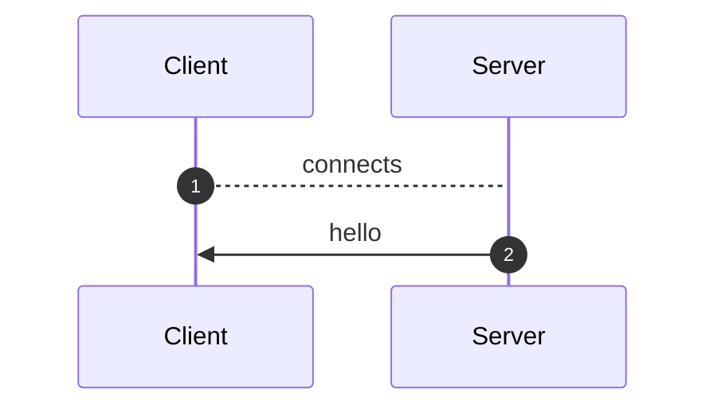
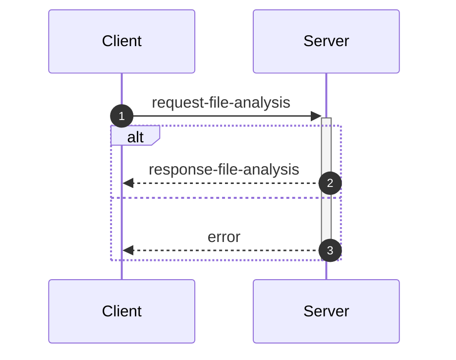
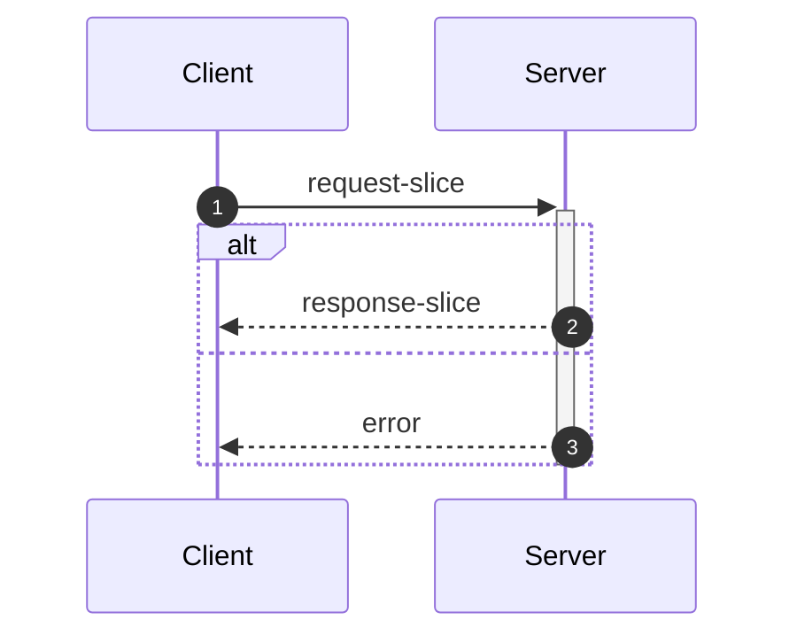
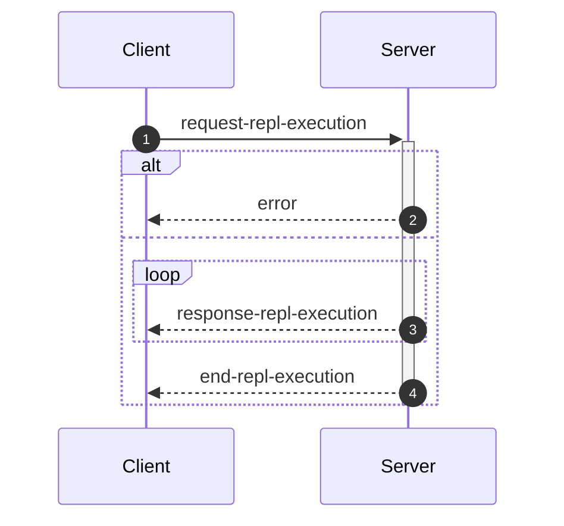

_This document was generated from '[src/documentation/wiki-interface.ts](https://github.com/flowr-analysis/flowr/tree/main//src/documentation/wiki-interface.ts)' on 2026-06-16, 07:18:00 UTC presenting an overview of flowR's interface (v2.10.9, using R v4.6.0). Please do not edit this file/wiki page directly._

Although far from being as detailed as the in-depth explanation of [_flowR_](https://github.com/flowr-analysis/flowr/wiki/core),
this wiki page explains how to interface with _flowR_ in more detail.
In general, command line arguments and other options provide short descriptions on hover over.

* [💻 Using the REPL](#using-the-repl)
* [⚙️ Configuring FlowR](#configuring-flowr)
* [⚒️ Writing Code](#writing-code)
* [💬 Communicating with the Server](#communicating-with-the-server)

<a id='using-the-repl'></a>
## 💻 Using the REPL


> [!NOTE]
> To execute arbitrary R commands with a repl request, _flowR_ has to be started explicitly with <span title="Description (Command Line Argument): Allow to access the underlying R session when using flowR (security warning: this allows the execution of arbitrary R code!)">`--r-session-access`</span>.
> Please be aware that this introduces a security risk and note that this relies on the [`r-shell` engine](https://github.com/flowr-analysis/flowr/wiki/engines) .

Although primarily meant for users to explore,
there is nothing which forbids simply calling _flowR_ as a subprocess to use standard-in, -output, and -error
for communication (although you can access the REPL using the server as well,
with the [REPL Request](#message-request-repl-execution) message).

The read-eval-print loop&nbsp;(REPL) works relatively simple.
You can submit an expression (using <kbd>Enter</kbd>),
which is interpreted as an R&nbsp;expression by default but interpreted as a *command* if it starts with a colon (`:`).
The best command to get started with the REPL is <span title="Description (Repl Command): Show help information (aliases: :h, :?)">`:help`</span>.
Besides, you can leave the REPL either with the command <span title="Description (Repl Command): End the repl (aliases: :q, :exit)">`:quit`</span> or by pressing <kbd>Ctrl</kbd>+<kbd>C</kbd> twice.
When writing a *command*, you may press <kbd>Tab</kbd> to get a list of completions, if available.
Multiple commands can be entered in a single line by separating them with a semicolon (`;`), e.g. `:parse "x<-2"; :df*`.
If a command is given without R code, the REPL will re-use R code given in a previous command.
The prior example will hence return first the parsed AST of the program and then the dataflow graph for `"x <- 2"`.

> [!NOTE]
> If you develop flowR, you may want to launch the repl using the `npm run main-dev` command, this way, you get a non-minified version of flowR with debug information and hot-reloading of source files.

<details>
<summary>Available Commands</summary>

We currently offer the following commands (this with a `[*]` suffix are available with and without the star):


| Command | Description |
| ------- | ----------- |
| **<span title="Description (Repl Command): End the repl (aliases: :q, :exit)">:quit</span>** | End the repl (aliases: **:<span title="Alias of ':quit'. End the repl">q</span>**, **:<span title="Alias of ':quit'. End the repl">exit</span>**) |
| **<span title="Description (Repl Command): Execute the given code as R code. This requires the `--r-session-access` flag to be set and requires the r-shell engine. (aliases: :e, :r)">:execute</span>** | Execute the given code as R code. This requires the `--r-session-access` flag to be set and requires the r-shell engine. (aliases: **:<span title="Alias of ':execute'. Execute the given code as R code. This requires the `--r-session-access` flag to be set and requires the r-shell engine.">e</span>**, **:<span title="Alias of ':execute'. Execute the given code as R code. This requires the `--r-session-access` flag to be set and requires the r-shell engine.">r</span>**) |
| **<span title="Description (Repl Command): Get mermaid code for the control-flow graph of R code, start with 'file://' to indicate a file (aliases: :cfg, :cf)">:controlflow[*]</span>** | Get mermaid code for the control-flow graph of R code, start with 'file://' to indicate a file (star: Returns the URL to mermaid.live) (aliases: **:<span title="Alias of ':controlflow'. Get mermaid code for the control-flow graph of R code, start with 'file://' to indicate a file">cfg</span>**, **:<span title="Alias of ':controlflow'. Get mermaid code for the control-flow graph of R code, start with 'file://' to indicate a file">cf</span>**) |
| **<span title="Description (Repl Command): Get mermaid code for the control-flow graph with basic blocks, start with 'file://' to indicate a file (aliases: :cfgb, :cfb)">:controlflowbb[*]</span>** | Get mermaid code for the control-flow graph with basic blocks, start with 'file://' to indicate a file (star: Returns the URL to mermaid.live) (aliases: **:<span title="Alias of ':controlflowbb'. Get mermaid code for the control-flow graph with basic blocks, start with 'file://' to indicate a file">cfgb</span>**, **:<span title="Alias of ':controlflowbb'. Get mermaid code for the control-flow graph with basic blocks, start with 'file://' to indicate a file">cfb</span>**) |
| **<span title="Description (Repl Command): Get mermaid code for the dataflow graph, start with 'file://' to indicate a file (aliases: :d, :df)">:dataflow[*]</span>** | Get mermaid code for the dataflow graph, start with 'file://' to indicate a file (star: Returns the URL to mermaid.live) (aliases: **:<span title="Alias of ':dataflow'. Get mermaid code for the dataflow graph, start with 'file://' to indicate a file">d</span>**, **:<span title="Alias of ':dataflow'. Get mermaid code for the dataflow graph, start with 'file://' to indicate a file">df</span>**) |
| **<span title="Description (Repl Command): Get mermaid code for the normalized AST of R code, start with 'file://' to indicate a file (aliases: :n)">:normalize[*]</span>** | Get mermaid code for the normalized AST of R code, start with 'file://' to indicate a file (star: Returns the URL to mermaid.live) (alias: **:<span title="Alias of ':normalize'. Get mermaid code for the normalized AST of R code, start with 'file://' to indicate a file">n</span>**) |
| **<span title="Description (Repl Command): Get mermaid code for the simplified dataflow graph, start with 'file://' to indicate a file (aliases: :ds, :dfs)">:dataflowsimple[*]</span>** | Get mermaid code for the simplified dataflow graph, start with 'file://' to indicate a file (star: Returns the URL to mermaid.live) (aliases: **:<span title="Alias of ':dataflowsimple'. Get mermaid code for the simplified dataflow graph, start with 'file://' to indicate a file">ds</span>**, **:<span title="Alias of ':dataflowsimple'. Get mermaid code for the simplified dataflow graph, start with 'file://' to indicate a file">dfs</span>**) |
| **<span title="Description (Repl Command): Just calculates the DFG, but only prints summary info (aliases: :d#, :df#)">:dataflowsilent</span>** | Just calculates the DFG, but only prints summary info (aliases: **:<span title="Alias of ':dataflowsilent'. Just calculates the DFG, but only prints summary info">d#</span>**, **:<span title="Alias of ':dataflowsilent'. Just calculates the DFG, but only prints summary info">df#</span>**) |
| **<span title="Description (Repl Command): Prints ASCII Art of the parsed, unmodified AST, start with 'file://' to indicate a file (aliases: :p)">:parse</span>** | Prints ASCII Art of the parsed, unmodified AST, start with 'file://' to indicate a file (alias: **:<span title="Alias of ':parse'. Prints ASCII Art of the parsed, unmodified AST, start with 'file://' to indicate a file">p</span>**) |
| **<span title="Description (Repl Command): Prints the version of flowR as well as the current version of R">:version</span>** | Prints the version of flowR as well as the current version of R
| **<span title="Description (Repl Command): Query the given R code, start with 'file://' to indicate a file. The query is to be a valid query in json format (use 'help' to get more information).">:query[*]</span>** | Query the given R code, start with 'file://' to indicate a file. The query is to be a valid query in json format (use 'help' to get more information). (star: Similar to query, but returns the output in json format.)
| **<span title="Description (Repl Command): Returns an ASCII representation of the dataflow graph (aliases: :df!)">:dataflowascii</span>** | Returns an ASCII representation of the dataflow graph (alias: **:<span title="Alias of ':dataflowascii'. Returns an ASCII representation of the dataflow graph">df!</span>**) |
| **<span title="Description (Repl Command): Returns summarization stats for the normalized AST (aliases: :n#)">:normalize#</span>** | Returns summarization stats for the normalized AST (alias: **:<span title="Alias of ':normalize#'. Returns summarization stats for the normalized AST">n#</span>**) |
| **<span title="Description (Repl Command): Show help information (aliases: :h, :?)">:help</span>** | Show help information (aliases: **:<span title="Alias of ':help'. Show help information">h</span>**, **:<span title="Alias of ':help'. Show help information">?</span>**) |


</details>


> [!TIP]
> 
> As indicated by the examples before, all REPL commands that operate on code keep track of the state.
> Hence, if you run a command like <span title="Description (Repl Command, starred version): Returns the URL to mermaid.live; Base Command: Get mermaid code for the dataflow graph, start with 'file://' to indicate a file (aliases: :d*, :df*)">`:dataflow*`</span> without providing R code,
> the REPL will re-use the R code provided in a previous command.
> Likewise, doing this will benefit from incrementality!
> If you request the dataflow graph with `:df* x <- 2 * y` and then want to see the parsed AST with `:parse`,
> the REPL will re-use previously obtained information and not re-parse the code again.
> 		


Generally, many commands offer shortcut versions in the REPL. Many queries, for example, offer a shortened format (see the example below).
Of special note, the [Config Query](https://github.com/flowr-analysis/flowr/wiki/query-api#Config-Query)
can be used to also modify the currently active configuration of _flowR_ within the REPL (see the [wiki page](https://github.com/flowr-analysis/flowr/wiki/query-api#Config-Query) for more information).

### Example: Retrieving the Dataflow Graph

To retrieve a URL to the [mermaid](https://mermaid.js.org/) diagram of the dataflow of a given expression,
use <span title="Description (Repl Command, starred version): Returns the URL to mermaid.live; Base Command: Get mermaid code for the dataflow graph, start with 'file://' to indicate a file (aliases: :d*, :df*)">`:dataflow*`</span> (or <span title="Description (Repl Command): Get mermaid code for the dataflow graph, start with 'file://' to indicate a file (aliases: :d, :df)">`:dataflow`</span> to get the mermaid code in the cli):


```shell
$ docker run -it --rm eagleoutice/flowr # or npm run flowr 
flowR repl using flowR v2.10.9, R grammar v14 (tree-sitter engine)
R> :dataflow* y <- 1 + x
```

<details>
<summary style='color:gray'>Output</summary>


```text
https://mermaid.live/view#base64:eyJjb2RlIjoiZmxvd2NoYXJ0IEJUXG4gICAgMXt7XCJgIzkxO1JOdW1iZXIjOTM7IDFcbiAgICAgICgxKVxuICAgICAgKjEuNipgXCJ9fVxuICAgJSUgTm8gZWRnZXMgZm91bmQgZm9yIDFcbiAgICAyKFtcImAjOTE7UlN5bWJvbCM5MzsgeFxuICAgICAgKDIpXG4gICAgICAqMS4xMCpgXCJdKVxuICAgJSUgTm8gZWRnZXMgZm91bmQgZm9yIDJcbiAgICAzW1tcImAjOTE7UkJpbmFyeU9wIzkzOyAjNDM7XG4gICAgICAoMylcbiAgICAgICoxLjYtMTAqXG4gICAgKDEsIDIpYFwiXV1cbiAgICBidWlsdC1pbjpfW1wiYEJ1aWx0LUluOlxuIzQzO2BcIl1cbiAgICBzdHlsZSBidWlsdC1pbjpfIHN0cm9rZTpncmF5LGZpbGw6Z3JheSxzdHJva2Utd2lkdGg6MnB4LG9wYWNpdHk6Ljg7XG4gICAgMFtcImAjOTE7UlN5bWJvbCM5MzsgeVxuICAgICAgKDAsIHNvdXJjZXM6IFszXSlcbiAgICAgICoxLjEqYFwiXVxuICAgIDRbW1wiYCM5MTtSQmluYXJ5T3AjOTM7ICM2MDsjNDU7XG4gICAgICAoNClcbiAgICAgICoxLjEtMTAqXG4gICAgKDAsIDMpYFwiXV1cbiAgICBidWlsdC1pbjpfLVtcImBCdWlsdC1JbjpcbiM2MDsjNDU7YFwiXVxuICAgIHN0eWxlIGJ1aWx0LWluOl8tIHN0cm9rZTpncmF5LGZpbGw6Z3JheSxzdHJva2Utd2lkdGg6MnB4LG9wYWNpdHk6Ljg7XG4gICAgMyAtLT58XCJyZWFkcywgYXJndW1lbnRcInwgMVxuICAgIDMgLS0+fFwicmVhZHMsIGFyZ3VtZW50XCJ8IDJcbiAgICAzIC0uLT58XCJyZWFkcywgY2FsbHNcInwgYnVpbHQtaW46X1xuICAgIGxpbmtTdHlsZSAyIHN0cm9rZTpncmF5O1xuICAgIDAgLS0+fFwiZGVmaW5lZC1ieVwifCAzXG4gICAgMCAtLT58XCJkZWZpbmVkLWJ5XCJ8IDRcbiAgICA0IC0tPnxcInJlYWRzLCBhcmd1bWVudFwifCAzXG4gICAgNCAtLT58XCJyZXR1cm5zLCBhcmd1bWVudFwifCAwXG4gICAgNCAtLi0+fFwicmVhZHMsIGNhbGxzXCJ8IGJ1aWx0LWluOl8tXG4gICAgbGlua1N0eWxlIDcgc3Ryb2tlOmdyYXk7IiwibWVybWFpZCI6eyJhdXRvU3luYyI6dHJ1ZX19
Copied mermaid url to clipboard (dataflow: 0ms).
```


Retrieve the dataflow graph of the expression `y <- 1 + x`. It looks like this:


```mermaid
flowchart LR
    1{{"`#91;RNumber#93; 1
      (1)
      *1.6*`"}}
   %% No edges found for 1
    2(["`#91;RSymbol#93; x
      (2)
      *1.10*`"])
   %% No edges found for 2
    3[["`#91;RBinaryOp#93; #43;
      (3)
      *1.6-10*
    (1, 2)`"]]
    built-in:_["`Built-In:
#43;`"]
    style built-in:_ stroke:gray,fill:gray,stroke-width:2px,opacity:.8;
    0["`#91;RSymbol#93; y
      (0, sources: [3])
      *1.1*`"]
    4[["`#91;RBinaryOp#93; #60;#45;
      (4)
      *1.1-10*
    (0, 3)`"]]
    built-in:_-["`Built-In:
#60;#45;`"]
    style built-in:_- stroke:gray,fill:gray,stroke-width:2px,opacity:.8;
    3 -->|"reads, argument"| 1
    3 -->|"reads, argument"| 2
    3 -.->|"reads, calls"| built-in:_
    linkStyle 2 stroke:gray;
    0 -->|"defined-by"| 3
    0 -->|"defined-by"| 4
    4 -->|"reads, argument"| 3
    4 -->|"returns, argument"| 0
    4 -.->|"reads, calls"| built-in:_-
    linkStyle 7 stroke:gray;
```

	
<details>

<summary style="color:gray">R Code of the Dataflow Graph</summary>

The analysis required _0.7 ms_ (including parse and normalize, using the [tree-sitter](https://github.com/flowr-analysis/flowr/wiki/Engines) engine) within the generation environment. 
We encountered no unknown side effects during the analysis.


```r
y <- 1 + x
```


</details>


</details>


For small graphs like this, <span title="Description (Repl Command): Returns an ASCII representation of the dataflow graph (aliases: :df!)">`:dataflowascii`</span> also provides an ASCII representation directly in the REPL:


```shell
$ docker run -it --rm eagleoutice/flowr # or npm run flowr 
flowR repl using flowR v2.10.9, R grammar v14 (tree-sitter engine)
R> :df! y <- 1 + x
```

<details open>
<summary style='color:gray'>Output</summary>


```text
                        0<1>0
                   ┌────| 1 |
    ┌────────┐     │    0---0
 c<4>c       └──c<3>c
 |<- |  v<0>v┌──| + |
 c---c──| y |┘  c---c   u<2>u
        v---v      └────| x |
                        u---u
Edges:
3 -> 1: reads, argument  3 -> 2: reads, argument
4 -> 3: reads, argument  4 -> 0: returns, argument
0 -> 3: defined-by       0 -> 4: defined-by
```


Retrieve the dataflow graph of the expression `y <- 1 + x` as ASCII art.

</details>


For the slicing with <span title="Description (Repl Command): Static backwards executable slicer for R">`:slicer`</span>, you have access to the same [magic comments](#slice-magic-comments) as with the [slice request](#message-request-slice).

### Example: Interfacing with the File System

Many commands that allow for an R-expression (like <span title="Description (Repl Command, starred version): Returns the URL to mermaid.live; Base Command: Get mermaid code for the dataflow graph, start with 'file://' to indicate a file (aliases: :d*, :df*)">`:dataflow*`</span>) allow for a file as well
if the argument starts with `file://`.
If you are working from the root directory of the _flowR_ repository, the following gives you the parsed AST of the example file using the <span title="Description (Repl Command): Prints ASCII Art of the parsed, unmodified AST, start with 'file://' to indicate a file (aliases: :p)">`:parse`</span> command:


```shell
$ docker run -it --rm eagleoutice/flowr # or npm run flowr 
flowR repl using flowR v2.10.9, R grammar v14 (tree-sitter engine)
R> :parse file://test/testfiles/example.R
```

<details>
<summary style='color:gray'>Output</summary>


```text
File: test/testfiles/example.R

program
├ binaryoperator
│ ├ identifier "sum" (1:1─4)
│ ├ <- "<-" (1:5─7)
│ ╰ float "0" (1:8─9)
├ binaryoperator
│ ├ identifier "product" (2:1─8)
│ ├ <- "<-" (2:9─11)
│ ╰ float "1" (2:12─13)
├ binaryoperator
│ ├ identifier "w" (3:1─2)
│ ├ <- "<-" (3:3─5)
│ ╰ float "7" (3:6─7)
├ binaryoperator
│ ├ identifier "N" (4:1─2)
│ ├ <- "<-" (4:3─5)
│ ╰ float "10" (4:6─8)
├ forstatement
│ ├ for "for" (6:1─4)
│ ├ ( "(" (6:5─6)
│ ├ identifier "i" (6:6─7)
│ ├ in "in" (6:8─10)
│ ├ binaryoperator
│ │ ├ float "1" (6:11─12)
│ │ ├ : ":" (6:12─13)
│ │ ╰ parenthesizedexpression
│ │   ├ ( "(" (6:13─14)
│ │   ├ binaryoperator
│ │   │ ├ identifier "N" (6:14─15)
│ │   │ ├ - "-" (6:15─16)
│ │   │ ╰ float "1" (6:16─17)
│ │   ╰ ) ")" (6:17─18)
│ ├ ) ")" (6:18─19)
│ ╰ bracedexpression
│   ├ { "{" (6:20─21)
│   ├ binaryoperator
│   │ ├ identifier "sum" (7:3─6)
│   │ ├ <- "<-" (7:7─9)
│   │ ╰ binaryoperator
│   │   ├ binaryoperator
│   │   │ ├ identifier "sum" (7:10─13)
│   │   │ ├ + "+" (7:14─15)
│   │   │ ╰ identifier "i" (7:16─17)
│   │   ├ + "+" (7:18─19)
│   │   ╰ identifier "w" (7:20─21)
│   ├ binaryoperator
│   │ ├ identifier "product" (8:3─10)
│   │ ├ <- "<-" (8:11─13)
│   │ ╰ binaryoperator
│   │   ├ identifier "product" (8:14─21)
│   │   ├  "" (8:22─23)
│   │   ╰ identifier "i" (8:24─25)
│   ╰ } "}" (9:1─2)
├ call
│ ├ identifier "cat" (11:1─4)
│ ╰ arguments
│   ├ ( "(" (11:4─5)
│   ├ argument
│   │ ╰ string
│   │   ├ " "\"" (11:5─6)
│   │   ├ stringcontent "Sum:" (11:6─10)
│   │   ╰ " "\"" (11:10─11)
│   ├ comma "," (11:11─12)
│   ├ argument
│   │ ╰ identifier "sum" (11:13─16)
│   ├ comma "," (11:16─17)
│   ├ argument
│   │ ╰ string
│   │   ├ " "\"" (11:18─19)
│   │   ├ stringcontent
│   │   │ ╰ escapesequence "\\n" (11:19─21)
│   │   ╰ " "\"" (11:21─22)
│   ╰ ) ")" (11:22─23)
╰ call
  ├ identifier "cat" (12:1─4)
  ╰ arguments
    ├ ( "(" (12:4─5)
    ├ argument
    │ ╰ string
    │   ├ " "\"" (12:5─6)
    │   ├ stringcontent "Product:" (12:6─14)
    │   ╰ " "\"" (12:14─15)
    ├ comma "," (12:15─16)
    ├ argument
    │ ╰ identifier "product" (12:17─24)
    ├ comma "," (12:24─25)
    ├ argument
    │ ╰ string
    │   ├ " "\"" (12:26─27)
    │   ├ stringcontent
    │   │ ╰ escapesequence "\\n" (12:27─29)
    │   ╰ " "\"" (12:29─30)
    ╰ ) ")" (12:30─31)
```


Retrieve the parsed AST of the example file.

<details>

<summary>File Content</summary>


```r
sum <- 0
product <- 1
w <- 7
N <- 10

for (i in 1:(N-1)) {
  sum <- sum + i + w
  product <- product * i
}

cat("Sum:", sum, "\n")
cat("Product:", product, "\n")
```


</details>

As _flowR_ directly transforms this AST the output focuses on being human-readable instead of being machine-readable.
		

</details>


### Example: Run a Query

You can run any query supported by _flowR_ using the <span title="Description (Repl Command): Query the given R code, start with 'file://' to indicate a file. The query is to be a valid query in json format (use 'help' to get more information).">`:query`</span> command.
For example, to obtain the shapes of all data frames in a given piece of code, you can run:


```shell
$ docker run -it --rm eagleoutice/flowr # or npm run flowr 
flowR repl using flowR v2.10.9, R grammar v14 (tree-sitter engine)
R> :query @df-shape "x <- data.frame(a = 1:10, b = 1:10)\ny <- x$a"
```

<details open>
<summary style='color:gray'>Output</summary>


```text
Query: df-shape (1 ms)
   ╰ 12: (colnames: [{"a", "b"}, {}], cols: [2, 2], rows: [10, 10])
   ╰ 0: (colnames: [{"a", "b"}, {}], cols: [2, 2], rows: [10, 10])
All queries together required ≈3 ms (1ms accuracy, total 3 ms)
```


Retrieve the shapes of all data frames in the given code.

</details>


To run the linter on a file, you can use (in this example, we just issue the `dead-code` linter on a small piece of code):


```shell
$ docker run -it --rm eagleoutice/flowr # or npm run flowr 
flowR repl using flowR v2.10.9, R grammar v14 (tree-sitter engine)
R> :query @linter rules:dead-code "if(FALSE) x <- 2"
```

<details open>
<summary style='color:gray'>Output</summary>


```text
Query: linter (1 ms)
   ╰ Dead Code (dead-code):
       ╰ certain:
           ╰ Code at 1.11-16
       ╰ Metadata: consideredNodes: 7, searchTimeMs: 1, processTimeMs: 0
All queries together required ≈1 ms (1ms accuracy, total 1 ms)
```


Run the linter on the given code, with only the `dead-code` rule enabled.

</details>


For more information on the available queries, please check out the [Query API](https://github.com/flowr-analysis/flowr/wiki/query-api).


<a id='configuring-flowr'></a>
## ⚙️ Configuring FlowR


When running _flowR_, you may want to specify some behaviors with a dedicated configuration file.
By default, flowR looks for a file named `flowr.json` in the current working directory (or any higher directory).
You can also specify a different file with <span title="Description (Command Line Argument): The name of the configuration file to use">`--config-file`</span> or pass the configuration inline using <span title="Description (Command Line Argument): The flowR configuration to use, as a JSON string">`--config-json`</span>.
To inspect the current configuration, you can run flowr with the <span title="Description (Command Line Argument): Run with verbose logging (will be passed to the corresponding script)">`--verbose`</span> flag, or use the `config` [Query](https://github.com/flowr-analysis/flowr/wiki/Query%20API).
Within the REPL this works by running the following:


```shell
:query @config
```


To work with the <a href="https://github.com/flowr-analysis/flowr/tree/main/src/config.ts#L118"><code><span title="The configuration file format for flowR.">FlowrConfig</span></code></a> you can use the provided helper objects alongside its methods like
<a href="https://github.com/flowr-analysis/flowr/tree/main/src/config.ts#L442"><code><span title="Creates a new flowr config that has the updated values.">FlowrConfig::<b>amend</b></span></code></a>.
The following summarizes the configuration options:

- `ignoreSourceCalls`: If set to `true`, _flowR_ will ignore source calls when analyzing the code, i.e., ignoring the inclusion of other files.
- `semantics`: allows to configure the way _flowR_ handles R, although we currently only support `semantics/environment/overwriteBuiltIns`.
  You may use this to overwrite _flowR_'s handling of built-in function and even completely clear the preset definitions shipped with flowR.
  See [Configure BuiltIn Semantics](#configure-builtin-semantics) for more information.
- `solver`: allows to configure how _flowR_ resolves variables and their values (currently we support: `disabled`, `alias`, `builtin`), as well as if pointer analysis should be active.
- `engines`: allows to configure the engines used by _flowR_ to interact with R code. See the [Engines wiki page](https://github.com/flowr-analysis/flowr/wiki/Engines) for more information.
- `defaultEngine`: allows to specify the default engine to use for interacting with R code. If not set, an arbitrary engine from the specified list will be used.
- `abstractInterpretation`: allows to configure how _flowR_ performs abstract interpretation, although we currently only support data frame shape inference through abstract interpretation.
- `defaultPlugins`: allows to configure which plugins to load by default when creating a new <a href="https://github.com/flowr-analysis/flowr/tree/main/src/project/flowr-analyzer.ts#L162"><code><span title="Central class for conducting analyses with FlowR. Use the FlowrAnalyzerBuilder to create a new instance. If you want the original pattern of creating a pipeline and running all steps, you can still do this with FlowrAnalyzer#runFull . To inspect the context of the analyzer, use FlowrAnalyzer#inspectContext (if you are a plugin and need to modify it, use FlowrAnalyzer#context instead).">FlowrAnalyzer</span></code></a> instance.
- `repl.plugins`: allows to configure which plugins to load in the _flowR_ REPL. Use `flowr:default` to reference the plugins specified by `defaultPlugins`.

So you can configure _flowR_ by adding a file like the following:

<details>

<summary>Example Configuration File</summary>


```json
{
  "ignoreSourceCalls": true,
  "semantics": {
    "environment": {
      "overwriteBuiltIns": {
        "definitions": [
          {
            "type": "function",
            "names": [
              "foo"
            ],
            "processor": "builtin:assign",
            "config": {}
          }
        ]
      }
    }
  },
  "defaultPlugins": [
    "file:description",
    "versions:description"
  ],
  "repl": {
    "quickStats": false,
    "dfProcessorHeat": false,
    "plugins": [
      "flowr:default"
    ]
  },
  "project": {
    "resolveUnknownPathsOnDisk": true
  },
  "engines": [
    {
      "type": "r-shell"
    }
  ],
  "solver": {
    "variables": "alias",
    "evalStrings": true,
    "trackEnvironments": true,
    "resolveSource": {
      "dropPaths": "no",
      "ignoreCapitalization": true,
      "inferWorkingDirectory": "active-script",
      "searchPath": []
    },
    "instrument": {},
    "slicer": {
      "threshold": 50
    }
  },
  "abstractInterpretation": {
    "wideningThreshold": 4,
    "dataFrame": {
      "maxColNames": 20,
      "readLoadedData": {
        "readExternalFiles": true,
        "maxReadLines": 1000000
      }
    }
  }
}
```


</details>

<details>
<a id='configure-builtin-semantics'></a>
<summary>Configure Built-In Semantics</summary>


`semantics/environment/overwriteBuiltins` accepts two keys:

- `loadDefaults` (boolean, initially `true`): If set to `true`, the default built-in definitions are loaded before applying the custom definitions. Setting this flag to `false` explicitly disables the loading of the default definitions.
- `definitions` (array, initially empty): Allows to overwrite or define new built-in elements. Each object within must have a `type` which is one of the below. Furthermore, they may define a string array of `names` which specifies the identifiers to bind the definitions to. You may use `assumePrimitive` to specify whether _flowR_ should assume that this is a primitive non-library definition (so you probably just do not want to specify the key).

  | Type            | Description                                                                                                                                                                                                                                                                                              | Example                                                                                                    |
  | --------------- | -------------------------------------------------------------------------------------------------------------------------------------------------------------------------------------------------------------------------------------------------------------------------------------------------------- | ---------------------------------------------------------------------------------------------------------- |
  | `constant`    | Additionally allows for a `value` this should resolve to.                                                                                                                                                                                                                                                | `{ type: 'constant', names: ['NULL', 'NA'],  value: null }`                                                |
  | `function`    | Is a rather flexible way to define and bind built-in functions. For the time, we do not have extensive documentation to cover all the cases, so please either consult the sources with the `default-builtin-config.ts` or open a [new issue](https://github.com/flowr-analysis/flowr/issues/new/choose). | `{ type: 'function', names: ['next'], processor: 'builtin:d', config: { cfg: ExitPointType.Next } }` |
  | `replacement` | A comfortable way to specify replacement functions like `$<-` or `names<-`. `suffixes` describes the... suffixes to attach automatically. | `{ type: 'replacement', suffixes: ['<-', '<<-'], names: ['[', '[['] }` |


</details>

<details>

<summary style='color:gray'>Full Configuration-File Schema</summary>

- _The configuration file format for flowR._ (object)
    - **ignoreSourceCalls** [optional] _Whether source calls should be ignored, causing {@link processSourceCall}'s behavior to be skipped._ (boolean)
    - **semantics** _Configure language semantics and how flowR handles them._ (object)
        - **environment** [optional] _Semantics regarding how to handle the R environment._ (object)
            - **overwriteBuiltIns** [optional] _Do you want to overwrite (parts) of the builtin definition?_ (object)
                - **loadDefaults** [optional] _Should the default configuration still be loaded?_ (boolean)
                - **definitions** [optional] _The definitions to load/overwrite._ (array)
                Valid item types:
                    - (object)
    - **defaultPlugins** [optional] _The default plugins to load when creating a new instance of FlowrAnalyzer_ (array)
    Valid item types:
        - (alternatives)
            - (string)
            - (array)
    - **repl** _Configuration options for the REPL._ (object)
        - **quickStats** [optional] _Whether to show quick stats in the REPL after each evaluation._ (boolean)
        - **dfProcessorHeat** [optional] _This instruments the dataflow processors to count how often each processor is called._ (boolean)
        - **plugins** [optional] _The plugins to load in REPL mode_ (array)
        Valid item types:
            - (alternatives)
                - (string)
                - (array)
    - **project** _Project specific configuration options._ (object)
        - **resolveUnknownPathsOnDisk** [optional] _Whether to resolve unknown paths loaded by the r project disk when trying to source/analyze files._ (boolean)
    - **engines** _The engine or set of engines to use for interacting with R code. An empty array means all available engines will be used._ (array)
    Valid item types:
        - (alternatives)
            - _The configuration for the tree sitter engine._ (object)
                - **type** [required] _Use the tree sitter engine._ (string)
                    Only allows: 'tree-sitter'
                - **wasmPath** [optional] _The path to the tree-sitter-r WASM binary to use. If this is undefined, this uses the default path._ (string)
                - **treeSitterWasmPath** [optional] _The path to the tree-sitter WASM binary to use. If this is undefined, this uses the default path._ (string)
                - **lax** [optional] _Whether to use the lax parser for parsing R code (allowing for syntax errors). If this is undefined, the strict parser will be used._ (boolean)
            - _The configuration for the R shell engine._ (object)
                - **type** [required] _Use the R shell engine._ (string)
                    Only allows: 'r-shell'
                - **rPath** [optional] _The path to the R executable to use. If this is undefined, this uses the default path._ (string)
    - **defaultEngine** [optional] _The default engine to use for interacting with R code. If this is undefined, an arbitrary engine from the specified list will be used._ (string)
        Only allows: 'tree-sitter', 'r-shell'
    - **solver** _How to resolve constants, constraints, cells, ..._ (object)
        - **variables** _How to resolve variables and their values._ (string)
            Only allows: 'disabled', 'alias', 'builtin'
        - **evalStrings** _Should we include eval(parse(text="...")) calls in the dataflow graph?_ (boolean)
        - **trackEnvironments** [optional] _Track user-created environments (new.env, assign/get/local with envir=, dollar-assign, attach). When false, all envir-style calls fall through conservatively._ (boolean)
        - **instrument** (object)
            - **dataflowExtractors** [optional] _These keys are only intended for use within code, allowing to instrument the dataflow analyzer!_ (any)
        - **resolveSource** [optional] _If lax source calls are active, flowR searches for sourced files much more freely, based on the configurations you give it. This option is only in effect if `ignoreSourceCalls` is set to false._ (object)
            - **dropPaths** _Allow to drop the first or all parts of the sourced path, if it is relative._ (string)
                Only allows: 'no', 'once', 'all'
            - **ignoreCapitalization** _Search for filenames matching in the lowercase._ (boolean)
            - **inferWorkingDirectory** _Try to infer the working directory from the main or any script to analyze._ (string)
                Only allows: 'no', 'main-script', 'active-script', 'any-script'
            - **searchPath** _Additionally search in these paths._ (array)
            Valid item types:
                - (string)
            - **repeatedSourceLimit** [optional] _How often the same file can be sourced within a single run? Please be aware: in case of cyclic sources this may not reach a fixpoint so give this a sensible limit._ (number)
            - **applyReplacements** _Provide name replacements for loaded files_ (array)
            Valid item types:
                - (object)
            - **checkMemoryOnSource** [optional] _Check heap memory usage before analyzing a sourced file, skipping when memory pressure exceeds the configured threshold._ (boolean)
            - **memoryThreshold** [optional] _Fraction of the V8 heap limit (0-1) at which source analysis is skipped. Only effective when checkMemoryOnSource is true._ (number)
        - **slicer** [optional] _The configuration for the slicer._ (object)
            - **threshold** [optional] _The maximum number of iterations to perform on a single function call during slicing._ (number)
            - **autoExtend** [optional] _If set, the slicer will gain an additional post-pass._ (boolean)
    - **abstractInterpretation** _The configuration options for abstract interpretation._ (object)
        - **wideningThreshold** _The threshold for the number of visitations of a node at which widening should be performed to ensure the termination of the fixpoint iteration._ (number)
        - **dataFrame** _The configuration of the shape inference for data frames._ (object)
            - **maxColNames** _The maximum number of columns names to infer for data frames before over-approximating the column names to top._ (number)
            - **readLoadedData** _Configuration options for reading data frame shapes from loaded external data files, such as CSV files._ (object)
                - **readExternalFiles** _Whether data frame shapes should be extracted from loaded external files, such as CSV files._ (boolean)
                - **maxReadLines** _The maximum number of lines to read when extracting data frame shapes from loaded files, such as CSV files._ (number)

</details>

	

<a id='writing-code'></a>
## ⚒️ Writing Code

_flowR_ can be used as a [module](https://www.npmjs.com/package/@eagleoutice/flowr) and offers several main classes and interfaces that are interesting for extension writers 
(see the [Visual Studio Code extension](https://marketplace.visualstudio.com/items?itemName=code-inspect.vscode-flowr) or the [Core](https://github.com/flowr-analysis/flowr/wiki/core) wiki page for more information).

### Creating Analyses with _flowR_

Nowadays, instances of the <a href="https://github.com/flowr-analysis/flowr/tree/main/src/project/flowr-analyzer.ts#L162"><code><span title="Central class for conducting analyses with FlowR. Use the FlowrAnalyzerBuilder to create a new instance. If you want the original pattern of creating a pipeline and running all steps, you can still do this with FlowrAnalyzer#runFull . To inspect the context of the analyzer, use FlowrAnalyzer#inspectContext (if you are a plugin and need to modify it, use FlowrAnalyzer#context instead).">FlowrAnalyzer</span></code></a> should be used as central frontend to get analysis results from _flowR_.
For example, a program slice can be created like this:


```ts
const analyzer = await new FlowrAnalyzerBuilder()
    .setEngine('tree-sitter')
    .build();
analyzer.addRequest('x <- 1\ny <- x\nx');
const result = await analyzer.query([
    {
        type:     'static-slice',
        criteria: ['3@x']
    }
]);
//console.log(result['static-slice']);
```


For more information, please have a look at the [Analyzer](https://github.com/flowr-analysis/flowr/wiki/analyzer) wiki page, which explains how to construct and use the <a href="https://github.com/flowr-analysis/flowr/tree/main/src/project/flowr-analyzer.ts#L162"><code><span title="Central class for conducting analyses with FlowR. Use the FlowrAnalyzerBuilder to create a new instance. If you want the original pattern of creating a pipeline and running all steps, you can still do this with FlowrAnalyzer#runFull . To inspect the context of the analyzer, use FlowrAnalyzer#inspectContext (if you are a plugin and need to modify it, use FlowrAnalyzer#context instead).">FlowrAnalyzer</span></code></a> in more detail.
To work with specific perspectives, you can also consult the respective pages like the [Dataflow Graph](https://github.com/flowr-analysis/flowr/wiki/dataflow-graph) or the [Abstract Interpretation](https://github.com/flowr-analysis/flowr/wiki/abstract-interpretation) wiki pages.
        
### The Pipeline Executor (Low-Level Interface)

Once, in the beginning, _flowR_ was meant to produce a dataflow graph merely to provide *program slices*. 
However, with continuous updates, the [Dataflow Graph](https://github.com/flowr-analysis/flowr/wiki/dataflow-graph) repeatedly proves to be the more interesting part.
With this, we restructured _flowR_'s originally *hardcoded* pipeline to be far more flexible. 
Now, it can be theoretically extended or replaced with arbitrary steps, optional steps, and what we call 'decorations' of these steps. 
In short, a slicing pipeline using the <a href="https://github.com/flowr-analysis/flowr/tree/main/src/core/pipeline-executor.ts#L97"><code><span title="**Please note:** The PipelineExecutor is now considered to be a rather low-level API for flowR. While it still works and is the basis for all other layers, we strongly recommend using the FlowrAnalyzer and its builder to create and use an analyzer instance that is pre-configured for your use-case. The pipeline executor allows to execute arbitrary pipelines in a step-by-step fashion. If you are not...">PipelineExecutor</span></code></a> looks like this:


```ts

const slicer = new PipelineExecutor(DEFAULT_SLICING_PIPELINE, {
  parser:    new RShell(),
  request:   requestFromInput('x <- 1\nx + 1'),
  criterion: ['2@x']
})
const slice = await slicer.allRemainingSteps()
// console.log(slice.reconstruct.code)
```


<details><summary>More Information</summary>


If you compare this, with what you would have done with the old (and removed) `SteppingSlicer`, 
this essentially just requires you to replace the `SteppingSlicer` with the <a href="https://github.com/flowr-analysis/flowr/tree/main/src/core/pipeline-executor.ts#L97"><code><span title="**Please note:** The PipelineExecutor is now considered to be a rather low-level API for flowR. While it still works and is the basis for all other layers, we strongly recommend using the FlowrAnalyzer and its builder to create and use an analyzer instance that is pre-configured for your use-case. The pipeline executor allows to execute arbitrary pipelines in a step-by-step fashion. If you are not...">PipelineExecutor</span></code></a>
and to pass the <a href="https://github.com/flowr-analysis/flowr/tree/main/src/core/steps/pipeline/default-pipelines.ts#L18"><code>DEFAULT_SLICING_PIPELINE</code></a> as the first argument.
The <a href="https://github.com/flowr-analysis/flowr/tree/main/src/core/pipeline-executor.ts#L97"><code><span title="**Please note:** The PipelineExecutor is now considered to be a rather low-level API for flowR. While it still works and is the basis for all other layers, we strongly recommend using the FlowrAnalyzer and its builder to create and use an analyzer instance that is pre-configured for your use-case. The pipeline executor allows to execute arbitrary pipelines in a step-by-step fashion. If you are not...">PipelineExecutor</span></code></a>...

1. Provides structures to investigate the results of all intermediate steps
2. Can be executed step-by-step
3. Can repeat steps (e.g., to calculate multiple slices on the same input)

See the in-code documentation for more information.

	

</details>
    

### Using the <a href="https://github.com/flowr-analysis/flowr/tree/main/src/r-bridge/shell.ts#L143"><code><span title="The RShell represents an interactive session with the R interpreter. You can configure it by RShellOptions . At the moment we are using a live R session (and not networking etc.) to communicate with R easily, which allows us to install packages etc. However, this might and probably will change in the future (leaving this as a legacy mode :D)">RShell</span></code></a> to Interact with R

The <a href="https://github.com/flowr-analysis/flowr/tree/main/src/r-bridge/shell.ts#L143"><code><span title="The RShell represents an interactive session with the R interpreter. You can configure it by RShellOptions . At the moment we are using a live R session (and not networking etc.) to communicate with R easily, which allows us to install packages etc. However, this might and probably will change in the future (leaving this as a legacy mode :D)">RShell</span></code></a> class allows interfacing with the `R`&nbsp;ecosystem installed on the host system.
Please have a look at [flowR's Engines](https://github.com/flowr-analysis/flowr/wiki/engines) for more information on alternatives (for example, the <a href="https://github.com/flowr-analysis/flowr/tree/main/src/r-bridge/lang-4.x/tree-sitter/tree-sitter-executor.ts#L18"><code><span title="Synchronous and (way) faster alternative to the RShell using tree-sitter.">TreeSitterExecutor</span></code></a>).


> [!IMPORTANT]
> 
> Each <a href="https://github.com/flowr-analysis/flowr/tree/main/src/r-bridge/shell.ts#L143"><code><span title="The RShell represents an interactive session with the R interpreter. You can configure it by RShellOptions . At the moment we are using a live R session (and not networking etc.) to communicate with R easily, which allows us to install packages etc. However, this might and probably will change in the future (leaving this as a legacy mode :D)">RShell</span></code></a> controls a new instance of the R&nbsp;interpreter, 
> make sure to call <code><a href="https://github.com/flowr-analysis/flowr/tree/main/src/r-bridge/shell.ts#L317"><span title="Close the current R session, makes the object effectively invalid (can no longer be reopened etc.)">RShell::<i>close</i></span></a>()</code> when you are done.


You can start a new "session" simply by constructing a new object with <code>new <a href="https://github.com/flowr-analysis/flowr/tree/main/src/r-bridge/shell.ts#L143"><span title="The RShell represents an interactive session with the R interpreter. You can configure it by RShellOptions . At the moment we are using a live R session (and not networking etc.) to communicate with R easily, which allows us to install packages etc. However, this might and probably will change in the future (leaving this as a legacy mode :D)">RShell</span></a>()</code>.

However, there are several options that may be of interest 
(e.g., to automatically revive the shell in case of errors or to control the name location of the R process on the system).

With a shell object (let's call it `shell`), you can execute R code by using <a href="https://github.com/flowr-analysis/flowr/tree/main/src/r-bridge/shell.ts#L195"><code><span title="sends the given command directly to the current R session will not do anything to alter input markers!">RShell::<i>sendCommand</i></span></code></a>, 
for example <code>shell.<a href="https://github.com/flowr-analysis/flowr/tree/main/src/r-bridge/shell.ts#L195"><span title="sends the given command directly to the current R session will not do anything to alter input markers!">sendCommand</span></a>("1 + 1")</code>. 
However, this does not return anything, so if you want to collect the output of your command, use
<a href="https://github.com/flowr-analysis/flowr/tree/main/src/r-bridge/shell.ts#L261"><code><span title="Send a command and collect the output">RShell::<i>sendCommandWithOutput</i></span></code></a> instead.

Besides that, the command <a href="https://github.com/flowr-analysis/flowr/tree/main/src/r-bridge/shell.ts#L233"><code>RShell::<b>tryToInjectHomeLibPath</b></code></a> may be of interest, as it enables all libraries available on the host system.


### Generate Statistics (No longer a Focus of flowR)


<details>

<summary>Adding a New Feature to Extract</summary>

In this example, we construct a new feature to extract, with the name "*example*".
Whenever this name appears, you may substitute this with whatever name fits your feature best (as long as the name is unique).

1. **Create a new file in `src/statistics/features/supported`**\
   Create the file `example.ts`, and add its export to the `index.ts` file in the same directory (if not done automatically).

2. **Create the basic structure**\
   To get a better feel of what a feature must have, let's look
   at the basic structure (of course, due to TypeScript syntax,
   there are other ways to achieve the same goal):

   ```ts
   const initialExampleInfo = {
       /* whatever start value is good for you */
       someCounter: 0
   }

   export type ExampleInfo = Writable<typeof initialExampleInfo>

   export const example: Feature<ExampleInfo> = {
    name:        'Example Feature',
    description: 'A longer example description',

    process(existing: ExampleInfo, input: FeatureProcessorInput): ExampleInfo {
      /* perform analysis on the input */
      return existing
    },

    initialValue: initialExampleInfo
   }
   ```

   The `initialExampleInfo` type holds the initial values for each counter that you want to maintain during the feature extraction (they will usually be initialized with 0). The resulting `ExampleInfo` type holds the structure of the data that is to be counted. Due to the vast amount of data processed, information like the name and location of a function call is not stored here, but instead written to disk (see below).

   Every new feature must be of the `Feature<Info>` type, with `Info` referring to a `FeatureInfo` (like `ExampleInfo` in this example). Next to a `name` and a `description`, each Feature must provide:

   - a processor that extracts the information from the input, adding it to the existing information.
   - a function returning the initial value of the information (in this case, `initialExampleInfo`).

3. **Add it to the feature-mapping**\
   Now, in the `feature.ts` file in `src/statistics/features`, add your feature to the `ALL_FEATURES` object.

Now, we want to extract something. For the *example* feature created in the previous steps, we choose to count the amount of `COMMENT` tokens.
So we define a corresponding [XPath](https://developer.mozilla.org/en-US/docs/Web/XPath) query:

```ts
const commentQuery: Query = xpath.parse('//COMMENT')
```

Within our feature's `process` function, running the query is as simple as:

```ts
const comments = commentQuery.select({ node: input.parsedRAst })
```

Now we could do a lot of further processing, but for simplicity, we only record every comment found this way:

```ts
appendStatisticsFile(example.name, 'comments', comments, input.filepath)
```

We use `example.name` to avoid duplication with the name that we’ve assigned to the feature. It corresponds to the name of the folder in the statistics output.
`'comments'` refers to a freely chosen (but unique) name, that will be used as the name for the output file within the folder. The `comments` variable holds the result of the query, which is an array of nodes. Finally, we pass the `filepath` of the file that was analyzed (if known), so that it can be added to the statistics file (as additional information).

</details>
	

<a id='communicating-with-the-server'></a>
## 💬 Communicating with the Server


As explained in the [Overview](https://github.com/flowr-analysis/flowr/wiki/Overview), you can simply run the [TCP](https://de.wikipedia.org/wiki/Transmission_Control_Protocol)&nbsp;server by adding the <span title="Description (Command Line Argument): Do not drop into a repl, but instead start a server on the given port (default: 1042) and listen for messages.">`--server`</span> flag (and, due to the interactive mode, exit with the conventional <kbd>CTRL</kbd>+<kbd>C</kbd>).
Currently, every connection is handled by the same underlying `RShell` - so the server is not designed to handle many clients at a time.
Additionally, the server is not well guarded against attacks (e.g., you can theoretically spawn an arbitrary number of&nbsp;RShell sessions on the target machine).

Every message has to be given in a single line (i.e., without a newline in-between) and end with a newline character. Nevertheless, we will pretty-print example given in the following segments for the ease of reading.


> [!NOTE]
> 
> The default <span title="Description (Command Line Argument): Do not drop into a repl, but instead start a server on the given port (default: 1042) and listen for messages.">`--server`</span> uses a simple [TCP](https://de.wikipedia.org/wiki/Transmission_Control_Protocol)
> connection. If you want _flowR_ to expose a [WebSocket](https://de.wikipedia.org/wiki/WebSocket) server instead, add the <span title="Description (Command Line Argument): If the server flag is set, use websocket for messaging">`--ws`</span> flag (i.e., <span title="Description (Command Line Argument): Do not drop into a repl, but instead start a server on the given port (default: 1042) and listen for messages.">`--server`</span> <span title="Description (Command Line Argument): If the server flag is set, use websocket for messaging">`--ws`</span>) when starting _flowR_ from the command line.
> 			


<ul><li>
<a id="message-hello"></a>
<b>Hello</b> Message (<code>hello</code>) 
<details>

<summary style="color:gray"> View Details. <i>The server informs the client about the successful connection and provides Meta-Information.</i> </summary>


```mermaid
sequenceDiagram
    autonumber
    participant Client
    participant Server

    
    Client-->Server: connects
    Server->>Client: hello
	
```


	
After launching _flowR_, for example, with <code>docker run -it --rm eagleoutice/flowr <span title="Description (Command Line Argument): Do not drop into a repl, but instead start a server on the given port (default: 1042) and listen for messages.">-<span/>-server</span></code>&nbsp;(🐳️), simply connecting should present you with a `hello` message, that amongst others should reveal the versions of&nbsp;_flowR_ and&nbsp;R, using the [semver 2.0](https://semver.org/spec/v2.0.0.html) versioning scheme.
The message looks like this:


```json
{
  "type": "hello",
  "clientName": "client-0",
  "versions": {
    "flowr": "2.10.9",
    "r": "4.6.0",
    "engine": "r-shell"
  }
}
```


There are currently a few messages that you can send after the hello message.
If you want to _slice_ a piece of R code you first have to send an [analysis request](#message-request-file-analysis), so that you can send one or multiple slice requests afterward.
Requests for the [REPL](#message-request-repl) are independent of that.
	

<hr>


<details>
<summary style="color:gray">Message schema (<code>hello</code>)</summary>

For the definition of the hello message, please see it's implementation at [`./src/cli/repl/server/messages/message-hello.ts`](https://github.com/flowr-analysis/flowr/tree/main/./src/cli/repl/server/messages/message-hello.ts).

- [required] (object)
    - **type** [required] _The type of the hello message._ (string)
        Only allows: 'hello'
    - **id** [forbidden] _The id of the message is always undefined (as it is the initial message and not requested)._ (any)
    - **clientName** [required] _A unique name that is assigned to each client. It has no semantic meaning and is only used/useful for debugging._ (string)
    - **versions** [required] (object)
        - **flowr** [required] _The version of the flowr server running in semver format._ (string)
        - **r** [required] _The version of the underlying R shell running in semver format._ (string)
        - **engine** [required] _The parser backend that is used to parse the R code._ (string)

</details>


<hr>

</details>
	</li>

<li>
<a id="message-request-file-analysis"></a>
<b>Analysis</b> Message (<code>request-file-analysis</code>) 
<details>

<summary style="color:gray"> View Details. <i>The server builds the dataflow graph for a given input file (or a set of files).</i> </summary>


```mermaid
sequenceDiagram
    autonumber
    participant Client
    participant Server

    
    Client->>+Server: request-file-analysis
    alt
        Server-->>Client: response-file-analysis
    else
        Server-->>Client: error
    end
    deactivate  Server
	
```


	
The request allows the server to analyze a file and prepare it for slicing.
The message can contain a `filetoken`, which is used to identify the file in later slice or query requests (if you do not add one, the request will not be stored and therefore, it is not available for subsequent requests).

> **Please note!**\
> If you want to send and process a lot of analysis requests, but do not want to slice them, please do not pass the `filetoken` field. This will save the server a lot of memory allocation.

Furthermore, the request must contain either a `content` field to directly pass the file's content or a `filepath` field which contains the path to the file (this path must be accessible for the server to be useful).
If you add the `id` field, the answer will use the same `id` so you can match requests and the corresponding answers.
See the implementation of the request-file-analysis message for more information.


<details>
<summary>Example of the <code>request-file-analysis</code> Message</summary>

_Note:_ even though we pretty-print these messages, they are sent as a single line, ending with a newline.

The following lists all messages that were sent and received in case you want to reproduce the scenario:

<ol>
<li> <code>hello</code> (response)
<details> 

<summary> Show Details </summary>

The first message is always a hello message.


```json
{
  "type": "hello",
  "clientName": "client-0",
  "versions": {
    "flowr": "2.10.9",
    "r": "4.6.0",
    "engine": "r-shell"
  }
}
```


</details>
</li>

<li> <b><code>request-file-analysis</code> (request)</b>
<details open> 

<summary> Show Details </summary>

Let's suppose you simply want to analyze the following script:
 
```r
x <- 1
x + 1
```

 For this, you can send the following request:


```json
{
  "type": "request-file-analysis",
  "id": "1",
  "filetoken": "x",
  "content": "x <- 1\nx + 1"
}
```


</details>
</li>

<li> <code>response-file-analysis</code> (response)
<details> 

<summary> Show Details </summary>


The `results` field of the response effectively contains three keys of importance:

- `parse`: which contains 1:1 the parse result in CSV format that we received from the `RShell` (i.e., the AST produced by the parser of the R interpreter).
- `normalize`: which contains the normalized AST, including ids (see the `info` field and the [Normalized AST](https://github.com/flowr-analysis/flowr/wiki/Normalized%20AST) wiki page).
- `dataflow`: especially important is the `graph` field which contains the dataflow graph as a set of root vertices (see the [Dataflow Graph](https://github.com/flowr-analysis/flowr/wiki/Dataflow%20Graph) wiki page).
			


_As the code is pretty long, we inhibit pretty printing and syntax highlighting (JSON, hiding built-in):_

```text
{"type":"response-file-analysis","format":"json","id":"1","results":{"parse":{"files":[{"parsed":"[1,1,1,6,7,0,\"expr\",false,\"x <- 1\"],[1,1,1,1,1,3,\"SYMBOL\",true,\"x\"],[1,1,1,1,3,7,\"expr\",false,\"x\"],[1,3,1,4,2,7,\"LEFT_ASSIGN\",true,\"<-\"],[1,6,1,6,4,5,\"NUM_CONST\",true,\"1\"],[1,6,1,6,5,7,\"expr\",false,\"1\"],[2,1,2,5,16,0,\"expr\",false,\"x + 1\"],[2,1,2,1,10,12,\"SYMBOL\",true,\"x\"],[2,1,2,1,12,16,\"expr\",false,\"x\"],[2,3,2,3,11,16,\"'+'\",true,\"+\"],[2,5,2,5,13,14,\"NUM_CONST\",true,\"1\"],[2,5,2,5,14,16,\"expr\",false,\"1\"]","filePath":"/tmp/tmp-141354-W2A8ti0PJxsM-.R"}],".meta":{"timing":4}},"normalize":{"ast":{"type":"RProject","files":[{"root":{"type":"RExpressionList","children":[{"type":"RBinaryOp","location":[1,3,1,4],"lhs":{"type":"RSymbol","location":[1,1,1,1],"content":"x","lexeme":"x","info":{"fullRange":[1,1,1,1],"adToks":[],"id":0,"parent":2,"role":"bin-l","index":0,"nest":0,"file":"/tmp/tmp-141354-W2A8ti0PJxsM-.R"}},"rhs":{"location":[1,6,1,6],"lexeme":"1","info":{"fullRange":[1,6,1,6],"adToks":[],"id":1,"parent":2,"role":"bin-r","index":1,"nest":0,"file":"/tmp/tmp-141354-W2A8ti0PJxsM-.R"},"type":"RNumber","content":{"num":1,"complexNumber":false,"markedAsInt":false}},"operator":"<-","lexeme":"<-","info":{"fullRange":[1,1,1,6],"adToks":[],"id":2,"parent":6,"nest":0,"file":"/tmp/tmp-141354-W2A8ti0PJxsM-.R","index":0,"role":"el-c"}},{"type":"RBinaryOp","location":[2,3,2,3],"lhs":{"type":"RSymbol","location":[2,1,2,1],"content":"x","lexeme":"x","info":{"fullRange":[2,1,2,1],"adToks":[],"id":3,"parent":5,"role":"bin-l","index":0,"nest":0,"file":"/tmp/tmp-141354-W2A8ti0PJxsM-.R"}},"rhs":{"location":[2,5,2,5],"lexeme":"1","info":{"fullRange":[2,5,2,5],"adToks":[],"id":4,"parent":5,"role":"bin-r","index":1,"nest":0,"file":"/tmp/tmp-141354-W2A8ti0PJxsM-.R"},"type":"RNumber","content":{"num":1,"complexNumber":false,"markedAsInt":false}},"operator":"+","lexeme":"+","info":{"fullRange":[2,1,2,5],"adToks":[],"id":5,"parent":6,"nest":0,"file":"/tmp/tmp-141354-W2A8ti0PJxsM-.R","index":1,"role":"el-c"}}],"info":{"adToks":[],"id":6,"nest":0,"file":"/tmp/tmp-141354-W2A8ti0PJxsM-.R","role":"root","index":0}},"filePath":"/tmp/tmp-141354-W2A8ti0PJxsM-.R"}],"info":{"id":7}},".meta":{"timing":0}},"dataflow":{"unknownReferences":[],"in":[{"nodeId":2,"name":"<-","type":2},{"nodeId":5,"name":"+","type":2}],"out":[{"nodeId":0,"name":"x","type":4,"definedAt":2,"value":[1]}],"environment":{"current":{"id":367,"parent":"<BuiltInEnvironment>","memory":[["x",[{"nodeId":0,"name":"x","type":4,"definedAt":2,"value":[1]}]]]},"level":0},"graph":{"rootVertices":[1,0,2,3,4,5],"vertexInformation":[[1,{"tag":"value","id":1}],[0,{"tag":"vdef","id":0,"source":[1]}],[2,{"tag":"fcall","id":2,"name":"<-","onlyBuiltin":true,"args":[{"nodeId":0,"type":32},{"nodeId":1,"type":32}],"origin":["builtin:assign"]}],[3,{"tag":"use","id":3}],[4,{"tag":"value","id":4}],[5,{"tag":"fcall","id":5,"name":"+","onlyBuiltin":true,"args":[{"nodeId":3,"type":32},{"nodeId":4,"type":32}],"origin":["builtin:d"]}]],"edgeInformation":[[2,[[1,{"types":65}],[0,{"types":72}],["built-in:<-",{"types":5}]]],[0,[[1,{"types":2}],[2,{"types":2}]]],[3,[[0,{"types":1}]]],[5,[[3,{"types":65}],[4,{"types":65}],["built-in:+",{"types":5}]]]],"_unknownSideEffects":[]},"entryPoint":2,"exitPoints":[{"type":0,"nodeId":5}],"hooks":[],".meta":{"timing":0}}}}
```


</details>
</li>
</ol>

The complete round-trip took 9.6 ms (including time required to validate the messages, start, and stop the internal mock server).

</details>


You receive an error if, for whatever reason, the analysis fails (e.g., the message or code you sent contained syntax errors).
It contains a human-readable description *why* the analysis failed (see the error message implementation for more details).


<details>
<summary>Example Error Message</summary>

_Note:_ even though we pretty-print these messages, they are sent as a single line, ending with a newline.

The following lists all messages that were sent and received in case you want to reproduce the scenario:

<ol>
<li> <code>hello</code> (response)
<details> 

<summary> Show Details </summary>

The first message is always a hello message.


```json
{
  "type": "hello",
  "clientName": "client-0",
  "versions": {
    "flowr": "2.10.9",
    "r": "4.6.0",
    "engine": "r-shell"
  }
}
```


</details>
</li>

<li> <code>request-file-analysis</code> (request)
<details> 

<summary> Show Details </summary>


```json
{
  "type": "request-file-analysis",
  "id": "1",
  "filename": "sample.R",
  "content": "x <-"
}
```


</details>
</li>

<li> <b><code>error</code> (response)</b>
<details open> 

<summary> Show Details </summary>


```json
{
  "id": "1",
  "type": "error",
  "fatal": false,
  "reason": "Error while analyzing file sample.R: GuardError: unable to parse R code (see the log for more information) for request {\"request\":\"text\",\"content\":\"x <-\"}}\n Report a Bug: https://github.com/flowr-analysis/flowr/issues/new?body=%3C!%2D%2D%20Please%20describe%20your%20issue%20in%20more%20detail%20below!%20%2D%2D%3E%0A%0A%0A%3C!%2D%2D%20Automatically%20generated%20issue%20metadata%2C%20please%20do%20not%20edit%20or%20delete%20content%20below%20this%20line%20%2D%2D%3E%0A%2D%2D%2D%0A%0AflowR%20version%3A%202.10.9%0Anode%20version%3A%20v22.13.1%0Anode%20arch%3A%20x64%0Anode%20platform%3A%20linux%0Amessage%3A%20%60unable%20to%20parse%20R%20code%20%28see%20the%20log%20for%20more%20information%29%20for%20request%20%7B%22request%22%3A%22text%22%2C%22content%22%3A%22x%20%3C%2D%22%7D%7D%60%0Astack%20trace%3A%0A%60%60%60%0A%20%20%20%20at%20guard%20%28%3C%3E%2Fsrc%2Futil%2Fassert.ts%3A128%3A9%29%0A%20%20%20%20at%20guardRetrievedOutput%20%28%3C%3E%2Fsrc%2Fr%2Dbridge%2Fretriever.ts%3A221%3A7%29%0A%20%20%20%20at%20%2Fhome%2Fhappy%2Dfeet%2Fgit%2Fphd%2Fflowr%2Dfield%2Fflowr%2Fsrc%2Fr%2Dbridge%2Fretriever.ts%3A182%3A4%0A%20%20%20%20at%20processTicksAndRejections%20%28node%3Ainternal%2Fprocess%2Ftask_queues%3A105%3A5%29%0A%20%20%20%20at%20async%20Object.parseRequests%20%5Bas%20processor%5D%20%28%3C%3E%2Fsrc%2Fr%2Dbridge%2Fparser.ts%3A104%3A19%29%0A%20%20%20%20at%20async%20PipelineExecutor.nextStep%20%28%3C%3E%2Fsrc%2Fcore%2Fpipeline%2Dexecutor.ts%3A192%3A25%29%0A%20%20%20%20at%20async%20FlowrAnalyzerCache.runTapeUntil%20%28%3C%3E%2Fsrc%2Fproject%2Fcache%2Fflowr%2Danalyzer%2Dcache.ts%3A92%3A4%29%0A%20%20%20%20at%20async%20FlowRServerConnection.sendFileAnalysisResponse%20%28%3C%3E%2Fsrc%2Fcli%2Frepl%2Fserver%2Fconnection.ts%3A163%3A52%29%0A%60%60%60%0A%0A%2D%2D%2D%0A%09"
}
```


</details>
</li>
</ol>

The complete round-trip took 5.9 ms (including time required to validate the messages, start, and stop the internal mock server).

</details>


&nbsp;

<a id="analysis-include-cfg"></a>
**Including the Control Flow Graph**

While _flowR_ does (for the time being) not use an explicit control flow graph but instead relies on control-dependency edges within the dataflow graph, 
the respective structure can still be exposed using the server (note that, as this feature is not needed within _flowR_, it is tested significantly less - 
so please create a [new issue](https://github.com/flowr-analysis/flowr/issues/new/choose) for any bug you may encounter).
For this, the analysis request may add `cfg: true` to its list of options.


<details>
<summary>Requesting a Control Flow Graph</summary>

_Note:_ even though we pretty-print these messages, they are sent as a single line, ending with a newline.

The following lists all messages that were sent and received in case you want to reproduce the scenario:

<ol>
<li> <code>hello</code> (response)
<details> 

<summary> Show Details </summary>

The first message is always a hello message.


```json
{
  "type": "hello",
  "clientName": "client-0",
  "versions": {
    "flowr": "2.10.9",
    "r": "4.6.0",
    "engine": "r-shell"
  }
}
```


</details>
</li>

<li> <b><code>request-file-analysis</code> (request)</b>
<details open> 

<summary> Show Details </summary>


```json
{
  "type": "request-file-analysis",
  "id": "1",
  "filetoken": "x",
  "content": "if(unknown > 0) { x <- 2 } else { x <- 5 }\nfor(i in 1:x) { print(x); print(i) }",
  "cfg": true
}
```


</details>
</li>

<li> <code>response-file-analysis</code> (response)
<details> 

<summary> Show Details </summary>


The response looks basically the same as a response sent without the `cfg` flag. However, additionally it contains a `cfg` field. 
If you are interested in a visual representation of the control flow graph, see the 
[visualization with mermaid](https://mermaid.live/view#base64:eyJjb2RlIjoiZmxvd2NoYXJ0IEJUXG4gICAgbjMyKFtcImBSRXhwcmVzc2lvbkxpc3QgKDMyKWBcIl0pXG4gICAgbjE1W1wiYFJJZlRoZW5FbHNlICgxNSlcbiMzNDtpZih1bmtub3duICM2MjsgMCkgIzEyMzsgeCAjNjA7IzQ1OyAyICMxMjU7IGVsc2UgIzEyMzsgeCAjNjA7IzQ1OyA1ICMxMjU7IzM0O2BcIl1cbiAgICBuMTUtZVtbMTUtZV1dXG4gICAgbjAoW1wiYFJTeW1ib2wgKDApXG4jMzQ7dW5rbm93biMzNDtgXCJdKVxuICAgIG4xKFtcImBSTnVtYmVyICgxKVxuIzM0OzAjMzQ7YFwiXSlcbiAgICBuMihbXCJgUkJpbmFyeU9wICgyKVxuIzM0O3Vua25vd24gIzYyOyAwIzM0O2BcIl0pXG4gICAgbjItZVtbMi1lXV1cbiAgICBuOChbXCJgUkV4cHJlc3Npb25MaXN0ICg4KWBcIl0pXG4gICAgbjUoW1wiYFJTeW1ib2wgKDUpXG4jMzQ7eCMzNDtgXCJdKVxuICAgIG42KFtcImBSTnVtYmVyICg2KVxuIzM0OzIjMzQ7YFwiXSlcbiAgICBuNyhbXCJgUkJpbmFyeU9wICg3KVxuIzM0O3ggIzYwOyM0NTsgMiMzNDtgXCJdKVxuICAgIG43LWVbWzctZV1dXG4gICAgbjgtZVtbOC1lXV1cbiAgICBuMTQoW1wiYFJFeHByZXNzaW9uTGlzdCAoMTQpYFwiXSlcbiAgICBuMTEoW1wiYFJTeW1ib2wgKDExKVxuIzM0O3gjMzQ7YFwiXSlcbiAgICBuMTIoW1wiYFJOdW1iZXIgKDEyKVxuIzM0OzUjMzQ7YFwiXSlcbiAgICBuMTMoW1wiYFJCaW5hcnlPcCAoMTMpXG4jMzQ7eCAjNjA7IzQ1OyA1IzM0O2BcIl0pXG4gICAgbjEzLWVbWzEzLWVdXVxuICAgIG4xNC1lW1sxNC1lXV1cbiAgICBuMTYoW1wiYFJTeW1ib2wgKDE2KVxuIzM0O2kjMzQ7YFwiXSlcbiAgICBuMzFbXCJgUkZvckxvb3AgKDMxKVxuIzM0O2ZvcihpIGluIDEjNTg7eCkgIzEyMzsgcHJpbnQoeCk7IHByaW50KGkpICMxMjU7IzM0O2BcIl1cbiAgICBuMTcoW1wiYFJOdW1iZXIgKDE3KVxuIzM0OzEjMzQ7YFwiXSlcbiAgICBuMTgoW1wiYFJTeW1ib2wgKDE4KVxuIzM0O3gjMzQ7YFwiXSlcbiAgICBuMTkoW1wiYFJCaW5hcnlPcCAoMTkpXG4jMzQ7MSM1ODt4IzM0O2BcIl0pXG4gICAgbjE5LWVbWzE5LWVdXVxuICAgIG4zMChbXCJgUkV4cHJlc3Npb25MaXN0ICgzMClgXCJdKVxuICAgIG4yMihbXCJgUlN5bWJvbCAoMjIpXG4jMzQ7cHJpbnQoeCkjMzQ7YFwiXSlcbiAgICBuMjVbXCJgUkZ1bmN0aW9uQ2FsbCAoMjUpXG4jMzQ7cHJpbnQoeCkjMzQ7YFwiXVxuICAgIG4yNS1lW1syNS1lXV1cbiAgICBuMjQoW1wiYFJBcmd1bWVudCAoMjQpXG4jMzQ7eCMzNDtgXCJdKVxuICAgIG4yMyhbXCJgUlN5bWJvbCAoMjMpXG4jMzQ7eCMzNDtgXCJdKVxuICAgIG4yNC1lW1syNC1lXV1cbiAgICBuMjYoW1wiYFJTeW1ib2wgKDI2KVxuIzM0O3ByaW50KGkpIzM0O2BcIl0pXG4gICAgbjI5W1wiYFJGdW5jdGlvbkNhbGwgKDI5KVxuIzM0O3ByaW50KGkpIzM0O2BcIl1cbiAgICBuMjktZVtbMjktZV1dXG4gICAgbjI4KFtcImBSQXJndW1lbnQgKDI4KVxuIzM0O2kjMzQ7YFwiXSlcbiAgICBuMjcoW1wiYFJTeW1ib2wgKDI3KVxuIzM0O2kjMzQ7YFwiXSlcbiAgICBuMjgtZVtbMjgtZV1dXG4gICAgbjMwLWVbWzMwLWVdXVxuICAgIG4zMS1lW1szMS1lXV1cbiAgICBuMzItZVtbMzItZV1dXG4gICAgbjE1IC0uLT58XCJGRFwifCBuMzJcbiAgICBuMSAtLi0+fFwiRkRcInwgbjBcbiAgICBuMCAtLi0+fFwiRkRcInwgbjJcbiAgICBuMi1lIC0uLT58XCJGRFwifCBuMVxuICAgIG43IC0uLT58XCJGRFwifCBuOFxuICAgIG42IC0uLT58XCJGRFwifCBuNVxuICAgIG41IC0uLT58XCJGRFwifCBuN1xuICAgIG43LWUgLS4tPnxcIkZEXCJ8IG42XG4gICAgbjgtZSAtLi0+fFwiRkRcInwgbjctZVxuICAgIG4xMyAtLi0+fFwiRkRcInwgbjE0XG4gICAgbjEyIC0uLT58XCJGRFwifCBuMTFcbiAgICBuMTEgLS4tPnxcIkZEXCJ8IG4xM1xuICAgIG4xMy1lIC0uLT58XCJGRFwifCBuMTJcbiAgICBuMTQtZSAtLi0+fFwiRkRcInwgbjEzLWVcbiAgICBuOCAtLT58XCJDRCAoVFJVRSlcInwgbjItZVxuICAgIG4xNCAtLT58XCJDRCAoRkFMU0UpXCJ8IG4yLWVcbiAgICBuMiAtLi0+fFwiRkRcInwgbjE1XG4gICAgbjE1LWUgLS4tPnxcIkZEXCJ8IG44LWVcbiAgICBuMTUtZSAtLi0+fFwiRkRcInwgbjE0LWVcbiAgICBuMzEgLS4tPnxcIkZEXCJ8IG4xNS1lXG4gICAgbjMxIC0uLT58XCJGRFwifCBuMzAtZVxuICAgIG4xOCAtLi0+fFwiRkRcInwgbjE3XG4gICAgbjE3IC0uLT58XCJGRFwifCBuMTlcbiAgICBuMTktZSAtLi0+fFwiRkRcInwgbjE4XG4gICAgbjI1IC0uLT58XCJGRFwifCBuMzBcbiAgICBuMjIgLS4tPnxcIkZEXCJ8IG4yNVxuICAgIG4yMyAtLi0+fFwiRkRcInwgbjI0XG4gICAgbjI0LWUgLS4tPnxcIkZEXCJ8IG4yM1xuICAgIG4yNCAtLi0+fFwiRkRcInwgbjIyXG4gICAgbjI1LWUgLS4tPnxcIkZEXCJ8IG4yNC1lXG4gICAgbjI5IC0uLT58XCJGRFwifCBuMjUtZVxuICAgIG4yNiAtLi0+fFwiRkRcInwgbjI5XG4gICAgbjI3IC0uLT58XCJGRFwifCBuMjhcbiAgICBuMjgtZSAtLi0+fFwiRkRcInwgbjI3XG4gICAgbjI4IC0uLT58XCJGRFwifCBuMjZcbiAgICBuMjktZSAtLi0+fFwiRkRcInwgbjI4LWVcbiAgICBuMzAtZSAtLi0+fFwiRkRcInwgbjI5LWVcbiAgICBuMTkgLS4tPnxcIkZEXCJ8IG4zMVxuICAgIG4xNiAtLi0+fFwiRkRcInwgbjE5LWVcbiAgICBuMzAgLS0+fFwiQ0QgKFRSVUUpXCJ8IG4xNlxuICAgIG4zMS1lIC0tPnxcIkNEIChGQUxTRSlcInwgbjE2XG4gICAgbjMyLWUgLS4tPnxcIkZEXCJ8IG4zMS1lXG4gICAgc3R5bGUgbjMyIHN0cm9rZTpjeWFuLHN0cm9rZS13aWR0aDo2LjVweDsgICAgc3R5bGUgbjMyLWUgc3Ryb2tlOmdyZWVuLHN0cm9rZS13aWR0aDo2LjVweDsiLCJtZXJtYWlkIjp7ImF1dG9TeW5jIjp0cnVlfX0=).
			


_As the code is pretty long, we inhibit pretty printing and syntax highlighting (JSON, hiding built-in):_

```text
{"type":"response-file-analysis","format":"json","id":"1","cfg":{"returns":[],"entryPoints":[32],"exitPoints":["32-e"],"breaks":[],"nexts":[],"graph":{"roots":[32,15,"15-e",0,1,2,"2-e",8,5,6,7,"7-e","8-e",14,11,12,13,"13-e","14-e",16,31,17,18,19,"19-e",30,22,25,"25-e",24,23,"24-e",26,29,"29-e",28,27,"28-e","30-e","31-e","32-e"],"vtxInfos":[[32,[2,32,null,["32-e"]]],[15,[1,15,["2-e"],["15-e"]]],["15-e","15-e"],[0,[2,0]],[1,[2,1]],[2,[2,2,null,["2-e"]]],["2-e","2-e"],[8,[2,8,null,["8-e"]]],[5,[2,5]],[6,[2,6]],[7,[2,7,null,["7-e"]]],["7-e","7-e"],["8-e","8-e"],[14,[2,14,null,["14-e"]]],[11,[2,11]],[12,[2,12]],[13,[2,13,null,["13-e"]]],["13-e","13-e"],["14-e","14-e"],[16,[2,16]],[31,[1,31,[16],["31-e"]]],[17,[2,17]],[18,[2,18]],[19,[2,19,null,["19-e"]]],["19-e","19-e"],[30,[2,30,null,["30-e"]]],[22,[2,22]],[25,[1,25,[22],["25-e"]]],["25-e","25-e"],[24,[2,24,[24],["24-e"]]],[23,[2,23]],["24-e","24-e"],[26,[2,26]],[29,[1,29,[26],["29-e"]]],["29-e","29-e"],[28,[2,28,[28],["28-e"]]],[27,[2,27]],["28-e","28-e"],["30-e","30-e"],["31-e","31-e"],["32-e","32-e"]],"bbChildren":[],"edgeInfos":[[15,[[32,0]]],[1,[[0,0]]],[0,[[2,0]]],["2-e",[[1,0]]],[7,[[8,0]]],[6,[[5,0]]],[5,[[7,0]]],["7-e",[[6,0]]],["8-e",[["7-e",0]]],[13,[[14,0]]],[12,[[11,0]]],[11,[[13,0]]],["13-e",[[12,0]]],["14-e",[["13-e",0]]],[8,[["2-e",[15,"TRUE"]]]],[14,[["2-e",[15,"FALSE"]]]],[2,[[15,0]]],["15-e",[["8-e",0],["14-e",0]]],[31,[["15-e",0],["30-e",0]]],[18,[[17,0]]],[17,[[19,0]]],["19-e",[[18,0]]],[25,[[30,0]]],[22,[[25,0]]],[23,[[24,0]]],["24-e",[[23,0]]],[24,[[22,0]]],["25-e",[["24-e",0]]],[29,[["25-e",0]]],[26,[[29,0]]],[27,[[28,0]]],["28-e",[[27,0]]],[28,[[26,0]]],["29-e",[["28-e",0]]],["30-e",[["29-e",0]]],[19,[[31,0]]],[16,[["19-e",0]]],[30,[[16,[31,"TRUE"]]]],["31-e",[[16,[31,"FALSE"]]]],["32-e",[["31-e",0]]]],"revEdgeInfos":[[32,[[15,0]]],[0,[[1,0]]],[2,[[0,0]]],[1,[["2-e",0]]],[8,[[7,0]]],[5,[[6,0]]],[7,[[5,0]]],[6,[["7-e",0]]],["7-e",[["8-e",0]]],[14,[[13,0]]],[11,[[12,0]]],[13,[[11,0]]],[12,[["13-e",0]]],["13-e",[["14-e",0]]],["2-e",[[8,[15,"TRUE"]],[14,[15,"FALSE"]]]],[15,[[2,0]]],["8-e",[["15-e",0]]],["14-e",[["15-e",0]]],["15-e",[[31,0]]],[17,[[18,0]]],[19,[[17,0]]],[18,[["19-e",0]]],[30,[[25,0]]],[25,[[22,0]]],[24,[[23,0]]],[23,[["24-e",0]]],[22,[[24,0]]],["24-e",[["25-e",0]]],["25-e",[[29,0]]],[29,[[26,0]]],[28,[[27,0]]],[27,[["28-e",0]]],[26,[[28,0]]],["28-e",[["29-e",0]]],["29-e",[["30-e",0]]],[31,[[19,0]]],["19-e",[[16,0]]],[16,[[30,[31,"TRUE"]],["31-e",[31,"FALSE"]]]],["30-e",[[31,0]]],["31-e",[["32-e",0]]]],"_mayBB":false}},"results":{"parse":{"files":[{"parsed":"[1,1,1,42,38,0,\"expr\",false,\"if(unknown > 0) { x <- 2 } else { x <- 5 }\"],[1,1,1,2,1,38,\"IF\",true,\"if\"],[1,3,1,3,2,38,\"'('\",true,\"(\"],[1,4,1,14,9,38,\"expr\",false,\"unknown > 0\"],[1,4,1,10,3,5,\"SYMBOL\",true,\"unknown\"],[1,4,1,10,5,9,\"expr\",false,\"unknown\"],[1,12,1,12,4,9,\"GT\",true,\">\"],[1,14,1,14,6,7,\"NUM_CONST\",true,\"0\"],[1,14,1,14,7,9,\"expr\",false,\"0\"],[1,15,1,15,8,38,\"')'\",true,\")\"],[1,17,1,26,22,38,\"expr\",false,\"{ x <- 2 }\"],[1,17,1,17,12,22,\"'{'\",true,\"{\"],[1,19,1,24,19,22,\"expr\",false,\"x <- 2\"],[1,19,1,19,13,15,\"SYMBOL\",true,\"x\"],[1,19,1,19,15,19,\"expr\",false,\"x\"],[1,21,1,22,14,19,\"LEFT_ASSIGN\",true,\"<-\"],[1,24,1,24,16,17,\"NUM_CONST\",true,\"2\"],[1,24,1,24,17,19,\"expr\",false,\"2\"],[1,26,1,26,18,22,\"'}'\",true,\"}\"],[1,28,1,31,23,38,\"ELSE\",true,\"else\"],[1,33,1,42,35,38,\"expr\",false,\"{ x <- 5 }\"],[1,33,1,33,25,35,\"'{'\",true,\"{\"],[1,35,1,40,32,35,\"expr\",false,\"x <- 5\"],[1,35,1,35,26,28,\"SYMBOL\",true,\"x\"],[1,35,1,35,28,32,\"expr\",false,\"x\"],[1,37,1,38,27,32,\"LEFT_ASSIGN\",true,\"<-\"],[1,40,1,40,29,30,\"NUM_CONST\",true,\"5\"],[1,40,1,40,30,32,\"expr\",false,\"5\"],[1,42,1,42,31,35,\"'}'\",true,\"}\"],[2,1,2,36,84,0,\"expr\",false,\"for(i in 1:x) { print(x); print(i) }\"],[2,1,2,3,41,84,\"FOR\",true,\"for\"],[2,4,2,13,53,84,\"forcond\",false,\"(i in 1:x)\"],[2,4,2,4,42,53,\"'('\",true,\"(\"],[2,5,2,5,43,53,\"SYMBOL\",true,\"i\"],[2,7,2,8,44,53,\"IN\",true,\"in\"],[2,10,2,12,51,53,\"expr\",false,\"1:x\"],[2,10,2,10,45,46,\"NUM_CONST\",true,\"1\"],[2,10,2,10,46,51,\"expr\",false,\"1\"],[2,11,2,11,47,51,\"':'\",true,\":\"],[2,12,2,12,48,50,\"SYMBOL\",true,\"x\"],[2,12,2,12,50,51,\"expr\",false,\"x\"],[2,13,2,13,49,53,\"')'\",true,\")\"],[2,15,2,36,81,84,\"expr\",false,\"{ print(x); print(i) }\"],[2,15,2,15,54,81,\"'{'\",true,\"{\"],[2,17,2,24,64,81,\"expr\",false,\"print(x)\"],[2,17,2,21,55,57,\"SYMBOL_FUNCTION_CALL\",true,\"print\"],[2,17,2,21,57,64,\"expr\",false,\"print\"],[2,22,2,22,56,64,\"'('\",true,\"(\"],[2,23,2,23,58,60,\"SYMBOL\",true,\"x\"],[2,23,2,23,60,64,\"expr\",false,\"x\"],[2,24,2,24,59,64,\"')'\",true,\")\"],[2,25,2,25,65,81,\"';'\",true,\";\"],[2,27,2,34,77,81,\"expr\",false,\"print(i)\"],[2,27,2,31,68,70,\"SYMBOL_FUNCTION_CALL\",true,\"print\"],[2,27,2,31,70,77,\"expr\",false,\"print\"],[2,32,2,32,69,77,\"'('\",true,\"(\"],[2,33,2,33,71,73,\"SYMBOL\",true,\"i\"],[2,33,2,33,73,77,\"expr\",false,\"i\"],[2,34,2,34,72,77,\"')'\",true,\")\"],[2,36,2,36,78,81,\"'}'\",true,\"}\"]","filePath":"/tmp/tmp-141354-1SyLhlBzs8wS-.R"}],".meta":{"timing":2}},"normalize":{"ast":{"type":"RProject","files":[{"root":{"type":"RExpressionList","children":[{"type":"RIfThenElse","condition":{"type":"RBinaryOp","location":[1,12,1,12],"lhs":{"type":"RSymbol","location":[1,4,1,10],"content":"unknown","lexeme":"unknown","info":{"fullRange":[1,4,1,10],"adToks":[],"id":0,"parent":2,"role":"bin-l","index":0,"nest":1,"file":"/tmp/tmp-141354-1SyLhlBzs8wS-.R"}},"rhs":{"location":[1,14,1,14],"lexeme":"0","info":{"fullRange":[1,14,1,14],"adToks":[],"id":1,"parent":2,"role":"bin-r","index":1,"nest":1,"file":"/tmp/tmp-141354-1SyLhlBzs8wS-.R"},"type":"RNumber","content":{"num":0,"complexNumber":false,"markedAsInt":false}},"operator":">","lexeme":">","info":{"fullRange":[1,4,1,14],"adToks":[],"id":2,"parent":15,"nest":1,"file":"/tmp/tmp-141354-1SyLhlBzs8wS-.R","role":"if-c"}},"then":{"type":"RExpressionList","children":[{"type":"RBinaryOp","location":[1,21,1,22],"lhs":{"type":"RSymbol","location":[1,19,1,19],"content":"x","lexeme":"x","info":{"fullRange":[1,19,1,19],"adToks":[],"id":5,"parent":7,"role":"bin-l","index":0,"nest":1,"file":"/tmp/tmp-141354-1SyLhlBzs8wS-.R"}},"rhs":{"location":[1,24,1,24],"lexeme":"2","info":{"fullRange":[1,24,1,24],"adToks":[],"id":6,"parent":7,"role":"bin-r","index":1,"nest":1,"file":"/tmp/tmp-141354-1SyLhlBzs8wS-.R"},"type":"RNumber","content":{"num":2,"complexNumber":false,"markedAsInt":false}},"operator":"<-","lexeme":"<-","info":{"fullRange":[1,19,1,24],"adToks":[],"id":7,"parent":8,"nest":1,"file":"/tmp/tmp-141354-1SyLhlBzs8wS-.R","index":0,"role":"el-c"}}],"grouping":[{"type":"RSymbol","location":[1,17,1,17],"content":"{","lexeme":"{","info":{"fullRange":[1,17,1,26],"adToks":[],"id":3,"role":"el-g","index":0,"nest":1,"file":"/tmp/tmp-141354-1SyLhlBzs8wS-.R"}},{"type":"RSymbol","location":[1,26,1,26],"content":"}","lexeme":"}","info":{"fullRange":[1,17,1,26],"adToks":[],"id":4,"role":"el-g","index":0,"nest":1,"file":"/tmp/tmp-141354-1SyLhlBzs8wS-.R"}}],"info":{"adToks":[],"id":8,"parent":15,"nest":1,"file":"/tmp/tmp-141354-1SyLhlBzs8wS-.R","index":1,"role":"if-then"}},"location":[1,1,1,2],"lexeme":"if","info":{"fullRange":[1,1,1,42],"adToks":[],"id":15,"parent":32,"nest":1,"file":"/tmp/tmp-141354-1SyLhlBzs8wS-.R","index":0,"role":"el-c"},"otherwise":{"type":"RExpressionList","children":[{"type":"RBinaryOp","location":[1,37,1,38],"lhs":{"type":"RSymbol","location":[1,35,1,35],"content":"x","lexeme":"x","info":{"fullRange":[1,35,1,35],"adToks":[],"id":11,"parent":13,"role":"bin-l","index":0,"nest":1,"file":"/tmp/tmp-141354-1SyLhlBzs8wS-.R"}},"rhs":{"location":[1,40,1,40],"lexeme":"5","info":{"fullRange":[1,40,1,40],"adToks":[],"id":12,"parent":13,"role":"bin-r","index":1,"nest":1,"file":"/tmp/tmp-141354-1SyLhlBzs8wS-.R"},"type":"RNumber","content":{"num":5,"complexNumber":false,"markedAsInt":false}},"operator":"<-","lexeme":"<-","info":{"fullRange":[1,35,1,40],"adToks":[],"id":13,"parent":14,"nest":1,"file":"/tmp/tmp-141354-1SyLhlBzs8wS-.R","index":0,"role":"el-c"}}],"grouping":[{"type":"RSymbol","location":[1,33,1,33],"content":"{","lexeme":"{","info":{"fullRange":[1,33,1,42],"adToks":[],"id":9,"role":"el-g","index":0,"nest":1,"file":"/tmp/tmp-141354-1SyLhlBzs8wS-.R"}},{"type":"RSymbol","location":[1,42,1,42],"content":"}","lexeme":"}","info":{"fullRange":[1,33,1,42],"adToks":[],"id":10,"role":"el-g","index":0,"nest":1,"file":"/tmp/tmp-141354-1SyLhlBzs8wS-.R"}}],"info":{"adToks":[],"id":14,"parent":15,"nest":1,"file":"/tmp/tmp-141354-1SyLhlBzs8wS-.R","index":2,"role":"if-other"}}},{"type":"RForLoop","variable":{"type":"RSymbol","location":[2,5,2,5],"content":"i","lexeme":"i","info":{"adToks":[],"id":16,"parent":31,"role":"for-var","index":0,"nest":1,"file":"/tmp/tmp-141354-1SyLhlBzs8wS-.R"}},"vector":{"type":"RBinaryOp","location":[2,11,2,11],"lhs":{"location":[2,10,2,10],"lexeme":"1","info":{"fullRange":[2,10,2,10],"adToks":[],"id":17,"parent":19,"role":"bin-l","index":0,"nest":1,"file":"/tmp/tmp-141354-1SyLhlBzs8wS-.R"},"type":"RNumber","content":{"num":1,"complexNumber":false,"markedAsInt":false}},"rhs":{"type":"RSymbol","location":[2,12,2,12],"content":"x","lexeme":"x","info":{"fullRange":[2,12,2,12],"adToks":[],"id":18,"parent":19,"role":"bin-r","index":1,"nest":1,"file":"/tmp/tmp-141354-1SyLhlBzs8wS-.R"}},"operator":":","lexeme":":","info":{"fullRange":[2,10,2,12],"adToks":[],"id":19,"parent":31,"nest":1,"file":"/tmp/tmp-141354-1SyLhlBzs8wS-.R","index":1,"role":"for-vec"}},"body":{"type":"RExpressionList","children":[{"type":"RFunctionCall","named":true,"location":[2,17,2,21],"lexeme":"print","functionName":{"type":"RSymbol","location":[2,17,2,21],"content":"print","lexeme":"print","info":{"fullRange":[2,17,2,24],"adToks":[],"id":22,"parent":25,"role":"call-name","index":0,"nest":1,"file":"/tmp/tmp-141354-1SyLhlBzs8wS-.R"}},"arguments":[{"type":"RArgument","location":[2,23,2,23],"lexeme":"x","value":{"type":"RSymbol","location":[2,23,2,23],"content":"x","lexeme":"x","info":{"fullRange":[2,23,2,23],"adToks":[],"id":23,"parent":24,"role":"arg-v","index":0,"nest":1,"file":"/tmp/tmp-141354-1SyLhlBzs8wS-.R"}},"info":{"fullRange":[2,23,2,23],"adToks":[],"id":24,"parent":25,"nest":1,"file":"/tmp/tmp-141354-1SyLhlBzs8wS-.R","index":1,"role":"call-arg"}}],"info":{"fullRange":[2,17,2,24],"adToks":[],"id":25,"parent":30,"nest":1,"file":"/tmp/tmp-141354-1SyLhlBzs8wS-.R","index":0,"role":"el-c"}},{"type":"RFunctionCall","named":true,"location":[2,27,2,31],"lexeme":"print","functionName":{"type":"RSymbol","location":[2,27,2,31],"content":"print","lexeme":"print","info":{"fullRange":[2,27,2,34],"adToks":[],"id":26,"parent":29,"role":"call-name","index":0,"nest":1,"file":"/tmp/tmp-141354-1SyLhlBzs8wS-.R"}},"arguments":[{"type":"RArgument","location":[2,33,2,33],"lexeme":"i","value":{"type":"RSymbol","location":[2,33,2,33],"content":"i","lexeme":"i","info":{"fullRange":[2,33,2,33],"adToks":[],"id":27,"parent":28,"role":"arg-v","index":0,"nest":1,"file":"/tmp/tmp-141354-1SyLhlBzs8wS-.R"}},"info":{"fullRange":[2,33,2,33],"adToks":[],"id":28,"parent":29,"nest":1,"file":"/tmp/tmp-141354-1SyLhlBzs8wS-.R","index":1,"role":"call-arg"}}],"info":{"fullRange":[2,27,2,34],"adToks":[],"id":29,"parent":30,"nest":1,"file":"/tmp/tmp-141354-1SyLhlBzs8wS-.R","index":1,"role":"el-c"}}],"grouping":[{"type":"RSymbol","location":[2,15,2,15],"content":"{","lexeme":"{","info":{"fullRange":[2,15,2,36],"adToks":[],"id":20,"role":"el-g","index":0,"nest":1,"file":"/tmp/tmp-141354-1SyLhlBzs8wS-.R"}},{"type":"RSymbol","location":[2,36,2,36],"content":"}","lexeme":"}","info":{"fullRange":[2,15,2,36],"adToks":[],"id":21,"role":"el-g","index":0,"nest":1,"file":"/tmp/tmp-141354-1SyLhlBzs8wS-.R"}}],"info":{"adToks":[],"id":30,"parent":31,"nest":1,"file":"/tmp/tmp-141354-1SyLhlBzs8wS-.R","index":2,"role":"for-b"}},"lexeme":"for","info":{"fullRange":[2,1,2,36],"adToks":[],"id":31,"parent":32,"nest":1,"file":"/tmp/tmp-141354-1SyLhlBzs8wS-.R","index":1,"role":"el-c"},"location":[2,1,2,3]}],"info":{"adToks":[],"id":32,"nest":0,"file":"/tmp/tmp-141354-1SyLhlBzs8wS-.R","role":"root","index":0}},"filePath":"/tmp/tmp-141354-1SyLhlBzs8wS-.R"}],"info":{"id":33}},".meta":{"timing":1}},"dataflow":{"unknownReferences":[],"in":[{"nodeId":15,"name":"if","type":2},{"nodeId":0,"name":"unknown","type":1},{"nodeId":2,"name":">","type":2},{"nodeId":7,"name":"<-","cds":[{"id":15,"when":true}],"type":2},{"nodeId":13,"name":"<-","cds":[{"id":15,"when":false}],"type":2},{"nodeId":8,"name":"{","cds":[{"id":15,"when":true}],"type":2},{"nodeId":14,"name":"{","cds":[{"id":15,"when":false}],"type":2},{"nodeId":31,"name":"for","type":2},{"nodeId":27,"name":"i","type":4},{"nodeId":19,"name":":","type":2},{"nodeId":25,"name":"print","type":2},{"nodeId":29,"name":"print","type":2}],"out":[{"nodeId":5,"name":"x","type":4,"definedAt":7,"cds":[{"id":15,"when":true}],"value":[6]},{"nodeId":11,"name":"x","type":4,"definedAt":13,"cds":[{"id":15,"when":true},{"id":15,"when":false}],"value":[12]},{"nodeId":16,"name":"i","type":1}],"environment":{"current":{"id":453,"parent":"<BuiltInEnvironment>","memory":[["x",[{"nodeId":5,"name":"x","type":4,"definedAt":7,"cds":[{"id":15,"when":true},{"id":15,"when":false}],"value":[6]},{"nodeId":11,"name":"x","type":4,"definedAt":13,"cds":[{"id":15,"when":true},{"id":15,"when":false}],"value":[12]}]],["i",[{"nodeId":16,"name":"i","type":4,"definedAt":31}]]]},"level":0},"graph":{"rootVertices":[0,1,2,6,5,7,8,12,11,13,14,15,16,17,18,19,23,25,27,29,30,31],"vertexInformation":[[0,{"tag":"use","id":0}],[1,{"tag":"value","id":1}],[2,{"tag":"fcall","id":2,"name":">","onlyBuiltin":true,"args":[{"nodeId":0,"type":32},{"nodeId":1,"type":32}],"origin":["builtin:d"]}],[6,{"tag":"value","id":6}],[5,{"tag":"vdef","id":5,"cds":[{"id":15,"when":true}],"source":[6]}],[7,{"tag":"fcall","id":7,"name":"<-","onlyBuiltin":true,"cds":[{"id":15,"when":true}],"args":[{"nodeId":5,"type":32},{"nodeId":6,"type":32}],"origin":["builtin:assign"]}],[8,{"tag":"fcall","id":8,"name":"{","onlyBuiltin":true,"cds":[{"id":15,"when":true}],"args":[{"nodeId":7,"type":32}],"origin":["builtin:el"]}],[12,{"tag":"value","id":12}],[11,{"tag":"vdef","id":11,"cds":[{"id":15,"when":false}],"source":[12]}],[13,{"tag":"fcall","id":13,"name":"<-","onlyBuiltin":true,"cds":[{"id":15,"when":false}],"args":[{"nodeId":11,"type":32},{"nodeId":12,"type":32}],"origin":["builtin:assign"]}],[14,{"tag":"fcall","id":14,"name":"{","onlyBuiltin":true,"cds":[{"id":15,"when":false}],"args":[{"nodeId":13,"type":32}],"origin":["builtin:el"]}],[15,{"tag":"fcall","id":15,"name":"if","onlyBuiltin":true,"args":[{"nodeId":2,"type":32},{"nodeId":8,"type":32},{"nodeId":14,"type":32}],"origin":["builtin:ite"]}],[16,{"tag":"vdef","id":16,"source":[19]}],[17,{"tag":"value","id":17}],[18,{"tag":"use","id":18}],[19,{"tag":"fcall","id":19,"name":":","onlyBuiltin":true,"args":[{"nodeId":17,"type":32},{"nodeId":18,"type":32}],"origin":["builtin:d"]}],[23,{"tag":"use","id":23,"cds":[{"id":31,"when":true}]}],[25,{"tag":"fcall","id":25,"name":"print","onlyBuiltin":true,"cds":[{"id":31,"when":true}],"args":[{"nodeId":23,"type":32}],"origin":["builtin:d"]}],[27,{"tag":"use","id":27,"cds":[{"id":31,"when":true}]}],[29,{"tag":"fcall","id":29,"name":"print","onlyBuiltin":true,"cds":[{"id":31,"when":true}],"args":[{"nodeId":27,"type":32}],"origin":["builtin:d"]}],[30,{"tag":"fcall","id":30,"name":"{","onlyBuiltin":true,"cds":[{"id":31,"when":true}],"args":[{"nodeId":25,"type":32},{"nodeId":29,"type":32}],"origin":["builtin:el"]}],[31,{"tag":"fcall","id":31,"name":"for","onlyBuiltin":true,"args":[{"nodeId":16,"type":32},{"nodeId":19,"type":32},{"nodeId":30,"type":32}],"origin":["builtin:fl"]}]],"edgeInformation":[[2,[[0,{"types":65}],[1,{"types":65}],["built-in:>",{"types":5}]]],[7,[[6,{"types":65}],[5,{"types":72}],["built-in:<-",{"types":5}]]],[5,[[6,{"types":2}],[7,{"types":2}]]],[8,[[7,{"types":72}],["built-in:{",{"types":5}]]],[15,[[8,{"types":72}],[14,{"types":72}],[2,{"types":65}],["built-in:if",{"types":5}]]],[13,[[12,{"types":65}],[11,{"types":72}],["built-in:<-",{"types":5}]]],[11,[[12,{"types":2}],[13,{"types":2}]]],[14,[[13,{"types":72}],["built-in:{",{"types":5}]]],[19,[[17,{"types":65}],[18,{"types":65}],["built-in::",{"types":5}]]],[18,[[5,{"types":1}],[11,{"types":1}]]],[25,[[23,{"types":73}],["built-in:print",{"types":5}]]],[23,[[5,{"types":1}],[11,{"types":1}]]],[29,[[27,{"types":73}],["built-in:print",{"types":5}]]],[27,[[16,{"types":1}]]],[30,[[25,{"types":64}],[29,{"types":72}],["built-in:{",{"types":5}]]],[16,[[19,{"types":2}]]],[31,[[16,{"types":64}],[19,{"types":65}],[30,{"types":320}],["built-in:for",{"types":5}]]]],"_unknownSideEffects":[{"id":25,"linkTo":{"type":"link-to-last-call","callName":{}}},{"id":29,"linkTo":{"type":"link-to-last-call","callName":{}}}]},"entryPoint":15,"exitPoints":[{"type":0,"nodeId":31}],"hooks":[],"cfgQuick":{"graph":{"roots":[32,15,"15-e",0,1,2,"2-e",8,5,6,7,"7-e","8-e",14,11,12,13,"13-e","14-e",16,31,17,18,19,"19-e",30,22,25,"25-e",24,23,"24-e",26,29,"29-e",28,27,"28-e","30-e","31-e","32-e"],"vtxInfos":[[32,[2,32,null,["32-e"]]],[15,[1,15,["2-e"],["15-e"]]],["15-e","15-e"],[0,[2,0]],[1,[2,1]],[2,[2,2,null,["2-e"]]],["2-e","2-e"],[8,[2,8,null,["8-e"]]],[5,[2,5]],[6,[2,6]],[7,[2,7,null,["7-e"]]],["7-e","7-e"],["8-e","8-e"],[14,[2,14,null,["14-e"]]],[11,[2,11]],[12,[2,12]],[13,[2,13,null,["13-e"]]],["13-e","13-e"],["14-e","14-e"],[16,[2,16]],[31,[1,31,[16],["31-e"]]],[17,[2,17]],[18,[2,18]],[19,[2,19,null,["19-e"]]],["19-e","19-e"],[30,[2,30,null,["30-e"]]],[22,[2,22]],[25,[1,25,[22],["25-e"]]],["25-e","25-e"],[24,[2,24,[24],["24-e"]]],[23,[2,23]],["24-e","24-e"],[26,[2,26]],[29,[1,29,[26],["29-e"]]],["29-e","29-e"],[28,[2,28,[28],["28-e"]]],[27,[2,27]],["28-e","28-e"],["30-e","30-e"],["31-e","31-e"],["32-e","32-e"]],"bbChildren":[],"edgeInfos":[[15,[[32,0]]],[1,[[0,0]]],[0,[[2,0]]],["2-e",[[1,0]]],[7,[[8,0]]],[6,[[5,0]]],[5,[[7,0]]],["7-e",[[6,0]]],["8-e",[["7-e",0]]],[13,[[14,0]]],[12,[[11,0]]],[11,[[13,0]]],["13-e",[[12,0]]],["14-e",[["13-e",0]]],[8,[["2-e",[15,"TRUE"]]]],[14,[["2-e",[15,"FALSE"]]]],[2,[[15,0]]],["15-e",[["8-e",0],["14-e",0]]],[31,[["15-e",0],["30-e",0]]],[18,[[17,0]]],[17,[[19,0]]],["19-e",[[18,0]]],[25,[[30,0]]],[22,[[25,0]]],[23,[[24,0]]],["24-e",[[23,0]]],[24,[[22,0]]],["25-e",[["24-e",0]]],[29,[["25-e",0]]],[26,[[29,0]]],[27,[[28,0]]],["28-e",[[27,0]]],[28,[[26,0]]],["29-e",[["28-e",0]]],["30-e",[["29-e",0]]],[19,[[31,0]]],[16,[["19-e",0]]],[30,[[16,[31,"TRUE"]]]],["31-e",[[16,[31,"FALSE"]]]],["32-e",[["31-e",0]]]],"revEdgeInfos":[[32,[[15,0]]],[0,[[1,0]]],[2,[[0,0]]],[1,[["2-e",0]]],[8,[[7,0]]],[5,[[6,0]]],[7,[[5,0]]],[6,[["7-e",0]]],["7-e",[["8-e",0]]],[14,[[13,0]]],[11,[[12,0]]],[13,[[11,0]]],[12,[["13-e",0]]],["13-e",[["14-e",0]]],["2-e",[[8,[15,"TRUE"]],[14,[15,"FALSE"]]]],[15,[[2,0]]],["8-e",[["15-e",0]]],["14-e",[["15-e",0]]],["15-e",[[31,0]]],[17,[[18,0]]],[19,[[17,0]]],[18,[["19-e",0]]],[30,[[25,0]]],[25,[[22,0]]],[24,[[23,0]]],[23,[["24-e",0]]],[22,[[24,0]]],["24-e",[["25-e",0]]],["25-e",[[29,0]]],[29,[[26,0]]],[28,[[27,0]]],[27,[["28-e",0]]],[26,[[28,0]]],["28-e",[["29-e",0]]],["29-e",[["30-e",0]]],[31,[[19,0]]],["19-e",[[16,0]]],[16,[[30,[31,"TRUE"]],["31-e",[31,"FALSE"]]]],["30-e",[[31,0]]],["31-e",[["32-e",0]]]],"_mayBB":false},"breaks":[],"nexts":[],"returns":[],"exitPoints":["32-e"],"entryPoints":[32]},".meta":{"timing":1}}}}
```


</details>
</li>
</ol>

The complete round-trip took 8.8 ms (including time required to validate the messages, start, and stop the internal mock server).

</details>


&nbsp;

<a id="analysis-format-n-quads"></a>
**Retrieve the Output as RDF N-Quads**

The default response is formatted as JSON.
However, by specifying `format: "n-quads"`, you can retrieve the individual results (e.g., the [Normalized AST](https://github.com/flowr-analysis/flowr/wiki/Normalized%20AST)),
as [RDF N-Quads](https://www.w3.org/TR/n-quads/).
This works with and without the control flow graph as described [above](#analysis-include-cfg).


<details>
<summary>Requesting RDF N-Quads</summary>

_Note:_ even though we pretty-print these messages, they are sent as a single line, ending with a newline.

The following lists all messages that were sent and received in case you want to reproduce the scenario:

<ol>
<li> <code>hello</code> (response)
<details> 

<summary> Show Details </summary>

The first message is always a hello message.


```json
{
  "type": "hello",
  "clientName": "client-0",
  "versions": {
    "flowr": "2.10.9",
    "r": "4.6.0",
    "engine": "r-shell"
  }
}
```


</details>
</li>

<li> <b><code>request-file-analysis</code> (request)</b>
<details open> 

<summary> Show Details </summary>


```json
{
  "type": "request-file-analysis",
  "id": "1",
  "filetoken": "x",
  "content": "x <- 1\nx + 1",
  "format": "n-quads",
  "cfg": true
}
```


</details>
</li>

<li> <code>response-file-analysis</code> (response)
<details> 

<summary> Show Details </summary>


Please note, that the base message format is still JSON. Only the individual results get converted. 
While the context is derived from the `filename`, we currently offer no way to customize other parts of the quads 
(please open a [new issue](https://github.com/flowr-analysis/flowr/issues/new/choose) if you require this).

			


_As the code is pretty long, we inhibit pretty printing and syntax highlighting (JSON, hiding built-in):_

```text
{"type":"response-file-analysis","format":"n-quads","id":"1","cfg":"<https://uni-ulm.de/r-ast/unknown/0> <https://uni-ulm.de/r-ast/rootIds> \"6\"^^<http://www.w3.org/2001/XMLSchema#integer> <unknown> .\n<https://uni-ulm.de/r-ast/unknown/0> <https://uni-ulm.de/r-ast/rootIds> \"0\"^^<http://www.w3.org/2001/XMLSchema#integer> <unknown> .\n<https://uni-ulm.de/r-ast/unknown/0> <https://uni-ulm.de/r-ast/rootIds> \"1\"^^<http://www.w3.org/2001/XMLSchema#integer> <unknown> .\n<https://uni-ulm.de/r-ast/unknown/0> <https://uni-ulm.de/r-ast/rootIds> \"2\"^^<http://www.w3.org/2001/XMLSchema#integer> <unknown> .\n<https://uni-ulm.de/r-ast/unknown/0> <https://uni-ulm.de/r-ast/rootIds> \"2-e\" <unknown> .\n<https://uni-ulm.de/r-ast/unknown/0> <https://uni-ulm.de/r-ast/rootIds> \"3\"^^<http://www.w3.org/2001/XMLSchema#integer> <unknown> .\n<https://uni-ulm.de/r-ast/unknown/0> <https://uni-ulm.de/r-ast/rootIds> \"4\"^^<http://www.w3.org/2001/XMLSchema#integer> <unknown> .\n<https://uni-ulm.de/r-ast/unknown/0> <https://uni-ulm.de/r-ast/rootIds> \"5\"^^<http://www.w3.org/2001/XMLSchema#integer> <unknown> .\n<https://uni-ulm.de/r-ast/unknown/0> <https://uni-ulm.de/r-ast/rootIds> \"5-e\" <unknown> .\n<https://uni-ulm.de/r-ast/unknown/0> <https://uni-ulm.de/r-ast/rootIds> \"6-e\" <unknown> .\n<https://uni-ulm.de/r-ast/unknown/0> <https://uni-ulm.de/r-ast/vertices> <https://uni-ulm.de/r-ast/unknown/1> <unknown> .\n<https://uni-ulm.de/r-ast/unknown/1> <https://uni-ulm.de/r-ast/next> <https://uni-ulm.de/r-ast/unknown/2> <unknown> .\n<https://uni-ulm.de/r-ast/unknown/1> <https://uni-ulm.de/r-ast/id> \"6\"^^<http://www.w3.org/2001/XMLSchema#integer> <unknown> .\n<https://uni-ulm.de/r-ast/unknown/0> <https://uni-ulm.de/r-ast/vertices> <https://uni-ulm.de/r-ast/unknown/2> <unknown> .\n<https://uni-ulm.de/r-ast/unknown/2> <https://uni-ulm.de/r-ast/next> <https://uni-ulm.de/r-ast/unknown/3> <unknown> .\n<https://uni-ulm.de/r-ast/unknown/2> <https://uni-ulm.de/r-ast/id> \"0\"^^<http://www.w3.org/2001/XMLSchema#integer> <unknown> .\n<https://uni-ulm.de/r-ast/unknown/0> <https://uni-ulm.de/r-ast/vertices> <https://uni-ulm.de/r-ast/unknown/3> <unknown> .\n<https://uni-ulm.de/r-ast/unknown/3> <https://uni-ulm.de/r-ast/next> <https://uni-ulm.de/r-ast/unknown/4> <unknown> .\n<https://uni-ulm.de/r-ast/unknown/3> <https://uni-ulm.de/r-ast/id> \"1\"^^<http://www.w3.org/2001/XMLSchema#integer> <unknown> .\n<https://uni-ulm.de/r-ast/unknown/0> <https://uni-ulm.de/r-ast/vertices> <https://uni-ulm.de/r-ast/unknown/4> <unknown> .\n<https://uni-ulm.de/r-ast/unknown/4> <https://uni-ulm.de/r-ast/next> <https://uni-ulm.de/r-ast/unknown/5> <unknown> .\n<https://uni-ulm.de/r-ast/unknown/4> <https://uni-ulm.de/r-ast/id> \"2\"^^<http://www.w3.org/2001/XMLSchema#integer> <unknown> .\n<https://uni-ulm.de/r-ast/unknown/0> <https://uni-ulm.de/r-ast/vertices> <https://uni-ulm.de/r-ast/unknown/5> <unknown> .\n<https://uni-ulm.de/r-ast/unknown/5> <https://uni-ulm.de/r-ast/next> <https://uni-ulm.de/r-ast/unknown/6> <unknown> .\n<https://uni-ulm.de/r-ast/unknown/5> <https://uni-ulm.de/r-ast/id> \"2-e\" <unknown> .\n<https://uni-ulm.de/r-ast/unknown/0> <https://uni-ulm.de/r-ast/vertices> <https://uni-ulm.de/r-ast/unknown/6> <unknown> .\n<https://uni-ulm.de/r-ast/unknown/6> <https://uni-ulm.de/r-ast/next> <https://uni-ulm.de/r-ast/unknown/7> <unknown> .\n<https://uni-ulm.de/r-ast/unknown/6> <https://uni-ulm.de/r-ast/id> \"3\"^^<http://www.w3.org/2001/XMLSchema#integer> <unknown> .\n<https://uni-ulm.de/r-ast/unknown/0> <https://uni-ulm.de/r-ast/vertices> <https://uni-ulm.de/r-ast/unknown/7> <unknown> .\n<https://uni-ulm.de/r-ast/unknown/7> <https://uni-ulm.de/r-ast/next> <https://uni-ulm.de/r-ast/unknown/8> <unknown> .\n<https://uni-ulm.de/r-ast/unknown/7> <https://uni-ulm.de/r-ast/id> \"4\"^^<http://www.w3.org/2001/XMLSchema#integer> <unknown> .\n<https://uni-ulm.de/r-ast/unknown/0> <https://uni-ulm.de/r-ast/vertices> <https://uni-ulm.de/r-ast/unknown/8> <unknown> .\n<https://uni-ulm.de/r-ast/unknown/8> <https://uni-ulm.de/r-ast/next> <https://uni-ulm.de/r-ast/unknown/9> <unknown> .\n<https://uni-ulm.de/r-ast/unknown/8> <https://uni-ulm.de/r-ast/id> \"5\"^^<http://www.w3.org/2001/XMLSchema#integer> <unknown> .\n<https://uni-ulm.de/r-ast/unknown/0> <https://uni-ulm.de/r-ast/vertices> <https://uni-ulm.de/r-ast/unknown/9> <unknown> .\n<https://uni-ulm.de/r-ast/unknown/9> <https://uni-ulm.de/r-ast/next> <https://uni-ulm.de/r-ast/unknown/10> <unknown> .\n<https://uni-ulm.de/r-ast/unknown/9> <https://uni-ulm.de/r-ast/id> \"5-e\" <unknown> .\n<https://uni-ulm.de/r-ast/unknown/0> <https://uni-ulm.de/r-ast/vertices> <https://uni-ulm.de/r-ast/unknown/10> <unknown> .\n<https://uni-ulm.de/r-ast/unknown/10> <https://uni-ulm.de/r-ast/id> \"6-e\" <unknown> .\n<https://uni-ulm.de/r-ast/unknown/0> <https://uni-ulm.de/r-ast/edges> <https://uni-ulm.de/r-ast/unknown/11> <unknown> .\n<https://uni-ulm.de/r-ast/unknown/11> <https://uni-ulm.de/r-ast/next> <https://uni-ulm.de/r-ast/unknown/12> <unknown> .\n<https://uni-ulm.de/r-ast/unknown/11> <https://uni-ulm.de/r-ast/from> \"2\"^^<http://www.w3.org/2001/XMLSchema#integer> <unknown> .\n<https://uni-ulm.de/r-ast/unknown/11> <https://uni-ulm.de/r-ast/to> \"6\"^^<http://www.w3.org/2001/XMLSchema#integer> <unknown> .\n<https://uni-ulm.de/r-ast/unknown/11> <https://uni-ulm.de/r-ast/type> \"0\"^^<http://www.w3.org/2001/XMLSchema#integer> <unknown> .\n<https://uni-ulm.de/r-ast/unknown/0> <https://uni-ulm.de/r-ast/edges> <https://uni-ulm.de/r-ast/unknown/12> <unknown> .\n<https://uni-ulm.de/r-ast/unknown/12> <https://uni-ulm.de/r-ast/next> <https://uni-ulm.de/r-ast/unknown/13> <unknown> .\n<https://uni-ulm.de/r-ast/unknown/12> <https://uni-ulm.de/r-ast/from> \"1\"^^<http://www.w3.org/2001/XMLSchema#integer> <unknown> .\n<https://uni-ulm.de/r-ast/unknown/12> <https://uni-ulm.de/r-ast/to> \"0\"^^<http://www.w3.org/2001/XMLSchema#integer> <unknown> .\n<https://uni-ulm.de/r-ast/unknown/12> <https://uni-ulm.de/r-ast/type> \"0\"^^<http://www.w3.org/2001/XMLSchema#integer> <unknown> .\n<https://uni-ulm.de/r-ast/unknown/0> <https://uni-ulm.de/r-ast/edges> <https://uni-ulm.de/r-ast/unknown/13> <unknown> .\n<https://uni-ulm.de/r-ast/unknown/13> <https://uni-ulm.de/r-ast/next> <https://uni-ulm.de/r-ast/unknown/14> <unknown> .\n<https://uni-ulm.de/r-ast/unknown/13> <https://uni-ulm.de/r-ast/from> \"0\"^^<http://www.w3.org/2001/XMLSchema#integer> <unknown> .\n<https://uni-ulm.de/r-ast/unknown/13> <https://uni-ulm.de/r-ast/to> \"2\"^^<http://www.w3.org/2001/XMLSchema#integer> <unknown> .\n<https://uni-ulm.de/r-ast/unknown/13> <https://uni-ulm.de/r-ast/type> \"0\"^^<http://www.w3.org/2001/XMLSchema#integer> <unknown> .\n<https://uni-ulm.de/r-ast/unknown/0> <https://uni-ulm.de/r-ast/edges> <https://uni-ulm.de/r-ast/unknown/14> <unknown> .\n<https://uni-ulm.de/r-ast/unknown/14> <https://uni-ulm.de/r-ast/next> <https://uni-ulm.de/r-ast/unknown/15> <unknown> .\n<https://uni-ulm.de/r-ast/unknown/14> <https://uni-ulm.de/r-ast/from> \"2-e\" <unknown> .\n<https://uni-ulm.de/r-ast/unknown/14> <https://uni-ulm.de/r-ast/to> \"1\"^^<http://www.w3.org/2001/XMLSchema#integer> <unknown> .\n<https://uni-ulm.de/r-ast/unknown/14> <https://uni-ulm.de/r-ast/type> \"0\"^^<http://www.w3.org/2001/XMLSchema#integer> <unknown> .\n<https://uni-ulm.de/r-ast/unknown/0> <https://uni-ulm.de/r-ast/edges> <https://uni-ulm.de/r-ast/unknown/15> <unknown> .\n<https://uni-ulm.de/r-ast/unknown/15> <https://uni-ulm.de/r-ast/next> <https://uni-ulm.de/r-ast/unknown/16> <unknown> .\n<https://uni-ulm.de/r-ast/unknown/15> <https://uni-ulm.de/r-ast/from> \"5\"^^<http://www.w3.org/2001/XMLSchema#integer> <unknown> .\n<https://uni-ulm.de/r-ast/unknown/15> <https://uni-ulm.de/r-ast/to> \"2-e\" <unknown> .\n<https://uni-ulm.de/r-ast/unknown/15> <https://uni-ulm.de/r-ast/type> \"0\"^^<http://www.w3.org/2001/XMLSchema#integer> <unknown> .\n<https://uni-ulm.de/r-ast/unknown/0> <https://uni-ulm.de/r-ast/edges> <https://uni-ulm.de/r-ast/unknown/16> <unknown> .\n<https://uni-ulm.de/r-ast/unknown/16> <https://uni-ulm.de/r-ast/next> <https://uni-ulm.de/r-ast/unknown/17> <unknown> .\n<https://uni-ulm.de/r-ast/unknown/16> <https://uni-ulm.de/r-ast/from> \"4\"^^<http://www.w3.org/2001/XMLSchema#integer> <unknown> .\n<https://uni-ulm.de/r-ast/unknown/16> <https://uni-ulm.de/r-ast/to> \"3\"^^<http://www.w3.org/2001/XMLSchema#integer> <unknown> .\n<https://uni-ulm.de/r-ast/unknown/16> <https://uni-ulm.de/r-ast/type> \"0\"^^<http://www.w3.org/2001/XMLSchema#integer> <unknown> .\n<https://uni-ulm.de/r-ast/unknown/0> <https://uni-ulm.de/r-ast/edges> <https://uni-ulm.de/r-ast/unknown/17> <unknown> .\n<https://uni-ulm.de/r-ast/unknown/17> <https://uni-ulm.de/r-ast/next> <https://uni-ulm.de/r-ast/unknown/18> <unknown> .\n<https://uni-ulm.de/r-ast/unknown/17> <https://uni-ulm.de/r-ast/from> \"3\"^^<http://www.w3.org/2001/XMLSchema#integer> <unknown> .\n<https://uni-ulm.de/r-ast/unknown/17> <https://uni-ulm.de/r-ast/to> \"5\"^^<http://www.w3.org/2001/XMLSchema#integer> <unknown> .\n<https://uni-ulm.de/r-ast/unknown/17> <https://uni-ulm.de/r-ast/type> \"0\"^^<http://www.w3.org/2001/XMLSchema#integer> <unknown> .\n<https://uni-ulm.de/r-ast/unknown/0> <https://uni-ulm.de/r-ast/edges> <https://uni-ulm.de/r-ast/unknown/18> <unknown> .\n<https://uni-ulm.de/r-ast/unknown/18> <https://uni-ulm.de/r-ast/next> <https://uni-ulm.de/r-ast/unknown/19> <unknown> .\n<https://uni-ulm.de/r-ast/unknown/18> <https://uni-ulm.de/r-ast/from> \"5-e\" <unknown> .\n<https://uni-ulm.de/r-ast/unknown/18> <https://uni-ulm.de/r-ast/to> \"4\"^^<http://www.w3.org/2001/XMLSchema#integer> <unknown> .\n<https://uni-ulm.de/r-ast/unknown/18> <https://uni-ulm.de/r-ast/type> \"0\"^^<http://www.w3.org/2001/XMLSchema#integer> <unknown> .\n<https://uni-ulm.de/r-ast/unknown/0> <https://uni-ulm.de/r-ast/edges> <https://uni-ulm.de/r-ast/unknown/19> <unknown> .\n<https://uni-ulm.de/r-ast/unknown/19> <https://uni-ulm.de/r-ast/from> \"6-e\" <unknown> .\n<https://uni-ulm.de/r-ast/unknown/19> <https://uni-ulm.de/r-ast/to> \"5-e\" <unknown> .\n<https://uni-ulm.de/r-ast/unknown/19> <https://uni-ulm.de/r-ast/type> \"0\"^^<http://www.w3.org/2001/XMLSchema#integer> <unknown> .\n<https://uni-ulm.de/r-ast/unknown/0> <https://uni-ulm.de/r-ast/entryPoints> \"6\"^^<http://www.w3.org/2001/XMLSchema#integer> <unknown> .\n<https://uni-ulm.de/r-ast/unknown/0> <https://uni-ulm.de/r-ast/exitPoints> \"6-e\" <unknown> .\n","results":{"parse":"<https://uni-ulm.de/r-ast/unknown/0> <https://uni-ulm.de/r-ast/token> \"exprlist\" <unknown> .\n<https://uni-ulm.de/r-ast/unknown/0> <https://uni-ulm.de/r-ast/text> \"\" <unknown> .\n<https://uni-ulm.de/r-ast/unknown/0> <https://uni-ulm.de/r-ast/id> \"0\"^^<http://www.w3.org/2001/XMLSchema#integer> <unknown> .\n<https://uni-ulm.de/r-ast/unknown/0> <https://uni-ulm.de/r-ast/parent> \"0\"^^<http://www.w3.org/2001/XMLSchema#integer> <unknown> .\n<https://uni-ulm.de/r-ast/unknown/0> <https://uni-ulm.de/r-ast/line1> \"1\"^^<http://www.w3.org/2001/XMLSchema#integer> <unknown> .\n<https://uni-ulm.de/r-ast/unknown/0> <https://uni-ulm.de/r-ast/col1> \"1\"^^<http://www.w3.org/2001/XMLSchema#integer> <unknown> .\n<https://uni-ulm.de/r-ast/unknown/0> <https://uni-ulm.de/r-ast/line2> \"2\"^^<http://www.w3.org/2001/XMLSchema#integer> <unknown> .\n<https://uni-ulm.de/r-ast/unknown/0> <https://uni-ulm.de/r-ast/col2> \"5\"^^<http://www.w3.org/2001/XMLSchema#integer> <unknown> .\n<https://uni-ulm.de/r-ast/unknown/0> <https://uni-ulm.de/r-ast/children> <https://uni-ulm.de/r-ast/unknown/1> <unknown> .\n<https://uni-ulm.de/r-ast/unknown/1> <https://uni-ulm.de/r-ast/next> <https://uni-ulm.de/r-ast/unknown/2> <unknown> .\n<https://uni-ulm.de/r-ast/unknown/1> <https://uni-ulm.de/r-ast/line1> \"1\"^^<http://www.w3.org/2001/XMLSchema#integer> <unknown> .\n<https://uni-ulm.de/r-ast/unknown/1> <https://uni-ulm.de/r-ast/col1> \"1\"^^<http://www.w3.org/2001/XMLSchema#integer> <unknown> .\n<https://uni-ulm.de/r-ast/unknown/1> <https://uni-ulm.de/r-ast/line2> \"1\"^^<http://www.w3.org/2001/XMLSchema#integer> <unknown> .\n<https://uni-ulm.de/r-ast/unknown/1> <https://uni-ulm.de/r-ast/col2> \"6\"^^<http://www.w3.org/2001/XMLSchema#integer> <unknown> .\n<https://uni-ulm.de/r-ast/unknown/1> <https://uni-ulm.de/r-ast/id> \"7\"^^<http://www.w3.org/2001/XMLSchema#integer> <unknown> .\n<https://uni-ulm.de/r-ast/unknown/1> <https://uni-ulm.de/r-ast/parent> \"0\"^^<http://www.w3.org/2001/XMLSchema#integer> <unknown> .\n<https://uni-ulm.de/r-ast/unknown/1> <https://uni-ulm.de/r-ast/token> \"expr\" <unknown> .\n<https://uni-ulm.de/r-ast/unknown/1> <https://uni-ulm.de/r-ast/terminal> \"false\"^^<http://www.w3.org/2001/XMLSchema#boolean> <unknown> .\n<https://uni-ulm.de/r-ast/unknown/1> <https://uni-ulm.de/r-ast/text> \"x <- 1\" <unknown> .\n<https://uni-ulm.de/r-ast/unknown/1> <https://uni-ulm.de/r-ast/children> <https://uni-ulm.de/r-ast/unknown/3> <unknown> .\n<https://uni-ulm.de/r-ast/unknown/3> <https://uni-ulm.de/r-ast/next> <https://uni-ulm.de/r-ast/unknown/4> <unknown> .\n<https://uni-ulm.de/r-ast/unknown/3> <https://uni-ulm.de/r-ast/line1> \"1\"^^<http://www.w3.org/2001/XMLSchema#integer> <unknown> .\n<https://uni-ulm.de/r-ast/unknown/3> <https://uni-ulm.de/r-ast/col1> \"1\"^^<http://www.w3.org/2001/XMLSchema#integer> <unknown> .\n<https://uni-ulm.de/r-ast/unknown/3> <https://uni-ulm.de/r-ast/line2> \"1\"^^<http://www.w3.org/2001/XMLSchema#integer> <unknown> .\n<https://uni-ulm.de/r-ast/unknown/3> <https://uni-ulm.de/r-ast/col2> \"1\"^^<http://www.w3.org/2001/XMLSchema#integer> <unknown> .\n<https://uni-ulm.de/r-ast/unknown/3> <https://uni-ulm.de/r-ast/id> \"3\"^^<http://www.w3.org/2001/XMLSchema#integer> <unknown> .\n<https://uni-ulm.de/r-ast/unknown/3> <https://uni-ulm.de/r-ast/parent> \"7\"^^<http://www.w3.org/2001/XMLSchema#integer> <unknown> .\n<https://uni-ulm.de/r-ast/unknown/3> <https://uni-ulm.de/r-ast/token> \"expr\" <unknown> .\n<https://uni-ulm.de/r-ast/unknown/3> <https://uni-ulm.de/r-ast/terminal> \"false\"^^<http://www.w3.org/2001/XMLSchema#boolean> <unknown> .\n<https://uni-ulm.de/r-ast/unknown/3> <https://uni-ulm.de/r-ast/text> \"x\" <unknown> .\n<https://uni-ulm.de/r-ast/unknown/3> <https://uni-ulm.de/r-ast/children> <https://uni-ulm.de/r-ast/unknown/5> <unknown> .\n<https://uni-ulm.de/r-ast/unknown/5> <https://uni-ulm.de/r-ast/line1> \"1\"^^<http://www.w3.org/2001/XMLSchema#integer> <unknown> .\n<https://uni-ulm.de/r-ast/unknown/5> <https://uni-ulm.de/r-ast/col1> \"1\"^^<http://www.w3.org/2001/XMLSchema#integer> <unknown> .\n<https://uni-ulm.de/r-ast/unknown/5> <https://uni-ulm.de/r-ast/line2> \"1\"^^<http://www.w3.org/2001/XMLSchema#integer> <unknown> .\n<https://uni-ulm.de/r-ast/unknown/5> <https://uni-ulm.de/r-ast/col2> \"1\"^^<http://www.w3.org/2001/XMLSchema#integer> <unknown> .\n<https://uni-ulm.de/r-ast/unknown/5> <https://uni-ulm.de/r-ast/id> \"1\"^^<http://www.w3.org/2001/XMLSchema#integer> <unknown> .\n<https://uni-ulm.de/r-ast/unknown/5> <https://uni-ulm.de/r-ast/parent> \"3\"^^<http://www.w3.org/2001/XMLSchema#integer> <unknown> .\n<https://uni-ulm.de/r-ast/unknown/5> <https://uni-ulm.de/r-ast/token> \"SYMBOL\" <unknown> .\n<https://uni-ulm.de/r-ast/unknown/5> <https://uni-ulm.de/r-ast/terminal> \"true\"^^<http://www.w3.org/2001/XMLSchema#boolean> <unknown> .\n<https://uni-ulm.de/r-ast/unknown/5> <https://uni-ulm.de/r-ast/text> \"x\" <unknown> .\n<https://uni-ulm.de/r-ast/unknown/1> <https://uni-ulm.de/r-ast/children> <https://uni-ulm.de/r-ast/unknown/4> <unknown> .\n<https://uni-ulm.de/r-ast/unknown/4> <https://uni-ulm.de/r-ast/next> <https://uni-ulm.de/r-ast/unknown/6> <unknown> .\n<https://uni-ulm.de/r-ast/unknown/4> <https://uni-ulm.de/r-ast/line1> \"1\"^^<http://www.w3.org/2001/XMLSchema#integer> <unknown> .\n<https://uni-ulm.de/r-ast/unknown/4> <https://uni-ulm.de/r-ast/col1> \"3\"^^<http://www.w3.org/2001/XMLSchema#integer> <unknown> .\n<https://uni-ulm.de/r-ast/unknown/4> <https://uni-ulm.de/r-ast/line2> \"1\"^^<http://www.w3.org/2001/XMLSchema#integer> <unknown> .\n<https://uni-ulm.de/r-ast/unknown/4> <https://uni-ulm.de/r-ast/col2> \"4\"^^<http://www.w3.org/2001/XMLSchema#integer> <unknown> .\n<https://uni-ulm.de/r-ast/unknown/4> <https://uni-ulm.de/r-ast/id> \"2\"^^<http://www.w3.org/2001/XMLSchema#integer> <unknown> .\n<https://uni-ulm.de/r-ast/unknown/4> <https://uni-ulm.de/r-ast/parent> \"7\"^^<http://www.w3.org/2001/XMLSchema#integer> <unknown> .\n<https://uni-ulm.de/r-ast/unknown/4> <https://uni-ulm.de/r-ast/token> \"LEFT_ASSIGN\" <unknown> .\n<https://uni-ulm.de/r-ast/unknown/4> <https://uni-ulm.de/r-ast/terminal> \"true\"^^<http://www.w3.org/2001/XMLSchema#boolean> <unknown> .\n<https://uni-ulm.de/r-ast/unknown/4> <https://uni-ulm.de/r-ast/text> \"<-\" <unknown> .\n<https://uni-ulm.de/r-ast/unknown/1> <https://uni-ulm.de/r-ast/children> <https://uni-ulm.de/r-ast/unknown/6> <unknown> .\n<https://uni-ulm.de/r-ast/unknown/6> <https://uni-ulm.de/r-ast/line1> \"1\"^^<http://www.w3.org/2001/XMLSchema#integer> <unknown> .\n<https://uni-ulm.de/r-ast/unknown/6> <https://uni-ulm.de/r-ast/col1> \"6\"^^<http://www.w3.org/2001/XMLSchema#integer> <unknown> .\n<https://uni-ulm.de/r-ast/unknown/6> <https://uni-ulm.de/r-ast/line2> \"1\"^^<http://www.w3.org/2001/XMLSchema#integer> <unknown> .\n<https://uni-ulm.de/r-ast/unknown/6> <https://uni-ulm.de/r-ast/col2> \"6\"^^<http://www.w3.org/2001/XMLSchema#integer> <unknown> .\n<https://uni-ulm.de/r-ast/unknown/6> <https://uni-ulm.de/r-ast/id> \"5\"^^<http://www.w3.org/2001/XMLSchema#integer> <unknown> .\n<https://uni-ulm.de/r-ast/unknown/6> <https://uni-ulm.de/r-ast/parent> \"7\"^^<http://www.w3.org/2001/XMLSchema#integer> <unknown> .\n<https://uni-ulm.de/r-ast/unknown/6> <https://uni-ulm.de/r-ast/token> \"expr\" <unknown> .\n<https://uni-ulm.de/r-ast/unknown/6> <https://uni-ulm.de/r-ast/terminal> \"false\"^^<http://www.w3.org/2001/XMLSchema#boolean> <unknown> .\n<https://uni-ulm.de/r-ast/unknown/6> <https://uni-ulm.de/r-ast/text> \"1\" <unknown> .\n<https://uni-ulm.de/r-ast/unknown/6> <https://uni-ulm.de/r-ast/children> <https://uni-ulm.de/r-ast/unknown/7> <unknown> .\n<https://uni-ulm.de/r-ast/unknown/7> <https://uni-ulm.de/r-ast/line1> \"1\"^^<http://www.w3.org/2001/XMLSchema#integer> <unknown> .\n<https://uni-ulm.de/r-ast/unknown/7> <https://uni-ulm.de/r-ast/col1> \"6\"^^<http://www.w3.org/2001/XMLSchema#integer> <unknown> .\n<https://uni-ulm.de/r-ast/unknown/7> <https://uni-ulm.de/r-ast/line2> \"1\"^^<http://www.w3.org/2001/XMLSchema#integer> <unknown> .\n<https://uni-ulm.de/r-ast/unknown/7> <https://uni-ulm.de/r-ast/col2> \"6\"^^<http://www.w3.org/2001/XMLSchema#integer> <unknown> .\n<https://uni-ulm.de/r-ast/unknown/7> <https://uni-ulm.de/r-ast/id> \"4\"^^<http://www.w3.org/2001/XMLSchema#integer> <unknown> .\n<https://uni-ulm.de/r-ast/unknown/7> <https://uni-ulm.de/r-ast/parent> \"5\"^^<http://www.w3.org/2001/XMLSchema#integer> <unknown> .\n<https://uni-ulm.de/r-ast/unknown/7> <https://uni-ulm.de/r-ast/token> \"NUM_CONST\" <unknown> .\n<https://uni-ulm.de/r-ast/unknown/7> <https://uni-ulm.de/r-ast/terminal> \"true\"^^<http://www.w3.org/2001/XMLSchema#boolean> <unknown> .\n<https://uni-ulm.de/r-ast/unknown/7> <https://uni-ulm.de/r-ast/text> \"1\" <unknown> .\n<https://uni-ulm.de/r-ast/unknown/0> <https://uni-ulm.de/r-ast/children> <https://uni-ulm.de/r-ast/unknown/2> <unknown> .\n<https://uni-ulm.de/r-ast/unknown/2> <https://uni-ulm.de/r-ast/line1> \"2\"^^<http://www.w3.org/2001/XMLSchema#integer> <unknown> .\n<https://uni-ulm.de/r-ast/unknown/2> <https://uni-ulm.de/r-ast/col1> \"1\"^^<http://www.w3.org/2001/XMLSchema#integer> <unknown> .\n<https://uni-ulm.de/r-ast/unknown/2> <https://uni-ulm.de/r-ast/line2> \"2\"^^<http://www.w3.org/2001/XMLSchema#integer> <unknown> .\n<https://uni-ulm.de/r-ast/unknown/2> <https://uni-ulm.de/r-ast/col2> \"5\"^^<http://www.w3.org/2001/XMLSchema#integer> <unknown> .\n<https://uni-ulm.de/r-ast/unknown/2> <https://uni-ulm.de/r-ast/id> \"16\"^^<http://www.w3.org/2001/XMLSchema#integer> <unknown> .\n<https://uni-ulm.de/r-ast/unknown/2> <https://uni-ulm.de/r-ast/parent> \"0\"^^<http://www.w3.org/2001/XMLSchema#integer> <unknown> .\n<https://uni-ulm.de/r-ast/unknown/2> <https://uni-ulm.de/r-ast/token> \"expr\" <unknown> .\n<https://uni-ulm.de/r-ast/unknown/2> <https://uni-ulm.de/r-ast/terminal> \"false\"^^<http://www.w3.org/2001/XMLSchema#boolean> <unknown> .\n<https://uni-ulm.de/r-ast/unknown/2> <https://uni-ulm.de/r-ast/text> \"x + 1\" <unknown> .\n<https://uni-ulm.de/r-ast/unknown/2> <https://uni-ulm.de/r-ast/children> <https://uni-ulm.de/r-ast/unknown/8> <unknown> .\n<https://uni-ulm.de/r-ast/unknown/8> <https://uni-ulm.de/r-ast/next> <https://uni-ulm.de/r-ast/unknown/9> <unknown> .\n<https://uni-ulm.de/r-ast/unknown/8> <https://uni-ulm.de/r-ast/line1> \"2\"^^<http://www.w3.org/2001/XMLSchema#integer> <unknown> .\n<https://uni-ulm.de/r-ast/unknown/8> <https://uni-ulm.de/r-ast/col1> \"1\"^^<http://www.w3.org/2001/XMLSchema#integer> <unknown> .\n<https://uni-ulm.de/r-ast/unknown/8> <https://uni-ulm.de/r-ast/line2> \"2\"^^<http://www.w3.org/2001/XMLSchema#integer> <unknown> .\n<https://uni-ulm.de/r-ast/unknown/8> <https://uni-ulm.de/r-ast/col2> \"1\"^^<http://www.w3.org/2001/XMLSchema#integer> <unknown> .\n<https://uni-ulm.de/r-ast/unknown/8> <https://uni-ulm.de/r-ast/id> \"12\"^^<http://www.w3.org/2001/XMLSchema#integer> <unknown> .\n<https://uni-ulm.de/r-ast/unknown/8> <https://uni-ulm.de/r-ast/parent> \"16\"^^<http://www.w3.org/2001/XMLSchema#integer> <unknown> .\n<https://uni-ulm.de/r-ast/unknown/8> <https://uni-ulm.de/r-ast/token> \"expr\" <unknown> .\n<https://uni-ulm.de/r-ast/unknown/8> <https://uni-ulm.de/r-ast/terminal> \"false\"^^<http://www.w3.org/2001/XMLSchema#boolean> <unknown> .\n<https://uni-ulm.de/r-ast/unknown/8> <https://uni-ulm.de/r-ast/text> \"x\" <unknown> .\n<https://uni-ulm.de/r-ast/unknown/8> <https://uni-ulm.de/r-ast/children> <https://uni-ulm.de/r-ast/unknown/10> <unknown> .\n<https://uni-ulm.de/r-ast/unknown/10> <https://uni-ulm.de/r-ast/line1> \"2\"^^<http://www.w3.org/2001/XMLSchema#integer> <unknown> .\n<https://uni-ulm.de/r-ast/unknown/10> <https://uni-ulm.de/r-ast/col1> \"1\"^^<http://www.w3.org/2001/XMLSchema#integer> <unknown> .\n<https://uni-ulm.de/r-ast/unknown/10> <https://uni-ulm.de/r-ast/line2> \"2\"^^<http://www.w3.org/2001/XMLSchema#integer> <unknown> .\n<https://uni-ulm.de/r-ast/unknown/10> <https://uni-ulm.de/r-ast/col2> \"1\"^^<http://www.w3.org/2001/XMLSchema#integer> <unknown> .\n<https://uni-ulm.de/r-ast/unknown/10> <https://uni-ulm.de/r-ast/id> \"10\"^^<http://www.w3.org/2001/XMLSchema#integer> <unknown> .\n<https://uni-ulm.de/r-ast/unknown/10> <https://uni-ulm.de/r-ast/parent> \"12\"^^<http://www.w3.org/2001/XMLSchema#integer> <unknown> .\n<https://uni-ulm.de/r-ast/unknown/10> <https://uni-ulm.de/r-ast/token> \"SYMBOL\" <unknown> .\n<https://uni-ulm.de/r-ast/unknown/10> <https://uni-ulm.de/r-ast/terminal> \"true\"^^<http://www.w3.org/2001/XMLSchema#boolean> <unknown> .\n<https://uni-ulm.de/r-ast/unknown/10> <https://uni-ulm.de/r-ast/text> \"x\" <unknown> .\n<https://uni-ulm.de/r-ast/unknown/2> <https://uni-ulm.de/r-ast/children> <https://uni-ulm.de/r-ast/unknown/9> <unknown> .\n<https://uni-ulm.de/r-ast/unknown/9> <https://uni-ulm.de/r-ast/next> <https://uni-ulm.de/r-ast/unknown/11> <unknown> .\n<https://uni-ulm.de/r-ast/unknown/9> <https://uni-ulm.de/r-ast/line1> \"2\"^^<http://www.w3.org/2001/XMLSchema#integer> <unknown> .\n<https://uni-ulm.de/r-ast/unknown/9> <https://uni-ulm.de/r-ast/col1> \"3\"^^<http://www.w3.org/2001/XMLSchema#integer> <unknown> .\n<https://uni-ulm.de/r-ast/unknown/9> <https://uni-ulm.de/r-ast/line2> \"2\"^^<http://www.w3.org/2001/XMLSchema#integer> <unknown> .\n<https://uni-ulm.de/r-ast/unknown/9> <https://uni-ulm.de/r-ast/col2> \"3\"^^<http://www.w3.org/2001/XMLSchema#integer> <unknown> .\n<https://uni-ulm.de/r-ast/unknown/9> <https://uni-ulm.de/r-ast/id> \"11\"^^<http://www.w3.org/2001/XMLSchema#integer> <unknown> .\n<https://uni-ulm.de/r-ast/unknown/9> <https://uni-ulm.de/r-ast/parent> \"16\"^^<http://www.w3.org/2001/XMLSchema#integer> <unknown> .\n<https://uni-ulm.de/r-ast/unknown/9> <https://uni-ulm.de/r-ast/token> \"+\" <unknown> .\n<https://uni-ulm.de/r-ast/unknown/9> <https://uni-ulm.de/r-ast/terminal> \"true\"^^<http://www.w3.org/2001/XMLSchema#boolean> <unknown> .\n<https://uni-ulm.de/r-ast/unknown/9> <https://uni-ulm.de/r-ast/text> \"+\" <unknown> .\n<https://uni-ulm.de/r-ast/unknown/2> <https://uni-ulm.de/r-ast/children> <https://uni-ulm.de/r-ast/unknown/11> <unknown> .\n<https://uni-ulm.de/r-ast/unknown/11> <https://uni-ulm.de/r-ast/line1> \"2\"^^<http://www.w3.org/2001/XMLSchema#integer> <unknown> .\n<https://uni-ulm.de/r-ast/unknown/11> <https://uni-ulm.de/r-ast/col1> \"5\"^^<http://www.w3.org/2001/XMLSchema#integer> <unknown> .\n<https://uni-ulm.de/r-ast/unknown/11> <https://uni-ulm.de/r-ast/line2> \"2\"^^<http://www.w3.org/2001/XMLSchema#integer> <unknown> .\n<https://uni-ulm.de/r-ast/unknown/11> <https://uni-ulm.de/r-ast/col2> \"5\"^^<http://www.w3.org/2001/XMLSchema#integer> <unknown> .\n<https://uni-ulm.de/r-ast/unknown/11> <https://uni-ulm.de/r-ast/id> \"14\"^^<http://www.w3.org/2001/XMLSchema#integer> <unknown> .\n<https://uni-ulm.de/r-ast/unknown/11> <https://uni-ulm.de/r-ast/parent> \"16\"^^<http://www.w3.org/2001/XMLSchema#integer> <unknown> .\n<https://uni-ulm.de/r-ast/unknown/11> <https://uni-ulm.de/r-ast/token> \"expr\" <unknown> .\n<https://uni-ulm.de/r-ast/unknown/11> <https://uni-ulm.de/r-ast/terminal> \"false\"^^<http://www.w3.org/2001/XMLSchema#boolean> <unknown> .\n<https://uni-ulm.de/r-ast/unknown/11> <https://uni-ulm.de/r-ast/text> \"1\" <unknown> .\n<https://uni-ulm.de/r-ast/unknown/11> <https://uni-ulm.de/r-ast/children> <https://uni-ulm.de/r-ast/unknown/12> <unknown> .\n<https://uni-ulm.de/r-ast/unknown/12> <https://uni-ulm.de/r-ast/line1> \"2\"^^<http://www.w3.org/2001/XMLSchema#integer> <unknown> .\n<https://uni-ulm.de/r-ast/unknown/12> <https://uni-ulm.de/r-ast/col1> \"5\"^^<http://www.w3.org/2001/XMLSchema#integer> <unknown> .\n<https://uni-ulm.de/r-ast/unknown/12> <https://uni-ulm.de/r-ast/line2> \"2\"^^<http://www.w3.org/2001/XMLSchema#integer> <unknown> .\n<https://uni-ulm.de/r-ast/unknown/12> <https://uni-ulm.de/r-ast/col2> \"5\"^^<http://www.w3.org/2001/XMLSchema#integer> <unknown> .\n<https://uni-ulm.de/r-ast/unknown/12> <https://uni-ulm.de/r-ast/id> \"13\"^^<http://www.w3.org/2001/XMLSchema#integer> <unknown> .\n<https://uni-ulm.de/r-ast/unknown/12> <https://uni-ulm.de/r-ast/parent> \"14\"^^<http://www.w3.org/2001/XMLSchema#integer> <unknown> .\n<https://uni-ulm.de/r-ast/unknown/12> <https://uni-ulm.de/r-ast/token> \"NUM_CONST\" <unknown> .\n<https://uni-ulm.de/r-ast/unknown/12> <https://uni-ulm.de/r-ast/terminal> \"true\"^^<http://www.w3.org/2001/XMLSchema#boolean> <unknown> .\n<https://uni-ulm.de/r-ast/unknown/12> <https://uni-ulm.de/r-ast/text> \"1\" <unknown> .\n<https://uni-ulm.de/r-ast/unknown/0> <https://uni-ulm.de/r-ast/terminal> \"false\"^^<http://www.w3.org/2001/XMLSchema#boolean> <unknown> .\n","normalize":"<https://uni-ulm.de/r-ast/unknown/0> <https://uni-ulm.de/r-ast/type> \"RExpressionList\" <unknown> .\n<https://uni-ulm.de/r-ast/unknown/0> <https://uni-ulm.de/r-ast/children> <https://uni-ulm.de/r-ast/unknown/1> <unknown> .\n<https://uni-ulm.de/r-ast/unknown/1> <https://uni-ulm.de/r-ast/next> <https://uni-ulm.de/r-ast/unknown/2> <unknown> .\n<https://uni-ulm.de/r-ast/unknown/1> <https://uni-ulm.de/r-ast/type> \"RBinaryOp\" <unknown> .\n<https://uni-ulm.de/r-ast/unknown/1> <https://uni-ulm.de/r-ast/location> \"1\"^^<http://www.w3.org/2001/XMLSchema#integer> <unknown> .\n<https://uni-ulm.de/r-ast/unknown/1> <https://uni-ulm.de/r-ast/location> \"3\"^^<http://www.w3.org/2001/XMLSchema#integer> <unknown> .\n<https://uni-ulm.de/r-ast/unknown/1> <https://uni-ulm.de/r-ast/location> \"1\"^^<http://www.w3.org/2001/XMLSchema#integer> <unknown> .\n<https://uni-ulm.de/r-ast/unknown/1> <https://uni-ulm.de/r-ast/location> \"4\"^^<http://www.w3.org/2001/XMLSchema#integer> <unknown> .\n<https://uni-ulm.de/r-ast/unknown/1> <https://uni-ulm.de/r-ast/lhs> <https://uni-ulm.de/r-ast/unknown/3> <unknown> .\n<https://uni-ulm.de/r-ast/unknown/3> <https://uni-ulm.de/r-ast/type> \"RSymbol\" <unknown> .\n<https://uni-ulm.de/r-ast/unknown/3> <https://uni-ulm.de/r-ast/location> \"1\"^^<http://www.w3.org/2001/XMLSchema#integer> <unknown> .\n<https://uni-ulm.de/r-ast/unknown/3> <https://uni-ulm.de/r-ast/location> \"1\"^^<http://www.w3.org/2001/XMLSchema#integer> <unknown> .\n<https://uni-ulm.de/r-ast/unknown/3> <https://uni-ulm.de/r-ast/location> \"1\"^^<http://www.w3.org/2001/XMLSchema#integer> <unknown> .\n<https://uni-ulm.de/r-ast/unknown/3> <https://uni-ulm.de/r-ast/location> \"1\"^^<http://www.w3.org/2001/XMLSchema#integer> <unknown> .\n<https://uni-ulm.de/r-ast/unknown/3> <https://uni-ulm.de/r-ast/content> \"x\" <unknown> .\n<https://uni-ulm.de/r-ast/unknown/3> <https://uni-ulm.de/r-ast/lexeme> \"x\" <unknown> .\n<https://uni-ulm.de/r-ast/unknown/1> <https://uni-ulm.de/r-ast/rhs> <https://uni-ulm.de/r-ast/unknown/4> <unknown> .\n<https://uni-ulm.de/r-ast/unknown/4> <https://uni-ulm.de/r-ast/location> \"1\"^^<http://www.w3.org/2001/XMLSchema#integer> <unknown> .\n<https://uni-ulm.de/r-ast/unknown/4> <https://uni-ulm.de/r-ast/location> \"6\"^^<http://www.w3.org/2001/XMLSchema#integer> <unknown> .\n<https://uni-ulm.de/r-ast/unknown/4> <https://uni-ulm.de/r-ast/location> \"1\"^^<http://www.w3.org/2001/XMLSchema#integer> <unknown> .\n<https://uni-ulm.de/r-ast/unknown/4> <https://uni-ulm.de/r-ast/location> \"6\"^^<http://www.w3.org/2001/XMLSchema#integer> <unknown> .\n<https://uni-ulm.de/r-ast/unknown/4> <https://uni-ulm.de/r-ast/lexeme> \"1\" <unknown> .\n<https://uni-ulm.de/r-ast/unknown/4> <https://uni-ulm.de/r-ast/type> \"RNumber\" <unknown> .\n<https://uni-ulm.de/r-ast/unknown/4> <https://uni-ulm.de/r-ast/content> <https://uni-ulm.de/r-ast/unknown/5> <unknown> .\n<https://uni-ulm.de/r-ast/unknown/5> <https://uni-ulm.de/r-ast/num> \"1\"^^<http://www.w3.org/2001/XMLSchema#integer> <unknown> .\n<https://uni-ulm.de/r-ast/unknown/1> <https://uni-ulm.de/r-ast/operator> \"<-\" <unknown> .\n<https://uni-ulm.de/r-ast/unknown/1> <https://uni-ulm.de/r-ast/lexeme> \"<-\" <unknown> .\n<https://uni-ulm.de/r-ast/unknown/0> <https://uni-ulm.de/r-ast/children> <https://uni-ulm.de/r-ast/unknown/2> <unknown> .\n<https://uni-ulm.de/r-ast/unknown/2> <https://uni-ulm.de/r-ast/type> \"RBinaryOp\" <unknown> .\n<https://uni-ulm.de/r-ast/unknown/2> <https://uni-ulm.de/r-ast/location> \"2\"^^<http://www.w3.org/2001/XMLSchema#integer> <unknown> .\n<https://uni-ulm.de/r-ast/unknown/2> <https://uni-ulm.de/r-ast/location> \"3\"^^<http://www.w3.org/2001/XMLSchema#integer> <unknown> .\n<https://uni-ulm.de/r-ast/unknown/2> <https://uni-ulm.de/r-ast/location> \"2\"^^<http://www.w3.org/2001/XMLSchema#integer> <unknown> .\n<https://uni-ulm.de/r-ast/unknown/2> <https://uni-ulm.de/r-ast/location> \"3\"^^<http://www.w3.org/2001/XMLSchema#integer> <unknown> .\n<https://uni-ulm.de/r-ast/unknown/2> <https://uni-ulm.de/r-ast/lhs> <https://uni-ulm.de/r-ast/unknown/6> <unknown> .\n<https://uni-ulm.de/r-ast/unknown/6> <https://uni-ulm.de/r-ast/type> \"RSymbol\" <unknown> .\n<https://uni-ulm.de/r-ast/unknown/6> <https://uni-ulm.de/r-ast/location> \"2\"^^<http://www.w3.org/2001/XMLSchema#integer> <unknown> .\n<https://uni-ulm.de/r-ast/unknown/6> <https://uni-ulm.de/r-ast/location> \"1\"^^<http://www.w3.org/2001/XMLSchema#integer> <unknown> .\n<https://uni-ulm.de/r-ast/unknown/6> <https://uni-ulm.de/r-ast/location> \"2\"^^<http://www.w3.org/2001/XMLSchema#integer> <unknown> .\n<https://uni-ulm.de/r-ast/unknown/6> <https://uni-ulm.de/r-ast/location> \"1\"^^<http://www.w3.org/2001/XMLSchema#integer> <unknown> .\n<https://uni-ulm.de/r-ast/unknown/6> <https://uni-ulm.de/r-ast/content> \"x\" <unknown> .\n<https://uni-ulm.de/r-ast/unknown/6> <https://uni-ulm.de/r-ast/lexeme> \"x\" <unknown> .\n<https://uni-ulm.de/r-ast/unknown/2> <https://uni-ulm.de/r-ast/rhs> <https://uni-ulm.de/r-ast/unknown/7> <unknown> .\n<https://uni-ulm.de/r-ast/unknown/7> <https://uni-ulm.de/r-ast/location> \"2\"^^<http://www.w3.org/2001/XMLSchema#integer> <unknown> .\n<https://uni-ulm.de/r-ast/unknown/7> <https://uni-ulm.de/r-ast/location> \"5\"^^<http://www.w3.org/2001/XMLSchema#integer> <unknown> .\n<https://uni-ulm.de/r-ast/unknown/7> <https://uni-ulm.de/r-ast/location> \"2\"^^<http://www.w3.org/2001/XMLSchema#integer> <unknown> .\n<https://uni-ulm.de/r-ast/unknown/7> <https://uni-ulm.de/r-ast/location> \"5\"^^<http://www.w3.org/2001/XMLSchema#integer> <unknown> .\n<https://uni-ulm.de/r-ast/unknown/7> <https://uni-ulm.de/r-ast/lexeme> \"1\" <unknown> .\n<https://uni-ulm.de/r-ast/unknown/7> <https://uni-ulm.de/r-ast/type> \"RNumber\" <unknown> .\n<https://uni-ulm.de/r-ast/unknown/7> <https://uni-ulm.de/r-ast/content> <https://uni-ulm.de/r-ast/unknown/8> <unknown> .\n<https://uni-ulm.de/r-ast/unknown/8> <https://uni-ulm.de/r-ast/num> \"1\"^^<http://www.w3.org/2001/XMLSchema#integer> <unknown> .\n<https://uni-ulm.de/r-ast/unknown/2> <https://uni-ulm.de/r-ast/operator> \"+\" <unknown> .\n<https://uni-ulm.de/r-ast/unknown/2> <https://uni-ulm.de/r-ast/lexeme> \"+\" <unknown> .\n","dataflow":"<https://uni-ulm.de/r-ast/unknown/0> <https://uni-ulm.de/r-ast/rootIds> \"1\"^^<http://www.w3.org/2001/XMLSchema#integer> <unknown> .\n<https://uni-ulm.de/r-ast/unknown/0> <https://uni-ulm.de/r-ast/rootIds> \"0\"^^<http://www.w3.org/2001/XMLSchema#integer> <unknown> .\n<https://uni-ulm.de/r-ast/unknown/0> <https://uni-ulm.de/r-ast/rootIds> \"2\"^^<http://www.w3.org/2001/XMLSchema#integer> <unknown> .\n<https://uni-ulm.de/r-ast/unknown/0> <https://uni-ulm.de/r-ast/rootIds> \"3\"^^<http://www.w3.org/2001/XMLSchema#integer> <unknown> .\n<https://uni-ulm.de/r-ast/unknown/0> <https://uni-ulm.de/r-ast/rootIds> \"4\"^^<http://www.w3.org/2001/XMLSchema#integer> <unknown> .\n<https://uni-ulm.de/r-ast/unknown/0> <https://uni-ulm.de/r-ast/rootIds> \"5\"^^<http://www.w3.org/2001/XMLSchema#integer> <unknown> .\n<https://uni-ulm.de/r-ast/unknown/0> <https://uni-ulm.de/r-ast/vertices> <https://uni-ulm.de/r-ast/unknown/1> <unknown> .\n<https://uni-ulm.de/r-ast/unknown/1> <https://uni-ulm.de/r-ast/next> <https://uni-ulm.de/r-ast/unknown/2> <unknown> .\n<https://uni-ulm.de/r-ast/unknown/1> <https://uni-ulm.de/r-ast/tag> \"value\" <unknown> .\n<https://uni-ulm.de/r-ast/unknown/1> <https://uni-ulm.de/r-ast/id> \"1\"^^<http://www.w3.org/2001/XMLSchema#integer> <unknown> .\n<https://uni-ulm.de/r-ast/unknown/0> <https://uni-ulm.de/r-ast/vertices> <https://uni-ulm.de/r-ast/unknown/2> <unknown> .\n<https://uni-ulm.de/r-ast/unknown/2> <https://uni-ulm.de/r-ast/next> <https://uni-ulm.de/r-ast/unknown/3> <unknown> .\n<https://uni-ulm.de/r-ast/unknown/2> <https://uni-ulm.de/r-ast/tag> \"vdef\" <unknown> .\n<https://uni-ulm.de/r-ast/unknown/2> <https://uni-ulm.de/r-ast/id> \"0\"^^<http://www.w3.org/2001/XMLSchema#integer> <unknown> .\n<https://uni-ulm.de/r-ast/unknown/2> <https://uni-ulm.de/r-ast/source> \"1\"^^<http://www.w3.org/2001/XMLSchema#integer> <unknown> .\n<https://uni-ulm.de/r-ast/unknown/0> <https://uni-ulm.de/r-ast/vertices> <https://uni-ulm.de/r-ast/unknown/3> <unknown> .\n<https://uni-ulm.de/r-ast/unknown/3> <https://uni-ulm.de/r-ast/next> <https://uni-ulm.de/r-ast/unknown/4> <unknown> .\n<https://uni-ulm.de/r-ast/unknown/3> <https://uni-ulm.de/r-ast/tag> \"fcall\" <unknown> .\n<https://uni-ulm.de/r-ast/unknown/3> <https://uni-ulm.de/r-ast/id> \"2\"^^<http://www.w3.org/2001/XMLSchema#integer> <unknown> .\n<https://uni-ulm.de/r-ast/unknown/3> <https://uni-ulm.de/r-ast/name> \"<-\" <unknown> .\n<https://uni-ulm.de/r-ast/unknown/3> <https://uni-ulm.de/r-ast/onlyBuiltin> \"true\"^^<http://www.w3.org/2001/XMLSchema#boolean> <unknown> .\n<https://uni-ulm.de/r-ast/unknown/3> <https://uni-ulm.de/r-ast/args> <https://uni-ulm.de/r-ast/unknown/5> <unknown> .\n<https://uni-ulm.de/r-ast/unknown/5> <https://uni-ulm.de/r-ast/next> <https://uni-ulm.de/r-ast/unknown/6> <unknown> .\n<https://uni-ulm.de/r-ast/unknown/5> <https://uni-ulm.de/r-ast/nodeId> \"0\"^^<http://www.w3.org/2001/XMLSchema#integer> <unknown> .\n<https://uni-ulm.de/r-ast/unknown/5> <https://uni-ulm.de/r-ast/type> \"32\"^^<http://www.w3.org/2001/XMLSchema#integer> <unknown> .\n<https://uni-ulm.de/r-ast/unknown/3> <https://uni-ulm.de/r-ast/args> <https://uni-ulm.de/r-ast/unknown/6> <unknown> .\n<https://uni-ulm.de/r-ast/unknown/6> <https://uni-ulm.de/r-ast/nodeId> \"1\"^^<http://www.w3.org/2001/XMLSchema#integer> <unknown> .\n<https://uni-ulm.de/r-ast/unknown/6> <https://uni-ulm.de/r-ast/type> \"32\"^^<http://www.w3.org/2001/XMLSchema#integer> <unknown> .\n<https://uni-ulm.de/r-ast/unknown/3> <https://uni-ulm.de/r-ast/origin> \"builtin:assign\" <unknown> .\n<https://uni-ulm.de/r-ast/unknown/0> <https://uni-ulm.de/r-ast/vertices> <https://uni-ulm.de/r-ast/unknown/4> <unknown> .\n<https://uni-ulm.de/r-ast/unknown/4> <https://uni-ulm.de/r-ast/next> <https://uni-ulm.de/r-ast/unknown/7> <unknown> .\n<https://uni-ulm.de/r-ast/unknown/4> <https://uni-ulm.de/r-ast/tag> \"use\" <unknown> .\n<https://uni-ulm.de/r-ast/unknown/4> <https://uni-ulm.de/r-ast/id> \"3\"^^<http://www.w3.org/2001/XMLSchema#integer> <unknown> .\n<https://uni-ulm.de/r-ast/unknown/0> <https://uni-ulm.de/r-ast/vertices> <https://uni-ulm.de/r-ast/unknown/7> <unknown> .\n<https://uni-ulm.de/r-ast/unknown/7> <https://uni-ulm.de/r-ast/next> <https://uni-ulm.de/r-ast/unknown/8> <unknown> .\n<https://uni-ulm.de/r-ast/unknown/7> <https://uni-ulm.de/r-ast/tag> \"value\" <unknown> .\n<https://uni-ulm.de/r-ast/unknown/7> <https://uni-ulm.de/r-ast/id> \"4\"^^<http://www.w3.org/2001/XMLSchema#integer> <unknown> .\n<https://uni-ulm.de/r-ast/unknown/0> <https://uni-ulm.de/r-ast/vertices> <https://uni-ulm.de/r-ast/unknown/8> <unknown> .\n<https://uni-ulm.de/r-ast/unknown/8> <https://uni-ulm.de/r-ast/tag> \"fcall\" <unknown> .\n<https://uni-ulm.de/r-ast/unknown/8> <https://uni-ulm.de/r-ast/id> \"5\"^^<http://www.w3.org/2001/XMLSchema#integer> <unknown> .\n<https://uni-ulm.de/r-ast/unknown/8> <https://uni-ulm.de/r-ast/name> \"+\" <unknown> .\n<https://uni-ulm.de/r-ast/unknown/8> <https://uni-ulm.de/r-ast/onlyBuiltin> \"true\"^^<http://www.w3.org/2001/XMLSchema#boolean> <unknown> .\n<https://uni-ulm.de/r-ast/unknown/8> <https://uni-ulm.de/r-ast/args> <https://uni-ulm.de/r-ast/unknown/9> <unknown> .\n<https://uni-ulm.de/r-ast/unknown/9> <https://uni-ulm.de/r-ast/next> <https://uni-ulm.de/r-ast/unknown/10> <unknown> .\n<https://uni-ulm.de/r-ast/unknown/9> <https://uni-ulm.de/r-ast/nodeId> \"3\"^^<http://www.w3.org/2001/XMLSchema#integer> <unknown> .\n<https://uni-ulm.de/r-ast/unknown/9> <https://uni-ulm.de/r-ast/type> \"32\"^^<http://www.w3.org/2001/XMLSchema#integer> <unknown> .\n<https://uni-ulm.de/r-ast/unknown/8> <https://uni-ulm.de/r-ast/args> <https://uni-ulm.de/r-ast/unknown/10> <unknown> .\n<https://uni-ulm.de/r-ast/unknown/10> <https://uni-ulm.de/r-ast/nodeId> \"4\"^^<http://www.w3.org/2001/XMLSchema#integer> <unknown> .\n<https://uni-ulm.de/r-ast/unknown/10> <https://uni-ulm.de/r-ast/type> \"32\"^^<http://www.w3.org/2001/XMLSchema#integer> <unknown> .\n<https://uni-ulm.de/r-ast/unknown/8> <https://uni-ulm.de/r-ast/origin> \"builtin:d\" <unknown> .\n<https://uni-ulm.de/r-ast/unknown/0> <https://uni-ulm.de/r-ast/edges> <https://uni-ulm.de/r-ast/unknown/11> <unknown> .\n<https://uni-ulm.de/r-ast/unknown/11> <https://uni-ulm.de/r-ast/next> <https://uni-ulm.de/r-ast/unknown/12> <unknown> .\n<https://uni-ulm.de/r-ast/unknown/11> <https://uni-ulm.de/r-ast/from> \"2\"^^<http://www.w3.org/2001/XMLSchema#integer> <unknown> .\n<https://uni-ulm.de/r-ast/unknown/11> <https://uni-ulm.de/r-ast/to> \"1\"^^<http://www.w3.org/2001/XMLSchema#integer> <unknown> .\n<https://uni-ulm.de/r-ast/unknown/11> <https://uni-ulm.de/r-ast/type> \"reads\" <unknown> .\n<https://uni-ulm.de/r-ast/unknown/11> <https://uni-ulm.de/r-ast/type> \"argument\" <unknown> .\n<https://uni-ulm.de/r-ast/unknown/0> <https://uni-ulm.de/r-ast/edges> <https://uni-ulm.de/r-ast/unknown/12> <unknown> .\n<https://uni-ulm.de/r-ast/unknown/12> <https://uni-ulm.de/r-ast/next> <https://uni-ulm.de/r-ast/unknown/13> <unknown> .\n<https://uni-ulm.de/r-ast/unknown/12> <https://uni-ulm.de/r-ast/from> \"2\"^^<http://www.w3.org/2001/XMLSchema#integer> <unknown> .\n<https://uni-ulm.de/r-ast/unknown/12> <https://uni-ulm.de/r-ast/to> \"0\"^^<http://www.w3.org/2001/XMLSchema#integer> <unknown> .\n<https://uni-ulm.de/r-ast/unknown/12> <https://uni-ulm.de/r-ast/type> \"returns\" <unknown> .\n<https://uni-ulm.de/r-ast/unknown/12> <https://uni-ulm.de/r-ast/type> \"argument\" <unknown> .\n<https://uni-ulm.de/r-ast/unknown/0> <https://uni-ulm.de/r-ast/edges> <https://uni-ulm.de/r-ast/unknown/13> <unknown> .\n<https://uni-ulm.de/r-ast/unknown/13> <https://uni-ulm.de/r-ast/next> <https://uni-ulm.de/r-ast/unknown/14> <unknown> .\n<https://uni-ulm.de/r-ast/unknown/13> <https://uni-ulm.de/r-ast/from> \"2\"^^<http://www.w3.org/2001/XMLSchema#integer> <unknown> .\n<https://uni-ulm.de/r-ast/unknown/13> <https://uni-ulm.de/r-ast/to> \"built-in:<-\" <unknown> .\n<https://uni-ulm.de/r-ast/unknown/13> <https://uni-ulm.de/r-ast/type> \"reads\" <unknown> .\n<https://uni-ulm.de/r-ast/unknown/13> <https://uni-ulm.de/r-ast/type> \"calls\" <unknown> .\n<https://uni-ulm.de/r-ast/unknown/0> <https://uni-ulm.de/r-ast/edges> <https://uni-ulm.de/r-ast/unknown/14> <unknown> .\n<https://uni-ulm.de/r-ast/unknown/14> <https://uni-ulm.de/r-ast/next> <https://uni-ulm.de/r-ast/unknown/15> <unknown> .\n<https://uni-ulm.de/r-ast/unknown/14> <https://uni-ulm.de/r-ast/from> \"0\"^^<http://www.w3.org/2001/XMLSchema#integer> <unknown> .\n<https://uni-ulm.de/r-ast/unknown/14> <https://uni-ulm.de/r-ast/to> \"1\"^^<http://www.w3.org/2001/XMLSchema#integer> <unknown> .\n<https://uni-ulm.de/r-ast/unknown/14> <https://uni-ulm.de/r-ast/type> \"defined-by\" <unknown> .\n<https://uni-ulm.de/r-ast/unknown/0> <https://uni-ulm.de/r-ast/edges> <https://uni-ulm.de/r-ast/unknown/15> <unknown> .\n<https://uni-ulm.de/r-ast/unknown/15> <https://uni-ulm.de/r-ast/next> <https://uni-ulm.de/r-ast/unknown/16> <unknown> .\n<https://uni-ulm.de/r-ast/unknown/15> <https://uni-ulm.de/r-ast/from> \"0\"^^<http://www.w3.org/2001/XMLSchema#integer> <unknown> .\n<https://uni-ulm.de/r-ast/unknown/15> <https://uni-ulm.de/r-ast/to> \"2\"^^<http://www.w3.org/2001/XMLSchema#integer> <unknown> .\n<https://uni-ulm.de/r-ast/unknown/15> <https://uni-ulm.de/r-ast/type> \"defined-by\" <unknown> .\n<https://uni-ulm.de/r-ast/unknown/0> <https://uni-ulm.de/r-ast/edges> <https://uni-ulm.de/r-ast/unknown/16> <unknown> .\n<https://uni-ulm.de/r-ast/unknown/16> <https://uni-ulm.de/r-ast/next> <https://uni-ulm.de/r-ast/unknown/17> <unknown> .\n<https://uni-ulm.de/r-ast/unknown/16> <https://uni-ulm.de/r-ast/from> \"3\"^^<http://www.w3.org/2001/XMLSchema#integer> <unknown> .\n<https://uni-ulm.de/r-ast/unknown/16> <https://uni-ulm.de/r-ast/to> \"0\"^^<http://www.w3.org/2001/XMLSchema#integer> <unknown> .\n<https://uni-ulm.de/r-ast/unknown/16> <https://uni-ulm.de/r-ast/type> \"reads\" <unknown> .\n<https://uni-ulm.de/r-ast/unknown/0> <https://uni-ulm.de/r-ast/edges> <https://uni-ulm.de/r-ast/unknown/17> <unknown> .\n<https://uni-ulm.de/r-ast/unknown/17> <https://uni-ulm.de/r-ast/next> <https://uni-ulm.de/r-ast/unknown/18> <unknown> .\n<https://uni-ulm.de/r-ast/unknown/17> <https://uni-ulm.de/r-ast/from> \"5\"^^<http://www.w3.org/2001/XMLSchema#integer> <unknown> .\n<https://uni-ulm.de/r-ast/unknown/17> <https://uni-ulm.de/r-ast/to> \"3\"^^<http://www.w3.org/2001/XMLSchema#integer> <unknown> .\n<https://uni-ulm.de/r-ast/unknown/17> <https://uni-ulm.de/r-ast/type> \"reads\" <unknown> .\n<https://uni-ulm.de/r-ast/unknown/17> <https://uni-ulm.de/r-ast/type> \"argument\" <unknown> .\n<https://uni-ulm.de/r-ast/unknown/0> <https://uni-ulm.de/r-ast/edges> <https://uni-ulm.de/r-ast/unknown/18> <unknown> .\n<https://uni-ulm.de/r-ast/unknown/18> <https://uni-ulm.de/r-ast/next> <https://uni-ulm.de/r-ast/unknown/19> <unknown> .\n<https://uni-ulm.de/r-ast/unknown/18> <https://uni-ulm.de/r-ast/from> \"5\"^^<http://www.w3.org/2001/XMLSchema#integer> <unknown> .\n<https://uni-ulm.de/r-ast/unknown/18> <https://uni-ulm.de/r-ast/to> \"4\"^^<http://www.w3.org/2001/XMLSchema#integer> <unknown> .\n<https://uni-ulm.de/r-ast/unknown/18> <https://uni-ulm.de/r-ast/type> \"reads\" <unknown> .\n<https://uni-ulm.de/r-ast/unknown/18> <https://uni-ulm.de/r-ast/type> \"argument\" <unknown> .\n<https://uni-ulm.de/r-ast/unknown/0> <https://uni-ulm.de/r-ast/edges> <https://uni-ulm.de/r-ast/unknown/19> <unknown> .\n<https://uni-ulm.de/r-ast/unknown/19> <https://uni-ulm.de/r-ast/from> \"5\"^^<http://www.w3.org/2001/XMLSchema#integer> <unknown> .\n<https://uni-ulm.de/r-ast/unknown/19> <https://uni-ulm.de/r-ast/to> \"built-in:+\" <unknown> .\n<https://uni-ulm.de/r-ast/unknown/19> <https://uni-ulm.de/r-ast/type> \"reads\" <unknown> .\n<https://uni-ulm.de/r-ast/unknown/19> <https://uni-ulm.de/r-ast/type> \"calls\" <unknown> .\n"}}
```


</details>
</li>
</ol>

The complete round-trip took 5.7 ms (including time required to validate the messages, start, and stop the internal mock server).

</details>


<a id="analysis-format-compact"></a>
**Retrieve the Output in a Compacted Form**

The default response is formatted as JSON. But this can get very big quickly.
By specifying `format: "compact"`, you can retrieve the results heavily compacted (using [lz-string](https://www.npmjs.com/package/lz-string)).
This works with and without the control flow graph as described [above](#analysis-include-cfg).


<details>
<summary>Requesting Compacted Results</summary>

_Note:_ even though we pretty-print these messages, they are sent as a single line, ending with a newline.

The following lists all messages that were sent and received in case you want to reproduce the scenario:

<ol>
<li> <code>hello</code> (response)
<details> 

<summary> Show Details </summary>

The first message is always a hello message.


```json
{
  "type": "hello",
  "clientName": "client-0",
  "versions": {
    "flowr": "2.10.9",
    "r": "4.6.0",
    "engine": "r-shell"
  }
}
```


</details>
</li>

<li> <b><code>request-file-analysis</code> (request)</b>
<details open> 

<summary> Show Details </summary>


```json
{
  "type": "request-file-analysis",
  "id": "1",
  "filetoken": "x",
  "content": "x <- 1\nx + 1",
  "format": "compact",
  "cfg": true
}
```


</details>
</li>

<li> <code>response-file-analysis</code> (response)
<details> 

<summary> Show Details </summary>


Please note, that the base message format is still JSON. Only the individual results are printed as binary objects.
			


_As the code is pretty long, we inhibit pretty printing and syntax highlighting (JSON, hiding built-in):_

```text
{"type":"response-file-analysis","format":"compact","id":"1","cfg":"ᯡ࠳䅬̀坐ᶡ乀஠洢琣℥犸ŜHߐএ妔Ǔ㗠ߙ⣬啕㑡偍ȱ琢᩠ѐې矏ġ巊☼Ćモ<M⥡䊵ᖻ■ƫCଠጮ᧾ၸƸ堠壐ː獞姣柾䀻䨣D帠ڊ℃⃱ヰᚱ砸-幊ᗭャ╥ස܉㑳ᚑ䝂斱㎬❅ⷜ㥀઻㖊⩞斻㇪㦄Დ⹹坲劇ᷲ嶧椑З禲廕ਔ䠠䁠ె均䐠䵁炒稨㋢䈨ᨾੈ䞄猒桦͔愆⭂畳⪭朾ݛᴗ寡歺ỽ烰綑紬簧䧠ӄ䃔ဳ㏝瑨ߠʫ㛛࡬Ꮁะ䖠໚䰠懼瓙⋇ᵨധ渰翿ଛůᑥ眘⦿ࣣ攦䘯ᡊ೛栠㺠஌ሰA㽕ثԑ∢\"籅† ","results":"ᯡࠣ䄬Ԁ朥ᢠ⹰ڀ■㚑䤦檲ⲐŒ≎ĸó⻀ᬵǸ吠拀ຨ㠠禥Ꮚᐰᨀ㢦瀠‣怫₱⧠ᝪ劭᫺⨡䲂ƴŔƄ¤Ȅ„Ƞ峀˙憮牲凃㮓✾㸢䉧溔㤦⫋㗈L⨠ጳ౬怪ဣࠠ吡稠䄽ຠበเβ嫹籡㉮唦㴵᱀૦ᗨˈ඲â፼仂⃎晀吮㥳䰚呕睎⽟аⱊᔁ甥⏈兕ਦᬧ䲛敔Ⲱͳ敫玱畖Դ㎿Ⲏ㔊瀍吮❔ٕ垤柺㹃㻲䒦椾†犍倅㦩嬻䛈声←厯⩔ⵖ䏁᭸崹䰸㥍憅䱩玭፿ᯄ偬ₔଠH₶\"晠ȉᘠ᛬φᥒԴჂ㑵⡦➨氱ఠą䐠猣ʩ䧠䘹'‡ᑠO奢ͫ瓘ዡŁയ◀[ドÀᔪ唤ߴĖ⡝᱃†⼤ᤢ`に୲ɸoᠩ椢旄吲校ⴀQ巾㒳塜ᐤ๻漇㯻疱㋸䲍䃠桫㽶㇀滂ⱙ⚁䑈ฯ囧ế⿻ᔸ܈௲ㆠ䒬ዶ౳妪焬৉ↅ〈─䨊畓军璠ࣲ棠宍䞇ᯠ屔㋌᧮ⴅ抜↌碐ᫌ䜁द䨲椔偖أִ₦叕↓ᔰㄱᓔö∎ೋⅨ䐻ฦ䁗␪Ⴀ⃫ưৠ棨᧼栺戧䅀忿⮀䓷筦婡䥒瑕䯒乻䬒繨⪪煲⣪祴殺⠰㢚国夊׻塴稿夎㷱 ਰ簊援箾䯺笪寡䠔ߩ竞石箞樯禶統ᤡ၏殡給Ⅰ๖о䐲♁˧祦䰯歒౅䧒๫䤒㹰⢪ㅢ⥪㥱⮺擦嬄ᬲ㧠ᕜ櫎᥀ݚ絹机睒橒ⰻ䅙ᝅ♀垾悠孪Þስრ䲦╀࣌䒠䭷楠੺榰夻㮐巯欅桓䒾杬硾⯦穎用➺䟹秞㰼☡獰䆙آ楁硗⚡噀搹ⱄ朁獀䕹扖朵㕛圡槯槠ద↦䕬殊ᇵ䛶竪ɖ曼歱秫嬀⾰犈绲䜮ᓽ㖮䧺㫮ᩓ娀ξノ㗫斎巙䘚ϸ喑㋇䙵繁盼旮咩䛛孕䐻Ⅹ⽆僭廄ɉ䡕◡ᵓ垉ᑏ◁䙠㜹᱌栁䭈䓹剌次㏔ȍ婀瑢䖩䠅ᙍ䒑῕ȝ㹖磳↸⑕ㅚޞ為൅䐶࿩あיဦӃ䵋囃呏埁Მڹ㱂昱歄䗹⫢砚Ⴢ㫙䋥瘫倧柲㽄ˎ䃇䌋綜ᚌ獺ᛥ戾ᙅ䓥ᚳ瓕斅ツΌ㳀喰徛皵ᚂ嗓䂁㊓ႛ䵕庉ˣ㛐ⲕⵙԕ絁⺁岙ⲭ䊝Ɑট⥭൜䛭㈾㙍旓碵ཾ嚩ᤂ⾞┆ⲃ碟咇▘㐳㖜㟪挞࿦䣿ḷᘵᝦ牪䦃䍌ȭ㲅⺭⊃ⵊ℃榞␱䋅啽⪊⓷⠺⍣⛅戢䡠ᐵ堠眯⎃男斊倝⭉怴ଇ䭐挻䈂她⵸ᦳ㽀Ὲ…㑴嫩桂ֈⵅ冟㠅䍟炆䄄Ơ⣜楦愳ἡ䁤ݭ㐬終ₒ␯曐⺡ࡩ涄峰;塡求版ȯᚂୠ⃯咊䒍曦惀ᩪፈÏ∥њ 乶堜䘱懟䅘㘳Ōᅊ扞匰刦≨却穭㑾䞡㠤Ȋೡ䰤惀瘬⁚סࠀ㒑⧙䉔⊄ò၊䟈䤫Ⴧ−௮㐸ᙡ晈䥟丣㾸ࢨ䘤堳࿴㌷⢊ᣉਨၴ㕀㒊桽ຯᩜ࿱䈶燦᪃㤸ፌ⌣䢂ø䘣够琔碴爀ጃ御෼㏥抐╊搨רႷǺᯃ础抂⏥㱹䞴充Ⴤ仑Ṏ䤬晲ᕎ抒㗦墱䑔屮㒲䥰₼䠦仙籪Ʋዅ㒘⒠⑨ჴ䑑ʸ樑ᅓṺ㎆ㅇኊ⚔晭⑭䪹坃姈᮳畐叜⎆♼Ό羭ᓃ䭌愣妺ᛔ୉㌊₅噱❄㏨恓䶉㶱椶䆲้猀؇㉺ޜ汮岨⪥冼儻ᆌ怨ᕾ㑅ᴧ昈狭Ⳙ⭑⎺䘈勲噉Ȗ㐵㪁ᐥᩉ灓云线䨘劫哘䪱㲅୔`᳙҅侙᪵ोᦓ歐䭉Ꮇ㥬撲孫ኰ⿑噂䗂妵拎䬚⽆ٵ搲牠狥⽼ॶ旲䶱ⶢ㦤ɥ⑪䊂刦拺亩塴᧾Ήۘ歄㉷ƍ䑲忇嫫≕ఢ㗰冒㛝⩝⯴絾唸⯃䁒䭴ᠩO搊曊卍⁵熍噀㓅ܘ­氭ඐ଺
௺㗶敪准碈擈欅泴痝ጫ೙᭳ⱔ㍹㓦叉ې涭㞶ਜ宪䋔挋㸠獾㝪䆋˶ᘍૺ㘇ც櫑卧㡔ɸ晄ⳃ呸䘅໱क़嘒㗝⨷⦗ᵳ僨䇫ႍ湽⫷疻売䟁琇▕ㆇ㒎唍ᣤ䗽椸⠧嫥࿄筇⠇㲃痒籥⑓ǰ揾浗囚囐Ⱍ㇅罠༾溍ዻ㟤㝶⁰㠧㻓簑㤯ត睾䗍弋⭝匿࡯弧∱ݸ催㾊喞戤ᇖ⠠㾌ᣲࢠᓀ㢻巛搈翪㢺ȏ〥።椃৹␘彦泐ᶠ磱ᣫඖ䐽᣸ऒ琣掜㱚㻵ڤ祖綻ᓨ̹ᲆᱹ痷䐗市媓䘴歱ᓣᬹ悻㇤˳㙰t浙᎚㘦䧝⨼擯㣹仞䠧㧋ᦳ漰玌卩ທ❞⃭⤐ⲙ抾秨尓籝燡㛪/∶劎竈敍⋷亱䠤旘屓䐢䮌倡Ӊ㴇ⲟ朰ᓍ㌒ι忆嘜嫃勖攠࿦⮁㸧熑ú曎礗䴕捿拖忓睞Ꭼ㨷窓嘪滮紜亙浾禹嵳歔完倡㲋㻷᎕机⎌භཥ乻涪ồ㷒⮻㜺婇⛲籏熑ⱽ科晳᡻᳟㯫㥶澍䨠ྫ㙼竬缏ⷵ夠ϡ幭ῖ敲ఖᖋ坁瀿㴌ả竌䐏壛㇝㰅㵆嶋瘾溎༁㞃篺揭墧咞㘃㎖厊䛄ܽἜ渕乾叢㡋䚖攠੪杰禮֝倖稏樁㔓䧼喾㮇ᩡ枷㛕椃嚖瓦姸弓嵚϶Ꮇ熘䞭ዏ៙⍹滯䗺ᵙ瓞娍㵷岝䬢珎䴊䚭獼䁋᰺⻛Ꮙ㻻䎗㜪瞯䪖瀕ᕿ楺俊䟘珖ⶂ঑㪮砗ᖐἾ愎丒侧矞姶ᎅ㋣媚煗∋圳痽⏣ᯇ僛⟘ڌ㙿 उ栉㾪䘃Ṿ烗䯮㰵禘៘я撥䀵䐾交῁盜᯳㾶֟琅ᩏ漒澊窂Й忍悟Юㄺ⮘䦴礏⩑῍䢉㸉⹠ᆝ⟥嶷垜倅翏䌝ᒳቿ㞙᪫愝ኼᴅ樜Ὰ硿ܖ䀎䛫䊦Œʑစ 吙㾵缓倚罗爟倊罖⪿ᣐ䖦缹㮘䐢栦«稶䨢〼Ὠڠ㪰泆బ˚ܠ㐎✬㪷奔栱䄏礅弢〩䃤ـᢢ㠦斂̥̊ᠼ伪㡠ㄡ吿⑺ذフ䰺感筆䎣◍㝝⃗庢㠼㾕Ⱀⶣ䪊჎Ҩ⃰簱O刨⃽ᖋ㑏偧侽Ⰴ僭筆嵢泋㥂fᰣ嚃儘Ȉ㘣䪈ㄐ怯ᙝᖆポз䘝瀩ಙ՛勍?パѓף檡儕⢘∜珌养≸أฺ伢堤™✉⾑Ѳģᘵ歐䓀⿢氈⽈X⇽笄烎壠᥂ϡࣞ篘㭂常楌䓄㫼အᱚׄ⺜崅⍒䚰㝃Ⰻ⣢䚸凂ਉ㑫犰ଣ渍⤜⤦᷂渷瑾䐷ৃ幈ᣲǒ䔙ᚭ䩮䟄⑂咁ᣉ䓈ㅽ序ᤑ㋤⃌⬽㜷犀យ稹⭍䒀ނ☰暝䘼Ⲣ✻彤䖆ᡱ窦䀴̌㍃岃㣛䔼⿰圴礁䙀ฃ㜽㞄␊উ匵⣼ߊ堃缸壗㡓вἹӖ⫖᪝䄿ᾜ⫢㿂搤䓩ٔ䤲ス㒁⁰֡眰⭸│㤳Ⱡ⓼◂㓤Ⓗ㝸⑤༲咅Ⓜ⒠າ撽煚⛸㓸°愋᭟䶲悹佷䜙঳Ἳ牖⧊ᬐ㒿䔱┯廃庁ᒯ䓪ⶵ៦䁢箰嶲䈾羄桊⥲ࠢ磒Š㥲搻咤ǒ删溥唘➔㥕䚾岚♺⭲搳㔋㣺㒲暴Ӧ䩚㫳⺮屲◺⏲瀫䒤穢墡劦సʺ姳䈸榇䨦㡓揅ᒼ婦⡒↱礘杦㫽禭ᑴ䦪㥔榱䴍⛑᭒㱡礜摾᫼⛪犈چ㵵▵’朆⋱书⳰◌⪬喾Ⳗ⫚ࡒૅ攽⡶㇅涵啎栋ᛒ綹洑⢜㢒拍泖擠Ἔ睈᳐旊㵵涻㦉䯲⦒孈᳒׎┄⩥ᴉ⋢㨣䈣洆䝮㾓涥Ⱦ♤↹涺㳣搪㬒墰㲹挎◓缿᳦ߖ☓⮽ᳯ旾㰓疽ⳅ匎⁃喷ც䒒㋍涼˔͈㙓׉ʪ₡ⲓ厵ʣ恇全ᴶ紋ᥠᴫ璽䊸ᅆ✪泏呀掿ղਵ殂ᙺᒪិ䣟≱㪪䶿䖚ᒶ㖐偩䋪娜✉㖹挓晑㥔㱳磍兔ᩃ咦⊬䐵嫠庬ዠ䚩⚪࣭∷抷ಀ䒪ᔢ熀ᘠẪ牀掛୪ି䆁€ᅥⱯ劫扈啉׉ጉᓤ╵嚉㊱᝻䜱᦯㩑᛬㼵๲ℇᓱ㖝湵䰥怪⟫睮ᣎ敬㶪嶄ဨ恌㘫䪎૫L⾫櫃ଌ匪㽐妬強ᑂ㍢⥺㣈呓཰Ṷ䫒؅㕊䚫峣炊ᩰ⠩䩝揅㳳஽᳒呠ˊ啻㒼嘚᷒൴櫐⬞㩰ᵹ⫐⥰⤙ᵽ⫰吵埋䵿ⓑ喕ⲣ፷层ᙕ⁈株䣊䦔◳♇纉⁍❃㔎Ӛ៭⽰ᘳ㊮ᘍㆋ圂⋮ҭ⪬杻惺敽㉔䦵⋶׭⼊㕺嬏ઐ⯫庎笘噔刋ऽ㑸ᇙ̋磏窭曕Ⲡ⃺壣喕䈻ᒾⲁ⎯؋憾ⓘ㑃␊㦌澘㛩㰋䣸㒑燖㽱ੈ䚥朖₻⮺⛛暳⪣㪤㴏୐⊋哰ᓚ㜪Å偳⛤Á㺲ᳰᒮ㛀✪䓸惐戓ⴻ׈᜜ᐪ㑺䌴⋍⧓。૏⓹㝠Ђ૳峤䖠ᢡ伴ګ⟋㫳嫰ᓕ㗼ⶵ䆫瑘□㕳ఴ㛛䯲⋻吆ℋ㑚ⵋ᫾啐5ⰻⱬ皻㞃㯥滽㝳烡પᔼ媹䒅㵵㻰⺟㟲㑛䐮ມ♧㱚䚹㑗⃠౑営E啽䡛㕺璤癸ग़⧵嫨穾⿰怭仼痀ᕚἼ⻤睇ⳛ㸸঎ʹ徻嚏⻯᫶㧚ỵڢ姗㫽恠搨Ň哻摰⬾盺މ䋼厁瘗␂᏿併㝠㶑⁸໠╃⯺珷ɺ斠ᖛ䨹盤㮵⡸䤖拰勱䤯囖㘿⡐⟻囑眼∠䟹㼇䖼㜚៺㺢笰䓻௾ˬ䗟㺲↾漊櫷尚況ᱦ⇓㠧⏺皤゠恲恓磻䒋ₛ扵⌽⃀Țၜ䆧瞏㴧圀-ԣ墱嶵㗡縯⿏桤ᤘ夭奩⧰Ӑ㷁姊䍉ශ涇梆䌿ກ洮ෑ㗽䡁坻̳䏀滺潅䠷䎶́淕碅ⶡ፮擘㏕疨߮檧㳠瘟橡楤㊭䦮渌媮坋⎗䫱䊛咁ώ⹭ෂ烛䧻楑孋努䰡潮北৔扶ᴌᵤҙ棂冠ᵡ⾦級䇰᠃㍥І਼㼋ऺ桏敨ᐡῬ䀦⳶↊ᲇᣄ໾汯甲䆩ा婊ৃ⏆ᕩ憶篰㱜Őਢ礯煴条٫犐匱䔌ᡯԾ妢愠㱡樢劊ఎ婮教叹ᮅơ媝ᎦḮ捪㪌Mḋ⹯㠬厷惉崰Ⴔ匥ᬹ啑⪆去䟉捯㳿厣ᭀ䫯媑ለ࠹癯㢟ॽ᧩擐䚚㍥Ὶᆑ嵴㍇᧬ᳬᡡ㌭ẩ犹㚕㏻沙䛮ɦě᷹䌘㺎▧ᣙ磭㬳⑳Ὁ泯䊞㍨㏙欛庛㎤歀呌媍䫄ᚥ孖ᆕ㏙ู忯ઌ猸ქ敮䆆琀婹乸冇㎄ๅ妶ቌ怿ᣩ瞪⦉ୣḙ燯續泸岅䡏⪟஄ゥ瞺榉猽櫃ཎ庌㉚˅佮㏔拢寅俬யᏌ嵙恍唧୷ᯥ毲᚞猬悵潏ᒟ਺尵犨-≋ဋᮕ䰭㥋㑸㌐ᜅを䕿橕晵㗫᳕ᬆ坯⁶❽櫫儉㵫䐦紙埅㒓䭻兏碡㍓屿㌝圩㜥䥾澞曹⇈佽ଌ䜃㪫᜿タ嚍㋴玽䫲団㭳啽⾲㙩㦣᣼⒂ℭ㮃倈ᗉ㛭㊻瑺曷ィニ㫻嬎㘽㡺⫾㫺ඳ⻻睻灕糝㯻琓䥹ㅌೢⒽ搵ᆻ㊼悺䁈⟢㑘ᝦᚙ僼㈃氀㵯䞀䬰缸䘰烩惩͡㸬䆂夤ཬⴴ⟼䂅ೳ᧙䮴恛┹㫵ඏ㟡䳠䀠ᥞ㹉柽㻰矵ਜ਼ᠧ༅ᅇ㵔握仼Ê㽛㏹R睜㛛弼漃秗㈈ⴳ滵礯㦈揻㩉眷㺌௾໏ා㮵࿽媖筃⼓†”ŽᄍӾ⾂ů乧泉圐皟㠛]䬨♠睛䢼戄ཷ㮜痻磼ຓ傧㗂⇡皯㺡瑛ẙ獄禛嫓懿冈甠ਜ਼羝砑⃇╙箙໹囇᲼㈂侟ㅛ敼ପࣸ稧也ẗໜ㟧塘Ӱ俕䂑摛৩睄硸汙ㅎཷ淇ᤌ樖䋋䜛Ⳮ秷癧㟇晜᧴皠筛ࢽㅘ์紧෺漀修䠈筝ਊ࿤稂束ụ炄缇潒ḩ瀥ិ哬䣞ヰŘ偃稚吭͢ⳣᗫ⨸縛惘᧮㛢犇๚䘑㍷敷ዝ嘁㎪獷偂᪋ツ㰾᤾出ᐳγ烟㈄⸷㺇坡⼅亀缷᷺咨买皧瓟Ȕ亐窈嘗෽睛㔍⇘㩰濳ᜠ剏眉漰䵥㑺三俺睗眺䈏ຶ灇ᗜ−⿶皷ౚ䨋亽η᳗淹游埫籲Е濍淠⣷娉勈羃漲䏺ᘔ⥗囙且〆紗漽㷭伲犩緺緳他砗⯽⿂ẁ爑㊞␓ᰛ咋䈊冨窒㴠䣝T凴䪻∆秋ᾶ予૎⼿垹㳆庝ፃ揍஘ᕣ瀶ያɡ䂢⯟䍇嫴昱カ慖ೈ≜侊θⱢ墝吂ࠑ☸䶛嗡㭰યぜ戕䅁⦀磇䑞冤屹㋇ᛅ䆲ై櫮繒䗰៌௧歅ҷㆯṚ揼⻾箇ⓟ搃乄瑯ⳙ淼仨࿏⠢毧抃眿洭婋盝㯈៼᯿᷇ㄷ原ẙ幉֏ᮚ䔝广䤏枘炻廪ὔ畉䯯庾砏⭞ⷰ㼑焇哜ᐆ࿖眇川昒㼨稯⳩砗㭍௠揘嘃Ⓡ౟৚೽滺筗ⰶ㳅庀ඏ宙乑㿵ԏល怣ፋ稏ᕆ篤ྜྷ磗ę搎睞稿䷟㠑ᾄ竞爟淴窧箟⨨☶喦盾凟䏳ʿ烊礻厶㿆玿ᕈῶឞᶯ畻唞圙䐁㾤㺽祧櫤ᒔ㉶僣煘ο眿ጘপ侪牍练碯䪠娐ᠩ࿮▉糱猃倡៙ဏώỤ䢧渠稝㾒䁟睎絏懠⪪㰦⠋ֳȈՠğ≤䛄灄㽏Ⲙೠ₡᎙䴇ᾥ帥筏檘ϝ気៫㼯㷋珿䙎刧>⁩繴ҍ搗஼琩ᏻ昡А໾坡৛ᧉうž堤⡀淽䈨㷴ℜ紷瑏仾吡␶⿋廒շ昏⥑ਯ篹₤嵴এ嵡೙ㄅ偵绲䡲ࡀ嫝䘮ᷭ䪂怫ˠ㯤⢧䀃捏缗㫯歿˼䀮姥⃰˴༛忡༛栳d༙䀽搎⍨焯྽㠣ಕ牑寢犤刌β∈秷梟ឣ澖৬ßϣ烠᭎إ⯣⡠剆䪻ա㦀妦稭䵸Ⴒ㑺䘶ଥ樳ᾣ⇉ՈẰ瞣᤭硛Ⴎ䋚࿨ⲁ憤憍度愳ޯ佂ʁᒡ栦䑎ೝㆠᾁ⩡ั⑈䙳އ所䩣ᤐ㟰Ἢ˶獟䍡䳚㨹࿄ᜇؼᲐ䜅寳᱒ㄫ䎞ࢱ䲄ག拌愹窋䇔⹌෢耓屟㽦䋲ಏ威㚤嘹g懰ۏ䘨瑃爒䉂ࣃ╼䊭යುव῅䇩тᝐ枢଩㑎杌䋻痀⌱㲥眈⒈竻梲፝⁩塓栴䡞́璀宱幦堻ҝ⇤قὐ牂㸩◽儔⋶ൿၱ㴥簎唢冦لⷠ࿀粬呗即৵ཐ⛖䈧耏㢝㻸碄ሗ㵂ာ㉎⤏ᦕ౴⭶擰洺呻曶Ʒ⊀罃Ჶ㩛㎁␕ང㚁ޤ䴸塹凫ђᧀ千娬徣棰䊵ੈ䉑ࢧ㠺㹋兺䖪渂ԁ熯恄⢹䋥ૄ㈁ဦ̽ᑺᆶ䚜Ꮐ檃Ⱟ桘壺瓦⎠⡱᠚柡ⶵವ䗆Ḉ瓢䐬㷫᤟⎉ฯ䡑୤䌵㑮ⴕ䒶ᔸ榨綯ᙙ≘ȳཌྷ壶䫒䜰汱庩҆ዸ忂搨ٕ儓⊈༌パ廤ጩ౽刊兮ᤈ壨焪噍䴣揇೯䃱硤㰽䲉凫䚖᫘篢㶬ᚸ礞揗ैチ䏦ؾᢗ傧䓤ᓡტጪ繈⃆挭ೄ↑暥ᰉ熏Фᨸ偣㶭繓磻≴眀丩⽡弸䣁㱿䖚溤䨂䀓Ṋ惃⊺ৄⰩឧ⠹ʎↁ䘶䖤吃࡯⪲䔁扠яნ㇧⒇㇃Ȭ☊ፘ渲ᒨ幍壂፱ฬ⼑痤⢸扢ধ㩔䛤沃ŀㅃӗ⍊抲㬩Ҧ㢻璑冫䟖᳿ẃ籪䅞礅ᤄ䫂㑩匰璷⊘绲♆ᭃᆳ牭ḧ棬扠䱂┱ᗦ䢹㾠ấ冹ᯄ煣♆㥐擾Š㔒ⲱ䁇伲ₕᆲ䕌Ễ垂ɬ扇ℏየႼᏩ⧨怦氳ृ㣑ᶆؤ煯᥌呫ᐇ๲㐩孄₳䡣䧽݉䲴墀宮兗夲Ѳ䯼㿢Ԋ濄⪆刃䗳湉ᕳ倷ㅔ礔删༴⁉➥┰➨⦺☩ṁ⍲㕩㥚暙৾㊊≩ㆱ崢仒ǿ䙭ᙽ㓲m屏Ԁፒ䧒⯉垦犸ࢃ䨝炚ὔ翢㭪翺溃憸♜̠戣抺翂⦵ㄽᔠ৲杭╘潿኶伂╩幅沱媔ॻ⑓ඔ淳䕫楛抏叇Ϛ⋉瀢伎咑ᇀ晬᣸拲屯祒磅按৪㖁㻄ᦤ޸ᦚ档ኗʀᕶ娾䢓慕ܜ⠾⁚熾䃍⇰敉ၤ恳㦮畖磾勢䰧唎⊅熱⺣ᥘ敓ᡗᙒ础䀼碊提៊⋲叚㦽暉ᦐ䕝ᬬ伳奮Ն䳒ኀ䱍࠾䆄㱬晧᤯憓჌筓ᘡ畻g䗡䩶⸂憆䔱䩥ᦽ┥ᵬ綳᭯故ಡ㍕付兹疆悫噡㰺䂉⍔揓乐煕唜኱੖⪹病ᆷ♯⇰Ϥ恘瞨溠ݓㄤ惪᝚⛑৥㫪尦倳䍕Ꭴ篓䭬ᭇᤋ捅䵖␉玅紫๤㥂⛙Ḃຓ燯൙≐ʼn×䆾ʅ䮱␥㤫⒫ጬ筲热⥜Ԕ現䫲┹⬆篆摰㥛梗ჯƘ᯴Ⅎ᳾㎕煟™㴓溻Დㆍ⛖ጔ䓒⛭㝙೷䓧业㽙侫ូ⹨u䚅Θත䱭噟੍狹䖖◉䟇殳Ṷ⦋⒱ნ忓䪄὇㲯䔏倂᥆䂱䬬矆ゲ簟ۭⰒ匕䕙潯犜䭆⫩ᗆ⦶亜秞杒Ḇ㠓濫罌掎狀⭊☥䈙 㟈ڠ䑇憿⊓⟯ፓ泴爱䦎㰥片䟆䅪װᬰ嬿⇄⥔䊿⡁牶囃䉲Ԅᒴ亓椷朻ᐌ泃௫ှ䋜玦䫁⮡䂰桮䩍⦛杧ၶªై奋ˀੳ䫜⼥〷塳㹣ᢂថ奶ካ䃬䀶䉽爲俾⋲⠋ྐྵ䆀Ԧ攀卂䞃硏䣂ˠ㶔⣎勥含劭᱄繾嫎౽ԓ੪䣈挘㉬⮱⃑Է㎻㆒䕑朘尬屢Ῠ呎咱珵∩ㄥ5殽䅤兾暠团垫晈㹐儀䩞Ⴉ⫊爓䜂ঐ䖜枘▲廒玮佚撰஄⡩ⶑ漵䠭ޠ⠿ॴ偐曭Ⴡἳ憏拐ٞଠ碤⑰ㅱ◠ᗤ婲嘒щ䭁猦䫺⤘䗅䚵械摒⁐ʪ䊸㠂ፊ䳏崬ସⲱュ墶灱煹◁╄峆ᳫ卍矹磳࢖⡹㌹䞘皉㮢ね牣ᜌ狪嵎䣝拕፜⽉⮅இ乸⷗㨛㡼岒悁ᚡ ᡥᐩ䨻䰅᾵倧禍㨚擼圂厓䑩䩑ዢாⳐဵ徴涰䖐ᗧᔘ汬䕀␧弫ᢂŒʸ᭹䬡具䚚烤Ƃ嘘⹊∠ᓊ㲯㍶⹑㼅බ榴祱㩣㨲庡ㅋⓉ拏ଔ㈳ƅ⌵ቶ㖱敥ᖊ摪⧂䗳婊ᷡᢁ⭉⨢㦥嗆塷楹䗐啒兊唫ǯ泋流嵅ⳑ䭾帧汳ኔ᫺垨嚴痫哈畍㋚Ⰵ⦥₅ڂⴠ㕿䔥ヺ勠崲匒縦䋗紸ᚕ⠹皵൹楩喭曝᢬䋊囈౿䪵狐儭⎙弅篍ᑕዿ䙦嘠㒊勋祁崑㍏亥㈅䕵䠧ൢ㔢䦆嵩౅Š☦᫏ⱐM㋠᣶䅸⦏啉嗪嚺曪᧎ቴ嬒殾㒍㲜緺嵹㩣扷戺儔俋䧨䋟櫳୍ⴚ㘂㛵浰彈痠柯⸰滊♮凪㬎歇亵ⱹ娆卿䲚㕡喰ཚ夋磂滘಻粦牍⽵∋瀀㶂㗂杆勚䶊毋囃㪡䡯ⱍ⼞ਙ䭰環だ哞Ӱ♡䒭㻗犯櫯⭞㣅ặ噱㖚痣喰ŏᰋ㿋死笀⮟ⶭ䃰൤杺ॵ↭ᄊm̊⹉Ⳕ櫺⮻䢙✕偖墪䍢൥۹⼦弪捃⊧䳺௿烃〕ᢵヷ㥮ด坫ᾦ䡓䒌喦䛧禥ލⱵ䚳ԥ掓䕬ᝎ勢矓䂋懋᳒Ę洭㋌䥔㞳።デᔾ啦᲻ᘡዽᣊ⬛⧅↭⡷⽰斝㕀͉嬒嫋ࠠ᧜䭠䤘洉屆竡壈卧糂䅓斆活⹌槒૞ኚ亃㱭噃䳿㍿磜⮗ᘆ斺㺎宯䛵恸✃⑥╗Ԣ୮啾唖崲去璉㧍甞䩸渫㫰棔㹊䮈ⷒ㕟䤪ⱳ告࣋⌐完澠ᗰ᳣僸፥痢㟤婆溻㟏槇ᛲ尒樺㩭ە狶⎒䒜㖬᩸⩫徬痜墎孂⣍㵭ᥴ䩴΍㗕㓅屈᝺䆤ෛ㵞娫䆻⍅䨸⮹䉭㦊㕎奶泊⊏ෝ朜䌫懎㮚緗嘆䉸ⷙᖩṶ燊᪈◀㫼ᩆ椓㺩⥕㫬ነᥪ䭠⌘⧺態ॄ≐懾栳㌍ᇖþ㕮涙☍帖濻䶊㷌༖婽ɡၥ䑔特箓⋐瑽寺䁚曌㇆国娺ᙧ㮕擱㦻૔ᵮݪഠ㜒⨑姙ᩂ㩩欮੅ふ⭹㶖浚㖃吞௝䔉ズ仒Չ殇⫈熨桯㐩笍䍄ฤ߻䢍ᢥ~㰙梠ၽ㌉绺䝰䵻㝵尮姓礫ு栩㫅沛㶂熕䀠ᝰ崻擋埮盛磪竿⺩㬼泣⿵㨅ᣲފ籆瘻刑ⷛ涤ᵋ⺡㫥噗㧽䦕䗄᭦渇柫寲招᧮⯝滭䡚ፀ䇽ྖ◈䢸㷩ʰ䠭㥚ॲ߆ồ㯡⺓✍⮕ᗳ㝢㶪株┾抚㴍⯗ᵘǧ侧ネ㏖䗾ᝡ㵥瓥壚劊㼍෈໦㯍湸峝攊௱坼拭疶ॾ叛⬏刧⼉㮫洵⣍擰䷻澄巚疚ᖒ泛ᮋ埃༟㫻䰔ҝ㼕寿䕂綃砗坤欚泴濆仪櫎棗㖕൅᧳䭖緁瞫婞瞚納࿘ọ端榗⢂ḗ۷ᝬ緺㘿壾爛㠏߄Ἅ畷滟⽝䰔׸侗煟瘠㘎䶚⏅绗᫿汍ᠣⴖ俳潠Ϊ樟姊ቨ⚵䟖㬗籭歠䛠㐭᏷❵⶞瑗庾厛⬎悗Ȍ篥歀犒䤗䗵歭緊痰ㄞ矛怾懒lj㏀Ẫ嚣绗淵惤㶆㚟䬿ホ媮碯䜇礤ᦷ⹍玗⭰枋緤അ䩁曝䰈叀∂ু湎劄ᅵ⎺⽷媶䂈㞡柁琗ࡈ弧ɫ皰㧡瞚尻忛䅯瘣孞儦ȋ混↹ᅵ⥊㓤甯ᱚ⢹⻨箞ᙱ㥜䰿䉏ἥ粷癐碰䜤㠍氫䅛磷柞璦ଏ增㻨䳜ᱢಒ⒬⡸ढ़ၳ嗓↱传嘈懚惀䜌ॿ䓣㘙᰹徥䍱ైᎁ䐧⺏ゎ⇢槒ἀත㢪㉓Ӟ䒺༯቎獄洿梐ᇃࠌന瓣劬≞⤜䇶཯宁嬦᧨⒜Ҹ急ᆧ娙ㆲ㉛᥮⍝ุ㮀䒣Ⱅ៼ᆪ約ஐ㼣徕䛿ࣧԤ㓌ぉ୧畏焾缂殇៟㐣◆穞壨␁⢴㷑摧⌿沙纺䛆Ṙ憲ᮭ㿽湶·ඬ⢱ເ⪎毩܁܄㑺峎㮬⤰礐␝ཛྷ㗑䲢⌻沆ሚ㬂ᶰ懣䔻⅗妋䏾ኢし≥㈷昭䴲✔⩹㟕确ਖ਼ႀ描ໂ㖁䟦ጺ粚糦⭂㜀ᒳ㯨㥐壩㧳䆚ై᾵緓犀⧩Ⓛ䲰罃㺭੐ᣫ捈侏漑穆м᲋ਉ䟠ش濪㭩啑ⱜ㪦⩠­჆㪸制▕娢᭸愳⥭ᅖヹ⎒䷂㚮欦Ⲿ◞盇ઝє拚㹮畐䣀␻殢ギ杦㯳‱㊮䯥ῒᓳᩮ㙙㔐揶乒ド䇧瘎⪇燏♋堔甊猩㾲䴟䐗ದ㇑照䢿ᢒᨈ䞍᫳㻳䃴壶ⱑ䊄શ㝤簡䊡峽凊ᬸዌ曓喭䐸礂ᎁ໪㯑咆ּ◀᫁氎梌掐ᜭ纹碽播䷖⋢㒔廑Ꮪᵸ⟠盄歓楬獕㓧㐙䵴㞉剻䖿巊㧳焧ᵾ⮓ṭ埮ᰴ瀴哭ᢙ甀ᒼږ亣޻᭔皳᥮獜崅␃ུ㻙澇礩䀴稃极ㄜ羓م籙䊁㲞೮㚏⚆伻㚞秫ٷ᪜涓Ử䃿㮏現ධ⼥牧ᑔឪ栳ෟࢂ⴫湫൑䴕珁來㸹仦ၼ㺖弆♿ᶢ澍呌熺憵ଶᩄ⦴ᨧᤠ࿻碦ᚕ⊂絞⛬氳㳸㍣റㅱ壧⑾㺆בᰒං痨癎㾎ㆯ剰i㚱拧匎濶姗⩨步ᅫ乌੟᳥叜ⷜ㎉欇ֿᆄ☜水夗䞓ᕏ䩟崍䄏桢㒸戡ᙿ⦒⧻朷᢬戓Ō塟匐䮗㚩㎀㊼䎻妑縭続株栫崘䃚泽ᐍ伱㬅睪䉼ໂ䗵祪ᠴ哃‹ࠊ䅬ં乾㝙样慿Ɵ䗆⚂巛⤝❄勚↞窡ᇀ♽ᨔܷýᗽ筒嬪漓◮⋗䬔௑⸹㸆㥶巪ᧃ喹֬ઐ灮濥䰷欙現唦㖙圷硸⺐䖽᝛᯲篓囎㳔槏⮚ྒྷ∰僶㵿䲋ᆪ⁖彬渳像䵖̃⯙⽦㨑䆶୾х✎䙶壚歨⃕怠੆咍ி䘋㼱睽⸲籼䚳䯊羋泎ໟᓷ㏉皃凡䍐⽿刡瘗噒毚琻㟍ከ罄᭲砊ರѠᡳ䟗䛘㜴䑦摝ᱎ盗䌆䬧⽙㓵燶摸禐嘅ᡡ徦挻࢏滞䛲ᯗ⿽㔺Ⰱ庹៑ັ܁忆癈筌孝竣Ⱈ洽䀕旛û咔䷶㞫垆煋憌᧛✈᭚䎵洕屗勸ڄ㖬圖岒檋ٮ⃘ያ⬥ⴣ㠈ᥗ狼厊ⷬㆁ忚拓㚉䧒㛮毓佋㏥絆禹ᆍ旙囕尶砻㢏䷑杫孉䴻㨭威ᝐࡥෳࣩ弖榶ஏÓ䛶⯼渑㠕泶û俇熠癣㝴溍㢎Ϝ⧇宺儦ɡ༣⛻䎙ᴤ璀Ӯ硛჎䏟⫳䬱漉㔥箷獹᎙混埳寮渣䔌毛伆㯉洌Ḉൗ㶋䎕巏⇻帪扳二嗝勺宖潥㧍媛墿䢓帄ኛ墎琻⼌槚伏䏾໫㾕挗䤸ត帎ᘨ尾盻⣎湰相筊䶳㫝幆䎺ᾕᇩ㞲ײ嬪ⴗ៚۵簙漗㰹冖峹រ㘕㠍庮椃શ㳷ܝ簕渙尝礇培Ƀ因࿔刀㑪導⿔Ǥܼ溏㥕眖⹾㖂巧㟧屍಻䀌⢯圔ࠀὠȉ壨擾ࣤ烟㙹忚梧縺⟺᫷欣泻㒣慗祸ᾖᷘ㟨㲦䣭䈿䒁㻿獄Ἱ圭怶壼宙綺โ帆橛續揝缞䷜᱁㍝厘唔⑬䷎盓忚照瘍῞ᬎ᭟ⴓ㤽禗篸஍ρ㞴㹢㬧䔾叕↬䢸悗㾕妮竽⤌㖭ᛣ嶞梛帏筶ᇷ箌䴟㖃湋晙䊆␋༭徱渻مᒚ۰⟖ὰ綍炯婘殅Ϧไ㭆瑇㞍Ⲝ⽉䞭熐熡挥煝━؞๣影懧喌矜䈎䠂Ῐ祃副㉛⾑Ꮀ仒㹢恇㪌䝐Ʌ䟀瀖㡛๯׻攘嶢伈㰆愝⠭ᷓ國ᬭḮ捃䭮瑫᎜刀亻替丧্㓛⇡᭝ᵾ圹屯㱞䴌⸛噆㦎礩ઍ᪜䠷㭛ṟ㞃䎶ᅙ斊Ꭿ睼㹹瓇Կ㚝ỠަᲞᘈ՗⧸ࣞ杩乾㺰䱇⮍㟟᧨䝚ẟ㦓庺擿㴈㸹ྡ㣞笱ࡦ皑׬ᅕ⿉帳矯ᅛរᐂ仼㰥筛㱦墟䓯ߏⲂ熝缊Њ梙丌⽡忥搋䯗憐䇯枇Ჯ㌳庯߻⎞竆䘪捆璷災㣅ȋ੓ᲈ總尗䏻澟珞倔㻎樻⹉⪐竳犕Ჲ纡ᘑ፛ᗺ砰⫺㣾皇㲎䯓᫿朷Ḫ罫啗務ˆ⏙⺅㵮絅者ₔ㘖ௐ崡ᅫ峯ࣛ⬙஡⾊ᨵ悇篎䶝䈓垦巄綅沬擼刯䐓⹭ᰱ攇忍ᆞ㨏⠖嶊稭矏剛崜ᰒ㰷庙ኇ翣熸㨅坊弒紃䪚᫝܉䎵眃㽹琻Ӽ⿓*éŌ㔣憏䗝Ᲊᯏ佉㻕縛᩼冐׽ⶄ涶瓑壏䷙ⲕᶠ∮ಹ珗咊ᖖ初䞽Ṁ烓梮⇞粅㏚㟞໡柗簾䂟㫩㟼Ἃㅻ徎䝟瞀ᯍຣ㯍滷ㇽ⺗ᛥ㝒ᾼ㚆攖ཚ⎙ဲ⃐٦絇歓⺜㸑Ç庀ປ坏祚༗珻⹓㻽洷箾㘲㷹睄̸畝渎㿞ʐ簃㝪犼៻䯿⓲眈ည低粻暯⫝土䯗潹ᤝ琻櫨✦Жࠈ㺁燻簬ႚ疩寴ඝ㷢揇᠍㪜Ḛ埃峁磻歖ᡒ䜒㊣㕅㯹玑˖߽儑៬㽮噫商嗚嬔玭溰竃懳粤ᒒ揤ᷬ店㙇壮䧻ᘱ䓞❆㳊䇜❮ᾘ᷵ᜢ㳘瑇䜆⊙䨉⠙ᾓ㵝癯敜㮞尭Ḿ影擻䦾⪛ሙ簊⼤穹獷⳿᪙㐞但䪒ၣ屖⮈⼃栙㵋䀕愷繜涜ฝ侹微稭䇻璛睉䟥ᇻ媡穏䲏झ䜉རᰥ碧䚿䆟㼆䟊㘭י涧㒏㌔Л俦澙㥓嶷Ὓ稚宴弙㭫晣ݞ䌗祑〚㸙㓧墷栻᨝罓㟄嫓祏䃾̙帒࿢㿥㌍板ග瘕ḗߌۇ⨧燞䧰圌⵪澵矧使⦟✓⟷朦翚窏皔撙尗ᵬ㾭祓绾斚☍㮤Ị祻絏橜勷܁澂怍碋嬔⛛⽷栃怜穻洏毗笕吚瀁嵝獃妓╼ᘄ⮹ᇁ௝現௽嬑䨚០罐䨯䐎䞘༚柕ᾚ篓曏ნ瞓䘔ὓሡ綣瑏ㄝ缕Ḝ瞂箠瘯幜厔燱❻幽羖䭏翽昊䷄ڸ繁᷷Ὦ⅔ׯ垴῭猗䕾澛✃矵异娟฻⚞⎗⠈ᯢ维簧桖ㄑ丒㐉㿹楇憏㊞ટ∈箔幙煳某啧樎⿽彅糵ҥ๼䡼篢´㿎粯畿ᢽ嘝࿈㚭禱紥ఏ嵐㯫吐缼笗姟䮛琂瞡弥磻秿寜嵖ᰆ匧㴧猏欎漝ḗ倝竝笛柿傍ᵒᔖࠑ籎஧哮἖眈宩佣羡熏瞟引ညἹ㵽睭䚞歝㜄忔绖㢙挻㲟䈒柭䯷庌ᵿ癞娞⬞ߴ湉紛涏夝皓㧠ဗ弞翇绯忟砀培澇庒̯⬚⚓䖄炒֕犗箞⬝匄叴἖㢿溟䈟堕 㯯拰䚡⍖沚ጃϟ䔗禤慿⺜琑࿧䀜緕ㅝ緷㰙仧搚ḿ翿況੡䇔笗݁晛洭眾呝ᐍ忙ὅ缕峍稉土戟䦷̘ൠ䀚Ổ嚍G徣杖㔀ɴ㬻疗淯坟⒞墭иᮑ㇌䁈掿↘ņᵎᏠས瀗䤠䤡͡䤡䠩㠍旱插彥严糉秞ダႭ媠汌ᘢ吥悠㭎翺䷍㽆㛞䷠ܐ྿渿冟̡䮜椙䀨瀳䯫ீ䃪ȓ涨ߟ猄䴴ሇ⊰爣ਧᲦ⠿۸ₚË绠͉箛眬⻀㺰⚡唢Х఩ᠽႻ䂃广ആᱦ୛ស掀㐳◪ᐄ㲚ᘔ?⁄㯔㽎约ό֬ነ፲帠採嶤嘧ሥԊ㡾b➓繆簷礠ରᶠ㐠嵺瀢ख़皷䀄৤ႂ䢊ȁʘк΀ᔰⴠ昞儣Ḧᠨᠿ癱漦⃿廽斄ࠊ̀Ằㆷ᪡㊢甤株㼄䟣濞㾑ƥ紛ᢰಈỠ➠嵡Ⴃ䧻᳂搸瞠ぬ༤帢ᱏ祋眉摰㷀匡䡹瀤䘩̉⡞゜㭍☪̽燺ۖ⾀㶀䇤䶣⠥䐑核⡒䞷䂡㹞βŒ౸ᒆ尠秡㠜〦㈑堏⡁疽愆纛ϓ穬ࣃ欛䜟᧶厣㤛ḩ␻㡜ࢶἱ繗͆⢈ࢌϓ䢀䡁挢悤篓搿塀傌℉䈑Ʉلྠᓀ㨰翦䮣⢦䄪洤秭よ₺丧紩㠨ࢨၨ㭠籁༢䜧਩䠊㡁䒦张䇉ͩҤລ愐㦰卡啜㗙琒怴員ႎĘnj䊚ࠜ৤∰⯰મࡢ⊧瀩㰺濧䮢ც⅓ɪލស湈ㄠ妡䞘䪦㘶ȶ䑇ࢆ⃏繸䋁֊છ欨㘀管⦣㊥ᄨ琼恜恸ზƟ́ڈৈឨ㍰瞖㸣ࠛब娵娦ࡸ惼仱ɤӪघᲐ㜟⥡孢ඣ␪ຎQ梜䃇⊪ʫ㫎ࠚ佸ᶐ኶໵㘂儮䘹ᢪUɟ焑䋩לঝ搷䪰瞡䃢旘挫☷ౖㆠ傦ḯⶃ҆বȰ⢟ᾞ゜༦欯尶摑ྦྷწĸ䳭۬༓ޠ⫟ㄞ竢⪤ာ㠋汁箨℉港ͧݖൗ毀⹀睁摣㲦ᐬ伏汔㡭ㄟ渭䉷Ѯনᅨ⿰庁Ꭳƥ某戳ၐ䁪炰䈁䆕偢ड़ᑧ䎿⵶#劦㜭昷ᑚ䢀ㄓ戔䌽煞़ឧ䈿㯂⣢妧യ㰷㱃墜儗ө䎿ё瘤᠃䙻ແ咢幘沔䨻⁜䞮マ庿ˋ嫜₨ᔤ⋧ᦁあ牻ᑧ0㒡灮क慞䎏сနᘐぐ帱㋢㡧ᜩ瘼瑈䢄ᎎ憣䐂穾஥涘⺠䧁ⷣ瞧猨⨸瞶墐ऎᇧ䉏Ʒ➠Đ⫞±姝嘈䤖稰㡗桿点戆䌆ߟ瘲ᘠၨ羁Ճɤ䜮戽榿޲プ⇮ДⰟ玐᎘㖨璱壬㲦㨮椼ɑ梐ო慭䉁չຘᢈ⩰䬱忢䑧㜨ع所㡤慁愣糫۹ਤẰ␇с匢でᨭ㘽㿸䑲࣪䩌Π䛈୲ᶲ徠洱嵣徤ಪ㤲䟽䑮烗ᅼ䧬䔪ₔቍ傰䝦磃ਤ犬┸牞Ѫ⤟愯䏲䘵౼ᡴ⿨绀ᣜၥ䨯昄⩎ҍ伫㺅≘䘡໨᭴㾐梁ᘢᆥ䙧㯠䱇䛙ቦ䔘⍄䘱ൊፄ㏐穔ᇂ搰ک籦⹭⡔㵽۴⌒䓹㋄tঈ䬐凃撦ಮ㤺䩕摤ሥ冐Ŗ䞕ൾ⻔ㆈ焨旃獤㚯䘹⍹◅ⲓ凧⎎䕕৓滇崏றቃ孉ຯᜍ࡬䅃梿刃ᗞ䠐⍯䶆卨刬₂ڠ䆩㴲桓䢛ラ儠⌝Нฦᮈ៭ᆺ⒃ფ冮崸婇ゅၛ冩䏡䒍০᠟县ұ᷃䥦媯䌾⩐璁ᤎᣘ拁᎝੆ᖬ㝈嶆孈䝧↩Է偓徺⤊ㇵ⤞䗓ත且㾨ṑ⇂Һ֪㓄੝䢅⽖憪䶬䛮࿛〔⡸絑ස૤֮⬹䨣⑧炧冢揵䟓શᨴ␈硱ɕ嫤•汍湡Ɱ壵ㆫ⌯䃥Ά倔㫸䋎佣浚䦮昲橝璞棯兜掮䟻੶ᖌ㨠⊴䮃䝤⡁噥疿瑰㣰┖⎀䛝བྷ朌ⷈ睑䒃彥䎩笸๜✶だᑀ䰹䕤䓪Ɨᮧ㿱ᢙ■‡巨癉⯄㢸ㇲ抃᧸㇠Ὄ⍘䄨ⴂ䧤㘗朾㸠Გ※Š桑⫻༚ዼⳊ⢱㲭緛爩㬶穓澡复㚻呛䛗૔䚑咘垑⚂罃䞷ᚮ湃㒂㲔я憕䔓矶Ἄヸ柀濃௥枨估幖㲒磆熏摕䗷瑭䷌⸠ັ䩬穤☩縲⩂䲌壹ᆪᣯ䚻୦ᔜ㪘䪂稃୧微洿湚ᲀ礕燣抭䒍ଞ៬⠤掑甂㝤氡‮ṄᲗ梱汰Ꮫ䚝㚂᳴ₘ孡夂ݧ推䂿Ŏ屼Ӌ⑭拤ᬰ䠀䝙ݘ矱簳ф憔ㄱ㗩ɴ㣶䅼䐏䕭࣒䉢㍾ᤩ㬃⑇瑡ĉ᫧ᥑ嵉ə䡅䓖௶᧬ㄨ䀩าֳ㏶炰Ⲩᔯ歀ا⷟䓿ඖ᠜ⴤ䟑ؕ剆䏰ᶁᅍ㽉硬僆㱯䝱惔懂⟯ґ惃籇✫傰䙌䁎䓭ਖ瓄ਈ䮓泂ᮠ㯜㚈癅䩁⼱䁍㱢䒭熮ጟ憰ℑ᤯ĂⱱᝣႹ汨㍫慒㢁惖ᆎኤ☤䶡⒆剄痘⽡癇㼳䒴煆≲⣻煑捉䟕ఔࢲ㏤眔ⲳㅆ籫㍧ैቡ䓩㇋戤▥਱ᡲ⩄噎䪳搁但ᴳ޷浑J⃩ŋ۾╘❲⍿⍩暳ⵅ│᜻湎࡯確ঐ扬╳඘䇲⇄堀溳䖦˳瑎ᥟ∷⓪⁍Ꮖ☾⁏Dzⴗ⓪፝ͥ߶硦奞箦擜磣ⴆ祾࿲ᱴ⹤権璲燦⩵沱㰿㊂䢺䫷ሡ⋙矼撽ᡠₑ㬴㍁羶偡尰窸ᣒ砽፸卺ݿ䤘ῳರ狵䕅硭ᒼㅂ屩䣗期᏾┢䬙ᨪ㼄毩煽Æ㹩ʼ絵㉪ᓌ悮䆲˺Ȓ۲Ⱏݩᱳ䝧煯ዌ煊㢂Ⴋ䨈ዎ➂䢔੪㬐㥉妲瓆煫ኲ奒焼ᓶ恐緈့嚡ᑪ┴䁉湳禠寷༼ृ㢎梩元ቒ⛲䫠પ⡴潉ᐍ⯨幭䪸ᕆ㈯ᒱ⦸⋷抒䰥ᐰ⻠筩ų烆畨弱㳸犕碴䦇ᎈ❢䮶ᬪ⃴殀ᦰ䛇ᅩ⪸㕏悐₮⥈叶♟ǔǘࢤ濩ᐐཆ侕㤣㦢䎫䃋燮掄Ⓚ䳕ᥑ庤羘罳ễͬ挊ౖ᪀㔏⨌Ꮅ✽ะ੼剽ᭉ傃᫦㉀璱䵔⨾ᓦ⧗䣥␱ࢵវ⫴䐑䰑秄〤暴ⵀ䪊ᢹŕ匋➆䷉Ἂ⾄穉䚽竆敯ⲹ浕县⒵湦䏭⑦丹᥺㩔箤署緆‫精浆牴瓖槒剩☌玎ፔ墴絉旳⋇䅩ҵ቏㒘┞乒厮䕎䪾ᳪ㆔笉⨂壄筫河℥潞ち㩨Н❾䬜ச㏤圉煳擥剪䪹㥕䐺㓸㻱疈⅞䦠ޚ└燱疳࿄祫庱㵘璗‚滚䆹䟽௭ኪ㨬什広⿅䭯㺿ᅚ䪂䒣槩°曡䲕ᔦ☬泴㝳㋄戀㤯ⵉ䪗㔚䨚შ曖乩᪒⒔䳑ㇳ♇㽫䲸䈦䚑㓦榩剱⚱仌๦㶴寬曳׆ᒠႯ㵅੡㓕笚䁤旱乡ᰜ㴄栉ᩲⲅ䓭嚴ፀ栴䳸Ⲣ㉄撩䲣᪪␄妀搂煤泑纰՗⚙碪⧁ኬ䕑䴹ᶦ㣬笜卓䂄瓭妺㍢㓖咸㼓卷⛺䤧朆㓔壱狲ῆⳮ䪸卉橷ᓽ᧠区㯉䤓ᬆ㍈≉䫭ⲇ伄䲸奘窅೮䨑㉗⑀佅敢㓘殩䱒ᯤ罨䲴楁ᙪ甐奄㐆Ⓟ佝ᱦ⸄巉宲〠繭暻⼻⩬摇䦀刧◡瘽ᭆ㉔円Ò嫄㳨㖹奉嫅ℚ奵㌓⮵䢓ᘦ㨔梹⃓Æ䛬Ʋ絙噦Ⲯㅰ勃❑䬋ᅖ⚄ᓹ⁒䖄⫬䶿絜ٰʁ奫厤搯牫ῖ㕬垱呒㺇僫䦿獋窒泣樋刮暽ഄ䛚㜴緹׳ᮆ⋭ֳሼߍⲥ硎㉢来䴴慢⿷ᧉ穒涆䝬ⶵ㍐ᙻ泟夸剎Ֆ䢫ᴮ⎐⫡œ岄䫯斷捇᪖䔗糙㍱杔䷃ḆⲸ橩౓犅レ䎼䭍๾ᴟ䋑㈶⟃䶛ᰚⶌ氄繳ោ湯厶㍇㪄哋太㊎旳任ᮚ㇒㽹姲À姮榾奖䙲ⲱ㤼㍹枭࣍Ḯ㏌倉熒෇热纺浛♭䲶㨎㉶昞䧝ᠦ㱘泹Ꮂ㊅٬ㆳ᝚癱䴘⦊牖播䨇᷎㚼竩畳䏑惯挳ᵉ习ᑻ㨊䃲曘ว῎㘸懙໓䜇絩㮺ᕒ习峝仢匍曳䩝ሾ㗼磹寓㣇緫㮺൏岘㓰㧾獮夅䪛ᘌ≜䂙纓⟄揨枹啎⹾撷娊牠搷䥛ფ⑔䥑ԓⶄ෯᜴㝓亞㲻䦥班柌䦛ᱎ⬔旙㶼切㧪殱潚⚕ӏ㥕犝旷䢝Ỿ∌玤戓帆䠒玺啀᩷哯Ⴭ㵑柶㘛፞㹔擙归䔄㧩Ꮅ὎抬὘楉匵杯䷿᝞㚼櫙ሓḄ俨侺彂皛Ⲵ祢ቭ晵䭻ᩞℬ䛙ࠓ㔇⃪眼䍞湨壯䐽ዿ撂償ᦞゼ旹嬓ᰄ罭羾尿纝䳐؊䄐枉䩽ᄊ⣜擪痳瀷燬ಿ潄痑᭻禉牆⃚䯐Ẏ⸢严❒塥⧩▿Éᙾⴆ䧨૮搳䣕ᘮ゜䠥截椇၌޼⭚眩ʢց玖⥌佬ᡪ㟴仩汳ᰴ穨s⃙Ṧ̝槄理⬚̀儆廬䒥揃ȷ㓯ၰ䭗ẇ㳥ס爵┨⢃ၞ✜墥⺓⨶揬⮷僙↋㲻䦢ਰ៌䵐务ㅜ疙琫ᗺおޱベ䆑㲳׫ቅ㭃䶵ᤓ䈢剹༪碆篬斶⥈㱮䊿槾ங䙘⹨ఱ⽜䃹匪䦄注塵⃕Ź㢻׈ᱵ᧿䰥ᄁ⭜曹ᦱ爵盯⺵࣑五㳙Վ੔ᕇ䫰婁⇷㘹◲椶⸪恵䣍慴᳕ײ淋灀⺿Ꮺ⇂炉嵂ᘄ٪塶䃈䷍䋠䕫牺᠗灭ᓊ㿂慢䆫㔅瑋羳烌䅮Ტ娀જᙸ⫏ᷱ↧᫞ऽ夆塋⎾罞ㆈ⊩䖓ન更⭘᳆⏽㬥Ы抇え渫塷憜泊⧤獳敉䯍ᓡ㵂䇥箫水嗯䊴祌繻拭䥥ௌᔔ⩨向䕂佹γ簆㹊ɽ協熞䊳䖧૴ᒊ优哑㕿ଞ䒢᪇⅍޿㍜ॱ䌁奖牷▫䯹Ლↂ䡙ᾫ䬴ᅍ怷睐嚈⋬◘Ꭶ条䭌්䥨剹⩪瀠楋䞱棈㪞ዘ◫統㩂Ᵽ፜ㆲ拙穪㲷ైʥᵋ癢糧奡犥ᛢ⡨少㙇⥮笓ʵ⋩䎸块媜勤㦁狯♬⸺䞱ㄢ䲙番䲶䵫ڸ壒⦁ኮ◤䩹▛৴壎⤔秅浓ཙ䄰ᨣ〭儶攖ṡାہ埔厡䉲噹᮪瘷屉㩷㓁概岻▋䄝៚⶘尶⫌䟥ル漶⹊ᢽ㣃㺍抩奐糃ុ亿ἑ㑒恉ƪ儹ᩏ䊱䳑兾ዯ㦦䰁᜺Ⰼ恖❒忢䞪㚆䭍⚴彗ᆏ˂䓵䬪ᝦⲥᬹ㠢粅㪫ᔵ懨♹䣐冕勴妾୕ᙜ瓸劦㝼䟙㼒ַ奌圳㕇榀狥⧂䫇ᕺ⸻Ꮶ㉢䑅榪沆磨䉷䳔㦇勘旾䫈曎⩼峁㻬挅甓樵卉䐆孏織⌍秋㏻擭䰧Ṅ㋜歅㇪‧⵬䋤彜禐ዐ昏䫡ᕢ⺼姾㰲秅䛪⹇籏缷棎熁㓿旈䪟៮⿸安⟨υ㎫㘧瓯碸㍎ઙ䝘ᕘర堘ఢ奪㓰癹ᷫ㺷僌ư磊兡哔ᖎ䪨哜⣤偾Ⳑܢ伓丄棋㑹㹙䥣䤜敻䩻᠁⿂店೒䤵➓̈ᣊ噿惁㋆ફ䕧㍘ᙰ⸼忉㈒嬵㨫ⶶ♳ॼ㣏Ɯ䬓䕃ӳᗊ䡜妙㋌笅㢪崵὏栱݋㺆䪣早䯓ែ⦢喙㍼䀹䵰ᆴ䈓ᮽ勀榔䬍օ୩杯䭗ᨱ◪箙㔃笵ཎॷ啓⦗䬑ᖗ䬲穩ⶂ尥⾔厵崫咆磮ᅱ泗㦚偈喴⫬喦Ⳅ೉ͪ䡞擋㪵᢫殹峔ᕾ૰ᖽ䫈؊⎒庅㵊磥ᦫ烹ⓩ⹷୍຃㳛ᕲ⪒喚⯪嬵㪼掙涪整寮ඳ㍄啶㋪好⩗ᘘ⡻ፅ㼪杵䋋斷慩ᕻÓ䆌଒ᖽ玄ᐱ⺺嶥㳬漉峋慴罭䵵᫟楬䋩啡䬨圿佒匞㯊䶵吒୵姮䮸᫑啼唋攷琌柙⣟ᬡ㶔竵睪࠵ᝨ㵸㥌⑰⪧敁⨦噙⹨喡☊䗅篋孷⛍⥳❀畬摜㧕⭞坖⭚動₌䕙凋ᖇᗮ඿糏䪍㊱硨䮑ᑣ⻪嘕㓂俵かጊ煍Ѽ䛂ᅪᓧ以থ䞌䯌剭㊅Ť揊包糯ㅾ㫔䵭ᬓ㥬橪ၭ⨲塾㑪䝕匒ặ櫎湾㫖㕫⫧䖢檙嗽Ⲕ͕㺴潕沋㴴懍᩿竜ⶐ᫣秤ᵱ圧ျᓍㆪ䧉䳊⎷竊䍽竟煺嬄楧珎埢佶偅⍼叩慪چ撀ɵ⭀ນ㳝┿⫑國⧦忍㯌淕࿫Äⷍ⩻䕟᮳欕槞欚啼ⷢ僵㙺皙瓲㧙灏筷෧妇ᬞ昅⭮摩Ⲗ反㡚罕儋䝤吩獿㍃ᶄ䴜㻣㈧៉⮮嗅ㅚ来筊糴᧋❶ࣙ঄㳌畵橉᠌ⵘ堕㈲嶉䜋Ǵ捉❾⻗ඌ咦疠橖垻伎噥㿲䃅㧊᭷ㅉ岲滓ඒ㫐䧫⭛啘⠥˽Ⲳ廩㿊ਸ਼⋌䡸滒啹഑痥橹ᙣ⾎崭⚚䛞ช㷶ỏᮽ狉㵧⬓ᖭ㏌噆⸋ᕍ㧺䳕縊⦴濎᭹ೆ綉狕⤠⭲垒䠢嫽⧒漕㶋⬷穎罴⫌ᦏ狗疮㋏咹乕ᣍ䇺䦕㫋勵繈ÿݜΓ端ᦚ㍿敗䋤䡩Ģ琹੩㓵埪w廕涌咼ම᫝ኤ⥁嶩࿲╅嬋 ⧋⍵擈嶀⬑䇡⪽嘟⦖墣㢦䴭幪屗Nj⽹哆暆竆ൾ䊳唧⪾刽√籉程烶ū὿壛Ȣ̙ൟ檠埠溴嘠⏄抭傫塀筎剸⑶䍳劮䦯Ე㔰מ団㼚儭甋岶璈ٹ㇘捸ۉ楕㉥ᖯ䩡徃ⓦ墭唊ቕ䍉㣲䇝皔ⳁ妩⯳ᒟ、嶹㰚䔕儺ᚄ㯏ᣰ獂֑䫭ᗰ⮼旛Ⱬᐳ㙆有⸊ⱶ墋㣱ৃ䍦⋴夾毿嗷⾩姣⾦䫕瀒岶ҏ孵囅䎄笐䶤᫒㔁举岝㲦絭枲䰆䗪⓲߼ඊ⚲熁᪶垨沩嵞⸺伵㪫ࣷ癊⩱筙窹䊮槪䪱☀櫟᭡䀚䳅䧲南䚊㞹᧌㍿䚢䷓殰㚯⮴垆⥦丵಺㕔ᚋ੶䇞晲勳ᦀ᫝吽⻞傒⻺筥ᠻ寷劎哿᧍⍲۫䵑ᩡ禛⬡嬽㣆䩥ᢜ㕶㪌ᢻ绀玓曮☙⪥嘬棚弽㊜䷕澻徆ᷮ擿秈⍳墱ඍ殡㟐橙凎㰶䱵ݓ海粈⎹筚斞᛫×᪸埼歩啳⟆箭㺻烇䕉⃴◉๦曨ⶩ᪞㘠楩咫㣘恍攺矴ႈ拷⣀䶔䛏瘙᪨ᔧ䳌坥✲棥䳪策ᛏ㎹䧗䮏瓱⷇ᯥ㗚̸尭ⷬ橵≻⹕ẏ⋲秃⹷䴀ඈ劶㚵⽸峲⣆屍㽲⤇ඌⲶ⧎獥⚴ⵠ嫕㖸淉嫁⩦䑍杺䟷᪌ॳᥫ䵬敉ⵇⰉ嘼槵墚㞅ׅ惺䏵㫎泰⫃ᖅӌ唴媅㐦津姓㟊䌕᮳捴ᝉ⽷凈䮺拘啞孢㛂梕叫ざ䈕ᇡ޷厍浶೔䅻⚸㸡⯪㝦滶巳⹖䡍፫祷⋊熼淁ᖃᛸ祀檲暖椉廫㿄䏭壻❶ᮎᙲ䕇孤崛ᦃ娵支⣍勫⡜疍᭻㗖⪏围ᷛ⭢㛿楍宦ᗮ澍屋⟲渭⼪ᡖ⢌櫹◖⮁㛧付᩹吾汄䳝⾒燱塻๕῭䕶⍑୭㛀㥫嬓㜾澭哻㈖漹ⱻ⷗㾌䡻䗑䮑沼痗嶝唽䯛᩾ⴀ䒕峻盔㾎໹᳟ᅴᛈᶰ刅图沣徻䟒獍㍺簵杋㋲緞禌ڽ疈嬽㗪格婩㈂夽ⅺ崇⃫廵㛚䝈ˈⵧ娻㛎欝坳㠖服主”瞊۴ዙ㦆勹喬ᰐ矝ⱃ夓⸮䬽ᇻெ㡏⹺ࣀ➉䫦ⷳ片Б⢡埥⮪礩⅛䱕涊狺㇀孺皥ᵪ㯜㓬䑳嫇㴦嘽篺疄ᢌᖳϋ➑ຽ᷌㫀ថ歋ῑ㏖䴍汛ᓶ敮㧰勊枞朜淊᫷㒙湲崜㬶羽䑋㔇䓫繸㣉䝪皲ᶥ嫢癡Ⳮᶎ⾄昕঺㝅ግ竷⛝㹩盕渋፲睆沙ᬝ㴚敹⍛㑶䇉⧼⯍ឞ܋稂㨰甂濳弓ヮ劽∊ၴ⎎䓵珚⭴⻻ᴲ㭖㝤淫对☢廹丫ⵖ枌䧴዗定企ൂ㬧㠚澣嬙㏶䍉֓᭴䜈䮶ǔ歹亿奨ᯍ㚲淕兗㦖哽⫚㎗狉㫽䗚㺌䛦⷇ઋᛙ濁嗽⨲汥z╇ⴉ秲壎⭹溦斝毎瞖⭭妋╢䳥䣛㮗⌋⻸僀憗漍᧰㋩嚗䤧峭㗎忍೛ῖ㬋哺ߒƕ᫖㕴⩲皌䳖岥㫺翉㞻ᄗ匈ჽᯋ墆Ỵ㶪䬲瘳滳Ὁ㈊剹㊛⽴箬຾◇㞔Ờ㷵剱♳汷ᳯ㗂㐡㠡ठ牖惥繼᳚灮㶭ෙ瓬氠奷『䦆庚ᴕ㨏嵮柟侅䂎㸞䨄↋曨̏ၾ埌㋠କ怢⯵簰⾙⻹䵂୥矽卷儊卾焠涛晒眢᯼埙᧚弃㶚ų᭻榗䮏⡾炥ካ笖䓗᯸埁潲㊗㴺筝矫棗嗔㕾矝掚㾗樋淹Ũὰ⭓㸖穷䃸堚䱻宙⏅≼䖦澐丄䦤ᾎỐ絤ॳӇ桯宨乞檝緭䨔䂮繄⿐寚㺱㴽㰒ષ毃旵孞䠱多榦㕦僩噴⤩㻚縍䁲თ楅姍㆖暽潚抖帊扎濙彶ぶ綇ধ皗洿僫㥤ᆝ琡祠嚩㌷墮彼纤疝媉疔澝峧ゞ筶昛偱㲮潫῏㾄糹絵ⵁ১楞ŵ䧾暥䒫㺔壱Ό㿜㾙绳紭箏㫝创⨇壆冝㠚⾡囵己՞睠绪絣笃瞟漫歿␡塚䣜敹氈㞡⍛䎱㻸ͅ发瑵殹妿⑺ణ⨹ᲆ垰⁙䂌᲼㺯紷㨫䧷渟囟◌尭湻㠗滲៶‹௕ȃ嫰܃畘凞漠滞匣㕚௖律矶毗睰ƽ綬߇˳痀㫠恡笩樦捒ₑた䂜ℙ㻴ϻ竓畨ᶶ䞿㇞湒䔦〕繦ʳ惐䄙ɚ縒䪰ฟ滽Ꭿ⋞攣⬚㨬㐺恝㌨徎䇷փᇏźއ噩剬磝ᤦ笖砹斫ら惥ᩛ΍搑冘᫆࿏䷰㕪Ἥฯ‬瘯炖ᔹ坲Γ㍗矕湐ヱᡁ绰ェĮ㝇䑗炟⼠⇚䪡ᇼತ᧬ເ粣┆ᒧℬ嬖㡒矕惼ਢ䍙ڪຘḇ塰璏ㅆ犦ࣸ࠽ⷿ䔫ტ↲΃㮱㞍溨㏠癁瞸ᚦ縬栺ງ梔ჴƻЕد㔊ț⢿㟳უᲧグ☼㔥㿘六继嶚㒆ృ㎸㜖哫дㆦᬮ☼࿦䱐䣊ԣ䍮撕眫涰㩰梥㇣ⶦ嶁✢屔୾ൎ፳㘯᬴ۡṸ㑩㪿㏣⠜汚㸼檹瀺硏䩔㵔⊌娜Ἰ⩐㉁䲍㪚ᨕ搼ᚢҀࣧ扸⎡⤲Ⴂᷝ氂ㆊᓣ䡭䢮撗浥⟑ɤᇎ䏁篁ཉ䓤㪨翋ᤤ扦㯢ԃ㊩䒍᩻᪊⎕፾൪⥸㝶亱毩硧㰣⼥弃⒑縨䑛㋆沙ຶ๠㯏Ⓛ佣礭粯⸾㌆ᒇ浆䓡㩨⪡໨曑ፈ憱凅৪ẓ┸丨ை㦢刕⏳掂䠼ⁿ弦≪ऩ槠学举㯶碈妞↟凚䙭຀扔㟈窘敀ړ䕗纬㩔咐奪凧焻⍽༏౺ᬈ様传᠀À∅䳍穀ᤜ梄䃡䝭ཿ沄㼐狱梃渡Ƭ⌿ᷧ⹌ᣰ㈄捭挿䎇ດ㸔㍑寃燪デ玁晜䲇棨ഔ搀ጶ䠏疏匢⎈斃漛偕㜈໹҈想ᆶ᫁扺⫣䨼書檥㔑淭䆠㾮ᴻ沏ᤓ狊椬ቖ䘮᥌㲰႑厑㏨亭㐽ܼဧ⺘ᇚ渘䛁౼ᴖᓿ⌠Ὑ᠂㖬᜾伸‿壩窂㼚ۿ▼ᦐ㉈璑拱緦Ꭿ眺㜽挧ⱨㆭ冗䙭䔮᯲姶䀈吃൦杧㺨繓咄ℝᓻ渮ᬈ矟拔㠘燰3៦峦㧩Ş䂺夸৤㙌፠䲰ޢ䀈慑糰ϧ⦬₼ࢳ僟瑦঩挸⠝ಙz䴰嫑拱烠㦡ࢾጶ◃㾌ໍ綋䙐⚱᱂㞵᪔犈᱇౮਱橝H滑ҭ凿紳㨪ᵜ㱈旑喑ṇᱬ塭॔湑僰০Ѩ搔✾᭣၄糱䟃᳐㉮㫒挂劚㲚M㱴䆈⎚Π୬㲺笾翃ᩯ唦ᘢ䢫栾䨁ₔ挶ల⾔へ珱拱捇婭䲸奕㊄ɣ䧔z❬伉ῲ㵜ⲩ嗀♇Ꭿଡ⍷Ე᣻ৗ₡✶兦洀㧰暩䱣ⅆ熬㚫祑⊂ᔆ㴍挬⟨䰥᪠䕧䀈凈婫屮㾫ک䊜劖ਏ凙⚇ᖋਡᡴ捑揶㋉̧犹Ƴ⪟㐱⦠䘁⪬乕ṉ䅘椉Ɛ⛇ߥ⏆٠㲊㚻〼␉㌑໥Ἀ㼴烑狑㻇抬বⴸ᪟哳㣨ò娇敩ᶆᇔ⦉䁔曆⁶媾紱媛䕺䧽匼䠕䈀䱢㿈懼䬳㭧倣缺浖ૅ⧔ো厀☰䳡Ớ㻭㉢岒ᚴ㘠曌灾窒ੇ樋ᎌ䮧ྮ䬹᭗㣗⾦忆⇕Ӊ絕晡᝭擝卋⟱矱瀕ᜬ有甕䢻歇ᆼ⫻ڈ瓹媾ᶲஓ൝ⴀ徬橑勣ᣦᚯ眍捚Ⲅ༤᛹嗙䛠㛆ᩬ㖸歡濭ᦱ瓮⌿煖㒔䳲䧊硫獹伶ᾙ匯垹堩缺ㄛ㴼罳᤻椑ᦻᐙ䙿᠃橡兌罶䣓佋೗冽䕡䝕㓳䛾ᗉ楥㯓Ậ㳈滩捝䶇⫭਍䍔㚈㶝䛰㏕㧁佅殴囓⋹䟳ᒇ㵖檍೻燎洘᧬㍖晽䵣ᴚ㬔灘漃ʆ䉴朸㭕◖卺櫟㎪⨣伎ᨾ寤汶䩝␀䇮㌍ㇽ䯔┛妭䦑曠㖛ṳ冼耉溵䡇琵ႊ束暆㈦㨅帏ኲᦽᬟᳬ杬妓礆ㄗ⬎᷺⺞权紓ᴧ㨻倁☦崼擎䞓䦆î弽箶盋崞嚾妉昪璣牪㓤祮夓癇姬᳋⁓൉΄秿優晹䶥ᦫᐾす痓෧ய娸狷㯟徍ਓ掓枘埏᥹噝㉙牝྆ᣆ嶺孑්㩵租叽暓䶁ᣎ崌猙䆓ớ㟯ி痰຋6庉⼅月㛋⤦㿟堙䝃ᬆഗ㦺Ó纞㑈֥巋櫀⸟᭍堪⌹竍䏧䭭䁽佑ᵍ浦᧚巈᝖䶠湡㥻⚄㘫ᶆ⓭疹䭐㚎冖ׅ珘ឮ䲯ᰤᨄ杩禳὆▖Ჺ祔憒攅দ揔穷བᶬ㹬懬欫䘶⹯ᢹ懽䧐⌓䦿Ꮰ毧ೀ弼ㄜ暙慃䰶ᬆ摼ཙᲆ?ㆿ㏉晕Ɲᨲ嗼撥哓䂆䮆囌灰ẘⶑ䘑ፃ杼杭ṳ彔碉篙㟺捬ऻ兝㍜敭䖯㖶ᚦ乀妹̕⼙慍⚺㹏➻᝻⺟䋠䜗⸞ᚐ⾘崞㉓⾄渳ࣻ㡭摼ӞƐ紆曘䭝㰐䷰堭ᣬ槁种ඒ䓭瑹睛亖╭䳂㍊ញ䲝滭墚㥙笕幓㩍撿ᶰ劓䴞妨ୌ௪⺈屭櫵✖歫หჭ嘋⨦嚁೶ᴂ⧿⚚ⷁᠩ㋃⊉泓懚潯ٿᡑ嚂䴜㻽惝᝜〘奡ぼ潅搓拆ᗴ泫㽝ᇈ峸ᨈ㏜᭻䵼㎉嘂焅妙ฦҖᬹ烞㢀紂䘌䷦㏋䷲櫎㣼昹崕厶㇮幻媰禞ዸ旞ଳ᝖㟼庙㊼怵宓ଶ䏭㑺島֏䔍☊ך枌侰媉㝱ⓥ䑍䠋䏭≹岽ᆓ⦚擹஋᠄ⵘ嵇ᖪ浥燓p厮䅼潜变糮ᖤ䬸ឡ䰽欮㵢灙堭焷幬㡾⧴斝䌋䧪⭟ᛩ东岥囪硥宫稶♭Ѽ䣞㺊䂌燌䯂ស⑫ᴅㅠ粅䔫⥶宯㆏ⲷ璋紊竳纚ᄷ㎚氮Ị洗㨫Զ㓍晻أ喞箤᧕⮯籕⽸ἃ尚べ篫䰍⡭匼᜴岞拠ȝ玒嘱⽺忕レ梵巋䓦ᄓ宽ᵛ熗⣣槵緻栛㞐墑㫘朅䇋ݒ䇎悿濳妒㊠㘀㕑ឮⴚ夹㸒癵濫祶㚄剸⛖䦘Ⳬᨛ⬳暫⺬峭㷪筕禵峷䣎⭺ᛔị᳤㛵䯰堂ᜂ媭㶦㶄盫ࡻ淍百筚▋⳿◙⎨暰㘖寵㞪惪䡞懶ڔ俅᭚▝塄䑎፣㬊ᛮ嵁ɚ痕玵獊䯍婸૵熚硒痵⵫ᩂ͌嵭㺌燕友⸦儖⍻㫔䦁暑瘎毙ᨱ⒂䡝㤲繮䘕ö჎፾㵘窔嬖仵殃圳ᛞ屎㼚硕瑍☒㟎ⶻ絖᚞笗擐䭒域⹾巙㤫㐭緓䧷࢏䆺ཱ嶖欚ා歖㪟⻪⪏坚篵稻悊Ꮜ偸仑䶖۶㘗⭖㍨泈帽㲺珵炃ᐶ㛍ヸ㷱⎊竮㘚ᮜ晴⳺幭㋜知䌓丷㸔抹㫗ક䜜඼毜㜾】妙㦝䉭汫ॖ撏・䇝ඝ㉴䶴獲㚧嘒庁ㄻ㍭䭋晗,烽䚱犈⫤䗽ᭇ昡℉密ឃ⦆戋׶࢏⳹Ớඝ㾇ᛝ獂㟫⹱妑㾆眕爻佖悎ၹ澼Ⲃ܎◆歚⩻ⵉ庑㘹㣅國ಶ䭏垹⃑▘ᜉ㫎⭼書湨毅ズ憵棋粇媍禹䇘厔✒䷝䦱㝛⸵孌㚪灲喫ง⹍瓽㫟䮍嫧㒪宆㚽煸带婌畕瓋ӗ搯䣻㧒䮇喂嗟洮㉵⸂檋㈂擎啻Ֆⲏ㫻৓◁囪䗷௜᪗⿮媆ざ㌭磻絖憍坼喲宅⌁ด䬿曜泀寻㰆竍殻擖厎⫬ᷔ䎇˥淴ᯂ垃⽽᣾㞖琕櫻᫗ᎌૹ◿綇垃淼疅㜜⿶峥㣝㑅䎻玷䊖⹸䛛憕盽ⷑ疠盜湕墩㮚氦䙋字吇ㅸ痔⏂㜉済毨眩⹮奅㚆嫭熹厍礏幩⻞実⚱ᷛ⤹㗩浅➱拁帅␀偛ᫌផ叔ᮬ炑&㯝፯⴩妓㹔盍枺暗杋槸ᱳᦀ䟟ḕ䆌皥漼咣⚒勠␺柖➎᩹廤᮶⼛ᅅ㮿咠をᨰ掅䣴Ɛᒕ爅㧾灘熇笖巯⩳桕沏ၐ⹓㾡㐠緘䶆㧽Ϝᎇ令ᶡ䣶睯⭠憗ㄚ䠦ఘ嫙ᬎ䲲篕䀷⼓ଊጮ眭溳帱Ƨ忽湚異戏㷾旀湉烼㷁䰧ࡇͻ暝װช崺௷㴏櫰⟑杪㛍㢸␾䡯勑瀽㼟ൎᆛਕᨑᏹ⟗ᆥ穚㸘媹皽涏未㓁嵴ᦛ梕҉槻㏛㙔䚫Ḛ㭙ᣋ涖ȩ䵯⥍䋛ࡨ㸌׺矖㣼㻸巩礴㕹瀟ᾃ杞濝抛務嘍߸嗇䮑廲緩箖䡜⏯嵬䏿ኑ疄惆ዎᩣ⟯戨缄⨞篋眧滷帿㙺挽夠琖ί࿿ᕕ欹缅緊ᴿ矻ˇ⚁ƻ㟳㠛㼈䆒䒨࿚侒ᑝ緎宯眓ሿ娟㰡烒ధ‮耏ⷥ䄬ℨ᥂ϒ惃йᗀ㸟ㆡ斝犛尖樌⁜濕ď♊ϸݨ༹冀㽀熡炁⨧澵澦俼ๅ䄞䈕縜ހໃ彧㩞濰ਧ෈⡒ံゟ愍䨠*᭔儮䍒甃໤殬ଯ灵礂໨ከ㳤䤘ය⮀攮䍑科䢪張⇳㧺Ⓐ䆴ᵈ㾇㋁潣憧甯≛埼㵋䀦∾繢棺ๅ淬㙐煎络■吀ఎ㎏⨢焇ጦ䏛箶ՌḴې翾ᷣ产⸑丿↏⨭ᐾA泏纁โᶼ塨☁炣侧⬯დ≜ោऄ縪␏它Ⴧִ̰㫔㓩㠨⠻‣扟˜䤏戕縢䞗碒ḽᇦ⧪壽൧俬棓੘炑ㄉሒ抚䝓♷比㢒䱷຤㹌濥呁࿇傦୑凹䐏ݍ໪ᾙ䀸篱汌眔⦮㦣熃檡ၻ磔偅䞒⢺ᶩฐ瞀ᥰՎᖮ䘓ᑦ䨯ठ恒璅⃲䇳Ċ䐫ℱ䄃橠⎯㴠唢㐩循燭掳䠑Ǎˇ梘碑礃繢嶯ᢓ㟆粙㖅⠹揷ၓዝ㊼㲈搩潡䴂疯㡪㙛䀭夊宿搗䟷ྮᴓ搤磇ᄒ◧ྯ㜼噜⊔礇伫掴䓻撑ẜ㵿਩紃䦉徯⢾˴Ⲗ暻ਉ䐕⼆༶䣢㮤繷䄳䙇⑮墾⥟⊟夓৩搛䞌侑᳊ߤ眑羳煇亙眼Ն抗唨⨁ᐅ䟲仧璬㿄癑熳喧ヷ玺奞犞攄爇Ꮅ簺严ᾂ㤴疩湳䇰ᕠ㲽㹚᪑確⡙及⏍ᆉ೺㿅䠑ॄⰰù↹ʆ㾠ᦵ爓厭䙉ⅆ᷺㭄㎉竳炠ᦛ㚾͚⼃ⶠ桖͇❋ɖ᫚㦎ᱽՂ⟇⌙ᨼ絙ژ棾ऋ⑀柈ࡉƿ⋬箃䒝籋敐㑣搂暐⼷洬䩄Dž俢ጱ犄礫˓噔䪣㖿ፒרҏሕ๩ݚ㠺煨䀝䨷᪈ᢀᐠ篢⒡悂Φ7攷炅◝䇊䕑۹疜ᮇŨ县࠯┮⁁㧰晡树⁧῟᜼灲ҜŚ䋠綼灦㒘攖㽟䏠ᅫ俸ю㮌䮐惩兎㊩⼼犁⺜ᴈᡈ珸刻佤↎㥜篹澘㽐桯޼ᩀ庒䣦稊ȣ䒇ΟᲷ氢継擂㌇砡⮼Ὗ⺙㤵稘ٽ枼ሗᲫᙱԳओ皒偏䁽乀憟紝ᱩખ熘⹀崮㭼癙瘫炒淯湠ნ纓焛稃碢វ挐屛ᝪࡎ刐ㆎ拻愥ᣚ᪢俘孼䩛柤⺿ằ㴘乥糸┷⑏瞐僞ᙦ䌂ᑧஶ᜺᪶ݩ㬂犸ᆫ堠晏㟛暠ᔣስ䗷嚽−⽏妀Ǚ䧅瑨漷桎⑿絣䆓崃稈䯖崂⺇ɩ㼝ၮ䕫溷畏༒擜戳匍☞䯍ณ侴庑㲒翅挺Ệ浏幼壟㦑尰㹆᩻枰』ᷖƢ窅沫將ᅎᬼ棟ن猏☈Ⱏផ佼崥㵲窵捫穷䅉㤾᠊疩ኧጹ⹖悪⥸䄂 ⛅ᄁ沼䔸孡ⅇ喛ඨ┨䩓x䦍䝕㦲䫵曺ᩌ勎㾉ᓃ瀥⬘䁚䨵屷浫䄠牄ʅᭆㆴ⭕浓玀疔Ⱛ嗣⯉ᑍ⻺嵉㷘䞀熓䜔ᐠ᭾歀ѕ嬇㘉琝埠摐ዙڒ穊ጓ瓣ሩ❿஗ᶕ精*∻坙佗ᅽ㢚畨ᣓ眢枰罋破綑ଈ䘑䰞៑⼰Ĺ梠Ë䄫䠨ᴤ㽿₁綔⊴熷噤჉亦㏞㩠ীᖜ㱗ᄶ㽳宔⑪;磖᮲಄Ƒ徏┠~ᨱ㌑ᧄ⓾䒯ژ甎\"㏛㰬俉彮͞಴ᎀ⑌犎㕊姛㊬儻磇ᯙᒡല䍰┼缴ݠ㏂昑䒁急⾭望㵒䐮㞼滝㌀܆皫ុ䆐栩堢מ஗帻槮ⱙ㜿ࣕ巒䀠ɦ暿ⷰ晥㠜湵峠ȶ絹ѻ劇᳑۽䡇殖攠 䶺⏗⎏琑秞⮓5ⷥ寝灶漫⍛㭀䤍筢̧疇瀌⼨⣣䬻無⹦ạᆎᏭϪ㱳♛澠䚘涒䀠礧䤹璙傓ᐓ奓径䍀ֈᮾ㢗䠁৾⏝䞙啝A㯘睺۫岷㩮糯ɜ᪗⻀᧾御-众剎㮳惪琳嵉യ⧽獴晠ᐡㄡ௚竧漀㷷㯔ⱬ硶狇㳽⃽秛厗ᜎ恁察枘ⴸ㷱㯒ӫ潴䙄◘䯅招挧漱᯿⯚೮ἃ桄篶჉漶劙⛮灦僀ທ捉ᬢ៝ᡤⷿ㷹ɝ瞩澁塽㶇湌∦⋑ㆌᰉ̣碲⾑䅅⩄䏎榴∠缄䯈๓撀ࣁ⬓㮵ę⒴坆⢚埭ᘀ㱖Ʉ䜏ᤧ戯ҁխ焧䀭Ȉ暲㶤ྤ஠䋠᷁သ爳Ⲿᄱ㠽燘䒎∄䏱ၒ只禜̀童捣暣扤⋀廒c⋫ᶈ怼›烊Ɀ䂒或糆ဤ㜔峁殁姁厣ᱻ䐏ࠝ煮⻠ỏ䂛ෝᢼ≤䐡┃ઍ⤟⒣⏠刭དⓕ䤘ㄒ䯐ⅻ卜畠ۓ⭃͞愊ᐩ墠2ࠠ嬐థ௯㮨ጼ揁䝒⃊㊷Ȉ盋්Ư໧㮻㲟ྡྷ㈎桕ɿᕟᨢ㸊ᣘ叭磧斠匾栣䲙埖侖样倻ྖḼ㷕抑珱纃䜀㜾ᕼ㲞⒕ਐᐘ⠟䋁ếⓉⳘ仈à঳瀰䠥䪘唛ँ݄⠈俑Ả㍨簁瓜⹧棗筁ᅟឦီ刲㌷業パ▸⍏ດؘᵨΌḮ㣁俞⠏㘧ቂ纋⃵盐䚤ڨ敾᫇啀䪾紨嚜利⨐ペʓ፮愜㾞ᖢϓ湈㻯㥈䪰ጣ䀣倵䷼⟨傮撥䑔程䶓疜⇯ᎃ䝞疴傔㨏㐝奖ဌῘ㥨ԁ獻ෳ殰磀漲ҝ埜樖␈៛Ë焞㹹䔱癃煂ಠ廒ᆙ擣6䜸k侣Ṡ瀷Ս丳Ꮲ㗯珹窠碙㔞ⴲ௸小ᡈ帥Ⴢ糳ؖष眮䑾℁冄̕8ః扒〆䃱㸗ⓥ睰䜷杯ɾ墑ঙ䤟戍台䞫ᣔ幞ၒ绗 ಪ⯻ᨹ〝癀Ϻɒ䔃痄Ⳁ䇠#哫䠰㽅玶ṷ䃄祾泂斞繄㘎╚Ʌ⼶ḹᜨ͵猠፷侘䞿庀䶞潫ᘍ䨠?௏㚈滜ᖟᬟ昒氅瀭⽺庹弘տ਋恲⟏坾ờ㶞⬛⾗氕埻⽽䁕帶䞕稻竼௏㩿䕖厙擡康桏ᆒ梻Ὦ䫙Ƴ䈠ᚄわ႑寰㎛㎥笾湑⛶㢵当㶷⎠λ昘ẏ‰ן┢ሡ∦!䂝፜Ỏ䄾㞱縆ۗ埘漅ϟⷥ㎬⬶尗煑漳弄円碍竳秗䆏䆙淞ܢ眑憇寧玞潙デ㴮穓ⷛ璗咠৾廒姠Ἔ㜦孌矦澐7㵠֍瑨̢⏤㌠条ʀ眚帗ಚ砋偋祥㸚ٝ絛箚㠏羑ल姤␨㸛䏀ဉ澈姯㿮簦⣛憸ᮏ牀ᶼᾜӫ⾙簗㞫伻怍㶎稣珛欷⠿翿椹篂㞬ᐿ嫫㐗籃栨粓峯䢝称᝜憿紒冤ᚥ枽㰽戺ᾥ戅㏚䁖䴤ᬂ⣜ޮ጑徶䯫㌎⽒䮬¤㺩Ơѷ䜄ਧ䫶䅟䊟⨆Ჩ嫹☕籙ᒴ㹹燓昹䉳د樴劁㴓ᤚ䬩枽䟤塮Ἰཎᴑ稞ⓓ碔¿奞ଐ塧਒垲⠌侹ῤê燩篹椇愛犗ᕠ⪞຃⨞産⟯Ṇ‌碔紅䈷䇧洫ᣜ楡䚞㌥ᨒ戼柣倓擂㻌籐秡箇晏䲤敎䖣憿羜᩿ߺ⾺睋㧈耙稉积߯䫀㽟⪝ㆄ௧各⽁倝䠁㼘绫擑窷犰㣐㣞䬓ゝ䊛㐛៱剩ᐝ᜸ᆠΈ㐟९䫀⥭ẝ検௤粳⟩、忌㻨ĥ翳爷箯拺ࣟ粟䀡坌氚栃ߝ㑃٫䪱稳瑧烋䅸廟碜眙昑琯㤿Ḯ㲡㻦缙筛瀷纯䕿͟↜欙怤尀矴俸徂㸲緕篔䷗穯櫔剞緓㢑㸑㐑⟻俳忺㸪籽翮症罏䃜ᡞ瞝朚ᨐ尖堋瑍怘㸴绍礛瓣梓 䐑ᶟ焞☐♴䠞 㿕潡罣礻猧猏煿毟橡✙ວࠋ䟢Ῡ㲫㼊縣穇纯痏晟嘅ⴞᴝ搐氝᠑྾忄㿒给祇瑗皯潯睱ᔝ∝ᘛ⠊倐庛怓㺹絃絃ʯ澿䢿矞ᴜ㜚昘氅᠀਎徹㻠˻壃爯揯磟䋟᫣┢ᥦ⠖々忨㼳㾈綬纻罯櫏磜䒞依欙཮⵽俤俢咝槶㐩硝㒗悋῟㉟䞝⤝ᰞ㰞䠊ਾ㱶纅纓捒乗窿䚌察᫢⬘㸖砒៸幯㿁罌糕稗盏ჿ梟檘ߏ缞ᓽ倁⟸箳㽩翩羙磗笿犏粟㮟嘞ḛ吚倁〃῾‎羱翵祏硛᯿䶿徟؜爙ⓢဟဉ䅱罎㾩缅碯犬ɿ瓿椞⪣氝刓㠁῵濐㿩翪緗羧絷损勿洞洜㘟栝湿㿯ᾱ羥羥羯罟珏摿生欞琜䝠〛㠝㿹⾸Ή绉罟福睏硏䍟Ḟ䬝㰙Ⱃ瀉唭䀎(䀀 　㶁氂䦮ī㢠⬀㒏➭2䀨⤂琥「耏䀎琄瀌考㠌砋㰧怀䀳֯瀎專⪧䀰㾌‽籫吪‵ 㰃‎ࠅခ䀽㠋吅怃耄導‽₨䀾堏ఉ堄缏ᄪ怸∆侥兌ༀ⬧怶ဌ吇䀎㠈損々䀸怵Ⰼ怲尊8‽庤ဴ侨㰌ᐆ‽簎␏氂䀶⠆䀰搈倉䀰怿᠍怃ြ倶簁怴䀄㍧怴、弇簉翯།〵⽠ᰇ䰊Ⰽ倴Ⰽ᠀瀈఍䀴樧Ⰱ〶䠇း䰅怺䠃ۥ〷䠂琊侨⠉ 。⠍‵琏 ‷ဎ瀵ဳ䀵瀶࠲〷倆=湡〼䰄倶堊倽堎悀䡠瀵࠳〃࠾့倿࠰〴怴䠻䠾怺䠿ှ䠴᠃堅䠽཮ద暡〵垥庁倹࠺းం瀿㠂搏倽耍္⠼匆栽⠶將瀰债␂ᠿ䵯ឬⵧ氏䠹倴瀶ျ倿‶⠰ᠸ䠽瀂ⵣ珠‾ᠰө尅ਧ䀷堁䰈傠㠼ှ䀺䀶ဳခး瀂⠶⠉考ᰆ倉瀽瀍怳5砋瀹簄⎢㠳ᐃ䴉䀆㡏〰堼ᰌ瀱㠅䴊⠿␌ⴌ堺Ⰷ㠱瀱瀂㐇怏䐄笍堾砼䀇з≬砸䀻砵䣧䀾䐳䀅‵栻‹同в堺а缮мᰉа䠸堉瀉倉循䐸积ж砹栌ᩩ䐾笈ऩ堼匍砽懪搵䐹‾ဋ䐸ឨ耀␷࠴␻࠺␿栻ᰁ⠱堺␇␺〶䠷䈉ᐲ䐺䠄༏堈傠吺㠸瀰б㠾ឥ㠸ఏ伢␰砊ᐰ砹㤍⼋п᐀纠䐰搼吲㐷悩䐱༊ね㐺༁栻䀎㠽栱㠌氢иឣ吶怋㠿吾瀏处㐱砇㐺ᠱ䠍暠ఽᠹ㐼楧簏㐿ᠹ栴琷䐳枪琸␾琼ᐷ吺堶ᐲ砍ᐧ琱ᐲ吻倆ᠸ䐻ᐲ吶⎡䀥笍懫⎨ⰺ吸⠸г㠸ᐹ怎⠶䰸簋㤉ᄅ䨎䀷Ⰲⰲզ㐵玪ⰽ傢氲栵氽䐳搳ష搴䰷栲䰰㐱簧Є洈氰損瀆䀣氲=ᐻ⠾〵水㒣氿涣ᰱ࠻䰆᠉ညᰈᰳ㰍ⰶ報␳ж᰺ᶡᰴ粭瀆#ᰶ氷㒨尸䢢永㠰᠍㌣㰶ⰻ搾吇々吿␆耊瀼䰲倃ⰾ倇耏ⰱ洁ᰰ怋ᔬ儠簽䰴శ₠簳ᐂᠼဌᠼ栻氲ဿ氼簹ⰶ瀵簷尽бఇఽ䄬㐴栺ҡ㰰」䈰璩ᠻȿ涨∾栵ా尴簹᠍尳⠍琽怊砋簱䈲ᰬ簂∸హ怾摬房㐇传ଆ〇䠉戴㓣ⶠ⠱∼⠳枫Ȫ亭␡耉枢ሷ䚫吸⸦␽簰礉䨧捥牀㼨͌焥␱ࣨ⠋戲戶〵䗡刺ስ㐳怳濧到᫩䐹ሷ戳ᱠሰ䈻〉吊㈼瀁ሹ刴䈹簻尺䰺ఀ刿戢ཬ刱ಃ䤦刹⩠㈳㈺Ⱥ戼䀂㈿㈶䀀㶅ȹ䀊਻Ƚ搿ȵ倱吴耀䰺者∱怋ࠎ␶䈽ហ戲䰬㐱ਲ਼䈿␹ᐅ䨺⢣仦䨹᳠⨺竁㈳ਸఊ抩₭ሳ尻ࠆ俇ሹ㤎窭ᐩ㸭ന劤尅攫⻤␧㩥琣䰾㐵欦樻仨㩪ᄣ畉⼈ᨷ䠽ⸯ砶㠈ఀ檨䨲耎甭ᐦ渇⨿复咇వឪ爧ྤ専␪ᆩ樽樽佢ᨰᨱ焪㤦梦缃㋡娰㨴䄨簹㈽ᰅᨰ爴᰿␇ᨲ䨸娳֦ం娾Ⅽ爼␢ᨲ楆㨱द䦭娽漏娹䣆㨿璡䄩ᲈ媡ႌ⧍ሡ䤬ػ淯戾ᨹ尳Ѕ㨵⨽∾瀵哪䈿夁⨺稾ظ婊ⴋእ娶ȶ㟄ص䘸㩢塅彤☻Ⲡ塏㝤☶攮怠ဥ疥☿⒫☰ᒫ☹↯㓂㾀ဵ⌦㨇䏃羮昽ᮯᦣ㘂ط朋 弥昺憬昹啁ᰤᘽ籦ᘲᘳ䦥昹ᶫ昵␯昳樍㾮ᘹ੤ᘻギ⢪Ӥ䄪∈㍇ァ嘱昰䡣ᘺ஧ᘹ␠嘽ᨭ℥⦢㘿帥汃嘸媩嘳⥭㘲ᶥ⏎Ⱖ㨋⒏听瘴ᦠ㘼殤㘱㘻簪Ď䐄ȵ怪瘿㓎渍ᗭἭ刴᳤瘴ี⒈ะ亢瘶㨊竁瘳显嘇昱ᨻ瘹縉御ำ฾∢฻䘽湡丳糤ั䋠⸺㨂ᘻᘴ丿ᘲ丳㾉帏瘶瘼ȭ丰਴㍬瘴昹丹䉯㓏า⸸㘶⸼㘱⸶愇瘶㐏≪渼ื戣丰渰Ḱ⼮ᰤ䁎Ḿ瘾渹瘹渽瘻娩⸻渵ఀ㳭撥'⸶ิ啎Ḷḿ␮䒈㍎ᰦ渾㨊⸼举㰊丸⠧Ⰾ糭常Ḷ䪮帹撧帽椎㸲瘿㸵Ḱ㸱渴㸻‏ḳ渶丱ࣤᡩḻ⸴ḿ⸵䗭縱䢆ᤨij帻ᆢĽᘽḸ为績ࠂ㸵؍瀎ĵ丷總㸹⬮ĵ⒌劯椎䄼⸼縳ḽĽᨫij嘏瘹⬈䄵㸳ᐰļ劦䄷怪Ľ⎣䐯帾尨㸾⸼㸰帹縼儣ℹ㸺ฺℾึᠯ丼㺯ㄨ⸳愵᪦䖠丳Ⳬḽ渶徊㸽瀆㨁ಅ᪪帴䄱愺幩ᄿㄥᲥᄱ哌⧊琬儺ቄᄰ᳢ᄸ愱績ᄰ6儻愻縲ℿᰵ䗠ㄿ檬ⓨ͉俩ᳩㄺ⿨ᄹļᄻ䄺䘯䄷Ⰶ儹俤ㄾ愲ㄸᢃㄱ⿡ㄱ奅眆ⓨ͋ᩢ皣ⶩ儼热儶縷嶫儷Ŀ儸श圆愼Ḻㄻि焹䴁㰫㰷尅〈Ꭴ㠃羯䄱濤঩㸥昼甅⸷渹䤿ि縴᳢⤶䄴∽懣尪∵∤愻⾎夏䤲ᘸ⤸帶ឣ⤺⤼䄵欮椳玩㩊ᛪ侩ᄡᛧ䄆ᄶ侈椽฾尢椼愿丫椻㒫䈾䠰᤾曣椰曤ⵏ怴吾羏ᤰ敍⫣ᱣ䤹晇䤶᤽✄☺椹徥⮤夻့ᰳ堾〾夼夹⒧ᰫ將8䒣㤺㠽℮爍㵄␩⬁⬎ℵ儀礿ㄆ㲣皢ص厧礻Ⲡ☳ວ礼¢ؿ牌ⰶԷⲋ⊦‥䘱秮ȹԲⲮ㮮䰹ⴧ܄䔴礽抦䔹⴦₭㮬䔵ᄣ܊㸩㻮䨂爄㨻ᆭ㮨┽㵁䨏浄㞧Ⰶ┼爇椎焰䤴ᳫ┴┰夏ᇠ甬漪ಠ差放䔵∏卭攵䔷᭯攷䔽恦മ䔵㞁अ䔱Ʀ⪃政偪ᔼ洤䒈搫劂䔽⤸唾㊉ᔲ䶭犪唳ᔻ丵唿ᔹ瓯愮噦ᔰࠀ㔻䔾璪愪㔷嚢㔴礴㒢㔷檢儵傀丮噧㔻ᯧ宫㔾᪩㔾㔼甽椁┼┹㶯椂攱尧画攷┸വ᪫ᤀളሩ㶫岢ള〵傎沣ളୠ梭Რ䴴䊫䔸ᤊ改瓠亭ᐫડ㔴ᓭᲣ䴳攱Ʃ⺭䴹㐡㔱哯䴺ⴽ㔹㢥琭Ქ甲㳫ⴾ画放糠洶ഹ⡃ⴴᪧ低洼电ℵ䝅洼檨㥉֧洽㪥糢洷㪫ඡ瘬唼璁ᴳಡ唸冭ᴵүᴰ㄁᤬括ⵠ焌羉焊ᤍळㄆ崼拫ᩃ崱拦沢ᆥ攪طഴ㴹ⴍ┻梆㴱䬊ㄵ㴽⤏栎䤹椊ᨸ⺦ㅇણȍ➂繧伡㞪䳫琤笁ƨ伥紻ᴉ紼搶ᤥ®Ɍ⧊̲甽猡̱碭̸羦䄈枌⧅ຯ̾倰䡡㖠㤻簤椾㨁ᤷ儾悪ⴿ灭塧䌵দ攧⠯.⨊娊焋瓢⌷&⌹娋⨌琠ᰉ㣠没፮Ⱔ挾㐩甪ధ傪戮挱盪弥⌳⌶娆₧挳⨍㜫䠣䣯挱⌹Ӫጸ森ጺ㠸挰ʬ挸䈯ጶ挱ᰡ挹尭挳キ稪爯ࠫ缄株氦ყ崣䌼匥ጹ〣ጰᒬ㌳ጿ䔴瞢挴区䔰┷ጳⲥਲ਼䬨ㄳ敋哤Ⱘ氲猲እρথ఩㸦ㅋ猿䡦┿㌷殊幨ଽ㌺沪⨉〭䠦ାᖊ昼अସ匰猶就琨⴨ㄽ盧猵哫䨏଺挻֮吥䬿ጶ攣倨怦僊猲㴳弈䀨⬼⬿㊤᤽嘊弡⬱猶ⴀᒧ⬿䰢⬽㜭ᐨడ⒄㎃┎欿媩欿㔆刮䶪䘩䌾ᤰ㤴縍䀭ᰥ垮ᄡഹ尨␉產奉枭欶㼇ྡᔀ嬳吨侨䢭ᐢ瘮ԋ㤾㪀ഩ嬶䔂䌽⠀ᬱ䌷夽䌶侅ឮᬲ焯吢㔮䴺稣ᬵ甩爍ᰇ嬳᥆₡嬷ὅ━弇Ὁ界縥嘻ᆣ傥笷碨㌂㬲ᬻ⾂斬甂掮$ఫ琥⿬岭幢ཬ焻䮩笴縠ܻ殣唯笰㹈䢦枈ᦥ疩䜺卣ⶤᬿ夳盡㈆䌸✸䀦ᨃ㖮ܱ⪫猾縼ᤰℼ匣䜹粍㌯✷Ȍ⊁搵ẋ攰㢨庀Ӯ抆支㸡䮥疫朵宣⶯ܳ䬠ᜳ礍湪᜿礌洹✸✿ⴽ᜴໪㘏⤶侉㸧瞢〯含䠣䰠%喒Ӕ˩甞࡜旍ॆऽஷ८恞䍞䟄䘫࣐㓸䒄ͫॏ囗ેఫ䊃䚰焅䘾܏猬ϗഴ撄ϲȚ࡟垗ମ┗ଣ૰㕥͢፥䒰石䌌皋䞢ϋ爯ୟ曅̗ಅ໠㖯੄憄๐玗ॹ੘ଋ۰畯ࣽ౴狽ఎ೯ડ䒛఼ࠗ䔉࿤䅯ड䊐睚䊨癅嘽ଁ盜م炥猒ªĉ珥珩獑炙犏೑疪ԉ䌔϶Ñ灩物盃३璫䏷࿐䌚䓈᝴ؚ䎙䝴ˉ瓐ƿ౦珏ਵ疉焅䄏ෙ瀩玏ชďු̏ॖᘏစ砏ෑ琿ୌґ瑓ྐ䚿฽౉玿฀䊐疪֠৻ੈ䝴ן৩䜥瘵煿௖Ԕ߉狚㖩狿द盃෿ࡓྩ监瑟࿑癟൩畟඘䒟෹哟ટয়ཞᔅऩ瓐ןঽ઱瑿ॅ瀱璏ྟ୿ඏ঩瞏ྟ໿టਏࠠ䶱Ƞ乩甠丿༠䳉⒠䬔ܽڠ䮠們畣⊺ƺ⚠堇䁿వ獠䮉畿ടࣿઔȟ৿ీ䰏ी䩟शℿ຀䲀䧫ࢀ䬀Ⴋౙ䞠䪆㔰䨀٠䳯䆟๿࣠䡣ˠ俙瓿௠丟༏௿਩䁟ീ丰䣀伝Ꮀ伀ǀ伿ࢰ䥐俀䫘⟝௙ཨ皠ᛐڟൠ䢏శԀ䦏཰䨀䳰䰀䧰䷏㏰䨰䥟෯ୟௐ䨸唄䓾ı䕭ឍ৬ݬऄ慅࿃在俴Ҩ䥚䏄疝愿ඨ侨佦焿Ũ䨀Ś䇕໐俟ஐ扜㒤瓽෇०␰㋧炇撱䋜ㄮዜ㍸瑈俭䋈䳡䇜㓘䟽䉠ኈ䱨余愿ঈ䶥䊈倔䖛⍌˭լ戈䥍ҭࠈ䶈䰋揷ঁ爸䳭Ǿᝌ晁瘈䵍ࠈ䡐琈䧾ᕽಜɸ䵆盈䧯ੈ䩫䙐獸䮟㕏൸侸䮾ᑝࣴɌ׸䭄拝୘䴸䩣揷૘♝೘䳼䃘䱘佧೨㘝䊘䨛ໃ䖔ߘ䡴牨䱐䦔֘丸亸亭䠘䪸亘䬹м玆䜤䫘䦑撹ತ䳡牲ᅏૃܤ侴䒳ጊ䌕䓞ё༘䮈丘佤䶍੓⇤䯸僌⎮す牄䣸䨘倐䨀煄仸╥ヌ◁Ȭ䞿䞘侟䛀䊠τ䣗䔲ᙈ犙痄䦏❃剓⊄䦄伐ョශͮ斄䴸␴䬄䯶औބ伓ʄ䨴伄䫥暴䬴䳵ጼڼ䉌܀ஆ䉴䤌䕴䪤佭揷ུ䥴䠳໾䗴䳄մ乤乫䂤俴Ք䫴䤛揷ೞÔ俴䝔䬈䲯⏲ڴї剻๗⊔䦔䮄䧈乸䞔众埗∔佷叺஠ڔ佌դ企暬ج䣤䧍䒴也∔䱑༟▬佑఩ܬ䲑⏟ଟᙬ佪ɠຬ䦠抔䥬䰔䫠Ȭ䃬䰬䯼䆈䮔俬䷔䳤䬸丘伬䷔侬䭌䢔䩬䪔争䜀戠撌䠹䚌䵄䫤佄䭑ᖌ䪧୨灪䈌伀恋ྍฬņକ䝴䤼䦷ऌ䳌䬌䶂ܼ䱗ࡔ丼䣆त枣⒚ᜏう䕼䳔䣗∩䘷࣒䅼䮆኿㝼倆ᝌ㑝኉⅂ㅜ䫏❸燼䬚ሂ㜶ᗔ㇜䯂⌤▦熀㔒f犼付䷏㋜䩾ಜ䶜䷚᎚璡玱࣐㆚լ疈摳傌Ȋ䌔ڡŰ睡猔ܢ䲢䳼伶⛼䱷૸䯧䔢䫺֢倞►ᚢ佢䨡๱TĮ̫⃜猅Ɯݯ䈍ಀ䏢䣴B亊ू仯ୄ䲪Ԝ䰔݂䡒䑂䨛⛂䡋䉩䃂䣠ڂ乂䪞≋䟢任ଟᒂ侏䊬䱈仇োࡧం下䂲䨓䐂䪗䄦ଟ̀ྂ䡒䖲䫄޲䮜交䤜䩢䴋䑲䮽Ꮂ仩Ꮉল临ײ丂䤂乲侩᠉ࡒ交扩፲仴䣲䪩๢䯬䛲䰴哒䯲䣙࣒䥳⊑ᚲ䥒䨎䘱ț╜企搲䠥ܒ䧐ؒ䣜䤲䲩ে૲䦲䨪䤪䲲䬒䱺䈒䶪ς‪于ᕾঈಒ䥪䡛එ䌪係䪟㝪亁ط㐰௪䵪䴒䩲䱒亨侟䙪䭊䧂䴌䯂䳲伲䥒䫊䮂䮒乒䩲䤬䚌炝ဓ䆲䮊今亼䷊䯒䲪䥒伊䪊䰺乁ڿ埮Ʋ䯺ࠂ䠡㑠٪䲺䨊侜䭯㇪䢒䢺䬙ઞ睪䮺䥊亇ᑄ⏊㞮睪䧄唒䃌䡺䰊䢪俊䩲俺䡮柲䥒佚䬺䴎ქ⑜ㆂ䨂伜◚佼ߚ伂䠴㘲䳸䴲䩉ࢆښ乚ዂ䲚俴䌾ᐚ䩂仂䳑䎨䳨佊䲀䂨䢦䴐璸䝊癄ɲƦ䯊Γ玙ཱྀ܉皨ྙ࠺畆Џ㘹睦䦺಩䇿㞶▖چ珊ޡጪͦ䴹瘈㍆䤊๶∶⒙矨⚦䪨䤘䒆䫨䱨䗠ș癉垆䳓įࠬ䎖甼烑珝盘䇙䊌Ԗ֪䜖Сߠ仰䩀伶盶瞥琩ކ䤆䫰ぶ伆俋䒜І䶞ȩ䐶久श䳪̶䧪¶䫰借༚䰔¶眎♶仗ζ瑶䭋ೖ䥶䦼⒬䝶䱣獯㋶丶䣪̖ǪӓҶ䩖䱙ං˶瀴䇖䣖佖䬆琮䬝䍶䩶砆倅皖䣼Ƕ䮖䶂ƥ牄Ԗ倀伖佀Ֆ䩓ⓖ䮶䬹׀䋖䶫ဂ䕍࠙珖丆䬮䣶䷏㒮䦲ڮ䯶䶮䤖䱖䱮䯷ି੓⓮䷓Ѩ䓮䫮䵹ࡋʎ䷖䳯䟖䱎䲖䲪Ŏ䳐͎仪֮䡖䴐亶䴚䃟༎⎎习燀䗮乓ۧા䲭Ϯ䤎䡎䥖眎䯊ܑ熖䴶䠾么ӎ举乖䭀Ȁ䚚䚺䎾仠ݮ䤼≞䦠ή䡙獞䣞䤮乀–䠶䭾䪮䶖低么Ⱦ䡀䬐䦼䱹͞䱠⋞䥞䦔Ԩ䵋䓶ཞ䦾企拐䠡侬ၾ䨟䔎乾俞䤥璞䣾伶仾䮞䤾䮐㠞丱ӬᏜ䕡䰡丞䴡䭡乞于佯ࡋǡ䫡䢡䡨⊡侖熡䮅玡䷶䳾仞䡮侞俒䰞五◡䤈珧ⓡ伡仡䴨信䯜ࢢ䔁侎䲡䩾佁䢮䢞䵎䪞䧁䱡䪶䷾䪫䔨䬼䘁䵈䔁䬁䤊䱼䞱䰁䵁䠱伮䳶丱䰎䴱伶䶞䢱䩮䫐䦱仐ή䠢烠䁱䧐併À䅁䤔́佱乎䳱倎䡡侮䫎俁䫤Ⅾឯ䅮ᘞ䳑䭑䷨䡎ℑ䫑五Ǒ䩎䪖俑仱俶伱䬖䯷ࣀ䞑䵑丞価㈡䥰炄單砑䮬ͱ䨩䨎䤩価侖䪑䧾䩮䮩䤹⑩䤰֩䡉佞休䬟Ꭹ仞䨆䴮亡䨱䶡䤱䳩䰾伩从丘䯩䮸晉乑係悚䚾䨇嗞̉䢰畩䥾䰘䷉䫱俉䫾仩䩡䲱䦺ȉ䡞佑䔉侾䢎䦞▹䯡両䬦౹䥉䥱仑倉䣁䨶䫁䦮䦞䲉䦑䲡╹俚䊹䩹䬮⃠ߎ䲤❙三䧞䯞䧉䳁䯉仁䲑俖ڑ乡你㋙亹伎▂䃙䧑➙䵙䮏嘙䭹侌狉䰱䣱䨹䢑䬩䬹䯱䲩亼׎䨰〥侉䰩ۨ猔Չ人䩥乩䩁瘥䷑丩䬥䴩䣎䲥䢩丘䩥䳈癥侹䫨灈烞倀❅佥䰩䠹与伥䢉俥䪉䤞䩅䵁⇨灥両઻॥侃恭໅䳹䯙仹䢙䷹䷱䡅䤞䥭ဒ䔅䵅䦁അ䬅䩅戅丅䳥䭩䵾䧥䤹䷁䦙䢹䬵䭄㚵䲵亽䅦ឩ䨠枈瞵䷞䬎䫹件䷥䴹亙䧩䯷੆┅┯⁕仵仕䱉䦵且悕䰥䰉䡵䷅䣩䲙䢥䣕伹䩮䦕俗⁕丞䭴݃ક䲤昭䷃ౕ䷙䪉玩䙤¬э熠Ҁם甕䨵俹䶙估䘳༆䇉爭䫭䴭䧒札伡É䵶䩕仉亭侂䷐έ倏ѭ䩵俙丹䬕䢅䨕䪥丘俭䰌䲉ڍ侅乱׶痭䶱䔍佹䠩䰅䤏௅䭕丵䪅䢁䧖盾䈍仗ԍ䬍仃䊽不䥩侕䰭煃н䥵丽䡙他焘䖽仗ߖ皽侟䛽䮽䣥乍䰱䠽乭亞䵽䭭䢆Ж盾䏽䫽䣅企曽䲭乕侉琹䧍俅䯹䲅䭽世焘䟝侹䯿䎱qɱΚšӐ䍠๰䋱ףܣȢ=߂Ӂ)Ͽ䞡㒯པО╎⛑䰤⏵䕚琱䵰΀ɚۈٴ۵➾䑪ە䳥䎶盀۴Ɲ䍀=֮߾Ȩ΀Ճ䯾׭ϡќܜ؜9瘣䃁Ѿњˀ׃䭑᠐℁ԟ琡Ǭђ䉐Ӽ盵癦䲫䈣䱚䘜˱Ӱܦ癖њ䒲ʳ䤡ٴ۔܃ڰ䂨悼眑˶䦷䈨۰̃䶂֤䤁Ŧ爨ܨ׳䶣ʵӃ䴨ރ䧈œ䥠ȃ䲡ܓ֡3䬔ȳ䦜焳习ଳ䶳䦥ʦs䴡Ӑ䠆ܓ䩳仌䑒乔睳䪀䋳乴ŀࠂC䧈牃䤃乃䴃䨡ȼπˈރ䧃䡫䵾ѳ䫨狇ٓӥȼ٫䶣䥰΀Ϋ䧫価θޫ䢒ȼѳ䰐䛰ζ畫佋乔ʼnȨLjζ燳䭫仱ϫ䥰ٓ䶋䩫侃䬋Юً䨶‹乴ڎ᝙愜Նü˺ՄЊ惭䂦䲻䯰朌͇bњ䞋䢣䎦䨆Ŵح䫾۴ǾĶ瘾ՔȠ  "}
```


</details>
</li>
</ol>

The complete round-trip took 41.1 ms (including time required to validate the messages, start, and stop the internal mock server).

</details>

	

<hr>

<details>
<summary style="color:gray">Message schema (<code>request-file-analysis</code>)</summary>

For the definition of the hello message, please see it's implementation at [`./src/cli/repl/server/messages/message-analysis.ts`](https://github.com/flowr-analysis/flowr/tree/main/./src/cli/repl/server/messages/message-analysis.ts).

- (object)
    - **type** [required] _The type of the message._ (string)
        Only allows: 'request-file-analysis'
    - **id** [optional] _You may pass an id to link requests with responses (they get the same id)._ (string)
    - **filetoken** [optional] _A unique token to identify the file for subsequent requests. Only use this if you plan to send more queries!_ (string)
    - **filename** [optional] _A human-readable name of the file, only for debugging purposes._ (string)
    - **content** [optional] _The content of the file or an R expression (either give this or the filepath)._ (string)
    - **filepath** [optional] _The path to the file(s) on the local machine (either give this or the content)._ (alternatives)
        - (string)
        - (array)
        Valid item types:
            - (string)
    - **cfg** [optional] _If you want to extract the control flow information of the file._ (boolean)
    - **format** [optional] _The format of the results, if missing we assume json._ (string)
        Only allows: 'json', 'n-quads', 'compact'

</details>

<details>
<summary style="color:gray">Message schema (<code>response-file-analysis</code>)</summary>

For the definition of the hello message, please see it's implementation at [`./src/cli/repl/server/messages/message-analysis.ts`](https://github.com/flowr-analysis/flowr/tree/main/./src/cli/repl/server/messages/message-analysis.ts).

- [required] _The response to a file analysis request (based on the `format` field)._ (alternatives)
    - _The response in JSON format._ (object)
        - **type** [required] _The type of the message._ (string)
            Only allows: 'response-file-analysis'
        - **id** [optional] _The id of the message, if you passed one in the request._ (string)
        - **format** [required] _The format of the results in json format._ (string)
            Only allows: 'json'
        - **results** [required] _The results of the analysis (one field per step)._ (object)
        - **cfg** [optional] _The control flow information of the file, only present if requested._ (object)
    - _The response as n-quads._ (object)
        - **type** [required] _The type of the message._ (string)
            Only allows: 'response-file-analysis'
        - **id** [optional] _The id of the message, if you passed one in the request._ (string)
        - **format** [required] _The format of the results in n-quads format._ (string)
            Only allows: 'n-quads'
        - **results** [required] _The results of the analysis (one field per step). Quads are presented as string._ (object)
        - **cfg** [optional] _The control flow information of the file, only present if requested._ (string)
    - (object)
        - **type** [required] _The type of the message._ (string)
            Only allows: 'response-file-analysis'
        - **id** [optional] _The id of the message, if you passed one in the request._ (string)
        - **format** [required] _The format of the results in bson format._ (string)
            Only allows: 'bson'
        - **results** [required] _The results of the analysis (one field per step)._ (string)
        - **cfg** [optional] _The control flow information of the file, only present if requested._ (string)

</details>


<hr>

</details>
	</li>

<li>
<a id="message-request-slice"></a>
<b>Slice</b> Message (<code>request-slice</code>) 
<details>

<summary style="color:gray"> View Details. <i>(<a href="https://github.com/flowr-analysis/flowr/wiki/Query%20API">deprecated</a>) The server slices a file based on the given criteria.</i> </summary>


```mermaid
sequenceDiagram
    autonumber
    participant Client
    participant Server

    
    Client->>+Server: request-slice

    alt
        Server-->>Client: response-slice
    else
        Server-->>Client: error
    end
    deactivate  Server
	
```


**We deprecated the slice request in favor of the `static-slice` [Query](https://github.com/flowr-analysis/flowr/wiki/Query%20API).**

To slice, you have to send a file analysis request first. The `filetoken` you assign is of use here as you can re-use it to repeatedly slice the same file.
Besides that, you only need to add an array of slicing criteria, using one of the formats described on the [terminology wiki page](https://github.com/flowr-analysis/flowr/wiki/Terminology#slicing-criterion) 
(however, instead of using `;`, you can simply pass separate array elements).
See the implementation of the request-slice message for more information.

Additionally, you may pass `"noMagicComments": true` to disable the automatic selection of elements based on magic comments (see below).


<details>
<summary>Example of the <code>request-slice</code> Message</summary>

_Note:_ even though we pretty-print these messages, they are sent as a single line, ending with a newline.

The following lists all messages that were sent and received in case you want to reproduce the scenario:

<ol>
<li> <code>hello</code> (response)
<details> 

<summary> Show Details </summary>

The first message is always a hello message.


```json
{
  "type": "hello",
  "clientName": "client-0",
  "versions": {
    "flowr": "2.10.9",
    "r": "4.6.0",
    "engine": "r-shell"
  }
}
```


</details>
</li>

<li> <code>request-file-analysis</code> (request)
<details> 

<summary> Show Details </summary>

Let's assume you want to slice the following script:

```r
x <- 1
x + 1
```


For this we first request the analysis, using a `filetoken` of `x` to slice the file in the next request.


```json
{
  "type": "request-file-analysis",
  "id": "1",
  "filetoken": "x",
  "content": "x <- 1\nx + 1"
}
```


</details>
</li>

<li> <code>response-file-analysis</code> (response)
<details> 

<summary> Show Details </summary>


See [above](#message-request-file-analysis) for the general structure of the response.
			


_As the code is pretty long, we inhibit pretty printing and syntax highlighting (JSON, hiding built-in):_

```text
{"type":"response-file-analysis","format":"json","id":"1","results":{"parse":{"files":[{"parsed":"[1,1,1,6,7,0,\"expr\",false,\"x <- 1\"],[1,1,1,1,1,3,\"SYMBOL\",true,\"x\"],[1,1,1,1,3,7,\"expr\",false,\"x\"],[1,3,1,4,2,7,\"LEFT_ASSIGN\",true,\"<-\"],[1,6,1,6,4,5,\"NUM_CONST\",true,\"1\"],[1,6,1,6,5,7,\"expr\",false,\"1\"],[2,1,2,5,16,0,\"expr\",false,\"x + 1\"],[2,1,2,1,10,12,\"SYMBOL\",true,\"x\"],[2,1,2,1,12,16,\"expr\",false,\"x\"],[2,3,2,3,11,16,\"'+'\",true,\"+\"],[2,5,2,5,13,14,\"NUM_CONST\",true,\"1\"],[2,5,2,5,14,16,\"expr\",false,\"1\"]","filePath":"/tmp/tmp-141354-Nt1aJRNuC9ag-.R"}],".meta":{"timing":2}},"normalize":{"ast":{"type":"RProject","files":[{"root":{"type":"RExpressionList","children":[{"type":"RBinaryOp","location":[1,3,1,4],"lhs":{"type":"RSymbol","location":[1,1,1,1],"content":"x","lexeme":"x","info":{"fullRange":[1,1,1,1],"adToks":[],"id":0,"parent":2,"role":"bin-l","index":0,"nest":0,"file":"/tmp/tmp-141354-Nt1aJRNuC9ag-.R"}},"rhs":{"location":[1,6,1,6],"lexeme":"1","info":{"fullRange":[1,6,1,6],"adToks":[],"id":1,"parent":2,"role":"bin-r","index":1,"nest":0,"file":"/tmp/tmp-141354-Nt1aJRNuC9ag-.R"},"type":"RNumber","content":{"num":1,"complexNumber":false,"markedAsInt":false}},"operator":"<-","lexeme":"<-","info":{"fullRange":[1,1,1,6],"adToks":[],"id":2,"parent":6,"nest":0,"file":"/tmp/tmp-141354-Nt1aJRNuC9ag-.R","index":0,"role":"el-c"}},{"type":"RBinaryOp","location":[2,3,2,3],"lhs":{"type":"RSymbol","location":[2,1,2,1],"content":"x","lexeme":"x","info":{"fullRange":[2,1,2,1],"adToks":[],"id":3,"parent":5,"role":"bin-l","index":0,"nest":0,"file":"/tmp/tmp-141354-Nt1aJRNuC9ag-.R"}},"rhs":{"location":[2,5,2,5],"lexeme":"1","info":{"fullRange":[2,5,2,5],"adToks":[],"id":4,"parent":5,"role":"bin-r","index":1,"nest":0,"file":"/tmp/tmp-141354-Nt1aJRNuC9ag-.R"},"type":"RNumber","content":{"num":1,"complexNumber":false,"markedAsInt":false}},"operator":"+","lexeme":"+","info":{"fullRange":[2,1,2,5],"adToks":[],"id":5,"parent":6,"nest":0,"file":"/tmp/tmp-141354-Nt1aJRNuC9ag-.R","index":1,"role":"el-c"}}],"info":{"adToks":[],"id":6,"nest":0,"file":"/tmp/tmp-141354-Nt1aJRNuC9ag-.R","role":"root","index":0}},"filePath":"/tmp/tmp-141354-Nt1aJRNuC9ag-.R"}],"info":{"id":7}},".meta":{"timing":0}},"dataflow":{"unknownReferences":[],"in":[{"nodeId":2,"name":"<-","type":2},{"nodeId":5,"name":"+","type":2}],"out":[{"nodeId":0,"name":"x","type":4,"definedAt":2,"value":[1]}],"environment":{"current":{"id":479,"parent":"<BuiltInEnvironment>","memory":[["x",[{"nodeId":0,"name":"x","type":4,"definedAt":2,"value":[1]}]]]},"level":0},"graph":{"rootVertices":[1,0,2,3,4,5],"vertexInformation":[[1,{"tag":"value","id":1}],[0,{"tag":"vdef","id":0,"source":[1]}],[2,{"tag":"fcall","id":2,"name":"<-","onlyBuiltin":true,"args":[{"nodeId":0,"type":32},{"nodeId":1,"type":32}],"origin":["builtin:assign"]}],[3,{"tag":"use","id":3}],[4,{"tag":"value","id":4}],[5,{"tag":"fcall","id":5,"name":"+","onlyBuiltin":true,"args":[{"nodeId":3,"type":32},{"nodeId":4,"type":32}],"origin":["builtin:d"]}]],"edgeInformation":[[2,[[1,{"types":65}],[0,{"types":72}],["built-in:<-",{"types":5}]]],[0,[[1,{"types":2}],[2,{"types":2}]]],[3,[[0,{"types":1}]]],[5,[[3,{"types":65}],[4,{"types":65}],["built-in:+",{"types":5}]]]],"_unknownSideEffects":[]},"entryPoint":2,"exitPoints":[{"type":0,"nodeId":5}],"hooks":[],".meta":{"timing":0}}}}
```


</details>
</li>

<li> <b><code>request-slice</code> (request)</b>
<details open> 

<summary> Show Details </summary>

Of course, the second slice criterion `2:1` is redundant for the input, as they refer to the same variable. It is only for demonstration purposes.


```json
{
  "type": "request-slice",
  "id": "2",
  "filetoken": "x",
  "criterion": [
    "2@x",
    "2:1"
  ]
}
```


</details>
</li>

<li> <code>response-slice</code> (response)
<details> 

<summary> Show Details </summary>


The `results` field of the response contains two keys of importance:

- `slice`: which contains the result of the slicing (e.g., the ids included in the slice in `result`).
- `reconstruct`: contains the reconstructed code, as well as additional meta information. 
                   The automatically selected lines correspond to additional filters (e.g., magic comments) which force the unconditiojnal inclusion of certain elements.


```json
{
  "type": "response-slice",
  "id": "2",
  "results": {}
}
```


</details>
</li>
</ol>

The complete round-trip took 7.4 ms (including time required to validate the messages, start, and stop the internal mock server).

</details>


The semantics of the error message are similar. If, for example, the slicing criterion is invalid or the `filetoken` is unknown, _flowR_ will respond with an error.

&nbsp;

<a id="slice-magic-comments"></a>
**Magic Comments**


Within a document that is to be sliced, you can use magic comments to influence the slicing process:

- `# flowr@include_next_line` will cause the next line to be included, independent of if it is important for the slice.
- `# flowr@include_this_line` will cause the current line to be included, independent of if it is important for the slice.
- `# flowr@include_start` and `# flowr@include_end` will cause the lines between them to be included, independent of if they are important for the slice. These magic comments can be nested but should appear on a separate line.

	

<hr>

<details>
<summary style="color:gray">Message schema (<code>request-slice</code>)</summary>

For the definition of the hello message, please see it's implementation at [`./src/cli/repl/server/messages/message-slice.ts`](https://github.com/flowr-analysis/flowr/tree/main/./src/cli/repl/server/messages/message-slice.ts).

- (object)
    - **type** [required] _The type of the message._ (string)
        Only allows: 'request-slice'
    - **id** [optional] _The id of the message, if you passed one in the request._ (string)
    - **filetoken** [required] _The filetoken of the file to slice must be the same as with the analysis request._ (string)
    - **criterion** [required] _The slicing criteria to use._ (array)
    Valid item types:
        - (string)
    - **direction** _The direction to slice in. Defaults to backward slicing if unset._ (string)
        Only allows: 'backward', 'forward'

</details>

<details>
<summary style="color:gray">Message schema (<code>response-slice</code>)</summary>

For the definition of the hello message, please see it's implementation at [`./src/cli/repl/server/messages/message-slice.ts`](https://github.com/flowr-analysis/flowr/tree/main/./src/cli/repl/server/messages/message-slice.ts).

- _The response to a slice request._ (object)
    - **type** [required] _The type of the message._ (string)
        Only allows: 'response-slice'
    - **id** [optional] _The id of the message, if you passed one in the request._ (string)
    - **results** [required] _The results of the slice (one field per step slicing step)._ (object)

</details>


<hr>

</details>
	</li>

<li>
<a id="message-request-repl-execution"></a>
<b>REPL</b> Message (<code>request-repl-execution</code>) 
<details>

<summary style="color:gray"> View Details. <i>Access the read evaluate print loop of flowR.</i> </summary>


```mermaid
sequenceDiagram
    autonumber
    participant Client
    participant Server

    
    Client->>+Server: request-repl-execution

    alt
        Server-->>Client: error
    else

    loop
        Server-->>Client: response-repl-execution
    end
        Server-->>Client: end-repl-execution

    end

    deactivate  Server
	
```


> [!WARNING]
> To execute arbitrary R commands with a request, the server has to be started explicitly with <span title="Description (Command Line Argument): Allow to access the underlying R session when using flowR (security warning: this allows the execution of arbitrary R code!)">`--r-session-access`</span>.
> Please be aware that this introduces a security risk.


The REPL execution message allows to send a REPL command to receive its output. 
For more on the REPL, see the [introduction](https://github.com/flowr-analysis/flowr/wiki/Overview#the-read-eval-print-loop-repl), or the [description below](#using-the-repl).
You only have to pass the command you want to execute in the `expression` field. 
Furthermore, you can set the `ansi` field to `true` if you are interested in output formatted using [ANSI escape codes](https://en.wikipedia.org/wiki/ANSI_escape_code).
We strongly recommend you to make use of the `id` field to link answers with requests as you can theoretically request the execution of multiple scripts at the same time, which then happens in parallel.

> [!WARNING]
> There is currently no automatic sandboxing or safeguarding against such requests. They simply execute the respective&nbsp;R code on your machine. 
> Please be very careful (and do not use <span title="Description (Command Line Argument): Allow to access the underlying R session when using flowR (security warning: this allows the execution of arbitrary R code!)">`--r-session-access`</span> if you are unsure).


The answer on such a request is different from the other messages as the `response-repl-execution` message may be sent multiple times. 
This allows to better handle requests that require more time but already output intermediate results.
You can detect the end of the execution by receiving the `end-repl-execution` message.

The semantics of the error message are similar to that of the other messages.

<details>
<summary>Example of the <code>request-slice</code> Message</summary>

_Note:_ even though we pretty-print these messages, they are sent as a single line, ending with a newline.

The following lists all messages that were sent and received in case you want to reproduce the scenario:

<ol>
<li> <code>hello</code> (response)
<details> 

<summary> Show Details </summary>

The first message is always a hello message.


```json
{
  "type": "hello",
  "clientName": "client-0",
  "versions": {
    "flowr": "2.10.9",
    "r": "4.6.0",
    "engine": "r-shell"
  }
}
```


</details>
</li>

<li> <b><code>request-repl-execution</code> (request)</b>
<details open> 

<summary> Show Details </summary>


```json
{
  "type": "request-repl-execution",
  "id": "1",
  "expression": ":help"
}
```


</details>
</li>

<li> <code>response-repl-execution</code> (response)
<details> 

<summary> Show Details </summary>


The `stream` field (either `stdout` or `stderr`) informs you of the output's origin: either the standard output or the standard error channel. After this message follows the end marker.


<details>
<summary>Pretty-Printed Result</summary>


```text

If enabled ('--r-session-access' and if using the 'r-shell' engine), you can just enter R expressions which get evaluated right away:
R> 1 + 1
[1] 2

Besides that, you can use the following commands. The scripts can accept further arguments. In general, those ending with [*] may be called with and without the star. 
There are the following basic commands:
  :controlflow[*]     Get mermaid code for the control-flow graph of R code, start with 'file://' to indicate a file (star: Returns the URL to mermaid.live) (aliases: :cfg, :cf)
  :controlflowbb[*]   Get mermaid code for the control-flow graph with basic blocks, start with 'file://' to indicate a file (star: Returns the URL to mermaid.live) (aliases: :cfgb, :cfb)
  :dataflow[*]        Get mermaid code for the dataflow graph, start with 'file://' to indicate a file (star: Returns the URL to mermaid.live) (aliases: :d, :df)
  :dataflowascii      Returns an ASCII representation of the dataflow graph (alias: :df!)
  :dataflowsilent     Just calculates the DFG, but only prints summary info (aliases: :d#, :df#)
  :dataflowsimple[*]  Get mermaid code for the simplified dataflow graph, start with 'file://' to indicate a file (star: Returns the URL to mermaid.live) (aliases: :ds, :dfs)
  :execute            Execute the given code as R code. This requires the `--r-session-access` flag to be set and requires the r-shell engine. (aliases: :e, :r)
  :help               Show help information (aliases: :h, :?)
  :normalize#         Returns summarization stats for the normalized AST (alias: :n#)
  :normalize[*]       Get mermaid code for the normalized AST of R code, start with 'file://' to indicate a file (star: Returns the URL to mermaid.live) (alias: :n)
  :parse              Prints ASCII Art of the parsed, unmodified AST, start with 'file://' to indicate a file (alias: :p)
  :query[*]           Query the given R code, start with 'file://' to indicate a file. The query is to be a valid query in json format (use 'help' to get more information). (star: Similar to query, but returns the output in json format.)
  :quit               End the repl (aliases: :q, :exit)
  :version            Prints the version of flowR as well as the current version of R

Furthermore, you can directly call the following scripts which accept arguments. If you are unsure, try to add --help after the command.
  :benchmark          Benchmark the static backwards slicer
  :export-quads       Export quads of the normalized AST of a given R code file
  :slicer             Static backwards executable slicer for R
  :stats              Generate usage Statistics for R scripts
  :summarizer         Summarize the results of the benchmark

You can combine commands by separating them with a semicolon ;.
```


</details>
				


```json
{
  "type": "response-repl-execution",
  "id": "1",
  "result": "\nIf enabled ('--r-session-access' and if using the 'r-shell' engine), you can just enter R expressions which get evaluated right away:\nR> 1 + 1\n[1] 2\n\nBesides that, you can use the following commands. The scripts can accept further arguments. In general, those ending with [*] may be called with and without the star. \nThere are the following basic commands:\n  :controlflow[*]     Get mermaid code for the control-flow graph of R code, start with 'file://' to indicate a file (star: Returns the URL to mermaid.live) (aliases: :cfg, :cf)\n  :controlflowbb[*]   Get mermaid code for the control-flow graph with basic blocks, start with 'file://' to indicate a file (star: Returns the URL to mermaid.live) (aliases: :cfgb, :cfb)\n  :dataflow[*]        Get mermaid code for the dataflow graph, start with 'file://' to indicate a file (star: Returns the URL to mermaid.live) (aliases: :d, :df)\n  :dataflowascii      Returns an ASCII representation of the dataflow graph (alias: :df!)\n  :dataflowsilent     Just calculates the DFG, but only prints summary info (aliases: :d#, :df#)\n  :dataflowsimple[*]  Get mermaid code for the simplified dataflow graph, start with 'file://' to indicate a file (star: Returns the URL to mermaid.live) (aliases: :ds, :dfs)\n  :execute            Execute the given code as R code. This requires the `--r-session-access` flag to be set and requires the r-shell engine. (aliases: :e, :r)\n  :help               Show help information (aliases: :h, :?)\n  :normalize#         Returns summarization stats for the normalized AST (alias: :n#)\n  :normalize[*]       Get mermaid code for the normalized AST of R code, start with 'file://' to indicate a file (star: Returns the URL to mermaid.live) (alias: :n)\n  :parse              Prints ASCII Art of the parsed, unmodified AST, start with 'file://' to indicate a file (alias: :p)\n  :query[*]           Query the given R code, start with 'file://' to indicate a file. The query is to be a valid query in json format (use 'help' to get more information). (star: Similar to query, but returns the output in json format.)\n  :quit               End the repl (aliases: :q, :exit)\n  :version            Prints the version of flowR as well as the current version of R\n\nFurthermore, you can directly call the following scripts which accept arguments. If you are unsure, try to add --help after the command.\n  :benchmark          Benchmark the static backwards slicer\n  :export-quads       Export quads of the normalized AST of a given R code file\n  :slicer             Static backwards executable slicer for R\n  :stats              Generate usage Statistics for R scripts\n  :summarizer         Summarize the results of the benchmark\n\nYou can combine commands by separating them with a semicolon ;.\n",
  "stream": "stdout"
}
```


</details>
</li>

<li> <code>end-repl-execution</code> (response)
<details> 

<summary> Show Details </summary>


```json
{
  "type": "end-repl-execution",
  "id": "1"
}
```


</details>
</li>
</ol>

The complete round-trip took 1.2 ms (including time required to validate the messages, start, and stop the internal mock server).

</details>

	

<hr>

<details>
<summary style="color:gray">Message schema (<code>request-repl-execution</code>)</summary>

For the definition of the hello message, please see it's implementation at [`./src/cli/repl/server/messages/message-repl.ts`](https://github.com/flowr-analysis/flowr/tree/main/./src/cli/repl/server/messages/message-repl.ts).

- (object)
    - **type** [required] _The type of the message._ (string)
        Only allows: 'request-repl-execution'
    - **id** [optional] _The id of the message, will be the same for the request._ (string)
    - **ansi** [optional] _Should ansi formatting be enabled for the response? Is `false` by default._ (boolean)
    - **expression** [required] _The expression to execute._ (string)

</details>

<details>
<summary style="color:gray">Message schema (<code>response-repl-execution</code>)</summary>

For the definition of the hello message, please see it's implementation at [`./src/cli/repl/server/messages/message-repl.ts`](https://github.com/flowr-analysis/flowr/tree/main/./src/cli/repl/server/messages/message-repl.ts).

- (object)
    - **type** [required] _The type of the message._ (string)
        Only allows: 'response-repl-execution'
    - **id** [optional] _The id of the message, will be the same for the request._ (string)
    - **stream** [required] _The stream the message is from._ (string)
        Only allows: 'stdout', 'stderr'
    - **result** [required] _The output of the execution._ (string)

</details>

<details>
<summary style="color:gray">Message schema (<code>end-repl-execution</code>)</summary>

For the definition of the hello message, please see it's implementation at [`./src/cli/repl/server/messages/message-repl.ts`](https://github.com/flowr-analysis/flowr/tree/main/./src/cli/repl/server/messages/message-repl.ts).

- (object)
    - **type** [required] _The type of the message._ (string)
        Only allows: 'end-repl-execution'
    - **id** [optional] _The id of the message, will be the same for the request._ (string)

</details>


<hr>

</details>
	</li>

<li>
<a id="message-request-query"></a>
<b>Query</b> Message (<code>request-query</code>) 
<details>

<summary style="color:gray"> View Details. <i>Query an analysis result for specific information.</i> </summary>


```mermaid
sequenceDiagram
    autonumber
    participant Client
    participant Server

    
    Client->>+Server: request-query

    alt
        Server-->>Client: response-query
    else
        Server-->>Client: error
    end
    deactivate  Server
	
```


To send queries, you have to send an [analysis request](#message-request-file-analysis) first. The `filetoken` you assign is of use here as you can re-use it to repeatedly query the same file.
This message provides direct access to _flowR_'s Query API. Please consult the [Query API documentation](https://github.com/flowr-analysis/flowr/wiki/Query%20API) for more information.


<details>
<summary>Example of the <code>request-query</code> Message</summary>

_Note:_ even though we pretty-print these messages, they are sent as a single line, ending with a newline.

The following lists all messages that were sent and received in case you want to reproduce the scenario:

<ol>
<li> <code>hello</code> (response)
<details> 

<summary> Show Details </summary>

The first message is always a hello message.


```json
{
  "type": "hello",
  "clientName": "client-0",
  "versions": {
    "flowr": "2.10.9",
    "r": "4.6.0",
    "engine": "r-shell"
  }
}
```


</details>
</li>

<li> <code>request-file-analysis</code> (request)
<details> 

<summary> Show Details </summary>

Let's assume you want to query the following script:

```r
library(ggplot)
library(dplyr)
library(readr)

# read data with read_csv
data <- read_csv('data.csv')
data2 <- read_csv('data2.csv')

m <- mean(data$x) 
print(m)

data %>%
	ggplot(aes(x = x, y = y)) +
	geom_point()
	
plot(data2$x, data2$y)
points(data2$x, data2$y)
	
print(mean(data2$k))
```
.

For this we first request the analysis, using a dummy `filetoken` of `x` to slice the file in the next request.


```json
{
  "type": "request-file-analysis",
  "id": "1",
  "filetoken": "x",
  "content": "library(ggplot)\nlibrary(dplyr)\nlibrary(readr)\n\n# read data with read_csv\ndata <- read_csv('data.csv')\ndata2 <- read_csv('data2.csv')\n\nm <- mean(data$x) \nprint(m)\n\ndata %>%\n\tggplot(aes(x = x, y = y)) +\n\tgeom_point()\n\t\nplot(data2$x, data2$y)\npoints(data2$x, data2$y)\n\t\nprint(mean(data2$k))"
}
```


</details>
</li>

<li> <code>response-file-analysis</code> (response)
<details> 

<summary> Show Details </summary>


See [above](#message-request-file-analysis) for the general structure of the response.
			


_As the code is pretty long, we inhibit pretty printing and syntax highlighting (JSON, hiding built-in):_

```text
{"type":"response-file-analysis","format":"json","id":"1","results":{"parse":{"files":[{"parsed":"[1,1,1,15,10,0,\"expr\",false,\"library(ggplot)\"],[1,1,1,7,1,3,\"SYMBOL_FUNCTION_CALL\",true,\"library\"],[1,1,1,7,3,10,\"expr\",false,\"library\"],[1,8,1,8,2,10,\"'('\",true,\"(\"],[1,9,1,14,4,6,\"SYMBOL\",true,\"ggplot\"],[1,9,1,14,6,10,\"expr\",false,\"ggplot\"],[1,15,1,15,5,10,\"')'\",true,\")\"],[2,1,2,14,23,0,\"expr\",false,\"library(dplyr)\"],[2,1,2,7,14,16,\"SYMBOL_FUNCTION_CALL\",true,\"library\"],[2,1,2,7,16,23,\"expr\",false,\"library\"],[2,8,2,8,15,23,\"'('\",true,\"(\"],[2,9,2,13,17,19,\"SYMBOL\",true,\"dplyr\"],[2,9,2,13,19,23,\"expr\",false,\"dplyr\"],[2,14,2,14,18,23,\"')'\",true,\")\"],[3,1,3,14,36,0,\"expr\",false,\"library(readr)\"],[3,1,3,7,27,29,\"SYMBOL_FUNCTION_CALL\",true,\"library\"],[3,1,3,7,29,36,\"expr\",false,\"library\"],[3,8,3,8,28,36,\"'('\",true,\"(\"],[3,9,3,13,30,32,\"SYMBOL\",true,\"readr\"],[3,9,3,13,32,36,\"expr\",false,\"readr\"],[3,14,3,14,31,36,\"')'\",true,\")\"],[5,1,5,25,42,-59,\"COMMENT\",true,\"# read data with read_csv\"],[6,1,6,28,59,0,\"expr\",false,\"data <- read_csv('data.csv')\"],[6,1,6,4,45,47,\"SYMBOL\",true,\"data\"],[6,1,6,4,47,59,\"expr\",false,\"data\"],[6,6,6,7,46,59,\"LEFT_ASSIGN\",true,\"<-\"],[6,9,6,28,57,59,\"expr\",false,\"read_csv('data.csv')\"],[6,9,6,16,48,50,\"SYMBOL_FUNCTION_CALL\",true,\"read_csv\"],[6,9,6,16,50,57,\"expr\",false,\"read_csv\"],[6,17,6,17,49,57,\"'('\",true,\"(\"],[6,18,6,27,51,53,\"STR_CONST\",true,\"'data.csv'\"],[6,18,6,27,53,57,\"expr\",false,\"'data.csv'\"],[6,28,6,28,52,57,\"')'\",true,\")\"],[7,1,7,30,76,0,\"expr\",false,\"data2 <- read_csv('data2.csv')\"],[7,1,7,5,62,64,\"SYMBOL\",true,\"data2\"],[7,1,7,5,64,76,\"expr\",false,\"data2\"],[7,7,7,8,63,76,\"LEFT_ASSIGN\",true,\"<-\"],[7,10,7,30,74,76,\"expr\",false,\"read_csv('data2.csv')\"],[7,10,7,17,65,67,\"SYMBOL_FUNCTION_CALL\",true,\"read_csv\"],[7,10,7,17,67,74,\"expr\",false,\"read_csv\"],[7,18,7,18,66,74,\"'('\",true,\"(\"],[7,19,7,29,68,70,\"STR_CONST\",true,\"'data2.csv'\"],[7,19,7,29,70,74,\"expr\",false,\"'data2.csv'\"],[7,30,7,30,69,74,\"')'\",true,\")\"],[9,1,9,17,98,0,\"expr\",false,\"m <- mean(data$x)\"],[9,1,9,1,81,83,\"SYMBOL\",true,\"m\"],[9,1,9,1,83,98,\"expr\",false,\"m\"],[9,3,9,4,82,98,\"LEFT_ASSIGN\",true,\"<-\"],[9,6,9,17,96,98,\"expr\",false,\"mean(data$x)\"],[9,6,9,9,84,86,\"SYMBOL_FUNCTION_CALL\",true,\"mean\"],[9,6,9,9,86,96,\"expr\",false,\"mean\"],[9,10,9,10,85,96,\"'('\",true,\"(\"],[9,11,9,16,91,96,\"expr\",false,\"data$x\"],[9,11,9,14,87,89,\"SYMBOL\",true,\"data\"],[9,11,9,14,89,91,\"expr\",false,\"data\"],[9,15,9,15,88,91,\"'$'\",true,\"$\"],[9,16,9,16,90,91,\"SYMBOL\",true,\"x\"],[9,17,9,17,92,96,\"')'\",true,\")\"],[10,1,10,8,110,0,\"expr\",false,\"print(m)\"],[10,1,10,5,101,103,\"SYMBOL_FUNCTION_CALL\",true,\"print\"],[10,1,10,5,103,110,\"expr\",false,\"print\"],[10,6,10,6,102,110,\"'('\",true,\"(\"],[10,7,10,7,104,106,\"SYMBOL\",true,\"m\"],[10,7,10,7,106,110,\"expr\",false,\"m\"],[10,8,10,8,105,110,\"')'\",true,\")\"],[12,1,14,20,158,0,\"expr\",false,\"data %>%\\n\\tggplot(aes(x = x, y = y)) +\\n\\tgeom_point()\"],[12,1,13,33,149,158,\"expr\",false,\"data %>%\\n\\tggplot(aes(x = x, y = y))\"],[12,1,12,4,116,118,\"SYMBOL\",true,\"data\"],[12,1,12,4,118,149,\"expr\",false,\"data\"],[12,6,12,8,117,149,\"SPECIAL\",true,\"%>%\"],[13,9,13,33,147,149,\"expr\",false,\"ggplot(aes(x = x, y = y))\"],[13,9,13,14,120,122,\"SYMBOL_FUNCTION_CALL\",true,\"ggplot\"],[13,9,13,14,122,147,\"expr\",false,\"ggplot\"],[13,15,13,15,121,147,\"'('\",true,\"(\"],[13,16,13,32,142,147,\"expr\",false,\"aes(x = x, y = y)\"],[13,16,13,18,123,125,\"SYMBOL_FUNCTION_CALL\",true,\"aes\"],[13,16,13,18,125,142,\"expr\",false,\"aes\"],[13,19,13,19,124,142,\"'('\",true,\"(\"],[13,20,13,20,126,142,\"SYMBOL_SUB\",true,\"x\"],[13,22,13,22,127,142,\"EQ_SUB\",true,\"=\"],[13,24,13,24,128,130,\"SYMBOL\",true,\"x\"],[13,24,13,24,130,142,\"expr\",false,\"x\"],[13,25,13,25,129,142,\"','\",true,\",\"],[13,27,13,27,134,142,\"SYMBOL_SUB\",true,\"y\"],[13,29,13,29,135,142,\"EQ_SUB\",true,\"=\"],[13,31,13,31,136,138,\"SYMBOL\",true,\"y\"],[13,31,13,31,138,142,\"expr\",false,\"y\"],[13,32,13,32,137,142,\"')'\",true,\")\"],[13,33,13,33,143,147,\"')'\",true,\")\"],[13,35,13,35,148,158,\"'+'\",true,\"+\"],[14,9,14,20,156,158,\"expr\",false,\"geom_point()\"],[14,9,14,18,151,153,\"SYMBOL_FUNCTION_CALL\",true,\"geom_point\"],[14,9,14,18,153,156,\"expr\",false,\"geom_point\"],[14,19,14,19,152,156,\"'('\",true,\"(\"],[14,20,14,20,154,156,\"')'\",true,\")\"],[16,1,16,22,184,0,\"expr\",false,\"plot(data2$x, data2$y)\"],[16,1,16,4,163,165,\"SYMBOL_FUNCTION_CALL\",true,\"plot\"],[16,1,16,4,165,184,\"expr\",false,\"plot\"],[16,5,16,5,164,184,\"'('\",true,\"(\"],[16,6,16,12,170,184,\"expr\",false,\"data2$x\"],[16,6,16,10,166,168,\"SYMBOL\",true,\"data2\"],[16,6,16,10,168,170,\"expr\",false,\"data2\"],[16,11,16,11,167,170,\"'$'\",true,\"$\"],[16,12,16,12,169,170,\"SYMBOL\",true,\"x\"],[16,13,16,13,171,184,\"','\",true,\",\"],[16,15,16,21,179,184,\"expr\",false,\"data2$y\"],[16,15,16,19,175,177,\"SYMBOL\",true,\"data2\"],[16,15,16,19,177,179,\"expr\",false,\"data2\"],[16,20,16,20,176,179,\"'$'\",true,\"$\"],[16,21,16,21,178,179,\"SYMBOL\",true,\"y\"],[16,22,16,22,180,184,\"')'\",true,\")\"],[17,1,17,24,209,0,\"expr\",false,\"points(data2$x, data2$y)\"],[17,1,17,6,188,190,\"SYMBOL_FUNCTION_CALL\",true,\"points\"],[17,1,17,6,190,209,\"expr\",false,\"points\"],[17,7,17,7,189,209,\"'('\",true,\"(\"],[17,8,17,14,195,209,\"expr\",false,\"data2$x\"],[17,8,17,12,191,193,\"SYMBOL\",true,\"data2\"],[17,8,17,12,193,195,\"expr\",false,\"data2\"],[17,13,17,13,192,195,\"'$'\",true,\"$\"],[17,14,17,14,194,195,\"SYMBOL\",true,\"x\"],[17,15,17,15,196,209,\"','\",true,\",\"],[17,17,17,23,204,209,\"expr\",false,\"data2$y\"],[17,17,17,21,200,202,\"SYMBOL\",true,\"data2\"],[17,17,17,21,202,204,\"expr\",false,\"data2\"],[17,22,17,22,201,204,\"'$'\",true,\"$\"],[17,23,17,23,203,204,\"SYMBOL\",true,\"y\"],[17,24,17,24,205,209,\"')'\",true,\")\"],[19,1,19,20,235,0,\"expr\",false,\"print(mean(data2$k))\"],[19,1,19,5,215,217,\"SYMBOL_FUNCTION_CALL\",true,\"print\"],[19,1,19,5,217,235,\"expr\",false,\"print\"],[19,6,19,6,216,235,\"'('\",true,\"(\"],[19,7,19,19,230,235,\"expr\",false,\"mean(data2$k)\"],[19,7,19,10,218,220,\"SYMBOL_FUNCTION_CALL\",true,\"mean\"],[19,7,19,10,220,230,\"expr\",false,\"mean\"],[19,11,19,11,219,230,\"'('\",true,\"(\"],[19,12,19,18,225,230,\"expr\",false,\"data2$k\"],[19,12,19,16,221,223,\"SYMBOL\",true,\"data2\"],[19,12,19,16,223,225,\"expr\",false,\"data2\"],[19,17,19,17,222,225,\"'$'\",true,\"$\"],[19,18,19,18,224,225,\"SYMBOL\",true,\"k\"],[19,19,19,19,226,230,\"')'\",true,\")\"],[19,20,19,20,231,235,\"')'\",true,\")\"]","filePath":"/tmp/tmp-141354-1yubFuju2Kp6-.R"}],".meta":{"timing":12}},"normalize":{"ast":{"type":"RProject","files":[{"root":{"type":"RExpressionList","children":[{"type":"RFunctionCall","named":true,"location":[1,1,1,7],"lexeme":"library","functionName":{"type":"RSymbol","location":[1,1,1,7],"content":"library","lexeme":"library","info":{"fullRange":[1,1,1,15],"adToks":[],"id":0,"parent":3,"role":"call-name","index":0,"nest":0,"file":"/tmp/tmp-141354-1yubFuju2Kp6-.R"}},"arguments":[{"type":"RArgument","location":[1,9,1,14],"lexeme":"ggplot","value":{"type":"RSymbol","location":[1,9,1,14],"content":"ggplot","lexeme":"ggplot","info":{"fullRange":[1,9,1,14],"adToks":[],"id":1,"parent":2,"role":"arg-v","index":0,"nest":0,"file":"/tmp/tmp-141354-1yubFuju2Kp6-.R"}},"info":{"fullRange":[1,9,1,14],"adToks":[],"id":2,"parent":3,"nest":0,"file":"/tmp/tmp-141354-1yubFuju2Kp6-.R","index":1,"role":"call-arg"}}],"info":{"fullRange":[1,1,1,15],"adToks":[],"id":3,"parent":90,"nest":0,"file":"/tmp/tmp-141354-1yubFuju2Kp6-.R","index":0,"role":"el-c"}},{"type":"RFunctionCall","named":true,"location":[2,1,2,7],"lexeme":"library","functionName":{"type":"RSymbol","location":[2,1,2,7],"content":"library","lexeme":"library","info":{"fullRange":[2,1,2,14],"adToks":[],"id":4,"parent":7,"role":"call-name","index":0,"nest":0,"file":"/tmp/tmp-141354-1yubFuju2Kp6-.R"}},"arguments":[{"type":"RArgument","location":[2,9,2,13],"lexeme":"dplyr","value":{"type":"RSymbol","location":[2,9,2,13],"content":"dplyr","lexeme":"dplyr","info":{"fullRange":[2,9,2,13],"adToks":[],"id":5,"parent":6,"role":"arg-v","index":0,"nest":0,"file":"/tmp/tmp-141354-1yubFuju2Kp6-.R"}},"info":{"fullRange":[2,9,2,13],"adToks":[],"id":6,"parent":7,"nest":0,"file":"/tmp/tmp-141354-1yubFuju2Kp6-.R","index":1,"role":"call-arg"}}],"info":{"fullRange":[2,1,2,14],"adToks":[],"id":7,"parent":90,"nest":0,"file":"/tmp/tmp-141354-1yubFuju2Kp6-.R","index":1,"role":"el-c"}},{"type":"RFunctionCall","named":true,"location":[3,1,3,7],"lexeme":"library","functionName":{"type":"RSymbol","location":[3,1,3,7],"content":"library","lexeme":"library","info":{"fullRange":[3,1,3,14],"adToks":[],"id":8,"parent":11,"role":"call-name","index":0,"nest":0,"file":"/tmp/tmp-141354-1yubFuju2Kp6-.R"}},"arguments":[{"type":"RArgument","location":[3,9,3,13],"lexeme":"readr","value":{"type":"RSymbol","location":[3,9,3,13],"content":"readr","lexeme":"readr","info":{"fullRange":[3,9,3,13],"adToks":[],"id":9,"parent":10,"role":"arg-v","index":0,"nest":0,"file":"/tmp/tmp-141354-1yubFuju2Kp6-.R"}},"info":{"fullRange":[3,9,3,13],"adToks":[],"id":10,"parent":11,"nest":0,"file":"/tmp/tmp-141354-1yubFuju2Kp6-.R","index":1,"role":"call-arg"}}],"info":{"fullRange":[3,1,3,14],"adToks":[],"id":11,"parent":90,"nest":0,"file":"/tmp/tmp-141354-1yubFuju2Kp6-.R","index":2,"role":"el-c"}},{"type":"RBinaryOp","location":[6,6,6,7],"lhs":{"type":"RSymbol","location":[6,1,6,4],"content":"data","lexeme":"data","info":{"fullRange":[6,1,6,4],"adToks":[],"id":12,"parent":17,"role":"bin-l","index":0,"nest":0,"file":"/tmp/tmp-141354-1yubFuju2Kp6-.R"}},"rhs":{"type":"RFunctionCall","named":true,"location":[6,9,6,16],"lexeme":"read_csv","functionName":{"type":"RSymbol","location":[6,9,6,16],"content":"read_csv","lexeme":"read_csv","info":{"fullRange":[6,9,6,28],"adToks":[],"id":13,"parent":16,"role":"call-name","index":0,"nest":0,"file":"/tmp/tmp-141354-1yubFuju2Kp6-.R"}},"arguments":[{"type":"RArgument","location":[6,18,6,27],"lexeme":"'data.csv'","value":{"type":"RString","location":[6,18,6,27],"content":{"str":"data.csv","quotes":"'"},"lexeme":"'data.csv'","info":{"fullRange":[6,18,6,27],"adToks":[],"id":14,"parent":15,"role":"arg-v","index":0,"nest":0,"file":"/tmp/tmp-141354-1yubFuju2Kp6-.R"}},"info":{"fullRange":[6,18,6,27],"adToks":[],"id":15,"parent":16,"nest":0,"file":"/tmp/tmp-141354-1yubFuju2Kp6-.R","index":1,"role":"call-arg"}}],"info":{"fullRange":[6,9,6,28],"adToks":[],"id":16,"parent":17,"nest":0,"file":"/tmp/tmp-141354-1yubFuju2Kp6-.R","index":1,"role":"bin-r"}},"operator":"<-","lexeme":"<-","info":{"fullRange":[6,1,6,28],"adToks":[{"type":"RComment","location":[5,1,5,25],"lexeme":"# read data with read_csv","info":{"fullRange":[6,1,6,28],"adToks":[]}}],"id":17,"parent":90,"nest":0,"file":"/tmp/tmp-141354-1yubFuju2Kp6-.R","index":3,"role":"el-c"}},{"type":"RBinaryOp","location":[7,7,7,8],"lhs":{"type":"RSymbol","location":[7,1,7,5],"content":"data2","lexeme":"data2","info":{"fullRange":[7,1,7,5],"adToks":[],"id":18,"parent":23,"role":"bin-l","index":0,"nest":0,"file":"/tmp/tmp-141354-1yubFuju2Kp6-.R"}},"rhs":{"type":"RFunctionCall","named":true,"location":[7,10,7,17],"lexeme":"read_csv","functionName":{"type":"RSymbol","location":[7,10,7,17],"content":"read_csv","lexeme":"read_csv","info":{"fullRange":[7,10,7,30],"adToks":[],"id":19,"parent":22,"role":"call-name","index":0,"nest":0,"file":"/tmp/tmp-141354-1yubFuju2Kp6-.R"}},"arguments":[{"type":"RArgument","location":[7,19,7,29],"lexeme":"'data2.csv'","value":{"type":"RString","location":[7,19,7,29],"content":{"str":"data2.csv","quotes":"'"},"lexeme":"'data2.csv'","info":{"fullRange":[7,19,7,29],"adToks":[],"id":20,"parent":21,"role":"arg-v","index":0,"nest":0,"file":"/tmp/tmp-141354-1yubFuju2Kp6-.R"}},"info":{"fullRange":[7,19,7,29],"adToks":[],"id":21,"parent":22,"nest":0,"file":"/tmp/tmp-141354-1yubFuju2Kp6-.R","index":1,"role":"call-arg"}}],"info":{"fullRange":[7,10,7,30],"adToks":[],"id":22,"parent":23,"nest":0,"file":"/tmp/tmp-141354-1yubFuju2Kp6-.R","index":1,"role":"bin-r"}},"operator":"<-","lexeme":"<-","info":{"fullRange":[7,1,7,30],"adToks":[],"id":23,"parent":90,"nest":0,"file":"/tmp/tmp-141354-1yubFuju2Kp6-.R","index":4,"role":"el-c"}},{"type":"RBinaryOp","location":[9,3,9,4],"lhs":{"type":"RSymbol","location":[9,1,9,1],"content":"m","lexeme":"m","info":{"fullRange":[9,1,9,1],"adToks":[],"id":24,"parent":32,"role":"bin-l","index":0,"nest":0,"file":"/tmp/tmp-141354-1yubFuju2Kp6-.R"}},"rhs":{"type":"RFunctionCall","named":true,"location":[9,6,9,9],"lexeme":"mean","functionName":{"type":"RSymbol","location":[9,6,9,9],"content":"mean","lexeme":"mean","info":{"fullRange":[9,6,9,17],"adToks":[],"id":25,"parent":31,"role":"call-name","index":0,"nest":0,"file":"/tmp/tmp-141354-1yubFuju2Kp6-.R"}},"arguments":[{"type":"RArgument","location":[9,11,9,16],"lexeme":"data$x","value":{"type":"RAccess","location":[9,15,9,15],"lexeme":"$","accessed":{"type":"RSymbol","location":[9,11,9,14],"content":"data","lexeme":"data","info":{"fullRange":[9,11,9,14],"adToks":[],"id":26,"parent":29,"role":"acc","index":0,"nest":0,"file":"/tmp/tmp-141354-1yubFuju2Kp6-.R"}},"operator":"$","access":[{"type":"RArgument","location":[9,16,9,16],"lexeme":"x","value":{"type":"RSymbol","location":[9,16,9,16],"content":"x","lexeme":"x","info":{"fullRange":[9,11,9,16],"adToks":[],"id":27,"parent":28,"role":"arg-v","index":0,"nest":0,"file":"/tmp/tmp-141354-1yubFuju2Kp6-.R"}},"info":{"fullRange":[9,16,9,16],"adToks":[],"id":28,"parent":29,"nest":0,"file":"/tmp/tmp-141354-1yubFuju2Kp6-.R","index":1,"role":"idx-acc"}}],"info":{"fullRange":[9,11,9,16],"adToks":[],"id":29,"parent":30,"nest":0,"file":"/tmp/tmp-141354-1yubFuju2Kp6-.R","index":0,"role":"arg-v"}},"info":{"fullRange":[9,11,9,16],"adToks":[],"id":30,"parent":31,"nest":0,"file":"/tmp/tmp-141354-1yubFuju2Kp6-.R","index":1,"role":"call-arg"}}],"info":{"fullRange":[9,6,9,17],"adToks":[],"id":31,"parent":32,"nest":0,"file":"/tmp/tmp-141354-1yubFuju2Kp6-.R","index":1,"role":"bin-r"}},"operator":"<-","lexeme":"<-","info":{"fullRange":[9,1,9,17],"adToks":[],"id":32,"parent":90,"nest":0,"file":"/tmp/tmp-141354-1yubFuju2Kp6-.R","index":5,"role":"el-c"}},{"type":"RFunctionCall","named":true,"location":[10,1,10,5],"lexeme":"print","functionName":{"type":"RSymbol","location":[10,1,10,5],"content":"print","lexeme":"print","info":{"fullRange":[10,1,10,8],"adToks":[],"id":33,"parent":36,"role":"call-name","index":0,"nest":0,"file":"/tmp/tmp-141354-1yubFuju2Kp6-.R"}},"arguments":[{"type":"RArgument","location":[10,7,10,7],"lexeme":"m","value":{"type":"RSymbol","location":[10,7,10,7],"content":"m","lexeme":"m","info":{"fullRange":[10,7,10,7],"adToks":[],"id":34,"parent":35,"role":"arg-v","index":0,"nest":0,"file":"/tmp/tmp-141354-1yubFuju2Kp6-.R"}},"info":{"fullRange":[10,7,10,7],"adToks":[],"id":35,"parent":36,"nest":0,"file":"/tmp/tmp-141354-1yubFuju2Kp6-.R","index":1,"role":"call-arg"}}],"info":{"fullRange":[10,1,10,8],"adToks":[],"id":36,"parent":90,"nest":0,"file":"/tmp/tmp-141354-1yubFuju2Kp6-.R","index":6,"role":"el-c"}},{"type":"RBinaryOp","location":[13,35,13,35],"lhs":{"type":"RFunctionCall","named":true,"infixSpecial":true,"lexeme":"data %>%\n\tggplot(aes(x = x, y = y))","location":[12,6,12,8],"functionName":{"type":"RSymbol","location":[12,6,12,8],"lexeme":"%>%","content":"%>%","info":{"id":37,"parent":52,"role":"call-name","index":0,"nest":0,"file":"/tmp/tmp-141354-1yubFuju2Kp6-.R"}},"arguments":[{"type":"RArgument","location":[12,1,12,4],"value":{"type":"RSymbol","location":[12,1,12,4],"content":"data","lexeme":"data","info":{"fullRange":[12,1,12,4],"adToks":[],"id":38,"parent":39,"role":"arg-v","index":0,"nest":0,"file":"/tmp/tmp-141354-1yubFuju2Kp6-.R"}},"lexeme":"data","info":{"id":39,"parent":52,"nest":0,"file":"/tmp/tmp-141354-1yubFuju2Kp6-.R","index":1,"role":"call-arg"}},{"type":"RArgument","location":[13,9,13,14],"value":{"type":"RFunctionCall","named":true,"location":[13,9,13,14],"lexeme":"ggplot","functionName":{"type":"RSymbol","location":[13,9,13,14],"content":"ggplot","lexeme":"ggplot","info":{"fullRange":[13,9,13,33],"adToks":[],"id":40,"parent":50,"role":"call-name","index":0,"nest":0,"file":"/tmp/tmp-141354-1yubFuju2Kp6-.R"}},"arguments":[{"type":"RArgument","location":[13,16,13,32],"lexeme":"aes(x = x, y = y)","value":{"type":"RFunctionCall","named":true,"location":[13,16,13,18],"lexeme":"aes","functionName":{"type":"RSymbol","location":[13,16,13,18],"content":"aes","lexeme":"aes","info":{"fullRange":[13,16,13,32],"adToks":[],"id":41,"parent":48,"role":"call-name","index":0,"nest":0,"file":"/tmp/tmp-141354-1yubFuju2Kp6-.R"}},"arguments":[{"type":"RArgument","location":[13,20,13,20],"lexeme":"x","name":{"type":"RSymbol","location":[13,20,13,20],"content":"x","lexeme":"x","info":{"fullRange":[13,20,13,20],"adToks":[],"id":42,"parent":44,"role":"arg-n","index":0,"nest":0,"file":"/tmp/tmp-141354-1yubFuju2Kp6-.R"}},"value":{"type":"RSymbol","location":[13,24,13,24],"content":"x","lexeme":"x","info":{"fullRange":[13,24,13,24],"adToks":[],"id":43,"parent":44,"role":"arg-v","index":1,"nest":0,"file":"/tmp/tmp-141354-1yubFuju2Kp6-.R"}},"info":{"fullRange":[13,20,13,20],"adToks":[],"id":44,"parent":48,"nest":0,"file":"/tmp/tmp-141354-1yubFuju2Kp6-.R","index":1,"role":"call-arg"}},{"type":"RArgument","location":[13,27,13,27],"lexeme":"y","name":{"type":"RSymbol","location":[13,27,13,27],"content":"y","lexeme":"y","info":{"fullRange":[13,27,13,27],"adToks":[],"id":45,"parent":47,"role":"arg-n","index":0,"nest":0,"file":"/tmp/tmp-141354-1yubFuju2Kp6-.R"}},"value":{"type":"RSymbol","location":[13,31,13,31],"content":"y","lexeme":"y","info":{"fullRange":[13,31,13,31],"adToks":[],"id":46,"parent":47,"role":"arg-v","index":1,"nest":0,"file":"/tmp/tmp-141354-1yubFuju2Kp6-.R"}},"info":{"fullRange":[13,27,13,27],"adToks":[],"id":47,"parent":48,"nest":0,"file":"/tmp/tmp-141354-1yubFuju2Kp6-.R","index":2,"role":"call-arg"}}],"info":{"fullRange":[13,16,13,32],"adToks":[],"id":48,"parent":49,"nest":0,"file":"/tmp/tmp-141354-1yubFuju2Kp6-.R","index":0,"role":"arg-v"}},"info":{"fullRange":[13,16,13,32],"adToks":[],"id":49,"parent":50,"nest":0,"file":"/tmp/tmp-141354-1yubFuju2Kp6-.R","index":1,"role":"call-arg"}}],"info":{"fullRange":[13,9,13,33],"adToks":[],"id":50,"parent":51,"nest":0,"file":"/tmp/tmp-141354-1yubFuju2Kp6-.R","index":0,"role":"arg-v"}},"lexeme":"ggplot","info":{"id":51,"parent":52,"nest":0,"file":"/tmp/tmp-141354-1yubFuju2Kp6-.R","index":2,"role":"call-arg"}}],"info":{"adToks":[],"id":52,"parent":55,"nest":0,"file":"/tmp/tmp-141354-1yubFuju2Kp6-.R","role":"bin-l"}},"rhs":{"type":"RFunctionCall","named":true,"location":[14,9,14,18],"lexeme":"geom_point","functionName":{"type":"RSymbol","location":[14,9,14,18],"content":"geom_point","lexeme":"geom_point","info":{"fullRange":[14,9,14,20],"adToks":[],"id":53,"parent":54,"role":"call-name","index":0,"nest":0,"file":"/tmp/tmp-141354-1yubFuju2Kp6-.R"}},"arguments":[],"info":{"fullRange":[14,9,14,20],"adToks":[],"id":54,"parent":55,"nest":0,"file":"/tmp/tmp-141354-1yubFuju2Kp6-.R","index":1,"role":"bin-r"}},"operator":"+","lexeme":"+","info":{"fullRange":[12,1,14,20],"adToks":[],"id":55,"parent":90,"nest":0,"file":"/tmp/tmp-141354-1yubFuju2Kp6-.R","index":7,"role":"el-c"}},{"type":"RFunctionCall","named":true,"location":[16,1,16,4],"lexeme":"plot","functionName":{"type":"RSymbol","location":[16,1,16,4],"content":"plot","lexeme":"plot","info":{"fullRange":[16,1,16,22],"adToks":[],"id":56,"parent":67,"role":"call-name","index":0,"nest":0,"file":"/tmp/tmp-141354-1yubFuju2Kp6-.R"}},"arguments":[{"type":"RArgument","location":[16,6,16,12],"lexeme":"data2$x","value":{"type":"RAccess","location":[16,11,16,11],"lexeme":"$","accessed":{"type":"RSymbol","location":[16,6,16,10],"content":"data2","lexeme":"data2","info":{"fullRange":[16,6,16,10],"adToks":[],"id":57,"parent":60,"role":"acc","index":0,"nest":0,"file":"/tmp/tmp-141354-1yubFuju2Kp6-.R"}},"operator":"$","access":[{"type":"RArgument","location":[16,12,16,12],"lexeme":"x","value":{"type":"RSymbol","location":[16,12,16,12],"content":"x","lexeme":"x","info":{"fullRange":[16,6,16,12],"adToks":[],"id":58,"parent":59,"role":"arg-v","index":0,"nest":0,"file":"/tmp/tmp-141354-1yubFuju2Kp6-.R"}},"info":{"fullRange":[16,12,16,12],"adToks":[],"id":59,"parent":60,"nest":0,"file":"/tmp/tmp-141354-1yubFuju2Kp6-.R","index":1,"role":"idx-acc"}}],"info":{"fullRange":[16,6,16,12],"adToks":[],"id":60,"parent":61,"nest":0,"file":"/tmp/tmp-141354-1yubFuju2Kp6-.R","index":0,"role":"arg-v"}},"info":{"fullRange":[16,6,16,12],"adToks":[],"id":61,"parent":67,"nest":0,"file":"/tmp/tmp-141354-1yubFuju2Kp6-.R","index":1,"role":"call-arg"}},{"type":"RArgument","location":[16,15,16,21],"lexeme":"data2$y","value":{"type":"RAccess","location":[16,20,16,20],"lexeme":"$","accessed":{"type":"RSymbol","location":[16,15,16,19],"content":"data2","lexeme":"data2","info":{"fullRange":[16,15,16,19],"adToks":[],"id":62,"parent":65,"role":"acc","index":0,"nest":0,"file":"/tmp/tmp-141354-1yubFuju2Kp6-.R"}},"operator":"$","access":[{"type":"RArgument","location":[16,21,16,21],"lexeme":"y","value":{"type":"RSymbol","location":[16,21,16,21],"content":"y","lexeme":"y","info":{"fullRange":[16,15,16,21],"adToks":[],"id":63,"parent":64,"role":"arg-v","index":0,"nest":0,"file":"/tmp/tmp-141354-1yubFuju2Kp6-.R"}},"info":{"fullRange":[16,21,16,21],"adToks":[],"id":64,"parent":65,"nest":0,"file":"/tmp/tmp-141354-1yubFuju2Kp6-.R","index":1,"role":"idx-acc"}}],"info":{"fullRange":[16,15,16,21],"adToks":[],"id":65,"parent":66,"nest":0,"file":"/tmp/tmp-141354-1yubFuju2Kp6-.R","index":0,"role":"arg-v"}},"info":{"fullRange":[16,15,16,21],"adToks":[],"id":66,"parent":67,"nest":0,"file":"/tmp/tmp-141354-1yubFuju2Kp6-.R","index":2,"role":"call-arg"}}],"info":{"fullRange":[16,1,16,22],"adToks":[],"id":67,"parent":90,"nest":0,"file":"/tmp/tmp-141354-1yubFuju2Kp6-.R","index":8,"role":"el-c"}},{"type":"RFunctionCall","named":true,"location":[17,1,17,6],"lexeme":"points","functionName":{"type":"RSymbol","location":[17,1,17,6],"content":"points","lexeme":"points","info":{"fullRange":[17,1,17,24],"adToks":[],"id":68,"parent":79,"role":"call-name","index":0,"nest":0,"file":"/tmp/tmp-141354-1yubFuju2Kp6-.R"}},"arguments":[{"type":"RArgument","location":[17,8,17,14],"lexeme":"data2$x","value":{"type":"RAccess","location":[17,13,17,13],"lexeme":"$","accessed":{"type":"RSymbol","location":[17,8,17,12],"content":"data2","lexeme":"data2","info":{"fullRange":[17,8,17,12],"adToks":[],"id":69,"parent":72,"role":"acc","index":0,"nest":0,"file":"/tmp/tmp-141354-1yubFuju2Kp6-.R"}},"operator":"$","access":[{"type":"RArgument","location":[17,14,17,14],"lexeme":"x","value":{"type":"RSymbol","location":[17,14,17,14],"content":"x","lexeme":"x","info":{"fullRange":[17,8,17,14],"adToks":[],"id":70,"parent":71,"role":"arg-v","index":0,"nest":0,"file":"/tmp/tmp-141354-1yubFuju2Kp6-.R"}},"info":{"fullRange":[17,14,17,14],"adToks":[],"id":71,"parent":72,"nest":0,"file":"/tmp/tmp-141354-1yubFuju2Kp6-.R","index":1,"role":"idx-acc"}}],"info":{"fullRange":[17,8,17,14],"adToks":[],"id":72,"parent":73,"nest":0,"file":"/tmp/tmp-141354-1yubFuju2Kp6-.R","index":0,"role":"arg-v"}},"info":{"fullRange":[17,8,17,14],"adToks":[],"id":73,"parent":79,"nest":0,"file":"/tmp/tmp-141354-1yubFuju2Kp6-.R","index":1,"role":"call-arg"}},{"type":"RArgument","location":[17,17,17,23],"lexeme":"data2$y","value":{"type":"RAccess","location":[17,22,17,22],"lexeme":"$","accessed":{"type":"RSymbol","location":[17,17,17,21],"content":"data2","lexeme":"data2","info":{"fullRange":[17,17,17,21],"adToks":[],"id":74,"parent":77,"role":"acc","index":0,"nest":0,"file":"/tmp/tmp-141354-1yubFuju2Kp6-.R"}},"operator":"$","access":[{"type":"RArgument","location":[17,23,17,23],"lexeme":"y","value":{"type":"RSymbol","location":[17,23,17,23],"content":"y","lexeme":"y","info":{"fullRange":[17,17,17,23],"adToks":[],"id":75,"parent":76,"role":"arg-v","index":0,"nest":0,"file":"/tmp/tmp-141354-1yubFuju2Kp6-.R"}},"info":{"fullRange":[17,23,17,23],"adToks":[],"id":76,"parent":77,"nest":0,"file":"/tmp/tmp-141354-1yubFuju2Kp6-.R","index":1,"role":"idx-acc"}}],"info":{"fullRange":[17,17,17,23],"adToks":[],"id":77,"parent":78,"nest":0,"file":"/tmp/tmp-141354-1yubFuju2Kp6-.R","index":0,"role":"arg-v"}},"info":{"fullRange":[17,17,17,23],"adToks":[],"id":78,"parent":79,"nest":0,"file":"/tmp/tmp-141354-1yubFuju2Kp6-.R","index":2,"role":"call-arg"}}],"info":{"fullRange":[17,1,17,24],"adToks":[],"id":79,"parent":90,"nest":0,"file":"/tmp/tmp-141354-1yubFuju2Kp6-.R","index":9,"role":"el-c"}},{"type":"RFunctionCall","named":true,"location":[19,1,19,5],"lexeme":"print","functionName":{"type":"RSymbol","location":[19,1,19,5],"content":"print","lexeme":"print","info":{"fullRange":[19,1,19,20],"adToks":[],"id":80,"parent":89,"role":"call-name","index":0,"nest":0,"file":"/tmp/tmp-141354-1yubFuju2Kp6-.R"}},"arguments":[{"type":"RArgument","location":[19,7,19,19],"lexeme":"mean(data2$k)","value":{"type":"RFunctionCall","named":true,"location":[19,7,19,10],"lexeme":"mean","functionName":{"type":"RSymbol","location":[19,7,19,10],"content":"mean","lexeme":"mean","info":{"fullRange":[19,7,19,19],"adToks":[],"id":81,"parent":87,"role":"call-name","index":0,"nest":0,"file":"/tmp/tmp-141354-1yubFuju2Kp6-.R"}},"arguments":[{"type":"RArgument","location":[19,12,19,18],"lexeme":"data2$k","value":{"type":"RAccess","location":[19,17,19,17],"lexeme":"$","accessed":{"type":"RSymbol","location":[19,12,19,16],"content":"data2","lexeme":"data2","info":{"fullRange":[19,12,19,16],"adToks":[],"id":82,"parent":85,"role":"acc","index":0,"nest":0,"file":"/tmp/tmp-141354-1yubFuju2Kp6-.R"}},"operator":"$","access":[{"type":"RArgument","location":[19,18,19,18],"lexeme":"k","value":{"type":"RSymbol","location":[19,18,19,18],"content":"k","lexeme":"k","info":{"fullRange":[19,12,19,18],"adToks":[],"id":83,"parent":84,"role":"arg-v","index":0,"nest":0,"file":"/tmp/tmp-141354-1yubFuju2Kp6-.R"}},"info":{"fullRange":[19,18,19,18],"adToks":[],"id":84,"parent":85,"nest":0,"file":"/tmp/tmp-141354-1yubFuju2Kp6-.R","index":1,"role":"idx-acc"}}],"info":{"fullRange":[19,12,19,18],"adToks":[],"id":85,"parent":86,"nest":0,"file":"/tmp/tmp-141354-1yubFuju2Kp6-.R","index":0,"role":"arg-v"}},"info":{"fullRange":[19,12,19,18],"adToks":[],"id":86,"parent":87,"nest":0,"file":"/tmp/tmp-141354-1yubFuju2Kp6-.R","index":1,"role":"call-arg"}}],"info":{"fullRange":[19,7,19,19],"adToks":[],"id":87,"parent":88,"nest":0,"file":"/tmp/tmp-141354-1yubFuju2Kp6-.R","index":0,"role":"arg-v"}},"info":{"fullRange":[19,7,19,19],"adToks":[],"id":88,"parent":89,"nest":0,"file":"/tmp/tmp-141354-1yubFuju2Kp6-.R","index":1,"role":"call-arg"}}],"info":{"fullRange":[19,1,19,20],"adToks":[],"id":89,"parent":90,"nest":0,"file":"/tmp/tmp-141354-1yubFuju2Kp6-.R","index":10,"role":"el-c"}}],"info":{"adToks":[],"id":90,"nest":0,"file":"/tmp/tmp-141354-1yubFuju2Kp6-.R","role":"root","index":0}},"filePath":"/tmp/tmp-141354-1yubFuju2Kp6-.R"}],"info":{"id":91}},".meta":{"timing":2}},"dataflow":{"unknownReferences":[],"in":[{"nodeId":3,"name":"library","type":2},{"nodeId":7,"name":"library","type":2},{"nodeId":11,"name":"library","type":2},{"nodeId":17,"name":"<-","type":2},{"nodeId":23,"name":"<-","type":2},{"nodeId":32,"name":"<-","type":2},{"nodeId":16,"name":"read_csv","type":2},{"nodeId":22,"name":"read_csv","type":2},{"nodeId":29,"name":"$","type":2},{"nodeId":60,"name":"$","type":2},{"nodeId":65,"name":"$","type":2},{"nodeId":72,"name":"$","type":2},{"nodeId":77,"name":"$","type":2},{"nodeId":85,"name":"$","type":2},{"nodeId":31,"name":"mean","type":2},{"nodeId":87,"name":"mean","type":2},{"nodeId":36,"name":"print","type":2},{"nodeId":89,"name":"print","type":2},{"nodeId":43,"name":"x","type":1},{"nodeId":46,"name":"y","type":1},{"nodeId":48,"name":"aes","type":2},{"nodeId":50,"name":"ggplot","type":2},{"nodeId":52,"name":"%>%","type":2},{"nodeId":54,"name":"geom_point","type":2},{"nodeId":55,"name":"+","type":2},{"nodeId":67,"name":"plot","type":2},{"nodeId":79,"name":"points","type":2}],"out":[{"nodeId":12,"name":"data","type":1,"definedAt":17,"value":[]},{"nodeId":18,"name":"data2","type":1,"definedAt":23,"value":[]},{"nodeId":24,"name":"m","type":1,"definedAt":32,"value":[31]}],"environment":{"current":{"id":523,"parent":"<BuiltInEnvironment>","memory":[["data",[{"nodeId":12,"name":"data","type":1,"definedAt":17,"value":[]}]],["data2",[{"nodeId":18,"name":"data2","type":1,"definedAt":23,"value":[]}]],["m",[{"nodeId":24,"name":"m","type":1,"definedAt":32,"value":[31]}]]]},"level":0},"graph":{"rootVertices":[1,3,5,7,9,11,14,16,12,17,20,22,18,23,26,27,29,31,24,32,34,36,38,43,44,46,47,48,50,52,54,55,57,58,60,62,63,65,67,69,70,72,74,75,77,79,82,83,85,87,89],"vertexInformation":[[1,{"tag":"value","id":1}],[3,{"tag":"fcall","id":3,"name":"library","onlyBuiltin":true,"args":[{"nodeId":1,"type":32}],"origin":["builtin:lib"]}],[5,{"tag":"value","id":5}],[7,{"tag":"fcall","id":7,"name":"library","onlyBuiltin":true,"args":[{"nodeId":5,"type":32}],"origin":["builtin:lib"]}],[9,{"tag":"value","id":9}],[11,{"tag":"fcall","id":11,"name":"library","onlyBuiltin":true,"args":[{"nodeId":9,"type":32}],"origin":["builtin:lib"]}],[14,{"tag":"value","id":14}],[16,{"tag":"fcall","id":16,"environment":{"current":{"id":499,"parent":"<BuiltInEnvironment>","memory":[]},"level":0},"name":"read_csv","onlyBuiltin":false,"args":[{"nodeId":14,"type":32}],"origin":["function"]}],[12,{"tag":"vdef","id":12,"source":[16]}],[17,{"tag":"fcall","id":17,"name":"<-","onlyBuiltin":true,"args":[{"nodeId":12,"type":32},{"nodeId":16,"type":32}],"origin":["builtin:assign"]}],[20,{"tag":"value","id":20}],[22,{"tag":"fcall","id":22,"environment":{"current":{"id":507,"parent":"<BuiltInEnvironment>","memory":[["data",[{"nodeId":12,"name":"data","type":1,"definedAt":17,"value":[]}]]]},"level":0},"name":"read_csv","onlyBuiltin":false,"args":[{"nodeId":20,"type":32}],"origin":["function"]}],[18,{"tag":"vdef","id":18,"source":[22]}],[23,{"tag":"fcall","id":23,"name":"<-","onlyBuiltin":true,"args":[{"nodeId":18,"type":32},{"nodeId":22,"type":32}],"origin":["builtin:assign"]}],[26,{"tag":"use","id":26}],[27,{"tag":"value","id":27}],[29,{"tag":"fcall","id":29,"name":"$","onlyBuiltin":true,"args":[{"nodeId":26,"type":32},{"nodeId":27,"type":32}],"origin":["builtin:acc"]}],[31,{"tag":"fcall","id":31,"name":"mean","onlyBuiltin":true,"args":[{"nodeId":29,"type":32}],"origin":["builtin:d"]}],[24,{"tag":"vdef","id":24,"source":[31]}],[32,{"tag":"fcall","id":32,"name":"<-","onlyBuiltin":true,"args":[{"nodeId":24,"type":32},{"nodeId":31,"type":32}],"origin":["builtin:assign"]}],[34,{"tag":"use","id":34}],[36,{"tag":"fcall","id":36,"name":"print","onlyBuiltin":true,"args":[{"nodeId":34,"type":32}],"origin":["builtin:d"]}],[38,{"tag":"use","id":38}],[43,{"tag":"use","id":43}],[44,{"tag":"use","id":44}],[46,{"tag":"use","id":46}],[47,{"tag":"use","id":47}],[48,{"tag":"fcall","id":48,"environment":{"current":{"id":540,"parent":"<BuiltInEnvironment>","memory":[["data",[{"nodeId":12,"name":"data","type":1,"definedAt":17,"value":[]}]],["data2",[{"nodeId":18,"name":"data2","type":1,"definedAt":23,"value":[]}]],["m",[{"nodeId":24,"name":"m","type":1,"definedAt":32,"value":[31]}]]]},"level":0},"name":"aes","onlyBuiltin":false,"args":[{"nodeId":44,"valueId":43,"name":"x","type":32},{"nodeId":47,"valueId":46,"name":"y","type":32}],"origin":["function"]}],[50,{"tag":"fcall","id":50,"name":"ggplot","onlyBuiltin":true,"args":[{"nodeId":38,"type":2},{"nodeId":48,"type":32}],"origin":["builtin:d"]}],[52,{"tag":"fcall","id":52,"name":"%>%","onlyBuiltin":true,"args":[{"nodeId":38,"type":32},{"nodeId":50,"type":32}],"origin":["builtin:pipe"]}],[54,{"tag":"fcall","id":54,"name":"geom_point","onlyBuiltin":true,"args":[],"origin":["builtin:d"]}],[55,{"tag":"fcall","id":55,"name":"+","onlyBuiltin":true,"args":[{"nodeId":52,"type":32},{"nodeId":54,"type":32}],"origin":["builtin:d"]}],[57,{"tag":"use","id":57}],[58,{"tag":"value","id":58}],[60,{"tag":"fcall","id":60,"name":"$","onlyBuiltin":true,"args":[{"nodeId":57,"type":32},{"nodeId":58,"type":32}],"origin":["builtin:acc"]}],[62,{"tag":"use","id":62}],[63,{"tag":"value","id":63}],[65,{"tag":"fcall","id":65,"name":"$","onlyBuiltin":true,"args":[{"nodeId":62,"type":32},{"nodeId":63,"type":32}],"origin":["builtin:acc"]}],[67,{"tag":"fcall","id":67,"name":"plot","onlyBuiltin":true,"args":[{"nodeId":60,"type":32},{"nodeId":65,"type":32}],"origin":["builtin:d"]}],[69,{"tag":"use","id":69}],[70,{"tag":"value","id":70}],[72,{"tag":"fcall","id":72,"name":"$","onlyBuiltin":true,"args":[{"nodeId":69,"type":32},{"nodeId":70,"type":32}],"origin":["builtin:acc"]}],[74,{"tag":"use","id":74}],[75,{"tag":"value","id":75}],[77,{"tag":"fcall","id":77,"name":"$","onlyBuiltin":true,"args":[{"nodeId":74,"type":32},{"nodeId":75,"type":32}],"origin":["builtin:acc"]}],[79,{"tag":"fcall","id":79,"name":"points","onlyBuiltin":true,"args":[{"nodeId":72,"type":32},{"nodeId":77,"type":32}],"origin":["builtin:d"]}],[82,{"tag":"use","id":82}],[83,{"tag":"value","id":83}],[85,{"tag":"fcall","id":85,"name":"$","onlyBuiltin":true,"args":[{"nodeId":82,"type":32},{"nodeId":83,"type":32}],"origin":["builtin:acc"]}],[87,{"tag":"fcall","id":87,"name":"mean","onlyBuiltin":true,"args":[{"nodeId":85,"type":32}],"origin":["builtin:d"]}],[89,{"tag":"fcall","id":89,"name":"print","onlyBuiltin":true,"args":[{"nodeId":87,"type":32}],"origin":["builtin:d"]}]],"edgeInformation":[[3,[[1,{"types":64}],["built-in:library",{"types":5}]]],[7,[[5,{"types":64}],["built-in:library",{"types":5}]]],[11,[[9,{"types":64}],["built-in:library",{"types":5}]]],[16,[[14,{"types":64}]]],[17,[[16,{"types":65}],[12,{"types":72}],["built-in:<-",{"types":5}]]],[12,[[16,{"types":2}],[17,{"types":2}]]],[22,[[20,{"types":64}]]],[23,[[22,{"types":65}],[18,{"types":72}],["built-in:<-",{"types":5}]]],[18,[[22,{"types":2}],[23,{"types":2}]]],[26,[[12,{"types":1}]]],[29,[[26,{"types":73}],[27,{"types":65}],["built-in:$",{"types":5}]]],[31,[[29,{"types":65}],["built-in:mean",{"types":5}]]],[32,[[31,{"types":65}],[24,{"types":72}],["built-in:<-",{"types":5}]]],[24,[[31,{"types":2}],[32,{"types":2}]]],[36,[[34,{"types":73}],["built-in:print",{"types":5}]]],[34,[[24,{"types":1}]]],[38,[[12,{"types":1}]]],[52,[[38,{"types":64}],[50,{"types":72}],["built-in:%>%",{"types":5}]]],[44,[[43,{"types":1}]]],[48,[[43,{"types":1}],[44,{"types":64}],[46,{"types":1}],[47,{"types":64}]]],[47,[[46,{"types":1}]]],[50,[[48,{"types":65}],[38,{"types":65}],["built-in:ggplot",{"types":5}]]],[55,[[52,{"types":65}],[54,{"types":65}],["built-in:+",{"types":5}]]],[54,[["built-in:geom_point",{"types":5}],[50,{"types":1}]]],[57,[[18,{"types":1}]]],[60,[[57,{"types":73}],[58,{"types":65}],["built-in:$",{"types":5}]]],[67,[[60,{"types":65}],[65,{"types":65}],["built-in:plot",{"types":5}]]],[62,[[18,{"types":1}]]],[65,[[62,{"types":73}],[63,{"types":65}],["built-in:$",{"types":5}]]],[69,[[18,{"types":1}]]],[72,[[69,{"types":73}],[70,{"types":65}],["built-in:$",{"types":5}]]],[79,[[72,{"types":65}],[77,{"types":65}],["built-in:points",{"types":5}],[67,{"types":1}]]],[74,[[18,{"types":1}]]],[77,[[74,{"types":73}],[75,{"types":65}],["built-in:$",{"types":5}]]],[82,[[18,{"types":1}]]],[85,[[82,{"types":73}],[83,{"types":65}],["built-in:$",{"types":5}]]],[87,[[85,{"types":65}],["built-in:mean",{"types":5}]]],[89,[[87,{"types":73}],["built-in:print",{"types":5}]]]],"_unknownSideEffects":[3,7,11,{"id":36,"linkTo":{"type":"link-to-last-call","callName":{}}},{"id":50,"linkTo":{"type":"link-to-last-call","callName":{}}},{"id":67,"linkTo":{"type":"link-to-last-call","callName":{}}},{"id":89,"linkTo":{"type":"link-to-last-call","callName":{}}}]},"entryPoint":3,"exitPoints":[{"type":0,"nodeId":89}],"hooks":[],"cfgQuick":{"graph":{"roots":[90,0,3,"3-e",2,1,"2-e",4,7,"7-e",6,5,"6-e",8,11,"11-e",10,9,"10-e",12,13,16,"16-e",15,14,"15-e",17,"17-e",18,19,22,"22-e",21,20,"21-e",23,"23-e",24,25,31,"31-e",30,26,29,28,27,"28-e","29-e","30-e",32,"32-e",33,36,"36-e",35,34,"35-e",37,52,"52-e",39,38,"39-e",51,40,50,"50-e",49,41,48,"48-e",44,42,43,"44-e",47,45,46,"47-e","49-e","51-e",53,54,"54-e",55,"55-e",56,67,"67-e",61,57,60,59,58,"59-e","60-e","61-e",66,62,65,64,63,"64-e","65-e","66-e",68,79,"79-e",73,69,72,71,70,"71-e","72-e","73-e",78,74,77,76,75,"76-e","77-e","78-e",80,89,"89-e",88,81,87,"87-e",86,82,85,84,83,"84-e","85-e","86-e","88-e","90-e"],"vtxInfos":[[90,[2,90,null,["90-e"]]],[0,[2,0]],[3,[1,3,[0],["3-e"]]],["3-e","3-e"],[2,[2,2,[2],["2-e"]]],[1,[2,1]],["2-e","2-e"],[4,[2,4]],[7,[1,7,[4],["7-e"]]],["7-e","7-e"],[6,[2,6,[6],["6-e"]]],[5,[2,5]],["6-e","6-e"],[8,[2,8]],[11,[1,11,[8],["11-e"]]],["11-e","11-e"],[10,[2,10,[10],["10-e"]]],[9,[2,9]],["10-e","10-e"],[12,[2,12]],[13,[2,13]],[16,[2,16,[13],["16-e"]]],["16-e","16-e"],[15,[2,15,[15],["15-e"]]],[14,[2,14]],["15-e","15-e"],[17,[2,17,null,["17-e"]]],["17-e","17-e"],[18,[2,18]],[19,[2,19]],[22,[2,22,[19],["22-e"]]],["22-e","22-e"],[21,[2,21,[21],["21-e"]]],[20,[2,20]],["21-e","21-e"],[23,[2,23,null,["23-e"]]],["23-e","23-e"],[24,[2,24]],[25,[2,25]],[31,[2,31,[25],["31-e"]]],["31-e","31-e"],[30,[2,30,[30],["30-e"]]],[26,[2,26]],[29,[2,29,[26],["29-e"]]],[28,[2,28,[28],["28-e"]]],[27,[2,27]],["28-e","28-e"],["29-e","29-e"],["30-e","30-e"],[32,[2,32,null,["32-e"]]],["32-e","32-e"],[33,[2,33]],[36,[1,36,[33],["36-e"]]],["36-e","36-e"],[35,[2,35,[35],["35-e"]]],[34,[2,34]],["35-e","35-e"],[37,[2,37]],[52,[2,52,[37],["52-e"]]],["52-e","52-e"],[39,[2,39,[39],["39-e"]]],[38,[2,38]],["39-e","39-e"],[51,[2,51,[51],["51-e"]]],[40,[2,40]],[50,[2,50,[40],["50-e"]]],["50-e","50-e"],[49,[2,49,[49],["49-e"]]],[41,[2,41]],[48,[2,48,[41],["48-e"]]],["48-e","48-e"],[44,[2,44,[42],["44-e"]]],[42,[2,42]],[43,[2,43]],["44-e","44-e"],[47,[2,47,[45],["47-e"]]],[45,[2,45]],[46,[2,46]],["47-e","47-e"],["49-e","49-e"],["51-e","51-e"],[53,[2,53]],[54,[2,54,[53],["54-e"]]],["54-e","54-e"],[55,[2,55,null,["55-e"]]],["55-e","55-e"],[56,[2,56]],[67,[1,67,[56],["67-e"]]],["67-e","67-e"],[61,[2,61,[61],["61-e"]]],[57,[2,57]],[60,[2,60,[57],["60-e"]]],[59,[2,59,[59],["59-e"]]],[58,[2,58]],["59-e","59-e"],["60-e","60-e"],["61-e","61-e"],[66,[2,66,[66],["66-e"]]],[62,[2,62]],[65,[2,65,[62],["65-e"]]],[64,[2,64,[64],["64-e"]]],[63,[2,63]],["64-e","64-e"],["65-e","65-e"],["66-e","66-e"],[68,[2,68]],[79,[1,79,[68],["79-e"]]],["79-e","79-e"],[73,[2,73,[73],["73-e"]]],[69,[2,69]],[72,[2,72,[69],["72-e"]]],[71,[2,71,[71],["71-e"]]],[70,[2,70]],["71-e","71-e"],["72-e","72-e"],["73-e","73-e"],[78,[2,78,[78],["78-e"]]],[74,[2,74]],[77,[2,77,[74],["77-e"]]],[76,[2,76,[76],["76-e"]]],[75,[2,75]],["76-e","76-e"],["77-e","77-e"],["78-e","78-e"],[80,[2,80]],[89,[1,89,[80],["89-e"]]],["89-e","89-e"],[88,[2,88,[88],["88-e"]]],[81,[2,81]],[87,[2,87,[81],["87-e"]]],["87-e","87-e"],[86,[2,86,[86],["86-e"]]],[82,[2,82]],[85,[2,85,[82],["85-e"]]],[84,[2,84,[84],["84-e"]]],[83,[2,83]],["84-e","84-e"],["85-e","85-e"],["86-e","86-e"],["88-e","88-e"],["90-e","90-e"]],"bbChildren":[],"edgeInfos":[[3,[[90,0]]],[0,[[3,0]]],[1,[[2,0]]],["2-e",[[1,0]]],[2,[[0,0]]],["3-e",[["2-e",0]]],[7,[["3-e",0]]],[4,[[7,0]]],[5,[[6,0]]],["6-e",[[5,0]]],[6,[[4,0]]],["7-e",[["6-e",0]]],[11,[["7-e",0]]],[8,[[11,0]]],[9,[[10,0]]],["10-e",[[9,0]]],[10,[[8,0]]],["11-e",[["10-e",0]]],[17,[["11-e",0]]],[13,[[16,0]]],[14,[[15,0]]],["15-e",[[14,0]]],[15,[[13,0]]],["16-e",[["15-e",0]]],[16,[[12,0]]],[12,[[17,0]]],["17-e",[["16-e",0]]],[23,[["17-e",0]]],[19,[[22,0]]],[20,[[21,0]]],["21-e",[[20,0]]],[21,[[19,0]]],["22-e",[["21-e",0]]],[22,[[18,0]]],[18,[[23,0]]],["23-e",[["22-e",0]]],[32,[["23-e",0]]],[25,[[31,0]]],[26,[[29,0]]],[27,[[28,0]]],["28-e",[[27,0]]],[28,[[26,0]]],["29-e",[["28-e",0]]],[29,[[30,0]]],["30-e",[["29-e",0]]],[30,[[25,0]]],["31-e",[["30-e",0]]],[31,[[24,0]]],[24,[[32,0]]],["32-e",[["31-e",0]]],[36,[["32-e",0]]],[33,[[36,0]]],[34,[[35,0]]],["35-e",[[34,0]]],[35,[[33,0]]],["36-e",[["35-e",0]]],[55,[["36-e",0]]],[37,[[52,0]]],[38,[[39,0]]],["39-e",[[38,0]]],[39,[[37,0]]],[40,[[50,0]]],[41,[[48,0]]],[42,[[44,0]]],[43,[[42,0]]],["44-e",[[43,0]]],[44,[[41,0]]],[45,[[47,0]]],[46,[[45,0]]],["47-e",[[46,0]]],[47,[["44-e",0]]],["48-e",[["47-e",0]]],[48,[[49,0]]],["49-e",[["48-e",0]]],[49,[[40,0]]],["50-e",[["49-e",0]]],[50,[[51,0]]],["51-e",[["50-e",0]]],[51,[["39-e",0]]],["52-e",[["51-e",0]]],[53,[[54,0]]],["54-e",[[53,0]]],[54,[["52-e",0]]],[52,[[55,0]]],["55-e",[["54-e",0]]],[67,[["55-e",0]]],[56,[[67,0]]],[57,[[60,0]]],[58,[[59,0]]],["59-e",[[58,0]]],[59,[[57,0]]],["60-e",[["59-e",0]]],[60,[[61,0]]],["61-e",[["60-e",0]]],[61,[[56,0]]],[62,[[65,0]]],[63,[[64,0]]],["64-e",[[63,0]]],[64,[[62,0]]],["65-e",[["64-e",0]]],[65,[[66,0]]],["66-e",[["65-e",0]]],[66,[["61-e",0]]],["67-e",[["66-e",0]]],[79,[["67-e",0]]],[68,[[79,0]]],[69,[[72,0]]],[70,[[71,0]]],["71-e",[[70,0]]],[71,[[69,0]]],["72-e",[["71-e",0]]],[72,[[73,0]]],["73-e",[["72-e",0]]],[73,[[68,0]]],[74,[[77,0]]],[75,[[76,0]]],["76-e",[[75,0]]],[76,[[74,0]]],["77-e",[["76-e",0]]],[77,[[78,0]]],["78-e",[["77-e",0]]],[78,[["73-e",0]]],["79-e",[["78-e",0]]],[89,[["79-e",0]]],[80,[[89,0]]],[81,[[87,0]]],[82,[[85,0]]],[83,[[84,0]]],["84-e",[[83,0]]],[84,[[82,0]]],["85-e",[["84-e",0]]],[85,[[86,0]]],["86-e",[["85-e",0]]],[86,[[81,0]]],["87-e",[["86-e",0]]],[87,[[88,0]]],["88-e",[["87-e",0]]],[88,[[80,0]]],["89-e",[["88-e",0]]],["90-e",[["89-e",0]]]],"revEdgeInfos":[[90,[[3,0]]],[3,[[0,0]]],[2,[[1,0]]],[1,[["2-e",0]]],[0,[[2,0]]],["2-e",[["3-e",0]]],["3-e",[[7,0]]],[7,[[4,0]]],[6,[[5,0]]],[5,[["6-e",0]]],[4,[[6,0]]],["6-e",[["7-e",0]]],["7-e",[[11,0]]],[11,[[8,0]]],[10,[[9,0]]],[9,[["10-e",0]]],[8,[[10,0]]],["10-e",[["11-e",0]]],["11-e",[[17,0]]],[16,[[13,0]]],[15,[[14,0]]],[14,[["15-e",0]]],[13,[[15,0]]],["15-e",[["16-e",0]]],[12,[[16,0]]],[17,[[12,0]]],["16-e",[["17-e",0]]],["17-e",[[23,0]]],[22,[[19,0]]],[21,[[20,0]]],[20,[["21-e",0]]],[19,[[21,0]]],["21-e",[["22-e",0]]],[18,[[22,0]]],[23,[[18,0]]],["22-e",[["23-e",0]]],["23-e",[[32,0]]],[31,[[25,0]]],[29,[[26,0]]],[28,[[27,0]]],[27,[["28-e",0]]],[26,[[28,0]]],["28-e",[["29-e",0]]],[30,[[29,0]]],["29-e",[["30-e",0]]],[25,[[30,0]]],["30-e",[["31-e",0]]],[24,[[31,0]]],[32,[[24,0]]],["31-e",[["32-e",0]]],["32-e",[[36,0]]],[36,[[33,0]]],[35,[[34,0]]],[34,[["35-e",0]]],[33,[[35,0]]],["35-e",[["36-e",0]]],["36-e",[[55,0]]],[52,[[37,0]]],[39,[[38,0]]],[38,[["39-e",0]]],[37,[[39,0]]],[50,[[40,0]]],[48,[[41,0]]],[44,[[42,0]]],[42,[[43,0]]],[43,[["44-e",0]]],[41,[[44,0]]],[47,[[45,0]]],[45,[[46,0]]],[46,[["47-e",0]]],["44-e",[[47,0]]],["47-e",[["48-e",0]]],[49,[[48,0]]],["48-e",[["49-e",0]]],[40,[[49,0]]],["49-e",[["50-e",0]]],[51,[[50,0]]],["50-e",[["51-e",0]]],["39-e",[[51,0]]],["51-e",[["52-e",0]]],[54,[[53,0]]],[53,[["54-e",0]]],["52-e",[[54,0]]],[55,[[52,0]]],["54-e",[["55-e",0]]],["55-e",[[67,0]]],[67,[[56,0]]],[60,[[57,0]]],[59,[[58,0]]],[58,[["59-e",0]]],[57,[[59,0]]],["59-e",[["60-e",0]]],[61,[[60,0]]],["60-e",[["61-e",0]]],[56,[[61,0]]],[65,[[62,0]]],[64,[[63,0]]],[63,[["64-e",0]]],[62,[[64,0]]],["64-e",[["65-e",0]]],[66,[[65,0]]],["65-e",[["66-e",0]]],["61-e",[[66,0]]],["66-e",[["67-e",0]]],["67-e",[[79,0]]],[79,[[68,0]]],[72,[[69,0]]],[71,[[70,0]]],[70,[["71-e",0]]],[69,[[71,0]]],["71-e",[["72-e",0]]],[73,[[72,0]]],["72-e",[["73-e",0]]],[68,[[73,0]]],[77,[[74,0]]],[76,[[75,0]]],[75,[["76-e",0]]],[74,[[76,0]]],["76-e",[["77-e",0]]],[78,[[77,0]]],["77-e",[["78-e",0]]],["73-e",[[78,0]]],["78-e",[["79-e",0]]],["79-e",[[89,0]]],[89,[[80,0]]],[87,[[81,0]]],[85,[[82,0]]],[84,[[83,0]]],[83,[["84-e",0]]],[82,[[84,0]]],["84-e",[["85-e",0]]],[86,[[85,0]]],["85-e",[["86-e",0]]],[81,[[86,0]]],["86-e",[["87-e",0]]],[88,[[87,0]]],["87-e",[["88-e",0]]],[80,[[88,0]]],["88-e",[["89-e",0]]],["89-e",[["90-e",0]]]],"_mayBB":false},"breaks":[],"nexts":[],"returns":[],"exitPoints":["90-e"],"entryPoints":[90]},".meta":{"timing":5}}}}
```


</details>
</li>

<li> <b><code>request-query</code> (request)</b>
<details open> 

<summary> Show Details </summary>


```json
{
  "type": "request-query",
  "id": "2",
  "filetoken": "x",
  "query": [
    {
      "type": "compound",
      "query": "call-context",
      "commonArguments": {
        "kind": "visualize",
        "subkind": "text",
        "callTargets": "global"
      },
      "arguments": [
        {
          "callName": "^mean$"
        },
        {
          "callName": "^print$",
          "callTargets": "local"
        }
      ]
    }
  ]
}
```


</details>
</li>

<li> <code>response-query</code> (response)
<details> 

<summary> Show Details </summary>


```json
{
  "type": "response-query",
  "id": "2",
  "results": {
    "call-context": {
      ".meta": {
        "timing": 1
      },
      "kinds": {
        "visualize": {
          "subkinds": {
            "text": [
              {
                "id": 31,
                "name": "mean",
                "calls": [
                  "built-in"
                ]
              },
              {
                "id": 87,
                "name": "mean",
                "calls": [
                  "built-in"
                ]
              }
            ]
          }
        }
      }
    },
    ".meta": {
      "timing": 1
    }
  }
}
```


</details>
</li>
</ol>

The complete round-trip took 30.6 ms (including time required to validate the messages, start, and stop the internal mock server).

</details>


	

<hr>

<details>
<summary style="color:gray">Message schema (<code>request-query</code>)</summary>

For the definition of the hello message, please see it's implementation at [`./src/cli/repl/server/messages/message-query.ts`](https://github.com/flowr-analysis/flowr/tree/main/./src/cli/repl/server/messages/message-query.ts).

- _Request a query to be run on the file analysis information._ (object)
    - **type** [required] _The type of the message._ (string)
        Only allows: 'request-query'
    - **id** [optional] _If you give the id, the response will be sent to the client with the same id._ (string)
    - **filetoken** [required] _The filetoken of the file/data retrieved from the analysis request._ (string)
    - **query** [required] _The query to run on the file analysis information._ (array)
    Valid item types:
        - _A virtual or an active query!_ (alternatives)
            - _Supported queries_ (alternatives)
                - _Call context query used to find calls in the dataflow graph_ (object)
                    - **type** [required] _The type of the query._ (string)
                        Only allows: 'call-context'
                    - **callName** [required] _Regex regarding the function name!_ (string)
                    - **callNameExact** [optional] _Should we automatically add the `^` and `$` anchors to the regex to make it an exact match?_ (boolean)
                    - **kind** [optional] _The kind of the call, this can be used to group calls together (e.g., linking `plot` to `visualize`). Defaults to `.`_ (string)
                    - **subkind** [optional] _The subkind of the call, this can be used to uniquely identify the respective call type when grouping the output (e.g., the normalized name, linking `ggplot` to `plot`). Defaults to `.`_ (string)
                    - **callTargets** [optional] _Call targets the function may have. This defaults to `any`. Request this specifically to gain all call targets we can resolve._ (string)
                        Only allows: 'global', 'must-include-global', 'local', 'must-include-local', 'any'
                    - **ignoreParameterValues** [optional] _Should we ignore default values for parameters in the results?_ (boolean)
                    - **includeAliases** [optional] _Consider a case like `f <- function_of_interest`, do you want uses of `f` to be included in the results?_ (boolean)
                    - **fileFilter** [optional] _Filter that, when set, a node's file attribute must match to be considered_ (object)
                        - **fileFilter** [required] _Regex that a node's file attribute must match to be considered_ (string)
                        - **includeUndefinedFiles** [optional] _If `fileFilter` is set, but a nodes `file` attribute is `undefined`, should we include it in the results? Defaults to `true`._ (boolean)
                    - **linkTo** [optional] _Links the current call to the last call of the given kind. This way, you can link a call like `points` to the latest graphics plot etc._ (alternatives)
                        - (alternatives)
                            - _Links the current call to the last call of the given kind. This way, you can link a call like `points` to the latest graphics plot etc._ (object)
                                - **type** [required] _The type of the linkTo sub-query._ (string)
                                    Only allows: 'link-to-last-call'
                                - **callName** [required] _Test regarding the function name of the last call. Similar to `callName`, strings are interpreted as a regular expression, and string arrays are checked for containment._ (alternatives)
                                    - (string)
                                    - (array)
                                    Valid item types:
                                        - (string)
                                - **ignoreIf** [optional] _Should we ignore this (source) call? Currently, there is no well working serialization for this._ (function)
                                - **cascadeIf** [optional] _Should we continue searching after the link was created? Currently, there is no well working serialization for this._ (function)
                                - **attachLinkInfo** [optional] _Additional information to attach to the link._ (object)
                            - _Allows to link nested calls to their parent calls. This way, you can link an `assert_equal` call to the parent `test_that` call etc._ (object)
                                - **type** [required] _The type of the linkTo sub-query._ (string)
                                    Only allows: 'link-to-nested-call'
                                - **callName** [required] _Test regarding the function name of the last call. Similar to `callName`, strings are interpreted as a regular expression, and string arrays are checked for containment._ (alternatives)
                                    - (string)
                                    - (array)
                                    Valid item types:
                                        - (string)
                                - **ignoreIf** [optional] _Should we ignore this (source) call? Currently, there is no well working serialization for this._ (function)
                                - **attachLinkInfo** [optional] _Additional information to attach to the link._ (object)
                        - (array)
                        Valid item types:
                            - (alternatives)
                                - _Links the current call to the last call of the given kind. This way, you can link a call like `points` to the latest graphics plot etc._ (object)
                                    - **type** [required] _The type of the linkTo sub-query._ (string)
                                        Only allows: 'link-to-last-call'
                                    - **callName** [required] _Test regarding the function name of the last call. Similar to `callName`, strings are interpreted as a regular expression, and string arrays are checked for containment._ (alternatives)
                                        - (string)
                                        - (array)
                                        Valid item types:
                                            - (string)
                                    - **ignoreIf** [optional] _Should we ignore this (source) call? Currently, there is no well working serialization for this._ (function)
                                    - **cascadeIf** [optional] _Should we continue searching after the link was created? Currently, there is no well working serialization for this._ (function)
                                    - **attachLinkInfo** [optional] _Additional information to attach to the link._ (object)
                                - _Allows to link nested calls to their parent calls. This way, you can link an `assert_equal` call to the parent `test_that` call etc._ (object)
                                    - **type** [required] _The type of the linkTo sub-query._ (string)
                                        Only allows: 'link-to-nested-call'
                                    - **callName** [required] _Test regarding the function name of the last call. Similar to `callName`, strings are interpreted as a regular expression, and string arrays are checked for containment._ (alternatives)
                                        - (string)
                                        - (array)
                                        Valid item types:
                                            - (string)
                                    - **ignoreIf** [optional] _Should we ignore this (source) call? Currently, there is no well working serialization for this._ (function)
                                    - **attachLinkInfo** [optional] _Additional information to attach to the link._ (object)
                - _The config query retrieves the current configuration of the flowR instance and optionally also updates it._ (object)
                    - **type** [required] _The type of the query._ (string)
                        Only allows: 'config'
                    - **update** [optional] _An optional partial configuration to update the current configuration with before returning it. Only the provided fields will be updated, all other fields will remain unchanged._ (object)
                - _The control flow query provides the control flow graph of the analysis, optionally simplified._ (object)
                    - **type** [required] _The type of the query._ (string)
                        Only allows: 'control-flow'
                    - **config** [optional] _Optional configuration for the control flow query._ (object)
                        - **simplificationPasses** _The simplification passes to apply to the control flow graph. If unset, the default simplification order will be used._ (array)
                        Valid item types:
                            - (string)
                                Only allows: 'unique-cf-sets', 'analyze-dead-code', 'remove-dead-code', 'to-basic-blocks'
                - _A query to compute the Call Graph of the analyzed project._ (object)
                    - **type** [required] _The type of the query._ (string)
                        Only allows: 'call-graph'
                - _The dataflow query simply returns the dataflow graph, there is no need to pass it multiple times!_ (object)
                    - **type** [required] _The type of the query._ (string)
                        Only allows: 'dataflow'
                - _Either returns all function definitions alongside whether they are recursive, or just those matching the filters._ (object)
                    - **type** [required] _The type of the query._ (string)
                        Only allows: 'does-call'
                    - **queryId** [optional] _An optional unique identifier for this query, to identify it in the output._ (string)
                    - **call** _The function from which calls are being made. This is a slicing criterion that resolves to a function definition node._ (string)
                    - **calls** [required] _The constraints on which functions are being called. This can be a combination of name-based or id-based constraints, combined with logical operators (and, or, one-of)._ (object)
                - _The dataflow-lens query returns a simplified view on the dataflow graph_ (object)
                    - **type** [required] _The type of the query._ (string)
                        Only allows: 'dataflow-lens'
                - _The df-shape query retrieves information on the shape of dataframes_ (object)
                    - **type** [required] _The type of the query._ (string)
                        Only allows: 'df-shape'
                    - **criterion** [optional] _The slicing criterion of the node to get the dataframe shape for._ (string)
                - _The file query finds files in the project based on their roles and path patterns._ (object)
                    - **type** [required] _The type of the query._ (string)
                        Only allows: 'files'
                    - **roles** [optional] _Optional roles of the files to query. If not provided, all roles are considered._ (array)
                    Valid item types:
                        - (string)
                            Only allows: 'description', 'namespace', 'news', 'vignette', 'test', 'data', 'license', 'source', 'other'
                    - **matchesPathRegex** [optional] _An optional regular expression to match the file paths against._ (string)
                - _The id map query retrieves the id map from the normalized AST._ (object)
                    - **type** [required] _The type of the query._ (string)
                        Only allows: 'id-map'
                - _The normalized AST query simply returns the normalized AST, there is no need to pass it multiple times!_ (object)
                    - **type** [required] _The type of the query._ (string)
                        Only allows: 'normalized-ast'
                - _The cluster query calculates and returns all clusters in the dataflow graph._ (object)
                    - **type** [required] _The type of the query._ (string)
                        Only allows: 'dataflow-cluster'
                - _Slice query used to slice the dataflow graph_ (object)
                    - **type** [required] _The type of the query._ (string)
                        Only allows: 'static-slice'
                    - **criteria** [required] _The slicing criteria to use._ (array)
                    Valid item types:
                        - (string)
                    - **noReconstruction** [optional] _Do not reconstruct the slice into readable code._ (boolean)
                    - **noMagicComments** [optional] _Should the magic comments (force-including lines within the slice) be ignored?_ (boolean)
                    - **direction** [optional] _The direction to slice in. Defaults to backward slicing if unset._ (string)
                        Only allows: 'backward', 'forward'
                - _Provenance query definition_ (object)
                    - **type** [required] _The type of the query._ (string)
                        Only allows: 'provenance'
                    - **criterion** [required] _The slicing criterion to use._ (string)
                    - **restrictFdef** [required] _Whether to stop on fdef boundaries._ (boolean)
                - _Input Sources query definition_ (object)
                    - **type** [required] _The type of the query._ (string)
                        Only allows: 'input-sources'
                    - **criterion** [required] _The slicing criterion or array of criteria to use._ (alternatives)
                        - (string)
                        - (array)
                        Valid item types:
                            - (string)
                    - **config** [optional] (object)
                        - **pure** [optional] _Deterministic/pure functions: functions that preserve constantness of their inputs (e.g., arithmetic, parse)._ (array)
                        Valid item types:
                            - (string)
                        - **file** [optional] _Functions that read from the filesystem and produce data (e.g., read.csv, readRDS)._ (array)
                        Valid item types:
                            - (string)
                        - **tempfile** [optional] _Functions that produce temporary file paths (sub-type of File; e.g., tempfile, tempdir)._ (array)
                        Valid item types:
                            - (string)
                        - **net** [optional] _Functions that fetch data from the network (e.g., download.file, url connections)._ (array)
                        Valid item types:
                            - (string)
                        - **rand** [optional] _Functions that produce randomness (e.g., runif, rnorm)._ (array)
                        Valid item types:
                            - (string)
                        - **system** [optional] _Functions that execute system commands (e.g., system, system2, shell, pipe)._ (array)
                        Valid item types:
                            - (string)
                        - **ffi** [optional] _Functions that call native code via the R FFI (.C, .Call, .Fortran, .External, dyn.load)._ (array)
                        Valid item types:
                            - (string)
                        - **lang** [optional] _Functions that produce language objects (e.g., substitute, quote, bquote, expression)._ (array)
                        Valid item types:
                            - (string)
                        - **options** [optional] _Functions that access or set global options (e.g., options, getOption)._ (array)
                        Valid item types:
                            - (string)
                        - **user** [optional] _Functions that read interactive user input (e.g., file.choose, readline, menu, askYesNo)._ (array)
                        Valid item types:
                            - (string)
                - _The dependencies query retrieves and returns the set of all dependencies in the dataflow graph, which includes libraries, sourced files, read data, and written data._ (object)
                    - **type** [required] _The type of the query._ (string)
                        Only allows: 'dependencies'
                    - **ignoreDefaultFunctions** [optional] _Should the set of functions that are detected by default be ignored/skipped? Defaults to false._ (boolean)
                    - **libraryFunctions** [optional] _The set of library functions to search for._ (array)
                    Valid item types:
                        - (object)
                            - **name** [required] _The name of the library function._ (string)
                            - **package** [optional] _The package name of the library function_ (string)
                            - **argIdx** [optional] _The index of the argument that contains the library name._ (number)
                            - **argName** [optional] _The name of the argument that contains the library name._ (string)
                    - **sourceFunctions** [optional] _The set of source functions to search for._ (array)
                    Valid item types:
                        - (object)
                            - **name** [required] _The name of the library function._ (string)
                            - **package** [optional] _The package name of the library function_ (string)
                            - **argIdx** [optional] _The index of the argument that contains the library name._ (number)
                            - **argName** [optional] _The name of the argument that contains the library name._ (string)
                    - **readFunctions** [optional] _The set of read functions to search for._ (array)
                    Valid item types:
                        - (object)
                            - **name** [required] _The name of the library function._ (string)
                            - **package** [optional] _The package name of the library function_ (string)
                            - **argIdx** [optional] _The index of the argument that contains the library name._ (number)
                            - **argName** [optional] _The name of the argument that contains the library name._ (string)
                    - **writeFunctions** [optional] _The set of write functions to search for._ (array)
                    Valid item types:
                        - (object)
                            - **name** [required] _The name of the library function._ (string)
                            - **package** [optional] _The package name of the library function_ (string)
                            - **argIdx** [optional] _The index of the argument that contains the library name._ (number)
                            - **argName** [optional] _The name of the argument that contains the library name._ (string)
                    - **visualizeFunctions** [optional] _The set of visualize functions to search for._ (array)
                    Valid item types:
                        - (object)
                            - **name** [required] _The name of the library function._ (string)
                            - **package** [optional] _The package name of the library function_ (string)
                            - **argIdx** [optional] _The index of the argument that contains the library name._ (number)
                            - **argName** [optional] _The name of the argument that contains the library name._ (string)
                    - **testFunctions** [optional] _The set of test functions to search for._ (array)
                    Valid item types:
                        - (object)
                            - **name** [required] _The name of the library function._ (string)
                            - **package** [optional] _The package name of the library function_ (string)
                            - **argIdx** [optional] _The index of the argument that contains the library name._ (number)
                            - **argName** [optional] _The name of the argument that contains the library name._ (string)
                    - **enabledCategories** [optional] _A set of flags that determines what types of dependencies are searched for. If unset, all dependency types are searched for._ (array)
                    Valid item types:
                        - (string)
                    - **additionalCategories** [optional] _A set of additional, user-supplied dependency categories, whose results will be included in the query return value._ (object)
                        Only allows: '[object Object]'
                - _The location map query retrieves the location of every id in the ast._ (object)
                    - **type** [required] _The type of the query._ (string)
                        Only allows: 'location-map'
                    - **ids** [optional] _Optional list of ids to filter the results by._ (array)
                    Valid item types:
                        - (string)
                - _The search query searches the normalized AST and dataflow graph for nodes that match the given search query._ (object)
                    - **type** [required] _The type of the query._ (string)
                        Only allows: 'search'
                    - **search** [required] _The search query to execute._ (object)
                - _Happens-Before tracks whether a always happens before b._ (object)
                    - **type** [required] _The type of the query._ (string)
                        Only allows: 'happens-before'
                    - **a** [required] _The first slicing criterion._ (string)
                    - **b** [required] _The second slicing criterion._ (string)
                - _Query to inspect which functions throw exceptions._ (object)
                    - **type** [required] _The type of the query._ (string)
                        Only allows: 'inspect-exception'
                    - **filter** [optional] _If given, only function definitions that match one of the given slicing criteria are considered. Each criterion can be either `line:column`, `line@variable-name`, or `$id`, where the latter directly specifies the node id of the function definition to be considered._ (array)
                    Valid item types:
                        - [required] (string)
                - _Either returns all function definitions alongside whether they are higher-order functions, or just those matching the filters._ (object)
                    - **type** [required] _The type of the query._ (string)
                        Only allows: 'inspect-higher-order'
                    - **filter** [optional] _If given, only function definitions that match one of the given slicing criteria are considered. Each criterion can be either `line:column`, `line@variable-name`, or `$id`, where the latter directly specifies the node id of the function definition to be considered._ (array)
                    Valid item types:
                        - [required] (string)
                - _Either returns all function definitions alongside whether they are recursive, or just those matching the filters._ (object)
                    - **type** [required] _The type of the query._ (string)
                        Only allows: 'inspect-recursion'
                    - **filter** [optional] _If given, only function definitions that match one of the given slicing criteria are considered. Each criterion can be either `line:column`, `line@variable-name`, or `$id`, where the latter directly specifies the node id of the function definition to be considered._ (array)
                    Valid item types:
                        - [required] (string)
                - _The resolve value query used to get definitions of an identifier_ (object)
                    - **type** [required] _The type of the query._ (string)
                        Only allows: 'resolve-value'
                    - **criteria** [required] _The slicing criteria to use._ (array)
                    Valid item types:
                        - (string)
                - _The project query provides information on the analyzed project._ (object)
                    - **type** [required] _The type of the query._ (string)
                        Only allows: 'project'
                    - **withDf** [optional] _Whether to include Dataflow information in the result._ (boolean)
                - _The resolve value query used to get definitions of an identifier_ (object)
                    - **type** [required] _The type of the query._ (string)
                        Only allows: 'origin'
                    - **criterion** [required] _The slicing criteria to use_ (string)
                - _The linter query lints for the given set of rules and returns the result._ (object)
                    - **type** [required] _The type of the query._ (string)
                        Only allows: 'linter'
                    - **rules** _The rules to lint for. If unset, all rules will be included._ (array)
                    Valid item types:
                        - (string)
                            Only allows: 'deprecated-functions', 'file-path-validity', 'seeded-randomness', 'absolute-file-paths', 'unused-definitions', 'naming-convention', 'network-functions', 'dataframe-access-validation', 'dead-code', 'useless-loop', 'problematic-inputs', 'stop-call', 'roxygen-arguments', 'software-has-license', 'software-has-tests', 'no-leaked-credentials'
                        - (object)
                            - **name** [required] (string)
                                Only allows: 'deprecated-functions', 'file-path-validity', 'seeded-randomness', 'absolute-file-paths', 'unused-definitions', 'naming-convention', 'network-functions', 'dataframe-access-validation', 'dead-code', 'useless-loop', 'problematic-inputs', 'stop-call', 'roxygen-arguments', 'software-has-license', 'software-has-tests', 'no-leaked-credentials'
                            - **config** (object)
            - _Virtual queries (used for structure)_ (alternatives)
                - _Compound query used to combine queries of the same type_ (object)
                    - **type** [required] _The type of the query._ (string)
                        Only allows: 'compound'
                    - **query** [required] _The query to run on the file analysis information._ (string)
                    - **commonArguments** [required] _Common arguments for all queries._ (object)
                    - **arguments** [required] _Arguments for each query._ (array)
                    Valid item types:
                        - (object)

</details>

<details>
<summary style="color:gray">Message schema (<code>response-query</code>)</summary>

For the definition of the hello message, please see it's implementation at [`./src/cli/repl/server/messages/message-query.ts`](https://github.com/flowr-analysis/flowr/tree/main/./src/cli/repl/server/messages/message-query.ts).

- _The response to a query request._ (object)
    - **type** [required] (string)
        Only allows: 'response-query'
    - **id** [optional] _The id of the message, will be the same for the request._ (string)
    - **results** [required] _The results of the query._ (object)

</details>


<hr>

</details>
	</li>

</ul>

### 📡 Ways of Connecting

If you are interested in clients that communicate with _flowR_, please check out the [R adapter](https://github.com/flowr-analysis/flowr-r-adapter)
as well as the [Visual Studio Code extension](https://github.com/flowr-analysis/vscode-flowr).

<ol>

<li>
<a id="using-netcat-without-websocket"></a>Using Netcat

<details>

<summary>Without Websocket</summary>

Suppose, you want to launch the server using a docker container. Then, start the server by (forwarding the internal default port):


```shell
docker run -p1042:1042 -it --rm eagleoutice/flowr --server
```


Now, using a tool like [_netcat_](https://linux.die.net/man/1/nc) to connect:


```shell
nc 127.0.0.1 1042
```


Within the started session, type the following message (as a single line) and press enter to see the response:


```json
{"type":"request-file-analysis","content":"x <- 1","id":"1"}
```


</details>
</li>

<li> Using Python
<details>
<summary>Without Websocket</summary>

In Python, a similar process would look like this. After starting the server as with using [netcat](#using-netcat-without-websocket), you can use the following script to connect:


```python

import socket

with socket.socket(socket.AF_INET, socket.SOCK_STREAM) as s:
    s.connect(('127.0.0.1', 1042))
    print(s.recv(4096))  # for the hello message

    s.send(b'{"type":"request-file-analysis","content":"x <- 1","id":"1"}\n')

    print(s.recv(65536))  # for the response (please use a more sophisticated mechanism)
```


</details>
</li>

</ol>


