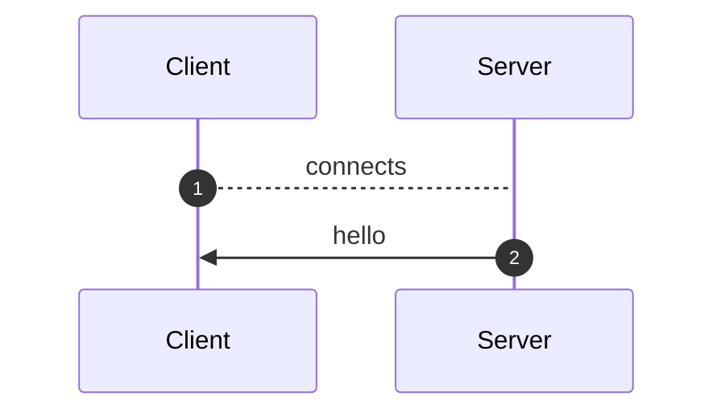
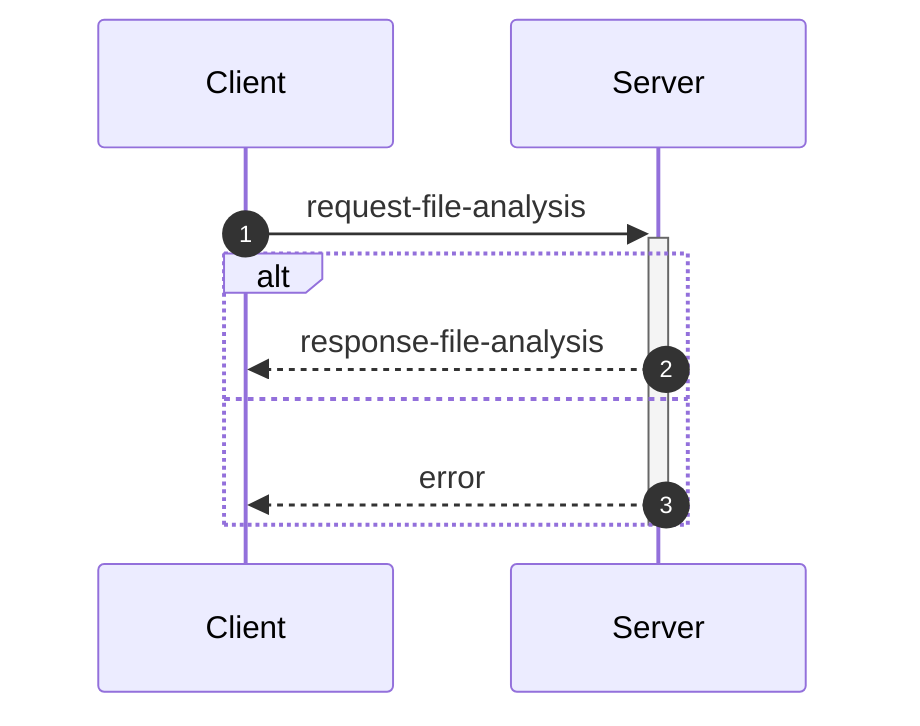
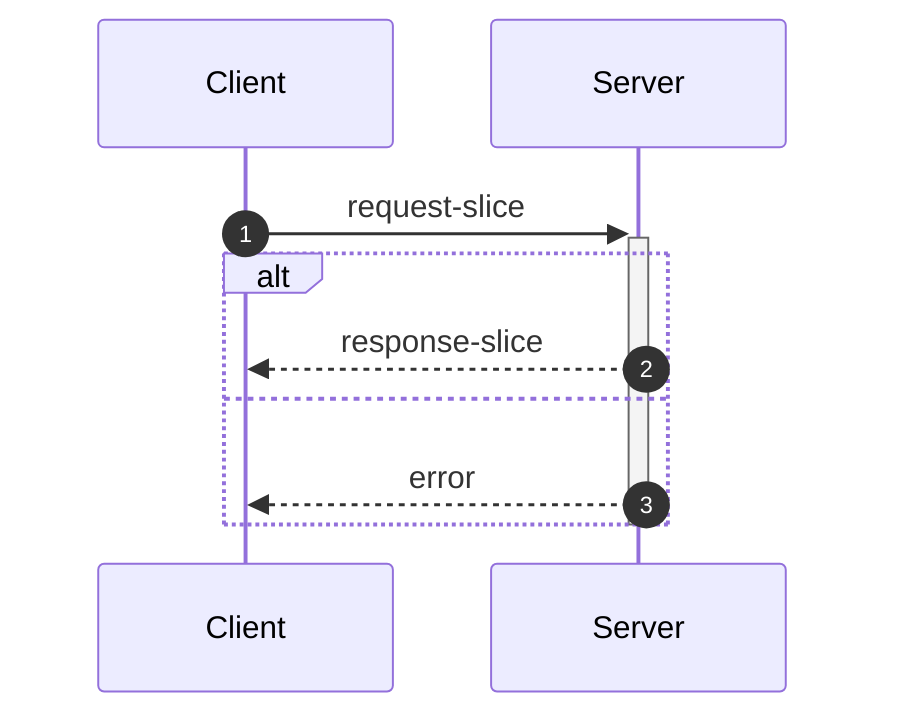
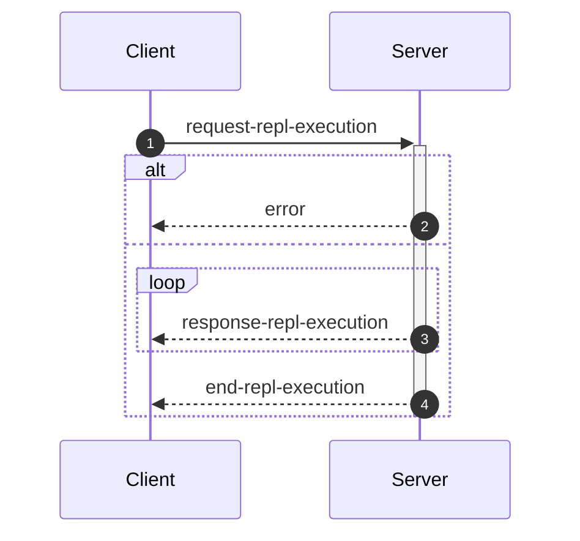

_This document was generated from '[src/documentation/wiki-interface.ts](https://github.com/flowr-analysis/flowr/tree/main//src/documentation/wiki-interface.ts)' on 2026-07-23, 21:48:55 UTC presenting an overview of flowR's interface (v2.13.1, using R v4.5.0). Please do not edit this file/wiki page directly._

Although far from being as detailed as the in-depth explanation of [_flowR_](https://github.com/flowr-analysis/flowr/wiki/core),
this wiki page explains how to interface with _flowR_ in more detail.
In general, command line arguments and other options provide short descriptions on hover over.

* [💻 Using the REPL](#using-the-repl)
* [⚙️ Configuring FlowR](#configuring-flowr)
* [⚒️ Writing Code](#writing-code)
* [💬 Communicating with the Server](#communicating-with-the-server)

<a id='using-the-repl'></a>
## 💻 Using the REPL


> [!NOTE]
> To execute arbitrary R commands with a repl request, _flowR_ has to be started explicitly with <span title="Description (Command Line Argument): Allow to access the underlying R session when using flowR (security warning: this allows the execution of arbitrary R code!)">`--r-session-access`</span>.
> Please be aware that this introduces a security risk and note that this relies on the [`r-shell` engine](https://github.com/flowr-analysis/flowr/wiki/engines) .

Although primarily meant for users to explore,
there is nothing which forbids simply calling _flowR_ as a subprocess to use standard-in, -output, and -error
for communication (although you can access the REPL using the server as well,
with the [REPL Request](#message-request-repl-execution) message).

The read-eval-print loop&nbsp;(REPL) works relatively simple.
You can submit an expression (using <kbd>Enter</kbd>),
which is interpreted as an R&nbsp;expression by default but interpreted as a *command* if it starts with a colon (`:`).
The best command to get started with the REPL is <span title="Description (Repl Command): Show help information (aliases: :h, :?)">`:help`</span>.
Besides, you can leave the REPL either with the command <span title="Description (Repl Command): End the repl (aliases: :q, :exit)">`:quit`</span> or by pressing <kbd>Ctrl</kbd>+<kbd>C</kbd> twice.
When writing a *command*, you may press <kbd>Tab</kbd> to get a list of completions, if available.
Multiple commands can be entered in a single line by separating them with a semicolon (`;`), e.g. `:parse "x<-2"; :df*`.
If a command is given without R code, the REPL will re-use R code given in a previous command.
The prior example will hence return first the parsed AST of the program and then the dataflow graph for `"x <- 2"`.

> [!NOTE]
> If you develop flowR, you may want to launch the repl using the `npm run main-dev` command, this way, you get a non-minified version of flowR with debug information and hot-reloading of source files.

<details>
<summary>Available Commands</summary>

We currently offer the following commands (this with a `[*]` suffix are available with and without the star):


| Command | Description |
| ------- | ----------- |
| **<span title="Description (Repl Command): End the repl (aliases: :q, :exit)">:quit</span>** | End the repl (aliases: **:<span title="Alias of ':quit'. End the repl">q</span>**, **:<span title="Alias of ':quit'. End the repl">exit</span>**) |
| **<span title="Description (Repl Command): Execute the given code as R code. This requires the `--r-session-access` flag to be set and requires the r-shell engine. (aliases: :e, :r)">:execute</span>** | Execute the given code as R code. This requires the `--r-session-access` flag to be set and requires the r-shell engine. (aliases: **:<span title="Alias of ':execute'. Execute the given code as R code. This requires the `--r-session-access` flag to be set and requires the r-shell engine.">e</span>**, **:<span title="Alias of ':execute'. Execute the given code as R code. This requires the `--r-session-access` flag to be set and requires the r-shell engine.">r</span>**) |
| **<span title="Description (Repl Command): Get mermaid code for the control-flow graph of R code (aliases: :cfg, :cf)">:controlflow[*]</span>** | Get mermaid code for the control-flow graph of R code (star: Returns the URL to mermaid.live) (aliases: **:<span title="Alias of ':controlflow'. Get mermaid code for the control-flow graph of R code">cfg</span>**, **:<span title="Alias of ':controlflow'. Get mermaid code for the control-flow graph of R code">cf</span>**) |
| **<span title="Description (Repl Command): Get mermaid code for the control-flow graph with basic blocks (aliases: :cfgb, :cfb)">:controlflowbb[*]</span>** | Get mermaid code for the control-flow graph with basic blocks (star: Returns the URL to mermaid.live) (aliases: **:<span title="Alias of ':controlflowbb'. Get mermaid code for the control-flow graph with basic blocks">cfgb</span>**, **:<span title="Alias of ':controlflowbb'. Get mermaid code for the control-flow graph with basic blocks">cfb</span>**) |
| **<span title="Description (Repl Command): Get mermaid code for the dataflow graph (aliases: :d, :df)">:dataflow[*]</span>** | Get mermaid code for the dataflow graph (star: Returns the URL to mermaid.live) (aliases: **:<span title="Alias of ':dataflow'. Get mermaid code for the dataflow graph">d</span>**, **:<span title="Alias of ':dataflow'. Get mermaid code for the dataflow graph">df</span>**) |
| **<span title="Description (Repl Command): Get mermaid code for the normalized AST of R code (aliases: :n)">:normalize[*]</span>** | Get mermaid code for the normalized AST of R code (star: Returns the URL to mermaid.live) (alias: **:<span title="Alias of ':normalize'. Get mermaid code for the normalized AST of R code">n</span>**) |
| **<span title="Description (Repl Command): Get mermaid code for the simplified dataflow graph (aliases: :ds, :dfs)">:dataflowsimple[*]</span>** | Get mermaid code for the simplified dataflow graph (star: Returns the URL to mermaid.live) (aliases: **:<span title="Alias of ':dataflowsimple'. Get mermaid code for the simplified dataflow graph">ds</span>**, **:<span title="Alias of ':dataflowsimple'. Get mermaid code for the simplified dataflow graph">dfs</span>**) |
| **<span title="Description (Repl Command): Inspect and extend the signature database: `query` (identical to :query @signature), `add <path>` to mount another database/source, `download` to fetch the full-history database. (aliases: :sig)">:signature</span>** | Inspect and extend the signature database: `query` (identical to :query @signature), `add <path>` to mount another database/source, `download` to fetch the full-history database. (alias: **:<span title="Alias of ':signature'. Inspect and extend the signature database: `query` (identical to :query @signature), `add <path>` to mount another database/source, `download` to fetch the full-history database.">sig</span>**) |
| **<span title="Description (Repl Command): Just calculates the DFG, but only prints summary info (aliases: :d#, :df#)">:dataflowsilent</span>** | Just calculates the DFG, but only prints summary info (aliases: **:<span title="Alias of ':dataflowsilent'. Just calculates the DFG, but only prints summary info">d#</span>**, **:<span title="Alias of ':dataflowsilent'. Just calculates the DFG, but only prints summary info">df#</span>**) |
| **<span title="Description (Repl Command): Prints ASCII Art of the parsed, unmodified AST (aliases: :p)">:parse</span>** | Prints ASCII Art of the parsed, unmodified AST (alias: **:<span title="Alias of ':parse'. Prints ASCII Art of the parsed, unmodified AST">p</span>**) |
| **<span title="Description (Repl Command): Prints the version of flowR as well as the current version of R">:version</span>** | Prints the version of flowR as well as the current version of R
| **<span title="Description (Repl Command): Query the given R code (use 'help' for more information)">:query[*]</span>** | Query the given R code (use 'help' for more information) (star: Similar to query, but returns the output in json format.)
| **<span title="Description (Repl Command): Returns an ASCII representation of the dataflow graph (aliases: :df!)">:dataflowascii</span>** | Returns an ASCII representation of the dataflow graph (alias: **:<span title="Alias of ':dataflowascii'. Returns an ASCII representation of the dataflow graph">df!</span>**) |
| **<span title="Description (Repl Command): Returns summarization stats for the normalized AST (aliases: :n#)">:normalize#</span>** | Returns summarization stats for the normalized AST (alias: **:<span title="Alias of ':normalize#'. Returns summarization stats for the normalized AST">n#</span>**) |
| **<span title="Description (Repl Command): Show help information (aliases: :h, :?)">:help</span>** | Show help information (aliases: **:<span title="Alias of ':help'. Show help information">h</span>**, **:<span title="Alias of ':help'. Show help information">?</span>**) |


</details>


> [!TIP]
> 
> As indicated by the examples before, all REPL commands that operate on code keep track of the state.
> Hence, if you run a command like <span title="Description (Repl Command, starred version): Returns the URL to mermaid.live; Base Command: Get mermaid code for the dataflow graph (aliases: :d*, :df*)">`:dataflow*`</span> without providing R code,
> the REPL will re-use the R code provided in a previous command.
> Likewise, doing this will benefit from incrementality!
> If you request the dataflow graph with `:df* x <- 2 * y` and then want to see the parsed AST with `:parse`,
> the REPL will re-use previously obtained information and not re-parse the code again.
> 		


Generally, many commands offer shortcut versions in the REPL. Many queries, for example, offer a shortened format (see the example below).
Of special note, the [Config Query](https://github.com/flowr-analysis/flowr/wiki/%5BQuery%5D-Config)
can be used to also modify the currently active configuration of _flowR_ within the REPL (see the [wiki page](https://github.com/flowr-analysis/flowr/wiki/%5BQuery%5D-Config) for more information).

### Example: Retrieving the Dataflow Graph

To retrieve a URL to the [mermaid](https://mermaid.js.org/) diagram of the dataflow of a given expression,
use <span title="Description (Repl Command, starred version): Returns the URL to mermaid.live; Base Command: Get mermaid code for the dataflow graph (aliases: :d*, :df*)">`:dataflow*`</span> (or <span title="Description (Repl Command): Get mermaid code for the dataflow graph (aliases: :d, :df)">`:dataflow`</span> to get the mermaid code in the cli):


```shell
$ docker run -it --rm eagleoutice/flowr # or npm run flowr 
flowR repl v2.13.1, R grammar v14 (tree-sitter engine)
R> :dataflow* y <- 1 + x
```

<details>
<summary style='color:gray'>Output</summary>


```text
https://mermaid.live/view#base64:eyJjb2RlIjoiZmxvd2NoYXJ0IEJUXG4gICAgMXt7XCJgKiM5MTtSTnVtYmVyIzkzOyogKioxKipcbiAgICAgICoxLjYqICgqKmlkOiAxKiopYFwifX1cbiAgICUlIE5vIGVkZ2VzIGZvdW5kIGZvciAxXG4gICAgMihbXCJgKiM5MTtSU3ltYm9sIzkzOyogKip4KipcbiAgICAgICoxLjEwKiAoKippZDogMioqKWBcIl0pXG4gICAlJSBObyBlZGdlcyBmb3VuZCBmb3IgMlxuICAgIDNbW1wiYCojOTE7UkJpbmFyeU9wIzkzOyogYmFzZSM1ODsjNTg7KiojNDM7KipcbiAgICAgICoxLjYtMTAqICgqKmlkOiAzKiopXG4gICAgYXJnOiAoMSwgMilgXCJdXVxuICAgIGJ1aWx0LWluOl9bXCJgQnVpbHQtSW46XG4jNDM7YFwiXVxuICAgIHN0eWxlIGJ1aWx0LWluOl8gc3Ryb2tlOmdyYXksZmlsbDpncmF5LHN0cm9rZS13aWR0aDoycHgsb3BhY2l0eTouODtcbiAgICAwW1wiYCojOTE7UlN5bWJvbCM5MzsqICoqeSoqXG4gICAgICAqMS4xKiAoKippZDogMCoqLCB2OiAzKWBcIl1cbiAgICA0W1tcImAqIzkxO1JCaW5hcnlPcCM5MzsqIGJhc2UjNTg7IzU4OyoqIzYwOyM0NTsqKlxuICAgICAgKjEuMS0xMCogKCoqaWQ6IDQqKilcbiAgICBhcmc6ICgwLCAzKWBcIl1dXG4gICAgYnVpbHQtaW46Xy1bXCJgQnVpbHQtSW46XG4jNjA7IzQ1O2BcIl1cbiAgICBzdHlsZSBidWlsdC1pbjpfLSBzdHJva2U6Z3JheSxmaWxsOmdyYXksc3Ryb2tlLXdpZHRoOjJweCxvcGFjaXR5Oi44O1xuICAgIDMgLS0+fFwicmVhZHMsIGFyZ1wifCAxXG4gICAgMyAtLT58XCJyZWFkcywgYXJnXCJ8IDJcbiAgICAzIC0uLT58XCJyZWFkcywgY2FsbHNcInwgYnVpbHQtaW46X1xuICAgIGxpbmtTdHlsZSAyIHN0cm9rZTpncmF5O1xuICAgIDAgLS0+fFwiZGVmaW5lZC1ieVwifCAzXG4gICAgMCAtLT58XCJkZWZpbmVkLWJ5XCJ8IDRcbiAgICA0IC0tPnxcInJlYWRzLCBhcmdcInwgM1xuICAgIDQgLS0+fFwicmV0dXJucywgYXJnXCJ8IDBcbiAgICA0IC0uLT58XCJyZWFkcywgY2FsbHNcInwgYnVpbHQtaW46Xy1cbiAgICBsaW5rU3R5bGUgNyBzdHJva2U6Z3JheTsiLCJtZXJtYWlkIjp7ImF1dG9TeW5jIjp0cnVlfX0=
```


Retrieve the dataflow graph of the expression `y <- 1 + x`. It looks like this:


```mermaid
flowchart LR
    1{{"`*#91;RNumber#93;* **1**
      *1.6* (**id: 1**)`"}}
   %% No edges found for 1
    2(["`*#91;RSymbol#93;* **x**
      *1.10* (**id: 2**)`"])
   %% No edges found for 2
    3[["`*#91;RBinaryOp#93;* base#58;#58;**#43;**
      *1.6-10* (**id: 3**)
    arg: (1, 2)`"]]
    built-in:_["`Built-In:
#43;`"]
    style built-in:_ stroke:gray,fill:gray,stroke-width:2px,opacity:.8;
    0["`*#91;RSymbol#93;* **y**
      *1.1* (**id: 0**, v: 3)`"]
    4[["`*#91;RBinaryOp#93;* base#58;#58;**#60;#45;**
      *1.1-10* (**id: 4**)
    arg: (0, 3)`"]]
    built-in:_-["`Built-In:
#60;#45;`"]
    style built-in:_- stroke:gray,fill:gray,stroke-width:2px,opacity:.8;
    3 -->|"reads, arg"| 1
    3 -->|"reads, arg"| 2
    3 -.->|"reads, calls"| built-in:_
    linkStyle 2 stroke:gray;
    0 -->|"defined-by"| 3
    0 -->|"defined-by"| 4
    4 -->|"reads, arg"| 3
    4 -->|"returns, arg"| 0
    4 -.->|"reads, calls"| built-in:_-
    linkStyle 7 stroke:gray;
```

	
<details>

<summary style="color:gray">R Code of the Dataflow Graph</summary>

The analysis required _0.8 ms_ (including parse and normalize, using the [tree-sitter](https://github.com/flowr-analysis/flowr/wiki/Engines) engine) within the generation environment. No [signature database](https://github.com/flowr-analysis/flowr/wiki/Signature-Database) is mounted for these generated graphs, so `library()` calls attach no package exports; base-R names are still qualified via the generated base-package store (e.g. `acf` as `stats::acf`). 
We encountered no unknown side effects during the analysis.


```r
y <- 1 + x
```


</details>


</details>


For small graphs like this, <span title="Description (Repl Command): Returns an ASCII representation of the dataflow graph (aliases: :df!)">`:dataflowascii`</span> also provides an ASCII representation directly in the REPL:


```shell
$ docker run -it --rm eagleoutice/flowr # or npm run flowr 
flowR repl v2.13.1, R grammar v14 (tree-sitter engine)
R> :df! y <- 1 + x
```

<details open>
<summary style='color:gray'>Output</summary>


```text
                        0<1>0
                   ┌────| 1 |
    ┌────────┐     │    0---0
 c<4>c       └──c<3>c
 |<- |  v<0>v┌──| + |
 c---c──| y |┘  c---c   u<2>u
        v---v      └────| x |
                        u---u
Edges:
3 -> 1: reads, arg  3 -> 2: reads, arg
4 -> 3: reads, arg  4 -> 0: returns, arg
0 -> 3: defined-by  0 -> 4: defined-by
```


Retrieve the dataflow graph of the expression `y <- 1 + x` as ASCII art.

</details>


For the slicing with <span title="Description (Repl Command): Static backwards executable slicer for R">`:slicer`</span>, you have access to the same [magic comments](#slice-magic-comments) as with the [slice request](#message-request-slice).
Pass `--inline` to splice resolvable `source()` calls into the reconstruction so the slice is a single self-contained R text (the same as the static slice query's `inlineSources` flag).
See `--help` for more flags!

### Example: Interfacing with the File System

Many commands that allow for an R-expression (like <span title="Description (Repl Command, starred version): Returns the URL to mermaid.live; Base Command: Get mermaid code for the dataflow graph (aliases: :d*, :df*)">`:dataflow*`</span>) allow for a file as well
if the argument starts with `file://`.
If you are working from the root directory of the _flowR_ repository, the following gives you the parsed AST of the example file using the <span title="Description (Repl Command): Prints ASCII Art of the parsed, unmodified AST (aliases: :p)">`:parse`</span> command:

> **Watch mode**: Replace `file://` with `watch://` to enter watch mode.
> flowR runs the command immediately and then re-runs it every time the file (or any file inside the folder) changes.
> Enter any other command to leave watch mode.
> For example: `:df watch://analysis.R`


```shell
$ docker run -it --rm eagleoutice/flowr # or npm run flowr 
flowR repl v2.13.1, R grammar v14 (tree-sitter engine)
R> :parse file://test/testfiles/example.R
```

<details>
<summary style='color:gray'>Output</summary>


```text
File: test/testfiles/example.R

program
├ binaryoperator
│ ├ identifier "sum" (1:1─4)
│ ├ <- "<-" (1:5─7)
│ ╰ float "0" (1:8─9)
├ binaryoperator
│ ├ identifier "product" (2:1─8)
│ ├ <- "<-" (2:9─11)
│ ╰ float "1" (2:12─13)
├ binaryoperator
│ ├ identifier "w" (3:1─2)
│ ├ <- "<-" (3:3─5)
│ ╰ float "7" (3:6─7)
├ binaryoperator
│ ├ identifier "N" (4:1─2)
│ ├ <- "<-" (4:3─5)
│ ╰ float "10" (4:6─8)
├ forstatement
│ ├ for "for" (6:1─4)
│ ├ ( "(" (6:5─6)
│ ├ identifier "i" (6:6─7)
│ ├ in "in" (6:8─10)
│ ├ binaryoperator
│ │ ├ float "1" (6:11─12)
│ │ ├ : ":" (6:12─13)
│ │ ╰ parenthesizedexpression
│ │   ├ ( "(" (6:13─14)
│ │   ├ binaryoperator
│ │   │ ├ identifier "N" (6:14─15)
│ │   │ ├ - "-" (6:15─16)
│ │   │ ╰ float "1" (6:16─17)
│ │   ╰ ) ")" (6:17─18)
│ ├ ) ")" (6:18─19)
│ ╰ bracedexpression
│   ├ { "{" (6:20─21)
│   ├ binaryoperator
│   │ ├ identifier "sum" (7:3─6)
│   │ ├ <- "<-" (7:7─9)
│   │ ╰ binaryoperator
│   │   ├ binaryoperator
│   │   │ ├ identifier "sum" (7:10─13)
│   │   │ ├ + "+" (7:14─15)
│   │   │ ╰ identifier "i" (7:16─17)
│   │   ├ + "+" (7:18─19)
│   │   ╰ identifier "w" (7:20─21)
│   ├ binaryoperator
│   │ ├ identifier "product" (8:3─10)
│   │ ├ <- "<-" (8:11─13)
│   │ ╰ binaryoperator
│   │   ├ identifier "product" (8:14─21)
│   │   ├  "" (8:22─23)
│   │   ╰ identifier "i" (8:24─25)
│   ╰ } "}" (9:1─2)
├ call
│ ├ identifier "cat" (11:1─4)
│ ╰ arguments
│   ├ ( "(" (11:4─5)
│   ├ argument
│   │ ╰ string
│   │   ├ " "\"" (11:5─6)
│   │   ├ stringcontent "Sum:" (11:6─10)
│   │   ╰ " "\"" (11:10─11)
│   ├ comma "," (11:11─12)
│   ├ argument
│   │ ╰ identifier "sum" (11:13─16)
│   ├ comma "," (11:16─17)
│   ├ argument
│   │ ╰ string
│   │   ├ " "\"" (11:18─19)
│   │   ├ stringcontent
│   │   │ ╰ escapesequence "\\n" (11:19─21)
│   │   ╰ " "\"" (11:21─22)
│   ╰ ) ")" (11:22─23)
╰ call
  ├ identifier "cat" (12:1─4)
  ╰ arguments
    ├ ( "(" (12:4─5)
    ├ argument
    │ ╰ string
    │   ├ " "\"" (12:5─6)
    │   ├ stringcontent "Product:" (12:6─14)
    │   ╰ " "\"" (12:14─15)
    ├ comma "," (12:15─16)
    ├ argument
    │ ╰ identifier "product" (12:17─24)
    ├ comma "," (12:24─25)
    ├ argument
    │ ╰ string
    │   ├ " "\"" (12:26─27)
    │   ├ stringcontent
    │   │ ╰ escapesequence "\\n" (12:27─29)
    │   ╰ " "\"" (12:29─30)
    ╰ ) ")" (12:30─31)
```


Retrieve the parsed AST of the example file.

<details>

<summary>File Content</summary>


```r
sum <- 0
product <- 1
w <- 7
N <- 10

for (i in 1:(N-1)) {
  sum <- sum + i + w
  product <- product * i
}

cat("Sum:", sum, "\n")
cat("Product:", product, "\n")
```


</details>

As _flowR_ directly transforms this AST the output focuses on being human-readable instead of being machine-readable.
		

</details>


### Example: Run a Query

You can run any query supported by _flowR_ using the <span title="Description (Repl Command): Query the given R code (use 'help' for more information)">`:query`</span> command.
For example, to obtain the shapes of all data frames in a given piece of code, you can run:


```shell
$ docker run -it --rm eagleoutice/flowr # or npm run flowr 
flowR repl v2.13.1, R grammar v14 (tree-sitter engine)
R> :query @absint df-shape "x <- data.frame(a = 1:10, b = 1:10)\ny <- x$a"
```

<details open>
<summary style='color:gray'>Output</summary>


```text
Query: absint (2 ms)
   ╰ $12: (colnames: [{"a", "b"}, {}], cols: [2, 2], rows: [10, 10])
   ╰ $0: (colnames: [{"a", "b"}, {}], cols: [2, 2], rows: [10, 10])
All queries together required ≈6 ms (1ms accuracy, total 6 ms)
```


Retrieve the shapes of all data frames in the given code.

</details>


To run the linter on a file, you can use (in this example, we just issue the `dead-code` linter on a small piece of code):


```shell
$ docker run -it --rm eagleoutice/flowr # or npm run flowr 
flowR repl v2.13.1, R grammar v14 (tree-sitter engine)
R> :query @linter rules:dead-code "if(FALSE) x <- 2"
```

<details open>
<summary style='color:gray'>Output</summary>


```text
Query: linter (3 ms)
   ╰ Dead Code (dead-code):
       ╰ certain:
           ╰ Code at 1.11-16
       ╰ Metadata: searchTimeMs: 3, processTimeMs: 0
All queries together required ≈3 ms (1ms accuracy, total 3 ms)
```


Run the linter on the given code, with only the `dead-code` rule enabled.

</details>


For more information on the available queries, please check out the [Query API](https://github.com/flowr-analysis/flowr/wiki/query-api).


<a id='configuring-flowr'></a>
## ⚙️ Configuring FlowR


When running _flowR_, you may want to specify some behaviors with a dedicated configuration file.
By default, flowR looks for a file named `flowr.json` in the current working directory (or any higher directory).
You can also specify a different file with <span title="Description (Command Line Argument): The name of the configuration file to use">`--config-file`</span> or pass the configuration inline using <span title="Description (Command Line Argument): The flowR configuration to use, as a JSON string">`--config-json`</span>.
To inspect the current configuration, you can run flowr with the <span title="Description (Command Line Argument): Run with verbose logging (will be passed to the corresponding script)">`--verbose`</span> flag, or use the `config` [Query](https://github.com/flowr-analysis/flowr/wiki/query-api).
Within the REPL this works by running the following:


```shell
:query @config
```


To work with the <a href="https://github.com/flowr-analysis/flowr/tree/main/src/config.ts#L130"><code><span title="The configuration file format for flowR.">FlowrConfig</span></code></a> you can use the provided helper objects alongside its methods like
<a href="https://github.com/flowr-analysis/flowr/tree/main/src/config.ts#L756"><code><span title="Creates a new flowr config that has the updated values.">FlowrConfig::<b>amend</b></span></code></a>.
The schema below documents every option; the ones you most likely want are:

- <a href="https://github.com/flowr-analysis/flowr/wiki/Interface#configuring-flowr" title="Configuration Option (boolean): Whether source calls should be ignored, causing {@link processSourceCall}&#39;s behavior to be skipped.">ignoreSourceCalls</a>: ignore source calls when analyzing the code, i.e., ignore the inclusion of other files.
- <a href="https://github.com/flowr-analysis/flowr/wiki/Interface#configuring-flowr" title="Configuration Option (boolean): Whether load calls should be ignored, causing {@link processLoadCall}&#39;s behavior to be skipped.">ignoreLoadCalls</a>: ignore load calls when analyzing the code, i.e., ignore the loading of r-data files.
- <a href="https://github.com/flowr-analysis/flowr/wiki/Interface#configuring-flowr" title="Configuration Option (object): Do you want to overwrite (parts) of the builtin definition?">semantics.environment.overwriteBuiltIns</a>: overwrite _flowR_'s handling of built-in functions, or clear the preset definitions entirely.
  See [Configure BuiltIn Semantics](#configure-builtin-semantics) for more information.
- <a href="https://github.com/flowr-analysis/flowr/wiki/Interface#configuring-flowr" title="Configuration Option (string): How to resolve variables and their values. (one of &quot;disabled&quot;, &quot;alias&quot;, &quot;builtin&quot;)">solver.variables</a>: how to resolve variables and their values (`disabled`, `alias`, `builtin`).
- <a href="https://github.com/flowr-analysis/flowr/wiki/Interface#configuring-flowr" title="Configuration Option (array): The engine or set of engines to use for interacting with R code. An empty array means all available engines will be used.">engines</a> and <a href="https://github.com/flowr-analysis/flowr/wiki/Interface#configuring-flowr" title="Configuration Option (string): The default engine to use for interacting with R code. If this is undefined, an arbitrary engine from the specified list will be used. (one of &quot;tree-sitter&quot;, &quot;r-shell&quot;)">defaultEngine</a>: the engines used to interact with R code, see the [Engines wiki page](https://github.com/flowr-analysis/flowr/wiki/engines).
- <a href="https://github.com/flowr-analysis/flowr/wiki/Interface#configuring-flowr" title="Configuration Option (array): Files a framework loads on its own, without any source() call (e.g. global.R in a shiny app), in the order they are loaded; flowR orders the matching project files accordingly and analyzes them as one program. Entries are case-insensitive globs matched against the file path, a plain name matches any file with that name, and entries matching no project file are warned about. Usually set per project kind via specializeConfig.">project.implicitSources</a>: the files a framework loads without any `source()` call, in the order in which they are
  loaded. Entries are globs (e.g. `R/*.R`) matched against the file path ignoring capitalization; one matching no file is reported.
- <a href="https://github.com/flowr-analysis/flowr/wiki/Interface#configuring-flowr" title="Configuration Option (object): Overwrite (parts of) the configuration depending on the project kind flowR detects, e.g. to give a shiny app its implicit sources.">specializeConfig</a>: overwrite (parts of) the configuration depending on the kind of project _flowR_ detects
  (e.g. `shiny-app`), which is how a shiny app gets its implicit sources by default. What you configure directly wins.
- <a href="https://github.com/flowr-analysis/flowr/wiki/Interface#configuring-flowr" title="Configuration Option (string): Overwrite the project kind flowR would otherwise infer from the analyzed files, e.g. when auto-detection guesses wrong. (one of &quot;package&quot;, &quot;script&quot;, &quot;shiny-app&quot;, &quot;notebook&quot;, &quot;project&quot;, &quot;unknown&quot;)">project.useProjectType</a>: skip that detection and force a project kind yourself, when auto-detection guesses wrong.
- <a href="https://github.com/flowr-analysis/flowr/wiki/Interface#configuring-flowr" title="Configuration Option (array): The default plugins to load when creating a new instance of FlowrAnalyzer">defaultPlugins</a> and <a href="https://github.com/flowr-analysis/flowr/wiki/Interface#configuring-flowr" title="Configuration Option (array): The plugins to load in REPL mode">repl.plugins</a>: the plugins to load for a new <a href="https://github.com/flowr-analysis/flowr/tree/main/src/project/flowr-analyzer.ts#L167"><code><span title="Central class for conducting analyses with FlowR. Use the FlowrAnalyzerBuilder to create a new instance. If you want the original pattern of creating a pipeline and running all steps, you can still do this with FlowrAnalyzer#runFull . To inspect the context of the analyzer, use FlowrAnalyzer#inspectContext (if you are a plugin and need to modify it, use FlowrAnalyzer#context instead).">FlowrAnalyzer</span></code></a> and in the REPL
  (use `flowr:default` to reference the former).

So you can configure _flowR_ by adding a file like the following:

<details>

<summary>Example Configuration File</summary>


```json
{
  "ignoreSourceCalls": true,
  "ignoreLoadCalls": true,
  "semantics": {
    "environment": {
      "overwriteBuiltIns": {
        "definitions": [
          {
            "type": "function",
            "names": [
              "foo"
            ],
            "processor": "builtin:assign",
            "config": {}
          }
        ]
      }
    }
  },
  "defaultPlugins": [
    "file:description",
    "versions:description"
  ],
  "repl": {
    "quickStats": false,
    "dfProcessorHeat": false,
    "hints": true,
    "plugins": [
      "flowr:default"
    ]
  },
  "project": {
    "resolveUnknownPathsOnDisk": true,
    "implicitSources": [
      "global.R",
      "app.R"
    ]
  },
  "linter": {
    "disabledRules": []
  },
  "specializeConfig": {
    "shiny-app": {
      "project": {
        "implicitSources": [
          "global.R",
          "ui.R",
          "server.R",
          "app.R"
        ]
      }
    }
  },
  "engines": [
    {
      "type": "r-shell"
    }
  ],
  "solver": {
    "variables": "alias",
    "evalStrings": true,
    "trackEnvironments": true,
    "sigdb": {
      "enabled": true,
      "loadProjectDependencies": true,
      "eagerlyLoad": false,
      "eagerlyLoadExports": false,
      "linkBaseR": false,
      "linkDescriptionDependencies": false
    },
    "resolveSource": {
      "dropPaths": "no",
      "ignoreCapitalization": true,
      "inferWorkingDirectory": "active-script",
      "searchPath": []
    },
    "instrument": {},
    "slicer": {
      "threshold": 50
    }
  },
  "abstractInterpretation": {
    "wideningThreshold": 4,
    "dataFrame": {
      "maxColNames": 20,
      "readLoadedData": {
        "readExternalFiles": true,
        "maxReadLines": 1000000
      }
    }
  },
  "gas": {
    "thresholds": {
      "memory": {
        "problematic": 0.7,
        "critical": 0.9
      },
      "timeMs": {
        "problematic": 100000,
        "critical": 120000
      }
    },
    "features": {}
  }
}
```


</details>

<details>
<a id='configure-builtin-semantics'></a>
<summary>Configure Built-In Semantics</summary>


`semantics/environment/overwriteBuiltins` accepts two keys:

- `loadDefaults` (boolean, initially `true`): If set to `true`, the default built-in definitions are loaded before applying the custom definitions. Setting this flag to `false` explicitly disables the loading of the default definitions.
- `definitions` (array, initially empty): Allows to overwrite or define new built-in elements. Each object within must have a `type` which is one of the below. Furthermore, they may define a string array of `names` which specifies the identifiers to bind the definitions to. You may use `assumePrimitive` to specify whether _flowR_ should assume that this is a primitive non-library definition (so you probably just do not want to specify the key).

  | Type            | Description                                                                                                                                                                                                                                                                                              | Example                                                                                                    |
  | --------------- | -------------------------------------------------------------------------------------------------------------------------------------------------------------------------------------------------------------------------------------------------------------------------------------------------------- | ---------------------------------------------------------------------------------------------------------- |
  | `constant`    | Additionally allows for a `value` this should resolve to.                                                                                                                                                                                                                                                | `{ type: 'constant', names: ['NULL', 'NA'],  value: null }`                                                |
  | `function`    | Is a rather flexible way to define and bind built-in functions. For the time, we do not have extensive documentation to cover all the cases, so please either consult the sources with the `default-builtin-config.ts` or open a [new issue](https://github.com/flowr-analysis/flowr/issues/new/choose). | `{ type: 'function', names: ['next'], processor: 'builtin:d', config: { cfg: ExitPointType.Next } }` |
  | `replacement` | A comfortable way to specify replacement functions like `$<-` or `names<-`. `suffixes` describes the... suffixes to attach automatically. | `{ type: 'replacement', suffixes: ['<-', '<<-'], names: ['[', '[['] }` |


</details>

<details>

<summary style='color:gray'>Full Configuration-File Schema</summary>

- _The configuration file format for flowR._ (object)
    - **logLevel** [optional] _flowR's global minimum log level, applied when the config is loaded._ (string)
        Only allows: 'silly', 'trace', 'debug', 'info', 'warn', 'error', 'fatal'
    - **ignoreSourceCalls** [optional] _Whether source calls should be ignored, causing {@link processSourceCall}'s behavior to be skipped._ (boolean)
    - **ignoreLoadCalls** [optional] _Whether load calls should be ignored, causing {@link processLoadCall}'s behavior to be skipped._ (boolean)
    - **semantics** _Configure language semantics and how flowR handles them._ (object)
        - **environment** [optional] _Semantics regarding how to handle the R environment._ (object)
            - **overwriteBuiltIns** [optional] _Do you want to overwrite (parts) of the builtin definition?_ (object)
                - **loadDefaults** [optional] _Should the default configuration still be loaded?_ (boolean)
                - **definitions** [optional] _The definitions to load/overwrite._ (array)
                Valid item types:
                    - (object)
    - **defaultPlugins** [optional] _The default plugins to load when creating a new instance of FlowrAnalyzer_ (array)
    Valid item types:
        - (alternatives)
            - (string)
            - (array)
    - **repl** _Configuration options for the REPL._ (object)
        - **quickStats** [optional] _Whether to show quick stats in the REPL after each evaluation._ (boolean)
        - **dfProcessorHeat** [optional] _This instruments the dataflow processors to count how often each processor is called._ (boolean)
        - **hints** [optional] _Whether to show dim inline hints on the empty prompt (automatically disabled on non-interactive terminals)._ (boolean)
        - **plugins** [optional] _The plugins to load in REPL mode_ (array)
        Valid item types:
            - (alternatives)
                - (string)
                - (array)
        - **autoUseFileProtocol** [optional] _Prepend the file protocol to a repl input that looks like a path, instead of only warning about it._ (boolean)
        - **queryStats** [optional] _Whether `:query` closes with the line stating how long the queries took (`:query*` never prints it)._ (boolean)
        - **showPlugins** [optional] _Whether `:version` grays out the plugins that did not activate during the last analysis._ (boolean)
    - **project** _Project specific configuration options._ (object)
        - **resolveUnknownPathsOnDisk** [optional] _Whether to resolve unknown paths loaded by the r project disk when trying to source/analyze files._ (boolean)
        - **failOnInaccessiblePath** [optional] _Whether a directory that cannot be traversed during file discovery (e.g. due to permissions) aborts the analysis; when false (the default) such paths are logged and skipped._ (boolean)
        - **basePackages** [optional] _The packages considered part of R itself (base and recommended); if unset, flowR uses its built-in list._ (array)
        Valid item types:
            - (string)
        - **implicitSources** [optional] _Files a framework loads on its own, without any source() call (e.g. global.R in a shiny app), in the order they are loaded; flowR orders the matching project files accordingly and analyzes them as one program. Entries are case-insensitive globs matched against the file path, a plain name matches any file with that name, and entries matching no project file are warned about. Usually set per project kind via specializeConfig._ (array)
        Valid item types:
            - (string)
        - **useProjectType** [optional] _Overwrite the project kind flowR would otherwise infer from the analyzed files, e.g. when auto-detection guesses wrong._ (string)
            Only allows: 'package', 'script', 'shiny-app', 'notebook', 'project', 'unknown'
        - **discovery** [optional] _Scoping options for the default project discovery._ (object)
            - **full** [optional] _Collect every file below the project root (greedy) instead of only the files the detected project kind needs (default false)._ (boolean)
            - **perKind** [optional] _Per-kind include/exclude glob overrides layered on the default scoping._ (object)
            - **ignore** [optional] _Case-insensitive globs that drop matching files from the intelligent discovery, regardless of kind (e.g. .Renviron to ignore environment files)._ (array)
            Valid item types:
                - (string)
        - **classification** [optional] _Overrides for the signals flowR uses to classify the project kind._ (object)
            - **shinyDescriptionTypes** [optional] _DESCRIPTION Type: values that mark a shiny app._ (array)
            Valid item types:
                - (string)
            - **shinyEntryFiles** [optional] _File names a shiny app is assembled from._ (array)
            Valid item types:
                - (string)
            - **shinyUsagePattern** [optional] _Regex source evidencing shiny usage in an entry file._ (string)
            - **notebookExtensions** [optional] _File extensions marking a notebook._ (array)
            Valid item types:
                - (string)
    - **linter** _Linter configuration options._ (object)
        - **disabledRules** _Linting rule names excluded from the default rule set (a rule requested explicitly via a linter query still runs). Usually set per project kind via specializeConfig._ (array)
        Valid item types:
            - (string)
    - **specializeConfig** [optional] _Overwrite (parts of) the configuration depending on the project kind flowR detects, e.g. to give a shiny app its implicit sources._ (object)
    - **engines** _The engine or set of engines to use for interacting with R code. An empty array means all available engines will be used._ (array)
    Valid item types:
        - (alternatives)
            - _The configuration for the tree sitter engine._ (object)
                - **type** [required] _Use the tree sitter engine._ (string)
                    Only allows: 'tree-sitter'
                - **wasmPath** [optional] _The path to the tree-sitter-r WASM binary to use. If this is undefined, this uses the default path._ (string)
                - **treeSitterWasmPath** [optional] _The path to the tree-sitter WASM binary to use. If this is undefined, this uses the default path._ (string)
                - **lax** [optional] _Whether to use the lax parser for parsing R code (allowing for syntax errors). If this is undefined, the strict parser will be used._ (boolean)
            - _The configuration for the R shell engine._ (object)
                - **type** [required] _Use the R shell engine._ (string)
                    Only allows: 'r-shell'
                - **rPath** [optional] _The path to the R executable to use. If this is undefined, this uses the default path._ (string)
    - **defaultEngine** [optional] _The default engine to use for interacting with R code. If this is undefined, an arbitrary engine from the specified list will be used._ (string)
        Only allows: 'tree-sitter', 'r-shell'
    - **solver** _How to resolve constants, constraints, cells, ..._ (object)
        - **variables** _How to resolve variables and their values._ (string)
            Only allows: 'disabled', 'alias', 'builtin'
        - **evalStrings** _Should we include eval(parse(text="...")) calls in the dataflow graph?_ (boolean)
        - **trackEnvironments** [optional] _Track user-created environments (new.env, assign/get/local with envir=, dollar-assign, attach). When false, all envir-style calls fall through conservatively._ (boolean)
        - **sigdb** _Resolving library exports from a signature database._ (object)
            - **enabled** [optional] _Resolve library()/use() exports from a signature database (default true); when false no database is consulted._ (boolean)
            - **loadProjectDependencies** [optional] _Load the project's declared dependencies from its metadata files (DESCRIPTION Imports/Depends, rproject.toml, renv.lock, rv.lock) (default true); when false these files are not read for dependencies._ (boolean)
            - **eagerlyLoad** [optional] _Parse the database up front rather than on the first package load (default false, ignored if disabled)._ (boolean)
            - **eagerlyLoadExports** [optional] _Add a vertex for every export on load rather than on demand (default false); keeps the dataflow graph small._ (boolean)
            - **assumedRVersion** [optional] _R version assumed when resolving versioned (base-R) exports: a pin like "4.5" or "auto" to detect the installed R (default "auto")._ (string)
            - **linkBaseR** [optional] _Eagerly attach base-R namespaces so bare base calls resolve without library() (default false)._ (boolean)
            - **linkBaseRCalls** [optional] _Add a lightweight Reads edge from a bare base-R call to its signature-database function vertex (default false; base-R qualification is edge-free otherwise)._ (boolean)
            - **linkPackageCalls** [optional] _Add a lightweight Reads edge from a resolved package call to its signature-database function vertex (default false)._ (boolean)
            - **linkDescriptionDependencies** [optional] _Eagerly attach the namespaces of the project's declared DESCRIPTION dependencies (Imports/Depends) so their exports resolve without an explicit library() (default false)._ (boolean)
            - **warmInBackground** [optional] _Decompress the hot shards (base + most-downloaded) in a background task on startup so the first library() lookup is warm (default false; for long-running servers/REPLs)._ (boolean)
            - **additionalPaths** [optional] _Extra directories or bundle/manifest files searched for signature databases (alongside the shipped default and $FLOWR_SIGDB_DIR); a downloaded full-history bundle placed here is mounted automatically._ (array)
            Valid item types:
                - (string)
            - **downloadRepo** [optional] _GitHub owner/repo the full-history bundle is downloaded from via ":signature download" (default "flowr-analysis/flowr", release tag "sigdb-v<flowR-version>")._ (string)
            - **autoSync** [optional] _On startup, re-download shards whose committed sigdb.remote.json hash no longer matches the cache, in the background (default false; opt-in network sync after a git pull)._ (boolean)
            - **versionSelection** [optional] _When a project constrains a dependency, resolve to the newest (default), oldest, or system-installed version satisfying it; system needs R and falls back to newest. Base-R packages always resolve against the assumed R version._ (string)
                Only allows: 'newest', 'oldest', 'system'
            - **versionOverrides** [optional] _Force an exact version for specific packages (name -> version), overriding both the project constraint and the versionSelection policy (default {})._ (object)
        - **versionManagement** _Policies for reasoning about dependency versions._ (object)
            - **linkedVersionGroups** [optional] _Groups of packages that must resolve to the same version; version guessing intersects each group so its members stay mutually compatible (default [])._ (array)
            Valid item types:
                - (array)
                Valid item types:
                    - (string)
        - **instrument** (object)
            - **dataflowExtractors** [optional] _These keys are only intended for use within code, allowing to instrument the dataflow analyzer!_ (any)
        - **resolveSource** [optional] _If lax source calls are active, flowR searches for sourced files much more freely, based on the configurations you give it. This option is only in effect if `ignoreSourceCalls` is set to false._ (object)
            - **dropPaths** _Allow to drop the first or all parts of the sourced path, if it is relative._ (string)
                Only allows: 'no', 'once', 'all'
            - **ignoreCapitalization** _Search for filenames matching in the lowercase._ (boolean)
            - **inferWorkingDirectory** _Try to infer the working directory from the main or any script to analyze._ (string)
                Only allows: 'no', 'main-script', 'active-script', 'any-script'
            - **searchPath** _Additionally search in these paths._ (array)
            Valid item types:
                - (string)
            - **repeatedSourceLimit** [optional] _How often the same file can be sourced within a single run? Please be aware: in case of cyclic sources this may not reach a fixpoint so give this a sensible limit._ (number)
            - **applyReplacements** _Provide name replacements for loaded files_ (array)
            Valid item types:
                - (object)
            - **assumeFilesExist** [optional] _Assume a sourced file is always there, making what it defines certain instead of conditional on the source call._ (boolean)
        - **slicer** [optional] _The configuration for the slicer._ (object)
            - **threshold** [optional] _The maximum number of iterations to perform on a single function call during slicing._ (number)
            - **autoExtend** [optional] _If set, the slicer will gain an additional post-pass._ (boolean)
    - **abstractInterpretation** _The configuration options for abstract interpretation._ (object)
        - **wideningThreshold** _The threshold for the number of visitations of a node at which widening should be performed to ensure the termination of the fixpoint iteration._ (number)
        - **dataFrame** _The configuration of the shape inference for data frames._ (object)
            - **maxColNames** _The maximum number of columns names to infer for data frames before over-approximating the column names to top._ (number)
            - **readLoadedData** _Configuration options for reading data frame shapes from loaded external data files, such as CSV files._ (object)
                - **readExternalFiles** _Whether data frame shapes should be extracted from loaded external files, such as CSV files._ (boolean)
                - **maxReadLines** _The maximum number of lines to read when extracting data frame shapes from loaded files, such as CSV files._ (number)
    - **gas** [optional] _Resource-usage guard (gas) configuration. All feature factors default to 0 (disabled). See https://github.com/flowr-analysis/flowr/wiki/Core#gas-resource-guard._ (object)
        - **thresholds** [optional] _Shared thresholds for all gas checks (scaled by per-feature factor)._ (object)
            - **memory** [optional] _Heap-usage fraction thresholds (0-1)._ (object)
                - **problematic** [optional] _Heap fraction (0-1) above which Problematic is returned._ (number)
                - **critical** [optional] _Heap fraction (0-1) above which Critical is returned._ (number)
            - **timeMs** [optional] _Elapsed analysis time thresholds in milliseconds._ (object)
                - **problematic** [optional] _Elapsed ms above which Problematic is returned._ (number)
                - **critical** [optional] _Elapsed ms above which Critical is returned._ (number)
        - **features** [optional] _Per-feature sensitivity factors. 0 or absent disables gas checking for that feature. A factor of 2 makes the feature twice as sensitive. Recognised keys: `source`, `side-effect-linking`, `linter`._ (object)
        - **heapProvider** [optional] _Custom heap statistics source (programmatic configs only), overriding the built-in v8/performance.memory detection._ (function)

</details>

	

<a id='writing-code'></a>
## ⚒️ Writing Code

_flowR_ can be used as a [module](https://www.npmjs.com/package/@eagleoutice/flowr) and offers several main classes and interfaces that are interesting for extension writers 
(see the [Visual Studio Code extension](https://marketplace.visualstudio.com/items?itemName=code-inspect.vscode-flowr) or the [Core](https://github.com/flowr-analysis/flowr/wiki/core) wiki page for more information).

### Creating Analyses with _flowR_

Nowadays, instances of the <a href="https://github.com/flowr-analysis/flowr/tree/main/src/project/flowr-analyzer.ts#L167"><code><span title="Central class for conducting analyses with FlowR. Use the FlowrAnalyzerBuilder to create a new instance. If you want the original pattern of creating a pipeline and running all steps, you can still do this with FlowrAnalyzer#runFull . To inspect the context of the analyzer, use FlowrAnalyzer#inspectContext (if you are a plugin and need to modify it, use FlowrAnalyzer#context instead).">FlowrAnalyzer</span></code></a> should be used as central frontend to get analysis results from _flowR_.
For example, a program slice can be created like this:


```ts
const analyzer = await new FlowrAnalyzerBuilder()
    .setEngine('tree-sitter')
    .build();
analyzer.addRequest('x <- 1\ny <- x\nx');
const result = await analyzer.query([
    {
        type:     'static-slice',
        criteria: ['3@x']
    }
]);
//console.log(result['static-slice']);
```


For more information, please have a look at the [Analyzer](https://github.com/flowr-analysis/flowr/wiki/analyzer) wiki page, which explains how to construct and use the <a href="https://github.com/flowr-analysis/flowr/tree/main/src/project/flowr-analyzer.ts#L167"><code><span title="Central class for conducting analyses with FlowR. Use the FlowrAnalyzerBuilder to create a new instance. If you want the original pattern of creating a pipeline and running all steps, you can still do this with FlowrAnalyzer#runFull . To inspect the context of the analyzer, use FlowrAnalyzer#inspectContext (if you are a plugin and need to modify it, use FlowrAnalyzer#context instead).">FlowrAnalyzer</span></code></a> in more detail.
To work with specific perspectives, you can also consult the respective pages like the [Dataflow Graph](https://github.com/flowr-analysis/flowr/wiki/dataflow-graph) or the [Abstract Interpretation](https://github.com/flowr-analysis/flowr/wiki/abstract-interpretation) wiki pages.
### The Pipeline Executor (Low-Level Interface)

Once, in the beginning, _flowR_ was meant to produce a dataflow graph merely to provide *program slices*. 
However, with continuous updates, the [Dataflow Graph](https://github.com/flowr-analysis/flowr/wiki/dataflow-graph) repeatedly proves to be the more interesting part.
With this, we restructured _flowR_'s originally *hardcoded* pipeline to be far more flexible. 
Now, it can be theoretically extended or replaced with arbitrary steps, optional steps, and what we call 'decorations' of these steps. 
In short, a slicing pipeline using the <a href="https://github.com/flowr-analysis/flowr/tree/main/src/core/pipeline-executor.ts#L97"><code><span title="**Please note:** The PipelineExecutor is now considered to be a rather low-level API for flowR. While it still works and is the basis for all other layers, we strongly recommend using the FlowrAnalyzer and its builder to create and use an analyzer instance that is pre-configured for your use-case. The pipeline executor allows to execute arbitrary pipelines in a step-by-step fashion. If you are not...">PipelineExecutor</span></code></a> looks like this:


```ts

const slicer = new PipelineExecutor(DEFAULT_SLICING_PIPELINE, {
  parser:    new RShell(),
  request:   requestFromInput('x <- 1\nx + 1'),
  criterion: ['2@x']
})
const slice = await slicer.allRemainingSteps()
// console.log(slice.reconstruct.code)
```


<details><summary>More Information</summary>


If you compare this, with what you would have done with the old (and removed) `SteppingSlicer`, 
this essentially just requires you to replace the `SteppingSlicer` with the <a href="https://github.com/flowr-analysis/flowr/tree/main/src/core/pipeline-executor.ts#L97"><code><span title="**Please note:** The PipelineExecutor is now considered to be a rather low-level API for flowR. While it still works and is the basis for all other layers, we strongly recommend using the FlowrAnalyzer and its builder to create and use an analyzer instance that is pre-configured for your use-case. The pipeline executor allows to execute arbitrary pipelines in a step-by-step fashion. If you are not...">PipelineExecutor</span></code></a>
and to pass the <a href="https://github.com/flowr-analysis/flowr/tree/main/src/core/steps/pipeline/default-pipelines.ts#L18"><code>DEFAULT_SLICING_PIPELINE</code></a> as the first argument.
The <a href="https://github.com/flowr-analysis/flowr/tree/main/src/core/pipeline-executor.ts#L97"><code><span title="**Please note:** The PipelineExecutor is now considered to be a rather low-level API for flowR. While it still works and is the basis for all other layers, we strongly recommend using the FlowrAnalyzer and its builder to create and use an analyzer instance that is pre-configured for your use-case. The pipeline executor allows to execute arbitrary pipelines in a step-by-step fashion. If you are not...">PipelineExecutor</span></code></a>...

1. Provides structures to investigate the results of all intermediate steps
2. Can be executed step-by-step
3. Can repeat steps (e.g., to calculate multiple slices on the same input)

See the in-code documentation for more information.


</details>

### Using the <a href="https://github.com/flowr-analysis/flowr/tree/main/src/r-bridge/shell.ts#L143"><code><span title="The RShell represents an interactive session with the R interpreter. You can configure it by RShellOptions . At the moment we are using a live R session (and not networking etc.) to communicate with R easily, which allows us to install packages etc. However, this might and probably will change in the future (leaving this as a legacy mode :D)">RShell</span></code></a> to Interact with R

The <a href="https://github.com/flowr-analysis/flowr/tree/main/src/r-bridge/shell.ts#L143"><code><span title="The RShell represents an interactive session with the R interpreter. You can configure it by RShellOptions . At the moment we are using a live R session (and not networking etc.) to communicate with R easily, which allows us to install packages etc. However, this might and probably will change in the future (leaving this as a legacy mode :D)">RShell</span></code></a> class allows interfacing with the `R`&nbsp;ecosystem installed on the host system.
Please have a look at [flowR's Engines](https://github.com/flowr-analysis/flowr/wiki/engines) for more information on alternatives (for example, the <a href="https://github.com/flowr-analysis/flowr/tree/main/src/r-bridge/lang-4.x/tree-sitter/tree-sitter-executor.ts#L18"><code><span title="Synchronous and (way) faster alternative to the RShell using tree-sitter.">TreeSitterExecutor</span></code></a>).


> [!IMPORTANT]
> 
> Each <a href="https://github.com/flowr-analysis/flowr/tree/main/src/r-bridge/shell.ts#L143"><code><span title="The RShell represents an interactive session with the R interpreter. You can configure it by RShellOptions . At the moment we are using a live R session (and not networking etc.) to communicate with R easily, which allows us to install packages etc. However, this might and probably will change in the future (leaving this as a legacy mode :D)">RShell</span></code></a> controls a new instance of the R&nbsp;interpreter, 
> make sure to call <code><a href="https://github.com/flowr-analysis/flowr/tree/main/src/r-bridge/shell.ts#L351"><span title="Close the current R session, makes the object effectively invalid (can no longer be reopened etc.)">RShell::<i>close</i></span></a>()</code> when you are done.


You can start a new "session" simply by constructing a new object with <code>new <a href="https://github.com/flowr-analysis/flowr/tree/main/src/r-bridge/shell.ts#L143"><span title="The RShell represents an interactive session with the R interpreter. You can configure it by RShellOptions . At the moment we are using a live R session (and not networking etc.) to communicate with R easily, which allows us to install packages etc. However, this might and probably will change in the future (leaving this as a legacy mode :D)">RShell</span></a>()</code>.

However, there are several options that may be of interest 
(e.g., to automatically revive the shell in case of errors or to control the name location of the R process on the system).

With a shell object (let's call it `shell`), you can execute R code by using <a href="https://github.com/flowr-analysis/flowr/tree/main/src/r-bridge/shell.ts#L212"><code><span title="sends the given command directly to the current R session will not do anything to alter input markers!">RShell::<i>sendCommand</i></span></code></a>,
for example <code>shell.<a href="https://github.com/flowr-analysis/flowr/tree/main/src/r-bridge/shell.ts#L212"><span title="sends the given command directly to the current R session will not do anything to alter input markers!">sendCommand</span></a>("1 + 1")</code>.
However, this does not return anything, so if you want to collect the output of your command, use
<a href="https://github.com/flowr-analysis/flowr/tree/main/src/r-bridge/shell.ts#L295"><code><span title="Send a command and collect the output">RShell::<i>sendCommandWithOutput</i></span></code></a> instead.


<a id='communicating-with-the-server'></a>
## 💬 Communicating with the Server


As explained in the [Overview](https://github.com/flowr-analysis/flowr/wiki/overview), you can simply run the [TCP](https://de.wikipedia.org/wiki/Transmission_Control_Protocol)&nbsp;server by adding the <span title="Description (Command Line Argument): Do not drop into a repl, but instead start a server on the given port (default: 1042) and listen for messages.">`--server`</span> flag (and, due to the interactive mode, exit with the conventional <kbd>CTRL</kbd>+<kbd>C</kbd>).
Currently, every connection is handled by the same underlying `RShell` - so the server is not designed to handle many clients at a time.
Additionally, the server is not well guarded against attacks (e.g., you can theoretically spawn an arbitrary number of&nbsp;RShell sessions on the target machine).

Every message has to be given in a single line (i.e., without a newline in-between) and end with a newline character. Nevertheless, we will pretty-print example given in the following segments for the ease of reading.


> [!NOTE]
> 
> The default <span title="Description (Command Line Argument): Do not drop into a repl, but instead start a server on the given port (default: 1042) and listen for messages.">`--server`</span> uses a simple [TCP](https://de.wikipedia.org/wiki/Transmission_Control_Protocol)
> connection. If you want _flowR_ to expose a [WebSocket](https://de.wikipedia.org/wiki/WebSocket) server instead, add the <span title="Description (Command Line Argument): If the server flag is set, use websocket for messaging">`--ws`</span> flag (i.e., <span title="Description (Command Line Argument): Do not drop into a repl, but instead start a server on the given port (default: 1042) and listen for messages.">`--server`</span> <span title="Description (Command Line Argument): If the server flag is set, use websocket for messaging">`--ws`</span>) when starting _flowR_ from the command line.


<ul><li>
<a id="message-hello"></a>
<b>Hello</b> Message (<code>hello</code>) 
<details>

<summary style="color:gray"> View Details. <i>The server informs the client about the successful connection and provides Meta-Information.</i> </summary>


```mermaid
sequenceDiagram
    autonumber
    participant Client
    participant Server

    
    Client-->Server: connects
    Server->>Client: hello
	
```


	
After launching _flowR_, for example, with <code>docker run -it --rm eagleoutice/flowr <span title="Description (Command Line Argument): Do not drop into a repl, but instead start a server on the given port (default: 1042) and listen for messages.">-<span/>-server</span></code>&nbsp;(🐳️), simply connecting should present you with a `hello` message, that amongst others should reveal the versions of&nbsp;_flowR_ and&nbsp;R, using the [semver 2.0](https://semver.org/spec/v2.0.0.html) versioning scheme.
The message looks like this:


```json
{
  "type": "hello",
  "clientName": "client-0",
  "versions": {
    "flowr": "2.13.1",
    "r": "4.5.0",
    "engine": "r-shell"
  }
}
```


There are currently a few messages that you can send after the hello message.
If you want to _slice_ a piece of R code you first have to send an [analysis request](#message-request-file-analysis), so that you can send one or multiple slice requests afterward.
Requests for the [REPL](#message-request-repl) are independent of that.
	

<hr>


<details>
<summary style="color:gray">Message schema (<code>hello</code>)</summary>

For the definition of the hello message, please see it's implementation at [`./src/cli/repl/server/messages/message-hello.ts`](https://github.com/flowr-analysis/flowr/tree/main/./src/cli/repl/server/messages/message-hello.ts).

- [required] (object)
    - **type** [required] _The type of the hello message._ (string)
        Only allows: 'hello'
    - **id** [forbidden] _The id of the message is always undefined (as it is the initial message and not requested)._ (any)
    - **clientName** [required] _A unique name that is assigned to each client. It has no semantic meaning and is only used/useful for debugging._ (string)
    - **versions** [required] (object)
        - **flowr** [required] _The version of the flowr server running in semver format._ (string)
        - **r** [required] _The version of the underlying R shell running in semver format._ (string)
        - **engine** [required] _The parser backend that is used to parse the R code._ (string)

</details>


<hr>

</details>
	</li>

<li>
<a id="message-request-file-analysis"></a>
<b>Analysis</b> Message (<code>request-file-analysis</code>) 
<details>

<summary style="color:gray"> View Details. <i>The server builds the dataflow graph for a given input file (or a set of files).</i> </summary>


```mermaid
sequenceDiagram
    autonumber
    participant Client
    participant Server

    
    Client->>+Server: request-file-analysis
    alt
        Server-->>Client: response-file-analysis
    else
        Server-->>Client: error
    end
    deactivate  Server
	
```


	
The request allows the server to analyze a file and prepare it for slicing.
The message can contain a `filetoken`, which is used to identify the file in later slice or query requests (if you do not add one, the request will not be stored and therefore, it is not available for subsequent requests).

> **Please note!**\
> If you want to send and process a lot of analysis requests, but do not want to slice them, please do not pass the `filetoken` field. This will save the server a lot of memory allocation.

Furthermore, the request must contain either a `content` field to directly pass the file's content or a `filepath` field which contains the path to the file (this path must be accessible for the server to be useful).
If you add the `id` field, the answer will use the same `id` so you can match requests and the corresponding answers.
See the implementation of the request-file-analysis message for more information.

You can drop one or more stored file tokens by adding the `invalidateToken` field (a single token or an array of tokens).
The server frees the corresponding analyses _after_ it has answered the request.

> **Tip!**\
> If you only want to drop tokens, you do not need a separate message: send a `request-file-analysis` that contains _just_ the `invalidateToken` field (and no `content` or `filepath`).
> Such a request behaves like an empty file analysis and the server replies with an empty `results` object.
> Because invalidation happens after the response, you may even pass the _current_ `filetoken` in `invalidateToken` to analyze a file once and have the server forget it right after you received the results.


<details>
<summary>Example of the <code>request-file-analysis</code> Message</summary>

_Note:_ even though we pretty-print these messages, they are sent as a single line, ending with a newline.

The following lists all messages that were sent and received in case you want to reproduce the scenario:

<ol>
<li> <code>hello</code> (response)
<details> 

<summary> Show Details </summary>

The first message is always a hello message.


```json
{
  "type": "hello",
  "clientName": "client-0",
  "versions": {
    "flowr": "2.13.1",
    "r": "4.5.0",
    "engine": "r-shell"
  }
}
```


</details>
</li>

<li> <b><code>request-file-analysis</code> (request)</b>
<details open> 

<summary> Show Details </summary>

Let's suppose you simply want to analyze the following script:
 
```r
x <- 1
x + 1
```

 For this, you can send the following request:


```json
{
  "type": "request-file-analysis",
  "id": "1",
  "filetoken": "x",
  "content": "x <- 1\nx + 1"
}
```


</details>
</li>

<li> <code>response-file-analysis</code> (response)
<details> 

<summary> Show Details </summary>


The `results` field of the response effectively contains three keys of importance:

- `parse`: which contains 1:1 the parse result in CSV format that we received from the `RShell` (i.e., the AST produced by the parser of the R interpreter).
- `normalize`: which contains the normalized AST, including ids (see the `info` field and the [Normalized AST](https://github.com/flowr-analysis/flowr/wiki/normalized-ast) wiki page).
- `dataflow`: especially important is the `graph` field which contains the dataflow graph as a set of root vertices (see the [Dataflow Graph](https://github.com/flowr-analysis/flowr/wiki/dataflow-graph) wiki page).
			


_As the code is pretty long, we inhibit pretty printing and syntax highlighting (JSON, hiding built-in):_

```text
{"type":"response-file-analysis","format":"json","id":"1","results":{"parse":{"files":[{"parsed":"[1,1,1,6,7,0,\"expr\",false,\"x <- 1\"],[1,1,1,1,1,3,\"SYMBOL\",true,\"x\"],[1,1,1,1,3,7,\"expr\",false,\"x\"],[1,3,1,4,2,7,\"LEFT_ASSIGN\",true,\"<-\"],[1,6,1,6,4,5,\"NUM_CONST\",true,\"1\"],[1,6,1,6,5,7,\"expr\",false,\"1\"],[2,1,2,5,16,0,\"expr\",false,\"x + 1\"],[2,1,2,1,10,12,\"SYMBOL\",true,\"x\"],[2,1,2,1,12,16,\"expr\",false,\"x\"],[2,3,2,3,11,16,\"'+'\",true,\"+\"],[2,5,2,5,13,14,\"NUM_CONST\",true,\"1\"],[2,5,2,5,14,16,\"expr\",false,\"1\"]","filePath":"/tmp/tmp-10663-4DpCyhW5Vy61-.R"}],".meta":{"timing":1}},"normalize":{"ast":{"type":"RProject","files":[{"root":{"type":"RExpressionList","children":[{"type":"RBinaryOp","location":[1,3,1,4],"lhs":{"type":"RSymbol","location":[1,1,1,1],"content":"x","lexeme":"x","info":{"fullRange":[1,1,1,1],"adToks":[],"id":0,"parent":2,"role":"bin-l","index":0,"nest":0,"file":"/tmp/tmp-10663-4DpCyhW5Vy61-.R"}},"rhs":{"location":[1,6,1,6],"lexeme":"1","info":{"fullRange":[1,6,1,6],"adToks":[],"id":1,"parent":2,"role":"bin-r","index":1,"nest":0,"file":"/tmp/tmp-10663-4DpCyhW5Vy61-.R"},"type":"RNumber","content":{"num":1,"complexNumber":false,"markedAsInt":false}},"operator":"<-","lexeme":"<-","info":{"fullRange":[1,1,1,6],"adToks":[],"id":2,"parent":6,"nest":0,"file":"/tmp/tmp-10663-4DpCyhW5Vy61-.R","index":0,"role":"el-c"}},{"type":"RBinaryOp","location":[2,3,2,3],"lhs":{"type":"RSymbol","location":[2,1,2,1],"content":"x","lexeme":"x","info":{"fullRange":[2,1,2,1],"adToks":[],"id":3,"parent":5,"role":"bin-l","index":0,"nest":0,"file":"/tmp/tmp-10663-4DpCyhW5Vy61-.R"}},"rhs":{"location":[2,5,2,5],"lexeme":"1","info":{"fullRange":[2,5,2,5],"adToks":[],"id":4,"parent":5,"role":"bin-r","index":1,"nest":0,"file":"/tmp/tmp-10663-4DpCyhW5Vy61-.R"},"type":"RNumber","content":{"num":1,"complexNumber":false,"markedAsInt":false}},"operator":"+","lexeme":"+","info":{"fullRange":[2,1,2,5],"adToks":[],"id":5,"parent":6,"nest":0,"file":"/tmp/tmp-10663-4DpCyhW5Vy61-.R","index":1,"role":"el-c"}}],"info":{"adToks":[],"id":6,"nest":0,"file":"/tmp/tmp-10663-4DpCyhW5Vy61-.R","role":"root","index":0}},"filePath":"/tmp/tmp-10663-4DpCyhW5Vy61-.R"}],"info":{"id":7}},".meta":{"timing":1}},"dataflow":{"unknownReferences":[],"in":[{"nodeId":2,"name":"<-","type":2},{"nodeId":5,"name":"+","type":2}],"out":[{"nodeId":0,"name":"x","type":4,"definedAt":2,"value":[1]}],"environment":{"current":{"id":1804,"parent":"<BuiltInEnvironment>","memory":[["x",[{"nodeId":0,"name":"x","type":4,"definedAt":2,"value":[1]}]]],"globalEnv":true},"level":0},"graph":{"rootVertices":[1,0,2,3,4,5],"vertexInformation":[[1,{"tag":"value","id":1}],[0,{"tag":"vdef","id":0,"source":[1]}],[2,{"tag":"fcall","id":2,"name":"<-","onlyBuiltin":true,"args":[{"nodeId":0,"type":32},{"nodeId":1,"type":32}],"origin":["builtin:assign"]}],[3,{"tag":"use","id":3}],[4,{"tag":"value","id":4}],[5,{"tag":"fcall","id":5,"name":"+","onlyBuiltin":true,"args":[{"nodeId":3,"type":32},{"nodeId":4,"type":32}],"origin":["builtin:d"]}]],"edgeInformation":[[2,[[1,{"types":65}],[0,{"types":72}],["built-in:<-",{"types":5}]]],[0,[[1,{"types":2}],[2,{"types":2}]]],[3,[[0,{"types":1}]]],[5,[[3,{"types":65}],[4,{"types":65}],["built-in:+",{"types":5}]]]],"_unknownSideEffects":[]},"entryPoint":2,"exitPoints":[{"type":0,"nodeId":5}],"hooks":[],".meta":{"timing":2}}}}
```


</details>
</li>
</ol>

The complete round-trip took 12.5 ms (including time required to validate the messages, start, and stop the internal mock server).

</details>


You receive an error if, for whatever reason, the analysis fails (e.g., the message or code you sent contained syntax errors).
It contains a human-readable description *why* the analysis failed (see the error message implementation for more details).


<details>
<summary>Example Error Message</summary>

_Note:_ even though we pretty-print these messages, they are sent as a single line, ending with a newline.

The following lists all messages that were sent and received in case you want to reproduce the scenario:

<ol>
<li> <code>hello</code> (response)
<details> 

<summary> Show Details </summary>

The first message is always a hello message.


```json
{
  "type": "hello",
  "clientName": "client-0",
  "versions": {
    "flowr": "2.13.1",
    "r": "4.5.0",
    "engine": "r-shell"
  }
}
```


</details>
</li>

<li> <code>request-file-analysis</code> (request)
<details> 

<summary> Show Details </summary>


```json
{
  "type": "request-file-analysis",
  "id": "1",
  "filename": "sample.R",
  "content": "x <-"
}
```


</details>
</li>

<li> <b><code>error</code> (response)</b>
<details open> 

<summary> Show Details </summary>


```json
{
  "id": "1",
  "type": "error",
  "fatal": false,
  "reason": "Error while analyzing file sample.R: GuardError: unable to parse R code (see the log for more information) for request {\"request\":\"text\",\"content\":\"x <-\"}}\n Report a Bug: https://github.com/flowr-analysis/flowr/issues/new?body=%3C!%2D%2D%20Please%20describe%20your%20issue%20in%20more%20detail%20below!%20%2D%2D%3E%0A%0A%0A%3C!%2D%2D%20Automatically%20generated%20issue%20metadata%2C%20please%20do%20not%20edit%20or%20delete%20content%20below%20this%20line%20%2D%2D%3E%0A%2D%2D%2D%0A%0AflowR%20version%3A%202.13.1%0Anode%20version%3A%20v25.6.1%0Anode%20arch%3A%20x64%0Anode%20platform%3A%20linux%0Amessage%3A%20%60unable%20to%20parse%20R%20code%20%28see%20the%20log%20for%20more%20information%29%20for%20request%20%7B%22request%22%3A%22text%22%2C%22content%22%3A%22x%20%3C%2D%22%7D%7D%60%0Astack%20trace%3A%0A%60%60%60%0A%20%20%20%20at%20guard%20%28%3C%3E%2Fsrc%2Futil%2Fassert.ts%3A128%3A9%29%0A%20%20%20%20at%20guardRetrievedOutput%20%28%3C%3E%2Fsrc%2Fr%2Dbridge%2Fretriever.ts%3A229%3A7%29%0A%20%20%20%20at%20%2Fhome%2Frunner%2Fwork%2Fflowr%2Fflowr%2Fsrc%2Fr%2Dbridge%2Fretriever.ts%3A190%3A4%0A%20%20%20%20at%20processTicksAndRejections%20%28node%3Ainternal%2Fprocess%2Ftask_queues%3A104%3A5%29%0A%20%20%20%20at%20async%20Object.parseRequests%20%5Bas%20processor%5D%20%28%3C%3E%2Fsrc%2Fr%2Dbridge%2Fparser.ts%3A98%3A19%29%0A%20%20%20%20at%20async%20PipelineExecutor.nextStep%20%28%3C%3E%2Fsrc%2Fcore%2Fpipeline%2Dexecutor.ts%3A192%3A25%29%0A%20%20%20%20at%20async%20FlowrAnalyzerCache.runTapeUntil%20%28%3C%3E%2Fsrc%2Fproject%2Fcache%2Fflowr%2Danalyzer%2Dcache.ts%3A101%3A4%29%0A%20%20%20%20at%20async%20FlowRServerConnection.sendFileAnalysisResponse%20%28%3C%3E%2Fsrc%2Fcli%2Frepl%2Fserver%2Fconnection.ts%3A216%3A53%29%0A%60%60%60%0A%0A%2D%2D%2D%0A%09"
}
```


</details>
</li>
</ol>

The complete round-trip took 7.5 ms (including time required to validate the messages, start, and stop the internal mock server).

</details>


&nbsp;

<a id="analysis-include-cfg"></a>
**Including the Control Flow Graph**

While _flowR_ does (for the time being) not use an explicit control flow graph but instead relies on control-dependency edges within the dataflow graph, 
the respective structure can still be exposed using the server (note that, as this feature is not needed within _flowR_, it is tested significantly less - 
so please create a [new issue](https://github.com/flowr-analysis/flowr/issues/new/choose) for any bug you may encounter).
For this, the analysis request may add `cfg: true` to its list of options.


<details>
<summary>Requesting a Control Flow Graph</summary>

_Note:_ even though we pretty-print these messages, they are sent as a single line, ending with a newline.

The following lists all messages that were sent and received in case you want to reproduce the scenario:

<ol>
<li> <code>hello</code> (response)
<details> 

<summary> Show Details </summary>

The first message is always a hello message.


```json
{
  "type": "hello",
  "clientName": "client-0",
  "versions": {
    "flowr": "2.13.1",
    "r": "4.5.0",
    "engine": "r-shell"
  }
}
```


</details>
</li>

<li> <b><code>request-file-analysis</code> (request)</b>
<details open> 

<summary> Show Details </summary>


```json
{
  "type": "request-file-analysis",
  "id": "1",
  "filetoken": "x",
  "content": "if(unknown > 0) { x <- 2 } else { x <- 5 }\nfor(i in 1:x) { print(x); print(i) }",
  "cfg": true
}
```


</details>
</li>

<li> <code>response-file-analysis</code> (response)
<details> 

<summary> Show Details </summary>


The response looks basically the same as a response sent without the `cfg` flag. However, additionally it contains a `cfg` field. 
If you are interested in a visual representation of the control flow graph, see the 
[visualization with mermaid](https://mermaid.live/view#base64:eyJjb2RlIjoiZmxvd2NoYXJ0IEJUXG4gICAgbjMyKFtcImBSRXhwcmVzc2lvbkxpc3QgKDMyKWBcIl0pXG4gICAgbjE1W1wiYFJJZlRoZW5FbHNlICgxNSlcbiMzNDtpZih1bmtub3duICM2MjsgMCkgIzEyMzsgeCAjNjA7IzQ1OyAyICMxMjU7IGVsc2UgIzEyMzsgeCAjNjA7IzQ1OyA1ICMxMjU7IzM0O2BcIl1cbiAgICBuMTUtZVtbMTUtZV1dXG4gICAgbjAoW1wiYFJTeW1ib2wgKDApXG4jMzQ7dW5rbm93biMzNDtgXCJdKVxuICAgIG4xKFtcImBSTnVtYmVyICgxKVxuIzM0OzAjMzQ7YFwiXSlcbiAgICBuMihbXCJgUkJpbmFyeU9wICgyKVxuIzM0O3Vua25vd24gIzYyOyAwIzM0O2BcIl0pXG4gICAgbjItZVtbMi1lXV1cbiAgICBuOChbXCJgUkV4cHJlc3Npb25MaXN0ICg4KWBcIl0pXG4gICAgbjUoW1wiYFJTeW1ib2wgKDUpXG4jMzQ7eCMzNDtgXCJdKVxuICAgIG42KFtcImBSTnVtYmVyICg2KVxuIzM0OzIjMzQ7YFwiXSlcbiAgICBuNyhbXCJgUkJpbmFyeU9wICg3KVxuIzM0O3ggIzYwOyM0NTsgMiMzNDtgXCJdKVxuICAgIG43LWVbWzctZV1dXG4gICAgbjgtZVtbOC1lXV1cbiAgICBuMTQoW1wiYFJFeHByZXNzaW9uTGlzdCAoMTQpYFwiXSlcbiAgICBuMTEoW1wiYFJTeW1ib2wgKDExKVxuIzM0O3gjMzQ7YFwiXSlcbiAgICBuMTIoW1wiYFJOdW1iZXIgKDEyKVxuIzM0OzUjMzQ7YFwiXSlcbiAgICBuMTMoW1wiYFJCaW5hcnlPcCAoMTMpXG4jMzQ7eCAjNjA7IzQ1OyA1IzM0O2BcIl0pXG4gICAgbjEzLWVbWzEzLWVdXVxuICAgIG4xNC1lW1sxNC1lXV1cbiAgICBuMTYoW1wiYFJTeW1ib2wgKDE2KVxuIzM0O2kjMzQ7YFwiXSlcbiAgICBuMzFbXCJgUkZvckxvb3AgKDMxKVxuIzM0O2ZvcihpIGluIDEjNTg7eCkgIzEyMzsgcHJpbnQoeCk7IHByaW50KGkpICMxMjU7IzM0O2BcIl1cbiAgICBuMTcoW1wiYFJOdW1iZXIgKDE3KVxuIzM0OzEjMzQ7YFwiXSlcbiAgICBuMTgoW1wiYFJTeW1ib2wgKDE4KVxuIzM0O3gjMzQ7YFwiXSlcbiAgICBuMTkoW1wiYFJCaW5hcnlPcCAoMTkpXG4jMzQ7MSM1ODt4IzM0O2BcIl0pXG4gICAgbjE5LWVbWzE5LWVdXVxuICAgIG4zMChbXCJgUkV4cHJlc3Npb25MaXN0ICgzMClgXCJdKVxuICAgIG4yMihbXCJgUlN5bWJvbCAoMjIpXG4jMzQ7cHJpbnQoeCkjMzQ7YFwiXSlcbiAgICBuMjVbXCJgUkZ1bmN0aW9uQ2FsbCAoMjUpXG4jMzQ7cHJpbnQoeCkjMzQ7YFwiXVxuICAgIG4yNS1lW1syNS1lXV1cbiAgICBuMjQoW1wiYFJBcmd1bWVudCAoMjQpXG4jMzQ7eCMzNDtgXCJdKVxuICAgIG4yMyhbXCJgUlN5bWJvbCAoMjMpXG4jMzQ7eCMzNDtgXCJdKVxuICAgIG4yNC1lW1syNC1lXV1cbiAgICBuMjYoW1wiYFJTeW1ib2wgKDI2KVxuIzM0O3ByaW50KGkpIzM0O2BcIl0pXG4gICAgbjI5W1wiYFJGdW5jdGlvbkNhbGwgKDI5KVxuIzM0O3ByaW50KGkpIzM0O2BcIl1cbiAgICBuMjktZVtbMjktZV1dXG4gICAgbjI4KFtcImBSQXJndW1lbnQgKDI4KVxuIzM0O2kjMzQ7YFwiXSlcbiAgICBuMjcoW1wiYFJTeW1ib2wgKDI3KVxuIzM0O2kjMzQ7YFwiXSlcbiAgICBuMjgtZVtbMjgtZV1dXG4gICAgbjMwLWVbWzMwLWVdXVxuICAgIG4zMS1lW1szMS1lXV1cbiAgICBuMzItZVtbMzItZV1dXG4gICAgbjE1IC0uLT58XCJGRFwifCBuMzJcbiAgICBuMSAtLi0+fFwiRkRcInwgbjBcbiAgICBuMCAtLi0+fFwiRkRcInwgbjJcbiAgICBuMi1lIC0uLT58XCJGRFwifCBuMVxuICAgIG43IC0uLT58XCJGRFwifCBuOFxuICAgIG42IC0uLT58XCJGRFwifCBuNVxuICAgIG41IC0uLT58XCJGRFwifCBuN1xuICAgIG43LWUgLS4tPnxcIkZEXCJ8IG42XG4gICAgbjgtZSAtLi0+fFwiRkRcInwgbjctZVxuICAgIG4xMyAtLi0+fFwiRkRcInwgbjE0XG4gICAgbjEyIC0uLT58XCJGRFwifCBuMTFcbiAgICBuMTEgLS4tPnxcIkZEXCJ8IG4xM1xuICAgIG4xMy1lIC0uLT58XCJGRFwifCBuMTJcbiAgICBuMTQtZSAtLi0+fFwiRkRcInwgbjEzLWVcbiAgICBuOCAtLT58XCJDRCAoVFJVRSlcInwgbjItZVxuICAgIG4xNCAtLT58XCJDRCAoRkFMU0UpXCJ8IG4yLWVcbiAgICBuMiAtLi0+fFwiRkRcInwgbjE1XG4gICAgbjE1LWUgLS4tPnxcIkZEXCJ8IG44LWVcbiAgICBuMTUtZSAtLi0+fFwiRkRcInwgbjE0LWVcbiAgICBuMzEgLS4tPnxcIkZEXCJ8IG4xNS1lXG4gICAgbjMxIC0uLT58XCJGRFwifCBuMzAtZVxuICAgIG4xOCAtLi0+fFwiRkRcInwgbjE3XG4gICAgbjE3IC0uLT58XCJGRFwifCBuMTlcbiAgICBuMTktZSAtLi0+fFwiRkRcInwgbjE4XG4gICAgbjI1IC0uLT58XCJGRFwifCBuMzBcbiAgICBuMjIgLS4tPnxcIkZEXCJ8IG4yNVxuICAgIG4yMyAtLi0+fFwiRkRcInwgbjI0XG4gICAgbjI0LWUgLS4tPnxcIkZEXCJ8IG4yM1xuICAgIG4yNCAtLi0+fFwiRkRcInwgbjIyXG4gICAgbjI1LWUgLS4tPnxcIkZEXCJ8IG4yNC1lXG4gICAgbjI5IC0uLT58XCJGRFwifCBuMjUtZVxuICAgIG4yNiAtLi0+fFwiRkRcInwgbjI5XG4gICAgbjI3IC0uLT58XCJGRFwifCBuMjhcbiAgICBuMjgtZSAtLi0+fFwiRkRcInwgbjI3XG4gICAgbjI4IC0uLT58XCJGRFwifCBuMjZcbiAgICBuMjktZSAtLi0+fFwiRkRcInwgbjI4LWVcbiAgICBuMzAtZSAtLi0+fFwiRkRcInwgbjI5LWVcbiAgICBuMTkgLS4tPnxcIkZEXCJ8IG4zMVxuICAgIG4xNiAtLi0+fFwiRkRcInwgbjE5LWVcbiAgICBuMzAgLS0+fFwiQ0QgKFRSVUUpXCJ8IG4xNlxuICAgIG4zMS1lIC0tPnxcIkNEIChGQUxTRSlcInwgbjE2XG4gICAgbjMyLWUgLS4tPnxcIkZEXCJ8IG4zMS1lXG4gICAgc3R5bGUgbjMyIHN0cm9rZTpjeWFuLHN0cm9rZS13aWR0aDo2LjVweDsgICAgc3R5bGUgbjMyLWUgc3Ryb2tlOmdyZWVuLHN0cm9rZS13aWR0aDo2LjVweDsiLCJtZXJtYWlkIjp7ImF1dG9TeW5jIjp0cnVlfX0=).
			


_As the code is pretty long, we inhibit pretty printing and syntax highlighting (JSON, hiding built-in):_

```text
{"type":"response-file-analysis","format":"json","id":"1","cfg":{"returns":[],"entryPoints":[32],"exitPoints":["32-e"],"breaks":[],"nexts":[],"graph":{"roots":[32,15,"15-e",0,1,2,"2-e",8,5,6,7,"7-e","8-e",14,11,12,13,"13-e","14-e",16,31,17,18,19,"19-e",30,22,25,"25-e",24,23,"24-e",26,29,"29-e",28,27,"28-e","30-e","31-e","32-e"],"vtxInfos":[[32,[2,32,null,["32-e"]]],[15,[1,15,["2-e"],["15-e"]]],["15-e","15-e"],[0,[2,0]],[1,[2,1]],[2,[2,2,null,["2-e"]]],["2-e","2-e"],[8,[2,8,null,["8-e"]]],[5,[2,5]],[6,[2,6]],[7,[2,7,null,["7-e"]]],["7-e","7-e"],["8-e","8-e"],[14,[2,14,null,["14-e"]]],[11,[2,11]],[12,[2,12]],[13,[2,13,null,["13-e"]]],["13-e","13-e"],["14-e","14-e"],[16,[2,16]],[31,[1,31,[16],["31-e"]]],[17,[2,17]],[18,[2,18]],[19,[2,19,null,["19-e"]]],["19-e","19-e"],[30,[2,30,null,["30-e"]]],[22,[2,22]],[25,[1,25,[22],["25-e"]]],["25-e","25-e"],[24,[2,24,[24],["24-e"]]],[23,[2,23]],["24-e","24-e"],[26,[2,26]],[29,[1,29,[26],["29-e"]]],["29-e","29-e"],[28,[2,28,[28],["28-e"]]],[27,[2,27]],["28-e","28-e"],["30-e","30-e"],["31-e","31-e"],["32-e","32-e"]],"bbChildren":[],"edgeInfos":[[15,[[32,0]]],[1,[[0,0]]],[0,[[2,0]]],["2-e",[[1,0]]],[7,[[8,0]]],[6,[[5,0]]],[5,[[7,0]]],["7-e",[[6,0]]],["8-e",[["7-e",0]]],[13,[[14,0]]],[12,[[11,0]]],[11,[[13,0]]],["13-e",[[12,0]]],["14-e",[["13-e",0]]],[8,[["2-e",[15,"TRUE"]]]],[14,[["2-e",[15,"FALSE"]]]],[2,[[15,0]]],["15-e",[["8-e",0],["14-e",0]]],[31,[["15-e",0],["30-e",0]]],[18,[[17,0]]],[17,[[19,0]]],["19-e",[[18,0]]],[25,[[30,0]]],[22,[[25,0]]],[23,[[24,0]]],["24-e",[[23,0]]],[24,[[22,0]]],["25-e",[["24-e",0]]],[29,[["25-e",0]]],[26,[[29,0]]],[27,[[28,0]]],["28-e",[[27,0]]],[28,[[26,0]]],["29-e",[["28-e",0]]],["30-e",[["29-e",0]]],[19,[[31,0]]],[16,[["19-e",0]]],[30,[[16,[31,"TRUE"]]]],["31-e",[[16,[31,"FALSE"]]]],["32-e",[["31-e",0]]]],"_mayBB":false}},"results":{"parse":{"files":[{"parsed":"[1,1,1,42,38,0,\"expr\",false,\"if(unknown > 0) { x <- 2 } else { x <- 5 }\"],[1,1,1,2,1,38,\"IF\",true,\"if\"],[1,3,1,3,2,38,\"'('\",true,\"(\"],[1,4,1,14,9,38,\"expr\",false,\"unknown > 0\"],[1,4,1,10,3,5,\"SYMBOL\",true,\"unknown\"],[1,4,1,10,5,9,\"expr\",false,\"unknown\"],[1,12,1,12,4,9,\"GT\",true,\">\"],[1,14,1,14,6,7,\"NUM_CONST\",true,\"0\"],[1,14,1,14,7,9,\"expr\",false,\"0\"],[1,15,1,15,8,38,\"')'\",true,\")\"],[1,17,1,26,22,38,\"expr\",false,\"{ x <- 2 }\"],[1,17,1,17,12,22,\"'{'\",true,\"{\"],[1,19,1,24,19,22,\"expr\",false,\"x <- 2\"],[1,19,1,19,13,15,\"SYMBOL\",true,\"x\"],[1,19,1,19,15,19,\"expr\",false,\"x\"],[1,21,1,22,14,19,\"LEFT_ASSIGN\",true,\"<-\"],[1,24,1,24,16,17,\"NUM_CONST\",true,\"2\"],[1,24,1,24,17,19,\"expr\",false,\"2\"],[1,26,1,26,18,22,\"'}'\",true,\"}\"],[1,28,1,31,23,38,\"ELSE\",true,\"else\"],[1,33,1,42,35,38,\"expr\",false,\"{ x <- 5 }\"],[1,33,1,33,25,35,\"'{'\",true,\"{\"],[1,35,1,40,32,35,\"expr\",false,\"x <- 5\"],[1,35,1,35,26,28,\"SYMBOL\",true,\"x\"],[1,35,1,35,28,32,\"expr\",false,\"x\"],[1,37,1,38,27,32,\"LEFT_ASSIGN\",true,\"<-\"],[1,40,1,40,29,30,\"NUM_CONST\",true,\"5\"],[1,40,1,40,30,32,\"expr\",false,\"5\"],[1,42,1,42,31,35,\"'}'\",true,\"}\"],[2,1,2,36,84,0,\"expr\",false,\"for(i in 1:x) { print(x); print(i) }\"],[2,1,2,3,41,84,\"FOR\",true,\"for\"],[2,4,2,13,53,84,\"forcond\",false,\"(i in 1:x)\"],[2,4,2,4,42,53,\"'('\",true,\"(\"],[2,5,2,5,43,53,\"SYMBOL\",true,\"i\"],[2,7,2,8,44,53,\"IN\",true,\"in\"],[2,10,2,12,51,53,\"expr\",false,\"1:x\"],[2,10,2,10,45,46,\"NUM_CONST\",true,\"1\"],[2,10,2,10,46,51,\"expr\",false,\"1\"],[2,11,2,11,47,51,\"':'\",true,\":\"],[2,12,2,12,48,50,\"SYMBOL\",true,\"x\"],[2,12,2,12,50,51,\"expr\",false,\"x\"],[2,13,2,13,49,53,\"')'\",true,\")\"],[2,15,2,36,81,84,\"expr\",false,\"{ print(x); print(i) }\"],[2,15,2,15,54,81,\"'{'\",true,\"{\"],[2,17,2,24,64,81,\"expr\",false,\"print(x)\"],[2,17,2,21,55,57,\"SYMBOL_FUNCTION_CALL\",true,\"print\"],[2,17,2,21,57,64,\"expr\",false,\"print\"],[2,22,2,22,56,64,\"'('\",true,\"(\"],[2,23,2,23,58,60,\"SYMBOL\",true,\"x\"],[2,23,2,23,60,64,\"expr\",false,\"x\"],[2,24,2,24,59,64,\"')'\",true,\")\"],[2,25,2,25,65,81,\"';'\",true,\";\"],[2,27,2,34,77,81,\"expr\",false,\"print(i)\"],[2,27,2,31,68,70,\"SYMBOL_FUNCTION_CALL\",true,\"print\"],[2,27,2,31,70,77,\"expr\",false,\"print\"],[2,32,2,32,69,77,\"'('\",true,\"(\"],[2,33,2,33,71,73,\"SYMBOL\",true,\"i\"],[2,33,2,33,73,77,\"expr\",false,\"i\"],[2,34,2,34,72,77,\"')'\",true,\")\"],[2,36,2,36,78,81,\"'}'\",true,\"}\"]","filePath":"/tmp/tmp-10663-N2AFOlokrP8Z-.R"}],".meta":{"timing":2}},"normalize":{"ast":{"type":"RProject","files":[{"root":{"type":"RExpressionList","children":[{"type":"RIfThenElse","condition":{"type":"RBinaryOp","location":[1,12,1,12],"lhs":{"type":"RSymbol","location":[1,4,1,10],"content":"unknown","lexeme":"unknown","info":{"fullRange":[1,4,1,10],"adToks":[],"id":0,"parent":2,"role":"bin-l","index":0,"nest":1,"file":"/tmp/tmp-10663-N2AFOlokrP8Z-.R"}},"rhs":{"location":[1,14,1,14],"lexeme":"0","info":{"fullRange":[1,14,1,14],"adToks":[],"id":1,"parent":2,"role":"bin-r","index":1,"nest":1,"file":"/tmp/tmp-10663-N2AFOlokrP8Z-.R"},"type":"RNumber","content":{"num":0,"complexNumber":false,"markedAsInt":false}},"operator":">","lexeme":">","info":{"fullRange":[1,4,1,14],"adToks":[],"id":2,"parent":15,"nest":1,"file":"/tmp/tmp-10663-N2AFOlokrP8Z-.R","role":"if-c"}},"then":{"type":"RExpressionList","children":[{"type":"RBinaryOp","location":[1,21,1,22],"lhs":{"type":"RSymbol","location":[1,19,1,19],"content":"x","lexeme":"x","info":{"fullRange":[1,19,1,19],"adToks":[],"id":5,"parent":7,"role":"bin-l","index":0,"nest":1,"file":"/tmp/tmp-10663-N2AFOlokrP8Z-.R"}},"rhs":{"location":[1,24,1,24],"lexeme":"2","info":{"fullRange":[1,24,1,24],"adToks":[],"id":6,"parent":7,"role":"bin-r","index":1,"nest":1,"file":"/tmp/tmp-10663-N2AFOlokrP8Z-.R"},"type":"RNumber","content":{"num":2,"complexNumber":false,"markedAsInt":false}},"operator":"<-","lexeme":"<-","info":{"fullRange":[1,19,1,24],"adToks":[],"id":7,"parent":8,"nest":1,"file":"/tmp/tmp-10663-N2AFOlokrP8Z-.R","index":0,"role":"el-c"}}],"grouping":[{"type":"RSymbol","location":[1,17,1,17],"content":"{","lexeme":"{","info":{"fullRange":[1,17,1,26],"adToks":[],"id":3,"role":"el-g","index":0,"nest":1,"file":"/tmp/tmp-10663-N2AFOlokrP8Z-.R"}},{"type":"RSymbol","location":[1,26,1,26],"content":"}","lexeme":"}","info":{"fullRange":[1,17,1,26],"adToks":[],"id":4,"role":"el-g","index":0,"nest":1,"file":"/tmp/tmp-10663-N2AFOlokrP8Z-.R"}}],"info":{"adToks":[],"id":8,"parent":15,"nest":1,"file":"/tmp/tmp-10663-N2AFOlokrP8Z-.R","index":1,"role":"if-then"}},"location":[1,1,1,2],"lexeme":"if","info":{"fullRange":[1,1,1,42],"adToks":[],"id":15,"parent":32,"nest":1,"file":"/tmp/tmp-10663-N2AFOlokrP8Z-.R","index":0,"role":"el-c"},"otherwise":{"type":"RExpressionList","children":[{"type":"RBinaryOp","location":[1,37,1,38],"lhs":{"type":"RSymbol","location":[1,35,1,35],"content":"x","lexeme":"x","info":{"fullRange":[1,35,1,35],"adToks":[],"id":11,"parent":13,"role":"bin-l","index":0,"nest":1,"file":"/tmp/tmp-10663-N2AFOlokrP8Z-.R"}},"rhs":{"location":[1,40,1,40],"lexeme":"5","info":{"fullRange":[1,40,1,40],"adToks":[],"id":12,"parent":13,"role":"bin-r","index":1,"nest":1,"file":"/tmp/tmp-10663-N2AFOlokrP8Z-.R"},"type":"RNumber","content":{"num":5,"complexNumber":false,"markedAsInt":false}},"operator":"<-","lexeme":"<-","info":{"fullRange":[1,35,1,40],"adToks":[],"id":13,"parent":14,"nest":1,"file":"/tmp/tmp-10663-N2AFOlokrP8Z-.R","index":0,"role":"el-c"}}],"grouping":[{"type":"RSymbol","location":[1,33,1,33],"content":"{","lexeme":"{","info":{"fullRange":[1,33,1,42],"adToks":[],"id":9,"role":"el-g","index":0,"nest":1,"file":"/tmp/tmp-10663-N2AFOlokrP8Z-.R"}},{"type":"RSymbol","location":[1,42,1,42],"content":"}","lexeme":"}","info":{"fullRange":[1,33,1,42],"adToks":[],"id":10,"role":"el-g","index":0,"nest":1,"file":"/tmp/tmp-10663-N2AFOlokrP8Z-.R"}}],"info":{"adToks":[],"id":14,"parent":15,"nest":1,"file":"/tmp/tmp-10663-N2AFOlokrP8Z-.R","index":2,"role":"if-other"}}},{"type":"RForLoop","variable":{"type":"RSymbol","location":[2,5,2,5],"content":"i","lexeme":"i","info":{"adToks":[],"id":16,"parent":31,"role":"for-var","index":0,"nest":1,"file":"/tmp/tmp-10663-N2AFOlokrP8Z-.R"}},"vector":{"type":"RBinaryOp","location":[2,11,2,11],"lhs":{"location":[2,10,2,10],"lexeme":"1","info":{"fullRange":[2,10,2,10],"adToks":[],"id":17,"parent":19,"role":"bin-l","index":0,"nest":1,"file":"/tmp/tmp-10663-N2AFOlokrP8Z-.R"},"type":"RNumber","content":{"num":1,"complexNumber":false,"markedAsInt":false}},"rhs":{"type":"RSymbol","location":[2,12,2,12],"content":"x","lexeme":"x","info":{"fullRange":[2,12,2,12],"adToks":[],"id":18,"parent":19,"role":"bin-r","index":1,"nest":1,"file":"/tmp/tmp-10663-N2AFOlokrP8Z-.R"}},"operator":":","lexeme":":","info":{"fullRange":[2,10,2,12],"adToks":[],"id":19,"parent":31,"nest":1,"file":"/tmp/tmp-10663-N2AFOlokrP8Z-.R","index":1,"role":"for-vec"}},"body":{"type":"RExpressionList","children":[{"type":"RFunctionCall","named":true,"location":[2,17,2,21],"lexeme":"print","functionName":{"type":"RSymbol","location":[2,17,2,21],"content":"print","lexeme":"print","info":{"fullRange":[2,17,2,24],"adToks":[],"id":22,"parent":25,"role":"call-name","index":0,"nest":1,"file":"/tmp/tmp-10663-N2AFOlokrP8Z-.R"}},"arguments":[{"type":"RArgument","location":[2,23,2,23],"lexeme":"x","value":{"type":"RSymbol","location":[2,23,2,23],"content":"x","lexeme":"x","info":{"fullRange":[2,23,2,23],"adToks":[],"id":23,"parent":24,"role":"arg-v","index":0,"nest":1,"file":"/tmp/tmp-10663-N2AFOlokrP8Z-.R"}},"info":{"fullRange":[2,23,2,23],"adToks":[],"id":24,"parent":25,"nest":1,"file":"/tmp/tmp-10663-N2AFOlokrP8Z-.R","index":1,"role":"call-arg"}}],"info":{"fullRange":[2,17,2,24],"adToks":[],"id":25,"parent":30,"nest":1,"file":"/tmp/tmp-10663-N2AFOlokrP8Z-.R","index":0,"role":"el-c"}},{"type":"RFunctionCall","named":true,"location":[2,27,2,31],"lexeme":"print","functionName":{"type":"RSymbol","location":[2,27,2,31],"content":"print","lexeme":"print","info":{"fullRange":[2,27,2,34],"adToks":[],"id":26,"parent":29,"role":"call-name","index":0,"nest":1,"file":"/tmp/tmp-10663-N2AFOlokrP8Z-.R"}},"arguments":[{"type":"RArgument","location":[2,33,2,33],"lexeme":"i","value":{"type":"RSymbol","location":[2,33,2,33],"content":"i","lexeme":"i","info":{"fullRange":[2,33,2,33],"adToks":[],"id":27,"parent":28,"role":"arg-v","index":0,"nest":1,"file":"/tmp/tmp-10663-N2AFOlokrP8Z-.R"}},"info":{"fullRange":[2,33,2,33],"adToks":[],"id":28,"parent":29,"nest":1,"file":"/tmp/tmp-10663-N2AFOlokrP8Z-.R","index":1,"role":"call-arg"}}],"info":{"fullRange":[2,27,2,34],"adToks":[],"id":29,"parent":30,"nest":1,"file":"/tmp/tmp-10663-N2AFOlokrP8Z-.R","index":1,"role":"el-c"}}],"grouping":[{"type":"RSymbol","location":[2,15,2,15],"content":"{","lexeme":"{","info":{"fullRange":[2,15,2,36],"adToks":[],"id":20,"role":"el-g","index":0,"nest":1,"file":"/tmp/tmp-10663-N2AFOlokrP8Z-.R"}},{"type":"RSymbol","location":[2,36,2,36],"content":"}","lexeme":"}","info":{"fullRange":[2,15,2,36],"adToks":[],"id":21,"role":"el-g","index":0,"nest":1,"file":"/tmp/tmp-10663-N2AFOlokrP8Z-.R"}}],"info":{"adToks":[],"id":30,"parent":31,"nest":1,"file":"/tmp/tmp-10663-N2AFOlokrP8Z-.R","index":2,"role":"for-b"}},"lexeme":"for","info":{"fullRange":[2,1,2,36],"adToks":[],"id":31,"parent":32,"nest":1,"file":"/tmp/tmp-10663-N2AFOlokrP8Z-.R","index":1,"role":"el-c"},"location":[2,1,2,3]}],"info":{"adToks":[],"id":32,"nest":0,"file":"/tmp/tmp-10663-N2AFOlokrP8Z-.R","role":"root","index":0}},"filePath":"/tmp/tmp-10663-N2AFOlokrP8Z-.R"}],"info":{"id":33}},".meta":{"timing":0}},"dataflow":{"unknownReferences":[],"in":[{"nodeId":15,"name":"if","type":2},{"nodeId":0,"name":"unknown","type":1},{"nodeId":2,"name":">","type":2},{"nodeId":7,"name":"<-","cds":[{"id":15,"when":true}],"type":2},{"nodeId":13,"name":"<-","cds":[{"id":15,"when":false}],"type":2},{"nodeId":8,"name":"{","cds":[{"id":15,"when":true}],"type":2},{"nodeId":14,"name":"{","cds":[{"id":15,"when":false}],"type":2},{"nodeId":31,"name":"for","type":2},{"nodeId":27,"name":"i","type":4},{"nodeId":19,"name":":","type":2},{"nodeId":25,"name":"print","type":2},{"nodeId":29,"name":"print","type":2}],"out":[{"nodeId":5,"name":"x","type":4,"definedAt":7,"cds":[{"id":15,"when":true}],"value":[6]},{"nodeId":11,"name":"x","type":4,"definedAt":13,"cds":[{"id":15,"when":false}],"value":[12]},{"nodeId":16,"name":"i","type":1}],"environment":{"current":{"id":1877,"parent":"<BuiltInEnvironment>","memory":[["x",[{"nodeId":5,"name":"x","type":4,"definedAt":7,"cds":[{"id":15,"when":true},{"id":15,"when":false}],"value":[6]},{"nodeId":11,"name":"x","type":4,"definedAt":13,"cds":[{"id":15,"when":true},{"id":15,"when":false}],"value":[12]}]],["i",[{"nodeId":16,"name":"i","type":4,"definedAt":31}]]],"globalEnv":true},"level":0},"graph":{"rootVertices":[0,1,2,6,5,7,8,12,11,13,14,15,16,17,18,19,23,25,27,29,30,31],"vertexInformation":[[0,{"tag":"use","id":0}],[1,{"tag":"value","id":1}],[2,{"tag":"fcall","id":2,"name":">","onlyBuiltin":true,"args":[{"nodeId":0,"type":32},{"nodeId":1,"type":32}],"origin":["builtin:d"]}],[6,{"tag":"value","id":6}],[5,{"tag":"vdef","id":5,"cds":[{"id":15,"when":true}],"source":[6]}],[7,{"tag":"fcall","id":7,"name":"<-","onlyBuiltin":true,"cds":[{"id":15,"when":true}],"args":[{"nodeId":5,"type":32},{"nodeId":6,"type":32}],"origin":["builtin:assign"]}],[8,{"tag":"fcall","id":8,"name":"{","onlyBuiltin":true,"cds":[{"id":15,"when":true}],"args":[{"nodeId":7,"type":32}],"origin":["builtin:el"]}],[12,{"tag":"value","id":12}],[11,{"tag":"vdef","id":11,"cds":[{"id":15,"when":false}],"source":[12]}],[13,{"tag":"fcall","id":13,"name":"<-","onlyBuiltin":true,"cds":[{"id":15,"when":false}],"args":[{"nodeId":11,"type":32},{"nodeId":12,"type":32}],"origin":["builtin:assign"]}],[14,{"tag":"fcall","id":14,"name":"{","onlyBuiltin":true,"cds":[{"id":15,"when":false}],"args":[{"nodeId":13,"type":32}],"origin":["builtin:el"]}],[15,{"tag":"fcall","id":15,"name":"if","onlyBuiltin":true,"args":[{"nodeId":2,"type":32},{"nodeId":8,"type":32},{"nodeId":14,"type":32}],"origin":["builtin:ite"]}],[16,{"tag":"vdef","id":16,"source":[19]}],[17,{"tag":"value","id":17}],[18,{"tag":"use","id":18}],[19,{"tag":"fcall","id":19,"name":":","onlyBuiltin":true,"args":[{"nodeId":17,"type":32},{"nodeId":18,"type":32}],"origin":["builtin:d"]}],[23,{"tag":"use","id":23,"cds":[{"id":31,"when":true}]}],[25,{"tag":"fcall","id":25,"name":"print","onlyBuiltin":true,"cds":[{"id":31,"when":true}],"args":[{"nodeId":23,"type":32}],"origin":["builtin:d"]}],[27,{"tag":"use","id":27,"cds":[{"id":31,"when":true}]}],[29,{"tag":"fcall","id":29,"name":"print","onlyBuiltin":true,"cds":[{"id":31,"when":true}],"args":[{"nodeId":27,"type":32}],"origin":["builtin:d"]}],[30,{"tag":"fcall","id":30,"name":"{","onlyBuiltin":true,"cds":[{"id":31,"when":true}],"args":[{"nodeId":25,"type":32},{"nodeId":29,"type":32}],"origin":["builtin:el"]}],[31,{"tag":"fcall","id":31,"name":"for","onlyBuiltin":true,"args":[{"nodeId":16,"type":32},{"nodeId":19,"type":32},{"nodeId":30,"type":32}],"origin":["builtin:fl"]}]],"edgeInformation":[[2,[[0,{"types":65}],[1,{"types":65}],["built-in:>",{"types":5}]]],[7,[[6,{"types":65}],[5,{"types":72}],["built-in:<-",{"types":5}]]],[5,[[6,{"types":2}],[7,{"types":2}]]],[8,[[7,{"types":72}],["built-in:{",{"types":5}]]],[15,[[8,{"types":72}],[14,{"types":72}],[2,{"types":65}],["built-in:if",{"types":5}]]],[13,[[12,{"types":65}],[11,{"types":72}],["built-in:<-",{"types":5}]]],[11,[[12,{"types":2}],[13,{"types":2}]]],[14,[[13,{"types":72}],["built-in:{",{"types":5}]]],[19,[[17,{"types":65}],[18,{"types":65}],["built-in::",{"types":5}]]],[18,[[5,{"types":1}],[11,{"types":1}]]],[25,[[23,{"types":73}],["built-in:print",{"types":5}]]],[23,[[5,{"types":1}],[11,{"types":1}]]],[29,[[27,{"types":73}],["built-in:print",{"types":5}]]],[27,[[16,{"types":1}]]],[30,[[25,{"types":64}],[29,{"types":72}],["built-in:{",{"types":5}]]],[16,[[19,{"types":2}]]],[31,[[16,{"types":64}],[19,{"types":65}],[30,{"types":320}],["built-in:for",{"types":5}]]]],"_unknownSideEffects":[{"id":25,"linkTo":{"type":"link-to-last-call","callName":{}}},{"id":29,"linkTo":{"type":"link-to-last-call","callName":{}}}]},"entryPoint":15,"exitPoints":[{"type":0,"nodeId":31}],"hooks":[],"cfgQuick":{"graph":{"roots":[32,15,"15-e",0,1,2,"2-e",8,5,6,7,"7-e","8-e",14,11,12,13,"13-e","14-e",16,31,17,18,19,"19-e",30,22,25,"25-e",24,23,"24-e",26,29,"29-e",28,27,"28-e","30-e","31-e","32-e"],"vtxInfos":[[32,[2,32,null,["32-e"]]],[15,[1,15,["2-e"],["15-e"]]],["15-e","15-e"],[0,[2,0]],[1,[2,1]],[2,[2,2,null,["2-e"]]],["2-e","2-e"],[8,[2,8,null,["8-e"]]],[5,[2,5]],[6,[2,6]],[7,[2,7,null,["7-e"]]],["7-e","7-e"],["8-e","8-e"],[14,[2,14,null,["14-e"]]],[11,[2,11]],[12,[2,12]],[13,[2,13,null,["13-e"]]],["13-e","13-e"],["14-e","14-e"],[16,[2,16]],[31,[1,31,[16],["31-e"]]],[17,[2,17]],[18,[2,18]],[19,[2,19,null,["19-e"]]],["19-e","19-e"],[30,[2,30,null,["30-e"]]],[22,[2,22]],[25,[1,25,[22],["25-e"]]],["25-e","25-e"],[24,[2,24,[24],["24-e"]]],[23,[2,23]],["24-e","24-e"],[26,[2,26]],[29,[1,29,[26],["29-e"]]],["29-e","29-e"],[28,[2,28,[28],["28-e"]]],[27,[2,27]],["28-e","28-e"],["30-e","30-e"],["31-e","31-e"],["32-e","32-e"]],"bbChildren":[],"edgeInfos":[[15,[[32,0]]],[1,[[0,0]]],[0,[[2,0]]],["2-e",[[1,0]]],[7,[[8,0]]],[6,[[5,0]]],[5,[[7,0]]],["7-e",[[6,0]]],["8-e",[["7-e",0]]],[13,[[14,0]]],[12,[[11,0]]],[11,[[13,0]]],["13-e",[[12,0]]],["14-e",[["13-e",0]]],[8,[["2-e",[15,"TRUE"]]]],[14,[["2-e",[15,"FALSE"]]]],[2,[[15,0]]],["15-e",[["8-e",0],["14-e",0]]],[31,[["15-e",0],["30-e",0]]],[18,[[17,0]]],[17,[[19,0]]],["19-e",[[18,0]]],[25,[[30,0]]],[22,[[25,0]]],[23,[[24,0]]],["24-e",[[23,0]]],[24,[[22,0]]],["25-e",[["24-e",0]]],[29,[["25-e",0]]],[26,[[29,0]]],[27,[[28,0]]],["28-e",[[27,0]]],[28,[[26,0]]],["29-e",[["28-e",0]]],["30-e",[["29-e",0]]],[19,[[31,0]]],[16,[["19-e",0]]],[30,[[16,[31,"TRUE"]]]],["31-e",[[16,[31,"FALSE"]]]],["32-e",[["31-e",0]]]],"_mayBB":false},"breaks":[],"nexts":[],"returns":[],"exitPoints":["32-e"],"entryPoints":[32]},".meta":{"timing":3}}}}
```


</details>
</li>
</ol>

The complete round-trip took 11.3 ms (including time required to validate the messages, start, and stop the internal mock server).

</details>


&nbsp;

<a id="analysis-format-n-quads"></a>
**Retrieve the Output as RDF N-Quads**

The default response is formatted as JSON.
However, by specifying `format: "n-quads"`, you can retrieve the individual results (e.g., the [Normalized AST](https://github.com/flowr-analysis/flowr/wiki/normalized-ast)),
as [RDF N-Quads](https://www.w3.org/TR/n-quads/).
This works with and without the control flow graph as described [above](#analysis-include-cfg).


<details>
<summary>Requesting RDF N-Quads</summary>

_Note:_ even though we pretty-print these messages, they are sent as a single line, ending with a newline.

The following lists all messages that were sent and received in case you want to reproduce the scenario:

<ol>
<li> <code>hello</code> (response)
<details> 

<summary> Show Details </summary>

The first message is always a hello message.


```json
{
  "type": "hello",
  "clientName": "client-0",
  "versions": {
    "flowr": "2.13.1",
    "r": "4.5.0",
    "engine": "r-shell"
  }
}
```


</details>
</li>

<li> <b><code>request-file-analysis</code> (request)</b>
<details open> 

<summary> Show Details </summary>


```json
{
  "type": "request-file-analysis",
  "id": "1",
  "filetoken": "x",
  "content": "x <- 1\nx + 1",
  "format": "n-quads",
  "cfg": true
}
```


</details>
</li>

<li> <code>response-file-analysis</code> (response)
<details> 

<summary> Show Details </summary>


Please note, that the base message format is still JSON. Only the individual results get converted. 
While the context is derived from the `filename`, we currently offer no way to customize other parts of the quads 
(please open a [new issue](https://github.com/flowr-analysis/flowr/issues/new/choose) if you require this).

			


_As the code is pretty long, we inhibit pretty printing and syntax highlighting (JSON, hiding built-in):_

```text
{"type":"response-file-analysis","format":"n-quads","id":"1","cfg":"<https://uni-ulm.de/r-ast/unknown/0> <https://uni-ulm.de/r-ast/rootIds> \"6\"^^<http://www.w3.org/2001/XMLSchema#integer> <unknown> .\n<https://uni-ulm.de/r-ast/unknown/0> <https://uni-ulm.de/r-ast/rootIds> \"0\"^^<http://www.w3.org/2001/XMLSchema#integer> <unknown> .\n<https://uni-ulm.de/r-ast/unknown/0> <https://uni-ulm.de/r-ast/rootIds> \"1\"^^<http://www.w3.org/2001/XMLSchema#integer> <unknown> .\n<https://uni-ulm.de/r-ast/unknown/0> <https://uni-ulm.de/r-ast/rootIds> \"2\"^^<http://www.w3.org/2001/XMLSchema#integer> <unknown> .\n<https://uni-ulm.de/r-ast/unknown/0> <https://uni-ulm.de/r-ast/rootIds> \"2-e\" <unknown> .\n<https://uni-ulm.de/r-ast/unknown/0> <https://uni-ulm.de/r-ast/rootIds> \"3\"^^<http://www.w3.org/2001/XMLSchema#integer> <unknown> .\n<https://uni-ulm.de/r-ast/unknown/0> <https://uni-ulm.de/r-ast/rootIds> \"4\"^^<http://www.w3.org/2001/XMLSchema#integer> <unknown> .\n<https://uni-ulm.de/r-ast/unknown/0> <https://uni-ulm.de/r-ast/rootIds> \"5\"^^<http://www.w3.org/2001/XMLSchema#integer> <unknown> .\n<https://uni-ulm.de/r-ast/unknown/0> <https://uni-ulm.de/r-ast/rootIds> \"5-e\" <unknown> .\n<https://uni-ulm.de/r-ast/unknown/0> <https://uni-ulm.de/r-ast/rootIds> \"6-e\" <unknown> .\n<https://uni-ulm.de/r-ast/unknown/0> <https://uni-ulm.de/r-ast/vertices> <https://uni-ulm.de/r-ast/unknown/1> <unknown> .\n<https://uni-ulm.de/r-ast/unknown/1> <https://uni-ulm.de/r-ast/next> <https://uni-ulm.de/r-ast/unknown/2> <unknown> .\n<https://uni-ulm.de/r-ast/unknown/1> <https://uni-ulm.de/r-ast/id> \"6\"^^<http://www.w3.org/2001/XMLSchema#integer> <unknown> .\n<https://uni-ulm.de/r-ast/unknown/0> <https://uni-ulm.de/r-ast/vertices> <https://uni-ulm.de/r-ast/unknown/2> <unknown> .\n<https://uni-ulm.de/r-ast/unknown/2> <https://uni-ulm.de/r-ast/next> <https://uni-ulm.de/r-ast/unknown/3> <unknown> .\n<https://uni-ulm.de/r-ast/unknown/2> <https://uni-ulm.de/r-ast/id> \"0\"^^<http://www.w3.org/2001/XMLSchema#integer> <unknown> .\n<https://uni-ulm.de/r-ast/unknown/0> <https://uni-ulm.de/r-ast/vertices> <https://uni-ulm.de/r-ast/unknown/3> <unknown> .\n<https://uni-ulm.de/r-ast/unknown/3> <https://uni-ulm.de/r-ast/next> <https://uni-ulm.de/r-ast/unknown/4> <unknown> .\n<https://uni-ulm.de/r-ast/unknown/3> <https://uni-ulm.de/r-ast/id> \"1\"^^<http://www.w3.org/2001/XMLSchema#integer> <unknown> .\n<https://uni-ulm.de/r-ast/unknown/0> <https://uni-ulm.de/r-ast/vertices> <https://uni-ulm.de/r-ast/unknown/4> <unknown> .\n<https://uni-ulm.de/r-ast/unknown/4> <https://uni-ulm.de/r-ast/next> <https://uni-ulm.de/r-ast/unknown/5> <unknown> .\n<https://uni-ulm.de/r-ast/unknown/4> <https://uni-ulm.de/r-ast/id> \"2\"^^<http://www.w3.org/2001/XMLSchema#integer> <unknown> .\n<https://uni-ulm.de/r-ast/unknown/0> <https://uni-ulm.de/r-ast/vertices> <https://uni-ulm.de/r-ast/unknown/5> <unknown> .\n<https://uni-ulm.de/r-ast/unknown/5> <https://uni-ulm.de/r-ast/next> <https://uni-ulm.de/r-ast/unknown/6> <unknown> .\n<https://uni-ulm.de/r-ast/unknown/5> <https://uni-ulm.de/r-ast/id> \"2-e\" <unknown> .\n<https://uni-ulm.de/r-ast/unknown/0> <https://uni-ulm.de/r-ast/vertices> <https://uni-ulm.de/r-ast/unknown/6> <unknown> .\n<https://uni-ulm.de/r-ast/unknown/6> <https://uni-ulm.de/r-ast/next> <https://uni-ulm.de/r-ast/unknown/7> <unknown> .\n<https://uni-ulm.de/r-ast/unknown/6> <https://uni-ulm.de/r-ast/id> \"3\"^^<http://www.w3.org/2001/XMLSchema#integer> <unknown> .\n<https://uni-ulm.de/r-ast/unknown/0> <https://uni-ulm.de/r-ast/vertices> <https://uni-ulm.de/r-ast/unknown/7> <unknown> .\n<https://uni-ulm.de/r-ast/unknown/7> <https://uni-ulm.de/r-ast/next> <https://uni-ulm.de/r-ast/unknown/8> <unknown> .\n<https://uni-ulm.de/r-ast/unknown/7> <https://uni-ulm.de/r-ast/id> \"4\"^^<http://www.w3.org/2001/XMLSchema#integer> <unknown> .\n<https://uni-ulm.de/r-ast/unknown/0> <https://uni-ulm.de/r-ast/vertices> <https://uni-ulm.de/r-ast/unknown/8> <unknown> .\n<https://uni-ulm.de/r-ast/unknown/8> <https://uni-ulm.de/r-ast/next> <https://uni-ulm.de/r-ast/unknown/9> <unknown> .\n<https://uni-ulm.de/r-ast/unknown/8> <https://uni-ulm.de/r-ast/id> \"5\"^^<http://www.w3.org/2001/XMLSchema#integer> <unknown> .\n<https://uni-ulm.de/r-ast/unknown/0> <https://uni-ulm.de/r-ast/vertices> <https://uni-ulm.de/r-ast/unknown/9> <unknown> .\n<https://uni-ulm.de/r-ast/unknown/9> <https://uni-ulm.de/r-ast/next> <https://uni-ulm.de/r-ast/unknown/10> <unknown> .\n<https://uni-ulm.de/r-ast/unknown/9> <https://uni-ulm.de/r-ast/id> \"5-e\" <unknown> .\n<https://uni-ulm.de/r-ast/unknown/0> <https://uni-ulm.de/r-ast/vertices> <https://uni-ulm.de/r-ast/unknown/10> <unknown> .\n<https://uni-ulm.de/r-ast/unknown/10> <https://uni-ulm.de/r-ast/id> \"6-e\" <unknown> .\n<https://uni-ulm.de/r-ast/unknown/0> <https://uni-ulm.de/r-ast/edges> <https://uni-ulm.de/r-ast/unknown/11> <unknown> .\n<https://uni-ulm.de/r-ast/unknown/11> <https://uni-ulm.de/r-ast/next> <https://uni-ulm.de/r-ast/unknown/12> <unknown> .\n<https://uni-ulm.de/r-ast/unknown/11> <https://uni-ulm.de/r-ast/from> \"2\"^^<http://www.w3.org/2001/XMLSchema#integer> <unknown> .\n<https://uni-ulm.de/r-ast/unknown/11> <https://uni-ulm.de/r-ast/to> \"6\"^^<http://www.w3.org/2001/XMLSchema#integer> <unknown> .\n<https://uni-ulm.de/r-ast/unknown/11> <https://uni-ulm.de/r-ast/type> \"0\"^^<http://www.w3.org/2001/XMLSchema#integer> <unknown> .\n<https://uni-ulm.de/r-ast/unknown/0> <https://uni-ulm.de/r-ast/edges> <https://uni-ulm.de/r-ast/unknown/12> <unknown> .\n<https://uni-ulm.de/r-ast/unknown/12> <https://uni-ulm.de/r-ast/next> <https://uni-ulm.de/r-ast/unknown/13> <unknown> .\n<https://uni-ulm.de/r-ast/unknown/12> <https://uni-ulm.de/r-ast/from> \"1\"^^<http://www.w3.org/2001/XMLSchema#integer> <unknown> .\n<https://uni-ulm.de/r-ast/unknown/12> <https://uni-ulm.de/r-ast/to> \"0\"^^<http://www.w3.org/2001/XMLSchema#integer> <unknown> .\n<https://uni-ulm.de/r-ast/unknown/12> <https://uni-ulm.de/r-ast/type> \"0\"^^<http://www.w3.org/2001/XMLSchema#integer> <unknown> .\n<https://uni-ulm.de/r-ast/unknown/0> <https://uni-ulm.de/r-ast/edges> <https://uni-ulm.de/r-ast/unknown/13> <unknown> .\n<https://uni-ulm.de/r-ast/unknown/13> <https://uni-ulm.de/r-ast/next> <https://uni-ulm.de/r-ast/unknown/14> <unknown> .\n<https://uni-ulm.de/r-ast/unknown/13> <https://uni-ulm.de/r-ast/from> \"0\"^^<http://www.w3.org/2001/XMLSchema#integer> <unknown> .\n<https://uni-ulm.de/r-ast/unknown/13> <https://uni-ulm.de/r-ast/to> \"2\"^^<http://www.w3.org/2001/XMLSchema#integer> <unknown> .\n<https://uni-ulm.de/r-ast/unknown/13> <https://uni-ulm.de/r-ast/type> \"0\"^^<http://www.w3.org/2001/XMLSchema#integer> <unknown> .\n<https://uni-ulm.de/r-ast/unknown/0> <https://uni-ulm.de/r-ast/edges> <https://uni-ulm.de/r-ast/unknown/14> <unknown> .\n<https://uni-ulm.de/r-ast/unknown/14> <https://uni-ulm.de/r-ast/next> <https://uni-ulm.de/r-ast/unknown/15> <unknown> .\n<https://uni-ulm.de/r-ast/unknown/14> <https://uni-ulm.de/r-ast/from> \"2-e\" <unknown> .\n<https://uni-ulm.de/r-ast/unknown/14> <https://uni-ulm.de/r-ast/to> \"1\"^^<http://www.w3.org/2001/XMLSchema#integer> <unknown> .\n<https://uni-ulm.de/r-ast/unknown/14> <https://uni-ulm.de/r-ast/type> \"0\"^^<http://www.w3.org/2001/XMLSchema#integer> <unknown> .\n<https://uni-ulm.de/r-ast/unknown/0> <https://uni-ulm.de/r-ast/edges> <https://uni-ulm.de/r-ast/unknown/15> <unknown> .\n<https://uni-ulm.de/r-ast/unknown/15> <https://uni-ulm.de/r-ast/next> <https://uni-ulm.de/r-ast/unknown/16> <unknown> .\n<https://uni-ulm.de/r-ast/unknown/15> <https://uni-ulm.de/r-ast/from> \"5\"^^<http://www.w3.org/2001/XMLSchema#integer> <unknown> .\n<https://uni-ulm.de/r-ast/unknown/15> <https://uni-ulm.de/r-ast/to> \"2-e\" <unknown> .\n<https://uni-ulm.de/r-ast/unknown/15> <https://uni-ulm.de/r-ast/type> \"0\"^^<http://www.w3.org/2001/XMLSchema#integer> <unknown> .\n<https://uni-ulm.de/r-ast/unknown/0> <https://uni-ulm.de/r-ast/edges> <https://uni-ulm.de/r-ast/unknown/16> <unknown> .\n<https://uni-ulm.de/r-ast/unknown/16> <https://uni-ulm.de/r-ast/next> <https://uni-ulm.de/r-ast/unknown/17> <unknown> .\n<https://uni-ulm.de/r-ast/unknown/16> <https://uni-ulm.de/r-ast/from> \"4\"^^<http://www.w3.org/2001/XMLSchema#integer> <unknown> .\n<https://uni-ulm.de/r-ast/unknown/16> <https://uni-ulm.de/r-ast/to> \"3\"^^<http://www.w3.org/2001/XMLSchema#integer> <unknown> .\n<https://uni-ulm.de/r-ast/unknown/16> <https://uni-ulm.de/r-ast/type> \"0\"^^<http://www.w3.org/2001/XMLSchema#integer> <unknown> .\n<https://uni-ulm.de/r-ast/unknown/0> <https://uni-ulm.de/r-ast/edges> <https://uni-ulm.de/r-ast/unknown/17> <unknown> .\n<https://uni-ulm.de/r-ast/unknown/17> <https://uni-ulm.de/r-ast/next> <https://uni-ulm.de/r-ast/unknown/18> <unknown> .\n<https://uni-ulm.de/r-ast/unknown/17> <https://uni-ulm.de/r-ast/from> \"3\"^^<http://www.w3.org/2001/XMLSchema#integer> <unknown> .\n<https://uni-ulm.de/r-ast/unknown/17> <https://uni-ulm.de/r-ast/to> \"5\"^^<http://www.w3.org/2001/XMLSchema#integer> <unknown> .\n<https://uni-ulm.de/r-ast/unknown/17> <https://uni-ulm.de/r-ast/type> \"0\"^^<http://www.w3.org/2001/XMLSchema#integer> <unknown> .\n<https://uni-ulm.de/r-ast/unknown/0> <https://uni-ulm.de/r-ast/edges> <https://uni-ulm.de/r-ast/unknown/18> <unknown> .\n<https://uni-ulm.de/r-ast/unknown/18> <https://uni-ulm.de/r-ast/next> <https://uni-ulm.de/r-ast/unknown/19> <unknown> .\n<https://uni-ulm.de/r-ast/unknown/18> <https://uni-ulm.de/r-ast/from> \"5-e\" <unknown> .\n<https://uni-ulm.de/r-ast/unknown/18> <https://uni-ulm.de/r-ast/to> \"4\"^^<http://www.w3.org/2001/XMLSchema#integer> <unknown> .\n<https://uni-ulm.de/r-ast/unknown/18> <https://uni-ulm.de/r-ast/type> \"0\"^^<http://www.w3.org/2001/XMLSchema#integer> <unknown> .\n<https://uni-ulm.de/r-ast/unknown/0> <https://uni-ulm.de/r-ast/edges> <https://uni-ulm.de/r-ast/unknown/19> <unknown> .\n<https://uni-ulm.de/r-ast/unknown/19> <https://uni-ulm.de/r-ast/from> \"6-e\" <unknown> .\n<https://uni-ulm.de/r-ast/unknown/19> <https://uni-ulm.de/r-ast/to> \"5-e\" <unknown> .\n<https://uni-ulm.de/r-ast/unknown/19> <https://uni-ulm.de/r-ast/type> \"0\"^^<http://www.w3.org/2001/XMLSchema#integer> <unknown> .\n<https://uni-ulm.de/r-ast/unknown/0> <https://uni-ulm.de/r-ast/entryPoints> \"6\"^^<http://www.w3.org/2001/XMLSchema#integer> <unknown> .\n<https://uni-ulm.de/r-ast/unknown/0> <https://uni-ulm.de/r-ast/exitPoints> \"6-e\" <unknown> .\n","results":{"parse":"<https://uni-ulm.de/r-ast/unknown/0> <https://uni-ulm.de/r-ast/token> \"exprlist\" <unknown> .\n<https://uni-ulm.de/r-ast/unknown/0> <https://uni-ulm.de/r-ast/text> \"\" <unknown> .\n<https://uni-ulm.de/r-ast/unknown/0> <https://uni-ulm.de/r-ast/id> \"0\"^^<http://www.w3.org/2001/XMLSchema#integer> <unknown> .\n<https://uni-ulm.de/r-ast/unknown/0> <https://uni-ulm.de/r-ast/parent> \"0\"^^<http://www.w3.org/2001/XMLSchema#integer> <unknown> .\n<https://uni-ulm.de/r-ast/unknown/0> <https://uni-ulm.de/r-ast/line1> \"1\"^^<http://www.w3.org/2001/XMLSchema#integer> <unknown> .\n<https://uni-ulm.de/r-ast/unknown/0> <https://uni-ulm.de/r-ast/col1> \"1\"^^<http://www.w3.org/2001/XMLSchema#integer> <unknown> .\n<https://uni-ulm.de/r-ast/unknown/0> <https://uni-ulm.de/r-ast/line2> \"2\"^^<http://www.w3.org/2001/XMLSchema#integer> <unknown> .\n<https://uni-ulm.de/r-ast/unknown/0> <https://uni-ulm.de/r-ast/col2> \"5\"^^<http://www.w3.org/2001/XMLSchema#integer> <unknown> .\n<https://uni-ulm.de/r-ast/unknown/0> <https://uni-ulm.de/r-ast/children> <https://uni-ulm.de/r-ast/unknown/1> <unknown> .\n<https://uni-ulm.de/r-ast/unknown/1> <https://uni-ulm.de/r-ast/next> <https://uni-ulm.de/r-ast/unknown/2> <unknown> .\n<https://uni-ulm.de/r-ast/unknown/1> <https://uni-ulm.de/r-ast/line1> \"1\"^^<http://www.w3.org/2001/XMLSchema#integer> <unknown> .\n<https://uni-ulm.de/r-ast/unknown/1> <https://uni-ulm.de/r-ast/col1> \"1\"^^<http://www.w3.org/2001/XMLSchema#integer> <unknown> .\n<https://uni-ulm.de/r-ast/unknown/1> <https://uni-ulm.de/r-ast/line2> \"1\"^^<http://www.w3.org/2001/XMLSchema#integer> <unknown> .\n<https://uni-ulm.de/r-ast/unknown/1> <https://uni-ulm.de/r-ast/col2> \"6\"^^<http://www.w3.org/2001/XMLSchema#integer> <unknown> .\n<https://uni-ulm.de/r-ast/unknown/1> <https://uni-ulm.de/r-ast/id> \"7\"^^<http://www.w3.org/2001/XMLSchema#integer> <unknown> .\n<https://uni-ulm.de/r-ast/unknown/1> <https://uni-ulm.de/r-ast/parent> \"0\"^^<http://www.w3.org/2001/XMLSchema#integer> <unknown> .\n<https://uni-ulm.de/r-ast/unknown/1> <https://uni-ulm.de/r-ast/token> \"expr\" <unknown> .\n<https://uni-ulm.de/r-ast/unknown/1> <https://uni-ulm.de/r-ast/terminal> \"false\"^^<http://www.w3.org/2001/XMLSchema#boolean> <unknown> .\n<https://uni-ulm.de/r-ast/unknown/1> <https://uni-ulm.de/r-ast/text> \"x <- 1\" <unknown> .\n<https://uni-ulm.de/r-ast/unknown/1> <https://uni-ulm.de/r-ast/children> <https://uni-ulm.de/r-ast/unknown/3> <unknown> .\n<https://uni-ulm.de/r-ast/unknown/3> <https://uni-ulm.de/r-ast/next> <https://uni-ulm.de/r-ast/unknown/4> <unknown> .\n<https://uni-ulm.de/r-ast/unknown/3> <https://uni-ulm.de/r-ast/line1> \"1\"^^<http://www.w3.org/2001/XMLSchema#integer> <unknown> .\n<https://uni-ulm.de/r-ast/unknown/3> <https://uni-ulm.de/r-ast/col1> \"1\"^^<http://www.w3.org/2001/XMLSchema#integer> <unknown> .\n<https://uni-ulm.de/r-ast/unknown/3> <https://uni-ulm.de/r-ast/line2> \"1\"^^<http://www.w3.org/2001/XMLSchema#integer> <unknown> .\n<https://uni-ulm.de/r-ast/unknown/3> <https://uni-ulm.de/r-ast/col2> \"1\"^^<http://www.w3.org/2001/XMLSchema#integer> <unknown> .\n<https://uni-ulm.de/r-ast/unknown/3> <https://uni-ulm.de/r-ast/id> \"3\"^^<http://www.w3.org/2001/XMLSchema#integer> <unknown> .\n<https://uni-ulm.de/r-ast/unknown/3> <https://uni-ulm.de/r-ast/parent> \"7\"^^<http://www.w3.org/2001/XMLSchema#integer> <unknown> .\n<https://uni-ulm.de/r-ast/unknown/3> <https://uni-ulm.de/r-ast/token> \"expr\" <unknown> .\n<https://uni-ulm.de/r-ast/unknown/3> <https://uni-ulm.de/r-ast/terminal> \"false\"^^<http://www.w3.org/2001/XMLSchema#boolean> <unknown> .\n<https://uni-ulm.de/r-ast/unknown/3> <https://uni-ulm.de/r-ast/text> \"x\" <unknown> .\n<https://uni-ulm.de/r-ast/unknown/3> <https://uni-ulm.de/r-ast/children> <https://uni-ulm.de/r-ast/unknown/5> <unknown> .\n<https://uni-ulm.de/r-ast/unknown/5> <https://uni-ulm.de/r-ast/line1> \"1\"^^<http://www.w3.org/2001/XMLSchema#integer> <unknown> .\n<https://uni-ulm.de/r-ast/unknown/5> <https://uni-ulm.de/r-ast/col1> \"1\"^^<http://www.w3.org/2001/XMLSchema#integer> <unknown> .\n<https://uni-ulm.de/r-ast/unknown/5> <https://uni-ulm.de/r-ast/line2> \"1\"^^<http://www.w3.org/2001/XMLSchema#integer> <unknown> .\n<https://uni-ulm.de/r-ast/unknown/5> <https://uni-ulm.de/r-ast/col2> \"1\"^^<http://www.w3.org/2001/XMLSchema#integer> <unknown> .\n<https://uni-ulm.de/r-ast/unknown/5> <https://uni-ulm.de/r-ast/id> \"1\"^^<http://www.w3.org/2001/XMLSchema#integer> <unknown> .\n<https://uni-ulm.de/r-ast/unknown/5> <https://uni-ulm.de/r-ast/parent> \"3\"^^<http://www.w3.org/2001/XMLSchema#integer> <unknown> .\n<https://uni-ulm.de/r-ast/unknown/5> <https://uni-ulm.de/r-ast/token> \"SYMBOL\" <unknown> .\n<https://uni-ulm.de/r-ast/unknown/5> <https://uni-ulm.de/r-ast/terminal> \"true\"^^<http://www.w3.org/2001/XMLSchema#boolean> <unknown> .\n<https://uni-ulm.de/r-ast/unknown/5> <https://uni-ulm.de/r-ast/text> \"x\" <unknown> .\n<https://uni-ulm.de/r-ast/unknown/1> <https://uni-ulm.de/r-ast/children> <https://uni-ulm.de/r-ast/unknown/4> <unknown> .\n<https://uni-ulm.de/r-ast/unknown/4> <https://uni-ulm.de/r-ast/next> <https://uni-ulm.de/r-ast/unknown/6> <unknown> .\n<https://uni-ulm.de/r-ast/unknown/4> <https://uni-ulm.de/r-ast/line1> \"1\"^^<http://www.w3.org/2001/XMLSchema#integer> <unknown> .\n<https://uni-ulm.de/r-ast/unknown/4> <https://uni-ulm.de/r-ast/col1> \"3\"^^<http://www.w3.org/2001/XMLSchema#integer> <unknown> .\n<https://uni-ulm.de/r-ast/unknown/4> <https://uni-ulm.de/r-ast/line2> \"1\"^^<http://www.w3.org/2001/XMLSchema#integer> <unknown> .\n<https://uni-ulm.de/r-ast/unknown/4> <https://uni-ulm.de/r-ast/col2> \"4\"^^<http://www.w3.org/2001/XMLSchema#integer> <unknown> .\n<https://uni-ulm.de/r-ast/unknown/4> <https://uni-ulm.de/r-ast/id> \"2\"^^<http://www.w3.org/2001/XMLSchema#integer> <unknown> .\n<https://uni-ulm.de/r-ast/unknown/4> <https://uni-ulm.de/r-ast/parent> \"7\"^^<http://www.w3.org/2001/XMLSchema#integer> <unknown> .\n<https://uni-ulm.de/r-ast/unknown/4> <https://uni-ulm.de/r-ast/token> \"LEFT_ASSIGN\" <unknown> .\n<https://uni-ulm.de/r-ast/unknown/4> <https://uni-ulm.de/r-ast/terminal> \"true\"^^<http://www.w3.org/2001/XMLSchema#boolean> <unknown> .\n<https://uni-ulm.de/r-ast/unknown/4> <https://uni-ulm.de/r-ast/text> \"<-\" <unknown> .\n<https://uni-ulm.de/r-ast/unknown/1> <https://uni-ulm.de/r-ast/children> <https://uni-ulm.de/r-ast/unknown/6> <unknown> .\n<https://uni-ulm.de/r-ast/unknown/6> <https://uni-ulm.de/r-ast/line1> \"1\"^^<http://www.w3.org/2001/XMLSchema#integer> <unknown> .\n<https://uni-ulm.de/r-ast/unknown/6> <https://uni-ulm.de/r-ast/col1> \"6\"^^<http://www.w3.org/2001/XMLSchema#integer> <unknown> .\n<https://uni-ulm.de/r-ast/unknown/6> <https://uni-ulm.de/r-ast/line2> \"1\"^^<http://www.w3.org/2001/XMLSchema#integer> <unknown> .\n<https://uni-ulm.de/r-ast/unknown/6> <https://uni-ulm.de/r-ast/col2> \"6\"^^<http://www.w3.org/2001/XMLSchema#integer> <unknown> .\n<https://uni-ulm.de/r-ast/unknown/6> <https://uni-ulm.de/r-ast/id> \"5\"^^<http://www.w3.org/2001/XMLSchema#integer> <unknown> .\n<https://uni-ulm.de/r-ast/unknown/6> <https://uni-ulm.de/r-ast/parent> \"7\"^^<http://www.w3.org/2001/XMLSchema#integer> <unknown> .\n<https://uni-ulm.de/r-ast/unknown/6> <https://uni-ulm.de/r-ast/token> \"expr\" <unknown> .\n<https://uni-ulm.de/r-ast/unknown/6> <https://uni-ulm.de/r-ast/terminal> \"false\"^^<http://www.w3.org/2001/XMLSchema#boolean> <unknown> .\n<https://uni-ulm.de/r-ast/unknown/6> <https://uni-ulm.de/r-ast/text> \"1\" <unknown> .\n<https://uni-ulm.de/r-ast/unknown/6> <https://uni-ulm.de/r-ast/children> <https://uni-ulm.de/r-ast/unknown/7> <unknown> .\n<https://uni-ulm.de/r-ast/unknown/7> <https://uni-ulm.de/r-ast/line1> \"1\"^^<http://www.w3.org/2001/XMLSchema#integer> <unknown> .\n<https://uni-ulm.de/r-ast/unknown/7> <https://uni-ulm.de/r-ast/col1> \"6\"^^<http://www.w3.org/2001/XMLSchema#integer> <unknown> .\n<https://uni-ulm.de/r-ast/unknown/7> <https://uni-ulm.de/r-ast/line2> \"1\"^^<http://www.w3.org/2001/XMLSchema#integer> <unknown> .\n<https://uni-ulm.de/r-ast/unknown/7> <https://uni-ulm.de/r-ast/col2> \"6\"^^<http://www.w3.org/2001/XMLSchema#integer> <unknown> .\n<https://uni-ulm.de/r-ast/unknown/7> <https://uni-ulm.de/r-ast/id> \"4\"^^<http://www.w3.org/2001/XMLSchema#integer> <unknown> .\n<https://uni-ulm.de/r-ast/unknown/7> <https://uni-ulm.de/r-ast/parent> \"5\"^^<http://www.w3.org/2001/XMLSchema#integer> <unknown> .\n<https://uni-ulm.de/r-ast/unknown/7> <https://uni-ulm.de/r-ast/token> \"NUM_CONST\" <unknown> .\n<https://uni-ulm.de/r-ast/unknown/7> <https://uni-ulm.de/r-ast/terminal> \"true\"^^<http://www.w3.org/2001/XMLSchema#boolean> <unknown> .\n<https://uni-ulm.de/r-ast/unknown/7> <https://uni-ulm.de/r-ast/text> \"1\" <unknown> .\n<https://uni-ulm.de/r-ast/unknown/0> <https://uni-ulm.de/r-ast/children> <https://uni-ulm.de/r-ast/unknown/2> <unknown> .\n<https://uni-ulm.de/r-ast/unknown/2> <https://uni-ulm.de/r-ast/line1> \"2\"^^<http://www.w3.org/2001/XMLSchema#integer> <unknown> .\n<https://uni-ulm.de/r-ast/unknown/2> <https://uni-ulm.de/r-ast/col1> \"1\"^^<http://www.w3.org/2001/XMLSchema#integer> <unknown> .\n<https://uni-ulm.de/r-ast/unknown/2> <https://uni-ulm.de/r-ast/line2> \"2\"^^<http://www.w3.org/2001/XMLSchema#integer> <unknown> .\n<https://uni-ulm.de/r-ast/unknown/2> <https://uni-ulm.de/r-ast/col2> \"5\"^^<http://www.w3.org/2001/XMLSchema#integer> <unknown> .\n<https://uni-ulm.de/r-ast/unknown/2> <https://uni-ulm.de/r-ast/id> \"16\"^^<http://www.w3.org/2001/XMLSchema#integer> <unknown> .\n<https://uni-ulm.de/r-ast/unknown/2> <https://uni-ulm.de/r-ast/parent> \"0\"^^<http://www.w3.org/2001/XMLSchema#integer> <unknown> .\n<https://uni-ulm.de/r-ast/unknown/2> <https://uni-ulm.de/r-ast/token> \"expr\" <unknown> .\n<https://uni-ulm.de/r-ast/unknown/2> <https://uni-ulm.de/r-ast/terminal> \"false\"^^<http://www.w3.org/2001/XMLSchema#boolean> <unknown> .\n<https://uni-ulm.de/r-ast/unknown/2> <https://uni-ulm.de/r-ast/text> \"x + 1\" <unknown> .\n<https://uni-ulm.de/r-ast/unknown/2> <https://uni-ulm.de/r-ast/children> <https://uni-ulm.de/r-ast/unknown/8> <unknown> .\n<https://uni-ulm.de/r-ast/unknown/8> <https://uni-ulm.de/r-ast/next> <https://uni-ulm.de/r-ast/unknown/9> <unknown> .\n<https://uni-ulm.de/r-ast/unknown/8> <https://uni-ulm.de/r-ast/line1> \"2\"^^<http://www.w3.org/2001/XMLSchema#integer> <unknown> .\n<https://uni-ulm.de/r-ast/unknown/8> <https://uni-ulm.de/r-ast/col1> \"1\"^^<http://www.w3.org/2001/XMLSchema#integer> <unknown> .\n<https://uni-ulm.de/r-ast/unknown/8> <https://uni-ulm.de/r-ast/line2> \"2\"^^<http://www.w3.org/2001/XMLSchema#integer> <unknown> .\n<https://uni-ulm.de/r-ast/unknown/8> <https://uni-ulm.de/r-ast/col2> \"1\"^^<http://www.w3.org/2001/XMLSchema#integer> <unknown> .\n<https://uni-ulm.de/r-ast/unknown/8> <https://uni-ulm.de/r-ast/id> \"12\"^^<http://www.w3.org/2001/XMLSchema#integer> <unknown> .\n<https://uni-ulm.de/r-ast/unknown/8> <https://uni-ulm.de/r-ast/parent> \"16\"^^<http://www.w3.org/2001/XMLSchema#integer> <unknown> .\n<https://uni-ulm.de/r-ast/unknown/8> <https://uni-ulm.de/r-ast/token> \"expr\" <unknown> .\n<https://uni-ulm.de/r-ast/unknown/8> <https://uni-ulm.de/r-ast/terminal> \"false\"^^<http://www.w3.org/2001/XMLSchema#boolean> <unknown> .\n<https://uni-ulm.de/r-ast/unknown/8> <https://uni-ulm.de/r-ast/text> \"x\" <unknown> .\n<https://uni-ulm.de/r-ast/unknown/8> <https://uni-ulm.de/r-ast/children> <https://uni-ulm.de/r-ast/unknown/10> <unknown> .\n<https://uni-ulm.de/r-ast/unknown/10> <https://uni-ulm.de/r-ast/line1> \"2\"^^<http://www.w3.org/2001/XMLSchema#integer> <unknown> .\n<https://uni-ulm.de/r-ast/unknown/10> <https://uni-ulm.de/r-ast/col1> \"1\"^^<http://www.w3.org/2001/XMLSchema#integer> <unknown> .\n<https://uni-ulm.de/r-ast/unknown/10> <https://uni-ulm.de/r-ast/line2> \"2\"^^<http://www.w3.org/2001/XMLSchema#integer> <unknown> .\n<https://uni-ulm.de/r-ast/unknown/10> <https://uni-ulm.de/r-ast/col2> \"1\"^^<http://www.w3.org/2001/XMLSchema#integer> <unknown> .\n<https://uni-ulm.de/r-ast/unknown/10> <https://uni-ulm.de/r-ast/id> \"10\"^^<http://www.w3.org/2001/XMLSchema#integer> <unknown> .\n<https://uni-ulm.de/r-ast/unknown/10> <https://uni-ulm.de/r-ast/parent> \"12\"^^<http://www.w3.org/2001/XMLSchema#integer> <unknown> .\n<https://uni-ulm.de/r-ast/unknown/10> <https://uni-ulm.de/r-ast/token> \"SYMBOL\" <unknown> .\n<https://uni-ulm.de/r-ast/unknown/10> <https://uni-ulm.de/r-ast/terminal> \"true\"^^<http://www.w3.org/2001/XMLSchema#boolean> <unknown> .\n<https://uni-ulm.de/r-ast/unknown/10> <https://uni-ulm.de/r-ast/text> \"x\" <unknown> .\n<https://uni-ulm.de/r-ast/unknown/2> <https://uni-ulm.de/r-ast/children> <https://uni-ulm.de/r-ast/unknown/9> <unknown> .\n<https://uni-ulm.de/r-ast/unknown/9> <https://uni-ulm.de/r-ast/next> <https://uni-ulm.de/r-ast/unknown/11> <unknown> .\n<https://uni-ulm.de/r-ast/unknown/9> <https://uni-ulm.de/r-ast/line1> \"2\"^^<http://www.w3.org/2001/XMLSchema#integer> <unknown> .\n<https://uni-ulm.de/r-ast/unknown/9> <https://uni-ulm.de/r-ast/col1> \"3\"^^<http://www.w3.org/2001/XMLSchema#integer> <unknown> .\n<https://uni-ulm.de/r-ast/unknown/9> <https://uni-ulm.de/r-ast/line2> \"2\"^^<http://www.w3.org/2001/XMLSchema#integer> <unknown> .\n<https://uni-ulm.de/r-ast/unknown/9> <https://uni-ulm.de/r-ast/col2> \"3\"^^<http://www.w3.org/2001/XMLSchema#integer> <unknown> .\n<https://uni-ulm.de/r-ast/unknown/9> <https://uni-ulm.de/r-ast/id> \"11\"^^<http://www.w3.org/2001/XMLSchema#integer> <unknown> .\n<https://uni-ulm.de/r-ast/unknown/9> <https://uni-ulm.de/r-ast/parent> \"16\"^^<http://www.w3.org/2001/XMLSchema#integer> <unknown> .\n<https://uni-ulm.de/r-ast/unknown/9> <https://uni-ulm.de/r-ast/token> \"+\" <unknown> .\n<https://uni-ulm.de/r-ast/unknown/9> <https://uni-ulm.de/r-ast/terminal> \"true\"^^<http://www.w3.org/2001/XMLSchema#boolean> <unknown> .\n<https://uni-ulm.de/r-ast/unknown/9> <https://uni-ulm.de/r-ast/text> \"+\" <unknown> .\n<https://uni-ulm.de/r-ast/unknown/2> <https://uni-ulm.de/r-ast/children> <https://uni-ulm.de/r-ast/unknown/11> <unknown> .\n<https://uni-ulm.de/r-ast/unknown/11> <https://uni-ulm.de/r-ast/line1> \"2\"^^<http://www.w3.org/2001/XMLSchema#integer> <unknown> .\n<https://uni-ulm.de/r-ast/unknown/11> <https://uni-ulm.de/r-ast/col1> \"5\"^^<http://www.w3.org/2001/XMLSchema#integer> <unknown> .\n<https://uni-ulm.de/r-ast/unknown/11> <https://uni-ulm.de/r-ast/line2> \"2\"^^<http://www.w3.org/2001/XMLSchema#integer> <unknown> .\n<https://uni-ulm.de/r-ast/unknown/11> <https://uni-ulm.de/r-ast/col2> \"5\"^^<http://www.w3.org/2001/XMLSchema#integer> <unknown> .\n<https://uni-ulm.de/r-ast/unknown/11> <https://uni-ulm.de/r-ast/id> \"14\"^^<http://www.w3.org/2001/XMLSchema#integer> <unknown> .\n<https://uni-ulm.de/r-ast/unknown/11> <https://uni-ulm.de/r-ast/parent> \"16\"^^<http://www.w3.org/2001/XMLSchema#integer> <unknown> .\n<https://uni-ulm.de/r-ast/unknown/11> <https://uni-ulm.de/r-ast/token> \"expr\" <unknown> .\n<https://uni-ulm.de/r-ast/unknown/11> <https://uni-ulm.de/r-ast/terminal> \"false\"^^<http://www.w3.org/2001/XMLSchema#boolean> <unknown> .\n<https://uni-ulm.de/r-ast/unknown/11> <https://uni-ulm.de/r-ast/text> \"1\" <unknown> .\n<https://uni-ulm.de/r-ast/unknown/11> <https://uni-ulm.de/r-ast/children> <https://uni-ulm.de/r-ast/unknown/12> <unknown> .\n<https://uni-ulm.de/r-ast/unknown/12> <https://uni-ulm.de/r-ast/line1> \"2\"^^<http://www.w3.org/2001/XMLSchema#integer> <unknown> .\n<https://uni-ulm.de/r-ast/unknown/12> <https://uni-ulm.de/r-ast/col1> \"5\"^^<http://www.w3.org/2001/XMLSchema#integer> <unknown> .\n<https://uni-ulm.de/r-ast/unknown/12> <https://uni-ulm.de/r-ast/line2> \"2\"^^<http://www.w3.org/2001/XMLSchema#integer> <unknown> .\n<https://uni-ulm.de/r-ast/unknown/12> <https://uni-ulm.de/r-ast/col2> \"5\"^^<http://www.w3.org/2001/XMLSchema#integer> <unknown> .\n<https://uni-ulm.de/r-ast/unknown/12> <https://uni-ulm.de/r-ast/id> \"13\"^^<http://www.w3.org/2001/XMLSchema#integer> <unknown> .\n<https://uni-ulm.de/r-ast/unknown/12> <https://uni-ulm.de/r-ast/parent> \"14\"^^<http://www.w3.org/2001/XMLSchema#integer> <unknown> .\n<https://uni-ulm.de/r-ast/unknown/12> <https://uni-ulm.de/r-ast/token> \"NUM_CONST\" <unknown> .\n<https://uni-ulm.de/r-ast/unknown/12> <https://uni-ulm.de/r-ast/terminal> \"true\"^^<http://www.w3.org/2001/XMLSchema#boolean> <unknown> .\n<https://uni-ulm.de/r-ast/unknown/12> <https://uni-ulm.de/r-ast/text> \"1\" <unknown> .\n<https://uni-ulm.de/r-ast/unknown/0> <https://uni-ulm.de/r-ast/terminal> \"false\"^^<http://www.w3.org/2001/XMLSchema#boolean> <unknown> .\n","normalize":"<https://uni-ulm.de/r-ast/unknown/0> <https://uni-ulm.de/r-ast/type> \"RExpressionList\" <unknown> .\n<https://uni-ulm.de/r-ast/unknown/0> <https://uni-ulm.de/r-ast/children> <https://uni-ulm.de/r-ast/unknown/1> <unknown> .\n<https://uni-ulm.de/r-ast/unknown/1> <https://uni-ulm.de/r-ast/next> <https://uni-ulm.de/r-ast/unknown/2> <unknown> .\n<https://uni-ulm.de/r-ast/unknown/1> <https://uni-ulm.de/r-ast/type> \"RBinaryOp\" <unknown> .\n<https://uni-ulm.de/r-ast/unknown/1> <https://uni-ulm.de/r-ast/location> \"1\"^^<http://www.w3.org/2001/XMLSchema#integer> <unknown> .\n<https://uni-ulm.de/r-ast/unknown/1> <https://uni-ulm.de/r-ast/location> \"3\"^^<http://www.w3.org/2001/XMLSchema#integer> <unknown> .\n<https://uni-ulm.de/r-ast/unknown/1> <https://uni-ulm.de/r-ast/location> \"1\"^^<http://www.w3.org/2001/XMLSchema#integer> <unknown> .\n<https://uni-ulm.de/r-ast/unknown/1> <https://uni-ulm.de/r-ast/location> \"4\"^^<http://www.w3.org/2001/XMLSchema#integer> <unknown> .\n<https://uni-ulm.de/r-ast/unknown/1> <https://uni-ulm.de/r-ast/lhs> <https://uni-ulm.de/r-ast/unknown/3> <unknown> .\n<https://uni-ulm.de/r-ast/unknown/3> <https://uni-ulm.de/r-ast/type> \"RSymbol\" <unknown> .\n<https://uni-ulm.de/r-ast/unknown/3> <https://uni-ulm.de/r-ast/location> \"1\"^^<http://www.w3.org/2001/XMLSchema#integer> <unknown> .\n<https://uni-ulm.de/r-ast/unknown/3> <https://uni-ulm.de/r-ast/location> \"1\"^^<http://www.w3.org/2001/XMLSchema#integer> <unknown> .\n<https://uni-ulm.de/r-ast/unknown/3> <https://uni-ulm.de/r-ast/location> \"1\"^^<http://www.w3.org/2001/XMLSchema#integer> <unknown> .\n<https://uni-ulm.de/r-ast/unknown/3> <https://uni-ulm.de/r-ast/location> \"1\"^^<http://www.w3.org/2001/XMLSchema#integer> <unknown> .\n<https://uni-ulm.de/r-ast/unknown/3> <https://uni-ulm.de/r-ast/content> \"x\" <unknown> .\n<https://uni-ulm.de/r-ast/unknown/3> <https://uni-ulm.de/r-ast/lexeme> \"x\" <unknown> .\n<https://uni-ulm.de/r-ast/unknown/1> <https://uni-ulm.de/r-ast/rhs> <https://uni-ulm.de/r-ast/unknown/4> <unknown> .\n<https://uni-ulm.de/r-ast/unknown/4> <https://uni-ulm.de/r-ast/location> \"1\"^^<http://www.w3.org/2001/XMLSchema#integer> <unknown> .\n<https://uni-ulm.de/r-ast/unknown/4> <https://uni-ulm.de/r-ast/location> \"6\"^^<http://www.w3.org/2001/XMLSchema#integer> <unknown> .\n<https://uni-ulm.de/r-ast/unknown/4> <https://uni-ulm.de/r-ast/location> \"1\"^^<http://www.w3.org/2001/XMLSchema#integer> <unknown> .\n<https://uni-ulm.de/r-ast/unknown/4> <https://uni-ulm.de/r-ast/location> \"6\"^^<http://www.w3.org/2001/XMLSchema#integer> <unknown> .\n<https://uni-ulm.de/r-ast/unknown/4> <https://uni-ulm.de/r-ast/lexeme> \"1\" <unknown> .\n<https://uni-ulm.de/r-ast/unknown/4> <https://uni-ulm.de/r-ast/type> \"RNumber\" <unknown> .\n<https://uni-ulm.de/r-ast/unknown/4> <https://uni-ulm.de/r-ast/content> <https://uni-ulm.de/r-ast/unknown/5> <unknown> .\n<https://uni-ulm.de/r-ast/unknown/5> <https://uni-ulm.de/r-ast/num> \"1\"^^<http://www.w3.org/2001/XMLSchema#integer> <unknown> .\n<https://uni-ulm.de/r-ast/unknown/1> <https://uni-ulm.de/r-ast/operator> \"<-\" <unknown> .\n<https://uni-ulm.de/r-ast/unknown/1> <https://uni-ulm.de/r-ast/lexeme> \"<-\" <unknown> .\n<https://uni-ulm.de/r-ast/unknown/0> <https://uni-ulm.de/r-ast/children> <https://uni-ulm.de/r-ast/unknown/2> <unknown> .\n<https://uni-ulm.de/r-ast/unknown/2> <https://uni-ulm.de/r-ast/type> \"RBinaryOp\" <unknown> .\n<https://uni-ulm.de/r-ast/unknown/2> <https://uni-ulm.de/r-ast/location> \"2\"^^<http://www.w3.org/2001/XMLSchema#integer> <unknown> .\n<https://uni-ulm.de/r-ast/unknown/2> <https://uni-ulm.de/r-ast/location> \"3\"^^<http://www.w3.org/2001/XMLSchema#integer> <unknown> .\n<https://uni-ulm.de/r-ast/unknown/2> <https://uni-ulm.de/r-ast/location> \"2\"^^<http://www.w3.org/2001/XMLSchema#integer> <unknown> .\n<https://uni-ulm.de/r-ast/unknown/2> <https://uni-ulm.de/r-ast/location> \"3\"^^<http://www.w3.org/2001/XMLSchema#integer> <unknown> .\n<https://uni-ulm.de/r-ast/unknown/2> <https://uni-ulm.de/r-ast/lhs> <https://uni-ulm.de/r-ast/unknown/6> <unknown> .\n<https://uni-ulm.de/r-ast/unknown/6> <https://uni-ulm.de/r-ast/type> \"RSymbol\" <unknown> .\n<https://uni-ulm.de/r-ast/unknown/6> <https://uni-ulm.de/r-ast/location> \"2\"^^<http://www.w3.org/2001/XMLSchema#integer> <unknown> .\n<https://uni-ulm.de/r-ast/unknown/6> <https://uni-ulm.de/r-ast/location> \"1\"^^<http://www.w3.org/2001/XMLSchema#integer> <unknown> .\n<https://uni-ulm.de/r-ast/unknown/6> <https://uni-ulm.de/r-ast/location> \"2\"^^<http://www.w3.org/2001/XMLSchema#integer> <unknown> .\n<https://uni-ulm.de/r-ast/unknown/6> <https://uni-ulm.de/r-ast/location> \"1\"^^<http://www.w3.org/2001/XMLSchema#integer> <unknown> .\n<https://uni-ulm.de/r-ast/unknown/6> <https://uni-ulm.de/r-ast/content> \"x\" <unknown> .\n<https://uni-ulm.de/r-ast/unknown/6> <https://uni-ulm.de/r-ast/lexeme> \"x\" <unknown> .\n<https://uni-ulm.de/r-ast/unknown/2> <https://uni-ulm.de/r-ast/rhs> <https://uni-ulm.de/r-ast/unknown/7> <unknown> .\n<https://uni-ulm.de/r-ast/unknown/7> <https://uni-ulm.de/r-ast/location> \"2\"^^<http://www.w3.org/2001/XMLSchema#integer> <unknown> .\n<https://uni-ulm.de/r-ast/unknown/7> <https://uni-ulm.de/r-ast/location> \"5\"^^<http://www.w3.org/2001/XMLSchema#integer> <unknown> .\n<https://uni-ulm.de/r-ast/unknown/7> <https://uni-ulm.de/r-ast/location> \"2\"^^<http://www.w3.org/2001/XMLSchema#integer> <unknown> .\n<https://uni-ulm.de/r-ast/unknown/7> <https://uni-ulm.de/r-ast/location> \"5\"^^<http://www.w3.org/2001/XMLSchema#integer> <unknown> .\n<https://uni-ulm.de/r-ast/unknown/7> <https://uni-ulm.de/r-ast/lexeme> \"1\" <unknown> .\n<https://uni-ulm.de/r-ast/unknown/7> <https://uni-ulm.de/r-ast/type> \"RNumber\" <unknown> .\n<https://uni-ulm.de/r-ast/unknown/7> <https://uni-ulm.de/r-ast/content> <https://uni-ulm.de/r-ast/unknown/8> <unknown> .\n<https://uni-ulm.de/r-ast/unknown/8> <https://uni-ulm.de/r-ast/num> \"1\"^^<http://www.w3.org/2001/XMLSchema#integer> <unknown> .\n<https://uni-ulm.de/r-ast/unknown/2> <https://uni-ulm.de/r-ast/operator> \"+\" <unknown> .\n<https://uni-ulm.de/r-ast/unknown/2> <https://uni-ulm.de/r-ast/lexeme> \"+\" <unknown> .\n","dataflow":"<https://uni-ulm.de/r-ast/unknown/0> <https://uni-ulm.de/r-ast/rootIds> \"1\"^^<http://www.w3.org/2001/XMLSchema#integer> <unknown> .\n<https://uni-ulm.de/r-ast/unknown/0> <https://uni-ulm.de/r-ast/rootIds> \"0\"^^<http://www.w3.org/2001/XMLSchema#integer> <unknown> .\n<https://uni-ulm.de/r-ast/unknown/0> <https://uni-ulm.de/r-ast/rootIds> \"2\"^^<http://www.w3.org/2001/XMLSchema#integer> <unknown> .\n<https://uni-ulm.de/r-ast/unknown/0> <https://uni-ulm.de/r-ast/rootIds> \"3\"^^<http://www.w3.org/2001/XMLSchema#integer> <unknown> .\n<https://uni-ulm.de/r-ast/unknown/0> <https://uni-ulm.de/r-ast/rootIds> \"4\"^^<http://www.w3.org/2001/XMLSchema#integer> <unknown> .\n<https://uni-ulm.de/r-ast/unknown/0> <https://uni-ulm.de/r-ast/rootIds> \"5\"^^<http://www.w3.org/2001/XMLSchema#integer> <unknown> .\n<https://uni-ulm.de/r-ast/unknown/0> <https://uni-ulm.de/r-ast/vertices> <https://uni-ulm.de/r-ast/unknown/1> <unknown> .\n<https://uni-ulm.de/r-ast/unknown/1> <https://uni-ulm.de/r-ast/next> <https://uni-ulm.de/r-ast/unknown/2> <unknown> .\n<https://uni-ulm.de/r-ast/unknown/1> <https://uni-ulm.de/r-ast/tag> \"value\" <unknown> .\n<https://uni-ulm.de/r-ast/unknown/1> <https://uni-ulm.de/r-ast/id> \"1\"^^<http://www.w3.org/2001/XMLSchema#integer> <unknown> .\n<https://uni-ulm.de/r-ast/unknown/0> <https://uni-ulm.de/r-ast/vertices> <https://uni-ulm.de/r-ast/unknown/2> <unknown> .\n<https://uni-ulm.de/r-ast/unknown/2> <https://uni-ulm.de/r-ast/next> <https://uni-ulm.de/r-ast/unknown/3> <unknown> .\n<https://uni-ulm.de/r-ast/unknown/2> <https://uni-ulm.de/r-ast/tag> \"vdef\" <unknown> .\n<https://uni-ulm.de/r-ast/unknown/2> <https://uni-ulm.de/r-ast/id> \"0\"^^<http://www.w3.org/2001/XMLSchema#integer> <unknown> .\n<https://uni-ulm.de/r-ast/unknown/2> <https://uni-ulm.de/r-ast/source> \"1\"^^<http://www.w3.org/2001/XMLSchema#integer> <unknown> .\n<https://uni-ulm.de/r-ast/unknown/0> <https://uni-ulm.de/r-ast/vertices> <https://uni-ulm.de/r-ast/unknown/3> <unknown> .\n<https://uni-ulm.de/r-ast/unknown/3> <https://uni-ulm.de/r-ast/next> <https://uni-ulm.de/r-ast/unknown/4> <unknown> .\n<https://uni-ulm.de/r-ast/unknown/3> <https://uni-ulm.de/r-ast/tag> \"fcall\" <unknown> .\n<https://uni-ulm.de/r-ast/unknown/3> <https://uni-ulm.de/r-ast/id> \"2\"^^<http://www.w3.org/2001/XMLSchema#integer> <unknown> .\n<https://uni-ulm.de/r-ast/unknown/3> <https://uni-ulm.de/r-ast/name> \"<-\" <unknown> .\n<https://uni-ulm.de/r-ast/unknown/3> <https://uni-ulm.de/r-ast/onlyBuiltin> \"true\"^^<http://www.w3.org/2001/XMLSchema#boolean> <unknown> .\n<https://uni-ulm.de/r-ast/unknown/3> <https://uni-ulm.de/r-ast/args> <https://uni-ulm.de/r-ast/unknown/5> <unknown> .\n<https://uni-ulm.de/r-ast/unknown/5> <https://uni-ulm.de/r-ast/next> <https://uni-ulm.de/r-ast/unknown/6> <unknown> .\n<https://uni-ulm.de/r-ast/unknown/5> <https://uni-ulm.de/r-ast/nodeId> \"0\"^^<http://www.w3.org/2001/XMLSchema#integer> <unknown> .\n<https://uni-ulm.de/r-ast/unknown/5> <https://uni-ulm.de/r-ast/type> \"32\"^^<http://www.w3.org/2001/XMLSchema#integer> <unknown> .\n<https://uni-ulm.de/r-ast/unknown/3> <https://uni-ulm.de/r-ast/args> <https://uni-ulm.de/r-ast/unknown/6> <unknown> .\n<https://uni-ulm.de/r-ast/unknown/6> <https://uni-ulm.de/r-ast/nodeId> \"1\"^^<http://www.w3.org/2001/XMLSchema#integer> <unknown> .\n<https://uni-ulm.de/r-ast/unknown/6> <https://uni-ulm.de/r-ast/type> \"32\"^^<http://www.w3.org/2001/XMLSchema#integer> <unknown> .\n<https://uni-ulm.de/r-ast/unknown/3> <https://uni-ulm.de/r-ast/origin> \"builtin:assign\" <unknown> .\n<https://uni-ulm.de/r-ast/unknown/0> <https://uni-ulm.de/r-ast/vertices> <https://uni-ulm.de/r-ast/unknown/4> <unknown> .\n<https://uni-ulm.de/r-ast/unknown/4> <https://uni-ulm.de/r-ast/next> <https://uni-ulm.de/r-ast/unknown/7> <unknown> .\n<https://uni-ulm.de/r-ast/unknown/4> <https://uni-ulm.de/r-ast/tag> \"use\" <unknown> .\n<https://uni-ulm.de/r-ast/unknown/4> <https://uni-ulm.de/r-ast/id> \"3\"^^<http://www.w3.org/2001/XMLSchema#integer> <unknown> .\n<https://uni-ulm.de/r-ast/unknown/0> <https://uni-ulm.de/r-ast/vertices> <https://uni-ulm.de/r-ast/unknown/7> <unknown> .\n<https://uni-ulm.de/r-ast/unknown/7> <https://uni-ulm.de/r-ast/next> <https://uni-ulm.de/r-ast/unknown/8> <unknown> .\n<https://uni-ulm.de/r-ast/unknown/7> <https://uni-ulm.de/r-ast/tag> \"value\" <unknown> .\n<https://uni-ulm.de/r-ast/unknown/7> <https://uni-ulm.de/r-ast/id> \"4\"^^<http://www.w3.org/2001/XMLSchema#integer> <unknown> .\n<https://uni-ulm.de/r-ast/unknown/0> <https://uni-ulm.de/r-ast/vertices> <https://uni-ulm.de/r-ast/unknown/8> <unknown> .\n<https://uni-ulm.de/r-ast/unknown/8> <https://uni-ulm.de/r-ast/tag> \"fcall\" <unknown> .\n<https://uni-ulm.de/r-ast/unknown/8> <https://uni-ulm.de/r-ast/id> \"5\"^^<http://www.w3.org/2001/XMLSchema#integer> <unknown> .\n<https://uni-ulm.de/r-ast/unknown/8> <https://uni-ulm.de/r-ast/name> \"+\" <unknown> .\n<https://uni-ulm.de/r-ast/unknown/8> <https://uni-ulm.de/r-ast/onlyBuiltin> \"true\"^^<http://www.w3.org/2001/XMLSchema#boolean> <unknown> .\n<https://uni-ulm.de/r-ast/unknown/8> <https://uni-ulm.de/r-ast/args> <https://uni-ulm.de/r-ast/unknown/9> <unknown> .\n<https://uni-ulm.de/r-ast/unknown/9> <https://uni-ulm.de/r-ast/next> <https://uni-ulm.de/r-ast/unknown/10> <unknown> .\n<https://uni-ulm.de/r-ast/unknown/9> <https://uni-ulm.de/r-ast/nodeId> \"3\"^^<http://www.w3.org/2001/XMLSchema#integer> <unknown> .\n<https://uni-ulm.de/r-ast/unknown/9> <https://uni-ulm.de/r-ast/type> \"32\"^^<http://www.w3.org/2001/XMLSchema#integer> <unknown> .\n<https://uni-ulm.de/r-ast/unknown/8> <https://uni-ulm.de/r-ast/args> <https://uni-ulm.de/r-ast/unknown/10> <unknown> .\n<https://uni-ulm.de/r-ast/unknown/10> <https://uni-ulm.de/r-ast/nodeId> \"4\"^^<http://www.w3.org/2001/XMLSchema#integer> <unknown> .\n<https://uni-ulm.de/r-ast/unknown/10> <https://uni-ulm.de/r-ast/type> \"32\"^^<http://www.w3.org/2001/XMLSchema#integer> <unknown> .\n<https://uni-ulm.de/r-ast/unknown/8> <https://uni-ulm.de/r-ast/origin> \"builtin:d\" <unknown> .\n<https://uni-ulm.de/r-ast/unknown/0> <https://uni-ulm.de/r-ast/edges> <https://uni-ulm.de/r-ast/unknown/11> <unknown> .\n<https://uni-ulm.de/r-ast/unknown/11> <https://uni-ulm.de/r-ast/next> <https://uni-ulm.de/r-ast/unknown/12> <unknown> .\n<https://uni-ulm.de/r-ast/unknown/11> <https://uni-ulm.de/r-ast/from> \"2\"^^<http://www.w3.org/2001/XMLSchema#integer> <unknown> .\n<https://uni-ulm.de/r-ast/unknown/11> <https://uni-ulm.de/r-ast/to> \"1\"^^<http://www.w3.org/2001/XMLSchema#integer> <unknown> .\n<https://uni-ulm.de/r-ast/unknown/11> <https://uni-ulm.de/r-ast/type> \"reads\" <unknown> .\n<https://uni-ulm.de/r-ast/unknown/11> <https://uni-ulm.de/r-ast/type> \"arg\" <unknown> .\n<https://uni-ulm.de/r-ast/unknown/0> <https://uni-ulm.de/r-ast/edges> <https://uni-ulm.de/r-ast/unknown/12> <unknown> .\n<https://uni-ulm.de/r-ast/unknown/12> <https://uni-ulm.de/r-ast/next> <https://uni-ulm.de/r-ast/unknown/13> <unknown> .\n<https://uni-ulm.de/r-ast/unknown/12> <https://uni-ulm.de/r-ast/from> \"2\"^^<http://www.w3.org/2001/XMLSchema#integer> <unknown> .\n<https://uni-ulm.de/r-ast/unknown/12> <https://uni-ulm.de/r-ast/to> \"0\"^^<http://www.w3.org/2001/XMLSchema#integer> <unknown> .\n<https://uni-ulm.de/r-ast/unknown/12> <https://uni-ulm.de/r-ast/type> \"returns\" <unknown> .\n<https://uni-ulm.de/r-ast/unknown/12> <https://uni-ulm.de/r-ast/type> \"arg\" <unknown> .\n<https://uni-ulm.de/r-ast/unknown/0> <https://uni-ulm.de/r-ast/edges> <https://uni-ulm.de/r-ast/unknown/13> <unknown> .\n<https://uni-ulm.de/r-ast/unknown/13> <https://uni-ulm.de/r-ast/next> <https://uni-ulm.de/r-ast/unknown/14> <unknown> .\n<https://uni-ulm.de/r-ast/unknown/13> <https://uni-ulm.de/r-ast/from> \"2\"^^<http://www.w3.org/2001/XMLSchema#integer> <unknown> .\n<https://uni-ulm.de/r-ast/unknown/13> <https://uni-ulm.de/r-ast/to> \"built-in:<-\" <unknown> .\n<https://uni-ulm.de/r-ast/unknown/13> <https://uni-ulm.de/r-ast/type> \"reads\" <unknown> .\n<https://uni-ulm.de/r-ast/unknown/13> <https://uni-ulm.de/r-ast/type> \"calls\" <unknown> .\n<https://uni-ulm.de/r-ast/unknown/0> <https://uni-ulm.de/r-ast/edges> <https://uni-ulm.de/r-ast/unknown/14> <unknown> .\n<https://uni-ulm.de/r-ast/unknown/14> <https://uni-ulm.de/r-ast/next> <https://uni-ulm.de/r-ast/unknown/15> <unknown> .\n<https://uni-ulm.de/r-ast/unknown/14> <https://uni-ulm.de/r-ast/from> \"0\"^^<http://www.w3.org/2001/XMLSchema#integer> <unknown> .\n<https://uni-ulm.de/r-ast/unknown/14> <https://uni-ulm.de/r-ast/to> \"1\"^^<http://www.w3.org/2001/XMLSchema#integer> <unknown> .\n<https://uni-ulm.de/r-ast/unknown/14> <https://uni-ulm.de/r-ast/type> \"defined-by\" <unknown> .\n<https://uni-ulm.de/r-ast/unknown/0> <https://uni-ulm.de/r-ast/edges> <https://uni-ulm.de/r-ast/unknown/15> <unknown> .\n<https://uni-ulm.de/r-ast/unknown/15> <https://uni-ulm.de/r-ast/next> <https://uni-ulm.de/r-ast/unknown/16> <unknown> .\n<https://uni-ulm.de/r-ast/unknown/15> <https://uni-ulm.de/r-ast/from> \"0\"^^<http://www.w3.org/2001/XMLSchema#integer> <unknown> .\n<https://uni-ulm.de/r-ast/unknown/15> <https://uni-ulm.de/r-ast/to> \"2\"^^<http://www.w3.org/2001/XMLSchema#integer> <unknown> .\n<https://uni-ulm.de/r-ast/unknown/15> <https://uni-ulm.de/r-ast/type> \"defined-by\" <unknown> .\n<https://uni-ulm.de/r-ast/unknown/0> <https://uni-ulm.de/r-ast/edges> <https://uni-ulm.de/r-ast/unknown/16> <unknown> .\n<https://uni-ulm.de/r-ast/unknown/16> <https://uni-ulm.de/r-ast/next> <https://uni-ulm.de/r-ast/unknown/17> <unknown> .\n<https://uni-ulm.de/r-ast/unknown/16> <https://uni-ulm.de/r-ast/from> \"3\"^^<http://www.w3.org/2001/XMLSchema#integer> <unknown> .\n<https://uni-ulm.de/r-ast/unknown/16> <https://uni-ulm.de/r-ast/to> \"0\"^^<http://www.w3.org/2001/XMLSchema#integer> <unknown> .\n<https://uni-ulm.de/r-ast/unknown/16> <https://uni-ulm.de/r-ast/type> \"reads\" <unknown> .\n<https://uni-ulm.de/r-ast/unknown/0> <https://uni-ulm.de/r-ast/edges> <https://uni-ulm.de/r-ast/unknown/17> <unknown> .\n<https://uni-ulm.de/r-ast/unknown/17> <https://uni-ulm.de/r-ast/next> <https://uni-ulm.de/r-ast/unknown/18> <unknown> .\n<https://uni-ulm.de/r-ast/unknown/17> <https://uni-ulm.de/r-ast/from> \"5\"^^<http://www.w3.org/2001/XMLSchema#integer> <unknown> .\n<https://uni-ulm.de/r-ast/unknown/17> <https://uni-ulm.de/r-ast/to> \"3\"^^<http://www.w3.org/2001/XMLSchema#integer> <unknown> .\n<https://uni-ulm.de/r-ast/unknown/17> <https://uni-ulm.de/r-ast/type> \"reads\" <unknown> .\n<https://uni-ulm.de/r-ast/unknown/17> <https://uni-ulm.de/r-ast/type> \"arg\" <unknown> .\n<https://uni-ulm.de/r-ast/unknown/0> <https://uni-ulm.de/r-ast/edges> <https://uni-ulm.de/r-ast/unknown/18> <unknown> .\n<https://uni-ulm.de/r-ast/unknown/18> <https://uni-ulm.de/r-ast/next> <https://uni-ulm.de/r-ast/unknown/19> <unknown> .\n<https://uni-ulm.de/r-ast/unknown/18> <https://uni-ulm.de/r-ast/from> \"5\"^^<http://www.w3.org/2001/XMLSchema#integer> <unknown> .\n<https://uni-ulm.de/r-ast/unknown/18> <https://uni-ulm.de/r-ast/to> \"4\"^^<http://www.w3.org/2001/XMLSchema#integer> <unknown> .\n<https://uni-ulm.de/r-ast/unknown/18> <https://uni-ulm.de/r-ast/type> \"reads\" <unknown> .\n<https://uni-ulm.de/r-ast/unknown/18> <https://uni-ulm.de/r-ast/type> \"arg\" <unknown> .\n<https://uni-ulm.de/r-ast/unknown/0> <https://uni-ulm.de/r-ast/edges> <https://uni-ulm.de/r-ast/unknown/19> <unknown> .\n<https://uni-ulm.de/r-ast/unknown/19> <https://uni-ulm.de/r-ast/from> \"5\"^^<http://www.w3.org/2001/XMLSchema#integer> <unknown> .\n<https://uni-ulm.de/r-ast/unknown/19> <https://uni-ulm.de/r-ast/to> \"built-in:+\" <unknown> .\n<https://uni-ulm.de/r-ast/unknown/19> <https://uni-ulm.de/r-ast/type> \"reads\" <unknown> .\n<https://uni-ulm.de/r-ast/unknown/19> <https://uni-ulm.de/r-ast/type> \"calls\" <unknown> .\n"}}
```


</details>
</li>
</ol>

The complete round-trip took 8.9 ms (including time required to validate the messages, start, and stop the internal mock server).

</details>


<a id="analysis-format-compact"></a>
**Retrieve the Output in a Compacted Form**

The default response is formatted as JSON. But this can get very big quickly.
By specifying `format: "compact"`, you can retrieve the results heavily compacted (using [lz-string](https://www.npmjs.com/package/lz-string)).
This works with and without the control flow graph as described [above](#analysis-include-cfg).


<details>
<summary>Requesting Compacted Results</summary>

_Note:_ even though we pretty-print these messages, they are sent as a single line, ending with a newline.

The following lists all messages that were sent and received in case you want to reproduce the scenario:

<ol>
<li> <code>hello</code> (response)
<details> 

<summary> Show Details </summary>

The first message is always a hello message.


```json
{
  "type": "hello",
  "clientName": "client-0",
  "versions": {
    "flowr": "2.13.1",
    "r": "4.5.0",
    "engine": "r-shell"
  }
}
```


</details>
</li>

<li> <b><code>request-file-analysis</code> (request)</b>
<details open> 

<summary> Show Details </summary>


```json
{
  "type": "request-file-analysis",
  "id": "1",
  "filetoken": "x",
  "content": "x <- 1\nx + 1",
  "format": "compact",
  "cfg": true
}
```


</details>
</li>

<li> <code>response-file-analysis</code> (response)
<details> 

<summary> Show Details </summary>


Please note, that the base message format is still JSON. Only the individual results are printed as binary objects.
			


_As the code is pretty long, we inhibit pretty printing and syntax highlighting (JSON, hiding built-in):_

```text
{"type":"response-file-analysis","format":"compact","id":"1","cfg":"ᯡ࠳䅬̀坐ᶡ乀஠洢琣℥犸ŜHߐএ妔Ǔ㗠ߙ⣬啕㑡偍ȱ琢᩠ѐې矏ġ巊☼Ćモ<M⥡䊵ᖻ■ƫCଠጮ᧾ၸƸ堠壐ː獞姣柾䀻䨣D帠ڊ℃⃱ヰᚱ砸-幊ᗭャ╥ස܉㑳ᚑ䝂斱㎬❅ⷜ㥀઻㖊⩞斻㇪㦄Დ⹹坲劇ᷲ嶧椑З禲廕ਔ䠠䁠ె均䐠䵁炒稨㋢䈨ᨾੈ䞄猒桦͔愆⭂畳⪭朾ݛᴗ寡歺ỽ烰綑紬簧䧠ӄ䃔ဳ㏝琠ὠזन0䤺䌥䊘儡!㻸倠 ","results":"ᯡࠣ䄬Ԁ朥ᢠ⹰ڀ■㚑䤦檲ⲐŒ≎ĸó⻀ᬵǸ吠拀ຨ㠠禥Ꮚᐰᨀ㢦瀠‣怫₱⧠ᝪ劭᫺⨡䲂ƴŔƄ¤Ȅ„Ƞ峀˙憮牲凃㮓✾㸢䉧溔㤦⫋㗈L⨠ጳ౬怪ဣࠠ吡稠䄽ຠበเβ嫹籡㉮唦㴵᱀૦ᗨˈ඲â፼仂⃎晀吮㥳䰚呕睎⽟аⱊᔁ甥⏈兕ਦᬧ䲛敔Ⲱͳ敫玱畖Դ㎿Ⲏ㔊瀍吮❔ٕ垤柺㹃㻲䒦椾†犍倅㦩嬻䛈声←厯⩔ⵖ䏁᭸崹䰸㥍憅䱩玭፿ᯄ偬ₔଠH₶\"晠ȉᘠ᛬φᥒԥ䏁梺ಱ䅑倠⊠ņΐᡭ຦̄㈠ຠɱ 待Х៲火Ȥ䊡ᙔẶ䀠瘠㦲ŧ䰅⨨߈Ȍ傚㡦䀠帨㈤ 悶⛄Ӑ¾〳刡䭩⡅倢姠ƒ㯜楇゘⠨᳗差矗歀旑᣻ơ傶廌捡嵤墒䳣ࡰᰯⶮ㵞忆⩓痰ោ挡स◌ᣇ㌵戸፲䉪䘲䧡Ᏽ檇⌗椠ᇅ冡㛻໮㞡㢈╸㎼姫䔘䋹焀啹෢ᐕᑅ刉₌ద͈䄭➊䌂⩀扂⦈nj䏼ॶ䊱ࡖᰭŽ䠴℠䆶̀Ꮮ冰㏙埵䐯ɡ㾾囡৏皭㒣ኅ梋ច᳗ᘅː唵拄喴હ嘣Χ喍淖偽嶥⟁綮珽ࠨÁ޾噝⟙瓝垡嗝璟ₜ俋瞝ῗ盀羹㏵রढ绘௴㈴ރち瑠ኂࡌ㾴㓠结ტⲻᄄ岯᠄䊨匴ዔ厴撒㇍㤭䒼灒何⯔䠣亾咓䛋䳕ಶ܀๳乳ࡋ某⁍加⾩ըう⚲䠸ⵕ曅嘔倥ᛔ摌䛽屎琕妔ं⟓卜឵燝௚䐳曃皜澾̳™呀ṣÔ䢜৳࿳究๓㡹䡃ᚑவ֊䴋䂔琔瀦ư應ી媨熃㗝㊡ී㝔咜猍㠷摙᩟ッ䎪㕺揄皽㏕ഌ砡枸⮺焒寖檂纡瑋ᱩ⼃敿௛㝒燋䊝⼍ං۱ቧ䧈厗⤠઄ॲ炖侊婪ෲ梃ᐊ䙮൓硥䩃嚂潂䏈Ǻ㑾梥ୃ෫䲋ྂ徊ț㲍瓆䌰䯋⊔༝慄ᡫࡔ᮲恤঒‬੦ᩧ⹧⡯⽢外॒碙䱂噩ි⮟刪Ꮣ䱌使ᴠ庝ሒ⁊砒㱆廷ↆ杕ᆔ⹁㆜ⱬ䥹൫书⤪⁖懪祹ԗᾑⲆ斓‚଻ᨦ᳣⬆䡔ᦊ系ⳳ䡷⯳㌆໦૰濦⫸洶窤潳曀妃㎜浃ᾱ⤕㕨䢯⌗环ዺᶧ㵪㾷;ṷ⍱၎卢㑦橫٫䓎佄咦ᡒ恟⧧ଐ桇⬉㢇嗲ҁ緪却᪲ㇵ窱坳縑Äဪ֌[䏱墚䘒娧潱䪐Ԧ㨅䱑䛀烌噶嘬擿䠫樰ᚸᕵ䴈䒆彺ⵋ箞㑔罺㘖怄生擉ᚦ愳ἠⴰנᰔ䵐ྚ≧㉨ϭぽİ仸擙倠ᯐ䇸⌄⡥❔狨ↈи窵⤕壸水ũ⊅O晔!怠乿憮嘿Ứ慘㘳ŌṊ戾到刦⊐啴穭㑾䞡㠤Ȋೡ䰤恀昬⁚ۡ氏呑⧘䉄⊄ὲဪ䗈儩Ⴧ⌒௮㒈ឡ䩎兴⢰❋偀዁㾄༜㢌ᄸঁ䙏⥬㇥咂儤㊭⒕๺㏍分䎢穟ˠ䟥籩䜄㡨墬Ձ䐭ㄸஂ忶磢㧦岏≀瀨Ⓝ๩炲ॊس䤿⧷ྩ⁒⁤搪₈䤠墷䇉ƒय़捬㕀檛䯴捫⒬䫩᲼扪ኳ絎厼䢅懁⟘利₶ᑑ弳榳᭲瀰㈵ᅢ䊄斶アಭॺ嚾樚ᩳ⭜厲ᾄが朰穪夎ጹ㲷妐’՞ª⏥ᚗ䖴䁩㳗䳉ষ楆映Ű獂⧰于䒔坭糾乨ၶդ䞒⍑牍ᝇ沄時伥䲷ङֲ⧫ᷳ᝛௘ᇆƕ┶㐠䀨憹⚹兰客杈䬁⬶⥕ᛲ䍮⋫੠冾䘃ᥫ泝ᕙ㜷暍䙌垩Ⳅ䰙恴ᕔ廘峂䮒Ȣ牝᜼亪㌘䦅ஷ祊巫睗䫱⻧㭒䘊秃拗༵䉳祚媂竂䫅ᭂ嬫䒀㢬䢵¥ᚱ喑᧳杚⬰ᇷᶐ䇚绍⊻စ㲸බ䌊⇜櫥㣆㱿唔咉䚩໹債ᑦଃ䫕⢀ሣ濌㔼呮窸⩭ጹ䷹宲秆䬀ᙔ䀪ᑜ碎᫅࣍砣䷸ྻ㗍ᬃ㼵ⶂ㞊翍㛘ލ櫰ⶉ儊姞ī㏵㑩㝒䷌໩欍睿ⵜ妲䛃੭⢕步嚜䓋ᚠ份燳奵ᢰ㊮冂൷୬❢紊䪾䭝௺൮䵂佞挿㌔箅呆矯庳झ瓺㵷太珋⨷∗ὴ䘴ᰉ᫤䞙濵禲屪Ŏى㹂刹䄈⠊ᚰ᧝䵻産右梓ݟ㖔අ専ҏ夂᫣硗巶堚ņ䝏⴯÷嘁俍䋻⾨䡑⏂զ⛇䛟㺯箘ಸ伸匘兠㙛ᴼ㩻҄拄瞭禓㒠ኾঢⴳ䙘䁪ㅪ㈽⚐維媍疡皿榮ᙳ෰ᘆ㵆᪏実㤮ိ両劫TƳ䙹挧墠溗䝔ੰ⡈⁰ᕢ炨䏀⪩偵෣ఫ䉁啮糽䴞刻䋿ᣅ㢨䢩ର㊧⁜琬ࣸ䰤穼昌布┺䥀Ҁ䒩傩 䒩ᒭӨ΄ᅀੂⓨ≠r≠ò≮ㅀ€䒵⯭ӡॉᄲὂቌ燫獧І䝰䒠ô䒠Ǵ䒠T䒯₩!㕞㎕ᑱⶅ䳻䳾橫潔㭅ㅪ堲怵✠㶓⛩熿懎―ᯗ㯅㌉乐墩ᒢ⡱ዹ䠢᪓⛄桄ⓡ䑨⾥墩ჺ汱Ⴞ㍲ሠҐ睂⟛佤⑖ಪ䒨緭Ј䀢䞺㷇涡⾛李䟛姆ຎ૩瘠峤⧎╂䨨¼৫䮒㞛ຎ⏄䦼姻Ἤ幨瘋扄碧Ĝ灗倨䥲ྡड䁠⅙.奞仞㱲玁䄄”ม㚨¸҂෫ⅽ᫞ౄ瞳崊䦹疽棵ὅ淏᯾㫗੿㝲䞂ཱྀ䬒瘌窓廛夸擅਷⽀求癏㘨῭๽‱ㅫ弤恹㾷ᖘ䉊熠କᇵ曠୙冋堧⺀剄㶙ヱ巍暷ᄭ瞑㖨嬻縕栗࡛ړ李熫঑ߜ篼ㅥᐠᾬ䲼ܨ珳Დ伛爼⚡᯴啁‡僠ⱳ㑫概愣ᲄ⫆Д瘰羔ᓠ⚗䕉䀻¼砩ದ㻄ᄧ徾毯堂Ώ漛⨽㈿ሑ૰̙搒㿇皭查烨Ⴋ礔֠睨忕熞簚漖㗗㿋翪縴囐㘀怸硖䌏ሚ篿᛺゠廁⁚棐癖຃倶纃炿ᔘ怦㺄޿㰙恦ⁿ灌〘թňঠ厙埠嚨Ӏ琦ජ䩄䁵Ⱗ࿴犝玥ଥ௽ŗ焔㘥`ŏ熔ᰘ㿤䅔ፀ䰹ᑻ䅂晀⡉㴹⑖眓ಧ槦⇩֡㼘杻弐ഗ঩呃⇷瓠缧濱绘࿠氙暬⇄ਟᒤ޷打ၐ秃̺碈O⊥Y⅂႐尫槾䢐Ⴤȡ工㓺य़㲹桏戊䝼↧߸慱═琚柤↶เ疤ᔶ愱ࠨ濻摝戇㍟٥≜ȉ♠䑦ɀ繁ऀ䈦ᳲ䅅ຨ嘤䱇ĩࡀ梤剂⅖࠳ካ⩎ʡஉ㙤䓺他唈䅤佩⋻矄⑳猴兺஠桦㧮ૃ༸䟪ߨ懮䀰妧ѐ䅶ඈ婧婄ēຠӥ㉙ṙຏᨙ癊'૿⎳䙑梌ৰ瞹乁棽ஒ㋦䟾冢ཐ剥ࡓ繻ཀ幨Ṇ煑ᘈ劦乊爛৘䕋
冟∨姳䩄暵஥⑅Ωㅑॸ寥噑ᄻঈ砛㙕♨䣊⁅๏几ਉ㹅红䨦䈬ඡ䀹ဳ䑇ᥧ♂凚ࠩ╆恦䦔䷈汤ῡ兢೤獧㹇য়࿑⭇⥖䤪现兇Ŏ䅂侄䊨⥸䄙䛴ể痦८䎤䯻㳡⦎䟴૆硅熗玨佄㹋ढ䲰以㕉⧚䢴䊧॓⦪䧴倛ٝŇ擰揻啔纔ർெ㥍দ侘竧祜↢䷐埄ኰ䥖䪴皺䍑槁᝴؃楊㈌ྤ獇桞㸪皘橆幏椸䪈牦䵍凊㎬犚โ᤾ୟᆅ敉榅䅠㩱眵⧦䒄犇㳺姕䪘䘦㍀槼倔彅獈ᦆ䵳ஆᯧ冲䭌崦ݏ㡻烠ᨣ澶煓ഀ淈怪㥓䥤嵧㍑儶ଘ径୏繫伈症๖䇺㑼甄ဲ㥇乨╂幯瘬䩬䛆乗㤷䫜俅㍋奙䣼曧͇㇧俞␆ἤ大䢃⎻㽎ß䵀ᨄ罝⣑矌戚潃楧䢜搵₯⤽䵸笆㹃稝䧼稆ჟ秖俜瘴‶ἀ⤢滀⬺؎䬨簷佔䗯䴌籦祗ᦻ䵨僄䵸שǂ碄Ë♠⢜䴷ࣝ䔰Ěฅ湟՟䷔㹘㍕㧏䭢䧅㝗ॸ⬲悶烒ᥜ⻂劷磆攥ⓥ嵑妗䯀嬶㓔泔ⵢ䌷彛স⠵↵㓔Ҽ⯢䆴Ὀ旺⿇ᠣ㢶㥬伓⮴⼤昈䦲悇ᣖ慾⩢缇泛♡⿇ᒲ᯸▓䡤淊⋎姨⪲紷ൟ敟ැ籵睈ৃ仳ٴ⋖㒓䊨礵瓎֮㍌ᥑ孏䇞亲妷僂旻䠵ᥴ૓ᕃ䷨备狚䓇䪔簡〥⧱⤒槦暼ᢱ䑪均ዀ᧝䠪堆ۊ楹ⶊ切⛆᥵ᆴ牡獪㧎䳱Զ晖櫫⵺殤糍㥕ⶲ擶哧㗀叺嶴哎ે⭺絚Ἰ䀨喡ᢅ竉妇珚䏷㵅㧃⩔磵ᣍᕛச璇ᓛᖮ〦揶ᛉ⊏⣌箴廎䆰歬绷⫅ᔳⰚ幇࠾異棚灖ᅍ෩ʦ䕋掬⧰濲皸ৃ䦿⫊壴筗疿䵳⥗䕖㕇ீ嵔峍¤ၬ㉢嬦硎⚚煖᳭暌泐ݔ猾刨泆挴マ喙᠆策㧄⸆䛴ㄢ䭎㖜涆䳗כⰴ嚶惔ྫ硥爆䥴勵ⷺ淶䣒Ⓥ痽伶嵷擀⩺湨໖悤Ⱚ橶捕䋈涖楖絘ഢ䢷伆抄䓚⧾樀委⧛畴梶痕牫浴䈀叕㣟刞劮俗槯ᬛᛜ忔担᥉檜祔彌⸆⿬䒗汫ᶟ侶堃᷐祠Ⰰᐅ㟻⻴告绖⣈ו潪ⅴ䛄ᴶ濮岴壄㇭注榖ᗎᵄ䥑㰢࠳ᅕ派笁⹲栧柛Ε㛄ǝ沾傀柔ⷁ泖䆗㯗ㆫ椢猗凶᷁⪎䔔矚㵘ܾ嶔䃞浓ᖢᔆ懮㸓䡾列巁淩۞仂埃巕⣾涤䟜絯櫞泱忟帅氢峧㟏紭ᖞ匥㫌η梉ᦁ碨☉瀊䆴悄海ᓹᰰ珎䖋洎燵翵ϯ澡昮㴬嶣濘䄬晨䌧䍞䮔⿍΀Ӕᚃ䦨䴦桼䔬ᩡ䍬ᷚᘮ䳉෴泒忧墙Ⴜᶐ眬䢀㴧洡搖悘⎬ᴱ䌀⥤糎৲䛷૑嶐剱殗ϗᵘᴞ垖汓⏽࿾时浰搔爀Ц竉͐滳֯ո㗺ỡ䠕໅෕珑糈ぴ䎲ᷕ㮯痿ഽ≊氷咖欑枞尅璏̢唩倭䢌绁ᱱ廃⊎緑〕ਓ⊍嵚ẑ橴槖庉ᠩ碯›䔺ᱩ䝰ኀ䷒毶疮秘吅ὶ槗孉ᗚᦑ乬կᎎ䈶坖㲂⍆ᵩ䥯媂只⍉刳䂅䏡ḉ䅖悌᎞⹦䭭牭另梖坮ઞᵝឹ䣬⥲䢶䑴棯柇劻ỹ伮糐痹ᠱ綫皃ḥᶩ崧亜෦擹図ኅᥥ䕪ᓯຆ㏇ᥕ㏬痸捸淕៯槤紟ᰩ翗㓰గᶙ弯䏓㶀妙䱯㲗吟ᳶ䵉⇸ହ洒牌ↇ異尪䙍憇卝៭ᑘነ䭛῞櫭甤䮧ᡚ摍ⷚ଴工旯憜䭄徴傀楓糄奩佪䬵ᓩą啎ᇋ௔巐住妃⢘帙翊䖏䬺䚀昡₱玾༒䃍珂ᏎᠵुჇ珪欀糍狔੕况杌卌堦娜罌㊉搁ẉ䟭ᑴ欸ѕ䗏㖅淅⻷Ϗ䶖⭮以㶕⪕䐞圕䕷畗䍢嬞令Ή㍷᪬徳㓈㇁ᔐ㘁受╡᷹䦫掇Ჸ嬮烌癍ᮟ㒅繎厗䀩忇ᢁ̦y䑔㇏㳤宬Ὅ䛚Ი᮹崭檻⮌嬻悭卌䱥寕忇㲑宕௨᥆刱箒欭彾纬癗嬵墵仌䊈㬵壅ຏሲ䨌᠍䶮ᳱ㯫巭綍ຆ䭭宑憌玩㰇෭珌⯎਻幝䁏ᕌඵ孟⁌澅⭭ᥙ擗汾笿⯭擏䦐ര䦬⬏⪖樰؝䤌瞜㖥楕‿几栦䔥ʀ∣嬡Ⴃ混〥㗶Ѝ拎廙ގ䝘唏Ě䯀㳾䐼儛ܺ犣䰾Ⱞ࠙塣显儞㭮乁ᵙ羏歝ៃ穛㞏ݝ䬣动夈䣄㶌㤿愑ü㣅⿓儎䄰ᛱ朔⁲亿契⟑瓶箔র㐆㟉❔ड淉ᔂ䨠ˀ⨖䲔玽丏槪簤珇ੱ剎似溇͝塵侬祧䐧᧥ᐠ߁㏘⣙竮㬾珛ᳩ恄⺝吝ẩ潮䚑ᏻ։棯劓ḟ⦥纼(▓淉挃柊㑫瞾⌇劑㣅#稂耊泚☍㴒爠㠴怮Ȍ綷ੰOˎ㦓楊彉盢疖参仺从ᓃఊ幑沇榑殬亏㷏6䮳క抴'懋䦩䜟ᜢ咻橼嶎ઃ㣅ᒣ䜀ቫ㪻幪圖㞇巕ዾ䜃垡㲓ࣼ笄᝛౛䃽朖櫇㱻廾綋坆ኰᇼ᪓⢻濛姽㜟橏㣅\"䥞糗䐦縝⺖‗⛙⳩䘞瘗ᩡ縇⹳〲俘䏠ὴ欯䢜渚倝⢯窔緶佁翗㡰揲ᾮ炯䲝㷪ẚ⮯璟樶Ẏ累㿟ᐜᾋ樗᪞ϰ突獯ੱㄴứ㊂㚝瘍䋙焷珟窫ࡉ⪋忞௺瀌⩏撞㘟喥獽ᒗ㏷ឧ圠㦞珴段矯㟙瓜q歏ຏᙏ滕篏㉉Ⰺ䰭疠⎟Ⱁἵ璮䎞❲徲ీ憏毽帽玧粟愕幽燎ச䰆徽筍定⎴冊┏䄞߸彸哏ℛڄ幡瀲⶚䠍柍࣓禙♲㺣夗搤潺㹥丏夜⁖㽝冞応侮綉灊ጟ௎㺹碠ଙ㦋傝㒻ၻ玝㼣㦹丌䀻凚ᕿ瑼矽㽛狠忘砚瀧縿坑㟨纃絿∛䀠耑啪後㟺ᜂ㽟㌛擒劥⑯ᾙᣚ罅旞⒒䁚殢ᛃ⪙䁞縼ㆿ怤澉縯租㴞怍晹歝䪘珢ྗ櫟笴䀍翋稟↜㶂㝴㲻ఝࠢ剽᭱糆䅞᝖漙俢x੮䰏ঈ♰⨖⡵塤έ痏ḡ吥‷₦ƣᦚ朠☠梖㿡⼠䨏䁀㗾చ㟊⁴牘㦀ᔹ㸣吪ᨫ㺁礕͠᛬沘ᝌ悋ȏ竑⧠恙㐪ŷ䄚㦱ٴ堎愤ᚦx䅿箙䥀痹ᚦν䃗处ༀ⥤囡㸏ൟṝወὮ⪢沥緧₩糽畇๡崦ᨍ獞䇺רᜧሢ栅⡊惔ʬࡔ໡縤槩を㫾⍸ႅ㮣瘫籫愇ȷᜒৼ垱䣀偷屡݈ᄴᡣ☫摬Ⴧ㨕؛䎪漧池䡿䈞刑┉㢵焪⥬¬䋂༨嵪❫̪烋Ⱦމ䡰淹樔啲罻Ӫ่㞂䢪䬃珂Uҋ┉Ǒ书乷睖䏮ᜰㅁ፱㨱梎⅄橙໰䋰Ⴑ䀪⢙縅Ⓣ冞Ǹ䇎ᢄ憼厤ᬈӢ狄ⱐベ䉶अᖢㆤᐁ䆢縠՗梩㣢ᭃ䭷储㖮࠹ޢᒦ䥁㢔擘ڤ䳐檣厶࠷睧䌄ຘ⤪䌥牦硡倿ըᬕ㣢伯㘡㹇▶ဈ㱡Ⴄ䱦Ґ懽ՌṐ硃缭䍾ࢸ≚৸㛰呚ႃ᡺癧ӊŨ㧤ተ偖憅䏱࿤ㄱ浓ष䑺ô᪢Ṑ休檢䨦奈咨६妁㩤†撋㊐䕪ۨ䝂䎶届ࣺ⎗䘄⊒❩ᒄ䝉хٙ䙈䓂未ᗥ䄑⋛睰⍾ጳ┹櫈␻ᄰփᙃ翗窣⤘ƕጘ㻤㵥ۆ⒃䳦䘘溰䕀刄䩎ઔ⏍ප⻱傒⠂漵凴䁲䂜ㆁ嚬䉀ሯ⏇ኔヱ፲紿㒟ᅞ䚚ᜈ桂窠♻⣆᳁ಬ⦁㣧嘸䒼ㇷ㎶ˆㄐ㚭媬潔搝ౄ➂⳧匼瑭䇉䜯Ûځⷐ⸣᤟⢑Ӭ౦åᑭⲙ㈆祊ᦏhඪ昡⍘Ѕ①㯱䮀〉䁽㇤䆖Ꮏ㎂尐Ҩ⁞搎ૉᝰ囹➃沔燽宄Ᾰ̃֯ѩ㣖清ሴㆱ㫨笳摶燍碯䧝⼃Წ♖橃拻擔⌱䲦⼽䢅መ炦ᢠू咮ᛡ⒟粯琠㢡䐡䌢粘ⅿ䓡ઈ屉㾯⛨⾏捋ਉਠ၆放ɿ煇䝫渘糅Q湐͹∵፠弑ᑄ箌廇↸■ៈ㘲⮩፳ә糎䔢㮞嗢㸻䲍᪄⠞ሳᔳ灯刭ɇ緃ෛ䁄ᑄᢾࢋॵ危ᕋເ汭翢籮ቨ䠩ᦚ㙅䀼በ䨘⚵ⵝ⼳⴨े墱ᎅྲ㼑楆䉦ణ嚅嬝櫄毁Ⲑ兖幭Ᏼ䦢⟄㵆俄瓞ぎ燙⡄戡♪撼჋Ꮼ䢲⸴孇㳄឵爳Ӡ༊ྃ⧵㥅㨡捜䬬෩䲓㔢ဠ仞⠙ᾭ㭂繧ᵮ┐厕ݟ勁上㾥ᐤ⧣⧚Ũͣΐҡᓄ剼噀ඡ晦㳃䪘ↀ5Ẉ╅䜆傾籔剔॑ࣉ楐⥬౏儒؅᚞㵳ᭇх咲᳀͊┒䫇ᔰज़⥎⫮ᓴ崤性၎ᓠ咐畊⸠狄振㎨榬՚⏍ຐ⟵緱㔂ƶ䬠㖉病ǩ橴槽␩槔䬕᫴ヲ怸k㍠᭜䈛຺㪙户■᧣৲杭嵛㓎削䠳弉毇亻㧗fࡹḔ䱤怫絃咷劆䲈〹窓䂠搤/᤭᷆ѓ㚡殠㣘㋁䨃䞉槄窲沂h杖্㔅殤所烅綦䷦㢦ǥ峫╞Ჳ◃᜔煓咩⥐䕀憤㙊⟑盠桩㑃ᦠ瀮ዬ䍒㕩⍘ഔ㍧ജ㺹㚄禵彁ҭ║ኟᣓ愫㥈೽卾俓䙹炆ᤫ箤烪斠ᫌ仙ᓫ浞札㊤඀㝉অ=吪<攉ᅡ㻓㳫䭄ഔ合ზ⊴痐⠦戥䤮敛ᭈ䯓ᛪ卞林㉉✴㨠䬣ৡ㊏大砧ᭈ傓绨筛⳦䋣乇Ṳ⧄巧Nᱛ䗧ᢤ⹙䡮❁Შ琅䲈㘨䈳掴㹁⋓Ⅾ⭨嗓∫ᕨ崎≫䢰ⳙ卄玲㲫〴䎊͙㶽嘤ᝆ岲犥熏䎦⚄憺⫇㨌枤Ẵ➜巬ΰ㲥⢙俓咙ᦰ䖺Ѵ༝摹ᄠⴒ㳫A㲣ℇ丢֙Ř垿湥ᑚ䁏ሥ╄僭Χ壽猘䉝儙ᭆ洪㹡禀Śᦜ甄儇姤紝珲䇞㺼⠄忎䩂㥝摙ᦜ䠵■䀵Ს揿倞㕙㰅䌠纃⇠᚟ᑀ梣愮ൾ碧糲䗞尙Yၴ塺Ԧ╢ᚢ僝䡌ᭃ礊Հ䵢⒑㴘恁╊⤄扑ၬ波烇დ墍ፊठᶴᠡ横㹙碚䄈்Ⱡ⛪൨㡷榩۔Ἐ匪獉推ÔᔆŮㄫ嘓ࣙſӁ侰十〣摵䆸壼¸ʠ㱡Öヹ౔ࣴ⣱㥲犂Ῥ᡿ᡀϤݰ⫉᯷䍉⌛ግ掱㣒ੱ旨冑㈶⑘喂掬⩍棓⋻凔ⷩϥ紶㬨㆝һ䊸庂涤⹊㣘䡭ਰਪ㻮ザ⭊ण嚮ᕦᕢ癃᦭壝ᤫ緓䕲៥࣡㱱刯䘊ᚘ厸k佦ӄ⊤䫌⿜㳅㬵㫆䦞廕ᝈ厼༡奊棏ድ↺】⊜⌵ɶㅨ䖺⩄嗤曝㕈劸䊞䩌䤹㗥ಷ屰⥿䗔⋔圠㭪䕌瓐ዒŪ⳾岅炷漾奼╵ᆸི侃㭍೒歉䬔⧩㚅➰ᙷ呑◦ᛌ宁Ǫ噋ḿ⋈䰙䯯伅檶䉣倾效᠚䈒懪湌㓕⌉䭮⬌຅வ⹽楨╛ज徒摫厦㳚彈⫾⫉ᆌ侵灲䳒ᗟᙬ怒䗪䛡棐ણશ⥉⟅下兽փ旐吩扪扊ჵೇ多䪮⫥⼵⼴㾯䥩昘吺ײ䫪䓊ቐ猛抦⪔嵰᩵㹳椠唳ᑐ岒慪嶦㋍勦⬶⾅㦅ᙀ湳墨唻ᙨ嵀彋⅄␥଄䪕࢝ີ㾵㉳ᖄ嘇ᘺ嘪杊Ⴭ⦳⫣䨾Ⰼ㲵筚⵿ᆆ嫸㨿欩㈜䀩䞺ὧ೫Ӑত搪爥⑉啲怨圠Ⴊᘴ䎮㣡⥐ߢ稫⃨憋偌ᖿՄ䜫ぢ烆簨恩䒛Р樤弣အ㲰⏷潔㴙֧侽婇帛䞫৵Ʒ⪹ⶀↅ娏ἰ暁痊惫檿⬐᠕₵㺀傤൨㕩দ儺䞋ᘢ䛑ᡞસ⡭ⶥ擶歭憚㔾䊈䖺绀㧋曍ⓟডഘⓕ䷲『ⶍ㳙劉⴩㖫⤬㛜䤥叀ƀら呷㳠㹑痣媚囈⮊绌删ᫎ歃昭✢愷䴭੟㖒咎њ吸崣䛙䋶ળⴁ⪕Ꮔ松噖㗙噺ྺ寁׎⫸汕殸䃽㎚௵•㵺䆇ㅵᐈ昋㒕ҹ܀䊥⥑ᜭ婈孲䍻㘗吮奔㐥ɉ㻔᫗毣⬠ቕ棴䝿ൠഷ恮媺伫₋ᴮ㫳灀檣㦕⋶岯ͳ储㛸⡦秀㊢䨸垈䬺ృ➙㌀Ⲵ㰢Ჶ嬱尊箋ῌ益ᢎ毈渍㚭࿵㩽絬㗟嚮勦笪䂋⛄۳儝ܣ㆕˴坼ⵥ烅嚇槚䃉ઉ䎦j␤疓⹭樱㌡ᱍ䫧摨侸ᨠ纏湃栵᭨條㍭⟴筰፨ď埱做䆻剄潿⠿ᮢ淒侕Ẳ勴୨ⷊद尗┻↎㨼ᛛ歂瀁㩍浖拿ୣ෣嘴ঢ়ⅺ嗋๟ᚽ玀䚲ᗢ⒵弸㢍哚槕师ᄺ㟉ᇔ園ᬣ⣋㊜埵拷⍭ⵟ嗠ʶ死媣痓ʠ䢚澻㮅坑礈Ὶ浸ᨵ匶氻䚌⛕䛓ᩘ泓Ⲡ歖⃴嵬෋呙廚槀ⱷ3㚻㋨熒侮㴄㛰䰫浻㖉噖䴺翋໐ڴ殠棭㚕叕磱㮝䴸ə剆䂸瞋㷅᳂⁐樓ᨍ墔⥭恎檩猝᪮养⠤緈㠽᪞楓ⶭ–㣵㎜痜㞽垆悺垈⇆皸᧤ç⸽廆ဢ䝹檩煛䲬䖳热兺O孠ʴ൨㘳繺䅆瓪䍰晤͂ạ⣇ુ㫥歂ᦡ止⍧怼䆅䏉Ṣ㩤洏)䊆ࠤ焇⊴メᡨK䚽㘳ᔹớᤏᗊ䛏宑榎⊰壃戧吳⁥咵ͺ⃕ᯗ墡歍く۶ս㲗盺㎟渆㘣嘦䥚㚎䇜付ᭉ渳㪽⢖痵^帔璃ᴾ沚㯭罗睇玈囻㋍塕〭ⷹ嶖瑛媠Ꮪ䟗イ橗㬫䴗Ⲩ㷗䝸㮔痧㓑మ奛ㆉ⻂໨箭┶ᥝ䠷Ᏹ┴烜ʍ司垛ྈ緔㚼㮂櫯❝算㳈瞝磮百汾䭙☌⡼弆᪝桇㿽⊔仴ཹ淖㑗呆妋㞋矞眘㬗漎Ṳӣ栌畺勎咞ᛔ斡⠋⟛༑婋氛㊕ᘔ毽换画璧嗞碚㰉及纻篓䥟⡴宻㟡扁磮␗司瀧瀨Ἤț嬼㝯⋽壔῰㭿嵧㓮䬞楛ᰍ䇑弋宼气ሣ倭 潭娘཯⌡刚亱㢰䆾簐栩ኣ∭恗㾗浃瓠எ多㎠俍⡢篟Ű㚝ྗ柲݂綵瓀㵾娦瘌悒眐㪐᷿㨠∬࿳ᄚ淌癸ม䴦ྨ刾䆬䰀ᨿ㍝綳㏲愎㸃砇奞圧⼍炋žߝ樰樝吮㍶ყ絸ྏ唆添梭䢁伇ش᪔壐ഐ笹焌⨚䪈㾞悧ဏ㇄↻߷椧㑝氭⧻䃹^෧偌汦封枿⽄䘧潗⭣⑉ၛ睵䍁ണ嘱綛瘺翑憺㭛獠帽ኯ槪歳ؽ㓚弘䪅ᔿ㗖绡稢”⦝⬔⳺ჾ␂ඣ哾瑦Ⱨ咁㚻㐚ᵻ㞂㤰ጩ␮䃴⌴ᄡ棦咠䲁岪䌜ᲀ眽䲯៽ㄎ⍜㜧忦䅧ሺ䒖皸†Ἰ犃ḩ䩐㣼搅ٮᓂ᮰؂ィⓕ憀⟉䆥缯㻲壻⌡疑宁囦ሹ璖盋䠎ᮨ潞徬湙囙ᳰ斾嚞ᩰ秄㒍ሆ䞞湠筃皮䉑夛綿ྔ㕁䵚Ⴙ殾ຬ⠉杻འ剣⡖ӽ˘倂㷼⩧俈ₗ㛠䜁Ḩ愳疭忾इ絛౧寱䠡䒿濁他⟨ᴩᮠὠढ़啬ㄡᄒ㻁揦䬼₊䧌䚉ᮘ碽⑬ᥝ夗捔甪㻩䙓઺犊剌ᷮ买炳⏪儈熉Ꮆ奜㳑磇⬹撐ẹ⠒ᬘ洳⢗啛唐檅ഊ㤖枚ߤ檟䨆ፑ䪔瘣മ䕙⓫⎶๪㫞涛ᴻ墂槽䚉梼ᷳ㵬࿾഍晷璲㚞䎅㔼橡ᡸ曁ὄ絃≠幜ᄍᏆ俲㺉橆↺䏆ᧅ☥䱌畳┱⿼甁巴ᚾႸデ଺㒙燃❾—紣䶮䇱❳᏿琶㍹円稗᚝懰䢜Ṭ择䇬㵒ᔝ㎦䴚㐱慚〈粍姐穛ᩈ樽ᇬ⍐枒珱侶ձ儆䧮⁽囁栕ᬔ捃䛮㍕ᓺ綆䶔㻹糆ָ溗㦾柋爸祓ᾅ㝒僲Მ䱐㹙壇Ꮎ劚㦮䛯ᨬ潓普滲納現ㄡ㩹䠠䤂⎢妺䛚瀕ȫ嫬㭀㓧珐䱪㸙扆㦿ẞ㧫晻殢砫㐐烖ˤ୯䶊㤆ℷ⎻嚚দ束ᥢ稝`僗糥玶侁㨥淆഍ᆌ׎窨妔檾ํ䣐䋡琉䴾㼩䨆ƽ纅দ᠓ᦏ➫ᗬㆵግ昳䌐ˌ䊶撹淐秊ឭ᫬縃䃭䓙䌃ୢ矩㦩䍛穽嵬孖惀彟⅓d怪㌏ௗ牁㸉爷橾অ娄✇Შ怫᪕㒽㌔䬢暙㘸χ椬ヰ䕟᜙᳌故咦˝᳜௖】ぁ媶䶹事◷ᘼᲧ◝㤲㓉଎ఁࡥ㰵堷嚻翂ƽ✟濼縓筏燿଍ସ࿱㏅䒶䌋斐ȟ䟋珊濹㳕ᡬ㰦2䪲㏸爁⵾丣嗿ܘ奊畫ݏ䫖䌅⯺ⷙ㧹䮛嵺䀭嗞嘺幰弃姏糚हໜ睴㺅䰶Ӗ㷇䦴晴堲湋揯᭛᳤⏩⽗呎櫶㭼㑂瘁䝶岀崐煸笻㬊̗⼍ㆾ僶敼ᶁᗱᚲ屈敋珏ỷ㫣圓⾢〭珶䃼歹皼ࡀݜ๓ᡊ㛝⪄᯷捣㰂⯶ᒿ㶕凯噊嶌攋忍仛♊歰泣㰭烳ࣺࠨ䶨㛾涢୐͡烼⋪Ⲩ潳㒏ᰆᑸ亘㗬㝦廦熳ⱏ给✖ìܳ㘵͗糼⒚jୢ姵㢚畠ᤌ⫫᭨ⲝ㑅凷ॹ掁㧟垉䅪㩻㭮䗜ⶢが熹㼹籖␩殂㡈坯ƪ拣⧬棑曫䯪澓㭬⬁檦ᮓᗈ氽幺櫄ᰆ幩ڈ፼ⷚ妙Հᴎ⦍瘝囹塶氋㩏䛚㫫ᐎ減㛎噇㻼箙ᵗᤰ䏶渻⎖⯇儩孅↻ㆹ䢖壾宋䷽ᛵ屮淶潍瀄⼋孪ዦ㔩「㶬垙䲚௨嵬昳禍絚໸歟ⳋ㞭忁㗹帽ຘ㯛専ᣩ傳悄坵䬧最帍縫ᭁྑ⻏煱孬癋愌寛伌叡俙㔮焗ᦡ侔冦㩗奒沛炄ွ㽩嵊昿ゾ槚癿⎗槴ᜉᮎ曻̏撪㼑箭ծʞ爗Į帹ᷭ咠൴Л᭎䷘᫰㯭潿㶹渗秹喖䰿癉㊖殼₧䯟ⵖタ汿効㔩⥣羓ᶠื娡狻ᰎ㧗ᔝ箄À猁䙓џ皍渚㋥庢畛ᓓ䢗ỳ㬸洇㖍䬗羼䶜疺໎姁杽哃✩櫪䏋䁐暣噚ᡟᮋ稌๠㷡疛ᘽ淕戔ܠ❨瘥侦寽緡␝瘣学瀧稽៘戎㐂⷏㋾犯㖰஑暝྇嫿خ爏䗐ᔙ粆Ự祥挗䁜榛痛矠㯠竧䚦囇牖䇏ᐏֲ֞堣漦瘻ཹ嫡涃ㄽ珗䈓䝇㖘瀳换繞礖猦⁶垅Րୄና2⠇涇㡅暮㡛Ԃ⏥晻浩絇䌽慨⧴ᦊ䗛㟧ݕ歿殊䏻⣨狉灇㦌㒟㈔厁濗㮍忁畟Ӌ৪仉⺧㋠䃢ⴢ䀾え婝㟧⃯䍛‥ହ㜻巑硇፬Ზ槳䟚ᴓこ傁፞䴇叄柶㤹樍Ӡ㡷炣國䌰֜ᚁ䐡堪ぷ孌Y缋掾井簥条⛈罝炯呹ԑ㏰࿢㥹缻㹘溔㧩ėᾼ禓嗷㽙樶玠⼙娥桉ઌᤤࡥܻ⻴耊᤽ၟ垀㗹㝪庉瑧྿䒜戞⟋᳂米嵮粐ጌ䌝㫈ᨁ溻孲䯮☟⯱⴨綽癯⅚ㄇ⏩༝ۅ梧Ƈ妚⇽嚰幀熅孴杘析␔⽏壖縇嚾㺗䨊实䅋嘘ݎ⑍猛䯦੝徦⩰⬧㱒嗴ᦊ幔熫嘖壘䬇ஶ⼑㷆๛啽氿މ坺巡涖㾱ん桖氞ᶾ㯁潷煾佔姸߿ᵹ儋秎ഈ总氄瘇Ⰵ惻琒ΐᇹ巓ᴤ禫毎≿㬋珶⻨ݍ䘐祾᫚෸஘效㈵攮喿窽ᯁ⿣㯺猧⣼ᚐ㘎⟘彪癠⺎㉘ౢ捘༯沕矝䭣㯷㗳垓ᴶ燅䦏䳞喓毐ᄻ㭃䟷᥎算揕坮䡋凓卡涀奔㮱俧㧵瑷ᄿ⎜猇㜳⼺秳仮卙伊痕湿ƽ簢絢祑◤等䥊⿛浏翹ଝ⎷⾫㮕牷㋾㯑ⷾ矩彨ᄛ勏⃅䎋綯捿㶽挗ㅽ⾓෭睦徶狤⠎⃝峷䜣湌㶔氯叿傞㸁㞷忖綛懎巟䜅䑈Ἡ㡮娮╽℔煯ㇸ㿄噙氿⽜㦑ⷧ๝㥣格䱜ጭ槣ᶘ㺛₈ҙ㼬缡⬵ۀ炃绐牄ऑෳ⠐㵙㲕夾⯛ဵ䟎㯸罣柄⅜⟢Ꮵሦ䋎ೢႏࣛਚ⠋₉㬝港ῼᄗ緲࿫帡照䲿䪜㑊ݽἀ㪣帠坠猧ᐖ㜪㲹疅吮窾㎋䟽⻴縃楻繟㔜㐋擶㹞皞ᮿ⚙娔ޣⅺ樅䕧屟紞ⱀ⼦᳖礻伾⒝䜊⯛潰礫杘⃠咓㙴ม㵅炃俓绹癉ຟ㚆㡍梯ᇌ犔巤㮠⼅缮乿䣩筜某嚚⒢汗ఏ㾟ḏ瞫很粧䂾Ᵽ嘄帊絚緙山簇⬑ᛠ⒝㾠垻䍿⪚㘝➶幐嫳湏灏Ѣ᯵㟐⿭璻勏僸ហ㟫໶絡盯佯榕䧫➨㺶瀧泾宜稖൘৖紣礖暓ᡬ䓎࿷㶲↳廾ݸㄈ埶庆禄玖ᯝ⯚Ꮹ䑿㹝竁㔩皦ࣽ塺◮䳭愷ଢ଼瑄ߨἰƣ穗普⾜㌛௃建绳攠ᢝ䀪࠘ࢇ㾉䆯䏁ㄟ䐉Ⱌ㾡竧戋ᔬ䨛ߪ伥㿓㜗瓾▙叒俒㾞笼㌿盢Ȑ⟹”ዞᖻ䵿儜琔ဈጒ簮粏㞿ᬗ揼㠍㼲ۯ属䌟䏉信㺠䮠♿撣椀⭪徊籥緧掿冟缍࿹帵箧獿ᮆบ堎绪簳綔崺ᄙ唊࿶㽍祍嫿ᷞ㤟䯣ᜧ㲉窯䟿㞌吊瀂癸壦⟿䞝縑栐—䎃縯砿㴜ดᐸ㻣箧朿竞ሗ㈞垧㼵箭䭇ᔛ䠈俎徴ᖯ籟㠾㐞查䦥羪汏媯⌞ሕ巭ḹ窧ⓟ᚜搐⟼㽁翑⣏佟ᄛ琞濰罻织淿ᔜ㸖俧㬹縇筏栢✞ရ倆结糷毋爟ท㐋怛㸗畗啶弜㐖㿩㤺ॏ泿ய☐⠊䨉煬ㅯ䱟簚ཇ忥縷㢷癏∝砞䥉羻缿箟盢᜞Ѐ᠕㸩綟歿ݜ✔琉ྲ翃猯䠞㈝瀚䌓刍弦Ầ潨ṅ秠ه皛沿䌟㎾䀝㎛ഓ毋䟱晒Ĉƀⰸ㋴䞥殏䏟ྸⶹ剢冓匈⏹䇋͜窣䒬ᣛ冿⼎䳣⁠ؔ䤛帖『໽῍浌ƤЋ秐ण℩࿭Ẩ垤㰥凳᠂秴䂞䎖ڦ൘ᥰ਀捠ⳝ֞䋜䳛弑堂潥乕Ǝ䔐璴ܐગົ幁⚡倜嫐瑕࿎⁜㣘䄉窲̇槰র᭯习絞ᘢ㔋椦栳㙶恥䚍ʚ႐Ӈ㏗梠ᥠ儡㏽皚琨箏偀憥Ãť瑬ؐ㍐፯嘏□ᘜਥװ砿⿦႘ɧʼnᰲب༻ⱀⶣ⨀̔ሥ㍵ᢍ၌႒Ἦ漒όգ叐Ἦ占䪂㹁
笲怮⡋㭎漲ƚ̔ᧄऀ敞䡀噡⤣昺簗䀻翪翍浊䅀ʂ㢀扷欹ᗢ㾺ᔭ玈㋷倂៳桝⃒Ȟ̬ݔༀ櫰㓠埚ຣ挘ီ琳❬な䂦㪻Ύ厐߬ଐ侀枡ᡝ帤て䰲ၝႅăƫɢ݌ཟ櫐⯀渎᙭ɳ瘬㑌硐㶻安恾䀭vᒚ樐㰀卖媢✧旃᰸桌ₜ悳ڍ͢ӌ಻榟刀次㾢ᖨỰ∱Ⱘ瓒㱨ĉ䖞ׂ༖䵯啀䆡ಢ圤䯱尿⁎悸庐䏱᪜ཤᔈ䬳╁汢㣨ෲ䠉㇭昳潚䇞Ⱥ؂೘ደグ洡客థ᠕䈼㯲ᶺM䄸方؅⋴⢛姒ূᴣ✥天䰺၀႘ᄊūΩ߬熤ᛐ㲰笖楢㛩䬠婊ा!偠䩎Ͽ㪇⓹҈✰䡁๣Ĥᘮ爳䡚࡯罒↢䌖ᦺࣼ௽䆽ǁ獢Ⴓᡧⵋ╻桪稹⇠䌅޼ઈᲁ奰允猣愤刐ခ槠䄿僗ℸ敁ፍዿ๘ઐᏮࠬ⦧䥰صᡈᢈქ⇁䎢Ԓ൴᛻䇰廞嘜嚸㌪㴌⃢墛情࠰ⶴܝ揌ᯠ⭐湁妣碥㤮搾桎炚傧䅮䊉橖࠰ṷ䤼㶁ᾄ䤁⴦偭䯴㢊ȫ⅙䋍Պࡌឈ⯐䦁欝ԥᣓ฽廣ತ୕愱⥛䪄Ώ∄䞐定撢䰺ⴭ㘹摆桧ト↫䎕筎ి殖劙ᐠ巢䷈用ḿ⵷㮡嚗㫦䊰㥞瞜᭔ऀ烎⁣妧ⷷ㈺㱚桤Ⴕℱ䌒ۇ灈ᮘ⎀硞席熤ֶ樣籚வ㊕㡂磰䝖ड़჈⺀纁殣֤€〰ᑟ⾫፻:爁檱ഖ䦛˩௚䱂㎤䂫丷䉁㡿ხ䆮䎨䛽凂኷化➚䛼⟸ऱ㰉ᡅ墖ࣖ戇䍁ܒॄ᷸㖨妁䥌㱧ῑ焳坪㤷嬨Ṵ祴䮽ᚼᐤ㹰䗡偂憧炭搸≃⢏ト稪␋磉໦↘厠栁繽媃᱐ဲͶ䒚䤀憀䎐䛺ഌ᳤㒰榁⢢ၙ呑夰䉏ὕ䤌ǒᕌä྇Ⅸࡈ刁䮔塦㒨ㄼ牒碋䢩ሎ≷ԫ坤⨴㸽ቱ朣ự怣礮窩甫༬刔䃒䝡砜ᾷ偨摱❂ឥ䒫⨴屓澧䣟ₜ⅒䘣⟳殴㽈穱䳂੣ሠ䐦濷”㽺写⍺䟕୲ᯁ䍨䢁䲣內䪮ᘽ㱊呢⣺ヽ⋡稊Ίᮻḽ㓱廃〪䉦䴷䴵砣ᄖ繽⌺䗍ສ࿴⿠傱㏢恧䌭椿摟⑻ࢺ㫋∸㌍ࢊᦴ➈祮┱卦ʰ洹橒揃椔ゖ∦䑙௬᱔Ⳉ冁⣜嘘⚩䄵ݭ瑦ⴥ冭⊾䝕௪ᯈ⸗᠁⽝൧↫洼ɀ瑶䤙慎⏤䙵ຬᾣ唯㱑浢惦㊨⌱⒱咕喆೴⊩䑪呦ᡔ㇨俱兂罤瘐̹䙂Ꮦᣬ凤拤㈃௪ዬ⏑૱䛂巒⡖៭晔嬬~ㄿ␖䒵ໆḤ┈䬱磂䃤寶䴳晃㾪⾞ㅕ妙䘳೪ᑑ俈楑喃垻㴧⬶੘㺤⣁儤䎞䐱൚ᏸ㴈灑䛂櫧暩刁㙋ⱷ偞兊挒䗈୧⮧凈发ᙢgનᬾ汆䲑壩ㅗ䊃Փಖῠ⑰䃒槂滦↮␬爨ᡘभ繎捒䕧໔ь㝸皦㩃䣥⊪ᬱᙍ撟壌ㅠ焺䑇মቌම撑潢פ⎯朹⃨粮⤘煅手䑳ଚᎤⱸ燱筣捤᦮眈๘岔㣺煗⌒䞷ຠุ䮸晱暥笩ᒪMᩈ㱽㣼愭挭䔛೮᜴㭘捑崃ϥਸ਼᲍㙉㲙挨爕䉕䘅೾᲼⟠綱䨃䉥ຩ椼湞䲔ࢠ熫揗䕖ࡶᦴ㢐叄槂䌹禬欳峠ㆤ愒纠⍞䐿ౚ᷄⦨穑ᜂ柤环弻㙞忀ԇ燣ෆ䜛ᎋ≐㊷ʔ䛂၄↮଴䙔Ⲕ礑ㅇ掷尟ࡾḢ⌇␩ᄂ稒の帡ف沒
ᚯ挒䜰䡡ᥬ㰈爩✂垦侪堽ᙈ⻘ԅ㱥推☰䢢懭৐岑刳圐瞭㼴ၟⱵᣊ১抈◀䯁ẜㆤ笩ǣ⯥㡨䢿㩂籪樷⇹⏀▩盺Ⴢ⃈纎Ń籆⡮笲䅘≶䝱ठቴ☺ࠢ෼㹤冩ӁцऩႱ暷䆤磹懅⊇䛀䯱ᤰ㊈䵱䛃ᙄ䱬墸ⅈㆼ棋৾ን䜐䥨ᧂ⪘皩樳ㅤㆯ₶湎≿䓋ㄸ摠╴㈑ᡢ┧㔢⬲䥅户Ⴟ⹐粗磔ㄵ⌟䠈䣡ᣴ㕄凜⌃Մ⎬ʌṑ䢄ྎ㆗ಎᯄ䴞ኬㆨ癩㇃㑇ᱯ債ᩊ劔䡟䙆ዪ⑧்斂㟄浩㬳෥ѫһ䥅剸䓦初Ꮟ䔕ఽ春噸焲串཰㤐㞄⩈ኆ⓴ㅑ⎟䝔亀᫲㗤嵱扄卆ᙩ環疴簿┃䧳ᰢ✾൮ᒢ⑄烩䶲≅䙨ᢲ橌犐ҩ䧯ጨ✸睑慲⪾㓱ླ㙇梯墳兄㉶攖亯ጒ䜜䥑ᰒ㸄朑ֳᒠ硬Ȳ奊牷墱ᆠ匎╘仹Ṓ㍈汉Ⰲ䗥ㅩ㏇㹕沞摋ਟ䅫硼伪ᢪ⁤䷩ 㥇Ůⴎ⏬ᲁᒳ৤剃䕠◦䂰ↄ䭉㬣Ⓟ疯ኵ兙ઈ⓴⦔簾⠄䷚አᖴ眠羝⇧㚭઺⡟ઍ梣䙶ᐖᨿ㇬⿤⸘柑ੲ糆湮势㥝ઈᒵ唒剬♊䬸愼㭠䋩乳烄㑩犼ृ⩵ᓆ䧺剡✪䯪ᱰ⩤壉停㛦䁯㔼䠳⬩৖扝▚䧈ዊ⾤旉㖲ൄ㙪檶䕞檄ⓘ䨍㔝⟪朕ኂ㋸柉㣳䭥ᛇ䌼୪㡍᭩←搑䟆䱤ᗪ╘缑䆳Ʉ浯紷㕖䩴徉切ॹ扂੎ᕺ⍔獉΄姇╂䪷祍ᱠᔞ⨁匥┊䢕ዕြᆑ⠨ᇥ答䠉婕瑥夎曮綶⑺䱍‒⢄䦉㪂旄崒‶ᵃᮮ㾌榙⊧⛚了ᙸራ⟡⬲㖱ᘇ焏䏲㪊哵䥿揶⚭്ᄺ㳔殾⊃密ཀྵ㲵嵀窎瓢ঽ礴䖜䴾ᷔ㶐ɒ獲⟇ͫẺൂ窜瓋榫卞窞价Ě⽈氉ं妙⮫攻䯿᩾碯煥卉♔䳝ᗺ㉔嵉䛂斛ᵮ毋ᕇ咞傕ㄫሴ䐘䨝ᐺ㪔安姳⢅ï↽㵉㩫⢢ᥑፅ⟱䯴ྌ⼬嗨ూୄ⢨ಳᵘ婵ഏ练Ꮫ╦侦ᆤ℄䔱䈳瞥ⱨ䦽捂䚏೐槖厠晀ണᾬ㏙й⮰⪆࡬瀳篫㲌䙺䡺㎗䛪གྷᶒ㫴弹㆜珦ƨ抷䩓⚒ሣ䥶㉊䂉䧒ᖂ㎠殉⍒䟥杯熳╄ڛࣦ兮㉬╙侙ᦣش䥒剓Ņ罯咲ᩖ䲛䲥榪㋜暂乁䎪⸨℩㊲䧄㷰町灏|撮䥬ᆲ斀-ᲚⲬ刹Ṓ⢅擫↱ࡐ⚆ೝ䦹㈺␚䵳ᒶ㫌愩ↂ䒇斨↰㍀噬䳂妠㍂摉佸Ẍ◈糑⌃䫥壬ႭՖڊ彘⦡剢昹䩥ᬆ⓬斞⣓嶄斨ᒳ幘劍碡熷挰䆉䡹᳀⽬獹䃣ᎇ啮䶼⭚䚉Ⲭᤵ勼☈䏳ᑼ⮌傐䓒俸ᙫᾌ獊㙶ⓣ妽㊈暙䣚ᷬ⨛ǩ篒᪇ㄮ榵⑁皞泇夽㍬枤䯩ᑆ㍈翹归璥壬ế硑暒Ⴀ㧜刮朣䶻ᗶ㍰䋹࢒आ糨⎲絔⪛䔖⦘犌❩䦓ᐮ≌䡙Œ➄潩ઽㅝ滊䲶⦾ዸ杤仫Ἲↄ卙櫓䔆ữẶ❕຋洈娏㊿䟤䶭኶㕬孙擳φᲥ㎨⹷扤岺ƨ狍❃伇ᭀ⩐䑩狓毄旪䮰䵝⹳䥖ᦗ悈⋉ᚚᚶ⮈粑敨笇䘮ֹ㥏㙲ᳲ㧞拓䞹䷵ᯎ㉜⡑杲༇痮❩ࢩ呥䤴劢樊䠉䷻᫶Ⓖ坙ᮒ暆宯ህ睃溑Η㧿壚叛䢞ᨎ♜倩ຓĆϭ伺݈⪄ⓐ科牃摲ƞ䐢⑻⃔囃ឳ熱༱籬ṡ㳀娃㉍栛䴇ဦㅼ䖡斒愆䏯㮶⽟ๆ宜稚䄿ዳ፴擾㷜愹ᔭ☄篭斶䗣沉瓐夹挼✓侻᭵寜泱ᶃ⸄暨Ⓗཛṹ扏⁓⎲᥏䴤䇔ᖜ抙⮓䨇䟮ᶻ⍅䦸㴅祻狓昫♟Ⴤ෼皙旔ഹ揪德᭦纏崗煂揋枥䨯᪾Ⳍ哞ㄓ堄ٓ侽罘ㆸ㳒थⷓ新䲟ᛊ➜䶙㠒ᔄ࿫沎睄ż粶ফ狻昊яᛞ⤢䨥渓猇ⷩ➵Í癵厉稈୯擭ॠ垾㚲೩ᢃᙥÂ㞶⃎⹨㓷秸ੜ易䯠嶾㊄崙庲␴㦬暼⽓ᵛ岮Քట◰⯿὾ⵜ掙洓㰵岑灾♄䅽债㛈఍煮↰冡㚢夙崲ᐇ凪侽佚ⅱ┗∎獔ᙿ众ᵲ⫌壙尓稶⫮㎸὘䂐糰娉戼Ⓢ⿿ᮡ◝ᢙ嫒䘶ࡊ㡼ᝄ䆑糾祪ፅ寏䬸䃸ߤ报縫䨵ū䶶働ⷛ岯֬㌏玤⣿ዞ㖬绁堫屄㡫瞰䣆≿˱祖஢ᗃ䡒ᄁ╂勹洫䀶ቋ抿ࣛẗ┃ԯ⥊旄⻐努㏔嶥䘪㤴䩈᡿⿱憃⊲վ䆃攠ⰶ䛱⅜栥ሒ唴㭯䦺僛ᆚ䋮䖹猇斔ⴡេ▊౥༓㈷࿨ၳ孉纂ҷ祡ਥ⛴ⲿᘱ⟢摰ᘒе柫䱰䭑Ŵ拿Ի⅜ᕖ仴槑⇐ह଒擆ⷬ恻彖慰䊯秺㲯擤⶿ᾱⴜ䯥ᓲ⌳䉍઺尩Ὕゕ怶⎣㤿䨘傠䨠˄倀¶⩏㚹啀ㅺ拰䖘ෞᑝ␘儩⠮⻥ၫ䢴Ɂ嘷⡻Ẉ崁㦅஑ᔅ䪤奦㨌祙ث欴ᅉ扻㙎㑹䋆䘑獠❲⯋႑ヴ䙁撪䰇畩瑵ペॻ䳲╁દᒌ⭟ứ㞂糉ራᛦ摍ੰࣝᆕ⋸┯୉曭烯ᰊ㉂捶㩪唹扊瞽作ᡗ㥏֑秽撊ⵖ░㮴䷥┪ᤶ噉䩽Ø冮勐惥┨ᜊⲸ做Ⳃ巅๫ڶɎᩳ⣔榝䌁䗝厉ᕏ䷊ₑ⸤篱ສ䑅は䂸瓊干㲨ؔஙᖻ࿈塍࿲叙಄5͏⌢⃕⣌䊴攲䬚ᓢ⥋ᜉ⻂䟅㓫д卉ੵⓄ煷̛䓪䯺氘⤬崞ⱒ䂥箫礤ᯬ羶ⳛ栥㋙秱ፆᛗጠ࣑R箅䖩ᖵᙎ噲壕楽㌁ԭ䯵ᑾݚ⏹⺜瞅夳伵๎唈㝒掬狍䕤䮄擃䩷ᑙ㈂峅梫㎵㵏㱽峐妛唛唌爣ᙆ侇᯹⊤淥烫ȷ坍䩸㽑好壣旮੻ᑊ⧄剡⌜奥㟪枴㉮㩵ᓋᦕ狓╬રᔎ⵿ἁ㷡…冩䮷嫭垹౏禛匞▧ઠ垡⾐喔⃼䧁勪䰇჈䅼㍄䥯᳘▜䩉ᖿ䣢幁㴪竱䦫䒆勭ⅺ㢺㺅拜夳㍣ហ⧌妱も咅ཪ摵Íㅽ㬳罏䝮ᖿ䬊⒆⼄厥㭒祅Ꮥ屷懳㯅䓚ᵊ偵㹻᧨団ீ䅅␪᭔ᗸ㱷ც慺峎幬઼旔戄啩⩲剰㌒⒵䕋ἶ㴧楲ʠঙ̀滺⫬嚁⡷ᤡⲲ籅ૼ♶奨峧勏ᐳ䬘亮⭨匏ᚃ旉㺢޵絠幷Ⳋ恵㳊ҝ㌍Ỻ⭜固ɢ䌅㉪䑵ឥ怲᳏䡹␼斜伳ࣺ⬲嗈䬻棑㴒凅Ὺ䞆ӏ奲戭ᖐ籄嘕粪吺Ŋ張㯸੮ፋŵ湌ㅻ䋙䕶䪺喭؄唨ᒒ埤᥊审浊ᵶ櫌幻Ⳅᖐ狐嘍⪜㣻ᜊ嘡᾵㭵瓀玴⣋䥹᫞Ṛ㋎╓㋷ᐭ⣼勩寊哵勊獷ٖ楳帪ᑈ䅧ᗛ⯮➻付坥⌒䌵፪᩵ӌᕰ㫞繆櫷ᖧ⫺囙⩒⁐䟑㚵柊㴨ᙋv㫀㦔勫唥⮬啝⭲▸߁㑵၉潶Ọ䥼偄˞櫷ᕰ毀⡍⹄囅㨪䫵ᯫ㞉ો悯۔㕢⫘䣰ᕊ噩⻄䝨䔪沵䐩๴ো睬勐嚊䫈ᖰ␛磋䪷淅Ⲻ殔傋䤢᧍䢽勞欭㐸㖲⩙坎⃆囶⪺涵䣪剥׷㍶疳䵫⫧ᕜ櫹噭⮠ൕ㢺啤ᦊ䟅ߨ⊴瓒⦟⋿效氟ᐴ瑶垕㉪敄妊ჴ䃃څ曈涀փ唦䭮唅⽶垵《帵݋⹷෈䭰盟Ფ櫷ᗾ呰W敘働ⷺ䶠ྋ滤嗌孽糚浫沦嗢檺唛Ⱆ寍㓪濕壸啃㓋8ℴ䕔慏㕅ᴼ呇⩮儑䚪料⫫瑴终死⛔ᖌ澘疚瑓啧⪸匾哚猤̕噫ఖ坷㉳疏⋥嗸⮶吷ⰺ傏仚氺禜ᷴ䄵ү᝖嶁梤㕋䯉嘉ൖᘽ⿰ᾕ᎝ߥ⯊ᢀ㸥粡ⴢ竓櫵桗ⴄ墭㢚䧑䥃啥䠡愸廀斠㼥疓殱槛嘛䉈ּ⽵珋ζ㗍䅾稨綈᥃疧樰䣈ㄴҤ妚櫕㹊䭷哌役勚絲ঘ㩯櫀㊤䌔Ν⟑‭吋϶⃌୵䣑啿倰ข爁棠濇ࠣ√侵䐺栰忌ݶ囓ᥭ嫯畷⨩惿⟏抣㥚あ၉䨧淂刮催२佯㥤᪄⚰泄๣㰲䯢〺˴⍌䃶ềᯕڲൿ䃨㒂⪪弈⎦庨娻瑖┒畭⇓⬪ຍ㢠䩲嗧攱彋ᱦ䞅㐊秵ろ㝺嫏ㆬ䚫悒᪜䙕㍱厒ᘔ噅叅䈡䇎焀椠粢刭愊崛杰歂ⶈങ⦭楀瘩傉杽竅榏欌ฟⰔ㖀ѹᶃⓦ烁㬺䴶Ⲋᣳ㇇掟ํ磴᫓ɚ2䠾ᯪ䪕ש⅖Ṁ䓸秡⎓䜜畬ͱ圴㖩帳㛰⑭㼺ٔ囃䓹䧁፨⚼䵶᫒斊⒗樍ⓒ槤缻ⶠ䪏昦⧟浴甔ඏ殻咟⹱媳⫳ᕭ箬⿲檊竃䅋⍱✎๕ᫍ竧⤸䇳⇄’継⍔橧徲繜浡㓦䵭檱哳⥩嗍㛋⓭熺湙嚎䳿罛⎇唇Ⴁᖳ呴桒䏓✘ව෠଻ᗈ㓸燊涆ڰ瘙⬍哑ޑ別౦䧭綻ץ碉擼秏㍹暽纯ᬄᓿᎧ澳ㆦ䐦樻䈣纏䓸懏䵠㳞嘕⬎㕠澁厳㐶筈灻㱗捉˱䀬஀ᚾ疊䲖㞘湑ᰫ␆沭屺Ị暌↵㧈ᵭ暾◌᭗呜槥庴ᛦ䓉㰙㓖ἢӸ⇇፸⛟犝樑㒘澅匝Ჺ䎭㻫㧵ኊ⣼姊綜ᜎⶑᬩ垄漵帳㉶慭༺扗⡦ữ䰶䤤暢⸊ᬵ㖞ٵ幎ᾶ癵牻籴寉૵绌⭳曹ഺ嫕჊棹囋✄᧍⵻Ⳕ㲋ክ吻㢥䚼䴮媕ϴ渝ᬝↆ嬕㾂眄ឭ糺痁ᔹ⎊ഡ寇᠐汢ބᤶ櫍༻䨤⎌拸䧗ᖍ曻㖐媉㔄榭嵸ቖ旍棺穂掎帠⧄⍢᜔⵨娴䈀䊭別ᄶ粞絠◕ᢉ奲應䕻ڴ派ᯫ㓭્屡䴶塍拻廅斌᣺永捹す㔴ଆቬ濶响⋢䂕㉺ᡗ疉㓸㗇Ώ曋ෝ娭嚆漍嘃⿖巍◺妅ঌ畷䁖㭠曾淬宬♢湸呋ㅖ殭箻㬰㪏⻷◅䮂盯ഷ嬗㞸俭喻╙ᜭ㨻ዕ⢍⛰ᇙ箏ᛍౄ婺枮檉壓⒚䜕ᜳ䛔梌绺緕宛盇淤è㛪條哛⇄⺭猺㹷㞉盱凞捯盟㦟嫝㑠母嵫ⴖ罭呛࢕▏䇶䏕㮇䚦䡖媀z欅剧㊮䗍ϻ綵ྌ勻䏘ݣ㛺ᵔᅕ㕱涡弓⏦崍喜Თ䶋㎥淗᎘⚮浒⨧㓤殅圳Ɱ粍愋䲖䏋懻秇䭬伋淪㭋㚖殣厛㞖絍丫濄䯯ỽ又፠ᄝ▓᫐盏⧣僇㖮總幚㯖ʈ渥僕ୡ໮䴻婱ډ洁崧⺦岍㟻࿔Ꮄ绵珁䞀嚤渒㮁㟶滓屣␖䞽೺႔紌ࣷෘ❢嚡ᷪ婁୚澵媋ㅎ唽࿊ᢕ㋊繱ᷝ綒᫶䵋᫵夌毃刭➮䧍畻榔ᅣᇶᇋ杭༌奱㪕㔅瀝帋㛼䢙倒㭗紊۵㗒ᮐ仞ᵅ㭫㞱瀃哋⍎沽੺ɵᎍײ䏚掟⼋涝㭊皬ᓳ噃㓆佭ǚ䮗㪋⨮痟ᙹ仁甶㩢癉槹峗⎎焽竛ޗڋײᏏ糚漒䶚㭓叄泛呓㎎洵淛恖殌姳奄ݯᛳ川ᰎᇽ欉儗㫎沭ᕚ疕䒉⧰௉捰⼑嵇害㞽椧廇ㅲ俽滚㊗挋◼ᯅ絊溴㶼㫱睶横念⃎棍㙛疕椏䏹⧛坱Ồ᫊ᷥ斜澒๲⒔毆⧚妄庎糺ᯒ㮞⼉涎ᨬ県浙嵯㤎䕝些⽗䨈Ӷ⟛枛໴㸆૜֮栵帯⹮摝㲚䛔਋䷺ះ侀廪嵦Ⱍ㖞歴܋₎奈䊋໖Ἆ杹៚獫ễ䵤⍆眦潷寏㤎盝¨᜗ԉ狾姎坽廍䷬笒眻歚᪏⩮硭疻冔䃄㯱尡凐众ᶄᰍ瓅漫唧⡞叝沚畴⻊䏾矆ជ盏㵽㬃癥漹宏㵇Ⴍ♜Ε劓ᔎ係ஃ⻾ᗸ㭾瘍櫓哇ⵞ伭揚娖紡柵䗄㎄໿ᶱ㫞琭氯匛⬎廝Ꮛ侗ᢎջំ㭸㛚結㩻眽檏堗⻆䁝町昗؏嗶ῌཱྀ康㶠㫅䞿น噃㊞抝狚㝁䰎৲彂澘纭綺筃睢溯嗿㶾乭減Ǖ䬎␬㿔᭳亦䢃笊瘑沿垿╪䶍会洖侊䷵㿂䍦㻹崡᫷皉樅嶟⑞䗽⬛众᪍㏲㟟㝧庰ᑫ筯真澟圵㍮潝୨燄樉㴷⟃佢ư䇛篯哘桟匟㔡緄琧引㔋緸੶䁠㺨嵐㯍甏毋塟❾伝⨚竔栏⽷ῇ᲏朊̴ٯ癙橯幠綐ෝ䵚䷗Ў⇶淉୷弛綴欿眃溟崯㠆弣चЯ␻篷歷坠⛽ണ㬘睈ᣠ㣃㤖瘣䤧ፕ吸ၚ傋穾䛡ΐ簻瞯檍劀溡湽性⼖䟋X淐宑䈞緷嫬ဗ湧廃㘖灝夻悔䐿獶ႆ୤滻͋篵眽橻噝፮奈㋠據㭏翾ࢊ㓙ᱶ紶毻眘῿兀癞䠴ᢧᄯ㼉᏿㗝̦↱絗ၼ矃潱偰絡匽ᦚ⤬ȿ嗼⢀䃸䚢䏖穅㗐ᩆ兇␢⿽ᨦॳ㰺䋹䂙ᎈȂ絍غྷ濈㷠獾笝犪䪰氥䂩ᇍ悏暵祷ตƬὯР怮挣稃樇⢎䱖尶ㄘ戃嶋ۺ榙Ӹ㣀竆䈽̦⨮洍桞梐筤ảⷽ߾矫楘㒐琞䇣ഺ̖儋⁛⁜㽿ື䐇᭧㙼桗彠櫡洝斧∆⚈籖秃䃩ༀ⍯ݚ㘟栰㔇⭌帝Ⳛ彷⠋籔増歪憸⎏稸㓂栶⽯㴱炭絣⬯丌偟翅㺋∘䏆㪞๸ᱸ㐋ⷎ句籦⒭㘸ቒᑯऍ㺨浆ۈ྆潭庀洁挽஦叕⸿俳濅䤃䆢Ή孋瑗濸㧳⺮罘ᰛ㚖┸ⱒ毘ṽ᪺⎈䚦皃漃娨炡泃慚昭稽ᡟめ䤉ᇲ⸄䞺眍瀐㏰惖塍㩦中画剘傇ー懊Ḝ߂㝔 垈粁哭礦⏗䘎籛嗂䤜列禍ᨼ᠘涔㺾ᷱ潺֑䰔䘸汒ಅᾂ滠㶅䇀᥀ᾼ加焾粃侦庬㶏䳾㏐徉刋䍐笃ేᅾỈ搾檃Ά⅕同㩘㧈礹㈌緢ࠁ๗⫬㔟⾱猣櫧ᘔᐊ䁞ⲉ澘冨ಮ߅ཛྷᨴ㗨灎瓝䮦演⨿㱔ᒂ᣸爟市䛒擭渌ㅈ纎峃፦㈖䜹䩐岞焜燴㴫㪹ങ梭典朎䉝ᷧ槖欹᧸㒇椑刌揫䛭฾ᶌ㍀扑䣃၈ㆯ㜻⻰椲䠤兙捹㍿఺ḝ咈惞掃ᇦ垯Ἰ幣ᑢ㤍仯掄㬧産瀟儤渾挃௦娮刽ǹ௔ཽ燒Δ᪱痠ᠩ嘤渁昳ᥤέ☋෼ᲆ惠ৡ嵸✔ഁᣟ巫ⵞ䳣嶧猯䠈埸㇘᣿焕ह䜲ഃ氐㦘睑䦝洛呯洿៵⊝ロৣϪ䚥矞ᣃ勏㘩怃≇ᱬ㨊௶⊁烹Ớ䐁᪘二ᯂ㜳㥩洳ଧ枮ⒺǽኜĄ㇡ᐝڴ䰩Ḃ㗸捖崃ڱ纕炼≙⒕垂凙△᭚皿氃圷㞡痃乻耗㔾绲㲛磹燿搂ڻบ橐㐰櫱䗃傦侭倉ⵦ㾠㝪紛簲⠜倞ᷲ㈃♉味毻䥬瀅⟽俒ԔᇪᎹ⚀䲴ᨄ㈠慉罃㙺樗Ⴟ㙛䪄半廛嶹笾ᇥᾂ㼤拁筍䍆ᑬ䤌㏽柛Ԋ໖叕ӌ伜᧒ト烚戙䦺嵮଺扔᪊佳羐吚ل㜉淇功ݡ䆣捚姵尉繐沞ᓴ䨂卖㬨瑍᩷嗔窉夽Ṻ䳆咿Ӹ㪓⓿䨚吅ި䰽ᢅၠ欉毨㉚Ⰵ㊺㩙垿ईẾ叞䚷ౕṂㄔ潉䄣濇ᕯ溺࿲寋㾀ᧃ帙⚧༒ᩊ㳸椞䡓⚋⠗ह㡚犌ச䦩䍻媢佃ᯊ㲰恉橃㬦䣯ಹ⥛ႏ⤚᧷͗ᇱ侯欱婬甉櫳珆壮ľ痱⚂ᤙ᧜㐓ݨྦ潭婬涱歓䬚ᓭ庺楖媇ⓦ槰綊䃹䵓ᳱ傘灹䒍⊆ᡬḺᇱ檓卬姪㍛㬀䱽ᱪ㠤繹䠳榆دޔ䵛㏒椈䨝⌸晏嚝᥶㡠狱岳人㚭▾㧲巖⳥皥洪晾瞉᪀㠴祱焍᷆囬෎৶┼惘经㏦Ь৶᥾壌燹䁃盚⻕׀ᨢだ䄏妨珓磢ೣᲈ㐩⳾权ćổ⦼捙ڙ洖∓̱䟕瑃Ỷ㪧㶹耝㹛峬厼晔ຏ䳳娌㍄㰉䵙ᠩ奌籉昨爛෯涸矱⺄ᳲ冯෭晃຀䘸㄰湁瑳Ყ緭䆸ᅑڝ㓴ᧄ厣暨ϲᰎ㕜窑憽㌻䜬Ḹ滾䏛攆ີ吅柉䲇ᫎ㡠禙寓寻瓕㖾拹㿟ⴌ妨ౚ䙻䵄᱖㳌恹惽厇櫯Ⲉ孟亁紛䨌厀䜙㚷ᶂ㔿⬙䵓儇᭯᾽䍞咝烸⧃珹ܫ仟Ṩ٪ә欓泛稕厾罕庖䴈ֱ㎶簔䲹᳖㖶㛎冓孛ᙬ㾿⽐皍峪ᇤ஠✼丠廡㮻㘡硳ᪧ។ុፘ◚䌏䜁獦簞ะ帞㠰瞙瘍⨶矗ʍ䙔⢚泧䇾஖暙䶽Ὦ㙜獙嬫殇唭桸筞䆐烾榻㏒ᙛᙍᣙ勤漥殓万≏㞽珻凁枈樅⏺ᙁඅ䲚㥸株ݝ埇㡎粻䃕䂚紘秠ᎅ❨ⱜὢ㔜懄ᆫ緦夬䤋ᣝƁए⧟⍘ଅ瞽氃垂睥怓朶の䲾ᑞ㊎枔䡅୿ٴⱸ壾㉂羹䶫䇚唯澿何ঀ拹程巓⚠ஂḪ㆜涩䉫䬆䑌䶿፿㺄厐ֺ緉㫼฀ᶘ㿢朄㡃䘶భ⤻奘᪛坣◩௵៕Ⴄ଩㽢玖璞堛ᅌ㋋ᮅ熝瓲妿猽晨璎殖㚲栣ྜྷ䄺恍Ếཧᦓ筴ׅ匩ݴ⹿᫑㹒绩涝禷䡏⾌࿿⺄˯廂五❮〄嬞㗒愥欫䒼教碻峜⚈Ӣ㧉ง炖㚱ᨱ㦂毁痫ষ疖䢸㍛ᇌӫᧁ㏩᱙伢嬜㛜湅縫男्䑹䢵溔羝熬䯁䙶橏ᴉ岘涅奃䡶橎੿㝓妏糶Ⳗ搖ᛱ⺖ᳳ嘗⳩耝㉶㡎㱿噟ঞ˦䘂䮴埨⺂ᲅ厳ㆵ噭䞶箯㉿槽毝଒䗍崻ᘪⷲ妥㷜汦態₷ĮἾ᳑છ泽⺵秾晎⸏樵㑲朅峋㾇璯䰲ˑළ拷ᗻ巬䟳㒘壥㪘槎炫╷㣎婾幔㛇瓪৮㎶堞义ᷕ㞢Ỿ͉ޛ劕戊㫗㪑勲ሆ䬣❴㘉ᬳ弊瓟҃㕛ᕬ͸͞炈䣾▯䯔囎⿲奵㞲扑煃ષ枕䥦櫜䂎㓸㦣⮜嚾琪峙㘒癕俫ᓶ囎倌ᛗ㖇罺㻶␟簈俧ᡖ㌺硵煫⫷姯䪽੗亊⬏ẩ恅䝱⸸复㨊濉翃䋚砺䱾盖㚋嫡ㇲ掁柣⾠嫗嘄烵侳捷὏֎泞㖍ᄜ㘂歡ޤ疲崅㚺杅甭෶㈭⍺䋓䖅䋯旽款䞮璾嬬㙧㳖䃽⯶㷌类女䂜椛ᒃ嵷圾Ⳬᯉ㩧㜕䟳欷ネ䒋⭚㿗笆妨⏮៛Ɽ徍㩚曕庋㫶㝌ɺ໚䦖䤧㗧䯚栟璤᰸㛰糥崋棷ႏᕹ糒䎃⾛ȑ⭇㬚ಅ᳏妢簥喋⩶㏌ⅸ懐㶔櫱痜⭇៓環塃㹦榵剋ַ䙎ގ⩚妋ᬞ廌⮻ᛐ涺帕㾪懄ඓ≶妅๼哖⷏⣴ᇥ䯲ᬿⷣ玤㵪灙䴻嫷墏棻糴䗒Ě准淿篢䵗沏媤戭䌋澷檏瓸᳘㎓洄⦻籞曌洬娱扒瞹瑋㕖䯌⁽姒䆖ᔋ瘍叔៴㠈崝㙒擭䮻V牌㩹棽媘➅盺᎕㩂浑ᳪ儆擵檻䅖楔犎䗜㯅ᜏ繨䒐IJx擻Ƅ䡐ٻⳗ拄狸⫙梘朞㗹庙㘢ဵ峐Ѷ粨他痠喎㛦㥇ᄿ⻖₃汙㙜䬎Տ૶氐ᅻ緷壎棾剞⮓囫ⷖ尕糫͕宠෶碠⍻⫩䎎⛾ử嬷᛼淉宫㞪沈ḫ厸紘磻⻖஍䛾ⷛ安囮涵氽㙆浭婓㧀簕摩淖⎎瓉澏宝䉇݄糘梪Ⴣắ民ⰲ珻䠩枌㛸煞㹝眚ᨷ實⍡ᐣ嬛㤖損巅暅䄎㵋秜ຎ䛫᎟寰皍䡃堽ᘮ缊㮀И系נ奀䞝໠ዔx盶溴᱂㔦筯๛㾅ᤌ瑸ʅޗ໥ḍ㙯㟰̅ܳ尻䄽䍛磳Ԍા塒➖㞫᷊⊌码椓岇㝮損缐啃复⇹௝絉✊㧬ᯅ㛙濣強㒄㇁୛⍃⤎͏彃͇敢ḁ幏䈀柁嶡㍎挍挋ᾬ儏㗾憿ཤ漒潼᥊Ⓛ测恩噎樍淛崚笌‌ૐ䮎༑嶧㯞方⽷恧㤎竞稤⟖ᬎ擼繅ޗ⻴巒獊㘤濛姇₮泽䃒夗ᖙ㶂䏟懶᲏ބ篳䂺杛崰㬎橝惻禖侌叹ɟྜྷợ嘽绑盡㋼㐯ㅾ昽䄫㴖Ἄ㻻确徨໵㷆篊睏㔢歯㔖緝勩ṗ䭭磹柛យ朝㸛哽瞻沝崿ㄩᅆᵻ架渧⼢娡䮛盹⇃㬾ⳇ汏嶘᫞楕崛㫗ᶠᅠ 燾㲦縒ホ盽Џ徇㸬烉奻➣ࠌ矽毂㾝㡯䮋筙䆯氷䠞啲஝摤Ḗ劆楴㿛ᩊ♹綱猷眅滽垟㯔൬帞ᮄ‽࿸䦹ᾞ㼈π笼㘠焟堲䥎犭䰫ភ㧎߼◕ݲǮ緘箙碐ᵟ嫗㜞椣檢䜅畠࿽䂔㾔䈝礸寣ᚉ⹧峠紾笣䤧㤤搾䖽㵢愍᢭Σ皀䯩悿㘀絍俍缻䘮瘎䍖柮愎䄴瀡ݸ䫀焌ໂᗡ灈硋㐯娌ぜᯐ஝䑢䏘旁捔Ứ䭭仸䚉國࿤稾欲染炀㻺䏫篗㖬ᳶ䢇ⶁ痮岌Ϲ睰濅㡪箒揂皇ߖ␟浐幤㩁樽㮧瘁ḿ懷碓੫ং癧䷟㣢ᴰ汿㱮條䵚䢮ٗ気䒚Ȣ䥐䑊㛥祲ᴡ戰纁栍凓ㄲ᤼⑞榮敷ⴶኽ疤桌䪴㭆䘁槅涳ὶ㔈⩟ِ松刁媵哳䆮溬୮嫱汾燡ছ縎呙撙㮜䟜㫮䞅櫌奮≒巅㊰㉽Ὂጾ㌏ߙ纑⫻巿ߺ歼噬㭎嫑漺䠴ḡ矠湥䏍⫕敶揹傜塓䣷媓㖡禃撵ή㬿๚捿夛䁖揃䝎殃቙⧞؜媃珧殮夽穚⿞儃゛援独橾ὔ㿷ᖮ瘊掵息兏匿狛椁㈎㶶䮈櫡Ḙ瓇㵿ช扇暮㏰⇣沙ዝਔ⏱獠ྞộ⻤甍⬳䰠࢐ᬼᅦࠥᤘỻ檪❘传Ụ㩈ᘩ暳兇り㒽䥜ဢ㛘⍆㷙䝙嚁Შ㮤義牪筇景᲼砖楼ἣ㖆Ꭷ挧敝ྔ㼔㵦翍拧繮ಾ峏ટ᫆爄䫵⟻⩚ặ岘侕म啇浮悰䠣㔻┓伝ᐓ䝞穓澼⒔߉撃嗇嵮⚽䥜岑攙槩揣歫๥噙ⶔ绉玃巧姁䴿䌡昡੫懛␝䞎↣᷹嶄ᵎ憣䖧㱯䪼⹟ڝᱡ䮒Ꮟ➩俖ㆲ㬗ṯ七段䳯⚿ᡸ窞໒▎㐁⟙仩ῠ㶑㭕㗪墛吮熏杽䚞㔓槵㎸盻ɜ噇媘笅㴠㻚⩠㑃㴧恎⫏包䞍ᖽ仵̶_䘈࿓䥵㝮΍ᕘ媔䵋娈現查⮳Ὠᚘ竭ғ侇燮䮼͛⚞榷梶◣ݧ嵳ᴦ㩬瞍ᣐ㔋弗歏⅙ᗟⴌ爃㎤柧伵ኾ㹱䙽こ嗀Ꮾ箿◈㭸⤲⨍኏杵ໝ⳴㮎囕㇪漈慯㯁䥞疃丷㐧Ꮸប䑬ᾒ㫜绖簃斧Ů何耆䆜ᔖؔ௒⠞㳻˘㶔淵ⶉᾲ㳮㸼杛废幨䗡␏㖚歈彔㲠ࣲ兑䳵ኋ⹷棞⟯紗嬏䖼෺⭸岭ᯯ䷥慖ୢ目䖿浙媑攔ㇱ収䞥⌅​妬翱禝粇䭮㪾䓙ᚒጃ➘⧊欮洜㦃䍙㶿㍫毨浏汽潺୸檍὾䰈㜗ᝋ疹㫧ऒ枫挷禋᲍⩹岫㌄䘗嗀ᝢ㜢ཙ㤁㭃㧫焻➻䜼ḋ⟸Ԋ㨂叺䠍ᩪ侇横玔灋䚒㨇ᇥ絚岚礘Ἆ◫䜯๼帡㥱咶硭屷箯㬿ݸ㒢䬉ຬ䖫撴丰὚᫪竑硋汇像Ưᔸ喗䬘嗾∁థ烂㚵㺚㷷㭜㻩侯㲼潚ん⬑旳Ⱍ䨟៴㒕䀗ミ⺥圫ࢡ㣱ᐯ榘⢟ᄏ◩坶⻲怕ᮒ禵籥䓷⧎↋䳚禛憝㘂毿᠄乐µ㣌畸籋坓♯ٽ㽿䦗欁䛹毣圶⹹᷽㴓㯜ᚋ䨼柏ᕽ神喚姛垑㎰寏⿵ł屺罂掋嚷◎総爏磛㏐ฝ⯝坥⼇㠐ઇ㌒睅屗樥ቿᢺ䊟ᔘ⇯⮢朣囘洸澦矜摭幗ᒎ䂍绚暔䬞㓻殫堞㙰嶥㸩㩭窅絗壏⾼⍜盟䬇㨄㏫ױ丵ᵵ㥺筭瀩獗⓮Ӿ⎯㎘欘ࢱ殽⮂栊疫㴦秥焞罷榏孼䦽㊓憎㗷؀㝓⿜滋㿅廍残啗増壼䄌烝圊෰母㝡᪕役㭍㷤欠㻚掲ࣾ☹㙖ۆ渌桂洏⻑嶱㩋媕槻汣㮏睼ᅦ㮛眔攇䮨䮾⼕廷外玭溻梗㡖㹽૞ޕ䆁焈㯎執伄崜㰆硠穛涓䔎ɽ䝻厜ᴛ姸玩朣侳ง㭼災熓羇ᦏ矏㐾Ὗ企㨆珪砋䜬៮㣼瑽撻慇ࢷҽ䏝Მ欋痽ᯎ瞐㟑‍㹌瀵筞俷攎䡼扝庙眇ᔅ㺿坡図皶㩊箥碫偗ᘏ㐿泿傝會瘏ᰋ坛枈忎ώ孥瓩牓ஏ⣎ড়ㅖ㼍渊㮺㞛澫䲫᫞皌挛棣㝦ヾ⡽䣺甝笗厩睤瞑᱖㦾砰篳槗泏纾䲺֑঒ᗯ箮㰙乃岡氃夵渭恇䵷槔䟚䅞撎㸄∲⧆๚๯㰞絝牛磓ᐿᡜࠏℓ矘䐞殶犃ਝᴉ㳒繖異ྛᢷ棼擞澞眓痠߻䯔ᾗϰ簖祣箧榳䂎ᅍ⇚䄞㾌樞ߘ༡ᩭ嶇㻑圝痕嶓⊏偨≾⎔៸⏠ϱ࿝濸㿿㨍徭槛礽粏ཌྷᒘ吼䎖⍡䟴㟑㛗広㧞眹澛捓ⴿ䓾ᗝ検✖ᘊࠐ୺ឨ㽿㹢疃濛櫓㜿畽៟㾞凃己䞠佄介弹㹂㙃ₛ耋夺䏾懚㊗嚁⸗㰗⟐Ẏ౜ᡩ癲摭狗⠆ക䯟垖漈෽㯶睻俼㵯㽱灣炡䅯䌎䕟櫘唑⼂啪宦垺渺㹄纼監泇墭㫏䁟噚宕暔溎䒅ⳃ溚㹛䰉烣爳皋䑏㿽楛ऐ⟊嫸ま侺夝廬稹罓爅䅷罎䅜湥ⴖ㛁צᰌ䜾‟巔礞缵畋綯䶾⓿䓞媒杁ḕ䜓俚佢㵲湂㫀畫煝⎻䟬溝চ㊓緵栜堑⼎㳑湖㟧⠧咯澿嬽ᅼ紒爖林簌ဇ٤㳠綉繃戁恏ㅗ䃞䂟唐ም㐃箵࿾ོ岅㽮癃㉧冃夺㉞⓸果欕䷠殱俒侂ⴌ笘牳惻䩯人⍽ל㌛ଝ堤䑒㟍⺶ⶑ廜ౢ᠇寽ᰇ㴖妙猘㼃ᏻឲ㟫曏層張瑃樷睃᡿⑽憟匓ᦁ㘔毽㞐㛅㳊糖疳愮可㉾潝姼挝⤙㗮៛睇ڕ㼪禈瓅浫沯☇獼▚崟庈᎒埭圦⸭㰡㩕瀸毧伓孿磜ࣽ現嘙氈導「微岸密㐻瞷冝掇擯䎟夘ᘓ欳䘒〇漳㼴篡穳縷疭䙾㩟ᦜ孜䘁ᗲ㟳佉彆㷆籵爣潗亯厾὜䗝὜ᜁ秥晷⼼⿋屁ᠥ畻樛䶏㟯榿檘ஐ㦫緫㠚潦『㵦礞狻砧垏㈩畜檘㞙ᴝ竤矜俭Ṣ式㴕紓❇慯䜏㽼枚溛ଃ㭽堐⽖廵彪绹糣拧廯⦾ჾ瞞ᮑ嘈ⷶ矂⿇彚㞠翕祯⮇䶇猿㭞榞┓㸁侕搔俛ᬾὺ绑働照秷㻿᝽叙ᬐ⺜痼ฉ㞯ᜏ㾠崙夛挓晋橿嵾ⲟ洘㜖⍢߈倊᪰㿴罾猕术憏㔾瓝猺ᑐ㼗痮࿳ጵ⹂ⷵ㨣絭珧䚯䱇▕ॹ㹕岗簑䚣瞲幨罱翶眛悅帿图撜玟ኚᘚ导㞨澻㚲⼷᦭竻摯佫㷾៟⮚弗ᐎ㯯ᰃ⾾弘瑉砭珃絯䡗埶曟彻欚㈎䈒䶶࿨㹯㶭㨓㚋砋线冎࿽写䈜㈆栂修 渵㴱祆ㄇ捯濷吏埞牼ԓ帓卷㯇Ὕ漨紙礩纋晇䫱康撗ఄ䘗ᷔ⠏涠॑㺬㜠䱫珻㐠䨡䪼潰Ӷ؀仞叆⿌ْ弧່綥烛檈吡䈱㦜燅䗀婌埥〛呥咁㢎猹悸Η኿Ḏ⪜纖㘑ᷡ皿฽渴ళだ༂濷映咇ग䚟ྞ᜗ᤧ᱊Ø⡎჆絊珀摛䕹㲦曽⶞墙ᘟሹ㠃圻㈫㼍㪗凿ȶ䂏倢ℱⴁ〠␉弈柱矷潎㾮簽类揲܏槿ⱝ纛懎؍ۋ̴爩惖痆楥呃旧旯橾䲋喟⇈煾榰矧煅櫢ᣣ㢝笛碆屈♵㿟殟ӍЗ㰄戤Ῐ໧嶊纨᚝滭༊ⴴ梞嶡硷䐜琑ခ⬌㾢榑糕⭇羏ഺᏺ犞㔞➕碭⠕พ‏很澽㧕礕琓亿珯䆍崝徵罇㚼煞珄捴秿䫯⺜缗硍౟䊞䨘媙ᐔ儬⿰怎䒀ᑀ⣻ᑷ紙楝ἒ牯威ᡡ俗䁝糛〽㾅䄑絫硇笺䢿偿撾ଜ؜ᰝ畸瀕堥猗敜棻窦➏癤互থ⼞瘝緡砖瀗忩㾿㻭缞僗璳慷妆㤄缟渞㵅㙮૆刨罾羭继ᗮ⑓凔䝏ᙄ燨吙ᰘပ俨㿙䀍㼒ₛ糯牴唹⒒䆬᨜䶷厠\"䰗᫟玊Ǖ⪉䣷⧀丢㚾䵠䩩㔊棳嗏玌嫟沢䟠爴嫙ܒ灯忣㴬䩇抅翶㗠ൂ௽⪸囡䐞惱杀⼶檬❫ₓ罦巊^ྍ殖笟咎搟东ら‐偔耜ಶW繕坟ෟ盾■⥡瀢⺞⇶吺耘㔽罔Ꮷ籱た瞀ट喴簞㠞‵⫀᪪耗羣癥㐳癀Ì౽羀羝罉罭瑉怰ì娳࢈ā䙦Ҁ⹎噴Ҁ⹫ⱐØ㼨ã羚娴ê憛扤´ᅘ池婺ࢅ䨫ቊࡶ㉚࢝浧ಔ¿役乗罘/罜䡒Ăĝ涛扆¼悅䨧⡔䄫቉⁎Ôć罝缩罉缧㾖ᱍ畍䑊᭼愾§㨶栴䠣k桅⁉ₔ急⠬絍根Ùē‾ěࡉ⁵Â䡉ₘ䂋⁄ѭčĒ࡭瑩ø᪛扳ğ㬥đ⦇ု紾手ÅÇ㬦ઊÖ㾎恁Ëⱔᑴ䒑Ēīãô䁹½å»·䈵ßÕą₊堰䄟ęÝ£籂䑿È䃾䘶桠䂴ᨨⶓĄ䂬絮ÿ尭ðĞĐáã羁áⱤ䑯ąܥℿè䃐䄛À䄖ډð䂽¨䃺䃈䄕¸䂣ª䃚ijĊ塥娠梊堧⠶䃘䄎Þ䂢㭊ü䂬Ĝ䄗罢䃵ⰲ䃐֒䃦䃪䄔䄀䃹䄚䄘䃪䃡䃝傅⁃ä䄅⁵䃓罽ĝØ䂥汛䠨䝣䂦䪝繸ၶ⩮恦䅞ઍ硥ઝē䂼恦䅄偻щ剴䃿罚҇䄟㮗䃊孃䄁O䂳䄔䡓䂩⩫䃸檋䂦ణ籛䄀憄婇䃛䡿䃭㡫›墐䢛ᱯ䃧Ľ㨪‭ቴ⃌愤㾜羛ࢊၓ缼⃍砽㒋穪熄ᴢℛ∫䥚¦Â琲⃇⊛戸J⃜呛㼣ܱ㽀ȵ᪞娦₨媁婿恐怴m瀩ႊ婤婦᩸檔碀樸a个剋ᚗぉ⠳࠶⃛憚罝嬦⃗㥸Ⱒ噸Ⱬⱁ⃸偱⃭瘩⃤䡩㚅⃎⃭瀾ぇ䘨㒏ᐪ⃶ᒕ幓缳筳ᄧ䉉ނ睊㰶㢝úᑵ₱⃀恑⃬倡梍₤㊎⃌࠺°橣₹悃₨㑋₮炃䥃ₛᱻ℔协ⱉ撛㰠愌㬨惰惕धℕ₳᙭₱ࡗ⃢怯⃤ℝ罾機℃〸惈悼愗ᢛᰵᅨ惛℘喌ተ❜ቧಘ惇₭⃟⠴惷ၔ悬悩罌惭瑊⁜ሩᨤȡᱶ愉琥№⑞罦獅⃾愔㐱恌ొ惖怺惷ℍ┽₦惏ℊᨿ⃰䄳㲕广杁愄井㪆ࡨ汪վⰷࢅ愉敥惍惨煌`䩼㒁悡情愝惜傉၃悵惪愘Uℊ惤惺惩愗⃝₹惏婙愌愓⃳惡呣愆獷ᑕ悡ᰯ惝惏悭恫悽惭惞罀Ⴋ愜扂⃄坽愐Ⴃ愀჈ᄛ₻惧⃑愛悩愓硳ℚ愇悷×惋籸ᄛ吨ს㑤ᄆ倭㪕惙䒜დ惣惤ტ䒞洫ᔭ偺ᑟᩖ恈㡢灑䀡ᘼ灓زね䄋%㠤ચႺᄛ㩢⃲牏‡ჲ€䩦ᄐ੒<⁖ᄂ.Ⴏₜ煩Ⴒ焠㢖Ẃ搶ၼ࢘㑎Ⴍ倱ᄊ⃷䃤ѭჷ≁ɝტ⃓Eȴ乣Ⴢ悃ლ汑჊ႆჱ䀹㠡ږპއₙტ灥Ⴝ၆ḵႡ炗კ␶惓ც‫ჳ䆁ჷ⊟ᄆ牿ᄟფ䙴偶ʙ箄䘨傴H僐ʓ⃨僝☺ℕ幤傧籒沇ၡ㑊ₔ⃺⪔傣籼㒖⠢儢ᱼ僬傢僂⁍ሬ僌儗‰愂儜僴⃮窝䡱丵ِᬨC唦ੱ愇⃄惿ࡘ¦僴惭炟灰显儇瘾償಑⥮䉄䅧౽⃄m{婤ၱ僦䉹僻䱰+ቅ僾䈰5儘㩰M碛䚅搨ڍ僳㨽⒟䃘⃀⃜䄛灝«悎惞ᠹ媏瑝僓⃻傪⡅ࠫቧ僫ⱌ窘倥␪剸倽:ᱭ灧䃈㪇儘㩅ࠧ僧傾扼‡僧౷傼炎副儏僤偭䁻婰ㄚ縤オ⠠2⿼⩐嘬ѐ篰瘠㑐焼㓺ⷺ㩐䷒⩐䕈 Ï湉ᡦᡮ䌻桴ᡬ7梎ᢌ῍浙ᡭ奉ᢋḻḯㅂ7ḿ攣䂛͏桫㵛ᢝ㼿ᡫᢋᡪ䍛ᡧᢆᔷ᡾ᡭᴨ墟ᡠ塩䥊㿀翗ⴾ劫才洷ńԯ勚儭硏䀪㴦塯㋃䘷ᴦ㔻䠷䐵䫙偘玮ᴩ墝ᴹ5倱ᡊ䱋ŏ烂党ണᴭ墆塼噖塾忔㽚+墇ᵕൈ!塥㝞☹填࠹墘吥塩灆悛墍墏氰儾䮠丸㡳塳剆‪L⁆塥䥜㢂㡮塦┾塧倯墁⪿塣砡᱊ዑ⡂е塰崪㡲㡭天㡧搮祈哘㡢䴵㢉㢎塷墏ȷ䐡墜䘱幟塴惐ড㡸⠱㡫䵍㡯㊨⩃祏㢌䒯⫉ᣁ⢍䉐碌kቘ櫜═ⵚ⡝࢏䜬硸㱌儧濌硯࡮䢃䱒硰㱓䤿⽝徧ⷖ碆ᵆ穖瓐䐴㿝煁硭ь䒣㤭ᑅဨ瑇㑋慍汅碕碘嫅嘢愢吩䀾倪䢄႟樽硱〣碏᫏ᔷ硵硵㐭硶硱碐瑀Ҙ嫎硨ѯ碉崣े㑋碛碌㕓碓䠼Ѣ䑝ᢚ⩍嶹硴ѹ翉硹うҏ㿑Fҏ䜪翞Ѹҏ᫃䘬ѭ㑒ҋῂѴEҊѾㄱѡѤ碛䂣ѩҌ䒭㉞綷⬰おڦ䌷Ҏ烈ၥ䴧碊䱛ѺȮ偟Ҕ㡷Ѡᘴ↯䪰偣ࢃ㜽‧搽Ҋ䰬䑷䒂湊丯ㄯ砤梕瀱䀼5砹噙炍ⴽ䁍洯硜ᵖ⡅⹏渣渣Ջឮ䑾䒛嘡䑤塴ᴯ⹜ᵕ⹋ṕ港䫂E䑲塯ḯⸯᄴ㢝丧䒑䭃ᭋ態㘢䊫桷ᴺ偒ᕙ扔毋῍倷倠値^崡䀼崨㔿Իe”䡃籄䡱h䔶䥟ᬷ₎⑬䊭㩅䁒ᔸ掭粤̤⑽倢刬暣Դ嬧⫄⒞᷎ⵌᾣ徼③⑼2⑹〪⒌㔺⒀╆⒁㡖⑵縥⒉①捊倵ူь㾿義⒆嚢䇔م䀡䀨现г幌撜撊ᯍ⑥⑴⒃⑿Օ䒎䑸媵㰧䠸⡜婘⒟з灏㡃ὖ戵䬳Ь牓偑摳⠵獎Ы㢖戼䐵ᬬᾨ扈⁜炑羼撈撎㘨撆晑X摪ز摷摥⌫寘玽堨⒃ၳ௃䱕穜尬⡘ᒍ੘儢〼.䁍桳⒇偁撝⒔⒂䒍㱔ᒈᒌ⠰⑷ᒌᑰ⒂渡⠦䒆䑦╕悓䠾ᒓŜ商撖䒖撞䒍ᑧ㾴ᴴ䀩䑣ᵋᒆ丳刬䁄港ㅗᒍ੍ၴᥒᑥ撐㔮㡆唤簵籊ᑶ撍䑭㐳ᑱ䑭ᴿᒃℿᑾ䰨港ᑪ䍗ᑬ湃䙅ᑴUᑭᭌ咘⠠呸0咔ⵈ咁摵ҝᒔ咎摿ᡀ䑰嵚咝㽍呦煟殥䤻ᅟᒕስᒘᑾ咁煅᮴䵟撖䱓咁ᣅ䀠偓周碀㒅ᯆ咋咖咛呧䡕咙㸺倨㒃周 偔焢桝丧⪼㒜㞵␠9͔㠎୔⼿䈠ỰԤ㕄⼄ٰ႐֌ጒ࡟嬈➂᝔⯀㝔⊴᭔⋩Ổ㋶ǶÔ㖿帀ⓔ☠೔⽾଴⁴ᇔ㼑᭔⊴ ߠ㩗眨㩏ᩅ婕੍婔婜婖౗怳㴴㩋偔㩐㩄㩌㩐婋剘婊㩋婇䱖常㩁㩞丠㩕⩇敿㩖䔭昷栿দ娳㌽喹搱暤<䨦亨穑储穋眤㜢伧敳眹穘穜璮,穞簢穁洺穊⠣尰㠠怩㧧≂琵ᡡ扁༽穁濹㬶瘬䑖樭穇眫眦ᜪه墳眹ُ༣ኤ穋穎扗穊穊⺰ن8ٟ姴ق塢و⺭ين沢䙑ى椳眪‥م↮䙒䙑挫ٛ穎7ي?穌呜ੌ怤琯䊪(لى੔䙛婏ሩ䙉༲粨⿺怠✼♝༱အ䙕穞♃ف䊵䙇ٗ喯ٖ䰠ٟ᰾忷䙗䊶᪠♐䙈♌ي琴♞戳眩♆ม㲪♎ٕ༢晕亦䤣 栠㿢ⷯᄪಣ䴩晓汛亸⺼⺠⺻抳♄⺽⁚☪牗晎㊬䀺⺺Ц䶮⺳⁁⺿⵹⺢抭晑晉Է硓⺾朾ಽ晟滭ᙌἮ㢭晌ἲ欣᱙样产晗ᰡЪ⺠ᙙ⠨ᙟ亷ᰴᙅ䐼ᙔⰲᙘ濫㨦ᙄ㶽牀⨳ᙚἹᙆ晋渧ᙞ筴ርᙘ䀯暡⊥素㙋̿ᙇ亯亳ኩత噟晈䰬⺸ᙊ噆亶噖⺡噅娩噓ᠥ噌渭晟噉ᙔ䑋⺳㙀㙞晁ਲ䠮早僫噆䤨堳ᵣ头㙛晎㙒㙁㙌噖㙒噜Ⱑ㙖咢ᙌ㡾⺽ឭ㙛ᡍᙜ癈䠣噗㙌癈癅攼姥晘㒺姲癁届⠡⡢⺯晏栲ๆ㙂噂㙍␺噜噛ㄩ㙝癑⺳癝強ឯ癖㒨䇵昭ᙑᙐ㼠乃晄㙂๊๗晊㙖แ㸴⺡๚๙๑㙞噝๖ᙔ圫แᙄ乕㡅ᙊ疸也滬-噚桍檯乓晃᪮ๆ癄牊ຮ้㰶乄ᙙ癕๑乚ᙃ癎ᙐᔰ⹄䑏硗๛噖猷乏㙙晀秳支噘㙏ᙌ么噖癜⹚乐ᙈ湉ๆ⹆⺮⹑噁⹅义⹋⹗癇㙍⹆䤫㙈ํ晇癒㮻癐๔之晄⹑癌⹅庢⹆乜湒⺳♅癎噍癞⹃๑⹇ㄳ⹀ไⰧ๋九湐๞晟⧭῵↬%㳿⤪癐噔⹐⺺㙔⺥ɟ湔Ṗ๛摌湏ṑ*⪶๜ṍ๊ṙ九㙉Ⴊಮ悱Ṟ恩幖⊳ṝᙁ⊲㗰乇湘⹜㙚๒乌ᙚ䌽⁈幑ไ幌ᙌ幅โ幊幌ᙆ幚湅㙖湁幄樾಻幝久幅ᑩ幓幕Ṋ㈫幇㹗幃样Ṙ幆่㹛ㄪ⠴㹎乁㙒㹁癌㹒幒湕癊ᙆ湚Ṏ湇ㄥ㹏㹃乓噄戵繘Ἳ㹕湘ᑣ幗繀湗湟幂乎癔繜繚⹜⹊繊⹗ᰦ㹆噎㹒ṑ繞幋癓㹀ŝ㹕憥ş㙒梣幃湛ᙛś湐ŏ幄Ṙ繆噘㹙⠼Ş㙒Ş่䅖Ņ๊湁Ł㹉繉㹉∵繃湝繟癒㗧癉渨ȵ䂶䑅狱片䅈⹀繘Ř噔Œ⹈䅞乞Ł繃砢抻䅅!⸭Ńಿ䅎⅟俶⅗䅍恧⠵⅐⅀噘⅘湐Ṟ癚ʼn癜⹒⅙㙛ᡃ⅁⤹ⅅ⹓乍⿩⅘ㆷ㲭穤๛☮態⅌㙈䅐㹄䅊䅂幂⅖⹞䅔慛้湝庭姪刮慓幁⚻乙慚癈繍慛晌⅓慎繂Ṋ⅗慍乛㙕⹀ᅁ晃晓⿦䤫ᙅ↸ᅗᙞ屈ŕ慔⅘Ṗᅈ慛慁ᅅᚹ⹍䅑粰⹃ᅈ㙛⹉䡃碸ᅀŏᅐ䅂幊ᅐ噆ᅈ繋慎䅌兖愱兟⹁⅀ⲯ兟滸ᅇśᅋ湂癖縧ṇ⅀Ṕ噃慓兎ᅖ幔఼兙ṁṟ慚慅ㅟ俭晟⺼ⷧ⹌縸ᅛㅜᅐ繆繍兟⅜⅁ㅞ㹑ᅆ䤠煒慃繉㚭ᙀ煆殭亲偬๒ㅂ๚ㅟṖ๔煘児Ṙ慖砻ᡏ殭⺠ㅏἠू桊㢵⅍Ṟⱜᖼ慎汰煝煘䅚ᅄ㹌煒䅃兆繆䅁乇慆⅚ख़幍ㅅᑼढ़幞漿乃碭ᙝࡀ䅈⅀兜⹔䅙丨牂ŐṎ呈先繍ॗ煎幙噙ņ䤤䥈ग़弸䥖猦慀䥞Ⴕ⅗䥟㹛⅜䥏⅔繕࡛煊⺮䥜幁䥜煞䅙⠵㙆ṕ☧䥝䥇ॕ憿䥎呉椤ी⥙煍晄䥙兌䥕兔⅝⁌⥞ㅜ⹒⥊㹚⥄兛兄慓㴳⥙⥅ᅆ沶楛䥇ᙎⱁ態丹楖क़⥖ㅔ⺹堼⥓♛ಾ䥕ॆ⥊⅙⠼᱕䥆到ร䥅梳ᅍⱌग़ड़᥏䥎᥅ⱔ䥈⥀楂䥔繇楄楐ṟ楊⥐ᥒ楞繙㙄ᥓⱋ癟䥉ᥒ᥏ᄤ奆᥅₳ᙅ楗ㅎ䄳⥉᥏⥅ᥒᅐ楎⥉ो᥎ㅗ᥇煔兀奊⠴᥆楚契湞楔╠㥝梸‱呇敢窣5呛ṍ煓楀幀᥂繏ᥞᅇ奞⥍ᒥ⚷剁ेㄲ㥚㎬奎䄻㥍粿㥁⚰祙᥅慕᥄⥅॑㥋奊楏煛♁䡃㥝兗兘祗㥑慟㥓ⴰ祑疸祑奇亼乄⅄湃奒祊⺩䥑Ņ䥖祇檾祁㸰ᔩ祅⥔⡵祈窪㥂ॕ楎਻㥋Ṝ๟ᅌ祋楑ॗ楔幟祗晑䥛奉乄՘о忾祔䅕☹Ր㥊慞ຼ䕀癚煗ŕ⾤渰⥔祙奍᥂祆䥐՟ՙ䥍㙝⁛Ḥ㠬ᥚ煒兑傾煄渳⴨╇ㅞ充᤮Ṟ䕖㇦㥗湇祗⅊⺴湜楆繋兟᥀䕋䕎⥓Ȼᡒ╟䕙祏䴴╟ॖлḺѝṏ噛⸠墫祂ᅘ煅奂岨敚䅁㙐敄墡㥗Ո᥇奝ᐪܭ仨Ἢ䝣戩䅎縥湌敉梷╖梳㙟敗愿䥁敘敒ो測ᕄᕑ䕒敀㹚敜ᕎ敜⹑ᕕ䕆Ņ敒ᨭ敏䐷ᬳ敏䬩ȧ敇䥑ᕆ煋⺺ᕖ敛㹖䕅↵繟䕂效煞ᕅ䕓Փ᥊⺪ʼnᕊ祕╓䕟⒣╗䕞ᙃ幇╚ՀⲲ啘╔ࢫ嬵炨㕖ᕆ啄Ŝ⹌䒴紩敂䅇煆⊺祓⁞⒲⚾䬢⑛ᡆ䨠ⱨഢǨ㕙播Ƚ津䥧散ᔷ㕙⩦╅兙䕐ṏ橚㕐慖㕃䕋㨲㕇敀畀䡉梿屑傾畕愿屪刬Ⅻ喼䱼ἢኦ㊩৹ℲⅩ椽䀠‧墨൛䂤4൑傴േ沬ヸ⿲੎ਡੜ秶縡൜䦫劣婕畍瑒㙓㴹ൌ翻൓庻ൂ撢㠿൒欹ൌભൊ䠣ൗ尪H䵞碰䵆൚㥧㸻⤻檶൞旿悷㸾㚫儾੎䵔䵅㘽൜㕊䈱縢䵘株缡䵝䵕崦䡄ⵕ愣䵁㬯⠡ੂᇦⵌン䵑ਜ਼䵗䵗祅俴晄樼堶ⵟᰨᡀ✳ⵁⵚⵁ੟ת伯ⵑ䌱ⵝ㠹ⵜ䵜㕍ⵚᩑ䁞ⵔ浛ⵗ䐷ⵎ测५ⵛឡⵋ̤䵀㪬䵒䠰ⵙ఺浙䩕☫ⵘЧⵞ朶ⵚ൞浍浞浘䵋䵋浇䵒浕ⵔ濬䙀⨰浐ᡑ浔ᵌワ⍼㠿⼫ᵃ浆ᵉ忻浗浗砿济⩋礧ᵘᵍᵍ掫ᵙ᡾䠨浇ዼ㠩䓳浟ᵎᵇ浊浑ᵝⵄㄾ嵕ᵂ嬡ⲳ嵚ⵆ'ᵇ墣㦬嵑挱嵕൙嵐嵛㐭嵆浞戨㵍Ī$ᵑ傶㵜挹ij嵔䁅㵆嵌浅ൈ桼㵕嵛´嵋䀽㵝฾㵂嵆沶㵔ᇵ䑔䁂絚ᵉⵖᵅⵘ湘嵒婕☪⑁浛嵑㵕䑔墯䀶嵈懬〡嵏ᵌ㵎経⹁絓㴧ࠨ絁㵔絇絞両੆⬩歧敪͇渤㵏絛㵀͒㐨͖愮͈㤸絕絆沽͑䣭绫敉䢧敵栺͔溴㵉͞ᵞ絊㵀ᵖ帨䍇渳͘ᡕ灿͗͜炦乺䏧ᑅ䍂䯴4䍕桧㵁ᵏ㵚㵜ܪ䝽扼嵋͕⁰⍆扬エ䜰䂰䍊䝽⦴㒿⤫䍐䁧䍂䍏䍊䍀⨨䍖⍃⸮䍓㲦⍆౅ࡂ砡Ֆ奊᤾㸥Ֆ縡絖敯䊤簹൜ࡉᵏሥ㪮悫⍐塘捜挷ᐬ╎േ挥捋Ὼ⿶᪹恒捎䵚损㵇㠧傡捍絀㕝⢢∤䕡⚼ፚ瑩婒䍈暤ぜ样捑੟损䍁⿪፛儰ᕛ嚭ፍ粭ፙǥầፅ煒䐶፜ᐧ捎浝㠹ፕ⍏ስᚽ㑷ፈ啑粿ፐᅅ₮㠮免捑₸ࢼᅊ䈫ቑ⭨䠪⑅䑆⸳ぇ㐩Բ助卞両畅㒵畜Ⴔ㍋偔㍝梵畍ቧ墡畍ቶ⢡㍉墾汃ಹ㍇嬡Ჷ奛娮⒳㍃升ҷ㍛娩䉅Ძ㍒∿挠簲ᱨ䁝䁏୥↥Ტ獑⭪獘䭬㒢㬡Ხ獜䁄䁘⍞䍆沶獛剀Т䤨ᨬ漽撥䞿獏㍖⢩晚ᨠ捰獞碬୅樣卓庵戯㍗庾୐獑಩୅㨦䵕ଡ଼挱䠷姻㍅↷㠧䕄ୀ㢯୛୍୍㱜笫ଡ଼㧸稥㖿砺␤獐㼺䭊翠䭌沪ⴾ䭖䭋偏䈶䭉ଥ䈸⢵汉䡥䭏㢰咯䭘碩䉝䭟䭚ⵞ獝ቒ怴媭㵜⭐ኪ⭖⢧獚␮⭕䁒獂⭔媧ァ⭐䥅䢼ィ⭋䢧⭟ቛ⭅⭃䁄㮱䌪⠠帵䭗灼ガ歑䭉獞ᘤ歊歒୔䭎厮歒栣䭋唫格タ䭓湽歛䭚ⲻ歓歉䉟嵃歓䢹ᡨ᭖⒯幯歕夯硪缢᭜⒦䡆᭗ᨨ₥氧୚㇩᭛撩䭞戽㞤ୁʵᭂ悤崲偨䉜Ⴖ㿧翵㍀Ⲩ孖甿籖籝⠴⑆歚䍂孟ቂ孙䄻墢便墽᭕⑕¾⾳ᐹ撷栻ᑅ↴欣涬൏孄䥜䑻⸿孝梸堪ɸỷ梬湦孖䰪㭓ჯ㥜㭝濥歜产㢹㭄㿬⪡䪿捗砱ፌ卜䱿㵍㒳濬恑歊⬭㭛⹴ሾ≍剙㉗眢筓牗牜ᅜ偤グ➼報筅ᐢ㠴ᠿ⸥䐺ᨽ筇縳㴦筊筋偏筈੉⨢挶筁㉂撷ဤݟ筄祗ᱽ㙣傻౶݇傫筄梳筍筄梦⺣䐹搾ါ䉉倵堬e稢卓ਲ݈ੋ偂ݜ⩴݈敶獁策ࢢ撲䝙筚䝚݅座渫⤽ࡨ堣㥙䝕梩櫬㚪ᠹ⸵⑙⸳ざ䝁݈䠧‱䀠✠❑筈剛ီ䝅畯幭⠲❐❖ᕑ䝈㤡犫㵯䝀㉒怮❅筂Ⴋ片橉崽❊❙䟩∸❏睥䝂ᕑՖ樨杝䝐⑀Ύ捄嵕☢束ᠤ杈❄❞朾杚娰⑕人ᐼ八ܦ怢㢳Ⴓ杍搻杗杇䌯ᕕ䔹杞ᙟ杜⊹ࠨᝂ䞯宷㙂᝙Īᝍ愣㍜獈撬㑅ᝈ൤攤ᝄㄬ᝖愶獕ᝓḹ杞㑅獕ᝈ則݋⒱㉌坝啞嬫᝗ㄭ牝硍⠲坝ว牌㉟硁坃᝘݊ᴧ䭕榢ݓ坜Ⴇ坜䵾碿坌睱㘨㔺栶哢撤㝂㢼㝖⢲㝍愺㝞碶㝌㝜त㮯沿໹卅䵉வ㝑恋扖ṋ㝙ᅒ䕁亰䀻⠢䋪刪⠰ᠠᇭ㧫ၜ睆ᒲ睁加檫㭁ፔ午瑏㭟䙛:㠿⺬∰歙琺୎ᕶ愬睜焦睖ẫ偟睂睑ẩ椪⠡氺偋ၒཅ၃䍑๛હధ㭙睗畕俩⺽睙ȯ⠭樭獛睟獄⊢ཚ佣罩䉟ཛྷⱎ⚡⨤獮簫坔⿺佼余⤴溩ཛྷ南窷઼ࡀ᪼-䬪䥤炨儷ᬵ͇ㄣ⢦佗䵨砹搯何㸣ಷ佖簶佂冺椧濲⽄㡉睁作ᐼ⪥བ繂ᨴસ㚼噙⸲㵅⍖杛ਗ਼⽎皹㌮禲⽚瘻寥↨岴㱏ᢠ猩䉄潞个簥㭅↺潝㭟⤻何☮潈筄孏Ἱ潔㗯歋畝ᡣ歋畆ፓ⽜ᐤ簧溵籄帯⠧㘹搲样剅ፗㄳ潅ཋ偐ᭁ䢠൅⒣⒧碷ࡘ嬱䠹❛໽Ὕ⽙⚾忽䡉忾в䂫ὀࡱ䠷␶煓碨彛ⶤ彂㭝Ṅ਽瑧Ὅ䡈㚿὇砲䂺ᬮ彖彇䡩⻵彙ᇣ⥈䉌ᠭⲿ᭑砯彅ǣ夽F楗彍ⲽĪ当溹㿰㽙Ⲩ剄Ⓖ剒怾⒫≏⠦扇㉞扊瑀牜⩘剟ㄳ੟㉎縺ᐮ⸫栫Ⱖ቞⸾ቑ቙ቚ䚪὏㸾Ⓑ扚ቁⲭ⠹⒭⦭⠤㨱㉕罋̪⩝㽞⪿㽕㉇㽝㉛吿㽖栰罞⸤罕੖ቜ罍剒罋皺罅罖᭘筗漲⭓䒨剚ᐭ⅋㿲急Ö䔳网䩏㉊氭ਜ਼㽃ੑ剐Å呍剄ßݗ窼Õ剝剖㎦ÝÎ泮罗ᚡ罖䃟繭⠥Ð୎翩䃍ᭊ扜橋罇Ò䘷罀䃀×ÈÄ䃘罌䃆∬罒䃊Ï♋⽓翣䃂ᱞ䢯才接䃖⵴獆㉂⺳湣⽠⺣罛䃛Ï䰧罝੗㽐䃈⃘䃈罔Ï䊢䃂罃削罀䝂Ἡ⤢㐦ሲᱞ罉⃎惟ㅿ⡳⃕␭䃉ᗽ惇䀳䃟⤫Î扛罗ß䃐惐⃒䘸⃔惌⃙剂Ê䃓剆⃐⌥惛䀥㨾䃔б䃅⊵⃍惒ᄺ♃⃓Ⴢㅓ᱇⃀თ䃟䘸ჟ罉栨䃘Ô⃔罅剒惚䃆惇崧პ⃝䢱⃘䆥㰶ٙᴻ歇ᠷ奏び⭞焽像⠳僜甯䁈੺罗僟僞ʾØ㴤デ䀯㔳䭎䭗კ栴㽇ତⰺ粳梧❚䎴⧨⧵畨⧰ビ㉪Ὁ↾Ᵽ࿽㚹岽䧩䂤牳湾㪶䔡ニ礼烎὜烌゠䉇ᑑ䉘えブ僅栯ĵ䉌翵样ɔ⢱ጠ䍘ửጨ㤩烇ヅ烟烁ᔾ碤ࣝ濦䈢ェ↲佈¡⤪*ࣃ涴溲烕☮ࣁࣀ㝜ヅ䒲࣑澩᫮ࣁ਺ࣇ濦䈯࣑ࣂ烄ぐ碰䣛ࣕ崥5ピ碼䣟ࣂ䨬㠾ゲ䠱牗眡䣅ス䣇ၙ烎პ戵䣈堽䣉䉇䣉䣁㉁ጻ᪷眤簤⣃䣈࣋䣄樬⣚烉䉆⣄牮⬫*⠺盦ࣃ確ᠹ⣎㛤䣓䣑絝·␣⣂㛬翽⣅⣕ℯ⣗ᔸ徴棜堠ࣔ㿴䣖愨棒棔ࣃࣔᐢ棎戱⣎\"サᐵÍ汏⣏䎦⧴9ࣗ⣉⣇棐棛棃棄棉⣜⣋喯⣜⣛ペ䩪Ὕ⣚ᣏJᣖ烎¯⣎⊯偲ᣉ⣍ᣔ㾰ࣖᣅ烝⣋ᣘ存⽀ⲿᣑ⊤~䣛歘ᠫ潅↵䣒壖὆ᣉ剪὆壗潞碩壅བྷ㮲ᢵ啥Ꭿ㮳壞壟瑯䊱潖常箧壀烛尹岻壆啣᧧掴১᧤㕧ᣁ壖᪠㣂䄭ᵤ㕪ޢ䜤姪㱊刪熭䩭ỽ搮㑗壎䱿壈卅彗㣘㔬敲呀✫㣔㑐潝嫡堻䢫栬ȯ₡㱃㐮磁磂⣗ᣗ窱㣏ሣ㱙磑ⴵ磂潉磋栥磄掤撡᝞㸪⠰䬯㲫絅᤿⠥ᒢ砼әଲӋ⣒⣜ᐳ磈梴ӎӂӀ㶠ᒤ圳暽Ӄ>Ӝʱӎ⚶ӝ㝄癄戦ӈ天ӝ磅ӈ磗兏ӗ瘪㒱㿺⚭⿾䓘䓈天㬵畔弲ፄ䓃䓊䠫䓟㣝晰磟潅ᚯӗ䓕磼⸡㿩犷Ӈ䓗炯䓈❤ӆⓘぴ͠ᚱⓐᑴ͠ⓔ䥨Ⓠ杇⣅暴ⓖⓆ絸昰䈩䓚䣗⢯ⓉⓞⓌፇ䓂ನ∼ʪ㣛ᅔⓚ擇杚ᐭ≹恕ӄ樢䓞㸬ྲ怦擙擁䓈擊Ⓨ半擕愧擃㣕ፇ䓉䈴䓘ᮣ擝⍢ᓊ䓞㣃磖䓇佔ⓖᓆ稿擉㿥䓜ᓞ㵛ፕⓏፇᓍ磞ᓆ䓘Ⓨ䓏ᓐ擘據ⓝ䓖ⓛᓝ䓍撢੃㝋ᚴⓆ哎ᓏ壁㣑ᓚ汁哐䈨漲ⓝᓞ຺ᓇ⍣哊哓擀㍗ᓝ䓈㓟ᓙ品ᓈ哉ᓇ䓔㓔哀ᓒʴⓈ㓍䓓擒჻䌥ⓝ䓅㓏᩺棛⣃⽛ⓄⓇ䓃㓓哑䓎㓃ᓝ㓜丶琱⌨咠ᄳ䧰䓋ӂ撵䵺瓅砱ӌ㓀磅哒㓉≒瓒㴳ӈܫ哙䓞຾瓋瓋ॣ僊ホ僌縨ೋ僂烁¦摖ᑆ‸ೌ呁屇卍䈸䀦ㅖ䰪⑌䐷࿪牉೜㹎㸾俹瘹න氮ె启浤ᐱ್␦䅏㰶傰䶥඾䱓がೀマ碶䳖猷4䩅↩䳕✧ὑ砪䱕璵ੀ剂⭉堵氩ᝅ䐧簼ე䃆捌䀿瑁亵䳞丩䳙䳇敺ⳍ䳚窣䳒ో䳏䊧䳍忭ᐭ氫ᐨⳄ惄ⳝⵜ䀱ృ䩊Ⳓⳉ瑈泝䳘䀳䳁簥Ⳓᩚ␯䳅崥桘倭䳘Ⳃ僗ⳁ౑傴ౌ扉椭泆Ⳙỳ泞ⳃኵᴼ泚⃜ᐵⳋ窽ⳀⳘ倫Ⳝ僌惆惜䀼ⳃಧ泇嬪娫泝ṁ䒼䩁䊿泉Ⳃ泖᪸᳚泔᳎泂᳄⃊᳊⣉∱⒱棅᳓䩔ሥ᳉᳒ᕛ㼱᳕᳟⤽᳋౐᳆吪泐㪷᳝氠況濲᳌⃞ᒮÕ潚弲峜峊刣䒷ᨪ峌杛䒾䒱᳗泍᳊礠᳕俻᳕峟䳏᳁泛ⳉ泊὘㳈ܭҧ䒲㳂冫㳄㳔㳐捊੗㳛#峔泖㳛䳅峆泃Ⳑⳟ᳂ეⳄ樽㳂⊯峎椢㳏㳐㳂ശ٘ᚫ儦?㳜╛昡岪婫糎峃夡峏㒼糑䶭ⳑ㳝峙㳋峎糝糕ܣ縣㳑棟糓糀ॽ況炣糁˛糇糅協䤣ːˈ˖縤˙ⳋ᳂糍峓Ⳛˀ峛峈䢯˒ॾ孞˟ˍ糅栶ٛˎ哊ࢹ䋊㳞峆㳃᳉峕烜˄᳒ˋᐢ䋖糟㵟糃烝䋜孚怣峖䪹䋀䋌ᚫ䋑峎㳔䋀⋚糈⋇Ⳋὔ⋎䋊 泞⑫⒥䋌䓄䂨൶⋘嚾⋔˒泏䋇᳙⋞泒晆˟㵟ᝉ䉈播˓㣐拏⋙仹拃䋘˄拘䋗窾㳒糌᳄糑泐峇ⓖ捃ᝋ偁拑担₧添糝≘潒ወ拎ᠳ拓᳛拉⋖泊˚拒䋖ˋ᪲ዌ翠ᷪዓ掶淫˚዇敧ዄ糁Ⳍ泛䋑⋜拁㳅ዜ䋍ዘ⋊὇ዛዖዜዊ㐿䒤㳐勘Ử⒭募嚱ⳁ⋌ˆ䩟䋚勐ⳕ⋕㳅烓勑ˉ糚ªⒻ㳏䒠㳄⼪㋕糛勌勗勌拟勂拐㋜᳘㋐ዀ籞㋜㋈壄䊧㋀勛ⶣ,峖熸狛㳎忧勔拄䋒勗拉㳖勍⋅烌䒤峂㋓椺㠤狓䎬狁㋌⻳狘糎ወ䕒狋拈᳙ዊ糃㋞狄㋈峝ħ狑糏㋇滭狖峑䋞E担狱૝拐䋁዇䋇拌䋈㋌ો㋖愾L翥ૐK株⋉呈ȸ䫏狈䋑ወ૆狋૔૓峝ዟ㵟ો偑૙勃⭉્恭䫕૎⋀૊䫙峆䫒拆糁狂૏⭉䉓䫙㵆⭃㠤䫇敭䫂䫝ૂ動㋊勄૟担㳗૛ᬫ睚Ἱ⭂⫚␻⋎§Wዘ徯⫖⫇䫃૘૏拓㋊䋇ㄿZ૚᱐櫑䋊櫊⫘Ỿ櫈櫉㋊狉ዟ䫝㋙⫆拎ᣏ⫐棐櫙務坘䀽䫏`᫙櫌糓㉒᝖怢ᠺ穆$❏䫁⫖狕ዞ䫎勅烀᫉杋⺹㉟櫃᫈᫚ᾤ᫔᫜勒⩂᫇村Íⶶ᫗䋞᫖䫓櫁䫊ὕᫀ坝᫋片⫔ሹ౛᫒掩嫋䫘拘櫆㩟䘳ી⫝̸櫎糄 䱞ີ嫞丩嫙嫕榤㫍嫞ዃ嫓㽌嫗⩀㋉⫐⫝̸ૈዌ䀠㫁亼㫞丸䱔㫊伣㫂㫟狅櫋䳟㽛嫃櫗嫗ⳑ䱞ົ㫝㫁櫝ṃ㫏᫗勀竔櫏᳁㫕⫅庴竁人竜峋溶∾∱∥琡Ȥ焪ᅟำ∣渦牁娬䈤ሩ⠧睕樭ᨮ䉀ᷠ彘忼粸嚰綤㝀缴˕‭䀠琺倩⠬䮯ಪ☥K⊴ౚ䀫⠡㲠䎧䨲ᰫ㰨ိ䀰䛓㰾娧Ȱ砻砷砼牉窴ێ〩㐭੊䛅4Ẩ度䅇簧ᠹḨ怫⡂婆吶㡐Ȱ䨷砳∳‿员⛟娢␬⛚ȥᐼ焱䞾戲⡁ܮੜ䈨ျ′䛌䀹≀∺㑈ြဣ⛅䐤۔䛔ဢ䈷&倿⛘䠣䛄Ȧ亢ȧ䛋栯䛙ᡀ⛅栨⛗ᄢద⛀ȷᄧ䰭曆Ⱦ⛎Ⴄ権⛑4䀵⛉⠤䀯䐧ۆ栺׻堿㐥‵•ਨ㠼ᘤ曂䛒Ȩ㠱䀶⛉∻☠吶ᛊᰬۅ‭䀿ۅ䛎搨㠵ᛊဳᛒ幛ᛗ;‴౑ᛀ囈ⵇ㈨ဦ倴ౝ⛉ᛅ刪値曏⛉囋∥囔ሻ☷氤囓囖囜栥䵺䩺⅒䈺␣㐴䠡晩⽘೜㛟摻堦㨡Э㸳囄า೓䰹⠤㉕㰫⠽㰢嬴囔栨  "}
```


</details>
</li>
</ol>

The complete round-trip took 55.1 ms (including time required to validate the messages, start, and stop the internal mock server).

</details>

	

<hr>

<details>
<summary style="color:gray">Message schema (<code>request-file-analysis</code>)</summary>

For the definition of the hello message, please see it's implementation at [`./src/cli/repl/server/messages/message-analysis.ts`](https://github.com/flowr-analysis/flowr/tree/main/./src/cli/repl/server/messages/message-analysis.ts).

- (object)
    - **type** [required] _The type of the message._ (string)
        Only allows: 'request-file-analysis'
    - **id** [optional] _You may pass an id to link requests with responses (they get the same id)._ (string)
    - **filetoken** [optional] _A unique token to identify the file for subsequent requests. Only use this if you plan to send more queries!_ (string)
    - **filename** [optional] _A human-readable name of the file, only for debugging purposes._ (string)
    - **content** [optional] _The content of the file or an R expression (either give this or the filepath)._ (string)
    - **filepath** [optional] _The path to the file(s) on the local machine (either give this or the content)._ (alternatives)
        - (string)
        - (array)
        Valid item types:
            - (string)
    - **cfg** [optional] _If you want to extract the control flow information of the file._ (boolean)
    - **format** [optional] _The format of the results, if missing we assume json._ (string)
        Only allows: 'json', 'n-quads', 'compact'
    - **invalidateToken** [optional] _One or more file tokens to drop from the server store after this request has been answered._ (alternatives)
        - (string)
        - (array)
        Valid item types:
            - (string)

</details>

<details>
<summary style="color:gray">Message schema (<code>response-file-analysis</code>)</summary>

For the definition of the hello message, please see it's implementation at [`./src/cli/repl/server/messages/message-analysis.ts`](https://github.com/flowr-analysis/flowr/tree/main/./src/cli/repl/server/messages/message-analysis.ts).

- [required] _The response to a file analysis request (based on the `format` field)._ (alternatives)
    - _The response in JSON format._ (object)
        - **type** [required] _The type of the message._ (string)
            Only allows: 'response-file-analysis'
        - **id** [optional] _The id of the message, if you passed one in the request._ (string)
        - **format** [required] _The format of the results in json format._ (string)
            Only allows: 'json'
        - **results** [required] _The results of the analysis (one field per step)._ (object)
        - **cfg** [optional] _The control flow information of the file, only present if requested._ (object)
    - _The response as n-quads._ (object)
        - **type** [required] _The type of the message._ (string)
            Only allows: 'response-file-analysis'
        - **id** [optional] _The id of the message, if you passed one in the request._ (string)
        - **format** [required] _The format of the results in n-quads format._ (string)
            Only allows: 'n-quads'
        - **results** [required] _The results of the analysis (one field per step). Quads are presented as string._ (object)
        - **cfg** [optional] _The control flow information of the file, only present if requested._ (string)
    - (object)
        - **type** [required] _The type of the message._ (string)
            Only allows: 'response-file-analysis'
        - **id** [optional] _The id of the message, if you passed one in the request._ (string)
        - **format** [required] _The format of the results in bson format._ (string)
            Only allows: 'bson'
        - **results** [required] _The results of the analysis (one field per step)._ (string)
        - **cfg** [optional] _The control flow information of the file, only present if requested._ (string)

</details>


<hr>

</details>
	</li>

<li>
<a id="message-request-slice"></a>
<b>Slice</b> Message (<code>request-slice</code>) 
<details>

<summary style="color:gray"> View Details. <i>(<a href="https://github.com/flowr-analysis/flowr/wiki/Query%20API">deprecated</a>) The server slices a file based on the given criteria.</i> </summary>


```mermaid
sequenceDiagram
    autonumber
    participant Client
    participant Server

    
    Client->>+Server: request-slice

    alt
        Server-->>Client: response-slice
    else
        Server-->>Client: error
    end
    deactivate  Server
	
```


**We deprecated the slice request in favor of the `static-slice` [Query](https://github.com/flowr-analysis/flowr/wiki/query-api).**

To slice, you have to send a file analysis request first. The `filetoken` you assign is of use here as you can re-use it to repeatedly slice the same file.
Besides that, you only need to add an array of slicing criteria, using one of the formats described on the [terminology wiki page](https://github.com/flowr-analysis/flowr/wiki/Terminology#slicing-criterion) 
(however, instead of using `;`, you can simply pass separate array elements).
See the implementation of the request-slice message for more information.

Additionally, you may pass `"noMagicComments": true` to disable the automatic selection of elements based on magic comments (see below).


<details>
<summary>Example of the <code>request-slice</code> Message</summary>

_Note:_ even though we pretty-print these messages, they are sent as a single line, ending with a newline.

The following lists all messages that were sent and received in case you want to reproduce the scenario:

<ol>
<li> <code>hello</code> (response)
<details> 

<summary> Show Details </summary>

The first message is always a hello message.


```json
{
  "type": "hello",
  "clientName": "client-0",
  "versions": {
    "flowr": "2.13.1",
    "r": "4.5.0",
    "engine": "r-shell"
  }
}
```


</details>
</li>

<li> <code>request-file-analysis</code> (request)
<details> 

<summary> Show Details </summary>

Let's assume you want to slice the following script:

```r
x <- 1
x + 1
```


For this we first request the analysis, using a `filetoken` of `x` to slice the file in the next request.


```json
{
  "type": "request-file-analysis",
  "id": "1",
  "filetoken": "x",
  "content": "x <- 1\nx + 1"
}
```


</details>
</li>

<li> <code>response-file-analysis</code> (response)
<details> 

<summary> Show Details </summary>


See [above](#message-request-file-analysis) for the general structure of the response.
			


_As the code is pretty long, we inhibit pretty printing and syntax highlighting (JSON, hiding built-in):_

```text
{"type":"response-file-analysis","format":"json","id":"1","results":{"parse":{"files":[{"parsed":"[1,1,1,6,7,0,\"expr\",false,\"x <- 1\"],[1,1,1,1,1,3,\"SYMBOL\",true,\"x\"],[1,1,1,1,3,7,\"expr\",false,\"x\"],[1,3,1,4,2,7,\"LEFT_ASSIGN\",true,\"<-\"],[1,6,1,6,4,5,\"NUM_CONST\",true,\"1\"],[1,6,1,6,5,7,\"expr\",false,\"1\"],[2,1,2,5,16,0,\"expr\",false,\"x + 1\"],[2,1,2,1,10,12,\"SYMBOL\",true,\"x\"],[2,1,2,1,12,16,\"expr\",false,\"x\"],[2,3,2,3,11,16,\"'+'\",true,\"+\"],[2,5,2,5,13,14,\"NUM_CONST\",true,\"1\"],[2,5,2,5,14,16,\"expr\",false,\"1\"]","filePath":"/tmp/tmp-10663-uYz3lBbaGJZE-.R"}],".meta":{"timing":4}},"normalize":{"ast":{"type":"RProject","files":[{"root":{"type":"RExpressionList","children":[{"type":"RBinaryOp","location":[1,3,1,4],"lhs":{"type":"RSymbol","location":[1,1,1,1],"content":"x","lexeme":"x","info":{"fullRange":[1,1,1,1],"adToks":[],"id":0,"parent":2,"role":"bin-l","index":0,"nest":0,"file":"/tmp/tmp-10663-uYz3lBbaGJZE-.R"}},"rhs":{"location":[1,6,1,6],"lexeme":"1","info":{"fullRange":[1,6,1,6],"adToks":[],"id":1,"parent":2,"role":"bin-r","index":1,"nest":0,"file":"/tmp/tmp-10663-uYz3lBbaGJZE-.R"},"type":"RNumber","content":{"num":1,"complexNumber":false,"markedAsInt":false}},"operator":"<-","lexeme":"<-","info":{"fullRange":[1,1,1,6],"adToks":[],"id":2,"parent":6,"nest":0,"file":"/tmp/tmp-10663-uYz3lBbaGJZE-.R","index":0,"role":"el-c"}},{"type":"RBinaryOp","location":[2,3,2,3],"lhs":{"type":"RSymbol","location":[2,1,2,1],"content":"x","lexeme":"x","info":{"fullRange":[2,1,2,1],"adToks":[],"id":3,"parent":5,"role":"bin-l","index":0,"nest":0,"file":"/tmp/tmp-10663-uYz3lBbaGJZE-.R"}},"rhs":{"location":[2,5,2,5],"lexeme":"1","info":{"fullRange":[2,5,2,5],"adToks":[],"id":4,"parent":5,"role":"bin-r","index":1,"nest":0,"file":"/tmp/tmp-10663-uYz3lBbaGJZE-.R"},"type":"RNumber","content":{"num":1,"complexNumber":false,"markedAsInt":false}},"operator":"+","lexeme":"+","info":{"fullRange":[2,1,2,5],"adToks":[],"id":5,"parent":6,"nest":0,"file":"/tmp/tmp-10663-uYz3lBbaGJZE-.R","index":1,"role":"el-c"}}],"info":{"adToks":[],"id":6,"nest":0,"file":"/tmp/tmp-10663-uYz3lBbaGJZE-.R","role":"root","index":0}},"filePath":"/tmp/tmp-10663-uYz3lBbaGJZE-.R"}],"info":{"id":7}},".meta":{"timing":0}},"dataflow":{"unknownReferences":[],"in":[{"nodeId":2,"name":"<-","type":2},{"nodeId":5,"name":"+","type":2}],"out":[{"nodeId":0,"name":"x","type":4,"definedAt":2,"value":[1]}],"environment":{"current":{"id":1898,"parent":"<BuiltInEnvironment>","memory":[["x",[{"nodeId":0,"name":"x","type":4,"definedAt":2,"value":[1]}]]],"globalEnv":true},"level":0},"graph":{"rootVertices":[1,0,2,3,4,5],"vertexInformation":[[1,{"tag":"value","id":1}],[0,{"tag":"vdef","id":0,"source":[1]}],[2,{"tag":"fcall","id":2,"name":"<-","onlyBuiltin":true,"args":[{"nodeId":0,"type":32},{"nodeId":1,"type":32}],"origin":["builtin:assign"]}],[3,{"tag":"use","id":3}],[4,{"tag":"value","id":4}],[5,{"tag":"fcall","id":5,"name":"+","onlyBuiltin":true,"args":[{"nodeId":3,"type":32},{"nodeId":4,"type":32}],"origin":["builtin:d"]}]],"edgeInformation":[[2,[[1,{"types":65}],[0,{"types":72}],["built-in:<-",{"types":5}]]],[0,[[1,{"types":2}],[2,{"types":2}]]],[3,[[0,{"types":1}]]],[5,[[3,{"types":65}],[4,{"types":65}],["built-in:+",{"types":5}]]]],"_unknownSideEffects":[]},"entryPoint":2,"exitPoints":[{"type":0,"nodeId":5}],"hooks":[],".meta":{"timing":2}}}}
```


</details>
</li>

<li> <b><code>request-slice</code> (request)</b>
<details open> 

<summary> Show Details </summary>

Of course, the second slice criterion `2:1` is redundant for the input, as they refer to the same variable. It is only for demonstration purposes.


```json
{
  "type": "request-slice",
  "id": "2",
  "filetoken": "x",
  "criterion": [
    "2@x",
    "2:1"
  ]
}
```


</details>
</li>

<li> <code>response-slice</code> (response)
<details> 

<summary> Show Details </summary>


The `results` field of the response contains two keys of importance:

- `slice`: which contains the result of the slicing (e.g., the ids included in the slice in `result`).
- `reconstruct`: contains the reconstructed code, as well as additional meta information. 
                   The automatically selected lines correspond to additional filters (e.g., magic comments) which force the unconditiojnal inclusion of certain elements.


```json
{
  "type": "response-slice",
  "id": "2",
  "results": {}
}
```


</details>
</li>
</ol>

The complete round-trip took 12.0 ms (including time required to validate the messages, start, and stop the internal mock server).

</details>


The semantics of the error message are similar. If, for example, the slicing criterion is invalid or the `filetoken` is unknown, _flowR_ will respond with an error.

&nbsp;

<a id="slice-magic-comments"></a>
**Magic Comments**


Within a document that is to be sliced, you can use magic comments to influence the slicing process:

- `# flowr@include_next_line` will cause the next line to be included, independent of if it is important for the slice.
- `# flowr@include_this_line` will cause the current line to be included, independent of if it is important for the slice.
- `# flowr@include_start` and `# flowr@include_end` will cause the lines between them to be included, independent of if they are important for the slice. These magic comments can be nested but should appear on a separate line.

	

<hr>

<details>
<summary style="color:gray">Message schema (<code>request-slice</code>)</summary>

For the definition of the hello message, please see it's implementation at [`./src/cli/repl/server/messages/message-slice.ts`](https://github.com/flowr-analysis/flowr/tree/main/./src/cli/repl/server/messages/message-slice.ts).

- (object)
    - **type** [required] _The type of the message._ (string)
        Only allows: 'request-slice'
    - **id** [optional] _The id of the message, if you passed one in the request._ (string)
    - **filetoken** [required] _The filetoken of the file to slice must be the same as with the analysis request._ (string)
    - **criterion** [required] _The slicing criteria to use._ (array)
    Valid item types:
        - (string)
    - **direction** _The direction to slice in. Defaults to backward slicing if unset._ (string)
        Only allows: 'backward', 'forward'

</details>

<details>
<summary style="color:gray">Message schema (<code>response-slice</code>)</summary>

For the definition of the hello message, please see it's implementation at [`./src/cli/repl/server/messages/message-slice.ts`](https://github.com/flowr-analysis/flowr/tree/main/./src/cli/repl/server/messages/message-slice.ts).

- _The response to a slice request._ (object)
    - **type** [required] _The type of the message._ (string)
        Only allows: 'response-slice'
    - **id** [optional] _The id of the message, if you passed one in the request._ (string)
    - **results** [required] _The results of the slice (one field per step slicing step)._ (object)

</details>


<hr>

</details>
	</li>

<li>
<a id="message-request-repl-execution"></a>
<b>REPL</b> Message (<code>request-repl-execution</code>) 
<details>

<summary style="color:gray"> View Details. <i>Access the read evaluate print loop of flowR.</i> </summary>


```mermaid
sequenceDiagram
    autonumber
    participant Client
    participant Server

    
    Client->>+Server: request-repl-execution

    alt
        Server-->>Client: error
    else

    loop
        Server-->>Client: response-repl-execution
    end
        Server-->>Client: end-repl-execution

    end

    deactivate  Server
	
```


> [!WARNING]
> To execute arbitrary R commands with a request, the server has to be started explicitly with <span title="Description (Command Line Argument): Allow to access the underlying R session when using flowR (security warning: this allows the execution of arbitrary R code!)">`--r-session-access`</span>.
> Please be aware that this introduces a security risk.


The REPL execution message allows to send a REPL command to receive its output. 
For more on the REPL, see the [introduction](https://github.com/flowr-analysis/flowr/wiki/overview#the-read-eval-print-loop-repl), or the [description below](#using-the-repl).
You only have to pass the command you want to execute in the `expression` field. 
Furthermore, you can set the `ansi` field to `true` if you are interested in output formatted using [ANSI escape codes](https://en.wikipedia.org/wiki/ANSI_escape_code).
We strongly recommend you to make use of the `id` field to link answers with requests as you can theoretically request the execution of multiple scripts at the same time, which then happens in parallel.

> [!WARNING]
> There is currently no automatic sandboxing or safeguarding against such requests. They simply execute the respective&nbsp;R code on your machine. 
> Please be very careful (and do not use <span title="Description (Command Line Argument): Allow to access the underlying R session when using flowR (security warning: this allows the execution of arbitrary R code!)">`--r-session-access`</span> if you are unsure).


The answer on such a request is different from the other messages as the `response-repl-execution` message may be sent multiple times. 
This allows to better handle requests that require more time but already output intermediate results.
You can detect the end of the execution by receiving the `end-repl-execution` message.

The semantics of the error message are similar to that of the other messages.

<details>
<summary>Example of the <code>request-slice</code> Message</summary>

_Note:_ even though we pretty-print these messages, they are sent as a single line, ending with a newline.

The following lists all messages that were sent and received in case you want to reproduce the scenario:

<ol>
<li> <code>hello</code> (response)
<details> 

<summary> Show Details </summary>

The first message is always a hello message.


```json
{
  "type": "hello",
  "clientName": "client-0",
  "versions": {
    "flowr": "2.13.1",
    "r": "4.5.0",
    "engine": "r-shell"
  }
}
```


</details>
</li>

<li> <b><code>request-repl-execution</code> (request)</b>
<details open> 

<summary> Show Details </summary>


```json
{
  "type": "request-repl-execution",
  "id": "1",
  "expression": ":help"
}
```


</details>
</li>

<li> <code>response-repl-execution</code> (response)
<details> 

<summary> Show Details </summary>


The `stream` field (either `stdout` or `stderr`) informs you of the output's origin: either the standard output or the standard error channel. After this message follows the end marker.


<details>
<summary>Pretty-Printed Result</summary>


```text

If enabled ('--r-session-access' and if using the 'r-shell' engine), you can just enter R expressions which get evaluated right away:
R> 1 + 1
[1] 2

Besides that, you can use the following commands. The scripts can accept further arguments. In general, those ending with [*] may be called with and without the star. 
There are the following basic commands:
  :controlflow[*]     Get mermaid code for the control-flow graph of R code (star: Returns the URL to mermaid.live) (aliases: :cfg, :cf)
     variants: :controlflowbb[*] (:cfgb, :cfb)
  :dataflow[*]        Get mermaid code for the dataflow graph (star: Returns the URL to mermaid.live) (aliases: :d, :df)
     variants: :dataflowascii (:df!), :dataflowsilent (:d#, :df#), :dataflowsimple[*] (:ds, :dfs)
  :execute            Execute the given code as R code. This requires the `--r-session-access` flag to be set and requires the r-shell engine. (aliases: :e, :r)
  :help               Show help information (aliases: :h, :?)
  :normalize[*]       Get mermaid code for the normalized AST of R code (star: Returns the URL to mermaid.live) (alias: :n)
     variants: :normalize# (:n#)
  :parse              Prints ASCII Art of the parsed, unmodified AST (alias: :p)
  :query[*]           Query the given R code (use 'help' for more information) (star: Similar to query, but returns the output in json format.)
  :quit               End the repl (aliases: :q, :exit)
  :signature          Inspect and extend the signature database: `query` (identical to :query @signature), `add <path>` to mount another database/source, `download` to fetch the full-history database. (alias: :sig)
  :version            Prints the version of flowR as well as the current version of R

Furthermore, you can directly call the following scripts which accept arguments. If you are unsure, try to add --help after the command.
  :benchmark          Benchmark the static backwards slicer
  :export-quads       Export quads of the normalized AST of a given R code file
  :slicer             Static backwards executable slicer for R
  :summarizer         Summarize the results of the benchmark

You can combine commands by separating them with a semicolon ;.

Commands that accept a file path support two path prefixes:
  file://<path>   run the command once on the given file or folder
  watch://<path>  re-run the command whenever the file (or any file in the folder) changes
                     Press Ctrl+C or enter any other command to leave watch mode.

You are running flowR v2.13.1 (use :version for details). Check for newer releases and per-install upgrade steps (Docker, npm, source) at:
  https://github.com/flowr-analysis/flowr/releases
```


</details>
				


```json
{
  "type": "response-repl-execution",
  "id": "1",
  "result": "\nIf enabled ('--r-session-access' and if using the 'r-shell' engine), you can just enter R expressions which get evaluated right away:\nR> 1 + 1\n[1] 2\n\nBesides that, you can use the following commands. The scripts can accept further arguments. In general, those ending with [*] may be called with and without the star. \nThere are the following basic commands:\n  :controlflow[*]     Get mermaid code for the control-flow graph of R code (star: Returns the URL to mermaid.live) (aliases: :cfg, :cf)\n     variants: :controlflowbb[*] (:cfgb, :cfb)\n  :dataflow[*]        Get mermaid code for the dataflow graph (star: Returns the URL to mermaid.live) (aliases: :d, :df)\n     variants: :dataflowascii (:df!), :dataflowsilent (:d#, :df#), :dataflowsimple[*] (:ds, :dfs)\n  :execute            Execute the given code as R code. This requires the `--r-session-access` flag to be set and requires the r-shell engine. (aliases: :e, :r)\n  :help               Show help information (aliases: :h, :?)\n  :normalize[*]       Get mermaid code for the normalized AST of R code (star: Returns the URL to mermaid.live) (alias: :n)\n     variants: :normalize# (:n#)\n  :parse              Prints ASCII Art of the parsed, unmodified AST (alias: :p)\n  :query[*]           Query the given R code (use 'help' for more information) (star: Similar to query, but returns the output in json format.)\n  :quit               End the repl (aliases: :q, :exit)\n  :signature          Inspect and extend the signature database: `query` (identical to :query @signature), `add <path>` to mount another database/source, `download` to fetch the full-history database. (alias: :sig)\n  :version            Prints the version of flowR as well as the current version of R\n\nFurthermore, you can directly call the following scripts which accept arguments. If you are unsure, try to add --help after the command.\n  :benchmark          Benchmark the static backwards slicer\n  :export-quads       Export quads of the normalized AST of a given R code file\n  :slicer             Static backwards executable slicer for R\n  :summarizer         Summarize the results of the benchmark\n\nYou can combine commands by separating them with a semicolon ;.\n\nCommands that accept a file path support two path prefixes:\n  file://<path>   run the command once on the given file or folder\n  watch://<path>  re-run the command whenever the file (or any file in the folder) changes\n                     Press Ctrl+C or enter any other command to leave watch mode.\n\nYou are running flowR v2.13.1 (use :version for details). Check for newer releases and per-install upgrade steps (Docker, npm, source) at:\n  https://github.com/flowr-analysis/flowr/releases\n",
  "stream": "stdout"
}
```


</details>
</li>

<li> <code>end-repl-execution</code> (response)
<details> 

<summary> Show Details </summary>


```json
{
  "type": "end-repl-execution",
  "id": "1"
}
```


</details>
</li>
</ol>

The complete round-trip took 2.6 ms (including time required to validate the messages, start, and stop the internal mock server).

</details>

	

<hr>

<details>
<summary style="color:gray">Message schema (<code>request-repl-execution</code>)</summary>

For the definition of the hello message, please see it's implementation at [`./src/cli/repl/server/messages/message-repl.ts`](https://github.com/flowr-analysis/flowr/tree/main/./src/cli/repl/server/messages/message-repl.ts).

- (object)
    - **type** [required] _The type of the message._ (string)
        Only allows: 'request-repl-execution'
    - **id** [optional] _The id of the message, will be the same for the request._ (string)
    - **ansi** [optional] _Should ansi formatting be enabled for the response? Is `false` by default._ (boolean)
    - **expression** [required] _The expression to execute._ (string)

</details>

<details>
<summary style="color:gray">Message schema (<code>response-repl-execution</code>)</summary>

For the definition of the hello message, please see it's implementation at [`./src/cli/repl/server/messages/message-repl.ts`](https://github.com/flowr-analysis/flowr/tree/main/./src/cli/repl/server/messages/message-repl.ts).

- (object)
    - **type** [required] _The type of the message._ (string)
        Only allows: 'response-repl-execution'
    - **id** [optional] _The id of the message, will be the same for the request._ (string)
    - **stream** [required] _The stream the message is from._ (string)
        Only allows: 'stdout', 'stderr'
    - **result** [required] _The output of the execution._ (string)

</details>

<details>
<summary style="color:gray">Message schema (<code>end-repl-execution</code>)</summary>

For the definition of the hello message, please see it's implementation at [`./src/cli/repl/server/messages/message-repl.ts`](https://github.com/flowr-analysis/flowr/tree/main/./src/cli/repl/server/messages/message-repl.ts).

- (object)
    - **type** [required] _The type of the message._ (string)
        Only allows: 'end-repl-execution'
    - **id** [optional] _The id of the message, will be the same for the request._ (string)

</details>


<hr>

</details>
	</li>

<li>
<a id="message-request-query"></a>
<b>Query</b> Message (<code>request-query</code>) 
<details>

<summary style="color:gray"> View Details. <i>Query an analysis result for specific information.</i> </summary>


```mermaid
sequenceDiagram
    autonumber
    participant Client
    participant Server

    
    Client->>+Server: request-query

    alt
        Server-->>Client: response-query
    else
        Server-->>Client: error
    end
    deactivate  Server
	
```


To send queries, you have to send an [analysis request](#message-request-file-analysis) first. The `filetoken` you assign is of use here as you can re-use it to repeatedly query the same file.
This message provides direct access to _flowR_'s Query API. Please consult the [Query API documentation](https://github.com/flowr-analysis/flowr/wiki/query-api) for more information.


<details>
<summary>Example of the <code>request-query</code> Message</summary>

_Note:_ even though we pretty-print these messages, they are sent as a single line, ending with a newline.

The following lists all messages that were sent and received in case you want to reproduce the scenario:

<ol>
<li> <code>hello</code> (response)
<details> 

<summary> Show Details </summary>

The first message is always a hello message.


```json
{
  "type": "hello",
  "clientName": "client-0",
  "versions": {
    "flowr": "2.13.1",
    "r": "4.5.0",
    "engine": "r-shell"
  }
}
```


</details>
</li>

<li> <code>request-file-analysis</code> (request)
<details> 

<summary> Show Details </summary>

Let's assume you want to query the following script:

```r
library(ggplot)
library(dplyr)
library(readr)

# read data with read_csv
data <- read_csv('data.csv')
data2 <- read_csv('data2.csv')

m <- mean(data$x) 
print(m)

data %>%
	ggplot(aes(x = x, y = y)) +
	geom_point()
	
plot(data2$x, data2$y)
points(data2$x, data2$y)
	
print(mean(data2$k))
```
.

For this we first request the analysis, using a dummy `filetoken` of `x` to slice the file in the next request.


```json
{
  "type": "request-file-analysis",
  "id": "1",
  "filetoken": "x",
  "content": "library(ggplot)\nlibrary(dplyr)\nlibrary(readr)\n\n# read data with read_csv\ndata <- read_csv('data.csv')\ndata2 <- read_csv('data2.csv')\n\nm <- mean(data$x) \nprint(m)\n\ndata %>%\n\tggplot(aes(x = x, y = y)) +\n\tgeom_point()\n\t\nplot(data2$x, data2$y)\npoints(data2$x, data2$y)\n\t\nprint(mean(data2$k))"
}
```


</details>
</li>

<li> <code>response-file-analysis</code> (response)
<details> 

<summary> Show Details </summary>


See [above](#message-request-file-analysis) for the general structure of the response.
			


_As the code is pretty long, we inhibit pretty printing and syntax highlighting (JSON, hiding built-in):_

```text
{"type":"response-file-analysis","format":"json","id":"1","results":{"parse":{"files":[{"parsed":"[1,1,1,15,10,0,\"expr\",false,\"library(ggplot)\"],[1,1,1,7,1,3,\"SYMBOL_FUNCTION_CALL\",true,\"library\"],[1,1,1,7,3,10,\"expr\",false,\"library\"],[1,8,1,8,2,10,\"'('\",true,\"(\"],[1,9,1,14,4,6,\"SYMBOL\",true,\"ggplot\"],[1,9,1,14,6,10,\"expr\",false,\"ggplot\"],[1,15,1,15,5,10,\"')'\",true,\")\"],[2,1,2,14,23,0,\"expr\",false,\"library(dplyr)\"],[2,1,2,7,14,16,\"SYMBOL_FUNCTION_CALL\",true,\"library\"],[2,1,2,7,16,23,\"expr\",false,\"library\"],[2,8,2,8,15,23,\"'('\",true,\"(\"],[2,9,2,13,17,19,\"SYMBOL\",true,\"dplyr\"],[2,9,2,13,19,23,\"expr\",false,\"dplyr\"],[2,14,2,14,18,23,\"')'\",true,\")\"],[3,1,3,14,36,0,\"expr\",false,\"library(readr)\"],[3,1,3,7,27,29,\"SYMBOL_FUNCTION_CALL\",true,\"library\"],[3,1,3,7,29,36,\"expr\",false,\"library\"],[3,8,3,8,28,36,\"'('\",true,\"(\"],[3,9,3,13,30,32,\"SYMBOL\",true,\"readr\"],[3,9,3,13,32,36,\"expr\",false,\"readr\"],[3,14,3,14,31,36,\"')'\",true,\")\"],[5,1,5,25,42,-59,\"COMMENT\",true,\"# read data with read_csv\"],[6,1,6,28,59,0,\"expr\",false,\"data <- read_csv('data.csv')\"],[6,1,6,4,45,47,\"SYMBOL\",true,\"data\"],[6,1,6,4,47,59,\"expr\",false,\"data\"],[6,6,6,7,46,59,\"LEFT_ASSIGN\",true,\"<-\"],[6,9,6,28,57,59,\"expr\",false,\"read_csv('data.csv')\"],[6,9,6,16,48,50,\"SYMBOL_FUNCTION_CALL\",true,\"read_csv\"],[6,9,6,16,50,57,\"expr\",false,\"read_csv\"],[6,17,6,17,49,57,\"'('\",true,\"(\"],[6,18,6,27,51,53,\"STR_CONST\",true,\"'data.csv'\"],[6,18,6,27,53,57,\"expr\",false,\"'data.csv'\"],[6,28,6,28,52,57,\"')'\",true,\")\"],[7,1,7,30,76,0,\"expr\",false,\"data2 <- read_csv('data2.csv')\"],[7,1,7,5,62,64,\"SYMBOL\",true,\"data2\"],[7,1,7,5,64,76,\"expr\",false,\"data2\"],[7,7,7,8,63,76,\"LEFT_ASSIGN\",true,\"<-\"],[7,10,7,30,74,76,\"expr\",false,\"read_csv('data2.csv')\"],[7,10,7,17,65,67,\"SYMBOL_FUNCTION_CALL\",true,\"read_csv\"],[7,10,7,17,67,74,\"expr\",false,\"read_csv\"],[7,18,7,18,66,74,\"'('\",true,\"(\"],[7,19,7,29,68,70,\"STR_CONST\",true,\"'data2.csv'\"],[7,19,7,29,70,74,\"expr\",false,\"'data2.csv'\"],[7,30,7,30,69,74,\"')'\",true,\")\"],[9,1,9,17,98,0,\"expr\",false,\"m <- mean(data$x)\"],[9,1,9,1,81,83,\"SYMBOL\",true,\"m\"],[9,1,9,1,83,98,\"expr\",false,\"m\"],[9,3,9,4,82,98,\"LEFT_ASSIGN\",true,\"<-\"],[9,6,9,17,96,98,\"expr\",false,\"mean(data$x)\"],[9,6,9,9,84,86,\"SYMBOL_FUNCTION_CALL\",true,\"mean\"],[9,6,9,9,86,96,\"expr\",false,\"mean\"],[9,10,9,10,85,96,\"'('\",true,\"(\"],[9,11,9,16,91,96,\"expr\",false,\"data$x\"],[9,11,9,14,87,89,\"SYMBOL\",true,\"data\"],[9,11,9,14,89,91,\"expr\",false,\"data\"],[9,15,9,15,88,91,\"'$'\",true,\"$\"],[9,16,9,16,90,91,\"SYMBOL\",true,\"x\"],[9,17,9,17,92,96,\"')'\",true,\")\"],[10,1,10,8,110,0,\"expr\",false,\"print(m)\"],[10,1,10,5,101,103,\"SYMBOL_FUNCTION_CALL\",true,\"print\"],[10,1,10,5,103,110,\"expr\",false,\"print\"],[10,6,10,6,102,110,\"'('\",true,\"(\"],[10,7,10,7,104,106,\"SYMBOL\",true,\"m\"],[10,7,10,7,106,110,\"expr\",false,\"m\"],[10,8,10,8,105,110,\"')'\",true,\")\"],[12,1,14,20,158,0,\"expr\",false,\"data %>%\\n\\tggplot(aes(x = x, y = y)) +\\n\\tgeom_point()\"],[12,1,13,33,149,158,\"expr\",false,\"data %>%\\n\\tggplot(aes(x = x, y = y))\"],[12,1,12,4,116,118,\"SYMBOL\",true,\"data\"],[12,1,12,4,118,149,\"expr\",false,\"data\"],[12,6,12,8,117,149,\"SPECIAL\",true,\"%>%\"],[13,9,13,33,147,149,\"expr\",false,\"ggplot(aes(x = x, y = y))\"],[13,9,13,14,120,122,\"SYMBOL_FUNCTION_CALL\",true,\"ggplot\"],[13,9,13,14,122,147,\"expr\",false,\"ggplot\"],[13,15,13,15,121,147,\"'('\",true,\"(\"],[13,16,13,32,142,147,\"expr\",false,\"aes(x = x, y = y)\"],[13,16,13,18,123,125,\"SYMBOL_FUNCTION_CALL\",true,\"aes\"],[13,16,13,18,125,142,\"expr\",false,\"aes\"],[13,19,13,19,124,142,\"'('\",true,\"(\"],[13,20,13,20,126,142,\"SYMBOL_SUB\",true,\"x\"],[13,22,13,22,127,142,\"EQ_SUB\",true,\"=\"],[13,24,13,24,128,130,\"SYMBOL\",true,\"x\"],[13,24,13,24,130,142,\"expr\",false,\"x\"],[13,25,13,25,129,142,\"','\",true,\",\"],[13,27,13,27,134,142,\"SYMBOL_SUB\",true,\"y\"],[13,29,13,29,135,142,\"EQ_SUB\",true,\"=\"],[13,31,13,31,136,138,\"SYMBOL\",true,\"y\"],[13,31,13,31,138,142,\"expr\",false,\"y\"],[13,32,13,32,137,142,\"')'\",true,\")\"],[13,33,13,33,143,147,\"')'\",true,\")\"],[13,35,13,35,148,158,\"'+'\",true,\"+\"],[14,9,14,20,156,158,\"expr\",false,\"geom_point()\"],[14,9,14,18,151,153,\"SYMBOL_FUNCTION_CALL\",true,\"geom_point\"],[14,9,14,18,153,156,\"expr\",false,\"geom_point\"],[14,19,14,19,152,156,\"'('\",true,\"(\"],[14,20,14,20,154,156,\"')'\",true,\")\"],[16,1,16,22,184,0,\"expr\",false,\"plot(data2$x, data2$y)\"],[16,1,16,4,163,165,\"SYMBOL_FUNCTION_CALL\",true,\"plot\"],[16,1,16,4,165,184,\"expr\",false,\"plot\"],[16,5,16,5,164,184,\"'('\",true,\"(\"],[16,6,16,12,170,184,\"expr\",false,\"data2$x\"],[16,6,16,10,166,168,\"SYMBOL\",true,\"data2\"],[16,6,16,10,168,170,\"expr\",false,\"data2\"],[16,11,16,11,167,170,\"'$'\",true,\"$\"],[16,12,16,12,169,170,\"SYMBOL\",true,\"x\"],[16,13,16,13,171,184,\"','\",true,\",\"],[16,15,16,21,179,184,\"expr\",false,\"data2$y\"],[16,15,16,19,175,177,\"SYMBOL\",true,\"data2\"],[16,15,16,19,177,179,\"expr\",false,\"data2\"],[16,20,16,20,176,179,\"'$'\",true,\"$\"],[16,21,16,21,178,179,\"SYMBOL\",true,\"y\"],[16,22,16,22,180,184,\"')'\",true,\")\"],[17,1,17,24,209,0,\"expr\",false,\"points(data2$x, data2$y)\"],[17,1,17,6,188,190,\"SYMBOL_FUNCTION_CALL\",true,\"points\"],[17,1,17,6,190,209,\"expr\",false,\"points\"],[17,7,17,7,189,209,\"'('\",true,\"(\"],[17,8,17,14,195,209,\"expr\",false,\"data2$x\"],[17,8,17,12,191,193,\"SYMBOL\",true,\"data2\"],[17,8,17,12,193,195,\"expr\",false,\"data2\"],[17,13,17,13,192,195,\"'$'\",true,\"$\"],[17,14,17,14,194,195,\"SYMBOL\",true,\"x\"],[17,15,17,15,196,209,\"','\",true,\",\"],[17,17,17,23,204,209,\"expr\",false,\"data2$y\"],[17,17,17,21,200,202,\"SYMBOL\",true,\"data2\"],[17,17,17,21,202,204,\"expr\",false,\"data2\"],[17,22,17,22,201,204,\"'$'\",true,\"$\"],[17,23,17,23,203,204,\"SYMBOL\",true,\"y\"],[17,24,17,24,205,209,\"')'\",true,\")\"],[19,1,19,20,235,0,\"expr\",false,\"print(mean(data2$k))\"],[19,1,19,5,215,217,\"SYMBOL_FUNCTION_CALL\",true,\"print\"],[19,1,19,5,217,235,\"expr\",false,\"print\"],[19,6,19,6,216,235,\"'('\",true,\"(\"],[19,7,19,19,230,235,\"expr\",false,\"mean(data2$k)\"],[19,7,19,10,218,220,\"SYMBOL_FUNCTION_CALL\",true,\"mean\"],[19,7,19,10,220,230,\"expr\",false,\"mean\"],[19,11,19,11,219,230,\"'('\",true,\"(\"],[19,12,19,18,225,230,\"expr\",false,\"data2$k\"],[19,12,19,16,221,223,\"SYMBOL\",true,\"data2\"],[19,12,19,16,223,225,\"expr\",false,\"data2\"],[19,17,19,17,222,225,\"'$'\",true,\"$\"],[19,18,19,18,224,225,\"SYMBOL\",true,\"k\"],[19,19,19,19,226,230,\"')'\",true,\")\"],[19,20,19,20,231,235,\"')'\",true,\")\"]","filePath":"/tmp/tmp-10663-oShGM7QnG7mN-.R"}],".meta":{"timing":4}},"normalize":{"ast":{"type":"RProject","files":[{"root":{"type":"RExpressionList","children":[{"type":"RFunctionCall","named":true,"location":[1,1,1,7],"lexeme":"library","functionName":{"type":"RSymbol","location":[1,1,1,7],"content":"library","lexeme":"library","info":{"fullRange":[1,1,1,15],"adToks":[],"id":0,"parent":3,"role":"call-name","index":0,"nest":0,"file":"/tmp/tmp-10663-oShGM7QnG7mN-.R"}},"arguments":[{"type":"RArgument","location":[1,9,1,14],"lexeme":"ggplot","value":{"type":"RSymbol","location":[1,9,1,14],"content":"ggplot","lexeme":"ggplot","info":{"fullRange":[1,9,1,14],"adToks":[],"id":1,"parent":2,"role":"arg-v","index":0,"nest":0,"file":"/tmp/tmp-10663-oShGM7QnG7mN-.R"}},"info":{"fullRange":[1,9,1,14],"adToks":[],"id":2,"parent":3,"nest":0,"file":"/tmp/tmp-10663-oShGM7QnG7mN-.R","index":1,"role":"call-arg"}}],"info":{"fullRange":[1,1,1,15],"adToks":[],"id":3,"parent":90,"nest":0,"file":"/tmp/tmp-10663-oShGM7QnG7mN-.R","index":0,"role":"el-c"}},{"type":"RFunctionCall","named":true,"location":[2,1,2,7],"lexeme":"library","functionName":{"type":"RSymbol","location":[2,1,2,7],"content":"library","lexeme":"library","info":{"fullRange":[2,1,2,14],"adToks":[],"id":4,"parent":7,"role":"call-name","index":0,"nest":0,"file":"/tmp/tmp-10663-oShGM7QnG7mN-.R"}},"arguments":[{"type":"RArgument","location":[2,9,2,13],"lexeme":"dplyr","value":{"type":"RSymbol","location":[2,9,2,13],"content":"dplyr","lexeme":"dplyr","info":{"fullRange":[2,9,2,13],"adToks":[],"id":5,"parent":6,"role":"arg-v","index":0,"nest":0,"file":"/tmp/tmp-10663-oShGM7QnG7mN-.R"}},"info":{"fullRange":[2,9,2,13],"adToks":[],"id":6,"parent":7,"nest":0,"file":"/tmp/tmp-10663-oShGM7QnG7mN-.R","index":1,"role":"call-arg"}}],"info":{"fullRange":[2,1,2,14],"adToks":[],"id":7,"parent":90,"nest":0,"file":"/tmp/tmp-10663-oShGM7QnG7mN-.R","index":1,"role":"el-c"}},{"type":"RFunctionCall","named":true,"location":[3,1,3,7],"lexeme":"library","functionName":{"type":"RSymbol","location":[3,1,3,7],"content":"library","lexeme":"library","info":{"fullRange":[3,1,3,14],"adToks":[],"id":8,"parent":11,"role":"call-name","index":0,"nest":0,"file":"/tmp/tmp-10663-oShGM7QnG7mN-.R"}},"arguments":[{"type":"RArgument","location":[3,9,3,13],"lexeme":"readr","value":{"type":"RSymbol","location":[3,9,3,13],"content":"readr","lexeme":"readr","info":{"fullRange":[3,9,3,13],"adToks":[],"id":9,"parent":10,"role":"arg-v","index":0,"nest":0,"file":"/tmp/tmp-10663-oShGM7QnG7mN-.R"}},"info":{"fullRange":[3,9,3,13],"adToks":[],"id":10,"parent":11,"nest":0,"file":"/tmp/tmp-10663-oShGM7QnG7mN-.R","index":1,"role":"call-arg"}}],"info":{"fullRange":[3,1,3,14],"adToks":[],"id":11,"parent":90,"nest":0,"file":"/tmp/tmp-10663-oShGM7QnG7mN-.R","index":2,"role":"el-c"}},{"type":"RBinaryOp","location":[6,6,6,7],"lhs":{"type":"RSymbol","location":[6,1,6,4],"content":"data","lexeme":"data","info":{"fullRange":[6,1,6,4],"adToks":[],"id":12,"parent":17,"role":"bin-l","index":0,"nest":0,"file":"/tmp/tmp-10663-oShGM7QnG7mN-.R"}},"rhs":{"type":"RFunctionCall","named":true,"location":[6,9,6,16],"lexeme":"read_csv","functionName":{"type":"RSymbol","location":[6,9,6,16],"content":"read_csv","lexeme":"read_csv","info":{"fullRange":[6,9,6,28],"adToks":[],"id":13,"parent":16,"role":"call-name","index":0,"nest":0,"file":"/tmp/tmp-10663-oShGM7QnG7mN-.R"}},"arguments":[{"type":"RArgument","location":[6,18,6,27],"lexeme":"'data.csv'","value":{"type":"RString","location":[6,18,6,27],"content":{"str":"data.csv","quotes":"'"},"lexeme":"'data.csv'","info":{"fullRange":[6,18,6,27],"adToks":[],"id":14,"parent":15,"role":"arg-v","index":0,"nest":0,"file":"/tmp/tmp-10663-oShGM7QnG7mN-.R"}},"info":{"fullRange":[6,18,6,27],"adToks":[],"id":15,"parent":16,"nest":0,"file":"/tmp/tmp-10663-oShGM7QnG7mN-.R","index":1,"role":"call-arg"}}],"info":{"fullRange":[6,9,6,28],"adToks":[],"id":16,"parent":17,"nest":0,"file":"/tmp/tmp-10663-oShGM7QnG7mN-.R","index":1,"role":"bin-r"}},"operator":"<-","lexeme":"<-","info":{"fullRange":[6,1,6,28],"adToks":[{"type":"RComment","location":[5,1,5,25],"lexeme":"# read data with read_csv","info":{"fullRange":[6,1,6,28],"adToks":[]}}],"id":17,"parent":90,"nest":0,"file":"/tmp/tmp-10663-oShGM7QnG7mN-.R","index":3,"role":"el-c"}},{"type":"RBinaryOp","location":[7,7,7,8],"lhs":{"type":"RSymbol","location":[7,1,7,5],"content":"data2","lexeme":"data2","info":{"fullRange":[7,1,7,5],"adToks":[],"id":18,"parent":23,"role":"bin-l","index":0,"nest":0,"file":"/tmp/tmp-10663-oShGM7QnG7mN-.R"}},"rhs":{"type":"RFunctionCall","named":true,"location":[7,10,7,17],"lexeme":"read_csv","functionName":{"type":"RSymbol","location":[7,10,7,17],"content":"read_csv","lexeme":"read_csv","info":{"fullRange":[7,10,7,30],"adToks":[],"id":19,"parent":22,"role":"call-name","index":0,"nest":0,"file":"/tmp/tmp-10663-oShGM7QnG7mN-.R"}},"arguments":[{"type":"RArgument","location":[7,19,7,29],"lexeme":"'data2.csv'","value":{"type":"RString","location":[7,19,7,29],"content":{"str":"data2.csv","quotes":"'"},"lexeme":"'data2.csv'","info":{"fullRange":[7,19,7,29],"adToks":[],"id":20,"parent":21,"role":"arg-v","index":0,"nest":0,"file":"/tmp/tmp-10663-oShGM7QnG7mN-.R"}},"info":{"fullRange":[7,19,7,29],"adToks":[],"id":21,"parent":22,"nest":0,"file":"/tmp/tmp-10663-oShGM7QnG7mN-.R","index":1,"role":"call-arg"}}],"info":{"fullRange":[7,10,7,30],"adToks":[],"id":22,"parent":23,"nest":0,"file":"/tmp/tmp-10663-oShGM7QnG7mN-.R","index":1,"role":"bin-r"}},"operator":"<-","lexeme":"<-","info":{"fullRange":[7,1,7,30],"adToks":[],"id":23,"parent":90,"nest":0,"file":"/tmp/tmp-10663-oShGM7QnG7mN-.R","index":4,"role":"el-c"}},{"type":"RBinaryOp","location":[9,3,9,4],"lhs":{"type":"RSymbol","location":[9,1,9,1],"content":"m","lexeme":"m","info":{"fullRange":[9,1,9,1],"adToks":[],"id":24,"parent":32,"role":"bin-l","index":0,"nest":0,"file":"/tmp/tmp-10663-oShGM7QnG7mN-.R"}},"rhs":{"type":"RFunctionCall","named":true,"location":[9,6,9,9],"lexeme":"mean","functionName":{"type":"RSymbol","location":[9,6,9,9],"content":"mean","lexeme":"mean","info":{"fullRange":[9,6,9,17],"adToks":[],"id":25,"parent":31,"role":"call-name","index":0,"nest":0,"file":"/tmp/tmp-10663-oShGM7QnG7mN-.R"}},"arguments":[{"type":"RArgument","location":[9,11,9,16],"lexeme":"data$x","value":{"type":"RAccess","location":[9,15,9,15],"lexeme":"$","accessed":{"type":"RSymbol","location":[9,11,9,14],"content":"data","lexeme":"data","info":{"fullRange":[9,11,9,14],"adToks":[],"id":26,"parent":29,"role":"acc","index":0,"nest":0,"file":"/tmp/tmp-10663-oShGM7QnG7mN-.R"}},"operator":"$","access":[{"type":"RArgument","location":[9,16,9,16],"lexeme":"x","value":{"type":"RSymbol","location":[9,16,9,16],"content":"x","lexeme":"x","info":{"fullRange":[9,16,9,16],"adToks":[],"id":27,"parent":28,"role":"arg-v","index":0,"nest":0,"file":"/tmp/tmp-10663-oShGM7QnG7mN-.R"}},"info":{"fullRange":[9,16,9,16],"adToks":[],"id":28,"parent":29,"nest":0,"file":"/tmp/tmp-10663-oShGM7QnG7mN-.R","index":1,"role":"idx-acc"}}],"info":{"fullRange":[9,11,9,16],"adToks":[],"id":29,"parent":30,"nest":0,"file":"/tmp/tmp-10663-oShGM7QnG7mN-.R","index":0,"role":"arg-v"}},"info":{"fullRange":[9,11,9,16],"adToks":[],"id":30,"parent":31,"nest":0,"file":"/tmp/tmp-10663-oShGM7QnG7mN-.R","index":1,"role":"call-arg"}}],"info":{"fullRange":[9,6,9,17],"adToks":[],"id":31,"parent":32,"nest":0,"file":"/tmp/tmp-10663-oShGM7QnG7mN-.R","index":1,"role":"bin-r"}},"operator":"<-","lexeme":"<-","info":{"fullRange":[9,1,9,17],"adToks":[],"id":32,"parent":90,"nest":0,"file":"/tmp/tmp-10663-oShGM7QnG7mN-.R","index":5,"role":"el-c"}},{"type":"RFunctionCall","named":true,"location":[10,1,10,5],"lexeme":"print","functionName":{"type":"RSymbol","location":[10,1,10,5],"content":"print","lexeme":"print","info":{"fullRange":[10,1,10,8],"adToks":[],"id":33,"parent":36,"role":"call-name","index":0,"nest":0,"file":"/tmp/tmp-10663-oShGM7QnG7mN-.R"}},"arguments":[{"type":"RArgument","location":[10,7,10,7],"lexeme":"m","value":{"type":"RSymbol","location":[10,7,10,7],"content":"m","lexeme":"m","info":{"fullRange":[10,7,10,7],"adToks":[],"id":34,"parent":35,"role":"arg-v","index":0,"nest":0,"file":"/tmp/tmp-10663-oShGM7QnG7mN-.R"}},"info":{"fullRange":[10,7,10,7],"adToks":[],"id":35,"parent":36,"nest":0,"file":"/tmp/tmp-10663-oShGM7QnG7mN-.R","index":1,"role":"call-arg"}}],"info":{"fullRange":[10,1,10,8],"adToks":[],"id":36,"parent":90,"nest":0,"file":"/tmp/tmp-10663-oShGM7QnG7mN-.R","index":6,"role":"el-c"}},{"type":"RBinaryOp","location":[13,35,13,35],"lhs":{"type":"RFunctionCall","named":true,"infixSpecial":true,"lexeme":"data %>%\n\tggplot(aes(x = x, y = y))","location":[12,6,12,8],"functionName":{"type":"RSymbol","location":[12,6,12,8],"lexeme":"%>%","content":"%>%","info":{"id":37,"parent":52,"role":"call-name","index":0,"nest":0,"file":"/tmp/tmp-10663-oShGM7QnG7mN-.R"}},"arguments":[{"type":"RArgument","location":[12,1,12,4],"value":{"type":"RSymbol","location":[12,1,12,4],"content":"data","lexeme":"data","info":{"fullRange":[12,1,12,4],"adToks":[],"id":38,"parent":39,"role":"arg-v","index":0,"nest":0,"file":"/tmp/tmp-10663-oShGM7QnG7mN-.R"}},"lexeme":"data","info":{"id":39,"parent":52,"nest":0,"file":"/tmp/tmp-10663-oShGM7QnG7mN-.R","index":1,"role":"call-arg"}},{"type":"RArgument","location":[13,9,13,14],"value":{"type":"RFunctionCall","named":true,"location":[13,9,13,14],"lexeme":"ggplot","functionName":{"type":"RSymbol","location":[13,9,13,14],"content":"ggplot","lexeme":"ggplot","info":{"fullRange":[13,9,13,33],"adToks":[],"id":40,"parent":50,"role":"call-name","index":0,"nest":0,"file":"/tmp/tmp-10663-oShGM7QnG7mN-.R"}},"arguments":[{"type":"RArgument","location":[13,16,13,32],"lexeme":"aes(x = x, y = y)","value":{"type":"RFunctionCall","named":true,"location":[13,16,13,18],"lexeme":"aes","functionName":{"type":"RSymbol","location":[13,16,13,18],"content":"aes","lexeme":"aes","info":{"fullRange":[13,16,13,32],"adToks":[],"id":41,"parent":48,"role":"call-name","index":0,"nest":0,"file":"/tmp/tmp-10663-oShGM7QnG7mN-.R"}},"arguments":[{"type":"RArgument","location":[13,20,13,20],"lexeme":"x","name":{"type":"RSymbol","location":[13,20,13,20],"content":"x","lexeme":"x","info":{"fullRange":[13,20,13,20],"adToks":[],"id":42,"parent":44,"role":"arg-n","index":0,"nest":0,"file":"/tmp/tmp-10663-oShGM7QnG7mN-.R"}},"value":{"type":"RSymbol","location":[13,24,13,24],"content":"x","lexeme":"x","info":{"fullRange":[13,24,13,24],"adToks":[],"id":43,"parent":44,"role":"arg-v","index":1,"nest":0,"file":"/tmp/tmp-10663-oShGM7QnG7mN-.R"}},"info":{"fullRange":[13,20,13,20],"adToks":[],"id":44,"parent":48,"nest":0,"file":"/tmp/tmp-10663-oShGM7QnG7mN-.R","index":1,"role":"call-arg"}},{"type":"RArgument","location":[13,27,13,27],"lexeme":"y","name":{"type":"RSymbol","location":[13,27,13,27],"content":"y","lexeme":"y","info":{"fullRange":[13,27,13,27],"adToks":[],"id":45,"parent":47,"role":"arg-n","index":0,"nest":0,"file":"/tmp/tmp-10663-oShGM7QnG7mN-.R"}},"value":{"type":"RSymbol","location":[13,31,13,31],"content":"y","lexeme":"y","info":{"fullRange":[13,31,13,31],"adToks":[],"id":46,"parent":47,"role":"arg-v","index":1,"nest":0,"file":"/tmp/tmp-10663-oShGM7QnG7mN-.R"}},"info":{"fullRange":[13,27,13,27],"adToks":[],"id":47,"parent":48,"nest":0,"file":"/tmp/tmp-10663-oShGM7QnG7mN-.R","index":2,"role":"call-arg"}}],"info":{"fullRange":[13,16,13,32],"adToks":[],"id":48,"parent":49,"nest":0,"file":"/tmp/tmp-10663-oShGM7QnG7mN-.R","index":0,"role":"arg-v"}},"info":{"fullRange":[13,16,13,32],"adToks":[],"id":49,"parent":50,"nest":0,"file":"/tmp/tmp-10663-oShGM7QnG7mN-.R","index":1,"role":"call-arg"}}],"info":{"fullRange":[13,9,13,33],"adToks":[],"id":50,"parent":51,"nest":0,"file":"/tmp/tmp-10663-oShGM7QnG7mN-.R","index":0,"role":"arg-v"}},"lexeme":"ggplot","info":{"id":51,"parent":52,"nest":0,"file":"/tmp/tmp-10663-oShGM7QnG7mN-.R","index":2,"role":"call-arg"}}],"info":{"adToks":[],"id":52,"parent":55,"nest":0,"file":"/tmp/tmp-10663-oShGM7QnG7mN-.R","role":"bin-l"}},"rhs":{"type":"RFunctionCall","named":true,"location":[14,9,14,18],"lexeme":"geom_point","functionName":{"type":"RSymbol","location":[14,9,14,18],"content":"geom_point","lexeme":"geom_point","info":{"fullRange":[14,9,14,20],"adToks":[],"id":53,"parent":54,"role":"call-name","index":0,"nest":0,"file":"/tmp/tmp-10663-oShGM7QnG7mN-.R"}},"arguments":[],"info":{"fullRange":[14,9,14,20],"adToks":[],"id":54,"parent":55,"nest":0,"file":"/tmp/tmp-10663-oShGM7QnG7mN-.R","index":1,"role":"bin-r"}},"operator":"+","lexeme":"+","info":{"fullRange":[12,1,14,20],"adToks":[],"id":55,"parent":90,"nest":0,"file":"/tmp/tmp-10663-oShGM7QnG7mN-.R","index":7,"role":"el-c"}},{"type":"RFunctionCall","named":true,"location":[16,1,16,4],"lexeme":"plot","functionName":{"type":"RSymbol","location":[16,1,16,4],"content":"plot","lexeme":"plot","info":{"fullRange":[16,1,16,22],"adToks":[],"id":56,"parent":67,"role":"call-name","index":0,"nest":0,"file":"/tmp/tmp-10663-oShGM7QnG7mN-.R"}},"arguments":[{"type":"RArgument","location":[16,6,16,12],"lexeme":"data2$x","value":{"type":"RAccess","location":[16,11,16,11],"lexeme":"$","accessed":{"type":"RSymbol","location":[16,6,16,10],"content":"data2","lexeme":"data2","info":{"fullRange":[16,6,16,10],"adToks":[],"id":57,"parent":60,"role":"acc","index":0,"nest":0,"file":"/tmp/tmp-10663-oShGM7QnG7mN-.R"}},"operator":"$","access":[{"type":"RArgument","location":[16,12,16,12],"lexeme":"x","value":{"type":"RSymbol","location":[16,12,16,12],"content":"x","lexeme":"x","info":{"fullRange":[16,12,16,12],"adToks":[],"id":58,"parent":59,"role":"arg-v","index":0,"nest":0,"file":"/tmp/tmp-10663-oShGM7QnG7mN-.R"}},"info":{"fullRange":[16,12,16,12],"adToks":[],"id":59,"parent":60,"nest":0,"file":"/tmp/tmp-10663-oShGM7QnG7mN-.R","index":1,"role":"idx-acc"}}],"info":{"fullRange":[16,6,16,12],"adToks":[],"id":60,"parent":61,"nest":0,"file":"/tmp/tmp-10663-oShGM7QnG7mN-.R","index":0,"role":"arg-v"}},"info":{"fullRange":[16,6,16,12],"adToks":[],"id":61,"parent":67,"nest":0,"file":"/tmp/tmp-10663-oShGM7QnG7mN-.R","index":1,"role":"call-arg"}},{"type":"RArgument","location":[16,15,16,21],"lexeme":"data2$y","value":{"type":"RAccess","location":[16,20,16,20],"lexeme":"$","accessed":{"type":"RSymbol","location":[16,15,16,19],"content":"data2","lexeme":"data2","info":{"fullRange":[16,15,16,19],"adToks":[],"id":62,"parent":65,"role":"acc","index":0,"nest":0,"file":"/tmp/tmp-10663-oShGM7QnG7mN-.R"}},"operator":"$","access":[{"type":"RArgument","location":[16,21,16,21],"lexeme":"y","value":{"type":"RSymbol","location":[16,21,16,21],"content":"y","lexeme":"y","info":{"fullRange":[16,21,16,21],"adToks":[],"id":63,"parent":64,"role":"arg-v","index":0,"nest":0,"file":"/tmp/tmp-10663-oShGM7QnG7mN-.R"}},"info":{"fullRange":[16,21,16,21],"adToks":[],"id":64,"parent":65,"nest":0,"file":"/tmp/tmp-10663-oShGM7QnG7mN-.R","index":1,"role":"idx-acc"}}],"info":{"fullRange":[16,15,16,21],"adToks":[],"id":65,"parent":66,"nest":0,"file":"/tmp/tmp-10663-oShGM7QnG7mN-.R","index":0,"role":"arg-v"}},"info":{"fullRange":[16,15,16,21],"adToks":[],"id":66,"parent":67,"nest":0,"file":"/tmp/tmp-10663-oShGM7QnG7mN-.R","index":2,"role":"call-arg"}}],"info":{"fullRange":[16,1,16,22],"adToks":[],"id":67,"parent":90,"nest":0,"file":"/tmp/tmp-10663-oShGM7QnG7mN-.R","index":8,"role":"el-c"}},{"type":"RFunctionCall","named":true,"location":[17,1,17,6],"lexeme":"points","functionName":{"type":"RSymbol","location":[17,1,17,6],"content":"points","lexeme":"points","info":{"fullRange":[17,1,17,24],"adToks":[],"id":68,"parent":79,"role":"call-name","index":0,"nest":0,"file":"/tmp/tmp-10663-oShGM7QnG7mN-.R"}},"arguments":[{"type":"RArgument","location":[17,8,17,14],"lexeme":"data2$x","value":{"type":"RAccess","location":[17,13,17,13],"lexeme":"$","accessed":{"type":"RSymbol","location":[17,8,17,12],"content":"data2","lexeme":"data2","info":{"fullRange":[17,8,17,12],"adToks":[],"id":69,"parent":72,"role":"acc","index":0,"nest":0,"file":"/tmp/tmp-10663-oShGM7QnG7mN-.R"}},"operator":"$","access":[{"type":"RArgument","location":[17,14,17,14],"lexeme":"x","value":{"type":"RSymbol","location":[17,14,17,14],"content":"x","lexeme":"x","info":{"fullRange":[17,14,17,14],"adToks":[],"id":70,"parent":71,"role":"arg-v","index":0,"nest":0,"file":"/tmp/tmp-10663-oShGM7QnG7mN-.R"}},"info":{"fullRange":[17,14,17,14],"adToks":[],"id":71,"parent":72,"nest":0,"file":"/tmp/tmp-10663-oShGM7QnG7mN-.R","index":1,"role":"idx-acc"}}],"info":{"fullRange":[17,8,17,14],"adToks":[],"id":72,"parent":73,"nest":0,"file":"/tmp/tmp-10663-oShGM7QnG7mN-.R","index":0,"role":"arg-v"}},"info":{"fullRange":[17,8,17,14],"adToks":[],"id":73,"parent":79,"nest":0,"file":"/tmp/tmp-10663-oShGM7QnG7mN-.R","index":1,"role":"call-arg"}},{"type":"RArgument","location":[17,17,17,23],"lexeme":"data2$y","value":{"type":"RAccess","location":[17,22,17,22],"lexeme":"$","accessed":{"type":"RSymbol","location":[17,17,17,21],"content":"data2","lexeme":"data2","info":{"fullRange":[17,17,17,21],"adToks":[],"id":74,"parent":77,"role":"acc","index":0,"nest":0,"file":"/tmp/tmp-10663-oShGM7QnG7mN-.R"}},"operator":"$","access":[{"type":"RArgument","location":[17,23,17,23],"lexeme":"y","value":{"type":"RSymbol","location":[17,23,17,23],"content":"y","lexeme":"y","info":{"fullRange":[17,23,17,23],"adToks":[],"id":75,"parent":76,"role":"arg-v","index":0,"nest":0,"file":"/tmp/tmp-10663-oShGM7QnG7mN-.R"}},"info":{"fullRange":[17,23,17,23],"adToks":[],"id":76,"parent":77,"nest":0,"file":"/tmp/tmp-10663-oShGM7QnG7mN-.R","index":1,"role":"idx-acc"}}],"info":{"fullRange":[17,17,17,23],"adToks":[],"id":77,"parent":78,"nest":0,"file":"/tmp/tmp-10663-oShGM7QnG7mN-.R","index":0,"role":"arg-v"}},"info":{"fullRange":[17,17,17,23],"adToks":[],"id":78,"parent":79,"nest":0,"file":"/tmp/tmp-10663-oShGM7QnG7mN-.R","index":2,"role":"call-arg"}}],"info":{"fullRange":[17,1,17,24],"adToks":[],"id":79,"parent":90,"nest":0,"file":"/tmp/tmp-10663-oShGM7QnG7mN-.R","index":9,"role":"el-c"}},{"type":"RFunctionCall","named":true,"location":[19,1,19,5],"lexeme":"print","functionName":{"type":"RSymbol","location":[19,1,19,5],"content":"print","lexeme":"print","info":{"fullRange":[19,1,19,20],"adToks":[],"id":80,"parent":89,"role":"call-name","index":0,"nest":0,"file":"/tmp/tmp-10663-oShGM7QnG7mN-.R"}},"arguments":[{"type":"RArgument","location":[19,7,19,19],"lexeme":"mean(data2$k)","value":{"type":"RFunctionCall","named":true,"location":[19,7,19,10],"lexeme":"mean","functionName":{"type":"RSymbol","location":[19,7,19,10],"content":"mean","lexeme":"mean","info":{"fullRange":[19,7,19,19],"adToks":[],"id":81,"parent":87,"role":"call-name","index":0,"nest":0,"file":"/tmp/tmp-10663-oShGM7QnG7mN-.R"}},"arguments":[{"type":"RArgument","location":[19,12,19,18],"lexeme":"data2$k","value":{"type":"RAccess","location":[19,17,19,17],"lexeme":"$","accessed":{"type":"RSymbol","location":[19,12,19,16],"content":"data2","lexeme":"data2","info":{"fullRange":[19,12,19,16],"adToks":[],"id":82,"parent":85,"role":"acc","index":0,"nest":0,"file":"/tmp/tmp-10663-oShGM7QnG7mN-.R"}},"operator":"$","access":[{"type":"RArgument","location":[19,18,19,18],"lexeme":"k","value":{"type":"RSymbol","location":[19,18,19,18],"content":"k","lexeme":"k","info":{"fullRange":[19,18,19,18],"adToks":[],"id":83,"parent":84,"role":"arg-v","index":0,"nest":0,"file":"/tmp/tmp-10663-oShGM7QnG7mN-.R"}},"info":{"fullRange":[19,18,19,18],"adToks":[],"id":84,"parent":85,"nest":0,"file":"/tmp/tmp-10663-oShGM7QnG7mN-.R","index":1,"role":"idx-acc"}}],"info":{"fullRange":[19,12,19,18],"adToks":[],"id":85,"parent":86,"nest":0,"file":"/tmp/tmp-10663-oShGM7QnG7mN-.R","index":0,"role":"arg-v"}},"info":{"fullRange":[19,12,19,18],"adToks":[],"id":86,"parent":87,"nest":0,"file":"/tmp/tmp-10663-oShGM7QnG7mN-.R","index":1,"role":"call-arg"}}],"info":{"fullRange":[19,7,19,19],"adToks":[],"id":87,"parent":88,"nest":0,"file":"/tmp/tmp-10663-oShGM7QnG7mN-.R","index":0,"role":"arg-v"}},"info":{"fullRange":[19,7,19,19],"adToks":[],"id":88,"parent":89,"nest":0,"file":"/tmp/tmp-10663-oShGM7QnG7mN-.R","index":1,"role":"call-arg"}}],"info":{"fullRange":[19,1,19,20],"adToks":[],"id":89,"parent":90,"nest":0,"file":"/tmp/tmp-10663-oShGM7QnG7mN-.R","index":10,"role":"el-c"}}],"info":{"adToks":[],"id":90,"nest":0,"file":"/tmp/tmp-10663-oShGM7QnG7mN-.R","role":"root","index":0}},"filePath":"/tmp/tmp-10663-oShGM7QnG7mN-.R"}],"info":{"id":91}},".meta":{"timing":0}},"dataflow":{"unknownReferences":[],"in":[{"nodeId":3,"name":"library","type":2},{"nodeId":7,"name":"library","type":2},{"nodeId":11,"name":"library","type":2},{"nodeId":17,"name":"<-","type":2},{"nodeId":23,"name":"<-","type":2},{"nodeId":32,"name":"<-","type":2},{"nodeId":16,"name":"read_csv","type":2},{"nodeId":22,"name":"read_csv","type":2},{"nodeId":29,"name":"$","type":2},{"nodeId":60,"name":"$","type":2},{"nodeId":65,"name":"$","type":2},{"nodeId":72,"name":"$","type":2},{"nodeId":77,"name":"$","type":2},{"nodeId":85,"name":"$","type":2},{"nodeId":31,"name":"mean","type":2},{"nodeId":87,"name":"mean","type":2},{"nodeId":36,"name":"print","type":2},{"nodeId":89,"name":"print","type":2},{"nodeId":43,"name":"x","type":1},{"nodeId":46,"name":"y","type":1},{"nodeId":48,"name":"aes","type":2},{"nodeId":50,"name":"ggplot","type":2},{"nodeId":52,"name":"%>%","type":2},{"nodeId":54,"name":"geom_point","type":2},{"nodeId":55,"name":"+","type":2},{"nodeId":67,"name":"plot","type":2},{"nodeId":79,"name":"points","type":2}],"out":[{"nodeId":12,"name":"data","type":1,"definedAt":17,"value":[]},{"nodeId":18,"name":"data2","type":1,"definedAt":23,"value":[]},{"nodeId":24,"name":"m","type":1,"definedAt":32,"value":[31]}],"environment":{"current":{"id":1948,"parent":{"id":1918,"parent":{"id":1913,"parent":{"id":1908,"parent":"<BuiltInEnvironment>","memory":[[" library-load",[{"name":[" library-load","ggplot",false],"type":2,"nodeId":3,"definedAt":3}]]],"n":"ggplot","t":"lns"},"memory":[[" library-load",[{"name":[" library-load","dplyr",false],"type":2,"nodeId":7,"definedAt":7}]]],"n":"dplyr","t":"lns"},"memory":[[" library-load",[{"name":[" library-load","readr",false],"type":2,"nodeId":11,"definedAt":11}]]],"n":"readr","t":"lns"},"memory":[["data",[{"nodeId":12,"name":"data","type":1,"definedAt":17,"value":[]}]],["data2",[{"nodeId":18,"name":"data2","type":1,"definedAt":23,"value":[]}]],["m",[{"nodeId":24,"name":"m","type":1,"definedAt":32,"value":[31]}]]],"globalEnv":true},"level":0},"graph":{"rootVertices":[1,3,5,7,9,11,14,16,12,17,20,22,18,23,26,27,29,31,24,32,34,36,38,43,44,46,47,48,50,52,54,55,57,58,60,62,63,65,67,69,70,72,74,75,77,79,82,83,85,87,89],"vertexInformation":[[1,{"tag":"value","id":1}],[3,{"tag":"fcall","id":3,"name":"library","onlyBuiltin":true,"args":[{"nodeId":1,"type":32}],"origin":["builtin:lib"]}],[5,{"tag":"value","id":5}],[7,{"tag":"fcall","id":7,"name":"library","onlyBuiltin":true,"args":[{"nodeId":5,"type":32}],"origin":["builtin:lib"]}],[9,{"tag":"value","id":9}],[11,{"tag":"fcall","id":11,"name":"library","onlyBuiltin":true,"args":[{"nodeId":9,"type":32}],"origin":["builtin:lib"]}],[14,{"tag":"value","id":14}],[16,{"tag":"fcall","id":16,"environment":{"current":{"id":1926,"parent":{"id":1925,"parent":{"id":1924,"parent":{"id":1923,"parent":"<BuiltInEnvironment>","memory":[[" library-load",[{"name":[" library-load","ggplot",false],"type":2,"nodeId":3,"definedAt":3}]]],"n":"ggplot","t":"lns"},"memory":[[" library-load",[{"name":[" library-load","dplyr",false],"type":2,"nodeId":7,"definedAt":7}]]],"n":"dplyr","t":"lns"},"memory":[[" library-load",[{"name":[" library-load","readr",false],"type":2,"nodeId":11,"definedAt":11}]]],"n":"readr","t":"lns"},"memory":[],"globalEnv":true},"level":0},"name":"read_csv","onlyBuiltin":false,"args":[{"nodeId":14,"type":32}],"origin":["function"]}],[12,{"tag":"vdef","id":12,"source":[16]}],[17,{"tag":"fcall","id":17,"name":"<-","onlyBuiltin":true,"args":[{"nodeId":12,"type":32},{"nodeId":16,"type":32}],"origin":["builtin:assign"]}],[20,{"tag":"value","id":20}],[22,{"tag":"fcall","id":22,"environment":{"current":{"id":1936,"parent":{"id":1935,"parent":{"id":1934,"parent":{"id":1933,"parent":"<BuiltInEnvironment>","memory":[[" library-load",[{"name":[" library-load","ggplot",false],"type":2,"nodeId":3,"definedAt":3}]]],"n":"ggplot","t":"lns"},"memory":[[" library-load",[{"name":[" library-load","dplyr",false],"type":2,"nodeId":7,"definedAt":7}]]],"n":"dplyr","t":"lns"},"memory":[[" library-load",[{"name":[" library-load","readr",false],"type":2,"nodeId":11,"definedAt":11}]]],"n":"readr","t":"lns"},"memory":[["data",[{"nodeId":12,"name":"data","type":1,"definedAt":17,"value":[]}]]],"globalEnv":true},"level":0},"name":"read_csv","onlyBuiltin":false,"args":[{"nodeId":20,"type":32}],"origin":["function"]}],[18,{"tag":"vdef","id":18,"source":[22]}],[23,{"tag":"fcall","id":23,"name":"<-","onlyBuiltin":true,"args":[{"nodeId":18,"type":32},{"nodeId":22,"type":32}],"origin":["builtin:assign"]}],[26,{"tag":"use","id":26}],[27,{"tag":"value","id":27}],[29,{"tag":"fcall","id":29,"name":"$","onlyBuiltin":true,"args":[{"nodeId":26,"type":32},{"nodeId":27,"type":32}],"origin":["builtin:acc"]}],[31,{"tag":"fcall","id":31,"name":"mean","onlyBuiltin":true,"args":[{"nodeId":29,"type":32}],"origin":["builtin:d"]}],[24,{"tag":"vdef","id":24,"source":[31]}],[32,{"tag":"fcall","id":32,"name":"<-","onlyBuiltin":true,"args":[{"nodeId":24,"type":32},{"nodeId":31,"type":32}],"origin":["builtin:assign"]}],[34,{"tag":"use","id":34}],[36,{"tag":"fcall","id":36,"name":"print","onlyBuiltin":true,"args":[{"nodeId":34,"type":32}],"origin":["builtin:d"]}],[38,{"tag":"use","id":38}],[43,{"tag":"use","id":43}],[44,{"tag":"use","id":44}],[46,{"tag":"use","id":46}],[47,{"tag":"use","id":47}],[48,{"tag":"fcall","id":48,"name":"aes","onlyBuiltin":true,"args":[{"nodeId":44,"valueId":43,"name":"x","type":32},{"nodeId":47,"valueId":46,"name":"y","type":32}],"origin":["builtin:d"]}],[50,{"tag":"fcall","id":50,"name":"ggplot","onlyBuiltin":true,"args":[{"nodeId":38,"type":2},{"nodeId":48,"type":32}],"origin":["builtin:d"]}],[52,{"tag":"fcall","id":52,"name":"%>%","onlyBuiltin":true,"args":[{"nodeId":38,"type":32},{"nodeId":50,"type":32}],"origin":["builtin:pipe"]}],[54,{"tag":"fcall","id":54,"name":"geom_point","onlyBuiltin":true,"args":[],"origin":["builtin:d"]}],[55,{"tag":"fcall","id":55,"name":"+","onlyBuiltin":true,"args":[{"nodeId":52,"type":32},{"nodeId":54,"type":32}],"origin":["builtin:d"]}],[57,{"tag":"use","id":57}],[58,{"tag":"value","id":58}],[60,{"tag":"fcall","id":60,"name":"$","onlyBuiltin":true,"args":[{"nodeId":57,"type":32},{"nodeId":58,"type":32}],"origin":["builtin:acc"]}],[62,{"tag":"use","id":62}],[63,{"tag":"value","id":63}],[65,{"tag":"fcall","id":65,"name":"$","onlyBuiltin":true,"args":[{"nodeId":62,"type":32},{"nodeId":63,"type":32}],"origin":["builtin:acc"]}],[67,{"tag":"fcall","id":67,"name":"plot","onlyBuiltin":true,"args":[{"nodeId":60,"type":32},{"nodeId":65,"type":32}],"origin":["builtin:d"]}],[69,{"tag":"use","id":69}],[70,{"tag":"value","id":70}],[72,{"tag":"fcall","id":72,"name":"$","onlyBuiltin":true,"args":[{"nodeId":69,"type":32},{"nodeId":70,"type":32}],"origin":["builtin:acc"]}],[74,{"tag":"use","id":74}],[75,{"tag":"value","id":75}],[77,{"tag":"fcall","id":77,"name":"$","onlyBuiltin":true,"args":[{"nodeId":74,"type":32},{"nodeId":75,"type":32}],"origin":["builtin:acc"]}],[79,{"tag":"fcall","id":79,"name":"points","onlyBuiltin":true,"args":[{"nodeId":72,"type":32},{"nodeId":77,"type":32}],"origin":["builtin:d"]}],[82,{"tag":"use","id":82}],[83,{"tag":"value","id":83}],[85,{"tag":"fcall","id":85,"name":"$","onlyBuiltin":true,"args":[{"nodeId":82,"type":32},{"nodeId":83,"type":32}],"origin":["builtin:acc"]}],[87,{"tag":"fcall","id":87,"name":"mean","onlyBuiltin":true,"args":[{"nodeId":85,"type":32}],"origin":["builtin:d"]}],[89,{"tag":"fcall","id":89,"name":"print","onlyBuiltin":true,"args":[{"nodeId":87,"type":32}],"origin":["builtin:d"]}]],"edgeInformation":[[3,[[1,{"types":64}],["built-in:library",{"types":5}]]],[7,[[5,{"types":64}],["built-in:library",{"types":5}]]],[11,[[9,{"types":64}],["built-in:library",{"types":5}]]],[16,[[14,{"types":64}]]],[17,[[16,{"types":65}],[12,{"types":72}],["built-in:<-",{"types":5}]]],[12,[[16,{"types":2}],[17,{"types":2}]]],[22,[[20,{"types":64}]]],[23,[[22,{"types":65}],[18,{"types":72}],["built-in:<-",{"types":5}]]],[18,[[22,{"types":2}],[23,{"types":2}]]],[26,[[12,{"types":1}]]],[29,[[26,{"types":73}],[27,{"types":65}],["built-in:$",{"types":5}]]],[31,[[29,{"types":65}],["built-in:mean",{"types":5}]]],[32,[[31,{"types":65}],[24,{"types":72}],["built-in:<-",{"types":5}]]],[24,[[31,{"types":2}],[32,{"types":2}]]],[36,[[34,{"types":73}],["built-in:print",{"types":5}]]],[34,[[24,{"types":1}]]],[38,[[12,{"types":1}]]],[52,[[38,{"types":64}],[50,{"types":72}],["built-in:%>%",{"types":5}]]],[44,[[43,{"types":1}]]],[48,[[44,{"types":321}],[47,{"types":321}],[43,{"types":256}],[46,{"types":256}],["built-in:aes",{"types":5}]]],[47,[[46,{"types":1}]]],[50,[[48,{"types":65}],[38,{"types":65}],["built-in:ggplot",{"types":5}]]],[55,[[52,{"types":65}],[54,{"types":65}],["built-in:+",{"types":5}]]],[54,[["built-in:geom_point",{"types":5}],[50,{"types":1}]]],[57,[[18,{"types":1}]]],[60,[[57,{"types":73}],[58,{"types":65}],["built-in:$",{"types":5}]]],[67,[[60,{"types":65}],[65,{"types":65}],["built-in:plot",{"types":5}]]],[62,[[18,{"types":1}]]],[65,[[62,{"types":73}],[63,{"types":65}],["built-in:$",{"types":5}]]],[69,[[18,{"types":1}]]],[72,[[69,{"types":73}],[70,{"types":65}],["built-in:$",{"types":5}]]],[79,[[72,{"types":65}],[77,{"types":65}],["built-in:points",{"types":5}],[67,{"types":1}]]],[74,[[18,{"types":1}]]],[77,[[74,{"types":73}],[75,{"types":65}],["built-in:$",{"types":5}]]],[82,[[18,{"types":1}]]],[85,[[82,{"types":73}],[83,{"types":65}],["built-in:$",{"types":5}]]],[87,[[85,{"types":65}],["built-in:mean",{"types":5}]]],[89,[[87,{"types":73}],["built-in:print",{"types":5}]]]],"_unknownSideEffects":[3,7,11,{"id":36,"linkTo":{"type":"link-to-last-call","callName":{}}},{"id":50,"linkTo":{"type":"link-to-last-call","callName":{}}},{"id":67,"linkTo":{"type":"link-to-last-call","callName":{}}},{"id":89,"linkTo":{"type":"link-to-last-call","callName":{}}}]},"entryPoint":3,"exitPoints":[{"type":0,"nodeId":89}],"hooks":[],"cfgQuick":{"graph":{"roots":[90,0,3,"3-e",2,1,"2-e",4,7,"7-e",6,5,"6-e",8,11,"11-e",10,9,"10-e",12,13,16,"16-e",15,14,"15-e",17,"17-e",18,19,22,"22-e",21,20,"21-e",23,"23-e",24,25,31,"31-e",30,26,29,28,27,"28-e","29-e","30-e",32,"32-e",33,36,"36-e",35,34,"35-e",37,52,"52-e",39,38,"39-e",51,40,50,"50-e",49,41,48,"48-e",44,42,43,"44-e",47,45,46,"47-e","49-e","51-e",53,54,"54-e",55,"55-e",56,67,"67-e",61,57,60,59,58,"59-e","60-e","61-e",66,62,65,64,63,"64-e","65-e","66-e",68,79,"79-e",73,69,72,71,70,"71-e","72-e","73-e",78,74,77,76,75,"76-e","77-e","78-e",80,89,"89-e",88,81,87,"87-e",86,82,85,84,83,"84-e","85-e","86-e","88-e","90-e"],"vtxInfos":[[90,[2,90,null,["90-e"]]],[0,[2,0]],[3,[1,3,[0],["3-e"]]],["3-e","3-e"],[2,[2,2,[2],["2-e"]]],[1,[2,1]],["2-e","2-e"],[4,[2,4]],[7,[1,7,[4],["7-e"]]],["7-e","7-e"],[6,[2,6,[6],["6-e"]]],[5,[2,5]],["6-e","6-e"],[8,[2,8]],[11,[1,11,[8],["11-e"]]],["11-e","11-e"],[10,[2,10,[10],["10-e"]]],[9,[2,9]],["10-e","10-e"],[12,[2,12]],[13,[2,13]],[16,[2,16,[13],["16-e"]]],["16-e","16-e"],[15,[2,15,[15],["15-e"]]],[14,[2,14]],["15-e","15-e"],[17,[2,17,null,["17-e"]]],["17-e","17-e"],[18,[2,18]],[19,[2,19]],[22,[2,22,[19],["22-e"]]],["22-e","22-e"],[21,[2,21,[21],["21-e"]]],[20,[2,20]],["21-e","21-e"],[23,[2,23,null,["23-e"]]],["23-e","23-e"],[24,[2,24]],[25,[2,25]],[31,[2,31,[25],["31-e"]]],["31-e","31-e"],[30,[2,30,[30],["30-e"]]],[26,[2,26]],[29,[2,29,[26],["29-e"]]],[28,[2,28,[28],["28-e"]]],[27,[2,27]],["28-e","28-e"],["29-e","29-e"],["30-e","30-e"],[32,[2,32,null,["32-e"]]],["32-e","32-e"],[33,[2,33]],[36,[1,36,[33],["36-e"]]],["36-e","36-e"],[35,[2,35,[35],["35-e"]]],[34,[2,34]],["35-e","35-e"],[37,[2,37]],[52,[2,52,[37],["52-e"]]],["52-e","52-e"],[39,[2,39,[39],["39-e"]]],[38,[2,38]],["39-e","39-e"],[51,[2,51,[51],["51-e"]]],[40,[2,40]],[50,[2,50,[40],["50-e"]]],["50-e","50-e"],[49,[2,49,[49],["49-e"]]],[41,[2,41]],[48,[2,48,[41],["48-e"]]],["48-e","48-e"],[44,[2,44,[42],["44-e"]]],[42,[2,42]],[43,[2,43]],["44-e","44-e"],[47,[2,47,[45],["47-e"]]],[45,[2,45]],[46,[2,46]],["47-e","47-e"],["49-e","49-e"],["51-e","51-e"],[53,[2,53]],[54,[2,54,[53],["54-e"]]],["54-e","54-e"],[55,[2,55,null,["55-e"]]],["55-e","55-e"],[56,[2,56]],[67,[1,67,[56],["67-e"]]],["67-e","67-e"],[61,[2,61,[61],["61-e"]]],[57,[2,57]],[60,[2,60,[57],["60-e"]]],[59,[2,59,[59],["59-e"]]],[58,[2,58]],["59-e","59-e"],["60-e","60-e"],["61-e","61-e"],[66,[2,66,[66],["66-e"]]],[62,[2,62]],[65,[2,65,[62],["65-e"]]],[64,[2,64,[64],["64-e"]]],[63,[2,63]],["64-e","64-e"],["65-e","65-e"],["66-e","66-e"],[68,[2,68]],[79,[1,79,[68],["79-e"]]],["79-e","79-e"],[73,[2,73,[73],["73-e"]]],[69,[2,69]],[72,[2,72,[69],["72-e"]]],[71,[2,71,[71],["71-e"]]],[70,[2,70]],["71-e","71-e"],["72-e","72-e"],["73-e","73-e"],[78,[2,78,[78],["78-e"]]],[74,[2,74]],[77,[2,77,[74],["77-e"]]],[76,[2,76,[76],["76-e"]]],[75,[2,75]],["76-e","76-e"],["77-e","77-e"],["78-e","78-e"],[80,[2,80]],[89,[1,89,[80],["89-e"]]],["89-e","89-e"],[88,[2,88,[88],["88-e"]]],[81,[2,81]],[87,[2,87,[81],["87-e"]]],["87-e","87-e"],[86,[2,86,[86],["86-e"]]],[82,[2,82]],[85,[2,85,[82],["85-e"]]],[84,[2,84,[84],["84-e"]]],[83,[2,83]],["84-e","84-e"],["85-e","85-e"],["86-e","86-e"],["88-e","88-e"],["90-e","90-e"]],"bbChildren":[],"edgeInfos":[[3,[[90,0]]],[0,[[3,0]]],[1,[[2,0]]],["2-e",[[1,0]]],[2,[[0,0]]],["3-e",[["2-e",0]]],[7,[["3-e",0]]],[4,[[7,0]]],[5,[[6,0]]],["6-e",[[5,0]]],[6,[[4,0]]],["7-e",[["6-e",0]]],[11,[["7-e",0]]],[8,[[11,0]]],[9,[[10,0]]],["10-e",[[9,0]]],[10,[[8,0]]],["11-e",[["10-e",0]]],[17,[["11-e",0]]],[13,[[16,0]]],[14,[[15,0]]],["15-e",[[14,0]]],[15,[[13,0]]],["16-e",[["15-e",0]]],[16,[[12,0]]],[12,[[17,0]]],["17-e",[["16-e",0]]],[23,[["17-e",0]]],[19,[[22,0]]],[20,[[21,0]]],["21-e",[[20,0]]],[21,[[19,0]]],["22-e",[["21-e",0]]],[22,[[18,0]]],[18,[[23,0]]],["23-e",[["22-e",0]]],[32,[["23-e",0]]],[25,[[31,0]]],[26,[[29,0]]],[27,[[28,0]]],["28-e",[[27,0]]],[28,[[26,0]]],["29-e",[["28-e",0]]],[29,[[30,0]]],["30-e",[["29-e",0]]],[30,[[25,0]]],["31-e",[["30-e",0]]],[31,[[24,0]]],[24,[[32,0]]],["32-e",[["31-e",0]]],[36,[["32-e",0]]],[33,[[36,0]]],[34,[[35,0]]],["35-e",[[34,0]]],[35,[[33,0]]],["36-e",[["35-e",0]]],[55,[["36-e",0]]],[37,[[52,0]]],[38,[[39,0]]],["39-e",[[38,0]]],[39,[[37,0]]],[40,[[50,0]]],[41,[[48,0]]],[42,[[44,0]]],[43,[[42,0]]],["44-e",[[43,0]]],[44,[[41,0]]],[45,[[47,0]]],[46,[[45,0]]],["47-e",[[46,0]]],[47,[["44-e",0]]],["48-e",[["47-e",0]]],[48,[[49,0]]],["49-e",[["48-e",0]]],[49,[[40,0]]],["50-e",[["49-e",0]]],[50,[[51,0]]],["51-e",[["50-e",0]]],[51,[["39-e",0]]],["52-e",[["51-e",0]]],[53,[[54,0]]],["54-e",[[53,0]]],[54,[["52-e",0]]],[52,[[55,0]]],["55-e",[["54-e",0]]],[67,[["55-e",0]]],[56,[[67,0]]],[57,[[60,0]]],[58,[[59,0]]],["59-e",[[58,0]]],[59,[[57,0]]],["60-e",[["59-e",0]]],[60,[[61,0]]],["61-e",[["60-e",0]]],[61,[[56,0]]],[62,[[65,0]]],[63,[[64,0]]],["64-e",[[63,0]]],[64,[[62,0]]],["65-e",[["64-e",0]]],[65,[[66,0]]],["66-e",[["65-e",0]]],[66,[["61-e",0]]],["67-e",[["66-e",0]]],[79,[["67-e",0]]],[68,[[79,0]]],[69,[[72,0]]],[70,[[71,0]]],["71-e",[[70,0]]],[71,[[69,0]]],["72-e",[["71-e",0]]],[72,[[73,0]]],["73-e",[["72-e",0]]],[73,[[68,0]]],[74,[[77,0]]],[75,[[76,0]]],["76-e",[[75,0]]],[76,[[74,0]]],["77-e",[["76-e",0]]],[77,[[78,0]]],["78-e",[["77-e",0]]],[78,[["73-e",0]]],["79-e",[["78-e",0]]],[89,[["79-e",0]]],[80,[[89,0]]],[81,[[87,0]]],[82,[[85,0]]],[83,[[84,0]]],["84-e",[[83,0]]],[84,[[82,0]]],["85-e",[["84-e",0]]],[85,[[86,0]]],["86-e",[["85-e",0]]],[86,[[81,0]]],["87-e",[["86-e",0]]],[87,[[88,0]]],["88-e",[["87-e",0]]],[88,[[80,0]]],["89-e",[["88-e",0]]],["90-e",[["89-e",0]]]],"_mayBB":false},"breaks":[],"nexts":[],"returns":[],"exitPoints":["90-e"],"entryPoints":[90]},".meta":{"timing":4}}}}
```


</details>
</li>

<li> <b><code>request-query</code> (request)</b>
<details open> 

<summary> Show Details </summary>


```json
{
  "type": "request-query",
  "id": "2",
  "filetoken": "x",
  "query": [
    {
      "type": "compound",
      "query": "call-context",
      "commonArguments": {
        "kind": "visualize",
        "subkind": "text",
        "callTargets": "global"
      },
      "arguments": [
        {
          "callName": "^mean$"
        },
        {
          "callName": "^print$",
          "callTargets": "local"
        }
      ]
    }
  ]
}
```


</details>
</li>

<li> <code>response-query</code> (response)
<details> 

<summary> Show Details </summary>


```json
{
  "type": "response-query",
  "id": "2",
  "results": {
    "call-context": {
      ".meta": {
        "timing": 0
      },
      "kinds": {
        "visualize": {
          "subkinds": {
            "text": [
              {
                "id": 31,
                "name": "mean",
                "calls": [
                  "built-in"
                ]
              },
              {
                "id": 87,
                "name": "mean",
                "calls": [
                  "built-in"
                ]
              }
            ]
          }
        }
      }
    },
    ".meta": {
      "timing": 0
    }
  }
}
```


</details>
</li>
</ol>

The complete round-trip took 22.8 ms (including time required to validate the messages, start, and stop the internal mock server).

</details>


	

<hr>

<details>
<summary style="color:gray">Message schema (<code>request-query</code>)</summary>

For the definition of the hello message, please see it's implementation at [`./src/cli/repl/server/messages/message-query.ts`](https://github.com/flowr-analysis/flowr/tree/main/./src/cli/repl/server/messages/message-query.ts).

- _Request a query to be run on the file analysis information._ (object)
    - **type** [required] _The type of the message._ (string)
        Only allows: 'request-query'
    - **id** [optional] _If you give the id, the response will be sent to the client with the same id._ (string)
    - **filetoken** [required] _The filetoken of the file/data retrieved from the analysis request._ (string)
    - **query** [required] _The query to run on the file analysis information._ (array)
    Valid item types:
        - _A virtual or an active query!_ (alternatives)
            - _Supported queries_ (alternatives)
                - _Call context query used to find calls in the dataflow graph_ (object)
                    - **type** [required] _The type of the query._ (string)
                        Only allows: 'call-context'
                    - **callName** [required] _Regex regarding the function name!_ (string)
                    - **callNameExact** [optional] _Should we automatically add the `^` and `$` anchors to the regex to make it an exact match?_ (boolean)
                    - **kind** [optional] _The kind of the call, this can be used to group calls together (e.g., linking `plot` to `visualize`). Defaults to `.`_ (string)
                    - **subkind** [optional] _The subkind of the call, this can be used to uniquely identify the respective call type when grouping the output (e.g., the normalized name, linking `ggplot` to `plot`). Defaults to `.`_ (string)
                    - **callTargets** [optional] _Call targets the function may have. This defaults to `any`. Request this specifically to gain all call targets we can resolve._ (string)
                        Only allows: 'global', 'must-include-global', 'local', 'must-include-local', 'any'
                    - **callTargetNamespace** [optional] _Only keep calls that resolve to (or are explicitly qualified with) this package (e.g. `bar` to find `bar::foo`)._ (string)
                    - **ignoreParameterValues** [optional] _Should we ignore default values for parameters in the results?_ (boolean)
                    - **includeAliases** [optional] _Consider a case like `f <- function_of_interest`, do you want uses of `f` to be included in the results?_ (boolean)
                    - **fileFilter** [optional] _Filter that, when set, a node's file attribute must match to be considered_ (object)
                        - **fileFilter** [required] _Regex that a node's file attribute must match to be considered_ (string)
                        - **includeUndefinedFiles** [optional] _If `fileFilter` is set, but a nodes `file` attribute is `undefined`, should we include it in the results? Defaults to `true`._ (boolean)
                    - **linkTo** [optional] _Links the current call to the last call of the given kind. This way, you can link a call like `points` to the latest graphics plot etc._ (alternatives)
                        - (alternatives)
                            - _Links the current call to the last call of the given kind. This way, you can link a call like `points` to the latest graphics plot etc._ (object)
                                - **type** [required] _The type of the linkTo sub-query._ (string)
                                    Only allows: 'link-to-last-call'
                                - **callName** [required] _Test regarding the function name of the last call. Similar to `callName`, strings are interpreted as a regular expression, and string arrays are checked for containment._ (alternatives)
                                    - (string)
                                    - (array)
                                    Valid item types:
                                        - (string)
                                - **ignoreIf** [optional] _Should we ignore this (source) call? Currently, there is no well working serialization for this._ (function)
                                - **cascadeIf** [optional] _Should we continue searching after the link was created? Currently, there is no well working serialization for this._ (function)
                                - **attachLinkInfo** [optional] _Additional information to attach to the link._ (object)
                            - _Allows to link nested calls to their parent calls. This way, you can link an `assert_equal` call to the parent `test_that` call etc._ (object)
                                - **type** [required] _The type of the linkTo sub-query._ (string)
                                    Only allows: 'link-to-nested-call'
                                - **callName** [required] _Test regarding the function name of the last call. Similar to `callName`, strings are interpreted as a regular expression, and string arrays are checked for containment._ (alternatives)
                                    - (string)
                                    - (array)
                                    Valid item types:
                                        - (string)
                                - **ignoreIf** [optional] _Should we ignore this (source) call? Currently, there is no well working serialization for this._ (function)
                                - **attachLinkInfo** [optional] _Additional information to attach to the link._ (object)
                        - (array)
                        Valid item types:
                            - (alternatives)
                                - _Links the current call to the last call of the given kind. This way, you can link a call like `points` to the latest graphics plot etc._ (object)
                                    - **type** [required] _The type of the linkTo sub-query._ (string)
                                        Only allows: 'link-to-last-call'
                                    - **callName** [required] _Test regarding the function name of the last call. Similar to `callName`, strings are interpreted as a regular expression, and string arrays are checked for containment._ (alternatives)
                                        - (string)
                                        - (array)
                                        Valid item types:
                                            - (string)
                                    - **ignoreIf** [optional] _Should we ignore this (source) call? Currently, there is no well working serialization for this._ (function)
                                    - **cascadeIf** [optional] _Should we continue searching after the link was created? Currently, there is no well working serialization for this._ (function)
                                    - **attachLinkInfo** [optional] _Additional information to attach to the link._ (object)
                                - _Allows to link nested calls to their parent calls. This way, you can link an `assert_equal` call to the parent `test_that` call etc._ (object)
                                    - **type** [required] _The type of the linkTo sub-query._ (string)
                                        Only allows: 'link-to-nested-call'
                                    - **callName** [required] _Test regarding the function name of the last call. Similar to `callName`, strings are interpreted as a regular expression, and string arrays are checked for containment._ (alternatives)
                                        - (string)
                                        - (array)
                                        Valid item types:
                                            - (string)
                                    - **ignoreIf** [optional] _Should we ignore this (source) call? Currently, there is no well working serialization for this._ (function)
                                    - **attachLinkInfo** [optional] _Additional information to attach to the link._ (object)
                - _The config query retrieves the current configuration of the flowR instance and optionally also updates it._ (object)
                    - **type** [required] _The type of the query._ (string)
                        Only allows: 'config'
                    - **update** [optional] _An optional partial configuration to update the current configuration with before returning it. Only the provided fields will be updated, all other fields will remain unchanged._ (object)
                    - **inspect** [optional] _An optional `.`-separated path (as a string array) to read a single configuration value instead of returning the whole configuration._ (array)
                    Valid item types:
                        - (string)
                    - **reset** [optional] _If true, discard every prior update and revert to the config the analyzer was created with, before returning it._ (boolean)
                - _The control flow query provides the control flow graph of the analysis, optionally simplified._ (object)
                    - **type** [required] _The type of the query._ (string)
                        Only allows: 'control-flow'
                    - **config** [optional] _Optional configuration for the control flow query._ (object)
                        - **simplificationPasses** _The simplification passes to apply to the control flow graph. If unset, the default simplification order will be used._ (array)
                        Valid item types:
                            - (string)
                                Only allows: 'unique-cf-sets', 'analyze-dead-code', 'remove-dead-code', 'to-basic-blocks'
                - _A query to compute the Call Graph of the analyzed project._ (object)
                    - **type** [required] _The type of the query._ (string)
                        Only allows: 'call-graph'
                    - **expandLibraryInternals** [optional] _Expand library/built-in leaf calls into their internal callees via the signature database (default false)._ (boolean)
                - _The dataflow query simply returns the dataflow graph, there is no need to pass it multiple times!_ (object)
                    - **type** [required] _The type of the query._ (string)
                        Only allows: 'dataflow'
                - _Either returns all function definitions alongside whether they are recursive, or just those matching the filters._ (object)
                    - **type** [required] _The type of the query._ (string)
                        Only allows: 'does-call'
                    - **queryId** [optional] _An optional unique identifier for this query, to identify it in the output._ (string)
                    - **call** _The function from which calls are being made. This is a slicing criterion that resolves to a function definition node._ (string)
                    - **calls** [required] _The constraints on which functions are being called. This can be a combination of name-based or id-based constraints, combined with logical operators (and, or, one-of)._ (object)
                    - **expandLibraryInternals** [optional] _Expand a reached library/built-in leaf call into its internal callees via the signature database and match constraints against those too (default false)._ (boolean)
                - _The dataflow-lens query returns a simplified view on the dataflow graph_ (object)
                    - **type** [required] _The type of the query._ (string)
                        Only allows: 'dataflow-lens'
                - _The abstract interpretation query retrieves inferred abstract values_ (object)
                    - **type** [required] _The type of the query._ (string)
                        Only allows: 'absint'
                    - **inference** [required] _The type of abstract interpretation inference._ (string)
                        Only allows: 'df-shape'
                    - **criteria** [optional] _The slicing criteria of the nodes to get the inferred abstract values for._ (array)
                    Valid item types:
                        - (string)
                - _The file query finds files in the project based on their roles and path patterns._ (object)
                    - **type** [required] _The type of the query._ (string)
                        Only allows: 'files'
                    - **roles** [optional] _Optional roles of the files to query. If not provided, all roles are considered._ (array)
                    Valid item types:
                        - (string)
                            Only allows: 'description', 'namespace', 'news', 'vignette', 'test', 'install', 'data', 'license', 'virtual-env', 'manifest', 'startup', 'environment', 'source', 'other'
                    - **matchesPathRegex** [optional] _An optional regular expression to match the file paths against._ (string)
                - _The id map query retrieves the id map from the normalized AST._ (object)
                    - **type** [required] _The type of the query._ (string)
                        Only allows: 'id-map'
                - _The normalized AST query simply returns the normalized AST, there is no need to pass it multiple times!_ (object)
                    - **type** [required] _The type of the query._ (string)
                        Only allows: 'normalized-ast'
                - _The cluster query calculates and returns all clusters in the dataflow graph._ (object)
                    - **type** [required] _The type of the query._ (string)
                        Only allows: 'dataflow-cluster'
                - _Slice query used to slice the dataflow graph_ (object)
                    - **type** [required] _The type of the query._ (string)
                        Only allows: 'static-slice'
                    - **criteria** [required] _The slicing criteria to use._ (array)
                    Valid item types:
                        - (string)
                    - **direction** [optional] _The direction to slice in. Defaults to backward slicing if unset._ (string)
                        Only allows: 'backward', 'forward'
                    - **noReconstruction** [optional] _Do not reconstruct the slice into readable code._ (boolean)
                    - **noMagicComments** [optional] _Should the magic comments (force-including lines within the slice) be ignored?_ (boolean)
                    - **inlineSources** [optional] _Inline resolvable source() calls into the reconstruction so the result is a single self-contained R text._ (boolean)
                    - **inlineFull** [optional] _Inline all files into the reconstruction, in flowR's loading order and independent of whether they are sourced explicitly; "banner" precedes every file with a banner comment naming it._ (alternatives)
                        - (boolean)
                        - (string)
                            Only allows: 'banner'
                    - **includeCallees** [optional] _If set (and slicing backward), continue the slice past a function-definition boundary, also including the definition's binding and call sites._ (boolean)
                - _Provenance query definition_ (object)
                    - **type** [required] _The type of the query._ (string)
                        Only allows: 'provenance'
                    - **criterion** [required] _The slicing criterion to use._ (string)
                    - **restrictFdef** [required] _Whether to stop on fdef boundaries._ (boolean)
                - _Input Sources query definition_ (object)
                    - **type** [required] _The type of the query._ (string)
                        Only allows: 'input-sources'
                    - **criterion** [required] _The slicing criterion or array of criteria to use._ (alternatives)
                        - (string)
                        - (array)
                        Valid item types:
                            - (string)
                    - **config** [optional] (object)
                        - **pure** [optional] _Deterministic/pure functions: functions that preserve constantness of their inputs (e.g., arithmetic, parse)._ (array)
                        Valid item types:
                            - (string)
                        - **file** [optional] _Functions that read from the filesystem and produce data (e.g., read.csv, readRDS)._ (array)
                        Valid item types:
                            - (string)
                        - **tempfile** [optional] _Functions that produce temporary file paths (sub-type of File; e.g., tempfile, tempdir)._ (array)
                        Valid item types:
                            - (string)
                        - **net** [optional] _Functions that fetch data from the network (e.g., download.file, url connections)._ (array)
                        Valid item types:
                            - (string)
                        - **rand** [optional] _Functions that produce randomness (e.g., runif, rnorm)._ (array)
                        Valid item types:
                            - (string)
                        - **system** [optional] _Functions that execute system commands (e.g., system, system2, shell, pipe)._ (array)
                        Valid item types:
                            - (string)
                        - **ffi** [optional] _Functions that call native code via the R FFI (.C, .Call, .Fortran, .External, dyn.load)._ (array)
                        Valid item types:
                            - (string)
                        - **lang** [optional] _Functions that produce language objects (e.g., substitute, quote, bquote, expression)._ (array)
                        Valid item types:
                            - (string)
                        - **options** [optional] _Functions that access or set global options (e.g., options, getOption)._ (array)
                        Valid item types:
                            - (string)
                        - **user** [optional] _Functions that read interactive user input (e.g., file.choose, readline, menu, askYesNo)._ (array)
                        Valid item types:
                            - (string)
                - _The dependencies query retrieves and returns the set of all dependencies in the dataflow graph, which includes libraries, sourced files, read data, and written data._ (object)
                    - **type** [required] _The type of the query._ (string)
                        Only allows: 'dependencies'
                    - **ignoreDefaultFunctions** [optional] _Should the set of functions that are detected by default be ignored/skipped? Defaults to false._ (boolean)
                    - **libraryFunctions** [optional] _The set of library functions to search for._ (array)
                    Valid item types:
                        - (object)
                            - **name** [required] _The name of the library function._ (string)
                            - **package** [optional] _The package name of the library function_ (string)
                            - **argIdx** [optional] _The index of the argument that contains the library name._ (number)
                            - **argName** [optional] _The name of the argument that contains the library name._ (string)
                    - **sourceFunctions** [optional] _The set of source functions to search for._ (array)
                    Valid item types:
                        - (object)
                            - **name** [required] _The name of the library function._ (string)
                            - **package** [optional] _The package name of the library function_ (string)
                            - **argIdx** [optional] _The index of the argument that contains the library name._ (number)
                            - **argName** [optional] _The name of the argument that contains the library name._ (string)
                    - **readFunctions** [optional] _The set of read functions to search for._ (array)
                    Valid item types:
                        - (object)
                            - **name** [required] _The name of the library function._ (string)
                            - **package** [optional] _The package name of the library function_ (string)
                            - **argIdx** [optional] _The index of the argument that contains the library name._ (number)
                            - **argName** [optional] _The name of the argument that contains the library name._ (string)
                    - **writeFunctions** [optional] _The set of write functions to search for._ (array)
                    Valid item types:
                        - (object)
                            - **name** [required] _The name of the library function._ (string)
                            - **package** [optional] _The package name of the library function_ (string)
                            - **argIdx** [optional] _The index of the argument that contains the library name._ (number)
                            - **argName** [optional] _The name of the argument that contains the library name._ (string)
                    - **visualizeFunctions** [optional] _The set of visualize functions to search for._ (array)
                    Valid item types:
                        - (object)
                            - **name** [required] _The name of the library function._ (string)
                            - **package** [optional] _The package name of the library function_ (string)
                            - **argIdx** [optional] _The index of the argument that contains the library name._ (number)
                            - **argName** [optional] _The name of the argument that contains the library name._ (string)
                    - **testFunctions** [optional] _The set of test functions to search for._ (array)
                    Valid item types:
                        - (object)
                            - **name** [required] _The name of the library function._ (string)
                            - **package** [optional] _The package name of the library function_ (string)
                            - **argIdx** [optional] _The index of the argument that contains the library name._ (number)
                            - **argName** [optional] _The name of the argument that contains the library name._ (string)
                    - **enabledCategories** [optional] _A set of flags that determines what types of dependencies are searched for. If unset, all dependency types are searched for._ (array)
                    Valid item types:
                        - (string)
                    - **additionalCategories** [optional] _A set of additional, user-supplied dependency categories, whose results will be included in the query return value._ (object)
                        Only allows: '[object Object]'
                - _The location map query retrieves the location of every id in the ast._ (object)
                    - **type** [required] _The type of the query._ (string)
                        Only allows: 'location-map'
                    - **ids** [optional] _Optional list of ids to filter the results by._ (array)
                    Valid item types:
                        - (string)
                - _The search query searches the normalized AST and dataflow graph for nodes that match the given search query._ (object)
                    - **type** [required] _The type of the query._ (string)
                        Only allows: 'search'
                    - **search** [required] _The search query to execute._ (object)
                - _Happens-Before tracks whether a always happens before b._ (object)
                    - **type** [required] _The type of the query._ (string)
                        Only allows: 'happens-before'
                    - **a** [required] _The first slicing criterion._ (string)
                    - **b** [required] _The second slicing criterion._ (string)
                - _Query to inspect which functions throw exceptions._ (object)
                    - **type** [required] _The type of the query._ (string)
                        Only allows: 'inspect-exception'
                    - **filter** [optional] _If given, only function definitions that match one of the given slicing criteria are considered. Each criterion can be either `line:column`, `line@variable-name`, or `$id`, where the latter directly specifies the node id of the function definition to be considered._ (array)
                    Valid item types:
                        - [required] (string)
                - _Either returns all function definitions alongside whether they are higher-order functions, or just those matching the filters._ (object)
                    - **type** [required] _The type of the query._ (string)
                        Only allows: 'inspect-higher-order'
                    - **filter** [optional] _If given, only function definitions that match one of the given slicing criteria are considered. Each criterion can be either `line:column`, `line@variable-name`, or `$id`, where the latter directly specifies the node id of the function definition to be considered._ (array)
                    Valid item types:
                        - [required] (string)
                - _Either returns all function definitions alongside whether they are recursive, or just those matching the filters._ (object)
                    - **type** [required] _The type of the query._ (string)
                        Only allows: 'inspect-recursion'
                    - **filter** [optional] _If given, only function definitions that match one of the given slicing criteria are considered. Each criterion can be either `line:column`, `line@variable-name`, or `$id`, where the latter directly specifies the node id of the function definition to be considered._ (array)
                    Valid item types:
                        - [required] (string)
                - _The resolve value query used to get definitions of an identifier_ (object)
                    - **type** [required] _The type of the query._ (string)
                        Only allows: 'resolve-value'
                    - **criteria** [required] _The slicing criteria to use._ (array)
                    Valid item types:
                        - (string)
                - _The project query provides information on the analyzed project._ (object)
                    - **type** [required] _The type of the query._ (string)
                        Only allows: 'project'
                    - **withDf** [optional] _Whether to include Dataflow information in the result._ (boolean)
                - _Inspects the loaded signature database(s): loaded databases, a package, a function, or wildcard matches (optionally filtered by parameter name or required-parameter count)._ (object)
                    - **type** [required] _The type of the query._ (string)
                        Only allows: 'signature'
                    - **package** [optional] _The package to inspect (glob wildcards allowed); omit for a summary of the loaded databases._ (string)
                    - **function** [optional] _A function/symbol to inspect (glob wildcards allowed)._ (string)
                    - **version** [optional] _A version spec: an exact version, a glob (3.*), a semver range (>=3.0.0, 3.x), or a release-date bound (<=2026, >=2021.05 in YYYY.MM.DD)._ (string)
                    - **parameters** [optional] _Keep only functions that have a parameter matching every one of these names (glob wildcards allowed, position-independent)._ (array)
                    Valid item types:
                        - (string)
                    - **requiredParameters** [optional] _Keep only functions with exactly this many required (no-default) parameters, excluding `...`._ (number)
                    - **callGraph** [optional] _For a single function, also render its transitive call graph as a mermaid.live link (`--cg`)._ (boolean)
                - _The resolve value query used to get definitions of an identifier_ (object)
                    - **type** [required] _The type of the query._ (string)
                        Only allows: 'origin'
                    - **criterion** [required] _The slicing criteria to use_ (string)
                - _The linter query lints for the given set of rules and returns the result._ (object)
                    - **type** [required] _The type of the query._ (string)
                        Only allows: 'linter'
                    - **format** [optional] _Print the findings in a machine-readable format instead of the human-readable summary._ (string)
                        Only allows: 'text', 'sarif', 'github'
                    - **rules** _The rules to lint for. If unset, all rules will be included._ (array)
                    Valid item types:
                        - (string)
                            Only allows: 'deprecated-functions', 'file-path-validity', 'seeded-randomness', 'absolute-file-paths', 'unused-definitions', 'naming-convention', 'network-functions', 'dataframe-access-validation', 'dead-code', 'useless-loop', 'problematic-inputs', 'stop-call', 'roxygen-arguments', 'software-has-license', 'software-has-tests', 'no-leaked-credentials', 'undefined-symbol', 'syntactically-valid'
                        - (object)
                            - **name** [required] (string)
                                Only allows: 'deprecated-functions', 'file-path-validity', 'seeded-randomness', 'absolute-file-paths', 'unused-definitions', 'naming-convention', 'network-functions', 'dataframe-access-validation', 'dead-code', 'useless-loop', 'problematic-inputs', 'stop-call', 'roxygen-arguments', 'software-has-license', 'software-has-tests', 'no-leaked-credentials', 'undefined-symbol', 'syntactically-valid'
                            - **config** (object)
                - _Dice query: selects only paths from the given start nodes that reach the given end nodes._ (object)
                    - **type** [required] _The type of the query._ (string)
                        Only allows: 'dice'
                    - **from** [required] _Slicing criteria for the start of the dice (forward slice seeds)._ (array)
                    Valid item types:
                        - (string)
                    - **to** [required] _Slicing criteria for the end of the dice (backward slice seeds)._ (array)
                    Valid item types:
                        - (string)
                    - **noReconstruction** [optional] _Do not reconstruct the slice into readable code._ (boolean)
                    - **noMagicComments** [optional] _Should the magic comments (force-including lines within the slice) be ignored?_ (boolean)
                    - **inlineSources** [optional] _Inline resolvable source() calls into the reconstruction so the result is a single self-contained R text._ (boolean)
                    - **inlineFull** [optional] _Inline all files into the reconstruction, in flowR's loading order and independent of whether they are sourced explicitly; "banner" precedes every file with a banner comment naming it._ (alternatives)
                        - (boolean)
                        - (string)
                            Only allows: 'banner'
                    - **includeCallees** [optional] _If set (and slicing backward), continue the slice past a function-definition boundary, also including the definition's binding and call sites._ (boolean)
                - _Guesses the possible version range of every dependency from declared constraints and signature-database usage._ (object)
                    - **type** [required] _The type of the query._ (string)
                        Only allows: 'guess-dep-versions'
                    - **packages** [optional] _Restrict the guess to these packages; omit to guess for every declared and used dependency._ (array)
                    Valid item types:
                        - (string)
                    - **date** [optional] _Only consider versions released on or before this day, written YYYY.MM.DD (also YYYY or YYYY.MM)._ (string)
                    - **maxCandidates** [optional] _Cap the number of candidate versions listed per dependency._ (number)
                    - **maxIterations** [optional] _Bound both fixpoint loops (mutual transitive refinement and arc consistency)._ (number)
                    - **clean** [optional] _Ignore the project declared constraints (DESCRIPTION/lockfile/transitive); guess purely from code usage and the date/R bounds._ (boolean)
                    - **disabled** [optional] _Exclude these evidence sources from consideration entirely (repl: --disabled followed by their one-letter codes, e.g. --disabled ds for declared+signature)._ (array)
                    Valid item types:
                        - (string)
                            Only allows: 'declared', 'transitive', 'signature', 'date', 'base-r', 'available', 'indirect'
                    - **explode** [optional] _Also explode the guessed space into concrete per-dependency version assignments._ (object)
                        - **order** [optional] _Iterate each dependency newest-first (default) or oldest-first._ (string)
                            Only allows: 'newest', 'oldest'
                        - **prefer** [optional] _A version to prefer per dependency when it survives the constraints._ (object)
                        - **limit** [optional] _Cap the number of concrete assignments produced._ (number)
            - _Virtual queries (used for structure)_ (alternatives)
                - _Compound query used to combine queries of the same type_ (object)
                    - **type** [required] _The type of the query._ (string)
                        Only allows: 'compound'
                    - **query** [required] _The query to run on the file analysis information._ (string)
                    - **commonArguments** [required] _Common arguments for all queries._ (object)
                    - **arguments** [required] _Arguments for each query._ (array)
                    Valid item types:
                        - (object)

</details>

<details>
<summary style="color:gray">Message schema (<code>response-query</code>)</summary>

For the definition of the hello message, please see it's implementation at [`./src/cli/repl/server/messages/message-query.ts`](https://github.com/flowr-analysis/flowr/tree/main/./src/cli/repl/server/messages/message-query.ts).

- _The response to a query request._ (object)
    - **type** [required] (string)
        Only allows: 'response-query'
    - **id** [optional] _The id of the message, will be the same for the request._ (string)
    - **results** [required] _The results of the query._ (object)

</details>


<hr>

</details>
	</li>

</ul>

### 📡 Ways of Connecting

If you are interested in clients that communicate with _flowR_, please check out the [R adapter](https://github.com/flowr-analysis/flowr-r-adapter)
as well as the [Visual Studio Code extension](https://github.com/flowr-analysis/vscode-flowr).

<ol>

<li>
<a id="using-netcat-without-websocket"></a>Using Netcat

<details>

<summary>Without Websocket</summary>

Suppose, you want to launch the server using a docker container. Then, start the server by (forwarding the internal default port):


```shell
docker run -p1042:1042 -it --rm eagleoutice/flowr --server
```


Now, using a tool like [_netcat_](https://linux.die.net/man/1/nc) to connect:


```shell
nc 127.0.0.1 1042
```


Within the started session, type the following message (as a single line) and press enter to see the response:


```json
{"type":"request-file-analysis","content":"x <- 1","id":"1"}
```


</details>
</li>

<li> Using Python
<details>
<summary>Without Websocket</summary>

In Python, a similar process would look like this. After starting the server as with using [netcat](#using-netcat-without-websocket), you can use the following script to connect:


```python

import socket

with socket.socket(socket.AF_INET, socket.SOCK_STREAM) as s:
    s.connect(('127.0.0.1', 1042))
    print(s.recv(4096))  # for the hello message

    s.send(b'{"type":"request-file-analysis","content":"x <- 1","id":"1"}\n')

    print(s.recv(65536))  # for the response (please use a more sophisticated mechanism)
```


</details>
</li>

</ol>


