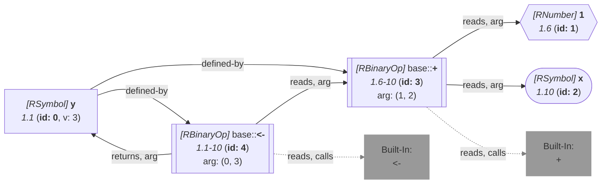
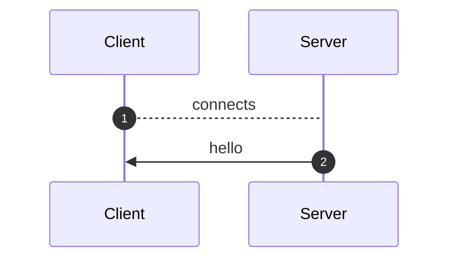
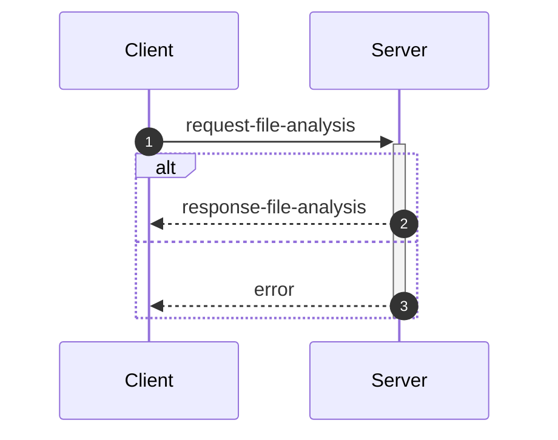
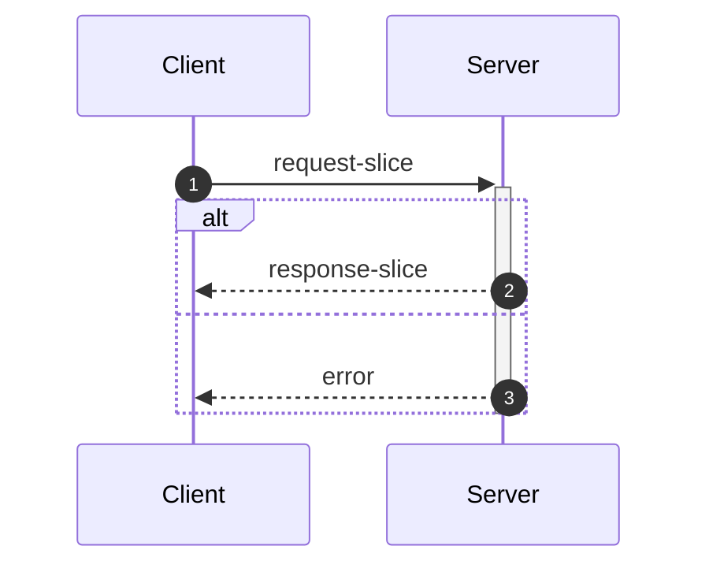
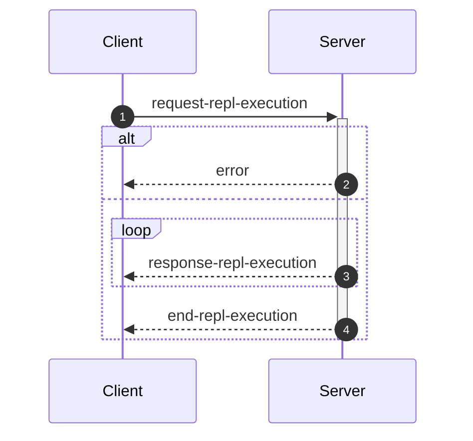

_This document was generated from '[src/documentation/wiki-interface.ts](https://github.com/flowr-analysis/flowr/tree/main//src/documentation/wiki-interface.ts)' on 2026-07-21, 05:26:17 UTC presenting an overview of flowR's interface (v2.13.1, using R v4.5.0). Please do not edit this file/wiki page directly._

Although far from being as detailed as the in-depth explanation of [_flowR_](https://github.com/flowr-analysis/flowr/wiki/core),
this wiki page explains how to interface with _flowR_ in more detail.
In general, command line arguments and other options provide short descriptions on hover over.

* [💻 Using the REPL](#using-the-repl)
* [⚙️ Configuring FlowR](#configuring-flowr)
* [⚒️ Writing Code](#writing-code)
* [💬 Communicating with the Server](#communicating-with-the-server)

<a id='using-the-repl'></a>
## 💻 Using the REPL


> [!NOTE]
> To execute arbitrary R commands with a repl request, _flowR_ has to be started explicitly with <span title="Description (Command Line Argument): Allow to access the underlying R session when using flowR (security warning: this allows the execution of arbitrary R code!)">`--r-session-access`</span>.
> Please be aware that this introduces a security risk and note that this relies on the [`r-shell` engine](https://github.com/flowr-analysis/flowr/wiki/engines) .

Although primarily meant for users to explore,
there is nothing which forbids simply calling _flowR_ as a subprocess to use standard-in, -output, and -error
for communication (although you can access the REPL using the server as well,
with the [REPL Request](#message-request-repl-execution) message).

The read-eval-print loop&nbsp;(REPL) works relatively simple.
You can submit an expression (using <kbd>Enter</kbd>),
which is interpreted as an R&nbsp;expression by default but interpreted as a *command* if it starts with a colon (`:`).
The best command to get started with the REPL is <span title="Description (Repl Command): Show help information (aliases: :h, :?)">`:help`</span>.
Besides, you can leave the REPL either with the command <span title="Description (Repl Command): End the repl (aliases: :q, :exit)">`:quit`</span> or by pressing <kbd>Ctrl</kbd>+<kbd>C</kbd> twice.
When writing a *command*, you may press <kbd>Tab</kbd> to get a list of completions, if available.
Multiple commands can be entered in a single line by separating them with a semicolon (`;`), e.g. `:parse "x<-2"; :df*`.
If a command is given without R code, the REPL will re-use R code given in a previous command.
The prior example will hence return first the parsed AST of the program and then the dataflow graph for `"x <- 2"`.

> [!NOTE]
> If you develop flowR, you may want to launch the repl using the `npm run main-dev` command, this way, you get a non-minified version of flowR with debug information and hot-reloading of source files.

<details>
<summary>Available Commands</summary>

We currently offer the following commands (this with a `[*]` suffix are available with and without the star):


| Command | Description |
| ------- | ----------- |
| **<span title="Description (Repl Command): End the repl (aliases: :q, :exit)">:quit</span>** | End the repl (aliases: **:<span title="Alias of ':quit'. End the repl">q</span>**, **:<span title="Alias of ':quit'. End the repl">exit</span>**) |
| **<span title="Description (Repl Command): Execute the given code as R code. This requires the `--r-session-access` flag to be set and requires the r-shell engine. (aliases: :e, :r)">:execute</span>** | Execute the given code as R code. This requires the `--r-session-access` flag to be set and requires the r-shell engine. (aliases: **:<span title="Alias of ':execute'. Execute the given code as R code. This requires the `--r-session-access` flag to be set and requires the r-shell engine.">e</span>**, **:<span title="Alias of ':execute'. Execute the given code as R code. This requires the `--r-session-access` flag to be set and requires the r-shell engine.">r</span>**) |
| **<span title="Description (Repl Command): Get mermaid code for the control-flow graph of R code (aliases: :cfg, :cf)">:controlflow[*]</span>** | Get mermaid code for the control-flow graph of R code (star: Returns the URL to mermaid.live) (aliases: **:<span title="Alias of ':controlflow'. Get mermaid code for the control-flow graph of R code">cfg</span>**, **:<span title="Alias of ':controlflow'. Get mermaid code for the control-flow graph of R code">cf</span>**) |
| **<span title="Description (Repl Command): Get mermaid code for the control-flow graph with basic blocks (aliases: :cfgb, :cfb)">:controlflowbb[*]</span>** | Get mermaid code for the control-flow graph with basic blocks (star: Returns the URL to mermaid.live) (aliases: **:<span title="Alias of ':controlflowbb'. Get mermaid code for the control-flow graph with basic blocks">cfgb</span>**, **:<span title="Alias of ':controlflowbb'. Get mermaid code for the control-flow graph with basic blocks">cfb</span>**) |
| **<span title="Description (Repl Command): Get mermaid code for the dataflow graph (aliases: :d, :df)">:dataflow[*]</span>** | Get mermaid code for the dataflow graph (star: Returns the URL to mermaid.live) (aliases: **:<span title="Alias of ':dataflow'. Get mermaid code for the dataflow graph">d</span>**, **:<span title="Alias of ':dataflow'. Get mermaid code for the dataflow graph">df</span>**) |
| **<span title="Description (Repl Command): Get mermaid code for the normalized AST of R code (aliases: :n)">:normalize[*]</span>** | Get mermaid code for the normalized AST of R code (star: Returns the URL to mermaid.live) (alias: **:<span title="Alias of ':normalize'. Get mermaid code for the normalized AST of R code">n</span>**) |
| **<span title="Description (Repl Command): Get mermaid code for the simplified dataflow graph (aliases: :ds, :dfs)">:dataflowsimple[*]</span>** | Get mermaid code for the simplified dataflow graph (star: Returns the URL to mermaid.live) (aliases: **:<span title="Alias of ':dataflowsimple'. Get mermaid code for the simplified dataflow graph">ds</span>**, **:<span title="Alias of ':dataflowsimple'. Get mermaid code for the simplified dataflow graph">dfs</span>**) |
| **<span title="Description (Repl Command): Inspect and extend the signature database: `query` (identical to :query @signature), `add <path>` to mount another database/source, `download` to fetch the full-history database. (aliases: :sig)">:signature</span>** | Inspect and extend the signature database: `query` (identical to :query @signature), `add <path>` to mount another database/source, `download` to fetch the full-history database. (alias: **:<span title="Alias of ':signature'. Inspect and extend the signature database: `query` (identical to :query @signature), `add <path>` to mount another database/source, `download` to fetch the full-history database.">sig</span>**) |
| **<span title="Description (Repl Command): Just calculates the DFG, but only prints summary info (aliases: :d#, :df#)">:dataflowsilent</span>** | Just calculates the DFG, but only prints summary info (aliases: **:<span title="Alias of ':dataflowsilent'. Just calculates the DFG, but only prints summary info">d#</span>**, **:<span title="Alias of ':dataflowsilent'. Just calculates the DFG, but only prints summary info">df#</span>**) |
| **<span title="Description (Repl Command): Prints ASCII Art of the parsed, unmodified AST (aliases: :p)">:parse</span>** | Prints ASCII Art of the parsed, unmodified AST (alias: **:<span title="Alias of ':parse'. Prints ASCII Art of the parsed, unmodified AST">p</span>**) |
| **<span title="Description (Repl Command): Prints the version of flowR as well as the current version of R">:version</span>** | Prints the version of flowR as well as the current version of R
| **<span title="Description (Repl Command): Query the given R code (use 'help' for more information)">:query[*]</span>** | Query the given R code (use 'help' for more information) (star: Similar to query, but returns the output in json format.)
| **<span title="Description (Repl Command): Returns an ASCII representation of the dataflow graph (aliases: :df!)">:dataflowascii</span>** | Returns an ASCII representation of the dataflow graph (alias: **:<span title="Alias of ':dataflowascii'. Returns an ASCII representation of the dataflow graph">df!</span>**) |
| **<span title="Description (Repl Command): Returns summarization stats for the normalized AST (aliases: :n#)">:normalize#</span>** | Returns summarization stats for the normalized AST (alias: **:<span title="Alias of ':normalize#'. Returns summarization stats for the normalized AST">n#</span>**) |
| **<span title="Description (Repl Command): Show help information (aliases: :h, :?)">:help</span>** | Show help information (aliases: **:<span title="Alias of ':help'. Show help information">h</span>**, **:<span title="Alias of ':help'. Show help information">?</span>**) |


</details>


> [!TIP]
> 
> As indicated by the examples before, all REPL commands that operate on code keep track of the state.
> Hence, if you run a command like <span title="Description (Repl Command, starred version): Returns the URL to mermaid.live; Base Command: Get mermaid code for the dataflow graph (aliases: :d*, :df*)">`:dataflow*`</span> without providing R code,
> the REPL will re-use the R code provided in a previous command.
> Likewise, doing this will benefit from incrementality!
> If you request the dataflow graph with `:df* x <- 2 * y` and then want to see the parsed AST with `:parse`,
> the REPL will re-use previously obtained information and not re-parse the code again.
> 		


Generally, many commands offer shortcut versions in the REPL. Many queries, for example, offer a shortened format (see the example below).
Of special note, the [Config Query](https://github.com/flowr-analysis/flowr/wiki/%5BQuery%5D-Config)
can be used to also modify the currently active configuration of _flowR_ within the REPL (see the [wiki page](https://github.com/flowr-analysis/flowr/wiki/%5BQuery%5D-Config) for more information).

### Example: Retrieving the Dataflow Graph

To retrieve a URL to the [mermaid](https://mermaid.js.org/) diagram of the dataflow of a given expression,
use <span title="Description (Repl Command, starred version): Returns the URL to mermaid.live; Base Command: Get mermaid code for the dataflow graph (aliases: :d*, :df*)">`:dataflow*`</span> (or <span title="Description (Repl Command): Get mermaid code for the dataflow graph (aliases: :d, :df)">`:dataflow`</span> to get the mermaid code in the cli):


```shell
$ docker run -it --rm eagleoutice/flowr # or npm run flowr 
flowR repl v2.13.1, R grammar v14 (tree-sitter engine)
R> :dataflow* y <- 1 + x
```

<details>
<summary style='color:gray'>Output</summary>


```text
https://mermaid.live/view#base64:eyJjb2RlIjoiZmxvd2NoYXJ0IEJUXG4gICAgMXt7XCJgKiM5MTtSTnVtYmVyIzkzOyogKioxKipcbiAgICAgICoxLjYqICgqKmlkOiAxKiopYFwifX1cbiAgICUlIE5vIGVkZ2VzIGZvdW5kIGZvciAxXG4gICAgMihbXCJgKiM5MTtSU3ltYm9sIzkzOyogKip4KipcbiAgICAgICoxLjEwKiAoKippZDogMioqKWBcIl0pXG4gICAlJSBObyBlZGdlcyBmb3VuZCBmb3IgMlxuICAgIDNbW1wiYCojOTE7UkJpbmFyeU9wIzkzOyogYmFzZSM1ODsjNTg7KiojNDM7KipcbiAgICAgICoxLjYtMTAqICgqKmlkOiAzKiopXG4gICAgYXJnOiAoMSwgMilgXCJdXVxuICAgIGJ1aWx0LWluOl9bXCJgQnVpbHQtSW46XG4jNDM7YFwiXVxuICAgIHN0eWxlIGJ1aWx0LWluOl8gc3Ryb2tlOmdyYXksZmlsbDpncmF5LHN0cm9rZS13aWR0aDoycHgsb3BhY2l0eTouODtcbiAgICAwW1wiYCojOTE7UlN5bWJvbCM5MzsqICoqeSoqXG4gICAgICAqMS4xKiAoKippZDogMCoqLCB2OiAzKWBcIl1cbiAgICA0W1tcImAqIzkxO1JCaW5hcnlPcCM5MzsqIGJhc2UjNTg7IzU4OyoqIzYwOyM0NTsqKlxuICAgICAgKjEuMS0xMCogKCoqaWQ6IDQqKilcbiAgICBhcmc6ICgwLCAzKWBcIl1dXG4gICAgYnVpbHQtaW46Xy1bXCJgQnVpbHQtSW46XG4jNjA7IzQ1O2BcIl1cbiAgICBzdHlsZSBidWlsdC1pbjpfLSBzdHJva2U6Z3JheSxmaWxsOmdyYXksc3Ryb2tlLXdpZHRoOjJweCxvcGFjaXR5Oi44O1xuICAgIDMgLS0+fFwicmVhZHMsIGFyZ1wifCAxXG4gICAgMyAtLT58XCJyZWFkcywgYXJnXCJ8IDJcbiAgICAzIC0uLT58XCJyZWFkcywgY2FsbHNcInwgYnVpbHQtaW46X1xuICAgIGxpbmtTdHlsZSAyIHN0cm9rZTpncmF5O1xuICAgIDAgLS0+fFwiZGVmaW5lZC1ieVwifCAzXG4gICAgMCAtLT58XCJkZWZpbmVkLWJ5XCJ8IDRcbiAgICA0IC0tPnxcInJlYWRzLCBhcmdcInwgM1xuICAgIDQgLS0+fFwicmV0dXJucywgYXJnXCJ8IDBcbiAgICA0IC0uLT58XCJyZWFkcywgY2FsbHNcInwgYnVpbHQtaW46Xy1cbiAgICBsaW5rU3R5bGUgNyBzdHJva2U6Z3JheTsiLCJtZXJtYWlkIjp7ImF1dG9TeW5jIjp0cnVlfX0=
```


Retrieve the dataflow graph of the expression `y <- 1 + x`. It looks like this:



```mermaid
flowchart LR
    1{{"`*#91;RNumber#93;* **1**
      *1.6* (**id: 1**)`"}}
   %% No edges found for 1
    2(["`*#91;RSymbol#93;* **x**
      *1.10* (**id: 2**)`"])
   %% No edges found for 2
    3[["`*#91;RBinaryOp#93;* base#58;#58;**#43;**
      *1.6-10* (**id: 3**)
    arg: (1, 2)`"]]
    built-in:_["`Built-In:
#43;`"]
    style built-in:_ stroke:gray,fill:gray,stroke-width:2px,opacity:.8;
    0["`*#91;RSymbol#93;* **y**
      *1.1* (**id: 0**, v: 3)`"]
    4[["`*#91;RBinaryOp#93;* base#58;#58;**#60;#45;**
      *1.1-10* (**id: 4**)
    arg: (0, 3)`"]]
    built-in:_-["`Built-In:
#60;#45;`"]
    style built-in:_- stroke:gray,fill:gray,stroke-width:2px,opacity:.8;
    3 -->|"reads, arg"| 1
    3 -->|"reads, arg"| 2
    3 -.->|"reads, calls"| built-in:_
    linkStyle 2 stroke:gray;
    0 -->|"defined-by"| 3
    0 -->|"defined-by"| 4
    4 -->|"reads, arg"| 3
    4 -->|"returns, arg"| 0
    4 -.->|"reads, calls"| built-in:_-
    linkStyle 7 stroke:gray;
```

	
<details>

<summary style="color:gray">R Code of the Dataflow Graph</summary>

The analysis required _0.8 ms_ (including parse and normalize, using the [tree-sitter](https://github.com/flowr-analysis/flowr/wiki/Engines) engine) within the generation environment. No [signature database](https://github.com/flowr-analysis/flowr/wiki/Signature-Database) is mounted for these generated graphs, so `library()` calls attach no package exports; base-R names are still qualified via the generated base-package store (e.g. `acf` as `stats::acf`). 
We encountered no unknown side effects during the analysis.


```r
y <- 1 + x
```


</details>


</details>


For small graphs like this, <span title="Description (Repl Command): Returns an ASCII representation of the dataflow graph (aliases: :df!)">`:dataflowascii`</span> also provides an ASCII representation directly in the REPL:


```shell
$ docker run -it --rm eagleoutice/flowr # or npm run flowr 
flowR repl v2.13.1, R grammar v14 (tree-sitter engine)
R> :df! y <- 1 + x
```

<details open>
<summary style='color:gray'>Output</summary>


```text
                        0<1>0
                   ┌────| 1 |
    ┌────────┐     │    0---0
 c<4>c       └──c<3>c
 |<- |  v<0>v┌──| + |
 c---c──| y |┘  c---c   u<2>u
        v---v      └────| x |
                        u---u
Edges:
3 -> 1: reads, arg  3 -> 2: reads, arg
4 -> 3: reads, arg  4 -> 0: returns, arg
0 -> 3: defined-by  0 -> 4: defined-by
```


Retrieve the dataflow graph of the expression `y <- 1 + x` as ASCII art.

</details>


For the slicing with <span title="Description (Repl Command): Static backwards executable slicer for R">`:slicer`</span>, you have access to the same [magic comments](#slice-magic-comments) as with the [slice request](#message-request-slice).
Pass `--inline` to splice resolvable `source()` calls into the reconstruction so the slice is a single self-contained R text (the same as the static slice query's `inlineSources` flag).
See `--help` for more flags!

### Example: Interfacing with the File System

Many commands that allow for an R-expression (like <span title="Description (Repl Command, starred version): Returns the URL to mermaid.live; Base Command: Get mermaid code for the dataflow graph (aliases: :d*, :df*)">`:dataflow*`</span>) allow for a file as well
if the argument starts with `file://`.
If you are working from the root directory of the _flowR_ repository, the following gives you the parsed AST of the example file using the <span title="Description (Repl Command): Prints ASCII Art of the parsed, unmodified AST (aliases: :p)">`:parse`</span> command:

> **Watch mode**: Replace `file://` with `watch://` to enter watch mode.
> flowR runs the command immediately and then re-runs it every time the file (or any file inside the folder) changes.
> Enter any other command to leave watch mode.
> For example: `:df watch://analysis.R`


```shell
$ docker run -it --rm eagleoutice/flowr # or npm run flowr 
flowR repl v2.13.1, R grammar v14 (tree-sitter engine)
R> :parse file://test/testfiles/example.R
```

<details>
<summary style='color:gray'>Output</summary>


```text
File: test/testfiles/example.R

program
├ binaryoperator
│ ├ identifier "sum" (1:1─4)
│ ├ <- "<-" (1:5─7)
│ ╰ float "0" (1:8─9)
├ binaryoperator
│ ├ identifier "product" (2:1─8)
│ ├ <- "<-" (2:9─11)
│ ╰ float "1" (2:12─13)
├ binaryoperator
│ ├ identifier "w" (3:1─2)
│ ├ <- "<-" (3:3─5)
│ ╰ float "7" (3:6─7)
├ binaryoperator
│ ├ identifier "N" (4:1─2)
│ ├ <- "<-" (4:3─5)
│ ╰ float "10" (4:6─8)
├ forstatement
│ ├ for "for" (6:1─4)
│ ├ ( "(" (6:5─6)
│ ├ identifier "i" (6:6─7)
│ ├ in "in" (6:8─10)
│ ├ binaryoperator
│ │ ├ float "1" (6:11─12)
│ │ ├ : ":" (6:12─13)
│ │ ╰ parenthesizedexpression
│ │   ├ ( "(" (6:13─14)
│ │   ├ binaryoperator
│ │   │ ├ identifier "N" (6:14─15)
│ │   │ ├ - "-" (6:15─16)
│ │   │ ╰ float "1" (6:16─17)
│ │   ╰ ) ")" (6:17─18)
│ ├ ) ")" (6:18─19)
│ ╰ bracedexpression
│   ├ { "{" (6:20─21)
│   ├ binaryoperator
│   │ ├ identifier "sum" (7:3─6)
│   │ ├ <- "<-" (7:7─9)
│   │ ╰ binaryoperator
│   │   ├ binaryoperator
│   │   │ ├ identifier "sum" (7:10─13)
│   │   │ ├ + "+" (7:14─15)
│   │   │ ╰ identifier "i" (7:16─17)
│   │   ├ + "+" (7:18─19)
│   │   ╰ identifier "w" (7:20─21)
│   ├ binaryoperator
│   │ ├ identifier "product" (8:3─10)
│   │ ├ <- "<-" (8:11─13)
│   │ ╰ binaryoperator
│   │   ├ identifier "product" (8:14─21)
│   │   ├  "" (8:22─23)
│   │   ╰ identifier "i" (8:24─25)
│   ╰ } "}" (9:1─2)
├ call
│ ├ identifier "cat" (11:1─4)
│ ╰ arguments
│   ├ ( "(" (11:4─5)
│   ├ argument
│   │ ╰ string
│   │   ├ " "\"" (11:5─6)
│   │   ├ stringcontent "Sum:" (11:6─10)
│   │   ╰ " "\"" (11:10─11)
│   ├ comma "," (11:11─12)
│   ├ argument
│   │ ╰ identifier "sum" (11:13─16)
│   ├ comma "," (11:16─17)
│   ├ argument
│   │ ╰ string
│   │   ├ " "\"" (11:18─19)
│   │   ├ stringcontent
│   │   │ ╰ escapesequence "\\n" (11:19─21)
│   │   ╰ " "\"" (11:21─22)
│   ╰ ) ")" (11:22─23)
╰ call
  ├ identifier "cat" (12:1─4)
  ╰ arguments
    ├ ( "(" (12:4─5)
    ├ argument
    │ ╰ string
    │   ├ " "\"" (12:5─6)
    │   ├ stringcontent "Product:" (12:6─14)
    │   ╰ " "\"" (12:14─15)
    ├ comma "," (12:15─16)
    ├ argument
    │ ╰ identifier "product" (12:17─24)
    ├ comma "," (12:24─25)
    ├ argument
    │ ╰ string
    │   ├ " "\"" (12:26─27)
    │   ├ stringcontent
    │   │ ╰ escapesequence "\\n" (12:27─29)
    │   ╰ " "\"" (12:29─30)
    ╰ ) ")" (12:30─31)
```


Retrieve the parsed AST of the example file.

<details>

<summary>File Content</summary>


```r
sum <- 0
product <- 1
w <- 7
N <- 10

for (i in 1:(N-1)) {
  sum <- sum + i + w
  product <- product * i
}

cat("Sum:", sum, "\n")
cat("Product:", product, "\n")
```


</details>

As _flowR_ directly transforms this AST the output focuses on being human-readable instead of being machine-readable.
		

</details>


### Example: Run a Query

You can run any query supported by _flowR_ using the <span title="Description (Repl Command): Query the given R code (use 'help' for more information)">`:query`</span> command.
For example, to obtain the shapes of all data frames in a given piece of code, you can run:


```shell
$ docker run -it --rm eagleoutice/flowr # or npm run flowr 
flowR repl v2.13.1, R grammar v14 (tree-sitter engine)
R> :query @absint df-shape "x <- data.frame(a = 1:10, b = 1:10)\ny <- x$a"
```

<details open>
<summary style='color:gray'>Output</summary>


```text
Query: absint (1 ms)
   ╰ $12: (colnames: [{"a", "b"}, {}], cols: [2, 2], rows: [10, 10])
   ╰ $0: (colnames: [{"a", "b"}, {}], cols: [2, 2], rows: [10, 10])
All queries together required ≈5 ms (1ms accuracy, total 6 ms)
```


Retrieve the shapes of all data frames in the given code.

</details>


To run the linter on a file, you can use (in this example, we just issue the `dead-code` linter on a small piece of code):


```shell
$ docker run -it --rm eagleoutice/flowr # or npm run flowr 
flowR repl v2.13.1, R grammar v14 (tree-sitter engine)
R> :query @linter rules:dead-code "if(FALSE) x <- 2"
```

<details open>
<summary style='color:gray'>Output</summary>


```text
Query: linter (3 ms)
   ╰ Dead Code (dead-code):
       ╰ certain:
           ╰ Code at 1.11-16
       ╰ Metadata: searchTimeMs: 3, processTimeMs: 0
All queries together required ≈3 ms (1ms accuracy, total 3 ms)
```


Run the linter on the given code, with only the `dead-code` rule enabled.

</details>


For more information on the available queries, please check out the [Query API](https://github.com/flowr-analysis/flowr/wiki/query-api).


<a id='configuring-flowr'></a>
## ⚙️ Configuring FlowR


When running _flowR_, you may want to specify some behaviors with a dedicated configuration file.
By default, flowR looks for a file named `flowr.json` in the current working directory (or any higher directory).
You can also specify a different file with <span title="Description (Command Line Argument): The name of the configuration file to use">`--config-file`</span> or pass the configuration inline using <span title="Description (Command Line Argument): The flowR configuration to use, as a JSON string">`--config-json`</span>.
To inspect the current configuration, you can run flowr with the <span title="Description (Command Line Argument): Run with verbose logging (will be passed to the corresponding script)">`--verbose`</span> flag, or use the `config` [Query](https://github.com/flowr-analysis/flowr/wiki/query-api).
Within the REPL this works by running the following:


```shell
:query @config
```


To work with the <a href="https://github.com/flowr-analysis/flowr/tree/main/src/config.ts#L129"><code><span title="The configuration file format for flowR.">FlowrConfig</span></code></a> you can use the provided helper objects alongside its methods like
<a href="https://github.com/flowr-analysis/flowr/tree/main/src/config.ts#L717"><code><span title="Creates a new flowr config that has the updated values.">FlowrConfig::<b>amend</b></span></code></a>.
The schema below documents every option; the ones you most likely want are:

- <a href="https://github.com/flowr-analysis/flowr/wiki/Interface#configuring-flowr" title="Configuration Option (boolean): Whether source calls should be ignored, causing {@link processSourceCall}&#39;s behavior to be skipped.">ignoreSourceCalls</a>: ignore source calls when analyzing the code, i.e., ignore the inclusion of other files.
- <a href="https://github.com/flowr-analysis/flowr/wiki/Interface#configuring-flowr" title="Configuration Option (boolean): Whether load calls should be ignored, causing {@link processLoadCall}&#39;s behavior to be skipped.">ignoreLoadCalls</a>: ignore load calls when analyzing the code, i.e., ignore the loading of r-data files.
- <a href="https://github.com/flowr-analysis/flowr/wiki/Interface#configuring-flowr" title="Configuration Option (object): Do you want to overwrite (parts) of the builtin definition?">semantics.environment.overwriteBuiltIns</a>: overwrite _flowR_'s handling of built-in functions, or clear the preset definitions entirely.
  See [Configure BuiltIn Semantics](#configure-builtin-semantics) for more information.
- <a href="https://github.com/flowr-analysis/flowr/wiki/Interface#configuring-flowr" title="Configuration Option (string): How to resolve variables and their values. (one of &quot;disabled&quot;, &quot;alias&quot;, &quot;builtin&quot;)">solver.variables</a>: how to resolve variables and their values (`disabled`, `alias`, `builtin`).
- <a href="https://github.com/flowr-analysis/flowr/wiki/Interface#configuring-flowr" title="Configuration Option (array): The engine or set of engines to use for interacting with R code. An empty array means all available engines will be used.">engines</a> and <a href="https://github.com/flowr-analysis/flowr/wiki/Interface#configuring-flowr" title="Configuration Option (string): The default engine to use for interacting with R code. If this is undefined, an arbitrary engine from the specified list will be used. (one of &quot;tree-sitter&quot;, &quot;r-shell&quot;)">defaultEngine</a>: the engines used to interact with R code, see the [Engines wiki page](https://github.com/flowr-analysis/flowr/wiki/engines).
- <a href="https://github.com/flowr-analysis/flowr/wiki/Interface#configuring-flowr" title="Configuration Option (array): Files a framework loads on its own, without any source() call (e.g. global.R in a shiny app), in the order they are loaded; flowR orders the matching project files accordingly and analyzes them as one program. Entries are case-insensitive globs matched against the file path, a plain name matches any file with that name, and entries matching no project file are warned about. Usually set per project kind via specializeConfig.">project.implicitSources</a>: the files a framework loads without any `source()` call, in the order in which they are
  loaded. Entries are globs (e.g. `R/*.R`) matched against the file path ignoring capitalization; one matching no file is reported.
- <a href="https://github.com/flowr-analysis/flowr/wiki/Interface#configuring-flowr" title="Configuration Option (object): Overwrite (parts of) the configuration depending on the project kind flowR detects, e.g. to give a shiny app its implicit sources.">specializeConfig</a>: overwrite (parts of) the configuration depending on the kind of project _flowR_ detects
  (e.g. `shiny-app`), which is how a shiny app gets its implicit sources by default. What you configure directly wins.
- <a href="https://github.com/flowr-analysis/flowr/wiki/Interface#configuring-flowr" title="Configuration Option (string): Overwrite the project kind flowR would otherwise infer from the analyzed files, e.g. when auto-detection guesses wrong. (one of &quot;package&quot;, &quot;script&quot;, &quot;shiny-app&quot;, &quot;notebook&quot;, &quot;project&quot;, &quot;unknown&quot;)">project.useProjectType</a>: skip that detection and force a project kind yourself, when auto-detection guesses wrong.
- <a href="https://github.com/flowr-analysis/flowr/wiki/Interface#configuring-flowr" title="Configuration Option (array): The default plugins to load when creating a new instance of FlowrAnalyzer">defaultPlugins</a> and <a href="https://github.com/flowr-analysis/flowr/wiki/Interface#configuring-flowr" title="Configuration Option (array): The plugins to load in REPL mode">repl.plugins</a>: the plugins to load for a new <a href="https://github.com/flowr-analysis/flowr/tree/main/src/project/flowr-analyzer.ts#L167"><code><span title="Central class for conducting analyses with FlowR. Use the FlowrAnalyzerBuilder to create a new instance. If you want the original pattern of creating a pipeline and running all steps, you can still do this with FlowrAnalyzer#runFull . To inspect the context of the analyzer, use FlowrAnalyzer#inspectContext (if you are a plugin and need to modify it, use FlowrAnalyzer#context instead).">FlowrAnalyzer</span></code></a> and in the REPL
  (use `flowr:default` to reference the former).

So you can configure _flowR_ by adding a file like the following:

<details>

<summary>Example Configuration File</summary>


```json
{
  "ignoreSourceCalls": true,
  "ignoreLoadCalls": true,
  "semantics": {
    "environment": {
      "overwriteBuiltIns": {
        "definitions": [
          {
            "type": "function",
            "names": [
              "foo"
            ],
            "processor": "builtin:assign",
            "config": {}
          }
        ]
      }
    }
  },
  "defaultPlugins": [
    "file:description",
    "versions:description"
  ],
  "repl": {
    "quickStats": false,
    "dfProcessorHeat": false,
    "hints": true,
    "plugins": [
      "flowr:default"
    ]
  },
  "project": {
    "resolveUnknownPathsOnDisk": true,
    "implicitSources": [
      "global.R",
      "app.R"
    ]
  },
  "linter": {
    "disabledRules": []
  },
  "specializeConfig": {
    "shiny-app": {
      "project": {
        "implicitSources": [
          "global.R",
          "ui.R",
          "server.R",
          "app.R"
        ]
      }
    }
  },
  "engines": [
    {
      "type": "r-shell"
    }
  ],
  "solver": {
    "variables": "alias",
    "evalStrings": true,
    "trackEnvironments": true,
    "sigdb": {
      "enabled": true,
      "loadProjectDependencies": true,
      "eagerlyLoad": false,
      "eagerlyLoadExports": false,
      "linkBaseR": false,
      "linkDescriptionDependencies": false
    },
    "resolveSource": {
      "dropPaths": "no",
      "ignoreCapitalization": true,
      "inferWorkingDirectory": "active-script",
      "searchPath": []
    },
    "instrument": {},
    "slicer": {
      "threshold": 50
    }
  },
  "abstractInterpretation": {
    "wideningThreshold": 4,
    "dataFrame": {
      "maxColNames": 20,
      "readLoadedData": {
        "readExternalFiles": true,
        "maxReadLines": 1000000
      }
    }
  },
  "gas": {
    "thresholds": {
      "memory": {
        "problematic": 0.7,
        "critical": 0.9
      },
      "timeMs": {
        "problematic": 100000,
        "critical": 120000
      }
    },
    "features": {}
  }
}
```


</details>

<details>
<a id='configure-builtin-semantics'></a>
<summary>Configure Built-In Semantics</summary>


`semantics/environment/overwriteBuiltins` accepts two keys:

- `loadDefaults` (boolean, initially `true`): If set to `true`, the default built-in definitions are loaded before applying the custom definitions. Setting this flag to `false` explicitly disables the loading of the default definitions.
- `definitions` (array, initially empty): Allows to overwrite or define new built-in elements. Each object within must have a `type` which is one of the below. Furthermore, they may define a string array of `names` which specifies the identifiers to bind the definitions to. You may use `assumePrimitive` to specify whether _flowR_ should assume that this is a primitive non-library definition (so you probably just do not want to specify the key).

  | Type            | Description                                                                                                                                                                                                                                                                                              | Example                                                                                                    |
  | --------------- | -------------------------------------------------------------------------------------------------------------------------------------------------------------------------------------------------------------------------------------------------------------------------------------------------------- | ---------------------------------------------------------------------------------------------------------- |
  | `constant`    | Additionally allows for a `value` this should resolve to.                                                                                                                                                                                                                                                | `{ type: 'constant', names: ['NULL', 'NA'],  value: null }`                                                |
  | `function`    | Is a rather flexible way to define and bind built-in functions. For the time, we do not have extensive documentation to cover all the cases, so please either consult the sources with the `default-builtin-config.ts` or open a [new issue](https://github.com/flowr-analysis/flowr/issues/new/choose). | `{ type: 'function', names: ['next'], processor: 'builtin:d', config: { cfg: ExitPointType.Next } }` |
  | `replacement` | A comfortable way to specify replacement functions like `$<-` or `names<-`. `suffixes` describes the... suffixes to attach automatically. | `{ type: 'replacement', suffixes: ['<-', '<<-'], names: ['[', '[['] }` |


</details>

<details>

<summary style='color:gray'>Full Configuration-File Schema</summary>

- _The configuration file format for flowR._ (object)
    - **logLevel** [optional] _flowR's global minimum log level, applied when the config is loaded._ (string)
        Only allows: 'silly', 'trace', 'debug', 'info', 'warn', 'error', 'fatal'
    - **ignoreSourceCalls** [optional] _Whether source calls should be ignored, causing {@link processSourceCall}'s behavior to be skipped._ (boolean)
    - **ignoreLoadCalls** [optional] _Whether load calls should be ignored, causing {@link processLoadCall}'s behavior to be skipped._ (boolean)
    - **semantics** _Configure language semantics and how flowR handles them._ (object)
        - **environment** [optional] _Semantics regarding how to handle the R environment._ (object)
            - **overwriteBuiltIns** [optional] _Do you want to overwrite (parts) of the builtin definition?_ (object)
                - **loadDefaults** [optional] _Should the default configuration still be loaded?_ (boolean)
                - **definitions** [optional] _The definitions to load/overwrite._ (array)
                Valid item types:
                    - (object)
    - **defaultPlugins** [optional] _The default plugins to load when creating a new instance of FlowrAnalyzer_ (array)
    Valid item types:
        - (alternatives)
            - (string)
            - (array)
    - **repl** _Configuration options for the REPL._ (object)
        - **quickStats** [optional] _Whether to show quick stats in the REPL after each evaluation._ (boolean)
        - **dfProcessorHeat** [optional] _This instruments the dataflow processors to count how often each processor is called._ (boolean)
        - **hints** [optional] _Whether to show dim inline hints on the empty prompt (automatically disabled on non-interactive terminals)._ (boolean)
        - **plugins** [optional] _The plugins to load in REPL mode_ (array)
        Valid item types:
            - (alternatives)
                - (string)
                - (array)
        - **autoUseFileProtocol** [optional] _Prepend the file protocol to a repl input that looks like a path, instead of only warning about it._ (boolean)
        - **queryStats** [optional] _Whether `:query` closes with the line stating how long the queries took (`:query*` never prints it)._ (boolean)
        - **showPlugins** [optional] _Whether `:version` grays out the plugins that did not activate during the last analysis._ (boolean)
    - **project** _Project specific configuration options._ (object)
        - **resolveUnknownPathsOnDisk** [optional] _Whether to resolve unknown paths loaded by the r project disk when trying to source/analyze files._ (boolean)
        - **basePackages** [optional] _The packages considered part of R itself (base and recommended); if unset, flowR uses its built-in list._ (array)
        Valid item types:
            - (string)
        - **implicitSources** [optional] _Files a framework loads on its own, without any source() call (e.g. global.R in a shiny app), in the order they are loaded; flowR orders the matching project files accordingly and analyzes them as one program. Entries are case-insensitive globs matched against the file path, a plain name matches any file with that name, and entries matching no project file are warned about. Usually set per project kind via specializeConfig._ (array)
        Valid item types:
            - (string)
        - **useProjectType** [optional] _Overwrite the project kind flowR would otherwise infer from the analyzed files, e.g. when auto-detection guesses wrong._ (string)
            Only allows: 'package', 'script', 'shiny-app', 'notebook', 'project', 'unknown'
    - **linter** _Linter configuration options._ (object)
        - **disabledRules** _Linting rule names excluded from the default rule set (a rule requested explicitly via a linter query still runs). Usually set per project kind via specializeConfig._ (array)
        Valid item types:
            - (string)
    - **specializeConfig** [optional] _Overwrite (parts of) the configuration depending on the project kind flowR detects, e.g. to give a shiny app its implicit sources._ (object)
    - **engines** _The engine or set of engines to use for interacting with R code. An empty array means all available engines will be used._ (array)
    Valid item types:
        - (alternatives)
            - _The configuration for the tree sitter engine._ (object)
                - **type** [required] _Use the tree sitter engine._ (string)
                    Only allows: 'tree-sitter'
                - **wasmPath** [optional] _The path to the tree-sitter-r WASM binary to use. If this is undefined, this uses the default path._ (string)
                - **treeSitterWasmPath** [optional] _The path to the tree-sitter WASM binary to use. If this is undefined, this uses the default path._ (string)
                - **lax** [optional] _Whether to use the lax parser for parsing R code (allowing for syntax errors). If this is undefined, the strict parser will be used._ (boolean)
            - _The configuration for the R shell engine._ (object)
                - **type** [required] _Use the R shell engine._ (string)
                    Only allows: 'r-shell'
                - **rPath** [optional] _The path to the R executable to use. If this is undefined, this uses the default path._ (string)
    - **defaultEngine** [optional] _The default engine to use for interacting with R code. If this is undefined, an arbitrary engine from the specified list will be used._ (string)
        Only allows: 'tree-sitter', 'r-shell'
    - **solver** _How to resolve constants, constraints, cells, ..._ (object)
        - **variables** _How to resolve variables and their values._ (string)
            Only allows: 'disabled', 'alias', 'builtin'
        - **evalStrings** _Should we include eval(parse(text="...")) calls in the dataflow graph?_ (boolean)
        - **trackEnvironments** [optional] _Track user-created environments (new.env, assign/get/local with envir=, dollar-assign, attach). When false, all envir-style calls fall through conservatively._ (boolean)
        - **sigdb** _Resolving library exports from a signature database._ (object)
            - **enabled** [optional] _Resolve library()/use() exports from a signature database (default true); when false no database is consulted._ (boolean)
            - **loadProjectDependencies** [optional] _Load the project's declared dependencies from its metadata files (DESCRIPTION Imports/Depends, rproject.toml, renv.lock, rv.lock) (default true); when false these files are not read for dependencies._ (boolean)
            - **eagerlyLoad** [optional] _Parse the database up front rather than on the first package load (default false, ignored if disabled)._ (boolean)
            - **eagerlyLoadExports** [optional] _Add a vertex for every export on load rather than on demand (default false); keeps the dataflow graph small._ (boolean)
            - **assumedRVersion** [optional] _R version assumed when resolving versioned (base-R) exports: a pin like "4.5" or "auto" to detect the installed R (default "auto")._ (string)
            - **linkBaseR** [optional] _Eagerly attach base-R namespaces so bare base calls resolve without library() (default false)._ (boolean)
            - **linkBaseRCalls** [optional] _Add a lightweight Reads edge from a bare base-R call to its signature-database function vertex (default false; base-R qualification is edge-free otherwise)._ (boolean)
            - **linkPackageCalls** [optional] _Add a lightweight Reads edge from a resolved package call to its signature-database function vertex (default false)._ (boolean)
            - **linkDescriptionDependencies** [optional] _Eagerly attach the namespaces of the project's declared DESCRIPTION dependencies (Imports/Depends) so their exports resolve without an explicit library() (default false)._ (boolean)
            - **warmInBackground** [optional] _Decompress the hot shards (base + most-downloaded) in a background task on startup so the first library() lookup is warm (default false; for long-running servers/REPLs)._ (boolean)
            - **additionalPaths** [optional] _Extra directories or bundle/manifest files searched for signature databases (alongside the shipped default and $FLOWR_SIGDB_DIR); a downloaded full-history bundle placed here is mounted automatically._ (array)
            Valid item types:
                - (string)
            - **downloadRepo** [optional] _GitHub owner/repo the full-history bundle is downloaded from via ":signature download" (default "flowr-analysis/flowr", release tag "sigdb-v<flowR-version>")._ (string)
            - **autoSync** [optional] _On startup, re-download shards whose committed sigdb.remote.json hash no longer matches the cache, in the background (default false; opt-in network sync after a git pull)._ (boolean)
            - **versionSelection** [optional] _When a project constrains a dependency, resolve to the newest (default), oldest, or system-installed version satisfying it; system needs R and falls back to newest. Base-R packages always resolve against the assumed R version._ (string)
                Only allows: 'newest', 'oldest', 'system'
            - **versionOverrides** [optional] _Force an exact version for specific packages (name -> version), overriding both the project constraint and the versionSelection policy (default {})._ (object)
        - **versionManagement** _Policies for reasoning about dependency versions._ (object)
            - **linkedVersionGroups** [optional] _Groups of packages that must resolve to the same version; version guessing intersects each group so its members stay mutually compatible (default [])._ (array)
            Valid item types:
                - (array)
                Valid item types:
                    - (string)
        - **instrument** (object)
            - **dataflowExtractors** [optional] _These keys are only intended for use within code, allowing to instrument the dataflow analyzer!_ (any)
        - **resolveSource** [optional] _If lax source calls are active, flowR searches for sourced files much more freely, based on the configurations you give it. This option is only in effect if `ignoreSourceCalls` is set to false._ (object)
            - **dropPaths** _Allow to drop the first or all parts of the sourced path, if it is relative._ (string)
                Only allows: 'no', 'once', 'all'
            - **ignoreCapitalization** _Search for filenames matching in the lowercase._ (boolean)
            - **inferWorkingDirectory** _Try to infer the working directory from the main or any script to analyze._ (string)
                Only allows: 'no', 'main-script', 'active-script', 'any-script'
            - **searchPath** _Additionally search in these paths._ (array)
            Valid item types:
                - (string)
            - **repeatedSourceLimit** [optional] _How often the same file can be sourced within a single run? Please be aware: in case of cyclic sources this may not reach a fixpoint so give this a sensible limit._ (number)
            - **applyReplacements** _Provide name replacements for loaded files_ (array)
            Valid item types:
                - (object)
            - **assumeFilesExist** [optional] _Assume a sourced file is always there, making what it defines certain instead of conditional on the source call._ (boolean)
        - **slicer** [optional] _The configuration for the slicer._ (object)
            - **threshold** [optional] _The maximum number of iterations to perform on a single function call during slicing._ (number)
            - **autoExtend** [optional] _If set, the slicer will gain an additional post-pass._ (boolean)
    - **abstractInterpretation** _The configuration options for abstract interpretation._ (object)
        - **wideningThreshold** _The threshold for the number of visitations of a node at which widening should be performed to ensure the termination of the fixpoint iteration._ (number)
        - **dataFrame** _The configuration of the shape inference for data frames._ (object)
            - **maxColNames** _The maximum number of columns names to infer for data frames before over-approximating the column names to top._ (number)
            - **readLoadedData** _Configuration options for reading data frame shapes from loaded external data files, such as CSV files._ (object)
                - **readExternalFiles** _Whether data frame shapes should be extracted from loaded external files, such as CSV files._ (boolean)
                - **maxReadLines** _The maximum number of lines to read when extracting data frame shapes from loaded files, such as CSV files._ (number)
    - **gas** [optional] _Resource-usage guard (gas) configuration. All feature factors default to 0 (disabled). See https://github.com/flowr-analysis/flowr/wiki/Core#gas-resource-guard._ (object)
        - **thresholds** [optional] _Shared thresholds for all gas checks (scaled by per-feature factor)._ (object)
            - **memory** [optional] _Heap-usage fraction thresholds (0-1)._ (object)
                - **problematic** [optional] _Heap fraction (0-1) above which Problematic is returned._ (number)
                - **critical** [optional] _Heap fraction (0-1) above which Critical is returned._ (number)
            - **timeMs** [optional] _Elapsed analysis time thresholds in milliseconds._ (object)
                - **problematic** [optional] _Elapsed ms above which Problematic is returned._ (number)
                - **critical** [optional] _Elapsed ms above which Critical is returned._ (number)
        - **features** [optional] _Per-feature sensitivity factors. 0 or absent disables gas checking for that feature. A factor of 2 makes the feature twice as sensitive. Recognised keys: `source`, `side-effect-linking`, `linter`._ (object)
        - **heapProvider** [optional] _Custom heap statistics source (programmatic configs only), overriding the built-in v8/performance.memory detection._ (function)

</details>

	

<a id='writing-code'></a>
## ⚒️ Writing Code

_flowR_ can be used as a [module](https://www.npmjs.com/package/@eagleoutice/flowr) and offers several main classes and interfaces that are interesting for extension writers 
(see the [Visual Studio Code extension](https://marketplace.visualstudio.com/items?itemName=code-inspect.vscode-flowr) or the [Core](https://github.com/flowr-analysis/flowr/wiki/core) wiki page for more information).

### Creating Analyses with _flowR_

Nowadays, instances of the <a href="https://github.com/flowr-analysis/flowr/tree/main/src/project/flowr-analyzer.ts#L167"><code><span title="Central class for conducting analyses with FlowR. Use the FlowrAnalyzerBuilder to create a new instance. If you want the original pattern of creating a pipeline and running all steps, you can still do this with FlowrAnalyzer#runFull . To inspect the context of the analyzer, use FlowrAnalyzer#inspectContext (if you are a plugin and need to modify it, use FlowrAnalyzer#context instead).">FlowrAnalyzer</span></code></a> should be used as central frontend to get analysis results from _flowR_.
For example, a program slice can be created like this:


```ts
const analyzer = await new FlowrAnalyzerBuilder()
    .setEngine('tree-sitter')
    .build();
analyzer.addRequest('x <- 1\ny <- x\nx');
const result = await analyzer.query([
    {
        type:     'static-slice',
        criteria: ['3@x']
    }
]);
//console.log(result['static-slice']);
```


For more information, please have a look at the [Analyzer](https://github.com/flowr-analysis/flowr/wiki/analyzer) wiki page, which explains how to construct and use the <a href="https://github.com/flowr-analysis/flowr/tree/main/src/project/flowr-analyzer.ts#L167"><code><span title="Central class for conducting analyses with FlowR. Use the FlowrAnalyzerBuilder to create a new instance. If you want the original pattern of creating a pipeline and running all steps, you can still do this with FlowrAnalyzer#runFull . To inspect the context of the analyzer, use FlowrAnalyzer#inspectContext (if you are a plugin and need to modify it, use FlowrAnalyzer#context instead).">FlowrAnalyzer</span></code></a> in more detail.
To work with specific perspectives, you can also consult the respective pages like the [Dataflow Graph](https://github.com/flowr-analysis/flowr/wiki/dataflow-graph) or the [Abstract Interpretation](https://github.com/flowr-analysis/flowr/wiki/abstract-interpretation) wiki pages.
### The Pipeline Executor (Low-Level Interface)

Once, in the beginning, _flowR_ was meant to produce a dataflow graph merely to provide *program slices*. 
However, with continuous updates, the [Dataflow Graph](https://github.com/flowr-analysis/flowr/wiki/dataflow-graph) repeatedly proves to be the more interesting part.
With this, we restructured _flowR_'s originally *hardcoded* pipeline to be far more flexible. 
Now, it can be theoretically extended or replaced with arbitrary steps, optional steps, and what we call 'decorations' of these steps. 
In short, a slicing pipeline using the <a href="https://github.com/flowr-analysis/flowr/tree/main/src/core/pipeline-executor.ts#L97"><code><span title="**Please note:** The PipelineExecutor is now considered to be a rather low-level API for flowR. While it still works and is the basis for all other layers, we strongly recommend using the FlowrAnalyzer and its builder to create and use an analyzer instance that is pre-configured for your use-case. The pipeline executor allows to execute arbitrary pipelines in a step-by-step fashion. If you are not...">PipelineExecutor</span></code></a> looks like this:


```ts

const slicer = new PipelineExecutor(DEFAULT_SLICING_PIPELINE, {
  parser:    new RShell(),
  request:   requestFromInput('x <- 1\nx + 1'),
  criterion: ['2@x']
})
const slice = await slicer.allRemainingSteps()
// console.log(slice.reconstruct.code)
```


<details><summary>More Information</summary>


If you compare this, with what you would have done with the old (and removed) `SteppingSlicer`, 
this essentially just requires you to replace the `SteppingSlicer` with the <a href="https://github.com/flowr-analysis/flowr/tree/main/src/core/pipeline-executor.ts#L97"><code><span title="**Please note:** The PipelineExecutor is now considered to be a rather low-level API for flowR. While it still works and is the basis for all other layers, we strongly recommend using the FlowrAnalyzer and its builder to create and use an analyzer instance that is pre-configured for your use-case. The pipeline executor allows to execute arbitrary pipelines in a step-by-step fashion. If you are not...">PipelineExecutor</span></code></a>
and to pass the <a href="https://github.com/flowr-analysis/flowr/tree/main/src/core/steps/pipeline/default-pipelines.ts#L18"><code>DEFAULT_SLICING_PIPELINE</code></a> as the first argument.
The <a href="https://github.com/flowr-analysis/flowr/tree/main/src/core/pipeline-executor.ts#L97"><code><span title="**Please note:** The PipelineExecutor is now considered to be a rather low-level API for flowR. While it still works and is the basis for all other layers, we strongly recommend using the FlowrAnalyzer and its builder to create and use an analyzer instance that is pre-configured for your use-case. The pipeline executor allows to execute arbitrary pipelines in a step-by-step fashion. If you are not...">PipelineExecutor</span></code></a>...

1. Provides structures to investigate the results of all intermediate steps
2. Can be executed step-by-step
3. Can repeat steps (e.g., to calculate multiple slices on the same input)

See the in-code documentation for more information.


</details>

### Using the <a href="https://github.com/flowr-analysis/flowr/tree/main/src/r-bridge/shell.ts#L143"><code><span title="The RShell represents an interactive session with the R interpreter. You can configure it by RShellOptions . At the moment we are using a live R session (and not networking etc.) to communicate with R easily, which allows us to install packages etc. However, this might and probably will change in the future (leaving this as a legacy mode :D)">RShell</span></code></a> to Interact with R

The <a href="https://github.com/flowr-analysis/flowr/tree/main/src/r-bridge/shell.ts#L143"><code><span title="The RShell represents an interactive session with the R interpreter. You can configure it by RShellOptions . At the moment we are using a live R session (and not networking etc.) to communicate with R easily, which allows us to install packages etc. However, this might and probably will change in the future (leaving this as a legacy mode :D)">RShell</span></code></a> class allows interfacing with the `R`&nbsp;ecosystem installed on the host system.
Please have a look at [flowR's Engines](https://github.com/flowr-analysis/flowr/wiki/engines) for more information on alternatives (for example, the <a href="https://github.com/flowr-analysis/flowr/tree/main/src/r-bridge/lang-4.x/tree-sitter/tree-sitter-executor.ts#L18"><code><span title="Synchronous and (way) faster alternative to the RShell using tree-sitter.">TreeSitterExecutor</span></code></a>).


> [!IMPORTANT]
> 
> Each <a href="https://github.com/flowr-analysis/flowr/tree/main/src/r-bridge/shell.ts#L143"><code><span title="The RShell represents an interactive session with the R interpreter. You can configure it by RShellOptions . At the moment we are using a live R session (and not networking etc.) to communicate with R easily, which allows us to install packages etc. However, this might and probably will change in the future (leaving this as a legacy mode :D)">RShell</span></code></a> controls a new instance of the R&nbsp;interpreter, 
> make sure to call <code><a href="https://github.com/flowr-analysis/flowr/tree/main/src/r-bridge/shell.ts#L351"><span title="Close the current R session, makes the object effectively invalid (can no longer be reopened etc.)">RShell::<i>close</i></span></a>()</code> when you are done.


You can start a new "session" simply by constructing a new object with <code>new <a href="https://github.com/flowr-analysis/flowr/tree/main/src/r-bridge/shell.ts#L143"><span title="The RShell represents an interactive session with the R interpreter. You can configure it by RShellOptions . At the moment we are using a live R session (and not networking etc.) to communicate with R easily, which allows us to install packages etc. However, this might and probably will change in the future (leaving this as a legacy mode :D)">RShell</span></a>()</code>.

However, there are several options that may be of interest 
(e.g., to automatically revive the shell in case of errors or to control the name location of the R process on the system).

With a shell object (let's call it `shell`), you can execute R code by using <a href="https://github.com/flowr-analysis/flowr/tree/main/src/r-bridge/shell.ts#L212"><code><span title="sends the given command directly to the current R session will not do anything to alter input markers!">RShell::<i>sendCommand</i></span></code></a>,
for example <code>shell.<a href="https://github.com/flowr-analysis/flowr/tree/main/src/r-bridge/shell.ts#L212"><span title="sends the given command directly to the current R session will not do anything to alter input markers!">sendCommand</span></a>("1 + 1")</code>.
However, this does not return anything, so if you want to collect the output of your command, use
<a href="https://github.com/flowr-analysis/flowr/tree/main/src/r-bridge/shell.ts#L295"><code><span title="Send a command and collect the output">RShell::<i>sendCommandWithOutput</i></span></code></a> instead.


<a id='communicating-with-the-server'></a>
## 💬 Communicating with the Server


As explained in the [Overview](https://github.com/flowr-analysis/flowr/wiki/overview), you can simply run the [TCP](https://de.wikipedia.org/wiki/Transmission_Control_Protocol)&nbsp;server by adding the <span title="Description (Command Line Argument): Do not drop into a repl, but instead start a server on the given port (default: 1042) and listen for messages.">`--server`</span> flag (and, due to the interactive mode, exit with the conventional <kbd>CTRL</kbd>+<kbd>C</kbd>).
Currently, every connection is handled by the same underlying `RShell` - so the server is not designed to handle many clients at a time.
Additionally, the server is not well guarded against attacks (e.g., you can theoretically spawn an arbitrary number of&nbsp;RShell sessions on the target machine).

Every message has to be given in a single line (i.e., without a newline in-between) and end with a newline character. Nevertheless, we will pretty-print example given in the following segments for the ease of reading.


> [!NOTE]
> 
> The default <span title="Description (Command Line Argument): Do not drop into a repl, but instead start a server on the given port (default: 1042) and listen for messages.">`--server`</span> uses a simple [TCP](https://de.wikipedia.org/wiki/Transmission_Control_Protocol)
> connection. If you want _flowR_ to expose a [WebSocket](https://de.wikipedia.org/wiki/WebSocket) server instead, add the <span title="Description (Command Line Argument): If the server flag is set, use websocket for messaging">`--ws`</span> flag (i.e., <span title="Description (Command Line Argument): Do not drop into a repl, but instead start a server on the given port (default: 1042) and listen for messages.">`--server`</span> <span title="Description (Command Line Argument): If the server flag is set, use websocket for messaging">`--ws`</span>) when starting _flowR_ from the command line.


<ul><li>
<a id="message-hello"></a>
<b>Hello</b> Message (<code>hello</code>) 
<details>

<summary style="color:gray"> View Details. <i>The server informs the client about the successful connection and provides Meta-Information.</i> </summary>


```mermaid
sequenceDiagram
    autonumber
    participant Client
    participant Server

    
    Client-->Server: connects
    Server->>Client: hello
	
```


	
After launching _flowR_, for example, with <code>docker run -it --rm eagleoutice/flowr <span title="Description (Command Line Argument): Do not drop into a repl, but instead start a server on the given port (default: 1042) and listen for messages.">-<span/>-server</span></code>&nbsp;(🐳️), simply connecting should present you with a `hello` message, that amongst others should reveal the versions of&nbsp;_flowR_ and&nbsp;R, using the [semver 2.0](https://semver.org/spec/v2.0.0.html) versioning scheme.
The message looks like this:


```json
{
  "type": "hello",
  "clientName": "client-0",
  "versions": {
    "flowr": "2.13.1",
    "r": "4.5.0",
    "engine": "r-shell"
  }
}
```


There are currently a few messages that you can send after the hello message.
If you want to _slice_ a piece of R code you first have to send an [analysis request](#message-request-file-analysis), so that you can send one or multiple slice requests afterward.
Requests for the [REPL](#message-request-repl) are independent of that.
	

<hr>


<details>
<summary style="color:gray">Message schema (<code>hello</code>)</summary>

For the definition of the hello message, please see it's implementation at [`./src/cli/repl/server/messages/message-hello.ts`](https://github.com/flowr-analysis/flowr/tree/main/./src/cli/repl/server/messages/message-hello.ts).

- [required] (object)
    - **type** [required] _The type of the hello message._ (string)
        Only allows: 'hello'
    - **id** [forbidden] _The id of the message is always undefined (as it is the initial message and not requested)._ (any)
    - **clientName** [required] _A unique name that is assigned to each client. It has no semantic meaning and is only used/useful for debugging._ (string)
    - **versions** [required] (object)
        - **flowr** [required] _The version of the flowr server running in semver format._ (string)
        - **r** [required] _The version of the underlying R shell running in semver format._ (string)
        - **engine** [required] _The parser backend that is used to parse the R code._ (string)

</details>


<hr>

</details>
	</li>

<li>
<a id="message-request-file-analysis"></a>
<b>Analysis</b> Message (<code>request-file-analysis</code>) 
<details>

<summary style="color:gray"> View Details. <i>The server builds the dataflow graph for a given input file (or a set of files).</i> </summary>


```mermaid
sequenceDiagram
    autonumber
    participant Client
    participant Server

    
    Client->>+Server: request-file-analysis
    alt
        Server-->>Client: response-file-analysis
    else
        Server-->>Client: error
    end
    deactivate  Server
	
```


	
The request allows the server to analyze a file and prepare it for slicing.
The message can contain a `filetoken`, which is used to identify the file in later slice or query requests (if you do not add one, the request will not be stored and therefore, it is not available for subsequent requests).

> **Please note!**\
> If you want to send and process a lot of analysis requests, but do not want to slice them, please do not pass the `filetoken` field. This will save the server a lot of memory allocation.

Furthermore, the request must contain either a `content` field to directly pass the file's content or a `filepath` field which contains the path to the file (this path must be accessible for the server to be useful).
If you add the `id` field, the answer will use the same `id` so you can match requests and the corresponding answers.
See the implementation of the request-file-analysis message for more information.

You can drop one or more stored file tokens by adding the `invalidateToken` field (a single token or an array of tokens).
The server frees the corresponding analyses _after_ it has answered the request.

> **Tip!**\
> If you only want to drop tokens, you do not need a separate message: send a `request-file-analysis` that contains _just_ the `invalidateToken` field (and no `content` or `filepath`).
> Such a request behaves like an empty file analysis and the server replies with an empty `results` object.
> Because invalidation happens after the response, you may even pass the _current_ `filetoken` in `invalidateToken` to analyze a file once and have the server forget it right after you received the results.


<details>
<summary>Example of the <code>request-file-analysis</code> Message</summary>

_Note:_ even though we pretty-print these messages, they are sent as a single line, ending with a newline.

The following lists all messages that were sent and received in case you want to reproduce the scenario:

<ol>
<li> <code>hello</code> (response)
<details> 

<summary> Show Details </summary>

The first message is always a hello message.


```json
{
  "type": "hello",
  "clientName": "client-0",
  "versions": {
    "flowr": "2.13.1",
    "r": "4.5.0",
    "engine": "r-shell"
  }
}
```


</details>
</li>

<li> <b><code>request-file-analysis</code> (request)</b>
<details open> 

<summary> Show Details </summary>

Let's suppose you simply want to analyze the following script:
 
```r
x <- 1
x + 1
```

 For this, you can send the following request:


```json
{
  "type": "request-file-analysis",
  "id": "1",
  "filetoken": "x",
  "content": "x <- 1\nx + 1"
}
```


</details>
</li>

<li> <code>response-file-analysis</code> (response)
<details> 

<summary> Show Details </summary>


The `results` field of the response effectively contains three keys of importance:

- `parse`: which contains 1:1 the parse result in CSV format that we received from the `RShell` (i.e., the AST produced by the parser of the R interpreter).
- `normalize`: which contains the normalized AST, including ids (see the `info` field and the [Normalized AST](https://github.com/flowr-analysis/flowr/wiki/normalized-ast) wiki page).
- `dataflow`: especially important is the `graph` field which contains the dataflow graph as a set of root vertices (see the [Dataflow Graph](https://github.com/flowr-analysis/flowr/wiki/dataflow-graph) wiki page).
			


_As the code is pretty long, we inhibit pretty printing and syntax highlighting (JSON, hiding built-in):_

```text
{"type":"response-file-analysis","format":"json","id":"1","results":{"parse":{"files":[{"parsed":"[1,1,1,6,7,0,\"expr\",false,\"x <- 1\"],[1,1,1,1,1,3,\"SYMBOL\",true,\"x\"],[1,1,1,1,3,7,\"expr\",false,\"x\"],[1,3,1,4,2,7,\"LEFT_ASSIGN\",true,\"<-\"],[1,6,1,6,4,5,\"NUM_CONST\",true,\"1\"],[1,6,1,6,5,7,\"expr\",false,\"1\"],[2,1,2,5,16,0,\"expr\",false,\"x + 1\"],[2,1,2,1,10,12,\"SYMBOL\",true,\"x\"],[2,1,2,1,12,16,\"expr\",false,\"x\"],[2,3,2,3,11,16,\"'+'\",true,\"+\"],[2,5,2,5,13,14,\"NUM_CONST\",true,\"1\"],[2,5,2,5,14,16,\"expr\",false,\"1\"]","filePath":"/tmp/tmp-10761-xqnY5JwK7PV9-.R"}],".meta":{"timing":2}},"normalize":{"ast":{"type":"RProject","files":[{"root":{"type":"RExpressionList","children":[{"type":"RBinaryOp","location":[1,3,1,4],"lhs":{"type":"RSymbol","location":[1,1,1,1],"content":"x","lexeme":"x","info":{"fullRange":[1,1,1,1],"adToks":[],"id":0,"parent":2,"role":"bin-l","index":0,"nest":0,"file":"/tmp/tmp-10761-xqnY5JwK7PV9-.R"}},"rhs":{"location":[1,6,1,6],"lexeme":"1","info":{"fullRange":[1,6,1,6],"adToks":[],"id":1,"parent":2,"role":"bin-r","index":1,"nest":0,"file":"/tmp/tmp-10761-xqnY5JwK7PV9-.R"},"type":"RNumber","content":{"num":1,"complexNumber":false,"markedAsInt":false}},"operator":"<-","lexeme":"<-","info":{"fullRange":[1,1,1,6],"adToks":[],"id":2,"parent":6,"nest":0,"file":"/tmp/tmp-10761-xqnY5JwK7PV9-.R","index":0,"role":"el-c"}},{"type":"RBinaryOp","location":[2,3,2,3],"lhs":{"type":"RSymbol","location":[2,1,2,1],"content":"x","lexeme":"x","info":{"fullRange":[2,1,2,1],"adToks":[],"id":3,"parent":5,"role":"bin-l","index":0,"nest":0,"file":"/tmp/tmp-10761-xqnY5JwK7PV9-.R"}},"rhs":{"location":[2,5,2,5],"lexeme":"1","info":{"fullRange":[2,5,2,5],"adToks":[],"id":4,"parent":5,"role":"bin-r","index":1,"nest":0,"file":"/tmp/tmp-10761-xqnY5JwK7PV9-.R"},"type":"RNumber","content":{"num":1,"complexNumber":false,"markedAsInt":false}},"operator":"+","lexeme":"+","info":{"fullRange":[2,1,2,5],"adToks":[],"id":5,"parent":6,"nest":0,"file":"/tmp/tmp-10761-xqnY5JwK7PV9-.R","index":1,"role":"el-c"}}],"info":{"adToks":[],"id":6,"nest":0,"file":"/tmp/tmp-10761-xqnY5JwK7PV9-.R","role":"root","index":0}},"filePath":"/tmp/tmp-10761-xqnY5JwK7PV9-.R"}],"info":{"id":7}},".meta":{"timing":0}},"dataflow":{"unknownReferences":[],"in":[{"nodeId":2,"name":"<-","type":2},{"nodeId":5,"name":"+","type":2}],"out":[{"nodeId":0,"name":"x","type":4,"definedAt":2,"value":[1]}],"environment":{"current":{"id":1804,"parent":"<BuiltInEnvironment>","memory":[["x",[{"nodeId":0,"name":"x","type":4,"definedAt":2,"value":[1]}]]],"globalEnv":true},"level":0},"graph":{"rootVertices":[1,0,2,3,4,5],"vertexInformation":[[1,{"tag":"value","id":1}],[0,{"tag":"vdef","id":0,"source":[1]}],[2,{"tag":"fcall","id":2,"name":"<-","onlyBuiltin":true,"args":[{"nodeId":0,"type":32},{"nodeId":1,"type":32}],"origin":["builtin:assign"]}],[3,{"tag":"use","id":3}],[4,{"tag":"value","id":4}],[5,{"tag":"fcall","id":5,"name":"+","onlyBuiltin":true,"args":[{"nodeId":3,"type":32},{"nodeId":4,"type":32}],"origin":["builtin:d"]}]],"edgeInformation":[[2,[[1,{"types":65}],[0,{"types":72}],["built-in:<-",{"types":5}]]],[0,[[1,{"types":2}],[2,{"types":2}]]],[3,[[0,{"types":1}]]],[5,[[3,{"types":65}],[4,{"types":65}],["built-in:+",{"types":5}]]]],"_unknownSideEffects":[]},"entryPoint":2,"exitPoints":[{"type":0,"nodeId":5}],"hooks":[],".meta":{"timing":2}}}}
```


</details>
</li>
</ol>

The complete round-trip took 12.2 ms (including time required to validate the messages, start, and stop the internal mock server).

</details>


You receive an error if, for whatever reason, the analysis fails (e.g., the message or code you sent contained syntax errors).
It contains a human-readable description *why* the analysis failed (see the error message implementation for more details).


<details>
<summary>Example Error Message</summary>

_Note:_ even though we pretty-print these messages, they are sent as a single line, ending with a newline.

The following lists all messages that were sent and received in case you want to reproduce the scenario:

<ol>
<li> <code>hello</code> (response)
<details> 

<summary> Show Details </summary>

The first message is always a hello message.


```json
{
  "type": "hello",
  "clientName": "client-0",
  "versions": {
    "flowr": "2.13.1",
    "r": "4.5.0",
    "engine": "r-shell"
  }
}
```


</details>
</li>

<li> <code>request-file-analysis</code> (request)
<details> 

<summary> Show Details </summary>


```json
{
  "type": "request-file-analysis",
  "id": "1",
  "filename": "sample.R",
  "content": "x <-"
}
```


</details>
</li>

<li> <b><code>error</code> (response)</b>
<details open> 

<summary> Show Details </summary>


```json
{
  "id": "1",
  "type": "error",
  "fatal": false,
  "reason": "Error while analyzing file sample.R: GuardError: unable to parse R code (see the log for more information) for request {\"request\":\"text\",\"content\":\"x <-\"}}\n Report a Bug: https://github.com/flowr-analysis/flowr/issues/new?body=%3C!%2D%2D%20Please%20describe%20your%20issue%20in%20more%20detail%20below!%20%2D%2D%3E%0A%0A%0A%3C!%2D%2D%20Automatically%20generated%20issue%20metadata%2C%20please%20do%20not%20edit%20or%20delete%20content%20below%20this%20line%20%2D%2D%3E%0A%2D%2D%2D%0A%0AflowR%20version%3A%202.13.1%0Anode%20version%3A%20v25.6.1%0Anode%20arch%3A%20x64%0Anode%20platform%3A%20linux%0Amessage%3A%20%60unable%20to%20parse%20R%20code%20%28see%20the%20log%20for%20more%20information%29%20for%20request%20%7B%22request%22%3A%22text%22%2C%22content%22%3A%22x%20%3C%2D%22%7D%7D%60%0Astack%20trace%3A%0A%60%60%60%0A%20%20%20%20at%20guard%20%28%3C%3E%2Fsrc%2Futil%2Fassert.ts%3A128%3A9%29%0A%20%20%20%20at%20guardRetrievedOutput%20%28%3C%3E%2Fsrc%2Fr%2Dbridge%2Fretriever.ts%3A224%3A7%29%0A%20%20%20%20at%20%2Fhome%2Frunner%2Fwork%2Fflowr%2Fflowr%2Fsrc%2Fr%2Dbridge%2Fretriever.ts%3A185%3A4%0A%20%20%20%20at%20processTicksAndRejections%20%28node%3Ainternal%2Fprocess%2Ftask_queues%3A104%3A5%29%0A%20%20%20%20at%20async%20Object.parseRequests%20%5Bas%20processor%5D%20%28%3C%3E%2Fsrc%2Fr%2Dbridge%2Fparser.ts%3A98%3A19%29%0A%20%20%20%20at%20async%20PipelineExecutor.nextStep%20%28%3C%3E%2Fsrc%2Fcore%2Fpipeline%2Dexecutor.ts%3A192%3A25%29%0A%20%20%20%20at%20async%20FlowrAnalyzerCache.runTapeUntil%20%28%3C%3E%2Fsrc%2Fproject%2Fcache%2Fflowr%2Danalyzer%2Dcache.ts%3A101%3A4%29%0A%20%20%20%20at%20async%20FlowRServerConnection.sendFileAnalysisResponse%20%28%3C%3E%2Fsrc%2Fcli%2Frepl%2Fserver%2Fconnection.ts%3A211%3A53%29%0A%60%60%60%0A%0A%2D%2D%2D%0A%09"
}
```


</details>
</li>
</ol>

The complete round-trip took 6.6 ms (including time required to validate the messages, start, and stop the internal mock server).

</details>


&nbsp;

<a id="analysis-include-cfg"></a>
**Including the Control Flow Graph**

While _flowR_ does (for the time being) not use an explicit control flow graph but instead relies on control-dependency edges within the dataflow graph, 
the respective structure can still be exposed using the server (note that, as this feature is not needed within _flowR_, it is tested significantly less - 
so please create a [new issue](https://github.com/flowr-analysis/flowr/issues/new/choose) for any bug you may encounter).
For this, the analysis request may add `cfg: true` to its list of options.


<details>
<summary>Requesting a Control Flow Graph</summary>

_Note:_ even though we pretty-print these messages, they are sent as a single line, ending with a newline.

The following lists all messages that were sent and received in case you want to reproduce the scenario:

<ol>
<li> <code>hello</code> (response)
<details> 

<summary> Show Details </summary>

The first message is always a hello message.


```json
{
  "type": "hello",
  "clientName": "client-0",
  "versions": {
    "flowr": "2.13.1",
    "r": "4.5.0",
    "engine": "r-shell"
  }
}
```


</details>
</li>

<li> <b><code>request-file-analysis</code> (request)</b>
<details open> 

<summary> Show Details </summary>


```json
{
  "type": "request-file-analysis",
  "id": "1",
  "filetoken": "x",
  "content": "if(unknown > 0) { x <- 2 } else { x <- 5 }\nfor(i in 1:x) { print(x); print(i) }",
  "cfg": true
}
```


</details>
</li>

<li> <code>response-file-analysis</code> (response)
<details> 

<summary> Show Details </summary>


The response looks basically the same as a response sent without the `cfg` flag. However, additionally it contains a `cfg` field. 
If you are interested in a visual representation of the control flow graph, see the 
[visualization with mermaid](https://mermaid.live/view#base64:eyJjb2RlIjoiZmxvd2NoYXJ0IEJUXG4gICAgbjMyKFtcImBSRXhwcmVzc2lvbkxpc3QgKDMyKWBcIl0pXG4gICAgbjE1W1wiYFJJZlRoZW5FbHNlICgxNSlcbiMzNDtpZih1bmtub3duICM2MjsgMCkgIzEyMzsgeCAjNjA7IzQ1OyAyICMxMjU7IGVsc2UgIzEyMzsgeCAjNjA7IzQ1OyA1ICMxMjU7IzM0O2BcIl1cbiAgICBuMTUtZVtbMTUtZV1dXG4gICAgbjAoW1wiYFJTeW1ib2wgKDApXG4jMzQ7dW5rbm93biMzNDtgXCJdKVxuICAgIG4xKFtcImBSTnVtYmVyICgxKVxuIzM0OzAjMzQ7YFwiXSlcbiAgICBuMihbXCJgUkJpbmFyeU9wICgyKVxuIzM0O3Vua25vd24gIzYyOyAwIzM0O2BcIl0pXG4gICAgbjItZVtbMi1lXV1cbiAgICBuOChbXCJgUkV4cHJlc3Npb25MaXN0ICg4KWBcIl0pXG4gICAgbjUoW1wiYFJTeW1ib2wgKDUpXG4jMzQ7eCMzNDtgXCJdKVxuICAgIG42KFtcImBSTnVtYmVyICg2KVxuIzM0OzIjMzQ7YFwiXSlcbiAgICBuNyhbXCJgUkJpbmFyeU9wICg3KVxuIzM0O3ggIzYwOyM0NTsgMiMzNDtgXCJdKVxuICAgIG43LWVbWzctZV1dXG4gICAgbjgtZVtbOC1lXV1cbiAgICBuMTQoW1wiYFJFeHByZXNzaW9uTGlzdCAoMTQpYFwiXSlcbiAgICBuMTEoW1wiYFJTeW1ib2wgKDExKVxuIzM0O3gjMzQ7YFwiXSlcbiAgICBuMTIoW1wiYFJOdW1iZXIgKDEyKVxuIzM0OzUjMzQ7YFwiXSlcbiAgICBuMTMoW1wiYFJCaW5hcnlPcCAoMTMpXG4jMzQ7eCAjNjA7IzQ1OyA1IzM0O2BcIl0pXG4gICAgbjEzLWVbWzEzLWVdXVxuICAgIG4xNC1lW1sxNC1lXV1cbiAgICBuMTYoW1wiYFJTeW1ib2wgKDE2KVxuIzM0O2kjMzQ7YFwiXSlcbiAgICBuMzFbXCJgUkZvckxvb3AgKDMxKVxuIzM0O2ZvcihpIGluIDEjNTg7eCkgIzEyMzsgcHJpbnQoeCk7IHByaW50KGkpICMxMjU7IzM0O2BcIl1cbiAgICBuMTcoW1wiYFJOdW1iZXIgKDE3KVxuIzM0OzEjMzQ7YFwiXSlcbiAgICBuMTgoW1wiYFJTeW1ib2wgKDE4KVxuIzM0O3gjMzQ7YFwiXSlcbiAgICBuMTkoW1wiYFJCaW5hcnlPcCAoMTkpXG4jMzQ7MSM1ODt4IzM0O2BcIl0pXG4gICAgbjE5LWVbWzE5LWVdXVxuICAgIG4zMChbXCJgUkV4cHJlc3Npb25MaXN0ICgzMClgXCJdKVxuICAgIG4yMihbXCJgUlN5bWJvbCAoMjIpXG4jMzQ7cHJpbnQoeCkjMzQ7YFwiXSlcbiAgICBuMjVbXCJgUkZ1bmN0aW9uQ2FsbCAoMjUpXG4jMzQ7cHJpbnQoeCkjMzQ7YFwiXVxuICAgIG4yNS1lW1syNS1lXV1cbiAgICBuMjQoW1wiYFJBcmd1bWVudCAoMjQpXG4jMzQ7eCMzNDtgXCJdKVxuICAgIG4yMyhbXCJgUlN5bWJvbCAoMjMpXG4jMzQ7eCMzNDtgXCJdKVxuICAgIG4yNC1lW1syNC1lXV1cbiAgICBuMjYoW1wiYFJTeW1ib2wgKDI2KVxuIzM0O3ByaW50KGkpIzM0O2BcIl0pXG4gICAgbjI5W1wiYFJGdW5jdGlvbkNhbGwgKDI5KVxuIzM0O3ByaW50KGkpIzM0O2BcIl1cbiAgICBuMjktZVtbMjktZV1dXG4gICAgbjI4KFtcImBSQXJndW1lbnQgKDI4KVxuIzM0O2kjMzQ7YFwiXSlcbiAgICBuMjcoW1wiYFJTeW1ib2wgKDI3KVxuIzM0O2kjMzQ7YFwiXSlcbiAgICBuMjgtZVtbMjgtZV1dXG4gICAgbjMwLWVbWzMwLWVdXVxuICAgIG4zMS1lW1szMS1lXV1cbiAgICBuMzItZVtbMzItZV1dXG4gICAgbjE1IC0uLT58XCJGRFwifCBuMzJcbiAgICBuMSAtLi0+fFwiRkRcInwgbjBcbiAgICBuMCAtLi0+fFwiRkRcInwgbjJcbiAgICBuMi1lIC0uLT58XCJGRFwifCBuMVxuICAgIG43IC0uLT58XCJGRFwifCBuOFxuICAgIG42IC0uLT58XCJGRFwifCBuNVxuICAgIG41IC0uLT58XCJGRFwifCBuN1xuICAgIG43LWUgLS4tPnxcIkZEXCJ8IG42XG4gICAgbjgtZSAtLi0+fFwiRkRcInwgbjctZVxuICAgIG4xMyAtLi0+fFwiRkRcInwgbjE0XG4gICAgbjEyIC0uLT58XCJGRFwifCBuMTFcbiAgICBuMTEgLS4tPnxcIkZEXCJ8IG4xM1xuICAgIG4xMy1lIC0uLT58XCJGRFwifCBuMTJcbiAgICBuMTQtZSAtLi0+fFwiRkRcInwgbjEzLWVcbiAgICBuOCAtLT58XCJDRCAoVFJVRSlcInwgbjItZVxuICAgIG4xNCAtLT58XCJDRCAoRkFMU0UpXCJ8IG4yLWVcbiAgICBuMiAtLi0+fFwiRkRcInwgbjE1XG4gICAgbjE1LWUgLS4tPnxcIkZEXCJ8IG44LWVcbiAgICBuMTUtZSAtLi0+fFwiRkRcInwgbjE0LWVcbiAgICBuMzEgLS4tPnxcIkZEXCJ8IG4xNS1lXG4gICAgbjMxIC0uLT58XCJGRFwifCBuMzAtZVxuICAgIG4xOCAtLi0+fFwiRkRcInwgbjE3XG4gICAgbjE3IC0uLT58XCJGRFwifCBuMTlcbiAgICBuMTktZSAtLi0+fFwiRkRcInwgbjE4XG4gICAgbjI1IC0uLT58XCJGRFwifCBuMzBcbiAgICBuMjIgLS4tPnxcIkZEXCJ8IG4yNVxuICAgIG4yMyAtLi0+fFwiRkRcInwgbjI0XG4gICAgbjI0LWUgLS4tPnxcIkZEXCJ8IG4yM1xuICAgIG4yNCAtLi0+fFwiRkRcInwgbjIyXG4gICAgbjI1LWUgLS4tPnxcIkZEXCJ8IG4yNC1lXG4gICAgbjI5IC0uLT58XCJGRFwifCBuMjUtZVxuICAgIG4yNiAtLi0+fFwiRkRcInwgbjI5XG4gICAgbjI3IC0uLT58XCJGRFwifCBuMjhcbiAgICBuMjgtZSAtLi0+fFwiRkRcInwgbjI3XG4gICAgbjI4IC0uLT58XCJGRFwifCBuMjZcbiAgICBuMjktZSAtLi0+fFwiRkRcInwgbjI4LWVcbiAgICBuMzAtZSAtLi0+fFwiRkRcInwgbjI5LWVcbiAgICBuMTkgLS4tPnxcIkZEXCJ8IG4zMVxuICAgIG4xNiAtLi0+fFwiRkRcInwgbjE5LWVcbiAgICBuMzAgLS0+fFwiQ0QgKFRSVUUpXCJ8IG4xNlxuICAgIG4zMS1lIC0tPnxcIkNEIChGQUxTRSlcInwgbjE2XG4gICAgbjMyLWUgLS4tPnxcIkZEXCJ8IG4zMS1lXG4gICAgc3R5bGUgbjMyIHN0cm9rZTpjeWFuLHN0cm9rZS13aWR0aDo2LjVweDsgICAgc3R5bGUgbjMyLWUgc3Ryb2tlOmdyZWVuLHN0cm9rZS13aWR0aDo2LjVweDsiLCJtZXJtYWlkIjp7ImF1dG9TeW5jIjp0cnVlfX0=).
			


_As the code is pretty long, we inhibit pretty printing and syntax highlighting (JSON, hiding built-in):_

```text
{"type":"response-file-analysis","format":"json","id":"1","cfg":{"returns":[],"entryPoints":[32],"exitPoints":["32-e"],"breaks":[],"nexts":[],"graph":{"roots":[32,15,"15-e",0,1,2,"2-e",8,5,6,7,"7-e","8-e",14,11,12,13,"13-e","14-e",16,31,17,18,19,"19-e",30,22,25,"25-e",24,23,"24-e",26,29,"29-e",28,27,"28-e","30-e","31-e","32-e"],"vtxInfos":[[32,[2,32,null,["32-e"]]],[15,[1,15,["2-e"],["15-e"]]],["15-e","15-e"],[0,[2,0]],[1,[2,1]],[2,[2,2,null,["2-e"]]],["2-e","2-e"],[8,[2,8,null,["8-e"]]],[5,[2,5]],[6,[2,6]],[7,[2,7,null,["7-e"]]],["7-e","7-e"],["8-e","8-e"],[14,[2,14,null,["14-e"]]],[11,[2,11]],[12,[2,12]],[13,[2,13,null,["13-e"]]],["13-e","13-e"],["14-e","14-e"],[16,[2,16]],[31,[1,31,[16],["31-e"]]],[17,[2,17]],[18,[2,18]],[19,[2,19,null,["19-e"]]],["19-e","19-e"],[30,[2,30,null,["30-e"]]],[22,[2,22]],[25,[1,25,[22],["25-e"]]],["25-e","25-e"],[24,[2,24,[24],["24-e"]]],[23,[2,23]],["24-e","24-e"],[26,[2,26]],[29,[1,29,[26],["29-e"]]],["29-e","29-e"],[28,[2,28,[28],["28-e"]]],[27,[2,27]],["28-e","28-e"],["30-e","30-e"],["31-e","31-e"],["32-e","32-e"]],"bbChildren":[],"edgeInfos":[[15,[[32,0]]],[1,[[0,0]]],[0,[[2,0]]],["2-e",[[1,0]]],[7,[[8,0]]],[6,[[5,0]]],[5,[[7,0]]],["7-e",[[6,0]]],["8-e",[["7-e",0]]],[13,[[14,0]]],[12,[[11,0]]],[11,[[13,0]]],["13-e",[[12,0]]],["14-e",[["13-e",0]]],[8,[["2-e",[15,"TRUE"]]]],[14,[["2-e",[15,"FALSE"]]]],[2,[[15,0]]],["15-e",[["8-e",0],["14-e",0]]],[31,[["15-e",0],["30-e",0]]],[18,[[17,0]]],[17,[[19,0]]],["19-e",[[18,0]]],[25,[[30,0]]],[22,[[25,0]]],[23,[[24,0]]],["24-e",[[23,0]]],[24,[[22,0]]],["25-e",[["24-e",0]]],[29,[["25-e",0]]],[26,[[29,0]]],[27,[[28,0]]],["28-e",[[27,0]]],[28,[[26,0]]],["29-e",[["28-e",0]]],["30-e",[["29-e",0]]],[19,[[31,0]]],[16,[["19-e",0]]],[30,[[16,[31,"TRUE"]]]],["31-e",[[16,[31,"FALSE"]]]],["32-e",[["31-e",0]]]],"_mayBB":false}},"results":{"parse":{"files":[{"parsed":"[1,1,1,42,38,0,\"expr\",false,\"if(unknown > 0) { x <- 2 } else { x <- 5 }\"],[1,1,1,2,1,38,\"IF\",true,\"if\"],[1,3,1,3,2,38,\"'('\",true,\"(\"],[1,4,1,14,9,38,\"expr\",false,\"unknown > 0\"],[1,4,1,10,3,5,\"SYMBOL\",true,\"unknown\"],[1,4,1,10,5,9,\"expr\",false,\"unknown\"],[1,12,1,12,4,9,\"GT\",true,\">\"],[1,14,1,14,6,7,\"NUM_CONST\",true,\"0\"],[1,14,1,14,7,9,\"expr\",false,\"0\"],[1,15,1,15,8,38,\"')'\",true,\")\"],[1,17,1,26,22,38,\"expr\",false,\"{ x <- 2 }\"],[1,17,1,17,12,22,\"'{'\",true,\"{\"],[1,19,1,24,19,22,\"expr\",false,\"x <- 2\"],[1,19,1,19,13,15,\"SYMBOL\",true,\"x\"],[1,19,1,19,15,19,\"expr\",false,\"x\"],[1,21,1,22,14,19,\"LEFT_ASSIGN\",true,\"<-\"],[1,24,1,24,16,17,\"NUM_CONST\",true,\"2\"],[1,24,1,24,17,19,\"expr\",false,\"2\"],[1,26,1,26,18,22,\"'}'\",true,\"}\"],[1,28,1,31,23,38,\"ELSE\",true,\"else\"],[1,33,1,42,35,38,\"expr\",false,\"{ x <- 5 }\"],[1,33,1,33,25,35,\"'{'\",true,\"{\"],[1,35,1,40,32,35,\"expr\",false,\"x <- 5\"],[1,35,1,35,26,28,\"SYMBOL\",true,\"x\"],[1,35,1,35,28,32,\"expr\",false,\"x\"],[1,37,1,38,27,32,\"LEFT_ASSIGN\",true,\"<-\"],[1,40,1,40,29,30,\"NUM_CONST\",true,\"5\"],[1,40,1,40,30,32,\"expr\",false,\"5\"],[1,42,1,42,31,35,\"'}'\",true,\"}\"],[2,1,2,36,84,0,\"expr\",false,\"for(i in 1:x) { print(x); print(i) }\"],[2,1,2,3,41,84,\"FOR\",true,\"for\"],[2,4,2,13,53,84,\"forcond\",false,\"(i in 1:x)\"],[2,4,2,4,42,53,\"'('\",true,\"(\"],[2,5,2,5,43,53,\"SYMBOL\",true,\"i\"],[2,7,2,8,44,53,\"IN\",true,\"in\"],[2,10,2,12,51,53,\"expr\",false,\"1:x\"],[2,10,2,10,45,46,\"NUM_CONST\",true,\"1\"],[2,10,2,10,46,51,\"expr\",false,\"1\"],[2,11,2,11,47,51,\"':'\",true,\":\"],[2,12,2,12,48,50,\"SYMBOL\",true,\"x\"],[2,12,2,12,50,51,\"expr\",false,\"x\"],[2,13,2,13,49,53,\"')'\",true,\")\"],[2,15,2,36,81,84,\"expr\",false,\"{ print(x); print(i) }\"],[2,15,2,15,54,81,\"'{'\",true,\"{\"],[2,17,2,24,64,81,\"expr\",false,\"print(x)\"],[2,17,2,21,55,57,\"SYMBOL_FUNCTION_CALL\",true,\"print\"],[2,17,2,21,57,64,\"expr\",false,\"print\"],[2,22,2,22,56,64,\"'('\",true,\"(\"],[2,23,2,23,58,60,\"SYMBOL\",true,\"x\"],[2,23,2,23,60,64,\"expr\",false,\"x\"],[2,24,2,24,59,64,\"')'\",true,\")\"],[2,25,2,25,65,81,\"';'\",true,\";\"],[2,27,2,34,77,81,\"expr\",false,\"print(i)\"],[2,27,2,31,68,70,\"SYMBOL_FUNCTION_CALL\",true,\"print\"],[2,27,2,31,70,77,\"expr\",false,\"print\"],[2,32,2,32,69,77,\"'('\",true,\"(\"],[2,33,2,33,71,73,\"SYMBOL\",true,\"i\"],[2,33,2,33,73,77,\"expr\",false,\"i\"],[2,34,2,34,72,77,\"')'\",true,\")\"],[2,36,2,36,78,81,\"'}'\",true,\"}\"]","filePath":"/tmp/tmp-10761-WvA4x8o85Xh4-.R"}],".meta":{"timing":2}},"normalize":{"ast":{"type":"RProject","files":[{"root":{"type":"RExpressionList","children":[{"type":"RIfThenElse","condition":{"type":"RBinaryOp","location":[1,12,1,12],"lhs":{"type":"RSymbol","location":[1,4,1,10],"content":"unknown","lexeme":"unknown","info":{"fullRange":[1,4,1,10],"adToks":[],"id":0,"parent":2,"role":"bin-l","index":0,"nest":1,"file":"/tmp/tmp-10761-WvA4x8o85Xh4-.R"}},"rhs":{"location":[1,14,1,14],"lexeme":"0","info":{"fullRange":[1,14,1,14],"adToks":[],"id":1,"parent":2,"role":"bin-r","index":1,"nest":1,"file":"/tmp/tmp-10761-WvA4x8o85Xh4-.R"},"type":"RNumber","content":{"num":0,"complexNumber":false,"markedAsInt":false}},"operator":">","lexeme":">","info":{"fullRange":[1,4,1,14],"adToks":[],"id":2,"parent":15,"nest":1,"file":"/tmp/tmp-10761-WvA4x8o85Xh4-.R","role":"if-c"}},"then":{"type":"RExpressionList","children":[{"type":"RBinaryOp","location":[1,21,1,22],"lhs":{"type":"RSymbol","location":[1,19,1,19],"content":"x","lexeme":"x","info":{"fullRange":[1,19,1,19],"adToks":[],"id":5,"parent":7,"role":"bin-l","index":0,"nest":1,"file":"/tmp/tmp-10761-WvA4x8o85Xh4-.R"}},"rhs":{"location":[1,24,1,24],"lexeme":"2","info":{"fullRange":[1,24,1,24],"adToks":[],"id":6,"parent":7,"role":"bin-r","index":1,"nest":1,"file":"/tmp/tmp-10761-WvA4x8o85Xh4-.R"},"type":"RNumber","content":{"num":2,"complexNumber":false,"markedAsInt":false}},"operator":"<-","lexeme":"<-","info":{"fullRange":[1,19,1,24],"adToks":[],"id":7,"parent":8,"nest":1,"file":"/tmp/tmp-10761-WvA4x8o85Xh4-.R","index":0,"role":"el-c"}}],"grouping":[{"type":"RSymbol","location":[1,17,1,17],"content":"{","lexeme":"{","info":{"fullRange":[1,17,1,26],"adToks":[],"id":3,"role":"el-g","index":0,"nest":1,"file":"/tmp/tmp-10761-WvA4x8o85Xh4-.R"}},{"type":"RSymbol","location":[1,26,1,26],"content":"}","lexeme":"}","info":{"fullRange":[1,17,1,26],"adToks":[],"id":4,"role":"el-g","index":0,"nest":1,"file":"/tmp/tmp-10761-WvA4x8o85Xh4-.R"}}],"info":{"adToks":[],"id":8,"parent":15,"nest":1,"file":"/tmp/tmp-10761-WvA4x8o85Xh4-.R","index":1,"role":"if-then"}},"location":[1,1,1,2],"lexeme":"if","info":{"fullRange":[1,1,1,42],"adToks":[],"id":15,"parent":32,"nest":1,"file":"/tmp/tmp-10761-WvA4x8o85Xh4-.R","index":0,"role":"el-c"},"otherwise":{"type":"RExpressionList","children":[{"type":"RBinaryOp","location":[1,37,1,38],"lhs":{"type":"RSymbol","location":[1,35,1,35],"content":"x","lexeme":"x","info":{"fullRange":[1,35,1,35],"adToks":[],"id":11,"parent":13,"role":"bin-l","index":0,"nest":1,"file":"/tmp/tmp-10761-WvA4x8o85Xh4-.R"}},"rhs":{"location":[1,40,1,40],"lexeme":"5","info":{"fullRange":[1,40,1,40],"adToks":[],"id":12,"parent":13,"role":"bin-r","index":1,"nest":1,"file":"/tmp/tmp-10761-WvA4x8o85Xh4-.R"},"type":"RNumber","content":{"num":5,"complexNumber":false,"markedAsInt":false}},"operator":"<-","lexeme":"<-","info":{"fullRange":[1,35,1,40],"adToks":[],"id":13,"parent":14,"nest":1,"file":"/tmp/tmp-10761-WvA4x8o85Xh4-.R","index":0,"role":"el-c"}}],"grouping":[{"type":"RSymbol","location":[1,33,1,33],"content":"{","lexeme":"{","info":{"fullRange":[1,33,1,42],"adToks":[],"id":9,"role":"el-g","index":0,"nest":1,"file":"/tmp/tmp-10761-WvA4x8o85Xh4-.R"}},{"type":"RSymbol","location":[1,42,1,42],"content":"}","lexeme":"}","info":{"fullRange":[1,33,1,42],"adToks":[],"id":10,"role":"el-g","index":0,"nest":1,"file":"/tmp/tmp-10761-WvA4x8o85Xh4-.R"}}],"info":{"adToks":[],"id":14,"parent":15,"nest":1,"file":"/tmp/tmp-10761-WvA4x8o85Xh4-.R","index":2,"role":"if-other"}}},{"type":"RForLoop","variable":{"type":"RSymbol","location":[2,5,2,5],"content":"i","lexeme":"i","info":{"adToks":[],"id":16,"parent":31,"role":"for-var","index":0,"nest":1,"file":"/tmp/tmp-10761-WvA4x8o85Xh4-.R"}},"vector":{"type":"RBinaryOp","location":[2,11,2,11],"lhs":{"location":[2,10,2,10],"lexeme":"1","info":{"fullRange":[2,10,2,10],"adToks":[],"id":17,"parent":19,"role":"bin-l","index":0,"nest":1,"file":"/tmp/tmp-10761-WvA4x8o85Xh4-.R"},"type":"RNumber","content":{"num":1,"complexNumber":false,"markedAsInt":false}},"rhs":{"type":"RSymbol","location":[2,12,2,12],"content":"x","lexeme":"x","info":{"fullRange":[2,12,2,12],"adToks":[],"id":18,"parent":19,"role":"bin-r","index":1,"nest":1,"file":"/tmp/tmp-10761-WvA4x8o85Xh4-.R"}},"operator":":","lexeme":":","info":{"fullRange":[2,10,2,12],"adToks":[],"id":19,"parent":31,"nest":1,"file":"/tmp/tmp-10761-WvA4x8o85Xh4-.R","index":1,"role":"for-vec"}},"body":{"type":"RExpressionList","children":[{"type":"RFunctionCall","named":true,"location":[2,17,2,21],"lexeme":"print","functionName":{"type":"RSymbol","location":[2,17,2,21],"content":"print","lexeme":"print","info":{"fullRange":[2,17,2,24],"adToks":[],"id":22,"parent":25,"role":"call-name","index":0,"nest":1,"file":"/tmp/tmp-10761-WvA4x8o85Xh4-.R"}},"arguments":[{"type":"RArgument","location":[2,23,2,23],"lexeme":"x","value":{"type":"RSymbol","location":[2,23,2,23],"content":"x","lexeme":"x","info":{"fullRange":[2,23,2,23],"adToks":[],"id":23,"parent":24,"role":"arg-v","index":0,"nest":1,"file":"/tmp/tmp-10761-WvA4x8o85Xh4-.R"}},"info":{"fullRange":[2,23,2,23],"adToks":[],"id":24,"parent":25,"nest":1,"file":"/tmp/tmp-10761-WvA4x8o85Xh4-.R","index":1,"role":"call-arg"}}],"info":{"fullRange":[2,17,2,24],"adToks":[],"id":25,"parent":30,"nest":1,"file":"/tmp/tmp-10761-WvA4x8o85Xh4-.R","index":0,"role":"el-c"}},{"type":"RFunctionCall","named":true,"location":[2,27,2,31],"lexeme":"print","functionName":{"type":"RSymbol","location":[2,27,2,31],"content":"print","lexeme":"print","info":{"fullRange":[2,27,2,34],"adToks":[],"id":26,"parent":29,"role":"call-name","index":0,"nest":1,"file":"/tmp/tmp-10761-WvA4x8o85Xh4-.R"}},"arguments":[{"type":"RArgument","location":[2,33,2,33],"lexeme":"i","value":{"type":"RSymbol","location":[2,33,2,33],"content":"i","lexeme":"i","info":{"fullRange":[2,33,2,33],"adToks":[],"id":27,"parent":28,"role":"arg-v","index":0,"nest":1,"file":"/tmp/tmp-10761-WvA4x8o85Xh4-.R"}},"info":{"fullRange":[2,33,2,33],"adToks":[],"id":28,"parent":29,"nest":1,"file":"/tmp/tmp-10761-WvA4x8o85Xh4-.R","index":1,"role":"call-arg"}}],"info":{"fullRange":[2,27,2,34],"adToks":[],"id":29,"parent":30,"nest":1,"file":"/tmp/tmp-10761-WvA4x8o85Xh4-.R","index":1,"role":"el-c"}}],"grouping":[{"type":"RSymbol","location":[2,15,2,15],"content":"{","lexeme":"{","info":{"fullRange":[2,15,2,36],"adToks":[],"id":20,"role":"el-g","index":0,"nest":1,"file":"/tmp/tmp-10761-WvA4x8o85Xh4-.R"}},{"type":"RSymbol","location":[2,36,2,36],"content":"}","lexeme":"}","info":{"fullRange":[2,15,2,36],"adToks":[],"id":21,"role":"el-g","index":0,"nest":1,"file":"/tmp/tmp-10761-WvA4x8o85Xh4-.R"}}],"info":{"adToks":[],"id":30,"parent":31,"nest":1,"file":"/tmp/tmp-10761-WvA4x8o85Xh4-.R","index":2,"role":"for-b"}},"lexeme":"for","info":{"fullRange":[2,1,2,36],"adToks":[],"id":31,"parent":32,"nest":1,"file":"/tmp/tmp-10761-WvA4x8o85Xh4-.R","index":1,"role":"el-c"},"location":[2,1,2,3]}],"info":{"adToks":[],"id":32,"nest":0,"file":"/tmp/tmp-10761-WvA4x8o85Xh4-.R","role":"root","index":0}},"filePath":"/tmp/tmp-10761-WvA4x8o85Xh4-.R"}],"info":{"id":33}},".meta":{"timing":1}},"dataflow":{"unknownReferences":[],"in":[{"nodeId":15,"name":"if","type":2},{"nodeId":0,"name":"unknown","type":1},{"nodeId":2,"name":">","type":2},{"nodeId":7,"name":"<-","cds":[{"id":15,"when":true}],"type":2},{"nodeId":13,"name":"<-","cds":[{"id":15,"when":false}],"type":2},{"nodeId":8,"name":"{","cds":[{"id":15,"when":true}],"type":2},{"nodeId":14,"name":"{","cds":[{"id":15,"when":false}],"type":2},{"nodeId":31,"name":"for","type":2},{"nodeId":27,"name":"i","type":4},{"nodeId":19,"name":":","type":2},{"nodeId":25,"name":"print","type":2},{"nodeId":29,"name":"print","type":2}],"out":[{"nodeId":5,"name":"x","type":4,"definedAt":7,"cds":[{"id":15,"when":true}],"value":[6]},{"nodeId":11,"name":"x","type":4,"definedAt":13,"cds":[{"id":15,"when":false}],"value":[12]},{"nodeId":16,"name":"i","type":1}],"environment":{"current":{"id":1877,"parent":"<BuiltInEnvironment>","memory":[["x",[{"nodeId":5,"name":"x","type":4,"definedAt":7,"cds":[{"id":15,"when":true},{"id":15,"when":false}],"value":[6]},{"nodeId":11,"name":"x","type":4,"definedAt":13,"cds":[{"id":15,"when":true},{"id":15,"when":false}],"value":[12]}]],["i",[{"nodeId":16,"name":"i","type":4,"definedAt":31}]]],"globalEnv":true},"level":0},"graph":{"rootVertices":[0,1,2,6,5,7,8,12,11,13,14,15,16,17,18,19,23,25,27,29,30,31],"vertexInformation":[[0,{"tag":"use","id":0}],[1,{"tag":"value","id":1}],[2,{"tag":"fcall","id":2,"name":">","onlyBuiltin":true,"args":[{"nodeId":0,"type":32},{"nodeId":1,"type":32}],"origin":["builtin:d"]}],[6,{"tag":"value","id":6}],[5,{"tag":"vdef","id":5,"cds":[{"id":15,"when":true}],"source":[6]}],[7,{"tag":"fcall","id":7,"name":"<-","onlyBuiltin":true,"cds":[{"id":15,"when":true}],"args":[{"nodeId":5,"type":32},{"nodeId":6,"type":32}],"origin":["builtin:assign"]}],[8,{"tag":"fcall","id":8,"name":"{","onlyBuiltin":true,"cds":[{"id":15,"when":true}],"args":[{"nodeId":7,"type":32}],"origin":["builtin:el"]}],[12,{"tag":"value","id":12}],[11,{"tag":"vdef","id":11,"cds":[{"id":15,"when":false}],"source":[12]}],[13,{"tag":"fcall","id":13,"name":"<-","onlyBuiltin":true,"cds":[{"id":15,"when":false}],"args":[{"nodeId":11,"type":32},{"nodeId":12,"type":32}],"origin":["builtin:assign"]}],[14,{"tag":"fcall","id":14,"name":"{","onlyBuiltin":true,"cds":[{"id":15,"when":false}],"args":[{"nodeId":13,"type":32}],"origin":["builtin:el"]}],[15,{"tag":"fcall","id":15,"name":"if","onlyBuiltin":true,"args":[{"nodeId":2,"type":32},{"nodeId":8,"type":32},{"nodeId":14,"type":32}],"origin":["builtin:ite"]}],[16,{"tag":"vdef","id":16,"source":[19]}],[17,{"tag":"value","id":17}],[18,{"tag":"use","id":18}],[19,{"tag":"fcall","id":19,"name":":","onlyBuiltin":true,"args":[{"nodeId":17,"type":32},{"nodeId":18,"type":32}],"origin":["builtin:d"]}],[23,{"tag":"use","id":23,"cds":[{"id":31,"when":true}]}],[25,{"tag":"fcall","id":25,"name":"print","onlyBuiltin":true,"cds":[{"id":31,"when":true}],"args":[{"nodeId":23,"type":32}],"origin":["builtin:d"]}],[27,{"tag":"use","id":27,"cds":[{"id":31,"when":true}]}],[29,{"tag":"fcall","id":29,"name":"print","onlyBuiltin":true,"cds":[{"id":31,"when":true}],"args":[{"nodeId":27,"type":32}],"origin":["builtin:d"]}],[30,{"tag":"fcall","id":30,"name":"{","onlyBuiltin":true,"cds":[{"id":31,"when":true}],"args":[{"nodeId":25,"type":32},{"nodeId":29,"type":32}],"origin":["builtin:el"]}],[31,{"tag":"fcall","id":31,"name":"for","onlyBuiltin":true,"args":[{"nodeId":16,"type":32},{"nodeId":19,"type":32},{"nodeId":30,"type":32}],"origin":["builtin:fl"]}]],"edgeInformation":[[2,[[0,{"types":65}],[1,{"types":65}],["built-in:>",{"types":5}]]],[7,[[6,{"types":65}],[5,{"types":72}],["built-in:<-",{"types":5}]]],[5,[[6,{"types":2}],[7,{"types":2}]]],[8,[[7,{"types":72}],["built-in:{",{"types":5}]]],[15,[[8,{"types":72}],[14,{"types":72}],[2,{"types":65}],["built-in:if",{"types":5}]]],[13,[[12,{"types":65}],[11,{"types":72}],["built-in:<-",{"types":5}]]],[11,[[12,{"types":2}],[13,{"types":2}]]],[14,[[13,{"types":72}],["built-in:{",{"types":5}]]],[19,[[17,{"types":65}],[18,{"types":65}],["built-in::",{"types":5}]]],[18,[[5,{"types":1}],[11,{"types":1}]]],[25,[[23,{"types":73}],["built-in:print",{"types":5}]]],[23,[[5,{"types":1}],[11,{"types":1}]]],[29,[[27,{"types":73}],["built-in:print",{"types":5}]]],[27,[[16,{"types":1}]]],[30,[[25,{"types":64}],[29,{"types":72}],["built-in:{",{"types":5}]]],[16,[[19,{"types":2}]]],[31,[[16,{"types":64}],[19,{"types":65}],[30,{"types":320}],["built-in:for",{"types":5}]]]],"_unknownSideEffects":[{"id":25,"linkTo":{"type":"link-to-last-call","callName":{}}},{"id":29,"linkTo":{"type":"link-to-last-call","callName":{}}}]},"entryPoint":15,"exitPoints":[{"type":0,"nodeId":31}],"hooks":[],"cfgQuick":{"graph":{"roots":[32,15,"15-e",0,1,2,"2-e",8,5,6,7,"7-e","8-e",14,11,12,13,"13-e","14-e",16,31,17,18,19,"19-e",30,22,25,"25-e",24,23,"24-e",26,29,"29-e",28,27,"28-e","30-e","31-e","32-e"],"vtxInfos":[[32,[2,32,null,["32-e"]]],[15,[1,15,["2-e"],["15-e"]]],["15-e","15-e"],[0,[2,0]],[1,[2,1]],[2,[2,2,null,["2-e"]]],["2-e","2-e"],[8,[2,8,null,["8-e"]]],[5,[2,5]],[6,[2,6]],[7,[2,7,null,["7-e"]]],["7-e","7-e"],["8-e","8-e"],[14,[2,14,null,["14-e"]]],[11,[2,11]],[12,[2,12]],[13,[2,13,null,["13-e"]]],["13-e","13-e"],["14-e","14-e"],[16,[2,16]],[31,[1,31,[16],["31-e"]]],[17,[2,17]],[18,[2,18]],[19,[2,19,null,["19-e"]]],["19-e","19-e"],[30,[2,30,null,["30-e"]]],[22,[2,22]],[25,[1,25,[22],["25-e"]]],["25-e","25-e"],[24,[2,24,[24],["24-e"]]],[23,[2,23]],["24-e","24-e"],[26,[2,26]],[29,[1,29,[26],["29-e"]]],["29-e","29-e"],[28,[2,28,[28],["28-e"]]],[27,[2,27]],["28-e","28-e"],["30-e","30-e"],["31-e","31-e"],["32-e","32-e"]],"bbChildren":[],"edgeInfos":[[15,[[32,0]]],[1,[[0,0]]],[0,[[2,0]]],["2-e",[[1,0]]],[7,[[8,0]]],[6,[[5,0]]],[5,[[7,0]]],["7-e",[[6,0]]],["8-e",[["7-e",0]]],[13,[[14,0]]],[12,[[11,0]]],[11,[[13,0]]],["13-e",[[12,0]]],["14-e",[["13-e",0]]],[8,[["2-e",[15,"TRUE"]]]],[14,[["2-e",[15,"FALSE"]]]],[2,[[15,0]]],["15-e",[["8-e",0],["14-e",0]]],[31,[["15-e",0],["30-e",0]]],[18,[[17,0]]],[17,[[19,0]]],["19-e",[[18,0]]],[25,[[30,0]]],[22,[[25,0]]],[23,[[24,0]]],["24-e",[[23,0]]],[24,[[22,0]]],["25-e",[["24-e",0]]],[29,[["25-e",0]]],[26,[[29,0]]],[27,[[28,0]]],["28-e",[[27,0]]],[28,[[26,0]]],["29-e",[["28-e",0]]],["30-e",[["29-e",0]]],[19,[[31,0]]],[16,[["19-e",0]]],[30,[[16,[31,"TRUE"]]]],["31-e",[[16,[31,"FALSE"]]]],["32-e",[["31-e",0]]]],"_mayBB":false},"breaks":[],"nexts":[],"returns":[],"exitPoints":["32-e"],"entryPoints":[32]},".meta":{"timing":3}}}}
```


</details>
</li>
</ol>

The complete round-trip took 11.5 ms (including time required to validate the messages, start, and stop the internal mock server).

</details>


&nbsp;

<a id="analysis-format-n-quads"></a>
**Retrieve the Output as RDF N-Quads**

The default response is formatted as JSON.
However, by specifying `format: "n-quads"`, you can retrieve the individual results (e.g., the [Normalized AST](https://github.com/flowr-analysis/flowr/wiki/normalized-ast)),
as [RDF N-Quads](https://www.w3.org/TR/n-quads/).
This works with and without the control flow graph as described [above](#analysis-include-cfg).


<details>
<summary>Requesting RDF N-Quads</summary>

_Note:_ even though we pretty-print these messages, they are sent as a single line, ending with a newline.

The following lists all messages that were sent and received in case you want to reproduce the scenario:

<ol>
<li> <code>hello</code> (response)
<details> 

<summary> Show Details </summary>

The first message is always a hello message.


```json
{
  "type": "hello",
  "clientName": "client-0",
  "versions": {
    "flowr": "2.13.1",
    "r": "4.5.0",
    "engine": "r-shell"
  }
}
```


</details>
</li>

<li> <b><code>request-file-analysis</code> (request)</b>
<details open> 

<summary> Show Details </summary>


```json
{
  "type": "request-file-analysis",
  "id": "1",
  "filetoken": "x",
  "content": "x <- 1\nx + 1",
  "format": "n-quads",
  "cfg": true
}
```


</details>
</li>

<li> <code>response-file-analysis</code> (response)
<details> 

<summary> Show Details </summary>


Please note, that the base message format is still JSON. Only the individual results get converted. 
While the context is derived from the `filename`, we currently offer no way to customize other parts of the quads 
(please open a [new issue](https://github.com/flowr-analysis/flowr/issues/new/choose) if you require this).

			


_As the code is pretty long, we inhibit pretty printing and syntax highlighting (JSON, hiding built-in):_

```text
{"type":"response-file-analysis","format":"n-quads","id":"1","cfg":"<https://uni-ulm.de/r-ast/unknown/0> <https://uni-ulm.de/r-ast/rootIds> \"6\"^^<http://www.w3.org/2001/XMLSchema#integer> <unknown> .\n<https://uni-ulm.de/r-ast/unknown/0> <https://uni-ulm.de/r-ast/rootIds> \"0\"^^<http://www.w3.org/2001/XMLSchema#integer> <unknown> .\n<https://uni-ulm.de/r-ast/unknown/0> <https://uni-ulm.de/r-ast/rootIds> \"1\"^^<http://www.w3.org/2001/XMLSchema#integer> <unknown> .\n<https://uni-ulm.de/r-ast/unknown/0> <https://uni-ulm.de/r-ast/rootIds> \"2\"^^<http://www.w3.org/2001/XMLSchema#integer> <unknown> .\n<https://uni-ulm.de/r-ast/unknown/0> <https://uni-ulm.de/r-ast/rootIds> \"2-e\" <unknown> .\n<https://uni-ulm.de/r-ast/unknown/0> <https://uni-ulm.de/r-ast/rootIds> \"3\"^^<http://www.w3.org/2001/XMLSchema#integer> <unknown> .\n<https://uni-ulm.de/r-ast/unknown/0> <https://uni-ulm.de/r-ast/rootIds> \"4\"^^<http://www.w3.org/2001/XMLSchema#integer> <unknown> .\n<https://uni-ulm.de/r-ast/unknown/0> <https://uni-ulm.de/r-ast/rootIds> \"5\"^^<http://www.w3.org/2001/XMLSchema#integer> <unknown> .\n<https://uni-ulm.de/r-ast/unknown/0> <https://uni-ulm.de/r-ast/rootIds> \"5-e\" <unknown> .\n<https://uni-ulm.de/r-ast/unknown/0> <https://uni-ulm.de/r-ast/rootIds> \"6-e\" <unknown> .\n<https://uni-ulm.de/r-ast/unknown/0> <https://uni-ulm.de/r-ast/vertices> <https://uni-ulm.de/r-ast/unknown/1> <unknown> .\n<https://uni-ulm.de/r-ast/unknown/1> <https://uni-ulm.de/r-ast/next> <https://uni-ulm.de/r-ast/unknown/2> <unknown> .\n<https://uni-ulm.de/r-ast/unknown/1> <https://uni-ulm.de/r-ast/id> \"6\"^^<http://www.w3.org/2001/XMLSchema#integer> <unknown> .\n<https://uni-ulm.de/r-ast/unknown/0> <https://uni-ulm.de/r-ast/vertices> <https://uni-ulm.de/r-ast/unknown/2> <unknown> .\n<https://uni-ulm.de/r-ast/unknown/2> <https://uni-ulm.de/r-ast/next> <https://uni-ulm.de/r-ast/unknown/3> <unknown> .\n<https://uni-ulm.de/r-ast/unknown/2> <https://uni-ulm.de/r-ast/id> \"0\"^^<http://www.w3.org/2001/XMLSchema#integer> <unknown> .\n<https://uni-ulm.de/r-ast/unknown/0> <https://uni-ulm.de/r-ast/vertices> <https://uni-ulm.de/r-ast/unknown/3> <unknown> .\n<https://uni-ulm.de/r-ast/unknown/3> <https://uni-ulm.de/r-ast/next> <https://uni-ulm.de/r-ast/unknown/4> <unknown> .\n<https://uni-ulm.de/r-ast/unknown/3> <https://uni-ulm.de/r-ast/id> \"1\"^^<http://www.w3.org/2001/XMLSchema#integer> <unknown> .\n<https://uni-ulm.de/r-ast/unknown/0> <https://uni-ulm.de/r-ast/vertices> <https://uni-ulm.de/r-ast/unknown/4> <unknown> .\n<https://uni-ulm.de/r-ast/unknown/4> <https://uni-ulm.de/r-ast/next> <https://uni-ulm.de/r-ast/unknown/5> <unknown> .\n<https://uni-ulm.de/r-ast/unknown/4> <https://uni-ulm.de/r-ast/id> \"2\"^^<http://www.w3.org/2001/XMLSchema#integer> <unknown> .\n<https://uni-ulm.de/r-ast/unknown/0> <https://uni-ulm.de/r-ast/vertices> <https://uni-ulm.de/r-ast/unknown/5> <unknown> .\n<https://uni-ulm.de/r-ast/unknown/5> <https://uni-ulm.de/r-ast/next> <https://uni-ulm.de/r-ast/unknown/6> <unknown> .\n<https://uni-ulm.de/r-ast/unknown/5> <https://uni-ulm.de/r-ast/id> \"2-e\" <unknown> .\n<https://uni-ulm.de/r-ast/unknown/0> <https://uni-ulm.de/r-ast/vertices> <https://uni-ulm.de/r-ast/unknown/6> <unknown> .\n<https://uni-ulm.de/r-ast/unknown/6> <https://uni-ulm.de/r-ast/next> <https://uni-ulm.de/r-ast/unknown/7> <unknown> .\n<https://uni-ulm.de/r-ast/unknown/6> <https://uni-ulm.de/r-ast/id> \"3\"^^<http://www.w3.org/2001/XMLSchema#integer> <unknown> .\n<https://uni-ulm.de/r-ast/unknown/0> <https://uni-ulm.de/r-ast/vertices> <https://uni-ulm.de/r-ast/unknown/7> <unknown> .\n<https://uni-ulm.de/r-ast/unknown/7> <https://uni-ulm.de/r-ast/next> <https://uni-ulm.de/r-ast/unknown/8> <unknown> .\n<https://uni-ulm.de/r-ast/unknown/7> <https://uni-ulm.de/r-ast/id> \"4\"^^<http://www.w3.org/2001/XMLSchema#integer> <unknown> .\n<https://uni-ulm.de/r-ast/unknown/0> <https://uni-ulm.de/r-ast/vertices> <https://uni-ulm.de/r-ast/unknown/8> <unknown> .\n<https://uni-ulm.de/r-ast/unknown/8> <https://uni-ulm.de/r-ast/next> <https://uni-ulm.de/r-ast/unknown/9> <unknown> .\n<https://uni-ulm.de/r-ast/unknown/8> <https://uni-ulm.de/r-ast/id> \"5\"^^<http://www.w3.org/2001/XMLSchema#integer> <unknown> .\n<https://uni-ulm.de/r-ast/unknown/0> <https://uni-ulm.de/r-ast/vertices> <https://uni-ulm.de/r-ast/unknown/9> <unknown> .\n<https://uni-ulm.de/r-ast/unknown/9> <https://uni-ulm.de/r-ast/next> <https://uni-ulm.de/r-ast/unknown/10> <unknown> .\n<https://uni-ulm.de/r-ast/unknown/9> <https://uni-ulm.de/r-ast/id> \"5-e\" <unknown> .\n<https://uni-ulm.de/r-ast/unknown/0> <https://uni-ulm.de/r-ast/vertices> <https://uni-ulm.de/r-ast/unknown/10> <unknown> .\n<https://uni-ulm.de/r-ast/unknown/10> <https://uni-ulm.de/r-ast/id> \"6-e\" <unknown> .\n<https://uni-ulm.de/r-ast/unknown/0> <https://uni-ulm.de/r-ast/edges> <https://uni-ulm.de/r-ast/unknown/11> <unknown> .\n<https://uni-ulm.de/r-ast/unknown/11> <https://uni-ulm.de/r-ast/next> <https://uni-ulm.de/r-ast/unknown/12> <unknown> .\n<https://uni-ulm.de/r-ast/unknown/11> <https://uni-ulm.de/r-ast/from> \"2\"^^<http://www.w3.org/2001/XMLSchema#integer> <unknown> .\n<https://uni-ulm.de/r-ast/unknown/11> <https://uni-ulm.de/r-ast/to> \"6\"^^<http://www.w3.org/2001/XMLSchema#integer> <unknown> .\n<https://uni-ulm.de/r-ast/unknown/11> <https://uni-ulm.de/r-ast/type> \"0\"^^<http://www.w3.org/2001/XMLSchema#integer> <unknown> .\n<https://uni-ulm.de/r-ast/unknown/0> <https://uni-ulm.de/r-ast/edges> <https://uni-ulm.de/r-ast/unknown/12> <unknown> .\n<https://uni-ulm.de/r-ast/unknown/12> <https://uni-ulm.de/r-ast/next> <https://uni-ulm.de/r-ast/unknown/13> <unknown> .\n<https://uni-ulm.de/r-ast/unknown/12> <https://uni-ulm.de/r-ast/from> \"1\"^^<http://www.w3.org/2001/XMLSchema#integer> <unknown> .\n<https://uni-ulm.de/r-ast/unknown/12> <https://uni-ulm.de/r-ast/to> \"0\"^^<http://www.w3.org/2001/XMLSchema#integer> <unknown> .\n<https://uni-ulm.de/r-ast/unknown/12> <https://uni-ulm.de/r-ast/type> \"0\"^^<http://www.w3.org/2001/XMLSchema#integer> <unknown> .\n<https://uni-ulm.de/r-ast/unknown/0> <https://uni-ulm.de/r-ast/edges> <https://uni-ulm.de/r-ast/unknown/13> <unknown> .\n<https://uni-ulm.de/r-ast/unknown/13> <https://uni-ulm.de/r-ast/next> <https://uni-ulm.de/r-ast/unknown/14> <unknown> .\n<https://uni-ulm.de/r-ast/unknown/13> <https://uni-ulm.de/r-ast/from> \"0\"^^<http://www.w3.org/2001/XMLSchema#integer> <unknown> .\n<https://uni-ulm.de/r-ast/unknown/13> <https://uni-ulm.de/r-ast/to> \"2\"^^<http://www.w3.org/2001/XMLSchema#integer> <unknown> .\n<https://uni-ulm.de/r-ast/unknown/13> <https://uni-ulm.de/r-ast/type> \"0\"^^<http://www.w3.org/2001/XMLSchema#integer> <unknown> .\n<https://uni-ulm.de/r-ast/unknown/0> <https://uni-ulm.de/r-ast/edges> <https://uni-ulm.de/r-ast/unknown/14> <unknown> .\n<https://uni-ulm.de/r-ast/unknown/14> <https://uni-ulm.de/r-ast/next> <https://uni-ulm.de/r-ast/unknown/15> <unknown> .\n<https://uni-ulm.de/r-ast/unknown/14> <https://uni-ulm.de/r-ast/from> \"2-e\" <unknown> .\n<https://uni-ulm.de/r-ast/unknown/14> <https://uni-ulm.de/r-ast/to> \"1\"^^<http://www.w3.org/2001/XMLSchema#integer> <unknown> .\n<https://uni-ulm.de/r-ast/unknown/14> <https://uni-ulm.de/r-ast/type> \"0\"^^<http://www.w3.org/2001/XMLSchema#integer> <unknown> .\n<https://uni-ulm.de/r-ast/unknown/0> <https://uni-ulm.de/r-ast/edges> <https://uni-ulm.de/r-ast/unknown/15> <unknown> .\n<https://uni-ulm.de/r-ast/unknown/15> <https://uni-ulm.de/r-ast/next> <https://uni-ulm.de/r-ast/unknown/16> <unknown> .\n<https://uni-ulm.de/r-ast/unknown/15> <https://uni-ulm.de/r-ast/from> \"5\"^^<http://www.w3.org/2001/XMLSchema#integer> <unknown> .\n<https://uni-ulm.de/r-ast/unknown/15> <https://uni-ulm.de/r-ast/to> \"2-e\" <unknown> .\n<https://uni-ulm.de/r-ast/unknown/15> <https://uni-ulm.de/r-ast/type> \"0\"^^<http://www.w3.org/2001/XMLSchema#integer> <unknown> .\n<https://uni-ulm.de/r-ast/unknown/0> <https://uni-ulm.de/r-ast/edges> <https://uni-ulm.de/r-ast/unknown/16> <unknown> .\n<https://uni-ulm.de/r-ast/unknown/16> <https://uni-ulm.de/r-ast/next> <https://uni-ulm.de/r-ast/unknown/17> <unknown> .\n<https://uni-ulm.de/r-ast/unknown/16> <https://uni-ulm.de/r-ast/from> \"4\"^^<http://www.w3.org/2001/XMLSchema#integer> <unknown> .\n<https://uni-ulm.de/r-ast/unknown/16> <https://uni-ulm.de/r-ast/to> \"3\"^^<http://www.w3.org/2001/XMLSchema#integer> <unknown> .\n<https://uni-ulm.de/r-ast/unknown/16> <https://uni-ulm.de/r-ast/type> \"0\"^^<http://www.w3.org/2001/XMLSchema#integer> <unknown> .\n<https://uni-ulm.de/r-ast/unknown/0> <https://uni-ulm.de/r-ast/edges> <https://uni-ulm.de/r-ast/unknown/17> <unknown> .\n<https://uni-ulm.de/r-ast/unknown/17> <https://uni-ulm.de/r-ast/next> <https://uni-ulm.de/r-ast/unknown/18> <unknown> .\n<https://uni-ulm.de/r-ast/unknown/17> <https://uni-ulm.de/r-ast/from> \"3\"^^<http://www.w3.org/2001/XMLSchema#integer> <unknown> .\n<https://uni-ulm.de/r-ast/unknown/17> <https://uni-ulm.de/r-ast/to> \"5\"^^<http://www.w3.org/2001/XMLSchema#integer> <unknown> .\n<https://uni-ulm.de/r-ast/unknown/17> <https://uni-ulm.de/r-ast/type> \"0\"^^<http://www.w3.org/2001/XMLSchema#integer> <unknown> .\n<https://uni-ulm.de/r-ast/unknown/0> <https://uni-ulm.de/r-ast/edges> <https://uni-ulm.de/r-ast/unknown/18> <unknown> .\n<https://uni-ulm.de/r-ast/unknown/18> <https://uni-ulm.de/r-ast/next> <https://uni-ulm.de/r-ast/unknown/19> <unknown> .\n<https://uni-ulm.de/r-ast/unknown/18> <https://uni-ulm.de/r-ast/from> \"5-e\" <unknown> .\n<https://uni-ulm.de/r-ast/unknown/18> <https://uni-ulm.de/r-ast/to> \"4\"^^<http://www.w3.org/2001/XMLSchema#integer> <unknown> .\n<https://uni-ulm.de/r-ast/unknown/18> <https://uni-ulm.de/r-ast/type> \"0\"^^<http://www.w3.org/2001/XMLSchema#integer> <unknown> .\n<https://uni-ulm.de/r-ast/unknown/0> <https://uni-ulm.de/r-ast/edges> <https://uni-ulm.de/r-ast/unknown/19> <unknown> .\n<https://uni-ulm.de/r-ast/unknown/19> <https://uni-ulm.de/r-ast/from> \"6-e\" <unknown> .\n<https://uni-ulm.de/r-ast/unknown/19> <https://uni-ulm.de/r-ast/to> \"5-e\" <unknown> .\n<https://uni-ulm.de/r-ast/unknown/19> <https://uni-ulm.de/r-ast/type> \"0\"^^<http://www.w3.org/2001/XMLSchema#integer> <unknown> .\n<https://uni-ulm.de/r-ast/unknown/0> <https://uni-ulm.de/r-ast/entryPoints> \"6\"^^<http://www.w3.org/2001/XMLSchema#integer> <unknown> .\n<https://uni-ulm.de/r-ast/unknown/0> <https://uni-ulm.de/r-ast/exitPoints> \"6-e\" <unknown> .\n","results":{"parse":"<https://uni-ulm.de/r-ast/unknown/0> <https://uni-ulm.de/r-ast/token> \"exprlist\" <unknown> .\n<https://uni-ulm.de/r-ast/unknown/0> <https://uni-ulm.de/r-ast/text> \"\" <unknown> .\n<https://uni-ulm.de/r-ast/unknown/0> <https://uni-ulm.de/r-ast/id> \"0\"^^<http://www.w3.org/2001/XMLSchema#integer> <unknown> .\n<https://uni-ulm.de/r-ast/unknown/0> <https://uni-ulm.de/r-ast/parent> \"0\"^^<http://www.w3.org/2001/XMLSchema#integer> <unknown> .\n<https://uni-ulm.de/r-ast/unknown/0> <https://uni-ulm.de/r-ast/line1> \"1\"^^<http://www.w3.org/2001/XMLSchema#integer> <unknown> .\n<https://uni-ulm.de/r-ast/unknown/0> <https://uni-ulm.de/r-ast/col1> \"1\"^^<http://www.w3.org/2001/XMLSchema#integer> <unknown> .\n<https://uni-ulm.de/r-ast/unknown/0> <https://uni-ulm.de/r-ast/line2> \"2\"^^<http://www.w3.org/2001/XMLSchema#integer> <unknown> .\n<https://uni-ulm.de/r-ast/unknown/0> <https://uni-ulm.de/r-ast/col2> \"5\"^^<http://www.w3.org/2001/XMLSchema#integer> <unknown> .\n<https://uni-ulm.de/r-ast/unknown/0> <https://uni-ulm.de/r-ast/children> <https://uni-ulm.de/r-ast/unknown/1> <unknown> .\n<https://uni-ulm.de/r-ast/unknown/1> <https://uni-ulm.de/r-ast/next> <https://uni-ulm.de/r-ast/unknown/2> <unknown> .\n<https://uni-ulm.de/r-ast/unknown/1> <https://uni-ulm.de/r-ast/line1> \"1\"^^<http://www.w3.org/2001/XMLSchema#integer> <unknown> .\n<https://uni-ulm.de/r-ast/unknown/1> <https://uni-ulm.de/r-ast/col1> \"1\"^^<http://www.w3.org/2001/XMLSchema#integer> <unknown> .\n<https://uni-ulm.de/r-ast/unknown/1> <https://uni-ulm.de/r-ast/line2> \"1\"^^<http://www.w3.org/2001/XMLSchema#integer> <unknown> .\n<https://uni-ulm.de/r-ast/unknown/1> <https://uni-ulm.de/r-ast/col2> \"6\"^^<http://www.w3.org/2001/XMLSchema#integer> <unknown> .\n<https://uni-ulm.de/r-ast/unknown/1> <https://uni-ulm.de/r-ast/id> \"7\"^^<http://www.w3.org/2001/XMLSchema#integer> <unknown> .\n<https://uni-ulm.de/r-ast/unknown/1> <https://uni-ulm.de/r-ast/parent> \"0\"^^<http://www.w3.org/2001/XMLSchema#integer> <unknown> .\n<https://uni-ulm.de/r-ast/unknown/1> <https://uni-ulm.de/r-ast/token> \"expr\" <unknown> .\n<https://uni-ulm.de/r-ast/unknown/1> <https://uni-ulm.de/r-ast/terminal> \"false\"^^<http://www.w3.org/2001/XMLSchema#boolean> <unknown> .\n<https://uni-ulm.de/r-ast/unknown/1> <https://uni-ulm.de/r-ast/text> \"x <- 1\" <unknown> .\n<https://uni-ulm.de/r-ast/unknown/1> <https://uni-ulm.de/r-ast/children> <https://uni-ulm.de/r-ast/unknown/3> <unknown> .\n<https://uni-ulm.de/r-ast/unknown/3> <https://uni-ulm.de/r-ast/next> <https://uni-ulm.de/r-ast/unknown/4> <unknown> .\n<https://uni-ulm.de/r-ast/unknown/3> <https://uni-ulm.de/r-ast/line1> \"1\"^^<http://www.w3.org/2001/XMLSchema#integer> <unknown> .\n<https://uni-ulm.de/r-ast/unknown/3> <https://uni-ulm.de/r-ast/col1> \"1\"^^<http://www.w3.org/2001/XMLSchema#integer> <unknown> .\n<https://uni-ulm.de/r-ast/unknown/3> <https://uni-ulm.de/r-ast/line2> \"1\"^^<http://www.w3.org/2001/XMLSchema#integer> <unknown> .\n<https://uni-ulm.de/r-ast/unknown/3> <https://uni-ulm.de/r-ast/col2> \"1\"^^<http://www.w3.org/2001/XMLSchema#integer> <unknown> .\n<https://uni-ulm.de/r-ast/unknown/3> <https://uni-ulm.de/r-ast/id> \"3\"^^<http://www.w3.org/2001/XMLSchema#integer> <unknown> .\n<https://uni-ulm.de/r-ast/unknown/3> <https://uni-ulm.de/r-ast/parent> \"7\"^^<http://www.w3.org/2001/XMLSchema#integer> <unknown> .\n<https://uni-ulm.de/r-ast/unknown/3> <https://uni-ulm.de/r-ast/token> \"expr\" <unknown> .\n<https://uni-ulm.de/r-ast/unknown/3> <https://uni-ulm.de/r-ast/terminal> \"false\"^^<http://www.w3.org/2001/XMLSchema#boolean> <unknown> .\n<https://uni-ulm.de/r-ast/unknown/3> <https://uni-ulm.de/r-ast/text> \"x\" <unknown> .\n<https://uni-ulm.de/r-ast/unknown/3> <https://uni-ulm.de/r-ast/children> <https://uni-ulm.de/r-ast/unknown/5> <unknown> .\n<https://uni-ulm.de/r-ast/unknown/5> <https://uni-ulm.de/r-ast/line1> \"1\"^^<http://www.w3.org/2001/XMLSchema#integer> <unknown> .\n<https://uni-ulm.de/r-ast/unknown/5> <https://uni-ulm.de/r-ast/col1> \"1\"^^<http://www.w3.org/2001/XMLSchema#integer> <unknown> .\n<https://uni-ulm.de/r-ast/unknown/5> <https://uni-ulm.de/r-ast/line2> \"1\"^^<http://www.w3.org/2001/XMLSchema#integer> <unknown> .\n<https://uni-ulm.de/r-ast/unknown/5> <https://uni-ulm.de/r-ast/col2> \"1\"^^<http://www.w3.org/2001/XMLSchema#integer> <unknown> .\n<https://uni-ulm.de/r-ast/unknown/5> <https://uni-ulm.de/r-ast/id> \"1\"^^<http://www.w3.org/2001/XMLSchema#integer> <unknown> .\n<https://uni-ulm.de/r-ast/unknown/5> <https://uni-ulm.de/r-ast/parent> \"3\"^^<http://www.w3.org/2001/XMLSchema#integer> <unknown> .\n<https://uni-ulm.de/r-ast/unknown/5> <https://uni-ulm.de/r-ast/token> \"SYMBOL\" <unknown> .\n<https://uni-ulm.de/r-ast/unknown/5> <https://uni-ulm.de/r-ast/terminal> \"true\"^^<http://www.w3.org/2001/XMLSchema#boolean> <unknown> .\n<https://uni-ulm.de/r-ast/unknown/5> <https://uni-ulm.de/r-ast/text> \"x\" <unknown> .\n<https://uni-ulm.de/r-ast/unknown/1> <https://uni-ulm.de/r-ast/children> <https://uni-ulm.de/r-ast/unknown/4> <unknown> .\n<https://uni-ulm.de/r-ast/unknown/4> <https://uni-ulm.de/r-ast/next> <https://uni-ulm.de/r-ast/unknown/6> <unknown> .\n<https://uni-ulm.de/r-ast/unknown/4> <https://uni-ulm.de/r-ast/line1> \"1\"^^<http://www.w3.org/2001/XMLSchema#integer> <unknown> .\n<https://uni-ulm.de/r-ast/unknown/4> <https://uni-ulm.de/r-ast/col1> \"3\"^^<http://www.w3.org/2001/XMLSchema#integer> <unknown> .\n<https://uni-ulm.de/r-ast/unknown/4> <https://uni-ulm.de/r-ast/line2> \"1\"^^<http://www.w3.org/2001/XMLSchema#integer> <unknown> .\n<https://uni-ulm.de/r-ast/unknown/4> <https://uni-ulm.de/r-ast/col2> \"4\"^^<http://www.w3.org/2001/XMLSchema#integer> <unknown> .\n<https://uni-ulm.de/r-ast/unknown/4> <https://uni-ulm.de/r-ast/id> \"2\"^^<http://www.w3.org/2001/XMLSchema#integer> <unknown> .\n<https://uni-ulm.de/r-ast/unknown/4> <https://uni-ulm.de/r-ast/parent> \"7\"^^<http://www.w3.org/2001/XMLSchema#integer> <unknown> .\n<https://uni-ulm.de/r-ast/unknown/4> <https://uni-ulm.de/r-ast/token> \"LEFT_ASSIGN\" <unknown> .\n<https://uni-ulm.de/r-ast/unknown/4> <https://uni-ulm.de/r-ast/terminal> \"true\"^^<http://www.w3.org/2001/XMLSchema#boolean> <unknown> .\n<https://uni-ulm.de/r-ast/unknown/4> <https://uni-ulm.de/r-ast/text> \"<-\" <unknown> .\n<https://uni-ulm.de/r-ast/unknown/1> <https://uni-ulm.de/r-ast/children> <https://uni-ulm.de/r-ast/unknown/6> <unknown> .\n<https://uni-ulm.de/r-ast/unknown/6> <https://uni-ulm.de/r-ast/line1> \"1\"^^<http://www.w3.org/2001/XMLSchema#integer> <unknown> .\n<https://uni-ulm.de/r-ast/unknown/6> <https://uni-ulm.de/r-ast/col1> \"6\"^^<http://www.w3.org/2001/XMLSchema#integer> <unknown> .\n<https://uni-ulm.de/r-ast/unknown/6> <https://uni-ulm.de/r-ast/line2> \"1\"^^<http://www.w3.org/2001/XMLSchema#integer> <unknown> .\n<https://uni-ulm.de/r-ast/unknown/6> <https://uni-ulm.de/r-ast/col2> \"6\"^^<http://www.w3.org/2001/XMLSchema#integer> <unknown> .\n<https://uni-ulm.de/r-ast/unknown/6> <https://uni-ulm.de/r-ast/id> \"5\"^^<http://www.w3.org/2001/XMLSchema#integer> <unknown> .\n<https://uni-ulm.de/r-ast/unknown/6> <https://uni-ulm.de/r-ast/parent> \"7\"^^<http://www.w3.org/2001/XMLSchema#integer> <unknown> .\n<https://uni-ulm.de/r-ast/unknown/6> <https://uni-ulm.de/r-ast/token> \"expr\" <unknown> .\n<https://uni-ulm.de/r-ast/unknown/6> <https://uni-ulm.de/r-ast/terminal> \"false\"^^<http://www.w3.org/2001/XMLSchema#boolean> <unknown> .\n<https://uni-ulm.de/r-ast/unknown/6> <https://uni-ulm.de/r-ast/text> \"1\" <unknown> .\n<https://uni-ulm.de/r-ast/unknown/6> <https://uni-ulm.de/r-ast/children> <https://uni-ulm.de/r-ast/unknown/7> <unknown> .\n<https://uni-ulm.de/r-ast/unknown/7> <https://uni-ulm.de/r-ast/line1> \"1\"^^<http://www.w3.org/2001/XMLSchema#integer> <unknown> .\n<https://uni-ulm.de/r-ast/unknown/7> <https://uni-ulm.de/r-ast/col1> \"6\"^^<http://www.w3.org/2001/XMLSchema#integer> <unknown> .\n<https://uni-ulm.de/r-ast/unknown/7> <https://uni-ulm.de/r-ast/line2> \"1\"^^<http://www.w3.org/2001/XMLSchema#integer> <unknown> .\n<https://uni-ulm.de/r-ast/unknown/7> <https://uni-ulm.de/r-ast/col2> \"6\"^^<http://www.w3.org/2001/XMLSchema#integer> <unknown> .\n<https://uni-ulm.de/r-ast/unknown/7> <https://uni-ulm.de/r-ast/id> \"4\"^^<http://www.w3.org/2001/XMLSchema#integer> <unknown> .\n<https://uni-ulm.de/r-ast/unknown/7> <https://uni-ulm.de/r-ast/parent> \"5\"^^<http://www.w3.org/2001/XMLSchema#integer> <unknown> .\n<https://uni-ulm.de/r-ast/unknown/7> <https://uni-ulm.de/r-ast/token> \"NUM_CONST\" <unknown> .\n<https://uni-ulm.de/r-ast/unknown/7> <https://uni-ulm.de/r-ast/terminal> \"true\"^^<http://www.w3.org/2001/XMLSchema#boolean> <unknown> .\n<https://uni-ulm.de/r-ast/unknown/7> <https://uni-ulm.de/r-ast/text> \"1\" <unknown> .\n<https://uni-ulm.de/r-ast/unknown/0> <https://uni-ulm.de/r-ast/children> <https://uni-ulm.de/r-ast/unknown/2> <unknown> .\n<https://uni-ulm.de/r-ast/unknown/2> <https://uni-ulm.de/r-ast/line1> \"2\"^^<http://www.w3.org/2001/XMLSchema#integer> <unknown> .\n<https://uni-ulm.de/r-ast/unknown/2> <https://uni-ulm.de/r-ast/col1> \"1\"^^<http://www.w3.org/2001/XMLSchema#integer> <unknown> .\n<https://uni-ulm.de/r-ast/unknown/2> <https://uni-ulm.de/r-ast/line2> \"2\"^^<http://www.w3.org/2001/XMLSchema#integer> <unknown> .\n<https://uni-ulm.de/r-ast/unknown/2> <https://uni-ulm.de/r-ast/col2> \"5\"^^<http://www.w3.org/2001/XMLSchema#integer> <unknown> .\n<https://uni-ulm.de/r-ast/unknown/2> <https://uni-ulm.de/r-ast/id> \"16\"^^<http://www.w3.org/2001/XMLSchema#integer> <unknown> .\n<https://uni-ulm.de/r-ast/unknown/2> <https://uni-ulm.de/r-ast/parent> \"0\"^^<http://www.w3.org/2001/XMLSchema#integer> <unknown> .\n<https://uni-ulm.de/r-ast/unknown/2> <https://uni-ulm.de/r-ast/token> \"expr\" <unknown> .\n<https://uni-ulm.de/r-ast/unknown/2> <https://uni-ulm.de/r-ast/terminal> \"false\"^^<http://www.w3.org/2001/XMLSchema#boolean> <unknown> .\n<https://uni-ulm.de/r-ast/unknown/2> <https://uni-ulm.de/r-ast/text> \"x + 1\" <unknown> .\n<https://uni-ulm.de/r-ast/unknown/2> <https://uni-ulm.de/r-ast/children> <https://uni-ulm.de/r-ast/unknown/8> <unknown> .\n<https://uni-ulm.de/r-ast/unknown/8> <https://uni-ulm.de/r-ast/next> <https://uni-ulm.de/r-ast/unknown/9> <unknown> .\n<https://uni-ulm.de/r-ast/unknown/8> <https://uni-ulm.de/r-ast/line1> \"2\"^^<http://www.w3.org/2001/XMLSchema#integer> <unknown> .\n<https://uni-ulm.de/r-ast/unknown/8> <https://uni-ulm.de/r-ast/col1> \"1\"^^<http://www.w3.org/2001/XMLSchema#integer> <unknown> .\n<https://uni-ulm.de/r-ast/unknown/8> <https://uni-ulm.de/r-ast/line2> \"2\"^^<http://www.w3.org/2001/XMLSchema#integer> <unknown> .\n<https://uni-ulm.de/r-ast/unknown/8> <https://uni-ulm.de/r-ast/col2> \"1\"^^<http://www.w3.org/2001/XMLSchema#integer> <unknown> .\n<https://uni-ulm.de/r-ast/unknown/8> <https://uni-ulm.de/r-ast/id> \"12\"^^<http://www.w3.org/2001/XMLSchema#integer> <unknown> .\n<https://uni-ulm.de/r-ast/unknown/8> <https://uni-ulm.de/r-ast/parent> \"16\"^^<http://www.w3.org/2001/XMLSchema#integer> <unknown> .\n<https://uni-ulm.de/r-ast/unknown/8> <https://uni-ulm.de/r-ast/token> \"expr\" <unknown> .\n<https://uni-ulm.de/r-ast/unknown/8> <https://uni-ulm.de/r-ast/terminal> \"false\"^^<http://www.w3.org/2001/XMLSchema#boolean> <unknown> .\n<https://uni-ulm.de/r-ast/unknown/8> <https://uni-ulm.de/r-ast/text> \"x\" <unknown> .\n<https://uni-ulm.de/r-ast/unknown/8> <https://uni-ulm.de/r-ast/children> <https://uni-ulm.de/r-ast/unknown/10> <unknown> .\n<https://uni-ulm.de/r-ast/unknown/10> <https://uni-ulm.de/r-ast/line1> \"2\"^^<http://www.w3.org/2001/XMLSchema#integer> <unknown> .\n<https://uni-ulm.de/r-ast/unknown/10> <https://uni-ulm.de/r-ast/col1> \"1\"^^<http://www.w3.org/2001/XMLSchema#integer> <unknown> .\n<https://uni-ulm.de/r-ast/unknown/10> <https://uni-ulm.de/r-ast/line2> \"2\"^^<http://www.w3.org/2001/XMLSchema#integer> <unknown> .\n<https://uni-ulm.de/r-ast/unknown/10> <https://uni-ulm.de/r-ast/col2> \"1\"^^<http://www.w3.org/2001/XMLSchema#integer> <unknown> .\n<https://uni-ulm.de/r-ast/unknown/10> <https://uni-ulm.de/r-ast/id> \"10\"^^<http://www.w3.org/2001/XMLSchema#integer> <unknown> .\n<https://uni-ulm.de/r-ast/unknown/10> <https://uni-ulm.de/r-ast/parent> \"12\"^^<http://www.w3.org/2001/XMLSchema#integer> <unknown> .\n<https://uni-ulm.de/r-ast/unknown/10> <https://uni-ulm.de/r-ast/token> \"SYMBOL\" <unknown> .\n<https://uni-ulm.de/r-ast/unknown/10> <https://uni-ulm.de/r-ast/terminal> \"true\"^^<http://www.w3.org/2001/XMLSchema#boolean> <unknown> .\n<https://uni-ulm.de/r-ast/unknown/10> <https://uni-ulm.de/r-ast/text> \"x\" <unknown> .\n<https://uni-ulm.de/r-ast/unknown/2> <https://uni-ulm.de/r-ast/children> <https://uni-ulm.de/r-ast/unknown/9> <unknown> .\n<https://uni-ulm.de/r-ast/unknown/9> <https://uni-ulm.de/r-ast/next> <https://uni-ulm.de/r-ast/unknown/11> <unknown> .\n<https://uni-ulm.de/r-ast/unknown/9> <https://uni-ulm.de/r-ast/line1> \"2\"^^<http://www.w3.org/2001/XMLSchema#integer> <unknown> .\n<https://uni-ulm.de/r-ast/unknown/9> <https://uni-ulm.de/r-ast/col1> \"3\"^^<http://www.w3.org/2001/XMLSchema#integer> <unknown> .\n<https://uni-ulm.de/r-ast/unknown/9> <https://uni-ulm.de/r-ast/line2> \"2\"^^<http://www.w3.org/2001/XMLSchema#integer> <unknown> .\n<https://uni-ulm.de/r-ast/unknown/9> <https://uni-ulm.de/r-ast/col2> \"3\"^^<http://www.w3.org/2001/XMLSchema#integer> <unknown> .\n<https://uni-ulm.de/r-ast/unknown/9> <https://uni-ulm.de/r-ast/id> \"11\"^^<http://www.w3.org/2001/XMLSchema#integer> <unknown> .\n<https://uni-ulm.de/r-ast/unknown/9> <https://uni-ulm.de/r-ast/parent> \"16\"^^<http://www.w3.org/2001/XMLSchema#integer> <unknown> .\n<https://uni-ulm.de/r-ast/unknown/9> <https://uni-ulm.de/r-ast/token> \"+\" <unknown> .\n<https://uni-ulm.de/r-ast/unknown/9> <https://uni-ulm.de/r-ast/terminal> \"true\"^^<http://www.w3.org/2001/XMLSchema#boolean> <unknown> .\n<https://uni-ulm.de/r-ast/unknown/9> <https://uni-ulm.de/r-ast/text> \"+\" <unknown> .\n<https://uni-ulm.de/r-ast/unknown/2> <https://uni-ulm.de/r-ast/children> <https://uni-ulm.de/r-ast/unknown/11> <unknown> .\n<https://uni-ulm.de/r-ast/unknown/11> <https://uni-ulm.de/r-ast/line1> \"2\"^^<http://www.w3.org/2001/XMLSchema#integer> <unknown> .\n<https://uni-ulm.de/r-ast/unknown/11> <https://uni-ulm.de/r-ast/col1> \"5\"^^<http://www.w3.org/2001/XMLSchema#integer> <unknown> .\n<https://uni-ulm.de/r-ast/unknown/11> <https://uni-ulm.de/r-ast/line2> \"2\"^^<http://www.w3.org/2001/XMLSchema#integer> <unknown> .\n<https://uni-ulm.de/r-ast/unknown/11> <https://uni-ulm.de/r-ast/col2> \"5\"^^<http://www.w3.org/2001/XMLSchema#integer> <unknown> .\n<https://uni-ulm.de/r-ast/unknown/11> <https://uni-ulm.de/r-ast/id> \"14\"^^<http://www.w3.org/2001/XMLSchema#integer> <unknown> .\n<https://uni-ulm.de/r-ast/unknown/11> <https://uni-ulm.de/r-ast/parent> \"16\"^^<http://www.w3.org/2001/XMLSchema#integer> <unknown> .\n<https://uni-ulm.de/r-ast/unknown/11> <https://uni-ulm.de/r-ast/token> \"expr\" <unknown> .\n<https://uni-ulm.de/r-ast/unknown/11> <https://uni-ulm.de/r-ast/terminal> \"false\"^^<http://www.w3.org/2001/XMLSchema#boolean> <unknown> .\n<https://uni-ulm.de/r-ast/unknown/11> <https://uni-ulm.de/r-ast/text> \"1\" <unknown> .\n<https://uni-ulm.de/r-ast/unknown/11> <https://uni-ulm.de/r-ast/children> <https://uni-ulm.de/r-ast/unknown/12> <unknown> .\n<https://uni-ulm.de/r-ast/unknown/12> <https://uni-ulm.de/r-ast/line1> \"2\"^^<http://www.w3.org/2001/XMLSchema#integer> <unknown> .\n<https://uni-ulm.de/r-ast/unknown/12> <https://uni-ulm.de/r-ast/col1> \"5\"^^<http://www.w3.org/2001/XMLSchema#integer> <unknown> .\n<https://uni-ulm.de/r-ast/unknown/12> <https://uni-ulm.de/r-ast/line2> \"2\"^^<http://www.w3.org/2001/XMLSchema#integer> <unknown> .\n<https://uni-ulm.de/r-ast/unknown/12> <https://uni-ulm.de/r-ast/col2> \"5\"^^<http://www.w3.org/2001/XMLSchema#integer> <unknown> .\n<https://uni-ulm.de/r-ast/unknown/12> <https://uni-ulm.de/r-ast/id> \"13\"^^<http://www.w3.org/2001/XMLSchema#integer> <unknown> .\n<https://uni-ulm.de/r-ast/unknown/12> <https://uni-ulm.de/r-ast/parent> \"14\"^^<http://www.w3.org/2001/XMLSchema#integer> <unknown> .\n<https://uni-ulm.de/r-ast/unknown/12> <https://uni-ulm.de/r-ast/token> \"NUM_CONST\" <unknown> .\n<https://uni-ulm.de/r-ast/unknown/12> <https://uni-ulm.de/r-ast/terminal> \"true\"^^<http://www.w3.org/2001/XMLSchema#boolean> <unknown> .\n<https://uni-ulm.de/r-ast/unknown/12> <https://uni-ulm.de/r-ast/text> \"1\" <unknown> .\n<https://uni-ulm.de/r-ast/unknown/0> <https://uni-ulm.de/r-ast/terminal> \"false\"^^<http://www.w3.org/2001/XMLSchema#boolean> <unknown> .\n","normalize":"<https://uni-ulm.de/r-ast/unknown/0> <https://uni-ulm.de/r-ast/type> \"RExpressionList\" <unknown> .\n<https://uni-ulm.de/r-ast/unknown/0> <https://uni-ulm.de/r-ast/children> <https://uni-ulm.de/r-ast/unknown/1> <unknown> .\n<https://uni-ulm.de/r-ast/unknown/1> <https://uni-ulm.de/r-ast/next> <https://uni-ulm.de/r-ast/unknown/2> <unknown> .\n<https://uni-ulm.de/r-ast/unknown/1> <https://uni-ulm.de/r-ast/type> \"RBinaryOp\" <unknown> .\n<https://uni-ulm.de/r-ast/unknown/1> <https://uni-ulm.de/r-ast/location> \"1\"^^<http://www.w3.org/2001/XMLSchema#integer> <unknown> .\n<https://uni-ulm.de/r-ast/unknown/1> <https://uni-ulm.de/r-ast/location> \"3\"^^<http://www.w3.org/2001/XMLSchema#integer> <unknown> .\n<https://uni-ulm.de/r-ast/unknown/1> <https://uni-ulm.de/r-ast/location> \"1\"^^<http://www.w3.org/2001/XMLSchema#integer> <unknown> .\n<https://uni-ulm.de/r-ast/unknown/1> <https://uni-ulm.de/r-ast/location> \"4\"^^<http://www.w3.org/2001/XMLSchema#integer> <unknown> .\n<https://uni-ulm.de/r-ast/unknown/1> <https://uni-ulm.de/r-ast/lhs> <https://uni-ulm.de/r-ast/unknown/3> <unknown> .\n<https://uni-ulm.de/r-ast/unknown/3> <https://uni-ulm.de/r-ast/type> \"RSymbol\" <unknown> .\n<https://uni-ulm.de/r-ast/unknown/3> <https://uni-ulm.de/r-ast/location> \"1\"^^<http://www.w3.org/2001/XMLSchema#integer> <unknown> .\n<https://uni-ulm.de/r-ast/unknown/3> <https://uni-ulm.de/r-ast/location> \"1\"^^<http://www.w3.org/2001/XMLSchema#integer> <unknown> .\n<https://uni-ulm.de/r-ast/unknown/3> <https://uni-ulm.de/r-ast/location> \"1\"^^<http://www.w3.org/2001/XMLSchema#integer> <unknown> .\n<https://uni-ulm.de/r-ast/unknown/3> <https://uni-ulm.de/r-ast/location> \"1\"^^<http://www.w3.org/2001/XMLSchema#integer> <unknown> .\n<https://uni-ulm.de/r-ast/unknown/3> <https://uni-ulm.de/r-ast/content> \"x\" <unknown> .\n<https://uni-ulm.de/r-ast/unknown/3> <https://uni-ulm.de/r-ast/lexeme> \"x\" <unknown> .\n<https://uni-ulm.de/r-ast/unknown/1> <https://uni-ulm.de/r-ast/rhs> <https://uni-ulm.de/r-ast/unknown/4> <unknown> .\n<https://uni-ulm.de/r-ast/unknown/4> <https://uni-ulm.de/r-ast/location> \"1\"^^<http://www.w3.org/2001/XMLSchema#integer> <unknown> .\n<https://uni-ulm.de/r-ast/unknown/4> <https://uni-ulm.de/r-ast/location> \"6\"^^<http://www.w3.org/2001/XMLSchema#integer> <unknown> .\n<https://uni-ulm.de/r-ast/unknown/4> <https://uni-ulm.de/r-ast/location> \"1\"^^<http://www.w3.org/2001/XMLSchema#integer> <unknown> .\n<https://uni-ulm.de/r-ast/unknown/4> <https://uni-ulm.de/r-ast/location> \"6\"^^<http://www.w3.org/2001/XMLSchema#integer> <unknown> .\n<https://uni-ulm.de/r-ast/unknown/4> <https://uni-ulm.de/r-ast/lexeme> \"1\" <unknown> .\n<https://uni-ulm.de/r-ast/unknown/4> <https://uni-ulm.de/r-ast/type> \"RNumber\" <unknown> .\n<https://uni-ulm.de/r-ast/unknown/4> <https://uni-ulm.de/r-ast/content> <https://uni-ulm.de/r-ast/unknown/5> <unknown> .\n<https://uni-ulm.de/r-ast/unknown/5> <https://uni-ulm.de/r-ast/num> \"1\"^^<http://www.w3.org/2001/XMLSchema#integer> <unknown> .\n<https://uni-ulm.de/r-ast/unknown/1> <https://uni-ulm.de/r-ast/operator> \"<-\" <unknown> .\n<https://uni-ulm.de/r-ast/unknown/1> <https://uni-ulm.de/r-ast/lexeme> \"<-\" <unknown> .\n<https://uni-ulm.de/r-ast/unknown/0> <https://uni-ulm.de/r-ast/children> <https://uni-ulm.de/r-ast/unknown/2> <unknown> .\n<https://uni-ulm.de/r-ast/unknown/2> <https://uni-ulm.de/r-ast/type> \"RBinaryOp\" <unknown> .\n<https://uni-ulm.de/r-ast/unknown/2> <https://uni-ulm.de/r-ast/location> \"2\"^^<http://www.w3.org/2001/XMLSchema#integer> <unknown> .\n<https://uni-ulm.de/r-ast/unknown/2> <https://uni-ulm.de/r-ast/location> \"3\"^^<http://www.w3.org/2001/XMLSchema#integer> <unknown> .\n<https://uni-ulm.de/r-ast/unknown/2> <https://uni-ulm.de/r-ast/location> \"2\"^^<http://www.w3.org/2001/XMLSchema#integer> <unknown> .\n<https://uni-ulm.de/r-ast/unknown/2> <https://uni-ulm.de/r-ast/location> \"3\"^^<http://www.w3.org/2001/XMLSchema#integer> <unknown> .\n<https://uni-ulm.de/r-ast/unknown/2> <https://uni-ulm.de/r-ast/lhs> <https://uni-ulm.de/r-ast/unknown/6> <unknown> .\n<https://uni-ulm.de/r-ast/unknown/6> <https://uni-ulm.de/r-ast/type> \"RSymbol\" <unknown> .\n<https://uni-ulm.de/r-ast/unknown/6> <https://uni-ulm.de/r-ast/location> \"2\"^^<http://www.w3.org/2001/XMLSchema#integer> <unknown> .\n<https://uni-ulm.de/r-ast/unknown/6> <https://uni-ulm.de/r-ast/location> \"1\"^^<http://www.w3.org/2001/XMLSchema#integer> <unknown> .\n<https://uni-ulm.de/r-ast/unknown/6> <https://uni-ulm.de/r-ast/location> \"2\"^^<http://www.w3.org/2001/XMLSchema#integer> <unknown> .\n<https://uni-ulm.de/r-ast/unknown/6> <https://uni-ulm.de/r-ast/location> \"1\"^^<http://www.w3.org/2001/XMLSchema#integer> <unknown> .\n<https://uni-ulm.de/r-ast/unknown/6> <https://uni-ulm.de/r-ast/content> \"x\" <unknown> .\n<https://uni-ulm.de/r-ast/unknown/6> <https://uni-ulm.de/r-ast/lexeme> \"x\" <unknown> .\n<https://uni-ulm.de/r-ast/unknown/2> <https://uni-ulm.de/r-ast/rhs> <https://uni-ulm.de/r-ast/unknown/7> <unknown> .\n<https://uni-ulm.de/r-ast/unknown/7> <https://uni-ulm.de/r-ast/location> \"2\"^^<http://www.w3.org/2001/XMLSchema#integer> <unknown> .\n<https://uni-ulm.de/r-ast/unknown/7> <https://uni-ulm.de/r-ast/location> \"5\"^^<http://www.w3.org/2001/XMLSchema#integer> <unknown> .\n<https://uni-ulm.de/r-ast/unknown/7> <https://uni-ulm.de/r-ast/location> \"2\"^^<http://www.w3.org/2001/XMLSchema#integer> <unknown> .\n<https://uni-ulm.de/r-ast/unknown/7> <https://uni-ulm.de/r-ast/location> \"5\"^^<http://www.w3.org/2001/XMLSchema#integer> <unknown> .\n<https://uni-ulm.de/r-ast/unknown/7> <https://uni-ulm.de/r-ast/lexeme> \"1\" <unknown> .\n<https://uni-ulm.de/r-ast/unknown/7> <https://uni-ulm.de/r-ast/type> \"RNumber\" <unknown> .\n<https://uni-ulm.de/r-ast/unknown/7> <https://uni-ulm.de/r-ast/content> <https://uni-ulm.de/r-ast/unknown/8> <unknown> .\n<https://uni-ulm.de/r-ast/unknown/8> <https://uni-ulm.de/r-ast/num> \"1\"^^<http://www.w3.org/2001/XMLSchema#integer> <unknown> .\n<https://uni-ulm.de/r-ast/unknown/2> <https://uni-ulm.de/r-ast/operator> \"+\" <unknown> .\n<https://uni-ulm.de/r-ast/unknown/2> <https://uni-ulm.de/r-ast/lexeme> \"+\" <unknown> .\n","dataflow":"<https://uni-ulm.de/r-ast/unknown/0> <https://uni-ulm.de/r-ast/rootIds> \"1\"^^<http://www.w3.org/2001/XMLSchema#integer> <unknown> .\n<https://uni-ulm.de/r-ast/unknown/0> <https://uni-ulm.de/r-ast/rootIds> \"0\"^^<http://www.w3.org/2001/XMLSchema#integer> <unknown> .\n<https://uni-ulm.de/r-ast/unknown/0> <https://uni-ulm.de/r-ast/rootIds> \"2\"^^<http://www.w3.org/2001/XMLSchema#integer> <unknown> .\n<https://uni-ulm.de/r-ast/unknown/0> <https://uni-ulm.de/r-ast/rootIds> \"3\"^^<http://www.w3.org/2001/XMLSchema#integer> <unknown> .\n<https://uni-ulm.de/r-ast/unknown/0> <https://uni-ulm.de/r-ast/rootIds> \"4\"^^<http://www.w3.org/2001/XMLSchema#integer> <unknown> .\n<https://uni-ulm.de/r-ast/unknown/0> <https://uni-ulm.de/r-ast/rootIds> \"5\"^^<http://www.w3.org/2001/XMLSchema#integer> <unknown> .\n<https://uni-ulm.de/r-ast/unknown/0> <https://uni-ulm.de/r-ast/vertices> <https://uni-ulm.de/r-ast/unknown/1> <unknown> .\n<https://uni-ulm.de/r-ast/unknown/1> <https://uni-ulm.de/r-ast/next> <https://uni-ulm.de/r-ast/unknown/2> <unknown> .\n<https://uni-ulm.de/r-ast/unknown/1> <https://uni-ulm.de/r-ast/tag> \"value\" <unknown> .\n<https://uni-ulm.de/r-ast/unknown/1> <https://uni-ulm.de/r-ast/id> \"1\"^^<http://www.w3.org/2001/XMLSchema#integer> <unknown> .\n<https://uni-ulm.de/r-ast/unknown/0> <https://uni-ulm.de/r-ast/vertices> <https://uni-ulm.de/r-ast/unknown/2> <unknown> .\n<https://uni-ulm.de/r-ast/unknown/2> <https://uni-ulm.de/r-ast/next> <https://uni-ulm.de/r-ast/unknown/3> <unknown> .\n<https://uni-ulm.de/r-ast/unknown/2> <https://uni-ulm.de/r-ast/tag> \"vdef\" <unknown> .\n<https://uni-ulm.de/r-ast/unknown/2> <https://uni-ulm.de/r-ast/id> \"0\"^^<http://www.w3.org/2001/XMLSchema#integer> <unknown> .\n<https://uni-ulm.de/r-ast/unknown/2> <https://uni-ulm.de/r-ast/source> \"1\"^^<http://www.w3.org/2001/XMLSchema#integer> <unknown> .\n<https://uni-ulm.de/r-ast/unknown/0> <https://uni-ulm.de/r-ast/vertices> <https://uni-ulm.de/r-ast/unknown/3> <unknown> .\n<https://uni-ulm.de/r-ast/unknown/3> <https://uni-ulm.de/r-ast/next> <https://uni-ulm.de/r-ast/unknown/4> <unknown> .\n<https://uni-ulm.de/r-ast/unknown/3> <https://uni-ulm.de/r-ast/tag> \"fcall\" <unknown> .\n<https://uni-ulm.de/r-ast/unknown/3> <https://uni-ulm.de/r-ast/id> \"2\"^^<http://www.w3.org/2001/XMLSchema#integer> <unknown> .\n<https://uni-ulm.de/r-ast/unknown/3> <https://uni-ulm.de/r-ast/name> \"<-\" <unknown> .\n<https://uni-ulm.de/r-ast/unknown/3> <https://uni-ulm.de/r-ast/onlyBuiltin> \"true\"^^<http://www.w3.org/2001/XMLSchema#boolean> <unknown> .\n<https://uni-ulm.de/r-ast/unknown/3> <https://uni-ulm.de/r-ast/args> <https://uni-ulm.de/r-ast/unknown/5> <unknown> .\n<https://uni-ulm.de/r-ast/unknown/5> <https://uni-ulm.de/r-ast/next> <https://uni-ulm.de/r-ast/unknown/6> <unknown> .\n<https://uni-ulm.de/r-ast/unknown/5> <https://uni-ulm.de/r-ast/nodeId> \"0\"^^<http://www.w3.org/2001/XMLSchema#integer> <unknown> .\n<https://uni-ulm.de/r-ast/unknown/5> <https://uni-ulm.de/r-ast/type> \"32\"^^<http://www.w3.org/2001/XMLSchema#integer> <unknown> .\n<https://uni-ulm.de/r-ast/unknown/3> <https://uni-ulm.de/r-ast/args> <https://uni-ulm.de/r-ast/unknown/6> <unknown> .\n<https://uni-ulm.de/r-ast/unknown/6> <https://uni-ulm.de/r-ast/nodeId> \"1\"^^<http://www.w3.org/2001/XMLSchema#integer> <unknown> .\n<https://uni-ulm.de/r-ast/unknown/6> <https://uni-ulm.de/r-ast/type> \"32\"^^<http://www.w3.org/2001/XMLSchema#integer> <unknown> .\n<https://uni-ulm.de/r-ast/unknown/3> <https://uni-ulm.de/r-ast/origin> \"builtin:assign\" <unknown> .\n<https://uni-ulm.de/r-ast/unknown/0> <https://uni-ulm.de/r-ast/vertices> <https://uni-ulm.de/r-ast/unknown/4> <unknown> .\n<https://uni-ulm.de/r-ast/unknown/4> <https://uni-ulm.de/r-ast/next> <https://uni-ulm.de/r-ast/unknown/7> <unknown> .\n<https://uni-ulm.de/r-ast/unknown/4> <https://uni-ulm.de/r-ast/tag> \"use\" <unknown> .\n<https://uni-ulm.de/r-ast/unknown/4> <https://uni-ulm.de/r-ast/id> \"3\"^^<http://www.w3.org/2001/XMLSchema#integer> <unknown> .\n<https://uni-ulm.de/r-ast/unknown/0> <https://uni-ulm.de/r-ast/vertices> <https://uni-ulm.de/r-ast/unknown/7> <unknown> .\n<https://uni-ulm.de/r-ast/unknown/7> <https://uni-ulm.de/r-ast/next> <https://uni-ulm.de/r-ast/unknown/8> <unknown> .\n<https://uni-ulm.de/r-ast/unknown/7> <https://uni-ulm.de/r-ast/tag> \"value\" <unknown> .\n<https://uni-ulm.de/r-ast/unknown/7> <https://uni-ulm.de/r-ast/id> \"4\"^^<http://www.w3.org/2001/XMLSchema#integer> <unknown> .\n<https://uni-ulm.de/r-ast/unknown/0> <https://uni-ulm.de/r-ast/vertices> <https://uni-ulm.de/r-ast/unknown/8> <unknown> .\n<https://uni-ulm.de/r-ast/unknown/8> <https://uni-ulm.de/r-ast/tag> \"fcall\" <unknown> .\n<https://uni-ulm.de/r-ast/unknown/8> <https://uni-ulm.de/r-ast/id> \"5\"^^<http://www.w3.org/2001/XMLSchema#integer> <unknown> .\n<https://uni-ulm.de/r-ast/unknown/8> <https://uni-ulm.de/r-ast/name> \"+\" <unknown> .\n<https://uni-ulm.de/r-ast/unknown/8> <https://uni-ulm.de/r-ast/onlyBuiltin> \"true\"^^<http://www.w3.org/2001/XMLSchema#boolean> <unknown> .\n<https://uni-ulm.de/r-ast/unknown/8> <https://uni-ulm.de/r-ast/args> <https://uni-ulm.de/r-ast/unknown/9> <unknown> .\n<https://uni-ulm.de/r-ast/unknown/9> <https://uni-ulm.de/r-ast/next> <https://uni-ulm.de/r-ast/unknown/10> <unknown> .\n<https://uni-ulm.de/r-ast/unknown/9> <https://uni-ulm.de/r-ast/nodeId> \"3\"^^<http://www.w3.org/2001/XMLSchema#integer> <unknown> .\n<https://uni-ulm.de/r-ast/unknown/9> <https://uni-ulm.de/r-ast/type> \"32\"^^<http://www.w3.org/2001/XMLSchema#integer> <unknown> .\n<https://uni-ulm.de/r-ast/unknown/8> <https://uni-ulm.de/r-ast/args> <https://uni-ulm.de/r-ast/unknown/10> <unknown> .\n<https://uni-ulm.de/r-ast/unknown/10> <https://uni-ulm.de/r-ast/nodeId> \"4\"^^<http://www.w3.org/2001/XMLSchema#integer> <unknown> .\n<https://uni-ulm.de/r-ast/unknown/10> <https://uni-ulm.de/r-ast/type> \"32\"^^<http://www.w3.org/2001/XMLSchema#integer> <unknown> .\n<https://uni-ulm.de/r-ast/unknown/8> <https://uni-ulm.de/r-ast/origin> \"builtin:d\" <unknown> .\n<https://uni-ulm.de/r-ast/unknown/0> <https://uni-ulm.de/r-ast/edges> <https://uni-ulm.de/r-ast/unknown/11> <unknown> .\n<https://uni-ulm.de/r-ast/unknown/11> <https://uni-ulm.de/r-ast/next> <https://uni-ulm.de/r-ast/unknown/12> <unknown> .\n<https://uni-ulm.de/r-ast/unknown/11> <https://uni-ulm.de/r-ast/from> \"2\"^^<http://www.w3.org/2001/XMLSchema#integer> <unknown> .\n<https://uni-ulm.de/r-ast/unknown/11> <https://uni-ulm.de/r-ast/to> \"1\"^^<http://www.w3.org/2001/XMLSchema#integer> <unknown> .\n<https://uni-ulm.de/r-ast/unknown/11> <https://uni-ulm.de/r-ast/type> \"reads\" <unknown> .\n<https://uni-ulm.de/r-ast/unknown/11> <https://uni-ulm.de/r-ast/type> \"arg\" <unknown> .\n<https://uni-ulm.de/r-ast/unknown/0> <https://uni-ulm.de/r-ast/edges> <https://uni-ulm.de/r-ast/unknown/12> <unknown> .\n<https://uni-ulm.de/r-ast/unknown/12> <https://uni-ulm.de/r-ast/next> <https://uni-ulm.de/r-ast/unknown/13> <unknown> .\n<https://uni-ulm.de/r-ast/unknown/12> <https://uni-ulm.de/r-ast/from> \"2\"^^<http://www.w3.org/2001/XMLSchema#integer> <unknown> .\n<https://uni-ulm.de/r-ast/unknown/12> <https://uni-ulm.de/r-ast/to> \"0\"^^<http://www.w3.org/2001/XMLSchema#integer> <unknown> .\n<https://uni-ulm.de/r-ast/unknown/12> <https://uni-ulm.de/r-ast/type> \"returns\" <unknown> .\n<https://uni-ulm.de/r-ast/unknown/12> <https://uni-ulm.de/r-ast/type> \"arg\" <unknown> .\n<https://uni-ulm.de/r-ast/unknown/0> <https://uni-ulm.de/r-ast/edges> <https://uni-ulm.de/r-ast/unknown/13> <unknown> .\n<https://uni-ulm.de/r-ast/unknown/13> <https://uni-ulm.de/r-ast/next> <https://uni-ulm.de/r-ast/unknown/14> <unknown> .\n<https://uni-ulm.de/r-ast/unknown/13> <https://uni-ulm.de/r-ast/from> \"2\"^^<http://www.w3.org/2001/XMLSchema#integer> <unknown> .\n<https://uni-ulm.de/r-ast/unknown/13> <https://uni-ulm.de/r-ast/to> \"built-in:<-\" <unknown> .\n<https://uni-ulm.de/r-ast/unknown/13> <https://uni-ulm.de/r-ast/type> \"reads\" <unknown> .\n<https://uni-ulm.de/r-ast/unknown/13> <https://uni-ulm.de/r-ast/type> \"calls\" <unknown> .\n<https://uni-ulm.de/r-ast/unknown/0> <https://uni-ulm.de/r-ast/edges> <https://uni-ulm.de/r-ast/unknown/14> <unknown> .\n<https://uni-ulm.de/r-ast/unknown/14> <https://uni-ulm.de/r-ast/next> <https://uni-ulm.de/r-ast/unknown/15> <unknown> .\n<https://uni-ulm.de/r-ast/unknown/14> <https://uni-ulm.de/r-ast/from> \"0\"^^<http://www.w3.org/2001/XMLSchema#integer> <unknown> .\n<https://uni-ulm.de/r-ast/unknown/14> <https://uni-ulm.de/r-ast/to> \"1\"^^<http://www.w3.org/2001/XMLSchema#integer> <unknown> .\n<https://uni-ulm.de/r-ast/unknown/14> <https://uni-ulm.de/r-ast/type> \"defined-by\" <unknown> .\n<https://uni-ulm.de/r-ast/unknown/0> <https://uni-ulm.de/r-ast/edges> <https://uni-ulm.de/r-ast/unknown/15> <unknown> .\n<https://uni-ulm.de/r-ast/unknown/15> <https://uni-ulm.de/r-ast/next> <https://uni-ulm.de/r-ast/unknown/16> <unknown> .\n<https://uni-ulm.de/r-ast/unknown/15> <https://uni-ulm.de/r-ast/from> \"0\"^^<http://www.w3.org/2001/XMLSchema#integer> <unknown> .\n<https://uni-ulm.de/r-ast/unknown/15> <https://uni-ulm.de/r-ast/to> \"2\"^^<http://www.w3.org/2001/XMLSchema#integer> <unknown> .\n<https://uni-ulm.de/r-ast/unknown/15> <https://uni-ulm.de/r-ast/type> \"defined-by\" <unknown> .\n<https://uni-ulm.de/r-ast/unknown/0> <https://uni-ulm.de/r-ast/edges> <https://uni-ulm.de/r-ast/unknown/16> <unknown> .\n<https://uni-ulm.de/r-ast/unknown/16> <https://uni-ulm.de/r-ast/next> <https://uni-ulm.de/r-ast/unknown/17> <unknown> .\n<https://uni-ulm.de/r-ast/unknown/16> <https://uni-ulm.de/r-ast/from> \"3\"^^<http://www.w3.org/2001/XMLSchema#integer> <unknown> .\n<https://uni-ulm.de/r-ast/unknown/16> <https://uni-ulm.de/r-ast/to> \"0\"^^<http://www.w3.org/2001/XMLSchema#integer> <unknown> .\n<https://uni-ulm.de/r-ast/unknown/16> <https://uni-ulm.de/r-ast/type> \"reads\" <unknown> .\n<https://uni-ulm.de/r-ast/unknown/0> <https://uni-ulm.de/r-ast/edges> <https://uni-ulm.de/r-ast/unknown/17> <unknown> .\n<https://uni-ulm.de/r-ast/unknown/17> <https://uni-ulm.de/r-ast/next> <https://uni-ulm.de/r-ast/unknown/18> <unknown> .\n<https://uni-ulm.de/r-ast/unknown/17> <https://uni-ulm.de/r-ast/from> \"5\"^^<http://www.w3.org/2001/XMLSchema#integer> <unknown> .\n<https://uni-ulm.de/r-ast/unknown/17> <https://uni-ulm.de/r-ast/to> \"3\"^^<http://www.w3.org/2001/XMLSchema#integer> <unknown> .\n<https://uni-ulm.de/r-ast/unknown/17> <https://uni-ulm.de/r-ast/type> \"reads\" <unknown> .\n<https://uni-ulm.de/r-ast/unknown/17> <https://uni-ulm.de/r-ast/type> \"arg\" <unknown> .\n<https://uni-ulm.de/r-ast/unknown/0> <https://uni-ulm.de/r-ast/edges> <https://uni-ulm.de/r-ast/unknown/18> <unknown> .\n<https://uni-ulm.de/r-ast/unknown/18> <https://uni-ulm.de/r-ast/next> <https://uni-ulm.de/r-ast/unknown/19> <unknown> .\n<https://uni-ulm.de/r-ast/unknown/18> <https://uni-ulm.de/r-ast/from> \"5\"^^<http://www.w3.org/2001/XMLSchema#integer> <unknown> .\n<https://uni-ulm.de/r-ast/unknown/18> <https://uni-ulm.de/r-ast/to> \"4\"^^<http://www.w3.org/2001/XMLSchema#integer> <unknown> .\n<https://uni-ulm.de/r-ast/unknown/18> <https://uni-ulm.de/r-ast/type> \"reads\" <unknown> .\n<https://uni-ulm.de/r-ast/unknown/18> <https://uni-ulm.de/r-ast/type> \"arg\" <unknown> .\n<https://uni-ulm.de/r-ast/unknown/0> <https://uni-ulm.de/r-ast/edges> <https://uni-ulm.de/r-ast/unknown/19> <unknown> .\n<https://uni-ulm.de/r-ast/unknown/19> <https://uni-ulm.de/r-ast/from> \"5\"^^<http://www.w3.org/2001/XMLSchema#integer> <unknown> .\n<https://uni-ulm.de/r-ast/unknown/19> <https://uni-ulm.de/r-ast/to> \"built-in:+\" <unknown> .\n<https://uni-ulm.de/r-ast/unknown/19> <https://uni-ulm.de/r-ast/type> \"reads\" <unknown> .\n<https://uni-ulm.de/r-ast/unknown/19> <https://uni-ulm.de/r-ast/type> \"calls\" <unknown> .\n"}}
```


</details>
</li>
</ol>

The complete round-trip took 8.1 ms (including time required to validate the messages, start, and stop the internal mock server).

</details>


<a id="analysis-format-compact"></a>
**Retrieve the Output in a Compacted Form**

The default response is formatted as JSON. But this can get very big quickly.
By specifying `format: "compact"`, you can retrieve the results heavily compacted (using [lz-string](https://www.npmjs.com/package/lz-string)).
This works with and without the control flow graph as described [above](#analysis-include-cfg).


<details>
<summary>Requesting Compacted Results</summary>

_Note:_ even though we pretty-print these messages, they are sent as a single line, ending with a newline.

The following lists all messages that were sent and received in case you want to reproduce the scenario:

<ol>
<li> <code>hello</code> (response)
<details> 

<summary> Show Details </summary>

The first message is always a hello message.


```json
{
  "type": "hello",
  "clientName": "client-0",
  "versions": {
    "flowr": "2.13.1",
    "r": "4.5.0",
    "engine": "r-shell"
  }
}
```


</details>
</li>

<li> <b><code>request-file-analysis</code> (request)</b>
<details open> 

<summary> Show Details </summary>


```json
{
  "type": "request-file-analysis",
  "id": "1",
  "filetoken": "x",
  "content": "x <- 1\nx + 1",
  "format": "compact",
  "cfg": true
}
```


</details>
</li>

<li> <code>response-file-analysis</code> (response)
<details> 

<summary> Show Details </summary>


Please note, that the base message format is still JSON. Only the individual results are printed as binary objects.
			


_As the code is pretty long, we inhibit pretty printing and syntax highlighting (JSON, hiding built-in):_

```text
{"type":"response-file-analysis","format":"compact","id":"1","cfg":"ᯡ࠳䅬̀坐ᶡ乀஠洢琣℥犸ŜHߐএ妔Ǔ㗠ߙ⣬啕㑡偍ȱ琢᩠ѐې矏ġ巊☼Ćモ<M⥡䊵ᖻ■ƫCଠጮ᧾ၸƸ堠壐ː獞姣柾䀻䨣D帠ڊ℃⃱ヰᚱ砸-幊ᗭャ╥ස܉㑳ᚑ䝂斱㎬❅ⷜ㥀઻㖊⩞斻㇪㦄Დ⹹坲劇ᷲ嶧椑З禲廕ਔ䠠䁠ె均䐠䵁炒稨㋢䈨ᨾੈ䞄猒桦͔愆⭂畳⪭朾ݛᴗ寡歺ỽ烰綑紬簧䧠ӄ䃔ဳ㏝琠ὠזन0䤺䌥䊘儡!㻸倠 ","results":"ᯡࠣ䄬Ԁ朥ᢠ⹰ڀ■㚑䤦檲ⲐŒ≎ĸó⻀ᬵǸ吠拀ຨ㠠禥Ꮚᐰᨀ㢦瀠‣怫₱⧠ᝪ劭᫺⨡䲂ƴŔƄ¤Ȅ„Ƞ峀˙憮牲凃㮓✾㸢䉧溔㤦⫋㗈L⨠ጳ౬怪ဣࠠ吡稠䄽ຠበเβ嫹籡㉮唦㴵᱀૦ᗨˈ඲â፼仂⃎晀吮㥳䰚呕睎⽟аⱊᔁ甥⏈兕ਦᬧ䲛敔Ⲱͳ敫玱畖Դ㎿Ⲏ㔊瀍吮❔ٕ垤柺㹃㻲䒦椾†犍倅㦩嬻䛈声←厯⩔ⵖ䏁᭸崹䰸㥍憅䱩玭፿ᯄ偬ₔଠH₶\"晠ȉᘠ᛬φᥒԥ䒁栴ಠݐᦒᎠെ!䚀㱸⦀搠ᴠӂ!㻪ࠪ⿅悶ЩԢⲈ㵍!淙␥ཏ䫈ှ倧奡甁ഠƘშࠢƢⲺ䠲怢㳠䝨͍ዀୠև̪滓Ⓗ䈁⁠拶畚庿ⲣᛤ掌ئ䁺竓പ申䋪㌬Ⅰ灝㩑瞛㺹⣯坡ẳత⒀ᜁ⊹䶷ࢀ䵪ॊᡪ✠乷䦽᏿␠䘶䘩妍孹帥懁ᗢ嚒敏搂ᎇ䎢善㜨俴倶篅ǐ〸ೂV᷊ன⢣ࢩ׀ېྐ╺੤⃸灔ۚ⃂ူᦀ㈬㰊ᤪ㦺絸䄐␻稊氾ᮞ䣶䡒♵ے癳䤒㹰⢪ㅢ⭪㥤榺⠿寚曵宊㧳塴稷妎ᷱ ਿ㨊䏸窾珲箒毶䠔㯡筞埽窞樧碶㵾ᠡ⁗檡㵦Ⅰ噚؎䐬⟡㳫硦䰷歒㑅䧒๫䬒繢ᄪ兼⩪奡⦺䓪嬄ᬼ㧠䕌歎䥏祚㵡攺ᝂ橒ⰻ䏹䝑♀垾悠᭪Şስრ䲲╀僘䒠୧楠੪榰夳㮐混榅䡍䔾❤禾௪篮甿䖺篱磞㰤⠞㍰䏙ؼ桁塋✡♗✉౐极ፌ栁䭎⠵敃嘡䧷槠ద〉մ榊⇩䝶嫪϶䛬桱姣嬀⾰犈廬䘮ⓥ㒮燲㭮䩝娀ξㅎᗽ撎ⷁ䜚㷠埑拓䖵Ṗ盼䗺嘩㫓塕䐻⎩睆剭⻄ǩ灉ⓡ䵍咉⑛Ⓛ䙷吹ⱘ朁獀䕹ⓔ䐮倻㕱巂ੌ穇ᙑ晕䚝吻瞑毢䴬Ŗ圩䡓箤࢞ᙀ⢆⒡す撠⡑෉盉ཁ滕ڃ䱈攁协ѹ䉚摶叏樥㇩栆䟗亠佞䮙္㨙ḳ⾋დㆺ࣊ᜰᣎ៦䓔歅哝ᜥျ㎅峌䊛࿈呓勉丝ֵ丣皞嚓␪ཕ底埉䑓唉ᦝփ禐㕋粔㒫㵼㛉ቊ㖰᧎㑍矰埚᫈⑧ᆓ秧কೣễᷫǗ༭ᖟ᳣壼ᮇ崅䅅䣼䥲璏■㻛ో⇙ⰳ匞佷␱䅅ᕭ⢊ӧⰊ䍫祅戢䡠ᐹ堠瞗⎁畇榋矝⍉怴Ԇ䮁┸䆢幺ⶈᦲ㼠ៈ›㾵嗧Ⅎᜓↈ⿳磁䐘槏够䀄⩓⃔ᬯഘ\"䁂㕠⸉्䥀㝖䆔ޢ㮅ኆ䀠滢ށ玱⃀⮡甾׀₃橵⏶掃ばŅ熴_ࣰ'\"㧟ٙ᡼祃ᤁ塬Ӑ㣋ऄᒡ䢬ᕵằⵇ刀⸡š䍐㌡ᤐᚣ࠮䁐⬛畔⯎㼬ࢹߴ䐠兪ᾣё楜䴑䵒؀㲫呥੄㇢琨Ӊ修ſ䐨Ѧɸ㺫橣ෑ┸呡གྷ⤹⊶唋呹劀嚩愗௱̻䣡ኂᠨ䌰᳤ぅ䚟㘂ԛ಑庠䇎ᨙャ拜⹇ɠⓈၮ⒝╼ṅéȲ၍≔⬧㑬⚘瞬ᣴ䓉㝃⦕ᢳ䥕Ᏺㆩ撜▔番㥾䶦᲼熠ᾳⵘ劜⒅⩼Ĕ䋄⡠䤹ዬოዃ䭼በቇり℈兯㒭䮠ⶴ␤ᒲ晓䔦㍅乥斺ί䁼䦑㜴拚ᛲ╙ᅖ⌡橹✬杩᭐ࠒ涺ম䟒݅剞┇㺐ᚢ旭ᣄ9獡䧶ቓ烇䁆㨅ᲅ䓬篬ᓸ䡹⁻牀喫⭝㊡㊳․Ʀ㣯哵ಥ䴸㧧ᑪᵙါڵ榍♂痮⋻䵥↱⦼嚵峛૆⼶ၬᗒ䙎勱⵼Ṱؒᄡ㤡䮖⧅≱旬槩⫾〉ŵㆽ䳋⫉牅⽄ই柬憭櫅⪴沬氮ᆠ≏˵ⱄ㕫ដ䆫媧⸰杷啗ᆃ˓Ꮭ⋲ᵿ嚺䯮䳉ⱅ⾳煁嘻≖檬ᇦ爦ⓠ␣徐槹㝱৬崪㇊櫅ᥗ恊㛊㪍勘ܭဥ㨚堻ێ⊫╕卦㙶梨䛼⽕ʹ㘍᣺◙婋⿵ᎃ䖆硊⁆⺉梽ᗑ墡㷕婽⿄ͺ┦疭今槥垿䕽嬪燘嬇⊷䪂⃪ᵥ䑷⢥睿䷽傃ߘ簝ⱦ਽杸瘉἖棽棹㵞ᔛ篎⌲ᔕ䞙癮䆏㒿桽㯵棫咋䂒㍃㉶晴畺倊⬘䕨㌣僯嶺柗ᩇ⭵愛╁䨾㼊橥䮏䔀㝂碕ߒ㨮㮇唘礹Ụḝ䚹䎺嫫叞ᆏ㢮䑉ಠ㬹㻈涣䁐㈌㓊煥ĸ粔壭เ⢸熴⿍ဣ᎜㌦ᛛ㯄涩㽨è⊿⇟溃ཱི䌦ᗇ檄ٲ⃵共唹墺⨊ᡓἹ㌺㘠格⠟㬮ӯ䙙䜼桉⃀傡⁵໢ᄮ䃊፡⨧ِ㬯Ιᤓ歖祻囪ẉ⬂ᅂቌ⃪຦㧝ᣝ啔䭉㚶᲎∲␡ఱᅔᅀ1ᅀᇾᤠ沤␠ńⒹѨ*⑨ʨ䦬␠ఱႺ䠡ᡂ╄≠ª≥伉㚉ႎ傩!咩#咩 㒩ཡठƊ庙䷨乽☑媣໻୲㏖禉⫐ዠᕮÈ⤊㈝䯭^綨ږសួủ猱ኰᧀ
扄䍦㓴䤤䒨ᢩ਑ᬱሻ▪ቃ把≠®≬ᚷ㈈䒦慎⢲ྐྵ叝ࠡ䣓⏔䷔ᕯ㔄䤝㰘敭妁Ỡں䣩ᓄ⥡ƒ䙘ᦖ盐疭ⶕᵲᵘ㎷庋䯤┑ܡഌ栬ᨡॊ∐ᅆ஼㤠曜㹍㪙⌆愞搠琼ʍύؾ壔秲…㨹礓ᏹ皿樀怍氈ধ屗亘杪妎噊瘺≯瓻乀ⷛ⊳᮱ẙ犕䟮̖懝桿‡㊫弤怩㢠⦓᠐❎ᠪ⽲ᅼ氾ㆺ૛u截≢め䨻嫬榒୿㜶嬫⻛彔纑ⷞੋ䭮眔潩湏➋崎ወ_⌹ᱶ೫篚叭琄汭W吠淊Ⅰ㝁䀸厈Ᏼ拢ՙ仾⛛竟ᔍ㵺玚⪸ǐ㇯ā䏇⩢჻禾┍乀ଛ⿕⇶἗瀁ⴠ侰㾧璜⣤綾ಧ烏འ堦瓳癿ࠝ㽈愎㝴䲟爚⬋ɾءޭ㐶箏川⺀筠؊ᠢ嚡ރㆆᴠ栀ὁ碯䘠搆⁩硟嘤㈬罜懟䡵倻ðӥ䠝簄₰ػॴ⒠啐ԏ䨴Ḇ攺އ䄣⠎琴ݿ崣㠌璛穟圣ᑏ䂧椺妣䋬‰⪚ᅨ㘅ጱ҉䑣䤣ĭ筽嗜်枖䧨Ⅲ⠄䄖ѿ䬜栱䃛竭ྡྷ砺罁ר嵣いݫ懀ዠᥥᄝ箸㘜歎⦚⋠䊱徉待܏䧼ᜊ烵抈㟝娹੽ӿ岜㰸ゼܸ㕹犂焕∘≅戹ᄙ祩䙂渱卂Ӥ㷢䨾Ïօ䶵椻Ə嫐⭢亡惝ސ⬢䘰Ⴓޑ彂焿夤䖻䲽友⢤͏䇨ᅫ䱬䑔叢హõᣏ庰ᴲ禎笴㿜㨺䂰䚀㞢ᄵ⣈䟟巃倩梯塔⻣伀ᣁ䛔⧢牎壥䑚ຢ⨻缥䕠ựԺ牱䞿䡂ጵ惰䑴⚂〇ᣁ⤌㤂笿ࢸ穄⛬欴㢳䒉娠楮⪛㫈䟂瞇棖⬜⡘⌰ࢲ䞬㎣稶ऌ՟嚂й䥐⠜㻂漸梥篔䔳㽤喎∦۠怬䡑愃䏣夻棵и伲え│⠘㤣傶⢻䝬ℳ眴䔋ॲ₲䒵ᝑ߂㖂ཱྀ撺ⓨ䥵䐫䲍∊ͼ¼婀ⓓ䩬⊺璝⣃Ⴖᣫ䓢㳃䲿惶⚸㾅⊰唎焒≢ᢻᓽ➪㇣Ō岃版㯂撼Ҫ┘䋳煡Ԛ⛊ㆲ匾ࢶ☨㮬຿咵䕄㾝庶䣩碲⭃琻㓉ᯊഐ匆㤅⑼㌜圻ӻ䒚㫃犁ಸ筌㞲纼睴攪⮃e㹔儎ታ❭ᓝ筛䓐⠠ⳳ䙀♓┹ᢣߢ㍳ế᎒晶㵓ڷ擵ᣖⴵ䰁䁔ǿᾂ㤸愉棠៓綴瓠䗦⵲䲾瓦杆㸝⎸⢣⟜ㄍ簂᳞暌い殷㺄䉲ᴅᾊ⓰擪㖒ள峝旲⊓䄽㣗⑖㉂沴㕍无ᔓ瞦洅新ⶂ➻崇攖㶓䤮呰礶ㇰ▽焞䒾〒ၤ唇♮㗳疹⣍➑䈓㾱Ÿ旂㷓ᦰ笤ᖡ⍬ࡻ呒怡⣰㚴㴗攞✫枵ҷ◶⸳ぴ洙朱㽰⾴㔃曱ⳑ徽岻⏝Ēܸ拶ᑠଽ冹˫摆⍳㞽唌ᔑ㺪ᶶ敱ᘎ֫ླo熲䂓撻缳早㓹⑲哈ᑱㅓ㎰磬䡁㕪੺磴ᒜ㴪⩿ጀᅊ䰡ᱨ勐栏䫪枮勸搩㵲㎼ጎ᯹㰪䮰指㢙⍬ቦ眮ᘮ␳叏狢摡⌓熲犻時㭳ⅸ峿Ⓓ㏓▭泼撶ᒸ崸Ңᚶ∌楳ᱚ䘑≊厽㳊ᗮ⡵㥹⊘咆ㅊ泎⫴䝏䚉↥㓬嘾㭋細櫥␵ⲫ᩵㲸ᗼ㪫༾檿╵▒欸᪭ᠪ㥁構泆啪⭋䁶攩啭㫣๻Ⲿ噱⿋╹䥥咢妊䙺糗櫉宋即礂̰δえ瓠啉㾝瞦㪠枮⯋乽ᴈ嗡㹭㝾㫫➩⴫⪎窠敊帋妳㋢ᑝ䀺䆲媦▉⡪ㅽ捰㙦Ⰻ啽ᵸ㗆⥵燥擀㛕ⶵ⣻⒧咉⨋䕱嫽᝸䬻岰䪱呝墺ຆ䁜০᥁䶥㲇ᅽ㛪㹵⚺㗳⛅惾⋕垉ⷪ冂曫˳⭑泳㈯挹ⲻ⪈玊㠓ⶻ嫩㋞㝄ᾘᾭ佦㜣㱺狰圈ጫᏋ㣹ଇ咵ズ䛁ᚺ㟋▣媬ⁱ㗞∍ۿ會㙉ᜲᒫ岦㒦㎫伍撛㓐⭺乳圜㕆㽺牊益₻⑻签㝣嗛㛻㦾䵭䰎⧺䅷㒣稐ഒ㣹盂圕⟺瞽墤睞㡺曼ໆ䕺剚枿⫢˄⼪専欙圮㕼㓏䬊树⯻⧳匔璠ḡ䗷⣳㞻ℋት⻔刘⣛嗸糠搏ግ䫱䛪盗ₚᚤẮ㞕に⹽ܙᣗ㿚㽉Ễ㯗㝛ᢰㅥ甗⊚号漍矫ㅻ㕍ɾ摣䒚ᗿ伎痘ℚ᫼䢃甊᪚磰溾㟟匛⮭㼑䧿㸢毽猔ᛟ㈒㛻㺹叿⾚埰Ʋ愑ᶪㇽ㫱垯㸛㕎Ƹᅇ㖋㏲笞嘉〚灓禅䩀揰䇳绖因氧塝ከ璀怦怡㐬憳ᴻ柾楍皠焛䤡⇊೽दჵ曈㛝☛ј戆ླྀ㖧㡓伜඗➦㟷戊ൊ夙嘱䫹垷㝃叅ᆺ痐㈋痾嫔瞊ㅧԽ纩ᑈ潱剑匾Ƞ≲柿ᇋ⨸繴࿺刎㟯ⳝ晛▎玈簊泇ㆭ㣃㷉◴˳࿔幙ᙒ仕๗㭲㹝亮璧㌻浩ᇝℤ擦䎵㖃焤籊⩗爋ඐ桴煞燡ತ潛浆䨜܆❆勸ᛅ㕠榺ྏ䦡㟳㟧偿爇盄牆࡮⧁㒄続劆⨉㞧い敓㚺඘惥ᵘ㻪乣⺚⥙䥞䲋㔤硓凸䷴痰灑卪⁺ᑳ嵓ਖ䯬熆汙暴ซ⧛⭘但伨窔㭖㔒䠶Ո䭜ો⢼浼Ỽ䇈喌筳᝞ᧁ๬緄དধ䲘溊㵓熃珜慇嫴䧮ව竤㽟᧕㩘愺博秼撆吼ὗህ䰸䘶͑懁䴢惻㓋ם作然ᣑ厃煂渷仺⧝′瀇䧵⨄䷂湥磛䘀佔羜㓜ᑰ㬪けұ繓䷧㣐⥬䢖⿌暛㝐⛆疒涶ᪧ☝䵺塶㳑咊ڀȩ兞㧕۪礷᭘ᘍ⒲ᰫ惖ᛆՊ楴▢Ԫ楪掶劇喬:瞶擓㧽㛊箬⛖㗱ⶂ槦ⅺ坳⾎㶶䫉䕘䟪湚ổⴅလ抷Ù嬋च爇ᥑ弛⚲䴌ᮾ⥯ɾᩛ嚿֥ⰸ噖㧬喡⿈箬⧙笧Ɫ緄姑厁∦ؠᦠ㑃〚⣖◔型俐敶᧟።湰狗⇟☇㡖磗毡厘炖炷ㇵፎ溶澷࿽⦻പ忖䬉喫㛉䲖ٛ恘潄༲ⱃ済ౝ䭗珜㤌潶掇槐৬滮杘毘嶼涊窕⯐已ǜ挊㍼⳯䱂簇抹㷔浺滖昃禧涪笶矗竼摠੐䯒⦿圞拶㗒狿㝚ု岭搰⧦Ɂ拕䓈搝㬡፽ゎ涚橬㿓DἼₖ䂕帉暡累ᢝ涰a樯ᘣί湀¯⺥䏣⅊䂥ᔇ綵㗒庮䤉帞⸁槚ⲛ筨ὖಯゐㅎᵊ培⢟徐ঋ⧛恂❧⵺司䫃ၒ潛幮㣴滅ᷯ块ځ匠Űᔁ盺㹳盅甍⟧嫕㚽ᕦ䡚㵳㦿甛䙶㩓攍奼杪倠ấ仹⌇歟䧛伌秽槱㧲啔矇ᅞ㮠⿴哽ოၯ乬窇峨Aᗯ叇யᶷ兏庚ত岉䀡紑㫕ᙽገ⫙㤠Ⱚ〧4㫫勈7乷泟㓅⽢緉嫘䗺⻍⭷╱䗵⼸穝⭳㗽⿘混䛚擡䗚瓊#獵惥⎗䯬䡭畎Γ煱嵊䩠掓煥幭竤⮓ᰐ湀ᆎ⎞毀屝墏涗秆琽氝粗ᯊ屍瞏䕔搉楨ᄏ抝哛庽抮侔唠ʱ弉㞨ě使擧砝㳻俿弆䢿㤋洬౭着縛妚∔༻㪳ⱜ㓭瞺㴧廾哹ྐ碛眸㈙矲㾉๟弟⣈绛板爈俰稵᯿䨀༨罇勉᢬ཿᱠ͝༛⥌窳窼籩䓚嵷៽疂侹᠇䵟矿倕⾧⍞澀纐ܷ歟惚⿘紇哟懬⿔浌៿怶໊緢泜៚⽺硷熽梏⽸ڂ椮㘘₢潷廜⸛ݸ緷秝姀瀖㳎䏞⸌⽲䋉ᗞ懣澮䧷䰗㸓濢紺䂟抩⩶䌹䓝ᎇ持羖涖㔩嵑縶ݞ฀抩缺戙㼘㻋瀷筄㐈“䣯斴崳歄缧箻గ毃઎搢崰凩纗嗈気巰壏䬡㼉徐Ώ櫿冖彽羧嶶尓孂匛磅敧ὦ唿䣛琊㯣繿ⱙ‪箠⧝咜࿾㿽揗簙堉澱㯁土绍㹿㿇⬽搙m機眝ᬋध緵䗷掙啤崌渟䠎⌘䵭甜櫉翴ຌٲ␎ᶛ惔လ缒િ罠Ћ燿䃤ဧ媌㦼¸Á橿፜知䁖漳綠ʎ儡廫ㄆ…縦Ꮐᇻ㌙㸃棪晔㵄偀ⴠ⭑7勉Ȅր᭗Ș含⑶悑ⓞ癤ড漙摢悜椏答⣠糱➀娯皂χ⚌૖ᐥᯌၥ绔ި០着沢緸⃹˸ठṡ㼘根寒䄺㌨ጧ〜劄桙罅И૰㿞枒琶棉笐٫恑ảᘪ灟ᵏႍ杙ᜪ䄥姠灾䇊䌓䎀筨渭ᯰሲᗔ࿿១ਧⱠࢊ䇩ৱ⎎ᢴ縮㮭䕷ɂ੐⋼ㅉᕤౕ䋔੤ᄖባ枅䟯歆痲२㧚墨䬇䞡䑙ӫ⮹ǐ乣癤㼧ᇪഀぁਙ⨼㢭⅁ࠏ䙰䍢㼱䀪⠱⨌㉉䅖ࠚ䅎梇⇼刈ገݢ狂瑉ὓ⡳爑ᢁƦ桏竛Ⅻᄫ─噅献璳჊緕ᘸↁᘩᨼ睆懋ՠᝂャ䈫癸⁣緺๘㗐灈㠄ᔱ戜Ҽḥ໢⃷ᱎ烫䋺઴ׁદ刳竛ℿӴᶐ牄㼯呓烘䏞྘⠱帧㾎桭僨㩠揰澌㝲䉂䢃䖘唰⎁䑤愱ႆ滣ݢᲨ寣寧⨪⠪搢坐▞憧焱Aᇍ䩈ᙨ休ᒫ㮤ࣞ䋅݄⺱ܑ犇凌ᱤᆜᛪᒬᲬ培⥆璙ഄ↱崹倫摦䱫ᄰಃू燰䩞.啱༃ᙱ䛊ㄵጲ凎ᬆ⴨傘岫垢䡍⎊ற፱“Զ李凴䅊俜ↀ媪ⱀ戫⌛ቔ䀁欲洷咃懊ㅚᚈ砌窦ٮअ沞唔⢁㽤㰰ㅅ灙䨤䊏㝀䏦橊橐扃࿴⥡勣䌴㑫刄珦ᑜወ㢧☵䎋⊜❬㷖㧢ᐳ䱦゙䜺ុ᪁㦮硜剁œ撖寱翹ᡏ㇀Į䜨⽸磢咄䱒汊拉旬৖䣦㰵汱ອ䐺៸昢ጨ㟷外浫㘴嚱≦୅䲂ì䝮៨徘䋒乊䤂戬➼㗒炤ㄳ污䑘䗀ʨ噣媳湋ไ投ࣤ㷶㥁瀋ᇏ⇳匪ঘ庢瞪䄥⤟☏෵弑ᷤ籥[燑䖞ᔘ悃ᾭ㹗ᤱ⓬ৌ✎ॻ濈傐৯䝛䔤䩕ϱ࿾ӥ̕ѢⶑἳႹẰ纷₞ኲ㌀在⩞⚛氾़㰡㑆炱卐২ጯⵈ燅璤兏₪ዳ⚢∌م䭧狄窔➁ᡝܲ㾯ㅑ䔟挰̂ㆩᒉ碻Თण䔦䱮ㄳ堫ⅈ⓼斥Օ壖⿛撲瑑级䖚⃄撳ⶭ็­Ꮵత⇪汆猦ѡ䧑䔹᪲ጳ⪃ᥚ放㸏Ĉ☠秲朵ຽ䧺玩ᔄ烁癩⎻⠱î瀲⾒杆㮁⒏䣛⪩ᠴ滁気慌帯烅Ȫ㯘坠⤠⢂幱ⓥᄆㄠ䐮兎整匔ଠፉ㍡煋圥җ恅ᛸ癲抄⑇校ϲ亗ࡐ狅琽⪒擟ㅠྴ笄䕮楇扚厈皥䂖姥䀬䁺䥱㎁枴尠ժ䘢䜾剚䰩źᴀ埅範槤ͭᣀ泳獮ᇱ品厺䨒ㆉ帋↉⇅䁐ȶ暠ઙ渖浗㔃䐮䱰㦦᷅皺㪒業☵ᐄ秳䝯浈獙৘˰嬩ោɈ傛楪爭᱔䭲⑬‫璭ᥠ䂄Ƞ䷂朼٭偷ᡥᑊѓ⃨㕆璱匪਑ᘹ䛢旇╌ሗ篢᳭㩒奫癵㡌㢞䭺㒉㲄悮疲ડ䅐掴洃ⶤ傢桪㏨༲⚹઄䪿ڊ槗⑱擬嵒ⳮ⾯Ȫ占䵇厚庅ⰴᚎ⥋✝ᐄ綳捯ᒬ㡦⃞熶⨹㻅䯯ᚋᨂ摱泌䀤搫╟䳒細۴Ԡڇ↹䤾娄سỬ剓㫬歃♥塈Ƃᬩ殆涻ಝ奊攳Ẍ叒䫀牚kđ曢⏹؛㶻ಏ奾杛ᚌ拝ǫ掸⥁叾஠̼姧₧䄴㤸狦᜼䊓䇬⍑⾄琀䑞\"㓊筎桼㨋䭐Ꮌ决秫๶ᤋ†䗮⦱㚆੊㗙氥摱湼威䗮坏攪綊ↆ㎩㜇榷偺⣕篗Ꮄ怰淩㍂䝾爵✎䀊࡛㮽䉤³撗ᬸ䴓岢佐㲨Ნ䡾㲙峨産ẃ犘䪣ီⴃᯩ焭㭽猔࡞㮙㓁䀤㑭僼䈖⨮Խ⟪ὂ紑⋏䲜壐ࠠ掹⩣洗曟ᢼ碲快┱᳋犏䨒〙㠅剌恾䇽抾ᖊᏳ亥┤Ӭ㊝ത严↧ၿ抈᥮ⅰ⪵㰫垪捇ᖘռ侠䨥皲䁆ྪ㴍䅱᷌卜⥣ጵ┓䗉↠ເᐁ侧吮䂪櫤࿌捴Χࢢᡋℏ䗰䷲偛⡾Ⅵ䦌儨喸ม愫<⅏嵁亱⥚冃㠢〪đĜ浣ቑ䡂⣅⋳◻˟ુ庀磧⡊呭櫨嚹㼲♉ٜ劁㣄ⵑ㚑⬵摶▢䖺ᛈ厔㪪᥂㣛⋌憔⧁ᶐ碢౺ν䗆ᜲૂ䀣幨几ካ଄╕嫥⽤ၻⱰ䇀柸刍⎫䩎㣚䑕ჼ⥩⏥㵡㱴穏䕦ដ┲綪䑈ᢰ匄㑃偩⛥ဇ穁⥴㉈ԗϠ㮪憡㣝ድ℺⭆݅紵牺μ䫱ᒨ屙൪᪀Ⴗ匌ኦⱩ⻅撵㑴楺▗ᇔ参儘穉磏拮ᰦ。㒅㊶ɦ〪旓䚌屒䎪㧠㓓ዉ䩛Ɖ⸠妶㱿ᦗ䖄Ɣ哽໫癉Ḵ椰䬞亲ㄠ宷噾⤮䁻ᕴ囪߫㭊ⓟ㋥ମ⭱┅㎷㉱㦎╫ដ␒巫䅌丩狺ˁ⮙⹤槒㹹ↄ廨圜幒翪⃊ᬣ⋠⬆⼄ƅ⮴ⅽ捚ᗰ呜嬪侳Ⓦ⋖˙இॹ⾅敃ㅸ䁛砹ᙬ廲塋ᵎው畽䮪⪸㟅(养ॸ਍Ꮚƪ忍畈ˍ䪷੹ⶉ⼵玴ॹ㥳ࣷដ⩊兪剭偕⬊⬲е✥䐷❭啸嘇࡬媲䞀㋍᳎⫰⨵⼥㽅湐൶▆㰴呱枊畊∄嵫猉楽⼪㱵ዢⰯℬ˙ŲDz䊑䒥烎žਬᄧภ喑Ͳ〥䋚柾䈠㴫్Ἵ䓶ீ䞁㬘ャঠ椲䈚䅞̀ඥ恦៮㑩稓ҿᓔ䝢倴䨴ⱸ㩠廊曽Ị厽ᡍ犄⺍㠈┈絷疚ʡ咒尺䠤籍⁠⋓⃂䚭㟕壷挭憂㕎䍆峢媋ᗀ烋ᬗⅴ◭┘˴ⴤⶋ偅咹ᦐ䘠ᗏ䟺嫒磫⎲巕呄左涔㚒ᐏഠẬ嵯㫊橋櫀ǝ②潵唥浠㖴䄦兔㾊懌ໂᬁ櫃⬠ٕ㣶❴䵳׉嗐僚仲䯎ⴥ㬜欫⡲⯤᷵䭶㰾症砾告Њ俋瓞笋欐෬匭ᧇ⽸狇㖯垖刚澊忍ۜ᫐䕃ⴽ⫵䥃䝺̸⣀㓆府ᴊ᧌烚ܕぐண㶕ѕ㝵㢙㘆ㅶ哽ĺ暡䨪⡂嵢⽖₭╰༭ݞ禅悖嬚椻濌绒ⱊᮟ⧃䀕㩔ᙸ掜㖀パ孚䐻᧊䇄瑿ₘ歽⎕䑖䭲爰䶬₩巉㲻愁䀯ঀ૫䎳㲤峡倦᱐ࢦ▙冸⾻ய㨤䜟⪛⿃⿕䵗ߤᵨC嘡噚瀻Ԣ㝿⠪ढ氓㔕ᓗ㳴஌䋁喝渚焺⪋ל䚨孈檠•棕罻ୠൠ㑮咶嫍㦏煟ᛙᯀ䒲᫢ᢶ畷ॵ咪櫕嘈Ż㻍⧜ᛢ⩔歋⠕૗㓵⮎䷾᠉幂㉺ⶎ樷圞Ꮪ澻≅瀢礎澺浩殞嵦涺又ヌۖᩬ洃㳭㈢⳿Α㕨㗹劦為⚣幵㛘悩يⶍ䭊礂亖ৄ㫝噫᛺媉淈朐᯳ⲣ㭕时价掙浛㔎媦掻悃巒怯嬾殬ՙ╳㠤媴㲏❃尶煰冈฼㛿娮瀛㓭䂔惼ޕ䴢㝁寚痻梋㴭ວ孺䠦⪽䤴摷ٲ㫰u娠ᓀ⩦タ狄৬晴ᩪ枂ा琢䕘垓忮珐Ъ娸ᩞȘौᅩሱ༸枘Ĕၐ䐄摒ח傯ȹා㑭寶㖗出䁆ᵑ㞷ᅨ౱焣権偲殪䃍Ὰ㏻ⱪ㖶墇䎋୎滺㏋緞㬜㫘棓⽕⭗磱㮑外㙶厖傤瑂䀽⼊㰞临ݽ⠄學㊓禮⦝噖任܌堸滳㯭浠ዽϺ㼩ঝᰵ摛崌๚ⱌ᷑㬃媸䉇㯽ゕ緿嶍淇暧崒疚䫀丷䀭寡䣔ᇝ篖㛿垅ⶩ睇嚎䎴ᜋ弪漕沍滯㻽䤩珽ᶞ津瘃咖痹り篔།橋正㜍ܖ䤃⾍ŋ畝吤岀⋄⿿Ս㮅᛿⹴⽷乇ྲྀᵟ㞯嫦攛⼎俇᫲簇氳⬍ݔϵݼ榶ď回曽』㿍兖ု䊒ᖝ汄埫羄笟璍娖䞛夈忘曉窫榿⼝䷴緾ޙᷗ㔠䀟㼑※㟑⽴ܟ檠ᖝ笗†Ęᤤච㈍⨚܌沩Ẹm樏⪐㼕唡佰綖疀ਫ਼翸倹㯃䛸ޏ洗ⴍЯ䯸羟崴璡ౡ昦涨㢷ǭ窜ࣄႣ㯶㰵ჩΕᖰ㧾䔧帍⟘䢔篍橕᛽ᴔ塔睤縌㐣弎䧻尹ϗ䆥簘᳏そ桤X垵䌲ྴ䡸⊙㎨㢘纸攴Რ澍䰗瑖瞑㷓甐㎆妦攊㿐⇆ᆼ᤟⩬傯៪佚幱࿗剖盺♯柋憻窡湐碽䐮៹ށ咙ގر欄儸䝆Ŗ嫞熋⪦媷䕶焙紾འ㶞朦⤽⻏憲㭎氨恣寔䩔⤙妍༕峞ᒨ熤刧ၲ඼☠ậ⤯棥კڰㄡ敧伍揆凓ᬀᵨ泝¬⇼罶⏣ఠᩑ䃦ⰳ㙝ㇾ䛦ᣨ℁嘨汏Ⅎ䥋䃠䧍ʦ匸⒍䇹䙘Ᾰ殣窬䱟烣緭౸㔮殱䜾ଭ墯䟮ᢓࢼや摘䗟揑畼㸥≧؏岎凾᫲ᰀ瘃☖Ϻ䩚㓙ങⰩ勉ஃ栴䡆笡ᨑᴳ䱮す᣼⏿㝼㕱符ع碞ȇ䝩楸硃ဢ煖û㆔俽墮矀墽⋅㾎yῤ猃䉯揼⓬捷痼の眻ି忊䨄ܣ椄竣㛦╗ㄖ拨㭸图僧犾墀䨒嫯氄潣࡭Ց瞃捐佌㹉呛咗浊⦺㪭ᡴ春㇣瞭჻᎑橺㋉睆檹䗜স݁᱇⑳匬幝┒絶俲㍮巇㊿沮ᡜ➗歎䜑ॹ͟ᄙ⏀䴲ഉ峧媺ᢗ⧅䝝ᡔ歃堗͜䔓ऱ䵒㗞斡嚺ીⲿॿ濔橓ṯ啖ӭ挢䶲パ抇⊺㒋槠窫Ḕ耉䛯㍘॓䐉侁ỹ撆⠎䚕䆲➎ᫌ戃桭ፖᓰ⏗㖖㉁䵚Ꮉ䃓凯⁛ᶮ㓐劬㭞ĉ㍮䱶㒱浦溹嚃槱智ᢌ熓㛗᝖沌琉俛Ὑ癇ࠥ䎹㧵❦歌晓痭㕘ラ㸎乲㝹䪇崊庉娇䭟ᶌ糄墒懧䳧ⷢ吸候熆㶽⺒囸朥᪜矣➮ᩛ瞙䐐䵣娥堇㐩↗秙ਟ὜曳⥑ポ洋䏝伈㨁搇撹㺞ׄۧᰯ⼫䧯纽⋥卍瞁㾹仒ฎ庁槻曷‌狓漯⭜ᴍ㌨ⷢ㦱睚ⱽ↓㞁ᙐ嶦ហ㦆ⓛः厰ⱞ㌉粇侾溕稞᠋ᪧⲐ楎ᘁ匊ᦰ䓠˸‷ᬋڙポᝥߢ洜બ㕜⋢䭐Ⱳ㹥䙧⬾珅┝ᙤ季壖杏䓕ᄼ䪝䠹㓟㼛縬僩ճᛙ᥌癫眯祑崋叢佉㞅户ɹ匳无噭‚⅋潌͖㔛綠࿪ㆵ䬇ⅾ䲓⨋ᝨ庪絃壌᳓♚⭧璆㿱ᙶᕾ偼燣恐Ȅ关௮༯⅝⮭Ⳙ㺅愶偼ຊ৙窗ᮜ犫⢔嫕;⭩⽜展棶ƿ㷃䨕封榺晫癍擙拤⮪⻡㟉犇ͺ撚㗉㤁榧⚋柗懹⃉烂宕጖凷⛑ʂא堒宬曫㉏ૐጉ⯞䏝底緍㭼቎ƃ嘼憛㌤ࠢ伢ഇ䚲篝尕翷᝽斒昊䟀届瞫绎哞糭ᣠ浿ࠕ枩ᕿ䖧痄㝡塚昽桀㌭摃䄷乃㮭盜㞿䒜娅器娂濋ᕌ⣗峴ᶤ氰᪭䟋棺ᎋ֕‸牴稠娴ࣕ㫾⭶⻽㴭啖ㅼ㶆䧘券狠涻व撷ౝᱞ⸏咅丣勻ฬ؎㟡孆籋ઍݘᛣ殊ⶄ㳘㫀䫹㦟楥㜐ấ吒ႄœ䋽䪆泋僕楗瞿ᎀ嗪㘺Ỷ縻柏⷟ទ⨎洉㧙⎹灥䮔᧼చᘖ秶惏䃚圝尊湛㧍珗ス殛伔棔⌺皡ԍ緐ഐ㎟ऑŢ匶䴗➉䱎㝚娆戻副㣝໼୎溍㷮準垢⎭壊睓尒妄榕瓓庖֦⸧㍵⎗榢䯓籐㜶廚澻⢍ᷖ⼌㯎涰ร᎗巿䁭夑盛妎根ද䏼ས州⿫㲬䌖ል守䧕㚎尾瓛痎睖磶⌳䎏凝嚷毺⾉嫫戝尦斞⼧ᗐ⼘㮝乧㿭儗篸ඖ䷌䜏屖橁ܤ䷘थщ⋒㶽擜_徘硎堄妞澛ᇯ忘㼗᷀ᾟㄖȯ扼䀠↖緩修簧䌏㟐ữ⭻䳣㵭綶㒽ℌ⸂剐㡍䕈䧡᫙㜋㚴ᶹ㖣搖䑼䎏ψ嘨㨶湛᪃ᜡ⇂ߊ㆐畣䰫丼例睡༇峾瞳᰿ᢒ⼏⭑瀊ㅽ䵐≘ᙱ䷋⠴㨎禜⡚寒弛㯣䯈篽巖俹澅䎽⛸㽎搛礌璞㙴櫞₈Ẓἑ䠆態}烮旱殛ऌಕሞݺ沯㝃䖺㙚㤜沧ྌ㦡↰䧋⥤䱖ৡ᳠ਲ਼滚⇎愕揼࿼㶁珧夾䲓☤❱ᵈ牊絀⅟⃛痶㗺殎潵䜚礋⚹⎁渗㯭撯䤸礆⎭噲㺚磇䂶盒⨎➶&ƈਠ㦥䋴痀朣ĉ洠䱸䧒爞䠑ᵴ碳䵮ߺ↋㗾ᳺ㰉猶巌暙槫⟌ᓘ⭼䤡០昸䀻Æֺ狠斿໚屑ċᲞד瞲扛庘㏪佗ᬹ碛撽悐䜏ປỌ碓瘡䝞洜泲ᴾ㮐娇඼亙ᜀⓄ㦘ᖽ倶ּ†஧͐㣧㙇ி௚᧱䝩Ỵ瞓絮熤̃Ꮴ⶘煥汞疗䑝∐݋稇䶫䝶౟ᔈ嶡昲㮥粇堾⚝枞ᝩ溍捫䂇匈縺縅紃咅緋朿䒗ਅ枱⾲玓䉎哙匭䯺⾭㆙綷╱㷕ᐶ䅮ྼ亍擎᳟ᴉ䎸⻎㸅減㢏㲖․垦ז᧋䚢繦䇮⃝⼘獙掫栎矝ᇿᜳᷥㆆ懎嫙參;⻐叭㦷㽍噄瘝ް幐緵奎াᤋ揚仨ō䨐慾坆瘘䰘朆㐣灎㫯܌ί⾩㢱楷Ṽ綟؅坯ⶰ̻伮礴ᣯ縉㉻浃䩷௬㟿嘑坫⺺碃犎ᓛ⬟殯䤓㸃囷翅஗揅䫝Ẕ瓰፸澉㜟取瀅㥕淧塼⮑㘅᝶嶰ॎ泯巟㴓寇懛㣶㏱松埑㚌砎帋唫拏ⓟ眉◿⾎㠵矰ㅪ㥝渻㇛崆睂ࡈù㌊☳溛㵍濗敼ޚ嗭ᮨ岮犭篮⣽执䜼⻃㪇䒮◼抙瘄ކ彴硛喎࿚ㄫ箺ើⴣ春࡞⩳∟኏幸࠲惯᳞䌍㮻湗㥭梗㓼䄗Ѓ❔畡狖䐽䌂ྶ塙ⱏᡃ禽扞⾟漗់⻹㊃瀿䒕爼䞯燠厌ⲯ≟ᤞ᫗ძ䁐䝛嚮囀䇻䞢⽈磉煗᩟滗瘝༢㵺ч秒劙爀ᦨḀƔ୐幞ઞ楂倇ሉ㉫㠎ᙸ✅߄滰糍缗淽䠡吒俺㶡筠妾媚ἁ䞶嫙㔱皑࡛洘ై䝙⿦痫梾睺ᖂ➳Ố禓桧奟㤠௼簎擻㭘汘㛿㨏⏵滘彽涋ᠽė珨±㲛㍮橿廻纕⟮寺•杯࠼ᷕș垗崰箖广᚜淼垸ਖ਼৞㭏恌籣⯳ᛑ彎簛慿翞崄垲嚉᲋桗䳿❣氍侟⳸❷䡎䎜Ĕᶵ㙜繣湏呜጗挑俣屯䬢㣿篙双㟻ữ㏇Ƥ灩ᴞ嶶漹潤篇枿窛ਇ柍漶繺␐緟䅈埆濸䡾屨Ԩ皢ヵ塂☖䲭惇᳜‴篫漰ǝ糷倎厝䘅㘏ὗ䀅挏ᐠ缒ᐿ激⌦紎⑟皥縟瞠昱纛稿㳕√汐佄峭炇峿ヸ⸓ߧ弱罧糹咞缛჆ᾟ㸞᭘祟儚璣㭖ᚂ笕繏婞紑ߵἬ绂琂ᵟ⾚㹚䅮䀈烧撿埝ؒⷵཾ㰫㒇楿ȍ琏矑㼵玷祀↜ؘ䠑椠㒝秃媿徛Ⱀ嬭㹆碞栿᚞朖栙潤羳经䢗⮟終濝㻍糇焿穢弛ࠆ徒渑盁࿾伙䐝瞣㺩㺇瀗狾ഘЁὔ侳瘏牞ᖞ䡳瀇㺝禡ⱟⲟタဝ嚨㱊粏幟✟М瀈绾姇⥟ޟ἞࿭῭⾇痯磞⊙ḔနẲ礇燿㺝怈埩䀜缆Ⓙ狞吕各徥㹳縍撇᎟䔖㠈㼽絯惿涟猙வ〇怄䡯ႃ挞ሙ῿㧸縉箯槾愝✀㿹纲➿沿῝栛ᢓ㽟㿹籏現ࠛ᠇ྰ㻅縯晿⇏砚ⱖ㚍䞳炟氎Ⰶ߄㞽㌴筷‿⏟✖䀋箩㲧箖尟候笗爅侰jܥ䲲₡㪝矋樫尠吺ᐜ᫓ᑒ傂佷庺㶞稬ൔᬯ嚀栰ಝ᭾䄝礚࢒瘋㭢䌵␺癔疨Ѡਘ䰆䭤∜⨢⤋⌒ഁ琱•͵ڵ䘈ᢈ㋯ⓡ坝᠞ඍ䖚耔怅䣾並Ţ䒍䔤ݰৗ฻䙥ҡ砣⡁ᠮ※⃵{á稸͘Ԉ㍯泟䫟„䬬判汐䠺㬫≄Í㹿㲜ℨࢥ拷䠿រ␢㐻༧⢄偃䂖䎌Ǽ˃嬐ྻ濠㮽ড溝ྃ琫⑨ㆹ䂯䄉Ŗↄոீ恞䖤㊡笣༉听堍៰䂀㶍ħ岜ڽ䛡䜟ᚑᘠṁ瘙㰒⢃ᗥ↪ÕڈϸՈᓠᗠ㠿༡]ᶛו巊䡆羧䃪䇉塕䯡百朏孿ྨ秕榈㈯ශす䁮⃶Ł͓栴॰ᄀ㣀厡劢簤截䏂桘ᶑ䅟৘̆џ䍐㓠恞ᣜᴥ搮堷䡖恿ℐ䅘˫㮚爯晰⎧⿀ṉ㌧䶴᰷秼剗ݯ⃼䄓கᒼƐ⣑᭡ԕĤ堩堺ࡎ恨紡䆱ϯ稌ാ擤ᴀ旡涙䕨渫簰猦炄(拷ʃ抢࿔⓯䆠狡₢ਤ稬ら塑恱⾁䅎ͦ֍ㄤᾍϠ秡䡣ᓰᨨބ桔஺c庤ⶁ՜୸ጐ⎀寡ࢢȘ瘯怾懻炘‚⇸䎹ԓ抴⌧䥊㳂Ⴭ昦Ḫ琼硗偶䎊ⅻϏ㯇琏榿䚳ঀ䕩叻ᔷ啭搻抡䃦䅦˅燪୼Ð㐟⌡ⲣᘧ䤬⠹⑐⡶º⇘̉҇畿抡妄㳁༣瀠唨倿窡䉜楚⫖䋇吘ࣴᒎ䭰彁੢ʦਭ⠻⑕侸傳↡疞ᅍᄰᄈ㔀盤几Ꭲ互ಆూ䪳僒↎䊕Қဈႈ㮀俁㏝护偒䘺㧫Ʀグ慉㶁愨ଛ候彐䲁幣爦爯䘸䑈⢒ᄖ幊屦޴ૂ枸㪠秒䋢戦獇纉㐤䄤⽸㤍䐐⭢੣洈㊣❡勣崧倭㰿员⡯㽱⇉䌝݁㌌ᜡϠ宁㧣㫑宴搣ཱི岿㤵慱瘈ؖඬᑘ㾰䖁㇢喥瀮ᨱ䏢⢒烵憪祧䥙üᎩᝒ㛀絸眈ᔨሴ呎碀僕⇄䉫یཌᘰ㋐惡ᑢᶚ欯氾䷽矐絲ȟ⑿ҡఒ䣎྾ᐱ拣᪦ܬ縰䑛硡烿懵䎏㠡಄ᮀॼ㔖⡃㢲߶慍㝶ѫ儘ᇡɧղ๢ሐ⠟ᩁ㫢儈ࢭ师὾庫㵙㊬⌨䐮ॸቤ㽀廁⊢ᑧₒ儸Ɇ家ᱱڬ⏽㌖⃖殫寶ࢱ؜㈥悫ㄿє䒇࣏↦䉳ӏ煜ᮖ幩㻲༢橦㌐ᩅჶƒ炻皑棌ᬉಲူ㩨屁㋣ࡦ䜪焽瑗徴炵ᆶಔ䒰ऐᢄ㇨圂眣填ℳ㤵屁⮮炤ᆒ⍝ߜ໒ᥘ㥨疞⊜ṥ㰯ᭆ੝⑘橘Þ⁞凚億ვو噮篈幧䡕᤽呂摹࣋ᆪ⊌䜥೰፤⥈山殝悚પ绨ध䑌⣙ჩBžአራ䋈噮⫂㕧ಯ瘽䡗㢛儝懹⎳܅ࣰᬀ⚸ͱ㟜窣⪭怋䏰味⤓泙䠦䟆䚜ྨ㽨咸⧂ᑑ⊡㔳牝䒚愙ᄡ⊒䔥ชẨ㮽˱ᧂḥ皪ⴻ䒰呷䥹冇帗怭൚᳔␐櫱嵣繥ጩਾ做႕࣌䚷⋱䋩煚ᚬᤈ汱䥣⟘嶗牨⩗璕椔冑䍒䟍࢚ᅘ⨈䘞᷃給Ʈ⩁穇瑬僩冥␎⤼哯䊬⓵け≂㉧䲫礸䱜㢕཈䇰找䜍ࣦᖲ䄈契㒃彧ከ囦ჽಌ⣖汐ĉ䓑ஊᰄ⎨緱ʃጚ⢨ᐇ橗栠棦㇬掎窵ෆᙟ夸汱姭䵧炬ᔱᙑ俗Ⴥ䅗⎄䟓࿦ᢘ⣰濁㭂է䖨ẅ琲Ɒ壭ㆥ෕䑭ཊᡴ㑠䩚❝䛦栩ሲ工㒂壕儼扵䕉໺ቬ㘸汱ᎂጧ纰ഺ癚ᒌ⣇Ⴁ䃟ৗ畃桴⟸嗀䆃眤䲶嬻䙉ⱲႴᅧ䋵䒥ৄ恔⡘忑⾭⍧㶭娴之汶❤熂ഗ䠧൮ᰌ㭘噑噂晧ܬ䜳籛䒓䂾ㅐ挙䘧୮ၼℸ暑嬃倣崲ᬻ੘僕ㅑሓ〉䗗౎᫬㜈䊁⤃旦儬圴癚岋㤄䋻౳䖄眎ᵬ㚺⎁㎃ㅥଭ┹䡛಑㣝慨⋚䙝੆ᘐ㵷࠾䋃௦夓漲汅屶❹朔扯䖋൉楗幸䡑盂徦Ⲩ⤽橋㒓棞ᇤ㧅䑿ࣆ៌㓃ڑ撠Ừ嫳秏ṋᏏ磋兌捽ۿଦឌ㩘櫑孂燧耔ᔴŝ璎壠ॻᴟ䑝瀺’䴘們ᦙ⇤ဩ弶晖沒壨म掿䙒ୡፏĘ汱琲㏧罕伺㙗ᲀӭ㲫提╩ॾᆴ⼸䄑䃂僧㞮圊繂䉣Ӧ憨ፐ⓰䵡ᡴ㋰旪⦃ㅦ䑫縢Ř䑭壛儤ጧ䠞ขቢ⑤姁⤲Ɇ⑭ߦᙋᏀ催ग़Ꮔ┃ॎᾢ㶤曱丳桤瞩炽兘㺧磫খ痟䛮㘺ᆢ㻤仑☲♤塭̶慌屧Ӎ熆Ꮨ␭ઑቔ㷸少綃Ạᱩ估ǣ¦Ԑ䦔⨔⛏ऊỜ∘朑侢㹆└ᔵय़炄礅㺹䁂⓯ਘ抑層牱㎬祅ឯ㐰噂ᱱ䓯ॆᏜ╈佑Ῥツ犑䂲೥橮缸淣ɫⒸ䧌፫䞱଑ᒲ㫄澩㇃㗚␐崿楕廄ི典␠➽⏢❌☰楩䌲片౬㼺ㅗ剪ⓦ䥌㱒▱ᆾᰆ匐ᝮ㨲䒲䶁ἣ湔ɾԙ䤵ጶ╴举ጜ₈囩γ痥癮沽繅⎦䝥⇰Ȧ䙜䱙ፂⳄ䧩⺳ᕄ穨岼兖ᑻ擻䦏ኇ䙲Ɍᅒ㐴缩ᜳⵥ๫眹橁ኄᤓ䤤ɧ䚹瑊ᄪ⺠礩Ⲽ棇ѩ㬹夣ʏ炄绝䏜䛬䭾ᾜ⎈姩徲䣆⹮ᬻ䕖犞ᔏ燠টመࢹც㭠呉焂獇箭Ჸ䥛䲅ᔟ䥹ᱹ☘ཱአᆴ眠冲ቄ䙑朰䩚㨴梩⨏ሬ⒲䫪Ἢジ䕉٢㕄䑭䪻㥗㇊ㅍू匞䟮瓚ᡊⶴ煉㢳Ⓞ↮⪳敕⩿⓸冑ɒ✈৵ፌ㥀㫌ሡไ⾩唸畖⭓唖䨎ፚ⒏ࡥዊ⺯㉾㼳⻅仂㪰ॄ咇磖媎卣➟๘䃮଀滩売Ꭳ৔኶䩍扸ү৿Ꮹ⑺䠭ᆗ䂈抉⋤ᣄ繡秄䵞䩶央煣ቄ␻ᚹᷘ㣴帑䕲擇㥩焷祍⪅㔋঳⥪䯺䮬̟吗㓑⻳禙ⶭ嚾Ş⊗┌樌粩稘䰍ᡒ◺⾉ࣽ扸ڨ噭ូ灦ҥ椠Ⲏת䶩᝺㰸村ଝ绅䝯䜲䙄塊璼ḭዒ㣎䩽፜㛞⢱࿽጑⚭⸠噬叕磔槧ፙ⚆䲍ᅼ㞴䮉繲矅孬庽繜៎擈幦厐⛢侩ჺ⿴椉缝う抪䘈ⵅ⻆攝₲扆◩ڑኺ㦘冑ຳ敆彯ƴ浃穵哦儨㋣╹猺ၦ♔䰱঳ᡧ坨憵祗檙咼ᦶ剶▄烃ᮒ⊬䴑䯣淧⽩⿧䵍峅ഏ⦸㊈斓௃Ꮊ㲔恑湓䲇㣩伾⁚ś㔩䦲㈮礑佭ᐊ⥴䂹石璆ͬᔻፆ矁㒭ᨅ⁄曠࣡᥆㹬琉㡲悆棩⦴፟㪌⢣᧗ሬ撢䱡个✦္⟲₆䵮溴忱ઊ䳼槈劐㈶䷼䉣ᤘ秴䥁朻嵯寋⩐恫擑䦡㐈⌥䫠ୌ∔䳩恓㉄彯熳嵂ٺム竕ፂ更䚭ᮒ㝄噹ཱིۧ䩢岿癊⪟ད兣紼柁七ᵦ⥬䩹䅒篅⃬㔴῰婽ᣐ䦀厖☀䒁᪦Ⓞ䉹侲䦄櫫㦻嵒ښ⳴䨛扒⒕䩞ᡶㄘ簰㥓祅ѩ䶼⥁灯Ⲯ⧦㋭❉䨾ᮦ↬峹䵒᥅Ы䦳䥃㶤擥癁瓝⑉䰃ῶ㰟ᵹ⇒᫧ክᾈⵈ皖ᓌ付䎆敝䡻ᘼゔ䚉擒Ά勮为穝♶ᄋ᥸䎔擧䈤ᴖ〰巡⻓அᳬ▲孕晥泓ᨕ㎦晹䬧Ẳ└匬撓◆槂墻ᭁ䩾䓷奘዁朕䦧ᾌ⟈焩俳淆㇭墹啘⩮䒹爞Ꮒ暚䢹ᝮ㭌幙昳ᖆ仮喲㍍㚂䔆榘㌠㌤为Ὦガ曼⃳紅⍯斷ㅁ搣ᰪ犮ፅ敐㑓ᴆ㻔櫹嫓焅⻭綾ᙖ⺔峻䦻ᷧǫ䦾ᮜኤ㲲㏃罦ໄܾᒠ溋₨㦏㊶摊䫽ᱮ⨘煑⩳廥䷫ᗎ䭰媞岷㤯㴂䰓⟚䇭导尌ᚓ⹅姪ᦺ͉⹷泫妉㌭᫤≊ᆈ⩜奱犰弅秪缹䫢䡂㴖䘡珁⒜乻ሾ㘼䥡溒ᮇጐ➺㹂掴㳳熱౳敵ณᴱ峜绀叨ީ择嚽㝄檂岼祣̓撙䩇悾⋜瞹卬刅㯫禿བྷ幭㳤ᤷ䵛支䶫ᖜ㹌䅙ⴒ⺅淪ⲳ杞䟈糁党抖ᨯ䩿ၶ⹳ઙ➨ⅅ撢垿暫㺀椙㧰珓曯侓Ẇ┣ᒙ縒㰇௬澴㢻㹸ℨ瑱状比㘗ᥲຍ᪙૓㷥࿩侸⅄乣峦℩犿摍圶抾〢䫺ԓ桇Ꮿ獡Ýẛᒻ㤰ሴ⓶๹ၾ⩜琥ᘒ⨆⡨㾽⽏⡅㳨֣⊐ᓠ⾛ᣆ㎼狙痓渄䗕⾿䃍ƟᩙႵ狫杰⠹៊㷿✔弒శ࿬Ꮌ㽇纝峎फ牸ᒬ䦯Ṿ㖢崥䝳ᣦ灍⌽↤皐㴏礨૰䕀⣛悾Ɫ䂬⨫䈷䦪ࡻ㐯෎約䂊ள❶䩅᣾㎔簥ᇳ戄绯䞅ཋ↟̞㒆તᜅ䰷ᇁ㫢獙ဒヅ㿮㞲㽐㙤㳕䛑猊⓸⻟᠎㍌䶥Å簇ߩᖷ↢纍粧लਵ曻䴀坞㽜岥Ⴋ̱欣ѼÏ㺈⌆兢ை◕䨨峡㴢弩㨢ึ㏫䁼ᵇ犗洕㈎௒ᔨ佐塂㽐喥⚳㠶狫ぽὙ慴⋳礨獃擇䯈币⁌柦嚌⨆㴢ឲ罗军礐䕮ୂᝨⷸᲲ㤢佥⌒䤷ሠ౼ज़冒⌘䘋↋撈⿿ᾡ⽂糉✒⌶౉⮶烄慭糥䕁ፈᔗ俸儴ᄂ楒䰪ଶ乌Ѿⵍㄼ⋋䘃猭穞䨯ᄱ⃢入〉┵癌屷ⰹ㺑拏䘋ⅲᑼ⽇᳘ᱞⶀ嗠穧亭屹彘⪐ወB䡟䆢⿈偱ↄ尉刪栆ϰ➰敆ॼ዗Ӏ⎾⢂⺤倠嘲桅硙µ᧯஻䃌䥨ⳤ▻୾ᖆ侘匢㴲䦙ం̇᧪⡹Ⓠ᚜择吺剿斊䪤Ꮑ㕔珥憫㒴克㞶䓕兾粭⧳ஙᚒ⦶ᇁ㙲僥瘪刷㙍≲棔冟᪙◳அᔨ⴬լ䒜咙ᵪ嗇毭桵Ὁॷᔌᥛ஬ᖵ㟴屈™እͫᲷAⱸ㓂㹣㲳╔䬪ᗲ⣔刑⫲呅ફີ剎₼Ņ纜ҫ㨜䫰暟䱴壱㒂絁ㅪ檴羬ٰ䅉Ⅸ㋯㥱猥ऻ侽悾ⵒ畅紪Ẵ䕌ⁿὂ㆟ᩌ攽૓ᔨ】ᝉ㦲䨹ル嶅嵉晼䓜楪勵㦿୳斚Ѩ囩㋒笙㲤⨄⮷浌ᢥ繯㋐ãࠨᘈ⨽ό㓬掅嶪㺷秀๴᳎楳㥡敉䩮᠛䈄实㭒椅㍫掶䕍⩼泋㹿勵斅䮣▘⦟ᄊ㻢旙粓ʶ⍊汶磋楣጑╍䭝ƫ䫄凱┒磙K堄忪徼᳖妚狌ᦻ䰓ᓤ⤏᫞⋂伙缪幢灎塅糂祣⋋斾䩇ᙺ⸔ƩⰪ哅㬥·⚪ⴾˑ㒅壦໐௽ᖮ⬇’Ⲣ稙专ᡵ絉ᅶ糄䚎̄᤯ଝ穯䪢媉㠒縵ᤪֶ扊恳磟瓂粠◁䗯珸眂夥≒琵慪ඵ㝊㙳☶滎ዩ̇砠ጎ╴೏䆆⡹枲⃘ρ䥽⚰筚抭楟䭞旣䮢帉➗㒵䟨⩵ׯ٧勖╫щᗙℹ♘ボ擅㈒ᡅ䉼燙ṏ煿⋓▎㲢ᗑ䯙歹⣒屴⍵ㆵ孊椳೉慩幤䟆⌆䈞Ⱅȥ⭼刖㴌䮵♊t楐祰૆栺擐ᇁ⬔㉅Ⱂ庅㟒㝀䩡శन祹䫛ᕤ⫂ׁ狔圩Ⲽ寅⍊澘ˋ曩狌啴৯▓ƚ唪䨤圆⨲嬅㮒橮䛋ଓⳏ╳዇䐮⬇懦⬚嘵⭛ᱡⱜ丅糂夸㳊ൽ⫐㖟类憣⫲䐄猫ᣅ↊碘懊ᴇ૎䕶ᣖⅱὉ喫⩜؍⭺嚅♪眐䣀൷䳍ᵰ᧬禋᳧ᗘ⩗ᙑ⻺峥㞊熵䯊ݴ廈徣櫑祒䦖沼և࢙⼚冸ခ㗵䄓㝵歏嵲⃔喜ଔ滦⨡圢ၝ挭⍩բ揋ྱЮ罎㫆▊ᬟ猋⬚暭⥊囵⑪祵ಊ允㇉䵱⫛ȶᬄ㗩)ᐂᝬ員⑊禵檊◱磌㡹㳐╿犸喤⮂ܹⲆ坱Ḻ䍕泄畳曏᥻㖬㤿欃ᕂ櫐唒़夵㜺囵ᣫ浶ৈཬ疢娻欁㗪氛ታ⯤䜠ঊ䊵棼୷㗎捴❉冋䋈㕬№吻ⵆ寵ⓐૺཋᚻ凌㹧㛉啳䫈嗍琑喵⺦庅ㇺ坵捊盶⧍竂䀤彐⫽㉞⪌'Ⲷ儅►獵㱊ჵ巍᭱琤ᵸ㫵㕒Ⱍ块搩ȅ⨟Ḩ᱉崨湊䁬㋃ᵶ㪫䛵䭁旱⯚僥♚䝕㝊ᵷ䳏杵儾劓斔疊琫囨❯⺄兟க歈件䯎㥺盂嵢嫒ã䍻噋瞎儅᪢ἁ㜊ᵦ㯋Ͷ⻌㖖䫻敹බ斳珼ᩝⴠ缐琄禋叵⽿᝭╵಼㖻⪛噝ⶪ宖墐朕㖐砘㟋⽸䝶溷溎w歇咉⦖堘㙚亵巡㟶ᘁ彿✣☭窨ዓ䓟唖੎喎㰒䳕㸋࿶篈፲绂һ窳琺ㅝ˿ⶼ⌣␚帕›⸄䂈ό曊ໜڳ㢍䑐㝠檡嶤䘦䐭渊喆矎⃺䉕΅㫿℘᫇壳品喥ጁ੕ⴱ櫱⤧䡤Ⓝ䟀͚ൢጸ㙲ځ嶩⪄凅ū⃷濍䭿廞⵸ۆმ▤ϰ泮∘দ䡅嘺堻墊࠹懛䍥྅礌᯵ㅁ敷ษ㣼撴㔻㋐㒌๸㛃䆔㌃憓氃嬈歜࿃㱪曼焺堣⋬壻⇂⎄擋⁧摥ᇎM搽⛦埵⨽㕀瞵㣹ሰ惁ܖ㧤᜴᩼ⵑ噵嶦渲朻㹗य磱㑂᎗䚷൑᪻㡧➁冸ǰ㉠᭠弁ˉ板梵፩戬䶷䁮㨸橴嶙㚚䓵㌻๕劌㹩䧈卥䝜三᪊㚼ᕱ夃㉆呹㥨笚ω擳凅卵ݖ䷙䁚㞧ⷂ偃⤦䡭穫敗䊉瓼氯厚彾㗆丂㕬橞俳⟵⟙离乖䁏⯪姖剚曤൥⩨㓧ມṓK曭堒殡叩沌㧝㎓⛻ชᯏ䍺ͼල⎬岔伺癖溎磆塥榑劲畳毛哀椱弍ⱦ禭㾱⽗溋坼仰ஃ咬ੀ娼㛸渰Ɯ倏⍭治བ翧・ך䨡⛌䷥᫃ᝊⲦ崝‶掭呻烖ઍ᱇⧟୦X⸈媪㕼沜仃㩆咩↭惖榍篨৒ⅶᛲ䵘嫢㔼沑卫ⵈᾭ⽋噔ᦉ狴䧚஌䪜䵔橖㙴洵哭㦶䯥ᛋ泵䢋睷䗖捵⛻瑬毮㑪潩噋⪶嶭਱毒猢ቮᗚ獾䚽ⴿ䄕㒻䚵呉㙶䏵㾺燷ẏ⣼㗎⥞嚲ⶦ婌㟺浕屋㥀㜠忨㪢槌ሼ秓殖偐唆孹噺潎彋㑦玔瘻绗㶋䓸燊ᮋᅭ搪᫔⋹Å屫㺶掭℣䧔ᆌ拳ˏᦈܟ䴱寳㕆泌ʻ⥊幅䓻灢㎊ድἥᎉᜒⶒ⇐›沜䁫よ䎍ᶺ⍷ჽ㗗ୡ㚸ⶄ嫱㟶洕ὃ㛖羍絠෕㖌䓳燚涃㛇ඳ婍坓⿨嗽√枍ጻݔΖᳵ囇㖼曩䵱᫇㞮渉奛㼐Ⴭ㘻寕⋬㋷㋌恤㪥淿᪷㠌毪ᯬⶖ䨍ϻ㳔掍壺槉筰囍ⶪᯄ㖐欵岛㛦堍戠䱖羏仱壚筰䛿䵋小㙊沱崼尖䫍妻汷䮍䇸χ简媤添宊≾䦠༃⯆焄掺墔ʎͱ佔ހ䚮淗嬽䓟ນ兛㋦綎㋺ᢔ椏㫽⏕武๡㢉孿㑄溃夋␮窵ᆻ䛶䊍⻽φ㮆⓽ⵌ㩿㖘溌୲Ꭾ痘᫺䫗犈໿ዉ碔ć䷪射瞆殆喋㈮喑߻㊗劍⧴痄⮎仱淮北㑌汩囘Ἳޭ喻⟖֏᧶叄᭬笖ⴢ㪛㞩樫᚛┼崽癛⚕崏㫰ω䍶㛟浐㪴㠙漃叝⣺熭夂亗ẍ秵懘᝺土洬ᬀ疆櫵型㊤্ౙ㽴䟯˹揈ඟ笓旣ᮖ㚬漺唧㧮盍哚໔樳䗽◈歹⻝ⴰ䗰睚氙ဇⶮ啽଻䆕Ί䝾ہ杳窮ⷺ㩺癕櫍噇⻦剽ᥚ⺖┉嗾䯚㭳༑崼儌睧⬋垻⛶燭泛Ε✉৳ᯙ᝾䜖䷫ᯇ㟈櫻囈ႆ毅⾻⒕皊䂷㷋➀份嵫ᰖ瘭泛卓▆竍᠄垖㪊⋺岾厃滛巓㭚瘃⡻巻㥮棍⟚滤㴈᧾節㎛圕ක㮺痸毳刷⢦塽汻嶖⌏˽ߒ坴ểᶽ䮍㝵死僇⺈毽⹻ᤕ匍彩篚㶗滐渙婑瓚溻墅㜾䍽慚ԗ刊姵䭒୻䢖ᦕ⊕䥱濽儫⼆獝⊚㽗ឈ䗼⯝侉伀ⷼ簔畘檫ᱏ㞟㵽凛㔔ᶎ揱ӝԲ滪㵜窏㚽棃怞ㅾ噝ᗚᲕᘊ櫹痆䵠㚿⵪䌝㟡歴഻ⷖ䛵Ꮪ䑅翯ᢼ㟟⽹廁淖ᬕ痘⁗弋㥶盭䢚漕忪~毙涘ໞ㴧ᨥ痝楙叶厖戽ߛ䈗ᛱ称䯅ݤ㼇禹㬫㕨榯巓☾偭㢚泔ሌ߰俙ݳ܄絈篂盧欈扗㭇࿀攻ⱔ㸊䔊⿘䭪㺶ⵙ孺唝樋塇㉇㨪䬛◕䆌哱⿖⍳⛂縙笖睝涇哯੎璝⁚ėᘋ篾⏔亗ӡ綩箧璝洷叿⒞䛽଻Ḗᆏ矱ぼஒ绱綄㭵瑯桿ở▦喝ᒛ橔㠊櫲ॅ潠⺹䕾嬣㔱槢嘧⮞嗝渪؇墍῿㟅ྒྷ缘渑玮㒏潟嵧Ⱎ疝᥺玔䨊盰濄坯缝緍簙㟱湟呿㥶堝ྛ祖耉篸巌㾖缋㶳窣真楧匠氡挽ບ犱㲲怽翗Ď剗䈆箢㘑欹妿㏮偹㰦Ệ䆈䁕ₚ㎞Ʋ䉲穘㗡毗単幞籽樛⢖圣ῷ翂歠Ǚ㖺㮱☩樏崏☞圍⸧娔砽᯾翛ㄪᛞ淴糝甋ⱳ别娆玍攛࠮瀌寻罁罼䊥Є宓癨᪍壀惞堥籚矅㒈晱ん⎆纽ͼ௦᠈ῃ喧⭾䒽笺嫗ᮍ矸㟉❡䇔⵾܌ี歉奠擡祍缧⌖㰸⿴⿗㝩㩨㷱ڴ㈐漬夽㟾帝崧ฬ㯯˼ϐ羆滔ᴿ箃㖀拥柹㎡搄佺■ਸ᷹租ល㜛ϱ૰㗌㒭徰梼⁝㜛༔ᨺဦߏ⎗伓緼嬯㛹浀㚿㘪掽悦癖㨸㯷毌构䢒挒ߣ矐ἐ㛀桞䳣§搭ଏᷲ⯙⭢懱㶋ߤ෨᥋刲␃㻀ᬠぁⰻ印㼩羇⌝䎧ܶྥ栯勐稆滣ᗡ本Ꮴ෷㢕囇䠫䍆㪢擘᱀㪇㐁缣惻ȯҎ࡙⏁依䛱㶏导ഷ滃占撡摝䡧䐬࠽籑毘佰䈞㵗ޮ㕢ᾤ㊯㘱糄㞣漭⋭䁔⢌⾍␤Ϸ笨ᕴᰨ㡐由損᜛⸭˪䁒悄ኚ懨㴬䛖ྴ 咰椡䩣ܦ㭴䗕ᱞ墔ュ纥䎿媫㒷欨㤯⍖熍ウࢯሾ呜棜᭴绕′䙧痯渴㈯㮎湃㇚殖夈ቖҊ➅战㸕笱畲ᷴ㨨掾滃༧☮ᤸ቙炅䣾刔紦䚦ེḀㅀ汞澍傦㚭瞉㱐㢁ḹ䇩帗ݾྚᳰ㉨空䅽▦䄮⤿ㇹ璐烯决⎱䘣཈ᾈㆃⲐঀ琬ⴗᛋ㏴䟙ᤛ曧䕣᯹ྈὄㆿ㱑壣ⓧ凨➩㩔ⲓᤁ掅ᴵ篽琲᪏剿け湽ᯋ㦯༏晟㒐夑㻧摦۫ಖᨔ㼐熆洝ᡦॖ┺桒沔ᣥᆱ̀ڧൊ 㖨琾竃ᦛ㖖紽᧼寏僱䜝⏄笶町ẻ具㣡慃צ᎕Ը囼ⷆ夅仌緩娻ౄ᧌咗㞮嗣㏚Ꭿ政ṟಙ⣱爚搑䠇๲Ԅ⡘瓮䠃噧भ⾍๛㲍⽭开⍟䚉൥䴢㢘穡䮍ڒү琎䏲ᲆ礚燀Φ䛄ൈ湧寘温婝ᰦ渮䂺籜燗Ӵ冮⍒䙭圝湙偤猱䉭ࡇ倬Ⰻ江璈焏围䵔✝කᮜၚ㡑奃㇦֯漼ㅜ濖䓫ৡ嶕䛜㛦᧬ᡏ⡌朽㦛婕焊湙埕㣩⚡䍼⚡ཀྵᯇ嘤捱犳⵻䫕碸属㿃┓্Ꭴ✓ຑᮌ㷤籞暳䞦ᬯ犍ᥒኘ獳⼍〈᫺甦ᰡ券瀩伝䠛璖挍湝⏘㝫ǧ⏓߳༮氛氧℩厳⑇¯嘏祒㟐㝯䨗ⵁኀƏ束匴湉纳FⅬ儾ᥛ㇁ᓢ繇䎳⤗獱ẏ儯㛑䖝硆๯⼾՗㒃㤉ਖ継⛐䲌᱊㖤絩矤浆൭ኼ⅖⪙Ӱ懊䴢⟞ሖᴇ圓㕑滕ț䝔☊晓⋐瞅↫㷍䟪传ᴲ㣯⮾湢੆渭ڼ噓ゐ㥥仼ḙ榶䳠۰妘磚壳㈧乮倽濼炒愛伆䏲竐癬ᵸ㾳⺴捳璻坯᪽ᕟኈ攂䦽ᵭ媉⠒ṵ坪┞琳े嘮᲋德⦺䖝䪼搟䙺九Ჺ㊤爒㿳囻粭↾᧴⿁䣲准⏗槇ഥᤂ㿔潡穣㿇䣮栉䍝䚎㣱㼆涶⟇㘳ᷲ㚄缉婓ᓇ圭効і䗈䴘⇳ͤ朷瘜䏆㬰潦嵓犇据ಿ͔ᢝ⎛᧌䌶ᬹ侗楴㚐溩甍煦☗妽⍙暝೺↾⎇䞫㘓ᣢ㱌灹䬣てҕ᜸籙ゐ䞃ㆰ㗭䝡伆漆㻸浹囓ᕆಗ朼婚㲁䃱稻⏒❹㖣ᮊ㒌眡䷓᧦仭ᴾ汚ኚ来嫏揎㫇㛻᷏坋⇹畓㷦ᯖ䶹ݛ埀⴬䅎粰筝㟈ᐖ㻇㑖悓柇䔬⎸⡏撆ᴟŹ́来ల᯷劬磉滳约ۮᎻՒ梒⣪Ỽ猿㯚䳓᷒㜀特纓㶆཭஽՜ʞ䞂娎援㩵伄᷑嚢ᴞ侓ຆ筮⦻幔亗礰灱㶈პ亴ᲈ㵛⑄攓㚦燯洌\\溍ö᧹珓䮗೯ᨺ╜纑娍ᱚ⾕噆ɓ庖椝姅玧⛍侬ᩕ挌毮䶽墻嵬ⶻⵗ↭ओ姉㌣杺䲿ᶒ㕠竹寓⚧琯☌ੑ҈㣬↺珮ᬢ俷ᤦ㣼滞懓ℇႮ喈祐ƕᵷ㨄珵杍乀嵆㫤笪楃榇ϭ¾⽒梍峰ắⵂ栘修᧒㲢澑綳ᶇ䒔礏Ðຍ糳䇓琎⟻䲓欒ア碁瘓⍽ⳬⲌὟẟ烤໴口柚༒淃媔疥佣ᰆ儬㨽筑憏爨㨎୿㮱൳ ㅂ準罓椷㯗羾籜㪃⳴ⴓ卧暻丐奎㌇㭥暫፦ᩎ㒈嵑皖剞⧲஀䚪䱰姟岴瘙纫ᜆ柯傼ペ㏕➗⧋గ杗匼淑㷔怦䥳ઇ์ᑸᣔᏕ挞؊ᴾ៴ⴎ洱㦀ᖉ弓֛璔䘾㽘⺂̑㨇௲穦࿭ᦩ㯫㳥灃忻廭媊䫺Ƅ䞞委䯔ᝑ䶿᳨㬢瓮曍然ᙗ儸㳺必㽙ở䢭ᜫ堘寫僼桅爓✶㡍䘿㓓㯓㝼ሆ͌ៈ疾棶㼛ⵤ䩫㗧䅍޽Ӟᦍ䋭ᇉ䮺ቸဇ橡㸂柤㳃┺痭汸惒纗勨▬䯌ڃ瘀帱㻒甥毝璽婯⹿睚䦆䋿◳珒⦎⺀Ὡ擬枒⠃ɧ橔ࢹ䳗኏⋱昞䮖ᯨ伎Ἑ㑢ሩ侓ㅦ⪮瑿ᓘ禝糬ໞ玙竁⿮ᥜ㧒攁啃௦ὕ夻Ó榟猜昃䮀䛛౤备妓⣞垣ዻ叕䥿კ榉外ᗬஓ័ⵜ實㳓㲵棝䩶Η幹⋐䦗፾ẫസ埓ອἉ㝪焅幋䁷橖ॾࣖᖍ礜ᦴ獱昩ತ䶮㞒皅烋ٶ烌〈⫚翆⫴㺷挮毊乢廵㸔稵䏫w೏䖹櫐ڐ㞉喣Ⱅ✬琣ᳰ卪⸡䷋氰盏乤᫑取૽؀㷿➽ⴇ県㋇ⴾ矋棆ᅯ抺ۘ喏独ᘃ⯊垹ు濡㔺缎䭣⼶峏㪏䛝⪔᫽姼⭊噝ⰰ弩㱂珶呫ᘧɭ᥾巳㦙徐熲䭴ᚑ⾦夵㣪惕妓左㗎∽⭑柘壪㇍ஶᙋ໚塮ㅲ湹䮫盶♍ˮ㛚ᦊㄉ㧠௄ᚽ矤᳥㠘瓅甫㝶ᇎ㍻ໝ纙୾⇚䭌۩⺒庉㔓㶦欋⟧⧏綹仕ⶕ⫶痳䵠ੱ瘾夯弋₶煓䔦᷏朌䃜Ẃ笝᧘⴩䜞⏋ᬈ㟃☕伋礆㟏剽૖綄洈引ช杜⼖弖㛺擑䝫৶垬஺⫞䶅攆㗨䯝坏佘栽㓔枵孫ᮆ剌下灛禍ᬅ㖬段ᘦ⽛ᥱ㦦穖窳ଚ⑎兺噜濊䫤ල厢嘮ⳡ塚㫊惕䌫簷䲏奾䓕ୃ㌂㗉ᎇ枖⽲巶㭪纭渻塗碍眻᳓續✅易␄少ະ庍屨澅笳ⅶಌㆾ盓⚏瞦ǽ搒㟐๡ᴁ噌梞彅繗ᑎ䌎䇜᎑䜆㘈崶嘬濚洕嬴獉稝字९ヽ滙涝欈䷧ᰖ㛳侅ᳪ㼒来氋଺續㽸⽟ᆟ㬆㖠᯦᠙ྥ孑㼋ぶ妳䢛ㆍ偺䭸犂嫱嗰寂㘲渭棫㎟ᙂᰠ䒡ٓᛤ煍ᛵ㠾ⷱ⤥㚢洐怗嚶扰养峗禌㰬أ䮄圅䂅塜磄⏋囨໛Í掲淠稀㫸縦⮙朇痥玎㙅ԕ律㧶绍壻㠠綏ࠡ㗚䪪㛬淵墼␶濎扻㹶湥䁃ᇗ㞈䬣㗝ᮕ㜄淽宫㘻娽寢᷶攍檵㋶⚍䍽◗䎔㜙淊㶅䡶溹⪶渿᠒ῤ穆䪥ㅋ㷔º笐淹此糞洰⃲ᡩⴊၛ睸ℏ孭ᲊ箑榌䗄⎻㠞泲㌛㌮煾ቛ໳暰⇽㘠徥珛䆊㈸睝䮃嫺㍦恅吻毖篎滽⤷䞋໦゗Ɉ睉涢⭠௮᰽毻琠㥠纾᱕箅伀盡寡㠁浵壇㳮羑ℍ澬ᄎ㧼癱枂⒖঑㰊⎁漓漿庆怽䣛গ㔏᧸䤴枖জ㊻猟劣喝娋栦㌍汝卖㞌䓼⏑ޗ⻺⽐竆瘤⅒掣጖絽瓜媻㤎廿寕⿛以ⷙ㯊㠙添外⸠橬៻林嗗函㷕垕૷淝㮪㞲潉孓㈎灝⢛玗佊揺椰䂵眗ނ奁癁泇弣㿪拁崻箶攏෼篖㪣ἐḄ箳䅥䘧彷㌁ᒞᑛଖ⃒绹מ➆Ụᷪ箚䖥洧巏㛎洊⃍哺ឹ㻺矛懈价◡ᯙ睼汃塏㐒ᄖ䈝᪕㸌⟸ߞ⤲硅值宧祂ヵ寏㯮懝呚稖Ⰿฮ⿘徟甮綽值僇祸皾⿞沸∛坡䠏囻䏛憔㼟僳簍䇯泸⋁怔厝汤ࠗ戈⿼惈व绡緖ᥫ瘷漟崳ᖞ白䨣椖ᰏ濺昮ᾓ㿂帿箇真渏堠皞硝眻⭱〼Ώߔ㎞拹◃㰒皉ᧀ㲠猦ⶏЧ⇂㜏㿾႑ປ⠳ᘯ寰Аᴭะ⥡滈೛ᖛ砖施巋ℂ䇭祋ඈ㧨῰㴀罝嘲兘♂Ƚ䗕㯑宆绿ᷠ稳䆤ᶐ㿿Ձ捺ກࡘ匧炯ٍゴᦆН䯣盟ⶖ怟拁绀䇱崮ᙲ獁⛨Ȿጚ痉ᣦฤ㊨㻟㥶綝噦ମׄ槷墑㪕㬩窋Ӵ๡㣘㭾ܠ㠣猧咧岮滴碖੦∓屠䞎ງ㉠߽䨃Ⰾ⬌⢮䰿္ゟ焐Ậ⏚ാβᱨ漺䁂ܻ⚜䲯‘ⱙ䤉疜㢼䟡မጴ㣳ʝⴺ㘲ય声籟䒗焐刍涊䟁箾⥔㴚奕ነ⌌ㆋ嗴㩜͑㷘೴疴宙瞐ỽ坮叱楚沴ㆯᓶ⤠旴ໃ斔揵簂ྌῙ⹒彑狺搄禯ᓴ砣弧礳᳝嬄䁻ຆ䄒暮⃑曣纛⺋晴๙沜㤍㈞搎ûຮᶇሶ卅㬘㰒妯䙴幙Პ瞕䈙搇䟷࿝垹⤘祭ー乛⭊ࣴ尳䒙撆儙گ㕒⮡Ჽ᳻倕⇧׳ཊ䏳ǧԌ㋕ਇ揰߿໦҂㦠ک考䲵䱮䂿С䲚䖟疉Ꮜ✥༯唜㬚奩會既㫛敀㳌ဧ夕䧤ᐂᐜ㮪瓒㪋ᥐ㣪歇䪋㸃盏⊞㋈⧺檮✳⟟⿱焒噉秃瞵兮㯨淋杺⾙焩Š军༔媺整皕᭹窧╖䊌灛™᫙⧶厳䑚俦῔㵔焈ᳳ曧㮮㍡癜岕┞凭ᏼ✷།ᴛ彀䲅ㇳ曧址䅪ⳋ㲑㤗樎偽䲙ྜᶒᢈ筩羃傇㖹Ҿὅإ䰯槽⬊痑࡮媢㹬珜৳碇ᝯ䚿卟⨡㔋溔噇䟵ᬹ榔㦲冡悝䵋Ưሎ൙抓䴌姼㸙⠕伳沙⽠໎䪰┨⽠〩㋏畽E姵ᩕ₥䀷犚̌畵㛃摇奧秕筛㚘ᴓ娍⪫⟍丧Ზ㸼睙柳䊇惯囲ଣ矶䲉伧䬘架䇷Ύ⓼簘爭些䎖䌽൞Ⲙ഍㨈剣栚ᢎḎ㱬箙縥笢ᾊ㥀䕙䥾崢⧷ᧉ⟩㶍嗞㶬瑩݄╕ᛌ㧠皣沒̟ࣅ䐝㯉端Ჯ墰笉稃渜ぎ㜼⃛ƙ囎㓛䥝䟡㱻Ʌ峝啹想稇嫯ើ竈憒⤕☴櫲ឍโᱧ敌礙᪫烳₆ˍ߽䆕儋㜄㐚បڬ垹⤂盱獳滤ᡆƼ擋熝唓᧴Ꭵ⸑毚ᵺ㨷㟩牫缷窛ᕬ䰏殀燵๑㗥អϮ⃉㬼秩抡箃˶䩼㓘॑⿟◿歇歬ᤃㅔ廼盟㔭妷綵ᨌ䚾柜挔仼௅䜳᪉甑䀝㟃➫椻朚Ἶ哞勷礔᧽⏌柕ي㕊棏尅縉硷掯玮⹘㲚涖爝揽䝿亅乄㱔氨癋剷䑖冄㋞䖑掖削揢䰙⺒瘊㢯づ秫姧㓎咮噚斔⬔旪㲑䥿᝜峸⠏㖾欵縷䴮羏惛呝㌞嗧吝獝⾺庹㧾㢥ࡍষ罗⩎扸䐢ᬙ☈䮩枻䚉眭㹒秅梭拷畎♿㳘䭟├徏ਚ❺⽅ᾈ㽤古王䘠ᷧ㻌梼力玅᧮滿欹侲嶀壊緵暾䆇↶ƍ⻟乔嬞ᗧ毛堔嘾庥㱑㭲ఋ䵷槎ٿ朸任⁍代৊⎀湐ଔ㱸῱糕疇䉏⥾ở經ᷜฉ娈㝭紻ⷘẚ瞤献嗷濏䫎绝㦖㪀丂ผ㜹亂彦䀔煦絋畗珺烽ᣟ㖒挓嗫䯮ⶇ昿῎㵖㧭熆㯫䙯坼ֽ涘ଜ㧩৉吀尙岙㰶犕梋嬫悎捼・ỷᜓ☐對៫ڣ䰨婩响昋䓷幺嫼㛚絵䀽⻞撨㝦窮尻㳾㲍皋棗ࢆ㶮෪ᮗධ昏ৣ㝓‽徕ᾒ爦曫䒜㷏徼ໜ喑纓渉㇂⮎ۜ帅㠮矴畡徳㐇湿㷙░ഏ渊ᰈ矹ᛂ撧㻦紃↓箇⇮⎼筛䱟⏝ᷬ琅柽仍嶒㲖ピ翓䚗姯׽筻施ᴉ㧶㰌Ꮾ᭑ḃ㾶侩棛亷⠶ॖᯟ᎜漘๞寄᳗⿖岷淦猽缋烧䏎੾擃᎚禙従氍玴⼐亾殾籝栋椗礏䇮៚➓燒䗵㧴୺溻幹᷾瓝梻䬗ᒎ䊗矜Ν䦖刹篕埈燾⹚㼺炵绳慗ᕖ䑼䧛壷㼒᛾䜏⟱᜹盜㷆箽恋琷ᬚ䎏毾᎞朚⽤⮫眰嬾᷌帶㮭潵䋃䈎擼嗟涖挕㸅嗁瞨堕⳯㷪㣅枍櫀ᘛᙼ婻ᮖ箛㡞߶瞊澧三㯡礝牋玝猅̳浞畕笃渀ᰄཞ潰㲿㻃庝曅玭࿏导┏⎗弛掀䟣矯澱帝㵞籃昻狫㒏剝秚䤔⿴䌏ᦥဉ̠䀟欰窑礛䒯放ɟ⒜䮜暅␜䯓玐Ạⴸ巚穃橝䰗〾箬゙焖㈏ᨛ旦眸㝛巐綮綹筧庭伎䒏ढ़ޑᜐ嗧ᑁ㞊Ḥಈ笘繃瘛塃঎䃿租乗伖巼琙矵漷ẇ㾩熃曓塯款悮択┙⼈෶➪眥⯾ⰵ㲊熃㫋殯ሎើ忞糚㬟˵⟋䯜⟭暈䁒⁝氊䍯畹摝䌺ݐ⶘⡋⟅ⱕ⠊㲛䮉箝緳屷簎㥼羲ԗ碄ᐖᐔ保㫿弬糪瑦沇綗䱚⪽䵜䳙㔎☛⠑揣柈眩㭹畽掇䢷滆矼㷟㾖⨙㷥➬伩᯿幠笞窽筋篇磎杜⚜≟䤙槨Ⱀ似窎㷸緉ޓ斥窭昿䕝繥ㄒ稚⣪߻篋渡㽿㻶矍瑛潷磏烝῜夓ᨐ❸ᇤ⽠瀁㺣㳜bṋ殀爰Ӈ䏼Ә䜜嗶䟯俆㬑㴂簍㧦笷憇唎⭍䤅澑眕㘈氅㟀庨侢笊煃熅擷Џၟᦙ䶟᲏㐕吘坢廙淒硒㜃搇嗯澧⭟֚匒娊◱䟴㠜帬屄罞㕕搷慏ኖ㢍力䞙戃佪埑坠漭㳿㿉㳬暷䃗獿磝㚘⥚গ䳥堝༡῍㷛㰺瓽紷积␏᝞暞凾䘒І᠏眯滎἟㥠焜纮勯⑿㫟岛ጜ燜᯷㯅俧 忌稆爹籷䎫佾噟㶞崘一琒㞸્ᛃ὾㧆爻查疷峾㛝ẻ嬙缛ᯧ箫අ忾⸄硎畵⌭䎏㬎ᇝᇛ欑爂捫㞴佤㟛㸷㻾㭍瀷疫Ϳϟ↛㜒☋氊ឱ濑យ㴜罞㬫缇倗磎ᅼ㶛ऑ渚ᰘ廟䜻滀㽌砩絍澛息⵿➽᳝㆑؟Ⰽ㧽垰ῂ㶺秽羝斗檏氯淝⎞夓㧋㯨ᗝච亏㾁㳢羝簗渷碎垌疚㼕ᘖ㏭᜕砏彘ⶏ㠭瑳碗丳拎ᖼӾ㎒㸕丈߬澐㺄㲌㠭砛綇瘿燿⟞㦞䜙弇׬䠌ή昽㲛㣅火擋兏㋏碝姛∜燒䟬䟆´✵崮簞耍涯夏咿䂟⅚伖炋䟫ឲῃ庤缙嶵灅掯壣兿ヿ唪悝ᶂ㯦㞫嶏埤籝屩㔕敯榷Ⰾ䊟濚樓ᬏߪ࿲⽏廹䴏㼁緸祧炳׾捌㨊㤚㈖别䞧瀒㼈绁考琶⯧崏Ἷ敦旘仹侫栗䜒濗器✙碳傔⡏䙰䠝瀛ગ㵫㍩枨Üࣄ㥔ᚽ⓰巚䇯惧՞⣜ᤐ板ఊ៩䥶ố㻒繅絍▭岗㝮䬡揘礛☞帉௉〖溪票獮痬䄂ݘ㞉䦙ඟ妗樒Ȑ柰䍆彠Ϻ⋕緓晁彗᳒愬៮垞⌙Ⰸ↡ᝁூⶦ糡柏⫞ࡍ㍿ᘙ籀᧢怡翽碞厮圽㽇㸴䅻羏峹㋿מછ̑፳఍൲㩾撃䁭楑刁⋛剷弿㭜⓶漖ḚŴ癑㹆೎籃嵓恣⼗矿Ꮐ௞垜ೳԮ呎砘䰏徐簾憣砬梛剏槴春窡瞐☛ܟ矧ど櫠翪㹉緡䣛䚺ⷴϋ焟猜癲㷱ယ洫א翮紙倧窯惏㪏瓟Ԝ爞㼂⠓妝祵疗倗䭟ា䲑Ვ娘撟垞᧝⠎䠅௼䑆㼼缪ሠ劅䰢䶿獟柮⋡娝㘢伾䉏䧆㴗斅耕嚩淯瀿䷿囝唟䜚᪤堔ಪ怐㡓撠⧿ᆷ矏繿礲䤅䬝丞慌乲濩でᒊ罉绽耇総湤ෟ厞眞䖰⍇ճ纥怗㼯㶳䯔獍ᱻ烓⒒䄟真䨙␐䵭࿥查῎罣耋ᕮ⸏癲㲟㒗敀 冝惯糆忍ᅺ畕御拱嗄捶皶㿥㰹缘௾ɫ灣翉擜曠ᘝ䇳品硑瀌䭼Ăᄽ毩䗏皕ލᲒᬩ໋粐娧〄㶉٫ě恭嵉歴ɟ燪⎟⤞Ḉ尜ᐦ瀅結而泜哅牏竢䛈ੰ㰠य़䈜堘瀕൶෴翐ᢪඇ緸޿灕ؽ✟☟痊翧】䀞㶹婆ሗ纳倿稧獟痟厔ৡသ佰耒孲䄻杺㺐ࣾ㣩ㆿ籕紶妯紀ů絒↟絓ַ糀ʓի•㓓ä▇਀Ή䧈⇆ⰻ線Ⓕ絠˿緕ၰˈ⃤╯⤐̰̟ƍ⃌א䣅èʠ͐χ籀壠ʵō㈛喆ᄰ糬䑈ϭ栻∂‬o₵Åų5⁘碭⃅X˘˭Hɷ₤Β⃅ȂÍǀფͲŘϐһ典ɬ䦷粴·氻↘ʼ䃫瑏ᢘͥ╔ɽ汐ʞⓐϣ⤈ύ䆠煢ᅂᆸʹᥴ΄ЄϘɔ̿⥮ࠤϤϘͪ悼̄ΤεÄȷ焞ႌ˘΢᧴Δȼʨ䣔䨞䢔̘˛產ⅤϨͪ悿緈̯絿紇絬ΐ焸Ўᅌʒ׌˼ΌɤЌИϸϼɄͼ̒˒͜τʜ̴̜͒ʂͯ⥤΍⃜ʄϨ̊ʜ΂̬ʈλ絻粲ϸ灲Ζ㇣䑒ʪɜˢ̔ΈᤚȪΜɄ̺Ι懪ȴϕᅄͪʉ汴Ϧμ᳎⇂ᲶЄ⧥Ⴒ⇀䃅⣓¢Շ⡷惄⧄͖˸䔲䆐ɶ̨ʶ˳࣎₺涶ΤŎͶ͇硖ɭ⧖ȳ⦖Ɉ〷瀮̾̌»傦䧎̥⒔Mê憢⁈烞ɐŎ˩䧓岕䥈䁺䑡絤㔄⁁И䡁η怵僿楅⑈洱̕ࡒԈʻ傀ű̳࣏絷ᇑȻ墓紙焪椚棿⤦椵⧟ƥpW䃤䀫簲榊棠怳惣⢀ú㤪䤔姽䅍‬Ⅲ樕儓ᄩϭ䣙͂᥮ㅒ夥˩ㄹʂ䁹˛姹ʪ↸ᖥ͉ɗ䇙䂯粈桀ό⁏泵憷籵͈ׄʈՕʳ入ι̣Źɒ䄀懅ˎドϰ⁠ά̵˯烄ᷛ䃀Ȗ┭H爉慕Τ䓰Ŕᗍʴ䦛ᅽϕɥЀåЕɅ̆↭Гṵ̆ȅʇ絍Ўそ̽͜泴䒜䣴䕝ʜ渆唰䣥呰䡝冕ϥ˼奅̤℣ɼ䆣ͣΈϣʊᅉp䡄栠࢜䣉Ȁ䠥ʉ။籁ⴕᗙ〼Ⅱ浧䷝ʹϳ˹ȣ˖ⶦ碣̅ϭΟ⤮࠼債Џᆦ礠尻ˢ㠵核⁻ㇰ儧Ћɧ䲳ŋʧЖ᳐ǜ⧇ȵ籌ेɋ簺儷̛䵳ʝ̕ɻȝʭϻʅΓϛɊ榛ˇț̅ᤋ˷ȷ˷·ʩÌ僧Ʌ䥷ˮ凷ʏϧ䰿敏οϏ̈́䃕瀳ূᡟЇΒ䇟σब沃ჳ̝ɓ˻ȯ恛ʓ˛Ι緌Ⅻ⧯̒ਟɿʠ䉳ࢭਏʵ案灵̇ɰ䋅僰䈸ࡴ಑瓓ᇶ䄼农桻š悸䂑ȏᢓ䆸ᦩ䈜̸Ӆ憷緌嗶䃭梱̫䥝ø䋱̊⣨䋥絈䋦Lj䎨ƈ䏽ij䔫䃳䒩Ð⃡傸䅄䌁刈䎸䋘䊑ɢЋ啸䍭ࠨ䈴䋬Șࡘ䏴䍔䊳冘䉈䍦ǥ慸ᢈ䌤ᲽŤ䍈䏤䋔䆸磳ᇄ䎨禱傻刄䍭ࡔ䏧ぴ䊱ʼ䋫ɼ䈫ü䍋˨࠷洟̼恰Ɯ䌴ࡵʜ䍐ᣵΦ硢䊀⡴䢼䈙僉Iî਀7熟ᇉ⇯㓯熫㇂䊲䌂䏊䃲䈷熂䋽=ϒ䊂䎲䊡䥖ₖ⒣喫ీÎ嗥⣠䎗ɀ䐗̰Ǫ䈦㦣̟䅄ᱪ䉜к䍛ス⑏ᨀ䅥┼内ʰŔƎ槚䌙㔛〲֓ᅠǐ䧦䎊ࡠņ䋻ॠƷ懮ᥥ呧搶䏂㠵ᇶ̀þϭ棐˄˯P䥘愀őζ䏐椈ㄮ䊵℄⇐䣮䋩ㄳ椂䁥ᄪ䢂䂔ư煫ㄖ䎎桎䋻ऄⅮ䋮䎇ঐN䉝僎䊓䆺䤎䈾䉗䂮ˁ棞䉜ա䊵†h徐僢䧱㽢㝣堠â㒐䘝Ȉャଐ僢䫀 ɿ㡸懐愴೷∟⅐ėⅨ憠绗㑘憪硸戔砬磓䓬碮⠲䔜Ǡ慹౔戆摔憴慴愷䳬硌碟ᔁǔ౓㒡琼愾̜憒㑡纆༛炄ԃ硂愄ҍ䒂慢慓₥١檄Ӓ懱ᳬ瓹哎‥პ⪆䃣乸璺懴璄¶䀫㓷惞gΩဪ慦慒墦憒懈圈6慪懟哀Ê戉崉᣺慬⃺憘僚慧䄔⇶憪愿ピ䔚⹞⑾憆懙䢹HÑf懸ⓡ懁慣䨾棪戎䀮憆橮戗惸炠㢚慬ₚ慔䰱憁憪砹慏ၢ戓䆶懻纄ҙ懖慌瓌ࠥ჊戜ᡥ䓮憬ɢ䑉憊ಆ懩㓢勾憛⣠ᒭ憡慦技䅝剉⇺䣳⫇呣⪚ɩ䛫䨷䰷㺉⁄↪ӣ戞烇唃慄⅜硕㰾绽㛓懚瑭梧刢ှ织哫憴ု㴃೔傴䀵唅傫Ⅱ橻愥䃛慍僝⇃Ӽ偆š䃶⇜慐椇・懧慊檈ᓗ慧戝债欓㘫戗戛懈國慅䀿懱Ჴ⑍倷慷愩呓Ѯ₠ᅒ၄懑⤖瘻懟懦憿䑰ᅟ慏愯㰽繐ሖᴝ绤Hᆄ够愵傀ᅜ繀ᅰXᄰᇼヨᆨᇐᆯよᅐᇴࢡ䁯኿㺲砵䢷盄౴ᅋ䉏Ɔ㓷戒ゔሐ࡚䃬ሞ慴ᆘ夙慂懮炬䇄⅍璕OႤሒアሜ⒢ᄫ㡪㣓䓿怾梘幦·愚壥焎⃌ᇼ瓿悍䑹‵㡿㤗㢕ᐪᅪሊ檠∔䈛↡璧㢍䐷㣙䢨w㡡櫶ᆚҖᄱპ戊⹞⒖ᆓь泳攍夊ૐ懬璊䃨哧࣮ሊ缇炾䂕〰Ċ琦Ă甁咳呤ƈƲ⁷炥恾㓖梈䔎ᇇ告␬洕⢶è哝䡂䠫㑣ೞᇖ䃹ᆷ抇炌沝⪞ᄬ盹㒡ᅖ䃡ᇁᆐāᅅ䂱ᄩ哱ᇾᒑᆴ℩ᇽᒙᅹᆉ狊䁴䂠ၩ绋䤍ᅆ媥窻䢊䀦#亠ၶ碶Cᇽᇐ滥ᆙሞህᆳ否ᇪᅎ壦ᄩ⁶怾䁞ᅜဿ䁊ₐ⃼瓅⒆䂚ⴔᄝ䡮䁻ᆭ⁏瓬倵懬⣶恓ၴ౶䀠绻ࣁ#˚砳ᇃᇹ塽ሓᣤÝᇃ⣯ᅳሆ细壣亖悾ᇆ຤Ẽ塎漟ᅑ⃩ᄾ格䒑䂐ßƧᆮ䂳呓ᄹᆫࠡሊᅢ僧椁烱₠凄ለ冀典儫㤙⃒ᆒᆕᓛŮ℀儤Ҫ含ᆷ䂪ᅫᄵ倴冕㑰瑲ºᅔ璬划㢒㠳㣓䑒ó㠾桸䇀擐冑ౙ惺呣烧炡ᆫᅦᆔ儿ơ璼儾ɲ册刌儷䲼兼凤儤䣄冠刂冁⁜冀œ农ᐢ儻ᇘᅴ冦ᅊᅋᆂᇼ琪凲凣㤓㡠┝渷䴄䒮⡄兰„冘沊凫䒙了䁲㒿ᇬ⒴滨抶•ざ兲拾凞冄墖儮兑ᅆᅭ條⩞分ẕメ伓‴㤁兖兪倠„ӱ⿘⓱箞ࠠ㭠瀱⢱⮰ᥠ绠㧐巨䤞ॱ湐哱繄哱䓱ᓱ㓱ೱẞ⁡ᳱᠠ㳱㖘捱ⅰ擱ዱ൐ ἶ棏屖梪棬梦䤌棼検棵䣿F瑮椞ቮ棅⢖椌ኑ棒ⱳⱪ棠䤊棞椚梦ヒ硩椅羖棑棙⣀甶棥⤑⩧ᠿ☪梙䰦噇ၴᨰŸ䡠穭梯Ɠ椗岁岂㱀畗岋棧ᐽ棘]棛瀣梭㒃棉․㢞怣z啥ओ傐憄ㄌ㲛棳¥沓墑愔㲛椗尸局᣹扗屈ᣬ㱚䩧椇棘w棃椁㩯梸椎板梬愠ᣌ䙸ᣀᣥ㲜ᣯ岗屉ˆ᢫晗屲ᤘᤍ椝則椅䢴ᣈ—棂⁴䣜㙓ƒ偩橂ぬᤌ喌᢫倾ㄚ⣟屪ᢣ㼰ᤋ?ሪᢨ᣼摗層䁒᣻棩ᣊᤓ䑤ᣚᣩ恗棔ᢲၢ婶ᣎਤ樮ᢿ梸⢼ᢦ棬䠩ᢢᣋ爮㾁ᢪᲝᤂ᢭≰㉺㒎⁊缺ࣻ瘫᢬Kᣧᐸ烇⁖㨡㩮㩷਺〷ᣥ灑ᢃ䣗ᢳ䩒1㩨ၜ㚑㨵桩㩍㔹㪃ਜ਼ᢧᣆ健㩐ᣖ⡨㉫ᣕē硢①籹折壠籒ⱇ᣶㪖㨩⩎㨯᣾㨱ď᢮㩼灟ᣆဠ墱぀壛㼡ð壆癧䣣樫ᤔ墬ჸ墽⊄壵䮇Ыᤂᨦ㩢␮墶垒灛ゾ㩷᣾灠穯ᣞ㩢墼壜灈㩒壑㩪墦梊夔恺壁⢘墾壛悸夅㪖壮壩ਮ⡂惎壍壛ᝇ墡墿ᣁ壩夜夅⁑壡㨩壌䙉墪墩㩷Ḻ壤ᄘ墢悁て壕壢⑇墧ᢄޞ࣫㒒杓砣壉⁲愫墽䢯ᣉ硱壡壑め壝䤒外慻壉㪙壤აH帷壱割ݓ䆘夛ᤋᣂᄏ壨壾夝夞够壐㤍䤁墰㢢墢㣁㨯ᣨ㤉墸㣐墲岊籔㣈壱惬ᄗ乚㣤墤㤚夘兴⭶㢶墦㝟墠㣗ᣀ㣿ₜ㣏ᣲ㣫夁㨪㢻墰壛壘㣺㣖㤎灄㣆㢹㢯夕墬㤙㶑㑅壮壆㩜㣾㤃壋夂㣓夁㢲壝㣱㪑㣊壩㤐复⑮㣻璕㢦㣆壦籕㢶㣧复壗娧㣝声>㤁㤞㤟᣽㤞㩃夐㣩壑㤈㢩㣸㣓㤗ᒇ㢵墧愄㢫ᤗ壩੽獏壵ᡨ㉽✸摟夌壠㤁変ᐱĐࣂ壿㣋壁⑰㢿㢵ၓ⪟᤟㤀墳㣀確㣙㩐cə㢻ٰ㉹従ᢪ碤壎壉垔㣧ᣜ㤄磞㣴磵ぉ‬礑墣㣎礝ポ㣜磳䣋壂碹夅⁙夀礈䐺碦礈夐碨光礆礈磱䡦磅碭㢲炷ᣡ礗ᢡ㣔礅₎碫壾碼碲㢭碢磲墱磊㤛墨多碦壵墪Ი磅磥礅夗ᅉ碧碬壶礗㢮磞㩽磿ᤁ墣碡磬礜碨㣵な㣠礊㢥墣㡇磋㣊磖扻礅壥礗壧礚磘ҷ磕磖礍㤁㪍磞碭礝礞礏㣟磁磱㣠ԃ㣹壳㣒礎᡻磤ӨҺ㩒ԍ墻㡠ࡒɢႵ㣘壺Ҵb䣞处ӗ碳夌ԓ壏磟㢢Ҡ碰ゃ੆Ӊ㠪Ԅ噡Ӈ牱Ԉ窑ӄԌ檕磼ӭ礟ᣳ墼Ҿ碠Ӄ㣞ӗ悄婉࠱⒆Ӑ磦㣥㰽ⁱәᩯ夀⣵∿壶ԉҴӤ〯㣲墥ӎԂ夅Ӡ壵Ӥჭ牕㢁Ӻ稴㣡㾆㣏屇ԉ磉ԗ‹ԑ士ҡ壁㣬ӛӈ㤂磕Ӈᨯҹ碽Ӊクңҥ㤈窘䒿ԇᤓӢ㢮Ӏ䓹Ӿ磳礚傕Ӥ䒷Ӻɏӯ㱘䔎夕㣶㽅㢶磖ҭ碠䒱壣碬䒰䓀ԞҨ䓒䓈䒻㤖䡏Ҹҭ牰碤䓗壧㣄䓌外Ӌ夋ԝ㣚䓢ӧӮ䔋㤑㽨礊Ү䒫ᤕ㩒✢焘壹䔒䓓Ԟ䓔ӮӁ䒾ҵӐ䓱䒹䓝㢆䒩䓢⑥䓳塣Ԋ缵粛⹍畚䩄碵䓜壕䔀䒭䔛Ӎ䓑ɤ㤋礟๗Ԓ硭ҧ改੡Ҥ磿壷磪䔗礔礕䔌碻䓹ԃ磣㤛䒹墧壏䔍Ҷ䓽扈⓭壬僴墫ᣬ僾䓣壹ӊ䔔Ә僻䓋壘儔䔑声┋壵ӑ礂ӰӀ䉄⓹㤇䔊磢␼⒭≡ӭԮ烩㰭ӚӚⓅ䓿Ҵ䓼壍磮磬⓺䓩墼⓼碰━䓢Ⓣₑ碲Ԉ䑺┄ⓜ䓭屦┆ԆⓃ䓒⒣⹙⓵礅䓟䓔䒱ÎⓅҾ⓷硞ⓜ⒡⒧䒢䪘夑⒪ⓖ打䓊Ⓒ੔夁ッԟʚ备┿䒪䓔┟䓑磠━㩴㉍⒫夜Ⓦ䒡ďェ壋┈⓷壪䡴缣≺ⓑㄗᅠ攋⓳ӶⓋ䒮ⓞ㩦恌Ⓡ─┍ⓛ䓰䓱磉⒡ԗ䓟ⒿⒻ碰擽⺏┛๓Ⓐ┄䒨攙Ӯ礈攎Ⓥ备Ⓔ䔘攁磾Ӑ䔅‴擝Ⓖ攑䒪ᲃ└攓⊁r僴⭋樬j儓䑫䔅⒡䓘擝碽Ⓞ攁⓼䡰媆䣠䔍⑮擬ⰩⓉᡉ攑≙擣ሥ撴ⓟҴ磔䒷┎ӊ擭䒨⒵ᢼ羑擯ᣇᩅ撹擱ベ擫ᐥ攎剅攈热㣢擲壏㢻ӌ礜Ӎ擓磘㢽擟⩝擉碓㣣擣ⓒij攜ᩖ撸碫┇㡉攏䓐撢擞擵䒯磧⒯ᢿ磥ӷⓁ擇撹㨷擧橝攍礙ᡀᒬ撹᩟擊㠽䓙䓸磘夌ᔜ擞䓐ᔋ䓼ⓡ撤攚䓂Ӳ磂⁁ⓔࡏ⒣䓽䓦擙磚ᓆ➃渥䓽䔎剶ᔘἻ┉Ӎ㢫ӂ㢡播撧攐┘ᓄ㢊ᓁ悘㢮ᔔᓺ弩ᓭ夈ဴ碄ℍ罅壵㠸扫擻┟ԛⓊ牙ᔁ㤜⓹ᓴ投擼灗┊擄擔倨ᱡ洯㰬᰷࠲Ⓝ⡥ᓭᓝ䒻礖壅ᔆ熇ѺⒽᔙᓼᓚ碇ᒧᒢᓴⓕᒵ┅‷ᓍᔁ够ᒲᓗᢣᓧ撵梃ᒾႌ汓ᒾⰹ䡫ᒠ擔攟ᓻᒨ儯ᓭᓥ磥䔘Ӊ垔唅擖ⓙӋӮ磯磻ө夈ᓛ攟磒ᓢӂ⓪ᒱ´硑ᒫ磬唚ᓃ擈䉉磣䔏汦ㅣ籶哥┐擂ᒡ㣼ሩ੝ᔛ攒㢸ѣᔀ梎ቩᨲⱼⱤჺ⠪沘㐱Ŷ咾㲄ࠣ瑐Å晘吥咰჎ᓮ哛ⓩ夘棞咵ၬ䓫䣤攀栾哘哜撙哤⃃≏ᐱ犄呂➋ѧᓓбպ㸱Չ傥ԧܻ㹬ㅅ⢖!y抗唑ハ唓㉏唗㈣䍍朳䓘瑈⣮㾗‰㓱娥䩺椋唋傫ӆ璐㓲घ㔚窘㔌ቑ悄㓒Ⲑ㓀橈㓊‸㔍䤗罔㔅罴㒠㓯㥵碙⑿⩠㒻ᣇ䴲㔙娢䑧ᐬ㓾橌㓪‼㒩傘Ë硆㓵ၬ⃊㔋к㔞ሯ碊㓉㽲恈⤈䝝⁡㓄瑚㒨娦㓖㔏性㽞᣻ಁ㒣䌤㡛₿ሡ㔙㓔扙㓪ు㓈⢥䅑㓨㓙墈㔖磼橫弢棳࣬汕㓄㡻ℎ၅㓳㒭ᠱ㒨庙㓱㓂㓬㓽㔌㔝㔉㓢椙ᠱ㓠ၥ㒪ᱡ㔟唕㒿㈣䍍㒧㔚㓇㓦㒷㒨罼ᣒ硭㒥㒫㔏㒠瓌ᑱ悕㰤甛㔈⣧㓝㔃壷㔃㒥瑄瓯㒸璫ฤ甅硱悗ݖ㵢瓺㓀甑㒰瓩㓍傐瓽ᤅ₲璲၏㓜甚⁘¸ф甄¶瓟疓䒍㔙K瓐瓣㒨瓁⡥暌甓㓲池№璣ಖ瓂瓆㱡瓆瓲璴甀瓔瓾ᒣ㒪㼹㒡璩甈璱甓㊉瓘¡ᄌቊᄄ瓵恴甇㔔甊瓴⣬䡝璼璭瓥㱊ე扑䁩瓩㰼⁠瓙甒璥瓴䒬瓯䃻甕甛⃭璯瓿㓉Ⱞ̀畈⣟甈乎瓵ℾ甃瓞璺瓃⡠ೊ碁瓏瓰爣䍀ೖ䉤ಯऄഔ㓒璽㒷璩偗瓔≴೸೵犓ᒴ咏第ᱝग़⪂ೌ㥔ೇ璬ೃ瓥甌ಸ㑒೪㤫瓘ಱƚ೦ཨ≢ᱻ樣炬᱃♾剮甔എ瓬ೄぺ೗呎ೠワ甜ഖ೉㈸⃩碟擀㓿㮉ഐ缨ರᩘ䃐傃炐㒣䄞瓬䠽橣ɜಮ㊙಻瓖ᒫ晍恮ᔒဳ璤檀â展㓵悕೨೙ࡃ೑ೠ₼傆ᔌ炊㒔ᕥᨷ೵㽳ೣ᪅೷⣫ക僬ㄻഇഝ兄哽Ԓ࢝兯᪗ಢ䵋楗ᓎ婰䳈偨䲥അ瓏ಶ䂦⃿ഋೳ甋࠴娹冘䴀䳉ヸ䴂杤箍傅㣩ፈ戹怼㣷㤞夘Ę䢽ⵂ⁊ᄞᄑ㢚ტ䳲ࣦ䴓⊋咹剶䲥劖䳳橳唒䞋唈䥹扳唈䥸戡䴍㲅羁䲮儝炄擖桱ኈ物䲷ባ㉂㐹䳪䴞ቬ特䴑䴝䜤䤂Ė㤍罬犕䲤°棝Ƚ䳦䣕ऽഓ㉣䲭䴝䳼␿⠳㰧ቲṋ䳅䳸手ᣰ栩ൖ桾烛䳤栦彧ࡅ䳂٭缷䴑ሼ⢛䲢㓯䴗䳠䢍悊哏䳣೦板䴙䳃⡰Ⳉⴍ㢅罘ⴁ枀ⳓ䅿恩ၵ䳗婔Ⲹ㪛䴑኎ࠬⳳ橜⳪䳂籦࠶⊅悵籜ⲥ扌剌ⳲⳲࢪⳭ扃ޓ䴏੝橽瓦ⳕ悆⳸扃䳩႖ⳤ⳶ⳎⳢ೙箖䉮ⴚ⓲≡⳾Ⳏ烚೹䳴¢ą羁䉁ⴀ↖䈻Ьⴋ䄥ⲫₜ⳼⳪౉⁥Ⲡ⳼₿ᐭⳍⲴ⳰憖䉪Ⳡٯ⁃⳵抑ሸsⲺⲾ㓋⳪Ⲣ瓓ⲱሱ祻⳪摳ŬℇⳞታ橫ⲧ⳶ሠд傐⳹䝟ⴈ⳥㉢Ѡ沤ⲽⳈѰ沭ɔࣙʈ泑烸泩焈洟呇烷ᒠᒰ㒄況䊔泧焕⁀硺嚐睬㣵ᠰґモ泒㹐徙嬿․Ⓟ哵㠹⺑ポⲊ泞⃊洊⒩剢悟焫晻≕ޞ≠穖沥殝硎洒ትⲫ婸犞洚羑⪃⪒ㅄふೂ㓔䲵瓬䡙刮䈽媅罹泄ᩅ⠱ࢺ䢷䣏尵泩䤗䣏ᓔ䆊䈴⦉妀≰栰怭㡆ၣ油ⅆ琭法洞ራ沿䣅⡼䁣౭泑䤌ቛ泱⤧泸㜣墽泶䉽熝沺䉳洃洄偑恃洊䐣恇႘䁊ࣆ䂆恇纘⤉洔⢛泫泳檇洏䣍泗ಝ炙汲恽洌ሽ䲯洀∵ᔌ橌䙊硙⑰™悑撢ᳳ≛⮈娨恹㢉ჹ㢚წ᳔ᳶ䉄硦?ቺᴏ法罫Œ䁚ᳯ䉼䣖Ხᴃ೼㢲烜ᴚ⊛䪞疊ᳬ⃕ₖᲶᴋ〷䤗⣖咎Ჶ᳅⠽fŒ㍢Ჴ泹ഝ砥᳅ᳵგ㽥ഈ᳃⢕ᲲᴖႦᲿቝ᳼悅᳌ᓘ䳷ႊ᰻.执礓ᴑ઄₋Ძⱸ唛摦᳏⓻Ჸқ᲻ҁ〨Ẓ᱙磗ᳫᲮ抄Ხ⡽ሬᴈ牀岵ስ呇ᴍ䐷᳆琽䲠㕂‥᳆ᳰ峘崔䤐ᴐ峠ٕ⁴峥ቄ౨崆琧䣤ᄕ硬峄㡗䢾䢩㈬峽ቻ洅䠱歴⭛洟㑥焍␺峆㖅缦峉㾉塦呋…卹扶峊扆厑቎峯᳆厅罞崖峝䒂ⴍ₎筀畢Q峒䴊籯㈦㮐ᐦ哫㑹岨䄒䡉†恏ޞ杏屵崃䑐刭峵䃦⨫⨩倩洈⣉泐ᢉ㩩悕㪁ࡑⳳṋ䳰ᱍ崕崃妊䃕岽岰穻⠧ち䃭峗峀䃺ヌ⨣崑泴䴟ഖᤌ“峷࡝₇⡉ⳇ偧䳧⡻峯峙വ¸㴅峡㾆㵻䵻灒ⲹ≄㲻炑⒈乃峋ಠ㲤橼⨣䄕᪐vⲆ┥䉟䒌汁೒砩⊄㳬㳚ぇႊ㴞摛犔㲩ၷ烠䡳呺⪋⢣⑧ᒌ㳟೑泩橱泔ㆆ⨹䨫⩢㳢≹㡊甍᳗㓒硖㳠䩲㐺㪉㲵婼犁Ⳙ瑥㳝ȵ㴞ስ㳅⡫瀡沫晍㴁洓䐪㳁⡽㴅Đ泵ᡃ㳤壏⳱㴒ㄳⳃⲧ咯㐬璿೫稫烼硝⁕塇ါ₆䤔䴛摻ⲧ哕ℏ㲵ՙቅሧ扲ࣇഁ⁦⁁ᳩ㭐糑㳒Ɒ婒ᩜ罔ɨ約楦₍း┛␤粪ไ粶洍㭲⠤य㐸糕ᨪᩭ炛䲌粫㤬粧㪓㊀⡏兼搮罰糈䳴泵ᢊ糹㊆䄒⥯㳨䩔ࢺ粽ひ粴糒छ悖純䢮቎᳑ኝझ⢺⣵ࣾば倻ိ䣲䢠䤑紓硈偩㡍〾㽪䢰䣐䢨䣿樶紆瑕₎ኆ≟ヌჭ糹ቁ䣫}焑䣃糄瑱⣣⣥⨹糤⣉紒䢹粻⁙紐砥粪䤐碅粺䣵粪媕紕砳糯ⳕ⁃純䣈傚Ԃ䳃㱫Ÿ糾儁糑⤗ၫ糩約⢻糕䣛粺䢧糈᳐ᡅ紊䣺䣥嘯糕‰˧ࢢ∽粫ฬʣ㕟納㔻䲯൜˯⁙䴑⩓紅䢫糕䣋紈ˎ偻粪儘˯⁧糩檄ʵ糚䣕粽ᴍ䐲̍㢍紇ࣽ紀ˢ˶᳡㪔峑⒑偳糐̓粨̊ˈ˙䣚˸ʦ̙糤ʩࢇ粴˗紕ᣩ㳓羁̝䡇ऌ媞ˡ㪔䢥ੂʪ᭳㶟䩒̓䐪˺⣉ʲᠺ˹˧ₚ̛糆˅˳Ê䣖˔ˮʭ糱ʾ>ʽ̀ၝ˳˶ᴑ䙜沦Ӫ瑸䒁ᤑ˝₊⤐ˑ紉ˁ⣄⣻ʡ棎ᡘ˥˥粵˷̚䢭̔౰䋱п̏碖ᖅ灰ᤘ甖䉌悄撹䅅㳿硋ⴂ䊾}告Ą䳬甗砪䋝′䌊䋿㳂䋦䋊䊸ખ➎劒夣Ć紗̖➅剽牞撉ᴘ塒箆❮䋋ᖞ䊯㒇羛ᄞ䌈㾛娦爡✨瑜檕㲅䋆糤䤯糵䋯ⴅ䋙䈴ࣲಬࣉ䌅೴催ࢹⴔвࢨ䱛㡹托䲚∣䋺䊡≨䲚⊅罋䌍䌱⑈.䈪ٴ㴃⑷䋝㺂䮑⪉䌍␷䋗䊹⹚簳㳖⠠⌏䋉㼷䊮⢗䌂䙪ࡈ⋀⋩罣䌟䋸⌐⋢䐴䌉桨⊴⊭ᠱ悞䉪‭ӏ尼⊱䊜⋕䋟⦕糢⊢悂⋳檒⋜⋑䢨䰾ᩏ岃炚⊲⌅⦕糦⋭䋧䋫焍䌆纍၉‽孜硜娾⋞⊧岻䋾䊬䌋ࡨ恾⋉孲ࢩ⋁⊧帹⋫咯䌛ѡ⊥⊤⋻䋕ⲅ⋊砸­⌞ⳓо⋎ภ̙温⌝⋵⋱⋚䌀ɝ⊴偦Ⴐ⌉桃⋫⋹о⋆⋺㸧⋭䊱⌕䌗ʩ⋆⋳樯⋎⋠䠩⊤䩊䅤績⌟⋵ཿ䋤⌎ᡟ⋉ਠ拏⋀拨拺䅼摢⋀恛咫昤拻㲾䋗⋑⋽᳋ⳤ拋㳊⋌拷哻憘㾎喐乢拮啷⋲⊤樣㳃㈲挏め㑌㽜儊喊挍䎔畛๺ᝩ呛ฺ䋳⌑㳤䳓⋃㉜疖挏᳒惞抸ਯ䙮僌糗ှ儆⋩㹩橪挀汧倩抯․ၼ僸惙抸੉烯⁆≯⁰࡙ȿᨱ焕拓㑍择抽榉拯ಾ抻㨽拚怭抣择焓挕偫拵อ犗ᳩ硁⒬ⱍ牛璵粝⁘剓悇拆ⱷ抳⌔拐倹抽㽧拏抸Ɀ拷⣏ኔ⊸䳯抬拇恿拯᪈ዯԀዒ䴃㖃抩㳳拀ዤዼ桜࠾羉ᨰ䳤ኤዴ撙沋唌粟᪈ጂዊ⁲ኮ挟拎拃㔄媄ኪኯ挳㢎罧䪗᪒ጋ牪ጉᵠ䠯拂ኮዸഫ显ዩ砪ዷ畒抶⊪抳挚጖ድܤൻ堼ዶዦ㳉ጘḯ畢዁ጀ㊞ࡆⰶ抡ኦዕዋ᳈倦㞓ೠዤ㴒ኽክጝ⑁剼የዶ䔍ጋҕዝ጑∦ጚࡂ䴙湡ካ൧ዟ挒拐ᡣጌ炒዗ጌካዖዂ዗ኵዮ஀前ዥ጗ዑዯኩ዇ᨦኮኯ墓ጙጓ㈷ጉஅ咀匇歜ࡀ⣵ᴇ㢄勩听动勉挑ጔዩዂጛኍ㰶ዾ羜ኲ勜勔务㑷䉒ዂዦ䳣抡奔ጎ挂勁ዦ勹ጟእኦ勲䴛ጒኢ䍬扐勂ኡ匐㥰拺䋺ክಬ䲦኱勒劤努勼䴞勂㠻偩డ㕗瑰ጚ皌ሾ㕚᜷抭匊ኯአገ匎ᡍ勓᜿拽匒勜ዖ抃匕劲╠䡪䋲䋏屛匊䋉䊠ʝႠ傹–䋆ᢪ䲡ᄃ䤂t䓛ܡᄇ〼㼿劽唟ⅲ㾆㢄㙧ね䁠㋐疀傆ࡿ勜Һぽ灼䈰㘴㘲ㄚყ勚橅ჺȬ㊭᡼\"⢫晜㋵ᱼ糝撜・剠䤆ᢰ梦恇ၗぬ偵᱄䊤˩勆့傺㩢㋼㊶⣏屜㋂⢷檛恲㌛灩横㋉婷はᳬ傏炚㋧˦㌒Pㄖ㌗儜㋀畏僎㌓䑈瑾㌕ː倡㋕恊㊾瑣ℂ䁚㊥ʦ㋨ഒ†㌟劙㋶⣼撙㋹㋴⭓㋂㋚䩅㋟僒㌞㋵⤕㋁㋍㌖㋳§̆ʽᲣ㋐ヮ㊳㋠䡪ና㌍䳔栥㊸搻㌘サ㋌僂㙡㌊㌁㋆ၱ㋽㌑㊠䴎ኅ罟㊿㌒䡟㌟㌈䴏ౠ狀狓砰狕劒㊧㊦ᩇ㌗〷㋹糦̗㊬拙ࡤ猋⋋⡔犴狷㼽₄犸⋺በ狋㌎㌂…㊾㽕㋢狈猇㊽㋗㋅ˁⰦ犯ⲥ況狒梍ࣀቱ猌7㋸物犸2猂㊾㋻㋞㊤橎狫-㊺㊸狸猞狦㌚猆狶ኞሶ቉猑猏筰ᢿᨢ䑙犹ࢫ晠䋓狐▌犰娲㋅狐猇•狕狂狺㊣㾍犠䴋狧硠᰹ⳳ犿犫犿䒟猓猉狋猀ૻ狛狇⁼狛㊵犷猕猈猂䁍狒犡犭䊐૿猊狌⑔૙猃狙筰ᤔ狚糰⑜૶狥㊧狰狮狘૗犸狞猄ઽ猇•䋌泈<ૣ䉜ଜૌ勔洋™猋㋲૜猛㊨狧㊾猂狄଄䋏猚઴䢶૚猃〭ቶપ㓿㭉ଂ଀猎સૐᡵ猘૾犯犺ઠ䳘峘⃙ઢ汉ଉଜ泖⠠㕮૖犮猜狞଎狭㋡ଊଁକ糍૳橃૆૘扃㝠ଛห㜷ଈ糥ଅ猅પડଗ狷㊭କ紇㞈¬લ䩗૧ી䬌૫狀用䬃લ૥狒૓଒⤞૫઱㌋૝㋠䫗૆䳐䫧ૡቑ狈䫏烾ቜ䪢媘䪾૸ଓ૷狿૊କ઻ଗ˼䬔ૌ㋭屚䫠઻粓灌猜䬍罆䫸䪥લ䫅૵㊿઴䫭狔䬘猕糆䫲࣮䫧ૼቦ狩㭩恉䪯ા䫏૞䬒䫵ଂ狁䬒犬ኸ₹䬁犰䪨氬f猐㭽䫖䫳䘣䫑狨સ息ે犵૪૤૵䪴૏⑭䬝猛ଛ䫃犩ଏ羝଀䋋⡷䬙઼猓䬒ૅ䫋䫁ଔ䬗̏署࣯䫛罯⁰૒僠࢐⫳䫜撙䪫䬞䪭猋䬊䫠⪪狸え⪰⫈⬉㊦ⳝ䴏੗䫠̄汑Ⲹ⬈થ䬐狄䪫૤⪠⬁䬗˙ⴞቁ⳧૚⫝̸⬙渦⫏䬛狘⫿䫒⪪䪡䫄⬟઺䫴⪺⫢â⫧૸æ⬃䎁⪶⫈િ䫤䫧⤄䪪⪻䫺૸ĉ⊠±A⫅⫨䫜婵⫎䬏䫖⫉⫪㌟䫪⫕䫆琥⫦娭⫧ଂ崂1⫢⅓⫂⫩⪥䣛᳻P悃梸fᳲ⬉⬒⪤ଝ⫻䬈䑘Ფ岻碷䣳⫟⪫⫅⅋⬋⬍⫻⬗ᴛ⫣紘皇⬇狟䫪䬎⫲狾⬕䬐傏⪷Შ儠檩નム欈Ŭ欑⫓䬍⪹糫䫘檯⪩㋴ブ戼檭ᡬ櫌檰⹪櫼櫸⬖狧犤䋥䪮⬅䫴䬄⫊⪬抰r檺㨺檭ᠬナ檽㉞櫺欂⪡怢檤⬗⫙⬝㋒ブ扡櫾檨⫴⭞檰欚檤䫱櫸櫎⪲狑㊣⫠穉檺㨥檿㋧㩩ࢉࡹࢇ傘࠵搠䓌㡵࠷᡼ࡢᡞ⠺ဲࡕ䡅⁨㳿⡱ࡢࣀ䫸ႇ〽牧版ભ䙶岥籜狵V傊䁅⁌⺜㉱ᠠÕ੏儊M‹牒:桢䑰䆃⁀䁖ˆ᪭炊桬࢝息悏怣䢱媂ࡈ࡝偊4ᬞ甿㩰䅰┏灌怸硃I⃃㔊倾愝げҏ恵࡭†僚᫉⡑ၦ᫟灅ₖ崋牽倢桀扌⣛檵b᫆ဩࣾࠡ僀䂐䂁ᬋ櫁≰䅰䁜᪺䁉᪴‚ᬀࡠ窐࢒᫯ᫌ愊ᬇ⁺᪻ᢐゖᬟ瀵撎〣᫮ᬃ䒎ᬋ࠮⃢暌Ňю‚>ၐᬋ⁐ᝮ悜᫨᪢ᪿ瀡恀塜ᬄᬗᬙ瀮ᬉ㉵ᢜ傐⠡恊䀠䡄᪵u@嫨࡙䁗᫻အ怮ᫍ䒍O儏᫸嫃⁰媵:䁏僁ᪿ᫕࠰媩᪸嫪怯᫼嬟᫖⡿と嫞ば嫅⁊㕤䦐䓒ࢆჲ⁝ᥡ㳱䂋Қ嫧ᅮ悋塘ၒт嫤樷劮ゅ⁎䢵灍⁕灧僟瀳⁀  "}
```


</details>
</li>
</ol>

The complete round-trip took 51.3 ms (including time required to validate the messages, start, and stop the internal mock server).

</details>

	

<hr>

<details>
<summary style="color:gray">Message schema (<code>request-file-analysis</code>)</summary>

For the definition of the hello message, please see it's implementation at [`./src/cli/repl/server/messages/message-analysis.ts`](https://github.com/flowr-analysis/flowr/tree/main/./src/cli/repl/server/messages/message-analysis.ts).

- (object)
    - **type** [required] _The type of the message._ (string)
        Only allows: 'request-file-analysis'
    - **id** [optional] _You may pass an id to link requests with responses (they get the same id)._ (string)
    - **filetoken** [optional] _A unique token to identify the file for subsequent requests. Only use this if you plan to send more queries!_ (string)
    - **filename** [optional] _A human-readable name of the file, only for debugging purposes._ (string)
    - **content** [optional] _The content of the file or an R expression (either give this or the filepath)._ (string)
    - **filepath** [optional] _The path to the file(s) on the local machine (either give this or the content)._ (alternatives)
        - (string)
        - (array)
        Valid item types:
            - (string)
    - **cfg** [optional] _If you want to extract the control flow information of the file._ (boolean)
    - **format** [optional] _The format of the results, if missing we assume json._ (string)
        Only allows: 'json', 'n-quads', 'compact'
    - **invalidateToken** [optional] _One or more file tokens to drop from the server store after this request has been answered._ (alternatives)
        - (string)
        - (array)
        Valid item types:
            - (string)

</details>

<details>
<summary style="color:gray">Message schema (<code>response-file-analysis</code>)</summary>

For the definition of the hello message, please see it's implementation at [`./src/cli/repl/server/messages/message-analysis.ts`](https://github.com/flowr-analysis/flowr/tree/main/./src/cli/repl/server/messages/message-analysis.ts).

- [required] _The response to a file analysis request (based on the `format` field)._ (alternatives)
    - _The response in JSON format._ (object)
        - **type** [required] _The type of the message._ (string)
            Only allows: 'response-file-analysis'
        - **id** [optional] _The id of the message, if you passed one in the request._ (string)
        - **format** [required] _The format of the results in json format._ (string)
            Only allows: 'json'
        - **results** [required] _The results of the analysis (one field per step)._ (object)
        - **cfg** [optional] _The control flow information of the file, only present if requested._ (object)
    - _The response as n-quads._ (object)
        - **type** [required] _The type of the message._ (string)
            Only allows: 'response-file-analysis'
        - **id** [optional] _The id of the message, if you passed one in the request._ (string)
        - **format** [required] _The format of the results in n-quads format._ (string)
            Only allows: 'n-quads'
        - **results** [required] _The results of the analysis (one field per step). Quads are presented as string._ (object)
        - **cfg** [optional] _The control flow information of the file, only present if requested._ (string)
    - (object)
        - **type** [required] _The type of the message._ (string)
            Only allows: 'response-file-analysis'
        - **id** [optional] _The id of the message, if you passed one in the request._ (string)
        - **format** [required] _The format of the results in bson format._ (string)
            Only allows: 'bson'
        - **results** [required] _The results of the analysis (one field per step)._ (string)
        - **cfg** [optional] _The control flow information of the file, only present if requested._ (string)

</details>


<hr>

</details>
	</li>

<li>
<a id="message-request-slice"></a>
<b>Slice</b> Message (<code>request-slice</code>) 
<details>

<summary style="color:gray"> View Details. <i>(<a href="https://github.com/flowr-analysis/flowr/wiki/Query%20API">deprecated</a>) The server slices a file based on the given criteria.</i> </summary>


```mermaid
sequenceDiagram
    autonumber
    participant Client
    participant Server

    
    Client->>+Server: request-slice

    alt
        Server-->>Client: response-slice
    else
        Server-->>Client: error
    end
    deactivate  Server
	
```


**We deprecated the slice request in favor of the `static-slice` [Query](https://github.com/flowr-analysis/flowr/wiki/query-api).**

To slice, you have to send a file analysis request first. The `filetoken` you assign is of use here as you can re-use it to repeatedly slice the same file.
Besides that, you only need to add an array of slicing criteria, using one of the formats described on the [terminology wiki page](https://github.com/flowr-analysis/flowr/wiki/Terminology#slicing-criterion) 
(however, instead of using `;`, you can simply pass separate array elements).
See the implementation of the request-slice message for more information.

Additionally, you may pass `"noMagicComments": true` to disable the automatic selection of elements based on magic comments (see below).


<details>
<summary>Example of the <code>request-slice</code> Message</summary>

_Note:_ even though we pretty-print these messages, they are sent as a single line, ending with a newline.

The following lists all messages that were sent and received in case you want to reproduce the scenario:

<ol>
<li> <code>hello</code> (response)
<details> 

<summary> Show Details </summary>

The first message is always a hello message.


```json
{
  "type": "hello",
  "clientName": "client-0",
  "versions": {
    "flowr": "2.13.1",
    "r": "4.5.0",
    "engine": "r-shell"
  }
}
```


</details>
</li>

<li> <code>request-file-analysis</code> (request)
<details> 

<summary> Show Details </summary>

Let's assume you want to slice the following script:

```r
x <- 1
x + 1
```


For this we first request the analysis, using a `filetoken` of `x` to slice the file in the next request.


```json
{
  "type": "request-file-analysis",
  "id": "1",
  "filetoken": "x",
  "content": "x <- 1\nx + 1"
}
```


</details>
</li>

<li> <code>response-file-analysis</code> (response)
<details> 

<summary> Show Details </summary>


See [above](#message-request-file-analysis) for the general structure of the response.
			


_As the code is pretty long, we inhibit pretty printing and syntax highlighting (JSON, hiding built-in):_

```text
{"type":"response-file-analysis","format":"json","id":"1","results":{"parse":{"files":[{"parsed":"[1,1,1,6,7,0,\"expr\",false,\"x <- 1\"],[1,1,1,1,1,3,\"SYMBOL\",true,\"x\"],[1,1,1,1,3,7,\"expr\",false,\"x\"],[1,3,1,4,2,7,\"LEFT_ASSIGN\",true,\"<-\"],[1,6,1,6,4,5,\"NUM_CONST\",true,\"1\"],[1,6,1,6,5,7,\"expr\",false,\"1\"],[2,1,2,5,16,0,\"expr\",false,\"x + 1\"],[2,1,2,1,10,12,\"SYMBOL\",true,\"x\"],[2,1,2,1,12,16,\"expr\",false,\"x\"],[2,3,2,3,11,16,\"'+'\",true,\"+\"],[2,5,2,5,13,14,\"NUM_CONST\",true,\"1\"],[2,5,2,5,14,16,\"expr\",false,\"1\"]","filePath":"/tmp/tmp-10761-jBAmYBbhM0vr-.R"}],".meta":{"timing":1}},"normalize":{"ast":{"type":"RProject","files":[{"root":{"type":"RExpressionList","children":[{"type":"RBinaryOp","location":[1,3,1,4],"lhs":{"type":"RSymbol","location":[1,1,1,1],"content":"x","lexeme":"x","info":{"fullRange":[1,1,1,1],"adToks":[],"id":0,"parent":2,"role":"bin-l","index":0,"nest":0,"file":"/tmp/tmp-10761-jBAmYBbhM0vr-.R"}},"rhs":{"location":[1,6,1,6],"lexeme":"1","info":{"fullRange":[1,6,1,6],"adToks":[],"id":1,"parent":2,"role":"bin-r","index":1,"nest":0,"file":"/tmp/tmp-10761-jBAmYBbhM0vr-.R"},"type":"RNumber","content":{"num":1,"complexNumber":false,"markedAsInt":false}},"operator":"<-","lexeme":"<-","info":{"fullRange":[1,1,1,6],"adToks":[],"id":2,"parent":6,"nest":0,"file":"/tmp/tmp-10761-jBAmYBbhM0vr-.R","index":0,"role":"el-c"}},{"type":"RBinaryOp","location":[2,3,2,3],"lhs":{"type":"RSymbol","location":[2,1,2,1],"content":"x","lexeme":"x","info":{"fullRange":[2,1,2,1],"adToks":[],"id":3,"parent":5,"role":"bin-l","index":0,"nest":0,"file":"/tmp/tmp-10761-jBAmYBbhM0vr-.R"}},"rhs":{"location":[2,5,2,5],"lexeme":"1","info":{"fullRange":[2,5,2,5],"adToks":[],"id":4,"parent":5,"role":"bin-r","index":1,"nest":0,"file":"/tmp/tmp-10761-jBAmYBbhM0vr-.R"},"type":"RNumber","content":{"num":1,"complexNumber":false,"markedAsInt":false}},"operator":"+","lexeme":"+","info":{"fullRange":[2,1,2,5],"adToks":[],"id":5,"parent":6,"nest":0,"file":"/tmp/tmp-10761-jBAmYBbhM0vr-.R","index":1,"role":"el-c"}}],"info":{"adToks":[],"id":6,"nest":0,"file":"/tmp/tmp-10761-jBAmYBbhM0vr-.R","role":"root","index":0}},"filePath":"/tmp/tmp-10761-jBAmYBbhM0vr-.R"}],"info":{"id":7}},".meta":{"timing":0}},"dataflow":{"unknownReferences":[],"in":[{"nodeId":2,"name":"<-","type":2},{"nodeId":5,"name":"+","type":2}],"out":[{"nodeId":0,"name":"x","type":4,"definedAt":2,"value":[1]}],"environment":{"current":{"id":1898,"parent":"<BuiltInEnvironment>","memory":[["x",[{"nodeId":0,"name":"x","type":4,"definedAt":2,"value":[1]}]]],"globalEnv":true},"level":0},"graph":{"rootVertices":[1,0,2,3,4,5],"vertexInformation":[[1,{"tag":"value","id":1}],[0,{"tag":"vdef","id":0,"source":[1]}],[2,{"tag":"fcall","id":2,"name":"<-","onlyBuiltin":true,"args":[{"nodeId":0,"type":32},{"nodeId":1,"type":32}],"origin":["builtin:assign"]}],[3,{"tag":"use","id":3}],[4,{"tag":"value","id":4}],[5,{"tag":"fcall","id":5,"name":"+","onlyBuiltin":true,"args":[{"nodeId":3,"type":32},{"nodeId":4,"type":32}],"origin":["builtin:d"]}]],"edgeInformation":[[2,[[1,{"types":65}],[0,{"types":72}],["built-in:<-",{"types":5}]]],[0,[[1,{"types":2}],[2,{"types":2}]]],[3,[[0,{"types":1}]]],[5,[[3,{"types":65}],[4,{"types":65}],["built-in:+",{"types":5}]]]],"_unknownSideEffects":[]},"entryPoint":2,"exitPoints":[{"type":0,"nodeId":5}],"hooks":[],".meta":{"timing":3}}}}
```


</details>
</li>

<li> <b><code>request-slice</code> (request)</b>
<details open> 

<summary> Show Details </summary>

Of course, the second slice criterion `2:1` is redundant for the input, as they refer to the same variable. It is only for demonstration purposes.


```json
{
  "type": "request-slice",
  "id": "2",
  "filetoken": "x",
  "criterion": [
    "2@x",
    "2:1"
  ]
}
```


</details>
</li>

<li> <code>response-slice</code> (response)
<details> 

<summary> Show Details </summary>


The `results` field of the response contains two keys of importance:

- `slice`: which contains the result of the slicing (e.g., the ids included in the slice in `result`).
- `reconstruct`: contains the reconstructed code, as well as additional meta information. 
                   The automatically selected lines correspond to additional filters (e.g., magic comments) which force the unconditiojnal inclusion of certain elements.


```json
{
  "type": "response-slice",
  "id": "2",
  "results": {}
}
```


</details>
</li>
</ol>

The complete round-trip took 9.4 ms (including time required to validate the messages, start, and stop the internal mock server).

</details>


The semantics of the error message are similar. If, for example, the slicing criterion is invalid or the `filetoken` is unknown, _flowR_ will respond with an error.

&nbsp;

<a id="slice-magic-comments"></a>
**Magic Comments**


Within a document that is to be sliced, you can use magic comments to influence the slicing process:

- `# flowr@include_next_line` will cause the next line to be included, independent of if it is important for the slice.
- `# flowr@include_this_line` will cause the current line to be included, independent of if it is important for the slice.
- `# flowr@include_start` and `# flowr@include_end` will cause the lines between them to be included, independent of if they are important for the slice. These magic comments can be nested but should appear on a separate line.

	

<hr>

<details>
<summary style="color:gray">Message schema (<code>request-slice</code>)</summary>

For the definition of the hello message, please see it's implementation at [`./src/cli/repl/server/messages/message-slice.ts`](https://github.com/flowr-analysis/flowr/tree/main/./src/cli/repl/server/messages/message-slice.ts).

- (object)
    - **type** [required] _The type of the message._ (string)
        Only allows: 'request-slice'
    - **id** [optional] _The id of the message, if you passed one in the request._ (string)
    - **filetoken** [required] _The filetoken of the file to slice must be the same as with the analysis request._ (string)
    - **criterion** [required] _The slicing criteria to use._ (array)
    Valid item types:
        - (string)
    - **direction** _The direction to slice in. Defaults to backward slicing if unset._ (string)
        Only allows: 'backward', 'forward'

</details>

<details>
<summary style="color:gray">Message schema (<code>response-slice</code>)</summary>

For the definition of the hello message, please see it's implementation at [`./src/cli/repl/server/messages/message-slice.ts`](https://github.com/flowr-analysis/flowr/tree/main/./src/cli/repl/server/messages/message-slice.ts).

- _The response to a slice request._ (object)
    - **type** [required] _The type of the message._ (string)
        Only allows: 'response-slice'
    - **id** [optional] _The id of the message, if you passed one in the request._ (string)
    - **results** [required] _The results of the slice (one field per step slicing step)._ (object)

</details>


<hr>

</details>
	</li>

<li>
<a id="message-request-repl-execution"></a>
<b>REPL</b> Message (<code>request-repl-execution</code>) 
<details>

<summary style="color:gray"> View Details. <i>Access the read evaluate print loop of flowR.</i> </summary>


```mermaid
sequenceDiagram
    autonumber
    participant Client
    participant Server

    
    Client->>+Server: request-repl-execution

    alt
        Server-->>Client: error
    else

    loop
        Server-->>Client: response-repl-execution
    end
        Server-->>Client: end-repl-execution

    end

    deactivate  Server
	
```


> [!WARNING]
> To execute arbitrary R commands with a request, the server has to be started explicitly with <span title="Description (Command Line Argument): Allow to access the underlying R session when using flowR (security warning: this allows the execution of arbitrary R code!)">`--r-session-access`</span>.
> Please be aware that this introduces a security risk.


The REPL execution message allows to send a REPL command to receive its output. 
For more on the REPL, see the [introduction](https://github.com/flowr-analysis/flowr/wiki/overview#the-read-eval-print-loop-repl), or the [description below](#using-the-repl).
You only have to pass the command you want to execute in the `expression` field. 
Furthermore, you can set the `ansi` field to `true` if you are interested in output formatted using [ANSI escape codes](https://en.wikipedia.org/wiki/ANSI_escape_code).
We strongly recommend you to make use of the `id` field to link answers with requests as you can theoretically request the execution of multiple scripts at the same time, which then happens in parallel.

> [!WARNING]
> There is currently no automatic sandboxing or safeguarding against such requests. They simply execute the respective&nbsp;R code on your machine. 
> Please be very careful (and do not use <span title="Description (Command Line Argument): Allow to access the underlying R session when using flowR (security warning: this allows the execution of arbitrary R code!)">`--r-session-access`</span> if you are unsure).


The answer on such a request is different from the other messages as the `response-repl-execution` message may be sent multiple times. 
This allows to better handle requests that require more time but already output intermediate results.
You can detect the end of the execution by receiving the `end-repl-execution` message.

The semantics of the error message are similar to that of the other messages.

<details>
<summary>Example of the <code>request-slice</code> Message</summary>

_Note:_ even though we pretty-print these messages, they are sent as a single line, ending with a newline.

The following lists all messages that were sent and received in case you want to reproduce the scenario:

<ol>
<li> <code>hello</code> (response)
<details> 

<summary> Show Details </summary>

The first message is always a hello message.


```json
{
  "type": "hello",
  "clientName": "client-0",
  "versions": {
    "flowr": "2.13.1",
    "r": "4.5.0",
    "engine": "r-shell"
  }
}
```


</details>
</li>

<li> <b><code>request-repl-execution</code> (request)</b>
<details open> 

<summary> Show Details </summary>


```json
{
  "type": "request-repl-execution",
  "id": "1",
  "expression": ":help"
}
```


</details>
</li>

<li> <code>response-repl-execution</code> (response)
<details> 

<summary> Show Details </summary>


The `stream` field (either `stdout` or `stderr`) informs you of the output's origin: either the standard output or the standard error channel. After this message follows the end marker.


<details>
<summary>Pretty-Printed Result</summary>


```text

If enabled ('--r-session-access' and if using the 'r-shell' engine), you can just enter R expressions which get evaluated right away:
R> 1 + 1
[1] 2

Besides that, you can use the following commands. The scripts can accept further arguments. In general, those ending with [*] may be called with and without the star. 
There are the following basic commands:
  :controlflow[*]     Get mermaid code for the control-flow graph of R code (star: Returns the URL to mermaid.live) (aliases: :cfg, :cf)
     variants: :controlflowbb[*] (:cfgb, :cfb)
  :dataflow[*]        Get mermaid code for the dataflow graph (star: Returns the URL to mermaid.live) (aliases: :d, :df)
     variants: :dataflowascii (:df!), :dataflowsilent (:d#, :df#), :dataflowsimple[*] (:ds, :dfs)
  :execute            Execute the given code as R code. This requires the `--r-session-access` flag to be set and requires the r-shell engine. (aliases: :e, :r)
  :help               Show help information (aliases: :h, :?)
  :normalize[*]       Get mermaid code for the normalized AST of R code (star: Returns the URL to mermaid.live) (alias: :n)
     variants: :normalize# (:n#)
  :parse              Prints ASCII Art of the parsed, unmodified AST (alias: :p)
  :query[*]           Query the given R code (use 'help' for more information) (star: Similar to query, but returns the output in json format.)
  :quit               End the repl (aliases: :q, :exit)
  :signature          Inspect and extend the signature database: `query` (identical to :query @signature), `add <path>` to mount another database/source, `download` to fetch the full-history database. (alias: :sig)
  :version            Prints the version of flowR as well as the current version of R

Furthermore, you can directly call the following scripts which accept arguments. If you are unsure, try to add --help after the command.
  :benchmark          Benchmark the static backwards slicer
  :export-quads       Export quads of the normalized AST of a given R code file
  :slicer             Static backwards executable slicer for R
  :summarizer         Summarize the results of the benchmark

You can combine commands by separating them with a semicolon ;.

Commands that accept a file path support two path prefixes:
  file://<path>   run the command once on the given file or folder
  watch://<path>  re-run the command whenever the file (or any file in the folder) changes
                     Press Ctrl+C or enter any other command to leave watch mode.

You are running flowR v2.13.1 (use :version for details). Check for newer releases and per-install upgrade steps (Docker, npm, source) at:
  https://github.com/flowr-analysis/flowr/releases
```


</details>
				


```json
{
  "type": "response-repl-execution",
  "id": "1",
  "result": "\nIf enabled ('--r-session-access' and if using the 'r-shell' engine), you can just enter R expressions which get evaluated right away:\nR> 1 + 1\n[1] 2\n\nBesides that, you can use the following commands. The scripts can accept further arguments. In general, those ending with [*] may be called with and without the star. \nThere are the following basic commands:\n  :controlflow[*]     Get mermaid code for the control-flow graph of R code (star: Returns the URL to mermaid.live) (aliases: :cfg, :cf)\n     variants: :controlflowbb[*] (:cfgb, :cfb)\n  :dataflow[*]        Get mermaid code for the dataflow graph (star: Returns the URL to mermaid.live) (aliases: :d, :df)\n     variants: :dataflowascii (:df!), :dataflowsilent (:d#, :df#), :dataflowsimple[*] (:ds, :dfs)\n  :execute            Execute the given code as R code. This requires the `--r-session-access` flag to be set and requires the r-shell engine. (aliases: :e, :r)\n  :help               Show help information (aliases: :h, :?)\n  :normalize[*]       Get mermaid code for the normalized AST of R code (star: Returns the URL to mermaid.live) (alias: :n)\n     variants: :normalize# (:n#)\n  :parse              Prints ASCII Art of the parsed, unmodified AST (alias: :p)\n  :query[*]           Query the given R code (use 'help' for more information) (star: Similar to query, but returns the output in json format.)\n  :quit               End the repl (aliases: :q, :exit)\n  :signature          Inspect and extend the signature database: `query` (identical to :query @signature), `add <path>` to mount another database/source, `download` to fetch the full-history database. (alias: :sig)\n  :version            Prints the version of flowR as well as the current version of R\n\nFurthermore, you can directly call the following scripts which accept arguments. If you are unsure, try to add --help after the command.\n  :benchmark          Benchmark the static backwards slicer\n  :export-quads       Export quads of the normalized AST of a given R code file\n  :slicer             Static backwards executable slicer for R\n  :summarizer         Summarize the results of the benchmark\n\nYou can combine commands by separating them with a semicolon ;.\n\nCommands that accept a file path support two path prefixes:\n  file://<path>   run the command once on the given file or folder\n  watch://<path>  re-run the command whenever the file (or any file in the folder) changes\n                     Press Ctrl+C or enter any other command to leave watch mode.\n\nYou are running flowR v2.13.1 (use :version for details). Check for newer releases and per-install upgrade steps (Docker, npm, source) at:\n  https://github.com/flowr-analysis/flowr/releases\n",
  "stream": "stdout"
}
```


</details>
</li>

<li> <code>end-repl-execution</code> (response)
<details> 

<summary> Show Details </summary>


```json
{
  "type": "end-repl-execution",
  "id": "1"
}
```


</details>
</li>
</ol>

The complete round-trip took 1.9 ms (including time required to validate the messages, start, and stop the internal mock server).

</details>

	

<hr>

<details>
<summary style="color:gray">Message schema (<code>request-repl-execution</code>)</summary>

For the definition of the hello message, please see it's implementation at [`./src/cli/repl/server/messages/message-repl.ts`](https://github.com/flowr-analysis/flowr/tree/main/./src/cli/repl/server/messages/message-repl.ts).

- (object)
    - **type** [required] _The type of the message._ (string)
        Only allows: 'request-repl-execution'
    - **id** [optional] _The id of the message, will be the same for the request._ (string)
    - **ansi** [optional] _Should ansi formatting be enabled for the response? Is `false` by default._ (boolean)
    - **expression** [required] _The expression to execute._ (string)

</details>

<details>
<summary style="color:gray">Message schema (<code>response-repl-execution</code>)</summary>

For the definition of the hello message, please see it's implementation at [`./src/cli/repl/server/messages/message-repl.ts`](https://github.com/flowr-analysis/flowr/tree/main/./src/cli/repl/server/messages/message-repl.ts).

- (object)
    - **type** [required] _The type of the message._ (string)
        Only allows: 'response-repl-execution'
    - **id** [optional] _The id of the message, will be the same for the request._ (string)
    - **stream** [required] _The stream the message is from._ (string)
        Only allows: 'stdout', 'stderr'
    - **result** [required] _The output of the execution._ (string)

</details>

<details>
<summary style="color:gray">Message schema (<code>end-repl-execution</code>)</summary>

For the definition of the hello message, please see it's implementation at [`./src/cli/repl/server/messages/message-repl.ts`](https://github.com/flowr-analysis/flowr/tree/main/./src/cli/repl/server/messages/message-repl.ts).

- (object)
    - **type** [required] _The type of the message._ (string)
        Only allows: 'end-repl-execution'
    - **id** [optional] _The id of the message, will be the same for the request._ (string)

</details>


<hr>

</details>
	</li>

<li>
<a id="message-request-query"></a>
<b>Query</b> Message (<code>request-query</code>) 
<details>

<summary style="color:gray"> View Details. <i>Query an analysis result for specific information.</i> </summary>


```mermaid
sequenceDiagram
    autonumber
    participant Client
    participant Server

    
    Client->>+Server: request-query

    alt
        Server-->>Client: response-query
    else
        Server-->>Client: error
    end
    deactivate  Server
	
```


To send queries, you have to send an [analysis request](#message-request-file-analysis) first. The `filetoken` you assign is of use here as you can re-use it to repeatedly query the same file.
This message provides direct access to _flowR_'s Query API. Please consult the [Query API documentation](https://github.com/flowr-analysis/flowr/wiki/query-api) for more information.


<details>
<summary>Example of the <code>request-query</code> Message</summary>

_Note:_ even though we pretty-print these messages, they are sent as a single line, ending with a newline.

The following lists all messages that were sent and received in case you want to reproduce the scenario:

<ol>
<li> <code>hello</code> (response)
<details> 

<summary> Show Details </summary>

The first message is always a hello message.


```json
{
  "type": "hello",
  "clientName": "client-0",
  "versions": {
    "flowr": "2.13.1",
    "r": "4.5.0",
    "engine": "r-shell"
  }
}
```


</details>
</li>

<li> <code>request-file-analysis</code> (request)
<details> 

<summary> Show Details </summary>

Let's assume you want to query the following script:

```r
library(ggplot)
library(dplyr)
library(readr)

# read data with read_csv
data <- read_csv('data.csv')
data2 <- read_csv('data2.csv')

m <- mean(data$x) 
print(m)

data %>%
	ggplot(aes(x = x, y = y)) +
	geom_point()
	
plot(data2$x, data2$y)
points(data2$x, data2$y)
	
print(mean(data2$k))
```
.

For this we first request the analysis, using a dummy `filetoken` of `x` to slice the file in the next request.


```json
{
  "type": "request-file-analysis",
  "id": "1",
  "filetoken": "x",
  "content": "library(ggplot)\nlibrary(dplyr)\nlibrary(readr)\n\n# read data with read_csv\ndata <- read_csv('data.csv')\ndata2 <- read_csv('data2.csv')\n\nm <- mean(data$x) \nprint(m)\n\ndata %>%\n\tggplot(aes(x = x, y = y)) +\n\tgeom_point()\n\t\nplot(data2$x, data2$y)\npoints(data2$x, data2$y)\n\t\nprint(mean(data2$k))"
}
```


</details>
</li>

<li> <code>response-file-analysis</code> (response)
<details> 

<summary> Show Details </summary>


See [above](#message-request-file-analysis) for the general structure of the response.
			


_As the code is pretty long, we inhibit pretty printing and syntax highlighting (JSON, hiding built-in):_

```text
{"type":"response-file-analysis","format":"json","id":"1","results":{"parse":{"files":[{"parsed":"[1,1,1,15,10,0,\"expr\",false,\"library(ggplot)\"],[1,1,1,7,1,3,\"SYMBOL_FUNCTION_CALL\",true,\"library\"],[1,1,1,7,3,10,\"expr\",false,\"library\"],[1,8,1,8,2,10,\"'('\",true,\"(\"],[1,9,1,14,4,6,\"SYMBOL\",true,\"ggplot\"],[1,9,1,14,6,10,\"expr\",false,\"ggplot\"],[1,15,1,15,5,10,\"')'\",true,\")\"],[2,1,2,14,23,0,\"expr\",false,\"library(dplyr)\"],[2,1,2,7,14,16,\"SYMBOL_FUNCTION_CALL\",true,\"library\"],[2,1,2,7,16,23,\"expr\",false,\"library\"],[2,8,2,8,15,23,\"'('\",true,\"(\"],[2,9,2,13,17,19,\"SYMBOL\",true,\"dplyr\"],[2,9,2,13,19,23,\"expr\",false,\"dplyr\"],[2,14,2,14,18,23,\"')'\",true,\")\"],[3,1,3,14,36,0,\"expr\",false,\"library(readr)\"],[3,1,3,7,27,29,\"SYMBOL_FUNCTION_CALL\",true,\"library\"],[3,1,3,7,29,36,\"expr\",false,\"library\"],[3,8,3,8,28,36,\"'('\",true,\"(\"],[3,9,3,13,30,32,\"SYMBOL\",true,\"readr\"],[3,9,3,13,32,36,\"expr\",false,\"readr\"],[3,14,3,14,31,36,\"')'\",true,\")\"],[5,1,5,25,42,-59,\"COMMENT\",true,\"# read data with read_csv\"],[6,1,6,28,59,0,\"expr\",false,\"data <- read_csv('data.csv')\"],[6,1,6,4,45,47,\"SYMBOL\",true,\"data\"],[6,1,6,4,47,59,\"expr\",false,\"data\"],[6,6,6,7,46,59,\"LEFT_ASSIGN\",true,\"<-\"],[6,9,6,28,57,59,\"expr\",false,\"read_csv('data.csv')\"],[6,9,6,16,48,50,\"SYMBOL_FUNCTION_CALL\",true,\"read_csv\"],[6,9,6,16,50,57,\"expr\",false,\"read_csv\"],[6,17,6,17,49,57,\"'('\",true,\"(\"],[6,18,6,27,51,53,\"STR_CONST\",true,\"'data.csv'\"],[6,18,6,27,53,57,\"expr\",false,\"'data.csv'\"],[6,28,6,28,52,57,\"')'\",true,\")\"],[7,1,7,30,76,0,\"expr\",false,\"data2 <- read_csv('data2.csv')\"],[7,1,7,5,62,64,\"SYMBOL\",true,\"data2\"],[7,1,7,5,64,76,\"expr\",false,\"data2\"],[7,7,7,8,63,76,\"LEFT_ASSIGN\",true,\"<-\"],[7,10,7,30,74,76,\"expr\",false,\"read_csv('data2.csv')\"],[7,10,7,17,65,67,\"SYMBOL_FUNCTION_CALL\",true,\"read_csv\"],[7,10,7,17,67,74,\"expr\",false,\"read_csv\"],[7,18,7,18,66,74,\"'('\",true,\"(\"],[7,19,7,29,68,70,\"STR_CONST\",true,\"'data2.csv'\"],[7,19,7,29,70,74,\"expr\",false,\"'data2.csv'\"],[7,30,7,30,69,74,\"')'\",true,\")\"],[9,1,9,17,98,0,\"expr\",false,\"m <- mean(data$x)\"],[9,1,9,1,81,83,\"SYMBOL\",true,\"m\"],[9,1,9,1,83,98,\"expr\",false,\"m\"],[9,3,9,4,82,98,\"LEFT_ASSIGN\",true,\"<-\"],[9,6,9,17,96,98,\"expr\",false,\"mean(data$x)\"],[9,6,9,9,84,86,\"SYMBOL_FUNCTION_CALL\",true,\"mean\"],[9,6,9,9,86,96,\"expr\",false,\"mean\"],[9,10,9,10,85,96,\"'('\",true,\"(\"],[9,11,9,16,91,96,\"expr\",false,\"data$x\"],[9,11,9,14,87,89,\"SYMBOL\",true,\"data\"],[9,11,9,14,89,91,\"expr\",false,\"data\"],[9,15,9,15,88,91,\"'$'\",true,\"$\"],[9,16,9,16,90,91,\"SYMBOL\",true,\"x\"],[9,17,9,17,92,96,\"')'\",true,\")\"],[10,1,10,8,110,0,\"expr\",false,\"print(m)\"],[10,1,10,5,101,103,\"SYMBOL_FUNCTION_CALL\",true,\"print\"],[10,1,10,5,103,110,\"expr\",false,\"print\"],[10,6,10,6,102,110,\"'('\",true,\"(\"],[10,7,10,7,104,106,\"SYMBOL\",true,\"m\"],[10,7,10,7,106,110,\"expr\",false,\"m\"],[10,8,10,8,105,110,\"')'\",true,\")\"],[12,1,14,20,158,0,\"expr\",false,\"data %>%\\n\\tggplot(aes(x = x, y = y)) +\\n\\tgeom_point()\"],[12,1,13,33,149,158,\"expr\",false,\"data %>%\\n\\tggplot(aes(x = x, y = y))\"],[12,1,12,4,116,118,\"SYMBOL\",true,\"data\"],[12,1,12,4,118,149,\"expr\",false,\"data\"],[12,6,12,8,117,149,\"SPECIAL\",true,\"%>%\"],[13,9,13,33,147,149,\"expr\",false,\"ggplot(aes(x = x, y = y))\"],[13,9,13,14,120,122,\"SYMBOL_FUNCTION_CALL\",true,\"ggplot\"],[13,9,13,14,122,147,\"expr\",false,\"ggplot\"],[13,15,13,15,121,147,\"'('\",true,\"(\"],[13,16,13,32,142,147,\"expr\",false,\"aes(x = x, y = y)\"],[13,16,13,18,123,125,\"SYMBOL_FUNCTION_CALL\",true,\"aes\"],[13,16,13,18,125,142,\"expr\",false,\"aes\"],[13,19,13,19,124,142,\"'('\",true,\"(\"],[13,20,13,20,126,142,\"SYMBOL_SUB\",true,\"x\"],[13,22,13,22,127,142,\"EQ_SUB\",true,\"=\"],[13,24,13,24,128,130,\"SYMBOL\",true,\"x\"],[13,24,13,24,130,142,\"expr\",false,\"x\"],[13,25,13,25,129,142,\"','\",true,\",\"],[13,27,13,27,134,142,\"SYMBOL_SUB\",true,\"y\"],[13,29,13,29,135,142,\"EQ_SUB\",true,\"=\"],[13,31,13,31,136,138,\"SYMBOL\",true,\"y\"],[13,31,13,31,138,142,\"expr\",false,\"y\"],[13,32,13,32,137,142,\"')'\",true,\")\"],[13,33,13,33,143,147,\"')'\",true,\")\"],[13,35,13,35,148,158,\"'+'\",true,\"+\"],[14,9,14,20,156,158,\"expr\",false,\"geom_point()\"],[14,9,14,18,151,153,\"SYMBOL_FUNCTION_CALL\",true,\"geom_point\"],[14,9,14,18,153,156,\"expr\",false,\"geom_point\"],[14,19,14,19,152,156,\"'('\",true,\"(\"],[14,20,14,20,154,156,\"')'\",true,\")\"],[16,1,16,22,184,0,\"expr\",false,\"plot(data2$x, data2$y)\"],[16,1,16,4,163,165,\"SYMBOL_FUNCTION_CALL\",true,\"plot\"],[16,1,16,4,165,184,\"expr\",false,\"plot\"],[16,5,16,5,164,184,\"'('\",true,\"(\"],[16,6,16,12,170,184,\"expr\",false,\"data2$x\"],[16,6,16,10,166,168,\"SYMBOL\",true,\"data2\"],[16,6,16,10,168,170,\"expr\",false,\"data2\"],[16,11,16,11,167,170,\"'$'\",true,\"$\"],[16,12,16,12,169,170,\"SYMBOL\",true,\"x\"],[16,13,16,13,171,184,\"','\",true,\",\"],[16,15,16,21,179,184,\"expr\",false,\"data2$y\"],[16,15,16,19,175,177,\"SYMBOL\",true,\"data2\"],[16,15,16,19,177,179,\"expr\",false,\"data2\"],[16,20,16,20,176,179,\"'$'\",true,\"$\"],[16,21,16,21,178,179,\"SYMBOL\",true,\"y\"],[16,22,16,22,180,184,\"')'\",true,\")\"],[17,1,17,24,209,0,\"expr\",false,\"points(data2$x, data2$y)\"],[17,1,17,6,188,190,\"SYMBOL_FUNCTION_CALL\",true,\"points\"],[17,1,17,6,190,209,\"expr\",false,\"points\"],[17,7,17,7,189,209,\"'('\",true,\"(\"],[17,8,17,14,195,209,\"expr\",false,\"data2$x\"],[17,8,17,12,191,193,\"SYMBOL\",true,\"data2\"],[17,8,17,12,193,195,\"expr\",false,\"data2\"],[17,13,17,13,192,195,\"'$'\",true,\"$\"],[17,14,17,14,194,195,\"SYMBOL\",true,\"x\"],[17,15,17,15,196,209,\"','\",true,\",\"],[17,17,17,23,204,209,\"expr\",false,\"data2$y\"],[17,17,17,21,200,202,\"SYMBOL\",true,\"data2\"],[17,17,17,21,202,204,\"expr\",false,\"data2\"],[17,22,17,22,201,204,\"'$'\",true,\"$\"],[17,23,17,23,203,204,\"SYMBOL\",true,\"y\"],[17,24,17,24,205,209,\"')'\",true,\")\"],[19,1,19,20,235,0,\"expr\",false,\"print(mean(data2$k))\"],[19,1,19,5,215,217,\"SYMBOL_FUNCTION_CALL\",true,\"print\"],[19,1,19,5,217,235,\"expr\",false,\"print\"],[19,6,19,6,216,235,\"'('\",true,\"(\"],[19,7,19,19,230,235,\"expr\",false,\"mean(data2$k)\"],[19,7,19,10,218,220,\"SYMBOL_FUNCTION_CALL\",true,\"mean\"],[19,7,19,10,220,230,\"expr\",false,\"mean\"],[19,11,19,11,219,230,\"'('\",true,\"(\"],[19,12,19,18,225,230,\"expr\",false,\"data2$k\"],[19,12,19,16,221,223,\"SYMBOL\",true,\"data2\"],[19,12,19,16,223,225,\"expr\",false,\"data2\"],[19,17,19,17,222,225,\"'$'\",true,\"$\"],[19,18,19,18,224,225,\"SYMBOL\",true,\"k\"],[19,19,19,19,226,230,\"')'\",true,\")\"],[19,20,19,20,231,235,\"')'\",true,\")\"]","filePath":"/tmp/tmp-10761-9PxZo05v6yIy-.R"}],".meta":{"timing":4}},"normalize":{"ast":{"type":"RProject","files":[{"root":{"type":"RExpressionList","children":[{"type":"RFunctionCall","named":true,"location":[1,1,1,7],"lexeme":"library","functionName":{"type":"RSymbol","location":[1,1,1,7],"content":"library","lexeme":"library","info":{"fullRange":[1,1,1,15],"adToks":[],"id":0,"parent":3,"role":"call-name","index":0,"nest":0,"file":"/tmp/tmp-10761-9PxZo05v6yIy-.R"}},"arguments":[{"type":"RArgument","location":[1,9,1,14],"lexeme":"ggplot","value":{"type":"RSymbol","location":[1,9,1,14],"content":"ggplot","lexeme":"ggplot","info":{"fullRange":[1,9,1,14],"adToks":[],"id":1,"parent":2,"role":"arg-v","index":0,"nest":0,"file":"/tmp/tmp-10761-9PxZo05v6yIy-.R"}},"info":{"fullRange":[1,9,1,14],"adToks":[],"id":2,"parent":3,"nest":0,"file":"/tmp/tmp-10761-9PxZo05v6yIy-.R","index":1,"role":"call-arg"}}],"info":{"fullRange":[1,1,1,15],"adToks":[],"id":3,"parent":90,"nest":0,"file":"/tmp/tmp-10761-9PxZo05v6yIy-.R","index":0,"role":"el-c"}},{"type":"RFunctionCall","named":true,"location":[2,1,2,7],"lexeme":"library","functionName":{"type":"RSymbol","location":[2,1,2,7],"content":"library","lexeme":"library","info":{"fullRange":[2,1,2,14],"adToks":[],"id":4,"parent":7,"role":"call-name","index":0,"nest":0,"file":"/tmp/tmp-10761-9PxZo05v6yIy-.R"}},"arguments":[{"type":"RArgument","location":[2,9,2,13],"lexeme":"dplyr","value":{"type":"RSymbol","location":[2,9,2,13],"content":"dplyr","lexeme":"dplyr","info":{"fullRange":[2,9,2,13],"adToks":[],"id":5,"parent":6,"role":"arg-v","index":0,"nest":0,"file":"/tmp/tmp-10761-9PxZo05v6yIy-.R"}},"info":{"fullRange":[2,9,2,13],"adToks":[],"id":6,"parent":7,"nest":0,"file":"/tmp/tmp-10761-9PxZo05v6yIy-.R","index":1,"role":"call-arg"}}],"info":{"fullRange":[2,1,2,14],"adToks":[],"id":7,"parent":90,"nest":0,"file":"/tmp/tmp-10761-9PxZo05v6yIy-.R","index":1,"role":"el-c"}},{"type":"RFunctionCall","named":true,"location":[3,1,3,7],"lexeme":"library","functionName":{"type":"RSymbol","location":[3,1,3,7],"content":"library","lexeme":"library","info":{"fullRange":[3,1,3,14],"adToks":[],"id":8,"parent":11,"role":"call-name","index":0,"nest":0,"file":"/tmp/tmp-10761-9PxZo05v6yIy-.R"}},"arguments":[{"type":"RArgument","location":[3,9,3,13],"lexeme":"readr","value":{"type":"RSymbol","location":[3,9,3,13],"content":"readr","lexeme":"readr","info":{"fullRange":[3,9,3,13],"adToks":[],"id":9,"parent":10,"role":"arg-v","index":0,"nest":0,"file":"/tmp/tmp-10761-9PxZo05v6yIy-.R"}},"info":{"fullRange":[3,9,3,13],"adToks":[],"id":10,"parent":11,"nest":0,"file":"/tmp/tmp-10761-9PxZo05v6yIy-.R","index":1,"role":"call-arg"}}],"info":{"fullRange":[3,1,3,14],"adToks":[],"id":11,"parent":90,"nest":0,"file":"/tmp/tmp-10761-9PxZo05v6yIy-.R","index":2,"role":"el-c"}},{"type":"RBinaryOp","location":[6,6,6,7],"lhs":{"type":"RSymbol","location":[6,1,6,4],"content":"data","lexeme":"data","info":{"fullRange":[6,1,6,4],"adToks":[],"id":12,"parent":17,"role":"bin-l","index":0,"nest":0,"file":"/tmp/tmp-10761-9PxZo05v6yIy-.R"}},"rhs":{"type":"RFunctionCall","named":true,"location":[6,9,6,16],"lexeme":"read_csv","functionName":{"type":"RSymbol","location":[6,9,6,16],"content":"read_csv","lexeme":"read_csv","info":{"fullRange":[6,9,6,28],"adToks":[],"id":13,"parent":16,"role":"call-name","index":0,"nest":0,"file":"/tmp/tmp-10761-9PxZo05v6yIy-.R"}},"arguments":[{"type":"RArgument","location":[6,18,6,27],"lexeme":"'data.csv'","value":{"type":"RString","location":[6,18,6,27],"content":{"str":"data.csv","quotes":"'"},"lexeme":"'data.csv'","info":{"fullRange":[6,18,6,27],"adToks":[],"id":14,"parent":15,"role":"arg-v","index":0,"nest":0,"file":"/tmp/tmp-10761-9PxZo05v6yIy-.R"}},"info":{"fullRange":[6,18,6,27],"adToks":[],"id":15,"parent":16,"nest":0,"file":"/tmp/tmp-10761-9PxZo05v6yIy-.R","index":1,"role":"call-arg"}}],"info":{"fullRange":[6,9,6,28],"adToks":[],"id":16,"parent":17,"nest":0,"file":"/tmp/tmp-10761-9PxZo05v6yIy-.R","index":1,"role":"bin-r"}},"operator":"<-","lexeme":"<-","info":{"fullRange":[6,1,6,28],"adToks":[{"type":"RComment","location":[5,1,5,25],"lexeme":"# read data with read_csv","info":{"fullRange":[6,1,6,28],"adToks":[]}}],"id":17,"parent":90,"nest":0,"file":"/tmp/tmp-10761-9PxZo05v6yIy-.R","index":3,"role":"el-c"}},{"type":"RBinaryOp","location":[7,7,7,8],"lhs":{"type":"RSymbol","location":[7,1,7,5],"content":"data2","lexeme":"data2","info":{"fullRange":[7,1,7,5],"adToks":[],"id":18,"parent":23,"role":"bin-l","index":0,"nest":0,"file":"/tmp/tmp-10761-9PxZo05v6yIy-.R"}},"rhs":{"type":"RFunctionCall","named":true,"location":[7,10,7,17],"lexeme":"read_csv","functionName":{"type":"RSymbol","location":[7,10,7,17],"content":"read_csv","lexeme":"read_csv","info":{"fullRange":[7,10,7,30],"adToks":[],"id":19,"parent":22,"role":"call-name","index":0,"nest":0,"file":"/tmp/tmp-10761-9PxZo05v6yIy-.R"}},"arguments":[{"type":"RArgument","location":[7,19,7,29],"lexeme":"'data2.csv'","value":{"type":"RString","location":[7,19,7,29],"content":{"str":"data2.csv","quotes":"'"},"lexeme":"'data2.csv'","info":{"fullRange":[7,19,7,29],"adToks":[],"id":20,"parent":21,"role":"arg-v","index":0,"nest":0,"file":"/tmp/tmp-10761-9PxZo05v6yIy-.R"}},"info":{"fullRange":[7,19,7,29],"adToks":[],"id":21,"parent":22,"nest":0,"file":"/tmp/tmp-10761-9PxZo05v6yIy-.R","index":1,"role":"call-arg"}}],"info":{"fullRange":[7,10,7,30],"adToks":[],"id":22,"parent":23,"nest":0,"file":"/tmp/tmp-10761-9PxZo05v6yIy-.R","index":1,"role":"bin-r"}},"operator":"<-","lexeme":"<-","info":{"fullRange":[7,1,7,30],"adToks":[],"id":23,"parent":90,"nest":0,"file":"/tmp/tmp-10761-9PxZo05v6yIy-.R","index":4,"role":"el-c"}},{"type":"RBinaryOp","location":[9,3,9,4],"lhs":{"type":"RSymbol","location":[9,1,9,1],"content":"m","lexeme":"m","info":{"fullRange":[9,1,9,1],"adToks":[],"id":24,"parent":32,"role":"bin-l","index":0,"nest":0,"file":"/tmp/tmp-10761-9PxZo05v6yIy-.R"}},"rhs":{"type":"RFunctionCall","named":true,"location":[9,6,9,9],"lexeme":"mean","functionName":{"type":"RSymbol","location":[9,6,9,9],"content":"mean","lexeme":"mean","info":{"fullRange":[9,6,9,17],"adToks":[],"id":25,"parent":31,"role":"call-name","index":0,"nest":0,"file":"/tmp/tmp-10761-9PxZo05v6yIy-.R"}},"arguments":[{"type":"RArgument","location":[9,11,9,16],"lexeme":"data$x","value":{"type":"RAccess","location":[9,15,9,15],"lexeme":"$","accessed":{"type":"RSymbol","location":[9,11,9,14],"content":"data","lexeme":"data","info":{"fullRange":[9,11,9,14],"adToks":[],"id":26,"parent":29,"role":"acc","index":0,"nest":0,"file":"/tmp/tmp-10761-9PxZo05v6yIy-.R"}},"operator":"$","access":[{"type":"RArgument","location":[9,16,9,16],"lexeme":"x","value":{"type":"RSymbol","location":[9,16,9,16],"content":"x","lexeme":"x","info":{"fullRange":[9,16,9,16],"adToks":[],"id":27,"parent":28,"role":"arg-v","index":0,"nest":0,"file":"/tmp/tmp-10761-9PxZo05v6yIy-.R"}},"info":{"fullRange":[9,16,9,16],"adToks":[],"id":28,"parent":29,"nest":0,"file":"/tmp/tmp-10761-9PxZo05v6yIy-.R","index":1,"role":"idx-acc"}}],"info":{"fullRange":[9,11,9,16],"adToks":[],"id":29,"parent":30,"nest":0,"file":"/tmp/tmp-10761-9PxZo05v6yIy-.R","index":0,"role":"arg-v"}},"info":{"fullRange":[9,11,9,16],"adToks":[],"id":30,"parent":31,"nest":0,"file":"/tmp/tmp-10761-9PxZo05v6yIy-.R","index":1,"role":"call-arg"}}],"info":{"fullRange":[9,6,9,17],"adToks":[],"id":31,"parent":32,"nest":0,"file":"/tmp/tmp-10761-9PxZo05v6yIy-.R","index":1,"role":"bin-r"}},"operator":"<-","lexeme":"<-","info":{"fullRange":[9,1,9,17],"adToks":[],"id":32,"parent":90,"nest":0,"file":"/tmp/tmp-10761-9PxZo05v6yIy-.R","index":5,"role":"el-c"}},{"type":"RFunctionCall","named":true,"location":[10,1,10,5],"lexeme":"print","functionName":{"type":"RSymbol","location":[10,1,10,5],"content":"print","lexeme":"print","info":{"fullRange":[10,1,10,8],"adToks":[],"id":33,"parent":36,"role":"call-name","index":0,"nest":0,"file":"/tmp/tmp-10761-9PxZo05v6yIy-.R"}},"arguments":[{"type":"RArgument","location":[10,7,10,7],"lexeme":"m","value":{"type":"RSymbol","location":[10,7,10,7],"content":"m","lexeme":"m","info":{"fullRange":[10,7,10,7],"adToks":[],"id":34,"parent":35,"role":"arg-v","index":0,"nest":0,"file":"/tmp/tmp-10761-9PxZo05v6yIy-.R"}},"info":{"fullRange":[10,7,10,7],"adToks":[],"id":35,"parent":36,"nest":0,"file":"/tmp/tmp-10761-9PxZo05v6yIy-.R","index":1,"role":"call-arg"}}],"info":{"fullRange":[10,1,10,8],"adToks":[],"id":36,"parent":90,"nest":0,"file":"/tmp/tmp-10761-9PxZo05v6yIy-.R","index":6,"role":"el-c"}},{"type":"RBinaryOp","location":[13,35,13,35],"lhs":{"type":"RFunctionCall","named":true,"infixSpecial":true,"lexeme":"data %>%\n\tggplot(aes(x = x, y = y))","location":[12,6,12,8],"functionName":{"type":"RSymbol","location":[12,6,12,8],"lexeme":"%>%","content":"%>%","info":{"id":37,"parent":52,"role":"call-name","index":0,"nest":0,"file":"/tmp/tmp-10761-9PxZo05v6yIy-.R"}},"arguments":[{"type":"RArgument","location":[12,1,12,4],"value":{"type":"RSymbol","location":[12,1,12,4],"content":"data","lexeme":"data","info":{"fullRange":[12,1,12,4],"adToks":[],"id":38,"parent":39,"role":"arg-v","index":0,"nest":0,"file":"/tmp/tmp-10761-9PxZo05v6yIy-.R"}},"lexeme":"data","info":{"id":39,"parent":52,"nest":0,"file":"/tmp/tmp-10761-9PxZo05v6yIy-.R","index":1,"role":"call-arg"}},{"type":"RArgument","location":[13,9,13,14],"value":{"type":"RFunctionCall","named":true,"location":[13,9,13,14],"lexeme":"ggplot","functionName":{"type":"RSymbol","location":[13,9,13,14],"content":"ggplot","lexeme":"ggplot","info":{"fullRange":[13,9,13,33],"adToks":[],"id":40,"parent":50,"role":"call-name","index":0,"nest":0,"file":"/tmp/tmp-10761-9PxZo05v6yIy-.R"}},"arguments":[{"type":"RArgument","location":[13,16,13,32],"lexeme":"aes(x = x, y = y)","value":{"type":"RFunctionCall","named":true,"location":[13,16,13,18],"lexeme":"aes","functionName":{"type":"RSymbol","location":[13,16,13,18],"content":"aes","lexeme":"aes","info":{"fullRange":[13,16,13,32],"adToks":[],"id":41,"parent":48,"role":"call-name","index":0,"nest":0,"file":"/tmp/tmp-10761-9PxZo05v6yIy-.R"}},"arguments":[{"type":"RArgument","location":[13,20,13,20],"lexeme":"x","name":{"type":"RSymbol","location":[13,20,13,20],"content":"x","lexeme":"x","info":{"fullRange":[13,20,13,20],"adToks":[],"id":42,"parent":44,"role":"arg-n","index":0,"nest":0,"file":"/tmp/tmp-10761-9PxZo05v6yIy-.R"}},"value":{"type":"RSymbol","location":[13,24,13,24],"content":"x","lexeme":"x","info":{"fullRange":[13,24,13,24],"adToks":[],"id":43,"parent":44,"role":"arg-v","index":1,"nest":0,"file":"/tmp/tmp-10761-9PxZo05v6yIy-.R"}},"info":{"fullRange":[13,20,13,20],"adToks":[],"id":44,"parent":48,"nest":0,"file":"/tmp/tmp-10761-9PxZo05v6yIy-.R","index":1,"role":"call-arg"}},{"type":"RArgument","location":[13,27,13,27],"lexeme":"y","name":{"type":"RSymbol","location":[13,27,13,27],"content":"y","lexeme":"y","info":{"fullRange":[13,27,13,27],"adToks":[],"id":45,"parent":47,"role":"arg-n","index":0,"nest":0,"file":"/tmp/tmp-10761-9PxZo05v6yIy-.R"}},"value":{"type":"RSymbol","location":[13,31,13,31],"content":"y","lexeme":"y","info":{"fullRange":[13,31,13,31],"adToks":[],"id":46,"parent":47,"role":"arg-v","index":1,"nest":0,"file":"/tmp/tmp-10761-9PxZo05v6yIy-.R"}},"info":{"fullRange":[13,27,13,27],"adToks":[],"id":47,"parent":48,"nest":0,"file":"/tmp/tmp-10761-9PxZo05v6yIy-.R","index":2,"role":"call-arg"}}],"info":{"fullRange":[13,16,13,32],"adToks":[],"id":48,"parent":49,"nest":0,"file":"/tmp/tmp-10761-9PxZo05v6yIy-.R","index":0,"role":"arg-v"}},"info":{"fullRange":[13,16,13,32],"adToks":[],"id":49,"parent":50,"nest":0,"file":"/tmp/tmp-10761-9PxZo05v6yIy-.R","index":1,"role":"call-arg"}}],"info":{"fullRange":[13,9,13,33],"adToks":[],"id":50,"parent":51,"nest":0,"file":"/tmp/tmp-10761-9PxZo05v6yIy-.R","index":0,"role":"arg-v"}},"lexeme":"ggplot","info":{"id":51,"parent":52,"nest":0,"file":"/tmp/tmp-10761-9PxZo05v6yIy-.R","index":2,"role":"call-arg"}}],"info":{"adToks":[],"id":52,"parent":55,"nest":0,"file":"/tmp/tmp-10761-9PxZo05v6yIy-.R","role":"bin-l"}},"rhs":{"type":"RFunctionCall","named":true,"location":[14,9,14,18],"lexeme":"geom_point","functionName":{"type":"RSymbol","location":[14,9,14,18],"content":"geom_point","lexeme":"geom_point","info":{"fullRange":[14,9,14,20],"adToks":[],"id":53,"parent":54,"role":"call-name","index":0,"nest":0,"file":"/tmp/tmp-10761-9PxZo05v6yIy-.R"}},"arguments":[],"info":{"fullRange":[14,9,14,20],"adToks":[],"id":54,"parent":55,"nest":0,"file":"/tmp/tmp-10761-9PxZo05v6yIy-.R","index":1,"role":"bin-r"}},"operator":"+","lexeme":"+","info":{"fullRange":[12,1,14,20],"adToks":[],"id":55,"parent":90,"nest":0,"file":"/tmp/tmp-10761-9PxZo05v6yIy-.R","index":7,"role":"el-c"}},{"type":"RFunctionCall","named":true,"location":[16,1,16,4],"lexeme":"plot","functionName":{"type":"RSymbol","location":[16,1,16,4],"content":"plot","lexeme":"plot","info":{"fullRange":[16,1,16,22],"adToks":[],"id":56,"parent":67,"role":"call-name","index":0,"nest":0,"file":"/tmp/tmp-10761-9PxZo05v6yIy-.R"}},"arguments":[{"type":"RArgument","location":[16,6,16,12],"lexeme":"data2$x","value":{"type":"RAccess","location":[16,11,16,11],"lexeme":"$","accessed":{"type":"RSymbol","location":[16,6,16,10],"content":"data2","lexeme":"data2","info":{"fullRange":[16,6,16,10],"adToks":[],"id":57,"parent":60,"role":"acc","index":0,"nest":0,"file":"/tmp/tmp-10761-9PxZo05v6yIy-.R"}},"operator":"$","access":[{"type":"RArgument","location":[16,12,16,12],"lexeme":"x","value":{"type":"RSymbol","location":[16,12,16,12],"content":"x","lexeme":"x","info":{"fullRange":[16,12,16,12],"adToks":[],"id":58,"parent":59,"role":"arg-v","index":0,"nest":0,"file":"/tmp/tmp-10761-9PxZo05v6yIy-.R"}},"info":{"fullRange":[16,12,16,12],"adToks":[],"id":59,"parent":60,"nest":0,"file":"/tmp/tmp-10761-9PxZo05v6yIy-.R","index":1,"role":"idx-acc"}}],"info":{"fullRange":[16,6,16,12],"adToks":[],"id":60,"parent":61,"nest":0,"file":"/tmp/tmp-10761-9PxZo05v6yIy-.R","index":0,"role":"arg-v"}},"info":{"fullRange":[16,6,16,12],"adToks":[],"id":61,"parent":67,"nest":0,"file":"/tmp/tmp-10761-9PxZo05v6yIy-.R","index":1,"role":"call-arg"}},{"type":"RArgument","location":[16,15,16,21],"lexeme":"data2$y","value":{"type":"RAccess","location":[16,20,16,20],"lexeme":"$","accessed":{"type":"RSymbol","location":[16,15,16,19],"content":"data2","lexeme":"data2","info":{"fullRange":[16,15,16,19],"adToks":[],"id":62,"parent":65,"role":"acc","index":0,"nest":0,"file":"/tmp/tmp-10761-9PxZo05v6yIy-.R"}},"operator":"$","access":[{"type":"RArgument","location":[16,21,16,21],"lexeme":"y","value":{"type":"RSymbol","location":[16,21,16,21],"content":"y","lexeme":"y","info":{"fullRange":[16,21,16,21],"adToks":[],"id":63,"parent":64,"role":"arg-v","index":0,"nest":0,"file":"/tmp/tmp-10761-9PxZo05v6yIy-.R"}},"info":{"fullRange":[16,21,16,21],"adToks":[],"id":64,"parent":65,"nest":0,"file":"/tmp/tmp-10761-9PxZo05v6yIy-.R","index":1,"role":"idx-acc"}}],"info":{"fullRange":[16,15,16,21],"adToks":[],"id":65,"parent":66,"nest":0,"file":"/tmp/tmp-10761-9PxZo05v6yIy-.R","index":0,"role":"arg-v"}},"info":{"fullRange":[16,15,16,21],"adToks":[],"id":66,"parent":67,"nest":0,"file":"/tmp/tmp-10761-9PxZo05v6yIy-.R","index":2,"role":"call-arg"}}],"info":{"fullRange":[16,1,16,22],"adToks":[],"id":67,"parent":90,"nest":0,"file":"/tmp/tmp-10761-9PxZo05v6yIy-.R","index":8,"role":"el-c"}},{"type":"RFunctionCall","named":true,"location":[17,1,17,6],"lexeme":"points","functionName":{"type":"RSymbol","location":[17,1,17,6],"content":"points","lexeme":"points","info":{"fullRange":[17,1,17,24],"adToks":[],"id":68,"parent":79,"role":"call-name","index":0,"nest":0,"file":"/tmp/tmp-10761-9PxZo05v6yIy-.R"}},"arguments":[{"type":"RArgument","location":[17,8,17,14],"lexeme":"data2$x","value":{"type":"RAccess","location":[17,13,17,13],"lexeme":"$","accessed":{"type":"RSymbol","location":[17,8,17,12],"content":"data2","lexeme":"data2","info":{"fullRange":[17,8,17,12],"adToks":[],"id":69,"parent":72,"role":"acc","index":0,"nest":0,"file":"/tmp/tmp-10761-9PxZo05v6yIy-.R"}},"operator":"$","access":[{"type":"RArgument","location":[17,14,17,14],"lexeme":"x","value":{"type":"RSymbol","location":[17,14,17,14],"content":"x","lexeme":"x","info":{"fullRange":[17,14,17,14],"adToks":[],"id":70,"parent":71,"role":"arg-v","index":0,"nest":0,"file":"/tmp/tmp-10761-9PxZo05v6yIy-.R"}},"info":{"fullRange":[17,14,17,14],"adToks":[],"id":71,"parent":72,"nest":0,"file":"/tmp/tmp-10761-9PxZo05v6yIy-.R","index":1,"role":"idx-acc"}}],"info":{"fullRange":[17,8,17,14],"adToks":[],"id":72,"parent":73,"nest":0,"file":"/tmp/tmp-10761-9PxZo05v6yIy-.R","index":0,"role":"arg-v"}},"info":{"fullRange":[17,8,17,14],"adToks":[],"id":73,"parent":79,"nest":0,"file":"/tmp/tmp-10761-9PxZo05v6yIy-.R","index":1,"role":"call-arg"}},{"type":"RArgument","location":[17,17,17,23],"lexeme":"data2$y","value":{"type":"RAccess","location":[17,22,17,22],"lexeme":"$","accessed":{"type":"RSymbol","location":[17,17,17,21],"content":"data2","lexeme":"data2","info":{"fullRange":[17,17,17,21],"adToks":[],"id":74,"parent":77,"role":"acc","index":0,"nest":0,"file":"/tmp/tmp-10761-9PxZo05v6yIy-.R"}},"operator":"$","access":[{"type":"RArgument","location":[17,23,17,23],"lexeme":"y","value":{"type":"RSymbol","location":[17,23,17,23],"content":"y","lexeme":"y","info":{"fullRange":[17,23,17,23],"adToks":[],"id":75,"parent":76,"role":"arg-v","index":0,"nest":0,"file":"/tmp/tmp-10761-9PxZo05v6yIy-.R"}},"info":{"fullRange":[17,23,17,23],"adToks":[],"id":76,"parent":77,"nest":0,"file":"/tmp/tmp-10761-9PxZo05v6yIy-.R","index":1,"role":"idx-acc"}}],"info":{"fullRange":[17,17,17,23],"adToks":[],"id":77,"parent":78,"nest":0,"file":"/tmp/tmp-10761-9PxZo05v6yIy-.R","index":0,"role":"arg-v"}},"info":{"fullRange":[17,17,17,23],"adToks":[],"id":78,"parent":79,"nest":0,"file":"/tmp/tmp-10761-9PxZo05v6yIy-.R","index":2,"role":"call-arg"}}],"info":{"fullRange":[17,1,17,24],"adToks":[],"id":79,"parent":90,"nest":0,"file":"/tmp/tmp-10761-9PxZo05v6yIy-.R","index":9,"role":"el-c"}},{"type":"RFunctionCall","named":true,"location":[19,1,19,5],"lexeme":"print","functionName":{"type":"RSymbol","location":[19,1,19,5],"content":"print","lexeme":"print","info":{"fullRange":[19,1,19,20],"adToks":[],"id":80,"parent":89,"role":"call-name","index":0,"nest":0,"file":"/tmp/tmp-10761-9PxZo05v6yIy-.R"}},"arguments":[{"type":"RArgument","location":[19,7,19,19],"lexeme":"mean(data2$k)","value":{"type":"RFunctionCall","named":true,"location":[19,7,19,10],"lexeme":"mean","functionName":{"type":"RSymbol","location":[19,7,19,10],"content":"mean","lexeme":"mean","info":{"fullRange":[19,7,19,19],"adToks":[],"id":81,"parent":87,"role":"call-name","index":0,"nest":0,"file":"/tmp/tmp-10761-9PxZo05v6yIy-.R"}},"arguments":[{"type":"RArgument","location":[19,12,19,18],"lexeme":"data2$k","value":{"type":"RAccess","location":[19,17,19,17],"lexeme":"$","accessed":{"type":"RSymbol","location":[19,12,19,16],"content":"data2","lexeme":"data2","info":{"fullRange":[19,12,19,16],"adToks":[],"id":82,"parent":85,"role":"acc","index":0,"nest":0,"file":"/tmp/tmp-10761-9PxZo05v6yIy-.R"}},"operator":"$","access":[{"type":"RArgument","location":[19,18,19,18],"lexeme":"k","value":{"type":"RSymbol","location":[19,18,19,18],"content":"k","lexeme":"k","info":{"fullRange":[19,18,19,18],"adToks":[],"id":83,"parent":84,"role":"arg-v","index":0,"nest":0,"file":"/tmp/tmp-10761-9PxZo05v6yIy-.R"}},"info":{"fullRange":[19,18,19,18],"adToks":[],"id":84,"parent":85,"nest":0,"file":"/tmp/tmp-10761-9PxZo05v6yIy-.R","index":1,"role":"idx-acc"}}],"info":{"fullRange":[19,12,19,18],"adToks":[],"id":85,"parent":86,"nest":0,"file":"/tmp/tmp-10761-9PxZo05v6yIy-.R","index":0,"role":"arg-v"}},"info":{"fullRange":[19,12,19,18],"adToks":[],"id":86,"parent":87,"nest":0,"file":"/tmp/tmp-10761-9PxZo05v6yIy-.R","index":1,"role":"call-arg"}}],"info":{"fullRange":[19,7,19,19],"adToks":[],"id":87,"parent":88,"nest":0,"file":"/tmp/tmp-10761-9PxZo05v6yIy-.R","index":0,"role":"arg-v"}},"info":{"fullRange":[19,7,19,19],"adToks":[],"id":88,"parent":89,"nest":0,"file":"/tmp/tmp-10761-9PxZo05v6yIy-.R","index":1,"role":"call-arg"}}],"info":{"fullRange":[19,1,19,20],"adToks":[],"id":89,"parent":90,"nest":0,"file":"/tmp/tmp-10761-9PxZo05v6yIy-.R","index":10,"role":"el-c"}}],"info":{"adToks":[],"id":90,"nest":0,"file":"/tmp/tmp-10761-9PxZo05v6yIy-.R","role":"root","index":0}},"filePath":"/tmp/tmp-10761-9PxZo05v6yIy-.R"}],"info":{"id":91}},".meta":{"timing":0}},"dataflow":{"unknownReferences":[],"in":[{"nodeId":3,"name":"library","type":2},{"nodeId":7,"name":"library","type":2},{"nodeId":11,"name":"library","type":2},{"nodeId":17,"name":"<-","type":2},{"nodeId":23,"name":"<-","type":2},{"nodeId":32,"name":"<-","type":2},{"nodeId":16,"name":"read_csv","type":2},{"nodeId":22,"name":"read_csv","type":2},{"nodeId":29,"name":"$","type":2},{"nodeId":60,"name":"$","type":2},{"nodeId":65,"name":"$","type":2},{"nodeId":72,"name":"$","type":2},{"nodeId":77,"name":"$","type":2},{"nodeId":85,"name":"$","type":2},{"nodeId":31,"name":"mean","type":2},{"nodeId":87,"name":"mean","type":2},{"nodeId":36,"name":"print","type":2},{"nodeId":89,"name":"print","type":2},{"nodeId":43,"name":"x","type":1},{"nodeId":46,"name":"y","type":1},{"nodeId":48,"name":"aes","type":2},{"nodeId":50,"name":"ggplot","type":2},{"nodeId":52,"name":"%>%","type":2},{"nodeId":54,"name":"geom_point","type":2},{"nodeId":55,"name":"+","type":2},{"nodeId":67,"name":"plot","type":2},{"nodeId":79,"name":"points","type":2}],"out":[{"nodeId":12,"name":"data","type":1,"definedAt":17,"value":[]},{"nodeId":18,"name":"data2","type":1,"definedAt":23,"value":[]},{"nodeId":24,"name":"m","type":1,"definedAt":32,"value":[31]}],"environment":{"current":{"id":1948,"parent":{"id":1918,"parent":{"id":1913,"parent":{"id":1908,"parent":"<BuiltInEnvironment>","memory":[[" library-load",[{"name":[" library-load","ggplot",false],"type":2,"nodeId":3,"definedAt":3}]]],"n":"ggplot","t":"lns"},"memory":[[" library-load",[{"name":[" library-load","dplyr",false],"type":2,"nodeId":7,"definedAt":7}]]],"n":"dplyr","t":"lns"},"memory":[[" library-load",[{"name":[" library-load","readr",false],"type":2,"nodeId":11,"definedAt":11}]]],"n":"readr","t":"lns"},"memory":[["data",[{"nodeId":12,"name":"data","type":1,"definedAt":17,"value":[]}]],["data2",[{"nodeId":18,"name":"data2","type":1,"definedAt":23,"value":[]}]],["m",[{"nodeId":24,"name":"m","type":1,"definedAt":32,"value":[31]}]]],"globalEnv":true},"level":0},"graph":{"rootVertices":[1,3,5,7,9,11,14,16,12,17,20,22,18,23,26,27,29,31,24,32,34,36,38,43,44,46,47,48,50,52,54,55,57,58,60,62,63,65,67,69,70,72,74,75,77,79,82,83,85,87,89],"vertexInformation":[[1,{"tag":"value","id":1}],[3,{"tag":"fcall","id":3,"name":"library","onlyBuiltin":true,"args":[{"nodeId":1,"type":32}],"origin":["builtin:lib"]}],[5,{"tag":"value","id":5}],[7,{"tag":"fcall","id":7,"name":"library","onlyBuiltin":true,"args":[{"nodeId":5,"type":32}],"origin":["builtin:lib"]}],[9,{"tag":"value","id":9}],[11,{"tag":"fcall","id":11,"name":"library","onlyBuiltin":true,"args":[{"nodeId":9,"type":32}],"origin":["builtin:lib"]}],[14,{"tag":"value","id":14}],[16,{"tag":"fcall","id":16,"environment":{"current":{"id":1926,"parent":{"id":1925,"parent":{"id":1924,"parent":{"id":1923,"parent":"<BuiltInEnvironment>","memory":[[" library-load",[{"name":[" library-load","ggplot",false],"type":2,"nodeId":3,"definedAt":3}]]],"n":"ggplot","t":"lns"},"memory":[[" library-load",[{"name":[" library-load","dplyr",false],"type":2,"nodeId":7,"definedAt":7}]]],"n":"dplyr","t":"lns"},"memory":[[" library-load",[{"name":[" library-load","readr",false],"type":2,"nodeId":11,"definedAt":11}]]],"n":"readr","t":"lns"},"memory":[],"globalEnv":true},"level":0},"name":"read_csv","onlyBuiltin":false,"args":[{"nodeId":14,"type":32}],"origin":["function"]}],[12,{"tag":"vdef","id":12,"source":[16]}],[17,{"tag":"fcall","id":17,"name":"<-","onlyBuiltin":true,"args":[{"nodeId":12,"type":32},{"nodeId":16,"type":32}],"origin":["builtin:assign"]}],[20,{"tag":"value","id":20}],[22,{"tag":"fcall","id":22,"environment":{"current":{"id":1936,"parent":{"id":1935,"parent":{"id":1934,"parent":{"id":1933,"parent":"<BuiltInEnvironment>","memory":[[" library-load",[{"name":[" library-load","ggplot",false],"type":2,"nodeId":3,"definedAt":3}]]],"n":"ggplot","t":"lns"},"memory":[[" library-load",[{"name":[" library-load","dplyr",false],"type":2,"nodeId":7,"definedAt":7}]]],"n":"dplyr","t":"lns"},"memory":[[" library-load",[{"name":[" library-load","readr",false],"type":2,"nodeId":11,"definedAt":11}]]],"n":"readr","t":"lns"},"memory":[["data",[{"nodeId":12,"name":"data","type":1,"definedAt":17,"value":[]}]]],"globalEnv":true},"level":0},"name":"read_csv","onlyBuiltin":false,"args":[{"nodeId":20,"type":32}],"origin":["function"]}],[18,{"tag":"vdef","id":18,"source":[22]}],[23,{"tag":"fcall","id":23,"name":"<-","onlyBuiltin":true,"args":[{"nodeId":18,"type":32},{"nodeId":22,"type":32}],"origin":["builtin:assign"]}],[26,{"tag":"use","id":26}],[27,{"tag":"value","id":27}],[29,{"tag":"fcall","id":29,"name":"$","onlyBuiltin":true,"args":[{"nodeId":26,"type":32},{"nodeId":27,"type":32}],"origin":["builtin:acc"]}],[31,{"tag":"fcall","id":31,"name":"mean","onlyBuiltin":true,"args":[{"nodeId":29,"type":32}],"origin":["builtin:d"]}],[24,{"tag":"vdef","id":24,"source":[31]}],[32,{"tag":"fcall","id":32,"name":"<-","onlyBuiltin":true,"args":[{"nodeId":24,"type":32},{"nodeId":31,"type":32}],"origin":["builtin:assign"]}],[34,{"tag":"use","id":34}],[36,{"tag":"fcall","id":36,"name":"print","onlyBuiltin":true,"args":[{"nodeId":34,"type":32}],"origin":["builtin:d"]}],[38,{"tag":"use","id":38}],[43,{"tag":"use","id":43}],[44,{"tag":"use","id":44}],[46,{"tag":"use","id":46}],[47,{"tag":"use","id":47}],[48,{"tag":"fcall","id":48,"name":"aes","onlyBuiltin":true,"args":[{"nodeId":44,"valueId":43,"name":"x","type":32},{"nodeId":47,"valueId":46,"name":"y","type":32}],"origin":["builtin:d"]}],[50,{"tag":"fcall","id":50,"name":"ggplot","onlyBuiltin":true,"args":[{"nodeId":38,"type":2},{"nodeId":48,"type":32}],"origin":["builtin:d"]}],[52,{"tag":"fcall","id":52,"name":"%>%","onlyBuiltin":true,"args":[{"nodeId":38,"type":32},{"nodeId":50,"type":32}],"origin":["builtin:pipe"]}],[54,{"tag":"fcall","id":54,"name":"geom_point","onlyBuiltin":true,"args":[],"origin":["builtin:d"]}],[55,{"tag":"fcall","id":55,"name":"+","onlyBuiltin":true,"args":[{"nodeId":52,"type":32},{"nodeId":54,"type":32}],"origin":["builtin:d"]}],[57,{"tag":"use","id":57}],[58,{"tag":"value","id":58}],[60,{"tag":"fcall","id":60,"name":"$","onlyBuiltin":true,"args":[{"nodeId":57,"type":32},{"nodeId":58,"type":32}],"origin":["builtin:acc"]}],[62,{"tag":"use","id":62}],[63,{"tag":"value","id":63}],[65,{"tag":"fcall","id":65,"name":"$","onlyBuiltin":true,"args":[{"nodeId":62,"type":32},{"nodeId":63,"type":32}],"origin":["builtin:acc"]}],[67,{"tag":"fcall","id":67,"name":"plot","onlyBuiltin":true,"args":[{"nodeId":60,"type":32},{"nodeId":65,"type":32}],"origin":["builtin:d"]}],[69,{"tag":"use","id":69}],[70,{"tag":"value","id":70}],[72,{"tag":"fcall","id":72,"name":"$","onlyBuiltin":true,"args":[{"nodeId":69,"type":32},{"nodeId":70,"type":32}],"origin":["builtin:acc"]}],[74,{"tag":"use","id":74}],[75,{"tag":"value","id":75}],[77,{"tag":"fcall","id":77,"name":"$","onlyBuiltin":true,"args":[{"nodeId":74,"type":32},{"nodeId":75,"type":32}],"origin":["builtin:acc"]}],[79,{"tag":"fcall","id":79,"name":"points","onlyBuiltin":true,"args":[{"nodeId":72,"type":32},{"nodeId":77,"type":32}],"origin":["builtin:d"]}],[82,{"tag":"use","id":82}],[83,{"tag":"value","id":83}],[85,{"tag":"fcall","id":85,"name":"$","onlyBuiltin":true,"args":[{"nodeId":82,"type":32},{"nodeId":83,"type":32}],"origin":["builtin:acc"]}],[87,{"tag":"fcall","id":87,"name":"mean","onlyBuiltin":true,"args":[{"nodeId":85,"type":32}],"origin":["builtin:d"]}],[89,{"tag":"fcall","id":89,"name":"print","onlyBuiltin":true,"args":[{"nodeId":87,"type":32}],"origin":["builtin:d"]}]],"edgeInformation":[[3,[[1,{"types":64}],["built-in:library",{"types":5}]]],[7,[[5,{"types":64}],["built-in:library",{"types":5}]]],[11,[[9,{"types":64}],["built-in:library",{"types":5}]]],[16,[[14,{"types":64}]]],[17,[[16,{"types":65}],[12,{"types":72}],["built-in:<-",{"types":5}]]],[12,[[16,{"types":2}],[17,{"types":2}]]],[22,[[20,{"types":64}]]],[23,[[22,{"types":65}],[18,{"types":72}],["built-in:<-",{"types":5}]]],[18,[[22,{"types":2}],[23,{"types":2}]]],[26,[[12,{"types":1}]]],[29,[[26,{"types":73}],[27,{"types":65}],["built-in:$",{"types":5}]]],[31,[[29,{"types":65}],["built-in:mean",{"types":5}]]],[32,[[31,{"types":65}],[24,{"types":72}],["built-in:<-",{"types":5}]]],[24,[[31,{"types":2}],[32,{"types":2}]]],[36,[[34,{"types":73}],["built-in:print",{"types":5}]]],[34,[[24,{"types":1}]]],[38,[[12,{"types":1}]]],[52,[[38,{"types":64}],[50,{"types":72}],["built-in:%>%",{"types":5}]]],[44,[[43,{"types":1}]]],[48,[[44,{"types":321}],[47,{"types":321}],[43,{"types":256}],[46,{"types":256}],["built-in:aes",{"types":5}]]],[47,[[46,{"types":1}]]],[50,[[48,{"types":65}],[38,{"types":65}],["built-in:ggplot",{"types":5}]]],[55,[[52,{"types":65}],[54,{"types":65}],["built-in:+",{"types":5}]]],[54,[["built-in:geom_point",{"types":5}],[50,{"types":1}]]],[57,[[18,{"types":1}]]],[60,[[57,{"types":73}],[58,{"types":65}],["built-in:$",{"types":5}]]],[67,[[60,{"types":65}],[65,{"types":65}],["built-in:plot",{"types":5}]]],[62,[[18,{"types":1}]]],[65,[[62,{"types":73}],[63,{"types":65}],["built-in:$",{"types":5}]]],[69,[[18,{"types":1}]]],[72,[[69,{"types":73}],[70,{"types":65}],["built-in:$",{"types":5}]]],[79,[[72,{"types":65}],[77,{"types":65}],["built-in:points",{"types":5}],[67,{"types":1}]]],[74,[[18,{"types":1}]]],[77,[[74,{"types":73}],[75,{"types":65}],["built-in:$",{"types":5}]]],[82,[[18,{"types":1}]]],[85,[[82,{"types":73}],[83,{"types":65}],["built-in:$",{"types":5}]]],[87,[[85,{"types":65}],["built-in:mean",{"types":5}]]],[89,[[87,{"types":73}],["built-in:print",{"types":5}]]]],"_unknownSideEffects":[3,7,11,{"id":36,"linkTo":{"type":"link-to-last-call","callName":{}}},{"id":50,"linkTo":{"type":"link-to-last-call","callName":{}}},{"id":67,"linkTo":{"type":"link-to-last-call","callName":{}}},{"id":89,"linkTo":{"type":"link-to-last-call","callName":{}}}]},"entryPoint":3,"exitPoints":[{"type":0,"nodeId":89}],"hooks":[],"cfgQuick":{"graph":{"roots":[90,0,3,"3-e",2,1,"2-e",4,7,"7-e",6,5,"6-e",8,11,"11-e",10,9,"10-e",12,13,16,"16-e",15,14,"15-e",17,"17-e",18,19,22,"22-e",21,20,"21-e",23,"23-e",24,25,31,"31-e",30,26,29,28,27,"28-e","29-e","30-e",32,"32-e",33,36,"36-e",35,34,"35-e",37,52,"52-e",39,38,"39-e",51,40,50,"50-e",49,41,48,"48-e",44,42,43,"44-e",47,45,46,"47-e","49-e","51-e",53,54,"54-e",55,"55-e",56,67,"67-e",61,57,60,59,58,"59-e","60-e","61-e",66,62,65,64,63,"64-e","65-e","66-e",68,79,"79-e",73,69,72,71,70,"71-e","72-e","73-e",78,74,77,76,75,"76-e","77-e","78-e",80,89,"89-e",88,81,87,"87-e",86,82,85,84,83,"84-e","85-e","86-e","88-e","90-e"],"vtxInfos":[[90,[2,90,null,["90-e"]]],[0,[2,0]],[3,[1,3,[0],["3-e"]]],["3-e","3-e"],[2,[2,2,[2],["2-e"]]],[1,[2,1]],["2-e","2-e"],[4,[2,4]],[7,[1,7,[4],["7-e"]]],["7-e","7-e"],[6,[2,6,[6],["6-e"]]],[5,[2,5]],["6-e","6-e"],[8,[2,8]],[11,[1,11,[8],["11-e"]]],["11-e","11-e"],[10,[2,10,[10],["10-e"]]],[9,[2,9]],["10-e","10-e"],[12,[2,12]],[13,[2,13]],[16,[2,16,[13],["16-e"]]],["16-e","16-e"],[15,[2,15,[15],["15-e"]]],[14,[2,14]],["15-e","15-e"],[17,[2,17,null,["17-e"]]],["17-e","17-e"],[18,[2,18]],[19,[2,19]],[22,[2,22,[19],["22-e"]]],["22-e","22-e"],[21,[2,21,[21],["21-e"]]],[20,[2,20]],["21-e","21-e"],[23,[2,23,null,["23-e"]]],["23-e","23-e"],[24,[2,24]],[25,[2,25]],[31,[2,31,[25],["31-e"]]],["31-e","31-e"],[30,[2,30,[30],["30-e"]]],[26,[2,26]],[29,[2,29,[26],["29-e"]]],[28,[2,28,[28],["28-e"]]],[27,[2,27]],["28-e","28-e"],["29-e","29-e"],["30-e","30-e"],[32,[2,32,null,["32-e"]]],["32-e","32-e"],[33,[2,33]],[36,[1,36,[33],["36-e"]]],["36-e","36-e"],[35,[2,35,[35],["35-e"]]],[34,[2,34]],["35-e","35-e"],[37,[2,37]],[52,[2,52,[37],["52-e"]]],["52-e","52-e"],[39,[2,39,[39],["39-e"]]],[38,[2,38]],["39-e","39-e"],[51,[2,51,[51],["51-e"]]],[40,[2,40]],[50,[2,50,[40],["50-e"]]],["50-e","50-e"],[49,[2,49,[49],["49-e"]]],[41,[2,41]],[48,[2,48,[41],["48-e"]]],["48-e","48-e"],[44,[2,44,[42],["44-e"]]],[42,[2,42]],[43,[2,43]],["44-e","44-e"],[47,[2,47,[45],["47-e"]]],[45,[2,45]],[46,[2,46]],["47-e","47-e"],["49-e","49-e"],["51-e","51-e"],[53,[2,53]],[54,[2,54,[53],["54-e"]]],["54-e","54-e"],[55,[2,55,null,["55-e"]]],["55-e","55-e"],[56,[2,56]],[67,[1,67,[56],["67-e"]]],["67-e","67-e"],[61,[2,61,[61],["61-e"]]],[57,[2,57]],[60,[2,60,[57],["60-e"]]],[59,[2,59,[59],["59-e"]]],[58,[2,58]],["59-e","59-e"],["60-e","60-e"],["61-e","61-e"],[66,[2,66,[66],["66-e"]]],[62,[2,62]],[65,[2,65,[62],["65-e"]]],[64,[2,64,[64],["64-e"]]],[63,[2,63]],["64-e","64-e"],["65-e","65-e"],["66-e","66-e"],[68,[2,68]],[79,[1,79,[68],["79-e"]]],["79-e","79-e"],[73,[2,73,[73],["73-e"]]],[69,[2,69]],[72,[2,72,[69],["72-e"]]],[71,[2,71,[71],["71-e"]]],[70,[2,70]],["71-e","71-e"],["72-e","72-e"],["73-e","73-e"],[78,[2,78,[78],["78-e"]]],[74,[2,74]],[77,[2,77,[74],["77-e"]]],[76,[2,76,[76],["76-e"]]],[75,[2,75]],["76-e","76-e"],["77-e","77-e"],["78-e","78-e"],[80,[2,80]],[89,[1,89,[80],["89-e"]]],["89-e","89-e"],[88,[2,88,[88],["88-e"]]],[81,[2,81]],[87,[2,87,[81],["87-e"]]],["87-e","87-e"],[86,[2,86,[86],["86-e"]]],[82,[2,82]],[85,[2,85,[82],["85-e"]]],[84,[2,84,[84],["84-e"]]],[83,[2,83]],["84-e","84-e"],["85-e","85-e"],["86-e","86-e"],["88-e","88-e"],["90-e","90-e"]],"bbChildren":[],"edgeInfos":[[3,[[90,0]]],[0,[[3,0]]],[1,[[2,0]]],["2-e",[[1,0]]],[2,[[0,0]]],["3-e",[["2-e",0]]],[7,[["3-e",0]]],[4,[[7,0]]],[5,[[6,0]]],["6-e",[[5,0]]],[6,[[4,0]]],["7-e",[["6-e",0]]],[11,[["7-e",0]]],[8,[[11,0]]],[9,[[10,0]]],["10-e",[[9,0]]],[10,[[8,0]]],["11-e",[["10-e",0]]],[17,[["11-e",0]]],[13,[[16,0]]],[14,[[15,0]]],["15-e",[[14,0]]],[15,[[13,0]]],["16-e",[["15-e",0]]],[16,[[12,0]]],[12,[[17,0]]],["17-e",[["16-e",0]]],[23,[["17-e",0]]],[19,[[22,0]]],[20,[[21,0]]],["21-e",[[20,0]]],[21,[[19,0]]],["22-e",[["21-e",0]]],[22,[[18,0]]],[18,[[23,0]]],["23-e",[["22-e",0]]],[32,[["23-e",0]]],[25,[[31,0]]],[26,[[29,0]]],[27,[[28,0]]],["28-e",[[27,0]]],[28,[[26,0]]],["29-e",[["28-e",0]]],[29,[[30,0]]],["30-e",[["29-e",0]]],[30,[[25,0]]],["31-e",[["30-e",0]]],[31,[[24,0]]],[24,[[32,0]]],["32-e",[["31-e",0]]],[36,[["32-e",0]]],[33,[[36,0]]],[34,[[35,0]]],["35-e",[[34,0]]],[35,[[33,0]]],["36-e",[["35-e",0]]],[55,[["36-e",0]]],[37,[[52,0]]],[38,[[39,0]]],["39-e",[[38,0]]],[39,[[37,0]]],[40,[[50,0]]],[41,[[48,0]]],[42,[[44,0]]],[43,[[42,0]]],["44-e",[[43,0]]],[44,[[41,0]]],[45,[[47,0]]],[46,[[45,0]]],["47-e",[[46,0]]],[47,[["44-e",0]]],["48-e",[["47-e",0]]],[48,[[49,0]]],["49-e",[["48-e",0]]],[49,[[40,0]]],["50-e",[["49-e",0]]],[50,[[51,0]]],["51-e",[["50-e",0]]],[51,[["39-e",0]]],["52-e",[["51-e",0]]],[53,[[54,0]]],["54-e",[[53,0]]],[54,[["52-e",0]]],[52,[[55,0]]],["55-e",[["54-e",0]]],[67,[["55-e",0]]],[56,[[67,0]]],[57,[[60,0]]],[58,[[59,0]]],["59-e",[[58,0]]],[59,[[57,0]]],["60-e",[["59-e",0]]],[60,[[61,0]]],["61-e",[["60-e",0]]],[61,[[56,0]]],[62,[[65,0]]],[63,[[64,0]]],["64-e",[[63,0]]],[64,[[62,0]]],["65-e",[["64-e",0]]],[65,[[66,0]]],["66-e",[["65-e",0]]],[66,[["61-e",0]]],["67-e",[["66-e",0]]],[79,[["67-e",0]]],[68,[[79,0]]],[69,[[72,0]]],[70,[[71,0]]],["71-e",[[70,0]]],[71,[[69,0]]],["72-e",[["71-e",0]]],[72,[[73,0]]],["73-e",[["72-e",0]]],[73,[[68,0]]],[74,[[77,0]]],[75,[[76,0]]],["76-e",[[75,0]]],[76,[[74,0]]],["77-e",[["76-e",0]]],[77,[[78,0]]],["78-e",[["77-e",0]]],[78,[["73-e",0]]],["79-e",[["78-e",0]]],[89,[["79-e",0]]],[80,[[89,0]]],[81,[[87,0]]],[82,[[85,0]]],[83,[[84,0]]],["84-e",[[83,0]]],[84,[[82,0]]],["85-e",[["84-e",0]]],[85,[[86,0]]],["86-e",[["85-e",0]]],[86,[[81,0]]],["87-e",[["86-e",0]]],[87,[[88,0]]],["88-e",[["87-e",0]]],[88,[[80,0]]],["89-e",[["88-e",0]]],["90-e",[["89-e",0]]]],"_mayBB":false},"breaks":[],"nexts":[],"returns":[],"exitPoints":["90-e"],"entryPoints":[90]},".meta":{"timing":4}}}}
```


</details>
</li>

<li> <b><code>request-query</code> (request)</b>
<details open> 

<summary> Show Details </summary>


```json
{
  "type": "request-query",
  "id": "2",
  "filetoken": "x",
  "query": [
    {
      "type": "compound",
      "query": "call-context",
      "commonArguments": {
        "kind": "visualize",
        "subkind": "text",
        "callTargets": "global"
      },
      "arguments": [
        {
          "callName": "^mean$"
        },
        {
          "callName": "^print$",
          "callTargets": "local"
        }
      ]
    }
  ]
}
```


</details>
</li>

<li> <code>response-query</code> (response)
<details> 

<summary> Show Details </summary>


```json
{
  "type": "response-query",
  "id": "2",
  "results": {
    "call-context": {
      ".meta": {
        "timing": 0
      },
      "kinds": {
        "visualize": {
          "subkinds": {
            "text": [
              {
                "id": 31,
                "name": "mean",
                "calls": [
                  "built-in"
                ]
              },
              {
                "id": 87,
                "name": "mean",
                "calls": [
                  "built-in"
                ]
              }
            ]
          }
        }
      }
    },
    ".meta": {
      "timing": 0
    }
  }
}
```


</details>
</li>
</ol>

The complete round-trip took 21.9 ms (including time required to validate the messages, start, and stop the internal mock server).

</details>


	

<hr>

<details>
<summary style="color:gray">Message schema (<code>request-query</code>)</summary>

For the definition of the hello message, please see it's implementation at [`./src/cli/repl/server/messages/message-query.ts`](https://github.com/flowr-analysis/flowr/tree/main/./src/cli/repl/server/messages/message-query.ts).

- _Request a query to be run on the file analysis information._ (object)
    - **type** [required] _The type of the message._ (string)
        Only allows: 'request-query'
    - **id** [optional] _If you give the id, the response will be sent to the client with the same id._ (string)
    - **filetoken** [required] _The filetoken of the file/data retrieved from the analysis request._ (string)
    - **query** [required] _The query to run on the file analysis information._ (array)
    Valid item types:
        - _A virtual or an active query!_ (alternatives)
            - _Supported queries_ (alternatives)
                - _Call context query used to find calls in the dataflow graph_ (object)
                    - **type** [required] _The type of the query._ (string)
                        Only allows: 'call-context'
                    - **callName** [required] _Regex regarding the function name!_ (string)
                    - **callNameExact** [optional] _Should we automatically add the `^` and `$` anchors to the regex to make it an exact match?_ (boolean)
                    - **kind** [optional] _The kind of the call, this can be used to group calls together (e.g., linking `plot` to `visualize`). Defaults to `.`_ (string)
                    - **subkind** [optional] _The subkind of the call, this can be used to uniquely identify the respective call type when grouping the output (e.g., the normalized name, linking `ggplot` to `plot`). Defaults to `.`_ (string)
                    - **callTargets** [optional] _Call targets the function may have. This defaults to `any`. Request this specifically to gain all call targets we can resolve._ (string)
                        Only allows: 'global', 'must-include-global', 'local', 'must-include-local', 'any'
                    - **callTargetNamespace** [optional] _Only keep calls that resolve to (or are explicitly qualified with) this package (e.g. `bar` to find `bar::foo`)._ (string)
                    - **ignoreParameterValues** [optional] _Should we ignore default values for parameters in the results?_ (boolean)
                    - **includeAliases** [optional] _Consider a case like `f <- function_of_interest`, do you want uses of `f` to be included in the results?_ (boolean)
                    - **fileFilter** [optional] _Filter that, when set, a node's file attribute must match to be considered_ (object)
                        - **fileFilter** [required] _Regex that a node's file attribute must match to be considered_ (string)
                        - **includeUndefinedFiles** [optional] _If `fileFilter` is set, but a nodes `file` attribute is `undefined`, should we include it in the results? Defaults to `true`._ (boolean)
                    - **linkTo** [optional] _Links the current call to the last call of the given kind. This way, you can link a call like `points` to the latest graphics plot etc._ (alternatives)
                        - (alternatives)
                            - _Links the current call to the last call of the given kind. This way, you can link a call like `points` to the latest graphics plot etc._ (object)
                                - **type** [required] _The type of the linkTo sub-query._ (string)
                                    Only allows: 'link-to-last-call'
                                - **callName** [required] _Test regarding the function name of the last call. Similar to `callName`, strings are interpreted as a regular expression, and string arrays are checked for containment._ (alternatives)
                                    - (string)
                                    - (array)
                                    Valid item types:
                                        - (string)
                                - **ignoreIf** [optional] _Should we ignore this (source) call? Currently, there is no well working serialization for this._ (function)
                                - **cascadeIf** [optional] _Should we continue searching after the link was created? Currently, there is no well working serialization for this._ (function)
                                - **attachLinkInfo** [optional] _Additional information to attach to the link._ (object)
                            - _Allows to link nested calls to their parent calls. This way, you can link an `assert_equal` call to the parent `test_that` call etc._ (object)
                                - **type** [required] _The type of the linkTo sub-query._ (string)
                                    Only allows: 'link-to-nested-call'
                                - **callName** [required] _Test regarding the function name of the last call. Similar to `callName`, strings are interpreted as a regular expression, and string arrays are checked for containment._ (alternatives)
                                    - (string)
                                    - (array)
                                    Valid item types:
                                        - (string)
                                - **ignoreIf** [optional] _Should we ignore this (source) call? Currently, there is no well working serialization for this._ (function)
                                - **attachLinkInfo** [optional] _Additional information to attach to the link._ (object)
                        - (array)
                        Valid item types:
                            - (alternatives)
                                - _Links the current call to the last call of the given kind. This way, you can link a call like `points` to the latest graphics plot etc._ (object)
                                    - **type** [required] _The type of the linkTo sub-query._ (string)
                                        Only allows: 'link-to-last-call'
                                    - **callName** [required] _Test regarding the function name of the last call. Similar to `callName`, strings are interpreted as a regular expression, and string arrays are checked for containment._ (alternatives)
                                        - (string)
                                        - (array)
                                        Valid item types:
                                            - (string)
                                    - **ignoreIf** [optional] _Should we ignore this (source) call? Currently, there is no well working serialization for this._ (function)
                                    - **cascadeIf** [optional] _Should we continue searching after the link was created? Currently, there is no well working serialization for this._ (function)
                                    - **attachLinkInfo** [optional] _Additional information to attach to the link._ (object)
                                - _Allows to link nested calls to their parent calls. This way, you can link an `assert_equal` call to the parent `test_that` call etc._ (object)
                                    - **type** [required] _The type of the linkTo sub-query._ (string)
                                        Only allows: 'link-to-nested-call'
                                    - **callName** [required] _Test regarding the function name of the last call. Similar to `callName`, strings are interpreted as a regular expression, and string arrays are checked for containment._ (alternatives)
                                        - (string)
                                        - (array)
                                        Valid item types:
                                            - (string)
                                    - **ignoreIf** [optional] _Should we ignore this (source) call? Currently, there is no well working serialization for this._ (function)
                                    - **attachLinkInfo** [optional] _Additional information to attach to the link._ (object)
                - _The config query retrieves the current configuration of the flowR instance and optionally also updates it._ (object)
                    - **type** [required] _The type of the query._ (string)
                        Only allows: 'config'
                    - **update** [optional] _An optional partial configuration to update the current configuration with before returning it. Only the provided fields will be updated, all other fields will remain unchanged._ (object)
                    - **inspect** [optional] _An optional `.`-separated path (as a string array) to read a single configuration value instead of returning the whole configuration._ (array)
                    Valid item types:
                        - (string)
                    - **reset** [optional] _If true, discard every prior update and revert to the config the analyzer was created with, before returning it._ (boolean)
                - _The control flow query provides the control flow graph of the analysis, optionally simplified._ (object)
                    - **type** [required] _The type of the query._ (string)
                        Only allows: 'control-flow'
                    - **config** [optional] _Optional configuration for the control flow query._ (object)
                        - **simplificationPasses** _The simplification passes to apply to the control flow graph. If unset, the default simplification order will be used._ (array)
                        Valid item types:
                            - (string)
                                Only allows: 'unique-cf-sets', 'analyze-dead-code', 'remove-dead-code', 'to-basic-blocks'
                - _A query to compute the Call Graph of the analyzed project._ (object)
                    - **type** [required] _The type of the query._ (string)
                        Only allows: 'call-graph'
                    - **expandLibraryInternals** [optional] _Expand library/built-in leaf calls into their internal callees via the signature database (default false)._ (boolean)
                - _The dataflow query simply returns the dataflow graph, there is no need to pass it multiple times!_ (object)
                    - **type** [required] _The type of the query._ (string)
                        Only allows: 'dataflow'
                - _Either returns all function definitions alongside whether they are recursive, or just those matching the filters._ (object)
                    - **type** [required] _The type of the query._ (string)
                        Only allows: 'does-call'
                    - **queryId** [optional] _An optional unique identifier for this query, to identify it in the output._ (string)
                    - **call** _The function from which calls are being made. This is a slicing criterion that resolves to a function definition node._ (string)
                    - **calls** [required] _The constraints on which functions are being called. This can be a combination of name-based or id-based constraints, combined with logical operators (and, or, one-of)._ (object)
                    - **expandLibraryInternals** [optional] _Expand a reached library/built-in leaf call into its internal callees via the signature database and match constraints against those too (default false)._ (boolean)
                - _The dataflow-lens query returns a simplified view on the dataflow graph_ (object)
                    - **type** [required] _The type of the query._ (string)
                        Only allows: 'dataflow-lens'
                - _The abstract interpretation query retrieves inferred abstract values_ (object)
                    - **type** [required] _The type of the query._ (string)
                        Only allows: 'absint'
                    - **inference** [required] _The type of abstract interpretation inference._ (string)
                        Only allows: 'df-shape'
                    - **criteria** [optional] _The slicing criteria of the nodes to get the inferred abstract values for._ (array)
                    Valid item types:
                        - (string)
                - _The file query finds files in the project based on their roles and path patterns._ (object)
                    - **type** [required] _The type of the query._ (string)
                        Only allows: 'files'
                    - **roles** [optional] _Optional roles of the files to query. If not provided, all roles are considered._ (array)
                    Valid item types:
                        - (string)
                            Only allows: 'description', 'namespace', 'news', 'vignette', 'test', 'install', 'data', 'license', 'virtual-env', 'manifest', 'startup', 'source', 'other'
                    - **matchesPathRegex** [optional] _An optional regular expression to match the file paths against._ (string)
                - _The id map query retrieves the id map from the normalized AST._ (object)
                    - **type** [required] _The type of the query._ (string)
                        Only allows: 'id-map'
                - _The normalized AST query simply returns the normalized AST, there is no need to pass it multiple times!_ (object)
                    - **type** [required] _The type of the query._ (string)
                        Only allows: 'normalized-ast'
                - _The cluster query calculates and returns all clusters in the dataflow graph._ (object)
                    - **type** [required] _The type of the query._ (string)
                        Only allows: 'dataflow-cluster'
                - _Slice query used to slice the dataflow graph_ (object)
                    - **type** [required] _The type of the query._ (string)
                        Only allows: 'static-slice'
                    - **criteria** [required] _The slicing criteria to use._ (array)
                    Valid item types:
                        - (string)
                    - **direction** [optional] _The direction to slice in. Defaults to backward slicing if unset._ (string)
                        Only allows: 'backward', 'forward'
                    - **noReconstruction** [optional] _Do not reconstruct the slice into readable code._ (boolean)
                    - **noMagicComments** [optional] _Should the magic comments (force-including lines within the slice) be ignored?_ (boolean)
                    - **inlineSources** [optional] _Inline resolvable source() calls into the reconstruction so the result is a single self-contained R text._ (boolean)
                    - **inlineFull** [optional] _Inline all files into the reconstruction, in flowR's loading order and independent of whether they are sourced explicitly; "banner" precedes every file with a banner comment naming it._ (alternatives)
                        - (boolean)
                        - (string)
                            Only allows: 'banner'
                    - **includeCallees** [optional] _If set (and slicing backward), continue the slice past a function-definition boundary, also including the definition's binding and call sites._ (boolean)
                - _Provenance query definition_ (object)
                    - **type** [required] _The type of the query._ (string)
                        Only allows: 'provenance'
                    - **criterion** [required] _The slicing criterion to use._ (string)
                    - **restrictFdef** [required] _Whether to stop on fdef boundaries._ (boolean)
                - _Input Sources query definition_ (object)
                    - **type** [required] _The type of the query._ (string)
                        Only allows: 'input-sources'
                    - **criterion** [required] _The slicing criterion or array of criteria to use._ (alternatives)
                        - (string)
                        - (array)
                        Valid item types:
                            - (string)
                    - **config** [optional] (object)
                        - **pure** [optional] _Deterministic/pure functions: functions that preserve constantness of their inputs (e.g., arithmetic, parse)._ (array)
                        Valid item types:
                            - (string)
                        - **file** [optional] _Functions that read from the filesystem and produce data (e.g., read.csv, readRDS)._ (array)
                        Valid item types:
                            - (string)
                        - **tempfile** [optional] _Functions that produce temporary file paths (sub-type of File; e.g., tempfile, tempdir)._ (array)
                        Valid item types:
                            - (string)
                        - **net** [optional] _Functions that fetch data from the network (e.g., download.file, url connections)._ (array)
                        Valid item types:
                            - (string)
                        - **rand** [optional] _Functions that produce randomness (e.g., runif, rnorm)._ (array)
                        Valid item types:
                            - (string)
                        - **system** [optional] _Functions that execute system commands (e.g., system, system2, shell, pipe)._ (array)
                        Valid item types:
                            - (string)
                        - **ffi** [optional] _Functions that call native code via the R FFI (.C, .Call, .Fortran, .External, dyn.load)._ (array)
                        Valid item types:
                            - (string)
                        - **lang** [optional] _Functions that produce language objects (e.g., substitute, quote, bquote, expression)._ (array)
                        Valid item types:
                            - (string)
                        - **options** [optional] _Functions that access or set global options (e.g., options, getOption)._ (array)
                        Valid item types:
                            - (string)
                        - **user** [optional] _Functions that read interactive user input (e.g., file.choose, readline, menu, askYesNo)._ (array)
                        Valid item types:
                            - (string)
                - _The dependencies query retrieves and returns the set of all dependencies in the dataflow graph, which includes libraries, sourced files, read data, and written data._ (object)
                    - **type** [required] _The type of the query._ (string)
                        Only allows: 'dependencies'
                    - **ignoreDefaultFunctions** [optional] _Should the set of functions that are detected by default be ignored/skipped? Defaults to false._ (boolean)
                    - **libraryFunctions** [optional] _The set of library functions to search for._ (array)
                    Valid item types:
                        - (object)
                            - **name** [required] _The name of the library function._ (string)
                            - **package** [optional] _The package name of the library function_ (string)
                            - **argIdx** [optional] _The index of the argument that contains the library name._ (number)
                            - **argName** [optional] _The name of the argument that contains the library name._ (string)
                    - **sourceFunctions** [optional] _The set of source functions to search for._ (array)
                    Valid item types:
                        - (object)
                            - **name** [required] _The name of the library function._ (string)
                            - **package** [optional] _The package name of the library function_ (string)
                            - **argIdx** [optional] _The index of the argument that contains the library name._ (number)
                            - **argName** [optional] _The name of the argument that contains the library name._ (string)
                    - **readFunctions** [optional] _The set of read functions to search for._ (array)
                    Valid item types:
                        - (object)
                            - **name** [required] _The name of the library function._ (string)
                            - **package** [optional] _The package name of the library function_ (string)
                            - **argIdx** [optional] _The index of the argument that contains the library name._ (number)
                            - **argName** [optional] _The name of the argument that contains the library name._ (string)
                    - **writeFunctions** [optional] _The set of write functions to search for._ (array)
                    Valid item types:
                        - (object)
                            - **name** [required] _The name of the library function._ (string)
                            - **package** [optional] _The package name of the library function_ (string)
                            - **argIdx** [optional] _The index of the argument that contains the library name._ (number)
                            - **argName** [optional] _The name of the argument that contains the library name._ (string)
                    - **visualizeFunctions** [optional] _The set of visualize functions to search for._ (array)
                    Valid item types:
                        - (object)
                            - **name** [required] _The name of the library function._ (string)
                            - **package** [optional] _The package name of the library function_ (string)
                            - **argIdx** [optional] _The index of the argument that contains the library name._ (number)
                            - **argName** [optional] _The name of the argument that contains the library name._ (string)
                    - **testFunctions** [optional] _The set of test functions to search for._ (array)
                    Valid item types:
                        - (object)
                            - **name** [required] _The name of the library function._ (string)
                            - **package** [optional] _The package name of the library function_ (string)
                            - **argIdx** [optional] _The index of the argument that contains the library name._ (number)
                            - **argName** [optional] _The name of the argument that contains the library name._ (string)
                    - **undeclaredFunctions** [optional] _The set of undeclared functions to search for._ (array)
                    Valid item types:
                        - (object)
                            - **name** [required] _The name of the library function._ (string)
                            - **package** [optional] _The package name of the library function_ (string)
                            - **argIdx** [optional] _The index of the argument that contains the library name._ (number)
                            - **argName** [optional] _The name of the argument that contains the library name._ (string)
                    - **unusedFunctions** [optional] _The set of unused functions to search for._ (array)
                    Valid item types:
                        - (object)
                            - **name** [required] _The name of the library function._ (string)
                            - **package** [optional] _The package name of the library function_ (string)
                            - **argIdx** [optional] _The index of the argument that contains the library name._ (number)
                            - **argName** [optional] _The name of the argument that contains the library name._ (string)
                    - **enabledCategories** [optional] _A set of flags that determines what types of dependencies are searched for. If unset, all dependency types are searched for._ (array)
                    Valid item types:
                        - (string)
                    - **additionalCategories** [optional] _A set of additional, user-supplied dependency categories, whose results will be included in the query return value._ (object)
                        Only allows: '[object Object]'
                - _The location map query retrieves the location of every id in the ast._ (object)
                    - **type** [required] _The type of the query._ (string)
                        Only allows: 'location-map'
                    - **ids** [optional] _Optional list of ids to filter the results by._ (array)
                    Valid item types:
                        - (string)
                - _The search query searches the normalized AST and dataflow graph for nodes that match the given search query._ (object)
                    - **type** [required] _The type of the query._ (string)
                        Only allows: 'search'
                    - **search** [required] _The search query to execute._ (object)
                - _Happens-Before tracks whether a always happens before b._ (object)
                    - **type** [required] _The type of the query._ (string)
                        Only allows: 'happens-before'
                    - **a** [required] _The first slicing criterion._ (string)
                    - **b** [required] _The second slicing criterion._ (string)
                - _Query to inspect which functions throw exceptions._ (object)
                    - **type** [required] _The type of the query._ (string)
                        Only allows: 'inspect-exception'
                    - **filter** [optional] _If given, only function definitions that match one of the given slicing criteria are considered. Each criterion can be either `line:column`, `line@variable-name`, or `$id`, where the latter directly specifies the node id of the function definition to be considered._ (array)
                    Valid item types:
                        - [required] (string)
                - _Either returns all function definitions alongside whether they are higher-order functions, or just those matching the filters._ (object)
                    - **type** [required] _The type of the query._ (string)
                        Only allows: 'inspect-higher-order'
                    - **filter** [optional] _If given, only function definitions that match one of the given slicing criteria are considered. Each criterion can be either `line:column`, `line@variable-name`, or `$id`, where the latter directly specifies the node id of the function definition to be considered._ (array)
                    Valid item types:
                        - [required] (string)
                - _Either returns all function definitions alongside whether they are recursive, or just those matching the filters._ (object)
                    - **type** [required] _The type of the query._ (string)
                        Only allows: 'inspect-recursion'
                    - **filter** [optional] _If given, only function definitions that match one of the given slicing criteria are considered. Each criterion can be either `line:column`, `line@variable-name`, or `$id`, where the latter directly specifies the node id of the function definition to be considered._ (array)
                    Valid item types:
                        - [required] (string)
                - _The resolve value query used to get definitions of an identifier_ (object)
                    - **type** [required] _The type of the query._ (string)
                        Only allows: 'resolve-value'
                    - **criteria** [required] _The slicing criteria to use._ (array)
                    Valid item types:
                        - (string)
                - _The project query provides information on the analyzed project._ (object)
                    - **type** [required] _The type of the query._ (string)
                        Only allows: 'project'
                    - **withDf** [optional] _Whether to include Dataflow information in the result._ (boolean)
                - _Inspects the loaded signature database(s): loaded databases, a package, a function, or wildcard matches (optionally filtered by parameter name or required-parameter count)._ (object)
                    - **type** [required] _The type of the query._ (string)
                        Only allows: 'signature'
                    - **package** [optional] _The package to inspect (glob wildcards allowed); omit for a summary of the loaded databases._ (string)
                    - **function** [optional] _A function/symbol to inspect (glob wildcards allowed)._ (string)
                    - **version** [optional] _A version spec: an exact version, a glob (3.*), a semver range (>=3.0.0, 3.x), or a release-date bound (<=2026, >=2021.05 in YYYY.MM.DD)._ (string)
                    - **parameters** [optional] _Keep only functions that have a parameter matching every one of these names (glob wildcards allowed, position-independent)._ (array)
                    Valid item types:
                        - (string)
                    - **requiredParameters** [optional] _Keep only functions with exactly this many required (no-default) parameters, excluding `...`._ (number)
                    - **callGraph** [optional] _For a single function, also render its transitive call graph as a mermaid.live link (`--cg`)._ (boolean)
                - _The resolve value query used to get definitions of an identifier_ (object)
                    - **type** [required] _The type of the query._ (string)
                        Only allows: 'origin'
                    - **criterion** [required] _The slicing criteria to use_ (string)
                - _The linter query lints for the given set of rules and returns the result._ (object)
                    - **type** [required] _The type of the query._ (string)
                        Only allows: 'linter'
                    - **format** [optional] _Print the findings in a machine-readable format instead of the human-readable summary._ (string)
                        Only allows: 'text', 'sarif', 'github'
                    - **rules** _The rules to lint for. If unset, all rules will be included._ (array)
                    Valid item types:
                        - (string)
                            Only allows: 'deprecated-functions', 'file-path-validity', 'seeded-randomness', 'absolute-file-paths', 'unused-definitions', 'naming-convention', 'network-functions', 'dataframe-access-validation', 'dead-code', 'useless-loop', 'problematic-inputs', 'stop-call', 'roxygen-arguments', 'software-has-license', 'software-has-tests', 'no-leaked-credentials', 'undefined-symbol'
                        - (object)
                            - **name** [required] (string)
                                Only allows: 'deprecated-functions', 'file-path-validity', 'seeded-randomness', 'absolute-file-paths', 'unused-definitions', 'naming-convention', 'network-functions', 'dataframe-access-validation', 'dead-code', 'useless-loop', 'problematic-inputs', 'stop-call', 'roxygen-arguments', 'software-has-license', 'software-has-tests', 'no-leaked-credentials', 'undefined-symbol'
                            - **config** (object)
                - _Dice query: selects only paths from the given start nodes that reach the given end nodes._ (object)
                    - **type** [required] _The type of the query._ (string)
                        Only allows: 'dice'
                    - **from** [required] _Slicing criteria for the start of the dice (forward slice seeds)._ (array)
                    Valid item types:
                        - (string)
                    - **to** [required] _Slicing criteria for the end of the dice (backward slice seeds)._ (array)
                    Valid item types:
                        - (string)
                    - **noReconstruction** [optional] _Do not reconstruct the slice into readable code._ (boolean)
                    - **noMagicComments** [optional] _Should the magic comments (force-including lines within the slice) be ignored?_ (boolean)
                    - **inlineSources** [optional] _Inline resolvable source() calls into the reconstruction so the result is a single self-contained R text._ (boolean)
                    - **inlineFull** [optional] _Inline all files into the reconstruction, in flowR's loading order and independent of whether they are sourced explicitly; "banner" precedes every file with a banner comment naming it._ (alternatives)
                        - (boolean)
                        - (string)
                            Only allows: 'banner'
                    - **includeCallees** [optional] _If set (and slicing backward), continue the slice past a function-definition boundary, also including the definition's binding and call sites._ (boolean)
                - _Guesses the possible version range of every dependency from declared constraints and signature-database usage._ (object)
                    - **type** [required] _The type of the query._ (string)
                        Only allows: 'guess-dep-versions'
                    - **packages** [optional] _Restrict the guess to these packages; omit to guess for every declared and used dependency._ (array)
                    Valid item types:
                        - (string)
                    - **date** [optional] _Only consider versions released on or before this day, written YYYY.MM.DD (also YYYY or YYYY.MM)._ (string)
                    - **maxCandidates** [optional] _Cap the number of candidate versions listed per dependency._ (number)
                    - **maxIterations** [optional] _Bound both fixpoint loops (mutual transitive refinement and arc consistency)._ (number)
                    - **clean** [optional] _Ignore the project declared constraints (DESCRIPTION/lockfile/transitive); guess purely from code usage and the date/R bounds._ (boolean)
                    - **disabled** [optional] _Exclude these evidence sources from consideration entirely (repl: --disabled followed by their one-letter codes, e.g. --disabled ds for declared+signature)._ (array)
                    Valid item types:
                        - (string)
                            Only allows: 'declared', 'transitive', 'signature', 'date', 'base-r', 'available', 'indirect'
                    - **explode** [optional] _Also explode the guessed space into concrete per-dependency version assignments._ (object)
                        - **order** [optional] _Iterate each dependency newest-first (default) or oldest-first._ (string)
                            Only allows: 'newest', 'oldest'
                        - **prefer** [optional] _A version to prefer per dependency when it survives the constraints._ (object)
                        - **limit** [optional] _Cap the number of concrete assignments produced._ (number)
            - _Virtual queries (used for structure)_ (alternatives)
                - _Compound query used to combine queries of the same type_ (object)
                    - **type** [required] _The type of the query._ (string)
                        Only allows: 'compound'
                    - **query** [required] _The query to run on the file analysis information._ (string)
                    - **commonArguments** [required] _Common arguments for all queries._ (object)
                    - **arguments** [required] _Arguments for each query._ (array)
                    Valid item types:
                        - (object)

</details>

<details>
<summary style="color:gray">Message schema (<code>response-query</code>)</summary>

For the definition of the hello message, please see it's implementation at [`./src/cli/repl/server/messages/message-query.ts`](https://github.com/flowr-analysis/flowr/tree/main/./src/cli/repl/server/messages/message-query.ts).

- _The response to a query request._ (object)
    - **type** [required] (string)
        Only allows: 'response-query'
    - **id** [optional] _The id of the message, will be the same for the request._ (string)
    - **results** [required] _The results of the query._ (object)

</details>


<hr>

</details>
	</li>

</ul>

### 📡 Ways of Connecting

If you are interested in clients that communicate with _flowR_, please check out the [R adapter](https://github.com/flowr-analysis/flowr-r-adapter)
as well as the [Visual Studio Code extension](https://github.com/flowr-analysis/vscode-flowr).

<ol>

<li>
<a id="using-netcat-without-websocket"></a>Using Netcat

<details>

<summary>Without Websocket</summary>

Suppose, you want to launch the server using a docker container. Then, start the server by (forwarding the internal default port):


```shell
docker run -p1042:1042 -it --rm eagleoutice/flowr --server
```


Now, using a tool like [_netcat_](https://linux.die.net/man/1/nc) to connect:


```shell
nc 127.0.0.1 1042
```


Within the started session, type the following message (as a single line) and press enter to see the response:


```json
{"type":"request-file-analysis","content":"x <- 1","id":"1"}
```


</details>
</li>

<li> Using Python
<details>
<summary>Without Websocket</summary>

In Python, a similar process would look like this. After starting the server as with using [netcat](#using-netcat-without-websocket), you can use the following script to connect:


```python

import socket

with socket.socket(socket.AF_INET, socket.SOCK_STREAM) as s:
    s.connect(('127.0.0.1', 1042))
    print(s.recv(4096))  # for the hello message

    s.send(b'{"type":"request-file-analysis","content":"x <- 1","id":"1"}\n')

    print(s.recv(65536))  # for the response (please use a more sophisticated mechanism)
```


</details>
</li>

</ol>


