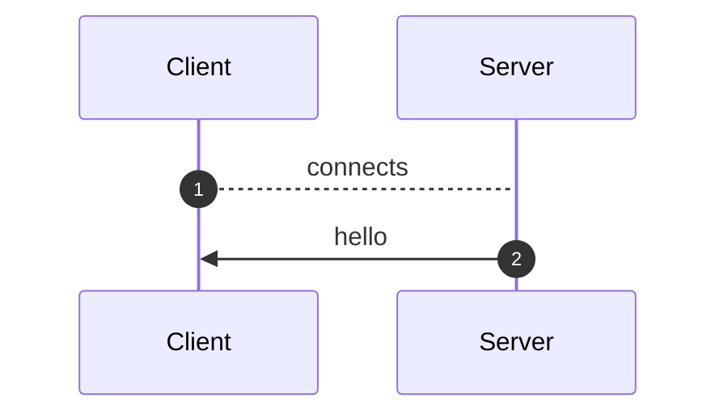
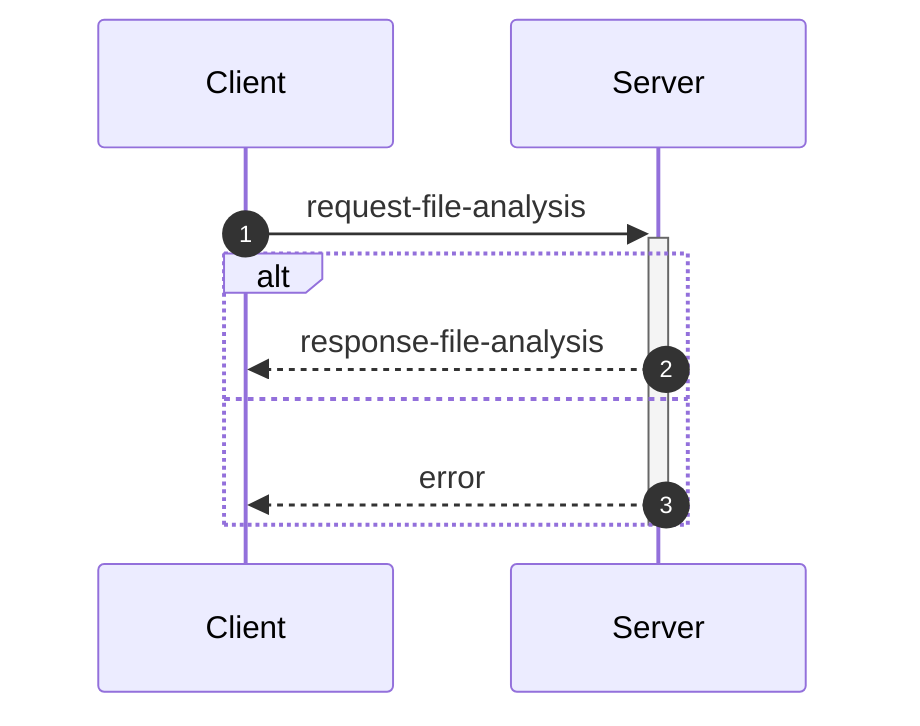
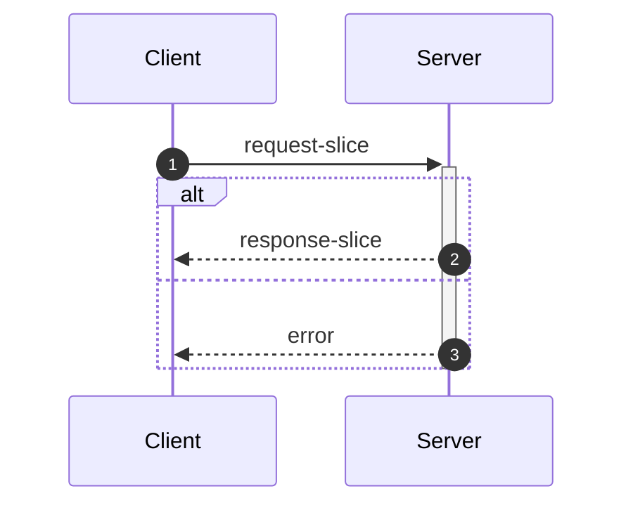
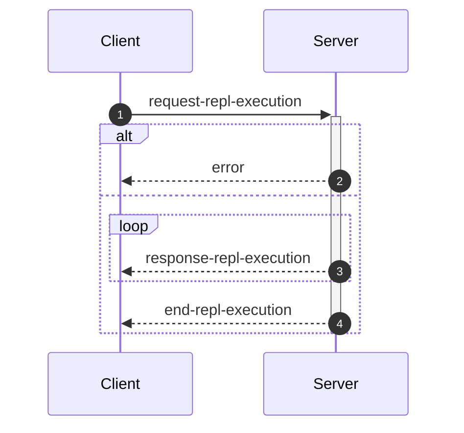

_This document was generated from '[src/documentation/wiki-interface.ts](https://github.com/flowr-analysis/flowr/tree/main//src/documentation/wiki-interface.ts)' on 2026-07-03, 13:45:31 UTC presenting an overview of flowR's interface (v2.10.10, using R v4.5.0). Please do not edit this file/wiki page directly._

Although far from being as detailed as the in-depth explanation of [_flowR_](https://github.com/flowr-analysis/flowr/wiki/core),
this wiki page explains how to interface with _flowR_ in more detail.
In general, command line arguments and other options provide short descriptions on hover over.

* [💻 Using the REPL](#using-the-repl)
* [⚙️ Configuring FlowR](#configuring-flowr)
* [⚒️ Writing Code](#writing-code)
* [💬 Communicating with the Server](#communicating-with-the-server)

<a id='using-the-repl'></a>
## 💻 Using the REPL


> [!NOTE]
> To execute arbitrary R commands with a repl request, _flowR_ has to be started explicitly with <span title="Description (Command Line Argument): Allow to access the underlying R session when using flowR (security warning: this allows the execution of arbitrary R code!)">`--r-session-access`</span>.
> Please be aware that this introduces a security risk and note that this relies on the [`r-shell` engine](https://github.com/flowr-analysis/flowr/wiki/engines) .

Although primarily meant for users to explore,
there is nothing which forbids simply calling _flowR_ as a subprocess to use standard-in, -output, and -error
for communication (although you can access the REPL using the server as well,
with the [REPL Request](#message-request-repl-execution) message).

The read-eval-print loop&nbsp;(REPL) works relatively simple.
You can submit an expression (using <kbd>Enter</kbd>),
which is interpreted as an R&nbsp;expression by default but interpreted as a *command* if it starts with a colon (`:`).
The best command to get started with the REPL is <span title="Description (Repl Command): Show help information (aliases: :h, :?)">`:help`</span>.
Besides, you can leave the REPL either with the command <span title="Description (Repl Command): End the repl (aliases: :q, :exit)">`:quit`</span> or by pressing <kbd>Ctrl</kbd>+<kbd>C</kbd> twice.
When writing a *command*, you may press <kbd>Tab</kbd> to get a list of completions, if available.
Multiple commands can be entered in a single line by separating them with a semicolon (`;`), e.g. `:parse "x<-2"; :df*`.
If a command is given without R code, the REPL will re-use R code given in a previous command.
The prior example will hence return first the parsed AST of the program and then the dataflow graph for `"x <- 2"`.

> [!NOTE]
> If you develop flowR, you may want to launch the repl using the `npm run main-dev` command, this way, you get a non-minified version of flowR with debug information and hot-reloading of source files.

<details>
<summary>Available Commands</summary>

We currently offer the following commands (this with a `[*]` suffix are available with and without the star):


| Command | Description |
| ------- | ----------- |
| **<span title="Description (Repl Command): End the repl (aliases: :q, :exit)">:quit</span>** | End the repl (aliases: **:<span title="Alias of ':quit'. End the repl">q</span>**, **:<span title="Alias of ':quit'. End the repl">exit</span>**) |
| **<span title="Description (Repl Command): Execute the given code as R code. This requires the `--r-session-access` flag to be set and requires the r-shell engine. (aliases: :e, :r)">:execute</span>** | Execute the given code as R code. This requires the `--r-session-access` flag to be set and requires the r-shell engine. (aliases: **:<span title="Alias of ':execute'. Execute the given code as R code. This requires the `--r-session-access` flag to be set and requires the r-shell engine.">e</span>**, **:<span title="Alias of ':execute'. Execute the given code as R code. This requires the `--r-session-access` flag to be set and requires the r-shell engine.">r</span>**) |
| **<span title="Description (Repl Command): Get mermaid code for the control-flow graph of R code (aliases: :cfg, :cf)">:controlflow[*]</span>** | Get mermaid code for the control-flow graph of R code (star: Returns the URL to mermaid.live) (aliases: **:<span title="Alias of ':controlflow'. Get mermaid code for the control-flow graph of R code">cfg</span>**, **:<span title="Alias of ':controlflow'. Get mermaid code for the control-flow graph of R code">cf</span>**) |
| **<span title="Description (Repl Command): Get mermaid code for the control-flow graph with basic blocks (aliases: :cfgb, :cfb)">:controlflowbb[*]</span>** | Get mermaid code for the control-flow graph with basic blocks (star: Returns the URL to mermaid.live) (aliases: **:<span title="Alias of ':controlflowbb'. Get mermaid code for the control-flow graph with basic blocks">cfgb</span>**, **:<span title="Alias of ':controlflowbb'. Get mermaid code for the control-flow graph with basic blocks">cfb</span>**) |
| **<span title="Description (Repl Command): Get mermaid code for the dataflow graph (aliases: :d, :df)">:dataflow[*]</span>** | Get mermaid code for the dataflow graph (star: Returns the URL to mermaid.live) (aliases: **:<span title="Alias of ':dataflow'. Get mermaid code for the dataflow graph">d</span>**, **:<span title="Alias of ':dataflow'. Get mermaid code for the dataflow graph">df</span>**) |
| **<span title="Description (Repl Command): Get mermaid code for the normalized AST of R code (aliases: :n)">:normalize[*]</span>** | Get mermaid code for the normalized AST of R code (star: Returns the URL to mermaid.live) (alias: **:<span title="Alias of ':normalize'. Get mermaid code for the normalized AST of R code">n</span>**) |
| **<span title="Description (Repl Command): Get mermaid code for the simplified dataflow graph (aliases: :ds, :dfs)">:dataflowsimple[*]</span>** | Get mermaid code for the simplified dataflow graph (star: Returns the URL to mermaid.live) (aliases: **:<span title="Alias of ':dataflowsimple'. Get mermaid code for the simplified dataflow graph">ds</span>**, **:<span title="Alias of ':dataflowsimple'. Get mermaid code for the simplified dataflow graph">dfs</span>**) |
| **<span title="Description (Repl Command): Just calculates the DFG, but only prints summary info (aliases: :d#, :df#)">:dataflowsilent</span>** | Just calculates the DFG, but only prints summary info (aliases: **:<span title="Alias of ':dataflowsilent'. Just calculates the DFG, but only prints summary info">d#</span>**, **:<span title="Alias of ':dataflowsilent'. Just calculates the DFG, but only prints summary info">df#</span>**) |
| **<span title="Description (Repl Command): Prints ASCII Art of the parsed, unmodified AST (aliases: :p)">:parse</span>** | Prints ASCII Art of the parsed, unmodified AST (alias: **:<span title="Alias of ':parse'. Prints ASCII Art of the parsed, unmodified AST">p</span>**) |
| **<span title="Description (Repl Command): Prints the version of flowR as well as the current version of R">:version</span>** | Prints the version of flowR as well as the current version of R
| **<span title="Description (Repl Command): Query the given R code (use 'help' for more information)">:query[*]</span>** | Query the given R code (use 'help' for more information) (star: Similar to query, but returns the output in json format.)
| **<span title="Description (Repl Command): Returns an ASCII representation of the dataflow graph (aliases: :df!)">:dataflowascii</span>** | Returns an ASCII representation of the dataflow graph (alias: **:<span title="Alias of ':dataflowascii'. Returns an ASCII representation of the dataflow graph">df!</span>**) |
| **<span title="Description (Repl Command): Returns summarization stats for the normalized AST (aliases: :n#)">:normalize#</span>** | Returns summarization stats for the normalized AST (alias: **:<span title="Alias of ':normalize#'. Returns summarization stats for the normalized AST">n#</span>**) |
| **<span title="Description (Repl Command): Show help information (aliases: :h, :?)">:help</span>** | Show help information (aliases: **:<span title="Alias of ':help'. Show help information">h</span>**, **:<span title="Alias of ':help'. Show help information">?</span>**) |


</details>


> [!TIP]
> 
> As indicated by the examples before, all REPL commands that operate on code keep track of the state.
> Hence, if you run a command like <span title="Description (Repl Command, starred version): Returns the URL to mermaid.live; Base Command: Get mermaid code for the dataflow graph (aliases: :d*, :df*)">`:dataflow*`</span> without providing R code,
> the REPL will re-use the R code provided in a previous command.
> Likewise, doing this will benefit from incrementality!
> If you request the dataflow graph with `:df* x <- 2 * y` and then want to see the parsed AST with `:parse`,
> the REPL will re-use previously obtained information and not re-parse the code again.
> 		


Generally, many commands offer shortcut versions in the REPL. Many queries, for example, offer a shortened format (see the example below).
Of special note, the [Config Query](https://github.com/flowr-analysis/flowr/wiki/query-api#Config-Query)
can be used to also modify the currently active configuration of _flowR_ within the REPL (see the [wiki page](https://github.com/flowr-analysis/flowr/wiki/query-api#Config-Query) for more information).

### Example: Retrieving the Dataflow Graph

To retrieve a URL to the [mermaid](https://mermaid.js.org/) diagram of the dataflow of a given expression,
use <span title="Description (Repl Command, starred version): Returns the URL to mermaid.live; Base Command: Get mermaid code for the dataflow graph (aliases: :d*, :df*)">`:dataflow*`</span> (or <span title="Description (Repl Command): Get mermaid code for the dataflow graph (aliases: :d, :df)">`:dataflow`</span> to get the mermaid code in the cli):


```shell
$ docker run -it --rm eagleoutice/flowr # or npm run flowr 
flowR repl using flowR v2.10.10, R grammar v14 (tree-sitter engine)
R> :dataflow* y <- 1 + x
```

<details>
<summary style='color:gray'>Output</summary>


```text
https://mermaid.live/view#base64:eyJjb2RlIjoiZmxvd2NoYXJ0IEJUXG4gICAgMXt7XCJgIzkxO1JOdW1iZXIjOTM7IDFcbiAgICAgICgxKVxuICAgICAgKjEuNipgXCJ9fVxuICAgJSUgTm8gZWRnZXMgZm91bmQgZm9yIDFcbiAgICAyKFtcImAjOTE7UlN5bWJvbCM5MzsgeFxuICAgICAgKDIpXG4gICAgICAqMS4xMCpgXCJdKVxuICAgJSUgTm8gZWRnZXMgZm91bmQgZm9yIDJcbiAgICAzW1tcImAjOTE7UkJpbmFyeU9wIzkzOyAjNDM7XG4gICAgICAoMylcbiAgICAgICoxLjYtMTAqXG4gICAgKDEsIDIpYFwiXV1cbiAgICBidWlsdC1pbjpfW1wiYEJ1aWx0LUluOlxuIzQzO2BcIl1cbiAgICBzdHlsZSBidWlsdC1pbjpfIHN0cm9rZTpncmF5LGZpbGw6Z3JheSxzdHJva2Utd2lkdGg6MnB4LG9wYWNpdHk6Ljg7XG4gICAgMFtcImAjOTE7UlN5bWJvbCM5MzsgeVxuICAgICAgKDAsIHNvdXJjZXM6IFszXSlcbiAgICAgICoxLjEqYFwiXVxuICAgIDRbW1wiYCM5MTtSQmluYXJ5T3AjOTM7ICM2MDsjNDU7XG4gICAgICAoNClcbiAgICAgICoxLjEtMTAqXG4gICAgKDAsIDMpYFwiXV1cbiAgICBidWlsdC1pbjpfLVtcImBCdWlsdC1JbjpcbiM2MDsjNDU7YFwiXVxuICAgIHN0eWxlIGJ1aWx0LWluOl8tIHN0cm9rZTpncmF5LGZpbGw6Z3JheSxzdHJva2Utd2lkdGg6MnB4LG9wYWNpdHk6Ljg7XG4gICAgMyAtLT58XCJyZWFkcywgYXJndW1lbnRcInwgMVxuICAgIDMgLS0+fFwicmVhZHMsIGFyZ3VtZW50XCJ8IDJcbiAgICAzIC0uLT58XCJyZWFkcywgY2FsbHNcInwgYnVpbHQtaW46X1xuICAgIGxpbmtTdHlsZSAyIHN0cm9rZTpncmF5O1xuICAgIDAgLS0+fFwiZGVmaW5lZC1ieVwifCAzXG4gICAgMCAtLT58XCJkZWZpbmVkLWJ5XCJ8IDRcbiAgICA0IC0tPnxcInJlYWRzLCBhcmd1bWVudFwifCAzXG4gICAgNCAtLT58XCJyZXR1cm5zLCBhcmd1bWVudFwifCAwXG4gICAgNCAtLi0+fFwicmVhZHMsIGNhbGxzXCJ8IGJ1aWx0LWluOl8tXG4gICAgbGlua1N0eWxlIDcgc3Ryb2tlOmdyYXk7IiwibWVybWFpZCI6eyJhdXRvU3luYyI6dHJ1ZX19
```


Retrieve the dataflow graph of the expression `y <- 1 + x`. It looks like this:


```mermaid
flowchart LR
    1{{"`#91;RNumber#93; 1
      (1)
      *1.6*`"}}
   %% No edges found for 1
    2(["`#91;RSymbol#93; x
      (2)
      *1.10*`"])
   %% No edges found for 2
    3[["`#91;RBinaryOp#93; #43;
      (3)
      *1.6-10*
    (1, 2)`"]]
    built-in:_["`Built-In:
#43;`"]
    style built-in:_ stroke:gray,fill:gray,stroke-width:2px,opacity:.8;
    0["`#91;RSymbol#93; y
      (0, sources: [3])
      *1.1*`"]
    4[["`#91;RBinaryOp#93; #60;#45;
      (4)
      *1.1-10*
    (0, 3)`"]]
    built-in:_-["`Built-In:
#60;#45;`"]
    style built-in:_- stroke:gray,fill:gray,stroke-width:2px,opacity:.8;
    3 -->|"reads, argument"| 1
    3 -->|"reads, argument"| 2
    3 -.->|"reads, calls"| built-in:_
    linkStyle 2 stroke:gray;
    0 -->|"defined-by"| 3
    0 -->|"defined-by"| 4
    4 -->|"reads, argument"| 3
    4 -->|"returns, argument"| 0
    4 -.->|"reads, calls"| built-in:_-
    linkStyle 7 stroke:gray;
```

	
<details>

<summary style="color:gray">R Code of the Dataflow Graph</summary>

The analysis required _0.6 ms_ (including parse and normalize, using the [tree-sitter](https://github.com/flowr-analysis/flowr/wiki/Engines) engine) within the generation environment. 
We encountered no unknown side effects during the analysis.


```r
y <- 1 + x
```


</details>


</details>


For small graphs like this, <span title="Description (Repl Command): Returns an ASCII representation of the dataflow graph (aliases: :df!)">`:dataflowascii`</span> also provides an ASCII representation directly in the REPL:


```shell
$ docker run -it --rm eagleoutice/flowr # or npm run flowr 
flowR repl using flowR v2.10.10, R grammar v14 (tree-sitter engine)
R> :df! y <- 1 + x
```

<details open>
<summary style='color:gray'>Output</summary>


```text
                        0<1>0
                   ┌────| 1 |
    ┌────────┐     │    0---0
 c<4>c       └──c<3>c
 |<- |  v<0>v┌──| + |
 c---c──| y |┘  c---c   u<2>u
        v---v      └────| x |
                        u---u
Edges:
3 -> 1: reads, argument  3 -> 2: reads, argument
4 -> 3: reads, argument  4 -> 0: returns, argument
0 -> 3: defined-by       0 -> 4: defined-by
```


Retrieve the dataflow graph of the expression `y <- 1 + x` as ASCII art.

</details>


For the slicing with <span title="Description (Repl Command): Static backwards executable slicer for R">`:slicer`</span>, you have access to the same [magic comments](#slice-magic-comments) as with the [slice request](#message-request-slice).

### Example: Interfacing with the File System

Many commands that allow for an R-expression (like <span title="Description (Repl Command, starred version): Returns the URL to mermaid.live; Base Command: Get mermaid code for the dataflow graph (aliases: :d*, :df*)">`:dataflow*`</span>) allow for a file as well
if the argument starts with `file://`.
If you are working from the root directory of the _flowR_ repository, the following gives you the parsed AST of the example file using the <span title="Description (Repl Command): Prints ASCII Art of the parsed, unmodified AST (aliases: :p)">`:parse`</span> command:

> **Watch mode**: Replace `file://` with `watch://` to enter watch mode.
> flowR runs the command immediately and then re-runs it every time the file (or any file inside the folder) changes.
> Enter any other command to leave watch mode.
> For example: `:df watch://analysis.R`


```shell
$ docker run -it --rm eagleoutice/flowr # or npm run flowr 
flowR repl using flowR v2.10.10, R grammar v14 (tree-sitter engine)
R> :parse file://test/testfiles/example.R
```

<details>
<summary style='color:gray'>Output</summary>


```text
File: test/testfiles/example.R

program
├ binaryoperator
│ ├ identifier "sum" (1:1─4)
│ ├ <- "<-" (1:5─7)
│ ╰ float "0" (1:8─9)
├ binaryoperator
│ ├ identifier "product" (2:1─8)
│ ├ <- "<-" (2:9─11)
│ ╰ float "1" (2:12─13)
├ binaryoperator
│ ├ identifier "w" (3:1─2)
│ ├ <- "<-" (3:3─5)
│ ╰ float "7" (3:6─7)
├ binaryoperator
│ ├ identifier "N" (4:1─2)
│ ├ <- "<-" (4:3─5)
│ ╰ float "10" (4:6─8)
├ forstatement
│ ├ for "for" (6:1─4)
│ ├ ( "(" (6:5─6)
│ ├ identifier "i" (6:6─7)
│ ├ in "in" (6:8─10)
│ ├ binaryoperator
│ │ ├ float "1" (6:11─12)
│ │ ├ : ":" (6:12─13)
│ │ ╰ parenthesizedexpression
│ │   ├ ( "(" (6:13─14)
│ │   ├ binaryoperator
│ │   │ ├ identifier "N" (6:14─15)
│ │   │ ├ - "-" (6:15─16)
│ │   │ ╰ float "1" (6:16─17)
│ │   ╰ ) ")" (6:17─18)
│ ├ ) ")" (6:18─19)
│ ╰ bracedexpression
│   ├ { "{" (6:20─21)
│   ├ binaryoperator
│   │ ├ identifier "sum" (7:3─6)
│   │ ├ <- "<-" (7:7─9)
│   │ ╰ binaryoperator
│   │   ├ binaryoperator
│   │   │ ├ identifier "sum" (7:10─13)
│   │   │ ├ + "+" (7:14─15)
│   │   │ ╰ identifier "i" (7:16─17)
│   │   ├ + "+" (7:18─19)
│   │   ╰ identifier "w" (7:20─21)
│   ├ binaryoperator
│   │ ├ identifier "product" (8:3─10)
│   │ ├ <- "<-" (8:11─13)
│   │ ╰ binaryoperator
│   │   ├ identifier "product" (8:14─21)
│   │   ├  "" (8:22─23)
│   │   ╰ identifier "i" (8:24─25)
│   ╰ } "}" (9:1─2)
├ call
│ ├ identifier "cat" (11:1─4)
│ ╰ arguments
│   ├ ( "(" (11:4─5)
│   ├ argument
│   │ ╰ string
│   │   ├ " "\"" (11:5─6)
│   │   ├ stringcontent "Sum:" (11:6─10)
│   │   ╰ " "\"" (11:10─11)
│   ├ comma "," (11:11─12)
│   ├ argument
│   │ ╰ identifier "sum" (11:13─16)
│   ├ comma "," (11:16─17)
│   ├ argument
│   │ ╰ string
│   │   ├ " "\"" (11:18─19)
│   │   ├ stringcontent
│   │   │ ╰ escapesequence "\\n" (11:19─21)
│   │   ╰ " "\"" (11:21─22)
│   ╰ ) ")" (11:22─23)
╰ call
  ├ identifier "cat" (12:1─4)
  ╰ arguments
    ├ ( "(" (12:4─5)
    ├ argument
    │ ╰ string
    │   ├ " "\"" (12:5─6)
    │   ├ stringcontent "Product:" (12:6─14)
    │   ╰ " "\"" (12:14─15)
    ├ comma "," (12:15─16)
    ├ argument
    │ ╰ identifier "product" (12:17─24)
    ├ comma "," (12:24─25)
    ├ argument
    │ ╰ string
    │   ├ " "\"" (12:26─27)
    │   ├ stringcontent
    │   │ ╰ escapesequence "\\n" (12:27─29)
    │   ╰ " "\"" (12:29─30)
    ╰ ) ")" (12:30─31)
```


Retrieve the parsed AST of the example file.

<details>

<summary>File Content</summary>


```r
sum <- 0
product <- 1
w <- 7
N <- 10

for (i in 1:(N-1)) {
  sum <- sum + i + w
  product <- product * i
}

cat("Sum:", sum, "\n")
cat("Product:", product, "\n")
```


</details>

As _flowR_ directly transforms this AST the output focuses on being human-readable instead of being machine-readable.
		

</details>


### Example: Run a Query

You can run any query supported by _flowR_ using the <span title="Description (Repl Command): Query the given R code (use 'help' for more information)">`:query`</span> command.
For example, to obtain the shapes of all data frames in a given piece of code, you can run:


```shell
$ docker run -it --rm eagleoutice/flowr # or npm run flowr 
flowR repl using flowR v2.10.10, R grammar v14 (tree-sitter engine)
R> :query @df-shape "x <- data.frame(a = 1:10, b = 1:10)\ny <- x$a"
```

<details open>
<summary style='color:gray'>Output</summary>


```text
Query: df-shape (2 ms)
   ╰ 12: (colnames: [{"a", "b"}, {}], cols: [2, 2], rows: [10, 10])
   ╰ 0: (colnames: [{"a", "b"}, {}], cols: [2, 2], rows: [10, 10])
All queries together required ≈4 ms (1ms accuracy, total 5 ms)
```


Retrieve the shapes of all data frames in the given code.

</details>


To run the linter on a file, you can use (in this example, we just issue the `dead-code` linter on a small piece of code):


```shell
$ docker run -it --rm eagleoutice/flowr # or npm run flowr 
flowR repl using flowR v2.10.10, R grammar v14 (tree-sitter engine)
R> :query @linter rules:dead-code "if(FALSE) x <- 2"
```

<details open>
<summary style='color:gray'>Output</summary>


```text
Query: linter (1 ms)
   ╰ Dead Code (dead-code):
       ╰ certain:
           ╰ Code at 1.11-16
       ╰ Metadata: searchTimeMs: 1, processTimeMs: 0
All queries together required ≈1 ms (1ms accuracy, total 2 ms)
```


Run the linter on the given code, with only the `dead-code` rule enabled.

</details>


For more information on the available queries, please check out the [Query API](https://github.com/flowr-analysis/flowr/wiki/query-api).


<a id='configuring-flowr'></a>
## ⚙️ Configuring FlowR


When running _flowR_, you may want to specify some behaviors with a dedicated configuration file.
By default, flowR looks for a file named `flowr.json` in the current working directory (or any higher directory).
You can also specify a different file with <span title="Description (Command Line Argument): The name of the configuration file to use">`--config-file`</span> or pass the configuration inline using <span title="Description (Command Line Argument): The flowR configuration to use, as a JSON string">`--config-json`</span>.
To inspect the current configuration, you can run flowr with the <span title="Description (Command Line Argument): Run with verbose logging (will be passed to the corresponding script)">`--verbose`</span> flag, or use the `config` [Query](https://github.com/flowr-analysis/flowr/wiki/query-api).
Within the REPL this works by running the following:


```shell
:query @config
```


To work with the <a href="https://github.com/flowr-analysis/flowr/tree/main/src/config.ts#L109"><code><span title="The configuration file format for flowR.">FlowrConfig</span></code></a> you can use the provided helper objects alongside its methods like
<a href="https://github.com/flowr-analysis/flowr/tree/main/src/config.ts#L458"><code><span title="Creates a new flowr config that has the updated values.">FlowrConfig::<b>amend</b></span></code></a>.
The following summarizes the configuration options:

- `ignoreSourceCalls`: If set to `true`, _flowR_ will ignore source calls when analyzing the code, i.e., ignoring the inclusion of other files.
- `semantics`: allows to configure the way _flowR_ handles R, although we currently only support `semantics/environment/overwriteBuiltIns`.
  You may use this to overwrite _flowR_'s handling of built-in function and even completely clear the preset definitions shipped with flowR.
  See [Configure BuiltIn Semantics](#configure-builtin-semantics) for more information.
- `solver`: allows to configure how _flowR_ resolves variables and their values (currently we support: `disabled`, `alias`, `builtin`), as well as if pointer analysis should be active.
- `engines`: allows to configure the engines used by _flowR_ to interact with R code. See the [Engines wiki page](https://github.com/flowr-analysis/flowr/wiki/engines) for more information.
- `defaultEngine`: allows to specify the default engine to use for interacting with R code. If not set, an arbitrary engine from the specified list will be used.
- `abstractInterpretation`: allows to configure how _flowR_ performs abstract interpretation, although we currently only support data frame shape inference through abstract interpretation.
- `defaultPlugins`: allows to configure which plugins to load by default when creating a new <a href="https://github.com/flowr-analysis/flowr/tree/main/src/project/flowr-analyzer.ts#L162"><code><span title="Central class for conducting analyses with FlowR. Use the FlowrAnalyzerBuilder to create a new instance. If you want the original pattern of creating a pipeline and running all steps, you can still do this with FlowrAnalyzer#runFull . To inspect the context of the analyzer, use FlowrAnalyzer#inspectContext (if you are a plugin and need to modify it, use FlowrAnalyzer#context instead).">FlowrAnalyzer</span></code></a> instance.
- `repl.plugins`: allows to configure which plugins to load in the _flowR_ REPL. Use `flowr:default` to reference the plugins specified by `defaultPlugins`.

So you can configure _flowR_ by adding a file like the following:

<details>

<summary>Example Configuration File</summary>


```json
{
  "ignoreSourceCalls": true,
  "semantics": {
    "environment": {
      "overwriteBuiltIns": {
        "definitions": [
          {
            "type": "function",
            "names": [
              "foo"
            ],
            "processor": "builtin:assign",
            "config": {}
          }
        ]
      }
    }
  },
  "defaultPlugins": [
    "file:description",
    "versions:description"
  ],
  "repl": {
    "quickStats": false,
    "dfProcessorHeat": false,
    "plugins": [
      "flowr:default"
    ]
  },
  "project": {
    "resolveUnknownPathsOnDisk": true
  },
  "engines": [
    {
      "type": "r-shell"
    }
  ],
  "solver": {
    "variables": "alias",
    "evalStrings": true,
    "trackEnvironments": true,
    "resolveSource": {
      "dropPaths": "no",
      "ignoreCapitalization": true,
      "inferWorkingDirectory": "active-script",
      "searchPath": []
    },
    "instrument": {},
    "slicer": {
      "threshold": 50
    }
  },
  "abstractInterpretation": {
    "wideningThreshold": 4,
    "dataFrame": {
      "maxColNames": 20,
      "readLoadedData": {
        "readExternalFiles": true,
        "maxReadLines": 1000000
      }
    }
  },
  "gas": {
    "thresholds": {
      "memory": {
        "problematic": 0.7,
        "critical": 0.9
      },
      "timeMs": {
        "problematic": 100000,
        "critical": 120000
      }
    },
    "features": {}
  }
}
```


</details>

<details>
<a id='configure-builtin-semantics'></a>
<summary>Configure Built-In Semantics</summary>


`semantics/environment/overwriteBuiltins` accepts two keys:

- `loadDefaults` (boolean, initially `true`): If set to `true`, the default built-in definitions are loaded before applying the custom definitions. Setting this flag to `false` explicitly disables the loading of the default definitions.
- `definitions` (array, initially empty): Allows to overwrite or define new built-in elements. Each object within must have a `type` which is one of the below. Furthermore, they may define a string array of `names` which specifies the identifiers to bind the definitions to. You may use `assumePrimitive` to specify whether _flowR_ should assume that this is a primitive non-library definition (so you probably just do not want to specify the key).

  | Type            | Description                                                                                                                                                                                                                                                                                              | Example                                                                                                    |
  | --------------- | -------------------------------------------------------------------------------------------------------------------------------------------------------------------------------------------------------------------------------------------------------------------------------------------------------- | ---------------------------------------------------------------------------------------------------------- |
  | `constant`    | Additionally allows for a `value` this should resolve to.                                                                                                                                                                                                                                                | `{ type: 'constant', names: ['NULL', 'NA'],  value: null }`                                                |
  | `function`    | Is a rather flexible way to define and bind built-in functions. For the time, we do not have extensive documentation to cover all the cases, so please either consult the sources with the `default-builtin-config.ts` or open a [new issue](https://github.com/flowr-analysis/flowr/issues/new/choose). | `{ type: 'function', names: ['next'], processor: 'builtin:d', config: { cfg: ExitPointType.Next } }` |
  | `replacement` | A comfortable way to specify replacement functions like `$<-` or `names<-`. `suffixes` describes the... suffixes to attach automatically. | `{ type: 'replacement', suffixes: ['<-', '<<-'], names: ['[', '[['] }` |


</details>

<details>

<summary style='color:gray'>Full Configuration-File Schema</summary>

- _The configuration file format for flowR._ (object)
    - **ignoreSourceCalls** [optional] _Whether source calls should be ignored, causing {@link processSourceCall}'s behavior to be skipped._ (boolean)
    - **semantics** _Configure language semantics and how flowR handles them._ (object)
        - **environment** [optional] _Semantics regarding how to handle the R environment._ (object)
            - **overwriteBuiltIns** [optional] _Do you want to overwrite (parts) of the builtin definition?_ (object)
                - **loadDefaults** [optional] _Should the default configuration still be loaded?_ (boolean)
                - **definitions** [optional] _The definitions to load/overwrite._ (array)
                Valid item types:
                    - (object)
    - **defaultPlugins** [optional] _The default plugins to load when creating a new instance of FlowrAnalyzer_ (array)
    Valid item types:
        - (alternatives)
            - (string)
            - (array)
    - **repl** _Configuration options for the REPL._ (object)
        - **quickStats** [optional] _Whether to show quick stats in the REPL after each evaluation._ (boolean)
        - **dfProcessorHeat** [optional] _This instruments the dataflow processors to count how often each processor is called._ (boolean)
        - **plugins** [optional] _The plugins to load in REPL mode_ (array)
        Valid item types:
            - (alternatives)
                - (string)
                - (array)
    - **project** _Project specific configuration options._ (object)
        - **resolveUnknownPathsOnDisk** [optional] _Whether to resolve unknown paths loaded by the r project disk when trying to source/analyze files._ (boolean)
    - **engines** _The engine or set of engines to use for interacting with R code. An empty array means all available engines will be used._ (array)
    Valid item types:
        - (alternatives)
            - _The configuration for the tree sitter engine._ (object)
                - **type** [required] _Use the tree sitter engine._ (string)
                    Only allows: 'tree-sitter'
                - **wasmPath** [optional] _The path to the tree-sitter-r WASM binary to use. If this is undefined, this uses the default path._ (string)
                - **treeSitterWasmPath** [optional] _The path to the tree-sitter WASM binary to use. If this is undefined, this uses the default path._ (string)
                - **lax** [optional] _Whether to use the lax parser for parsing R code (allowing for syntax errors). If this is undefined, the strict parser will be used._ (boolean)
            - _The configuration for the R shell engine._ (object)
                - **type** [required] _Use the R shell engine._ (string)
                    Only allows: 'r-shell'
                - **rPath** [optional] _The path to the R executable to use. If this is undefined, this uses the default path._ (string)
    - **defaultEngine** [optional] _The default engine to use for interacting with R code. If this is undefined, an arbitrary engine from the specified list will be used._ (string)
        Only allows: 'tree-sitter', 'r-shell'
    - **solver** _How to resolve constants, constraints, cells, ..._ (object)
        - **variables** _How to resolve variables and their values._ (string)
            Only allows: 'disabled', 'alias', 'builtin'
        - **evalStrings** _Should we include eval(parse(text="...")) calls in the dataflow graph?_ (boolean)
        - **trackEnvironments** [optional] _Track user-created environments (new.env, assign/get/local with envir=, dollar-assign, attach). When false, all envir-style calls fall through conservatively._ (boolean)
        - **instrument** (object)
            - **dataflowExtractors** [optional] _These keys are only intended for use within code, allowing to instrument the dataflow analyzer!_ (any)
        - **resolveSource** [optional] _If lax source calls are active, flowR searches for sourced files much more freely, based on the configurations you give it. This option is only in effect if `ignoreSourceCalls` is set to false._ (object)
            - **dropPaths** _Allow to drop the first or all parts of the sourced path, if it is relative._ (string)
                Only allows: 'no', 'once', 'all'
            - **ignoreCapitalization** _Search for filenames matching in the lowercase._ (boolean)
            - **inferWorkingDirectory** _Try to infer the working directory from the main or any script to analyze._ (string)
                Only allows: 'no', 'main-script', 'active-script', 'any-script'
            - **searchPath** _Additionally search in these paths._ (array)
            Valid item types:
                - (string)
            - **repeatedSourceLimit** [optional] _How often the same file can be sourced within a single run? Please be aware: in case of cyclic sources this may not reach a fixpoint so give this a sensible limit._ (number)
            - **applyReplacements** _Provide name replacements for loaded files_ (array)
            Valid item types:
                - (object)
        - **slicer** [optional] _The configuration for the slicer._ (object)
            - **threshold** [optional] _The maximum number of iterations to perform on a single function call during slicing._ (number)
            - **autoExtend** [optional] _If set, the slicer will gain an additional post-pass._ (boolean)
    - **abstractInterpretation** _The configuration options for abstract interpretation._ (object)
        - **wideningThreshold** _The threshold for the number of visitations of a node at which widening should be performed to ensure the termination of the fixpoint iteration._ (number)
        - **dataFrame** _The configuration of the shape inference for data frames._ (object)
            - **maxColNames** _The maximum number of columns names to infer for data frames before over-approximating the column names to top._ (number)
            - **readLoadedData** _Configuration options for reading data frame shapes from loaded external data files, such as CSV files._ (object)
                - **readExternalFiles** _Whether data frame shapes should be extracted from loaded external files, such as CSV files._ (boolean)
                - **maxReadLines** _The maximum number of lines to read when extracting data frame shapes from loaded files, such as CSV files._ (number)
    - **gas** [optional] _Resource-usage guard (gas) configuration. All feature factors default to 0 (disabled). See https://github.com/flowr-analysis/flowr/wiki/Core#gas-resource-guard._ (object)
        - **thresholds** [optional] _Shared thresholds for all gas checks (scaled by per-feature factor)._ (object)
            - **memory** [optional] _Heap-usage fraction thresholds (0-1)._ (object)
                - **problematic** [optional] _Heap fraction (0-1) above which Problematic is returned._ (number)
                - **critical** [optional] _Heap fraction (0-1) above which Critical is returned._ (number)
            - **timeMs** [optional] _Elapsed analysis time thresholds in milliseconds._ (object)
                - **problematic** [optional] _Elapsed ms above which Problematic is returned._ (number)
                - **critical** [optional] _Elapsed ms above which Critical is returned._ (number)
        - **features** [optional] _Per-feature sensitivity factors. 0 or absent disables gas checking for that feature. A factor of 2 makes the feature twice as sensitive. Recognised keys: `source`, `side-effect-linking`, `linter`._ (object)
        - **heapProvider** [optional] _Custom heap statistics source (programmatic configs only), overriding the built-in v8/performance.memory detection._ (function)

</details>

	

<a id='writing-code'></a>
## ⚒️ Writing Code

_flowR_ can be used as a [module](https://www.npmjs.com/package/@eagleoutice/flowr) and offers several main classes and interfaces that are interesting for extension writers 
(see the [Visual Studio Code extension](https://marketplace.visualstudio.com/items?itemName=code-inspect.vscode-flowr) or the [Core](https://github.com/flowr-analysis/flowr/wiki/core) wiki page for more information).

### Creating Analyses with _flowR_

Nowadays, instances of the <a href="https://github.com/flowr-analysis/flowr/tree/main/src/project/flowr-analyzer.ts#L162"><code><span title="Central class for conducting analyses with FlowR. Use the FlowrAnalyzerBuilder to create a new instance. If you want the original pattern of creating a pipeline and running all steps, you can still do this with FlowrAnalyzer#runFull . To inspect the context of the analyzer, use FlowrAnalyzer#inspectContext (if you are a plugin and need to modify it, use FlowrAnalyzer#context instead).">FlowrAnalyzer</span></code></a> should be used as central frontend to get analysis results from _flowR_.
For example, a program slice can be created like this:


```ts
const analyzer = await new FlowrAnalyzerBuilder()
    .setEngine('tree-sitter')
    .build();
analyzer.addRequest('x <- 1\ny <- x\nx');
const result = await analyzer.query([
    {
        type:     'static-slice',
        criteria: ['3@x']
    }
]);
//console.log(result['static-slice']);
```


For more information, please have a look at the [Analyzer](https://github.com/flowr-analysis/flowr/wiki/analyzer) wiki page, which explains how to construct and use the <a href="https://github.com/flowr-analysis/flowr/tree/main/src/project/flowr-analyzer.ts#L162"><code><span title="Central class for conducting analyses with FlowR. Use the FlowrAnalyzerBuilder to create a new instance. If you want the original pattern of creating a pipeline and running all steps, you can still do this with FlowrAnalyzer#runFull . To inspect the context of the analyzer, use FlowrAnalyzer#inspectContext (if you are a plugin and need to modify it, use FlowrAnalyzer#context instead).">FlowrAnalyzer</span></code></a> in more detail.
To work with specific perspectives, you can also consult the respective pages like the [Dataflow Graph](https://github.com/flowr-analysis/flowr/wiki/dataflow-graph) or the [Abstract Interpretation](https://github.com/flowr-analysis/flowr/wiki/abstract-interpretation) wiki pages.
### The Pipeline Executor (Low-Level Interface)

Once, in the beginning, _flowR_ was meant to produce a dataflow graph merely to provide *program slices*. 
However, with continuous updates, the [Dataflow Graph](https://github.com/flowr-analysis/flowr/wiki/dataflow-graph) repeatedly proves to be the more interesting part.
With this, we restructured _flowR_'s originally *hardcoded* pipeline to be far more flexible. 
Now, it can be theoretically extended or replaced with arbitrary steps, optional steps, and what we call 'decorations' of these steps. 
In short, a slicing pipeline using the <a href="https://github.com/flowr-analysis/flowr/tree/main/src/core/pipeline-executor.ts#L97"><code><span title="**Please note:** The PipelineExecutor is now considered to be a rather low-level API for flowR. While it still works and is the basis for all other layers, we strongly recommend using the FlowrAnalyzer and its builder to create and use an analyzer instance that is pre-configured for your use-case. The pipeline executor allows to execute arbitrary pipelines in a step-by-step fashion. If you are not...">PipelineExecutor</span></code></a> looks like this:


```ts

const slicer = new PipelineExecutor(DEFAULT_SLICING_PIPELINE, {
  parser:    new RShell(),
  request:   requestFromInput('x <- 1\nx + 1'),
  criterion: ['2@x']
})
const slice = await slicer.allRemainingSteps()
// console.log(slice.reconstruct.code)
```


<details><summary>More Information</summary>


If you compare this, with what you would have done with the old (and removed) `SteppingSlicer`, 
this essentially just requires you to replace the `SteppingSlicer` with the <a href="https://github.com/flowr-analysis/flowr/tree/main/src/core/pipeline-executor.ts#L97"><code><span title="**Please note:** The PipelineExecutor is now considered to be a rather low-level API for flowR. While it still works and is the basis for all other layers, we strongly recommend using the FlowrAnalyzer and its builder to create and use an analyzer instance that is pre-configured for your use-case. The pipeline executor allows to execute arbitrary pipelines in a step-by-step fashion. If you are not...">PipelineExecutor</span></code></a>
and to pass the <a href="https://github.com/flowr-analysis/flowr/tree/main/src/core/steps/pipeline/default-pipelines.ts#L18"><code>DEFAULT_SLICING_PIPELINE</code></a> as the first argument.
The <a href="https://github.com/flowr-analysis/flowr/tree/main/src/core/pipeline-executor.ts#L97"><code><span title="**Please note:** The PipelineExecutor is now considered to be a rather low-level API for flowR. While it still works and is the basis for all other layers, we strongly recommend using the FlowrAnalyzer and its builder to create and use an analyzer instance that is pre-configured for your use-case. The pipeline executor allows to execute arbitrary pipelines in a step-by-step fashion. If you are not...">PipelineExecutor</span></code></a>...

1. Provides structures to investigate the results of all intermediate steps
2. Can be executed step-by-step
3. Can repeat steps (e.g., to calculate multiple slices on the same input)

See the in-code documentation for more information.


</details>

### Using the <a href="https://github.com/flowr-analysis/flowr/tree/main/src/r-bridge/shell.ts#L143"><code><span title="The RShell represents an interactive session with the R interpreter. You can configure it by RShellOptions . At the moment we are using a live R session (and not networking etc.) to communicate with R easily, which allows us to install packages etc. However, this might and probably will change in the future (leaving this as a legacy mode :D)">RShell</span></code></a> to Interact with R

The <a href="https://github.com/flowr-analysis/flowr/tree/main/src/r-bridge/shell.ts#L143"><code><span title="The RShell represents an interactive session with the R interpreter. You can configure it by RShellOptions . At the moment we are using a live R session (and not networking etc.) to communicate with R easily, which allows us to install packages etc. However, this might and probably will change in the future (leaving this as a legacy mode :D)">RShell</span></code></a> class allows interfacing with the `R`&nbsp;ecosystem installed on the host system.
Please have a look at [flowR's Engines](https://github.com/flowr-analysis/flowr/wiki/engines) for more information on alternatives (for example, the <a href="https://github.com/flowr-analysis/flowr/tree/main/src/r-bridge/lang-4.x/tree-sitter/tree-sitter-executor.ts#L18"><code><span title="Synchronous and (way) faster alternative to the RShell using tree-sitter.">TreeSitterExecutor</span></code></a>).


> [!IMPORTANT]
> 
> Each <a href="https://github.com/flowr-analysis/flowr/tree/main/src/r-bridge/shell.ts#L143"><code><span title="The RShell represents an interactive session with the R interpreter. You can configure it by RShellOptions . At the moment we are using a live R session (and not networking etc.) to communicate with R easily, which allows us to install packages etc. However, this might and probably will change in the future (leaving this as a legacy mode :D)">RShell</span></code></a> controls a new instance of the R&nbsp;interpreter, 
> make sure to call <code><a href="https://github.com/flowr-analysis/flowr/tree/main/src/r-bridge/shell.ts#L333"><span title="Close the current R session, makes the object effectively invalid (can no longer be reopened etc.)">RShell::<i>close</i></span></a>()</code> when you are done.


You can start a new "session" simply by constructing a new object with <code>new <a href="https://github.com/flowr-analysis/flowr/tree/main/src/r-bridge/shell.ts#L143"><span title="The RShell represents an interactive session with the R interpreter. You can configure it by RShellOptions . At the moment we are using a live R session (and not networking etc.) to communicate with R easily, which allows us to install packages etc. However, this might and probably will change in the future (leaving this as a legacy mode :D)">RShell</span></a>()</code>.

However, there are several options that may be of interest 
(e.g., to automatically revive the shell in case of errors or to control the name location of the R process on the system).

With a shell object (let's call it `shell`), you can execute R code by using <a href="https://github.com/flowr-analysis/flowr/tree/main/src/r-bridge/shell.ts#L211"><code><span title="sends the given command directly to the current R session will not do anything to alter input markers!">RShell::<i>sendCommand</i></span></code></a>,
for example <code>shell.<a href="https://github.com/flowr-analysis/flowr/tree/main/src/r-bridge/shell.ts#L211"><span title="sends the given command directly to the current R session will not do anything to alter input markers!">sendCommand</span></a>("1 + 1")</code>.
However, this does not return anything, so if you want to collect the output of your command, use
<a href="https://github.com/flowr-analysis/flowr/tree/main/src/r-bridge/shell.ts#L277"><code><span title="Send a command and collect the output">RShell::<i>sendCommandWithOutput</i></span></code></a> instead.


<a id='communicating-with-the-server'></a>
## 💬 Communicating with the Server


As explained in the [Overview](https://github.com/flowr-analysis/flowr/wiki/overview), you can simply run the [TCP](https://de.wikipedia.org/wiki/Transmission_Control_Protocol)&nbsp;server by adding the <span title="Description (Command Line Argument): Do not drop into a repl, but instead start a server on the given port (default: 1042) and listen for messages.">`--server`</span> flag (and, due to the interactive mode, exit with the conventional <kbd>CTRL</kbd>+<kbd>C</kbd>).
Currently, every connection is handled by the same underlying `RShell` - so the server is not designed to handle many clients at a time.
Additionally, the server is not well guarded against attacks (e.g., you can theoretically spawn an arbitrary number of&nbsp;RShell sessions on the target machine).

Every message has to be given in a single line (i.e., without a newline in-between) and end with a newline character. Nevertheless, we will pretty-print example given in the following segments for the ease of reading.


> [!NOTE]
> 
> The default <span title="Description (Command Line Argument): Do not drop into a repl, but instead start a server on the given port (default: 1042) and listen for messages.">`--server`</span> uses a simple [TCP](https://de.wikipedia.org/wiki/Transmission_Control_Protocol)
> connection. If you want _flowR_ to expose a [WebSocket](https://de.wikipedia.org/wiki/WebSocket) server instead, add the <span title="Description (Command Line Argument): If the server flag is set, use websocket for messaging">`--ws`</span> flag (i.e., <span title="Description (Command Line Argument): Do not drop into a repl, but instead start a server on the given port (default: 1042) and listen for messages.">`--server`</span> <span title="Description (Command Line Argument): If the server flag is set, use websocket for messaging">`--ws`</span>) when starting _flowR_ from the command line.


<ul><li>
<a id="message-hello"></a>
<b>Hello</b> Message (<code>hello</code>) 
<details>

<summary style="color:gray"> View Details. <i>The server informs the client about the successful connection and provides Meta-Information.</i> </summary>


```mermaid
sequenceDiagram
    autonumber
    participant Client
    participant Server

    
    Client-->Server: connects
    Server->>Client: hello
	
```


	
After launching _flowR_, for example, with <code>docker run -it --rm eagleoutice/flowr <span title="Description (Command Line Argument): Do not drop into a repl, but instead start a server on the given port (default: 1042) and listen for messages.">-<span/>-server</span></code>&nbsp;(🐳️), simply connecting should present you with a `hello` message, that amongst others should reveal the versions of&nbsp;_flowR_ and&nbsp;R, using the [semver 2.0](https://semver.org/spec/v2.0.0.html) versioning scheme.
The message looks like this:


```json
{
  "type": "hello",
  "clientName": "client-0",
  "versions": {
    "flowr": "2.10.10",
    "r": "4.5.0",
    "engine": "r-shell"
  }
}
```


There are currently a few messages that you can send after the hello message.
If you want to _slice_ a piece of R code you first have to send an [analysis request](#message-request-file-analysis), so that you can send one or multiple slice requests afterward.
Requests for the [REPL](#message-request-repl) are independent of that.
	

<hr>


<details>
<summary style="color:gray">Message schema (<code>hello</code>)</summary>

For the definition of the hello message, please see it's implementation at [`./src/cli/repl/server/messages/message-hello.ts`](https://github.com/flowr-analysis/flowr/tree/main/./src/cli/repl/server/messages/message-hello.ts).

- [required] (object)
    - **type** [required] _The type of the hello message._ (string)
        Only allows: 'hello'
    - **id** [forbidden] _The id of the message is always undefined (as it is the initial message and not requested)._ (any)
    - **clientName** [required] _A unique name that is assigned to each client. It has no semantic meaning and is only used/useful for debugging._ (string)
    - **versions** [required] (object)
        - **flowr** [required] _The version of the flowr server running in semver format._ (string)
        - **r** [required] _The version of the underlying R shell running in semver format._ (string)
        - **engine** [required] _The parser backend that is used to parse the R code._ (string)

</details>


<hr>

</details>
	</li>

<li>
<a id="message-request-file-analysis"></a>
<b>Analysis</b> Message (<code>request-file-analysis</code>) 
<details>

<summary style="color:gray"> View Details. <i>The server builds the dataflow graph for a given input file (or a set of files).</i> </summary>


```mermaid
sequenceDiagram
    autonumber
    participant Client
    participant Server

    
    Client->>+Server: request-file-analysis
    alt
        Server-->>Client: response-file-analysis
    else
        Server-->>Client: error
    end
    deactivate  Server
	
```


	
The request allows the server to analyze a file and prepare it for slicing.
The message can contain a `filetoken`, which is used to identify the file in later slice or query requests (if you do not add one, the request will not be stored and therefore, it is not available for subsequent requests).

> **Please note!**\
> If you want to send and process a lot of analysis requests, but do not want to slice them, please do not pass the `filetoken` field. This will save the server a lot of memory allocation.

Furthermore, the request must contain either a `content` field to directly pass the file's content or a `filepath` field which contains the path to the file (this path must be accessible for the server to be useful).
If you add the `id` field, the answer will use the same `id` so you can match requests and the corresponding answers.
See the implementation of the request-file-analysis message for more information.

You can drop one or more stored file tokens by adding the `invalidateToken` field (a single token or an array of tokens).
The server frees the corresponding analyses _after_ it has answered the request.

> **Tip!**\
> If you only want to drop tokens, you do not need a separate message: send a `request-file-analysis` that contains _just_ the `invalidateToken` field (and no `content` or `filepath`).
> Such a request behaves like an empty file analysis and the server replies with an empty `results` object.
> Because invalidation happens after the response, you may even pass the _current_ `filetoken` in `invalidateToken` to analyze a file once and have the server forget it right after you received the results.


<details>
<summary>Example of the <code>request-file-analysis</code> Message</summary>

_Note:_ even though we pretty-print these messages, they are sent as a single line, ending with a newline.

The following lists all messages that were sent and received in case you want to reproduce the scenario:

<ol>
<li> <code>hello</code> (response)
<details> 

<summary> Show Details </summary>

The first message is always a hello message.


```json
{
  "type": "hello",
  "clientName": "client-0",
  "versions": {
    "flowr": "2.10.10",
    "r": "4.5.0",
    "engine": "r-shell"
  }
}
```


</details>
</li>

<li> <b><code>request-file-analysis</code> (request)</b>
<details open> 

<summary> Show Details </summary>

Let's suppose you simply want to analyze the following script:
 
```r
x <- 1
x + 1
```

 For this, you can send the following request:


```json
{
  "type": "request-file-analysis",
  "id": "1",
  "filetoken": "x",
  "content": "x <- 1\nx + 1"
}
```


</details>
</li>

<li> <code>response-file-analysis</code> (response)
<details> 

<summary> Show Details </summary>


The `results` field of the response effectively contains three keys of importance:

- `parse`: which contains 1:1 the parse result in CSV format that we received from the `RShell` (i.e., the AST produced by the parser of the R interpreter).
- `normalize`: which contains the normalized AST, including ids (see the `info` field and the [Normalized AST](https://github.com/flowr-analysis/flowr/wiki/normalized-ast) wiki page).
- `dataflow`: especially important is the `graph` field which contains the dataflow graph as a set of root vertices (see the [Dataflow Graph](https://github.com/flowr-analysis/flowr/wiki/dataflow-graph) wiki page).
			


_As the code is pretty long, we inhibit pretty printing and syntax highlighting (JSON, hiding built-in):_

```text
{"type":"response-file-analysis","format":"json","id":"1","results":{"parse":{"files":[{"parsed":"[1,1,1,6,7,0,\"expr\",false,\"x <- 1\"],[1,1,1,1,1,3,\"SYMBOL\",true,\"x\"],[1,1,1,1,3,7,\"expr\",false,\"x\"],[1,3,1,4,2,7,\"LEFT_ASSIGN\",true,\"<-\"],[1,6,1,6,4,5,\"NUM_CONST\",true,\"1\"],[1,6,1,6,5,7,\"expr\",false,\"1\"],[2,1,2,5,16,0,\"expr\",false,\"x + 1\"],[2,1,2,1,10,12,\"SYMBOL\",true,\"x\"],[2,1,2,1,12,16,\"expr\",false,\"x\"],[2,3,2,3,11,16,\"'+'\",true,\"+\"],[2,5,2,5,13,14,\"NUM_CONST\",true,\"1\"],[2,5,2,5,14,16,\"expr\",false,\"1\"]","filePath":"/tmp/tmp-8781-jRGkbmflA6Wi-.R"}],".meta":{"timing":2}},"normalize":{"ast":{"type":"RProject","files":[{"root":{"type":"RExpressionList","children":[{"type":"RBinaryOp","location":[1,3,1,4],"lhs":{"type":"RSymbol","location":[1,1,1,1],"content":"x","lexeme":"x","info":{"fullRange":[1,1,1,1],"adToks":[],"id":0,"parent":2,"role":"bin-l","index":0,"nest":0,"file":"/tmp/tmp-8781-jRGkbmflA6Wi-.R"}},"rhs":{"location":[1,6,1,6],"lexeme":"1","info":{"fullRange":[1,6,1,6],"adToks":[],"id":1,"parent":2,"role":"bin-r","index":1,"nest":0,"file":"/tmp/tmp-8781-jRGkbmflA6Wi-.R"},"type":"RNumber","content":{"num":1,"complexNumber":false,"markedAsInt":false}},"operator":"<-","lexeme":"<-","info":{"fullRange":[1,1,1,6],"adToks":[],"id":2,"parent":6,"nest":0,"file":"/tmp/tmp-8781-jRGkbmflA6Wi-.R","index":0,"role":"el-c"}},{"type":"RBinaryOp","location":[2,3,2,3],"lhs":{"type":"RSymbol","location":[2,1,2,1],"content":"x","lexeme":"x","info":{"fullRange":[2,1,2,1],"adToks":[],"id":3,"parent":5,"role":"bin-l","index":0,"nest":0,"file":"/tmp/tmp-8781-jRGkbmflA6Wi-.R"}},"rhs":{"location":[2,5,2,5],"lexeme":"1","info":{"fullRange":[2,5,2,5],"adToks":[],"id":4,"parent":5,"role":"bin-r","index":1,"nest":0,"file":"/tmp/tmp-8781-jRGkbmflA6Wi-.R"},"type":"RNumber","content":{"num":1,"complexNumber":false,"markedAsInt":false}},"operator":"+","lexeme":"+","info":{"fullRange":[2,1,2,5],"adToks":[],"id":5,"parent":6,"nest":0,"file":"/tmp/tmp-8781-jRGkbmflA6Wi-.R","index":1,"role":"el-c"}}],"info":{"adToks":[],"id":6,"nest":0,"file":"/tmp/tmp-8781-jRGkbmflA6Wi-.R","role":"root","index":0}},"filePath":"/tmp/tmp-8781-jRGkbmflA6Wi-.R"}],"info":{"id":7}},".meta":{"timing":0}},"dataflow":{"unknownReferences":[],"in":[{"nodeId":2,"name":"<-","type":2},{"nodeId":5,"name":"+","type":2}],"out":[{"nodeId":0,"name":"x","type":4,"definedAt":2,"value":[1]}],"environment":{"current":{"id":1522,"parent":"<BuiltInEnvironment>","memory":[["x",[{"nodeId":0,"name":"x","type":4,"definedAt":2,"value":[1]}]]]},"level":0},"graph":{"rootVertices":[1,0,2,3,4,5],"vertexInformation":[[1,{"tag":"value","id":1}],[0,{"tag":"vdef","id":0,"source":[1]}],[2,{"tag":"fcall","id":2,"name":"<-","onlyBuiltin":true,"args":[{"nodeId":0,"type":32},{"nodeId":1,"type":32}],"origin":["builtin:assign"]}],[3,{"tag":"use","id":3}],[4,{"tag":"value","id":4}],[5,{"tag":"fcall","id":5,"name":"+","onlyBuiltin":true,"args":[{"nodeId":3,"type":32},{"nodeId":4,"type":32}],"origin":["builtin:d"]}]],"edgeInformation":[[2,[[1,{"types":65}],[0,{"types":72}],["built-in:<-",{"types":5}]]],[0,[[1,{"types":2}],[2,{"types":2}]]],[3,[[0,{"types":1}]]],[5,[[3,{"types":65}],[4,{"types":65}],["built-in:+",{"types":5}]]]],"_unknownSideEffects":[]},"entryPoint":2,"exitPoints":[{"type":0,"nodeId":5}],"hooks":[],".meta":{"timing":0}}}}
```


</details>
</li>
</ol>

The complete round-trip took 9.5 ms (including time required to validate the messages, start, and stop the internal mock server).

</details>


You receive an error if, for whatever reason, the analysis fails (e.g., the message or code you sent contained syntax errors).
It contains a human-readable description *why* the analysis failed (see the error message implementation for more details).


<details>
<summary>Example Error Message</summary>

_Note:_ even though we pretty-print these messages, they are sent as a single line, ending with a newline.

The following lists all messages that were sent and received in case you want to reproduce the scenario:

<ol>
<li> <code>hello</code> (response)
<details> 

<summary> Show Details </summary>

The first message is always a hello message.


```json
{
  "type": "hello",
  "clientName": "client-0",
  "versions": {
    "flowr": "2.10.10",
    "r": "4.5.0",
    "engine": "r-shell"
  }
}
```


</details>
</li>

<li> <code>request-file-analysis</code> (request)
<details> 

<summary> Show Details </summary>


```json
{
  "type": "request-file-analysis",
  "id": "1",
  "filename": "sample.R",
  "content": "x <-"
}
```


</details>
</li>

<li> <b><code>error</code> (response)</b>
<details open> 

<summary> Show Details </summary>


```json
{
  "id": "1",
  "type": "error",
  "fatal": false,
  "reason": "Error while analyzing file sample.R: GuardError: unable to parse R code (see the log for more information) for request {\"request\":\"text\",\"content\":\"x <-\"}}\n Report a Bug: https://github.com/flowr-analysis/flowr/issues/new?body=%3C!%2D%2D%20Please%20describe%20your%20issue%20in%20more%20detail%20below!%20%2D%2D%3E%0A%0A%0A%3C!%2D%2D%20Automatically%20generated%20issue%20metadata%2C%20please%20do%20not%20edit%20or%20delete%20content%20below%20this%20line%20%2D%2D%3E%0A%2D%2D%2D%0A%0AflowR%20version%3A%202.10.10%0Anode%20version%3A%20v25.6.1%0Anode%20arch%3A%20x64%0Anode%20platform%3A%20linux%0Amessage%3A%20%60unable%20to%20parse%20R%20code%20%28see%20the%20log%20for%20more%20information%29%20for%20request%20%7B%22request%22%3A%22text%22%2C%22content%22%3A%22x%20%3C%2D%22%7D%7D%60%0Astack%20trace%3A%0A%60%60%60%0A%20%20%20%20at%20guard%20%28%3C%3E%2Fsrc%2Futil%2Fassert.ts%3A128%3A9%29%0A%20%20%20%20at%20guardRetrievedOutput%20%28%3C%3E%2Fsrc%2Fr%2Dbridge%2Fretriever.ts%3A221%3A7%29%0A%20%20%20%20at%20%2Fhome%2Frunner%2Fwork%2Fflowr%2Fflowr%2Fsrc%2Fr%2Dbridge%2Fretriever.ts%3A182%3A4%0A%20%20%20%20at%20processTicksAndRejections%20%28node%3Ainternal%2Fprocess%2Ftask_queues%3A104%3A5%29%0A%20%20%20%20at%20async%20Object.parseRequests%20%5Bas%20processor%5D%20%28%3C%3E%2Fsrc%2Fr%2Dbridge%2Fparser.ts%3A96%3A19%29%0A%20%20%20%20at%20async%20PipelineExecutor.nextStep%20%28%3C%3E%2Fsrc%2Fcore%2Fpipeline%2Dexecutor.ts%3A192%3A25%29%0A%20%20%20%20at%20async%20FlowrAnalyzerCache.runTapeUntil%20%28%3C%3E%2Fsrc%2Fproject%2Fcache%2Fflowr%2Danalyzer%2Dcache.ts%3A101%3A4%29%0A%20%20%20%20at%20async%20FlowRServerConnection.sendFileAnalysisResponse%20%28%3C%3E%2Fsrc%2Fcli%2Frepl%2Fserver%2Fconnection.ts%3A198%3A52%29%0A%60%60%60%0A%0A%2D%2D%2D%0A%09"
}
```


</details>
</li>
</ol>

The complete round-trip took 7.0 ms (including time required to validate the messages, start, and stop the internal mock server).

</details>


&nbsp;

<a id="analysis-include-cfg"></a>
**Including the Control Flow Graph**

While _flowR_ does (for the time being) not use an explicit control flow graph but instead relies on control-dependency edges within the dataflow graph, 
the respective structure can still be exposed using the server (note that, as this feature is not needed within _flowR_, it is tested significantly less - 
so please create a [new issue](https://github.com/flowr-analysis/flowr/issues/new/choose) for any bug you may encounter).
For this, the analysis request may add `cfg: true` to its list of options.


<details>
<summary>Requesting a Control Flow Graph</summary>

_Note:_ even though we pretty-print these messages, they are sent as a single line, ending with a newline.

The following lists all messages that were sent and received in case you want to reproduce the scenario:

<ol>
<li> <code>hello</code> (response)
<details> 

<summary> Show Details </summary>

The first message is always a hello message.


```json
{
  "type": "hello",
  "clientName": "client-0",
  "versions": {
    "flowr": "2.10.10",
    "r": "4.5.0",
    "engine": "r-shell"
  }
}
```


</details>
</li>

<li> <b><code>request-file-analysis</code> (request)</b>
<details open> 

<summary> Show Details </summary>


```json
{
  "type": "request-file-analysis",
  "id": "1",
  "filetoken": "x",
  "content": "if(unknown > 0) { x <- 2 } else { x <- 5 }\nfor(i in 1:x) { print(x); print(i) }",
  "cfg": true
}
```


</details>
</li>

<li> <code>response-file-analysis</code> (response)
<details> 

<summary> Show Details </summary>


The response looks basically the same as a response sent without the `cfg` flag. However, additionally it contains a `cfg` field. 
If you are interested in a visual representation of the control flow graph, see the 
[visualization with mermaid](https://mermaid.live/view#base64:eyJjb2RlIjoiZmxvd2NoYXJ0IEJUXG4gICAgbjMyKFtcImBSRXhwcmVzc2lvbkxpc3QgKDMyKWBcIl0pXG4gICAgbjE1W1wiYFJJZlRoZW5FbHNlICgxNSlcbiMzNDtpZih1bmtub3duICM2MjsgMCkgIzEyMzsgeCAjNjA7IzQ1OyAyICMxMjU7IGVsc2UgIzEyMzsgeCAjNjA7IzQ1OyA1ICMxMjU7IzM0O2BcIl1cbiAgICBuMTUtZVtbMTUtZV1dXG4gICAgbjAoW1wiYFJTeW1ib2wgKDApXG4jMzQ7dW5rbm93biMzNDtgXCJdKVxuICAgIG4xKFtcImBSTnVtYmVyICgxKVxuIzM0OzAjMzQ7YFwiXSlcbiAgICBuMihbXCJgUkJpbmFyeU9wICgyKVxuIzM0O3Vua25vd24gIzYyOyAwIzM0O2BcIl0pXG4gICAgbjItZVtbMi1lXV1cbiAgICBuOChbXCJgUkV4cHJlc3Npb25MaXN0ICg4KWBcIl0pXG4gICAgbjUoW1wiYFJTeW1ib2wgKDUpXG4jMzQ7eCMzNDtgXCJdKVxuICAgIG42KFtcImBSTnVtYmVyICg2KVxuIzM0OzIjMzQ7YFwiXSlcbiAgICBuNyhbXCJgUkJpbmFyeU9wICg3KVxuIzM0O3ggIzYwOyM0NTsgMiMzNDtgXCJdKVxuICAgIG43LWVbWzctZV1dXG4gICAgbjgtZVtbOC1lXV1cbiAgICBuMTQoW1wiYFJFeHByZXNzaW9uTGlzdCAoMTQpYFwiXSlcbiAgICBuMTEoW1wiYFJTeW1ib2wgKDExKVxuIzM0O3gjMzQ7YFwiXSlcbiAgICBuMTIoW1wiYFJOdW1iZXIgKDEyKVxuIzM0OzUjMzQ7YFwiXSlcbiAgICBuMTMoW1wiYFJCaW5hcnlPcCAoMTMpXG4jMzQ7eCAjNjA7IzQ1OyA1IzM0O2BcIl0pXG4gICAgbjEzLWVbWzEzLWVdXVxuICAgIG4xNC1lW1sxNC1lXV1cbiAgICBuMTYoW1wiYFJTeW1ib2wgKDE2KVxuIzM0O2kjMzQ7YFwiXSlcbiAgICBuMzFbXCJgUkZvckxvb3AgKDMxKVxuIzM0O2ZvcihpIGluIDEjNTg7eCkgIzEyMzsgcHJpbnQoeCk7IHByaW50KGkpICMxMjU7IzM0O2BcIl1cbiAgICBuMTcoW1wiYFJOdW1iZXIgKDE3KVxuIzM0OzEjMzQ7YFwiXSlcbiAgICBuMTgoW1wiYFJTeW1ib2wgKDE4KVxuIzM0O3gjMzQ7YFwiXSlcbiAgICBuMTkoW1wiYFJCaW5hcnlPcCAoMTkpXG4jMzQ7MSM1ODt4IzM0O2BcIl0pXG4gICAgbjE5LWVbWzE5LWVdXVxuICAgIG4zMChbXCJgUkV4cHJlc3Npb25MaXN0ICgzMClgXCJdKVxuICAgIG4yMihbXCJgUlN5bWJvbCAoMjIpXG4jMzQ7cHJpbnQoeCkjMzQ7YFwiXSlcbiAgICBuMjVbXCJgUkZ1bmN0aW9uQ2FsbCAoMjUpXG4jMzQ7cHJpbnQoeCkjMzQ7YFwiXVxuICAgIG4yNS1lW1syNS1lXV1cbiAgICBuMjQoW1wiYFJBcmd1bWVudCAoMjQpXG4jMzQ7eCMzNDtgXCJdKVxuICAgIG4yMyhbXCJgUlN5bWJvbCAoMjMpXG4jMzQ7eCMzNDtgXCJdKVxuICAgIG4yNC1lW1syNC1lXV1cbiAgICBuMjYoW1wiYFJTeW1ib2wgKDI2KVxuIzM0O3ByaW50KGkpIzM0O2BcIl0pXG4gICAgbjI5W1wiYFJGdW5jdGlvbkNhbGwgKDI5KVxuIzM0O3ByaW50KGkpIzM0O2BcIl1cbiAgICBuMjktZVtbMjktZV1dXG4gICAgbjI4KFtcImBSQXJndW1lbnQgKDI4KVxuIzM0O2kjMzQ7YFwiXSlcbiAgICBuMjcoW1wiYFJTeW1ib2wgKDI3KVxuIzM0O2kjMzQ7YFwiXSlcbiAgICBuMjgtZVtbMjgtZV1dXG4gICAgbjMwLWVbWzMwLWVdXVxuICAgIG4zMS1lW1szMS1lXV1cbiAgICBuMzItZVtbMzItZV1dXG4gICAgbjE1IC0uLT58XCJGRFwifCBuMzJcbiAgICBuMSAtLi0+fFwiRkRcInwgbjBcbiAgICBuMCAtLi0+fFwiRkRcInwgbjJcbiAgICBuMi1lIC0uLT58XCJGRFwifCBuMVxuICAgIG43IC0uLT58XCJGRFwifCBuOFxuICAgIG42IC0uLT58XCJGRFwifCBuNVxuICAgIG41IC0uLT58XCJGRFwifCBuN1xuICAgIG43LWUgLS4tPnxcIkZEXCJ8IG42XG4gICAgbjgtZSAtLi0+fFwiRkRcInwgbjctZVxuICAgIG4xMyAtLi0+fFwiRkRcInwgbjE0XG4gICAgbjEyIC0uLT58XCJGRFwifCBuMTFcbiAgICBuMTEgLS4tPnxcIkZEXCJ8IG4xM1xuICAgIG4xMy1lIC0uLT58XCJGRFwifCBuMTJcbiAgICBuMTQtZSAtLi0+fFwiRkRcInwgbjEzLWVcbiAgICBuOCAtLT58XCJDRCAoVFJVRSlcInwgbjItZVxuICAgIG4xNCAtLT58XCJDRCAoRkFMU0UpXCJ8IG4yLWVcbiAgICBuMiAtLi0+fFwiRkRcInwgbjE1XG4gICAgbjE1LWUgLS4tPnxcIkZEXCJ8IG44LWVcbiAgICBuMTUtZSAtLi0+fFwiRkRcInwgbjE0LWVcbiAgICBuMzEgLS4tPnxcIkZEXCJ8IG4xNS1lXG4gICAgbjMxIC0uLT58XCJGRFwifCBuMzAtZVxuICAgIG4xOCAtLi0+fFwiRkRcInwgbjE3XG4gICAgbjE3IC0uLT58XCJGRFwifCBuMTlcbiAgICBuMTktZSAtLi0+fFwiRkRcInwgbjE4XG4gICAgbjI1IC0uLT58XCJGRFwifCBuMzBcbiAgICBuMjIgLS4tPnxcIkZEXCJ8IG4yNVxuICAgIG4yMyAtLi0+fFwiRkRcInwgbjI0XG4gICAgbjI0LWUgLS4tPnxcIkZEXCJ8IG4yM1xuICAgIG4yNCAtLi0+fFwiRkRcInwgbjIyXG4gICAgbjI1LWUgLS4tPnxcIkZEXCJ8IG4yNC1lXG4gICAgbjI5IC0uLT58XCJGRFwifCBuMjUtZVxuICAgIG4yNiAtLi0+fFwiRkRcInwgbjI5XG4gICAgbjI3IC0uLT58XCJGRFwifCBuMjhcbiAgICBuMjgtZSAtLi0+fFwiRkRcInwgbjI3XG4gICAgbjI4IC0uLT58XCJGRFwifCBuMjZcbiAgICBuMjktZSAtLi0+fFwiRkRcInwgbjI4LWVcbiAgICBuMzAtZSAtLi0+fFwiRkRcInwgbjI5LWVcbiAgICBuMTkgLS4tPnxcIkZEXCJ8IG4zMVxuICAgIG4xNiAtLi0+fFwiRkRcInwgbjE5LWVcbiAgICBuMzAgLS0+fFwiQ0QgKFRSVUUpXCJ8IG4xNlxuICAgIG4zMS1lIC0tPnxcIkNEIChGQUxTRSlcInwgbjE2XG4gICAgbjMyLWUgLS4tPnxcIkZEXCJ8IG4zMS1lXG4gICAgc3R5bGUgbjMyIHN0cm9rZTpjeWFuLHN0cm9rZS13aWR0aDo2LjVweDsgICAgc3R5bGUgbjMyLWUgc3Ryb2tlOmdyZWVuLHN0cm9rZS13aWR0aDo2LjVweDsiLCJtZXJtYWlkIjp7ImF1dG9TeW5jIjp0cnVlfX0=).
			


_As the code is pretty long, we inhibit pretty printing and syntax highlighting (JSON, hiding built-in):_

```text
{"type":"response-file-analysis","format":"json","id":"1","cfg":{"returns":[],"entryPoints":[32],"exitPoints":["32-e"],"breaks":[],"nexts":[],"graph":{"roots":[32,15,"15-e",0,1,2,"2-e",8,5,6,7,"7-e","8-e",14,11,12,13,"13-e","14-e",16,31,17,18,19,"19-e",30,22,25,"25-e",24,23,"24-e",26,29,"29-e",28,27,"28-e","30-e","31-e","32-e"],"vtxInfos":[[32,[2,32,null,["32-e"]]],[15,[1,15,["2-e"],["15-e"]]],["15-e","15-e"],[0,[2,0]],[1,[2,1]],[2,[2,2,null,["2-e"]]],["2-e","2-e"],[8,[2,8,null,["8-e"]]],[5,[2,5]],[6,[2,6]],[7,[2,7,null,["7-e"]]],["7-e","7-e"],["8-e","8-e"],[14,[2,14,null,["14-e"]]],[11,[2,11]],[12,[2,12]],[13,[2,13,null,["13-e"]]],["13-e","13-e"],["14-e","14-e"],[16,[2,16]],[31,[1,31,[16],["31-e"]]],[17,[2,17]],[18,[2,18]],[19,[2,19,null,["19-e"]]],["19-e","19-e"],[30,[2,30,null,["30-e"]]],[22,[2,22]],[25,[1,25,[22],["25-e"]]],["25-e","25-e"],[24,[2,24,[24],["24-e"]]],[23,[2,23]],["24-e","24-e"],[26,[2,26]],[29,[1,29,[26],["29-e"]]],["29-e","29-e"],[28,[2,28,[28],["28-e"]]],[27,[2,27]],["28-e","28-e"],["30-e","30-e"],["31-e","31-e"],["32-e","32-e"]],"bbChildren":[],"edgeInfos":[[15,[[32,0]]],[1,[[0,0]]],[0,[[2,0]]],["2-e",[[1,0]]],[7,[[8,0]]],[6,[[5,0]]],[5,[[7,0]]],["7-e",[[6,0]]],["8-e",[["7-e",0]]],[13,[[14,0]]],[12,[[11,0]]],[11,[[13,0]]],["13-e",[[12,0]]],["14-e",[["13-e",0]]],[8,[["2-e",[15,"TRUE"]]]],[14,[["2-e",[15,"FALSE"]]]],[2,[[15,0]]],["15-e",[["8-e",0],["14-e",0]]],[31,[["15-e",0],["30-e",0]]],[18,[[17,0]]],[17,[[19,0]]],["19-e",[[18,0]]],[25,[[30,0]]],[22,[[25,0]]],[23,[[24,0]]],["24-e",[[23,0]]],[24,[[22,0]]],["25-e",[["24-e",0]]],[29,[["25-e",0]]],[26,[[29,0]]],[27,[[28,0]]],["28-e",[[27,0]]],[28,[[26,0]]],["29-e",[["28-e",0]]],["30-e",[["29-e",0]]],[19,[[31,0]]],[16,[["19-e",0]]],[30,[[16,[31,"TRUE"]]]],["31-e",[[16,[31,"FALSE"]]]],["32-e",[["31-e",0]]]],"revEdgeInfos":[[32,[[15,0]]],[0,[[1,0]]],[2,[[0,0]]],[1,[["2-e",0]]],[8,[[7,0]]],[5,[[6,0]]],[7,[[5,0]]],[6,[["7-e",0]]],["7-e",[["8-e",0]]],[14,[[13,0]]],[11,[[12,0]]],[13,[[11,0]]],[12,[["13-e",0]]],["13-e",[["14-e",0]]],["2-e",[[8,[15,"TRUE"]],[14,[15,"FALSE"]]]],[15,[[2,0]]],["8-e",[["15-e",0]]],["14-e",[["15-e",0]]],["15-e",[[31,0]]],[17,[[18,0]]],[19,[[17,0]]],[18,[["19-e",0]]],[30,[[25,0]]],[25,[[22,0]]],[24,[[23,0]]],[23,[["24-e",0]]],[22,[[24,0]]],["24-e",[["25-e",0]]],["25-e",[[29,0]]],[29,[[26,0]]],[28,[[27,0]]],[27,[["28-e",0]]],[26,[[28,0]]],["28-e",[["29-e",0]]],["29-e",[["30-e",0]]],[31,[[19,0]]],["19-e",[[16,0]]],[16,[[30,[31,"TRUE"]],["31-e",[31,"FALSE"]]]],["30-e",[[31,0]]],["31-e",[["32-e",0]]]],"_mayBB":false}},"results":{"parse":{"files":[{"parsed":"[1,1,1,42,38,0,\"expr\",false,\"if(unknown > 0) { x <- 2 } else { x <- 5 }\"],[1,1,1,2,1,38,\"IF\",true,\"if\"],[1,3,1,3,2,38,\"'('\",true,\"(\"],[1,4,1,14,9,38,\"expr\",false,\"unknown > 0\"],[1,4,1,10,3,5,\"SYMBOL\",true,\"unknown\"],[1,4,1,10,5,9,\"expr\",false,\"unknown\"],[1,12,1,12,4,9,\"GT\",true,\">\"],[1,14,1,14,6,7,\"NUM_CONST\",true,\"0\"],[1,14,1,14,7,9,\"expr\",false,\"0\"],[1,15,1,15,8,38,\"')'\",true,\")\"],[1,17,1,26,22,38,\"expr\",false,\"{ x <- 2 }\"],[1,17,1,17,12,22,\"'{'\",true,\"{\"],[1,19,1,24,19,22,\"expr\",false,\"x <- 2\"],[1,19,1,19,13,15,\"SYMBOL\",true,\"x\"],[1,19,1,19,15,19,\"expr\",false,\"x\"],[1,21,1,22,14,19,\"LEFT_ASSIGN\",true,\"<-\"],[1,24,1,24,16,17,\"NUM_CONST\",true,\"2\"],[1,24,1,24,17,19,\"expr\",false,\"2\"],[1,26,1,26,18,22,\"'}'\",true,\"}\"],[1,28,1,31,23,38,\"ELSE\",true,\"else\"],[1,33,1,42,35,38,\"expr\",false,\"{ x <- 5 }\"],[1,33,1,33,25,35,\"'{'\",true,\"{\"],[1,35,1,40,32,35,\"expr\",false,\"x <- 5\"],[1,35,1,35,26,28,\"SYMBOL\",true,\"x\"],[1,35,1,35,28,32,\"expr\",false,\"x\"],[1,37,1,38,27,32,\"LEFT_ASSIGN\",true,\"<-\"],[1,40,1,40,29,30,\"NUM_CONST\",true,\"5\"],[1,40,1,40,30,32,\"expr\",false,\"5\"],[1,42,1,42,31,35,\"'}'\",true,\"}\"],[2,1,2,36,84,0,\"expr\",false,\"for(i in 1:x) { print(x); print(i) }\"],[2,1,2,3,41,84,\"FOR\",true,\"for\"],[2,4,2,13,53,84,\"forcond\",false,\"(i in 1:x)\"],[2,4,2,4,42,53,\"'('\",true,\"(\"],[2,5,2,5,43,53,\"SYMBOL\",true,\"i\"],[2,7,2,8,44,53,\"IN\",true,\"in\"],[2,10,2,12,51,53,\"expr\",false,\"1:x\"],[2,10,2,10,45,46,\"NUM_CONST\",true,\"1\"],[2,10,2,10,46,51,\"expr\",false,\"1\"],[2,11,2,11,47,51,\"':'\",true,\":\"],[2,12,2,12,48,50,\"SYMBOL\",true,\"x\"],[2,12,2,12,50,51,\"expr\",false,\"x\"],[2,13,2,13,49,53,\"')'\",true,\")\"],[2,15,2,36,81,84,\"expr\",false,\"{ print(x); print(i) }\"],[2,15,2,15,54,81,\"'{'\",true,\"{\"],[2,17,2,24,64,81,\"expr\",false,\"print(x)\"],[2,17,2,21,55,57,\"SYMBOL_FUNCTION_CALL\",true,\"print\"],[2,17,2,21,57,64,\"expr\",false,\"print\"],[2,22,2,22,56,64,\"'('\",true,\"(\"],[2,23,2,23,58,60,\"SYMBOL\",true,\"x\"],[2,23,2,23,60,64,\"expr\",false,\"x\"],[2,24,2,24,59,64,\"')'\",true,\")\"],[2,25,2,25,65,81,\"';'\",true,\";\"],[2,27,2,34,77,81,\"expr\",false,\"print(i)\"],[2,27,2,31,68,70,\"SYMBOL_FUNCTION_CALL\",true,\"print\"],[2,27,2,31,70,77,\"expr\",false,\"print\"],[2,32,2,32,69,77,\"'('\",true,\"(\"],[2,33,2,33,71,73,\"SYMBOL\",true,\"i\"],[2,33,2,33,73,77,\"expr\",false,\"i\"],[2,34,2,34,72,77,\"')'\",true,\")\"],[2,36,2,36,78,81,\"'}'\",true,\"}\"]","filePath":"/tmp/tmp-8781-6cjE9WL2yzPd-.R"}],".meta":{"timing":3}},"normalize":{"ast":{"type":"RProject","files":[{"root":{"type":"RExpressionList","children":[{"type":"RIfThenElse","condition":{"type":"RBinaryOp","location":[1,12,1,12],"lhs":{"type":"RSymbol","location":[1,4,1,10],"content":"unknown","lexeme":"unknown","info":{"fullRange":[1,4,1,10],"adToks":[],"id":0,"parent":2,"role":"bin-l","index":0,"nest":1,"file":"/tmp/tmp-8781-6cjE9WL2yzPd-.R"}},"rhs":{"location":[1,14,1,14],"lexeme":"0","info":{"fullRange":[1,14,1,14],"adToks":[],"id":1,"parent":2,"role":"bin-r","index":1,"nest":1,"file":"/tmp/tmp-8781-6cjE9WL2yzPd-.R"},"type":"RNumber","content":{"num":0,"complexNumber":false,"markedAsInt":false}},"operator":">","lexeme":">","info":{"fullRange":[1,4,1,14],"adToks":[],"id":2,"parent":15,"nest":1,"file":"/tmp/tmp-8781-6cjE9WL2yzPd-.R","role":"if-c"}},"then":{"type":"RExpressionList","children":[{"type":"RBinaryOp","location":[1,21,1,22],"lhs":{"type":"RSymbol","location":[1,19,1,19],"content":"x","lexeme":"x","info":{"fullRange":[1,19,1,19],"adToks":[],"id":5,"parent":7,"role":"bin-l","index":0,"nest":1,"file":"/tmp/tmp-8781-6cjE9WL2yzPd-.R"}},"rhs":{"location":[1,24,1,24],"lexeme":"2","info":{"fullRange":[1,24,1,24],"adToks":[],"id":6,"parent":7,"role":"bin-r","index":1,"nest":1,"file":"/tmp/tmp-8781-6cjE9WL2yzPd-.R"},"type":"RNumber","content":{"num":2,"complexNumber":false,"markedAsInt":false}},"operator":"<-","lexeme":"<-","info":{"fullRange":[1,19,1,24],"adToks":[],"id":7,"parent":8,"nest":1,"file":"/tmp/tmp-8781-6cjE9WL2yzPd-.R","index":0,"role":"el-c"}}],"grouping":[{"type":"RSymbol","location":[1,17,1,17],"content":"{","lexeme":"{","info":{"fullRange":[1,17,1,26],"adToks":[],"id":3,"role":"el-g","index":0,"nest":1,"file":"/tmp/tmp-8781-6cjE9WL2yzPd-.R"}},{"type":"RSymbol","location":[1,26,1,26],"content":"}","lexeme":"}","info":{"fullRange":[1,17,1,26],"adToks":[],"id":4,"role":"el-g","index":0,"nest":1,"file":"/tmp/tmp-8781-6cjE9WL2yzPd-.R"}}],"info":{"adToks":[],"id":8,"parent":15,"nest":1,"file":"/tmp/tmp-8781-6cjE9WL2yzPd-.R","index":1,"role":"if-then"}},"location":[1,1,1,2],"lexeme":"if","info":{"fullRange":[1,1,1,42],"adToks":[],"id":15,"parent":32,"nest":1,"file":"/tmp/tmp-8781-6cjE9WL2yzPd-.R","index":0,"role":"el-c"},"otherwise":{"type":"RExpressionList","children":[{"type":"RBinaryOp","location":[1,37,1,38],"lhs":{"type":"RSymbol","location":[1,35,1,35],"content":"x","lexeme":"x","info":{"fullRange":[1,35,1,35],"adToks":[],"id":11,"parent":13,"role":"bin-l","index":0,"nest":1,"file":"/tmp/tmp-8781-6cjE9WL2yzPd-.R"}},"rhs":{"location":[1,40,1,40],"lexeme":"5","info":{"fullRange":[1,40,1,40],"adToks":[],"id":12,"parent":13,"role":"bin-r","index":1,"nest":1,"file":"/tmp/tmp-8781-6cjE9WL2yzPd-.R"},"type":"RNumber","content":{"num":5,"complexNumber":false,"markedAsInt":false}},"operator":"<-","lexeme":"<-","info":{"fullRange":[1,35,1,40],"adToks":[],"id":13,"parent":14,"nest":1,"file":"/tmp/tmp-8781-6cjE9WL2yzPd-.R","index":0,"role":"el-c"}}],"grouping":[{"type":"RSymbol","location":[1,33,1,33],"content":"{","lexeme":"{","info":{"fullRange":[1,33,1,42],"adToks":[],"id":9,"role":"el-g","index":0,"nest":1,"file":"/tmp/tmp-8781-6cjE9WL2yzPd-.R"}},{"type":"RSymbol","location":[1,42,1,42],"content":"}","lexeme":"}","info":{"fullRange":[1,33,1,42],"adToks":[],"id":10,"role":"el-g","index":0,"nest":1,"file":"/tmp/tmp-8781-6cjE9WL2yzPd-.R"}}],"info":{"adToks":[],"id":14,"parent":15,"nest":1,"file":"/tmp/tmp-8781-6cjE9WL2yzPd-.R","index":2,"role":"if-other"}}},{"type":"RForLoop","variable":{"type":"RSymbol","location":[2,5,2,5],"content":"i","lexeme":"i","info":{"adToks":[],"id":16,"parent":31,"role":"for-var","index":0,"nest":1,"file":"/tmp/tmp-8781-6cjE9WL2yzPd-.R"}},"vector":{"type":"RBinaryOp","location":[2,11,2,11],"lhs":{"location":[2,10,2,10],"lexeme":"1","info":{"fullRange":[2,10,2,10],"adToks":[],"id":17,"parent":19,"role":"bin-l","index":0,"nest":1,"file":"/tmp/tmp-8781-6cjE9WL2yzPd-.R"},"type":"RNumber","content":{"num":1,"complexNumber":false,"markedAsInt":false}},"rhs":{"type":"RSymbol","location":[2,12,2,12],"content":"x","lexeme":"x","info":{"fullRange":[2,12,2,12],"adToks":[],"id":18,"parent":19,"role":"bin-r","index":1,"nest":1,"file":"/tmp/tmp-8781-6cjE9WL2yzPd-.R"}},"operator":":","lexeme":":","info":{"fullRange":[2,10,2,12],"adToks":[],"id":19,"parent":31,"nest":1,"file":"/tmp/tmp-8781-6cjE9WL2yzPd-.R","index":1,"role":"for-vec"}},"body":{"type":"RExpressionList","children":[{"type":"RFunctionCall","named":true,"location":[2,17,2,21],"lexeme":"print","functionName":{"type":"RSymbol","location":[2,17,2,21],"content":"print","lexeme":"print","info":{"fullRange":[2,17,2,24],"adToks":[],"id":22,"parent":25,"role":"call-name","index":0,"nest":1,"file":"/tmp/tmp-8781-6cjE9WL2yzPd-.R"}},"arguments":[{"type":"RArgument","location":[2,23,2,23],"lexeme":"x","value":{"type":"RSymbol","location":[2,23,2,23],"content":"x","lexeme":"x","info":{"fullRange":[2,23,2,23],"adToks":[],"id":23,"parent":24,"role":"arg-v","index":0,"nest":1,"file":"/tmp/tmp-8781-6cjE9WL2yzPd-.R"}},"info":{"fullRange":[2,23,2,23],"adToks":[],"id":24,"parent":25,"nest":1,"file":"/tmp/tmp-8781-6cjE9WL2yzPd-.R","index":1,"role":"call-arg"}}],"info":{"fullRange":[2,17,2,24],"adToks":[],"id":25,"parent":30,"nest":1,"file":"/tmp/tmp-8781-6cjE9WL2yzPd-.R","index":0,"role":"el-c"}},{"type":"RFunctionCall","named":true,"location":[2,27,2,31],"lexeme":"print","functionName":{"type":"RSymbol","location":[2,27,2,31],"content":"print","lexeme":"print","info":{"fullRange":[2,27,2,34],"adToks":[],"id":26,"parent":29,"role":"call-name","index":0,"nest":1,"file":"/tmp/tmp-8781-6cjE9WL2yzPd-.R"}},"arguments":[{"type":"RArgument","location":[2,33,2,33],"lexeme":"i","value":{"type":"RSymbol","location":[2,33,2,33],"content":"i","lexeme":"i","info":{"fullRange":[2,33,2,33],"adToks":[],"id":27,"parent":28,"role":"arg-v","index":0,"nest":1,"file":"/tmp/tmp-8781-6cjE9WL2yzPd-.R"}},"info":{"fullRange":[2,33,2,33],"adToks":[],"id":28,"parent":29,"nest":1,"file":"/tmp/tmp-8781-6cjE9WL2yzPd-.R","index":1,"role":"call-arg"}}],"info":{"fullRange":[2,27,2,34],"adToks":[],"id":29,"parent":30,"nest":1,"file":"/tmp/tmp-8781-6cjE9WL2yzPd-.R","index":1,"role":"el-c"}}],"grouping":[{"type":"RSymbol","location":[2,15,2,15],"content":"{","lexeme":"{","info":{"fullRange":[2,15,2,36],"adToks":[],"id":20,"role":"el-g","index":0,"nest":1,"file":"/tmp/tmp-8781-6cjE9WL2yzPd-.R"}},{"type":"RSymbol","location":[2,36,2,36],"content":"}","lexeme":"}","info":{"fullRange":[2,15,2,36],"adToks":[],"id":21,"role":"el-g","index":0,"nest":1,"file":"/tmp/tmp-8781-6cjE9WL2yzPd-.R"}}],"info":{"adToks":[],"id":30,"parent":31,"nest":1,"file":"/tmp/tmp-8781-6cjE9WL2yzPd-.R","index":2,"role":"for-b"}},"lexeme":"for","info":{"fullRange":[2,1,2,36],"adToks":[],"id":31,"parent":32,"nest":1,"file":"/tmp/tmp-8781-6cjE9WL2yzPd-.R","index":1,"role":"el-c"},"location":[2,1,2,3]}],"info":{"adToks":[],"id":32,"nest":0,"file":"/tmp/tmp-8781-6cjE9WL2yzPd-.R","role":"root","index":0}},"filePath":"/tmp/tmp-8781-6cjE9WL2yzPd-.R"}],"info":{"id":33}},".meta":{"timing":0}},"dataflow":{"unknownReferences":[],"in":[{"nodeId":15,"name":"if","type":2},{"nodeId":0,"name":"unknown","type":1},{"nodeId":2,"name":">","type":2},{"nodeId":7,"name":"<-","cds":[{"id":15,"when":true}],"type":2},{"nodeId":13,"name":"<-","cds":[{"id":15,"when":false}],"type":2},{"nodeId":8,"name":"{","cds":[{"id":15,"when":true}],"type":2},{"nodeId":14,"name":"{","cds":[{"id":15,"when":false}],"type":2},{"nodeId":31,"name":"for","type":2},{"nodeId":27,"name":"i","type":4},{"nodeId":19,"name":":","type":2},{"nodeId":25,"name":"print","type":2},{"nodeId":29,"name":"print","type":2}],"out":[{"nodeId":5,"name":"x","type":4,"definedAt":7,"cds":[{"id":15,"when":true}],"value":[6]},{"nodeId":11,"name":"x","type":4,"definedAt":13,"cds":[{"id":15,"when":false}],"value":[12]},{"nodeId":16,"name":"i","type":1}],"environment":{"current":{"id":1595,"parent":"<BuiltInEnvironment>","memory":[["x",[{"nodeId":5,"name":"x","type":4,"definedAt":7,"cds":[{"id":15,"when":true},{"id":15,"when":false}],"value":[6]},{"nodeId":11,"name":"x","type":4,"definedAt":13,"cds":[{"id":15,"when":true},{"id":15,"when":false}],"value":[12]}]],["i",[{"nodeId":16,"name":"i","type":4,"definedAt":31}]]]},"level":0},"graph":{"rootVertices":[0,1,2,6,5,7,8,12,11,13,14,15,16,17,18,19,23,25,27,29,30,31],"vertexInformation":[[0,{"tag":"use","id":0}],[1,{"tag":"value","id":1}],[2,{"tag":"fcall","id":2,"name":">","onlyBuiltin":true,"args":[{"nodeId":0,"type":32},{"nodeId":1,"type":32}],"origin":["builtin:d"]}],[6,{"tag":"value","id":6}],[5,{"tag":"vdef","id":5,"cds":[{"id":15,"when":true}],"source":[6]}],[7,{"tag":"fcall","id":7,"name":"<-","onlyBuiltin":true,"cds":[{"id":15,"when":true}],"args":[{"nodeId":5,"type":32},{"nodeId":6,"type":32}],"origin":["builtin:assign"]}],[8,{"tag":"fcall","id":8,"name":"{","onlyBuiltin":true,"cds":[{"id":15,"when":true}],"args":[{"nodeId":7,"type":32}],"origin":["builtin:el"]}],[12,{"tag":"value","id":12}],[11,{"tag":"vdef","id":11,"cds":[{"id":15,"when":false}],"source":[12]}],[13,{"tag":"fcall","id":13,"name":"<-","onlyBuiltin":true,"cds":[{"id":15,"when":false}],"args":[{"nodeId":11,"type":32},{"nodeId":12,"type":32}],"origin":["builtin:assign"]}],[14,{"tag":"fcall","id":14,"name":"{","onlyBuiltin":true,"cds":[{"id":15,"when":false}],"args":[{"nodeId":13,"type":32}],"origin":["builtin:el"]}],[15,{"tag":"fcall","id":15,"name":"if","onlyBuiltin":true,"args":[{"nodeId":2,"type":32},{"nodeId":8,"type":32},{"nodeId":14,"type":32}],"origin":["builtin:ite"]}],[16,{"tag":"vdef","id":16,"source":[19]}],[17,{"tag":"value","id":17}],[18,{"tag":"use","id":18}],[19,{"tag":"fcall","id":19,"name":":","onlyBuiltin":true,"args":[{"nodeId":17,"type":32},{"nodeId":18,"type":32}],"origin":["builtin:d"]}],[23,{"tag":"use","id":23,"cds":[{"id":31,"when":true}]}],[25,{"tag":"fcall","id":25,"name":"print","onlyBuiltin":true,"cds":[{"id":31,"when":true}],"args":[{"nodeId":23,"type":32}],"origin":["builtin:d"]}],[27,{"tag":"use","id":27,"cds":[{"id":31,"when":true}]}],[29,{"tag":"fcall","id":29,"name":"print","onlyBuiltin":true,"cds":[{"id":31,"when":true}],"args":[{"nodeId":27,"type":32}],"origin":["builtin:d"]}],[30,{"tag":"fcall","id":30,"name":"{","onlyBuiltin":true,"cds":[{"id":31,"when":true}],"args":[{"nodeId":25,"type":32},{"nodeId":29,"type":32}],"origin":["builtin:el"]}],[31,{"tag":"fcall","id":31,"name":"for","onlyBuiltin":true,"args":[{"nodeId":16,"type":32},{"nodeId":19,"type":32},{"nodeId":30,"type":32}],"origin":["builtin:fl"]}]],"edgeInformation":[[2,[[0,{"types":65}],[1,{"types":65}],["built-in:>",{"types":5}]]],[7,[[6,{"types":65}],[5,{"types":72}],["built-in:<-",{"types":5}]]],[5,[[6,{"types":2}],[7,{"types":2}]]],[8,[[7,{"types":72}],["built-in:{",{"types":5}]]],[15,[[8,{"types":72}],[14,{"types":72}],[2,{"types":65}],["built-in:if",{"types":5}]]],[13,[[12,{"types":65}],[11,{"types":72}],["built-in:<-",{"types":5}]]],[11,[[12,{"types":2}],[13,{"types":2}]]],[14,[[13,{"types":72}],["built-in:{",{"types":5}]]],[19,[[17,{"types":65}],[18,{"types":65}],["built-in::",{"types":5}]]],[18,[[5,{"types":1}],[11,{"types":1}]]],[25,[[23,{"types":73}],["built-in:print",{"types":5}]]],[23,[[5,{"types":1}],[11,{"types":1}]]],[29,[[27,{"types":73}],["built-in:print",{"types":5}]]],[27,[[16,{"types":1}]]],[30,[[25,{"types":64}],[29,{"types":72}],["built-in:{",{"types":5}]]],[16,[[19,{"types":2}]]],[31,[[16,{"types":64}],[19,{"types":65}],[30,{"types":320}],["built-in:for",{"types":5}]]]],"_unknownSideEffects":[{"id":25,"linkTo":{"type":"link-to-last-call","callName":{}}},{"id":29,"linkTo":{"type":"link-to-last-call","callName":{}}}]},"entryPoint":15,"exitPoints":[{"type":0,"nodeId":31}],"hooks":[],"cfgQuick":{"graph":{"roots":[32,15,"15-e",0,1,2,"2-e",8,5,6,7,"7-e","8-e",14,11,12,13,"13-e","14-e",16,31,17,18,19,"19-e",30,22,25,"25-e",24,23,"24-e",26,29,"29-e",28,27,"28-e","30-e","31-e","32-e"],"vtxInfos":[[32,[2,32,null,["32-e"]]],[15,[1,15,["2-e"],["15-e"]]],["15-e","15-e"],[0,[2,0]],[1,[2,1]],[2,[2,2,null,["2-e"]]],["2-e","2-e"],[8,[2,8,null,["8-e"]]],[5,[2,5]],[6,[2,6]],[7,[2,7,null,["7-e"]]],["7-e","7-e"],["8-e","8-e"],[14,[2,14,null,["14-e"]]],[11,[2,11]],[12,[2,12]],[13,[2,13,null,["13-e"]]],["13-e","13-e"],["14-e","14-e"],[16,[2,16]],[31,[1,31,[16],["31-e"]]],[17,[2,17]],[18,[2,18]],[19,[2,19,null,["19-e"]]],["19-e","19-e"],[30,[2,30,null,["30-e"]]],[22,[2,22]],[25,[1,25,[22],["25-e"]]],["25-e","25-e"],[24,[2,24,[24],["24-e"]]],[23,[2,23]],["24-e","24-e"],[26,[2,26]],[29,[1,29,[26],["29-e"]]],["29-e","29-e"],[28,[2,28,[28],["28-e"]]],[27,[2,27]],["28-e","28-e"],["30-e","30-e"],["31-e","31-e"],["32-e","32-e"]],"bbChildren":[],"edgeInfos":[[15,[[32,0]]],[1,[[0,0]]],[0,[[2,0]]],["2-e",[[1,0]]],[7,[[8,0]]],[6,[[5,0]]],[5,[[7,0]]],["7-e",[[6,0]]],["8-e",[["7-e",0]]],[13,[[14,0]]],[12,[[11,0]]],[11,[[13,0]]],["13-e",[[12,0]]],["14-e",[["13-e",0]]],[8,[["2-e",[15,"TRUE"]]]],[14,[["2-e",[15,"FALSE"]]]],[2,[[15,0]]],["15-e",[["8-e",0],["14-e",0]]],[31,[["15-e",0],["30-e",0]]],[18,[[17,0]]],[17,[[19,0]]],["19-e",[[18,0]]],[25,[[30,0]]],[22,[[25,0]]],[23,[[24,0]]],["24-e",[[23,0]]],[24,[[22,0]]],["25-e",[["24-e",0]]],[29,[["25-e",0]]],[26,[[29,0]]],[27,[[28,0]]],["28-e",[[27,0]]],[28,[[26,0]]],["29-e",[["28-e",0]]],["30-e",[["29-e",0]]],[19,[[31,0]]],[16,[["19-e",0]]],[30,[[16,[31,"TRUE"]]]],["31-e",[[16,[31,"FALSE"]]]],["32-e",[["31-e",0]]]],"revEdgeInfos":[[32,[[15,0]]],[0,[[1,0]]],[2,[[0,0]]],[1,[["2-e",0]]],[8,[[7,0]]],[5,[[6,0]]],[7,[[5,0]]],[6,[["7-e",0]]],["7-e",[["8-e",0]]],[14,[[13,0]]],[11,[[12,0]]],[13,[[11,0]]],[12,[["13-e",0]]],["13-e",[["14-e",0]]],["2-e",[[8,[15,"TRUE"]],[14,[15,"FALSE"]]]],[15,[[2,0]]],["8-e",[["15-e",0]]],["14-e",[["15-e",0]]],["15-e",[[31,0]]],[17,[[18,0]]],[19,[[17,0]]],[18,[["19-e",0]]],[30,[[25,0]]],[25,[[22,0]]],[24,[[23,0]]],[23,[["24-e",0]]],[22,[[24,0]]],["24-e",[["25-e",0]]],["25-e",[[29,0]]],[29,[[26,0]]],[28,[[27,0]]],[27,[["28-e",0]]],[26,[[28,0]]],["28-e",[["29-e",0]]],["29-e",[["30-e",0]]],[31,[[19,0]]],["19-e",[[16,0]]],[16,[[30,[31,"TRUE"]],["31-e",[31,"FALSE"]]]],["30-e",[[31,0]]],["31-e",[["32-e",0]]]],"_mayBB":false},"breaks":[],"nexts":[],"returns":[],"exitPoints":["32-e"],"entryPoints":[32]},".meta":{"timing":1}}}}
```


</details>
</li>
</ol>

The complete round-trip took 8.6 ms (including time required to validate the messages, start, and stop the internal mock server).

</details>


&nbsp;

<a id="analysis-format-n-quads"></a>
**Retrieve the Output as RDF N-Quads**

The default response is formatted as JSON.
However, by specifying `format: "n-quads"`, you can retrieve the individual results (e.g., the [Normalized AST](https://github.com/flowr-analysis/flowr/wiki/normalized-ast)),
as [RDF N-Quads](https://www.w3.org/TR/n-quads/).
This works with and without the control flow graph as described [above](#analysis-include-cfg).


<details>
<summary>Requesting RDF N-Quads</summary>

_Note:_ even though we pretty-print these messages, they are sent as a single line, ending with a newline.

The following lists all messages that were sent and received in case you want to reproduce the scenario:

<ol>
<li> <code>hello</code> (response)
<details> 

<summary> Show Details </summary>

The first message is always a hello message.


```json
{
  "type": "hello",
  "clientName": "client-0",
  "versions": {
    "flowr": "2.10.10",
    "r": "4.5.0",
    "engine": "r-shell"
  }
}
```


</details>
</li>

<li> <b><code>request-file-analysis</code> (request)</b>
<details open> 

<summary> Show Details </summary>


```json
{
  "type": "request-file-analysis",
  "id": "1",
  "filetoken": "x",
  "content": "x <- 1\nx + 1",
  "format": "n-quads",
  "cfg": true
}
```


</details>
</li>

<li> <code>response-file-analysis</code> (response)
<details> 

<summary> Show Details </summary>


Please note, that the base message format is still JSON. Only the individual results get converted. 
While the context is derived from the `filename`, we currently offer no way to customize other parts of the quads 
(please open a [new issue](https://github.com/flowr-analysis/flowr/issues/new/choose) if you require this).

			


_As the code is pretty long, we inhibit pretty printing and syntax highlighting (JSON, hiding built-in):_

```text
{"type":"response-file-analysis","format":"n-quads","id":"1","cfg":"<https://uni-ulm.de/r-ast/unknown/0> <https://uni-ulm.de/r-ast/rootIds> \"6\"^^<http://www.w3.org/2001/XMLSchema#integer> <unknown> .\n<https://uni-ulm.de/r-ast/unknown/0> <https://uni-ulm.de/r-ast/rootIds> \"0\"^^<http://www.w3.org/2001/XMLSchema#integer> <unknown> .\n<https://uni-ulm.de/r-ast/unknown/0> <https://uni-ulm.de/r-ast/rootIds> \"1\"^^<http://www.w3.org/2001/XMLSchema#integer> <unknown> .\n<https://uni-ulm.de/r-ast/unknown/0> <https://uni-ulm.de/r-ast/rootIds> \"2\"^^<http://www.w3.org/2001/XMLSchema#integer> <unknown> .\n<https://uni-ulm.de/r-ast/unknown/0> <https://uni-ulm.de/r-ast/rootIds> \"2-e\" <unknown> .\n<https://uni-ulm.de/r-ast/unknown/0> <https://uni-ulm.de/r-ast/rootIds> \"3\"^^<http://www.w3.org/2001/XMLSchema#integer> <unknown> .\n<https://uni-ulm.de/r-ast/unknown/0> <https://uni-ulm.de/r-ast/rootIds> \"4\"^^<http://www.w3.org/2001/XMLSchema#integer> <unknown> .\n<https://uni-ulm.de/r-ast/unknown/0> <https://uni-ulm.de/r-ast/rootIds> \"5\"^^<http://www.w3.org/2001/XMLSchema#integer> <unknown> .\n<https://uni-ulm.de/r-ast/unknown/0> <https://uni-ulm.de/r-ast/rootIds> \"5-e\" <unknown> .\n<https://uni-ulm.de/r-ast/unknown/0> <https://uni-ulm.de/r-ast/rootIds> \"6-e\" <unknown> .\n<https://uni-ulm.de/r-ast/unknown/0> <https://uni-ulm.de/r-ast/vertices> <https://uni-ulm.de/r-ast/unknown/1> <unknown> .\n<https://uni-ulm.de/r-ast/unknown/1> <https://uni-ulm.de/r-ast/next> <https://uni-ulm.de/r-ast/unknown/2> <unknown> .\n<https://uni-ulm.de/r-ast/unknown/1> <https://uni-ulm.de/r-ast/id> \"6\"^^<http://www.w3.org/2001/XMLSchema#integer> <unknown> .\n<https://uni-ulm.de/r-ast/unknown/0> <https://uni-ulm.de/r-ast/vertices> <https://uni-ulm.de/r-ast/unknown/2> <unknown> .\n<https://uni-ulm.de/r-ast/unknown/2> <https://uni-ulm.de/r-ast/next> <https://uni-ulm.de/r-ast/unknown/3> <unknown> .\n<https://uni-ulm.de/r-ast/unknown/2> <https://uni-ulm.de/r-ast/id> \"0\"^^<http://www.w3.org/2001/XMLSchema#integer> <unknown> .\n<https://uni-ulm.de/r-ast/unknown/0> <https://uni-ulm.de/r-ast/vertices> <https://uni-ulm.de/r-ast/unknown/3> <unknown> .\n<https://uni-ulm.de/r-ast/unknown/3> <https://uni-ulm.de/r-ast/next> <https://uni-ulm.de/r-ast/unknown/4> <unknown> .\n<https://uni-ulm.de/r-ast/unknown/3> <https://uni-ulm.de/r-ast/id> \"1\"^^<http://www.w3.org/2001/XMLSchema#integer> <unknown> .\n<https://uni-ulm.de/r-ast/unknown/0> <https://uni-ulm.de/r-ast/vertices> <https://uni-ulm.de/r-ast/unknown/4> <unknown> .\n<https://uni-ulm.de/r-ast/unknown/4> <https://uni-ulm.de/r-ast/next> <https://uni-ulm.de/r-ast/unknown/5> <unknown> .\n<https://uni-ulm.de/r-ast/unknown/4> <https://uni-ulm.de/r-ast/id> \"2\"^^<http://www.w3.org/2001/XMLSchema#integer> <unknown> .\n<https://uni-ulm.de/r-ast/unknown/0> <https://uni-ulm.de/r-ast/vertices> <https://uni-ulm.de/r-ast/unknown/5> <unknown> .\n<https://uni-ulm.de/r-ast/unknown/5> <https://uni-ulm.de/r-ast/next> <https://uni-ulm.de/r-ast/unknown/6> <unknown> .\n<https://uni-ulm.de/r-ast/unknown/5> <https://uni-ulm.de/r-ast/id> \"2-e\" <unknown> .\n<https://uni-ulm.de/r-ast/unknown/0> <https://uni-ulm.de/r-ast/vertices> <https://uni-ulm.de/r-ast/unknown/6> <unknown> .\n<https://uni-ulm.de/r-ast/unknown/6> <https://uni-ulm.de/r-ast/next> <https://uni-ulm.de/r-ast/unknown/7> <unknown> .\n<https://uni-ulm.de/r-ast/unknown/6> <https://uni-ulm.de/r-ast/id> \"3\"^^<http://www.w3.org/2001/XMLSchema#integer> <unknown> .\n<https://uni-ulm.de/r-ast/unknown/0> <https://uni-ulm.de/r-ast/vertices> <https://uni-ulm.de/r-ast/unknown/7> <unknown> .\n<https://uni-ulm.de/r-ast/unknown/7> <https://uni-ulm.de/r-ast/next> <https://uni-ulm.de/r-ast/unknown/8> <unknown> .\n<https://uni-ulm.de/r-ast/unknown/7> <https://uni-ulm.de/r-ast/id> \"4\"^^<http://www.w3.org/2001/XMLSchema#integer> <unknown> .\n<https://uni-ulm.de/r-ast/unknown/0> <https://uni-ulm.de/r-ast/vertices> <https://uni-ulm.de/r-ast/unknown/8> <unknown> .\n<https://uni-ulm.de/r-ast/unknown/8> <https://uni-ulm.de/r-ast/next> <https://uni-ulm.de/r-ast/unknown/9> <unknown> .\n<https://uni-ulm.de/r-ast/unknown/8> <https://uni-ulm.de/r-ast/id> \"5\"^^<http://www.w3.org/2001/XMLSchema#integer> <unknown> .\n<https://uni-ulm.de/r-ast/unknown/0> <https://uni-ulm.de/r-ast/vertices> <https://uni-ulm.de/r-ast/unknown/9> <unknown> .\n<https://uni-ulm.de/r-ast/unknown/9> <https://uni-ulm.de/r-ast/next> <https://uni-ulm.de/r-ast/unknown/10> <unknown> .\n<https://uni-ulm.de/r-ast/unknown/9> <https://uni-ulm.de/r-ast/id> \"5-e\" <unknown> .\n<https://uni-ulm.de/r-ast/unknown/0> <https://uni-ulm.de/r-ast/vertices> <https://uni-ulm.de/r-ast/unknown/10> <unknown> .\n<https://uni-ulm.de/r-ast/unknown/10> <https://uni-ulm.de/r-ast/id> \"6-e\" <unknown> .\n<https://uni-ulm.de/r-ast/unknown/0> <https://uni-ulm.de/r-ast/edges> <https://uni-ulm.de/r-ast/unknown/11> <unknown> .\n<https://uni-ulm.de/r-ast/unknown/11> <https://uni-ulm.de/r-ast/next> <https://uni-ulm.de/r-ast/unknown/12> <unknown> .\n<https://uni-ulm.de/r-ast/unknown/11> <https://uni-ulm.de/r-ast/from> \"2\"^^<http://www.w3.org/2001/XMLSchema#integer> <unknown> .\n<https://uni-ulm.de/r-ast/unknown/11> <https://uni-ulm.de/r-ast/to> \"6\"^^<http://www.w3.org/2001/XMLSchema#integer> <unknown> .\n<https://uni-ulm.de/r-ast/unknown/11> <https://uni-ulm.de/r-ast/type> \"0\"^^<http://www.w3.org/2001/XMLSchema#integer> <unknown> .\n<https://uni-ulm.de/r-ast/unknown/0> <https://uni-ulm.de/r-ast/edges> <https://uni-ulm.de/r-ast/unknown/12> <unknown> .\n<https://uni-ulm.de/r-ast/unknown/12> <https://uni-ulm.de/r-ast/next> <https://uni-ulm.de/r-ast/unknown/13> <unknown> .\n<https://uni-ulm.de/r-ast/unknown/12> <https://uni-ulm.de/r-ast/from> \"1\"^^<http://www.w3.org/2001/XMLSchema#integer> <unknown> .\n<https://uni-ulm.de/r-ast/unknown/12> <https://uni-ulm.de/r-ast/to> \"0\"^^<http://www.w3.org/2001/XMLSchema#integer> <unknown> .\n<https://uni-ulm.de/r-ast/unknown/12> <https://uni-ulm.de/r-ast/type> \"0\"^^<http://www.w3.org/2001/XMLSchema#integer> <unknown> .\n<https://uni-ulm.de/r-ast/unknown/0> <https://uni-ulm.de/r-ast/edges> <https://uni-ulm.de/r-ast/unknown/13> <unknown> .\n<https://uni-ulm.de/r-ast/unknown/13> <https://uni-ulm.de/r-ast/next> <https://uni-ulm.de/r-ast/unknown/14> <unknown> .\n<https://uni-ulm.de/r-ast/unknown/13> <https://uni-ulm.de/r-ast/from> \"0\"^^<http://www.w3.org/2001/XMLSchema#integer> <unknown> .\n<https://uni-ulm.de/r-ast/unknown/13> <https://uni-ulm.de/r-ast/to> \"2\"^^<http://www.w3.org/2001/XMLSchema#integer> <unknown> .\n<https://uni-ulm.de/r-ast/unknown/13> <https://uni-ulm.de/r-ast/type> \"0\"^^<http://www.w3.org/2001/XMLSchema#integer> <unknown> .\n<https://uni-ulm.de/r-ast/unknown/0> <https://uni-ulm.de/r-ast/edges> <https://uni-ulm.de/r-ast/unknown/14> <unknown> .\n<https://uni-ulm.de/r-ast/unknown/14> <https://uni-ulm.de/r-ast/next> <https://uni-ulm.de/r-ast/unknown/15> <unknown> .\n<https://uni-ulm.de/r-ast/unknown/14> <https://uni-ulm.de/r-ast/from> \"2-e\" <unknown> .\n<https://uni-ulm.de/r-ast/unknown/14> <https://uni-ulm.de/r-ast/to> \"1\"^^<http://www.w3.org/2001/XMLSchema#integer> <unknown> .\n<https://uni-ulm.de/r-ast/unknown/14> <https://uni-ulm.de/r-ast/type> \"0\"^^<http://www.w3.org/2001/XMLSchema#integer> <unknown> .\n<https://uni-ulm.de/r-ast/unknown/0> <https://uni-ulm.de/r-ast/edges> <https://uni-ulm.de/r-ast/unknown/15> <unknown> .\n<https://uni-ulm.de/r-ast/unknown/15> <https://uni-ulm.de/r-ast/next> <https://uni-ulm.de/r-ast/unknown/16> <unknown> .\n<https://uni-ulm.de/r-ast/unknown/15> <https://uni-ulm.de/r-ast/from> \"5\"^^<http://www.w3.org/2001/XMLSchema#integer> <unknown> .\n<https://uni-ulm.de/r-ast/unknown/15> <https://uni-ulm.de/r-ast/to> \"2-e\" <unknown> .\n<https://uni-ulm.de/r-ast/unknown/15> <https://uni-ulm.de/r-ast/type> \"0\"^^<http://www.w3.org/2001/XMLSchema#integer> <unknown> .\n<https://uni-ulm.de/r-ast/unknown/0> <https://uni-ulm.de/r-ast/edges> <https://uni-ulm.de/r-ast/unknown/16> <unknown> .\n<https://uni-ulm.de/r-ast/unknown/16> <https://uni-ulm.de/r-ast/next> <https://uni-ulm.de/r-ast/unknown/17> <unknown> .\n<https://uni-ulm.de/r-ast/unknown/16> <https://uni-ulm.de/r-ast/from> \"4\"^^<http://www.w3.org/2001/XMLSchema#integer> <unknown> .\n<https://uni-ulm.de/r-ast/unknown/16> <https://uni-ulm.de/r-ast/to> \"3\"^^<http://www.w3.org/2001/XMLSchema#integer> <unknown> .\n<https://uni-ulm.de/r-ast/unknown/16> <https://uni-ulm.de/r-ast/type> \"0\"^^<http://www.w3.org/2001/XMLSchema#integer> <unknown> .\n<https://uni-ulm.de/r-ast/unknown/0> <https://uni-ulm.de/r-ast/edges> <https://uni-ulm.de/r-ast/unknown/17> <unknown> .\n<https://uni-ulm.de/r-ast/unknown/17> <https://uni-ulm.de/r-ast/next> <https://uni-ulm.de/r-ast/unknown/18> <unknown> .\n<https://uni-ulm.de/r-ast/unknown/17> <https://uni-ulm.de/r-ast/from> \"3\"^^<http://www.w3.org/2001/XMLSchema#integer> <unknown> .\n<https://uni-ulm.de/r-ast/unknown/17> <https://uni-ulm.de/r-ast/to> \"5\"^^<http://www.w3.org/2001/XMLSchema#integer> <unknown> .\n<https://uni-ulm.de/r-ast/unknown/17> <https://uni-ulm.de/r-ast/type> \"0\"^^<http://www.w3.org/2001/XMLSchema#integer> <unknown> .\n<https://uni-ulm.de/r-ast/unknown/0> <https://uni-ulm.de/r-ast/edges> <https://uni-ulm.de/r-ast/unknown/18> <unknown> .\n<https://uni-ulm.de/r-ast/unknown/18> <https://uni-ulm.de/r-ast/next> <https://uni-ulm.de/r-ast/unknown/19> <unknown> .\n<https://uni-ulm.de/r-ast/unknown/18> <https://uni-ulm.de/r-ast/from> \"5-e\" <unknown> .\n<https://uni-ulm.de/r-ast/unknown/18> <https://uni-ulm.de/r-ast/to> \"4\"^^<http://www.w3.org/2001/XMLSchema#integer> <unknown> .\n<https://uni-ulm.de/r-ast/unknown/18> <https://uni-ulm.de/r-ast/type> \"0\"^^<http://www.w3.org/2001/XMLSchema#integer> <unknown> .\n<https://uni-ulm.de/r-ast/unknown/0> <https://uni-ulm.de/r-ast/edges> <https://uni-ulm.de/r-ast/unknown/19> <unknown> .\n<https://uni-ulm.de/r-ast/unknown/19> <https://uni-ulm.de/r-ast/from> \"6-e\" <unknown> .\n<https://uni-ulm.de/r-ast/unknown/19> <https://uni-ulm.de/r-ast/to> \"5-e\" <unknown> .\n<https://uni-ulm.de/r-ast/unknown/19> <https://uni-ulm.de/r-ast/type> \"0\"^^<http://www.w3.org/2001/XMLSchema#integer> <unknown> .\n<https://uni-ulm.de/r-ast/unknown/0> <https://uni-ulm.de/r-ast/entryPoints> \"6\"^^<http://www.w3.org/2001/XMLSchema#integer> <unknown> .\n<https://uni-ulm.de/r-ast/unknown/0> <https://uni-ulm.de/r-ast/exitPoints> \"6-e\" <unknown> .\n","results":{"parse":"<https://uni-ulm.de/r-ast/unknown/0> <https://uni-ulm.de/r-ast/token> \"exprlist\" <unknown> .\n<https://uni-ulm.de/r-ast/unknown/0> <https://uni-ulm.de/r-ast/text> \"\" <unknown> .\n<https://uni-ulm.de/r-ast/unknown/0> <https://uni-ulm.de/r-ast/id> \"0\"^^<http://www.w3.org/2001/XMLSchema#integer> <unknown> .\n<https://uni-ulm.de/r-ast/unknown/0> <https://uni-ulm.de/r-ast/parent> \"0\"^^<http://www.w3.org/2001/XMLSchema#integer> <unknown> .\n<https://uni-ulm.de/r-ast/unknown/0> <https://uni-ulm.de/r-ast/line1> \"1\"^^<http://www.w3.org/2001/XMLSchema#integer> <unknown> .\n<https://uni-ulm.de/r-ast/unknown/0> <https://uni-ulm.de/r-ast/col1> \"1\"^^<http://www.w3.org/2001/XMLSchema#integer> <unknown> .\n<https://uni-ulm.de/r-ast/unknown/0> <https://uni-ulm.de/r-ast/line2> \"2\"^^<http://www.w3.org/2001/XMLSchema#integer> <unknown> .\n<https://uni-ulm.de/r-ast/unknown/0> <https://uni-ulm.de/r-ast/col2> \"5\"^^<http://www.w3.org/2001/XMLSchema#integer> <unknown> .\n<https://uni-ulm.de/r-ast/unknown/0> <https://uni-ulm.de/r-ast/children> <https://uni-ulm.de/r-ast/unknown/1> <unknown> .\n<https://uni-ulm.de/r-ast/unknown/1> <https://uni-ulm.de/r-ast/next> <https://uni-ulm.de/r-ast/unknown/2> <unknown> .\n<https://uni-ulm.de/r-ast/unknown/1> <https://uni-ulm.de/r-ast/line1> \"1\"^^<http://www.w3.org/2001/XMLSchema#integer> <unknown> .\n<https://uni-ulm.de/r-ast/unknown/1> <https://uni-ulm.de/r-ast/col1> \"1\"^^<http://www.w3.org/2001/XMLSchema#integer> <unknown> .\n<https://uni-ulm.de/r-ast/unknown/1> <https://uni-ulm.de/r-ast/line2> \"1\"^^<http://www.w3.org/2001/XMLSchema#integer> <unknown> .\n<https://uni-ulm.de/r-ast/unknown/1> <https://uni-ulm.de/r-ast/col2> \"6\"^^<http://www.w3.org/2001/XMLSchema#integer> <unknown> .\n<https://uni-ulm.de/r-ast/unknown/1> <https://uni-ulm.de/r-ast/id> \"7\"^^<http://www.w3.org/2001/XMLSchema#integer> <unknown> .\n<https://uni-ulm.de/r-ast/unknown/1> <https://uni-ulm.de/r-ast/parent> \"0\"^^<http://www.w3.org/2001/XMLSchema#integer> <unknown> .\n<https://uni-ulm.de/r-ast/unknown/1> <https://uni-ulm.de/r-ast/token> \"expr\" <unknown> .\n<https://uni-ulm.de/r-ast/unknown/1> <https://uni-ulm.de/r-ast/terminal> \"false\"^^<http://www.w3.org/2001/XMLSchema#boolean> <unknown> .\n<https://uni-ulm.de/r-ast/unknown/1> <https://uni-ulm.de/r-ast/text> \"x <- 1\" <unknown> .\n<https://uni-ulm.de/r-ast/unknown/1> <https://uni-ulm.de/r-ast/children> <https://uni-ulm.de/r-ast/unknown/3> <unknown> .\n<https://uni-ulm.de/r-ast/unknown/3> <https://uni-ulm.de/r-ast/next> <https://uni-ulm.de/r-ast/unknown/4> <unknown> .\n<https://uni-ulm.de/r-ast/unknown/3> <https://uni-ulm.de/r-ast/line1> \"1\"^^<http://www.w3.org/2001/XMLSchema#integer> <unknown> .\n<https://uni-ulm.de/r-ast/unknown/3> <https://uni-ulm.de/r-ast/col1> \"1\"^^<http://www.w3.org/2001/XMLSchema#integer> <unknown> .\n<https://uni-ulm.de/r-ast/unknown/3> <https://uni-ulm.de/r-ast/line2> \"1\"^^<http://www.w3.org/2001/XMLSchema#integer> <unknown> .\n<https://uni-ulm.de/r-ast/unknown/3> <https://uni-ulm.de/r-ast/col2> \"1\"^^<http://www.w3.org/2001/XMLSchema#integer> <unknown> .\n<https://uni-ulm.de/r-ast/unknown/3> <https://uni-ulm.de/r-ast/id> \"3\"^^<http://www.w3.org/2001/XMLSchema#integer> <unknown> .\n<https://uni-ulm.de/r-ast/unknown/3> <https://uni-ulm.de/r-ast/parent> \"7\"^^<http://www.w3.org/2001/XMLSchema#integer> <unknown> .\n<https://uni-ulm.de/r-ast/unknown/3> <https://uni-ulm.de/r-ast/token> \"expr\" <unknown> .\n<https://uni-ulm.de/r-ast/unknown/3> <https://uni-ulm.de/r-ast/terminal> \"false\"^^<http://www.w3.org/2001/XMLSchema#boolean> <unknown> .\n<https://uni-ulm.de/r-ast/unknown/3> <https://uni-ulm.de/r-ast/text> \"x\" <unknown> .\n<https://uni-ulm.de/r-ast/unknown/3> <https://uni-ulm.de/r-ast/children> <https://uni-ulm.de/r-ast/unknown/5> <unknown> .\n<https://uni-ulm.de/r-ast/unknown/5> <https://uni-ulm.de/r-ast/line1> \"1\"^^<http://www.w3.org/2001/XMLSchema#integer> <unknown> .\n<https://uni-ulm.de/r-ast/unknown/5> <https://uni-ulm.de/r-ast/col1> \"1\"^^<http://www.w3.org/2001/XMLSchema#integer> <unknown> .\n<https://uni-ulm.de/r-ast/unknown/5> <https://uni-ulm.de/r-ast/line2> \"1\"^^<http://www.w3.org/2001/XMLSchema#integer> <unknown> .\n<https://uni-ulm.de/r-ast/unknown/5> <https://uni-ulm.de/r-ast/col2> \"1\"^^<http://www.w3.org/2001/XMLSchema#integer> <unknown> .\n<https://uni-ulm.de/r-ast/unknown/5> <https://uni-ulm.de/r-ast/id> \"1\"^^<http://www.w3.org/2001/XMLSchema#integer> <unknown> .\n<https://uni-ulm.de/r-ast/unknown/5> <https://uni-ulm.de/r-ast/parent> \"3\"^^<http://www.w3.org/2001/XMLSchema#integer> <unknown> .\n<https://uni-ulm.de/r-ast/unknown/5> <https://uni-ulm.de/r-ast/token> \"SYMBOL\" <unknown> .\n<https://uni-ulm.de/r-ast/unknown/5> <https://uni-ulm.de/r-ast/terminal> \"true\"^^<http://www.w3.org/2001/XMLSchema#boolean> <unknown> .\n<https://uni-ulm.de/r-ast/unknown/5> <https://uni-ulm.de/r-ast/text> \"x\" <unknown> .\n<https://uni-ulm.de/r-ast/unknown/1> <https://uni-ulm.de/r-ast/children> <https://uni-ulm.de/r-ast/unknown/4> <unknown> .\n<https://uni-ulm.de/r-ast/unknown/4> <https://uni-ulm.de/r-ast/next> <https://uni-ulm.de/r-ast/unknown/6> <unknown> .\n<https://uni-ulm.de/r-ast/unknown/4> <https://uni-ulm.de/r-ast/line1> \"1\"^^<http://www.w3.org/2001/XMLSchema#integer> <unknown> .\n<https://uni-ulm.de/r-ast/unknown/4> <https://uni-ulm.de/r-ast/col1> \"3\"^^<http://www.w3.org/2001/XMLSchema#integer> <unknown> .\n<https://uni-ulm.de/r-ast/unknown/4> <https://uni-ulm.de/r-ast/line2> \"1\"^^<http://www.w3.org/2001/XMLSchema#integer> <unknown> .\n<https://uni-ulm.de/r-ast/unknown/4> <https://uni-ulm.de/r-ast/col2> \"4\"^^<http://www.w3.org/2001/XMLSchema#integer> <unknown> .\n<https://uni-ulm.de/r-ast/unknown/4> <https://uni-ulm.de/r-ast/id> \"2\"^^<http://www.w3.org/2001/XMLSchema#integer> <unknown> .\n<https://uni-ulm.de/r-ast/unknown/4> <https://uni-ulm.de/r-ast/parent> \"7\"^^<http://www.w3.org/2001/XMLSchema#integer> <unknown> .\n<https://uni-ulm.de/r-ast/unknown/4> <https://uni-ulm.de/r-ast/token> \"LEFT_ASSIGN\" <unknown> .\n<https://uni-ulm.de/r-ast/unknown/4> <https://uni-ulm.de/r-ast/terminal> \"true\"^^<http://www.w3.org/2001/XMLSchema#boolean> <unknown> .\n<https://uni-ulm.de/r-ast/unknown/4> <https://uni-ulm.de/r-ast/text> \"<-\" <unknown> .\n<https://uni-ulm.de/r-ast/unknown/1> <https://uni-ulm.de/r-ast/children> <https://uni-ulm.de/r-ast/unknown/6> <unknown> .\n<https://uni-ulm.de/r-ast/unknown/6> <https://uni-ulm.de/r-ast/line1> \"1\"^^<http://www.w3.org/2001/XMLSchema#integer> <unknown> .\n<https://uni-ulm.de/r-ast/unknown/6> <https://uni-ulm.de/r-ast/col1> \"6\"^^<http://www.w3.org/2001/XMLSchema#integer> <unknown> .\n<https://uni-ulm.de/r-ast/unknown/6> <https://uni-ulm.de/r-ast/line2> \"1\"^^<http://www.w3.org/2001/XMLSchema#integer> <unknown> .\n<https://uni-ulm.de/r-ast/unknown/6> <https://uni-ulm.de/r-ast/col2> \"6\"^^<http://www.w3.org/2001/XMLSchema#integer> <unknown> .\n<https://uni-ulm.de/r-ast/unknown/6> <https://uni-ulm.de/r-ast/id> \"5\"^^<http://www.w3.org/2001/XMLSchema#integer> <unknown> .\n<https://uni-ulm.de/r-ast/unknown/6> <https://uni-ulm.de/r-ast/parent> \"7\"^^<http://www.w3.org/2001/XMLSchema#integer> <unknown> .\n<https://uni-ulm.de/r-ast/unknown/6> <https://uni-ulm.de/r-ast/token> \"expr\" <unknown> .\n<https://uni-ulm.de/r-ast/unknown/6> <https://uni-ulm.de/r-ast/terminal> \"false\"^^<http://www.w3.org/2001/XMLSchema#boolean> <unknown> .\n<https://uni-ulm.de/r-ast/unknown/6> <https://uni-ulm.de/r-ast/text> \"1\" <unknown> .\n<https://uni-ulm.de/r-ast/unknown/6> <https://uni-ulm.de/r-ast/children> <https://uni-ulm.de/r-ast/unknown/7> <unknown> .\n<https://uni-ulm.de/r-ast/unknown/7> <https://uni-ulm.de/r-ast/line1> \"1\"^^<http://www.w3.org/2001/XMLSchema#integer> <unknown> .\n<https://uni-ulm.de/r-ast/unknown/7> <https://uni-ulm.de/r-ast/col1> \"6\"^^<http://www.w3.org/2001/XMLSchema#integer> <unknown> .\n<https://uni-ulm.de/r-ast/unknown/7> <https://uni-ulm.de/r-ast/line2> \"1\"^^<http://www.w3.org/2001/XMLSchema#integer> <unknown> .\n<https://uni-ulm.de/r-ast/unknown/7> <https://uni-ulm.de/r-ast/col2> \"6\"^^<http://www.w3.org/2001/XMLSchema#integer> <unknown> .\n<https://uni-ulm.de/r-ast/unknown/7> <https://uni-ulm.de/r-ast/id> \"4\"^^<http://www.w3.org/2001/XMLSchema#integer> <unknown> .\n<https://uni-ulm.de/r-ast/unknown/7> <https://uni-ulm.de/r-ast/parent> \"5\"^^<http://www.w3.org/2001/XMLSchema#integer> <unknown> .\n<https://uni-ulm.de/r-ast/unknown/7> <https://uni-ulm.de/r-ast/token> \"NUM_CONST\" <unknown> .\n<https://uni-ulm.de/r-ast/unknown/7> <https://uni-ulm.de/r-ast/terminal> \"true\"^^<http://www.w3.org/2001/XMLSchema#boolean> <unknown> .\n<https://uni-ulm.de/r-ast/unknown/7> <https://uni-ulm.de/r-ast/text> \"1\" <unknown> .\n<https://uni-ulm.de/r-ast/unknown/0> <https://uni-ulm.de/r-ast/children> <https://uni-ulm.de/r-ast/unknown/2> <unknown> .\n<https://uni-ulm.de/r-ast/unknown/2> <https://uni-ulm.de/r-ast/line1> \"2\"^^<http://www.w3.org/2001/XMLSchema#integer> <unknown> .\n<https://uni-ulm.de/r-ast/unknown/2> <https://uni-ulm.de/r-ast/col1> \"1\"^^<http://www.w3.org/2001/XMLSchema#integer> <unknown> .\n<https://uni-ulm.de/r-ast/unknown/2> <https://uni-ulm.de/r-ast/line2> \"2\"^^<http://www.w3.org/2001/XMLSchema#integer> <unknown> .\n<https://uni-ulm.de/r-ast/unknown/2> <https://uni-ulm.de/r-ast/col2> \"5\"^^<http://www.w3.org/2001/XMLSchema#integer> <unknown> .\n<https://uni-ulm.de/r-ast/unknown/2> <https://uni-ulm.de/r-ast/id> \"16\"^^<http://www.w3.org/2001/XMLSchema#integer> <unknown> .\n<https://uni-ulm.de/r-ast/unknown/2> <https://uni-ulm.de/r-ast/parent> \"0\"^^<http://www.w3.org/2001/XMLSchema#integer> <unknown> .\n<https://uni-ulm.de/r-ast/unknown/2> <https://uni-ulm.de/r-ast/token> \"expr\" <unknown> .\n<https://uni-ulm.de/r-ast/unknown/2> <https://uni-ulm.de/r-ast/terminal> \"false\"^^<http://www.w3.org/2001/XMLSchema#boolean> <unknown> .\n<https://uni-ulm.de/r-ast/unknown/2> <https://uni-ulm.de/r-ast/text> \"x + 1\" <unknown> .\n<https://uni-ulm.de/r-ast/unknown/2> <https://uni-ulm.de/r-ast/children> <https://uni-ulm.de/r-ast/unknown/8> <unknown> .\n<https://uni-ulm.de/r-ast/unknown/8> <https://uni-ulm.de/r-ast/next> <https://uni-ulm.de/r-ast/unknown/9> <unknown> .\n<https://uni-ulm.de/r-ast/unknown/8> <https://uni-ulm.de/r-ast/line1> \"2\"^^<http://www.w3.org/2001/XMLSchema#integer> <unknown> .\n<https://uni-ulm.de/r-ast/unknown/8> <https://uni-ulm.de/r-ast/col1> \"1\"^^<http://www.w3.org/2001/XMLSchema#integer> <unknown> .\n<https://uni-ulm.de/r-ast/unknown/8> <https://uni-ulm.de/r-ast/line2> \"2\"^^<http://www.w3.org/2001/XMLSchema#integer> <unknown> .\n<https://uni-ulm.de/r-ast/unknown/8> <https://uni-ulm.de/r-ast/col2> \"1\"^^<http://www.w3.org/2001/XMLSchema#integer> <unknown> .\n<https://uni-ulm.de/r-ast/unknown/8> <https://uni-ulm.de/r-ast/id> \"12\"^^<http://www.w3.org/2001/XMLSchema#integer> <unknown> .\n<https://uni-ulm.de/r-ast/unknown/8> <https://uni-ulm.de/r-ast/parent> \"16\"^^<http://www.w3.org/2001/XMLSchema#integer> <unknown> .\n<https://uni-ulm.de/r-ast/unknown/8> <https://uni-ulm.de/r-ast/token> \"expr\" <unknown> .\n<https://uni-ulm.de/r-ast/unknown/8> <https://uni-ulm.de/r-ast/terminal> \"false\"^^<http://www.w3.org/2001/XMLSchema#boolean> <unknown> .\n<https://uni-ulm.de/r-ast/unknown/8> <https://uni-ulm.de/r-ast/text> \"x\" <unknown> .\n<https://uni-ulm.de/r-ast/unknown/8> <https://uni-ulm.de/r-ast/children> <https://uni-ulm.de/r-ast/unknown/10> <unknown> .\n<https://uni-ulm.de/r-ast/unknown/10> <https://uni-ulm.de/r-ast/line1> \"2\"^^<http://www.w3.org/2001/XMLSchema#integer> <unknown> .\n<https://uni-ulm.de/r-ast/unknown/10> <https://uni-ulm.de/r-ast/col1> \"1\"^^<http://www.w3.org/2001/XMLSchema#integer> <unknown> .\n<https://uni-ulm.de/r-ast/unknown/10> <https://uni-ulm.de/r-ast/line2> \"2\"^^<http://www.w3.org/2001/XMLSchema#integer> <unknown> .\n<https://uni-ulm.de/r-ast/unknown/10> <https://uni-ulm.de/r-ast/col2> \"1\"^^<http://www.w3.org/2001/XMLSchema#integer> <unknown> .\n<https://uni-ulm.de/r-ast/unknown/10> <https://uni-ulm.de/r-ast/id> \"10\"^^<http://www.w3.org/2001/XMLSchema#integer> <unknown> .\n<https://uni-ulm.de/r-ast/unknown/10> <https://uni-ulm.de/r-ast/parent> \"12\"^^<http://www.w3.org/2001/XMLSchema#integer> <unknown> .\n<https://uni-ulm.de/r-ast/unknown/10> <https://uni-ulm.de/r-ast/token> \"SYMBOL\" <unknown> .\n<https://uni-ulm.de/r-ast/unknown/10> <https://uni-ulm.de/r-ast/terminal> \"true\"^^<http://www.w3.org/2001/XMLSchema#boolean> <unknown> .\n<https://uni-ulm.de/r-ast/unknown/10> <https://uni-ulm.de/r-ast/text> \"x\" <unknown> .\n<https://uni-ulm.de/r-ast/unknown/2> <https://uni-ulm.de/r-ast/children> <https://uni-ulm.de/r-ast/unknown/9> <unknown> .\n<https://uni-ulm.de/r-ast/unknown/9> <https://uni-ulm.de/r-ast/next> <https://uni-ulm.de/r-ast/unknown/11> <unknown> .\n<https://uni-ulm.de/r-ast/unknown/9> <https://uni-ulm.de/r-ast/line1> \"2\"^^<http://www.w3.org/2001/XMLSchema#integer> <unknown> .\n<https://uni-ulm.de/r-ast/unknown/9> <https://uni-ulm.de/r-ast/col1> \"3\"^^<http://www.w3.org/2001/XMLSchema#integer> <unknown> .\n<https://uni-ulm.de/r-ast/unknown/9> <https://uni-ulm.de/r-ast/line2> \"2\"^^<http://www.w3.org/2001/XMLSchema#integer> <unknown> .\n<https://uni-ulm.de/r-ast/unknown/9> <https://uni-ulm.de/r-ast/col2> \"3\"^^<http://www.w3.org/2001/XMLSchema#integer> <unknown> .\n<https://uni-ulm.de/r-ast/unknown/9> <https://uni-ulm.de/r-ast/id> \"11\"^^<http://www.w3.org/2001/XMLSchema#integer> <unknown> .\n<https://uni-ulm.de/r-ast/unknown/9> <https://uni-ulm.de/r-ast/parent> \"16\"^^<http://www.w3.org/2001/XMLSchema#integer> <unknown> .\n<https://uni-ulm.de/r-ast/unknown/9> <https://uni-ulm.de/r-ast/token> \"+\" <unknown> .\n<https://uni-ulm.de/r-ast/unknown/9> <https://uni-ulm.de/r-ast/terminal> \"true\"^^<http://www.w3.org/2001/XMLSchema#boolean> <unknown> .\n<https://uni-ulm.de/r-ast/unknown/9> <https://uni-ulm.de/r-ast/text> \"+\" <unknown> .\n<https://uni-ulm.de/r-ast/unknown/2> <https://uni-ulm.de/r-ast/children> <https://uni-ulm.de/r-ast/unknown/11> <unknown> .\n<https://uni-ulm.de/r-ast/unknown/11> <https://uni-ulm.de/r-ast/line1> \"2\"^^<http://www.w3.org/2001/XMLSchema#integer> <unknown> .\n<https://uni-ulm.de/r-ast/unknown/11> <https://uni-ulm.de/r-ast/col1> \"5\"^^<http://www.w3.org/2001/XMLSchema#integer> <unknown> .\n<https://uni-ulm.de/r-ast/unknown/11> <https://uni-ulm.de/r-ast/line2> \"2\"^^<http://www.w3.org/2001/XMLSchema#integer> <unknown> .\n<https://uni-ulm.de/r-ast/unknown/11> <https://uni-ulm.de/r-ast/col2> \"5\"^^<http://www.w3.org/2001/XMLSchema#integer> <unknown> .\n<https://uni-ulm.de/r-ast/unknown/11> <https://uni-ulm.de/r-ast/id> \"14\"^^<http://www.w3.org/2001/XMLSchema#integer> <unknown> .\n<https://uni-ulm.de/r-ast/unknown/11> <https://uni-ulm.de/r-ast/parent> \"16\"^^<http://www.w3.org/2001/XMLSchema#integer> <unknown> .\n<https://uni-ulm.de/r-ast/unknown/11> <https://uni-ulm.de/r-ast/token> \"expr\" <unknown> .\n<https://uni-ulm.de/r-ast/unknown/11> <https://uni-ulm.de/r-ast/terminal> \"false\"^^<http://www.w3.org/2001/XMLSchema#boolean> <unknown> .\n<https://uni-ulm.de/r-ast/unknown/11> <https://uni-ulm.de/r-ast/text> \"1\" <unknown> .\n<https://uni-ulm.de/r-ast/unknown/11> <https://uni-ulm.de/r-ast/children> <https://uni-ulm.de/r-ast/unknown/12> <unknown> .\n<https://uni-ulm.de/r-ast/unknown/12> <https://uni-ulm.de/r-ast/line1> \"2\"^^<http://www.w3.org/2001/XMLSchema#integer> <unknown> .\n<https://uni-ulm.de/r-ast/unknown/12> <https://uni-ulm.de/r-ast/col1> \"5\"^^<http://www.w3.org/2001/XMLSchema#integer> <unknown> .\n<https://uni-ulm.de/r-ast/unknown/12> <https://uni-ulm.de/r-ast/line2> \"2\"^^<http://www.w3.org/2001/XMLSchema#integer> <unknown> .\n<https://uni-ulm.de/r-ast/unknown/12> <https://uni-ulm.de/r-ast/col2> \"5\"^^<http://www.w3.org/2001/XMLSchema#integer> <unknown> .\n<https://uni-ulm.de/r-ast/unknown/12> <https://uni-ulm.de/r-ast/id> \"13\"^^<http://www.w3.org/2001/XMLSchema#integer> <unknown> .\n<https://uni-ulm.de/r-ast/unknown/12> <https://uni-ulm.de/r-ast/parent> \"14\"^^<http://www.w3.org/2001/XMLSchema#integer> <unknown> .\n<https://uni-ulm.de/r-ast/unknown/12> <https://uni-ulm.de/r-ast/token> \"NUM_CONST\" <unknown> .\n<https://uni-ulm.de/r-ast/unknown/12> <https://uni-ulm.de/r-ast/terminal> \"true\"^^<http://www.w3.org/2001/XMLSchema#boolean> <unknown> .\n<https://uni-ulm.de/r-ast/unknown/12> <https://uni-ulm.de/r-ast/text> \"1\" <unknown> .\n<https://uni-ulm.de/r-ast/unknown/0> <https://uni-ulm.de/r-ast/terminal> \"false\"^^<http://www.w3.org/2001/XMLSchema#boolean> <unknown> .\n","normalize":"<https://uni-ulm.de/r-ast/unknown/0> <https://uni-ulm.de/r-ast/type> \"RExpressionList\" <unknown> .\n<https://uni-ulm.de/r-ast/unknown/0> <https://uni-ulm.de/r-ast/children> <https://uni-ulm.de/r-ast/unknown/1> <unknown> .\n<https://uni-ulm.de/r-ast/unknown/1> <https://uni-ulm.de/r-ast/next> <https://uni-ulm.de/r-ast/unknown/2> <unknown> .\n<https://uni-ulm.de/r-ast/unknown/1> <https://uni-ulm.de/r-ast/type> \"RBinaryOp\" <unknown> .\n<https://uni-ulm.de/r-ast/unknown/1> <https://uni-ulm.de/r-ast/location> \"1\"^^<http://www.w3.org/2001/XMLSchema#integer> <unknown> .\n<https://uni-ulm.de/r-ast/unknown/1> <https://uni-ulm.de/r-ast/location> \"3\"^^<http://www.w3.org/2001/XMLSchema#integer> <unknown> .\n<https://uni-ulm.de/r-ast/unknown/1> <https://uni-ulm.de/r-ast/location> \"1\"^^<http://www.w3.org/2001/XMLSchema#integer> <unknown> .\n<https://uni-ulm.de/r-ast/unknown/1> <https://uni-ulm.de/r-ast/location> \"4\"^^<http://www.w3.org/2001/XMLSchema#integer> <unknown> .\n<https://uni-ulm.de/r-ast/unknown/1> <https://uni-ulm.de/r-ast/lhs> <https://uni-ulm.de/r-ast/unknown/3> <unknown> .\n<https://uni-ulm.de/r-ast/unknown/3> <https://uni-ulm.de/r-ast/type> \"RSymbol\" <unknown> .\n<https://uni-ulm.de/r-ast/unknown/3> <https://uni-ulm.de/r-ast/location> \"1\"^^<http://www.w3.org/2001/XMLSchema#integer> <unknown> .\n<https://uni-ulm.de/r-ast/unknown/3> <https://uni-ulm.de/r-ast/location> \"1\"^^<http://www.w3.org/2001/XMLSchema#integer> <unknown> .\n<https://uni-ulm.de/r-ast/unknown/3> <https://uni-ulm.de/r-ast/location> \"1\"^^<http://www.w3.org/2001/XMLSchema#integer> <unknown> .\n<https://uni-ulm.de/r-ast/unknown/3> <https://uni-ulm.de/r-ast/location> \"1\"^^<http://www.w3.org/2001/XMLSchema#integer> <unknown> .\n<https://uni-ulm.de/r-ast/unknown/3> <https://uni-ulm.de/r-ast/content> \"x\" <unknown> .\n<https://uni-ulm.de/r-ast/unknown/3> <https://uni-ulm.de/r-ast/lexeme> \"x\" <unknown> .\n<https://uni-ulm.de/r-ast/unknown/1> <https://uni-ulm.de/r-ast/rhs> <https://uni-ulm.de/r-ast/unknown/4> <unknown> .\n<https://uni-ulm.de/r-ast/unknown/4> <https://uni-ulm.de/r-ast/location> \"1\"^^<http://www.w3.org/2001/XMLSchema#integer> <unknown> .\n<https://uni-ulm.de/r-ast/unknown/4> <https://uni-ulm.de/r-ast/location> \"6\"^^<http://www.w3.org/2001/XMLSchema#integer> <unknown> .\n<https://uni-ulm.de/r-ast/unknown/4> <https://uni-ulm.de/r-ast/location> \"1\"^^<http://www.w3.org/2001/XMLSchema#integer> <unknown> .\n<https://uni-ulm.de/r-ast/unknown/4> <https://uni-ulm.de/r-ast/location> \"6\"^^<http://www.w3.org/2001/XMLSchema#integer> <unknown> .\n<https://uni-ulm.de/r-ast/unknown/4> <https://uni-ulm.de/r-ast/lexeme> \"1\" <unknown> .\n<https://uni-ulm.de/r-ast/unknown/4> <https://uni-ulm.de/r-ast/type> \"RNumber\" <unknown> .\n<https://uni-ulm.de/r-ast/unknown/4> <https://uni-ulm.de/r-ast/content> <https://uni-ulm.de/r-ast/unknown/5> <unknown> .\n<https://uni-ulm.de/r-ast/unknown/5> <https://uni-ulm.de/r-ast/num> \"1\"^^<http://www.w3.org/2001/XMLSchema#integer> <unknown> .\n<https://uni-ulm.de/r-ast/unknown/1> <https://uni-ulm.de/r-ast/operator> \"<-\" <unknown> .\n<https://uni-ulm.de/r-ast/unknown/1> <https://uni-ulm.de/r-ast/lexeme> \"<-\" <unknown> .\n<https://uni-ulm.de/r-ast/unknown/0> <https://uni-ulm.de/r-ast/children> <https://uni-ulm.de/r-ast/unknown/2> <unknown> .\n<https://uni-ulm.de/r-ast/unknown/2> <https://uni-ulm.de/r-ast/type> \"RBinaryOp\" <unknown> .\n<https://uni-ulm.de/r-ast/unknown/2> <https://uni-ulm.de/r-ast/location> \"2\"^^<http://www.w3.org/2001/XMLSchema#integer> <unknown> .\n<https://uni-ulm.de/r-ast/unknown/2> <https://uni-ulm.de/r-ast/location> \"3\"^^<http://www.w3.org/2001/XMLSchema#integer> <unknown> .\n<https://uni-ulm.de/r-ast/unknown/2> <https://uni-ulm.de/r-ast/location> \"2\"^^<http://www.w3.org/2001/XMLSchema#integer> <unknown> .\n<https://uni-ulm.de/r-ast/unknown/2> <https://uni-ulm.de/r-ast/location> \"3\"^^<http://www.w3.org/2001/XMLSchema#integer> <unknown> .\n<https://uni-ulm.de/r-ast/unknown/2> <https://uni-ulm.de/r-ast/lhs> <https://uni-ulm.de/r-ast/unknown/6> <unknown> .\n<https://uni-ulm.de/r-ast/unknown/6> <https://uni-ulm.de/r-ast/type> \"RSymbol\" <unknown> .\n<https://uni-ulm.de/r-ast/unknown/6> <https://uni-ulm.de/r-ast/location> \"2\"^^<http://www.w3.org/2001/XMLSchema#integer> <unknown> .\n<https://uni-ulm.de/r-ast/unknown/6> <https://uni-ulm.de/r-ast/location> \"1\"^^<http://www.w3.org/2001/XMLSchema#integer> <unknown> .\n<https://uni-ulm.de/r-ast/unknown/6> <https://uni-ulm.de/r-ast/location> \"2\"^^<http://www.w3.org/2001/XMLSchema#integer> <unknown> .\n<https://uni-ulm.de/r-ast/unknown/6> <https://uni-ulm.de/r-ast/location> \"1\"^^<http://www.w3.org/2001/XMLSchema#integer> <unknown> .\n<https://uni-ulm.de/r-ast/unknown/6> <https://uni-ulm.de/r-ast/content> \"x\" <unknown> .\n<https://uni-ulm.de/r-ast/unknown/6> <https://uni-ulm.de/r-ast/lexeme> \"x\" <unknown> .\n<https://uni-ulm.de/r-ast/unknown/2> <https://uni-ulm.de/r-ast/rhs> <https://uni-ulm.de/r-ast/unknown/7> <unknown> .\n<https://uni-ulm.de/r-ast/unknown/7> <https://uni-ulm.de/r-ast/location> \"2\"^^<http://www.w3.org/2001/XMLSchema#integer> <unknown> .\n<https://uni-ulm.de/r-ast/unknown/7> <https://uni-ulm.de/r-ast/location> \"5\"^^<http://www.w3.org/2001/XMLSchema#integer> <unknown> .\n<https://uni-ulm.de/r-ast/unknown/7> <https://uni-ulm.de/r-ast/location> \"2\"^^<http://www.w3.org/2001/XMLSchema#integer> <unknown> .\n<https://uni-ulm.de/r-ast/unknown/7> <https://uni-ulm.de/r-ast/location> \"5\"^^<http://www.w3.org/2001/XMLSchema#integer> <unknown> .\n<https://uni-ulm.de/r-ast/unknown/7> <https://uni-ulm.de/r-ast/lexeme> \"1\" <unknown> .\n<https://uni-ulm.de/r-ast/unknown/7> <https://uni-ulm.de/r-ast/type> \"RNumber\" <unknown> .\n<https://uni-ulm.de/r-ast/unknown/7> <https://uni-ulm.de/r-ast/content> <https://uni-ulm.de/r-ast/unknown/8> <unknown> .\n<https://uni-ulm.de/r-ast/unknown/8> <https://uni-ulm.de/r-ast/num> \"1\"^^<http://www.w3.org/2001/XMLSchema#integer> <unknown> .\n<https://uni-ulm.de/r-ast/unknown/2> <https://uni-ulm.de/r-ast/operator> \"+\" <unknown> .\n<https://uni-ulm.de/r-ast/unknown/2> <https://uni-ulm.de/r-ast/lexeme> \"+\" <unknown> .\n","dataflow":"<https://uni-ulm.de/r-ast/unknown/0> <https://uni-ulm.de/r-ast/rootIds> \"1\"^^<http://www.w3.org/2001/XMLSchema#integer> <unknown> .\n<https://uni-ulm.de/r-ast/unknown/0> <https://uni-ulm.de/r-ast/rootIds> \"0\"^^<http://www.w3.org/2001/XMLSchema#integer> <unknown> .\n<https://uni-ulm.de/r-ast/unknown/0> <https://uni-ulm.de/r-ast/rootIds> \"2\"^^<http://www.w3.org/2001/XMLSchema#integer> <unknown> .\n<https://uni-ulm.de/r-ast/unknown/0> <https://uni-ulm.de/r-ast/rootIds> \"3\"^^<http://www.w3.org/2001/XMLSchema#integer> <unknown> .\n<https://uni-ulm.de/r-ast/unknown/0> <https://uni-ulm.de/r-ast/rootIds> \"4\"^^<http://www.w3.org/2001/XMLSchema#integer> <unknown> .\n<https://uni-ulm.de/r-ast/unknown/0> <https://uni-ulm.de/r-ast/rootIds> \"5\"^^<http://www.w3.org/2001/XMLSchema#integer> <unknown> .\n<https://uni-ulm.de/r-ast/unknown/0> <https://uni-ulm.de/r-ast/vertices> <https://uni-ulm.de/r-ast/unknown/1> <unknown> .\n<https://uni-ulm.de/r-ast/unknown/1> <https://uni-ulm.de/r-ast/next> <https://uni-ulm.de/r-ast/unknown/2> <unknown> .\n<https://uni-ulm.de/r-ast/unknown/1> <https://uni-ulm.de/r-ast/tag> \"value\" <unknown> .\n<https://uni-ulm.de/r-ast/unknown/1> <https://uni-ulm.de/r-ast/id> \"1\"^^<http://www.w3.org/2001/XMLSchema#integer> <unknown> .\n<https://uni-ulm.de/r-ast/unknown/0> <https://uni-ulm.de/r-ast/vertices> <https://uni-ulm.de/r-ast/unknown/2> <unknown> .\n<https://uni-ulm.de/r-ast/unknown/2> <https://uni-ulm.de/r-ast/next> <https://uni-ulm.de/r-ast/unknown/3> <unknown> .\n<https://uni-ulm.de/r-ast/unknown/2> <https://uni-ulm.de/r-ast/tag> \"vdef\" <unknown> .\n<https://uni-ulm.de/r-ast/unknown/2> <https://uni-ulm.de/r-ast/id> \"0\"^^<http://www.w3.org/2001/XMLSchema#integer> <unknown> .\n<https://uni-ulm.de/r-ast/unknown/2> <https://uni-ulm.de/r-ast/source> \"1\"^^<http://www.w3.org/2001/XMLSchema#integer> <unknown> .\n<https://uni-ulm.de/r-ast/unknown/0> <https://uni-ulm.de/r-ast/vertices> <https://uni-ulm.de/r-ast/unknown/3> <unknown> .\n<https://uni-ulm.de/r-ast/unknown/3> <https://uni-ulm.de/r-ast/next> <https://uni-ulm.de/r-ast/unknown/4> <unknown> .\n<https://uni-ulm.de/r-ast/unknown/3> <https://uni-ulm.de/r-ast/tag> \"fcall\" <unknown> .\n<https://uni-ulm.de/r-ast/unknown/3> <https://uni-ulm.de/r-ast/id> \"2\"^^<http://www.w3.org/2001/XMLSchema#integer> <unknown> .\n<https://uni-ulm.de/r-ast/unknown/3> <https://uni-ulm.de/r-ast/name> \"<-\" <unknown> .\n<https://uni-ulm.de/r-ast/unknown/3> <https://uni-ulm.de/r-ast/onlyBuiltin> \"true\"^^<http://www.w3.org/2001/XMLSchema#boolean> <unknown> .\n<https://uni-ulm.de/r-ast/unknown/3> <https://uni-ulm.de/r-ast/args> <https://uni-ulm.de/r-ast/unknown/5> <unknown> .\n<https://uni-ulm.de/r-ast/unknown/5> <https://uni-ulm.de/r-ast/next> <https://uni-ulm.de/r-ast/unknown/6> <unknown> .\n<https://uni-ulm.de/r-ast/unknown/5> <https://uni-ulm.de/r-ast/nodeId> \"0\"^^<http://www.w3.org/2001/XMLSchema#integer> <unknown> .\n<https://uni-ulm.de/r-ast/unknown/5> <https://uni-ulm.de/r-ast/type> \"32\"^^<http://www.w3.org/2001/XMLSchema#integer> <unknown> .\n<https://uni-ulm.de/r-ast/unknown/3> <https://uni-ulm.de/r-ast/args> <https://uni-ulm.de/r-ast/unknown/6> <unknown> .\n<https://uni-ulm.de/r-ast/unknown/6> <https://uni-ulm.de/r-ast/nodeId> \"1\"^^<http://www.w3.org/2001/XMLSchema#integer> <unknown> .\n<https://uni-ulm.de/r-ast/unknown/6> <https://uni-ulm.de/r-ast/type> \"32\"^^<http://www.w3.org/2001/XMLSchema#integer> <unknown> .\n<https://uni-ulm.de/r-ast/unknown/3> <https://uni-ulm.de/r-ast/origin> \"builtin:assign\" <unknown> .\n<https://uni-ulm.de/r-ast/unknown/0> <https://uni-ulm.de/r-ast/vertices> <https://uni-ulm.de/r-ast/unknown/4> <unknown> .\n<https://uni-ulm.de/r-ast/unknown/4> <https://uni-ulm.de/r-ast/next> <https://uni-ulm.de/r-ast/unknown/7> <unknown> .\n<https://uni-ulm.de/r-ast/unknown/4> <https://uni-ulm.de/r-ast/tag> \"use\" <unknown> .\n<https://uni-ulm.de/r-ast/unknown/4> <https://uni-ulm.de/r-ast/id> \"3\"^^<http://www.w3.org/2001/XMLSchema#integer> <unknown> .\n<https://uni-ulm.de/r-ast/unknown/0> <https://uni-ulm.de/r-ast/vertices> <https://uni-ulm.de/r-ast/unknown/7> <unknown> .\n<https://uni-ulm.de/r-ast/unknown/7> <https://uni-ulm.de/r-ast/next> <https://uni-ulm.de/r-ast/unknown/8> <unknown> .\n<https://uni-ulm.de/r-ast/unknown/7> <https://uni-ulm.de/r-ast/tag> \"value\" <unknown> .\n<https://uni-ulm.de/r-ast/unknown/7> <https://uni-ulm.de/r-ast/id> \"4\"^^<http://www.w3.org/2001/XMLSchema#integer> <unknown> .\n<https://uni-ulm.de/r-ast/unknown/0> <https://uni-ulm.de/r-ast/vertices> <https://uni-ulm.de/r-ast/unknown/8> <unknown> .\n<https://uni-ulm.de/r-ast/unknown/8> <https://uni-ulm.de/r-ast/tag> \"fcall\" <unknown> .\n<https://uni-ulm.de/r-ast/unknown/8> <https://uni-ulm.de/r-ast/id> \"5\"^^<http://www.w3.org/2001/XMLSchema#integer> <unknown> .\n<https://uni-ulm.de/r-ast/unknown/8> <https://uni-ulm.de/r-ast/name> \"+\" <unknown> .\n<https://uni-ulm.de/r-ast/unknown/8> <https://uni-ulm.de/r-ast/onlyBuiltin> \"true\"^^<http://www.w3.org/2001/XMLSchema#boolean> <unknown> .\n<https://uni-ulm.de/r-ast/unknown/8> <https://uni-ulm.de/r-ast/args> <https://uni-ulm.de/r-ast/unknown/9> <unknown> .\n<https://uni-ulm.de/r-ast/unknown/9> <https://uni-ulm.de/r-ast/next> <https://uni-ulm.de/r-ast/unknown/10> <unknown> .\n<https://uni-ulm.de/r-ast/unknown/9> <https://uni-ulm.de/r-ast/nodeId> \"3\"^^<http://www.w3.org/2001/XMLSchema#integer> <unknown> .\n<https://uni-ulm.de/r-ast/unknown/9> <https://uni-ulm.de/r-ast/type> \"32\"^^<http://www.w3.org/2001/XMLSchema#integer> <unknown> .\n<https://uni-ulm.de/r-ast/unknown/8> <https://uni-ulm.de/r-ast/args> <https://uni-ulm.de/r-ast/unknown/10> <unknown> .\n<https://uni-ulm.de/r-ast/unknown/10> <https://uni-ulm.de/r-ast/nodeId> \"4\"^^<http://www.w3.org/2001/XMLSchema#integer> <unknown> .\n<https://uni-ulm.de/r-ast/unknown/10> <https://uni-ulm.de/r-ast/type> \"32\"^^<http://www.w3.org/2001/XMLSchema#integer> <unknown> .\n<https://uni-ulm.de/r-ast/unknown/8> <https://uni-ulm.de/r-ast/origin> \"builtin:d\" <unknown> .\n<https://uni-ulm.de/r-ast/unknown/0> <https://uni-ulm.de/r-ast/edges> <https://uni-ulm.de/r-ast/unknown/11> <unknown> .\n<https://uni-ulm.de/r-ast/unknown/11> <https://uni-ulm.de/r-ast/next> <https://uni-ulm.de/r-ast/unknown/12> <unknown> .\n<https://uni-ulm.de/r-ast/unknown/11> <https://uni-ulm.de/r-ast/from> \"2\"^^<http://www.w3.org/2001/XMLSchema#integer> <unknown> .\n<https://uni-ulm.de/r-ast/unknown/11> <https://uni-ulm.de/r-ast/to> \"1\"^^<http://www.w3.org/2001/XMLSchema#integer> <unknown> .\n<https://uni-ulm.de/r-ast/unknown/11> <https://uni-ulm.de/r-ast/type> \"reads\" <unknown> .\n<https://uni-ulm.de/r-ast/unknown/11> <https://uni-ulm.de/r-ast/type> \"argument\" <unknown> .\n<https://uni-ulm.de/r-ast/unknown/0> <https://uni-ulm.de/r-ast/edges> <https://uni-ulm.de/r-ast/unknown/12> <unknown> .\n<https://uni-ulm.de/r-ast/unknown/12> <https://uni-ulm.de/r-ast/next> <https://uni-ulm.de/r-ast/unknown/13> <unknown> .\n<https://uni-ulm.de/r-ast/unknown/12> <https://uni-ulm.de/r-ast/from> \"2\"^^<http://www.w3.org/2001/XMLSchema#integer> <unknown> .\n<https://uni-ulm.de/r-ast/unknown/12> <https://uni-ulm.de/r-ast/to> \"0\"^^<http://www.w3.org/2001/XMLSchema#integer> <unknown> .\n<https://uni-ulm.de/r-ast/unknown/12> <https://uni-ulm.de/r-ast/type> \"returns\" <unknown> .\n<https://uni-ulm.de/r-ast/unknown/12> <https://uni-ulm.de/r-ast/type> \"argument\" <unknown> .\n<https://uni-ulm.de/r-ast/unknown/0> <https://uni-ulm.de/r-ast/edges> <https://uni-ulm.de/r-ast/unknown/13> <unknown> .\n<https://uni-ulm.de/r-ast/unknown/13> <https://uni-ulm.de/r-ast/next> <https://uni-ulm.de/r-ast/unknown/14> <unknown> .\n<https://uni-ulm.de/r-ast/unknown/13> <https://uni-ulm.de/r-ast/from> \"2\"^^<http://www.w3.org/2001/XMLSchema#integer> <unknown> .\n<https://uni-ulm.de/r-ast/unknown/13> <https://uni-ulm.de/r-ast/to> \"built-in:<-\" <unknown> .\n<https://uni-ulm.de/r-ast/unknown/13> <https://uni-ulm.de/r-ast/type> \"reads\" <unknown> .\n<https://uni-ulm.de/r-ast/unknown/13> <https://uni-ulm.de/r-ast/type> \"calls\" <unknown> .\n<https://uni-ulm.de/r-ast/unknown/0> <https://uni-ulm.de/r-ast/edges> <https://uni-ulm.de/r-ast/unknown/14> <unknown> .\n<https://uni-ulm.de/r-ast/unknown/14> <https://uni-ulm.de/r-ast/next> <https://uni-ulm.de/r-ast/unknown/15> <unknown> .\n<https://uni-ulm.de/r-ast/unknown/14> <https://uni-ulm.de/r-ast/from> \"0\"^^<http://www.w3.org/2001/XMLSchema#integer> <unknown> .\n<https://uni-ulm.de/r-ast/unknown/14> <https://uni-ulm.de/r-ast/to> \"1\"^^<http://www.w3.org/2001/XMLSchema#integer> <unknown> .\n<https://uni-ulm.de/r-ast/unknown/14> <https://uni-ulm.de/r-ast/type> \"defined-by\" <unknown> .\n<https://uni-ulm.de/r-ast/unknown/0> <https://uni-ulm.de/r-ast/edges> <https://uni-ulm.de/r-ast/unknown/15> <unknown> .\n<https://uni-ulm.de/r-ast/unknown/15> <https://uni-ulm.de/r-ast/next> <https://uni-ulm.de/r-ast/unknown/16> <unknown> .\n<https://uni-ulm.de/r-ast/unknown/15> <https://uni-ulm.de/r-ast/from> \"0\"^^<http://www.w3.org/2001/XMLSchema#integer> <unknown> .\n<https://uni-ulm.de/r-ast/unknown/15> <https://uni-ulm.de/r-ast/to> \"2\"^^<http://www.w3.org/2001/XMLSchema#integer> <unknown> .\n<https://uni-ulm.de/r-ast/unknown/15> <https://uni-ulm.de/r-ast/type> \"defined-by\" <unknown> .\n<https://uni-ulm.de/r-ast/unknown/0> <https://uni-ulm.de/r-ast/edges> <https://uni-ulm.de/r-ast/unknown/16> <unknown> .\n<https://uni-ulm.de/r-ast/unknown/16> <https://uni-ulm.de/r-ast/next> <https://uni-ulm.de/r-ast/unknown/17> <unknown> .\n<https://uni-ulm.de/r-ast/unknown/16> <https://uni-ulm.de/r-ast/from> \"3\"^^<http://www.w3.org/2001/XMLSchema#integer> <unknown> .\n<https://uni-ulm.de/r-ast/unknown/16> <https://uni-ulm.de/r-ast/to> \"0\"^^<http://www.w3.org/2001/XMLSchema#integer> <unknown> .\n<https://uni-ulm.de/r-ast/unknown/16> <https://uni-ulm.de/r-ast/type> \"reads\" <unknown> .\n<https://uni-ulm.de/r-ast/unknown/0> <https://uni-ulm.de/r-ast/edges> <https://uni-ulm.de/r-ast/unknown/17> <unknown> .\n<https://uni-ulm.de/r-ast/unknown/17> <https://uni-ulm.de/r-ast/next> <https://uni-ulm.de/r-ast/unknown/18> <unknown> .\n<https://uni-ulm.de/r-ast/unknown/17> <https://uni-ulm.de/r-ast/from> \"5\"^^<http://www.w3.org/2001/XMLSchema#integer> <unknown> .\n<https://uni-ulm.de/r-ast/unknown/17> <https://uni-ulm.de/r-ast/to> \"3\"^^<http://www.w3.org/2001/XMLSchema#integer> <unknown> .\n<https://uni-ulm.de/r-ast/unknown/17> <https://uni-ulm.de/r-ast/type> \"reads\" <unknown> .\n<https://uni-ulm.de/r-ast/unknown/17> <https://uni-ulm.de/r-ast/type> \"argument\" <unknown> .\n<https://uni-ulm.de/r-ast/unknown/0> <https://uni-ulm.de/r-ast/edges> <https://uni-ulm.de/r-ast/unknown/18> <unknown> .\n<https://uni-ulm.de/r-ast/unknown/18> <https://uni-ulm.de/r-ast/next> <https://uni-ulm.de/r-ast/unknown/19> <unknown> .\n<https://uni-ulm.de/r-ast/unknown/18> <https://uni-ulm.de/r-ast/from> \"5\"^^<http://www.w3.org/2001/XMLSchema#integer> <unknown> .\n<https://uni-ulm.de/r-ast/unknown/18> <https://uni-ulm.de/r-ast/to> \"4\"^^<http://www.w3.org/2001/XMLSchema#integer> <unknown> .\n<https://uni-ulm.de/r-ast/unknown/18> <https://uni-ulm.de/r-ast/type> \"reads\" <unknown> .\n<https://uni-ulm.de/r-ast/unknown/18> <https://uni-ulm.de/r-ast/type> \"argument\" <unknown> .\n<https://uni-ulm.de/r-ast/unknown/0> <https://uni-ulm.de/r-ast/edges> <https://uni-ulm.de/r-ast/unknown/19> <unknown> .\n<https://uni-ulm.de/r-ast/unknown/19> <https://uni-ulm.de/r-ast/from> \"5\"^^<http://www.w3.org/2001/XMLSchema#integer> <unknown> .\n<https://uni-ulm.de/r-ast/unknown/19> <https://uni-ulm.de/r-ast/to> \"built-in:+\" <unknown> .\n<https://uni-ulm.de/r-ast/unknown/19> <https://uni-ulm.de/r-ast/type> \"reads\" <unknown> .\n<https://uni-ulm.de/r-ast/unknown/19> <https://uni-ulm.de/r-ast/type> \"calls\" <unknown> .\n"}}
```


</details>
</li>
</ol>

The complete round-trip took 6.6 ms (including time required to validate the messages, start, and stop the internal mock server).

</details>


<a id="analysis-format-compact"></a>
**Retrieve the Output in a Compacted Form**

The default response is formatted as JSON. But this can get very big quickly.
By specifying `format: "compact"`, you can retrieve the results heavily compacted (using [lz-string](https://www.npmjs.com/package/lz-string)).
This works with and without the control flow graph as described [above](#analysis-include-cfg).


<details>
<summary>Requesting Compacted Results</summary>

_Note:_ even though we pretty-print these messages, they are sent as a single line, ending with a newline.

The following lists all messages that were sent and received in case you want to reproduce the scenario:

<ol>
<li> <code>hello</code> (response)
<details> 

<summary> Show Details </summary>

The first message is always a hello message.


```json
{
  "type": "hello",
  "clientName": "client-0",
  "versions": {
    "flowr": "2.10.10",
    "r": "4.5.0",
    "engine": "r-shell"
  }
}
```


</details>
</li>

<li> <b><code>request-file-analysis</code> (request)</b>
<details open> 

<summary> Show Details </summary>


```json
{
  "type": "request-file-analysis",
  "id": "1",
  "filetoken": "x",
  "content": "x <- 1\nx + 1",
  "format": "compact",
  "cfg": true
}
```


</details>
</li>

<li> <code>response-file-analysis</code> (response)
<details> 

<summary> Show Details </summary>


Please note, that the base message format is still JSON. Only the individual results are printed as binary objects.
			


_As the code is pretty long, we inhibit pretty printing and syntax highlighting (JSON, hiding built-in):_

```text
{"type":"response-file-analysis","format":"compact","id":"1","cfg":"ᯡ࠳䅬̀坐ᶡ乀஠洢琣℥犸ŜHߐএ妔Ǔ㗠ߙ⣬啕㑡偍ȱ琢᩠ѐې矏ġ巊☼Ćモ<M⥡䊵ᖻ■ƫCଠጮ᧾ၸƸ堠壐ː獞姣柾䀻䨣D帠ڊ℃⃱ヰᚱ砸-幊ᗭャ╥ස܉㑳ᚑ䝂斱㎬❅ⷜ㥀઻㖊⩞斻㇪㦄Დ⹹坲劇ᷲ嶧椑З禲廕ਔ䠠䁠ె均䐠䵁炒稨㋢䈨ᨾੈ䞄猒桦͔愆⭂畳⪭朾ݛᴗ寡歺ỽ烰綑紬簧䧠ӄ䃔ဳ㏝瑨ߠʫ㛛࡬Ꮁะ䖠໚䰠懼瓙⋇ᵨധ渰翿ଛůᑥ眘⦿ࣣ攦䘯ᡊ೛栠㺠஌ሰA㽕ثԑ∢\"籅† ","results":"ᯡࠣ䄬Ԁ朥ᢠ⹰ڀ■㚑䤦檲ⲐŒ≎ĸó⻀ᬵǸ吠拀ຨ㠠禥Ꮚᐰᨀ㢦瀠‣怫₱⧠ᝪ劭᫺⨡䲂ƴŔƄ¤Ȅ„Ƞ峀˙憮牲凃㮓✾㸢䉧溔㤦⫋㗈L⨠ጳ౬怪ဣࠠ吡稠䄽ຠበเβ嫹籡㉮唦㴵᱀૦ᗨˈ඲â፼仂⃎晀吮㥳䰚呕睎⽟аⱊᔁ甥⏈兕ਦᬧ䲛敔Ⲱͳ敫玱畖Դ㎿Ⲏ㔊瀍吮❔ٕ垤柺㹃㻲䒦椾†犍倅㦩嬻䛈声←厯⩔ⵖ䏁᭸崹䰸㥍憅䱩玭፿ᯄ偬ₔଠH₶\"晠ȉᘠ᛬φᥒ#䣥㉈ᤠࣀ͸怠ۂ․砡樠ᖽ☠Č甹'‡ᑠO奢ϫ瓘ዡŁയ◁加ᳩÀ啊唤ڴĖ⡝᱃†⼤ᤢ`にིɹ䋐ෲɋⓈ᛾ᗠƒ㟚楇゘⠴ᷗ㸎忀ᭂᗑ᣻ơ僖瓌捡㵤䒒䳣ࡰ᰺⾮縞悑⩓෰ツ挡सⷂᣆ獵戸፲䌊䘲䧠叕窇☷椠ᇍ冣㙛⻾㞡㢈畤㞼奋攘䛹焀⵹෢Ꭽᑍ吉₌దࣈ䅭㞊䌇⩀扂⮏猐畺੤⃸灔ךⁱХٸಢ仦䙣件壶ၜथ绲嬦⛟噕刬䦷↌䎲犜偱ਲ䩵䨪奴嫶䨦๞巔瘦䦕瘵Ấປ䄔⁀ʦỲ唗ặ嬕幆弗初਑㺏䒕悿尖傟䋖䫩䠩ơ尮䩒ਧ㇐⤔₲ㄪᙟ䙔悡妰慌嶴牜徲ં剱䪒䥵⫶啓囙ۦ亐ծ嬋䙨Ȏ婲㨆䷭媬䬦炮㧩⦨ᘇ塀ᇲ䃜䒥⑐ፁ䥨ᱍᅀᛰٰʷ媄ᙥ滼ᾔٙ㨨熇巰幷䜓廫嵤৶娕㼏埗ঠ㫴Ⴞ↡婨㸭槀▨ᤦ⬩᧘㳨ᅶ㢭⦐❮Ǔ偓䀸٠䛊䫷檃䖯嚭䨦㛍嫲冫䟕恿ᄄ梣䊭ຉ喈仳嚗仴㯓性ẃ⸻叩滻⦬٧䣌燅㮨喜⼍峋囎भⱮ䇿孢䦾⛂䵝␤⦰㲏⤨㏌䷈㟏∝㣩憆㼬奤⛩☄⒕[⚫洰冄㆙㦭㈌Ⰽ 㞯帴梂ਕ㑪㖨᱄䎩ㄦ䐒Ⱘ䇎␡䄳㍩⍈⽫↬匾懆⼨妤㫩ᆖ▊ۡ⪑㧥䨍珀ᯯ勞␧⸡➠歺汌泶䩉䗤่◩奊嫉㵌旁␦泙㽋ှ琉ᔬ糊㐟ↅ㍠綸纀椦䏍㞿㕺㤮瘚⌼慸繾඘祼⎦恹㇓㺌⶿壉窕⑯݂簕䜲慞䮦Ⱐ෸慹ธ祳ᇳⲤ⛱䑾䪊㸩◑岲勵發൘煽ത惟厅椤ぉ㍶櫚䕔᫦䳱繉㢠到ԧ㘠ᷧ棸楷䧺渚⩊㠥Ù䫢᧦䛈坶㭶ڄ濨ݪࠦ丵᫬瑤◆櫺ࠛ筣᠃♞戜溫緵ᛰ汒㐀ဓ罎凔堎穤侄䠻䶀崢Ⴭ嫩㗀Wィ墅摰㕭㒵䶢栴ᧅ୲疱壸ᐦ䦄攠⿮㒔ˡⲥ嘟દᢄ楮ඤ恫j墭ᓸᒡ䢢ᓕẳ浐刀⸡š䍐㌡ᣰᲣ࠮䅰ⴛൌ⮎㜭点ٔ䐫ሒᎢ硍槜䬓ⵀ߾ಫ呙੄⧩琨້矮Ŀ䰨硦ɸຮ䩝૑礶呡̓⤡⎶䴈咕净窬悷໱崻䠡ᢂᠿ̰Ӥ〹䑀帧碻௑庣ŮḘ烵揼㩄ʏ䓈㾮⒃⓼㹅é࠲⁉b␡䉦ۄ⚯撯௱咦⤾⥳啎ሲ⥄劓୨䱬璪䦒ặڹᄃ㿧ፂⷥ媐枴尦瓵⑰㼼ᤵ䱀㵑≶廆ᩦ䛬䅬礕䮠䶴ⓘἳ䙛䐦⋧ຉ杺⶯䁌䲑朲扺ᝓՙၖ⌣⪑┬䝮᭐Ъⶴ঎䯒橉剺⩅ຟ栙⁉炑余㺵㨐ᡓ╀ડ⍆Ṵ曠毭㒯佥硲妋–ᒺ@ੑ䙭╈塏ℝ䷥⡾槩ɸ擂䫊ⴅ౲Д䩉岲⦅䷦昗ᥒ晚㉾⽄ᦐ杒䙵㊿䵹ኻ䠰ர哇㍴㚴⊝ៜ凨⬖⣙乼䘆ᚳ狑⬥⬷ծᖪ䛋棍⸙൭䤍䮂ᠠ⊤╠䅽Ⓤ确㒣䮉祫㗖例໛⪱㓧㥺➚巎࢟⹕笺㕓ịݑţ㟷䎀䔲䥯䩃ϑ祵呐ठ埢ᯖ㡅嵤ᚚ溫⚬桡泾▐ĺ‱୎⡗疏り㪏䁬滠ᳵⷩ夺佄⮒⸅掉㓖福㜟⻕DZ浮徻⃐嬉㳷箓㞮䂋圄中䛶᷵儒凛፥⿕㶜璮泎䣤䑴㪫ࡪ偻⅜ઇ➖瑱璾挎࣢䛙㒻㷇嗻壆ᮇⷄ彪㘾娊享浵ཻൿ徛ࠤ⊿㇖ቆᚎ班盜ⴑ⡝㘑ર昧ⅿ㊖嵠࿚摈嬄ᵣ埳ⴼ再碥㯄⼭儔ྖ姎廯གྷ叴䎟妦൒竵㐖璜⊡硰䇒᳃矽帐㢠Ლ樲䔢ᤒ䝮欹凤ij偕攭嵂㊍篃㾬ᥬ佺䲤⦬ἳⱔⷠ㯂᪃䖄潶劃㐹梺⧍殣ٶ㍟帠栬⚉㬯இ䖠㶽瓗⓰祡⃁Š唠Řᄮ䃊፡⩋ሙ挣禨㞳㭛揪㖆ᛕ枌湂ቂ⋤⋁栧ᢳ⁖掾Ჷ⦝ᝠ穦扨ĸᅂ㑂†ᅂ⁃๝㓹Ѩ\"⑩ᤨ䠠੨䠠ᩨ䠬␠ఱᄺ䠡ᡂ╄≭摤䳼‣៍ਯⴽℲ#⤲⣂ሡ≄㴤␠ׄ祆㵂禍ᛆ抄䶅余戣涢廕Ⱙㄜ厡他叔禮î෦旾巢夔ᬼⱤ䩡䑈䧬搡䵕卲㐲ኑ≄幦汤䂌晈䣯׉ठəॐ壽濂ሻ͙≫延䈔′⏍᧳㜊ᓝ䮱⎭櫃࿵Ꮴ笡㚜⊄劳攤Ůᔄ施᫝ś❴䃮䴍睺眑ड़⇠㍞娣ڠ≪䢜Ѩ⌏๠ᗏ瞻⹾ᣙ堠㲻㠥媣㔹綖梽␠⬄㈳䖨琚㲇↘㭐㏺➐滙禿ⶅ怊淾勌媛㚻㟉ἆ楗俜䧓稀廸៞ఈŌ㆗悸ॎ်⾅焫旦ͫ橢⮻Ɍ正僊秘Ⅸ䡬੒絶孺⹢氝擶憋坷檾็㝂䎓槽庻祙⦫⦗ϭ㔠ࠆፇૢྉ朔珥᯿䢑ᨡ⾀ʖ棕潵矧熎᪻竴綶䳗歜䦡ḡ睎䂝灟☘˩撜仧寉玘䑶篹娝㏺揾䰛䙠٢挑沗戣​⠠⪍緿ᙝ䭲㞟帑㼕ᦞ八缯屹ᷛ绕ᩯ㼹祟䁬:罾篟䔝‽缫礅儠=㔠ȊM廚㖠別䁘组ㄠ㨧⁖ه㉠渘忪㹛爠叚瑦繿灿㠧ဣ縶Ⴠ稙灒缔໕\"র៞怨㊻ɐᄡⰮ炎ϭ榞㘮媠ș永罒ژ䱢㰳₳筨␡၉䀼Ϗ匜戽㔠̓呜↯ㅛ⚦࿭绒ૠ庤⳱䇐௰欥㑞湋⚿ਥ姫䆶੖Ẁ౟幇熀䎥埧繢૰痈/䷁眕䁿䊄ጁⰪѠ䏈恆㼮媴䈜᪡⥑䒐⎈ᚲүѥᰤ挱弬墑ȿ揁䰑硣䋈ᦡ棗摣̤ᠱ漨ố⃒ጊുႍ䐗憊⤠ᑳ䏈ሱ棒㒉≂ცຮ媠ũ㴻ࣛѺ心稺棄䙖䒂☶⣉᢬⿂㒠ᣋֽۢ᰹ფ̔㺃⌴⣲篌Ↄ⤳⽘椌㛭㴳㼥䞄㒢➌㣽䘴㞣冉㣮䗄↴眷椃⊼⛃䬱Ⴋ䓜㎂㜽壏䕬⯃䌵礋⣑ᆂ溮磼䛠␳ิ㼿䛂䨲ḳÉᣑ᫴ᖥ婓䟴㎢ᛊ䔏䘸㩍墿碧䖂㕽㚏d㪢㳰甲墳媲✲洺⼺␲㾂浃┋⪲㥀堥Ⲓ⛴❂ĵፖ⒒㚳挽ᆞ♶ἂ䲻儱╶ᖲ瀯ބ䌨ཐĎ䓊♿䶳犺㑡Ⓙ啳涮哦⚯妲㊷ᔍ►ᩳ焏ᒒ䨬⇂燊ⓓ♅ᅃ᪳ᒻ⒗ij☷撧➺㫵皫ɷᅊ␃᠉瓌筢㧢䊺䩈ƚⱲ窻冟Ⓣ᫴⚣;ī䟲Ⴕ፸柦⍲堲䲳㭚㪂ʁ䳻᩠௰ࠥ攐✒禹屔来䳓ַ墨擙叱施㕊擐˳ᢷെ摶㓝涻咳寖㫵助ᔶ曌㿓Ⓦᚋ䜂㓝䎺ណ晿劓冹⢸ϣ䨡冨䲲摒䆒䮱泴⯎⧲䋈䒡ᮎ㛭ഃ㬵旤䞹岫ா㪓〾㲴①䯙β㭰搏ᰍƶᢳ筞∓垵፯暰᫴寫㑌儶㊳㺻 ᔡ⸒嬺䖐ᜫ୒·സ᛹䬙ᠬ幧晿太ᠪ䋛▀〉塳ⲳ嬁㵳ⲻ澉⇀ᳬ➴ᣋ⒱Ⲫា䤼悺ᒪ羇ˢ╱↪㑽㖄␖⴫〹报厁㩍㱾ಳ娩⌍㚨哗䒡⥒ʎ沅㦮⺲䔆዁ᙿ䙫㚃ኪ͖㠪㲺㲦⧉⍫ၻҫଉ⥫〴㋱ᒺɁ屹❑ᑹ㾫☃ኻ᠁㥫噲Ⓙ኉㴂⪺猝ឮ⮓Ṽ挑⚘乒ۣ㜳䪒⊫ᚼ眰囱㇔媧枏染削㜌㑫៓䥋㙺䕃⊒㇫〱䪺㡠Ј慺洇㨅⩋剈琼㨙㛓ࠦ⫻᮪ഠ垅伢囌㛋畺Ჶ䕡⋥䵿敂↚ʱ䨹烸ڕ⭸綴爷ᇀྫ൲㮝㊭⾪广ካ७⨠捼㋉ᡍ⦋囉璙≪岴嵶犬⛌⎊孺攲咚ء᭲ᴍ否⋊➀㬓唽㶋❸奪䭅↴᭸窠早㡓⽵楫圎◲枰笏嗮⿤᭳ዑ在ᨊᛂۑᖣ⨩㍹竳嚣㏑ヵ㫫祣⓰ヸ㳳囍㲊ት勪ᗔ䎋壼㫢㒭ㆊ㍲䚻斃㒺歹⢭噚᫠栯䫼㟙㊻᪡⑥唃䐊⠇✖㙓㦋罶暦㔾Ἃ犮帽⏪Ԡᥠ㱽坊㖺拱)㕫㫒峵䂭埫ㅻ⼅䫉᧋⎘᫿⽪䠏ഡ焏䄹㚡⩭ۼ㜅㗕⃪楁㚳㖋盰䂋⩌䢠ᬊ㛉ᑒ嗻瀮盘㒿寻ᆣ峃娝⯺Ṧ眏⋒㹓瀬崆㘍㪲函咃嗦⪑凿曕摇≛ᔿ⛠碛㖓㘁␼瘛⬣姴ܧ㑒䓛㚍干愇⊋᠅⻑嚷╻冏⻢瑳⩬ⷽ⒕坪༽㗳㴎眳㿚煲笞瑽勐⚠Ṽ瞉⋴ᲾỦ睻㯫ٶẩ疷㪚䯹滪䔂᭑㝩Ἔ㜈厚〣䱅懅⋥篸㻬嗗⟻㪟枍⠫㷵ፁ‡嗊グ廔䩟㋠ၱ㺦⯟⭉॰㻌៿╋翳哂睥䣱䁜坏盷僐㦤⋪䟋㉻⼈Ʀ⡀楻䝺䇭㕠湔ᡟ囟௳⎺ჷගณ㤚楌−圝㭓旻朁㙴≑੭箄౺度ぬ㪶ඞ▚燎懟晴⨠ౘ⇖䨐疧⑘流ಐ欧ɟ戋⬰ჰɛ儹ൣ吧☀凔瑺䕦綺ౌ㥐湕助刃圈盰変懖䠸瞘綾屈ᎈ擦ᙟ冻യ⋵綵㪉᳥ฺ䞻໹㕩䅧⹞䆷ྶ啧塛燌櫹卧幓弐圈䑆繒ሉ੤桇癗൸䷦࿒兕ㇽત楧⣎䦩හ濧囁బʚ෦瞌ⳉ疐惆߶戒亳劧灶榜临盭֯ᑄ䧨珤䵒樈䲫઺垯燖䯔箩䅒㦂ʍ☠Ꮞ燓㐩䎅䍑౱伽⪆⍝坥Ҩ᫝ᕿᦹ䴨奇犯牚囔煄૽妮煗⊓答㐮焕㋠絷岦⣟இ❗䴂α㲇Ự䬧伽Ⱑ⽝㐳Ⅰ᝽⑅㹫䲧☇⊍㖑…ᱫ䕙ዜ痦䐶䭌㬈⽋䰆㽖᫘惈₋⃗䲽⛄旬⁔㧴⣪ḷ彗佂翊劇䗪瓡ღ䕔儲伏㏥寡☍烃䜶ᙏ◎牲械ࣘ◄〜檦ᛊ昂ϒ燓㚥琸fᆊ怣༐⸃㱆⺌ᖫ䶪洠ዖ秙⺪籶ᷩ旂ⴒ盇㩆5ⱊ楷囍恗禤烋㩄㘐ڔ糷磘䗟䳌攌四㎐ၒȠ梴秨ⷔ䧷຦垆ⷄ叶⻑斢⺊滷᠇痶扖ⲋᮤ曉ⳓ㒶ᇗɮ仙䊴㤁嘎⼦瘣৙හᑠಥ㚬䢗乜穖燾䌌溦བὑ䦫ખݖ旗笴滺收劅ⷲ瀆撳塆؊Ɫ瓇䲶淄甖琇ǚ䶦瀎⟗囅ᱦ⌌沗廟ộ圚粗緓㘂⵼拵Ꮫ㌣⃀Öᷝᗳ⺘䶖羃痦欎恖௕営ᗔ儗囀ᐪǑӷ⬹㸋汶浄矔㷎⿶撶ʄ縋⬻㨡ᘠ✻沽䰖䮻綧湖䀮㿜緀洮憵ₐ➉า秆瀥凗ⶖ繦炘䉃ဎ穥ね䆘ᴸ滗ௐ،ແ愯⯑ⱋ慔欮䣛娋˭ጫ❱⏋猽㪮撗⎷潶⃆垉⏨ᱺ䦯㒚ᛶἤ绒捂淟湿䍈ֵ⦁ἡ晇ʑᐒ涩羴ⷕ掤䳩曗޲㐳⋉摮㞾叭ᵩ揰㪙Ꭼ叉浗嫰㏷䳛ㇰ籬䡏䳚栽ᣘ䁣⁠૮㚖Y瓟⚗෈琇ᲅᗯᄄ珑垣䥮絙㏘͹柯毷煏ấ糐ဨ䏢沘恬农䠸忁窗䆴䮴帙紺ᆨௗ涛⑏䦑䩓๴㉷ᯓඡᨼ济⠄໓㮊林޾䩈㯹时⹨冬Ლᇏ㵛儶屚ᡆ䶔䏺⹀៏ᵜᰃ౤桋ᔶ䩒ㅲ竣ᷘᯉ徖ষ叒r⣠ເߤ㺉℈ఐ嗎巠璮ᰭ䒯㑋狄ਡㆶ₁Ǯᡒ஗䲊伧㞶燃㰉℀ۼ⻘Ծ琭晶啶簈竲㏘橢〴Ϥᾘ冫㩩厸倿䄟泒㊽擰⍻昰Ϥແૌ೏⿝每Ṇ䟿彺䑼怮䟍ᵩ圿礛ᬟ崐ሾ№♘ࡣ栾ᔝ汸㿣箐䤒䞳礳砎ㆡ⟠ᝌ桏㩊柩ࡽ䠎ᾟன䴉⁾羚ᚎγ稾愙判੫琾禯⟪੓礿㙥䂢七涾掙熕㿃疳⌐⠝栋撿挗៪㲉ᬅ✗⟓屓沠䴚堈壠ࣿ奐૱㽺圤ᬘ្崶瘣漜⟙ᚳ找㔕៺ძ歱ᜐ堋㵋盾⬜೿㺋秿ࠧ࿞㹴ⳡ笟㏴粛汾左⟀翫柑∗罪ᅿ佧㠀撇碾ឭ߮㲾翫➊矪䔈ൟᾝ巤ŗ獟䄰࿂縻᪾儗侲籃泞⠎濪粓皑㘙⪱羃狃玌濁㽜湕㐑瀃㾇灞縖㞢紷悟䬜柌Տ璟嘞ᾳᰩ徟吜ڮ罕禟缒㟼綻稙㌛㿋㷣橞Ɽ῵㝏慞ท焽ⁿ旟⬳翟㶶營嶞゛瀆࿃縱筟橿ಝ喒㯦即涔†ⴞኲሧᾷ帩㡒䪠嘜䀭⿻彤à౏䈡挚␍Ž绱ㆀ႟ژ䠖珡ُ籪☯ᛲ筘ᠹ⯛仠⎊͢㏽㤢刻㽘९ʠԎ㏘䜡琯⚠犚໗∑ْ淧㝸䄖犬ᢸ㯐䀩䊡硒Ÿ⤤㶅獤巸填嵻➟Ո䫪ᛋ㒶庨͐፮㚀五ᙾ杌椽琚ᏞૢⰡ恬|ٲϠ橑䞓䀶ཁ͔രⶎේ␽富ࡒ޿݀俀䩄⡘桾⁴ුൡ⽠㐲ၱ壺ҹ俾ả☂塜悬㳊卐〈歳㞭Iਸ娟抖๢倣摖▅崌࢐⧡ᜤ傦灧䄷㧤᫗㢣ᮗ硗㝀䉎ㄨ⵸┤∺備✎ᅃ⬭ὢ㨩偹ჴ⢪ै㵁冦働䢎⇛᪬᠗㥣䔬㡛䂲Ι䛈㾡眦з⢌ᨭܘᲜ㍣į淽僓僢๰㯁甥稵偵炣Մ᰹ⳣ嚤⨾⡅䱇瑈㪁ដ஠㟈㪼⋸Ỡ䋣ᔮⱞ᱃島෈▨⼤圆ၮ慲Фᭀ季❤س僨䏂จ␱Ʀሹ㑚⺏٥̠៭䠐籌硷䍨⇬ઐ偃帱㕑儘䗀ࡨ嗕Ⱟ䱓䃅䋀ॸ♐᪤㘼ѯ⚈䖲ᅨ穣⒬ᘼ䣰ᄻឌᓎ姙㞊壀ᑩ䈝柠䂣枖㉋バ≄෸㩡⡧携ࡼᇇӤẐ宰मㄺ炨᧠Є⢰ə婬ᒆ㪞်Ꭷ⻭䚫⇴⣦≅ะ⩱ἤ攱ѫ℧Ӣᙠዂ儩瑖ᄞ䏵ஔ፱ᗳ㔴䰩写㡅䟨䧃ۖ暩₫Ȫ೟ᮠ僧呡㒀ᅬ䝺ᑨ㛢皫汞⣣䎁༨㸱㝦唿ࢅ慈䜬ἔ㒃ሀَᩈ挡↬㘎坻栎痎䑾娝洠Ӄ‧䨽␦ॷ狇䓬ൣׄ瘤婞䎫揿㮃嶪㬤䖛⁌➴ྠㅈ⬡⧁ч狶ዴഩ㑆扟ᵐ洈㇁ᬤ烥⬼䏇䐱䃎ᥨ玤¯੓惘䏈烄่碣┤框䇅≶䦀᡽᱆䢠卭ハ˶ઑ偦洴桼凍ъᇰ䚃䪬≎ᄄ≕൤⭱ⷥ‪岎儯㧴淘捬↕泪᝸搗೸⤤඲Ⱒ㱹焷䛀֘七徣幑为Ჿખ॑㟦ℱ籺㇮䞞ᬈ姢䢬穗ℑ䑥䚢㣑惙刺᷍僜Ċᱨ岈㎡ㅄ⣮糥ླྀ⫱ၥ༼䉬Ç䞾Ᏻ☂埦幋獻挴ৢ㈑ᕃἰ≿䈏䙚፱㇢崯ᅅ⣪᎓ࠢ㽑ぃᢰ㑸ক㩀Ǥ纳剒☲⪞⊶Ꮋ䰎źⰮ㉼ড়␾ᎈ捣੪ᅙ⒥ɽࡤ㷱த〥㢀फ़䓹ង紳牓᥄㥣≪⎬䎨Ḁ岯剻৬䰏%㜑六ㅄ伾ኡ࡬㯡杆攺犐Ⅾ䓑Ȅ嚃ᩩ祏ᢺቂ䡪⥉⹅ច㓜⥱╠ʄ敥㙅啕䔛᰺䦪╉䭦Ჸ䉩撢✩ᚤ煀ᡬ䥋ԉሿૠ๩籇┸≣兙Ⓣᾴ䔲羪先ズቺ乪⽱崱ᚲᒋ溶åᦀ䕁ⵯ篵ᔘ搘䩢┩ᅅ朦ኖ傸◄侘渳⍨敜ࢴ推䷪㕩䳦暱瑶䥾䘙ჺ⑰㭮ⵜҺ揞佺㋂勠Ꮿ㎰᥌܎῔弳甯൅擩叁຺ⲩ佇㌿粛楚ⓑਬ䆲ࠬ碽೶⑳旹䃒㛛ᜁ٧⧗❆ᓄ哳湨⍀哙勾仂⭱粄ㆷ⿝᧐㭝杵⟜ʯᗥͪ悓Дứ㓄䄰剶⧐暞ᒐ䳲ᩮ午唍ኈ䶢ֹẅʹ煔姼杇栂డ扂☲䠽Lj䇺廮ᖆÅ␦头䄍⛴岃ც㥎瓒㌁䣆━畆缺穤奈撵ᫌ廓᫨٥㒠唽佶㧹₈䩮爧穔ጌ搌䐩俷͝咤ቩ䢺㾁犆ᔹ♫槾✙᪬瑅㻮ଵ泤#䰖㇒ኒ⬾䂐帩ょᯬ䇲僭㹆ನ牍䪮⫹䒆ષ๭ਉ⎆䃬敵嗪⹏戡℔Մ৉ࣦ恄湫㤵☍ሼ擃ম䍐ⴂ玥佬ⳙ⪆涹⹶儽攝ᢄ攒ë碻䂟ⅻ佼ゎ稆皸♯㨉ⓞᦴ緃ϩᅏᔈ狥䬾㣉ⵤ垵Ẇᦨ¿᭜硲೰毫䔍㏏䵾㖡⊆䎹幹姹Ⓑᘘ䤒㇫⩆䲥匉俞㔙䚇羹㺔䑳䎏ה宒劅Á紀玭乆☙劅徴ẉি搿ᬼ划㺪䃀˪啐⸡⇄ⓢ㮱㉸ቶ⛗掄䄪秩᭏峢爧䵬㈉冄涶䆄奺䚰喢䧹䱍惆攐ષ仒⥐栶婇屣䧯搫ᷜ䴫烩⃞䌏猍䷆㿩Ḵ塹㼧՚䝺䨬夫ㅭ梩⌄叛䶡づ缇Ѱ窈䖊➷Ṍ礒㺫⣂唄牬⬪㌮⺆妼冝个杸廂嬓ᩍ睌᳂牤Ⳗ㽥刄᡿㙳նᘚೂ敲浃壏报୊ឧۥ࠴Ӧॣ䖯柏Ῥ皫睫㥔岯૟䧬㉥怄紵উ䗟⚘䦲䖪‧䎾๮૓䡿䷄ʶ硷潟֜搷ᗜ䉫ᇨ罙ዴ੄⩑㐉㊶摻Ë◘ᐴ帲圫⸒瓚ኸఀ云㸥焅屴䦓榭ᛄ峲箂絊擐撹䬒⤂㯅抷⬹煂昝ᘐ唜僪䉍哝粱㐗伱㊅琶㺶妌文撼僒漠Ꮤ峛䓸䯊⶞⡹帅ẳ籷䥭ᔼ廸唁坈ӕ㓫䰎冠ϐ⊷妽矖娧氜廒䕫ᭈ潛㌓㊰⯾ⱥា๸慯冥᪢媒嶝䣈䘮哜ඥ㛭䌵䘇ᙱ屵⫸喭⹲稁㝍ᭁʧ䮈⿹㸵撅⑹窘䒮笲囲咸೉拓ો珥㐪⼙乶䊾ⅼհ噀夒崪㓏䵛棯勝ȅ㰖嬇⥍㹽䨟䨧᪘ء䐠˒擡≮敜ڤ䕷ᕶ։ᕮᙢ弲瑊䋎勉ೱ⩞侌⍵⠡㕺檒㤶啺刲凂䆯佔棧⯅惱ゅ絵⡳冂☕ឬ傒测楌絘棇⬅乐◵㳩̷悝Ⴗ䌊˂䮸ᇏ娪᪢䴙⫱㏵ᶴ慴禕奂唟ᙊ箃䚬䛚ᬉ⭏揭⅕˶礷瑺аɾࡢ䕄櫊ᛈᢪ櫋⹭⮅Ͷյ╼ᕆ垆嚊䵑䚨㛍扢毳㟍ⴘ䫵筶ⶅ䂜㯱⨵Ѫು盛2ᒻ⤕⛅䍵孰楿嗆埧ፚ䔋緍ደ㫭檑亠ڎ啴㦱㔯⫴烼埊屫⧊⻏⋿⫓⭩❕᪀佲䝒㦯啁Ⓒ⍘⫊ზ嫸׷Ǵઐቶ䪦▅֫囖嶚珪᷋廋嫠悟⾝㦵œ⃷綝嘔ٲ״䴂䰮⇂䠹抭侕⌕恖⥺Ά㘀㕬巺稻仓⮹᳷ᱰ瀕喲坒Ⴁ絭㕧啺⍦櫘㫈ǜ竛䩉⧾㦕᯶ࣶ祣畬㝺嶲戡姇⢽䬉ࠨ⣪༐϶㽰捻│㕓ӗ౪沏ዄ㋽௼⼃⋙幖̧ᎄ䵻吩䷆弰⾕烩㈩挞⧓忎Ặ噁ⰷ曹䎮ᬜ㴊㢏峓䜜ᨬⱞㄵ俅Ⳳ㎍䶪ᭇሆ䶺暌㫷ⴀ፠䶭⣩䃖₶㶖ฌ㓉帊廫淈槍朗䫢椢㫒攄朦㊄ৡ⫾ݦ睄㊉噄ᖟ歰У◥樶哶᥸ฑ㞘合䱵加৐攊孤槍ᝐ泔榅築҉⃑塶劺䂌㧔㊿⯪汑㍭㈡嫻⭹秣㙁嵂␠摂䧞䛀⭫ᅍ䅭ƴѼ涅畀㗉忶殻ᖌ۞㛽ᯇ⻻⽆㓂末㹴痬ᠽ凶敫秮⧕拲嬚桃⋍㩷嬾屎囐㑒䤖懺祍͋曽䱞瀓≍◔ᝳ殕淑㓎定儻Ʀ緊ⴽ婍✧⻭橗嬮㎞ᖣ㪦 㶺冊巆ᜁ玡樃⅍㹕懹ރෘ皯⧜◹㭒怨令疞櫉㌍዗凼䆆ᶗ㐦廸楚寧Ꮛ猍㱮⚇⽅٣ሣIᒉ䂥嗮佚ⶑ⏊仏⬊⨧㵭Ǘㇸఠ巜瓅塆䳚䌍ໝ䥖㌯ⶻ㪕㹧ᗼភⴼ㜕幎竺幏巛媭㭕睃㣽▇样摨ブ䃀x㡘ↈᩊ溻㫰ϗ⬭㿔ᳳ垀ᴸ瑫凖懛Ơ㯔ᡇ㩽浗㼥Ė淾൲・㩆全ड⟡昸䀻Æڕ≝䍣⍹屑Ñ疞¾独ᔈ巛⼈嫥欗㽽垵◶‡冱盇匾洋爌⟄᫒穳澃勝㤕㏸㍣啩䍵嵖乺欌ٍ庰吶棹⣍憵凰⾍᷾琻僮凚㸍帩竡ᨭྏ㛬崒᪴㭥䵇く偶秺ᑎᗔ⻽䬫淛㉽䷗嬺従洶刿客䔂徦㗘䋫᫋歿∵瞗珽彨絥瑂忞䵐栎櫕૵䷏漻▎䩕䀯ᐭ䩀期怞四ᰋ⛈櫘嬗渗Ⲡቕ㶌è㕐೚氡䗸Ţ☠ȃ宾慠狠݉嵶瞊ᷴ眯嬪嵛ဿ࿖࣬ؼ噮⌠㈬䥎ࡥ絿嘒⍡姻㠋悋㼔殥⫧☝䃢悋搨涬摐㮢撍᭫拐બϘ爀ၣ⼆ᱹ୨嶀එ唞翋矎䯌↾݊倰懍捅礶䄒絁娉ᇁ䠧Џ悁绢ݧ湏⎣嵆㢵䃾ᴾ夈㪡庅∎㯉倶娍毐瞰ܭ瑐ᕾඋ㜏后䤧☎㢕懺笜ᦋΪ捠឴形ᵿ㠺෽บЏ㢉曯ټ欿Ⅳ㈢≚ࣧ㣩擄ヶ恉嗌矄⇖攛⧯⎝紬塞ñϾൄ㋤ᙧᘹ櫤㫪䗴痀睍伱橘惬⍍咘㙶垧़䇌䁆䙟楛߃㲷穖柝亣໚奁渧刺廞ᇯ੬᪠斨ᆭ⩘棩倦䝀ᵂ㪼⌃ᷱ填෰ᮉඃ竦㙖焋⎑࿔ケ䳦㸻䲄梕䟱冞ᘺ攆癑夕揖㏉滘⴩町矎ᩇ䠍ѿⰹ缕㫺Ą揧ཬ㴞泧羁ᨹ燏䘶ᱠЃឯ㿾叜¾䈆଑湦㬽䙤牟䪊溈砃⊬摜玀ᐒඔ㺑屆梾⢏冴⠁ὤ眥畛▾ⱇ流㙲㥸㕆㾍㯒仜窧汐捕ᎭŖ㣨፴亦ࣩ淦⚡犓盯浰滸睤碒ン䄓᎟ໍ倩䩪碿䝜⨟Ᵽⱴ懙ኲੴᄊ嵨䶪㴱晇ㄽ毇㺮⠅ᧂ㵳庮⿢㓾◦栥梩皒燄媇᜽⛄ᦄ惣嘯ൿ➙␙ᔐ侉创㚼窛䈏筋⤞嫳኷㬉śⴲ้変瓆洹巐槕檈䠬汓㒮Ӱ䳣ⴣ⑓䭢ₑ㒼⵸㎈D槐⦳崕⍔㣬㏘䷦㗈媇㦼暕仨⟓Ὤ潓枊⩂䁉Ӯ䈆槸㉡恢څ㋐冻ᶌ戠目ᖁ䔄㍸倜㉹峆方穉妷↛‌碳䰒❒泸䲖㸞紇㶽泵㧥暃⡌烃㵮㷸罧⏇࿚㇙枀Ⴞẗ⢟撛᳼珄䘺䕙焹珷䰼㋖璆笈ẓ䧃杏ᮌ硦櫯潚憥獳䵾㮢㟅㞾皟秖朠岜眭括彛ഇ㘑柾㸥䢋災ய禶杵㎠᦭クѓ㓻Ⓥ䷁ㆥ矧惉㒉秈ᘭᵌ瘫ᩆ烖ᗚ௓䶡⏹帶ඍ⺞䡅昧᳢獳汎瑨挓ମ侬㔉照㈽㺈槍⍘尌禓卮棕ᳳୂⳑ㞲炷殹皒▨ᘡ槇⣣㤯䝙窌䮨⿩㊙䨷䤤䦁禰室忲箓繶๟唞獐ⱡ圥嚶綺纆欋ᘿ᧲潫я洈㋢௦Ⳇ夥妶⩸঍☓Ⰼ宒滫्䃜䌃㍝倄漾ᛓ䁽⺜ᘑᴴ夗㥫癭䣙㋥஁⿤䬵暶厹䖋唽ᛉ᮲檓峌੒㌑୾⹅㙙礶䉹皀嘏杊忄爃ᓨ䂹泡ᗐ䳎ᷥ哇䎹䪔㦩䬤娔㧋ۏ㵜䓼㊝⼀寋㥨ḉ㗕弱嚄䐏カ䱬Ҽ㪏⦯殽ၔ旲㉩൐ၑ厪导篫୎䇺⾍僃Ɫ㥕季歴ቆᢰ嬹挬⽣㧍Һ䊈䨈➩ᆔ授坭䥝㗂晪宀淳籬㴪㫱ㇵ䱽㹸嚔Ƚ泾䡀㜪庞㬋ễ滗橣毫ⵝ㫕帲潺涔嗎垜姆лㄬ⅞䜗™ᖦᙕ昚➅掊痃劎奚㴐织㍒嬐椨濕㴙椶敾▋⣢㙣ⱆ措ಏ秶望䭣ᑣ㮕槳睺ⶂ䷘㛉姚⚻቏䳔䬎歌⊣㵹偗⏳焫禛᳐ζ瘒䥮୛瑑᮰漓㴭罖剮㶍㘙፬婦搋戯嵘圍⯬浌䭵灧ᘢ቞朣⇍姼⠃⇯㧚⛹椲␫㶤僗⽹஝痷➭嬚滻≧◗⪯ᇔ殐ࡸ⻬祷ތ෎㟵娆治ᢏ巔᪕楾漎サ凖攺綒ḉ第䫮潒姣Ԣ㐱穬ࠇ㡽晴⫼ᒙ涥埩姶縻憎叐ℒᯋ垵㐈叺׺ὺ姶睫寮穜䠠⟌⻯㬴䇙棖孷ᗺ䎑㗗㚋崖罻䷍叛盦㰋堇㯽榕撌⾐㷜擰ͼ㱃ৌ㟔⛷⨓⶯㵽想㫾厞巖⟳崈綕Ḏ毳廪ኡ欌慸⿕旻䃔㷭㟧岚揻攏⟙猁宓汿㍤䐖䦼᥀βⒶ≷伻㨯睊Ƕ烳⼊唍沖⻻玂㷃瞋奮惻娌 ứ⥰ᵭㄩ簠⚣Đ祺৹㝚梧䙺矜㱩᭵汇㥝栖᭾羝ϲ䜟嫴㝓戽绚⇫㸁♮͘㚛嫪焈羈癗䦞繛涏႕ỽݪⱗ㺝戆役䀯䐌篋ᶱ猈斺㾏݅歁㐴囃杗ɟ䄊䎱ཉ巁焻ؿౖ糷欺ᶽ㵹妯ሁ⤎梁希灉⛧ʄ⍓拽䡚᰿㵣梮ٞ箇綬ຸ㣩㸼ܼ⅟㇢㔢㮩榰ᴳ皗䧥摐仲࠱焉㸎⢖燾䞢溘窝䯆㹞䤞᳨什ک罓ὔ攃䧣㏿砮㍄砮഻Ƹ厧技㶃⸧碼㗜ᇲࠚ᳝㘝䒮柽羃ᎺርХӇ࡮㪜竧ݑ᥋依惯ㅜṕ揷眯岉潻焿拙ᇻ❆Ẅ籓疇㘦᩶冪㛓ᲁ҇墉Қ眛筩浔絓縚楜ㄝ吒曶㻌禋♅⎅弊戼➰練岖㭝䎃縝伬㶹絇禾ᚼ扤ᏗḄ榥⚒塾ړ㣟伎㿾粇眾⚒㻺ޏἼ爓倳䃙۟፥ⶒ哺㾋᰼䋿⚱歵ẕ即䔮畜㴑ḃ看媥症瞿㫟╮槈巔ሺ䙏ᓟ甋甋㟴╉渃⋈ᦕ刨ᜩᶢ璳珮卝㴄䮸⻩㾌㺺⚏⭔ᘃឯ෠ငፉ瞶撜㗵䔘䒵綐縀ࣛȓ䞊滴焓戯㭜ጕι矁㹑恷᪃斟␴坪屢㒋䧏ॡ䙢Ⰳ⼴䙨ɀᯭ㑛Ù埖忺绫幏᫚㴏㎾⻜㩑畫朎㺼瘑傖廞⮑痏綾䨸ᰑ⽅㻭ฐ丌ƕ洙坑峥܋䛎嫸㔙Ꮇ亝㯵濷ڌ竖ෲ㞒瘹ᢻ滍䧚嬒⮣₍帢糷ૼᷓ᫮᠗᱀皻囎⡞㔆㏞〕㵦灐櫽▢඗㝁渘事瀯㒻܈㯍༂㷥畗㠎㶝嘋㞧Ჴㇻ翏涬༎緾湧㯞泗捽Ⰷ俎朆嶎祯⛯ᵨ休寉温㦍愇噭ຐ帎㜡嶦矛眕杝弖佅恗㪅ᑐЈ᪳巸㞂嬪挠ࠎߙ㤝Ⰳ湆㣭篷咿枓䷤尟㆞眛瀎厰㼁⮸ṟ㦝桅慢嶜Ḅ坈㷁癛棯椝ᰎ⽁㷵緗࡞۷᣸㞸㲦硆秎ᒚ䜘氟嚫ุ汗穞殒嗨箃ῴ系墯㳜弄䞲竨粵禯㍽ᤓ笁❅Ꮊ猄⢀籒乱䟩⹄翔ဗ汝㚞搞᝔Ẇ瘧缶㭽ሊ߹Ẩ㪳楙⩝䎗᏾俔㽄҇䍲皒圐柽Ῥ祭栯灼䄘␝߹崙㣛懎嚜䨆柵溔礓稠ࣙ䔖฀橠⹚粹~畴ᭉ縐㞴礕甗⹝㎜⏫俷嵎稷䭴䊜䬐ឳỴ㦳磷䴼⌓༎ྩ 瘋掾ⵙ爁៨῭㳱瑗䥾⻜䐏䕊睩峫溩咛嘖柜὘祩碷勞㔗搖俦峁窷彾⶙㼋笹ႛ㫫祀ᇜ殚毡」㷉秷砾斚樜毩庛㾣磷ᗟ箟琄圥᚞緗奅જἁ寖忇㭝箯ן㬚ㄟဋ䀍畷痾⚘ᓝ䥓埦碛杏ㆭ够䰇ឥ㳮纛珇枟உ㟐湾网眏৞敃Ⰽ␙往獋繗᠄✊ဉ彞綻琯秜㔟篯⾐耀瀤ឿ䛛愊ἷ澾巻筏᥄ሑ揩濑㿉玩絗斛܀倌㿹ᙇ盏ᦇԩบྣ㵓狯䇾šἘ瞸幚穃每㒞⼛氒⺕㲓爯䨿ᇙ㼍囅̩繨᩿哊㨖嘗ὓ㶳矯县熘帘ਓ々糪䐿ᶜ䴚买⿷Ḕ㘛䜁ǩᐅ➯༆耇瀏⪜Ȑ嗹從旳碏䦿樽ㆁ埍✺ᬭ淿敿⪚嘖柱㻉粯䷟⤛尝ဏ㿌ᰡ洙松␐㟵棌絪翰寿⫸ࠉ寵㿍罷恿ㄝ؞㗽䚋㹇笏䅬ߥ䰐䣻恽淫筧࿞䨛柦㽅㻻犭殾州簈忀稬粵瓟挜徝ޜḑ嵕㘻瞞᜜ࠊ瀀罓翏槛䓝崙ᗠ羔簯痿晿ᚚ倕矇࿾繷焿甜䠗〈㼭籯瓿挟䄛㠘毪⇡砽榯඲星簶猵羮璗䫞㘘瀍富翗织息㐝樑㿩佐Àರ⡗掜耛羮㛏礁畿浿䡟ㅾࠜ搘䇷尃䟫羴嬰㺟粅塣皭漌噿໒㖅Й吓怆N㮶羑绯粑筀ே檠ₘఎ“ఛඒ䮈I➵㽫㸰岩㢧瓇攟䨠耞沌Λᠨಎ⏮埝垄䁄䃐Z癗欯䎠卞⸢㰤䠧′㷴}ñ繘̀ާ烣槠㢠㜡䰡㰦堨刈偑碯س纲崶兓䉎晠㐄㥂᧠旻ᐐ垅௣d䂽⹲ȸ܀઀᷀ム次嬣俚ီ䀲䁏㭑䄇盆Ϥܯ狠ᆛ䈠符⶝秙绣䀴֩悒⸹଎粆檛璤湧䱀濞汽缘㰮Ȁ⏲₆罋Œʓ筤༰政仞㔾ᢢ⚚◁䩪滶⿞⃢䬙泤لੋ沰㰠璡㼢岺瞐嘢⡄溡美ȕ̪Ӟ灌倓䶫⁎⢣凚㜢们忥ᾢℛṩɌӄસ涿忠佡扩Ц稩ᨂᓸឮ㉐渲䳼٥盀ᑟ嚠䣡⪣⤤樯㪎㗳ڨὺ扏崴䇁眻撐㥻㋡㳝䀤栨㨉⡛v惯圑攣㭪ˣ戯唀䦾施㌛帯缄埦羺罬ŗʜݴ࿘፤傗⋮ႝ漤徒攁硆✹⃁䄵ɖۼସᣠ㙠燎䡢甚℩㼄㫾姌彬ⅵ䵈ؽ甥戠⯠翡忝¥緐㰶෧ࢅ⡚㺴䋒ࢤਗ਼涨㊷ు⹼炦析ȷ㡌䢐Ⴊ↬䏉ْଏ漻᲏㈺争朦Ⱄ尶塚炜ზ↨䏌݂๨ࡈ㖠峁៽ܙ吮⠰俩⡨䃓䈝ɬی୐ᑨ≰䥁癣ᡛ䭕ᰃሰ᳒僱Ǯ紽祴䝴ᬏ婯ạ՜碥㨑簸⑝るᄝⅲ䋲Ѭ৕朧䘀䡶䴣䛛で倏ᡁ䩖彅绣氦ފഐገ⠏ἶͣ㹘澔䬀౟㾱㝐溩䋌㢤ବ▨⅟ځ屣䊧【ስ㡘る傸戎䏖֝ニ滂ፐ纞泣ᕢᔯ׎ᯨᚫཟ㹋粽ж঄ᴸ㬳ঁ⁢䚤ᖗ׏信塩佅相䋷妜൯椸㱰冁໣㊹ᄯ␹ᗰ㢕ვ瘸䉫嬈ਬᆊ᳷➖県ວ㸯昶ᑐ墛ケ曰ⴥ窚௭䓘㝿፡痢劰䈫耋⟷羷罺㺪絧޴༛暗咰懁㳽凚漮ᐈ⁃硣焳Ḳ綤Ոཔṗ倐䊡止⎦خ㈴籎ៃ羉⅓䋹穋ᘭ暈㊯㊁㤣洛缯⠻籉搳᰺᳒縃歮غⓨⰏ⧾⡃㸥㬫㸷毳Ҟࣚ㻘⋐䓒ᄨᦜತ㹬㣽ᴤ᎔ᨏ没䒀㭭愯䎁١ࣇ槸⎰瞁捽瑧破ނߨ⒃ࢲ⑚䇏੊璀Ⱕ崆׎墣氋尨䘸籈䒏ࣉ慐⎡᧩າᖰ㋊ᚱ楼ቤ⤡ఄ柯ೄ䣃ᆪ搨䕃眐ᜈ㵨䟁⹬牧笑ۏ㉈㟜牳ᇖ崅ҥ厲ᜄ㹖㸁灃ѧ䨑␋ౄ环兯ᅡ巼䑈疒ᨴ⸨Ἂ毤⻙砭砈䝢ᑤ㝌Ẽ⎜䙹ไᱸ⛨榁礄Ⅵኪℶ㹧ᒄ強ᆦ⌢入ڇ棄Ө煱❁╧䎐夾忪摦⣮嘺⌌䚹ॊᓸۈ掱ᛂ啥媯ᔽੌ剔奛㜕㱂ߑ〪䪄➎⣾妄㹧ᒮ焺剀ᑿࣷ戂啦䠕ආ⮣冈圀旃㵤眐示㉓㒄棱⅚䋃ݞపᬫ塈盱ᯝʉ撩渋橑⑛䣛犦⏎䞙४ᕔ∨䳱稢獥振㙃䩌ᒓ畤優䊪䓥ද旔⼈䁑巂ⶤ眫㘸㩍瑰⢥兠揬ᣍদჶ乨帎旣簦恄⌴編悆僅ᆛ⋧܎ࢦᦴ㒨瑑毤䣦伬᥆䙘ἥ焅㋆⊽Q⃊ᶘ媸䙑モ媧ㆩ⤿牕璞ᤞᅇ⌬䟳஦ᝬ㌪൑廂檤«䔼所䪾䢳⅔ᄰ䛵ఘៈ⇈䈁熣䵦ಬା䉃咂士↲掚䛕ࣺ˯圈瘂䶃䴛ክ昴Tಞ椑憛䉚姫ຼᧄ㏈絀櫃伧亮嬻㙃⁵祣ᅠ簸竩൚ᤗ堋⏱暃卦妬堹٘璁ᣰ㺾挫㰅खᲟ姸咱䭣㓥▗଴๱淜⃇冞⋵窬྆ὔ␈榱វ⫥⎫䜰㉚磐倧ᅚ掲7ঋ昤⥘婱ᦃᎦ᪭夾瓮⑩㤃ᇹ掫䠕烶ᗴ⭸䷱瞃ᕤ涫㔶ਜ਼沑墼㈀推䓞ྚᄚ䇸瞑潃彦㮮唻穒䲄磆惧ɛ䜋ඎᪧ䍰捑Ⲃ緤妩✹塀ᱡ坮ۃ扖䇻െៜ㦘庑溔怛圤穨氳㠳ᝨ䆒⌟箿ബ䦜⹐ᦑᾃ佥維✽⹋ᑩ⤶冇挠偟ঞ֜➸樑⥼៧羪ⓧ穌撋ᤤᇀ⊫䜡ಶᴜ㶘濑丂ࢥ厮༻幐撌Ӱሁ⏰⚫獢᳀⍸䄡⌂䐥ߐ✼汛㡩壼ㆣ抮䔏ୀஜ₠嘩嶃䠦窩刈ٚ磓Ұㆄᐛ䔑යኢ⨸䚑氲䈥犬Ï慑ⳋ坾冱䁞ㄷ༱ᬀ㌸䫡᠃䧦氒漳慐᱿ԋ扲ጠ◈䣶ᇛṈ埼尃剆垭䢰䅕籲өⅪᏈⓑױᠢ㐟਑ො䱤㸖ഴ፻㑢㵱帼⌭䕰றᅼ⊐缁㪍ᛤᖮ幃ㅐʟ䓾兮梃䜤価ᇢ⎘䊩搲ῤ঩⢼䠴ኝӘ䧄⥍傿ยጼ㕄塩๽亦䶫挽ृ䱰㤔䤩፲▨䭃䘠ሄ଩卜╅䩯ス䥕塷Ӗ㇙Ᏻ䒯౒፧ᅶᕩਃ⩆⩭਌ᒨ籬㣝ㅲ揬ژ佖Ḃ⧈涑ẳ෥穪タ၎ɬӉ䦸᎛䞤䱡ᤲⓤ䍩吲㑆䲭⠹䅝剤ӟ⃘፤ս൪䑼㳈䙩睽摄ޫ⤲套䉳Ⓒ優糖┕༡ᠵោ枴禲㕅䆫咿癔抇㝕䦽捌┙öቻ囤僱⺣㟧繯璻呐㊍᭑㜒捦✵थṒ␴绩➣䋥汪ʸ䩀汬䒫䆦ᐄ⟿犩ᆌ⒄䲮味Ɇ璨ኺ努礢孋擵ቮ⚐䦚ἒ⌄犩᪁瞫㏓ὀ敕㭒്ₒ縖奂䰥ᗹ䪰㹰癲᭘⥬企ज़઒擼⥕搝嫒䴫䶢δ佮ॲ糅ᶮ䢣敍䩵礈㸰᰹≊䴫䳊㐴䇱䨳實㹬䮋ᕓ⩨㖕⨟粫‘▵ᆵᇮᛦᗢ燃൨媸琩Ὶᒱ↸剜▻ࢥᷕ儐坆孳䚢⵩䪻敎檘ᩓ⧜匙䙲ŵᙳ壴炉Ղ䰹屮㪷⩝ᑵ㣱⦿拕஦丏Ⱥ㟴孉ࣲⳅ㶧珁ᕋ⪖Ⓗ⤿ጻ筄㇭ᒊ❔悉㙲籢䍬㘃嶶⩥㓼椴Ꮾ⑆䦩፬ᣴ涉ዳ㳆歫ᚺ஦杀梼䜖ቻ⒅Ը椊⽐䯩厲潇徬㚷䥝壟㓐碉勛␮䳭ᛪ㶘㑰⩙㋅ᝯ᠊煟ࡨ瓊⦏挴⛲䭑ᰈᖔ琠圝٫൫⺰嵔᝝⚟瑘槍▾斵ᦚ❐೴枳ᓅկ唿൘㉸唘狦吏╍⎍ᛪ㰔䋰仲⇦㌆暴൜ሱ⹚榇Ꮨ☎䯵ႚ㐬䘨灓㿆䌃ى䮰٭䂗䳱瑷✒䭣ᙍᇐ屡刲寄彫䚵煒੯䔗⛦叐撁䱣ᜲ㴬䎄ዙ㋆兀ᓠ掤ٻᒦᦵ偀斮䷽ᅚ㇄瓚穓䲉壪冺捁䝀ഋᩝ厅㬩⇍ᅸ႔纩౲୅౪ⲽ㉚ځ㔝⨍卄曮䬫䜠᳽ˉ女⁊ル㊳単犀哥䧢刴斑䵹᳆⽬冬璭媇ଆ翠㕆怪’擬㉕⟹䲓၊⻯Ჹ捓㋧彬⚳瑸檝䄧ᧁ挋爙䦓ᗲ㘬孉䇍塀㋀㕬˸橤Ⳉ娑挋㩇ྑᬺ㋘焹睲僇䕭犷ୂ塺䴌妨⃝䭨䎞懳׫زຸ溄稐಺畔ⷚⳲ᥿Ⲫ搬摢橶₆ด灼ٸ⚐ᦾ獋ઋ瓔妭江⑱㞋ḙ䊇୹珅寠紇⺁䉴㙲厒姗絊攄䵓ᦒぐᰖ䧒撊Ӳⶶ᭐歝煽䳼Ŗ撕䣋ᘪ⫌俖剼ょ㛬㎡Ӥ皕屪䓻㎄ゥ勛ᤃ婬叉奒嶅࣪ಲ⍏જ㥻妇㍐偭搑ైތ綼忓➆盩䶿孎㚗䳆榡䀡撻䙮⤮㛬⿹毓羅㻯ㆽ╜㩸ᳩ楔愁枙吳↮⒲ቔ⑓橃榆ဥ␹ဨԐ㐾⎑撧ࡇᑮⒼ䏉篓䏇Ὢᦽ歅癭ⳗ奅◩斦ᓇᥨᢼ怑劒ਖ਼姯掵簪亗᳋崓䧩攐༇⯰㬘綩兹䈢䌃ா桋ூ䢣য㉽⚣䶛៶⺹⣙┣挆嗤㊸晳⹵炍㧅ኑ擫䱯澈౎㐀ฌ㉢㑑⌷撼乥䙓㥖㢄ㆎ۠懚ㇰ狙ᓓ惇⫭疳獜⪽峣婵ᄽ晻䣐椄⿼简Ēᥡᷪ宼㝋Wᴷ⃁㤽ʛ䋕ᎎ㾒㥙᳡⺢瓕帥佩๮璼⧈珘擰䵯᜾⍜抙尽؇叨➵何䥈㳳⅒ᣰ婙件⵾≸涙⩍⺅Ὤᦱ獑乻唏㨀爫撻俗ᓾバங䃓㩦ᯪ咬潎惈ⴉ㥑琍整䌺ၔ⼹㖙娒䭤⚫㞹歅⺞㓥ᥛ綛杯倗៴ⶈ䓱柵అ矯ഹ卄4糹㥺珯䁚˼ശ✔䓄經彁⿪⯮窵湶炢᤬玾斗䪱杪㎣Й渣ⶐ濯樊♏繳糠ױ獢猨֓䟹䋜楙ܒ✆⁍ኬ⽋Ṱ᳿䇓㉗柭䨟ᷞ∢䘠⠪䠴秬᾿ÇƂʸע玵䨟䰯ᖯ丢䲙㆒ᐶవ⾷孛⩣㓜禆㋯枰⢯ᐾ㓜䧙ᨫ水¢垲㝍Ẕ⹪ᥴୢ瀨⹫䥦㪌樥႓样ᡈⶵ䃖ẚ㲼ᦼઃ暨Ɒ埡㪢囙刱妺ଧ㚀彋䅦䋒ࡿ䇔ᒻ䟀尮ㆢ吹ఫ篇修⨷០憍㲽Ձ猔ᐻ䳰墁☠ລ㔫↓㠦耈㐠એ㓀⨄獜ᐺڶ䅁⭄綉猪㈶くᢿ烋慰⊢Ց爢ម⼠刼㻨ḥ┓婆専塶౹ᅩ̌秦ቬ枤Ⳑ埮ㄨᙥ䴓砷京ᑽ吶堪⋤䔨ૄ孪áு♜䵥烽甴偉ѹ͞剥䊸᥶઺ᙉƈ寮ア渥庪筄䗫瞻彄♣⊫榃୴曔ⷉᲮ㎬繥⺪䠇䙈㡳彌ẚ䳳祶ఛ枧䣗ᥡ㙨椙玓ሆ⍨࿅扃庇糏㧿爪ᚬ⾌Ō㚢亱橩笶湌⑾杀⺇᳥ք牭杜ⱇᬑ㱢䦥䤪昴㩈ⱴ单䅧挞㥿૤ᛙ䶨垮⴮௥火ᐅ࿯䮽㝍ᆊ扭䗛爱ᔄ⾳ᘆ⵼俙࿃炴◯ႆ⣊煹峔☎୭整䚐垁⅒ụ䉪撶汊᡾䓓晻瓌╝獂ᝲ⧐嗁㗢呙ɫ⬵䷯ቷⓄ䦈䋁䖼厜ᖖ㋐偉㣰ὥ循洴㣭枴操ຏ紞ե猥ᕈ⤰壉㱲烥㈫Ҵ湉灳ሲ㪽粠启௕ᙸ†ቢ㱐特榃ἆ໯猈壓⦖拣䕄搒䐺⧸叉⨂桅⊓夷幉䞹磍楩⊺㥆䪹䓦佔傖㯧ᗅᤶ嵌玾瓟冇匐敵੩ᖫ丄嬁㬔犙㗨耄ፊ㊯ⓓ庙拙亷௴ᕘⷄ墹㥲疥㓪„䙍晽礽榐䌋ֱ䭅᛬⧯ቊ〲圙ᙪ斵⩉ⱱ㽀準⊲╓狹ᓘ⽬刉㊂嫥拪ᦵ乌婵㷲ުኡ昙䮛ᕦ「叩㊒䦅൫䶷䟮樣烌♪剟祫䭻曟䥘唖㕌卙漒犵摋ற峘㺝拧׿ᆯᙄ⥰塞⊜䓥礫冓⽎⹴᳗㥷紌时䮴ᔷ䣜嫹⼒牼߫㒄ᝋ㙽礩⥿㌋ՠ⮢ᛶⷨ妩㦼站惂耆䃌䉲ˍ⦜唀◭䫳ᔪ⵼媬㕒攅ᘂ纵垯㮸ೕ⹴ଌ┯啐埒⹫䡹㹒嘵䒪嬷翮徶ຶ禕૰֔⪆ᛜ䮸卉オ獅摊㎴▬ㅸ㙾գઠ֔⭛ᜏ䵢彥㡪攵晋⏆壏噻ᓟṳ㊹敔䭨嘲䵜巩Ⅺ侅⑊嘶㱉憸ࣅ㥬Ἤᕆ獔坧囲唙⋲炅凪媘㓍䉴㋋祡䫭恦Ⱉᔷ䮿᳔㠪梥䝊Ⰵ㝍┱睈ᦏ坥幝㵥ᑙ⹿ᵎḪ䮵Ê⺷⅋ɺ狔⚎䫻㥀䫢唳䢪岅⯪玾䶜癧䩈玼㽞㹷狏▼琂堒⶷◮♦Ϧ杊祷⧨╰⋟㦌䫮ᗼ疪唫䱌塎䁐㹵綬⒵㋉繷⽇▊唃櫉⪁᚞⬢勥⻒幥᥊ⰵ䍍䕺磗祩狕救⨰熕ⴺ墱ⱼ䥵恋㍴櫈䥽嵂փ጖ᔧ䬄坸⮺嵙㎊䵵ቫ䴙Ⳍ噿嫁ᅲ櫢᧯䫓ᔽ䴬幮⤊䱥⹫↓⻋䉺擎㖅㋎敻⪋᜕⥺叶⌂尅祊൶૎浲竗㖉㊵☉犾啲⾜刭ㆊ併䥊絶⃏ᕸᫌ庈⹍啡⪫撵⨲嶑Ⲝ憀ૼ死Î养⽋൫糁楦挐嗀⪀偕㙢䛵岋ᣴªp瓆楫⬜㔥㍊坕⫲岕㋒獕䍋䝵⇎⵱䓕㕼ᬒ㕬檃ᓓ⧚尡⊊婵↊ྲྀᩊၳ㋤ᖐ૆䘑⩮咟䭚剙㞯პ溪勷勊㥽嫎⵨⫔㕤䩅暩⭸彎㓊璥㊊ᄶ⫊癴㛋祥嬝㕄䪺᚞Ⳍ垍㪊䋕厪䫶䳉⭹剜亃嫶喥䫝唯䦺嗎⸂斅⏪㼷峏᜹狌啷櫫喇䮁ឱ⠮冦⒲枥ૡ⮩ࠥ幸仐䬩ᱼᦪ犄柟䦖劅㯪牵嬂儵Ꮘ杸ⳍᶒ㫧䢑䫕曼ⷴ岹⏊璕欋䛶䧋⵱⫊憗ˇ╦䮃吻䢎待Ⅲ䝕榉ᖴ呋睹今᪆甚㧙欲咋焕᡽ⅲ澕孋᳷ᇍ佽吡ᅾ櫸熱ಌ`䒷᠁⓼獞ᾅ䚣埏䞨滌ᆉ媼斗⭷嘏⣾塹➚䜀琊߶痈䬹㛙疁涛瘚殽唎⯮咵⪚䲮綫ᛷ绊㽵⤨涎媬㕾䇉吻⭗ឭ␦氕瘒䷵秋᭾᳌͵᪷噶殗枠榚枝⫄⡕㵪䊋癍㵺໌楩᫃痭氁嗳⩦宕㓼䓑咊䃷஬奺曌ඉ笑㖧模᜿⼚啣㺦堅暝瑕᫏⢬䣞涍ۄ䖵௚嗝⺦刕⾒撕䛪˵੏烴盛㖆⋩෾櫰㞖⣄娣≸媅挫㡔͏惸懐䎟᫘෪ᭇᚒ⤶巩㝦椵௓羶൅恺懁涚嫶ർ歮域Ⲿ冶㭈柕⬺䏴緎㣷ỗ͘⥟㧃㷜䂏⣶孌刚瞭縋⸷旉壸囎掔ईᗞ獦ᘤ渑刳⾪瘕Ἳ爁粈汻˂塂⥃㹨䮴吡⾌暳₺浙⊊㧵忈佱ৈ䖜匆敳䆒㓳⯷ᴽ⋆䈼⇉ᑕ櫍ׯᛀ㵾⪰䶢ᯙ呒ⴚ嬙⩚犥嚺㋷㛌㓼䧊䖒ۇ㖯櫶ᐨ歱屭⩢琭儺掵࿮畿ড়㎔欙ඣ䪑嘟⡱巁㈔擭䊺偔ࢉ䃲㻌䎊䫛Փ⤶㚺఼姣≦絵暻㱔撊峿槝厍䜂䵄⏶垨棈垓㾜恵刻㝕᪉歹⇚䖅ဳ㒃᭭Т渾岑⏪縵ᎊ婖悏汲א妟朜࠷ᭆ喢⨢园♒栵޺慕Ẋ༽凓喒ᛤᖥ䮺啊Ⱑ孈〶漭⻫ブ₏ݹן㎓ܒ⸖楮㕴䖥宵◎ᨕ䒻᯴䕍➷䫗㵻ᚦൔ博ᔔ椰嗫ⅆ偭嫊䋔抍彷秝㍨䫕丈橖㛘⻢墶㼬夕⊺ᇷ㪋ࣳ凈玖䋅ᘃ⬬㚊澵妙⣜睍ᅻ乶ඎ૱㻒䭤ᚹ䶊嬆㓯Ⲹ幋㝼䤙孻Ⳕ䖎ዱⳌ䮎紊旻᮵㜌泱卫⁶楅᛫㿵噈癹⇎浰䋾ඁ字ᘳ⺭ᕓ䀂彍۪㛖●᣾პք㚩㗇樯ጡ⺇榻㑆礕啺᝷喊嵽東㤽抽ⴹ婫㙾⯪劫㞦惭瑺廗審⫽◖㎙䫮ⵌ嬀嚰淍徫⟚孵㊼繶崥狲䝉䎟嚡ו⬃本歸句㜜涕⭨䠆➈►援榚䜉䶛ᮻ㜙ⶽ偅㞪椭⻪珗䞋歳坆嶆⛒洡尅机Ⱶ壛㙖庉⭺זᎉ絲㷎ஊኩ㤴捜㕚澟抋㵜氍峻෕⾉ٸⷅ箋缡䵥珿磏⻍妣⫢奱籺ᛔ㒏䛴ᷗ筬㴐ᶕ௭ލ⾣影▚伭做䗔⚎䛺ề孯圈ᵰ娮㟐檱弥ギ岭僻櫵ඏ᫹㇗ťຣ疰㮷㜚浽嫍⧦甽㍻㒕㗏ᇺ揎䯋㫍㥔㯹㚫టᯧₖ糥ᡚ㟗ⱌ৵糌⺀令ⷩ௤盂泙型⶚种俻㢖ޏ懼懛玓囅Ḑ⩔畩沵孋ⴲ䳍卢ڗᔊ勽緌敺盚㗦㭮㝟⧷ᆅṦ䖭睻㋗Ⲉ拷䷉宕嚶涔毌㝹欿ጃ㹦狥⁺媴㓪৶拏殌໎ᘁ犢畀涵幑⅚筄ㅉ橲友䗲㐡᝽໘淊㭢皩洐咅᫪剽ӛ㆕儎仼撪ᆆ༜䵑媖㚹楽弇⋮履ᛊ维猈幼◖➃仓㨂㩬発泋嶛⏮䪵䵚沔ᦉ痵揜互Ҁᕣ㫺畡潫壧⏺䧙ᇛ灷ၡ⽼⻅ᵶ㛯䤉樶皭濃垧⍎坽吋玕婭ჼ査㞚㛣䴧ણ時⤶᢮凲懥ធ墕巯ᗾ毁䝵⻆ᶔ殎᠂⡑帷⤎珙巺㺗岉盵ⵋ΋ጇḕ嫷摵毛姷㫎俵⽚寗ႍ秷双Θ㜔ᶟ㩣啽殟ḋ⠾竽৚⥷戈䉱ߜ㎜㫪඾઺痣構嫷◮堍໚㿖㌏痺⻂侜䛗ⴤ签皚汧巙╮炽㕛绗⣌䙽珖ᦅۖ男㮏ន湛尷㩪䭝ホ嘵Ἄ睽礴⾅㫎痳ણ啷⺸嫗ⵎ獝ෛ℔䘋䯿˛䅰⼙඗嬬瓹浉᪛↖翅௻ℷȋᏹ寐睶廀浦㬿㜎梶ሧノ縙㪊痔ᨏ˶ᯑ⽺Ἁ痚宺ᙁ椇呫㨾啨宛ߕ瓎痸矔垖໠㷗㭱矽治吿∮䗝㾚巖縋㷼瓐枍勀禚窻޾槛匏⑎寝》Ⲵᯊ䗰睐楳省┛ଣ坕檏Ⴏ⑞痽撛戗䜌䟾䟃潻披㴵笟᝞汼傣㬺䳝Β⡗㇏䯹㷔侙产帍箠㙀滺咙⏞絭区嶶Ṏ⟸俈熌殇㶋㬋璣樿吕⚞沝㨛ⅵᆊᎿ䟎澞勱㕐䪩琣梀忿㣾愝⤚傷㠌玺毛❬㋽᷆ᬺ㛾ⲟ媷㔞䒝ᘚ᠕⫊௅糑羄式䠴嫛瘟濖䱯⦾皝笛漗㊈勶Ή⹳ᛪ෿ᮏᗠᦟ咏⸞䧝斚࠯⒊烶᰾⎕曺㶧㫺㜿浐嬟㦞䨣嘛㠯窈珳䫒䎑状斵䫈࿳櫏咯✮䩝∧栔ᰏ幺櫐ᮜૺ͞䰝吻仠㟟㠎玅㰦伕䏍基矌Ď㻡΄ݨ㖫䣀㪃㦿㙽䏋㦕瓆T悌ℛ绶ʹᯒ畁橰㗟㥂翝叚㩇䩋桓࿅℈䇰Њߠฐ濊廻☎喣僘㼔‍⩰䏁₋皡畮ِ⇪⠝媀歞惝▚␭䕎㡙炄版眔禢䪢྾㓁廣㘾缣ずㇶဿ㑼䂅䄅䇈䎸箌ೄᡛ威㽡牉๻究㸈⫿埗ֆ㻅綊ިಟ注㌿㸪祣朧ᗔ妈ᗰ࿚ᖏ⛺䍲ᯜ༴ὐ㩰捡惭ֺᷕ狈㗽߆澅⛅ඞ稦࿤Ẵ尀杞掭ޛ䌯ᰊ౗⧑䵥䫒絘ڌ嚢桿剀柡罵↛攕ᰌ呓ໄ䥵ǞЕٳ撻䯸㾓㼡忥䈦┭ሸ䡖悈㹰曏旧ٞ㝴⪶宙⛂䃝疦縬䀉㱕糅焏绣㥐n瞄 崽㣮䭣֚洮⸸䱜泊枔䇍㧤䨳直潩娣⚁䉃ᆦ創帿ౚ杕䦜ᆷ㉸竭斂᮸㻙◦糵㤊徖帽䍾䒃⺔㬐㷖ޣ咲ẅ彵⚾䱣囻璯㠹≓ۗ䶙ᆸᘜ଒埓漈㋫⑖唝疻㰔ู♷⛈羐䇜෍ۦྨᢤ㬗✞乃ঃ砕導恻䃃΃ᆡ䖨ઐ㞪᩽娨橱䖣⮦晔㔼䍺䷝ⵥ۳൹Ⰰྦⵄ㻨穱䙃棫䍴ঌ婛௓ᮅ㋯ՙ婡ྼᬤ㼍⍡毃ૺ㦔ཁ籕埀ď懔綘㉓瓷歸㙨曱䕃䡦圔┉䉕㟄䦛˺ᶵ䪳ో䤾嵿ㆡ妣嵧洮ⰽ♘ⳏ᣽物ᆐIJƨ㕻ȶ呐ᆃዧ壹䬻矴䂙䃷列☵䟃楶᳐͸柭ᰊ䷠ⶮ囥徎ᄵ㣖₌暅䙂㰎ׯ࿸氐ඃ睦疬⸸㙕竢塏㇘Ã䞨ǖᰳ⭘撑䄃䆸玬᜿ⶮⲘ㣿㈌晻䞋ౄῌ㐅⡿ଃ左徣眹秃岞㣾爕揋䙖㤮᣼㚓䊑戃⧧䞯ŕṝ㲟䪅燧掬ሖ檚✟慆侮惼簂ਧⰢ俅㒋卾刘牀☠価ᡥ氜㐩怳埵羭Ⱪ׃ʕӡ燱䎈䛃ചᝢ㠰ねḳ摇↱ᥦ绫ᵶᕝ丸Ꮍ䂷ᆱ᤬㖽∌兣ᵧ塭₹光⊔䓮へ哵䵸佱ᾂ㱿㇢䀃琠祡僊䕷͡Ԃ䃡ጰ♤㔁ᴚ⌤恩埝ɇ≮撺ⅳኞ஥থᐐ嵐仂Წ㳤栩᪳⑽灯碾̇粘䓽卾ₓИೡᥒ㓐⭱懝៧ậ强犁㊗榾愙ᐟ䝌䵱叁䩄晲㈥啇羭㲹玼粋Ӷ䦼捿Ⲁ丙᧘挄碩塳≆ਥ䲾੒㭿磵䨚ά筴෹ᡎ刴瑩玳䍄ぬศ祟粉盍僬൐⠒修潯傏↩䟃泧悬墽ड़⪂঱⧹惞䏝䢅ᤧ䆇僉獳懨ቬ彎楛䊝唁㪄狹♺佥ᴙƎ㘢瀶ᡇ氷粽᱕ᓓ┕刎史❤䱭Ἢ㖴憉䣳刪╂漣娤Ⲃᶽ⊮揫ࠋ㣹ᰪ㭔硉粒෇㭬⅕ᵕ媋嵆槽偬偂孃坚揔牨瞀密庣溸楖撒ԑ樘暯⚎䶎ᖚ㦮❛࿳㊀⽬㿆綾媈ഓ槴⇭㡁丆غ㺵帉炭⻆彯ᢑ䍑෵ࡿ歴㎐柒嫳ⓦ㬴惡殜ெ㝮ኹ慴坜唄燴县橮伃᪻᲼傹灓᳇䃲ㆹ䥠㐧ᜰ৏岔枾体ᠫ䚸氶櫣䥦䱯ᆺ⋄暌┫ᨗ恁呙代ᬆ㫬恍⢄ነᏑ⍁獒墂⤃ী卵⛕ֶ࣮㪚嫓ۓ⽨瓛唀ލ篒႞娀皛⚲枊ᣊが浹佶爈⛭䶑孟㛶晇䁉竻樌煛ᦆ⇘⪉砵ẋὭⶼ絆皌紤᎟㏷桗匐לÀⰌ嵴㚇⸑嶿ݔ帪䮢ᨏ㎲✆俖ᆮ㤗唆ύᏑ⧬⎾ᶂຒ7㢎㫘玖㋇Ὗ᧴紊惓㾇⇯玹ᝒ൸崁㦸摜ᆀ䅧᮵惼樘䊓人䧯䮺⼂溃ᴌᾎ玵梜珖㒪廵⹔㋹䈇◯ᗏ奞瓴㳴灯䶦◇亿䶫᭘ἑ䱹奲罊デ摚⪐儘㈞㏊柇ພ䵾㓜筶伴Ї毯佭䨴䳎ᓭ哹⦴䃖㝹ᭆ㮄狉弓ຽ埬亏䯂續糯K烿ᇭख़䵓淠ఙ牠 淮㍈佖䪟㴏ᓯ珓℠⼱拃ᤢ簙焼䁓柡指灜㕉̘秗㖳杒旒䭡㕦ⴥ怹䙃摬垽犰↖䔚ㆦ΁穃ഽḖ㕚⼔楚筪䆆桸╧⍗䪃ᙰ㣟杸⿀忮奬稙䬫ᠠ汏◕䪱憟̐䀫琘栟燾䤱㧢搚䎭Ḷ翆⑺冴䚾㥩⒃⦤Ɣ暥敱㫨焹妓樷䷆敨棐ᆗ䪊䗠᧝爇✟ᥑ㍚㍥抓⒆㩌磭犾㆖㳹禃⨖ᛯ䷏ẠܾⅠ翣⹲ӊីᓨ媵栧䗉ఖᮊ枠弫ჴ濥䤠㭽㦅䉿㣙ঐټוட曟两奉凥㣴籫堷翮暠罞爻㍐᥂஌千Ȇש㽟㾉縓䏆㻭Ὰ⚻ᕐ勽傐೅宯䱠姩㝲日撱ᣵ㛺垽㓜䦙獥⫸妽ᛈ枼您㮆⿴勆皷䍍稪╘必⳵ת䯞㏭⓳ᮞ㙒洙稠嗤咡䡣稧%᪅㓨䇈ᛰÌ嵌әᡰ۫፡⧆Ɀ㝝ㆆ㌇椽䮛ᛶ⸼峹㛆㦅盀綷歍湻䓔榓ඒₚ甕琒⺥應㱲搅榀⣺ፍ禺䳑⦓˨▿䮏ᛝМ寊䙕⇅䅫䡷垪㹽ּ㕌乏秴⯠ឧᒀ嬡㭂绡晨⩒攂ၿ幦ᚥ洗明Ť垖䆔廥嚍㔥祋緼ُぽ勜ຈ㌙㒡ⱓᠲⰪㄌ࣌瓅眓ၶᷬ決ᚾ浕䫯㧘⭽劥⶿ᯮ㘹᠙䓋㲺⓯㏉狑㚗㳸ᖼ⮙壣侂ᥝែ畵捕ἶ湏籸ⓚ熜ዦ称掅⠅⾳Პ㓊櫅噹梷㫏空嫞哉⤇缚嗟啩毃䉊勫⧵䧨᝶ᣎ巊烓ᆚᤀ囗⬷ⱝ⺪栭ㅨ動༣澱勌㊋ࣕ䧚憄㗪⭴Ꮈ㖫䮭㜸惼岋㩧㌄恹㓲旇˷嘐䷽ᚨ㙔Ὴ厺桊幵㰶紭⩣䃝ƙ̅秂嶔歋ⴠ堪㍔琵癋㽷ޗ歹䃝ᢑዴؓ⌒᪏丬὞㼺睴歝疺緌ఈ䬷涇烤嚘繡䛇⼚⭝岊獑攫曷屎孺⛑纩㔍ᬆ旓埣ⷯ梨ฟ偕墋≦北寋滞疐笎㗌⴩堝㘓溗Ὶ瑕柋㖛㌔佻廜疆儝⫥୯站㟨壝㾻㏙焵⹦Ⳕ㽾翵綃2䖲絠䜚⴦ᠹ㡚惔烝㦒絍‸ᮽΞ⍹疷⬡㫊⋁妣㧞㑮电䱖揌ヸỞ䜾⍬粿噢➧件夗剦楡⇋㩆甆᝹潝ᦜ欇ᇪᰞ獨濾涵啦砓ʝ桗㐔磹绖珙ᴟ瘎嶜㜚睁彍㪇䄵羋德䵎乹Õ䖅㬓෷已㝑埑嵔᳆瓴坝ṛ牍̺ǟ掌来於◱殔湞塗ሚ栁淥៶䇍ཿ௸㓒朙痦欿✙ⰹ娳㶳⋭帻䑖㚏寋委⎁卷ᛌË䒫禱帍哨挔羻姀懭ヿ狼័㎃ࢠ嬱㞠渡嬫㠶搎䫋洘凌Ļ᷺擙᫾䶡緮㛪㔝⻫㟷ⵕ碻擷梎勼䫓䮌罾ⷙ״⬪濪ᢳ䧊敍䏫営ݍ๹᳔׊梎旧䭗᛺沴孖ゔ槕去♖兗㬎㗔禖猑昚䬭ڞ喭娋㌒慞䜫娛எ⫼⑝⮂䶎紅宝㪤⼙妅另歕絵㹖ຍ㑽Ð厄㜟喣嬨㙫⼍崉㠇Ⱶ盝Ē瞌固Ṓ涑✁溮⮌堐潹挵㣷㎮瞻䑧綕绽䧙䖇欐◻⍟⮘瘣壿儮猭俣璶䆯剺㷚粅盹渋Ԩ癬澜䞩㱫✥䝻耓⦑澹᫐纒泺渓㗛玫ⴂ᫔Ⴂ瘡䘣௖ᯠⴿ䧾᝖仰ḏ⯲ᝡ滖壳剆氆畛ᄪ㞌盼㫛᲋⡊⌈歧嬦㝱懖ᖲ榽庋⩶ݔ䗿珞ក㍾⫱㬢癲渁姧㼆植喫洷䔍悈ᇟ㶕⛮巷歟㛣旑嶿姦掦㫛㎷ᬏۼ᧝比滱稉嬡宍洎岗㶆璲燛䒖ᓮ絽㷙Ꮥ䜕ෑ㷎瞝溋沣㹿䀚䈻玖犌䇹㎺涚䕧᷻ϱ皙溸欷ᣖ桑狻ㄗ䄌姼䟕瞋⺆済⌦珖氪ᤃ㷆硝䤳偗ᆌᎍ᯽⋘朝⸂简㙩滪涻㫶漅緻䔣坌᯼䷚⾄➙㸕丕瞾⷗崛㷾抍檉ᾧ⏍̽ໞ瞌欒ḋ㬰ݿ佲Ạ㍾瑲坍療橀䐷淑㵑㻯Ė笻ݭ瓥孿㓀㡕簋ḗ㑤ᏺ殾涚嫰巠緹ᩯ沏徘㇀汼昛ᓶᤎ㉿䃓㍞櫥嫻⭡㚞瞋弇✞欝䝃ᒗ『籿㣗型绠Ͻ⯤嬁潕棍㤞栝咳䨖Ǖ凿Ꮥ涍㔘ද㸀ຐཱ⡧㪾禽偫ഖ耏嚏䂛ྏǴο䍊瞘㖫䭷㨌縊䛛ᏗἌ击႘⎏滬ᶲ尋堛⾎墷㦚梕烝嫗䰾㻾滜⎖硎Ҟ殽䄤≿烀瑃⪣粻ᨯ〼⯿炕峣佰䎡ߤ媾瘣姧㓁粣繛穗㳏乺寒玀ᮊ䐚ܥ穳盾岀羾森砛✗竎[゛綟䬚渝ᶆཛⱸ㴠繆潣滛✖⸾彺墐ᎏ笞⷗宦䭯〈㴍㼁桕俣礮济䡚槜ᄚȀ䶿޲㪄ḛ崨状疣乛嘮損৾梓焋奪⏂寬໠ṟ嫍䀖漝橧䕶ᐌ瑚癸⤏垅緐޲㞇矉尋㓋⍣䋋䙖┼㉝澻⤈ǻ⏸㯵ခ潴㩈瓱甍氧尖㴿凸䧔⦙勯戞篝㞙癿䬋㋶柝䧫庯䯎⑙梖ᝂ㈃㶯ᯭ矚滗尿㴁盭䤧㐯歕峸ҙ䄒⻵痮ܧྖᰤ㤇墑睽粭沖䘌獾Პ愖ۮ෎笽噙疶奐畲࠭乛嵗༿ⱚ比㽒廡ϕ䖆㝔氻䯘玠斃䞋㾮帼汜啵Ԓ普㷧禴皯涗⯛㐸縍坋绖敎ۺ梜椐祵㫧寣ད᳅帿ㄡ悕枧絗椼櫽澺ᾏ坤疤組侇畒㡸瑖缳涧ޒ䒼ၙኘ毎ᇩ州⟌休—㵈篞⅃䆧ቇᄾᑘ岚焅∔厯ޢ位濒㷏㡿⯭箻㻛圼෻ʝ礱戀ऐ䝨㠌᳢㫄瓉箮织ီ牬柽᪓喎欒Ќ䷰研ᴉ帛㛁栵狓䚯ା姼柚㎑樅揄✠瞬᳟役咾棝䪛儮ᵗ䏿⟙৊⇠㏞ொ㙅䘇嬳殆暜伎ӯ缅≞碝棹᧸㳓⸹侟勴㟊涢ñ᳄戠ⸯ៺圇䴀娓炂枓嘪ຳᡇ㹲涳烇⻼於㗰嚘㒣㬖⃆杩䄫Ṷ㼯⦀ΰጢ㹥縸ᕞ傞甐᪠珧ؽ泧Ṛ挮㣵傎ⶨ⼁⵹䌸㒚㖍ᇲ叙栏瓆氩䍼盁娠ǂ伷䊴ॳⵌ཈㧤䎱栏ᒗἈㄭ⢙滮絲磨ᒨ杚緭愩丶%末噈ⱑ宔玡縅⸇柯絺嚶纟䋮嗐ഁ䘢䰰撳擢䕘ᔑЈ⺡㒏ᡓ璔夑娐ഓ乀⾂炲䪥㾙痞ར㳸枋䃜䆖̱稬ன䜕倀彚៌䖥汫╘剎ඈ㉖㚔ⴊ䜨⎒柔⽛焁㨌ࢗಥ凇ۯ䤻棙冗㞂圷௮朵俣⧳ಂ翹桫䴻晎偼⊣㆛䮚䧥⍗ࡽ伮姩㠲熇᳡߫䗈彎り◪ᭆ૿溑ម⿀嵩㫋㍅穤⚷㕏喲ⴀנ屮ᨩ䰍៪⻌犖µ䍢ჹ綩ⓙ癿氰嘣匜䣎௶ᝤ⵶洹㷂⋅痫掷Ⳙᙼ栰㧠⮰ᘛ䯸᳸㡂嵙㬈ᖧᎊௌ㝏᧶瓞禛哺☛Ꮻ૱⼲崥㾽䫧ਁᲪ㡘ㅾ泧䖝㝫≹緯ಐ㥪岙㢢狥缫䆷彎᥿ᣦ懥⬗ᗤะ橅⿷㋹䀠ū妧嗷慗᝔䖼ਜሎ׈俋疆ỏ≳ἥ㚒❶栴毄⋫㧴竅㰹⮠Ѥ㐂棑涡曛䑅䎣絕Ɔ㛓⿛Ὢⓐොḝ丑浡䝽缄⶗⬇岪毢䂋〉ᆽ㶜䂿ᩚ㧷䏏犣急檚ϛ⠻气ᙔ㝎怉㻚竕硒㒔濏࢕Ớ綞笉լ炂c曪㥣㪳២個撷㝿̓䎞䡭ผ唧⁕瑼塆减≯ᄻ䍂✴㝽氣嶝ʷผ䜤粱唳歺䅁λʤ⻥䰻㓿䡢䟩澠䷶㬂㞐ũ岿␱ݭ斻冢⚎禡爔呯ᐴ䶨ⴱ㠓⽸৓㳹⇭絰⪞熏≫⑧䨣ठ恉璕ℒ䅓В䂘櫚᥻櫗歠⋼䍡殕䤾⡜ₛ₀✖䂊і硢ᡒ㳗撉瀩氁宛㌽⸖ᬷႥⰌ煛㳶祔牻䩞◎䮈旘晘淡渖寴䁊溭岋㦖縭࡛䢗㖏斂⏝殑吤淲爩ᨦ澣廋㵦⣍汛煢Ẓਓ巟ޔ䄃⡙ⱑ㜥瀑徛㫚瑭疋翗廅Ǿᗜ宗圃᷶尊睉溭峧㢎甽潻䊗㎏䧽⏛➟伝პ寱植溳嶫㠾燤翾ᓗ撎⓼⯚䎅⼂渃㯕㞕湃峗㮮翍癛凗戏曽ᗝ依漘渉寡睦ח幇㰇ͭ約ᆓ搏ḓധ֋Ȥ¾〷㚧㤃ሃ敖疝戇㉰ᐑӑ㏛宙⪵緾㯯睍䙯弨Ȟ皝習㱨䰏棤濟憗㼗⬲牧矀Ἄ̦✞燭䝠ⷀૐł䋛䄒恏ጥ႟㈸Ởߑ㹂磺᪨㩢簿ⲳ榅奊檆ᄑߢ瓙㲅崣㽁穽਋䴯䆸Ϳ濖籋⊚䣂慁垔䘞ࡦŠ˜ቨ㲘眤〡ⷳ糧祭氿㐨䳬‍珖ᛄ℩䩧乒㓀♥撜矧戎ᑀ䞻ᩂ‒␬汸ᮧ䨨䊏䭼ጲ玗⊳␜⚆ⒺṮ媻㢮懌慨劯Ŀ↡Қ攫ണ⏢䟃ヺộ䌈縖翃琊▯⒐䘙䴥֘朼搏杔’䣜㷁᳢䰳糧抯砡䩞沝⤐㤱搗嘷࿼懅岘祟ࢫ屇䜄㝁ᡲⳛ哦ਟ揦牓⦚᧓☴祇䶃敧䡊㔿㱃抚椒帩ᐕ殴佸ࣉ̴翘⠥ᭇ戢䩠穒撛.泪㗰滛犉⇚㺡ᬼळ羧奯愾煜䚪㤕戆叻䟀⋲ᅔ࠸粍ଔ毇涨䆾紋䀣乇ባ咟➵俿結೙໹畕皈㹰᥁㭝秳甜娐珶E㳇ὓ嚴禩繳粇䎩䦿ड़暚㉇ᨇ匢栎䤧ḴԼ给牗Ⱐۯ嚾፜⺙紕㨋㠭枩ᇿṊ✼络⍝࿛㯑⡿㽟䆛䌜⅂劽枮惑Ḽ㼢绉珃綻絯ޙƸڞ䌝㨅௱ဠ⿔ᅖ㾥౥瘫攇楏่᭡⤀㌙澰䢧ゐ㡙惦ȗጎɔ墸㞗次匀ᐃ猒⎸⡙焲ྫྷ徥㰷╥琈ַ乼㈠㢢㦞ိ昇栱佹⿚㶞抌㘛䋤ᴤ◼㺙䆱禙ଚ溽縐䨭儚弜硊乕煋泠⊴纕曜䢜嬚⡵䃔埖⿃E抨ጅ睌緰㋏ᴁ⫞璦岁嘘䡚垽⿵㢍㲶ϕ碤屷淏䕉ⅽ疘嬘劳叹੭吒ὼ惀m秳ই粏ૄ佾͗✗䥰匫䢋扴䃐㽕恞䞻簟⥈墣烳怢⹪⸋ϩ橪潷ル㴢籠஻櫗䆏ִᭁ淶㕎渏睚៛༵Ỽ⋍ግ眄ק堐疇ϟ㖺眗沭䷝乤၌͛煬穠ীکഏ෯坐㇖媪$ᚦ砀᱀×㽇ᔠ૩ၙጹ涅ߞ㏏ᾔȎ4ޫ扞湭嵾ё䒴ᎀၗ᏿椩繱傤ፒ兔䐰娿幩瀩ၪ̓ဆᱰᴠೳ商ᆯ&䒷砄狲ᇍ⌀ĝ羇ᨯ忼῾巣㦀ȔЅ㱓箿⊐㹣⧡绕 ҷ㍎࿮簨㼟㾀٣炀䖘ࢨᩅ碟⭕戝㔠 垆ᴿɞ䡪羚∓0ࠉྩ᝔␸罶㏃簩в㶼䐠傳〃ݥ圍ࠇ椡ἰ䷤缑簃簥䁯悿ᰤỾ亷ሕ呶⟤俩᾵࢈傥僳緛歯犒癉檟侥砣ɠ柵┟㴕䘄௙שࢊ㜼㘐歟吉䠣娨娿浑倊搩磨勭Î壹䷯憿͌府䴞ⷦ㐇栥倄䚽⇍ȼ娰☷氩㶿履䆳倦㨕笷ⵛ嗦濑㿼纥䳨ʠᙀ㞿筘榜㌛稚恠᠛偀徲汢绹筀ķ硴ᑿ䝞㺫㌞稝⳺埧俨屿籲紹磉᮷瞑㹿倡֟⅁䣧▂᠄孢䂱㽕㺌Ӌ紶ಪ୿櫩嫋Ԥ匛向堁俋⹻᠌⛖䯳䣗慞މ䛭↠簗ᖐጲⴻ樖峻㼴㈺¡縈ᑋ廿啉撨㊢㌐囬矿屝ᴀ⿮耒籕糅ଏ䍏對ᚻ峞湚簗ڐ㊚䅜ჾ紸᜛癢ᑌ慰筙濣縂࢔〮I硎乥煜䅉稔⼜ᥙ๰ഩ㭓ᩅうࠂ࿿ഈ㿜憁纝႐䲼䋂ᾨ䐡唲れᐜ㪤倈␤御圻㲳縙❚崋䀔᪂ҟ欶樫ᾱ㕅῝ែუ恕䂠૘䃠㄂⁥ސן厓ሶཌ垾㟱䧙右罞䄗犺⼊秩䴝ᴦ瘓܃缜怕玺氝焊͛住疿筂皞团㨞琗7俥ゞ䀘⼥絋愷玼౿䒯ⷨ⬞ై䴵吪䡏碜埈掍繋礡榀à⏫怀磫㔤簘砆䛦循楌绰Ǔ籛䚯爿挹᡿矜䣤࠘亽样灄ぢ⵵烞筸⏸墠㪰Ȥ搢ᩣ啭㺪汔摁጖䆐弪┨؍䇾⿟⾟⾰Ḝ判砑尔㩟㿵纰囡I䢒相ⓟ嶸丝䏥䔦瀓彑婄悐0㻞箔ࢗᙟ斠感∞ਦ١瀅忼⡭櫦Ṱ獗笏筏濤ᒠ₟䁸堛ᾩ澮緫䠹罄⡿熧緜ฯ扟斈㸞ᐝ㔷】Ӽ耚䱀䔖㢄Ƥ⠗䌠݁ᠠȟ©㮥⁉堙ᡞ耉₧繑絧羇獤土䑆 嘟㘟〶⸟ḟ㋼ᜟᐠ༟̴ਟ㐷Пௌ㐟ৼⰟ፟ࠟ㸷㢟ဟⰠ尠䀟ྤᡤ㊒ᠠ涸 ᤡŽ昱n䮤S偄䑎德Y摂偐灈偒്⮬ީ籉|翇䑉•呑hⵇx௙…`徭}cg࿓š⅑•吠/屠㞆በⲠ⊠≫墤`☠Ạ㑲Я䬠├٠㖠ㄠ٠≠㩠㙠⾠㓿兠㥠⟐ᑯ哜੠㍠⩠≠␠㌦屠㰠㖡ᗬPיዔ᫟䥵רႁРࠄୱ۠∳௠⿂ߢᘂጦ埂࿠『Ỡ⸠ᇠ⬘᧠⯲෠㹰़ᢐàᎅ尿䌈ᮧᡠ⬢၀㞂ዮ൫嫠ᇗ啀⤂֢ࡀ⑍ែᝀ⬂ᦎрⱀ⸠ɀ㗠㿑ـ☠เ㊍䅀⹧᥀㐉À⽀㫓ী₂࿂੠ཀ㻮ែπ⣀⻠ㅶᑀ㉟峀⨠ੀ⢰჆ҪೠԈᄎࢸۀ⑔什⥧ǀ㮂߀⭎̀⪏偭ᯀ⡀⿂ᅀᏀ㠫ែ஀㟀㞑Ӏむ㚐ቀ㋀Ⲩᦧ䊀ℎἫ媀㹀㿟廀〟䔜ក㧀㵀ⱏᖀラሀⷀ⭚׶ᶲӰၽ䍍䰎௶ᰀ⫓巰᷏䏑ߑᗑ᰾ῑᏑཻ呬ṟ尰⃞ಠ‘ᨨƪᢑє಑᫭ኑᔾఀ⌠ࠀⲷ倷呋䀰㬰⽛䀰㳲ᴷఀ⒰Ⓘа⧑ర㯘Ȱ⚸ર㚘ذ◑ڰ㸰▨ᄰ⑸ᤰ㷫喔ര⓭ᓟ䕁ರメᲷ庑ἰ㾰⽅0㢠Ⴑᠻఀ㱰⠰㐠ኰ㧑^ෑະ⨰⍰ᆰⅰ㳾߱ධ⢑Ꮀㅻ宰㭐ឰ㵊ੰ≰㚑ʷ凗䱰≰⋑঴᷇剰⯇䓐Ӊ噰⦱ᇑṰ㟑ᚰぐẰ⯑ᕰ㧰▰╰㕾୰⒑ᝰ⌰㪑ఀ㛰㜰⓰㡰⛰⫰㇒༹倀⊋ᢹ䋅ኰ㍻᧰ℨῑ଎ᷰ㪰ⱸୱ፰⎰⿰㞳ް㐇尠ጭၰ㘀ⴙఠƹ庡°✰㻽᳐♰⏰ǰ⍰Ő㰰⥐⺰═㨰ⵐ㵨௰㍐⛧᭐㲑཰⽐ⓐ⬰⋐㶇呐㛝ૐ⽒ᢰ♨匦俐⯇岰㓯囐㹰Ố⚰㇐㗰㧐㯰㘰㦰⍐⠶र㏐㔰❐⟐㡒ነ⒄ѐ⡰㢐⑰㒐ヰ㠀⯥傎ᾐ㩰⻑ᚐ㺐⊈ᆐℰ㦐㯑ᖐ㵐⍰⎐㶰⮐⮰➐⁐⬢ଐ⣰ゐ⤐⏛೰⽛徐㡐㋐⡐⫰㏞Ṑ㗐ㅰ⦐㋏娐⦰㘐㐉ϐ┰Ⱀ㯐⠐㋒0Ⱘ
⣐⻞ᐨ≐㐀Ⱐྒྷ崪䖵׶ጎ䷏嚐⧰⇐⍐㡺ཻ加ㄨⷐ⍐し䖐↨㧈ฐ⟰⭐㮐㴨㥢ጰ⢨ㄐ㜨㋊௶ᬓ伦ನ〰㫰⾕傰✐⇑ᐰ☐ㅟ䍰㚨⍰Ẩ⵰㷐㦨ℨ⵰㍟喰㸐㟰⮨㴰➨ぐ⢨ⱨ㣰〨㥙ࡨⱨ⋑ྕ䒰㮉è㪐㿯动☨◰ℰⅨ㹰२㏰⦨㸨⏰㰰⍨㯰ゑᎨ⴨㝨㽰⃼ᑨ㲰バ㓰⡈㋷Ⴈ⾕嬐㒰⃨⩈⊰⻨㙨㘨㇨㕾᧨㻨╨㷨㻨⯨┨㭰⍰῰⽨㣚ᑨ㙈⑈ⱐ㉈㳰≈㋰㵍䌐䀀㑨㬨⚐㩨⪰ⅈ⇨㖰⧨◨⸰ⷨ↰⍈㶐⎨㐐❰㰐⽈Ⱖ᫈㈨✨㑈⃨㡐⛼᠘ಪॿ剀層٦Ԡḻ乐㹈㖨㇈㐰㷈⇈㷐⭨㟨ⱨᔾᲈ㚈㾨㓰㮈㔜僰ᾈ☩᪈⊈⩨㹡Ỉㆈ∐⧈㵈㖈㏈⟨㯈⽐ㄈ⚈㩼ࣈ⑕ਈ㔈㥫䏀婐㖂ᇮᲅ侥๰㻨⬈㦈㕐㜈㶨㼈㔨㎈㿺Ð⼰⸈㓐㣫䒐㍯䄸⹈⻈⪨←⚨✈ㆈⶈ⯈∸㈈⤸㘈㫓᠈⳨㵯䲐㺏䯀傸⛨⽏䆈⵰⠸ⷰ◐㐸㤨㶈∈㵎Ҹ㞈㑋岸㱈㉎ᠨ㤈ⴐⴈ⟰̈㪸㴸█㌸⼈㎐✸㦸➸⣨⁨┌Ⴘ㬐㐈㳈㮸㱐⻰⛐┸〸へ␸㡸ⰸ㑸㭰㜸∨㡸Ἰ㝯䬨₨㎸Ⰰ㖑ᑥ專㩸‰㓸㞸㷰Ᾰㅐ⵸⺸⍸↸㬸㭸㱸⯇䫸㉸㇗傸⫸㤣҅堫ኣઌ囈㴈㔸㼐㻸▨㥨⑸␐ⱸ├Ὸ⵼ὸね٘⚼ᾈ㢨㡩峚क़㫸ㇰ㕸㹨㥈◈ⶐ⍰㕨⏨⚰㍈ㆸ⩘㣚൘⏸㼰ⵘ⋰プ堫0⛗偘⾸㡘⹨㤨⧨⌧庸㿑̧䡸㵨≘㭨⿨㝐㞨⹲Ϙ๘⻍ఀ⏘⭚ᾈₘ㠻Ი⻘㛨╸⇈⚸◘㺤᱘⍰⏘㵸⯘㍸㉘㭈㒑ៈ⁈Ⲧઘ゘☸⑷྘㕪ᛘ㒸⯓٘⊘⨨⪸⻸⭘⯑ᗘㇸ㷘≚ᖘ㧰⣘㧸㼐ཐ㴘⛗䢘⦴䔘㝊ઐⳋ峸㌜ᢰ⽤怈⬘㪨✘⽻嗐ෘ⺰ⱖਘ㏨㯘⎈⍰৏佐⠤㖸㪷ರ㡀䬵ᨈⳄ‘㋈㗞Ԉ㚈㬤㵘♨㌈へ∤㕈⍐☤⇸⶘⧸㰸㎘⤤⮈⬤⭯䰘⻞ἤ㦿཯俤ᴘ⍯䅻Ԥ㌘㚘⒤㰤❈㲤⍰㊤ⱘ㨘㸤㯈ㄤワ帘➤⢈㑋厤⌤Ⓞ̠݁ϗ堫।㶔劸⾤⁸✘㘤㝘⚤⭸⯐㿨㵰᪱˿妈├൤㔤㫓᳤◺᳤㍯䛤㤸⡘㍘㧘⌸⦘⽤⎘⸘ⴀ₋䓤㺰㿺໤㦤㋊ഠ૤㋂ఠۤ⦡໤㻘⛸⼐⧘㥐㧤㗨㶘⟘⟈㮨⭄ᣤⴎሐ㫿䋤ᡄ㡠׽࿤⟒၄⿤൤㥘㲭坤ὄ⢤㛸Ⱔ⧤⯑ݘ⤨㿑὘⏈⹄ℤ⮘ㅄ⣤㦧䯤Ⅸ㧚ፄ⇪᭄⻚᷄㠘⹿ོᩈ㟄㜙䊨㍤㬘㳄❤⫄⺰㣘㎘㝈⢰ᒑᤤᤤ⓸⿄㙤ⴤⷸ⽼ቐↄ⳸㜤⡱ዸㆄ㱄㇑ቄㅈ㖰⨐⃘㲄㗰㊄⃤➰∤⺄⾐㮄⚊Ꮔ㵖܄⟄㘨ɶᒧ䛕倉ே䨄㦚ង㢤⭤㳄⽻䐄㪰Lj㍈䀄♄⸤⻄≤㹰࣮ྨᘒೲᗢ凤ޘ㩊ੰ㥜ᓚ༄㒨㸄⤴ㅘ⬤㠴㴷Ი⬴㻤⇘㇤㈰㥈㠴〴⍐㠴㏘Ɽⰴ∸⍰ሴㄮ䘴〥媄Ḵ㓊ܴ㴴㳘㪷ᦴ㨄㠘⾕巸⫨⮴➄⚘⇤⺘㒤ㅨ⡤㤨⛄⒴㊴⪄㮘㌄ⲐẄ⃨㷸⦄⑷ᑨ㯸㚺ᰗˆᴋᕴⅼ䀸ぴ⍰⋦؎಄ㆨ⸐㨎ᘘ⑔ᵆȁۍᲴ၎ᐊʹⰌḎ੸㔺᫴䀒ឤખ嘄⼓৴⥸⭴㾤㤨㹺д㝤㿑Ṱᩀ㚤⒑ڙ䚄⾠ᬠרᐩཐ⒰ჹʏ仴Ⱚ෴㛬੔ⲄȤᔘ₵ᅔ㴦判ӄ㇘℄⍰᯴㲴㗈⍰㿴㣴㖔ᡔ∤⊑᱔㻤ُ䷴㢼䍔㫰ᱰᜐ໊ୈᤏ䫔㥔ゆ᳤Ѕ今؄㎏䆴ᩨĤᷔ㐄㾴㼴㭴⯴㚽佔㟴⊄⩲ὤ⑔᝴ㆴⶡු㢧哚ٔ㇗䟔ⶴ应⅔㴸嶓ᶔ⑦ᢰ᎔㰓ᶔ㫴ᶠ`ỮĔ⩊Рᤔ⑕ᤔ㐖ᶚ嵫御域倵侥᜔㞩ƾॠ⏔㠗弐㡒Ȕ㵁Д㒖Д⑍ઐࠔⒾȔ㮞ᨔ⪰ᘔ⤸ᔻ怔⅞န⬔㊜䩚໻ሤᙋ䑲嘬⻊Ḭ『ာ、ᠬ㊰ᐬ⸤Ҥᘾବ⍨࠻䤬㻡ᗬ䨋催┬⚻婰៟䣙䊬㶚唬㨬⠬㑰ؔⰤ╋唟䬢ዐኬⲨߧ凗䶬⚬㲬㟟䧙卙媬㡶ᚬ⿟庬ㆬⴸⱁۋ䆀㔴ᮬ⡬⎬㞨஬ぬ⺷ᶬ⻧ڬ⟟京㴬↬␬⦬㏫冠ⵠ⬢ᶬ㠨Ꭼ㑋劬㌔㙬╬㙬‬㵬⎧䌬⼬㠐᦬⦠㽬㶚䔼ਠ࣬㥳৬⒲ነ༹Ꮼ⵬⑬⍬ⱬ⑘≬⯫䖬⇾ᯬレ㹬㑋內Ϭ㺰ᾬ╲ነż䴬㫬㍬㌬㭬㉬㼀⬢ᅧ᧬㗬Ⅷ์ㇹ娎ᯬ㗹佌⼌弔⫬⨔⥌㛬㮈ݬ⩬㮻剌⹬㵲ԧ僌㝌⍌⪬⧌⟬㎐ᑬ⭬㱬㻬⽬㩌ஹ݌㛌㟧䛙僌⺷๷䑍Ҍ㋬㟬ㅌ㿬⹨⯌㘧䎷忌⮬⎷䚻䲀ٌ㘢ܰṌⓌⰧೌ╌⡌⇬⟌㦌㯧屌⛙後㓬〥䤦ᠫ៟唌⡂忾Ō㓌⪌⸤ڌ├̌㋜׬ㄌ⋧ᶚ匌㑌台Ќ≛ᘴ㍺ᬌ⎌㨧஌㏌㋌ⵌ㩌ఌ㨌⭌㚹堌⏦亇嗢嬐堫ఌ⼐怌⊌㜌⏌⁌∌㕺฼㐐䱌⻌㱹䬼⠐弊ᱼ嶯亿䢼⼪᤼ⷌ⿬ⴼ㪌␼㬿哜ఌ≵༪،㜼》ᗢ䆼⸦࿤࿁ÄⳇᎼ㫋䞌≈ර徘Ȕ㈛䫌ⵄ޼㺌㑋䞼⦌⿄㗹佈ႄ⾥ௌ㨐儎ၼ㨬㡼㐼㓜ྐڊ়₌㫓ͼ㇆ၤᙗةὼ㥗ফ䚼㼫䁼ぬ㎐ᕼ㚼㔴ᒱü㖴₸⣼㑌囼♈͜䰈㎄㩸ㇼ㗼㞼㝬ㅼ㼫奼⿟䫼㡌㓜᧼㹜䪌䔴ㅎᏼ⸸ㅡƐᴐ㾓傎ވ᫐␰⒤ᑿ卢䢰๷嶷䉼ᯛ䅜㵁᭜㭁ϔ⚁὜㏆ᖔ㍠㖔⽜㖅䄖䯔⾶ϔⅿ᷎ẔⅿŞໜ㞩䴮Ṱᥜ⑍᧜㗜⽮ᷜ㏔࣡௜⎆ዂമᓯ౿偻䆻御䂜⳿䬿Ꮬ℮ႜ㍢墜メ୼㇗䲜⢜⡿䂃౔βಆጦ䠀ㅔග㤊᎜㻴Ϝ▏喜㥜㒖໤ᗜ㧉Ԝ㯜㷎Δᾜ㩿別ᴜ⿜⿤ᾐɶᄅ叔ᗹ冰ᶅ䌜⫎ᖬ⸜㨜㭼Şሜ㸜㼜㺡ᶤಕᔜ㠫ᩘТ␜㷮ྐ㠢◜㯜⅞ᰢ㘢〢⊍آㄦῚ䰢┢⴦Ŗ̢㌦ܜ⺍຤ེᑌ岜♨ݡᒌ⦜⥾Ң⽮ࢢ㋠ʢ〜Ⲣ⮐ݡѺઢ⠌ㄢ㞻䊜㷎Ίঢ㍠⎢⺢⎸㺡ᡶṰКᄢ㓱ᾢぢ⏜㷎᝶ᔊᑢ⸢㜢㪕Ѣ㛰ࡢ㖲ᡰᔊᔢℬ㑸䥢₢⥚ᵢ╢㨗䭢⴦ᅢ㥢⥺֌⾲ᝢ⩆཮ᙧâ㓢⨋䓢⡆Ϊൈᐢ㌦偓ౢ㐜໢㩢㼎Ԕ嗢⤢㩜㨐ڋ䟢㖻䓛垌⻪ᾋ䝜㡂㊋䅠嘩э΋层⺩ᣛ䑟᫼㘱ᾋ䳄ق⊣ᅂ㘩ᶊଌᲴᏔ․✒͂⊧姢⺼㝂㚧䙢㈺Ⴢ⅔⼚ੋȪᾖ1ᔓݓ俤ᔲ௉ধ䁐᪘⨢⭱Ể⛗匑䧂⽅Ớ዗ጦ寂㐏䭱࿂∳ႂ㓩ŋ䓓匦䁶ᒂ㫐㠡ᶔ㊈ῼ㋼⚂㹂ⵄʂ㭑Şᦂ㍡᫴ເḠở寿䑍ᎂヿ䋟䢤⹻᪊ᯃዐᤂ㫰៴᱐ͼ֨̂㶗ᡒྂ㮂㈋壂⹔ἂℂ㫴ᝀౣȂ㞆Ḃ㬻ᐂ㞤㹡ंⲺԂ㽌䠔啈ઐጂ㮐܂⍼႑ΨרṀᶏ䧀᷐ႋ࢟䡜㔴ᰂ⏿䄂㍠ⴲ㐂㊗官᫮ᔂ〲ⷜ⪜′␲Ⰴ㐉ዜᛜ埛ӐӤ⊲≷叡崎ᶾߐᮔ⩲ᡒœ㢲⚊ݠᆠƜ⢲㼲⚺᥹᭰ᭀ޲⎄⹜❤徲ひ⢤Ⲳ㍺૞ಠੲ㯛婚r㠲⚊૟䛟䉌㑲ⅲ㛬β◊劲⭂㷼㌜Ͳ⚲㑷䓼㕌ㆂ㇔ིバ୲⢰β㇗哲⋔ᑷ咔ѐ๙䯍垆ṰỲ㔆ᇲ‧䀾ࢡฤຂ⌗䆂⬀㬠ᚐᖑᾤޢ㮐វ⁔䔜᧲ㆊᗲ㡍ྛ䗲❟吩ᒔỸ᝛䧲ㅒ㍛䪂㜡Ᏺ㚂⋼⟲㲸幠ⶡ඙偒㩰ᇴᖢℾᑒ⬎᱒╒《孛䋒⁔嵯䱚ଜ匘ᕢゎᗺỒ㿒ᜇ䭒ぜ㨫埞ᴸ䗡ᰠᑐPᶿሊɭᘒ̼⒏仒⌘ᗒ⺸רג↮මⲒ㩨ท俤࣓弾ᛥʏ寗巒㟲㨫媂❒㼡˾ࢡߒ≺๼ˌ⣲┲⋤঒㍾ᛴ㇗䴒㔜嚮Ք㹜╭叆ܒ❜╭嫴ᔘᕱỮᘒ≻垑Ғ㓜В⹁Ş᠒⽛峢ℒ❒⏨䭢➔㿾żⅢᰱӠᩰݜᩰΌרᛰ˿売㡲ప␪⣡ࠪ㢸䤪Όඦ§䤪ᆰੲ⴩䂪ㄒⒾᖧ堁Χ䒋䜪ᢪ⣠冰ཨᙔ㇖᪪㘕ᚪ⟂㳩嘴ᖏ῾ಪ㚱۾ᖘᕇ䶪◤妪⨑ḩ䁪㕪ᾋ䉐ຖŻᑪ⺖ᙂ⩠䔪㯢㢠౪⪖j㺪㩪ቪ㕳ᡲ᭰ᑆ᭹ͪ㓢㐿䄟崿䨿堟䮬៰Ԡⲟ䝿䣪ㇰو੼፸ᝒㇰᡰி䞿便䦱ᙪ㩚ᵆᵺᅏ䕲⣲坆๿媢╆ᙨ孰ᗔż崠⃪☞࣪⒟哪⟈ᳪ∠ዪⱜ᫪⪠㛪㻪ヿ凪≱᧪㿪㋢⨂㽲ߪ⛢㯪♈ኈ⩼孰݊『ࡊ㉟䑊㋸ᣪ㸟届ⷰቊ㩊㡰ᙊㄎṊ⃿䣿䦍Պ㋠Ê㲿屺ᷪ㇨彊⍾孊⍬嶜♁䯊㡰᭼ᝪⰟ彪㣊㏨ᑊ⓪ⷥ䶿䫊ヿ䙊㤲㨫廊⇪㣿䧪┒⺪Š㭼෪㊿䏪❊⯢㩚៑Ϩ䦚嗑ທ佪⤟匿䇸ᓊⱊ⪊⳪㓊⋪㚊⛊㺊⎿仪⇊⥊㌀あ⛿剃ᯘ්ⅺϊⅧᄊ㯘ᄋ屾࿊◴⡭ည➠ࢊ㦎࣊㤟岊⌊㊊㭿䉊✊⩊⼊㛊㼫冊ㅊ㦊㥊㖊ㆇ吺㮠Ί⊿嶱Ϫ〺㷿䃹ˈ㡲㵂庘ଌॸ㈺ⴊ㩟呠ೊ⡟䬊㸺⒬ᜊ⫪∊⽿䨊⦊⧊㌺㵪㉨區Ⰺ⁢⮊㏊➺⺁嵢⽐לⱛᜒ❤䑺㩰౺➆ῢ⹂⮺ⴜ䩺♺⛎ᛟ䥺➠ކᇒÉ御彥咛䁂㯌㏒ฯ׮᫚᧿咶ᇉ䅴䍥囻ݺ↋佺㝷彥媫䑱੗䣥庒᱁༹׺⹺♪ⅺ⮣ᨗ䗺☏䠏丠J㷔ধ䐏䁚㾬婪㎟ᙪ䀏䋐њ⦬倏䯩䀿婚㑌䩂⅚㟢㢠ᥚ㷺㱚ⅺ⥚⢔ᑚ⅞୚⭔ၚ㵂❰Ӑ൚㧎Ⴢⵚⱚ⫀噪⃹ፂ㳚㐞೚㭚→㶉凡ǚ㇒㶹姚㽚㑚㝺㹺⸊㌒ᷚⷔݚ㵊㯎࿚⋔ᇚ㩤ྦྷ垆Ლ㵚㋚ⅺ㊚⣡Ლ㫴ᾘ໼Ữᆚ「㫺㯚㽺㔴֚⡂䅞ச㑌寴⑍ᾚ⋚㬠噪ㄚ㈁ጒ⒔㸦ತᎊऩᗚ⒥ଚ⪫ዞ䄻䛺├٦ਠᬚ⯉ׯ傚㹹Ἒ✚㣋䲤ᘗК㷟怚√⼔⋅ᄻ功堦㠚♐Ӻᘚ…✾俤ʐᔊӐ᪈㞆दⴊᔦ⪚㤚ⅺ㴦┦➂⣡ᜦ㊰ᔦ↚㩰Ꮑʚ㒦ⷺ⤚‰噪㾘ದ㍠㚦⟺㏯䬠ȴ⬑嶓ཨ֦⺑䌋娚⬢ᙐΦ㝜ᵁឦ␑䅔㶦㦔㜚㖂ၦ㋐ᖚ⯻嶚㋔㦦㑦⁦⑦㉦☼㿷妦㈍ᝊ⯀垦ⵦ⮦♦├፦ⵈἏ巢ⴙསⰠᔜ垦⺦◫ᶦ⺦⪦⒰噪⳦㊦㊻勦ㆦ⿤ឦ⸎೻˦㦦㗦⳽䶚⏺⟚⸚ᶦ㏦㈂ユ⻞צ⼾ዻᇞᵢ㱰᎔㻮ᴦ㉆㴪⯚⟦⎚⋤ن➔⅞᥆❒㡃ᯚᵴ享卆㣔嫦⾫ᄎᰒ㔴Ճ୆⻨ྫ䤏䣴䑃୆〬啚᠙䛆⽆♣Æ㓼㟦№ᖙ䖽ῃ˪੗嗆⽅߹ગ䲉䨈ᚗ廆⦕ᇆ㤒㧆㩤߆₆㥴嗗凗岆✻ਏ塰ᑺᡰဤҽຆↆ⦆⬦㪦㼫僆リֆ㨻䶆⣡ᜏ䧐ᖆ☽ᛒ⟊ଐᒑ˴㳡࣢≜㔆⌠ᴆ❎ጆ㭦ⅆ⤒⾼ⴱ܆⼆㞰Ȇ㫰ച㚒⸆❔Іོ⃭✆ー⠶㶆⛦㎆⧆ㅆⵄᣰж⧋䞋䮾จ㨎ݰᄝ䓄ᨶ⤶㱾䏔㕒፯儶㌎᫮̶㕦婦⨆が㝬㘆ⴶ㜶⪰ጶ㘶⛞ᏸ㬶⯚伶〶㒶㴺᫻ြ廮ᔶ✶ㆶ➌傆㗕ᢆ☆㿺ڶ㴶⦶⓼ᮋ䪶⠆↶㡛ᔌ嘁܆㿓ዠᮤݎᲽֶ⾶⩶♶♈Ũ䶻䮆⨶ⅶ⧶ॶ▽ࡶ㞋䇼㉶㍶⛠ᙶ⽅ᖶ⃼䚤ᙜ⒨㬆㒶⳶㈆⍚㨫䵶㏮Ŷ㫶⌔ᬤึ☦㑚ቶ㫶≶㑶≺㗞Ӷ㾶⛶㪚⻶∶Ⓐⶶ㙺㊶㝶㝯䅶ㆶ㺶✶㒆˜㭂⩬࿶㮽ᬤᚩ啶㡖㞶㉶⹖ⰌႶᗶ㪶㍖╖♖⃼孜⬶㉶㣖㎶㊵᮶㢶⍖㒶Ⳗ❶㸶⽶⛖♜ブ㰄᳚䒵䍫䅶㗖⏹䂶㛶≈Ỷ㣫䏖Ⓖ἗໖ⷶ⒱–㘠঵䓄ʬ厐յ弆‶⑍ખ㵥䌆⺖㳖㎭ዖ⑼㇔Ɩ⚖䀆㗙墖㇗厖〆∆⏲᩺㵺⟶㖂ᑺ┖⌋倪৷套䙠̖㛈ᛐ㵜↤ᵟ孔⹷䧸k幟娖㵰㐉k䀬ᢕᴊ㟠ถ⁌呈ਖ⍟妧࠮㭖⡠ᇕဟ寛崖㱺㵁ᘮ⍺㸗喟匦圠п䳁ࢆ᦯囶ઠⲀ☠⮐ארᗸᭈΟ䰉᫊㤺㧆㲠ȳᔮ㬜म㤮㾡售⴮⪱̮ㄯ䬮ㄎܮ㦜㼮⍈К෸ᴟ使咮∊Ⱟ劮㌟帗䪮㞆ᨯ䆮㞑આጮ㬘ᖮ㉿䥾ήギ▨Ḙᦺ⺊㶖㲠ᰯ偭౮㪮⿤౮㚮㠺❮㢮⎪⦮⢯嘊≈ථ⹮◸ம㭈८ㄺ►㕮⌯嫓Ὦ㛬ᗦᝮ㋜❦᳔ᱮ⾥ቮ㦮㩮㼫䳮⼮⋮㻧壀᢮㥮㼊㶖㩤୆చ⾆୔ᄿ応㷮◮⅖᧮⏮⋅௮㣮㝒⿮♨Ṯ㋮ㅮ㫮⾮ⱎ㮴༎ᛎങॎ⭮Ⓞ௦ᷮ⎟囥၆ᬠ᥎⟰ᕎ㕖ᬮ㙮㿮₮㭎⡎⿮ཎ⵼㔴᳎⹆࣡ᯎ⛎㓎㌮ᫎ☠ޮ⫎㺰ӎ⺁࣮⇎♮⊕ᳮ◎ぎ➮⒮⤺㾮☚⢎㵁࿎㢎♎㠺ʺ㲱Ḭ㢎㋎ℼ㮎㮤ଘ囎㷰Ỏ▮㟮⧎㍎⁎㮮㡎⛮╮㏎㌒ᄎ㞎㵁ᢺ➎㤎₎⏰਎㤎㹎❲❂↺ऎ⛎┎⅐኎㴎㨫䍎㋠୎㺎㝎⦎㽎㘎‾ノ㇗举㞎⡮⮎㫠ࠎ㒺㾊ʺ⠾ⶡᨐ੮⓮㛈ጎ∾㬎⢮㷎☾∎ⵄᢺ☎⬾␎㢺⒎ℎⴾ㬾ⴎ⟮ⰾゾ㈾㮮㨾㛮㲾㇔ኾ⮢⬾㎎㯹૆ᴾ⋶☍ၾ⃮㴮㜾㯮㼾㛗垟姎㎮㺎㜎⏎㙪㼔䂧呾⤪ၾ⡾╘㦦ᵾⱾㆮ≾ⵎ㇎⚎㙾Ⅾ㣀ξ㼎⥾⫆վテԾⓄ्侎Ⓗᵚ䑠ᆾ␾㦾㓮㖾㢾ㅮⅾⲾ㙪㛾❜⇾⻾㒚M䎎㾎㌦图↎ヮ⽾⪎⌎ヾ⬎⺎㶾㏾㎾㯾⿾㟾ぞ㫾♆ቡˎ㼛ᵞ㩎❾≮㧾⩾㰾ⶾⒾ㞮⯾ⅺㅆľ㑋䳞㾾ⵞ㤘๎㡞㾡勞⧾≞㐾㗾㩞⢾㙞⫮㹞⳾㓞⭞㗙䅞Ǟ␎⋦᧮⻞㠺ゞ⍞Ⰱ৞◾₾㗞マ⏾㒾⅞ⅺ㒞⟎⅞ᆞ㿎㘕̠᲎⴩嚐Ξ㒪⽞㵎ⷾ㷞❎㏞㑎⮾Ⲇ⮞ⵊ⡆㋊֞⡞⁍ᨻ䍾ツ㖅᠘ᡰᇞ㢠༾⾞㪞㷾ⷎ㣞㺞㒆⸸ሞ㴻刞⫞㠞㜞⼞㘻䀡㨞㘞⃾♾♞⹾⹞⺞⯞⠞ⴻ占⸻啞⮠ᡒ␡⠎䪢㰡㉾⸞⨡ⷞ☡⣞ㆎ㰞㈶㇔Ꭲ㾻䴡␎㌡㴡㉀务❞㏮㞞㈡㜮㨡㣾↎⑎Ⲯ㢡㩤ᒡ㚢⚜㦜┡⪻凾㢞㗮✫᲻仾㲞☞㬡↡㶮␞㓾㤞㛦㡡⁦㡡〡⾡㬞⃫š⬡㽾㪎㜡⚞⓾⤞ⶡ♏乡㍠⥡┡⥲㢠ડ㻤壡ⵡ㉞㨫巨ɵჶ㍊㎣Ꮂ⪞㍡⩡❡㦎㣚̲㊌Ꮂ㼰⋟倡㳡㓡⯀埡㚡╎㺡ⱟ圎ᤰ੐෠☠ǡ㩾ㆡ⼡㦡㩡㝡㪑ᷡ㋲⯡㿿䔡㬯信⯓ᵁぁ⻎㺡⣪⃞㧡⸡♡㌺␠ኯ奙ୁ㛬ᵁ⍁₵዁㭁㔎㝁㓊㽁℞㭡チ⅁⟱ᓁねہ㛬گ䫁ゎᯁ㛁㠾⊞⒐ཁ㾞㼡㚞Ⱎ㸡㢡␠ய奙࿁⯁⺾㌦寁⋡⬮㢁㸞⧁□⼎⣁㲮㪁ねᆁ⭮㨑౤ɤ੤؈ᨤᆢ࠸✼।ᇼඨ㛔¤៤ᨑ्努⣺⻎㝹Ẍབྷ䇎㕠චĈᫀᵰᥚ剖Ѭ᜻䳾ᨯ媠ὰ৮ࢍδɘἬ⡀චᠱ▘۔തᤐᰐ᠐՟䆮ຨႤ຀ઠᨱ㩲㭑Ꭴ௨㸘ཐᩜ࣠ᵧ䟼㥸㑨ླྀၢ᠐।፠җ咱✴ቨʱⰤᴂㆊଃ៶Ⴑ⧗䷟唱╠᭠̱▨ᚚ㎤ᆗ䡀᱀றガݴᰱ㑀ࢤᜠۀၱ┠଱䀘ୱᠤ༱㡰±㋇䢱㽏䔁ぢȸັ㰘ᆢ᮸ͱ㰤ᆱ⥊ᇔᑧ幹ᶋᙴ஠ᢠྨခ⬻䀱㾈ՠᕠдҐࡌ౱⨱␤Ґᆠằ␥ᵂΟ仱㉘ᜁ╠චေ㴱㧱〨౱⩀௱㼡߱㜠᭠ᨯ䧱㻨Ґ˰ᖄࡀۀᨯ厱け㥤ી౱ⁱ║⇱⿤੬߸ᑑⵑ㹑㵰ᅄ䫀券㔡⾷咰ᆰ䞒㒀໊᳑ℋ័ۂĨၢὑ〼ଖ⎸ཻ䇿䆘ὰঘᠯ䋰ደࠠ  "}
```


</details>
</li>
</ol>

The complete round-trip took 46.0 ms (including time required to validate the messages, start, and stop the internal mock server).

</details>

	

<hr>

<details>
<summary style="color:gray">Message schema (<code>request-file-analysis</code>)</summary>

For the definition of the hello message, please see it's implementation at [`./src/cli/repl/server/messages/message-analysis.ts`](https://github.com/flowr-analysis/flowr/tree/main/./src/cli/repl/server/messages/message-analysis.ts).

- (object)
    - **type** [required] _The type of the message._ (string)
        Only allows: 'request-file-analysis'
    - **id** [optional] _You may pass an id to link requests with responses (they get the same id)._ (string)
    - **filetoken** [optional] _A unique token to identify the file for subsequent requests. Only use this if you plan to send more queries!_ (string)
    - **filename** [optional] _A human-readable name of the file, only for debugging purposes._ (string)
    - **content** [optional] _The content of the file or an R expression (either give this or the filepath)._ (string)
    - **filepath** [optional] _The path to the file(s) on the local machine (either give this or the content)._ (alternatives)
        - (string)
        - (array)
        Valid item types:
            - (string)
    - **cfg** [optional] _If you want to extract the control flow information of the file._ (boolean)
    - **format** [optional] _The format of the results, if missing we assume json._ (string)
        Only allows: 'json', 'n-quads', 'compact'
    - **invalidateToken** [optional] _One or more file tokens to drop from the server store after this request has been answered._ (alternatives)
        - (string)
        - (array)
        Valid item types:
            - (string)

</details>

<details>
<summary style="color:gray">Message schema (<code>response-file-analysis</code>)</summary>

For the definition of the hello message, please see it's implementation at [`./src/cli/repl/server/messages/message-analysis.ts`](https://github.com/flowr-analysis/flowr/tree/main/./src/cli/repl/server/messages/message-analysis.ts).

- [required] _The response to a file analysis request (based on the `format` field)._ (alternatives)
    - _The response in JSON format._ (object)
        - **type** [required] _The type of the message._ (string)
            Only allows: 'response-file-analysis'
        - **id** [optional] _The id of the message, if you passed one in the request._ (string)
        - **format** [required] _The format of the results in json format._ (string)
            Only allows: 'json'
        - **results** [required] _The results of the analysis (one field per step)._ (object)
        - **cfg** [optional] _The control flow information of the file, only present if requested._ (object)
    - _The response as n-quads._ (object)
        - **type** [required] _The type of the message._ (string)
            Only allows: 'response-file-analysis'
        - **id** [optional] _The id of the message, if you passed one in the request._ (string)
        - **format** [required] _The format of the results in n-quads format._ (string)
            Only allows: 'n-quads'
        - **results** [required] _The results of the analysis (one field per step). Quads are presented as string._ (object)
        - **cfg** [optional] _The control flow information of the file, only present if requested._ (string)
    - (object)
        - **type** [required] _The type of the message._ (string)
            Only allows: 'response-file-analysis'
        - **id** [optional] _The id of the message, if you passed one in the request._ (string)
        - **format** [required] _The format of the results in bson format._ (string)
            Only allows: 'bson'
        - **results** [required] _The results of the analysis (one field per step)._ (string)
        - **cfg** [optional] _The control flow information of the file, only present if requested._ (string)

</details>


<hr>

</details>
	</li>

<li>
<a id="message-request-slice"></a>
<b>Slice</b> Message (<code>request-slice</code>) 
<details>

<summary style="color:gray"> View Details. <i>(<a href="https://github.com/flowr-analysis/flowr/wiki/Query%20API">deprecated</a>) The server slices a file based on the given criteria.</i> </summary>


```mermaid
sequenceDiagram
    autonumber
    participant Client
    participant Server

    
    Client->>+Server: request-slice

    alt
        Server-->>Client: response-slice
    else
        Server-->>Client: error
    end
    deactivate  Server
	
```


**We deprecated the slice request in favor of the `static-slice` [Query](https://github.com/flowr-analysis/flowr/wiki/query-api).**

To slice, you have to send a file analysis request first. The `filetoken` you assign is of use here as you can re-use it to repeatedly slice the same file.
Besides that, you only need to add an array of slicing criteria, using one of the formats described on the [terminology wiki page](https://github.com/flowr-analysis/flowr/wiki/Terminology#slicing-criterion) 
(however, instead of using `;`, you can simply pass separate array elements).
See the implementation of the request-slice message for more information.

Additionally, you may pass `"noMagicComments": true` to disable the automatic selection of elements based on magic comments (see below).


<details>
<summary>Example of the <code>request-slice</code> Message</summary>

_Note:_ even though we pretty-print these messages, they are sent as a single line, ending with a newline.

The following lists all messages that were sent and received in case you want to reproduce the scenario:

<ol>
<li> <code>hello</code> (response)
<details> 

<summary> Show Details </summary>

The first message is always a hello message.


```json
{
  "type": "hello",
  "clientName": "client-0",
  "versions": {
    "flowr": "2.10.10",
    "r": "4.5.0",
    "engine": "r-shell"
  }
}
```


</details>
</li>

<li> <code>request-file-analysis</code> (request)
<details> 

<summary> Show Details </summary>

Let's assume you want to slice the following script:

```r
x <- 1
x + 1
```


For this we first request the analysis, using a `filetoken` of `x` to slice the file in the next request.


```json
{
  "type": "request-file-analysis",
  "id": "1",
  "filetoken": "x",
  "content": "x <- 1\nx + 1"
}
```


</details>
</li>

<li> <code>response-file-analysis</code> (response)
<details> 

<summary> Show Details </summary>


See [above](#message-request-file-analysis) for the general structure of the response.
			


_As the code is pretty long, we inhibit pretty printing and syntax highlighting (JSON, hiding built-in):_

```text
{"type":"response-file-analysis","format":"json","id":"1","results":{"parse":{"files":[{"parsed":"[1,1,1,6,7,0,\"expr\",false,\"x <- 1\"],[1,1,1,1,1,3,\"SYMBOL\",true,\"x\"],[1,1,1,1,3,7,\"expr\",false,\"x\"],[1,3,1,4,2,7,\"LEFT_ASSIGN\",true,\"<-\"],[1,6,1,6,4,5,\"NUM_CONST\",true,\"1\"],[1,6,1,6,5,7,\"expr\",false,\"1\"],[2,1,2,5,16,0,\"expr\",false,\"x + 1\"],[2,1,2,1,10,12,\"SYMBOL\",true,\"x\"],[2,1,2,1,12,16,\"expr\",false,\"x\"],[2,3,2,3,11,16,\"'+'\",true,\"+\"],[2,5,2,5,13,14,\"NUM_CONST\",true,\"1\"],[2,5,2,5,14,16,\"expr\",false,\"1\"]","filePath":"/tmp/tmp-8781-CyfPgqVkvwFx-.R"}],".meta":{"timing":2}},"normalize":{"ast":{"type":"RProject","files":[{"root":{"type":"RExpressionList","children":[{"type":"RBinaryOp","location":[1,3,1,4],"lhs":{"type":"RSymbol","location":[1,1,1,1],"content":"x","lexeme":"x","info":{"fullRange":[1,1,1,1],"adToks":[],"id":0,"parent":2,"role":"bin-l","index":0,"nest":0,"file":"/tmp/tmp-8781-CyfPgqVkvwFx-.R"}},"rhs":{"location":[1,6,1,6],"lexeme":"1","info":{"fullRange":[1,6,1,6],"adToks":[],"id":1,"parent":2,"role":"bin-r","index":1,"nest":0,"file":"/tmp/tmp-8781-CyfPgqVkvwFx-.R"},"type":"RNumber","content":{"num":1,"complexNumber":false,"markedAsInt":false}},"operator":"<-","lexeme":"<-","info":{"fullRange":[1,1,1,6],"adToks":[],"id":2,"parent":6,"nest":0,"file":"/tmp/tmp-8781-CyfPgqVkvwFx-.R","index":0,"role":"el-c"}},{"type":"RBinaryOp","location":[2,3,2,3],"lhs":{"type":"RSymbol","location":[2,1,2,1],"content":"x","lexeme":"x","info":{"fullRange":[2,1,2,1],"adToks":[],"id":3,"parent":5,"role":"bin-l","index":0,"nest":0,"file":"/tmp/tmp-8781-CyfPgqVkvwFx-.R"}},"rhs":{"location":[2,5,2,5],"lexeme":"1","info":{"fullRange":[2,5,2,5],"adToks":[],"id":4,"parent":5,"role":"bin-r","index":1,"nest":0,"file":"/tmp/tmp-8781-CyfPgqVkvwFx-.R"},"type":"RNumber","content":{"num":1,"complexNumber":false,"markedAsInt":false}},"operator":"+","lexeme":"+","info":{"fullRange":[2,1,2,5],"adToks":[],"id":5,"parent":6,"nest":0,"file":"/tmp/tmp-8781-CyfPgqVkvwFx-.R","index":1,"role":"el-c"}}],"info":{"adToks":[],"id":6,"nest":0,"file":"/tmp/tmp-8781-CyfPgqVkvwFx-.R","role":"root","index":0}},"filePath":"/tmp/tmp-8781-CyfPgqVkvwFx-.R"}],"info":{"id":7}},".meta":{"timing":0}},"dataflow":{"unknownReferences":[],"in":[{"nodeId":2,"name":"<-","type":2},{"nodeId":5,"name":"+","type":2}],"out":[{"nodeId":0,"name":"x","type":4,"definedAt":2,"value":[1]}],"environment":{"current":{"id":1616,"parent":"<BuiltInEnvironment>","memory":[["x",[{"nodeId":0,"name":"x","type":4,"definedAt":2,"value":[1]}]]]},"level":0},"graph":{"rootVertices":[1,0,2,3,4,5],"vertexInformation":[[1,{"tag":"value","id":1}],[0,{"tag":"vdef","id":0,"source":[1]}],[2,{"tag":"fcall","id":2,"name":"<-","onlyBuiltin":true,"args":[{"nodeId":0,"type":32},{"nodeId":1,"type":32}],"origin":["builtin:assign"]}],[3,{"tag":"use","id":3}],[4,{"tag":"value","id":4}],[5,{"tag":"fcall","id":5,"name":"+","onlyBuiltin":true,"args":[{"nodeId":3,"type":32},{"nodeId":4,"type":32}],"origin":["builtin:d"]}]],"edgeInformation":[[2,[[1,{"types":65}],[0,{"types":72}],["built-in:<-",{"types":5}]]],[0,[[1,{"types":2}],[2,{"types":2}]]],[3,[[0,{"types":1}]]],[5,[[3,{"types":65}],[4,{"types":65}],["built-in:+",{"types":5}]]]],"_unknownSideEffects":[]},"entryPoint":2,"exitPoints":[{"type":0,"nodeId":5}],"hooks":[],".meta":{"timing":0}}}}
```


</details>
</li>

<li> <b><code>request-slice</code> (request)</b>
<details open> 

<summary> Show Details </summary>

Of course, the second slice criterion `2:1` is redundant for the input, as they refer to the same variable. It is only for demonstration purposes.


```json
{
  "type": "request-slice",
  "id": "2",
  "filetoken": "x",
  "criterion": [
    "2@x",
    "2:1"
  ]
}
```


</details>
</li>

<li> <code>response-slice</code> (response)
<details> 

<summary> Show Details </summary>


The `results` field of the response contains two keys of importance:

- `slice`: which contains the result of the slicing (e.g., the ids included in the slice in `result`).
- `reconstruct`: contains the reconstructed code, as well as additional meta information. 
                   The automatically selected lines correspond to additional filters (e.g., magic comments) which force the unconditiojnal inclusion of certain elements.


```json
{
  "type": "response-slice",
  "id": "2",
  "results": {}
}
```


</details>
</li>
</ol>

The complete round-trip took 7.1 ms (including time required to validate the messages, start, and stop the internal mock server).

</details>


The semantics of the error message are similar. If, for example, the slicing criterion is invalid or the `filetoken` is unknown, _flowR_ will respond with an error.

&nbsp;

<a id="slice-magic-comments"></a>
**Magic Comments**


Within a document that is to be sliced, you can use magic comments to influence the slicing process:

- `# flowr@include_next_line` will cause the next line to be included, independent of if it is important for the slice.
- `# flowr@include_this_line` will cause the current line to be included, independent of if it is important for the slice.
- `# flowr@include_start` and `# flowr@include_end` will cause the lines between them to be included, independent of if they are important for the slice. These magic comments can be nested but should appear on a separate line.

	

<hr>

<details>
<summary style="color:gray">Message schema (<code>request-slice</code>)</summary>

For the definition of the hello message, please see it's implementation at [`./src/cli/repl/server/messages/message-slice.ts`](https://github.com/flowr-analysis/flowr/tree/main/./src/cli/repl/server/messages/message-slice.ts).

- (object)
    - **type** [required] _The type of the message._ (string)
        Only allows: 'request-slice'
    - **id** [optional] _The id of the message, if you passed one in the request._ (string)
    - **filetoken** [required] _The filetoken of the file to slice must be the same as with the analysis request._ (string)
    - **criterion** [required] _The slicing criteria to use._ (array)
    Valid item types:
        - (string)
    - **direction** _The direction to slice in. Defaults to backward slicing if unset._ (string)
        Only allows: 'backward', 'forward'

</details>

<details>
<summary style="color:gray">Message schema (<code>response-slice</code>)</summary>

For the definition of the hello message, please see it's implementation at [`./src/cli/repl/server/messages/message-slice.ts`](https://github.com/flowr-analysis/flowr/tree/main/./src/cli/repl/server/messages/message-slice.ts).

- _The response to a slice request._ (object)
    - **type** [required] _The type of the message._ (string)
        Only allows: 'response-slice'
    - **id** [optional] _The id of the message, if you passed one in the request._ (string)
    - **results** [required] _The results of the slice (one field per step slicing step)._ (object)

</details>


<hr>

</details>
	</li>

<li>
<a id="message-request-repl-execution"></a>
<b>REPL</b> Message (<code>request-repl-execution</code>) 
<details>

<summary style="color:gray"> View Details. <i>Access the read evaluate print loop of flowR.</i> </summary>


```mermaid
sequenceDiagram
    autonumber
    participant Client
    participant Server

    
    Client->>+Server: request-repl-execution

    alt
        Server-->>Client: error
    else

    loop
        Server-->>Client: response-repl-execution
    end
        Server-->>Client: end-repl-execution

    end

    deactivate  Server
	
```


> [!WARNING]
> To execute arbitrary R commands with a request, the server has to be started explicitly with <span title="Description (Command Line Argument): Allow to access the underlying R session when using flowR (security warning: this allows the execution of arbitrary R code!)">`--r-session-access`</span>.
> Please be aware that this introduces a security risk.


The REPL execution message allows to send a REPL command to receive its output. 
For more on the REPL, see the [introduction](https://github.com/flowr-analysis/flowr/wiki/overview#the-read-eval-print-loop-repl), or the [description below](#using-the-repl).
You only have to pass the command you want to execute in the `expression` field. 
Furthermore, you can set the `ansi` field to `true` if you are interested in output formatted using [ANSI escape codes](https://en.wikipedia.org/wiki/ANSI_escape_code).
We strongly recommend you to make use of the `id` field to link answers with requests as you can theoretically request the execution of multiple scripts at the same time, which then happens in parallel.

> [!WARNING]
> There is currently no automatic sandboxing or safeguarding against such requests. They simply execute the respective&nbsp;R code on your machine. 
> Please be very careful (and do not use <span title="Description (Command Line Argument): Allow to access the underlying R session when using flowR (security warning: this allows the execution of arbitrary R code!)">`--r-session-access`</span> if you are unsure).


The answer on such a request is different from the other messages as the `response-repl-execution` message may be sent multiple times. 
This allows to better handle requests that require more time but already output intermediate results.
You can detect the end of the execution by receiving the `end-repl-execution` message.

The semantics of the error message are similar to that of the other messages.

<details>
<summary>Example of the <code>request-slice</code> Message</summary>

_Note:_ even though we pretty-print these messages, they are sent as a single line, ending with a newline.

The following lists all messages that were sent and received in case you want to reproduce the scenario:

<ol>
<li> <code>hello</code> (response)
<details> 

<summary> Show Details </summary>

The first message is always a hello message.


```json
{
  "type": "hello",
  "clientName": "client-0",
  "versions": {
    "flowr": "2.10.10",
    "r": "4.5.0",
    "engine": "r-shell"
  }
}
```


</details>
</li>

<li> <b><code>request-repl-execution</code> (request)</b>
<details open> 

<summary> Show Details </summary>


```json
{
  "type": "request-repl-execution",
  "id": "1",
  "expression": ":help"
}
```


</details>
</li>

<li> <code>response-repl-execution</code> (response)
<details> 

<summary> Show Details </summary>


The `stream` field (either `stdout` or `stderr`) informs you of the output's origin: either the standard output or the standard error channel. After this message follows the end marker.


<details>
<summary>Pretty-Printed Result</summary>


```text

If enabled ('--r-session-access' and if using the 'r-shell' engine), you can just enter R expressions which get evaluated right away:
R> 1 + 1
[1] 2

Besides that, you can use the following commands. The scripts can accept further arguments. In general, those ending with [*] may be called with and without the star. 
There are the following basic commands:
  :controlflow[*]     Get mermaid code for the control-flow graph of R code (star: Returns the URL to mermaid.live) (aliases: :cfg, :cf)
  :controlflowbb[*]   Get mermaid code for the control-flow graph with basic blocks (star: Returns the URL to mermaid.live) (aliases: :cfgb, :cfb)
  :dataflow[*]        Get mermaid code for the dataflow graph (star: Returns the URL to mermaid.live) (aliases: :d, :df)
  :dataflowascii      Returns an ASCII representation of the dataflow graph (alias: :df!)
  :dataflowsilent     Just calculates the DFG, but only prints summary info (aliases: :d#, :df#)
  :dataflowsimple[*]  Get mermaid code for the simplified dataflow graph (star: Returns the URL to mermaid.live) (aliases: :ds, :dfs)
  :execute            Execute the given code as R code. This requires the `--r-session-access` flag to be set and requires the r-shell engine. (aliases: :e, :r)
  :help               Show help information (aliases: :h, :?)
  :normalize#         Returns summarization stats for the normalized AST (alias: :n#)
  :normalize[*]       Get mermaid code for the normalized AST of R code (star: Returns the URL to mermaid.live) (alias: :n)
  :parse              Prints ASCII Art of the parsed, unmodified AST (alias: :p)
  :query[*]           Query the given R code (use 'help' for more information) (star: Similar to query, but returns the output in json format.)
  :quit               End the repl (aliases: :q, :exit)
  :version            Prints the version of flowR as well as the current version of R

Furthermore, you can directly call the following scripts which accept arguments. If you are unsure, try to add --help after the command.
  :benchmark          Benchmark the static backwards slicer
  :export-quads       Export quads of the normalized AST of a given R code file
  :slicer             Static backwards executable slicer for R
  :summarizer         Summarize the results of the benchmark

You can combine commands by separating them with a semicolon ;.

Commands that accept a file path support two path prefixes:
  file://<path>   run the command once on the given file or folder
  watch://<path>  re-run the command whenever the file (or any file in the folder) changes
                     Press Ctrl+C or enter any other command to leave watch mode.
```


</details>
				


```json
{
  "type": "response-repl-execution",
  "id": "1",
  "result": "\nIf enabled ('--r-session-access' and if using the 'r-shell' engine), you can just enter R expressions which get evaluated right away:\nR> 1 + 1\n[1] 2\n\nBesides that, you can use the following commands. The scripts can accept further arguments. In general, those ending with [*] may be called with and without the star. \nThere are the following basic commands:\n  :controlflow[*]     Get mermaid code for the control-flow graph of R code (star: Returns the URL to mermaid.live) (aliases: :cfg, :cf)\n  :controlflowbb[*]   Get mermaid code for the control-flow graph with basic blocks (star: Returns the URL to mermaid.live) (aliases: :cfgb, :cfb)\n  :dataflow[*]        Get mermaid code for the dataflow graph (star: Returns the URL to mermaid.live) (aliases: :d, :df)\n  :dataflowascii      Returns an ASCII representation of the dataflow graph (alias: :df!)\n  :dataflowsilent     Just calculates the DFG, but only prints summary info (aliases: :d#, :df#)\n  :dataflowsimple[*]  Get mermaid code for the simplified dataflow graph (star: Returns the URL to mermaid.live) (aliases: :ds, :dfs)\n  :execute            Execute the given code as R code. This requires the `--r-session-access` flag to be set and requires the r-shell engine. (aliases: :e, :r)\n  :help               Show help information (aliases: :h, :?)\n  :normalize#         Returns summarization stats for the normalized AST (alias: :n#)\n  :normalize[*]       Get mermaid code for the normalized AST of R code (star: Returns the URL to mermaid.live) (alias: :n)\n  :parse              Prints ASCII Art of the parsed, unmodified AST (alias: :p)\n  :query[*]           Query the given R code (use 'help' for more information) (star: Similar to query, but returns the output in json format.)\n  :quit               End the repl (aliases: :q, :exit)\n  :version            Prints the version of flowR as well as the current version of R\n\nFurthermore, you can directly call the following scripts which accept arguments. If you are unsure, try to add --help after the command.\n  :benchmark          Benchmark the static backwards slicer\n  :export-quads       Export quads of the normalized AST of a given R code file\n  :slicer             Static backwards executable slicer for R\n  :summarizer         Summarize the results of the benchmark\n\nYou can combine commands by separating them with a semicolon ;.\n\nCommands that accept a file path support two path prefixes:\n  file://<path>   run the command once on the given file or folder\n  watch://<path>  re-run the command whenever the file (or any file in the folder) changes\n                     Press Ctrl+C or enter any other command to leave watch mode.\n",
  "stream": "stdout"
}
```


</details>
</li>

<li> <code>end-repl-execution</code> (response)
<details> 

<summary> Show Details </summary>


```json
{
  "type": "end-repl-execution",
  "id": "1"
}
```


</details>
</li>
</ol>

The complete round-trip took 1.1 ms (including time required to validate the messages, start, and stop the internal mock server).

</details>

	

<hr>

<details>
<summary style="color:gray">Message schema (<code>request-repl-execution</code>)</summary>

For the definition of the hello message, please see it's implementation at [`./src/cli/repl/server/messages/message-repl.ts`](https://github.com/flowr-analysis/flowr/tree/main/./src/cli/repl/server/messages/message-repl.ts).

- (object)
    - **type** [required] _The type of the message._ (string)
        Only allows: 'request-repl-execution'
    - **id** [optional] _The id of the message, will be the same for the request._ (string)
    - **ansi** [optional] _Should ansi formatting be enabled for the response? Is `false` by default._ (boolean)
    - **expression** [required] _The expression to execute._ (string)

</details>

<details>
<summary style="color:gray">Message schema (<code>response-repl-execution</code>)</summary>

For the definition of the hello message, please see it's implementation at [`./src/cli/repl/server/messages/message-repl.ts`](https://github.com/flowr-analysis/flowr/tree/main/./src/cli/repl/server/messages/message-repl.ts).

- (object)
    - **type** [required] _The type of the message._ (string)
        Only allows: 'response-repl-execution'
    - **id** [optional] _The id of the message, will be the same for the request._ (string)
    - **stream** [required] _The stream the message is from._ (string)
        Only allows: 'stdout', 'stderr'
    - **result** [required] _The output of the execution._ (string)

</details>

<details>
<summary style="color:gray">Message schema (<code>end-repl-execution</code>)</summary>

For the definition of the hello message, please see it's implementation at [`./src/cli/repl/server/messages/message-repl.ts`](https://github.com/flowr-analysis/flowr/tree/main/./src/cli/repl/server/messages/message-repl.ts).

- (object)
    - **type** [required] _The type of the message._ (string)
        Only allows: 'end-repl-execution'
    - **id** [optional] _The id of the message, will be the same for the request._ (string)

</details>


<hr>

</details>
	</li>

<li>
<a id="message-request-query"></a>
<b>Query</b> Message (<code>request-query</code>) 
<details>

<summary style="color:gray"> View Details. <i>Query an analysis result for specific information.</i> </summary>


```mermaid
sequenceDiagram
    autonumber
    participant Client
    participant Server

    
    Client->>+Server: request-query

    alt
        Server-->>Client: response-query
    else
        Server-->>Client: error
    end
    deactivate  Server
	
```


To send queries, you have to send an [analysis request](#message-request-file-analysis) first. The `filetoken` you assign is of use here as you can re-use it to repeatedly query the same file.
This message provides direct access to _flowR_'s Query API. Please consult the [Query API documentation](https://github.com/flowr-analysis/flowr/wiki/query-api) for more information.


<details>
<summary>Example of the <code>request-query</code> Message</summary>

_Note:_ even though we pretty-print these messages, they are sent as a single line, ending with a newline.

The following lists all messages that were sent and received in case you want to reproduce the scenario:

<ol>
<li> <code>hello</code> (response)
<details> 

<summary> Show Details </summary>

The first message is always a hello message.


```json
{
  "type": "hello",
  "clientName": "client-0",
  "versions": {
    "flowr": "2.10.10",
    "r": "4.5.0",
    "engine": "r-shell"
  }
}
```


</details>
</li>

<li> <code>request-file-analysis</code> (request)
<details> 

<summary> Show Details </summary>

Let's assume you want to query the following script:

```r
library(ggplot)
library(dplyr)
library(readr)

# read data with read_csv
data <- read_csv('data.csv')
data2 <- read_csv('data2.csv')

m <- mean(data$x) 
print(m)

data %>%
	ggplot(aes(x = x, y = y)) +
	geom_point()
	
plot(data2$x, data2$y)
points(data2$x, data2$y)
	
print(mean(data2$k))
```
.

For this we first request the analysis, using a dummy `filetoken` of `x` to slice the file in the next request.


```json
{
  "type": "request-file-analysis",
  "id": "1",
  "filetoken": "x",
  "content": "library(ggplot)\nlibrary(dplyr)\nlibrary(readr)\n\n# read data with read_csv\ndata <- read_csv('data.csv')\ndata2 <- read_csv('data2.csv')\n\nm <- mean(data$x) \nprint(m)\n\ndata %>%\n\tggplot(aes(x = x, y = y)) +\n\tgeom_point()\n\t\nplot(data2$x, data2$y)\npoints(data2$x, data2$y)\n\t\nprint(mean(data2$k))"
}
```


</details>
</li>

<li> <code>response-file-analysis</code> (response)
<details> 

<summary> Show Details </summary>


See [above](#message-request-file-analysis) for the general structure of the response.
			


_As the code is pretty long, we inhibit pretty printing and syntax highlighting (JSON, hiding built-in):_

```text
{"type":"response-file-analysis","format":"json","id":"1","results":{"parse":{"files":[{"parsed":"[1,1,1,15,10,0,\"expr\",false,\"library(ggplot)\"],[1,1,1,7,1,3,\"SYMBOL_FUNCTION_CALL\",true,\"library\"],[1,1,1,7,3,10,\"expr\",false,\"library\"],[1,8,1,8,2,10,\"'('\",true,\"(\"],[1,9,1,14,4,6,\"SYMBOL\",true,\"ggplot\"],[1,9,1,14,6,10,\"expr\",false,\"ggplot\"],[1,15,1,15,5,10,\"')'\",true,\")\"],[2,1,2,14,23,0,\"expr\",false,\"library(dplyr)\"],[2,1,2,7,14,16,\"SYMBOL_FUNCTION_CALL\",true,\"library\"],[2,1,2,7,16,23,\"expr\",false,\"library\"],[2,8,2,8,15,23,\"'('\",true,\"(\"],[2,9,2,13,17,19,\"SYMBOL\",true,\"dplyr\"],[2,9,2,13,19,23,\"expr\",false,\"dplyr\"],[2,14,2,14,18,23,\"')'\",true,\")\"],[3,1,3,14,36,0,\"expr\",false,\"library(readr)\"],[3,1,3,7,27,29,\"SYMBOL_FUNCTION_CALL\",true,\"library\"],[3,1,3,7,29,36,\"expr\",false,\"library\"],[3,8,3,8,28,36,\"'('\",true,\"(\"],[3,9,3,13,30,32,\"SYMBOL\",true,\"readr\"],[3,9,3,13,32,36,\"expr\",false,\"readr\"],[3,14,3,14,31,36,\"')'\",true,\")\"],[5,1,5,25,42,-59,\"COMMENT\",true,\"# read data with read_csv\"],[6,1,6,28,59,0,\"expr\",false,\"data <- read_csv('data.csv')\"],[6,1,6,4,45,47,\"SYMBOL\",true,\"data\"],[6,1,6,4,47,59,\"expr\",false,\"data\"],[6,6,6,7,46,59,\"LEFT_ASSIGN\",true,\"<-\"],[6,9,6,28,57,59,\"expr\",false,\"read_csv('data.csv')\"],[6,9,6,16,48,50,\"SYMBOL_FUNCTION_CALL\",true,\"read_csv\"],[6,9,6,16,50,57,\"expr\",false,\"read_csv\"],[6,17,6,17,49,57,\"'('\",true,\"(\"],[6,18,6,27,51,53,\"STR_CONST\",true,\"'data.csv'\"],[6,18,6,27,53,57,\"expr\",false,\"'data.csv'\"],[6,28,6,28,52,57,\"')'\",true,\")\"],[7,1,7,30,76,0,\"expr\",false,\"data2 <- read_csv('data2.csv')\"],[7,1,7,5,62,64,\"SYMBOL\",true,\"data2\"],[7,1,7,5,64,76,\"expr\",false,\"data2\"],[7,7,7,8,63,76,\"LEFT_ASSIGN\",true,\"<-\"],[7,10,7,30,74,76,\"expr\",false,\"read_csv('data2.csv')\"],[7,10,7,17,65,67,\"SYMBOL_FUNCTION_CALL\",true,\"read_csv\"],[7,10,7,17,67,74,\"expr\",false,\"read_csv\"],[7,18,7,18,66,74,\"'('\",true,\"(\"],[7,19,7,29,68,70,\"STR_CONST\",true,\"'data2.csv'\"],[7,19,7,29,70,74,\"expr\",false,\"'data2.csv'\"],[7,30,7,30,69,74,\"')'\",true,\")\"],[9,1,9,17,98,0,\"expr\",false,\"m <- mean(data$x)\"],[9,1,9,1,81,83,\"SYMBOL\",true,\"m\"],[9,1,9,1,83,98,\"expr\",false,\"m\"],[9,3,9,4,82,98,\"LEFT_ASSIGN\",true,\"<-\"],[9,6,9,17,96,98,\"expr\",false,\"mean(data$x)\"],[9,6,9,9,84,86,\"SYMBOL_FUNCTION_CALL\",true,\"mean\"],[9,6,9,9,86,96,\"expr\",false,\"mean\"],[9,10,9,10,85,96,\"'('\",true,\"(\"],[9,11,9,16,91,96,\"expr\",false,\"data$x\"],[9,11,9,14,87,89,\"SYMBOL\",true,\"data\"],[9,11,9,14,89,91,\"expr\",false,\"data\"],[9,15,9,15,88,91,\"'$'\",true,\"$\"],[9,16,9,16,90,91,\"SYMBOL\",true,\"x\"],[9,17,9,17,92,96,\"')'\",true,\")\"],[10,1,10,8,110,0,\"expr\",false,\"print(m)\"],[10,1,10,5,101,103,\"SYMBOL_FUNCTION_CALL\",true,\"print\"],[10,1,10,5,103,110,\"expr\",false,\"print\"],[10,6,10,6,102,110,\"'('\",true,\"(\"],[10,7,10,7,104,106,\"SYMBOL\",true,\"m\"],[10,7,10,7,106,110,\"expr\",false,\"m\"],[10,8,10,8,105,110,\"')'\",true,\")\"],[12,1,14,20,158,0,\"expr\",false,\"data %>%\\n\\tggplot(aes(x = x, y = y)) +\\n\\tgeom_point()\"],[12,1,13,33,149,158,\"expr\",false,\"data %>%\\n\\tggplot(aes(x = x, y = y))\"],[12,1,12,4,116,118,\"SYMBOL\",true,\"data\"],[12,1,12,4,118,149,\"expr\",false,\"data\"],[12,6,12,8,117,149,\"SPECIAL\",true,\"%>%\"],[13,9,13,33,147,149,\"expr\",false,\"ggplot(aes(x = x, y = y))\"],[13,9,13,14,120,122,\"SYMBOL_FUNCTION_CALL\",true,\"ggplot\"],[13,9,13,14,122,147,\"expr\",false,\"ggplot\"],[13,15,13,15,121,147,\"'('\",true,\"(\"],[13,16,13,32,142,147,\"expr\",false,\"aes(x = x, y = y)\"],[13,16,13,18,123,125,\"SYMBOL_FUNCTION_CALL\",true,\"aes\"],[13,16,13,18,125,142,\"expr\",false,\"aes\"],[13,19,13,19,124,142,\"'('\",true,\"(\"],[13,20,13,20,126,142,\"SYMBOL_SUB\",true,\"x\"],[13,22,13,22,127,142,\"EQ_SUB\",true,\"=\"],[13,24,13,24,128,130,\"SYMBOL\",true,\"x\"],[13,24,13,24,130,142,\"expr\",false,\"x\"],[13,25,13,25,129,142,\"','\",true,\",\"],[13,27,13,27,134,142,\"SYMBOL_SUB\",true,\"y\"],[13,29,13,29,135,142,\"EQ_SUB\",true,\"=\"],[13,31,13,31,136,138,\"SYMBOL\",true,\"y\"],[13,31,13,31,138,142,\"expr\",false,\"y\"],[13,32,13,32,137,142,\"')'\",true,\")\"],[13,33,13,33,143,147,\"')'\",true,\")\"],[13,35,13,35,148,158,\"'+'\",true,\"+\"],[14,9,14,20,156,158,\"expr\",false,\"geom_point()\"],[14,9,14,18,151,153,\"SYMBOL_FUNCTION_CALL\",true,\"geom_point\"],[14,9,14,18,153,156,\"expr\",false,\"geom_point\"],[14,19,14,19,152,156,\"'('\",true,\"(\"],[14,20,14,20,154,156,\"')'\",true,\")\"],[16,1,16,22,184,0,\"expr\",false,\"plot(data2$x, data2$y)\"],[16,1,16,4,163,165,\"SYMBOL_FUNCTION_CALL\",true,\"plot\"],[16,1,16,4,165,184,\"expr\",false,\"plot\"],[16,5,16,5,164,184,\"'('\",true,\"(\"],[16,6,16,12,170,184,\"expr\",false,\"data2$x\"],[16,6,16,10,166,168,\"SYMBOL\",true,\"data2\"],[16,6,16,10,168,170,\"expr\",false,\"data2\"],[16,11,16,11,167,170,\"'$'\",true,\"$\"],[16,12,16,12,169,170,\"SYMBOL\",true,\"x\"],[16,13,16,13,171,184,\"','\",true,\",\"],[16,15,16,21,179,184,\"expr\",false,\"data2$y\"],[16,15,16,19,175,177,\"SYMBOL\",true,\"data2\"],[16,15,16,19,177,179,\"expr\",false,\"data2\"],[16,20,16,20,176,179,\"'$'\",true,\"$\"],[16,21,16,21,178,179,\"SYMBOL\",true,\"y\"],[16,22,16,22,180,184,\"')'\",true,\")\"],[17,1,17,24,209,0,\"expr\",false,\"points(data2$x, data2$y)\"],[17,1,17,6,188,190,\"SYMBOL_FUNCTION_CALL\",true,\"points\"],[17,1,17,6,190,209,\"expr\",false,\"points\"],[17,7,17,7,189,209,\"'('\",true,\"(\"],[17,8,17,14,195,209,\"expr\",false,\"data2$x\"],[17,8,17,12,191,193,\"SYMBOL\",true,\"data2\"],[17,8,17,12,193,195,\"expr\",false,\"data2\"],[17,13,17,13,192,195,\"'$'\",true,\"$\"],[17,14,17,14,194,195,\"SYMBOL\",true,\"x\"],[17,15,17,15,196,209,\"','\",true,\",\"],[17,17,17,23,204,209,\"expr\",false,\"data2$y\"],[17,17,17,21,200,202,\"SYMBOL\",true,\"data2\"],[17,17,17,21,202,204,\"expr\",false,\"data2\"],[17,22,17,22,201,204,\"'$'\",true,\"$\"],[17,23,17,23,203,204,\"SYMBOL\",true,\"y\"],[17,24,17,24,205,209,\"')'\",true,\")\"],[19,1,19,20,235,0,\"expr\",false,\"print(mean(data2$k))\"],[19,1,19,5,215,217,\"SYMBOL_FUNCTION_CALL\",true,\"print\"],[19,1,19,5,217,235,\"expr\",false,\"print\"],[19,6,19,6,216,235,\"'('\",true,\"(\"],[19,7,19,19,230,235,\"expr\",false,\"mean(data2$k)\"],[19,7,19,10,218,220,\"SYMBOL_FUNCTION_CALL\",true,\"mean\"],[19,7,19,10,220,230,\"expr\",false,\"mean\"],[19,11,19,11,219,230,\"'('\",true,\"(\"],[19,12,19,18,225,230,\"expr\",false,\"data2$k\"],[19,12,19,16,221,223,\"SYMBOL\",true,\"data2\"],[19,12,19,16,223,225,\"expr\",false,\"data2\"],[19,17,19,17,222,225,\"'$'\",true,\"$\"],[19,18,19,18,224,225,\"SYMBOL\",true,\"k\"],[19,19,19,19,226,230,\"')'\",true,\")\"],[19,20,19,20,231,235,\"')'\",true,\")\"]","filePath":"/tmp/tmp-8781-wytlGucrLfaX-.R"}],".meta":{"timing":3}},"normalize":{"ast":{"type":"RProject","files":[{"root":{"type":"RExpressionList","children":[{"type":"RFunctionCall","named":true,"location":[1,1,1,7],"lexeme":"library","functionName":{"type":"RSymbol","location":[1,1,1,7],"content":"library","lexeme":"library","info":{"fullRange":[1,1,1,15],"adToks":[],"id":0,"parent":3,"role":"call-name","index":0,"nest":0,"file":"/tmp/tmp-8781-wytlGucrLfaX-.R"}},"arguments":[{"type":"RArgument","location":[1,9,1,14],"lexeme":"ggplot","value":{"type":"RSymbol","location":[1,9,1,14],"content":"ggplot","lexeme":"ggplot","info":{"fullRange":[1,9,1,14],"adToks":[],"id":1,"parent":2,"role":"arg-v","index":0,"nest":0,"file":"/tmp/tmp-8781-wytlGucrLfaX-.R"}},"info":{"fullRange":[1,9,1,14],"adToks":[],"id":2,"parent":3,"nest":0,"file":"/tmp/tmp-8781-wytlGucrLfaX-.R","index":1,"role":"call-arg"}}],"info":{"fullRange":[1,1,1,15],"adToks":[],"id":3,"parent":90,"nest":0,"file":"/tmp/tmp-8781-wytlGucrLfaX-.R","index":0,"role":"el-c"}},{"type":"RFunctionCall","named":true,"location":[2,1,2,7],"lexeme":"library","functionName":{"type":"RSymbol","location":[2,1,2,7],"content":"library","lexeme":"library","info":{"fullRange":[2,1,2,14],"adToks":[],"id":4,"parent":7,"role":"call-name","index":0,"nest":0,"file":"/tmp/tmp-8781-wytlGucrLfaX-.R"}},"arguments":[{"type":"RArgument","location":[2,9,2,13],"lexeme":"dplyr","value":{"type":"RSymbol","location":[2,9,2,13],"content":"dplyr","lexeme":"dplyr","info":{"fullRange":[2,9,2,13],"adToks":[],"id":5,"parent":6,"role":"arg-v","index":0,"nest":0,"file":"/tmp/tmp-8781-wytlGucrLfaX-.R"}},"info":{"fullRange":[2,9,2,13],"adToks":[],"id":6,"parent":7,"nest":0,"file":"/tmp/tmp-8781-wytlGucrLfaX-.R","index":1,"role":"call-arg"}}],"info":{"fullRange":[2,1,2,14],"adToks":[],"id":7,"parent":90,"nest":0,"file":"/tmp/tmp-8781-wytlGucrLfaX-.R","index":1,"role":"el-c"}},{"type":"RFunctionCall","named":true,"location":[3,1,3,7],"lexeme":"library","functionName":{"type":"RSymbol","location":[3,1,3,7],"content":"library","lexeme":"library","info":{"fullRange":[3,1,3,14],"adToks":[],"id":8,"parent":11,"role":"call-name","index":0,"nest":0,"file":"/tmp/tmp-8781-wytlGucrLfaX-.R"}},"arguments":[{"type":"RArgument","location":[3,9,3,13],"lexeme":"readr","value":{"type":"RSymbol","location":[3,9,3,13],"content":"readr","lexeme":"readr","info":{"fullRange":[3,9,3,13],"adToks":[],"id":9,"parent":10,"role":"arg-v","index":0,"nest":0,"file":"/tmp/tmp-8781-wytlGucrLfaX-.R"}},"info":{"fullRange":[3,9,3,13],"adToks":[],"id":10,"parent":11,"nest":0,"file":"/tmp/tmp-8781-wytlGucrLfaX-.R","index":1,"role":"call-arg"}}],"info":{"fullRange":[3,1,3,14],"adToks":[],"id":11,"parent":90,"nest":0,"file":"/tmp/tmp-8781-wytlGucrLfaX-.R","index":2,"role":"el-c"}},{"type":"RBinaryOp","location":[6,6,6,7],"lhs":{"type":"RSymbol","location":[6,1,6,4],"content":"data","lexeme":"data","info":{"fullRange":[6,1,6,4],"adToks":[],"id":12,"parent":17,"role":"bin-l","index":0,"nest":0,"file":"/tmp/tmp-8781-wytlGucrLfaX-.R"}},"rhs":{"type":"RFunctionCall","named":true,"location":[6,9,6,16],"lexeme":"read_csv","functionName":{"type":"RSymbol","location":[6,9,6,16],"content":"read_csv","lexeme":"read_csv","info":{"fullRange":[6,9,6,28],"adToks":[],"id":13,"parent":16,"role":"call-name","index":0,"nest":0,"file":"/tmp/tmp-8781-wytlGucrLfaX-.R"}},"arguments":[{"type":"RArgument","location":[6,18,6,27],"lexeme":"'data.csv'","value":{"type":"RString","location":[6,18,6,27],"content":{"str":"data.csv","quotes":"'"},"lexeme":"'data.csv'","info":{"fullRange":[6,18,6,27],"adToks":[],"id":14,"parent":15,"role":"arg-v","index":0,"nest":0,"file":"/tmp/tmp-8781-wytlGucrLfaX-.R"}},"info":{"fullRange":[6,18,6,27],"adToks":[],"id":15,"parent":16,"nest":0,"file":"/tmp/tmp-8781-wytlGucrLfaX-.R","index":1,"role":"call-arg"}}],"info":{"fullRange":[6,9,6,28],"adToks":[],"id":16,"parent":17,"nest":0,"file":"/tmp/tmp-8781-wytlGucrLfaX-.R","index":1,"role":"bin-r"}},"operator":"<-","lexeme":"<-","info":{"fullRange":[6,1,6,28],"adToks":[{"type":"RComment","location":[5,1,5,25],"lexeme":"# read data with read_csv","info":{"fullRange":[6,1,6,28],"adToks":[]}}],"id":17,"parent":90,"nest":0,"file":"/tmp/tmp-8781-wytlGucrLfaX-.R","index":3,"role":"el-c"}},{"type":"RBinaryOp","location":[7,7,7,8],"lhs":{"type":"RSymbol","location":[7,1,7,5],"content":"data2","lexeme":"data2","info":{"fullRange":[7,1,7,5],"adToks":[],"id":18,"parent":23,"role":"bin-l","index":0,"nest":0,"file":"/tmp/tmp-8781-wytlGucrLfaX-.R"}},"rhs":{"type":"RFunctionCall","named":true,"location":[7,10,7,17],"lexeme":"read_csv","functionName":{"type":"RSymbol","location":[7,10,7,17],"content":"read_csv","lexeme":"read_csv","info":{"fullRange":[7,10,7,30],"adToks":[],"id":19,"parent":22,"role":"call-name","index":0,"nest":0,"file":"/tmp/tmp-8781-wytlGucrLfaX-.R"}},"arguments":[{"type":"RArgument","location":[7,19,7,29],"lexeme":"'data2.csv'","value":{"type":"RString","location":[7,19,7,29],"content":{"str":"data2.csv","quotes":"'"},"lexeme":"'data2.csv'","info":{"fullRange":[7,19,7,29],"adToks":[],"id":20,"parent":21,"role":"arg-v","index":0,"nest":0,"file":"/tmp/tmp-8781-wytlGucrLfaX-.R"}},"info":{"fullRange":[7,19,7,29],"adToks":[],"id":21,"parent":22,"nest":0,"file":"/tmp/tmp-8781-wytlGucrLfaX-.R","index":1,"role":"call-arg"}}],"info":{"fullRange":[7,10,7,30],"adToks":[],"id":22,"parent":23,"nest":0,"file":"/tmp/tmp-8781-wytlGucrLfaX-.R","index":1,"role":"bin-r"}},"operator":"<-","lexeme":"<-","info":{"fullRange":[7,1,7,30],"adToks":[],"id":23,"parent":90,"nest":0,"file":"/tmp/tmp-8781-wytlGucrLfaX-.R","index":4,"role":"el-c"}},{"type":"RBinaryOp","location":[9,3,9,4],"lhs":{"type":"RSymbol","location":[9,1,9,1],"content":"m","lexeme":"m","info":{"fullRange":[9,1,9,1],"adToks":[],"id":24,"parent":32,"role":"bin-l","index":0,"nest":0,"file":"/tmp/tmp-8781-wytlGucrLfaX-.R"}},"rhs":{"type":"RFunctionCall","named":true,"location":[9,6,9,9],"lexeme":"mean","functionName":{"type":"RSymbol","location":[9,6,9,9],"content":"mean","lexeme":"mean","info":{"fullRange":[9,6,9,17],"adToks":[],"id":25,"parent":31,"role":"call-name","index":0,"nest":0,"file":"/tmp/tmp-8781-wytlGucrLfaX-.R"}},"arguments":[{"type":"RArgument","location":[9,11,9,16],"lexeme":"data$x","value":{"type":"RAccess","location":[9,15,9,15],"lexeme":"$","accessed":{"type":"RSymbol","location":[9,11,9,14],"content":"data","lexeme":"data","info":{"fullRange":[9,11,9,14],"adToks":[],"id":26,"parent":29,"role":"acc","index":0,"nest":0,"file":"/tmp/tmp-8781-wytlGucrLfaX-.R"}},"operator":"$","access":[{"type":"RArgument","location":[9,16,9,16],"lexeme":"x","value":{"type":"RSymbol","location":[9,16,9,16],"content":"x","lexeme":"x","info":{"fullRange":[9,11,9,16],"adToks":[],"id":27,"parent":28,"role":"arg-v","index":0,"nest":0,"file":"/tmp/tmp-8781-wytlGucrLfaX-.R"}},"info":{"fullRange":[9,16,9,16],"adToks":[],"id":28,"parent":29,"nest":0,"file":"/tmp/tmp-8781-wytlGucrLfaX-.R","index":1,"role":"idx-acc"}}],"info":{"fullRange":[9,11,9,16],"adToks":[],"id":29,"parent":30,"nest":0,"file":"/tmp/tmp-8781-wytlGucrLfaX-.R","index":0,"role":"arg-v"}},"info":{"fullRange":[9,11,9,16],"adToks":[],"id":30,"parent":31,"nest":0,"file":"/tmp/tmp-8781-wytlGucrLfaX-.R","index":1,"role":"call-arg"}}],"info":{"fullRange":[9,6,9,17],"adToks":[],"id":31,"parent":32,"nest":0,"file":"/tmp/tmp-8781-wytlGucrLfaX-.R","index":1,"role":"bin-r"}},"operator":"<-","lexeme":"<-","info":{"fullRange":[9,1,9,17],"adToks":[],"id":32,"parent":90,"nest":0,"file":"/tmp/tmp-8781-wytlGucrLfaX-.R","index":5,"role":"el-c"}},{"type":"RFunctionCall","named":true,"location":[10,1,10,5],"lexeme":"print","functionName":{"type":"RSymbol","location":[10,1,10,5],"content":"print","lexeme":"print","info":{"fullRange":[10,1,10,8],"adToks":[],"id":33,"parent":36,"role":"call-name","index":0,"nest":0,"file":"/tmp/tmp-8781-wytlGucrLfaX-.R"}},"arguments":[{"type":"RArgument","location":[10,7,10,7],"lexeme":"m","value":{"type":"RSymbol","location":[10,7,10,7],"content":"m","lexeme":"m","info":{"fullRange":[10,7,10,7],"adToks":[],"id":34,"parent":35,"role":"arg-v","index":0,"nest":0,"file":"/tmp/tmp-8781-wytlGucrLfaX-.R"}},"info":{"fullRange":[10,7,10,7],"adToks":[],"id":35,"parent":36,"nest":0,"file":"/tmp/tmp-8781-wytlGucrLfaX-.R","index":1,"role":"call-arg"}}],"info":{"fullRange":[10,1,10,8],"adToks":[],"id":36,"parent":90,"nest":0,"file":"/tmp/tmp-8781-wytlGucrLfaX-.R","index":6,"role":"el-c"}},{"type":"RBinaryOp","location":[13,35,13,35],"lhs":{"type":"RFunctionCall","named":true,"infixSpecial":true,"lexeme":"data %>%\n\tggplot(aes(x = x, y = y))","location":[12,6,12,8],"functionName":{"type":"RSymbol","location":[12,6,12,8],"lexeme":"%>%","content":"%>%","info":{"id":37,"parent":52,"role":"call-name","index":0,"nest":0,"file":"/tmp/tmp-8781-wytlGucrLfaX-.R"}},"arguments":[{"type":"RArgument","location":[12,1,12,4],"value":{"type":"RSymbol","location":[12,1,12,4],"content":"data","lexeme":"data","info":{"fullRange":[12,1,12,4],"adToks":[],"id":38,"parent":39,"role":"arg-v","index":0,"nest":0,"file":"/tmp/tmp-8781-wytlGucrLfaX-.R"}},"lexeme":"data","info":{"id":39,"parent":52,"nest":0,"file":"/tmp/tmp-8781-wytlGucrLfaX-.R","index":1,"role":"call-arg"}},{"type":"RArgument","location":[13,9,13,14],"value":{"type":"RFunctionCall","named":true,"location":[13,9,13,14],"lexeme":"ggplot","functionName":{"type":"RSymbol","location":[13,9,13,14],"content":"ggplot","lexeme":"ggplot","info":{"fullRange":[13,9,13,33],"adToks":[],"id":40,"parent":50,"role":"call-name","index":0,"nest":0,"file":"/tmp/tmp-8781-wytlGucrLfaX-.R"}},"arguments":[{"type":"RArgument","location":[13,16,13,32],"lexeme":"aes(x = x, y = y)","value":{"type":"RFunctionCall","named":true,"location":[13,16,13,18],"lexeme":"aes","functionName":{"type":"RSymbol","location":[13,16,13,18],"content":"aes","lexeme":"aes","info":{"fullRange":[13,16,13,32],"adToks":[],"id":41,"parent":48,"role":"call-name","index":0,"nest":0,"file":"/tmp/tmp-8781-wytlGucrLfaX-.R"}},"arguments":[{"type":"RArgument","location":[13,20,13,20],"lexeme":"x","name":{"type":"RSymbol","location":[13,20,13,20],"content":"x","lexeme":"x","info":{"fullRange":[13,20,13,20],"adToks":[],"id":42,"parent":44,"role":"arg-n","index":0,"nest":0,"file":"/tmp/tmp-8781-wytlGucrLfaX-.R"}},"value":{"type":"RSymbol","location":[13,24,13,24],"content":"x","lexeme":"x","info":{"fullRange":[13,24,13,24],"adToks":[],"id":43,"parent":44,"role":"arg-v","index":1,"nest":0,"file":"/tmp/tmp-8781-wytlGucrLfaX-.R"}},"info":{"fullRange":[13,20,13,20],"adToks":[],"id":44,"parent":48,"nest":0,"file":"/tmp/tmp-8781-wytlGucrLfaX-.R","index":1,"role":"call-arg"}},{"type":"RArgument","location":[13,27,13,27],"lexeme":"y","name":{"type":"RSymbol","location":[13,27,13,27],"content":"y","lexeme":"y","info":{"fullRange":[13,27,13,27],"adToks":[],"id":45,"parent":47,"role":"arg-n","index":0,"nest":0,"file":"/tmp/tmp-8781-wytlGucrLfaX-.R"}},"value":{"type":"RSymbol","location":[13,31,13,31],"content":"y","lexeme":"y","info":{"fullRange":[13,31,13,31],"adToks":[],"id":46,"parent":47,"role":"arg-v","index":1,"nest":0,"file":"/tmp/tmp-8781-wytlGucrLfaX-.R"}},"info":{"fullRange":[13,27,13,27],"adToks":[],"id":47,"parent":48,"nest":0,"file":"/tmp/tmp-8781-wytlGucrLfaX-.R","index":2,"role":"call-arg"}}],"info":{"fullRange":[13,16,13,32],"adToks":[],"id":48,"parent":49,"nest":0,"file":"/tmp/tmp-8781-wytlGucrLfaX-.R","index":0,"role":"arg-v"}},"info":{"fullRange":[13,16,13,32],"adToks":[],"id":49,"parent":50,"nest":0,"file":"/tmp/tmp-8781-wytlGucrLfaX-.R","index":1,"role":"call-arg"}}],"info":{"fullRange":[13,9,13,33],"adToks":[],"id":50,"parent":51,"nest":0,"file":"/tmp/tmp-8781-wytlGucrLfaX-.R","index":0,"role":"arg-v"}},"lexeme":"ggplot","info":{"id":51,"parent":52,"nest":0,"file":"/tmp/tmp-8781-wytlGucrLfaX-.R","index":2,"role":"call-arg"}}],"info":{"adToks":[],"id":52,"parent":55,"nest":0,"file":"/tmp/tmp-8781-wytlGucrLfaX-.R","role":"bin-l"}},"rhs":{"type":"RFunctionCall","named":true,"location":[14,9,14,18],"lexeme":"geom_point","functionName":{"type":"RSymbol","location":[14,9,14,18],"content":"geom_point","lexeme":"geom_point","info":{"fullRange":[14,9,14,20],"adToks":[],"id":53,"parent":54,"role":"call-name","index":0,"nest":0,"file":"/tmp/tmp-8781-wytlGucrLfaX-.R"}},"arguments":[],"info":{"fullRange":[14,9,14,20],"adToks":[],"id":54,"parent":55,"nest":0,"file":"/tmp/tmp-8781-wytlGucrLfaX-.R","index":1,"role":"bin-r"}},"operator":"+","lexeme":"+","info":{"fullRange":[12,1,14,20],"adToks":[],"id":55,"parent":90,"nest":0,"file":"/tmp/tmp-8781-wytlGucrLfaX-.R","index":7,"role":"el-c"}},{"type":"RFunctionCall","named":true,"location":[16,1,16,4],"lexeme":"plot","functionName":{"type":"RSymbol","location":[16,1,16,4],"content":"plot","lexeme":"plot","info":{"fullRange":[16,1,16,22],"adToks":[],"id":56,"parent":67,"role":"call-name","index":0,"nest":0,"file":"/tmp/tmp-8781-wytlGucrLfaX-.R"}},"arguments":[{"type":"RArgument","location":[16,6,16,12],"lexeme":"data2$x","value":{"type":"RAccess","location":[16,11,16,11],"lexeme":"$","accessed":{"type":"RSymbol","location":[16,6,16,10],"content":"data2","lexeme":"data2","info":{"fullRange":[16,6,16,10],"adToks":[],"id":57,"parent":60,"role":"acc","index":0,"nest":0,"file":"/tmp/tmp-8781-wytlGucrLfaX-.R"}},"operator":"$","access":[{"type":"RArgument","location":[16,12,16,12],"lexeme":"x","value":{"type":"RSymbol","location":[16,12,16,12],"content":"x","lexeme":"x","info":{"fullRange":[16,6,16,12],"adToks":[],"id":58,"parent":59,"role":"arg-v","index":0,"nest":0,"file":"/tmp/tmp-8781-wytlGucrLfaX-.R"}},"info":{"fullRange":[16,12,16,12],"adToks":[],"id":59,"parent":60,"nest":0,"file":"/tmp/tmp-8781-wytlGucrLfaX-.R","index":1,"role":"idx-acc"}}],"info":{"fullRange":[16,6,16,12],"adToks":[],"id":60,"parent":61,"nest":0,"file":"/tmp/tmp-8781-wytlGucrLfaX-.R","index":0,"role":"arg-v"}},"info":{"fullRange":[16,6,16,12],"adToks":[],"id":61,"parent":67,"nest":0,"file":"/tmp/tmp-8781-wytlGucrLfaX-.R","index":1,"role":"call-arg"}},{"type":"RArgument","location":[16,15,16,21],"lexeme":"data2$y","value":{"type":"RAccess","location":[16,20,16,20],"lexeme":"$","accessed":{"type":"RSymbol","location":[16,15,16,19],"content":"data2","lexeme":"data2","info":{"fullRange":[16,15,16,19],"adToks":[],"id":62,"parent":65,"role":"acc","index":0,"nest":0,"file":"/tmp/tmp-8781-wytlGucrLfaX-.R"}},"operator":"$","access":[{"type":"RArgument","location":[16,21,16,21],"lexeme":"y","value":{"type":"RSymbol","location":[16,21,16,21],"content":"y","lexeme":"y","info":{"fullRange":[16,15,16,21],"adToks":[],"id":63,"parent":64,"role":"arg-v","index":0,"nest":0,"file":"/tmp/tmp-8781-wytlGucrLfaX-.R"}},"info":{"fullRange":[16,21,16,21],"adToks":[],"id":64,"parent":65,"nest":0,"file":"/tmp/tmp-8781-wytlGucrLfaX-.R","index":1,"role":"idx-acc"}}],"info":{"fullRange":[16,15,16,21],"adToks":[],"id":65,"parent":66,"nest":0,"file":"/tmp/tmp-8781-wytlGucrLfaX-.R","index":0,"role":"arg-v"}},"info":{"fullRange":[16,15,16,21],"adToks":[],"id":66,"parent":67,"nest":0,"file":"/tmp/tmp-8781-wytlGucrLfaX-.R","index":2,"role":"call-arg"}}],"info":{"fullRange":[16,1,16,22],"adToks":[],"id":67,"parent":90,"nest":0,"file":"/tmp/tmp-8781-wytlGucrLfaX-.R","index":8,"role":"el-c"}},{"type":"RFunctionCall","named":true,"location":[17,1,17,6],"lexeme":"points","functionName":{"type":"RSymbol","location":[17,1,17,6],"content":"points","lexeme":"points","info":{"fullRange":[17,1,17,24],"adToks":[],"id":68,"parent":79,"role":"call-name","index":0,"nest":0,"file":"/tmp/tmp-8781-wytlGucrLfaX-.R"}},"arguments":[{"type":"RArgument","location":[17,8,17,14],"lexeme":"data2$x","value":{"type":"RAccess","location":[17,13,17,13],"lexeme":"$","accessed":{"type":"RSymbol","location":[17,8,17,12],"content":"data2","lexeme":"data2","info":{"fullRange":[17,8,17,12],"adToks":[],"id":69,"parent":72,"role":"acc","index":0,"nest":0,"file":"/tmp/tmp-8781-wytlGucrLfaX-.R"}},"operator":"$","access":[{"type":"RArgument","location":[17,14,17,14],"lexeme":"x","value":{"type":"RSymbol","location":[17,14,17,14],"content":"x","lexeme":"x","info":{"fullRange":[17,8,17,14],"adToks":[],"id":70,"parent":71,"role":"arg-v","index":0,"nest":0,"file":"/tmp/tmp-8781-wytlGucrLfaX-.R"}},"info":{"fullRange":[17,14,17,14],"adToks":[],"id":71,"parent":72,"nest":0,"file":"/tmp/tmp-8781-wytlGucrLfaX-.R","index":1,"role":"idx-acc"}}],"info":{"fullRange":[17,8,17,14],"adToks":[],"id":72,"parent":73,"nest":0,"file":"/tmp/tmp-8781-wytlGucrLfaX-.R","index":0,"role":"arg-v"}},"info":{"fullRange":[17,8,17,14],"adToks":[],"id":73,"parent":79,"nest":0,"file":"/tmp/tmp-8781-wytlGucrLfaX-.R","index":1,"role":"call-arg"}},{"type":"RArgument","location":[17,17,17,23],"lexeme":"data2$y","value":{"type":"RAccess","location":[17,22,17,22],"lexeme":"$","accessed":{"type":"RSymbol","location":[17,17,17,21],"content":"data2","lexeme":"data2","info":{"fullRange":[17,17,17,21],"adToks":[],"id":74,"parent":77,"role":"acc","index":0,"nest":0,"file":"/tmp/tmp-8781-wytlGucrLfaX-.R"}},"operator":"$","access":[{"type":"RArgument","location":[17,23,17,23],"lexeme":"y","value":{"type":"RSymbol","location":[17,23,17,23],"content":"y","lexeme":"y","info":{"fullRange":[17,17,17,23],"adToks":[],"id":75,"parent":76,"role":"arg-v","index":0,"nest":0,"file":"/tmp/tmp-8781-wytlGucrLfaX-.R"}},"info":{"fullRange":[17,23,17,23],"adToks":[],"id":76,"parent":77,"nest":0,"file":"/tmp/tmp-8781-wytlGucrLfaX-.R","index":1,"role":"idx-acc"}}],"info":{"fullRange":[17,17,17,23],"adToks":[],"id":77,"parent":78,"nest":0,"file":"/tmp/tmp-8781-wytlGucrLfaX-.R","index":0,"role":"arg-v"}},"info":{"fullRange":[17,17,17,23],"adToks":[],"id":78,"parent":79,"nest":0,"file":"/tmp/tmp-8781-wytlGucrLfaX-.R","index":2,"role":"call-arg"}}],"info":{"fullRange":[17,1,17,24],"adToks":[],"id":79,"parent":90,"nest":0,"file":"/tmp/tmp-8781-wytlGucrLfaX-.R","index":9,"role":"el-c"}},{"type":"RFunctionCall","named":true,"location":[19,1,19,5],"lexeme":"print","functionName":{"type":"RSymbol","location":[19,1,19,5],"content":"print","lexeme":"print","info":{"fullRange":[19,1,19,20],"adToks":[],"id":80,"parent":89,"role":"call-name","index":0,"nest":0,"file":"/tmp/tmp-8781-wytlGucrLfaX-.R"}},"arguments":[{"type":"RArgument","location":[19,7,19,19],"lexeme":"mean(data2$k)","value":{"type":"RFunctionCall","named":true,"location":[19,7,19,10],"lexeme":"mean","functionName":{"type":"RSymbol","location":[19,7,19,10],"content":"mean","lexeme":"mean","info":{"fullRange":[19,7,19,19],"adToks":[],"id":81,"parent":87,"role":"call-name","index":0,"nest":0,"file":"/tmp/tmp-8781-wytlGucrLfaX-.R"}},"arguments":[{"type":"RArgument","location":[19,12,19,18],"lexeme":"data2$k","value":{"type":"RAccess","location":[19,17,19,17],"lexeme":"$","accessed":{"type":"RSymbol","location":[19,12,19,16],"content":"data2","lexeme":"data2","info":{"fullRange":[19,12,19,16],"adToks":[],"id":82,"parent":85,"role":"acc","index":0,"nest":0,"file":"/tmp/tmp-8781-wytlGucrLfaX-.R"}},"operator":"$","access":[{"type":"RArgument","location":[19,18,19,18],"lexeme":"k","value":{"type":"RSymbol","location":[19,18,19,18],"content":"k","lexeme":"k","info":{"fullRange":[19,12,19,18],"adToks":[],"id":83,"parent":84,"role":"arg-v","index":0,"nest":0,"file":"/tmp/tmp-8781-wytlGucrLfaX-.R"}},"info":{"fullRange":[19,18,19,18],"adToks":[],"id":84,"parent":85,"nest":0,"file":"/tmp/tmp-8781-wytlGucrLfaX-.R","index":1,"role":"idx-acc"}}],"info":{"fullRange":[19,12,19,18],"adToks":[],"id":85,"parent":86,"nest":0,"file":"/tmp/tmp-8781-wytlGucrLfaX-.R","index":0,"role":"arg-v"}},"info":{"fullRange":[19,12,19,18],"adToks":[],"id":86,"parent":87,"nest":0,"file":"/tmp/tmp-8781-wytlGucrLfaX-.R","index":1,"role":"call-arg"}}],"info":{"fullRange":[19,7,19,19],"adToks":[],"id":87,"parent":88,"nest":0,"file":"/tmp/tmp-8781-wytlGucrLfaX-.R","index":0,"role":"arg-v"}},"info":{"fullRange":[19,7,19,19],"adToks":[],"id":88,"parent":89,"nest":0,"file":"/tmp/tmp-8781-wytlGucrLfaX-.R","index":1,"role":"call-arg"}}],"info":{"fullRange":[19,1,19,20],"adToks":[],"id":89,"parent":90,"nest":0,"file":"/tmp/tmp-8781-wytlGucrLfaX-.R","index":10,"role":"el-c"}}],"info":{"adToks":[],"id":90,"nest":0,"file":"/tmp/tmp-8781-wytlGucrLfaX-.R","role":"root","index":0}},"filePath":"/tmp/tmp-8781-wytlGucrLfaX-.R"}],"info":{"id":91}},".meta":{"timing":1}},"dataflow":{"unknownReferences":[],"in":[{"nodeId":3,"name":"library","type":2},{"nodeId":7,"name":"library","type":2},{"nodeId":11,"name":"library","type":2},{"nodeId":17,"name":"<-","type":2},{"nodeId":23,"name":"<-","type":2},{"nodeId":32,"name":"<-","type":2},{"nodeId":16,"name":"read_csv","type":2},{"nodeId":22,"name":"read_csv","type":2},{"nodeId":29,"name":"$","type":2},{"nodeId":60,"name":"$","type":2},{"nodeId":65,"name":"$","type":2},{"nodeId":72,"name":"$","type":2},{"nodeId":77,"name":"$","type":2},{"nodeId":85,"name":"$","type":2},{"nodeId":31,"name":"mean","type":2},{"nodeId":87,"name":"mean","type":2},{"nodeId":36,"name":"print","type":2},{"nodeId":89,"name":"print","type":2},{"nodeId":43,"name":"x","type":1},{"nodeId":46,"name":"y","type":1},{"nodeId":48,"name":"aes","type":2},{"nodeId":50,"name":"ggplot","type":2},{"nodeId":52,"name":"%>%","type":2},{"nodeId":54,"name":"geom_point","type":2},{"nodeId":55,"name":"+","type":2},{"nodeId":67,"name":"plot","type":2},{"nodeId":79,"name":"points","type":2}],"out":[{"nodeId":12,"name":"data","type":1,"definedAt":17,"value":[]},{"nodeId":18,"name":"data2","type":1,"definedAt":23,"value":[]},{"nodeId":24,"name":"m","type":1,"definedAt":32,"value":[31]}],"environment":{"current":{"id":1651,"parent":"<BuiltInEnvironment>","memory":[["data",[{"nodeId":12,"name":"data","type":1,"definedAt":17,"value":[]}]],["data2",[{"nodeId":18,"name":"data2","type":1,"definedAt":23,"value":[]}]],["m",[{"nodeId":24,"name":"m","type":1,"definedAt":32,"value":[31]}]]]},"level":0},"graph":{"rootVertices":[1,3,5,7,9,11,14,16,12,17,20,22,18,23,26,27,29,31,24,32,34,36,38,43,44,46,47,48,50,52,54,55,57,58,60,62,63,65,67,69,70,72,74,75,77,79,82,83,85,87,89],"vertexInformation":[[1,{"tag":"value","id":1}],[3,{"tag":"fcall","id":3,"name":"library","onlyBuiltin":true,"args":[{"nodeId":1,"type":32}],"origin":["builtin:lib"]}],[5,{"tag":"value","id":5}],[7,{"tag":"fcall","id":7,"name":"library","onlyBuiltin":true,"args":[{"nodeId":5,"type":32}],"origin":["builtin:lib"]}],[9,{"tag":"value","id":9}],[11,{"tag":"fcall","id":11,"name":"library","onlyBuiltin":true,"args":[{"nodeId":9,"type":32}],"origin":["builtin:lib"]}],[14,{"tag":"value","id":14}],[16,{"tag":"fcall","id":16,"environment":{"current":{"id":1632,"parent":"<BuiltInEnvironment>","memory":[]},"level":0},"name":"read_csv","onlyBuiltin":false,"args":[{"nodeId":14,"type":32}],"origin":["function"]}],[12,{"tag":"vdef","id":12,"source":[16]}],[17,{"tag":"fcall","id":17,"name":"<-","onlyBuiltin":true,"args":[{"nodeId":12,"type":32},{"nodeId":16,"type":32}],"origin":["builtin:assign"]}],[20,{"tag":"value","id":20}],[22,{"tag":"fcall","id":22,"environment":{"current":{"id":1639,"parent":"<BuiltInEnvironment>","memory":[["data",[{"nodeId":12,"name":"data","type":1,"definedAt":17,"value":[]}]]]},"level":0},"name":"read_csv","onlyBuiltin":false,"args":[{"nodeId":20,"type":32}],"origin":["function"]}],[18,{"tag":"vdef","id":18,"source":[22]}],[23,{"tag":"fcall","id":23,"name":"<-","onlyBuiltin":true,"args":[{"nodeId":18,"type":32},{"nodeId":22,"type":32}],"origin":["builtin:assign"]}],[26,{"tag":"use","id":26}],[27,{"tag":"value","id":27}],[29,{"tag":"fcall","id":29,"name":"$","onlyBuiltin":true,"args":[{"nodeId":26,"type":32},{"nodeId":27,"type":32}],"origin":["builtin:acc"]}],[31,{"tag":"fcall","id":31,"name":"mean","onlyBuiltin":true,"args":[{"nodeId":29,"type":32}],"origin":["builtin:d"]}],[24,{"tag":"vdef","id":24,"source":[31]}],[32,{"tag":"fcall","id":32,"name":"<-","onlyBuiltin":true,"args":[{"nodeId":24,"type":32},{"nodeId":31,"type":32}],"origin":["builtin:assign"]}],[34,{"tag":"use","id":34}],[36,{"tag":"fcall","id":36,"name":"print","onlyBuiltin":true,"args":[{"nodeId":34,"type":32}],"origin":["builtin:d"]}],[38,{"tag":"use","id":38}],[43,{"tag":"use","id":43}],[44,{"tag":"use","id":44}],[46,{"tag":"use","id":46}],[47,{"tag":"use","id":47}],[48,{"tag":"fcall","id":48,"environment":{"current":{"id":1667,"parent":"<BuiltInEnvironment>","memory":[["data",[{"nodeId":12,"name":"data","type":1,"definedAt":17,"value":[]}]],["data2",[{"nodeId":18,"name":"data2","type":1,"definedAt":23,"value":[]}]],["m",[{"nodeId":24,"name":"m","type":1,"definedAt":32,"value":[31]}]]]},"level":0},"name":"aes","onlyBuiltin":false,"args":[{"nodeId":44,"valueId":43,"name":"x","type":32},{"nodeId":47,"valueId":46,"name":"y","type":32}],"origin":["function"]}],[50,{"tag":"fcall","id":50,"name":"ggplot","onlyBuiltin":true,"args":[{"nodeId":38,"type":2},{"nodeId":48,"type":32}],"origin":["builtin:d"]}],[52,{"tag":"fcall","id":52,"name":"%>%","onlyBuiltin":true,"args":[{"nodeId":38,"type":32},{"nodeId":50,"type":32}],"origin":["builtin:pipe"]}],[54,{"tag":"fcall","id":54,"name":"geom_point","onlyBuiltin":true,"args":[],"origin":["builtin:d"]}],[55,{"tag":"fcall","id":55,"name":"+","onlyBuiltin":true,"args":[{"nodeId":52,"type":32},{"nodeId":54,"type":32}],"origin":["builtin:d"]}],[57,{"tag":"use","id":57}],[58,{"tag":"value","id":58}],[60,{"tag":"fcall","id":60,"name":"$","onlyBuiltin":true,"args":[{"nodeId":57,"type":32},{"nodeId":58,"type":32}],"origin":["builtin:acc"]}],[62,{"tag":"use","id":62}],[63,{"tag":"value","id":63}],[65,{"tag":"fcall","id":65,"name":"$","onlyBuiltin":true,"args":[{"nodeId":62,"type":32},{"nodeId":63,"type":32}],"origin":["builtin:acc"]}],[67,{"tag":"fcall","id":67,"name":"plot","onlyBuiltin":true,"args":[{"nodeId":60,"type":32},{"nodeId":65,"type":32}],"origin":["builtin:d"]}],[69,{"tag":"use","id":69}],[70,{"tag":"value","id":70}],[72,{"tag":"fcall","id":72,"name":"$","onlyBuiltin":true,"args":[{"nodeId":69,"type":32},{"nodeId":70,"type":32}],"origin":["builtin:acc"]}],[74,{"tag":"use","id":74}],[75,{"tag":"value","id":75}],[77,{"tag":"fcall","id":77,"name":"$","onlyBuiltin":true,"args":[{"nodeId":74,"type":32},{"nodeId":75,"type":32}],"origin":["builtin:acc"]}],[79,{"tag":"fcall","id":79,"name":"points","onlyBuiltin":true,"args":[{"nodeId":72,"type":32},{"nodeId":77,"type":32}],"origin":["builtin:d"]}],[82,{"tag":"use","id":82}],[83,{"tag":"value","id":83}],[85,{"tag":"fcall","id":85,"name":"$","onlyBuiltin":true,"args":[{"nodeId":82,"type":32},{"nodeId":83,"type":32}],"origin":["builtin:acc"]}],[87,{"tag":"fcall","id":87,"name":"mean","onlyBuiltin":true,"args":[{"nodeId":85,"type":32}],"origin":["builtin:d"]}],[89,{"tag":"fcall","id":89,"name":"print","onlyBuiltin":true,"args":[{"nodeId":87,"type":32}],"origin":["builtin:d"]}]],"edgeInformation":[[3,[[1,{"types":64}],["built-in:library",{"types":5}]]],[7,[[5,{"types":64}],["built-in:library",{"types":5}]]],[11,[[9,{"types":64}],["built-in:library",{"types":5}]]],[16,[[14,{"types":64}]]],[17,[[16,{"types":65}],[12,{"types":72}],["built-in:<-",{"types":5}]]],[12,[[16,{"types":2}],[17,{"types":2}]]],[22,[[20,{"types":64}]]],[23,[[22,{"types":65}],[18,{"types":72}],["built-in:<-",{"types":5}]]],[18,[[22,{"types":2}],[23,{"types":2}]]],[26,[[12,{"types":1}]]],[29,[[26,{"types":73}],[27,{"types":65}],["built-in:$",{"types":5}]]],[31,[[29,{"types":65}],["built-in:mean",{"types":5}]]],[32,[[31,{"types":65}],[24,{"types":72}],["built-in:<-",{"types":5}]]],[24,[[31,{"types":2}],[32,{"types":2}]]],[36,[[34,{"types":73}],["built-in:print",{"types":5}]]],[34,[[24,{"types":1}]]],[38,[[12,{"types":1}]]],[52,[[38,{"types":64}],[50,{"types":72}],["built-in:%>%",{"types":5}]]],[44,[[43,{"types":1}]]],[48,[[43,{"types":1}],[44,{"types":64}],[46,{"types":1}],[47,{"types":64}]]],[47,[[46,{"types":1}]]],[50,[[48,{"types":65}],[38,{"types":65}],["built-in:ggplot",{"types":5}]]],[55,[[52,{"types":65}],[54,{"types":65}],["built-in:+",{"types":5}]]],[54,[["built-in:geom_point",{"types":5}],[50,{"types":1}]]],[57,[[18,{"types":1}]]],[60,[[57,{"types":73}],[58,{"types":65}],["built-in:$",{"types":5}]]],[67,[[60,{"types":65}],[65,{"types":65}],["built-in:plot",{"types":5}]]],[62,[[18,{"types":1}]]],[65,[[62,{"types":73}],[63,{"types":65}],["built-in:$",{"types":5}]]],[69,[[18,{"types":1}]]],[72,[[69,{"types":73}],[70,{"types":65}],["built-in:$",{"types":5}]]],[79,[[72,{"types":65}],[77,{"types":65}],["built-in:points",{"types":5}],[67,{"types":1}]]],[74,[[18,{"types":1}]]],[77,[[74,{"types":73}],[75,{"types":65}],["built-in:$",{"types":5}]]],[82,[[18,{"types":1}]]],[85,[[82,{"types":73}],[83,{"types":65}],["built-in:$",{"types":5}]]],[87,[[85,{"types":65}],["built-in:mean",{"types":5}]]],[89,[[87,{"types":73}],["built-in:print",{"types":5}]]]],"_unknownSideEffects":[3,7,11,{"id":36,"linkTo":{"type":"link-to-last-call","callName":{}}},{"id":50,"linkTo":{"type":"link-to-last-call","callName":{}}},{"id":67,"linkTo":{"type":"link-to-last-call","callName":{}}},{"id":89,"linkTo":{"type":"link-to-last-call","callName":{}}}]},"entryPoint":3,"exitPoints":[{"type":0,"nodeId":89}],"hooks":[],"cfgQuick":{"graph":{"roots":[90,0,3,"3-e",2,1,"2-e",4,7,"7-e",6,5,"6-e",8,11,"11-e",10,9,"10-e",12,13,16,"16-e",15,14,"15-e",17,"17-e",18,19,22,"22-e",21,20,"21-e",23,"23-e",24,25,31,"31-e",30,26,29,28,27,"28-e","29-e","30-e",32,"32-e",33,36,"36-e",35,34,"35-e",37,52,"52-e",39,38,"39-e",51,40,50,"50-e",49,41,48,"48-e",44,42,43,"44-e",47,45,46,"47-e","49-e","51-e",53,54,"54-e",55,"55-e",56,67,"67-e",61,57,60,59,58,"59-e","60-e","61-e",66,62,65,64,63,"64-e","65-e","66-e",68,79,"79-e",73,69,72,71,70,"71-e","72-e","73-e",78,74,77,76,75,"76-e","77-e","78-e",80,89,"89-e",88,81,87,"87-e",86,82,85,84,83,"84-e","85-e","86-e","88-e","90-e"],"vtxInfos":[[90,[2,90,null,["90-e"]]],[0,[2,0]],[3,[1,3,[0],["3-e"]]],["3-e","3-e"],[2,[2,2,[2],["2-e"]]],[1,[2,1]],["2-e","2-e"],[4,[2,4]],[7,[1,7,[4],["7-e"]]],["7-e","7-e"],[6,[2,6,[6],["6-e"]]],[5,[2,5]],["6-e","6-e"],[8,[2,8]],[11,[1,11,[8],["11-e"]]],["11-e","11-e"],[10,[2,10,[10],["10-e"]]],[9,[2,9]],["10-e","10-e"],[12,[2,12]],[13,[2,13]],[16,[2,16,[13],["16-e"]]],["16-e","16-e"],[15,[2,15,[15],["15-e"]]],[14,[2,14]],["15-e","15-e"],[17,[2,17,null,["17-e"]]],["17-e","17-e"],[18,[2,18]],[19,[2,19]],[22,[2,22,[19],["22-e"]]],["22-e","22-e"],[21,[2,21,[21],["21-e"]]],[20,[2,20]],["21-e","21-e"],[23,[2,23,null,["23-e"]]],["23-e","23-e"],[24,[2,24]],[25,[2,25]],[31,[2,31,[25],["31-e"]]],["31-e","31-e"],[30,[2,30,[30],["30-e"]]],[26,[2,26]],[29,[2,29,[26],["29-e"]]],[28,[2,28,[28],["28-e"]]],[27,[2,27]],["28-e","28-e"],["29-e","29-e"],["30-e","30-e"],[32,[2,32,null,["32-e"]]],["32-e","32-e"],[33,[2,33]],[36,[1,36,[33],["36-e"]]],["36-e","36-e"],[35,[2,35,[35],["35-e"]]],[34,[2,34]],["35-e","35-e"],[37,[2,37]],[52,[2,52,[37],["52-e"]]],["52-e","52-e"],[39,[2,39,[39],["39-e"]]],[38,[2,38]],["39-e","39-e"],[51,[2,51,[51],["51-e"]]],[40,[2,40]],[50,[2,50,[40],["50-e"]]],["50-e","50-e"],[49,[2,49,[49],["49-e"]]],[41,[2,41]],[48,[2,48,[41],["48-e"]]],["48-e","48-e"],[44,[2,44,[42],["44-e"]]],[42,[2,42]],[43,[2,43]],["44-e","44-e"],[47,[2,47,[45],["47-e"]]],[45,[2,45]],[46,[2,46]],["47-e","47-e"],["49-e","49-e"],["51-e","51-e"],[53,[2,53]],[54,[2,54,[53],["54-e"]]],["54-e","54-e"],[55,[2,55,null,["55-e"]]],["55-e","55-e"],[56,[2,56]],[67,[1,67,[56],["67-e"]]],["67-e","67-e"],[61,[2,61,[61],["61-e"]]],[57,[2,57]],[60,[2,60,[57],["60-e"]]],[59,[2,59,[59],["59-e"]]],[58,[2,58]],["59-e","59-e"],["60-e","60-e"],["61-e","61-e"],[66,[2,66,[66],["66-e"]]],[62,[2,62]],[65,[2,65,[62],["65-e"]]],[64,[2,64,[64],["64-e"]]],[63,[2,63]],["64-e","64-e"],["65-e","65-e"],["66-e","66-e"],[68,[2,68]],[79,[1,79,[68],["79-e"]]],["79-e","79-e"],[73,[2,73,[73],["73-e"]]],[69,[2,69]],[72,[2,72,[69],["72-e"]]],[71,[2,71,[71],["71-e"]]],[70,[2,70]],["71-e","71-e"],["72-e","72-e"],["73-e","73-e"],[78,[2,78,[78],["78-e"]]],[74,[2,74]],[77,[2,77,[74],["77-e"]]],[76,[2,76,[76],["76-e"]]],[75,[2,75]],["76-e","76-e"],["77-e","77-e"],["78-e","78-e"],[80,[2,80]],[89,[1,89,[80],["89-e"]]],["89-e","89-e"],[88,[2,88,[88],["88-e"]]],[81,[2,81]],[87,[2,87,[81],["87-e"]]],["87-e","87-e"],[86,[2,86,[86],["86-e"]]],[82,[2,82]],[85,[2,85,[82],["85-e"]]],[84,[2,84,[84],["84-e"]]],[83,[2,83]],["84-e","84-e"],["85-e","85-e"],["86-e","86-e"],["88-e","88-e"],["90-e","90-e"]],"bbChildren":[],"edgeInfos":[[3,[[90,0]]],[0,[[3,0]]],[1,[[2,0]]],["2-e",[[1,0]]],[2,[[0,0]]],["3-e",[["2-e",0]]],[7,[["3-e",0]]],[4,[[7,0]]],[5,[[6,0]]],["6-e",[[5,0]]],[6,[[4,0]]],["7-e",[["6-e",0]]],[11,[["7-e",0]]],[8,[[11,0]]],[9,[[10,0]]],["10-e",[[9,0]]],[10,[[8,0]]],["11-e",[["10-e",0]]],[17,[["11-e",0]]],[13,[[16,0]]],[14,[[15,0]]],["15-e",[[14,0]]],[15,[[13,0]]],["16-e",[["15-e",0]]],[16,[[12,0]]],[12,[[17,0]]],["17-e",[["16-e",0]]],[23,[["17-e",0]]],[19,[[22,0]]],[20,[[21,0]]],["21-e",[[20,0]]],[21,[[19,0]]],["22-e",[["21-e",0]]],[22,[[18,0]]],[18,[[23,0]]],["23-e",[["22-e",0]]],[32,[["23-e",0]]],[25,[[31,0]]],[26,[[29,0]]],[27,[[28,0]]],["28-e",[[27,0]]],[28,[[26,0]]],["29-e",[["28-e",0]]],[29,[[30,0]]],["30-e",[["29-e",0]]],[30,[[25,0]]],["31-e",[["30-e",0]]],[31,[[24,0]]],[24,[[32,0]]],["32-e",[["31-e",0]]],[36,[["32-e",0]]],[33,[[36,0]]],[34,[[35,0]]],["35-e",[[34,0]]],[35,[[33,0]]],["36-e",[["35-e",0]]],[55,[["36-e",0]]],[37,[[52,0]]],[38,[[39,0]]],["39-e",[[38,0]]],[39,[[37,0]]],[40,[[50,0]]],[41,[[48,0]]],[42,[[44,0]]],[43,[[42,0]]],["44-e",[[43,0]]],[44,[[41,0]]],[45,[[47,0]]],[46,[[45,0]]],["47-e",[[46,0]]],[47,[["44-e",0]]],["48-e",[["47-e",0]]],[48,[[49,0]]],["49-e",[["48-e",0]]],[49,[[40,0]]],["50-e",[["49-e",0]]],[50,[[51,0]]],["51-e",[["50-e",0]]],[51,[["39-e",0]]],["52-e",[["51-e",0]]],[53,[[54,0]]],["54-e",[[53,0]]],[54,[["52-e",0]]],[52,[[55,0]]],["55-e",[["54-e",0]]],[67,[["55-e",0]]],[56,[[67,0]]],[57,[[60,0]]],[58,[[59,0]]],["59-e",[[58,0]]],[59,[[57,0]]],["60-e",[["59-e",0]]],[60,[[61,0]]],["61-e",[["60-e",0]]],[61,[[56,0]]],[62,[[65,0]]],[63,[[64,0]]],["64-e",[[63,0]]],[64,[[62,0]]],["65-e",[["64-e",0]]],[65,[[66,0]]],["66-e",[["65-e",0]]],[66,[["61-e",0]]],["67-e",[["66-e",0]]],[79,[["67-e",0]]],[68,[[79,0]]],[69,[[72,0]]],[70,[[71,0]]],["71-e",[[70,0]]],[71,[[69,0]]],["72-e",[["71-e",0]]],[72,[[73,0]]],["73-e",[["72-e",0]]],[73,[[68,0]]],[74,[[77,0]]],[75,[[76,0]]],["76-e",[[75,0]]],[76,[[74,0]]],["77-e",[["76-e",0]]],[77,[[78,0]]],["78-e",[["77-e",0]]],[78,[["73-e",0]]],["79-e",[["78-e",0]]],[89,[["79-e",0]]],[80,[[89,0]]],[81,[[87,0]]],[82,[[85,0]]],[83,[[84,0]]],["84-e",[[83,0]]],[84,[[82,0]]],["85-e",[["84-e",0]]],[85,[[86,0]]],["86-e",[["85-e",0]]],[86,[[81,0]]],["87-e",[["86-e",0]]],[87,[[88,0]]],["88-e",[["87-e",0]]],[88,[[80,0]]],["89-e",[["88-e",0]]],["90-e",[["89-e",0]]]],"revEdgeInfos":[[90,[[3,0]]],[3,[[0,0]]],[2,[[1,0]]],[1,[["2-e",0]]],[0,[[2,0]]],["2-e",[["3-e",0]]],["3-e",[[7,0]]],[7,[[4,0]]],[6,[[5,0]]],[5,[["6-e",0]]],[4,[[6,0]]],["6-e",[["7-e",0]]],["7-e",[[11,0]]],[11,[[8,0]]],[10,[[9,0]]],[9,[["10-e",0]]],[8,[[10,0]]],["10-e",[["11-e",0]]],["11-e",[[17,0]]],[16,[[13,0]]],[15,[[14,0]]],[14,[["15-e",0]]],[13,[[15,0]]],["15-e",[["16-e",0]]],[12,[[16,0]]],[17,[[12,0]]],["16-e",[["17-e",0]]],["17-e",[[23,0]]],[22,[[19,0]]],[21,[[20,0]]],[20,[["21-e",0]]],[19,[[21,0]]],["21-e",[["22-e",0]]],[18,[[22,0]]],[23,[[18,0]]],["22-e",[["23-e",0]]],["23-e",[[32,0]]],[31,[[25,0]]],[29,[[26,0]]],[28,[[27,0]]],[27,[["28-e",0]]],[26,[[28,0]]],["28-e",[["29-e",0]]],[30,[[29,0]]],["29-e",[["30-e",0]]],[25,[[30,0]]],["30-e",[["31-e",0]]],[24,[[31,0]]],[32,[[24,0]]],["31-e",[["32-e",0]]],["32-e",[[36,0]]],[36,[[33,0]]],[35,[[34,0]]],[34,[["35-e",0]]],[33,[[35,0]]],["35-e",[["36-e",0]]],["36-e",[[55,0]]],[52,[[37,0]]],[39,[[38,0]]],[38,[["39-e",0]]],[37,[[39,0]]],[50,[[40,0]]],[48,[[41,0]]],[44,[[42,0]]],[42,[[43,0]]],[43,[["44-e",0]]],[41,[[44,0]]],[47,[[45,0]]],[45,[[46,0]]],[46,[["47-e",0]]],["44-e",[[47,0]]],["47-e",[["48-e",0]]],[49,[[48,0]]],["48-e",[["49-e",0]]],[40,[[49,0]]],["49-e",[["50-e",0]]],[51,[[50,0]]],["50-e",[["51-e",0]]],["39-e",[[51,0]]],["51-e",[["52-e",0]]],[54,[[53,0]]],[53,[["54-e",0]]],["52-e",[[54,0]]],[55,[[52,0]]],["54-e",[["55-e",0]]],["55-e",[[67,0]]],[67,[[56,0]]],[60,[[57,0]]],[59,[[58,0]]],[58,[["59-e",0]]],[57,[[59,0]]],["59-e",[["60-e",0]]],[61,[[60,0]]],["60-e",[["61-e",0]]],[56,[[61,0]]],[65,[[62,0]]],[64,[[63,0]]],[63,[["64-e",0]]],[62,[[64,0]]],["64-e",[["65-e",0]]],[66,[[65,0]]],["65-e",[["66-e",0]]],["61-e",[[66,0]]],["66-e",[["67-e",0]]],["67-e",[[79,0]]],[79,[[68,0]]],[72,[[69,0]]],[71,[[70,0]]],[70,[["71-e",0]]],[69,[[71,0]]],["71-e",[["72-e",0]]],[73,[[72,0]]],["72-e",[["73-e",0]]],[68,[[73,0]]],[77,[[74,0]]],[76,[[75,0]]],[75,[["76-e",0]]],[74,[[76,0]]],["76-e",[["77-e",0]]],[78,[[77,0]]],["77-e",[["78-e",0]]],["73-e",[[78,0]]],["78-e",[["79-e",0]]],["79-e",[[89,0]]],[89,[[80,0]]],[87,[[81,0]]],[85,[[82,0]]],[84,[[83,0]]],[83,[["84-e",0]]],[82,[[84,0]]],["84-e",[["85-e",0]]],[86,[[85,0]]],["85-e",[["86-e",0]]],[81,[[86,0]]],["86-e",[["87-e",0]]],[88,[[87,0]]],["87-e",[["88-e",0]]],[80,[[88,0]]],["88-e",[["89-e",0]]],["89-e",[["90-e",0]]]],"_mayBB":false},"breaks":[],"nexts":[],"returns":[],"exitPoints":["90-e"],"entryPoints":[90]},".meta":{"timing":1}}}}
```


</details>
</li>

<li> <b><code>request-query</code> (request)</b>
<details open> 

<summary> Show Details </summary>


```json
{
  "type": "request-query",
  "id": "2",
  "filetoken": "x",
  "query": [
    {
      "type": "compound",
      "query": "call-context",
      "commonArguments": {
        "kind": "visualize",
        "subkind": "text",
        "callTargets": "global"
      },
      "arguments": [
        {
          "callName": "^mean$"
        },
        {
          "callName": "^print$",
          "callTargets": "local"
        }
      ]
    }
  ]
}
```


</details>
</li>

<li> <code>response-query</code> (response)
<details> 

<summary> Show Details </summary>


```json
{
  "type": "response-query",
  "id": "2",
  "results": {
    "call-context": {
      ".meta": {
        "timing": 0
      },
      "kinds": {
        "visualize": {
          "subkinds": {
            "text": [
              {
                "id": 31,
                "name": "mean",
                "calls": [
                  "built-in"
                ]
              },
              {
                "id": 87,
                "name": "mean",
                "calls": [
                  "built-in"
                ]
              }
            ]
          }
        }
      }
    },
    ".meta": {
      "timing": 0
    }
  }
}
```


</details>
</li>
</ol>

The complete round-trip took 21.8 ms (including time required to validate the messages, start, and stop the internal mock server).

</details>


	

<hr>

<details>
<summary style="color:gray">Message schema (<code>request-query</code>)</summary>

For the definition of the hello message, please see it's implementation at [`./src/cli/repl/server/messages/message-query.ts`](https://github.com/flowr-analysis/flowr/tree/main/./src/cli/repl/server/messages/message-query.ts).

- _Request a query to be run on the file analysis information._ (object)
    - **type** [required] _The type of the message._ (string)
        Only allows: 'request-query'
    - **id** [optional] _If you give the id, the response will be sent to the client with the same id._ (string)
    - **filetoken** [required] _The filetoken of the file/data retrieved from the analysis request._ (string)
    - **query** [required] _The query to run on the file analysis information._ (array)
    Valid item types:
        - _A virtual or an active query!_ (alternatives)
            - _Supported queries_ (alternatives)
                - _Call context query used to find calls in the dataflow graph_ (object)
                    - **type** [required] _The type of the query._ (string)
                        Only allows: 'call-context'
                    - **callName** [required] _Regex regarding the function name!_ (string)
                    - **callNameExact** [optional] _Should we automatically add the `^` and `$` anchors to the regex to make it an exact match?_ (boolean)
                    - **kind** [optional] _The kind of the call, this can be used to group calls together (e.g., linking `plot` to `visualize`). Defaults to `.`_ (string)
                    - **subkind** [optional] _The subkind of the call, this can be used to uniquely identify the respective call type when grouping the output (e.g., the normalized name, linking `ggplot` to `plot`). Defaults to `.`_ (string)
                    - **callTargets** [optional] _Call targets the function may have. This defaults to `any`. Request this specifically to gain all call targets we can resolve._ (string)
                        Only allows: 'global', 'must-include-global', 'local', 'must-include-local', 'any'
                    - **ignoreParameterValues** [optional] _Should we ignore default values for parameters in the results?_ (boolean)
                    - **includeAliases** [optional] _Consider a case like `f <- function_of_interest`, do you want uses of `f` to be included in the results?_ (boolean)
                    - **fileFilter** [optional] _Filter that, when set, a node's file attribute must match to be considered_ (object)
                        - **fileFilter** [required] _Regex that a node's file attribute must match to be considered_ (string)
                        - **includeUndefinedFiles** [optional] _If `fileFilter` is set, but a nodes `file` attribute is `undefined`, should we include it in the results? Defaults to `true`._ (boolean)
                    - **linkTo** [optional] _Links the current call to the last call of the given kind. This way, you can link a call like `points` to the latest graphics plot etc._ (alternatives)
                        - (alternatives)
                            - _Links the current call to the last call of the given kind. This way, you can link a call like `points` to the latest graphics plot etc._ (object)
                                - **type** [required] _The type of the linkTo sub-query._ (string)
                                    Only allows: 'link-to-last-call'
                                - **callName** [required] _Test regarding the function name of the last call. Similar to `callName`, strings are interpreted as a regular expression, and string arrays are checked for containment._ (alternatives)
                                    - (string)
                                    - (array)
                                    Valid item types:
                                        - (string)
                                - **ignoreIf** [optional] _Should we ignore this (source) call? Currently, there is no well working serialization for this._ (function)
                                - **cascadeIf** [optional] _Should we continue searching after the link was created? Currently, there is no well working serialization for this._ (function)
                                - **attachLinkInfo** [optional] _Additional information to attach to the link._ (object)
                            - _Allows to link nested calls to their parent calls. This way, you can link an `assert_equal` call to the parent `test_that` call etc._ (object)
                                - **type** [required] _The type of the linkTo sub-query._ (string)
                                    Only allows: 'link-to-nested-call'
                                - **callName** [required] _Test regarding the function name of the last call. Similar to `callName`, strings are interpreted as a regular expression, and string arrays are checked for containment._ (alternatives)
                                    - (string)
                                    - (array)
                                    Valid item types:
                                        - (string)
                                - **ignoreIf** [optional] _Should we ignore this (source) call? Currently, there is no well working serialization for this._ (function)
                                - **attachLinkInfo** [optional] _Additional information to attach to the link._ (object)
                        - (array)
                        Valid item types:
                            - (alternatives)
                                - _Links the current call to the last call of the given kind. This way, you can link a call like `points` to the latest graphics plot etc._ (object)
                                    - **type** [required] _The type of the linkTo sub-query._ (string)
                                        Only allows: 'link-to-last-call'
                                    - **callName** [required] _Test regarding the function name of the last call. Similar to `callName`, strings are interpreted as a regular expression, and string arrays are checked for containment._ (alternatives)
                                        - (string)
                                        - (array)
                                        Valid item types:
                                            - (string)
                                    - **ignoreIf** [optional] _Should we ignore this (source) call? Currently, there is no well working serialization for this._ (function)
                                    - **cascadeIf** [optional] _Should we continue searching after the link was created? Currently, there is no well working serialization for this._ (function)
                                    - **attachLinkInfo** [optional] _Additional information to attach to the link._ (object)
                                - _Allows to link nested calls to their parent calls. This way, you can link an `assert_equal` call to the parent `test_that` call etc._ (object)
                                    - **type** [required] _The type of the linkTo sub-query._ (string)
                                        Only allows: 'link-to-nested-call'
                                    - **callName** [required] _Test regarding the function name of the last call. Similar to `callName`, strings are interpreted as a regular expression, and string arrays are checked for containment._ (alternatives)
                                        - (string)
                                        - (array)
                                        Valid item types:
                                            - (string)
                                    - **ignoreIf** [optional] _Should we ignore this (source) call? Currently, there is no well working serialization for this._ (function)
                                    - **attachLinkInfo** [optional] _Additional information to attach to the link._ (object)
                - _The config query retrieves the current configuration of the flowR instance and optionally also updates it._ (object)
                    - **type** [required] _The type of the query._ (string)
                        Only allows: 'config'
                    - **update** [optional] _An optional partial configuration to update the current configuration with before returning it. Only the provided fields will be updated, all other fields will remain unchanged._ (object)
                - _The control flow query provides the control flow graph of the analysis, optionally simplified._ (object)
                    - **type** [required] _The type of the query._ (string)
                        Only allows: 'control-flow'
                    - **config** [optional] _Optional configuration for the control flow query._ (object)
                        - **simplificationPasses** _The simplification passes to apply to the control flow graph. If unset, the default simplification order will be used._ (array)
                        Valid item types:
                            - (string)
                                Only allows: 'unique-cf-sets', 'analyze-dead-code', 'remove-dead-code', 'to-basic-blocks'
                - _A query to compute the Call Graph of the analyzed project._ (object)
                    - **type** [required] _The type of the query._ (string)
                        Only allows: 'call-graph'
                - _The dataflow query simply returns the dataflow graph, there is no need to pass it multiple times!_ (object)
                    - **type** [required] _The type of the query._ (string)
                        Only allows: 'dataflow'
                - _Either returns all function definitions alongside whether they are recursive, or just those matching the filters._ (object)
                    - **type** [required] _The type of the query._ (string)
                        Only allows: 'does-call'
                    - **queryId** [optional] _An optional unique identifier for this query, to identify it in the output._ (string)
                    - **call** _The function from which calls are being made. This is a slicing criterion that resolves to a function definition node._ (string)
                    - **calls** [required] _The constraints on which functions are being called. This can be a combination of name-based or id-based constraints, combined with logical operators (and, or, one-of)._ (object)
                - _The dataflow-lens query returns a simplified view on the dataflow graph_ (object)
                    - **type** [required] _The type of the query._ (string)
                        Only allows: 'dataflow-lens'
                - _The df-shape query retrieves information on the shape of dataframes_ (object)
                    - **type** [required] _The type of the query._ (string)
                        Only allows: 'df-shape'
                    - **criterion** [optional] _The slicing criterion of the node to get the dataframe shape for._ (string)
                - _The file query finds files in the project based on their roles and path patterns._ (object)
                    - **type** [required] _The type of the query._ (string)
                        Only allows: 'files'
                    - **roles** [optional] _Optional roles of the files to query. If not provided, all roles are considered._ (array)
                    Valid item types:
                        - (string)
                            Only allows: 'description', 'namespace', 'news', 'vignette', 'test', 'data', 'license', 'source', 'other'
                    - **matchesPathRegex** [optional] _An optional regular expression to match the file paths against._ (string)
                - _The id map query retrieves the id map from the normalized AST._ (object)
                    - **type** [required] _The type of the query._ (string)
                        Only allows: 'id-map'
                - _The normalized AST query simply returns the normalized AST, there is no need to pass it multiple times!_ (object)
                    - **type** [required] _The type of the query._ (string)
                        Only allows: 'normalized-ast'
                - _The cluster query calculates and returns all clusters in the dataflow graph._ (object)
                    - **type** [required] _The type of the query._ (string)
                        Only allows: 'dataflow-cluster'
                - _Slice query used to slice the dataflow graph_ (object)
                    - **type** [required] _The type of the query._ (string)
                        Only allows: 'static-slice'
                    - **criteria** [required] _The slicing criteria to use._ (array)
                    Valid item types:
                        - (string)
                    - **noReconstruction** [optional] _Do not reconstruct the slice into readable code._ (boolean)
                    - **noMagicComments** [optional] _Should the magic comments (force-including lines within the slice) be ignored?_ (boolean)
                    - **direction** [optional] _The direction to slice in. Defaults to backward slicing if unset._ (string)
                        Only allows: 'backward', 'forward'
                - _Provenance query definition_ (object)
                    - **type** [required] _The type of the query._ (string)
                        Only allows: 'provenance'
                    - **criterion** [required] _The slicing criterion to use._ (string)
                    - **restrictFdef** [required] _Whether to stop on fdef boundaries._ (boolean)
                - _Input Sources query definition_ (object)
                    - **type** [required] _The type of the query._ (string)
                        Only allows: 'input-sources'
                    - **criterion** [required] _The slicing criterion or array of criteria to use._ (alternatives)
                        - (string)
                        - (array)
                        Valid item types:
                            - (string)
                    - **config** [optional] (object)
                        - **pure** [optional] _Deterministic/pure functions: functions that preserve constantness of their inputs (e.g., arithmetic, parse)._ (array)
                        Valid item types:
                            - (string)
                        - **file** [optional] _Functions that read from the filesystem and produce data (e.g., read.csv, readRDS)._ (array)
                        Valid item types:
                            - (string)
                        - **tempfile** [optional] _Functions that produce temporary file paths (sub-type of File; e.g., tempfile, tempdir)._ (array)
                        Valid item types:
                            - (string)
                        - **net** [optional] _Functions that fetch data from the network (e.g., download.file, url connections)._ (array)
                        Valid item types:
                            - (string)
                        - **rand** [optional] _Functions that produce randomness (e.g., runif, rnorm)._ (array)
                        Valid item types:
                            - (string)
                        - **system** [optional] _Functions that execute system commands (e.g., system, system2, shell, pipe)._ (array)
                        Valid item types:
                            - (string)
                        - **ffi** [optional] _Functions that call native code via the R FFI (.C, .Call, .Fortran, .External, dyn.load)._ (array)
                        Valid item types:
                            - (string)
                        - **lang** [optional] _Functions that produce language objects (e.g., substitute, quote, bquote, expression)._ (array)
                        Valid item types:
                            - (string)
                        - **options** [optional] _Functions that access or set global options (e.g., options, getOption)._ (array)
                        Valid item types:
                            - (string)
                        - **user** [optional] _Functions that read interactive user input (e.g., file.choose, readline, menu, askYesNo)._ (array)
                        Valid item types:
                            - (string)
                - _The dependencies query retrieves and returns the set of all dependencies in the dataflow graph, which includes libraries, sourced files, read data, and written data._ (object)
                    - **type** [required] _The type of the query._ (string)
                        Only allows: 'dependencies'
                    - **ignoreDefaultFunctions** [optional] _Should the set of functions that are detected by default be ignored/skipped? Defaults to false._ (boolean)
                    - **libraryFunctions** [optional] _The set of library functions to search for._ (array)
                    Valid item types:
                        - (object)
                            - **name** [required] _The name of the library function._ (string)
                            - **package** [optional] _The package name of the library function_ (string)
                            - **argIdx** [optional] _The index of the argument that contains the library name._ (number)
                            - **argName** [optional] _The name of the argument that contains the library name._ (string)
                    - **sourceFunctions** [optional] _The set of source functions to search for._ (array)
                    Valid item types:
                        - (object)
                            - **name** [required] _The name of the library function._ (string)
                            - **package** [optional] _The package name of the library function_ (string)
                            - **argIdx** [optional] _The index of the argument that contains the library name._ (number)
                            - **argName** [optional] _The name of the argument that contains the library name._ (string)
                    - **readFunctions** [optional] _The set of read functions to search for._ (array)
                    Valid item types:
                        - (object)
                            - **name** [required] _The name of the library function._ (string)
                            - **package** [optional] _The package name of the library function_ (string)
                            - **argIdx** [optional] _The index of the argument that contains the library name._ (number)
                            - **argName** [optional] _The name of the argument that contains the library name._ (string)
                    - **writeFunctions** [optional] _The set of write functions to search for._ (array)
                    Valid item types:
                        - (object)
                            - **name** [required] _The name of the library function._ (string)
                            - **package** [optional] _The package name of the library function_ (string)
                            - **argIdx** [optional] _The index of the argument that contains the library name._ (number)
                            - **argName** [optional] _The name of the argument that contains the library name._ (string)
                    - **visualizeFunctions** [optional] _The set of visualize functions to search for._ (array)
                    Valid item types:
                        - (object)
                            - **name** [required] _The name of the library function._ (string)
                            - **package** [optional] _The package name of the library function_ (string)
                            - **argIdx** [optional] _The index of the argument that contains the library name._ (number)
                            - **argName** [optional] _The name of the argument that contains the library name._ (string)
                    - **testFunctions** [optional] _The set of test functions to search for._ (array)
                    Valid item types:
                        - (object)
                            - **name** [required] _The name of the library function._ (string)
                            - **package** [optional] _The package name of the library function_ (string)
                            - **argIdx** [optional] _The index of the argument that contains the library name._ (number)
                            - **argName** [optional] _The name of the argument that contains the library name._ (string)
                    - **enabledCategories** [optional] _A set of flags that determines what types of dependencies are searched for. If unset, all dependency types are searched for._ (array)
                    Valid item types:
                        - (string)
                    - **additionalCategories** [optional] _A set of additional, user-supplied dependency categories, whose results will be included in the query return value._ (object)
                        Only allows: '[object Object]'
                - _The location map query retrieves the location of every id in the ast._ (object)
                    - **type** [required] _The type of the query._ (string)
                        Only allows: 'location-map'
                    - **ids** [optional] _Optional list of ids to filter the results by._ (array)
                    Valid item types:
                        - (string)
                - _The search query searches the normalized AST and dataflow graph for nodes that match the given search query._ (object)
                    - **type** [required] _The type of the query._ (string)
                        Only allows: 'search'
                    - **search** [required] _The search query to execute._ (object)
                - _Happens-Before tracks whether a always happens before b._ (object)
                    - **type** [required] _The type of the query._ (string)
                        Only allows: 'happens-before'
                    - **a** [required] _The first slicing criterion._ (string)
                    - **b** [required] _The second slicing criterion._ (string)
                - _Query to inspect which functions throw exceptions._ (object)
                    - **type** [required] _The type of the query._ (string)
                        Only allows: 'inspect-exception'
                    - **filter** [optional] _If given, only function definitions that match one of the given slicing criteria are considered. Each criterion can be either `line:column`, `line@variable-name`, or `$id`, where the latter directly specifies the node id of the function definition to be considered._ (array)
                    Valid item types:
                        - [required] (string)
                - _Either returns all function definitions alongside whether they are higher-order functions, or just those matching the filters._ (object)
                    - **type** [required] _The type of the query._ (string)
                        Only allows: 'inspect-higher-order'
                    - **filter** [optional] _If given, only function definitions that match one of the given slicing criteria are considered. Each criterion can be either `line:column`, `line@variable-name`, or `$id`, where the latter directly specifies the node id of the function definition to be considered._ (array)
                    Valid item types:
                        - [required] (string)
                - _Either returns all function definitions alongside whether they are recursive, or just those matching the filters._ (object)
                    - **type** [required] _The type of the query._ (string)
                        Only allows: 'inspect-recursion'
                    - **filter** [optional] _If given, only function definitions that match one of the given slicing criteria are considered. Each criterion can be either `line:column`, `line@variable-name`, or `$id`, where the latter directly specifies the node id of the function definition to be considered._ (array)
                    Valid item types:
                        - [required] (string)
                - _The resolve value query used to get definitions of an identifier_ (object)
                    - **type** [required] _The type of the query._ (string)
                        Only allows: 'resolve-value'
                    - **criteria** [required] _The slicing criteria to use._ (array)
                    Valid item types:
                        - (string)
                - _The project query provides information on the analyzed project._ (object)
                    - **type** [required] _The type of the query._ (string)
                        Only allows: 'project'
                    - **withDf** [optional] _Whether to include Dataflow information in the result._ (boolean)
                - _The resolve value query used to get definitions of an identifier_ (object)
                    - **type** [required] _The type of the query._ (string)
                        Only allows: 'origin'
                    - **criterion** [required] _The slicing criteria to use_ (string)
                - _The linter query lints for the given set of rules and returns the result._ (object)
                    - **type** [required] _The type of the query._ (string)
                        Only allows: 'linter'
                    - **rules** _The rules to lint for. If unset, all rules will be included._ (array)
                    Valid item types:
                        - (string)
                            Only allows: 'deprecated-functions', 'file-path-validity', 'seeded-randomness', 'absolute-file-paths', 'unused-definitions', 'naming-convention', 'network-functions', 'dataframe-access-validation', 'dead-code', 'useless-loop', 'problematic-inputs', 'stop-call', 'roxygen-arguments', 'software-has-license', 'software-has-tests', 'no-leaked-credentials'
                        - (object)
                            - **name** [required] (string)
                                Only allows: 'deprecated-functions', 'file-path-validity', 'seeded-randomness', 'absolute-file-paths', 'unused-definitions', 'naming-convention', 'network-functions', 'dataframe-access-validation', 'dead-code', 'useless-loop', 'problematic-inputs', 'stop-call', 'roxygen-arguments', 'software-has-license', 'software-has-tests', 'no-leaked-credentials'
                            - **config** (object)
                - _Dice query: selects only paths from the given start nodes that reach the given end nodes._ (object)
                    - **type** [required] _The type of the query._ (string)
                        Only allows: 'dice'
                    - **from** [required] _Slicing criteria for the start of the dice (forward slice seeds)._ (array)
                    Valid item types:
                        - (string)
                    - **to** [required] _Slicing criteria for the end of the dice (backward slice seeds)._ (array)
                    Valid item types:
                        - (string)
                    - **noReconstruction** [optional] _Do not reconstruct the dice into readable code._ (boolean)
                    - **noMagicComments** [optional] _Should the magic comments be ignored?_ (boolean)
            - _Virtual queries (used for structure)_ (alternatives)
                - _Compound query used to combine queries of the same type_ (object)
                    - **type** [required] _The type of the query._ (string)
                        Only allows: 'compound'
                    - **query** [required] _The query to run on the file analysis information._ (string)
                    - **commonArguments** [required] _Common arguments for all queries._ (object)
                    - **arguments** [required] _Arguments for each query._ (array)
                    Valid item types:
                        - (object)

</details>

<details>
<summary style="color:gray">Message schema (<code>response-query</code>)</summary>

For the definition of the hello message, please see it's implementation at [`./src/cli/repl/server/messages/message-query.ts`](https://github.com/flowr-analysis/flowr/tree/main/./src/cli/repl/server/messages/message-query.ts).

- _The response to a query request._ (object)
    - **type** [required] (string)
        Only allows: 'response-query'
    - **id** [optional] _The id of the message, will be the same for the request._ (string)
    - **results** [required] _The results of the query._ (object)

</details>


<hr>

</details>
	</li>

</ul>

### 📡 Ways of Connecting

If you are interested in clients that communicate with _flowR_, please check out the [R adapter](https://github.com/flowr-analysis/flowr-r-adapter)
as well as the [Visual Studio Code extension](https://github.com/flowr-analysis/vscode-flowr).

<ol>

<li>
<a id="using-netcat-without-websocket"></a>Using Netcat

<details>

<summary>Without Websocket</summary>

Suppose, you want to launch the server using a docker container. Then, start the server by (forwarding the internal default port):


```shell
docker run -p1042:1042 -it --rm eagleoutice/flowr --server
```


Now, using a tool like [_netcat_](https://linux.die.net/man/1/nc) to connect:


```shell
nc 127.0.0.1 1042
```


Within the started session, type the following message (as a single line) and press enter to see the response:


```json
{"type":"request-file-analysis","content":"x <- 1","id":"1"}
```


</details>
</li>

<li> Using Python
<details>
<summary>Without Websocket</summary>

In Python, a similar process would look like this. After starting the server as with using [netcat](#using-netcat-without-websocket), you can use the following script to connect:


```python

import socket

with socket.socket(socket.AF_INET, socket.SOCK_STREAM) as s:
    s.connect(('127.0.0.1', 1042))
    print(s.recv(4096))  # for the hello message

    s.send(b'{"type":"request-file-analysis","content":"x <- 1","id":"1"}\n')

    print(s.recv(65536))  # for the response (please use a more sophisticated mechanism)
```


</details>
</li>

</ol>


