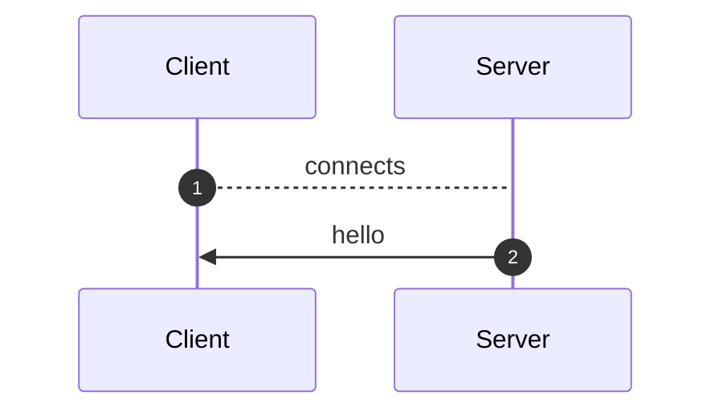
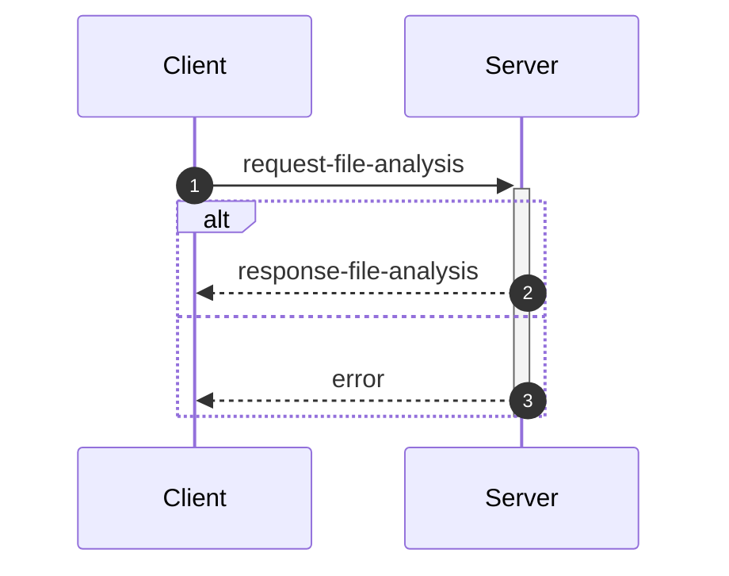
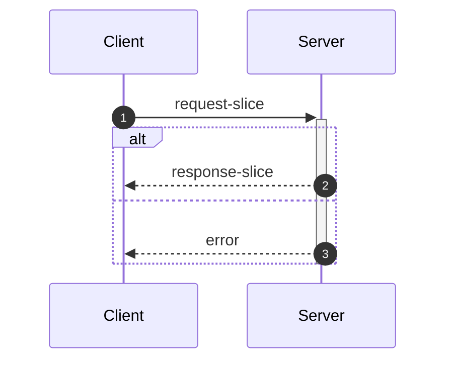
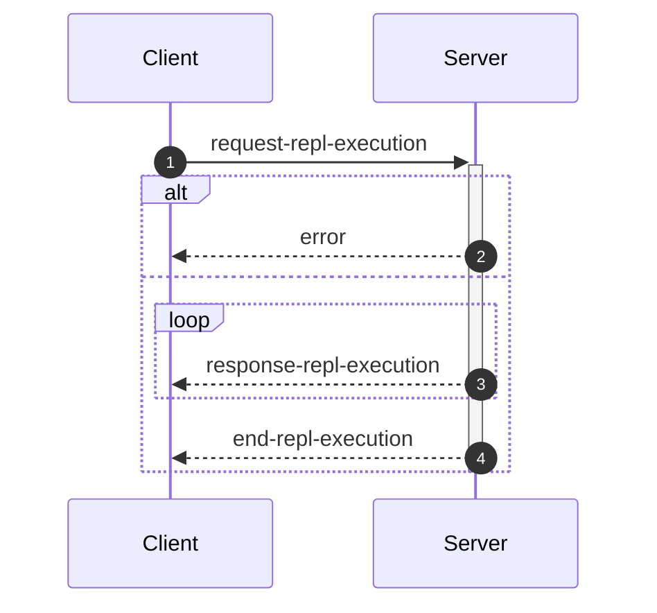

_This document was generated from '[src/documentation/wiki-interface.ts](https://github.com/flowr-analysis/flowr/tree/main//src/documentation/wiki-interface.ts)' on 2026-07-24, 13:14:19 UTC presenting an overview of flowR's interface (v2.13.2, using R v4.5.0). Please do not edit this file/wiki page directly._

Although far from being as detailed as the in-depth explanation of [_flowR_](https://github.com/flowr-analysis/flowr/wiki/core),
this wiki page explains how to interface with _flowR_ in more detail.
In general, command line arguments and other options provide short descriptions on hover over.

* [💻 Using the REPL](#using-the-repl)
* [⚙️ Configuring FlowR](#configuring-flowr)
* [⚒️ Writing Code](#writing-code)
* [💬 Communicating with the Server](#communicating-with-the-server)

<a id='using-the-repl'></a>
## 💻 Using the REPL


> [!NOTE]
> To execute arbitrary R commands with a repl request, _flowR_ has to be started explicitly with <span title="Description (Command Line Argument): Allow to access the underlying R session when using flowR (security warning: this allows the execution of arbitrary R code!)">`--r-session-access`</span>.
> Please be aware that this introduces a security risk and note that this relies on the [`r-shell` engine](https://github.com/flowr-analysis/flowr/wiki/engines) .

Although primarily meant for users to explore,
there is nothing which forbids simply calling _flowR_ as a subprocess to use standard-in, -output, and -error
for communication (although you can access the REPL using the server as well,
with the [REPL Request](#message-request-repl-execution) message).

The read-eval-print loop&nbsp;(REPL) works relatively simple.
You can submit an expression (using <kbd>Enter</kbd>),
which is interpreted as an R&nbsp;expression by default but interpreted as a *command* if it starts with a colon (`:`).
The best command to get started with the REPL is <span title="Description (Repl Command): Show help information (aliases: :h, :?)">`:help`</span>.
Besides, you can leave the REPL either with the command <span title="Description (Repl Command): End the repl (aliases: :q, :exit)">`:quit`</span> or by pressing <kbd>Ctrl</kbd>+<kbd>C</kbd> twice.
When writing a *command*, you may press <kbd>Tab</kbd> to get a list of completions, if available.
Multiple commands can be entered in a single line by separating them with a semicolon (`;`), e.g. `:parse "x<-2"; :df*`.
If a command is given without R code, the REPL will re-use R code given in a previous command.
The prior example will hence return first the parsed AST of the program and then the dataflow graph for `"x <- 2"`.

> [!NOTE]
> If you develop flowR, you may want to launch the repl using the `npm run main-dev` command, this way, you get a non-minified version of flowR with debug information and hot-reloading of source files.

<details>
<summary>Available Commands</summary>

We currently offer the following commands (this with a `[*]` suffix are available with and without the star):


| Command | Description |
| ------- | ----------- |
| **<span title="Description (Repl Command): End the repl (aliases: :q, :exit)">:quit</span>** | End the repl (aliases: **:<span title="Alias of ':quit'. End the repl">q</span>**, **:<span title="Alias of ':quit'. End the repl">exit</span>**) |
| **<span title="Description (Repl Command): Execute the given code as R code. This requires the `--r-session-access` flag to be set and requires the r-shell engine. (aliases: :e, :r)">:execute</span>** | Execute the given code as R code. This requires the `--r-session-access` flag to be set and requires the r-shell engine. (aliases: **:<span title="Alias of ':execute'. Execute the given code as R code. This requires the `--r-session-access` flag to be set and requires the r-shell engine.">e</span>**, **:<span title="Alias of ':execute'. Execute the given code as R code. This requires the `--r-session-access` flag to be set and requires the r-shell engine.">r</span>**) |
| **<span title="Description (Repl Command): Get mermaid code for the control-flow graph of R code (aliases: :cfg, :cf)">:controlflow[*]</span>** | Get mermaid code for the control-flow graph of R code (star: Returns the URL to mermaid.live) (aliases: **:<span title="Alias of ':controlflow'. Get mermaid code for the control-flow graph of R code">cfg</span>**, **:<span title="Alias of ':controlflow'. Get mermaid code for the control-flow graph of R code">cf</span>**) |
| **<span title="Description (Repl Command): Get mermaid code for the control-flow graph with basic blocks (aliases: :cfgb, :cfb)">:controlflowbb[*]</span>** | Get mermaid code for the control-flow graph with basic blocks (star: Returns the URL to mermaid.live) (aliases: **:<span title="Alias of ':controlflowbb'. Get mermaid code for the control-flow graph with basic blocks">cfgb</span>**, **:<span title="Alias of ':controlflowbb'. Get mermaid code for the control-flow graph with basic blocks">cfb</span>**) |
| **<span title="Description (Repl Command): Get mermaid code for the dataflow graph (aliases: :d, :df)">:dataflow[*]</span>** | Get mermaid code for the dataflow graph (star: Returns the URL to mermaid.live) (aliases: **:<span title="Alias of ':dataflow'. Get mermaid code for the dataflow graph">d</span>**, **:<span title="Alias of ':dataflow'. Get mermaid code for the dataflow graph">df</span>**) |
| **<span title="Description (Repl Command): Get mermaid code for the normalized AST of R code (aliases: :n)">:normalize[*]</span>** | Get mermaid code for the normalized AST of R code (star: Returns the URL to mermaid.live) (alias: **:<span title="Alias of ':normalize'. Get mermaid code for the normalized AST of R code">n</span>**) |
| **<span title="Description (Repl Command): Get mermaid code for the simplified dataflow graph (aliases: :ds, :dfs)">:dataflowsimple[*]</span>** | Get mermaid code for the simplified dataflow graph (star: Returns the URL to mermaid.live) (aliases: **:<span title="Alias of ':dataflowsimple'. Get mermaid code for the simplified dataflow graph">ds</span>**, **:<span title="Alias of ':dataflowsimple'. Get mermaid code for the simplified dataflow graph">dfs</span>**) |
| **<span title="Description (Repl Command): Inspect and extend the signature database: `query` (identical to :query @signature), `add <path>` to mount another database/source, `download` to fetch the full-history database. (aliases: :sig)">:signature</span>** | Inspect and extend the signature database: `query` (identical to :query @signature), `add <path>` to mount another database/source, `download` to fetch the full-history database. (alias: **:<span title="Alias of ':signature'. Inspect and extend the signature database: `query` (identical to :query @signature), `add <path>` to mount another database/source, `download` to fetch the full-history database.">sig</span>**) |
| **<span title="Description (Repl Command): Just calculates the DFG, but only prints summary info (aliases: :d#, :df#)">:dataflowsilent</span>** | Just calculates the DFG, but only prints summary info (aliases: **:<span title="Alias of ':dataflowsilent'. Just calculates the DFG, but only prints summary info">d#</span>**, **:<span title="Alias of ':dataflowsilent'. Just calculates the DFG, but only prints summary info">df#</span>**) |
| **<span title="Description (Repl Command): Prints ASCII Art of the parsed, unmodified AST (aliases: :p)">:parse</span>** | Prints ASCII Art of the parsed, unmodified AST (alias: **:<span title="Alias of ':parse'. Prints ASCII Art of the parsed, unmodified AST">p</span>**) |
| **<span title="Description (Repl Command): Prints the version of flowR as well as the current version of R">:version</span>** | Prints the version of flowR as well as the current version of R
| **<span title="Description (Repl Command): Query the given R code (use 'help' for more information)">:query[*]</span>** | Query the given R code (use 'help' for more information) (star: Similar to query, but returns the output in json format.)
| **<span title="Description (Repl Command): Returns an ASCII representation of the dataflow graph (aliases: :df!)">:dataflowascii</span>** | Returns an ASCII representation of the dataflow graph (alias: **:<span title="Alias of ':dataflowascii'. Returns an ASCII representation of the dataflow graph">df!</span>**) |
| **<span title="Description (Repl Command): Returns summarization stats for the normalized AST (aliases: :n#)">:normalize#</span>** | Returns summarization stats for the normalized AST (alias: **:<span title="Alias of ':normalize#'. Returns summarization stats for the normalized AST">n#</span>**) |
| **<span title="Description (Repl Command): Show help information (aliases: :h, :?)">:help</span>** | Show help information (aliases: **:<span title="Alias of ':help'. Show help information">h</span>**, **:<span title="Alias of ':help'. Show help information">?</span>**) |


</details>


> [!TIP]
> 
> As indicated by the examples before, all REPL commands that operate on code keep track of the state.
> Hence, if you run a command like <span title="Description (Repl Command, starred version): Returns the URL to mermaid.live; Base Command: Get mermaid code for the dataflow graph (aliases: :d*, :df*)">`:dataflow*`</span> without providing R code,
> the REPL will re-use the R code provided in a previous command.
> Likewise, doing this will benefit from incrementality!
> If you request the dataflow graph with `:df* x <- 2 * y` and then want to see the parsed AST with `:parse`,
> the REPL will re-use previously obtained information and not re-parse the code again.
> 		


Generally, many commands offer shortcut versions in the REPL. Many queries, for example, offer a shortened format (see the example below).
Of special note, the [Config Query](https://github.com/flowr-analysis/flowr/wiki/%5BQuery%5D-Config)
can be used to also modify the currently active configuration of _flowR_ within the REPL (see the [wiki page](https://github.com/flowr-analysis/flowr/wiki/%5BQuery%5D-Config) for more information).

### Example: Retrieving the Dataflow Graph

To retrieve a URL to the [mermaid](https://mermaid.js.org/) diagram of the dataflow of a given expression,
use <span title="Description (Repl Command, starred version): Returns the URL to mermaid.live; Base Command: Get mermaid code for the dataflow graph (aliases: :d*, :df*)">`:dataflow*`</span> (or <span title="Description (Repl Command): Get mermaid code for the dataflow graph (aliases: :d, :df)">`:dataflow`</span> to get the mermaid code in the cli):


```shell
$ docker run -it --rm eagleoutice/flowr # or npm run flowr 
flowR repl v2.13.2, R grammar v14 (tree-sitter engine)
R> :dataflow* y <- 1 + x
```

<details>
<summary style='color:gray'>Output</summary>


```text
https://mermaid.live/view#base64:eyJjb2RlIjoiZmxvd2NoYXJ0IEJUXG4gICAgMXt7XCJgKiM5MTtSTnVtYmVyIzkzOyogKioxKipcbiAgICAgICoxLjYqICgqKmlkOiAxKiopYFwifX1cbiAgICUlIE5vIGVkZ2VzIGZvdW5kIGZvciAxXG4gICAgMihbXCJgKiM5MTtSU3ltYm9sIzkzOyogKip4KipcbiAgICAgICoxLjEwKiAoKippZDogMioqKWBcIl0pXG4gICAlJSBObyBlZGdlcyBmb3VuZCBmb3IgMlxuICAgIDNbW1wiYCojOTE7UkJpbmFyeU9wIzkzOyogYmFzZSM1ODsjNTg7KiojNDM7KipcbiAgICAgICoxLjYtMTAqICgqKmlkOiAzKiopXG4gICAgYXJnOiAoMSwgMilgXCJdXVxuICAgIGJ1aWx0LWluOl9bXCJgQnVpbHQtSW46XG4jNDM7YFwiXVxuICAgIHN0eWxlIGJ1aWx0LWluOl8gc3Ryb2tlOmdyYXksZmlsbDpncmF5LHN0cm9rZS13aWR0aDoycHgsb3BhY2l0eTouODtcbiAgICAwW1wiYCojOTE7UlN5bWJvbCM5MzsqICoqeSoqXG4gICAgICAqMS4xKiAoKippZDogMCoqLCB2OiAzKWBcIl1cbiAgICA0W1tcImAqIzkxO1JCaW5hcnlPcCM5MzsqIGJhc2UjNTg7IzU4OyoqIzYwOyM0NTsqKlxuICAgICAgKjEuMS0xMCogKCoqaWQ6IDQqKilcbiAgICBhcmc6ICgwLCAzKWBcIl1dXG4gICAgYnVpbHQtaW46Xy1bXCJgQnVpbHQtSW46XG4jNjA7IzQ1O2BcIl1cbiAgICBzdHlsZSBidWlsdC1pbjpfLSBzdHJva2U6Z3JheSxmaWxsOmdyYXksc3Ryb2tlLXdpZHRoOjJweCxvcGFjaXR5Oi44O1xuICAgIDMgLS0+fFwicmVhZHMsIGFyZ1wifCAxXG4gICAgMyAtLT58XCJyZWFkcywgYXJnXCJ8IDJcbiAgICAzIC0uLT58XCJyZWFkcywgY2FsbHNcInwgYnVpbHQtaW46X1xuICAgIGxpbmtTdHlsZSAyIHN0cm9rZTpncmF5O1xuICAgIDAgLS0+fFwiZGVmaW5lZC1ieVwifCAzXG4gICAgMCAtLT58XCJkZWZpbmVkLWJ5XCJ8IDRcbiAgICA0IC0tPnxcInJlYWRzLCBhcmdcInwgM1xuICAgIDQgLS0+fFwicmV0dXJucywgYXJnXCJ8IDBcbiAgICA0IC0uLT58XCJyZWFkcywgY2FsbHNcInwgYnVpbHQtaW46Xy1cbiAgICBsaW5rU3R5bGUgNyBzdHJva2U6Z3JheTsiLCJtZXJtYWlkIjp7ImF1dG9TeW5jIjp0cnVlfX0=
```


Retrieve the dataflow graph of the expression `y <- 1 + x`. It looks like this:


```mermaid
flowchart LR
    1{{"`*#91;RNumber#93;* **1**
      *1.6* (**id: 1**)`"}}
   %% No edges found for 1
    2(["`*#91;RSymbol#93;* **x**
      *1.10* (**id: 2**)`"])
   %% No edges found for 2
    3[["`*#91;RBinaryOp#93;* base#58;#58;**#43;**
      *1.6-10* (**id: 3**)
    arg: (1, 2)`"]]
    built-in:_["`Built-In:
#43;`"]
    style built-in:_ stroke:gray,fill:gray,stroke-width:2px,opacity:.8;
    0["`*#91;RSymbol#93;* **y**
      *1.1* (**id: 0**, v: 3)`"]
    4[["`*#91;RBinaryOp#93;* base#58;#58;**#60;#45;**
      *1.1-10* (**id: 4**)
    arg: (0, 3)`"]]
    built-in:_-["`Built-In:
#60;#45;`"]
    style built-in:_- stroke:gray,fill:gray,stroke-width:2px,opacity:.8;
    3 -->|"reads, arg"| 1
    3 -->|"reads, arg"| 2
    3 -.->|"reads, calls"| built-in:_
    linkStyle 2 stroke:gray;
    0 -->|"defined-by"| 3
    0 -->|"defined-by"| 4
    4 -->|"reads, arg"| 3
    4 -->|"returns, arg"| 0
    4 -.->|"reads, calls"| built-in:_-
    linkStyle 7 stroke:gray;
```

	
<details>

<summary style="color:gray">R Code of the Dataflow Graph</summary>

The analysis required _0.8 ms_ (including parse and normalize, using the [tree-sitter](https://github.com/flowr-analysis/flowr/wiki/Engines) engine) within the generation environment. No [signature database](https://github.com/flowr-analysis/flowr/wiki/Signature-Database) is mounted for these generated graphs, so `library()` calls attach no package exports; base-R names are still qualified via the generated base-package store (e.g. `acf` as `stats::acf`). 
We encountered no unknown side effects during the analysis.


```r
y <- 1 + x
```


</details>


</details>


For small graphs like this, <span title="Description (Repl Command): Returns an ASCII representation of the dataflow graph (aliases: :df!)">`:dataflowascii`</span> also provides an ASCII representation directly in the REPL:


```shell
$ docker run -it --rm eagleoutice/flowr # or npm run flowr 
flowR repl v2.13.2, R grammar v14 (tree-sitter engine)
R> :df! y <- 1 + x
```

<details open>
<summary style='color:gray'>Output</summary>


```text
                        0<1>0
                   ┌────| 1 |
    ┌────────┐     │    0---0
 c<4>c       └──c<3>c
 |<- |  v<0>v┌──| + |
 c---c──| y |┘  c---c   u<2>u
        v---v      └────| x |
                        u---u
Edges:
3 -> 1: reads, arg  3 -> 2: reads, arg
4 -> 3: reads, arg  4 -> 0: returns, arg
0 -> 3: defined-by  0 -> 4: defined-by
```


Retrieve the dataflow graph of the expression `y <- 1 + x` as ASCII art.

</details>


For the slicing with <span title="Description (Repl Command): Static backwards executable slicer for R">`:slicer`</span>, you have access to the same [magic comments](#slice-magic-comments) as with the [slice request](#message-request-slice).
Pass `--inline` to splice resolvable `source()` calls into the reconstruction so the slice is a single self-contained R text (the same as the static slice query's `inlineSources` flag).
See `--help` for more flags!

### Example: Interfacing with the File System

Many commands that allow for an R-expression (like <span title="Description (Repl Command, starred version): Returns the URL to mermaid.live; Base Command: Get mermaid code for the dataflow graph (aliases: :d*, :df*)">`:dataflow*`</span>) allow for a file as well
if the argument starts with `file://`.
If you are working from the root directory of the _flowR_ repository, the following gives you the parsed AST of the example file using the <span title="Description (Repl Command): Prints ASCII Art of the parsed, unmodified AST (aliases: :p)">`:parse`</span> command:

> **Watch mode**: Replace `file://` with `watch://` to enter watch mode.
> flowR runs the command immediately and then re-runs it every time the file (or any file inside the folder) changes.
> Enter any other command to leave watch mode.
> For example: `:df watch://analysis.R`


```shell
$ docker run -it --rm eagleoutice/flowr # or npm run flowr 
flowR repl v2.13.2, R grammar v14 (tree-sitter engine)
R> :parse file://test/testfiles/example.R
```

<details>
<summary style='color:gray'>Output</summary>


```text
File: test/testfiles/example.R

program
├ binaryoperator
│ ├ identifier "sum" (1:1─4)
│ ├ <- "<-" (1:5─7)
│ ╰ float "0" (1:8─9)
├ binaryoperator
│ ├ identifier "product" (2:1─8)
│ ├ <- "<-" (2:9─11)
│ ╰ float "1" (2:12─13)
├ binaryoperator
│ ├ identifier "w" (3:1─2)
│ ├ <- "<-" (3:3─5)
│ ╰ float "7" (3:6─7)
├ binaryoperator
│ ├ identifier "N" (4:1─2)
│ ├ <- "<-" (4:3─5)
│ ╰ float "10" (4:6─8)
├ forstatement
│ ├ for "for" (6:1─4)
│ ├ ( "(" (6:5─6)
│ ├ identifier "i" (6:6─7)
│ ├ in "in" (6:8─10)
│ ├ binaryoperator
│ │ ├ float "1" (6:11─12)
│ │ ├ : ":" (6:12─13)
│ │ ╰ parenthesizedexpression
│ │   ├ ( "(" (6:13─14)
│ │   ├ binaryoperator
│ │   │ ├ identifier "N" (6:14─15)
│ │   │ ├ - "-" (6:15─16)
│ │   │ ╰ float "1" (6:16─17)
│ │   ╰ ) ")" (6:17─18)
│ ├ ) ")" (6:18─19)
│ ╰ bracedexpression
│   ├ { "{" (6:20─21)
│   ├ binaryoperator
│   │ ├ identifier "sum" (7:3─6)
│   │ ├ <- "<-" (7:7─9)
│   │ ╰ binaryoperator
│   │   ├ binaryoperator
│   │   │ ├ identifier "sum" (7:10─13)
│   │   │ ├ + "+" (7:14─15)
│   │   │ ╰ identifier "i" (7:16─17)
│   │   ├ + "+" (7:18─19)
│   │   ╰ identifier "w" (7:20─21)
│   ├ binaryoperator
│   │ ├ identifier "product" (8:3─10)
│   │ ├ <- "<-" (8:11─13)
│   │ ╰ binaryoperator
│   │   ├ identifier "product" (8:14─21)
│   │   ├  "" (8:22─23)
│   │   ╰ identifier "i" (8:24─25)
│   ╰ } "}" (9:1─2)
├ call
│ ├ identifier "cat" (11:1─4)
│ ╰ arguments
│   ├ ( "(" (11:4─5)
│   ├ argument
│   │ ╰ string
│   │   ├ " "\"" (11:5─6)
│   │   ├ stringcontent "Sum:" (11:6─10)
│   │   ╰ " "\"" (11:10─11)
│   ├ comma "," (11:11─12)
│   ├ argument
│   │ ╰ identifier "sum" (11:13─16)
│   ├ comma "," (11:16─17)
│   ├ argument
│   │ ╰ string
│   │   ├ " "\"" (11:18─19)
│   │   ├ stringcontent
│   │   │ ╰ escapesequence "\\n" (11:19─21)
│   │   ╰ " "\"" (11:21─22)
│   ╰ ) ")" (11:22─23)
╰ call
  ├ identifier "cat" (12:1─4)
  ╰ arguments
    ├ ( "(" (12:4─5)
    ├ argument
    │ ╰ string
    │   ├ " "\"" (12:5─6)
    │   ├ stringcontent "Product:" (12:6─14)
    │   ╰ " "\"" (12:14─15)
    ├ comma "," (12:15─16)
    ├ argument
    │ ╰ identifier "product" (12:17─24)
    ├ comma "," (12:24─25)
    ├ argument
    │ ╰ string
    │   ├ " "\"" (12:26─27)
    │   ├ stringcontent
    │   │ ╰ escapesequence "\\n" (12:27─29)
    │   ╰ " "\"" (12:29─30)
    ╰ ) ")" (12:30─31)
```


Retrieve the parsed AST of the example file.

<details>

<summary>File Content</summary>


```r
sum <- 0
product <- 1
w <- 7
N <- 10

for (i in 1:(N-1)) {
  sum <- sum + i + w
  product <- product * i
}

cat("Sum:", sum, "\n")
cat("Product:", product, "\n")
```


</details>

As _flowR_ directly transforms this AST the output focuses on being human-readable instead of being machine-readable.
		

</details>


### Example: Run a Query

You can run any query supported by _flowR_ using the <span title="Description (Repl Command): Query the given R code (use 'help' for more information)">`:query`</span> command.
For example, to obtain the shapes of all data frames in a given piece of code, you can run:


```shell
$ docker run -it --rm eagleoutice/flowr # or npm run flowr 
flowR repl v2.13.2, R grammar v14 (tree-sitter engine)
R> :query @absint df-shape "x <- data.frame(a = 1:10, b = 1:10)\ny <- x$a"
```

<details open>
<summary style='color:gray'>Output</summary>


```text
Query: absint (2 ms)
   ╰ $12: (colnames: [{"a", "b"}, {}], cols: [2, 2], rows: [10, 10])
   ╰ $0: (colnames: [{"a", "b"}, {}], cols: [2, 2], rows: [10, 10])
All queries together required ≈4 ms (1ms accuracy, total 5 ms)
```


Retrieve the shapes of all data frames in the given code.

</details>


To run the linter on a file, you can use (in this example, we just issue the `dead-code` linter on a small piece of code):


```shell
$ docker run -it --rm eagleoutice/flowr # or npm run flowr 
flowR repl v2.13.2, R grammar v14 (tree-sitter engine)
R> :query @linter rules:dead-code "if(FALSE) x <- 2"
```

<details open>
<summary style='color:gray'>Output</summary>


```text
Query: linter (6 ms)
   ╰ Dead Code (dead-code):
       ╰ certain:
           ╰ Code at 1.11-16
       ╰ Metadata: searchTimeMs: 6, processTimeMs: 0
All queries together required ≈6 ms (1ms accuracy, total 6 ms)
```


Run the linter on the given code, with only the `dead-code` rule enabled.

</details>


For more information on the available queries, please check out the [Query API](https://github.com/flowr-analysis/flowr/wiki/query-api).


<a id='configuring-flowr'></a>
## ⚙️ Configuring FlowR


When running _flowR_, you may want to specify some behaviors with a dedicated configuration file.
By default, flowR looks for a file named `flowr.json` in the current working directory (or any higher directory).
You can also specify a different file with <span title="Description (Command Line Argument): The name of the configuration file to use">`--config-file`</span> or pass the configuration inline using <span title="Description (Command Line Argument): The flowR configuration to use, as a JSON string">`--config-json`</span>.
To inspect the current configuration, you can run flowr with the <span title="Description (Command Line Argument): Run with verbose logging (will be passed to the corresponding script)">`--verbose`</span> flag, or use the `config` [Query](https://github.com/flowr-analysis/flowr/wiki/query-api).
Within the REPL this works by running the following:


```shell
:query @config
```


To work with the <a href="https://github.com/flowr-analysis/flowr/tree/main/src/config.ts#L130"><code><span title="The configuration file format for flowR.">FlowrConfig</span></code></a> you can use the provided helper objects alongside its methods like
<a href="https://github.com/flowr-analysis/flowr/tree/main/src/config.ts#L756"><code><span title="Creates a new flowr config that has the updated values.">FlowrConfig::<b>amend</b></span></code></a>.
The schema below documents every option; the ones you most likely want are:

- <a href="https://github.com/flowr-analysis/flowr/wiki/Interface#configuring-flowr" title="Configuration Option (boolean): Whether source calls should be ignored, causing {@link processSourceCall}&#39;s behavior to be skipped.">ignoreSourceCalls</a>: ignore source calls when analyzing the code, i.e., ignore the inclusion of other files.
- <a href="https://github.com/flowr-analysis/flowr/wiki/Interface#configuring-flowr" title="Configuration Option (boolean): Whether load calls should be ignored, causing {@link processLoadCall}&#39;s behavior to be skipped.">ignoreLoadCalls</a>: ignore load calls when analyzing the code, i.e., ignore the loading of r-data files.
- <a href="https://github.com/flowr-analysis/flowr/wiki/Interface#configuring-flowr" title="Configuration Option (object): Do you want to overwrite (parts) of the builtin definition?">semantics.environment.overwriteBuiltIns</a>: overwrite _flowR_'s handling of built-in functions, or clear the preset definitions entirely.
  See [Configure BuiltIn Semantics](#configure-builtin-semantics) for more information.
- <a href="https://github.com/flowr-analysis/flowr/wiki/Interface#configuring-flowr" title="Configuration Option (string): How to resolve variables and their values. (one of &quot;disabled&quot;, &quot;alias&quot;, &quot;builtin&quot;)">solver.variables</a>: how to resolve variables and their values (`disabled`, `alias`, `builtin`).
- <a href="https://github.com/flowr-analysis/flowr/wiki/Interface#configuring-flowr" title="Configuration Option (array): The engine or set of engines to use for interacting with R code. An empty array means all available engines will be used.">engines</a> and <a href="https://github.com/flowr-analysis/flowr/wiki/Interface#configuring-flowr" title="Configuration Option (string): The default engine to use for interacting with R code. If this is undefined, an arbitrary engine from the specified list will be used. (one of &quot;tree-sitter&quot;, &quot;r-shell&quot;)">defaultEngine</a>: the engines used to interact with R code, see the [Engines wiki page](https://github.com/flowr-analysis/flowr/wiki/engines).
- <a href="https://github.com/flowr-analysis/flowr/wiki/Interface#configuring-flowr" title="Configuration Option (array): Files a framework loads on its own, without any source() call (e.g. global.R in a shiny app), in the order they are loaded; flowR orders the matching project files accordingly and analyzes them as one program. Entries are case-insensitive globs matched against the file path, a plain name matches any file with that name, and entries matching no project file are warned about. Usually set per project kind via specializeConfig.">project.implicitSources</a>: the files a framework loads without any `source()` call, in the order in which they are
  loaded. Entries are globs (e.g. `R/*.R`) matched against the file path ignoring capitalization; one matching no file is reported.
- <a href="https://github.com/flowr-analysis/flowr/wiki/Interface#configuring-flowr" title="Configuration Option (object): Overwrite (parts of) the configuration depending on the project kind flowR detects, e.g. to give a shiny app its implicit sources.">specializeConfig</a>: overwrite (parts of) the configuration depending on the kind of project _flowR_ detects
  (e.g. `shiny-app`), which is how a shiny app gets its implicit sources by default. What you configure directly wins.
- <a href="https://github.com/flowr-analysis/flowr/wiki/Interface#configuring-flowr" title="Configuration Option (string): Overwrite the project kind flowR would otherwise infer from the analyzed files, e.g. when auto-detection guesses wrong. (one of &quot;package&quot;, &quot;script&quot;, &quot;shiny-app&quot;, &quot;notebook&quot;, &quot;project&quot;, &quot;unknown&quot;)">project.useProjectType</a>: skip that detection and force a project kind yourself, when auto-detection guesses wrong.
- <a href="https://github.com/flowr-analysis/flowr/wiki/Interface#configuring-flowr" title="Configuration Option (array): The default plugins to load when creating a new instance of FlowrAnalyzer">defaultPlugins</a> and <a href="https://github.com/flowr-analysis/flowr/wiki/Interface#configuring-flowr" title="Configuration Option (array): The plugins to load in REPL mode">repl.plugins</a>: the plugins to load for a new <a href="https://github.com/flowr-analysis/flowr/tree/main/src/project/flowr-analyzer.ts#L167"><code><span title="Central class for conducting analyses with FlowR. Use the FlowrAnalyzerBuilder to create a new instance. If you want the original pattern of creating a pipeline and running all steps, you can still do this with FlowrAnalyzer#runFull . To inspect the context of the analyzer, use FlowrAnalyzer#inspectContext (if you are a plugin and need to modify it, use FlowrAnalyzer#context instead).">FlowrAnalyzer</span></code></a> and in the REPL
  (use `flowr:default` to reference the former).

So you can configure _flowR_ by adding a file like the following:

<details>

<summary>Example Configuration File</summary>


```json
{
  "ignoreSourceCalls": true,
  "ignoreLoadCalls": true,
  "semantics": {
    "environment": {
      "overwriteBuiltIns": {
        "definitions": [
          {
            "type": "function",
            "names": [
              "foo"
            ],
            "processor": "builtin:assign",
            "config": {}
          }
        ]
      }
    }
  },
  "defaultPlugins": [
    "file:description",
    "versions:description"
  ],
  "repl": {
    "quickStats": false,
    "dfProcessorHeat": false,
    "hints": true,
    "plugins": [
      "flowr:default"
    ]
  },
  "project": {
    "resolveUnknownPathsOnDisk": true,
    "implicitSources": [
      "global.R",
      "app.R"
    ]
  },
  "linter": {
    "disabledRules": []
  },
  "specializeConfig": {
    "shiny-app": {
      "project": {
        "implicitSources": [
          "global.R",
          "ui.R",
          "server.R",
          "app.R"
        ]
      }
    }
  },
  "engines": [
    {
      "type": "r-shell"
    }
  ],
  "solver": {
    "variables": "alias",
    "evalStrings": true,
    "trackEnvironments": true,
    "sigdb": {
      "enabled": true,
      "loadProjectDependencies": true,
      "eagerlyLoad": false,
      "eagerlyLoadExports": false,
      "linkBaseR": false,
      "linkDescriptionDependencies": false
    },
    "resolveSource": {
      "dropPaths": "no",
      "ignoreCapitalization": true,
      "inferWorkingDirectory": "active-script",
      "searchPath": []
    },
    "instrument": {},
    "slicer": {
      "threshold": 50
    }
  },
  "abstractInterpretation": {
    "wideningThreshold": 4,
    "dataFrame": {
      "maxColNames": 20,
      "readLoadedData": {
        "readExternalFiles": true,
        "maxReadLines": 1000000
      }
    }
  },
  "gas": {
    "thresholds": {
      "memory": {
        "problematic": 0.7,
        "critical": 0.9
      },
      "timeMs": {
        "problematic": 100000,
        "critical": 120000
      }
    },
    "features": {}
  }
}
```


</details>

<details>
<a id='configure-builtin-semantics'></a>
<summary>Configure Built-In Semantics</summary>


`semantics/environment/overwriteBuiltins` accepts two keys:

- `loadDefaults` (boolean, initially `true`): If set to `true`, the default built-in definitions are loaded before applying the custom definitions. Setting this flag to `false` explicitly disables the loading of the default definitions.
- `definitions` (array, initially empty): Allows to overwrite or define new built-in elements. Each object within must have a `type` which is one of the below. Furthermore, they may define a string array of `names` which specifies the identifiers to bind the definitions to. You may use `assumePrimitive` to specify whether _flowR_ should assume that this is a primitive non-library definition (so you probably just do not want to specify the key).

  | Type            | Description                                                                                                                                                                                                                                                                                              | Example                                                                                                    |
  | --------------- | -------------------------------------------------------------------------------------------------------------------------------------------------------------------------------------------------------------------------------------------------------------------------------------------------------- | ---------------------------------------------------------------------------------------------------------- |
  | `constant`    | Additionally allows for a `value` this should resolve to.                                                                                                                                                                                                                                                | `{ type: 'constant', names: ['NULL', 'NA'],  value: null }`                                                |
  | `function`    | Is a rather flexible way to define and bind built-in functions. For the time, we do not have extensive documentation to cover all the cases, so please either consult the sources with the `default-builtin-config.ts` or open a [new issue](https://github.com/flowr-analysis/flowr/issues/new/choose). | `{ type: 'function', names: ['next'], processor: 'builtin:d', config: { cfg: ExitPointType.Next } }` |
  | `replacement` | A comfortable way to specify replacement functions like `$<-` or `names<-`. `suffixes` describes the... suffixes to attach automatically. | `{ type: 'replacement', suffixes: ['<-', '<<-'], names: ['[', '[['] }` |


</details>

<details>

<summary style='color:gray'>Full Configuration-File Schema</summary>

- _The configuration file format for flowR._ (object)
    - **logLevel** [optional] _flowR's global minimum log level, applied when the config is loaded._ (string)
        Only allows: 'silly', 'trace', 'debug', 'info', 'warn', 'error', 'fatal'
    - **ignoreSourceCalls** [optional] _Whether source calls should be ignored, causing {@link processSourceCall}'s behavior to be skipped._ (boolean)
    - **ignoreLoadCalls** [optional] _Whether load calls should be ignored, causing {@link processLoadCall}'s behavior to be skipped._ (boolean)
    - **semantics** _Configure language semantics and how flowR handles them._ (object)
        - **environment** [optional] _Semantics regarding how to handle the R environment._ (object)
            - **overwriteBuiltIns** [optional] _Do you want to overwrite (parts) of the builtin definition?_ (object)
                - **loadDefaults** [optional] _Should the default configuration still be loaded?_ (boolean)
                - **definitions** [optional] _The definitions to load/overwrite._ (array)
                Valid item types:
                    - (object)
    - **defaultPlugins** [optional] _The default plugins to load when creating a new instance of FlowrAnalyzer_ (array)
    Valid item types:
        - (alternatives)
            - (string)
            - (array)
    - **repl** _Configuration options for the REPL._ (object)
        - **quickStats** [optional] _Whether to show quick stats in the REPL after each evaluation._ (boolean)
        - **dfProcessorHeat** [optional] _This instruments the dataflow processors to count how often each processor is called._ (boolean)
        - **hints** [optional] _Whether to show dim inline hints on the empty prompt (automatically disabled on non-interactive terminals)._ (boolean)
        - **plugins** [optional] _The plugins to load in REPL mode_ (array)
        Valid item types:
            - (alternatives)
                - (string)
                - (array)
        - **autoUseFileProtocol** [optional] _Prepend the file protocol to a repl input that looks like a path, instead of only warning about it._ (boolean)
        - **queryStats** [optional] _Whether `:query` closes with the line stating how long the queries took (`:query*` never prints it)._ (boolean)
        - **showPlugins** [optional] _Whether `:version` grays out the plugins that did not activate during the last analysis._ (boolean)
    - **project** _Project specific configuration options._ (object)
        - **resolveUnknownPathsOnDisk** [optional] _Whether to resolve unknown paths loaded by the r project disk when trying to source/analyze files._ (boolean)
        - **failOnInaccessiblePath** [optional] _Whether a directory that cannot be traversed during file discovery (e.g. due to permissions) aborts the analysis; when false (the default) such paths are logged and skipped._ (boolean)
        - **basePackages** [optional] _The packages considered part of R itself (base and recommended); if unset, flowR uses its built-in list._ (array)
        Valid item types:
            - (string)
        - **implicitSources** [optional] _Files a framework loads on its own, without any source() call (e.g. global.R in a shiny app), in the order they are loaded; flowR orders the matching project files accordingly and analyzes them as one program. Entries are case-insensitive globs matched against the file path, a plain name matches any file with that name, and entries matching no project file are warned about. Usually set per project kind via specializeConfig._ (array)
        Valid item types:
            - (string)
        - **useProjectType** [optional] _Overwrite the project kind flowR would otherwise infer from the analyzed files, e.g. when auto-detection guesses wrong._ (string)
            Only allows: 'package', 'script', 'shiny-app', 'notebook', 'project', 'unknown'
        - **discovery** [optional] _Scoping options for the default project discovery._ (object)
            - **full** [optional] _Collect every file below the project root (greedy) instead of only the files the detected project kind needs (default false)._ (boolean)
            - **perKind** [optional] _Per-kind include/exclude glob overrides layered on the default scoping._ (object)
            - **ignore** [optional] _Case-insensitive globs that drop matching files from the intelligent discovery, regardless of kind (e.g. .Renviron to ignore environment files)._ (array)
            Valid item types:
                - (string)
        - **classification** [optional] _Overrides for the signals flowR uses to classify the project kind._ (object)
            - **shinyDescriptionTypes** [optional] _DESCRIPTION Type: values that mark a shiny app._ (array)
            Valid item types:
                - (string)
            - **shinyEntryFiles** [optional] _File names a shiny app is assembled from._ (array)
            Valid item types:
                - (string)
            - **shinyUsagePattern** [optional] _Regex source evidencing shiny usage in an entry file._ (string)
            - **notebookExtensions** [optional] _File extensions marking a notebook._ (array)
            Valid item types:
                - (string)
    - **linter** _Linter configuration options._ (object)
        - **disabledRules** _Linting rule names excluded from the default rule set (a rule requested explicitly via a linter query still runs). Usually set per project kind via specializeConfig._ (array)
        Valid item types:
            - (string)
    - **specializeConfig** [optional] _Overwrite (parts of) the configuration depending on the project kind flowR detects, e.g. to give a shiny app its implicit sources._ (object)
    - **engines** _The engine or set of engines to use for interacting with R code. An empty array means all available engines will be used._ (array)
    Valid item types:
        - (alternatives)
            - _The configuration for the tree sitter engine._ (object)
                - **type** [required] _Use the tree sitter engine._ (string)
                    Only allows: 'tree-sitter'
                - **wasmPath** [optional] _The path to the tree-sitter-r WASM binary to use. If this is undefined, this uses the default path._ (string)
                - **treeSitterWasmPath** [optional] _The path to the tree-sitter WASM binary to use. If this is undefined, this uses the default path._ (string)
                - **lax** [optional] _Whether to use the lax parser for parsing R code (allowing for syntax errors). If this is undefined, the strict parser will be used._ (boolean)
            - _The configuration for the R shell engine._ (object)
                - **type** [required] _Use the R shell engine._ (string)
                    Only allows: 'r-shell'
                - **rPath** [optional] _The path to the R executable to use. If this is undefined, this uses the default path._ (string)
    - **defaultEngine** [optional] _The default engine to use for interacting with R code. If this is undefined, an arbitrary engine from the specified list will be used._ (string)
        Only allows: 'tree-sitter', 'r-shell'
    - **solver** _How to resolve constants, constraints, cells, ..._ (object)
        - **variables** _How to resolve variables and their values._ (string)
            Only allows: 'disabled', 'alias', 'builtin'
        - **evalStrings** _Should we include eval(parse(text="...")) calls in the dataflow graph?_ (boolean)
        - **trackEnvironments** [optional] _Track user-created environments (new.env, assign/get/local with envir=, dollar-assign, attach). When false, all envir-style calls fall through conservatively._ (boolean)
        - **sigdb** _Resolving library exports from a signature database._ (object)
            - **enabled** [optional] _Resolve library()/use() exports from a signature database (default true); when false no database is consulted._ (boolean)
            - **loadProjectDependencies** [optional] _Load the project's declared dependencies from its metadata files (DESCRIPTION Imports/Depends, rproject.toml, renv.lock, rv.lock) (default true); when false these files are not read for dependencies._ (boolean)
            - **eagerlyLoad** [optional] _Parse the database up front rather than on the first package load (default false, ignored if disabled)._ (boolean)
            - **eagerlyLoadExports** [optional] _Add a vertex for every export on load rather than on demand (default false); keeps the dataflow graph small._ (boolean)
            - **assumedRVersion** [optional] _R version assumed when resolving versioned (base-R) exports: a pin like "4.5" or "auto" to detect the installed R (default "auto")._ (string)
            - **linkBaseR** [optional] _Eagerly attach base-R namespaces so bare base calls resolve without library() (default false)._ (boolean)
            - **linkBaseRCalls** [optional] _Add a lightweight Reads edge from a bare base-R call to its signature-database function vertex (default false; base-R qualification is edge-free otherwise)._ (boolean)
            - **linkPackageCalls** [optional] _Add a lightweight Reads edge from a resolved package call to its signature-database function vertex (default false)._ (boolean)
            - **linkDescriptionDependencies** [optional] _Eagerly attach the namespaces of the project's declared DESCRIPTION dependencies (Imports/Depends) so their exports resolve without an explicit library() (default false)._ (boolean)
            - **warmInBackground** [optional] _Decompress the hot shards (base + most-downloaded) in a background task on startup so the first library() lookup is warm (default false; for long-running servers/REPLs)._ (boolean)
            - **additionalPaths** [optional] _Extra directories or bundle/manifest files searched for signature databases (alongside the shipped default and $FLOWR_SIGDB_DIR); a downloaded full-history bundle placed here is mounted automatically._ (array)
            Valid item types:
                - (string)
            - **downloadRepo** [optional] _GitHub owner/repo the full-history bundle is downloaded from via ":signature download" (default "flowr-analysis/flowr", release tag "sigdb-v<flowR-version>")._ (string)
            - **autoSync** [optional] _On startup, re-download shards whose committed sigdb.remote.json hash no longer matches the cache, in the background (default false; opt-in network sync after a git pull)._ (boolean)
            - **versionSelection** [optional] _When a project constrains a dependency, resolve to the newest (default), oldest, or system-installed version satisfying it; system needs R and falls back to newest. Base-R packages always resolve against the assumed R version._ (string)
                Only allows: 'newest', 'oldest', 'system'
            - **versionOverrides** [optional] _Force an exact version for specific packages (name -> version), overriding both the project constraint and the versionSelection policy (default {})._ (object)
        - **versionManagement** _Policies for reasoning about dependency versions._ (object)
            - **linkedVersionGroups** [optional] _Groups of packages that must resolve to the same version; version guessing intersects each group so its members stay mutually compatible (default [])._ (array)
            Valid item types:
                - (array)
                Valid item types:
                    - (string)
        - **instrument** (object)
            - **dataflowExtractors** [optional] _These keys are only intended for use within code, allowing to instrument the dataflow analyzer!_ (any)
        - **resolveSource** [optional] _If lax source calls are active, flowR searches for sourced files much more freely, based on the configurations you give it. This option is only in effect if `ignoreSourceCalls` is set to false._ (object)
            - **dropPaths** _Allow to drop the first or all parts of the sourced path, if it is relative._ (string)
                Only allows: 'no', 'once', 'all'
            - **ignoreCapitalization** _Search for filenames matching in the lowercase._ (boolean)
            - **inferWorkingDirectory** _Try to infer the working directory from the main or any script to analyze._ (string)
                Only allows: 'no', 'main-script', 'active-script', 'any-script'
            - **searchPath** _Additionally search in these paths._ (array)
            Valid item types:
                - (string)
            - **repeatedSourceLimit** [optional] _How often the same file can be sourced within a single run? Please be aware: in case of cyclic sources this may not reach a fixpoint so give this a sensible limit._ (number)
            - **applyReplacements** _Provide name replacements for loaded files_ (array)
            Valid item types:
                - (object)
            - **assumeFilesExist** [optional] _Assume a sourced file is always there, making what it defines certain instead of conditional on the source call._ (boolean)
        - **slicer** [optional] _The configuration for the slicer._ (object)
            - **threshold** [optional] _The maximum number of iterations to perform on a single function call during slicing._ (number)
            - **autoExtend** [optional] _If set, the slicer will gain an additional post-pass._ (boolean)
    - **abstractInterpretation** _The configuration options for abstract interpretation._ (object)
        - **wideningThreshold** _The threshold for the number of visitations of a node at which widening should be performed to ensure the termination of the fixpoint iteration._ (number)
        - **dataFrame** _The configuration of the shape inference for data frames._ (object)
            - **maxColNames** _The maximum number of columns names to infer for data frames before over-approximating the column names to top._ (number)
            - **readLoadedData** _Configuration options for reading data frame shapes from loaded external data files, such as CSV files._ (object)
                - **readExternalFiles** _Whether data frame shapes should be extracted from loaded external files, such as CSV files._ (boolean)
                - **maxReadLines** _The maximum number of lines to read when extracting data frame shapes from loaded files, such as CSV files._ (number)
    - **gas** [optional] _Resource-usage guard (gas) configuration. All feature factors default to 0 (disabled). See https://github.com/flowr-analysis/flowr/wiki/Core#gas-resource-guard._ (object)
        - **thresholds** [optional] _Shared thresholds for all gas checks (scaled by per-feature factor)._ (object)
            - **memory** [optional] _Heap-usage fraction thresholds (0-1)._ (object)
                - **problematic** [optional] _Heap fraction (0-1) above which Problematic is returned._ (number)
                - **critical** [optional] _Heap fraction (0-1) above which Critical is returned._ (number)
            - **timeMs** [optional] _Elapsed analysis time thresholds in milliseconds._ (object)
                - **problematic** [optional] _Elapsed ms above which Problematic is returned._ (number)
                - **critical** [optional] _Elapsed ms above which Critical is returned._ (number)
        - **features** [optional] _Per-feature sensitivity factors. 0 or absent disables gas checking for that feature. A factor of 2 makes the feature twice as sensitive. Recognised keys: `source`, `side-effect-linking`, `linter`._ (object)
        - **heapProvider** [optional] _Custom heap statistics source (programmatic configs only), overriding the built-in v8/performance.memory detection._ (function)

</details>

	

<a id='writing-code'></a>
## ⚒️ Writing Code

_flowR_ can be used as a [module](https://www.npmjs.com/package/@eagleoutice/flowr) and offers several main classes and interfaces that are interesting for extension writers 
(see the [Visual Studio Code extension](https://marketplace.visualstudio.com/items?itemName=code-inspect.vscode-flowr) or the [Core](https://github.com/flowr-analysis/flowr/wiki/core) wiki page for more information).

### Creating Analyses with _flowR_

Nowadays, instances of the <a href="https://github.com/flowr-analysis/flowr/tree/main/src/project/flowr-analyzer.ts#L167"><code><span title="Central class for conducting analyses with FlowR. Use the FlowrAnalyzerBuilder to create a new instance. If you want the original pattern of creating a pipeline and running all steps, you can still do this with FlowrAnalyzer#runFull . To inspect the context of the analyzer, use FlowrAnalyzer#inspectContext (if you are a plugin and need to modify it, use FlowrAnalyzer#context instead).">FlowrAnalyzer</span></code></a> should be used as central frontend to get analysis results from _flowR_.
For example, a program slice can be created like this:


```ts
const analyzer = await new FlowrAnalyzerBuilder()
    .setEngine('tree-sitter')
    .build();
analyzer.addRequest('x <- 1\ny <- x\nx');
const result = await analyzer.query([
    {
        type:     'static-slice',
        criteria: ['3@x']
    }
]);
//console.log(result['static-slice']);
```


For more information, please have a look at the [Analyzer](https://github.com/flowr-analysis/flowr/wiki/analyzer) wiki page, which explains how to construct and use the <a href="https://github.com/flowr-analysis/flowr/tree/main/src/project/flowr-analyzer.ts#L167"><code><span title="Central class for conducting analyses with FlowR. Use the FlowrAnalyzerBuilder to create a new instance. If you want the original pattern of creating a pipeline and running all steps, you can still do this with FlowrAnalyzer#runFull . To inspect the context of the analyzer, use FlowrAnalyzer#inspectContext (if you are a plugin and need to modify it, use FlowrAnalyzer#context instead).">FlowrAnalyzer</span></code></a> in more detail.
To work with specific perspectives, you can also consult the respective pages like the [Dataflow Graph](https://github.com/flowr-analysis/flowr/wiki/dataflow-graph) or the [Abstract Interpretation](https://github.com/flowr-analysis/flowr/wiki/abstract-interpretation) wiki pages.
### The Pipeline Executor (Low-Level Interface)

Once, in the beginning, _flowR_ was meant to produce a dataflow graph merely to provide *program slices*. 
However, with continuous updates, the [Dataflow Graph](https://github.com/flowr-analysis/flowr/wiki/dataflow-graph) repeatedly proves to be the more interesting part.
With this, we restructured _flowR_'s originally *hardcoded* pipeline to be far more flexible. 
Now, it can be theoretically extended or replaced with arbitrary steps, optional steps, and what we call 'decorations' of these steps. 
In short, a slicing pipeline using the <a href="https://github.com/flowr-analysis/flowr/tree/main/src/core/pipeline-executor.ts#L97"><code><span title="**Please note:** The PipelineExecutor is now considered to be a rather low-level API for flowR. While it still works and is the basis for all other layers, we strongly recommend using the FlowrAnalyzer and its builder to create and use an analyzer instance that is pre-configured for your use-case. The pipeline executor allows to execute arbitrary pipelines in a step-by-step fashion. If you are not...">PipelineExecutor</span></code></a> looks like this:


```ts

const slicer = new PipelineExecutor(DEFAULT_SLICING_PIPELINE, {
  parser:    new RShell(),
  request:   requestFromInput('x <- 1\nx + 1'),
  criterion: ['2@x']
})
const slice = await slicer.allRemainingSteps()
// console.log(slice.reconstruct.code)
```


<details><summary>More Information</summary>


If you compare this, with what you would have done with the old (and removed) `SteppingSlicer`, 
this essentially just requires you to replace the `SteppingSlicer` with the <a href="https://github.com/flowr-analysis/flowr/tree/main/src/core/pipeline-executor.ts#L97"><code><span title="**Please note:** The PipelineExecutor is now considered to be a rather low-level API for flowR. While it still works and is the basis for all other layers, we strongly recommend using the FlowrAnalyzer and its builder to create and use an analyzer instance that is pre-configured for your use-case. The pipeline executor allows to execute arbitrary pipelines in a step-by-step fashion. If you are not...">PipelineExecutor</span></code></a>
and to pass the <a href="https://github.com/flowr-analysis/flowr/tree/main/src/core/steps/pipeline/default-pipelines.ts#L18"><code>DEFAULT_SLICING_PIPELINE</code></a> as the first argument.
The <a href="https://github.com/flowr-analysis/flowr/tree/main/src/core/pipeline-executor.ts#L97"><code><span title="**Please note:** The PipelineExecutor is now considered to be a rather low-level API for flowR. While it still works and is the basis for all other layers, we strongly recommend using the FlowrAnalyzer and its builder to create and use an analyzer instance that is pre-configured for your use-case. The pipeline executor allows to execute arbitrary pipelines in a step-by-step fashion. If you are not...">PipelineExecutor</span></code></a>...

1. Provides structures to investigate the results of all intermediate steps
2. Can be executed step-by-step
3. Can repeat steps (e.g., to calculate multiple slices on the same input)

See the in-code documentation for more information.


</details>

### Using the <a href="https://github.com/flowr-analysis/flowr/tree/main/src/r-bridge/shell.ts#L143"><code><span title="The RShell represents an interactive session with the R interpreter. You can configure it by RShellOptions . At the moment we are using a live R session (and not networking etc.) to communicate with R easily, which allows us to install packages etc. However, this might and probably will change in the future (leaving this as a legacy mode :D)">RShell</span></code></a> to Interact with R

The <a href="https://github.com/flowr-analysis/flowr/tree/main/src/r-bridge/shell.ts#L143"><code><span title="The RShell represents an interactive session with the R interpreter. You can configure it by RShellOptions . At the moment we are using a live R session (and not networking etc.) to communicate with R easily, which allows us to install packages etc. However, this might and probably will change in the future (leaving this as a legacy mode :D)">RShell</span></code></a> class allows interfacing with the `R`&nbsp;ecosystem installed on the host system.
Please have a look at [flowR's Engines](https://github.com/flowr-analysis/flowr/wiki/engines) for more information on alternatives (for example, the <a href="https://github.com/flowr-analysis/flowr/tree/main/src/r-bridge/lang-4.x/tree-sitter/tree-sitter-executor.ts#L18"><code><span title="Synchronous and (way) faster alternative to the RShell using tree-sitter.">TreeSitterExecutor</span></code></a>).


> [!IMPORTANT]
> 
> Each <a href="https://github.com/flowr-analysis/flowr/tree/main/src/r-bridge/shell.ts#L143"><code><span title="The RShell represents an interactive session with the R interpreter. You can configure it by RShellOptions . At the moment we are using a live R session (and not networking etc.) to communicate with R easily, which allows us to install packages etc. However, this might and probably will change in the future (leaving this as a legacy mode :D)">RShell</span></code></a> controls a new instance of the R&nbsp;interpreter, 
> make sure to call <code><a href="https://github.com/flowr-analysis/flowr/tree/main/src/r-bridge/shell.ts#L351"><span title="Close the current R session, makes the object effectively invalid (can no longer be reopened etc.)">RShell::<i>close</i></span></a>()</code> when you are done.


You can start a new "session" simply by constructing a new object with <code>new <a href="https://github.com/flowr-analysis/flowr/tree/main/src/r-bridge/shell.ts#L143"><span title="The RShell represents an interactive session with the R interpreter. You can configure it by RShellOptions . At the moment we are using a live R session (and not networking etc.) to communicate with R easily, which allows us to install packages etc. However, this might and probably will change in the future (leaving this as a legacy mode :D)">RShell</span></a>()</code>.

However, there are several options that may be of interest 
(e.g., to automatically revive the shell in case of errors or to control the name location of the R process on the system).

With a shell object (let's call it `shell`), you can execute R code by using <a href="https://github.com/flowr-analysis/flowr/tree/main/src/r-bridge/shell.ts#L212"><code><span title="sends the given command directly to the current R session will not do anything to alter input markers!">RShell::<i>sendCommand</i></span></code></a>,
for example <code>shell.<a href="https://github.com/flowr-analysis/flowr/tree/main/src/r-bridge/shell.ts#L212"><span title="sends the given command directly to the current R session will not do anything to alter input markers!">sendCommand</span></a>("1 + 1")</code>.
However, this does not return anything, so if you want to collect the output of your command, use
<a href="https://github.com/flowr-analysis/flowr/tree/main/src/r-bridge/shell.ts#L295"><code><span title="Send a command and collect the output">RShell::<i>sendCommandWithOutput</i></span></code></a> instead.


<a id='communicating-with-the-server'></a>
## 💬 Communicating with the Server


As explained in the [Overview](https://github.com/flowr-analysis/flowr/wiki/overview), you can simply run the [TCP](https://de.wikipedia.org/wiki/Transmission_Control_Protocol)&nbsp;server by adding the <span title="Description (Command Line Argument): Do not drop into a repl, but instead start a server on the given port (default: 1042) and listen for messages.">`--server`</span> flag (and, due to the interactive mode, exit with the conventional <kbd>CTRL</kbd>+<kbd>C</kbd>).
Currently, every connection is handled by the same underlying `RShell` - so the server is not designed to handle many clients at a time.
Additionally, the server is not well guarded against attacks (e.g., you can theoretically spawn an arbitrary number of&nbsp;RShell sessions on the target machine).

Every message has to be given in a single line (i.e., without a newline in-between) and end with a newline character. Nevertheless, we will pretty-print example given in the following segments for the ease of reading.


> [!NOTE]
> 
> The default <span title="Description (Command Line Argument): Do not drop into a repl, but instead start a server on the given port (default: 1042) and listen for messages.">`--server`</span> uses a simple [TCP](https://de.wikipedia.org/wiki/Transmission_Control_Protocol)
> connection. If you want _flowR_ to expose a [WebSocket](https://de.wikipedia.org/wiki/WebSocket) server instead, add the <span title="Description (Command Line Argument): If the server flag is set, use websocket for messaging">`--ws`</span> flag (i.e., <span title="Description (Command Line Argument): Do not drop into a repl, but instead start a server on the given port (default: 1042) and listen for messages.">`--server`</span> <span title="Description (Command Line Argument): If the server flag is set, use websocket for messaging">`--ws`</span>) when starting _flowR_ from the command line.


<ul><li>
<a id="message-hello"></a>
<b>Hello</b> Message (<code>hello</code>) 
<details>

<summary style="color:gray"> View Details. <i>The server informs the client about the successful connection and provides Meta-Information.</i> </summary>


```mermaid
sequenceDiagram
    autonumber
    participant Client
    participant Server

    
    Client-->Server: connects
    Server->>Client: hello
	
```


	
After launching _flowR_, for example, with <code>docker run -it --rm eagleoutice/flowr <span title="Description (Command Line Argument): Do not drop into a repl, but instead start a server on the given port (default: 1042) and listen for messages.">-<span/>-server</span></code>&nbsp;(🐳️), simply connecting should present you with a `hello` message, that amongst others should reveal the versions of&nbsp;_flowR_ and&nbsp;R, using the [semver 2.0](https://semver.org/spec/v2.0.0.html) versioning scheme.
The message looks like this:


```json
{
  "type": "hello",
  "clientName": "client-0",
  "versions": {
    "flowr": "2.13.2",
    "r": "4.5.0",
    "engine": "r-shell"
  }
}
```


There are currently a few messages that you can send after the hello message.
If you want to _slice_ a piece of R code you first have to send an [analysis request](#message-request-file-analysis), so that you can send one or multiple slice requests afterward.
Requests for the [REPL](#message-request-repl) are independent of that.
	

<hr>


<details>
<summary style="color:gray">Message schema (<code>hello</code>)</summary>

For the definition of the hello message, please see it's implementation at [`./src/cli/repl/server/messages/message-hello.ts`](https://github.com/flowr-analysis/flowr/tree/main/./src/cli/repl/server/messages/message-hello.ts).

- [required] (object)
    - **type** [required] _The type of the hello message._ (string)
        Only allows: 'hello'
    - **id** [forbidden] _The id of the message is always undefined (as it is the initial message and not requested)._ (any)
    - **clientName** [required] _A unique name that is assigned to each client. It has no semantic meaning and is only used/useful for debugging._ (string)
    - **versions** [required] (object)
        - **flowr** [required] _The version of the flowr server running in semver format._ (string)
        - **r** [required] _The version of the underlying R shell running in semver format._ (string)
        - **engine** [required] _The parser backend that is used to parse the R code._ (string)

</details>


<hr>

</details>
	</li>

<li>
<a id="message-request-file-analysis"></a>
<b>Analysis</b> Message (<code>request-file-analysis</code>) 
<details>

<summary style="color:gray"> View Details. <i>The server builds the dataflow graph for a given input file (or a set of files).</i> </summary>


```mermaid
sequenceDiagram
    autonumber
    participant Client
    participant Server

    
    Client->>+Server: request-file-analysis
    alt
        Server-->>Client: response-file-analysis
    else
        Server-->>Client: error
    end
    deactivate  Server
	
```


	
The request allows the server to analyze a file and prepare it for slicing.
The message can contain a `filetoken`, which is used to identify the file in later slice or query requests (if you do not add one, the request will not be stored and therefore, it is not available for subsequent requests).

> **Please note!**\
> If you want to send and process a lot of analysis requests, but do not want to slice them, please do not pass the `filetoken` field. This will save the server a lot of memory allocation.

Furthermore, the request must contain either a `content` field to directly pass the file's content or a `filepath` field which contains the path to the file (this path must be accessible for the server to be useful).
If you add the `id` field, the answer will use the same `id` so you can match requests and the corresponding answers.
See the implementation of the request-file-analysis message for more information.

You can drop one or more stored file tokens by adding the `invalidateToken` field (a single token or an array of tokens).
The server frees the corresponding analyses _after_ it has answered the request.

> **Tip!**\
> If you only want to drop tokens, you do not need a separate message: send a `request-file-analysis` that contains _just_ the `invalidateToken` field (and no `content` or `filepath`).
> Such a request behaves like an empty file analysis and the server replies with an empty `results` object.
> Because invalidation happens after the response, you may even pass the _current_ `filetoken` in `invalidateToken` to analyze a file once and have the server forget it right after you received the results.


<details>
<summary>Example of the <code>request-file-analysis</code> Message</summary>

_Note:_ even though we pretty-print these messages, they are sent as a single line, ending with a newline.

The following lists all messages that were sent and received in case you want to reproduce the scenario:

<ol>
<li> <code>hello</code> (response)
<details> 

<summary> Show Details </summary>

The first message is always a hello message.


```json
{
  "type": "hello",
  "clientName": "client-0",
  "versions": {
    "flowr": "2.13.2",
    "r": "4.5.0",
    "engine": "r-shell"
  }
}
```


</details>
</li>

<li> <b><code>request-file-analysis</code> (request)</b>
<details open> 

<summary> Show Details </summary>

Let's suppose you simply want to analyze the following script:
 
```r
x <- 1
x + 1
```

 For this, you can send the following request:


```json
{
  "type": "request-file-analysis",
  "id": "1",
  "filetoken": "x",
  "content": "x <- 1\nx + 1"
}
```


</details>
</li>

<li> <code>response-file-analysis</code> (response)
<details> 

<summary> Show Details </summary>


The `results` field of the response effectively contains three keys of importance:

- `parse`: which contains 1:1 the parse result in CSV format that we received from the `RShell` (i.e., the AST produced by the parser of the R interpreter).
- `normalize`: which contains the normalized AST, including ids (see the `info` field and the [Normalized AST](https://github.com/flowr-analysis/flowr/wiki/normalized-ast) wiki page).
- `dataflow`: especially important is the `graph` field which contains the dataflow graph as a set of root vertices (see the [Dataflow Graph](https://github.com/flowr-analysis/flowr/wiki/dataflow-graph) wiki page).
			


_As the code is pretty long, we inhibit pretty printing and syntax highlighting (JSON, hiding built-in):_

```text
{"type":"response-file-analysis","format":"json","id":"1","results":{"parse":{"files":[{"parsed":"[1,1,1,6,7,0,\"expr\",false,\"x <- 1\"],[1,1,1,1,1,3,\"SYMBOL\",true,\"x\"],[1,1,1,1,3,7,\"expr\",false,\"x\"],[1,3,1,4,2,7,\"LEFT_ASSIGN\",true,\"<-\"],[1,6,1,6,4,5,\"NUM_CONST\",true,\"1\"],[1,6,1,6,5,7,\"expr\",false,\"1\"],[2,1,2,5,16,0,\"expr\",false,\"x + 1\"],[2,1,2,1,10,12,\"SYMBOL\",true,\"x\"],[2,1,2,1,12,16,\"expr\",false,\"x\"],[2,3,2,3,11,16,\"'+'\",true,\"+\"],[2,5,2,5,13,14,\"NUM_CONST\",true,\"1\"],[2,5,2,5,14,16,\"expr\",false,\"1\"]","filePath":"/tmp/tmp-10725-eHn9DpYQFq3l-.R"}],".meta":{"timing":2}},"normalize":{"ast":{"type":"RProject","files":[{"root":{"type":"RExpressionList","children":[{"type":"RBinaryOp","location":[1,3,1,4],"lhs":{"type":"RSymbol","location":[1,1,1,1],"content":"x","lexeme":"x","info":{"fullRange":[1,1,1,1],"adToks":[],"id":0,"parent":2,"role":"bin-l","index":0,"nest":0,"file":"/tmp/tmp-10725-eHn9DpYQFq3l-.R"}},"rhs":{"location":[1,6,1,6],"lexeme":"1","info":{"fullRange":[1,6,1,6],"adToks":[],"id":1,"parent":2,"role":"bin-r","index":1,"nest":0,"file":"/tmp/tmp-10725-eHn9DpYQFq3l-.R"},"type":"RNumber","content":{"num":1,"complexNumber":false,"markedAsInt":false}},"operator":"<-","lexeme":"<-","info":{"fullRange":[1,1,1,6],"adToks":[],"id":2,"parent":6,"nest":0,"file":"/tmp/tmp-10725-eHn9DpYQFq3l-.R","index":0,"role":"el-c"}},{"type":"RBinaryOp","location":[2,3,2,3],"lhs":{"type":"RSymbol","location":[2,1,2,1],"content":"x","lexeme":"x","info":{"fullRange":[2,1,2,1],"adToks":[],"id":3,"parent":5,"role":"bin-l","index":0,"nest":0,"file":"/tmp/tmp-10725-eHn9DpYQFq3l-.R"}},"rhs":{"location":[2,5,2,5],"lexeme":"1","info":{"fullRange":[2,5,2,5],"adToks":[],"id":4,"parent":5,"role":"bin-r","index":1,"nest":0,"file":"/tmp/tmp-10725-eHn9DpYQFq3l-.R"},"type":"RNumber","content":{"num":1,"complexNumber":false,"markedAsInt":false}},"operator":"+","lexeme":"+","info":{"fullRange":[2,1,2,5],"adToks":[],"id":5,"parent":6,"nest":0,"file":"/tmp/tmp-10725-eHn9DpYQFq3l-.R","index":1,"role":"el-c"}}],"info":{"adToks":[],"id":6,"nest":0,"file":"/tmp/tmp-10725-eHn9DpYQFq3l-.R","role":"root","index":0}},"filePath":"/tmp/tmp-10725-eHn9DpYQFq3l-.R"}],"info":{"id":7}},".meta":{"timing":0}},"dataflow":{"unknownReferences":[],"in":[{"nodeId":2,"name":"<-","type":2},{"nodeId":5,"name":"+","type":2}],"out":[{"nodeId":0,"name":"x","type":4,"definedAt":2,"value":[1]}],"environment":{"current":{"id":1804,"parent":"<BuiltInEnvironment>","memory":[["x",[{"nodeId":0,"name":"x","type":4,"definedAt":2,"value":[1]}]]],"globalEnv":true},"level":0},"graph":{"rootVertices":[1,0,2,3,4,5],"vertexInformation":[[1,{"tag":"value","id":1}],[0,{"tag":"vdef","id":0,"source":[1]}],[2,{"tag":"fcall","id":2,"name":"<-","onlyBuiltin":true,"args":[{"nodeId":0,"type":32},{"nodeId":1,"type":32}],"origin":["builtin:assign"]}],[3,{"tag":"use","id":3}],[4,{"tag":"value","id":4}],[5,{"tag":"fcall","id":5,"name":"+","onlyBuiltin":true,"args":[{"nodeId":3,"type":32},{"nodeId":4,"type":32}],"origin":["builtin:d"]}]],"edgeInformation":[[2,[[1,{"types":65}],[0,{"types":72}],["built-in:<-",{"types":5}]]],[0,[[1,{"types":2}],[2,{"types":2}]]],[3,[[0,{"types":1}]]],[5,[[3,{"types":65}],[4,{"types":65}],["built-in:+",{"types":5}]]]],"_unknownSideEffects":[]},"entryPoint":2,"exitPoints":[{"type":0,"nodeId":5}],"hooks":[],".meta":{"timing":2}}}}
```


</details>
</li>
</ol>

The complete round-trip took 12.4 ms (including time required to validate the messages, start, and stop the internal mock server).

</details>


You receive an error if, for whatever reason, the analysis fails (e.g., the message or code you sent contained syntax errors).
It contains a human-readable description *why* the analysis failed (see the error message implementation for more details).


<details>
<summary>Example Error Message</summary>

_Note:_ even though we pretty-print these messages, they are sent as a single line, ending with a newline.

The following lists all messages that were sent and received in case you want to reproduce the scenario:

<ol>
<li> <code>hello</code> (response)
<details> 

<summary> Show Details </summary>

The first message is always a hello message.


```json
{
  "type": "hello",
  "clientName": "client-0",
  "versions": {
    "flowr": "2.13.2",
    "r": "4.5.0",
    "engine": "r-shell"
  }
}
```


</details>
</li>

<li> <code>request-file-analysis</code> (request)
<details> 

<summary> Show Details </summary>


```json
{
  "type": "request-file-analysis",
  "id": "1",
  "filename": "sample.R",
  "content": "x <-"
}
```


</details>
</li>

<li> <b><code>error</code> (response)</b>
<details open> 

<summary> Show Details </summary>


```json
{
  "id": "1",
  "type": "error",
  "fatal": false,
  "reason": "Error while analyzing file sample.R: GuardError: unable to parse R code (see the log for more information) for request {\"request\":\"text\",\"content\":\"x <-\"}}\n Report a Bug: https://github.com/flowr-analysis/flowr/issues/new?body=%3C!%2D%2D%20Please%20describe%20your%20issue%20in%20more%20detail%20below!%20%2D%2D%3E%0A%0A%0A%3C!%2D%2D%20Automatically%20generated%20issue%20metadata%2C%20please%20do%20not%20edit%20or%20delete%20content%20below%20this%20line%20%2D%2D%3E%0A%2D%2D%2D%0A%0AflowR%20version%3A%202.13.2%0Anode%20version%3A%20v25.6.1%0Anode%20arch%3A%20x64%0Anode%20platform%3A%20linux%0Amessage%3A%20%60unable%20to%20parse%20R%20code%20%28see%20the%20log%20for%20more%20information%29%20for%20request%20%7B%22request%22%3A%22text%22%2C%22content%22%3A%22x%20%3C%2D%22%7D%7D%60%0Astack%20trace%3A%0A%60%60%60%0A%20%20%20%20at%20guard%20%28%3C%3E%2Fsrc%2Futil%2Fassert.ts%3A128%3A9%29%0A%20%20%20%20at%20guardRetrievedOutput%20%28%3C%3E%2Fsrc%2Fr%2Dbridge%2Fretriever.ts%3A229%3A7%29%0A%20%20%20%20at%20%2Fhome%2Frunner%2Fwork%2Fflowr%2Fflowr%2Fsrc%2Fr%2Dbridge%2Fretriever.ts%3A190%3A4%0A%20%20%20%20at%20processTicksAndRejections%20%28node%3Ainternal%2Fprocess%2Ftask_queues%3A104%3A5%29%0A%20%20%20%20at%20async%20Object.parseRequests%20%5Bas%20processor%5D%20%28%3C%3E%2Fsrc%2Fr%2Dbridge%2Fparser.ts%3A98%3A19%29%0A%20%20%20%20at%20async%20PipelineExecutor.nextStep%20%28%3C%3E%2Fsrc%2Fcore%2Fpipeline%2Dexecutor.ts%3A192%3A25%29%0A%20%20%20%20at%20async%20FlowrAnalyzerCache.runTapeUntil%20%28%3C%3E%2Fsrc%2Fproject%2Fcache%2Fflowr%2Danalyzer%2Dcache.ts%3A101%3A4%29%0A%20%20%20%20at%20async%20FlowRServerConnection.sendFileAnalysisResponse%20%28%3C%3E%2Fsrc%2Fcli%2Frepl%2Fserver%2Fconnection.ts%3A216%3A53%29%0A%60%60%60%0A%0A%2D%2D%2D%0A%09"
}
```


</details>
</li>
</ol>

The complete round-trip took 6.9 ms (including time required to validate the messages, start, and stop the internal mock server).

</details>


&nbsp;

<a id="analysis-include-cfg"></a>
**Including the Control Flow Graph**

While _flowR_ does (for the time being) not use an explicit control flow graph but instead relies on control-dependency edges within the dataflow graph, 
the respective structure can still be exposed using the server (note that, as this feature is not needed within _flowR_, it is tested significantly less - 
so please create a [new issue](https://github.com/flowr-analysis/flowr/issues/new/choose) for any bug you may encounter).
For this, the analysis request may add `cfg: true` to its list of options.


<details>
<summary>Requesting a Control Flow Graph</summary>

_Note:_ even though we pretty-print these messages, they are sent as a single line, ending with a newline.

The following lists all messages that were sent and received in case you want to reproduce the scenario:

<ol>
<li> <code>hello</code> (response)
<details> 

<summary> Show Details </summary>

The first message is always a hello message.


```json
{
  "type": "hello",
  "clientName": "client-0",
  "versions": {
    "flowr": "2.13.2",
    "r": "4.5.0",
    "engine": "r-shell"
  }
}
```


</details>
</li>

<li> <b><code>request-file-analysis</code> (request)</b>
<details open> 

<summary> Show Details </summary>


```json
{
  "type": "request-file-analysis",
  "id": "1",
  "filetoken": "x",
  "content": "if(unknown > 0) { x <- 2 } else { x <- 5 }\nfor(i in 1:x) { print(x); print(i) }",
  "cfg": true
}
```


</details>
</li>

<li> <code>response-file-analysis</code> (response)
<details> 

<summary> Show Details </summary>


The response looks basically the same as a response sent without the `cfg` flag. However, additionally it contains a `cfg` field. 
If you are interested in a visual representation of the control flow graph, see the 
[visualization with mermaid](https://mermaid.live/view#base64:eyJjb2RlIjoiZmxvd2NoYXJ0IEJUXG4gICAgbjMyKFtcImBSRXhwcmVzc2lvbkxpc3QgKDMyKWBcIl0pXG4gICAgbjE1W1wiYFJJZlRoZW5FbHNlICgxNSlcbiMzNDtpZih1bmtub3duICM2MjsgMCkgIzEyMzsgeCAjNjA7IzQ1OyAyICMxMjU7IGVsc2UgIzEyMzsgeCAjNjA7IzQ1OyA1ICMxMjU7IzM0O2BcIl1cbiAgICBuMTUtZVtbMTUtZV1dXG4gICAgbjAoW1wiYFJTeW1ib2wgKDApXG4jMzQ7dW5rbm93biMzNDtgXCJdKVxuICAgIG4xKFtcImBSTnVtYmVyICgxKVxuIzM0OzAjMzQ7YFwiXSlcbiAgICBuMihbXCJgUkJpbmFyeU9wICgyKVxuIzM0O3Vua25vd24gIzYyOyAwIzM0O2BcIl0pXG4gICAgbjItZVtbMi1lXV1cbiAgICBuOChbXCJgUkV4cHJlc3Npb25MaXN0ICg4KWBcIl0pXG4gICAgbjUoW1wiYFJTeW1ib2wgKDUpXG4jMzQ7eCMzNDtgXCJdKVxuICAgIG42KFtcImBSTnVtYmVyICg2KVxuIzM0OzIjMzQ7YFwiXSlcbiAgICBuNyhbXCJgUkJpbmFyeU9wICg3KVxuIzM0O3ggIzYwOyM0NTsgMiMzNDtgXCJdKVxuICAgIG43LWVbWzctZV1dXG4gICAgbjgtZVtbOC1lXV1cbiAgICBuMTQoW1wiYFJFeHByZXNzaW9uTGlzdCAoMTQpYFwiXSlcbiAgICBuMTEoW1wiYFJTeW1ib2wgKDExKVxuIzM0O3gjMzQ7YFwiXSlcbiAgICBuMTIoW1wiYFJOdW1iZXIgKDEyKVxuIzM0OzUjMzQ7YFwiXSlcbiAgICBuMTMoW1wiYFJCaW5hcnlPcCAoMTMpXG4jMzQ7eCAjNjA7IzQ1OyA1IzM0O2BcIl0pXG4gICAgbjEzLWVbWzEzLWVdXVxuICAgIG4xNC1lW1sxNC1lXV1cbiAgICBuMTYoW1wiYFJTeW1ib2wgKDE2KVxuIzM0O2kjMzQ7YFwiXSlcbiAgICBuMzFbXCJgUkZvckxvb3AgKDMxKVxuIzM0O2ZvcihpIGluIDEjNTg7eCkgIzEyMzsgcHJpbnQoeCk7IHByaW50KGkpICMxMjU7IzM0O2BcIl1cbiAgICBuMTcoW1wiYFJOdW1iZXIgKDE3KVxuIzM0OzEjMzQ7YFwiXSlcbiAgICBuMTgoW1wiYFJTeW1ib2wgKDE4KVxuIzM0O3gjMzQ7YFwiXSlcbiAgICBuMTkoW1wiYFJCaW5hcnlPcCAoMTkpXG4jMzQ7MSM1ODt4IzM0O2BcIl0pXG4gICAgbjE5LWVbWzE5LWVdXVxuICAgIG4zMChbXCJgUkV4cHJlc3Npb25MaXN0ICgzMClgXCJdKVxuICAgIG4yMihbXCJgUlN5bWJvbCAoMjIpXG4jMzQ7cHJpbnQoeCkjMzQ7YFwiXSlcbiAgICBuMjVbXCJgUkZ1bmN0aW9uQ2FsbCAoMjUpXG4jMzQ7cHJpbnQoeCkjMzQ7YFwiXVxuICAgIG4yNS1lW1syNS1lXV1cbiAgICBuMjQoW1wiYFJBcmd1bWVudCAoMjQpXG4jMzQ7eCMzNDtgXCJdKVxuICAgIG4yMyhbXCJgUlN5bWJvbCAoMjMpXG4jMzQ7eCMzNDtgXCJdKVxuICAgIG4yNC1lW1syNC1lXV1cbiAgICBuMjYoW1wiYFJTeW1ib2wgKDI2KVxuIzM0O3ByaW50KGkpIzM0O2BcIl0pXG4gICAgbjI5W1wiYFJGdW5jdGlvbkNhbGwgKDI5KVxuIzM0O3ByaW50KGkpIzM0O2BcIl1cbiAgICBuMjktZVtbMjktZV1dXG4gICAgbjI4KFtcImBSQXJndW1lbnQgKDI4KVxuIzM0O2kjMzQ7YFwiXSlcbiAgICBuMjcoW1wiYFJTeW1ib2wgKDI3KVxuIzM0O2kjMzQ7YFwiXSlcbiAgICBuMjgtZVtbMjgtZV1dXG4gICAgbjMwLWVbWzMwLWVdXVxuICAgIG4zMS1lW1szMS1lXV1cbiAgICBuMzItZVtbMzItZV1dXG4gICAgbjE1IC0uLT58XCJGRFwifCBuMzJcbiAgICBuMSAtLi0+fFwiRkRcInwgbjBcbiAgICBuMCAtLi0+fFwiRkRcInwgbjJcbiAgICBuMi1lIC0uLT58XCJGRFwifCBuMVxuICAgIG43IC0uLT58XCJGRFwifCBuOFxuICAgIG42IC0uLT58XCJGRFwifCBuNVxuICAgIG41IC0uLT58XCJGRFwifCBuN1xuICAgIG43LWUgLS4tPnxcIkZEXCJ8IG42XG4gICAgbjgtZSAtLi0+fFwiRkRcInwgbjctZVxuICAgIG4xMyAtLi0+fFwiRkRcInwgbjE0XG4gICAgbjEyIC0uLT58XCJGRFwifCBuMTFcbiAgICBuMTEgLS4tPnxcIkZEXCJ8IG4xM1xuICAgIG4xMy1lIC0uLT58XCJGRFwifCBuMTJcbiAgICBuMTQtZSAtLi0+fFwiRkRcInwgbjEzLWVcbiAgICBuOCAtLT58XCJDRCAoVFJVRSlcInwgbjItZVxuICAgIG4xNCAtLT58XCJDRCAoRkFMU0UpXCJ8IG4yLWVcbiAgICBuMiAtLi0+fFwiRkRcInwgbjE1XG4gICAgbjE1LWUgLS4tPnxcIkZEXCJ8IG44LWVcbiAgICBuMTUtZSAtLi0+fFwiRkRcInwgbjE0LWVcbiAgICBuMzEgLS4tPnxcIkZEXCJ8IG4xNS1lXG4gICAgbjMxIC0uLT58XCJGRFwifCBuMzAtZVxuICAgIG4xOCAtLi0+fFwiRkRcInwgbjE3XG4gICAgbjE3IC0uLT58XCJGRFwifCBuMTlcbiAgICBuMTktZSAtLi0+fFwiRkRcInwgbjE4XG4gICAgbjI1IC0uLT58XCJGRFwifCBuMzBcbiAgICBuMjIgLS4tPnxcIkZEXCJ8IG4yNVxuICAgIG4yMyAtLi0+fFwiRkRcInwgbjI0XG4gICAgbjI0LWUgLS4tPnxcIkZEXCJ8IG4yM1xuICAgIG4yNCAtLi0+fFwiRkRcInwgbjIyXG4gICAgbjI1LWUgLS4tPnxcIkZEXCJ8IG4yNC1lXG4gICAgbjI5IC0uLT58XCJGRFwifCBuMjUtZVxuICAgIG4yNiAtLi0+fFwiRkRcInwgbjI5XG4gICAgbjI3IC0uLT58XCJGRFwifCBuMjhcbiAgICBuMjgtZSAtLi0+fFwiRkRcInwgbjI3XG4gICAgbjI4IC0uLT58XCJGRFwifCBuMjZcbiAgICBuMjktZSAtLi0+fFwiRkRcInwgbjI4LWVcbiAgICBuMzAtZSAtLi0+fFwiRkRcInwgbjI5LWVcbiAgICBuMTkgLS4tPnxcIkZEXCJ8IG4zMVxuICAgIG4xNiAtLi0+fFwiRkRcInwgbjE5LWVcbiAgICBuMzAgLS0+fFwiQ0QgKFRSVUUpXCJ8IG4xNlxuICAgIG4zMS1lIC0tPnxcIkNEIChGQUxTRSlcInwgbjE2XG4gICAgbjMyLWUgLS4tPnxcIkZEXCJ8IG4zMS1lXG4gICAgc3R5bGUgbjMyIHN0cm9rZTpjeWFuLHN0cm9rZS13aWR0aDo2LjVweDsgICAgc3R5bGUgbjMyLWUgc3Ryb2tlOmdyZWVuLHN0cm9rZS13aWR0aDo2LjVweDsiLCJtZXJtYWlkIjp7ImF1dG9TeW5jIjp0cnVlfX0=).
			


_As the code is pretty long, we inhibit pretty printing and syntax highlighting (JSON, hiding built-in):_

```text
{"type":"response-file-analysis","format":"json","id":"1","cfg":{"returns":[],"entryPoints":[32],"exitPoints":["32-e"],"breaks":[],"nexts":[],"graph":{"roots":[32,15,"15-e",0,1,2,"2-e",8,5,6,7,"7-e","8-e",14,11,12,13,"13-e","14-e",16,31,17,18,19,"19-e",30,22,25,"25-e",24,23,"24-e",26,29,"29-e",28,27,"28-e","30-e","31-e","32-e"],"vtxInfos":[[32,[2,32,null,["32-e"]]],[15,[1,15,["2-e"],["15-e"]]],["15-e","15-e"],[0,[2,0]],[1,[2,1]],[2,[2,2,null,["2-e"]]],["2-e","2-e"],[8,[2,8,null,["8-e"]]],[5,[2,5]],[6,[2,6]],[7,[2,7,null,["7-e"]]],["7-e","7-e"],["8-e","8-e"],[14,[2,14,null,["14-e"]]],[11,[2,11]],[12,[2,12]],[13,[2,13,null,["13-e"]]],["13-e","13-e"],["14-e","14-e"],[16,[2,16]],[31,[1,31,[16],["31-e"]]],[17,[2,17]],[18,[2,18]],[19,[2,19,null,["19-e"]]],["19-e","19-e"],[30,[2,30,null,["30-e"]]],[22,[2,22]],[25,[1,25,[22],["25-e"]]],["25-e","25-e"],[24,[2,24,[24],["24-e"]]],[23,[2,23]],["24-e","24-e"],[26,[2,26]],[29,[1,29,[26],["29-e"]]],["29-e","29-e"],[28,[2,28,[28],["28-e"]]],[27,[2,27]],["28-e","28-e"],["30-e","30-e"],["31-e","31-e"],["32-e","32-e"]],"bbChildren":[],"edgeInfos":[[15,[[32,0]]],[1,[[0,0]]],[0,[[2,0]]],["2-e",[[1,0]]],[7,[[8,0]]],[6,[[5,0]]],[5,[[7,0]]],["7-e",[[6,0]]],["8-e",[["7-e",0]]],[13,[[14,0]]],[12,[[11,0]]],[11,[[13,0]]],["13-e",[[12,0]]],["14-e",[["13-e",0]]],[8,[["2-e",[15,"TRUE"]]]],[14,[["2-e",[15,"FALSE"]]]],[2,[[15,0]]],["15-e",[["8-e",0],["14-e",0]]],[31,[["15-e",0],["30-e",0]]],[18,[[17,0]]],[17,[[19,0]]],["19-e",[[18,0]]],[25,[[30,0]]],[22,[[25,0]]],[23,[[24,0]]],["24-e",[[23,0]]],[24,[[22,0]]],["25-e",[["24-e",0]]],[29,[["25-e",0]]],[26,[[29,0]]],[27,[[28,0]]],["28-e",[[27,0]]],[28,[[26,0]]],["29-e",[["28-e",0]]],["30-e",[["29-e",0]]],[19,[[31,0]]],[16,[["19-e",0]]],[30,[[16,[31,"TRUE"]]]],["31-e",[[16,[31,"FALSE"]]]],["32-e",[["31-e",0]]]],"_mayBB":false}},"results":{"parse":{"files":[{"parsed":"[1,1,1,42,38,0,\"expr\",false,\"if(unknown > 0) { x <- 2 } else { x <- 5 }\"],[1,1,1,2,1,38,\"IF\",true,\"if\"],[1,3,1,3,2,38,\"'('\",true,\"(\"],[1,4,1,14,9,38,\"expr\",false,\"unknown > 0\"],[1,4,1,10,3,5,\"SYMBOL\",true,\"unknown\"],[1,4,1,10,5,9,\"expr\",false,\"unknown\"],[1,12,1,12,4,9,\"GT\",true,\">\"],[1,14,1,14,6,7,\"NUM_CONST\",true,\"0\"],[1,14,1,14,7,9,\"expr\",false,\"0\"],[1,15,1,15,8,38,\"')'\",true,\")\"],[1,17,1,26,22,38,\"expr\",false,\"{ x <- 2 }\"],[1,17,1,17,12,22,\"'{'\",true,\"{\"],[1,19,1,24,19,22,\"expr\",false,\"x <- 2\"],[1,19,1,19,13,15,\"SYMBOL\",true,\"x\"],[1,19,1,19,15,19,\"expr\",false,\"x\"],[1,21,1,22,14,19,\"LEFT_ASSIGN\",true,\"<-\"],[1,24,1,24,16,17,\"NUM_CONST\",true,\"2\"],[1,24,1,24,17,19,\"expr\",false,\"2\"],[1,26,1,26,18,22,\"'}'\",true,\"}\"],[1,28,1,31,23,38,\"ELSE\",true,\"else\"],[1,33,1,42,35,38,\"expr\",false,\"{ x <- 5 }\"],[1,33,1,33,25,35,\"'{'\",true,\"{\"],[1,35,1,40,32,35,\"expr\",false,\"x <- 5\"],[1,35,1,35,26,28,\"SYMBOL\",true,\"x\"],[1,35,1,35,28,32,\"expr\",false,\"x\"],[1,37,1,38,27,32,\"LEFT_ASSIGN\",true,\"<-\"],[1,40,1,40,29,30,\"NUM_CONST\",true,\"5\"],[1,40,1,40,30,32,\"expr\",false,\"5\"],[1,42,1,42,31,35,\"'}'\",true,\"}\"],[2,1,2,36,84,0,\"expr\",false,\"for(i in 1:x) { print(x); print(i) }\"],[2,1,2,3,41,84,\"FOR\",true,\"for\"],[2,4,2,13,53,84,\"forcond\",false,\"(i in 1:x)\"],[2,4,2,4,42,53,\"'('\",true,\"(\"],[2,5,2,5,43,53,\"SYMBOL\",true,\"i\"],[2,7,2,8,44,53,\"IN\",true,\"in\"],[2,10,2,12,51,53,\"expr\",false,\"1:x\"],[2,10,2,10,45,46,\"NUM_CONST\",true,\"1\"],[2,10,2,10,46,51,\"expr\",false,\"1\"],[2,11,2,11,47,51,\"':'\",true,\":\"],[2,12,2,12,48,50,\"SYMBOL\",true,\"x\"],[2,12,2,12,50,51,\"expr\",false,\"x\"],[2,13,2,13,49,53,\"')'\",true,\")\"],[2,15,2,36,81,84,\"expr\",false,\"{ print(x); print(i) }\"],[2,15,2,15,54,81,\"'{'\",true,\"{\"],[2,17,2,24,64,81,\"expr\",false,\"print(x)\"],[2,17,2,21,55,57,\"SYMBOL_FUNCTION_CALL\",true,\"print\"],[2,17,2,21,57,64,\"expr\",false,\"print\"],[2,22,2,22,56,64,\"'('\",true,\"(\"],[2,23,2,23,58,60,\"SYMBOL\",true,\"x\"],[2,23,2,23,60,64,\"expr\",false,\"x\"],[2,24,2,24,59,64,\"')'\",true,\")\"],[2,25,2,25,65,81,\"';'\",true,\";\"],[2,27,2,34,77,81,\"expr\",false,\"print(i)\"],[2,27,2,31,68,70,\"SYMBOL_FUNCTION_CALL\",true,\"print\"],[2,27,2,31,70,77,\"expr\",false,\"print\"],[2,32,2,32,69,77,\"'('\",true,\"(\"],[2,33,2,33,71,73,\"SYMBOL\",true,\"i\"],[2,33,2,33,73,77,\"expr\",false,\"i\"],[2,34,2,34,72,77,\"')'\",true,\")\"],[2,36,2,36,78,81,\"'}'\",true,\"}\"]","filePath":"/tmp/tmp-10725-k5iFWMTjYBrh-.R"}],".meta":{"timing":3}},"normalize":{"ast":{"type":"RProject","files":[{"root":{"type":"RExpressionList","children":[{"type":"RIfThenElse","condition":{"type":"RBinaryOp","location":[1,12,1,12],"lhs":{"type":"RSymbol","location":[1,4,1,10],"content":"unknown","lexeme":"unknown","info":{"fullRange":[1,4,1,10],"adToks":[],"id":0,"parent":2,"role":"bin-l","index":0,"nest":1,"file":"/tmp/tmp-10725-k5iFWMTjYBrh-.R"}},"rhs":{"location":[1,14,1,14],"lexeme":"0","info":{"fullRange":[1,14,1,14],"adToks":[],"id":1,"parent":2,"role":"bin-r","index":1,"nest":1,"file":"/tmp/tmp-10725-k5iFWMTjYBrh-.R"},"type":"RNumber","content":{"num":0,"complexNumber":false,"markedAsInt":false}},"operator":">","lexeme":">","info":{"fullRange":[1,4,1,14],"adToks":[],"id":2,"parent":15,"nest":1,"file":"/tmp/tmp-10725-k5iFWMTjYBrh-.R","role":"if-c"}},"then":{"type":"RExpressionList","children":[{"type":"RBinaryOp","location":[1,21,1,22],"lhs":{"type":"RSymbol","location":[1,19,1,19],"content":"x","lexeme":"x","info":{"fullRange":[1,19,1,19],"adToks":[],"id":5,"parent":7,"role":"bin-l","index":0,"nest":1,"file":"/tmp/tmp-10725-k5iFWMTjYBrh-.R"}},"rhs":{"location":[1,24,1,24],"lexeme":"2","info":{"fullRange":[1,24,1,24],"adToks":[],"id":6,"parent":7,"role":"bin-r","index":1,"nest":1,"file":"/tmp/tmp-10725-k5iFWMTjYBrh-.R"},"type":"RNumber","content":{"num":2,"complexNumber":false,"markedAsInt":false}},"operator":"<-","lexeme":"<-","info":{"fullRange":[1,19,1,24],"adToks":[],"id":7,"parent":8,"nest":1,"file":"/tmp/tmp-10725-k5iFWMTjYBrh-.R","index":0,"role":"el-c"}}],"grouping":[{"type":"RSymbol","location":[1,17,1,17],"content":"{","lexeme":"{","info":{"fullRange":[1,17,1,26],"adToks":[],"id":3,"role":"el-g","index":0,"nest":1,"file":"/tmp/tmp-10725-k5iFWMTjYBrh-.R"}},{"type":"RSymbol","location":[1,26,1,26],"content":"}","lexeme":"}","info":{"fullRange":[1,17,1,26],"adToks":[],"id":4,"role":"el-g","index":0,"nest":1,"file":"/tmp/tmp-10725-k5iFWMTjYBrh-.R"}}],"info":{"adToks":[],"id":8,"parent":15,"nest":1,"file":"/tmp/tmp-10725-k5iFWMTjYBrh-.R","index":1,"role":"if-then"}},"location":[1,1,1,2],"lexeme":"if","info":{"fullRange":[1,1,1,42],"adToks":[],"id":15,"parent":32,"nest":1,"file":"/tmp/tmp-10725-k5iFWMTjYBrh-.R","index":0,"role":"el-c"},"otherwise":{"type":"RExpressionList","children":[{"type":"RBinaryOp","location":[1,37,1,38],"lhs":{"type":"RSymbol","location":[1,35,1,35],"content":"x","lexeme":"x","info":{"fullRange":[1,35,1,35],"adToks":[],"id":11,"parent":13,"role":"bin-l","index":0,"nest":1,"file":"/tmp/tmp-10725-k5iFWMTjYBrh-.R"}},"rhs":{"location":[1,40,1,40],"lexeme":"5","info":{"fullRange":[1,40,1,40],"adToks":[],"id":12,"parent":13,"role":"bin-r","index":1,"nest":1,"file":"/tmp/tmp-10725-k5iFWMTjYBrh-.R"},"type":"RNumber","content":{"num":5,"complexNumber":false,"markedAsInt":false}},"operator":"<-","lexeme":"<-","info":{"fullRange":[1,35,1,40],"adToks":[],"id":13,"parent":14,"nest":1,"file":"/tmp/tmp-10725-k5iFWMTjYBrh-.R","index":0,"role":"el-c"}}],"grouping":[{"type":"RSymbol","location":[1,33,1,33],"content":"{","lexeme":"{","info":{"fullRange":[1,33,1,42],"adToks":[],"id":9,"role":"el-g","index":0,"nest":1,"file":"/tmp/tmp-10725-k5iFWMTjYBrh-.R"}},{"type":"RSymbol","location":[1,42,1,42],"content":"}","lexeme":"}","info":{"fullRange":[1,33,1,42],"adToks":[],"id":10,"role":"el-g","index":0,"nest":1,"file":"/tmp/tmp-10725-k5iFWMTjYBrh-.R"}}],"info":{"adToks":[],"id":14,"parent":15,"nest":1,"file":"/tmp/tmp-10725-k5iFWMTjYBrh-.R","index":2,"role":"if-other"}}},{"type":"RForLoop","variable":{"type":"RSymbol","location":[2,5,2,5],"content":"i","lexeme":"i","info":{"adToks":[],"id":16,"parent":31,"role":"for-var","index":0,"nest":1,"file":"/tmp/tmp-10725-k5iFWMTjYBrh-.R"}},"vector":{"type":"RBinaryOp","location":[2,11,2,11],"lhs":{"location":[2,10,2,10],"lexeme":"1","info":{"fullRange":[2,10,2,10],"adToks":[],"id":17,"parent":19,"role":"bin-l","index":0,"nest":1,"file":"/tmp/tmp-10725-k5iFWMTjYBrh-.R"},"type":"RNumber","content":{"num":1,"complexNumber":false,"markedAsInt":false}},"rhs":{"type":"RSymbol","location":[2,12,2,12],"content":"x","lexeme":"x","info":{"fullRange":[2,12,2,12],"adToks":[],"id":18,"parent":19,"role":"bin-r","index":1,"nest":1,"file":"/tmp/tmp-10725-k5iFWMTjYBrh-.R"}},"operator":":","lexeme":":","info":{"fullRange":[2,10,2,12],"adToks":[],"id":19,"parent":31,"nest":1,"file":"/tmp/tmp-10725-k5iFWMTjYBrh-.R","index":1,"role":"for-vec"}},"body":{"type":"RExpressionList","children":[{"type":"RFunctionCall","named":true,"location":[2,17,2,21],"lexeme":"print","functionName":{"type":"RSymbol","location":[2,17,2,21],"content":"print","lexeme":"print","info":{"fullRange":[2,17,2,24],"adToks":[],"id":22,"parent":25,"role":"call-name","index":0,"nest":1,"file":"/tmp/tmp-10725-k5iFWMTjYBrh-.R"}},"arguments":[{"type":"RArgument","location":[2,23,2,23],"lexeme":"x","value":{"type":"RSymbol","location":[2,23,2,23],"content":"x","lexeme":"x","info":{"fullRange":[2,23,2,23],"adToks":[],"id":23,"parent":24,"role":"arg-v","index":0,"nest":1,"file":"/tmp/tmp-10725-k5iFWMTjYBrh-.R"}},"info":{"fullRange":[2,23,2,23],"adToks":[],"id":24,"parent":25,"nest":1,"file":"/tmp/tmp-10725-k5iFWMTjYBrh-.R","index":1,"role":"call-arg"}}],"info":{"fullRange":[2,17,2,24],"adToks":[],"id":25,"parent":30,"nest":1,"file":"/tmp/tmp-10725-k5iFWMTjYBrh-.R","index":0,"role":"el-c"}},{"type":"RFunctionCall","named":true,"location":[2,27,2,31],"lexeme":"print","functionName":{"type":"RSymbol","location":[2,27,2,31],"content":"print","lexeme":"print","info":{"fullRange":[2,27,2,34],"adToks":[],"id":26,"parent":29,"role":"call-name","index":0,"nest":1,"file":"/tmp/tmp-10725-k5iFWMTjYBrh-.R"}},"arguments":[{"type":"RArgument","location":[2,33,2,33],"lexeme":"i","value":{"type":"RSymbol","location":[2,33,2,33],"content":"i","lexeme":"i","info":{"fullRange":[2,33,2,33],"adToks":[],"id":27,"parent":28,"role":"arg-v","index":0,"nest":1,"file":"/tmp/tmp-10725-k5iFWMTjYBrh-.R"}},"info":{"fullRange":[2,33,2,33],"adToks":[],"id":28,"parent":29,"nest":1,"file":"/tmp/tmp-10725-k5iFWMTjYBrh-.R","index":1,"role":"call-arg"}}],"info":{"fullRange":[2,27,2,34],"adToks":[],"id":29,"parent":30,"nest":1,"file":"/tmp/tmp-10725-k5iFWMTjYBrh-.R","index":1,"role":"el-c"}}],"grouping":[{"type":"RSymbol","location":[2,15,2,15],"content":"{","lexeme":"{","info":{"fullRange":[2,15,2,36],"adToks":[],"id":20,"role":"el-g","index":0,"nest":1,"file":"/tmp/tmp-10725-k5iFWMTjYBrh-.R"}},{"type":"RSymbol","location":[2,36,2,36],"content":"}","lexeme":"}","info":{"fullRange":[2,15,2,36],"adToks":[],"id":21,"role":"el-g","index":0,"nest":1,"file":"/tmp/tmp-10725-k5iFWMTjYBrh-.R"}}],"info":{"adToks":[],"id":30,"parent":31,"nest":1,"file":"/tmp/tmp-10725-k5iFWMTjYBrh-.R","index":2,"role":"for-b"}},"lexeme":"for","info":{"fullRange":[2,1,2,36],"adToks":[],"id":31,"parent":32,"nest":1,"file":"/tmp/tmp-10725-k5iFWMTjYBrh-.R","index":1,"role":"el-c"},"location":[2,1,2,3]}],"info":{"adToks":[],"id":32,"nest":0,"file":"/tmp/tmp-10725-k5iFWMTjYBrh-.R","role":"root","index":0}},"filePath":"/tmp/tmp-10725-k5iFWMTjYBrh-.R"}],"info":{"id":33}},".meta":{"timing":0}},"dataflow":{"unknownReferences":[],"in":[{"nodeId":15,"name":"if","type":2},{"nodeId":0,"name":"unknown","type":1},{"nodeId":2,"name":">","type":2},{"nodeId":7,"name":"<-","cds":[{"id":15,"when":true}],"type":2},{"nodeId":13,"name":"<-","cds":[{"id":15,"when":false}],"type":2},{"nodeId":8,"name":"{","cds":[{"id":15,"when":true}],"type":2},{"nodeId":14,"name":"{","cds":[{"id":15,"when":false}],"type":2},{"nodeId":31,"name":"for","type":2},{"nodeId":27,"name":"i","type":4},{"nodeId":19,"name":":","type":2},{"nodeId":25,"name":"print","type":2},{"nodeId":29,"name":"print","type":2}],"out":[{"nodeId":5,"name":"x","type":4,"definedAt":7,"cds":[{"id":15,"when":true}],"value":[6]},{"nodeId":11,"name":"x","type":4,"definedAt":13,"cds":[{"id":15,"when":false}],"value":[12]},{"nodeId":16,"name":"i","type":1}],"environment":{"current":{"id":1877,"parent":"<BuiltInEnvironment>","memory":[["x",[{"nodeId":5,"name":"x","type":4,"definedAt":7,"cds":[{"id":15,"when":true},{"id":15,"when":false}],"value":[6]},{"nodeId":11,"name":"x","type":4,"definedAt":13,"cds":[{"id":15,"when":true},{"id":15,"when":false}],"value":[12]}]],["i",[{"nodeId":16,"name":"i","type":4,"definedAt":31}]]],"globalEnv":true},"level":0},"graph":{"rootVertices":[0,1,2,6,5,7,8,12,11,13,14,15,16,17,18,19,23,25,27,29,30,31],"vertexInformation":[[0,{"tag":"use","id":0}],[1,{"tag":"value","id":1}],[2,{"tag":"fcall","id":2,"name":">","onlyBuiltin":true,"args":[{"nodeId":0,"type":32},{"nodeId":1,"type":32}],"origin":["builtin:d"]}],[6,{"tag":"value","id":6}],[5,{"tag":"vdef","id":5,"cds":[{"id":15,"when":true}],"source":[6]}],[7,{"tag":"fcall","id":7,"name":"<-","onlyBuiltin":true,"cds":[{"id":15,"when":true}],"args":[{"nodeId":5,"type":32},{"nodeId":6,"type":32}],"origin":["builtin:assign"]}],[8,{"tag":"fcall","id":8,"name":"{","onlyBuiltin":true,"cds":[{"id":15,"when":true}],"args":[{"nodeId":7,"type":32}],"origin":["builtin:el"]}],[12,{"tag":"value","id":12}],[11,{"tag":"vdef","id":11,"cds":[{"id":15,"when":false}],"source":[12]}],[13,{"tag":"fcall","id":13,"name":"<-","onlyBuiltin":true,"cds":[{"id":15,"when":false}],"args":[{"nodeId":11,"type":32},{"nodeId":12,"type":32}],"origin":["builtin:assign"]}],[14,{"tag":"fcall","id":14,"name":"{","onlyBuiltin":true,"cds":[{"id":15,"when":false}],"args":[{"nodeId":13,"type":32}],"origin":["builtin:el"]}],[15,{"tag":"fcall","id":15,"name":"if","onlyBuiltin":true,"args":[{"nodeId":2,"type":32},{"nodeId":8,"type":32},{"nodeId":14,"type":32}],"origin":["builtin:ite"]}],[16,{"tag":"vdef","id":16,"source":[19]}],[17,{"tag":"value","id":17}],[18,{"tag":"use","id":18}],[19,{"tag":"fcall","id":19,"name":":","onlyBuiltin":true,"args":[{"nodeId":17,"type":32},{"nodeId":18,"type":32}],"origin":["builtin:d"]}],[23,{"tag":"use","id":23,"cds":[{"id":31,"when":true}]}],[25,{"tag":"fcall","id":25,"name":"print","onlyBuiltin":true,"cds":[{"id":31,"when":true}],"args":[{"nodeId":23,"type":32}],"origin":["builtin:d"]}],[27,{"tag":"use","id":27,"cds":[{"id":31,"when":true}]}],[29,{"tag":"fcall","id":29,"name":"print","onlyBuiltin":true,"cds":[{"id":31,"when":true}],"args":[{"nodeId":27,"type":32}],"origin":["builtin:d"]}],[30,{"tag":"fcall","id":30,"name":"{","onlyBuiltin":true,"cds":[{"id":31,"when":true}],"args":[{"nodeId":25,"type":32},{"nodeId":29,"type":32}],"origin":["builtin:el"]}],[31,{"tag":"fcall","id":31,"name":"for","onlyBuiltin":true,"args":[{"nodeId":16,"type":32},{"nodeId":19,"type":32},{"nodeId":30,"type":32}],"origin":["builtin:fl"]}]],"edgeInformation":[[2,[[0,{"types":65}],[1,{"types":65}],["built-in:>",{"types":5}]]],[7,[[6,{"types":65}],[5,{"types":72}],["built-in:<-",{"types":5}]]],[5,[[6,{"types":2}],[7,{"types":2}]]],[8,[[7,{"types":72}],["built-in:{",{"types":5}]]],[15,[[8,{"types":72}],[14,{"types":72}],[2,{"types":65}],["built-in:if",{"types":5}]]],[13,[[12,{"types":65}],[11,{"types":72}],["built-in:<-",{"types":5}]]],[11,[[12,{"types":2}],[13,{"types":2}]]],[14,[[13,{"types":72}],["built-in:{",{"types":5}]]],[19,[[17,{"types":65}],[18,{"types":65}],["built-in::",{"types":5}]]],[18,[[5,{"types":1}],[11,{"types":1}]]],[25,[[23,{"types":73}],["built-in:print",{"types":5}]]],[23,[[5,{"types":1}],[11,{"types":1}]]],[29,[[27,{"types":73}],["built-in:print",{"types":5}]]],[27,[[16,{"types":1}]]],[30,[[25,{"types":64}],[29,{"types":72}],["built-in:{",{"types":5}]]],[16,[[19,{"types":2}]]],[31,[[16,{"types":64}],[19,{"types":65}],[30,{"types":320}],["built-in:for",{"types":5}]]]],"_unknownSideEffects":[{"id":25,"linkTo":{"type":"link-to-last-call","callName":{}}},{"id":29,"linkTo":{"type":"link-to-last-call","callName":{}}}]},"entryPoint":15,"exitPoints":[{"type":0,"nodeId":31}],"hooks":[],"cfgQuick":{"graph":{"roots":[32,15,"15-e",0,1,2,"2-e",8,5,6,7,"7-e","8-e",14,11,12,13,"13-e","14-e",16,31,17,18,19,"19-e",30,22,25,"25-e",24,23,"24-e",26,29,"29-e",28,27,"28-e","30-e","31-e","32-e"],"vtxInfos":[[32,[2,32,null,["32-e"]]],[15,[1,15,["2-e"],["15-e"]]],["15-e","15-e"],[0,[2,0]],[1,[2,1]],[2,[2,2,null,["2-e"]]],["2-e","2-e"],[8,[2,8,null,["8-e"]]],[5,[2,5]],[6,[2,6]],[7,[2,7,null,["7-e"]]],["7-e","7-e"],["8-e","8-e"],[14,[2,14,null,["14-e"]]],[11,[2,11]],[12,[2,12]],[13,[2,13,null,["13-e"]]],["13-e","13-e"],["14-e","14-e"],[16,[2,16]],[31,[1,31,[16],["31-e"]]],[17,[2,17]],[18,[2,18]],[19,[2,19,null,["19-e"]]],["19-e","19-e"],[30,[2,30,null,["30-e"]]],[22,[2,22]],[25,[1,25,[22],["25-e"]]],["25-e","25-e"],[24,[2,24,[24],["24-e"]]],[23,[2,23]],["24-e","24-e"],[26,[2,26]],[29,[1,29,[26],["29-e"]]],["29-e","29-e"],[28,[2,28,[28],["28-e"]]],[27,[2,27]],["28-e","28-e"],["30-e","30-e"],["31-e","31-e"],["32-e","32-e"]],"bbChildren":[],"edgeInfos":[[15,[[32,0]]],[1,[[0,0]]],[0,[[2,0]]],["2-e",[[1,0]]],[7,[[8,0]]],[6,[[5,0]]],[5,[[7,0]]],["7-e",[[6,0]]],["8-e",[["7-e",0]]],[13,[[14,0]]],[12,[[11,0]]],[11,[[13,0]]],["13-e",[[12,0]]],["14-e",[["13-e",0]]],[8,[["2-e",[15,"TRUE"]]]],[14,[["2-e",[15,"FALSE"]]]],[2,[[15,0]]],["15-e",[["8-e",0],["14-e",0]]],[31,[["15-e",0],["30-e",0]]],[18,[[17,0]]],[17,[[19,0]]],["19-e",[[18,0]]],[25,[[30,0]]],[22,[[25,0]]],[23,[[24,0]]],["24-e",[[23,0]]],[24,[[22,0]]],["25-e",[["24-e",0]]],[29,[["25-e",0]]],[26,[[29,0]]],[27,[[28,0]]],["28-e",[[27,0]]],[28,[[26,0]]],["29-e",[["28-e",0]]],["30-e",[["29-e",0]]],[19,[[31,0]]],[16,[["19-e",0]]],[30,[[16,[31,"TRUE"]]]],["31-e",[[16,[31,"FALSE"]]]],["32-e",[["31-e",0]]]],"_mayBB":false},"breaks":[],"nexts":[],"returns":[],"exitPoints":["32-e"],"entryPoints":[32]},".meta":{"timing":3}}}}
```


</details>
</li>
</ol>

The complete round-trip took 10.6 ms (including time required to validate the messages, start, and stop the internal mock server).

</details>


&nbsp;

<a id="analysis-format-n-quads"></a>
**Retrieve the Output as RDF N-Quads**

The default response is formatted as JSON.
However, by specifying `format: "n-quads"`, you can retrieve the individual results (e.g., the [Normalized AST](https://github.com/flowr-analysis/flowr/wiki/normalized-ast)),
as [RDF N-Quads](https://www.w3.org/TR/n-quads/).
This works with and without the control flow graph as described [above](#analysis-include-cfg).


<details>
<summary>Requesting RDF N-Quads</summary>

_Note:_ even though we pretty-print these messages, they are sent as a single line, ending with a newline.

The following lists all messages that were sent and received in case you want to reproduce the scenario:

<ol>
<li> <code>hello</code> (response)
<details> 

<summary> Show Details </summary>

The first message is always a hello message.


```json
{
  "type": "hello",
  "clientName": "client-0",
  "versions": {
    "flowr": "2.13.2",
    "r": "4.5.0",
    "engine": "r-shell"
  }
}
```


</details>
</li>

<li> <b><code>request-file-analysis</code> (request)</b>
<details open> 

<summary> Show Details </summary>


```json
{
  "type": "request-file-analysis",
  "id": "1",
  "filetoken": "x",
  "content": "x <- 1\nx + 1",
  "format": "n-quads",
  "cfg": true
}
```


</details>
</li>

<li> <code>response-file-analysis</code> (response)
<details> 

<summary> Show Details </summary>


Please note, that the base message format is still JSON. Only the individual results get converted. 
While the context is derived from the `filename`, we currently offer no way to customize other parts of the quads 
(please open a [new issue](https://github.com/flowr-analysis/flowr/issues/new/choose) if you require this).

			


_As the code is pretty long, we inhibit pretty printing and syntax highlighting (JSON, hiding built-in):_

```text
{"type":"response-file-analysis","format":"n-quads","id":"1","cfg":"<https://uni-ulm.de/r-ast/unknown/0> <https://uni-ulm.de/r-ast/rootIds> \"6\"^^<http://www.w3.org/2001/XMLSchema#integer> <unknown> .\n<https://uni-ulm.de/r-ast/unknown/0> <https://uni-ulm.de/r-ast/rootIds> \"0\"^^<http://www.w3.org/2001/XMLSchema#integer> <unknown> .\n<https://uni-ulm.de/r-ast/unknown/0> <https://uni-ulm.de/r-ast/rootIds> \"1\"^^<http://www.w3.org/2001/XMLSchema#integer> <unknown> .\n<https://uni-ulm.de/r-ast/unknown/0> <https://uni-ulm.de/r-ast/rootIds> \"2\"^^<http://www.w3.org/2001/XMLSchema#integer> <unknown> .\n<https://uni-ulm.de/r-ast/unknown/0> <https://uni-ulm.de/r-ast/rootIds> \"2-e\" <unknown> .\n<https://uni-ulm.de/r-ast/unknown/0> <https://uni-ulm.de/r-ast/rootIds> \"3\"^^<http://www.w3.org/2001/XMLSchema#integer> <unknown> .\n<https://uni-ulm.de/r-ast/unknown/0> <https://uni-ulm.de/r-ast/rootIds> \"4\"^^<http://www.w3.org/2001/XMLSchema#integer> <unknown> .\n<https://uni-ulm.de/r-ast/unknown/0> <https://uni-ulm.de/r-ast/rootIds> \"5\"^^<http://www.w3.org/2001/XMLSchema#integer> <unknown> .\n<https://uni-ulm.de/r-ast/unknown/0> <https://uni-ulm.de/r-ast/rootIds> \"5-e\" <unknown> .\n<https://uni-ulm.de/r-ast/unknown/0> <https://uni-ulm.de/r-ast/rootIds> \"6-e\" <unknown> .\n<https://uni-ulm.de/r-ast/unknown/0> <https://uni-ulm.de/r-ast/vertices> <https://uni-ulm.de/r-ast/unknown/1> <unknown> .\n<https://uni-ulm.de/r-ast/unknown/1> <https://uni-ulm.de/r-ast/next> <https://uni-ulm.de/r-ast/unknown/2> <unknown> .\n<https://uni-ulm.de/r-ast/unknown/1> <https://uni-ulm.de/r-ast/id> \"6\"^^<http://www.w3.org/2001/XMLSchema#integer> <unknown> .\n<https://uni-ulm.de/r-ast/unknown/0> <https://uni-ulm.de/r-ast/vertices> <https://uni-ulm.de/r-ast/unknown/2> <unknown> .\n<https://uni-ulm.de/r-ast/unknown/2> <https://uni-ulm.de/r-ast/next> <https://uni-ulm.de/r-ast/unknown/3> <unknown> .\n<https://uni-ulm.de/r-ast/unknown/2> <https://uni-ulm.de/r-ast/id> \"0\"^^<http://www.w3.org/2001/XMLSchema#integer> <unknown> .\n<https://uni-ulm.de/r-ast/unknown/0> <https://uni-ulm.de/r-ast/vertices> <https://uni-ulm.de/r-ast/unknown/3> <unknown> .\n<https://uni-ulm.de/r-ast/unknown/3> <https://uni-ulm.de/r-ast/next> <https://uni-ulm.de/r-ast/unknown/4> <unknown> .\n<https://uni-ulm.de/r-ast/unknown/3> <https://uni-ulm.de/r-ast/id> \"1\"^^<http://www.w3.org/2001/XMLSchema#integer> <unknown> .\n<https://uni-ulm.de/r-ast/unknown/0> <https://uni-ulm.de/r-ast/vertices> <https://uni-ulm.de/r-ast/unknown/4> <unknown> .\n<https://uni-ulm.de/r-ast/unknown/4> <https://uni-ulm.de/r-ast/next> <https://uni-ulm.de/r-ast/unknown/5> <unknown> .\n<https://uni-ulm.de/r-ast/unknown/4> <https://uni-ulm.de/r-ast/id> \"2\"^^<http://www.w3.org/2001/XMLSchema#integer> <unknown> .\n<https://uni-ulm.de/r-ast/unknown/0> <https://uni-ulm.de/r-ast/vertices> <https://uni-ulm.de/r-ast/unknown/5> <unknown> .\n<https://uni-ulm.de/r-ast/unknown/5> <https://uni-ulm.de/r-ast/next> <https://uni-ulm.de/r-ast/unknown/6> <unknown> .\n<https://uni-ulm.de/r-ast/unknown/5> <https://uni-ulm.de/r-ast/id> \"2-e\" <unknown> .\n<https://uni-ulm.de/r-ast/unknown/0> <https://uni-ulm.de/r-ast/vertices> <https://uni-ulm.de/r-ast/unknown/6> <unknown> .\n<https://uni-ulm.de/r-ast/unknown/6> <https://uni-ulm.de/r-ast/next> <https://uni-ulm.de/r-ast/unknown/7> <unknown> .\n<https://uni-ulm.de/r-ast/unknown/6> <https://uni-ulm.de/r-ast/id> \"3\"^^<http://www.w3.org/2001/XMLSchema#integer> <unknown> .\n<https://uni-ulm.de/r-ast/unknown/0> <https://uni-ulm.de/r-ast/vertices> <https://uni-ulm.de/r-ast/unknown/7> <unknown> .\n<https://uni-ulm.de/r-ast/unknown/7> <https://uni-ulm.de/r-ast/next> <https://uni-ulm.de/r-ast/unknown/8> <unknown> .\n<https://uni-ulm.de/r-ast/unknown/7> <https://uni-ulm.de/r-ast/id> \"4\"^^<http://www.w3.org/2001/XMLSchema#integer> <unknown> .\n<https://uni-ulm.de/r-ast/unknown/0> <https://uni-ulm.de/r-ast/vertices> <https://uni-ulm.de/r-ast/unknown/8> <unknown> .\n<https://uni-ulm.de/r-ast/unknown/8> <https://uni-ulm.de/r-ast/next> <https://uni-ulm.de/r-ast/unknown/9> <unknown> .\n<https://uni-ulm.de/r-ast/unknown/8> <https://uni-ulm.de/r-ast/id> \"5\"^^<http://www.w3.org/2001/XMLSchema#integer> <unknown> .\n<https://uni-ulm.de/r-ast/unknown/0> <https://uni-ulm.de/r-ast/vertices> <https://uni-ulm.de/r-ast/unknown/9> <unknown> .\n<https://uni-ulm.de/r-ast/unknown/9> <https://uni-ulm.de/r-ast/next> <https://uni-ulm.de/r-ast/unknown/10> <unknown> .\n<https://uni-ulm.de/r-ast/unknown/9> <https://uni-ulm.de/r-ast/id> \"5-e\" <unknown> .\n<https://uni-ulm.de/r-ast/unknown/0> <https://uni-ulm.de/r-ast/vertices> <https://uni-ulm.de/r-ast/unknown/10> <unknown> .\n<https://uni-ulm.de/r-ast/unknown/10> <https://uni-ulm.de/r-ast/id> \"6-e\" <unknown> .\n<https://uni-ulm.de/r-ast/unknown/0> <https://uni-ulm.de/r-ast/edges> <https://uni-ulm.de/r-ast/unknown/11> <unknown> .\n<https://uni-ulm.de/r-ast/unknown/11> <https://uni-ulm.de/r-ast/next> <https://uni-ulm.de/r-ast/unknown/12> <unknown> .\n<https://uni-ulm.de/r-ast/unknown/11> <https://uni-ulm.de/r-ast/from> \"2\"^^<http://www.w3.org/2001/XMLSchema#integer> <unknown> .\n<https://uni-ulm.de/r-ast/unknown/11> <https://uni-ulm.de/r-ast/to> \"6\"^^<http://www.w3.org/2001/XMLSchema#integer> <unknown> .\n<https://uni-ulm.de/r-ast/unknown/11> <https://uni-ulm.de/r-ast/type> \"0\"^^<http://www.w3.org/2001/XMLSchema#integer> <unknown> .\n<https://uni-ulm.de/r-ast/unknown/0> <https://uni-ulm.de/r-ast/edges> <https://uni-ulm.de/r-ast/unknown/12> <unknown> .\n<https://uni-ulm.de/r-ast/unknown/12> <https://uni-ulm.de/r-ast/next> <https://uni-ulm.de/r-ast/unknown/13> <unknown> .\n<https://uni-ulm.de/r-ast/unknown/12> <https://uni-ulm.de/r-ast/from> \"1\"^^<http://www.w3.org/2001/XMLSchema#integer> <unknown> .\n<https://uni-ulm.de/r-ast/unknown/12> <https://uni-ulm.de/r-ast/to> \"0\"^^<http://www.w3.org/2001/XMLSchema#integer> <unknown> .\n<https://uni-ulm.de/r-ast/unknown/12> <https://uni-ulm.de/r-ast/type> \"0\"^^<http://www.w3.org/2001/XMLSchema#integer> <unknown> .\n<https://uni-ulm.de/r-ast/unknown/0> <https://uni-ulm.de/r-ast/edges> <https://uni-ulm.de/r-ast/unknown/13> <unknown> .\n<https://uni-ulm.de/r-ast/unknown/13> <https://uni-ulm.de/r-ast/next> <https://uni-ulm.de/r-ast/unknown/14> <unknown> .\n<https://uni-ulm.de/r-ast/unknown/13> <https://uni-ulm.de/r-ast/from> \"0\"^^<http://www.w3.org/2001/XMLSchema#integer> <unknown> .\n<https://uni-ulm.de/r-ast/unknown/13> <https://uni-ulm.de/r-ast/to> \"2\"^^<http://www.w3.org/2001/XMLSchema#integer> <unknown> .\n<https://uni-ulm.de/r-ast/unknown/13> <https://uni-ulm.de/r-ast/type> \"0\"^^<http://www.w3.org/2001/XMLSchema#integer> <unknown> .\n<https://uni-ulm.de/r-ast/unknown/0> <https://uni-ulm.de/r-ast/edges> <https://uni-ulm.de/r-ast/unknown/14> <unknown> .\n<https://uni-ulm.de/r-ast/unknown/14> <https://uni-ulm.de/r-ast/next> <https://uni-ulm.de/r-ast/unknown/15> <unknown> .\n<https://uni-ulm.de/r-ast/unknown/14> <https://uni-ulm.de/r-ast/from> \"2-e\" <unknown> .\n<https://uni-ulm.de/r-ast/unknown/14> <https://uni-ulm.de/r-ast/to> \"1\"^^<http://www.w3.org/2001/XMLSchema#integer> <unknown> .\n<https://uni-ulm.de/r-ast/unknown/14> <https://uni-ulm.de/r-ast/type> \"0\"^^<http://www.w3.org/2001/XMLSchema#integer> <unknown> .\n<https://uni-ulm.de/r-ast/unknown/0> <https://uni-ulm.de/r-ast/edges> <https://uni-ulm.de/r-ast/unknown/15> <unknown> .\n<https://uni-ulm.de/r-ast/unknown/15> <https://uni-ulm.de/r-ast/next> <https://uni-ulm.de/r-ast/unknown/16> <unknown> .\n<https://uni-ulm.de/r-ast/unknown/15> <https://uni-ulm.de/r-ast/from> \"5\"^^<http://www.w3.org/2001/XMLSchema#integer> <unknown> .\n<https://uni-ulm.de/r-ast/unknown/15> <https://uni-ulm.de/r-ast/to> \"2-e\" <unknown> .\n<https://uni-ulm.de/r-ast/unknown/15> <https://uni-ulm.de/r-ast/type> \"0\"^^<http://www.w3.org/2001/XMLSchema#integer> <unknown> .\n<https://uni-ulm.de/r-ast/unknown/0> <https://uni-ulm.de/r-ast/edges> <https://uni-ulm.de/r-ast/unknown/16> <unknown> .\n<https://uni-ulm.de/r-ast/unknown/16> <https://uni-ulm.de/r-ast/next> <https://uni-ulm.de/r-ast/unknown/17> <unknown> .\n<https://uni-ulm.de/r-ast/unknown/16> <https://uni-ulm.de/r-ast/from> \"4\"^^<http://www.w3.org/2001/XMLSchema#integer> <unknown> .\n<https://uni-ulm.de/r-ast/unknown/16> <https://uni-ulm.de/r-ast/to> \"3\"^^<http://www.w3.org/2001/XMLSchema#integer> <unknown> .\n<https://uni-ulm.de/r-ast/unknown/16> <https://uni-ulm.de/r-ast/type> \"0\"^^<http://www.w3.org/2001/XMLSchema#integer> <unknown> .\n<https://uni-ulm.de/r-ast/unknown/0> <https://uni-ulm.de/r-ast/edges> <https://uni-ulm.de/r-ast/unknown/17> <unknown> .\n<https://uni-ulm.de/r-ast/unknown/17> <https://uni-ulm.de/r-ast/next> <https://uni-ulm.de/r-ast/unknown/18> <unknown> .\n<https://uni-ulm.de/r-ast/unknown/17> <https://uni-ulm.de/r-ast/from> \"3\"^^<http://www.w3.org/2001/XMLSchema#integer> <unknown> .\n<https://uni-ulm.de/r-ast/unknown/17> <https://uni-ulm.de/r-ast/to> \"5\"^^<http://www.w3.org/2001/XMLSchema#integer> <unknown> .\n<https://uni-ulm.de/r-ast/unknown/17> <https://uni-ulm.de/r-ast/type> \"0\"^^<http://www.w3.org/2001/XMLSchema#integer> <unknown> .\n<https://uni-ulm.de/r-ast/unknown/0> <https://uni-ulm.de/r-ast/edges> <https://uni-ulm.de/r-ast/unknown/18> <unknown> .\n<https://uni-ulm.de/r-ast/unknown/18> <https://uni-ulm.de/r-ast/next> <https://uni-ulm.de/r-ast/unknown/19> <unknown> .\n<https://uni-ulm.de/r-ast/unknown/18> <https://uni-ulm.de/r-ast/from> \"5-e\" <unknown> .\n<https://uni-ulm.de/r-ast/unknown/18> <https://uni-ulm.de/r-ast/to> \"4\"^^<http://www.w3.org/2001/XMLSchema#integer> <unknown> .\n<https://uni-ulm.de/r-ast/unknown/18> <https://uni-ulm.de/r-ast/type> \"0\"^^<http://www.w3.org/2001/XMLSchema#integer> <unknown> .\n<https://uni-ulm.de/r-ast/unknown/0> <https://uni-ulm.de/r-ast/edges> <https://uni-ulm.de/r-ast/unknown/19> <unknown> .\n<https://uni-ulm.de/r-ast/unknown/19> <https://uni-ulm.de/r-ast/from> \"6-e\" <unknown> .\n<https://uni-ulm.de/r-ast/unknown/19> <https://uni-ulm.de/r-ast/to> \"5-e\" <unknown> .\n<https://uni-ulm.de/r-ast/unknown/19> <https://uni-ulm.de/r-ast/type> \"0\"^^<http://www.w3.org/2001/XMLSchema#integer> <unknown> .\n<https://uni-ulm.de/r-ast/unknown/0> <https://uni-ulm.de/r-ast/entryPoints> \"6\"^^<http://www.w3.org/2001/XMLSchema#integer> <unknown> .\n<https://uni-ulm.de/r-ast/unknown/0> <https://uni-ulm.de/r-ast/exitPoints> \"6-e\" <unknown> .\n","results":{"parse":"<https://uni-ulm.de/r-ast/unknown/0> <https://uni-ulm.de/r-ast/token> \"exprlist\" <unknown> .\n<https://uni-ulm.de/r-ast/unknown/0> <https://uni-ulm.de/r-ast/text> \"\" <unknown> .\n<https://uni-ulm.de/r-ast/unknown/0> <https://uni-ulm.de/r-ast/id> \"0\"^^<http://www.w3.org/2001/XMLSchema#integer> <unknown> .\n<https://uni-ulm.de/r-ast/unknown/0> <https://uni-ulm.de/r-ast/parent> \"0\"^^<http://www.w3.org/2001/XMLSchema#integer> <unknown> .\n<https://uni-ulm.de/r-ast/unknown/0> <https://uni-ulm.de/r-ast/line1> \"1\"^^<http://www.w3.org/2001/XMLSchema#integer> <unknown> .\n<https://uni-ulm.de/r-ast/unknown/0> <https://uni-ulm.de/r-ast/col1> \"1\"^^<http://www.w3.org/2001/XMLSchema#integer> <unknown> .\n<https://uni-ulm.de/r-ast/unknown/0> <https://uni-ulm.de/r-ast/line2> \"2\"^^<http://www.w3.org/2001/XMLSchema#integer> <unknown> .\n<https://uni-ulm.de/r-ast/unknown/0> <https://uni-ulm.de/r-ast/col2> \"5\"^^<http://www.w3.org/2001/XMLSchema#integer> <unknown> .\n<https://uni-ulm.de/r-ast/unknown/0> <https://uni-ulm.de/r-ast/children> <https://uni-ulm.de/r-ast/unknown/1> <unknown> .\n<https://uni-ulm.de/r-ast/unknown/1> <https://uni-ulm.de/r-ast/next> <https://uni-ulm.de/r-ast/unknown/2> <unknown> .\n<https://uni-ulm.de/r-ast/unknown/1> <https://uni-ulm.de/r-ast/line1> \"1\"^^<http://www.w3.org/2001/XMLSchema#integer> <unknown> .\n<https://uni-ulm.de/r-ast/unknown/1> <https://uni-ulm.de/r-ast/col1> \"1\"^^<http://www.w3.org/2001/XMLSchema#integer> <unknown> .\n<https://uni-ulm.de/r-ast/unknown/1> <https://uni-ulm.de/r-ast/line2> \"1\"^^<http://www.w3.org/2001/XMLSchema#integer> <unknown> .\n<https://uni-ulm.de/r-ast/unknown/1> <https://uni-ulm.de/r-ast/col2> \"6\"^^<http://www.w3.org/2001/XMLSchema#integer> <unknown> .\n<https://uni-ulm.de/r-ast/unknown/1> <https://uni-ulm.de/r-ast/id> \"7\"^^<http://www.w3.org/2001/XMLSchema#integer> <unknown> .\n<https://uni-ulm.de/r-ast/unknown/1> <https://uni-ulm.de/r-ast/parent> \"0\"^^<http://www.w3.org/2001/XMLSchema#integer> <unknown> .\n<https://uni-ulm.de/r-ast/unknown/1> <https://uni-ulm.de/r-ast/token> \"expr\" <unknown> .\n<https://uni-ulm.de/r-ast/unknown/1> <https://uni-ulm.de/r-ast/terminal> \"false\"^^<http://www.w3.org/2001/XMLSchema#boolean> <unknown> .\n<https://uni-ulm.de/r-ast/unknown/1> <https://uni-ulm.de/r-ast/text> \"x <- 1\" <unknown> .\n<https://uni-ulm.de/r-ast/unknown/1> <https://uni-ulm.de/r-ast/children> <https://uni-ulm.de/r-ast/unknown/3> <unknown> .\n<https://uni-ulm.de/r-ast/unknown/3> <https://uni-ulm.de/r-ast/next> <https://uni-ulm.de/r-ast/unknown/4> <unknown> .\n<https://uni-ulm.de/r-ast/unknown/3> <https://uni-ulm.de/r-ast/line1> \"1\"^^<http://www.w3.org/2001/XMLSchema#integer> <unknown> .\n<https://uni-ulm.de/r-ast/unknown/3> <https://uni-ulm.de/r-ast/col1> \"1\"^^<http://www.w3.org/2001/XMLSchema#integer> <unknown> .\n<https://uni-ulm.de/r-ast/unknown/3> <https://uni-ulm.de/r-ast/line2> \"1\"^^<http://www.w3.org/2001/XMLSchema#integer> <unknown> .\n<https://uni-ulm.de/r-ast/unknown/3> <https://uni-ulm.de/r-ast/col2> \"1\"^^<http://www.w3.org/2001/XMLSchema#integer> <unknown> .\n<https://uni-ulm.de/r-ast/unknown/3> <https://uni-ulm.de/r-ast/id> \"3\"^^<http://www.w3.org/2001/XMLSchema#integer> <unknown> .\n<https://uni-ulm.de/r-ast/unknown/3> <https://uni-ulm.de/r-ast/parent> \"7\"^^<http://www.w3.org/2001/XMLSchema#integer> <unknown> .\n<https://uni-ulm.de/r-ast/unknown/3> <https://uni-ulm.de/r-ast/token> \"expr\" <unknown> .\n<https://uni-ulm.de/r-ast/unknown/3> <https://uni-ulm.de/r-ast/terminal> \"false\"^^<http://www.w3.org/2001/XMLSchema#boolean> <unknown> .\n<https://uni-ulm.de/r-ast/unknown/3> <https://uni-ulm.de/r-ast/text> \"x\" <unknown> .\n<https://uni-ulm.de/r-ast/unknown/3> <https://uni-ulm.de/r-ast/children> <https://uni-ulm.de/r-ast/unknown/5> <unknown> .\n<https://uni-ulm.de/r-ast/unknown/5> <https://uni-ulm.de/r-ast/line1> \"1\"^^<http://www.w3.org/2001/XMLSchema#integer> <unknown> .\n<https://uni-ulm.de/r-ast/unknown/5> <https://uni-ulm.de/r-ast/col1> \"1\"^^<http://www.w3.org/2001/XMLSchema#integer> <unknown> .\n<https://uni-ulm.de/r-ast/unknown/5> <https://uni-ulm.de/r-ast/line2> \"1\"^^<http://www.w3.org/2001/XMLSchema#integer> <unknown> .\n<https://uni-ulm.de/r-ast/unknown/5> <https://uni-ulm.de/r-ast/col2> \"1\"^^<http://www.w3.org/2001/XMLSchema#integer> <unknown> .\n<https://uni-ulm.de/r-ast/unknown/5> <https://uni-ulm.de/r-ast/id> \"1\"^^<http://www.w3.org/2001/XMLSchema#integer> <unknown> .\n<https://uni-ulm.de/r-ast/unknown/5> <https://uni-ulm.de/r-ast/parent> \"3\"^^<http://www.w3.org/2001/XMLSchema#integer> <unknown> .\n<https://uni-ulm.de/r-ast/unknown/5> <https://uni-ulm.de/r-ast/token> \"SYMBOL\" <unknown> .\n<https://uni-ulm.de/r-ast/unknown/5> <https://uni-ulm.de/r-ast/terminal> \"true\"^^<http://www.w3.org/2001/XMLSchema#boolean> <unknown> .\n<https://uni-ulm.de/r-ast/unknown/5> <https://uni-ulm.de/r-ast/text> \"x\" <unknown> .\n<https://uni-ulm.de/r-ast/unknown/1> <https://uni-ulm.de/r-ast/children> <https://uni-ulm.de/r-ast/unknown/4> <unknown> .\n<https://uni-ulm.de/r-ast/unknown/4> <https://uni-ulm.de/r-ast/next> <https://uni-ulm.de/r-ast/unknown/6> <unknown> .\n<https://uni-ulm.de/r-ast/unknown/4> <https://uni-ulm.de/r-ast/line1> \"1\"^^<http://www.w3.org/2001/XMLSchema#integer> <unknown> .\n<https://uni-ulm.de/r-ast/unknown/4> <https://uni-ulm.de/r-ast/col1> \"3\"^^<http://www.w3.org/2001/XMLSchema#integer> <unknown> .\n<https://uni-ulm.de/r-ast/unknown/4> <https://uni-ulm.de/r-ast/line2> \"1\"^^<http://www.w3.org/2001/XMLSchema#integer> <unknown> .\n<https://uni-ulm.de/r-ast/unknown/4> <https://uni-ulm.de/r-ast/col2> \"4\"^^<http://www.w3.org/2001/XMLSchema#integer> <unknown> .\n<https://uni-ulm.de/r-ast/unknown/4> <https://uni-ulm.de/r-ast/id> \"2\"^^<http://www.w3.org/2001/XMLSchema#integer> <unknown> .\n<https://uni-ulm.de/r-ast/unknown/4> <https://uni-ulm.de/r-ast/parent> \"7\"^^<http://www.w3.org/2001/XMLSchema#integer> <unknown> .\n<https://uni-ulm.de/r-ast/unknown/4> <https://uni-ulm.de/r-ast/token> \"LEFT_ASSIGN\" <unknown> .\n<https://uni-ulm.de/r-ast/unknown/4> <https://uni-ulm.de/r-ast/terminal> \"true\"^^<http://www.w3.org/2001/XMLSchema#boolean> <unknown> .\n<https://uni-ulm.de/r-ast/unknown/4> <https://uni-ulm.de/r-ast/text> \"<-\" <unknown> .\n<https://uni-ulm.de/r-ast/unknown/1> <https://uni-ulm.de/r-ast/children> <https://uni-ulm.de/r-ast/unknown/6> <unknown> .\n<https://uni-ulm.de/r-ast/unknown/6> <https://uni-ulm.de/r-ast/line1> \"1\"^^<http://www.w3.org/2001/XMLSchema#integer> <unknown> .\n<https://uni-ulm.de/r-ast/unknown/6> <https://uni-ulm.de/r-ast/col1> \"6\"^^<http://www.w3.org/2001/XMLSchema#integer> <unknown> .\n<https://uni-ulm.de/r-ast/unknown/6> <https://uni-ulm.de/r-ast/line2> \"1\"^^<http://www.w3.org/2001/XMLSchema#integer> <unknown> .\n<https://uni-ulm.de/r-ast/unknown/6> <https://uni-ulm.de/r-ast/col2> \"6\"^^<http://www.w3.org/2001/XMLSchema#integer> <unknown> .\n<https://uni-ulm.de/r-ast/unknown/6> <https://uni-ulm.de/r-ast/id> \"5\"^^<http://www.w3.org/2001/XMLSchema#integer> <unknown> .\n<https://uni-ulm.de/r-ast/unknown/6> <https://uni-ulm.de/r-ast/parent> \"7\"^^<http://www.w3.org/2001/XMLSchema#integer> <unknown> .\n<https://uni-ulm.de/r-ast/unknown/6> <https://uni-ulm.de/r-ast/token> \"expr\" <unknown> .\n<https://uni-ulm.de/r-ast/unknown/6> <https://uni-ulm.de/r-ast/terminal> \"false\"^^<http://www.w3.org/2001/XMLSchema#boolean> <unknown> .\n<https://uni-ulm.de/r-ast/unknown/6> <https://uni-ulm.de/r-ast/text> \"1\" <unknown> .\n<https://uni-ulm.de/r-ast/unknown/6> <https://uni-ulm.de/r-ast/children> <https://uni-ulm.de/r-ast/unknown/7> <unknown> .\n<https://uni-ulm.de/r-ast/unknown/7> <https://uni-ulm.de/r-ast/line1> \"1\"^^<http://www.w3.org/2001/XMLSchema#integer> <unknown> .\n<https://uni-ulm.de/r-ast/unknown/7> <https://uni-ulm.de/r-ast/col1> \"6\"^^<http://www.w3.org/2001/XMLSchema#integer> <unknown> .\n<https://uni-ulm.de/r-ast/unknown/7> <https://uni-ulm.de/r-ast/line2> \"1\"^^<http://www.w3.org/2001/XMLSchema#integer> <unknown> .\n<https://uni-ulm.de/r-ast/unknown/7> <https://uni-ulm.de/r-ast/col2> \"6\"^^<http://www.w3.org/2001/XMLSchema#integer> <unknown> .\n<https://uni-ulm.de/r-ast/unknown/7> <https://uni-ulm.de/r-ast/id> \"4\"^^<http://www.w3.org/2001/XMLSchema#integer> <unknown> .\n<https://uni-ulm.de/r-ast/unknown/7> <https://uni-ulm.de/r-ast/parent> \"5\"^^<http://www.w3.org/2001/XMLSchema#integer> <unknown> .\n<https://uni-ulm.de/r-ast/unknown/7> <https://uni-ulm.de/r-ast/token> \"NUM_CONST\" <unknown> .\n<https://uni-ulm.de/r-ast/unknown/7> <https://uni-ulm.de/r-ast/terminal> \"true\"^^<http://www.w3.org/2001/XMLSchema#boolean> <unknown> .\n<https://uni-ulm.de/r-ast/unknown/7> <https://uni-ulm.de/r-ast/text> \"1\" <unknown> .\n<https://uni-ulm.de/r-ast/unknown/0> <https://uni-ulm.de/r-ast/children> <https://uni-ulm.de/r-ast/unknown/2> <unknown> .\n<https://uni-ulm.de/r-ast/unknown/2> <https://uni-ulm.de/r-ast/line1> \"2\"^^<http://www.w3.org/2001/XMLSchema#integer> <unknown> .\n<https://uni-ulm.de/r-ast/unknown/2> <https://uni-ulm.de/r-ast/col1> \"1\"^^<http://www.w3.org/2001/XMLSchema#integer> <unknown> .\n<https://uni-ulm.de/r-ast/unknown/2> <https://uni-ulm.de/r-ast/line2> \"2\"^^<http://www.w3.org/2001/XMLSchema#integer> <unknown> .\n<https://uni-ulm.de/r-ast/unknown/2> <https://uni-ulm.de/r-ast/col2> \"5\"^^<http://www.w3.org/2001/XMLSchema#integer> <unknown> .\n<https://uni-ulm.de/r-ast/unknown/2> <https://uni-ulm.de/r-ast/id> \"16\"^^<http://www.w3.org/2001/XMLSchema#integer> <unknown> .\n<https://uni-ulm.de/r-ast/unknown/2> <https://uni-ulm.de/r-ast/parent> \"0\"^^<http://www.w3.org/2001/XMLSchema#integer> <unknown> .\n<https://uni-ulm.de/r-ast/unknown/2> <https://uni-ulm.de/r-ast/token> \"expr\" <unknown> .\n<https://uni-ulm.de/r-ast/unknown/2> <https://uni-ulm.de/r-ast/terminal> \"false\"^^<http://www.w3.org/2001/XMLSchema#boolean> <unknown> .\n<https://uni-ulm.de/r-ast/unknown/2> <https://uni-ulm.de/r-ast/text> \"x + 1\" <unknown> .\n<https://uni-ulm.de/r-ast/unknown/2> <https://uni-ulm.de/r-ast/children> <https://uni-ulm.de/r-ast/unknown/8> <unknown> .\n<https://uni-ulm.de/r-ast/unknown/8> <https://uni-ulm.de/r-ast/next> <https://uni-ulm.de/r-ast/unknown/9> <unknown> .\n<https://uni-ulm.de/r-ast/unknown/8> <https://uni-ulm.de/r-ast/line1> \"2\"^^<http://www.w3.org/2001/XMLSchema#integer> <unknown> .\n<https://uni-ulm.de/r-ast/unknown/8> <https://uni-ulm.de/r-ast/col1> \"1\"^^<http://www.w3.org/2001/XMLSchema#integer> <unknown> .\n<https://uni-ulm.de/r-ast/unknown/8> <https://uni-ulm.de/r-ast/line2> \"2\"^^<http://www.w3.org/2001/XMLSchema#integer> <unknown> .\n<https://uni-ulm.de/r-ast/unknown/8> <https://uni-ulm.de/r-ast/col2> \"1\"^^<http://www.w3.org/2001/XMLSchema#integer> <unknown> .\n<https://uni-ulm.de/r-ast/unknown/8> <https://uni-ulm.de/r-ast/id> \"12\"^^<http://www.w3.org/2001/XMLSchema#integer> <unknown> .\n<https://uni-ulm.de/r-ast/unknown/8> <https://uni-ulm.de/r-ast/parent> \"16\"^^<http://www.w3.org/2001/XMLSchema#integer> <unknown> .\n<https://uni-ulm.de/r-ast/unknown/8> <https://uni-ulm.de/r-ast/token> \"expr\" <unknown> .\n<https://uni-ulm.de/r-ast/unknown/8> <https://uni-ulm.de/r-ast/terminal> \"false\"^^<http://www.w3.org/2001/XMLSchema#boolean> <unknown> .\n<https://uni-ulm.de/r-ast/unknown/8> <https://uni-ulm.de/r-ast/text> \"x\" <unknown> .\n<https://uni-ulm.de/r-ast/unknown/8> <https://uni-ulm.de/r-ast/children> <https://uni-ulm.de/r-ast/unknown/10> <unknown> .\n<https://uni-ulm.de/r-ast/unknown/10> <https://uni-ulm.de/r-ast/line1> \"2\"^^<http://www.w3.org/2001/XMLSchema#integer> <unknown> .\n<https://uni-ulm.de/r-ast/unknown/10> <https://uni-ulm.de/r-ast/col1> \"1\"^^<http://www.w3.org/2001/XMLSchema#integer> <unknown> .\n<https://uni-ulm.de/r-ast/unknown/10> <https://uni-ulm.de/r-ast/line2> \"2\"^^<http://www.w3.org/2001/XMLSchema#integer> <unknown> .\n<https://uni-ulm.de/r-ast/unknown/10> <https://uni-ulm.de/r-ast/col2> \"1\"^^<http://www.w3.org/2001/XMLSchema#integer> <unknown> .\n<https://uni-ulm.de/r-ast/unknown/10> <https://uni-ulm.de/r-ast/id> \"10\"^^<http://www.w3.org/2001/XMLSchema#integer> <unknown> .\n<https://uni-ulm.de/r-ast/unknown/10> <https://uni-ulm.de/r-ast/parent> \"12\"^^<http://www.w3.org/2001/XMLSchema#integer> <unknown> .\n<https://uni-ulm.de/r-ast/unknown/10> <https://uni-ulm.de/r-ast/token> \"SYMBOL\" <unknown> .\n<https://uni-ulm.de/r-ast/unknown/10> <https://uni-ulm.de/r-ast/terminal> \"true\"^^<http://www.w3.org/2001/XMLSchema#boolean> <unknown> .\n<https://uni-ulm.de/r-ast/unknown/10> <https://uni-ulm.de/r-ast/text> \"x\" <unknown> .\n<https://uni-ulm.de/r-ast/unknown/2> <https://uni-ulm.de/r-ast/children> <https://uni-ulm.de/r-ast/unknown/9> <unknown> .\n<https://uni-ulm.de/r-ast/unknown/9> <https://uni-ulm.de/r-ast/next> <https://uni-ulm.de/r-ast/unknown/11> <unknown> .\n<https://uni-ulm.de/r-ast/unknown/9> <https://uni-ulm.de/r-ast/line1> \"2\"^^<http://www.w3.org/2001/XMLSchema#integer> <unknown> .\n<https://uni-ulm.de/r-ast/unknown/9> <https://uni-ulm.de/r-ast/col1> \"3\"^^<http://www.w3.org/2001/XMLSchema#integer> <unknown> .\n<https://uni-ulm.de/r-ast/unknown/9> <https://uni-ulm.de/r-ast/line2> \"2\"^^<http://www.w3.org/2001/XMLSchema#integer> <unknown> .\n<https://uni-ulm.de/r-ast/unknown/9> <https://uni-ulm.de/r-ast/col2> \"3\"^^<http://www.w3.org/2001/XMLSchema#integer> <unknown> .\n<https://uni-ulm.de/r-ast/unknown/9> <https://uni-ulm.de/r-ast/id> \"11\"^^<http://www.w3.org/2001/XMLSchema#integer> <unknown> .\n<https://uni-ulm.de/r-ast/unknown/9> <https://uni-ulm.de/r-ast/parent> \"16\"^^<http://www.w3.org/2001/XMLSchema#integer> <unknown> .\n<https://uni-ulm.de/r-ast/unknown/9> <https://uni-ulm.de/r-ast/token> \"+\" <unknown> .\n<https://uni-ulm.de/r-ast/unknown/9> <https://uni-ulm.de/r-ast/terminal> \"true\"^^<http://www.w3.org/2001/XMLSchema#boolean> <unknown> .\n<https://uni-ulm.de/r-ast/unknown/9> <https://uni-ulm.de/r-ast/text> \"+\" <unknown> .\n<https://uni-ulm.de/r-ast/unknown/2> <https://uni-ulm.de/r-ast/children> <https://uni-ulm.de/r-ast/unknown/11> <unknown> .\n<https://uni-ulm.de/r-ast/unknown/11> <https://uni-ulm.de/r-ast/line1> \"2\"^^<http://www.w3.org/2001/XMLSchema#integer> <unknown> .\n<https://uni-ulm.de/r-ast/unknown/11> <https://uni-ulm.de/r-ast/col1> \"5\"^^<http://www.w3.org/2001/XMLSchema#integer> <unknown> .\n<https://uni-ulm.de/r-ast/unknown/11> <https://uni-ulm.de/r-ast/line2> \"2\"^^<http://www.w3.org/2001/XMLSchema#integer> <unknown> .\n<https://uni-ulm.de/r-ast/unknown/11> <https://uni-ulm.de/r-ast/col2> \"5\"^^<http://www.w3.org/2001/XMLSchema#integer> <unknown> .\n<https://uni-ulm.de/r-ast/unknown/11> <https://uni-ulm.de/r-ast/id> \"14\"^^<http://www.w3.org/2001/XMLSchema#integer> <unknown> .\n<https://uni-ulm.de/r-ast/unknown/11> <https://uni-ulm.de/r-ast/parent> \"16\"^^<http://www.w3.org/2001/XMLSchema#integer> <unknown> .\n<https://uni-ulm.de/r-ast/unknown/11> <https://uni-ulm.de/r-ast/token> \"expr\" <unknown> .\n<https://uni-ulm.de/r-ast/unknown/11> <https://uni-ulm.de/r-ast/terminal> \"false\"^^<http://www.w3.org/2001/XMLSchema#boolean> <unknown> .\n<https://uni-ulm.de/r-ast/unknown/11> <https://uni-ulm.de/r-ast/text> \"1\" <unknown> .\n<https://uni-ulm.de/r-ast/unknown/11> <https://uni-ulm.de/r-ast/children> <https://uni-ulm.de/r-ast/unknown/12> <unknown> .\n<https://uni-ulm.de/r-ast/unknown/12> <https://uni-ulm.de/r-ast/line1> \"2\"^^<http://www.w3.org/2001/XMLSchema#integer> <unknown> .\n<https://uni-ulm.de/r-ast/unknown/12> <https://uni-ulm.de/r-ast/col1> \"5\"^^<http://www.w3.org/2001/XMLSchema#integer> <unknown> .\n<https://uni-ulm.de/r-ast/unknown/12> <https://uni-ulm.de/r-ast/line2> \"2\"^^<http://www.w3.org/2001/XMLSchema#integer> <unknown> .\n<https://uni-ulm.de/r-ast/unknown/12> <https://uni-ulm.de/r-ast/col2> \"5\"^^<http://www.w3.org/2001/XMLSchema#integer> <unknown> .\n<https://uni-ulm.de/r-ast/unknown/12> <https://uni-ulm.de/r-ast/id> \"13\"^^<http://www.w3.org/2001/XMLSchema#integer> <unknown> .\n<https://uni-ulm.de/r-ast/unknown/12> <https://uni-ulm.de/r-ast/parent> \"14\"^^<http://www.w3.org/2001/XMLSchema#integer> <unknown> .\n<https://uni-ulm.de/r-ast/unknown/12> <https://uni-ulm.de/r-ast/token> \"NUM_CONST\" <unknown> .\n<https://uni-ulm.de/r-ast/unknown/12> <https://uni-ulm.de/r-ast/terminal> \"true\"^^<http://www.w3.org/2001/XMLSchema#boolean> <unknown> .\n<https://uni-ulm.de/r-ast/unknown/12> <https://uni-ulm.de/r-ast/text> \"1\" <unknown> .\n<https://uni-ulm.de/r-ast/unknown/0> <https://uni-ulm.de/r-ast/terminal> \"false\"^^<http://www.w3.org/2001/XMLSchema#boolean> <unknown> .\n","normalize":"<https://uni-ulm.de/r-ast/unknown/0> <https://uni-ulm.de/r-ast/type> \"RExpressionList\" <unknown> .\n<https://uni-ulm.de/r-ast/unknown/0> <https://uni-ulm.de/r-ast/children> <https://uni-ulm.de/r-ast/unknown/1> <unknown> .\n<https://uni-ulm.de/r-ast/unknown/1> <https://uni-ulm.de/r-ast/next> <https://uni-ulm.de/r-ast/unknown/2> <unknown> .\n<https://uni-ulm.de/r-ast/unknown/1> <https://uni-ulm.de/r-ast/type> \"RBinaryOp\" <unknown> .\n<https://uni-ulm.de/r-ast/unknown/1> <https://uni-ulm.de/r-ast/location> \"1\"^^<http://www.w3.org/2001/XMLSchema#integer> <unknown> .\n<https://uni-ulm.de/r-ast/unknown/1> <https://uni-ulm.de/r-ast/location> \"3\"^^<http://www.w3.org/2001/XMLSchema#integer> <unknown> .\n<https://uni-ulm.de/r-ast/unknown/1> <https://uni-ulm.de/r-ast/location> \"1\"^^<http://www.w3.org/2001/XMLSchema#integer> <unknown> .\n<https://uni-ulm.de/r-ast/unknown/1> <https://uni-ulm.de/r-ast/location> \"4\"^^<http://www.w3.org/2001/XMLSchema#integer> <unknown> .\n<https://uni-ulm.de/r-ast/unknown/1> <https://uni-ulm.de/r-ast/lhs> <https://uni-ulm.de/r-ast/unknown/3> <unknown> .\n<https://uni-ulm.de/r-ast/unknown/3> <https://uni-ulm.de/r-ast/type> \"RSymbol\" <unknown> .\n<https://uni-ulm.de/r-ast/unknown/3> <https://uni-ulm.de/r-ast/location> \"1\"^^<http://www.w3.org/2001/XMLSchema#integer> <unknown> .\n<https://uni-ulm.de/r-ast/unknown/3> <https://uni-ulm.de/r-ast/location> \"1\"^^<http://www.w3.org/2001/XMLSchema#integer> <unknown> .\n<https://uni-ulm.de/r-ast/unknown/3> <https://uni-ulm.de/r-ast/location> \"1\"^^<http://www.w3.org/2001/XMLSchema#integer> <unknown> .\n<https://uni-ulm.de/r-ast/unknown/3> <https://uni-ulm.de/r-ast/location> \"1\"^^<http://www.w3.org/2001/XMLSchema#integer> <unknown> .\n<https://uni-ulm.de/r-ast/unknown/3> <https://uni-ulm.de/r-ast/content> \"x\" <unknown> .\n<https://uni-ulm.de/r-ast/unknown/3> <https://uni-ulm.de/r-ast/lexeme> \"x\" <unknown> .\n<https://uni-ulm.de/r-ast/unknown/1> <https://uni-ulm.de/r-ast/rhs> <https://uni-ulm.de/r-ast/unknown/4> <unknown> .\n<https://uni-ulm.de/r-ast/unknown/4> <https://uni-ulm.de/r-ast/location> \"1\"^^<http://www.w3.org/2001/XMLSchema#integer> <unknown> .\n<https://uni-ulm.de/r-ast/unknown/4> <https://uni-ulm.de/r-ast/location> \"6\"^^<http://www.w3.org/2001/XMLSchema#integer> <unknown> .\n<https://uni-ulm.de/r-ast/unknown/4> <https://uni-ulm.de/r-ast/location> \"1\"^^<http://www.w3.org/2001/XMLSchema#integer> <unknown> .\n<https://uni-ulm.de/r-ast/unknown/4> <https://uni-ulm.de/r-ast/location> \"6\"^^<http://www.w3.org/2001/XMLSchema#integer> <unknown> .\n<https://uni-ulm.de/r-ast/unknown/4> <https://uni-ulm.de/r-ast/lexeme> \"1\" <unknown> .\n<https://uni-ulm.de/r-ast/unknown/4> <https://uni-ulm.de/r-ast/type> \"RNumber\" <unknown> .\n<https://uni-ulm.de/r-ast/unknown/4> <https://uni-ulm.de/r-ast/content> <https://uni-ulm.de/r-ast/unknown/5> <unknown> .\n<https://uni-ulm.de/r-ast/unknown/5> <https://uni-ulm.de/r-ast/num> \"1\"^^<http://www.w3.org/2001/XMLSchema#integer> <unknown> .\n<https://uni-ulm.de/r-ast/unknown/1> <https://uni-ulm.de/r-ast/operator> \"<-\" <unknown> .\n<https://uni-ulm.de/r-ast/unknown/1> <https://uni-ulm.de/r-ast/lexeme> \"<-\" <unknown> .\n<https://uni-ulm.de/r-ast/unknown/0> <https://uni-ulm.de/r-ast/children> <https://uni-ulm.de/r-ast/unknown/2> <unknown> .\n<https://uni-ulm.de/r-ast/unknown/2> <https://uni-ulm.de/r-ast/type> \"RBinaryOp\" <unknown> .\n<https://uni-ulm.de/r-ast/unknown/2> <https://uni-ulm.de/r-ast/location> \"2\"^^<http://www.w3.org/2001/XMLSchema#integer> <unknown> .\n<https://uni-ulm.de/r-ast/unknown/2> <https://uni-ulm.de/r-ast/location> \"3\"^^<http://www.w3.org/2001/XMLSchema#integer> <unknown> .\n<https://uni-ulm.de/r-ast/unknown/2> <https://uni-ulm.de/r-ast/location> \"2\"^^<http://www.w3.org/2001/XMLSchema#integer> <unknown> .\n<https://uni-ulm.de/r-ast/unknown/2> <https://uni-ulm.de/r-ast/location> \"3\"^^<http://www.w3.org/2001/XMLSchema#integer> <unknown> .\n<https://uni-ulm.de/r-ast/unknown/2> <https://uni-ulm.de/r-ast/lhs> <https://uni-ulm.de/r-ast/unknown/6> <unknown> .\n<https://uni-ulm.de/r-ast/unknown/6> <https://uni-ulm.de/r-ast/type> \"RSymbol\" <unknown> .\n<https://uni-ulm.de/r-ast/unknown/6> <https://uni-ulm.de/r-ast/location> \"2\"^^<http://www.w3.org/2001/XMLSchema#integer> <unknown> .\n<https://uni-ulm.de/r-ast/unknown/6> <https://uni-ulm.de/r-ast/location> \"1\"^^<http://www.w3.org/2001/XMLSchema#integer> <unknown> .\n<https://uni-ulm.de/r-ast/unknown/6> <https://uni-ulm.de/r-ast/location> \"2\"^^<http://www.w3.org/2001/XMLSchema#integer> <unknown> .\n<https://uni-ulm.de/r-ast/unknown/6> <https://uni-ulm.de/r-ast/location> \"1\"^^<http://www.w3.org/2001/XMLSchema#integer> <unknown> .\n<https://uni-ulm.de/r-ast/unknown/6> <https://uni-ulm.de/r-ast/content> \"x\" <unknown> .\n<https://uni-ulm.de/r-ast/unknown/6> <https://uni-ulm.de/r-ast/lexeme> \"x\" <unknown> .\n<https://uni-ulm.de/r-ast/unknown/2> <https://uni-ulm.de/r-ast/rhs> <https://uni-ulm.de/r-ast/unknown/7> <unknown> .\n<https://uni-ulm.de/r-ast/unknown/7> <https://uni-ulm.de/r-ast/location> \"2\"^^<http://www.w3.org/2001/XMLSchema#integer> <unknown> .\n<https://uni-ulm.de/r-ast/unknown/7> <https://uni-ulm.de/r-ast/location> \"5\"^^<http://www.w3.org/2001/XMLSchema#integer> <unknown> .\n<https://uni-ulm.de/r-ast/unknown/7> <https://uni-ulm.de/r-ast/location> \"2\"^^<http://www.w3.org/2001/XMLSchema#integer> <unknown> .\n<https://uni-ulm.de/r-ast/unknown/7> <https://uni-ulm.de/r-ast/location> \"5\"^^<http://www.w3.org/2001/XMLSchema#integer> <unknown> .\n<https://uni-ulm.de/r-ast/unknown/7> <https://uni-ulm.de/r-ast/lexeme> \"1\" <unknown> .\n<https://uni-ulm.de/r-ast/unknown/7> <https://uni-ulm.de/r-ast/type> \"RNumber\" <unknown> .\n<https://uni-ulm.de/r-ast/unknown/7> <https://uni-ulm.de/r-ast/content> <https://uni-ulm.de/r-ast/unknown/8> <unknown> .\n<https://uni-ulm.de/r-ast/unknown/8> <https://uni-ulm.de/r-ast/num> \"1\"^^<http://www.w3.org/2001/XMLSchema#integer> <unknown> .\n<https://uni-ulm.de/r-ast/unknown/2> <https://uni-ulm.de/r-ast/operator> \"+\" <unknown> .\n<https://uni-ulm.de/r-ast/unknown/2> <https://uni-ulm.de/r-ast/lexeme> \"+\" <unknown> .\n","dataflow":"<https://uni-ulm.de/r-ast/unknown/0> <https://uni-ulm.de/r-ast/rootIds> \"1\"^^<http://www.w3.org/2001/XMLSchema#integer> <unknown> .\n<https://uni-ulm.de/r-ast/unknown/0> <https://uni-ulm.de/r-ast/rootIds> \"0\"^^<http://www.w3.org/2001/XMLSchema#integer> <unknown> .\n<https://uni-ulm.de/r-ast/unknown/0> <https://uni-ulm.de/r-ast/rootIds> \"2\"^^<http://www.w3.org/2001/XMLSchema#integer> <unknown> .\n<https://uni-ulm.de/r-ast/unknown/0> <https://uni-ulm.de/r-ast/rootIds> \"3\"^^<http://www.w3.org/2001/XMLSchema#integer> <unknown> .\n<https://uni-ulm.de/r-ast/unknown/0> <https://uni-ulm.de/r-ast/rootIds> \"4\"^^<http://www.w3.org/2001/XMLSchema#integer> <unknown> .\n<https://uni-ulm.de/r-ast/unknown/0> <https://uni-ulm.de/r-ast/rootIds> \"5\"^^<http://www.w3.org/2001/XMLSchema#integer> <unknown> .\n<https://uni-ulm.de/r-ast/unknown/0> <https://uni-ulm.de/r-ast/vertices> <https://uni-ulm.de/r-ast/unknown/1> <unknown> .\n<https://uni-ulm.de/r-ast/unknown/1> <https://uni-ulm.de/r-ast/next> <https://uni-ulm.de/r-ast/unknown/2> <unknown> .\n<https://uni-ulm.de/r-ast/unknown/1> <https://uni-ulm.de/r-ast/tag> \"value\" <unknown> .\n<https://uni-ulm.de/r-ast/unknown/1> <https://uni-ulm.de/r-ast/id> \"1\"^^<http://www.w3.org/2001/XMLSchema#integer> <unknown> .\n<https://uni-ulm.de/r-ast/unknown/0> <https://uni-ulm.de/r-ast/vertices> <https://uni-ulm.de/r-ast/unknown/2> <unknown> .\n<https://uni-ulm.de/r-ast/unknown/2> <https://uni-ulm.de/r-ast/next> <https://uni-ulm.de/r-ast/unknown/3> <unknown> .\n<https://uni-ulm.de/r-ast/unknown/2> <https://uni-ulm.de/r-ast/tag> \"vdef\" <unknown> .\n<https://uni-ulm.de/r-ast/unknown/2> <https://uni-ulm.de/r-ast/id> \"0\"^^<http://www.w3.org/2001/XMLSchema#integer> <unknown> .\n<https://uni-ulm.de/r-ast/unknown/2> <https://uni-ulm.de/r-ast/source> \"1\"^^<http://www.w3.org/2001/XMLSchema#integer> <unknown> .\n<https://uni-ulm.de/r-ast/unknown/0> <https://uni-ulm.de/r-ast/vertices> <https://uni-ulm.de/r-ast/unknown/3> <unknown> .\n<https://uni-ulm.de/r-ast/unknown/3> <https://uni-ulm.de/r-ast/next> <https://uni-ulm.de/r-ast/unknown/4> <unknown> .\n<https://uni-ulm.de/r-ast/unknown/3> <https://uni-ulm.de/r-ast/tag> \"fcall\" <unknown> .\n<https://uni-ulm.de/r-ast/unknown/3> <https://uni-ulm.de/r-ast/id> \"2\"^^<http://www.w3.org/2001/XMLSchema#integer> <unknown> .\n<https://uni-ulm.de/r-ast/unknown/3> <https://uni-ulm.de/r-ast/name> \"<-\" <unknown> .\n<https://uni-ulm.de/r-ast/unknown/3> <https://uni-ulm.de/r-ast/onlyBuiltin> \"true\"^^<http://www.w3.org/2001/XMLSchema#boolean> <unknown> .\n<https://uni-ulm.de/r-ast/unknown/3> <https://uni-ulm.de/r-ast/args> <https://uni-ulm.de/r-ast/unknown/5> <unknown> .\n<https://uni-ulm.de/r-ast/unknown/5> <https://uni-ulm.de/r-ast/next> <https://uni-ulm.de/r-ast/unknown/6> <unknown> .\n<https://uni-ulm.de/r-ast/unknown/5> <https://uni-ulm.de/r-ast/nodeId> \"0\"^^<http://www.w3.org/2001/XMLSchema#integer> <unknown> .\n<https://uni-ulm.de/r-ast/unknown/5> <https://uni-ulm.de/r-ast/type> \"32\"^^<http://www.w3.org/2001/XMLSchema#integer> <unknown> .\n<https://uni-ulm.de/r-ast/unknown/3> <https://uni-ulm.de/r-ast/args> <https://uni-ulm.de/r-ast/unknown/6> <unknown> .\n<https://uni-ulm.de/r-ast/unknown/6> <https://uni-ulm.de/r-ast/nodeId> \"1\"^^<http://www.w3.org/2001/XMLSchema#integer> <unknown> .\n<https://uni-ulm.de/r-ast/unknown/6> <https://uni-ulm.de/r-ast/type> \"32\"^^<http://www.w3.org/2001/XMLSchema#integer> <unknown> .\n<https://uni-ulm.de/r-ast/unknown/3> <https://uni-ulm.de/r-ast/origin> \"builtin:assign\" <unknown> .\n<https://uni-ulm.de/r-ast/unknown/0> <https://uni-ulm.de/r-ast/vertices> <https://uni-ulm.de/r-ast/unknown/4> <unknown> .\n<https://uni-ulm.de/r-ast/unknown/4> <https://uni-ulm.de/r-ast/next> <https://uni-ulm.de/r-ast/unknown/7> <unknown> .\n<https://uni-ulm.de/r-ast/unknown/4> <https://uni-ulm.de/r-ast/tag> \"use\" <unknown> .\n<https://uni-ulm.de/r-ast/unknown/4> <https://uni-ulm.de/r-ast/id> \"3\"^^<http://www.w3.org/2001/XMLSchema#integer> <unknown> .\n<https://uni-ulm.de/r-ast/unknown/0> <https://uni-ulm.de/r-ast/vertices> <https://uni-ulm.de/r-ast/unknown/7> <unknown> .\n<https://uni-ulm.de/r-ast/unknown/7> <https://uni-ulm.de/r-ast/next> <https://uni-ulm.de/r-ast/unknown/8> <unknown> .\n<https://uni-ulm.de/r-ast/unknown/7> <https://uni-ulm.de/r-ast/tag> \"value\" <unknown> .\n<https://uni-ulm.de/r-ast/unknown/7> <https://uni-ulm.de/r-ast/id> \"4\"^^<http://www.w3.org/2001/XMLSchema#integer> <unknown> .\n<https://uni-ulm.de/r-ast/unknown/0> <https://uni-ulm.de/r-ast/vertices> <https://uni-ulm.de/r-ast/unknown/8> <unknown> .\n<https://uni-ulm.de/r-ast/unknown/8> <https://uni-ulm.de/r-ast/tag> \"fcall\" <unknown> .\n<https://uni-ulm.de/r-ast/unknown/8> <https://uni-ulm.de/r-ast/id> \"5\"^^<http://www.w3.org/2001/XMLSchema#integer> <unknown> .\n<https://uni-ulm.de/r-ast/unknown/8> <https://uni-ulm.de/r-ast/name> \"+\" <unknown> .\n<https://uni-ulm.de/r-ast/unknown/8> <https://uni-ulm.de/r-ast/onlyBuiltin> \"true\"^^<http://www.w3.org/2001/XMLSchema#boolean> <unknown> .\n<https://uni-ulm.de/r-ast/unknown/8> <https://uni-ulm.de/r-ast/args> <https://uni-ulm.de/r-ast/unknown/9> <unknown> .\n<https://uni-ulm.de/r-ast/unknown/9> <https://uni-ulm.de/r-ast/next> <https://uni-ulm.de/r-ast/unknown/10> <unknown> .\n<https://uni-ulm.de/r-ast/unknown/9> <https://uni-ulm.de/r-ast/nodeId> \"3\"^^<http://www.w3.org/2001/XMLSchema#integer> <unknown> .\n<https://uni-ulm.de/r-ast/unknown/9> <https://uni-ulm.de/r-ast/type> \"32\"^^<http://www.w3.org/2001/XMLSchema#integer> <unknown> .\n<https://uni-ulm.de/r-ast/unknown/8> <https://uni-ulm.de/r-ast/args> <https://uni-ulm.de/r-ast/unknown/10> <unknown> .\n<https://uni-ulm.de/r-ast/unknown/10> <https://uni-ulm.de/r-ast/nodeId> \"4\"^^<http://www.w3.org/2001/XMLSchema#integer> <unknown> .\n<https://uni-ulm.de/r-ast/unknown/10> <https://uni-ulm.de/r-ast/type> \"32\"^^<http://www.w3.org/2001/XMLSchema#integer> <unknown> .\n<https://uni-ulm.de/r-ast/unknown/8> <https://uni-ulm.de/r-ast/origin> \"builtin:d\" <unknown> .\n<https://uni-ulm.de/r-ast/unknown/0> <https://uni-ulm.de/r-ast/edges> <https://uni-ulm.de/r-ast/unknown/11> <unknown> .\n<https://uni-ulm.de/r-ast/unknown/11> <https://uni-ulm.de/r-ast/next> <https://uni-ulm.de/r-ast/unknown/12> <unknown> .\n<https://uni-ulm.de/r-ast/unknown/11> <https://uni-ulm.de/r-ast/from> \"2\"^^<http://www.w3.org/2001/XMLSchema#integer> <unknown> .\n<https://uni-ulm.de/r-ast/unknown/11> <https://uni-ulm.de/r-ast/to> \"1\"^^<http://www.w3.org/2001/XMLSchema#integer> <unknown> .\n<https://uni-ulm.de/r-ast/unknown/11> <https://uni-ulm.de/r-ast/type> \"reads\" <unknown> .\n<https://uni-ulm.de/r-ast/unknown/11> <https://uni-ulm.de/r-ast/type> \"arg\" <unknown> .\n<https://uni-ulm.de/r-ast/unknown/0> <https://uni-ulm.de/r-ast/edges> <https://uni-ulm.de/r-ast/unknown/12> <unknown> .\n<https://uni-ulm.de/r-ast/unknown/12> <https://uni-ulm.de/r-ast/next> <https://uni-ulm.de/r-ast/unknown/13> <unknown> .\n<https://uni-ulm.de/r-ast/unknown/12> <https://uni-ulm.de/r-ast/from> \"2\"^^<http://www.w3.org/2001/XMLSchema#integer> <unknown> .\n<https://uni-ulm.de/r-ast/unknown/12> <https://uni-ulm.de/r-ast/to> \"0\"^^<http://www.w3.org/2001/XMLSchema#integer> <unknown> .\n<https://uni-ulm.de/r-ast/unknown/12> <https://uni-ulm.de/r-ast/type> \"returns\" <unknown> .\n<https://uni-ulm.de/r-ast/unknown/12> <https://uni-ulm.de/r-ast/type> \"arg\" <unknown> .\n<https://uni-ulm.de/r-ast/unknown/0> <https://uni-ulm.de/r-ast/edges> <https://uni-ulm.de/r-ast/unknown/13> <unknown> .\n<https://uni-ulm.de/r-ast/unknown/13> <https://uni-ulm.de/r-ast/next> <https://uni-ulm.de/r-ast/unknown/14> <unknown> .\n<https://uni-ulm.de/r-ast/unknown/13> <https://uni-ulm.de/r-ast/from> \"2\"^^<http://www.w3.org/2001/XMLSchema#integer> <unknown> .\n<https://uni-ulm.de/r-ast/unknown/13> <https://uni-ulm.de/r-ast/to> \"built-in:<-\" <unknown> .\n<https://uni-ulm.de/r-ast/unknown/13> <https://uni-ulm.de/r-ast/type> \"reads\" <unknown> .\n<https://uni-ulm.de/r-ast/unknown/13> <https://uni-ulm.de/r-ast/type> \"calls\" <unknown> .\n<https://uni-ulm.de/r-ast/unknown/0> <https://uni-ulm.de/r-ast/edges> <https://uni-ulm.de/r-ast/unknown/14> <unknown> .\n<https://uni-ulm.de/r-ast/unknown/14> <https://uni-ulm.de/r-ast/next> <https://uni-ulm.de/r-ast/unknown/15> <unknown> .\n<https://uni-ulm.de/r-ast/unknown/14> <https://uni-ulm.de/r-ast/from> \"0\"^^<http://www.w3.org/2001/XMLSchema#integer> <unknown> .\n<https://uni-ulm.de/r-ast/unknown/14> <https://uni-ulm.de/r-ast/to> \"1\"^^<http://www.w3.org/2001/XMLSchema#integer> <unknown> .\n<https://uni-ulm.de/r-ast/unknown/14> <https://uni-ulm.de/r-ast/type> \"defined-by\" <unknown> .\n<https://uni-ulm.de/r-ast/unknown/0> <https://uni-ulm.de/r-ast/edges> <https://uni-ulm.de/r-ast/unknown/15> <unknown> .\n<https://uni-ulm.de/r-ast/unknown/15> <https://uni-ulm.de/r-ast/next> <https://uni-ulm.de/r-ast/unknown/16> <unknown> .\n<https://uni-ulm.de/r-ast/unknown/15> <https://uni-ulm.de/r-ast/from> \"0\"^^<http://www.w3.org/2001/XMLSchema#integer> <unknown> .\n<https://uni-ulm.de/r-ast/unknown/15> <https://uni-ulm.de/r-ast/to> \"2\"^^<http://www.w3.org/2001/XMLSchema#integer> <unknown> .\n<https://uni-ulm.de/r-ast/unknown/15> <https://uni-ulm.de/r-ast/type> \"defined-by\" <unknown> .\n<https://uni-ulm.de/r-ast/unknown/0> <https://uni-ulm.de/r-ast/edges> <https://uni-ulm.de/r-ast/unknown/16> <unknown> .\n<https://uni-ulm.de/r-ast/unknown/16> <https://uni-ulm.de/r-ast/next> <https://uni-ulm.de/r-ast/unknown/17> <unknown> .\n<https://uni-ulm.de/r-ast/unknown/16> <https://uni-ulm.de/r-ast/from> \"3\"^^<http://www.w3.org/2001/XMLSchema#integer> <unknown> .\n<https://uni-ulm.de/r-ast/unknown/16> <https://uni-ulm.de/r-ast/to> \"0\"^^<http://www.w3.org/2001/XMLSchema#integer> <unknown> .\n<https://uni-ulm.de/r-ast/unknown/16> <https://uni-ulm.de/r-ast/type> \"reads\" <unknown> .\n<https://uni-ulm.de/r-ast/unknown/0> <https://uni-ulm.de/r-ast/edges> <https://uni-ulm.de/r-ast/unknown/17> <unknown> .\n<https://uni-ulm.de/r-ast/unknown/17> <https://uni-ulm.de/r-ast/next> <https://uni-ulm.de/r-ast/unknown/18> <unknown> .\n<https://uni-ulm.de/r-ast/unknown/17> <https://uni-ulm.de/r-ast/from> \"5\"^^<http://www.w3.org/2001/XMLSchema#integer> <unknown> .\n<https://uni-ulm.de/r-ast/unknown/17> <https://uni-ulm.de/r-ast/to> \"3\"^^<http://www.w3.org/2001/XMLSchema#integer> <unknown> .\n<https://uni-ulm.de/r-ast/unknown/17> <https://uni-ulm.de/r-ast/type> \"reads\" <unknown> .\n<https://uni-ulm.de/r-ast/unknown/17> <https://uni-ulm.de/r-ast/type> \"arg\" <unknown> .\n<https://uni-ulm.de/r-ast/unknown/0> <https://uni-ulm.de/r-ast/edges> <https://uni-ulm.de/r-ast/unknown/18> <unknown> .\n<https://uni-ulm.de/r-ast/unknown/18> <https://uni-ulm.de/r-ast/next> <https://uni-ulm.de/r-ast/unknown/19> <unknown> .\n<https://uni-ulm.de/r-ast/unknown/18> <https://uni-ulm.de/r-ast/from> \"5\"^^<http://www.w3.org/2001/XMLSchema#integer> <unknown> .\n<https://uni-ulm.de/r-ast/unknown/18> <https://uni-ulm.de/r-ast/to> \"4\"^^<http://www.w3.org/2001/XMLSchema#integer> <unknown> .\n<https://uni-ulm.de/r-ast/unknown/18> <https://uni-ulm.de/r-ast/type> \"reads\" <unknown> .\n<https://uni-ulm.de/r-ast/unknown/18> <https://uni-ulm.de/r-ast/type> \"arg\" <unknown> .\n<https://uni-ulm.de/r-ast/unknown/0> <https://uni-ulm.de/r-ast/edges> <https://uni-ulm.de/r-ast/unknown/19> <unknown> .\n<https://uni-ulm.de/r-ast/unknown/19> <https://uni-ulm.de/r-ast/from> \"5\"^^<http://www.w3.org/2001/XMLSchema#integer> <unknown> .\n<https://uni-ulm.de/r-ast/unknown/19> <https://uni-ulm.de/r-ast/to> \"built-in:+\" <unknown> .\n<https://uni-ulm.de/r-ast/unknown/19> <https://uni-ulm.de/r-ast/type> \"reads\" <unknown> .\n<https://uni-ulm.de/r-ast/unknown/19> <https://uni-ulm.de/r-ast/type> \"calls\" <unknown> .\n"}}
```


</details>
</li>
</ol>

The complete round-trip took 8.2 ms (including time required to validate the messages, start, and stop the internal mock server).

</details>


<a id="analysis-format-compact"></a>
**Retrieve the Output in a Compacted Form**

The default response is formatted as JSON. But this can get very big quickly.
By specifying `format: "compact"`, you can retrieve the results heavily compacted (using [lz-string](https://www.npmjs.com/package/lz-string)).
This works with and without the control flow graph as described [above](#analysis-include-cfg).


<details>
<summary>Requesting Compacted Results</summary>

_Note:_ even though we pretty-print these messages, they are sent as a single line, ending with a newline.

The following lists all messages that were sent and received in case you want to reproduce the scenario:

<ol>
<li> <code>hello</code> (response)
<details> 

<summary> Show Details </summary>

The first message is always a hello message.


```json
{
  "type": "hello",
  "clientName": "client-0",
  "versions": {
    "flowr": "2.13.2",
    "r": "4.5.0",
    "engine": "r-shell"
  }
}
```


</details>
</li>

<li> <b><code>request-file-analysis</code> (request)</b>
<details open> 

<summary> Show Details </summary>


```json
{
  "type": "request-file-analysis",
  "id": "1",
  "filetoken": "x",
  "content": "x <- 1\nx + 1",
  "format": "compact",
  "cfg": true
}
```


</details>
</li>

<li> <code>response-file-analysis</code> (response)
<details> 

<summary> Show Details </summary>


Please note, that the base message format is still JSON. Only the individual results are printed as binary objects.
			


_As the code is pretty long, we inhibit pretty printing and syntax highlighting (JSON, hiding built-in):_

```text
{"type":"response-file-analysis","format":"compact","id":"1","cfg":"ᯡ࠳䅬̀坐ᶡ乀஠洢琣℥犸ŜHߐএ妔Ǔ㗠ߙ⣬啕㑡偍ȱ琢᩠ѐې矏ġ巊☼Ćモ<M⥡䊵ᖻ■ƫCଠጮ᧾ၸƸ堠壐ː獞姣柾䀻䨣D帠ڊ℃⃱ヰᚱ砸-幊ᗭャ╥ස܉㑳ᚑ䝂斱㎬❅ⷜ㥀઻㖊⩞斻㇪㦄Დ⹹坲劇ᷲ嶧椑З禲廕ਔ䠠䁠ె均䐠䵁炒稨㋢䈨ᨾੈ䞄猒桦͔愆⭂畳⪭朾ݛᴗ寡歺ỽ烰綑紬簧䧠ӄ䃔ဳ㏝琠ὠזन0䤺䌥䊘儡!㻸倠 ","results":"ᯡࠣ䄬Ԁ朥ᢠ⹰ڀ■㚑䤦檲ⲐŒ≎ĸó⻀ᬵǸ吠拀ຨ㠠禥Ꮚᐰᨀ㢦瀠‣怫₱⧠ᝪ劭᫺⨡䲂ƴŔƄ¤Ȅ„Ƞ峀˙憮牲凃㮓✾㸢䉧溔㤦⫋㗈L⨠ጳ౬怪ဣࠠ吡稠䄽ຠበเβ嫹籡㉮唦㴵᱀૦ᗨˈ඲â፼仂⃎晀吮㥳䰚呕睎⽟аⱊᔁ甥⏈兕ਦᬧ䲛敔Ⲱͳ敫玱畖Դ㎿Ⲏ㔊瀍吮❔ٕ垤柺㹃㻲䒦椾†犍倅㦩嬻䛈声←厯⩔ⵖ䏁᭸崹䰸㥍憅䱩玭፿ᯄ偬ₔଠH₶\"晠ȉᘠ᛬φᥒԥ䒀≵ಠѴ姙̦۱€䴤⒁䠠㨠।\"綴ဤ彫䅌࠲ਤ声空#堡晨Զⶵ⡀ເߒ䈉愺\"硁䠰ȣɹ檰ዠʙ䀮䠪ⵅ℆䀪朠ƭ⻳Ⓗ䈁†糺癛Ἇⲥᛤ掌ئ䎺㫓ഢ甲⇪㌬Ⅰ瀽㩞疚㻉⣫坠ẳత⒁暰抹䶷ࢀ䵪ࡊᡪ✠乷䦽Ͽ␠䜆䘩妍孹帥懀ᕁ嚒敏搂ᎇ䎣ᖄ㜨䷴儆寅ǐ〸ᓂߴ᷊஡⢣ࢩ㧀ېྐպ੤⃸灔ۚ⃂ဠᦀ㈬㬊ᤪ㪺嵸䄐␻礊氾ᮞ䣶䡒♵ے癳䤒㹠⤪ᅬ⩪᥸檺⠿姚曵媊㧳塴稷妎ᷱ ਿ㤊䏸窾珲稊毶䠔㯡筞埽窞樧碶ᵾᠡ⁇檡ᵦⅠ噚؎䐬⟡㳫硦䰧歒㑅䧒๫䬒繰⤈慴⮪楮⪺䓪嬄ᬼ㧠䕔歎䥏穚ᵡ昺᝜橒ⰻ䏹䝑♀垾悠歪Şስრ䲲╀僘䒠獻楠ੲ榰夳㮐淧榅䡍䔾䝤禾௪篮甿䚺篱磞㰤⠞印䏙ج桁塋✡♗✉౐极ፏѹ䉉ⓡ䵐ٮὮ€ᤤ᧪፣⤮♚嫶⠾婖卢䛮໷Ɯ䎳⌖㉐㥆旄㮮䧺㩱盯<禩㣎睃㪍ه樎˝䜵乌唑ᯖ牎櫐◵仡噀洼⟙᪢㖕ီ➡凅◡盜㝁滕ܕܹ͋屌栁䭈䒺䁈皠ⷊ䔍ࡱ㏱᳑䝑噃盀⿛䝾犈〩嫘♡俼Ꭳ磑ɣ᥄֡杄š㇍╃⑛Ⓛ䙽ກ⍇ڹ獀䕹ʖ杆䃌㥙糡甓倳柲潄͎㽇䏋䶄ᚌ卢ᕥ戦ᗥ磱ᐳᓉ柅惄Ό泗ᖰ瞝电窔噓忁ビ俵ຉɣ曇仕畑ڕᵍ࿁ಎ⸭Ი㕹˙␻纉䝭姞㟞䋍棵⅌Ἣ俦ᾫ礊⸉〯嚃禈㕋ᥤ䙭㈶ᮦ憇⦇⿩ᙦ牪䣷ᦟ喃֗ಭ祧淚࿩ɐⓉ⣊㕡ᦊ嵠欗ʘ䁲͖ࠥ=月氽┘⵽珉╘ʡᳲ戹⎀ぷ䬫⴦㉯怤用൯犪抔∥嚋䵇稙ჭ緉对㾣償ˇᨻެ簧縠ᇴ暽絾䢲嗂Ɠ㐷ₘᇖ⥊㐠܌႖ཙਲ㳘ݲ灺&ໆ⨽㑖ᬥ2⼹…㵴䀠㠠Ꮋ磃冧䮢֮ඤ恫Ϊ墦Ⅸನ慹⨉ደ㴾̀ࠧ呓͐ফLjᝡ桂綕ᩋ圿Ш䲥橤ޱ䔷䄤ᄉṬ祭ᠧ⼼䗴ʪቑ暔Р咯朡俤ؘ⌢ⱎ䔊㺮壥ྴ₧ᇉӃ୤畴㓰て䞀殩棝෨䂴ㄸࡣ࠴扐᳥ၾ$涯壾䎡朹籐朂Ṇጢ⿤吠❄⻅⸾አ撤ঀᒡ⅄Ǣ⬦制䐴枯棴䝉㝅⥕ἳख़፲ㆪ撌▔敪㥾䦦Ⲹ爟殲兝揺⒄⩼Ĕ峄⢟हዬო᳂䭡劺㍥暁▘䛫䁍䩄簰䥆᧥͒扮ⴆ䴽䟠㙪㢷ં洿ᥥᲱᭃŠⓇڇ┻ᠧ禍丩ݧ娊ᳳⵚᎮ‶粰ᔐӨ崞仙䐴ᦅᠫ䃓ኾ㪇恻旔柨护⵹疰ִ䴠ာ᧦㛄呺䚀䇫挈⤉撠ⴄ奫啜玬⤠ڊ᛼楍㋵枅޵ᨆፓ⽟ጹ⒄奺⧒濫Ⳳ䷨ࠫ䣴寓㓂ቺ㄄ᚂ咒旪犴⣑環啪呋壄⮑㱴㺑斊忬⪌䚌㬱䃢ᮣ䫄፵㈴㕾䑪⷏᪛ⲕ浼䖆Ꮻ楓欍㡢綑员槍䲦⣕䐬෾娺≚橅ࣣ汢坊త䀻猭ᶲ疁ᄫ瓜檮㙔厜dž瘤曘̭ဤ䕷ျ竓夵ӕ怹㒆䕌嚱༭枺ᖙἒ䗙᭳⤦孶㙆峍䤞澠泺ؕᬊח寺㲗孳嘔涉ⓠ梍׵⶯ᄺ㥌⬇⏵ᮏ坺扢䩚䖨杶Փ夳凈宯㔕絣冨䷯⓻歝仳䕱塻浅箩㓆቙睮庋勋洝㴷緫婃ԩ稻Ⱞ♩唎侏拏ఝ歿ࣉڀ㨵窓⌖ú啢䲍∔ᶝ櫹昆澨毖∨挭㆖瓜䈼㋪᭝ᑟ綨ส䂝⯏㷇扝瑅חᆰ̃㟹ෛ墧ࠫ䟍⹈偓໑渿㫏ࢳ湔䦚嚲ෞ✤縮攂ϩ痉䡵᫣X標尦篋抔涨ᔗ៶沭᧩᭳婑叶㐛㉌ð੮⾛ಡ垮㦥ᳰॡ⃁Š唭䉂ມ⩆䅴㬬ざଦ䭞N㮇巃⛜竵扂≄Ɫ䨽֓᱖甼㟂⦍ᙒ慮摼⒠ᆢቆ䉄\"ቄ≐ፀධ䒠D䒳Ⴉ!⒩#⒩ფ䀡䄲ᇉ3Ʉ剤⓼䑨ⷤŒ瓰惽Ⅎ#⤲'⤲ 椲Ảሠ˶㴅ᶱ糞䯳㬦㒁ធ毤༁⽺嘤堡⧠ᔥᵌ㜆碈寎眍૳勸纂ቲՔС౤䂉⚺䥀䢲̱ᅞᎂኝ㝑≤㱭⑨1摨䋮矽ࢰ汙攲㼕ᩗ儠椺㓖䯖棕皼唽㝷㖺熼′㶠䝞ੋ䥨ኢç಑㋡䷑珿㓩ಲ䚜柌縦෍坏ࢳ戼Г彾䁂╨㸤␦ġ礄ú焛嬉煫䶤ω宠හᮁ䁗暩㩠ዎ䌱Ṹ睚剆㦇橑✿啮朗位竵淤吊緻哧廫姲፮猏䒇⬥猐氽カ壝塀絔㦕%䕎簳ƅ繼嘜࣋䘠⯴䝷ᬧ䳆䏀嬕㢢䢰䰸㎚曕᩼䟷淡噢撎㟷Ἴ⾏槯Ὓ婯䗪㬗ڐ潛䶊/泦✥䉝棬䓷㴙ᬳ⁕甠⮊䡰߈〦ᓺകᣐ䅮ő䗡繛殜Ꭼ嗿囆Œಓ恘㈉檰䑾羇ᥖ㮨ෟ㰅⣕增䠘⭠᐀俉禿⩟ᾇ䍀籃揰ᘢ崲绷䘛濋㯞嶜㇏罋筺嫡ឣc慺ᯜ䠇澗ᥳ䈢㪥ë⍣僸妮䁻箯劝吃y禰Ɲ瀍ĹƟ佑䀆䕄Ӏ☢七㜱ᩰ㨣竭㔲‪嘣䠏妞穒妢䘎䂻秚ᬢ倇䂷祚ผ ₪র⨭㉅惁㌰࠴Ẩ剀ױ䙕刷➉݄ਥ簀笾篠㎼穆傭ݿ匢簿㽧笀㼣〃ᩱڰ⠝ሼ␡஬䃣⚨౫懀ዠᥨ傭ᰈ㨤甏⒈ࡲဌࠍ傳礅䏭ࠫ烵⋎ტ␌ヨ劸㨜琌ძܰ㫣噧掐䠘㰌爰僁᥈⣕椹ऐׅᤣ愰࣍נ㡃Ἀ敪Ҵ⩂堲ゼߤ₢∼䤑Ӹ⾭唽ş婔䭂氋䤖䢔⃃⏂篲ɉ㦪⣗㤤㶢࠲ጱ䖬⨄䐄ョ␐Ⳣ䈸⃋۔㕂ㆇᤈά㍃䨍䤕ᦿ䞂倧壍硙ಃ皪悽҉䔂皥棷ᅌⲝ田ᄓل⢣ 夒ٸ伂圶ा䒘㤂᜻壋䝺娠䔳穷㫀䪃ڃᣦ⮢⁙ଽअ䓜㖂ा墶䞟䮃㘀䔒吜℃㴱卼┝᫴窠఻Ơ᥀掯䝠䞴㪃㨵煒╠劳咻⢸䑟䇃Ⱦ䔆䚜⬳弾䥆⑲⪲ଋႢ☢㑃ʲ攉୺墡㦩吽⌋䨲䭣Ү㢉噲⺫呥┐⨂砋࣮◜⌳㲱პᯊ㹲媺ᔙزⴝ⚹咿礬㦑ߩ僩䗲㘲ಸ䀧⟥ल男哷䗌➲户擻Қ㏘ᚸ㣛ᦿ塒甊呓惲Ⳃ氺璭᭦㥜沲䒿◂⧂䤴㓖䓥䥒⊰Ҽ䙆↝労ᢲ惀ൈ㮤咳僊㔝℺ⴒ摜⌣䢼磔晔⋢ἰഃⓥ仓ญ棑␶ⴝ嶾潁䓠̠栣㺋䑴⎢›ᴑ斚㶲焵撬柖╃粰洱斮⯃↵㓰䟎㲒尃᳘̈́኱❃筺⟦㕳䜰㳃撾╓䶱擿➒㍒ᶽ䳟祾㤓瞯士➪⪽㮸㴗暰ᾒᮼ䡵⋧勒ອⲰ䔞⬒ⁱʍ╖㝳瞾䳖撌げ粋紀ᑠᐫ㶵紞攎㨫ᡸ征敾㭰斦ˣ⃚⌒硴ʲ᛾Kர㔟Ⓨ㛣桳⌜━⤂味㺄䃱〪屽㑗冾✃ួ⊨̃刃灲壶柜┫ᶺ粱ᜃ䮓徻ᤂᚩ⺽桳—珢䊓璻㣋撉㣹㑹ዥ杁㌳㉶䖕ᚉ㠨汶ೳ媑ㄓ穵匋⦠Ꭹ婰䳓筙ⴑٺ䓉ᘺ㨓墶䔯ᛡㅫ㡵❠嗳䉩จዩ既♔ᅱⳘរㄪ㹸拏䛸⹋ᮿ䲮ᕳ嵋慽ᨹ扤ⲫࠎ㲺枅⽋ᑠ泾ۆ⥋䙽ዳᓞⴴ▢☬嘖⭊⊈欜呀஝卪ే❢⊪╻ᤎ喊㱫ॿ⋟╞⦪桴᪰暅㱒㮽᫚㩪㥀᧊᳾坊㿋ၲፅ响㗢干沺圙㊊ㆍ嫀⬍㫫宵✳囍⺽瞬₆⥠史关勓竽㼋ື嬊呑⊋⥷捷噦㴊䩿Ԃǽ㉒悼ڬᓦ㗫ᑵ❷圆␊捸紅攝♍ヴ⳯擹㧜䃷㫘㝺噙䊵ڡ噒伻ⲷ᳊呃⦒㉿⫫ଳ⽒⵷᫊㣳⺽事䅘捄᧐垬片嗙㑃䳺朖㕴帻窾᫄㛁♍㳹ざ㖆z㙡粖៳⑭拹ᚮ㕓ⴠ⳱᛽炞ࣜ峽ڥ㛋㖺᫽Ɂキ㺒䋸䛪㠙㋥૰㜎ڊᢠ狻㋰嘋㵻᫸割⑲ᤓ᳷ುᑪ㷻尼㛒㚻⊺畱㚡✛⡹㛿㛬㓦佰懶勞þナၹ⢰ߧ␓⓷㴒㒹⭒⇶峴甝己㋱䛺ْ䍕ᭀ́斋岴ս团㒠㋚楠⪤咻−䇽仵曨帡С䢹㗻⣛䀴⵮畷㏊ᗵ滵憜峱㯧㬺皍ⓛ痿焑癯ぺⷵ仟ៗ㢂珶Ạ扏⟛ᇼ⻚皯ㄒ寳䁎吿㥁国⦈ኮ㨽叼亡璏ㄓ柼䡫疊চ䡻⫖睑㼚柲盇睭ؚ㯷滞䘈傚෰线睟ㆢ⏴Ἇ瘻Ⰵ䭃ɤ璍㜛浂ș癟ⓐ㱦ዦ暭ず⯴㫟禟㴧灛䜨瘠眃ѓ纬ೡԛ偘绐κ͑ⓠ⚹砏㚦㿿⇦ཽᵚ瑻䈗盏㐛⟷↦໘⮦׻溫嘭で汜ᇆེ儙⸱ᣞ圵▦䗏ᇦ砛⍛㱘㬄㛷䵦崺↩๒佦甃怨ي✚厴⵳ཪ变ᩓ戅瘐缦棍ㆪ⪗çóഷ་圻浨䈅ཀ潥㇪缄垝㑻㘄ঠุ晔䅗ᆽ⁤拦ㅺ凘优槚ǰ爍ඤ洵ߡ৑༏㿛浍䨖勤漻糵囏㝥ⷳՒ瑅㝫㕇ᩞ䦴嚄狤啑ᛲ侧ペ兔䦲䵫㍹䕐䈸ප秳繙ㆢ佄竇柼ণ噔泫䵖ᨇ㘻┤ᵑ燎倔抇囉⒓⇪㦦ŕ焭䶌箦䙵窱㓬組筑佼䶰洜杗㔟࠶Չ孒᧝ৼ筼癘㨁㞻⶛佘娑ཌ緄彛৏丘篺唈㹠ⷴ绦濱䦳䱖吶᭝垗ಥ⑭ミ㧇ᑲ䈼䃑⧤姂犆䝑移چ崶᝙樖䠲溽ߪ▬⽝㑃擝䖣侙⪇⅝׹ࣲ摑Ӑ䗶唸東ⓓᒠ扲⸘མ䨖䬶Չ䤯旚」㜷䇶弁⸒浱ᅛ秝࣪瑶檤惬aņ溲⑸ᛜ纷ዑ绞ᦊ簆祔Ǐ਺竴▤Ֆ歊恶溱㖬ź汷惖秓㕪浊嬏㗎ᙚ綷狸敛ⱚ敷皷֋婈綋䍘ᗇ䴦数ᕳ唇⻗㾦粈╦瞚懺⊈丁砘叡ឪ㴒䵲檽᧝渼⿜痶粏东睆橚噛恌淳䑐ƣ,搊۶᪋ⶦౖ捼㫑ᗂ瀊晌⷟ⷵ焺猇℻淖淳噙緙☎㑓℩揔痽ⶖ繖ㆆᷦ濪然䓽ᷦ潺哗䤦Ⓓ灮杻೅嶽瀇⏗὿᷇๸儗✶ⷅ从珦嗝溍浾沶ર竕啶⤧ཕ煰⻞烖⻝淽ೞ縊⯑斸殞縊悵ౝ滷⣔ဩϹ準爒㧻ᅸể佰窤՘恤ᢶ穂䎻垀ᦋ嘮ᶭⴲ㼮⺪㤅濡甗࢖庴ᰱ粮ᬆ䎬Ṹମ૕煺ᶱ翗囏䅺㥡敧浍援㢾獛ऴ䐂ᤑ搡ಜ沆ᾁ毤ʗ➏㌱洝⁁凕皠岽Ⲙ䂗㎉䧖栃ၻ族⽮㐿䧝ਉ竴%⇳桤ⴝᶋ滓欘㔂柶凄▽⧹杖㷐宿洖筥嚓痈/⌇ᅐ؛优氷⽙DZ㐢纇歜⧵伌狇嬫᧽俴縇皲◽ᰠࡨ௦⦅摎ㆋ䰐崚晔妝㔠Г㌆ᬅ㯫涙⬄ðᓠภ㔜埶倠⼫⹊瑺㛟樍䋚璇፼‷⿍↷盝燮朰౗滛熤漚燆৞媠Ęᶞ楥彵洴⮘⮴湒冏囅၅师垏⮙ㄣ岍拗测宥岭癎唏᮱巴涚㞘ô师䈎㮙㮼湮摬别㮤帑䰏ྑ௓忕竴*☧廽㱴ླ㦫⑜朌纰礧䵁䈔㞿屠ぞሊ࿕獧剜伏㵥勧嵛Ȍ杨竛䢺ਛཟ㺧兟缈垘竇䡞甸倏㿽䲋ȁ伸筥⭜画ཉ㠧庪㨌࿶劂㉟䎋扢篛涥䘇佔羉ጳ䶋⼀籠׏娒扪綧涇昋啨瘷寇怫。窺廝☓㞕橧⛝委堪緷秞䣟⿻஠ɛ⸚俦篞䏝〬墆縰ᓖ⸞濩ԗ䔼⨀䌮簗䛙ด矠ᨗ炝哞漲䃉㟜ᇦι䷗悜ᐓ峁緧䨯␖ῶ哔˯㘃♙簖瘯唭㴥稶᪟ഋ担籺䘘ᘊ㹛癷䃄氍⾷⧏橌崤ᰏ嬭密‽弭碍ྞᯜ思㠿窎䩤㽌w礝簉曮䕼ԟᰁⷓ箠Ԟ燊⨪硴奉෈忨;䜞◡㽤歿團ᇪ弢䠌䘜繇緑真-㵐۟叝䐋戯絟䷶矡⿬琳渜椃缧禭᠝慰㵻ᭁ䶡㎊堡樘⚨㹞㩣碉乩ƌ䰶㘣ᑜ糯懾ᳰ搥ᐆ䔺ĸ۠᪠刣⻷婮l¨犇娮㾹࠺᳟幟礦Ⅰ䴍㠪໶䂭涧ᄿݰ㐠波➩㩌אᤠ䚀窥う昼㱋睟஡䥒੊֢廨䁊⤠撢獧翨娹̉暌ြฤ捤傄ƊרỲ᪢垇ᨯ⡖‵牰㽡䏛剨゜红ࠕ檀抣㨪懥ð䒴৐㌡䬳水翚㺚ፘẑ㘕␫燸͏ᆬ୼埡猦湅牃峇኱⋀幥ℬ䁙⢁㥔௱ᩁ瞙ي拘ⅼ猊԰橣ㄪ碧䕤䍴嗐㛼Ღ᰾䥟੎Ԩᑰ痉ƥ㡥䅼䉤杈✌䌚⫇㿍䉕ٴ᱑ѥඒ㷫扆䎚㈸佸❁䝎徣䣝ۨၰ䎈㴭ᱨㄚȹ倸ⲁᯈ怡ᐴ哎ᨬ擃ᠣ炵䱞ブ⥀ດກ丘ᘶ⿐哜科櫐監欫ɶヅ䧅器✮厧㩧⡳扔㥼ᙒ⻢炆䯲炴縀぀㿤䶥ᐶ᳐䂿竬ᘐ殁嫖偗畟䎔༘㘪ত䓩碈ᄠ䓬ᴎᓢ紪呅ヘ⎵ڸ⿡摚昺ᡢᆡӝ↨籂獡᱉⠪Ⅾဲ䯡㇚㘽㑁๸᯴ថ慃ᒮᑟ垒⊩ୠྐɦ㞪吤傅䩥⩨䩝ᬫ㉂.␋ჸ㚁㹤Գ沤ᅨ䒪᧨儅繇䣡๢ऱണ喡㥧⎄沺竒䟪ᶨ界䪬Ⴚ橅䢨ݑ宱䰙甿P橠䓥䲈併璨榢椏ි೐ੜե牁␣凣ۨ䅨䯃抩䚽椊⇍◾აݤ⸵焿冃䬣䬈䠡䆨穏ㄇ䊣န⟱↪⼫ೈƸ壝⏈˘ȓ⊡ᣋ≳์忤㞙用ṃ兺ڶྸ梃榪㡘墢捕ેད䈂㞆䰿㚓䈶ែแ榥࣬夔䡻ࢌ⛾佦⮏ື㇊૘沠悃曠ឫ㾊⎌ሰᒑ⳦䉉ᱻ䌏ڴ䷈ᾍ䯖๑㢱泱༪ᝐ㗥⬵睆熼㤬⥈惂䶪碠碾旻ࢍԑ磈笴ᖶ磂䝪ი卂⒪♗᭏㠿ન㘑ಥ䉊粕呁䇩Ƞ勣䦪໷磨ʟઢ᪑⪐䂰䁩㉠┾ᣏ㐲憪䀮Ӌ挔⁢㐩ᥫ翌᲌劈াᭂ☲恩ষӼ㓗坿䢩痤產⊖煤椱᫟װど㻰ऑ挘揂⼩䐘⺦䊝ံᅯ⢈寅ᡨ煒¾ጧ⚂♔繇卤‰砢ⓡᗝ⼳殬䥜⒪ᎂ傾垩岋䒼ᱴ䦁䛉ᒤ垩੯婾殚氵焬ݩ瀘ᢳ涡䦢┶俄珁䟲౷ᡘ⍜冢㫩撲‿㉫䨿䕙ᨅ᳝瞣䱆E榧୎叩Γジȩ犞⟃䧈ࢠ㊔⯨ᒰ惜䴽徱彁仂劌⧺䃿撄硭५ᵥ傪⃺࿸⥄㓄溆ῑČ֑ᢶųါ$哳⃩቗Ფᰁ㊽ಂ…⚨ᑑ₁度⡈哓禺乹ሡໄᤅ5⤻䫵ᴏ㭩嵪㍹㣖劙勀╉È⤉⩼õ╦LJᠠ䰯碣ⶎ灇唂⨑࿚ᥢ媑‹♠ᷔ滲ᕭ畖㔞叢俺㆚❈ᢉ〬Õ姀ؠ᨝摲矱ᙫ収䵘伉勇ẳ㩻榧☕፴硲᱒嵓瓜厄✀࣢ᡄ䆽ࣚ爀攕ᐔ糳洬‪೚㥠䂄Ƞසܴ䚕偏ᦺ᭾㩒⣨Ψ瓙刦亟儠ᲆᬤ犸狋䉞‘球ೆ㦲䩊⎎࿥岹и┏䙩椫╓የ緅ᡰعဦ匔伆㳰庇䪶ಋ〴ራ៬石䝭絃❱㊙䰆⮜尲媱媓ḣ橋Ꮰ嫓የ፜ᓏርەಐ䙠ᘏ嚆ᦳ♸䒌幒レፕ惏࣭传䶡䋇ᖶ⁾䒺䃀@䁳仨ࡆ㓍㉔瞖⺼嗐⠢戬ঞ搧ᘸ傓曪䭖ഌ卣仕๱栢Ⱘ✬॑暿漼境৫䝌᳏㌁䵮ゼᥪ暼眼ø炁ᮼ簱夃ٚѼओ䥎㏹㚅憶⹥㥱䩕⩙ッ懨䡁崋ያ䣼婡圅᮷ᩳ〴䊊๙㟒巨䨽峝摫ቿ嫄঄精Ṱ姎斃ჵ㔒ዬļ㳞㉔獪ᷞ਄䪶Һ๓暟淜挒Ũ䀯㴁㋲䍣屉䐅産庎凶䄑छ੓䄆๋⡣猯ፄ伙䝇⾼繺⢀ʦᶜ处ᄀ槱粻牿䬞⺼6ཌⰤ%断ᕮ⠪俳┤岠劀⼡ⓙ 妎ં֐ᕦ⅀璣♯瑦畴兜࢖㯡㙛灱塩Կ䓃ᔄ␭繆偧擌ጇ䥷䴢െᘅ↉⑉⊳໔啓᭩䚭䌖愬䧴䲴ᠡ樤㸩硚䄈্Ⱡ⻩畠㡧榩Ӕܘ匨㍊Ꭿչ䆳䔸惲穆⣙Ŀѱ䮰䅾ಆ瑽憨壼¸ʠ㱡⃒ー㐫࡬⭑ⅲ劂ῠᡯᤜㇴӊᬕ穎♣磗ઓ൉๼〠౼ᱯ䔦អ撂疫晎崲拄ࡢⷑ㷐笷⡮屜⃮ᚩ怲箫䒧ᣝÐ剔物⯥夳涋熛䗣䔄堲嶭䅍ᣔጊჴ䂩Ⓟ⢵㌣ঃ椑ᓘ宁ū䥊パ勌䮦ᇱ⽅⠶晎楺㇗禗ೄ⑪憣Ӝ包…⯑㊜ܵ扰䦝绽ᔀ尣೪岑䳆Ԝ঒⨉㻁㺴砪ᥰ敗ኌ嵲磫ㅋီ勱ᶶⰩ⦥掷ፌ䭂旣䖸࣒偫巠泒勡䫪⻹∅ㆵ甡ᥡ敳ᛸⶒ䫪䒡Ḷ拔䭍䨰㰅崷ⵣ偅施ᙒ䘪俫ً峘抷䫖⨅ޅᵠ橸熁斋楢堲忪؄丰ଞ屑⽙⢂秓䅸ⅸ湤坢宒罫烊㳑૊⮱⯹㛅侵磦▆ᗉᔂ帴獊ӈ籚ଁ抎⩉㘵⑶᪣╭䖯ᗲ園绪䱣⋖愻䪸⾹⢂啣㥱լ㔒嘴寲煫䋈壕簪䯵⺩㺵呶ᥳ䳔喊ᔳ᳊杋㿆ዓ䊵㋟★㕵繶楸ᕵ䗔哂奒絪粄␦狌⫼ᎅ⍮㝴繴狙༗┵Ⳑ䲈㈄⟮挲慌ρᤢ岡⤤畢Ӱ௨厡⊫⚢䔫⹇⩬ܐ儠ᤴѴᆑ砪▨崤ҫ៣ؠ㠧塠Ӏ⨐ᤡ屎Ɍ结⁏侸̘旆៩ᑑ㘝ⶹ㏬围䈿ⶳ禚ំ෺眭懌䛏ĸ殕⮮ᙥ䤑怠入䌀燠઺䤋槏䘫ᬇₓ⤱㽕䫲⑼⵻僈ᆶ寈֊嗉楃戠⏕ろ㥬㰛᭻⽚㐺⩢❄䑢巉ቨㅽ燀ր㒉ቴ刀絴o埖毲䄋濊໒䡸殱䎱⊕䓵❼䵬疀dž冺挋Ɏ࣏ᬑ௷⫚㎕◃㝴㹅㘆䍶匈ⶋ㙬ᬸ竦ᅯ⭾丕࿵學䀡ඛ䝍ᤚ䋜ҍ养竈殧⬵㷨⑂ùᵨ什㛮坦撱珈䆫倰Ǔ⦣㔘嗶୵ᆂേ⍁寚娻篌懈竓愻⧿䴕㑲⣺㐴倲䏵溲屓ᒍ橈屛ቔ漥媭忷罰掘畬㗶勦砺珌䇒ڎ᪷⸃㑥㡕୰䎑桞䎶媦稺ߊ᧛ۉᩯ⹔කϡ懮ਬ„䧀呼㪻摀昬㡋ᐿ䭁ᝐ㐢䋲咍籚㝦堚䤊燌㇘܆᩠ŭ⓭㙖Ⱑ掆㖥ƙ儶䡺噶廝剽↢檫㠨☪ð埜㕑㗚ܶ活潈ǀ暴孼潫∭׶狱ᲅⴿ䝵刢琱ብ㡱᢫⬽䬑፺绖㴥⍪傣埥埆䒁䦊侩᫔嫠残㎭㠡㳷殆儃㓙Ỗ䃺䳲䧲㽝寘㛋ロⱔ磻䵿ൖ㘩徆夡຋滆嫣氋⾓㜭何⃮!淹║毖岀痩䅉䞏寡㉛㧍Ꮦ⳶㮕䴥埡剺寘⊊㧜✛婼䇣⇰㱔廻箑㥤䇵Ხ纒甆瀧㕤磡仧⛍拁曰᱊⷇㓎冖䜊垊ㄦ监ᬎ涓ㄕ楖ᇶ嵘䂘盃廂垨复ᵱṧ㦑䦢⌹婋 ᮃ倲䃉Ӣⱊࡇ嚱⠶∩䄄㪘冖咢箔崤惐ᦈ▨ኣ瀷₲憔乁ᛢ底ᪧ⅝ԁ✓帘崩㡀矼罧剃ᙗ㼽吢ৰ宕䃇ቸ̴㱠㪢㐮嬂僻₶䤖ጧ᧭ᨶ*࠳ɮ氺愍姂ໍ櫉溓≭ߖԡ玌䵞䂦঎䭚䓫䟊3㩠⾞ⅾ倶检ݠ巉㗻全⏛伍㯕—㬿㚁ᭅ澕伩嘶崶㝡刮缻愊ু暽毁槇⬭㪗⏺峐墉痣ᆾ廓暥瀠盔㌛椛ㄍᮔ䃾瑆搮瓠Ԏ䯛ṳ㯆簯㪿ろỶ඀⯷睰᳠皳吾旻○߆໺㰁檍⏝ৣ篷ఢ㵶朳ᑞ建㊳䘪⨠檳內䞉筦㠌䩮剹申嬆䂛枊濜亽窻淛⌭墕峵ཱི浑疰ञ渚栊࡜ȇ竴呞ഡ币Წᾐ燻燑ߜ∦澋壭纥孟洧ⶕ愔᯽㭿練琠㿞揺ऎ㷑亴ࠀὠ甝㢅⡖䃴?㘋ᴠሧ૊ᚮ扦ِḉ⬣㈖珹ᾔ綥眲౾柚䰏ៗ滠䈝棿そ㰯㟹ގ絍癩尡礧※㲥䇗嬊䤀榣㭦塒綅縴䜯怖椚㨈俟ẹ竇ο╰጖㼦⽪縂൷厡嶛砸及༟穼涏ℝᥔ㯿儚䏌皞ᦀᚧ繄ᘣẁ抢ᦟ㸪ḯ৵ჷ絒ട坁儧戌庰ٛ洨爣绚剕弮㲶禄㉞卻娈翊ᇼؤ涨瑝碭矾烹Χ瓝廿ᨤ畩咎乞嬸㐻㑖⃵୨森淙ె徱做㘌濆ᇛᮟ楣㗣क懹⤇䍏㟔㧖癳ጽ㓆iःӄݠ䩂⨼䄜捴䅌㟼䷣愺ᢀ凾䟄Ṉ悃㢭ٜ⃻䎪࿳兡磚猿⁝㈅䟘Ꮘ涃䖮湟᲌䓎⇘❢Ẳ⮢䂬㣷窖ᨈ禕綯毼焜䍄౴㓁啧഍㲋燔䞻㔘縃❊䧪䙻̈́塂㦾濧ば㢌代䝪Ṙ慃刭䅞ᤃ᷉₆䴩箴⢾媵㙝ũ?⤳㴰⥕┍Φค㼞忦嚌㢖∌❤淤琳玬呒=፞ളῩ樛囆瀫梊➔ᮔ味̮ざ䓱း侟喩刻䂽ᲒẾ♛檴恳琔㕜ᔐ犤㬄孡爦窾䪛䇹⟷毸穃ά䏴哹〉໊㻾畦䚼檈₮ḕᨦ☸帀瑔᭱פ撚㗡嫪ᄽ沟熫✡᰸玳犭也㔃ᶃ䌚ラ䚦ㆻ㪑缚✏棟宩㣡ፚ䓳ᏸิ㛩䥧嚹抜᧛➲ᢸ浓❯笈䳵縛䗦ਉ䭦j厱缃⠝ᵔ竝⃭੒ೱ掁仺㩑繆ഏ௞姲曵ዌ拓䂭敎䳬ুຮ㣩坧䲿⊛᧬⛍ḳ㥳ᆭV哫渃倖㖓आ䎽ᒦㇱ末习䂍৬教䳸縒倔㽙掛禼皙㧨枛ᵌৃ৭檳島珒၃䯙䵆幅㺏榿䞯Შ糳园ᱚഓ㵀䱦㑹捛᾽䚗成᛽ᡧļ櫮㰊椛⑐ⱖ㸙唆妻纇᧥☷᧔砫䋯ᑑ潲ఋ交⁥仇繁䆍禩♔捂氓涬罘ഋ᎓䰰㥮瘶⪺皅㧐ᛀ奄梫๎篽恙୾䶭沞戆⚽内䧺稸娤禫◭቗䋫涢⸱㕮Ჶ⑽ᒬ㡾ĭ䵲珃⁗㩓ᴚం⸡㱑扦ḹ皙☸ㇴ廪╫劇挿ⶫゐⶻ傥既〦妚䗻砣ᴲ濃䭮ᣒ烩捲⸹㆑熶ᙬ㦂ׂ㐜夬Cפᢉ䊨Ⰲ們㊯⒨ᩳ๹ֺᝰ奜皓կ佘℅獘⻑㎙熷ㅸ䖀懚厒循稓ᚦ庱ìॎ䶵㥙暷去䪅ᗓ晜屼惫ㆭೝ☥⭐෰㟉䐦ᖋ傰砬ťၔ縓Ⴡ㹛欟⮁ཙ㓹樇湸䦃ᖶ៏ᴢ籽䏠站᱈殼⵳䣕吠⍽։晉Ქ溈縫嫬ᗃ嬈匹䵅㰙䮆᡻▉䖹埜床矫檂综㫼᤯⻔尖䌥➣䫸㣷坰រ攋櫍僞㬎䰍䴡㭕璷悿ோ痋₞媚枋㟏涉箅䃣摿Ġ⨁䦿ᯇ䴽噐♦緤忏໽勠ᯉⱕ㥅卷嶻嶇桿孑奦疋䏍㻱✖᭮⢃㶠ଣ箉厑䷞ʑ尧⼻穌ঢ়᫧㎹ⷭ㍅慆೽灆潔㪥媆獃栠㡳ⴕ᥀૊็ሇ❻册☎㜔嬒碻㙎⹗ᜊᲕඋ㍻ᲁ䴁妁瓛ᛜ♼ᕰ㇠ዞ᫨䮼潋㽵佗䃹嶄䷾❭塖繫哻痞㜑⭿査収柷澶⍘沴᜞幪杫ᖍǟ勾ጺ漹㘍䕀㬏㷏淣㮧ᚓḨ䎎Ͱ㫩㩩濚惩䋖䇻ᶋ䷻㝵嬄搫Ǝ⹑伞⯞ಆ䇂ᛶ•⚂२ᶧৎ熸㸶ዓ仲宎ⷖ㇩緗櫾斚䰦盏۶矣弌碩㊕׫ႋ儅䰒ю䖒缬೧彷㸘皍㓛⫨㰙涧㛍䒗巹稦㸔愇巈矣⸍ⳑἂ᧷േ劾䰲Ꭱ忞ậទ婾缻ᘌ㯞༗ጻ没ಝ昖晹㾙ự糽ന╛簕瑝绳䯧䁭㝵哶׸ᚋᘙ嚒怞灋琗戵⼙щⅥ㵍圪䗇䄂淠ໍ姞潛ှ埘⼎஀漹㪣毗ೄᄉ▹緤ᒿ容✎ⷘ國䬠䰡㎣堯糿愞痪້姆㖧濤助ᰠ欴ⱦ◣䀮Ԉ愌槻矐㿞涛䠌₝♒焔ᤰ猺㒯屛㪔ᆽ瘵牱焛Ⰼ㧙䇭寂Ḇ㯭䡖㹽犕␒擸㦭ყ稍㟡䏄筨Ṻ尣֮௹喘⏌࿻姱珛瘎⒓琪櫞⌸灝ⶮ垅Ყ㱋碀䫠ᮘ毑沟笃䠔ᶨ箣砯䗾ᦈᐟཛ䏊⹇Ⴟ䁏⑒檄兆̤䍀楘僔᐀癤㪑欫母㯖燹y᳠ຳ坤畫ᔂ吘㛹叺盫㔏͵Ꮍ⟙ἇ㗃䅮ួ椁淨砎庉祅再秂竴伞䎺ʠກ棔綘㎠惦㭠Ⴖ洏⿐爛✱὘焝冗䱛ᎊ㏱俦㬑撶䶼暑ݝᮑ䆨封㷍⮦ြ簬憨Я౉῕┌㨛殇ᱼ爘㗮呟℆䐋㛻幹烇⺿ઓਏ❧ᶊē䤠佚崊〽伔⊃弇县Ƙ月ខ☼烨⡢勿涆ⷂ梸瞨㘇䄿庙切栌䳌繃嫮ҿΊ✬⿡㴓ҷ⑽槪⽇͜ᵯ㜉㕎桚挅巺ྣᬙ珇᜼⒗积倬廨瑺ཏ⑜Ւ玿癳ᮠ㘷䙿ⷴሓ㐁Ḃ縓䝏ә㖓㷑⾙㾉ͽ࿡⯟໪ᤲ䃸ሱ矗᫘㡞㎭༶㷥睓奾嚗䇱៦Ⲋ瘠ᛎ擜‪殻⻎搒ጮ̥ᶝᏚ䞫洺督䳏泛ᬚᐕ俎涕懡䒾Ζ劮痢巃㐙ᢎɘ䬛௯⽹㼕絋ι岕旹-奞ٽ兒槚垂䴟ܰ㥥礧纪䲎ᗸ痑嵪瓓䊎坺✓䰟⺸䇭捗琕殜⬑絬㮊硕玎劗欘◲潆変煗㥿䶐嘓筇痚眝焎墓立㏹人֋ࠍ榿䚝ḋ⟍涚犋俎Ә༔䷒õ濹憗⟍枕ḋⳖ曆ḻ燗᧍樬⧌盛㺅搇旾ペ巴❬ᱺ絬㳅柘┗戇滋娥ᔻ᏾㾘巫᠟䱶稅縏⃼㼃㏷溩䨝璲瑙玐樊᠍ቩ憛掇ዙ眍䯞澝㢝炗♃愖Й絸㹍┧岀ᵍ焂⦜Ὄ٩⃷ཽ䮜㘍矈㷎砋䠾搢戟叿ܸ綉⴮ऑ甫ⱚ嚣ⷑ翮朿㿞弞᮵溈稣罧༔礙Ἷྐ枩燧少ѷ碭ޅ戈♝燇⋰ᔙ㐭ឃⷜ疛乎㟜嶐ߦྠ磣扮㵢ᔑ名垊㵉籵娽瀦㨫ᢅᾀ篱᫯厰᳕旔㝅徉眻耎䊜土寚Ậ窓盯坟ₔၠ⽎㵷㚧ύ䋓⤘㢨彫ʫ棧睿沙␎侤洴粻䶏䚜䘀ᡕ࿒䶫篘泝ಝ๯宣ⱃ䬽社䦞∀ߦ埲翃榨募㧽䪝⼶⺱㾇䆎穅䆍枷ᘤ笓窯Ὕ儘㏦瞕㿶瑀䝾˛䩗糶忌㤜群噻க毮侢㼕翇嘆Ν犜㟹徵㾋暏瓿૜䛻䊳㼭墠Ỿࡘ∐ᶥ侲类潯櫟⮛⯳僰Ⴝ綧傣䞟؊筆㨈⑤䙏域ॅ㞛倇㹵縇狾糽⸌⟏忾篤坏傞毚僙Ӗ䌓᫸ᕅ㝮䈈涵ῺⅠؿ㢜†䟼潠὏㷃槏㒟∐㠂⇱笠ḿ偃ܟ殺ᾖ䂃疯煶唝䐔侯圦忇挿繜ᜓ毵潤泵璇䭟ഝ嬗俶懁织熿⺱缵㈁漢纃稤找慟ᜀဋ怅㩇牿冟稒⠜Ὲ┬ⳏ眼喋Ⱃဍ㺅篩穷禝㨓㯯Ὶ罄࿏癲嬜䮩䆔㹾䬣⤿唌ᴚ㖽忕塛窗玖羞ė寞帩縧昍᚟渙伃澴绛牸ゞ䌝䐞䡒㼱緅籿潬娝ဆ 纕环繮⢝簄⟻垙ᱯ晟ઞ㱎䟲㿔簪箿卞䒛ⶐ忡㸭箉檯亝匚㟲徵緪斏原ሞ煽⾢沀䵏敿欝យ㰊⽵幋玿厞㸙㠚係繕耑ᯟ綟ܽ„繵⶛箯俟ě椛ᾮ笇稶້ฝ尟劚㱋ན纯漟毫㐓枫嘧縓炿戟⨔䀓ⅻ縿炲㈟㜞吒ួ㾿箫攟௜㨞䀟⿂㰧纯䰞烨娑䀉ϻ㹒㴣廾䷌笻囧撧寿ڞᘝ嵙῔戇⾬†潦ⓨΐ₞瓹䥄ᤷా㛝ẁ〨⇋濫ڿͳڢേ੸㄰掁䟽▚䤬䰙怨Ⰾ巷䧝ت䤝淠砰฾橲ᦼ┢厕䤛ḒḊୣ∧缲ų琫櫯剏⽞䫣៚嬬㐦倔Ήৠ柏罦㩼̤ףᙰ᧮允ຎ㴵ᨥ࠭䅬၀↸䃁زֶ͈匰捀㐟᨞㮌䀙堑㷏␻ₖ⥻džᤴ࢈䇠ᯠ⼠畘朢䈤䱑࠶ヸ硐䍥穴ͷ桨㖰ᨽ幠䫾䔣挋㠭〾㽲ၴ㉧ƹᴂя瑕湞廽⤡̣搤៵ែず⁺經ƒБ㦇璖懾仠啮䜣㹘碤砏䥾͇㽤䄴㴔ڨཐ湀⊠羡ⲣ吤爯縄寡䁿佂㹸Ǫࠇ⑩数㳚㾨ු憊ۖళ篾㞭䡏ȚȺظઈᦰ㦝⭡₣㤤䈯搰做悃ᵑ䇖嵖֢✀ஸᐞ⻡䱼㇘㴖␷佻恹ßȓͬהචᕷ䓿ᄞ༕≱瘭⠰㡉䵄瀯ₚ䄻ઝ㎘ሐ⛾㥾宔匧樭破す偢惠䈖ಎܻ矏澐⤽㟡䛥澊愨⑏焦⎷傗㒳磾٠ӌ⠐㞣Aἢᘸ㈮墂桌ࢍĔ绗ˁِएⲨ⌰梂㒕梦儫ፃ恉澻䄇ᤃʻ᧴෤ᣰ㼰咡䖣悥栭ሸῼ䡲ᵔµᶜ᭒෪䂈峟᭴䭤㨤偡戾㡘ࢅ愌䅫Ϻ׷砄ᗰ㞳ঀ⵨畨㔫㪏/⡌┷Ƭ䋆箿䙹࿈㏠䩡㎢椤⸨ሺю懑Ⴣ㸽̎Ъೀ抈ⶐᑡ杬⺧〩嵯℠璯ᖏ⇻梊Յ玄ᝈ⺀痁⮢䪤ℨ㨶⑍⡣惟↎䈹૦୲䩘ʐ෮搬䦥奶䨹ᡜ梔惀⅁䋙Բศឝ喀塡疣᜹匩崍䩦9ギŏ䰱掐ࡷ䌥仐䚁Ꭳ簺ī戹ၔ⇂傾⅄䍁ۊ೟澥囐䪡䛜Χ吭ᆀ䜢栭Բ広䍰ᆺ൘ᶸⷐ熡᭢昧ᔮ耇矼႑䬸ᜃ䎗夳ჼᵘ㳶㤒䲠帉➷⽀㱏媠ㄟ䅹䍻Ғྌူ㛰䆁㲜矙嘬ᐲ筭㲠吳慷哕ࠎ୯⮌勶ଚͣ㿹嵄樣籚㑁惿幩ʣٺྴᨸ㏐巁㦝ᆦ笯簁塑࿙㵘憩䢰䜞༪从žⶠ俵࢚䮗ijᡝ႕烢⇗䎶ض࿧恰⟇✖䱂烫ガⵤ綦Ӈ嵆战⊓ڒऌᷨ☨涞ᗢᑦဩ㍋嶢ྫྷ砾ᚦ攛森ঌỨ㚀欱ᯢ䮤〈⨱㿡Ҙ嶃竖尴䞞ᔼ䢩䉰捈絅㝨䒭␰≊桾ゲᇫ䍌ێौᲅ䍨盘㫅♧㑷碎恏⊥ႆƾ䊸䛪ࢢ᮸ⶨ纁剃瞧Ԕ㸹≌䁞䎋ᆐ撜䓐೒ጰ➽Հ⃂枧ㄨ帶ቐ䑢烐慽䐍өૐᔘㆽՂ僂ո䊨砺⒮O䡗咯⧘窅൩瀕ై熦ࣃ䆤⒮ᄵ቗䡯ヹᆋ䏉䄑˪ၴ⻉⵱糂㿐㊪攷ሹဤ⁑㼙岭ٕࡧ揈᷈爌䯽枛᢯串цᑧࢴ度⏘䒴瓣枴㟈罱獝㍥媨甸媶㑦㒇怬䐟҉䈊ᛔ⩈ᚱୢ㩦₫椾⩛塼࣊処⊊䛍࿁䯔⩯◱痂⭥㊭Ձ婄⮹簾冯⌖䗮૜ᴴ㨨币昝ᴥ笩㷊穒Ⱝ梧冲恺䛄直᭿ᚈ䑑݃䕥Ჭᔸ屚灥⣳儩⋜䓭૪ᴬ㝏ᑑ䭤惧ሠ竅憦៌棜㆐䋑Ե඼ᦘ㱨儱҃憥ᆯ䔴㉑ᒘ崾兤扥孑瑆ᩲ儰楨ể䏐㡔䌷⩎嬬Žㅐ择䙥ෲጄ㽨璱⹃Ṥ碬猷晀Ⲇ᣾㇍姙䔃স泔↨泱斂ͦ炮᰼ᩓ璈椏冎⎞䙚ຬာ⵸帆ǔ⫥断┎噞璊❕ů≃㦍►ᮌ㸈祑⣃㫧墩紿⁐沟棦㩝⊽䜣৖၀⒐䝑姂习̠⅏徠䱶⣰熶䆅䒳ඓⷌ⊸埱瞃竦㶪䘽癁䱨㤏∁捗磓મᖼㅸ僤ể凧㎯彋䩏ᱸ㢮ۅ䔦䖡ಒ႔㧨撱䒂❦榪䴲䷭ಊ➂熵戶䞷মᴠ๑㲾姃ᴪ㷃⤽ຠ㱥⅍䛴᳕䛷ংᥬⲈ䟑㹢杧榮ᦃ橐㱷㣴之抑䙖ಮ᪳凐慱礂古䚨⨼乀撈ނ憫扎䖅৾ჴ㚈嶁▃⛦㛲漻线㦴捘燤З䔋౞ᬄ㤘䌮吃⣤━᬴繁⸵磌兓෍䝄Ʈ⿶䒀焑啝㍧䁫㴸ᙔ⑩⢹熚拟䚤ਧ浴⟰ཱ堲䃤ⶫ¸༢ʇ筟煹⊀夓൩汢㸤皱樂䧦㾯ହᩒⲔ棢ৄጕ焠䲁ᨢ☫᭔ᔢ࿥塩漲繗⁻磤熎揈⓳ࢶᐜ⩸䰩垙Χᡫ¾ᅈ᲌䒍儾䋟㣃璓櫔㹤珑憃ݦ䖮ᴷ੘≺ԓ儸Ꮄ☊జဌ㦊઩ฃ昈䡫㍦ㅜ䊞棪ढዥ䔨䷁ቂ㺤佱偣⯤Ⱪ⿊ņ㇜棵㇠ጏ䒚̑ᯜ㘘汑㬃烦枩✿ṅಈ䒿ठᐜ♨䴑᳔✸簮䨥晆ቯ⑀ॗ䉰Ⓕि挌╗໱᫟䴘庩Ⳃ⥇ᦪፃ橈劈Ө✏ො╕ಲԩ䫤䟱縲奆㑭䄼湎䊋㢦ਗ⢊♴䧡ᅲ㨃㭩盼爙㪬ḃ機劆但⹣⌘⛛ಉ᣼⭤䎩ᴳ祄ᤔⴹ㽸៟⺁䥫ዽ᪓ূℜ㦐㴲㏜㗤㉨ἵɈ籭ҳ熓᎟䒌䶢䥂㮄栩僕ហ⚓᜺䧦牱硵নወ➄䦹ኒ⽄姩䗃监Ṫᢸ祀珁㣹准ᵌ㨬䢠ᐪ⹲㊮㪲⻤䖨㜽♇ኌ擯䦱፲㬢䶑ኪ✸敀七睅ཆ炽⹖偤撸⦅⏆❔䷩Ⴀ⧤偉䰃㧧ᅩ弸Ջᒏ灒纔峖䙛೹ഒ⸸利⎳癄㹭኶楗沓ᓃঔ占╠☢䜰∘惉㬢㱄支沾繐犀䔘⦼厞㢅盺አࡴ眠ᄝ೅㊭઺⡆䪊❋䘫෬┊䳤᮪ぐ繉申テ抮ኰ䕋䩢哵儯ർ⠊䰎᰼∈烉Ⱳ拆൯Ḵᙅ犍䓆䦼≍⟪䷛欔⅀撩䴣㟤h画䙍⬩“ਊ拣⑷僶ᯒ⼴擉ڳ勅幯᪷ᕛ侱Ἶ共動て䩑ᦺ㱔惡ݳ惥⋰並࡫ઉ戶㣤捽➥ྕ᫪㘄埉ৃ⧄ᰕ犃橌媑㓷्匇ăઠ䟊㚙⛑熲৆♪⚷ⵟ徯哔業卶䐨ᒱᗺ⥸愆Ƴ㠧㪫⬳ᵔ㉱惞槵厢◒䦵ἒ㰘槩⑲俲᝭㢷泠⯃ᢲ惐⳾޸䭌侏ᤰ䭉㗳㗅८窰浚࡯壢㇧协┸佝ኚ㓵ⲩ嗃⮢咨㊲穋窜幈⦊ᐋ䘲䮥᧚㔤扉㉳櫇㽭媽͇಑⽈ঐ㶆䖵瓍ᩬℤ䶉佳㟇歪溱͛䩲ದ庲ሳ尗ඊᯈո䐑㥁曧䕬昺嵓ኀ瓬᧣吏╚࣮ᱦ❰㧑䤳撇獬纾䙚䑣磺ᆠ㉝╬䴣ኺ㬬旉㽲僧⢩悻≇౫烥䌑糦獖伾▚⚬凱㩒怘䝬㚶Ꮺౢ䳃৲㎚┕௒ᒡሲБ絒儙磯↰ፌ橽甁᧞吜竭๓ᢩܤ嶹狀㣧瓯ᢲ獔暕璬ᦢ㍌枡䤳ᎆ⭈容ݒЦ䁮ṩ♶♪Ḿ允㌴搼乳ᘆ⬬侹歓槅Ů㍉ᅒ᙮ᢾ䧱勐ʕ஽ᑒ㚈穹ⳳ㇆㸓沽⍚ᙦ䒵ᤶȸ攻ಝ᝴㘳㕨糓⹅狫暽㥂ᱶᓸ煈㌗䠖䡅ᕬ⋬屹⋣密⃨㲿῭䙭彍⤶絑⑁䩱ᡲ✴澉⋒梄㳯ᦾᩞ䙵䳱椺㍆摨䳅ᩖだ䜑ര⚄ᾮ瀲㍍ቤ唂奲劂枕䱻ἶ㦌燑ః宇泬䢷孀᰺Ⳬ登፿婱二ᅢⓌ槉ד⪄⫯✴幗ᚋ筫䨑疼曂ૉᯬ堼䇹⩓㎅ᓭᖻୌ皏Ⲽ᥶吜斣䲱ᕨ㐤牁ᾣ⺄ᄪ䖼㭚ຉ泏奫㏴晽䵩暮⸰牙䲓᷅ᕩ㢲ݐ⪅ᴐ㧏㏌⟝䤣ᮮ㳌繙߲䲇㕨厹ㅇʕ᳓ৡ劺ᰕ࣫ᶺ∘屩㯈疇峪䎱筎㲅⢨䨝㌿䘓䴭ᩎ✤烙ƒᲇ婪崎ᰶ懄㒧၌炝榃䱭ኖ㐌獙珒ԅ⫬嬵坃⹮㓓㥚犑䝿Á࿄仸䨎⌂લ淬ᗂ筁ᱠ甝㦲玱䗳ଙᔼ⧼撘䋕ቄ淯箰ⅅ栥ႌ優ጘڧ䢶䁴㗼燉恒嶄෫搾≕剦⽈稁玍㧇䴦䯉䱜䠩狌ᄲ旨璋❍溇⳰䥈ጁ朙䩇暾㝜䖁紒⁄◐䭦橒ᙾ㳐禭玹䫧䤋ኊㆼ抙ᖣ䨆ᱫ㒶何庎᰽㙍玕;┆。œ椙剓ͺ⟫由⍍嚀Ⓝ妚犑林䭂ᄘ⿜檙紒䭥稯ច彊㹪峔祇ज◩ۨ显⤜潱嶓漄埬箲楃㺍潣秠䣶䁿䤊暞㈜爙咥瘇䩦淏㹆㺞㳱娻㕶⧦䩕ᇾ㹜榙掲ⴆᣮᦆ佟纁㴁礲梀ឭ唟ᙢンᢙ㈲䘅揩Ҽ䅜ű島㥰ఓ旀⮠啂⵪Ἑᵠ丄偈㞻吩庚ʰָ௹⛪䢠奶㍻ङ别䦆矮ぺ䭛ṣ㳕䧇狘ᜮ瓟ቾ⬢䝉ت㾆嫒澽情纏ˊ皉犹䔐ⷦ᛬㾢枙Ԓ㠄䥨▻擺↜䊩֒૊⯓ऎ侾⛰᭖朒ዳ瑍簰彝ቲ糋礲狢╫众Ꮴⵜ熥ഒ稶䝃㎉罁噬㓹׎୒摈ⴠ塁㺢严䠫∵䏨硽䵆庀⊺姪玨ᛟ䴸䝸௤礥旈瀇籯㞾ダⅽːᨅ獴ᒗ傟ᔱ⨜欹㘪ዳ俯䒹惊⊛Ҽ㫑૘☮౨央↼劥⬪弄宬澺䃚⊐僬漘଺ᑤ⺯፶㷢䝥㆒唵䁊ࡷ烑䅾˰䖽ና䝔⨸圑埄媙ཡ㨆扊䱻煋憍ʭ楢㐚ᒨ⾑澾㚂䀩ܪ戇噊㒆棎ᅶ⋟঄ட晤⢪‘ⷜ榥䏓ᔷ㇬塶⽗广ⴞ稙珯数ⱀ夑㪦Ⅵ␓吇䛩㿠磍纜紉娑劲ᙈ⸈封ⵂ䗹䨭強癉摺ᣏᅯ抣礯વ❎ǯ䭸ᖐ 柂㮱慏嵨䓍籒ጙ䘋厳➙䤤岎⦢幥硫栩‥䩥䓎ݓ抲▸䰜፶࣪⅍ॼ棙墫ಶ᫮瑵㣋庒䋕᧘ਢᑒ⸑΅ⅼ愥ᙪ渶㿫媻ე⥻ጅ秷ௐᐲ⼄嫑ⴜ䷉䴫⊶㿪嬸ダ庇偿䕠૽♼Ⲵ凩⛂渙㮫甶祉ڳ彊ॺ劯‥ੇ标䴬๴噂病ỳ᪵⭮橱プ⥭挕礦䰏敺⤬ౌ傢巅嶪巆問穽⃀গ䊴䕫અ᠘⮴屩㎂咅␪硅恭ᑷ೛ɥ⋗娌䯊ᛚ⤒ឞ⣯᪙ⰲȆ牍悹㰭璇紕⌖猴▜⬯ᱹ✲三ᢒ礇ᙋ䤸ᣂⴥ㋭Ե䮵ᘒ⤘尚ⴲ亙囪ք➩⺴瓙ᆂ挜◗ఁ撚ⴌ崲㈲稚⬒嶶癉篋㩡ㅍ勓惓䩹٪癏ᠩ⟢橥⇪ᘅ告婰峌\"戰䔲梇ᜎ⤯ḩ│壅㠓ᖶ㳪㎴位榐狌敇䫣搎⯸媙◒燅炫⪶獫㡱ᓙ楺㌉┻䯲ᑚ㔼哱幼歅䟪ᾶ㱌羲㽕⦄ી斝䭷ᚦⰼ厙㎒䙥ራ冴⿩੻灶ᅨ戫易㍙ឝ䯌叩⾂樵ⱊ⊵⺩ᙹཁ熉ଌᗔ㏋ᘻ伬偑₪仱⚪Ꮄ⣋崱˄䙶⳷Ŧ䎇撊ⱋ‑㘪䢅Ǫ㶅罍ɴⓗ咘猇♄੍ᚴ䙿⊩㻸捈᥊呴㷫橲僄▌❠ʐ搴垠♜䳈˿⛬๋ڦ༒别䨷╿ऄ昔獳ᔢ⽼墥䀒䛡测ް姃焵⧮敩䪵㥦⪔坂⢯ᜀⷪ戄ཋ੷⿮⥵擂ᦉ➇ᗞ⬁䮙⨵ᙡ๵㎵቉࿩㤔籹䵺ᖎ偸喞⫅ᘔ⯂勑㡊熵ᣋ嚠⹫㼈䫕䂮⫈擮⪼ᙲԒ咈㱊䥵◳⁥磉♳哇祺⬁ᖤ䮬塵⤿ੵ⮀煵囊溻㳈䡇㋅ᕫ勿时⭴啞瘊嘵㟊嚵捊㱡䫌᥼狒㕿⬚嗠䬺囪⳪叅㚊棵৊怱⋈䵶䨾叇ଉ啻Ⰳ憞「垩⡪惵⛋䍷盌·䫂畱⬃ᖻ慂䄕ⷚ從ຊ斵ル୵ˍ圌狎疁ᙇᖯⰎ垭⧲庄俖Ⲣ懥慶Lj昤ᡬ斝┏敏⨰咆⾔咇吺䆲Ɽ㽴NJ⍿䑳㕮䬎Ũᐾ嚃⢩Ƣ儊尵䅋ㄅ廏关琥啶Ҝ㗹◩咰á〕ㄒՄ㙤摵㳎㥰曛崬ૺ嗰櫷ᛝⵚ哕␊熵嚋෰减卶⩣ᄽ᫘ಶ妇Ⴃ⺒堋ᚒ㭕獊畴應ᵷۖ祱ᾐ啒檸唨፶弋ු෵ᗊ■盈᥽瓼ᕹቘ ஘圠⸬僑㤊煕ẋ潷崡䵿囝啶櫳㗚欯፦㇦圍㸥㧥࢒ᳵ໊ຳⳝᖞ૒㗮⯽嗍⧲弍ⱺ䒊ᐡ嗲䘩ճ〺ᵲ狜ᄸ஑᠛ⷂ剭⍊录睋燶׊嵵仁ᶋ嫘䗩瑨僩䴥ᙗ᱊校就䗷㹗᭵哗涁ᬋ㔡毳唧⹺待᣽ᖕ➊㩴⯏㝴悸庣䥎绝殼䧫⪦堍Ⳍ瘅斊䡴Аཱུ䍫㾴站ễᇽ栗ⱚၭ䎕㔋㛶䧋ဠ廊濎䢾甲Η䊟ዋⱾ徚䍾䢋僇母❶ồᾪ㳻庤⎯喹ฐ殝ℚ䣆昔ଓ㠡㽼廊浥窾程橓垨ޞ嶴业獘䲔埲忉ñ绅ᶈ笏瘃檌垫厞思&䠭歰ả忎์䇈Θۊ敷䫀㕿ⳬ呯䴦磘㫅硕槦⃾䉰㖩ۚટ੍堑ⴞ夣⶜琭⇊㺣䢍嬄懋㸠ᅣ擼ȭ兲ݰ䙩㉯㈦㘻䔷现縥懆䥮撺疮䬋哏⬞坣✦籕䬓籔㢊ࣹ␻䎙኿䊔ค㒈䔁哃⑦媴縺嫐ं殫ዄ篕榁§䤔㟗旼崕⮺汕᤺⫵呍棶喿⍥䛕െᩒ晘毄岃⬠㷴曡啀徵䩦尵寜⪯ට䧖♺מ⠃㉨➎䨻㗷旌獿ˉ⵭䚩疴ธ㒤樑嚴᱆䤎㪭䥗㢕⓿㰨⡤⚽ൎᩓϺ܂䀾ᕦ弭䊻眰䪌礪凈㵹竩ු᯼䑄榡唡㾦六䏩嚣⪍敹䷵厅⚮䷷ᰪ㚘椩坢ਚ⺀㞜ㇶʊ擼永㎚剑䶩歇䓰⢡卥㌚簡暻⵺⚊粂᧞澮㬎䵎᪦㑿┹帺䑜竭檰࠴෌洼㢸獷糕悥獯唡䧁哓㬦䫭ػ⧚⺍ᳱ何玗糹䜖᫯̃ು⛘Ӛ癹潬䅖岌弥㐿玕㪾敓㉄㟼櫡嵃⨆姵眽彔繥˻८燙㭄⷟᫡㗙¸忣㡠᠒䲜絕䪉侻䗃^ᛊ丝ᩐ㙾⵿ᣳ㸶潕憨ⓕ䦌ድ槂㥣ᛒ⤄媞ૐ榑埃㟦幭⧊䃔ㆉ狸ㅖ卽曥䷐媉㘝ຎ哤ᠶ睍㒻㳗床狰燐⮜⡮ⶾ᫺㕟✎乳㕶敭䚋ᙕ抉孿⇁୫暪䷥᪕㝘櫵劋㑺焄౻摁⾅春⒲潕嚪࠿䄍㞫䗙忦㪪壍΂槦▏勰嗇獭圇ⵐȍ㖺浑儃⁖竄筺⫖ཆ瀬ʫ⠳ᫎᘜ᪃㚊ު䜋ⳬ䟍橺廗悯₴㗓捲㛘渒宓㛦毜⇽ᵦ簰孁法拏㙳粴孪偪怵宕㔳Ⲏ吝⟶灍渣旕ᦈ᛾懃≛㛲䶓橫㓘毥囫⹨ᘨݺϖ䦊໻吤㮅ᚼᔡ⬐垆檵嫫㥟┍悫ᥕ䞋ዼ᷂ᩴ㛏ශᩭ喼浤嵻㞆癭䟸⻷➏⛻䋘Ⅻ㛫䷛孛㞎浩匍⮖廭ズ狗䫗⳼ᧉ⭵⪩䆔玧垿⢉妻↘瀑恻࿗徉廴ϖ⭿灍洪ᮨƐ浕始⯖熒䔻櫗咆筵緎卬ᚬ淉拓㜈䧭圧て吽┻⛔⬩囹凑ݱ曣淾᫼㐤櫍孑ጆ禭ᠡᅔᵍ↽ה⮚༐䥖ఈ☡橝孧⡗㩍㉛⅕㤈೼ৈ箘㚷ⷃ嬦㔩檕儻㗶爽ᗫ畔ẋ䋱ᗞ㮏囑Ḅ㮤甦桁叧㥮桭啛ᇕⶎ᫶盙㮞䬓䵛䢚㜴棽巹⭯⾅♛ᡔ夎塷⣞繩伝ᷩᡭᓒ毳寴⒖䐍渼濕䄌䤢ⵂ㎏໏ᷙ᫷¸⪩幃♆䤕㥛拕㶬廿珇᎚✂䥎㭔琥殫假⁦焽໺⿔岌䇵懝ថ圗⵪⯳ᕔ溙僛㍎䚭њ㦖垌磵䯉⍧㛍涚ᯔ眣⹅堋⠄㵽ۻ⯷ᚈ⧵䏘垇䛚崲㬍㔬჋娻㿶潽⃻棴⟨拾䯖ދ䚼巉嬆斾涽军ㅮ瓍ܻ斔㔌ෳ礦垎仭᷵ၺ璅櫻冏墎獈囚剖⌎竸寒獮滢ᷜ㯖琽活婲঎俭ᦻݖ䔋ⷹ姖㍱滿洸㰟㛸⣥夗⩖ญ㴻㾖ك෺珐ྜ㛣廠嫵㚣澛儷〖瓙缒ຖ弊㷲ෙ㕖嚣䶟㮊瑘歓崗㗦噝叻禔ۈ᫷◞睯摼㶷㯚皃桓劷⟎淍⃻ڗ瞎凴毟㝭ệ瓰筝㚝殧媾ㇶ獝杛亹㨌۲柃杴曺妟ᯑ㞃沝劫㰶歝᭛㔷⿊智緘⽶᛻绋㯗㜬梷婏ま嚽Ϛ甕擉n㯋⽴弓淕䫮畽檇忯➾罼๚⪗瘊滳ෑ䶒㛐㸜婼㛻瀐侏⃾糽⎛ᶕᔎ䛲⏕澒ἇ㷋䅽疎歵圓㞎綴䪺∖猋⛿䟁喓㜃㸆嬯ၧ栻劯㣆寭࡛▕焊島᭯㭮庡瑤㨰瑧榻幎㿊䲝䊚盶宏⟵懑ᾒ廊嶹稠ᓅ潉慢奦漭䛛⫔⪒㟻Ꮽ潡⻺ⶅ筺㗗滱岯⇞矀眚᳖㜉懼⏊ྈ㻴崨㩇癧涻崿↊沝供昗愈柳ΈὭ㻈㴸窞㠗治埃㿞洝⌛獵ⳍ៱廋坫漝絩笗甐椏嗛⿤濝䧚砗王揿狋彧⼙䦇箲ɟ澪䒿Ⱎ椽㷚㰔尌৾⏟㾁㺾䕶ᰂ㞗浟嘏㜖焝晻㴔与棴࿒占ǟḑ简ທ桇塷ヶ䠝㕺᠗ᘍ恝㿄㾐Ụ帛ᩕሤಿ夛⛲㤣К怭疊㛲㿗綅庭䵴ߤᭃ泀㝉᱔乍ዚⰗ℉㯴習㝦绞͉寄睇⻓墏ず岝㈛吕и歱㟏ᾊ纹͉㬧㕫甙嶯㥡涝ᮺ∬ᚋ࡞矂⃲绥洺ۆ᥇潰㪿㒞䰣婚挖㤎纲ɓ筬仔Ḃڻ器ὐ㶀搮喣̺䨯䞌搁ῒ㞚䆹緀ٌ垠῵喠梾䆣㘛䬖簻⏴ߎ睯溭ⶠݼ㐱瀐ネぁ紣悦㸖ᨈᇹ㿁据嚻㶐ᡭ椰ۧ医ⓐṣ㷫म抌㛶廁䄔⻢浥ݩ拨ᷘ䢻㝁浣⪛૗㴌堫珊䝩㨡ⷍޢ瑑澋ᦍ㦮䎣䘛瀗‹䫸ே枟溶䎃ۺ࿷滵壀犞摝㦦㐬Ȼ偑⢕ჴƨ㷓أ畟歇嘿⋶団拻倭籭㲋否怴ѣළ䯯搐橘㋘ԁ姣ద☕嘼さ㢃劜剳䐉炏㝼​⨄༁䛝憺ᘬ⠼秽⤿烲懄䍋ߺ略檐㤛㠱劝⡦⸬㘍ၚੵ䄄溴䶻ᬱྯ࣓唫ⱎ倍ᢛ洕夏䏲㟅䃺ᚽ䶛㬩ඐ᥀㺠怱僝੦₭䨻㗸种罠༙㷴䚁ยὠ㮟⟾缣㢦繅渎汚⢜᝻Ỷᶖ㬅瓘漄㣐栞䝃Χ䰖殊࿽炎჻㛚涞۔န᧰㬟∱纣渧劭䁴䑗⢂獦划涻竬๞滳忮ᤱ歃捧眬᠌呙Ҍ棡漕ᷤ䚠ಌ潔㗛㟡峣ἧḬ┻䳹㏋ऌ亡⏖㮅痨歽囫➱砝炧溯̻翸Ꮛ烻懀流筭൦᭘㢀泺摍᫋庯氽桘炝⣸优搉焳໘Ử㌸畡圝ኚ■ၒ༱梗⾃ố恅䟱ඬ䳤㸛⟱瓝絫㙔㉈拵ⲟᲱᆤ嵏㫻ຶ῏囿㙑屣䈚ਖ吾㿺䫒椃懊䐖⤛༮᧸㶳䢞榣戦ຮ䠻㷹⒔ᎂ冰嶬㭳బὬ㑐熱䅃浧ⸯ䤈ᩐ岅⾕漆㴭㭰ౚḹ冗⾱癃彦㌖炋壳௔潤㜞巪窭೽楫彈溑焃ħ巕殈៴咚䍶燵⏇㭓ഁ潍啿㻱䂭ࡇ֮ഽ㉙␾⣉凊⌨❝෶ᵣ尤猡搣➦侬傸ṑ姗Ӻ㺾ͪᮑ眞ᩂ㜇㡂七̭ۧⴻŕῃᾉἕ紵箨乳澤㒙ᄩ屣ᑧ㡬䜾៶᲋Ӥ熸ͼ⚇ຑ᧴⚀炑䯣宧漯昻㟼㢛焄䦺␜䜻೉⻠㴠汩䲳棦㟖咹屛ኝ捳ል᷺窬㜉ῷ巤椞睕ᩇ䌭ᠺ幔㊈⓭刎㵓ު㗉ᯘ㽐狆䎳㥇ᑭ匹ř䏜擢ặፈ⎕වᨒ㊷┱䓽ๆ䟗✌ŕ㏊䮕਑揶䟨瓍檢㐴矖䞣㉺ゕ戹㩔䏝㣿⇀ፊ䝐䱒Ἓ堸毡孕挦憮ⶎṗ煕缿ᛑ峠嫪也晒㣍⡁弳✧啭怆⏴檇⢏㻦組☧෗浇圄挩䏣ۇ㑭䒸ㅟ䂛哫ৱᐗ৑痔棔㲟㩉想৆Д⚽ㅖ域㾥熸ϫ⚋ཎ䭢㉋㭉罳峇沖⺏ⵒᣓ壺榱㵌ॸ仱澈㘶㌞ጣ⁧嘬稻ࣱ岞夛䦼厊䛜䲻棚㞤眉䆭ᴪ⩮⪏犴犘原標Ꮧ䜴严⽸ク⠹劝㕻糇夼畚媝繳伉叆➆䷝ᴑ催檖䴃璇ᯕ䰾牟岒㾎᧍䷈♳൝ᰊ㯤澉繃㒇क缉㕕⚊ᄟ㛯ชآ乯沆㗄絩浳撧⬬ڽ⍘㲥䴞ㆻ淜松ജ᭐㟃⦹漝ܺ䳯ƺ兝岌攎爒㵟ᩅ亄ᾶ㫬桹爃⿧ᆮּ䥚⊓⤘䨍፨柌㖓ᶶ㸤滖䋓欚羭ࠈ՛碋甎狪ᵷ⚕煒 廬氱絃埇۬伸凷䊏焕䈑源⛉ྦ᳐㰌熁潳᷆擬嶻敞⒏泻Ƕ⎞杍伾滯傄樑瘍䞇支䄽ŝ暍洂㨋፴䟏㔄᳐⥟♖溓䦇佮皽ݟ媉澄婝ʆҳ砇ᷰ⿀䝁泃嗇㜕熼᝚⚆㓡姐現竢ൡ᲎㡬灉刍円Ⅿ䤈䭔ຒᔔ妴㏎晱಻ᾪ㟼祹篣ⷻ⫢⠏作溘ᴋ㨒㎼穼㙏ᩯ嫌ᶱ䵣粧磮ᨽ潔庄㳧䧏巅杉䴏᯼幈紙䒃甇⴬涽ᝲ䞢攌⻾⸔㨾亅ᢪ㍛㤙䝝筚৮澸答纟掏㧣揎䘧从ᰮ㸴玑猓撆淮侼⹑璓瓼׶ፉ❶䳂ᡨ㸢撹搫綇⯯㾹ቘ⪍磱県䎆ڃ㠗ᢎ㏌涹戓ဆ⽮厽㭔ↆ㴏䨃ᶅ晍䴛᣹尴礥歃テ᥮៪敔㺒䌇䨑玌ᜲ乧᫄㇗㤑棣璺矮ƌ啕梊ル稄捴᯿䷭洞㞨涙峓ᾱ濗㤊䅚ᆙ紓↿䶩曥䴈岖咼溱粽ጆᓬ弈杘嚕⌃媸猿♷ປἚ㟌戡嘫慧撬汼村姃瓬㧘㐅䞓畞ᨊ㚢紩䘫䜶♏ᑼ幝⤸㓴秊⍸筸䶘巖㽰擾徫ึ昵㡸僜⺊䌛㦸Ёឮ䳂᪩㓢耙磣ᗦ祏☼ᣜ㯖ི䘌ௐ៿㟥澠㟗㋅怫昧ㄮ塸ݞ䪗儇ؙఓ穷伤彉㜌捁師⚷埬Ȉ灞₏⋯摲⌮᠊䵘堬㋂由朣দྖٿࢊ折ݡ◇浢宧䳄央㚲春䰣▶湎੼織抔䌃䧍㏤㪧倘建㷢畅漫璶㘖➾ᵓ㦖䌏ㆼ乲⚾⾰塱㏢攙榫姦㪯桽㟳䧨壻ধ㶲᜹瘩᭹㜒猅䟫Ⴗ⹖Ҹ壐֟㋹㛁悳竵䶬奨㴢琅剋撚䣌掿癘榃㍠৤䬷ૺⳟ澙㘜秥桫峧Ɏ煽䅜㲔ྜྷ㛩絔埸Ⳕ婩㡪璑䝫䶷὏楸࣓ᲃ䬇✍ୟᇑ⾘奡䆫⼵捋ɶ၌⹸法㦋㋾䛨Ꮷ⟅⵲庨㉈糙冢ࠚ䫍䰵˞榊ˤ旧掴昫侪᳐⡤筹䱫簇坬殏ᛰ䦄⫯嫑Ⰻ᝹⹪孥㚌燮䙓䙇烍ࠉ擜㲍⭹仿㳜卆矚塓娊甄㉋了嫌嬽㧱疒ഞǪ䷁垹⟒ᩡお砦㏣吷磎⵿⃞ᖆ櫤ᗎ䯂䟖㜽ᣭ㶜晖凋श࿬ᨿ᫚纕勵嗐⬲図⺲幨஺犾忝牆ࠇ媹䩗䚛櫻㻕挶噰瞼廕㧊珅斋ㅇᷯຽ盟岓挕㇒揑᜜䶲弌㇔竊岫勶ᫎま盙ᦜ㬐痟獴䢷ⷷᢉ㬺昞ͣӶ淍氹㝕涍䬄ᘟ㷿ᘯ㘶桁㵪筱祋䧚㓏վᛔ斆㫱ᘐ⭄嘷⻳ᨼ㶓⣡狝毷狏榹獙炍ℏ瘂䬿㬥ယỵ㐚缶罓忷罌ᶾೞ皀ۮᇀᬯ䞣⵬墖㍘泦埓㪶慍᝾ⳑᶂ୦ሂ㌡ᙳ『巕㤪筅昻嶶⯏嬻ቒ篂ᴔඨ珏ជⴤ塝㗲怾壃斛䲏瘾彖ኅ䋦痫䎥᫻瑒川㩊祕枋㧷ಌ筻燙斊ഘ䶾⭑枨⾑岞㢒痩姫㳚࿏䭺㻒΍洍昊䮄圸⼾ὰ㊠湭䆣ဦ䪍␉⧚䶍✂෰ᮌ嬐ൡ᯳㡠濖琣⫛外᳽䇗㲉夂⛫䜒݋ग़巣學傥狴᫇᎔掏ᕐඅᳱ෎䭡㚊䳮᢫㜟ር巳沛⢏汹㧚ڎ㮍ত寛䫊ⷨᲇ刂泡泍䶆焮狹塚摔⃡නᮁ㝋ⰵ姝其糶㻖嗡ढ䲇ⶡቦ囼Z孊刺深嵓㡦拕兞àᄳ᫿嗛㗧土䈶家Ƕ懫撱ʎ孀ᘌۖ㹫㜥ឩᮃ砻⸕⬽㝪涕彴᭖抍哻Ǘ殍性䷜‴㛩㊍寛㝖恩ᑛ㖛ᤍ筻ᙷᶏ䳾㸺㮃硙淍⇗㞨ʍ䌻㝖纨䳻燖㮏梨巓抌曹◃ṅ䁞漍嫻㠮樖✮ᴙ䁱ੇ᱗恁ॹከ㮰ࡢ潛ᴳ㑯䘽癔䢗㛘击䏕公༌ḟ◣䑑渦⩻㦖斍痻࡭⒵滄پ㉌伒橦勗ᣉ滖՟䣭䙁ṛ㪗㇪᧿嵛ᆚ፰䷒毟㚥གྷ妇ヮ捐ౢ泄ᤏ槾≶䀸⹖ᶱ㧬䔥昭ョ㺠݈㦽嫦碌㭾珕㮏盿Ḑ㰒癷㜘㎷㵎敼峛ᕂἺ㗼ᯔ䮊ᔊᖬ带睔䗣ᓗ㳷哄ٛ痜侣惮營㞛㟒೤氍垴洳境㙶捽汛ޗㇺ⧿ϟ瞗ೄ帄䄖硉㝓弧㸾曆慛ῖ欎秺㮅➚ỼȞ尸瞳渋㜧㔎璕儌⪖漌睾ᗜ᎛漊涮稸瘣洋巯㈾灖㡛᤽䶇拈揓⾇۲帉歼砈澬徽㢾竝攀䇓明㯿嫫楔弌ᙃ㯐瞜ႏ恧㲂椽䞛戗Џⷽ柘ᾔἌ囂ⶕ盉汏崱凮瑎䮛旖䘌䧿ு䞅㼚ḅ篙᪨ຐன䓶琞ਛ廖搌伉篛擲砥倫篊ϯ沵ṟ㞞箈㍈㸝Ṙ悵忓⮝堻綷‿矞油ṇ㻎朝搛劁䀍层渾㽫绤∿箑生泐噣䨡栝亹㐖」䁙ₚ㞔㴙巻廰ཿ沀㻪⮡紣䊹と䠽㌡ᓳ絛Ửᩲޝ⌓氩婭㾦烝宛ਖ༧⡟ႛ㗰䇯緢᧯矟涰㩰⿼仈⠛嘮簾羴ᗜ峀弊巀ܩ癸᷀㨟㱁疶ᴫ⨮㈾硝桏愎䥤灒◄炤䒈㾶沆溞望☯堍࿵០億♚䏣㒔䫰犌ࢂᾸ嗢௙崯ࠕ檹⋔඀౭䏲ủ囖勘㽋⑑ὖڀ侣͸籛㙏ㄖ䄒㧤㮦๾栤㥇ᰁ䉃俳ⷸ埲层䏖灖ᇪ硢Ġ༼Ḧ徏ㇾ䥃割ጮߓ澃嵧ँڽㅨ/墢㑋拽䩱猣披⤯愽牞ⵦ懖毙␚䟄䨘⍡h練◃尼夗=㟾–Ꮳ凮␈甝༉懿⿦䌤䒃䥔咮ᳮ䋾្筼㈅櫂㊓ห呙㔼俄持禕䧡♵ɞⱒज㻸⏻ᗦ⮶ṙⷮ待΃段杋ᒣ伾燞ૂ爅緲䯵ဖᴉ⧘瘽〒ⷽ失慴砡弣礥ໆ➇ᔿ࿆䊪惧⥱碵潧៕漿㠤粐Ԅ岰嫐簀倞᳃匶妜ሥ㱵烋ࢾ湝扟㤜⺪Ꮰ❴殼囂㬶垎⦽沕捊ҿ姽懜澁䇤䎾䜸侺坙⥄燽㡆偮ῇ慶⟃Σ礘敫Ꮤ⠐㞄㜒㚄猠ᖳ乇癮粼ைɉ㤒䇽ɺ⟢A喌㴤㏑欝䳧ޯ䅖╟劜攩⧸嫢>歡晗峺㳎珽岛䤯䂍ਮ㥾唙爆厢畃燖咊㽔炕㊃叓嶯犾ㅞ㥵㔞㇣㝧❏敺⯌㰏㾑༊㢫巊䛷᳎ⲒҤ䁛⣮➞䘰溢䀔痾甂㷀潯䪼͚䚔ഛ泰惿䟐佋㖪㫈䲹球䢇篧岾൞᥷礅ἂ㈬柳‫嚦ˬܴ塃ᅇᵋ▼ⴤ⹁緈圖䆲孴中ᾦ㯬笄᳓櫉㐑漽孝嚔夂ᅝᓔ杪嘝Ḗ㫬眆疆炕ί䎼䵚䞰ඩ᧶⬎㩲欇ᰧ㏀爎擭埛̯皼楜⺜唋䇻揼⟊桵ȶ՟䈈ࢡỀ㛊沼瓏•㝪䠥ѯ⁇仯ᳺ㶴瞑秓䋇ヲ垾ཝ庙櫙⨅玣杗侯ẞ㬶嵹緓娔䋡捕⹝粝洎⥐஥ృ亴䷲欌癹盓吷䳷᫷䃘↙̘ᢽᨛ㗦⯩掾㮖喲࠳搋ၮ⾼烘ઞ໋ሢ᐀˻⁕ṍ㜎ե悫檻≎຿೉冖摴⍔Ꮆ᝴⻥嘊Ǻ┴䍳眷ᛡ∽Ꮘ㚘愉懦⎶杋⪘尬㾰⍕㉫䆕抯㨐᝙楿ጒ㬍䈑ߍ睤彐㼲碙ᥫ凳ᑏ䙴瓚ⲙഋ槦变柦〈崓府瓥珚冷棯ㆼ泞捖疍役孀丸熾⴯溒窒ᗫ䐇⌶犿㟹㓻掑彧䰄㘺⚼嶐ഒ篪琼巪ᇷ䛍涼㏰㌜昜㷫᠞⻆⿥㥣㄃⃫傝㜛⢽峝᣽䔋出␉䞞⻶㐥㨿嶵暑墳㱮䱏ڏ暙ԟ泦暺埿࿜岴彤璵磋祃ۏ墼夺剑欟㰬㧇䝨⠐䵪㾗㯚灅笇⋏ࣔ炽㹑ঐ㗤⯛劻ጂจ殺竞河杛੯橿剜榔䧎ᗻ䈢枃坼㕍㢪盂挪㑺惏ᐖ㑿磼㬅旬ௐ㏸⛆ⴽ㨪瘅昵緷ハ䅾㋜㟲ᔒ㔔䧅✩〕ᶦ㫺簒糹矷狎彼〥㲒ᢁ掔琘嬰潇ᵕ㰣㨹杓畦౻ჿል⇕帮匐暧垕⹑峝㬒羵檃桧෮浽䥼掑▛෩殬㡒㟒㘧൸社⦱䩭檏坼勻❘緞丅Ɠ㶑៩໓㲿惊澎牗Ǐ㝭凙綔洏痧丗卐滚帑渼猼瀫侇嬷啀旟泫܎ܜᰆ推溿ో㽙䅍立䐷䣊≏䖾綝΃痰寑垬⾲峝橖皵繹櫇憇ጯ劌嶞ଌ瘍対⸖潮嵋㶓㬥流巷嚦⻾ờ㇔眍㠯寧䰆曐»则፭淠䑝楆⇿⚦囬㜃◾揱㜠渹ửᆮ絰㉭篷椎懿僼䖐匄ˤ祌汊》Ὂ᲌犍窳兗ᠧ⥼◟枕ଝต㯼睘垦㛅㯦箉矫槗猏࿖⯝瓑姃ᘎ◷束亯᷾㣊ぺ擾砇毮Ͼ㽛䞑嬁᷹寕君仧岞㵜燹栅氫刏澽罜⾝伃䨒旍瞎澲汍淂㊨枛喗㐈䊽廚࿷朋唃㼄㟛滭潘䀚祘欛磗ᇇ࿽凙䝟挗䗼對泒⽇帵㮎煕粱簗⥏ˌᎽ䦚抇攀㰅䰀ṩ峿㫠瞝煛氫⠾㣿恼℞✂ᘞ㏈㝟ᯰ㴟㡆繕笮殭ⰿ᛼繧℔媐ਟ᯿䵾殦巉㿰缽炻耗ᘏᵽ㯞௻欌惺妢Ტ滕侶滞糽爓䭷ᆎ㏾增徝玓䏴寱፮⸡潊լ猵掻䐗睏扟୞愗㔗ϮǑ࿻䁄㲥㰪睃续䷳࠾摟₞焓猉秿ࠖ睧寀㼿㳦瘣檻字㫏啁㧞吿则嗷Ᏽ㠗満໸羆矕抙斯溏忎岍㤑䈇牏䞥࿍滫巰稑稃浛志▇幔᧞壙ᴀ㘇姡㝐Ịổ㤩笨慇囗Ə⪠⋚澝·㸝䟘㟹亼㿠綑咝扇俨๮㊌ෙÜᧂ淾⠅㜥ῼ泯㦆琭絇䫇傏㗽篟侞弌秼⟺妓滷帯㲆翝离歃嘏㾼ڝ᎛樍秸栟杖溞㠕㡺焃⨃扯息䅝炛棴娆૭揓矡ᮽ柈䗒⳺縋滯䍹Şಘ⎜爕⓱柕ⴊ῭乼箒⭓梧䪇嫏໾゜㴘欖君宻堜✔㔕㶹ㄓ戳籇式♾泞Ⳕ؂䔔叺⌮ṵ屔繑繧㐷宯昏是泟囒㟋Ϲޢဏ἗岛渹繧₧爗戾啿旙⚕䜐䰆㎳俜Ữ㴴粝宫毛畷≿罌䧞䇗刜௢䧻瞂⾼㸈浑穳灛䲓Ϗ῾禞ⴘ⌕㏧纮睛⾷ⰽ㣉癢ΐ咯眿Ⲯ嬤䬘ᨋ௿׊⎒怐⍎奵獙枻䕫将㩝珙ⳑূϠ垦ᝢ忀ೂẚ窣抵慫ࢡ峜ঞⵤ䘘䰍埯⟠弭㱹㩑犳疱屏时ờ忞欐昊吅垣⼸役㺍㳅竨泷嗷া竟ᤆ嬗圊渜堇倞὏ˊ筅礃稷䡯ᆇয়ᰑ䋞嘛ḏ្လ弣㻠箅爻粮罏搏拞篙紜妒尓埤城弐㳂ọ瞫瘇䙚噆᫽ߙ᫒䘇ⷽ㏑ߢ⽉ặ㹩罻椖宏砷䏟繾༟ฌỷ㞥⾚۳侜窽犭懦椏箾ᵟ窘依Δ㐘箭矩廁㶮㭹焃⎗䌗篮ヌྚ甖檇糴憽⼭漪Ⱖ纅爬桗甗᡾᭗很ᬒ標簙䞻⿹⺚㾰纽熸笷䛭㋎ⵞ⫞ṑẒ叮ᖻའ渫㵄篍籋濙獯䘿ⵝ䇞ᏽ縂㯹⯨Ὃḧ㲟毱倧殷倿䵿⹖›礕缀◯瞽搉៙㞟㱁瑧瞫欳禾悝གඟ侗尚毿矦忔㲌羣痓矛䄿斷岜殝綑☑叱盾ῧ渨綠磭綃敳岏㹟䋼Ԝ㼞Њ⠑簌澫៝弚篃眛椧眏窿㯜感ᇾ吜毹ෝί⽀淺碽爋獯椇⋛惼纋ᨙ␋氒瞴ခ弭廰姝祣榯甯⨏㑝瞚⭟䲅篷ឧ ⺃侄簕犝羳娿䅾ᢜ䶝㉒⨚㘐朒侥揝峄淏䂷筆䤿ᦆ勧ጞ磾㏣៦⠰Űκ㫝≓⌷崠匼徙惲槵引ᚊࠌ侬৥䀒綵纾峧囏歔˞睝ᄪ䧣已㎼〽滲䀛㽡綛◷暗㯺盞ߙك墭渼`䭌泰ʤ強㤲爇楧擨營⠧ল且淭⇓坓看㹧㦥穕焷獣ގ䕂实፞⦃强ᚤ澴㲜ၹ憀ڻ罓㚏徏ᨾஞ⼛Ḝ尉砕濋Ỽ】唵绦巣ᒒᤀ➔⮊曱䀾ఏ埤⽪㔭≞籠呰⭟ឹ⏞⍛喫∞ᜋ簟矮ⵎᪿ嫊縴筲嵳Ὗᨘ練ㄜ֗㼇Ⱌḙ⫓湅㾎勱≧燸٥᩟瑞綜ਞ㘜ګどῢ㿛㒬ᑓ緙櫯煽煐⣕䤝⨛⠂瘚堆瞗ࣅ䀁㺥∷癯欙ᐒ㐉✲䃘ດ⴦˞笈᝟㿙繳罓ⵯ砿䃟۱猟☚瑢䅯糗㶗牲翀屫秞⫸༉ᴨ䁶⤐恵ᰑ൤塙 㼠织⻫砃熯洴ᗟᒄ㜜瘜Ὃ繭ʡ怋䀆縺ᬇᐗ箏昩ⶒ℞㾘⨘㰖堗㠔ྼኡ翽耛糶⵼媃Ჟ㎟㜜玷ᝊ᧾泗෺犹缍縝祷窯澿涏ඟ㈜㐙㭎乩 獼狙翍†À⯯〟嫄洿櫳㔲殭֋⪆巍ᶠ༕ฟ㊷堓偾硏庝侣ⶻȯ罋盒䃨潟揭㠡䑢埃଴㿽橷᪅敝⣉囪⃟梟嚯ᕡ㯡ਟϵ怓俠⫉罩ⲇ縴ο灣ዠ㜟≔簀〚畠䛾,巠䵊䁅ǿ翿祟畿椚搞瘢借ᥨ耙者羿罓呵摇č傤䖠Ϙㅿ紫緇綇糷傠ȵ悸⢀ʹᅰს㣛礰ϫԌ㇠ˢ䂘ᡟ紀ß経‸Ⴐʪ椔ၰ̉ᕫ㓓Ȗ⢀䡨˥䣈ⅶ⶚⧰̡粯糀Όᅈ͈⇨Ȩ˜↸˨Ϡ璦၅œҀ䢘ϧ縘⢈┯粣壐ȵƃジ䁲ለ᳤䘘·棧ↂ‬ï‵Eų%⁛痷∄̴ͭ˜ʣ⁔ϒ⁅Ȃō°႔Ͳ4Ʉ᣷傄ϡࢭ⧯桌̉憴ɵⒼ䁛甘ɴȼʃ消ʤ˿絀ɯ絍䄇〲ᅄɷᲆҌϴɬ̵͔ƼϿ⢞ࢢͬʴɊ慂ɢД̬ʪᆬ˂ɴᣧ⃢̼˸΃⃲ʯ泧⁊愘Βϡㄈ̽絛Ƈ緜Ȱ煗啖Ⴤ̤ᤢ̄΢̔˒Ϭᢊ˂˔ʂ̺̂Ȭͯ焲΂ˬΌᇔɟ৔ʳ⇺ʬ̘̦̲ˠϼɀȸ˜Ɂツ儜ȳ䗊̵ƔʴЊʲ̂ɺȶΊʴɦΥ惚Ψ⇬˖ϛ࣌ʤਂɚɅ淜ᱎ⃪ᷮʁ⦗秀䇕⣓Ƒ҄⧗憜⤬ΎͻԲ䂸͎ɒΆ䧒˘N↦汎ΤĞˎȲ₎˹䘎Ϭ椾Јㅯ灾ˡϛ緾ȡȲҔǭŊ愢⁔烞ɐĞϟࡉș䧛㷛㢉籫緐楳焮ͳ泑˗恕傿楍烩ɽ࣑դЏ煉ͣࢸ⢀ĉΒ傍絎䷅㷵灹Ɇ桹Δ棻緟cp÷䃤䁛絒槒梄⧳恇⢀f㢊䠼好䆛↰䦻緽炎汙ʈ䘅Ψᘎㄓ擵ϡュʂ䅅ϗ墅Ȫ↠㈖稓șʰÙ䅐ɤ炐ϲ℟淕怹̭ˡᇴ᷻㳽ᆹ愬Έ僕ɅȣÅɒ䇏‭ɕ̙˷䅭Ͽ緭Ο熽ɨ䂞␭T炽ʂ淔䣰Ɲ爍̔䥧ႃΣ͕ЀǕϽΕ̮⇝ɾㆭ˰∈ɤ̣ʣሃɃΌㅧᇢ䡔䐳̓ʳᱨ䣅嗨䤌ㅽʕˌ夕Ȥ⁓ʭ̝ʓ͇⦰煜偍Ȼ⃉Ǩ䤴槰ৢ䧛ɇ兵ɹᄧ縇䴭ᡥㄌ⇑倱ⲳϥ̋υϳ˞ᒝ˓Нχ紓˰刖磉ၧˇμ刈℧ゟᇷɇΠ傧Œ᧧̧線冂⤯ɒ㣧Χ̎僯ȣ崷䲋γ˽ɻó˝ȷ͓ɻʪϻˇśΔᑯʏːǯ̷䷗Е桔烍ɗПΒ䅄䁏ίᔟˣ氠䈣岋५䔢㘗ͯЀ䋀䌰䉽̿·̫͝₻ɼ䂷ͻΠ棟ʶזၰ䉀䏯ɐ䎕梗ϕ䣨䌀䍀䍺か਍⓾ᳶ䁻䢳೽Ţ桻A憓䃦Ɗ姛䆝桫⡲ϧ榀ʩ̳ၸ䌪ၝ}槩͒㣶䅄䋉Κ⡘䍰⧘䊅懷椘䍔ᴽƫ䓨T䋔䆄禳၄͘秮⣷凌D䎽ਉɤ䍛ᲄ䉬䐋䦬䊿棬Ɣॸ䎄䍉ƌ䊐䒕ဴ䋘䍦ƴ䉌楴䎉懴䋓䕔䎜䏔䋱儔䊔䏅ᄬ䉌䊌䌌䍆׌䈫¼䐛ˢ䏂䌌䎯μ恰ď淒ᡲ䃸ࡲ䏷࣍ϲ䈹ᢍ˲䎲䈥㡌䢼䁅僉Ñ͟渋オ䎠僩₷┎਀ů煊䍪䊽Ǫ䍯灪䍽ǣʺ䎪䋊䌱䥖ℎ☂哻ీĆ㦚⦋ͳЋЇΩ䧚䎻П¯槦䌁䤚䈡☜∀䁵◷瀲Ԍ㆝ʰŔ[栶䊷峇ㄶ䏍Ⅰ€䤖䎦ࡠ.䌊䥠×惞᥅咇旮䊞祕ᆡ̀ǁͽ榤Ȭ˯ħͨ戀ȏ烎䍏籞䏍ↄ₀䢞䏡ㄘᤂ䆅ႊ䢂䂔Ĩ焻ㅾ䍶桾椞䌊䦄⇞䊞䎧ঐĞ䌌〡䏛䈚䡡䋡䋷䃾̹椱䎍㢑䏍†h଑ӣ屐⣢䃣堡棣璐⮈ḉ䓣奩ӣ囀 Ȫ碬慄愳璠憈慐À憴慈纰憬瓬懹⒬憢硢磣䒨‚碜哊ıŸ戂瑂懖峲憢慢憣ⱂ懂慖唂戆ಂွ璪慒懒慶⑹绒绥㔖䫊䑏㓼ӽ瑔盅ႌӠ∶繦䒷惞œ瓠㓀ÎₙჁ⪘烗恮戝沄6䄓⃖ࢆ懶慎⑶慯჊壞愶憺塾慅۝ᔜ琰甖懅᱉ᣧ乤瓱慌璎慧䂢∈!懿し䐾⼁⑩戆憔点HÑþ懣䓹懙慁憋ᒁ憎䀱懕山懮懑慂儑愾憬琥懾懹┕憞懺憐↓䪣ⲌӍ慟㱅憮䂅慜࣒䡬ᣆ䃑懕岥‘愲ƻÕ戆䑪効愠棦憽態∮䆬勵⇖࣋⨹Ǔ⩷ぱ㒉⁌↡᰻愯䨡ⓟ㺻懢ⅯӞഛ慡炒礃㳡繓㜇慶璋棧匜ს縹Ǘ愴ဤኝ搴傴䁍倵傿硗ハ戏慚櫼ᢋТ偆Z䃚↊慲呿愥䁟懒橒咀ᆏ憣倿憇憗懭僐ᇟ憷愨ᄰᅟ㰼␵傠ᇠሆ㔟慮⁸ᇲჼ慗戁癯憈ᅤ㒯慅䃄ᄣ绤Äᆡᴆ䄗䁔ሀ堸ᆍ儘ᄮ绘ᅰLᆤᄭᒔᇴᅨᆰᆆ↖Ӽᆴᆺ簡䁀匙嚷碅䤟皸ూᄧ䊰䆖㑀ᄦ塂ማ䂬䃮䄺㠲ᄨຕ㢍我⪂䇔⣧璕oႼᆜヺᄿ䓺ᅛ㢦㣣䒿恋↷䁦ć怲欔ⅴ慏㒿悕⑹⃍㠪磿㣝ᒒ延ᇖᄾ外ᄦሂ瓗㢕①硣ࠣ㠪硁ላ䒁ᆭ჉憁⼁⑁ᅇӢ泟ԑᅄ戜瑊䁤哇ࣱᇼ懾ľ䂭〰F琦ê璳呒ᐼǴƲ₯為ℱ㓎桲咝堦ਹĶ│氵梶d呋฽೨౉ᅖ䄝憌℩䃩ᄭᇛउᅒᓶ䁹ᅙᆐ™ᅅ䀥ሆ㑥ᇑᓅᇙ愅ᇂ㢛炭ᇮ婳೪䁴䄟惘唄᣽ᅭᆨକᄦ'伟惾碶{ᅫማ纒河⫉ሂ盱㓌ᅶᅖᇺ橵焎⃁⁖⁽ᇳ惤(怡糉࠮Ⲕᄃ䢮䀿䁊₺哴恭၂ᠽ劶恓ၳ璶䃨總棁Dↇ缛ᄻᤙ梫ᅰ克ᇧࡊ䂰兛ᅙ攖壧乖恵ᇌ䆂ᇼ⑑滈兑₩ሀ墒䒑䂐¨䆏ᄯ儆㑧ᇍᆉᆇᆞᇕ炷椒烱℈兤㓔兘儬兛㤙℆ᄶᇝᒯŮ⃘兌Ԃ呒ᒾᆷᆖᆜ儽㒬瑲nᇞಂ准㡣ࡒK㣣䑒凔⢬䅈擤儦㓽悎咳灷瀹ᇸ㑚䁾ᅷᇞሒሂ甒冐攒出ㄓ㣒冣ⱒ刋㢖᡼兰\\农Ӣ兼㒪冀ê划ᓊ列ᆺ儢凾ᆍ儖兜愦准凖尶儭ഌảⲜ䐪儴䣼刈凾凲堩Ừ㒐凁ࡁ儹⊶­ぁ凊抩凩刀壶凖凥ᅽ繞凕炳⩩儩ậカ䒓›㢙刑兣ࠠ„狱֘䫱犞ࠠ孠ȱ䊱ர⥠绠◐揨̞ᳱ㑰᫱࿤᫱歰⫱ᡄ㻱灸筸竱ޞ㑡曱ᠠ囱஘橱仱≔⫱歰 Ὑ梥㰥棺椁棭⣱梶棖梾᡿U璅梯抅椙棅梵梦棑䣆梭棩棩ヺ硥棝棚㡙棓⤘啻棺ᒇᢏ⁊♖栭䱞噇ႉᨰ䠷娧棘㈧械㲙屦㲘喀㱠ᣧ棻剘7梻灗棣㑯梩₄㢞怣n喋࣓傄愧ࣞᠰᤌ㲋犉㾋刬ᢢ㰬屰ᢸኀ㰢ᤒ㱾䩇梨ᢿई᢯椃ᙘᢲဤᣄᣂ⣒慔ᤑ㪂ᣢᤌ剶ᢡ㱁䒀㱉bᤁ抎ᣖᣛಒᣨᣘJᣈxᣂ⁺䣞ɓC倹ੲးdᣥ瞄ᣆᣉ棫࢞ᣬᣣ犌᣽惲㰾ᣮ᤟ࢀ㱤䁾ᣡ嚝ᢡᣒᤐᤁᣱᤑᢲ႙℉ᤉઓᩙᢥᣲ啅ᤓ偵ケ⤈㰣ᤕᢽ氻塍ᣦ⢃᣽ᤛ扪␬]⁩ཬ⢭ᠬ㉖㑀墻ァ㩰A㨹㨾灘်ᣩ㩍éᠯ䣹㪁䨿‥㩨ၞʅ㩀桕㨳㕭㩷਴㊐壸ᒀᄏᣏ≢壠夛᭐壸粀兪⒊夐Ⲏ焈夁㪕䩇䣦㨸夙炄墱㨾灔壒,夁が壻㾕桼壑皐⣔⡊壤簲墣㩢壌粌䉪⒂p娻ᅹ夙夎ద墩㩸壑傘夊ざ壉㨮夆墣ゑ㩾壅㨡壑桁夔怱壳㡢壙夂壝㩲壇≥壪壢墢悈地壓硐壧壨墨㨸墴壘夙㩤壥‽壃੝墺ᣱɬ夑愵㨳夜复㨧壪⁁〩墭ᱷ夈㣆㑌策⃰呺ݻ砵墩‹䄠㤐䩭壥碍壕墵ႎ壆ဣ夞壐㢢平墿愐x癸㣇嘽杪㤒墨墿婐墪夗壗‬㤜㣑㨺᣼㣄外㣙㩶夀㣞声㢼壒㢨㣞ᡐF㢦㤐‹壟劑㤛᭑㣉墼冘啙㣺声橰烻ュ㣹㨭夔壎㣟墾㣢㣽㣥㨲㣁㤕㪒㣕瑅㣱䡂₊㤗婑壗⚓㣫壩籐夛㤅壕㣖㣏夕夙㨽㤉㩗㢢㤙㪞㣣売㢳㢱㣑㑧㣅壩㤊Ⴅ到磹㤘㣇壿❑岓㣗备㣈夕㢾㣍㢾壯㤟壴壿㣴䒟㤃㣜壦屓㤈磫㣉㢨磈㣾䤬㈿❣㕑岒碶㣡㩆壌㣴磂㢶≍¢࣮壱゙㨰儎㤏㤛⩀㤌磃㣡夁㤜磨㣐'ɋ㣴冁礍ઁ磂墥壋⾆㣤碯壚磭㢿壴䐩‶磽壾㤝墮磽㣎磤䤔壟㣞礃墡磓壢䈴㈹碩㣱磿ڒ磉磎㩩礊墵扳碫㣙磶㢥礏壶壆磥⁵磌㤝㢵磺烏㣶磏䣌磣㣡㤞磠磡磔䐧磚墫磂㉋礉够ࡋ磇㤛磩磇㤚墷㢷礗㣗礅磯磬磶壭磟磕磽碾夝礀ӣ磰ԃ碦梘Ӱ磈Ҹว礛㢻磋⼤磤ԚҤ㣇磺碴磅磉㩌ӎ外磿碬碾瀢ӂ㣂Ԍ墰Ӝ磒ӗ∧碤磐碰ჟᆑҤ㣧㢟灖ɘ猫䍩ࡹ␴.䣰”㣔Ҷ夝壿壜ӏ磠Ұ㣁ӗ恷ઙӵӂ礐磟ᄳӶ䩍Ԕ窅ҥҺ磦壖ҬԖ壝㤝ҡ㣣Ҫ㤋ҵҥ㡊Ӂɏԛҩ㼪ބ㢱ᡧ牅杔㣴ӇԍҾӷӞ㣾礂ӯӊ㤂礝㽪箟ࡰ䓉磛ሹ㢧ӵ复碦磵墷ԍ礏磡Ӄ墤䔚㣋夓Ԍ剔䔆㣠䓧碧爻㣌䓯够碮㣭墽ӾӖ磸䓀үӏᩚ䓊჉Ҫ䓚䔊䒤Ԗ烨礚䓭ӆ䔔墶䒸䔝壂䔋怲䓛壓Ӿ䓚剔䓺Ӌቢ碬䓲碱䓨䒤夈䒢䓗Ҽ礀ぎ䔕䒾䒻夂婢礊䒳㩱➀䓦⡔䔓䒭䒼䔖Ӝ㢽䔖䒣Ԃ䒣䓪␻䓃䒿㽢墻䓧⺙朱罴㤂瀨䓛䔇ҧ䓦䔕碾碮䒷䒦䩤䔒䔀渴䓐嚏Ҫ磘㼶砤⓻䓰⓼䓖夆磩䒺᣼Ӷ䒠Ӈ䔗Өⓔ䑫ұ磄䔛Ƃ⒩磿㰥炷壢墦僛భӭ䔆䔅磌⃧䔝墲₰├ӽ䒣磥ₐ㣐Ҹ塐墦僿Ԟ岞ⓗ♛ӵӪⓝ੫ԑⒶӧӀⓈ䓉㪆⓰┏磖⓮磰┞ң㤇䒠碱Ҫ㣱ⓟड⓲⒢噩⒲⃁䐬Ⓑ⸺Ⓤ喚⓹Ⓧ䔙┎࡝Ӷ夅Ⓧ磵⓮┘䓕琳┓┙䔃䓗ɳⒻ礒䠽ル䓒壺夝ㄐ䓄碦䓕礔┗磵㩌⓭売㊖Ⓦ㣕│㤂ӥ焍Ⓣ墡ɡ⓰壴撿ѩⓃサ抌擀撠⒰擱䔌㤑䔅磦怶Ⓔᢸ撵⒮├ⓝ䓑梄攃ԏӿ⒯⒣㩜擥Ɋ壟┇壛ʖ擴ⓐ攖ӍÒ擥┙㩪擧┊擉䓘䓣ӄ攋オ㣗ⓠ攆播᰹擆擿⊁>儎ᬧ樬!儂烠ⓔ┛䓊擛ⓑ撨⓭━墥₊ᩩ䣜䓻ѕ擢Ⲕ擓砫撰਻擛ቛ撴Ӣ撦⒲攜䓡撺撣礃攙⃳撬ⓞᡔ'擋擰䑟攅擆㑛擯嘧據Ⓑ㢭㣷礝夔磈擝礑擃夎Ⓝ磯撶ℏ擥碜ⲟ攝⒱℻擅攕擤┚㵍劅撹ଢ攙礇撾墨擮Ӗ䒭礍䓇┗擤擵㪄ᓋᣴᓩ碒ᓱᰫ撲Ⓒ⓿ږᒪ┗䓤ҫ㺃㢉┌䔍攀⓽攌ԝ播⓼礁夞擵〴擗䒡ᓩӯ⓬䉏䔃㡇ᑐ壾ᓡ嚓㤗䓧撯壈ᔔҸᒺᓕ磢䒤ᓣ擳変ᓁ怪㣭ᔙᒠᒴ㤅ᓐ㝧㤌硄ᄎᮛᓛ削煭擇擋ⓦⓉ㪈့ᒾ㤘攏ᓺ扸擹㪘攉䓀栳爾ႜ琸籀浇ࡱӛ硹墧ᓙ攉Ә咿ᓙӦ攟ᓧᓽヘ䉩ⓔ咾攚磞擥₌唍磟ᔘ哷擱攐⒩ᔕ桐唀䕨哱ⰹ䠸咽⓿琿ᒯ䓘㣌唂咹壋⾕ᔘ啋磍ᒨᔗᔁᓙ⓬┒擭墼⓿ᔇ⒩撦ᓲӓᓄ恹ᔖ哋ᓌᔈҧ礏䔘抁汯粅員ᓰ擼哶复䦃瑠哎Ӟ㣌㮒哑桵ቅᩎⲌⰪ㢪⡞㆔㑓犅哙㰫࢏琢戹孻哒⃷ᒽ⑫ⓞ咺ᤘ梽哊ᓀ㢥₢⒵㩍咸唔呛哰技和剠㓇哵Эչ縭գ傹ՠƙ֋⢖!扤㓞簰4㓘㈴㔈牳䌹㾟Ⓜ栢⤆䮘ᒜ㓭ᘩ䪑棷Ѫ⁠ㄕ壕瑂㓂᪊㓝㊊㓓皚㔜⤌㔂㔝ⅅ塒㒪㒤よæ㓘ú㔁搽砭␨樼㓮撿撞㒭婮䑺ᑂ㓇⩲㓊‮㒤࠲ç硹㓵ႛ籱㓷ґ㒯抟硑㓬ᝲ怢⣒䜽‽㔎౩㒱檉㔒㓥礍檜羆᣺碍㓳䎄㡰愐剋㒤焏ݝ㓳䍖䝣庛㒰ᅣ㓬媃㓥㔏怨缵᢮扇㒦఻㔎ၛ㒠瓚▝㔁抝㓆㓢⣉㓖㒹㓳㓿㔝⣺硨瓈{㒭᰽㓌㓠璤犇㒩㔆㒸甖㔘甛㽟㒦栢⣴㠴甀瓔甌瓍硱恫㲊璣㓼瓃㓸璳㓷碤瓷ᣟ硺瓠ၴ瓚ڊ瓊甚‷㓀⵱悗㔚瓯㓦甏㓭偢瓤甓ᐡ瓀瓦汰჉瓭沄Ѻ甁扛暖瓛య㒲㒱璢甓㓂瓹ࢅ瓔ђ璹瓘㉽璳థ瓾瓽㓪慳瓚甈璦甜甆甑瓶甇ళ瓲瓮甌剽甂¾Ⴊė瓈瓵恜瓘瓻瓍璩璫汯甝瓐惣璾Ⴢ䜾᱅瓑䁡瓋甁璻甔Ҷ瓸₲汈ഉ環ಷ甄ಬ甅Ⱚ搨瓳䍬ಿ幕瓶㓘ಶ墤ಮ棫ࠢ⣼಴ഐ剒ഝ⠳䊒೒僺೏璶㓷ℭ瓟璾㾛瓫ࢇₚഀ೓版哔䠺೪㤾⩀洺㥵瓁甕瓢ತࢂ೛䉗ঙ༮甒瓵šಾ㥫ᙚᰲʘ售ಮᰩ刽⒜ೆ೑഑倩೪䣅ಪᱎೖ儝೽㉎㉓悜ᒼ絟䰥碂ᓧ₂೮╱₠瓵怷䂫㓔⡣樧ɣഋ㭋ಳ఼倫䔁㒱ᡍ怦ᾘᑻಣ羓ᩣ灂㓇഍瓱䂙ᔗ೔ವᓋቒ࡛六ᨶ㒋兡棛瓎ᩢ䃰䴆㔐䲠ഔ䠲娤䲥ᒠ婄䲢ॼ䳈偖ݤ䴕兲䲴䴟甓᪔䲧೛儙Ԩ䴂䴖䴦庋ᒰ䔘䲲䳺㣍傀壸碴㱮䳌䒲Ò䢻ⵂ‼ა೷Ⓓ恫Ã烂㉾䳿≒㒪᩹䴕抐㒯抐㒹䴋本⤎䳫籇哴䤠剭䲣䃩䴓稽䳱沜爩₞䳺ቃ䲳䳕ቓ䲮栬䄂犃䲱梙儜牐箒䣮¥㤎ᮂ牧䳲Ì棨ɗ䴑䣁ⶈ䳚劏䳇䳯䳲␰桗㲏኎Ḱⴓ䲠剀夘桰Ⳃ᪈ⴛ⢞䴆ٛ缮桔㊛ࡨⴚઔ䡍梓䳘Ôⳛ䳲䢍恛劃朴ⴟݦ⁻杋䲠刢Ⳓⲣ㡆੪Ⳃⳇ⡴Ⱖࡻ䳐⳥㣿恩၆Ⳳ剶Ⲥ㚌ⴞࣰ呮ⴖⲦⳕ恻扠烌ⱦⳉ⊋焜ⱞⳑⳂᩎࡁⴃ璯䳸䩦横àⲥⳳ戬Ⲧ栿䳩ၥ⳯䄅ⳕ恦樢∭Ⳋ⓰䑭䈣ⳁ≆Ⳋö¹⩹䈳ⲫ剹䉗Җⲿ娦఩⁛ⴔⲳ㊔䠮ేⴓₛⲬ䄗ⴇⳜⲮ琯⁹䉉ⴒ嘠泹ⳬ傰泀沬䃪慠泡≊甈洅ሹ禐洚摣䆛籤泹ሦ⃴沱ነчもⴄ➌洟ቕⳗ䝜泂᪝幤ⴃ┎ࢣʒ洕戥罂᪊泐⒈࣯烵⁙ჷⲦ样烨扝䳇庚沪娸磪碴㲈Ѵ㓞泠ļ弣宏⁲傹嬱泅烦㨫ⲛ㩍宑洁䝢恨ॵ攙洑⳦㪀扼攥䝅沦䙯⳸㨬ቍ没Ęᑕ⪚䴏怬䳢⣌䳖ഔ䠽剙䉷ᩆਫ洛媋⡝ࣁ䤍䢽羏⚛泤⤝缵夒䅡䈥䦘ၴ⊄偑悀恽㡆ႏ⢟沿硕琷泧泂ᩐᲣ䣚㡼䁳౷沥㰸Ჵ⥘᳡ᒯ洉䈹冏泌≀ᳫ≠᳟洌㆗假႘䀱ࣆ䂆恰Ų⣤ಸ堤᳝䤐Ჯ截᳘Ჿ౽炍汲息泳䴚Ჴ᳌∾咨㪑㨿㢕␬™恳攎Ჳჯ⮙娨悅㠩ą㡡თ䳶᳁䈽f利᳦ᴉ䈻羌䂙Ფ∶䣫EᴔᲠ䴀撮ᴃᘿ㡟䩭畑ᴛ簵ₕ᳆ᴐ偧泸梿摃ᴅ᳐㞉᳭䴾ᴔ哼㔖䠻ᴞ᳉ც䳶೒ᳺ硇᳼恛᳂₉ᴐ副ᳶ梒⃎㨲䳷ၒ᰻I技冀岵઄ₐ峇ⱺ哕搹Ჴ擨崄҈峙戠㠲ḶᲉӄ峰峉扚ᴆ⠳ኆ᳜岫ባᑘ岮琤峽簧䳐㔿Ფ峘㉗䳪岻罂᳂崒嘵…峽ሣ䰲崁䑐⢪㣝砶峴㠸⤅䤍㊆岳ኋ⠸Ჸ瑁㔕䳗␱峖㔠剩峡簾ⲱᠹ岢ঙ堾呫ₙ厁扅峱抙卐投峙扭峆ઍ岵峰⑁䑢m⁥箎ᮃ崑㮅圽簩ⳳ簫岤唗婸牻峄梟₄䞝朥㰩₇峄剷岸⩪⪐䳃泺䳳泎ᨭ㩩怳㩁࠽⳧ઘⲮⴾ䂯岱౳瘬䄗峳䑯岴穄桛〷Î䲾泫簩‴㴐䃫崟碡⪑傃泧ച䳹ᤌ€㴇࠽⁧⢓⳧倨㴔ᓞᡬ㴌ⶔ䃆ਗ਼㲵グઌ⵰ⶋ炁ⳓ硝≖㲥␿帢㳚䴍ԧ㼧⨷䄟檐~ⱞ╓䉂䒜瑽೿擶㳋瀾㳺ぇႎ㲡犎穹㲩ၱ犟ࢀ㑟઀梫␷℟峂㴓ᨣ没㲽礇䪁㳖罟夅㡑瓊䴗᳔⡭㴄䩹呿ٻ㳶䩦牣ⴊ扥㝝烥㞆䩍䲋⢓炍泡嘿㳝泻碉㲸墟㳌ᩆਰ糍ྐ注㒤泠洈㓛ీ䳣瀰㩠ࢲ砽⁍塇႓⁩䤌䳕摨粡㴕㔌粱⨺汝ኀቂᩐ㜰恦⁝Ჸቲ糐’納᪙ℎ⃬婸ၯ䱒粫㴔Ѧ₍ၥᔗ⑆粿占⡀ㆆ㭶糛ݕ䩚娤媚糾灀摘⡄救糛ع筞粢थ罪粪洛恙糑䄛६紌䪎ࣥ粶紇ᡩ糕罕粣㈻罉ትᳵቫऍ⣡⢿ऑ⩻䤗⁎䢳䤔䤓紋⁈偙㠯‭〧㾞䤌䣼䤜䤀ᨵ紕瑖䍹ሱ≔烰Ⴕ⁍ሩ礵‶桽䤀˟炫䣯⤋䢾ん紒⤎䣪⣎倻紞僁䤙㡧糭⤇糡䤁䣀瘯糝硰˨泀ʡሻ罈健Ө礵⁢˺ᐯ⣽⣓糾ᠸˋ糊⢤˛約˲ᴑ࢙㠷糁䣗粡㩌ʲʳ浨䤖≿糚ٮ˹䚞̆ⳙ᭡˒̐ʪʻ䣊˫精䣺˾᡻糄ʧ糦ˬ䢶ʬ˱䤋㲿䐱ː䡈䣓䣟糫b̚ⴚ䢠㣆崙⑌灐̃粨˿ईˉ˘ʧ⁚̙ʴ˞䤆̔˖˻ᣕ˫₵⁣̞̎≾ʪ憗˱㨻罃ੁʬ咷籿̅ႜ法䪒ˁ⢩˒ᢊ̘̉˹ˤ̛紛̓ᩔ˷粱䤗糓法搰䊾#㠿紈䢽ʠ䋈簨䐼ᣃ˞牍❍⢽⣨䋈˩̕⣸˳䣘䋒ᡙˤ䋥˛砡䣴䋬ʬ䊮瑥灏ᢴ炾˜䋞˂䊩䔰泌悃䳽䄷㳹䑁䊽‱䌔剔đ䂲೫₩䋉䋢№沫㴥䊾}否Ⲫ๒䌔Ó㤙繀ટ⊓᳥籾䦟ٺ筋䞃✢䃹䋣დ䋚㽶僐喕❍砽橫㰧䋅紘⥌ˇ䋨沧䊳䈺ࢡದࢹ䌅粮䋦傦࣫ⳁࢹ≘䱎≍ࣰ⌁̩缫䋻Ҍ䱑≙峮Ⲋഝ截࡙䈩種㳘椄⋗㹉峗ß䋷̓戬⋴⋦⤜⌛㨢ॹ␻༢⊰缪ࢆ⢒⌓䊼⋙䋜⋒⌂⋿䨣䋦⡲⋊⋦⋰⨰沢悅ҥ㰱恣䊎⌇䊹䤯糾⋍䊞⊬䄁⋎⋄⣁䑣炒樥㲉⋗䋿䊷䌟䋙⋿䤬䄅⋙儙疍ဩ†㭲硊婭⌍⋸㲥⋡⌟䋨恍⌍孂ᨳ⌝⊢फ⋲恐⌎ᮋ⊿㡣⌓⤯紛⋘⌅䋯ѝ⊻⊣䌳⌉โ˗Ə⊴偕Ԁ䳼⋉ѭ⊿⌓⋰抠拵ѭ⊹⋎纈挙⌌⋥⌀招ь,㣗䋆ਲ਼⊹⋵ⰴ抽ગ繸挌拿੼抺⋤拚⊰挜挏₊䆔拭⊼拨ኟࢁ⋠恈紘啚拸粤拃⋄拆押糑⊰洚抡㳣港₎啬乓溞拂拶拐偀糺碇湁挋䌞惡拑唬㖛ᐠ乥យ拊啢䃑抪ҟ✠亃Ḷ溞愕拗♷䙇⥅筗ၥ傡⋇⌓᩵拫࡝拃挗․ံ傲悧倽儃Ⓗ烕傁爯₀ࠣɧ抯₇拷挃挏⤹੓抳ʗ拯挙瘯戳烇招㑷挕ᩰ祓恵㩔ⱇ牞瓑屽⁨ኬˆዶⱸዺᐵ拴䲲拎灤ጄ዇恴ዳ‸梠媌ኢⱴከዄ撔窄岠糗ₔዋ㳬ኤዒዜ桼࠵羆⊸桚ዚ橲እ碍汒㔚籭ᩤዮዊ₎ጁ抳拎᩟拭㼪ኽ୎጑㢅缠⩢ዄ摞ኤ፶㢖጑ዲẔඐ婾ኮẅዉᵈ⋺⋫㳗ᳺዑድ୻ޔണᡦጉጟ犝ዞ኷略ኲ㵷ўࡶⰥ挖焓ዄ㉻ወ傅拹䊽጖棜婾዇ዐ岷ጏ塹剆ኹኮጏዛ዗♶኿䵚ࡔ㳄Ⓥ䔓ከ勔዗ዓ㓽ዯዹዸ劦አ勓ዾዸ勋ዞጒዕጉ䊶拁ዱ抬ዄ劮ጕዟኳዏ⨵㳼勰匓ዏቕ䴔㳗⑐势䡺勘匍ኤ劯ዯズ勼࠻㱉ኪ努䓮势卦勩㐸∾ዹዾ䴏抩兿拂劮勾ዑ匃ዔ勪勱匑䲶㳾ጂ䎜ㄧኵ勲㡠䝍ጂ挗ጇ೫ࡡ勵勘ℾ勵罥䔓ዣ势匡㖍᜸዁癹⊱㕑璂ኻ匑匁楩劺ዕ≛勋労ዧ務勳ዘ㉫勰㥯勈悌籩䋕䋑䋦⢁䊰㋔ጔɗᄄ傹(㌊偕㤁䲯䣧䣑䒱䲹㠢げ㽄㊿㣅Ŗ㾖㡌㚛ね䂔㊤疀偆ࢄ㌃㳅ł㋟዁j㙢࣡ᄐ㋱䋂ᩚ㌕䋁䑼V⣡嘶㋣᰺紛恖ヿ剭⣩ᣌ梦悇ぴ峆ၯ灦䊦˝勒ˆヿږ㋚㠶㋶㌘啹㊮㋐樳撎㋻瀹ਫ਼㋸䨡㊦琼ჩ⣈㠤䋑㋂甒|ソ㋘ベ㌎᭤ギ⢡紅㋴ゾ㋕㊨棕恭㊷ぬ倮㋱㊥̑㋆ြヘ㊓㋉⤟࢓㋳㋀䋮急㊩婎㌋㋵㌓᪕㌛㋴偧㌁㊱㋝㋷㊣㊯㌌剿㌏㋲䠮቟㊧᳠䱡栫㊽⑒琵㊷ː傐猖ᩨ狁㌂䂇㋸狄䋄挕ኘ⌈䱬猄狹ࡴ狔狿ೂ㑬狌猘ᐼ犰狜猊偛㋢狡㌍㊸猚˘犯糪狗⋓碚狺狦䡍⁴狓ऀ梩犺狀猂|犧㼢狌婂猍㋲猞猒独ጁቘ᲋油猔样ࣄ⌖ኆ狉猘啍犸=㋆羀狒ギ狦儁㘭㊵狷ん狛碕狦̉ⱽ猍狊狖䙗狓猝犯䉏ᣈ婮䑓猃猎᭲䌟猄┶狸婋㋋狥狎猅犾犧狕狛ʷ狰࣢ᰯ碗猁狃ⳟ狴ૠ઻呬ઠଓ犾⩼ૐଐૺ婨ળ剾㊸ધ㌂狧犷㊭犺ᱢ૔ળ塀嚚ଏ狑狲䊦猑峂⑏ᤂ૧⁖狈଒ૻ犨狘ે㋽㌇狗㌄᲎䌒੎૶૎ଖଚ勮ଋg狅㋫狒ૻ㊡଎狍㊧狞狤૑ે
઺䢹૑狐㕹ૈ務ร኎સ恲઻㋐犪ଛ猁ଏñન䳪岯扃ૣ૓ଃઢᓳફብ૏橫૰狎ᩅ狪૾犤૆䊽ેબ䃃િ猉ᔴ眱—ફ೗ʈ䬌ફ猙猖猈૕૸ભ૛ે猍ન䳬睵ઔଊ戤䫨䬌䩢䫸䪳湼䬏૫㌅ોଟ઻ુଈ猀䬝㊯糼䪺沲䫑犹ቝ狀ଟ㌖䬌“ૠ削䫟ଜ狺䪬䬁㊦䪡猟䌎䫜䫦ଓ稩䫂䪩偑ቝ狲䪫䌹䫾䫾વଋ૔䫠䫭૱䫺૔吥ቔ沯犵⹝䪥䫣૩恩犯䘬S䫄䪥猞૾⣡ଁ䪲犱ଌ䪯納䥁狉䫁ȷ䫹狮ห䫃猓䫱狙猋䫵ૻ䬕ૈ猂䁍ર䫧૳䬝䬜䫗㚏䬃䫃癛㑥䫞ĸµ䫿ଋ犠䫻઱䫧䬐⪯紘¯抄⫑猄⫤⫗Ţ⫥㊿ଞ䫔⫁䪰⬊૒狄૞᡼⪬䂲⫙⳪㳩၂⫃℣Ⲵ⬒⫴䫀⬔䫊⬍䫺⪸堳ⲯ抖⫑猖⫶⫷㓐㳫*䬌狴⫎⫛⣛䫊⫐⫦䬟䋡⬍ⴙⳕ悃㋭㹂Ñ⪤繍⫲⫪䬄䫞ૠ⫙⬀⫊૞⪽૜Ē憔拽⪤Ë⁉䂜ଆ㹍⪮⪣⫕䪺䪭䪬⫰⫓⪨䲫⫩䬔烧⫑狞崂⫊磧泇⪠⪼ࣈ峻P息梸9ᳮ狗⫚䪧䬛ે䬟䊠櫊岣㨰欟⪰櫀檸噌櫝⬉⫮⬗⢨櫐峫ˆ櫸檻猎⫭䫬健⫑䫄拴櫬碊崛ż櫚㢜ㄌ櫫簶櫜櫶犹⪨ヘ檪欗⬊檽䫦㨺ペ劖欆欛⬘唶櫰檴䬎欒欃⪾⫊ଞ欞⬃ᙁ櫿ة櫑猚ヶ櫗⒕檮檨ઢ欓純⪤檥櫗㊰^ペ前櫚㢕檭檭ᠫ欍檲૽櫾ᢝ欛䬊⪧૬紃櫻⺋欂⡊稩ࡉ࠹ࡇ偸࢐摼䒲౅假塡⨺桂࡟ࠥ₊㳿⠣࣬眦糣剷爾ଋ䙅岻岾㋵V]傊䀥⁜䌪㈩ᡤ«੤ㄊ-⁣牒pᬐ灅㓀䁖b᫕炊栬࢝息悏恷䤑橐᫙䁊j᫭畠چࡕ⓯灌悄硃№椘㊡㩟櫳墏恴ࡱⁿ炐摑ၱ᪨ࡳ‵岹ṬⳞ᫃带⤂ࡀ䂍v᫆၃ࢾࡰど灼䁕᫿㠭⊆ࡰ䂍᪺䁝᪴–᫠࠷婰ࢎ᪯⁾᫦愞᫇⁂ჽび塐ぉᬑ᫳塎ぷ᫨ࡳ䑙᪦桹℃戩ٙ⡎‚>ြ᫻⫝̸᫽倵up⠡怰墍᪪᫐ࠡ怮₍᫰䒜傈媨炐᪵Vœ᪶᪤嫩儆᫔媽碬嫼dㄘ嫻အ恃⁕䡀䀺䁤ヵ᫼媶ᡊ䂍᫽ᬚ嫸嬟ࡊ㢏〢嫦嫊媥₄䀤紏⥃ӿ塩ၕ偲⁀奒㊰㊱媠兮性塘ၳ塎嫀㡈㌖づ⁥䣅瀭‵炐タ炃⁀  "}
```


</details>
</li>
</ol>

The complete round-trip took 57.0 ms (including time required to validate the messages, start, and stop the internal mock server).

</details>

	

<hr>

<details>
<summary style="color:gray">Message schema (<code>request-file-analysis</code>)</summary>

For the definition of the hello message, please see it's implementation at [`./src/cli/repl/server/messages/message-analysis.ts`](https://github.com/flowr-analysis/flowr/tree/main/./src/cli/repl/server/messages/message-analysis.ts).

- (object)
    - **type** [required] _The type of the message._ (string)
        Only allows: 'request-file-analysis'
    - **id** [optional] _You may pass an id to link requests with responses (they get the same id)._ (string)
    - **filetoken** [optional] _A unique token to identify the file for subsequent requests. Only use this if you plan to send more queries!_ (string)
    - **filename** [optional] _A human-readable name of the file, only for debugging purposes._ (string)
    - **content** [optional] _The content of the file or an R expression (either give this or the filepath)._ (string)
    - **filepath** [optional] _The path to the file(s) on the local machine (either give this or the content)._ (alternatives)
        - (string)
        - (array)
        Valid item types:
            - (string)
    - **cfg** [optional] _If you want to extract the control flow information of the file._ (boolean)
    - **format** [optional] _The format of the results, if missing we assume json._ (string)
        Only allows: 'json', 'n-quads', 'compact'
    - **invalidateToken** [optional] _One or more file tokens to drop from the server store after this request has been answered._ (alternatives)
        - (string)
        - (array)
        Valid item types:
            - (string)

</details>

<details>
<summary style="color:gray">Message schema (<code>response-file-analysis</code>)</summary>

For the definition of the hello message, please see it's implementation at [`./src/cli/repl/server/messages/message-analysis.ts`](https://github.com/flowr-analysis/flowr/tree/main/./src/cli/repl/server/messages/message-analysis.ts).

- [required] _The response to a file analysis request (based on the `format` field)._ (alternatives)
    - _The response in JSON format._ (object)
        - **type** [required] _The type of the message._ (string)
            Only allows: 'response-file-analysis'
        - **id** [optional] _The id of the message, if you passed one in the request._ (string)
        - **format** [required] _The format of the results in json format._ (string)
            Only allows: 'json'
        - **results** [required] _The results of the analysis (one field per step)._ (object)
        - **cfg** [optional] _The control flow information of the file, only present if requested._ (object)
    - _The response as n-quads._ (object)
        - **type** [required] _The type of the message._ (string)
            Only allows: 'response-file-analysis'
        - **id** [optional] _The id of the message, if you passed one in the request._ (string)
        - **format** [required] _The format of the results in n-quads format._ (string)
            Only allows: 'n-quads'
        - **results** [required] _The results of the analysis (one field per step). Quads are presented as string._ (object)
        - **cfg** [optional] _The control flow information of the file, only present if requested._ (string)
    - (object)
        - **type** [required] _The type of the message._ (string)
            Only allows: 'response-file-analysis'
        - **id** [optional] _The id of the message, if you passed one in the request._ (string)
        - **format** [required] _The format of the results in bson format._ (string)
            Only allows: 'bson'
        - **results** [required] _The results of the analysis (one field per step)._ (string)
        - **cfg** [optional] _The control flow information of the file, only present if requested._ (string)

</details>


<hr>

</details>
	</li>

<li>
<a id="message-request-slice"></a>
<b>Slice</b> Message (<code>request-slice</code>) 
<details>

<summary style="color:gray"> View Details. <i>(<a href="https://github.com/flowr-analysis/flowr/wiki/Query%20API">deprecated</a>) The server slices a file based on the given criteria.</i> </summary>


```mermaid
sequenceDiagram
    autonumber
    participant Client
    participant Server

    
    Client->>+Server: request-slice

    alt
        Server-->>Client: response-slice
    else
        Server-->>Client: error
    end
    deactivate  Server
	
```


**We deprecated the slice request in favor of the `static-slice` [Query](https://github.com/flowr-analysis/flowr/wiki/query-api).**

To slice, you have to send a file analysis request first. The `filetoken` you assign is of use here as you can re-use it to repeatedly slice the same file.
Besides that, you only need to add an array of slicing criteria, using one of the formats described on the [terminology wiki page](https://github.com/flowr-analysis/flowr/wiki/Terminology#slicing-criterion) 
(however, instead of using `;`, you can simply pass separate array elements).
See the implementation of the request-slice message for more information.

Additionally, you may pass `"noMagicComments": true` to disable the automatic selection of elements based on magic comments (see below).


<details>
<summary>Example of the <code>request-slice</code> Message</summary>

_Note:_ even though we pretty-print these messages, they are sent as a single line, ending with a newline.

The following lists all messages that were sent and received in case you want to reproduce the scenario:

<ol>
<li> <code>hello</code> (response)
<details> 

<summary> Show Details </summary>

The first message is always a hello message.


```json
{
  "type": "hello",
  "clientName": "client-0",
  "versions": {
    "flowr": "2.13.2",
    "r": "4.5.0",
    "engine": "r-shell"
  }
}
```


</details>
</li>

<li> <code>request-file-analysis</code> (request)
<details> 

<summary> Show Details </summary>

Let's assume you want to slice the following script:

```r
x <- 1
x + 1
```


For this we first request the analysis, using a `filetoken` of `x` to slice the file in the next request.


```json
{
  "type": "request-file-analysis",
  "id": "1",
  "filetoken": "x",
  "content": "x <- 1\nx + 1"
}
```


</details>
</li>

<li> <code>response-file-analysis</code> (response)
<details> 

<summary> Show Details </summary>


See [above](#message-request-file-analysis) for the general structure of the response.
			


_As the code is pretty long, we inhibit pretty printing and syntax highlighting (JSON, hiding built-in):_

```text
{"type":"response-file-analysis","format":"json","id":"1","results":{"parse":{"files":[{"parsed":"[1,1,1,6,7,0,\"expr\",false,\"x <- 1\"],[1,1,1,1,1,3,\"SYMBOL\",true,\"x\"],[1,1,1,1,3,7,\"expr\",false,\"x\"],[1,3,1,4,2,7,\"LEFT_ASSIGN\",true,\"<-\"],[1,6,1,6,4,5,\"NUM_CONST\",true,\"1\"],[1,6,1,6,5,7,\"expr\",false,\"1\"],[2,1,2,5,16,0,\"expr\",false,\"x + 1\"],[2,1,2,1,10,12,\"SYMBOL\",true,\"x\"],[2,1,2,1,12,16,\"expr\",false,\"x\"],[2,3,2,3,11,16,\"'+'\",true,\"+\"],[2,5,2,5,13,14,\"NUM_CONST\",true,\"1\"],[2,5,2,5,14,16,\"expr\",false,\"1\"]","filePath":"/tmp/tmp-10725-2QYLk5wlXjtM-.R"}],".meta":{"timing":2}},"normalize":{"ast":{"type":"RProject","files":[{"root":{"type":"RExpressionList","children":[{"type":"RBinaryOp","location":[1,3,1,4],"lhs":{"type":"RSymbol","location":[1,1,1,1],"content":"x","lexeme":"x","info":{"fullRange":[1,1,1,1],"adToks":[],"id":0,"parent":2,"role":"bin-l","index":0,"nest":0,"file":"/tmp/tmp-10725-2QYLk5wlXjtM-.R"}},"rhs":{"location":[1,6,1,6],"lexeme":"1","info":{"fullRange":[1,6,1,6],"adToks":[],"id":1,"parent":2,"role":"bin-r","index":1,"nest":0,"file":"/tmp/tmp-10725-2QYLk5wlXjtM-.R"},"type":"RNumber","content":{"num":1,"complexNumber":false,"markedAsInt":false}},"operator":"<-","lexeme":"<-","info":{"fullRange":[1,1,1,6],"adToks":[],"id":2,"parent":6,"nest":0,"file":"/tmp/tmp-10725-2QYLk5wlXjtM-.R","index":0,"role":"el-c"}},{"type":"RBinaryOp","location":[2,3,2,3],"lhs":{"type":"RSymbol","location":[2,1,2,1],"content":"x","lexeme":"x","info":{"fullRange":[2,1,2,1],"adToks":[],"id":3,"parent":5,"role":"bin-l","index":0,"nest":0,"file":"/tmp/tmp-10725-2QYLk5wlXjtM-.R"}},"rhs":{"location":[2,5,2,5],"lexeme":"1","info":{"fullRange":[2,5,2,5],"adToks":[],"id":4,"parent":5,"role":"bin-r","index":1,"nest":0,"file":"/tmp/tmp-10725-2QYLk5wlXjtM-.R"},"type":"RNumber","content":{"num":1,"complexNumber":false,"markedAsInt":false}},"operator":"+","lexeme":"+","info":{"fullRange":[2,1,2,5],"adToks":[],"id":5,"parent":6,"nest":0,"file":"/tmp/tmp-10725-2QYLk5wlXjtM-.R","index":1,"role":"el-c"}}],"info":{"adToks":[],"id":6,"nest":0,"file":"/tmp/tmp-10725-2QYLk5wlXjtM-.R","role":"root","index":0}},"filePath":"/tmp/tmp-10725-2QYLk5wlXjtM-.R"}],"info":{"id":7}},".meta":{"timing":0}},"dataflow":{"unknownReferences":[],"in":[{"nodeId":2,"name":"<-","type":2},{"nodeId":5,"name":"+","type":2}],"out":[{"nodeId":0,"name":"x","type":4,"definedAt":2,"value":[1]}],"environment":{"current":{"id":1898,"parent":"<BuiltInEnvironment>","memory":[["x",[{"nodeId":0,"name":"x","type":4,"definedAt":2,"value":[1]}]]],"globalEnv":true},"level":0},"graph":{"rootVertices":[1,0,2,3,4,5],"vertexInformation":[[1,{"tag":"value","id":1}],[0,{"tag":"vdef","id":0,"source":[1]}],[2,{"tag":"fcall","id":2,"name":"<-","onlyBuiltin":true,"args":[{"nodeId":0,"type":32},{"nodeId":1,"type":32}],"origin":["builtin:assign"]}],[3,{"tag":"use","id":3}],[4,{"tag":"value","id":4}],[5,{"tag":"fcall","id":5,"name":"+","onlyBuiltin":true,"args":[{"nodeId":3,"type":32},{"nodeId":4,"type":32}],"origin":["builtin:d"]}]],"edgeInformation":[[2,[[1,{"types":65}],[0,{"types":72}],["built-in:<-",{"types":5}]]],[0,[[1,{"types":2}],[2,{"types":2}]]],[3,[[0,{"types":1}]]],[5,[[3,{"types":65}],[4,{"types":65}],["built-in:+",{"types":5}]]]],"_unknownSideEffects":[]},"entryPoint":2,"exitPoints":[{"type":0,"nodeId":5}],"hooks":[],".meta":{"timing":2}}}}
```


</details>
</li>

<li> <b><code>request-slice</code> (request)</b>
<details open> 

<summary> Show Details </summary>

Of course, the second slice criterion `2:1` is redundant for the input, as they refer to the same variable. It is only for demonstration purposes.


```json
{
  "type": "request-slice",
  "id": "2",
  "filetoken": "x",
  "criterion": [
    "2@x",
    "2:1"
  ]
}
```


</details>
</li>

<li> <code>response-slice</code> (response)
<details> 

<summary> Show Details </summary>


The `results` field of the response contains two keys of importance:

- `slice`: which contains the result of the slicing (e.g., the ids included in the slice in `result`).
- `reconstruct`: contains the reconstructed code, as well as additional meta information. 
                   The automatically selected lines correspond to additional filters (e.g., magic comments) which force the unconditiojnal inclusion of certain elements.


```json
{
  "type": "response-slice",
  "id": "2",
  "results": {}
}
```


</details>
</li>
</ol>

The complete round-trip took 10.0 ms (including time required to validate the messages, start, and stop the internal mock server).

</details>


The semantics of the error message are similar. If, for example, the slicing criterion is invalid or the `filetoken` is unknown, _flowR_ will respond with an error.

&nbsp;

<a id="slice-magic-comments"></a>
**Magic Comments**


Within a document that is to be sliced, you can use magic comments to influence the slicing process:

- `# flowr@include_next_line` will cause the next line to be included, independent of if it is important for the slice.
- `# flowr@include_this_line` will cause the current line to be included, independent of if it is important for the slice.
- `# flowr@include_start` and `# flowr@include_end` will cause the lines between them to be included, independent of if they are important for the slice. These magic comments can be nested but should appear on a separate line.

	

<hr>

<details>
<summary style="color:gray">Message schema (<code>request-slice</code>)</summary>

For the definition of the hello message, please see it's implementation at [`./src/cli/repl/server/messages/message-slice.ts`](https://github.com/flowr-analysis/flowr/tree/main/./src/cli/repl/server/messages/message-slice.ts).

- (object)
    - **type** [required] _The type of the message._ (string)
        Only allows: 'request-slice'
    - **id** [optional] _The id of the message, if you passed one in the request._ (string)
    - **filetoken** [required] _The filetoken of the file to slice must be the same as with the analysis request._ (string)
    - **criterion** [required] _The slicing criteria to use._ (array)
    Valid item types:
        - (string)
    - **direction** _The direction to slice in. Defaults to backward slicing if unset._ (string)
        Only allows: 'backward', 'forward'

</details>

<details>
<summary style="color:gray">Message schema (<code>response-slice</code>)</summary>

For the definition of the hello message, please see it's implementation at [`./src/cli/repl/server/messages/message-slice.ts`](https://github.com/flowr-analysis/flowr/tree/main/./src/cli/repl/server/messages/message-slice.ts).

- _The response to a slice request._ (object)
    - **type** [required] _The type of the message._ (string)
        Only allows: 'response-slice'
    - **id** [optional] _The id of the message, if you passed one in the request._ (string)
    - **results** [required] _The results of the slice (one field per step slicing step)._ (object)

</details>


<hr>

</details>
	</li>

<li>
<a id="message-request-repl-execution"></a>
<b>REPL</b> Message (<code>request-repl-execution</code>) 
<details>

<summary style="color:gray"> View Details. <i>Access the read evaluate print loop of flowR.</i> </summary>


```mermaid
sequenceDiagram
    autonumber
    participant Client
    participant Server

    
    Client->>+Server: request-repl-execution

    alt
        Server-->>Client: error
    else

    loop
        Server-->>Client: response-repl-execution
    end
        Server-->>Client: end-repl-execution

    end

    deactivate  Server
	
```


> [!WARNING]
> To execute arbitrary R commands with a request, the server has to be started explicitly with <span title="Description (Command Line Argument): Allow to access the underlying R session when using flowR (security warning: this allows the execution of arbitrary R code!)">`--r-session-access`</span>.
> Please be aware that this introduces a security risk.


The REPL execution message allows to send a REPL command to receive its output. 
For more on the REPL, see the [introduction](https://github.com/flowr-analysis/flowr/wiki/overview#the-read-eval-print-loop-repl), or the [description below](#using-the-repl).
You only have to pass the command you want to execute in the `expression` field. 
Furthermore, you can set the `ansi` field to `true` if you are interested in output formatted using [ANSI escape codes](https://en.wikipedia.org/wiki/ANSI_escape_code).
We strongly recommend you to make use of the `id` field to link answers with requests as you can theoretically request the execution of multiple scripts at the same time, which then happens in parallel.

> [!WARNING]
> There is currently no automatic sandboxing or safeguarding against such requests. They simply execute the respective&nbsp;R code on your machine. 
> Please be very careful (and do not use <span title="Description (Command Line Argument): Allow to access the underlying R session when using flowR (security warning: this allows the execution of arbitrary R code!)">`--r-session-access`</span> if you are unsure).


The answer on such a request is different from the other messages as the `response-repl-execution` message may be sent multiple times. 
This allows to better handle requests that require more time but already output intermediate results.
You can detect the end of the execution by receiving the `end-repl-execution` message.

The semantics of the error message are similar to that of the other messages.

<details>
<summary>Example of the <code>request-slice</code> Message</summary>

_Note:_ even though we pretty-print these messages, they are sent as a single line, ending with a newline.

The following lists all messages that were sent and received in case you want to reproduce the scenario:

<ol>
<li> <code>hello</code> (response)
<details> 

<summary> Show Details </summary>

The first message is always a hello message.


```json
{
  "type": "hello",
  "clientName": "client-0",
  "versions": {
    "flowr": "2.13.2",
    "r": "4.5.0",
    "engine": "r-shell"
  }
}
```


</details>
</li>

<li> <b><code>request-repl-execution</code> (request)</b>
<details open> 

<summary> Show Details </summary>


```json
{
  "type": "request-repl-execution",
  "id": "1",
  "expression": ":help"
}
```


</details>
</li>

<li> <code>response-repl-execution</code> (response)
<details> 

<summary> Show Details </summary>


The `stream` field (either `stdout` or `stderr`) informs you of the output's origin: either the standard output or the standard error channel. After this message follows the end marker.


<details>
<summary>Pretty-Printed Result</summary>


```text

If enabled ('--r-session-access' and if using the 'r-shell' engine), you can just enter R expressions which get evaluated right away:
R> 1 + 1
[1] 2

Besides that, you can use the following commands. The scripts can accept further arguments. In general, those ending with [*] may be called with and without the star. 
There are the following basic commands:
  :controlflow[*]     Get mermaid code for the control-flow graph of R code (star: Returns the URL to mermaid.live) (aliases: :cfg, :cf)
     variants: :controlflowbb[*] (:cfgb, :cfb)
  :dataflow[*]        Get mermaid code for the dataflow graph (star: Returns the URL to mermaid.live) (aliases: :d, :df)
     variants: :dataflowascii (:df!), :dataflowsilent (:d#, :df#), :dataflowsimple[*] (:ds, :dfs)
  :execute            Execute the given code as R code. This requires the `--r-session-access` flag to be set and requires the r-shell engine. (aliases: :e, :r)
  :help               Show help information (aliases: :h, :?)
  :normalize[*]       Get mermaid code for the normalized AST of R code (star: Returns the URL to mermaid.live) (alias: :n)
     variants: :normalize# (:n#)
  :parse              Prints ASCII Art of the parsed, unmodified AST (alias: :p)
  :query[*]           Query the given R code (use 'help' for more information) (star: Similar to query, but returns the output in json format.)
  :quit               End the repl (aliases: :q, :exit)
  :signature          Inspect and extend the signature database: `query` (identical to :query @signature), `add <path>` to mount another database/source, `download` to fetch the full-history database. (alias: :sig)
  :version            Prints the version of flowR as well as the current version of R

Furthermore, you can directly call the following scripts which accept arguments. If you are unsure, try to add --help after the command.
  :benchmark          Benchmark the static backwards slicer
  :export-quads       Export quads of the normalized AST of a given R code file
  :slicer             Static backwards executable slicer for R
  :summarizer         Summarize the results of the benchmark

You can combine commands by separating them with a semicolon ;.

Commands that accept a file path support two path prefixes:
  file://<path>   run the command once on the given file or folder
  watch://<path>  re-run the command whenever the file (or any file in the folder) changes
                     Press Ctrl+C or enter any other command to leave watch mode.

You are running flowR v2.13.2 (use :version for details). Check for newer releases and per-install upgrade steps (Docker, npm, source) at:
  https://github.com/flowr-analysis/flowr/releases
```


</details>
				


```json
{
  "type": "response-repl-execution",
  "id": "1",
  "result": "\nIf enabled ('--r-session-access' and if using the 'r-shell' engine), you can just enter R expressions which get evaluated right away:\nR> 1 + 1\n[1] 2\n\nBesides that, you can use the following commands. The scripts can accept further arguments. In general, those ending with [*] may be called with and without the star. \nThere are the following basic commands:\n  :controlflow[*]     Get mermaid code for the control-flow graph of R code (star: Returns the URL to mermaid.live) (aliases: :cfg, :cf)\n     variants: :controlflowbb[*] (:cfgb, :cfb)\n  :dataflow[*]        Get mermaid code for the dataflow graph (star: Returns the URL to mermaid.live) (aliases: :d, :df)\n     variants: :dataflowascii (:df!), :dataflowsilent (:d#, :df#), :dataflowsimple[*] (:ds, :dfs)\n  :execute            Execute the given code as R code. This requires the `--r-session-access` flag to be set and requires the r-shell engine. (aliases: :e, :r)\n  :help               Show help information (aliases: :h, :?)\n  :normalize[*]       Get mermaid code for the normalized AST of R code (star: Returns the URL to mermaid.live) (alias: :n)\n     variants: :normalize# (:n#)\n  :parse              Prints ASCII Art of the parsed, unmodified AST (alias: :p)\n  :query[*]           Query the given R code (use 'help' for more information) (star: Similar to query, but returns the output in json format.)\n  :quit               End the repl (aliases: :q, :exit)\n  :signature          Inspect and extend the signature database: `query` (identical to :query @signature), `add <path>` to mount another database/source, `download` to fetch the full-history database. (alias: :sig)\n  :version            Prints the version of flowR as well as the current version of R\n\nFurthermore, you can directly call the following scripts which accept arguments. If you are unsure, try to add --help after the command.\n  :benchmark          Benchmark the static backwards slicer\n  :export-quads       Export quads of the normalized AST of a given R code file\n  :slicer             Static backwards executable slicer for R\n  :summarizer         Summarize the results of the benchmark\n\nYou can combine commands by separating them with a semicolon ;.\n\nCommands that accept a file path support two path prefixes:\n  file://<path>   run the command once on the given file or folder\n  watch://<path>  re-run the command whenever the file (or any file in the folder) changes\n                     Press Ctrl+C or enter any other command to leave watch mode.\n\nYou are running flowR v2.13.2 (use :version for details). Check for newer releases and per-install upgrade steps (Docker, npm, source) at:\n  https://github.com/flowr-analysis/flowr/releases\n",
  "stream": "stdout"
}
```


</details>
</li>

<li> <code>end-repl-execution</code> (response)
<details> 

<summary> Show Details </summary>


```json
{
  "type": "end-repl-execution",
  "id": "1"
}
```


</details>
</li>
</ol>

The complete round-trip took 1.7 ms (including time required to validate the messages, start, and stop the internal mock server).

</details>

	

<hr>

<details>
<summary style="color:gray">Message schema (<code>request-repl-execution</code>)</summary>

For the definition of the hello message, please see it's implementation at [`./src/cli/repl/server/messages/message-repl.ts`](https://github.com/flowr-analysis/flowr/tree/main/./src/cli/repl/server/messages/message-repl.ts).

- (object)
    - **type** [required] _The type of the message._ (string)
        Only allows: 'request-repl-execution'
    - **id** [optional] _The id of the message, will be the same for the request._ (string)
    - **ansi** [optional] _Should ansi formatting be enabled for the response? Is `false` by default._ (boolean)
    - **expression** [required] _The expression to execute._ (string)

</details>

<details>
<summary style="color:gray">Message schema (<code>response-repl-execution</code>)</summary>

For the definition of the hello message, please see it's implementation at [`./src/cli/repl/server/messages/message-repl.ts`](https://github.com/flowr-analysis/flowr/tree/main/./src/cli/repl/server/messages/message-repl.ts).

- (object)
    - **type** [required] _The type of the message._ (string)
        Only allows: 'response-repl-execution'
    - **id** [optional] _The id of the message, will be the same for the request._ (string)
    - **stream** [required] _The stream the message is from._ (string)
        Only allows: 'stdout', 'stderr'
    - **result** [required] _The output of the execution._ (string)

</details>

<details>
<summary style="color:gray">Message schema (<code>end-repl-execution</code>)</summary>

For the definition of the hello message, please see it's implementation at [`./src/cli/repl/server/messages/message-repl.ts`](https://github.com/flowr-analysis/flowr/tree/main/./src/cli/repl/server/messages/message-repl.ts).

- (object)
    - **type** [required] _The type of the message._ (string)
        Only allows: 'end-repl-execution'
    - **id** [optional] _The id of the message, will be the same for the request._ (string)

</details>


<hr>

</details>
	</li>

<li>
<a id="message-request-query"></a>
<b>Query</b> Message (<code>request-query</code>) 
<details>

<summary style="color:gray"> View Details. <i>Query an analysis result for specific information.</i> </summary>


```mermaid
sequenceDiagram
    autonumber
    participant Client
    participant Server

    
    Client->>+Server: request-query

    alt
        Server-->>Client: response-query
    else
        Server-->>Client: error
    end
    deactivate  Server
	
```


To send queries, you have to send an [analysis request](#message-request-file-analysis) first. The `filetoken` you assign is of use here as you can re-use it to repeatedly query the same file.
This message provides direct access to _flowR_'s Query API. Please consult the [Query API documentation](https://github.com/flowr-analysis/flowr/wiki/query-api) for more information.


<details>
<summary>Example of the <code>request-query</code> Message</summary>

_Note:_ even though we pretty-print these messages, they are sent as a single line, ending with a newline.

The following lists all messages that were sent and received in case you want to reproduce the scenario:

<ol>
<li> <code>hello</code> (response)
<details> 

<summary> Show Details </summary>

The first message is always a hello message.


```json
{
  "type": "hello",
  "clientName": "client-0",
  "versions": {
    "flowr": "2.13.2",
    "r": "4.5.0",
    "engine": "r-shell"
  }
}
```


</details>
</li>

<li> <code>request-file-analysis</code> (request)
<details> 

<summary> Show Details </summary>

Let's assume you want to query the following script:

```r
library(ggplot)
library(dplyr)
library(readr)

# read data with read_csv
data <- read_csv('data.csv')
data2 <- read_csv('data2.csv')

m <- mean(data$x) 
print(m)

data %>%
	ggplot(aes(x = x, y = y)) +
	geom_point()
	
plot(data2$x, data2$y)
points(data2$x, data2$y)
	
print(mean(data2$k))
```
.

For this we first request the analysis, using a dummy `filetoken` of `x` to slice the file in the next request.


```json
{
  "type": "request-file-analysis",
  "id": "1",
  "filetoken": "x",
  "content": "library(ggplot)\nlibrary(dplyr)\nlibrary(readr)\n\n# read data with read_csv\ndata <- read_csv('data.csv')\ndata2 <- read_csv('data2.csv')\n\nm <- mean(data$x) \nprint(m)\n\ndata %>%\n\tggplot(aes(x = x, y = y)) +\n\tgeom_point()\n\t\nplot(data2$x, data2$y)\npoints(data2$x, data2$y)\n\t\nprint(mean(data2$k))"
}
```


</details>
</li>

<li> <code>response-file-analysis</code> (response)
<details> 

<summary> Show Details </summary>


See [above](#message-request-file-analysis) for the general structure of the response.
			


_As the code is pretty long, we inhibit pretty printing and syntax highlighting (JSON, hiding built-in):_

```text
{"type":"response-file-analysis","format":"json","id":"1","results":{"parse":{"files":[{"parsed":"[1,1,1,15,10,0,\"expr\",false,\"library(ggplot)\"],[1,1,1,7,1,3,\"SYMBOL_FUNCTION_CALL\",true,\"library\"],[1,1,1,7,3,10,\"expr\",false,\"library\"],[1,8,1,8,2,10,\"'('\",true,\"(\"],[1,9,1,14,4,6,\"SYMBOL\",true,\"ggplot\"],[1,9,1,14,6,10,\"expr\",false,\"ggplot\"],[1,15,1,15,5,10,\"')'\",true,\")\"],[2,1,2,14,23,0,\"expr\",false,\"library(dplyr)\"],[2,1,2,7,14,16,\"SYMBOL_FUNCTION_CALL\",true,\"library\"],[2,1,2,7,16,23,\"expr\",false,\"library\"],[2,8,2,8,15,23,\"'('\",true,\"(\"],[2,9,2,13,17,19,\"SYMBOL\",true,\"dplyr\"],[2,9,2,13,19,23,\"expr\",false,\"dplyr\"],[2,14,2,14,18,23,\"')'\",true,\")\"],[3,1,3,14,36,0,\"expr\",false,\"library(readr)\"],[3,1,3,7,27,29,\"SYMBOL_FUNCTION_CALL\",true,\"library\"],[3,1,3,7,29,36,\"expr\",false,\"library\"],[3,8,3,8,28,36,\"'('\",true,\"(\"],[3,9,3,13,30,32,\"SYMBOL\",true,\"readr\"],[3,9,3,13,32,36,\"expr\",false,\"readr\"],[3,14,3,14,31,36,\"')'\",true,\")\"],[5,1,5,25,42,-59,\"COMMENT\",true,\"# read data with read_csv\"],[6,1,6,28,59,0,\"expr\",false,\"data <- read_csv('data.csv')\"],[6,1,6,4,45,47,\"SYMBOL\",true,\"data\"],[6,1,6,4,47,59,\"expr\",false,\"data\"],[6,6,6,7,46,59,\"LEFT_ASSIGN\",true,\"<-\"],[6,9,6,28,57,59,\"expr\",false,\"read_csv('data.csv')\"],[6,9,6,16,48,50,\"SYMBOL_FUNCTION_CALL\",true,\"read_csv\"],[6,9,6,16,50,57,\"expr\",false,\"read_csv\"],[6,17,6,17,49,57,\"'('\",true,\"(\"],[6,18,6,27,51,53,\"STR_CONST\",true,\"'data.csv'\"],[6,18,6,27,53,57,\"expr\",false,\"'data.csv'\"],[6,28,6,28,52,57,\"')'\",true,\")\"],[7,1,7,30,76,0,\"expr\",false,\"data2 <- read_csv('data2.csv')\"],[7,1,7,5,62,64,\"SYMBOL\",true,\"data2\"],[7,1,7,5,64,76,\"expr\",false,\"data2\"],[7,7,7,8,63,76,\"LEFT_ASSIGN\",true,\"<-\"],[7,10,7,30,74,76,\"expr\",false,\"read_csv('data2.csv')\"],[7,10,7,17,65,67,\"SYMBOL_FUNCTION_CALL\",true,\"read_csv\"],[7,10,7,17,67,74,\"expr\",false,\"read_csv\"],[7,18,7,18,66,74,\"'('\",true,\"(\"],[7,19,7,29,68,70,\"STR_CONST\",true,\"'data2.csv'\"],[7,19,7,29,70,74,\"expr\",false,\"'data2.csv'\"],[7,30,7,30,69,74,\"')'\",true,\")\"],[9,1,9,17,98,0,\"expr\",false,\"m <- mean(data$x)\"],[9,1,9,1,81,83,\"SYMBOL\",true,\"m\"],[9,1,9,1,83,98,\"expr\",false,\"m\"],[9,3,9,4,82,98,\"LEFT_ASSIGN\",true,\"<-\"],[9,6,9,17,96,98,\"expr\",false,\"mean(data$x)\"],[9,6,9,9,84,86,\"SYMBOL_FUNCTION_CALL\",true,\"mean\"],[9,6,9,9,86,96,\"expr\",false,\"mean\"],[9,10,9,10,85,96,\"'('\",true,\"(\"],[9,11,9,16,91,96,\"expr\",false,\"data$x\"],[9,11,9,14,87,89,\"SYMBOL\",true,\"data\"],[9,11,9,14,89,91,\"expr\",false,\"data\"],[9,15,9,15,88,91,\"'$'\",true,\"$\"],[9,16,9,16,90,91,\"SYMBOL\",true,\"x\"],[9,17,9,17,92,96,\"')'\",true,\")\"],[10,1,10,8,110,0,\"expr\",false,\"print(m)\"],[10,1,10,5,101,103,\"SYMBOL_FUNCTION_CALL\",true,\"print\"],[10,1,10,5,103,110,\"expr\",false,\"print\"],[10,6,10,6,102,110,\"'('\",true,\"(\"],[10,7,10,7,104,106,\"SYMBOL\",true,\"m\"],[10,7,10,7,106,110,\"expr\",false,\"m\"],[10,8,10,8,105,110,\"')'\",true,\")\"],[12,1,14,20,158,0,\"expr\",false,\"data %>%\\n\\tggplot(aes(x = x, y = y)) +\\n\\tgeom_point()\"],[12,1,13,33,149,158,\"expr\",false,\"data %>%\\n\\tggplot(aes(x = x, y = y))\"],[12,1,12,4,116,118,\"SYMBOL\",true,\"data\"],[12,1,12,4,118,149,\"expr\",false,\"data\"],[12,6,12,8,117,149,\"SPECIAL\",true,\"%>%\"],[13,9,13,33,147,149,\"expr\",false,\"ggplot(aes(x = x, y = y))\"],[13,9,13,14,120,122,\"SYMBOL_FUNCTION_CALL\",true,\"ggplot\"],[13,9,13,14,122,147,\"expr\",false,\"ggplot\"],[13,15,13,15,121,147,\"'('\",true,\"(\"],[13,16,13,32,142,147,\"expr\",false,\"aes(x = x, y = y)\"],[13,16,13,18,123,125,\"SYMBOL_FUNCTION_CALL\",true,\"aes\"],[13,16,13,18,125,142,\"expr\",false,\"aes\"],[13,19,13,19,124,142,\"'('\",true,\"(\"],[13,20,13,20,126,142,\"SYMBOL_SUB\",true,\"x\"],[13,22,13,22,127,142,\"EQ_SUB\",true,\"=\"],[13,24,13,24,128,130,\"SYMBOL\",true,\"x\"],[13,24,13,24,130,142,\"expr\",false,\"x\"],[13,25,13,25,129,142,\"','\",true,\",\"],[13,27,13,27,134,142,\"SYMBOL_SUB\",true,\"y\"],[13,29,13,29,135,142,\"EQ_SUB\",true,\"=\"],[13,31,13,31,136,138,\"SYMBOL\",true,\"y\"],[13,31,13,31,138,142,\"expr\",false,\"y\"],[13,32,13,32,137,142,\"')'\",true,\")\"],[13,33,13,33,143,147,\"')'\",true,\")\"],[13,35,13,35,148,158,\"'+'\",true,\"+\"],[14,9,14,20,156,158,\"expr\",false,\"geom_point()\"],[14,9,14,18,151,153,\"SYMBOL_FUNCTION_CALL\",true,\"geom_point\"],[14,9,14,18,153,156,\"expr\",false,\"geom_point\"],[14,19,14,19,152,156,\"'('\",true,\"(\"],[14,20,14,20,154,156,\"')'\",true,\")\"],[16,1,16,22,184,0,\"expr\",false,\"plot(data2$x, data2$y)\"],[16,1,16,4,163,165,\"SYMBOL_FUNCTION_CALL\",true,\"plot\"],[16,1,16,4,165,184,\"expr\",false,\"plot\"],[16,5,16,5,164,184,\"'('\",true,\"(\"],[16,6,16,12,170,184,\"expr\",false,\"data2$x\"],[16,6,16,10,166,168,\"SYMBOL\",true,\"data2\"],[16,6,16,10,168,170,\"expr\",false,\"data2\"],[16,11,16,11,167,170,\"'$'\",true,\"$\"],[16,12,16,12,169,170,\"SYMBOL\",true,\"x\"],[16,13,16,13,171,184,\"','\",true,\",\"],[16,15,16,21,179,184,\"expr\",false,\"data2$y\"],[16,15,16,19,175,177,\"SYMBOL\",true,\"data2\"],[16,15,16,19,177,179,\"expr\",false,\"data2\"],[16,20,16,20,176,179,\"'$'\",true,\"$\"],[16,21,16,21,178,179,\"SYMBOL\",true,\"y\"],[16,22,16,22,180,184,\"')'\",true,\")\"],[17,1,17,24,209,0,\"expr\",false,\"points(data2$x, data2$y)\"],[17,1,17,6,188,190,\"SYMBOL_FUNCTION_CALL\",true,\"points\"],[17,1,17,6,190,209,\"expr\",false,\"points\"],[17,7,17,7,189,209,\"'('\",true,\"(\"],[17,8,17,14,195,209,\"expr\",false,\"data2$x\"],[17,8,17,12,191,193,\"SYMBOL\",true,\"data2\"],[17,8,17,12,193,195,\"expr\",false,\"data2\"],[17,13,17,13,192,195,\"'$'\",true,\"$\"],[17,14,17,14,194,195,\"SYMBOL\",true,\"x\"],[17,15,17,15,196,209,\"','\",true,\",\"],[17,17,17,23,204,209,\"expr\",false,\"data2$y\"],[17,17,17,21,200,202,\"SYMBOL\",true,\"data2\"],[17,17,17,21,202,204,\"expr\",false,\"data2\"],[17,22,17,22,201,204,\"'$'\",true,\"$\"],[17,23,17,23,203,204,\"SYMBOL\",true,\"y\"],[17,24,17,24,205,209,\"')'\",true,\")\"],[19,1,19,20,235,0,\"expr\",false,\"print(mean(data2$k))\"],[19,1,19,5,215,217,\"SYMBOL_FUNCTION_CALL\",true,\"print\"],[19,1,19,5,217,235,\"expr\",false,\"print\"],[19,6,19,6,216,235,\"'('\",true,\"(\"],[19,7,19,19,230,235,\"expr\",false,\"mean(data2$k)\"],[19,7,19,10,218,220,\"SYMBOL_FUNCTION_CALL\",true,\"mean\"],[19,7,19,10,220,230,\"expr\",false,\"mean\"],[19,11,19,11,219,230,\"'('\",true,\"(\"],[19,12,19,18,225,230,\"expr\",false,\"data2$k\"],[19,12,19,16,221,223,\"SYMBOL\",true,\"data2\"],[19,12,19,16,223,225,\"expr\",false,\"data2\"],[19,17,19,17,222,225,\"'$'\",true,\"$\"],[19,18,19,18,224,225,\"SYMBOL\",true,\"k\"],[19,19,19,19,226,230,\"')'\",true,\")\"],[19,20,19,20,231,235,\"')'\",true,\")\"]","filePath":"/tmp/tmp-10725-dBJYaRpnzGZC-.R"}],".meta":{"timing":4}},"normalize":{"ast":{"type":"RProject","files":[{"root":{"type":"RExpressionList","children":[{"type":"RFunctionCall","named":true,"location":[1,1,1,7],"lexeme":"library","functionName":{"type":"RSymbol","location":[1,1,1,7],"content":"library","lexeme":"library","info":{"fullRange":[1,1,1,15],"adToks":[],"id":0,"parent":3,"role":"call-name","index":0,"nest":0,"file":"/tmp/tmp-10725-dBJYaRpnzGZC-.R"}},"arguments":[{"type":"RArgument","location":[1,9,1,14],"lexeme":"ggplot","value":{"type":"RSymbol","location":[1,9,1,14],"content":"ggplot","lexeme":"ggplot","info":{"fullRange":[1,9,1,14],"adToks":[],"id":1,"parent":2,"role":"arg-v","index":0,"nest":0,"file":"/tmp/tmp-10725-dBJYaRpnzGZC-.R"}},"info":{"fullRange":[1,9,1,14],"adToks":[],"id":2,"parent":3,"nest":0,"file":"/tmp/tmp-10725-dBJYaRpnzGZC-.R","index":1,"role":"call-arg"}}],"info":{"fullRange":[1,1,1,15],"adToks":[],"id":3,"parent":90,"nest":0,"file":"/tmp/tmp-10725-dBJYaRpnzGZC-.R","index":0,"role":"el-c"}},{"type":"RFunctionCall","named":true,"location":[2,1,2,7],"lexeme":"library","functionName":{"type":"RSymbol","location":[2,1,2,7],"content":"library","lexeme":"library","info":{"fullRange":[2,1,2,14],"adToks":[],"id":4,"parent":7,"role":"call-name","index":0,"nest":0,"file":"/tmp/tmp-10725-dBJYaRpnzGZC-.R"}},"arguments":[{"type":"RArgument","location":[2,9,2,13],"lexeme":"dplyr","value":{"type":"RSymbol","location":[2,9,2,13],"content":"dplyr","lexeme":"dplyr","info":{"fullRange":[2,9,2,13],"adToks":[],"id":5,"parent":6,"role":"arg-v","index":0,"nest":0,"file":"/tmp/tmp-10725-dBJYaRpnzGZC-.R"}},"info":{"fullRange":[2,9,2,13],"adToks":[],"id":6,"parent":7,"nest":0,"file":"/tmp/tmp-10725-dBJYaRpnzGZC-.R","index":1,"role":"call-arg"}}],"info":{"fullRange":[2,1,2,14],"adToks":[],"id":7,"parent":90,"nest":0,"file":"/tmp/tmp-10725-dBJYaRpnzGZC-.R","index":1,"role":"el-c"}},{"type":"RFunctionCall","named":true,"location":[3,1,3,7],"lexeme":"library","functionName":{"type":"RSymbol","location":[3,1,3,7],"content":"library","lexeme":"library","info":{"fullRange":[3,1,3,14],"adToks":[],"id":8,"parent":11,"role":"call-name","index":0,"nest":0,"file":"/tmp/tmp-10725-dBJYaRpnzGZC-.R"}},"arguments":[{"type":"RArgument","location":[3,9,3,13],"lexeme":"readr","value":{"type":"RSymbol","location":[3,9,3,13],"content":"readr","lexeme":"readr","info":{"fullRange":[3,9,3,13],"adToks":[],"id":9,"parent":10,"role":"arg-v","index":0,"nest":0,"file":"/tmp/tmp-10725-dBJYaRpnzGZC-.R"}},"info":{"fullRange":[3,9,3,13],"adToks":[],"id":10,"parent":11,"nest":0,"file":"/tmp/tmp-10725-dBJYaRpnzGZC-.R","index":1,"role":"call-arg"}}],"info":{"fullRange":[3,1,3,14],"adToks":[],"id":11,"parent":90,"nest":0,"file":"/tmp/tmp-10725-dBJYaRpnzGZC-.R","index":2,"role":"el-c"}},{"type":"RBinaryOp","location":[6,6,6,7],"lhs":{"type":"RSymbol","location":[6,1,6,4],"content":"data","lexeme":"data","info":{"fullRange":[6,1,6,4],"adToks":[],"id":12,"parent":17,"role":"bin-l","index":0,"nest":0,"file":"/tmp/tmp-10725-dBJYaRpnzGZC-.R"}},"rhs":{"type":"RFunctionCall","named":true,"location":[6,9,6,16],"lexeme":"read_csv","functionName":{"type":"RSymbol","location":[6,9,6,16],"content":"read_csv","lexeme":"read_csv","info":{"fullRange":[6,9,6,28],"adToks":[],"id":13,"parent":16,"role":"call-name","index":0,"nest":0,"file":"/tmp/tmp-10725-dBJYaRpnzGZC-.R"}},"arguments":[{"type":"RArgument","location":[6,18,6,27],"lexeme":"'data.csv'","value":{"type":"RString","location":[6,18,6,27],"content":{"str":"data.csv","quotes":"'"},"lexeme":"'data.csv'","info":{"fullRange":[6,18,6,27],"adToks":[],"id":14,"parent":15,"role":"arg-v","index":0,"nest":0,"file":"/tmp/tmp-10725-dBJYaRpnzGZC-.R"}},"info":{"fullRange":[6,18,6,27],"adToks":[],"id":15,"parent":16,"nest":0,"file":"/tmp/tmp-10725-dBJYaRpnzGZC-.R","index":1,"role":"call-arg"}}],"info":{"fullRange":[6,9,6,28],"adToks":[],"id":16,"parent":17,"nest":0,"file":"/tmp/tmp-10725-dBJYaRpnzGZC-.R","index":1,"role":"bin-r"}},"operator":"<-","lexeme":"<-","info":{"fullRange":[6,1,6,28],"adToks":[{"type":"RComment","location":[5,1,5,25],"lexeme":"# read data with read_csv","info":{"fullRange":[6,1,6,28],"adToks":[]}}],"id":17,"parent":90,"nest":0,"file":"/tmp/tmp-10725-dBJYaRpnzGZC-.R","index":3,"role":"el-c"}},{"type":"RBinaryOp","location":[7,7,7,8],"lhs":{"type":"RSymbol","location":[7,1,7,5],"content":"data2","lexeme":"data2","info":{"fullRange":[7,1,7,5],"adToks":[],"id":18,"parent":23,"role":"bin-l","index":0,"nest":0,"file":"/tmp/tmp-10725-dBJYaRpnzGZC-.R"}},"rhs":{"type":"RFunctionCall","named":true,"location":[7,10,7,17],"lexeme":"read_csv","functionName":{"type":"RSymbol","location":[7,10,7,17],"content":"read_csv","lexeme":"read_csv","info":{"fullRange":[7,10,7,30],"adToks":[],"id":19,"parent":22,"role":"call-name","index":0,"nest":0,"file":"/tmp/tmp-10725-dBJYaRpnzGZC-.R"}},"arguments":[{"type":"RArgument","location":[7,19,7,29],"lexeme":"'data2.csv'","value":{"type":"RString","location":[7,19,7,29],"content":{"str":"data2.csv","quotes":"'"},"lexeme":"'data2.csv'","info":{"fullRange":[7,19,7,29],"adToks":[],"id":20,"parent":21,"role":"arg-v","index":0,"nest":0,"file":"/tmp/tmp-10725-dBJYaRpnzGZC-.R"}},"info":{"fullRange":[7,19,7,29],"adToks":[],"id":21,"parent":22,"nest":0,"file":"/tmp/tmp-10725-dBJYaRpnzGZC-.R","index":1,"role":"call-arg"}}],"info":{"fullRange":[7,10,7,30],"adToks":[],"id":22,"parent":23,"nest":0,"file":"/tmp/tmp-10725-dBJYaRpnzGZC-.R","index":1,"role":"bin-r"}},"operator":"<-","lexeme":"<-","info":{"fullRange":[7,1,7,30],"adToks":[],"id":23,"parent":90,"nest":0,"file":"/tmp/tmp-10725-dBJYaRpnzGZC-.R","index":4,"role":"el-c"}},{"type":"RBinaryOp","location":[9,3,9,4],"lhs":{"type":"RSymbol","location":[9,1,9,1],"content":"m","lexeme":"m","info":{"fullRange":[9,1,9,1],"adToks":[],"id":24,"parent":32,"role":"bin-l","index":0,"nest":0,"file":"/tmp/tmp-10725-dBJYaRpnzGZC-.R"}},"rhs":{"type":"RFunctionCall","named":true,"location":[9,6,9,9],"lexeme":"mean","functionName":{"type":"RSymbol","location":[9,6,9,9],"content":"mean","lexeme":"mean","info":{"fullRange":[9,6,9,17],"adToks":[],"id":25,"parent":31,"role":"call-name","index":0,"nest":0,"file":"/tmp/tmp-10725-dBJYaRpnzGZC-.R"}},"arguments":[{"type":"RArgument","location":[9,11,9,16],"lexeme":"data$x","value":{"type":"RAccess","location":[9,15,9,15],"lexeme":"$","accessed":{"type":"RSymbol","location":[9,11,9,14],"content":"data","lexeme":"data","info":{"fullRange":[9,11,9,14],"adToks":[],"id":26,"parent":29,"role":"acc","index":0,"nest":0,"file":"/tmp/tmp-10725-dBJYaRpnzGZC-.R"}},"operator":"$","access":[{"type":"RArgument","location":[9,16,9,16],"lexeme":"x","value":{"type":"RSymbol","location":[9,16,9,16],"content":"x","lexeme":"x","info":{"fullRange":[9,16,9,16],"adToks":[],"id":27,"parent":28,"role":"arg-v","index":0,"nest":0,"file":"/tmp/tmp-10725-dBJYaRpnzGZC-.R"}},"info":{"fullRange":[9,16,9,16],"adToks":[],"id":28,"parent":29,"nest":0,"file":"/tmp/tmp-10725-dBJYaRpnzGZC-.R","index":1,"role":"idx-acc"}}],"info":{"fullRange":[9,11,9,16],"adToks":[],"id":29,"parent":30,"nest":0,"file":"/tmp/tmp-10725-dBJYaRpnzGZC-.R","index":0,"role":"arg-v"}},"info":{"fullRange":[9,11,9,16],"adToks":[],"id":30,"parent":31,"nest":0,"file":"/tmp/tmp-10725-dBJYaRpnzGZC-.R","index":1,"role":"call-arg"}}],"info":{"fullRange":[9,6,9,17],"adToks":[],"id":31,"parent":32,"nest":0,"file":"/tmp/tmp-10725-dBJYaRpnzGZC-.R","index":1,"role":"bin-r"}},"operator":"<-","lexeme":"<-","info":{"fullRange":[9,1,9,17],"adToks":[],"id":32,"parent":90,"nest":0,"file":"/tmp/tmp-10725-dBJYaRpnzGZC-.R","index":5,"role":"el-c"}},{"type":"RFunctionCall","named":true,"location":[10,1,10,5],"lexeme":"print","functionName":{"type":"RSymbol","location":[10,1,10,5],"content":"print","lexeme":"print","info":{"fullRange":[10,1,10,8],"adToks":[],"id":33,"parent":36,"role":"call-name","index":0,"nest":0,"file":"/tmp/tmp-10725-dBJYaRpnzGZC-.R"}},"arguments":[{"type":"RArgument","location":[10,7,10,7],"lexeme":"m","value":{"type":"RSymbol","location":[10,7,10,7],"content":"m","lexeme":"m","info":{"fullRange":[10,7,10,7],"adToks":[],"id":34,"parent":35,"role":"arg-v","index":0,"nest":0,"file":"/tmp/tmp-10725-dBJYaRpnzGZC-.R"}},"info":{"fullRange":[10,7,10,7],"adToks":[],"id":35,"parent":36,"nest":0,"file":"/tmp/tmp-10725-dBJYaRpnzGZC-.R","index":1,"role":"call-arg"}}],"info":{"fullRange":[10,1,10,8],"adToks":[],"id":36,"parent":90,"nest":0,"file":"/tmp/tmp-10725-dBJYaRpnzGZC-.R","index":6,"role":"el-c"}},{"type":"RBinaryOp","location":[13,35,13,35],"lhs":{"type":"RFunctionCall","named":true,"infixSpecial":true,"lexeme":"data %>%\n\tggplot(aes(x = x, y = y))","location":[12,6,12,8],"functionName":{"type":"RSymbol","location":[12,6,12,8],"lexeme":"%>%","content":"%>%","info":{"id":37,"parent":52,"role":"call-name","index":0,"nest":0,"file":"/tmp/tmp-10725-dBJYaRpnzGZC-.R"}},"arguments":[{"type":"RArgument","location":[12,1,12,4],"value":{"type":"RSymbol","location":[12,1,12,4],"content":"data","lexeme":"data","info":{"fullRange":[12,1,12,4],"adToks":[],"id":38,"parent":39,"role":"arg-v","index":0,"nest":0,"file":"/tmp/tmp-10725-dBJYaRpnzGZC-.R"}},"lexeme":"data","info":{"id":39,"parent":52,"nest":0,"file":"/tmp/tmp-10725-dBJYaRpnzGZC-.R","index":1,"role":"call-arg"}},{"type":"RArgument","location":[13,9,13,14],"value":{"type":"RFunctionCall","named":true,"location":[13,9,13,14],"lexeme":"ggplot","functionName":{"type":"RSymbol","location":[13,9,13,14],"content":"ggplot","lexeme":"ggplot","info":{"fullRange":[13,9,13,33],"adToks":[],"id":40,"parent":50,"role":"call-name","index":0,"nest":0,"file":"/tmp/tmp-10725-dBJYaRpnzGZC-.R"}},"arguments":[{"type":"RArgument","location":[13,16,13,32],"lexeme":"aes(x = x, y = y)","value":{"type":"RFunctionCall","named":true,"location":[13,16,13,18],"lexeme":"aes","functionName":{"type":"RSymbol","location":[13,16,13,18],"content":"aes","lexeme":"aes","info":{"fullRange":[13,16,13,32],"adToks":[],"id":41,"parent":48,"role":"call-name","index":0,"nest":0,"file":"/tmp/tmp-10725-dBJYaRpnzGZC-.R"}},"arguments":[{"type":"RArgument","location":[13,20,13,20],"lexeme":"x","name":{"type":"RSymbol","location":[13,20,13,20],"content":"x","lexeme":"x","info":{"fullRange":[13,20,13,20],"adToks":[],"id":42,"parent":44,"role":"arg-n","index":0,"nest":0,"file":"/tmp/tmp-10725-dBJYaRpnzGZC-.R"}},"value":{"type":"RSymbol","location":[13,24,13,24],"content":"x","lexeme":"x","info":{"fullRange":[13,24,13,24],"adToks":[],"id":43,"parent":44,"role":"arg-v","index":1,"nest":0,"file":"/tmp/tmp-10725-dBJYaRpnzGZC-.R"}},"info":{"fullRange":[13,20,13,20],"adToks":[],"id":44,"parent":48,"nest":0,"file":"/tmp/tmp-10725-dBJYaRpnzGZC-.R","index":1,"role":"call-arg"}},{"type":"RArgument","location":[13,27,13,27],"lexeme":"y","name":{"type":"RSymbol","location":[13,27,13,27],"content":"y","lexeme":"y","info":{"fullRange":[13,27,13,27],"adToks":[],"id":45,"parent":47,"role":"arg-n","index":0,"nest":0,"file":"/tmp/tmp-10725-dBJYaRpnzGZC-.R"}},"value":{"type":"RSymbol","location":[13,31,13,31],"content":"y","lexeme":"y","info":{"fullRange":[13,31,13,31],"adToks":[],"id":46,"parent":47,"role":"arg-v","index":1,"nest":0,"file":"/tmp/tmp-10725-dBJYaRpnzGZC-.R"}},"info":{"fullRange":[13,27,13,27],"adToks":[],"id":47,"parent":48,"nest":0,"file":"/tmp/tmp-10725-dBJYaRpnzGZC-.R","index":2,"role":"call-arg"}}],"info":{"fullRange":[13,16,13,32],"adToks":[],"id":48,"parent":49,"nest":0,"file":"/tmp/tmp-10725-dBJYaRpnzGZC-.R","index":0,"role":"arg-v"}},"info":{"fullRange":[13,16,13,32],"adToks":[],"id":49,"parent":50,"nest":0,"file":"/tmp/tmp-10725-dBJYaRpnzGZC-.R","index":1,"role":"call-arg"}}],"info":{"fullRange":[13,9,13,33],"adToks":[],"id":50,"parent":51,"nest":0,"file":"/tmp/tmp-10725-dBJYaRpnzGZC-.R","index":0,"role":"arg-v"}},"lexeme":"ggplot","info":{"id":51,"parent":52,"nest":0,"file":"/tmp/tmp-10725-dBJYaRpnzGZC-.R","index":2,"role":"call-arg"}}],"info":{"adToks":[],"id":52,"parent":55,"nest":0,"file":"/tmp/tmp-10725-dBJYaRpnzGZC-.R","role":"bin-l"}},"rhs":{"type":"RFunctionCall","named":true,"location":[14,9,14,18],"lexeme":"geom_point","functionName":{"type":"RSymbol","location":[14,9,14,18],"content":"geom_point","lexeme":"geom_point","info":{"fullRange":[14,9,14,20],"adToks":[],"id":53,"parent":54,"role":"call-name","index":0,"nest":0,"file":"/tmp/tmp-10725-dBJYaRpnzGZC-.R"}},"arguments":[],"info":{"fullRange":[14,9,14,20],"adToks":[],"id":54,"parent":55,"nest":0,"file":"/tmp/tmp-10725-dBJYaRpnzGZC-.R","index":1,"role":"bin-r"}},"operator":"+","lexeme":"+","info":{"fullRange":[12,1,14,20],"adToks":[],"id":55,"parent":90,"nest":0,"file":"/tmp/tmp-10725-dBJYaRpnzGZC-.R","index":7,"role":"el-c"}},{"type":"RFunctionCall","named":true,"location":[16,1,16,4],"lexeme":"plot","functionName":{"type":"RSymbol","location":[16,1,16,4],"content":"plot","lexeme":"plot","info":{"fullRange":[16,1,16,22],"adToks":[],"id":56,"parent":67,"role":"call-name","index":0,"nest":0,"file":"/tmp/tmp-10725-dBJYaRpnzGZC-.R"}},"arguments":[{"type":"RArgument","location":[16,6,16,12],"lexeme":"data2$x","value":{"type":"RAccess","location":[16,11,16,11],"lexeme":"$","accessed":{"type":"RSymbol","location":[16,6,16,10],"content":"data2","lexeme":"data2","info":{"fullRange":[16,6,16,10],"adToks":[],"id":57,"parent":60,"role":"acc","index":0,"nest":0,"file":"/tmp/tmp-10725-dBJYaRpnzGZC-.R"}},"operator":"$","access":[{"type":"RArgument","location":[16,12,16,12],"lexeme":"x","value":{"type":"RSymbol","location":[16,12,16,12],"content":"x","lexeme":"x","info":{"fullRange":[16,12,16,12],"adToks":[],"id":58,"parent":59,"role":"arg-v","index":0,"nest":0,"file":"/tmp/tmp-10725-dBJYaRpnzGZC-.R"}},"info":{"fullRange":[16,12,16,12],"adToks":[],"id":59,"parent":60,"nest":0,"file":"/tmp/tmp-10725-dBJYaRpnzGZC-.R","index":1,"role":"idx-acc"}}],"info":{"fullRange":[16,6,16,12],"adToks":[],"id":60,"parent":61,"nest":0,"file":"/tmp/tmp-10725-dBJYaRpnzGZC-.R","index":0,"role":"arg-v"}},"info":{"fullRange":[16,6,16,12],"adToks":[],"id":61,"parent":67,"nest":0,"file":"/tmp/tmp-10725-dBJYaRpnzGZC-.R","index":1,"role":"call-arg"}},{"type":"RArgument","location":[16,15,16,21],"lexeme":"data2$y","value":{"type":"RAccess","location":[16,20,16,20],"lexeme":"$","accessed":{"type":"RSymbol","location":[16,15,16,19],"content":"data2","lexeme":"data2","info":{"fullRange":[16,15,16,19],"adToks":[],"id":62,"parent":65,"role":"acc","index":0,"nest":0,"file":"/tmp/tmp-10725-dBJYaRpnzGZC-.R"}},"operator":"$","access":[{"type":"RArgument","location":[16,21,16,21],"lexeme":"y","value":{"type":"RSymbol","location":[16,21,16,21],"content":"y","lexeme":"y","info":{"fullRange":[16,21,16,21],"adToks":[],"id":63,"parent":64,"role":"arg-v","index":0,"nest":0,"file":"/tmp/tmp-10725-dBJYaRpnzGZC-.R"}},"info":{"fullRange":[16,21,16,21],"adToks":[],"id":64,"parent":65,"nest":0,"file":"/tmp/tmp-10725-dBJYaRpnzGZC-.R","index":1,"role":"idx-acc"}}],"info":{"fullRange":[16,15,16,21],"adToks":[],"id":65,"parent":66,"nest":0,"file":"/tmp/tmp-10725-dBJYaRpnzGZC-.R","index":0,"role":"arg-v"}},"info":{"fullRange":[16,15,16,21],"adToks":[],"id":66,"parent":67,"nest":0,"file":"/tmp/tmp-10725-dBJYaRpnzGZC-.R","index":2,"role":"call-arg"}}],"info":{"fullRange":[16,1,16,22],"adToks":[],"id":67,"parent":90,"nest":0,"file":"/tmp/tmp-10725-dBJYaRpnzGZC-.R","index":8,"role":"el-c"}},{"type":"RFunctionCall","named":true,"location":[17,1,17,6],"lexeme":"points","functionName":{"type":"RSymbol","location":[17,1,17,6],"content":"points","lexeme":"points","info":{"fullRange":[17,1,17,24],"adToks":[],"id":68,"parent":79,"role":"call-name","index":0,"nest":0,"file":"/tmp/tmp-10725-dBJYaRpnzGZC-.R"}},"arguments":[{"type":"RArgument","location":[17,8,17,14],"lexeme":"data2$x","value":{"type":"RAccess","location":[17,13,17,13],"lexeme":"$","accessed":{"type":"RSymbol","location":[17,8,17,12],"content":"data2","lexeme":"data2","info":{"fullRange":[17,8,17,12],"adToks":[],"id":69,"parent":72,"role":"acc","index":0,"nest":0,"file":"/tmp/tmp-10725-dBJYaRpnzGZC-.R"}},"operator":"$","access":[{"type":"RArgument","location":[17,14,17,14],"lexeme":"x","value":{"type":"RSymbol","location":[17,14,17,14],"content":"x","lexeme":"x","info":{"fullRange":[17,14,17,14],"adToks":[],"id":70,"parent":71,"role":"arg-v","index":0,"nest":0,"file":"/tmp/tmp-10725-dBJYaRpnzGZC-.R"}},"info":{"fullRange":[17,14,17,14],"adToks":[],"id":71,"parent":72,"nest":0,"file":"/tmp/tmp-10725-dBJYaRpnzGZC-.R","index":1,"role":"idx-acc"}}],"info":{"fullRange":[17,8,17,14],"adToks":[],"id":72,"parent":73,"nest":0,"file":"/tmp/tmp-10725-dBJYaRpnzGZC-.R","index":0,"role":"arg-v"}},"info":{"fullRange":[17,8,17,14],"adToks":[],"id":73,"parent":79,"nest":0,"file":"/tmp/tmp-10725-dBJYaRpnzGZC-.R","index":1,"role":"call-arg"}},{"type":"RArgument","location":[17,17,17,23],"lexeme":"data2$y","value":{"type":"RAccess","location":[17,22,17,22],"lexeme":"$","accessed":{"type":"RSymbol","location":[17,17,17,21],"content":"data2","lexeme":"data2","info":{"fullRange":[17,17,17,21],"adToks":[],"id":74,"parent":77,"role":"acc","index":0,"nest":0,"file":"/tmp/tmp-10725-dBJYaRpnzGZC-.R"}},"operator":"$","access":[{"type":"RArgument","location":[17,23,17,23],"lexeme":"y","value":{"type":"RSymbol","location":[17,23,17,23],"content":"y","lexeme":"y","info":{"fullRange":[17,23,17,23],"adToks":[],"id":75,"parent":76,"role":"arg-v","index":0,"nest":0,"file":"/tmp/tmp-10725-dBJYaRpnzGZC-.R"}},"info":{"fullRange":[17,23,17,23],"adToks":[],"id":76,"parent":77,"nest":0,"file":"/tmp/tmp-10725-dBJYaRpnzGZC-.R","index":1,"role":"idx-acc"}}],"info":{"fullRange":[17,17,17,23],"adToks":[],"id":77,"parent":78,"nest":0,"file":"/tmp/tmp-10725-dBJYaRpnzGZC-.R","index":0,"role":"arg-v"}},"info":{"fullRange":[17,17,17,23],"adToks":[],"id":78,"parent":79,"nest":0,"file":"/tmp/tmp-10725-dBJYaRpnzGZC-.R","index":2,"role":"call-arg"}}],"info":{"fullRange":[17,1,17,24],"adToks":[],"id":79,"parent":90,"nest":0,"file":"/tmp/tmp-10725-dBJYaRpnzGZC-.R","index":9,"role":"el-c"}},{"type":"RFunctionCall","named":true,"location":[19,1,19,5],"lexeme":"print","functionName":{"type":"RSymbol","location":[19,1,19,5],"content":"print","lexeme":"print","info":{"fullRange":[19,1,19,20],"adToks":[],"id":80,"parent":89,"role":"call-name","index":0,"nest":0,"file":"/tmp/tmp-10725-dBJYaRpnzGZC-.R"}},"arguments":[{"type":"RArgument","location":[19,7,19,19],"lexeme":"mean(data2$k)","value":{"type":"RFunctionCall","named":true,"location":[19,7,19,10],"lexeme":"mean","functionName":{"type":"RSymbol","location":[19,7,19,10],"content":"mean","lexeme":"mean","info":{"fullRange":[19,7,19,19],"adToks":[],"id":81,"parent":87,"role":"call-name","index":0,"nest":0,"file":"/tmp/tmp-10725-dBJYaRpnzGZC-.R"}},"arguments":[{"type":"RArgument","location":[19,12,19,18],"lexeme":"data2$k","value":{"type":"RAccess","location":[19,17,19,17],"lexeme":"$","accessed":{"type":"RSymbol","location":[19,12,19,16],"content":"data2","lexeme":"data2","info":{"fullRange":[19,12,19,16],"adToks":[],"id":82,"parent":85,"role":"acc","index":0,"nest":0,"file":"/tmp/tmp-10725-dBJYaRpnzGZC-.R"}},"operator":"$","access":[{"type":"RArgument","location":[19,18,19,18],"lexeme":"k","value":{"type":"RSymbol","location":[19,18,19,18],"content":"k","lexeme":"k","info":{"fullRange":[19,18,19,18],"adToks":[],"id":83,"parent":84,"role":"arg-v","index":0,"nest":0,"file":"/tmp/tmp-10725-dBJYaRpnzGZC-.R"}},"info":{"fullRange":[19,18,19,18],"adToks":[],"id":84,"parent":85,"nest":0,"file":"/tmp/tmp-10725-dBJYaRpnzGZC-.R","index":1,"role":"idx-acc"}}],"info":{"fullRange":[19,12,19,18],"adToks":[],"id":85,"parent":86,"nest":0,"file":"/tmp/tmp-10725-dBJYaRpnzGZC-.R","index":0,"role":"arg-v"}},"info":{"fullRange":[19,12,19,18],"adToks":[],"id":86,"parent":87,"nest":0,"file":"/tmp/tmp-10725-dBJYaRpnzGZC-.R","index":1,"role":"call-arg"}}],"info":{"fullRange":[19,7,19,19],"adToks":[],"id":87,"parent":88,"nest":0,"file":"/tmp/tmp-10725-dBJYaRpnzGZC-.R","index":0,"role":"arg-v"}},"info":{"fullRange":[19,7,19,19],"adToks":[],"id":88,"parent":89,"nest":0,"file":"/tmp/tmp-10725-dBJYaRpnzGZC-.R","index":1,"role":"call-arg"}}],"info":{"fullRange":[19,1,19,20],"adToks":[],"id":89,"parent":90,"nest":0,"file":"/tmp/tmp-10725-dBJYaRpnzGZC-.R","index":10,"role":"el-c"}}],"info":{"adToks":[],"id":90,"nest":0,"file":"/tmp/tmp-10725-dBJYaRpnzGZC-.R","role":"root","index":0}},"filePath":"/tmp/tmp-10725-dBJYaRpnzGZC-.R"}],"info":{"id":91}},".meta":{"timing":1}},"dataflow":{"unknownReferences":[],"in":[{"nodeId":3,"name":"library","type":2},{"nodeId":7,"name":"library","type":2},{"nodeId":11,"name":"library","type":2},{"nodeId":17,"name":"<-","type":2},{"nodeId":23,"name":"<-","type":2},{"nodeId":32,"name":"<-","type":2},{"nodeId":16,"name":"read_csv","type":2},{"nodeId":22,"name":"read_csv","type":2},{"nodeId":29,"name":"$","type":2},{"nodeId":60,"name":"$","type":2},{"nodeId":65,"name":"$","type":2},{"nodeId":72,"name":"$","type":2},{"nodeId":77,"name":"$","type":2},{"nodeId":85,"name":"$","type":2},{"nodeId":31,"name":"mean","type":2},{"nodeId":87,"name":"mean","type":2},{"nodeId":36,"name":"print","type":2},{"nodeId":89,"name":"print","type":2},{"nodeId":43,"name":"x","type":1},{"nodeId":46,"name":"y","type":1},{"nodeId":48,"name":"aes","type":2},{"nodeId":50,"name":"ggplot","type":2},{"nodeId":52,"name":"%>%","type":2},{"nodeId":54,"name":"geom_point","type":2},{"nodeId":55,"name":"+","type":2},{"nodeId":67,"name":"plot","type":2},{"nodeId":79,"name":"points","type":2}],"out":[{"nodeId":12,"name":"data","type":1,"definedAt":17,"value":[]},{"nodeId":18,"name":"data2","type":1,"definedAt":23,"value":[]},{"nodeId":24,"name":"m","type":1,"definedAt":32,"value":[31]}],"environment":{"current":{"id":1948,"parent":{"id":1918,"parent":{"id":1913,"parent":{"id":1908,"parent":"<BuiltInEnvironment>","memory":[[" library-load",[{"name":[" library-load","ggplot",false],"type":2,"nodeId":3,"definedAt":3}]]],"n":"ggplot","t":"lns"},"memory":[[" library-load",[{"name":[" library-load","dplyr",false],"type":2,"nodeId":7,"definedAt":7}]]],"n":"dplyr","t":"lns"},"memory":[[" library-load",[{"name":[" library-load","readr",false],"type":2,"nodeId":11,"definedAt":11}]]],"n":"readr","t":"lns"},"memory":[["data",[{"nodeId":12,"name":"data","type":1,"definedAt":17,"value":[]}]],["data2",[{"nodeId":18,"name":"data2","type":1,"definedAt":23,"value":[]}]],["m",[{"nodeId":24,"name":"m","type":1,"definedAt":32,"value":[31]}]]],"globalEnv":true},"level":0},"graph":{"rootVertices":[1,3,5,7,9,11,14,16,12,17,20,22,18,23,26,27,29,31,24,32,34,36,38,43,44,46,47,48,50,52,54,55,57,58,60,62,63,65,67,69,70,72,74,75,77,79,82,83,85,87,89],"vertexInformation":[[1,{"tag":"value","id":1}],[3,{"tag":"fcall","id":3,"name":"library","onlyBuiltin":true,"args":[{"nodeId":1,"type":32}],"origin":["builtin:lib"]}],[5,{"tag":"value","id":5}],[7,{"tag":"fcall","id":7,"name":"library","onlyBuiltin":true,"args":[{"nodeId":5,"type":32}],"origin":["builtin:lib"]}],[9,{"tag":"value","id":9}],[11,{"tag":"fcall","id":11,"name":"library","onlyBuiltin":true,"args":[{"nodeId":9,"type":32}],"origin":["builtin:lib"]}],[14,{"tag":"value","id":14}],[16,{"tag":"fcall","id":16,"environment":{"current":{"id":1926,"parent":{"id":1925,"parent":{"id":1924,"parent":{"id":1923,"parent":"<BuiltInEnvironment>","memory":[[" library-load",[{"name":[" library-load","ggplot",false],"type":2,"nodeId":3,"definedAt":3}]]],"n":"ggplot","t":"lns"},"memory":[[" library-load",[{"name":[" library-load","dplyr",false],"type":2,"nodeId":7,"definedAt":7}]]],"n":"dplyr","t":"lns"},"memory":[[" library-load",[{"name":[" library-load","readr",false],"type":2,"nodeId":11,"definedAt":11}]]],"n":"readr","t":"lns"},"memory":[],"globalEnv":true},"level":0},"name":"read_csv","onlyBuiltin":false,"args":[{"nodeId":14,"type":32}],"origin":["function"]}],[12,{"tag":"vdef","id":12,"source":[16]}],[17,{"tag":"fcall","id":17,"name":"<-","onlyBuiltin":true,"args":[{"nodeId":12,"type":32},{"nodeId":16,"type":32}],"origin":["builtin:assign"]}],[20,{"tag":"value","id":20}],[22,{"tag":"fcall","id":22,"environment":{"current":{"id":1936,"parent":{"id":1935,"parent":{"id":1934,"parent":{"id":1933,"parent":"<BuiltInEnvironment>","memory":[[" library-load",[{"name":[" library-load","ggplot",false],"type":2,"nodeId":3,"definedAt":3}]]],"n":"ggplot","t":"lns"},"memory":[[" library-load",[{"name":[" library-load","dplyr",false],"type":2,"nodeId":7,"definedAt":7}]]],"n":"dplyr","t":"lns"},"memory":[[" library-load",[{"name":[" library-load","readr",false],"type":2,"nodeId":11,"definedAt":11}]]],"n":"readr","t":"lns"},"memory":[["data",[{"nodeId":12,"name":"data","type":1,"definedAt":17,"value":[]}]]],"globalEnv":true},"level":0},"name":"read_csv","onlyBuiltin":false,"args":[{"nodeId":20,"type":32}],"origin":["function"]}],[18,{"tag":"vdef","id":18,"source":[22]}],[23,{"tag":"fcall","id":23,"name":"<-","onlyBuiltin":true,"args":[{"nodeId":18,"type":32},{"nodeId":22,"type":32}],"origin":["builtin:assign"]}],[26,{"tag":"use","id":26}],[27,{"tag":"value","id":27}],[29,{"tag":"fcall","id":29,"name":"$","onlyBuiltin":true,"args":[{"nodeId":26,"type":32},{"nodeId":27,"type":32}],"origin":["builtin:acc"]}],[31,{"tag":"fcall","id":31,"name":"mean","onlyBuiltin":true,"args":[{"nodeId":29,"type":32}],"origin":["builtin:d"]}],[24,{"tag":"vdef","id":24,"source":[31]}],[32,{"tag":"fcall","id":32,"name":"<-","onlyBuiltin":true,"args":[{"nodeId":24,"type":32},{"nodeId":31,"type":32}],"origin":["builtin:assign"]}],[34,{"tag":"use","id":34}],[36,{"tag":"fcall","id":36,"name":"print","onlyBuiltin":true,"args":[{"nodeId":34,"type":32}],"origin":["builtin:d"]}],[38,{"tag":"use","id":38}],[43,{"tag":"use","id":43}],[44,{"tag":"use","id":44}],[46,{"tag":"use","id":46}],[47,{"tag":"use","id":47}],[48,{"tag":"fcall","id":48,"name":"aes","onlyBuiltin":true,"args":[{"nodeId":44,"valueId":43,"name":"x","type":32},{"nodeId":47,"valueId":46,"name":"y","type":32}],"origin":["builtin:d"]}],[50,{"tag":"fcall","id":50,"name":"ggplot","onlyBuiltin":true,"args":[{"nodeId":38,"type":2},{"nodeId":48,"type":32}],"origin":["builtin:d"]}],[52,{"tag":"fcall","id":52,"name":"%>%","onlyBuiltin":true,"args":[{"nodeId":38,"type":32},{"nodeId":50,"type":32}],"origin":["builtin:pipe"]}],[54,{"tag":"fcall","id":54,"name":"geom_point","onlyBuiltin":true,"args":[],"origin":["builtin:d"]}],[55,{"tag":"fcall","id":55,"name":"+","onlyBuiltin":true,"args":[{"nodeId":52,"type":32},{"nodeId":54,"type":32}],"origin":["builtin:d"]}],[57,{"tag":"use","id":57}],[58,{"tag":"value","id":58}],[60,{"tag":"fcall","id":60,"name":"$","onlyBuiltin":true,"args":[{"nodeId":57,"type":32},{"nodeId":58,"type":32}],"origin":["builtin:acc"]}],[62,{"tag":"use","id":62}],[63,{"tag":"value","id":63}],[65,{"tag":"fcall","id":65,"name":"$","onlyBuiltin":true,"args":[{"nodeId":62,"type":32},{"nodeId":63,"type":32}],"origin":["builtin:acc"]}],[67,{"tag":"fcall","id":67,"name":"plot","onlyBuiltin":true,"args":[{"nodeId":60,"type":32},{"nodeId":65,"type":32}],"origin":["builtin:d"]}],[69,{"tag":"use","id":69}],[70,{"tag":"value","id":70}],[72,{"tag":"fcall","id":72,"name":"$","onlyBuiltin":true,"args":[{"nodeId":69,"type":32},{"nodeId":70,"type":32}],"origin":["builtin:acc"]}],[74,{"tag":"use","id":74}],[75,{"tag":"value","id":75}],[77,{"tag":"fcall","id":77,"name":"$","onlyBuiltin":true,"args":[{"nodeId":74,"type":32},{"nodeId":75,"type":32}],"origin":["builtin:acc"]}],[79,{"tag":"fcall","id":79,"name":"points","onlyBuiltin":true,"args":[{"nodeId":72,"type":32},{"nodeId":77,"type":32}],"origin":["builtin:d"]}],[82,{"tag":"use","id":82}],[83,{"tag":"value","id":83}],[85,{"tag":"fcall","id":85,"name":"$","onlyBuiltin":true,"args":[{"nodeId":82,"type":32},{"nodeId":83,"type":32}],"origin":["builtin:acc"]}],[87,{"tag":"fcall","id":87,"name":"mean","onlyBuiltin":true,"args":[{"nodeId":85,"type":32}],"origin":["builtin:d"]}],[89,{"tag":"fcall","id":89,"name":"print","onlyBuiltin":true,"args":[{"nodeId":87,"type":32}],"origin":["builtin:d"]}]],"edgeInformation":[[3,[[1,{"types":64}],["built-in:library",{"types":5}]]],[7,[[5,{"types":64}],["built-in:library",{"types":5}]]],[11,[[9,{"types":64}],["built-in:library",{"types":5}]]],[16,[[14,{"types":64}]]],[17,[[16,{"types":65}],[12,{"types":72}],["built-in:<-",{"types":5}]]],[12,[[16,{"types":2}],[17,{"types":2}]]],[22,[[20,{"types":64}]]],[23,[[22,{"types":65}],[18,{"types":72}],["built-in:<-",{"types":5}]]],[18,[[22,{"types":2}],[23,{"types":2}]]],[26,[[12,{"types":1}]]],[29,[[26,{"types":73}],[27,{"types":65}],["built-in:$",{"types":5}]]],[31,[[29,{"types":65}],["built-in:mean",{"types":5}]]],[32,[[31,{"types":65}],[24,{"types":72}],["built-in:<-",{"types":5}]]],[24,[[31,{"types":2}],[32,{"types":2}]]],[36,[[34,{"types":73}],["built-in:print",{"types":5}]]],[34,[[24,{"types":1}]]],[38,[[12,{"types":1}]]],[52,[[38,{"types":64}],[50,{"types":72}],["built-in:%>%",{"types":5}]]],[44,[[43,{"types":1}]]],[48,[[44,{"types":321}],[47,{"types":321}],[43,{"types":256}],[46,{"types":256}],["built-in:aes",{"types":5}]]],[47,[[46,{"types":1}]]],[50,[[48,{"types":65}],[38,{"types":65}],["built-in:ggplot",{"types":5}]]],[55,[[52,{"types":65}],[54,{"types":65}],["built-in:+",{"types":5}]]],[54,[["built-in:geom_point",{"types":5}],[50,{"types":1}]]],[57,[[18,{"types":1}]]],[60,[[57,{"types":73}],[58,{"types":65}],["built-in:$",{"types":5}]]],[67,[[60,{"types":65}],[65,{"types":65}],["built-in:plot",{"types":5}]]],[62,[[18,{"types":1}]]],[65,[[62,{"types":73}],[63,{"types":65}],["built-in:$",{"types":5}]]],[69,[[18,{"types":1}]]],[72,[[69,{"types":73}],[70,{"types":65}],["built-in:$",{"types":5}]]],[79,[[72,{"types":65}],[77,{"types":65}],["built-in:points",{"types":5}],[67,{"types":1}]]],[74,[[18,{"types":1}]]],[77,[[74,{"types":73}],[75,{"types":65}],["built-in:$",{"types":5}]]],[82,[[18,{"types":1}]]],[85,[[82,{"types":73}],[83,{"types":65}],["built-in:$",{"types":5}]]],[87,[[85,{"types":65}],["built-in:mean",{"types":5}]]],[89,[[87,{"types":73}],["built-in:print",{"types":5}]]]],"_unknownSideEffects":[3,7,11,{"id":36,"linkTo":{"type":"link-to-last-call","callName":{}}},{"id":50,"linkTo":{"type":"link-to-last-call","callName":{}}},{"id":67,"linkTo":{"type":"link-to-last-call","callName":{}}},{"id":89,"linkTo":{"type":"link-to-last-call","callName":{}}}]},"entryPoint":3,"exitPoints":[{"type":0,"nodeId":89}],"hooks":[],"cfgQuick":{"graph":{"roots":[90,0,3,"3-e",2,1,"2-e",4,7,"7-e",6,5,"6-e",8,11,"11-e",10,9,"10-e",12,13,16,"16-e",15,14,"15-e",17,"17-e",18,19,22,"22-e",21,20,"21-e",23,"23-e",24,25,31,"31-e",30,26,29,28,27,"28-e","29-e","30-e",32,"32-e",33,36,"36-e",35,34,"35-e",37,52,"52-e",39,38,"39-e",51,40,50,"50-e",49,41,48,"48-e",44,42,43,"44-e",47,45,46,"47-e","49-e","51-e",53,54,"54-e",55,"55-e",56,67,"67-e",61,57,60,59,58,"59-e","60-e","61-e",66,62,65,64,63,"64-e","65-e","66-e",68,79,"79-e",73,69,72,71,70,"71-e","72-e","73-e",78,74,77,76,75,"76-e","77-e","78-e",80,89,"89-e",88,81,87,"87-e",86,82,85,84,83,"84-e","85-e","86-e","88-e","90-e"],"vtxInfos":[[90,[2,90,null,["90-e"]]],[0,[2,0]],[3,[1,3,[0],["3-e"]]],["3-e","3-e"],[2,[2,2,[2],["2-e"]]],[1,[2,1]],["2-e","2-e"],[4,[2,4]],[7,[1,7,[4],["7-e"]]],["7-e","7-e"],[6,[2,6,[6],["6-e"]]],[5,[2,5]],["6-e","6-e"],[8,[2,8]],[11,[1,11,[8],["11-e"]]],["11-e","11-e"],[10,[2,10,[10],["10-e"]]],[9,[2,9]],["10-e","10-e"],[12,[2,12]],[13,[2,13]],[16,[2,16,[13],["16-e"]]],["16-e","16-e"],[15,[2,15,[15],["15-e"]]],[14,[2,14]],["15-e","15-e"],[17,[2,17,null,["17-e"]]],["17-e","17-e"],[18,[2,18]],[19,[2,19]],[22,[2,22,[19],["22-e"]]],["22-e","22-e"],[21,[2,21,[21],["21-e"]]],[20,[2,20]],["21-e","21-e"],[23,[2,23,null,["23-e"]]],["23-e","23-e"],[24,[2,24]],[25,[2,25]],[31,[2,31,[25],["31-e"]]],["31-e","31-e"],[30,[2,30,[30],["30-e"]]],[26,[2,26]],[29,[2,29,[26],["29-e"]]],[28,[2,28,[28],["28-e"]]],[27,[2,27]],["28-e","28-e"],["29-e","29-e"],["30-e","30-e"],[32,[2,32,null,["32-e"]]],["32-e","32-e"],[33,[2,33]],[36,[1,36,[33],["36-e"]]],["36-e","36-e"],[35,[2,35,[35],["35-e"]]],[34,[2,34]],["35-e","35-e"],[37,[2,37]],[52,[2,52,[37],["52-e"]]],["52-e","52-e"],[39,[2,39,[39],["39-e"]]],[38,[2,38]],["39-e","39-e"],[51,[2,51,[51],["51-e"]]],[40,[2,40]],[50,[2,50,[40],["50-e"]]],["50-e","50-e"],[49,[2,49,[49],["49-e"]]],[41,[2,41]],[48,[2,48,[41],["48-e"]]],["48-e","48-e"],[44,[2,44,[42],["44-e"]]],[42,[2,42]],[43,[2,43]],["44-e","44-e"],[47,[2,47,[45],["47-e"]]],[45,[2,45]],[46,[2,46]],["47-e","47-e"],["49-e","49-e"],["51-e","51-e"],[53,[2,53]],[54,[2,54,[53],["54-e"]]],["54-e","54-e"],[55,[2,55,null,["55-e"]]],["55-e","55-e"],[56,[2,56]],[67,[1,67,[56],["67-e"]]],["67-e","67-e"],[61,[2,61,[61],["61-e"]]],[57,[2,57]],[60,[2,60,[57],["60-e"]]],[59,[2,59,[59],["59-e"]]],[58,[2,58]],["59-e","59-e"],["60-e","60-e"],["61-e","61-e"],[66,[2,66,[66],["66-e"]]],[62,[2,62]],[65,[2,65,[62],["65-e"]]],[64,[2,64,[64],["64-e"]]],[63,[2,63]],["64-e","64-e"],["65-e","65-e"],["66-e","66-e"],[68,[2,68]],[79,[1,79,[68],["79-e"]]],["79-e","79-e"],[73,[2,73,[73],["73-e"]]],[69,[2,69]],[72,[2,72,[69],["72-e"]]],[71,[2,71,[71],["71-e"]]],[70,[2,70]],["71-e","71-e"],["72-e","72-e"],["73-e","73-e"],[78,[2,78,[78],["78-e"]]],[74,[2,74]],[77,[2,77,[74],["77-e"]]],[76,[2,76,[76],["76-e"]]],[75,[2,75]],["76-e","76-e"],["77-e","77-e"],["78-e","78-e"],[80,[2,80]],[89,[1,89,[80],["89-e"]]],["89-e","89-e"],[88,[2,88,[88],["88-e"]]],[81,[2,81]],[87,[2,87,[81],["87-e"]]],["87-e","87-e"],[86,[2,86,[86],["86-e"]]],[82,[2,82]],[85,[2,85,[82],["85-e"]]],[84,[2,84,[84],["84-e"]]],[83,[2,83]],["84-e","84-e"],["85-e","85-e"],["86-e","86-e"],["88-e","88-e"],["90-e","90-e"]],"bbChildren":[],"edgeInfos":[[3,[[90,0]]],[0,[[3,0]]],[1,[[2,0]]],["2-e",[[1,0]]],[2,[[0,0]]],["3-e",[["2-e",0]]],[7,[["3-e",0]]],[4,[[7,0]]],[5,[[6,0]]],["6-e",[[5,0]]],[6,[[4,0]]],["7-e",[["6-e",0]]],[11,[["7-e",0]]],[8,[[11,0]]],[9,[[10,0]]],["10-e",[[9,0]]],[10,[[8,0]]],["11-e",[["10-e",0]]],[17,[["11-e",0]]],[13,[[16,0]]],[14,[[15,0]]],["15-e",[[14,0]]],[15,[[13,0]]],["16-e",[["15-e",0]]],[16,[[12,0]]],[12,[[17,0]]],["17-e",[["16-e",0]]],[23,[["17-e",0]]],[19,[[22,0]]],[20,[[21,0]]],["21-e",[[20,0]]],[21,[[19,0]]],["22-e",[["21-e",0]]],[22,[[18,0]]],[18,[[23,0]]],["23-e",[["22-e",0]]],[32,[["23-e",0]]],[25,[[31,0]]],[26,[[29,0]]],[27,[[28,0]]],["28-e",[[27,0]]],[28,[[26,0]]],["29-e",[["28-e",0]]],[29,[[30,0]]],["30-e",[["29-e",0]]],[30,[[25,0]]],["31-e",[["30-e",0]]],[31,[[24,0]]],[24,[[32,0]]],["32-e",[["31-e",0]]],[36,[["32-e",0]]],[33,[[36,0]]],[34,[[35,0]]],["35-e",[[34,0]]],[35,[[33,0]]],["36-e",[["35-e",0]]],[55,[["36-e",0]]],[37,[[52,0]]],[38,[[39,0]]],["39-e",[[38,0]]],[39,[[37,0]]],[40,[[50,0]]],[41,[[48,0]]],[42,[[44,0]]],[43,[[42,0]]],["44-e",[[43,0]]],[44,[[41,0]]],[45,[[47,0]]],[46,[[45,0]]],["47-e",[[46,0]]],[47,[["44-e",0]]],["48-e",[["47-e",0]]],[48,[[49,0]]],["49-e",[["48-e",0]]],[49,[[40,0]]],["50-e",[["49-e",0]]],[50,[[51,0]]],["51-e",[["50-e",0]]],[51,[["39-e",0]]],["52-e",[["51-e",0]]],[53,[[54,0]]],["54-e",[[53,0]]],[54,[["52-e",0]]],[52,[[55,0]]],["55-e",[["54-e",0]]],[67,[["55-e",0]]],[56,[[67,0]]],[57,[[60,0]]],[58,[[59,0]]],["59-e",[[58,0]]],[59,[[57,0]]],["60-e",[["59-e",0]]],[60,[[61,0]]],["61-e",[["60-e",0]]],[61,[[56,0]]],[62,[[65,0]]],[63,[[64,0]]],["64-e",[[63,0]]],[64,[[62,0]]],["65-e",[["64-e",0]]],[65,[[66,0]]],["66-e",[["65-e",0]]],[66,[["61-e",0]]],["67-e",[["66-e",0]]],[79,[["67-e",0]]],[68,[[79,0]]],[69,[[72,0]]],[70,[[71,0]]],["71-e",[[70,0]]],[71,[[69,0]]],["72-e",[["71-e",0]]],[72,[[73,0]]],["73-e",[["72-e",0]]],[73,[[68,0]]],[74,[[77,0]]],[75,[[76,0]]],["76-e",[[75,0]]],[76,[[74,0]]],["77-e",[["76-e",0]]],[77,[[78,0]]],["78-e",[["77-e",0]]],[78,[["73-e",0]]],["79-e",[["78-e",0]]],[89,[["79-e",0]]],[80,[[89,0]]],[81,[[87,0]]],[82,[[85,0]]],[83,[[84,0]]],["84-e",[[83,0]]],[84,[[82,0]]],["85-e",[["84-e",0]]],[85,[[86,0]]],["86-e",[["85-e",0]]],[86,[[81,0]]],["87-e",[["86-e",0]]],[87,[[88,0]]],["88-e",[["87-e",0]]],[88,[[80,0]]],["89-e",[["88-e",0]]],["90-e",[["89-e",0]]]],"_mayBB":false},"breaks":[],"nexts":[],"returns":[],"exitPoints":["90-e"],"entryPoints":[90]},".meta":{"timing":3}}}}
```


</details>
</li>

<li> <b><code>request-query</code> (request)</b>
<details open> 

<summary> Show Details </summary>


```json
{
  "type": "request-query",
  "id": "2",
  "filetoken": "x",
  "query": [
    {
      "type": "compound",
      "query": "call-context",
      "commonArguments": {
        "kind": "visualize",
        "subkind": "text",
        "callTargets": "global"
      },
      "arguments": [
        {
          "callName": "^mean$"
        },
        {
          "callName": "^print$",
          "callTargets": "local"
        }
      ]
    }
  ]
}
```


</details>
</li>

<li> <code>response-query</code> (response)
<details> 

<summary> Show Details </summary>


```json
{
  "type": "response-query",
  "id": "2",
  "results": {
    "call-context": {
      ".meta": {
        "timing": 0
      },
      "kinds": {
        "visualize": {
          "subkinds": {
            "text": [
              {
                "id": 31,
                "name": "mean",
                "calls": [
                  "built-in"
                ]
              },
              {
                "id": 87,
                "name": "mean",
                "calls": [
                  "built-in"
                ]
              }
            ]
          }
        }
      }
    },
    ".meta": {
      "timing": 0
    }
  }
}
```


</details>
</li>
</ol>

The complete round-trip took 21.1 ms (including time required to validate the messages, start, and stop the internal mock server).

</details>


	

<hr>

<details>
<summary style="color:gray">Message schema (<code>request-query</code>)</summary>

For the definition of the hello message, please see it's implementation at [`./src/cli/repl/server/messages/message-query.ts`](https://github.com/flowr-analysis/flowr/tree/main/./src/cli/repl/server/messages/message-query.ts).

- _Request a query to be run on the file analysis information._ (object)
    - **type** [required] _The type of the message._ (string)
        Only allows: 'request-query'
    - **id** [optional] _If you give the id, the response will be sent to the client with the same id._ (string)
    - **filetoken** [required] _The filetoken of the file/data retrieved from the analysis request._ (string)
    - **query** [required] _The query to run on the file analysis information._ (array)
    Valid item types:
        - _A virtual or an active query!_ (alternatives)
            - _Supported queries_ (alternatives)
                - _Call context query used to find calls in the dataflow graph_ (object)
                    - **type** [required] _The type of the query._ (string)
                        Only allows: 'call-context'
                    - **callName** [required] _Regex regarding the function name!_ (string)
                    - **callNameExact** [optional] _Should we automatically add the `^` and `$` anchors to the regex to make it an exact match?_ (boolean)
                    - **kind** [optional] _The kind of the call, this can be used to group calls together (e.g., linking `plot` to `visualize`). Defaults to `.`_ (string)
                    - **subkind** [optional] _The subkind of the call, this can be used to uniquely identify the respective call type when grouping the output (e.g., the normalized name, linking `ggplot` to `plot`). Defaults to `.`_ (string)
                    - **callTargets** [optional] _Call targets the function may have. This defaults to `any`. Request this specifically to gain all call targets we can resolve._ (string)
                        Only allows: 'global', 'must-include-global', 'local', 'must-include-local', 'any'
                    - **callTargetNamespace** [optional] _Only keep calls that resolve to (or are explicitly qualified with) this package (e.g. `bar` to find `bar::foo`)._ (string)
                    - **ignoreParameterValues** [optional] _Should we ignore default values for parameters in the results?_ (boolean)
                    - **includeAliases** [optional] _Consider a case like `f <- function_of_interest`, do you want uses of `f` to be included in the results?_ (boolean)
                    - **fileFilter** [optional] _Filter that, when set, a node's file attribute must match to be considered_ (object)
                        - **fileFilter** [required] _Regex that a node's file attribute must match to be considered_ (string)
                        - **includeUndefinedFiles** [optional] _If `fileFilter` is set, but a nodes `file` attribute is `undefined`, should we include it in the results? Defaults to `true`._ (boolean)
                    - **linkTo** [optional] _Links the current call to the last call of the given kind. This way, you can link a call like `points` to the latest graphics plot etc._ (alternatives)
                        - (alternatives)
                            - _Links the current call to the last call of the given kind. This way, you can link a call like `points` to the latest graphics plot etc._ (object)
                                - **type** [required] _The type of the linkTo sub-query._ (string)
                                    Only allows: 'link-to-last-call'
                                - **callName** [required] _Test regarding the function name of the last call. Similar to `callName`, strings are interpreted as a regular expression, and string arrays are checked for containment._ (alternatives)
                                    - (string)
                                    - (array)
                                    Valid item types:
                                        - (string)
                                - **ignoreIf** [optional] _Should we ignore this (source) call? Currently, there is no well working serialization for this._ (function)
                                - **cascadeIf** [optional] _Should we continue searching after the link was created? Currently, there is no well working serialization for this._ (function)
                                - **attachLinkInfo** [optional] _Additional information to attach to the link._ (object)
                            - _Allows to link nested calls to their parent calls. This way, you can link an `assert_equal` call to the parent `test_that` call etc._ (object)
                                - **type** [required] _The type of the linkTo sub-query._ (string)
                                    Only allows: 'link-to-nested-call'
                                - **callName** [required] _Test regarding the function name of the last call. Similar to `callName`, strings are interpreted as a regular expression, and string arrays are checked for containment._ (alternatives)
                                    - (string)
                                    - (array)
                                    Valid item types:
                                        - (string)
                                - **ignoreIf** [optional] _Should we ignore this (source) call? Currently, there is no well working serialization for this._ (function)
                                - **attachLinkInfo** [optional] _Additional information to attach to the link._ (object)
                        - (array)
                        Valid item types:
                            - (alternatives)
                                - _Links the current call to the last call of the given kind. This way, you can link a call like `points` to the latest graphics plot etc._ (object)
                                    - **type** [required] _The type of the linkTo sub-query._ (string)
                                        Only allows: 'link-to-last-call'
                                    - **callName** [required] _Test regarding the function name of the last call. Similar to `callName`, strings are interpreted as a regular expression, and string arrays are checked for containment._ (alternatives)
                                        - (string)
                                        - (array)
                                        Valid item types:
                                            - (string)
                                    - **ignoreIf** [optional] _Should we ignore this (source) call? Currently, there is no well working serialization for this._ (function)
                                    - **cascadeIf** [optional] _Should we continue searching after the link was created? Currently, there is no well working serialization for this._ (function)
                                    - **attachLinkInfo** [optional] _Additional information to attach to the link._ (object)
                                - _Allows to link nested calls to their parent calls. This way, you can link an `assert_equal` call to the parent `test_that` call etc._ (object)
                                    - **type** [required] _The type of the linkTo sub-query._ (string)
                                        Only allows: 'link-to-nested-call'
                                    - **callName** [required] _Test regarding the function name of the last call. Similar to `callName`, strings are interpreted as a regular expression, and string arrays are checked for containment._ (alternatives)
                                        - (string)
                                        - (array)
                                        Valid item types:
                                            - (string)
                                    - **ignoreIf** [optional] _Should we ignore this (source) call? Currently, there is no well working serialization for this._ (function)
                                    - **attachLinkInfo** [optional] _Additional information to attach to the link._ (object)
                - _The config query retrieves the current configuration of the flowR instance and optionally also updates it._ (object)
                    - **type** [required] _The type of the query._ (string)
                        Only allows: 'config'
                    - **update** [optional] _An optional partial configuration to update the current configuration with before returning it. Only the provided fields will be updated, all other fields will remain unchanged._ (object)
                    - **inspect** [optional] _An optional `.`-separated path (as a string array) to read a single configuration value instead of returning the whole configuration._ (array)
                    Valid item types:
                        - (string)
                    - **reset** [optional] _If true, discard every prior update and revert to the config the analyzer was created with, before returning it._ (boolean)
                - _The control flow query provides the control flow graph of the analysis, optionally simplified._ (object)
                    - **type** [required] _The type of the query._ (string)
                        Only allows: 'control-flow'
                    - **config** [optional] _Optional configuration for the control flow query._ (object)
                        - **simplificationPasses** _The simplification passes to apply to the control flow graph. If unset, the default simplification order will be used._ (array)
                        Valid item types:
                            - (string)
                                Only allows: 'unique-cf-sets', 'analyze-dead-code', 'remove-dead-code', 'to-basic-blocks'
                - _A query to compute the Call Graph of the analyzed project._ (object)
                    - **type** [required] _The type of the query._ (string)
                        Only allows: 'call-graph'
                    - **expandLibraryInternals** [optional] _Expand library/built-in leaf calls into their internal callees via the signature database (default false)._ (boolean)
                - _The dataflow query simply returns the dataflow graph, there is no need to pass it multiple times!_ (object)
                    - **type** [required] _The type of the query._ (string)
                        Only allows: 'dataflow'
                - _Either returns all function definitions alongside whether they are recursive, or just those matching the filters._ (object)
                    - **type** [required] _The type of the query._ (string)
                        Only allows: 'does-call'
                    - **queryId** [optional] _An optional unique identifier for this query, to identify it in the output._ (string)
                    - **call** _The function from which calls are being made. This is a slicing criterion that resolves to a function definition node._ (string)
                    - **calls** [required] _The constraints on which functions are being called. This can be a combination of name-based or id-based constraints, combined with logical operators (and, or, one-of)._ (object)
                    - **expandLibraryInternals** [optional] _Expand a reached library/built-in leaf call into its internal callees via the signature database and match constraints against those too (default false)._ (boolean)
                - _The dataflow-lens query returns a simplified view on the dataflow graph_ (object)
                    - **type** [required] _The type of the query._ (string)
                        Only allows: 'dataflow-lens'
                - _The abstract interpretation query retrieves inferred abstract values_ (object)
                    - **type** [required] _The type of the query._ (string)
                        Only allows: 'absint'
                    - **inference** [required] _The type of abstract interpretation inference._ (string)
                        Only allows: 'df-shape'
                    - **criteria** [optional] _The slicing criteria of the nodes to get the inferred abstract values for._ (array)
                    Valid item types:
                        - (string)
                - _The file query finds files in the project based on their roles and path patterns._ (object)
                    - **type** [required] _The type of the query._ (string)
                        Only allows: 'files'
                    - **roles** [optional] _Optional roles of the files to query. If not provided, all roles are considered._ (array)
                    Valid item types:
                        - (string)
                            Only allows: 'description', 'namespace', 'news', 'vignette', 'test', 'install', 'data', 'license', 'virtual-env', 'manifest', 'startup', 'environment', 'source', 'other'
                    - **matchesPathRegex** [optional] _An optional regular expression to match the file paths against._ (string)
                - _The id map query retrieves the id map from the normalized AST._ (object)
                    - **type** [required] _The type of the query._ (string)
                        Only allows: 'id-map'
                - _The normalized AST query simply returns the normalized AST, there is no need to pass it multiple times!_ (object)
                    - **type** [required] _The type of the query._ (string)
                        Only allows: 'normalized-ast'
                - _The cluster query calculates and returns all clusters in the dataflow graph._ (object)
                    - **type** [required] _The type of the query._ (string)
                        Only allows: 'dataflow-cluster'
                - _Slice query used to slice the dataflow graph_ (object)
                    - **type** [required] _The type of the query._ (string)
                        Only allows: 'static-slice'
                    - **criteria** [required] _The slicing criteria to use._ (array)
                    Valid item types:
                        - (string)
                    - **direction** [optional] _The direction to slice in. Defaults to backward slicing if unset._ (string)
                        Only allows: 'backward', 'forward'
                    - **noReconstruction** [optional] _Do not reconstruct the slice into readable code._ (boolean)
                    - **noMagicComments** [optional] _Should the magic comments (force-including lines within the slice) be ignored?_ (boolean)
                    - **inlineSources** [optional] _Inline resolvable source() calls into the reconstruction so the result is a single self-contained R text._ (boolean)
                    - **inlineFull** [optional] _Inline all files into the reconstruction, in flowR's loading order and independent of whether they are sourced explicitly; "banner" precedes every file with a banner comment naming it._ (alternatives)
                        - (boolean)
                        - (string)
                            Only allows: 'banner'
                    - **includeCallees** [optional] _If set (and slicing backward), continue the slice past a function-definition boundary, also including the definition's binding and call sites._ (boolean)
                - _Provenance query definition_ (object)
                    - **type** [required] _The type of the query._ (string)
                        Only allows: 'provenance'
                    - **criterion** [required] _The slicing criterion to use._ (string)
                    - **restrictFdef** [required] _Whether to stop on fdef boundaries._ (boolean)
                - _Input Sources query definition_ (object)
                    - **type** [required] _The type of the query._ (string)
                        Only allows: 'input-sources'
                    - **criterion** [required] _The slicing criterion or array of criteria to use._ (alternatives)
                        - (string)
                        - (array)
                        Valid item types:
                            - (string)
                    - **config** [optional] (object)
                        - **pure** [optional] _Deterministic/pure functions: functions that preserve constantness of their inputs (e.g., arithmetic, parse)._ (array)
                        Valid item types:
                            - (string)
                        - **file** [optional] _Functions that read from the filesystem and produce data (e.g., read.csv, readRDS)._ (array)
                        Valid item types:
                            - (string)
                        - **tempfile** [optional] _Functions that produce temporary file paths (sub-type of File; e.g., tempfile, tempdir)._ (array)
                        Valid item types:
                            - (string)
                        - **net** [optional] _Functions that fetch data from the network (e.g., download.file, url connections)._ (array)
                        Valid item types:
                            - (string)
                        - **rand** [optional] _Functions that produce randomness (e.g., runif, rnorm)._ (array)
                        Valid item types:
                            - (string)
                        - **system** [optional] _Functions that execute system commands (e.g., system, system2, shell, pipe)._ (array)
                        Valid item types:
                            - (string)
                        - **ffi** [optional] _Functions that call native code via the R FFI (.C, .Call, .Fortran, .External, dyn.load)._ (array)
                        Valid item types:
                            - (string)
                        - **lang** [optional] _Functions that produce language objects (e.g., substitute, quote, bquote, expression)._ (array)
                        Valid item types:
                            - (string)
                        - **options** [optional] _Functions that access or set global options (e.g., options, getOption)._ (array)
                        Valid item types:
                            - (string)
                        - **user** [optional] _Functions that read interactive user input (e.g., file.choose, readline, menu, askYesNo)._ (array)
                        Valid item types:
                            - (string)
                - _The dependencies query retrieves and returns the set of all dependencies in the dataflow graph, which includes libraries, sourced files, read data, and written data._ (object)
                    - **type** [required] _The type of the query._ (string)
                        Only allows: 'dependencies'
                    - **ignoreDefaultFunctions** [optional] _Should the set of functions that are detected by default be ignored/skipped? Defaults to false._ (boolean)
                    - **libraryFunctions** [optional] _The set of library functions to search for._ (array)
                    Valid item types:
                        - (object)
                            - **name** [required] _The name of the library function._ (string)
                            - **package** [optional] _The package name of the library function_ (string)
                            - **argIdx** [optional] _The index of the argument that contains the library name._ (number)
                            - **argName** [optional] _The name of the argument that contains the library name._ (string)
                    - **sourceFunctions** [optional] _The set of source functions to search for._ (array)
                    Valid item types:
                        - (object)
                            - **name** [required] _The name of the library function._ (string)
                            - **package** [optional] _The package name of the library function_ (string)
                            - **argIdx** [optional] _The index of the argument that contains the library name._ (number)
                            - **argName** [optional] _The name of the argument that contains the library name._ (string)
                    - **readFunctions** [optional] _The set of read functions to search for._ (array)
                    Valid item types:
                        - (object)
                            - **name** [required] _The name of the library function._ (string)
                            - **package** [optional] _The package name of the library function_ (string)
                            - **argIdx** [optional] _The index of the argument that contains the library name._ (number)
                            - **argName** [optional] _The name of the argument that contains the library name._ (string)
                    - **writeFunctions** [optional] _The set of write functions to search for._ (array)
                    Valid item types:
                        - (object)
                            - **name** [required] _The name of the library function._ (string)
                            - **package** [optional] _The package name of the library function_ (string)
                            - **argIdx** [optional] _The index of the argument that contains the library name._ (number)
                            - **argName** [optional] _The name of the argument that contains the library name._ (string)
                    - **visualizeFunctions** [optional] _The set of visualize functions to search for._ (array)
                    Valid item types:
                        - (object)
                            - **name** [required] _The name of the library function._ (string)
                            - **package** [optional] _The package name of the library function_ (string)
                            - **argIdx** [optional] _The index of the argument that contains the library name._ (number)
                            - **argName** [optional] _The name of the argument that contains the library name._ (string)
                    - **testFunctions** [optional] _The set of test functions to search for._ (array)
                    Valid item types:
                        - (object)
                            - **name** [required] _The name of the library function._ (string)
                            - **package** [optional] _The package name of the library function_ (string)
                            - **argIdx** [optional] _The index of the argument that contains the library name._ (number)
                            - **argName** [optional] _The name of the argument that contains the library name._ (string)
                    - **enabledCategories** [optional] _A set of flags that determines what types of dependencies are searched for. If unset, all dependency types are searched for._ (array)
                    Valid item types:
                        - (string)
                    - **additionalCategories** [optional] _A set of additional, user-supplied dependency categories, whose results will be included in the query return value._ (object)
                        Only allows: '[object Object]'
                - _The location map query retrieves the location of every id in the ast._ (object)
                    - **type** [required] _The type of the query._ (string)
                        Only allows: 'location-map'
                    - **ids** [optional] _Optional list of ids to filter the results by._ (array)
                    Valid item types:
                        - (string)
                - _The search query searches the normalized AST and dataflow graph for nodes that match the given search query._ (object)
                    - **type** [required] _The type of the query._ (string)
                        Only allows: 'search'
                    - **search** [required] _The search query to execute._ (object)
                - _Happens-Before tracks whether a always happens before b._ (object)
                    - **type** [required] _The type of the query._ (string)
                        Only allows: 'happens-before'
                    - **a** [required] _The first slicing criterion._ (string)
                    - **b** [required] _The second slicing criterion._ (string)
                - _Query to inspect which functions throw exceptions._ (object)
                    - **type** [required] _The type of the query._ (string)
                        Only allows: 'inspect-exception'
                    - **filter** [optional] _If given, only function definitions that match one of the given slicing criteria are considered. Each criterion can be either `line:column`, `line@variable-name`, or `$id`, where the latter directly specifies the node id of the function definition to be considered._ (array)
                    Valid item types:
                        - [required] (string)
                - _Either returns all function definitions alongside whether they are higher-order functions, or just those matching the filters._ (object)
                    - **type** [required] _The type of the query._ (string)
                        Only allows: 'inspect-higher-order'
                    - **filter** [optional] _If given, only function definitions that match one of the given slicing criteria are considered. Each criterion can be either `line:column`, `line@variable-name`, or `$id`, where the latter directly specifies the node id of the function definition to be considered._ (array)
                    Valid item types:
                        - [required] (string)
                - _Either returns all function definitions alongside whether they are recursive, or just those matching the filters._ (object)
                    - **type** [required] _The type of the query._ (string)
                        Only allows: 'inspect-recursion'
                    - **filter** [optional] _If given, only function definitions that match one of the given slicing criteria are considered. Each criterion can be either `line:column`, `line@variable-name`, or `$id`, where the latter directly specifies the node id of the function definition to be considered._ (array)
                    Valid item types:
                        - [required] (string)
                - _The resolve value query used to get definitions of an identifier_ (object)
                    - **type** [required] _The type of the query._ (string)
                        Only allows: 'resolve-value'
                    - **criteria** [required] _The slicing criteria to use._ (array)
                    Valid item types:
                        - (string)
                - _The project query provides information on the analyzed project._ (object)
                    - **type** [required] _The type of the query._ (string)
                        Only allows: 'project'
                    - **withDf** [optional] _Whether to include Dataflow information in the result._ (boolean)
                - _Inspects the loaded signature database(s): loaded databases, a package, a function, or wildcard matches (optionally filtered by parameter name or required-parameter count)._ (object)
                    - **type** [required] _The type of the query._ (string)
                        Only allows: 'signature'
                    - **package** [optional] _The package to inspect (glob wildcards allowed); omit for a summary of the loaded databases._ (string)
                    - **function** [optional] _A function/symbol to inspect (glob wildcards allowed)._ (string)
                    - **version** [optional] _A version spec: an exact version, a glob (3.*), a semver range (>=3.0.0, 3.x), or a release-date bound (<=2026, >=2021.05 in YYYY.MM.DD)._ (string)
                    - **parameters** [optional] _Keep only functions that have a parameter matching every one of these names (glob wildcards allowed, position-independent)._ (array)
                    Valid item types:
                        - (string)
                    - **requiredParameters** [optional] _Keep only functions with exactly this many required (no-default) parameters, excluding `...`._ (number)
                    - **callGraph** [optional] _For a single function, also render its transitive call graph as a mermaid.live link (`--cg`)._ (boolean)
                - _The resolve value query used to get definitions of an identifier_ (object)
                    - **type** [required] _The type of the query._ (string)
                        Only allows: 'origin'
                    - **criterion** [required] _The slicing criteria to use_ (string)
                - _The linter query lints for the given set of rules and returns the result._ (object)
                    - **type** [required] _The type of the query._ (string)
                        Only allows: 'linter'
                    - **format** [optional] _Print the findings in a machine-readable format instead of the human-readable summary._ (string)
                        Only allows: 'text', 'sarif', 'github'
                    - **rules** _The rules to lint for. If unset, all rules will be included._ (array)
                    Valid item types:
                        - (string)
                            Only allows: 'deprecated-functions', 'file-path-validity', 'seeded-randomness', 'absolute-file-paths', 'unused-definitions', 'naming-convention', 'network-functions', 'dataframe-access-validation', 'dead-code', 'useless-loop', 'problematic-inputs', 'stop-call', 'roxygen-arguments', 'software-has-license', 'software-has-tests', 'no-leaked-credentials', 'undefined-symbol', 'syntactically-valid'
                        - (object)
                            - **name** [required] (string)
                                Only allows: 'deprecated-functions', 'file-path-validity', 'seeded-randomness', 'absolute-file-paths', 'unused-definitions', 'naming-convention', 'network-functions', 'dataframe-access-validation', 'dead-code', 'useless-loop', 'problematic-inputs', 'stop-call', 'roxygen-arguments', 'software-has-license', 'software-has-tests', 'no-leaked-credentials', 'undefined-symbol', 'syntactically-valid'
                            - **config** (object)
                - _Dice query: selects only paths from the given start nodes that reach the given end nodes._ (object)
                    - **type** [required] _The type of the query._ (string)
                        Only allows: 'dice'
                    - **from** [required] _Slicing criteria for the start of the dice (forward slice seeds)._ (array)
                    Valid item types:
                        - (string)
                    - **to** [required] _Slicing criteria for the end of the dice (backward slice seeds)._ (array)
                    Valid item types:
                        - (string)
                    - **noReconstruction** [optional] _Do not reconstruct the slice into readable code._ (boolean)
                    - **noMagicComments** [optional] _Should the magic comments (force-including lines within the slice) be ignored?_ (boolean)
                    - **inlineSources** [optional] _Inline resolvable source() calls into the reconstruction so the result is a single self-contained R text._ (boolean)
                    - **inlineFull** [optional] _Inline all files into the reconstruction, in flowR's loading order and independent of whether they are sourced explicitly; "banner" precedes every file with a banner comment naming it._ (alternatives)
                        - (boolean)
                        - (string)
                            Only allows: 'banner'
                    - **includeCallees** [optional] _If set (and slicing backward), continue the slice past a function-definition boundary, also including the definition's binding and call sites._ (boolean)
                - _Guesses the possible version range of every dependency from declared constraints and signature-database usage._ (object)
                    - **type** [required] _The type of the query._ (string)
                        Only allows: 'guess-dep-versions'
                    - **packages** [optional] _Restrict the guess to these packages; omit to guess for every declared and used dependency._ (array)
                    Valid item types:
                        - (string)
                    - **date** [optional] _Only consider versions released on or before this day, written YYYY.MM.DD (also YYYY or YYYY.MM)._ (string)
                    - **maxCandidates** [optional] _Cap the number of candidate versions listed per dependency._ (number)
                    - **maxIterations** [optional] _Bound both fixpoint loops (mutual transitive refinement and arc consistency)._ (number)
                    - **clean** [optional] _Ignore the project declared constraints (DESCRIPTION/lockfile/transitive); guess purely from code usage and the date/R bounds._ (boolean)
                    - **disabled** [optional] _Exclude these evidence sources from consideration entirely (repl: --disabled followed by their one-letter codes, e.g. --disabled ds for declared+signature)._ (array)
                    Valid item types:
                        - (string)
                            Only allows: 'declared', 'transitive', 'signature', 'date', 'base-r', 'available', 'indirect'
                    - **explode** [optional] _Also explode the guessed space into concrete per-dependency version assignments._ (object)
                        - **order** [optional] _Iterate each dependency newest-first (default) or oldest-first._ (string)
                            Only allows: 'newest', 'oldest'
                        - **prefer** [optional] _A version to prefer per dependency when it survives the constraints._ (object)
                        - **limit** [optional] _Cap the number of concrete assignments produced._ (number)
            - _Virtual queries (used for structure)_ (alternatives)
                - _Compound query used to combine queries of the same type_ (object)
                    - **type** [required] _The type of the query._ (string)
                        Only allows: 'compound'
                    - **query** [required] _The query to run on the file analysis information._ (string)
                    - **commonArguments** [required] _Common arguments for all queries._ (object)
                    - **arguments** [required] _Arguments for each query._ (array)
                    Valid item types:
                        - (object)

</details>

<details>
<summary style="color:gray">Message schema (<code>response-query</code>)</summary>

For the definition of the hello message, please see it's implementation at [`./src/cli/repl/server/messages/message-query.ts`](https://github.com/flowr-analysis/flowr/tree/main/./src/cli/repl/server/messages/message-query.ts).

- _The response to a query request._ (object)
    - **type** [required] (string)
        Only allows: 'response-query'
    - **id** [optional] _The id of the message, will be the same for the request._ (string)
    - **results** [required] _The results of the query._ (object)

</details>


<hr>

</details>
	</li>

</ul>

### 📡 Ways of Connecting

If you are interested in clients that communicate with _flowR_, please check out the [R adapter](https://github.com/flowr-analysis/flowr-r-adapter)
as well as the [Visual Studio Code extension](https://github.com/flowr-analysis/vscode-flowr).

<ol>

<li>
<a id="using-netcat-without-websocket"></a>Using Netcat

<details>

<summary>Without Websocket</summary>

Suppose, you want to launch the server using a docker container. Then, start the server by (forwarding the internal default port):


```shell
docker run -p1042:1042 -it --rm eagleoutice/flowr --server
```


Now, using a tool like [_netcat_](https://linux.die.net/man/1/nc) to connect:


```shell
nc 127.0.0.1 1042
```


Within the started session, type the following message (as a single line) and press enter to see the response:


```json
{"type":"request-file-analysis","content":"x <- 1","id":"1"}
```


</details>
</li>

<li> Using Python
<details>
<summary>Without Websocket</summary>

In Python, a similar process would look like this. After starting the server as with using [netcat](#using-netcat-without-websocket), you can use the following script to connect:


```python

import socket

with socket.socket(socket.AF_INET, socket.SOCK_STREAM) as s:
    s.connect(('127.0.0.1', 1042))
    print(s.recv(4096))  # for the hello message

    s.send(b'{"type":"request-file-analysis","content":"x <- 1","id":"1"}\n')

    print(s.recv(65536))  # for the response (please use a more sophisticated mechanism)
```


</details>
</li>

</ol>


