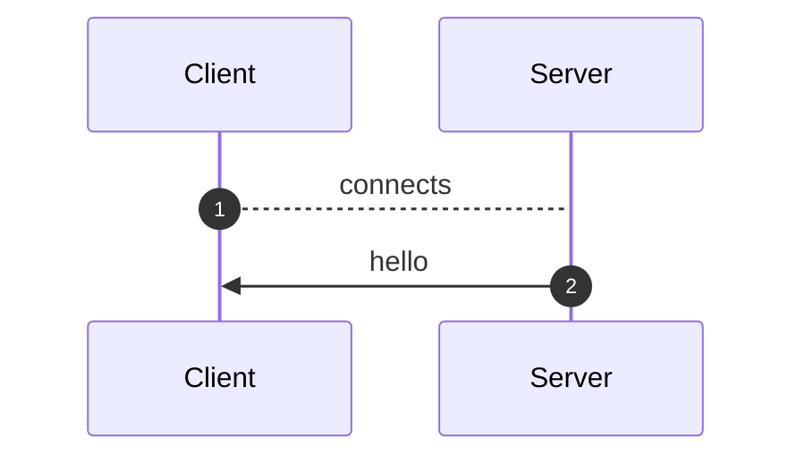
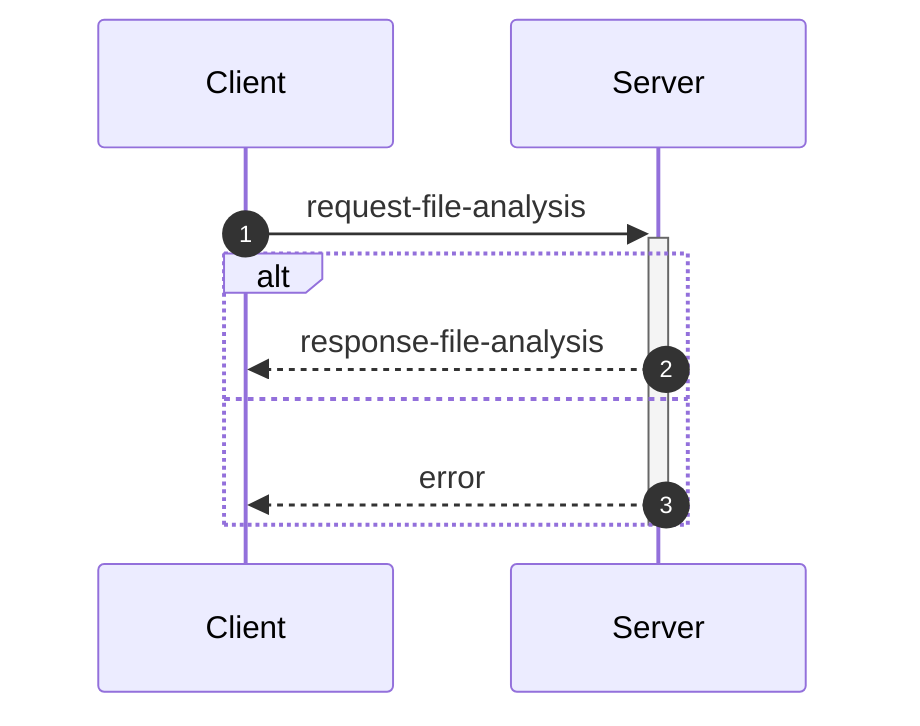
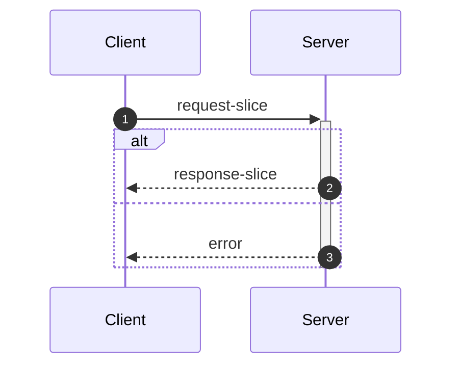
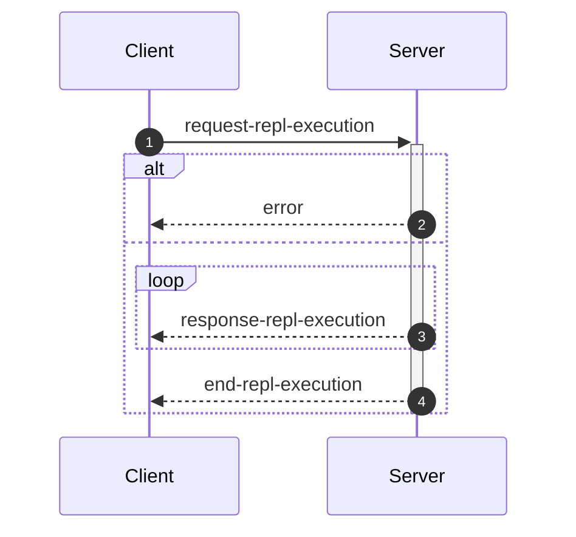

_This document was generated from '[src/documentation/wiki-interface.ts](https://github.com/flowr-analysis/flowr/tree/main//src/documentation/wiki-interface.ts)' on 2026-07-16, 13:31:33 UTC presenting an overview of flowR's interface (v2.12.3, using R v4.5.0). Please do not edit this file/wiki page directly._

Although far from being as detailed as the in-depth explanation of [_flowR_](https://github.com/flowr-analysis/flowr/wiki/core),
this wiki page explains how to interface with _flowR_ in more detail.
In general, command line arguments and other options provide short descriptions on hover over.

* [💻 Using the REPL](#using-the-repl)
* [⚙️ Configuring FlowR](#configuring-flowr)
* [⚒️ Writing Code](#writing-code)
* [💬 Communicating with the Server](#communicating-with-the-server)

<a id='using-the-repl'></a>
## 💻 Using the REPL


> [!NOTE]
> To execute arbitrary R commands with a repl request, _flowR_ has to be started explicitly with <span title="Description (Command Line Argument): Allow to access the underlying R session when using flowR (security warning: this allows the execution of arbitrary R code!)">`--r-session-access`</span>.
> Please be aware that this introduces a security risk and note that this relies on the [`r-shell` engine](https://github.com/flowr-analysis/flowr/wiki/engines) .

Although primarily meant for users to explore,
there is nothing which forbids simply calling _flowR_ as a subprocess to use standard-in, -output, and -error
for communication (although you can access the REPL using the server as well,
with the [REPL Request](#message-request-repl-execution) message).

The read-eval-print loop&nbsp;(REPL) works relatively simple.
You can submit an expression (using <kbd>Enter</kbd>),
which is interpreted as an R&nbsp;expression by default but interpreted as a *command* if it starts with a colon (`:`).
The best command to get started with the REPL is <span title="Description (Repl Command): Show help information (aliases: :h, :?)">`:help`</span>.
Besides, you can leave the REPL either with the command <span title="Description (Repl Command): End the repl (aliases: :q, :exit)">`:quit`</span> or by pressing <kbd>Ctrl</kbd>+<kbd>C</kbd> twice.
When writing a *command*, you may press <kbd>Tab</kbd> to get a list of completions, if available.
Multiple commands can be entered in a single line by separating them with a semicolon (`;`), e.g. `:parse "x<-2"; :df*`.
If a command is given without R code, the REPL will re-use R code given in a previous command.
The prior example will hence return first the parsed AST of the program and then the dataflow graph for `"x <- 2"`.

> [!NOTE]
> If you develop flowR, you may want to launch the repl using the `npm run main-dev` command, this way, you get a non-minified version of flowR with debug information and hot-reloading of source files.

<details>
<summary>Available Commands</summary>

We currently offer the following commands (this with a `[*]` suffix are available with and without the star):


| Command | Description |
| ------- | ----------- |
| **<span title="Description (Repl Command): End the repl (aliases: :q, :exit)">:quit</span>** | End the repl (aliases: **:<span title="Alias of ':quit'. End the repl">q</span>**, **:<span title="Alias of ':quit'. End the repl">exit</span>**) |
| **<span title="Description (Repl Command): Execute the given code as R code. This requires the `--r-session-access` flag to be set and requires the r-shell engine. (aliases: :e, :r)">:execute</span>** | Execute the given code as R code. This requires the `--r-session-access` flag to be set and requires the r-shell engine. (aliases: **:<span title="Alias of ':execute'. Execute the given code as R code. This requires the `--r-session-access` flag to be set and requires the r-shell engine.">e</span>**, **:<span title="Alias of ':execute'. Execute the given code as R code. This requires the `--r-session-access` flag to be set and requires the r-shell engine.">r</span>**) |
| **<span title="Description (Repl Command): Get mermaid code for the control-flow graph of R code (aliases: :cfg, :cf)">:controlflow[*]</span>** | Get mermaid code for the control-flow graph of R code (star: Returns the URL to mermaid.live) (aliases: **:<span title="Alias of ':controlflow'. Get mermaid code for the control-flow graph of R code">cfg</span>**, **:<span title="Alias of ':controlflow'. Get mermaid code for the control-flow graph of R code">cf</span>**) |
| **<span title="Description (Repl Command): Get mermaid code for the control-flow graph with basic blocks (aliases: :cfgb, :cfb)">:controlflowbb[*]</span>** | Get mermaid code for the control-flow graph with basic blocks (star: Returns the URL to mermaid.live) (aliases: **:<span title="Alias of ':controlflowbb'. Get mermaid code for the control-flow graph with basic blocks">cfgb</span>**, **:<span title="Alias of ':controlflowbb'. Get mermaid code for the control-flow graph with basic blocks">cfb</span>**) |
| **<span title="Description (Repl Command): Get mermaid code for the dataflow graph (aliases: :d, :df)">:dataflow[*]</span>** | Get mermaid code for the dataflow graph (star: Returns the URL to mermaid.live) (aliases: **:<span title="Alias of ':dataflow'. Get mermaid code for the dataflow graph">d</span>**, **:<span title="Alias of ':dataflow'. Get mermaid code for the dataflow graph">df</span>**) |
| **<span title="Description (Repl Command): Get mermaid code for the normalized AST of R code (aliases: :n)">:normalize[*]</span>** | Get mermaid code for the normalized AST of R code (star: Returns the URL to mermaid.live) (alias: **:<span title="Alias of ':normalize'. Get mermaid code for the normalized AST of R code">n</span>**) |
| **<span title="Description (Repl Command): Get mermaid code for the simplified dataflow graph (aliases: :ds, :dfs)">:dataflowsimple[*]</span>** | Get mermaid code for the simplified dataflow graph (star: Returns the URL to mermaid.live) (aliases: **:<span title="Alias of ':dataflowsimple'. Get mermaid code for the simplified dataflow graph">ds</span>**, **:<span title="Alias of ':dataflowsimple'. Get mermaid code for the simplified dataflow graph">dfs</span>**) |
| **<span title="Description (Repl Command): Inspect and extend the signature database: `query` (identical to :query @signature), `add <path>` to mount another database/source, `download` to fetch the full-history database. (aliases: :sig)">:signature</span>** | Inspect and extend the signature database: `query` (identical to :query @signature), `add <path>` to mount another database/source, `download` to fetch the full-history database. (alias: **:<span title="Alias of ':signature'. Inspect and extend the signature database: `query` (identical to :query @signature), `add <path>` to mount another database/source, `download` to fetch the full-history database.">sig</span>**) |
| **<span title="Description (Repl Command): Just calculates the DFG, but only prints summary info (aliases: :d#, :df#)">:dataflowsilent</span>** | Just calculates the DFG, but only prints summary info (aliases: **:<span title="Alias of ':dataflowsilent'. Just calculates the DFG, but only prints summary info">d#</span>**, **:<span title="Alias of ':dataflowsilent'. Just calculates the DFG, but only prints summary info">df#</span>**) |
| **<span title="Description (Repl Command): Prints ASCII Art of the parsed, unmodified AST (aliases: :p)">:parse</span>** | Prints ASCII Art of the parsed, unmodified AST (alias: **:<span title="Alias of ':parse'. Prints ASCII Art of the parsed, unmodified AST">p</span>**) |
| **<span title="Description (Repl Command): Prints the version of flowR as well as the current version of R">:version</span>** | Prints the version of flowR as well as the current version of R
| **<span title="Description (Repl Command): Query the given R code (use 'help' for more information)">:query[*]</span>** | Query the given R code (use 'help' for more information) (star: Similar to query, but returns the output in json format.)
| **<span title="Description (Repl Command): Returns an ASCII representation of the dataflow graph (aliases: :df!)">:dataflowascii</span>** | Returns an ASCII representation of the dataflow graph (alias: **:<span title="Alias of ':dataflowascii'. Returns an ASCII representation of the dataflow graph">df!</span>**) |
| **<span title="Description (Repl Command): Returns summarization stats for the normalized AST (aliases: :n#)">:normalize#</span>** | Returns summarization stats for the normalized AST (alias: **:<span title="Alias of ':normalize#'. Returns summarization stats for the normalized AST">n#</span>**) |
| **<span title="Description (Repl Command): Show help information (aliases: :h, :?)">:help</span>** | Show help information (aliases: **:<span title="Alias of ':help'. Show help information">h</span>**, **:<span title="Alias of ':help'. Show help information">?</span>**) |


</details>


> [!TIP]
> 
> As indicated by the examples before, all REPL commands that operate on code keep track of the state.
> Hence, if you run a command like <span title="Description (Repl Command, starred version): Returns the URL to mermaid.live; Base Command: Get mermaid code for the dataflow graph (aliases: :d*, :df*)">`:dataflow*`</span> without providing R code,
> the REPL will re-use the R code provided in a previous command.
> Likewise, doing this will benefit from incrementality!
> If you request the dataflow graph with `:df* x <- 2 * y` and then want to see the parsed AST with `:parse`,
> the REPL will re-use previously obtained information and not re-parse the code again.
> 		


Generally, many commands offer shortcut versions in the REPL. Many queries, for example, offer a shortened format (see the example below).
Of special note, the [Config Query](https://github.com/flowr-analysis/flowr/wiki/query-api#Config-Query)
can be used to also modify the currently active configuration of _flowR_ within the REPL (see the [wiki page](https://github.com/flowr-analysis/flowr/wiki/query-api#Config-Query) for more information).

### Example: Retrieving the Dataflow Graph

To retrieve a URL to the [mermaid](https://mermaid.js.org/) diagram of the dataflow of a given expression,
use <span title="Description (Repl Command, starred version): Returns the URL to mermaid.live; Base Command: Get mermaid code for the dataflow graph (aliases: :d*, :df*)">`:dataflow*`</span> (or <span title="Description (Repl Command): Get mermaid code for the dataflow graph (aliases: :d, :df)">`:dataflow`</span> to get the mermaid code in the cli):


```shell
$ docker run -it --rm eagleoutice/flowr # or npm run flowr 
flowR repl v2.12.3, R grammar v14 (tree-sitter engine)
R> :dataflow* y <- 1 + x
```

<details>
<summary style='color:gray'>Output</summary>


```text
https://mermaid.live/view#base64:eyJjb2RlIjoiZmxvd2NoYXJ0IEJUXG4gICAgMXt7XCJgKiM5MTtSTnVtYmVyIzkzOyogKioxKipcbiAgICAgICoxLjYqICgqKmlkOiAxKiopYFwifX1cbiAgICUlIE5vIGVkZ2VzIGZvdW5kIGZvciAxXG4gICAgMihbXCJgKiM5MTtSU3ltYm9sIzkzOyogKip4KipcbiAgICAgICoxLjEwKiAoKippZDogMioqKWBcIl0pXG4gICAlJSBObyBlZGdlcyBmb3VuZCBmb3IgMlxuICAgIDNbW1wiYCojOTE7UkJpbmFyeU9wIzkzOyogYmFzZSM1ODsjNTg7KiojNDM7KipcbiAgICAgICoxLjYtMTAqICgqKmlkOiAzKiopXG4gICAgYXJnOiAoMSwgMilgXCJdXVxuICAgIGJ1aWx0LWluOl9bXCJgQnVpbHQtSW46XG4jNDM7YFwiXVxuICAgIHN0eWxlIGJ1aWx0LWluOl8gc3Ryb2tlOmdyYXksZmlsbDpncmF5LHN0cm9rZS13aWR0aDoycHgsb3BhY2l0eTouODtcbiAgICAwW1wiYCojOTE7UlN5bWJvbCM5MzsqICoqeSoqXG4gICAgICAqMS4xKiAoKippZDogMCoqLCB2OiBbM10pYFwiXVxuICAgIDRbW1wiYCojOTE7UkJpbmFyeU9wIzkzOyogYmFzZSM1ODsjNTg7KiojNjA7IzQ1OyoqXG4gICAgICAqMS4xLTEwKiAoKippZDogNCoqKVxuICAgIGFyZzogKDAsIDMpYFwiXV1cbiAgICBidWlsdC1pbjpfLVtcImBCdWlsdC1JbjpcbiM2MDsjNDU7YFwiXVxuICAgIHN0eWxlIGJ1aWx0LWluOl8tIHN0cm9rZTpncmF5LGZpbGw6Z3JheSxzdHJva2Utd2lkdGg6MnB4LG9wYWNpdHk6Ljg7XG4gICAgMyAtLT58XCJyZWFkcywgYXJnXCJ8IDFcbiAgICAzIC0tPnxcInJlYWRzLCBhcmdcInwgMlxuICAgIDMgLS4tPnxcInJlYWRzLCBjYWxsc1wifCBidWlsdC1pbjpfXG4gICAgbGlua1N0eWxlIDIgc3Ryb2tlOmdyYXk7XG4gICAgMCAtLT58XCJkZWZpbmVkLWJ5XCJ8IDNcbiAgICAwIC0tPnxcImRlZmluZWQtYnlcInwgNFxuICAgIDQgLS0+fFwicmVhZHMsIGFyZ1wifCAzXG4gICAgNCAtLT58XCJyZXR1cm5zLCBhcmdcInwgMFxuICAgIDQgLS4tPnxcInJlYWRzLCBjYWxsc1wifCBidWlsdC1pbjpfLVxuICAgIGxpbmtTdHlsZSA3IHN0cm9rZTpncmF5OyIsIm1lcm1haWQiOnsiYXV0b1N5bmMiOnRydWV9fQ==
```


Retrieve the dataflow graph of the expression `y <- 1 + x`. It looks like this:


```mermaid
flowchart LR
    1{{"`*#91;RNumber#93;* **1**
      *1.6* (**id: 1**)`"}}
   %% No edges found for 1
    2(["`*#91;RSymbol#93;* **x**
      *1.10* (**id: 2**)`"])
   %% No edges found for 2
    3[["`*#91;RBinaryOp#93;* base#58;#58;**#43;**
      *1.6-10* (**id: 3**)
    arg: (1, 2)`"]]
    built-in:_["`Built-In:
#43;`"]
    style built-in:_ stroke:gray,fill:gray,stroke-width:2px,opacity:.8;
    0["`*#91;RSymbol#93;* **y**
      *1.1* (**id: 0**, v: [3])`"]
    4[["`*#91;RBinaryOp#93;* base#58;#58;**#60;#45;**
      *1.1-10* (**id: 4**)
    arg: (0, 3)`"]]
    built-in:_-["`Built-In:
#60;#45;`"]
    style built-in:_- stroke:gray,fill:gray,stroke-width:2px,opacity:.8;
    3 -->|"reads, arg"| 1
    3 -->|"reads, arg"| 2
    3 -.->|"reads, calls"| built-in:_
    linkStyle 2 stroke:gray;
    0 -->|"defined-by"| 3
    0 -->|"defined-by"| 4
    4 -->|"reads, arg"| 3
    4 -->|"returns, arg"| 0
    4 -.->|"reads, calls"| built-in:_-
    linkStyle 7 stroke:gray;
```

	
<details>

<summary style="color:gray">R Code of the Dataflow Graph</summary>

The analysis required _0.6 ms_ (including parse and normalize, using the [tree-sitter](https://github.com/flowr-analysis/flowr/wiki/Engines) engine) within the generation environment. No [signature database](https://github.com/flowr-analysis/flowr/wiki/Signature-Database) is mounted for these generated graphs, so `library()` calls attach no package exports; base-R names are still qualified via the generated base-package store (e.g. `acf` as `stats::acf`). 
We encountered no unknown side effects during the analysis.


```r
y <- 1 + x
```


</details>


</details>


For small graphs like this, <span title="Description (Repl Command): Returns an ASCII representation of the dataflow graph (aliases: :df!)">`:dataflowascii`</span> also provides an ASCII representation directly in the REPL:


```shell
$ docker run -it --rm eagleoutice/flowr # or npm run flowr 
flowR repl v2.12.3, R grammar v14 (tree-sitter engine)
R> :df! y <- 1 + x
```

<details open>
<summary style='color:gray'>Output</summary>


```text
                        0<1>0
                   ┌────| 1 |
    ┌────────┐     │    0---0
 c<4>c       └──c<3>c
 |<- |  v<0>v┌──| + |
 c---c──| y |┘  c---c   u<2>u
        v---v      └────| x |
                        u---u
Edges:
3 -> 1: reads, arg  3 -> 2: reads, arg
4 -> 3: reads, arg  4 -> 0: returns, arg
0 -> 3: defined-by  0 -> 4: defined-by
```


Retrieve the dataflow graph of the expression `y <- 1 + x` as ASCII art.

</details>


For the slicing with <span title="Description (Repl Command): Static backwards executable slicer for R">`:slicer`</span>, you have access to the same [magic comments](#slice-magic-comments) as with the [slice request](#message-request-slice).
Pass `--inline` to splice resolvable `source()` calls into the reconstruction so the slice is a single self-contained R text (the same as the static slice query's `inlineSources` flag).

### Example: Interfacing with the File System

Many commands that allow for an R-expression (like <span title="Description (Repl Command, starred version): Returns the URL to mermaid.live; Base Command: Get mermaid code for the dataflow graph (aliases: :d*, :df*)">`:dataflow*`</span>) allow for a file as well
if the argument starts with `file://`.
If you are working from the root directory of the _flowR_ repository, the following gives you the parsed AST of the example file using the <span title="Description (Repl Command): Prints ASCII Art of the parsed, unmodified AST (aliases: :p)">`:parse`</span> command:

> **Watch mode**: Replace `file://` with `watch://` to enter watch mode.
> flowR runs the command immediately and then re-runs it every time the file (or any file inside the folder) changes.
> Enter any other command to leave watch mode.
> For example: `:df watch://analysis.R`


```shell
$ docker run -it --rm eagleoutice/flowr # or npm run flowr 
flowR repl v2.12.3, R grammar v14 (tree-sitter engine)
R> :parse file://test/testfiles/example.R
```

<details>
<summary style='color:gray'>Output</summary>


```text
File: test/testfiles/example.R

program
├ binaryoperator
│ ├ identifier "sum" (1:1─4)
│ ├ <- "<-" (1:5─7)
│ ╰ float "0" (1:8─9)
├ binaryoperator
│ ├ identifier "product" (2:1─8)
│ ├ <- "<-" (2:9─11)
│ ╰ float "1" (2:12─13)
├ binaryoperator
│ ├ identifier "w" (3:1─2)
│ ├ <- "<-" (3:3─5)
│ ╰ float "7" (3:6─7)
├ binaryoperator
│ ├ identifier "N" (4:1─2)
│ ├ <- "<-" (4:3─5)
│ ╰ float "10" (4:6─8)
├ forstatement
│ ├ for "for" (6:1─4)
│ ├ ( "(" (6:5─6)
│ ├ identifier "i" (6:6─7)
│ ├ in "in" (6:8─10)
│ ├ binaryoperator
│ │ ├ float "1" (6:11─12)
│ │ ├ : ":" (6:12─13)
│ │ ╰ parenthesizedexpression
│ │   ├ ( "(" (6:13─14)
│ │   ├ binaryoperator
│ │   │ ├ identifier "N" (6:14─15)
│ │   │ ├ - "-" (6:15─16)
│ │   │ ╰ float "1" (6:16─17)
│ │   ╰ ) ")" (6:17─18)
│ ├ ) ")" (6:18─19)
│ ╰ bracedexpression
│   ├ { "{" (6:20─21)
│   ├ binaryoperator
│   │ ├ identifier "sum" (7:3─6)
│   │ ├ <- "<-" (7:7─9)
│   │ ╰ binaryoperator
│   │   ├ binaryoperator
│   │   │ ├ identifier "sum" (7:10─13)
│   │   │ ├ + "+" (7:14─15)
│   │   │ ╰ identifier "i" (7:16─17)
│   │   ├ + "+" (7:18─19)
│   │   ╰ identifier "w" (7:20─21)
│   ├ binaryoperator
│   │ ├ identifier "product" (8:3─10)
│   │ ├ <- "<-" (8:11─13)
│   │ ╰ binaryoperator
│   │   ├ identifier "product" (8:14─21)
│   │   ├  "" (8:22─23)
│   │   ╰ identifier "i" (8:24─25)
│   ╰ } "}" (9:1─2)
├ call
│ ├ identifier "cat" (11:1─4)
│ ╰ arguments
│   ├ ( "(" (11:4─5)
│   ├ argument
│   │ ╰ string
│   │   ├ " "\"" (11:5─6)
│   │   ├ stringcontent "Sum:" (11:6─10)
│   │   ╰ " "\"" (11:10─11)
│   ├ comma "," (11:11─12)
│   ├ argument
│   │ ╰ identifier "sum" (11:13─16)
│   ├ comma "," (11:16─17)
│   ├ argument
│   │ ╰ string
│   │   ├ " "\"" (11:18─19)
│   │   ├ stringcontent
│   │   │ ╰ escapesequence "\\n" (11:19─21)
│   │   ╰ " "\"" (11:21─22)
│   ╰ ) ")" (11:22─23)
╰ call
  ├ identifier "cat" (12:1─4)
  ╰ arguments
    ├ ( "(" (12:4─5)
    ├ argument
    │ ╰ string
    │   ├ " "\"" (12:5─6)
    │   ├ stringcontent "Product:" (12:6─14)
    │   ╰ " "\"" (12:14─15)
    ├ comma "," (12:15─16)
    ├ argument
    │ ╰ identifier "product" (12:17─24)
    ├ comma "," (12:24─25)
    ├ argument
    │ ╰ string
    │   ├ " "\"" (12:26─27)
    │   ├ stringcontent
    │   │ ╰ escapesequence "\\n" (12:27─29)
    │   ╰ " "\"" (12:29─30)
    ╰ ) ")" (12:30─31)
```


Retrieve the parsed AST of the example file.

<details>

<summary>File Content</summary>


```r
sum <- 0
product <- 1
w <- 7
N <- 10

for (i in 1:(N-1)) {
  sum <- sum + i + w
  product <- product * i
}

cat("Sum:", sum, "\n")
cat("Product:", product, "\n")
```


</details>

As _flowR_ directly transforms this AST the output focuses on being human-readable instead of being machine-readable.
		

</details>


### Example: Run a Query

You can run any query supported by _flowR_ using the <span title="Description (Repl Command): Query the given R code (use 'help' for more information)">`:query`</span> command.
For example, to obtain the shapes of all data frames in a given piece of code, you can run:


```shell
$ docker run -it --rm eagleoutice/flowr # or npm run flowr 
flowR repl v2.12.3, R grammar v14 (tree-sitter engine)
R> :query @absint df-shape "x <- data.frame(a = 1:10, b = 1:10)\ny <- x$a"
```

<details open>
<summary style='color:gray'>Output</summary>


```text
Query: absint (2 ms)
   ╰ $12: (colnames: [{"a", "b"}, {}], cols: [2, 2], rows: [10, 10])
   ╰ $0: (colnames: [{"a", "b"}, {}], cols: [2, 2], rows: [10, 10])
All queries together required ≈3 ms (1ms accuracy, total 4 ms)
```


Retrieve the shapes of all data frames in the given code.

</details>


To run the linter on a file, you can use (in this example, we just issue the `dead-code` linter on a small piece of code):


```shell
$ docker run -it --rm eagleoutice/flowr # or npm run flowr 
flowR repl v2.12.3, R grammar v14 (tree-sitter engine)
R> :query @linter rules:dead-code "if(FALSE) x <- 2"
```

<details open>
<summary style='color:gray'>Output</summary>


```text
Query: linter (1 ms)
   ╰ Dead Code (dead-code):
       ╰ certain:
           ╰ Code at 1.11-16
       ╰ Metadata: searchTimeMs: 1, processTimeMs: 0
All queries together required ≈1 ms (1ms accuracy, total 2 ms)
```


Run the linter on the given code, with only the `dead-code` rule enabled.

</details>


For more information on the available queries, please check out the [Query API](https://github.com/flowr-analysis/flowr/wiki/query-api).


<a id='configuring-flowr'></a>
## ⚙️ Configuring FlowR


When running _flowR_, you may want to specify some behaviors with a dedicated configuration file.
By default, flowR looks for a file named `flowr.json` in the current working directory (or any higher directory).
You can also specify a different file with <span title="Description (Command Line Argument): The name of the configuration file to use">`--config-file`</span> or pass the configuration inline using <span title="Description (Command Line Argument): The flowR configuration to use, as a JSON string">`--config-json`</span>.
To inspect the current configuration, you can run flowr with the <span title="Description (Command Line Argument): Run with verbose logging (will be passed to the corresponding script)">`--verbose`</span> flag, or use the `config` [Query](https://github.com/flowr-analysis/flowr/wiki/query-api).
Within the REPL this works by running the following:


```shell
:query @config
```


To work with the <a href="https://github.com/flowr-analysis/flowr/tree/main/src/config.ts#L122"><code><span title="The configuration file format for flowR.">FlowrConfig</span></code></a> you can use the provided helper objects alongside its methods like
<a href="https://github.com/flowr-analysis/flowr/tree/main/src/config.ts#L575"><code><span title="Creates a new flowr config that has the updated values.">FlowrConfig::<b>amend</b></span></code></a>.
The following summarizes the configuration options:

- `ignoreSourceCalls`: If set to `true`, _flowR_ will ignore source calls when analyzing the code, i.e., ignoring the inclusion of other files.
- `ignoreLoadCalls`: If set to `true`, _flowR_ will ignore load calls when analyzing the code, i.e., ignoring the loading of r-data files.
- `semantics`: allows to configure the way _flowR_ handles R, although we currently only support `semantics/environment/overwriteBuiltIns`. 
  You may use this to overwrite _flowR_'s handling of built-in function and even completely clear the preset definitions shipped with flowR. 
  See [Configure BuiltIn Semantics](#configure-builtin-semantics) for more information.
- `solver`: allows to configure how _flowR_ resolves variables and their values (currently we support: `disabled`, `alias`, `builtin`), as well as if pointer analysis should be active.
- `engines`: allows to configure the engines used by _flowR_ to interact with R code. See the [Engines wiki page](https://github.com/flowr-analysis/flowr/wiki/engines) for more information.
- `defaultEngine`: allows to specify the default engine to use for interacting with R code. If not set, an arbitrary engine from the specified list will be used.
- `abstractInterpretation`: allows to configure how _flowR_ performs abstract interpretation, although we currently only support data frame shape inference through abstract interpretation.
- `defaultPlugins`: allows to configure which plugins to load by default when creating a new <a href="https://github.com/flowr-analysis/flowr/tree/main/src/project/flowr-analyzer.ts#L162"><code><span title="Central class for conducting analyses with FlowR. Use the FlowrAnalyzerBuilder to create a new instance. If you want the original pattern of creating a pipeline and running all steps, you can still do this with FlowrAnalyzer#runFull . To inspect the context of the analyzer, use FlowrAnalyzer#inspectContext (if you are a plugin and need to modify it, use FlowrAnalyzer#context instead).">FlowrAnalyzer</span></code></a> instance.
- `repl.plugins`: allows to configure which plugins to load in the _flowR_ REPL. Use `flowr:default` to reference the plugins specified by `defaultPlugins`.

So you can configure _flowR_ by adding a file like the following:

<details>

<summary>Example Configuration File</summary>


```json
{
  "ignoreSourceCalls": true,
  "ignoreLoadCalls": true,
  "semantics": {
    "environment": {
      "overwriteBuiltIns": {
        "definitions": [
          {
            "type": "function",
            "names": [
              "foo"
            ],
            "processor": "builtin:assign",
            "config": {}
          }
        ]
      }
    }
  },
  "defaultPlugins": [
    "file:description",
    "versions:description"
  ],
  "repl": {
    "quickStats": false,
    "dfProcessorHeat": false,
    "hints": true,
    "plugins": [
      "flowr:default"
    ]
  },
  "project": {
    "resolveUnknownPathsOnDisk": true
  },
  "engines": [
    {
      "type": "r-shell"
    }
  ],
  "solver": {
    "variables": "alias",
    "evalStrings": true,
    "trackEnvironments": true,
    "sigdb": {
      "enabled": true,
      "loadProjectDependencies": true,
      "eagerlyLoad": false,
      "eagerlyLoadExports": false,
      "linkBaseR": false,
      "linkDescriptionDependencies": false
    },
    "resolveSource": {
      "dropPaths": "no",
      "ignoreCapitalization": true,
      "inferWorkingDirectory": "active-script",
      "searchPath": []
    },
    "instrument": {},
    "slicer": {
      "threshold": 50
    }
  },
  "abstractInterpretation": {
    "wideningThreshold": 4,
    "dataFrame": {
      "maxColNames": 20,
      "readLoadedData": {
        "readExternalFiles": true,
        "maxReadLines": 1000000
      }
    }
  },
  "gas": {
    "thresholds": {
      "memory": {
        "problematic": 0.7,
        "critical": 0.9
      },
      "timeMs": {
        "problematic": 100000,
        "critical": 120000
      }
    },
    "features": {}
  }
}
```


</details>

<details>
<a id='configure-builtin-semantics'></a>
<summary>Configure Built-In Semantics</summary>


`semantics/environment/overwriteBuiltins` accepts two keys:

- `loadDefaults` (boolean, initially `true`): If set to `true`, the default built-in definitions are loaded before applying the custom definitions. Setting this flag to `false` explicitly disables the loading of the default definitions.
- `definitions` (array, initially empty): Allows to overwrite or define new built-in elements. Each object within must have a `type` which is one of the below. Furthermore, they may define a string array of `names` which specifies the identifiers to bind the definitions to. You may use `assumePrimitive` to specify whether _flowR_ should assume that this is a primitive non-library definition (so you probably just do not want to specify the key).

  | Type            | Description                                                                                                                                                                                                                                                                                              | Example                                                                                                    |
  | --------------- | -------------------------------------------------------------------------------------------------------------------------------------------------------------------------------------------------------------------------------------------------------------------------------------------------------- | ---------------------------------------------------------------------------------------------------------- |
  | `constant`    | Additionally allows for a `value` this should resolve to.                                                                                                                                                                                                                                                | `{ type: 'constant', names: ['NULL', 'NA'],  value: null }`                                                |
  | `function`    | Is a rather flexible way to define and bind built-in functions. For the time, we do not have extensive documentation to cover all the cases, so please either consult the sources with the `default-builtin-config.ts` or open a [new issue](https://github.com/flowr-analysis/flowr/issues/new/choose). | `{ type: 'function', names: ['next'], processor: 'builtin:d', config: { cfg: ExitPointType.Next } }` |
  | `replacement` | A comfortable way to specify replacement functions like `$<-` or `names<-`. `suffixes` describes the... suffixes to attach automatically. | `{ type: 'replacement', suffixes: ['<-', '<<-'], names: ['[', '[['] }` |


</details>

<details>

<summary style='color:gray'>Full Configuration-File Schema</summary>

- _The configuration file format for flowR._ (object)
    - **ignoreSourceCalls** [optional] _Whether source calls should be ignored, causing {@link processSourceCall}'s behavior to be skipped._ (boolean)
    - **ignoreLoadCalls** [optional] _Whether load calls should be ignored, causing {@link processLoadCall}'s behavior to be skipped._ (boolean)
    - **semantics** _Configure language semantics and how flowR handles them._ (object)
        - **environment** [optional] _Semantics regarding how to handle the R environment._ (object)
            - **overwriteBuiltIns** [optional] _Do you want to overwrite (parts) of the builtin definition?_ (object)
                - **loadDefaults** [optional] _Should the default configuration still be loaded?_ (boolean)
                - **definitions** [optional] _The definitions to load/overwrite._ (array)
                Valid item types:
                    - (object)
    - **defaultPlugins** [optional] _The default plugins to load when creating a new instance of FlowrAnalyzer_ (array)
    Valid item types:
        - (alternatives)
            - (string)
            - (array)
    - **repl** _Configuration options for the REPL._ (object)
        - **quickStats** [optional] _Whether to show quick stats in the REPL after each evaluation._ (boolean)
        - **dfProcessorHeat** [optional] _This instruments the dataflow processors to count how often each processor is called._ (boolean)
        - **hints** [optional] _Whether to show dim inline hints on the empty prompt (automatically disabled on non-interactive terminals)._ (boolean)
        - **plugins** [optional] _The plugins to load in REPL mode_ (array)
        Valid item types:
            - (alternatives)
                - (string)
                - (array)
    - **project** _Project specific configuration options._ (object)
        - **resolveUnknownPathsOnDisk** [optional] _Whether to resolve unknown paths loaded by the r project disk when trying to source/analyze files._ (boolean)
        - **basePackages** [optional] _The packages considered part of R itself (base and recommended); if unset, flowR uses its built-in list._ (array)
        Valid item types:
            - (string)
    - **engines** _The engine or set of engines to use for interacting with R code. An empty array means all available engines will be used._ (array)
    Valid item types:
        - (alternatives)
            - _The configuration for the tree sitter engine._ (object)
                - **type** [required] _Use the tree sitter engine._ (string)
                    Only allows: 'tree-sitter'
                - **wasmPath** [optional] _The path to the tree-sitter-r WASM binary to use. If this is undefined, this uses the default path._ (string)
                - **treeSitterWasmPath** [optional] _The path to the tree-sitter WASM binary to use. If this is undefined, this uses the default path._ (string)
                - **lax** [optional] _Whether to use the lax parser for parsing R code (allowing for syntax errors). If this is undefined, the strict parser will be used._ (boolean)
            - _The configuration for the R shell engine._ (object)
                - **type** [required] _Use the R shell engine._ (string)
                    Only allows: 'r-shell'
                - **rPath** [optional] _The path to the R executable to use. If this is undefined, this uses the default path._ (string)
    - **defaultEngine** [optional] _The default engine to use for interacting with R code. If this is undefined, an arbitrary engine from the specified list will be used._ (string)
        Only allows: 'tree-sitter', 'r-shell'
    - **solver** _How to resolve constants, constraints, cells, ..._ (object)
        - **variables** _How to resolve variables and their values._ (string)
            Only allows: 'disabled', 'alias', 'builtin'
        - **evalStrings** _Should we include eval(parse(text="...")) calls in the dataflow graph?_ (boolean)
        - **trackEnvironments** [optional] _Track user-created environments (new.env, assign/get/local with envir=, dollar-assign, attach). When false, all envir-style calls fall through conservatively._ (boolean)
        - **sigdb** _Resolving library exports from a signature database._ (object)
            - **enabled** [optional] _Resolve library()/use() exports from a signature database (default true); when false no database is consulted._ (boolean)
            - **loadProjectDependencies** [optional] _Load the project's declared dependencies from its metadata files (DESCRIPTION Imports/Depends, renv.lock, rv.lock) (default true); when false these files are not read for dependencies._ (boolean)
            - **eagerlyLoad** [optional] _Parse the database up front rather than on the first package load (default false, ignored if disabled)._ (boolean)
            - **eagerlyLoadExports** [optional] _Add a vertex for every export on load rather than on demand (default false); keeps the dataflow graph small._ (boolean)
            - **assumedRVersion** [optional] _R version assumed when resolving versioned (base-R) exports: a pin like "4.5" or "auto" to detect the installed R (default "auto")._ (string)
            - **linkBaseR** [optional] _Eagerly attach base-R namespaces so bare base calls resolve without library() (default false)._ (boolean)
            - **linkBaseRCalls** [optional] _Add a lightweight Reads edge from a bare base-R call to its signature-database function vertex (default false; base-R qualification is edge-free otherwise)._ (boolean)
            - **linkPackageCalls** [optional] _Add a lightweight Reads edge from a resolved package call to its signature-database function vertex (default false)._ (boolean)
            - **linkDescriptionDependencies** [optional] _Eagerly attach the namespaces of the project's declared DESCRIPTION dependencies (Imports/Depends) so their exports resolve without an explicit library() (default false)._ (boolean)
            - **warmInBackground** [optional] _Decompress the hot shards (base + most-downloaded) in a background task on startup so the first library() lookup is warm (default false; for long-running servers/REPLs)._ (boolean)
            - **additionalPaths** [optional] _Extra directories or bundle/manifest files searched for signature databases (alongside the shipped default and $FLOWR_SIGDB_DIR); a downloaded full-history bundle placed here is mounted automatically._ (array)
            Valid item types:
                - (string)
            - **downloadRepo** [optional] _GitHub owner/repo the full-history bundle is downloaded from via ":signature download" (default "flowr-analysis/flowr", release tag "sigdb-v<flowR-version>")._ (string)
            - **autoSync** [optional] _On startup, re-download shards whose committed sigdb.remote.json hash no longer matches the cache, in the background (default false; opt-in network sync after a git pull)._ (boolean)
            - **versionSelection** [optional] _When a project constrains a dependency, resolve to the newest (default), oldest, or system-installed version satisfying it; system needs R and falls back to newest. Base-R packages always resolve against the assumed R version._ (string)
                Only allows: 'newest', 'oldest', 'system'
            - **versionOverrides** [optional] _Force an exact version for specific packages (name -> version), overriding both the project constraint and the versionSelection policy (default {})._ (object)
        - **instrument** (object)
            - **dataflowExtractors** [optional] _These keys are only intended for use within code, allowing to instrument the dataflow analyzer!_ (any)
        - **resolveSource** [optional] _If lax source calls are active, flowR searches for sourced files much more freely, based on the configurations you give it. This option is only in effect if `ignoreSourceCalls` is set to false._ (object)
            - **dropPaths** _Allow to drop the first or all parts of the sourced path, if it is relative._ (string)
                Only allows: 'no', 'once', 'all'
            - **ignoreCapitalization** _Search for filenames matching in the lowercase._ (boolean)
            - **inferWorkingDirectory** _Try to infer the working directory from the main or any script to analyze._ (string)
                Only allows: 'no', 'main-script', 'active-script', 'any-script'
            - **searchPath** _Additionally search in these paths._ (array)
            Valid item types:
                - (string)
            - **repeatedSourceLimit** [optional] _How often the same file can be sourced within a single run? Please be aware: in case of cyclic sources this may not reach a fixpoint so give this a sensible limit._ (number)
            - **applyReplacements** _Provide name replacements for loaded files_ (array)
            Valid item types:
                - (object)
        - **slicer** [optional] _The configuration for the slicer._ (object)
            - **threshold** [optional] _The maximum number of iterations to perform on a single function call during slicing._ (number)
            - **autoExtend** [optional] _If set, the slicer will gain an additional post-pass._ (boolean)
    - **abstractInterpretation** _The configuration options for abstract interpretation._ (object)
        - **wideningThreshold** _The threshold for the number of visitations of a node at which widening should be performed to ensure the termination of the fixpoint iteration._ (number)
        - **dataFrame** _The configuration of the shape inference for data frames._ (object)
            - **maxColNames** _The maximum number of columns names to infer for data frames before over-approximating the column names to top._ (number)
            - **readLoadedData** _Configuration options for reading data frame shapes from loaded external data files, such as CSV files._ (object)
                - **readExternalFiles** _Whether data frame shapes should be extracted from loaded external files, such as CSV files._ (boolean)
                - **maxReadLines** _The maximum number of lines to read when extracting data frame shapes from loaded files, such as CSV files._ (number)
    - **gas** [optional] _Resource-usage guard (gas) configuration. All feature factors default to 0 (disabled). See https://github.com/flowr-analysis/flowr/wiki/Core#gas-resource-guard._ (object)
        - **thresholds** [optional] _Shared thresholds for all gas checks (scaled by per-feature factor)._ (object)
            - **memory** [optional] _Heap-usage fraction thresholds (0-1)._ (object)
                - **problematic** [optional] _Heap fraction (0-1) above which Problematic is returned._ (number)
                - **critical** [optional] _Heap fraction (0-1) above which Critical is returned._ (number)
            - **timeMs** [optional] _Elapsed analysis time thresholds in milliseconds._ (object)
                - **problematic** [optional] _Elapsed ms above which Problematic is returned._ (number)
                - **critical** [optional] _Elapsed ms above which Critical is returned._ (number)
        - **features** [optional] _Per-feature sensitivity factors. 0 or absent disables gas checking for that feature. A factor of 2 makes the feature twice as sensitive. Recognised keys: `source`, `side-effect-linking`, `linter`._ (object)
        - **heapProvider** [optional] _Custom heap statistics source (programmatic configs only), overriding the built-in v8/performance.memory detection._ (function)

</details>

	

<a id='writing-code'></a>
## ⚒️ Writing Code

_flowR_ can be used as a [module](https://www.npmjs.com/package/@eagleoutice/flowr) and offers several main classes and interfaces that are interesting for extension writers 
(see the [Visual Studio Code extension](https://marketplace.visualstudio.com/items?itemName=code-inspect.vscode-flowr) or the [Core](https://github.com/flowr-analysis/flowr/wiki/core) wiki page for more information).

### Creating Analyses with _flowR_

Nowadays, instances of the <a href="https://github.com/flowr-analysis/flowr/tree/main/src/project/flowr-analyzer.ts#L162"><code><span title="Central class for conducting analyses with FlowR. Use the FlowrAnalyzerBuilder to create a new instance. If you want the original pattern of creating a pipeline and running all steps, you can still do this with FlowrAnalyzer#runFull . To inspect the context of the analyzer, use FlowrAnalyzer#inspectContext (if you are a plugin and need to modify it, use FlowrAnalyzer#context instead).">FlowrAnalyzer</span></code></a> should be used as central frontend to get analysis results from _flowR_.
For example, a program slice can be created like this:


```ts
const analyzer = await new FlowrAnalyzerBuilder()
    .setEngine('tree-sitter')
    .build();
analyzer.addRequest('x <- 1\ny <- x\nx');
const result = await analyzer.query([
    {
        type:     'static-slice',
        criteria: ['3@x']
    }
]);
//console.log(result['static-slice']);
```


For more information, please have a look at the [Analyzer](https://github.com/flowr-analysis/flowr/wiki/analyzer) wiki page, which explains how to construct and use the <a href="https://github.com/flowr-analysis/flowr/tree/main/src/project/flowr-analyzer.ts#L162"><code><span title="Central class for conducting analyses with FlowR. Use the FlowrAnalyzerBuilder to create a new instance. If you want the original pattern of creating a pipeline and running all steps, you can still do this with FlowrAnalyzer#runFull . To inspect the context of the analyzer, use FlowrAnalyzer#inspectContext (if you are a plugin and need to modify it, use FlowrAnalyzer#context instead).">FlowrAnalyzer</span></code></a> in more detail.
To work with specific perspectives, you can also consult the respective pages like the [Dataflow Graph](https://github.com/flowr-analysis/flowr/wiki/dataflow-graph) or the [Abstract Interpretation](https://github.com/flowr-analysis/flowr/wiki/abstract-interpretation) wiki pages.
### The Pipeline Executor (Low-Level Interface)

Once, in the beginning, _flowR_ was meant to produce a dataflow graph merely to provide *program slices*. 
However, with continuous updates, the [Dataflow Graph](https://github.com/flowr-analysis/flowr/wiki/dataflow-graph) repeatedly proves to be the more interesting part.
With this, we restructured _flowR_'s originally *hardcoded* pipeline to be far more flexible. 
Now, it can be theoretically extended or replaced with arbitrary steps, optional steps, and what we call 'decorations' of these steps. 
In short, a slicing pipeline using the <a href="https://github.com/flowr-analysis/flowr/tree/main/src/core/pipeline-executor.ts#L97"><code><span title="**Please note:** The PipelineExecutor is now considered to be a rather low-level API for flowR. While it still works and is the basis for all other layers, we strongly recommend using the FlowrAnalyzer and its builder to create and use an analyzer instance that is pre-configured for your use-case. The pipeline executor allows to execute arbitrary pipelines in a step-by-step fashion. If you are not...">PipelineExecutor</span></code></a> looks like this:


```ts

const slicer = new PipelineExecutor(DEFAULT_SLICING_PIPELINE, {
  parser:    new RShell(),
  request:   requestFromInput('x <- 1\nx + 1'),
  criterion: ['2@x']
})
const slice = await slicer.allRemainingSteps()
// console.log(slice.reconstruct.code)
```


<details><summary>More Information</summary>


If you compare this, with what you would have done with the old (and removed) `SteppingSlicer`, 
this essentially just requires you to replace the `SteppingSlicer` with the <a href="https://github.com/flowr-analysis/flowr/tree/main/src/core/pipeline-executor.ts#L97"><code><span title="**Please note:** The PipelineExecutor is now considered to be a rather low-level API for flowR. While it still works and is the basis for all other layers, we strongly recommend using the FlowrAnalyzer and its builder to create and use an analyzer instance that is pre-configured for your use-case. The pipeline executor allows to execute arbitrary pipelines in a step-by-step fashion. If you are not...">PipelineExecutor</span></code></a>
and to pass the <a href="https://github.com/flowr-analysis/flowr/tree/main/src/core/steps/pipeline/default-pipelines.ts#L18"><code>DEFAULT_SLICING_PIPELINE</code></a> as the first argument.
The <a href="https://github.com/flowr-analysis/flowr/tree/main/src/core/pipeline-executor.ts#L97"><code><span title="**Please note:** The PipelineExecutor is now considered to be a rather low-level API for flowR. While it still works and is the basis for all other layers, we strongly recommend using the FlowrAnalyzer and its builder to create and use an analyzer instance that is pre-configured for your use-case. The pipeline executor allows to execute arbitrary pipelines in a step-by-step fashion. If you are not...">PipelineExecutor</span></code></a>...

1. Provides structures to investigate the results of all intermediate steps
2. Can be executed step-by-step
3. Can repeat steps (e.g., to calculate multiple slices on the same input)

See the in-code documentation for more information.


</details>

### Using the <a href="https://github.com/flowr-analysis/flowr/tree/main/src/r-bridge/shell.ts#L143"><code><span title="The RShell represents an interactive session with the R interpreter. You can configure it by RShellOptions . At the moment we are using a live R session (and not networking etc.) to communicate with R easily, which allows us to install packages etc. However, this might and probably will change in the future (leaving this as a legacy mode :D)">RShell</span></code></a> to Interact with R

The <a href="https://github.com/flowr-analysis/flowr/tree/main/src/r-bridge/shell.ts#L143"><code><span title="The RShell represents an interactive session with the R interpreter. You can configure it by RShellOptions . At the moment we are using a live R session (and not networking etc.) to communicate with R easily, which allows us to install packages etc. However, this might and probably will change in the future (leaving this as a legacy mode :D)">RShell</span></code></a> class allows interfacing with the `R`&nbsp;ecosystem installed on the host system.
Please have a look at [flowR's Engines](https://github.com/flowr-analysis/flowr/wiki/engines) for more information on alternatives (for example, the <a href="https://github.com/flowr-analysis/flowr/tree/main/src/r-bridge/lang-4.x/tree-sitter/tree-sitter-executor.ts#L18"><code><span title="Synchronous and (way) faster alternative to the RShell using tree-sitter.">TreeSitterExecutor</span></code></a>).


> [!IMPORTANT]
> 
> Each <a href="https://github.com/flowr-analysis/flowr/tree/main/src/r-bridge/shell.ts#L143"><code><span title="The RShell represents an interactive session with the R interpreter. You can configure it by RShellOptions . At the moment we are using a live R session (and not networking etc.) to communicate with R easily, which allows us to install packages etc. However, this might and probably will change in the future (leaving this as a legacy mode :D)">RShell</span></code></a> controls a new instance of the R&nbsp;interpreter, 
> make sure to call <code><a href="https://github.com/flowr-analysis/flowr/tree/main/src/r-bridge/shell.ts#L351"><span title="Close the current R session, makes the object effectively invalid (can no longer be reopened etc.)">RShell::<i>close</i></span></a>()</code> when you are done.


You can start a new "session" simply by constructing a new object with <code>new <a href="https://github.com/flowr-analysis/flowr/tree/main/src/r-bridge/shell.ts#L143"><span title="The RShell represents an interactive session with the R interpreter. You can configure it by RShellOptions . At the moment we are using a live R session (and not networking etc.) to communicate with R easily, which allows us to install packages etc. However, this might and probably will change in the future (leaving this as a legacy mode :D)">RShell</span></a>()</code>.

However, there are several options that may be of interest 
(e.g., to automatically revive the shell in case of errors or to control the name location of the R process on the system).

With a shell object (let's call it `shell`), you can execute R code by using <a href="https://github.com/flowr-analysis/flowr/tree/main/src/r-bridge/shell.ts#L212"><code><span title="sends the given command directly to the current R session will not do anything to alter input markers!">RShell::<i>sendCommand</i></span></code></a>,
for example <code>shell.<a href="https://github.com/flowr-analysis/flowr/tree/main/src/r-bridge/shell.ts#L212"><span title="sends the given command directly to the current R session will not do anything to alter input markers!">sendCommand</span></a>("1 + 1")</code>.
However, this does not return anything, so if you want to collect the output of your command, use
<a href="https://github.com/flowr-analysis/flowr/tree/main/src/r-bridge/shell.ts#L295"><code><span title="Send a command and collect the output">RShell::<i>sendCommandWithOutput</i></span></code></a> instead.


<a id='communicating-with-the-server'></a>
## 💬 Communicating with the Server


As explained in the [Overview](https://github.com/flowr-analysis/flowr/wiki/overview), you can simply run the [TCP](https://de.wikipedia.org/wiki/Transmission_Control_Protocol)&nbsp;server by adding the <span title="Description (Command Line Argument): Do not drop into a repl, but instead start a server on the given port (default: 1042) and listen for messages.">`--server`</span> flag (and, due to the interactive mode, exit with the conventional <kbd>CTRL</kbd>+<kbd>C</kbd>).
Currently, every connection is handled by the same underlying `RShell` - so the server is not designed to handle many clients at a time.
Additionally, the server is not well guarded against attacks (e.g., you can theoretically spawn an arbitrary number of&nbsp;RShell sessions on the target machine).

Every message has to be given in a single line (i.e., without a newline in-between) and end with a newline character. Nevertheless, we will pretty-print example given in the following segments for the ease of reading.


> [!NOTE]
> 
> The default <span title="Description (Command Line Argument): Do not drop into a repl, but instead start a server on the given port (default: 1042) and listen for messages.">`--server`</span> uses a simple [TCP](https://de.wikipedia.org/wiki/Transmission_Control_Protocol)
> connection. If you want _flowR_ to expose a [WebSocket](https://de.wikipedia.org/wiki/WebSocket) server instead, add the <span title="Description (Command Line Argument): If the server flag is set, use websocket for messaging">`--ws`</span> flag (i.e., <span title="Description (Command Line Argument): Do not drop into a repl, but instead start a server on the given port (default: 1042) and listen for messages.">`--server`</span> <span title="Description (Command Line Argument): If the server flag is set, use websocket for messaging">`--ws`</span>) when starting _flowR_ from the command line.


<ul><li>
<a id="message-hello"></a>
<b>Hello</b> Message (<code>hello</code>) 
<details>

<summary style="color:gray"> View Details. <i>The server informs the client about the successful connection and provides Meta-Information.</i> </summary>


```mermaid
sequenceDiagram
    autonumber
    participant Client
    participant Server

    
    Client-->Server: connects
    Server->>Client: hello
	
```


	
After launching _flowR_, for example, with <code>docker run -it --rm eagleoutice/flowr <span title="Description (Command Line Argument): Do not drop into a repl, but instead start a server on the given port (default: 1042) and listen for messages.">-<span/>-server</span></code>&nbsp;(🐳️), simply connecting should present you with a `hello` message, that amongst others should reveal the versions of&nbsp;_flowR_ and&nbsp;R, using the [semver 2.0](https://semver.org/spec/v2.0.0.html) versioning scheme.
The message looks like this:


```json
{
  "type": "hello",
  "clientName": "client-0",
  "versions": {
    "flowr": "2.12.3",
    "r": "4.5.0",
    "engine": "r-shell"
  }
}
```


There are currently a few messages that you can send after the hello message.
If you want to _slice_ a piece of R code you first have to send an [analysis request](#message-request-file-analysis), so that you can send one or multiple slice requests afterward.
Requests for the [REPL](#message-request-repl) are independent of that.
	

<hr>


<details>
<summary style="color:gray">Message schema (<code>hello</code>)</summary>

For the definition of the hello message, please see it's implementation at [`./src/cli/repl/server/messages/message-hello.ts`](https://github.com/flowr-analysis/flowr/tree/main/./src/cli/repl/server/messages/message-hello.ts).

- [required] (object)
    - **type** [required] _The type of the hello message._ (string)
        Only allows: 'hello'
    - **id** [forbidden] _The id of the message is always undefined (as it is the initial message and not requested)._ (any)
    - **clientName** [required] _A unique name that is assigned to each client. It has no semantic meaning and is only used/useful for debugging._ (string)
    - **versions** [required] (object)
        - **flowr** [required] _The version of the flowr server running in semver format._ (string)
        - **r** [required] _The version of the underlying R shell running in semver format._ (string)
        - **engine** [required] _The parser backend that is used to parse the R code._ (string)

</details>


<hr>

</details>
	</li>

<li>
<a id="message-request-file-analysis"></a>
<b>Analysis</b> Message (<code>request-file-analysis</code>) 
<details>

<summary style="color:gray"> View Details. <i>The server builds the dataflow graph for a given input file (or a set of files).</i> </summary>


```mermaid
sequenceDiagram
    autonumber
    participant Client
    participant Server

    
    Client->>+Server: request-file-analysis
    alt
        Server-->>Client: response-file-analysis
    else
        Server-->>Client: error
    end
    deactivate  Server
	
```


	
The request allows the server to analyze a file and prepare it for slicing.
The message can contain a `filetoken`, which is used to identify the file in later slice or query requests (if you do not add one, the request will not be stored and therefore, it is not available for subsequent requests).

> **Please note!**\
> If you want to send and process a lot of analysis requests, but do not want to slice them, please do not pass the `filetoken` field. This will save the server a lot of memory allocation.

Furthermore, the request must contain either a `content` field to directly pass the file's content or a `filepath` field which contains the path to the file (this path must be accessible for the server to be useful).
If you add the `id` field, the answer will use the same `id` so you can match requests and the corresponding answers.
See the implementation of the request-file-analysis message for more information.

You can drop one or more stored file tokens by adding the `invalidateToken` field (a single token or an array of tokens).
The server frees the corresponding analyses _after_ it has answered the request.

> **Tip!**\
> If you only want to drop tokens, you do not need a separate message: send a `request-file-analysis` that contains _just_ the `invalidateToken` field (and no `content` or `filepath`).
> Such a request behaves like an empty file analysis and the server replies with an empty `results` object.
> Because invalidation happens after the response, you may even pass the _current_ `filetoken` in `invalidateToken` to analyze a file once and have the server forget it right after you received the results.


<details>
<summary>Example of the <code>request-file-analysis</code> Message</summary>

_Note:_ even though we pretty-print these messages, they are sent as a single line, ending with a newline.

The following lists all messages that were sent and received in case you want to reproduce the scenario:

<ol>
<li> <code>hello</code> (response)
<details> 

<summary> Show Details </summary>

The first message is always a hello message.


```json
{
  "type": "hello",
  "clientName": "client-0",
  "versions": {
    "flowr": "2.12.3",
    "r": "4.5.0",
    "engine": "r-shell"
  }
}
```


</details>
</li>

<li> <b><code>request-file-analysis</code> (request)</b>
<details open> 

<summary> Show Details </summary>

Let's suppose you simply want to analyze the following script:
 
```r
x <- 1
x + 1
```

 For this, you can send the following request:


```json
{
  "type": "request-file-analysis",
  "id": "1",
  "filetoken": "x",
  "content": "x <- 1\nx + 1"
}
```


</details>
</li>

<li> <code>response-file-analysis</code> (response)
<details> 

<summary> Show Details </summary>


The `results` field of the response effectively contains three keys of importance:

- `parse`: which contains 1:1 the parse result in CSV format that we received from the `RShell` (i.e., the AST produced by the parser of the R interpreter).
- `normalize`: which contains the normalized AST, including ids (see the `info` field and the [Normalized AST](https://github.com/flowr-analysis/flowr/wiki/normalized-ast) wiki page).
- `dataflow`: especially important is the `graph` field which contains the dataflow graph as a set of root vertices (see the [Dataflow Graph](https://github.com/flowr-analysis/flowr/wiki/dataflow-graph) wiki page).
			


_As the code is pretty long, we inhibit pretty printing and syntax highlighting (JSON, hiding built-in):_

```text
{"type":"response-file-analysis","format":"json","id":"1","results":{"parse":{"files":[{"parsed":"[1,1,1,6,7,0,\"expr\",false,\"x <- 1\"],[1,1,1,1,1,3,\"SYMBOL\",true,\"x\"],[1,1,1,1,3,7,\"expr\",false,\"x\"],[1,3,1,4,2,7,\"LEFT_ASSIGN\",true,\"<-\"],[1,6,1,6,4,5,\"NUM_CONST\",true,\"1\"],[1,6,1,6,5,7,\"expr\",false,\"1\"],[2,1,2,5,16,0,\"expr\",false,\"x + 1\"],[2,1,2,1,10,12,\"SYMBOL\",true,\"x\"],[2,1,2,1,12,16,\"expr\",false,\"x\"],[2,3,2,3,11,16,\"'+'\",true,\"+\"],[2,5,2,5,13,14,\"NUM_CONST\",true,\"1\"],[2,5,2,5,14,16,\"expr\",false,\"1\"]","filePath":"/tmp/tmp-10479-1ka018XivsZ9-.R"}],".meta":{"timing":3}},"normalize":{"ast":{"type":"RProject","files":[{"root":{"type":"RExpressionList","children":[{"type":"RBinaryOp","location":[1,3,1,4],"lhs":{"type":"RSymbol","location":[1,1,1,1],"content":"x","lexeme":"x","info":{"fullRange":[1,1,1,1],"adToks":[],"id":0,"parent":2,"role":"bin-l","index":0,"nest":0,"file":"/tmp/tmp-10479-1ka018XivsZ9-.R"}},"rhs":{"location":[1,6,1,6],"lexeme":"1","info":{"fullRange":[1,6,1,6],"adToks":[],"id":1,"parent":2,"role":"bin-r","index":1,"nest":0,"file":"/tmp/tmp-10479-1ka018XivsZ9-.R"},"type":"RNumber","content":{"num":1,"complexNumber":false,"markedAsInt":false}},"operator":"<-","lexeme":"<-","info":{"fullRange":[1,1,1,6],"adToks":[],"id":2,"parent":6,"nest":0,"file":"/tmp/tmp-10479-1ka018XivsZ9-.R","index":0,"role":"el-c"}},{"type":"RBinaryOp","location":[2,3,2,3],"lhs":{"type":"RSymbol","location":[2,1,2,1],"content":"x","lexeme":"x","info":{"fullRange":[2,1,2,1],"adToks":[],"id":3,"parent":5,"role":"bin-l","index":0,"nest":0,"file":"/tmp/tmp-10479-1ka018XivsZ9-.R"}},"rhs":{"location":[2,5,2,5],"lexeme":"1","info":{"fullRange":[2,5,2,5],"adToks":[],"id":4,"parent":5,"role":"bin-r","index":1,"nest":0,"file":"/tmp/tmp-10479-1ka018XivsZ9-.R"},"type":"RNumber","content":{"num":1,"complexNumber":false,"markedAsInt":false}},"operator":"+","lexeme":"+","info":{"fullRange":[2,1,2,5],"adToks":[],"id":5,"parent":6,"nest":0,"file":"/tmp/tmp-10479-1ka018XivsZ9-.R","index":1,"role":"el-c"}}],"info":{"adToks":[],"id":6,"nest":0,"file":"/tmp/tmp-10479-1ka018XivsZ9-.R","role":"root","index":0}},"filePath":"/tmp/tmp-10479-1ka018XivsZ9-.R"}],"info":{"id":7}},".meta":{"timing":0}},"dataflow":{"unknownReferences":[],"in":[{"nodeId":2,"name":"<-","type":2},{"nodeId":5,"name":"+","type":2}],"out":[{"nodeId":0,"name":"x","type":4,"definedAt":2,"value":[1]}],"environment":{"current":{"id":1709,"parent":"<BuiltInEnvironment>","memory":[["x",[{"nodeId":0,"name":"x","type":4,"definedAt":2,"value":[1]}]]],"globalEnv":true},"level":0},"graph":{"rootVertices":[1,0,2,3,4,5],"vertexInformation":[[1,{"tag":"value","id":1}],[0,{"tag":"vdef","id":0,"source":[1]}],[2,{"tag":"fcall","id":2,"name":"<-","onlyBuiltin":true,"args":[{"nodeId":0,"type":32},{"nodeId":1,"type":32}],"origin":["builtin:assign"]}],[3,{"tag":"use","id":3}],[4,{"tag":"value","id":4}],[5,{"tag":"fcall","id":5,"name":"+","onlyBuiltin":true,"args":[{"nodeId":3,"type":32},{"nodeId":4,"type":32}],"origin":["builtin:d"]}]],"edgeInformation":[[2,[[1,{"types":65}],[0,{"types":72}],["built-in:<-",{"types":5}]]],[0,[[1,{"types":2}],[2,{"types":2}]]],[3,[[0,{"types":1}]]],[5,[[3,{"types":65}],[4,{"types":65}],["built-in:+",{"types":5}]]]],"_unknownSideEffects":[]},"entryPoint":2,"exitPoints":[{"type":0,"nodeId":5}],"hooks":[],".meta":{"timing":0}}}}
```


</details>
</li>
</ol>

The complete round-trip took 10.9 ms (including time required to validate the messages, start, and stop the internal mock server).

</details>


You receive an error if, for whatever reason, the analysis fails (e.g., the message or code you sent contained syntax errors).
It contains a human-readable description *why* the analysis failed (see the error message implementation for more details).


<details>
<summary>Example Error Message</summary>

_Note:_ even though we pretty-print these messages, they are sent as a single line, ending with a newline.

The following lists all messages that were sent and received in case you want to reproduce the scenario:

<ol>
<li> <code>hello</code> (response)
<details> 

<summary> Show Details </summary>

The first message is always a hello message.


```json
{
  "type": "hello",
  "clientName": "client-0",
  "versions": {
    "flowr": "2.12.3",
    "r": "4.5.0",
    "engine": "r-shell"
  }
}
```


</details>
</li>

<li> <code>request-file-analysis</code> (request)
<details> 

<summary> Show Details </summary>


```json
{
  "type": "request-file-analysis",
  "id": "1",
  "filename": "sample.R",
  "content": "x <-"
}
```


</details>
</li>

<li> <b><code>error</code> (response)</b>
<details open> 

<summary> Show Details </summary>


```json
{
  "id": "1",
  "type": "error",
  "fatal": false,
  "reason": "Error while analyzing file sample.R: GuardError: unable to parse R code (see the log for more information) for request {\"request\":\"text\",\"content\":\"x <-\"}}\n Report a Bug: https://github.com/flowr-analysis/flowr/issues/new?body=%3C!%2D%2D%20Please%20describe%20your%20issue%20in%20more%20detail%20below!%20%2D%2D%3E%0A%0A%0A%3C!%2D%2D%20Automatically%20generated%20issue%20metadata%2C%20please%20do%20not%20edit%20or%20delete%20content%20below%20this%20line%20%2D%2D%3E%0A%2D%2D%2D%0A%0AflowR%20version%3A%202.12.3%0Anode%20version%3A%20v25.6.1%0Anode%20arch%3A%20x64%0Anode%20platform%3A%20linux%0Amessage%3A%20%60unable%20to%20parse%20R%20code%20%28see%20the%20log%20for%20more%20information%29%20for%20request%20%7B%22request%22%3A%22text%22%2C%22content%22%3A%22x%20%3C%2D%22%7D%7D%60%0Astack%20trace%3A%0A%60%60%60%0A%20%20%20%20at%20guard%20%28%3C%3E%2Fsrc%2Futil%2Fassert.ts%3A128%3A9%29%0A%20%20%20%20at%20guardRetrievedOutput%20%28%3C%3E%2Fsrc%2Fr%2Dbridge%2Fretriever.ts%3A224%3A7%29%0A%20%20%20%20at%20%2Fhome%2Frunner%2Fwork%2Fflowr%2Fflowr%2Fsrc%2Fr%2Dbridge%2Fretriever.ts%3A185%3A4%0A%20%20%20%20at%20processTicksAndRejections%20%28node%3Ainternal%2Fprocess%2Ftask_queues%3A104%3A5%29%0A%20%20%20%20at%20async%20Object.parseRequests%20%5Bas%20processor%5D%20%28%3C%3E%2Fsrc%2Fr%2Dbridge%2Fparser.ts%3A98%3A19%29%0A%20%20%20%20at%20async%20PipelineExecutor.nextStep%20%28%3C%3E%2Fsrc%2Fcore%2Fpipeline%2Dexecutor.ts%3A192%3A25%29%0A%20%20%20%20at%20async%20FlowrAnalyzerCache.runTapeUntil%20%28%3C%3E%2Fsrc%2Fproject%2Fcache%2Fflowr%2Danalyzer%2Dcache.ts%3A101%3A4%29%0A%20%20%20%20at%20async%20FlowRServerConnection.sendFileAnalysisResponse%20%28%3C%3E%2Fsrc%2Fcli%2Frepl%2Fserver%2Fconnection.ts%3A211%3A53%29%0A%60%60%60%0A%0A%2D%2D%2D%0A%09"
}
```


</details>
</li>
</ol>

The complete round-trip took 6.8 ms (including time required to validate the messages, start, and stop the internal mock server).

</details>


&nbsp;

<a id="analysis-include-cfg"></a>
**Including the Control Flow Graph**

While _flowR_ does (for the time being) not use an explicit control flow graph but instead relies on control-dependency edges within the dataflow graph, 
the respective structure can still be exposed using the server (note that, as this feature is not needed within _flowR_, it is tested significantly less - 
so please create a [new issue](https://github.com/flowr-analysis/flowr/issues/new/choose) for any bug you may encounter).
For this, the analysis request may add `cfg: true` to its list of options.


<details>
<summary>Requesting a Control Flow Graph</summary>

_Note:_ even though we pretty-print these messages, they are sent as a single line, ending with a newline.

The following lists all messages that were sent and received in case you want to reproduce the scenario:

<ol>
<li> <code>hello</code> (response)
<details> 

<summary> Show Details </summary>

The first message is always a hello message.


```json
{
  "type": "hello",
  "clientName": "client-0",
  "versions": {
    "flowr": "2.12.3",
    "r": "4.5.0",
    "engine": "r-shell"
  }
}
```


</details>
</li>

<li> <b><code>request-file-analysis</code> (request)</b>
<details open> 

<summary> Show Details </summary>


```json
{
  "type": "request-file-analysis",
  "id": "1",
  "filetoken": "x",
  "content": "if(unknown > 0) { x <- 2 } else { x <- 5 }\nfor(i in 1:x) { print(x); print(i) }",
  "cfg": true
}
```


</details>
</li>

<li> <code>response-file-analysis</code> (response)
<details> 

<summary> Show Details </summary>


The response looks basically the same as a response sent without the `cfg` flag. However, additionally it contains a `cfg` field. 
If you are interested in a visual representation of the control flow graph, see the 
[visualization with mermaid](https://mermaid.live/view#base64:eyJjb2RlIjoiZmxvd2NoYXJ0IEJUXG4gICAgbjMyKFtcImBSRXhwcmVzc2lvbkxpc3QgKDMyKWBcIl0pXG4gICAgbjE1W1wiYFJJZlRoZW5FbHNlICgxNSlcbiMzNDtpZih1bmtub3duICM2MjsgMCkgIzEyMzsgeCAjNjA7IzQ1OyAyICMxMjU7IGVsc2UgIzEyMzsgeCAjNjA7IzQ1OyA1ICMxMjU7IzM0O2BcIl1cbiAgICBuMTUtZVtbMTUtZV1dXG4gICAgbjAoW1wiYFJTeW1ib2wgKDApXG4jMzQ7dW5rbm93biMzNDtgXCJdKVxuICAgIG4xKFtcImBSTnVtYmVyICgxKVxuIzM0OzAjMzQ7YFwiXSlcbiAgICBuMihbXCJgUkJpbmFyeU9wICgyKVxuIzM0O3Vua25vd24gIzYyOyAwIzM0O2BcIl0pXG4gICAgbjItZVtbMi1lXV1cbiAgICBuOChbXCJgUkV4cHJlc3Npb25MaXN0ICg4KWBcIl0pXG4gICAgbjUoW1wiYFJTeW1ib2wgKDUpXG4jMzQ7eCMzNDtgXCJdKVxuICAgIG42KFtcImBSTnVtYmVyICg2KVxuIzM0OzIjMzQ7YFwiXSlcbiAgICBuNyhbXCJgUkJpbmFyeU9wICg3KVxuIzM0O3ggIzYwOyM0NTsgMiMzNDtgXCJdKVxuICAgIG43LWVbWzctZV1dXG4gICAgbjgtZVtbOC1lXV1cbiAgICBuMTQoW1wiYFJFeHByZXNzaW9uTGlzdCAoMTQpYFwiXSlcbiAgICBuMTEoW1wiYFJTeW1ib2wgKDExKVxuIzM0O3gjMzQ7YFwiXSlcbiAgICBuMTIoW1wiYFJOdW1iZXIgKDEyKVxuIzM0OzUjMzQ7YFwiXSlcbiAgICBuMTMoW1wiYFJCaW5hcnlPcCAoMTMpXG4jMzQ7eCAjNjA7IzQ1OyA1IzM0O2BcIl0pXG4gICAgbjEzLWVbWzEzLWVdXVxuICAgIG4xNC1lW1sxNC1lXV1cbiAgICBuMTYoW1wiYFJTeW1ib2wgKDE2KVxuIzM0O2kjMzQ7YFwiXSlcbiAgICBuMzFbXCJgUkZvckxvb3AgKDMxKVxuIzM0O2ZvcihpIGluIDEjNTg7eCkgIzEyMzsgcHJpbnQoeCk7IHByaW50KGkpICMxMjU7IzM0O2BcIl1cbiAgICBuMTcoW1wiYFJOdW1iZXIgKDE3KVxuIzM0OzEjMzQ7YFwiXSlcbiAgICBuMTgoW1wiYFJTeW1ib2wgKDE4KVxuIzM0O3gjMzQ7YFwiXSlcbiAgICBuMTkoW1wiYFJCaW5hcnlPcCAoMTkpXG4jMzQ7MSM1ODt4IzM0O2BcIl0pXG4gICAgbjE5LWVbWzE5LWVdXVxuICAgIG4zMChbXCJgUkV4cHJlc3Npb25MaXN0ICgzMClgXCJdKVxuICAgIG4yMihbXCJgUlN5bWJvbCAoMjIpXG4jMzQ7cHJpbnQoeCkjMzQ7YFwiXSlcbiAgICBuMjVbXCJgUkZ1bmN0aW9uQ2FsbCAoMjUpXG4jMzQ7cHJpbnQoeCkjMzQ7YFwiXVxuICAgIG4yNS1lW1syNS1lXV1cbiAgICBuMjQoW1wiYFJBcmd1bWVudCAoMjQpXG4jMzQ7eCMzNDtgXCJdKVxuICAgIG4yMyhbXCJgUlN5bWJvbCAoMjMpXG4jMzQ7eCMzNDtgXCJdKVxuICAgIG4yNC1lW1syNC1lXV1cbiAgICBuMjYoW1wiYFJTeW1ib2wgKDI2KVxuIzM0O3ByaW50KGkpIzM0O2BcIl0pXG4gICAgbjI5W1wiYFJGdW5jdGlvbkNhbGwgKDI5KVxuIzM0O3ByaW50KGkpIzM0O2BcIl1cbiAgICBuMjktZVtbMjktZV1dXG4gICAgbjI4KFtcImBSQXJndW1lbnQgKDI4KVxuIzM0O2kjMzQ7YFwiXSlcbiAgICBuMjcoW1wiYFJTeW1ib2wgKDI3KVxuIzM0O2kjMzQ7YFwiXSlcbiAgICBuMjgtZVtbMjgtZV1dXG4gICAgbjMwLWVbWzMwLWVdXVxuICAgIG4zMS1lW1szMS1lXV1cbiAgICBuMzItZVtbMzItZV1dXG4gICAgbjE1IC0uLT58XCJGRFwifCBuMzJcbiAgICBuMSAtLi0+fFwiRkRcInwgbjBcbiAgICBuMCAtLi0+fFwiRkRcInwgbjJcbiAgICBuMi1lIC0uLT58XCJGRFwifCBuMVxuICAgIG43IC0uLT58XCJGRFwifCBuOFxuICAgIG42IC0uLT58XCJGRFwifCBuNVxuICAgIG41IC0uLT58XCJGRFwifCBuN1xuICAgIG43LWUgLS4tPnxcIkZEXCJ8IG42XG4gICAgbjgtZSAtLi0+fFwiRkRcInwgbjctZVxuICAgIG4xMyAtLi0+fFwiRkRcInwgbjE0XG4gICAgbjEyIC0uLT58XCJGRFwifCBuMTFcbiAgICBuMTEgLS4tPnxcIkZEXCJ8IG4xM1xuICAgIG4xMy1lIC0uLT58XCJGRFwifCBuMTJcbiAgICBuMTQtZSAtLi0+fFwiRkRcInwgbjEzLWVcbiAgICBuOCAtLT58XCJDRCAoVFJVRSlcInwgbjItZVxuICAgIG4xNCAtLT58XCJDRCAoRkFMU0UpXCJ8IG4yLWVcbiAgICBuMiAtLi0+fFwiRkRcInwgbjE1XG4gICAgbjE1LWUgLS4tPnxcIkZEXCJ8IG44LWVcbiAgICBuMTUtZSAtLi0+fFwiRkRcInwgbjE0LWVcbiAgICBuMzEgLS4tPnxcIkZEXCJ8IG4xNS1lXG4gICAgbjMxIC0uLT58XCJGRFwifCBuMzAtZVxuICAgIG4xOCAtLi0+fFwiRkRcInwgbjE3XG4gICAgbjE3IC0uLT58XCJGRFwifCBuMTlcbiAgICBuMTktZSAtLi0+fFwiRkRcInwgbjE4XG4gICAgbjI1IC0uLT58XCJGRFwifCBuMzBcbiAgICBuMjIgLS4tPnxcIkZEXCJ8IG4yNVxuICAgIG4yMyAtLi0+fFwiRkRcInwgbjI0XG4gICAgbjI0LWUgLS4tPnxcIkZEXCJ8IG4yM1xuICAgIG4yNCAtLi0+fFwiRkRcInwgbjIyXG4gICAgbjI1LWUgLS4tPnxcIkZEXCJ8IG4yNC1lXG4gICAgbjI5IC0uLT58XCJGRFwifCBuMjUtZVxuICAgIG4yNiAtLi0+fFwiRkRcInwgbjI5XG4gICAgbjI3IC0uLT58XCJGRFwifCBuMjhcbiAgICBuMjgtZSAtLi0+fFwiRkRcInwgbjI3XG4gICAgbjI4IC0uLT58XCJGRFwifCBuMjZcbiAgICBuMjktZSAtLi0+fFwiRkRcInwgbjI4LWVcbiAgICBuMzAtZSAtLi0+fFwiRkRcInwgbjI5LWVcbiAgICBuMTkgLS4tPnxcIkZEXCJ8IG4zMVxuICAgIG4xNiAtLi0+fFwiRkRcInwgbjE5LWVcbiAgICBuMzAgLS0+fFwiQ0QgKFRSVUUpXCJ8IG4xNlxuICAgIG4zMS1lIC0tPnxcIkNEIChGQUxTRSlcInwgbjE2XG4gICAgbjMyLWUgLS4tPnxcIkZEXCJ8IG4zMS1lXG4gICAgc3R5bGUgbjMyIHN0cm9rZTpjeWFuLHN0cm9rZS13aWR0aDo2LjVweDsgICAgc3R5bGUgbjMyLWUgc3Ryb2tlOmdyZWVuLHN0cm9rZS13aWR0aDo2LjVweDsiLCJtZXJtYWlkIjp7ImF1dG9TeW5jIjp0cnVlfX0=).
			


_As the code is pretty long, we inhibit pretty printing and syntax highlighting (JSON, hiding built-in):_

```text
{"type":"response-file-analysis","format":"json","id":"1","cfg":{"returns":[],"entryPoints":[32],"exitPoints":["32-e"],"breaks":[],"nexts":[],"graph":{"roots":[32,15,"15-e",0,1,2,"2-e",8,5,6,7,"7-e","8-e",14,11,12,13,"13-e","14-e",16,31,17,18,19,"19-e",30,22,25,"25-e",24,23,"24-e",26,29,"29-e",28,27,"28-e","30-e","31-e","32-e"],"vtxInfos":[[32,[2,32,null,["32-e"]]],[15,[1,15,["2-e"],["15-e"]]],["15-e","15-e"],[0,[2,0]],[1,[2,1]],[2,[2,2,null,["2-e"]]],["2-e","2-e"],[8,[2,8,null,["8-e"]]],[5,[2,5]],[6,[2,6]],[7,[2,7,null,["7-e"]]],["7-e","7-e"],["8-e","8-e"],[14,[2,14,null,["14-e"]]],[11,[2,11]],[12,[2,12]],[13,[2,13,null,["13-e"]]],["13-e","13-e"],["14-e","14-e"],[16,[2,16]],[31,[1,31,[16],["31-e"]]],[17,[2,17]],[18,[2,18]],[19,[2,19,null,["19-e"]]],["19-e","19-e"],[30,[2,30,null,["30-e"]]],[22,[2,22]],[25,[1,25,[22],["25-e"]]],["25-e","25-e"],[24,[2,24,[24],["24-e"]]],[23,[2,23]],["24-e","24-e"],[26,[2,26]],[29,[1,29,[26],["29-e"]]],["29-e","29-e"],[28,[2,28,[28],["28-e"]]],[27,[2,27]],["28-e","28-e"],["30-e","30-e"],["31-e","31-e"],["32-e","32-e"]],"bbChildren":[],"edgeInfos":[[15,[[32,0]]],[1,[[0,0]]],[0,[[2,0]]],["2-e",[[1,0]]],[7,[[8,0]]],[6,[[5,0]]],[5,[[7,0]]],["7-e",[[6,0]]],["8-e",[["7-e",0]]],[13,[[14,0]]],[12,[[11,0]]],[11,[[13,0]]],["13-e",[[12,0]]],["14-e",[["13-e",0]]],[8,[["2-e",[15,"TRUE"]]]],[14,[["2-e",[15,"FALSE"]]]],[2,[[15,0]]],["15-e",[["8-e",0],["14-e",0]]],[31,[["15-e",0],["30-e",0]]],[18,[[17,0]]],[17,[[19,0]]],["19-e",[[18,0]]],[25,[[30,0]]],[22,[[25,0]]],[23,[[24,0]]],["24-e",[[23,0]]],[24,[[22,0]]],["25-e",[["24-e",0]]],[29,[["25-e",0]]],[26,[[29,0]]],[27,[[28,0]]],["28-e",[[27,0]]],[28,[[26,0]]],["29-e",[["28-e",0]]],["30-e",[["29-e",0]]],[19,[[31,0]]],[16,[["19-e",0]]],[30,[[16,[31,"TRUE"]]]],["31-e",[[16,[31,"FALSE"]]]],["32-e",[["31-e",0]]]],"revEdgeInfos":[[32,[[15,0]]],[0,[[1,0]]],[2,[[0,0]]],[1,[["2-e",0]]],[8,[[7,0]]],[5,[[6,0]]],[7,[[5,0]]],[6,[["7-e",0]]],["7-e",[["8-e",0]]],[14,[[13,0]]],[11,[[12,0]]],[13,[[11,0]]],[12,[["13-e",0]]],["13-e",[["14-e",0]]],["2-e",[[8,[15,"TRUE"]],[14,[15,"FALSE"]]]],[15,[[2,0]]],["8-e",[["15-e",0]]],["14-e",[["15-e",0]]],["15-e",[[31,0]]],[17,[[18,0]]],[19,[[17,0]]],[18,[["19-e",0]]],[30,[[25,0]]],[25,[[22,0]]],[24,[[23,0]]],[23,[["24-e",0]]],[22,[[24,0]]],["24-e",[["25-e",0]]],["25-e",[[29,0]]],[29,[[26,0]]],[28,[[27,0]]],[27,[["28-e",0]]],[26,[[28,0]]],["28-e",[["29-e",0]]],["29-e",[["30-e",0]]],[31,[[19,0]]],["19-e",[[16,0]]],[16,[[30,[31,"TRUE"]],["31-e",[31,"FALSE"]]]],["30-e",[[31,0]]],["31-e",[["32-e",0]]]],"_mayBB":false}},"results":{"parse":{"files":[{"parsed":"[1,1,1,42,38,0,\"expr\",false,\"if(unknown > 0) { x <- 2 } else { x <- 5 }\"],[1,1,1,2,1,38,\"IF\",true,\"if\"],[1,3,1,3,2,38,\"'('\",true,\"(\"],[1,4,1,14,9,38,\"expr\",false,\"unknown > 0\"],[1,4,1,10,3,5,\"SYMBOL\",true,\"unknown\"],[1,4,1,10,5,9,\"expr\",false,\"unknown\"],[1,12,1,12,4,9,\"GT\",true,\">\"],[1,14,1,14,6,7,\"NUM_CONST\",true,\"0\"],[1,14,1,14,7,9,\"expr\",false,\"0\"],[1,15,1,15,8,38,\"')'\",true,\")\"],[1,17,1,26,22,38,\"expr\",false,\"{ x <- 2 }\"],[1,17,1,17,12,22,\"'{'\",true,\"{\"],[1,19,1,24,19,22,\"expr\",false,\"x <- 2\"],[1,19,1,19,13,15,\"SYMBOL\",true,\"x\"],[1,19,1,19,15,19,\"expr\",false,\"x\"],[1,21,1,22,14,19,\"LEFT_ASSIGN\",true,\"<-\"],[1,24,1,24,16,17,\"NUM_CONST\",true,\"2\"],[1,24,1,24,17,19,\"expr\",false,\"2\"],[1,26,1,26,18,22,\"'}'\",true,\"}\"],[1,28,1,31,23,38,\"ELSE\",true,\"else\"],[1,33,1,42,35,38,\"expr\",false,\"{ x <- 5 }\"],[1,33,1,33,25,35,\"'{'\",true,\"{\"],[1,35,1,40,32,35,\"expr\",false,\"x <- 5\"],[1,35,1,35,26,28,\"SYMBOL\",true,\"x\"],[1,35,1,35,28,32,\"expr\",false,\"x\"],[1,37,1,38,27,32,\"LEFT_ASSIGN\",true,\"<-\"],[1,40,1,40,29,30,\"NUM_CONST\",true,\"5\"],[1,40,1,40,30,32,\"expr\",false,\"5\"],[1,42,1,42,31,35,\"'}'\",true,\"}\"],[2,1,2,36,84,0,\"expr\",false,\"for(i in 1:x) { print(x); print(i) }\"],[2,1,2,3,41,84,\"FOR\",true,\"for\"],[2,4,2,13,53,84,\"forcond\",false,\"(i in 1:x)\"],[2,4,2,4,42,53,\"'('\",true,\"(\"],[2,5,2,5,43,53,\"SYMBOL\",true,\"i\"],[2,7,2,8,44,53,\"IN\",true,\"in\"],[2,10,2,12,51,53,\"expr\",false,\"1:x\"],[2,10,2,10,45,46,\"NUM_CONST\",true,\"1\"],[2,10,2,10,46,51,\"expr\",false,\"1\"],[2,11,2,11,47,51,\"':'\",true,\":\"],[2,12,2,12,48,50,\"SYMBOL\",true,\"x\"],[2,12,2,12,50,51,\"expr\",false,\"x\"],[2,13,2,13,49,53,\"')'\",true,\")\"],[2,15,2,36,81,84,\"expr\",false,\"{ print(x); print(i) }\"],[2,15,2,15,54,81,\"'{'\",true,\"{\"],[2,17,2,24,64,81,\"expr\",false,\"print(x)\"],[2,17,2,21,55,57,\"SYMBOL_FUNCTION_CALL\",true,\"print\"],[2,17,2,21,57,64,\"expr\",false,\"print\"],[2,22,2,22,56,64,\"'('\",true,\"(\"],[2,23,2,23,58,60,\"SYMBOL\",true,\"x\"],[2,23,2,23,60,64,\"expr\",false,\"x\"],[2,24,2,24,59,64,\"')'\",true,\")\"],[2,25,2,25,65,81,\"';'\",true,\";\"],[2,27,2,34,77,81,\"expr\",false,\"print(i)\"],[2,27,2,31,68,70,\"SYMBOL_FUNCTION_CALL\",true,\"print\"],[2,27,2,31,70,77,\"expr\",false,\"print\"],[2,32,2,32,69,77,\"'('\",true,\"(\"],[2,33,2,33,71,73,\"SYMBOL\",true,\"i\"],[2,33,2,33,73,77,\"expr\",false,\"i\"],[2,34,2,34,72,77,\"')'\",true,\")\"],[2,36,2,36,78,81,\"'}'\",true,\"}\"]","filePath":"/tmp/tmp-10479-3xOhbEuHoX1b-.R"}],".meta":{"timing":2}},"normalize":{"ast":{"type":"RProject","files":[{"root":{"type":"RExpressionList","children":[{"type":"RIfThenElse","condition":{"type":"RBinaryOp","location":[1,12,1,12],"lhs":{"type":"RSymbol","location":[1,4,1,10],"content":"unknown","lexeme":"unknown","info":{"fullRange":[1,4,1,10],"adToks":[],"id":0,"parent":2,"role":"bin-l","index":0,"nest":1,"file":"/tmp/tmp-10479-3xOhbEuHoX1b-.R"}},"rhs":{"location":[1,14,1,14],"lexeme":"0","info":{"fullRange":[1,14,1,14],"adToks":[],"id":1,"parent":2,"role":"bin-r","index":1,"nest":1,"file":"/tmp/tmp-10479-3xOhbEuHoX1b-.R"},"type":"RNumber","content":{"num":0,"complexNumber":false,"markedAsInt":false}},"operator":">","lexeme":">","info":{"fullRange":[1,4,1,14],"adToks":[],"id":2,"parent":15,"nest":1,"file":"/tmp/tmp-10479-3xOhbEuHoX1b-.R","role":"if-c"}},"then":{"type":"RExpressionList","children":[{"type":"RBinaryOp","location":[1,21,1,22],"lhs":{"type":"RSymbol","location":[1,19,1,19],"content":"x","lexeme":"x","info":{"fullRange":[1,19,1,19],"adToks":[],"id":5,"parent":7,"role":"bin-l","index":0,"nest":1,"file":"/tmp/tmp-10479-3xOhbEuHoX1b-.R"}},"rhs":{"location":[1,24,1,24],"lexeme":"2","info":{"fullRange":[1,24,1,24],"adToks":[],"id":6,"parent":7,"role":"bin-r","index":1,"nest":1,"file":"/tmp/tmp-10479-3xOhbEuHoX1b-.R"},"type":"RNumber","content":{"num":2,"complexNumber":false,"markedAsInt":false}},"operator":"<-","lexeme":"<-","info":{"fullRange":[1,19,1,24],"adToks":[],"id":7,"parent":8,"nest":1,"file":"/tmp/tmp-10479-3xOhbEuHoX1b-.R","index":0,"role":"el-c"}}],"grouping":[{"type":"RSymbol","location":[1,17,1,17],"content":"{","lexeme":"{","info":{"fullRange":[1,17,1,26],"adToks":[],"id":3,"role":"el-g","index":0,"nest":1,"file":"/tmp/tmp-10479-3xOhbEuHoX1b-.R"}},{"type":"RSymbol","location":[1,26,1,26],"content":"}","lexeme":"}","info":{"fullRange":[1,17,1,26],"adToks":[],"id":4,"role":"el-g","index":0,"nest":1,"file":"/tmp/tmp-10479-3xOhbEuHoX1b-.R"}}],"info":{"adToks":[],"id":8,"parent":15,"nest":1,"file":"/tmp/tmp-10479-3xOhbEuHoX1b-.R","index":1,"role":"if-then"}},"location":[1,1,1,2],"lexeme":"if","info":{"fullRange":[1,1,1,42],"adToks":[],"id":15,"parent":32,"nest":1,"file":"/tmp/tmp-10479-3xOhbEuHoX1b-.R","index":0,"role":"el-c"},"otherwise":{"type":"RExpressionList","children":[{"type":"RBinaryOp","location":[1,37,1,38],"lhs":{"type":"RSymbol","location":[1,35,1,35],"content":"x","lexeme":"x","info":{"fullRange":[1,35,1,35],"adToks":[],"id":11,"parent":13,"role":"bin-l","index":0,"nest":1,"file":"/tmp/tmp-10479-3xOhbEuHoX1b-.R"}},"rhs":{"location":[1,40,1,40],"lexeme":"5","info":{"fullRange":[1,40,1,40],"adToks":[],"id":12,"parent":13,"role":"bin-r","index":1,"nest":1,"file":"/tmp/tmp-10479-3xOhbEuHoX1b-.R"},"type":"RNumber","content":{"num":5,"complexNumber":false,"markedAsInt":false}},"operator":"<-","lexeme":"<-","info":{"fullRange":[1,35,1,40],"adToks":[],"id":13,"parent":14,"nest":1,"file":"/tmp/tmp-10479-3xOhbEuHoX1b-.R","index":0,"role":"el-c"}}],"grouping":[{"type":"RSymbol","location":[1,33,1,33],"content":"{","lexeme":"{","info":{"fullRange":[1,33,1,42],"adToks":[],"id":9,"role":"el-g","index":0,"nest":1,"file":"/tmp/tmp-10479-3xOhbEuHoX1b-.R"}},{"type":"RSymbol","location":[1,42,1,42],"content":"}","lexeme":"}","info":{"fullRange":[1,33,1,42],"adToks":[],"id":10,"role":"el-g","index":0,"nest":1,"file":"/tmp/tmp-10479-3xOhbEuHoX1b-.R"}}],"info":{"adToks":[],"id":14,"parent":15,"nest":1,"file":"/tmp/tmp-10479-3xOhbEuHoX1b-.R","index":2,"role":"if-other"}}},{"type":"RForLoop","variable":{"type":"RSymbol","location":[2,5,2,5],"content":"i","lexeme":"i","info":{"adToks":[],"id":16,"parent":31,"role":"for-var","index":0,"nest":1,"file":"/tmp/tmp-10479-3xOhbEuHoX1b-.R"}},"vector":{"type":"RBinaryOp","location":[2,11,2,11],"lhs":{"location":[2,10,2,10],"lexeme":"1","info":{"fullRange":[2,10,2,10],"adToks":[],"id":17,"parent":19,"role":"bin-l","index":0,"nest":1,"file":"/tmp/tmp-10479-3xOhbEuHoX1b-.R"},"type":"RNumber","content":{"num":1,"complexNumber":false,"markedAsInt":false}},"rhs":{"type":"RSymbol","location":[2,12,2,12],"content":"x","lexeme":"x","info":{"fullRange":[2,12,2,12],"adToks":[],"id":18,"parent":19,"role":"bin-r","index":1,"nest":1,"file":"/tmp/tmp-10479-3xOhbEuHoX1b-.R"}},"operator":":","lexeme":":","info":{"fullRange":[2,10,2,12],"adToks":[],"id":19,"parent":31,"nest":1,"file":"/tmp/tmp-10479-3xOhbEuHoX1b-.R","index":1,"role":"for-vec"}},"body":{"type":"RExpressionList","children":[{"type":"RFunctionCall","named":true,"location":[2,17,2,21],"lexeme":"print","functionName":{"type":"RSymbol","location":[2,17,2,21],"content":"print","lexeme":"print","info":{"fullRange":[2,17,2,24],"adToks":[],"id":22,"parent":25,"role":"call-name","index":0,"nest":1,"file":"/tmp/tmp-10479-3xOhbEuHoX1b-.R"}},"arguments":[{"type":"RArgument","location":[2,23,2,23],"lexeme":"x","value":{"type":"RSymbol","location":[2,23,2,23],"content":"x","lexeme":"x","info":{"fullRange":[2,23,2,23],"adToks":[],"id":23,"parent":24,"role":"arg-v","index":0,"nest":1,"file":"/tmp/tmp-10479-3xOhbEuHoX1b-.R"}},"info":{"fullRange":[2,23,2,23],"adToks":[],"id":24,"parent":25,"nest":1,"file":"/tmp/tmp-10479-3xOhbEuHoX1b-.R","index":1,"role":"call-arg"}}],"info":{"fullRange":[2,17,2,24],"adToks":[],"id":25,"parent":30,"nest":1,"file":"/tmp/tmp-10479-3xOhbEuHoX1b-.R","index":0,"role":"el-c"}},{"type":"RFunctionCall","named":true,"location":[2,27,2,31],"lexeme":"print","functionName":{"type":"RSymbol","location":[2,27,2,31],"content":"print","lexeme":"print","info":{"fullRange":[2,27,2,34],"adToks":[],"id":26,"parent":29,"role":"call-name","index":0,"nest":1,"file":"/tmp/tmp-10479-3xOhbEuHoX1b-.R"}},"arguments":[{"type":"RArgument","location":[2,33,2,33],"lexeme":"i","value":{"type":"RSymbol","location":[2,33,2,33],"content":"i","lexeme":"i","info":{"fullRange":[2,33,2,33],"adToks":[],"id":27,"parent":28,"role":"arg-v","index":0,"nest":1,"file":"/tmp/tmp-10479-3xOhbEuHoX1b-.R"}},"info":{"fullRange":[2,33,2,33],"adToks":[],"id":28,"parent":29,"nest":1,"file":"/tmp/tmp-10479-3xOhbEuHoX1b-.R","index":1,"role":"call-arg"}}],"info":{"fullRange":[2,27,2,34],"adToks":[],"id":29,"parent":30,"nest":1,"file":"/tmp/tmp-10479-3xOhbEuHoX1b-.R","index":1,"role":"el-c"}}],"grouping":[{"type":"RSymbol","location":[2,15,2,15],"content":"{","lexeme":"{","info":{"fullRange":[2,15,2,36],"adToks":[],"id":20,"role":"el-g","index":0,"nest":1,"file":"/tmp/tmp-10479-3xOhbEuHoX1b-.R"}},{"type":"RSymbol","location":[2,36,2,36],"content":"}","lexeme":"}","info":{"fullRange":[2,15,2,36],"adToks":[],"id":21,"role":"el-g","index":0,"nest":1,"file":"/tmp/tmp-10479-3xOhbEuHoX1b-.R"}}],"info":{"adToks":[],"id":30,"parent":31,"nest":1,"file":"/tmp/tmp-10479-3xOhbEuHoX1b-.R","index":2,"role":"for-b"}},"lexeme":"for","info":{"fullRange":[2,1,2,36],"adToks":[],"id":31,"parent":32,"nest":1,"file":"/tmp/tmp-10479-3xOhbEuHoX1b-.R","index":1,"role":"el-c"},"location":[2,1,2,3]}],"info":{"adToks":[],"id":32,"nest":0,"file":"/tmp/tmp-10479-3xOhbEuHoX1b-.R","role":"root","index":0}},"filePath":"/tmp/tmp-10479-3xOhbEuHoX1b-.R"}],"info":{"id":33}},".meta":{"timing":1}},"dataflow":{"unknownReferences":[],"in":[{"nodeId":15,"name":"if","type":2},{"nodeId":0,"name":"unknown","type":1},{"nodeId":2,"name":">","type":2},{"nodeId":7,"name":"<-","cds":[{"id":15,"when":true}],"type":2},{"nodeId":13,"name":"<-","cds":[{"id":15,"when":false}],"type":2},{"nodeId":8,"name":"{","cds":[{"id":15,"when":true}],"type":2},{"nodeId":14,"name":"{","cds":[{"id":15,"when":false}],"type":2},{"nodeId":31,"name":"for","type":2},{"nodeId":27,"name":"i","type":4},{"nodeId":19,"name":":","type":2},{"nodeId":25,"name":"print","type":2},{"nodeId":29,"name":"print","type":2}],"out":[{"nodeId":5,"name":"x","type":4,"definedAt":7,"cds":[{"id":15,"when":true}],"value":[6]},{"nodeId":11,"name":"x","type":4,"definedAt":13,"cds":[{"id":15,"when":false}],"value":[12]},{"nodeId":16,"name":"i","type":1}],"environment":{"current":{"id":1782,"parent":"<BuiltInEnvironment>","memory":[["x",[{"nodeId":5,"name":"x","type":4,"definedAt":7,"cds":[{"id":15,"when":true},{"id":15,"when":false}],"value":[6]},{"nodeId":11,"name":"x","type":4,"definedAt":13,"cds":[{"id":15,"when":true},{"id":15,"when":false}],"value":[12]}]],["i",[{"nodeId":16,"name":"i","type":4,"definedAt":31}]]],"globalEnv":true},"level":0},"graph":{"rootVertices":[0,1,2,6,5,7,8,12,11,13,14,15,16,17,18,19,23,25,27,29,30,31],"vertexInformation":[[0,{"tag":"use","id":0}],[1,{"tag":"value","id":1}],[2,{"tag":"fcall","id":2,"name":">","onlyBuiltin":true,"args":[{"nodeId":0,"type":32},{"nodeId":1,"type":32}],"origin":["builtin:d"]}],[6,{"tag":"value","id":6}],[5,{"tag":"vdef","id":5,"cds":[{"id":15,"when":true}],"source":[6]}],[7,{"tag":"fcall","id":7,"name":"<-","onlyBuiltin":true,"cds":[{"id":15,"when":true}],"args":[{"nodeId":5,"type":32},{"nodeId":6,"type":32}],"origin":["builtin:assign"]}],[8,{"tag":"fcall","id":8,"name":"{","onlyBuiltin":true,"cds":[{"id":15,"when":true}],"args":[{"nodeId":7,"type":32}],"origin":["builtin:el"]}],[12,{"tag":"value","id":12}],[11,{"tag":"vdef","id":11,"cds":[{"id":15,"when":false}],"source":[12]}],[13,{"tag":"fcall","id":13,"name":"<-","onlyBuiltin":true,"cds":[{"id":15,"when":false}],"args":[{"nodeId":11,"type":32},{"nodeId":12,"type":32}],"origin":["builtin:assign"]}],[14,{"tag":"fcall","id":14,"name":"{","onlyBuiltin":true,"cds":[{"id":15,"when":false}],"args":[{"nodeId":13,"type":32}],"origin":["builtin:el"]}],[15,{"tag":"fcall","id":15,"name":"if","onlyBuiltin":true,"args":[{"nodeId":2,"type":32},{"nodeId":8,"type":32},{"nodeId":14,"type":32}],"origin":["builtin:ite"]}],[16,{"tag":"vdef","id":16,"source":[19]}],[17,{"tag":"value","id":17}],[18,{"tag":"use","id":18}],[19,{"tag":"fcall","id":19,"name":":","onlyBuiltin":true,"args":[{"nodeId":17,"type":32},{"nodeId":18,"type":32}],"origin":["builtin:d"]}],[23,{"tag":"use","id":23,"cds":[{"id":31,"when":true}]}],[25,{"tag":"fcall","id":25,"name":"print","onlyBuiltin":true,"cds":[{"id":31,"when":true}],"args":[{"nodeId":23,"type":32}],"origin":["builtin:d"]}],[27,{"tag":"use","id":27,"cds":[{"id":31,"when":true}]}],[29,{"tag":"fcall","id":29,"name":"print","onlyBuiltin":true,"cds":[{"id":31,"when":true}],"args":[{"nodeId":27,"type":32}],"origin":["builtin:d"]}],[30,{"tag":"fcall","id":30,"name":"{","onlyBuiltin":true,"cds":[{"id":31,"when":true}],"args":[{"nodeId":25,"type":32},{"nodeId":29,"type":32}],"origin":["builtin:el"]}],[31,{"tag":"fcall","id":31,"name":"for","onlyBuiltin":true,"args":[{"nodeId":16,"type":32},{"nodeId":19,"type":32},{"nodeId":30,"type":32}],"origin":["builtin:fl"]}]],"edgeInformation":[[2,[[0,{"types":65}],[1,{"types":65}],["built-in:>",{"types":5}]]],[7,[[6,{"types":65}],[5,{"types":72}],["built-in:<-",{"types":5}]]],[5,[[6,{"types":2}],[7,{"types":2}]]],[8,[[7,{"types":72}],["built-in:{",{"types":5}]]],[15,[[8,{"types":72}],[14,{"types":72}],[2,{"types":65}],["built-in:if",{"types":5}]]],[13,[[12,{"types":65}],[11,{"types":72}],["built-in:<-",{"types":5}]]],[11,[[12,{"types":2}],[13,{"types":2}]]],[14,[[13,{"types":72}],["built-in:{",{"types":5}]]],[19,[[17,{"types":65}],[18,{"types":65}],["built-in::",{"types":5}]]],[18,[[5,{"types":1}],[11,{"types":1}]]],[25,[[23,{"types":73}],["built-in:print",{"types":5}]]],[23,[[5,{"types":1}],[11,{"types":1}]]],[29,[[27,{"types":73}],["built-in:print",{"types":5}]]],[27,[[16,{"types":1}]]],[30,[[25,{"types":64}],[29,{"types":72}],["built-in:{",{"types":5}]]],[16,[[19,{"types":2}]]],[31,[[16,{"types":64}],[19,{"types":65}],[30,{"types":320}],["built-in:for",{"types":5}]]]],"_unknownSideEffects":[{"id":25,"linkTo":{"type":"link-to-last-call","callName":{}}},{"id":29,"linkTo":{"type":"link-to-last-call","callName":{}}}]},"entryPoint":15,"exitPoints":[{"type":0,"nodeId":31}],"hooks":[],"cfgQuick":{"graph":{"roots":[32,15,"15-e",0,1,2,"2-e",8,5,6,7,"7-e","8-e",14,11,12,13,"13-e","14-e",16,31,17,18,19,"19-e",30,22,25,"25-e",24,23,"24-e",26,29,"29-e",28,27,"28-e","30-e","31-e","32-e"],"vtxInfos":[[32,[2,32,null,["32-e"]]],[15,[1,15,["2-e"],["15-e"]]],["15-e","15-e"],[0,[2,0]],[1,[2,1]],[2,[2,2,null,["2-e"]]],["2-e","2-e"],[8,[2,8,null,["8-e"]]],[5,[2,5]],[6,[2,6]],[7,[2,7,null,["7-e"]]],["7-e","7-e"],["8-e","8-e"],[14,[2,14,null,["14-e"]]],[11,[2,11]],[12,[2,12]],[13,[2,13,null,["13-e"]]],["13-e","13-e"],["14-e","14-e"],[16,[2,16]],[31,[1,31,[16],["31-e"]]],[17,[2,17]],[18,[2,18]],[19,[2,19,null,["19-e"]]],["19-e","19-e"],[30,[2,30,null,["30-e"]]],[22,[2,22]],[25,[1,25,[22],["25-e"]]],["25-e","25-e"],[24,[2,24,[24],["24-e"]]],[23,[2,23]],["24-e","24-e"],[26,[2,26]],[29,[1,29,[26],["29-e"]]],["29-e","29-e"],[28,[2,28,[28],["28-e"]]],[27,[2,27]],["28-e","28-e"],["30-e","30-e"],["31-e","31-e"],["32-e","32-e"]],"bbChildren":[],"edgeInfos":[[15,[[32,0]]],[1,[[0,0]]],[0,[[2,0]]],["2-e",[[1,0]]],[7,[[8,0]]],[6,[[5,0]]],[5,[[7,0]]],["7-e",[[6,0]]],["8-e",[["7-e",0]]],[13,[[14,0]]],[12,[[11,0]]],[11,[[13,0]]],["13-e",[[12,0]]],["14-e",[["13-e",0]]],[8,[["2-e",[15,"TRUE"]]]],[14,[["2-e",[15,"FALSE"]]]],[2,[[15,0]]],["15-e",[["8-e",0],["14-e",0]]],[31,[["15-e",0],["30-e",0]]],[18,[[17,0]]],[17,[[19,0]]],["19-e",[[18,0]]],[25,[[30,0]]],[22,[[25,0]]],[23,[[24,0]]],["24-e",[[23,0]]],[24,[[22,0]]],["25-e",[["24-e",0]]],[29,[["25-e",0]]],[26,[[29,0]]],[27,[[28,0]]],["28-e",[[27,0]]],[28,[[26,0]]],["29-e",[["28-e",0]]],["30-e",[["29-e",0]]],[19,[[31,0]]],[16,[["19-e",0]]],[30,[[16,[31,"TRUE"]]]],["31-e",[[16,[31,"FALSE"]]]],["32-e",[["31-e",0]]]],"revEdgeInfos":[[32,[[15,0]]],[0,[[1,0]]],[2,[[0,0]]],[1,[["2-e",0]]],[8,[[7,0]]],[5,[[6,0]]],[7,[[5,0]]],[6,[["7-e",0]]],["7-e",[["8-e",0]]],[14,[[13,0]]],[11,[[12,0]]],[13,[[11,0]]],[12,[["13-e",0]]],["13-e",[["14-e",0]]],["2-e",[[8,[15,"TRUE"]],[14,[15,"FALSE"]]]],[15,[[2,0]]],["8-e",[["15-e",0]]],["14-e",[["15-e",0]]],["15-e",[[31,0]]],[17,[[18,0]]],[19,[[17,0]]],[18,[["19-e",0]]],[30,[[25,0]]],[25,[[22,0]]],[24,[[23,0]]],[23,[["24-e",0]]],[22,[[24,0]]],["24-e",[["25-e",0]]],["25-e",[[29,0]]],[29,[[26,0]]],[28,[[27,0]]],[27,[["28-e",0]]],[26,[[28,0]]],["28-e",[["29-e",0]]],["29-e",[["30-e",0]]],[31,[[19,0]]],["19-e",[[16,0]]],[16,[[30,[31,"TRUE"]],["31-e",[31,"FALSE"]]]],["30-e",[[31,0]]],["31-e",[["32-e",0]]]],"_mayBB":false},"breaks":[],"nexts":[],"returns":[],"exitPoints":["32-e"],"entryPoints":[32]},".meta":{"timing":1}}}}
```


</details>
</li>
</ol>

The complete round-trip took 8.0 ms (including time required to validate the messages, start, and stop the internal mock server).

</details>


&nbsp;

<a id="analysis-format-n-quads"></a>
**Retrieve the Output as RDF N-Quads**

The default response is formatted as JSON.
However, by specifying `format: "n-quads"`, you can retrieve the individual results (e.g., the [Normalized AST](https://github.com/flowr-analysis/flowr/wiki/normalized-ast)),
as [RDF N-Quads](https://www.w3.org/TR/n-quads/).
This works with and without the control flow graph as described [above](#analysis-include-cfg).


<details>
<summary>Requesting RDF N-Quads</summary>

_Note:_ even though we pretty-print these messages, they are sent as a single line, ending with a newline.

The following lists all messages that were sent and received in case you want to reproduce the scenario:

<ol>
<li> <code>hello</code> (response)
<details> 

<summary> Show Details </summary>

The first message is always a hello message.


```json
{
  "type": "hello",
  "clientName": "client-0",
  "versions": {
    "flowr": "2.12.3",
    "r": "4.5.0",
    "engine": "r-shell"
  }
}
```


</details>
</li>

<li> <b><code>request-file-analysis</code> (request)</b>
<details open> 

<summary> Show Details </summary>


```json
{
  "type": "request-file-analysis",
  "id": "1",
  "filetoken": "x",
  "content": "x <- 1\nx + 1",
  "format": "n-quads",
  "cfg": true
}
```


</details>
</li>

<li> <code>response-file-analysis</code> (response)
<details> 

<summary> Show Details </summary>


Please note, that the base message format is still JSON. Only the individual results get converted. 
While the context is derived from the `filename`, we currently offer no way to customize other parts of the quads 
(please open a [new issue](https://github.com/flowr-analysis/flowr/issues/new/choose) if you require this).

			


_As the code is pretty long, we inhibit pretty printing and syntax highlighting (JSON, hiding built-in):_

```text
{"type":"response-file-analysis","format":"n-quads","id":"1","cfg":"<https://uni-ulm.de/r-ast/unknown/0> <https://uni-ulm.de/r-ast/rootIds> \"6\"^^<http://www.w3.org/2001/XMLSchema#integer> <unknown> .\n<https://uni-ulm.de/r-ast/unknown/0> <https://uni-ulm.de/r-ast/rootIds> \"0\"^^<http://www.w3.org/2001/XMLSchema#integer> <unknown> .\n<https://uni-ulm.de/r-ast/unknown/0> <https://uni-ulm.de/r-ast/rootIds> \"1\"^^<http://www.w3.org/2001/XMLSchema#integer> <unknown> .\n<https://uni-ulm.de/r-ast/unknown/0> <https://uni-ulm.de/r-ast/rootIds> \"2\"^^<http://www.w3.org/2001/XMLSchema#integer> <unknown> .\n<https://uni-ulm.de/r-ast/unknown/0> <https://uni-ulm.de/r-ast/rootIds> \"2-e\" <unknown> .\n<https://uni-ulm.de/r-ast/unknown/0> <https://uni-ulm.de/r-ast/rootIds> \"3\"^^<http://www.w3.org/2001/XMLSchema#integer> <unknown> .\n<https://uni-ulm.de/r-ast/unknown/0> <https://uni-ulm.de/r-ast/rootIds> \"4\"^^<http://www.w3.org/2001/XMLSchema#integer> <unknown> .\n<https://uni-ulm.de/r-ast/unknown/0> <https://uni-ulm.de/r-ast/rootIds> \"5\"^^<http://www.w3.org/2001/XMLSchema#integer> <unknown> .\n<https://uni-ulm.de/r-ast/unknown/0> <https://uni-ulm.de/r-ast/rootIds> \"5-e\" <unknown> .\n<https://uni-ulm.de/r-ast/unknown/0> <https://uni-ulm.de/r-ast/rootIds> \"6-e\" <unknown> .\n<https://uni-ulm.de/r-ast/unknown/0> <https://uni-ulm.de/r-ast/vertices> <https://uni-ulm.de/r-ast/unknown/1> <unknown> .\n<https://uni-ulm.de/r-ast/unknown/1> <https://uni-ulm.de/r-ast/next> <https://uni-ulm.de/r-ast/unknown/2> <unknown> .\n<https://uni-ulm.de/r-ast/unknown/1> <https://uni-ulm.de/r-ast/id> \"6\"^^<http://www.w3.org/2001/XMLSchema#integer> <unknown> .\n<https://uni-ulm.de/r-ast/unknown/0> <https://uni-ulm.de/r-ast/vertices> <https://uni-ulm.de/r-ast/unknown/2> <unknown> .\n<https://uni-ulm.de/r-ast/unknown/2> <https://uni-ulm.de/r-ast/next> <https://uni-ulm.de/r-ast/unknown/3> <unknown> .\n<https://uni-ulm.de/r-ast/unknown/2> <https://uni-ulm.de/r-ast/id> \"0\"^^<http://www.w3.org/2001/XMLSchema#integer> <unknown> .\n<https://uni-ulm.de/r-ast/unknown/0> <https://uni-ulm.de/r-ast/vertices> <https://uni-ulm.de/r-ast/unknown/3> <unknown> .\n<https://uni-ulm.de/r-ast/unknown/3> <https://uni-ulm.de/r-ast/next> <https://uni-ulm.de/r-ast/unknown/4> <unknown> .\n<https://uni-ulm.de/r-ast/unknown/3> <https://uni-ulm.de/r-ast/id> \"1\"^^<http://www.w3.org/2001/XMLSchema#integer> <unknown> .\n<https://uni-ulm.de/r-ast/unknown/0> <https://uni-ulm.de/r-ast/vertices> <https://uni-ulm.de/r-ast/unknown/4> <unknown> .\n<https://uni-ulm.de/r-ast/unknown/4> <https://uni-ulm.de/r-ast/next> <https://uni-ulm.de/r-ast/unknown/5> <unknown> .\n<https://uni-ulm.de/r-ast/unknown/4> <https://uni-ulm.de/r-ast/id> \"2\"^^<http://www.w3.org/2001/XMLSchema#integer> <unknown> .\n<https://uni-ulm.de/r-ast/unknown/0> <https://uni-ulm.de/r-ast/vertices> <https://uni-ulm.de/r-ast/unknown/5> <unknown> .\n<https://uni-ulm.de/r-ast/unknown/5> <https://uni-ulm.de/r-ast/next> <https://uni-ulm.de/r-ast/unknown/6> <unknown> .\n<https://uni-ulm.de/r-ast/unknown/5> <https://uni-ulm.de/r-ast/id> \"2-e\" <unknown> .\n<https://uni-ulm.de/r-ast/unknown/0> <https://uni-ulm.de/r-ast/vertices> <https://uni-ulm.de/r-ast/unknown/6> <unknown> .\n<https://uni-ulm.de/r-ast/unknown/6> <https://uni-ulm.de/r-ast/next> <https://uni-ulm.de/r-ast/unknown/7> <unknown> .\n<https://uni-ulm.de/r-ast/unknown/6> <https://uni-ulm.de/r-ast/id> \"3\"^^<http://www.w3.org/2001/XMLSchema#integer> <unknown> .\n<https://uni-ulm.de/r-ast/unknown/0> <https://uni-ulm.de/r-ast/vertices> <https://uni-ulm.de/r-ast/unknown/7> <unknown> .\n<https://uni-ulm.de/r-ast/unknown/7> <https://uni-ulm.de/r-ast/next> <https://uni-ulm.de/r-ast/unknown/8> <unknown> .\n<https://uni-ulm.de/r-ast/unknown/7> <https://uni-ulm.de/r-ast/id> \"4\"^^<http://www.w3.org/2001/XMLSchema#integer> <unknown> .\n<https://uni-ulm.de/r-ast/unknown/0> <https://uni-ulm.de/r-ast/vertices> <https://uni-ulm.de/r-ast/unknown/8> <unknown> .\n<https://uni-ulm.de/r-ast/unknown/8> <https://uni-ulm.de/r-ast/next> <https://uni-ulm.de/r-ast/unknown/9> <unknown> .\n<https://uni-ulm.de/r-ast/unknown/8> <https://uni-ulm.de/r-ast/id> \"5\"^^<http://www.w3.org/2001/XMLSchema#integer> <unknown> .\n<https://uni-ulm.de/r-ast/unknown/0> <https://uni-ulm.de/r-ast/vertices> <https://uni-ulm.de/r-ast/unknown/9> <unknown> .\n<https://uni-ulm.de/r-ast/unknown/9> <https://uni-ulm.de/r-ast/next> <https://uni-ulm.de/r-ast/unknown/10> <unknown> .\n<https://uni-ulm.de/r-ast/unknown/9> <https://uni-ulm.de/r-ast/id> \"5-e\" <unknown> .\n<https://uni-ulm.de/r-ast/unknown/0> <https://uni-ulm.de/r-ast/vertices> <https://uni-ulm.de/r-ast/unknown/10> <unknown> .\n<https://uni-ulm.de/r-ast/unknown/10> <https://uni-ulm.de/r-ast/id> \"6-e\" <unknown> .\n<https://uni-ulm.de/r-ast/unknown/0> <https://uni-ulm.de/r-ast/edges> <https://uni-ulm.de/r-ast/unknown/11> <unknown> .\n<https://uni-ulm.de/r-ast/unknown/11> <https://uni-ulm.de/r-ast/next> <https://uni-ulm.de/r-ast/unknown/12> <unknown> .\n<https://uni-ulm.de/r-ast/unknown/11> <https://uni-ulm.de/r-ast/from> \"2\"^^<http://www.w3.org/2001/XMLSchema#integer> <unknown> .\n<https://uni-ulm.de/r-ast/unknown/11> <https://uni-ulm.de/r-ast/to> \"6\"^^<http://www.w3.org/2001/XMLSchema#integer> <unknown> .\n<https://uni-ulm.de/r-ast/unknown/11> <https://uni-ulm.de/r-ast/type> \"0\"^^<http://www.w3.org/2001/XMLSchema#integer> <unknown> .\n<https://uni-ulm.de/r-ast/unknown/0> <https://uni-ulm.de/r-ast/edges> <https://uni-ulm.de/r-ast/unknown/12> <unknown> .\n<https://uni-ulm.de/r-ast/unknown/12> <https://uni-ulm.de/r-ast/next> <https://uni-ulm.de/r-ast/unknown/13> <unknown> .\n<https://uni-ulm.de/r-ast/unknown/12> <https://uni-ulm.de/r-ast/from> \"1\"^^<http://www.w3.org/2001/XMLSchema#integer> <unknown> .\n<https://uni-ulm.de/r-ast/unknown/12> <https://uni-ulm.de/r-ast/to> \"0\"^^<http://www.w3.org/2001/XMLSchema#integer> <unknown> .\n<https://uni-ulm.de/r-ast/unknown/12> <https://uni-ulm.de/r-ast/type> \"0\"^^<http://www.w3.org/2001/XMLSchema#integer> <unknown> .\n<https://uni-ulm.de/r-ast/unknown/0> <https://uni-ulm.de/r-ast/edges> <https://uni-ulm.de/r-ast/unknown/13> <unknown> .\n<https://uni-ulm.de/r-ast/unknown/13> <https://uni-ulm.de/r-ast/next> <https://uni-ulm.de/r-ast/unknown/14> <unknown> .\n<https://uni-ulm.de/r-ast/unknown/13> <https://uni-ulm.de/r-ast/from> \"0\"^^<http://www.w3.org/2001/XMLSchema#integer> <unknown> .\n<https://uni-ulm.de/r-ast/unknown/13> <https://uni-ulm.de/r-ast/to> \"2\"^^<http://www.w3.org/2001/XMLSchema#integer> <unknown> .\n<https://uni-ulm.de/r-ast/unknown/13> <https://uni-ulm.de/r-ast/type> \"0\"^^<http://www.w3.org/2001/XMLSchema#integer> <unknown> .\n<https://uni-ulm.de/r-ast/unknown/0> <https://uni-ulm.de/r-ast/edges> <https://uni-ulm.de/r-ast/unknown/14> <unknown> .\n<https://uni-ulm.de/r-ast/unknown/14> <https://uni-ulm.de/r-ast/next> <https://uni-ulm.de/r-ast/unknown/15> <unknown> .\n<https://uni-ulm.de/r-ast/unknown/14> <https://uni-ulm.de/r-ast/from> \"2-e\" <unknown> .\n<https://uni-ulm.de/r-ast/unknown/14> <https://uni-ulm.de/r-ast/to> \"1\"^^<http://www.w3.org/2001/XMLSchema#integer> <unknown> .\n<https://uni-ulm.de/r-ast/unknown/14> <https://uni-ulm.de/r-ast/type> \"0\"^^<http://www.w3.org/2001/XMLSchema#integer> <unknown> .\n<https://uni-ulm.de/r-ast/unknown/0> <https://uni-ulm.de/r-ast/edges> <https://uni-ulm.de/r-ast/unknown/15> <unknown> .\n<https://uni-ulm.de/r-ast/unknown/15> <https://uni-ulm.de/r-ast/next> <https://uni-ulm.de/r-ast/unknown/16> <unknown> .\n<https://uni-ulm.de/r-ast/unknown/15> <https://uni-ulm.de/r-ast/from> \"5\"^^<http://www.w3.org/2001/XMLSchema#integer> <unknown> .\n<https://uni-ulm.de/r-ast/unknown/15> <https://uni-ulm.de/r-ast/to> \"2-e\" <unknown> .\n<https://uni-ulm.de/r-ast/unknown/15> <https://uni-ulm.de/r-ast/type> \"0\"^^<http://www.w3.org/2001/XMLSchema#integer> <unknown> .\n<https://uni-ulm.de/r-ast/unknown/0> <https://uni-ulm.de/r-ast/edges> <https://uni-ulm.de/r-ast/unknown/16> <unknown> .\n<https://uni-ulm.de/r-ast/unknown/16> <https://uni-ulm.de/r-ast/next> <https://uni-ulm.de/r-ast/unknown/17> <unknown> .\n<https://uni-ulm.de/r-ast/unknown/16> <https://uni-ulm.de/r-ast/from> \"4\"^^<http://www.w3.org/2001/XMLSchema#integer> <unknown> .\n<https://uni-ulm.de/r-ast/unknown/16> <https://uni-ulm.de/r-ast/to> \"3\"^^<http://www.w3.org/2001/XMLSchema#integer> <unknown> .\n<https://uni-ulm.de/r-ast/unknown/16> <https://uni-ulm.de/r-ast/type> \"0\"^^<http://www.w3.org/2001/XMLSchema#integer> <unknown> .\n<https://uni-ulm.de/r-ast/unknown/0> <https://uni-ulm.de/r-ast/edges> <https://uni-ulm.de/r-ast/unknown/17> <unknown> .\n<https://uni-ulm.de/r-ast/unknown/17> <https://uni-ulm.de/r-ast/next> <https://uni-ulm.de/r-ast/unknown/18> <unknown> .\n<https://uni-ulm.de/r-ast/unknown/17> <https://uni-ulm.de/r-ast/from> \"3\"^^<http://www.w3.org/2001/XMLSchema#integer> <unknown> .\n<https://uni-ulm.de/r-ast/unknown/17> <https://uni-ulm.de/r-ast/to> \"5\"^^<http://www.w3.org/2001/XMLSchema#integer> <unknown> .\n<https://uni-ulm.de/r-ast/unknown/17> <https://uni-ulm.de/r-ast/type> \"0\"^^<http://www.w3.org/2001/XMLSchema#integer> <unknown> .\n<https://uni-ulm.de/r-ast/unknown/0> <https://uni-ulm.de/r-ast/edges> <https://uni-ulm.de/r-ast/unknown/18> <unknown> .\n<https://uni-ulm.de/r-ast/unknown/18> <https://uni-ulm.de/r-ast/next> <https://uni-ulm.de/r-ast/unknown/19> <unknown> .\n<https://uni-ulm.de/r-ast/unknown/18> <https://uni-ulm.de/r-ast/from> \"5-e\" <unknown> .\n<https://uni-ulm.de/r-ast/unknown/18> <https://uni-ulm.de/r-ast/to> \"4\"^^<http://www.w3.org/2001/XMLSchema#integer> <unknown> .\n<https://uni-ulm.de/r-ast/unknown/18> <https://uni-ulm.de/r-ast/type> \"0\"^^<http://www.w3.org/2001/XMLSchema#integer> <unknown> .\n<https://uni-ulm.de/r-ast/unknown/0> <https://uni-ulm.de/r-ast/edges> <https://uni-ulm.de/r-ast/unknown/19> <unknown> .\n<https://uni-ulm.de/r-ast/unknown/19> <https://uni-ulm.de/r-ast/from> \"6-e\" <unknown> .\n<https://uni-ulm.de/r-ast/unknown/19> <https://uni-ulm.de/r-ast/to> \"5-e\" <unknown> .\n<https://uni-ulm.de/r-ast/unknown/19> <https://uni-ulm.de/r-ast/type> \"0\"^^<http://www.w3.org/2001/XMLSchema#integer> <unknown> .\n<https://uni-ulm.de/r-ast/unknown/0> <https://uni-ulm.de/r-ast/entryPoints> \"6\"^^<http://www.w3.org/2001/XMLSchema#integer> <unknown> .\n<https://uni-ulm.de/r-ast/unknown/0> <https://uni-ulm.de/r-ast/exitPoints> \"6-e\" <unknown> .\n","results":{"parse":"<https://uni-ulm.de/r-ast/unknown/0> <https://uni-ulm.de/r-ast/token> \"exprlist\" <unknown> .\n<https://uni-ulm.de/r-ast/unknown/0> <https://uni-ulm.de/r-ast/text> \"\" <unknown> .\n<https://uni-ulm.de/r-ast/unknown/0> <https://uni-ulm.de/r-ast/id> \"0\"^^<http://www.w3.org/2001/XMLSchema#integer> <unknown> .\n<https://uni-ulm.de/r-ast/unknown/0> <https://uni-ulm.de/r-ast/parent> \"0\"^^<http://www.w3.org/2001/XMLSchema#integer> <unknown> .\n<https://uni-ulm.de/r-ast/unknown/0> <https://uni-ulm.de/r-ast/line1> \"1\"^^<http://www.w3.org/2001/XMLSchema#integer> <unknown> .\n<https://uni-ulm.de/r-ast/unknown/0> <https://uni-ulm.de/r-ast/col1> \"1\"^^<http://www.w3.org/2001/XMLSchema#integer> <unknown> .\n<https://uni-ulm.de/r-ast/unknown/0> <https://uni-ulm.de/r-ast/line2> \"2\"^^<http://www.w3.org/2001/XMLSchema#integer> <unknown> .\n<https://uni-ulm.de/r-ast/unknown/0> <https://uni-ulm.de/r-ast/col2> \"5\"^^<http://www.w3.org/2001/XMLSchema#integer> <unknown> .\n<https://uni-ulm.de/r-ast/unknown/0> <https://uni-ulm.de/r-ast/children> <https://uni-ulm.de/r-ast/unknown/1> <unknown> .\n<https://uni-ulm.de/r-ast/unknown/1> <https://uni-ulm.de/r-ast/next> <https://uni-ulm.de/r-ast/unknown/2> <unknown> .\n<https://uni-ulm.de/r-ast/unknown/1> <https://uni-ulm.de/r-ast/line1> \"1\"^^<http://www.w3.org/2001/XMLSchema#integer> <unknown> .\n<https://uni-ulm.de/r-ast/unknown/1> <https://uni-ulm.de/r-ast/col1> \"1\"^^<http://www.w3.org/2001/XMLSchema#integer> <unknown> .\n<https://uni-ulm.de/r-ast/unknown/1> <https://uni-ulm.de/r-ast/line2> \"1\"^^<http://www.w3.org/2001/XMLSchema#integer> <unknown> .\n<https://uni-ulm.de/r-ast/unknown/1> <https://uni-ulm.de/r-ast/col2> \"6\"^^<http://www.w3.org/2001/XMLSchema#integer> <unknown> .\n<https://uni-ulm.de/r-ast/unknown/1> <https://uni-ulm.de/r-ast/id> \"7\"^^<http://www.w3.org/2001/XMLSchema#integer> <unknown> .\n<https://uni-ulm.de/r-ast/unknown/1> <https://uni-ulm.de/r-ast/parent> \"0\"^^<http://www.w3.org/2001/XMLSchema#integer> <unknown> .\n<https://uni-ulm.de/r-ast/unknown/1> <https://uni-ulm.de/r-ast/token> \"expr\" <unknown> .\n<https://uni-ulm.de/r-ast/unknown/1> <https://uni-ulm.de/r-ast/terminal> \"false\"^^<http://www.w3.org/2001/XMLSchema#boolean> <unknown> .\n<https://uni-ulm.de/r-ast/unknown/1> <https://uni-ulm.de/r-ast/text> \"x <- 1\" <unknown> .\n<https://uni-ulm.de/r-ast/unknown/1> <https://uni-ulm.de/r-ast/children> <https://uni-ulm.de/r-ast/unknown/3> <unknown> .\n<https://uni-ulm.de/r-ast/unknown/3> <https://uni-ulm.de/r-ast/next> <https://uni-ulm.de/r-ast/unknown/4> <unknown> .\n<https://uni-ulm.de/r-ast/unknown/3> <https://uni-ulm.de/r-ast/line1> \"1\"^^<http://www.w3.org/2001/XMLSchema#integer> <unknown> .\n<https://uni-ulm.de/r-ast/unknown/3> <https://uni-ulm.de/r-ast/col1> \"1\"^^<http://www.w3.org/2001/XMLSchema#integer> <unknown> .\n<https://uni-ulm.de/r-ast/unknown/3> <https://uni-ulm.de/r-ast/line2> \"1\"^^<http://www.w3.org/2001/XMLSchema#integer> <unknown> .\n<https://uni-ulm.de/r-ast/unknown/3> <https://uni-ulm.de/r-ast/col2> \"1\"^^<http://www.w3.org/2001/XMLSchema#integer> <unknown> .\n<https://uni-ulm.de/r-ast/unknown/3> <https://uni-ulm.de/r-ast/id> \"3\"^^<http://www.w3.org/2001/XMLSchema#integer> <unknown> .\n<https://uni-ulm.de/r-ast/unknown/3> <https://uni-ulm.de/r-ast/parent> \"7\"^^<http://www.w3.org/2001/XMLSchema#integer> <unknown> .\n<https://uni-ulm.de/r-ast/unknown/3> <https://uni-ulm.de/r-ast/token> \"expr\" <unknown> .\n<https://uni-ulm.de/r-ast/unknown/3> <https://uni-ulm.de/r-ast/terminal> \"false\"^^<http://www.w3.org/2001/XMLSchema#boolean> <unknown> .\n<https://uni-ulm.de/r-ast/unknown/3> <https://uni-ulm.de/r-ast/text> \"x\" <unknown> .\n<https://uni-ulm.de/r-ast/unknown/3> <https://uni-ulm.de/r-ast/children> <https://uni-ulm.de/r-ast/unknown/5> <unknown> .\n<https://uni-ulm.de/r-ast/unknown/5> <https://uni-ulm.de/r-ast/line1> \"1\"^^<http://www.w3.org/2001/XMLSchema#integer> <unknown> .\n<https://uni-ulm.de/r-ast/unknown/5> <https://uni-ulm.de/r-ast/col1> \"1\"^^<http://www.w3.org/2001/XMLSchema#integer> <unknown> .\n<https://uni-ulm.de/r-ast/unknown/5> <https://uni-ulm.de/r-ast/line2> \"1\"^^<http://www.w3.org/2001/XMLSchema#integer> <unknown> .\n<https://uni-ulm.de/r-ast/unknown/5> <https://uni-ulm.de/r-ast/col2> \"1\"^^<http://www.w3.org/2001/XMLSchema#integer> <unknown> .\n<https://uni-ulm.de/r-ast/unknown/5> <https://uni-ulm.de/r-ast/id> \"1\"^^<http://www.w3.org/2001/XMLSchema#integer> <unknown> .\n<https://uni-ulm.de/r-ast/unknown/5> <https://uni-ulm.de/r-ast/parent> \"3\"^^<http://www.w3.org/2001/XMLSchema#integer> <unknown> .\n<https://uni-ulm.de/r-ast/unknown/5> <https://uni-ulm.de/r-ast/token> \"SYMBOL\" <unknown> .\n<https://uni-ulm.de/r-ast/unknown/5> <https://uni-ulm.de/r-ast/terminal> \"true\"^^<http://www.w3.org/2001/XMLSchema#boolean> <unknown> .\n<https://uni-ulm.de/r-ast/unknown/5> <https://uni-ulm.de/r-ast/text> \"x\" <unknown> .\n<https://uni-ulm.de/r-ast/unknown/1> <https://uni-ulm.de/r-ast/children> <https://uni-ulm.de/r-ast/unknown/4> <unknown> .\n<https://uni-ulm.de/r-ast/unknown/4> <https://uni-ulm.de/r-ast/next> <https://uni-ulm.de/r-ast/unknown/6> <unknown> .\n<https://uni-ulm.de/r-ast/unknown/4> <https://uni-ulm.de/r-ast/line1> \"1\"^^<http://www.w3.org/2001/XMLSchema#integer> <unknown> .\n<https://uni-ulm.de/r-ast/unknown/4> <https://uni-ulm.de/r-ast/col1> \"3\"^^<http://www.w3.org/2001/XMLSchema#integer> <unknown> .\n<https://uni-ulm.de/r-ast/unknown/4> <https://uni-ulm.de/r-ast/line2> \"1\"^^<http://www.w3.org/2001/XMLSchema#integer> <unknown> .\n<https://uni-ulm.de/r-ast/unknown/4> <https://uni-ulm.de/r-ast/col2> \"4\"^^<http://www.w3.org/2001/XMLSchema#integer> <unknown> .\n<https://uni-ulm.de/r-ast/unknown/4> <https://uni-ulm.de/r-ast/id> \"2\"^^<http://www.w3.org/2001/XMLSchema#integer> <unknown> .\n<https://uni-ulm.de/r-ast/unknown/4> <https://uni-ulm.de/r-ast/parent> \"7\"^^<http://www.w3.org/2001/XMLSchema#integer> <unknown> .\n<https://uni-ulm.de/r-ast/unknown/4> <https://uni-ulm.de/r-ast/token> \"LEFT_ASSIGN\" <unknown> .\n<https://uni-ulm.de/r-ast/unknown/4> <https://uni-ulm.de/r-ast/terminal> \"true\"^^<http://www.w3.org/2001/XMLSchema#boolean> <unknown> .\n<https://uni-ulm.de/r-ast/unknown/4> <https://uni-ulm.de/r-ast/text> \"<-\" <unknown> .\n<https://uni-ulm.de/r-ast/unknown/1> <https://uni-ulm.de/r-ast/children> <https://uni-ulm.de/r-ast/unknown/6> <unknown> .\n<https://uni-ulm.de/r-ast/unknown/6> <https://uni-ulm.de/r-ast/line1> \"1\"^^<http://www.w3.org/2001/XMLSchema#integer> <unknown> .\n<https://uni-ulm.de/r-ast/unknown/6> <https://uni-ulm.de/r-ast/col1> \"6\"^^<http://www.w3.org/2001/XMLSchema#integer> <unknown> .\n<https://uni-ulm.de/r-ast/unknown/6> <https://uni-ulm.de/r-ast/line2> \"1\"^^<http://www.w3.org/2001/XMLSchema#integer> <unknown> .\n<https://uni-ulm.de/r-ast/unknown/6> <https://uni-ulm.de/r-ast/col2> \"6\"^^<http://www.w3.org/2001/XMLSchema#integer> <unknown> .\n<https://uni-ulm.de/r-ast/unknown/6> <https://uni-ulm.de/r-ast/id> \"5\"^^<http://www.w3.org/2001/XMLSchema#integer> <unknown> .\n<https://uni-ulm.de/r-ast/unknown/6> <https://uni-ulm.de/r-ast/parent> \"7\"^^<http://www.w3.org/2001/XMLSchema#integer> <unknown> .\n<https://uni-ulm.de/r-ast/unknown/6> <https://uni-ulm.de/r-ast/token> \"expr\" <unknown> .\n<https://uni-ulm.de/r-ast/unknown/6> <https://uni-ulm.de/r-ast/terminal> \"false\"^^<http://www.w3.org/2001/XMLSchema#boolean> <unknown> .\n<https://uni-ulm.de/r-ast/unknown/6> <https://uni-ulm.de/r-ast/text> \"1\" <unknown> .\n<https://uni-ulm.de/r-ast/unknown/6> <https://uni-ulm.de/r-ast/children> <https://uni-ulm.de/r-ast/unknown/7> <unknown> .\n<https://uni-ulm.de/r-ast/unknown/7> <https://uni-ulm.de/r-ast/line1> \"1\"^^<http://www.w3.org/2001/XMLSchema#integer> <unknown> .\n<https://uni-ulm.de/r-ast/unknown/7> <https://uni-ulm.de/r-ast/col1> \"6\"^^<http://www.w3.org/2001/XMLSchema#integer> <unknown> .\n<https://uni-ulm.de/r-ast/unknown/7> <https://uni-ulm.de/r-ast/line2> \"1\"^^<http://www.w3.org/2001/XMLSchema#integer> <unknown> .\n<https://uni-ulm.de/r-ast/unknown/7> <https://uni-ulm.de/r-ast/col2> \"6\"^^<http://www.w3.org/2001/XMLSchema#integer> <unknown> .\n<https://uni-ulm.de/r-ast/unknown/7> <https://uni-ulm.de/r-ast/id> \"4\"^^<http://www.w3.org/2001/XMLSchema#integer> <unknown> .\n<https://uni-ulm.de/r-ast/unknown/7> <https://uni-ulm.de/r-ast/parent> \"5\"^^<http://www.w3.org/2001/XMLSchema#integer> <unknown> .\n<https://uni-ulm.de/r-ast/unknown/7> <https://uni-ulm.de/r-ast/token> \"NUM_CONST\" <unknown> .\n<https://uni-ulm.de/r-ast/unknown/7> <https://uni-ulm.de/r-ast/terminal> \"true\"^^<http://www.w3.org/2001/XMLSchema#boolean> <unknown> .\n<https://uni-ulm.de/r-ast/unknown/7> <https://uni-ulm.de/r-ast/text> \"1\" <unknown> .\n<https://uni-ulm.de/r-ast/unknown/0> <https://uni-ulm.de/r-ast/children> <https://uni-ulm.de/r-ast/unknown/2> <unknown> .\n<https://uni-ulm.de/r-ast/unknown/2> <https://uni-ulm.de/r-ast/line1> \"2\"^^<http://www.w3.org/2001/XMLSchema#integer> <unknown> .\n<https://uni-ulm.de/r-ast/unknown/2> <https://uni-ulm.de/r-ast/col1> \"1\"^^<http://www.w3.org/2001/XMLSchema#integer> <unknown> .\n<https://uni-ulm.de/r-ast/unknown/2> <https://uni-ulm.de/r-ast/line2> \"2\"^^<http://www.w3.org/2001/XMLSchema#integer> <unknown> .\n<https://uni-ulm.de/r-ast/unknown/2> <https://uni-ulm.de/r-ast/col2> \"5\"^^<http://www.w3.org/2001/XMLSchema#integer> <unknown> .\n<https://uni-ulm.de/r-ast/unknown/2> <https://uni-ulm.de/r-ast/id> \"16\"^^<http://www.w3.org/2001/XMLSchema#integer> <unknown> .\n<https://uni-ulm.de/r-ast/unknown/2> <https://uni-ulm.de/r-ast/parent> \"0\"^^<http://www.w3.org/2001/XMLSchema#integer> <unknown> .\n<https://uni-ulm.de/r-ast/unknown/2> <https://uni-ulm.de/r-ast/token> \"expr\" <unknown> .\n<https://uni-ulm.de/r-ast/unknown/2> <https://uni-ulm.de/r-ast/terminal> \"false\"^^<http://www.w3.org/2001/XMLSchema#boolean> <unknown> .\n<https://uni-ulm.de/r-ast/unknown/2> <https://uni-ulm.de/r-ast/text> \"x + 1\" <unknown> .\n<https://uni-ulm.de/r-ast/unknown/2> <https://uni-ulm.de/r-ast/children> <https://uni-ulm.de/r-ast/unknown/8> <unknown> .\n<https://uni-ulm.de/r-ast/unknown/8> <https://uni-ulm.de/r-ast/next> <https://uni-ulm.de/r-ast/unknown/9> <unknown> .\n<https://uni-ulm.de/r-ast/unknown/8> <https://uni-ulm.de/r-ast/line1> \"2\"^^<http://www.w3.org/2001/XMLSchema#integer> <unknown> .\n<https://uni-ulm.de/r-ast/unknown/8> <https://uni-ulm.de/r-ast/col1> \"1\"^^<http://www.w3.org/2001/XMLSchema#integer> <unknown> .\n<https://uni-ulm.de/r-ast/unknown/8> <https://uni-ulm.de/r-ast/line2> \"2\"^^<http://www.w3.org/2001/XMLSchema#integer> <unknown> .\n<https://uni-ulm.de/r-ast/unknown/8> <https://uni-ulm.de/r-ast/col2> \"1\"^^<http://www.w3.org/2001/XMLSchema#integer> <unknown> .\n<https://uni-ulm.de/r-ast/unknown/8> <https://uni-ulm.de/r-ast/id> \"12\"^^<http://www.w3.org/2001/XMLSchema#integer> <unknown> .\n<https://uni-ulm.de/r-ast/unknown/8> <https://uni-ulm.de/r-ast/parent> \"16\"^^<http://www.w3.org/2001/XMLSchema#integer> <unknown> .\n<https://uni-ulm.de/r-ast/unknown/8> <https://uni-ulm.de/r-ast/token> \"expr\" <unknown> .\n<https://uni-ulm.de/r-ast/unknown/8> <https://uni-ulm.de/r-ast/terminal> \"false\"^^<http://www.w3.org/2001/XMLSchema#boolean> <unknown> .\n<https://uni-ulm.de/r-ast/unknown/8> <https://uni-ulm.de/r-ast/text> \"x\" <unknown> .\n<https://uni-ulm.de/r-ast/unknown/8> <https://uni-ulm.de/r-ast/children> <https://uni-ulm.de/r-ast/unknown/10> <unknown> .\n<https://uni-ulm.de/r-ast/unknown/10> <https://uni-ulm.de/r-ast/line1> \"2\"^^<http://www.w3.org/2001/XMLSchema#integer> <unknown> .\n<https://uni-ulm.de/r-ast/unknown/10> <https://uni-ulm.de/r-ast/col1> \"1\"^^<http://www.w3.org/2001/XMLSchema#integer> <unknown> .\n<https://uni-ulm.de/r-ast/unknown/10> <https://uni-ulm.de/r-ast/line2> \"2\"^^<http://www.w3.org/2001/XMLSchema#integer> <unknown> .\n<https://uni-ulm.de/r-ast/unknown/10> <https://uni-ulm.de/r-ast/col2> \"1\"^^<http://www.w3.org/2001/XMLSchema#integer> <unknown> .\n<https://uni-ulm.de/r-ast/unknown/10> <https://uni-ulm.de/r-ast/id> \"10\"^^<http://www.w3.org/2001/XMLSchema#integer> <unknown> .\n<https://uni-ulm.de/r-ast/unknown/10> <https://uni-ulm.de/r-ast/parent> \"12\"^^<http://www.w3.org/2001/XMLSchema#integer> <unknown> .\n<https://uni-ulm.de/r-ast/unknown/10> <https://uni-ulm.de/r-ast/token> \"SYMBOL\" <unknown> .\n<https://uni-ulm.de/r-ast/unknown/10> <https://uni-ulm.de/r-ast/terminal> \"true\"^^<http://www.w3.org/2001/XMLSchema#boolean> <unknown> .\n<https://uni-ulm.de/r-ast/unknown/10> <https://uni-ulm.de/r-ast/text> \"x\" <unknown> .\n<https://uni-ulm.de/r-ast/unknown/2> <https://uni-ulm.de/r-ast/children> <https://uni-ulm.de/r-ast/unknown/9> <unknown> .\n<https://uni-ulm.de/r-ast/unknown/9> <https://uni-ulm.de/r-ast/next> <https://uni-ulm.de/r-ast/unknown/11> <unknown> .\n<https://uni-ulm.de/r-ast/unknown/9> <https://uni-ulm.de/r-ast/line1> \"2\"^^<http://www.w3.org/2001/XMLSchema#integer> <unknown> .\n<https://uni-ulm.de/r-ast/unknown/9> <https://uni-ulm.de/r-ast/col1> \"3\"^^<http://www.w3.org/2001/XMLSchema#integer> <unknown> .\n<https://uni-ulm.de/r-ast/unknown/9> <https://uni-ulm.de/r-ast/line2> \"2\"^^<http://www.w3.org/2001/XMLSchema#integer> <unknown> .\n<https://uni-ulm.de/r-ast/unknown/9> <https://uni-ulm.de/r-ast/col2> \"3\"^^<http://www.w3.org/2001/XMLSchema#integer> <unknown> .\n<https://uni-ulm.de/r-ast/unknown/9> <https://uni-ulm.de/r-ast/id> \"11\"^^<http://www.w3.org/2001/XMLSchema#integer> <unknown> .\n<https://uni-ulm.de/r-ast/unknown/9> <https://uni-ulm.de/r-ast/parent> \"16\"^^<http://www.w3.org/2001/XMLSchema#integer> <unknown> .\n<https://uni-ulm.de/r-ast/unknown/9> <https://uni-ulm.de/r-ast/token> \"+\" <unknown> .\n<https://uni-ulm.de/r-ast/unknown/9> <https://uni-ulm.de/r-ast/terminal> \"true\"^^<http://www.w3.org/2001/XMLSchema#boolean> <unknown> .\n<https://uni-ulm.de/r-ast/unknown/9> <https://uni-ulm.de/r-ast/text> \"+\" <unknown> .\n<https://uni-ulm.de/r-ast/unknown/2> <https://uni-ulm.de/r-ast/children> <https://uni-ulm.de/r-ast/unknown/11> <unknown> .\n<https://uni-ulm.de/r-ast/unknown/11> <https://uni-ulm.de/r-ast/line1> \"2\"^^<http://www.w3.org/2001/XMLSchema#integer> <unknown> .\n<https://uni-ulm.de/r-ast/unknown/11> <https://uni-ulm.de/r-ast/col1> \"5\"^^<http://www.w3.org/2001/XMLSchema#integer> <unknown> .\n<https://uni-ulm.de/r-ast/unknown/11> <https://uni-ulm.de/r-ast/line2> \"2\"^^<http://www.w3.org/2001/XMLSchema#integer> <unknown> .\n<https://uni-ulm.de/r-ast/unknown/11> <https://uni-ulm.de/r-ast/col2> \"5\"^^<http://www.w3.org/2001/XMLSchema#integer> <unknown> .\n<https://uni-ulm.de/r-ast/unknown/11> <https://uni-ulm.de/r-ast/id> \"14\"^^<http://www.w3.org/2001/XMLSchema#integer> <unknown> .\n<https://uni-ulm.de/r-ast/unknown/11> <https://uni-ulm.de/r-ast/parent> \"16\"^^<http://www.w3.org/2001/XMLSchema#integer> <unknown> .\n<https://uni-ulm.de/r-ast/unknown/11> <https://uni-ulm.de/r-ast/token> \"expr\" <unknown> .\n<https://uni-ulm.de/r-ast/unknown/11> <https://uni-ulm.de/r-ast/terminal> \"false\"^^<http://www.w3.org/2001/XMLSchema#boolean> <unknown> .\n<https://uni-ulm.de/r-ast/unknown/11> <https://uni-ulm.de/r-ast/text> \"1\" <unknown> .\n<https://uni-ulm.de/r-ast/unknown/11> <https://uni-ulm.de/r-ast/children> <https://uni-ulm.de/r-ast/unknown/12> <unknown> .\n<https://uni-ulm.de/r-ast/unknown/12> <https://uni-ulm.de/r-ast/line1> \"2\"^^<http://www.w3.org/2001/XMLSchema#integer> <unknown> .\n<https://uni-ulm.de/r-ast/unknown/12> <https://uni-ulm.de/r-ast/col1> \"5\"^^<http://www.w3.org/2001/XMLSchema#integer> <unknown> .\n<https://uni-ulm.de/r-ast/unknown/12> <https://uni-ulm.de/r-ast/line2> \"2\"^^<http://www.w3.org/2001/XMLSchema#integer> <unknown> .\n<https://uni-ulm.de/r-ast/unknown/12> <https://uni-ulm.de/r-ast/col2> \"5\"^^<http://www.w3.org/2001/XMLSchema#integer> <unknown> .\n<https://uni-ulm.de/r-ast/unknown/12> <https://uni-ulm.de/r-ast/id> \"13\"^^<http://www.w3.org/2001/XMLSchema#integer> <unknown> .\n<https://uni-ulm.de/r-ast/unknown/12> <https://uni-ulm.de/r-ast/parent> \"14\"^^<http://www.w3.org/2001/XMLSchema#integer> <unknown> .\n<https://uni-ulm.de/r-ast/unknown/12> <https://uni-ulm.de/r-ast/token> \"NUM_CONST\" <unknown> .\n<https://uni-ulm.de/r-ast/unknown/12> <https://uni-ulm.de/r-ast/terminal> \"true\"^^<http://www.w3.org/2001/XMLSchema#boolean> <unknown> .\n<https://uni-ulm.de/r-ast/unknown/12> <https://uni-ulm.de/r-ast/text> \"1\" <unknown> .\n<https://uni-ulm.de/r-ast/unknown/0> <https://uni-ulm.de/r-ast/terminal> \"false\"^^<http://www.w3.org/2001/XMLSchema#boolean> <unknown> .\n","normalize":"<https://uni-ulm.de/r-ast/unknown/0> <https://uni-ulm.de/r-ast/type> \"RExpressionList\" <unknown> .\n<https://uni-ulm.de/r-ast/unknown/0> <https://uni-ulm.de/r-ast/children> <https://uni-ulm.de/r-ast/unknown/1> <unknown> .\n<https://uni-ulm.de/r-ast/unknown/1> <https://uni-ulm.de/r-ast/next> <https://uni-ulm.de/r-ast/unknown/2> <unknown> .\n<https://uni-ulm.de/r-ast/unknown/1> <https://uni-ulm.de/r-ast/type> \"RBinaryOp\" <unknown> .\n<https://uni-ulm.de/r-ast/unknown/1> <https://uni-ulm.de/r-ast/location> \"1\"^^<http://www.w3.org/2001/XMLSchema#integer> <unknown> .\n<https://uni-ulm.de/r-ast/unknown/1> <https://uni-ulm.de/r-ast/location> \"3\"^^<http://www.w3.org/2001/XMLSchema#integer> <unknown> .\n<https://uni-ulm.de/r-ast/unknown/1> <https://uni-ulm.de/r-ast/location> \"1\"^^<http://www.w3.org/2001/XMLSchema#integer> <unknown> .\n<https://uni-ulm.de/r-ast/unknown/1> <https://uni-ulm.de/r-ast/location> \"4\"^^<http://www.w3.org/2001/XMLSchema#integer> <unknown> .\n<https://uni-ulm.de/r-ast/unknown/1> <https://uni-ulm.de/r-ast/lhs> <https://uni-ulm.de/r-ast/unknown/3> <unknown> .\n<https://uni-ulm.de/r-ast/unknown/3> <https://uni-ulm.de/r-ast/type> \"RSymbol\" <unknown> .\n<https://uni-ulm.de/r-ast/unknown/3> <https://uni-ulm.de/r-ast/location> \"1\"^^<http://www.w3.org/2001/XMLSchema#integer> <unknown> .\n<https://uni-ulm.de/r-ast/unknown/3> <https://uni-ulm.de/r-ast/location> \"1\"^^<http://www.w3.org/2001/XMLSchema#integer> <unknown> .\n<https://uni-ulm.de/r-ast/unknown/3> <https://uni-ulm.de/r-ast/location> \"1\"^^<http://www.w3.org/2001/XMLSchema#integer> <unknown> .\n<https://uni-ulm.de/r-ast/unknown/3> <https://uni-ulm.de/r-ast/location> \"1\"^^<http://www.w3.org/2001/XMLSchema#integer> <unknown> .\n<https://uni-ulm.de/r-ast/unknown/3> <https://uni-ulm.de/r-ast/content> \"x\" <unknown> .\n<https://uni-ulm.de/r-ast/unknown/3> <https://uni-ulm.de/r-ast/lexeme> \"x\" <unknown> .\n<https://uni-ulm.de/r-ast/unknown/1> <https://uni-ulm.de/r-ast/rhs> <https://uni-ulm.de/r-ast/unknown/4> <unknown> .\n<https://uni-ulm.de/r-ast/unknown/4> <https://uni-ulm.de/r-ast/location> \"1\"^^<http://www.w3.org/2001/XMLSchema#integer> <unknown> .\n<https://uni-ulm.de/r-ast/unknown/4> <https://uni-ulm.de/r-ast/location> \"6\"^^<http://www.w3.org/2001/XMLSchema#integer> <unknown> .\n<https://uni-ulm.de/r-ast/unknown/4> <https://uni-ulm.de/r-ast/location> \"1\"^^<http://www.w3.org/2001/XMLSchema#integer> <unknown> .\n<https://uni-ulm.de/r-ast/unknown/4> <https://uni-ulm.de/r-ast/location> \"6\"^^<http://www.w3.org/2001/XMLSchema#integer> <unknown> .\n<https://uni-ulm.de/r-ast/unknown/4> <https://uni-ulm.de/r-ast/lexeme> \"1\" <unknown> .\n<https://uni-ulm.de/r-ast/unknown/4> <https://uni-ulm.de/r-ast/type> \"RNumber\" <unknown> .\n<https://uni-ulm.de/r-ast/unknown/4> <https://uni-ulm.de/r-ast/content> <https://uni-ulm.de/r-ast/unknown/5> <unknown> .\n<https://uni-ulm.de/r-ast/unknown/5> <https://uni-ulm.de/r-ast/num> \"1\"^^<http://www.w3.org/2001/XMLSchema#integer> <unknown> .\n<https://uni-ulm.de/r-ast/unknown/1> <https://uni-ulm.de/r-ast/operator> \"<-\" <unknown> .\n<https://uni-ulm.de/r-ast/unknown/1> <https://uni-ulm.de/r-ast/lexeme> \"<-\" <unknown> .\n<https://uni-ulm.de/r-ast/unknown/0> <https://uni-ulm.de/r-ast/children> <https://uni-ulm.de/r-ast/unknown/2> <unknown> .\n<https://uni-ulm.de/r-ast/unknown/2> <https://uni-ulm.de/r-ast/type> \"RBinaryOp\" <unknown> .\n<https://uni-ulm.de/r-ast/unknown/2> <https://uni-ulm.de/r-ast/location> \"2\"^^<http://www.w3.org/2001/XMLSchema#integer> <unknown> .\n<https://uni-ulm.de/r-ast/unknown/2> <https://uni-ulm.de/r-ast/location> \"3\"^^<http://www.w3.org/2001/XMLSchema#integer> <unknown> .\n<https://uni-ulm.de/r-ast/unknown/2> <https://uni-ulm.de/r-ast/location> \"2\"^^<http://www.w3.org/2001/XMLSchema#integer> <unknown> .\n<https://uni-ulm.de/r-ast/unknown/2> <https://uni-ulm.de/r-ast/location> \"3\"^^<http://www.w3.org/2001/XMLSchema#integer> <unknown> .\n<https://uni-ulm.de/r-ast/unknown/2> <https://uni-ulm.de/r-ast/lhs> <https://uni-ulm.de/r-ast/unknown/6> <unknown> .\n<https://uni-ulm.de/r-ast/unknown/6> <https://uni-ulm.de/r-ast/type> \"RSymbol\" <unknown> .\n<https://uni-ulm.de/r-ast/unknown/6> <https://uni-ulm.de/r-ast/location> \"2\"^^<http://www.w3.org/2001/XMLSchema#integer> <unknown> .\n<https://uni-ulm.de/r-ast/unknown/6> <https://uni-ulm.de/r-ast/location> \"1\"^^<http://www.w3.org/2001/XMLSchema#integer> <unknown> .\n<https://uni-ulm.de/r-ast/unknown/6> <https://uni-ulm.de/r-ast/location> \"2\"^^<http://www.w3.org/2001/XMLSchema#integer> <unknown> .\n<https://uni-ulm.de/r-ast/unknown/6> <https://uni-ulm.de/r-ast/location> \"1\"^^<http://www.w3.org/2001/XMLSchema#integer> <unknown> .\n<https://uni-ulm.de/r-ast/unknown/6> <https://uni-ulm.de/r-ast/content> \"x\" <unknown> .\n<https://uni-ulm.de/r-ast/unknown/6> <https://uni-ulm.de/r-ast/lexeme> \"x\" <unknown> .\n<https://uni-ulm.de/r-ast/unknown/2> <https://uni-ulm.de/r-ast/rhs> <https://uni-ulm.de/r-ast/unknown/7> <unknown> .\n<https://uni-ulm.de/r-ast/unknown/7> <https://uni-ulm.de/r-ast/location> \"2\"^^<http://www.w3.org/2001/XMLSchema#integer> <unknown> .\n<https://uni-ulm.de/r-ast/unknown/7> <https://uni-ulm.de/r-ast/location> \"5\"^^<http://www.w3.org/2001/XMLSchema#integer> <unknown> .\n<https://uni-ulm.de/r-ast/unknown/7> <https://uni-ulm.de/r-ast/location> \"2\"^^<http://www.w3.org/2001/XMLSchema#integer> <unknown> .\n<https://uni-ulm.de/r-ast/unknown/7> <https://uni-ulm.de/r-ast/location> \"5\"^^<http://www.w3.org/2001/XMLSchema#integer> <unknown> .\n<https://uni-ulm.de/r-ast/unknown/7> <https://uni-ulm.de/r-ast/lexeme> \"1\" <unknown> .\n<https://uni-ulm.de/r-ast/unknown/7> <https://uni-ulm.de/r-ast/type> \"RNumber\" <unknown> .\n<https://uni-ulm.de/r-ast/unknown/7> <https://uni-ulm.de/r-ast/content> <https://uni-ulm.de/r-ast/unknown/8> <unknown> .\n<https://uni-ulm.de/r-ast/unknown/8> <https://uni-ulm.de/r-ast/num> \"1\"^^<http://www.w3.org/2001/XMLSchema#integer> <unknown> .\n<https://uni-ulm.de/r-ast/unknown/2> <https://uni-ulm.de/r-ast/operator> \"+\" <unknown> .\n<https://uni-ulm.de/r-ast/unknown/2> <https://uni-ulm.de/r-ast/lexeme> \"+\" <unknown> .\n","dataflow":"<https://uni-ulm.de/r-ast/unknown/0> <https://uni-ulm.de/r-ast/rootIds> \"1\"^^<http://www.w3.org/2001/XMLSchema#integer> <unknown> .\n<https://uni-ulm.de/r-ast/unknown/0> <https://uni-ulm.de/r-ast/rootIds> \"0\"^^<http://www.w3.org/2001/XMLSchema#integer> <unknown> .\n<https://uni-ulm.de/r-ast/unknown/0> <https://uni-ulm.de/r-ast/rootIds> \"2\"^^<http://www.w3.org/2001/XMLSchema#integer> <unknown> .\n<https://uni-ulm.de/r-ast/unknown/0> <https://uni-ulm.de/r-ast/rootIds> \"3\"^^<http://www.w3.org/2001/XMLSchema#integer> <unknown> .\n<https://uni-ulm.de/r-ast/unknown/0> <https://uni-ulm.de/r-ast/rootIds> \"4\"^^<http://www.w3.org/2001/XMLSchema#integer> <unknown> .\n<https://uni-ulm.de/r-ast/unknown/0> <https://uni-ulm.de/r-ast/rootIds> \"5\"^^<http://www.w3.org/2001/XMLSchema#integer> <unknown> .\n<https://uni-ulm.de/r-ast/unknown/0> <https://uni-ulm.de/r-ast/vertices> <https://uni-ulm.de/r-ast/unknown/1> <unknown> .\n<https://uni-ulm.de/r-ast/unknown/1> <https://uni-ulm.de/r-ast/next> <https://uni-ulm.de/r-ast/unknown/2> <unknown> .\n<https://uni-ulm.de/r-ast/unknown/1> <https://uni-ulm.de/r-ast/tag> \"value\" <unknown> .\n<https://uni-ulm.de/r-ast/unknown/1> <https://uni-ulm.de/r-ast/id> \"1\"^^<http://www.w3.org/2001/XMLSchema#integer> <unknown> .\n<https://uni-ulm.de/r-ast/unknown/0> <https://uni-ulm.de/r-ast/vertices> <https://uni-ulm.de/r-ast/unknown/2> <unknown> .\n<https://uni-ulm.de/r-ast/unknown/2> <https://uni-ulm.de/r-ast/next> <https://uni-ulm.de/r-ast/unknown/3> <unknown> .\n<https://uni-ulm.de/r-ast/unknown/2> <https://uni-ulm.de/r-ast/tag> \"vdef\" <unknown> .\n<https://uni-ulm.de/r-ast/unknown/2> <https://uni-ulm.de/r-ast/id> \"0\"^^<http://www.w3.org/2001/XMLSchema#integer> <unknown> .\n<https://uni-ulm.de/r-ast/unknown/2> <https://uni-ulm.de/r-ast/source> \"1\"^^<http://www.w3.org/2001/XMLSchema#integer> <unknown> .\n<https://uni-ulm.de/r-ast/unknown/0> <https://uni-ulm.de/r-ast/vertices> <https://uni-ulm.de/r-ast/unknown/3> <unknown> .\n<https://uni-ulm.de/r-ast/unknown/3> <https://uni-ulm.de/r-ast/next> <https://uni-ulm.de/r-ast/unknown/4> <unknown> .\n<https://uni-ulm.de/r-ast/unknown/3> <https://uni-ulm.de/r-ast/tag> \"fcall\" <unknown> .\n<https://uni-ulm.de/r-ast/unknown/3> <https://uni-ulm.de/r-ast/id> \"2\"^^<http://www.w3.org/2001/XMLSchema#integer> <unknown> .\n<https://uni-ulm.de/r-ast/unknown/3> <https://uni-ulm.de/r-ast/name> \"<-\" <unknown> .\n<https://uni-ulm.de/r-ast/unknown/3> <https://uni-ulm.de/r-ast/onlyBuiltin> \"true\"^^<http://www.w3.org/2001/XMLSchema#boolean> <unknown> .\n<https://uni-ulm.de/r-ast/unknown/3> <https://uni-ulm.de/r-ast/args> <https://uni-ulm.de/r-ast/unknown/5> <unknown> .\n<https://uni-ulm.de/r-ast/unknown/5> <https://uni-ulm.de/r-ast/next> <https://uni-ulm.de/r-ast/unknown/6> <unknown> .\n<https://uni-ulm.de/r-ast/unknown/5> <https://uni-ulm.de/r-ast/nodeId> \"0\"^^<http://www.w3.org/2001/XMLSchema#integer> <unknown> .\n<https://uni-ulm.de/r-ast/unknown/5> <https://uni-ulm.de/r-ast/type> \"32\"^^<http://www.w3.org/2001/XMLSchema#integer> <unknown> .\n<https://uni-ulm.de/r-ast/unknown/3> <https://uni-ulm.de/r-ast/args> <https://uni-ulm.de/r-ast/unknown/6> <unknown> .\n<https://uni-ulm.de/r-ast/unknown/6> <https://uni-ulm.de/r-ast/nodeId> \"1\"^^<http://www.w3.org/2001/XMLSchema#integer> <unknown> .\n<https://uni-ulm.de/r-ast/unknown/6> <https://uni-ulm.de/r-ast/type> \"32\"^^<http://www.w3.org/2001/XMLSchema#integer> <unknown> .\n<https://uni-ulm.de/r-ast/unknown/3> <https://uni-ulm.de/r-ast/origin> \"builtin:assign\" <unknown> .\n<https://uni-ulm.de/r-ast/unknown/0> <https://uni-ulm.de/r-ast/vertices> <https://uni-ulm.de/r-ast/unknown/4> <unknown> .\n<https://uni-ulm.de/r-ast/unknown/4> <https://uni-ulm.de/r-ast/next> <https://uni-ulm.de/r-ast/unknown/7> <unknown> .\n<https://uni-ulm.de/r-ast/unknown/4> <https://uni-ulm.de/r-ast/tag> \"use\" <unknown> .\n<https://uni-ulm.de/r-ast/unknown/4> <https://uni-ulm.de/r-ast/id> \"3\"^^<http://www.w3.org/2001/XMLSchema#integer> <unknown> .\n<https://uni-ulm.de/r-ast/unknown/0> <https://uni-ulm.de/r-ast/vertices> <https://uni-ulm.de/r-ast/unknown/7> <unknown> .\n<https://uni-ulm.de/r-ast/unknown/7> <https://uni-ulm.de/r-ast/next> <https://uni-ulm.de/r-ast/unknown/8> <unknown> .\n<https://uni-ulm.de/r-ast/unknown/7> <https://uni-ulm.de/r-ast/tag> \"value\" <unknown> .\n<https://uni-ulm.de/r-ast/unknown/7> <https://uni-ulm.de/r-ast/id> \"4\"^^<http://www.w3.org/2001/XMLSchema#integer> <unknown> .\n<https://uni-ulm.de/r-ast/unknown/0> <https://uni-ulm.de/r-ast/vertices> <https://uni-ulm.de/r-ast/unknown/8> <unknown> .\n<https://uni-ulm.de/r-ast/unknown/8> <https://uni-ulm.de/r-ast/tag> \"fcall\" <unknown> .\n<https://uni-ulm.de/r-ast/unknown/8> <https://uni-ulm.de/r-ast/id> \"5\"^^<http://www.w3.org/2001/XMLSchema#integer> <unknown> .\n<https://uni-ulm.de/r-ast/unknown/8> <https://uni-ulm.de/r-ast/name> \"+\" <unknown> .\n<https://uni-ulm.de/r-ast/unknown/8> <https://uni-ulm.de/r-ast/onlyBuiltin> \"true\"^^<http://www.w3.org/2001/XMLSchema#boolean> <unknown> .\n<https://uni-ulm.de/r-ast/unknown/8> <https://uni-ulm.de/r-ast/args> <https://uni-ulm.de/r-ast/unknown/9> <unknown> .\n<https://uni-ulm.de/r-ast/unknown/9> <https://uni-ulm.de/r-ast/next> <https://uni-ulm.de/r-ast/unknown/10> <unknown> .\n<https://uni-ulm.de/r-ast/unknown/9> <https://uni-ulm.de/r-ast/nodeId> \"3\"^^<http://www.w3.org/2001/XMLSchema#integer> <unknown> .\n<https://uni-ulm.de/r-ast/unknown/9> <https://uni-ulm.de/r-ast/type> \"32\"^^<http://www.w3.org/2001/XMLSchema#integer> <unknown> .\n<https://uni-ulm.de/r-ast/unknown/8> <https://uni-ulm.de/r-ast/args> <https://uni-ulm.de/r-ast/unknown/10> <unknown> .\n<https://uni-ulm.de/r-ast/unknown/10> <https://uni-ulm.de/r-ast/nodeId> \"4\"^^<http://www.w3.org/2001/XMLSchema#integer> <unknown> .\n<https://uni-ulm.de/r-ast/unknown/10> <https://uni-ulm.de/r-ast/type> \"32\"^^<http://www.w3.org/2001/XMLSchema#integer> <unknown> .\n<https://uni-ulm.de/r-ast/unknown/8> <https://uni-ulm.de/r-ast/origin> \"builtin:d\" <unknown> .\n<https://uni-ulm.de/r-ast/unknown/0> <https://uni-ulm.de/r-ast/edges> <https://uni-ulm.de/r-ast/unknown/11> <unknown> .\n<https://uni-ulm.de/r-ast/unknown/11> <https://uni-ulm.de/r-ast/next> <https://uni-ulm.de/r-ast/unknown/12> <unknown> .\n<https://uni-ulm.de/r-ast/unknown/11> <https://uni-ulm.de/r-ast/from> \"2\"^^<http://www.w3.org/2001/XMLSchema#integer> <unknown> .\n<https://uni-ulm.de/r-ast/unknown/11> <https://uni-ulm.de/r-ast/to> \"1\"^^<http://www.w3.org/2001/XMLSchema#integer> <unknown> .\n<https://uni-ulm.de/r-ast/unknown/11> <https://uni-ulm.de/r-ast/type> \"reads\" <unknown> .\n<https://uni-ulm.de/r-ast/unknown/11> <https://uni-ulm.de/r-ast/type> \"arg\" <unknown> .\n<https://uni-ulm.de/r-ast/unknown/0> <https://uni-ulm.de/r-ast/edges> <https://uni-ulm.de/r-ast/unknown/12> <unknown> .\n<https://uni-ulm.de/r-ast/unknown/12> <https://uni-ulm.de/r-ast/next> <https://uni-ulm.de/r-ast/unknown/13> <unknown> .\n<https://uni-ulm.de/r-ast/unknown/12> <https://uni-ulm.de/r-ast/from> \"2\"^^<http://www.w3.org/2001/XMLSchema#integer> <unknown> .\n<https://uni-ulm.de/r-ast/unknown/12> <https://uni-ulm.de/r-ast/to> \"0\"^^<http://www.w3.org/2001/XMLSchema#integer> <unknown> .\n<https://uni-ulm.de/r-ast/unknown/12> <https://uni-ulm.de/r-ast/type> \"returns\" <unknown> .\n<https://uni-ulm.de/r-ast/unknown/12> <https://uni-ulm.de/r-ast/type> \"arg\" <unknown> .\n<https://uni-ulm.de/r-ast/unknown/0> <https://uni-ulm.de/r-ast/edges> <https://uni-ulm.de/r-ast/unknown/13> <unknown> .\n<https://uni-ulm.de/r-ast/unknown/13> <https://uni-ulm.de/r-ast/next> <https://uni-ulm.de/r-ast/unknown/14> <unknown> .\n<https://uni-ulm.de/r-ast/unknown/13> <https://uni-ulm.de/r-ast/from> \"2\"^^<http://www.w3.org/2001/XMLSchema#integer> <unknown> .\n<https://uni-ulm.de/r-ast/unknown/13> <https://uni-ulm.de/r-ast/to> \"built-in:<-\" <unknown> .\n<https://uni-ulm.de/r-ast/unknown/13> <https://uni-ulm.de/r-ast/type> \"reads\" <unknown> .\n<https://uni-ulm.de/r-ast/unknown/13> <https://uni-ulm.de/r-ast/type> \"calls\" <unknown> .\n<https://uni-ulm.de/r-ast/unknown/0> <https://uni-ulm.de/r-ast/edges> <https://uni-ulm.de/r-ast/unknown/14> <unknown> .\n<https://uni-ulm.de/r-ast/unknown/14> <https://uni-ulm.de/r-ast/next> <https://uni-ulm.de/r-ast/unknown/15> <unknown> .\n<https://uni-ulm.de/r-ast/unknown/14> <https://uni-ulm.de/r-ast/from> \"0\"^^<http://www.w3.org/2001/XMLSchema#integer> <unknown> .\n<https://uni-ulm.de/r-ast/unknown/14> <https://uni-ulm.de/r-ast/to> \"1\"^^<http://www.w3.org/2001/XMLSchema#integer> <unknown> .\n<https://uni-ulm.de/r-ast/unknown/14> <https://uni-ulm.de/r-ast/type> \"defined-by\" <unknown> .\n<https://uni-ulm.de/r-ast/unknown/0> <https://uni-ulm.de/r-ast/edges> <https://uni-ulm.de/r-ast/unknown/15> <unknown> .\n<https://uni-ulm.de/r-ast/unknown/15> <https://uni-ulm.de/r-ast/next> <https://uni-ulm.de/r-ast/unknown/16> <unknown> .\n<https://uni-ulm.de/r-ast/unknown/15> <https://uni-ulm.de/r-ast/from> \"0\"^^<http://www.w3.org/2001/XMLSchema#integer> <unknown> .\n<https://uni-ulm.de/r-ast/unknown/15> <https://uni-ulm.de/r-ast/to> \"2\"^^<http://www.w3.org/2001/XMLSchema#integer> <unknown> .\n<https://uni-ulm.de/r-ast/unknown/15> <https://uni-ulm.de/r-ast/type> \"defined-by\" <unknown> .\n<https://uni-ulm.de/r-ast/unknown/0> <https://uni-ulm.de/r-ast/edges> <https://uni-ulm.de/r-ast/unknown/16> <unknown> .\n<https://uni-ulm.de/r-ast/unknown/16> <https://uni-ulm.de/r-ast/next> <https://uni-ulm.de/r-ast/unknown/17> <unknown> .\n<https://uni-ulm.de/r-ast/unknown/16> <https://uni-ulm.de/r-ast/from> \"3\"^^<http://www.w3.org/2001/XMLSchema#integer> <unknown> .\n<https://uni-ulm.de/r-ast/unknown/16> <https://uni-ulm.de/r-ast/to> \"0\"^^<http://www.w3.org/2001/XMLSchema#integer> <unknown> .\n<https://uni-ulm.de/r-ast/unknown/16> <https://uni-ulm.de/r-ast/type> \"reads\" <unknown> .\n<https://uni-ulm.de/r-ast/unknown/0> <https://uni-ulm.de/r-ast/edges> <https://uni-ulm.de/r-ast/unknown/17> <unknown> .\n<https://uni-ulm.de/r-ast/unknown/17> <https://uni-ulm.de/r-ast/next> <https://uni-ulm.de/r-ast/unknown/18> <unknown> .\n<https://uni-ulm.de/r-ast/unknown/17> <https://uni-ulm.de/r-ast/from> \"5\"^^<http://www.w3.org/2001/XMLSchema#integer> <unknown> .\n<https://uni-ulm.de/r-ast/unknown/17> <https://uni-ulm.de/r-ast/to> \"3\"^^<http://www.w3.org/2001/XMLSchema#integer> <unknown> .\n<https://uni-ulm.de/r-ast/unknown/17> <https://uni-ulm.de/r-ast/type> \"reads\" <unknown> .\n<https://uni-ulm.de/r-ast/unknown/17> <https://uni-ulm.de/r-ast/type> \"arg\" <unknown> .\n<https://uni-ulm.de/r-ast/unknown/0> <https://uni-ulm.de/r-ast/edges> <https://uni-ulm.de/r-ast/unknown/18> <unknown> .\n<https://uni-ulm.de/r-ast/unknown/18> <https://uni-ulm.de/r-ast/next> <https://uni-ulm.de/r-ast/unknown/19> <unknown> .\n<https://uni-ulm.de/r-ast/unknown/18> <https://uni-ulm.de/r-ast/from> \"5\"^^<http://www.w3.org/2001/XMLSchema#integer> <unknown> .\n<https://uni-ulm.de/r-ast/unknown/18> <https://uni-ulm.de/r-ast/to> \"4\"^^<http://www.w3.org/2001/XMLSchema#integer> <unknown> .\n<https://uni-ulm.de/r-ast/unknown/18> <https://uni-ulm.de/r-ast/type> \"reads\" <unknown> .\n<https://uni-ulm.de/r-ast/unknown/18> <https://uni-ulm.de/r-ast/type> \"arg\" <unknown> .\n<https://uni-ulm.de/r-ast/unknown/0> <https://uni-ulm.de/r-ast/edges> <https://uni-ulm.de/r-ast/unknown/19> <unknown> .\n<https://uni-ulm.de/r-ast/unknown/19> <https://uni-ulm.de/r-ast/from> \"5\"^^<http://www.w3.org/2001/XMLSchema#integer> <unknown> .\n<https://uni-ulm.de/r-ast/unknown/19> <https://uni-ulm.de/r-ast/to> \"built-in:+\" <unknown> .\n<https://uni-ulm.de/r-ast/unknown/19> <https://uni-ulm.de/r-ast/type> \"reads\" <unknown> .\n<https://uni-ulm.de/r-ast/unknown/19> <https://uni-ulm.de/r-ast/type> \"calls\" <unknown> .\n"}}
```


</details>
</li>
</ol>

The complete round-trip took 5.8 ms (including time required to validate the messages, start, and stop the internal mock server).

</details>


<a id="analysis-format-compact"></a>
**Retrieve the Output in a Compacted Form**

The default response is formatted as JSON. But this can get very big quickly.
By specifying `format: "compact"`, you can retrieve the results heavily compacted (using [lz-string](https://www.npmjs.com/package/lz-string)).
This works with and without the control flow graph as described [above](#analysis-include-cfg).


<details>
<summary>Requesting Compacted Results</summary>

_Note:_ even though we pretty-print these messages, they are sent as a single line, ending with a newline.

The following lists all messages that were sent and received in case you want to reproduce the scenario:

<ol>
<li> <code>hello</code> (response)
<details> 

<summary> Show Details </summary>

The first message is always a hello message.


```json
{
  "type": "hello",
  "clientName": "client-0",
  "versions": {
    "flowr": "2.12.3",
    "r": "4.5.0",
    "engine": "r-shell"
  }
}
```


</details>
</li>

<li> <b><code>request-file-analysis</code> (request)</b>
<details open> 

<summary> Show Details </summary>


```json
{
  "type": "request-file-analysis",
  "id": "1",
  "filetoken": "x",
  "content": "x <- 1\nx + 1",
  "format": "compact",
  "cfg": true
}
```


</details>
</li>

<li> <code>response-file-analysis</code> (response)
<details> 

<summary> Show Details </summary>


Please note, that the base message format is still JSON. Only the individual results are printed as binary objects.
			


_As the code is pretty long, we inhibit pretty printing and syntax highlighting (JSON, hiding built-in):_

```text
{"type":"response-file-analysis","format":"compact","id":"1","cfg":"ᯡ࠳䅬̀坐ᶡ乀஠洢琣℥犸ŜHߐএ妔Ǔ㗠ߙ⣬啕㑡偍ȱ琢᩠ѐې矏ġ巊☼Ćモ<M⥡䊵ᖻ■ƫCଠጮ᧾ၸƸ堠壐ː獞姣柾䀻䨣D帠ڊ℃⃱ヰᚱ砸-幊ᗭャ╥ස܉㑳ᚑ䝂斱㎬❅ⷜ㥀઻㖊⩞斻㇪㦄Დ⹹坲劇ᷲ嶧椑З禲廕ਔ䠠䁠ె均䐠䵁炒稨㋢䈨ᨾੈ䞄猒桦͔愆⭂畳⪭朾ݛᴗ寡歺ỽ烰綑紬簧䧠ӄ䃔ဳ㏝瑨ߠʫ㛛࡬Ꮁะ䖠໚䰠懼瓙⋇ᵨധ渰翿ଛůᑥ眘⦿ࣣ攦䘯ᡊ೛栠㺠஌ሰA㽕ثԑ∢\"籅† ","results":"ᯡࠣ䄬Ԁ朥ᢠ⹰ڀ■㚑䤦檲ⲐŒ≎ĸó⻀ᬵǸ吠拀ຨ㠠禥Ꮚᐰᨀ㢦瀠‣怫₱⧠ᝪ劭᫺⨡䲂ƴŔƄ¤Ȅ„Ƞ峀˙憮牲凃㮓✾㸢䉧溔㤦⫋㗈L⨠ጳ౬怪ဣࠠ吡稠䄽ຠበเβ嫹籡㉮唦㴵᱀૦ᗨˈ඲â፼仂⃎晀吮㥳䰚呕睎⽟аⱊᔁ甥⏈兕ਦᬧ䲛敔Ⲱͳ敫玱畖Դ㎿Ⲏ㔊瀍吮❔ٕ垤柺㹃㻲䒦椾†犍倅㦩嬻䛈声←厯⩔ⵖ䏁᭸崹䰸㥍憅䱩玭፿ᯄ偬ₔଠH₶\"晠ȉᘠ᛬φᥒԥ䔪ᠠ✬䀡ࠠሠ➠ໃŴᐠί䧒ⱦಠπ´†៹℡昔尲悡Ⴠ▭߅倠ᶠຄ䁱䬅⪢ĺ›ᐾ丱倠អಡ@ᡅ䯉ŌŸ܉5剴ஈÌ瀠᣻滔䧸ḴԮ淾篏栭䠪汬㛠悈ⷈ歑偾兒᳆ヤᐮɔᏞ翐ᡵ೦琠⥑䁤䘶沬⦙疑ة品᫃ӄ烉嶃᧰ؔ䀨殈懻众㾻恼ᨺ夿杌⫪㹇㚘㡆噦炩捪உ穰ᬦƠ⩀卻嫁㣵ࡑࢵ娠歱眦嗁⑤ථǀ㜄䃂ࠪ೐᤭ᶭಯ᷍㇌ₘሠʭ㘢䰠岋␹ፅ䍹㭅料⃂ᓥⓍᖅ⋂响ᠲᲝޅ渕㌇汊㴤ḗ∈䁠Ԣ㲭ᨁ㳏ง㱭Є搚㐊籟᠃紟㔨͋ᇂ䵠砸ೀ凃Ⴠᜰ䎯∭ተ熏綃☨ඹ㘲擹ݍ昙ナᑅᓃᘅዉ⋳㶋䢌ഇô痁崄瀾璭ா㑜淈擐㜬獼媸䅾㶢Ľᐮ籨⩣ŒᲴ䅂旍㖍…I㷆ↄἍ怯₇䬀眾㷽☍㶏㸂巴ࢽ㑿ᰉ紐⒲ύℭ爸්䊰纱ϸ冴㎐妰⍌焳㋨勂⩔佶̇₇P಩ై唧嗧㬰治ᐢ泻㗋⊷⾋䃞⇩傧㔶ᷳ۹ᲇᴀ崈侇䀮㳮嵗㞻崖欸දॳ揪張⬤揻㣷㵶ኺ徂欰㚣Ꮬ䵫ᬚ䠬劀窸䌔坻台䆹䌹⃺㐐䖴⏌椷㉶唺ᵠ㻿⌮䑈塸䅶托圻筰㿰ሿൔᥤ捱ጀ怎ࢁ牸䄁抹π箲Ȁ橝叚婑䐚嘻䜐禸⋌䤻㏨䎾媣⡽᳼䦊笥栫琉㾲Wၳ悕廑ୖ㗃ଂ焠䪲䪊䭈䙶珒硲ǖ㹸⫨࿓竪䭙⫹偐奙桝枺潔䄁筸᝚亶䎚憰嚐幜坦兞坆䓔㗆嚽㑥笰媶䔳絪俀毤璑ᜟ⊓ᝑ䉐᯳勒ᬩ嫑᪩㆛᮳ਖ਼剸᩼␬祅◑熶¦繒囦煑噋獗⺰⌤ṕᛃ啳nj㓭䀄ᾨՁpހǼ㺭䉕澽噞䚢厠⠻䫍ᇜウ╭㏔ࢆ␝ⁱ傠഑ⷍᝢჍࣺ洧稞᱑缦〮6瑠ᛉ㚺⣿吥恇磭␪終⒒␯昨⺠⡱渄嫰;塡氪版⫆婊扁㐪౦䧉۬沌ਢ撪㊠〇ᩎ⎮⁈愼ᚭ厦慐ዡዌ℺ᄪ₄⊪䵯┖䁈砷`ề䰹䁬㸡䃄π᰷㻦伴㮠⊤♣ൂň䪮ჲஔ彍㳶亢砱⌊ᥥ॔犚ȣ⪗煡㿨䚢ᆡᘰ抭ᣧ汪䛊ၤ⣴䕱㗉㪺ᶉ㡇∨㈩㱯䔸湥ӓ࣠㈸䂶ᆡ噗簿цᲓ䜔ෆ⃴ྂ紽燞ᲃⅈቴчቑ冎₲䂄䌩甸䂱ሡ兟Ͳཧ抙╄浪礦䪉ᒶ䤹ᖲ污⌚⻅恀昄簠ᓗ้估ㆩ᪱絞勼䧅⩤曌斆ࡁ䭱ⰺ楺ឣ㩎Ꮆ⿥窎撀ჩ2൩ଷ抃ᎳᝎĖ㚄岕䔴䞭ᒤ䣙ᶺ秷ዉਸጚ㳹䁐Ⰼ硫㩖䤉厲⥝ዓ䤬ੁ⢱湨晜䷆擻ഥ䃎՜Β乎㍼Ⰵ乹♂牏拀⤥喺⳰ġ冣㎺㄄憖䚔睯Ც䩥䩧┬壳⣜抰ᒆ㆘擴浊敾⡅粼▀ᩫ㽓䫥㺵㜿ᖌ抨䁼䊅痂敇ᬳ烃䮒൷禝昪䙉壞敵畽㒤刓Ն⮕Ⲵ⹡哊峆搮抑పሂዀ僃⎮♅㪌垴珍㬁ĕ䍾䕶᱊㥈ᮍ෶䎅啪柭嫅俕䐭ෑ噂哚包ࣣᲞ嚊త䁇玭ι嗞囪Lj揓㝗㉡㟲尣䛻䠵璲㕸嚊嗞ē㬢஝㒆粊ዤ澑૷爍圡ᷖ媫⍕ᵮ㟠ㆎ竃䪩噷ש坊⏁嫱∄⎉呈欍盤ね᭸ᶖ勛叇寤╶ሢ凴Ⱡ檨䭍◳稅ᆚ埌᫽ብẍ䕞瘋看⡹澰䖞ᨛᧁ⌲ܗⅽ甊猌㺷梱䊮綆刧忞㉩⤕⃪埤⩣ᠽ̝ዻ㴫巋绅ڬ㴮ヷ癖凉宜⒭嬼⍸㼒䢉ᨿ⢬ㄍශ根竜ᰕ癲丑ദᒔ⃈泴礂ཪ戌䇂ᨣဤ䩈ۧ珝匷∮᣿䕩漺્河湇⍂㣓ઑƴ整摒䶚䭪櫮ᨽ䐠㌺㱒ᯓሤ慤ⴔ伩䄎樟潓㵜׵ᘠ栦♬糖ࣿ䚙漼桙⃀傡⁵২ᄮ䃊፡⩘劒ᝆ䍕ᠫ䝐㷮㇪ƅ⬂ᅂቌ⁊຦稐ᡃㅗ煹㎶禗䘴㥄䀱䄲።ሾ≄剔ፀධ䒯䢩ፁठũठͩॉ䒠Ƣራ⤠ጤⓄ䑨1⑩㧿៍Ĭ䀽Ⅎ#⤲ჂሠòቝɄ%垹困凅㮷玏㰛㕍罧ᒽ祹⫌Ӑ╳䁦㳫֋䜅㼎ụⲚ⎩ᙂ╀⨴␮㈠暺槉ษसㄲ㰇㙂⅖欴┇䛴䒠Ľ巨䢾矱भ䋂充ᾋ✚ဧᇶ䴉ބ⩞淨ㇵ埱梹樒㶠॓ᆒ⥨犢LJ᪐૧༙煼⁦㫄ᚖ板㗶瞨䨂ร娕倸㐢ቴ䐀≩ᝤ爠嶜線欓◭䂣䠡桘׺㇝ృ㮉Ễ™੒䧮✓獝㐑㽛ῼ䏼纏紝乵㻼沓溶束康ẗⱵ㏖ᑏ㹹塥汾氠㱫琥ᚉ㰀䰧ᜰÎ䬅ѵ挠ᘊ⏋䶦ᚋ⋷〥岁⑨☺ᢃ⽻ⵎ※䈅殑㙗⠍俎ᒗ关㦹旿⸕᷅䪊篣慵'熳Ꭾᔎ烆⺃帢宩倮窠㷕⑈Ŕᠠ䪍ඛ汸∇ኩ唟㱗嚺嶴椏ᕳV൙瀦ᢐ深㯯㴵亼瀍竴綈ΰ紵倽磧抝⠍໯瘁䠡਑琫þ䃟嘄纗獭ᴊ緪砙俥⫶Ϝడ伡梽炨㞙擿ڏ㝉ࠥബȖ䎧᧓猽·甿㤚⟦ó獀ᴛῺ⡒Οㆂ㿤⨨੠䐤勷窆㝀砤䶥⩄䉵␧⁖૝焅⌤௵ķ爔☥濧į焔ᐘ忨䇔ᅀ尸ᑣ䈂晀㡈ԭ⑋獓⒤⓲⇩a⼙杠繐൓Ᾰ⊨∻ᕰ稛假䇷痟㘦灑纫☰焤㿼⇣朑Ầၺ梁䏜ᨢⰧᔒ໰犧瑉滲䃄Ȣ已琺඀刚㷧慻䁐儙ౖᑆ࿟ചт憤ૐ䫀汞䣁ఐ筨摎↟獓੧㔬ᇠ૪∤牏憛睔ᐦ࿮Ŧᝀ內䉃Ǧૠ䱥灈℩ര疦泷栥ঠ㕥≣ᆭ砟㰤㩚儻熒౱ସ刊ୈ暥㧸绣ຠ⣤橒ᅗ矈缦扟ƶঈ剥婓㼔䄸峫㩑ẹ೛ᦹ㙇ㄨȸ盦晕棬཈凤晊N䍨枲ౝ棜൐䂦噙刏烸媻โ熉ະ绦穆爇௘旤啺%ద㾧矢ㅡࣈ徫䅔ᰣ犘䤙橏䆆ந䄦忽㇄৩ɇ⪯㇒త皥煐ొ兔⢀氬éڼᅘ䩋⑐侳つ㥼䤨ዄ䵇晙燈䶘䫥ᩋি৤涨奒䧴䡷㿦ढ़懼爴孅摥⫤Ɍ㻁യ⹰䵈䬦᥎নδ埃ഩ⥼๤嘙≉㈈侘彅䑍冺䡴仅䕀燴໰秇㕃缎ぱ܃侭⅍ᐨ嫅䳹槩≤䑦㥀榈䮘潄䑟䥖ଔ䲃剀ल䧳ᢄ⓻⣷䗄磦啖Ŕி˚ṗ楈倔睆ᩞᅆ䶈媹捑ẟ㈈咄峰奒䲔報澫ᒧ䙴絅ፋ⇼瓌ਠ歁熈࣬细ᙀᥜ䷬炆䵍⛭䶌熆⍋ᇺ఼噈㟣ˆʞᗦ♃渼冠ᔄ杇槕૬䍧䱓ঝ俬堙ᝏ煅䴼睚᝚㧇ೌ刅ᾹႴ䖙㿹楝槩仰娅怢祷䤄暅㭛᤻䭸䢆㙗㥯䦜ㄇ䕀秧爜昅罒㧧乨㛁⏮姗䲌倷䃒א◴䞄幝㤸䴜羄睞԰ʢ䒄Ð爗䨜䈴ⓡ秩є㖃⃁䦗䱜倅䣅禽亨狤獓㦩࠴姈䣖䔤仔淙惜秔⬢漴※瑗䳂水峽䖢⯂䨶ᣃ礿࣢䣋䓀乶䩄男䃑棧䠂搄怷粘喼汅็祺⣖⒵㥕צ䫼埦ボ禦⧲朷ᓇ䖺⻲䐰啬œ◲䟇㑅旷䙒嬇Ⓧג⻼䣊㳑ժⵌ空峅⫒✗ゴᭊㅎ㒪涅ვ㦏䵒傄壆我⯼䤇烉奵䂼斆⬲䲃ஔ䢶拃䨥ⱼᡤ坁ㄬ⩔橷ㅝᔫ⃊晵烆楙ⱊ焴ᚪᣎ䱙శ䫅ᬐˠ໇卉ᕕⰬ澅勓ㆽⳔ缇㋘繳⢔灩╙ဥ劼睷嚷嘓䥭ዴ囅懾⹪澵䳂㖊㛺硊盖旁⫺䕅⥇㔫⻉ఃࠩਨ᜔瑷⹘䧤š䲅⫏樛ⷊ磷櫍列Ⲛ䯇罋䔬㆓⁔捌ਏ⢢檅峊䕚㐦禅盔㕝亂翵哱ැ潚怷䇚൨極ነ䕎ෂ⤅⅗奋痏䥦匷僀ᕙፆ棄曕啚㟆䒺㳨䋩䙨ރ漽摏⮼嬤卭䴼欆䍫ᇐ榃⭦堅ይČ泐❗猤ⷶ䟴ㄠ嫛䕎㐶泗׏ⳮ⺶䝗ྷ砥瘆庴㳇ⷒ毶䈳䖸㗵⬶橔槂斡⥖牡䷓䅪楶塗勡浮歲᥄⤲祜汬毶╇涼ೖ矵⧆▙䯖乨䴨Ḃ憖桔槥曱櫄ᛖ住䃯䣂䱶㛀Ɖ氜䕗棚淴瀒撖池嫛᠛⿂缵洩桼亖䠣㻺珅╶ෝ斧䢎噲⫑ᕶ漌憔⏕䔪ហ™籓ʵ澮厘M嵣濎愕㜹Ⴡ䙞ᏻᯞං⢾䴕柃แ泆䆗䏜斝椠Ėᯑ禋渾狖䟏兦៾箖࿖椓椊甖ὓ淩bᔅ懱㵄瀊䬗濟ⶭኞ䇂䗛巻橚堘㿑浿沞䋲翑ⵃ毒猕濄І次琖激綐᣹▂Ҩ☞氆升忖̯歡戱珊◟⢶岴牢緞ॡ捫炀云溡䌇ϳᑢᔗႁ綀ה⺁⦸䶝⼾渮䂝䎼ᢚℬ䳀疕Ⲷ倭碞̢ᦐ催⯄綔᧡欯碃䍒Ṽો侥慥⨊䥵㏜刺ᤎ䜗珟綞⸎䶧璍ᇔᣚ峋䲂♜Ġ勆忇䐅Ꮡ磋䍐捤ἶ淖矅措噞喕䟙揼ߑ淴ᑩ᳼ᷱ冩䊘⍞⹁垬汊᎒‑娕籬ᐊᩔᑮᲂ᎞᝞ɯ岄⏑ᩎ演犛咰ᾱ喭璝ᏽ⍩慖㗏淥ⳮ罗Ⲓ卾䎶睕翝祆᧾妯᪃⸒準启䪈拥ᦉ浬⓸㏆欞确᪂厤洖筬勏瘂ᤵ㣮⢏揇歓૭暅⪴䗔㳅⚛Β凹廯⊇疾᱉䶥ຍẩό皦⺄ᎆ懹滲㊚㍦ᕌٳ暔⎫ᵁ涩庇⺶᧦䝊續㎪䲙绯啜籠奙墖㪐ϫᤥ篮䪉ጻᾥ它᳞䫰烮䂔瓰娸崎梕㟆ఈ滏ํ嚁⎒充婬䦓୸ἥ凁⦏஻湑懵঎ఔ怙泴峼簴峌䖀㊹ၟ挥妺禊䤢媥䅏ᦉ㍙ᘵ罌由ୗἇ㓌ց䆸֢㏬ຜ剄䑢幬抌珆ᮈ曎䦐㎞ၕ䑷㗣•况惍䝌欶崵䍍ಃ匲弙姊⬼૖嶵痭䦜勎录稅ᖒ头劎昭ෛ亡完眧熉䮂ẕ叆煾瘶ᠹ䁌卬ᯖḀḃ⽘᭍槳➣厃猥᯵媸玟Ღ婭峉எ崡崬ఢ猴桶崭喌殃⻺嵙䷗亍冱䂍眐䮃䮠崍涌৕ѽ廅䢏᧐㯕嬵咍㺖䷖ቮᄎ㶈氉ጽ姀啼審݄䜫ދ᭎㕽笏䯙寰媕甍䵧㮗ཎ筍᧛㮉忮ᬎ侘ி⭵济㻞款ᶍ䆏⯢୯⼬税嗃䨿带塇挳㭫椅Тę簙ᬺ熕䵴ܸ煔ৃ䅹ᠱ̕冨愂♐㹺疡ށ箆㝣埁湜㰀㧵侅℁⋘㳣䄽愁޶ɣ䌍䤟߫峌䤫槨ޏ段ጿ埝奃⼵垶矝䝤䓃䞃⤙ޞᐃ䫈λߺມܖ矚ɴ災俓瓮孚ㆰఆ矅❴ਝ䪈唅⨠˂⧫䴔煭希ᨒ絫㹲㵙⪭ሔ燪⭚᧭䎌窇ỹ⚵乵†㶋᳆差皖棏ṙ挖᳎珽ḹ扯崃厳Ὡ曢憛罇ᷪ䩎⫀b޽敱៾㭳੽紓⟩㢳#碲繲峝☕㰪爠楤怮7㮷ᕰO૎禔ㄺ廉曢එ受㓆䇎ছ⮶ᵘ棥熙殦⼏㟏冟玴樭整'揋徨✐坂嚻䙾嬎⨳㥵ᒢ✑K㦻乫圞㟵業૿䜓坁㧳᣽笂ឍ๛僾㌜匇㹻䇾㎘ߛ㥛朾男㵲Ћ岽䴈拏㢳\"䧞竗応㗻∡狷ᷛ䪠ṵ⸗ᩣ緷⻒㢠䢞䐟⺌Ἧ௘⸙▱焯ᵞ䐁湼渗䲜Ϻ䶑炯矙䗺ἑ焯换揽潸皯ટ搕㷞筯႘ӱ䐹璈㿙⫛ࢁ猓㼴琂Ỻᯯ択෼嗸䪋➺吗⼜⬋㪙઴庹粳䐢䰝㭱旯畿ὼƵ矯澯⯪ὡ繲砥⎲彙啸嗟毱忨姏‾⎹底糯㼵᯶Nj࢏愧䭩念粰枘ሉ滕疏྘毀彎盏ᾞ୧⮱杈㪵㰈㿣燗ጏ⯸㿝ᷗ宜⁞弃羓筧ᮊ滳簽⟞⁎筓繌羝⏱䔓煆਒濊潫疎⾞垥㺍罏ᬛ⋷僔㻕ᴾ琂ŀࣿ榙擛㹛偿嶚ᣗ㹯ᰲșお澧秿嬳࿼廬晟ʋ૊湡㕎椛᪢耓翚↟ᒪ羨岮⠣ⵠ≻竏㮞濻䟓簠帉䀱羋璑ఛʖ絶竮๘䜉續ᾟ䰞ኍ繂唕೿哶ᜂ娟爙㫿繳禮⠟̤ᶡ攥⾕⒯䗔ᰡ஘䕥lǝ穇漠埔Ǔ䀳Lᷥ疧䨘琦㸂㿎竸ծ⁧∣猐။嬭碧扔ഠݓ㈀岥Ŵࠟ濽ᴢ䄆၈煆΃ᗐᅲ嗛ᄩ恲縪᎐᳔ဣ崇灂☮恡懀╔儤ᠲD䆢۳䮈̽䅅ࡍ䡵岴ि垡椧搼傌䅎㋈ቀ粢䢐䁌晱Ȭච❄挦怍杙䆇ࢻ栄㪢嬰塚㆚Ջᓴ᡼䌧㑂炙幵碪䈀䎣ἅ㲱澇έջ䎪匦汢࡫ȎԤᔎҴ渫宦ჰ䋭⍲埡๱ሲ唸ぎॐ⬰亹椨㶫ὧ綗凨㍁㸊牎⮧溞ሴኽど䛣㤺㦙籼䇈⁡Ҧ䊏⡽抭Ѥᷮ㕣⴫⇦Y‵★༞ấ稴⡷䇘䨬ᷪ⮭᰷㑁൑䊙⊀䰲ấ♠囘䆒劚ʿጬᛳ恙缥䈦Ⓒ⶞ě慍墚摈ܤ䫐梣厶ࠠベ⃮ଌ୶䶤ǃ梕愷ވሧϣ爯ᱞ㹪敶ഈ㛁ⲧ䇃梗憭Ҭᮂ២⴩籁ᾙ㱡೴ு禤㔡␽戸ᮟ捫฼㴬㨳ܢ㢡ຣ䔱㡥倠✴憟ۢᚨ睢犧漻⡙⁻ኪ匡圚嘲⑤„䔮⻀畂ߣ剛源⎱ไ⦱牦審Ⲧ䛨熰䰐瀍ᐭ牜ᮄ⒪㐴⾱噧㑃摹ъ公䑠έᒨ῱y␀Ⱥ企㕓ᔵ櫒ⅉ傊៎㑣ᘧ޿䤆硉T⧁Ⱃ甶ܤ冑޺ᅆ㈐斠ᩙㄒ䦍ຼ䋱౤ᑤ瑩冘䒒伈畀悲ᨡᥤ≧㜦俱⤥漠均光劦ቀ喀⚣༰椗姃ඬ㓱ޘ挱㒘㈑䚺ٜ଍妦囨⌧⊬⇤ݐ夺崺ᠺ㩙䝎ഐ䪈֫ᙀᄀ䢤ϯໆ洸᪈命㇎ࢌᾰ䶤ⶨ⁏モ維㑵݈➑ନ淐↣䗮汸懀㦪ၛ壞紜✼⢑奨㤿⑾㆞ჲ᳨䉵䖩⹓䣔䓳ཉΑ⇩甿Ґ⇸䟂ᛈ疙⢨Ṃ壙⣯৤≬䣣ᒥ翃ㅟ稢枘咣㞯䄫⣙⥿ํ䉊查挽疯燆䕠ဘ眂䙄ō磹⑀㉼⍲࠺䴷ᒪˠ❎ᰝŔ珷俹ԕʭբ㋱暋Ⴛ῍棟䙤懘ⷣ涫㑱⥼ፐ䦓ҩྦྷɫʚЫ桊ỉ㔲㗂䡁䔜槿ৼ⃰ᩄⓧầঘ♫涝㜲k煑䒫揝㐲▩ʉҹʟ৥䠑ἤ穩౩⪲ᢓⷋ㕻兩你 ᒈ㉪♳䕘抝⩮⥆⤟䍼刂⥱䍅㳎偱を䂄䫤冨ᙪ奔欷憚ঠᏴ䡅䯈犁峥䛙ᤸᎲ备樤₁ᰵ狜䷩ॐ羧ᑀ⢇⩩᭨塳䠒ᅍ☰勂佧Ӂ罅抸㑝暀̰ൠ崳吗╊⃔务杄壼ᨱᾪ⡩Ἕ箅ᚰ䂀戬敛⅐恊䪰⛉榳礅!⧧䬵ởᆩ畨⡃暑浀䬠ᜡᣇঁ⎳⦐ȵἸ̍㵬畍椘ᇏ嗂⁑ⷹ㴵ᩭ笊؋⾼㓳൮㕈唟Ꮆ乀ᖉ杈㢉〬=姀া⤜筨ᵎ熃叴࠱徉䏄⺼ܰ楃⛕ῐ宝❩嵞玎Ĭᙒ㸉ࢫ吵穦崙✭ዴ羳㽨䦪Ц⁀̷嚉篙敪ڃ做猶ጬ硒歨̓㒥氱䵥勒佐ᥠ䑣煨䜻▬乳厲渠亟刾倒㌹⊄漽䋈ラ̅ዄ啓㚡卛ᔕ˛ׁƹ媇ⴢ⚀ᤫ壓ᵬ浒ᰂႲ哨㏉睞䁹⤥Ჷ窝楼斴ᒿ⣒⫆丱䡵帅䮦┑ᅱᖴ䚉ᧈ摋ᰡᔢᥪୂ⽤ȕŠ࠼拦භ䪄奈杫᪌䒹ᮀ倳䒃ኍ䯖㓱އ喵ᙩ⦞፛ዊ⽃値堤亃ዝ䧿培卧綳癫夶旛ᢠを┅䩸㓫ጀϧሩс࡫๾᱐ⓧኤઓᳫݍ唅拳䮮㶡ׁ❃梂㧧䦐ၵ↓䒮⍘⢬斗囐Ùେ஼峔䄴䐊͙̍㗮帾峪獘䴔ॴ䚆疳䚀ㆅ⤗ᇒ㭒nད剱狒䒏䨠媄ចẏ㦜暜ᜧᾒ砖⽔㴂所;⦹あ㞶㑍๻杩䍈揁ɡ廼೐㥀䡔᎙䟫䥆㹴䆷撿᎜堠ᚮ὚㦈㠷㟞㬙ⳁᾱጧ禯榅༼啳崅罂堨s乌㠥耆懩庋稞①娢沄尪䡜᥹ᐎ㜦ⷨ᠊p䛆⡈࢏ᶢ疳炳惂ᔬକ䶧劢E悳劜帰࣊䆴ᕐ㍨ཎ㒴榈⨌ᵩ໫㥣=‷慿҈ມ竵䐨泎啧Νᢰ筡ᾢギ㉄㢠ೢ纁婨嶻᳤DŽⱠ䆼炄摈㱸Êᘇ⥌㜠☡‾ဨⳘ㍦ᴤᴵ瑸咵ᣗ珴ᡌࠡ焣吽⩽疁䣱ⲩᒤ呴Ⲫ咲珈呹ㆲ湈㣐捍஬⿱∈䌷㉧熉䕝䎸僢༁噍壆慏ੜ⹄ὥ栥粰嶬┵䩈ᴂ翂ొ䍜劓ⷼ⭬䔞㴀㒬ঔ〡ញв溫繏昬዗兂ⲱ㭅ܶ撻⥫䗇䧄劏㍫ᩏ朧䁢䨬⥉㍰亶䉾ἥ䔱ᓸ奂嚴㥏惉ᾆ䩵⅁ᒅ捅♽煾◞ᖴ刲䌱嵋䀷努䰚⼩Ⲡ檶礊榃䕉勬売灨春㓒ԃ䯆⿕䆅ጵ੼女撋ᔺॲ斫孉塬犧୏Ցⅅ䟄笸䀫斧᝴䏀৫ᡉ㦿猓䪜⾉㭥䖷⹻氪斗ᑜ塒呪洶˕猘䬇ԙ㪑䐢ᅻ祢䑋〢剢殝壉˞㋐⬎ⵖࣥࡵ䱱奵╣ᜏ⾪剋潉⋟撺⭑⤔᪅䡆発ա▄吤帜⥪坏ዄ校䫖⫅㨞玶撱ᦅ㋺䃒堪䝈ዋ䳑羜䩚ⴅ↨湴穸喝攴噜告孤㋍䓅ˑ⮢⑨ܵಷְ̻ᖤ咒寪坋㝍⫖ૡⰁ⭳õ玵幷佝ᔫ塚嫂玵碕濺ॆ揵ᒯṞ䌺⬩こҨ଄ը෋㋥࣎‘௬ኧภ涒慲あЦ曡䈠㬫᱌弯䓾ਰ䠁㼘棣䦢楔䇦䏞̀⮤ち睉㑙硫οᏔ柙ޤ䭇喃ᘚ従㺈婴䉲Ҷ櫏䯂偕惴灆ක嗩您唠ᢪ堰䣚桘刃」ㅕᓣѶ䵷ֹ嘐偂床㺤Ჰ媫火ⷔೕ⽠⭶㉹壵囖䪟ᶋ➩昳嬁ኬℍ㒲䫫ྭEǽ╪劺ᘊ倡廉孜䯛ⲝ㟕䩣䍾䉄㗱嗤⬺䔋糏ӊ㪸ᣚխ㏰瓷㡵䶝㒫堍᳚囑Юᛔ嫅ኜ⇘⭶㷵墠㶎稯啞噒嘺搬廚竵峐欍⭰Ỷ䍱綟㕓⎠ⱚ䔙⏉<㫐3⩭⚕さ杽㹄൙嘨嬦旱⯈⇃㫄ᯗⵣ㬐᫴琈㵨呤㝺È᳁▔ⓚⳂ᪅೎ᣩ叢ᇯ㗋畁嘖倦瞰忊໊᪱檃⬽⹕ٖ❴捪㗓咆囦䌋㧉䇂瑠戀潽㎕摖⭱爺ඎ䂁厁ኻ㄁䀼䥸ୋ䞳⚤峣✡ɂ䶂ᄶڠz嗬徵✗歟ⶬᰕ嵖罿原産ᔡ岺嶡㯶ᨯ曰嬢毹⹴瓔䋶୲䊱囍敦硺㺤䗌䜈嬧⻃㒐磕棰㎃ෳ嘴௝ㅺ捎㗆⢤ᄄ䆐嵅朘絶㍞娽㘚౦傊濏ᗂ䚨比樝㇭嫖ዸΑ䷉㗙延绀΍ỏ扞嬶楩⏬䅚䠉孾㫥㑭叚榺ႈ姓䜋᫨דㄭ狴僵⵰丛噺૥㠡宏݊䝶㔤癮⮍擢廳完ⵔ㘉娦䜫ⲉ烈盅橮澂഍㹔⻹᭪෢㛙偆㷻澏❈䢙ૈ疛╴渠盏ཇ榈璵年៻喌䷀眙毓⺣㽕ᗶ䇿㍠䵷㒀Ԯ淺炇࠳຤㪾䵧㔊礓∱ٱ嘚曣ᝥ㐡徍.⡭ᇸ⌥ⴤ図售勅ࢄ䔚ׂ䥊䌋௒䐪Ѝʭྠ礦⬬剥ө੃ᛴ㌨ⱇ祃亥Ꮈ≁৞㸘竽僄ペ疃媠๛㒍坂䠤刂ɔী䫷䪧ⵌ嫛嫸事⻑垣欥⻿寠桇⨭䭗৷ͱ㖖㠑妖去垏⇚亸㮭檠ཽ窕㹵ཬ㵧撾农爓✌嗇✏媊泗㋠殖淿㞊®瓾柢ʩ⼈ᝃ滪ሑ潓ソ㾕㣳㎀㸇㖎刾漊戉㧂ỳ⡅䅯㙝㑴㾲ڍ僜΍夤洀縋眳眑嬂治⭝ᴕ淵犣嵯慛宛ᧈ☏㯎→穸歓‽⬗໷ᴯൡ瞣叚摚㞍৉⑾窾溶ゝ⟖敌䰸呾哊⤘䪉孯ᩛ泚ᖖ欿㾍嘖໱彰ᵻ皳尾䑛亍囎眛竏洏ㅞ䀯䘿㧆糼₿܄ਛၨ䂊ă燀ᢛユ栔㏷䝻絞璑娞䆋怍濐⛪㨯毛⸣⠬枰箜䕤ཿ⢡徐狮䀦Ǜ毁䧀椣㲴偛䝮申瓠Ύ唛玡俋⡢笟ُ㖼北៺ݚε眛姞瘦瘋ρ廿箻瀟⚽✰䡜ᾘ㤪྿崀䕁㐽拑⣴≯濕妣஖癭供ϙ睯徾洛㰹㯀⇅笢ſ」㘗壴❭㷇㙨㙮掛簏ߐ绒ǔᵀ樉⼭⡙ⲹら牡ေ瑲窳梇皪篷欰欣ኗ᱓罾綟璩垖灧䀿䯹ᆭ磓慗䍃ሕ⫻⍤␖ཷ尮眛瘈㧞ᇹܲᧇ㇞ᐩ䡑䤔㦨ક嫗㭻᱕擎⫐䚊毨瀽⭕㿻ऎ̴畳刁笱ി咚ⳡ䘦棿٤擢⤣倽ࢹ۠㹑啀匾㝏ჰ䟭漨摣䢮す棤䎋圴㹮梛砿㢐䇙䝆Ẹ玢㈭๐夎⇧ݴ䨄⮥䱁⥓㠤ࣻ๸璝吮忻ㄛ統ຌ㌱盦刹ᒏǞ䜎様爃ᒮ㵀磽揮⡳䫮睻㠏ዲে究ᮈ涃粯䑝礏ൎ೨㿑䮛紿.ਉ㍒䁍᫹㴢䤯潽Ѕኍ䑩挦ⴸ⊍ȗ䙐ᢐ烃ᰯ⑚⤆᎒ೣ幩煆䨿䣝䧭婱瀔ҳ䴯啍怿፪ཀ㵩寧弍ࢃ㈟㯘沄瀃庬ࡓ❰博࿨哉佇➴懽持简ᣴ杣公幒愂଍ಟ嘑䂚㼿⊙䦠♊᧴篣⾵焄㪊䏡፮ಜڦ洍䏩槽⚸᬴烳⑬㩝ᔍ㶆䷤䀑䋆ㄏ㪆槔⭣ᰐ檩擠㥝㾝㉐䴎ᴹ敇伹撕ㇺ❅ῄ毃ì穗夅卐矿匹䡇㚴⚒ᨊ䨏榔稳岄ᖌ䰧却倊㮱俇䚻窉懌暹ᨬ愃᪕䭖೨ϵ䷊㰲て־ᥟ姄晛ᖈ暳९噑䳶授並㽉箆ㄊຓ䧇刷Ῑ䒃Šݐ乵ねమ㯁埆䒢᪓燆晡漈痓姭ㅐĆ玽㞎㽂欆ּ筝㧲⚬♧ᮓ㵬単䓺㌳䰴㦹甇妺㟅䨒䚁檜毓禚ÒⳢ䓨獃乹䇛熼㺂؁杏攼米翗ᅝउ叿䲾㎹炆渏ƙ⧇叐希竄灏潐ᓹ䲤ⷡ㆘⼇䈿㺙ֳ⚅Ṝ湳్杕䋨ఁ䯨婥样ࣥ矈䗷❻琿㨓佭歚䴘珴⸾㑱濧㬽纗᧖箘娢泬楏壝ᱏª晉㶱窚ڻ溁妣朼ᩜ旓穌ⓙ䋰崪ⴋ佂憷崩䀳塨៝⺢愁㍎⌣ⴒ㏊⿶㕥濆婽জ槖曯ᧇ⵩獌擜ⓕ㛾⿑㍂ᚵ厰妆绪暔搪笪孍䣝䝠䮏䴩㴅䍆瑿঍憯ᚁ梪硋Ὅ淡懄⬮佴䞉堠䀾ᥟᗢ嚗ᶪ沓⑌ዕ糮縈⸉㣥僛䕻姣摕ᨠ憢䞭伡䁟扺䱞㲋㭶玢疄ᆱ晈嬗⋋䛬峛ᔒ⬩ལ图威䱀疀㗆嚔斺樠秎狐儲ᵢ䷝妀⽛䴿妏㜏⚼嬺煋ᵎ⛖⤔止璍ノ≚⾌涙攷嬈ዜᙶệ滜䃃氐䶵㢥嶧ᕺ亚嗽ᙲ嶄淝⒔Ở㗂殊棝ㄈ᯶睿㷗ȨÏ֬掊圙ᇳۼᰏ⻞㹵埶䝺喇ㇷۆ嶏⌋ៗᇝ煈ᰉ〳㞜ⱖ䓺䎛㖤ᆓŔᲪ柏⇝䀥Lj汙㡅棷᩾ᶍן垑廤椻䚎槜⛠嫄泳㍸幷媦ㇻ⨈Ÿ⾢碋緭╞᫲⭘涽㞭䍐庤䮀ⶠӥ姠ũ擢姢ૼ㎁ⳙ䇘㛁厣妈㖯嘮循猻῏㇑䔄䭢画㯍晷冱殄渜៶夢䰹⡭⃐㜚ⰾ沓勅绷橼ᶝ䷌㛤屶瀓珌ᦤ纋撾濋㹲㒖ᒦ毕ᴽक塦煱˰叝ૹ帆洧㦍䢗囻ޖ渝ᙵ崓Ԩᱎ浚⻹圌⳦ㄩ‽ၩ垍䱉㟨姮犫㴍旑朏毇Ⱨ㳍悀෿帣ນଛ尲୻糋♤坹䭗朰工拂桗ྑ⻿熹尮痛㚏寚໻䯇䰣㑎洖㦧侊凇受尒犛἖⿲㞂姰ࠊ᪝䂖〈宅㷩東ᴎ籛㮌ᦫᰩ篱痄ⲅ稗爌࿺刯ͳ忿嵲怍㏖佲筃ⲃ㾽縖㛸媘巠愠㱼氅堿溃Ω⤜佯㻉ሯ⛾䮅巰๞ᵾ惛瘌ᣚ䫻㸈ᵛ㌆ㄯ汼䀴ⅱ糉䪎晋㒎㻓䇽篈ⱟ㑽嵶凾儎Ḟ緸㻶綦ᐼ⭘Ẓ㘹⇮ɉ缶瑙後ϼเ㱎樧嘾̡尯ސ᷂坃傯睖җ㷵嵴㩞欛垭䒐戇玘ᳮっ朖ೠ椆央༜⅑憛ฐᄅỿެជ⇸ส≙㎎ᗻ眔㲱缧嫎࢟⬕䞆ᵇ搃巹⽂Ἤ纃ዐўἌ䘏⿛伋䝈䵐礣箶䙙姐ᐐ俅䴩桇箸᤬嫗ᔉ䌹ᆳ䰠奝⟁ֽ༉ᮑ癇⤿抟系㷙 簃啮桎㷈ⵎ寝态粶䅚㧋嫹寂ᵤ繃振㑹ᶑ縈໨˃䷇弽ڔ敵แ䋺ʠↀᣗ厒怩仆㭠᜶៯Პ䜎䝑ἔ秭垖俼ؼ㏰怶㷥嬋棭皝᨝➶̐励㧌宦ံ籼憨ǐ઀⷏亘竵杗἞ྒྷ徲婛⦙㸎乪㣹禧椽㲕ༀ乯Ṽ牠⯮睘㴏਀⸭ڙ氷䚌↗犅ᬾ߰它晫縔৹ந俔㬉涇ᑍ纗০笵 㲸♎僙ጟ悱瞢♏ᅣ碏翖㍕᜸ὗ㧳矯㣙冟槭倚㦱沠ټ䢑支᠌ⵋ尘‗܉敶珦⾈㥹级抿嚞星栅ṧ㠸⃎୾䭉⯕坳⦮瘹㥠ఴࣦ堀斊疫埯塞䬏௹⸩㱑梷挾疖^埲昛㟋刼瞂Աܵʽ㨳吇䝍寓樉垅Ḳ烋槻⻙ᡞ⊬#㹂䣕慽Ⳕ侸㝠Ḵ玫燎泞㚃䮶༡㰬ۖ矣䯖䖊㞊崳ᦀ㢎㻹⚻ᰑ⿓庅棷瓮纝痧䠟ⱺ砸Ə㳟朎捕⻯氳孷Ỏဨ渓堎廓㐓䳎৛䬗殾着䙟⧗弽宔Ꭷ喳Ὤ瓰❹䙨⯟㏩渭㤕穇፼箖㘇䜩Ḭ粓拮珛抃㰗愇㻶⿱峿᪟Ñ僢中㦣熏㋺笙㮿⿭㰕綨ժ侓⧩瞊徢䭫䣏壒ᎃ宷໛㩽筫䓼Ɩ帛࣏岬煭斄ʖ疘䘍נ筝榷䥽ચ⸗㞟弖箛羏汦䈗搔ứឣ偮༶₽Ќ◫Რ禛妏埘圛䷛尐竚樉䩜䰂㑄崃煖ોஎ炗刄桦 㴍疷ᅌ⛙昒㞄Ñ痮笿勨ਁ䞿煈仉ฮ෠塨㷽䠅ቩ羈ൎᲞ缋䠙㜚㩭瀯悐䴥ᐂ俢㶉烇嫎炗䀳梜悄筥濤䍞幦㋽ᛱ峫㇅䒯╛ሉ⸌♌繓端Ծᐂ珵伦㲺໶潍ᩛ戇柊愜絑気喽掝揢尊㵶翧恿秥س␐猀瘓繏匾㶿眄২琛㩵䘎皚弉޵潋㯝搠䳝嗾๩〈朤䬥䐿⡙ᆐ尀ག㦅籏啟羟ᘊ࿥㿆碿ᕿ睕牕糳ᾭ⢮つ䣡厓㏶ߤ㹁笅䆯⯞䘝䐾度礋砫䇟ܞ挌ᯎਕ翌䫿䡞ख妼徣忓缷᯽✔⯦瀓㴁浈⛿睕滥丶ऱᏣ甖⯞比司⼨㼞煗倇֛㘒瞲◿廃漏⿝ᑃ⅓偔斖൩ᇳ㱚㔖⟃ࡰ'栿ࠠ䈗⯬㞭㽝缻繾ޟ㸛ৈ㹽Ƨ渿嫽敡䠀ἥ⻣甤ᫎ礙䐈圈㸩粛橷⒜⌖叠࿳㼲๯垁㹙ᐂ侦Թ綧渑捄娜ࠇΌ㷡笻畟䶞∐矖忙礇磖榅䘟椥㛕䟓粰ጼ攜搀候㼷琇梯峜䤒䠃俽濃睏䋟ጛ氊⹖㽑筚⃭ゞⳗ与῰纻畽䰾ዟⰗ㟜彾秊洿㯔䨓㟩漾୻燻᧟汹ᐞ䢀㺩罗瑋⏾∝ߠ㾤纣痗延඙ᜃ稑庘窫棏羞Е࿫୯Ⓡ礿煟戚㐋侼繝㑃癟㇜弘俽Ῡ耇糯䖟䜜Ђ 㼵秏枿ঝ嘔⿦弩繥癿棟稛堀濬㾋笢㋒䴜嘐沊᠝㸯翏玟壜␞ᾲ翻綋睿弟Ȟ“䖃紻灟瑟੭➦ㆶ湩磿窙䪟愝‒΅經㔇察氝⒯㾾缡緿溁㘞㈛琝㾀ᥗ硿攞爞ঈ⾢忨秇Ⓙࠝ〔翬弲㵫獧卻欯ჯ⻚碝㚚Ḕ氌㿫㎠杔Ṡʨ⊛璴䂠☗⻬㥀⣛䈓ᨌ穮刭݂漜紵倸㒿➾墰ƚ枔ఊⱒ怤ჭ翗殗ຳ㵽磳垁䎠⒇ᨡᡔ㠒࠷毁㟴῜ሠ婚ሗ窀䑀ᒁ厣؀刣琋硓㯉⁚憴羗總浟窿甒揠㴽㢒嚑氤᧦朌࡭₈⽶آɘᬰௌ⏡䲠墡䄭ሧ⠪宋⁍瞷罔嘺ϣ䯲Ͱពݤء丢ᄙ籧〻䁞埋罖ٚɬᢰ୐悀⧙㢡㌔判栨㨇⁂恻㴷Ǟᷢܠ⏑䗠婀暡䑈ḧ౒炊ヿ₈䃟Ŧ͝欷牟橿亟᷺⬣牊氬噥䀰␤彨ብʢ稐ࡀጽ䢠垡㴢琉௳␵ャႋ㼹绔粒ӳ午ᓿ䡗ጬ⿥拈屄׉ɱ㚶ⴷ约尲Ԩༀ杰⾣͡ढ䴥‫㠊桏寖፡䇿㳞⥌ୣ䷠࣐Ḝ疣⸤ሗ㑥⡐₎䂱ȕ̷歬৐樋娠癡֢瞊Ӏ氽ᙺ炅ᜯᢓ䀥º݌⏴刀珡伤乘䂕ర㡇悊℃䄡ɬޠ瘨Ẁ⹠䱚Ḽ伧䬴㷆硍⌦ᥧ䆰ƃ૜౯༨◱⟡夝弤樬᰹ᡟ灵ì䅔籺穼ࢀᜨ⟺㌡④䒧㗀瀲࿩恻㹔%ᶦ寂੨Ḁ╀凡ਢ¦焨耊䟴ၥ欺⅃ᷙں枴⤧䝊⫂淝砦瘪寏塃࢏愆∞ʑݔ૨᭟䂰䱚䫠㪳摲⨾ú㉘┧ƴ䋐ߠŔLj⋀棁䌭Ḥ᤭吾ー䂔儃ƌ䊄Ғത᛾䝰廁榄皧㜧尺⎥䉊榃ጀ䣽ѯ焸᷀ㅀ炡䥢墤天䨻ᡅ傞ႴỸ䱝ٍተᬈ✚ܘ⧡㎠㺕䂇౞䪼℞ƛʭؚ઄း㳰䳡㎢猦䌩఍䓦2ク企撫ӽѥ楹ᰫડ㾅䤃⬪稿僭ᢏ儑䇆䌬ٔ൘ᣛ买糡モ瞉⬭瀽ᙷ墓ᵪ懨焍ɰ⃫汘㤢㻁穢ᦤ☨墍䱝塯睮戙䐈С㜼ᙢ喫⬁✥䅃枳㤩䠣廑䦍慰ƗҾ埌ᐖ䪐玁弣墤ⴭ䨷䑘⿒烖稧䊯٢✮℘⏝㛒㝸漊㔯殅恀泈Ὣۻ̉ԚସᲰ⚐姁璣玤唒娽埻㎹ℏ䈶䀯㊚⬤㆝㏁ぁ欂圅堬絸⡷惠ᅟ͓ۮଢᠰ㓠灁ឝᲤᦠ愻燼䑹ቻ泦▽棆ೈᙈ㵐稁㾣ƥ⼮ظ屖碉࣠惔⌲竾掶⯾䴛㈂ⱂ梤炨䨷䉔ѻモᅠ䐖祡஠ᇥ䂼ࠖ畈Ǒ❂箈灋‚䥃劳䉤䜺೤ᾤ≨恁㷝旘䈩娿㛹⒏䞕ᄵ㲟寈ㆀᨘⵛ.⭂䰥梨ᨽ⡛⒟僽ᅇ̈́䐹ൃ撄❿᷺洭噦粓礴恏⣘℃ወ䑢䒾೯◄㪐䮁⦣ⲧ⼯㈳ቋ䯛ࡐ刖Ȣ䑲Ҩᘧ丠⁰₉佳ᤒ政␧ᑽ彜Ǹ⌻ԡ಄ሤ㗐箱終优⸮瘳❰⑖⣇洒ᐺ䐵ದ䦴㭈犰撠ᄣ漱ဏ噥周ὃ⁽⌗㋂ྐᔴ⦨品Ƀ啧丯䨷⩆ໟ⣮函≐簅࠺ᑔⓞ㋱˰ᾠ⤪縵⑟呦棘傺⍪䜁᬴࣊⡐溁ტᱧನ㌫婝䍞椁Ἃ⊎䞟ぱ࿴㟩ᛱ孂暃Ẫ挨牌碐ࢸ冷䊓Җড়ᭀ⟨統旂⽥ᚮ收ٌ䥒棵∅私䚊ጚᙔ⠈䘁ᙃ罤ᜬ̽㑘౼棘㇪䏈箃ࣛ泔⧵ᜬᩂӧ䩰簴ቔ㒁棱ᇧ⌞䞡ઋ椤㯨琱㑜ⓥᙷᯬ橙䲄ᕕ冭∻え㖦ᗬ⎦ఠẂࣦ⦩㤶ቒ呼⣖ለ挲䘑犆៬㫖⃑䓝䭤㮇猳晊ಖ⣵暫⎩䗋ࣜ栈͸䑱爕ࣧ䪭紲䙖䲀徚ㅀ䍑䗗堊Ọ㳚᭑ⶂ甸疨4穙㒒䃞憘㶽䑈හᖣ專懑撂玤㲩唳ᩀ塥ྗ㆕䎍䐵খᡘㆊ㋱㝁↢´⿦癛ᑬ㤛ℒ掦іࢂᓸ⤸猱㾂卥猨崱㙈⻟⣄熑揥䆧๨Ѽ╸筱˃旧‧὇䩑᲋儂煈䏩䞚ึᴴ㟸擱䭢毸᦭䤸⹁屢䌫⋅揋䕠Ȕ⥼㥀բ戝ᠧ笗甾Ṁ璚㣒兆䏻䘉എῃ峸捑悑䭤枫崽䩆㲊墢凵䈳䘏ఌ៌⭠殑燂妤㮯䔶㙄䒅棎ᇫ⍣䜃໪ዀ㞘吞⚭㳤ભ⺋Ṑ桦㢿ㅹ扏䑫ࡪ᷼⥈笑㮃⿥㞯㼽噝㚳夌兾摚气௎ၴ☤塑ↂ珥ສᬽ乙㱹䄋爙拎䝍ౡᨔⅸ琩箽うẮ°䅙⼡礄䄀ⵟ䝙எᰜ⦘昑⼃⯤箭悱垴屵ԇ爀ⵙ勛ྡᥢ⫾ᶁ唃➤ඨ⼷⅊呦Ԃᅇ緐⛿ມ២⤘嬩ᤳᇤ┗ⴾ员ц墢冮䐝⢭঎ኢ⪸娩䀂杧墪̶幗㒒䔘糅援⠃ಞᦁ丘杔⬳䡅㾯伳剜⒈䒦ो拐┸䯞ᮂ₤弑⬳俦坕ⴺ充粇⶟১搂Ԩ䲑ᙌ㔈䁑2䱅j嬱Ř኉㣟ফ⎿䕀瑀ⶂ㕄偢㬲㑅侫㤾ᙟ⊄壠৲捨⟫珬ڲⰤ䥩㧠優䞪ʇ㣠ቭⓇ䘽ᱥޛัᅔ㺤耑Ⰲቇ屬㔶Ӥ屣磶兝ፙ䐵ऽ涂㢄噩煢⋧⦮ᬿ癚㑷ダ煀扚䘮瞓板ᦈ烩栂ѫⱯⲶᥑ䒆㣶䧮ᏺ♐䮑᳢㯄戴匃歇ᾨׇ㰦㎯ҫ䤷懈➬䷁ᯒ⽄呩ຳ〦扩Ⲿ㖶犙Ⓕ䧰熿䑸燑楜⿈狱㾲睇㙩缸祒ቺᤈ䦧ዾ➅ลṲ㠴濩縂㱆⤧点免Ო䓴ফ挖⠄䪥᧲⤄䅱ᑳ㉅穨幤織㱰ࡇ噜Ꮹ⒢伞ዲ㴘孩ᱲ⽆礐樏橊䪙Ⓤ⧯拠ၡ▨ᅢ㎴喡ijᅦ侩沷╛ઓ撣䦘劁◈䥠ת⡆㡑䥳勄Ⱬ⢴㣺抇⊓癭抃硳໱ᅒ㝤絉关⹇䕪ᒻ婉⪙⒵⤳ദ⟪仑៪ⴴ悩䅲惇ժ㲹Ց䩲㼯廀掂֘何ᰂ∤睱撡᫐䠦墽㙛橪噿⥻኉➤䥚᫤↴壉垲ۇᚯ窳畆沑ᓸ榡匽䜴䯘䛮؀伩哳㎡䦯⪵元੮䓌⨖剀䙦䪅Ὧ忈暉䡣◧䭩அŒ⪒唃㉶別⚊䢙ដ∴冉㵲凇᥯ⴴܬ抁祱熽䷊笕ഠጺ⟓㒞䚲╥᭩撴煐婽ᤂ楮厼笮䧭掯乯̉͜Ӧ⬠䆈硚扫㊕㴀䏉⑘䶒ᕚ㗔䴉盲◅ଗ甽嵃㪌╲焷厗⒒䫼˄⭰唑痃矅睬抲ᅚ㪉壹椽縇➅ಏ䒅墴怉㍳榘硪昏敟Ɑ哺⧙ኯ⚞䥝᝚㡘癱ⳝ◥Ꮢ䜱橘栦墪৪↕䖡䥞ᅚ⡴吹烳㫆は檹浕ٱ偽㇅捐杆䭍ᚤ⁄礱想篆䖫ں䙍婱ಮ槅叁䓱䮕ᥤ㒘䈁欳㲇棫㺾Հ䙣哏榍ˑ䞅ဃᗦ㲙ᧉ䘢牠ἐһፁij焌ᧁቀ暦䧆ᵒ㝘憩籲㓨堯䦶畑♣澇熪㏌Ⓓ䠳Ὰ㸔琹䐜Մ扮䚽䩌晡䲶Ɔ协ᎃᐽ᫿Ὲ䮹埲ᚅӮㆼ㵕䚉甇⧐刨㇚䴓ᛒ⟄䂉瞔㵤Ūຽ楎⑃挨奸Ʀ䝗ཥᶲ⼬戉慒ⲇ䑫ㆶ㵑ⲘⳘ槒匾凥亁¶㟴秩礃坆嘑⦺䱗ڍ唜᧞㊀栙䮣ὒ⢄櫞੓Ⱈ僨ᔴ℩੠傽ᤝ⋚政ોὤ⽔囉˲嚇␭র呒沒椞妪ͫ䓭䥁ῴ㶠粹ਲ䮆ᅁҽ⭘㚓㓚奆揌朂仫ᠶㄘ䨰絓◦囮唦奒綥ӏ百㉦晹䣫᠆⭌䁹ῳⵦ⿓㪵㭘暑Ⴅ᤿㏶攭䵫᭶㵌絹巓໇㽯䆰⩙ࡡⳐ㧦㏁׳㈁Ḩ㸀痹ⷓ羄盯ර͘ຓ⳽ᦩ焁枴䶧ጨ⏌狴⥳ఉ歩墶睾ຄ璨䦗㈺摝䪋Ṇ⹴䅙捳礄籫皿ो檞Ⲡ䥩ሾ僓伛ᔄ㼄楙♒䤅Ȯ䤸⥄䚘ԛㄢ䂦䒵侭ᘒ乄䣙㆓禆籩㤦朠岿唙㨂ɩ旅䭇ီ㤼捹咓唆ῆ⮸坜剽朹恊玿䙟ׁࣄ嘈嵎⡝処ᕃ᮴ᡁ媘಺妰㌱暉佚᷆≴妑ᮒ䏉㋴༹睜溑੼䒥⍒ᡲЯẆ✌侹㺒䑤׭妱叵ⷌ婆兯▃昧佨氾␘其ē⨆㧮㒾半㉮㣷㤸拷䙇䣯ᵱ䕜䐩羓䈆㪬禶作庑假撢⊓Ⓟ伇ᛎ㞼䯙̳稆撬➱⽘ᚑ㳹㒽猴䜤䄏፾㴬䮎ȓͥワ害䍓㙯Ჭ᧙獻敫যှↈ䓙೼ఆ߮⚸佇煖校兡玅傏䴷᳄ᕼ忹疒ህ⒬᤽ཞ俚系䒛獒⚶࠯ᯞ⮜犙妉⮉ِ䮈罁㚰捬禁ሯ┿䦏ᎆ㨴兩䔒倅ᛱ徼ཐƄԂ䋡狈╷䶶䤡␜媹〓丄柭羼⍜繠㲸׽玘▷䨏ᲈዜ䰙ǃᘆ恌㮽佝ɫ䓍㦂㎍ӏ䩔ྡ㴢犰僓檻䯬Ⲷ緢ᮧ㲦ԧ犽枟䱠埖㈌愦ؒⰴᴩ灴ὼƠ㳢㇙䖧攨ⵆ᫡⢢庩䉓ᔇ㗯ၼམⅥ㒤禂੹䚀⾗䕙Άᐥ㔪䳺䏨⎾惌≴㳟稓玣敚ð尡㙺থ櫳怵揫斴䵛㺁⳻䚭ၙ昭䬇ᨪⶢ䈥紫⠆౉⁼ཞ劘峿ຩ玜᛫䯀叞㌜義尪砅䟮▽㕐䆜̉社૜䖿䩋憞㠲⣙牒䨷Ϩ䑶录Ɯ䒫㨏峤厄⬁ᣀ㧢嚙墪㨇扊氈᝛憔ʼ䘞ਪᚲ倏ှ㻄嶥⚪㨵⟫ᑲ⃆ⅹ̚嚭ਦ☐⨐偒∜牠š⨆灎౺⽕关㳘䔽ਬᝀ⩨倾Ⲃ䣙媫䈄ᙍ㼸ᣎ繮˱Թୢ᠀⹈娞ㆬ哥網⤅㩉⮋㽛ㅷ㴔䕁ੲᛷ䵰寞⢜佹粪嬴剌䑿⽚ᆄ糩䘍ମᚰⲻᷱ㈂䱰Š椶浕ᱴ磋ᅦ⋉⤻䃳煖˼΄㋼獶偫཰ⅉ缥ӂ↉⌂ֿ୚វ⥘圩㰲吠㥩ࢵ䄇⁹敛঎ዿш⌫敓侇ᮁ㍢孙㼪ጶ࿯㡽ᣓ憌拖庄䯅杓䳄嚁い忀ᦓ㘵噊᪾ࣈ橡˗䖔䨮ᑦ䩘冩╗⸙Ūҵᕬ౽㙎慼勺▎੥ᝨ⦸忖バ窙佲䰆ᐁ㉴棹ነ⋒熱䂹䬀⪬ො垂尥綪ἶ䕊类ᩎ↌娳◽剎ᐺ⭊⿉Ⱒᶥ坫શ⑉檲ፌ⥭势䕛爽ᘢⴤ嫁⼤尩箪ல偊Ⴔ䅐⦏泅▶䩵ᙒ⭴巡∢撅簳栴䍉Ⴘ佊⣎⋆ԡ狓ᝂ⣔媩⫲穅彫ᢶ旃晷棌奸儬攺䭹ᕥ䵲ῷ䝲偩枪揇ү᩹ᥐ妜㊤䕾ଆᒷ䷌哑㙺᭙唪痩䀥汬㓃岨狯㇥屪ᐶ⪰帉㫲峩ᢕਇݍ污擙㦕㋿䕁燢ᙿ俬廹㚒晹啪尵ⵐ湽娿妒檍旒䭕ᓲⷠ墺㉌伅浲⋅李ᙰ峖榇ጟ䔴䮏ᑶ⶜囩㜒惥縓ᨵ罎䙸潘⥼㋧攧䫉擞⠢嵡⫄䍥䞪溶水ź烓楣猝攩䬯ᙎ⨤媙㻡᫥߂溴烈穲䓏㦝泐ᗒଝᝍ⏢凩⾈笅Ⱚ撅歌㺿噤㺓㌓湭጖ᜎ⬔劥⯒卅畫嘄棍ṹ⍄₫縰丢⨰咦䡂囥⢪樵灊䌊巰ℵ祺▌㉫撺䈅笌旂巔⬠犔䕋泰㞆॰捕䖒଑ᔼ⬳ᓳ坲夙፪囅禙䙵ᓈ炬¡▃版▬୍篠⇒嗪⬆ᧅᢪ㎵䓈厼⋘熕㝇ᖖ⪊㬙⫉乊䧪头䰄䲙䍏朌૘案⫛旃㏩昣䢻ቹ⟪慰剈其ᴡᲸ䉒ᖅŔ嘒⮲埈Ⳅ྅㰐䖵㳊䕥尭暳೉է甘啞䮿ᔫ削呞Ὂ羵峋畷劑奵恵喞ଗᖚ⭜呩⥂僬ᣪ捵⹥䅀Ⳍठ⫊䢐欀仺⬤擖䮪姎⨒币嫊乴䛈ൽ㹨İ⬄啗攺㯶⿶ⱕ⭈㭮♋揅Ս䙱泔կ⬏ᕐ⌶圍⹺媜䰢䖵縁ㅡ嫎╷㫉㏘糵ᦎ⮔噵ⶺ嘅㱲秵䟋堁⻊㵳䫑╾䥼怢Цՙ⸦嘨嗪懵૊掇秭ᵽ竞篘ᫍኀ䘒Ճ⭲⭰嫪卵簱၈犒㥾恄ʸԷ唻㏪嚩⬊啵㺒糵㻊磴扡捾๮喖ᬘસ欴噲⅄ⶹ⇪敤❊⳵߀畾竖඄㴘㖩⪞坓⭪ⷭ⺺杕ᆊ礱囌⥳疮娣欉㕖夻䥣⥆姵␊展͊桶⪒㥳ᛑ峊ᬄ嗺橨┍⮠৕⺪汜䎊筶愐ᵼ囗䵬櫕㔵ଲᗕ獖喕㲲ᇕ䂋ྱᵓ䭶盐䵴⋦槰歩囋〆廍㉪啕擋滶ⶲ㥾盉䶍䪻H£㎥⮵ƅ⡕ಕ䧫䱵孏广盄纀㫾啩⬴噇⤎䯍❚璕䦊䍵᳌澭ཬ䔡娶渶⭫唰䝎僲㾊殅㟊槵秈杷㛛奣媲痚疋啽⻎嗽↢ƚ⭄崛篊᥉᫛暔檭㧖檀ҋ⨷⊈ₚ碒ᨋ慰ࠑ椸ổ摯᫆畖樣囗ⴂ圏䦚崕ᵂ緵䱖ἥ繨嚡㵣病㲵唡⩚塥㯊暕㏋池䴭὿絋狝竃畈畽櫍最ܝ㖚汵爊᯶⟊ݵ稳綘㤯痌灄悟⢢⋻䰦掮澊༆緉⭼滓撆竣ᕐ畀㜘煡勊p⠕䡄ᡔ䂊罻㭇絫㫟畹櫨΀櫗ག䒦䒸఻恕描ᒩ⇊ͫ抿㕶櫷堀桡塣㜚慘䐹勪梎ᅣ㡱祛Ó㑴䁴ᄂ⨳次䞦慥㤅㾠҈≴硤㵸㳑痧牸㛵৊勍呦弭ऻᒢҎቾ䫖榪䚽ज᯴㕨漳濽ᑦ曌ౙ嬃⅋摰岸捪噳ൃ䪂嘀澱值㚄敕ᓼ噗⼡壳ዃᯋ䜋䢟卩ᚨ桂⾈ᔙ᳄淡䷛⢏ὧ燈⏃␻牡ᬄ䂸᝞墥⿺簭䜺䮦㢫ဠ㩸⁃犟න᫒䍤殕橸㱆䞀Ⲻ⾠椩䓽懝᎒檛䓄⤏Ϝ煗䩃㝐⯀䪻缂ࢷ僳Ǒ䎗窧൓Ꮂ㓿൩孳⋆揀䚻縴窏哷槚卦粜丑㍕ᄛ疮卷弒ᣭ拒ፖͶ❹㛂絬ᬕ甤᬴㝘漉噳㿦峭⋡ፗᘬ磵姈⎮曳㹥欒妬沉ਡ⛆懭ʻ㕁忪wৄ╼۵䴪ᬣ䒌澂ڳ⬠⏴ᮻ᝔ᴯ᳻㧛㡝⍱䶅ᩬ㟿”ෘ˚桭㮘幗㵯⃎׎嵥媦痐ᯍ坐橩垼⃜瑍偻慊乐➱䗖୷䡋䙦᫪㜨ʞ⬯墆叢ᄺ䓔〡ደ槚厎ܐ祟獘᠟⳹娓㢶睈᩻剕䡕ࣺ旔䭵⚫䉠孞㒸檩屳㒊盁桺䋔呩䣻僞䥺ዏ喢毾㖪滩屋₆灍欻拗ኧ狹劢压᫋䶿ᬊ㙞⛵坫⹦䍍ₒ汔㺌櫿⧀歾⛒䶚嬿副╜䴫⚤⨌⋡咰疌㹢㇑殏炇ⶵ碩唝乹傳㨆橍㞓耄ᶍ傩痆+囿䵊嫼㒚泴䌋⍶牠渠ၰണ㍽籌止㛄涋䒝㓘ⲙ岫㷆嚹㜒䁅厌⛿吡ᕇᛒ䷥害㚴洙廠㇨㭍ニ卖ཁ棲䈶孹ᛆ䵍䩕╂檁垻⽜崙琒䷕㔣嘧ⷙ⮕㚽ࡍ宙㘸毾䗫⪶孍敁硂嶋⡽◖㭰㓩ⶍம埑ⱡ啝㥦敍䗻䚡枌䛲旚㮄㽪䲋猞㝛⹖嫅⇒樍䫡曷渔⋺槞掑嚤啪᩼㝼栩嚛㢖䙭ࢺ㟐巏䛽姐卮✙涟嬢㕊汕巖㈖畵㞻Ꮦ徎ᖶ嗝ῖ䜈ḟ媵㟦浱屠f䇍੺⏗厳⣻㗀挶㜉旙寠瑳⥩彋Ⳇ䨽㑛⋵䮌懾ᇕޚ䜍⷟嫟㔘椩僻㤜῭䙚癗榈灲㗁൴໯䶹᯼㘦燥嬛㇄ᬽ穚㝔掊竸ϋ箘伐淾寀㑯保凧㳂欭湚槕礎䧱්殏້᷁它㙛䟕嶋⋆匍ᕊ潤暈᧿⧈枛ໃⶼ㪿㙡歭压⋮缍獺滶瞍ᖿ友❧〸ᶪ寗ͣ䲥咿ᚆ戽潛ᚕ䄎姱Ϙ䝯໯派㨢痩ֆᡇ㷮籹塛ᘵ压ᇾ凕宜眄嵣孠睛䤫呧⯆䤽⩚穔㌌槻懗⎖໴帑寽㔉溕娭㢜䢍❻懖ij懲拋宁໙喁㫳㑵毋咪Ж䉹ኳᶗᚧᗽ㇕᝱⮈ⵣ㩷㟜⭽必⎖卍㳚滖܏໽毄捹⻗ᴱ㨢㟉滋將㕮皽㻚䆕㌊⧾姍坿曕巽㫴癵濋啻㚎宭禺媠厊刾毚捵滼ᶒ㭾嚖殉勷㙶琍智ភ⹠㷿姛⦔ᚿ帇㯪㑺淹僓㺖䷍›ᦕ瑈㉳㻅➀朝ⵀ篎瞕漧傯㔆慍Ż噔ᴈ懵節㑾监巠⩆睿⪻呣⚎佽ݚ䖖䨉㧲㷊ᮕ撕ᷦ㪁ᓑ滇寷ⱖ搔ᷚ儔斈ୱ範佧⼆㶆⪮ድ樇堯⠮晍㡻ኖ⌉䋶ן஋Ἁⵥ䯾盹瀓幏⬶潩硚熗૮௹។➊滳嵌箦甩檇嬻⥌獭祚绕ẉ⋱槍஛㳣嵺箙皹殫売ᚾ恝䓻⳴䮉巺ᗜ孮ໍ₵孁睫洌呯㓶梭䞛㸳Ḏ痰࿋㠰㼘浖媞㖃樧夙ࠆ幝䰊ṷ䧍㗻䯜ប㼟丝㓈筋檓嚿ⶍ⁝瓛ሔ欍ᇲ⯆䞖㼗礯᪔坕滫咿㉤柽ㄺ֖搌凼⯋ޑ㻫丁簒㢈渱偿㝶宝̺北ᕉᵳߎ⭪㻜予ᗻ疩牧巿⡦夝摚䘕儉⏲矒箁㻆緓穮㙌毝岏₮斝妚ޖ᠎凼忏㎗⼔崠稦痘樏叏㴾䨝䨛剕䰊䵼௏㞋服縇篎⊿潇劃⟞粍冒䈕倌㹡翓潼㺵䷆簓㜖橨婃⠞榍壛怔㎈晷秔罴㻞ᷯ篏皯⷟崯㟾汝嶛倔ᰊ糰্羒滴結ݛ疇澠㣷㕚毽业ᴕ昋᧸粽ĘǼη穇㚍欷垉ૣ᠝䰧䝖粰䠵矏徚眅ᶣ簈ྫྷ澴䠺⥾䇭ᖛ忳砺墍Έ㾍໠綾竃瘿檰㦻⨎煕瘚ᘕ瀊㣰翑徎绩ρ箟璀ᶰ㗀炊姭淺泗琈淵ᷚ䮌㺤ϒ᪰࿓栿姯╞睍ጚ䀴〿塒濇ÿ຿ෂ稢㟘ᤀ㈥⮡绽攛㰯ԏ庱燏瞎弗Б尌ౣ檯儰溞澝ἧ᎗㠽塖䷚ც缎巩ࠗ眿漛巭⩞䦭䭺ᘭ▌灟࢏愕㻎㸗㩈睰᧨㞋㿜翝娉䍨⧧俿⋚儅そ㩤Ƃళ汯嗟㿡捣媦⴮ᴏ⛴梎儀ỡ⵾㯂矮樸㑳ぎ瞣㚧ή䠻⡓毁ᝢ滵ⷣ݌Ʌ殧式㐞咝炚爮堈盰及杪䇮䷥ڧ疊櫸㒯㤁庣⠦敖䗩岌㐦怢ғ൬੠࿸⧘㞐痁嘕皦㌮㨼屔碗搫懾䍷ݗ͜ᵯࡏ⤆恣㌺ḯ૪硗翟歠ƾ涵஠ు澑岗␱扃ක∭㕂せ‹箃ȖͰ䙭瞖涿ᜨ禲忭汧壖㐌恖䒍䄅℣Ϣݧ瞲濠㋠燄℣ԧ㻗抋扖篃焁懾ϥ㋈඲ᨣ嶠櫁埣➛刯椽ழᒞ℁弇巛ی೫椄㺫ぱ䧣㾦欮⮏ࡐ᷀ᡃ稸䏬ڋ㘮梧宨掞绣玛ח箍図咇℈眍⍑ٕ眵佳幎ጱ壝歧⼬ᐎ䱓゜䃭ማ⏝ڠ矺Ἠ㢛⥱涄⢧庭䔾汖⫉⃩ȝ⍡媃暸ᮅ倸畁翃Ꭷ璔㫱籚伡愙皳ᶭ嬮㟦ᷘ㢸糡儣䜊↯း⑒璓箚㇛䍩䚱ശᳬ㞓Ⱒ巽㜻厢⬠₁ṋ㖌Ṋ揷ႋ෧ቸ滻⡑歃㵦禭਻䩘翚䥍ㇲ⍢ߑ瓖ᯌ㠯㢞嫃挧䲕䓅哶濋ᤓሌ清箓ླྀᥠ㏠暑䤝笛启䜹䟱Ⲙ࣭曨䐔䜘甊ᯨ㫛⸁參ᗧयस橞⟐磥凷Ϩ䚮睐ᤔ㗏⇎紃籛䨯㬿忹碕椓燄⎖䚟ೊ᷍奘淬窖⍧ϕ朸䩘傓夛爅搙䞆ඊᢼ㏘矁簳淦Ö䙓幖្䠿ᅻ␑㍐並ᢏᔤ榑䳃杧㌭č慛粇Ԕ儼Љ㭑矲Ể㥯⇱奕㏧ね㼿⡐⯌侉冩͘筼琪ᷗ写଩䈃⿺摮☽ṑệ壥廽㵢⟏ษ᳂㏤獪ᮝ殦য渿㍵ך殜䦠⎪☸俇⦙嫀斩普ሚ੬㌾џឮ杺䧒揞ᨱ࿻沜㾘櫾暳䒺朕䌻盱㊆攛刋Ꮍ㫉眊棉傄码䛣佇橮ಽ奐ෞ擡㜀洴ߞမḈ㎋⯩偃呦ᦗゼ㒪ᯘ礘溱Ꮯ櫤为᷷婗⌡弽◛㉬ឌ䙕䢞䣤⇱㖩⠑睅᭹娘玱䒃墝ᛕ᰹䙚䟅ᾈ崓籛稇㑕ᣟ䱄燱梳狇㶬‼㕗ψ㣰挅哷碐ඎᬂ㝯⋦罴㗦檭䨎ᕟ࿑䓧⦽ጵ❴䲯澂㧘淞䖽焛眱䈈浖檖㓪⧮吂♜乼₪㇔晉嫝⸜☮瘍ᵖ沞嵮戀振孨༱ᷲ㟧㌉患Ⴇ㱯ẽ湙炈ჯ仉掶᭢ඝᠪ㌨悱緕䋣ⲗ纹㥓㧇捪懰双劜俴涅ᯈ稩儳珦֮吏䍑䂆殛ᒼͷ环㝕᤺〬缱別␻㚦Ḿⵖ⒛೼眗縊䙲ཐᴴ㖘窉耝ʇ೗ਏ啕⚟㾂凃絘ࠌ൥ᩲ㪻㋉塳徦࣮ࢹ篼抁㓡眊ⷼ柃ྫᰒ㌐捁罓⁧䰬䲈䭝媋─㜀吁䜹畋ᦟ嶃≹䀳䇺䫬搻ᩖ咓ⴝᨈ⎬曘盎᧿孻㍹䜳啧֬ᕇ祙㒔ࣨ狆ᷠ⟵ᆒ᪖㌠ᙆ皃៚睮䌻⭘犆䣻༐㐑㉤矁Ἱ僈笩峭էˮ綸繟᪋哣ᆿ⏟㮬俫檬㤌簖犃窛厬ᄿ㻼嚎攀Ǣ⍀暓佾潂㨇⠖丣䓻㨫ᠼ坙偭€㧥ᶑ昮ే᧎㊈ୡ㥝ᜇ䨫掌㯱咊ᾗ㨊㐕朖๗ᡔ㈴理従㚇淮妽ϳટⳠ䦻䷦柝䵪᷻呜懩籃幇囯⠻燳嚇ö҆͛昧佪Ḷ㪴撙涵燡㴭つ卟梇僴㻱㦷晷ᒻᮄ㾔礹泣ᰇ崬坈恒纙僼撔珐㩽佥䶏伌砮灭粇沬ẽ୒寓枘憲䷡晀ⴄ梕昼簚ғ娆ŕ⌻杘઀崐᧢ۤ䟃亅᫤㬸縥篝༦ࡎἈ䅒撇ᮂ᧣玛⛲休Ị㇜眥嵳⋺独禽巽⢞㴋燆嵢栛畟ᷲ㢻㶙奃ḷ勯⊻ݜ⭈㞄㨘吓㭰⸣᱆㧛☖䵃ೇ㑍䘎敝⒛཯秱䎫݀⼄濞㗸昩刓疆綬命瑖ᢖ̀懥䍎樵䲸姝屴⶞䄳备婎⡾ὗᢄ峡䘓ି♁ඣᴱ㼃㭔箃籆摌㡽硗㆗⌘֯㍑㮙གᲦ㌂燄ള珆㒭⚸⽛㪁崍䘘琛✢⸃ạㄲ纩䱳䢶㽯䚽毳঍䌑ƻ୨晥䱇ᰃ婬濉䥫璷硏昺奓㧊匞秅猩ᚻ䵄彄㠢撁炓⣛䬯䉸ო⦜ᴑ׏௏ଷ䷓汉㏂恙牫ᨶ⅌ᠼ呔冇坩ሚ捆氟倝洰㎨獥礫丶䕍᩹摘妐㤋樌㵓ᙞ俔屁㋲擊仡㟧㹎ਿ磒ᦙ匌༒ᐛᙵవ榾㔲疩瘽嘶⑌᜹忿⦈㌙旵环ឫ眐尊㺷⮙乳ⷦ愗⪐䣖㚆枌懀⬱⟊㫫ᨲ㶰竦撳斷❎਋ⳕ↛྄䦬͆᫨伋ứ悌秖樓㪷͌⡼ⓚ䖌⍾离㐇暤ⱼ汢㼂簩彫غ煎޸㓜Ẁጂ㦭搃᠂擘᧪㐗㙉絃湶८找壟ঃ猑ᘛஜ埤⾳欵㿳㙹倳䀆ᨍ勝㪃壯䖢䭤场Ⲳ契囪濉䛋ᷧᓭ⮾彗ᚵ峽㧤⭊坶⼬嬙㿴櫙祝冓㨫ㅾ㧳䚓⤁姛⯘箭⴪嵵㳪挅爳ᒷ攖㵻ⵔ᪐枅἗㳛ᅖ侹栭㼬旵捋慶櫏汿姺ඈ᫱榰毧嬣⻜䐧婈罉䏫织㤬վ⫚疔欇旂␒䜓坰ᵭ㽢竁晫垆紕帍擒禄狩嗟ୂ噹⹆浉㷒絖濋䁶渗眿⛜᪈磶㗥揕囮⿶壙㗺欑穓盷㞬犺Dzᲂ୶■Ԓ筇⿢淝厔灵䒋㝶⯯獾䓐ᲅ瓪㦤⎓嘽疔帎㗲悵矝島Ϗ䵹߼亂嬈禢఑寙⳪墌㽒泆下䑇ߌਾ⋖㖍㬜ẵ絅䞚๞嵢㥸狉納湻䁎Ᾱ⋟㆐܏⇠ᯒ暣䷢宑吼稕屣埶种஻癛΃କ䛰球囟㔎弉ㄲ掕倻㾆䀯彾㓕䎊⓭暽毒晰⽡峨㺐漭猓羇曌⨾凔熒睾ז歃穤⿲Ḻ㿪潅亃㻶ࢌ佼ᇙ掜⫨痖ᰓ㯳俼庽㟏Ṿ珫㩶ⵔ᥸὜㶊᫫ᗀᷟុ⽉報㺄汹孍㰧槏氺㉝⶝䌏ท䏀ᘳ伉巀㥌歭妻家橕匉俶商⛱廅氒㜋⹉夕㮆愞宻⼆ͭ᪾坕玈狠ज䭙垼濚嵝㰆硞桻䡖湏椹᣶ঔ૨׎஀ᚚ瓥嫶㌦耉粍䕻狭␏◟籋污䷠尝噼澺嫫㷷⣍䠜岨瀢ሣ壭嬿㡮孍怵㚢ㅵ宣㕐溉䅻㛝↡䫻嗙〡囪傺尅㝊溑ၜ౾ᭀ⨌⫖⹨ۻ毄ᮗ砣⸐歮㠒漥嶋㙖渠ӻ戠嶏矐ⷔ宛㙉嘹ः㝯㌍䟼ᛖ枍䴻♷⯏ㅔ嘥宑㛡涵⼛㞟̍䓻㡖窨棻㏖䮎໼䛗ᮄ盵渋㵙⤾漑࠭䴠䜲䐴ຩ眹吇線¹盪痚ᮍ㲩ᜣ婱ⵌ刽礤ᯥ㾌ệ㩹ɲ༛勦寅⟔䳕廤抮恒抮Җ礇懺ϕ氧㽃᭷˨眑洳媤嚠ᗡᩛ盇㭯磺揞➛沩Ḁ䯘眩浓巬౎᭻ၛ琠բ䚸䜉އ伒眉小ᛡ氱墇㷮朱㌍礴̎◾⚰ប撑䦙㬺⎂漡宝㹎瀍刐斗懩ᗸ夻ඨ༌澗惠㎜癣塗㨦⟕寫䉶઎廼ʇ䞔漉⾉㯖眶筁付枮絾ⵍ㊖䄍巺忾㞑è巋㯧㚍溛嬖◃㖽忻⾖Ꮦ⇺ᯑ᎕猾ᷓ㯼㚝丅尃㦮灝忻䑒佪⏼⍅枏盯ޒ姦眑洇徽㦂熕皋旷缏䇿⯐窠廹䤜箓䇺擛娧㊱ж⁛唖ბ泼⫝熗嬂㷃ᰑ㛷䙧嶏㵾懝羛ⴖིᖋ剗侈༈緖渍砚ⷩ尗㐶恝䵚䢗ᐌ߻緜得梽偒宗秲ㄕ崧㙾汽嗡渗ᰎ測Ῑᦔ䜩緊と兗稥˿㇞愈☛⽡堌嗿懘⺀缍綫篦琿渏㌙➘ฝ侀簗⸲㜫嵮㾏缟೶⫠ဓ˯⚳ᔞ皭缛位怾ڬ䦿ᅧ续ⶰ߲㏷泀㢠甾糕煄砯ᕗᖷ䟐ᦈ笜縒篏癐ḭ୯㸞眣珛㐗䀌⁝ࡂ湩呛僼ࠔཿ䮅媼家瓝焧堮ㄋၝ摧羅䇰潃ፘ㦸Ῠႀ犤㚐ๅઐ柺⑞㇣➇㓹⨚㮗㑄Ά∰緁ᥣ咧ⱝ⬤梩䙇桏Ӭ緧ᮓ瞆汏宺Ꮑ狠㟙橝☽᳄噤⶷ᡚ㓿ᵖຫछ峐㢁楝痛᪔฾ᑊ糁焒憊皇瑎ࢸⶀฐ痜ح㐧⏖␿屚廠窯懨␐牡๲䣁ൽ䚋㖎≧ḻ㰍㡙㿑ऒU癄䟲摲ῄ楏䡂᪻㦜䊮悓׼寞䤃̝⢲䟊ཅ፴㧔☜䢺ㆲࠋഽ摙⭔છ䇻㶆䠄槣䦔㧚剽㋄彛敆۫穚习㟞朄凹簅ຬᾤ㦧╽₃瞕禯ᇴ⽇ⷽྏ戥䫪⁏䠔氥崀絑揃䋵擊ᬽ⻌Ე备䀳碋䤐疑坅ⵘ烔ᾶẒ傮⾏౜歵㤛䀹揻䝉易噞⛘纑潙ዧ簀J紈奷礍ሎ掬䟓ຼ唢㬮岵⠳勧玓┎⯊⍿灸਋䏧䠛ມ嚤熇㢿˪汇䬪ᙷ柄䎩㤑╾Ꮔ⟽癠沉痤猠ἳ壕擊䒼慞ࠢ夛ǰ䆐㖔侩ᵑ᭷㮰⦳䘠䚤Ἵᅦ㊔夐䀧媺㊵㊼ ᾣ㉩涳况❋精⅜⥿攉ㇰ籫唤亃璍⦄糶淣塇擋犼揢嵹唏划⫓ᜆ塡Ⴐ̊၉罳濤߈廬࡜䲔℄ਅ␕➪⭭Ḻ㽔烑想緤❮✼幘ⴠᔋ燪叚㯩癅὜㭘疕㯳䧧佀慪ɗ䊕㤔ᨘ煟᭙㟖᳭幤獑樃抵⣡禡䍝留䔉敪㏛⃱佽咁恞ʉ睂ƞ慮➮槸⢗甎樆䩢柽櫋ᵌ㫠筊絲ֵ㤖嬼磺矚攑ܛᐄ唴໱⩖㳯㕍㚎廚⩡㑁紣⁂㐡喂厠椣仫ď怴ə沓歧紇ギ浚⚟洋⠴琁柭⫎埀Ҽ瑙暓䜇ჯ⦿⍜㭦Ⱚ㍣Ꮍᠶ⫓᷆㩜秃߳妇㕯䮼ൈẟᒪ稁㖵䆹仃ᵞ㪔❴拪啘燮㾿杛⃘崍嶂愐瘙ᇅᷛ⿩఑琞ǰů㍻玦䆟㤔⼈ᐛ某⹩૨朄犥稫勧Ὕᶠɟ瘌᫛㒷䤻朸眏Ể㻞⁥曃娇䗋摾獚撞侼㨍ோ匨宫溗姸点澃炕᥯槑㙿᥹ᔋ䗡᛿⁃໭Ჺ㷏㤉梫櫓癏姶㓁চ甙槰䯶絃箭媤盧ೠ碉抷垱䩿罜䣔暏澂槕⎊⾁宯桲糀㵫熫㜺౾晸廰梑侙䯑᠍ະ念㚥厅榭痨᭏牽唸䊑墍彤Ꮽក坢眉Ḻ㸅硭箷ᾯᓍ䮨窝礟爊揟ᴨ䛞ᷜ㷒红栫昫ᣏ慽拝ⓖକ爜ᶔ玧࿚⼵仪琅湍楇ஷ⑭㥟䣓䊟坮Ƴඹ熐䩱姆⬁ઝ匷╶Ɀ捛ઞ洂凃䯚圫۬岕㶶㐜昺᡺͎晍岍疟匃◹␋➌「嶎毱㓐所ί╏ᵿ⹦ග㌀旻䮬䷬乴忩ὺ羵畽歷䗪፭囜犘㌈洏Ꭺ垈㛋ḭ㼑底箋琛◮๾ᨍ䞱疵۪⸜栉晦徢Ᲊܕ愫弛䧎㉏ቼ綒⎞ᙻ毑ᬱᨴج㸆エ獆桗磏}㟋㖑܄กį嬬窉๣㱦矒潓盀ζཿ⇚͘䬎ฏ਌㞍ᙑ崊ݮ㆙杓乷䚰擿ຆ嶓ć痭㻀ᵴ滎㄀嬷壭簣㑍ᮥ璿歘廝䟃䷮ᯉ௳㩳癋᫺甕笄⽗Ỏ䬭曙ᦑ㬐猄审坔滢ᱩ㧏墂硶泗ൎ⋼旚Δ᪞⓶]㨿ዡ彐已熳❻䋰峸彼⩛掗嬐淲ᒃ㞚溮崻㷈㮍晉厷㣇ʿ婴៚⫃廥帑坍⼴ 㥻兜侫痫垏樓厾㮔䆘噳䰙㜯༳᷽㧄㤽离籹坏硍㝝⺓崖㧨嚥綏⟅勇㺼纽澻皷否姿㝝枑崈䷪㯡杅潧ᷓ㷷呩笭揔੯秿䶸幓⼁己ᮺ❺湧瘳㴒秽欋壷៶㻿䭞ፕ㜐丙ἁ司濟佱㣆盛ኛ咗䑏㝽⛞ⓝ䌐䗺⯅眺㠝幐嵶炒箹朗㎎㚼ⷚྖ庝⛮箠㞭ᇗ庋㧪㊃㯳瓗Ⰿ㏿㻟供笇坭簕㟡侳巼㦖縅濛棇㛯㻾ⷛ㵗㤄緬ᛳ烖垩峹寥㛈撛栗⛗㺼䣘⾚▐㭨簒ⰐẋᲗ㯲窖獰㶍可姭㰈⦖䈓樎箩堗溋盉㷡爾秕焯ϡ桟凜綒真瘄ࠔ㰂⼉岳氃怕慛䟷族夃➸⎙查渊᯾㺔Ὣἱ㥤笣玙圯亣╾保ञ犇丄䟵எᮘ㽟癌璴恧䌯䈾┭撙䤜猜䣴ᰔ獽濣帤Ῥ羣悛䰯ࠎ䂔ႝᖚ熅瘉毗෕溊廷㷞纍瘻瀗沚癟嗟㞑䎌⾏ᯉ瞾‌㸏㲑炝祅瞯ԏ䖅䗝֞⼍㨎珊砏⹇ᴇ㽼礳烧砗䈏ㇿቻԖ伔巠᯵㷹湋廤碊匪玻帋㥶維狟焟ᄐ⏬㯸ྸ噪嶲ᣉ癘繩淙洰晫㯚᭗⨀歜⟵❢ḿ弭Წೳ敶ᷗ⑱嵜礂夝㤶ᗥ掺埣‟弴箈炵濧副䠎⥼⹞◔ᨎ㏨Ⱇ྾߄廚߶笏₻嫯↗ੜ䪾⤗㌕⏪㻗ϻằ嶀罾焉晫䱳Ⰾ⻼濘䴐崗ด栁ཿ媿徨罪稉璻硷⢿㝞皙䵙ᨆ෱ᦹ伬潞㷅㦞熝竦甯⣗惟墜㞞֗ⓩ䚶စہ䀕㤁稵櫋䘯⺎㜗ቻ⌓؏既ⷀ᷸廲徂笳㞘Ҥᑯ⻠扁ଡ଼媐ㄊ㇡ࠝ瞠徱ྲ絅皵熷䥗䪶㍼矙㮔嬙௮ូ嶘廟㖒羺瑭恷䦷ᴾ❝⊘崞娇䯵㼂䯁ᛥ㷅㢵緤檅倽慾Ϳ屹⬚ᬇ珣ᦢ堂亼㹇ή穼緅泷琎卍ט匛ሔⷩ៪⿭丳滑㩑绳楻盓䭾୼祛ᬔ眃嗽㮢⽞ᾉ㹜祑瘛㏷欯嫏㝡⺚ⴙଓЏ槾ᎃờ坺籀翽慇熯窏作䎚ޙฝซᮣ䮉彺㽠翕瓣稇簇⚏⽝厝䭑且㏾㞸栌༃᳘㯕癳戛昗勿仞ஜഝ਋Ꮴ⟑杕⹲㹷㮼瞓怫䏯敟ⲏ㜝䨝᧶痞挣幻㽷㧄㬧⎷庯ඏ僞㎝庝丈琒ᇩ漨忹Ⳡ奶粋派牯㠏叜㿜欚㚛Ⰾ氟ྩ朢徸粐峓楷堍伾㱝㛚眕匉巪᧭珢潾㲤笥眃⏫摏㟿捝瞘㽓㬎䯿㟯瀏༱㰡絒磕犛䵷嘎勜㨸◘ᗆ㸚宨ὑ⟒峛㩉縛步璗䖎㧜溋斐ธ爅◐Ὠᝂ㓯㷝簅瞷䳏᪷ゞ废䈟䆅䯶篇⾓彪㿁籽睜皯䀯橞ㅯឝ伙昂⸍޴Ὃᘼ㼖縕獲殯洏?沟㦜䇗ᘆ嗢埑䟳砉⽲编眻憗厃旈狜᚞⨒甒Ⰼ姓眼㹟㺫㩞緧檷䦛曎ટ⮘㬞刌攑簕㝺㻤纥㧑絛滧儿Ͼ㿽ྚDz爔簝㯨㡴⏴⾲὏䅍獆搿奦㷦紘䓱䏨១⛺ỵ檦㨣⒓‷䉏歮⣞簈礚⋕⸁䟸ĀƑ㿁剭嚊አ㵏䏴䫵ᓹ㞕䴅巫氒⿦࿐界ĵ籙湷珌㔦紀․磗⛡V᧫㏻⿦㸸絘䗋瓚⣤㭿׍吸榕罟䨝⤪䍁溔㹴㸞穲á巗㊦য়⏚⭀ࢦ末=⿥⊓㻢橕罍糷棯孯፟烃朝尌ᷫ㸪濗㚺㰩垷戓歭ユᔄ槠㜋ò䔣塗篯垸廧㾔笽篛ϼ䚹ゞ䭏ㄑჳ㸚ᵒ縥濋彉㒎繠ୣ穷氏刡媑⾝㎖㼃䰋䂴ᾮ㔗⤈初縌ూ圏浗䎾࿚⌟㵤締篔Ί圆୑置眑༏Ἷ緌䒟垜拵ช䠌㠀杢䀐绁㨃繭ᰜ儚瘇䕔⨊᷃屫榗砈⶟忨纡緯㫇皊ᆿ筟㒨⿩ܕ䃊栉俽⧿牽䅓捐䟈㬯੿硒⇕⨊䨘О⠇㟐῵༪ဵ糫糌Ԣ䶯⣟砅ⴟ☚Ⱁጱ᳏Ⅵ㿒縺ᣧᙗ福潚૟ẞᔜᗜㄐ儬濭忽㼼旭䪭ᘸ涏拿滟椄䧪⚗睆ฎ纬㥠缨给絃祭⊯槿曟㥐ȝඵ݅砜Ჹ忐罊倠r圀栗京囚䴡⪈戈毵四瞖䭟碒ഞ瞂洡㸦僝௠濃ȵ羒籅箵⦈⇿䪆尡ቂ㷳⦡氲怄浤狎ࡽ⣄珏畿揊■搀᭜ᭊ樢‎䔳㿈罋ൻ縴ޏ琣ᢟ禔奄㰀⠟坭嫾0㓸ٺ䄅纳琈ટ䠺キ㐝氧借ኻ䀎翑䩛炗緦噭᭘᥺ᨖ簞称လАዸ翼s罙ᄏ綦ᓁ⭅吤ᠥ㨩კၨ\"▥ّ倜欜⳸瀜”㙁䀣㉈㜀俵䠰མ⯑䆈瑁ᭉ䙩呁⳩瑀ዕ‣៥东ဢ渝幑䠣禡⠣妉乑Уᠣ櫕ᖰ犠䈥䙨吢ᄈ祈怢Ỽ綠渜盠႑ㄱऱ⑌敥㐣吉寀䥀ء埀檠犠妠䫀搔淁㰣簣嚠吣㙀犠戢Հ犡無皠࠰刢㈢ᑁ㯰尣ࡱ㉨樢ኁȢ䅐湠搔㐢䈣㨣弍ผ㠣吝〝䰢໑⡱氣⽌帥ᨣ∣⤠簣㈢أ࿈ᜨ瘢ยȢ疁⸣戣檡爢㰐԰䨣瘣簣紹寀丢稢␣ᗀ™糕ᐢ疀㐣儣盐ఢ䠝昢⿐搠嘣廥㘢㰢ģย㨣丢尹椢渢ሢḣ㤢帢爢ਢ縣ḣ嘹⨣ㄢᨢ疀什㸣ਢ㐣㔢縢倜☣ࠜ㐝णⰣ䤣欰ᰣ䐤椣檡䨢ሢᄢ㤣㴢ᤣ渣縢礣帢┣䌀攢⨢㘱䔣㸣唌ᨢണᴍ嘼睁䤼⬢浈ᰘࡠᛉ禠挥䉉ᰁ橈ਢ嬢䶥⥠㘱䍩剕㉩✢Ꮤᜢᶍ⬣䈡圣欣⥁ᬣⓤ㬢⧈笣汐㰑ܣ伢玈洰圣⻄㨡㚠㲡⅀ௐ㼢㋄੨ᒠ瓨旜⊤瞝粜㽐患䮉ࠠ瑡䑰竱嚨䕸䢢⚨Ʌဢ树⢣⦨䀝瞰墣綌䎉彭䈜狁⪉Ή⒉㨝ᭈ棡ᆠ⠠㯡剠؜䚈ඈ₉⨀凈〠ፘ䕨晸廠㽀⁨⒉࿈傐喰Ңᑥ岣ক⮙ᤸ࣑盐䲢ॡⲢ㯸Უ煁柱䊢ṡ咣塁怣凉⒐幰倢汰犢愢眑䊢㠐ਢ砐ሼ╵抢ⲣ↠沢㥠䟁㊣⊢咢㯡糠䠝㿈檣⒑窣巠ὄ篩㜤ຢ੨厱漐ຣ଍溣ⴁ㪢秱ڣኢ繹劢䉁暢烨ણࠡ嚢㐝㚣砩庣Ả曠厱繩橤ả㪣噵⡨惴ᡩّ纣䚢劣㋀↢■憢ᆣ〜冢㘰咠ᡩ኉倩繨▣埱缄糐乀཰㯭媸㖣ᘜ篬ᦣ瀠ኢ妣Ƣ㦢媢ᚣ禢䪣㪈⪣玠皣䔩ජ疣磌⹰ⱁ狑䠁⮙咰䶣採椹䎢旤堡慈ၱ⟬ජ沱ᘝᵰ䮣䶢祉ᦣᶡ妢暢嶣↢嚣㶣徉綣䘥弰厣㖢ணՠ牡䮣奙怠ᬈᎣ礵玢ᮣ审㞣喵侣ண⾣䦨ࢥ∴ᾣ垢᫰ন渌柡ⶢ䚣㮢ᶣ箢䨐᪣ᚣણణ➣΢ဌ殢཰⾢㞣徢ᚨ掣ᬈௐࡣ厢䡣ᾢ⡣c氩᧬捭燴➴称Ɖᶡ儀◠挡橹秡ᐥ擠䄣洱怜牉ࡤ➵礰ʠ眉䢢̥孡汢梢祈摣⌝ᑣ㌁䈸㑢刽溠䗤搠扣穠折䖰矵ಘ⹈㗨屣䚩墢䱢⬤੣嚩Ᵽ屣ᒠ昡爩◨汣੢婣ᡤ窰籢ᑢ▩拡峁䉣甁≢෥扢噣ባヰ㉢剢㊱牣㩣暩穣簥乣□⹢淩⩢ṣ婢玣Ẁ⠠ᰌ⊣繣Ţ瘩⮘吨Ⅳ᪣ၢᥡ慣䮙嗐湡㋰咡ィⳈ煢㰐ၱ峀䕥㯰橩煢楣アẠ⥢ཱྀ楣繨奣⥣ॣ睐ⶬဠ坅㺕散佴狈㮢⚢䆣幀嶝㭀䭘憢䁁爹䵣䏘ᵢϐ㋅䙨⡠㵣监偢僠瞈絢䏜暀⍢ኁ‡䙩።न‡卣牉†ᰁ༹䮱〸䭣⨉媰༢瀠ἣ眉㠣爣垠喢粀瀠树⭣᠝䝢⫀ੁ䙩杣盐娈䥠犰䕨ॠ㨡撐㯡䜢ㄉᝣ版ੀ杣杣ၩ㠡ᝣّ坣秠⵩督ར⥡ᬠ瞉彣㹘惢⫀ Ⓥ㣰憙梟⇗⇸ 戔㡥織瓐戁擰慊倠\"嗘沁㢁̬ᯁᠠ߁撁ž㯔岁焄沁ຘ亘䡄䐠庘側愡ᜡ柁㜔媁弼ᚁ⪁檁᛼媁㪁䉴ځ⸬䤰㯔⺁嚁㚁䫨稤䕔竲组ڀ冁焄稤ᥤ簀张嗘⨤硂唔⺔糴佀༰㽊歠᧮櫔ⶁ窔㈠㭠劀畤㦁ᗪ奄䖁禁數⎁㦞團琠஁五嵔倠㖁ᡂኸ䊐栀极т㶁珠穁殁▁㿐♤㕎罄⾁㎁䫨䲠ᐠ墠禁捄愁儁㰆㲴ᖁὠށ篼➁ᶁ癀ᶁ侰瞁΁↔ँ㄁焄ഁ〆ᆁ⥲澁ㆁס⤁㥴ᤁ睠㤁⸨㥨⊂垁ᡂ䊠嶁㰊䶠㔁ᅰ⨤䌁曈䟡๰✁澁⢂എ䁲ುᬨ◊㡡◊㬢᫦䷪᛼௞Ⳁቁⓤ僔㈁䙁㠡㑴刁Đ卸Ờ瞞凖䘁厔师痲䄰瞞䣁瘁娰ሲ朄穰䩠ㇰ滰㰘ߐ縁䐁妊㴈↤㝀ጠ⍠楁纁栘ᐁ勠㐁䜄兴ࠁЁ᫰␁؁ก凰码琁昁、⠁唔ᩄ滰氁封ᓴ䰁⠠ေ㤰劁ۈᘁ1ㆴ渁䫠㠱猞០㠱Ⴜ㬞吱筸‱㫰䠱㊞޸妤Ⰱᰁ⠱㰁㚨伞戠ఱ窴琱 ᧨ب僠羲ᬞ༨娱⠔娱巢㞡⭔戱㕐ᛨ䠖眔嘱羁䘱甸凪᛼♡㩈䈔㪠㦰栱㚨ℱ㡡ℱ旘畘䡄耀䌸牾⌠㠠尀㝸ଐ潀瘱↔耀礴㳀櫘嗘䟘㥴䔱攱֊翡ᒁᢔ㻘礴嫘ຘ寘彚䐠紱ൄ纘㻘ᗤ㾁׸嬱卌洪擁憌㩈ㆌᇊ汴㮨捎就䝠Š㹠ࠠ㶔̠㦔棴愴琡ᐡ淠尐煁搡䤴璊匪兴᳤續㘞汴冮栒戒ⵠ璱佺箺㲴漱沱妨缱喞Ⱀ₱Ⴑ㠠ケ䫠ࢱᓴ⢱∡ᢱ爐㢱䝺憴䊱ಱ‪䵠⩠倰呴浪ᚱ岱䫦ⵠ̠嗮倰垘䬠Ʊັ㸞哠⺔䊱㼱糔኱䌱ᔱ彸ጱρ䖈䦱㘰㬀Ȁ瀜ඨ㍌昰᧨睠忠䵀整䃠ະ唸䞘㮀搰瘬筠翞缈傠㏡؞冱ᶸ猈皱箱⺱捆纱䆱擲⠈ᤐ磀ᒱ䉡౾ոᎎ᧮䞀澱㩈幤擠㠠㾡涱埰ᓴʱ䬠弱⪖ᦱറᅰྱqӀ伱㡡⑱⾱伱旘拀㤱礱㲴㶡㝀ᑱਤ੡愴㦱挱扱䛔᪔⤠ⴱ⟄⩱浘䫨ᤠ様䡄ٱ㩈ᠠ⯴〠灱燔紀ʹ爐㐐妱㯠┱禱㫰牱⾡㜔晱榄晱結㇘䙱᛼ٱ㧘䌸籱⠠䉱媌慱⣀噱炄๱ㄴ⹱ᖱ就剱唱䖱ѱ䃠奱弼⍱秤䲎捄ᩤᙱ䩨ɱ澱ᕱ师ୱ歠楔枱ⅸ䬾⤂䬠㹠筱㞂㝱筱筸ձ╱爡١䏁弁ⵠ睱̾ဠ㹠燤旀׸ᇊჱ䲎ᕰ ㉘棵尤梤㼨‡⁂ࢺ䣛䠥‱恁摨缱⤊碄棘℄椘棄梴棔棼ࢫ䃌梸<椃㲑ࣕᡤ棂梩ᠠ?ᎈ櫼ஈ妈窈䠺█皈溈灐澠⼔㮈局箈䫈⮈熲⤈䥟⪈枈呰㞈疈澈䇰䄈壪⮈䤈瓈澽ᎈ峈幪➸€ㅆᶈ໬❶᮰ズࠠ⛨൚ᬈ澮ਈ䑜᣼╜⾽㟼؈崴✈尠㜈吐⼈秔Ȉ峀㞐ऀƠ㍵ከ痰㲁⦨䅜จ䬠笌ϸ⮐䪈㘈筜▄㟼㱼䀈搲и耈緌Ḉ䐈尠ᐈ缈哚ᰈ䰠ࠈ喗᠈熁〈僚స䉜㲪⸸俼ᒠᐸ䮎㟼ᄸ䉜↬㰸䋨券吠ఈ兀≨䆀㧰オㄑᨸ栈塈嘸嶈絜ᤸ廟㭟㖠㾲⤸丈䑜≠ㄸ嘈傸礸䜈凲㸈唸罶㈸䍐Ⰸ冐⃀妠⌸䪊㌸稸繵☸禁㘸䣈㟼⢸眸䙢〸塜ຸ䭚❔ী㖟ᳫᚦ㡒ㆸ絷㯀ঐ佚὚㳊㫨䱚⽚⥐ᣚ⻨䃚←⎸戒ᰰⵖ᳚ᒠ䋚㏕㋚ᶪָ䘠স兀㨰纸票ⱒ▸犪ᕄᒜ㮊ָ咜㷌ම烚㣚᮸爰ᓚࣚҠ璸⮸䆐૪ᤠ㓚ី䤁㳚੾຀෨瞢㱸粜ᡸ囚㥸玊ָ焠z᪪␔㵸应ቸ厸癸橐᩸沸䙸竀ᙸ罚๸䵚㹸䓐㞸滟ᮈᾸ礖⥸姘⵸卸縀礀啸啄ᵸ䔍⑸榀ַઃ㡶ָ勸淐睚㉸學䎸定Ꮈ欐ླྀ綸據Ⲹ枸惸慸澸煸䁸櫚ᕄ㫸竚೸䌌⋸敀㼷ᠠᶇ㴨睘㏸娕㒐巐竀́ӚⲸ紘⣚Ǹ濸湸笰ø泚ヸ眈⣸䥸愀篸付╸売㔧㠠⑸灸榸䟿≖㉘䡸獸埸嗢੸䆐ݸ悀๘绸湘哐㽸䧸硘典拚㑘演ⱘ呸淸䘰幆٘䔍൘汸䮎㍘䚩㆐癘俸橸罸䁘晸煘暰ࡘ睸䛤㥘秸敘旸孤᭘碄㱘䍘畸歔⑸糸検㳘哸憬୸坘幘佘玸偘宸惘塘僸䕘羸祼㕘勘戴㓘揺㇘峘嫸揸拘旘篗⫘罘惚㿸曘緘箸滸奘廘棘䇘磸䔜ϸ磐⧘扚࿘瑸罿ᦸ嶱ᠠׇỄ୸嶸濸繘幸窴Ҡ吨潸䥘掸掰彘相歰޸烘篘䣸䗸懘嗸䦢Ῐ侦㡒ᰫとⱒ⳷੘媪⦘晘扸癘撘睘掸沘竀㲘懸䯘哚㊘僘檘戠Ǩ幸寘姸嚘壘亘孤ঘ浘瓸絘疡↘呸䭚⳷୘澽℘䉸䫘疘珘璘桘綘峀⎘灘罸殘䮸䊘绨楘䚘侘摘皘埘扢ᤘ䉸纘簮㈘䔠熘夘䋘桱ᘘ狘柸書歸團䏘䅘猘欘盘笘变箘枘桘瞘侸澘柘愀愘瘘焘硸娊⸘䋸夘䷸屸梘坈ⷘ紘箘挘牸棚ᰘ彸劘栘吘䞘优䳚⚘缘徘战䊨℘䷸䠤泸泷㫸变⠨ᔢℰ䒎ನ᳄ਠ֫߀㰤䘤戤廸恘珘付瀘䑘怤䔤崤桸䐀囚㜤堥ǀ¤䋐䴤攤䛸纊␘厘猤坸朘厘笤漘怘砀᩺⢤伤嵘栤䫺ત悤䯸炘潺ᎇބҘ䌘罸䲤囘樤毘䊤朤犤楾⨘垚≘昒ᕄᦘ䭟ၸ斘崘䐘䶘竘嶘稤岤嘤䅸护愀嶤儘疤抜㾤妘抚౸湱⾽㾤洘縘䒤室筸冤枤嬘窘瘤弘徤摸䨘弤懟Ⳙ桤捸橘䫸䮸㾤瀤䮤䱤憤䞤兘箘粤牤澤斤峸哸恤糜Ť絸癤吤䮎㾤儤兤俀⒤咘籤奤䘤䕤侤䖤宺˜媤壟ෘ倒⑸廚ṯ຤皤㾤䓤碤䝤汤仸穸䉤簘剤罤䐀⩤䖸泤烤晤啄ⳤ揎᫚⥡Ấ昘Ƥ䈤睤欤祤瞤槸啤䶤ゎᖤ䙤䩮≘暤傘婘嚦¤墘纤挤咤睤岘嬤䠘佤厘砘僘敤䃤䄘寤漤巸瓒Ꮴ瑸篜ថ汜⑸湰筤節❤涘滸猘塀䗤掸塀翤濸恄滘弘竀ᑘ磘媸㱄哘緤椘啄ᙄ玢¤䱄灢㕄䉄瑤糤䥤橄䛤୘⫨扤滸噄秤䘤湄䜤绘壸圤洤棙⹰嵤癤ᵄ緬ⷤ䕄汄殜ӄ䵄噘殤卄勤棚㩄潤罸杄䪘睄旤䣘䑐⼔ೄ烄奄傎ॄ瑄棐琤浨㣐碘柤坤楤䒠宀ل滸橌ᝄ䁄曄两竀㟐怤籸偘ࣄ箢㯄䍘㕄燄䮎⚤槄峤剄䋤琘䲘䭄䷄䫄掸緄竄揄櫤嗤䑘䯄糐䃄攤悄盤摄濄澉⊢ᩤ傟⿨浘㚄傄涸䋄杸碄濤咄狤䆐ང禤咈⯄仄纄媄碒ೄ䳐縺ؠ╰呷ᘊ஄䆄囸匤姤䲄筄哚⽄䟘罄粸䅀汨匘撪㮄湌⟄睘Ԅ倒ഄ抺ᴄ喘糄槤楤䏄径燸善涐⪺⤄判宺̄唄亸ᨠഄ玴ᴄ佲̄扄佚᫘層掸潘官撄妤灄彄瑘焄炊㜄慘䶤ᠠἄ组史ࠄ炠࿩㎄簀㏤幤埂〄篤燤䗄䩄拄俤淄䮘禄橐▄䐄愄各彀䰄䍨处昺࠴硄䤘粪Ԅ冘斱⻤䧘ธ縴曧ߤ匄瞄䬄澄䫤縄嫤戴犲㗄嘨ᯄ儴昴窤佘⛤䧘㎴㣤䄴佲ܴ焴場䐘昄拤揘癄攴羄䜄耘壸崴礀ౘ眴匴奒㒴冸䈰⚘ⶑ㔘浸盘⊂㨄垄埤嗄竀ʴ夐᠘罸亴係⬄宸簴甴守ᙰ᰼㌍ᢜ㢍ᮨ㸤嘘᳸檴娰堄娘綴抴俄惄堬⮴桱㕄䆴构牄箤獄棚ྴ庴掸侴傴䖄叄繄峀㦴悰㦔ᖴ罌㈨ⶴ䂄侴綄粪ቴ䎴悘糞✴翄夘囤挄煤猄䁴吴帄䰴塴尴䑴护䅄䈘䒴窀̴泷⹴缄柘๴嬴柢ዑⴴ歊⭴殡৤头滸䄲ᛖᆴ榤羄努ȴ守㼲ᒺᵌ㩌ⶴ絈Όࡔᅰ䝴罻㨨ࠬက澽ٴ⋴倰疸破羴哚׈楴䃘楘䧨粄咈⽴涴䫴剀䗂ࡴ◻˴槴劤㢥᝞෴䳰䊥ه㳜ϴ䒸㬠 ␲⯴耜ࠠߴ瓒ߴ柒ⷣਇ⺄䮸ࡈ䝟࿀ご窚ê㖈䮤╀෰筸演ᡔ壪㱔峒㱔熲㔀㉔緌ᡔ汊⑔啀౔䄐⼔⩔翴圂เ睘㹔案焴᜘ᛄႊT毸瓤㜘⋺㓀⪚ٔ羊ᙔ瑔涘用⸘๔秀᨜㥔嵔侜ᅔ䵔䕔絔涬ᇀࡈ牧ピ淣え䅔晔僀ᑔ䝔婐㷟Ո矠壔犺ᐠᏀ羲ᖀࣔ删䡈渷㻒㫔淣⮡⍔䚺㨡㓔癔涘糔纈䣈⻔䜬⏀䂰᫔勔䨱ࣔ忒㣔应ǔ䑔燔䭔箤委悈孤ϔ堰⫔䌌۔斁Ổ櫼ᛔ䓔案哔䳔槔䒟⚸乨࢔冐῔羁႔沁ᴨ哤戄ᔀ⢔圀㢔䧔䟔咔䜸粴᪔岔䷔昰媔劔盔掃ᔀ㻔擔協寔泔䀰⟔娜㦔痔涌ᆔ絀ɧ∤㺔搲✆㺔穔斔懔绲㖔撔旿Ẉ埔憌ᮔ䨤૔憔湧⤔僔妁⦔殜➔䮔窔硔䛁㾔皔愔璔涨㴔䙘㤔厔攔䴔檌₰䞔唰珔侔比䒔欔睟˔憌ሔ濔䔔汧ᔰ嚂ἠⴔ拂เ֔墔喔娔嘄嶔䧠壠᜔粔帔搔䒸ࡈ䳌⿃எာ綘↬௔猔䠔䎸堔矔淣〬婤㜔珀奾㰬䶨㳢Ȭ䃢ج爔尔澔獔䶔廰ດ䇈灂㖴䭂ሬ兰䤬纣⤼㢍ⵙ㉰兙ḯ㞔丬樔嚔栔愬昔疘⟀ᴬ戴᤬洼㔬䍙ৢ㢍᷆⸊⾽ܬ悬䆰䞄␬叁ଔ䬬嬔溔棢ؼ㉐䆔伔务¬偐桀瘀‴嚓⁌ᴘ⠴䴰⬬䠺̠稐ᡔ懠笔姈਺ঢ㜬䱛㚬檌ᙴ綧Ű༴溬䲬猺㭩オ↬䅔熬沬䜔嶬掔爬粪㼀㥷と㩺⛱ː墨ၬ巟Ậ呰Ƭ勔圀㮬儬䃟࡬深ㄤ簒㱬䤩屰ḧぬ答ᩬ凤䎬䘔纬獠呰⮬案䱬嬬掐牬穬䩴史⩬搄≘绰⹤暬䒢⌀ᖸ栠ቸ用⍨洨ᅀเ㢰縔仄捬壪⵬䷂ᑔ愺⃬勲レ摰嗴䫈⧴晩␲⓬枫ㄘ☺ᑔ瘙Ⲳ೬灲Გ᳀⭬潰櫬竬槂㪒᫬漈Ⲳ໬歬䄌㈐ߙ⏍ᵨ硤呷㪒৬䘠焠璲Გᗬ瑨粜֬碒◬浨翈䦜よϜ㎲㌾߬囬熂স䲈㩭Ử彔抔࿬攈⳿㎨㫬䄚ь漈㱒㑌懘Ⲳᗈ⇬疧⍀ㄇ⾈ޔ䩌䴇ౌ䫒๨Ȁ⚘♌籌灌䝈⹌橌娈ْ༨㛶⑌歘祌滬箲㙌䔜㕌囬沲㲐Ռ塌儜㕌朂ᔮ⬨⬂⬐簄筌終⑰獌睌僔槬翈䶊ᨠ夠硪ᣌ槂⯬擌䭂㧠䓌眀ඊూೌ䪩㉰䵌痬嘠嵌時㫌䏬爪⅌䒂རૌ䘘䏡ར⮤ൌ䧲⧌淀㧌旲ܬ᳀᧌捌绌祌ⷌ緌歌并Àར݌其㯌僌嶢㟌柌摰冁ߌ异⨄ῌ殄ᐔ寓⢌傲⧂₌睌氠羲ಌ朂਱⫾╌䁇㯐ᙌ䓐乨㊌偌犰瞇᪌楌抢ᶟઢ↌窢⤨彬憌塄Ⱀ爐盀༰䚌灂▌局弐碘᭶㋸絬湞ఢقℊ㍞㾂⤖€ተ䮎⯌ಖ⟴䄌湰䫁㛘ℌ䓬妀⢅ᮄ攌佌䱚Ꮒ㦧៪㴌䤩㛲㧟ͯஎଌ殦᧊ˊ㮬䀰Ⅼ瑬碥ެ姈܌擺Ⲳ㈌䃯と⢨䕨寨櫼☌巨僨峄纊ㅡ͢㼾ᖀ㐌穰㔀ҀỘ㬰ಈ⠌䠘⼔⸌瘌局䀼壨䒸⹠ᶬḌ椟㻒ᠼ偬м构同坢ፑᇹᡂဌ曂㠌䠌曂೚㜰᮰㱠⴨占ހ⦕⑈秔珨㠼怼摰琼䣨瘌凬嬌Ⰼ坢۬燬簼摕̈́侰ლ㶘⛄㱁⦀㜄嬼抰悋ഺⲀ㋘ḕ㋘㴰旬䌼换ຠ⌠ቲᷬ䢼償㙠഼俢ᜟ■಼刼綬竴書定㶘ᯪ㉠悼娜ᛀ⊼尌瑰ᯨ又縄ຼ沼羬忪⌠ᕓ㬼労呷ᢼ䖼抰碟⎬䥬乨඼圼牀曘㢼䌌㎼冀▼犪ᩬ枰Ḽච㶂∂⾼䲪㉀⁼愬ɴ嬴㮼恸灼戤⡼殂㼼㘾㏎㷸䕰憃㾼恼唼灕㴜ᷬ晼硼䈰ঔᑼ籬㙼嚲ᅀᢼ䒼燬晼嬟Ḽ媲ヨ啼洴琌Ѽ嗨涴优⵼䙘⏨杨粌囀୼格瓨᪋ᑷᠼ劔ⴌ媸㽼棕Ⲳー嵳૸᝴㷀ᛳ␲Ӽ綂ᛳ⧂⳼殂㳼沲⋼哼桄᥌伜ᕛᵬ儰粖㟒᛼乲Ỽ璭ʹ穸⇼䔍᳀ࢀで㚗⫼㧼巤ੲᗼ孪㧊Ȍ漌呬曰䈌匸瘠ᴀỚࢨˌ斪㿬寈⒪෼旼䲚᱀恜巼䊚┠珐↠盼䒎᳀⑜癠崴◪ᏼ䏈䯼煬䠺ዚ⟼䨨ᇀ߈ی濼䟬䁜屜桠䚠䅜摠䁬繍⡍␐◐拂Ⳃ㥜拄⪚Ἄ毼䪥२楊⇠碊㠠⢀€㓙⋢Ť㦔Ⱜ竂ᥜ䐐ⵜ卐᮰൜殒㓒㕜䃜用佌ᣄͦ㓜忀䩜导䪊≜捜䇨䱊⣺㝸狘Ĭ䎼儼涨㯴Ϊ⍔Ᏺ⻜半→ᓄ拂㇜咢᧜局姜䫈⸐࢚␲ො崠峊⽜疘㷜伊Ⲳ௜崣ῌ䷴抁ߌ巴秿㡬牜嬚㘐冘ᇀỸ᮰ⷀ⤄汬羔⟜䪥᱀䊌碥ʲલంᣪ⦼叄⍀ڼ招᪜䛜䪺⃀呺⣺ℐ⢄⚜䟡⍀ư㌴撀↜籛㆜唌兀票ᡈ㸩Šຜ䣺⾔到㸢⹈ᶜ殜瓡౛㮜䤩⤨妜䐉௤竄ྜ䋒፠玬掼䯚ᶟ⾜绐▜䟚㾟ఀԜ嬟㜲㲼咲Ṫ⻈䋨䕀摰㋨佈䱈全䳨笜嘘ᱰ㳘⻐h䲘と桨硨溺⒜弔ᛀ㼲Ꭸ羨昰嘜粲⨄ᛀᤈヨ琜䘐罈冨廈嬜淐⿀૨汈煨漜揀㼜䲘∜䥨恨䨜䕨娜矺؜优Ⱌ䂌吜䐜羙ᛀᱰᔤ僧༘㈢崴ଜ僈瞰⼜瑈怜伜砜怢䕨瀢愼咨㈜票敨䭖㐢刢榫㭨⿐渜䏁㔢彨斠㈢埬䛽⌢浌䆨簜惈媨惐ย瀜眜彰\"䩼䈜䤢䬠奨樜啨稜検嬴㬢俐楂㎨䌢猢凕㺌并ߝÚᅶ᪢瓰ᰜ净È奈瘢砜渢䂢寀Ⴂ倢䃀ࠢ炪ᠢ礢搢傪㒢羔⚢灹ผ繺Ḝ䋄㓰ᬟᚪ⬢呷༘㮢䘢圢庢漢䆢缢瓨悢䄢炢焢刜碢䐢撢吢涢昜䮢传⇘⎢䐰㎢瞢嬟㎒஌仼嫜⹤⼸皢溢栜红攸↢偢熢䡢榢禢䪊▢䒢攢䱢优ᩢ岢浂ʢ榁㬐း焴㟌纀᫬竡ড়䒌佢᭢传᧴ᱠ繬綔睢净㭢形猟⭢烢潢橲⺛ᑷᓇ㽢䤜盜姈Ⳣ搒᷂↼寸嶛ἢᓇáⳢ瘠糢焔疘ຎ⫞㩟⛺ᮒⳇ⨄ᆊড়㧢焜䍉㐢既䂌秢糢⨨牰䘨仢痢䱢柀㤨揌票㯢唨䤩๬Ղ⾽ῢ磃ᬪâ睬㶘Ⲳ⁂猌洨⽢Ʀ╜紲ᑂ俞ᅳ㴠䡂姄㱂䱂壪᳄ᐠ㑂䲖⑂樗ᩂ秈洨ቈṂ峢毢䋢䯟ł䉂䞔ਠ⫢亸ق慂療䒸─ᣢത櫼⍂潢╀㍂嗢珩؜歂榀݂摰佂筂僨婬㰺⫼㨐ࣂ杂䏉؜壂淢硂丐緢䄞ưᑴ䋻ᅺ⋂槻㆘┟㉂䜨櫂狂局岀ዂ姻ኤ㛂䯘ဠ凂䭂௢坂䱢廂䙴୺⧂攬涤ᰠ⽢ٰਢ码Ể岮㴤琟፺⋂寂䷂嘠⏂堠䀟⋂磂䧂濂磂煂䗂楂緂嗢ೂ柢摞₂糂涂⋂䪪㥡᝞⊂窪㊂墂擂旂檂䝜匟ಂ燌㚂祡ૈ⭂墀ៜ䮎ㆂ濜剂滢演㦂䲜罂矌䦂䪥㼎À㽵๮਎ஂ䚂䐱オᏜ夤ᮂ筵֔㙟ᾐᮒ⾂忐ዧဘ㤇ᤂ䞂嵑គ硬䶒কӵ㐾഼ᠷ㋴⫵と෦㝉எᬂ罰秂暂䠺㞂乨✂堌⨰⥰䊀毰ࡀ慡┐玀ㅂÀ␨ઢ؂盰ᘂ丂䓂枂䪊ἂ䯚Ḃ䃀Ђ䌖◜簂栂性ᛟⱼ崘᳀์ᘒ㢌潺2瘀ဲ穌࠲䛂滢曜湬廢楬櫖в瀲焖ྲ᥼㞺ሲ䘠␲僾㐲粺☲灬縲吂唂䰂䴂宺㠲灴ヲ⾟಺㓐礲倒㤲嬌ᑔ妜ၺ☲䌲啀ጲ攂槑㔂囜䈲乨㇀ଲ嬾ᬲ嗘ྟߪز憄⬲昳ẽ⥜缲彡อؒ㴲䂲怭㜂琂漂椲孤ἲ墲䊲中Ჟᔲ畂繤粲䲲撲畨㪲崘࡞■¨ჾのᲲ䬲桒㦲屰ॵ̠氂屬疲䮤ⶲ䓵ゲ徟ല玲妲䁼嶲崲䬲猨㑜僧ㆲ宭r䰲䥂呰⎲耂羲䫔忸┲䢲剬瑲䔍ひ拷㡲୤纲網繬尲儔婺㩲汲儨າ梲䦲䂲徲墲厲࿨畔庲䬲奲塲碂䑲檲彜啲儨㧜㮲甲粪㉲狴፲䥲䦲罬猲墲佲䜲恙ᜲ簲乲䬲署䭲溲宐紲罬帲墲栓ࢥѤ紲峲摁ኲ焲䪲眲䣲泲䕘Ⲭ㣲慲璍ᛲ乙㕨᝕ഔਲ嶖₨䓕␄৲殡β絲簌㧲惇า樲䌈㹲籲瓒ᇲ䗲吲樲䴪Ӣ䝢䚜㟲形栠琢ㆰ䁰䲠ⓢ崸埸杬滨焠´糰㸔桐 㬨ᑒ凸悀ⵟత㥖ௐࡐ絰ን㡰ɒ眘伧ᙒ汲傠੖⥐細佢俲局楒滴᧰癈䮎⸠⹈峊ᦔŐ䛲२紸怺♰⟐⹰㪼Ἔ儢妢䤢桐硐亨斄ⵒ畒澽გ杒綜䰀⍒琐オ୒眀⮀ߐ㱼笰ⵈ吪⥢潒䵚⯰史⣒䒸㟰烒呷㛒壒䰊ᘄⓒ䶢䠺೒岰᳒箔⧀煠❒愢䢢䦬礠㫒埪Ồ囒曒䗰䯒皜䓒翰卒瓒䷈泒孒䋒煠䀐ි塢戌緒硐曒碲㺈໒疜摬ඈᵒ廄͒柒哒䪊⧒斠㧒筒拒痒桢佒䦬桬ᒌ绬沒嵈啢Ⲓ咒恔楔㆒绒絒懒抒燒呰઒媒習勒䬠䫒互撈᲌䌌ലዒ砲㵀ޒ沨笌笲ƒ焺ߒ䉐䶒絰࿒姒忒旒悒嚒奢䒂猲ᠼ⨌羒撒憒榆⌒瘠⎒䊒⬒䰠⎒篒焠ᇒ渨嶒䔒埐㜒傒皒戌奂瞒庒庂吲ؒ撒䃒䧢း桺㵔園澒炬䐒䰘ᬒ䖒粒喒焒缒夒檒戒䝒狒睒䴒伲嶌昼㰒宒淡ᰒ吒帒巴㐪呅㬒䮎ᩢ搒䈪岒䞄ʒ倒獒怒綒攒唒玒娒䟀㰪紒嘒爪䐪枒柢း䦒䕲䠼┪栒稪砒恒ᘪ烖⭒糒攒暒縪䘜浢䎌洪娼┪唪䪔䉔Ἢ崪䑺̪埒犒瘪䀪拒帪瀪櫒䁔㍢眪疠㤪欂嚲㼪羜柄પ炪楺⢪劒䧒䒪欪划笪䲪䮒乼摰灕Ⱚ叄પ檪倴犌▪暪節ت挪矒猪濒纪湰㒪淒䄪䦪沲ᦪ禪璢ϗ㐒䪢㾪娪䢪儒措碪玪礒殪䚒倪䞪䘜䷗␪䎄偪猒熚ၪ喪殌噪⩪嶪技㚪䤒幰䑪耒呪䂒憪汪䱢籪彬晪朲⢲ࠒ稱ᕪ䁪皟๪瀒繪个䆪䱪炒䘜圲☒二抜ݪ匒敪瘐㦒䵪罪渒噪善⡪墪溪卪撪兪歪樒筪浪簨浪努䯛ؠྒ緦૪䄒絪壪亪涒庪䗒䭪厒冪枪崀ಲᘒ䄲⫪盖㫪烪嫪䞒灪嚪囪湪䈒慪爒甒沪媸᧪杪䴐溲㇪䃪弱㋔ᩪ䙢徨᠟ⷪ綪䍪匪先䮪廪怪䇪䥪䒂堟ᣪ၊牪䜶Ὺ翪䒎၊灊癪緪捪硊摪摊咪煪孪䱢届局婊扊凌斠੊僧᥊穊棪漒疒噊狈䑊窒嗒䳪䠪䄠䣌焠糌筊眀⾪啊䕊码⽊䣪䎪磪仪擪只箪䅊䒂奊壪Ê䅺πᓠὊ啁ఠ畊僊盪椒棊湊獊瑊䓊株姈ఠ䭺Ƞ䢠⾪勊䋊嘡㇊惊桊厪癊䅪䛊珪䜪旂䇊䉪猞ϊ勪䄤寨䧊罾᭼焠㋊䗊堨䡼涠㒀Ȉ䰠㢼嫊嗊獪告坒䱊今毊䠼窘㮼摄寊扊柊截甘寊矊晊注忊䁼斠₊炊幪梊哪淊懪䘜柊䥼岊疡⪊扊摐篊绒ᖊ秊窊漜揪䷊繊泪璢䠠ᩐ粪ⶊ䒸ᖊ疊汜㞊嶊浊昪䎊滪半憊撊巺㮊史ᾊ䒸♐侊殜ഊ羊弒勨床䍊乊䤊玊歊䵚㥐粪㴊甊犊呷ഊ媊䄊挪儊竊䤊磊䮊䋢䠠ᜊ史Ȋ憒柚㒨Ⲩ㲨㯰᪨හ∤䴬㫰⯸᪘笈㤨ၨᫀῼ䢈ڈ㢨䷗㎜䟟⸒㶪稖Ӽ曼卒檠ᬠㇰ㕠ᫀ㍣ᅒᒸȠ䆪㟰甠Ề✒ᤠ㠊䲐ᚰ┨⸠ᬠغ伐ⷨ⸨਀ 0ᛨ皺ည峠⫰လ儺䨠⎚Ἠ⁄耐㺀⊘ᆠೀ儔絰ᾀ䠨ⷈ0⇨⚠᭰眺戈㒰Ἲ尨㩰ᷤᬾ⇰㌈਼၈䔨ၠ㚠℺夠⒨匐ჰ偠㡠ʺ笰㘺犺桠Ḻ䵠㪺煀̺砨൚㐨଺䃀ᬺ炀䜺䌤䨀悺煨㑐ࢺ瀨㸴㽐ᶺ簨㢺偢ᧈ❀猂㖦㮸ᜠㄠ₰㈺峊樺凰ઠ⪠ᑈ⤀ᑸḺ䄺䰨⤀⌠⢺䊨ຸㅰࡺ沐《䪠ᬠᨺ䴺掰⤀౺呠ɺ䞘剺渠㚠㟰䑺空杔灈ၠൠ㟰粺摺䚨ᕠḺ媺敺歨㕺揆ஸ㙺䍺䥺痀㉠㨐ωኤ唨ᲹᬆᎹ☤棠த⥀㾱ᾀᴈ㈰㈸ͺ桘⁒佐㫀㭨䜐Ềᜐⶌ⼐◀ဠ  "}
```


</details>
</li>
</ol>

The complete round-trip took 48.0 ms (including time required to validate the messages, start, and stop the internal mock server).

</details>

	

<hr>

<details>
<summary style="color:gray">Message schema (<code>request-file-analysis</code>)</summary>

For the definition of the hello message, please see it's implementation at [`./src/cli/repl/server/messages/message-analysis.ts`](https://github.com/flowr-analysis/flowr/tree/main/./src/cli/repl/server/messages/message-analysis.ts).

- (object)
    - **type** [required] _The type of the message._ (string)
        Only allows: 'request-file-analysis'
    - **id** [optional] _You may pass an id to link requests with responses (they get the same id)._ (string)
    - **filetoken** [optional] _A unique token to identify the file for subsequent requests. Only use this if you plan to send more queries!_ (string)
    - **filename** [optional] _A human-readable name of the file, only for debugging purposes._ (string)
    - **content** [optional] _The content of the file or an R expression (either give this or the filepath)._ (string)
    - **filepath** [optional] _The path to the file(s) on the local machine (either give this or the content)._ (alternatives)
        - (string)
        - (array)
        Valid item types:
            - (string)
    - **cfg** [optional] _If you want to extract the control flow information of the file._ (boolean)
    - **format** [optional] _The format of the results, if missing we assume json._ (string)
        Only allows: 'json', 'n-quads', 'compact'
    - **invalidateToken** [optional] _One or more file tokens to drop from the server store after this request has been answered._ (alternatives)
        - (string)
        - (array)
        Valid item types:
            - (string)

</details>

<details>
<summary style="color:gray">Message schema (<code>response-file-analysis</code>)</summary>

For the definition of the hello message, please see it's implementation at [`./src/cli/repl/server/messages/message-analysis.ts`](https://github.com/flowr-analysis/flowr/tree/main/./src/cli/repl/server/messages/message-analysis.ts).

- [required] _The response to a file analysis request (based on the `format` field)._ (alternatives)
    - _The response in JSON format._ (object)
        - **type** [required] _The type of the message._ (string)
            Only allows: 'response-file-analysis'
        - **id** [optional] _The id of the message, if you passed one in the request._ (string)
        - **format** [required] _The format of the results in json format._ (string)
            Only allows: 'json'
        - **results** [required] _The results of the analysis (one field per step)._ (object)
        - **cfg** [optional] _The control flow information of the file, only present if requested._ (object)
    - _The response as n-quads._ (object)
        - **type** [required] _The type of the message._ (string)
            Only allows: 'response-file-analysis'
        - **id** [optional] _The id of the message, if you passed one in the request._ (string)
        - **format** [required] _The format of the results in n-quads format._ (string)
            Only allows: 'n-quads'
        - **results** [required] _The results of the analysis (one field per step). Quads are presented as string._ (object)
        - **cfg** [optional] _The control flow information of the file, only present if requested._ (string)
    - (object)
        - **type** [required] _The type of the message._ (string)
            Only allows: 'response-file-analysis'
        - **id** [optional] _The id of the message, if you passed one in the request._ (string)
        - **format** [required] _The format of the results in bson format._ (string)
            Only allows: 'bson'
        - **results** [required] _The results of the analysis (one field per step)._ (string)
        - **cfg** [optional] _The control flow information of the file, only present if requested._ (string)

</details>


<hr>

</details>
	</li>

<li>
<a id="message-request-slice"></a>
<b>Slice</b> Message (<code>request-slice</code>) 
<details>

<summary style="color:gray"> View Details. <i>(<a href="https://github.com/flowr-analysis/flowr/wiki/Query%20API">deprecated</a>) The server slices a file based on the given criteria.</i> </summary>


```mermaid
sequenceDiagram
    autonumber
    participant Client
    participant Server

    
    Client->>+Server: request-slice

    alt
        Server-->>Client: response-slice
    else
        Server-->>Client: error
    end
    deactivate  Server
	
```


**We deprecated the slice request in favor of the `static-slice` [Query](https://github.com/flowr-analysis/flowr/wiki/query-api).**

To slice, you have to send a file analysis request first. The `filetoken` you assign is of use here as you can re-use it to repeatedly slice the same file.
Besides that, you only need to add an array of slicing criteria, using one of the formats described on the [terminology wiki page](https://github.com/flowr-analysis/flowr/wiki/Terminology#slicing-criterion) 
(however, instead of using `;`, you can simply pass separate array elements).
See the implementation of the request-slice message for more information.

Additionally, you may pass `"noMagicComments": true` to disable the automatic selection of elements based on magic comments (see below).


<details>
<summary>Example of the <code>request-slice</code> Message</summary>

_Note:_ even though we pretty-print these messages, they are sent as a single line, ending with a newline.

The following lists all messages that were sent and received in case you want to reproduce the scenario:

<ol>
<li> <code>hello</code> (response)
<details> 

<summary> Show Details </summary>

The first message is always a hello message.


```json
{
  "type": "hello",
  "clientName": "client-0",
  "versions": {
    "flowr": "2.12.3",
    "r": "4.5.0",
    "engine": "r-shell"
  }
}
```


</details>
</li>

<li> <code>request-file-analysis</code> (request)
<details> 

<summary> Show Details </summary>

Let's assume you want to slice the following script:

```r
x <- 1
x + 1
```


For this we first request the analysis, using a `filetoken` of `x` to slice the file in the next request.


```json
{
  "type": "request-file-analysis",
  "id": "1",
  "filetoken": "x",
  "content": "x <- 1\nx + 1"
}
```


</details>
</li>

<li> <code>response-file-analysis</code> (response)
<details> 

<summary> Show Details </summary>


See [above](#message-request-file-analysis) for the general structure of the response.
			


_As the code is pretty long, we inhibit pretty printing and syntax highlighting (JSON, hiding built-in):_

```text
{"type":"response-file-analysis","format":"json","id":"1","results":{"parse":{"files":[{"parsed":"[1,1,1,6,7,0,\"expr\",false,\"x <- 1\"],[1,1,1,1,1,3,\"SYMBOL\",true,\"x\"],[1,1,1,1,3,7,\"expr\",false,\"x\"],[1,3,1,4,2,7,\"LEFT_ASSIGN\",true,\"<-\"],[1,6,1,6,4,5,\"NUM_CONST\",true,\"1\"],[1,6,1,6,5,7,\"expr\",false,\"1\"],[2,1,2,5,16,0,\"expr\",false,\"x + 1\"],[2,1,2,1,10,12,\"SYMBOL\",true,\"x\"],[2,1,2,1,12,16,\"expr\",false,\"x\"],[2,3,2,3,11,16,\"'+'\",true,\"+\"],[2,5,2,5,13,14,\"NUM_CONST\",true,\"1\"],[2,5,2,5,14,16,\"expr\",false,\"1\"]","filePath":"/tmp/tmp-10479-kswRPy4Ao5nf-.R"}],".meta":{"timing":2}},"normalize":{"ast":{"type":"RProject","files":[{"root":{"type":"RExpressionList","children":[{"type":"RBinaryOp","location":[1,3,1,4],"lhs":{"type":"RSymbol","location":[1,1,1,1],"content":"x","lexeme":"x","info":{"fullRange":[1,1,1,1],"adToks":[],"id":0,"parent":2,"role":"bin-l","index":0,"nest":0,"file":"/tmp/tmp-10479-kswRPy4Ao5nf-.R"}},"rhs":{"location":[1,6,1,6],"lexeme":"1","info":{"fullRange":[1,6,1,6],"adToks":[],"id":1,"parent":2,"role":"bin-r","index":1,"nest":0,"file":"/tmp/tmp-10479-kswRPy4Ao5nf-.R"},"type":"RNumber","content":{"num":1,"complexNumber":false,"markedAsInt":false}},"operator":"<-","lexeme":"<-","info":{"fullRange":[1,1,1,6],"adToks":[],"id":2,"parent":6,"nest":0,"file":"/tmp/tmp-10479-kswRPy4Ao5nf-.R","index":0,"role":"el-c"}},{"type":"RBinaryOp","location":[2,3,2,3],"lhs":{"type":"RSymbol","location":[2,1,2,1],"content":"x","lexeme":"x","info":{"fullRange":[2,1,2,1],"adToks":[],"id":3,"parent":5,"role":"bin-l","index":0,"nest":0,"file":"/tmp/tmp-10479-kswRPy4Ao5nf-.R"}},"rhs":{"location":[2,5,2,5],"lexeme":"1","info":{"fullRange":[2,5,2,5],"adToks":[],"id":4,"parent":5,"role":"bin-r","index":1,"nest":0,"file":"/tmp/tmp-10479-kswRPy4Ao5nf-.R"},"type":"RNumber","content":{"num":1,"complexNumber":false,"markedAsInt":false}},"operator":"+","lexeme":"+","info":{"fullRange":[2,1,2,5],"adToks":[],"id":5,"parent":6,"nest":0,"file":"/tmp/tmp-10479-kswRPy4Ao5nf-.R","index":1,"role":"el-c"}}],"info":{"adToks":[],"id":6,"nest":0,"file":"/tmp/tmp-10479-kswRPy4Ao5nf-.R","role":"root","index":0}},"filePath":"/tmp/tmp-10479-kswRPy4Ao5nf-.R"}],"info":{"id":7}},".meta":{"timing":0}},"dataflow":{"unknownReferences":[],"in":[{"nodeId":2,"name":"<-","type":2},{"nodeId":5,"name":"+","type":2}],"out":[{"nodeId":0,"name":"x","type":4,"definedAt":2,"value":[1]}],"environment":{"current":{"id":1803,"parent":"<BuiltInEnvironment>","memory":[["x",[{"nodeId":0,"name":"x","type":4,"definedAt":2,"value":[1]}]]],"globalEnv":true},"level":0},"graph":{"rootVertices":[1,0,2,3,4,5],"vertexInformation":[[1,{"tag":"value","id":1}],[0,{"tag":"vdef","id":0,"source":[1]}],[2,{"tag":"fcall","id":2,"name":"<-","onlyBuiltin":true,"args":[{"nodeId":0,"type":32},{"nodeId":1,"type":32}],"origin":["builtin:assign"]}],[3,{"tag":"use","id":3}],[4,{"tag":"value","id":4}],[5,{"tag":"fcall","id":5,"name":"+","onlyBuiltin":true,"args":[{"nodeId":3,"type":32},{"nodeId":4,"type":32}],"origin":["builtin:d"]}]],"edgeInformation":[[2,[[1,{"types":65}],[0,{"types":72}],["built-in:<-",{"types":5}]]],[0,[[1,{"types":2}],[2,{"types":2}]]],[3,[[0,{"types":1}]]],[5,[[3,{"types":65}],[4,{"types":65}],["built-in:+",{"types":5}]]]],"_unknownSideEffects":[]},"entryPoint":2,"exitPoints":[{"type":0,"nodeId":5}],"hooks":[],".meta":{"timing":0}}}}
```


</details>
</li>

<li> <b><code>request-slice</code> (request)</b>
<details open> 

<summary> Show Details </summary>

Of course, the second slice criterion `2:1` is redundant for the input, as they refer to the same variable. It is only for demonstration purposes.


```json
{
  "type": "request-slice",
  "id": "2",
  "filetoken": "x",
  "criterion": [
    "2@x",
    "2:1"
  ]
}
```


</details>
</li>

<li> <code>response-slice</code> (response)
<details> 

<summary> Show Details </summary>


The `results` field of the response contains two keys of importance:

- `slice`: which contains the result of the slicing (e.g., the ids included in the slice in `result`).
- `reconstruct`: contains the reconstructed code, as well as additional meta information. 
                   The automatically selected lines correspond to additional filters (e.g., magic comments) which force the unconditiojnal inclusion of certain elements.


```json
{
  "type": "response-slice",
  "id": "2",
  "results": {}
}
```


</details>
</li>
</ol>

The complete round-trip took 7.0 ms (including time required to validate the messages, start, and stop the internal mock server).

</details>


The semantics of the error message are similar. If, for example, the slicing criterion is invalid or the `filetoken` is unknown, _flowR_ will respond with an error.

&nbsp;

<a id="slice-magic-comments"></a>
**Magic Comments**


Within a document that is to be sliced, you can use magic comments to influence the slicing process:

- `# flowr@include_next_line` will cause the next line to be included, independent of if it is important for the slice.
- `# flowr@include_this_line` will cause the current line to be included, independent of if it is important for the slice.
- `# flowr@include_start` and `# flowr@include_end` will cause the lines between them to be included, independent of if they are important for the slice. These magic comments can be nested but should appear on a separate line.

	

<hr>

<details>
<summary style="color:gray">Message schema (<code>request-slice</code>)</summary>

For the definition of the hello message, please see it's implementation at [`./src/cli/repl/server/messages/message-slice.ts`](https://github.com/flowr-analysis/flowr/tree/main/./src/cli/repl/server/messages/message-slice.ts).

- (object)
    - **type** [required] _The type of the message._ (string)
        Only allows: 'request-slice'
    - **id** [optional] _The id of the message, if you passed one in the request._ (string)
    - **filetoken** [required] _The filetoken of the file to slice must be the same as with the analysis request._ (string)
    - **criterion** [required] _The slicing criteria to use._ (array)
    Valid item types:
        - (string)
    - **direction** _The direction to slice in. Defaults to backward slicing if unset._ (string)
        Only allows: 'backward', 'forward'

</details>

<details>
<summary style="color:gray">Message schema (<code>response-slice</code>)</summary>

For the definition of the hello message, please see it's implementation at [`./src/cli/repl/server/messages/message-slice.ts`](https://github.com/flowr-analysis/flowr/tree/main/./src/cli/repl/server/messages/message-slice.ts).

- _The response to a slice request._ (object)
    - **type** [required] _The type of the message._ (string)
        Only allows: 'response-slice'
    - **id** [optional] _The id of the message, if you passed one in the request._ (string)
    - **results** [required] _The results of the slice (one field per step slicing step)._ (object)

</details>


<hr>

</details>
	</li>

<li>
<a id="message-request-repl-execution"></a>
<b>REPL</b> Message (<code>request-repl-execution</code>) 
<details>

<summary style="color:gray"> View Details. <i>Access the read evaluate print loop of flowR.</i> </summary>


```mermaid
sequenceDiagram
    autonumber
    participant Client
    participant Server

    
    Client->>+Server: request-repl-execution

    alt
        Server-->>Client: error
    else

    loop
        Server-->>Client: response-repl-execution
    end
        Server-->>Client: end-repl-execution

    end

    deactivate  Server
	
```


> [!WARNING]
> To execute arbitrary R commands with a request, the server has to be started explicitly with <span title="Description (Command Line Argument): Allow to access the underlying R session when using flowR (security warning: this allows the execution of arbitrary R code!)">`--r-session-access`</span>.
> Please be aware that this introduces a security risk.


The REPL execution message allows to send a REPL command to receive its output. 
For more on the REPL, see the [introduction](https://github.com/flowr-analysis/flowr/wiki/overview#the-read-eval-print-loop-repl), or the [description below](#using-the-repl).
You only have to pass the command you want to execute in the `expression` field. 
Furthermore, you can set the `ansi` field to `true` if you are interested in output formatted using [ANSI escape codes](https://en.wikipedia.org/wiki/ANSI_escape_code).
We strongly recommend you to make use of the `id` field to link answers with requests as you can theoretically request the execution of multiple scripts at the same time, which then happens in parallel.

> [!WARNING]
> There is currently no automatic sandboxing or safeguarding against such requests. They simply execute the respective&nbsp;R code on your machine. 
> Please be very careful (and do not use <span title="Description (Command Line Argument): Allow to access the underlying R session when using flowR (security warning: this allows the execution of arbitrary R code!)">`--r-session-access`</span> if you are unsure).


The answer on such a request is different from the other messages as the `response-repl-execution` message may be sent multiple times. 
This allows to better handle requests that require more time but already output intermediate results.
You can detect the end of the execution by receiving the `end-repl-execution` message.

The semantics of the error message are similar to that of the other messages.

<details>
<summary>Example of the <code>request-slice</code> Message</summary>

_Note:_ even though we pretty-print these messages, they are sent as a single line, ending with a newline.

The following lists all messages that were sent and received in case you want to reproduce the scenario:

<ol>
<li> <code>hello</code> (response)
<details> 

<summary> Show Details </summary>

The first message is always a hello message.


```json
{
  "type": "hello",
  "clientName": "client-0",
  "versions": {
    "flowr": "2.12.3",
    "r": "4.5.0",
    "engine": "r-shell"
  }
}
```


</details>
</li>

<li> <b><code>request-repl-execution</code> (request)</b>
<details open> 

<summary> Show Details </summary>


```json
{
  "type": "request-repl-execution",
  "id": "1",
  "expression": ":help"
}
```


</details>
</li>

<li> <code>response-repl-execution</code> (response)
<details> 

<summary> Show Details </summary>


The `stream` field (either `stdout` or `stderr`) informs you of the output's origin: either the standard output or the standard error channel. After this message follows the end marker.


<details>
<summary>Pretty-Printed Result</summary>


```text

If enabled ('--r-session-access' and if using the 'r-shell' engine), you can just enter R expressions which get evaluated right away:
R> 1 + 1
[1] 2

Besides that, you can use the following commands. The scripts can accept further arguments. In general, those ending with [*] may be called with and without the star. 
There are the following basic commands:
  :controlflow[*]     Get mermaid code for the control-flow graph of R code (star: Returns the URL to mermaid.live) (aliases: :cfg, :cf)
     variants: :controlflowbb[*] (:cfgb, :cfb)
  :dataflow[*]        Get mermaid code for the dataflow graph (star: Returns the URL to mermaid.live) (aliases: :d, :df)
     variants: :dataflowascii (:df!), :dataflowsilent (:d#, :df#), :dataflowsimple[*] (:ds, :dfs)
  :execute            Execute the given code as R code. This requires the `--r-session-access` flag to be set and requires the r-shell engine. (aliases: :e, :r)
  :help               Show help information (aliases: :h, :?)
  :normalize[*]       Get mermaid code for the normalized AST of R code (star: Returns the URL to mermaid.live) (alias: :n)
     variants: :normalize# (:n#)
  :parse              Prints ASCII Art of the parsed, unmodified AST (alias: :p)
  :query[*]           Query the given R code (use 'help' for more information) (star: Similar to query, but returns the output in json format.)
  :quit               End the repl (aliases: :q, :exit)
  :signature          Inspect and extend the signature database: `query` (identical to :query @signature), `add <path>` to mount another database/source, `download` to fetch the full-history database. (alias: :sig)
  :version            Prints the version of flowR as well as the current version of R

Furthermore, you can directly call the following scripts which accept arguments. If you are unsure, try to add --help after the command.
  :benchmark          Benchmark the static backwards slicer
  :export-quads       Export quads of the normalized AST of a given R code file
  :slicer             Static backwards executable slicer for R
  :summarizer         Summarize the results of the benchmark

You can combine commands by separating them with a semicolon ;.

Commands that accept a file path support two path prefixes:
  file://<path>   run the command once on the given file or folder
  watch://<path>  re-run the command whenever the file (or any file in the folder) changes
                     Press Ctrl+C or enter any other command to leave watch mode.

You are running flowR v2.12.3 (use :version for details). Check for newer releases and per-install upgrade steps (Docker, npm, source) at:
  https://github.com/flowr-analysis/flowr/releases
```


</details>
				


```json
{
  "type": "response-repl-execution",
  "id": "1",
  "result": "\nIf enabled ('--r-session-access' and if using the 'r-shell' engine), you can just enter R expressions which get evaluated right away:\nR> 1 + 1\n[1] 2\n\nBesides that, you can use the following commands. The scripts can accept further arguments. In general, those ending with [*] may be called with and without the star. \nThere are the following basic commands:\n  :controlflow[*]     Get mermaid code for the control-flow graph of R code (star: Returns the URL to mermaid.live) (aliases: :cfg, :cf)\n     variants: :controlflowbb[*] (:cfgb, :cfb)\n  :dataflow[*]        Get mermaid code for the dataflow graph (star: Returns the URL to mermaid.live) (aliases: :d, :df)\n     variants: :dataflowascii (:df!), :dataflowsilent (:d#, :df#), :dataflowsimple[*] (:ds, :dfs)\n  :execute            Execute the given code as R code. This requires the `--r-session-access` flag to be set and requires the r-shell engine. (aliases: :e, :r)\n  :help               Show help information (aliases: :h, :?)\n  :normalize[*]       Get mermaid code for the normalized AST of R code (star: Returns the URL to mermaid.live) (alias: :n)\n     variants: :normalize# (:n#)\n  :parse              Prints ASCII Art of the parsed, unmodified AST (alias: :p)\n  :query[*]           Query the given R code (use 'help' for more information) (star: Similar to query, but returns the output in json format.)\n  :quit               End the repl (aliases: :q, :exit)\n  :signature          Inspect and extend the signature database: `query` (identical to :query @signature), `add <path>` to mount another database/source, `download` to fetch the full-history database. (alias: :sig)\n  :version            Prints the version of flowR as well as the current version of R\n\nFurthermore, you can directly call the following scripts which accept arguments. If you are unsure, try to add --help after the command.\n  :benchmark          Benchmark the static backwards slicer\n  :export-quads       Export quads of the normalized AST of a given R code file\n  :slicer             Static backwards executable slicer for R\n  :summarizer         Summarize the results of the benchmark\n\nYou can combine commands by separating them with a semicolon ;.\n\nCommands that accept a file path support two path prefixes:\n  file://<path>   run the command once on the given file or folder\n  watch://<path>  re-run the command whenever the file (or any file in the folder) changes\n                     Press Ctrl+C or enter any other command to leave watch mode.\n\nYou are running flowR v2.12.3 (use :version for details). Check for newer releases and per-install upgrade steps (Docker, npm, source) at:\n  https://github.com/flowr-analysis/flowr/releases\n",
  "stream": "stdout"
}
```


</details>
</li>

<li> <code>end-repl-execution</code> (response)
<details> 

<summary> Show Details </summary>


```json
{
  "type": "end-repl-execution",
  "id": "1"
}
```


</details>
</li>
</ol>

The complete round-trip took 1.8 ms (including time required to validate the messages, start, and stop the internal mock server).

</details>

	

<hr>

<details>
<summary style="color:gray">Message schema (<code>request-repl-execution</code>)</summary>

For the definition of the hello message, please see it's implementation at [`./src/cli/repl/server/messages/message-repl.ts`](https://github.com/flowr-analysis/flowr/tree/main/./src/cli/repl/server/messages/message-repl.ts).

- (object)
    - **type** [required] _The type of the message._ (string)
        Only allows: 'request-repl-execution'
    - **id** [optional] _The id of the message, will be the same for the request._ (string)
    - **ansi** [optional] _Should ansi formatting be enabled for the response? Is `false` by default._ (boolean)
    - **expression** [required] _The expression to execute._ (string)

</details>

<details>
<summary style="color:gray">Message schema (<code>response-repl-execution</code>)</summary>

For the definition of the hello message, please see it's implementation at [`./src/cli/repl/server/messages/message-repl.ts`](https://github.com/flowr-analysis/flowr/tree/main/./src/cli/repl/server/messages/message-repl.ts).

- (object)
    - **type** [required] _The type of the message._ (string)
        Only allows: 'response-repl-execution'
    - **id** [optional] _The id of the message, will be the same for the request._ (string)
    - **stream** [required] _The stream the message is from._ (string)
        Only allows: 'stdout', 'stderr'
    - **result** [required] _The output of the execution._ (string)

</details>

<details>
<summary style="color:gray">Message schema (<code>end-repl-execution</code>)</summary>

For the definition of the hello message, please see it's implementation at [`./src/cli/repl/server/messages/message-repl.ts`](https://github.com/flowr-analysis/flowr/tree/main/./src/cli/repl/server/messages/message-repl.ts).

- (object)
    - **type** [required] _The type of the message._ (string)
        Only allows: 'end-repl-execution'
    - **id** [optional] _The id of the message, will be the same for the request._ (string)

</details>


<hr>

</details>
	</li>

<li>
<a id="message-request-query"></a>
<b>Query</b> Message (<code>request-query</code>) 
<details>

<summary style="color:gray"> View Details. <i>Query an analysis result for specific information.</i> </summary>


```mermaid
sequenceDiagram
    autonumber
    participant Client
    participant Server

    
    Client->>+Server: request-query

    alt
        Server-->>Client: response-query
    else
        Server-->>Client: error
    end
    deactivate  Server
	
```


To send queries, you have to send an [analysis request](#message-request-file-analysis) first. The `filetoken` you assign is of use here as you can re-use it to repeatedly query the same file.
This message provides direct access to _flowR_'s Query API. Please consult the [Query API documentation](https://github.com/flowr-analysis/flowr/wiki/query-api) for more information.


<details>
<summary>Example of the <code>request-query</code> Message</summary>

_Note:_ even though we pretty-print these messages, they are sent as a single line, ending with a newline.

The following lists all messages that were sent and received in case you want to reproduce the scenario:

<ol>
<li> <code>hello</code> (response)
<details> 

<summary> Show Details </summary>

The first message is always a hello message.


```json
{
  "type": "hello",
  "clientName": "client-0",
  "versions": {
    "flowr": "2.12.3",
    "r": "4.5.0",
    "engine": "r-shell"
  }
}
```


</details>
</li>

<li> <code>request-file-analysis</code> (request)
<details> 

<summary> Show Details </summary>

Let's assume you want to query the following script:

```r
library(ggplot)
library(dplyr)
library(readr)

# read data with read_csv
data <- read_csv('data.csv')
data2 <- read_csv('data2.csv')

m <- mean(data$x) 
print(m)

data %>%
	ggplot(aes(x = x, y = y)) +
	geom_point()
	
plot(data2$x, data2$y)
points(data2$x, data2$y)
	
print(mean(data2$k))
```
.

For this we first request the analysis, using a dummy `filetoken` of `x` to slice the file in the next request.


```json
{
  "type": "request-file-analysis",
  "id": "1",
  "filetoken": "x",
  "content": "library(ggplot)\nlibrary(dplyr)\nlibrary(readr)\n\n# read data with read_csv\ndata <- read_csv('data.csv')\ndata2 <- read_csv('data2.csv')\n\nm <- mean(data$x) \nprint(m)\n\ndata %>%\n\tggplot(aes(x = x, y = y)) +\n\tgeom_point()\n\t\nplot(data2$x, data2$y)\npoints(data2$x, data2$y)\n\t\nprint(mean(data2$k))"
}
```


</details>
</li>

<li> <code>response-file-analysis</code> (response)
<details> 

<summary> Show Details </summary>


See [above](#message-request-file-analysis) for the general structure of the response.
			


_As the code is pretty long, we inhibit pretty printing and syntax highlighting (JSON, hiding built-in):_

```text
{"type":"response-file-analysis","format":"json","id":"1","results":{"parse":{"files":[{"parsed":"[1,1,1,15,10,0,\"expr\",false,\"library(ggplot)\"],[1,1,1,7,1,3,\"SYMBOL_FUNCTION_CALL\",true,\"library\"],[1,1,1,7,3,10,\"expr\",false,\"library\"],[1,8,1,8,2,10,\"'('\",true,\"(\"],[1,9,1,14,4,6,\"SYMBOL\",true,\"ggplot\"],[1,9,1,14,6,10,\"expr\",false,\"ggplot\"],[1,15,1,15,5,10,\"')'\",true,\")\"],[2,1,2,14,23,0,\"expr\",false,\"library(dplyr)\"],[2,1,2,7,14,16,\"SYMBOL_FUNCTION_CALL\",true,\"library\"],[2,1,2,7,16,23,\"expr\",false,\"library\"],[2,8,2,8,15,23,\"'('\",true,\"(\"],[2,9,2,13,17,19,\"SYMBOL\",true,\"dplyr\"],[2,9,2,13,19,23,\"expr\",false,\"dplyr\"],[2,14,2,14,18,23,\"')'\",true,\")\"],[3,1,3,14,36,0,\"expr\",false,\"library(readr)\"],[3,1,3,7,27,29,\"SYMBOL_FUNCTION_CALL\",true,\"library\"],[3,1,3,7,29,36,\"expr\",false,\"library\"],[3,8,3,8,28,36,\"'('\",true,\"(\"],[3,9,3,13,30,32,\"SYMBOL\",true,\"readr\"],[3,9,3,13,32,36,\"expr\",false,\"readr\"],[3,14,3,14,31,36,\"')'\",true,\")\"],[5,1,5,25,42,-59,\"COMMENT\",true,\"# read data with read_csv\"],[6,1,6,28,59,0,\"expr\",false,\"data <- read_csv('data.csv')\"],[6,1,6,4,45,47,\"SYMBOL\",true,\"data\"],[6,1,6,4,47,59,\"expr\",false,\"data\"],[6,6,6,7,46,59,\"LEFT_ASSIGN\",true,\"<-\"],[6,9,6,28,57,59,\"expr\",false,\"read_csv('data.csv')\"],[6,9,6,16,48,50,\"SYMBOL_FUNCTION_CALL\",true,\"read_csv\"],[6,9,6,16,50,57,\"expr\",false,\"read_csv\"],[6,17,6,17,49,57,\"'('\",true,\"(\"],[6,18,6,27,51,53,\"STR_CONST\",true,\"'data.csv'\"],[6,18,6,27,53,57,\"expr\",false,\"'data.csv'\"],[6,28,6,28,52,57,\"')'\",true,\")\"],[7,1,7,30,76,0,\"expr\",false,\"data2 <- read_csv('data2.csv')\"],[7,1,7,5,62,64,\"SYMBOL\",true,\"data2\"],[7,1,7,5,64,76,\"expr\",false,\"data2\"],[7,7,7,8,63,76,\"LEFT_ASSIGN\",true,\"<-\"],[7,10,7,30,74,76,\"expr\",false,\"read_csv('data2.csv')\"],[7,10,7,17,65,67,\"SYMBOL_FUNCTION_CALL\",true,\"read_csv\"],[7,10,7,17,67,74,\"expr\",false,\"read_csv\"],[7,18,7,18,66,74,\"'('\",true,\"(\"],[7,19,7,29,68,70,\"STR_CONST\",true,\"'data2.csv'\"],[7,19,7,29,70,74,\"expr\",false,\"'data2.csv'\"],[7,30,7,30,69,74,\"')'\",true,\")\"],[9,1,9,17,98,0,\"expr\",false,\"m <- mean(data$x)\"],[9,1,9,1,81,83,\"SYMBOL\",true,\"m\"],[9,1,9,1,83,98,\"expr\",false,\"m\"],[9,3,9,4,82,98,\"LEFT_ASSIGN\",true,\"<-\"],[9,6,9,17,96,98,\"expr\",false,\"mean(data$x)\"],[9,6,9,9,84,86,\"SYMBOL_FUNCTION_CALL\",true,\"mean\"],[9,6,9,9,86,96,\"expr\",false,\"mean\"],[9,10,9,10,85,96,\"'('\",true,\"(\"],[9,11,9,16,91,96,\"expr\",false,\"data$x\"],[9,11,9,14,87,89,\"SYMBOL\",true,\"data\"],[9,11,9,14,89,91,\"expr\",false,\"data\"],[9,15,9,15,88,91,\"'$'\",true,\"$\"],[9,16,9,16,90,91,\"SYMBOL\",true,\"x\"],[9,17,9,17,92,96,\"')'\",true,\")\"],[10,1,10,8,110,0,\"expr\",false,\"print(m)\"],[10,1,10,5,101,103,\"SYMBOL_FUNCTION_CALL\",true,\"print\"],[10,1,10,5,103,110,\"expr\",false,\"print\"],[10,6,10,6,102,110,\"'('\",true,\"(\"],[10,7,10,7,104,106,\"SYMBOL\",true,\"m\"],[10,7,10,7,106,110,\"expr\",false,\"m\"],[10,8,10,8,105,110,\"')'\",true,\")\"],[12,1,14,20,158,0,\"expr\",false,\"data %>%\\n\\tggplot(aes(x = x, y = y)) +\\n\\tgeom_point()\"],[12,1,13,33,149,158,\"expr\",false,\"data %>%\\n\\tggplot(aes(x = x, y = y))\"],[12,1,12,4,116,118,\"SYMBOL\",true,\"data\"],[12,1,12,4,118,149,\"expr\",false,\"data\"],[12,6,12,8,117,149,\"SPECIAL\",true,\"%>%\"],[13,9,13,33,147,149,\"expr\",false,\"ggplot(aes(x = x, y = y))\"],[13,9,13,14,120,122,\"SYMBOL_FUNCTION_CALL\",true,\"ggplot\"],[13,9,13,14,122,147,\"expr\",false,\"ggplot\"],[13,15,13,15,121,147,\"'('\",true,\"(\"],[13,16,13,32,142,147,\"expr\",false,\"aes(x = x, y = y)\"],[13,16,13,18,123,125,\"SYMBOL_FUNCTION_CALL\",true,\"aes\"],[13,16,13,18,125,142,\"expr\",false,\"aes\"],[13,19,13,19,124,142,\"'('\",true,\"(\"],[13,20,13,20,126,142,\"SYMBOL_SUB\",true,\"x\"],[13,22,13,22,127,142,\"EQ_SUB\",true,\"=\"],[13,24,13,24,128,130,\"SYMBOL\",true,\"x\"],[13,24,13,24,130,142,\"expr\",false,\"x\"],[13,25,13,25,129,142,\"','\",true,\",\"],[13,27,13,27,134,142,\"SYMBOL_SUB\",true,\"y\"],[13,29,13,29,135,142,\"EQ_SUB\",true,\"=\"],[13,31,13,31,136,138,\"SYMBOL\",true,\"y\"],[13,31,13,31,138,142,\"expr\",false,\"y\"],[13,32,13,32,137,142,\"')'\",true,\")\"],[13,33,13,33,143,147,\"')'\",true,\")\"],[13,35,13,35,148,158,\"'+'\",true,\"+\"],[14,9,14,20,156,158,\"expr\",false,\"geom_point()\"],[14,9,14,18,151,153,\"SYMBOL_FUNCTION_CALL\",true,\"geom_point\"],[14,9,14,18,153,156,\"expr\",false,\"geom_point\"],[14,19,14,19,152,156,\"'('\",true,\"(\"],[14,20,14,20,154,156,\"')'\",true,\")\"],[16,1,16,22,184,0,\"expr\",false,\"plot(data2$x, data2$y)\"],[16,1,16,4,163,165,\"SYMBOL_FUNCTION_CALL\",true,\"plot\"],[16,1,16,4,165,184,\"expr\",false,\"plot\"],[16,5,16,5,164,184,\"'('\",true,\"(\"],[16,6,16,12,170,184,\"expr\",false,\"data2$x\"],[16,6,16,10,166,168,\"SYMBOL\",true,\"data2\"],[16,6,16,10,168,170,\"expr\",false,\"data2\"],[16,11,16,11,167,170,\"'$'\",true,\"$\"],[16,12,16,12,169,170,\"SYMBOL\",true,\"x\"],[16,13,16,13,171,184,\"','\",true,\",\"],[16,15,16,21,179,184,\"expr\",false,\"data2$y\"],[16,15,16,19,175,177,\"SYMBOL\",true,\"data2\"],[16,15,16,19,177,179,\"expr\",false,\"data2\"],[16,20,16,20,176,179,\"'$'\",true,\"$\"],[16,21,16,21,178,179,\"SYMBOL\",true,\"y\"],[16,22,16,22,180,184,\"')'\",true,\")\"],[17,1,17,24,209,0,\"expr\",false,\"points(data2$x, data2$y)\"],[17,1,17,6,188,190,\"SYMBOL_FUNCTION_CALL\",true,\"points\"],[17,1,17,6,190,209,\"expr\",false,\"points\"],[17,7,17,7,189,209,\"'('\",true,\"(\"],[17,8,17,14,195,209,\"expr\",false,\"data2$x\"],[17,8,17,12,191,193,\"SYMBOL\",true,\"data2\"],[17,8,17,12,193,195,\"expr\",false,\"data2\"],[17,13,17,13,192,195,\"'$'\",true,\"$\"],[17,14,17,14,194,195,\"SYMBOL\",true,\"x\"],[17,15,17,15,196,209,\"','\",true,\",\"],[17,17,17,23,204,209,\"expr\",false,\"data2$y\"],[17,17,17,21,200,202,\"SYMBOL\",true,\"data2\"],[17,17,17,21,202,204,\"expr\",false,\"data2\"],[17,22,17,22,201,204,\"'$'\",true,\"$\"],[17,23,17,23,203,204,\"SYMBOL\",true,\"y\"],[17,24,17,24,205,209,\"')'\",true,\")\"],[19,1,19,20,235,0,\"expr\",false,\"print(mean(data2$k))\"],[19,1,19,5,215,217,\"SYMBOL_FUNCTION_CALL\",true,\"print\"],[19,1,19,5,217,235,\"expr\",false,\"print\"],[19,6,19,6,216,235,\"'('\",true,\"(\"],[19,7,19,19,230,235,\"expr\",false,\"mean(data2$k)\"],[19,7,19,10,218,220,\"SYMBOL_FUNCTION_CALL\",true,\"mean\"],[19,7,19,10,220,230,\"expr\",false,\"mean\"],[19,11,19,11,219,230,\"'('\",true,\"(\"],[19,12,19,18,225,230,\"expr\",false,\"data2$k\"],[19,12,19,16,221,223,\"SYMBOL\",true,\"data2\"],[19,12,19,16,223,225,\"expr\",false,\"data2\"],[19,17,19,17,222,225,\"'$'\",true,\"$\"],[19,18,19,18,224,225,\"SYMBOL\",true,\"k\"],[19,19,19,19,226,230,\"')'\",true,\")\"],[19,20,19,20,231,235,\"')'\",true,\")\"]","filePath":"/tmp/tmp-10479-KuYBdH7IsXr1-.R"}],".meta":{"timing":4}},"normalize":{"ast":{"type":"RProject","files":[{"root":{"type":"RExpressionList","children":[{"type":"RFunctionCall","named":true,"location":[1,1,1,7],"lexeme":"library","functionName":{"type":"RSymbol","location":[1,1,1,7],"content":"library","lexeme":"library","info":{"fullRange":[1,1,1,15],"adToks":[],"id":0,"parent":3,"role":"call-name","index":0,"nest":0,"file":"/tmp/tmp-10479-KuYBdH7IsXr1-.R"}},"arguments":[{"type":"RArgument","location":[1,9,1,14],"lexeme":"ggplot","value":{"type":"RSymbol","location":[1,9,1,14],"content":"ggplot","lexeme":"ggplot","info":{"fullRange":[1,9,1,14],"adToks":[],"id":1,"parent":2,"role":"arg-v","index":0,"nest":0,"file":"/tmp/tmp-10479-KuYBdH7IsXr1-.R"}},"info":{"fullRange":[1,9,1,14],"adToks":[],"id":2,"parent":3,"nest":0,"file":"/tmp/tmp-10479-KuYBdH7IsXr1-.R","index":1,"role":"call-arg"}}],"info":{"fullRange":[1,1,1,15],"adToks":[],"id":3,"parent":90,"nest":0,"file":"/tmp/tmp-10479-KuYBdH7IsXr1-.R","index":0,"role":"el-c"}},{"type":"RFunctionCall","named":true,"location":[2,1,2,7],"lexeme":"library","functionName":{"type":"RSymbol","location":[2,1,2,7],"content":"library","lexeme":"library","info":{"fullRange":[2,1,2,14],"adToks":[],"id":4,"parent":7,"role":"call-name","index":0,"nest":0,"file":"/tmp/tmp-10479-KuYBdH7IsXr1-.R"}},"arguments":[{"type":"RArgument","location":[2,9,2,13],"lexeme":"dplyr","value":{"type":"RSymbol","location":[2,9,2,13],"content":"dplyr","lexeme":"dplyr","info":{"fullRange":[2,9,2,13],"adToks":[],"id":5,"parent":6,"role":"arg-v","index":0,"nest":0,"file":"/tmp/tmp-10479-KuYBdH7IsXr1-.R"}},"info":{"fullRange":[2,9,2,13],"adToks":[],"id":6,"parent":7,"nest":0,"file":"/tmp/tmp-10479-KuYBdH7IsXr1-.R","index":1,"role":"call-arg"}}],"info":{"fullRange":[2,1,2,14],"adToks":[],"id":7,"parent":90,"nest":0,"file":"/tmp/tmp-10479-KuYBdH7IsXr1-.R","index":1,"role":"el-c"}},{"type":"RFunctionCall","named":true,"location":[3,1,3,7],"lexeme":"library","functionName":{"type":"RSymbol","location":[3,1,3,7],"content":"library","lexeme":"library","info":{"fullRange":[3,1,3,14],"adToks":[],"id":8,"parent":11,"role":"call-name","index":0,"nest":0,"file":"/tmp/tmp-10479-KuYBdH7IsXr1-.R"}},"arguments":[{"type":"RArgument","location":[3,9,3,13],"lexeme":"readr","value":{"type":"RSymbol","location":[3,9,3,13],"content":"readr","lexeme":"readr","info":{"fullRange":[3,9,3,13],"adToks":[],"id":9,"parent":10,"role":"arg-v","index":0,"nest":0,"file":"/tmp/tmp-10479-KuYBdH7IsXr1-.R"}},"info":{"fullRange":[3,9,3,13],"adToks":[],"id":10,"parent":11,"nest":0,"file":"/tmp/tmp-10479-KuYBdH7IsXr1-.R","index":1,"role":"call-arg"}}],"info":{"fullRange":[3,1,3,14],"adToks":[],"id":11,"parent":90,"nest":0,"file":"/tmp/tmp-10479-KuYBdH7IsXr1-.R","index":2,"role":"el-c"}},{"type":"RBinaryOp","location":[6,6,6,7],"lhs":{"type":"RSymbol","location":[6,1,6,4],"content":"data","lexeme":"data","info":{"fullRange":[6,1,6,4],"adToks":[],"id":12,"parent":17,"role":"bin-l","index":0,"nest":0,"file":"/tmp/tmp-10479-KuYBdH7IsXr1-.R"}},"rhs":{"type":"RFunctionCall","named":true,"location":[6,9,6,16],"lexeme":"read_csv","functionName":{"type":"RSymbol","location":[6,9,6,16],"content":"read_csv","lexeme":"read_csv","info":{"fullRange":[6,9,6,28],"adToks":[],"id":13,"parent":16,"role":"call-name","index":0,"nest":0,"file":"/tmp/tmp-10479-KuYBdH7IsXr1-.R"}},"arguments":[{"type":"RArgument","location":[6,18,6,27],"lexeme":"'data.csv'","value":{"type":"RString","location":[6,18,6,27],"content":{"str":"data.csv","quotes":"'"},"lexeme":"'data.csv'","info":{"fullRange":[6,18,6,27],"adToks":[],"id":14,"parent":15,"role":"arg-v","index":0,"nest":0,"file":"/tmp/tmp-10479-KuYBdH7IsXr1-.R"}},"info":{"fullRange":[6,18,6,27],"adToks":[],"id":15,"parent":16,"nest":0,"file":"/tmp/tmp-10479-KuYBdH7IsXr1-.R","index":1,"role":"call-arg"}}],"info":{"fullRange":[6,9,6,28],"adToks":[],"id":16,"parent":17,"nest":0,"file":"/tmp/tmp-10479-KuYBdH7IsXr1-.R","index":1,"role":"bin-r"}},"operator":"<-","lexeme":"<-","info":{"fullRange":[6,1,6,28],"adToks":[{"type":"RComment","location":[5,1,5,25],"lexeme":"# read data with read_csv","info":{"fullRange":[6,1,6,28],"adToks":[]}}],"id":17,"parent":90,"nest":0,"file":"/tmp/tmp-10479-KuYBdH7IsXr1-.R","index":3,"role":"el-c"}},{"type":"RBinaryOp","location":[7,7,7,8],"lhs":{"type":"RSymbol","location":[7,1,7,5],"content":"data2","lexeme":"data2","info":{"fullRange":[7,1,7,5],"adToks":[],"id":18,"parent":23,"role":"bin-l","index":0,"nest":0,"file":"/tmp/tmp-10479-KuYBdH7IsXr1-.R"}},"rhs":{"type":"RFunctionCall","named":true,"location":[7,10,7,17],"lexeme":"read_csv","functionName":{"type":"RSymbol","location":[7,10,7,17],"content":"read_csv","lexeme":"read_csv","info":{"fullRange":[7,10,7,30],"adToks":[],"id":19,"parent":22,"role":"call-name","index":0,"nest":0,"file":"/tmp/tmp-10479-KuYBdH7IsXr1-.R"}},"arguments":[{"type":"RArgument","location":[7,19,7,29],"lexeme":"'data2.csv'","value":{"type":"RString","location":[7,19,7,29],"content":{"str":"data2.csv","quotes":"'"},"lexeme":"'data2.csv'","info":{"fullRange":[7,19,7,29],"adToks":[],"id":20,"parent":21,"role":"arg-v","index":0,"nest":0,"file":"/tmp/tmp-10479-KuYBdH7IsXr1-.R"}},"info":{"fullRange":[7,19,7,29],"adToks":[],"id":21,"parent":22,"nest":0,"file":"/tmp/tmp-10479-KuYBdH7IsXr1-.R","index":1,"role":"call-arg"}}],"info":{"fullRange":[7,10,7,30],"adToks":[],"id":22,"parent":23,"nest":0,"file":"/tmp/tmp-10479-KuYBdH7IsXr1-.R","index":1,"role":"bin-r"}},"operator":"<-","lexeme":"<-","info":{"fullRange":[7,1,7,30],"adToks":[],"id":23,"parent":90,"nest":0,"file":"/tmp/tmp-10479-KuYBdH7IsXr1-.R","index":4,"role":"el-c"}},{"type":"RBinaryOp","location":[9,3,9,4],"lhs":{"type":"RSymbol","location":[9,1,9,1],"content":"m","lexeme":"m","info":{"fullRange":[9,1,9,1],"adToks":[],"id":24,"parent":32,"role":"bin-l","index":0,"nest":0,"file":"/tmp/tmp-10479-KuYBdH7IsXr1-.R"}},"rhs":{"type":"RFunctionCall","named":true,"location":[9,6,9,9],"lexeme":"mean","functionName":{"type":"RSymbol","location":[9,6,9,9],"content":"mean","lexeme":"mean","info":{"fullRange":[9,6,9,17],"adToks":[],"id":25,"parent":31,"role":"call-name","index":0,"nest":0,"file":"/tmp/tmp-10479-KuYBdH7IsXr1-.R"}},"arguments":[{"type":"RArgument","location":[9,11,9,16],"lexeme":"data$x","value":{"type":"RAccess","location":[9,15,9,15],"lexeme":"$","accessed":{"type":"RSymbol","location":[9,11,9,14],"content":"data","lexeme":"data","info":{"fullRange":[9,11,9,14],"adToks":[],"id":26,"parent":29,"role":"acc","index":0,"nest":0,"file":"/tmp/tmp-10479-KuYBdH7IsXr1-.R"}},"operator":"$","access":[{"type":"RArgument","location":[9,16,9,16],"lexeme":"x","value":{"type":"RSymbol","location":[9,16,9,16],"content":"x","lexeme":"x","info":{"fullRange":[9,11,9,16],"adToks":[],"id":27,"parent":28,"role":"arg-v","index":0,"nest":0,"file":"/tmp/tmp-10479-KuYBdH7IsXr1-.R"}},"info":{"fullRange":[9,16,9,16],"adToks":[],"id":28,"parent":29,"nest":0,"file":"/tmp/tmp-10479-KuYBdH7IsXr1-.R","index":1,"role":"idx-acc"}}],"info":{"fullRange":[9,11,9,16],"adToks":[],"id":29,"parent":30,"nest":0,"file":"/tmp/tmp-10479-KuYBdH7IsXr1-.R","index":0,"role":"arg-v"}},"info":{"fullRange":[9,11,9,16],"adToks":[],"id":30,"parent":31,"nest":0,"file":"/tmp/tmp-10479-KuYBdH7IsXr1-.R","index":1,"role":"call-arg"}}],"info":{"fullRange":[9,6,9,17],"adToks":[],"id":31,"parent":32,"nest":0,"file":"/tmp/tmp-10479-KuYBdH7IsXr1-.R","index":1,"role":"bin-r"}},"operator":"<-","lexeme":"<-","info":{"fullRange":[9,1,9,17],"adToks":[],"id":32,"parent":90,"nest":0,"file":"/tmp/tmp-10479-KuYBdH7IsXr1-.R","index":5,"role":"el-c"}},{"type":"RFunctionCall","named":true,"location":[10,1,10,5],"lexeme":"print","functionName":{"type":"RSymbol","location":[10,1,10,5],"content":"print","lexeme":"print","info":{"fullRange":[10,1,10,8],"adToks":[],"id":33,"parent":36,"role":"call-name","index":0,"nest":0,"file":"/tmp/tmp-10479-KuYBdH7IsXr1-.R"}},"arguments":[{"type":"RArgument","location":[10,7,10,7],"lexeme":"m","value":{"type":"RSymbol","location":[10,7,10,7],"content":"m","lexeme":"m","info":{"fullRange":[10,7,10,7],"adToks":[],"id":34,"parent":35,"role":"arg-v","index":0,"nest":0,"file":"/tmp/tmp-10479-KuYBdH7IsXr1-.R"}},"info":{"fullRange":[10,7,10,7],"adToks":[],"id":35,"parent":36,"nest":0,"file":"/tmp/tmp-10479-KuYBdH7IsXr1-.R","index":1,"role":"call-arg"}}],"info":{"fullRange":[10,1,10,8],"adToks":[],"id":36,"parent":90,"nest":0,"file":"/tmp/tmp-10479-KuYBdH7IsXr1-.R","index":6,"role":"el-c"}},{"type":"RBinaryOp","location":[13,35,13,35],"lhs":{"type":"RFunctionCall","named":true,"infixSpecial":true,"lexeme":"data %>%\n\tggplot(aes(x = x, y = y))","location":[12,6,12,8],"functionName":{"type":"RSymbol","location":[12,6,12,8],"lexeme":"%>%","content":"%>%","info":{"id":37,"parent":52,"role":"call-name","index":0,"nest":0,"file":"/tmp/tmp-10479-KuYBdH7IsXr1-.R"}},"arguments":[{"type":"RArgument","location":[12,1,12,4],"value":{"type":"RSymbol","location":[12,1,12,4],"content":"data","lexeme":"data","info":{"fullRange":[12,1,12,4],"adToks":[],"id":38,"parent":39,"role":"arg-v","index":0,"nest":0,"file":"/tmp/tmp-10479-KuYBdH7IsXr1-.R"}},"lexeme":"data","info":{"id":39,"parent":52,"nest":0,"file":"/tmp/tmp-10479-KuYBdH7IsXr1-.R","index":1,"role":"call-arg"}},{"type":"RArgument","location":[13,9,13,14],"value":{"type":"RFunctionCall","named":true,"location":[13,9,13,14],"lexeme":"ggplot","functionName":{"type":"RSymbol","location":[13,9,13,14],"content":"ggplot","lexeme":"ggplot","info":{"fullRange":[13,9,13,33],"adToks":[],"id":40,"parent":50,"role":"call-name","index":0,"nest":0,"file":"/tmp/tmp-10479-KuYBdH7IsXr1-.R"}},"arguments":[{"type":"RArgument","location":[13,16,13,32],"lexeme":"aes(x = x, y = y)","value":{"type":"RFunctionCall","named":true,"location":[13,16,13,18],"lexeme":"aes","functionName":{"type":"RSymbol","location":[13,16,13,18],"content":"aes","lexeme":"aes","info":{"fullRange":[13,16,13,32],"adToks":[],"id":41,"parent":48,"role":"call-name","index":0,"nest":0,"file":"/tmp/tmp-10479-KuYBdH7IsXr1-.R"}},"arguments":[{"type":"RArgument","location":[13,20,13,20],"lexeme":"x","name":{"type":"RSymbol","location":[13,20,13,20],"content":"x","lexeme":"x","info":{"fullRange":[13,20,13,20],"adToks":[],"id":42,"parent":44,"role":"arg-n","index":0,"nest":0,"file":"/tmp/tmp-10479-KuYBdH7IsXr1-.R"}},"value":{"type":"RSymbol","location":[13,24,13,24],"content":"x","lexeme":"x","info":{"fullRange":[13,24,13,24],"adToks":[],"id":43,"parent":44,"role":"arg-v","index":1,"nest":0,"file":"/tmp/tmp-10479-KuYBdH7IsXr1-.R"}},"info":{"fullRange":[13,20,13,20],"adToks":[],"id":44,"parent":48,"nest":0,"file":"/tmp/tmp-10479-KuYBdH7IsXr1-.R","index":1,"role":"call-arg"}},{"type":"RArgument","location":[13,27,13,27],"lexeme":"y","name":{"type":"RSymbol","location":[13,27,13,27],"content":"y","lexeme":"y","info":{"fullRange":[13,27,13,27],"adToks":[],"id":45,"parent":47,"role":"arg-n","index":0,"nest":0,"file":"/tmp/tmp-10479-KuYBdH7IsXr1-.R"}},"value":{"type":"RSymbol","location":[13,31,13,31],"content":"y","lexeme":"y","info":{"fullRange":[13,31,13,31],"adToks":[],"id":46,"parent":47,"role":"arg-v","index":1,"nest":0,"file":"/tmp/tmp-10479-KuYBdH7IsXr1-.R"}},"info":{"fullRange":[13,27,13,27],"adToks":[],"id":47,"parent":48,"nest":0,"file":"/tmp/tmp-10479-KuYBdH7IsXr1-.R","index":2,"role":"call-arg"}}],"info":{"fullRange":[13,16,13,32],"adToks":[],"id":48,"parent":49,"nest":0,"file":"/tmp/tmp-10479-KuYBdH7IsXr1-.R","index":0,"role":"arg-v"}},"info":{"fullRange":[13,16,13,32],"adToks":[],"id":49,"parent":50,"nest":0,"file":"/tmp/tmp-10479-KuYBdH7IsXr1-.R","index":1,"role":"call-arg"}}],"info":{"fullRange":[13,9,13,33],"adToks":[],"id":50,"parent":51,"nest":0,"file":"/tmp/tmp-10479-KuYBdH7IsXr1-.R","index":0,"role":"arg-v"}},"lexeme":"ggplot","info":{"id":51,"parent":52,"nest":0,"file":"/tmp/tmp-10479-KuYBdH7IsXr1-.R","index":2,"role":"call-arg"}}],"info":{"adToks":[],"id":52,"parent":55,"nest":0,"file":"/tmp/tmp-10479-KuYBdH7IsXr1-.R","role":"bin-l"}},"rhs":{"type":"RFunctionCall","named":true,"location":[14,9,14,18],"lexeme":"geom_point","functionName":{"type":"RSymbol","location":[14,9,14,18],"content":"geom_point","lexeme":"geom_point","info":{"fullRange":[14,9,14,20],"adToks":[],"id":53,"parent":54,"role":"call-name","index":0,"nest":0,"file":"/tmp/tmp-10479-KuYBdH7IsXr1-.R"}},"arguments":[],"info":{"fullRange":[14,9,14,20],"adToks":[],"id":54,"parent":55,"nest":0,"file":"/tmp/tmp-10479-KuYBdH7IsXr1-.R","index":1,"role":"bin-r"}},"operator":"+","lexeme":"+","info":{"fullRange":[12,1,14,20],"adToks":[],"id":55,"parent":90,"nest":0,"file":"/tmp/tmp-10479-KuYBdH7IsXr1-.R","index":7,"role":"el-c"}},{"type":"RFunctionCall","named":true,"location":[16,1,16,4],"lexeme":"plot","functionName":{"type":"RSymbol","location":[16,1,16,4],"content":"plot","lexeme":"plot","info":{"fullRange":[16,1,16,22],"adToks":[],"id":56,"parent":67,"role":"call-name","index":0,"nest":0,"file":"/tmp/tmp-10479-KuYBdH7IsXr1-.R"}},"arguments":[{"type":"RArgument","location":[16,6,16,12],"lexeme":"data2$x","value":{"type":"RAccess","location":[16,11,16,11],"lexeme":"$","accessed":{"type":"RSymbol","location":[16,6,16,10],"content":"data2","lexeme":"data2","info":{"fullRange":[16,6,16,10],"adToks":[],"id":57,"parent":60,"role":"acc","index":0,"nest":0,"file":"/tmp/tmp-10479-KuYBdH7IsXr1-.R"}},"operator":"$","access":[{"type":"RArgument","location":[16,12,16,12],"lexeme":"x","value":{"type":"RSymbol","location":[16,12,16,12],"content":"x","lexeme":"x","info":{"fullRange":[16,6,16,12],"adToks":[],"id":58,"parent":59,"role":"arg-v","index":0,"nest":0,"file":"/tmp/tmp-10479-KuYBdH7IsXr1-.R"}},"info":{"fullRange":[16,12,16,12],"adToks":[],"id":59,"parent":60,"nest":0,"file":"/tmp/tmp-10479-KuYBdH7IsXr1-.R","index":1,"role":"idx-acc"}}],"info":{"fullRange":[16,6,16,12],"adToks":[],"id":60,"parent":61,"nest":0,"file":"/tmp/tmp-10479-KuYBdH7IsXr1-.R","index":0,"role":"arg-v"}},"info":{"fullRange":[16,6,16,12],"adToks":[],"id":61,"parent":67,"nest":0,"file":"/tmp/tmp-10479-KuYBdH7IsXr1-.R","index":1,"role":"call-arg"}},{"type":"RArgument","location":[16,15,16,21],"lexeme":"data2$y","value":{"type":"RAccess","location":[16,20,16,20],"lexeme":"$","accessed":{"type":"RSymbol","location":[16,15,16,19],"content":"data2","lexeme":"data2","info":{"fullRange":[16,15,16,19],"adToks":[],"id":62,"parent":65,"role":"acc","index":0,"nest":0,"file":"/tmp/tmp-10479-KuYBdH7IsXr1-.R"}},"operator":"$","access":[{"type":"RArgument","location":[16,21,16,21],"lexeme":"y","value":{"type":"RSymbol","location":[16,21,16,21],"content":"y","lexeme":"y","info":{"fullRange":[16,15,16,21],"adToks":[],"id":63,"parent":64,"role":"arg-v","index":0,"nest":0,"file":"/tmp/tmp-10479-KuYBdH7IsXr1-.R"}},"info":{"fullRange":[16,21,16,21],"adToks":[],"id":64,"parent":65,"nest":0,"file":"/tmp/tmp-10479-KuYBdH7IsXr1-.R","index":1,"role":"idx-acc"}}],"info":{"fullRange":[16,15,16,21],"adToks":[],"id":65,"parent":66,"nest":0,"file":"/tmp/tmp-10479-KuYBdH7IsXr1-.R","index":0,"role":"arg-v"}},"info":{"fullRange":[16,15,16,21],"adToks":[],"id":66,"parent":67,"nest":0,"file":"/tmp/tmp-10479-KuYBdH7IsXr1-.R","index":2,"role":"call-arg"}}],"info":{"fullRange":[16,1,16,22],"adToks":[],"id":67,"parent":90,"nest":0,"file":"/tmp/tmp-10479-KuYBdH7IsXr1-.R","index":8,"role":"el-c"}},{"type":"RFunctionCall","named":true,"location":[17,1,17,6],"lexeme":"points","functionName":{"type":"RSymbol","location":[17,1,17,6],"content":"points","lexeme":"points","info":{"fullRange":[17,1,17,24],"adToks":[],"id":68,"parent":79,"role":"call-name","index":0,"nest":0,"file":"/tmp/tmp-10479-KuYBdH7IsXr1-.R"}},"arguments":[{"type":"RArgument","location":[17,8,17,14],"lexeme":"data2$x","value":{"type":"RAccess","location":[17,13,17,13],"lexeme":"$","accessed":{"type":"RSymbol","location":[17,8,17,12],"content":"data2","lexeme":"data2","info":{"fullRange":[17,8,17,12],"adToks":[],"id":69,"parent":72,"role":"acc","index":0,"nest":0,"file":"/tmp/tmp-10479-KuYBdH7IsXr1-.R"}},"operator":"$","access":[{"type":"RArgument","location":[17,14,17,14],"lexeme":"x","value":{"type":"RSymbol","location":[17,14,17,14],"content":"x","lexeme":"x","info":{"fullRange":[17,8,17,14],"adToks":[],"id":70,"parent":71,"role":"arg-v","index":0,"nest":0,"file":"/tmp/tmp-10479-KuYBdH7IsXr1-.R"}},"info":{"fullRange":[17,14,17,14],"adToks":[],"id":71,"parent":72,"nest":0,"file":"/tmp/tmp-10479-KuYBdH7IsXr1-.R","index":1,"role":"idx-acc"}}],"info":{"fullRange":[17,8,17,14],"adToks":[],"id":72,"parent":73,"nest":0,"file":"/tmp/tmp-10479-KuYBdH7IsXr1-.R","index":0,"role":"arg-v"}},"info":{"fullRange":[17,8,17,14],"adToks":[],"id":73,"parent":79,"nest":0,"file":"/tmp/tmp-10479-KuYBdH7IsXr1-.R","index":1,"role":"call-arg"}},{"type":"RArgument","location":[17,17,17,23],"lexeme":"data2$y","value":{"type":"RAccess","location":[17,22,17,22],"lexeme":"$","accessed":{"type":"RSymbol","location":[17,17,17,21],"content":"data2","lexeme":"data2","info":{"fullRange":[17,17,17,21],"adToks":[],"id":74,"parent":77,"role":"acc","index":0,"nest":0,"file":"/tmp/tmp-10479-KuYBdH7IsXr1-.R"}},"operator":"$","access":[{"type":"RArgument","location":[17,23,17,23],"lexeme":"y","value":{"type":"RSymbol","location":[17,23,17,23],"content":"y","lexeme":"y","info":{"fullRange":[17,17,17,23],"adToks":[],"id":75,"parent":76,"role":"arg-v","index":0,"nest":0,"file":"/tmp/tmp-10479-KuYBdH7IsXr1-.R"}},"info":{"fullRange":[17,23,17,23],"adToks":[],"id":76,"parent":77,"nest":0,"file":"/tmp/tmp-10479-KuYBdH7IsXr1-.R","index":1,"role":"idx-acc"}}],"info":{"fullRange":[17,17,17,23],"adToks":[],"id":77,"parent":78,"nest":0,"file":"/tmp/tmp-10479-KuYBdH7IsXr1-.R","index":0,"role":"arg-v"}},"info":{"fullRange":[17,17,17,23],"adToks":[],"id":78,"parent":79,"nest":0,"file":"/tmp/tmp-10479-KuYBdH7IsXr1-.R","index":2,"role":"call-arg"}}],"info":{"fullRange":[17,1,17,24],"adToks":[],"id":79,"parent":90,"nest":0,"file":"/tmp/tmp-10479-KuYBdH7IsXr1-.R","index":9,"role":"el-c"}},{"type":"RFunctionCall","named":true,"location":[19,1,19,5],"lexeme":"print","functionName":{"type":"RSymbol","location":[19,1,19,5],"content":"print","lexeme":"print","info":{"fullRange":[19,1,19,20],"adToks":[],"id":80,"parent":89,"role":"call-name","index":0,"nest":0,"file":"/tmp/tmp-10479-KuYBdH7IsXr1-.R"}},"arguments":[{"type":"RArgument","location":[19,7,19,19],"lexeme":"mean(data2$k)","value":{"type":"RFunctionCall","named":true,"location":[19,7,19,10],"lexeme":"mean","functionName":{"type":"RSymbol","location":[19,7,19,10],"content":"mean","lexeme":"mean","info":{"fullRange":[19,7,19,19],"adToks":[],"id":81,"parent":87,"role":"call-name","index":0,"nest":0,"file":"/tmp/tmp-10479-KuYBdH7IsXr1-.R"}},"arguments":[{"type":"RArgument","location":[19,12,19,18],"lexeme":"data2$k","value":{"type":"RAccess","location":[19,17,19,17],"lexeme":"$","accessed":{"type":"RSymbol","location":[19,12,19,16],"content":"data2","lexeme":"data2","info":{"fullRange":[19,12,19,16],"adToks":[],"id":82,"parent":85,"role":"acc","index":0,"nest":0,"file":"/tmp/tmp-10479-KuYBdH7IsXr1-.R"}},"operator":"$","access":[{"type":"RArgument","location":[19,18,19,18],"lexeme":"k","value":{"type":"RSymbol","location":[19,18,19,18],"content":"k","lexeme":"k","info":{"fullRange":[19,12,19,18],"adToks":[],"id":83,"parent":84,"role":"arg-v","index":0,"nest":0,"file":"/tmp/tmp-10479-KuYBdH7IsXr1-.R"}},"info":{"fullRange":[19,18,19,18],"adToks":[],"id":84,"parent":85,"nest":0,"file":"/tmp/tmp-10479-KuYBdH7IsXr1-.R","index":1,"role":"idx-acc"}}],"info":{"fullRange":[19,12,19,18],"adToks":[],"id":85,"parent":86,"nest":0,"file":"/tmp/tmp-10479-KuYBdH7IsXr1-.R","index":0,"role":"arg-v"}},"info":{"fullRange":[19,12,19,18],"adToks":[],"id":86,"parent":87,"nest":0,"file":"/tmp/tmp-10479-KuYBdH7IsXr1-.R","index":1,"role":"call-arg"}}],"info":{"fullRange":[19,7,19,19],"adToks":[],"id":87,"parent":88,"nest":0,"file":"/tmp/tmp-10479-KuYBdH7IsXr1-.R","index":0,"role":"arg-v"}},"info":{"fullRange":[19,7,19,19],"adToks":[],"id":88,"parent":89,"nest":0,"file":"/tmp/tmp-10479-KuYBdH7IsXr1-.R","index":1,"role":"call-arg"}}],"info":{"fullRange":[19,1,19,20],"adToks":[],"id":89,"parent":90,"nest":0,"file":"/tmp/tmp-10479-KuYBdH7IsXr1-.R","index":10,"role":"el-c"}}],"info":{"adToks":[],"id":90,"nest":0,"file":"/tmp/tmp-10479-KuYBdH7IsXr1-.R","role":"root","index":0}},"filePath":"/tmp/tmp-10479-KuYBdH7IsXr1-.R"}],"info":{"id":91}},".meta":{"timing":0}},"dataflow":{"unknownReferences":[],"in":[{"nodeId":3,"name":"library","type":2},{"nodeId":7,"name":"library","type":2},{"nodeId":11,"name":"library","type":2},{"nodeId":17,"name":"<-","type":2},{"nodeId":23,"name":"<-","type":2},{"nodeId":32,"name":"<-","type":2},{"nodeId":16,"name":"read_csv","type":2},{"nodeId":22,"name":"read_csv","type":2},{"nodeId":29,"name":"$","type":2},{"nodeId":60,"name":"$","type":2},{"nodeId":65,"name":"$","type":2},{"nodeId":72,"name":"$","type":2},{"nodeId":77,"name":"$","type":2},{"nodeId":85,"name":"$","type":2},{"nodeId":31,"name":"mean","type":2},{"nodeId":87,"name":"mean","type":2},{"nodeId":36,"name":"print","type":2},{"nodeId":89,"name":"print","type":2},{"nodeId":43,"name":"x","type":1},{"nodeId":46,"name":"y","type":1},{"nodeId":48,"name":"aes","type":2},{"nodeId":50,"name":"ggplot","type":2},{"nodeId":52,"name":"%>%","type":2},{"nodeId":54,"name":"geom_point","type":2},{"nodeId":55,"name":"+","type":2},{"nodeId":67,"name":"plot","type":2},{"nodeId":79,"name":"points","type":2}],"out":[{"nodeId":12,"name":"data","type":1,"definedAt":17,"value":[]},{"nodeId":18,"name":"data2","type":1,"definedAt":23,"value":[]},{"nodeId":24,"name":"m","type":1,"definedAt":32,"value":[31]}],"environment":{"current":{"id":1853,"parent":{"id":1823,"parent":{"id":1818,"parent":{"id":1813,"parent":"<BuiltInEnvironment>","memory":[[" library-load",[{"name":[" library-load","ggplot",false],"type":2,"nodeId":3,"definedAt":3}]]],"n":"ggplot","t":"lns"},"memory":[[" library-load",[{"name":[" library-load","dplyr",false],"type":2,"nodeId":7,"definedAt":7}]]],"n":"dplyr","t":"lns"},"memory":[[" library-load",[{"name":[" library-load","readr",false],"type":2,"nodeId":11,"definedAt":11}]]],"n":"readr","t":"lns"},"memory":[["data",[{"nodeId":12,"name":"data","type":1,"definedAt":17,"value":[]}]],["data2",[{"nodeId":18,"name":"data2","type":1,"definedAt":23,"value":[]}]],["m",[{"nodeId":24,"name":"m","type":1,"definedAt":32,"value":[31]}]]],"globalEnv":true},"level":0},"graph":{"rootVertices":[1,3,5,7,9,11,14,16,12,17,20,22,18,23,26,27,29,31,24,32,34,36,38,43,44,46,47,48,50,52,54,55,57,58,60,62,63,65,67,69,70,72,74,75,77,79,82,83,85,87,89],"vertexInformation":[[1,{"tag":"value","id":1}],[3,{"tag":"fcall","id":3,"name":"library","onlyBuiltin":true,"args":[{"nodeId":1,"type":32}],"origin":["builtin:lib"]}],[5,{"tag":"value","id":5}],[7,{"tag":"fcall","id":7,"name":"library","onlyBuiltin":true,"args":[{"nodeId":5,"type":32}],"origin":["builtin:lib"]}],[9,{"tag":"value","id":9}],[11,{"tag":"fcall","id":11,"name":"library","onlyBuiltin":true,"args":[{"nodeId":9,"type":32}],"origin":["builtin:lib"]}],[14,{"tag":"value","id":14}],[16,{"tag":"fcall","id":16,"environment":{"current":{"id":1831,"parent":{"id":1830,"parent":{"id":1829,"parent":{"id":1828,"parent":"<BuiltInEnvironment>","memory":[[" library-load",[{"name":[" library-load","ggplot",false],"type":2,"nodeId":3,"definedAt":3}]]],"n":"ggplot","t":"lns"},"memory":[[" library-load",[{"name":[" library-load","dplyr",false],"type":2,"nodeId":7,"definedAt":7}]]],"n":"dplyr","t":"lns"},"memory":[[" library-load",[{"name":[" library-load","readr",false],"type":2,"nodeId":11,"definedAt":11}]]],"n":"readr","t":"lns"},"memory":[],"globalEnv":true},"level":0},"name":"read_csv","onlyBuiltin":false,"args":[{"nodeId":14,"type":32}],"origin":["function"]}],[12,{"tag":"vdef","id":12,"source":[16]}],[17,{"tag":"fcall","id":17,"name":"<-","onlyBuiltin":true,"args":[{"nodeId":12,"type":32},{"nodeId":16,"type":32}],"origin":["builtin:assign"]}],[20,{"tag":"value","id":20}],[22,{"tag":"fcall","id":22,"environment":{"current":{"id":1841,"parent":{"id":1840,"parent":{"id":1839,"parent":{"id":1838,"parent":"<BuiltInEnvironment>","memory":[[" library-load",[{"name":[" library-load","ggplot",false],"type":2,"nodeId":3,"definedAt":3}]]],"n":"ggplot","t":"lns"},"memory":[[" library-load",[{"name":[" library-load","dplyr",false],"type":2,"nodeId":7,"definedAt":7}]]],"n":"dplyr","t":"lns"},"memory":[[" library-load",[{"name":[" library-load","readr",false],"type":2,"nodeId":11,"definedAt":11}]]],"n":"readr","t":"lns"},"memory":[["data",[{"nodeId":12,"name":"data","type":1,"definedAt":17,"value":[]}]]],"globalEnv":true},"level":0},"name":"read_csv","onlyBuiltin":false,"args":[{"nodeId":20,"type":32}],"origin":["function"]}],[18,{"tag":"vdef","id":18,"source":[22]}],[23,{"tag":"fcall","id":23,"name":"<-","onlyBuiltin":true,"args":[{"nodeId":18,"type":32},{"nodeId":22,"type":32}],"origin":["builtin:assign"]}],[26,{"tag":"use","id":26}],[27,{"tag":"value","id":27}],[29,{"tag":"fcall","id":29,"name":"$","onlyBuiltin":true,"args":[{"nodeId":26,"type":32},{"nodeId":27,"type":32}],"origin":["builtin:acc"]}],[31,{"tag":"fcall","id":31,"name":"mean","onlyBuiltin":true,"args":[{"nodeId":29,"type":32}],"origin":["builtin:d"]}],[24,{"tag":"vdef","id":24,"source":[31]}],[32,{"tag":"fcall","id":32,"name":"<-","onlyBuiltin":true,"args":[{"nodeId":24,"type":32},{"nodeId":31,"type":32}],"origin":["builtin:assign"]}],[34,{"tag":"use","id":34}],[36,{"tag":"fcall","id":36,"name":"print","onlyBuiltin":true,"args":[{"nodeId":34,"type":32}],"origin":["builtin:d"]}],[38,{"tag":"use","id":38}],[43,{"tag":"use","id":43}],[44,{"tag":"use","id":44}],[46,{"tag":"use","id":46}],[47,{"tag":"use","id":47}],[48,{"tag":"fcall","id":48,"name":"aes","onlyBuiltin":true,"args":[{"nodeId":44,"valueId":43,"name":"x","type":32},{"nodeId":47,"valueId":46,"name":"y","type":32}],"origin":["builtin:d"]}],[50,{"tag":"fcall","id":50,"name":"ggplot","onlyBuiltin":true,"args":[{"nodeId":38,"type":2},{"nodeId":48,"type":32}],"origin":["builtin:d"]}],[52,{"tag":"fcall","id":52,"name":"%>%","onlyBuiltin":true,"args":[{"nodeId":38,"type":32},{"nodeId":50,"type":32}],"origin":["builtin:pipe"]}],[54,{"tag":"fcall","id":54,"name":"geom_point","onlyBuiltin":true,"args":[],"origin":["builtin:d"]}],[55,{"tag":"fcall","id":55,"name":"+","onlyBuiltin":true,"args":[{"nodeId":52,"type":32},{"nodeId":54,"type":32}],"origin":["builtin:d"]}],[57,{"tag":"use","id":57}],[58,{"tag":"value","id":58}],[60,{"tag":"fcall","id":60,"name":"$","onlyBuiltin":true,"args":[{"nodeId":57,"type":32},{"nodeId":58,"type":32}],"origin":["builtin:acc"]}],[62,{"tag":"use","id":62}],[63,{"tag":"value","id":63}],[65,{"tag":"fcall","id":65,"name":"$","onlyBuiltin":true,"args":[{"nodeId":62,"type":32},{"nodeId":63,"type":32}],"origin":["builtin:acc"]}],[67,{"tag":"fcall","id":67,"name":"plot","onlyBuiltin":true,"args":[{"nodeId":60,"type":32},{"nodeId":65,"type":32}],"origin":["builtin:d"]}],[69,{"tag":"use","id":69}],[70,{"tag":"value","id":70}],[72,{"tag":"fcall","id":72,"name":"$","onlyBuiltin":true,"args":[{"nodeId":69,"type":32},{"nodeId":70,"type":32}],"origin":["builtin:acc"]}],[74,{"tag":"use","id":74}],[75,{"tag":"value","id":75}],[77,{"tag":"fcall","id":77,"name":"$","onlyBuiltin":true,"args":[{"nodeId":74,"type":32},{"nodeId":75,"type":32}],"origin":["builtin:acc"]}],[79,{"tag":"fcall","id":79,"name":"points","onlyBuiltin":true,"args":[{"nodeId":72,"type":32},{"nodeId":77,"type":32}],"origin":["builtin:d"]}],[82,{"tag":"use","id":82}],[83,{"tag":"value","id":83}],[85,{"tag":"fcall","id":85,"name":"$","onlyBuiltin":true,"args":[{"nodeId":82,"type":32},{"nodeId":83,"type":32}],"origin":["builtin:acc"]}],[87,{"tag":"fcall","id":87,"name":"mean","onlyBuiltin":true,"args":[{"nodeId":85,"type":32}],"origin":["builtin:d"]}],[89,{"tag":"fcall","id":89,"name":"print","onlyBuiltin":true,"args":[{"nodeId":87,"type":32}],"origin":["builtin:d"]}]],"edgeInformation":[[3,[[1,{"types":64}],["built-in:library",{"types":5}]]],[7,[[5,{"types":64}],["built-in:library",{"types":5}]]],[11,[[9,{"types":64}],["built-in:library",{"types":5}]]],[16,[[14,{"types":64}]]],[17,[[16,{"types":65}],[12,{"types":72}],["built-in:<-",{"types":5}]]],[12,[[16,{"types":2}],[17,{"types":2}]]],[22,[[20,{"types":64}]]],[23,[[22,{"types":65}],[18,{"types":72}],["built-in:<-",{"types":5}]]],[18,[[22,{"types":2}],[23,{"types":2}]]],[26,[[12,{"types":1}]]],[29,[[26,{"types":73}],[27,{"types":65}],["built-in:$",{"types":5}]]],[31,[[29,{"types":65}],["built-in:mean",{"types":5}]]],[32,[[31,{"types":65}],[24,{"types":72}],["built-in:<-",{"types":5}]]],[24,[[31,{"types":2}],[32,{"types":2}]]],[36,[[34,{"types":73}],["built-in:print",{"types":5}]]],[34,[[24,{"types":1}]]],[38,[[12,{"types":1}]]],[52,[[38,{"types":64}],[50,{"types":72}],["built-in:%>%",{"types":5}]]],[44,[[43,{"types":1}]]],[48,[[44,{"types":321}],[47,{"types":321}],[43,{"types":256}],[46,{"types":256}],["built-in:aes",{"types":5}]]],[47,[[46,{"types":1}]]],[50,[[48,{"types":65}],[38,{"types":65}],["built-in:ggplot",{"types":5}]]],[55,[[52,{"types":65}],[54,{"types":65}],["built-in:+",{"types":5}]]],[54,[["built-in:geom_point",{"types":5}],[50,{"types":1}]]],[57,[[18,{"types":1}]]],[60,[[57,{"types":73}],[58,{"types":65}],["built-in:$",{"types":5}]]],[67,[[60,{"types":65}],[65,{"types":65}],["built-in:plot",{"types":5}]]],[62,[[18,{"types":1}]]],[65,[[62,{"types":73}],[63,{"types":65}],["built-in:$",{"types":5}]]],[69,[[18,{"types":1}]]],[72,[[69,{"types":73}],[70,{"types":65}],["built-in:$",{"types":5}]]],[79,[[72,{"types":65}],[77,{"types":65}],["built-in:points",{"types":5}],[67,{"types":1}]]],[74,[[18,{"types":1}]]],[77,[[74,{"types":73}],[75,{"types":65}],["built-in:$",{"types":5}]]],[82,[[18,{"types":1}]]],[85,[[82,{"types":73}],[83,{"types":65}],["built-in:$",{"types":5}]]],[87,[[85,{"types":65}],["built-in:mean",{"types":5}]]],[89,[[87,{"types":73}],["built-in:print",{"types":5}]]]],"_unknownSideEffects":[3,7,11,{"id":36,"linkTo":{"type":"link-to-last-call","callName":{}}},{"id":50,"linkTo":{"type":"link-to-last-call","callName":{}}},{"id":67,"linkTo":{"type":"link-to-last-call","callName":{}}},{"id":89,"linkTo":{"type":"link-to-last-call","callName":{}}}]},"entryPoint":3,"exitPoints":[{"type":0,"nodeId":89}],"hooks":[],"cfgQuick":{"graph":{"roots":[90,0,3,"3-e",2,1,"2-e",4,7,"7-e",6,5,"6-e",8,11,"11-e",10,9,"10-e",12,13,16,"16-e",15,14,"15-e",17,"17-e",18,19,22,"22-e",21,20,"21-e",23,"23-e",24,25,31,"31-e",30,26,29,28,27,"28-e","29-e","30-e",32,"32-e",33,36,"36-e",35,34,"35-e",37,52,"52-e",39,38,"39-e",51,40,50,"50-e",49,41,48,"48-e",44,42,43,"44-e",47,45,46,"47-e","49-e","51-e",53,54,"54-e",55,"55-e",56,67,"67-e",61,57,60,59,58,"59-e","60-e","61-e",66,62,65,64,63,"64-e","65-e","66-e",68,79,"79-e",73,69,72,71,70,"71-e","72-e","73-e",78,74,77,76,75,"76-e","77-e","78-e",80,89,"89-e",88,81,87,"87-e",86,82,85,84,83,"84-e","85-e","86-e","88-e","90-e"],"vtxInfos":[[90,[2,90,null,["90-e"]]],[0,[2,0]],[3,[1,3,[0],["3-e"]]],["3-e","3-e"],[2,[2,2,[2],["2-e"]]],[1,[2,1]],["2-e","2-e"],[4,[2,4]],[7,[1,7,[4],["7-e"]]],["7-e","7-e"],[6,[2,6,[6],["6-e"]]],[5,[2,5]],["6-e","6-e"],[8,[2,8]],[11,[1,11,[8],["11-e"]]],["11-e","11-e"],[10,[2,10,[10],["10-e"]]],[9,[2,9]],["10-e","10-e"],[12,[2,12]],[13,[2,13]],[16,[2,16,[13],["16-e"]]],["16-e","16-e"],[15,[2,15,[15],["15-e"]]],[14,[2,14]],["15-e","15-e"],[17,[2,17,null,["17-e"]]],["17-e","17-e"],[18,[2,18]],[19,[2,19]],[22,[2,22,[19],["22-e"]]],["22-e","22-e"],[21,[2,21,[21],["21-e"]]],[20,[2,20]],["21-e","21-e"],[23,[2,23,null,["23-e"]]],["23-e","23-e"],[24,[2,24]],[25,[2,25]],[31,[2,31,[25],["31-e"]]],["31-e","31-e"],[30,[2,30,[30],["30-e"]]],[26,[2,26]],[29,[2,29,[26],["29-e"]]],[28,[2,28,[28],["28-e"]]],[27,[2,27]],["28-e","28-e"],["29-e","29-e"],["30-e","30-e"],[32,[2,32,null,["32-e"]]],["32-e","32-e"],[33,[2,33]],[36,[1,36,[33],["36-e"]]],["36-e","36-e"],[35,[2,35,[35],["35-e"]]],[34,[2,34]],["35-e","35-e"],[37,[2,37]],[52,[2,52,[37],["52-e"]]],["52-e","52-e"],[39,[2,39,[39],["39-e"]]],[38,[2,38]],["39-e","39-e"],[51,[2,51,[51],["51-e"]]],[40,[2,40]],[50,[2,50,[40],["50-e"]]],["50-e","50-e"],[49,[2,49,[49],["49-e"]]],[41,[2,41]],[48,[2,48,[41],["48-e"]]],["48-e","48-e"],[44,[2,44,[42],["44-e"]]],[42,[2,42]],[43,[2,43]],["44-e","44-e"],[47,[2,47,[45],["47-e"]]],[45,[2,45]],[46,[2,46]],["47-e","47-e"],["49-e","49-e"],["51-e","51-e"],[53,[2,53]],[54,[2,54,[53],["54-e"]]],["54-e","54-e"],[55,[2,55,null,["55-e"]]],["55-e","55-e"],[56,[2,56]],[67,[1,67,[56],["67-e"]]],["67-e","67-e"],[61,[2,61,[61],["61-e"]]],[57,[2,57]],[60,[2,60,[57],["60-e"]]],[59,[2,59,[59],["59-e"]]],[58,[2,58]],["59-e","59-e"],["60-e","60-e"],["61-e","61-e"],[66,[2,66,[66],["66-e"]]],[62,[2,62]],[65,[2,65,[62],["65-e"]]],[64,[2,64,[64],["64-e"]]],[63,[2,63]],["64-e","64-e"],["65-e","65-e"],["66-e","66-e"],[68,[2,68]],[79,[1,79,[68],["79-e"]]],["79-e","79-e"],[73,[2,73,[73],["73-e"]]],[69,[2,69]],[72,[2,72,[69],["72-e"]]],[71,[2,71,[71],["71-e"]]],[70,[2,70]],["71-e","71-e"],["72-e","72-e"],["73-e","73-e"],[78,[2,78,[78],["78-e"]]],[74,[2,74]],[77,[2,77,[74],["77-e"]]],[76,[2,76,[76],["76-e"]]],[75,[2,75]],["76-e","76-e"],["77-e","77-e"],["78-e","78-e"],[80,[2,80]],[89,[1,89,[80],["89-e"]]],["89-e","89-e"],[88,[2,88,[88],["88-e"]]],[81,[2,81]],[87,[2,87,[81],["87-e"]]],["87-e","87-e"],[86,[2,86,[86],["86-e"]]],[82,[2,82]],[85,[2,85,[82],["85-e"]]],[84,[2,84,[84],["84-e"]]],[83,[2,83]],["84-e","84-e"],["85-e","85-e"],["86-e","86-e"],["88-e","88-e"],["90-e","90-e"]],"bbChildren":[],"edgeInfos":[[3,[[90,0]]],[0,[[3,0]]],[1,[[2,0]]],["2-e",[[1,0]]],[2,[[0,0]]],["3-e",[["2-e",0]]],[7,[["3-e",0]]],[4,[[7,0]]],[5,[[6,0]]],["6-e",[[5,0]]],[6,[[4,0]]],["7-e",[["6-e",0]]],[11,[["7-e",0]]],[8,[[11,0]]],[9,[[10,0]]],["10-e",[[9,0]]],[10,[[8,0]]],["11-e",[["10-e",0]]],[17,[["11-e",0]]],[13,[[16,0]]],[14,[[15,0]]],["15-e",[[14,0]]],[15,[[13,0]]],["16-e",[["15-e",0]]],[16,[[12,0]]],[12,[[17,0]]],["17-e",[["16-e",0]]],[23,[["17-e",0]]],[19,[[22,0]]],[20,[[21,0]]],["21-e",[[20,0]]],[21,[[19,0]]],["22-e",[["21-e",0]]],[22,[[18,0]]],[18,[[23,0]]],["23-e",[["22-e",0]]],[32,[["23-e",0]]],[25,[[31,0]]],[26,[[29,0]]],[27,[[28,0]]],["28-e",[[27,0]]],[28,[[26,0]]],["29-e",[["28-e",0]]],[29,[[30,0]]],["30-e",[["29-e",0]]],[30,[[25,0]]],["31-e",[["30-e",0]]],[31,[[24,0]]],[24,[[32,0]]],["32-e",[["31-e",0]]],[36,[["32-e",0]]],[33,[[36,0]]],[34,[[35,0]]],["35-e",[[34,0]]],[35,[[33,0]]],["36-e",[["35-e",0]]],[55,[["36-e",0]]],[37,[[52,0]]],[38,[[39,0]]],["39-e",[[38,0]]],[39,[[37,0]]],[40,[[50,0]]],[41,[[48,0]]],[42,[[44,0]]],[43,[[42,0]]],["44-e",[[43,0]]],[44,[[41,0]]],[45,[[47,0]]],[46,[[45,0]]],["47-e",[[46,0]]],[47,[["44-e",0]]],["48-e",[["47-e",0]]],[48,[[49,0]]],["49-e",[["48-e",0]]],[49,[[40,0]]],["50-e",[["49-e",0]]],[50,[[51,0]]],["51-e",[["50-e",0]]],[51,[["39-e",0]]],["52-e",[["51-e",0]]],[53,[[54,0]]],["54-e",[[53,0]]],[54,[["52-e",0]]],[52,[[55,0]]],["55-e",[["54-e",0]]],[67,[["55-e",0]]],[56,[[67,0]]],[57,[[60,0]]],[58,[[59,0]]],["59-e",[[58,0]]],[59,[[57,0]]],["60-e",[["59-e",0]]],[60,[[61,0]]],["61-e",[["60-e",0]]],[61,[[56,0]]],[62,[[65,0]]],[63,[[64,0]]],["64-e",[[63,0]]],[64,[[62,0]]],["65-e",[["64-e",0]]],[65,[[66,0]]],["66-e",[["65-e",0]]],[66,[["61-e",0]]],["67-e",[["66-e",0]]],[79,[["67-e",0]]],[68,[[79,0]]],[69,[[72,0]]],[70,[[71,0]]],["71-e",[[70,0]]],[71,[[69,0]]],["72-e",[["71-e",0]]],[72,[[73,0]]],["73-e",[["72-e",0]]],[73,[[68,0]]],[74,[[77,0]]],[75,[[76,0]]],["76-e",[[75,0]]],[76,[[74,0]]],["77-e",[["76-e",0]]],[77,[[78,0]]],["78-e",[["77-e",0]]],[78,[["73-e",0]]],["79-e",[["78-e",0]]],[89,[["79-e",0]]],[80,[[89,0]]],[81,[[87,0]]],[82,[[85,0]]],[83,[[84,0]]],["84-e",[[83,0]]],[84,[[82,0]]],["85-e",[["84-e",0]]],[85,[[86,0]]],["86-e",[["85-e",0]]],[86,[[81,0]]],["87-e",[["86-e",0]]],[87,[[88,0]]],["88-e",[["87-e",0]]],[88,[[80,0]]],["89-e",[["88-e",0]]],["90-e",[["89-e",0]]]],"revEdgeInfos":[[90,[[3,0]]],[3,[[0,0]]],[2,[[1,0]]],[1,[["2-e",0]]],[0,[[2,0]]],["2-e",[["3-e",0]]],["3-e",[[7,0]]],[7,[[4,0]]],[6,[[5,0]]],[5,[["6-e",0]]],[4,[[6,0]]],["6-e",[["7-e",0]]],["7-e",[[11,0]]],[11,[[8,0]]],[10,[[9,0]]],[9,[["10-e",0]]],[8,[[10,0]]],["10-e",[["11-e",0]]],["11-e",[[17,0]]],[16,[[13,0]]],[15,[[14,0]]],[14,[["15-e",0]]],[13,[[15,0]]],["15-e",[["16-e",0]]],[12,[[16,0]]],[17,[[12,0]]],["16-e",[["17-e",0]]],["17-e",[[23,0]]],[22,[[19,0]]],[21,[[20,0]]],[20,[["21-e",0]]],[19,[[21,0]]],["21-e",[["22-e",0]]],[18,[[22,0]]],[23,[[18,0]]],["22-e",[["23-e",0]]],["23-e",[[32,0]]],[31,[[25,0]]],[29,[[26,0]]],[28,[[27,0]]],[27,[["28-e",0]]],[26,[[28,0]]],["28-e",[["29-e",0]]],[30,[[29,0]]],["29-e",[["30-e",0]]],[25,[[30,0]]],["30-e",[["31-e",0]]],[24,[[31,0]]],[32,[[24,0]]],["31-e",[["32-e",0]]],["32-e",[[36,0]]],[36,[[33,0]]],[35,[[34,0]]],[34,[["35-e",0]]],[33,[[35,0]]],["35-e",[["36-e",0]]],["36-e",[[55,0]]],[52,[[37,0]]],[39,[[38,0]]],[38,[["39-e",0]]],[37,[[39,0]]],[50,[[40,0]]],[48,[[41,0]]],[44,[[42,0]]],[42,[[43,0]]],[43,[["44-e",0]]],[41,[[44,0]]],[47,[[45,0]]],[45,[[46,0]]],[46,[["47-e",0]]],["44-e",[[47,0]]],["47-e",[["48-e",0]]],[49,[[48,0]]],["48-e",[["49-e",0]]],[40,[[49,0]]],["49-e",[["50-e",0]]],[51,[[50,0]]],["50-e",[["51-e",0]]],["39-e",[[51,0]]],["51-e",[["52-e",0]]],[54,[[53,0]]],[53,[["54-e",0]]],["52-e",[[54,0]]],[55,[[52,0]]],["54-e",[["55-e",0]]],["55-e",[[67,0]]],[67,[[56,0]]],[60,[[57,0]]],[59,[[58,0]]],[58,[["59-e",0]]],[57,[[59,0]]],["59-e",[["60-e",0]]],[61,[[60,0]]],["60-e",[["61-e",0]]],[56,[[61,0]]],[65,[[62,0]]],[64,[[63,0]]],[63,[["64-e",0]]],[62,[[64,0]]],["64-e",[["65-e",0]]],[66,[[65,0]]],["65-e",[["66-e",0]]],["61-e",[[66,0]]],["66-e",[["67-e",0]]],["67-e",[[79,0]]],[79,[[68,0]]],[72,[[69,0]]],[71,[[70,0]]],[70,[["71-e",0]]],[69,[[71,0]]],["71-e",[["72-e",0]]],[73,[[72,0]]],["72-e",[["73-e",0]]],[68,[[73,0]]],[77,[[74,0]]],[76,[[75,0]]],[75,[["76-e",0]]],[74,[[76,0]]],["76-e",[["77-e",0]]],[78,[[77,0]]],["77-e",[["78-e",0]]],["73-e",[[78,0]]],["78-e",[["79-e",0]]],["79-e",[[89,0]]],[89,[[80,0]]],[87,[[81,0]]],[85,[[82,0]]],[84,[[83,0]]],[83,[["84-e",0]]],[82,[[84,0]]],["84-e",[["85-e",0]]],[86,[[85,0]]],["85-e",[["86-e",0]]],[81,[[86,0]]],["86-e",[["87-e",0]]],[88,[[87,0]]],["87-e",[["88-e",0]]],[80,[[88,0]]],["88-e",[["89-e",0]]],["89-e",[["90-e",0]]]],"_mayBB":false},"breaks":[],"nexts":[],"returns":[],"exitPoints":["90-e"],"entryPoints":[90]},".meta":{"timing":4}}}}
```


</details>
</li>

<li> <b><code>request-query</code> (request)</b>
<details open> 

<summary> Show Details </summary>


```json
{
  "type": "request-query",
  "id": "2",
  "filetoken": "x",
  "query": [
    {
      "type": "compound",
      "query": "call-context",
      "commonArguments": {
        "kind": "visualize",
        "subkind": "text",
        "callTargets": "global"
      },
      "arguments": [
        {
          "callName": "^mean$"
        },
        {
          "callName": "^print$",
          "callTargets": "local"
        }
      ]
    }
  ]
}
```


</details>
</li>

<li> <code>response-query</code> (response)
<details> 

<summary> Show Details </summary>


```json
{
  "type": "response-query",
  "id": "2",
  "results": {
    "call-context": {
      ".meta": {
        "timing": 0
      },
      "kinds": {
        "visualize": {
          "subkinds": {
            "text": [
              {
                "id": 31,
                "name": "mean",
                "calls": [
                  "built-in"
                ]
              },
              {
                "id": 87,
                "name": "mean",
                "calls": [
                  "built-in"
                ]
              }
            ]
          }
        }
      }
    },
    ".meta": {
      "timing": 0
    }
  }
}
```


</details>
</li>
</ol>

The complete round-trip took 21.7 ms (including time required to validate the messages, start, and stop the internal mock server).

</details>


	

<hr>

<details>
<summary style="color:gray">Message schema (<code>request-query</code>)</summary>

For the definition of the hello message, please see it's implementation at [`./src/cli/repl/server/messages/message-query.ts`](https://github.com/flowr-analysis/flowr/tree/main/./src/cli/repl/server/messages/message-query.ts).

- _Request a query to be run on the file analysis information._ (object)
    - **type** [required] _The type of the message._ (string)
        Only allows: 'request-query'
    - **id** [optional] _If you give the id, the response will be sent to the client with the same id._ (string)
    - **filetoken** [required] _The filetoken of the file/data retrieved from the analysis request._ (string)
    - **query** [required] _The query to run on the file analysis information._ (array)
    Valid item types:
        - _A virtual or an active query!_ (alternatives)
            - _Supported queries_ (alternatives)
                - _Call context query used to find calls in the dataflow graph_ (object)
                    - **type** [required] _The type of the query._ (string)
                        Only allows: 'call-context'
                    - **callName** [required] _Regex regarding the function name!_ (string)
                    - **callNameExact** [optional] _Should we automatically add the `^` and `$` anchors to the regex to make it an exact match?_ (boolean)
                    - **kind** [optional] _The kind of the call, this can be used to group calls together (e.g., linking `plot` to `visualize`). Defaults to `.`_ (string)
                    - **subkind** [optional] _The subkind of the call, this can be used to uniquely identify the respective call type when grouping the output (e.g., the normalized name, linking `ggplot` to `plot`). Defaults to `.`_ (string)
                    - **callTargets** [optional] _Call targets the function may have. This defaults to `any`. Request this specifically to gain all call targets we can resolve._ (string)
                        Only allows: 'global', 'must-include-global', 'local', 'must-include-local', 'any'
                    - **callTargetNamespace** [optional] _Only keep calls that resolve to (or are explicitly qualified with) this package (e.g. `bar` to find `bar::foo`)._ (string)
                    - **ignoreParameterValues** [optional] _Should we ignore default values for parameters in the results?_ (boolean)
                    - **includeAliases** [optional] _Consider a case like `f <- function_of_interest`, do you want uses of `f` to be included in the results?_ (boolean)
                    - **fileFilter** [optional] _Filter that, when set, a node's file attribute must match to be considered_ (object)
                        - **fileFilter** [required] _Regex that a node's file attribute must match to be considered_ (string)
                        - **includeUndefinedFiles** [optional] _If `fileFilter` is set, but a nodes `file` attribute is `undefined`, should we include it in the results? Defaults to `true`._ (boolean)
                    - **linkTo** [optional] _Links the current call to the last call of the given kind. This way, you can link a call like `points` to the latest graphics plot etc._ (alternatives)
                        - (alternatives)
                            - _Links the current call to the last call of the given kind. This way, you can link a call like `points` to the latest graphics plot etc._ (object)
                                - **type** [required] _The type of the linkTo sub-query._ (string)
                                    Only allows: 'link-to-last-call'
                                - **callName** [required] _Test regarding the function name of the last call. Similar to `callName`, strings are interpreted as a regular expression, and string arrays are checked for containment._ (alternatives)
                                    - (string)
                                    - (array)
                                    Valid item types:
                                        - (string)
                                - **ignoreIf** [optional] _Should we ignore this (source) call? Currently, there is no well working serialization for this._ (function)
                                - **cascadeIf** [optional] _Should we continue searching after the link was created? Currently, there is no well working serialization for this._ (function)
                                - **attachLinkInfo** [optional] _Additional information to attach to the link._ (object)
                            - _Allows to link nested calls to their parent calls. This way, you can link an `assert_equal` call to the parent `test_that` call etc._ (object)
                                - **type** [required] _The type of the linkTo sub-query._ (string)
                                    Only allows: 'link-to-nested-call'
                                - **callName** [required] _Test regarding the function name of the last call. Similar to `callName`, strings are interpreted as a regular expression, and string arrays are checked for containment._ (alternatives)
                                    - (string)
                                    - (array)
                                    Valid item types:
                                        - (string)
                                - **ignoreIf** [optional] _Should we ignore this (source) call? Currently, there is no well working serialization for this._ (function)
                                - **attachLinkInfo** [optional] _Additional information to attach to the link._ (object)
                        - (array)
                        Valid item types:
                            - (alternatives)
                                - _Links the current call to the last call of the given kind. This way, you can link a call like `points` to the latest graphics plot etc._ (object)
                                    - **type** [required] _The type of the linkTo sub-query._ (string)
                                        Only allows: 'link-to-last-call'
                                    - **callName** [required] _Test regarding the function name of the last call. Similar to `callName`, strings are interpreted as a regular expression, and string arrays are checked for containment._ (alternatives)
                                        - (string)
                                        - (array)
                                        Valid item types:
                                            - (string)
                                    - **ignoreIf** [optional] _Should we ignore this (source) call? Currently, there is no well working serialization for this._ (function)
                                    - **cascadeIf** [optional] _Should we continue searching after the link was created? Currently, there is no well working serialization for this._ (function)
                                    - **attachLinkInfo** [optional] _Additional information to attach to the link._ (object)
                                - _Allows to link nested calls to their parent calls. This way, you can link an `assert_equal` call to the parent `test_that` call etc._ (object)
                                    - **type** [required] _The type of the linkTo sub-query._ (string)
                                        Only allows: 'link-to-nested-call'
                                    - **callName** [required] _Test regarding the function name of the last call. Similar to `callName`, strings are interpreted as a regular expression, and string arrays are checked for containment._ (alternatives)
                                        - (string)
                                        - (array)
                                        Valid item types:
                                            - (string)
                                    - **ignoreIf** [optional] _Should we ignore this (source) call? Currently, there is no well working serialization for this._ (function)
                                    - **attachLinkInfo** [optional] _Additional information to attach to the link._ (object)
                - _The config query retrieves the current configuration of the flowR instance and optionally also updates it._ (object)
                    - **type** [required] _The type of the query._ (string)
                        Only allows: 'config'
                    - **update** [optional] _An optional partial configuration to update the current configuration with before returning it. Only the provided fields will be updated, all other fields will remain unchanged._ (object)
                    - **inspect** [optional] _An optional `.`-separated path (as a string array) to read a single configuration value instead of returning the whole configuration._ (array)
                    Valid item types:
                        - (string)
                - _The control flow query provides the control flow graph of the analysis, optionally simplified._ (object)
                    - **type** [required] _The type of the query._ (string)
                        Only allows: 'control-flow'
                    - **config** [optional] _Optional configuration for the control flow query._ (object)
                        - **simplificationPasses** _The simplification passes to apply to the control flow graph. If unset, the default simplification order will be used._ (array)
                        Valid item types:
                            - (string)
                                Only allows: 'unique-cf-sets', 'analyze-dead-code', 'remove-dead-code', 'to-basic-blocks'
                - _A query to compute the Call Graph of the analyzed project._ (object)
                    - **type** [required] _The type of the query._ (string)
                        Only allows: 'call-graph'
                - _The dataflow query simply returns the dataflow graph, there is no need to pass it multiple times!_ (object)
                    - **type** [required] _The type of the query._ (string)
                        Only allows: 'dataflow'
                - _Either returns all function definitions alongside whether they are recursive, or just those matching the filters._ (object)
                    - **type** [required] _The type of the query._ (string)
                        Only allows: 'does-call'
                    - **queryId** [optional] _An optional unique identifier for this query, to identify it in the output._ (string)
                    - **call** _The function from which calls are being made. This is a slicing criterion that resolves to a function definition node._ (string)
                    - **calls** [required] _The constraints on which functions are being called. This can be a combination of name-based or id-based constraints, combined with logical operators (and, or, one-of)._ (object)
                - _The dataflow-lens query returns a simplified view on the dataflow graph_ (object)
                    - **type** [required] _The type of the query._ (string)
                        Only allows: 'dataflow-lens'
                - _The abstract interpretation query retrieves inferred abstract values_ (object)
                    - **type** [required] _The type of the query._ (string)
                        Only allows: 'absint'
                    - **inference** [required] _The type of abstract interpretation inference._ (string)
                        Only allows: 'df-shape'
                    - **criteria** [optional] _The slicing criteria of the nodes to get the inferred abstract values for._ (array)
                    Valid item types:
                        - (string)
                - _The file query finds files in the project based on their roles and path patterns._ (object)
                    - **type** [required] _The type of the query._ (string)
                        Only allows: 'files'
                    - **roles** [optional] _Optional roles of the files to query. If not provided, all roles are considered._ (array)
                    Valid item types:
                        - (string)
                            Only allows: 'description', 'namespace', 'news', 'vignette', 'test', 'install', 'data', 'license', 'virtual-env', 'source', 'other'
                    - **matchesPathRegex** [optional] _An optional regular expression to match the file paths against._ (string)
                - _The id map query retrieves the id map from the normalized AST._ (object)
                    - **type** [required] _The type of the query._ (string)
                        Only allows: 'id-map'
                - _The normalized AST query simply returns the normalized AST, there is no need to pass it multiple times!_ (object)
                    - **type** [required] _The type of the query._ (string)
                        Only allows: 'normalized-ast'
                - _The cluster query calculates and returns all clusters in the dataflow graph._ (object)
                    - **type** [required] _The type of the query._ (string)
                        Only allows: 'dataflow-cluster'
                - _Slice query used to slice the dataflow graph_ (object)
                    - **type** [required] _The type of the query._ (string)
                        Only allows: 'static-slice'
                    - **criteria** [required] _The slicing criteria to use._ (array)
                    Valid item types:
                        - (string)
                    - **noReconstruction** [optional] _Do not reconstruct the slice into readable code._ (boolean)
                    - **noMagicComments** [optional] _Should the magic comments (force-including lines within the slice) be ignored?_ (boolean)
                    - **direction** [optional] _The direction to slice in. Defaults to backward slicing if unset._ (string)
                        Only allows: 'backward', 'forward'
                    - **inlineSources** [optional] _Inline resolvable source() calls into the reconstruction so the result is a single self-contained R text._ (boolean)
                    - **includeCallees** [optional] _If set (and slicing backward), continue the slice past a function-definition boundary, also including the definition's binding and call sites._ (boolean)
                - _Provenance query definition_ (object)
                    - **type** [required] _The type of the query._ (string)
                        Only allows: 'provenance'
                    - **criterion** [required] _The slicing criterion to use._ (string)
                    - **restrictFdef** [required] _Whether to stop on fdef boundaries._ (boolean)
                - _Input Sources query definition_ (object)
                    - **type** [required] _The type of the query._ (string)
                        Only allows: 'input-sources'
                    - **criterion** [required] _The slicing criterion or array of criteria to use._ (alternatives)
                        - (string)
                        - (array)
                        Valid item types:
                            - (string)
                    - **config** [optional] (object)
                        - **pure** [optional] _Deterministic/pure functions: functions that preserve constantness of their inputs (e.g., arithmetic, parse)._ (array)
                        Valid item types:
                            - (string)
                        - **file** [optional] _Functions that read from the filesystem and produce data (e.g., read.csv, readRDS)._ (array)
                        Valid item types:
                            - (string)
                        - **tempfile** [optional] _Functions that produce temporary file paths (sub-type of File; e.g., tempfile, tempdir)._ (array)
                        Valid item types:
                            - (string)
                        - **net** [optional] _Functions that fetch data from the network (e.g., download.file, url connections)._ (array)
                        Valid item types:
                            - (string)
                        - **rand** [optional] _Functions that produce randomness (e.g., runif, rnorm)._ (array)
                        Valid item types:
                            - (string)
                        - **system** [optional] _Functions that execute system commands (e.g., system, system2, shell, pipe)._ (array)
                        Valid item types:
                            - (string)
                        - **ffi** [optional] _Functions that call native code via the R FFI (.C, .Call, .Fortran, .External, dyn.load)._ (array)
                        Valid item types:
                            - (string)
                        - **lang** [optional] _Functions that produce language objects (e.g., substitute, quote, bquote, expression)._ (array)
                        Valid item types:
                            - (string)
                        - **options** [optional] _Functions that access or set global options (e.g., options, getOption)._ (array)
                        Valid item types:
                            - (string)
                        - **user** [optional] _Functions that read interactive user input (e.g., file.choose, readline, menu, askYesNo)._ (array)
                        Valid item types:
                            - (string)
                - _The dependencies query retrieves and returns the set of all dependencies in the dataflow graph, which includes libraries, sourced files, read data, and written data._ (object)
                    - **type** [required] _The type of the query._ (string)
                        Only allows: 'dependencies'
                    - **ignoreDefaultFunctions** [optional] _Should the set of functions that are detected by default be ignored/skipped? Defaults to false._ (boolean)
                    - **libraryFunctions** [optional] _The set of library functions to search for._ (array)
                    Valid item types:
                        - (object)
                            - **name** [required] _The name of the library function._ (string)
                            - **package** [optional] _The package name of the library function_ (string)
                            - **argIdx** [optional] _The index of the argument that contains the library name._ (number)
                            - **argName** [optional] _The name of the argument that contains the library name._ (string)
                    - **sourceFunctions** [optional] _The set of source functions to search for._ (array)
                    Valid item types:
                        - (object)
                            - **name** [required] _The name of the library function._ (string)
                            - **package** [optional] _The package name of the library function_ (string)
                            - **argIdx** [optional] _The index of the argument that contains the library name._ (number)
                            - **argName** [optional] _The name of the argument that contains the library name._ (string)
                    - **readFunctions** [optional] _The set of read functions to search for._ (array)
                    Valid item types:
                        - (object)
                            - **name** [required] _The name of the library function._ (string)
                            - **package** [optional] _The package name of the library function_ (string)
                            - **argIdx** [optional] _The index of the argument that contains the library name._ (number)
                            - **argName** [optional] _The name of the argument that contains the library name._ (string)
                    - **writeFunctions** [optional] _The set of write functions to search for._ (array)
                    Valid item types:
                        - (object)
                            - **name** [required] _The name of the library function._ (string)
                            - **package** [optional] _The package name of the library function_ (string)
                            - **argIdx** [optional] _The index of the argument that contains the library name._ (number)
                            - **argName** [optional] _The name of the argument that contains the library name._ (string)
                    - **visualizeFunctions** [optional] _The set of visualize functions to search for._ (array)
                    Valid item types:
                        - (object)
                            - **name** [required] _The name of the library function._ (string)
                            - **package** [optional] _The package name of the library function_ (string)
                            - **argIdx** [optional] _The index of the argument that contains the library name._ (number)
                            - **argName** [optional] _The name of the argument that contains the library name._ (string)
                    - **testFunctions** [optional] _The set of test functions to search for._ (array)
                    Valid item types:
                        - (object)
                            - **name** [required] _The name of the library function._ (string)
                            - **package** [optional] _The package name of the library function_ (string)
                            - **argIdx** [optional] _The index of the argument that contains the library name._ (number)
                            - **argName** [optional] _The name of the argument that contains the library name._ (string)
                    - **enabledCategories** [optional] _A set of flags that determines what types of dependencies are searched for. If unset, all dependency types are searched for._ (array)
                    Valid item types:
                        - (string)
                    - **additionalCategories** [optional] _A set of additional, user-supplied dependency categories, whose results will be included in the query return value._ (object)
                        Only allows: '[object Object]'
                - _The location map query retrieves the location of every id in the ast._ (object)
                    - **type** [required] _The type of the query._ (string)
                        Only allows: 'location-map'
                    - **ids** [optional] _Optional list of ids to filter the results by._ (array)
                    Valid item types:
                        - (string)
                - _The search query searches the normalized AST and dataflow graph for nodes that match the given search query._ (object)
                    - **type** [required] _The type of the query._ (string)
                        Only allows: 'search'
                    - **search** [required] _The search query to execute._ (object)
                - _Happens-Before tracks whether a always happens before b._ (object)
                    - **type** [required] _The type of the query._ (string)
                        Only allows: 'happens-before'
                    - **a** [required] _The first slicing criterion._ (string)
                    - **b** [required] _The second slicing criterion._ (string)
                - _Query to inspect which functions throw exceptions._ (object)
                    - **type** [required] _The type of the query._ (string)
                        Only allows: 'inspect-exception'
                    - **filter** [optional] _If given, only function definitions that match one of the given slicing criteria are considered. Each criterion can be either `line:column`, `line@variable-name`, or `$id`, where the latter directly specifies the node id of the function definition to be considered._ (array)
                    Valid item types:
                        - [required] (string)
                - _Either returns all function definitions alongside whether they are higher-order functions, or just those matching the filters._ (object)
                    - **type** [required] _The type of the query._ (string)
                        Only allows: 'inspect-higher-order'
                    - **filter** [optional] _If given, only function definitions that match one of the given slicing criteria are considered. Each criterion can be either `line:column`, `line@variable-name`, or `$id`, where the latter directly specifies the node id of the function definition to be considered._ (array)
                    Valid item types:
                        - [required] (string)
                - _Either returns all function definitions alongside whether they are recursive, or just those matching the filters._ (object)
                    - **type** [required] _The type of the query._ (string)
                        Only allows: 'inspect-recursion'
                    - **filter** [optional] _If given, only function definitions that match one of the given slicing criteria are considered. Each criterion can be either `line:column`, `line@variable-name`, or `$id`, where the latter directly specifies the node id of the function definition to be considered._ (array)
                    Valid item types:
                        - [required] (string)
                - _The resolve value query used to get definitions of an identifier_ (object)
                    - **type** [required] _The type of the query._ (string)
                        Only allows: 'resolve-value'
                    - **criteria** [required] _The slicing criteria to use._ (array)
                    Valid item types:
                        - (string)
                - _The project query provides information on the analyzed project._ (object)
                    - **type** [required] _The type of the query._ (string)
                        Only allows: 'project'
                    - **withDf** [optional] _Whether to include Dataflow information in the result._ (boolean)
                - _Inspects the loaded signature database(s): loaded databases, a package, a function, or wildcard matches._ (object)
                    - **type** [required] _The type of the query._ (string)
                        Only allows: 'signature'
                    - **package** [optional] _The package to inspect (glob wildcards allowed); omit for a summary of the loaded databases._ (string)
                    - **function** [optional] _A function/symbol to inspect (glob wildcards allowed)._ (string)
                    - **version** [optional] _A version spec: an exact version, a glob (3.*), or a semver range (>=3.0.0, 3.x)._ (string)
                - _The resolve value query used to get definitions of an identifier_ (object)
                    - **type** [required] _The type of the query._ (string)
                        Only allows: 'origin'
                    - **criterion** [required] _The slicing criteria to use_ (string)
                - _The linter query lints for the given set of rules and returns the result._ (object)
                    - **type** [required] _The type of the query._ (string)
                        Only allows: 'linter'
                    - **rules** _The rules to lint for. If unset, all rules will be included._ (array)
                    Valid item types:
                        - (string)
                            Only allows: 'deprecated-functions', 'file-path-validity', 'seeded-randomness', 'absolute-file-paths', 'unused-definitions', 'naming-convention', 'network-functions', 'dataframe-access-validation', 'dead-code', 'useless-loop', 'problematic-inputs', 'stop-call', 'roxygen-arguments', 'software-has-license', 'software-has-tests', 'no-leaked-credentials', 'undefined-symbol'
                        - (object)
                            - **name** [required] (string)
                                Only allows: 'deprecated-functions', 'file-path-validity', 'seeded-randomness', 'absolute-file-paths', 'unused-definitions', 'naming-convention', 'network-functions', 'dataframe-access-validation', 'dead-code', 'useless-loop', 'problematic-inputs', 'stop-call', 'roxygen-arguments', 'software-has-license', 'software-has-tests', 'no-leaked-credentials', 'undefined-symbol'
                            - **config** (object)
                - _Dice query: selects only paths from the given start nodes that reach the given end nodes._ (object)
                    - **type** [required] _The type of the query._ (string)
                        Only allows: 'dice'
                    - **from** [required] _Slicing criteria for the start of the dice (forward slice seeds)._ (array)
                    Valid item types:
                        - (string)
                    - **to** [required] _Slicing criteria for the end of the dice (backward slice seeds)._ (array)
                    Valid item types:
                        - (string)
                    - **noReconstruction** [optional] _Do not reconstruct the dice into readable code._ (boolean)
                    - **noMagicComments** [optional] _Should the magic comments be ignored?_ (boolean)
            - _Virtual queries (used for structure)_ (alternatives)
                - _Compound query used to combine queries of the same type_ (object)
                    - **type** [required] _The type of the query._ (string)
                        Only allows: 'compound'
                    - **query** [required] _The query to run on the file analysis information._ (string)
                    - **commonArguments** [required] _Common arguments for all queries._ (object)
                    - **arguments** [required] _Arguments for each query._ (array)
                    Valid item types:
                        - (object)

</details>

<details>
<summary style="color:gray">Message schema (<code>response-query</code>)</summary>

For the definition of the hello message, please see it's implementation at [`./src/cli/repl/server/messages/message-query.ts`](https://github.com/flowr-analysis/flowr/tree/main/./src/cli/repl/server/messages/message-query.ts).

- _The response to a query request._ (object)
    - **type** [required] (string)
        Only allows: 'response-query'
    - **id** [optional] _The id of the message, will be the same for the request._ (string)
    - **results** [required] _The results of the query._ (object)

</details>


<hr>

</details>
	</li>

</ul>

### 📡 Ways of Connecting

If you are interested in clients that communicate with _flowR_, please check out the [R adapter](https://github.com/flowr-analysis/flowr-r-adapter)
as well as the [Visual Studio Code extension](https://github.com/flowr-analysis/vscode-flowr).

<ol>

<li>
<a id="using-netcat-without-websocket"></a>Using Netcat

<details>

<summary>Without Websocket</summary>

Suppose, you want to launch the server using a docker container. Then, start the server by (forwarding the internal default port):


```shell
docker run -p1042:1042 -it --rm eagleoutice/flowr --server
```


Now, using a tool like [_netcat_](https://linux.die.net/man/1/nc) to connect:


```shell
nc 127.0.0.1 1042
```


Within the started session, type the following message (as a single line) and press enter to see the response:


```json
{"type":"request-file-analysis","content":"x <- 1","id":"1"}
```


</details>
</li>

<li> Using Python
<details>
<summary>Without Websocket</summary>

In Python, a similar process would look like this. After starting the server as with using [netcat](#using-netcat-without-websocket), you can use the following script to connect:


```python

import socket

with socket.socket(socket.AF_INET, socket.SOCK_STREAM) as s:
    s.connect(('127.0.0.1', 1042))
    print(s.recv(4096))  # for the hello message

    s.send(b'{"type":"request-file-analysis","content":"x <- 1","id":"1"}\n')

    print(s.recv(65536))  # for the response (please use a more sophisticated mechanism)
```


</details>
</li>

</ol>


