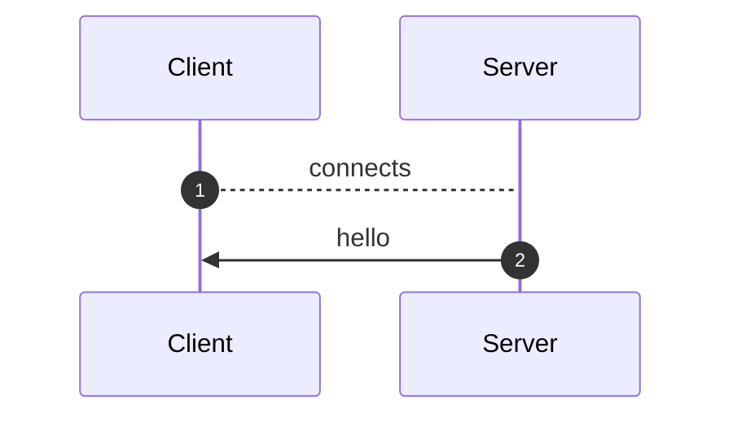
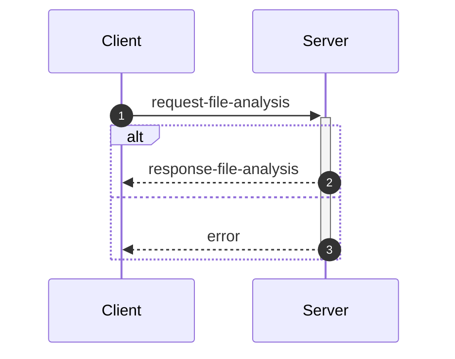
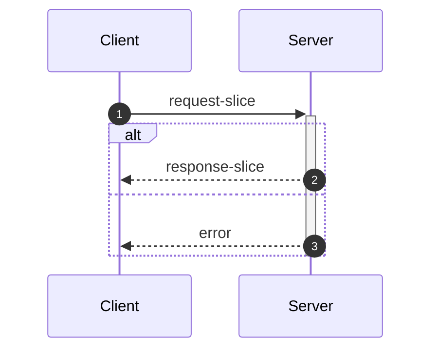
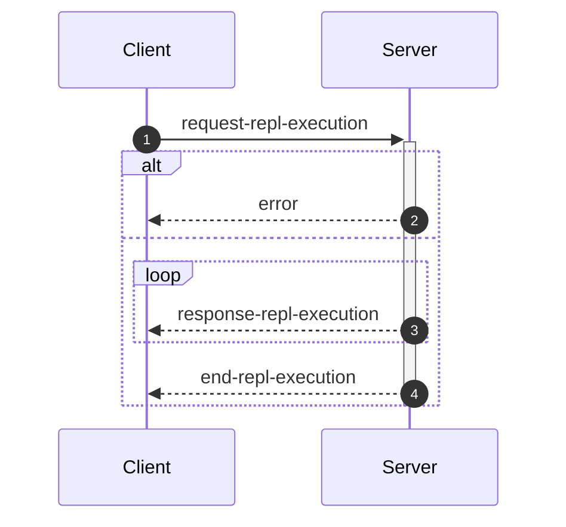

_This document was generated from '[src/documentation/wiki-interface.ts](https://github.com/flowr-analysis/flowr/tree/main//src/documentation/wiki-interface.ts)' on 2026-06-06, 09:59:56 UTC presenting an overview of flowR's interface (v2.10.7, using R v4.6.0). Please do not edit this file/wiki page directly._

Although far from being as detailed as the in-depth explanation of [_flowR_](https://github.com/flowr-analysis/flowr/wiki/core),
this wiki page explains how to interface with _flowR_ in more detail.
In general, command line arguments and other options provide short descriptions on hover over.

* [💻 Using the REPL](#using-the-repl)
* [⚙️ Configuring FlowR](#configuring-flowr)
* [⚒️ Writing Code](#writing-code)
* [💬 Communicating with the Server](#communicating-with-the-server)

<a id='using-the-repl'></a>
## 💻 Using the REPL


> [!NOTE]
> To execute arbitrary R commands with a repl request, _flowR_ has to be started explicitly with <span title="Description (Command Line Argument): Allow to access the underlying R session when using flowR (security warning: this allows the execution of arbitrary R code!)">`--r-session-access`</span>.
> Please be aware that this introduces a security risk and note that this relies on the [`r-shell` engine](https://github.com/flowr-analysis/flowr/wiki/engines) .

Although primarily meant for users to explore,
there is nothing which forbids simply calling _flowR_ as a subprocess to use standard-in, -output, and -error
for communication (although you can access the REPL using the server as well,
with the [REPL Request](#message-request-repl-execution) message).

The read-eval-print loop&nbsp;(REPL) works relatively simple.
You can submit an expression (using <kbd>Enter</kbd>),
which is interpreted as an R&nbsp;expression by default but interpreted as a *command* if it starts with a colon (`:`).
The best command to get started with the REPL is <span title="Description (Repl Command): Show help information (aliases: :h, :?)">`:help`</span>.
Besides, you can leave the REPL either with the command <span title="Description (Repl Command): End the repl (aliases: :q, :exit)">`:quit`</span> or by pressing <kbd>Ctrl</kbd>+<kbd>C</kbd> twice.
When writing a *command*, you may press <kbd>Tab</kbd> to get a list of completions, if available.
Multiple commands can be entered in a single line by separating them with a semicolon (`;`), e.g. `:parse "x<-2"; :df*`.
If a command is given without R code, the REPL will re-use R code given in a previous command.
The prior example will hence return first the parsed AST of the program and then the dataflow graph for `"x <- 2"`.

> [!NOTE]
> If you develop flowR, you may want to launch the repl using the `npm run main-dev` command, this way, you get a non-minified version of flowR with debug information and hot-reloading of source files.

<details>
<summary>Available Commands</summary>

We currently offer the following commands (this with a `[*]` suffix are available with and without the star):


| Command | Description |
| ------- | ----------- |
| **<span title="Description (Repl Command): End the repl (aliases: :q, :exit)">:quit</span>** | End the repl (aliases: **:<span title="Alias of ':quit'. End the repl">q</span>**, **:<span title="Alias of ':quit'. End the repl">exit</span>**) |
| **<span title="Description (Repl Command): Execute the given code as R code. This requires the `--r-session-access` flag to be set and requires the r-shell engine. (aliases: :e, :r)">:execute</span>** | Execute the given code as R code. This requires the `--r-session-access` flag to be set and requires the r-shell engine. (aliases: **:<span title="Alias of ':execute'. Execute the given code as R code. This requires the `--r-session-access` flag to be set and requires the r-shell engine.">e</span>**, **:<span title="Alias of ':execute'. Execute the given code as R code. This requires the `--r-session-access` flag to be set and requires the r-shell engine.">r</span>**) |
| **<span title="Description (Repl Command): Get mermaid code for the control-flow graph of R code, start with 'file://' to indicate a file (aliases: :cfg, :cf)">:controlflow[*]</span>** | Get mermaid code for the control-flow graph of R code, start with 'file://' to indicate a file (star: Returns the URL to mermaid.live) (aliases: **:<span title="Alias of ':controlflow'. Get mermaid code for the control-flow graph of R code, start with 'file://' to indicate a file">cfg</span>**, **:<span title="Alias of ':controlflow'. Get mermaid code for the control-flow graph of R code, start with 'file://' to indicate a file">cf</span>**) |
| **<span title="Description (Repl Command): Get mermaid code for the control-flow graph with basic blocks, start with 'file://' to indicate a file (aliases: :cfgb, :cfb)">:controlflowbb[*]</span>** | Get mermaid code for the control-flow graph with basic blocks, start with 'file://' to indicate a file (star: Returns the URL to mermaid.live) (aliases: **:<span title="Alias of ':controlflowbb'. Get mermaid code for the control-flow graph with basic blocks, start with 'file://' to indicate a file">cfgb</span>**, **:<span title="Alias of ':controlflowbb'. Get mermaid code for the control-flow graph with basic blocks, start with 'file://' to indicate a file">cfb</span>**) |
| **<span title="Description (Repl Command): Get mermaid code for the dataflow graph, start with 'file://' to indicate a file (aliases: :d, :df)">:dataflow[*]</span>** | Get mermaid code for the dataflow graph, start with 'file://' to indicate a file (star: Returns the URL to mermaid.live) (aliases: **:<span title="Alias of ':dataflow'. Get mermaid code for the dataflow graph, start with 'file://' to indicate a file">d</span>**, **:<span title="Alias of ':dataflow'. Get mermaid code for the dataflow graph, start with 'file://' to indicate a file">df</span>**) |
| **<span title="Description (Repl Command): Get mermaid code for the normalized AST of R code, start with 'file://' to indicate a file (aliases: :n)">:normalize[*]</span>** | Get mermaid code for the normalized AST of R code, start with 'file://' to indicate a file (star: Returns the URL to mermaid.live) (alias: **:<span title="Alias of ':normalize'. Get mermaid code for the normalized AST of R code, start with 'file://' to indicate a file">n</span>**) |
| **<span title="Description (Repl Command): Get mermaid code for the simplified dataflow graph, start with 'file://' to indicate a file (aliases: :ds, :dfs)">:dataflowsimple[*]</span>** | Get mermaid code for the simplified dataflow graph, start with 'file://' to indicate a file (star: Returns the URL to mermaid.live) (aliases: **:<span title="Alias of ':dataflowsimple'. Get mermaid code for the simplified dataflow graph, start with 'file://' to indicate a file">ds</span>**, **:<span title="Alias of ':dataflowsimple'. Get mermaid code for the simplified dataflow graph, start with 'file://' to indicate a file">dfs</span>**) |
| **<span title="Description (Repl Command): Just calculates the DFG, but only prints summary info (aliases: :d#, :df#)">:dataflowsilent</span>** | Just calculates the DFG, but only prints summary info (aliases: **:<span title="Alias of ':dataflowsilent'. Just calculates the DFG, but only prints summary info">d#</span>**, **:<span title="Alias of ':dataflowsilent'. Just calculates the DFG, but only prints summary info">df#</span>**) |
| **<span title="Description (Repl Command): Prints ASCII Art of the parsed, unmodified AST, start with 'file://' to indicate a file (aliases: :p)">:parse</span>** | Prints ASCII Art of the parsed, unmodified AST, start with 'file://' to indicate a file (alias: **:<span title="Alias of ':parse'. Prints ASCII Art of the parsed, unmodified AST, start with 'file://' to indicate a file">p</span>**) |
| **<span title="Description (Repl Command): Prints the version of flowR as well as the current version of R">:version</span>** | Prints the version of flowR as well as the current version of R
| **<span title="Description (Repl Command): Query the given R code, start with 'file://' to indicate a file. The query is to be a valid query in json format (use 'help' to get more information).">:query[*]</span>** | Query the given R code, start with 'file://' to indicate a file. The query is to be a valid query in json format (use 'help' to get more information). (star: Similar to query, but returns the output in json format.)
| **<span title="Description (Repl Command): Returns an ASCII representation of the dataflow graph (aliases: :df!)">:dataflowascii</span>** | Returns an ASCII representation of the dataflow graph (alias: **:<span title="Alias of ':dataflowascii'. Returns an ASCII representation of the dataflow graph">df!</span>**) |
| **<span title="Description (Repl Command): Returns summarization stats for the normalized AST (aliases: :n#)">:normalize#</span>** | Returns summarization stats for the normalized AST (alias: **:<span title="Alias of ':normalize#'. Returns summarization stats for the normalized AST">n#</span>**) |
| **<span title="Description (Repl Command): Show help information (aliases: :h, :?)">:help</span>** | Show help information (aliases: **:<span title="Alias of ':help'. Show help information">h</span>**, **:<span title="Alias of ':help'. Show help information">?</span>**) |


</details>


> [!TIP]
> 
> As indicated by the examples before, all REPL commands that operate on code keep track of the state.
> Hence, if you run a command like <span title="Description (Repl Command, starred version): Returns the URL to mermaid.live; Base Command: Get mermaid code for the dataflow graph, start with 'file://' to indicate a file (aliases: :d*, :df*)">`:dataflow*`</span> without providing R code,
> the REPL will re-use the R code provided in a previous command.
> Likewise, doing this will benefit from incrementality!
> If you request the dataflow graph with `:df* x <- 2 * y` and then want to see the parsed AST with `:parse`,
> the REPL will re-use previously obtained information and not re-parse the code again.
> 		


Generally, many commands offer shortcut versions in the REPL. Many queries, for example, offer a shortened format (see the example below).
Of special note, the [Config Query](https://github.com/flowr-analysis/flowr/wiki/query-api#Config-Query)
can be used to also modify the currently active configuration of _flowR_ within the REPL (see the [wiki page](https://github.com/flowr-analysis/flowr/wiki/query-api#Config-Query) for more information).

### Example: Retrieving the Dataflow Graph

To retrieve a URL to the [mermaid](https://mermaid.js.org/) diagram of the dataflow of a given expression,
use <span title="Description (Repl Command, starred version): Returns the URL to mermaid.live; Base Command: Get mermaid code for the dataflow graph, start with 'file://' to indicate a file (aliases: :d*, :df*)">`:dataflow*`</span> (or <span title="Description (Repl Command): Get mermaid code for the dataflow graph, start with 'file://' to indicate a file (aliases: :d, :df)">`:dataflow`</span> to get the mermaid code in the cli):


```shell
$ docker run -it --rm eagleoutice/flowr # or npm run flowr 
flowR repl using flowR v2.10.7, R grammar v14 (tree-sitter engine)
R> :dataflow* y <- 1 + x
```

<details>
<summary style='color:gray'>Output</summary>


```text
https://mermaid.live/view#base64:eyJjb2RlIjoiZmxvd2NoYXJ0IEJUXG4gICAgMXt7XCJgIzkxO1JOdW1iZXIjOTM7IDFcbiAgICAgICgxKVxuICAgICAgKjEuNipgXCJ9fVxuICAgJSUgTm8gZWRnZXMgZm91bmQgZm9yIDFcbiAgICAyKFtcImAjOTE7UlN5bWJvbCM5MzsgeFxuICAgICAgKDIpXG4gICAgICAqMS4xMCpgXCJdKVxuICAgJSUgTm8gZWRnZXMgZm91bmQgZm9yIDJcbiAgICAzW1tcImAjOTE7UkJpbmFyeU9wIzkzOyAjNDM7XG4gICAgICAoMylcbiAgICAgICoxLjYtMTAqXG4gICAgKDEsIDIpYFwiXV1cbiAgICBidWlsdC1pbjpfW1wiYEJ1aWx0LUluOlxuIzQzO2BcIl1cbiAgICBzdHlsZSBidWlsdC1pbjpfIHN0cm9rZTpncmF5LGZpbGw6Z3JheSxzdHJva2Utd2lkdGg6MnB4LG9wYWNpdHk6Ljg7XG4gICAgMFtcImAjOTE7UlN5bWJvbCM5MzsgeVxuICAgICAgKDAsIHNvdXJjZXM6IFszXSlcbiAgICAgICoxLjEqYFwiXVxuICAgIDRbW1wiYCM5MTtSQmluYXJ5T3AjOTM7ICM2MDsjNDU7XG4gICAgICAoNClcbiAgICAgICoxLjEtMTAqXG4gICAgKDAsIDMpYFwiXV1cbiAgICBidWlsdC1pbjpfLVtcImBCdWlsdC1JbjpcbiM2MDsjNDU7YFwiXVxuICAgIHN0eWxlIGJ1aWx0LWluOl8tIHN0cm9rZTpncmF5LGZpbGw6Z3JheSxzdHJva2Utd2lkdGg6MnB4LG9wYWNpdHk6Ljg7XG4gICAgMyAtLT58XCJyZWFkcywgYXJndW1lbnRcInwgMVxuICAgIDMgLS0+fFwicmVhZHMsIGFyZ3VtZW50XCJ8IDJcbiAgICAzIC0uLT58XCJyZWFkcywgY2FsbHNcInwgYnVpbHQtaW46X1xuICAgIGxpbmtTdHlsZSAyIHN0cm9rZTpncmF5O1xuICAgIDAgLS0+fFwiZGVmaW5lZC1ieVwifCAzXG4gICAgMCAtLT58XCJkZWZpbmVkLWJ5XCJ8IDRcbiAgICA0IC0tPnxcInJlYWRzLCBhcmd1bWVudFwifCAzXG4gICAgNCAtLT58XCJyZXR1cm5zLCBhcmd1bWVudFwifCAwXG4gICAgNCAtLi0+fFwicmVhZHMsIGNhbGxzXCJ8IGJ1aWx0LWluOl8tXG4gICAgbGlua1N0eWxlIDcgc3Ryb2tlOmdyYXk7IiwibWVybWFpZCI6eyJhdXRvU3luYyI6dHJ1ZX19
Copied mermaid url to clipboard (dataflow: 0ms).
```


Retrieve the dataflow graph of the expression `y <- 1 + x`. It looks like this:


```mermaid
flowchart LR
    1{{"`#91;RNumber#93; 1
      (1)
      *1.6*`"}}
   %% No edges found for 1
    2(["`#91;RSymbol#93; x
      (2)
      *1.10*`"])
   %% No edges found for 2
    3[["`#91;RBinaryOp#93; #43;
      (3)
      *1.6-10*
    (1, 2)`"]]
    built-in:_["`Built-In:
#43;`"]
    style built-in:_ stroke:gray,fill:gray,stroke-width:2px,opacity:.8;
    0["`#91;RSymbol#93; y
      (0, sources: [3])
      *1.1*`"]
    4[["`#91;RBinaryOp#93; #60;#45;
      (4)
      *1.1-10*
    (0, 3)`"]]
    built-in:_-["`Built-In:
#60;#45;`"]
    style built-in:_- stroke:gray,fill:gray,stroke-width:2px,opacity:.8;
    3 -->|"reads, argument"| 1
    3 -->|"reads, argument"| 2
    3 -.->|"reads, calls"| built-in:_
    linkStyle 2 stroke:gray;
    0 -->|"defined-by"| 3
    0 -->|"defined-by"| 4
    4 -->|"reads, argument"| 3
    4 -->|"returns, argument"| 0
    4 -.->|"reads, calls"| built-in:_-
    linkStyle 7 stroke:gray;
```

	
<details>

<summary style="color:gray">R Code of the Dataflow Graph</summary>

The analysis required _1.3 ms_ (including parse and normalize, using the [tree-sitter](https://github.com/flowr-analysis/flowr/wiki/Engines) engine) within the generation environment. 
We encountered no unknown side effects during the analysis.


```r
y <- 1 + x
```


</details>


</details>


For small graphs like this, <span title="Description (Repl Command): Returns an ASCII representation of the dataflow graph (aliases: :df!)">`:dataflowascii`</span> also provides an ASCII representation directly in the REPL:


```shell
$ docker run -it --rm eagleoutice/flowr # or npm run flowr 
flowR repl using flowR v2.10.7, R grammar v14 (tree-sitter engine)
R> :df! y <- 1 + x
```

<details open>
<summary style='color:gray'>Output</summary>


```text
                        0<1>0
                   ┌────| 1 |
    ┌────────┐     │    0---0
 c<4>c       └──c<3>c
 |<- |  v<0>v┌──| + |
 c---c──| y |┘  c---c   u<2>u
        v---v      └────| x |
                        u---u
Edges:
3 -> 1: reads, argument  3 -> 2: reads, argument
4 -> 3: reads, argument  4 -> 0: returns, argument
0 -> 3: defined-by       0 -> 4: defined-by
```


Retrieve the dataflow graph of the expression `y <- 1 + x` as ASCII art.

</details>


For the slicing with <span title="Description (Repl Command): Static backwards executable slicer for R">`:slicer`</span>, you have access to the same [magic comments](#slice-magic-comments) as with the [slice request](#message-request-slice).

### Example: Interfacing with the File System

Many commands that allow for an R-expression (like <span title="Description (Repl Command, starred version): Returns the URL to mermaid.live; Base Command: Get mermaid code for the dataflow graph, start with 'file://' to indicate a file (aliases: :d*, :df*)">`:dataflow*`</span>) allow for a file as well
if the argument starts with `file://`.
If you are working from the root directory of the _flowR_ repository, the following gives you the parsed AST of the example file using the <span title="Description (Repl Command): Prints ASCII Art of the parsed, unmodified AST, start with 'file://' to indicate a file (aliases: :p)">`:parse`</span> command:


```shell
$ docker run -it --rm eagleoutice/flowr # or npm run flowr 
flowR repl using flowR v2.10.7, R grammar v14 (tree-sitter engine)
R> :parse file://test/testfiles/example.R
```

<details>
<summary style='color:gray'>Output</summary>


```text
File: test/testfiles/example.R

program
├ binaryoperator
│ ├ identifier "sum" (1:1─4)
│ ├ <- "<-" (1:5─7)
│ ╰ float "0" (1:8─9)
├ binaryoperator
│ ├ identifier "product" (2:1─8)
│ ├ <- "<-" (2:9─11)
│ ╰ float "1" (2:12─13)
├ binaryoperator
│ ├ identifier "w" (3:1─2)
│ ├ <- "<-" (3:3─5)
│ ╰ float "7" (3:6─7)
├ binaryoperator
│ ├ identifier "N" (4:1─2)
│ ├ <- "<-" (4:3─5)
│ ╰ float "10" (4:6─8)
├ forstatement
│ ├ for "for" (6:1─4)
│ ├ ( "(" (6:5─6)
│ ├ identifier "i" (6:6─7)
│ ├ in "in" (6:8─10)
│ ├ binaryoperator
│ │ ├ float "1" (6:11─12)
│ │ ├ : ":" (6:12─13)
│ │ ╰ parenthesizedexpression
│ │   ├ ( "(" (6:13─14)
│ │   ├ binaryoperator
│ │   │ ├ identifier "N" (6:14─15)
│ │   │ ├ - "-" (6:15─16)
│ │   │ ╰ float "1" (6:16─17)
│ │   ╰ ) ")" (6:17─18)
│ ├ ) ")" (6:18─19)
│ ╰ bracedexpression
│   ├ { "{" (6:20─21)
│   ├ binaryoperator
│   │ ├ identifier "sum" (7:3─6)
│   │ ├ <- "<-" (7:7─9)
│   │ ╰ binaryoperator
│   │   ├ binaryoperator
│   │   │ ├ identifier "sum" (7:10─13)
│   │   │ ├ + "+" (7:14─15)
│   │   │ ╰ identifier "i" (7:16─17)
│   │   ├ + "+" (7:18─19)
│   │   ╰ identifier "w" (7:20─21)
│   ├ binaryoperator
│   │ ├ identifier "product" (8:3─10)
│   │ ├ <- "<-" (8:11─13)
│   │ ╰ binaryoperator
│   │   ├ identifier "product" (8:14─21)
│   │   ├  "" (8:22─23)
│   │   ╰ identifier "i" (8:24─25)
│   ╰ } "}" (9:1─2)
├ call
│ ├ identifier "cat" (11:1─4)
│ ╰ arguments
│   ├ ( "(" (11:4─5)
│   ├ argument
│   │ ╰ string
│   │   ├ " "\"" (11:5─6)
│   │   ├ stringcontent "Sum:" (11:6─10)
│   │   ╰ " "\"" (11:10─11)
│   ├ comma "," (11:11─12)
│   ├ argument
│   │ ╰ identifier "sum" (11:13─16)
│   ├ comma "," (11:16─17)
│   ├ argument
│   │ ╰ string
│   │   ├ " "\"" (11:18─19)
│   │   ├ stringcontent
│   │   │ ╰ escapesequence "\\n" (11:19─21)
│   │   ╰ " "\"" (11:21─22)
│   ╰ ) ")" (11:22─23)
╰ call
  ├ identifier "cat" (12:1─4)
  ╰ arguments
    ├ ( "(" (12:4─5)
    ├ argument
    │ ╰ string
    │   ├ " "\"" (12:5─6)
    │   ├ stringcontent "Product:" (12:6─14)
    │   ╰ " "\"" (12:14─15)
    ├ comma "," (12:15─16)
    ├ argument
    │ ╰ identifier "product" (12:17─24)
    ├ comma "," (12:24─25)
    ├ argument
    │ ╰ string
    │   ├ " "\"" (12:26─27)
    │   ├ stringcontent
    │   │ ╰ escapesequence "\\n" (12:27─29)
    │   ╰ " "\"" (12:29─30)
    ╰ ) ")" (12:30─31)
```


Retrieve the parsed AST of the example file.

<details>

<summary>File Content</summary>


```r
sum <- 0
product <- 1
w <- 7
N <- 10

for (i in 1:(N-1)) {
  sum <- sum + i + w
  product <- product * i
}

cat("Sum:", sum, "\n")
cat("Product:", product, "\n")
```


</details>

As _flowR_ directly transforms this AST the output focuses on being human-readable instead of being machine-readable.
		

</details>


### Example: Run a Query

You can run any query supported by _flowR_ using the <span title="Description (Repl Command): Query the given R code, start with 'file://' to indicate a file. The query is to be a valid query in json format (use 'help' to get more information).">`:query`</span> command.
For example, to obtain the shapes of all data frames in a given piece of code, you can run:


```shell
$ docker run -it --rm eagleoutice/flowr # or npm run flowr 
flowR repl using flowR v2.10.7, R grammar v14 (tree-sitter engine)
R> :query @df-shape "x <- data.frame(a = 1:10, b = 1:10)\ny <- x$a"
```

<details open>
<summary style='color:gray'>Output</summary>


```text
Query: df-shape (5 ms)
   ╰ 12: (colnames: [{"a", "b"}, {}], cols: [2, 2], rows: [10, 10])
   ╰ 0: (colnames: [{"a", "b"}, {}], cols: [2, 2], rows: [10, 10])
All queries together required ≈12 ms (1ms accuracy, total 15 ms)
```


Retrieve the shapes of all data frames in the given code.

</details>


To run the linter on a file, you can use (in this example, we just issue the `dead-code` linter on a small piece of code):


```shell
$ docker run -it --rm eagleoutice/flowr # or npm run flowr 
flowR repl using flowR v2.10.7, R grammar v14 (tree-sitter engine)
R> :query @linter rules:dead-code "if(FALSE) x <- 2"
```

<details open>
<summary style='color:gray'>Output</summary>


```text
Query: linter (3 ms)
   ╰ Dead Code (dead-code):
       ╰ certain:
           ╰ Code at 1.11-16
       ╰ Metadata: consideredNodes: 7, searchTimeMs: 3, processTimeMs: 0
All queries together required ≈3 ms (1ms accuracy, total 4 ms)
```


Run the linter on the given code, with only the `dead-code` rule enabled.

</details>


For more information on the available queries, please check out the [Query API](https://github.com/flowr-analysis/flowr/wiki/query-api).


<a id='configuring-flowr'></a>
## ⚙️ Configuring FlowR


When running _flowR_, you may want to specify some behaviors with a dedicated configuration file.
By default, flowR looks for a file named `flowr.json` in the current working directory (or any higher directory).
You can also specify a different file with <span title="Description (Command Line Argument): The name of the configuration file to use">`--config-file`</span> or pass the configuration inline using <span title="Description (Command Line Argument): The flowR configuration to use, as a JSON string">`--config-json`</span>.
To inspect the current configuration, you can run flowr with the <span title="Description (Command Line Argument): Run with verbose logging (will be passed to the corresponding script)">`--verbose`</span> flag, or use the `config` [Query](https://github.com/flowr-analysis/flowr/wiki/Query%20API).
Within the REPL this works by running the following:


```shell
:query @config
```


To work with the <a href="https://github.com/flowr-analysis/flowr/tree/main/src/config.ts#L108"><code><span title="The configuration file format for flowR.">FlowrConfig</span></code></a> you can use the provided helper objects alongside its methods like
<a href="https://github.com/flowr-analysis/flowr/tree/main/src/config.ts#L428"><code><span title="Creates a new flowr config that has the updated values.">FlowrConfig::<b>amend</b></span></code></a>.
The following summarizes the configuration options:

- `ignoreSourceCalls`: If set to `true`, _flowR_ will ignore source calls when analyzing the code, i.e., ignoring the inclusion of other files.
- `semantics`: allows to configure the way _flowR_ handles R, although we currently only support `semantics/environment/overwriteBuiltIns`.
  You may use this to overwrite _flowR_'s handling of built-in function and even completely clear the preset definitions shipped with flowR.
  See [Configure BuiltIn Semantics](#configure-builtin-semantics) for more information.
- `solver`: allows to configure how _flowR_ resolves variables and their values (currently we support: `disabled`, `alias`, `builtin`), as well as if pointer analysis should be active.
- `engines`: allows to configure the engines used by _flowR_ to interact with R code. See the [Engines wiki page](https://github.com/flowr-analysis/flowr/wiki/Engines) for more information.
- `defaultEngine`: allows to specify the default engine to use for interacting with R code. If not set, an arbitrary engine from the specified list will be used.
- `abstractInterpretation`: allows to configure how _flowR_ performs abstract interpretation, although we currently only support data frame shape inference through abstract interpretation.
- `defaultPlugins`: allows to configure which plugins to load by default when creating a new <a href="https://github.com/flowr-analysis/flowr/tree/main/src/project/flowr-analyzer.ts#L162"><code><span title="Central class for conducting analyses with FlowR. Use the FlowrAnalyzerBuilder to create a new instance. If you want the original pattern of creating a pipeline and running all steps, you can still do this with FlowrAnalyzer#runFull . To inspect the context of the analyzer, use FlowrAnalyzer#inspectContext (if you are a plugin and need to modify it, use FlowrAnalyzer#context instead).">FlowrAnalyzer</span></code></a> instance.
- `repl.plugins`: allows to configure which plugins to load in the _flowR_ REPL. Use `flowr:default` to reference the plugins specified by `defaultPlugins`.

So you can configure _flowR_ by adding a file like the following:

<details>

<summary>Example Configuration File</summary>


```json
{
  "ignoreSourceCalls": true,
  "semantics": {
    "environment": {
      "overwriteBuiltIns": {
        "definitions": [
          {
            "type": "function",
            "names": [
              "foo"
            ],
            "processor": "builtin:assign",
            "config": {}
          }
        ]
      }
    }
  },
  "defaultPlugins": [
    "file:description",
    "versions:description"
  ],
  "repl": {
    "quickStats": false,
    "dfProcessorHeat": false,
    "plugins": [
      "flowr:default"
    ]
  },
  "project": {
    "resolveUnknownPathsOnDisk": true
  },
  "engines": [
    {
      "type": "r-shell"
    }
  ],
  "solver": {
    "variables": "alias",
    "evalStrings": true,
    "trackEnvironments": true,
    "resolveSource": {
      "dropPaths": "no",
      "ignoreCapitalization": true,
      "inferWorkingDirectory": "active-script",
      "searchPath": []
    },
    "instrument": {},
    "slicer": {
      "threshold": 50
    }
  },
  "abstractInterpretation": {
    "wideningThreshold": 4,
    "dataFrame": {
      "maxColNames": 20,
      "readLoadedData": {
        "readExternalFiles": true,
        "maxReadLines": 1000000
      }
    }
  }
}
```


</details>

<details>
<a id='configure-builtin-semantics'></a>
<summary>Configure Built-In Semantics</summary>


`semantics/environment/overwriteBuiltins` accepts two keys:

- `loadDefaults` (boolean, initially `true`): If set to `true`, the default built-in definitions are loaded before applying the custom definitions. Setting this flag to `false` explicitly disables the loading of the default definitions.
- `definitions` (array, initially empty): Allows to overwrite or define new built-in elements. Each object within must have a `type` which is one of the below. Furthermore, they may define a string array of `names` which specifies the identifiers to bind the definitions to. You may use `assumePrimitive` to specify whether _flowR_ should assume that this is a primitive non-library definition (so you probably just do not want to specify the key).

  | Type            | Description                                                                                                                                                                                                                                                                                              | Example                                                                                                    |
  | --------------- | -------------------------------------------------------------------------------------------------------------------------------------------------------------------------------------------------------------------------------------------------------------------------------------------------------- | ---------------------------------------------------------------------------------------------------------- |
  | `constant`    | Additionally allows for a `value` this should resolve to.                                                                                                                                                                                                                                                | `{ type: 'constant', names: ['NULL', 'NA'],  value: null }`                                                |
  | `function`    | Is a rather flexible way to define and bind built-in functions. For the time, we do not have extensive documentation to cover all the cases, so please either consult the sources with the `default-builtin-config.ts` or open a [new issue](https://github.com/flowr-analysis/flowr/issues/new/choose). | `{ type: 'function', names: ['next'], processor: 'builtin:d', config: { cfg: ExitPointType.Next } }` |
  | `replacement` | A comfortable way to specify replacement functions like `$<-` or `names<-`. `suffixes` describes the... suffixes to attach automatically. | `{ type: 'replacement', suffixes: ['<-', '<<-'], names: ['[', '[['] }` |


</details>

<details>

<summary style='color:gray'>Full Configuration-File Schema</summary>

- _The configuration file format for flowR._ (object)
    - **ignoreSourceCalls** [optional] _Whether source calls should be ignored, causing {@link processSourceCall}'s behavior to be skipped._ (boolean)
    - **semantics** _Configure language semantics and how flowR handles them._ (object)
        - **environment** [optional] _Semantics regarding how to handle the R environment._ (object)
            - **overwriteBuiltIns** [optional] _Do you want to overwrite (parts) of the builtin definition?_ (object)
                - **loadDefaults** [optional] _Should the default configuration still be loaded?_ (boolean)
                - **definitions** [optional] _The definitions to load/overwrite._ (array)
                Valid item types:
                    - (object)
    - **defaultPlugins** [optional] _The default plugins to load when creating a new instance of FlowrAnalyzer_ (array)
    Valid item types:
        - (alternatives)
            - (string)
            - (array)
    - **repl** _Configuration options for the REPL._ (object)
        - **quickStats** [optional] _Whether to show quick stats in the REPL after each evaluation._ (boolean)
        - **dfProcessorHeat** [optional] _This instruments the dataflow processors to count how often each processor is called._ (boolean)
        - **plugins** [optional] _The plugins to load in REPL mode_ (array)
        Valid item types:
            - (alternatives)
                - (string)
                - (array)
    - **project** _Project specific configuration options._ (object)
        - **resolveUnknownPathsOnDisk** [optional] _Whether to resolve unknown paths loaded by the r project disk when trying to source/analyze files._ (boolean)
    - **engines** _The engine or set of engines to use for interacting with R code. An empty array means all available engines will be used._ (array)
    Valid item types:
        - (alternatives)
            - _The configuration for the tree sitter engine._ (object)
                - **type** [required] _Use the tree sitter engine._ (string)
                    Only allows: 'tree-sitter'
                - **wasmPath** [optional] _The path to the tree-sitter-r WASM binary to use. If this is undefined, this uses the default path._ (string)
                - **treeSitterWasmPath** [optional] _The path to the tree-sitter WASM binary to use. If this is undefined, this uses the default path._ (string)
                - **lax** [optional] _Whether to use the lax parser for parsing R code (allowing for syntax errors). If this is undefined, the strict parser will be used._ (boolean)
            - _The configuration for the R shell engine._ (object)
                - **type** [required] _Use the R shell engine._ (string)
                    Only allows: 'r-shell'
                - **rPath** [optional] _The path to the R executable to use. If this is undefined, this uses the default path._ (string)
    - **defaultEngine** [optional] _The default engine to use for interacting with R code. If this is undefined, an arbitrary engine from the specified list will be used._ (string)
        Only allows: 'tree-sitter', 'r-shell'
    - **solver** _How to resolve constants, constraints, cells, ..._ (object)
        - **variables** _How to resolve variables and their values._ (string)
            Only allows: 'disabled', 'alias', 'builtin'
        - **evalStrings** _Should we include eval(parse(text="...")) calls in the dataflow graph?_ (boolean)
        - **trackEnvironments** [optional] _Track user-created environments (new.env, assign/get/local with envir=, dollar-assign, attach). When false, all envir-style calls fall through conservatively._ (boolean)
        - **instrument** (object)
            - **dataflowExtractors** [optional] _These keys are only intended for use within code, allowing to instrument the dataflow analyzer!_ (any)
        - **resolveSource** [optional] _If lax source calls are active, flowR searches for sourced files much more freely, based on the configurations you give it. This option is only in effect if `ignoreSourceCalls` is set to false._ (object)
            - **dropPaths** _Allow to drop the first or all parts of the sourced path, if it is relative._ (string)
                Only allows: 'no', 'once', 'all'
            - **ignoreCapitalization** _Search for filenames matching in the lowercase._ (boolean)
            - **inferWorkingDirectory** _Try to infer the working directory from the main or any script to analyze._ (string)
                Only allows: 'no', 'main-script', 'active-script', 'any-script'
            - **searchPath** _Additionally search in these paths._ (array)
            Valid item types:
                - (string)
            - **repeatedSourceLimit** [optional] _How often the same file can be sourced within a single run? Please be aware: in case of cyclic sources this may not reach a fixpoint so give this a sensible limit._ (number)
            - **applyReplacements** _Provide name replacements for loaded files_ (array)
            Valid item types:
                - (object)
        - **slicer** [optional] _The configuration for the slicer._ (object)
            - **threshold** [optional] _The maximum number of iterations to perform on a single function call during slicing._ (number)
            - **autoExtend** [optional] _If set, the slicer will gain an additional post-pass._ (boolean)
    - **abstractInterpretation** _The configuration options for abstract interpretation._ (object)
        - **wideningThreshold** _The threshold for the number of visitations of a node at which widening should be performed to ensure the termination of the fixpoint iteration._ (number)
        - **dataFrame** _The configuration of the shape inference for data frames._ (object)
            - **maxColNames** _The maximum number of columns names to infer for data frames before over-approximating the column names to top._ (number)
            - **readLoadedData** _Configuration options for reading data frame shapes from loaded external data files, such as CSV files._ (object)
                - **readExternalFiles** _Whether data frame shapes should be extracted from loaded external files, such as CSV files._ (boolean)
                - **maxReadLines** _The maximum number of lines to read when extracting data frame shapes from loaded files, such as CSV files._ (number)

</details>

	

<a id='writing-code'></a>
## ⚒️ Writing Code

_flowR_ can be used as a [module](https://www.npmjs.com/package/@eagleoutice/flowr) and offers several main classes and interfaces that are interesting for extension writers 
(see the [Visual Studio Code extension](https://marketplace.visualstudio.com/items?itemName=code-inspect.vscode-flowr) or the [Core](https://github.com/flowr-analysis/flowr/wiki/core) wiki page for more information).

### Creating Analyses with _flowR_

Nowadays, instances of the <a href="https://github.com/flowr-analysis/flowr/tree/main/src/project/flowr-analyzer.ts#L162"><code><span title="Central class for conducting analyses with FlowR. Use the FlowrAnalyzerBuilder to create a new instance. If you want the original pattern of creating a pipeline and running all steps, you can still do this with FlowrAnalyzer#runFull . To inspect the context of the analyzer, use FlowrAnalyzer#inspectContext (if you are a plugin and need to modify it, use FlowrAnalyzer#context instead).">FlowrAnalyzer</span></code></a> should be used as central frontend to get analysis results from _flowR_.
For example, a program slice can be created like this:


```ts
const analyzer = await new FlowrAnalyzerBuilder()
    .setEngine('tree-sitter')
    .build();
analyzer.addRequest('x <- 1\ny <- x\nx');
const result = await analyzer.query([
    {
        type:     'static-slice',
        criteria: ['3@x']
    }
]);
//console.log(result['static-slice']);
```


For more information, please have a look at the [Analyzer](https://github.com/flowr-analysis/flowr/wiki/analyzer) wiki page, which explains how to construct and use the <a href="https://github.com/flowr-analysis/flowr/tree/main/src/project/flowr-analyzer.ts#L162"><code><span title="Central class for conducting analyses with FlowR. Use the FlowrAnalyzerBuilder to create a new instance. If you want the original pattern of creating a pipeline and running all steps, you can still do this with FlowrAnalyzer#runFull . To inspect the context of the analyzer, use FlowrAnalyzer#inspectContext (if you are a plugin and need to modify it, use FlowrAnalyzer#context instead).">FlowrAnalyzer</span></code></a> in more detail.
To work with specific perspectives, you can also consult the respective pages like the [Dataflow Graph](https://github.com/flowr-analysis/flowr/wiki/dataflow-graph) or the [Abstract Interpretation](https://github.com/flowr-analysis/flowr/wiki/abstract-interpretation) wiki pages.
        
### The Pipeline Executor (Low-Level Interface)

Once, in the beginning, _flowR_ was meant to produce a dataflow graph merely to provide *program slices*. 
However, with continuous updates, the [Dataflow Graph](https://github.com/flowr-analysis/flowr/wiki/dataflow-graph) repeatedly proves to be the more interesting part.
With this, we restructured _flowR_'s originally *hardcoded* pipeline to be far more flexible. 
Now, it can be theoretically extended or replaced with arbitrary steps, optional steps, and what we call 'decorations' of these steps. 
In short, a slicing pipeline using the <a href="https://github.com/flowr-analysis/flowr/tree/main/src/core/pipeline-executor.ts#L97"><code><span title="**Please note:** The PipelineExecutor is now considered to be a rather low-level API for flowR. While it still works and is the basis for all other layers, we strongly recommend using the FlowrAnalyzer and its builder to create and use an analyzer instance that is pre-configured for your use-case. The pipeline executor allows to execute arbitrary pipelines in a step-by-step fashion. If you are not...">PipelineExecutor</span></code></a> looks like this:


```ts

const slicer = new PipelineExecutor(DEFAULT_SLICING_PIPELINE, {
  parser:    new RShell(),
  request:   requestFromInput('x <- 1\nx + 1'),
  criterion: ['2@x']
})
const slice = await slicer.allRemainingSteps()
// console.log(slice.reconstruct.code)
```


<details><summary>More Information</summary>


If you compare this, with what you would have done with the old (and removed) `SteppingSlicer`, 
this essentially just requires you to replace the `SteppingSlicer` with the <a href="https://github.com/flowr-analysis/flowr/tree/main/src/core/pipeline-executor.ts#L97"><code><span title="**Please note:** The PipelineExecutor is now considered to be a rather low-level API for flowR. While it still works and is the basis for all other layers, we strongly recommend using the FlowrAnalyzer and its builder to create and use an analyzer instance that is pre-configured for your use-case. The pipeline executor allows to execute arbitrary pipelines in a step-by-step fashion. If you are not...">PipelineExecutor</span></code></a>
and to pass the <a href="https://github.com/flowr-analysis/flowr/tree/main/src/core/steps/pipeline/default-pipelines.ts#L18"><code>DEFAULT_SLICING_PIPELINE</code></a> as the first argument.
The <a href="https://github.com/flowr-analysis/flowr/tree/main/src/core/pipeline-executor.ts#L97"><code><span title="**Please note:** The PipelineExecutor is now considered to be a rather low-level API for flowR. While it still works and is the basis for all other layers, we strongly recommend using the FlowrAnalyzer and its builder to create and use an analyzer instance that is pre-configured for your use-case. The pipeline executor allows to execute arbitrary pipelines in a step-by-step fashion. If you are not...">PipelineExecutor</span></code></a>...

1. Provides structures to investigate the results of all intermediate steps
2. Can be executed step-by-step
3. Can repeat steps (e.g., to calculate multiple slices on the same input)

See the in-code documentation for more information.

	

</details>
    

### Using the <a href="https://github.com/flowr-analysis/flowr/tree/main/src/r-bridge/shell.ts#L143"><code><span title="The RShell represents an interactive session with the R interpreter. You can configure it by RShellOptions . At the moment we are using a live R session (and not networking etc.) to communicate with R easily, which allows us to install packages etc. However, this might and probably will change in the future (leaving this as a legacy mode :D)">RShell</span></code></a> to Interact with R

The <a href="https://github.com/flowr-analysis/flowr/tree/main/src/r-bridge/shell.ts#L143"><code><span title="The RShell represents an interactive session with the R interpreter. You can configure it by RShellOptions . At the moment we are using a live R session (and not networking etc.) to communicate with R easily, which allows us to install packages etc. However, this might and probably will change in the future (leaving this as a legacy mode :D)">RShell</span></code></a> class allows interfacing with the `R`&nbsp;ecosystem installed on the host system.
Please have a look at [flowR's Engines](https://github.com/flowr-analysis/flowr/wiki/engines) for more information on alternatives (for example, the <a href="https://github.com/flowr-analysis/flowr/tree/main/src/r-bridge/lang-4.x/tree-sitter/tree-sitter-executor.ts#L18"><code><span title="Synchronous and (way) faster alternative to the RShell using tree-sitter.">TreeSitterExecutor</span></code></a>).


> [!IMPORTANT]
> 
> Each <a href="https://github.com/flowr-analysis/flowr/tree/main/src/r-bridge/shell.ts#L143"><code><span title="The RShell represents an interactive session with the R interpreter. You can configure it by RShellOptions . At the moment we are using a live R session (and not networking etc.) to communicate with R easily, which allows us to install packages etc. However, this might and probably will change in the future (leaving this as a legacy mode :D)">RShell</span></code></a> controls a new instance of the R&nbsp;interpreter, 
> make sure to call <code><a href="https://github.com/flowr-analysis/flowr/tree/main/src/r-bridge/shell.ts#L317"><span title="Close the current R session, makes the object effectively invalid (can no longer be reopened etc.)">RShell::<i>close</i></span></a>()</code> when you are done.


You can start a new "session" simply by constructing a new object with <code>new <a href="https://github.com/flowr-analysis/flowr/tree/main/src/r-bridge/shell.ts#L143"><span title="The RShell represents an interactive session with the R interpreter. You can configure it by RShellOptions . At the moment we are using a live R session (and not networking etc.) to communicate with R easily, which allows us to install packages etc. However, this might and probably will change in the future (leaving this as a legacy mode :D)">RShell</span></a>()</code>.

However, there are several options that may be of interest 
(e.g., to automatically revive the shell in case of errors or to control the name location of the R process on the system).

With a shell object (let's call it `shell`), you can execute R code by using <a href="https://github.com/flowr-analysis/flowr/tree/main/src/r-bridge/shell.ts#L195"><code><span title="sends the given command directly to the current R session will not do anything to alter input markers!">RShell::<i>sendCommand</i></span></code></a>, 
for example <code>shell.<a href="https://github.com/flowr-analysis/flowr/tree/main/src/r-bridge/shell.ts#L195"><span title="sends the given command directly to the current R session will not do anything to alter input markers!">sendCommand</span></a>("1 + 1")</code>. 
However, this does not return anything, so if you want to collect the output of your command, use
<a href="https://github.com/flowr-analysis/flowr/tree/main/src/r-bridge/shell.ts#L261"><code><span title="Send a command and collect the output">RShell::<i>sendCommandWithOutput</i></span></code></a> instead.

Besides that, the command <a href="https://github.com/flowr-analysis/flowr/tree/main/src/r-bridge/shell.ts#L233"><code>RShell::<b>tryToInjectHomeLibPath</b></code></a> may be of interest, as it enables all libraries available on the host system.


### Generate Statistics (No longer a Focus of flowR)


<details>

<summary>Adding a New Feature to Extract</summary>

In this example, we construct a new feature to extract, with the name "*example*".
Whenever this name appears, you may substitute this with whatever name fits your feature best (as long as the name is unique).

1. **Create a new file in `src/statistics/features/supported`**\
   Create the file `example.ts`, and add its export to the `index.ts` file in the same directory (if not done automatically).

2. **Create the basic structure**\
   To get a better feel of what a feature must have, let's look
   at the basic structure (of course, due to TypeScript syntax,
   there are other ways to achieve the same goal):

   ```ts
   const initialExampleInfo = {
       /* whatever start value is good for you */
       someCounter: 0
   }

   export type ExampleInfo = Writable<typeof initialExampleInfo>

   export const example: Feature<ExampleInfo> = {
    name:        'Example Feature',
    description: 'A longer example description',

    process(existing: ExampleInfo, input: FeatureProcessorInput): ExampleInfo {
      /* perform analysis on the input */
      return existing
    },

    initialValue: initialExampleInfo
   }
   ```

   The `initialExampleInfo` type holds the initial values for each counter that you want to maintain during the feature extraction (they will usually be initialized with 0). The resulting `ExampleInfo` type holds the structure of the data that is to be counted. Due to the vast amount of data processed, information like the name and location of a function call is not stored here, but instead written to disk (see below).

   Every new feature must be of the `Feature<Info>` type, with `Info` referring to a `FeatureInfo` (like `ExampleInfo` in this example). Next to a `name` and a `description`, each Feature must provide:

   - a processor that extracts the information from the input, adding it to the existing information.
   - a function returning the initial value of the information (in this case, `initialExampleInfo`).

3. **Add it to the feature-mapping**\
   Now, in the `feature.ts` file in `src/statistics/features`, add your feature to the `ALL_FEATURES` object.

Now, we want to extract something. For the *example* feature created in the previous steps, we choose to count the amount of `COMMENT` tokens.
So we define a corresponding [XPath](https://developer.mozilla.org/en-US/docs/Web/XPath) query:

```ts
const commentQuery: Query = xpath.parse('//COMMENT')
```

Within our feature's `process` function, running the query is as simple as:

```ts
const comments = commentQuery.select({ node: input.parsedRAst })
```

Now we could do a lot of further processing, but for simplicity, we only record every comment found this way:

```ts
appendStatisticsFile(example.name, 'comments', comments, input.filepath)
```

We use `example.name` to avoid duplication with the name that we’ve assigned to the feature. It corresponds to the name of the folder in the statistics output.
`'comments'` refers to a freely chosen (but unique) name, that will be used as the name for the output file within the folder. The `comments` variable holds the result of the query, which is an array of nodes. Finally, we pass the `filepath` of the file that was analyzed (if known), so that it can be added to the statistics file (as additional information).

</details>
	

<a id='communicating-with-the-server'></a>
## 💬 Communicating with the Server


As explained in the [Overview](https://github.com/flowr-analysis/flowr/wiki/Overview), you can simply run the [TCP](https://de.wikipedia.org/wiki/Transmission_Control_Protocol)&nbsp;server by adding the <span title="Description (Command Line Argument): Do not drop into a repl, but instead start a server on the given port (default: 1042) and listen for messages.">`--server`</span> flag (and, due to the interactive mode, exit with the conventional <kbd>CTRL</kbd>+<kbd>C</kbd>).
Currently, every connection is handled by the same underlying `RShell` - so the server is not designed to handle many clients at a time.
Additionally, the server is not well guarded against attacks (e.g., you can theoretically spawn an arbitrary number of&nbsp;RShell sessions on the target machine).

Every message has to be given in a single line (i.e., without a newline in-between) and end with a newline character. Nevertheless, we will pretty-print example given in the following segments for the ease of reading.


> [!NOTE]
> 
> The default <span title="Description (Command Line Argument): Do not drop into a repl, but instead start a server on the given port (default: 1042) and listen for messages.">`--server`</span> uses a simple [TCP](https://de.wikipedia.org/wiki/Transmission_Control_Protocol)
> connection. If you want _flowR_ to expose a [WebSocket](https://de.wikipedia.org/wiki/WebSocket) server instead, add the <span title="Description (Command Line Argument): If the server flag is set, use websocket for messaging">`--ws`</span> flag (i.e., <span title="Description (Command Line Argument): Do not drop into a repl, but instead start a server on the given port (default: 1042) and listen for messages.">`--server`</span> <span title="Description (Command Line Argument): If the server flag is set, use websocket for messaging">`--ws`</span>) when starting _flowR_ from the command line.
> 			


<ul><li>
<a id="message-hello"></a>
<b>Hello</b> Message (<code>hello</code>) 
<details>

<summary style="color:gray"> View Details. <i>The server informs the client about the successful connection and provides Meta-Information.</i> </summary>


```mermaid
sequenceDiagram
    autonumber
    participant Client
    participant Server

    
    Client-->Server: connects
    Server->>Client: hello
	
```


	
After launching _flowR_, for example, with <code>docker run -it --rm eagleoutice/flowr <span title="Description (Command Line Argument): Do not drop into a repl, but instead start a server on the given port (default: 1042) and listen for messages.">-<span/>-server</span></code>&nbsp;(🐳️), simply connecting should present you with a `hello` message, that amongst others should reveal the versions of&nbsp;_flowR_ and&nbsp;R, using the [semver 2.0](https://semver.org/spec/v2.0.0.html) versioning scheme.
The message looks like this:


```json
{
  "type": "hello",
  "clientName": "client-0",
  "versions": {
    "flowr": "2.10.7",
    "r": "4.6.0",
    "engine": "r-shell"
  }
}
```


There are currently a few messages that you can send after the hello message.
If you want to _slice_ a piece of R code you first have to send an [analysis request](#message-request-file-analysis), so that you can send one or multiple slice requests afterward.
Requests for the [REPL](#message-request-repl) are independent of that.
	

<hr>


<details>
<summary style="color:gray">Message schema (<code>hello</code>)</summary>

For the definition of the hello message, please see it's implementation at [`./src/cli/repl/server/messages/message-hello.ts`](https://github.com/flowr-analysis/flowr/tree/main/./src/cli/repl/server/messages/message-hello.ts).

- [required] (object)
    - **type** [required] _The type of the hello message._ (string)
        Only allows: 'hello'
    - **id** [forbidden] _The id of the message is always undefined (as it is the initial message and not requested)._ (any)
    - **clientName** [required] _A unique name that is assigned to each client. It has no semantic meaning and is only used/useful for debugging._ (string)
    - **versions** [required] (object)
        - **flowr** [required] _The version of the flowr server running in semver format._ (string)
        - **r** [required] _The version of the underlying R shell running in semver format._ (string)
        - **engine** [required] _The parser backend that is used to parse the R code._ (string)

</details>


<hr>

</details>
	</li>

<li>
<a id="message-request-file-analysis"></a>
<b>Analysis</b> Message (<code>request-file-analysis</code>) 
<details>

<summary style="color:gray"> View Details. <i>The server builds the dataflow graph for a given input file (or a set of files).</i> </summary>


```mermaid
sequenceDiagram
    autonumber
    participant Client
    participant Server

    
    Client->>+Server: request-file-analysis
    alt
        Server-->>Client: response-file-analysis
    else
        Server-->>Client: error
    end
    deactivate  Server
	
```


	
The request allows the server to analyze a file and prepare it for slicing.
The message can contain a `filetoken`, which is used to identify the file in later slice or query requests (if you do not add one, the request will not be stored and therefore, it is not available for subsequent requests).

> **Please note!**\
> If you want to send and process a lot of analysis requests, but do not want to slice them, please do not pass the `filetoken` field. This will save the server a lot of memory allocation.

Furthermore, the request must contain either a `content` field to directly pass the file's content or a `filepath` field which contains the path to the file (this path must be accessible for the server to be useful).
If you add the `id` field, the answer will use the same `id` so you can match requests and the corresponding answers.
See the implementation of the request-file-analysis message for more information.


<details>
<summary>Example of the <code>request-file-analysis</code> Message</summary>

_Note:_ even though we pretty-print these messages, they are sent as a single line, ending with a newline.

The following lists all messages that were sent and received in case you want to reproduce the scenario:

<ol>
<li> <code>hello</code> (response)
<details> 

<summary> Show Details </summary>

The first message is always a hello message.


```json
{
  "type": "hello",
  "clientName": "client-0",
  "versions": {
    "flowr": "2.10.7",
    "r": "4.6.0",
    "engine": "r-shell"
  }
}
```


</details>
</li>

<li> <b><code>request-file-analysis</code> (request)</b>
<details open> 

<summary> Show Details </summary>

Let's suppose you simply want to analyze the following script:
 
```r
x <- 1
x + 1
```

 For this, you can send the following request:


```json
{
  "type": "request-file-analysis",
  "id": "1",
  "filetoken": "x",
  "content": "x <- 1\nx + 1"
}
```


</details>
</li>

<li> <code>response-file-analysis</code> (response)
<details> 

<summary> Show Details </summary>


The `results` field of the response effectively contains three keys of importance:

- `parse`: which contains 1:1 the parse result in CSV format that we received from the `RShell` (i.e., the AST produced by the parser of the R interpreter).
- `normalize`: which contains the normalized AST, including ids (see the `info` field and the [Normalized AST](https://github.com/flowr-analysis/flowr/wiki/Normalized%20AST) wiki page).
- `dataflow`: especially important is the `graph` field which contains the dataflow graph as a set of root vertices (see the [Dataflow Graph](https://github.com/flowr-analysis/flowr/wiki/Dataflow%20Graph) wiki page).
			


_As the code is pretty long, we inhibit pretty printing and syntax highlighting (JSON, hiding built-in):_

```text
{"type":"response-file-analysis","format":"json","id":"1","results":{"parse":{"files":[{"parsed":"[1,1,1,6,7,0,\"expr\",false,\"x <- 1\"],[1,1,1,1,1,3,\"SYMBOL\",true,\"x\"],[1,1,1,1,3,7,\"expr\",false,\"x\"],[1,3,1,4,2,7,\"LEFT_ASSIGN\",true,\"<-\"],[1,6,1,6,4,5,\"NUM_CONST\",true,\"1\"],[1,6,1,6,5,7,\"expr\",false,\"1\"],[2,1,2,5,16,0,\"expr\",false,\"x + 1\"],[2,1,2,1,10,12,\"SYMBOL\",true,\"x\"],[2,1,2,1,12,16,\"expr\",false,\"x\"],[2,3,2,3,11,16,\"'+'\",true,\"+\"],[2,5,2,5,13,14,\"NUM_CONST\",true,\"1\"],[2,5,2,5,14,16,\"expr\",false,\"1\"]","filePath":"/tmp/tmp-114738-cGY0fWIW9XLh-.R"}],".meta":{"timing":3}},"normalize":{"ast":{"type":"RProject","files":[{"root":{"type":"RExpressionList","children":[{"type":"RBinaryOp","location":[1,3,1,4],"lhs":{"type":"RSymbol","location":[1,1,1,1],"content":"x","lexeme":"x","info":{"fullRange":[1,1,1,1],"adToks":[],"id":0,"parent":2,"role":"bin-l","index":0,"nest":0,"file":"/tmp/tmp-114738-cGY0fWIW9XLh-.R"}},"rhs":{"location":[1,6,1,6],"lexeme":"1","info":{"fullRange":[1,6,1,6],"adToks":[],"id":1,"parent":2,"role":"bin-r","index":1,"nest":0,"file":"/tmp/tmp-114738-cGY0fWIW9XLh-.R"},"type":"RNumber","content":{"num":1,"complexNumber":false,"markedAsInt":false}},"operator":"<-","lexeme":"<-","info":{"fullRange":[1,1,1,6],"adToks":[],"id":2,"parent":6,"nest":0,"file":"/tmp/tmp-114738-cGY0fWIW9XLh-.R","index":0,"role":"el-c"}},{"type":"RBinaryOp","location":[2,3,2,3],"lhs":{"type":"RSymbol","location":[2,1,2,1],"content":"x","lexeme":"x","info":{"fullRange":[2,1,2,1],"adToks":[],"id":3,"parent":5,"role":"bin-l","index":0,"nest":0,"file":"/tmp/tmp-114738-cGY0fWIW9XLh-.R"}},"rhs":{"location":[2,5,2,5],"lexeme":"1","info":{"fullRange":[2,5,2,5],"adToks":[],"id":4,"parent":5,"role":"bin-r","index":1,"nest":0,"file":"/tmp/tmp-114738-cGY0fWIW9XLh-.R"},"type":"RNumber","content":{"num":1,"complexNumber":false,"markedAsInt":false}},"operator":"+","lexeme":"+","info":{"fullRange":[2,1,2,5],"adToks":[],"id":5,"parent":6,"nest":0,"file":"/tmp/tmp-114738-cGY0fWIW9XLh-.R","index":1,"role":"el-c"}}],"info":{"adToks":[],"id":6,"nest":0,"file":"/tmp/tmp-114738-cGY0fWIW9XLh-.R","role":"root","index":0}},"filePath":"/tmp/tmp-114738-cGY0fWIW9XLh-.R"}],"info":{"id":7}},".meta":{"timing":0}},"dataflow":{"unknownReferences":[],"in":[{"nodeId":2,"name":"<-","type":2},{"nodeId":5,"name":"+","type":2}],"out":[{"nodeId":0,"name":"x","type":4,"definedAt":2,"value":[1]}],"environment":{"current":{"id":165,"parent":"<BuiltInEnvironment>","memory":[["x",[{"nodeId":0,"name":"x","type":4,"definedAt":2,"value":[1]}]]]},"level":0},"graph":{"rootVertices":[1,0,2,3,4,5],"vertexInformation":[[1,{"tag":"value","id":1}],[0,{"tag":"vdef","id":0,"source":[1]}],[2,{"tag":"fcall","id":2,"name":"<-","onlyBuiltin":true,"args":[{"nodeId":0,"type":32},{"nodeId":1,"type":32}],"origin":["builtin:assign"]}],[3,{"tag":"use","id":3}],[4,{"tag":"value","id":4}],[5,{"tag":"fcall","id":5,"name":"+","onlyBuiltin":true,"args":[{"nodeId":3,"type":32},{"nodeId":4,"type":32}],"origin":["builtin:d"]}]],"edgeInformation":[[2,[[1,{"types":65}],[0,{"types":72}],["built-in:<-",{"types":5}]]],[0,[[1,{"types":2}],[2,{"types":2}]]],[3,[[0,{"types":1}]]],[5,[[3,{"types":65}],[4,{"types":65}],["built-in:+",{"types":5}]]]],"_unknownSideEffects":[]},"entryPoint":2,"exitPoints":[{"type":0,"nodeId":5}],"hooks":[],".meta":{"timing":0}}}}
```


</details>
</li>
</ol>

The complete round-trip took 8.2 ms (including time required to validate the messages, start, and stop the internal mock server).

</details>


You receive an error if, for whatever reason, the analysis fails (e.g., the message or code you sent contained syntax errors).
It contains a human-readable description *why* the analysis failed (see the error message implementation for more details).


<details>
<summary>Example Error Message</summary>

_Note:_ even though we pretty-print these messages, they are sent as a single line, ending with a newline.

The following lists all messages that were sent and received in case you want to reproduce the scenario:

<ol>
<li> <code>hello</code> (response)
<details> 

<summary> Show Details </summary>

The first message is always a hello message.


```json
{
  "type": "hello",
  "clientName": "client-0",
  "versions": {
    "flowr": "2.10.7",
    "r": "4.6.0",
    "engine": "r-shell"
  }
}
```


</details>
</li>

<li> <code>request-file-analysis</code> (request)
<details> 

<summary> Show Details </summary>


```json
{
  "type": "request-file-analysis",
  "id": "1",
  "filename": "sample.R",
  "content": "x <-"
}
```


</details>
</li>

<li> <b><code>error</code> (response)</b>
<details open> 

<summary> Show Details </summary>


```json
{
  "id": "1",
  "type": "error",
  "fatal": false,
  "reason": "Error while analyzing file sample.R: GuardError: unable to parse R code (see the log for more information) for request {\"request\":\"text\",\"content\":\"x <-\"}}\n Report a Bug: https://github.com/flowr-analysis/flowr/issues/new?body=%3C!%2D%2D%20Please%20describe%20your%20issue%20in%20more%20detail%20below!%20%2D%2D%3E%0A%0A%0A%3C!%2D%2D%20Automatically%20generated%20issue%20metadata%2C%20please%20do%20not%20edit%20or%20delete%20content%20below%20this%20line%20%2D%2D%3E%0A%2D%2D%2D%0A%0AflowR%20version%3A%202.10.7%0Anode%20version%3A%20v22.13.1%0Anode%20arch%3A%20x64%0Anode%20platform%3A%20linux%0Amessage%3A%20%60unable%20to%20parse%20R%20code%20%28see%20the%20log%20for%20more%20information%29%20for%20request%20%7B%22request%22%3A%22text%22%2C%22content%22%3A%22x%20%3C%2D%22%7D%7D%60%0Astack%20trace%3A%0A%60%60%60%0A%20%20%20%20at%20guard%20%28%3C%3E%2Fsrc%2Futil%2Fassert.ts%3A128%3A9%29%0A%20%20%20%20at%20guardRetrievedOutput%20%28%3C%3E%2Fsrc%2Fr%2Dbridge%2Fretriever.ts%3A221%3A7%29%0A%20%20%20%20at%20%2Fhome%2Fhappy%2Dfeet%2Fgit%2Fphd%2Fflowr%2Dfield%2Fflowr%2Fsrc%2Fr%2Dbridge%2Fretriever.ts%3A182%3A4%0A%20%20%20%20at%20processTicksAndRejections%20%28node%3Ainternal%2Fprocess%2Ftask_queues%3A105%3A5%29%0A%20%20%20%20at%20async%20Object.parseRequests%20%5Bas%20processor%5D%20%28%3C%3E%2Fsrc%2Fr%2Dbridge%2Fparser.ts%3A104%3A19%29%0A%20%20%20%20at%20async%20PipelineExecutor.nextStep%20%28%3C%3E%2Fsrc%2Fcore%2Fpipeline%2Dexecutor.ts%3A192%3A25%29%0A%20%20%20%20at%20async%20FlowrAnalyzerCache.runTapeUntil%20%28%3C%3E%2Fsrc%2Fproject%2Fcache%2Fflowr%2Danalyzer%2Dcache.ts%3A92%3A4%29%0A%20%20%20%20at%20async%20FlowRServerConnection.sendFileAnalysisResponse%20%28%3C%3E%2Fsrc%2Fcli%2Frepl%2Fserver%2Fconnection.ts%3A163%3A52%29%0A%60%60%60%0A%0A%2D%2D%2D%0A%09"
}
```


</details>
</li>
</ol>

The complete round-trip took 9.9 ms (including time required to validate the messages, start, and stop the internal mock server).

</details>


&nbsp;

<a id="analysis-include-cfg"></a>
**Including the Control Flow Graph**

While _flowR_ does (for the time being) not use an explicit control flow graph but instead relies on control-dependency edges within the dataflow graph, 
the respective structure can still be exposed using the server (note that, as this feature is not needed within _flowR_, it is tested significantly less - 
so please create a [new issue](https://github.com/flowr-analysis/flowr/issues/new/choose) for any bug you may encounter).
For this, the analysis request may add `cfg: true` to its list of options.


<details>
<summary>Requesting a Control Flow Graph</summary>

_Note:_ even though we pretty-print these messages, they are sent as a single line, ending with a newline.

The following lists all messages that were sent and received in case you want to reproduce the scenario:

<ol>
<li> <code>hello</code> (response)
<details> 

<summary> Show Details </summary>

The first message is always a hello message.


```json
{
  "type": "hello",
  "clientName": "client-0",
  "versions": {
    "flowr": "2.10.7",
    "r": "4.6.0",
    "engine": "r-shell"
  }
}
```


</details>
</li>

<li> <b><code>request-file-analysis</code> (request)</b>
<details open> 

<summary> Show Details </summary>


```json
{
  "type": "request-file-analysis",
  "id": "1",
  "filetoken": "x",
  "content": "if(unknown > 0) { x <- 2 } else { x <- 5 }\nfor(i in 1:x) { print(x); print(i) }",
  "cfg": true
}
```


</details>
</li>

<li> <code>response-file-analysis</code> (response)
<details> 

<summary> Show Details </summary>


The response looks basically the same as a response sent without the `cfg` flag. However, additionally it contains a `cfg` field. 
If you are interested in a visual representation of the control flow graph, see the 
[visualization with mermaid](https://mermaid.live/view#base64:eyJjb2RlIjoiZmxvd2NoYXJ0IEJUXG4gICAgbjMyKFtcImBSRXhwcmVzc2lvbkxpc3QgKDMyKWBcIl0pXG4gICAgbjE1W1wiYFJJZlRoZW5FbHNlICgxNSlcbiMzNDtpZih1bmtub3duICM2MjsgMCkgIzEyMzsgeCAjNjA7IzQ1OyAyICMxMjU7IGVsc2UgIzEyMzsgeCAjNjA7IzQ1OyA1ICMxMjU7IzM0O2BcIl1cbiAgICBuMTUtZVtbMTUtZV1dXG4gICAgbjAoW1wiYFJTeW1ib2wgKDApXG4jMzQ7dW5rbm93biMzNDtgXCJdKVxuICAgIG4xKFtcImBSTnVtYmVyICgxKVxuIzM0OzAjMzQ7YFwiXSlcbiAgICBuMihbXCJgUkJpbmFyeU9wICgyKVxuIzM0O3Vua25vd24gIzYyOyAwIzM0O2BcIl0pXG4gICAgbjItZVtbMi1lXV1cbiAgICBuOChbXCJgUkV4cHJlc3Npb25MaXN0ICg4KWBcIl0pXG4gICAgbjUoW1wiYFJTeW1ib2wgKDUpXG4jMzQ7eCMzNDtgXCJdKVxuICAgIG42KFtcImBSTnVtYmVyICg2KVxuIzM0OzIjMzQ7YFwiXSlcbiAgICBuNyhbXCJgUkJpbmFyeU9wICg3KVxuIzM0O3ggIzYwOyM0NTsgMiMzNDtgXCJdKVxuICAgIG43LWVbWzctZV1dXG4gICAgbjgtZVtbOC1lXV1cbiAgICBuMTQoW1wiYFJFeHByZXNzaW9uTGlzdCAoMTQpYFwiXSlcbiAgICBuMTEoW1wiYFJTeW1ib2wgKDExKVxuIzM0O3gjMzQ7YFwiXSlcbiAgICBuMTIoW1wiYFJOdW1iZXIgKDEyKVxuIzM0OzUjMzQ7YFwiXSlcbiAgICBuMTMoW1wiYFJCaW5hcnlPcCAoMTMpXG4jMzQ7eCAjNjA7IzQ1OyA1IzM0O2BcIl0pXG4gICAgbjEzLWVbWzEzLWVdXVxuICAgIG4xNC1lW1sxNC1lXV1cbiAgICBuMTYoW1wiYFJTeW1ib2wgKDE2KVxuIzM0O2kjMzQ7YFwiXSlcbiAgICBuMzFbXCJgUkZvckxvb3AgKDMxKVxuIzM0O2ZvcihpIGluIDEjNTg7eCkgIzEyMzsgcHJpbnQoeCk7IHByaW50KGkpICMxMjU7IzM0O2BcIl1cbiAgICBuMTcoW1wiYFJOdW1iZXIgKDE3KVxuIzM0OzEjMzQ7YFwiXSlcbiAgICBuMTgoW1wiYFJTeW1ib2wgKDE4KVxuIzM0O3gjMzQ7YFwiXSlcbiAgICBuMTkoW1wiYFJCaW5hcnlPcCAoMTkpXG4jMzQ7MSM1ODt4IzM0O2BcIl0pXG4gICAgbjE5LWVbWzE5LWVdXVxuICAgIG4zMChbXCJgUkV4cHJlc3Npb25MaXN0ICgzMClgXCJdKVxuICAgIG4yMihbXCJgUlN5bWJvbCAoMjIpXG4jMzQ7cHJpbnQoeCkjMzQ7YFwiXSlcbiAgICBuMjVbXCJgUkZ1bmN0aW9uQ2FsbCAoMjUpXG4jMzQ7cHJpbnQoeCkjMzQ7YFwiXVxuICAgIG4yNS1lW1syNS1lXV1cbiAgICBuMjQoW1wiYFJBcmd1bWVudCAoMjQpXG4jMzQ7eCMzNDtgXCJdKVxuICAgIG4yMyhbXCJgUlN5bWJvbCAoMjMpXG4jMzQ7eCMzNDtgXCJdKVxuICAgIG4yNC1lW1syNC1lXV1cbiAgICBuMjYoW1wiYFJTeW1ib2wgKDI2KVxuIzM0O3ByaW50KGkpIzM0O2BcIl0pXG4gICAgbjI5W1wiYFJGdW5jdGlvbkNhbGwgKDI5KVxuIzM0O3ByaW50KGkpIzM0O2BcIl1cbiAgICBuMjktZVtbMjktZV1dXG4gICAgbjI4KFtcImBSQXJndW1lbnQgKDI4KVxuIzM0O2kjMzQ7YFwiXSlcbiAgICBuMjcoW1wiYFJTeW1ib2wgKDI3KVxuIzM0O2kjMzQ7YFwiXSlcbiAgICBuMjgtZVtbMjgtZV1dXG4gICAgbjMwLWVbWzMwLWVdXVxuICAgIG4zMS1lW1szMS1lXV1cbiAgICBuMzItZVtbMzItZV1dXG4gICAgbjE1IC0uLT58XCJGRFwifCBuMzJcbiAgICBuMSAtLi0+fFwiRkRcInwgbjBcbiAgICBuMCAtLi0+fFwiRkRcInwgbjJcbiAgICBuMi1lIC0uLT58XCJGRFwifCBuMVxuICAgIG43IC0uLT58XCJGRFwifCBuOFxuICAgIG42IC0uLT58XCJGRFwifCBuNVxuICAgIG41IC0uLT58XCJGRFwifCBuN1xuICAgIG43LWUgLS4tPnxcIkZEXCJ8IG42XG4gICAgbjgtZSAtLi0+fFwiRkRcInwgbjctZVxuICAgIG4xMyAtLi0+fFwiRkRcInwgbjE0XG4gICAgbjEyIC0uLT58XCJGRFwifCBuMTFcbiAgICBuMTEgLS4tPnxcIkZEXCJ8IG4xM1xuICAgIG4xMy1lIC0uLT58XCJGRFwifCBuMTJcbiAgICBuMTQtZSAtLi0+fFwiRkRcInwgbjEzLWVcbiAgICBuOCAtLT58XCJDRCAoVFJVRSlcInwgbjItZVxuICAgIG4xNCAtLT58XCJDRCAoRkFMU0UpXCJ8IG4yLWVcbiAgICBuMiAtLi0+fFwiRkRcInwgbjE1XG4gICAgbjE1LWUgLS4tPnxcIkZEXCJ8IG44LWVcbiAgICBuMTUtZSAtLi0+fFwiRkRcInwgbjE0LWVcbiAgICBuMzEgLS4tPnxcIkZEXCJ8IG4xNS1lXG4gICAgbjMxIC0uLT58XCJGRFwifCBuMzAtZVxuICAgIG4xOCAtLi0+fFwiRkRcInwgbjE3XG4gICAgbjE3IC0uLT58XCJGRFwifCBuMTlcbiAgICBuMTktZSAtLi0+fFwiRkRcInwgbjE4XG4gICAgbjI1IC0uLT58XCJGRFwifCBuMzBcbiAgICBuMjIgLS4tPnxcIkZEXCJ8IG4yNVxuICAgIG4yMyAtLi0+fFwiRkRcInwgbjI0XG4gICAgbjI0LWUgLS4tPnxcIkZEXCJ8IG4yM1xuICAgIG4yNCAtLi0+fFwiRkRcInwgbjIyXG4gICAgbjI1LWUgLS4tPnxcIkZEXCJ8IG4yNC1lXG4gICAgbjI5IC0uLT58XCJGRFwifCBuMjUtZVxuICAgIG4yNiAtLi0+fFwiRkRcInwgbjI5XG4gICAgbjI3IC0uLT58XCJGRFwifCBuMjhcbiAgICBuMjgtZSAtLi0+fFwiRkRcInwgbjI3XG4gICAgbjI4IC0uLT58XCJGRFwifCBuMjZcbiAgICBuMjktZSAtLi0+fFwiRkRcInwgbjI4LWVcbiAgICBuMzAtZSAtLi0+fFwiRkRcInwgbjI5LWVcbiAgICBuMTkgLS4tPnxcIkZEXCJ8IG4zMVxuICAgIG4xNiAtLi0+fFwiRkRcInwgbjE5LWVcbiAgICBuMzAgLS0+fFwiQ0QgKFRSVUUpXCJ8IG4xNlxuICAgIG4zMS1lIC0tPnxcIkNEIChGQUxTRSlcInwgbjE2XG4gICAgbjMyLWUgLS4tPnxcIkZEXCJ8IG4zMS1lXG4gICAgc3R5bGUgbjMyIHN0cm9rZTpjeWFuLHN0cm9rZS13aWR0aDo2LjVweDsgICAgc3R5bGUgbjMyLWUgc3Ryb2tlOmdyZWVuLHN0cm9rZS13aWR0aDo2LjVweDsiLCJtZXJtYWlkIjp7ImF1dG9TeW5jIjp0cnVlfX0=).
			


_As the code is pretty long, we inhibit pretty printing and syntax highlighting (JSON, hiding built-in):_

```text
{"type":"response-file-analysis","format":"json","id":"1","cfg":{"returns":[],"entryPoints":[32],"exitPoints":["32-e"],"breaks":[],"nexts":[],"graph":{"roots":[32,15,"15-e",0,1,2,"2-e",8,5,6,7,"7-e","8-e",14,11,12,13,"13-e","14-e",16,31,17,18,19,"19-e",30,22,25,"25-e",24,23,"24-e",26,29,"29-e",28,27,"28-e","30-e","31-e","32-e"],"vtxInfos":[[32,[2,32,null,["32-e"]]],[15,[1,15,["2-e"],["15-e"]]],["15-e","15-e"],[0,[2,0]],[1,[2,1]],[2,[2,2,null,["2-e"]]],["2-e","2-e"],[8,[2,8,null,["8-e"]]],[5,[2,5]],[6,[2,6]],[7,[2,7,null,["7-e"]]],["7-e","7-e"],["8-e","8-e"],[14,[2,14,null,["14-e"]]],[11,[2,11]],[12,[2,12]],[13,[2,13,null,["13-e"]]],["13-e","13-e"],["14-e","14-e"],[16,[2,16]],[31,[1,31,[16],["31-e"]]],[17,[2,17]],[18,[2,18]],[19,[2,19,null,["19-e"]]],["19-e","19-e"],[30,[2,30,null,["30-e"]]],[22,[2,22]],[25,[1,25,[22],["25-e"]]],["25-e","25-e"],[24,[2,24,[24],["24-e"]]],[23,[2,23]],["24-e","24-e"],[26,[2,26]],[29,[1,29,[26],["29-e"]]],["29-e","29-e"],[28,[2,28,[28],["28-e"]]],[27,[2,27]],["28-e","28-e"],["30-e","30-e"],["31-e","31-e"],["32-e","32-e"]],"bbChildren":[],"edgeInfos":[[15,[[32,0]]],[1,[[0,0]]],[0,[[2,0]]],["2-e",[[1,0]]],[7,[[8,0]]],[6,[[5,0]]],[5,[[7,0]]],["7-e",[[6,0]]],["8-e",[["7-e",0]]],[13,[[14,0]]],[12,[[11,0]]],[11,[[13,0]]],["13-e",[[12,0]]],["14-e",[["13-e",0]]],[8,[["2-e",[15,"TRUE"]]]],[14,[["2-e",[15,"FALSE"]]]],[2,[[15,0]]],["15-e",[["8-e",0],["14-e",0]]],[31,[["15-e",0],["30-e",0]]],[18,[[17,0]]],[17,[[19,0]]],["19-e",[[18,0]]],[25,[[30,0]]],[22,[[25,0]]],[23,[[24,0]]],["24-e",[[23,0]]],[24,[[22,0]]],["25-e",[["24-e",0]]],[29,[["25-e",0]]],[26,[[29,0]]],[27,[[28,0]]],["28-e",[[27,0]]],[28,[[26,0]]],["29-e",[["28-e",0]]],["30-e",[["29-e",0]]],[19,[[31,0]]],[16,[["19-e",0]]],[30,[[16,[31,"TRUE"]]]],["31-e",[[16,[31,"FALSE"]]]],["32-e",[["31-e",0]]]],"revEdgeInfos":[[32,[[15,0]]],[0,[[1,0]]],[2,[[0,0]]],[1,[["2-e",0]]],[8,[[7,0]]],[5,[[6,0]]],[7,[[5,0]]],[6,[["7-e",0]]],["7-e",[["8-e",0]]],[14,[[13,0]]],[11,[[12,0]]],[13,[[11,0]]],[12,[["13-e",0]]],["13-e",[["14-e",0]]],["2-e",[[8,[15,"TRUE"]],[14,[15,"FALSE"]]]],[15,[[2,0]]],["8-e",[["15-e",0]]],["14-e",[["15-e",0]]],["15-e",[[31,0]]],[17,[[18,0]]],[19,[[17,0]]],[18,[["19-e",0]]],[30,[[25,0]]],[25,[[22,0]]],[24,[[23,0]]],[23,[["24-e",0]]],[22,[[24,0]]],["24-e",[["25-e",0]]],["25-e",[[29,0]]],[29,[[26,0]]],[28,[[27,0]]],[27,[["28-e",0]]],[26,[[28,0]]],["28-e",[["29-e",0]]],["29-e",[["30-e",0]]],[31,[[19,0]]],["19-e",[[16,0]]],[16,[[30,[31,"TRUE"]],["31-e",[31,"FALSE"]]]],["30-e",[[31,0]]],["31-e",[["32-e",0]]]],"_mayBB":false}},"results":{"parse":{"files":[{"parsed":"[1,1,1,42,38,0,\"expr\",false,\"if(unknown > 0) { x <- 2 } else { x <- 5 }\"],[1,1,1,2,1,38,\"IF\",true,\"if\"],[1,3,1,3,2,38,\"'('\",true,\"(\"],[1,4,1,14,9,38,\"expr\",false,\"unknown > 0\"],[1,4,1,10,3,5,\"SYMBOL\",true,\"unknown\"],[1,4,1,10,5,9,\"expr\",false,\"unknown\"],[1,12,1,12,4,9,\"GT\",true,\">\"],[1,14,1,14,6,7,\"NUM_CONST\",true,\"0\"],[1,14,1,14,7,9,\"expr\",false,\"0\"],[1,15,1,15,8,38,\"')'\",true,\")\"],[1,17,1,26,22,38,\"expr\",false,\"{ x <- 2 }\"],[1,17,1,17,12,22,\"'{'\",true,\"{\"],[1,19,1,24,19,22,\"expr\",false,\"x <- 2\"],[1,19,1,19,13,15,\"SYMBOL\",true,\"x\"],[1,19,1,19,15,19,\"expr\",false,\"x\"],[1,21,1,22,14,19,\"LEFT_ASSIGN\",true,\"<-\"],[1,24,1,24,16,17,\"NUM_CONST\",true,\"2\"],[1,24,1,24,17,19,\"expr\",false,\"2\"],[1,26,1,26,18,22,\"'}'\",true,\"}\"],[1,28,1,31,23,38,\"ELSE\",true,\"else\"],[1,33,1,42,35,38,\"expr\",false,\"{ x <- 5 }\"],[1,33,1,33,25,35,\"'{'\",true,\"{\"],[1,35,1,40,32,35,\"expr\",false,\"x <- 5\"],[1,35,1,35,26,28,\"SYMBOL\",true,\"x\"],[1,35,1,35,28,32,\"expr\",false,\"x\"],[1,37,1,38,27,32,\"LEFT_ASSIGN\",true,\"<-\"],[1,40,1,40,29,30,\"NUM_CONST\",true,\"5\"],[1,40,1,40,30,32,\"expr\",false,\"5\"],[1,42,1,42,31,35,\"'}'\",true,\"}\"],[2,1,2,36,84,0,\"expr\",false,\"for(i in 1:x) { print(x); print(i) }\"],[2,1,2,3,41,84,\"FOR\",true,\"for\"],[2,4,2,13,53,84,\"forcond\",false,\"(i in 1:x)\"],[2,4,2,4,42,53,\"'('\",true,\"(\"],[2,5,2,5,43,53,\"SYMBOL\",true,\"i\"],[2,7,2,8,44,53,\"IN\",true,\"in\"],[2,10,2,12,51,53,\"expr\",false,\"1:x\"],[2,10,2,10,45,46,\"NUM_CONST\",true,\"1\"],[2,10,2,10,46,51,\"expr\",false,\"1\"],[2,11,2,11,47,51,\"':'\",true,\":\"],[2,12,2,12,48,50,\"SYMBOL\",true,\"x\"],[2,12,2,12,50,51,\"expr\",false,\"x\"],[2,13,2,13,49,53,\"')'\",true,\")\"],[2,15,2,36,81,84,\"expr\",false,\"{ print(x); print(i) }\"],[2,15,2,15,54,81,\"'{'\",true,\"{\"],[2,17,2,24,64,81,\"expr\",false,\"print(x)\"],[2,17,2,21,55,57,\"SYMBOL_FUNCTION_CALL\",true,\"print\"],[2,17,2,21,57,64,\"expr\",false,\"print\"],[2,22,2,22,56,64,\"'('\",true,\"(\"],[2,23,2,23,58,60,\"SYMBOL\",true,\"x\"],[2,23,2,23,60,64,\"expr\",false,\"x\"],[2,24,2,24,59,64,\"')'\",true,\")\"],[2,25,2,25,65,81,\"';'\",true,\";\"],[2,27,2,34,77,81,\"expr\",false,\"print(i)\"],[2,27,2,31,68,70,\"SYMBOL_FUNCTION_CALL\",true,\"print\"],[2,27,2,31,70,77,\"expr\",false,\"print\"],[2,32,2,32,69,77,\"'('\",true,\"(\"],[2,33,2,33,71,73,\"SYMBOL\",true,\"i\"],[2,33,2,33,73,77,\"expr\",false,\"i\"],[2,34,2,34,72,77,\"')'\",true,\")\"],[2,36,2,36,78,81,\"'}'\",true,\"}\"]","filePath":"/tmp/tmp-114738-VOyMMzIyHRJW-.R"}],".meta":{"timing":2}},"normalize":{"ast":{"type":"RProject","files":[{"root":{"type":"RExpressionList","children":[{"type":"RIfThenElse","condition":{"type":"RBinaryOp","location":[1,12,1,12],"lhs":{"type":"RSymbol","location":[1,4,1,10],"content":"unknown","lexeme":"unknown","info":{"fullRange":[1,4,1,10],"adToks":[],"id":0,"parent":2,"role":"bin-l","index":0,"nest":1,"file":"/tmp/tmp-114738-VOyMMzIyHRJW-.R"}},"rhs":{"location":[1,14,1,14],"lexeme":"0","info":{"fullRange":[1,14,1,14],"adToks":[],"id":1,"parent":2,"role":"bin-r","index":1,"nest":1,"file":"/tmp/tmp-114738-VOyMMzIyHRJW-.R"},"type":"RNumber","content":{"num":0,"complexNumber":false,"markedAsInt":false}},"operator":">","lexeme":">","info":{"fullRange":[1,4,1,14],"adToks":[],"id":2,"parent":15,"nest":1,"file":"/tmp/tmp-114738-VOyMMzIyHRJW-.R","role":"if-c"}},"then":{"type":"RExpressionList","children":[{"type":"RBinaryOp","location":[1,21,1,22],"lhs":{"type":"RSymbol","location":[1,19,1,19],"content":"x","lexeme":"x","info":{"fullRange":[1,19,1,19],"adToks":[],"id":5,"parent":7,"role":"bin-l","index":0,"nest":1,"file":"/tmp/tmp-114738-VOyMMzIyHRJW-.R"}},"rhs":{"location":[1,24,1,24],"lexeme":"2","info":{"fullRange":[1,24,1,24],"adToks":[],"id":6,"parent":7,"role":"bin-r","index":1,"nest":1,"file":"/tmp/tmp-114738-VOyMMzIyHRJW-.R"},"type":"RNumber","content":{"num":2,"complexNumber":false,"markedAsInt":false}},"operator":"<-","lexeme":"<-","info":{"fullRange":[1,19,1,24],"adToks":[],"id":7,"parent":8,"nest":1,"file":"/tmp/tmp-114738-VOyMMzIyHRJW-.R","index":0,"role":"el-c"}}],"grouping":[{"type":"RSymbol","location":[1,17,1,17],"content":"{","lexeme":"{","info":{"fullRange":[1,17,1,26],"adToks":[],"id":3,"role":"el-g","index":0,"nest":1,"file":"/tmp/tmp-114738-VOyMMzIyHRJW-.R"}},{"type":"RSymbol","location":[1,26,1,26],"content":"}","lexeme":"}","info":{"fullRange":[1,17,1,26],"adToks":[],"id":4,"role":"el-g","index":0,"nest":1,"file":"/tmp/tmp-114738-VOyMMzIyHRJW-.R"}}],"info":{"adToks":[],"id":8,"parent":15,"nest":1,"file":"/tmp/tmp-114738-VOyMMzIyHRJW-.R","index":1,"role":"if-then"}},"location":[1,1,1,2],"lexeme":"if","info":{"fullRange":[1,1,1,42],"adToks":[],"id":15,"parent":32,"nest":1,"file":"/tmp/tmp-114738-VOyMMzIyHRJW-.R","index":0,"role":"el-c"},"otherwise":{"type":"RExpressionList","children":[{"type":"RBinaryOp","location":[1,37,1,38],"lhs":{"type":"RSymbol","location":[1,35,1,35],"content":"x","lexeme":"x","info":{"fullRange":[1,35,1,35],"adToks":[],"id":11,"parent":13,"role":"bin-l","index":0,"nest":1,"file":"/tmp/tmp-114738-VOyMMzIyHRJW-.R"}},"rhs":{"location":[1,40,1,40],"lexeme":"5","info":{"fullRange":[1,40,1,40],"adToks":[],"id":12,"parent":13,"role":"bin-r","index":1,"nest":1,"file":"/tmp/tmp-114738-VOyMMzIyHRJW-.R"},"type":"RNumber","content":{"num":5,"complexNumber":false,"markedAsInt":false}},"operator":"<-","lexeme":"<-","info":{"fullRange":[1,35,1,40],"adToks":[],"id":13,"parent":14,"nest":1,"file":"/tmp/tmp-114738-VOyMMzIyHRJW-.R","index":0,"role":"el-c"}}],"grouping":[{"type":"RSymbol","location":[1,33,1,33],"content":"{","lexeme":"{","info":{"fullRange":[1,33,1,42],"adToks":[],"id":9,"role":"el-g","index":0,"nest":1,"file":"/tmp/tmp-114738-VOyMMzIyHRJW-.R"}},{"type":"RSymbol","location":[1,42,1,42],"content":"}","lexeme":"}","info":{"fullRange":[1,33,1,42],"adToks":[],"id":10,"role":"el-g","index":0,"nest":1,"file":"/tmp/tmp-114738-VOyMMzIyHRJW-.R"}}],"info":{"adToks":[],"id":14,"parent":15,"nest":1,"file":"/tmp/tmp-114738-VOyMMzIyHRJW-.R","index":2,"role":"if-other"}}},{"type":"RForLoop","variable":{"type":"RSymbol","location":[2,5,2,5],"content":"i","lexeme":"i","info":{"adToks":[],"id":16,"parent":31,"role":"for-var","index":0,"nest":1,"file":"/tmp/tmp-114738-VOyMMzIyHRJW-.R"}},"vector":{"type":"RBinaryOp","location":[2,11,2,11],"lhs":{"location":[2,10,2,10],"lexeme":"1","info":{"fullRange":[2,10,2,10],"adToks":[],"id":17,"parent":19,"role":"bin-l","index":0,"nest":1,"file":"/tmp/tmp-114738-VOyMMzIyHRJW-.R"},"type":"RNumber","content":{"num":1,"complexNumber":false,"markedAsInt":false}},"rhs":{"type":"RSymbol","location":[2,12,2,12],"content":"x","lexeme":"x","info":{"fullRange":[2,12,2,12],"adToks":[],"id":18,"parent":19,"role":"bin-r","index":1,"nest":1,"file":"/tmp/tmp-114738-VOyMMzIyHRJW-.R"}},"operator":":","lexeme":":","info":{"fullRange":[2,10,2,12],"adToks":[],"id":19,"parent":31,"nest":1,"file":"/tmp/tmp-114738-VOyMMzIyHRJW-.R","index":1,"role":"for-vec"}},"body":{"type":"RExpressionList","children":[{"type":"RFunctionCall","named":true,"location":[2,17,2,21],"lexeme":"print","functionName":{"type":"RSymbol","location":[2,17,2,21],"content":"print","lexeme":"print","info":{"fullRange":[2,17,2,24],"adToks":[],"id":22,"parent":25,"role":"call-name","index":0,"nest":1,"file":"/tmp/tmp-114738-VOyMMzIyHRJW-.R"}},"arguments":[{"type":"RArgument","location":[2,23,2,23],"lexeme":"x","value":{"type":"RSymbol","location":[2,23,2,23],"content":"x","lexeme":"x","info":{"fullRange":[2,23,2,23],"adToks":[],"id":23,"parent":24,"role":"arg-v","index":0,"nest":1,"file":"/tmp/tmp-114738-VOyMMzIyHRJW-.R"}},"info":{"fullRange":[2,23,2,23],"adToks":[],"id":24,"parent":25,"nest":1,"file":"/tmp/tmp-114738-VOyMMzIyHRJW-.R","index":1,"role":"call-arg"}}],"info":{"fullRange":[2,17,2,24],"adToks":[],"id":25,"parent":30,"nest":1,"file":"/tmp/tmp-114738-VOyMMzIyHRJW-.R","index":0,"role":"el-c"}},{"type":"RFunctionCall","named":true,"location":[2,27,2,31],"lexeme":"print","functionName":{"type":"RSymbol","location":[2,27,2,31],"content":"print","lexeme":"print","info":{"fullRange":[2,27,2,34],"adToks":[],"id":26,"parent":29,"role":"call-name","index":0,"nest":1,"file":"/tmp/tmp-114738-VOyMMzIyHRJW-.R"}},"arguments":[{"type":"RArgument","location":[2,33,2,33],"lexeme":"i","value":{"type":"RSymbol","location":[2,33,2,33],"content":"i","lexeme":"i","info":{"fullRange":[2,33,2,33],"adToks":[],"id":27,"parent":28,"role":"arg-v","index":0,"nest":1,"file":"/tmp/tmp-114738-VOyMMzIyHRJW-.R"}},"info":{"fullRange":[2,33,2,33],"adToks":[],"id":28,"parent":29,"nest":1,"file":"/tmp/tmp-114738-VOyMMzIyHRJW-.R","index":1,"role":"call-arg"}}],"info":{"fullRange":[2,27,2,34],"adToks":[],"id":29,"parent":30,"nest":1,"file":"/tmp/tmp-114738-VOyMMzIyHRJW-.R","index":1,"role":"el-c"}}],"grouping":[{"type":"RSymbol","location":[2,15,2,15],"content":"{","lexeme":"{","info":{"fullRange":[2,15,2,36],"adToks":[],"id":20,"role":"el-g","index":0,"nest":1,"file":"/tmp/tmp-114738-VOyMMzIyHRJW-.R"}},{"type":"RSymbol","location":[2,36,2,36],"content":"}","lexeme":"}","info":{"fullRange":[2,15,2,36],"adToks":[],"id":21,"role":"el-g","index":0,"nest":1,"file":"/tmp/tmp-114738-VOyMMzIyHRJW-.R"}}],"info":{"adToks":[],"id":30,"parent":31,"nest":1,"file":"/tmp/tmp-114738-VOyMMzIyHRJW-.R","index":2,"role":"for-b"}},"lexeme":"for","info":{"fullRange":[2,1,2,36],"adToks":[],"id":31,"parent":32,"nest":1,"file":"/tmp/tmp-114738-VOyMMzIyHRJW-.R","index":1,"role":"el-c"},"location":[2,1,2,3]}],"info":{"adToks":[],"id":32,"nest":0,"file":"/tmp/tmp-114738-VOyMMzIyHRJW-.R","role":"root","index":0}},"filePath":"/tmp/tmp-114738-VOyMMzIyHRJW-.R"}],"info":{"id":33}},".meta":{"timing":0}},"dataflow":{"unknownReferences":[],"in":[{"nodeId":15,"name":"if","type":2},{"nodeId":0,"name":"unknown","type":1},{"nodeId":2,"name":">","type":2},{"nodeId":7,"name":"<-","cds":[{"id":15,"when":true}],"type":2},{"nodeId":13,"name":"<-","cds":[{"id":15,"when":false}],"type":2},{"nodeId":8,"name":"{","cds":[{"id":15,"when":true}],"type":2},{"nodeId":14,"name":"{","cds":[{"id":15,"when":false}],"type":2},{"nodeId":31,"name":"for","type":2},{"nodeId":27,"name":"i","type":4},{"nodeId":19,"name":":","type":2},{"nodeId":25,"name":"print","type":2},{"nodeId":29,"name":"print","type":2}],"out":[{"nodeId":5,"name":"x","type":4,"definedAt":7,"cds":[{"id":15,"when":true}],"value":[6]},{"nodeId":11,"name":"x","type":4,"definedAt":13,"cds":[{"id":15,"when":true},{"id":15,"when":false}],"value":[12]},{"nodeId":16,"name":"i","type":1}],"environment":{"current":{"id":251,"parent":"<BuiltInEnvironment>","memory":[["x",[{"nodeId":5,"name":"x","type":4,"definedAt":7,"cds":[{"id":15,"when":true},{"id":15,"when":false}],"value":[6]},{"nodeId":11,"name":"x","type":4,"definedAt":13,"cds":[{"id":15,"when":true},{"id":15,"when":false}],"value":[12]}]],["i",[{"nodeId":16,"name":"i","type":4,"definedAt":31}]]]},"level":0},"graph":{"rootVertices":[0,1,2,6,5,7,8,12,11,13,14,15,16,17,18,19,23,25,27,29,30,31],"vertexInformation":[[0,{"tag":"use","id":0}],[1,{"tag":"value","id":1}],[2,{"tag":"fcall","id":2,"name":">","onlyBuiltin":true,"args":[{"nodeId":0,"type":32},{"nodeId":1,"type":32}],"origin":["builtin:d"]}],[6,{"tag":"value","id":6}],[5,{"tag":"vdef","id":5,"cds":[{"id":15,"when":true}],"source":[6]}],[7,{"tag":"fcall","id":7,"name":"<-","onlyBuiltin":true,"cds":[{"id":15,"when":true}],"args":[{"nodeId":5,"type":32},{"nodeId":6,"type":32}],"origin":["builtin:assign"]}],[8,{"tag":"fcall","id":8,"name":"{","onlyBuiltin":true,"cds":[{"id":15,"when":true}],"args":[{"nodeId":7,"type":32}],"origin":["builtin:el"]}],[12,{"tag":"value","id":12}],[11,{"tag":"vdef","id":11,"cds":[{"id":15,"when":false}],"source":[12]}],[13,{"tag":"fcall","id":13,"name":"<-","onlyBuiltin":true,"cds":[{"id":15,"when":false}],"args":[{"nodeId":11,"type":32},{"nodeId":12,"type":32}],"origin":["builtin:assign"]}],[14,{"tag":"fcall","id":14,"name":"{","onlyBuiltin":true,"cds":[{"id":15,"when":false}],"args":[{"nodeId":13,"type":32}],"origin":["builtin:el"]}],[15,{"tag":"fcall","id":15,"name":"if","onlyBuiltin":true,"args":[{"nodeId":2,"type":32},{"nodeId":8,"type":32},{"nodeId":14,"type":32}],"origin":["builtin:ite"]}],[16,{"tag":"vdef","id":16,"source":[19]}],[17,{"tag":"value","id":17}],[18,{"tag":"use","id":18}],[19,{"tag":"fcall","id":19,"name":":","onlyBuiltin":true,"args":[{"nodeId":17,"type":32},{"nodeId":18,"type":32}],"origin":["builtin:d"]}],[23,{"tag":"use","id":23,"cds":[{"id":31,"when":true}]}],[25,{"tag":"fcall","id":25,"name":"print","onlyBuiltin":true,"cds":[{"id":31,"when":true}],"args":[{"nodeId":23,"type":32}],"origin":["builtin:d"]}],[27,{"tag":"use","id":27,"cds":[{"id":31,"when":true}]}],[29,{"tag":"fcall","id":29,"name":"print","onlyBuiltin":true,"cds":[{"id":31,"when":true}],"args":[{"nodeId":27,"type":32}],"origin":["builtin:d"]}],[30,{"tag":"fcall","id":30,"name":"{","onlyBuiltin":true,"cds":[{"id":31,"when":true}],"args":[{"nodeId":25,"type":32},{"nodeId":29,"type":32}],"origin":["builtin:el"]}],[31,{"tag":"fcall","id":31,"name":"for","onlyBuiltin":true,"args":[{"nodeId":16,"type":32},{"nodeId":19,"type":32},{"nodeId":30,"type":32}],"origin":["builtin:fl"]}]],"edgeInformation":[[2,[[0,{"types":65}],[1,{"types":65}],["built-in:>",{"types":5}]]],[7,[[6,{"types":65}],[5,{"types":72}],["built-in:<-",{"types":5}]]],[5,[[6,{"types":2}],[7,{"types":2}]]],[8,[[7,{"types":72}],["built-in:{",{"types":5}]]],[15,[[8,{"types":72}],[14,{"types":72}],[2,{"types":65}],["built-in:if",{"types":5}]]],[13,[[12,{"types":65}],[11,{"types":72}],["built-in:<-",{"types":5}]]],[11,[[12,{"types":2}],[13,{"types":2}]]],[14,[[13,{"types":72}],["built-in:{",{"types":5}]]],[19,[[17,{"types":65}],[18,{"types":65}],["built-in::",{"types":5}]]],[18,[[5,{"types":1}],[11,{"types":1}]]],[25,[[23,{"types":73}],["built-in:print",{"types":5}]]],[23,[[5,{"types":1}],[11,{"types":1}]]],[29,[[27,{"types":73}],["built-in:print",{"types":5}]]],[27,[[16,{"types":1}]]],[30,[[25,{"types":64}],[29,{"types":72}],["built-in:{",{"types":5}]]],[16,[[19,{"types":2}]]],[31,[[16,{"types":64}],[19,{"types":65}],[30,{"types":320}],["built-in:for",{"types":5}]]]],"_unknownSideEffects":[{"id":25,"linkTo":{"type":"link-to-last-call","callName":{}}},{"id":29,"linkTo":{"type":"link-to-last-call","callName":{}}}]},"entryPoint":15,"exitPoints":[{"type":0,"nodeId":31}],"hooks":[],"cfgQuick":{"graph":{"roots":[32,15,"15-e",0,1,2,"2-e",8,5,6,7,"7-e","8-e",14,11,12,13,"13-e","14-e",16,31,17,18,19,"19-e",30,22,25,"25-e",24,23,"24-e",26,29,"29-e",28,27,"28-e","30-e","31-e","32-e"],"vtxInfos":[[32,[2,32,null,["32-e"]]],[15,[1,15,["2-e"],["15-e"]]],["15-e","15-e"],[0,[2,0]],[1,[2,1]],[2,[2,2,null,["2-e"]]],["2-e","2-e"],[8,[2,8,null,["8-e"]]],[5,[2,5]],[6,[2,6]],[7,[2,7,null,["7-e"]]],["7-e","7-e"],["8-e","8-e"],[14,[2,14,null,["14-e"]]],[11,[2,11]],[12,[2,12]],[13,[2,13,null,["13-e"]]],["13-e","13-e"],["14-e","14-e"],[16,[2,16]],[31,[1,31,[16],["31-e"]]],[17,[2,17]],[18,[2,18]],[19,[2,19,null,["19-e"]]],["19-e","19-e"],[30,[2,30,null,["30-e"]]],[22,[2,22]],[25,[1,25,[22],["25-e"]]],["25-e","25-e"],[24,[2,24,[24],["24-e"]]],[23,[2,23]],["24-e","24-e"],[26,[2,26]],[29,[1,29,[26],["29-e"]]],["29-e","29-e"],[28,[2,28,[28],["28-e"]]],[27,[2,27]],["28-e","28-e"],["30-e","30-e"],["31-e","31-e"],["32-e","32-e"]],"bbChildren":[],"edgeInfos":[[15,[[32,0]]],[1,[[0,0]]],[0,[[2,0]]],["2-e",[[1,0]]],[7,[[8,0]]],[6,[[5,0]]],[5,[[7,0]]],["7-e",[[6,0]]],["8-e",[["7-e",0]]],[13,[[14,0]]],[12,[[11,0]]],[11,[[13,0]]],["13-e",[[12,0]]],["14-e",[["13-e",0]]],[8,[["2-e",[15,"TRUE"]]]],[14,[["2-e",[15,"FALSE"]]]],[2,[[15,0]]],["15-e",[["8-e",0],["14-e",0]]],[31,[["15-e",0],["30-e",0]]],[18,[[17,0]]],[17,[[19,0]]],["19-e",[[18,0]]],[25,[[30,0]]],[22,[[25,0]]],[23,[[24,0]]],["24-e",[[23,0]]],[24,[[22,0]]],["25-e",[["24-e",0]]],[29,[["25-e",0]]],[26,[[29,0]]],[27,[[28,0]]],["28-e",[[27,0]]],[28,[[26,0]]],["29-e",[["28-e",0]]],["30-e",[["29-e",0]]],[19,[[31,0]]],[16,[["19-e",0]]],[30,[[16,[31,"TRUE"]]]],["31-e",[[16,[31,"FALSE"]]]],["32-e",[["31-e",0]]]],"revEdgeInfos":[[32,[[15,0]]],[0,[[1,0]]],[2,[[0,0]]],[1,[["2-e",0]]],[8,[[7,0]]],[5,[[6,0]]],[7,[[5,0]]],[6,[["7-e",0]]],["7-e",[["8-e",0]]],[14,[[13,0]]],[11,[[12,0]]],[13,[[11,0]]],[12,[["13-e",0]]],["13-e",[["14-e",0]]],["2-e",[[8,[15,"TRUE"]],[14,[15,"FALSE"]]]],[15,[[2,0]]],["8-e",[["15-e",0]]],["14-e",[["15-e",0]]],["15-e",[[31,0]]],[17,[[18,0]]],[19,[[17,0]]],[18,[["19-e",0]]],[30,[[25,0]]],[25,[[22,0]]],[24,[[23,0]]],[23,[["24-e",0]]],[22,[[24,0]]],["24-e",[["25-e",0]]],["25-e",[[29,0]]],[29,[[26,0]]],[28,[[27,0]]],[27,[["28-e",0]]],[26,[[28,0]]],["28-e",[["29-e",0]]],["29-e",[["30-e",0]]],[31,[[19,0]]],["19-e",[[16,0]]],[16,[[30,[31,"TRUE"]],["31-e",[31,"FALSE"]]]],["30-e",[[31,0]]],["31-e",[["32-e",0]]]],"_mayBB":false},"breaks":[],"nexts":[],"returns":[],"exitPoints":["32-e"],"entryPoints":[32]},".meta":{"timing":1}}}}
```


</details>
</li>
</ol>

The complete round-trip took 8.7 ms (including time required to validate the messages, start, and stop the internal mock server).

</details>


&nbsp;

<a id="analysis-format-n-quads"></a>
**Retrieve the Output as RDF N-Quads**

The default response is formatted as JSON.
However, by specifying `format: "n-quads"`, you can retrieve the individual results (e.g., the [Normalized AST](https://github.com/flowr-analysis/flowr/wiki/Normalized%20AST)),
as [RDF N-Quads](https://www.w3.org/TR/n-quads/).
This works with and without the control flow graph as described [above](#analysis-include-cfg).


<details>
<summary>Requesting RDF N-Quads</summary>

_Note:_ even though we pretty-print these messages, they are sent as a single line, ending with a newline.

The following lists all messages that were sent and received in case you want to reproduce the scenario:

<ol>
<li> <code>hello</code> (response)
<details> 

<summary> Show Details </summary>

The first message is always a hello message.


```json
{
  "type": "hello",
  "clientName": "client-0",
  "versions": {
    "flowr": "2.10.7",
    "r": "4.6.0",
    "engine": "r-shell"
  }
}
```


</details>
</li>

<li> <b><code>request-file-analysis</code> (request)</b>
<details open> 

<summary> Show Details </summary>


```json
{
  "type": "request-file-analysis",
  "id": "1",
  "filetoken": "x",
  "content": "x <- 1\nx + 1",
  "format": "n-quads",
  "cfg": true
}
```


</details>
</li>

<li> <code>response-file-analysis</code> (response)
<details> 

<summary> Show Details </summary>


Please note, that the base message format is still JSON. Only the individual results get converted. 
While the context is derived from the `filename`, we currently offer no way to customize other parts of the quads 
(please open a [new issue](https://github.com/flowr-analysis/flowr/issues/new/choose) if you require this).

			


_As the code is pretty long, we inhibit pretty printing and syntax highlighting (JSON, hiding built-in):_

```text
{"type":"response-file-analysis","format":"n-quads","id":"1","cfg":"<https://uni-ulm.de/r-ast/unknown/0> <https://uni-ulm.de/r-ast/rootIds> \"6\"^^<http://www.w3.org/2001/XMLSchema#integer> <unknown> .\n<https://uni-ulm.de/r-ast/unknown/0> <https://uni-ulm.de/r-ast/rootIds> \"0\"^^<http://www.w3.org/2001/XMLSchema#integer> <unknown> .\n<https://uni-ulm.de/r-ast/unknown/0> <https://uni-ulm.de/r-ast/rootIds> \"1\"^^<http://www.w3.org/2001/XMLSchema#integer> <unknown> .\n<https://uni-ulm.de/r-ast/unknown/0> <https://uni-ulm.de/r-ast/rootIds> \"2\"^^<http://www.w3.org/2001/XMLSchema#integer> <unknown> .\n<https://uni-ulm.de/r-ast/unknown/0> <https://uni-ulm.de/r-ast/rootIds> \"2-e\" <unknown> .\n<https://uni-ulm.de/r-ast/unknown/0> <https://uni-ulm.de/r-ast/rootIds> \"3\"^^<http://www.w3.org/2001/XMLSchema#integer> <unknown> .\n<https://uni-ulm.de/r-ast/unknown/0> <https://uni-ulm.de/r-ast/rootIds> \"4\"^^<http://www.w3.org/2001/XMLSchema#integer> <unknown> .\n<https://uni-ulm.de/r-ast/unknown/0> <https://uni-ulm.de/r-ast/rootIds> \"5\"^^<http://www.w3.org/2001/XMLSchema#integer> <unknown> .\n<https://uni-ulm.de/r-ast/unknown/0> <https://uni-ulm.de/r-ast/rootIds> \"5-e\" <unknown> .\n<https://uni-ulm.de/r-ast/unknown/0> <https://uni-ulm.de/r-ast/rootIds> \"6-e\" <unknown> .\n<https://uni-ulm.de/r-ast/unknown/0> <https://uni-ulm.de/r-ast/vertices> <https://uni-ulm.de/r-ast/unknown/1> <unknown> .\n<https://uni-ulm.de/r-ast/unknown/1> <https://uni-ulm.de/r-ast/next> <https://uni-ulm.de/r-ast/unknown/2> <unknown> .\n<https://uni-ulm.de/r-ast/unknown/1> <https://uni-ulm.de/r-ast/id> \"6\"^^<http://www.w3.org/2001/XMLSchema#integer> <unknown> .\n<https://uni-ulm.de/r-ast/unknown/0> <https://uni-ulm.de/r-ast/vertices> <https://uni-ulm.de/r-ast/unknown/2> <unknown> .\n<https://uni-ulm.de/r-ast/unknown/2> <https://uni-ulm.de/r-ast/next> <https://uni-ulm.de/r-ast/unknown/3> <unknown> .\n<https://uni-ulm.de/r-ast/unknown/2> <https://uni-ulm.de/r-ast/id> \"0\"^^<http://www.w3.org/2001/XMLSchema#integer> <unknown> .\n<https://uni-ulm.de/r-ast/unknown/0> <https://uni-ulm.de/r-ast/vertices> <https://uni-ulm.de/r-ast/unknown/3> <unknown> .\n<https://uni-ulm.de/r-ast/unknown/3> <https://uni-ulm.de/r-ast/next> <https://uni-ulm.de/r-ast/unknown/4> <unknown> .\n<https://uni-ulm.de/r-ast/unknown/3> <https://uni-ulm.de/r-ast/id> \"1\"^^<http://www.w3.org/2001/XMLSchema#integer> <unknown> .\n<https://uni-ulm.de/r-ast/unknown/0> <https://uni-ulm.de/r-ast/vertices> <https://uni-ulm.de/r-ast/unknown/4> <unknown> .\n<https://uni-ulm.de/r-ast/unknown/4> <https://uni-ulm.de/r-ast/next> <https://uni-ulm.de/r-ast/unknown/5> <unknown> .\n<https://uni-ulm.de/r-ast/unknown/4> <https://uni-ulm.de/r-ast/id> \"2\"^^<http://www.w3.org/2001/XMLSchema#integer> <unknown> .\n<https://uni-ulm.de/r-ast/unknown/0> <https://uni-ulm.de/r-ast/vertices> <https://uni-ulm.de/r-ast/unknown/5> <unknown> .\n<https://uni-ulm.de/r-ast/unknown/5> <https://uni-ulm.de/r-ast/next> <https://uni-ulm.de/r-ast/unknown/6> <unknown> .\n<https://uni-ulm.de/r-ast/unknown/5> <https://uni-ulm.de/r-ast/id> \"2-e\" <unknown> .\n<https://uni-ulm.de/r-ast/unknown/0> <https://uni-ulm.de/r-ast/vertices> <https://uni-ulm.de/r-ast/unknown/6> <unknown> .\n<https://uni-ulm.de/r-ast/unknown/6> <https://uni-ulm.de/r-ast/next> <https://uni-ulm.de/r-ast/unknown/7> <unknown> .\n<https://uni-ulm.de/r-ast/unknown/6> <https://uni-ulm.de/r-ast/id> \"3\"^^<http://www.w3.org/2001/XMLSchema#integer> <unknown> .\n<https://uni-ulm.de/r-ast/unknown/0> <https://uni-ulm.de/r-ast/vertices> <https://uni-ulm.de/r-ast/unknown/7> <unknown> .\n<https://uni-ulm.de/r-ast/unknown/7> <https://uni-ulm.de/r-ast/next> <https://uni-ulm.de/r-ast/unknown/8> <unknown> .\n<https://uni-ulm.de/r-ast/unknown/7> <https://uni-ulm.de/r-ast/id> \"4\"^^<http://www.w3.org/2001/XMLSchema#integer> <unknown> .\n<https://uni-ulm.de/r-ast/unknown/0> <https://uni-ulm.de/r-ast/vertices> <https://uni-ulm.de/r-ast/unknown/8> <unknown> .\n<https://uni-ulm.de/r-ast/unknown/8> <https://uni-ulm.de/r-ast/next> <https://uni-ulm.de/r-ast/unknown/9> <unknown> .\n<https://uni-ulm.de/r-ast/unknown/8> <https://uni-ulm.de/r-ast/id> \"5\"^^<http://www.w3.org/2001/XMLSchema#integer> <unknown> .\n<https://uni-ulm.de/r-ast/unknown/0> <https://uni-ulm.de/r-ast/vertices> <https://uni-ulm.de/r-ast/unknown/9> <unknown> .\n<https://uni-ulm.de/r-ast/unknown/9> <https://uni-ulm.de/r-ast/next> <https://uni-ulm.de/r-ast/unknown/10> <unknown> .\n<https://uni-ulm.de/r-ast/unknown/9> <https://uni-ulm.de/r-ast/id> \"5-e\" <unknown> .\n<https://uni-ulm.de/r-ast/unknown/0> <https://uni-ulm.de/r-ast/vertices> <https://uni-ulm.de/r-ast/unknown/10> <unknown> .\n<https://uni-ulm.de/r-ast/unknown/10> <https://uni-ulm.de/r-ast/id> \"6-e\" <unknown> .\n<https://uni-ulm.de/r-ast/unknown/0> <https://uni-ulm.de/r-ast/edges> <https://uni-ulm.de/r-ast/unknown/11> <unknown> .\n<https://uni-ulm.de/r-ast/unknown/11> <https://uni-ulm.de/r-ast/next> <https://uni-ulm.de/r-ast/unknown/12> <unknown> .\n<https://uni-ulm.de/r-ast/unknown/11> <https://uni-ulm.de/r-ast/from> \"2\"^^<http://www.w3.org/2001/XMLSchema#integer> <unknown> .\n<https://uni-ulm.de/r-ast/unknown/11> <https://uni-ulm.de/r-ast/to> \"6\"^^<http://www.w3.org/2001/XMLSchema#integer> <unknown> .\n<https://uni-ulm.de/r-ast/unknown/11> <https://uni-ulm.de/r-ast/type> \"0\"^^<http://www.w3.org/2001/XMLSchema#integer> <unknown> .\n<https://uni-ulm.de/r-ast/unknown/0> <https://uni-ulm.de/r-ast/edges> <https://uni-ulm.de/r-ast/unknown/12> <unknown> .\n<https://uni-ulm.de/r-ast/unknown/12> <https://uni-ulm.de/r-ast/next> <https://uni-ulm.de/r-ast/unknown/13> <unknown> .\n<https://uni-ulm.de/r-ast/unknown/12> <https://uni-ulm.de/r-ast/from> \"1\"^^<http://www.w3.org/2001/XMLSchema#integer> <unknown> .\n<https://uni-ulm.de/r-ast/unknown/12> <https://uni-ulm.de/r-ast/to> \"0\"^^<http://www.w3.org/2001/XMLSchema#integer> <unknown> .\n<https://uni-ulm.de/r-ast/unknown/12> <https://uni-ulm.de/r-ast/type> \"0\"^^<http://www.w3.org/2001/XMLSchema#integer> <unknown> .\n<https://uni-ulm.de/r-ast/unknown/0> <https://uni-ulm.de/r-ast/edges> <https://uni-ulm.de/r-ast/unknown/13> <unknown> .\n<https://uni-ulm.de/r-ast/unknown/13> <https://uni-ulm.de/r-ast/next> <https://uni-ulm.de/r-ast/unknown/14> <unknown> .\n<https://uni-ulm.de/r-ast/unknown/13> <https://uni-ulm.de/r-ast/from> \"0\"^^<http://www.w3.org/2001/XMLSchema#integer> <unknown> .\n<https://uni-ulm.de/r-ast/unknown/13> <https://uni-ulm.de/r-ast/to> \"2\"^^<http://www.w3.org/2001/XMLSchema#integer> <unknown> .\n<https://uni-ulm.de/r-ast/unknown/13> <https://uni-ulm.de/r-ast/type> \"0\"^^<http://www.w3.org/2001/XMLSchema#integer> <unknown> .\n<https://uni-ulm.de/r-ast/unknown/0> <https://uni-ulm.de/r-ast/edges> <https://uni-ulm.de/r-ast/unknown/14> <unknown> .\n<https://uni-ulm.de/r-ast/unknown/14> <https://uni-ulm.de/r-ast/next> <https://uni-ulm.de/r-ast/unknown/15> <unknown> .\n<https://uni-ulm.de/r-ast/unknown/14> <https://uni-ulm.de/r-ast/from> \"2-e\" <unknown> .\n<https://uni-ulm.de/r-ast/unknown/14> <https://uni-ulm.de/r-ast/to> \"1\"^^<http://www.w3.org/2001/XMLSchema#integer> <unknown> .\n<https://uni-ulm.de/r-ast/unknown/14> <https://uni-ulm.de/r-ast/type> \"0\"^^<http://www.w3.org/2001/XMLSchema#integer> <unknown> .\n<https://uni-ulm.de/r-ast/unknown/0> <https://uni-ulm.de/r-ast/edges> <https://uni-ulm.de/r-ast/unknown/15> <unknown> .\n<https://uni-ulm.de/r-ast/unknown/15> <https://uni-ulm.de/r-ast/next> <https://uni-ulm.de/r-ast/unknown/16> <unknown> .\n<https://uni-ulm.de/r-ast/unknown/15> <https://uni-ulm.de/r-ast/from> \"5\"^^<http://www.w3.org/2001/XMLSchema#integer> <unknown> .\n<https://uni-ulm.de/r-ast/unknown/15> <https://uni-ulm.de/r-ast/to> \"2-e\" <unknown> .\n<https://uni-ulm.de/r-ast/unknown/15> <https://uni-ulm.de/r-ast/type> \"0\"^^<http://www.w3.org/2001/XMLSchema#integer> <unknown> .\n<https://uni-ulm.de/r-ast/unknown/0> <https://uni-ulm.de/r-ast/edges> <https://uni-ulm.de/r-ast/unknown/16> <unknown> .\n<https://uni-ulm.de/r-ast/unknown/16> <https://uni-ulm.de/r-ast/next> <https://uni-ulm.de/r-ast/unknown/17> <unknown> .\n<https://uni-ulm.de/r-ast/unknown/16> <https://uni-ulm.de/r-ast/from> \"4\"^^<http://www.w3.org/2001/XMLSchema#integer> <unknown> .\n<https://uni-ulm.de/r-ast/unknown/16> <https://uni-ulm.de/r-ast/to> \"3\"^^<http://www.w3.org/2001/XMLSchema#integer> <unknown> .\n<https://uni-ulm.de/r-ast/unknown/16> <https://uni-ulm.de/r-ast/type> \"0\"^^<http://www.w3.org/2001/XMLSchema#integer> <unknown> .\n<https://uni-ulm.de/r-ast/unknown/0> <https://uni-ulm.de/r-ast/edges> <https://uni-ulm.de/r-ast/unknown/17> <unknown> .\n<https://uni-ulm.de/r-ast/unknown/17> <https://uni-ulm.de/r-ast/next> <https://uni-ulm.de/r-ast/unknown/18> <unknown> .\n<https://uni-ulm.de/r-ast/unknown/17> <https://uni-ulm.de/r-ast/from> \"3\"^^<http://www.w3.org/2001/XMLSchema#integer> <unknown> .\n<https://uni-ulm.de/r-ast/unknown/17> <https://uni-ulm.de/r-ast/to> \"5\"^^<http://www.w3.org/2001/XMLSchema#integer> <unknown> .\n<https://uni-ulm.de/r-ast/unknown/17> <https://uni-ulm.de/r-ast/type> \"0\"^^<http://www.w3.org/2001/XMLSchema#integer> <unknown> .\n<https://uni-ulm.de/r-ast/unknown/0> <https://uni-ulm.de/r-ast/edges> <https://uni-ulm.de/r-ast/unknown/18> <unknown> .\n<https://uni-ulm.de/r-ast/unknown/18> <https://uni-ulm.de/r-ast/next> <https://uni-ulm.de/r-ast/unknown/19> <unknown> .\n<https://uni-ulm.de/r-ast/unknown/18> <https://uni-ulm.de/r-ast/from> \"5-e\" <unknown> .\n<https://uni-ulm.de/r-ast/unknown/18> <https://uni-ulm.de/r-ast/to> \"4\"^^<http://www.w3.org/2001/XMLSchema#integer> <unknown> .\n<https://uni-ulm.de/r-ast/unknown/18> <https://uni-ulm.de/r-ast/type> \"0\"^^<http://www.w3.org/2001/XMLSchema#integer> <unknown> .\n<https://uni-ulm.de/r-ast/unknown/0> <https://uni-ulm.de/r-ast/edges> <https://uni-ulm.de/r-ast/unknown/19> <unknown> .\n<https://uni-ulm.de/r-ast/unknown/19> <https://uni-ulm.de/r-ast/from> \"6-e\" <unknown> .\n<https://uni-ulm.de/r-ast/unknown/19> <https://uni-ulm.de/r-ast/to> \"5-e\" <unknown> .\n<https://uni-ulm.de/r-ast/unknown/19> <https://uni-ulm.de/r-ast/type> \"0\"^^<http://www.w3.org/2001/XMLSchema#integer> <unknown> .\n<https://uni-ulm.de/r-ast/unknown/0> <https://uni-ulm.de/r-ast/entryPoints> \"6\"^^<http://www.w3.org/2001/XMLSchema#integer> <unknown> .\n<https://uni-ulm.de/r-ast/unknown/0> <https://uni-ulm.de/r-ast/exitPoints> \"6-e\" <unknown> .\n","results":{"parse":"<https://uni-ulm.de/r-ast/unknown/0> <https://uni-ulm.de/r-ast/token> \"exprlist\" <unknown> .\n<https://uni-ulm.de/r-ast/unknown/0> <https://uni-ulm.de/r-ast/text> \"\" <unknown> .\n<https://uni-ulm.de/r-ast/unknown/0> <https://uni-ulm.de/r-ast/id> \"0\"^^<http://www.w3.org/2001/XMLSchema#integer> <unknown> .\n<https://uni-ulm.de/r-ast/unknown/0> <https://uni-ulm.de/r-ast/parent> \"0\"^^<http://www.w3.org/2001/XMLSchema#integer> <unknown> .\n<https://uni-ulm.de/r-ast/unknown/0> <https://uni-ulm.de/r-ast/line1> \"1\"^^<http://www.w3.org/2001/XMLSchema#integer> <unknown> .\n<https://uni-ulm.de/r-ast/unknown/0> <https://uni-ulm.de/r-ast/col1> \"1\"^^<http://www.w3.org/2001/XMLSchema#integer> <unknown> .\n<https://uni-ulm.de/r-ast/unknown/0> <https://uni-ulm.de/r-ast/line2> \"2\"^^<http://www.w3.org/2001/XMLSchema#integer> <unknown> .\n<https://uni-ulm.de/r-ast/unknown/0> <https://uni-ulm.de/r-ast/col2> \"5\"^^<http://www.w3.org/2001/XMLSchema#integer> <unknown> .\n<https://uni-ulm.de/r-ast/unknown/0> <https://uni-ulm.de/r-ast/children> <https://uni-ulm.de/r-ast/unknown/1> <unknown> .\n<https://uni-ulm.de/r-ast/unknown/1> <https://uni-ulm.de/r-ast/next> <https://uni-ulm.de/r-ast/unknown/2> <unknown> .\n<https://uni-ulm.de/r-ast/unknown/1> <https://uni-ulm.de/r-ast/line1> \"1\"^^<http://www.w3.org/2001/XMLSchema#integer> <unknown> .\n<https://uni-ulm.de/r-ast/unknown/1> <https://uni-ulm.de/r-ast/col1> \"1\"^^<http://www.w3.org/2001/XMLSchema#integer> <unknown> .\n<https://uni-ulm.de/r-ast/unknown/1> <https://uni-ulm.de/r-ast/line2> \"1\"^^<http://www.w3.org/2001/XMLSchema#integer> <unknown> .\n<https://uni-ulm.de/r-ast/unknown/1> <https://uni-ulm.de/r-ast/col2> \"6\"^^<http://www.w3.org/2001/XMLSchema#integer> <unknown> .\n<https://uni-ulm.de/r-ast/unknown/1> <https://uni-ulm.de/r-ast/id> \"7\"^^<http://www.w3.org/2001/XMLSchema#integer> <unknown> .\n<https://uni-ulm.de/r-ast/unknown/1> <https://uni-ulm.de/r-ast/parent> \"0\"^^<http://www.w3.org/2001/XMLSchema#integer> <unknown> .\n<https://uni-ulm.de/r-ast/unknown/1> <https://uni-ulm.de/r-ast/token> \"expr\" <unknown> .\n<https://uni-ulm.de/r-ast/unknown/1> <https://uni-ulm.de/r-ast/terminal> \"false\"^^<http://www.w3.org/2001/XMLSchema#boolean> <unknown> .\n<https://uni-ulm.de/r-ast/unknown/1> <https://uni-ulm.de/r-ast/text> \"x <- 1\" <unknown> .\n<https://uni-ulm.de/r-ast/unknown/1> <https://uni-ulm.de/r-ast/children> <https://uni-ulm.de/r-ast/unknown/3> <unknown> .\n<https://uni-ulm.de/r-ast/unknown/3> <https://uni-ulm.de/r-ast/next> <https://uni-ulm.de/r-ast/unknown/4> <unknown> .\n<https://uni-ulm.de/r-ast/unknown/3> <https://uni-ulm.de/r-ast/line1> \"1\"^^<http://www.w3.org/2001/XMLSchema#integer> <unknown> .\n<https://uni-ulm.de/r-ast/unknown/3> <https://uni-ulm.de/r-ast/col1> \"1\"^^<http://www.w3.org/2001/XMLSchema#integer> <unknown> .\n<https://uni-ulm.de/r-ast/unknown/3> <https://uni-ulm.de/r-ast/line2> \"1\"^^<http://www.w3.org/2001/XMLSchema#integer> <unknown> .\n<https://uni-ulm.de/r-ast/unknown/3> <https://uni-ulm.de/r-ast/col2> \"1\"^^<http://www.w3.org/2001/XMLSchema#integer> <unknown> .\n<https://uni-ulm.de/r-ast/unknown/3> <https://uni-ulm.de/r-ast/id> \"3\"^^<http://www.w3.org/2001/XMLSchema#integer> <unknown> .\n<https://uni-ulm.de/r-ast/unknown/3> <https://uni-ulm.de/r-ast/parent> \"7\"^^<http://www.w3.org/2001/XMLSchema#integer> <unknown> .\n<https://uni-ulm.de/r-ast/unknown/3> <https://uni-ulm.de/r-ast/token> \"expr\" <unknown> .\n<https://uni-ulm.de/r-ast/unknown/3> <https://uni-ulm.de/r-ast/terminal> \"false\"^^<http://www.w3.org/2001/XMLSchema#boolean> <unknown> .\n<https://uni-ulm.de/r-ast/unknown/3> <https://uni-ulm.de/r-ast/text> \"x\" <unknown> .\n<https://uni-ulm.de/r-ast/unknown/3> <https://uni-ulm.de/r-ast/children> <https://uni-ulm.de/r-ast/unknown/5> <unknown> .\n<https://uni-ulm.de/r-ast/unknown/5> <https://uni-ulm.de/r-ast/line1> \"1\"^^<http://www.w3.org/2001/XMLSchema#integer> <unknown> .\n<https://uni-ulm.de/r-ast/unknown/5> <https://uni-ulm.de/r-ast/col1> \"1\"^^<http://www.w3.org/2001/XMLSchema#integer> <unknown> .\n<https://uni-ulm.de/r-ast/unknown/5> <https://uni-ulm.de/r-ast/line2> \"1\"^^<http://www.w3.org/2001/XMLSchema#integer> <unknown> .\n<https://uni-ulm.de/r-ast/unknown/5> <https://uni-ulm.de/r-ast/col2> \"1\"^^<http://www.w3.org/2001/XMLSchema#integer> <unknown> .\n<https://uni-ulm.de/r-ast/unknown/5> <https://uni-ulm.de/r-ast/id> \"1\"^^<http://www.w3.org/2001/XMLSchema#integer> <unknown> .\n<https://uni-ulm.de/r-ast/unknown/5> <https://uni-ulm.de/r-ast/parent> \"3\"^^<http://www.w3.org/2001/XMLSchema#integer> <unknown> .\n<https://uni-ulm.de/r-ast/unknown/5> <https://uni-ulm.de/r-ast/token> \"SYMBOL\" <unknown> .\n<https://uni-ulm.de/r-ast/unknown/5> <https://uni-ulm.de/r-ast/terminal> \"true\"^^<http://www.w3.org/2001/XMLSchema#boolean> <unknown> .\n<https://uni-ulm.de/r-ast/unknown/5> <https://uni-ulm.de/r-ast/text> \"x\" <unknown> .\n<https://uni-ulm.de/r-ast/unknown/1> <https://uni-ulm.de/r-ast/children> <https://uni-ulm.de/r-ast/unknown/4> <unknown> .\n<https://uni-ulm.de/r-ast/unknown/4> <https://uni-ulm.de/r-ast/next> <https://uni-ulm.de/r-ast/unknown/6> <unknown> .\n<https://uni-ulm.de/r-ast/unknown/4> <https://uni-ulm.de/r-ast/line1> \"1\"^^<http://www.w3.org/2001/XMLSchema#integer> <unknown> .\n<https://uni-ulm.de/r-ast/unknown/4> <https://uni-ulm.de/r-ast/col1> \"3\"^^<http://www.w3.org/2001/XMLSchema#integer> <unknown> .\n<https://uni-ulm.de/r-ast/unknown/4> <https://uni-ulm.de/r-ast/line2> \"1\"^^<http://www.w3.org/2001/XMLSchema#integer> <unknown> .\n<https://uni-ulm.de/r-ast/unknown/4> <https://uni-ulm.de/r-ast/col2> \"4\"^^<http://www.w3.org/2001/XMLSchema#integer> <unknown> .\n<https://uni-ulm.de/r-ast/unknown/4> <https://uni-ulm.de/r-ast/id> \"2\"^^<http://www.w3.org/2001/XMLSchema#integer> <unknown> .\n<https://uni-ulm.de/r-ast/unknown/4> <https://uni-ulm.de/r-ast/parent> \"7\"^^<http://www.w3.org/2001/XMLSchema#integer> <unknown> .\n<https://uni-ulm.de/r-ast/unknown/4> <https://uni-ulm.de/r-ast/token> \"LEFT_ASSIGN\" <unknown> .\n<https://uni-ulm.de/r-ast/unknown/4> <https://uni-ulm.de/r-ast/terminal> \"true\"^^<http://www.w3.org/2001/XMLSchema#boolean> <unknown> .\n<https://uni-ulm.de/r-ast/unknown/4> <https://uni-ulm.de/r-ast/text> \"<-\" <unknown> .\n<https://uni-ulm.de/r-ast/unknown/1> <https://uni-ulm.de/r-ast/children> <https://uni-ulm.de/r-ast/unknown/6> <unknown> .\n<https://uni-ulm.de/r-ast/unknown/6> <https://uni-ulm.de/r-ast/line1> \"1\"^^<http://www.w3.org/2001/XMLSchema#integer> <unknown> .\n<https://uni-ulm.de/r-ast/unknown/6> <https://uni-ulm.de/r-ast/col1> \"6\"^^<http://www.w3.org/2001/XMLSchema#integer> <unknown> .\n<https://uni-ulm.de/r-ast/unknown/6> <https://uni-ulm.de/r-ast/line2> \"1\"^^<http://www.w3.org/2001/XMLSchema#integer> <unknown> .\n<https://uni-ulm.de/r-ast/unknown/6> <https://uni-ulm.de/r-ast/col2> \"6\"^^<http://www.w3.org/2001/XMLSchema#integer> <unknown> .\n<https://uni-ulm.de/r-ast/unknown/6> <https://uni-ulm.de/r-ast/id> \"5\"^^<http://www.w3.org/2001/XMLSchema#integer> <unknown> .\n<https://uni-ulm.de/r-ast/unknown/6> <https://uni-ulm.de/r-ast/parent> \"7\"^^<http://www.w3.org/2001/XMLSchema#integer> <unknown> .\n<https://uni-ulm.de/r-ast/unknown/6> <https://uni-ulm.de/r-ast/token> \"expr\" <unknown> .\n<https://uni-ulm.de/r-ast/unknown/6> <https://uni-ulm.de/r-ast/terminal> \"false\"^^<http://www.w3.org/2001/XMLSchema#boolean> <unknown> .\n<https://uni-ulm.de/r-ast/unknown/6> <https://uni-ulm.de/r-ast/text> \"1\" <unknown> .\n<https://uni-ulm.de/r-ast/unknown/6> <https://uni-ulm.de/r-ast/children> <https://uni-ulm.de/r-ast/unknown/7> <unknown> .\n<https://uni-ulm.de/r-ast/unknown/7> <https://uni-ulm.de/r-ast/line1> \"1\"^^<http://www.w3.org/2001/XMLSchema#integer> <unknown> .\n<https://uni-ulm.de/r-ast/unknown/7> <https://uni-ulm.de/r-ast/col1> \"6\"^^<http://www.w3.org/2001/XMLSchema#integer> <unknown> .\n<https://uni-ulm.de/r-ast/unknown/7> <https://uni-ulm.de/r-ast/line2> \"1\"^^<http://www.w3.org/2001/XMLSchema#integer> <unknown> .\n<https://uni-ulm.de/r-ast/unknown/7> <https://uni-ulm.de/r-ast/col2> \"6\"^^<http://www.w3.org/2001/XMLSchema#integer> <unknown> .\n<https://uni-ulm.de/r-ast/unknown/7> <https://uni-ulm.de/r-ast/id> \"4\"^^<http://www.w3.org/2001/XMLSchema#integer> <unknown> .\n<https://uni-ulm.de/r-ast/unknown/7> <https://uni-ulm.de/r-ast/parent> \"5\"^^<http://www.w3.org/2001/XMLSchema#integer> <unknown> .\n<https://uni-ulm.de/r-ast/unknown/7> <https://uni-ulm.de/r-ast/token> \"NUM_CONST\" <unknown> .\n<https://uni-ulm.de/r-ast/unknown/7> <https://uni-ulm.de/r-ast/terminal> \"true\"^^<http://www.w3.org/2001/XMLSchema#boolean> <unknown> .\n<https://uni-ulm.de/r-ast/unknown/7> <https://uni-ulm.de/r-ast/text> \"1\" <unknown> .\n<https://uni-ulm.de/r-ast/unknown/0> <https://uni-ulm.de/r-ast/children> <https://uni-ulm.de/r-ast/unknown/2> <unknown> .\n<https://uni-ulm.de/r-ast/unknown/2> <https://uni-ulm.de/r-ast/line1> \"2\"^^<http://www.w3.org/2001/XMLSchema#integer> <unknown> .\n<https://uni-ulm.de/r-ast/unknown/2> <https://uni-ulm.de/r-ast/col1> \"1\"^^<http://www.w3.org/2001/XMLSchema#integer> <unknown> .\n<https://uni-ulm.de/r-ast/unknown/2> <https://uni-ulm.de/r-ast/line2> \"2\"^^<http://www.w3.org/2001/XMLSchema#integer> <unknown> .\n<https://uni-ulm.de/r-ast/unknown/2> <https://uni-ulm.de/r-ast/col2> \"5\"^^<http://www.w3.org/2001/XMLSchema#integer> <unknown> .\n<https://uni-ulm.de/r-ast/unknown/2> <https://uni-ulm.de/r-ast/id> \"16\"^^<http://www.w3.org/2001/XMLSchema#integer> <unknown> .\n<https://uni-ulm.de/r-ast/unknown/2> <https://uni-ulm.de/r-ast/parent> \"0\"^^<http://www.w3.org/2001/XMLSchema#integer> <unknown> .\n<https://uni-ulm.de/r-ast/unknown/2> <https://uni-ulm.de/r-ast/token> \"expr\" <unknown> .\n<https://uni-ulm.de/r-ast/unknown/2> <https://uni-ulm.de/r-ast/terminal> \"false\"^^<http://www.w3.org/2001/XMLSchema#boolean> <unknown> .\n<https://uni-ulm.de/r-ast/unknown/2> <https://uni-ulm.de/r-ast/text> \"x + 1\" <unknown> .\n<https://uni-ulm.de/r-ast/unknown/2> <https://uni-ulm.de/r-ast/children> <https://uni-ulm.de/r-ast/unknown/8> <unknown> .\n<https://uni-ulm.de/r-ast/unknown/8> <https://uni-ulm.de/r-ast/next> <https://uni-ulm.de/r-ast/unknown/9> <unknown> .\n<https://uni-ulm.de/r-ast/unknown/8> <https://uni-ulm.de/r-ast/line1> \"2\"^^<http://www.w3.org/2001/XMLSchema#integer> <unknown> .\n<https://uni-ulm.de/r-ast/unknown/8> <https://uni-ulm.de/r-ast/col1> \"1\"^^<http://www.w3.org/2001/XMLSchema#integer> <unknown> .\n<https://uni-ulm.de/r-ast/unknown/8> <https://uni-ulm.de/r-ast/line2> \"2\"^^<http://www.w3.org/2001/XMLSchema#integer> <unknown> .\n<https://uni-ulm.de/r-ast/unknown/8> <https://uni-ulm.de/r-ast/col2> \"1\"^^<http://www.w3.org/2001/XMLSchema#integer> <unknown> .\n<https://uni-ulm.de/r-ast/unknown/8> <https://uni-ulm.de/r-ast/id> \"12\"^^<http://www.w3.org/2001/XMLSchema#integer> <unknown> .\n<https://uni-ulm.de/r-ast/unknown/8> <https://uni-ulm.de/r-ast/parent> \"16\"^^<http://www.w3.org/2001/XMLSchema#integer> <unknown> .\n<https://uni-ulm.de/r-ast/unknown/8> <https://uni-ulm.de/r-ast/token> \"expr\" <unknown> .\n<https://uni-ulm.de/r-ast/unknown/8> <https://uni-ulm.de/r-ast/terminal> \"false\"^^<http://www.w3.org/2001/XMLSchema#boolean> <unknown> .\n<https://uni-ulm.de/r-ast/unknown/8> <https://uni-ulm.de/r-ast/text> \"x\" <unknown> .\n<https://uni-ulm.de/r-ast/unknown/8> <https://uni-ulm.de/r-ast/children> <https://uni-ulm.de/r-ast/unknown/10> <unknown> .\n<https://uni-ulm.de/r-ast/unknown/10> <https://uni-ulm.de/r-ast/line1> \"2\"^^<http://www.w3.org/2001/XMLSchema#integer> <unknown> .\n<https://uni-ulm.de/r-ast/unknown/10> <https://uni-ulm.de/r-ast/col1> \"1\"^^<http://www.w3.org/2001/XMLSchema#integer> <unknown> .\n<https://uni-ulm.de/r-ast/unknown/10> <https://uni-ulm.de/r-ast/line2> \"2\"^^<http://www.w3.org/2001/XMLSchema#integer> <unknown> .\n<https://uni-ulm.de/r-ast/unknown/10> <https://uni-ulm.de/r-ast/col2> \"1\"^^<http://www.w3.org/2001/XMLSchema#integer> <unknown> .\n<https://uni-ulm.de/r-ast/unknown/10> <https://uni-ulm.de/r-ast/id> \"10\"^^<http://www.w3.org/2001/XMLSchema#integer> <unknown> .\n<https://uni-ulm.de/r-ast/unknown/10> <https://uni-ulm.de/r-ast/parent> \"12\"^^<http://www.w3.org/2001/XMLSchema#integer> <unknown> .\n<https://uni-ulm.de/r-ast/unknown/10> <https://uni-ulm.de/r-ast/token> \"SYMBOL\" <unknown> .\n<https://uni-ulm.de/r-ast/unknown/10> <https://uni-ulm.de/r-ast/terminal> \"true\"^^<http://www.w3.org/2001/XMLSchema#boolean> <unknown> .\n<https://uni-ulm.de/r-ast/unknown/10> <https://uni-ulm.de/r-ast/text> \"x\" <unknown> .\n<https://uni-ulm.de/r-ast/unknown/2> <https://uni-ulm.de/r-ast/children> <https://uni-ulm.de/r-ast/unknown/9> <unknown> .\n<https://uni-ulm.de/r-ast/unknown/9> <https://uni-ulm.de/r-ast/next> <https://uni-ulm.de/r-ast/unknown/11> <unknown> .\n<https://uni-ulm.de/r-ast/unknown/9> <https://uni-ulm.de/r-ast/line1> \"2\"^^<http://www.w3.org/2001/XMLSchema#integer> <unknown> .\n<https://uni-ulm.de/r-ast/unknown/9> <https://uni-ulm.de/r-ast/col1> \"3\"^^<http://www.w3.org/2001/XMLSchema#integer> <unknown> .\n<https://uni-ulm.de/r-ast/unknown/9> <https://uni-ulm.de/r-ast/line2> \"2\"^^<http://www.w3.org/2001/XMLSchema#integer> <unknown> .\n<https://uni-ulm.de/r-ast/unknown/9> <https://uni-ulm.de/r-ast/col2> \"3\"^^<http://www.w3.org/2001/XMLSchema#integer> <unknown> .\n<https://uni-ulm.de/r-ast/unknown/9> <https://uni-ulm.de/r-ast/id> \"11\"^^<http://www.w3.org/2001/XMLSchema#integer> <unknown> .\n<https://uni-ulm.de/r-ast/unknown/9> <https://uni-ulm.de/r-ast/parent> \"16\"^^<http://www.w3.org/2001/XMLSchema#integer> <unknown> .\n<https://uni-ulm.de/r-ast/unknown/9> <https://uni-ulm.de/r-ast/token> \"+\" <unknown> .\n<https://uni-ulm.de/r-ast/unknown/9> <https://uni-ulm.de/r-ast/terminal> \"true\"^^<http://www.w3.org/2001/XMLSchema#boolean> <unknown> .\n<https://uni-ulm.de/r-ast/unknown/9> <https://uni-ulm.de/r-ast/text> \"+\" <unknown> .\n<https://uni-ulm.de/r-ast/unknown/2> <https://uni-ulm.de/r-ast/children> <https://uni-ulm.de/r-ast/unknown/11> <unknown> .\n<https://uni-ulm.de/r-ast/unknown/11> <https://uni-ulm.de/r-ast/line1> \"2\"^^<http://www.w3.org/2001/XMLSchema#integer> <unknown> .\n<https://uni-ulm.de/r-ast/unknown/11> <https://uni-ulm.de/r-ast/col1> \"5\"^^<http://www.w3.org/2001/XMLSchema#integer> <unknown> .\n<https://uni-ulm.de/r-ast/unknown/11> <https://uni-ulm.de/r-ast/line2> \"2\"^^<http://www.w3.org/2001/XMLSchema#integer> <unknown> .\n<https://uni-ulm.de/r-ast/unknown/11> <https://uni-ulm.de/r-ast/col2> \"5\"^^<http://www.w3.org/2001/XMLSchema#integer> <unknown> .\n<https://uni-ulm.de/r-ast/unknown/11> <https://uni-ulm.de/r-ast/id> \"14\"^^<http://www.w3.org/2001/XMLSchema#integer> <unknown> .\n<https://uni-ulm.de/r-ast/unknown/11> <https://uni-ulm.de/r-ast/parent> \"16\"^^<http://www.w3.org/2001/XMLSchema#integer> <unknown> .\n<https://uni-ulm.de/r-ast/unknown/11> <https://uni-ulm.de/r-ast/token> \"expr\" <unknown> .\n<https://uni-ulm.de/r-ast/unknown/11> <https://uni-ulm.de/r-ast/terminal> \"false\"^^<http://www.w3.org/2001/XMLSchema#boolean> <unknown> .\n<https://uni-ulm.de/r-ast/unknown/11> <https://uni-ulm.de/r-ast/text> \"1\" <unknown> .\n<https://uni-ulm.de/r-ast/unknown/11> <https://uni-ulm.de/r-ast/children> <https://uni-ulm.de/r-ast/unknown/12> <unknown> .\n<https://uni-ulm.de/r-ast/unknown/12> <https://uni-ulm.de/r-ast/line1> \"2\"^^<http://www.w3.org/2001/XMLSchema#integer> <unknown> .\n<https://uni-ulm.de/r-ast/unknown/12> <https://uni-ulm.de/r-ast/col1> \"5\"^^<http://www.w3.org/2001/XMLSchema#integer> <unknown> .\n<https://uni-ulm.de/r-ast/unknown/12> <https://uni-ulm.de/r-ast/line2> \"2\"^^<http://www.w3.org/2001/XMLSchema#integer> <unknown> .\n<https://uni-ulm.de/r-ast/unknown/12> <https://uni-ulm.de/r-ast/col2> \"5\"^^<http://www.w3.org/2001/XMLSchema#integer> <unknown> .\n<https://uni-ulm.de/r-ast/unknown/12> <https://uni-ulm.de/r-ast/id> \"13\"^^<http://www.w3.org/2001/XMLSchema#integer> <unknown> .\n<https://uni-ulm.de/r-ast/unknown/12> <https://uni-ulm.de/r-ast/parent> \"14\"^^<http://www.w3.org/2001/XMLSchema#integer> <unknown> .\n<https://uni-ulm.de/r-ast/unknown/12> <https://uni-ulm.de/r-ast/token> \"NUM_CONST\" <unknown> .\n<https://uni-ulm.de/r-ast/unknown/12> <https://uni-ulm.de/r-ast/terminal> \"true\"^^<http://www.w3.org/2001/XMLSchema#boolean> <unknown> .\n<https://uni-ulm.de/r-ast/unknown/12> <https://uni-ulm.de/r-ast/text> \"1\" <unknown> .\n<https://uni-ulm.de/r-ast/unknown/0> <https://uni-ulm.de/r-ast/terminal> \"false\"^^<http://www.w3.org/2001/XMLSchema#boolean> <unknown> .\n","normalize":"<https://uni-ulm.de/r-ast/unknown/0> <https://uni-ulm.de/r-ast/type> \"RExpressionList\" <unknown> .\n<https://uni-ulm.de/r-ast/unknown/0> <https://uni-ulm.de/r-ast/children> <https://uni-ulm.de/r-ast/unknown/1> <unknown> .\n<https://uni-ulm.de/r-ast/unknown/1> <https://uni-ulm.de/r-ast/next> <https://uni-ulm.de/r-ast/unknown/2> <unknown> .\n<https://uni-ulm.de/r-ast/unknown/1> <https://uni-ulm.de/r-ast/type> \"RBinaryOp\" <unknown> .\n<https://uni-ulm.de/r-ast/unknown/1> <https://uni-ulm.de/r-ast/location> \"1\"^^<http://www.w3.org/2001/XMLSchema#integer> <unknown> .\n<https://uni-ulm.de/r-ast/unknown/1> <https://uni-ulm.de/r-ast/location> \"3\"^^<http://www.w3.org/2001/XMLSchema#integer> <unknown> .\n<https://uni-ulm.de/r-ast/unknown/1> <https://uni-ulm.de/r-ast/location> \"1\"^^<http://www.w3.org/2001/XMLSchema#integer> <unknown> .\n<https://uni-ulm.de/r-ast/unknown/1> <https://uni-ulm.de/r-ast/location> \"4\"^^<http://www.w3.org/2001/XMLSchema#integer> <unknown> .\n<https://uni-ulm.de/r-ast/unknown/1> <https://uni-ulm.de/r-ast/lhs> <https://uni-ulm.de/r-ast/unknown/3> <unknown> .\n<https://uni-ulm.de/r-ast/unknown/3> <https://uni-ulm.de/r-ast/type> \"RSymbol\" <unknown> .\n<https://uni-ulm.de/r-ast/unknown/3> <https://uni-ulm.de/r-ast/location> \"1\"^^<http://www.w3.org/2001/XMLSchema#integer> <unknown> .\n<https://uni-ulm.de/r-ast/unknown/3> <https://uni-ulm.de/r-ast/location> \"1\"^^<http://www.w3.org/2001/XMLSchema#integer> <unknown> .\n<https://uni-ulm.de/r-ast/unknown/3> <https://uni-ulm.de/r-ast/location> \"1\"^^<http://www.w3.org/2001/XMLSchema#integer> <unknown> .\n<https://uni-ulm.de/r-ast/unknown/3> <https://uni-ulm.de/r-ast/location> \"1\"^^<http://www.w3.org/2001/XMLSchema#integer> <unknown> .\n<https://uni-ulm.de/r-ast/unknown/3> <https://uni-ulm.de/r-ast/content> \"x\" <unknown> .\n<https://uni-ulm.de/r-ast/unknown/3> <https://uni-ulm.de/r-ast/lexeme> \"x\" <unknown> .\n<https://uni-ulm.de/r-ast/unknown/1> <https://uni-ulm.de/r-ast/rhs> <https://uni-ulm.de/r-ast/unknown/4> <unknown> .\n<https://uni-ulm.de/r-ast/unknown/4> <https://uni-ulm.de/r-ast/location> \"1\"^^<http://www.w3.org/2001/XMLSchema#integer> <unknown> .\n<https://uni-ulm.de/r-ast/unknown/4> <https://uni-ulm.de/r-ast/location> \"6\"^^<http://www.w3.org/2001/XMLSchema#integer> <unknown> .\n<https://uni-ulm.de/r-ast/unknown/4> <https://uni-ulm.de/r-ast/location> \"1\"^^<http://www.w3.org/2001/XMLSchema#integer> <unknown> .\n<https://uni-ulm.de/r-ast/unknown/4> <https://uni-ulm.de/r-ast/location> \"6\"^^<http://www.w3.org/2001/XMLSchema#integer> <unknown> .\n<https://uni-ulm.de/r-ast/unknown/4> <https://uni-ulm.de/r-ast/lexeme> \"1\" <unknown> .\n<https://uni-ulm.de/r-ast/unknown/4> <https://uni-ulm.de/r-ast/type> \"RNumber\" <unknown> .\n<https://uni-ulm.de/r-ast/unknown/4> <https://uni-ulm.de/r-ast/content> <https://uni-ulm.de/r-ast/unknown/5> <unknown> .\n<https://uni-ulm.de/r-ast/unknown/5> <https://uni-ulm.de/r-ast/num> \"1\"^^<http://www.w3.org/2001/XMLSchema#integer> <unknown> .\n<https://uni-ulm.de/r-ast/unknown/1> <https://uni-ulm.de/r-ast/operator> \"<-\" <unknown> .\n<https://uni-ulm.de/r-ast/unknown/1> <https://uni-ulm.de/r-ast/lexeme> \"<-\" <unknown> .\n<https://uni-ulm.de/r-ast/unknown/0> <https://uni-ulm.de/r-ast/children> <https://uni-ulm.de/r-ast/unknown/2> <unknown> .\n<https://uni-ulm.de/r-ast/unknown/2> <https://uni-ulm.de/r-ast/type> \"RBinaryOp\" <unknown> .\n<https://uni-ulm.de/r-ast/unknown/2> <https://uni-ulm.de/r-ast/location> \"2\"^^<http://www.w3.org/2001/XMLSchema#integer> <unknown> .\n<https://uni-ulm.de/r-ast/unknown/2> <https://uni-ulm.de/r-ast/location> \"3\"^^<http://www.w3.org/2001/XMLSchema#integer> <unknown> .\n<https://uni-ulm.de/r-ast/unknown/2> <https://uni-ulm.de/r-ast/location> \"2\"^^<http://www.w3.org/2001/XMLSchema#integer> <unknown> .\n<https://uni-ulm.de/r-ast/unknown/2> <https://uni-ulm.de/r-ast/location> \"3\"^^<http://www.w3.org/2001/XMLSchema#integer> <unknown> .\n<https://uni-ulm.de/r-ast/unknown/2> <https://uni-ulm.de/r-ast/lhs> <https://uni-ulm.de/r-ast/unknown/6> <unknown> .\n<https://uni-ulm.de/r-ast/unknown/6> <https://uni-ulm.de/r-ast/type> \"RSymbol\" <unknown> .\n<https://uni-ulm.de/r-ast/unknown/6> <https://uni-ulm.de/r-ast/location> \"2\"^^<http://www.w3.org/2001/XMLSchema#integer> <unknown> .\n<https://uni-ulm.de/r-ast/unknown/6> <https://uni-ulm.de/r-ast/location> \"1\"^^<http://www.w3.org/2001/XMLSchema#integer> <unknown> .\n<https://uni-ulm.de/r-ast/unknown/6> <https://uni-ulm.de/r-ast/location> \"2\"^^<http://www.w3.org/2001/XMLSchema#integer> <unknown> .\n<https://uni-ulm.de/r-ast/unknown/6> <https://uni-ulm.de/r-ast/location> \"1\"^^<http://www.w3.org/2001/XMLSchema#integer> <unknown> .\n<https://uni-ulm.de/r-ast/unknown/6> <https://uni-ulm.de/r-ast/content> \"x\" <unknown> .\n<https://uni-ulm.de/r-ast/unknown/6> <https://uni-ulm.de/r-ast/lexeme> \"x\" <unknown> .\n<https://uni-ulm.de/r-ast/unknown/2> <https://uni-ulm.de/r-ast/rhs> <https://uni-ulm.de/r-ast/unknown/7> <unknown> .\n<https://uni-ulm.de/r-ast/unknown/7> <https://uni-ulm.de/r-ast/location> \"2\"^^<http://www.w3.org/2001/XMLSchema#integer> <unknown> .\n<https://uni-ulm.de/r-ast/unknown/7> <https://uni-ulm.de/r-ast/location> \"5\"^^<http://www.w3.org/2001/XMLSchema#integer> <unknown> .\n<https://uni-ulm.de/r-ast/unknown/7> <https://uni-ulm.de/r-ast/location> \"2\"^^<http://www.w3.org/2001/XMLSchema#integer> <unknown> .\n<https://uni-ulm.de/r-ast/unknown/7> <https://uni-ulm.de/r-ast/location> \"5\"^^<http://www.w3.org/2001/XMLSchema#integer> <unknown> .\n<https://uni-ulm.de/r-ast/unknown/7> <https://uni-ulm.de/r-ast/lexeme> \"1\" <unknown> .\n<https://uni-ulm.de/r-ast/unknown/7> <https://uni-ulm.de/r-ast/type> \"RNumber\" <unknown> .\n<https://uni-ulm.de/r-ast/unknown/7> <https://uni-ulm.de/r-ast/content> <https://uni-ulm.de/r-ast/unknown/8> <unknown> .\n<https://uni-ulm.de/r-ast/unknown/8> <https://uni-ulm.de/r-ast/num> \"1\"^^<http://www.w3.org/2001/XMLSchema#integer> <unknown> .\n<https://uni-ulm.de/r-ast/unknown/2> <https://uni-ulm.de/r-ast/operator> \"+\" <unknown> .\n<https://uni-ulm.de/r-ast/unknown/2> <https://uni-ulm.de/r-ast/lexeme> \"+\" <unknown> .\n","dataflow":"<https://uni-ulm.de/r-ast/unknown/0> <https://uni-ulm.de/r-ast/rootIds> \"1\"^^<http://www.w3.org/2001/XMLSchema#integer> <unknown> .\n<https://uni-ulm.de/r-ast/unknown/0> <https://uni-ulm.de/r-ast/rootIds> \"0\"^^<http://www.w3.org/2001/XMLSchema#integer> <unknown> .\n<https://uni-ulm.de/r-ast/unknown/0> <https://uni-ulm.de/r-ast/rootIds> \"2\"^^<http://www.w3.org/2001/XMLSchema#integer> <unknown> .\n<https://uni-ulm.de/r-ast/unknown/0> <https://uni-ulm.de/r-ast/rootIds> \"3\"^^<http://www.w3.org/2001/XMLSchema#integer> <unknown> .\n<https://uni-ulm.de/r-ast/unknown/0> <https://uni-ulm.de/r-ast/rootIds> \"4\"^^<http://www.w3.org/2001/XMLSchema#integer> <unknown> .\n<https://uni-ulm.de/r-ast/unknown/0> <https://uni-ulm.de/r-ast/rootIds> \"5\"^^<http://www.w3.org/2001/XMLSchema#integer> <unknown> .\n<https://uni-ulm.de/r-ast/unknown/0> <https://uni-ulm.de/r-ast/vertices> <https://uni-ulm.de/r-ast/unknown/1> <unknown> .\n<https://uni-ulm.de/r-ast/unknown/1> <https://uni-ulm.de/r-ast/next> <https://uni-ulm.de/r-ast/unknown/2> <unknown> .\n<https://uni-ulm.de/r-ast/unknown/1> <https://uni-ulm.de/r-ast/tag> \"value\" <unknown> .\n<https://uni-ulm.de/r-ast/unknown/1> <https://uni-ulm.de/r-ast/id> \"1\"^^<http://www.w3.org/2001/XMLSchema#integer> <unknown> .\n<https://uni-ulm.de/r-ast/unknown/0> <https://uni-ulm.de/r-ast/vertices> <https://uni-ulm.de/r-ast/unknown/2> <unknown> .\n<https://uni-ulm.de/r-ast/unknown/2> <https://uni-ulm.de/r-ast/next> <https://uni-ulm.de/r-ast/unknown/3> <unknown> .\n<https://uni-ulm.de/r-ast/unknown/2> <https://uni-ulm.de/r-ast/tag> \"vdef\" <unknown> .\n<https://uni-ulm.de/r-ast/unknown/2> <https://uni-ulm.de/r-ast/id> \"0\"^^<http://www.w3.org/2001/XMLSchema#integer> <unknown> .\n<https://uni-ulm.de/r-ast/unknown/2> <https://uni-ulm.de/r-ast/source> \"1\"^^<http://www.w3.org/2001/XMLSchema#integer> <unknown> .\n<https://uni-ulm.de/r-ast/unknown/0> <https://uni-ulm.de/r-ast/vertices> <https://uni-ulm.de/r-ast/unknown/3> <unknown> .\n<https://uni-ulm.de/r-ast/unknown/3> <https://uni-ulm.de/r-ast/next> <https://uni-ulm.de/r-ast/unknown/4> <unknown> .\n<https://uni-ulm.de/r-ast/unknown/3> <https://uni-ulm.de/r-ast/tag> \"fcall\" <unknown> .\n<https://uni-ulm.de/r-ast/unknown/3> <https://uni-ulm.de/r-ast/id> \"2\"^^<http://www.w3.org/2001/XMLSchema#integer> <unknown> .\n<https://uni-ulm.de/r-ast/unknown/3> <https://uni-ulm.de/r-ast/name> \"<-\" <unknown> .\n<https://uni-ulm.de/r-ast/unknown/3> <https://uni-ulm.de/r-ast/onlyBuiltin> \"true\"^^<http://www.w3.org/2001/XMLSchema#boolean> <unknown> .\n<https://uni-ulm.de/r-ast/unknown/3> <https://uni-ulm.de/r-ast/args> <https://uni-ulm.de/r-ast/unknown/5> <unknown> .\n<https://uni-ulm.de/r-ast/unknown/5> <https://uni-ulm.de/r-ast/next> <https://uni-ulm.de/r-ast/unknown/6> <unknown> .\n<https://uni-ulm.de/r-ast/unknown/5> <https://uni-ulm.de/r-ast/nodeId> \"0\"^^<http://www.w3.org/2001/XMLSchema#integer> <unknown> .\n<https://uni-ulm.de/r-ast/unknown/5> <https://uni-ulm.de/r-ast/type> \"32\"^^<http://www.w3.org/2001/XMLSchema#integer> <unknown> .\n<https://uni-ulm.de/r-ast/unknown/3> <https://uni-ulm.de/r-ast/args> <https://uni-ulm.de/r-ast/unknown/6> <unknown> .\n<https://uni-ulm.de/r-ast/unknown/6> <https://uni-ulm.de/r-ast/nodeId> \"1\"^^<http://www.w3.org/2001/XMLSchema#integer> <unknown> .\n<https://uni-ulm.de/r-ast/unknown/6> <https://uni-ulm.de/r-ast/type> \"32\"^^<http://www.w3.org/2001/XMLSchema#integer> <unknown> .\n<https://uni-ulm.de/r-ast/unknown/3> <https://uni-ulm.de/r-ast/origin> \"builtin:assign\" <unknown> .\n<https://uni-ulm.de/r-ast/unknown/0> <https://uni-ulm.de/r-ast/vertices> <https://uni-ulm.de/r-ast/unknown/4> <unknown> .\n<https://uni-ulm.de/r-ast/unknown/4> <https://uni-ulm.de/r-ast/next> <https://uni-ulm.de/r-ast/unknown/7> <unknown> .\n<https://uni-ulm.de/r-ast/unknown/4> <https://uni-ulm.de/r-ast/tag> \"use\" <unknown> .\n<https://uni-ulm.de/r-ast/unknown/4> <https://uni-ulm.de/r-ast/id> \"3\"^^<http://www.w3.org/2001/XMLSchema#integer> <unknown> .\n<https://uni-ulm.de/r-ast/unknown/0> <https://uni-ulm.de/r-ast/vertices> <https://uni-ulm.de/r-ast/unknown/7> <unknown> .\n<https://uni-ulm.de/r-ast/unknown/7> <https://uni-ulm.de/r-ast/next> <https://uni-ulm.de/r-ast/unknown/8> <unknown> .\n<https://uni-ulm.de/r-ast/unknown/7> <https://uni-ulm.de/r-ast/tag> \"value\" <unknown> .\n<https://uni-ulm.de/r-ast/unknown/7> <https://uni-ulm.de/r-ast/id> \"4\"^^<http://www.w3.org/2001/XMLSchema#integer> <unknown> .\n<https://uni-ulm.de/r-ast/unknown/0> <https://uni-ulm.de/r-ast/vertices> <https://uni-ulm.de/r-ast/unknown/8> <unknown> .\n<https://uni-ulm.de/r-ast/unknown/8> <https://uni-ulm.de/r-ast/tag> \"fcall\" <unknown> .\n<https://uni-ulm.de/r-ast/unknown/8> <https://uni-ulm.de/r-ast/id> \"5\"^^<http://www.w3.org/2001/XMLSchema#integer> <unknown> .\n<https://uni-ulm.de/r-ast/unknown/8> <https://uni-ulm.de/r-ast/name> \"+\" <unknown> .\n<https://uni-ulm.de/r-ast/unknown/8> <https://uni-ulm.de/r-ast/onlyBuiltin> \"true\"^^<http://www.w3.org/2001/XMLSchema#boolean> <unknown> .\n<https://uni-ulm.de/r-ast/unknown/8> <https://uni-ulm.de/r-ast/args> <https://uni-ulm.de/r-ast/unknown/9> <unknown> .\n<https://uni-ulm.de/r-ast/unknown/9> <https://uni-ulm.de/r-ast/next> <https://uni-ulm.de/r-ast/unknown/10> <unknown> .\n<https://uni-ulm.de/r-ast/unknown/9> <https://uni-ulm.de/r-ast/nodeId> \"3\"^^<http://www.w3.org/2001/XMLSchema#integer> <unknown> .\n<https://uni-ulm.de/r-ast/unknown/9> <https://uni-ulm.de/r-ast/type> \"32\"^^<http://www.w3.org/2001/XMLSchema#integer> <unknown> .\n<https://uni-ulm.de/r-ast/unknown/8> <https://uni-ulm.de/r-ast/args> <https://uni-ulm.de/r-ast/unknown/10> <unknown> .\n<https://uni-ulm.de/r-ast/unknown/10> <https://uni-ulm.de/r-ast/nodeId> \"4\"^^<http://www.w3.org/2001/XMLSchema#integer> <unknown> .\n<https://uni-ulm.de/r-ast/unknown/10> <https://uni-ulm.de/r-ast/type> \"32\"^^<http://www.w3.org/2001/XMLSchema#integer> <unknown> .\n<https://uni-ulm.de/r-ast/unknown/8> <https://uni-ulm.de/r-ast/origin> \"builtin:d\" <unknown> .\n<https://uni-ulm.de/r-ast/unknown/0> <https://uni-ulm.de/r-ast/edges> <https://uni-ulm.de/r-ast/unknown/11> <unknown> .\n<https://uni-ulm.de/r-ast/unknown/11> <https://uni-ulm.de/r-ast/next> <https://uni-ulm.de/r-ast/unknown/12> <unknown> .\n<https://uni-ulm.de/r-ast/unknown/11> <https://uni-ulm.de/r-ast/from> \"2\"^^<http://www.w3.org/2001/XMLSchema#integer> <unknown> .\n<https://uni-ulm.de/r-ast/unknown/11> <https://uni-ulm.de/r-ast/to> \"1\"^^<http://www.w3.org/2001/XMLSchema#integer> <unknown> .\n<https://uni-ulm.de/r-ast/unknown/11> <https://uni-ulm.de/r-ast/type> \"reads\" <unknown> .\n<https://uni-ulm.de/r-ast/unknown/11> <https://uni-ulm.de/r-ast/type> \"argument\" <unknown> .\n<https://uni-ulm.de/r-ast/unknown/0> <https://uni-ulm.de/r-ast/edges> <https://uni-ulm.de/r-ast/unknown/12> <unknown> .\n<https://uni-ulm.de/r-ast/unknown/12> <https://uni-ulm.de/r-ast/next> <https://uni-ulm.de/r-ast/unknown/13> <unknown> .\n<https://uni-ulm.de/r-ast/unknown/12> <https://uni-ulm.de/r-ast/from> \"2\"^^<http://www.w3.org/2001/XMLSchema#integer> <unknown> .\n<https://uni-ulm.de/r-ast/unknown/12> <https://uni-ulm.de/r-ast/to> \"0\"^^<http://www.w3.org/2001/XMLSchema#integer> <unknown> .\n<https://uni-ulm.de/r-ast/unknown/12> <https://uni-ulm.de/r-ast/type> \"returns\" <unknown> .\n<https://uni-ulm.de/r-ast/unknown/12> <https://uni-ulm.de/r-ast/type> \"argument\" <unknown> .\n<https://uni-ulm.de/r-ast/unknown/0> <https://uni-ulm.de/r-ast/edges> <https://uni-ulm.de/r-ast/unknown/13> <unknown> .\n<https://uni-ulm.de/r-ast/unknown/13> <https://uni-ulm.de/r-ast/next> <https://uni-ulm.de/r-ast/unknown/14> <unknown> .\n<https://uni-ulm.de/r-ast/unknown/13> <https://uni-ulm.de/r-ast/from> \"2\"^^<http://www.w3.org/2001/XMLSchema#integer> <unknown> .\n<https://uni-ulm.de/r-ast/unknown/13> <https://uni-ulm.de/r-ast/to> \"built-in:<-\" <unknown> .\n<https://uni-ulm.de/r-ast/unknown/13> <https://uni-ulm.de/r-ast/type> \"reads\" <unknown> .\n<https://uni-ulm.de/r-ast/unknown/13> <https://uni-ulm.de/r-ast/type> \"calls\" <unknown> .\n<https://uni-ulm.de/r-ast/unknown/0> <https://uni-ulm.de/r-ast/edges> <https://uni-ulm.de/r-ast/unknown/14> <unknown> .\n<https://uni-ulm.de/r-ast/unknown/14> <https://uni-ulm.de/r-ast/next> <https://uni-ulm.de/r-ast/unknown/15> <unknown> .\n<https://uni-ulm.de/r-ast/unknown/14> <https://uni-ulm.de/r-ast/from> \"0\"^^<http://www.w3.org/2001/XMLSchema#integer> <unknown> .\n<https://uni-ulm.de/r-ast/unknown/14> <https://uni-ulm.de/r-ast/to> \"1\"^^<http://www.w3.org/2001/XMLSchema#integer> <unknown> .\n<https://uni-ulm.de/r-ast/unknown/14> <https://uni-ulm.de/r-ast/type> \"defined-by\" <unknown> .\n<https://uni-ulm.de/r-ast/unknown/0> <https://uni-ulm.de/r-ast/edges> <https://uni-ulm.de/r-ast/unknown/15> <unknown> .\n<https://uni-ulm.de/r-ast/unknown/15> <https://uni-ulm.de/r-ast/next> <https://uni-ulm.de/r-ast/unknown/16> <unknown> .\n<https://uni-ulm.de/r-ast/unknown/15> <https://uni-ulm.de/r-ast/from> \"0\"^^<http://www.w3.org/2001/XMLSchema#integer> <unknown> .\n<https://uni-ulm.de/r-ast/unknown/15> <https://uni-ulm.de/r-ast/to> \"2\"^^<http://www.w3.org/2001/XMLSchema#integer> <unknown> .\n<https://uni-ulm.de/r-ast/unknown/15> <https://uni-ulm.de/r-ast/type> \"defined-by\" <unknown> .\n<https://uni-ulm.de/r-ast/unknown/0> <https://uni-ulm.de/r-ast/edges> <https://uni-ulm.de/r-ast/unknown/16> <unknown> .\n<https://uni-ulm.de/r-ast/unknown/16> <https://uni-ulm.de/r-ast/next> <https://uni-ulm.de/r-ast/unknown/17> <unknown> .\n<https://uni-ulm.de/r-ast/unknown/16> <https://uni-ulm.de/r-ast/from> \"3\"^^<http://www.w3.org/2001/XMLSchema#integer> <unknown> .\n<https://uni-ulm.de/r-ast/unknown/16> <https://uni-ulm.de/r-ast/to> \"0\"^^<http://www.w3.org/2001/XMLSchema#integer> <unknown> .\n<https://uni-ulm.de/r-ast/unknown/16> <https://uni-ulm.de/r-ast/type> \"reads\" <unknown> .\n<https://uni-ulm.de/r-ast/unknown/0> <https://uni-ulm.de/r-ast/edges> <https://uni-ulm.de/r-ast/unknown/17> <unknown> .\n<https://uni-ulm.de/r-ast/unknown/17> <https://uni-ulm.de/r-ast/next> <https://uni-ulm.de/r-ast/unknown/18> <unknown> .\n<https://uni-ulm.de/r-ast/unknown/17> <https://uni-ulm.de/r-ast/from> \"5\"^^<http://www.w3.org/2001/XMLSchema#integer> <unknown> .\n<https://uni-ulm.de/r-ast/unknown/17> <https://uni-ulm.de/r-ast/to> \"3\"^^<http://www.w3.org/2001/XMLSchema#integer> <unknown> .\n<https://uni-ulm.de/r-ast/unknown/17> <https://uni-ulm.de/r-ast/type> \"reads\" <unknown> .\n<https://uni-ulm.de/r-ast/unknown/17> <https://uni-ulm.de/r-ast/type> \"argument\" <unknown> .\n<https://uni-ulm.de/r-ast/unknown/0> <https://uni-ulm.de/r-ast/edges> <https://uni-ulm.de/r-ast/unknown/18> <unknown> .\n<https://uni-ulm.de/r-ast/unknown/18> <https://uni-ulm.de/r-ast/next> <https://uni-ulm.de/r-ast/unknown/19> <unknown> .\n<https://uni-ulm.de/r-ast/unknown/18> <https://uni-ulm.de/r-ast/from> \"5\"^^<http://www.w3.org/2001/XMLSchema#integer> <unknown> .\n<https://uni-ulm.de/r-ast/unknown/18> <https://uni-ulm.de/r-ast/to> \"4\"^^<http://www.w3.org/2001/XMLSchema#integer> <unknown> .\n<https://uni-ulm.de/r-ast/unknown/18> <https://uni-ulm.de/r-ast/type> \"reads\" <unknown> .\n<https://uni-ulm.de/r-ast/unknown/18> <https://uni-ulm.de/r-ast/type> \"argument\" <unknown> .\n<https://uni-ulm.de/r-ast/unknown/0> <https://uni-ulm.de/r-ast/edges> <https://uni-ulm.de/r-ast/unknown/19> <unknown> .\n<https://uni-ulm.de/r-ast/unknown/19> <https://uni-ulm.de/r-ast/from> \"5\"^^<http://www.w3.org/2001/XMLSchema#integer> <unknown> .\n<https://uni-ulm.de/r-ast/unknown/19> <https://uni-ulm.de/r-ast/to> \"built-in:+\" <unknown> .\n<https://uni-ulm.de/r-ast/unknown/19> <https://uni-ulm.de/r-ast/type> \"reads\" <unknown> .\n<https://uni-ulm.de/r-ast/unknown/19> <https://uni-ulm.de/r-ast/type> \"calls\" <unknown> .\n"}}
```


</details>
</li>
</ol>

The complete round-trip took 6.3 ms (including time required to validate the messages, start, and stop the internal mock server).

</details>


<a id="analysis-format-compact"></a>
**Retrieve the Output in a Compacted Form**

The default response is formatted as JSON. But this can get very big quickly.
By specifying `format: "compact"`, you can retrieve the results heavily compacted (using [lz-string](https://www.npmjs.com/package/lz-string)).
This works with and without the control flow graph as described [above](#analysis-include-cfg).


<details>
<summary>Requesting Compacted Results</summary>

_Note:_ even though we pretty-print these messages, they are sent as a single line, ending with a newline.

The following lists all messages that were sent and received in case you want to reproduce the scenario:

<ol>
<li> <code>hello</code> (response)
<details> 

<summary> Show Details </summary>

The first message is always a hello message.


```json
{
  "type": "hello",
  "clientName": "client-0",
  "versions": {
    "flowr": "2.10.7",
    "r": "4.6.0",
    "engine": "r-shell"
  }
}
```


</details>
</li>

<li> <b><code>request-file-analysis</code> (request)</b>
<details open> 

<summary> Show Details </summary>


```json
{
  "type": "request-file-analysis",
  "id": "1",
  "filetoken": "x",
  "content": "x <- 1\nx + 1",
  "format": "compact",
  "cfg": true
}
```


</details>
</li>

<li> <code>response-file-analysis</code> (response)
<details> 

<summary> Show Details </summary>


Please note, that the base message format is still JSON. Only the individual results are printed as binary objects.
			


_As the code is pretty long, we inhibit pretty printing and syntax highlighting (JSON, hiding built-in):_

```text
{"type":"response-file-analysis","format":"compact","id":"1","cfg":"ᯡ࠳䅬̀坐ᶡ乀஠洢琣℥犸ŜHߐএ妔Ǔ㗠ߙ⣬啕㑡偍ȱ琢᩠ѐې矏ġ巊☼Ćモ<M⥡䊵ᖻ■ƫCଠጮ᧾ၸƸ堠壐ː獞姣柾䀻䨣D帠ڊ℃⃱ヰᚱ砸-幊ᗭャ╥ස܉㑳ᚑ䝂斱㎬❅ⷜ㥀઻㖊⩞斻㇪㦄Დ⹹坲劇ᷲ嶧椑З禲廕ਔ䠠䁠ె均䐠䵁炒稨㋢䈨ᨾੈ䞄猒桦͔愆⭂畳⪭朾ݛᴗ寡歺ỽ烰綑紬簧䧠ӄ䃔ဳ㏝瑨ߠʫ㛛࡬Ꮁะ䖠໚䰠懼瓙⋇ᵨധ渰翿ଛůᑥ眘⦿ࣣ攦䘯ᡊ೛栠㺠஌ሰA㽕ثԑ∢\"籅† ","results":"ᯡࠣ䄬Ԁ朥ᢠ⹰ڀ■㚑䤦檲ⲐŒ≎ĸó⻀ᬵǸ吠拀ຨ㠠禥Ꮚᐰᨀ㢦瀠‣怫₱⧠ᝪ劭᫺⨡䲂ƴŔƄ¤Ȅ„Ƞ峀˙憮牲凃㮓✾㸢䉧溔㤦⫋㗈L⨠ጳ౬怪ဣࠠ吡稠䄽ຠበเβ嫹籡㉮唦㴵᱀૦ᗨˈ඲â፼仂⃎晀吮㥳䰚呕睎⽟аⱊᔁ甥⏈兕ਦᬧ䲛敔Ⲱͳ敫玱畖Դ㎿Ⲏ㔊瀍吮❔ٕ垤柺㹃㻲䒦椾†犍倅㦩嬻䛈声←厯⩔ⵖ䏁᭸崹䰸㥍憅䱩玭፿ᯄ偬ₔଠH₶\"晠ȉᘠ᛬φᥒԢ䔪ᢺ#䍇删传ᣫ䪈:U䀢ၑ稔卦‡栠┰+癰䄒絎Ӑ⁨⠲捣榈.性᥀ᐵ╵₡䚠Ừ߇҈+悦⁠ࠬঃ橠䬿ᘧ㩠䖉ᔣ娠⭘s瓺┌༪Ʀ皿⏿瘦摥㙆ᮀご໼㖸梏⢰ᙳᢂਧ̺য়⁔๊䘳㨧撸恂⌧㐪ᓜ竘䌤橰嵱䉲㡴滑䴈㊠࣮棣宽瞟ᯠ屔㫀⿮Ⱶ䪜➌碐ᛌ䜁ॆ䨮渔偖أѴ₆篕↓唰ㄱᏕ䗃渽⭢䢨ᬼڡ㝄԰䁐斡䡉抈摙授䶂ϡၟ沋〴栙捺⃩᤬᫫奮⏫祁⩊▉⭈ᖅ█浈ɚ紮旸൅柸⪚љ眣梠䀪ಛ൳溚⾋殚䶛棧穇挙弯昘羊ယ⮃⊻ðᐸ℃⍁ᜥཤՅᄂ氚捬лᥬዩ央ⷪ祡ⱋ䕉⍉故⫈浔潺爻ཀྵ❘ૄ涕歆¯Ⲉ岫⨅浦▣㢇ᬇ峄ଓ氰ԉ⁑≢券ল擨姓䢰ފ͈Ũᵒୂ瞎࿙Μ匥㣓戈⽋掙澅滃һⴚ得枠Ⓚᎊ࠿ტ涄Ⴅ瓐ᛦೣᶦ䳜ᆆऋብ泲廆窰᭙͘Ơ搡⫋⶝⹙墦擹‶書洺ᣚ筼ؒ๭љ⣑溺㛩欆枙此筜“晕懘粽濔壀撚䬎ᅶ礊偅ỻ䫘᫱ᳵ筶墣㒉ᐄ橙忴䁅ᔥ唘ᯇ㪽ᪧ甔ᣩڳᮧ䲢ᖇࣻᙧⴰᆖ䀣坥ຨ⣓ᣢ嫧壮᠖倠㿧潚㑐䓆幄悿渲憴墣憥Ḧ₯ሢ惔㗄笔㚤ڬឬ烓ᾦⳂᎆ䤛᭹⼀昵峩㘆㞁㨡級‴䂕水碝ㄶ၈厊挘屢ጄ効⌔妷岼嫅复䁵૒ဎ缒园⪮㰬ᚎ㘮禶忭႘ㇷ׎巄僞傅ᗌᾮ嗑屮㗉問ഹ姄⤙噢ᜅ嫕㽒尊᫑᜽▿抽旌㢮ی狎䛂㇎✅⩾ᇄ挺ం狣勘湩⤼㒅䂁偭嘑剭㗕∾綏撢ᢔ始㕽⪺ള⺊㔔屠⤨ʠ㬠་璌㇆ᘍ㨜㔵ᰢ䇼喀ᘃ⑚⪋㷇͒ဌέТ㌲凶睡ࢋ⮈皧粟Ḹsᬧࠪƅ烪ᬢ䴘Ģ偖㖀㰉ृ䥀⃓䆔ɢជቖ䀠滢ށ䮱₰⫒䡺Ʀ㇂樳㓖ᬥR⊹‭㴰Ɂ桓īܬ㝹劼ᬩ䂶ವㄸ楨⤣ᅔ⦊㵀㩞⏠尢ĕڀ昢ヰ㜦ွЀ向ᨤ囼愺ᅒʉ࠵⏴Ⲥ⢛则ᘁ婌ୀ猴⓿朡㿼Ѥ⌢Ⱙ䜺ᦫ呕൴䔤ࡊ᪰ᩝ㓎䝤洡ࠈ焫㤃൑岬শᆡᑑŒ⌡沀Ԧ㱪㣨঑ῤ䜎ᨂ煘ድ၆爤̄ࡨℍ෱䈰ㅑሂ幌揪⢳䡲❸漷Ⓠ㍉ષㅙᬂ汨戺⹇ᩩⓈၮ␳⓼Ņéॲ婜በቅࢊ∸䅬㔘䢹潍᧓ᢳ䥕ፚ㍆剆敬箱洔෩窸⧾ᇓፎǖ㿦䩱晶ァ泭ִࣺ妕ၒ歈厲ᨄ〹曔廨瓻ܴ⃩禐̓奃Ϟ㙇⹤ᕢ森⢭䫖〢૏ᨳ溣猔㦆噼ᖸ凭⌔⦉⬴䄛ᨪ嵐䪢䴴砹杘罯攜⥥橼╨幓►@ᩒ乼柜䵪䒵䳙疸▴䧫峆㉩ⷅ䥨៸嬱⋱⻪煷▝ឳ͊爩㥀㦂嚎Ӌ㌙⛨໥᳢ł剅⅑⤣ㆍ❤汊ഏ࿵䍼㖲᥋䃖扉⡓浽儺䘡ᬈ⣙᭾唾嘊㻏⪬௱怹▊త䁗爕㍵⦶偊磖欰Ṳ䎜f瘦䛘֭ဤ؍ᬋ㋃⣳㱔㉴㖒皊㫾䦥䙼䷉嘺᧌媃⧴䍸㛦寫Ԟⷥⅺ㆕张㧏ᯅ⃕䅻ଖ䖍ᬓ䢅㕸槃尺Ō㌲ᅱ橌⌒䞈䒼⬙᫾唫哛仝梄℅䡖睎喋竭沉⏰稓勚壓婗⪖䲂⌎璬ᐣ殂䟲㶳吓幑竹㹂刹䄈㈏㚻歽⭸ᘞ売翀ޯ㝖䦝媌ⰉHᰣ役縘岧䯗篏⋶澕喾榯䑇澣籦疄ࡦ῕⫟ㄢࣻᐠῖຉѢ牰ᱭ滽爔㠴屭/堣䧁㒑䔌刜⿃㙼໠ㆈ䲅䛛∮䲜֙㨡燞ḽုȔ呇䧟泹♠ᣩ捑拯⻜῝漽厼テ窩⚹䓮ӻเ㚻㊠ˁ槩ῳご上备⚛䟬焬㴕䳩瞬㧖⧄❗县ᢆ咘᝜煮ᄄ⸙績礀宅'儫⥗㵴㊶军杨涪㋼ⴹ戡◖⠠䉴妓噟玨੶妙L桓⬞⵱楻㊠ࠃᗐ弣磘䂍㍷㲑ښ燏煻ⱙ䞿০ᴫ͙欥㾇㺞⛜盌紏䷉䶹䷫湱+杻盙ᮎ㣳ᮄ娓೬ᛮⲠ㻸冻Ώዕ宑嗃㪍២缷କ湻⇿䷞奛⟚䐊㻋ᾍ䨠ྻ㝼曬ȏⷵ夡ϡ幭–敲࠮ᖋ垁琾ᄂṣ竍䐟廛㇗㰅㵆嶏瞾溏⋩瀃埾ύ妧䲞㘃㾖厊䛄¾廱Ḷ絝Ꮺ妇㙰Äທߘ灶崀盘榿ᔟ᾽敿珮㧄溓㬻ⶮᶗ㝬⎾◠崽篼ᛥ㪷咘樊盖‣倌橽㈓䷫䶻殭㱇泖堚竮嶔溕掼䴡嵳泙涳㢗斖简盥眘桕禍䗻巒嬶䯋嚗ₙ⭡猗̂澴扝緷ⷑᭌ噝呗৖ཽ㒿漈⺹䍞䘚㷠ᮃ㌘ 䜾㽫籼⾹紾䳢従惌Ⰱ㷠ᆞ⑌ی愞瓁缮瘑徻櫒Ⱁ渶熙矶糷匸Ὅ珏И∓ᳱ寤仇枚凩礌㍧濊糆䰚㿍毝᯴糏䎚᠙Ⓓ匐篩屿ࠅᒱ攍俱绷挜㠓稔㙺㑐΀厸羉缷​经柙O箟尔羫糿曪球ᙉㇿ潎漳z@ᦞ䋱䁼ɧ洡瀮刻ᐥƠ⽡恌緉掮㌖⚦ːᐞ䑔ၬǐᲡ䐥ၮùⱠ䍢惖ɳ据⠬⁍Љཡ戩᷋ϸᠡ擲炉㒕撈圔まɯ滊䄨炁㗤Ꮱㄩᨠ䉀Д愮ᯅⲽД䤑⯏籴ᗞ⩔桻ᖎ①棤䁭䴔ἠ̯䂒䶬ᔸ∃䞡ⱌႁ䌕㿜ƒࣁប嗐̼ᅁ瘐㢖僔Ṿ⼬㾼疴┈䬣䂓䋳恶₪ₙ帛泆ࢮ剔䌺⬱਒឴¼ᔎ⎑㡷Ⲁಱ∂䑺緋涱Ἥᾡ⋹℠⧠ぺ␇毮⩕ᒙΒᰞ᪬ᒚ吺ᢾ㭦彉ᇾ⪯抸ヺሁ洕㑱㤺ᣲẬ౻ᓯ䞈峀璚⋢ᕦ熬䱺䉝梦㦬䭕䎆ᇸ峇⁼Ő࿜䌬喻秖ዞ㌪㍞扐ϑ碭ᢩ抖᡾湖ᨺp௑䲩屽挚ᐸ峥ᩍ搎ẑ漳㱧投沨捡ⴴ捊ᾡ畷粀ሶᖾ⃣ɰ捬⴩㙰瘬絢პ籰≫拨઩⾬⁊ᐁឈ占倫>ၶѯ扺ዸ䱩ɬ抙ን悩ࢤትಉᩩဠ㊅᎑᭩笯ᬰኸᎆ᠐牤ዋ欑罄扯ሤᤪℨ呷Ꮄᩉ䙪橍炁Ḃ᥮嘻ᗏ䚠⌔僇ቤሞ擶⪊到ґ⃦橺剈ႉУ㋄ǝ௉⑪璒㓭᧘䙩媎剈ᾉᶗ婥ፍሩ䚱㩽勝৘੬㪗匀i䔔䋑ȅHᠥ᪻卤᱑惭ژ㌹ᴒძژ當ᷱᣪ♮岫཈咳办ᕓᶹ㵫ှ㎘䝉䐢ᙵ炕暌睅䁮㎳⥹⠦噡㋸䝹ۨ傓㉶䉱ᠥ٢哙⏊᫪㒇㋕⏹ࣄ㚇倧᷹煱ᙷ僛ᙊ廨癣紎ⱙ䣬檟㐇ᵒ䙪亍擷ᦩ෪沤⤇Ⴉ堮࠿㌺╙Ϫ癔ङᴱ⚅Ẏጯᆙᓮ⚭獭ޙᶒ乻㎯᪂㟩㤵㏡᝱䑒繶刋ḩߩ⺛猇ᐱ竨⢘剕᳡⧨䅺Ŵ᠙Ꮣ䅥ᅀ奙仯䅱焳擄皪⺓ˀΥ磬ᆆረ嬤૫م秵ᓁ⻖ᨥହ᭥㭤冋㌈囪k崵੒ၶ㙈干ଫⷥዯ煻ᗌߨ⚠刨⏀嵥˖ঈ䮢ᜱ䯭4炈䙈猃ఱᅥ⑼Ⱕ䁏凼䘸徂瀻؆ᡢ愠恂䓸䒅⯤⣚⤫ⵅㅋ䥨଺⎅奉殮႓औ้䲞ᑼ噡㝏䦏糜宸◤抟䬾䙑Ử䱾ઌ摀棧䲏ழ攵䬧䲝䭬⼵ඨѬ⢫ஸ䎨䖒䉒嚑彌↱凜墑ਬᖆ⯭ݙ搁橜偰පϧ㦒ጿ᧹䫈䁕⮊儉壎平⩯䫵ぶ湷⫊卵ぱ傗⬦坵泊痓⪚坵糌灨櫺剹䧍൩勲倢祢ԺŲᕲ亯㪉䕶廕Წ㏟የߕ⍢塪和投෉殥௘ṕˑ嶟ɧᄕ䣱ᚓ氃૥䟋嵵ෘፕ㹌㶋㐘ᛪݣ䄧䣞循悎ຏ殴愭ᖯᶅⲁ嵩⫥ᩄ稊喉畱㟒ᬄ凵⃠捪ᩈᮭ㐫▍焴⪭᷎磑᯷ᲈኈ健᪈ᢈ࿮磋̹ᓭ䱪㍻ᕐ僭䐠獨珙創呈Ⅾ尥౥よ႑ુ岑ㆊ▗䒥噥噊櫇ᨡ჊穏䮆ጵ崠杮၇扥廊〤歽匕妩嶏屻ᗣ࠸䑨䦇ૈ檍㮴㊕媇慡㮎㩶⩍刅歮ᖖ᫨ؠ拊䮂Ý幵㓏Ὄस幱ⷎ䱣⯵⠽⌆ރፃ屠椌抌㯃媉㭦稬%ཹ〤涍泣嚭ཀྵ➅䃳冽ϊ䞵犣ؠ紌᝺œ剹猍➚㫋态䂶瀹䵩唹匶㝷䱧ᇽ箉算㪕愤٠䁒㱽帽䚰ཱི儖乍䕀浤穫ṝ∎㪌͗ԥ儎ɻ㯜☠☏䄨獗巪唩箎箷塍ࠧ傽冲ҍ亊癉篯傍⨋ဵ竣Ν侨偣端冝䌕კ孷光䲬羃Ꮳᏽ㢍羟嬢╘䙤獸݇刍ƷĆፀ㠑㮪歨箓嬩䐼㉡偰ഝᾈ愑嫲剈㙤玞٘䉙∹ᚉ۹⫉栤堫兙奣ᒩ僨猈㵣ዪロ٭凕廭㞒猺⸸฼䎔٠௣䬤烣嬘㫄⅌玑㯴ᢦ㏎嚴䭿ᖴ๮歩猴㻙唾溊䜳擃搻ᎂĽ༹幩箞䚡妽ỡޖ㫷巣匴攭ᦊᢕཥબĊΜ㰆ᨮ䇟ය䰼墈爗ⱨݣ㽊⃀ഞ㈦ᦖ夫⎃㌹ᙤ⠓ൡ㓈佺ᑩ峃匷䓩䭷汜ḡᠪȂග棤㵚ᣐ⦳沸ɭᤢ㪈濮ଲഊŲപར♫ኳ䭋╡䆊㪳⸾ん⛠ݳ廗┗Ī㎳᪄悦┚㱳ụᔙ⟗༰⪻Ԓ䱚㗳ਭ䴊⠁ዳ䒹椚竑᳓㒾䭏⛒㿳㲺椰暖㉓糣ೳц㕓怔悇❺㾭඼ឦ曺㷩箿䥯➦㮳穇泶兾㉳₿೹෮㢦ᠢ㳯嬡㖓䚼әա㧭ࡻ䴎≾㢓㞽瘧最ؓ冹紉朞㵳䑖䌕暝嶫ほಹ䈎㒳漴ጄ៚㗓ᑿ㳡敉㲈Ꮏ㵄村㊖剻䳯容㣓㓉栱᝶㖃漴狹ើㅫ硸೩㣽⍫㩸哣ំ㓬㹹㋰ت捋發Ҡô峝纸ᓹ䕷糛סⴴ愶ᛠ⧁⻂泇棖扩⼟卷㋗ᇊ᡺煶捊喫ട⃌佝嗂炄烷瑯縣伊簇䛟☟佁㾶㻻㧔唊ಷ䓘䁰波继᱊瘍侚潇ộ稗⻲洶绘昋ᔢ湶咉෻⽈允盓᜼眈罖嫝ෘ⿦揷哜丑ⶼ絗䪂ⷫ⺾䃌ෛ丐϶⌝懗总筜狑ᘪ憃⃠ᝀ咣ⷹ劾ਠŔৱ抚᳒㚨爇໿ᆪ湑燸䆘穑⎥❆Ⓔ౰㈠䫈᎚㦉⅙犃ᒆ峬噼华汿凳淘滑䩦倶䃠秩▰∠࿓渍␖炗䏚丁㋁ῦ瀪⧉渾搠珒燥濘渨⯜繕漚୥ᯓ㸽淺ྗ庠㶹湻ᤗ䏋捓浓༖⿐璿㔁根‽{䝛⵷ት⎓猱潋ホ涯洮犰⏟ᙟ氡摇⢒Υ濿ᰯṕ΢瓡授炝巽満㤯枳挔ốጯ䀉⏈±瀦囟䖉ứ杽ઙ暵ᾔ皮㊙綦ᾞ浘繞ḟ湮疮ើ揷එ爯幗揽㊼㸮䊟己Ჶᱯ溩Ꮴᧉ抢⪛傺牞毌➦㲕῞獯璘揿瀉斮汤γᶡ禗⯛揫儃⮖࢔䏯௹椖垢㷺妁桐㺒Ⳍ岙溥㦨劫➒禢⚧䯔5浆᪐ᷠ崉璗䲘㏐徶㠜▔ⱒ嶡ጳ䶟䯐ኺ⏐姸ⷫཐⴵ䦦䧑汮硆ග㏏⏮瓮冓搕浴䁮জᏄ崡瑮榜玳娭癦䷕⍭彚⟎妷jᚖ美䡤拸ⲭ惮掝ᶩ嵘琯Დ᮫ụ紳熛㎱᳍燯⟛罭尽榪߲㯣崋宠凍㏢嶱狻磄ߔⰈ墎疕㰐幭漎䯑Ј巭瘯嚘Ꮴᵍ攮抚䮬ᵺ᠝ᄒ޲昳稿泰廏ᾤ㲿佝Q庠Ṱᩣන牁庿⭣㒊囏ᙗ竜厖㾳܂ຯ㰭∐ᜳᖦ⃠䊛偂唖v৐䘁ᬮ咜ᱏ㴣ⱊⅰ㱚絶笼堖営挏↝㮼ଡ଼勡९ࢃ⊩㳒ᕮ⵫̈́ᓱ疳粅઀ⷨ垡ઊ૮愾Ე䠎ṝ掗椘寛῝眾ኟ䞲ڋ擒ʬ࿽՚ȗ懘㑼᳣摏疗垧ျ棾✚ਓ㷟ዿ圕慛㺴ㆉ᩶ិ㻽淾暒䟫ᷥ曯ᤛ矴ọ漾ᦘⲨ縁歗㦿〞痺ហ㶑Ƕ缍篆㬟࿀ὸስܓƒ㺻源樝呋㳻漠䲳俧㻉᧿䂚砉彃皏☜簒繅笾ຟ矇ḧ攌㎦濁巠珟渓℄憊城∄ⷕ䷧㙪呛࿱帡涯ఙఅ纛纏弚簅嵷搏榛缻羿憊㐘ᕣ㷒䑏熑Ɯ㮰帗۬đ䗯䒠㷞漚戈羭湳㣟戏㐼侓ብ眪糾真实俘ƍ㹌Ȑؿ慡ఢဪ䀷㝖⢭Ⓚ℡烸栵濓晝秣檧㾜ᒦ⟤㾓恍炿䭞樘ḇ俜縱㯽欟آ弖恃㾄峰矠㠞䑐ᠰ䁥ʒԭ景■倪ᗦ晀䔸ཛ䤡⍛瘀ᾧlj竀෠暝㜓灗὇㷩䈰㷾獚䐾翘䅸穨ᵿ㘓ㄣℙȵ煰┞㓉䬬ⰥṴ㎘ᕃ᯸窐㿧₢絰ะ㴡ᣙ䐾忝䆞碀ۗ⼝ׇ硄奄䌫擼᭦゚巎啙勜䦈᜿ଢ⠬⏸張結ࡻ吞丘匇࡭㻟玄ቹൢ㐲嘷ᢟ⅙厢–෋⧋䢐∃㧉ⴟ㡣嘬䑖愈䍋燧勁✥耀桻Å⮬ᓰ憙牆☲䠽ƈ䔁娡妥⤠塥၂ᢔᦗ㈣崬៩㼨䍱砃䐞ᰥ䀌ᢜ⇮Ҡ̠ૣ猬ⱒ඀Ⳏ୸㡦㷩勄㙋⋀槈៑܁⼯快グ䈷痸ⴡ㺤ี㎽䅣֏扐伝朩㱕䈰絞຤㓲睁⍩暶⢨䙀ឰ監ℬᑁ眻˱焤㜡厥⨸䍒ᆳ栿₨䆘硓栴䡚ϾଋѰ੧搹墎弐簜ᯰ䦜┪᱂⃸䋮ฟᚱ䩦䠳皯ᆾ՗‸ᕂ᤭ཽ嶁⍨ࢄ㟞⠛ᤵるᅱ҃懨帣您၄皎Eૻ䴬擳唵⁺⫾䂇⫀棂⡖籺恊畔໷孡⺤ㄴ⾶ምԂᡐ幂悪牀୳⋎㐄㇞吒崻咈܇戺ᛏ㤽磂丷椚≍୤㠁䬥ਸ਼翝冪䓤᳈珂簖ٝ椙ᶳ∬㯱ㆰ瀋摥缍煿揫ଥ䦤晛烦⊅ନ⹱护ᔳ矃儵ߦ᡺ڂ渨穝⩺抴୪䜞㽥笈疵్䒦ች⨡ᚨ⟯炲捃໤㄁層临瑡ᆼ୆࣠俕ᶪ㙐ኟȫฐ㼴秥㬲地⅟պῸ時∫婘㢧⍧ૌ㲑䒥଩〢焴୎᭘窂匫爡㤐決ಈ㬑ᗦȼ悚ᆻ䓺ᷘ偂昑䙔ࢣ捦ౣ༑㚦伽ᱵ焥䑰掘畂ւ឴磉␒৸ₑ孤㼶德熵䕨ወ䲢➄䅎处揵⃢⌑攱௤⽋ㆷ簕掆㸳暮癍㣂截ஜ㾁嘙〷岙ⅈ❶᳆⤳ᡮ淿ਸ਼᎐䤠Ἡぅ഻凗য䔑䅤瓂呫汐ࣺ፪๘↩䜤℻罟३䗑ᲺᲲ‪⌵弾ᐝ༧䕑啄Ҿ㱏ㅬ䗡Ἐ碳沭䙟ࣿ挗狲㹩ⵧ啯徨উ⥮௠Э癭≓僞扃ྡྷラᇥ⒳翚溥凹ᱨ綂揷奃夸śт㭑扆⫥䂨⧺⑵௄熂宩免䢯ሼ଒⅁敒⊰ᐴ爞⚞♡ᑳᱯ䢰୸բ䮿᷑米犲㺦⧱┖ᘸ䜃⹨ᥑᔚᎲ亰㯩ᢨ収⪆⥸⑄⫴慳ʫಿ⣊琠౼㏱ഈڴ悌⥂␢Ὀ䃢䡯湑䓣揷斔⒉恸ᚼn峇䋐䪘ء䐢ᕗĠ掳⍺⨠ළ㚹⩰䥐❺ᩄ擳冨噆㔉፵్ᾉ䏇媰劚唗⛮Ҕ朳得⩉झ嵞䪒㶑ᝄ稺ⱴ㇛䝭ᨄ即⥪㌣甊㔞癬Ế类ᑭ箸眔䉾ை⃲㫷深ഄ㌫า㘩磅䒿⩨᦭⛁᳴䑓棨㨩೬ҋ商ㇰ䲇㬃١аɾָ煳欒疻瞚㌹䫦㔉埧亶ⱴ楷⚣ᑬ硒旷淽䲯ॉ䯆⨘څ䖻⚅䄒䇡Б៲የ⭗瓪ኑ仂⼹狥䨸♳ॄ敋᎑㣓㋯䭟⳴䏀ݑ䷑ᚅ毣吶䩊枃ᚔ䓳㳬嵋ⳮ⌆仏ૹ爩ᚺ㚀嫩䊴ⷔ直歗⸧⡉惨䵼㨑烤Ƹᱮ燠䑕ᴌ榳׀݇泶ፌ䲉ṙ℄窿څဣ端⪬䟄᧨别ᳱ及倚㙱ऄႷ≡ᥑ擩ᡨ溓ϳ祃哳࣠ێ㚚䌒㟄䉏奙䝐┺㺩䇪㹌㓕㊙䨦⩙猅挲皋才标䢼矹ൄ睕峔牠Ӭ㭈㯡䶴≩⧩可ᇬᶭ摭݆唐狼俦㾹涄䞶›禫撶Ⲝ䂱ㅔҲ墋㲓ط値争⾲័⧶秿ᎌ坓㕨╓⳩ሯ䶮㥬ࠄ澼纁䙹➘䠜乲I㟬羀緓䵑ڐ࠵•埇᥏䟟ᇌ归仮ཇ糆む⸨別Ԥ♅䅼׫⨤䃉ᮓ慪疨䌃勗䩎㽩င偵繥㧗ⓤ⩉⏲䧮⓱䋹猈⓪ѱ畆㈸楛׽昩ᅢ庳㣨嵘ഝ猈⭢ピ帴➳㍄䘏Ⓙⶌ枌版潄᳾猍䦄⇹ᄶ偲㊅㤻㩈卽⺫栴收㡣緣㝼᳚爴命暝夣暞ᩂ娫婋䝐拉ਫ਼୑㎩缦澾䡷ւ䞘䜂堫⿬⃇㳚卟䩴⭥稵ᦣ熍⫩ܾἂ䔙ΐ磜泽勒ඩ℥ㄇ஻幰◦▮Ả椒ᶤÎ崏䒲⾤刴㐃㱅Ɨ䑸ʿ֠c籈壉́ଧ䷑⑅焷ᓮ⦑►䙯᪂୫ᕋ籾䢄䂀Եᵐ労⎃楿╣榋槜䵪Ŏ僑泺ଌ⴩⨲憷穰澾╣᜔壒廽䦦㞥㍾ዶ㓻厅撷㞺䦀╔ᜤ妲綫柑痯㋣㑎ⶍ厎僡洢䁁リ⨬宒墀ཋ
犢玼䰱㵹㪴汹冉斓᚛⏷ᷪ潈糚ಳ捾ⲙ㶅䬣岎♥၄ɟஸㄠ㘢䰱Ⲹ⬭٦㎐戢ᅽ簪ᕂЌ奢傫橏哟犿拮ⷶ㴵㡵ㅳ䖒ᗈ啼岸ⱋᣈ⋛|⭱⦶ⅲ★䊲幺᧩䂒偪矫緪ไ䪹䬺⹆㡹并䕎癰מ椕柪偔⬕偘挐ወ揔ŵ㸴璸⹠啶ᔪ堒䣊Ê㓉䱵⩨உ⛬⍶ᕼ剨廿䌰巪璄䣏⫆ᓭ⬂䨙㢵嵴乶▀ᖌ≺圔䧋ᖂ竍ᤅऻ䨾幰婪ٸ൸á堒唊惋ᇭ㫃጗⨭⨬ౕࣶㅄ䵻኉⢀ఴ㊀⇏ۣ᫭屣ⴙ〉⵵命ㆂभ᠊噊穅᧌堿ᪿ㖓⨋䵕䂲㋆ᑕ唶晏䗛㷊啪糊ᬍ⪃ⵍ㒵姅㉶″㕬។帑㮋㏮⽣情⯖ⷬ㊕໴亿熁敳ᒈ埊粊ᗋㄮ㫇૚擽㎩縙獱澡绵噦幔熊㫋盕㪡毩Ⱳᤞ⳵柃㵱痆䩢弒卡ᤢ≉竑ⁿ⹝⿙Ỷ䮱ቻ喷咚囻㷫ཌ绐涗歟⨲䓰൦⒅Μ產ព媚澊旫ᛍ㫁㋨T઺ᇴ泡䎔෽㥓Ꮤ䚲棪哃⫎橯Ⱖⴕ摗筳㩢㕠唚嫬瓒極ᨴ栶樲ⲉভ㡔♴嶒׳᠞嵦笊耆㇋㪢姸涾⑭擢媎ම䶶ͼ洤挊呎燅㫾ᩲ佘⩭ᱻ╺卼ᤢ㝔搳ᎁ偤䧔梍ᮿအު僦䣽綂ෟ唹Ḙ䀺㒋ㄩ䛣ᮔ楌廭᪚᳴罉儋䇐䋦愺沏㧁梓⫟⵱㲭⑕罷൭东㕑分羻ᢰ䗏期⨤澠௰糡㳽憉䑬㑅尴燀᲌㫌䚲珼亮㚅字拹Ԧ⵸㙵䚶煺䦍৔栶䉋کゅ♔櫶౏䔥囋ᠶ湺篪凙⛿砺櫌ᛍ曔緃歱㡭㑤兣ᚓ懒ឿ᳹ᩲ⾳㠅珵ᓶڙ愳㕳損ዺ撬Ҡ䓮ం⼓㓤ූ┺㎁㔨㔥妆割扏燗㛚ᩀ䮫㕲堫᭹宒种埑ቂÁ㞋淜㌌寬橛⽍∆䕶䍻ࣷ㝝婶坹羉㷙⒦㈲噫⯥䐡䇱憋淪៝囶婫䝍׏䛿孝šؽௗ⩎䝼ⷦߪഠ̓ሖ⫓縻㴑殁ɘ㼷⛴╩㖴㑾劮䪺┏揜亪֑沇⛈ㆩ桢瑙穽䍄Ĥћ䚯嬣从㩀ȇ⫚猷懹ㅥ䵿㓁嘶橚⠤ௌŽ㮙樳㚂禖ᗺជ঒盚ю杕ᬌ珁⺴㉺淖≽俔㫻❷⵫ો傎俕㬎毝仍㰕泹ᜪ⊕皹㞃崡㜻延穫嚋受縻㨽歂匲㾗㧻ᚺ⩡眫幢ᯢ㏎ぬἄ䁃澗㛅᝵曼䞙嵇ョ圾悛⼋䟎滮㬫厠Კ槶㱿杭巙砇屦䏊暈⏈犾᮳桻㟽䆔䯸ݡ⳥矇➾屺㜏刭⻞㮔㞏㏝㆔⯱瞂᷵瞛劾巳̈矘⻅㩌䴽⁽⶗䟲᝻㶃疖ώ挚܊䷀犹嬳槇㺍䆇丳潵已嘏嫔䬚漌೏㺳笭殞㊅՗ս彮奡䆿倾䔤ဍ౴ἃ篳漭䴝甔⿷፵ᴴ㒥属涚ᜍ俛仏篍殟㵺洖㕤䥙励瘷巾惚ᠱ堦Ș竏涻⮝ᬔ矷⽶嶨ཀㆾ瘧倽乵绍㪊湿㢣廔偕捺П睁ᐎ倧ᴉႏȚߨᮓ☜㠵㯶妺ⷪ禅忾䊛唎傚璱箴攀涣斖㿥缨䐏◺॒❋䳭㇞峉ބ䉱⟙熕堸ῐ縦ܲҀ攜綥ᡖ㾜簧櫏ㅭభ濹皢䏜㨻⚁䘒盔⥺ཡ䭪ቇ䊽෦呟偹度߇揠䦣眓ᡎ㼫Ͱ᳿㾣Ƅ䱖஭䍨≮∱䄫㟔仓䶚⃂Ა濑札ࠂ俋䎺࿘㲀唜帻梐⃟ܘ᫓⚣䄯ㄋࣩ⩱࿢⿂ದ҉◌勲䟽桨絣播⋎Ὰ⍚಄぀澧ᐿ碗ᆡܠᥛо⥷ᙳ棿扜Ё堌洋̾咉ὤ䝘ି䍞洯㐏悙䆵睎厞熧ߨ滔㇬▪Ὥ→䆪ٵ䀠䣻ྟ尐䵦䤽࿭憦䚆ᷰ旃֯⿻ൠθแ䯑礧ᒲ沔䁨ᯄ海䮍બ⎁媻⸧൘㹑浦✹⒌燾κᾸ惣䖬湗䣷⏶⮜㓒史๵䊕禎«Ԇ幢ᑭ扗濟揧ඐ᪱秧₹碊燊ٚᰨ斃佣ᅛ検Ꮏ䮲㴉ⴀ粥ᨰᕮ涉ῄ碜㘗払䔄揇ཬ㈩䴝᜿ʚ燄箎ᨨ簠♮ˈ璨厪䧅⚂䂀ᒣ䑱䦳ᕀϦ喳䱭琱ᣦ䐕ඒ㨁但悽炏缂⟟䫝㓣祬敓⻍ጪ丳⠲✕漿巎↭瓰̹⸽缕๑擰ጺ俄㗉䅆粺ኄ皢尘泔曚㭯⻉ポ祡䲂㫠筆檺梛䧙䙝᧴硍㵮仺䞅テࡰⒹ犳瀥ᨴ獒䞦ᤎ⼄䳭䙒哠ፘ伢㧉璇稽䚘眜媞潘㵓㳭Ջ䳶灶཈侮粕懖㚜籅ߊ⥰籓㪮⍒ⴗ䎅侄㯉矆喿呠斖杇ጼ燓஧✫ᰶ㐍枒⍙繋↸幩榨枑᪬翓ⲭ婓䤐琅囃匠⌆ᒾホ煣暕柢⇣燕௠焏掌䰶㶩哦ḻ㪔姍晗槼狓㷮ᛵ㴍䌴ா㩯᩵硯娿⍡䨠孆㽓瘦啓洚玝亄㫱氆䎿㺕ۯ朠巩㊳漰䃜ㆺ⫹⃠㦰㎝͊憇⨼ᚃ發睡灎୐紃⏓ຎ㬥瀚熽溑׿稐徒Ⴋ培ಏ璴ìⱤ㳂ǀ棁修㦲ૄ唷㞫き呟㴇Ꭿ䵔㼉䄇宿䆛皯枟朂捃⏯⟰勰䮩烸؝ᰦ歕堾浅⛣ᯜ秳畯䓙⋬த俔㝥䳛朮榕疕ᚕ捨绍䨛ࣘ俞䮋伶㔙唷♻㺖☚ᜰ插禽䨛⠺澡痢Ⳙ㠩憶ᑸ岛⧡枈塢拫怓砇㵶૯ڼⱝᒚ㚀恪嶀噀崪矓㝌䳙瓹䭑⻰㊖㩷㗭→䆄圄ᅰ㋣梬⤮⻔䎹ⶱ㙅硷確䦎؈囜嶪惊嫏⫙䒦䇵⽈῱惪䄴ආ稅❨崲旳⍌⋓೴⬵䲕㑵撤ᒡඝ愞䚿掠ࡈ䵰لᤜ玅㟍㏲笁埣៓媣婷Ἄ筋⡎狛攙㍲皕崩傦筼涐症ᨾ塚效㗌㛔剒‱ś媵滶όᨫ瘖䕦寲粋͌狑ጓ珴⽚娅瓚୿嶟瘃℡庚愻⒏廜ᦙ㬑⊓⁄۶凃㸾樅ܽ᭚棓坬⇞猞⭐滽㞑䧹壿⎏ค㞉峦活撠ദ毄䴯ⳓ㾭枇Ӿ㦒׷ᝩ寪笋厖濺⓭ᯬ澃ശ筗壢㎕᧌㘾妶燫㽡৞⋾ᎲⳞ㍥峷ヿ撈ᡱ㠅庇⹻⃭᧑㰱暂䬝㗶⣖䛻櫡ⷵ枙奆磫⯎曓㫹嶗ⵓຍ滭⊸ශ疫㘦㊆絚ᔈ怣₌嬻⼛㙡–固⮉喵㝁夒晫䶏ᷝ囫殁䂧㻍Ӗ䇼➟涨ܸ梚耑罣㻘໯◹渒஽墖㳿ᶏ䷛㝂庲緋复⧘ⵈ嬥洷㟍䛷痹㲓ᶭ堌᷐涻㜏䉐櫤殁⹧㙭惖弊䊆帘㚚⾎瑃ᔍ䟝滳᭚⡚਽枖㵍侀䖄瞡嵚擛抍⛒櫺寰泧㥭僇⋺⾔ᷦ眷塒妛焺寒㼎䩔۪㴎竈߽ᾚ綾盡壚羻箎⯑图筂汝㢝琠癷⧛綧瞟巒戋ℹᘻ㻻ീᶨ攝䮷㛾䶕嘕㜽帶炕㭖ₘ碌᫫ᚫ㨣口Ņஂ稐ི梚笓嵍埚۬޻滋㔭璊Ὼ㮄㶷㜨㼜揻෍਄曡㮙潄ૣ熗⑙宜䏈矩巾暧縍㏕㲝ᰌἨ瓭攭㉧஁㸄䁄㤆稧渿᫑∔㭵溟㲣怘ཽ䤜⸃的㥥㉧⻘⿓ᇩ㴕㒈璃欖⑹ঙ緒眀㻾檧䐿ᙖ刈尘⒨甃碮七愔渁ᩬ㺏ᰓ房䲒૦箪ἐ硝剛ʺ羃㘜Ꮬ㢾筧ࢿᢐ㇭㎠⌸玭綇៕礉旎ཫ嶡殛䨼罷㈈✮ᱝ㼳昍౞೙ᐅ᎐㦿䶧ಯ撑䧯ܣ汛㑍綮ڹ℉䎪佇序ˇᘽ⼴䜂⠙涔烽橯૿⾙ⶭ春忉梛亮梟໳㮝ᴣ㱳梯⴯稵ඣ࿸⻓䶧ᖾ摉懥䞄Ḥ睳簗㥞ྐ⎭埶㸿ງ掿”༌ᇐಜ㤮棖催ᬿ㛶嬦㽩恇缎䚗姣➙ᵔ练䗯㉢籍叛修㨉⾕㯕㥰箒㓂漢笮䅖❻礋ᖷ书㮞淋樽႕秤᠗咨礫奮⽿ㅺ␕恬殛㮻枿ڝ̂ᜨᲜ炓塯筿ㅻ⏜⼡㨇㌢ᰁ墘勍瀿ᐬ綍䵮㭛㴉ఝ乆㱙样ٽ䅿继欢已縲䰓剛ଇႧ亭澅縷ቼ⯝昙ៜ干粰Ⓨ≛⬉䷪⇼㳲睑再㖓爔坼曪籫时૛ጜ㎲⠒㣺罷⢽暓㘇௿ᶯ㴒ᬮe⿐殷掭㢮愷㍼矒几䝊廚牃悎䳹䀥†㛶ằ瑗烿㠤㫢疧ྦྷ㥕杏ⓝ笙௦传洶橗䊭暙丈捁嵼ᛣ旣㡊捽氘溦㬕繷᧏庑㘞吉尴羻孯כ䱎䯸䟄㱈涷ӽ篝瘅㞪彶点䪻泻ⲛ⎭䚐㨱憇䌏ࠬ䠩ၸĝ㏋猤痺幛痩潐ڽ竇㥾䶝渙坁ᱲ疋潮揜⼊㮲d㺎榗䞘寒ᷦ氕䥮͘ৗ㏙妧ⷒ巏㵽擷堌綛ㇲ垶廂睍䐏滺ଇ勫漿㤭椦༽⣡专笍嶶碻毯䧛㼗宿❱洣摧僽榓Ზ氜ⲡ疽攂縉䌍Ꮝ临㪣瘗Ჿ従⸁ⶕ溁畞帎ᢚ介஭嚊咏ੳ㘾椐⊍፯徶绛簮⧙猃篺溈糌য㕔゙眏န㲦秘੷㟛綘㋱Ṹ粣毗癜愕帒坛弔啇䎎劚㎌㜜࿜┶犍ዽ繑Ї㜵巩硧氾⎹禁瘜猆㪎⃧╁௝ᇭ你澡瑫款⿘漃䟂Ἓ㼋∋筜㆒㑎㯲泹㏳忨ƛᤇࠟ྿㽎痯祝߽帇眷弥睓喷勻ㆍ䏦᠎㡅笯➾焑昞ྱ㼹烇圾⒛䮙៖佲篅滋奀৵㔈᝖乀੍祿嘢㏑柌廷㦓棯䦗崗П㜻⿵祷䢮㶘䜩业廸㨻率ミᴑ௻⽆璹睅妿嶛ᢏ堙录㻾䉷済䌙䯸潒㸹玃广农⨖ើ䩓俾堗啿患眅杇峎砷差វἔ㟘⿢绑筇盟✝猕᯸弜竢෿㍞Ḛ瞣滯㬹ȷ攍洒廳⼻㰹盧盿侟昘䠐嫜祾溇č᧚⅖執–婍牞۟☑珯⽖碧樏⧟∑琌潝ᒃ箋燿┘㬗Нচ簫搾᪝圓䠘῍㹣灯滾֝䐉䐊㺹殹溿ǜಚ࿞֌ᰫ缢巿ൽ搙倜㽝汇珏佝ϝ䅼柢繳焕姇䎞᪔⿾矡墻斿⦝娓ࠜ࿪緋緃䫟Οઘ㟳㿵糑獇┽碗痪៼㴔啉獆ஙᥩ濠Ὼ㢗䃗ヽ⪑㠖杙㹭珏冧Ὗ尗勏㽺㻱橗⪾㪖Ḁ᭿㷐災䲞羞䨉俍㽅簿たᣟПသ矫廽緃嚞Ꮬ⠅䎷჏㷯也挟破倆徯㽈窻傟֚㞜忲绺㹥㗨ଜ某ӝиॵ筁盺媞羃怑沞ᴧ缏營Ⱃ㠍㼹翷磝䄞帙क籮耔㲍❰䮚廚䏭嗃獏礕䩯㪝庉树㹳秏环㶟⭙怊翕ڿ痕䔙ᰘ焚ċ群㨗漯奟㘖俲掕耑师Ձ獟幜翯罸㥖㋾俍ޚ㧀耀@ධ§绹㲿竇瑐欟功㰞丝&圐筊Qධğ繂由嫹瓳梠Р䘡溼ഘ㮒堅䧰羧⽳ṷ瀰Уゎ沠⼠徾㵥ᰘ祅䔧搣ĚŎℸݐࢠዷ䄟㤞␜䔛䠬耀恙堧ÒˌЉϐੲ֟吟ެ䤼䴪ٵ怽၀桌䂢Ț㲨ݻ瘩每侠䄘东ਤ☲੭偅僂䃭᫘ʼ㧨೿技㥠弞攜搛启⠇寰ۑ䃳໴ɼ㧰ട擄ᰠ渞圢⚣䀨堼毡矑¾DŽʆ簐ॠḀ㪠审叜⸤/⌊さ悔₿ƀ絴Ԥ猹浏䲠嚡墣߈耒䐱䡝w字ᐾ͍猄ഴ江䱿ᖡ缢㘦怫堸⭷₳仲嗊כゴ擟吟㏀瞨Ⱗᨭᱪ桓䁿䃕ǩɔӫ熔⻰㽹ạ䆣ⴧ倭縃俦㯊ώ೘Ϧھ瓏挝宠祡䡭ᔧ怬耋ᡒ瞨䃕䈇㴫穤ฉ⛠⡠嘡恝昂䐯〿槧㾸歿ǃ糪ܔැữ従ৡΣ徛ᙵ怸၇㐲杆䆶碂㢗㛠ᄀ㉇❖ቔᦚᨔ␻姧宪⃀䆉͞ט炁杰Ⳡ呁催挦⺓㐲忱ࡷ⃋䅝ˋ㦢ඛ愨㎋߾琼數昬∾䁏䠭缿䆻綩߿瞨቟徟㖡ᮢᔥ温 翼䡸睬䇩¹ޟ睠ᬐ⦠管剢ȧ瘫㰽灘偦弥䅔䉑ؔ൨ὔ垰墡℣ℤ愬䨾恍Ž惮↧Ϥ窄ₘᏔഀ噞᥽ЧԮ尺ᑖ炑羊䊊䏧㣒ੴ‗吡㴡ヽ殣ǂ㘩尯䗚缳∢͍Ѭ⊠ୡ$ⷁ禢噚甭ȶᑜࡤ僫㱱峍Ӛ৔Ἰᢀ翁❣嚥崯㵫塟ῌ㼸䆶碃ه畤ᵨ⯰朎ὢ墥紪耆桡ᾤ悶℩䊓Ғ࿍澰㟅㶎䩢┧Ī猊䱟⢆䂬憭崑印෌ẉ埉Ḟ㷽ጧⵕ砃䁙墝焭℮䴡ފഔẨ㯰喁纣䄦㌩构硟ࢇブ䋔ɞ݄ʬ࣐崁そ朤䇔尼䱀㢅ペΩ䈦ٻ摼የ㞐䝁⁜⪦ⶴ㨱瑊澲⃝↻䏋ۛᅜᨸ⑟⒡侣㩙撓䘳凶砳烲慢䐛޾఼ᦘ㢐癁䴼㼹ᰬ㸵ᛷゑ剄⇩Š䕆ൈỘⷯ௾仌⎤€氹㞴ҚĜ纀⍰䙡ཌᴧ䞏ᄁ煣垧挩䴋䱀䒚ü籵樀ơूᘠನ䘱ᵣ健⌑愻瑏Ҍ烋惄⌁ᬾㄌ᨟䊨失๢粥㙲Ḹ弨梉烺丵䊀䚂஢ᶨ㎰䧁ṃ瞦䜯་ై墑睤戏䍍礩ૢᔯ䵐墱ೢ੤猭帵剎゚©ǯ䈬䕉ท攠⒠氱㢍౥ಫлႻ䑼╖憿౾ت♒᤟䮏㐡࡬ʹ怯尹ᑒ⒙堮ℸ淛箴㒧⌐㿨悱⓼ҙ咯儾䱑䒎᭬㛗䊂䑚痠ḇ僨澾ݝ䮤䢕⸵ɋ硦焅䈔䌭ژ๔ՠ㙰䨡槢捃渃娶׽ണ⊊ᆿ䉡ޅऒዐ㔽ᥱየ䵥Ӏ杅吶Ẵ䍶懵㷻ղɊǴ⶘㕱㏣㕤䒯⤱㉊ऻ⣘ĝ⏧בชỴ㒤❱㾨፧䎑硎බ㒄棻⇑帀毅ࡨ፤⭈䣱䣂ᩥᦣⴼ婓ໞᒃ儻⌶䘕ర䴿཭㘡揃坥ᴧ挃汛྿チ凢⌈䔞෢Ṕ⬈䧀ᯂ△溭紸穒璛⢮䆴䃷硵࢒䓔㐸曱଴䂦皮റ穇ᑶ炳壧⏁䠝દᷦస灑Ã妻ヰ䴺੏濓缸Ũ拏ޝ຺䶣Ἰ歱㻂ɣ䆩嘌㩆䱡ᣳᄡϬ䖋㝣ⓔ↸竦皃帱⦯㔼繷䑴惕䴔插䏔፪ᬫ䳐籑矃塦㺨ㄶ♒㑿ᤔㇴ接䞃ཱྀ洠ਅ⫱◃䟡护㌺牌撈䣑册挚䚋వ泒夈凑斂吰ᭇ⬷橂沏牱㇁㳉څࡦᕌⒸ瀁救䝤涨⬾橃汯ᣩ兀硋`ɛ䞔⌸儨泀枑涯⸀癓Ҙ⣶㸧␕䒎嘮በᑘ柑徂允Ꭹ笾ɗⵜᕩ౫⊌ʇු䡔╨璑ĝ勥⊭䬱乒啋अᙙ挓䑚癚ᒾጢᰐ洂絧殯ᚭ噏࿎壱凌搃䝗༾⫼㎸侑ṍ෧厮彏晞撄ᵁ㆐e䚊੕欔ヘ湾ࣂ◦ຫᜲṙᱤ繩燪抣ॗྊ᧜⃘塱稂㇦ឫ䜷琩㑮碪ӧ⍗䟇఍䊠὘嗑盂埧玮㤹Gⲓᣝㅽ掯䘕࿞᥼⼸䠑ᬡ埦殪ⴺ惴䉀䉥摡挚䘠両ᚷ娈囁ᔢዦ咨ἲ癋瑡外刀Ꮙ竏ॡᒤᴛ⁨䍍禰㿶灏䲱籷±⇿䈰⓫ୀජ㣒ₚ㰳䖲䋀嶊㽧ᗎ磢ㆎ␙ᯀ㎟歎庤吚᳌㑇䠇Ἥ䨬➠壼抦Ⲙ╳搴᳄⾘翞᠜⑆䮫Ⴝ恨⊉⭖ᆢ᎘☣柗䧭ᮠ㊩ز䳥ᘯ唻䩑ي䓲䓤禴◒䕱Ὥႅᆩ⥽古㶕伶ᅈ䲛䢶া⏮સ俱Ὥපὀ㔳懐屫梾兙粆䓻भ⏮௘䠠䅡ῤ付ᜳ䙅屭ᱦㅊɬ碸ॕ⍅䑏ಱᓜⲠࡩᑌ汥ቨ侮㲥Ᲊ溏恴䆲fੜ䝀㵄忡䄉䐣㉭撴穚஫椈䦏⌀✷ྩᒜⵚ゠ಳޑ㉬刣䥈ᢑ䵺䈥ቡ焴䥉ᛲ⤒↘ʲ叛ᔗ枮⩆埝Ⓦ7㲦♱எᅏ䏘沑㠂捆⚬ಾ㒪㉰刡䧫嵆╮べ᧕䏐೨栅㐱㜦曃础剾ᜧ″禿Ǻ㖲ྺ䑤䦱⼳㒦橯䲼㥈拎攌儛ፎ⒔䢉᷒㔄廩ல࿉田ᒻ䰭桒⁇₞ℒ❠᠙ᬈኈ灉㱵卆ᘫ岵兙ౠ粐⦠勁☄䭀⒪㈴渀桳組㹩Ჹ篶䅎㴻照ኑ┸句ᑸםБ殲⹧宩㼹湎ᶰ畧䤽䅩␲䬞ᬁƴ毢瘼擆简┶敆㈮䃹ƀ厩┌䢹€㝠䄩溢筦ᆯ䊺♞䪀哳䦜勁䧴ਅ᱊⮐Ӣ汳捆ٮ㼨琫㠨Ӄ䇇烶╾ҽ漄ᔆ㼬焂烤扮咱ᅊ⪋夊礚刡⊊乕ឨⶨ囩൲䛇㕬悻橠劐䀦狢瑱⛽෵ᖰ叴䘠潲䃆ㅭ⊹╉粕ᔏडఱ⟏䐭᰺㟴篩熲廆䕡ڲՎ㠺哥䨋Ꮮ⑄瀵Ị⭔䯩ᾲヅ࡫唳煛≵类⦇፾⚽௵ሒや皉㟌罄㹨ʹᩂ岐Ĕ⥊扉⚺䳑ᣢ㚄我޲䷄Ⅸ皲敓ᅛ㓶椹剆◰䇗䑸޽ᮉ嫳歆❮縭ᵀኘ㓢ॉ䐖䘖䯅ᛤ᧴紉稱௄怡人奎㩡咥樘劇➮伀ٍ䲊ᅉ熲ោദ䵢嵜⩳壘䥶匰▎䡉ᮚヰㄉ㬑濆⽮犱祄གྷ䡴槰吒⠞俱ࠦ⅔枩䣲烆䭩䚳㕔ٲ࢐ᧁ吏ቊ侣᷈໐္㺳ළ፪ڲ䵉␱ѹ槸㎣☁䷯愚ⴰ䓉枂⿆䡫㺱祙ᩤ紳℘㌯☱䷣ὦㄗ㤉Ꮃ佇垩ƾᥝ䙺磉熱ቌ♴䮾Ṃ㢸改⤳咇㣪㲻捑᪄梾᥋拸撲亙Ẓ❔瘉ᥒઆ⭬ᚹ͆㉭ᓙ䦻剎৒䴛潺㫔䂉奲ڄ୬Įᵋ劓Ⓛ椤㌺➔䦉᫺㍬汉௣睆瓪油㍘劝䳌熬㎌敹䬽ᖦ㕬僉斲〢๯窵ṩ⩰ⳋ䥽匤數䪁ᘉ僋㾉॓Ɔ䔖ֽፓ牬搨妉ᎅ⓬䅝ᓚ⛬婹夕㯆佮⺵୒恴㤝煕፤摄伳ံ㔄乹緲ŇƂ⪷⭌窟䳾䪣厨斕ਏ愄㷔䝹⋲毆╩䆽ᕚ噻Ⳡ⧝㏜播䲺᯶㹬捉䕒嗄澗炱湿⚌沿䥌䱪撅ୋ᱆⛤璉⇒窄䳮ⶵ尶傓情娊㈮暅伹ἆ㭄䐹峲㺄㳨憶⥋䷏ㄈ奝叔撎䲹捊㴌纨㭒瞆勨嶲楁᪘瓡䧭㌡፽䢽ᡶ㪔淑猳◚䫭䂴⹒檀洋⧏ࡋ┣䵫ᠮⰼ缉盩ⶆ٪嶲卂㉤೑⦄㊿⟠䳋ᝲ⋔幙䛒䟄ŧ綺歇䚒᳎ᥕ㏒旃䳵߶㚨䔹碓⿆盬▻⭑亐਴ᦼ爹敮佧ᚖ㍔䇉米擄熩涂ᵂ乧ᔆ⧬珨杞䮇ᕦ⎼烙q⌅㥩⎾奕⺖偟樃Ꮋ❫䬷ា㝼曙仳ᄅ甖䎾㕖๨䲥㦂㊵摭䯷ᛎ㲌懙乲嬅ר䲶᭄຀擑娘狷׫䩇ᖎ⫌䷙ྒⲇ⚮俍嵀橴泬㥛別某珫᪮⩜橱᎓㰛囩䎾⭎ຖ沤㨏㎵搵䮯Ỏ㤔捙㍢㜆煩䲯㕍橾Ⳣ禦動➙ҡṲ㨤姙⪲ᜅ㛯䚎佘㙹㴂禵獲擗䶕᛾㪌坙洒甇狮㖿ཟ䙴᳄稆牳晻䭯Ữ⮄䵙㴓渆ⓨྲ睂穥㣛樂狰箷䈝ᓞ㐔泙䊒ᖅ緩Ꮁ祑㺜ᖅ秉㈯暎ɟṚ㝼糉Γφ⿬㦼ⵝ㩫䳗姣㉏撪䩰Ṯ❼瘙᠒䘦㩬綵㍆繨᳿姪劄ؑ仏ᔲ㛜傹欳䱄⟬⮶獇纍治禈印斝䳟ẞㆅ⭩坣⃄燩ೈభƃ䵻稝㍹敠⻗ᗒ⬢擱劳⦄䡉恾楂暌̌䥦牷柺ৠḞ㍄淹㨪将扭箸⃟湬̆הઽ摟ட᎖㞢䳙“歅䡋瞸᥌ⅷ峧㈌ગ暐⯿ឺ⃴撥Īፅ䡏ິ恈繿㴕ֻ猐ᓓ侷ᝁ⅌擱⴫擦秬᡻絅湯೑Հ牌᜔俛ဨ⋄堥ᣓ㷄Ὺઅὒ♲䊳ؙ㍴ᛕ䷷ᦁ㌢愉䤫⒇㷮澺佑庄紖樎મ搮䰥ᘁ㇕ㇹ籲⳹球瞶⽞ᅮ㽊礯㐌ᒯ䯏ᙞ⇜禶礪㖅ᥨ⑻㡣憒⌃拉੽搠⣿ᖚ㑌椘☪䵄塌᾽僊Ⅶ沨֑㐆堸ⱉᰆ⇂熥䢪ᾄ硌禺㽓㺘瓺ᦠବ؅丸弡あ璥୳搆䉎䁷൅᪜̅؃ୟ枸ⲳᐶ㓜嫥擒氷♉摿୕暘ⳍ䘃㊘柌⨸厦㡽⬥㼓䌴⹊㑼体㚄˹䕤ఆូⰀ嘚㆜Ꮵ㮓伄䑉வ獝湦峏ᥗ୧旼ⶈ嵽䗢䖉ݒ࠴ᑉ⮵乜穿摘*哈䒣䣝᥸Ḳ翡猕྄ᱎ㶵ു煷ʿ槨䨱૜⭿῞㘲䩅ធ病䳭䤯ᭌ㲟ᵰ礠儬曍䡯ᆐ➈恅ᚪչ婏汵ᝎ䥮㳺☄䭌ɔकᔱ◔坥稪ფ橈ੴᵃⅠዌ䕠䭹ᒢⵄ污ゔ敥ɪ㗇忬ʸ哅湳Ãう䂌˔ℹỸ⮄䛅෠媴畎汿⽞熎⌖䔦䭄㨙ٔ幖㋲䘺浪䠺噉䶱奃㆓匕䕚ઝ曨⻤垱㐄柾睪Ⴗ牏▵壛幬搴䖚ಲᙩ䬬墱㉲砥壒㊶咒紊烈⩴㋂䕝ఉ杫䱈弊㐡ㇹ弫唷㹁晳ツ榖⋓▛ି搷䭳ᄱ㼰䆅琫槆嫪〶哓↘勦䖳஺ᗦ⣆瀋䵧㻅⛫崵⭈粿Ⳉ⦙⋐ᨈ㉎᠟䨼嶡㬂䮅宪ⲷ孋尅⡖冀ഋ䗪ਠ朮⦘唉㶴獹(嘵哨湴Ⳛ⥬狔溓䬖文䯽ႚ⁒濅纒➴䁅㖵㣀㦅拓䗽䭱᜽ヨ哩⩲甅總㎷怗㱰泌祭犡䔧䈄敺⢔忚〜乙䵫嚵ၑ౺ᕒ㦓ዖ昏䨯᚞⹅ᠥ❲搵堓䔶൏ż˅ㅷ抠⡳䅋Ǡዙ敩㪀䖉屋ސ䵨㉲居禌㋇פ珺ᒛ䯢媹㟒摅ẕ瑵㍉宱⃄վ㋦խ印ᑬ⭻ᥥ㇢䯹未犷繩煲壁溈䪵⧳׉晦⵼儹㥒沵ᣪɵㅏ᩾擏乧挞ֈⰄ在⺲崉㚼圅嵋崆睋㹻㟾֞玃委狯ᖷ乧ᵡℬ稹๊籦्瑶䍛Ə଒ᗻ⍃䕮ⶢ劅㖤疆秪癵䓋Ṽ峅敶ઽᘌ卉NJ⟲嘵ヲ㐵埪年⠕碽⡸皘⫅◦㍙暝癪塙⿂䘡ٓ⎵㋌箳૊䖀䪺ᗊ⬤ᓔ䴗ᓙ⚢奵ℒ殴晠敷ዔ牽⫥ᖸ䯀栈⥊徶㇊犥Ṓᥴ偍ೃ䑞業劰㤴ૠ唡⩒圵㞠厙㙋⠷ۉ婶㳈㖚઱嗽獞篯俊哕⚜䟅悪㌴哋ᙴ䳝㥺櫫ᗻ䪇枿䰽ᵕㇲ徙嶒❴㭓塳⽓ᆁ⬅ᗅ䭡ᖪ⣚幡㤊糵捪↷㻯啳᤯๡⫅ᕍ⯝។⨃᙮㍪槩⪓ㄴ棯幰獄ຏ狧斑嵭擽⸚崆㣊盵⿫缵ᙈ䍽ӎ妏┢䒭䫒Ⴤ┺嵥㞜䗅Ⲋ磶济፶䳤▏⫗㦸୰᠅Ⰲ刅☪䅕囋䣷㣌卽⫝̸▋ᬃ℘㊮嗚˟Ꮽ㶊䲥Ⴊ孴ỉ⩲䫌ᙠ劺嘅爽⛚ⵙ᫾⎁ᵕ熂೵ૌ፶櫇䚌媦ᕮ劵○ⶂ叕⡒烩䩫嵧㫪斱奞䥰糘㘜⮺噃⹶峭⵪偹䏓౷卍孲睗⺀㝓喣剽啕⣱᠕⡺炵ㅫ滷ᑎ㭼痭↖⫻幀犸۳⮒噌␐汵䚋罵嫋ݶ曌禜㫮㗌㍑咮⧧όⅪ俵஋䑅ᇎ୺パ㥧䊬痺⫡啑丷┕⼒炉猊Ỷ湬孴曏ᶒ₁䕵櫱噷⶚変㬪彵⍫❶繈᪵⻋ᶇ嫺痑母嚇䪎刁や叵ᭋ乶哪ⅵ滇๰⫉瘝⭮坷⪣ၝ㯺枅㽋場䟋♷硐ژ竰喞䮲撥䢒峉げ䛩䣒ᇷ涨⭽້⵽㪿㖉⮕噱্Ⱝ㾚烩۵粵濈㹽ᛏઍ狅畺㌎嗒⨾庙␚凥㕒檶ᛈ熺Ṁ浰⤃奋搙唌⥌思㻚妙ᠻ筷ᵋ䦺歂穵቞礸ᮑႲ□媉㠲䊅笢㿆るṽ䇏ी㊔ช⮥ᚬ使ᦽ㹺咕寊廷滍役ᩑ㹢䬅֌᮫嗟⽬幽㉊䳨弋瑖䑮杲ⵆ絺竃㖻氍堅䷾剽㶈礀㼓㡁炎ᙰ⇃如㊢䤪᫯ᜀ䈮垩⢠ṹ☣婕⢩罴獇ᵵ嬚疚ᬁ᠂⵫ᚃ⒲堭Ꮢ潄囏涷㇐捽粡姂᭴㔾ⱓᤝ⮚刭ṫ⿷㍊᭰泏䍰ۇธଔᘯⱡ夹㰚杵ࢺ羷㗯♹۔֔⚸㕻⍃唨瀎岃㗦儭缻⣷Ǎٱ䛆⎒‫槜᪑昴涎妕ⴲ琅窊埵翍䩶ᇆ穧㪬ᗧ琊㑍⯾嘕⤬栕嚺槇燎彶৅䎀ۀ㕾᫴暣⼁兒⏦䲙糲䪆᲋睳⻝፯⛺䶹獦㞭䭄兓㠄繭㉫ᲇ㯎特捘ᎎ䊮ד᫼㕑⹡峁ⶆ堙⏫໷沎᭵槚厁ۣ昏櫮㓀澅ᤍ⛦啕乊㭶㼗ݺ㛑ẙ嫔䵂ᬖ㚄澞幵⨚䳨焓祔磮㳴㻕ᖚ㌗䵀ਤ撂⼙從㝚潭偺৵⊊઼ט㎌䲾☚櫚敠橖姩ㅦ弅㡊㹶ው拹䗖㹰哮╖ᰂ㓜殨怑⪆猕ᦻ⯷皉὾Ӆ஛ᓟ᧋ᩕ暴⼬凓⍒奥类䙷拋ᚸ䕊⹪㋧⥁狡ᖒ毯伕レ瓕ܺュ㭒㶷ׅ掏暻三䪅㜠潅叩㍊嵥沲䕗⦌⁵㍀⎙窨熷欸㓏⺁坓⏂淹ऺ᫴ඎ嫺⧉浺敓啮寖㚚ⰶ冋⦶櫪况搵噷㝷⫇䮃⫚⷟檸㑀渉塒⏊椕疳嵶嫫佷䭖ᮟᛑ喡̾ᛁ佱兵㛪窀ᬻ癴ᛮ牬㭕敧曦▵᫭㑒椕堓┚拥䁺⡴亏ಷ⃃畨Ჺ淿⬤㓼俅吓ㆶ榍⨺ή住囶槝嵶㛢ᖋᢉᙶ泙刻⛆柍䆳旕㟋໲૟፳ìශ殻愀渔䐻⣦䮍ዻ⫖夯仾⇒捦皲␳欠斢滭嫪╖稹⡻椷⻊糽ᧅ㮈㛫ⶓ殣圧䧭咛㬢婍㼺⋶澈㝼痵消泀福孁℮潕喛㏶滙໓志矲潸ϋ箐㝴畟௳坹䡭匽㗖嬍绪᩵㟌⇻ী厍盜夷副㕽ⴠ弭㡦籍ጻ㵖ㄎ⋱烈䞒㬜秤୰ᗇ⿵収㊮崭捺曅⪎໽㧁խ໾唥歠盱欁崛┚䤵籋浗ᣍᅶ䣛ݬ᛼ᵪ娨ᓊ榃叧▪奍癳㲗ゖೲ㽚䍾匕秔嬻㕲中堛⒖宍䕛ൗ妎ೳ⷗宄܊┥ሬ琥⩽崃㱮簽䥛淗䞌䣺㏒╵㛩凔㋦ᖼ⸝屻䀖宍杛掇ᴏ㝱䭜↚擟᷎婖圌⤓四⦄䈕⹫⟴○䧰⋈東ૃ㕑㫼百櫳四㐶璽ൻ❆ጏ㝰ে຀攏昆㩢㜌櫓嚅⑶摭䣻弴抌㫻櫛ຕ໩儴਻㟱漍ᙇ㑆煽彊⳷く瓹ᇞ垗㚶䵭ᨦ呄溔咋㽖䔵䋺ࣷ崉◽㏌幭圑ⵧ䯄㜬游容㰶壕匋ᐵ䍫⧱ൃ➘漆ᵅ㩶癶ⷕ寗ヒ䔕㭒燖⫊◿䏃፺盿奟㍮瓢ⷦ孬㥮充㯚林ᖍ㗼◎即漑夷劾眙湫ᖫえ熽⦒睔ଉ泵瓕睠ᘪ榗᪮㐥減匎⃔䴕嫚罃乬⽼ߍ殆櫵淶㬁畉㟝幒㌾痴澅ᮢሤಂᐾ糞Ộ¤窃㬳涣巳ⰾ䧸メ䰙䨊ᏺ窴侙ừä窣Ꮸ䅷䶰۾╝烹ᖠ㨋䀥柛硅Ề崢櫱皥瀃⟯⣵⃝戡䌕ಇ渥៛侀㎞㷲笔̦㙷厏ᕾ啝⮺⩖ô䯹柃⾋檙㸚篟ˋ澇像₈潝⎚̔᳑௷Ǚ⍧狤晶篅瘻潷囜åご暌௪界粈ూ㮣⼡泯㭌矃浧Ⰿ㏾渀ⲚἨ㸏篵᳴ὲཡ䫑窷ٕ汵军㴎䒽ᄛ交➓䟲纣ώ焗㵎䍕ⅰ憅⭉Ṟ亝⻠⤱ఉ᭽ט㺙眆淉窉瑘儗噿㛰娠挛娖ᰌ៻䰶⤾㺢縨⡣垀യ庠჈ℙ⬚曶䜋懲篘ᾄᄼ綣箓礛‿寿㽜䄝ૌ☔㸋ἡ䫫⽳ຽ㶥㒷矏殏徿⶞嫺ㆱ∗ǰ樉拘罳浑⁚㲳盢楯兟㱾窝ྚ⠗ᛶ䫎㿆皵你䣁笻挡䥑⎿Ⱎ嫽氛⊖瀊߿㿊㽧廟編㎶⪟況䭹␞亝吚䮔⹃䁜ᅝ㞊環㸎婠༟䔯冇䘞刣䐛䩂䐋ᣄ߿彮㻢͢㯪㖾欿峷⣎攝䰦␮朧䐃䂃澉Ǐ㈾窱䩋ⓞ䜠杆ㆎ&㘖㜎◽寔Ğ㻖ͨइ皐ᾀ㷿ㄾ洤ప栔琈ᚿ翘㞛䫳ⶃ㰘ඏ瀃⨿⹡䐣㋍樯乬憸श硝傚㷈䵙嚳氯勷⚡耄挧د㝄塗䧎欭䆺ズ傰ᡅ⏒᜷ⶆ㺣粚㶢᰾稤਴愕Ƭ̶ج฽̐㴀犒㶣伧∓㰽礴⚬ᄞつ㷘ൻᣤᱦ橷䎞暽ħ甲ሻ䑒ᆨᬦ⇲幅ࡒ࿠ᡝ嗶ᷡ猞伦堔ᐹ⓴淏䃽㼓Ϩ⨒ཟ湹Ɒ桁簝㬧Ĭ᰸≠㐹盗廨㪭ۺ༂℈㳴Ձ国唧⤈稼硞梆皤㻂䌹ߦດᦏ䌈ℱޜ禧囪渏惿೘ㄙ愹恫݆వ䓸㈭ઓጺ䔣⳻〨᱘䓰リ䆧㵊㖱劼ẇ▐渃㎴帡戕爮怹瀱烱₴ί卥璥梻媮䘁止´䭊縸է擙≏憩漁ቖ冔 ⨨篧⧴㊺侴⠺⡞Ῐė戓䋰䟡ྸダ䚨澘⼼㙱催ᙬ獧䒝኏䇰㵕ܫ∲ᢉቹᲱ挞œ≃斲掋⒄ᡪ懅උَྕ傄㷐搯㭃教㱄称䃽䗟仌䓾⏤䟰ೂ᪳䏨檐ˉ斵ʬ┾⬼ੴ煇ⴟ巚᦮䗪ᠺᓨ悶瞵㬳牸m个咂䱸ҽ␙玮䙲اᨢ㷈燃慦挖䔹䣤婜椟㣓⌸猢⌽਀ܜ4⧼⸃፧ᴼ⴬䠭棹戊䐞ٱ䕍ഔ㬈怾᷃ཧ尠崾穐޽Დ硠熼⮮䓦ᣔ㘐流痃㻂ম䌼᪹㸽ᱷ㾂緗抄枴哏媛✮漣旺纭ⴸٝ㙟ᤊ礌揠䟿䟕ྌ游ᷱ牠竧য悋ᙝ㊩㒓㈔揭䛓༨Ŕ㜸榈稄࢓攬⿈ー傔夒㈒捾掛൶Ẽ㺼゠⎃秧㺭瀋㙖癉㒂燓熋䙓婚᩺ᷦॸ惪揃㮬…xⲄ➑ㆫᶆࠝ࿖ᰊᢘ牱奶ϧ狧厫䩝\"੤督疥ۄ厊᳠佹෰Ⰳᛧ眖䳏᱌咞䄗熲⳰✡ᦜ㘤絘傃䛦ね᜾≑ᲊ礛⣘ጻ䜚䓡Ả㘄ᶊ૱卦Ắゼᕯᗐ䯀Ǻ緫䜰从᭢㞤礑⬑⣡禡ゾ⥌咙㾪᥼揪㱯䈞ᦄ〤歱堩ن桅㢿✰⢏完畅内٧皜泀㐠挑䬃⏃ɯ樻幕኏č㇬楊磉ϰ䠔בᓰᙑ緦䭧値⥖Ⱕᄿၵᐊ⛵ప漺廮㹑娠浇䩭璼挴㍒ಊ㇓ᏺ䂔䳉᫒㳌㪩緀籆䶭䬤኿沜䓭ৗፐভ朮ᥕ婘椱碳則ቯ㲽㥜㱽擦橱㗐䤣౱ἔԴ盲㪑⍰ࢴ点珆വ䔞狂ⵉ䟗䒅Ὤ㊴耘檃ƩᕱḺ神橍㒱㡣傹✩㚊᧪㣒㣉啳瓦ᕬ䪺⸬Ṏᴸ㉦揵㕛Ǣᶦ剄焱唣ቧឭ䢽猾檃䣹椖㇃➵䙠֕䬷㾱勃䷦㍯⪸橐䫎唙穻恀楷䝭᣺㤘戩倃䛦侬䂾࿲㲚很䨂ጨ⟶಑ṡᯔ皞瓊⁆徬强嗽䃐᳙┻&獰᝝Ქଔ縩䡳ே愗嬏ⴿン瓯图唿☹䪲⽹ᗔ杴䈣糪匆↻ၟ҈変槊䍄➞侶䶦㻔絺䳽♊烮ẼⲲಐ㖊˔掦✳㓓ஊ兡⢹翕䊆冮笊ٙಖᤔ᧎ᘏ殉䴚Ṇ㜧㒱沉⏫䳬䌿峹篫䴆ㇾ巖䝂埅⨼㱄惖罳ㅆ縬Ⓖ⎴㳖棯᧺售䞦㘬䳮䎫坎䑓Ӊ㘷䠼⍞ᚌ瓯槶⎟⟑俋Ძ峌昡拓熺嗄∦㎈ڌട亣⤾᭍䰵曖㫬窾筓㡒ݔ粏孒窒᝽姰㏏⚚咏⺼㴋㟊愃◇˖惮䭚揟泦>㤼㪣仮᢯ႊ␠挳喆৭㢾絙ᚔᔘ㧬禩杂瞇᧑同羮纓㔇ͭ▸枸ǐ峼妯㍠暌㟑䤨惈眸戍砊㗯ⴂᵜᏄ甖娄㐇✕䷃᲎㔒㛙䲽俜䷬䏱˹壅䔇欆ፚ䁣伹᮸咍㭙䙽⃪ⱬ沉㥛⊟䝲稜Ꮃ暳㔂ⴆ㼴竩棅⚇寯䆹睰ງ䮐㧂獂䙓亷ᬾ值洒易⤆߯㥎⳹⺚泯ᛣ᦯曞䵛ỷ嗼硶寓ࠇ旭∍孓擕紎ᧈ܆ᨹ㧷ᢷḚ䀉瀫ᖙ⁏垽ፐLj㕶ˆఋ➡䲏ⱡ㣔ᤥ篵ᲆ揭み㽙忓糧᧕ᕘ᝹㓬䇦㎃⬥僓ሶᣯ憽畖ᚈᓠ槓珈曟䲿⩁ㅻ㒥桵⌒癭ᒽ楟办瞁嫕ᕺ⠌䱹ᨁ㬢瘘䫕䥒ɍ㡼㥖劇㳬᨞஼ᘼ乹ằㅍ㏑恭仧㡎刼バ↝᥺䘂୭䚀Vᰖ㝷㕙䅓廋㏯呺౟䆕泽⻴ֆᝉ亸娂㯷⯉䝳玺乌窾⓲Ვ፤娂琇枻旉䶑㿼瞄擳矊᝶{དྷজ峪ἀ巍䚜⾶⨵Ḳ櫹尓崷煌ᶽ筟຀਼াⵈ❂⺜ẩ㧂櫥䓩ᑆ翯剿٘娢⵺㇠䵤柒ⷻ殂㶴篙窅આ㥔㌾櫸͖㴎⫩瘃曽㤐ᩦ㉸改斫䴇寷僭壑烆箎㨏؏✙疊Еწ抮䡓ষ╎侼婓আ㋳槙䮺ࠖ睸嶹㿘ኅ䓕䌇Ŕ≿㱐❇ጟ燺䭬᠒期Ᲊ㾼硅澓朇㋕勫睐妉᣾☞䭜㌧倌㉩㶒梙槓Ἂ὏㙖ὓ禅崆姳揽៯࿇᪙㆜綄毫㯺෯ߏ糖峟㶈禪ଽᙤ⻲䠡噾⢅䃭㝪์㦈᪲写᳠ᑕ୵᝶අ᷊㝲抄享狛磏瑻䋟懈糠漖⥇柬⾼ᾂ㿌攚䍋噺ϭ掾ཛྷ瓂⋢䘁ఇ᪙⴨媒ㄒ睅彫匆⸇摼૔冃ជ漡⯼ᚼ业氌㵒拔泓䉷䲯ॹⵚ▜ᮔ㧩ൺ嚠Ⱚ柂ږফชۍ➖⋓卞˴櫳⯫屰⳩仕㣷൅洁኷䆯榿㹖磊⹿ᨓ⯏㐋嘬䴕㣓㶄柋矊ݬẻཛྷඏ㔐嘃䭄坮⼼⻚㔪牼䷕壶ዴ㉻勓ᤫዡ旀䕧ᚊⵦ嫱㾶ヅ捫瑆㓯ᵹ⽔ⶂ᫶㖭⯱围昆壥㻪⃕癋q㭍煽Ә斜㣸ᘁ妣ᏮⱮ潹ᦒ矎燓繛㷎䭿⫔ᗇ᫹㴞欵枛⽷ᷜ๢ᾮ垀䤱ᵌʸㇴⷉ䫩昁殊㊇⵮庵㍪皕䓕澆ॎ湹滒䦋櫰䫫ⴸ家㑻ᤍ㥃┕秓䀶㙕䍻矰䟍ଂ㖡歕⟫Ⳏ宔多拙渋牛偗嶸㛟㶏拯痽歯垶䴮忩㸃㔕压癶狕佽滞滍㫲㦤㶷曗ⴡ崮㏖ₖ尻䣛梎ぼ᭝䆛ܓ㗾䯬坩ⴑ䴽㯂粕笫❶ᆬ紼ӷ疏܇㦢ᬵ嚥❱己㠺沭欓䩆揮壹硃⎗⳽෷毇ቘ注岆㺹㾭帓姣篬涿ⓖᎋ䜈ᗱ⮍嘣⹩婉㩆柩攳看㋍⑿⥓旕✂䖣Ꮚ埵ು墺偛㍭彋氇歆೿䫘熀̏病Ⰾᩌ渡媳㸂痕汫癲⿯使ⳘǙ曬෾帅ᜉ⳪弆㏆棩䜓ὪḆ缀困䲘ግᗟ殑ᛏ丙奆㩂电撹㙷൏ι⧟䚑嬅☔歳઩⽞夣㿲旴灻件ۆ䋼㫟熜⛵幩叨㛇但桙噶磭淓₶撎ֹ⛚嗤ⴑ槱縍暚⻱幽㨦牬泓崷暯▋ᗘ৘国䶦୒㜼渤弊㍇㲍䝳ブ䢎ʏ⇞⮀ᛠᬘ害噠瑾幻㗚究䶻϶揯峾淜ᮑ㋣䶽㗖᭍烙嫦㛋⮍染彛࿌禌绘㶁அ囅䨏嘴滽嶣㩳㑅快樋篇発瓖殄ଝ䷱守㛾溽廧匪琍瘋廛㣌⋿㊰▝ᜋ㋖㍣⛚潚⽅㵺琏㞃䙔O壪掁䞉牽涢ᴮ᷑洌䪓畊ฮ焭⑂癶㸡ᷰ筞䵠ऴ瞨ų嫏䬮珪籛ጆ皉䧻叐枍㌔綁܄癎⩳墎儊拳ོ偕䞓ጥǏ宑猈淭崂矡⡡嗒⻔綣⺂⍰䗣㡗≴⊃崗෮宪‵溨ㅬ⏎瞕㐠緵͊ᐲỀ宎˰匳㮾᫪婻怎䬞Î⋛昩䉁⾒怪垂厏淢帟㚘沀受㌎睽喲ᾗ☊泖嗄乞囐㶠熉᥮ᅮٗ䴚ீഫ䏕Ἅ㗻ဠ此ử戟㈜朢⅍杞䈫争嫬䴗珊⏾䟑ඥ稼㶼婃㛝洃✔䖾粯╸㴖Ꮚ想珟➆ۆദ笠囉䆵摏㰃ᷥ珓Җ傳毸泉➟瑿㷫㰣眐桗ⲏ㴒䏤ᤛ圗ᯑ⏽瘩澓䚥䘒篔㓇湳ᘿ㣾籞⸼⛧疲㲸㍝ྠ␶縈匱矻淯幏㗾搙匛㙀簎⚩炸㾝坝㸣筩⛲兿塏妽ᖤኽ侭倍㬥㿙Ⱘ缌綸篱⃯渀壟㕌Ἕ堛㻸䀍濼濖č绮屘Ⴤᅣᄯ✠缞爽ᰧЯ怌懈្㾖ἀέ௃㝰ὠ㢠煡ἣ戧ᠯ甫恟峈㱍欞ᑴܴྟ沗嵟マ榕皋⚀㐾や䱎ℍ䇻ᐠ4予㰽紇•⮫筏嘿泟焘ᱰ∀玩ᨐ❔໠刿㪄ஃᄢ猽偹࠘梴 䦰秮穣檧Ɩ᫮䀧䢐愚哎9ओ礫⏈㻰糴⭣桬ܑᘣ侣Ú彔繖倻މᤔᾀ㳔⢁烀ㆧ瘐฽捺瞭ㄜ䞖備ℐď⽬怐砱窝玧/⸽౞呂एỗ䏛磒敢᳗晀ߨ煱嫬᧡䤽ᱟ唏ᾀ懴⏹ʰᆏෑཨ秆儹ᵊန擩楶㳮खᡄ␗ߞ痪ᵎ㊟⽱檓⴨吉ృᓬ煲椁䉚ᙙݹနẔ᎐瞀ϣ卐亯禣㩜扙ᄵ刚ᙝ⢼Ԧ⯪Ƹ祱矃䮧Ჯ渼㱸梇ᤕὒ䒙ℑာ͎䝴཈୐່皲㨹㙝␣夗倦偆䁳确ᶼ㯸缰ǰ㿝⮯嬾癟ᱎ夕ܯ婷䝆杖᰼㾒໲㚃矧ᥙ爮Ȳ咛ۀㇼ•⁘籞Ṝ㵘篑涾㿧⎯ᬽṟᲗᤊ৭揖㲗๲၏ᅤ紑砜㻧᣼㼾兯㲗ԗ⃸撄⟓ཎᴔ㾙涱翃冧喯䤺⅞Ი䔏ㇱᏱ簨俁ᵂ㳘烩涳淧箯ᢾ㥙岒礜䧥ʄ➚凱ᱜ㶸穉猳䕇䕼咿圵ʞԁᯝ᏶⟈乕͒㫤绩浳睇౯㊱神抜枢⨋㼗䠚事෢⺰レ擳产䌁࠹悠囯㳷挫籮䴗ຍṬㄖࢦᳳ敃嚱乲婡㏰⒋樀眷ⱶ伀Ś㵯䞉睘禔ᒨ䆽一⢚甗槬㞗⟢ǝ῀⃄ঝ॓䋖琗਍墥儢ྩᨁ㱠瑮⤄܆㲨䯇乳畢ˮ翻ḭᚘೠ∐㍊栜༈焨㸙京pਠЀ剡ၗ绣.犻砼劚⣵⊸䓋䕋ࡐ㾇቉纐款硗慟䓧㦐㪉᣻ṅԌ玜䟓䅨ฝᥠ䬦㚗䄺凡䏝㱣ཾᅮ㯰᳙擂⛣帷崬ཞ亟6㧸ぎ柡␷Ẩ䉼産ᖓ戠䆀審᭗ᙥ崄ፑ琍擧俰ኼ₎圙擥᠇助眼佟㚗ᴛ娅搻杋丯䁞㶐秙猡怇㟮⿲惘ƚ橎䔦䨄៯ᢇᲖ㽜罙琫䧂旯ṡ潜䆑崔ጫ琘燈⹉䓑⏀ᦴᵉ忝㤻㠚⣚᪭⌀㊺௳朸⽛Ɓ䀕إ漫䐷痯紿⃙㩇⌙硓᭙ൂИ屑㡪Ḯ䪫匱⋁㉢Әೋ⌌$䯥偲⹮洩㶥亥砫昇汎ᶦ烜嬯䌛䘌叾᠄ɤ幩㵙䍅晉丷祏瑿೚渪㌊羱䯥ᝆ⸩僐௒疠ǫ剔䕬旑哜憒̝䘙䰐ឋ乡᰹㫰ᴅ楫儘䲉栛˝㦖㐲㰰䨽傲ᦂ徔摲䧸ᥪᬰᱡ崨㓀ⱞ䮦⍜⯓燑⺂岩◒䚀ᜲᱷ糏㉲૙榆ⶱᘓ洵ᒜò弰Ӳ䝗ছ㦐同䒣䳅ⓦ㊷⛂暙ᙛ₄劶͊耔㯋䅷⋏⤪㊣屠ら昆稴ƒ⹧ᆮ㴺絾異䣷䧏ᱩぇ㤢㮔⩁琞㫫⹲ፓ㍺给ಢ૷淎⦼槃涕嬊䡖㏻ዯჵ䞀ू儠ᖷ޷晏橾犡禘䀺瘋᝛枀ᆄࡽ㮾䨕疪Ҏ氢䡢捞瓤洀籆䁿礟⸤涣㧷ਠႅᑗ㰈池懙筪0幋慦熒α峣⥔9打検᥮眽⼤ㅪ䨷恕⅔㟕֩巒䙱ࡒ岻珬唭䥢桂皘䨧⁉儵磤㈀̟䓆琍ᥤᥗ犏懒瀤厛ֺ䷱㡸Ӹȉ幓㡞̉攌བྷየዽ奠\"┆䭍篆㽗媎䋼怠㎞涠簴㎳夒湈ያ㮅 s䵞宥㜦碉師㦠్浻耛怑ۼ⡇殛傲䇤珃ҩ範ソ䚘价ᜦ⁨㮩ୢ劼煹眗怺☺㲓㣜䈄䃚ᎈཀྵ唌ㄏ奃ໃḮ㡷淡䚿㓑渽㯀ڞࠍ甝ʗ羏疒䀢ޞ䍧呈㰗灀C弔䊮端ᕝ᪗䄔槽奤搢䀶ဪ㰐沵濋尸涥䀽矰ᚗ喭᲌⏛ㄠ⼂ȱ㰓䊕湳屰☎痤⨝墎⾏䠿秳層扁巹㙆眾䁻幧䗀䁓᝛唌ᤱᇽ䳄氬⼐婘箱矹㦧帛㭺滕睦ݑ墏橘Ӹ㌶᢬ᠫ䆼笢Ꮿ庲♱͵ߡ䰰䙠}焧䀯ហ绕箲䛘⮻ͨ㭋䶴ᭋ琬㮘㿽㿙娠⪖⽏䁷瞝ഠ㼅㳢星㺤⤗崹㲘䑤႟缄Ьߢ݀᾿嶢㸼綖䠝䱘ፑ懓e䋣ᶈ怼g炣抴幻㹧ֆߺ㹰㙱ᔂ㣈㎮≨䏩߾熏恭る㱍ഖߺ㥘㓉ࠡ梘㍛我䤠䟬␢Ả䤬ඌ清Ꮐ啗᪙媠喇器ڟ缃塃挠Dဠ嘀ᠯ枴ᝏ䘱䞍྄䊴李ő籦䀄ा盵墪恬㙯⢬䠇ℓ湲ῷ᳨䦃繱吵㋸囨榭䤒濜圱㷸筮䄙È筱燃绎ᚯ̿⌽㜣椒䬀揠珁欖ἷ⛁⺘ᤳ竧䔘浠أ沼䂬AᏲ⠉篮Ὄ㷨羑簃ধ椯܃摟᧞䔡䨀≗瀭Ⴈℂ压ت⫢ᇘ䟀劾浢㡁抡媤ᕃ堼䡣砽ȷ崠⨰ὣĘ咾咣ኛ嚉〱᏿⠜禐⅐ሉᦖಃ私㨫熿ॣᖶ㳪咹ᠼ=ä湜㴴纱禀ᗧ粯喾挩䚘┩ᨕ䵔柝伪撁悵ߡ灣泖㷇睁㍜湃ㄜ⾗Ꮻޢ倌ᾴ慨ءൣ暧婴ᤠ℃䎄紖䦦E๐ëῊ䀞扎ྻࡆ㞤喾䟓ദᄗ䨜婍柛ß炞㺂∙痆ဌ៯氣὜⇥䋩㨊U栗䒐忂䈜稾䠫摎ࡏ疾੝儂䌜戌䐞ឤ⿈幫ႂ秷 ಱ䰇᪆⼱癀ÚՒ䗃痄⋀ᇠ#呓䦀㮠ఞභ晄㙾泀妜೉ᘙ獆ɮ〄忭ἒ禠K矜㛯䑑勜緁㌖攠/䭷杔ᵿ泝斘䌕性䰟១⼤湹幁䟵禩ί盏㵾۝㦞័嘔毪埑㞥冕㽺秷׋洷朵⽾楒㟄ة⑼婅ၷ匎⃲炠ֹఞ៷痏梐楰㧣綨眳䕼㟓㢅娝㷠Э眜ᡗ曲僿崑त儣 怵䨂བྷ₇΃㱈ఞॗ䦄૿ᴃ૧䜙暣中㠄瀄╳㿆箠঻携ᢏ祡㧜䜠᜝ᆈ専猪ཇ㈋㻶糤䑛箼❘⤡䏟䎀玡ḑ尊熆瀙ỻ㾆窆৻懈ㆯ㌠ᝢ粃朓渌౿㟻僅态㹁䚽籛抢ሏㇿ㇞ሤ伝䁃严矹澡؇㴦礭甠ϗ溏ᇯ毜粆៕帐寲栞濊弧㳾糍耛沾㲷డ⚡♺傜䴢㵓㱰 澉炊‡䏳ႆ㌏ⱉ擣娅唙枤⭁㐾㱐⇾ᐓ拘瑏ᬙ⣜扎ጓĞ䈞樺⼧䡈儀Ừ婡礣稑晈ᄔ掰㕻擞盨漃᷼ྮ㱬确惓擾ྑയ熐⑸搡ㄚ䬣䐇缑搜ᾯ旚㼮䙃磧沯嬨ਫ਼猒竐㈔㼨ࠛݥᑬ㽴籺㺾睯ḯ囬䑟滃ᄛ㏫搑伬墆㳦槐縡〷佈ᱯ亀䥟Ᵽ┞ဦ吖⟬帬ུ㻸䙡碓睧爯榀姇⤾猲稙␺䋶倖ᾜ㻱䎴穣籽甯熿ീʜ䝣᨜ᐂ柾ခ婖㺨翱羲縇械ᓜ㥟⁜応⨖䰀᠓剞ᏎޓঠȲ㡄䡏糀䁭㪟犆珮䵅߱侤Ἰ㿙燥簇䩇玃疿䉟挓䀧杉䰙栅࿣㓭ࠁ䣱絃移࢏暿㙞ᖜ㤝؜架堁俩忱㽬羋Ƌ禇総丠ᓞ▜ᤝ刑䰜䠖⿬ྮ䥦簵穳燻ᬠ竿晟尛䢷ᘙⰝ߸〗⡓㹕ϵ立猷漏拿ᅟ䮝ጘ瘚細㠁濁灝䀄綠耋瘗意粷ཞ䢫崜㨝➼㠅濮Ᾰ㾎繥碋礗桯勿䓟䌓ጜ瘒㰃⟶濌彎䀞紣筳窉`便嬾ց刟☝榢矼濝ᾢ㺁翽罣缯秏䯿⒞Ҟ圝␟䠃ဏ⾥ᾛ㸸翅稣眘懻犤∈柶圷ᘓ吊砓Ṍᒌ祬入笇䳛狪ᵿ犟局᜝珯⠌⟻濆㼿㽲耆创珗痯甚ਉ㹗嘚䈖З倉֞㼦纀緭憇䈷泇棟涁犠☛䐜枦「濫䀕ὐ緳硫糏礿篿᳑䒜ⶼ渔琗矮⿞㒀Ɲ罡缇獇籖⻟ᥟ愞愘尙᠚堘⾴ᾖ績籛碫絯磘⊌睰漞焘簘栖柠幨翽奕綃稯熌祯屬᎟䄝ې堖ࠕ䟬䀁㽰翙熫磴ҿ暿䪟Ṟ猜㐜ਕ倕堀帵㾙织牧糏縠ᮏ熟֙䈟创ࠒ⠂Ῡ徲㿱翭翷窻痧槟淟㦟焞Ḛ㸜砞⿷ဎ翏㽝绋缗翏皟冟㻞☞㕧昞暲Ƚ戻က។ቿ祠ಘ盘㣿؞圝᠝⠚态〙倌羿䅚翨䗀侟疿䂟⻿㸼ḟ⚺⇀ࠠ杔ᠠ怟П߀ჟ᳟㗿₿ƿܟᲟⵟ㏿㯟㠟᫟␠嘟 囟ḛ㠠䜛㤇ᅿㅼ⥿␟ᶟᰠ痟㮟✟ਠ拟ᨠ䩿㒜└㈟㭟㲗ÿࠧۿヿ㘡ᴠ槟⥟ᐟᤠ氟Ԡ爠䠟㱿᠟ⴠ绿㿟ภ䔤ܠ替㸠碟㬠搿ିᔗ㜠期㰠䤈∠江㊟㜟⨠傠板ܠ憟टਟጠ䁟ᒠ斟ᒜ⡟᣿⤠抠礠泟┠䂠扟⑐ᚠ䦠瘠椟㓊ܠ灟ᒠ唟ಠ束㹿ᜠ妠岟አ笿ἠ緟㪠甠暠䘠䭟⢠掠狪ܠ坟ᐛ␿૜⋋㠿㫈ܠ池姟⿀ⲟͿ⾠眿■缠恠栟⭿゠䌿በ塠庠厠䱠咀㕄ⅿ☗㌤ڊ㈣㧿ʠ侠䖠叟ᙠ毟ڠ湠板ᕠ素溠挠瓊᭠䂤ࠠ佟℠窢⽠牠䟀⩠啿㩠猟ட㼿ᮟ♠䍿➟Ɀ㍠縀੿〟ᘟ۟ݠ忿ॴ⃠䪿ઇ㔟㲷⇷⶟㴟༠昿㌟ኇᖠ圿㚇㓠啿Ⳡ叿ၠ侟ᖿᾟ⋠䌿⇷̠嫠够Ε㊲ዠ縟⯠瑦ࠠ柠垠绠禠漠孜㇠捠睜᧠䍠䳠疠募᭿ᷠ借㟠揠櫠悟〠吠柠籄␿ᛠ瘡᭠俠崟੠琟՟㊠䷟၀䁠昿⡀删础癠悠䭠嫟ـ局晟ᅠ彦⩀寠势㷗㽠彟㌿Ꮧ⁢Ⱐ翠懠䷟ᮀৠ昿Ƙ㧠稿◠䉟⑀䛀᜗㷠歀䎠浀甿⍀你剀毗ҟ㟠毗ᙀ烠乀粟㺿㝀簟᜿㽀塀䗠䑀娠检志⋠拀琔Ꮰ䉀瓊㯠匡㏤ੀ䳀仦Ⲡ孀奿ⵠ婠礠孜ཀ灀猏㛀䥀滀奀䶠曧ᣀ歠巀擀杠嵀䳀儼ؠ◷✵┼ᢀ僠皿Ǡ掟ᰟ⽀卿㳠䍟ҿ㫀╼࡯ᾠ嫟⒀䟪⧀倠瓊 䚄㺀惪ᨠↀ狀䲀杀岀羠媠占痠䋠䔰इ㪀眿ؠ䦀亀盟ᆤ㺀槄ↀ枌ঀ廠䩠摟⌟㑟㲀寀暟ኀ亟઀嶀䂧΀窉᫟ᠠ㎀籀満狪ഀ炠㊴⢀壀ὠ䕠䶸 䃟㭀揀棠珀玟⛀昿㬟⪠惀廀堟⾟἟㧧᪀偬Ƞ硯຦✀悀珠庀匀廟ॠ屠凟╜㲷Š榀灿ᵠ漠䃀擠矀䣀淠䘀䯀渨㣀沚⥠慠傀瓀栀楠幟㹠搰䣿Ȱ獻ठ租ᾀ䰟Ā斀殟‰绀瀰溟⠰礀᫿Ⰰ䐀姀䌀焰䪿ᰰ⚔ถ✵㮿㺘㮷ൠ瞠叀䁀䛀┰攐✟Ⴠ欰娤䀀婐Ⴠ伟ᗧ㙰ጺ⺞∘㼉㎨㾟຦ⴰ唰䤰紀䰰梮⒰䘟ቀ朰埠䊰崰眣⃟ༀ䣟㌰峒ર䞟㍜⊰嘰窟⨀䷠䂰䂰ၖグ矃๨ᢰ恤㟠抰吰搀狪׀沰瑷㦟㤟Š盠䗓᠀侀䫀沀䊟㣟Ȁ睜ሀ媟༰憰漟㸰惜ᠰ借য়᠀䮀湿㮰尰兔ゖ⑃⺬ᝈ᪖㒀倀匰昿Ṏ㔤㜰糿㜟඀嗧࿴㳀㘐㒈㊴੿㉰忖ᅀᇲὀ†殀䑲ɰ櫲⢨ᑓ㱠捨ी᳕̰忠瀀昿㍴℀慀睜㳀➏㹰燧ೃீ䣜㮰㰪੿⭰摔ᕰ䵰妗ި㲽⸗⍰䳨⭤㼗᫬⓰勰䨨⩰䣠䚰坰䌓㙰哟㯈㽰䤀曧ヰ澟㘠ᣰ䈠Ӱ拰乩۰䑨ɬ೰吚ᗰ狰悆ᘨᎃ۴㔰䍓ರ٨⯰細媰挰漀圿㝰纰䦿⹰凰䛀♰新䨯௰溇Ჴ㓰墠峝ᑐ寰櫲͡໚㉐䤄ൡ঄㩐孈㬠 㢌㙐捄Ṑ晄Ṑ䔬㛅༛㍰仺ॐ䱕˯✀ඌዏᯰ䵗⡿ⲲՐ䬬ፐ產ᕐ尯ᩧ᭐婬᭐䵐彏ᵐ嗿ᱶ❐尬❐綤ᥤ⊡ਨ㭐溂ᮤᣐ羳⁢㝐亼ⵐ啀㵐䰟⴨⥬ዐ䗀㕢Τ㓐妷ม⛐䛴㣐玴㇀˯Ń⇐盅ᝐ䕐佐彐朿☧ďⳈࡃ৐澼࠰͎ഘᓀ嬱ᖀᇐ湃㷐扰嫬ᯐ盅ཱི᳐炧Ɣ⽐拐䚰痐瀏ⷐ圠⟐溏Ꮠ屐瓊࿐䪔ᨆ⧐瀶⊐糯㧐糐傐敀᫐穐⢐可ᶿᜲ㊐吠㒐硠奶㯐耆⿐洬ᦐ睬㿐磬ː䚐䢐爛ැ咿Ẑ粐䔰←䯐甚˯⛩ೀ〡ថ斐檐䂐䶐暐怀㚐妏᫟Ȇ⽄Ɛ缰ಐ珡ថ憘ೀ័擐崐姐拯א炐嗐綐墐掐夐礤Ԑ懤ᮐ䌆㵀㍧Čྐ碌͢ྐ䪐猐媐旐挟ㄐ䈏ȟ⨐礐殐琰毐刐呣⁨㸐紐猤㰐匐畐昐欐瘐笐亐䃜᠐䮐攐冐琐圐緣൷⃪⩷⾐䘐羐窐愐绰(䤐帐檴ࠨ漐吐甚⩷⹃ᣠࠐ䶸เῐ徐疐䈨嶐怛ܐ源䄨咐栨弐數┨煐娔㶨ነ䌨潴㨐倐簨嘐䰟ฐ烏᫟˯㟃ନ伐珐昨䤲㛅Ἠ者ᅔࢰ潴㢯⢨敐儨暆न嬐夨怨唜ៀ㒨唨䘨嶰奶ન綨ބ㯞㳫ᒨ矞⬨旼ㄨ䜨泰ᜨ板ન䆨䂨唐暨缉⒞㢨犾חᶦ㼉ὲ㯔ᦌᖐ岨䦨嚐爨渐碐䪨䮨緔ᖨ堨甚ᾨ䣗㈔ᘀᬀ澿㌤⢼ᜀ悲ᜨ䤡⾬㘐᭐䷇ΐ源瑨媨您䚨嬱ᩨ丨戰珣ⅰਰ䟀ᱨ䁡ɨ緐最㉨礨倨繨穨疨毐啨湼ᵖᆀ撨ͨ䳏㞨瑰ぇ≨䕐票动亦ॼ㍨瑰碠卨捖ᐛ⃨䙉Ġ笀數⽨籰ࢉᐬᦌᅨ筨楨悇㉐䕨唜ⓨ棨咰浰瞼ࣨ瓨畄̀⇟㍀坸ǰ⦠䍷Ꮘ⡯┉ᅀ⩷੷⪴㧢⇨禧㨄㊼≐惪㑐䲔Ϩ宼≐栤ᯰ䛮㢌㑐䛮ሗ㟨䦯㔚Ῠ䖄⇼㳀⴨˔え案䤄⧼ࡈ斈⮄㡈玈૴⇼ⴁຯ૰溂⧼ቈ攉ၯ᧿㏗㢐穈皯ᣧ⁨䴨䴴≈繈禹⌺ψ஘҄㇣Ո䑈列⠿⟈ͩై䃺ൈ籈栬ᢈш索㭈䱈䂬ųⵈ俔⽈歈壨㼀⚔ẳ█ਐ捀ળ㝈璌ᾴӈ棈犄Ⲑ泈案槄0Ⲱ㑈啈朵ነⳒⵈ䂬⛈嫈庪㬨Ỉ狈䇈勴ቂૈ泒ৈ伔ᧈ哴㛐滈䧈䟐晈䩈䨌㐨版槬Ꮘ列⥈沰ᯈ俔߈斠਌ᴄ࿈橆➄ˆ䤄ᔄよ凷᫈擧᥈䗆ઔ㳀ɴỈ珪ಈ岈盈瓈慂⊈巀㲈壆➄ኈ惈栢ὀ➄׈琢Ẉ痈耔ᆈ䗈夢⦈糴ⴐ纈孴Ḩ殤ֈ翴¬Ȇ㖈翴が㶈䯴Ⴔ័ᣈ己➈礈¬㡚Ὀ淳ྈ仨䂷ᘛ⚧ई渶˧╇ਨ䦧ᚧ⤈䭄㤈䲜।ガᝈ㯰奐祔㌈憇㞂㵤܈妇⚨伈櫲㡴㘡ᤌ⍄㈈悚ज़ᣨኘĜゆ₀⻠䪈浝㺘ᘈ焇จ犲తᇣҀ妀ᄞḈ䈤ࠈ盐氈䏎Ეȧᇋ㘡8䎢ᦌ໌የ怀ݨ拯ᝨ甈犸࠸值㔂㪈綼ᭈᵠ㰠ჯわ⶧̥⨸尠㨸罯㠀廦ငኛᖀℸ䷀⟈⒀Ƥᬰᤸ䇖〘㘸游屧㹈ⴸ婯໘⹠⃦ᴸ杔ସ䲎ᬸ濠激ĸ倴ᄸ䘩஄ᔸ䔸䙰ᔀ㤸搘⿰㮰㱠㨗፠ހ⬦Ἀⰸ坨⬸匸晄ܸ惯ጸ俷㨐ᗜㄸ弸惪㩈漸䮄➰槐㊸⌨拨ᆀˆ⦀㪀繉㦸䭩᎗Ⲁ㘐ᤩ㶸秢Ẹ皸䮄࿔㎸䂸䋓⠢㛀㙠ஸ尀绨侧ྸ䞸橰忴㓴ᇖθ拄㑧■⁸䤸夢㞸澸付ຠ⌠㓙㖸杔≸牸涴ᴧ჏〘᩸喸䙸晄๸妸䙸廈⢀㙃ᶳ❔㳀ॸ槴᥸祌Ⲍൌ⳰ᐸ奨勨朏㘠ⴀ૜㢨ை篰㵈埈⸀䛀╸卯ࣞჇὸ䇀㰪Ỉᯐ㹇Ứ磨坸㳀᣸䁇ׇ㠸燖㵸䋨䰸沛ࣜ⭸䮨㇀ৈ⒈䕬᝸彩㍜೸濧Ⴧ㻸煇㊨Ấ⛉ⰐӐ煼▙᧸䁄ౕ͸拨䋸减nj෇⌼်₀㒞✄̒ၖᦨ戸⧸䰐෸發ᗸ忸儑㎂ᕰ獢⡘睬᷸狸瑰㳸廌ᜟᏸ䍡௸畴㶸刨抨䊸傀㵛⎌ᬱ٘殌⧤㘳✵⹘凶׬ᬻ㹔㊻ᩴ␐㉼㢌㥘䫼⳨歨瀘ᕘ寧㓊㵘崿ᎈ剘䋸岡⦈橐䭨橘沛㘐ᯜঠ㇀⹠㺀 ᛛ䠽倨⟗⒔獞㒇᲋㑴屢沚Ʌ穃ቖ営⒀婃းⲜ㻊岒ᱻ瘠䎶丰⹇⾠倦岊泃ၞ䡝桼纡屷失屻瑣᧊ᐶ䜭ศ玮屭⹏瀾岕ᐭ岓岂⊱ᑡⱕ岕ᆽ幊䏞屸撄⑭䱚䏏岆⎴瑯䒃㢀㲌ث氥岐牛岝ሯ岘ص䏍樯惖倯橁ߍ灔ឣ枩嘣堿做柆柛䞶㱳停⡓☿ျ䡙ិ䞯䞮౿䞸渤岃䈯橐ᙒ㲀ᨥ䟏咇樲㱳㱫橀ᮺ㱵៞⟆㱢ౖ㱸ឦ染熶柞㱭殮౱熩㱱垹㲊䞥㲅う䞺ᱤ⟋㲃ᆽ㲜粆擖停⡕羽䎶K籶曊㲅ឬ់ޯ䠶㲑⟎㲟⠰粁㲈粜䲇䟒䟄粚䟔粟䟌籶瓆籡⎨㲣粜⟅䁊粚咐⏋粄磏㑹㙝柕៞籯㲁籠籾㱯㱡㱨粑㲙粌䑅粏䞭籵㱽籥愣粜呬⟇籿ဴ䐵䏎侼䃖做ʓ晏籷㲟籩ీɶ⟑籨ʐ籱㱸粏䘤粔ʚ煕㲆ʇḠ柎侺ʌ㙛籺瑮­ʚ䡗粃ާ㲎籡➡籮㱰ɱɩైʉɤʂ䟗䞵粅㲛矈㲕㱋ɯBʞე䊗Jʃ㲚愡ᾭ翙㱖硐䙕֮ʌើʈ䁏㱫䞿ʛ倩籸ɹʑ㶥ɴ籵ɼʃ䉒䊍⅚䊕䀤簱㒞〨ᒒፊᑧ㤣䊑倳䉵樴厹᝕㱻䉧䉠䶫ᲃ䉯5樱咉咕ט⎷渣Ƣ灶熸搪䄱Ƽ㇚燌ᙘ≬䙚燖ٜ燕扃᜼䂶癐㲔叅䉶≰制≰㉖ީ㑄㐶㑐㌱≣㑉≷䉻伤屢ߌޥ≿㢪㍊ߑ⊆㑋㣄䏑]≪ᮮ㕊䎧≬᪲⊗⍗⊉㑅≪䏓瀯⊋爮璈扽䍘技扣⊂⊂揗Ғ਴扩≣≰㙂扫⊐᱾䇀癔抇⊖·値抄瑮⊄䉰ぎ扶抖墑扲抚扸搻㏇ᨵ扵≻睗⒒䐭扲ᠾ⦬㲞ᐵ扲則᫄䒖Õ砩䲌扨㲜抁㑗扫ѯ婀ቸ䒀⑗⢀敘ኞ抗䉼ʄኔ焢秓ㅝш㈡帥汭䱍ȴ2በ繏≼承繂ቫ㵖⛒攺ቦኍ䇒䐺ኆ呒ና⅝йኆኖ⊔ኁ批Iቾቲູ⬣ኙቻᑄ瀸牏翊ⱱ㒉ぇኍ抁༤岛ቷ㉏ብɀ副ኒ⟛抚ṕ抑偄剿ኛ⼤岕砬剱剔剡⊈㵞䡜倾庪ኅⰼず創庭ን≼ʖ剦剦᡺剱剸戩創ぇ抇ુ剥劝璹㘿≽楙剩䲕嵃剰橊剶H㉆⠺籣˖劉䕔Ž䏖ቲ戺劏劑力劐㉹力剬剧紺劂劏扡抟扼⩔㉾≣桤㉪剶Һ劍♃挴㊛剦㊞捌㊍ኜ㉳ᡖ剮㊝౾楚㊇♓̧ᘱ㒘おᢘ㙀劕㉻ᱴኞ剽ቻ࠽㊔岔啋㉼屨㘴ഺ梳㶿ု㊌剩嵏䙗汪ᣗ㊞ᣚ捈犀㡃熩┳৛䈠犛ⴰ犍ᲊ槌犊৒ӗᣓ愻栠ᮯ绗䠠ᯃ㉽抑㷐犘㡱塀眦棉殬〫扡Ȧ犒䥄㷏箿ြ夿၌ї篇箮栽牣牼犎礢犗ᱡ㉼⸳犍犒⏋物ᱯ牫牽礧丧缵瀵侷ᐸ偎ํ㒆撈੦Xઓ洴੾剾犌㶡犙䈠瘮倸੩⢂છ⹚ઑ䩜઄ઙ礦㉎ੰ౯寑੥叐Ꮚੳᠩ偌੠ᱭ੨੦ઍኻ梗籃⒌ੵ帳ઑⳙथં牫容੻ੵၓ੠撋ઓ牟ੵ犧寏ઐ䪋䓛˜䪗挧䓎犟ኞ犗੦篔䪔䵌䪜㯒䩡䓐撋੠穐䑓浔牴䩶䩦樮䪜⡌㜷ઇ牳⹏ખ䩭䁎䩠䷕੣੨嵅䀱䩺牸䪋ઋФ沟層撏ઋ䩲જ䩪ં䩺੫䩡㢍੽䩷䪝ઑ䨿੤’䪗䩼剢䩹䩯沄⩮ੰ䪐⊆䩽䪘㈿滁᾵్䩸⪊⩴⪀牬⪝ϓ㊁㡋ખ⩢⩪⪉Э㇆⩡咭摫੽䩵⩼䪔⪏䪌⩯ઋઍ⩺䪓⪎摱ઋજዉ⧎総੷⩻懇੼扪Პ⩷犁㉏⩢ᄯ䩋⩽䩿⩭㇎㢥㢺榢ઁ઀敌檜ᕜ橡ઃᆾ㉳㊔⡅ઞ刭㣊檖ੱ剎橶ઁੰᩛ䉰≫䊉啉檓䉳䎤扒⯑ၒ䠹橱ူ⾥撇ё&࢒䱖Ѹᠯ瀫橮⢁㐠緈ఴ奛堺⠣⠿磏塗橫徺⤨᪅⢄大ᥖ柙慀≵檆ቜᩲ⪀⑎I柖Ê᩵䱍岓瀩宷㏙ឹ䞾ា灋し堢⨾䩐р䉹籪⑰〻ᯔ唦ᩮ届᩺᪇૝᪆᩹㘢㈮᪛硏䙞ᩪᑱ᪖⠩᩾⠹ᩩɥ᪒摻ࡕ᪒攳᩽᪍ᩥᮤ婻癖᩠寎ᩱ埇᪉晗ᩯ堾⠵䱙᪘ʅ᩹$密ሯᯛ枪᩸媄婫染᪙ो᪌媛᪑㶢媁᩶⡒婻ࡁ婱်婩䉡⩶婥Ȯ媎婸摝ȣᩣ᧛婱媊焩婲室䊔⠥媌䠲媏ᩭ媊婠媚婰婻吸槍㉉㑋媒䑛婧媓ɢ㪗媀⅏媉宾᪑䟂婵婨㪑 ᪉籤㩤岍㲔啒㪌νɌ㩾ߐ౹㪄㑙柑媐㈻᪟媊瞯戶㪑᪃毑‸㪞㩣婨橻࠿Ȼ㱱ε㪖<㪉䱻Ɍ㪂㪛灧ㅟ㩬M婿丬婿婦㩳㪅婫㪉᩾㪑䉤ɮነ窏㪔焤窍婲璉児䑍僈窟䲕∦䉹⹘墄穪㪀䤺㩼婧᪆㩢穯᪋㪒穰䉦婸⹑穾穢粔啒䉩窞穽䰱ᨫ窉穴窋㍏窞穭㩯婽㪉婣㪈牜穰㪖㪝穣窀婤屧窋窔㩳≀٠窀窒䉡窄汳嘦䊐ڊ㪈ڌ窜婭穴ڂ穪婽媘㪇㪖瑽䊖牖ڗ穾䇖٦ڛ䩱↽ڙ窏偅穹媌㷀㪅䁐㩬ڛ㩪穳窇倦䊄爳ڀ婐丹窅稨䙮٥穾ښ㩡ڄڇڔډᩯڃ窄㩵Ȩ㹘䙭ٱ绘䚝ښ⪞ᐵȴ窔媑]㩼穭柍窕媎㪂䙼ټɪ䚆቎䚀空֨䀶䚊䊒㐽䚈䚔穡䙸ٱ䙡ᩱٽ穢䚉٧㪊窝挨ֲڃ⑓䚍䚀⚟窚ၸ♤䙫ٴ䙵窙媁ټ䚑٭媌١㩼ʓ䚓⣄⚚䚒䐻樫䚏Ể癙㩥⸬♻٠㪜♷ٯ䚂䞿䙿ږ♳ờ硞♫∭⚕㩣䚚粐戾♣⚓٧偋ژ٧ډ♿᪙䙪♡⩵♩ਫ⚊چ♫氦7婧Ƹ暞⚋䚁䙬䚑䙷䚉䚒⚙٩Ɍ瀱㪄ƪ暍⚚犄暋♤晩㪔暛䚌暇䙢⚗䙯⚏䚏ڒ䚚晦穮ƶ暐晲⎿၃♣ʱ⎴⚛⚁⚇♩⚜䙩ڙ♹晤山⎽畒⏀窃暝晨勗䐠ᙻ⚂〫晧䙷᪛晲⚏♲晹䤦⎱縿暀穯咀᙭⽒ᚈᙪެ窔䚕窌䚗⚈㪉晲䙤屸㒗呧Ⲍ䠲ᙩᚅ䁘♧⏙ᙾ䙶᩻䚞ږᙼ晱晢暂暟䙩氱ᚌ㢕 穩⏝䙥㩵剳⎳晸ᚆᚌ⚛ٻ暂♻㪞ᙥ䙡⪗ᙰ⚒⩟ᙨ暔嚅ᙣᦢ噠噦ᙽᙶᙼ♮ᙴᙹ䙤噿♷㩾乃梬嚗䑒器晶偐枪᚛ド噦౪噧⚙ិ䡞儵䪜籰畃C檈嚑晾ᚇ晡ᙼʅ噾ಞฺ⟀窗嚑B嚓ɠ㙭ᙫ᪘ᙱ垽嚒ၔ〸㞬S嚃㪃ᚎᚖ噧嚄噾噠㚝☿嚀窔寙嚇挶㚚᙭嚁⟜㚁暂㙫ᙿٶ宯婎㙮尶㚖㚄ᴵ㙾㚘㙶㱷♶噾䚝媋ᚁ㐹㚔啍㙮屎寕㚟ᵗ㙽㙰嚛砣㚋噢晬ᚋ㚒䱕宯娿㙷㙰㙸窞ᑗ㚕嚝㙯㲃㙸嚓㙹ٸ癳ᠤ皔啜癭ڜ縼䐢䐲䐧栺п屏䂊䈶䑎ౘ౐ࠠ琣ࡕР⑜總䙢࡙ᡓ礣㤫ڎԲ嘪比䚊䀻)桕⁚倢啒穒⠩⏐嘯ᯕ^倫瘹 瑜㡁砰※H๡硎㐡ё瀯瀿瀵⟞丵ђ硑栵L๹ӄ䄷х悐ў〩䨱䁂现垣⡝⸱發ᨿ瀶䑆䁛毉堼ᨴ䠵๸њ倣偗ౌ䈮䍏㏙ᩄ枭癪䁖䀶๻ࡃ扷Ш᮰⁘⁏ຌఴ呄ຈ⁚๭
乪.ດт౜С๿ေຕ玩ງ倹ຍ๬ᐬᠣຘп局塖乳ຝ㈱䴴繛๫ȸ帼琷Q 䠠ນ⎰๦ຐຆ๨ш瀽5⁚๬຃亚硃๸搡Ⱙ⡆ᑈ瀫亍癪䀻]亏亂м怣亃䡈灃๠≖䀯ᮻ乤⺚塠⺎- ᮯປ亖䑟乪䁐乺⺓亚๷ⱐ㠨⹨堩⑙亘ࢹ᝚d㢐䩉ၜ漶羹檅⺝⬿〵᱂࠼ᨦ⺐อ橿ᠦ偉噮硞倾砳ᯈ砵倰  "}
```


</details>
</li>
</ol>

The complete round-trip took 44.1 ms (including time required to validate the messages, start, and stop the internal mock server).

</details>

	

<hr>

<details>
<summary style="color:gray">Message schema (<code>request-file-analysis</code>)</summary>

For the definition of the hello message, please see it's implementation at [`./src/cli/repl/server/messages/message-analysis.ts`](https://github.com/flowr-analysis/flowr/tree/main/./src/cli/repl/server/messages/message-analysis.ts).

- (object)
    - **type** [required] _The type of the message._ (string)
        Only allows: 'request-file-analysis'
    - **id** [optional] _You may pass an id to link requests with responses (they get the same id)._ (string)
    - **filetoken** [optional] _A unique token to identify the file for subsequent requests. Only use this if you plan to send more queries!_ (string)
    - **filename** [optional] _A human-readable name of the file, only for debugging purposes._ (string)
    - **content** [optional] _The content of the file or an R expression (either give this or the filepath)._ (string)
    - **filepath** [optional] _The path to the file(s) on the local machine (either give this or the content)._ (alternatives)
        - (string)
        - (array)
        Valid item types:
            - (string)
    - **cfg** [optional] _If you want to extract the control flow information of the file._ (boolean)
    - **format** [optional] _The format of the results, if missing we assume json._ (string)
        Only allows: 'json', 'n-quads', 'compact'

</details>

<details>
<summary style="color:gray">Message schema (<code>response-file-analysis</code>)</summary>

For the definition of the hello message, please see it's implementation at [`./src/cli/repl/server/messages/message-analysis.ts`](https://github.com/flowr-analysis/flowr/tree/main/./src/cli/repl/server/messages/message-analysis.ts).

- [required] _The response to a file analysis request (based on the `format` field)._ (alternatives)
    - _The response in JSON format._ (object)
        - **type** [required] _The type of the message._ (string)
            Only allows: 'response-file-analysis'
        - **id** [optional] _The id of the message, if you passed one in the request._ (string)
        - **format** [required] _The format of the results in json format._ (string)
            Only allows: 'json'
        - **results** [required] _The results of the analysis (one field per step)._ (object)
        - **cfg** [optional] _The control flow information of the file, only present if requested._ (object)
    - _The response as n-quads._ (object)
        - **type** [required] _The type of the message._ (string)
            Only allows: 'response-file-analysis'
        - **id** [optional] _The id of the message, if you passed one in the request._ (string)
        - **format** [required] _The format of the results in n-quads format._ (string)
            Only allows: 'n-quads'
        - **results** [required] _The results of the analysis (one field per step). Quads are presented as string._ (object)
        - **cfg** [optional] _The control flow information of the file, only present if requested._ (string)
    - (object)
        - **type** [required] _The type of the message._ (string)
            Only allows: 'response-file-analysis'
        - **id** [optional] _The id of the message, if you passed one in the request._ (string)
        - **format** [required] _The format of the results in bson format._ (string)
            Only allows: 'bson'
        - **results** [required] _The results of the analysis (one field per step)._ (string)
        - **cfg** [optional] _The control flow information of the file, only present if requested._ (string)

</details>


<hr>

</details>
	</li>

<li>
<a id="message-request-slice"></a>
<b>Slice</b> Message (<code>request-slice</code>) 
<details>

<summary style="color:gray"> View Details. <i>(<a href="https://github.com/flowr-analysis/flowr/wiki/Query%20API">deprecated</a>) The server slices a file based on the given criteria.</i> </summary>


```mermaid
sequenceDiagram
    autonumber
    participant Client
    participant Server

    
    Client->>+Server: request-slice

    alt
        Server-->>Client: response-slice
    else
        Server-->>Client: error
    end
    deactivate  Server
	
```


**We deprecated the slice request in favor of the `static-slice` [Query](https://github.com/flowr-analysis/flowr/wiki/Query%20API).**

To slice, you have to send a file analysis request first. The `filetoken` you assign is of use here as you can re-use it to repeatedly slice the same file.
Besides that, you only need to add an array of slicing criteria, using one of the formats described on the [terminology wiki page](https://github.com/flowr-analysis/flowr/wiki/Terminology#slicing-criterion) 
(however, instead of using `;`, you can simply pass separate array elements).
See the implementation of the request-slice message for more information.

Additionally, you may pass `"noMagicComments": true` to disable the automatic selection of elements based on magic comments (see below).


<details>
<summary>Example of the <code>request-slice</code> Message</summary>

_Note:_ even though we pretty-print these messages, they are sent as a single line, ending with a newline.

The following lists all messages that were sent and received in case you want to reproduce the scenario:

<ol>
<li> <code>hello</code> (response)
<details> 

<summary> Show Details </summary>

The first message is always a hello message.


```json
{
  "type": "hello",
  "clientName": "client-0",
  "versions": {
    "flowr": "2.10.7",
    "r": "4.6.0",
    "engine": "r-shell"
  }
}
```


</details>
</li>

<li> <code>request-file-analysis</code> (request)
<details> 

<summary> Show Details </summary>

Let's assume you want to slice the following script:

```r
x <- 1
x + 1
```


For this we first request the analysis, using a `filetoken` of `x` to slice the file in the next request.


```json
{
  "type": "request-file-analysis",
  "id": "1",
  "filetoken": "x",
  "content": "x <- 1\nx + 1"
}
```


</details>
</li>

<li> <code>response-file-analysis</code> (response)
<details> 

<summary> Show Details </summary>


See [above](#message-request-file-analysis) for the general structure of the response.
			


_As the code is pretty long, we inhibit pretty printing and syntax highlighting (JSON, hiding built-in):_

```text
{"type":"response-file-analysis","format":"json","id":"1","results":{"parse":{"files":[{"parsed":"[1,1,1,6,7,0,\"expr\",false,\"x <- 1\"],[1,1,1,1,1,3,\"SYMBOL\",true,\"x\"],[1,1,1,1,3,7,\"expr\",false,\"x\"],[1,3,1,4,2,7,\"LEFT_ASSIGN\",true,\"<-\"],[1,6,1,6,4,5,\"NUM_CONST\",true,\"1\"],[1,6,1,6,5,7,\"expr\",false,\"1\"],[2,1,2,5,16,0,\"expr\",false,\"x + 1\"],[2,1,2,1,10,12,\"SYMBOL\",true,\"x\"],[2,1,2,1,12,16,\"expr\",false,\"x\"],[2,3,2,3,11,16,\"'+'\",true,\"+\"],[2,5,2,5,13,14,\"NUM_CONST\",true,\"1\"],[2,5,2,5,14,16,\"expr\",false,\"1\"]","filePath":"/tmp/tmp-114738-XRxYEtqswDzR-.R"}],".meta":{"timing":2}},"normalize":{"ast":{"type":"RProject","files":[{"root":{"type":"RExpressionList","children":[{"type":"RBinaryOp","location":[1,3,1,4],"lhs":{"type":"RSymbol","location":[1,1,1,1],"content":"x","lexeme":"x","info":{"fullRange":[1,1,1,1],"adToks":[],"id":0,"parent":2,"role":"bin-l","index":0,"nest":0,"file":"/tmp/tmp-114738-XRxYEtqswDzR-.R"}},"rhs":{"location":[1,6,1,6],"lexeme":"1","info":{"fullRange":[1,6,1,6],"adToks":[],"id":1,"parent":2,"role":"bin-r","index":1,"nest":0,"file":"/tmp/tmp-114738-XRxYEtqswDzR-.R"},"type":"RNumber","content":{"num":1,"complexNumber":false,"markedAsInt":false}},"operator":"<-","lexeme":"<-","info":{"fullRange":[1,1,1,6],"adToks":[],"id":2,"parent":6,"nest":0,"file":"/tmp/tmp-114738-XRxYEtqswDzR-.R","index":0,"role":"el-c"}},{"type":"RBinaryOp","location":[2,3,2,3],"lhs":{"type":"RSymbol","location":[2,1,2,1],"content":"x","lexeme":"x","info":{"fullRange":[2,1,2,1],"adToks":[],"id":3,"parent":5,"role":"bin-l","index":0,"nest":0,"file":"/tmp/tmp-114738-XRxYEtqswDzR-.R"}},"rhs":{"location":[2,5,2,5],"lexeme":"1","info":{"fullRange":[2,5,2,5],"adToks":[],"id":4,"parent":5,"role":"bin-r","index":1,"nest":0,"file":"/tmp/tmp-114738-XRxYEtqswDzR-.R"},"type":"RNumber","content":{"num":1,"complexNumber":false,"markedAsInt":false}},"operator":"+","lexeme":"+","info":{"fullRange":[2,1,2,5],"adToks":[],"id":5,"parent":6,"nest":0,"file":"/tmp/tmp-114738-XRxYEtqswDzR-.R","index":1,"role":"el-c"}}],"info":{"adToks":[],"id":6,"nest":0,"file":"/tmp/tmp-114738-XRxYEtqswDzR-.R","role":"root","index":0}},"filePath":"/tmp/tmp-114738-XRxYEtqswDzR-.R"}],"info":{"id":7}},".meta":{"timing":0}},"dataflow":{"unknownReferences":[],"in":[{"nodeId":2,"name":"<-","type":2},{"nodeId":5,"name":"+","type":2}],"out":[{"nodeId":0,"name":"x","type":4,"definedAt":2,"value":[1]}],"environment":{"current":{"id":277,"parent":"<BuiltInEnvironment>","memory":[["x",[{"nodeId":0,"name":"x","type":4,"definedAt":2,"value":[1]}]]]},"level":0},"graph":{"rootVertices":[1,0,2,3,4,5],"vertexInformation":[[1,{"tag":"value","id":1}],[0,{"tag":"vdef","id":0,"source":[1]}],[2,{"tag":"fcall","id":2,"name":"<-","onlyBuiltin":true,"args":[{"nodeId":0,"type":32},{"nodeId":1,"type":32}],"origin":["builtin:assign"]}],[3,{"tag":"use","id":3}],[4,{"tag":"value","id":4}],[5,{"tag":"fcall","id":5,"name":"+","onlyBuiltin":true,"args":[{"nodeId":3,"type":32},{"nodeId":4,"type":32}],"origin":["builtin:d"]}]],"edgeInformation":[[2,[[1,{"types":65}],[0,{"types":72}],["built-in:<-",{"types":5}]]],[0,[[1,{"types":2}],[2,{"types":2}]]],[3,[[0,{"types":1}]]],[5,[[3,{"types":65}],[4,{"types":65}],["built-in:+",{"types":5}]]]],"_unknownSideEffects":[]},"entryPoint":2,"exitPoints":[{"type":0,"nodeId":5}],"hooks":[],".meta":{"timing":0}}}}
```


</details>
</li>

<li> <b><code>request-slice</code> (request)</b>
<details open> 

<summary> Show Details </summary>

Of course, the second slice criterion `2:1` is redundant for the input, as they refer to the same variable. It is only for demonstration purposes.


```json
{
  "type": "request-slice",
  "id": "2",
  "filetoken": "x",
  "criterion": [
    "2@x",
    "2:1"
  ]
}
```


</details>
</li>

<li> <code>response-slice</code> (response)
<details> 

<summary> Show Details </summary>


The `results` field of the response contains two keys of importance:

- `slice`: which contains the result of the slicing (e.g., the ids included in the slice in `result`).
- `reconstruct`: contains the reconstructed code, as well as additional meta information. 
                   The automatically selected lines correspond to additional filters (e.g., magic comments) which force the unconditiojnal inclusion of certain elements.


```json
{
  "type": "response-slice",
  "id": "2",
  "results": {}
}
```


</details>
</li>
</ol>

The complete round-trip took 9.2 ms (including time required to validate the messages, start, and stop the internal mock server).

</details>


The semantics of the error message are similar. If, for example, the slicing criterion is invalid or the `filetoken` is unknown, _flowR_ will respond with an error.

&nbsp;

<a id="slice-magic-comments"></a>
**Magic Comments**


Within a document that is to be sliced, you can use magic comments to influence the slicing process:

- `# flowr@include_next_line` will cause the next line to be included, independent of if it is important for the slice.
- `# flowr@include_this_line` will cause the current line to be included, independent of if it is important for the slice.
- `# flowr@include_start` and `# flowr@include_end` will cause the lines between them to be included, independent of if they are important for the slice. These magic comments can be nested but should appear on a separate line.

	

<hr>

<details>
<summary style="color:gray">Message schema (<code>request-slice</code>)</summary>

For the definition of the hello message, please see it's implementation at [`./src/cli/repl/server/messages/message-slice.ts`](https://github.com/flowr-analysis/flowr/tree/main/./src/cli/repl/server/messages/message-slice.ts).

- (object)
    - **type** [required] _The type of the message._ (string)
        Only allows: 'request-slice'
    - **id** [optional] _The id of the message, if you passed one in the request._ (string)
    - **filetoken** [required] _The filetoken of the file to slice must be the same as with the analysis request._ (string)
    - **criterion** [required] _The slicing criteria to use._ (array)
    Valid item types:
        - (string)
    - **direction** _The direction to slice in. Defaults to backward slicing if unset._ (string)
        Only allows: 'backward', 'forward'

</details>

<details>
<summary style="color:gray">Message schema (<code>response-slice</code>)</summary>

For the definition of the hello message, please see it's implementation at [`./src/cli/repl/server/messages/message-slice.ts`](https://github.com/flowr-analysis/flowr/tree/main/./src/cli/repl/server/messages/message-slice.ts).

- _The response to a slice request._ (object)
    - **type** [required] _The type of the message._ (string)
        Only allows: 'response-slice'
    - **id** [optional] _The id of the message, if you passed one in the request._ (string)
    - **results** [required] _The results of the slice (one field per step slicing step)._ (object)

</details>


<hr>

</details>
	</li>

<li>
<a id="message-request-repl-execution"></a>
<b>REPL</b> Message (<code>request-repl-execution</code>) 
<details>

<summary style="color:gray"> View Details. <i>Access the read evaluate print loop of flowR.</i> </summary>


```mermaid
sequenceDiagram
    autonumber
    participant Client
    participant Server

    
    Client->>+Server: request-repl-execution

    alt
        Server-->>Client: error
    else

    loop
        Server-->>Client: response-repl-execution
    end
        Server-->>Client: end-repl-execution

    end

    deactivate  Server
	
```


> [!WARNING]
> To execute arbitrary R commands with a request, the server has to be started explicitly with <span title="Description (Command Line Argument): Allow to access the underlying R session when using flowR (security warning: this allows the execution of arbitrary R code!)">`--r-session-access`</span>.
> Please be aware that this introduces a security risk.


The REPL execution message allows to send a REPL command to receive its output. 
For more on the REPL, see the [introduction](https://github.com/flowr-analysis/flowr/wiki/Overview#the-read-eval-print-loop-repl), or the [description below](#using-the-repl).
You only have to pass the command you want to execute in the `expression` field. 
Furthermore, you can set the `ansi` field to `true` if you are interested in output formatted using [ANSI escape codes](https://en.wikipedia.org/wiki/ANSI_escape_code).
We strongly recommend you to make use of the `id` field to link answers with requests as you can theoretically request the execution of multiple scripts at the same time, which then happens in parallel.

> [!WARNING]
> There is currently no automatic sandboxing or safeguarding against such requests. They simply execute the respective&nbsp;R code on your machine. 
> Please be very careful (and do not use <span title="Description (Command Line Argument): Allow to access the underlying R session when using flowR (security warning: this allows the execution of arbitrary R code!)">`--r-session-access`</span> if you are unsure).


The answer on such a request is different from the other messages as the `response-repl-execution` message may be sent multiple times. 
This allows to better handle requests that require more time but already output intermediate results.
You can detect the end of the execution by receiving the `end-repl-execution` message.

The semantics of the error message are similar to that of the other messages.

<details>
<summary>Example of the <code>request-slice</code> Message</summary>

_Note:_ even though we pretty-print these messages, they are sent as a single line, ending with a newline.

The following lists all messages that were sent and received in case you want to reproduce the scenario:

<ol>
<li> <code>hello</code> (response)
<details> 

<summary> Show Details </summary>

The first message is always a hello message.


```json
{
  "type": "hello",
  "clientName": "client-0",
  "versions": {
    "flowr": "2.10.7",
    "r": "4.6.0",
    "engine": "r-shell"
  }
}
```


</details>
</li>

<li> <b><code>request-repl-execution</code> (request)</b>
<details open> 

<summary> Show Details </summary>


```json
{
  "type": "request-repl-execution",
  "id": "1",
  "expression": ":help"
}
```


</details>
</li>

<li> <code>response-repl-execution</code> (response)
<details> 

<summary> Show Details </summary>


The `stream` field (either `stdout` or `stderr`) informs you of the output's origin: either the standard output or the standard error channel. After this message follows the end marker.


<details>
<summary>Pretty-Printed Result</summary>


```text

If enabled ('--r-session-access' and if using the 'r-shell' engine), you can just enter R expressions which get evaluated right away:
R> 1 + 1
[1] 2

Besides that, you can use the following commands. The scripts can accept further arguments. In general, those ending with [*] may be called with and without the star. 
There are the following basic commands:
  :controlflow[*]     Get mermaid code for the control-flow graph of R code, start with 'file://' to indicate a file (star: Returns the URL to mermaid.live) (aliases: :cfg, :cf)
  :controlflowbb[*]   Get mermaid code for the control-flow graph with basic blocks, start with 'file://' to indicate a file (star: Returns the URL to mermaid.live) (aliases: :cfgb, :cfb)
  :dataflow[*]        Get mermaid code for the dataflow graph, start with 'file://' to indicate a file (star: Returns the URL to mermaid.live) (aliases: :d, :df)
  :dataflowascii      Returns an ASCII representation of the dataflow graph (alias: :df!)
  :dataflowsilent     Just calculates the DFG, but only prints summary info (aliases: :d#, :df#)
  :dataflowsimple[*]  Get mermaid code for the simplified dataflow graph, start with 'file://' to indicate a file (star: Returns the URL to mermaid.live) (aliases: :ds, :dfs)
  :execute            Execute the given code as R code. This requires the `--r-session-access` flag to be set and requires the r-shell engine. (aliases: :e, :r)
  :help               Show help information (aliases: :h, :?)
  :normalize#         Returns summarization stats for the normalized AST (alias: :n#)
  :normalize[*]       Get mermaid code for the normalized AST of R code, start with 'file://' to indicate a file (star: Returns the URL to mermaid.live) (alias: :n)
  :parse              Prints ASCII Art of the parsed, unmodified AST, start with 'file://' to indicate a file (alias: :p)
  :query[*]           Query the given R code, start with 'file://' to indicate a file. The query is to be a valid query in json format (use 'help' to get more information). (star: Similar to query, but returns the output in json format.)
  :quit               End the repl (aliases: :q, :exit)
  :version            Prints the version of flowR as well as the current version of R

Furthermore, you can directly call the following scripts which accept arguments. If you are unsure, try to add --help after the command.
  :benchmark          Benchmark the static backwards slicer
  :export-quads       Export quads of the normalized AST of a given R code file
  :slicer             Static backwards executable slicer for R
  :stats              Generate usage Statistics for R scripts
  :summarizer         Summarize the results of the benchmark

You can combine commands by separating them with a semicolon ;.
```


</details>
				


```json
{
  "type": "response-repl-execution",
  "id": "1",
  "result": "\nIf enabled ('--r-session-access' and if using the 'r-shell' engine), you can just enter R expressions which get evaluated right away:\nR> 1 + 1\n[1] 2\n\nBesides that, you can use the following commands. The scripts can accept further arguments. In general, those ending with [*] may be called with and without the star. \nThere are the following basic commands:\n  :controlflow[*]     Get mermaid code for the control-flow graph of R code, start with 'file://' to indicate a file (star: Returns the URL to mermaid.live) (aliases: :cfg, :cf)\n  :controlflowbb[*]   Get mermaid code for the control-flow graph with basic blocks, start with 'file://' to indicate a file (star: Returns the URL to mermaid.live) (aliases: :cfgb, :cfb)\n  :dataflow[*]        Get mermaid code for the dataflow graph, start with 'file://' to indicate a file (star: Returns the URL to mermaid.live) (aliases: :d, :df)\n  :dataflowascii      Returns an ASCII representation of the dataflow graph (alias: :df!)\n  :dataflowsilent     Just calculates the DFG, but only prints summary info (aliases: :d#, :df#)\n  :dataflowsimple[*]  Get mermaid code for the simplified dataflow graph, start with 'file://' to indicate a file (star: Returns the URL to mermaid.live) (aliases: :ds, :dfs)\n  :execute            Execute the given code as R code. This requires the `--r-session-access` flag to be set and requires the r-shell engine. (aliases: :e, :r)\n  :help               Show help information (aliases: :h, :?)\n  :normalize#         Returns summarization stats for the normalized AST (alias: :n#)\n  :normalize[*]       Get mermaid code for the normalized AST of R code, start with 'file://' to indicate a file (star: Returns the URL to mermaid.live) (alias: :n)\n  :parse              Prints ASCII Art of the parsed, unmodified AST, start with 'file://' to indicate a file (alias: :p)\n  :query[*]           Query the given R code, start with 'file://' to indicate a file. The query is to be a valid query in json format (use 'help' to get more information). (star: Similar to query, but returns the output in json format.)\n  :quit               End the repl (aliases: :q, :exit)\n  :version            Prints the version of flowR as well as the current version of R\n\nFurthermore, you can directly call the following scripts which accept arguments. If you are unsure, try to add --help after the command.\n  :benchmark          Benchmark the static backwards slicer\n  :export-quads       Export quads of the normalized AST of a given R code file\n  :slicer             Static backwards executable slicer for R\n  :stats              Generate usage Statistics for R scripts\n  :summarizer         Summarize the results of the benchmark\n\nYou can combine commands by separating them with a semicolon ;.\n",
  "stream": "stdout"
}
```


</details>
</li>

<li> <code>end-repl-execution</code> (response)
<details> 

<summary> Show Details </summary>


```json
{
  "type": "end-repl-execution",
  "id": "1"
}
```


</details>
</li>
</ol>

The complete round-trip took 1.2 ms (including time required to validate the messages, start, and stop the internal mock server).

</details>

	

<hr>

<details>
<summary style="color:gray">Message schema (<code>request-repl-execution</code>)</summary>

For the definition of the hello message, please see it's implementation at [`./src/cli/repl/server/messages/message-repl.ts`](https://github.com/flowr-analysis/flowr/tree/main/./src/cli/repl/server/messages/message-repl.ts).

- (object)
    - **type** [required] _The type of the message._ (string)
        Only allows: 'request-repl-execution'
    - **id** [optional] _The id of the message, will be the same for the request._ (string)
    - **ansi** [optional] _Should ansi formatting be enabled for the response? Is `false` by default._ (boolean)
    - **expression** [required] _The expression to execute._ (string)

</details>

<details>
<summary style="color:gray">Message schema (<code>response-repl-execution</code>)</summary>

For the definition of the hello message, please see it's implementation at [`./src/cli/repl/server/messages/message-repl.ts`](https://github.com/flowr-analysis/flowr/tree/main/./src/cli/repl/server/messages/message-repl.ts).

- (object)
    - **type** [required] _The type of the message._ (string)
        Only allows: 'response-repl-execution'
    - **id** [optional] _The id of the message, will be the same for the request._ (string)
    - **stream** [required] _The stream the message is from._ (string)
        Only allows: 'stdout', 'stderr'
    - **result** [required] _The output of the execution._ (string)

</details>

<details>
<summary style="color:gray">Message schema (<code>end-repl-execution</code>)</summary>

For the definition of the hello message, please see it's implementation at [`./src/cli/repl/server/messages/message-repl.ts`](https://github.com/flowr-analysis/flowr/tree/main/./src/cli/repl/server/messages/message-repl.ts).

- (object)
    - **type** [required] _The type of the message._ (string)
        Only allows: 'end-repl-execution'
    - **id** [optional] _The id of the message, will be the same for the request._ (string)

</details>


<hr>

</details>
	</li>

<li>
<a id="message-request-query"></a>
<b>Query</b> Message (<code>request-query</code>) 
<details>

<summary style="color:gray"> View Details. <i>Query an analysis result for specific information.</i> </summary>


```mermaid
sequenceDiagram
    autonumber
    participant Client
    participant Server

    
    Client->>+Server: request-query

    alt
        Server-->>Client: response-query
    else
        Server-->>Client: error
    end
    deactivate  Server
	
```


To send queries, you have to send an [analysis request](#message-request-file-analysis) first. The `filetoken` you assign is of use here as you can re-use it to repeatedly query the same file.
This message provides direct access to _flowR_'s Query API. Please consult the [Query API documentation](https://github.com/flowr-analysis/flowr/wiki/Query%20API) for more information.


<details>
<summary>Example of the <code>request-query</code> Message</summary>

_Note:_ even though we pretty-print these messages, they are sent as a single line, ending with a newline.

The following lists all messages that were sent and received in case you want to reproduce the scenario:

<ol>
<li> <code>hello</code> (response)
<details> 

<summary> Show Details </summary>

The first message is always a hello message.


```json
{
  "type": "hello",
  "clientName": "client-0",
  "versions": {
    "flowr": "2.10.7",
    "r": "4.6.0",
    "engine": "r-shell"
  }
}
```


</details>
</li>

<li> <code>request-file-analysis</code> (request)
<details> 

<summary> Show Details </summary>

Let's assume you want to query the following script:

```r
library(ggplot)
library(dplyr)
library(readr)

# read data with read_csv
data <- read_csv('data.csv')
data2 <- read_csv('data2.csv')

m <- mean(data$x) 
print(m)

data %>%
	ggplot(aes(x = x, y = y)) +
	geom_point()
	
plot(data2$x, data2$y)
points(data2$x, data2$y)
	
print(mean(data2$k))
```
.

For this we first request the analysis, using a dummy `filetoken` of `x` to slice the file in the next request.


```json
{
  "type": "request-file-analysis",
  "id": "1",
  "filetoken": "x",
  "content": "library(ggplot)\nlibrary(dplyr)\nlibrary(readr)\n\n# read data with read_csv\ndata <- read_csv('data.csv')\ndata2 <- read_csv('data2.csv')\n\nm <- mean(data$x) \nprint(m)\n\ndata %>%\n\tggplot(aes(x = x, y = y)) +\n\tgeom_point()\n\t\nplot(data2$x, data2$y)\npoints(data2$x, data2$y)\n\t\nprint(mean(data2$k))"
}
```


</details>
</li>

<li> <code>response-file-analysis</code> (response)
<details> 

<summary> Show Details </summary>


See [above](#message-request-file-analysis) for the general structure of the response.
			


_As the code is pretty long, we inhibit pretty printing and syntax highlighting (JSON, hiding built-in):_

```text
{"type":"response-file-analysis","format":"json","id":"1","results":{"parse":{"files":[{"parsed":"[1,1,1,15,10,0,\"expr\",false,\"library(ggplot)\"],[1,1,1,7,1,3,\"SYMBOL_FUNCTION_CALL\",true,\"library\"],[1,1,1,7,3,10,\"expr\",false,\"library\"],[1,8,1,8,2,10,\"'('\",true,\"(\"],[1,9,1,14,4,6,\"SYMBOL\",true,\"ggplot\"],[1,9,1,14,6,10,\"expr\",false,\"ggplot\"],[1,15,1,15,5,10,\"')'\",true,\")\"],[2,1,2,14,23,0,\"expr\",false,\"library(dplyr)\"],[2,1,2,7,14,16,\"SYMBOL_FUNCTION_CALL\",true,\"library\"],[2,1,2,7,16,23,\"expr\",false,\"library\"],[2,8,2,8,15,23,\"'('\",true,\"(\"],[2,9,2,13,17,19,\"SYMBOL\",true,\"dplyr\"],[2,9,2,13,19,23,\"expr\",false,\"dplyr\"],[2,14,2,14,18,23,\"')'\",true,\")\"],[3,1,3,14,36,0,\"expr\",false,\"library(readr)\"],[3,1,3,7,27,29,\"SYMBOL_FUNCTION_CALL\",true,\"library\"],[3,1,3,7,29,36,\"expr\",false,\"library\"],[3,8,3,8,28,36,\"'('\",true,\"(\"],[3,9,3,13,30,32,\"SYMBOL\",true,\"readr\"],[3,9,3,13,32,36,\"expr\",false,\"readr\"],[3,14,3,14,31,36,\"')'\",true,\")\"],[5,1,5,25,42,-59,\"COMMENT\",true,\"# read data with read_csv\"],[6,1,6,28,59,0,\"expr\",false,\"data <- read_csv('data.csv')\"],[6,1,6,4,45,47,\"SYMBOL\",true,\"data\"],[6,1,6,4,47,59,\"expr\",false,\"data\"],[6,6,6,7,46,59,\"LEFT_ASSIGN\",true,\"<-\"],[6,9,6,28,57,59,\"expr\",false,\"read_csv('data.csv')\"],[6,9,6,16,48,50,\"SYMBOL_FUNCTION_CALL\",true,\"read_csv\"],[6,9,6,16,50,57,\"expr\",false,\"read_csv\"],[6,17,6,17,49,57,\"'('\",true,\"(\"],[6,18,6,27,51,53,\"STR_CONST\",true,\"'data.csv'\"],[6,18,6,27,53,57,\"expr\",false,\"'data.csv'\"],[6,28,6,28,52,57,\"')'\",true,\")\"],[7,1,7,30,76,0,\"expr\",false,\"data2 <- read_csv('data2.csv')\"],[7,1,7,5,62,64,\"SYMBOL\",true,\"data2\"],[7,1,7,5,64,76,\"expr\",false,\"data2\"],[7,7,7,8,63,76,\"LEFT_ASSIGN\",true,\"<-\"],[7,10,7,30,74,76,\"expr\",false,\"read_csv('data2.csv')\"],[7,10,7,17,65,67,\"SYMBOL_FUNCTION_CALL\",true,\"read_csv\"],[7,10,7,17,67,74,\"expr\",false,\"read_csv\"],[7,18,7,18,66,74,\"'('\",true,\"(\"],[7,19,7,29,68,70,\"STR_CONST\",true,\"'data2.csv'\"],[7,19,7,29,70,74,\"expr\",false,\"'data2.csv'\"],[7,30,7,30,69,74,\"')'\",true,\")\"],[9,1,9,17,98,0,\"expr\",false,\"m <- mean(data$x)\"],[9,1,9,1,81,83,\"SYMBOL\",true,\"m\"],[9,1,9,1,83,98,\"expr\",false,\"m\"],[9,3,9,4,82,98,\"LEFT_ASSIGN\",true,\"<-\"],[9,6,9,17,96,98,\"expr\",false,\"mean(data$x)\"],[9,6,9,9,84,86,\"SYMBOL_FUNCTION_CALL\",true,\"mean\"],[9,6,9,9,86,96,\"expr\",false,\"mean\"],[9,10,9,10,85,96,\"'('\",true,\"(\"],[9,11,9,16,91,96,\"expr\",false,\"data$x\"],[9,11,9,14,87,89,\"SYMBOL\",true,\"data\"],[9,11,9,14,89,91,\"expr\",false,\"data\"],[9,15,9,15,88,91,\"'$'\",true,\"$\"],[9,16,9,16,90,91,\"SYMBOL\",true,\"x\"],[9,17,9,17,92,96,\"')'\",true,\")\"],[10,1,10,8,110,0,\"expr\",false,\"print(m)\"],[10,1,10,5,101,103,\"SYMBOL_FUNCTION_CALL\",true,\"print\"],[10,1,10,5,103,110,\"expr\",false,\"print\"],[10,6,10,6,102,110,\"'('\",true,\"(\"],[10,7,10,7,104,106,\"SYMBOL\",true,\"m\"],[10,7,10,7,106,110,\"expr\",false,\"m\"],[10,8,10,8,105,110,\"')'\",true,\")\"],[12,1,14,20,158,0,\"expr\",false,\"data %>%\\n\\tggplot(aes(x = x, y = y)) +\\n\\tgeom_point()\"],[12,1,13,33,149,158,\"expr\",false,\"data %>%\\n\\tggplot(aes(x = x, y = y))\"],[12,1,12,4,116,118,\"SYMBOL\",true,\"data\"],[12,1,12,4,118,149,\"expr\",false,\"data\"],[12,6,12,8,117,149,\"SPECIAL\",true,\"%>%\"],[13,9,13,33,147,149,\"expr\",false,\"ggplot(aes(x = x, y = y))\"],[13,9,13,14,120,122,\"SYMBOL_FUNCTION_CALL\",true,\"ggplot\"],[13,9,13,14,122,147,\"expr\",false,\"ggplot\"],[13,15,13,15,121,147,\"'('\",true,\"(\"],[13,16,13,32,142,147,\"expr\",false,\"aes(x = x, y = y)\"],[13,16,13,18,123,125,\"SYMBOL_FUNCTION_CALL\",true,\"aes\"],[13,16,13,18,125,142,\"expr\",false,\"aes\"],[13,19,13,19,124,142,\"'('\",true,\"(\"],[13,20,13,20,126,142,\"SYMBOL_SUB\",true,\"x\"],[13,22,13,22,127,142,\"EQ_SUB\",true,\"=\"],[13,24,13,24,128,130,\"SYMBOL\",true,\"x\"],[13,24,13,24,130,142,\"expr\",false,\"x\"],[13,25,13,25,129,142,\"','\",true,\",\"],[13,27,13,27,134,142,\"SYMBOL_SUB\",true,\"y\"],[13,29,13,29,135,142,\"EQ_SUB\",true,\"=\"],[13,31,13,31,136,138,\"SYMBOL\",true,\"y\"],[13,31,13,31,138,142,\"expr\",false,\"y\"],[13,32,13,32,137,142,\"')'\",true,\")\"],[13,33,13,33,143,147,\"')'\",true,\")\"],[13,35,13,35,148,158,\"'+'\",true,\"+\"],[14,9,14,20,156,158,\"expr\",false,\"geom_point()\"],[14,9,14,18,151,153,\"SYMBOL_FUNCTION_CALL\",true,\"geom_point\"],[14,9,14,18,153,156,\"expr\",false,\"geom_point\"],[14,19,14,19,152,156,\"'('\",true,\"(\"],[14,20,14,20,154,156,\"')'\",true,\")\"],[16,1,16,22,184,0,\"expr\",false,\"plot(data2$x, data2$y)\"],[16,1,16,4,163,165,\"SYMBOL_FUNCTION_CALL\",true,\"plot\"],[16,1,16,4,165,184,\"expr\",false,\"plot\"],[16,5,16,5,164,184,\"'('\",true,\"(\"],[16,6,16,12,170,184,\"expr\",false,\"data2$x\"],[16,6,16,10,166,168,\"SYMBOL\",true,\"data2\"],[16,6,16,10,168,170,\"expr\",false,\"data2\"],[16,11,16,11,167,170,\"'$'\",true,\"$\"],[16,12,16,12,169,170,\"SYMBOL\",true,\"x\"],[16,13,16,13,171,184,\"','\",true,\",\"],[16,15,16,21,179,184,\"expr\",false,\"data2$y\"],[16,15,16,19,175,177,\"SYMBOL\",true,\"data2\"],[16,15,16,19,177,179,\"expr\",false,\"data2\"],[16,20,16,20,176,179,\"'$'\",true,\"$\"],[16,21,16,21,178,179,\"SYMBOL\",true,\"y\"],[16,22,16,22,180,184,\"')'\",true,\")\"],[17,1,17,24,209,0,\"expr\",false,\"points(data2$x, data2$y)\"],[17,1,17,6,188,190,\"SYMBOL_FUNCTION_CALL\",true,\"points\"],[17,1,17,6,190,209,\"expr\",false,\"points\"],[17,7,17,7,189,209,\"'('\",true,\"(\"],[17,8,17,14,195,209,\"expr\",false,\"data2$x\"],[17,8,17,12,191,193,\"SYMBOL\",true,\"data2\"],[17,8,17,12,193,195,\"expr\",false,\"data2\"],[17,13,17,13,192,195,\"'$'\",true,\"$\"],[17,14,17,14,194,195,\"SYMBOL\",true,\"x\"],[17,15,17,15,196,209,\"','\",true,\",\"],[17,17,17,23,204,209,\"expr\",false,\"data2$y\"],[17,17,17,21,200,202,\"SYMBOL\",true,\"data2\"],[17,17,17,21,202,204,\"expr\",false,\"data2\"],[17,22,17,22,201,204,\"'$'\",true,\"$\"],[17,23,17,23,203,204,\"SYMBOL\",true,\"y\"],[17,24,17,24,205,209,\"')'\",true,\")\"],[19,1,19,20,235,0,\"expr\",false,\"print(mean(data2$k))\"],[19,1,19,5,215,217,\"SYMBOL_FUNCTION_CALL\",true,\"print\"],[19,1,19,5,217,235,\"expr\",false,\"print\"],[19,6,19,6,216,235,\"'('\",true,\"(\"],[19,7,19,19,230,235,\"expr\",false,\"mean(data2$k)\"],[19,7,19,10,218,220,\"SYMBOL_FUNCTION_CALL\",true,\"mean\"],[19,7,19,10,220,230,\"expr\",false,\"mean\"],[19,11,19,11,219,230,\"'('\",true,\"(\"],[19,12,19,18,225,230,\"expr\",false,\"data2$k\"],[19,12,19,16,221,223,\"SYMBOL\",true,\"data2\"],[19,12,19,16,223,225,\"expr\",false,\"data2\"],[19,17,19,17,222,225,\"'$'\",true,\"$\"],[19,18,19,18,224,225,\"SYMBOL\",true,\"k\"],[19,19,19,19,226,230,\"')'\",true,\")\"],[19,20,19,20,231,235,\"')'\",true,\")\"]","filePath":"/tmp/tmp-114738-CakTTViNiT6J-.R"}],".meta":{"timing":4}},"normalize":{"ast":{"type":"RProject","files":[{"root":{"type":"RExpressionList","children":[{"type":"RFunctionCall","named":true,"location":[1,1,1,7],"lexeme":"library","functionName":{"type":"RSymbol","location":[1,1,1,7],"content":"library","lexeme":"library","info":{"fullRange":[1,1,1,15],"adToks":[],"id":0,"parent":3,"role":"call-name","index":0,"nest":0,"file":"/tmp/tmp-114738-CakTTViNiT6J-.R"}},"arguments":[{"type":"RArgument","location":[1,9,1,14],"lexeme":"ggplot","value":{"type":"RSymbol","location":[1,9,1,14],"content":"ggplot","lexeme":"ggplot","info":{"fullRange":[1,9,1,14],"adToks":[],"id":1,"parent":2,"role":"arg-v","index":0,"nest":0,"file":"/tmp/tmp-114738-CakTTViNiT6J-.R"}},"info":{"fullRange":[1,9,1,14],"adToks":[],"id":2,"parent":3,"nest":0,"file":"/tmp/tmp-114738-CakTTViNiT6J-.R","index":1,"role":"call-arg"}}],"info":{"fullRange":[1,1,1,15],"adToks":[],"id":3,"parent":90,"nest":0,"file":"/tmp/tmp-114738-CakTTViNiT6J-.R","index":0,"role":"el-c"}},{"type":"RFunctionCall","named":true,"location":[2,1,2,7],"lexeme":"library","functionName":{"type":"RSymbol","location":[2,1,2,7],"content":"library","lexeme":"library","info":{"fullRange":[2,1,2,14],"adToks":[],"id":4,"parent":7,"role":"call-name","index":0,"nest":0,"file":"/tmp/tmp-114738-CakTTViNiT6J-.R"}},"arguments":[{"type":"RArgument","location":[2,9,2,13],"lexeme":"dplyr","value":{"type":"RSymbol","location":[2,9,2,13],"content":"dplyr","lexeme":"dplyr","info":{"fullRange":[2,9,2,13],"adToks":[],"id":5,"parent":6,"role":"arg-v","index":0,"nest":0,"file":"/tmp/tmp-114738-CakTTViNiT6J-.R"}},"info":{"fullRange":[2,9,2,13],"adToks":[],"id":6,"parent":7,"nest":0,"file":"/tmp/tmp-114738-CakTTViNiT6J-.R","index":1,"role":"call-arg"}}],"info":{"fullRange":[2,1,2,14],"adToks":[],"id":7,"parent":90,"nest":0,"file":"/tmp/tmp-114738-CakTTViNiT6J-.R","index":1,"role":"el-c"}},{"type":"RFunctionCall","named":true,"location":[3,1,3,7],"lexeme":"library","functionName":{"type":"RSymbol","location":[3,1,3,7],"content":"library","lexeme":"library","info":{"fullRange":[3,1,3,14],"adToks":[],"id":8,"parent":11,"role":"call-name","index":0,"nest":0,"file":"/tmp/tmp-114738-CakTTViNiT6J-.R"}},"arguments":[{"type":"RArgument","location":[3,9,3,13],"lexeme":"readr","value":{"type":"RSymbol","location":[3,9,3,13],"content":"readr","lexeme":"readr","info":{"fullRange":[3,9,3,13],"adToks":[],"id":9,"parent":10,"role":"arg-v","index":0,"nest":0,"file":"/tmp/tmp-114738-CakTTViNiT6J-.R"}},"info":{"fullRange":[3,9,3,13],"adToks":[],"id":10,"parent":11,"nest":0,"file":"/tmp/tmp-114738-CakTTViNiT6J-.R","index":1,"role":"call-arg"}}],"info":{"fullRange":[3,1,3,14],"adToks":[],"id":11,"parent":90,"nest":0,"file":"/tmp/tmp-114738-CakTTViNiT6J-.R","index":2,"role":"el-c"}},{"type":"RBinaryOp","location":[6,6,6,7],"lhs":{"type":"RSymbol","location":[6,1,6,4],"content":"data","lexeme":"data","info":{"fullRange":[6,1,6,4],"adToks":[],"id":12,"parent":17,"role":"bin-l","index":0,"nest":0,"file":"/tmp/tmp-114738-CakTTViNiT6J-.R"}},"rhs":{"type":"RFunctionCall","named":true,"location":[6,9,6,16],"lexeme":"read_csv","functionName":{"type":"RSymbol","location":[6,9,6,16],"content":"read_csv","lexeme":"read_csv","info":{"fullRange":[6,9,6,28],"adToks":[],"id":13,"parent":16,"role":"call-name","index":0,"nest":0,"file":"/tmp/tmp-114738-CakTTViNiT6J-.R"}},"arguments":[{"type":"RArgument","location":[6,18,6,27],"lexeme":"'data.csv'","value":{"type":"RString","location":[6,18,6,27],"content":{"str":"data.csv","quotes":"'"},"lexeme":"'data.csv'","info":{"fullRange":[6,18,6,27],"adToks":[],"id":14,"parent":15,"role":"arg-v","index":0,"nest":0,"file":"/tmp/tmp-114738-CakTTViNiT6J-.R"}},"info":{"fullRange":[6,18,6,27],"adToks":[],"id":15,"parent":16,"nest":0,"file":"/tmp/tmp-114738-CakTTViNiT6J-.R","index":1,"role":"call-arg"}}],"info":{"fullRange":[6,9,6,28],"adToks":[],"id":16,"parent":17,"nest":0,"file":"/tmp/tmp-114738-CakTTViNiT6J-.R","index":1,"role":"bin-r"}},"operator":"<-","lexeme":"<-","info":{"fullRange":[6,1,6,28],"adToks":[{"type":"RComment","location":[5,1,5,25],"lexeme":"# read data with read_csv","info":{"fullRange":[6,1,6,28],"adToks":[]}}],"id":17,"parent":90,"nest":0,"file":"/tmp/tmp-114738-CakTTViNiT6J-.R","index":3,"role":"el-c"}},{"type":"RBinaryOp","location":[7,7,7,8],"lhs":{"type":"RSymbol","location":[7,1,7,5],"content":"data2","lexeme":"data2","info":{"fullRange":[7,1,7,5],"adToks":[],"id":18,"parent":23,"role":"bin-l","index":0,"nest":0,"file":"/tmp/tmp-114738-CakTTViNiT6J-.R"}},"rhs":{"type":"RFunctionCall","named":true,"location":[7,10,7,17],"lexeme":"read_csv","functionName":{"type":"RSymbol","location":[7,10,7,17],"content":"read_csv","lexeme":"read_csv","info":{"fullRange":[7,10,7,30],"adToks":[],"id":19,"parent":22,"role":"call-name","index":0,"nest":0,"file":"/tmp/tmp-114738-CakTTViNiT6J-.R"}},"arguments":[{"type":"RArgument","location":[7,19,7,29],"lexeme":"'data2.csv'","value":{"type":"RString","location":[7,19,7,29],"content":{"str":"data2.csv","quotes":"'"},"lexeme":"'data2.csv'","info":{"fullRange":[7,19,7,29],"adToks":[],"id":20,"parent":21,"role":"arg-v","index":0,"nest":0,"file":"/tmp/tmp-114738-CakTTViNiT6J-.R"}},"info":{"fullRange":[7,19,7,29],"adToks":[],"id":21,"parent":22,"nest":0,"file":"/tmp/tmp-114738-CakTTViNiT6J-.R","index":1,"role":"call-arg"}}],"info":{"fullRange":[7,10,7,30],"adToks":[],"id":22,"parent":23,"nest":0,"file":"/tmp/tmp-114738-CakTTViNiT6J-.R","index":1,"role":"bin-r"}},"operator":"<-","lexeme":"<-","info":{"fullRange":[7,1,7,30],"adToks":[],"id":23,"parent":90,"nest":0,"file":"/tmp/tmp-114738-CakTTViNiT6J-.R","index":4,"role":"el-c"}},{"type":"RBinaryOp","location":[9,3,9,4],"lhs":{"type":"RSymbol","location":[9,1,9,1],"content":"m","lexeme":"m","info":{"fullRange":[9,1,9,1],"adToks":[],"id":24,"parent":32,"role":"bin-l","index":0,"nest":0,"file":"/tmp/tmp-114738-CakTTViNiT6J-.R"}},"rhs":{"type":"RFunctionCall","named":true,"location":[9,6,9,9],"lexeme":"mean","functionName":{"type":"RSymbol","location":[9,6,9,9],"content":"mean","lexeme":"mean","info":{"fullRange":[9,6,9,17],"adToks":[],"id":25,"parent":31,"role":"call-name","index":0,"nest":0,"file":"/tmp/tmp-114738-CakTTViNiT6J-.R"}},"arguments":[{"type":"RArgument","location":[9,11,9,16],"lexeme":"data$x","value":{"type":"RAccess","location":[9,15,9,15],"lexeme":"$","accessed":{"type":"RSymbol","location":[9,11,9,14],"content":"data","lexeme":"data","info":{"fullRange":[9,11,9,14],"adToks":[],"id":26,"parent":29,"role":"acc","index":0,"nest":0,"file":"/tmp/tmp-114738-CakTTViNiT6J-.R"}},"operator":"$","access":[{"type":"RArgument","location":[9,16,9,16],"lexeme":"x","value":{"type":"RSymbol","location":[9,16,9,16],"content":"x","lexeme":"x","info":{"fullRange":[9,11,9,16],"adToks":[],"id":27,"parent":28,"role":"arg-v","index":0,"nest":0,"file":"/tmp/tmp-114738-CakTTViNiT6J-.R"}},"info":{"fullRange":[9,16,9,16],"adToks":[],"id":28,"parent":29,"nest":0,"file":"/tmp/tmp-114738-CakTTViNiT6J-.R","index":1,"role":"idx-acc"}}],"info":{"fullRange":[9,11,9,16],"adToks":[],"id":29,"parent":30,"nest":0,"file":"/tmp/tmp-114738-CakTTViNiT6J-.R","index":0,"role":"arg-v"}},"info":{"fullRange":[9,11,9,16],"adToks":[],"id":30,"parent":31,"nest":0,"file":"/tmp/tmp-114738-CakTTViNiT6J-.R","index":1,"role":"call-arg"}}],"info":{"fullRange":[9,6,9,17],"adToks":[],"id":31,"parent":32,"nest":0,"file":"/tmp/tmp-114738-CakTTViNiT6J-.R","index":1,"role":"bin-r"}},"operator":"<-","lexeme":"<-","info":{"fullRange":[9,1,9,17],"adToks":[],"id":32,"parent":90,"nest":0,"file":"/tmp/tmp-114738-CakTTViNiT6J-.R","index":5,"role":"el-c"}},{"type":"RFunctionCall","named":true,"location":[10,1,10,5],"lexeme":"print","functionName":{"type":"RSymbol","location":[10,1,10,5],"content":"print","lexeme":"print","info":{"fullRange":[10,1,10,8],"adToks":[],"id":33,"parent":36,"role":"call-name","index":0,"nest":0,"file":"/tmp/tmp-114738-CakTTViNiT6J-.R"}},"arguments":[{"type":"RArgument","location":[10,7,10,7],"lexeme":"m","value":{"type":"RSymbol","location":[10,7,10,7],"content":"m","lexeme":"m","info":{"fullRange":[10,7,10,7],"adToks":[],"id":34,"parent":35,"role":"arg-v","index":0,"nest":0,"file":"/tmp/tmp-114738-CakTTViNiT6J-.R"}},"info":{"fullRange":[10,7,10,7],"adToks":[],"id":35,"parent":36,"nest":0,"file":"/tmp/tmp-114738-CakTTViNiT6J-.R","index":1,"role":"call-arg"}}],"info":{"fullRange":[10,1,10,8],"adToks":[],"id":36,"parent":90,"nest":0,"file":"/tmp/tmp-114738-CakTTViNiT6J-.R","index":6,"role":"el-c"}},{"type":"RBinaryOp","location":[13,35,13,35],"lhs":{"type":"RFunctionCall","named":true,"infixSpecial":true,"lexeme":"data %>%\n\tggplot(aes(x = x, y = y))","location":[12,6,12,8],"functionName":{"type":"RSymbol","location":[12,6,12,8],"lexeme":"%>%","content":"%>%","info":{"id":37,"parent":52,"role":"call-name","index":0,"nest":0,"file":"/tmp/tmp-114738-CakTTViNiT6J-.R"}},"arguments":[{"type":"RArgument","location":[12,1,12,4],"value":{"type":"RSymbol","location":[12,1,12,4],"content":"data","lexeme":"data","info":{"fullRange":[12,1,12,4],"adToks":[],"id":38,"parent":39,"role":"arg-v","index":0,"nest":0,"file":"/tmp/tmp-114738-CakTTViNiT6J-.R"}},"lexeme":"data","info":{"id":39,"parent":52,"nest":0,"file":"/tmp/tmp-114738-CakTTViNiT6J-.R","index":1,"role":"call-arg"}},{"type":"RArgument","location":[13,9,13,14],"value":{"type":"RFunctionCall","named":true,"location":[13,9,13,14],"lexeme":"ggplot","functionName":{"type":"RSymbol","location":[13,9,13,14],"content":"ggplot","lexeme":"ggplot","info":{"fullRange":[13,9,13,33],"adToks":[],"id":40,"parent":50,"role":"call-name","index":0,"nest":0,"file":"/tmp/tmp-114738-CakTTViNiT6J-.R"}},"arguments":[{"type":"RArgument","location":[13,16,13,32],"lexeme":"aes(x = x, y = y)","value":{"type":"RFunctionCall","named":true,"location":[13,16,13,18],"lexeme":"aes","functionName":{"type":"RSymbol","location":[13,16,13,18],"content":"aes","lexeme":"aes","info":{"fullRange":[13,16,13,32],"adToks":[],"id":41,"parent":48,"role":"call-name","index":0,"nest":0,"file":"/tmp/tmp-114738-CakTTViNiT6J-.R"}},"arguments":[{"type":"RArgument","location":[13,20,13,20],"lexeme":"x","name":{"type":"RSymbol","location":[13,20,13,20],"content":"x","lexeme":"x","info":{"fullRange":[13,20,13,20],"adToks":[],"id":42,"parent":44,"role":"arg-n","index":0,"nest":0,"file":"/tmp/tmp-114738-CakTTViNiT6J-.R"}},"value":{"type":"RSymbol","location":[13,24,13,24],"content":"x","lexeme":"x","info":{"fullRange":[13,24,13,24],"adToks":[],"id":43,"parent":44,"role":"arg-v","index":1,"nest":0,"file":"/tmp/tmp-114738-CakTTViNiT6J-.R"}},"info":{"fullRange":[13,20,13,20],"adToks":[],"id":44,"parent":48,"nest":0,"file":"/tmp/tmp-114738-CakTTViNiT6J-.R","index":1,"role":"call-arg"}},{"type":"RArgument","location":[13,27,13,27],"lexeme":"y","name":{"type":"RSymbol","location":[13,27,13,27],"content":"y","lexeme":"y","info":{"fullRange":[13,27,13,27],"adToks":[],"id":45,"parent":47,"role":"arg-n","index":0,"nest":0,"file":"/tmp/tmp-114738-CakTTViNiT6J-.R"}},"value":{"type":"RSymbol","location":[13,31,13,31],"content":"y","lexeme":"y","info":{"fullRange":[13,31,13,31],"adToks":[],"id":46,"parent":47,"role":"arg-v","index":1,"nest":0,"file":"/tmp/tmp-114738-CakTTViNiT6J-.R"}},"info":{"fullRange":[13,27,13,27],"adToks":[],"id":47,"parent":48,"nest":0,"file":"/tmp/tmp-114738-CakTTViNiT6J-.R","index":2,"role":"call-arg"}}],"info":{"fullRange":[13,16,13,32],"adToks":[],"id":48,"parent":49,"nest":0,"file":"/tmp/tmp-114738-CakTTViNiT6J-.R","index":0,"role":"arg-v"}},"info":{"fullRange":[13,16,13,32],"adToks":[],"id":49,"parent":50,"nest":0,"file":"/tmp/tmp-114738-CakTTViNiT6J-.R","index":1,"role":"call-arg"}}],"info":{"fullRange":[13,9,13,33],"adToks":[],"id":50,"parent":51,"nest":0,"file":"/tmp/tmp-114738-CakTTViNiT6J-.R","index":0,"role":"arg-v"}},"lexeme":"ggplot","info":{"id":51,"parent":52,"nest":0,"file":"/tmp/tmp-114738-CakTTViNiT6J-.R","index":2,"role":"call-arg"}}],"info":{"adToks":[],"id":52,"parent":55,"nest":0,"file":"/tmp/tmp-114738-CakTTViNiT6J-.R","role":"bin-l"}},"rhs":{"type":"RFunctionCall","named":true,"location":[14,9,14,18],"lexeme":"geom_point","functionName":{"type":"RSymbol","location":[14,9,14,18],"content":"geom_point","lexeme":"geom_point","info":{"fullRange":[14,9,14,20],"adToks":[],"id":53,"parent":54,"role":"call-name","index":0,"nest":0,"file":"/tmp/tmp-114738-CakTTViNiT6J-.R"}},"arguments":[],"info":{"fullRange":[14,9,14,20],"adToks":[],"id":54,"parent":55,"nest":0,"file":"/tmp/tmp-114738-CakTTViNiT6J-.R","index":1,"role":"bin-r"}},"operator":"+","lexeme":"+","info":{"fullRange":[12,1,14,20],"adToks":[],"id":55,"parent":90,"nest":0,"file":"/tmp/tmp-114738-CakTTViNiT6J-.R","index":7,"role":"el-c"}},{"type":"RFunctionCall","named":true,"location":[16,1,16,4],"lexeme":"plot","functionName":{"type":"RSymbol","location":[16,1,16,4],"content":"plot","lexeme":"plot","info":{"fullRange":[16,1,16,22],"adToks":[],"id":56,"parent":67,"role":"call-name","index":0,"nest":0,"file":"/tmp/tmp-114738-CakTTViNiT6J-.R"}},"arguments":[{"type":"RArgument","location":[16,6,16,12],"lexeme":"data2$x","value":{"type":"RAccess","location":[16,11,16,11],"lexeme":"$","accessed":{"type":"RSymbol","location":[16,6,16,10],"content":"data2","lexeme":"data2","info":{"fullRange":[16,6,16,10],"adToks":[],"id":57,"parent":60,"role":"acc","index":0,"nest":0,"file":"/tmp/tmp-114738-CakTTViNiT6J-.R"}},"operator":"$","access":[{"type":"RArgument","location":[16,12,16,12],"lexeme":"x","value":{"type":"RSymbol","location":[16,12,16,12],"content":"x","lexeme":"x","info":{"fullRange":[16,6,16,12],"adToks":[],"id":58,"parent":59,"role":"arg-v","index":0,"nest":0,"file":"/tmp/tmp-114738-CakTTViNiT6J-.R"}},"info":{"fullRange":[16,12,16,12],"adToks":[],"id":59,"parent":60,"nest":0,"file":"/tmp/tmp-114738-CakTTViNiT6J-.R","index":1,"role":"idx-acc"}}],"info":{"fullRange":[16,6,16,12],"adToks":[],"id":60,"parent":61,"nest":0,"file":"/tmp/tmp-114738-CakTTViNiT6J-.R","index":0,"role":"arg-v"}},"info":{"fullRange":[16,6,16,12],"adToks":[],"id":61,"parent":67,"nest":0,"file":"/tmp/tmp-114738-CakTTViNiT6J-.R","index":1,"role":"call-arg"}},{"type":"RArgument","location":[16,15,16,21],"lexeme":"data2$y","value":{"type":"RAccess","location":[16,20,16,20],"lexeme":"$","accessed":{"type":"RSymbol","location":[16,15,16,19],"content":"data2","lexeme":"data2","info":{"fullRange":[16,15,16,19],"adToks":[],"id":62,"parent":65,"role":"acc","index":0,"nest":0,"file":"/tmp/tmp-114738-CakTTViNiT6J-.R"}},"operator":"$","access":[{"type":"RArgument","location":[16,21,16,21],"lexeme":"y","value":{"type":"RSymbol","location":[16,21,16,21],"content":"y","lexeme":"y","info":{"fullRange":[16,15,16,21],"adToks":[],"id":63,"parent":64,"role":"arg-v","index":0,"nest":0,"file":"/tmp/tmp-114738-CakTTViNiT6J-.R"}},"info":{"fullRange":[16,21,16,21],"adToks":[],"id":64,"parent":65,"nest":0,"file":"/tmp/tmp-114738-CakTTViNiT6J-.R","index":1,"role":"idx-acc"}}],"info":{"fullRange":[16,15,16,21],"adToks":[],"id":65,"parent":66,"nest":0,"file":"/tmp/tmp-114738-CakTTViNiT6J-.R","index":0,"role":"arg-v"}},"info":{"fullRange":[16,15,16,21],"adToks":[],"id":66,"parent":67,"nest":0,"file":"/tmp/tmp-114738-CakTTViNiT6J-.R","index":2,"role":"call-arg"}}],"info":{"fullRange":[16,1,16,22],"adToks":[],"id":67,"parent":90,"nest":0,"file":"/tmp/tmp-114738-CakTTViNiT6J-.R","index":8,"role":"el-c"}},{"type":"RFunctionCall","named":true,"location":[17,1,17,6],"lexeme":"points","functionName":{"type":"RSymbol","location":[17,1,17,6],"content":"points","lexeme":"points","info":{"fullRange":[17,1,17,24],"adToks":[],"id":68,"parent":79,"role":"call-name","index":0,"nest":0,"file":"/tmp/tmp-114738-CakTTViNiT6J-.R"}},"arguments":[{"type":"RArgument","location":[17,8,17,14],"lexeme":"data2$x","value":{"type":"RAccess","location":[17,13,17,13],"lexeme":"$","accessed":{"type":"RSymbol","location":[17,8,17,12],"content":"data2","lexeme":"data2","info":{"fullRange":[17,8,17,12],"adToks":[],"id":69,"parent":72,"role":"acc","index":0,"nest":0,"file":"/tmp/tmp-114738-CakTTViNiT6J-.R"}},"operator":"$","access":[{"type":"RArgument","location":[17,14,17,14],"lexeme":"x","value":{"type":"RSymbol","location":[17,14,17,14],"content":"x","lexeme":"x","info":{"fullRange":[17,8,17,14],"adToks":[],"id":70,"parent":71,"role":"arg-v","index":0,"nest":0,"file":"/tmp/tmp-114738-CakTTViNiT6J-.R"}},"info":{"fullRange":[17,14,17,14],"adToks":[],"id":71,"parent":72,"nest":0,"file":"/tmp/tmp-114738-CakTTViNiT6J-.R","index":1,"role":"idx-acc"}}],"info":{"fullRange":[17,8,17,14],"adToks":[],"id":72,"parent":73,"nest":0,"file":"/tmp/tmp-114738-CakTTViNiT6J-.R","index":0,"role":"arg-v"}},"info":{"fullRange":[17,8,17,14],"adToks":[],"id":73,"parent":79,"nest":0,"file":"/tmp/tmp-114738-CakTTViNiT6J-.R","index":1,"role":"call-arg"}},{"type":"RArgument","location":[17,17,17,23],"lexeme":"data2$y","value":{"type":"RAccess","location":[17,22,17,22],"lexeme":"$","accessed":{"type":"RSymbol","location":[17,17,17,21],"content":"data2","lexeme":"data2","info":{"fullRange":[17,17,17,21],"adToks":[],"id":74,"parent":77,"role":"acc","index":0,"nest":0,"file":"/tmp/tmp-114738-CakTTViNiT6J-.R"}},"operator":"$","access":[{"type":"RArgument","location":[17,23,17,23],"lexeme":"y","value":{"type":"RSymbol","location":[17,23,17,23],"content":"y","lexeme":"y","info":{"fullRange":[17,17,17,23],"adToks":[],"id":75,"parent":76,"role":"arg-v","index":0,"nest":0,"file":"/tmp/tmp-114738-CakTTViNiT6J-.R"}},"info":{"fullRange":[17,23,17,23],"adToks":[],"id":76,"parent":77,"nest":0,"file":"/tmp/tmp-114738-CakTTViNiT6J-.R","index":1,"role":"idx-acc"}}],"info":{"fullRange":[17,17,17,23],"adToks":[],"id":77,"parent":78,"nest":0,"file":"/tmp/tmp-114738-CakTTViNiT6J-.R","index":0,"role":"arg-v"}},"info":{"fullRange":[17,17,17,23],"adToks":[],"id":78,"parent":79,"nest":0,"file":"/tmp/tmp-114738-CakTTViNiT6J-.R","index":2,"role":"call-arg"}}],"info":{"fullRange":[17,1,17,24],"adToks":[],"id":79,"parent":90,"nest":0,"file":"/tmp/tmp-114738-CakTTViNiT6J-.R","index":9,"role":"el-c"}},{"type":"RFunctionCall","named":true,"location":[19,1,19,5],"lexeme":"print","functionName":{"type":"RSymbol","location":[19,1,19,5],"content":"print","lexeme":"print","info":{"fullRange":[19,1,19,20],"adToks":[],"id":80,"parent":89,"role":"call-name","index":0,"nest":0,"file":"/tmp/tmp-114738-CakTTViNiT6J-.R"}},"arguments":[{"type":"RArgument","location":[19,7,19,19],"lexeme":"mean(data2$k)","value":{"type":"RFunctionCall","named":true,"location":[19,7,19,10],"lexeme":"mean","functionName":{"type":"RSymbol","location":[19,7,19,10],"content":"mean","lexeme":"mean","info":{"fullRange":[19,7,19,19],"adToks":[],"id":81,"parent":87,"role":"call-name","index":0,"nest":0,"file":"/tmp/tmp-114738-CakTTViNiT6J-.R"}},"arguments":[{"type":"RArgument","location":[19,12,19,18],"lexeme":"data2$k","value":{"type":"RAccess","location":[19,17,19,17],"lexeme":"$","accessed":{"type":"RSymbol","location":[19,12,19,16],"content":"data2","lexeme":"data2","info":{"fullRange":[19,12,19,16],"adToks":[],"id":82,"parent":85,"role":"acc","index":0,"nest":0,"file":"/tmp/tmp-114738-CakTTViNiT6J-.R"}},"operator":"$","access":[{"type":"RArgument","location":[19,18,19,18],"lexeme":"k","value":{"type":"RSymbol","location":[19,18,19,18],"content":"k","lexeme":"k","info":{"fullRange":[19,12,19,18],"adToks":[],"id":83,"parent":84,"role":"arg-v","index":0,"nest":0,"file":"/tmp/tmp-114738-CakTTViNiT6J-.R"}},"info":{"fullRange":[19,18,19,18],"adToks":[],"id":84,"parent":85,"nest":0,"file":"/tmp/tmp-114738-CakTTViNiT6J-.R","index":1,"role":"idx-acc"}}],"info":{"fullRange":[19,12,19,18],"adToks":[],"id":85,"parent":86,"nest":0,"file":"/tmp/tmp-114738-CakTTViNiT6J-.R","index":0,"role":"arg-v"}},"info":{"fullRange":[19,12,19,18],"adToks":[],"id":86,"parent":87,"nest":0,"file":"/tmp/tmp-114738-CakTTViNiT6J-.R","index":1,"role":"call-arg"}}],"info":{"fullRange":[19,7,19,19],"adToks":[],"id":87,"parent":88,"nest":0,"file":"/tmp/tmp-114738-CakTTViNiT6J-.R","index":0,"role":"arg-v"}},"info":{"fullRange":[19,7,19,19],"adToks":[],"id":88,"parent":89,"nest":0,"file":"/tmp/tmp-114738-CakTTViNiT6J-.R","index":1,"role":"call-arg"}}],"info":{"fullRange":[19,1,19,20],"adToks":[],"id":89,"parent":90,"nest":0,"file":"/tmp/tmp-114738-CakTTViNiT6J-.R","index":10,"role":"el-c"}}],"info":{"adToks":[],"id":90,"nest":0,"file":"/tmp/tmp-114738-CakTTViNiT6J-.R","role":"root","index":0}},"filePath":"/tmp/tmp-114738-CakTTViNiT6J-.R"}],"info":{"id":91}},".meta":{"timing":1}},"dataflow":{"unknownReferences":[],"in":[{"nodeId":3,"name":"library","type":2},{"nodeId":7,"name":"library","type":2},{"nodeId":11,"name":"library","type":2},{"nodeId":17,"name":"<-","type":2},{"nodeId":23,"name":"<-","type":2},{"nodeId":32,"name":"<-","type":2},{"nodeId":16,"name":"read_csv","type":2},{"nodeId":22,"name":"read_csv","type":2},{"nodeId":29,"name":"$","type":2},{"nodeId":60,"name":"$","type":2},{"nodeId":65,"name":"$","type":2},{"nodeId":72,"name":"$","type":2},{"nodeId":77,"name":"$","type":2},{"nodeId":85,"name":"$","type":2},{"nodeId":31,"name":"mean","type":2},{"nodeId":87,"name":"mean","type":2},{"nodeId":36,"name":"print","type":2},{"nodeId":89,"name":"print","type":2},{"nodeId":43,"name":"x","type":1},{"nodeId":46,"name":"y","type":1},{"nodeId":48,"name":"aes","type":2},{"nodeId":50,"name":"ggplot","type":2},{"nodeId":52,"name":"%>%","type":2},{"nodeId":54,"name":"geom_point","type":2},{"nodeId":55,"name":"+","type":2},{"nodeId":67,"name":"plot","type":2},{"nodeId":79,"name":"points","type":2}],"out":[{"nodeId":12,"name":"data","type":1,"definedAt":17,"value":[]},{"nodeId":18,"name":"data2","type":1,"definedAt":23,"value":[]},{"nodeId":24,"name":"m","type":1,"definedAt":32,"value":[31]}],"environment":{"current":{"id":321,"parent":"<BuiltInEnvironment>","memory":[["data",[{"nodeId":12,"name":"data","type":1,"definedAt":17,"value":[]}]],["data2",[{"nodeId":18,"name":"data2","type":1,"definedAt":23,"value":[]}]],["m",[{"nodeId":24,"name":"m","type":1,"definedAt":32,"value":[31]}]]]},"level":0},"graph":{"rootVertices":[1,3,5,7,9,11,14,16,12,17,20,22,18,23,26,27,29,31,24,32,34,36,38,43,44,46,47,48,50,52,54,55,57,58,60,62,63,65,67,69,70,72,74,75,77,79,82,83,85,87,89],"vertexInformation":[[1,{"tag":"value","id":1}],[3,{"tag":"fcall","id":3,"name":"library","onlyBuiltin":true,"args":[{"nodeId":1,"type":32}],"origin":["builtin:lib"]}],[5,{"tag":"value","id":5}],[7,{"tag":"fcall","id":7,"name":"library","onlyBuiltin":true,"args":[{"nodeId":5,"type":32}],"origin":["builtin:lib"]}],[9,{"tag":"value","id":9}],[11,{"tag":"fcall","id":11,"name":"library","onlyBuiltin":true,"args":[{"nodeId":9,"type":32}],"origin":["builtin:lib"]}],[14,{"tag":"value","id":14}],[16,{"tag":"fcall","id":16,"environment":{"current":{"id":297,"parent":"<BuiltInEnvironment>","memory":[]},"level":0},"name":"read_csv","onlyBuiltin":false,"args":[{"nodeId":14,"type":32}],"origin":["function"]}],[12,{"tag":"vdef","id":12,"source":[16]}],[17,{"tag":"fcall","id":17,"name":"<-","onlyBuiltin":true,"args":[{"nodeId":12,"type":32},{"nodeId":16,"type":32}],"origin":["builtin:assign"]}],[20,{"tag":"value","id":20}],[22,{"tag":"fcall","id":22,"environment":{"current":{"id":305,"parent":"<BuiltInEnvironment>","memory":[["data",[{"nodeId":12,"name":"data","type":1,"definedAt":17,"value":[]}]]]},"level":0},"name":"read_csv","onlyBuiltin":false,"args":[{"nodeId":20,"type":32}],"origin":["function"]}],[18,{"tag":"vdef","id":18,"source":[22]}],[23,{"tag":"fcall","id":23,"name":"<-","onlyBuiltin":true,"args":[{"nodeId":18,"type":32},{"nodeId":22,"type":32}],"origin":["builtin:assign"]}],[26,{"tag":"use","id":26}],[27,{"tag":"value","id":27}],[29,{"tag":"fcall","id":29,"name":"$","onlyBuiltin":true,"args":[{"nodeId":26,"type":32},{"nodeId":27,"type":32}],"origin":["builtin:acc"]}],[31,{"tag":"fcall","id":31,"name":"mean","onlyBuiltin":true,"args":[{"nodeId":29,"type":32}],"origin":["builtin:d"]}],[24,{"tag":"vdef","id":24,"source":[31]}],[32,{"tag":"fcall","id":32,"name":"<-","onlyBuiltin":true,"args":[{"nodeId":24,"type":32},{"nodeId":31,"type":32}],"origin":["builtin:assign"]}],[34,{"tag":"use","id":34}],[36,{"tag":"fcall","id":36,"name":"print","onlyBuiltin":true,"args":[{"nodeId":34,"type":32}],"origin":["builtin:d"]}],[38,{"tag":"use","id":38}],[43,{"tag":"use","id":43}],[44,{"tag":"use","id":44}],[46,{"tag":"use","id":46}],[47,{"tag":"use","id":47}],[48,{"tag":"fcall","id":48,"environment":{"current":{"id":338,"parent":"<BuiltInEnvironment>","memory":[["data",[{"nodeId":12,"name":"data","type":1,"definedAt":17,"value":[]}]],["data2",[{"nodeId":18,"name":"data2","type":1,"definedAt":23,"value":[]}]],["m",[{"nodeId":24,"name":"m","type":1,"definedAt":32,"value":[31]}]]]},"level":0},"name":"aes","onlyBuiltin":false,"args":[{"nodeId":44,"valueId":43,"name":"x","type":32},{"nodeId":47,"valueId":46,"name":"y","type":32}],"origin":["function"]}],[50,{"tag":"fcall","id":50,"name":"ggplot","onlyBuiltin":true,"args":[{"nodeId":38,"type":2},{"nodeId":48,"type":32}],"origin":["builtin:d"]}],[52,{"tag":"fcall","id":52,"name":"%>%","onlyBuiltin":true,"args":[{"nodeId":38,"type":32},{"nodeId":50,"type":32}],"origin":["builtin:pipe"]}],[54,{"tag":"fcall","id":54,"name":"geom_point","onlyBuiltin":true,"args":[],"origin":["builtin:d"]}],[55,{"tag":"fcall","id":55,"name":"+","onlyBuiltin":true,"args":[{"nodeId":52,"type":32},{"nodeId":54,"type":32}],"origin":["builtin:d"]}],[57,{"tag":"use","id":57}],[58,{"tag":"value","id":58}],[60,{"tag":"fcall","id":60,"name":"$","onlyBuiltin":true,"args":[{"nodeId":57,"type":32},{"nodeId":58,"type":32}],"origin":["builtin:acc"]}],[62,{"tag":"use","id":62}],[63,{"tag":"value","id":63}],[65,{"tag":"fcall","id":65,"name":"$","onlyBuiltin":true,"args":[{"nodeId":62,"type":32},{"nodeId":63,"type":32}],"origin":["builtin:acc"]}],[67,{"tag":"fcall","id":67,"name":"plot","onlyBuiltin":true,"args":[{"nodeId":60,"type":32},{"nodeId":65,"type":32}],"origin":["builtin:d"]}],[69,{"tag":"use","id":69}],[70,{"tag":"value","id":70}],[72,{"tag":"fcall","id":72,"name":"$","onlyBuiltin":true,"args":[{"nodeId":69,"type":32},{"nodeId":70,"type":32}],"origin":["builtin:acc"]}],[74,{"tag":"use","id":74}],[75,{"tag":"value","id":75}],[77,{"tag":"fcall","id":77,"name":"$","onlyBuiltin":true,"args":[{"nodeId":74,"type":32},{"nodeId":75,"type":32}],"origin":["builtin:acc"]}],[79,{"tag":"fcall","id":79,"name":"points","onlyBuiltin":true,"args":[{"nodeId":72,"type":32},{"nodeId":77,"type":32}],"origin":["builtin:d"]}],[82,{"tag":"use","id":82}],[83,{"tag":"value","id":83}],[85,{"tag":"fcall","id":85,"name":"$","onlyBuiltin":true,"args":[{"nodeId":82,"type":32},{"nodeId":83,"type":32}],"origin":["builtin:acc"]}],[87,{"tag":"fcall","id":87,"name":"mean","onlyBuiltin":true,"args":[{"nodeId":85,"type":32}],"origin":["builtin:d"]}],[89,{"tag":"fcall","id":89,"name":"print","onlyBuiltin":true,"args":[{"nodeId":87,"type":32}],"origin":["builtin:d"]}]],"edgeInformation":[[3,[[1,{"types":64}],["built-in:library",{"types":5}]]],[7,[[5,{"types":64}],["built-in:library",{"types":5}]]],[11,[[9,{"types":64}],["built-in:library",{"types":5}]]],[16,[[14,{"types":64}]]],[17,[[16,{"types":65}],[12,{"types":72}],["built-in:<-",{"types":5}]]],[12,[[16,{"types":2}],[17,{"types":2}]]],[22,[[20,{"types":64}]]],[23,[[22,{"types":65}],[18,{"types":72}],["built-in:<-",{"types":5}]]],[18,[[22,{"types":2}],[23,{"types":2}]]],[26,[[12,{"types":1}]]],[29,[[26,{"types":73}],[27,{"types":65}],["built-in:$",{"types":5}]]],[31,[[29,{"types":65}],["built-in:mean",{"types":5}]]],[32,[[31,{"types":65}],[24,{"types":72}],["built-in:<-",{"types":5}]]],[24,[[31,{"types":2}],[32,{"types":2}]]],[36,[[34,{"types":73}],["built-in:print",{"types":5}]]],[34,[[24,{"types":1}]]],[38,[[12,{"types":1}]]],[52,[[38,{"types":64}],[50,{"types":72}],["built-in:%>%",{"types":5}]]],[44,[[43,{"types":1}]]],[48,[[43,{"types":1}],[44,{"types":64}],[46,{"types":1}],[47,{"types":64}]]],[47,[[46,{"types":1}]]],[50,[[48,{"types":65}],[38,{"types":65}],["built-in:ggplot",{"types":5}]]],[55,[[52,{"types":65}],[54,{"types":65}],["built-in:+",{"types":5}]]],[54,[["built-in:geom_point",{"types":5}],[50,{"types":1}]]],[57,[[18,{"types":1}]]],[60,[[57,{"types":73}],[58,{"types":65}],["built-in:$",{"types":5}]]],[67,[[60,{"types":65}],[65,{"types":65}],["built-in:plot",{"types":5}]]],[62,[[18,{"types":1}]]],[65,[[62,{"types":73}],[63,{"types":65}],["built-in:$",{"types":5}]]],[69,[[18,{"types":1}]]],[72,[[69,{"types":73}],[70,{"types":65}],["built-in:$",{"types":5}]]],[79,[[72,{"types":65}],[77,{"types":65}],["built-in:points",{"types":5}],[67,{"types":1}]]],[74,[[18,{"types":1}]]],[77,[[74,{"types":73}],[75,{"types":65}],["built-in:$",{"types":5}]]],[82,[[18,{"types":1}]]],[85,[[82,{"types":73}],[83,{"types":65}],["built-in:$",{"types":5}]]],[87,[[85,{"types":65}],["built-in:mean",{"types":5}]]],[89,[[87,{"types":73}],["built-in:print",{"types":5}]]]],"_unknownSideEffects":[3,7,11,{"id":36,"linkTo":{"type":"link-to-last-call","callName":{}}},{"id":50,"linkTo":{"type":"link-to-last-call","callName":{}}},{"id":67,"linkTo":{"type":"link-to-last-call","callName":{}}},{"id":89,"linkTo":{"type":"link-to-last-call","callName":{}}}]},"entryPoint":3,"exitPoints":[{"type":0,"nodeId":89}],"hooks":[],"cfgQuick":{"graph":{"roots":[90,0,3,"3-e",2,1,"2-e",4,7,"7-e",6,5,"6-e",8,11,"11-e",10,9,"10-e",12,13,16,"16-e",15,14,"15-e",17,"17-e",18,19,22,"22-e",21,20,"21-e",23,"23-e",24,25,31,"31-e",30,26,29,28,27,"28-e","29-e","30-e",32,"32-e",33,36,"36-e",35,34,"35-e",37,52,"52-e",39,38,"39-e",51,40,50,"50-e",49,41,48,"48-e",44,42,43,"44-e",47,45,46,"47-e","49-e","51-e",53,54,"54-e",55,"55-e",56,67,"67-e",61,57,60,59,58,"59-e","60-e","61-e",66,62,65,64,63,"64-e","65-e","66-e",68,79,"79-e",73,69,72,71,70,"71-e","72-e","73-e",78,74,77,76,75,"76-e","77-e","78-e",80,89,"89-e",88,81,87,"87-e",86,82,85,84,83,"84-e","85-e","86-e","88-e","90-e"],"vtxInfos":[[90,[2,90,null,["90-e"]]],[0,[2,0]],[3,[1,3,[0],["3-e"]]],["3-e","3-e"],[2,[2,2,[2],["2-e"]]],[1,[2,1]],["2-e","2-e"],[4,[2,4]],[7,[1,7,[4],["7-e"]]],["7-e","7-e"],[6,[2,6,[6],["6-e"]]],[5,[2,5]],["6-e","6-e"],[8,[2,8]],[11,[1,11,[8],["11-e"]]],["11-e","11-e"],[10,[2,10,[10],["10-e"]]],[9,[2,9]],["10-e","10-e"],[12,[2,12]],[13,[2,13]],[16,[2,16,[13],["16-e"]]],["16-e","16-e"],[15,[2,15,[15],["15-e"]]],[14,[2,14]],["15-e","15-e"],[17,[2,17,null,["17-e"]]],["17-e","17-e"],[18,[2,18]],[19,[2,19]],[22,[2,22,[19],["22-e"]]],["22-e","22-e"],[21,[2,21,[21],["21-e"]]],[20,[2,20]],["21-e","21-e"],[23,[2,23,null,["23-e"]]],["23-e","23-e"],[24,[2,24]],[25,[2,25]],[31,[2,31,[25],["31-e"]]],["31-e","31-e"],[30,[2,30,[30],["30-e"]]],[26,[2,26]],[29,[2,29,[26],["29-e"]]],[28,[2,28,[28],["28-e"]]],[27,[2,27]],["28-e","28-e"],["29-e","29-e"],["30-e","30-e"],[32,[2,32,null,["32-e"]]],["32-e","32-e"],[33,[2,33]],[36,[1,36,[33],["36-e"]]],["36-e","36-e"],[35,[2,35,[35],["35-e"]]],[34,[2,34]],["35-e","35-e"],[37,[2,37]],[52,[2,52,[37],["52-e"]]],["52-e","52-e"],[39,[2,39,[39],["39-e"]]],[38,[2,38]],["39-e","39-e"],[51,[2,51,[51],["51-e"]]],[40,[2,40]],[50,[2,50,[40],["50-e"]]],["50-e","50-e"],[49,[2,49,[49],["49-e"]]],[41,[2,41]],[48,[2,48,[41],["48-e"]]],["48-e","48-e"],[44,[2,44,[42],["44-e"]]],[42,[2,42]],[43,[2,43]],["44-e","44-e"],[47,[2,47,[45],["47-e"]]],[45,[2,45]],[46,[2,46]],["47-e","47-e"],["49-e","49-e"],["51-e","51-e"],[53,[2,53]],[54,[2,54,[53],["54-e"]]],["54-e","54-e"],[55,[2,55,null,["55-e"]]],["55-e","55-e"],[56,[2,56]],[67,[1,67,[56],["67-e"]]],["67-e","67-e"],[61,[2,61,[61],["61-e"]]],[57,[2,57]],[60,[2,60,[57],["60-e"]]],[59,[2,59,[59],["59-e"]]],[58,[2,58]],["59-e","59-e"],["60-e","60-e"],["61-e","61-e"],[66,[2,66,[66],["66-e"]]],[62,[2,62]],[65,[2,65,[62],["65-e"]]],[64,[2,64,[64],["64-e"]]],[63,[2,63]],["64-e","64-e"],["65-e","65-e"],["66-e","66-e"],[68,[2,68]],[79,[1,79,[68],["79-e"]]],["79-e","79-e"],[73,[2,73,[73],["73-e"]]],[69,[2,69]],[72,[2,72,[69],["72-e"]]],[71,[2,71,[71],["71-e"]]],[70,[2,70]],["71-e","71-e"],["72-e","72-e"],["73-e","73-e"],[78,[2,78,[78],["78-e"]]],[74,[2,74]],[77,[2,77,[74],["77-e"]]],[76,[2,76,[76],["76-e"]]],[75,[2,75]],["76-e","76-e"],["77-e","77-e"],["78-e","78-e"],[80,[2,80]],[89,[1,89,[80],["89-e"]]],["89-e","89-e"],[88,[2,88,[88],["88-e"]]],[81,[2,81]],[87,[2,87,[81],["87-e"]]],["87-e","87-e"],[86,[2,86,[86],["86-e"]]],[82,[2,82]],[85,[2,85,[82],["85-e"]]],[84,[2,84,[84],["84-e"]]],[83,[2,83]],["84-e","84-e"],["85-e","85-e"],["86-e","86-e"],["88-e","88-e"],["90-e","90-e"]],"bbChildren":[],"edgeInfos":[[3,[[90,0]]],[0,[[3,0]]],[1,[[2,0]]],["2-e",[[1,0]]],[2,[[0,0]]],["3-e",[["2-e",0]]],[7,[["3-e",0]]],[4,[[7,0]]],[5,[[6,0]]],["6-e",[[5,0]]],[6,[[4,0]]],["7-e",[["6-e",0]]],[11,[["7-e",0]]],[8,[[11,0]]],[9,[[10,0]]],["10-e",[[9,0]]],[10,[[8,0]]],["11-e",[["10-e",0]]],[17,[["11-e",0]]],[13,[[16,0]]],[14,[[15,0]]],["15-e",[[14,0]]],[15,[[13,0]]],["16-e",[["15-e",0]]],[16,[[12,0]]],[12,[[17,0]]],["17-e",[["16-e",0]]],[23,[["17-e",0]]],[19,[[22,0]]],[20,[[21,0]]],["21-e",[[20,0]]],[21,[[19,0]]],["22-e",[["21-e",0]]],[22,[[18,0]]],[18,[[23,0]]],["23-e",[["22-e",0]]],[32,[["23-e",0]]],[25,[[31,0]]],[26,[[29,0]]],[27,[[28,0]]],["28-e",[[27,0]]],[28,[[26,0]]],["29-e",[["28-e",0]]],[29,[[30,0]]],["30-e",[["29-e",0]]],[30,[[25,0]]],["31-e",[["30-e",0]]],[31,[[24,0]]],[24,[[32,0]]],["32-e",[["31-e",0]]],[36,[["32-e",0]]],[33,[[36,0]]],[34,[[35,0]]],["35-e",[[34,0]]],[35,[[33,0]]],["36-e",[["35-e",0]]],[55,[["36-e",0]]],[37,[[52,0]]],[38,[[39,0]]],["39-e",[[38,0]]],[39,[[37,0]]],[40,[[50,0]]],[41,[[48,0]]],[42,[[44,0]]],[43,[[42,0]]],["44-e",[[43,0]]],[44,[[41,0]]],[45,[[47,0]]],[46,[[45,0]]],["47-e",[[46,0]]],[47,[["44-e",0]]],["48-e",[["47-e",0]]],[48,[[49,0]]],["49-e",[["48-e",0]]],[49,[[40,0]]],["50-e",[["49-e",0]]],[50,[[51,0]]],["51-e",[["50-e",0]]],[51,[["39-e",0]]],["52-e",[["51-e",0]]],[53,[[54,0]]],["54-e",[[53,0]]],[54,[["52-e",0]]],[52,[[55,0]]],["55-e",[["54-e",0]]],[67,[["55-e",0]]],[56,[[67,0]]],[57,[[60,0]]],[58,[[59,0]]],["59-e",[[58,0]]],[59,[[57,0]]],["60-e",[["59-e",0]]],[60,[[61,0]]],["61-e",[["60-e",0]]],[61,[[56,0]]],[62,[[65,0]]],[63,[[64,0]]],["64-e",[[63,0]]],[64,[[62,0]]],["65-e",[["64-e",0]]],[65,[[66,0]]],["66-e",[["65-e",0]]],[66,[["61-e",0]]],["67-e",[["66-e",0]]],[79,[["67-e",0]]],[68,[[79,0]]],[69,[[72,0]]],[70,[[71,0]]],["71-e",[[70,0]]],[71,[[69,0]]],["72-e",[["71-e",0]]],[72,[[73,0]]],["73-e",[["72-e",0]]],[73,[[68,0]]],[74,[[77,0]]],[75,[[76,0]]],["76-e",[[75,0]]],[76,[[74,0]]],["77-e",[["76-e",0]]],[77,[[78,0]]],["78-e",[["77-e",0]]],[78,[["73-e",0]]],["79-e",[["78-e",0]]],[89,[["79-e",0]]],[80,[[89,0]]],[81,[[87,0]]],[82,[[85,0]]],[83,[[84,0]]],["84-e",[[83,0]]],[84,[[82,0]]],["85-e",[["84-e",0]]],[85,[[86,0]]],["86-e",[["85-e",0]]],[86,[[81,0]]],["87-e",[["86-e",0]]],[87,[[88,0]]],["88-e",[["87-e",0]]],[88,[[80,0]]],["89-e",[["88-e",0]]],["90-e",[["89-e",0]]]],"revEdgeInfos":[[90,[[3,0]]],[3,[[0,0]]],[2,[[1,0]]],[1,[["2-e",0]]],[0,[[2,0]]],["2-e",[["3-e",0]]],["3-e",[[7,0]]],[7,[[4,0]]],[6,[[5,0]]],[5,[["6-e",0]]],[4,[[6,0]]],["6-e",[["7-e",0]]],["7-e",[[11,0]]],[11,[[8,0]]],[10,[[9,0]]],[9,[["10-e",0]]],[8,[[10,0]]],["10-e",[["11-e",0]]],["11-e",[[17,0]]],[16,[[13,0]]],[15,[[14,0]]],[14,[["15-e",0]]],[13,[[15,0]]],["15-e",[["16-e",0]]],[12,[[16,0]]],[17,[[12,0]]],["16-e",[["17-e",0]]],["17-e",[[23,0]]],[22,[[19,0]]],[21,[[20,0]]],[20,[["21-e",0]]],[19,[[21,0]]],["21-e",[["22-e",0]]],[18,[[22,0]]],[23,[[18,0]]],["22-e",[["23-e",0]]],["23-e",[[32,0]]],[31,[[25,0]]],[29,[[26,0]]],[28,[[27,0]]],[27,[["28-e",0]]],[26,[[28,0]]],["28-e",[["29-e",0]]],[30,[[29,0]]],["29-e",[["30-e",0]]],[25,[[30,0]]],["30-e",[["31-e",0]]],[24,[[31,0]]],[32,[[24,0]]],["31-e",[["32-e",0]]],["32-e",[[36,0]]],[36,[[33,0]]],[35,[[34,0]]],[34,[["35-e",0]]],[33,[[35,0]]],["35-e",[["36-e",0]]],["36-e",[[55,0]]],[52,[[37,0]]],[39,[[38,0]]],[38,[["39-e",0]]],[37,[[39,0]]],[50,[[40,0]]],[48,[[41,0]]],[44,[[42,0]]],[42,[[43,0]]],[43,[["44-e",0]]],[41,[[44,0]]],[47,[[45,0]]],[45,[[46,0]]],[46,[["47-e",0]]],["44-e",[[47,0]]],["47-e",[["48-e",0]]],[49,[[48,0]]],["48-e",[["49-e",0]]],[40,[[49,0]]],["49-e",[["50-e",0]]],[51,[[50,0]]],["50-e",[["51-e",0]]],["39-e",[[51,0]]],["51-e",[["52-e",0]]],[54,[[53,0]]],[53,[["54-e",0]]],["52-e",[[54,0]]],[55,[[52,0]]],["54-e",[["55-e",0]]],["55-e",[[67,0]]],[67,[[56,0]]],[60,[[57,0]]],[59,[[58,0]]],[58,[["59-e",0]]],[57,[[59,0]]],["59-e",[["60-e",0]]],[61,[[60,0]]],["60-e",[["61-e",0]]],[56,[[61,0]]],[65,[[62,0]]],[64,[[63,0]]],[63,[["64-e",0]]],[62,[[64,0]]],["64-e",[["65-e",0]]],[66,[[65,0]]],["65-e",[["66-e",0]]],["61-e",[[66,0]]],["66-e",[["67-e",0]]],["67-e",[[79,0]]],[79,[[68,0]]],[72,[[69,0]]],[71,[[70,0]]],[70,[["71-e",0]]],[69,[[71,0]]],["71-e",[["72-e",0]]],[73,[[72,0]]],["72-e",[["73-e",0]]],[68,[[73,0]]],[77,[[74,0]]],[76,[[75,0]]],[75,[["76-e",0]]],[74,[[76,0]]],["76-e",[["77-e",0]]],[78,[[77,0]]],["77-e",[["78-e",0]]],["73-e",[[78,0]]],["78-e",[["79-e",0]]],["79-e",[[89,0]]],[89,[[80,0]]],[87,[[81,0]]],[85,[[82,0]]],[84,[[83,0]]],[83,[["84-e",0]]],[82,[[84,0]]],["84-e",[["85-e",0]]],[86,[[85,0]]],["85-e",[["86-e",0]]],[81,[[86,0]]],["86-e",[["87-e",0]]],[88,[[87,0]]],["87-e",[["88-e",0]]],[80,[[88,0]]],["88-e",[["89-e",0]]],["89-e",[["90-e",0]]]],"_mayBB":false},"breaks":[],"nexts":[],"returns":[],"exitPoints":["90-e"],"entryPoints":[90]},".meta":{"timing":6}}}}
```


</details>
</li>

<li> <b><code>request-query</code> (request)</b>
<details open> 

<summary> Show Details </summary>


```json
{
  "type": "request-query",
  "id": "2",
  "filetoken": "x",
  "query": [
    {
      "type": "compound",
      "query": "call-context",
      "commonArguments": {
        "kind": "visualize",
        "subkind": "text",
        "callTargets": "global"
      },
      "arguments": [
        {
          "callName": "^mean$"
        },
        {
          "callName": "^print$",
          "callTargets": "local"
        }
      ]
    }
  ]
}
```


</details>
</li>

<li> <code>response-query</code> (response)
<details> 

<summary> Show Details </summary>


```json
{
  "type": "response-query",
  "id": "2",
  "results": {
    "call-context": {
      ".meta": {
        "timing": 1
      },
      "kinds": {
        "visualize": {
          "subkinds": {
            "text": [
              {
                "id": 31,
                "name": "mean",
                "calls": [
                  "built-in"
                ]
              },
              {
                "id": 87,
                "name": "mean",
                "calls": [
                  "built-in"
                ]
              }
            ]
          }
        }
      }
    },
    ".meta": {
      "timing": 1
    }
  }
}
```


</details>
</li>
</ol>

The complete round-trip took 28.2 ms (including time required to validate the messages, start, and stop the internal mock server).

</details>


	

<hr>

<details>
<summary style="color:gray">Message schema (<code>request-query</code>)</summary>

For the definition of the hello message, please see it's implementation at [`./src/cli/repl/server/messages/message-query.ts`](https://github.com/flowr-analysis/flowr/tree/main/./src/cli/repl/server/messages/message-query.ts).

- _Request a query to be run on the file analysis information._ (object)
    - **type** [required] _The type of the message._ (string)
        Only allows: 'request-query'
    - **id** [optional] _If you give the id, the response will be sent to the client with the same id._ (string)
    - **filetoken** [required] _The filetoken of the file/data retrieved from the analysis request._ (string)
    - **query** [required] _The query to run on the file analysis information._ (array)
    Valid item types:
        - _A virtual or an active query!_ (alternatives)
            - _Supported queries_ (alternatives)
                - _Call context query used to find calls in the dataflow graph_ (object)
                    - **type** [required] _The type of the query._ (string)
                        Only allows: 'call-context'
                    - **callName** [required] _Regex regarding the function name!_ (string)
                    - **callNameExact** [optional] _Should we automatically add the `^` and `$` anchors to the regex to make it an exact match?_ (boolean)
                    - **kind** [optional] _The kind of the call, this can be used to group calls together (e.g., linking `plot` to `visualize`). Defaults to `.`_ (string)
                    - **subkind** [optional] _The subkind of the call, this can be used to uniquely identify the respective call type when grouping the output (e.g., the normalized name, linking `ggplot` to `plot`). Defaults to `.`_ (string)
                    - **callTargets** [optional] _Call targets the function may have. This defaults to `any`. Request this specifically to gain all call targets we can resolve._ (string)
                        Only allows: 'global', 'must-include-global', 'local', 'must-include-local', 'any'
                    - **ignoreParameterValues** [optional] _Should we ignore default values for parameters in the results?_ (boolean)
                    - **includeAliases** [optional] _Consider a case like `f <- function_of_interest`, do you want uses of `f` to be included in the results?_ (boolean)
                    - **fileFilter** [optional] _Filter that, when set, a node's file attribute must match to be considered_ (object)
                        - **fileFilter** [required] _Regex that a node's file attribute must match to be considered_ (string)
                        - **includeUndefinedFiles** [optional] _If `fileFilter` is set, but a nodes `file` attribute is `undefined`, should we include it in the results? Defaults to `true`._ (boolean)
                    - **linkTo** [optional] _Links the current call to the last call of the given kind. This way, you can link a call like `points` to the latest graphics plot etc._ (alternatives)
                        - (alternatives)
                            - _Links the current call to the last call of the given kind. This way, you can link a call like `points` to the latest graphics plot etc._ (object)
                                - **type** [required] _The type of the linkTo sub-query._ (string)
                                    Only allows: 'link-to-last-call'
                                - **callName** [required] _Test regarding the function name of the last call. Similar to `callName`, strings are interpreted as a regular expression, and string arrays are checked for containment._ (alternatives)
                                    - (string)
                                    - (array)
                                    Valid item types:
                                        - (string)
                                - **ignoreIf** [optional] _Should we ignore this (source) call? Currently, there is no well working serialization for this._ (function)
                                - **cascadeIf** [optional] _Should we continue searching after the link was created? Currently, there is no well working serialization for this._ (function)
                                - **attachLinkInfo** [optional] _Additional information to attach to the link._ (object)
                            - _Allows to link nested calls to their parent calls. This way, you can link an `assert_equal` call to the parent `test_that` call etc._ (object)
                                - **type** [required] _The type of the linkTo sub-query._ (string)
                                    Only allows: 'link-to-nested-call'
                                - **callName** [required] _Test regarding the function name of the last call. Similar to `callName`, strings are interpreted as a regular expression, and string arrays are checked for containment._ (alternatives)
                                    - (string)
                                    - (array)
                                    Valid item types:
                                        - (string)
                                - **ignoreIf** [optional] _Should we ignore this (source) call? Currently, there is no well working serialization for this._ (function)
                                - **attachLinkInfo** [optional] _Additional information to attach to the link._ (object)
                        - (array)
                        Valid item types:
                            - (alternatives)
                                - _Links the current call to the last call of the given kind. This way, you can link a call like `points` to the latest graphics plot etc._ (object)
                                    - **type** [required] _The type of the linkTo sub-query._ (string)
                                        Only allows: 'link-to-last-call'
                                    - **callName** [required] _Test regarding the function name of the last call. Similar to `callName`, strings are interpreted as a regular expression, and string arrays are checked for containment._ (alternatives)
                                        - (string)
                                        - (array)
                                        Valid item types:
                                            - (string)
                                    - **ignoreIf** [optional] _Should we ignore this (source) call? Currently, there is no well working serialization for this._ (function)
                                    - **cascadeIf** [optional] _Should we continue searching after the link was created? Currently, there is no well working serialization for this._ (function)
                                    - **attachLinkInfo** [optional] _Additional information to attach to the link._ (object)
                                - _Allows to link nested calls to their parent calls. This way, you can link an `assert_equal` call to the parent `test_that` call etc._ (object)
                                    - **type** [required] _The type of the linkTo sub-query._ (string)
                                        Only allows: 'link-to-nested-call'
                                    - **callName** [required] _Test regarding the function name of the last call. Similar to `callName`, strings are interpreted as a regular expression, and string arrays are checked for containment._ (alternatives)
                                        - (string)
                                        - (array)
                                        Valid item types:
                                            - (string)
                                    - **ignoreIf** [optional] _Should we ignore this (source) call? Currently, there is no well working serialization for this._ (function)
                                    - **attachLinkInfo** [optional] _Additional information to attach to the link._ (object)
                - _The config query retrieves the current configuration of the flowR instance and optionally also updates it._ (object)
                    - **type** [required] _The type of the query._ (string)
                        Only allows: 'config'
                    - **update** [optional] _An optional partial configuration to update the current configuration with before returning it. Only the provided fields will be updated, all other fields will remain unchanged._ (object)
                - _The control flow query provides the control flow graph of the analysis, optionally simplified._ (object)
                    - **type** [required] _The type of the query._ (string)
                        Only allows: 'control-flow'
                    - **config** [optional] _Optional configuration for the control flow query._ (object)
                        - **simplificationPasses** _The simplification passes to apply to the control flow graph. If unset, the default simplification order will be used._ (array)
                        Valid item types:
                            - (string)
                                Only allows: 'unique-cf-sets', 'analyze-dead-code', 'remove-dead-code', 'to-basic-blocks'
                - _A query to compute the Call Graph of the analyzed project._ (object)
                    - **type** [required] _The type of the query._ (string)
                        Only allows: 'call-graph'
                - _The dataflow query simply returns the dataflow graph, there is no need to pass it multiple times!_ (object)
                    - **type** [required] _The type of the query._ (string)
                        Only allows: 'dataflow'
                - _Either returns all function definitions alongside whether they are recursive, or just those matching the filters._ (object)
                    - **type** [required] _The type of the query._ (string)
                        Only allows: 'does-call'
                    - **queryId** [optional] _An optional unique identifier for this query, to identify it in the output._ (string)
                    - **call** _The function from which calls are being made. This is a slicing criterion that resolves to a function definition node._ (string)
                    - **calls** [required] _The constraints on which functions are being called. This can be a combination of name-based or id-based constraints, combined with logical operators (and, or, one-of)._ (object)
                - _The dataflow-lens query returns a simplified view on the dataflow graph_ (object)
                    - **type** [required] _The type of the query._ (string)
                        Only allows: 'dataflow-lens'
                - _The df-shape query retrieves information on the shape of dataframes_ (object)
                    - **type** [required] _The type of the query._ (string)
                        Only allows: 'df-shape'
                    - **criterion** [optional] _The slicing criterion of the node to get the dataframe shape for._ (string)
                - _The file query finds files in the project based on their roles and path patterns._ (object)
                    - **type** [required] _The type of the query._ (string)
                        Only allows: 'files'
                    - **roles** [optional] _Optional roles of the files to query. If not provided, all roles are considered._ (array)
                    Valid item types:
                        - (string)
                            Only allows: 'description', 'namespace', 'news', 'vignette', 'test', 'data', 'license', 'source', 'other'
                    - **matchesPathRegex** [optional] _An optional regular expression to match the file paths against._ (string)
                - _The id map query retrieves the id map from the normalized AST._ (object)
                    - **type** [required] _The type of the query._ (string)
                        Only allows: 'id-map'
                - _The normalized AST query simply returns the normalized AST, there is no need to pass it multiple times!_ (object)
                    - **type** [required] _The type of the query._ (string)
                        Only allows: 'normalized-ast'
                - _The cluster query calculates and returns all clusters in the dataflow graph._ (object)
                    - **type** [required] _The type of the query._ (string)
                        Only allows: 'dataflow-cluster'
                - _Slice query used to slice the dataflow graph_ (object)
                    - **type** [required] _The type of the query._ (string)
                        Only allows: 'static-slice'
                    - **criteria** [required] _The slicing criteria to use._ (array)
                    Valid item types:
                        - (string)
                    - **noReconstruction** [optional] _Do not reconstruct the slice into readable code._ (boolean)
                    - **noMagicComments** [optional] _Should the magic comments (force-including lines within the slice) be ignored?_ (boolean)
                    - **direction** [optional] _The direction to slice in. Defaults to backward slicing if unset._ (string)
                        Only allows: 'backward', 'forward'
                - _Provenance query definition_ (object)
                    - **type** [required] _The type of the query._ (string)
                        Only allows: 'provenance'
                    - **criterion** [required] _The slicing criterion to use._ (string)
                    - **restrictFdef** [required] _Whether to stop on fdef boundaries._ (boolean)
                - _Input Sources query definition_ (object)
                    - **type** [required] _The type of the query._ (string)
                        Only allows: 'input-sources'
                    - **criterion** [required] _The slicing criterion to use._ (string)
                    - **config** [optional] (object)
                        - **pure** [optional] _Deterministic/pure functions: functions that preserve constantness of their inputs (e.g., arithmetic, parse)._ (array)
                        Valid item types:
                            - (string)
                        - **file** [optional] _Functions that read from the filesystem and produce data (e.g., read.csv, readRDS)._ (array)
                        Valid item types:
                            - (string)
                        - **net** [optional] _Functions that fetch data from the network (e.g., download.file, url connections)._ (array)
                        Valid item types:
                            - (string)
                        - **rand** [optional] _Functions that produce randomness (e.g., runif, rnorm)._ (array)
                        Valid item types:
                            - (string)
                        - **system** [optional] _Functions that execute system commands (e.g., system, system2, shell, pipe)._ (array)
                        Valid item types:
                            - (string)
                        - **ffi** [optional] _Functions that call native code via the R FFI (.C, .Call, .Fortran, .External, dyn.load)._ (array)
                        Valid item types:
                            - (string)
                        - **lang** [optional] _Functions that produce language objects (e.g., substitute, quote, bquote, expression)._ (array)
                        Valid item types:
                            - (string)
                        - **options** [optional] _Functions that access or set global options (e.g., options, getOption)._ (array)
                        Valid item types:
                            - (string)
                        - **user** [optional] _Functions that read interactive user input (e.g., file.choose, readline, menu, askYesNo)._ (array)
                        Valid item types:
                            - (string)
                - _The dependencies query retrieves and returns the set of all dependencies in the dataflow graph, which includes libraries, sourced files, read data, and written data._ (object)
                    - **type** [required] _The type of the query._ (string)
                        Only allows: 'dependencies'
                    - **ignoreDefaultFunctions** [optional] _Should the set of functions that are detected by default be ignored/skipped? Defaults to false._ (boolean)
                    - **libraryFunctions** [optional] _The set of library functions to search for._ (array)
                    Valid item types:
                        - (object)
                            - **name** [required] _The name of the library function._ (string)
                            - **package** [optional] _The package name of the library function_ (string)
                            - **argIdx** [optional] _The index of the argument that contains the library name._ (number)
                            - **argName** [optional] _The name of the argument that contains the library name._ (string)
                    - **sourceFunctions** [optional] _The set of source functions to search for._ (array)
                    Valid item types:
                        - (object)
                            - **name** [required] _The name of the library function._ (string)
                            - **package** [optional] _The package name of the library function_ (string)
                            - **argIdx** [optional] _The index of the argument that contains the library name._ (number)
                            - **argName** [optional] _The name of the argument that contains the library name._ (string)
                    - **readFunctions** [optional] _The set of read functions to search for._ (array)
                    Valid item types:
                        - (object)
                            - **name** [required] _The name of the library function._ (string)
                            - **package** [optional] _The package name of the library function_ (string)
                            - **argIdx** [optional] _The index of the argument that contains the library name._ (number)
                            - **argName** [optional] _The name of the argument that contains the library name._ (string)
                    - **writeFunctions** [optional] _The set of write functions to search for._ (array)
                    Valid item types:
                        - (object)
                            - **name** [required] _The name of the library function._ (string)
                            - **package** [optional] _The package name of the library function_ (string)
                            - **argIdx** [optional] _The index of the argument that contains the library name._ (number)
                            - **argName** [optional] _The name of the argument that contains the library name._ (string)
                    - **visualizeFunctions** [optional] _The set of visualize functions to search for._ (array)
                    Valid item types:
                        - (object)
                            - **name** [required] _The name of the library function._ (string)
                            - **package** [optional] _The package name of the library function_ (string)
                            - **argIdx** [optional] _The index of the argument that contains the library name._ (number)
                            - **argName** [optional] _The name of the argument that contains the library name._ (string)
                    - **testFunctions** [optional] _The set of test functions to search for._ (array)
                    Valid item types:
                        - (object)
                            - **name** [required] _The name of the library function._ (string)
                            - **package** [optional] _The package name of the library function_ (string)
                            - **argIdx** [optional] _The index of the argument that contains the library name._ (number)
                            - **argName** [optional] _The name of the argument that contains the library name._ (string)
                    - **enabledCategories** [optional] _A set of flags that determines what types of dependencies are searched for. If unset, all dependency types are searched for._ (array)
                    Valid item types:
                        - (string)
                    - **additionalCategories** [optional] _A set of additional, user-supplied dependency categories, whose results will be included in the query return value._ (object)
                        Only allows: '[object Object]'
                - _The location map query retrieves the location of every id in the ast._ (object)
                    - **type** [required] _The type of the query._ (string)
                        Only allows: 'location-map'
                    - **ids** [optional] _Optional list of ids to filter the results by._ (array)
                    Valid item types:
                        - (string)
                - _The search query searches the normalized AST and dataflow graph for nodes that match the given search query._ (object)
                    - **type** [required] _The type of the query._ (string)
                        Only allows: 'search'
                    - **search** [required] _The search query to execute._ (object)
                - _Happens-Before tracks whether a always happens before b._ (object)
                    - **type** [required] _The type of the query._ (string)
                        Only allows: 'happens-before'
                    - **a** [required] _The first slicing criterion._ (string)
                    - **b** [required] _The second slicing criterion._ (string)
                - _Query to inspect which functions throw exceptions._ (object)
                    - **type** [required] _The type of the query._ (string)
                        Only allows: 'inspect-exception'
                    - **filter** [optional] _If given, only function definitions that match one of the given slicing criteria are considered. Each criterion can be either `line:column`, `line@variable-name`, or `$id`, where the latter directly specifies the node id of the function definition to be considered._ (array)
                    Valid item types:
                        - [required] (string)
                - _Either returns all function definitions alongside whether they are higher-order functions, or just those matching the filters._ (object)
                    - **type** [required] _The type of the query._ (string)
                        Only allows: 'inspect-higher-order'
                    - **filter** [optional] _If given, only function definitions that match one of the given slicing criteria are considered. Each criterion can be either `line:column`, `line@variable-name`, or `$id`, where the latter directly specifies the node id of the function definition to be considered._ (array)
                    Valid item types:
                        - [required] (string)
                - _Either returns all function definitions alongside whether they are recursive, or just those matching the filters._ (object)
                    - **type** [required] _The type of the query._ (string)
                        Only allows: 'inspect-recursion'
                    - **filter** [optional] _If given, only function definitions that match one of the given slicing criteria are considered. Each criterion can be either `line:column`, `line@variable-name`, or `$id`, where the latter directly specifies the node id of the function definition to be considered._ (array)
                    Valid item types:
                        - [required] (string)
                - _The resolve value query used to get definitions of an identifier_ (object)
                    - **type** [required] _The type of the query._ (string)
                        Only allows: 'resolve-value'
                    - **criteria** [required] _The slicing criteria to use._ (array)
                    Valid item types:
                        - (string)
                - _The project query provides information on the analyzed project._ (object)
                    - **type** [required] _The type of the query._ (string)
                        Only allows: 'project'
                    - **withDf** [optional] _Whether to include Dataflow information in the result._ (boolean)
                - _The resolve value query used to get definitions of an identifier_ (object)
                    - **type** [required] _The type of the query._ (string)
                        Only allows: 'origin'
                    - **criterion** [required] _The slicing criteria to use_ (string)
                - _The linter query lints for the given set of rules and returns the result._ (object)
                    - **type** [required] _The type of the query._ (string)
                        Only allows: 'linter'
                    - **rules** _The rules to lint for. If unset, all rules will be included._ (array)
                    Valid item types:
                        - (string)
                            Only allows: 'deprecated-functions', 'file-path-validity', 'seeded-randomness', 'absolute-file-paths', 'unused-definitions', 'naming-convention', 'network-functions', 'dataframe-access-validation', 'dead-code', 'useless-loop', 'problematic-inputs', 'stop-call', 'roxygen-arguments'
                        - (object)
                            - **name** [required] (string)
                                Only allows: 'deprecated-functions', 'file-path-validity', 'seeded-randomness', 'absolute-file-paths', 'unused-definitions', 'naming-convention', 'network-functions', 'dataframe-access-validation', 'dead-code', 'useless-loop', 'problematic-inputs', 'stop-call', 'roxygen-arguments'
                            - **config** (object)
            - _Virtual queries (used for structure)_ (alternatives)
                - _Compound query used to combine queries of the same type_ (object)
                    - **type** [required] _The type of the query._ (string)
                        Only allows: 'compound'
                    - **query** [required] _The query to run on the file analysis information._ (string)
                    - **commonArguments** [required] _Common arguments for all queries._ (object)
                    - **arguments** [required] _Arguments for each query._ (array)
                    Valid item types:
                        - (object)

</details>

<details>
<summary style="color:gray">Message schema (<code>response-query</code>)</summary>

For the definition of the hello message, please see it's implementation at [`./src/cli/repl/server/messages/message-query.ts`](https://github.com/flowr-analysis/flowr/tree/main/./src/cli/repl/server/messages/message-query.ts).

- _The response to a query request._ (object)
    - **type** [required] (string)
        Only allows: 'response-query'
    - **id** [optional] _The id of the message, will be the same for the request._ (string)
    - **results** [required] _The results of the query._ (object)

</details>


<hr>

</details>
	</li>

</ul>

### 📡 Ways of Connecting

If you are interested in clients that communicate with _flowR_, please check out the [R adapter](https://github.com/flowr-analysis/flowr-r-adapter)
as well as the [Visual Studio Code extension](https://github.com/flowr-analysis/vscode-flowr).

<ol>

<li>
<a id="using-netcat-without-websocket"></a>Using Netcat

<details>

<summary>Without Websocket</summary>

Suppose, you want to launch the server using a docker container. Then, start the server by (forwarding the internal default port):


```shell
docker run -p1042:1042 -it --rm eagleoutice/flowr --server
```


Now, using a tool like [_netcat_](https://linux.die.net/man/1/nc) to connect:


```shell
nc 127.0.0.1 1042
```


Within the started session, type the following message (as a single line) and press enter to see the response:


```json
{"type":"request-file-analysis","content":"x <- 1","id":"1"}
```


</details>
</li>

<li> Using Python
<details>
<summary>Without Websocket</summary>

In Python, a similar process would look like this. After starting the server as with using [netcat](#using-netcat-without-websocket), you can use the following script to connect:


```python

import socket

with socket.socket(socket.AF_INET, socket.SOCK_STREAM) as s:
    s.connect(('127.0.0.1', 1042))
    print(s.recv(4096))  # for the hello message

    s.send(b'{"type":"request-file-analysis","content":"x <- 1","id":"1"}\n')

    print(s.recv(65536))  # for the response (please use a more sophisticated mechanism)
```


</details>
</li>

</ol>


