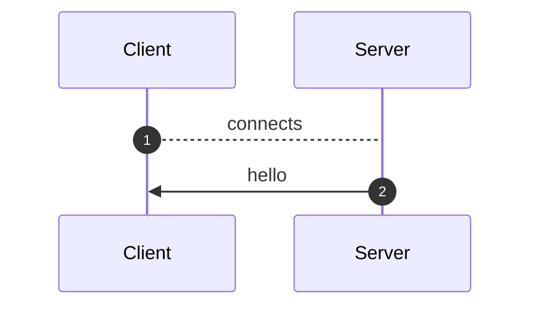
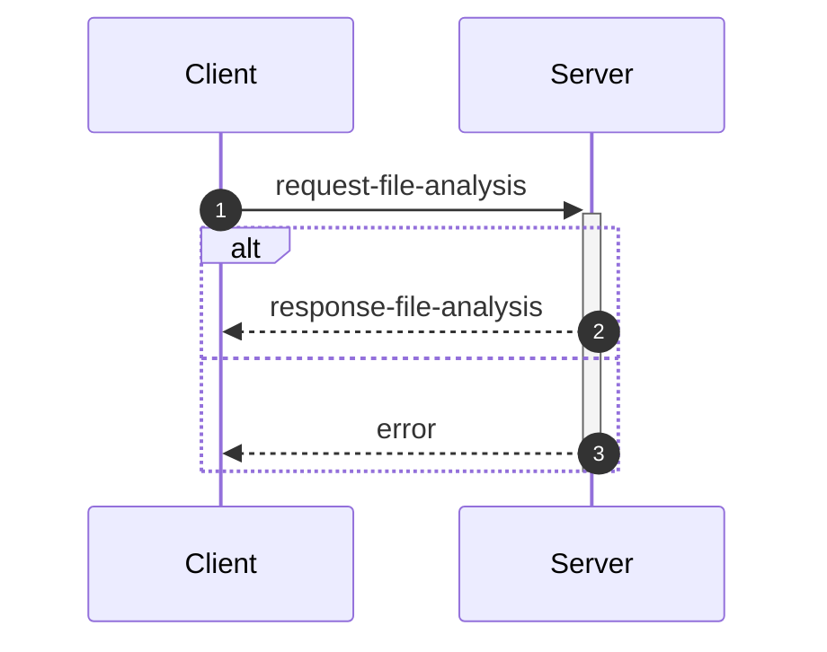
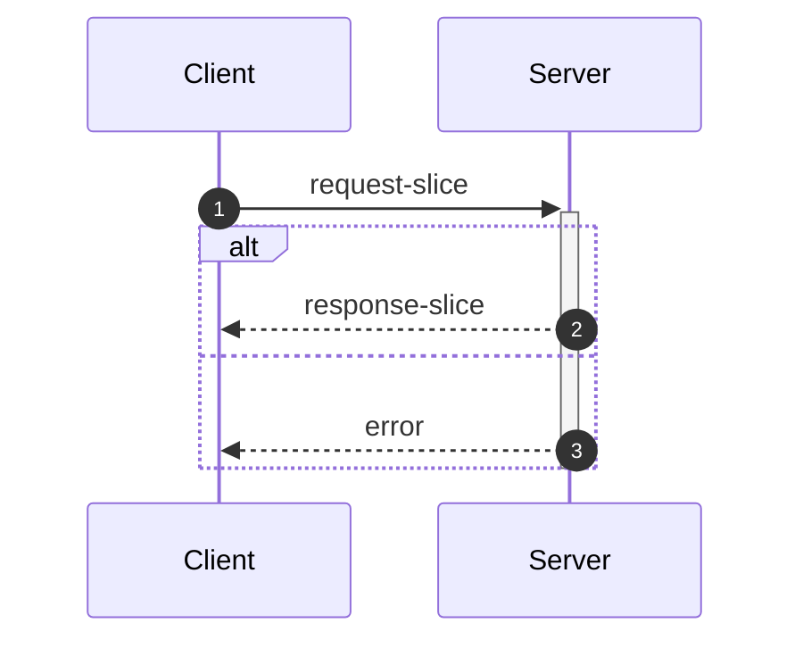
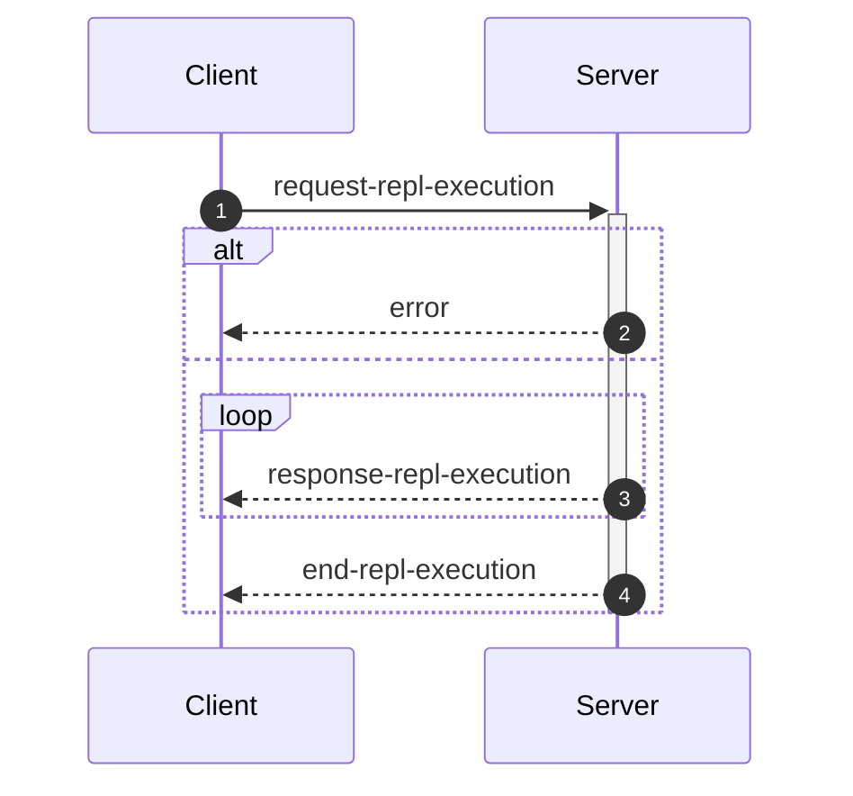

_This document was generated from '[src/documentation/wiki-interface.ts](https://github.com/flowr-analysis/flowr/tree/main//src/documentation/wiki-interface.ts)' on 2026-06-06, 11:14:26 UTC presenting an overview of flowR's interface (v2.10.7, using R v4.5.0). Please do not edit this file/wiki page directly._

Although far from being as detailed as the in-depth explanation of [_flowR_](https://github.com/flowr-analysis/flowr/wiki/core),
this wiki page explains how to interface with _flowR_ in more detail.
In general, command line arguments and other options provide short descriptions on hover over.

* [💻 Using the REPL](#using-the-repl)
* [⚙️ Configuring FlowR](#configuring-flowr)
* [⚒️ Writing Code](#writing-code)
* [💬 Communicating with the Server](#communicating-with-the-server)

<a id='using-the-repl'></a>
## 💻 Using the REPL


> [!NOTE]
> To execute arbitrary R commands with a repl request, _flowR_ has to be started explicitly with <span title="Description (Command Line Argument): Allow to access the underlying R session when using flowR (security warning: this allows the execution of arbitrary R code!)">`--r-session-access`</span>.
> Please be aware that this introduces a security risk and note that this relies on the [`r-shell` engine](https://github.com/flowr-analysis/flowr/wiki/engines) .

Although primarily meant for users to explore,
there is nothing which forbids simply calling _flowR_ as a subprocess to use standard-in, -output, and -error
for communication (although you can access the REPL using the server as well,
with the [REPL Request](#message-request-repl-execution) message).

The read-eval-print loop&nbsp;(REPL) works relatively simple.
You can submit an expression (using <kbd>Enter</kbd>),
which is interpreted as an R&nbsp;expression by default but interpreted as a *command* if it starts with a colon (`:`).
The best command to get started with the REPL is <span title="Description (Repl Command): Show help information (aliases: :h, :?)">`:help`</span>.
Besides, you can leave the REPL either with the command <span title="Description (Repl Command): End the repl (aliases: :q, :exit)">`:quit`</span> or by pressing <kbd>Ctrl</kbd>+<kbd>C</kbd> twice.
When writing a *command*, you may press <kbd>Tab</kbd> to get a list of completions, if available.
Multiple commands can be entered in a single line by separating them with a semicolon (`;`), e.g. `:parse "x<-2"; :df*`.
If a command is given without R code, the REPL will re-use R code given in a previous command.
The prior example will hence return first the parsed AST of the program and then the dataflow graph for `"x <- 2"`.

> [!NOTE]
> If you develop flowR, you may want to launch the repl using the `npm run main-dev` command, this way, you get a non-minified version of flowR with debug information and hot-reloading of source files.

<details>
<summary>Available Commands</summary>

We currently offer the following commands (this with a `[*]` suffix are available with and without the star):


| Command | Description |
| ------- | ----------- |
| **<span title="Description (Repl Command): End the repl (aliases: :q, :exit)">:quit</span>** | End the repl (aliases: **:<span title="Alias of ':quit'. End the repl">q</span>**, **:<span title="Alias of ':quit'. End the repl">exit</span>**) |
| **<span title="Description (Repl Command): Execute the given code as R code. This requires the `--r-session-access` flag to be set and requires the r-shell engine. (aliases: :e, :r)">:execute</span>** | Execute the given code as R code. This requires the `--r-session-access` flag to be set and requires the r-shell engine. (aliases: **:<span title="Alias of ':execute'. Execute the given code as R code. This requires the `--r-session-access` flag to be set and requires the r-shell engine.">e</span>**, **:<span title="Alias of ':execute'. Execute the given code as R code. This requires the `--r-session-access` flag to be set and requires the r-shell engine.">r</span>**) |
| **<span title="Description (Repl Command): Get mermaid code for the control-flow graph of R code, start with 'file://' to indicate a file (aliases: :cfg, :cf)">:controlflow[*]</span>** | Get mermaid code for the control-flow graph of R code, start with 'file://' to indicate a file (star: Returns the URL to mermaid.live) (aliases: **:<span title="Alias of ':controlflow'. Get mermaid code for the control-flow graph of R code, start with 'file://' to indicate a file">cfg</span>**, **:<span title="Alias of ':controlflow'. Get mermaid code for the control-flow graph of R code, start with 'file://' to indicate a file">cf</span>**) |
| **<span title="Description (Repl Command): Get mermaid code for the control-flow graph with basic blocks, start with 'file://' to indicate a file (aliases: :cfgb, :cfb)">:controlflowbb[*]</span>** | Get mermaid code for the control-flow graph with basic blocks, start with 'file://' to indicate a file (star: Returns the URL to mermaid.live) (aliases: **:<span title="Alias of ':controlflowbb'. Get mermaid code for the control-flow graph with basic blocks, start with 'file://' to indicate a file">cfgb</span>**, **:<span title="Alias of ':controlflowbb'. Get mermaid code for the control-flow graph with basic blocks, start with 'file://' to indicate a file">cfb</span>**) |
| **<span title="Description (Repl Command): Get mermaid code for the dataflow graph, start with 'file://' to indicate a file (aliases: :d, :df)">:dataflow[*]</span>** | Get mermaid code for the dataflow graph, start with 'file://' to indicate a file (star: Returns the URL to mermaid.live) (aliases: **:<span title="Alias of ':dataflow'. Get mermaid code for the dataflow graph, start with 'file://' to indicate a file">d</span>**, **:<span title="Alias of ':dataflow'. Get mermaid code for the dataflow graph, start with 'file://' to indicate a file">df</span>**) |
| **<span title="Description (Repl Command): Get mermaid code for the normalized AST of R code, start with 'file://' to indicate a file (aliases: :n)">:normalize[*]</span>** | Get mermaid code for the normalized AST of R code, start with 'file://' to indicate a file (star: Returns the URL to mermaid.live) (alias: **:<span title="Alias of ':normalize'. Get mermaid code for the normalized AST of R code, start with 'file://' to indicate a file">n</span>**) |
| **<span title="Description (Repl Command): Get mermaid code for the simplified dataflow graph, start with 'file://' to indicate a file (aliases: :ds, :dfs)">:dataflowsimple[*]</span>** | Get mermaid code for the simplified dataflow graph, start with 'file://' to indicate a file (star: Returns the URL to mermaid.live) (aliases: **:<span title="Alias of ':dataflowsimple'. Get mermaid code for the simplified dataflow graph, start with 'file://' to indicate a file">ds</span>**, **:<span title="Alias of ':dataflowsimple'. Get mermaid code for the simplified dataflow graph, start with 'file://' to indicate a file">dfs</span>**) |
| **<span title="Description (Repl Command): Just calculates the DFG, but only prints summary info (aliases: :d#, :df#)">:dataflowsilent</span>** | Just calculates the DFG, but only prints summary info (aliases: **:<span title="Alias of ':dataflowsilent'. Just calculates the DFG, but only prints summary info">d#</span>**, **:<span title="Alias of ':dataflowsilent'. Just calculates the DFG, but only prints summary info">df#</span>**) |
| **<span title="Description (Repl Command): Prints ASCII Art of the parsed, unmodified AST, start with 'file://' to indicate a file (aliases: :p)">:parse</span>** | Prints ASCII Art of the parsed, unmodified AST, start with 'file://' to indicate a file (alias: **:<span title="Alias of ':parse'. Prints ASCII Art of the parsed, unmodified AST, start with 'file://' to indicate a file">p</span>**) |
| **<span title="Description (Repl Command): Prints the version of flowR as well as the current version of R">:version</span>** | Prints the version of flowR as well as the current version of R
| **<span title="Description (Repl Command): Query the given R code, start with 'file://' to indicate a file. The query is to be a valid query in json format (use 'help' to get more information).">:query[*]</span>** | Query the given R code, start with 'file://' to indicate a file. The query is to be a valid query in json format (use 'help' to get more information). (star: Similar to query, but returns the output in json format.)
| **<span title="Description (Repl Command): Returns an ASCII representation of the dataflow graph (aliases: :df!)">:dataflowascii</span>** | Returns an ASCII representation of the dataflow graph (alias: **:<span title="Alias of ':dataflowascii'. Returns an ASCII representation of the dataflow graph">df!</span>**) |
| **<span title="Description (Repl Command): Returns summarization stats for the normalized AST (aliases: :n#)">:normalize#</span>** | Returns summarization stats for the normalized AST (alias: **:<span title="Alias of ':normalize#'. Returns summarization stats for the normalized AST">n#</span>**) |
| **<span title="Description (Repl Command): Show help information (aliases: :h, :?)">:help</span>** | Show help information (aliases: **:<span title="Alias of ':help'. Show help information">h</span>**, **:<span title="Alias of ':help'. Show help information">?</span>**) |


</details>


> [!TIP]
> 
> As indicated by the examples before, all REPL commands that operate on code keep track of the state.
> Hence, if you run a command like <span title="Description (Repl Command, starred version): Returns the URL to mermaid.live; Base Command: Get mermaid code for the dataflow graph, start with 'file://' to indicate a file (aliases: :d*, :df*)">`:dataflow*`</span> without providing R code,
> the REPL will re-use the R code provided in a previous command.
> Likewise, doing this will benefit from incrementality!
> If you request the dataflow graph with `:df* x <- 2 * y` and then want to see the parsed AST with `:parse`,
> the REPL will re-use previously obtained information and not re-parse the code again.
> 		


Generally, many commands offer shortcut versions in the REPL. Many queries, for example, offer a shortened format (see the example below).
Of special note, the [Config Query](https://github.com/flowr-analysis/flowr/wiki/query-api#Config-Query)
can be used to also modify the currently active configuration of _flowR_ within the REPL (see the [wiki page](https://github.com/flowr-analysis/flowr/wiki/query-api#Config-Query) for more information).

### Example: Retrieving the Dataflow Graph

To retrieve a URL to the [mermaid](https://mermaid.js.org/) diagram of the dataflow of a given expression,
use <span title="Description (Repl Command, starred version): Returns the URL to mermaid.live; Base Command: Get mermaid code for the dataflow graph, start with 'file://' to indicate a file (aliases: :d*, :df*)">`:dataflow*`</span> (or <span title="Description (Repl Command): Get mermaid code for the dataflow graph, start with 'file://' to indicate a file (aliases: :d, :df)">`:dataflow`</span> to get the mermaid code in the cli):


```shell
$ docker run -it --rm eagleoutice/flowr # or npm run flowr 
flowR repl using flowR v2.10.7, R grammar v14 (tree-sitter engine)
R> :dataflow* y <- 1 + x
```

<details>
<summary style='color:gray'>Output</summary>


```text
https://mermaid.live/view#base64:eyJjb2RlIjoiZmxvd2NoYXJ0IEJUXG4gICAgMXt7XCJgIzkxO1JOdW1iZXIjOTM7IDFcbiAgICAgICgxKVxuICAgICAgKjEuNipgXCJ9fVxuICAgJSUgTm8gZWRnZXMgZm91bmQgZm9yIDFcbiAgICAyKFtcImAjOTE7UlN5bWJvbCM5MzsgeFxuICAgICAgKDIpXG4gICAgICAqMS4xMCpgXCJdKVxuICAgJSUgTm8gZWRnZXMgZm91bmQgZm9yIDJcbiAgICAzW1tcImAjOTE7UkJpbmFyeU9wIzkzOyAjNDM7XG4gICAgICAoMylcbiAgICAgICoxLjYtMTAqXG4gICAgKDEsIDIpYFwiXV1cbiAgICBidWlsdC1pbjpfW1wiYEJ1aWx0LUluOlxuIzQzO2BcIl1cbiAgICBzdHlsZSBidWlsdC1pbjpfIHN0cm9rZTpncmF5LGZpbGw6Z3JheSxzdHJva2Utd2lkdGg6MnB4LG9wYWNpdHk6Ljg7XG4gICAgMFtcImAjOTE7UlN5bWJvbCM5MzsgeVxuICAgICAgKDAsIHNvdXJjZXM6IFszXSlcbiAgICAgICoxLjEqYFwiXVxuICAgIDRbW1wiYCM5MTtSQmluYXJ5T3AjOTM7ICM2MDsjNDU7XG4gICAgICAoNClcbiAgICAgICoxLjEtMTAqXG4gICAgKDAsIDMpYFwiXV1cbiAgICBidWlsdC1pbjpfLVtcImBCdWlsdC1JbjpcbiM2MDsjNDU7YFwiXVxuICAgIHN0eWxlIGJ1aWx0LWluOl8tIHN0cm9rZTpncmF5LGZpbGw6Z3JheSxzdHJva2Utd2lkdGg6MnB4LG9wYWNpdHk6Ljg7XG4gICAgMyAtLT58XCJyZWFkcywgYXJndW1lbnRcInwgMVxuICAgIDMgLS0+fFwicmVhZHMsIGFyZ3VtZW50XCJ8IDJcbiAgICAzIC0uLT58XCJyZWFkcywgY2FsbHNcInwgYnVpbHQtaW46X1xuICAgIGxpbmtTdHlsZSAyIHN0cm9rZTpncmF5O1xuICAgIDAgLS0+fFwiZGVmaW5lZC1ieVwifCAzXG4gICAgMCAtLT58XCJkZWZpbmVkLWJ5XCJ8IDRcbiAgICA0IC0tPnxcInJlYWRzLCBhcmd1bWVudFwifCAzXG4gICAgNCAtLT58XCJyZXR1cm5zLCBhcmd1bWVudFwifCAwXG4gICAgNCAtLi0+fFwicmVhZHMsIGNhbGxzXCJ8IGJ1aWx0LWluOl8tXG4gICAgbGlua1N0eWxlIDcgc3Ryb2tlOmdyYXk7IiwibWVybWFpZCI6eyJhdXRvU3luYyI6dHJ1ZX19
```


Retrieve the dataflow graph of the expression `y <- 1 + x`. It looks like this:


```mermaid
flowchart LR
    1{{"`#91;RNumber#93; 1
      (1)
      *1.6*`"}}
   %% No edges found for 1
    2(["`#91;RSymbol#93; x
      (2)
      *1.10*`"])
   %% No edges found for 2
    3[["`#91;RBinaryOp#93; #43;
      (3)
      *1.6-10*
    (1, 2)`"]]
    built-in:_["`Built-In:
#43;`"]
    style built-in:_ stroke:gray,fill:gray,stroke-width:2px,opacity:.8;
    0["`#91;RSymbol#93; y
      (0, sources: [3])
      *1.1*`"]
    4[["`#91;RBinaryOp#93; #60;#45;
      (4)
      *1.1-10*
    (0, 3)`"]]
    built-in:_-["`Built-In:
#60;#45;`"]
    style built-in:_- stroke:gray,fill:gray,stroke-width:2px,opacity:.8;
    3 -->|"reads, argument"| 1
    3 -->|"reads, argument"| 2
    3 -.->|"reads, calls"| built-in:_
    linkStyle 2 stroke:gray;
    0 -->|"defined-by"| 3
    0 -->|"defined-by"| 4
    4 -->|"reads, argument"| 3
    4 -->|"returns, argument"| 0
    4 -.->|"reads, calls"| built-in:_-
    linkStyle 7 stroke:gray;
```

	
<details>

<summary style="color:gray">R Code of the Dataflow Graph</summary>

The analysis required _0.6 ms_ (including parse and normalize, using the [tree-sitter](https://github.com/flowr-analysis/flowr/wiki/Engines) engine) within the generation environment. 
We encountered no unknown side effects during the analysis.


```r
y <- 1 + x
```


</details>


</details>


For small graphs like this, <span title="Description (Repl Command): Returns an ASCII representation of the dataflow graph (aliases: :df!)">`:dataflowascii`</span> also provides an ASCII representation directly in the REPL:


```shell
$ docker run -it --rm eagleoutice/flowr # or npm run flowr 
flowR repl using flowR v2.10.7, R grammar v14 (tree-sitter engine)
R> :df! y <- 1 + x
```

<details open>
<summary style='color:gray'>Output</summary>


```text
                        0<1>0
                   ┌────| 1 |
    ┌────────┐     │    0---0
 c<4>c       └──c<3>c
 |<- |  v<0>v┌──| + |
 c---c──| y |┘  c---c   u<2>u
        v---v      └────| x |
                        u---u
Edges:
3 -> 1: reads, argument  3 -> 2: reads, argument
4 -> 3: reads, argument  4 -> 0: returns, argument
0 -> 3: defined-by       0 -> 4: defined-by
```


Retrieve the dataflow graph of the expression `y <- 1 + x` as ASCII art.

</details>


For the slicing with <span title="Description (Repl Command): Static backwards executable slicer for R">`:slicer`</span>, you have access to the same [magic comments](#slice-magic-comments) as with the [slice request](#message-request-slice).

### Example: Interfacing with the File System

Many commands that allow for an R-expression (like <span title="Description (Repl Command, starred version): Returns the URL to mermaid.live; Base Command: Get mermaid code for the dataflow graph, start with 'file://' to indicate a file (aliases: :d*, :df*)">`:dataflow*`</span>) allow for a file as well
if the argument starts with `file://`.
If you are working from the root directory of the _flowR_ repository, the following gives you the parsed AST of the example file using the <span title="Description (Repl Command): Prints ASCII Art of the parsed, unmodified AST, start with 'file://' to indicate a file (aliases: :p)">`:parse`</span> command:


```shell
$ docker run -it --rm eagleoutice/flowr # or npm run flowr 
flowR repl using flowR v2.10.7, R grammar v14 (tree-sitter engine)
R> :parse file://test/testfiles/example.R
```

<details>
<summary style='color:gray'>Output</summary>


```text
File: test/testfiles/example.R

program
├ binaryoperator
│ ├ identifier "sum" (1:1─4)
│ ├ <- "<-" (1:5─7)
│ ╰ float "0" (1:8─9)
├ binaryoperator
│ ├ identifier "product" (2:1─8)
│ ├ <- "<-" (2:9─11)
│ ╰ float "1" (2:12─13)
├ binaryoperator
│ ├ identifier "w" (3:1─2)
│ ├ <- "<-" (3:3─5)
│ ╰ float "7" (3:6─7)
├ binaryoperator
│ ├ identifier "N" (4:1─2)
│ ├ <- "<-" (4:3─5)
│ ╰ float "10" (4:6─8)
├ forstatement
│ ├ for "for" (6:1─4)
│ ├ ( "(" (6:5─6)
│ ├ identifier "i" (6:6─7)
│ ├ in "in" (6:8─10)
│ ├ binaryoperator
│ │ ├ float "1" (6:11─12)
│ │ ├ : ":" (6:12─13)
│ │ ╰ parenthesizedexpression
│ │   ├ ( "(" (6:13─14)
│ │   ├ binaryoperator
│ │   │ ├ identifier "N" (6:14─15)
│ │   │ ├ - "-" (6:15─16)
│ │   │ ╰ float "1" (6:16─17)
│ │   ╰ ) ")" (6:17─18)
│ ├ ) ")" (6:18─19)
│ ╰ bracedexpression
│   ├ { "{" (6:20─21)
│   ├ binaryoperator
│   │ ├ identifier "sum" (7:3─6)
│   │ ├ <- "<-" (7:7─9)
│   │ ╰ binaryoperator
│   │   ├ binaryoperator
│   │   │ ├ identifier "sum" (7:10─13)
│   │   │ ├ + "+" (7:14─15)
│   │   │ ╰ identifier "i" (7:16─17)
│   │   ├ + "+" (7:18─19)
│   │   ╰ identifier "w" (7:20─21)
│   ├ binaryoperator
│   │ ├ identifier "product" (8:3─10)
│   │ ├ <- "<-" (8:11─13)
│   │ ╰ binaryoperator
│   │   ├ identifier "product" (8:14─21)
│   │   ├  "" (8:22─23)
│   │   ╰ identifier "i" (8:24─25)
│   ╰ } "}" (9:1─2)
├ call
│ ├ identifier "cat" (11:1─4)
│ ╰ arguments
│   ├ ( "(" (11:4─5)
│   ├ argument
│   │ ╰ string
│   │   ├ " "\"" (11:5─6)
│   │   ├ stringcontent "Sum:" (11:6─10)
│   │   ╰ " "\"" (11:10─11)
│   ├ comma "," (11:11─12)
│   ├ argument
│   │ ╰ identifier "sum" (11:13─16)
│   ├ comma "," (11:16─17)
│   ├ argument
│   │ ╰ string
│   │   ├ " "\"" (11:18─19)
│   │   ├ stringcontent
│   │   │ ╰ escapesequence "\\n" (11:19─21)
│   │   ╰ " "\"" (11:21─22)
│   ╰ ) ")" (11:22─23)
╰ call
  ├ identifier "cat" (12:1─4)
  ╰ arguments
    ├ ( "(" (12:4─5)
    ├ argument
    │ ╰ string
    │   ├ " "\"" (12:5─6)
    │   ├ stringcontent "Product:" (12:6─14)
    │   ╰ " "\"" (12:14─15)
    ├ comma "," (12:15─16)
    ├ argument
    │ ╰ identifier "product" (12:17─24)
    ├ comma "," (12:24─25)
    ├ argument
    │ ╰ string
    │   ├ " "\"" (12:26─27)
    │   ├ stringcontent
    │   │ ╰ escapesequence "\\n" (12:27─29)
    │   ╰ " "\"" (12:29─30)
    ╰ ) ")" (12:30─31)
```


Retrieve the parsed AST of the example file.

<details>

<summary>File Content</summary>


```r
sum <- 0
product <- 1
w <- 7
N <- 10

for (i in 1:(N-1)) {
  sum <- sum + i + w
  product <- product * i
}

cat("Sum:", sum, "\n")
cat("Product:", product, "\n")
```


</details>

As _flowR_ directly transforms this AST the output focuses on being human-readable instead of being machine-readable.
		

</details>


### Example: Run a Query

You can run any query supported by _flowR_ using the <span title="Description (Repl Command): Query the given R code, start with 'file://' to indicate a file. The query is to be a valid query in json format (use 'help' to get more information).">`:query`</span> command.
For example, to obtain the shapes of all data frames in a given piece of code, you can run:


```shell
$ docker run -it --rm eagleoutice/flowr # or npm run flowr 
flowR repl using flowR v2.10.7, R grammar v14 (tree-sitter engine)
R> :query @df-shape "x <- data.frame(a = 1:10, b = 1:10)\ny <- x$a"
```

<details open>
<summary style='color:gray'>Output</summary>


```text
Query: df-shape (2 ms)
   ╰ 12: (colnames: [{"a", "b"}, {}], cols: [2, 2], rows: [10, 10])
   ╰ 0: (colnames: [{"a", "b"}, {}], cols: [2, 2], rows: [10, 10])
All queries together required ≈3 ms (1ms accuracy, total 4 ms)
```


Retrieve the shapes of all data frames in the given code.

</details>


To run the linter on a file, you can use (in this example, we just issue the `dead-code` linter on a small piece of code):


```shell
$ docker run -it --rm eagleoutice/flowr # or npm run flowr 
flowR repl using flowR v2.10.7, R grammar v14 (tree-sitter engine)
R> :query @linter rules:dead-code "if(FALSE) x <- 2"
```

<details open>
<summary style='color:gray'>Output</summary>


```text
Query: linter (1 ms)
   ╰ Dead Code (dead-code):
       ╰ certain:
           ╰ Code at 1.11-16
       ╰ Metadata: consideredNodes: 7, searchTimeMs: 0, processTimeMs: 1
All queries together required ≈1 ms (1ms accuracy, total 2 ms)
```


Run the linter on the given code, with only the `dead-code` rule enabled.

</details>


For more information on the available queries, please check out the [Query API](https://github.com/flowr-analysis/flowr/wiki/query-api).


<a id='configuring-flowr'></a>
## ⚙️ Configuring FlowR


When running _flowR_, you may want to specify some behaviors with a dedicated configuration file.
By default, flowR looks for a file named `flowr.json` in the current working directory (or any higher directory).
You can also specify a different file with <span title="Description (Command Line Argument): The name of the configuration file to use">`--config-file`</span> or pass the configuration inline using <span title="Description (Command Line Argument): The flowR configuration to use, as a JSON string">`--config-json`</span>.
To inspect the current configuration, you can run flowr with the <span title="Description (Command Line Argument): Run with verbose logging (will be passed to the corresponding script)">`--verbose`</span> flag, or use the `config` [Query](https://github.com/flowr-analysis/flowr/wiki/Query%20API).
Within the REPL this works by running the following:


```shell
:query @config
```


To work with the <a href="https://github.com/flowr-analysis/flowr/tree/main/src/config.ts#L108"><code><span title="The configuration file format for flowR.">FlowrConfig</span></code></a> you can use the provided helper objects alongside its methods like
<a href="https://github.com/flowr-analysis/flowr/tree/main/src/config.ts#L428"><code><span title="Creates a new flowr config that has the updated values.">FlowrConfig::<b>amend</b></span></code></a>.
The following summarizes the configuration options:

- `ignoreSourceCalls`: If set to `true`, _flowR_ will ignore source calls when analyzing the code, i.e., ignoring the inclusion of other files.
- `semantics`: allows to configure the way _flowR_ handles R, although we currently only support `semantics/environment/overwriteBuiltIns`.
  You may use this to overwrite _flowR_'s handling of built-in function and even completely clear the preset definitions shipped with flowR.
  See [Configure BuiltIn Semantics](#configure-builtin-semantics) for more information.
- `solver`: allows to configure how _flowR_ resolves variables and their values (currently we support: `disabled`, `alias`, `builtin`), as well as if pointer analysis should be active.
- `engines`: allows to configure the engines used by _flowR_ to interact with R code. See the [Engines wiki page](https://github.com/flowr-analysis/flowr/wiki/Engines) for more information.
- `defaultEngine`: allows to specify the default engine to use for interacting with R code. If not set, an arbitrary engine from the specified list will be used.
- `abstractInterpretation`: allows to configure how _flowR_ performs abstract interpretation, although we currently only support data frame shape inference through abstract interpretation.
- `defaultPlugins`: allows to configure which plugins to load by default when creating a new <a href="https://github.com/flowr-analysis/flowr/tree/main/src/project/flowr-analyzer.ts#L162"><code><span title="Central class for conducting analyses with FlowR. Use the FlowrAnalyzerBuilder to create a new instance. If you want the original pattern of creating a pipeline and running all steps, you can still do this with FlowrAnalyzer#runFull . To inspect the context of the analyzer, use FlowrAnalyzer#inspectContext (if you are a plugin and need to modify it, use FlowrAnalyzer#context instead).">FlowrAnalyzer</span></code></a> instance.
- `repl.plugins`: allows to configure which plugins to load in the _flowR_ REPL. Use `flowr:default` to reference the plugins specified by `defaultPlugins`.

So you can configure _flowR_ by adding a file like the following:

<details>

<summary>Example Configuration File</summary>


```json
{
  "ignoreSourceCalls": true,
  "semantics": {
    "environment": {
      "overwriteBuiltIns": {
        "definitions": [
          {
            "type": "function",
            "names": [
              "foo"
            ],
            "processor": "builtin:assign",
            "config": {}
          }
        ]
      }
    }
  },
  "defaultPlugins": [
    "file:description",
    "versions:description"
  ],
  "repl": {
    "quickStats": false,
    "dfProcessorHeat": false,
    "plugins": [
      "flowr:default"
    ]
  },
  "project": {
    "resolveUnknownPathsOnDisk": true
  },
  "engines": [
    {
      "type": "r-shell"
    }
  ],
  "solver": {
    "variables": "alias",
    "evalStrings": true,
    "trackEnvironments": true,
    "resolveSource": {
      "dropPaths": "no",
      "ignoreCapitalization": true,
      "inferWorkingDirectory": "active-script",
      "searchPath": []
    },
    "instrument": {},
    "slicer": {
      "threshold": 50
    }
  },
  "abstractInterpretation": {
    "wideningThreshold": 4,
    "dataFrame": {
      "maxColNames": 20,
      "readLoadedData": {
        "readExternalFiles": true,
        "maxReadLines": 1000000
      }
    }
  }
}
```


</details>

<details>
<a id='configure-builtin-semantics'></a>
<summary>Configure Built-In Semantics</summary>


`semantics/environment/overwriteBuiltins` accepts two keys:

- `loadDefaults` (boolean, initially `true`): If set to `true`, the default built-in definitions are loaded before applying the custom definitions. Setting this flag to `false` explicitly disables the loading of the default definitions.
- `definitions` (array, initially empty): Allows to overwrite or define new built-in elements. Each object within must have a `type` which is one of the below. Furthermore, they may define a string array of `names` which specifies the identifiers to bind the definitions to. You may use `assumePrimitive` to specify whether _flowR_ should assume that this is a primitive non-library definition (so you probably just do not want to specify the key).

  | Type            | Description                                                                                                                                                                                                                                                                                              | Example                                                                                                    |
  | --------------- | -------------------------------------------------------------------------------------------------------------------------------------------------------------------------------------------------------------------------------------------------------------------------------------------------------- | ---------------------------------------------------------------------------------------------------------- |
  | `constant`    | Additionally allows for a `value` this should resolve to.                                                                                                                                                                                                                                                | `{ type: 'constant', names: ['NULL', 'NA'],  value: null }`                                                |
  | `function`    | Is a rather flexible way to define and bind built-in functions. For the time, we do not have extensive documentation to cover all the cases, so please either consult the sources with the `default-builtin-config.ts` or open a [new issue](https://github.com/flowr-analysis/flowr/issues/new/choose). | `{ type: 'function', names: ['next'], processor: 'builtin:d', config: { cfg: ExitPointType.Next } }` |
  | `replacement` | A comfortable way to specify replacement functions like `$<-` or `names<-`. `suffixes` describes the... suffixes to attach automatically. | `{ type: 'replacement', suffixes: ['<-', '<<-'], names: ['[', '[['] }` |


</details>

<details>

<summary style='color:gray'>Full Configuration-File Schema</summary>

- _The configuration file format for flowR._ (object)
    - **ignoreSourceCalls** [optional] _Whether source calls should be ignored, causing {@link processSourceCall}'s behavior to be skipped._ (boolean)
    - **semantics** _Configure language semantics and how flowR handles them._ (object)
        - **environment** [optional] _Semantics regarding how to handle the R environment._ (object)
            - **overwriteBuiltIns** [optional] _Do you want to overwrite (parts) of the builtin definition?_ (object)
                - **loadDefaults** [optional] _Should the default configuration still be loaded?_ (boolean)
                - **definitions** [optional] _The definitions to load/overwrite._ (array)
                Valid item types:
                    - (object)
    - **defaultPlugins** [optional] _The default plugins to load when creating a new instance of FlowrAnalyzer_ (array)
    Valid item types:
        - (alternatives)
            - (string)
            - (array)
    - **repl** _Configuration options for the REPL._ (object)
        - **quickStats** [optional] _Whether to show quick stats in the REPL after each evaluation._ (boolean)
        - **dfProcessorHeat** [optional] _This instruments the dataflow processors to count how often each processor is called._ (boolean)
        - **plugins** [optional] _The plugins to load in REPL mode_ (array)
        Valid item types:
            - (alternatives)
                - (string)
                - (array)
    - **project** _Project specific configuration options._ (object)
        - **resolveUnknownPathsOnDisk** [optional] _Whether to resolve unknown paths loaded by the r project disk when trying to source/analyze files._ (boolean)
    - **engines** _The engine or set of engines to use for interacting with R code. An empty array means all available engines will be used._ (array)
    Valid item types:
        - (alternatives)
            - _The configuration for the tree sitter engine._ (object)
                - **type** [required] _Use the tree sitter engine._ (string)
                    Only allows: 'tree-sitter'
                - **wasmPath** [optional] _The path to the tree-sitter-r WASM binary to use. If this is undefined, this uses the default path._ (string)
                - **treeSitterWasmPath** [optional] _The path to the tree-sitter WASM binary to use. If this is undefined, this uses the default path._ (string)
                - **lax** [optional] _Whether to use the lax parser for parsing R code (allowing for syntax errors). If this is undefined, the strict parser will be used._ (boolean)
            - _The configuration for the R shell engine._ (object)
                - **type** [required] _Use the R shell engine._ (string)
                    Only allows: 'r-shell'
                - **rPath** [optional] _The path to the R executable to use. If this is undefined, this uses the default path._ (string)
    - **defaultEngine** [optional] _The default engine to use for interacting with R code. If this is undefined, an arbitrary engine from the specified list will be used._ (string)
        Only allows: 'tree-sitter', 'r-shell'
    - **solver** _How to resolve constants, constraints, cells, ..._ (object)
        - **variables** _How to resolve variables and their values._ (string)
            Only allows: 'disabled', 'alias', 'builtin'
        - **evalStrings** _Should we include eval(parse(text="...")) calls in the dataflow graph?_ (boolean)
        - **trackEnvironments** [optional] _Track user-created environments (new.env, assign/get/local with envir=, dollar-assign, attach). When false, all envir-style calls fall through conservatively._ (boolean)
        - **instrument** (object)
            - **dataflowExtractors** [optional] _These keys are only intended for use within code, allowing to instrument the dataflow analyzer!_ (any)
        - **resolveSource** [optional] _If lax source calls are active, flowR searches for sourced files much more freely, based on the configurations you give it. This option is only in effect if `ignoreSourceCalls` is set to false._ (object)
            - **dropPaths** _Allow to drop the first or all parts of the sourced path, if it is relative._ (string)
                Only allows: 'no', 'once', 'all'
            - **ignoreCapitalization** _Search for filenames matching in the lowercase._ (boolean)
            - **inferWorkingDirectory** _Try to infer the working directory from the main or any script to analyze._ (string)
                Only allows: 'no', 'main-script', 'active-script', 'any-script'
            - **searchPath** _Additionally search in these paths._ (array)
            Valid item types:
                - (string)
            - **repeatedSourceLimit** [optional] _How often the same file can be sourced within a single run? Please be aware: in case of cyclic sources this may not reach a fixpoint so give this a sensible limit._ (number)
            - **applyReplacements** _Provide name replacements for loaded files_ (array)
            Valid item types:
                - (object)
        - **slicer** [optional] _The configuration for the slicer._ (object)
            - **threshold** [optional] _The maximum number of iterations to perform on a single function call during slicing._ (number)
            - **autoExtend** [optional] _If set, the slicer will gain an additional post-pass._ (boolean)
    - **abstractInterpretation** _The configuration options for abstract interpretation._ (object)
        - **wideningThreshold** _The threshold for the number of visitations of a node at which widening should be performed to ensure the termination of the fixpoint iteration._ (number)
        - **dataFrame** _The configuration of the shape inference for data frames._ (object)
            - **maxColNames** _The maximum number of columns names to infer for data frames before over-approximating the column names to top._ (number)
            - **readLoadedData** _Configuration options for reading data frame shapes from loaded external data files, such as CSV files._ (object)
                - **readExternalFiles** _Whether data frame shapes should be extracted from loaded external files, such as CSV files._ (boolean)
                - **maxReadLines** _The maximum number of lines to read when extracting data frame shapes from loaded files, such as CSV files._ (number)

</details>

	

<a id='writing-code'></a>
## ⚒️ Writing Code

_flowR_ can be used as a [module](https://www.npmjs.com/package/@eagleoutice/flowr) and offers several main classes and interfaces that are interesting for extension writers 
(see the [Visual Studio Code extension](https://marketplace.visualstudio.com/items?itemName=code-inspect.vscode-flowr) or the [Core](https://github.com/flowr-analysis/flowr/wiki/core) wiki page for more information).

### Creating Analyses with _flowR_

Nowadays, instances of the <a href="https://github.com/flowr-analysis/flowr/tree/main/src/project/flowr-analyzer.ts#L162"><code><span title="Central class for conducting analyses with FlowR. Use the FlowrAnalyzerBuilder to create a new instance. If you want the original pattern of creating a pipeline and running all steps, you can still do this with FlowrAnalyzer#runFull . To inspect the context of the analyzer, use FlowrAnalyzer#inspectContext (if you are a plugin and need to modify it, use FlowrAnalyzer#context instead).">FlowrAnalyzer</span></code></a> should be used as central frontend to get analysis results from _flowR_.
For example, a program slice can be created like this:


```ts
const analyzer = await new FlowrAnalyzerBuilder()
    .setEngine('tree-sitter')
    .build();
analyzer.addRequest('x <- 1\ny <- x\nx');
const result = await analyzer.query([
    {
        type:     'static-slice',
        criteria: ['3@x']
    }
]);
//console.log(result['static-slice']);
```


For more information, please have a look at the [Analyzer](https://github.com/flowr-analysis/flowr/wiki/analyzer) wiki page, which explains how to construct and use the <a href="https://github.com/flowr-analysis/flowr/tree/main/src/project/flowr-analyzer.ts#L162"><code><span title="Central class for conducting analyses with FlowR. Use the FlowrAnalyzerBuilder to create a new instance. If you want the original pattern of creating a pipeline and running all steps, you can still do this with FlowrAnalyzer#runFull . To inspect the context of the analyzer, use FlowrAnalyzer#inspectContext (if you are a plugin and need to modify it, use FlowrAnalyzer#context instead).">FlowrAnalyzer</span></code></a> in more detail.
To work with specific perspectives, you can also consult the respective pages like the [Dataflow Graph](https://github.com/flowr-analysis/flowr/wiki/dataflow-graph) or the [Abstract Interpretation](https://github.com/flowr-analysis/flowr/wiki/abstract-interpretation) wiki pages.
        
### The Pipeline Executor (Low-Level Interface)

Once, in the beginning, _flowR_ was meant to produce a dataflow graph merely to provide *program slices*. 
However, with continuous updates, the [Dataflow Graph](https://github.com/flowr-analysis/flowr/wiki/dataflow-graph) repeatedly proves to be the more interesting part.
With this, we restructured _flowR_'s originally *hardcoded* pipeline to be far more flexible. 
Now, it can be theoretically extended or replaced with arbitrary steps, optional steps, and what we call 'decorations' of these steps. 
In short, a slicing pipeline using the <a href="https://github.com/flowr-analysis/flowr/tree/main/src/core/pipeline-executor.ts#L97"><code><span title="**Please note:** The PipelineExecutor is now considered to be a rather low-level API for flowR. While it still works and is the basis for all other layers, we strongly recommend using the FlowrAnalyzer and its builder to create and use an analyzer instance that is pre-configured for your use-case. The pipeline executor allows to execute arbitrary pipelines in a step-by-step fashion. If you are not...">PipelineExecutor</span></code></a> looks like this:


```ts

const slicer = new PipelineExecutor(DEFAULT_SLICING_PIPELINE, {
  parser:    new RShell(),
  request:   requestFromInput('x <- 1\nx + 1'),
  criterion: ['2@x']
})
const slice = await slicer.allRemainingSteps()
// console.log(slice.reconstruct.code)
```


<details><summary>More Information</summary>


If you compare this, with what you would have done with the old (and removed) `SteppingSlicer`, 
this essentially just requires you to replace the `SteppingSlicer` with the <a href="https://github.com/flowr-analysis/flowr/tree/main/src/core/pipeline-executor.ts#L97"><code><span title="**Please note:** The PipelineExecutor is now considered to be a rather low-level API for flowR. While it still works and is the basis for all other layers, we strongly recommend using the FlowrAnalyzer and its builder to create and use an analyzer instance that is pre-configured for your use-case. The pipeline executor allows to execute arbitrary pipelines in a step-by-step fashion. If you are not...">PipelineExecutor</span></code></a>
and to pass the <a href="https://github.com/flowr-analysis/flowr/tree/main/src/core/steps/pipeline/default-pipelines.ts#L18"><code>DEFAULT_SLICING_PIPELINE</code></a> as the first argument.
The <a href="https://github.com/flowr-analysis/flowr/tree/main/src/core/pipeline-executor.ts#L97"><code><span title="**Please note:** The PipelineExecutor is now considered to be a rather low-level API for flowR. While it still works and is the basis for all other layers, we strongly recommend using the FlowrAnalyzer and its builder to create and use an analyzer instance that is pre-configured for your use-case. The pipeline executor allows to execute arbitrary pipelines in a step-by-step fashion. If you are not...">PipelineExecutor</span></code></a>...

1. Provides structures to investigate the results of all intermediate steps
2. Can be executed step-by-step
3. Can repeat steps (e.g., to calculate multiple slices on the same input)

See the in-code documentation for more information.

	

</details>
    

### Using the <a href="https://github.com/flowr-analysis/flowr/tree/main/src/r-bridge/shell.ts#L143"><code><span title="The RShell represents an interactive session with the R interpreter. You can configure it by RShellOptions . At the moment we are using a live R session (and not networking etc.) to communicate with R easily, which allows us to install packages etc. However, this might and probably will change in the future (leaving this as a legacy mode :D)">RShell</span></code></a> to Interact with R

The <a href="https://github.com/flowr-analysis/flowr/tree/main/src/r-bridge/shell.ts#L143"><code><span title="The RShell represents an interactive session with the R interpreter. You can configure it by RShellOptions . At the moment we are using a live R session (and not networking etc.) to communicate with R easily, which allows us to install packages etc. However, this might and probably will change in the future (leaving this as a legacy mode :D)">RShell</span></code></a> class allows interfacing with the `R`&nbsp;ecosystem installed on the host system.
Please have a look at [flowR's Engines](https://github.com/flowr-analysis/flowr/wiki/engines) for more information on alternatives (for example, the <a href="https://github.com/flowr-analysis/flowr/tree/main/src/r-bridge/lang-4.x/tree-sitter/tree-sitter-executor.ts#L18"><code><span title="Synchronous and (way) faster alternative to the RShell using tree-sitter.">TreeSitterExecutor</span></code></a>).


> [!IMPORTANT]
> 
> Each <a href="https://github.com/flowr-analysis/flowr/tree/main/src/r-bridge/shell.ts#L143"><code><span title="The RShell represents an interactive session with the R interpreter. You can configure it by RShellOptions . At the moment we are using a live R session (and not networking etc.) to communicate with R easily, which allows us to install packages etc. However, this might and probably will change in the future (leaving this as a legacy mode :D)">RShell</span></code></a> controls a new instance of the R&nbsp;interpreter, 
> make sure to call <code><a href="https://github.com/flowr-analysis/flowr/tree/main/src/r-bridge/shell.ts#L317"><span title="Close the current R session, makes the object effectively invalid (can no longer be reopened etc.)">RShell::<i>close</i></span></a>()</code> when you are done.


You can start a new "session" simply by constructing a new object with <code>new <a href="https://github.com/flowr-analysis/flowr/tree/main/src/r-bridge/shell.ts#L143"><span title="The RShell represents an interactive session with the R interpreter. You can configure it by RShellOptions . At the moment we are using a live R session (and not networking etc.) to communicate with R easily, which allows us to install packages etc. However, this might and probably will change in the future (leaving this as a legacy mode :D)">RShell</span></a>()</code>.

However, there are several options that may be of interest 
(e.g., to automatically revive the shell in case of errors or to control the name location of the R process on the system).

With a shell object (let's call it `shell`), you can execute R code by using <a href="https://github.com/flowr-analysis/flowr/tree/main/src/r-bridge/shell.ts#L195"><code><span title="sends the given command directly to the current R session will not do anything to alter input markers!">RShell::<i>sendCommand</i></span></code></a>, 
for example <code>shell.<a href="https://github.com/flowr-analysis/flowr/tree/main/src/r-bridge/shell.ts#L195"><span title="sends the given command directly to the current R session will not do anything to alter input markers!">sendCommand</span></a>("1 + 1")</code>. 
However, this does not return anything, so if you want to collect the output of your command, use
<a href="https://github.com/flowr-analysis/flowr/tree/main/src/r-bridge/shell.ts#L261"><code><span title="Send a command and collect the output">RShell::<i>sendCommandWithOutput</i></span></code></a> instead.

Besides that, the command <a href="https://github.com/flowr-analysis/flowr/tree/main/src/r-bridge/shell.ts#L233"><code>RShell::<b>tryToInjectHomeLibPath</b></code></a> may be of interest, as it enables all libraries available on the host system.


### Generate Statistics (No longer a Focus of flowR)


<details>

<summary>Adding a New Feature to Extract</summary>

In this example, we construct a new feature to extract, with the name "*example*".
Whenever this name appears, you may substitute this with whatever name fits your feature best (as long as the name is unique).

1. **Create a new file in `src/statistics/features/supported`**\
   Create the file `example.ts`, and add its export to the `index.ts` file in the same directory (if not done automatically).

2. **Create the basic structure**\
   To get a better feel of what a feature must have, let's look
   at the basic structure (of course, due to TypeScript syntax,
   there are other ways to achieve the same goal):

   ```ts
   const initialExampleInfo = {
       /* whatever start value is good for you */
       someCounter: 0
   }

   export type ExampleInfo = Writable<typeof initialExampleInfo>

   export const example: Feature<ExampleInfo> = {
    name:        'Example Feature',
    description: 'A longer example description',

    process(existing: ExampleInfo, input: FeatureProcessorInput): ExampleInfo {
      /* perform analysis on the input */
      return existing
    },

    initialValue: initialExampleInfo
   }
   ```

   The `initialExampleInfo` type holds the initial values for each counter that you want to maintain during the feature extraction (they will usually be initialized with 0). The resulting `ExampleInfo` type holds the structure of the data that is to be counted. Due to the vast amount of data processed, information like the name and location of a function call is not stored here, but instead written to disk (see below).

   Every new feature must be of the `Feature<Info>` type, with `Info` referring to a `FeatureInfo` (like `ExampleInfo` in this example). Next to a `name` and a `description`, each Feature must provide:

   - a processor that extracts the information from the input, adding it to the existing information.
   - a function returning the initial value of the information (in this case, `initialExampleInfo`).

3. **Add it to the feature-mapping**\
   Now, in the `feature.ts` file in `src/statistics/features`, add your feature to the `ALL_FEATURES` object.

Now, we want to extract something. For the *example* feature created in the previous steps, we choose to count the amount of `COMMENT` tokens.
So we define a corresponding [XPath](https://developer.mozilla.org/en-US/docs/Web/XPath) query:

```ts
const commentQuery: Query = xpath.parse('//COMMENT')
```

Within our feature's `process` function, running the query is as simple as:

```ts
const comments = commentQuery.select({ node: input.parsedRAst })
```

Now we could do a lot of further processing, but for simplicity, we only record every comment found this way:

```ts
appendStatisticsFile(example.name, 'comments', comments, input.filepath)
```

We use `example.name` to avoid duplication with the name that we’ve assigned to the feature. It corresponds to the name of the folder in the statistics output.
`'comments'` refers to a freely chosen (but unique) name, that will be used as the name for the output file within the folder. The `comments` variable holds the result of the query, which is an array of nodes. Finally, we pass the `filepath` of the file that was analyzed (if known), so that it can be added to the statistics file (as additional information).

</details>
	

<a id='communicating-with-the-server'></a>
## 💬 Communicating with the Server


As explained in the [Overview](https://github.com/flowr-analysis/flowr/wiki/Overview), you can simply run the [TCP](https://de.wikipedia.org/wiki/Transmission_Control_Protocol)&nbsp;server by adding the <span title="Description (Command Line Argument): Do not drop into a repl, but instead start a server on the given port (default: 1042) and listen for messages.">`--server`</span> flag (and, due to the interactive mode, exit with the conventional <kbd>CTRL</kbd>+<kbd>C</kbd>).
Currently, every connection is handled by the same underlying `RShell` - so the server is not designed to handle many clients at a time.
Additionally, the server is not well guarded against attacks (e.g., you can theoretically spawn an arbitrary number of&nbsp;RShell sessions on the target machine).

Every message has to be given in a single line (i.e., without a newline in-between) and end with a newline character. Nevertheless, we will pretty-print example given in the following segments for the ease of reading.


> [!NOTE]
> 
> The default <span title="Description (Command Line Argument): Do not drop into a repl, but instead start a server on the given port (default: 1042) and listen for messages.">`--server`</span> uses a simple [TCP](https://de.wikipedia.org/wiki/Transmission_Control_Protocol)
> connection. If you want _flowR_ to expose a [WebSocket](https://de.wikipedia.org/wiki/WebSocket) server instead, add the <span title="Description (Command Line Argument): If the server flag is set, use websocket for messaging">`--ws`</span> flag (i.e., <span title="Description (Command Line Argument): Do not drop into a repl, but instead start a server on the given port (default: 1042) and listen for messages.">`--server`</span> <span title="Description (Command Line Argument): If the server flag is set, use websocket for messaging">`--ws`</span>) when starting _flowR_ from the command line.
> 			


<ul><li>
<a id="message-hello"></a>
<b>Hello</b> Message (<code>hello</code>) 
<details>

<summary style="color:gray"> View Details. <i>The server informs the client about the successful connection and provides Meta-Information.</i> </summary>


```mermaid
sequenceDiagram
    autonumber
    participant Client
    participant Server

    
    Client-->Server: connects
    Server->>Client: hello
	
```


	
After launching _flowR_, for example, with <code>docker run -it --rm eagleoutice/flowr <span title="Description (Command Line Argument): Do not drop into a repl, but instead start a server on the given port (default: 1042) and listen for messages.">-<span/>-server</span></code>&nbsp;(🐳️), simply connecting should present you with a `hello` message, that amongst others should reveal the versions of&nbsp;_flowR_ and&nbsp;R, using the [semver 2.0](https://semver.org/spec/v2.0.0.html) versioning scheme.
The message looks like this:


```json
{
  "type": "hello",
  "clientName": "client-0",
  "versions": {
    "flowr": "2.10.7",
    "r": "4.5.0",
    "engine": "r-shell"
  }
}
```


There are currently a few messages that you can send after the hello message.
If you want to _slice_ a piece of R code you first have to send an [analysis request](#message-request-file-analysis), so that you can send one or multiple slice requests afterward.
Requests for the [REPL](#message-request-repl) are independent of that.
	

<hr>


<details>
<summary style="color:gray">Message schema (<code>hello</code>)</summary>

For the definition of the hello message, please see it's implementation at [`./src/cli/repl/server/messages/message-hello.ts`](https://github.com/flowr-analysis/flowr/tree/main/./src/cli/repl/server/messages/message-hello.ts).

- [required] (object)
    - **type** [required] _The type of the hello message._ (string)
        Only allows: 'hello'
    - **id** [forbidden] _The id of the message is always undefined (as it is the initial message and not requested)._ (any)
    - **clientName** [required] _A unique name that is assigned to each client. It has no semantic meaning and is only used/useful for debugging._ (string)
    - **versions** [required] (object)
        - **flowr** [required] _The version of the flowr server running in semver format._ (string)
        - **r** [required] _The version of the underlying R shell running in semver format._ (string)
        - **engine** [required] _The parser backend that is used to parse the R code._ (string)

</details>


<hr>

</details>
	</li>

<li>
<a id="message-request-file-analysis"></a>
<b>Analysis</b> Message (<code>request-file-analysis</code>) 
<details>

<summary style="color:gray"> View Details. <i>The server builds the dataflow graph for a given input file (or a set of files).</i> </summary>


```mermaid
sequenceDiagram
    autonumber
    participant Client
    participant Server

    
    Client->>+Server: request-file-analysis
    alt
        Server-->>Client: response-file-analysis
    else
        Server-->>Client: error
    end
    deactivate  Server
	
```


	
The request allows the server to analyze a file and prepare it for slicing.
The message can contain a `filetoken`, which is used to identify the file in later slice or query requests (if you do not add one, the request will not be stored and therefore, it is not available for subsequent requests).

> **Please note!**\
> If you want to send and process a lot of analysis requests, but do not want to slice them, please do not pass the `filetoken` field. This will save the server a lot of memory allocation.

Furthermore, the request must contain either a `content` field to directly pass the file's content or a `filepath` field which contains the path to the file (this path must be accessible for the server to be useful).
If you add the `id` field, the answer will use the same `id` so you can match requests and the corresponding answers.
See the implementation of the request-file-analysis message for more information.


<details>
<summary>Example of the <code>request-file-analysis</code> Message</summary>

_Note:_ even though we pretty-print these messages, they are sent as a single line, ending with a newline.

The following lists all messages that were sent and received in case you want to reproduce the scenario:

<ol>
<li> <code>hello</code> (response)
<details> 

<summary> Show Details </summary>

The first message is always a hello message.


```json
{
  "type": "hello",
  "clientName": "client-0",
  "versions": {
    "flowr": "2.10.7",
    "r": "4.5.0",
    "engine": "r-shell"
  }
}
```


</details>
</li>

<li> <b><code>request-file-analysis</code> (request)</b>
<details open> 

<summary> Show Details </summary>

Let's suppose you simply want to analyze the following script:
 
```r
x <- 1
x + 1
```

 For this, you can send the following request:


```json
{
  "type": "request-file-analysis",
  "id": "1",
  "filetoken": "x",
  "content": "x <- 1\nx + 1"
}
```


</details>
</li>

<li> <code>response-file-analysis</code> (response)
<details> 

<summary> Show Details </summary>


The `results` field of the response effectively contains three keys of importance:

- `parse`: which contains 1:1 the parse result in CSV format that we received from the `RShell` (i.e., the AST produced by the parser of the R interpreter).
- `normalize`: which contains the normalized AST, including ids (see the `info` field and the [Normalized AST](https://github.com/flowr-analysis/flowr/wiki/Normalized%20AST) wiki page).
- `dataflow`: especially important is the `graph` field which contains the dataflow graph as a set of root vertices (see the [Dataflow Graph](https://github.com/flowr-analysis/flowr/wiki/Dataflow%20Graph) wiki page).
			


_As the code is pretty long, we inhibit pretty printing and syntax highlighting (JSON, hiding built-in):_

```text
{"type":"response-file-analysis","format":"json","id":"1","results":{"parse":{"files":[{"parsed":"[1,1,1,6,7,0,\"expr\",false,\"x <- 1\"],[1,1,1,1,1,3,\"SYMBOL\",true,\"x\"],[1,1,1,1,3,7,\"expr\",false,\"x\"],[1,3,1,4,2,7,\"LEFT_ASSIGN\",true,\"<-\"],[1,6,1,6,4,5,\"NUM_CONST\",true,\"1\"],[1,6,1,6,5,7,\"expr\",false,\"1\"],[2,1,2,5,16,0,\"expr\",false,\"x + 1\"],[2,1,2,1,10,12,\"SYMBOL\",true,\"x\"],[2,1,2,1,12,16,\"expr\",false,\"x\"],[2,3,2,3,11,16,\"'+'\",true,\"+\"],[2,5,2,5,13,14,\"NUM_CONST\",true,\"1\"],[2,5,2,5,14,16,\"expr\",false,\"1\"]","filePath":"/tmp/tmp-9023-qCN0BMCiADLb-.R"}],".meta":{"timing":2}},"normalize":{"ast":{"type":"RProject","files":[{"root":{"type":"RExpressionList","children":[{"type":"RBinaryOp","location":[1,3,1,4],"lhs":{"type":"RSymbol","location":[1,1,1,1],"content":"x","lexeme":"x","info":{"fullRange":[1,1,1,1],"adToks":[],"id":0,"parent":2,"role":"bin-l","index":0,"nest":0,"file":"/tmp/tmp-9023-qCN0BMCiADLb-.R"}},"rhs":{"location":[1,6,1,6],"lexeme":"1","info":{"fullRange":[1,6,1,6],"adToks":[],"id":1,"parent":2,"role":"bin-r","index":1,"nest":0,"file":"/tmp/tmp-9023-qCN0BMCiADLb-.R"},"type":"RNumber","content":{"num":1,"complexNumber":false,"markedAsInt":false}},"operator":"<-","lexeme":"<-","info":{"fullRange":[1,1,1,6],"adToks":[],"id":2,"parent":6,"nest":0,"file":"/tmp/tmp-9023-qCN0BMCiADLb-.R","index":0,"role":"el-c"}},{"type":"RBinaryOp","location":[2,3,2,3],"lhs":{"type":"RSymbol","location":[2,1,2,1],"content":"x","lexeme":"x","info":{"fullRange":[2,1,2,1],"adToks":[],"id":3,"parent":5,"role":"bin-l","index":0,"nest":0,"file":"/tmp/tmp-9023-qCN0BMCiADLb-.R"}},"rhs":{"location":[2,5,2,5],"lexeme":"1","info":{"fullRange":[2,5,2,5],"adToks":[],"id":4,"parent":5,"role":"bin-r","index":1,"nest":0,"file":"/tmp/tmp-9023-qCN0BMCiADLb-.R"},"type":"RNumber","content":{"num":1,"complexNumber":false,"markedAsInt":false}},"operator":"+","lexeme":"+","info":{"fullRange":[2,1,2,5],"adToks":[],"id":5,"parent":6,"nest":0,"file":"/tmp/tmp-9023-qCN0BMCiADLb-.R","index":1,"role":"el-c"}}],"info":{"adToks":[],"id":6,"nest":0,"file":"/tmp/tmp-9023-qCN0BMCiADLb-.R","role":"root","index":0}},"filePath":"/tmp/tmp-9023-qCN0BMCiADLb-.R"}],"info":{"id":7}},".meta":{"timing":0}},"dataflow":{"unknownReferences":[],"in":[{"nodeId":2,"name":"<-","type":2},{"nodeId":5,"name":"+","type":2}],"out":[{"nodeId":0,"name":"x","type":4,"definedAt":2,"value":[1]}],"environment":{"current":{"id":1851,"parent":"<BuiltInEnvironment>","memory":[["x",[{"nodeId":0,"name":"x","type":4,"definedAt":2,"value":[1]}]]]},"level":0},"graph":{"rootVertices":[1,0,2,3,4,5],"vertexInformation":[[1,{"tag":"value","id":1}],[0,{"tag":"vdef","id":0,"source":[1]}],[2,{"tag":"fcall","id":2,"name":"<-","onlyBuiltin":true,"args":[{"nodeId":0,"type":32},{"nodeId":1,"type":32}],"origin":["builtin:assign"]}],[3,{"tag":"use","id":3}],[4,{"tag":"value","id":4}],[5,{"tag":"fcall","id":5,"name":"+","onlyBuiltin":true,"args":[{"nodeId":3,"type":32},{"nodeId":4,"type":32}],"origin":["builtin:d"]}]],"edgeInformation":[[2,[[1,{"types":65}],[0,{"types":72}],["built-in:<-",{"types":5}]]],[0,[[1,{"types":2}],[2,{"types":2}]]],[3,[[0,{"types":1}]]],[5,[[3,{"types":65}],[4,{"types":65}],["built-in:+",{"types":5}]]]],"_unknownSideEffects":[]},"entryPoint":2,"exitPoints":[{"type":0,"nodeId":5}],"hooks":[],".meta":{"timing":0}}}}
```


</details>
</li>
</ol>

The complete round-trip took 8.4 ms (including time required to validate the messages, start, and stop the internal mock server).

</details>


You receive an error if, for whatever reason, the analysis fails (e.g., the message or code you sent contained syntax errors).
It contains a human-readable description *why* the analysis failed (see the error message implementation for more details).


<details>
<summary>Example Error Message</summary>

_Note:_ even though we pretty-print these messages, they are sent as a single line, ending with a newline.

The following lists all messages that were sent and received in case you want to reproduce the scenario:

<ol>
<li> <code>hello</code> (response)
<details> 

<summary> Show Details </summary>

The first message is always a hello message.


```json
{
  "type": "hello",
  "clientName": "client-0",
  "versions": {
    "flowr": "2.10.7",
    "r": "4.5.0",
    "engine": "r-shell"
  }
}
```


</details>
</li>

<li> <code>request-file-analysis</code> (request)
<details> 

<summary> Show Details </summary>


```json
{
  "type": "request-file-analysis",
  "id": "1",
  "filename": "sample.R",
  "content": "x <-"
}
```


</details>
</li>

<li> <b><code>error</code> (response)</b>
<details open> 

<summary> Show Details </summary>


```json
{
  "id": "1",
  "type": "error",
  "fatal": false,
  "reason": "Error while analyzing file sample.R: GuardError: unable to parse R code (see the log for more information) for request {\"request\":\"text\",\"content\":\"x <-\"}}\n Report a Bug: https://github.com/flowr-analysis/flowr/issues/new?body=%3C!%2D%2D%20Please%20describe%20your%20issue%20in%20more%20detail%20below!%20%2D%2D%3E%0A%0A%0A%3C!%2D%2D%20Automatically%20generated%20issue%20metadata%2C%20please%20do%20not%20edit%20or%20delete%20content%20below%20this%20line%20%2D%2D%3E%0A%2D%2D%2D%0A%0AflowR%20version%3A%202.10.7%0Anode%20version%3A%20v25.6.1%0Anode%20arch%3A%20x64%0Anode%20platform%3A%20linux%0Amessage%3A%20%60unable%20to%20parse%20R%20code%20%28see%20the%20log%20for%20more%20information%29%20for%20request%20%7B%22request%22%3A%22text%22%2C%22content%22%3A%22x%20%3C%2D%22%7D%7D%60%0Astack%20trace%3A%0A%60%60%60%0A%20%20%20%20at%20guard%20%28%3C%3E%2Fsrc%2Futil%2Fassert.ts%3A128%3A9%29%0A%20%20%20%20at%20guardRetrievedOutput%20%28%3C%3E%2Fsrc%2Fr%2Dbridge%2Fretriever.ts%3A221%3A7%29%0A%20%20%20%20at%20%2Fhome%2Frunner%2Fwork%2Fflowr%2Fflowr%2Fsrc%2Fr%2Dbridge%2Fretriever.ts%3A182%3A4%0A%20%20%20%20at%20processTicksAndRejections%20%28node%3Ainternal%2Fprocess%2Ftask_queues%3A104%3A5%29%0A%20%20%20%20at%20async%20Object.parseRequests%20%5Bas%20processor%5D%20%28%3C%3E%2Fsrc%2Fr%2Dbridge%2Fparser.ts%3A104%3A19%29%0A%20%20%20%20at%20async%20PipelineExecutor.nextStep%20%28%3C%3E%2Fsrc%2Fcore%2Fpipeline%2Dexecutor.ts%3A192%3A25%29%0A%20%20%20%20at%20async%20FlowrAnalyzerCache.runTapeUntil%20%28%3C%3E%2Fsrc%2Fproject%2Fcache%2Fflowr%2Danalyzer%2Dcache.ts%3A92%3A4%29%0A%20%20%20%20at%20async%20FlowRServerConnection.sendFileAnalysisResponse%20%28%3C%3E%2Fsrc%2Fcli%2Frepl%2Fserver%2Fconnection.ts%3A163%3A52%29%0A%60%60%60%0A%0A%2D%2D%2D%0A%09"
}
```


</details>
</li>
</ol>

The complete round-trip took 14.8 ms (including time required to validate the messages, start, and stop the internal mock server).

</details>


&nbsp;

<a id="analysis-include-cfg"></a>
**Including the Control Flow Graph**

While _flowR_ does (for the time being) not use an explicit control flow graph but instead relies on control-dependency edges within the dataflow graph, 
the respective structure can still be exposed using the server (note that, as this feature is not needed within _flowR_, it is tested significantly less - 
so please create a [new issue](https://github.com/flowr-analysis/flowr/issues/new/choose) for any bug you may encounter).
For this, the analysis request may add `cfg: true` to its list of options.


<details>
<summary>Requesting a Control Flow Graph</summary>

_Note:_ even though we pretty-print these messages, they are sent as a single line, ending with a newline.

The following lists all messages that were sent and received in case you want to reproduce the scenario:

<ol>
<li> <code>hello</code> (response)
<details> 

<summary> Show Details </summary>

The first message is always a hello message.


```json
{
  "type": "hello",
  "clientName": "client-0",
  "versions": {
    "flowr": "2.10.7",
    "r": "4.5.0",
    "engine": "r-shell"
  }
}
```


</details>
</li>

<li> <b><code>request-file-analysis</code> (request)</b>
<details open> 

<summary> Show Details </summary>


```json
{
  "type": "request-file-analysis",
  "id": "1",
  "filetoken": "x",
  "content": "if(unknown > 0) { x <- 2 } else { x <- 5 }\nfor(i in 1:x) { print(x); print(i) }",
  "cfg": true
}
```


</details>
</li>

<li> <code>response-file-analysis</code> (response)
<details> 

<summary> Show Details </summary>


The response looks basically the same as a response sent without the `cfg` flag. However, additionally it contains a `cfg` field. 
If you are interested in a visual representation of the control flow graph, see the 
[visualization with mermaid](https://mermaid.live/view#base64:eyJjb2RlIjoiZmxvd2NoYXJ0IEJUXG4gICAgbjMyKFtcImBSRXhwcmVzc2lvbkxpc3QgKDMyKWBcIl0pXG4gICAgbjE1W1wiYFJJZlRoZW5FbHNlICgxNSlcbiMzNDtpZih1bmtub3duICM2MjsgMCkgIzEyMzsgeCAjNjA7IzQ1OyAyICMxMjU7IGVsc2UgIzEyMzsgeCAjNjA7IzQ1OyA1ICMxMjU7IzM0O2BcIl1cbiAgICBuMTUtZVtbMTUtZV1dXG4gICAgbjAoW1wiYFJTeW1ib2wgKDApXG4jMzQ7dW5rbm93biMzNDtgXCJdKVxuICAgIG4xKFtcImBSTnVtYmVyICgxKVxuIzM0OzAjMzQ7YFwiXSlcbiAgICBuMihbXCJgUkJpbmFyeU9wICgyKVxuIzM0O3Vua25vd24gIzYyOyAwIzM0O2BcIl0pXG4gICAgbjItZVtbMi1lXV1cbiAgICBuOChbXCJgUkV4cHJlc3Npb25MaXN0ICg4KWBcIl0pXG4gICAgbjUoW1wiYFJTeW1ib2wgKDUpXG4jMzQ7eCMzNDtgXCJdKVxuICAgIG42KFtcImBSTnVtYmVyICg2KVxuIzM0OzIjMzQ7YFwiXSlcbiAgICBuNyhbXCJgUkJpbmFyeU9wICg3KVxuIzM0O3ggIzYwOyM0NTsgMiMzNDtgXCJdKVxuICAgIG43LWVbWzctZV1dXG4gICAgbjgtZVtbOC1lXV1cbiAgICBuMTQoW1wiYFJFeHByZXNzaW9uTGlzdCAoMTQpYFwiXSlcbiAgICBuMTEoW1wiYFJTeW1ib2wgKDExKVxuIzM0O3gjMzQ7YFwiXSlcbiAgICBuMTIoW1wiYFJOdW1iZXIgKDEyKVxuIzM0OzUjMzQ7YFwiXSlcbiAgICBuMTMoW1wiYFJCaW5hcnlPcCAoMTMpXG4jMzQ7eCAjNjA7IzQ1OyA1IzM0O2BcIl0pXG4gICAgbjEzLWVbWzEzLWVdXVxuICAgIG4xNC1lW1sxNC1lXV1cbiAgICBuMTYoW1wiYFJTeW1ib2wgKDE2KVxuIzM0O2kjMzQ7YFwiXSlcbiAgICBuMzFbXCJgUkZvckxvb3AgKDMxKVxuIzM0O2ZvcihpIGluIDEjNTg7eCkgIzEyMzsgcHJpbnQoeCk7IHByaW50KGkpICMxMjU7IzM0O2BcIl1cbiAgICBuMTcoW1wiYFJOdW1iZXIgKDE3KVxuIzM0OzEjMzQ7YFwiXSlcbiAgICBuMTgoW1wiYFJTeW1ib2wgKDE4KVxuIzM0O3gjMzQ7YFwiXSlcbiAgICBuMTkoW1wiYFJCaW5hcnlPcCAoMTkpXG4jMzQ7MSM1ODt4IzM0O2BcIl0pXG4gICAgbjE5LWVbWzE5LWVdXVxuICAgIG4zMChbXCJgUkV4cHJlc3Npb25MaXN0ICgzMClgXCJdKVxuICAgIG4yMihbXCJgUlN5bWJvbCAoMjIpXG4jMzQ7cHJpbnQoeCkjMzQ7YFwiXSlcbiAgICBuMjVbXCJgUkZ1bmN0aW9uQ2FsbCAoMjUpXG4jMzQ7cHJpbnQoeCkjMzQ7YFwiXVxuICAgIG4yNS1lW1syNS1lXV1cbiAgICBuMjQoW1wiYFJBcmd1bWVudCAoMjQpXG4jMzQ7eCMzNDtgXCJdKVxuICAgIG4yMyhbXCJgUlN5bWJvbCAoMjMpXG4jMzQ7eCMzNDtgXCJdKVxuICAgIG4yNC1lW1syNC1lXV1cbiAgICBuMjYoW1wiYFJTeW1ib2wgKDI2KVxuIzM0O3ByaW50KGkpIzM0O2BcIl0pXG4gICAgbjI5W1wiYFJGdW5jdGlvbkNhbGwgKDI5KVxuIzM0O3ByaW50KGkpIzM0O2BcIl1cbiAgICBuMjktZVtbMjktZV1dXG4gICAgbjI4KFtcImBSQXJndW1lbnQgKDI4KVxuIzM0O2kjMzQ7YFwiXSlcbiAgICBuMjcoW1wiYFJTeW1ib2wgKDI3KVxuIzM0O2kjMzQ7YFwiXSlcbiAgICBuMjgtZVtbMjgtZV1dXG4gICAgbjMwLWVbWzMwLWVdXVxuICAgIG4zMS1lW1szMS1lXV1cbiAgICBuMzItZVtbMzItZV1dXG4gICAgbjE1IC0uLT58XCJGRFwifCBuMzJcbiAgICBuMSAtLi0+fFwiRkRcInwgbjBcbiAgICBuMCAtLi0+fFwiRkRcInwgbjJcbiAgICBuMi1lIC0uLT58XCJGRFwifCBuMVxuICAgIG43IC0uLT58XCJGRFwifCBuOFxuICAgIG42IC0uLT58XCJGRFwifCBuNVxuICAgIG41IC0uLT58XCJGRFwifCBuN1xuICAgIG43LWUgLS4tPnxcIkZEXCJ8IG42XG4gICAgbjgtZSAtLi0+fFwiRkRcInwgbjctZVxuICAgIG4xMyAtLi0+fFwiRkRcInwgbjE0XG4gICAgbjEyIC0uLT58XCJGRFwifCBuMTFcbiAgICBuMTEgLS4tPnxcIkZEXCJ8IG4xM1xuICAgIG4xMy1lIC0uLT58XCJGRFwifCBuMTJcbiAgICBuMTQtZSAtLi0+fFwiRkRcInwgbjEzLWVcbiAgICBuOCAtLT58XCJDRCAoVFJVRSlcInwgbjItZVxuICAgIG4xNCAtLT58XCJDRCAoRkFMU0UpXCJ8IG4yLWVcbiAgICBuMiAtLi0+fFwiRkRcInwgbjE1XG4gICAgbjE1LWUgLS4tPnxcIkZEXCJ8IG44LWVcbiAgICBuMTUtZSAtLi0+fFwiRkRcInwgbjE0LWVcbiAgICBuMzEgLS4tPnxcIkZEXCJ8IG4xNS1lXG4gICAgbjMxIC0uLT58XCJGRFwifCBuMzAtZVxuICAgIG4xOCAtLi0+fFwiRkRcInwgbjE3XG4gICAgbjE3IC0uLT58XCJGRFwifCBuMTlcbiAgICBuMTktZSAtLi0+fFwiRkRcInwgbjE4XG4gICAgbjI1IC0uLT58XCJGRFwifCBuMzBcbiAgICBuMjIgLS4tPnxcIkZEXCJ8IG4yNVxuICAgIG4yMyAtLi0+fFwiRkRcInwgbjI0XG4gICAgbjI0LWUgLS4tPnxcIkZEXCJ8IG4yM1xuICAgIG4yNCAtLi0+fFwiRkRcInwgbjIyXG4gICAgbjI1LWUgLS4tPnxcIkZEXCJ8IG4yNC1lXG4gICAgbjI5IC0uLT58XCJGRFwifCBuMjUtZVxuICAgIG4yNiAtLi0+fFwiRkRcInwgbjI5XG4gICAgbjI3IC0uLT58XCJGRFwifCBuMjhcbiAgICBuMjgtZSAtLi0+fFwiRkRcInwgbjI3XG4gICAgbjI4IC0uLT58XCJGRFwifCBuMjZcbiAgICBuMjktZSAtLi0+fFwiRkRcInwgbjI4LWVcbiAgICBuMzAtZSAtLi0+fFwiRkRcInwgbjI5LWVcbiAgICBuMTkgLS4tPnxcIkZEXCJ8IG4zMVxuICAgIG4xNiAtLi0+fFwiRkRcInwgbjE5LWVcbiAgICBuMzAgLS0+fFwiQ0QgKFRSVUUpXCJ8IG4xNlxuICAgIG4zMS1lIC0tPnxcIkNEIChGQUxTRSlcInwgbjE2XG4gICAgbjMyLWUgLS4tPnxcIkZEXCJ8IG4zMS1lXG4gICAgc3R5bGUgbjMyIHN0cm9rZTpjeWFuLHN0cm9rZS13aWR0aDo2LjVweDsgICAgc3R5bGUgbjMyLWUgc3Ryb2tlOmdyZWVuLHN0cm9rZS13aWR0aDo2LjVweDsiLCJtZXJtYWlkIjp7ImF1dG9TeW5jIjp0cnVlfX0=).
			


_As the code is pretty long, we inhibit pretty printing and syntax highlighting (JSON, hiding built-in):_

```text
{"type":"response-file-analysis","format":"json","id":"1","cfg":{"returns":[],"entryPoints":[32],"exitPoints":["32-e"],"breaks":[],"nexts":[],"graph":{"roots":[32,15,"15-e",0,1,2,"2-e",8,5,6,7,"7-e","8-e",14,11,12,13,"13-e","14-e",16,31,17,18,19,"19-e",30,22,25,"25-e",24,23,"24-e",26,29,"29-e",28,27,"28-e","30-e","31-e","32-e"],"vtxInfos":[[32,[2,32,null,["32-e"]]],[15,[1,15,["2-e"],["15-e"]]],["15-e","15-e"],[0,[2,0]],[1,[2,1]],[2,[2,2,null,["2-e"]]],["2-e","2-e"],[8,[2,8,null,["8-e"]]],[5,[2,5]],[6,[2,6]],[7,[2,7,null,["7-e"]]],["7-e","7-e"],["8-e","8-e"],[14,[2,14,null,["14-e"]]],[11,[2,11]],[12,[2,12]],[13,[2,13,null,["13-e"]]],["13-e","13-e"],["14-e","14-e"],[16,[2,16]],[31,[1,31,[16],["31-e"]]],[17,[2,17]],[18,[2,18]],[19,[2,19,null,["19-e"]]],["19-e","19-e"],[30,[2,30,null,["30-e"]]],[22,[2,22]],[25,[1,25,[22],["25-e"]]],["25-e","25-e"],[24,[2,24,[24],["24-e"]]],[23,[2,23]],["24-e","24-e"],[26,[2,26]],[29,[1,29,[26],["29-e"]]],["29-e","29-e"],[28,[2,28,[28],["28-e"]]],[27,[2,27]],["28-e","28-e"],["30-e","30-e"],["31-e","31-e"],["32-e","32-e"]],"bbChildren":[],"edgeInfos":[[15,[[32,0]]],[1,[[0,0]]],[0,[[2,0]]],["2-e",[[1,0]]],[7,[[8,0]]],[6,[[5,0]]],[5,[[7,0]]],["7-e",[[6,0]]],["8-e",[["7-e",0]]],[13,[[14,0]]],[12,[[11,0]]],[11,[[13,0]]],["13-e",[[12,0]]],["14-e",[["13-e",0]]],[8,[["2-e",[15,"TRUE"]]]],[14,[["2-e",[15,"FALSE"]]]],[2,[[15,0]]],["15-e",[["8-e",0],["14-e",0]]],[31,[["15-e",0],["30-e",0]]],[18,[[17,0]]],[17,[[19,0]]],["19-e",[[18,0]]],[25,[[30,0]]],[22,[[25,0]]],[23,[[24,0]]],["24-e",[[23,0]]],[24,[[22,0]]],["25-e",[["24-e",0]]],[29,[["25-e",0]]],[26,[[29,0]]],[27,[[28,0]]],["28-e",[[27,0]]],[28,[[26,0]]],["29-e",[["28-e",0]]],["30-e",[["29-e",0]]],[19,[[31,0]]],[16,[["19-e",0]]],[30,[[16,[31,"TRUE"]]]],["31-e",[[16,[31,"FALSE"]]]],["32-e",[["31-e",0]]]],"revEdgeInfos":[[32,[[15,0]]],[0,[[1,0]]],[2,[[0,0]]],[1,[["2-e",0]]],[8,[[7,0]]],[5,[[6,0]]],[7,[[5,0]]],[6,[["7-e",0]]],["7-e",[["8-e",0]]],[14,[[13,0]]],[11,[[12,0]]],[13,[[11,0]]],[12,[["13-e",0]]],["13-e",[["14-e",0]]],["2-e",[[8,[15,"TRUE"]],[14,[15,"FALSE"]]]],[15,[[2,0]]],["8-e",[["15-e",0]]],["14-e",[["15-e",0]]],["15-e",[[31,0]]],[17,[[18,0]]],[19,[[17,0]]],[18,[["19-e",0]]],[30,[[25,0]]],[25,[[22,0]]],[24,[[23,0]]],[23,[["24-e",0]]],[22,[[24,0]]],["24-e",[["25-e",0]]],["25-e",[[29,0]]],[29,[[26,0]]],[28,[[27,0]]],[27,[["28-e",0]]],[26,[[28,0]]],["28-e",[["29-e",0]]],["29-e",[["30-e",0]]],[31,[[19,0]]],["19-e",[[16,0]]],[16,[[30,[31,"TRUE"]],["31-e",[31,"FALSE"]]]],["30-e",[[31,0]]],["31-e",[["32-e",0]]]],"_mayBB":false}},"results":{"parse":{"files":[{"parsed":"[1,1,1,42,38,0,\"expr\",false,\"if(unknown > 0) { x <- 2 } else { x <- 5 }\"],[1,1,1,2,1,38,\"IF\",true,\"if\"],[1,3,1,3,2,38,\"'('\",true,\"(\"],[1,4,1,14,9,38,\"expr\",false,\"unknown > 0\"],[1,4,1,10,3,5,\"SYMBOL\",true,\"unknown\"],[1,4,1,10,5,9,\"expr\",false,\"unknown\"],[1,12,1,12,4,9,\"GT\",true,\">\"],[1,14,1,14,6,7,\"NUM_CONST\",true,\"0\"],[1,14,1,14,7,9,\"expr\",false,\"0\"],[1,15,1,15,8,38,\"')'\",true,\")\"],[1,17,1,26,22,38,\"expr\",false,\"{ x <- 2 }\"],[1,17,1,17,12,22,\"'{'\",true,\"{\"],[1,19,1,24,19,22,\"expr\",false,\"x <- 2\"],[1,19,1,19,13,15,\"SYMBOL\",true,\"x\"],[1,19,1,19,15,19,\"expr\",false,\"x\"],[1,21,1,22,14,19,\"LEFT_ASSIGN\",true,\"<-\"],[1,24,1,24,16,17,\"NUM_CONST\",true,\"2\"],[1,24,1,24,17,19,\"expr\",false,\"2\"],[1,26,1,26,18,22,\"'}'\",true,\"}\"],[1,28,1,31,23,38,\"ELSE\",true,\"else\"],[1,33,1,42,35,38,\"expr\",false,\"{ x <- 5 }\"],[1,33,1,33,25,35,\"'{'\",true,\"{\"],[1,35,1,40,32,35,\"expr\",false,\"x <- 5\"],[1,35,1,35,26,28,\"SYMBOL\",true,\"x\"],[1,35,1,35,28,32,\"expr\",false,\"x\"],[1,37,1,38,27,32,\"LEFT_ASSIGN\",true,\"<-\"],[1,40,1,40,29,30,\"NUM_CONST\",true,\"5\"],[1,40,1,40,30,32,\"expr\",false,\"5\"],[1,42,1,42,31,35,\"'}'\",true,\"}\"],[2,1,2,36,84,0,\"expr\",false,\"for(i in 1:x) { print(x); print(i) }\"],[2,1,2,3,41,84,\"FOR\",true,\"for\"],[2,4,2,13,53,84,\"forcond\",false,\"(i in 1:x)\"],[2,4,2,4,42,53,\"'('\",true,\"(\"],[2,5,2,5,43,53,\"SYMBOL\",true,\"i\"],[2,7,2,8,44,53,\"IN\",true,\"in\"],[2,10,2,12,51,53,\"expr\",false,\"1:x\"],[2,10,2,10,45,46,\"NUM_CONST\",true,\"1\"],[2,10,2,10,46,51,\"expr\",false,\"1\"],[2,11,2,11,47,51,\"':'\",true,\":\"],[2,12,2,12,48,50,\"SYMBOL\",true,\"x\"],[2,12,2,12,50,51,\"expr\",false,\"x\"],[2,13,2,13,49,53,\"')'\",true,\")\"],[2,15,2,36,81,84,\"expr\",false,\"{ print(x); print(i) }\"],[2,15,2,15,54,81,\"'{'\",true,\"{\"],[2,17,2,24,64,81,\"expr\",false,\"print(x)\"],[2,17,2,21,55,57,\"SYMBOL_FUNCTION_CALL\",true,\"print\"],[2,17,2,21,57,64,\"expr\",false,\"print\"],[2,22,2,22,56,64,\"'('\",true,\"(\"],[2,23,2,23,58,60,\"SYMBOL\",true,\"x\"],[2,23,2,23,60,64,\"expr\",false,\"x\"],[2,24,2,24,59,64,\"')'\",true,\")\"],[2,25,2,25,65,81,\"';'\",true,\";\"],[2,27,2,34,77,81,\"expr\",false,\"print(i)\"],[2,27,2,31,68,70,\"SYMBOL_FUNCTION_CALL\",true,\"print\"],[2,27,2,31,70,77,\"expr\",false,\"print\"],[2,32,2,32,69,77,\"'('\",true,\"(\"],[2,33,2,33,71,73,\"SYMBOL\",true,\"i\"],[2,33,2,33,73,77,\"expr\",false,\"i\"],[2,34,2,34,72,77,\"')'\",true,\")\"],[2,36,2,36,78,81,\"'}'\",true,\"}\"]","filePath":"/tmp/tmp-9023-3d6sZ0YTlgDI-.R"}],".meta":{"timing":2}},"normalize":{"ast":{"type":"RProject","files":[{"root":{"type":"RExpressionList","children":[{"type":"RIfThenElse","condition":{"type":"RBinaryOp","location":[1,12,1,12],"lhs":{"type":"RSymbol","location":[1,4,1,10],"content":"unknown","lexeme":"unknown","info":{"fullRange":[1,4,1,10],"adToks":[],"id":0,"parent":2,"role":"bin-l","index":0,"nest":1,"file":"/tmp/tmp-9023-3d6sZ0YTlgDI-.R"}},"rhs":{"location":[1,14,1,14],"lexeme":"0","info":{"fullRange":[1,14,1,14],"adToks":[],"id":1,"parent":2,"role":"bin-r","index":1,"nest":1,"file":"/tmp/tmp-9023-3d6sZ0YTlgDI-.R"},"type":"RNumber","content":{"num":0,"complexNumber":false,"markedAsInt":false}},"operator":">","lexeme":">","info":{"fullRange":[1,4,1,14],"adToks":[],"id":2,"parent":15,"nest":1,"file":"/tmp/tmp-9023-3d6sZ0YTlgDI-.R","role":"if-c"}},"then":{"type":"RExpressionList","children":[{"type":"RBinaryOp","location":[1,21,1,22],"lhs":{"type":"RSymbol","location":[1,19,1,19],"content":"x","lexeme":"x","info":{"fullRange":[1,19,1,19],"adToks":[],"id":5,"parent":7,"role":"bin-l","index":0,"nest":1,"file":"/tmp/tmp-9023-3d6sZ0YTlgDI-.R"}},"rhs":{"location":[1,24,1,24],"lexeme":"2","info":{"fullRange":[1,24,1,24],"adToks":[],"id":6,"parent":7,"role":"bin-r","index":1,"nest":1,"file":"/tmp/tmp-9023-3d6sZ0YTlgDI-.R"},"type":"RNumber","content":{"num":2,"complexNumber":false,"markedAsInt":false}},"operator":"<-","lexeme":"<-","info":{"fullRange":[1,19,1,24],"adToks":[],"id":7,"parent":8,"nest":1,"file":"/tmp/tmp-9023-3d6sZ0YTlgDI-.R","index":0,"role":"el-c"}}],"grouping":[{"type":"RSymbol","location":[1,17,1,17],"content":"{","lexeme":"{","info":{"fullRange":[1,17,1,26],"adToks":[],"id":3,"role":"el-g","index":0,"nest":1,"file":"/tmp/tmp-9023-3d6sZ0YTlgDI-.R"}},{"type":"RSymbol","location":[1,26,1,26],"content":"}","lexeme":"}","info":{"fullRange":[1,17,1,26],"adToks":[],"id":4,"role":"el-g","index":0,"nest":1,"file":"/tmp/tmp-9023-3d6sZ0YTlgDI-.R"}}],"info":{"adToks":[],"id":8,"parent":15,"nest":1,"file":"/tmp/tmp-9023-3d6sZ0YTlgDI-.R","index":1,"role":"if-then"}},"location":[1,1,1,2],"lexeme":"if","info":{"fullRange":[1,1,1,42],"adToks":[],"id":15,"parent":32,"nest":1,"file":"/tmp/tmp-9023-3d6sZ0YTlgDI-.R","index":0,"role":"el-c"},"otherwise":{"type":"RExpressionList","children":[{"type":"RBinaryOp","location":[1,37,1,38],"lhs":{"type":"RSymbol","location":[1,35,1,35],"content":"x","lexeme":"x","info":{"fullRange":[1,35,1,35],"adToks":[],"id":11,"parent":13,"role":"bin-l","index":0,"nest":1,"file":"/tmp/tmp-9023-3d6sZ0YTlgDI-.R"}},"rhs":{"location":[1,40,1,40],"lexeme":"5","info":{"fullRange":[1,40,1,40],"adToks":[],"id":12,"parent":13,"role":"bin-r","index":1,"nest":1,"file":"/tmp/tmp-9023-3d6sZ0YTlgDI-.R"},"type":"RNumber","content":{"num":5,"complexNumber":false,"markedAsInt":false}},"operator":"<-","lexeme":"<-","info":{"fullRange":[1,35,1,40],"adToks":[],"id":13,"parent":14,"nest":1,"file":"/tmp/tmp-9023-3d6sZ0YTlgDI-.R","index":0,"role":"el-c"}}],"grouping":[{"type":"RSymbol","location":[1,33,1,33],"content":"{","lexeme":"{","info":{"fullRange":[1,33,1,42],"adToks":[],"id":9,"role":"el-g","index":0,"nest":1,"file":"/tmp/tmp-9023-3d6sZ0YTlgDI-.R"}},{"type":"RSymbol","location":[1,42,1,42],"content":"}","lexeme":"}","info":{"fullRange":[1,33,1,42],"adToks":[],"id":10,"role":"el-g","index":0,"nest":1,"file":"/tmp/tmp-9023-3d6sZ0YTlgDI-.R"}}],"info":{"adToks":[],"id":14,"parent":15,"nest":1,"file":"/tmp/tmp-9023-3d6sZ0YTlgDI-.R","index":2,"role":"if-other"}}},{"type":"RForLoop","variable":{"type":"RSymbol","location":[2,5,2,5],"content":"i","lexeme":"i","info":{"adToks":[],"id":16,"parent":31,"role":"for-var","index":0,"nest":1,"file":"/tmp/tmp-9023-3d6sZ0YTlgDI-.R"}},"vector":{"type":"RBinaryOp","location":[2,11,2,11],"lhs":{"location":[2,10,2,10],"lexeme":"1","info":{"fullRange":[2,10,2,10],"adToks":[],"id":17,"parent":19,"role":"bin-l","index":0,"nest":1,"file":"/tmp/tmp-9023-3d6sZ0YTlgDI-.R"},"type":"RNumber","content":{"num":1,"complexNumber":false,"markedAsInt":false}},"rhs":{"type":"RSymbol","location":[2,12,2,12],"content":"x","lexeme":"x","info":{"fullRange":[2,12,2,12],"adToks":[],"id":18,"parent":19,"role":"bin-r","index":1,"nest":1,"file":"/tmp/tmp-9023-3d6sZ0YTlgDI-.R"}},"operator":":","lexeme":":","info":{"fullRange":[2,10,2,12],"adToks":[],"id":19,"parent":31,"nest":1,"file":"/tmp/tmp-9023-3d6sZ0YTlgDI-.R","index":1,"role":"for-vec"}},"body":{"type":"RExpressionList","children":[{"type":"RFunctionCall","named":true,"location":[2,17,2,21],"lexeme":"print","functionName":{"type":"RSymbol","location":[2,17,2,21],"content":"print","lexeme":"print","info":{"fullRange":[2,17,2,24],"adToks":[],"id":22,"parent":25,"role":"call-name","index":0,"nest":1,"file":"/tmp/tmp-9023-3d6sZ0YTlgDI-.R"}},"arguments":[{"type":"RArgument","location":[2,23,2,23],"lexeme":"x","value":{"type":"RSymbol","location":[2,23,2,23],"content":"x","lexeme":"x","info":{"fullRange":[2,23,2,23],"adToks":[],"id":23,"parent":24,"role":"arg-v","index":0,"nest":1,"file":"/tmp/tmp-9023-3d6sZ0YTlgDI-.R"}},"info":{"fullRange":[2,23,2,23],"adToks":[],"id":24,"parent":25,"nest":1,"file":"/tmp/tmp-9023-3d6sZ0YTlgDI-.R","index":1,"role":"call-arg"}}],"info":{"fullRange":[2,17,2,24],"adToks":[],"id":25,"parent":30,"nest":1,"file":"/tmp/tmp-9023-3d6sZ0YTlgDI-.R","index":0,"role":"el-c"}},{"type":"RFunctionCall","named":true,"location":[2,27,2,31],"lexeme":"print","functionName":{"type":"RSymbol","location":[2,27,2,31],"content":"print","lexeme":"print","info":{"fullRange":[2,27,2,34],"adToks":[],"id":26,"parent":29,"role":"call-name","index":0,"nest":1,"file":"/tmp/tmp-9023-3d6sZ0YTlgDI-.R"}},"arguments":[{"type":"RArgument","location":[2,33,2,33],"lexeme":"i","value":{"type":"RSymbol","location":[2,33,2,33],"content":"i","lexeme":"i","info":{"fullRange":[2,33,2,33],"adToks":[],"id":27,"parent":28,"role":"arg-v","index":0,"nest":1,"file":"/tmp/tmp-9023-3d6sZ0YTlgDI-.R"}},"info":{"fullRange":[2,33,2,33],"adToks":[],"id":28,"parent":29,"nest":1,"file":"/tmp/tmp-9023-3d6sZ0YTlgDI-.R","index":1,"role":"call-arg"}}],"info":{"fullRange":[2,27,2,34],"adToks":[],"id":29,"parent":30,"nest":1,"file":"/tmp/tmp-9023-3d6sZ0YTlgDI-.R","index":1,"role":"el-c"}}],"grouping":[{"type":"RSymbol","location":[2,15,2,15],"content":"{","lexeme":"{","info":{"fullRange":[2,15,2,36],"adToks":[],"id":20,"role":"el-g","index":0,"nest":1,"file":"/tmp/tmp-9023-3d6sZ0YTlgDI-.R"}},{"type":"RSymbol","location":[2,36,2,36],"content":"}","lexeme":"}","info":{"fullRange":[2,15,2,36],"adToks":[],"id":21,"role":"el-g","index":0,"nest":1,"file":"/tmp/tmp-9023-3d6sZ0YTlgDI-.R"}}],"info":{"adToks":[],"id":30,"parent":31,"nest":1,"file":"/tmp/tmp-9023-3d6sZ0YTlgDI-.R","index":2,"role":"for-b"}},"lexeme":"for","info":{"fullRange":[2,1,2,36],"adToks":[],"id":31,"parent":32,"nest":1,"file":"/tmp/tmp-9023-3d6sZ0YTlgDI-.R","index":1,"role":"el-c"},"location":[2,1,2,3]}],"info":{"adToks":[],"id":32,"nest":0,"file":"/tmp/tmp-9023-3d6sZ0YTlgDI-.R","role":"root","index":0}},"filePath":"/tmp/tmp-9023-3d6sZ0YTlgDI-.R"}],"info":{"id":33}},".meta":{"timing":0}},"dataflow":{"unknownReferences":[],"in":[{"nodeId":15,"name":"if","type":2},{"nodeId":0,"name":"unknown","type":1},{"nodeId":2,"name":">","type":2},{"nodeId":7,"name":"<-","cds":[{"id":15,"when":true}],"type":2},{"nodeId":13,"name":"<-","cds":[{"id":15,"when":false}],"type":2},{"nodeId":8,"name":"{","cds":[{"id":15,"when":true}],"type":2},{"nodeId":14,"name":"{","cds":[{"id":15,"when":false}],"type":2},{"nodeId":31,"name":"for","type":2},{"nodeId":27,"name":"i","type":4},{"nodeId":19,"name":":","type":2},{"nodeId":25,"name":"print","type":2},{"nodeId":29,"name":"print","type":2}],"out":[{"nodeId":5,"name":"x","type":4,"definedAt":7,"cds":[{"id":15,"when":true}],"value":[6]},{"nodeId":11,"name":"x","type":4,"definedAt":13,"cds":[{"id":15,"when":true},{"id":15,"when":false}],"value":[12]},{"nodeId":16,"name":"i","type":1}],"environment":{"current":{"id":1937,"parent":"<BuiltInEnvironment>","memory":[["x",[{"nodeId":5,"name":"x","type":4,"definedAt":7,"cds":[{"id":15,"when":true},{"id":15,"when":false}],"value":[6]},{"nodeId":11,"name":"x","type":4,"definedAt":13,"cds":[{"id":15,"when":true},{"id":15,"when":false}],"value":[12]}]],["i",[{"nodeId":16,"name":"i","type":4,"definedAt":31}]]]},"level":0},"graph":{"rootVertices":[0,1,2,6,5,7,8,12,11,13,14,15,16,17,18,19,23,25,27,29,30,31],"vertexInformation":[[0,{"tag":"use","id":0}],[1,{"tag":"value","id":1}],[2,{"tag":"fcall","id":2,"name":">","onlyBuiltin":true,"args":[{"nodeId":0,"type":32},{"nodeId":1,"type":32}],"origin":["builtin:d"]}],[6,{"tag":"value","id":6}],[5,{"tag":"vdef","id":5,"cds":[{"id":15,"when":true}],"source":[6]}],[7,{"tag":"fcall","id":7,"name":"<-","onlyBuiltin":true,"cds":[{"id":15,"when":true}],"args":[{"nodeId":5,"type":32},{"nodeId":6,"type":32}],"origin":["builtin:assign"]}],[8,{"tag":"fcall","id":8,"name":"{","onlyBuiltin":true,"cds":[{"id":15,"when":true}],"args":[{"nodeId":7,"type":32}],"origin":["builtin:el"]}],[12,{"tag":"value","id":12}],[11,{"tag":"vdef","id":11,"cds":[{"id":15,"when":false}],"source":[12]}],[13,{"tag":"fcall","id":13,"name":"<-","onlyBuiltin":true,"cds":[{"id":15,"when":false}],"args":[{"nodeId":11,"type":32},{"nodeId":12,"type":32}],"origin":["builtin:assign"]}],[14,{"tag":"fcall","id":14,"name":"{","onlyBuiltin":true,"cds":[{"id":15,"when":false}],"args":[{"nodeId":13,"type":32}],"origin":["builtin:el"]}],[15,{"tag":"fcall","id":15,"name":"if","onlyBuiltin":true,"args":[{"nodeId":2,"type":32},{"nodeId":8,"type":32},{"nodeId":14,"type":32}],"origin":["builtin:ite"]}],[16,{"tag":"vdef","id":16,"source":[19]}],[17,{"tag":"value","id":17}],[18,{"tag":"use","id":18}],[19,{"tag":"fcall","id":19,"name":":","onlyBuiltin":true,"args":[{"nodeId":17,"type":32},{"nodeId":18,"type":32}],"origin":["builtin:d"]}],[23,{"tag":"use","id":23,"cds":[{"id":31,"when":true}]}],[25,{"tag":"fcall","id":25,"name":"print","onlyBuiltin":true,"cds":[{"id":31,"when":true}],"args":[{"nodeId":23,"type":32}],"origin":["builtin:d"]}],[27,{"tag":"use","id":27,"cds":[{"id":31,"when":true}]}],[29,{"tag":"fcall","id":29,"name":"print","onlyBuiltin":true,"cds":[{"id":31,"when":true}],"args":[{"nodeId":27,"type":32}],"origin":["builtin:d"]}],[30,{"tag":"fcall","id":30,"name":"{","onlyBuiltin":true,"cds":[{"id":31,"when":true}],"args":[{"nodeId":25,"type":32},{"nodeId":29,"type":32}],"origin":["builtin:el"]}],[31,{"tag":"fcall","id":31,"name":"for","onlyBuiltin":true,"args":[{"nodeId":16,"type":32},{"nodeId":19,"type":32},{"nodeId":30,"type":32}],"origin":["builtin:fl"]}]],"edgeInformation":[[2,[[0,{"types":65}],[1,{"types":65}],["built-in:>",{"types":5}]]],[7,[[6,{"types":65}],[5,{"types":72}],["built-in:<-",{"types":5}]]],[5,[[6,{"types":2}],[7,{"types":2}]]],[8,[[7,{"types":72}],["built-in:{",{"types":5}]]],[15,[[8,{"types":72}],[14,{"types":72}],[2,{"types":65}],["built-in:if",{"types":5}]]],[13,[[12,{"types":65}],[11,{"types":72}],["built-in:<-",{"types":5}]]],[11,[[12,{"types":2}],[13,{"types":2}]]],[14,[[13,{"types":72}],["built-in:{",{"types":5}]]],[19,[[17,{"types":65}],[18,{"types":65}],["built-in::",{"types":5}]]],[18,[[5,{"types":1}],[11,{"types":1}]]],[25,[[23,{"types":73}],["built-in:print",{"types":5}]]],[23,[[5,{"types":1}],[11,{"types":1}]]],[29,[[27,{"types":73}],["built-in:print",{"types":5}]]],[27,[[16,{"types":1}]]],[30,[[25,{"types":64}],[29,{"types":72}],["built-in:{",{"types":5}]]],[16,[[19,{"types":2}]]],[31,[[16,{"types":64}],[19,{"types":65}],[30,{"types":320}],["built-in:for",{"types":5}]]]],"_unknownSideEffects":[{"id":25,"linkTo":{"type":"link-to-last-call","callName":{}}},{"id":29,"linkTo":{"type":"link-to-last-call","callName":{}}}]},"entryPoint":15,"exitPoints":[{"type":0,"nodeId":31}],"hooks":[],"cfgQuick":{"graph":{"roots":[32,15,"15-e",0,1,2,"2-e",8,5,6,7,"7-e","8-e",14,11,12,13,"13-e","14-e",16,31,17,18,19,"19-e",30,22,25,"25-e",24,23,"24-e",26,29,"29-e",28,27,"28-e","30-e","31-e","32-e"],"vtxInfos":[[32,[2,32,null,["32-e"]]],[15,[1,15,["2-e"],["15-e"]]],["15-e","15-e"],[0,[2,0]],[1,[2,1]],[2,[2,2,null,["2-e"]]],["2-e","2-e"],[8,[2,8,null,["8-e"]]],[5,[2,5]],[6,[2,6]],[7,[2,7,null,["7-e"]]],["7-e","7-e"],["8-e","8-e"],[14,[2,14,null,["14-e"]]],[11,[2,11]],[12,[2,12]],[13,[2,13,null,["13-e"]]],["13-e","13-e"],["14-e","14-e"],[16,[2,16]],[31,[1,31,[16],["31-e"]]],[17,[2,17]],[18,[2,18]],[19,[2,19,null,["19-e"]]],["19-e","19-e"],[30,[2,30,null,["30-e"]]],[22,[2,22]],[25,[1,25,[22],["25-e"]]],["25-e","25-e"],[24,[2,24,[24],["24-e"]]],[23,[2,23]],["24-e","24-e"],[26,[2,26]],[29,[1,29,[26],["29-e"]]],["29-e","29-e"],[28,[2,28,[28],["28-e"]]],[27,[2,27]],["28-e","28-e"],["30-e","30-e"],["31-e","31-e"],["32-e","32-e"]],"bbChildren":[],"edgeInfos":[[15,[[32,0]]],[1,[[0,0]]],[0,[[2,0]]],["2-e",[[1,0]]],[7,[[8,0]]],[6,[[5,0]]],[5,[[7,0]]],["7-e",[[6,0]]],["8-e",[["7-e",0]]],[13,[[14,0]]],[12,[[11,0]]],[11,[[13,0]]],["13-e",[[12,0]]],["14-e",[["13-e",0]]],[8,[["2-e",[15,"TRUE"]]]],[14,[["2-e",[15,"FALSE"]]]],[2,[[15,0]]],["15-e",[["8-e",0],["14-e",0]]],[31,[["15-e",0],["30-e",0]]],[18,[[17,0]]],[17,[[19,0]]],["19-e",[[18,0]]],[25,[[30,0]]],[22,[[25,0]]],[23,[[24,0]]],["24-e",[[23,0]]],[24,[[22,0]]],["25-e",[["24-e",0]]],[29,[["25-e",0]]],[26,[[29,0]]],[27,[[28,0]]],["28-e",[[27,0]]],[28,[[26,0]]],["29-e",[["28-e",0]]],["30-e",[["29-e",0]]],[19,[[31,0]]],[16,[["19-e",0]]],[30,[[16,[31,"TRUE"]]]],["31-e",[[16,[31,"FALSE"]]]],["32-e",[["31-e",0]]]],"revEdgeInfos":[[32,[[15,0]]],[0,[[1,0]]],[2,[[0,0]]],[1,[["2-e",0]]],[8,[[7,0]]],[5,[[6,0]]],[7,[[5,0]]],[6,[["7-e",0]]],["7-e",[["8-e",0]]],[14,[[13,0]]],[11,[[12,0]]],[13,[[11,0]]],[12,[["13-e",0]]],["13-e",[["14-e",0]]],["2-e",[[8,[15,"TRUE"]],[14,[15,"FALSE"]]]],[15,[[2,0]]],["8-e",[["15-e",0]]],["14-e",[["15-e",0]]],["15-e",[[31,0]]],[17,[[18,0]]],[19,[[17,0]]],[18,[["19-e",0]]],[30,[[25,0]]],[25,[[22,0]]],[24,[[23,0]]],[23,[["24-e",0]]],[22,[[24,0]]],["24-e",[["25-e",0]]],["25-e",[[29,0]]],[29,[[26,0]]],[28,[[27,0]]],[27,[["28-e",0]]],[26,[[28,0]]],["28-e",[["29-e",0]]],["29-e",[["30-e",0]]],[31,[[19,0]]],["19-e",[[16,0]]],[16,[[30,[31,"TRUE"]],["31-e",[31,"FALSE"]]]],["30-e",[[31,0]]],["31-e",[["32-e",0]]]],"_mayBB":false},"breaks":[],"nexts":[],"returns":[],"exitPoints":["32-e"],"entryPoints":[32]},".meta":{"timing":1}}}}
```


</details>
</li>
</ol>

The complete round-trip took 8.2 ms (including time required to validate the messages, start, and stop the internal mock server).

</details>


&nbsp;

<a id="analysis-format-n-quads"></a>
**Retrieve the Output as RDF N-Quads**

The default response is formatted as JSON.
However, by specifying `format: "n-quads"`, you can retrieve the individual results (e.g., the [Normalized AST](https://github.com/flowr-analysis/flowr/wiki/Normalized%20AST)),
as [RDF N-Quads](https://www.w3.org/TR/n-quads/).
This works with and without the control flow graph as described [above](#analysis-include-cfg).


<details>
<summary>Requesting RDF N-Quads</summary>

_Note:_ even though we pretty-print these messages, they are sent as a single line, ending with a newline.

The following lists all messages that were sent and received in case you want to reproduce the scenario:

<ol>
<li> <code>hello</code> (response)
<details> 

<summary> Show Details </summary>

The first message is always a hello message.


```json
{
  "type": "hello",
  "clientName": "client-0",
  "versions": {
    "flowr": "2.10.7",
    "r": "4.5.0",
    "engine": "r-shell"
  }
}
```


</details>
</li>

<li> <b><code>request-file-analysis</code> (request)</b>
<details open> 

<summary> Show Details </summary>


```json
{
  "type": "request-file-analysis",
  "id": "1",
  "filetoken": "x",
  "content": "x <- 1\nx + 1",
  "format": "n-quads",
  "cfg": true
}
```


</details>
</li>

<li> <code>response-file-analysis</code> (response)
<details> 

<summary> Show Details </summary>


Please note, that the base message format is still JSON. Only the individual results get converted. 
While the context is derived from the `filename`, we currently offer no way to customize other parts of the quads 
(please open a [new issue](https://github.com/flowr-analysis/flowr/issues/new/choose) if you require this).

			


_As the code is pretty long, we inhibit pretty printing and syntax highlighting (JSON, hiding built-in):_

```text
{"type":"response-file-analysis","format":"n-quads","id":"1","cfg":"<https://uni-ulm.de/r-ast/unknown/0> <https://uni-ulm.de/r-ast/rootIds> \"6\"^^<http://www.w3.org/2001/XMLSchema#integer> <unknown> .\n<https://uni-ulm.de/r-ast/unknown/0> <https://uni-ulm.de/r-ast/rootIds> \"0\"^^<http://www.w3.org/2001/XMLSchema#integer> <unknown> .\n<https://uni-ulm.de/r-ast/unknown/0> <https://uni-ulm.de/r-ast/rootIds> \"1\"^^<http://www.w3.org/2001/XMLSchema#integer> <unknown> .\n<https://uni-ulm.de/r-ast/unknown/0> <https://uni-ulm.de/r-ast/rootIds> \"2\"^^<http://www.w3.org/2001/XMLSchema#integer> <unknown> .\n<https://uni-ulm.de/r-ast/unknown/0> <https://uni-ulm.de/r-ast/rootIds> \"2-e\" <unknown> .\n<https://uni-ulm.de/r-ast/unknown/0> <https://uni-ulm.de/r-ast/rootIds> \"3\"^^<http://www.w3.org/2001/XMLSchema#integer> <unknown> .\n<https://uni-ulm.de/r-ast/unknown/0> <https://uni-ulm.de/r-ast/rootIds> \"4\"^^<http://www.w3.org/2001/XMLSchema#integer> <unknown> .\n<https://uni-ulm.de/r-ast/unknown/0> <https://uni-ulm.de/r-ast/rootIds> \"5\"^^<http://www.w3.org/2001/XMLSchema#integer> <unknown> .\n<https://uni-ulm.de/r-ast/unknown/0> <https://uni-ulm.de/r-ast/rootIds> \"5-e\" <unknown> .\n<https://uni-ulm.de/r-ast/unknown/0> <https://uni-ulm.de/r-ast/rootIds> \"6-e\" <unknown> .\n<https://uni-ulm.de/r-ast/unknown/0> <https://uni-ulm.de/r-ast/vertices> <https://uni-ulm.de/r-ast/unknown/1> <unknown> .\n<https://uni-ulm.de/r-ast/unknown/1> <https://uni-ulm.de/r-ast/next> <https://uni-ulm.de/r-ast/unknown/2> <unknown> .\n<https://uni-ulm.de/r-ast/unknown/1> <https://uni-ulm.de/r-ast/id> \"6\"^^<http://www.w3.org/2001/XMLSchema#integer> <unknown> .\n<https://uni-ulm.de/r-ast/unknown/0> <https://uni-ulm.de/r-ast/vertices> <https://uni-ulm.de/r-ast/unknown/2> <unknown> .\n<https://uni-ulm.de/r-ast/unknown/2> <https://uni-ulm.de/r-ast/next> <https://uni-ulm.de/r-ast/unknown/3> <unknown> .\n<https://uni-ulm.de/r-ast/unknown/2> <https://uni-ulm.de/r-ast/id> \"0\"^^<http://www.w3.org/2001/XMLSchema#integer> <unknown> .\n<https://uni-ulm.de/r-ast/unknown/0> <https://uni-ulm.de/r-ast/vertices> <https://uni-ulm.de/r-ast/unknown/3> <unknown> .\n<https://uni-ulm.de/r-ast/unknown/3> <https://uni-ulm.de/r-ast/next> <https://uni-ulm.de/r-ast/unknown/4> <unknown> .\n<https://uni-ulm.de/r-ast/unknown/3> <https://uni-ulm.de/r-ast/id> \"1\"^^<http://www.w3.org/2001/XMLSchema#integer> <unknown> .\n<https://uni-ulm.de/r-ast/unknown/0> <https://uni-ulm.de/r-ast/vertices> <https://uni-ulm.de/r-ast/unknown/4> <unknown> .\n<https://uni-ulm.de/r-ast/unknown/4> <https://uni-ulm.de/r-ast/next> <https://uni-ulm.de/r-ast/unknown/5> <unknown> .\n<https://uni-ulm.de/r-ast/unknown/4> <https://uni-ulm.de/r-ast/id> \"2\"^^<http://www.w3.org/2001/XMLSchema#integer> <unknown> .\n<https://uni-ulm.de/r-ast/unknown/0> <https://uni-ulm.de/r-ast/vertices> <https://uni-ulm.de/r-ast/unknown/5> <unknown> .\n<https://uni-ulm.de/r-ast/unknown/5> <https://uni-ulm.de/r-ast/next> <https://uni-ulm.de/r-ast/unknown/6> <unknown> .\n<https://uni-ulm.de/r-ast/unknown/5> <https://uni-ulm.de/r-ast/id> \"2-e\" <unknown> .\n<https://uni-ulm.de/r-ast/unknown/0> <https://uni-ulm.de/r-ast/vertices> <https://uni-ulm.de/r-ast/unknown/6> <unknown> .\n<https://uni-ulm.de/r-ast/unknown/6> <https://uni-ulm.de/r-ast/next> <https://uni-ulm.de/r-ast/unknown/7> <unknown> .\n<https://uni-ulm.de/r-ast/unknown/6> <https://uni-ulm.de/r-ast/id> \"3\"^^<http://www.w3.org/2001/XMLSchema#integer> <unknown> .\n<https://uni-ulm.de/r-ast/unknown/0> <https://uni-ulm.de/r-ast/vertices> <https://uni-ulm.de/r-ast/unknown/7> <unknown> .\n<https://uni-ulm.de/r-ast/unknown/7> <https://uni-ulm.de/r-ast/next> <https://uni-ulm.de/r-ast/unknown/8> <unknown> .\n<https://uni-ulm.de/r-ast/unknown/7> <https://uni-ulm.de/r-ast/id> \"4\"^^<http://www.w3.org/2001/XMLSchema#integer> <unknown> .\n<https://uni-ulm.de/r-ast/unknown/0> <https://uni-ulm.de/r-ast/vertices> <https://uni-ulm.de/r-ast/unknown/8> <unknown> .\n<https://uni-ulm.de/r-ast/unknown/8> <https://uni-ulm.de/r-ast/next> <https://uni-ulm.de/r-ast/unknown/9> <unknown> .\n<https://uni-ulm.de/r-ast/unknown/8> <https://uni-ulm.de/r-ast/id> \"5\"^^<http://www.w3.org/2001/XMLSchema#integer> <unknown> .\n<https://uni-ulm.de/r-ast/unknown/0> <https://uni-ulm.de/r-ast/vertices> <https://uni-ulm.de/r-ast/unknown/9> <unknown> .\n<https://uni-ulm.de/r-ast/unknown/9> <https://uni-ulm.de/r-ast/next> <https://uni-ulm.de/r-ast/unknown/10> <unknown> .\n<https://uni-ulm.de/r-ast/unknown/9> <https://uni-ulm.de/r-ast/id> \"5-e\" <unknown> .\n<https://uni-ulm.de/r-ast/unknown/0> <https://uni-ulm.de/r-ast/vertices> <https://uni-ulm.de/r-ast/unknown/10> <unknown> .\n<https://uni-ulm.de/r-ast/unknown/10> <https://uni-ulm.de/r-ast/id> \"6-e\" <unknown> .\n<https://uni-ulm.de/r-ast/unknown/0> <https://uni-ulm.de/r-ast/edges> <https://uni-ulm.de/r-ast/unknown/11> <unknown> .\n<https://uni-ulm.de/r-ast/unknown/11> <https://uni-ulm.de/r-ast/next> <https://uni-ulm.de/r-ast/unknown/12> <unknown> .\n<https://uni-ulm.de/r-ast/unknown/11> <https://uni-ulm.de/r-ast/from> \"2\"^^<http://www.w3.org/2001/XMLSchema#integer> <unknown> .\n<https://uni-ulm.de/r-ast/unknown/11> <https://uni-ulm.de/r-ast/to> \"6\"^^<http://www.w3.org/2001/XMLSchema#integer> <unknown> .\n<https://uni-ulm.de/r-ast/unknown/11> <https://uni-ulm.de/r-ast/type> \"0\"^^<http://www.w3.org/2001/XMLSchema#integer> <unknown> .\n<https://uni-ulm.de/r-ast/unknown/0> <https://uni-ulm.de/r-ast/edges> <https://uni-ulm.de/r-ast/unknown/12> <unknown> .\n<https://uni-ulm.de/r-ast/unknown/12> <https://uni-ulm.de/r-ast/next> <https://uni-ulm.de/r-ast/unknown/13> <unknown> .\n<https://uni-ulm.de/r-ast/unknown/12> <https://uni-ulm.de/r-ast/from> \"1\"^^<http://www.w3.org/2001/XMLSchema#integer> <unknown> .\n<https://uni-ulm.de/r-ast/unknown/12> <https://uni-ulm.de/r-ast/to> \"0\"^^<http://www.w3.org/2001/XMLSchema#integer> <unknown> .\n<https://uni-ulm.de/r-ast/unknown/12> <https://uni-ulm.de/r-ast/type> \"0\"^^<http://www.w3.org/2001/XMLSchema#integer> <unknown> .\n<https://uni-ulm.de/r-ast/unknown/0> <https://uni-ulm.de/r-ast/edges> <https://uni-ulm.de/r-ast/unknown/13> <unknown> .\n<https://uni-ulm.de/r-ast/unknown/13> <https://uni-ulm.de/r-ast/next> <https://uni-ulm.de/r-ast/unknown/14> <unknown> .\n<https://uni-ulm.de/r-ast/unknown/13> <https://uni-ulm.de/r-ast/from> \"0\"^^<http://www.w3.org/2001/XMLSchema#integer> <unknown> .\n<https://uni-ulm.de/r-ast/unknown/13> <https://uni-ulm.de/r-ast/to> \"2\"^^<http://www.w3.org/2001/XMLSchema#integer> <unknown> .\n<https://uni-ulm.de/r-ast/unknown/13> <https://uni-ulm.de/r-ast/type> \"0\"^^<http://www.w3.org/2001/XMLSchema#integer> <unknown> .\n<https://uni-ulm.de/r-ast/unknown/0> <https://uni-ulm.de/r-ast/edges> <https://uni-ulm.de/r-ast/unknown/14> <unknown> .\n<https://uni-ulm.de/r-ast/unknown/14> <https://uni-ulm.de/r-ast/next> <https://uni-ulm.de/r-ast/unknown/15> <unknown> .\n<https://uni-ulm.de/r-ast/unknown/14> <https://uni-ulm.de/r-ast/from> \"2-e\" <unknown> .\n<https://uni-ulm.de/r-ast/unknown/14> <https://uni-ulm.de/r-ast/to> \"1\"^^<http://www.w3.org/2001/XMLSchema#integer> <unknown> .\n<https://uni-ulm.de/r-ast/unknown/14> <https://uni-ulm.de/r-ast/type> \"0\"^^<http://www.w3.org/2001/XMLSchema#integer> <unknown> .\n<https://uni-ulm.de/r-ast/unknown/0> <https://uni-ulm.de/r-ast/edges> <https://uni-ulm.de/r-ast/unknown/15> <unknown> .\n<https://uni-ulm.de/r-ast/unknown/15> <https://uni-ulm.de/r-ast/next> <https://uni-ulm.de/r-ast/unknown/16> <unknown> .\n<https://uni-ulm.de/r-ast/unknown/15> <https://uni-ulm.de/r-ast/from> \"5\"^^<http://www.w3.org/2001/XMLSchema#integer> <unknown> .\n<https://uni-ulm.de/r-ast/unknown/15> <https://uni-ulm.de/r-ast/to> \"2-e\" <unknown> .\n<https://uni-ulm.de/r-ast/unknown/15> <https://uni-ulm.de/r-ast/type> \"0\"^^<http://www.w3.org/2001/XMLSchema#integer> <unknown> .\n<https://uni-ulm.de/r-ast/unknown/0> <https://uni-ulm.de/r-ast/edges> <https://uni-ulm.de/r-ast/unknown/16> <unknown> .\n<https://uni-ulm.de/r-ast/unknown/16> <https://uni-ulm.de/r-ast/next> <https://uni-ulm.de/r-ast/unknown/17> <unknown> .\n<https://uni-ulm.de/r-ast/unknown/16> <https://uni-ulm.de/r-ast/from> \"4\"^^<http://www.w3.org/2001/XMLSchema#integer> <unknown> .\n<https://uni-ulm.de/r-ast/unknown/16> <https://uni-ulm.de/r-ast/to> \"3\"^^<http://www.w3.org/2001/XMLSchema#integer> <unknown> .\n<https://uni-ulm.de/r-ast/unknown/16> <https://uni-ulm.de/r-ast/type> \"0\"^^<http://www.w3.org/2001/XMLSchema#integer> <unknown> .\n<https://uni-ulm.de/r-ast/unknown/0> <https://uni-ulm.de/r-ast/edges> <https://uni-ulm.de/r-ast/unknown/17> <unknown> .\n<https://uni-ulm.de/r-ast/unknown/17> <https://uni-ulm.de/r-ast/next> <https://uni-ulm.de/r-ast/unknown/18> <unknown> .\n<https://uni-ulm.de/r-ast/unknown/17> <https://uni-ulm.de/r-ast/from> \"3\"^^<http://www.w3.org/2001/XMLSchema#integer> <unknown> .\n<https://uni-ulm.de/r-ast/unknown/17> <https://uni-ulm.de/r-ast/to> \"5\"^^<http://www.w3.org/2001/XMLSchema#integer> <unknown> .\n<https://uni-ulm.de/r-ast/unknown/17> <https://uni-ulm.de/r-ast/type> \"0\"^^<http://www.w3.org/2001/XMLSchema#integer> <unknown> .\n<https://uni-ulm.de/r-ast/unknown/0> <https://uni-ulm.de/r-ast/edges> <https://uni-ulm.de/r-ast/unknown/18> <unknown> .\n<https://uni-ulm.de/r-ast/unknown/18> <https://uni-ulm.de/r-ast/next> <https://uni-ulm.de/r-ast/unknown/19> <unknown> .\n<https://uni-ulm.de/r-ast/unknown/18> <https://uni-ulm.de/r-ast/from> \"5-e\" <unknown> .\n<https://uni-ulm.de/r-ast/unknown/18> <https://uni-ulm.de/r-ast/to> \"4\"^^<http://www.w3.org/2001/XMLSchema#integer> <unknown> .\n<https://uni-ulm.de/r-ast/unknown/18> <https://uni-ulm.de/r-ast/type> \"0\"^^<http://www.w3.org/2001/XMLSchema#integer> <unknown> .\n<https://uni-ulm.de/r-ast/unknown/0> <https://uni-ulm.de/r-ast/edges> <https://uni-ulm.de/r-ast/unknown/19> <unknown> .\n<https://uni-ulm.de/r-ast/unknown/19> <https://uni-ulm.de/r-ast/from> \"6-e\" <unknown> .\n<https://uni-ulm.de/r-ast/unknown/19> <https://uni-ulm.de/r-ast/to> \"5-e\" <unknown> .\n<https://uni-ulm.de/r-ast/unknown/19> <https://uni-ulm.de/r-ast/type> \"0\"^^<http://www.w3.org/2001/XMLSchema#integer> <unknown> .\n<https://uni-ulm.de/r-ast/unknown/0> <https://uni-ulm.de/r-ast/entryPoints> \"6\"^^<http://www.w3.org/2001/XMLSchema#integer> <unknown> .\n<https://uni-ulm.de/r-ast/unknown/0> <https://uni-ulm.de/r-ast/exitPoints> \"6-e\" <unknown> .\n","results":{"parse":"<https://uni-ulm.de/r-ast/unknown/0> <https://uni-ulm.de/r-ast/token> \"exprlist\" <unknown> .\n<https://uni-ulm.de/r-ast/unknown/0> <https://uni-ulm.de/r-ast/text> \"\" <unknown> .\n<https://uni-ulm.de/r-ast/unknown/0> <https://uni-ulm.de/r-ast/id> \"0\"^^<http://www.w3.org/2001/XMLSchema#integer> <unknown> .\n<https://uni-ulm.de/r-ast/unknown/0> <https://uni-ulm.de/r-ast/parent> \"0\"^^<http://www.w3.org/2001/XMLSchema#integer> <unknown> .\n<https://uni-ulm.de/r-ast/unknown/0> <https://uni-ulm.de/r-ast/line1> \"1\"^^<http://www.w3.org/2001/XMLSchema#integer> <unknown> .\n<https://uni-ulm.de/r-ast/unknown/0> <https://uni-ulm.de/r-ast/col1> \"1\"^^<http://www.w3.org/2001/XMLSchema#integer> <unknown> .\n<https://uni-ulm.de/r-ast/unknown/0> <https://uni-ulm.de/r-ast/line2> \"2\"^^<http://www.w3.org/2001/XMLSchema#integer> <unknown> .\n<https://uni-ulm.de/r-ast/unknown/0> <https://uni-ulm.de/r-ast/col2> \"5\"^^<http://www.w3.org/2001/XMLSchema#integer> <unknown> .\n<https://uni-ulm.de/r-ast/unknown/0> <https://uni-ulm.de/r-ast/children> <https://uni-ulm.de/r-ast/unknown/1> <unknown> .\n<https://uni-ulm.de/r-ast/unknown/1> <https://uni-ulm.de/r-ast/next> <https://uni-ulm.de/r-ast/unknown/2> <unknown> .\n<https://uni-ulm.de/r-ast/unknown/1> <https://uni-ulm.de/r-ast/line1> \"1\"^^<http://www.w3.org/2001/XMLSchema#integer> <unknown> .\n<https://uni-ulm.de/r-ast/unknown/1> <https://uni-ulm.de/r-ast/col1> \"1\"^^<http://www.w3.org/2001/XMLSchema#integer> <unknown> .\n<https://uni-ulm.de/r-ast/unknown/1> <https://uni-ulm.de/r-ast/line2> \"1\"^^<http://www.w3.org/2001/XMLSchema#integer> <unknown> .\n<https://uni-ulm.de/r-ast/unknown/1> <https://uni-ulm.de/r-ast/col2> \"6\"^^<http://www.w3.org/2001/XMLSchema#integer> <unknown> .\n<https://uni-ulm.de/r-ast/unknown/1> <https://uni-ulm.de/r-ast/id> \"7\"^^<http://www.w3.org/2001/XMLSchema#integer> <unknown> .\n<https://uni-ulm.de/r-ast/unknown/1> <https://uni-ulm.de/r-ast/parent> \"0\"^^<http://www.w3.org/2001/XMLSchema#integer> <unknown> .\n<https://uni-ulm.de/r-ast/unknown/1> <https://uni-ulm.de/r-ast/token> \"expr\" <unknown> .\n<https://uni-ulm.de/r-ast/unknown/1> <https://uni-ulm.de/r-ast/terminal> \"false\"^^<http://www.w3.org/2001/XMLSchema#boolean> <unknown> .\n<https://uni-ulm.de/r-ast/unknown/1> <https://uni-ulm.de/r-ast/text> \"x <- 1\" <unknown> .\n<https://uni-ulm.de/r-ast/unknown/1> <https://uni-ulm.de/r-ast/children> <https://uni-ulm.de/r-ast/unknown/3> <unknown> .\n<https://uni-ulm.de/r-ast/unknown/3> <https://uni-ulm.de/r-ast/next> <https://uni-ulm.de/r-ast/unknown/4> <unknown> .\n<https://uni-ulm.de/r-ast/unknown/3> <https://uni-ulm.de/r-ast/line1> \"1\"^^<http://www.w3.org/2001/XMLSchema#integer> <unknown> .\n<https://uni-ulm.de/r-ast/unknown/3> <https://uni-ulm.de/r-ast/col1> \"1\"^^<http://www.w3.org/2001/XMLSchema#integer> <unknown> .\n<https://uni-ulm.de/r-ast/unknown/3> <https://uni-ulm.de/r-ast/line2> \"1\"^^<http://www.w3.org/2001/XMLSchema#integer> <unknown> .\n<https://uni-ulm.de/r-ast/unknown/3> <https://uni-ulm.de/r-ast/col2> \"1\"^^<http://www.w3.org/2001/XMLSchema#integer> <unknown> .\n<https://uni-ulm.de/r-ast/unknown/3> <https://uni-ulm.de/r-ast/id> \"3\"^^<http://www.w3.org/2001/XMLSchema#integer> <unknown> .\n<https://uni-ulm.de/r-ast/unknown/3> <https://uni-ulm.de/r-ast/parent> \"7\"^^<http://www.w3.org/2001/XMLSchema#integer> <unknown> .\n<https://uni-ulm.de/r-ast/unknown/3> <https://uni-ulm.de/r-ast/token> \"expr\" <unknown> .\n<https://uni-ulm.de/r-ast/unknown/3> <https://uni-ulm.de/r-ast/terminal> \"false\"^^<http://www.w3.org/2001/XMLSchema#boolean> <unknown> .\n<https://uni-ulm.de/r-ast/unknown/3> <https://uni-ulm.de/r-ast/text> \"x\" <unknown> .\n<https://uni-ulm.de/r-ast/unknown/3> <https://uni-ulm.de/r-ast/children> <https://uni-ulm.de/r-ast/unknown/5> <unknown> .\n<https://uni-ulm.de/r-ast/unknown/5> <https://uni-ulm.de/r-ast/line1> \"1\"^^<http://www.w3.org/2001/XMLSchema#integer> <unknown> .\n<https://uni-ulm.de/r-ast/unknown/5> <https://uni-ulm.de/r-ast/col1> \"1\"^^<http://www.w3.org/2001/XMLSchema#integer> <unknown> .\n<https://uni-ulm.de/r-ast/unknown/5> <https://uni-ulm.de/r-ast/line2> \"1\"^^<http://www.w3.org/2001/XMLSchema#integer> <unknown> .\n<https://uni-ulm.de/r-ast/unknown/5> <https://uni-ulm.de/r-ast/col2> \"1\"^^<http://www.w3.org/2001/XMLSchema#integer> <unknown> .\n<https://uni-ulm.de/r-ast/unknown/5> <https://uni-ulm.de/r-ast/id> \"1\"^^<http://www.w3.org/2001/XMLSchema#integer> <unknown> .\n<https://uni-ulm.de/r-ast/unknown/5> <https://uni-ulm.de/r-ast/parent> \"3\"^^<http://www.w3.org/2001/XMLSchema#integer> <unknown> .\n<https://uni-ulm.de/r-ast/unknown/5> <https://uni-ulm.de/r-ast/token> \"SYMBOL\" <unknown> .\n<https://uni-ulm.de/r-ast/unknown/5> <https://uni-ulm.de/r-ast/terminal> \"true\"^^<http://www.w3.org/2001/XMLSchema#boolean> <unknown> .\n<https://uni-ulm.de/r-ast/unknown/5> <https://uni-ulm.de/r-ast/text> \"x\" <unknown> .\n<https://uni-ulm.de/r-ast/unknown/1> <https://uni-ulm.de/r-ast/children> <https://uni-ulm.de/r-ast/unknown/4> <unknown> .\n<https://uni-ulm.de/r-ast/unknown/4> <https://uni-ulm.de/r-ast/next> <https://uni-ulm.de/r-ast/unknown/6> <unknown> .\n<https://uni-ulm.de/r-ast/unknown/4> <https://uni-ulm.de/r-ast/line1> \"1\"^^<http://www.w3.org/2001/XMLSchema#integer> <unknown> .\n<https://uni-ulm.de/r-ast/unknown/4> <https://uni-ulm.de/r-ast/col1> \"3\"^^<http://www.w3.org/2001/XMLSchema#integer> <unknown> .\n<https://uni-ulm.de/r-ast/unknown/4> <https://uni-ulm.de/r-ast/line2> \"1\"^^<http://www.w3.org/2001/XMLSchema#integer> <unknown> .\n<https://uni-ulm.de/r-ast/unknown/4> <https://uni-ulm.de/r-ast/col2> \"4\"^^<http://www.w3.org/2001/XMLSchema#integer> <unknown> .\n<https://uni-ulm.de/r-ast/unknown/4> <https://uni-ulm.de/r-ast/id> \"2\"^^<http://www.w3.org/2001/XMLSchema#integer> <unknown> .\n<https://uni-ulm.de/r-ast/unknown/4> <https://uni-ulm.de/r-ast/parent> \"7\"^^<http://www.w3.org/2001/XMLSchema#integer> <unknown> .\n<https://uni-ulm.de/r-ast/unknown/4> <https://uni-ulm.de/r-ast/token> \"LEFT_ASSIGN\" <unknown> .\n<https://uni-ulm.de/r-ast/unknown/4> <https://uni-ulm.de/r-ast/terminal> \"true\"^^<http://www.w3.org/2001/XMLSchema#boolean> <unknown> .\n<https://uni-ulm.de/r-ast/unknown/4> <https://uni-ulm.de/r-ast/text> \"<-\" <unknown> .\n<https://uni-ulm.de/r-ast/unknown/1> <https://uni-ulm.de/r-ast/children> <https://uni-ulm.de/r-ast/unknown/6> <unknown> .\n<https://uni-ulm.de/r-ast/unknown/6> <https://uni-ulm.de/r-ast/line1> \"1\"^^<http://www.w3.org/2001/XMLSchema#integer> <unknown> .\n<https://uni-ulm.de/r-ast/unknown/6> <https://uni-ulm.de/r-ast/col1> \"6\"^^<http://www.w3.org/2001/XMLSchema#integer> <unknown> .\n<https://uni-ulm.de/r-ast/unknown/6> <https://uni-ulm.de/r-ast/line2> \"1\"^^<http://www.w3.org/2001/XMLSchema#integer> <unknown> .\n<https://uni-ulm.de/r-ast/unknown/6> <https://uni-ulm.de/r-ast/col2> \"6\"^^<http://www.w3.org/2001/XMLSchema#integer> <unknown> .\n<https://uni-ulm.de/r-ast/unknown/6> <https://uni-ulm.de/r-ast/id> \"5\"^^<http://www.w3.org/2001/XMLSchema#integer> <unknown> .\n<https://uni-ulm.de/r-ast/unknown/6> <https://uni-ulm.de/r-ast/parent> \"7\"^^<http://www.w3.org/2001/XMLSchema#integer> <unknown> .\n<https://uni-ulm.de/r-ast/unknown/6> <https://uni-ulm.de/r-ast/token> \"expr\" <unknown> .\n<https://uni-ulm.de/r-ast/unknown/6> <https://uni-ulm.de/r-ast/terminal> \"false\"^^<http://www.w3.org/2001/XMLSchema#boolean> <unknown> .\n<https://uni-ulm.de/r-ast/unknown/6> <https://uni-ulm.de/r-ast/text> \"1\" <unknown> .\n<https://uni-ulm.de/r-ast/unknown/6> <https://uni-ulm.de/r-ast/children> <https://uni-ulm.de/r-ast/unknown/7> <unknown> .\n<https://uni-ulm.de/r-ast/unknown/7> <https://uni-ulm.de/r-ast/line1> \"1\"^^<http://www.w3.org/2001/XMLSchema#integer> <unknown> .\n<https://uni-ulm.de/r-ast/unknown/7> <https://uni-ulm.de/r-ast/col1> \"6\"^^<http://www.w3.org/2001/XMLSchema#integer> <unknown> .\n<https://uni-ulm.de/r-ast/unknown/7> <https://uni-ulm.de/r-ast/line2> \"1\"^^<http://www.w3.org/2001/XMLSchema#integer> <unknown> .\n<https://uni-ulm.de/r-ast/unknown/7> <https://uni-ulm.de/r-ast/col2> \"6\"^^<http://www.w3.org/2001/XMLSchema#integer> <unknown> .\n<https://uni-ulm.de/r-ast/unknown/7> <https://uni-ulm.de/r-ast/id> \"4\"^^<http://www.w3.org/2001/XMLSchema#integer> <unknown> .\n<https://uni-ulm.de/r-ast/unknown/7> <https://uni-ulm.de/r-ast/parent> \"5\"^^<http://www.w3.org/2001/XMLSchema#integer> <unknown> .\n<https://uni-ulm.de/r-ast/unknown/7> <https://uni-ulm.de/r-ast/token> \"NUM_CONST\" <unknown> .\n<https://uni-ulm.de/r-ast/unknown/7> <https://uni-ulm.de/r-ast/terminal> \"true\"^^<http://www.w3.org/2001/XMLSchema#boolean> <unknown> .\n<https://uni-ulm.de/r-ast/unknown/7> <https://uni-ulm.de/r-ast/text> \"1\" <unknown> .\n<https://uni-ulm.de/r-ast/unknown/0> <https://uni-ulm.de/r-ast/children> <https://uni-ulm.de/r-ast/unknown/2> <unknown> .\n<https://uni-ulm.de/r-ast/unknown/2> <https://uni-ulm.de/r-ast/line1> \"2\"^^<http://www.w3.org/2001/XMLSchema#integer> <unknown> .\n<https://uni-ulm.de/r-ast/unknown/2> <https://uni-ulm.de/r-ast/col1> \"1\"^^<http://www.w3.org/2001/XMLSchema#integer> <unknown> .\n<https://uni-ulm.de/r-ast/unknown/2> <https://uni-ulm.de/r-ast/line2> \"2\"^^<http://www.w3.org/2001/XMLSchema#integer> <unknown> .\n<https://uni-ulm.de/r-ast/unknown/2> <https://uni-ulm.de/r-ast/col2> \"5\"^^<http://www.w3.org/2001/XMLSchema#integer> <unknown> .\n<https://uni-ulm.de/r-ast/unknown/2> <https://uni-ulm.de/r-ast/id> \"16\"^^<http://www.w3.org/2001/XMLSchema#integer> <unknown> .\n<https://uni-ulm.de/r-ast/unknown/2> <https://uni-ulm.de/r-ast/parent> \"0\"^^<http://www.w3.org/2001/XMLSchema#integer> <unknown> .\n<https://uni-ulm.de/r-ast/unknown/2> <https://uni-ulm.de/r-ast/token> \"expr\" <unknown> .\n<https://uni-ulm.de/r-ast/unknown/2> <https://uni-ulm.de/r-ast/terminal> \"false\"^^<http://www.w3.org/2001/XMLSchema#boolean> <unknown> .\n<https://uni-ulm.de/r-ast/unknown/2> <https://uni-ulm.de/r-ast/text> \"x + 1\" <unknown> .\n<https://uni-ulm.de/r-ast/unknown/2> <https://uni-ulm.de/r-ast/children> <https://uni-ulm.de/r-ast/unknown/8> <unknown> .\n<https://uni-ulm.de/r-ast/unknown/8> <https://uni-ulm.de/r-ast/next> <https://uni-ulm.de/r-ast/unknown/9> <unknown> .\n<https://uni-ulm.de/r-ast/unknown/8> <https://uni-ulm.de/r-ast/line1> \"2\"^^<http://www.w3.org/2001/XMLSchema#integer> <unknown> .\n<https://uni-ulm.de/r-ast/unknown/8> <https://uni-ulm.de/r-ast/col1> \"1\"^^<http://www.w3.org/2001/XMLSchema#integer> <unknown> .\n<https://uni-ulm.de/r-ast/unknown/8> <https://uni-ulm.de/r-ast/line2> \"2\"^^<http://www.w3.org/2001/XMLSchema#integer> <unknown> .\n<https://uni-ulm.de/r-ast/unknown/8> <https://uni-ulm.de/r-ast/col2> \"1\"^^<http://www.w3.org/2001/XMLSchema#integer> <unknown> .\n<https://uni-ulm.de/r-ast/unknown/8> <https://uni-ulm.de/r-ast/id> \"12\"^^<http://www.w3.org/2001/XMLSchema#integer> <unknown> .\n<https://uni-ulm.de/r-ast/unknown/8> <https://uni-ulm.de/r-ast/parent> \"16\"^^<http://www.w3.org/2001/XMLSchema#integer> <unknown> .\n<https://uni-ulm.de/r-ast/unknown/8> <https://uni-ulm.de/r-ast/token> \"expr\" <unknown> .\n<https://uni-ulm.de/r-ast/unknown/8> <https://uni-ulm.de/r-ast/terminal> \"false\"^^<http://www.w3.org/2001/XMLSchema#boolean> <unknown> .\n<https://uni-ulm.de/r-ast/unknown/8> <https://uni-ulm.de/r-ast/text> \"x\" <unknown> .\n<https://uni-ulm.de/r-ast/unknown/8> <https://uni-ulm.de/r-ast/children> <https://uni-ulm.de/r-ast/unknown/10> <unknown> .\n<https://uni-ulm.de/r-ast/unknown/10> <https://uni-ulm.de/r-ast/line1> \"2\"^^<http://www.w3.org/2001/XMLSchema#integer> <unknown> .\n<https://uni-ulm.de/r-ast/unknown/10> <https://uni-ulm.de/r-ast/col1> \"1\"^^<http://www.w3.org/2001/XMLSchema#integer> <unknown> .\n<https://uni-ulm.de/r-ast/unknown/10> <https://uni-ulm.de/r-ast/line2> \"2\"^^<http://www.w3.org/2001/XMLSchema#integer> <unknown> .\n<https://uni-ulm.de/r-ast/unknown/10> <https://uni-ulm.de/r-ast/col2> \"1\"^^<http://www.w3.org/2001/XMLSchema#integer> <unknown> .\n<https://uni-ulm.de/r-ast/unknown/10> <https://uni-ulm.de/r-ast/id> \"10\"^^<http://www.w3.org/2001/XMLSchema#integer> <unknown> .\n<https://uni-ulm.de/r-ast/unknown/10> <https://uni-ulm.de/r-ast/parent> \"12\"^^<http://www.w3.org/2001/XMLSchema#integer> <unknown> .\n<https://uni-ulm.de/r-ast/unknown/10> <https://uni-ulm.de/r-ast/token> \"SYMBOL\" <unknown> .\n<https://uni-ulm.de/r-ast/unknown/10> <https://uni-ulm.de/r-ast/terminal> \"true\"^^<http://www.w3.org/2001/XMLSchema#boolean> <unknown> .\n<https://uni-ulm.de/r-ast/unknown/10> <https://uni-ulm.de/r-ast/text> \"x\" <unknown> .\n<https://uni-ulm.de/r-ast/unknown/2> <https://uni-ulm.de/r-ast/children> <https://uni-ulm.de/r-ast/unknown/9> <unknown> .\n<https://uni-ulm.de/r-ast/unknown/9> <https://uni-ulm.de/r-ast/next> <https://uni-ulm.de/r-ast/unknown/11> <unknown> .\n<https://uni-ulm.de/r-ast/unknown/9> <https://uni-ulm.de/r-ast/line1> \"2\"^^<http://www.w3.org/2001/XMLSchema#integer> <unknown> .\n<https://uni-ulm.de/r-ast/unknown/9> <https://uni-ulm.de/r-ast/col1> \"3\"^^<http://www.w3.org/2001/XMLSchema#integer> <unknown> .\n<https://uni-ulm.de/r-ast/unknown/9> <https://uni-ulm.de/r-ast/line2> \"2\"^^<http://www.w3.org/2001/XMLSchema#integer> <unknown> .\n<https://uni-ulm.de/r-ast/unknown/9> <https://uni-ulm.de/r-ast/col2> \"3\"^^<http://www.w3.org/2001/XMLSchema#integer> <unknown> .\n<https://uni-ulm.de/r-ast/unknown/9> <https://uni-ulm.de/r-ast/id> \"11\"^^<http://www.w3.org/2001/XMLSchema#integer> <unknown> .\n<https://uni-ulm.de/r-ast/unknown/9> <https://uni-ulm.de/r-ast/parent> \"16\"^^<http://www.w3.org/2001/XMLSchema#integer> <unknown> .\n<https://uni-ulm.de/r-ast/unknown/9> <https://uni-ulm.de/r-ast/token> \"+\" <unknown> .\n<https://uni-ulm.de/r-ast/unknown/9> <https://uni-ulm.de/r-ast/terminal> \"true\"^^<http://www.w3.org/2001/XMLSchema#boolean> <unknown> .\n<https://uni-ulm.de/r-ast/unknown/9> <https://uni-ulm.de/r-ast/text> \"+\" <unknown> .\n<https://uni-ulm.de/r-ast/unknown/2> <https://uni-ulm.de/r-ast/children> <https://uni-ulm.de/r-ast/unknown/11> <unknown> .\n<https://uni-ulm.de/r-ast/unknown/11> <https://uni-ulm.de/r-ast/line1> \"2\"^^<http://www.w3.org/2001/XMLSchema#integer> <unknown> .\n<https://uni-ulm.de/r-ast/unknown/11> <https://uni-ulm.de/r-ast/col1> \"5\"^^<http://www.w3.org/2001/XMLSchema#integer> <unknown> .\n<https://uni-ulm.de/r-ast/unknown/11> <https://uni-ulm.de/r-ast/line2> \"2\"^^<http://www.w3.org/2001/XMLSchema#integer> <unknown> .\n<https://uni-ulm.de/r-ast/unknown/11> <https://uni-ulm.de/r-ast/col2> \"5\"^^<http://www.w3.org/2001/XMLSchema#integer> <unknown> .\n<https://uni-ulm.de/r-ast/unknown/11> <https://uni-ulm.de/r-ast/id> \"14\"^^<http://www.w3.org/2001/XMLSchema#integer> <unknown> .\n<https://uni-ulm.de/r-ast/unknown/11> <https://uni-ulm.de/r-ast/parent> \"16\"^^<http://www.w3.org/2001/XMLSchema#integer> <unknown> .\n<https://uni-ulm.de/r-ast/unknown/11> <https://uni-ulm.de/r-ast/token> \"expr\" <unknown> .\n<https://uni-ulm.de/r-ast/unknown/11> <https://uni-ulm.de/r-ast/terminal> \"false\"^^<http://www.w3.org/2001/XMLSchema#boolean> <unknown> .\n<https://uni-ulm.de/r-ast/unknown/11> <https://uni-ulm.de/r-ast/text> \"1\" <unknown> .\n<https://uni-ulm.de/r-ast/unknown/11> <https://uni-ulm.de/r-ast/children> <https://uni-ulm.de/r-ast/unknown/12> <unknown> .\n<https://uni-ulm.de/r-ast/unknown/12> <https://uni-ulm.de/r-ast/line1> \"2\"^^<http://www.w3.org/2001/XMLSchema#integer> <unknown> .\n<https://uni-ulm.de/r-ast/unknown/12> <https://uni-ulm.de/r-ast/col1> \"5\"^^<http://www.w3.org/2001/XMLSchema#integer> <unknown> .\n<https://uni-ulm.de/r-ast/unknown/12> <https://uni-ulm.de/r-ast/line2> \"2\"^^<http://www.w3.org/2001/XMLSchema#integer> <unknown> .\n<https://uni-ulm.de/r-ast/unknown/12> <https://uni-ulm.de/r-ast/col2> \"5\"^^<http://www.w3.org/2001/XMLSchema#integer> <unknown> .\n<https://uni-ulm.de/r-ast/unknown/12> <https://uni-ulm.de/r-ast/id> \"13\"^^<http://www.w3.org/2001/XMLSchema#integer> <unknown> .\n<https://uni-ulm.de/r-ast/unknown/12> <https://uni-ulm.de/r-ast/parent> \"14\"^^<http://www.w3.org/2001/XMLSchema#integer> <unknown> .\n<https://uni-ulm.de/r-ast/unknown/12> <https://uni-ulm.de/r-ast/token> \"NUM_CONST\" <unknown> .\n<https://uni-ulm.de/r-ast/unknown/12> <https://uni-ulm.de/r-ast/terminal> \"true\"^^<http://www.w3.org/2001/XMLSchema#boolean> <unknown> .\n<https://uni-ulm.de/r-ast/unknown/12> <https://uni-ulm.de/r-ast/text> \"1\" <unknown> .\n<https://uni-ulm.de/r-ast/unknown/0> <https://uni-ulm.de/r-ast/terminal> \"false\"^^<http://www.w3.org/2001/XMLSchema#boolean> <unknown> .\n","normalize":"<https://uni-ulm.de/r-ast/unknown/0> <https://uni-ulm.de/r-ast/type> \"RExpressionList\" <unknown> .\n<https://uni-ulm.de/r-ast/unknown/0> <https://uni-ulm.de/r-ast/children> <https://uni-ulm.de/r-ast/unknown/1> <unknown> .\n<https://uni-ulm.de/r-ast/unknown/1> <https://uni-ulm.de/r-ast/next> <https://uni-ulm.de/r-ast/unknown/2> <unknown> .\n<https://uni-ulm.de/r-ast/unknown/1> <https://uni-ulm.de/r-ast/type> \"RBinaryOp\" <unknown> .\n<https://uni-ulm.de/r-ast/unknown/1> <https://uni-ulm.de/r-ast/location> \"1\"^^<http://www.w3.org/2001/XMLSchema#integer> <unknown> .\n<https://uni-ulm.de/r-ast/unknown/1> <https://uni-ulm.de/r-ast/location> \"3\"^^<http://www.w3.org/2001/XMLSchema#integer> <unknown> .\n<https://uni-ulm.de/r-ast/unknown/1> <https://uni-ulm.de/r-ast/location> \"1\"^^<http://www.w3.org/2001/XMLSchema#integer> <unknown> .\n<https://uni-ulm.de/r-ast/unknown/1> <https://uni-ulm.de/r-ast/location> \"4\"^^<http://www.w3.org/2001/XMLSchema#integer> <unknown> .\n<https://uni-ulm.de/r-ast/unknown/1> <https://uni-ulm.de/r-ast/lhs> <https://uni-ulm.de/r-ast/unknown/3> <unknown> .\n<https://uni-ulm.de/r-ast/unknown/3> <https://uni-ulm.de/r-ast/type> \"RSymbol\" <unknown> .\n<https://uni-ulm.de/r-ast/unknown/3> <https://uni-ulm.de/r-ast/location> \"1\"^^<http://www.w3.org/2001/XMLSchema#integer> <unknown> .\n<https://uni-ulm.de/r-ast/unknown/3> <https://uni-ulm.de/r-ast/location> \"1\"^^<http://www.w3.org/2001/XMLSchema#integer> <unknown> .\n<https://uni-ulm.de/r-ast/unknown/3> <https://uni-ulm.de/r-ast/location> \"1\"^^<http://www.w3.org/2001/XMLSchema#integer> <unknown> .\n<https://uni-ulm.de/r-ast/unknown/3> <https://uni-ulm.de/r-ast/location> \"1\"^^<http://www.w3.org/2001/XMLSchema#integer> <unknown> .\n<https://uni-ulm.de/r-ast/unknown/3> <https://uni-ulm.de/r-ast/content> \"x\" <unknown> .\n<https://uni-ulm.de/r-ast/unknown/3> <https://uni-ulm.de/r-ast/lexeme> \"x\" <unknown> .\n<https://uni-ulm.de/r-ast/unknown/1> <https://uni-ulm.de/r-ast/rhs> <https://uni-ulm.de/r-ast/unknown/4> <unknown> .\n<https://uni-ulm.de/r-ast/unknown/4> <https://uni-ulm.de/r-ast/location> \"1\"^^<http://www.w3.org/2001/XMLSchema#integer> <unknown> .\n<https://uni-ulm.de/r-ast/unknown/4> <https://uni-ulm.de/r-ast/location> \"6\"^^<http://www.w3.org/2001/XMLSchema#integer> <unknown> .\n<https://uni-ulm.de/r-ast/unknown/4> <https://uni-ulm.de/r-ast/location> \"1\"^^<http://www.w3.org/2001/XMLSchema#integer> <unknown> .\n<https://uni-ulm.de/r-ast/unknown/4> <https://uni-ulm.de/r-ast/location> \"6\"^^<http://www.w3.org/2001/XMLSchema#integer> <unknown> .\n<https://uni-ulm.de/r-ast/unknown/4> <https://uni-ulm.de/r-ast/lexeme> \"1\" <unknown> .\n<https://uni-ulm.de/r-ast/unknown/4> <https://uni-ulm.de/r-ast/type> \"RNumber\" <unknown> .\n<https://uni-ulm.de/r-ast/unknown/4> <https://uni-ulm.de/r-ast/content> <https://uni-ulm.de/r-ast/unknown/5> <unknown> .\n<https://uni-ulm.de/r-ast/unknown/5> <https://uni-ulm.de/r-ast/num> \"1\"^^<http://www.w3.org/2001/XMLSchema#integer> <unknown> .\n<https://uni-ulm.de/r-ast/unknown/1> <https://uni-ulm.de/r-ast/operator> \"<-\" <unknown> .\n<https://uni-ulm.de/r-ast/unknown/1> <https://uni-ulm.de/r-ast/lexeme> \"<-\" <unknown> .\n<https://uni-ulm.de/r-ast/unknown/0> <https://uni-ulm.de/r-ast/children> <https://uni-ulm.de/r-ast/unknown/2> <unknown> .\n<https://uni-ulm.de/r-ast/unknown/2> <https://uni-ulm.de/r-ast/type> \"RBinaryOp\" <unknown> .\n<https://uni-ulm.de/r-ast/unknown/2> <https://uni-ulm.de/r-ast/location> \"2\"^^<http://www.w3.org/2001/XMLSchema#integer> <unknown> .\n<https://uni-ulm.de/r-ast/unknown/2> <https://uni-ulm.de/r-ast/location> \"3\"^^<http://www.w3.org/2001/XMLSchema#integer> <unknown> .\n<https://uni-ulm.de/r-ast/unknown/2> <https://uni-ulm.de/r-ast/location> \"2\"^^<http://www.w3.org/2001/XMLSchema#integer> <unknown> .\n<https://uni-ulm.de/r-ast/unknown/2> <https://uni-ulm.de/r-ast/location> \"3\"^^<http://www.w3.org/2001/XMLSchema#integer> <unknown> .\n<https://uni-ulm.de/r-ast/unknown/2> <https://uni-ulm.de/r-ast/lhs> <https://uni-ulm.de/r-ast/unknown/6> <unknown> .\n<https://uni-ulm.de/r-ast/unknown/6> <https://uni-ulm.de/r-ast/type> \"RSymbol\" <unknown> .\n<https://uni-ulm.de/r-ast/unknown/6> <https://uni-ulm.de/r-ast/location> \"2\"^^<http://www.w3.org/2001/XMLSchema#integer> <unknown> .\n<https://uni-ulm.de/r-ast/unknown/6> <https://uni-ulm.de/r-ast/location> \"1\"^^<http://www.w3.org/2001/XMLSchema#integer> <unknown> .\n<https://uni-ulm.de/r-ast/unknown/6> <https://uni-ulm.de/r-ast/location> \"2\"^^<http://www.w3.org/2001/XMLSchema#integer> <unknown> .\n<https://uni-ulm.de/r-ast/unknown/6> <https://uni-ulm.de/r-ast/location> \"1\"^^<http://www.w3.org/2001/XMLSchema#integer> <unknown> .\n<https://uni-ulm.de/r-ast/unknown/6> <https://uni-ulm.de/r-ast/content> \"x\" <unknown> .\n<https://uni-ulm.de/r-ast/unknown/6> <https://uni-ulm.de/r-ast/lexeme> \"x\" <unknown> .\n<https://uni-ulm.de/r-ast/unknown/2> <https://uni-ulm.de/r-ast/rhs> <https://uni-ulm.de/r-ast/unknown/7> <unknown> .\n<https://uni-ulm.de/r-ast/unknown/7> <https://uni-ulm.de/r-ast/location> \"2\"^^<http://www.w3.org/2001/XMLSchema#integer> <unknown> .\n<https://uni-ulm.de/r-ast/unknown/7> <https://uni-ulm.de/r-ast/location> \"5\"^^<http://www.w3.org/2001/XMLSchema#integer> <unknown> .\n<https://uni-ulm.de/r-ast/unknown/7> <https://uni-ulm.de/r-ast/location> \"2\"^^<http://www.w3.org/2001/XMLSchema#integer> <unknown> .\n<https://uni-ulm.de/r-ast/unknown/7> <https://uni-ulm.de/r-ast/location> \"5\"^^<http://www.w3.org/2001/XMLSchema#integer> <unknown> .\n<https://uni-ulm.de/r-ast/unknown/7> <https://uni-ulm.de/r-ast/lexeme> \"1\" <unknown> .\n<https://uni-ulm.de/r-ast/unknown/7> <https://uni-ulm.de/r-ast/type> \"RNumber\" <unknown> .\n<https://uni-ulm.de/r-ast/unknown/7> <https://uni-ulm.de/r-ast/content> <https://uni-ulm.de/r-ast/unknown/8> <unknown> .\n<https://uni-ulm.de/r-ast/unknown/8> <https://uni-ulm.de/r-ast/num> \"1\"^^<http://www.w3.org/2001/XMLSchema#integer> <unknown> .\n<https://uni-ulm.de/r-ast/unknown/2> <https://uni-ulm.de/r-ast/operator> \"+\" <unknown> .\n<https://uni-ulm.de/r-ast/unknown/2> <https://uni-ulm.de/r-ast/lexeme> \"+\" <unknown> .\n","dataflow":"<https://uni-ulm.de/r-ast/unknown/0> <https://uni-ulm.de/r-ast/rootIds> \"1\"^^<http://www.w3.org/2001/XMLSchema#integer> <unknown> .\n<https://uni-ulm.de/r-ast/unknown/0> <https://uni-ulm.de/r-ast/rootIds> \"0\"^^<http://www.w3.org/2001/XMLSchema#integer> <unknown> .\n<https://uni-ulm.de/r-ast/unknown/0> <https://uni-ulm.de/r-ast/rootIds> \"2\"^^<http://www.w3.org/2001/XMLSchema#integer> <unknown> .\n<https://uni-ulm.de/r-ast/unknown/0> <https://uni-ulm.de/r-ast/rootIds> \"3\"^^<http://www.w3.org/2001/XMLSchema#integer> <unknown> .\n<https://uni-ulm.de/r-ast/unknown/0> <https://uni-ulm.de/r-ast/rootIds> \"4\"^^<http://www.w3.org/2001/XMLSchema#integer> <unknown> .\n<https://uni-ulm.de/r-ast/unknown/0> <https://uni-ulm.de/r-ast/rootIds> \"5\"^^<http://www.w3.org/2001/XMLSchema#integer> <unknown> .\n<https://uni-ulm.de/r-ast/unknown/0> <https://uni-ulm.de/r-ast/vertices> <https://uni-ulm.de/r-ast/unknown/1> <unknown> .\n<https://uni-ulm.de/r-ast/unknown/1> <https://uni-ulm.de/r-ast/next> <https://uni-ulm.de/r-ast/unknown/2> <unknown> .\n<https://uni-ulm.de/r-ast/unknown/1> <https://uni-ulm.de/r-ast/tag> \"value\" <unknown> .\n<https://uni-ulm.de/r-ast/unknown/1> <https://uni-ulm.de/r-ast/id> \"1\"^^<http://www.w3.org/2001/XMLSchema#integer> <unknown> .\n<https://uni-ulm.de/r-ast/unknown/0> <https://uni-ulm.de/r-ast/vertices> <https://uni-ulm.de/r-ast/unknown/2> <unknown> .\n<https://uni-ulm.de/r-ast/unknown/2> <https://uni-ulm.de/r-ast/next> <https://uni-ulm.de/r-ast/unknown/3> <unknown> .\n<https://uni-ulm.de/r-ast/unknown/2> <https://uni-ulm.de/r-ast/tag> \"vdef\" <unknown> .\n<https://uni-ulm.de/r-ast/unknown/2> <https://uni-ulm.de/r-ast/id> \"0\"^^<http://www.w3.org/2001/XMLSchema#integer> <unknown> .\n<https://uni-ulm.de/r-ast/unknown/2> <https://uni-ulm.de/r-ast/source> \"1\"^^<http://www.w3.org/2001/XMLSchema#integer> <unknown> .\n<https://uni-ulm.de/r-ast/unknown/0> <https://uni-ulm.de/r-ast/vertices> <https://uni-ulm.de/r-ast/unknown/3> <unknown> .\n<https://uni-ulm.de/r-ast/unknown/3> <https://uni-ulm.de/r-ast/next> <https://uni-ulm.de/r-ast/unknown/4> <unknown> .\n<https://uni-ulm.de/r-ast/unknown/3> <https://uni-ulm.de/r-ast/tag> \"fcall\" <unknown> .\n<https://uni-ulm.de/r-ast/unknown/3> <https://uni-ulm.de/r-ast/id> \"2\"^^<http://www.w3.org/2001/XMLSchema#integer> <unknown> .\n<https://uni-ulm.de/r-ast/unknown/3> <https://uni-ulm.de/r-ast/name> \"<-\" <unknown> .\n<https://uni-ulm.de/r-ast/unknown/3> <https://uni-ulm.de/r-ast/onlyBuiltin> \"true\"^^<http://www.w3.org/2001/XMLSchema#boolean> <unknown> .\n<https://uni-ulm.de/r-ast/unknown/3> <https://uni-ulm.de/r-ast/args> <https://uni-ulm.de/r-ast/unknown/5> <unknown> .\n<https://uni-ulm.de/r-ast/unknown/5> <https://uni-ulm.de/r-ast/next> <https://uni-ulm.de/r-ast/unknown/6> <unknown> .\n<https://uni-ulm.de/r-ast/unknown/5> <https://uni-ulm.de/r-ast/nodeId> \"0\"^^<http://www.w3.org/2001/XMLSchema#integer> <unknown> .\n<https://uni-ulm.de/r-ast/unknown/5> <https://uni-ulm.de/r-ast/type> \"32\"^^<http://www.w3.org/2001/XMLSchema#integer> <unknown> .\n<https://uni-ulm.de/r-ast/unknown/3> <https://uni-ulm.de/r-ast/args> <https://uni-ulm.de/r-ast/unknown/6> <unknown> .\n<https://uni-ulm.de/r-ast/unknown/6> <https://uni-ulm.de/r-ast/nodeId> \"1\"^^<http://www.w3.org/2001/XMLSchema#integer> <unknown> .\n<https://uni-ulm.de/r-ast/unknown/6> <https://uni-ulm.de/r-ast/type> \"32\"^^<http://www.w3.org/2001/XMLSchema#integer> <unknown> .\n<https://uni-ulm.de/r-ast/unknown/3> <https://uni-ulm.de/r-ast/origin> \"builtin:assign\" <unknown> .\n<https://uni-ulm.de/r-ast/unknown/0> <https://uni-ulm.de/r-ast/vertices> <https://uni-ulm.de/r-ast/unknown/4> <unknown> .\n<https://uni-ulm.de/r-ast/unknown/4> <https://uni-ulm.de/r-ast/next> <https://uni-ulm.de/r-ast/unknown/7> <unknown> .\n<https://uni-ulm.de/r-ast/unknown/4> <https://uni-ulm.de/r-ast/tag> \"use\" <unknown> .\n<https://uni-ulm.de/r-ast/unknown/4> <https://uni-ulm.de/r-ast/id> \"3\"^^<http://www.w3.org/2001/XMLSchema#integer> <unknown> .\n<https://uni-ulm.de/r-ast/unknown/0> <https://uni-ulm.de/r-ast/vertices> <https://uni-ulm.de/r-ast/unknown/7> <unknown> .\n<https://uni-ulm.de/r-ast/unknown/7> <https://uni-ulm.de/r-ast/next> <https://uni-ulm.de/r-ast/unknown/8> <unknown> .\n<https://uni-ulm.de/r-ast/unknown/7> <https://uni-ulm.de/r-ast/tag> \"value\" <unknown> .\n<https://uni-ulm.de/r-ast/unknown/7> <https://uni-ulm.de/r-ast/id> \"4\"^^<http://www.w3.org/2001/XMLSchema#integer> <unknown> .\n<https://uni-ulm.de/r-ast/unknown/0> <https://uni-ulm.de/r-ast/vertices> <https://uni-ulm.de/r-ast/unknown/8> <unknown> .\n<https://uni-ulm.de/r-ast/unknown/8> <https://uni-ulm.de/r-ast/tag> \"fcall\" <unknown> .\n<https://uni-ulm.de/r-ast/unknown/8> <https://uni-ulm.de/r-ast/id> \"5\"^^<http://www.w3.org/2001/XMLSchema#integer> <unknown> .\n<https://uni-ulm.de/r-ast/unknown/8> <https://uni-ulm.de/r-ast/name> \"+\" <unknown> .\n<https://uni-ulm.de/r-ast/unknown/8> <https://uni-ulm.de/r-ast/onlyBuiltin> \"true\"^^<http://www.w3.org/2001/XMLSchema#boolean> <unknown> .\n<https://uni-ulm.de/r-ast/unknown/8> <https://uni-ulm.de/r-ast/args> <https://uni-ulm.de/r-ast/unknown/9> <unknown> .\n<https://uni-ulm.de/r-ast/unknown/9> <https://uni-ulm.de/r-ast/next> <https://uni-ulm.de/r-ast/unknown/10> <unknown> .\n<https://uni-ulm.de/r-ast/unknown/9> <https://uni-ulm.de/r-ast/nodeId> \"3\"^^<http://www.w3.org/2001/XMLSchema#integer> <unknown> .\n<https://uni-ulm.de/r-ast/unknown/9> <https://uni-ulm.de/r-ast/type> \"32\"^^<http://www.w3.org/2001/XMLSchema#integer> <unknown> .\n<https://uni-ulm.de/r-ast/unknown/8> <https://uni-ulm.de/r-ast/args> <https://uni-ulm.de/r-ast/unknown/10> <unknown> .\n<https://uni-ulm.de/r-ast/unknown/10> <https://uni-ulm.de/r-ast/nodeId> \"4\"^^<http://www.w3.org/2001/XMLSchema#integer> <unknown> .\n<https://uni-ulm.de/r-ast/unknown/10> <https://uni-ulm.de/r-ast/type> \"32\"^^<http://www.w3.org/2001/XMLSchema#integer> <unknown> .\n<https://uni-ulm.de/r-ast/unknown/8> <https://uni-ulm.de/r-ast/origin> \"builtin:d\" <unknown> .\n<https://uni-ulm.de/r-ast/unknown/0> <https://uni-ulm.de/r-ast/edges> <https://uni-ulm.de/r-ast/unknown/11> <unknown> .\n<https://uni-ulm.de/r-ast/unknown/11> <https://uni-ulm.de/r-ast/next> <https://uni-ulm.de/r-ast/unknown/12> <unknown> .\n<https://uni-ulm.de/r-ast/unknown/11> <https://uni-ulm.de/r-ast/from> \"2\"^^<http://www.w3.org/2001/XMLSchema#integer> <unknown> .\n<https://uni-ulm.de/r-ast/unknown/11> <https://uni-ulm.de/r-ast/to> \"1\"^^<http://www.w3.org/2001/XMLSchema#integer> <unknown> .\n<https://uni-ulm.de/r-ast/unknown/11> <https://uni-ulm.de/r-ast/type> \"reads\" <unknown> .\n<https://uni-ulm.de/r-ast/unknown/11> <https://uni-ulm.de/r-ast/type> \"argument\" <unknown> .\n<https://uni-ulm.de/r-ast/unknown/0> <https://uni-ulm.de/r-ast/edges> <https://uni-ulm.de/r-ast/unknown/12> <unknown> .\n<https://uni-ulm.de/r-ast/unknown/12> <https://uni-ulm.de/r-ast/next> <https://uni-ulm.de/r-ast/unknown/13> <unknown> .\n<https://uni-ulm.de/r-ast/unknown/12> <https://uni-ulm.de/r-ast/from> \"2\"^^<http://www.w3.org/2001/XMLSchema#integer> <unknown> .\n<https://uni-ulm.de/r-ast/unknown/12> <https://uni-ulm.de/r-ast/to> \"0\"^^<http://www.w3.org/2001/XMLSchema#integer> <unknown> .\n<https://uni-ulm.de/r-ast/unknown/12> <https://uni-ulm.de/r-ast/type> \"returns\" <unknown> .\n<https://uni-ulm.de/r-ast/unknown/12> <https://uni-ulm.de/r-ast/type> \"argument\" <unknown> .\n<https://uni-ulm.de/r-ast/unknown/0> <https://uni-ulm.de/r-ast/edges> <https://uni-ulm.de/r-ast/unknown/13> <unknown> .\n<https://uni-ulm.de/r-ast/unknown/13> <https://uni-ulm.de/r-ast/next> <https://uni-ulm.de/r-ast/unknown/14> <unknown> .\n<https://uni-ulm.de/r-ast/unknown/13> <https://uni-ulm.de/r-ast/from> \"2\"^^<http://www.w3.org/2001/XMLSchema#integer> <unknown> .\n<https://uni-ulm.de/r-ast/unknown/13> <https://uni-ulm.de/r-ast/to> \"built-in:<-\" <unknown> .\n<https://uni-ulm.de/r-ast/unknown/13> <https://uni-ulm.de/r-ast/type> \"reads\" <unknown> .\n<https://uni-ulm.de/r-ast/unknown/13> <https://uni-ulm.de/r-ast/type> \"calls\" <unknown> .\n<https://uni-ulm.de/r-ast/unknown/0> <https://uni-ulm.de/r-ast/edges> <https://uni-ulm.de/r-ast/unknown/14> <unknown> .\n<https://uni-ulm.de/r-ast/unknown/14> <https://uni-ulm.de/r-ast/next> <https://uni-ulm.de/r-ast/unknown/15> <unknown> .\n<https://uni-ulm.de/r-ast/unknown/14> <https://uni-ulm.de/r-ast/from> \"0\"^^<http://www.w3.org/2001/XMLSchema#integer> <unknown> .\n<https://uni-ulm.de/r-ast/unknown/14> <https://uni-ulm.de/r-ast/to> \"1\"^^<http://www.w3.org/2001/XMLSchema#integer> <unknown> .\n<https://uni-ulm.de/r-ast/unknown/14> <https://uni-ulm.de/r-ast/type> \"defined-by\" <unknown> .\n<https://uni-ulm.de/r-ast/unknown/0> <https://uni-ulm.de/r-ast/edges> <https://uni-ulm.de/r-ast/unknown/15> <unknown> .\n<https://uni-ulm.de/r-ast/unknown/15> <https://uni-ulm.de/r-ast/next> <https://uni-ulm.de/r-ast/unknown/16> <unknown> .\n<https://uni-ulm.de/r-ast/unknown/15> <https://uni-ulm.de/r-ast/from> \"0\"^^<http://www.w3.org/2001/XMLSchema#integer> <unknown> .\n<https://uni-ulm.de/r-ast/unknown/15> <https://uni-ulm.de/r-ast/to> \"2\"^^<http://www.w3.org/2001/XMLSchema#integer> <unknown> .\n<https://uni-ulm.de/r-ast/unknown/15> <https://uni-ulm.de/r-ast/type> \"defined-by\" <unknown> .\n<https://uni-ulm.de/r-ast/unknown/0> <https://uni-ulm.de/r-ast/edges> <https://uni-ulm.de/r-ast/unknown/16> <unknown> .\n<https://uni-ulm.de/r-ast/unknown/16> <https://uni-ulm.de/r-ast/next> <https://uni-ulm.de/r-ast/unknown/17> <unknown> .\n<https://uni-ulm.de/r-ast/unknown/16> <https://uni-ulm.de/r-ast/from> \"3\"^^<http://www.w3.org/2001/XMLSchema#integer> <unknown> .\n<https://uni-ulm.de/r-ast/unknown/16> <https://uni-ulm.de/r-ast/to> \"0\"^^<http://www.w3.org/2001/XMLSchema#integer> <unknown> .\n<https://uni-ulm.de/r-ast/unknown/16> <https://uni-ulm.de/r-ast/type> \"reads\" <unknown> .\n<https://uni-ulm.de/r-ast/unknown/0> <https://uni-ulm.de/r-ast/edges> <https://uni-ulm.de/r-ast/unknown/17> <unknown> .\n<https://uni-ulm.de/r-ast/unknown/17> <https://uni-ulm.de/r-ast/next> <https://uni-ulm.de/r-ast/unknown/18> <unknown> .\n<https://uni-ulm.de/r-ast/unknown/17> <https://uni-ulm.de/r-ast/from> \"5\"^^<http://www.w3.org/2001/XMLSchema#integer> <unknown> .\n<https://uni-ulm.de/r-ast/unknown/17> <https://uni-ulm.de/r-ast/to> \"3\"^^<http://www.w3.org/2001/XMLSchema#integer> <unknown> .\n<https://uni-ulm.de/r-ast/unknown/17> <https://uni-ulm.de/r-ast/type> \"reads\" <unknown> .\n<https://uni-ulm.de/r-ast/unknown/17> <https://uni-ulm.de/r-ast/type> \"argument\" <unknown> .\n<https://uni-ulm.de/r-ast/unknown/0> <https://uni-ulm.de/r-ast/edges> <https://uni-ulm.de/r-ast/unknown/18> <unknown> .\n<https://uni-ulm.de/r-ast/unknown/18> <https://uni-ulm.de/r-ast/next> <https://uni-ulm.de/r-ast/unknown/19> <unknown> .\n<https://uni-ulm.de/r-ast/unknown/18> <https://uni-ulm.de/r-ast/from> \"5\"^^<http://www.w3.org/2001/XMLSchema#integer> <unknown> .\n<https://uni-ulm.de/r-ast/unknown/18> <https://uni-ulm.de/r-ast/to> \"4\"^^<http://www.w3.org/2001/XMLSchema#integer> <unknown> .\n<https://uni-ulm.de/r-ast/unknown/18> <https://uni-ulm.de/r-ast/type> \"reads\" <unknown> .\n<https://uni-ulm.de/r-ast/unknown/18> <https://uni-ulm.de/r-ast/type> \"argument\" <unknown> .\n<https://uni-ulm.de/r-ast/unknown/0> <https://uni-ulm.de/r-ast/edges> <https://uni-ulm.de/r-ast/unknown/19> <unknown> .\n<https://uni-ulm.de/r-ast/unknown/19> <https://uni-ulm.de/r-ast/from> \"5\"^^<http://www.w3.org/2001/XMLSchema#integer> <unknown> .\n<https://uni-ulm.de/r-ast/unknown/19> <https://uni-ulm.de/r-ast/to> \"built-in:+\" <unknown> .\n<https://uni-ulm.de/r-ast/unknown/19> <https://uni-ulm.de/r-ast/type> \"reads\" <unknown> .\n<https://uni-ulm.de/r-ast/unknown/19> <https://uni-ulm.de/r-ast/type> \"calls\" <unknown> .\n"}}
```


</details>
</li>
</ol>

The complete round-trip took 6.0 ms (including time required to validate the messages, start, and stop the internal mock server).

</details>


<a id="analysis-format-compact"></a>
**Retrieve the Output in a Compacted Form**

The default response is formatted as JSON. But this can get very big quickly.
By specifying `format: "compact"`, you can retrieve the results heavily compacted (using [lz-string](https://www.npmjs.com/package/lz-string)).
This works with and without the control flow graph as described [above](#analysis-include-cfg).


<details>
<summary>Requesting Compacted Results</summary>

_Note:_ even though we pretty-print these messages, they are sent as a single line, ending with a newline.

The following lists all messages that were sent and received in case you want to reproduce the scenario:

<ol>
<li> <code>hello</code> (response)
<details> 

<summary> Show Details </summary>

The first message is always a hello message.


```json
{
  "type": "hello",
  "clientName": "client-0",
  "versions": {
    "flowr": "2.10.7",
    "r": "4.5.0",
    "engine": "r-shell"
  }
}
```


</details>
</li>

<li> <b><code>request-file-analysis</code> (request)</b>
<details open> 

<summary> Show Details </summary>


```json
{
  "type": "request-file-analysis",
  "id": "1",
  "filetoken": "x",
  "content": "x <- 1\nx + 1",
  "format": "compact",
  "cfg": true
}
```


</details>
</li>

<li> <code>response-file-analysis</code> (response)
<details> 

<summary> Show Details </summary>


Please note, that the base message format is still JSON. Only the individual results are printed as binary objects.
			


_As the code is pretty long, we inhibit pretty printing and syntax highlighting (JSON, hiding built-in):_

```text
{"type":"response-file-analysis","format":"compact","id":"1","cfg":"ᯡ࠳䅬̀坐ᶡ乀஠洢琣℥犸ŜHߐএ妔Ǔ㗠ߙ⣬啕㑡偍ȱ琢᩠ѐې矏ġ巊☼Ćモ<M⥡䊵ᖻ■ƫCଠጮ᧾ၸƸ堠壐ː獞姣柾䀻䨣D帠ڊ℃⃱ヰᚱ砸-幊ᗭャ╥ස܉㑳ᚑ䝂斱㎬❅ⷜ㥀઻㖊⩞斻㇪㦄Დ⹹坲劇ᷲ嶧椑З禲廕ਔ䠠䁠ె均䐠䵁炒稨㋢䈨ᨾੈ䞄猒桦͔愆⭂畳⪭朾ݛᴗ寡歺ỽ烰綑紬簧䧠ӄ䃔ဳ㏝瑨ߠʫ㛛࡬Ꮁะ䖠໚䰠懼瓙⋇ᵨധ渰翿ଛůᑥ眘⦿ࣣ攦䘯ᡊ೛栠㺠஌ሰA㽕ثԑ∢\"籅† ","results":"ᯡࠣ䄬Ԁ朥ᢠ⹰ڀ■㚑䤦檲ⲐŒ≎ĸó⻀ᬵǸ吠拀ຨ㠠禥Ꮚᐰᨀ㢦瀠‣怫₱⧠ᝪ劭᫺⨡䲂ƴŔƄ¤Ȅ„Ƞ峀˙憮牲凃㮓✾㸢䉧溔㤦⫋㗈L⨠ጳ౬怪ဣࠠ吡稠䄽ຠበเβ嫹籡㉮唦㴵᱀૦ᗨˈ඲â፼仂⃎晀吮㥳䰚呕睎⽟аⱊᔁ甥⏈兕ਦᬧ䲛敔Ⲱͳ敫玱畖Դ㎿Ⲏ㔊瀍吮❔ٕ垤柺㹃㻲䒦椾†犍倅㦩嬻䛈声←厯⩔ⵖ䏁᭸崹䰸㥍憅䱩玭፿ᯄ偬ₔଠH₶\"晠ȉᘠ᛬φᥒ3䋠䕔᤾䀧㩐•⩳ဣⲺT䀨煠Žᤠݠň䀠⿒䈣䰉㡅䄢Ⅰ䬺ཫ†㬠ᳩÃᗪ唤ɔĖ⡝᱃†⼤ᤢ`にᝲɸoᠭ椠ᗄ吶校ⴀQ寽㒳塜ᐦ໻弗㿸ධ૸䲍䃠桻⣶㇀廂⩙⚁䑈ฤ㙇㺠桐唹䜈࿲ㆠ䒬ᛵ౳禺焬৉⅕〈─樚獓创璠ࣶ棠㭽侀寠屔᫊ᡎ⳵檜ℌ碐⛌䜁০䨶樔偖أt⃆寕↑唰ㄱᗗփ渭⭢䢨ᬼᷩ͠Ťာᦀ㈦㬺ᤡ㭺捸䄐␠Ժ氵ᠡ磶䡒♫ג๫䬒Ũ⪪䥦⯪╲歺⠴㤚任尊ᗿ塴稸㠾⏱ ਴示珲签対確䟩䠔៭碞⿧稞樰ն⍵᪡灈ᥡ⍦Ⅰ⹁Ҿ䐺Ⓛዿ秦䰨᭒汅䯒乻䨒䅤⮪⥶⩊ᕺ毆۷ჸ姮lj歳㧩恝椺᝜梙孱䦀渹曙㕑˜笤ɚ⠸⢰咦ʄ㥉ɥ੄˺䃪r筬䋨緻䈾⃯ᗡ湂篚⯦秾ߵ㯈ᅚ櫞石稀䥄ݺ䈻摐᭵Ձ終ߑ⍈朁㍀䙹扆斱畑؉ぞ㤦㠣è⣥⥺㵢㯑䛹奠国孺婙㨖尫爼䴸㭱燣ᯍ⧶㯮䗮䜖㰠珬෫㮙㷷㛑⃤碵Ṝ嘑⫐⑝宽㯵ㅉ堖ᛑΈᥛ擴᧏咠敆٭䵙ޕ槃ࠕⱐ㚹籂攱歔䗹㓊䖮倯㟱ςੌᙀ嗑๋䔝启琩䟪䴬兑呩㡏箤梙ᙀ墑♡桝撠硊㞉㒝й䱑䮃㱜昱⭄䛹牁旍惴ᓮ㝔壝纔̙穿撠䷨ᔐⶇⱥ䶺棥㣘䁅ⓕ᫅⭽ᚅ泜ᒠ涿ᘵ㈫澝㋉乵ᚐౌ的ຓ曛䵀墝堓仇◁廐斃᱇๋净介撘洫癞㙍旇窵ὡ垩䤌⸞礊ⵇ妘斠⇗ോ㇐䵊䩖㖰擶ᦫ⍣╁㓞᮲⩶快懏ཋ燈䴷䚂嵀䘭ᒊⵧ⧆͸榺翭ᜰ੢À仧䤚ᬨ欪㭧䤺ծÀ㝚奦Ӽವ嫮桁䲯窡⍢dz拎塽ࢥ㓺孱縞墊纔栍῭槟䵲洭䋆㸥羟爊᭦线⑩๩ƙ䄫倪௻㲶媉☰㬪岪ૉ嚺姅ഡ䌱劊㻑ᬻʠ奊䳀ఙ暵䣊਺揝ӯ㓱主Ӡ䬤䫑҉助Ʊ੊㕝ᏺῃ恼Ġ窦ゆŐぅ̰ມ備笺㱵湎ਁ᤬㒨͂片̐ⷲ粭獺ဪٝ੄ࠇo椥屃Ō᭥ൎ䗴ⲩ⩥Ȩ椺䤒᫔᝹⏍ᴥ呶۸嚩棼䌑̱䄘ᢡ䙃Ŭㄥ䠸♸怖壟恦㬰燁ᘃ⪣排Ȣ牗䚠刣碰)䰺䠺ẳ๗⌒⢲炄┸弳䓚㗩粺㇩ᎃ汳␌⫄婻䔄橦⒃⛼䅅és੘卪㵧ʗ⚄惪礱䬹ࢵ॑ᓳ晀㊦⸢ᙲ◠杬哙䳹涽䥊ਃ䤪妤঄ᑺ橬檫ᒪ䤩✶ইᜠ᝖匬⤢噢ݔ䃯Წɹ堲䥓ᆳཇ牾々穩敜槓€哙ἶ瑗ᆣ协㈾㝤ڔᛢ寯咯䲉⾾姩ƪ㰿狌⏅劊ᕢ恱䋂⢥⤵ִ䴠ဦ᣼丶ੲ䓈削Ҵⶹၰ☔喴䳔㋑▆煹䑄穋狦⻼䅶槛ᙫ峍ங↴ո朼咫䪌䔌᧬ᄜᡂ⨾પ㶶ʙ┢啯⫭⻵Ĵᔭኂ磌䃭㛱㕦Ċ们ˎ⸥䐯㖮崋⫝⢬Ᏹ恎⚊త䂋皕㵺斨咋睞⬅࿷恀㞀ࢋ䁐椠㪼ᕖ婋汶ᰝ⅗΃ᝆ旉䫷⮵睽丑墢秔᭍⟵䭡㜊嗭磣⯙፳凕劺槚殂㛵㍼㗶䯍ዎ䵍廽瘎ናड⤊ᙃ䚕敖牉ᛊ伽䧵㕢ᡰ歌䄷⪕ୠ砌厨溺⤠䒭ᶭ怃㝎㬧↗គ̨嬏ㅣ櫽咾㵚ᢚ㻞ᅲೠ瑆瑖䉍仮⾽ᴺ縏姛⧝狍弳㭨!䠏皧槽䐩ͳ匚䟛穯⎷ൻ啴籤廨凝࡝͍唃ᢇ樠࿩߭ɀ'ԭ⎞เस֎፠㘌N榺‮䘡㮖兩ച忒绒᳃ኺ㷟多乄͜崡ᣫ࿤笱²⦣呵癞十⒋⑈檯ᮚഈ犿冩ᷴ⥗⛺㇧犞⮴柴5լ丠䵬炽䆫᧳䙗単㾆䚆䙌柴楅䷉悽∈澕佐玲㎦ƕ杔槦㳯吠ặ佹傻⇟檑棘୮㸦䦔ᘲ焣⋯吠ℬ⿉娍䇼幫搯卡䑷榄✰ᝌ絠Б狯佱塼⁚幋晓䍍ㅷゎ埬续礊以澻㦷ἳ䝒⯮㌆犈㠗•秆绌洜⹵泽欦ᨫ灜尗卧䮇ᜆ籖ᑵ倅涽⌌巻ᎀⳚ㙗悄眐槏⻯吠὜淥徺哧嶋勖₏㧷⣑皝⩡ἀ浕翿㶼ḧ濟ᘟㄗ㮏嘮懌㓦⿽槹෕嶃䒓㬨睖羚ပ㿎༂满咢␓崻㛞Τ纯ᖜ亝•䧉怾᫦⻳䫸已㶃⚙孭㓮㔆䤉澍囌ᱍ䯹椊㨇暒✿㻤⌗信緵☞睳妽玸㼓䆓〉絏䤅᛹煼⨌࿋糞ᩅ㧧Ɯ箊碎挅࿄搣⨙岓损ᮿ⾂㺑㩆砮ᦉ滮疍㗵岛擺㘖ሕ⫣嫪灖ഒ嚣拿㷽ᡧ巟ߘތ὿2佯焒嚳牞⼋࿇沝䈔籯㠡ᓩ֠㖹滽ᗽ䐎㰷冞嘬綇⮔俵牾㌊刻磟督㼨ƃᩲ考㲔ᝮᇿᶴ榋扼䁀綗滝⌑縿紑ᒒ䑒⨀囇惟栒⢣砺⟵笎㾑䮻烞㻄梀۠杂紽糌 礿᱑㽇玿⣆耗➳䬹㊿繝⋇筠᠞忌㈞怙应㠝咣畈悀Ᏸ㠣潼㧣䦝狂Ðտ尭〳ࠟ䧥࠳䀿⬰ð晎°稗䚭ᠿ⒌ߠ㖬д⃛篪咢ᗏ嵣₷圢倶㾗⣰㢢圄愒ِ㣱吱O凰㕼䶈瑏力䖽␏惩篪䑢㻉奂æᘝ縈䁩ߠᩣ怅㞙ݦᮝ浌㎗⣈㩣਌㾘˦ޣ✄歃磮ལ䰷⚃ڸⶢ⸋働⊐㋠怀プ㩵凱瘽⑅׳ע考徇Ѳ؝ਁᑈЈ㣼⬈ヽ砤⯙ᬉ侚箤㑣滃8䔚䈠☳Ⴚ᥄㤣ᄷ⽚㇄㙂啍䣠穠䟘⤴歐怿ᒡ渴ల䘴⫢㩉⣲Ě䞙㚣䨨޷啝む棆䘨㱼㢎棱㎘ⷃᶣ䪀נጡ⯤⢬孿҃䐎⣒l⌡⌽⣴ܬ⺂㐊ᵉਆӰ䚦䀴Ƭⵝಉ复䝬㶩欿墼䔈夂嬿嶄℺উ䴲ࣇۡ䬂㜹棫㧳ሃ✴煗䔚发师炪竂専昴ఠ⑌ㄠµ磻₺ʠⰣ壸ᮜ⨳¶⁘❢␲䢿嶏䑤س缱Ҭ☼␡梾磰➂㷜繫㣰竔⪜Ⓖ磈礦ज䛢Ӻ❰★㐼࣒❠ㆢ䲰䔖ኊἐҽ撺愚䄘校ᒜલ⼢䶈ᔁ⑀ᜲኲᒴـٲࠣ畨ƚੳ㼾┙⭊㮑Ჸȵ␲㍳઺墽➎ᤲ檶擊䰊㤲咵ࣚぺ⽳Ậ㔝殼墠犥స϶䖲抱䭇ⓚⷳ媽瓷✊乳纻璩Ӡ๰ㅉ䔙⬶᱒籭唈摦␳熻ಿ⨻෩ ഗ⫆⨡榻䓌攆⹲禴婤䖦Ⳑ䫅ᔬ朄ⓒዀᖍ⚚׳喾Ⲱ◶㓓糎ⴂ斏䮄㫪ᔚן年疸㥎敺㍂䆯沥䨮⿃⣊ᴁ䤋ᷓ弹羁v❤疷ᴎ拡࢓␌岨⟮ⶒᎷ泐擎↓涸⳥敘仓䞻䓓擙൒伻崗⩾㍱妴ⳣ◶◣妽悯┖㙢⾱⑗曶ⱓ⾶䀡۾㋒᪣糠ᙚ㥨攺㒦մ䨡ၷ甘ᒢ⸫灯嵃↦ྙ嶻悬姁㛰᡾岼ᤁ⼫䁳兢ᛁ㎑ね˾暆㲫媽㢻傢⺪ண疋Țু㸶烪ᛨ▪決烺硃ᚩ䊦‼ℲẴ㷥䁸Ě෨憡癉ᒔ⌥䈡䀩௑Ṫ㞡ᅔ勑宫汰⓭ᜑ⟴㢫䲛劁㑃ᖏ勄ع㼫悊㋜惎в噿㪚䙪䧃ᱳ⍁æς᤺ίᙸσ䑴煏ᘬンڦ㋉䝙⾣䖧䱉䑹㖬䅱଎秪♋⌾泭玊๰⠥䩃愹㼃Ꮆഄ呠ᕋ極ᓈ啻仓㥿䬘䥖❊實⫃悀⫊楾⫰咅哋畱䫂嗳᧊հ⒮埤䕒祸੔Ĥ㖴ⴶ㒲ᘕヰᄼ✷䔦ᘘ犯櫕۪勌㍷᫧✁ⲣൾཱུ啰㜳桶⃀暍⡕⡵嬕囡垊Ṱ⋍吶⪢㻏㐤Ꮩᤋ⣃㫡施㰭ཻ椕ӱ嘊梽ⰳℯፊ缿ᖂ礝ⷢ浴ԏ圝⹳ôṤ䔺ɤ罾哛擣㛓ࣴ泤㒀⃰➸䀢ފ⬺₵䚿⠡㸒䍷㤟噐Ⱚȼ笈喳㞲哼ä៽☣ࡲڹ䙓㟫ࠥಘᓆ◒᣽㣞⫱⮺౵曅✰ă瓾畐̫㭳拰㣙╫㾕憨ి䒞⬫ᖏᛍ䮊㕺煺暭㠎䰠ⅴ圃ᛡ坺煱⛋㤻⽲⬱焾⏡ᜪ㠿囌埪䫺㷣㜍♛㢡仲ӷ㝛⥳㚥琸Ŧ᭒怨ᬝ嬳㸻暳盫ț⁚፵瞋┦డ懹໔ȧ⽲৿盄瞚ߵ尫単㒭⧤姸獼⠇㍻潴歂砎䨨ಡ€移Ⓔ啁⻧ℍ঻ᵀ᪦琲㻚嗳囯箎Ⴛ䇺撸ᔈ䰠巸䉼☯⦴䁲⺬媯㯛篍汒ૺ᥁㋳伞盀∠珰庩㜂㚚憮弉㛓⮛珻ᛤ筪ᅺ䓷滊ᓗ夛媶甂瑍㝝៳甹扒̻࿸溳㗳ؚ淴缆ᖌ⑺㗺ຽఊԡ勶绀戠瞚ᏹ⭐ဎ䀠ᨴԂ጗俇⋐ᾡ厔䀹̤佡俋՚¶ڔٗゐᆘᷤ䄮炀䥄ᯡ俋䌠㖭䴶啩⢒悭䵡紮ᢋⷴᦼ懅ϟ乁淮嘋㕞㗥咡缉⯍撔䷁匆㊮䧈ḱ䏀ग़⍦搯⢭翇䍒Ỻ撮姆⏷Ⱞ澂淔綾䳋ٰ⦽ᆳ⨔㵈怮傧晞ᇀ琷磩刡檥䜺竤䟔㘒刪§獀ʷ沥畺ᡌ㈦姀揺ᴀ堠慶ං᪑Δ䊏䘂最ঠ倾ဧ憬㷳⚬拑ᾩ痤⦵捆䋜罐⃮儙ᘰ喖⊄ऱᱲ缈ర叅ᡡ沧䪘Ꮅᨼ瞐㒵ጩᣆ㰨劎ᏭḌ♯㊗㤑ϩ垮壦卥᮴惮䪋焵ᴩ劯។ਃ᪩侐砩吉ᩩ皲ၡ㎩ᡌᝮ⡧厝ᴿ⠦檖ര榹折暊協ㆠ㇯檚Ꮛᦉ嚱噪玽ᮑ睭䠷吙᧣᧭皀䦏Ჩ俊災獇᪋࿭ڃᄭᾹ筮ᚁ䓫᳴ᷯ嚁玻᪙盬烠கᶆ才哐榆ٙ塮ွ௟ᣙ峬抔஋ᰌэ怪୦䃹毳ẟ卶盥僮姆䯃᱔亠㆒㎨᪑ፌ熈ஷᡅ痯ঔ䰄姩敎䟽䯔墡氻ց䬾ဠ᫓ប㨙ᩖ䫧ឬ㼈⹻━ឭ䛳啸擬ᙉ㼫灐⫨垏媪絸䫩撅㯽㴽䇙杙㞫剽㔾ᔙ㷋Ž欋෮㫭䎸烹囘㚝⹊嫲嘸⎋湺⓫硶㠻桺攌៸䡋᱖樮᝹医⾼᪂⅝㌎渺䳲㜵㌽罼㔈㜛఻䡹期ᛖ㌓灗⛡嘤㬦勹᫴䔘Þ㾼侖㋷潳⫤堭ҭ̠岢剁㠀⺘⠡㣻䛧Ȉᯡই凬㒜嗎壢ংރᣥፋᔑᲈ慡䡗䪀侉䗄磧䠴傺㵗⦉娻㿣乐橾眹ᒡࠠ̽㞼᮸叼ᕰុ㫻盼眃圳䔃廻䁆☧㻛ဥᤈ睌ㅛ嬸弬皝ࣂ秼ἲ瞍˛⽣⻰癗㎘ⷹᖮ癜ᦛ㏿䖂อᦍ栤汾宅㳍塑牚ဆᓻⵣ廧㝉׻璆㤋砛㈃⡜绨癌㹛ᬺ伟癃堧ආⲂ瞷㨡࡝⹺珘笧晗䇰㆐甠ౙ徙㟿枧உᲰ侹ᖧΏਐ优宛慟廩༿㷻牛㻵໷ᘛ㩙὏眸羃ᙘ嵐࿸瘧乘㣗ཫ৛楗爈緄灩筘䢑㧯㬦㏠幋Ⳡ䡧敞ሉ࿰䇇䩟ㄧ皔癛㵘㈔瞸纔⁨⼈࿠熇࿽燭位ਫ਼㝘ቪ⺼穢㳡两ࡼ窪捠旺Ò綛㽼秫㟜焛烾礿乿㧇䃚༒⸤ⱸ˞旼匒磷䋙殇ㅘ㊻潹冬ᑳߥỻ眛䞊緇婙׵䛢瓧姺ǻຂ纇䡙爕仸䮇᱓瘞癔ẉ付痪㇣ᜠౌ拺澖瞥⁼෥ྦ硛凛ᤎ乆祛烞下࿂燧嗼娔๐ߧⓝ⸇⺮矉⿙ℾ祓尺断⩫ងᷠ䂛⢠瀜纗⃛෯睆碇䣜⊃滬紗磚ⷻ偶縦゙䊤ṡᶯₚӦ᭻切栦จąৄ⳺䵒࣍慯旆婊⪝ള畽吖扽䟑筤㹚儘ĩ⫢₀⁅敂抟-ֈ⌐䶣⩋᭻尡ᨶ䩐ᾄ羍睲䙌庪离柺ป矈綀឴堢⨂҈㙊༙⨓⦀撡ᩖ㌟Ղ倮欭炕䡢武׼ᾎ畗⍚䗨຾痧㒙䈂⸤獑ᖘኒ廀ݏ緰ᨵ癑娿⑙ᷴὕ盙涘刾席稃掞彉忭磢绣扲␆久Ƙ㰌 紏ҙ掩伆窯橘☒湞縦जᖋ᪋繽孥瀶溒罊㧢㠟⹜窗᫘帒׮⯏ᠧ氁帷ಿⵣᯥ弐িᮙ栝庈疗營槽潽璯瞙␇快纯淽ྻ㻶盽䜙濦ɳ˹⻛៊㝹㦭䐛狔㩹滏㏙䠐眇甏㿺៼瞆爏㣟〗彋簏癃㮋䊐㗵ఛ考僗ࣛ懙ϟஜ焰ἡ儾⃠ຏ廆⼘̃澾㸯砷攟=गㄵ罵緿瑻吞ಙⰅ伴ǀՠภ峄䠁WոК炞娠瀦ㆅ唩Ɛէ海∢ΐ䟿彡粳畠Ӿ㈛吅㞶㻖秉͟⏝⠨᧽Ă糐ණ䆎⭙瀹微బڰ᫭ʢ宗换䡚ɡ燃ע刧ᠱ垶仝礋悿ᄝឡ灍Ὣ㵇盯仾ក䐺ு㼂ӟ沯ᒢ⾑ᬣ㽘ᰪ㓐ᅡ兺入偪䆦䮶ɸТ啃硊缲㢏眏䘾ᐤ氶䁤⸲јὗᎢᘗ恛罯涫ݻ䚬₧寭层䘪竷⚑♣ᄑずྊ᷌৛䩁篛ഉၼⅾ秝搏⤘⪳⣳愙⤊࿽Ĩ㛸ہ᧖∟楘䋰庁级摗₱帏眝呡䘘〲⾻绲۝漗ባ崫㑋喊悚൥䏤ᠡ䑢䱅ၚDZͣڢ䘱ⱊ䢕䉉ҁ䝡尙琼䁰憱֨ᴰ綢Ⱄ㡊僉䎊৸ⶁට䝀桼⌗،უ㬬Ṅ礻攺ࡑ匘㈤冂ึࡱ∙禼ቐ䱢圬呃羊䋟甿ခᾤ䅇Ѻ䡪䧙఺ٕᥥ≓很綮඿唁ኧ丶⡻廆㭼ᔨ淣⮑≑嵶㗱࡯ჲ根琪⑓㺸嫲Ὠ䞝瀪所コ䏎灿䗾冤⨶⿎ǰ䙄ᩞፂ瀭㍸⤊̭ᜀP٥㘱䭄出ܵ悠慣ផ手䤇粆疨⾱ᤤԷၶṲ䓒᫭᳂㸪ⱚ恄痴ई➦⽠Ϗᑺ庪䗿懨紝焓塝⢨⍕ಸ⛁垸䴻⧞凯ӗ䨈缝ڱ丧䡓⏭㎵䧌䃧ⴽ㿍凸䜴᫈参ྑ㩍㾞⍩༣᱑ᅤ紳兊㈂䒘䰟㍃䠕瞴ᣆ味׬⿁⎧夳䒇ᆮ䑼ᴈ元Ⴊ♝椐ᢓ୬ヶ਩଴㑩擟符ᘋ׍⣀癉䂥⋹੠㳑ݦ氵Ⲝㅕ䛚ᴀ沣⸩憷夏⎻ྕᚑഊ簲䢑ㄡԈ䐰欃Ⲩᑎ棁挿矤⦞䰤㔸䱶凩䛑䇘厂抗䪼磌揻ྸⷁ嗦ㆃᢟ傻䘢᫠灂ᄫ扌࣫䏧๜ⷱᡤ朷㲓焷䐾惘怲约ᙋ̧抅ೋɰ៧笽岔ㅀ䚞ᷨ硂㾩恄礚捸斢㠩ෘ瑭䉭煲ၪň➃嶖癞⩂ቃन⩑㋤挹ⱡᇫ私ᅐ攃媮乜تነ䧃ᶩɄ䀤≴ਆ䕬毤徂㚨๜Ⴕ⌈䡜ⲁ氥ᢰ䡮典⠁᪰卹ɮ煍彞ባ໣唴ᕅҹ౨䨏䖩ቘ紳ި♝ӟ挥ྰ㇞䷥ᐾ㉻ㅲხ௠㐔癬扁Һኰ䶬㒑犥༼㊓ে䕻䮄䕃榪㢷擁ರጌҩᐘ笄欸Ɂ▉ᕤ亳䪨噟⒩᎙ผ⯩䱇ૌੴ〾߮᥹ఠ兮煌≓䵟攪㽑畅䑃益稹❥ᓦ⡢澫䕘㣲䌲䤒㩩ᜦ㈍હ⦥⒑១᭲ᕮ煒棄璯烦埉〣窸犟↣䛱Ⴔ佃൯䑙咢Ћ攔㢉㈧暹㿞甇䃰亘ء䐢ᕒIJ叽╺⨠痆㚹⪅烑☬ἴ絳፪᥉哉扺䫗ྉφ㊹㲎樟߽ᶄ砠徔䩍ग吖㖜⥱叅檿履榬❭ᶔ泲㚲絇眽属䩴䰎ỻ椭㰮傋䕘䢗ⱓ烩ᙈࣺ北ଜ㫑匛ኳኋৌ㍃ᾈ᱓‰䍒恴咩䵦㨹ᷛ偡U炙䞍ᝇۄ徑华䳔㊊䰚㌹ᑇ㼳䚇䦘擽ᘬ畓查卞扲㌅Ɔ⑹⪅䦰䉑抿☫ፌ䣳▫൅攑ጡ䨆⬉ᙇ禷໓᧸Ȍ⩌瓓㫬➻⠩ᔱ䱠௰校ಌታ䥪撞ᬄ䆳ቮ቎够扗扖⿦罆䶲癬穉䅄◔烴協渻⠹慈䫊㪩殅璾㪊ঊ朣ᇌ桒䆧筛沮另጖す埅䀩␮廤砽暼䕁䌑絇㤑口伆㲁⤇㲳㒶㦵標ᖴ䄔旮䯰榀棴∖㔞天殲䈰㧧╻ᩄ姲è䝈岻䍲佐傚ᜄᎶ传稑狝᮸噰ྡ棭ⓦ㏽✾▸இ㒾溎䦽斃ᙘ撓㷪㭕䙙獇䡄宙䅃偈㒵ㄆ笆௯ᰐᣲ὏似叭獞ⅹ璄㦼ᡷ᧸攗ቨ徒ᔲ沲糳琊೎⧤ఄ侽㺜䘡䙔⾁㿜⛫丰缰૗ഺ⏙翆垾犅槥曟ᤤါȖߤॐ஠⨯售Ꮁ祀溘⤹㄀咔祰❯婓䳕⋷亞ㇹ升䃠ⅼ熯╴䍢匂ṅႣᒉ␘䭟妥圅ࡴ幦᤯新圢偒ᯪ僕䘮ધ䶣ѥ湆…ℴ祽䐶᥶⒫䛬䃑ⴈ୨⮬㾥瘄徹庉嫋案奨皪߬籃ᒙ恛瓥厐礊ࡺ䁑כ䜐嫂慃橌僖Ⓥ㥬⩑Ⅹ䔅䱽扰↿撃∂耒泭組䌋ૼ䷑⊥ె㑷♗䘉⠲⸲娓ਃ痫ᄉ猵熏ᙅ張玼噤槽敩Ⴂ桪㒲ⓞ䥄䫞ᆙޘ嬨䶵䁖硸̤᰼斫秪睐岬䬤⢑⺸኶ੲ熅ⲭᖴ妑㵁䤡䀾䨬恭䢄Ꮕ溶嘈年׫擠夜礫㕈棈⋋㤚⬉㡦浈㩻ᥦゲ攷仰籪㤪⍓圵䮲Ɫ⛹ᖇ剰癨╳ᐫ᪏ቌ滫ⷫ㋩㍣הԠ⋢ӂ㙺湷ᓼ嚠ᷫੋ彟拰⋦⭱㡅ፇ橵噱ㆁ䅜匒敃ᶔ㳖猍嵌ۑ墹੠䠦㸾ヤøՐⳒ჈ᨾ഍憨֥㠐Ѵ䐭妓䧛ᗄ卲䇪㽏捔浮嵁ⵥ☵ᶇ慸䕨ኋ㦲娡ᩊᣊ勛૩㌙ᚱ㒩夶෉毋ᕘ嚧ዜ柪䅈䳞挂⮮⼅⚵⹵᥏兩擖䇫棠熫偭䆺⫊Ϫ⮎㢅Ḵ㹷慠喤哅ᖲ夡્䫙劥⪅〔⏤㺚缫䅹਎劺墔䭃㧩泌ᴊ䪿䰵ㄅ徴㮩╣楀⛡✊毳嗪坮⠼║㈕Ⱐ㽴祼兠▖故ᯬ䳲䤬ۘ᪰⒃⣤䰂⃀匯疜嘟ॆ妀ๅ⽏㍝猄ቕ⢂⻥杷մӚ㖹囓↠ঋ渀⻼檮⫇拍㳥櫅籵㆚啖᠆帒益䝉剮嫺੝⭘䯕䘴乭滛䇌ᗌ姰嘈㰢ໆ欘፵⿞㧕䂶孴畱ᖺ新࡚篋㡨籼㬃⩮⛿収ᓵ塻ზ痩咦剒䪪珌᥀⋩䩽ⴉྞ᷶砎澦㕚栢宒卡ᤣ≑笇䮿⩝⵵峴孶㵡㖫哧ᙠཝÈ细䫗步Ɲ㰚ᢋ⭳婵┚䅡彺䢓⇍仜᫉匊⩍㦕捡田㖊ᒐ㖁凷㵓㻫ῦઅ⫘⺽❕宄ᪿź൫埑౦俽緊䢤栳⇀榾⫄♖㡱㆗Փ垞媚緓㖬ᛆ䚰Ǹ洱㼜晖庼፪サ᪂慆斠畕嫗ଛ⮀⳵㾭翵ሳᎉ旿晀ໆ拢❂㇜南රÂ啕琐䴯卩傦㚞左䔻⫫㛏䲠᯸䏳㒾୔䅈獡䷏慑⢉ጻᮥ傥䚤䪔⌓㻰絶⳾⍾攤哉建昊䊉ᨻ曀婼溫き䷶᣸㼫摙┺ఆ竪媎◓栢恘梍╅㱴ஸ當喖㗉営橻⯉冩䜘ǒ歫㱭፠娹ⱇ䕆救僶墀㹍彛᫆檘楣⪭௷僰玝ⷵ䉕延峄ⶊ෍嚨䫐ヮ㣭睰┣乴番᜾嘺攻柊ૐ⛙婛儤䎍橤㱬⊐畒ᓡ垤湻ࢊⷙڵ嬟⢫㿍Ṅ⫸劂ⵜ➐䔸チ榍໘⥯碾档㋅咶૾ᦑ⵱嚯䬖揺㞈斠༗寘䷆㯪柔碎ݫֳ噻ᙦ坻嚏泜ᚲ婗ኡؽ汕筆䝽淆תഠԒ柖䧂潼㮈☮ύ䛵⩴厜痟㒣ᛆ党礍Ꮤ㛚㩩滊Ể刳ᴠ廗ラšम哬㊡㨣亨Ù橮䐍⹔䋿䕱ⷨ瘝己᭚̊ை໪夙澇⢉䆗㧺窂崢璃⻎狛䆈⏔ᚩ㩇१㩽纗㗲Ҷ巽䃍ፎ狛獂䅦㛊䣭氷┪㊗狸原ᕴ癫卮枵ᜌ珑滙☍滗⋽掖㧻䄽櫖甈䠎炚㬈叕滿殌檷㰬焗†⒢㵨䘺⻎撔瀥ཎ⫝橼冷㵝䴔䣹掜ᵱ瘆匾䌋ឌ্἟㑓澷ⷂ崕⯿你㸌矲৮櫚娉໇䎕㮻楷㡽墕ٸ孷疨疥傎岛Ⲅ矅庾穑淺♽⼕时垔縆璻ᙞ䉒姏Ꮛ皧⪞澗㩙⒥៴侜絚䋓忮䴛༌择㼟㪽毕⾵ጕ磼ὧ嵦畗帎啥㼋濟溣簏氷≝䘗῱罪緮癿吚瘛㣩࿖瓏笳浗␣ᔔ㱮坨ɖÊ∾皚䶂䂒ቸ݃歿㊽北⧵徇帜睠㲡堧堺₍奴窅梋㍽戭۲䃡⸋疜噾懛爋႑绶㗵楀愜఑Ѓ杹繵㛫沖査ᐻ₀Ǩ殏漣Ꭳ㘬䓲㍱籂౨守შ泋Ղ櫐痄᧷㶡䌥㠼␩䈃碇涏֢䈪塕Ȉ簘ὶⓙ㤉⑗ቋ妺㟧⃁扤妕揳ୄ䐩睟ⳑ┬ࠈ侱廼Ӈ毠妣ᨼࡗώ㯥棿✝䰬烫ㄎẒ䤤㊤㔥ϊᏢማܧಐ玡ᜮ呖焉䄳窘㵟ວ㰻梂᪣ܰ⬄䩃磈≕確䑒༵᫦亨䄐⽆ᓱ㮝Џ奣碮峊ᾲ⌺న᪱壛徎傃ǣ޷灬Բ䊮⹎ᵦ᫙࿩匱畦为ᡄ㽴練 ⪞䬤婕ℒ丞ಔ㻤⹦燓璟ዡ჊ᓥ䬠㖭䩃羖ᇑམ㱟⮧甸䲜惏ޤ෰欝䲮㉱涂ኽ䡐㜌曧搾罶✙㷻檹彰枮ᑜ᣼⌧ౄ㒑弢✾㒇懶䜆ᰠ灣ൈی殼㘰䶀啂ᜥ䖠据਒䙊Ⳉ澃冮๞᤟捉ཬ㐩泦漏䲛ᆯ⇘ޤ槒≮╽ⷜ炞䂺΅Ǽᒺ劉幡䛸ଘ羃挦ቜ㣶ᏺ೬㟡旧咏姜z⚌冶徳繪െㅠ〴䂑⨾剒ᒼ䀼ദ⛕犄洳徬ㅑ烳⏸伷怞睆綌৔⦹➡哄㩳煮㯂磡浅ൃᚠ⃪ᔿ䏕঵܊Ṵ祃啬㥓䓷Ꮘ㖊㯩愕㘓᳜槧╴᝞⟳梮ᥐと捖䷈㦩䏇帿⪗䛭⛶渄櫐䔩̓甞㱆䊌摱䍒纈ྫ㊄杞ᰬ簃᙭繒哴掮䱦㏶櫺ʍ犞D暗Ր溥㎨㍙⳰䛔Ꮫ⎁䎆㲢⊅⬞簔ྯ䡓媬䍟䳶䐁侼㇉䯇冺⑏༗㑢Ẍ河㈓✧᱖ᕆ擠൙紁ⶽᇝ妧ဵḬ疳僬ୟ洚⌷മ㩹剣玾崶㧒ȷẅヲ≅汙䖥珡෪㬿ᬇ嶸溗姳䛲ᦗ㞓廗ݟ筤傖෪⶙塦塐䨮栵೏ᠢ梹ⳮ㭓䳸搎࿺㗙姦㮼ຝ稝束ᰢ氙櫭ᱤ⊒ம䯺✄♡ຠᏒ⧤Ò䖠末ㄛ絟ᔖ㏬乡ヱ擦綽䆕稘ᙫᵳ㒜䉍╬⋲༊ᦁ㔠⬶ソ稸⺡ɳ᱃⮪幌渄崁㵋䵴㹥拇㚺䆑冸ᙿᰟ㉓㷮ᣝධ䰓ⅶ㏺䟤⩻Ẅ檻o喘洞嬣ව孻昂⾡ㅥ穇剾写秮♒ᱲ糝ᣬ瓐⒡䰛兄㳶礝⑻庂☕朓Ả暫㥎䙶糣஖⻳壢஻搐㽱徇瑂徒揓ล䳔哥䬠䷊す䊶ࡺ⦅ᣈ圅ᎏ䚚㦫⯏Ę扙ⶡ㬵撶㶹禊旇⚌嵪桋塤ૐ䑡⯊ߘᲁ猼⛪桑喱ᜒ淸缓ᾭⓕ⌂⮥佅㱹䗻㐼卡喥ު㍰㗋㬩䩔➥ၳ⽥㫙架྾禆◿៌堪炋‬㱃᫯⎃⻩叱䈘瀤Ԡ䨢䐨沎㋍ό㩹尡砥矕㄁杷㦻媙㗒嚫Ὓ㙝ねⷨቁ殷⹖櫭߶᝾ᶙ易嚥橔᥀ࢠ混䬅ⳟⴣ㈭盧㞹䖆凎噪岚瀳柌泳⃦歡䉣㳄㑖Ҵ掘梌㠖屚硔࿣൞斁浮ባ㑭山տ䎞疤培Ỽ溫ᓎ˔ᬛ殠湳㈉暺ᓿ䝪䶢㙚⿴᭎楖ǟ曥叨䵺㞕收治ږ䘙ᘦ嶚恃ℭדᘫ䶪污௭珩਴ஐ痸柎奛⏫协૘紉⯨瀕㌕婖潻匲ญ㚑尦櫻㖍⼦֬亚⻨⤭緖櫓䶄旂囜墚狫掍惔朚氆沃㠭毖ⵖ⮐疰砌唓〻羈緃#ĸ橣㌽別燿㮚槥埝帊憻ᦎ䷞棡Ꭹ润ಽ栧⎎䞀巘眳歶樑㽢䇐伀᮵潷㪽磗晹疞三㠜忂恛禎壩۽㯻ഝ㭽堳嗻⮔ᆲ㞄᧍㴜䂏ߝ⛷㌨渻㒭剶绽䮌淮睹屚犛ㄌ㩹Ỻ寒⧡⨡曖ᵎ澅ᶽ䞎塺暛◌緟ἃ᮫漇㏊䎻øᾈ州眮忞戣嵕濐泮筴⃷㔝簖మͶน堕嬖溻⦍糒㵵箻瑌㑆尗創羚渏皀㺠ࠢ⤎ໜ憷㊛潄ણ䁂䙼痍ᷳ癓妎琧旖凝㼕揗泀監᯵᳼ΓΠ㜮峜缫䢏㽟继孔汫㧙䫷敻ⶎⷨ༸㸨爛ິਁ⻸ॿ沔好唖ၺ㞒ⷹ᝶徎箧㴏篚梏∋潄ك嫗塓䤩⸔࿴㸶籧㣏㫕ᇧ݈浃復世停ᶛ⏅㞫彑愵ാ嗜䇧╤⒨粰⎮෹ᾖ丆癠㦱翻㤾䲙۫䝶᱘精᪯؇儜෸ᤜ㤩朓氾᭻䈛䜦ᵝ㊍焮ၟ䤜揨仢ṱ梩⌐∆圙㏐孕园涇ූㄖᏖ຿Ḗ猛ᴏኛ燡✵依㜌䕗՘㇌採ฤઑ珣崼ූ㼆㯍涠祳䦯⑞㔈并侴㾉桧䔽紭䜞➧⹷㥓刖䌻㤔參㙏廮楇纾⋽滸৓‐狃曯Ͽ夙ႆஶኑ焇ส岘Ț㯠Ὠ秣沮䯹焐ඳ亻曹戇娽绗቟慮Ṃᇳ倮Ṛ崈揁筡Ṿ拻植㜮稒䞿゚᷋䧶硈䎐෨⻞㣙标䌾ኜ㇠ភḽ㜫犮烛⮆䕉伞娃婇ᷤ䪙ማܩᱏ㟳橎⥛挎ϊ⹁㴠儘✽㌏㰫日ṗ㼵扏ⓘ唕㎪⿊㽥溷⁷檛׿ᝏὄԲ屪⚻⚋⛠㝥㾥漧䮽ᆖ◷ᜢย琽懷勞⤚⯕㝉ԩ槻㏎喔懡᜽ⱌ籫奯䭛㞛揻佉㤵簓涽㖝䨞杠⁃ả䏎㋛䔄䰒乶㥥楷㑼㟞㥕៩͚玳䨡䤢䒝θ£㠸惷搏些ᘛ᠎嶺縣嫮垈厜ᯞ䞴㬭硗ᖯ皜塰Բ䶤羞᭗眩㬑㏙眚塵珷Ⲭ禐妁㞉帶盍䢎ౚகᯙ丣ậ痷፾䮙昙㝷࿌磻眡ᐋ㇗密乖㼹琻撠䤥䀸᭚嵕䱛䋣⏟༄䁂澭㩹揗ཿ纕瘅坝涮禠Ԏ络漞㯚䘖㻬䚐㧢ᷞᗦⶶ氵抛挎泟䔎᯾伵㣍悇௿ྐᔖ杧嵾砻厮懞弟⏗⽭㿝毗ṭ哶朘ٴḳ㛯㻯ப㤊ߓ佝塥眗翽࢘Ћ叠㽬犸ඛ秛∂㫁澣嫌ᢩ੭Ზ䪡㳂䴞碭稖⯟䜜䰕潋㬽漯቟ᒔ␞ཱུ娬狉⹶变斢不慿咭纇囿ஞ⏶㮴㱞緻劎泺爏毶ᾥ㺻⽗爎ໟ᭼ᶂⴲ玛怎ᒘȍ㯧溛㮳玍¿ሣ⹧䓘洺ཽ稯䩧垙寒᜘穽擗䅝唟垗ᝯ廢粈⦿孙ᨀ簝ẍ墒眷㎰㴖㏾宐㳦炧檾䢟⨄⟡᭍弓渗ݍ嗜拺ܭ嶋㇥椿㏸ਇ叀後练绯㣞灓吔⽏湑堭禦牧揄㸂䙅㲦罏欠᧲旱埪㿖綇䩾縻娓➮䫪籋濷曟Φ囹⽮ẕ笧欯ᚚ☐䏓室稣璜勞᫚毸澺弯⺣媓擱爅察ỻ㹽盏䇟ᄑ紕籲弯⏇䳿䋜≋㯻㵇㭝璕䔌䆓ℾ潛崕絝拾嚞★㠀徦罻琋Ꮮ䙯巿埛㳝焫漗㆘瓐緪幌绋榏ᯟ㫵⏦係㿂焝䃎愙昐㐉⇕㱛枦䢌戕ৢ俦ⵉ簛䵿Ĝ࿕ឰ㽢翙竷࢜㩸䟿琛ᴣ拷枾┘嘎㠓Ḷ考篇ǝȔᯪགྷ㸣㹯異⍛⢥堌⹠⽡攥ᆍ孒䠋ឈ簣睯晟疛☑垢⡀⻹枿慾畕氁匷㱨耗痿䌛比「㾙ᵋ繿ᵞ昑毰卽㸋烏庮撝吋掤渺紧槏Ο㘗堀㝣᳻昛傏浜ᰓ吜ཛྷ㻙糷ሿ䘞䷳彚㾛竳壮ମ䎌瞥潜禹溗淼䐓珼᮷㳳灣槟䄙؃⾥༣缯羏巾皜⁐㿎㻟㵓䮱䟞柺ߜ织火毇㤟帖㟸弶糈瑿䆟䩟䋖㢂绗廘䲤ဩଚ䴙瞗潗篻㍽㾞吏垳㿫硯缏֍῕瀋㾞嵿˿嶯䚨刨痋嘦仴ᓾ⿌痙ㆊῦ綷砓噟ਘẑ㿙缊㳳⳹☟绘㚌羂ᷮ㯟娞刘ď必䀚羯憿㗟ᶺ䀐䠔䡿籃䨟✒掛㠓羇笟玏弞笕怀ῳ㾺徍绕֗稟眾䂟䈠幖淜’⇒ᨏ䋰羢¸㚴綜稠ష泏弟⫾䑌Ẫ耓掄班泒Ì㚛ᲇ窻旄䌴ʇ㊰؝㐘⠩㘤ۤ忋彿仨崎穓珠Ṡ◨┡أ〚栬瀿⁚䂜»఺Ჴ㪂晠ᑀ㸃㟲㐣刚ᘔ怷㿰㾣罼ů絭玨ම⏠㥠䭢ढᤪ树㤊ၗ㿟䜠ő縛碏熀ᗟ墟ᚘ㴣䨁吮㤄৶岬Ã⃿綔ࠀ࿐‟䩠瘞ణ氙帑6棪厠枂Ǧ䇟積ነᜠ㛠瀞毴渉戒䳬⁌ၪ缴☢籜ݐ୍櫠㈟㦡傢矈㺀䀽ࡋ₉帨直䲰܏燨Ὡ嗠䬮䌢䀧బ␺き䁲䃑渽᥿㤰࿨፰㡳ᤡ罼猰㙁债㞩桋ℇ㻿ᰢ筍矇掠ⵋ੡皢⴦ẓ吻ΰ傃₳䣨˾硧灛橭哳㯒娝匥吒琿ϥ⟏₱㻾̳㨩劸ᔗ䭟㩡䖣㬧弑б恞䠷äŒ㴂ጏ珀ᗔᚇơᤣ焧斔眄䡑₀惮䪜ʎذຠᯠ㔀紡刣ጤⰪ攎䧱悉幬会嶱礀玨ᢷ堠䦡倢春暶栶䧣䷊ଥ䅀䌱քਗ਼朓帱ぁౣ弩゗ȳ৲ࢉ㽯Ő䍖޻相ᯟ吇ᖡ災䜧ሣ稦㿻ࡽႷ繷綪߼તᙰ⨀䕡撣炦丄㈾᧿はჵ๔䏎Ѭ炐ឰ㰀圡¢眥ณ㈼⑜傌ც䇏ΥҪ瓻櫭ᤠ勁悢䴧ԯ᰾揭ḵ愗䅵浰ࠂ౅桨⦠握嗽Ფ帮父硇灶桯䇨䋵ࠊఘᛑ଀傎䷠㝳ᬦ港拴疱䈷Ⅷⷽ۟Ԕᣠ⹷ݎ獣犥㤯ᡫ瑍桴lС䋚ᨤཀᬈ㇂㒁རণ怫ࠉ俥瞯罳㴉䌖ӌဓ曐⌿⫞剣ᘛ䤮䀎᧨ῆㄘ慛ᷫۇ燽漠㭗⫢㚣ᵋ⮖㈶忦⡢₮ↁ䍍Ѧවዸ㕰嗡嫼㒤篒㘼ᱏᡵ潙žɡᢶୌ期䒗⾖冣妤ߖ栌瑖㿔〭瓸䋷ܠ扈ᛸ⢰䞁僣䖧嘑瀊届ᠦ穊憻䏱ޞ独᧲䮐凁䍼羚搮䈷ᑀ硸ĖǷ䐙מྠᆃ䁻ᣁၢ㙘璓฻࿶⢇ㄇ憐䊛ܞ࿜ဘ⫐堁湍䠤ᕂ㘷ɀѱ䃀ማ䋇ؾ༠᭟䄨喁㡂榤㐑฻䉑҉℄ᅢ㸚յ㖜Ẹ㸐礱砣娑Ꮗ䀤汚䑸zᄤ∿ߒॢឩ䲰䴁嗢㞠梪∾勥࢒ₚᇔ␋ࠊઌ᱈⡐沎䑝㞘⴨వ㑔⑵䃱ᅘ⌇܆໤៛䚀墱ả֦籑İ告桪䤅䅵䎔䗶ৄᵠ⬐熱团⚧̫弇⯫⒘ズ⒖ϿШ਴ቩᬰ䍄♂༤䌮ᄼ硚⑸ऋ∏䈹᏶༆替䁫⧬⮢ť咨ᘲ埳⒊ࢷ慵Ϲ嬙പἠ◯ᎁ䓃⹧嬫ᨱ牊⒉࣊䇩⋋مହ䲱ᣅ㙤ᓃ㮥助娅汋摰ቢ儧ᦲፑ⍮⧈ćᒦ妣⏹䧒庫⩎]⢰嚆⋊筑ੂᩴ㫨瞁倹ⵧ媯丹卪䡁⡁冷द䚚થ杁䀦⓱滀䕦䴯㤻橊ᒈࢡ冃⋆䞉⎺ቸۈ壱ᨩ∑೰尻Ͱ㑾棧℘嶏զ營淴⾐穱㋃ᥤ㓆ᴼ㐿㒆棽冯⍮䑭଺ደ㊰㓱㈍滂䚫唹穆ၸ孎冎⍌䙩ේይ嘂⃱ƒ佧纬ㆥ穝瑦⩬ⲟ⎙筎㠇氬㕈勱⭂⭧㒬䌳瘤॒ᢤㆍ⌤䎝ຊᲬ⳾ᅪ仃瞤䆨䤷桓摽椉䪣⎩䓣੆ᮁވ嵱氅⭈∫ῦ♃䱸⤔㸱⎡᧑ຼᒰ䞸噰綸燒ᦫସ♅⏔[䩨挦䚏֪߬⡿㘡㪂ქ嚫唸噟䮨梥㇒揅䗀⇬佌Ⲉ䇑➨劤帐夳♃ゖᢻᇫ唦䒻ຆၪᎮẀ⟨ṁ䦪ϩⰢ^溜ᚎ挢ↅٛ䷘㳨碱䃜惥窯ᔻ㙃璏壯ㄮ揽䘛ຶᎀᱺ㑊纭ͧ掮╢䙔►ᣊㄸ捡䛳࣪Ọ㱘嵱ᔃ১熮✰之⤻ᣖ兡煠፿ɮᙔ㋘纈斂堧搩ᄷ乑㇀棚燵掫䛷ാ⽼㳘夜㠡᳥昨䬊ᙟ屣㢩慄䏍䠕࿮ᑬ⫐㣑㞅䏤瓲䢦♐᢭㣚凫戶䑻ฮᎼ㰸穖⨂崉ࣃ伸ᩙ㲏㢶汈Õጔ咺ᎀᔘ媑ᯍ㲚⺮匹幊汰壔ᇱ塏䕿࢖ኜⳘ䜬䇃戻┡偣௰璌棑兟挟䘂ఏ↼⼘嚑䮂䖤➫ܺ湈ʌ帰म掠⟓煺⏠䅒ਚ㐳ㆳ垪ܾ塚ɳ礈凃畐❱撀摢⏭␦ውఈ⡬匱Ř咆ᢰ煐ᐉ䗳з檎䓋δ㜬㲡㊣㈅晖ℴ䬮৺㳭䞔༪ᫌ㝘休效㰩硨坌䑗䊇ԝ棼Ǎ炃⎱ᒱᒘ搁恂ౄ宯࠯ᅏཛྷ䓬璓ࣥ㨯࣫❂㴺㘩畂˦煗₃灒ᛁ䒴ᛜ⋌⠎䐔ূ㌶㶩┳䙅Ѫ㜶噔≨Gৗ焅ᆘ䯑ᯂ⌺㶩⌳呇尬䂰繏ʙ䓍䇜䴢❸䭽⢠ᩄ箘嗨浥Ȃ孬‪䡒₟Å䤇ᩄ䰤ៗ᠐ᩩಲ来䁨䈾䙖䊖㣧焱ᏸ䐾㛩Ჲ⽄敀璳䦧峰糭⥍∪├䤭ጯዷᛩṛ叅᜾⽣僚珢璽巧劜㱖囚淄ݪ൉ᔢ㉈縩嗂搡緆ࠦ橛劋ཕᛑᐆ▀͛汒↨䉩ֲ䝺㬥ಭ㹳Į災橚䈦┌佂侈ಞⰀ獬牢㍰ࢺ塟䲐䔍熡洆➄余ῒ⭈⇩᮲䵅乪ᣎ祊牱攍䨋ጓ˚׳澘ଵò河䃅媬㨫爳ነ⒲䅷≪䖃হᎬ⚲⑉ᝡ僅䅫䊺呝੨ᒸ⨀匳拜䩑⪗匢㪚㐃∥६瘢╘堵㵓爐卹٬䬩ᵒ⋄烑媥ᓇ縱⤃╙嬯ࣵ䨌叉▲䦢Ừ㒄ડᄢ䠥լಡ偕₝ᒩ䦫⋪➤俰恢㻜㣉ᅳ㏤ဖ⪹ᕗ僁ᒽ䧽቏䁚Ǽလ┄唘䆲㞡䞑࣯啔ʅ卥ạ扬♜䴮ᣢⴴ盉↳㫆㚂㱆啑橩唇⨆匡◕ะ઼偽㹉䲲ᓄ癭窿┴ઌᓢ䦶叠⒤䲅ᮢ㦴䋉妲䜳㉩ڿ畋੮牂ũ剐Ț䬭ၪ㏄築㾰݇⹩ጿᡍ㊂擁䤥厠䃘䢙ᜂ⑤珩䓲秆⹬粿淬煑唜椿ጫ➚䴉↪♸祉ㅲ㭅Ⅾ皽㹌㉻䂤⨗掃☫অᴜ⎜⹉㛃⧧㹪ʵ浖㩶唕䧽፨⁻晌׮䈴綉嗳㾣坮碷㥟ᡵ㓩慈劍䗶乽ᑒ㮔楉ෳ環孨ᴆ℧㩬-楫勺䞐ح悈၈矁帑奄彯横檿㪘炵ৌ≇♊佐䘚㘔歴ᱲ㭇㽫㺱浈གྷ䢌榡厛⟌䶣ὸḬ䒉册囄䩭䪵ᥜ㪜㓴⥏ኖ❁䰬દ⺔剩㔰炄ͫႹᡃ᩶㔅Ⴘᅗ⟌乭ᐭ京斉ᖃ嗅Ṯ⬏䍁䚆㓰槔㍃硡䬃፦㣰ᴹ⟳㭄⹮ὀṉ咑㔑⨂㎴ⓑ৚ដ㵤䦉兓潄䞮庳祏㉿㢥熃焙☜䲍ὦⷈ秩叝旅ઐܹ䍃㱸瓓৘㉯➉佳ᇪ㣬厉Ȑ㪄᭯㚲ፆ劊ⓚ䧓勒␱䦉᭲ₔ油ể䣅è⚳㍉ٯ䴗ᦞ㋴暥䰛䰆㆔溉疲潆㙩䀬㥛䊉暑⧫ᎎ⚹䳮ጺ⍨丹⣭Ꮶ佨ᦻ祑ᚉ㖔槖㍦⏅䤍Ⴖ⌔漉絓䪆潫⺰絏㪆Ⲻॸ㊹✅䷒棆㱴畹䛒⒅櫮疸絎ᙻ⤞槜㌺䜵烫Ⓠ㢌傹䤜翆®崼婘窞Ⲱ奣㋛⒭下ᥖ⣰ス䇓⊅೫㚳尴篞䓱橪㌬有䱍ᡰ㴈渑棳ⶄⳮ㪉⫳嚍䲽娟ጄ䂬கἶ㢴䧹㷒ゅ䋫⒱⍖噻䴏姉吜旭䰫ᖆㆌ効㿒畄绬䖺⍚ᚘⲿ奂㉷◾䳝᎑ࡔ娉፳綆䶮㖹㭜普Ⳬᦙ㎀╍䣹Ắ㟌䉙ےӀ㭮璹݅ຉ㒳⦰珅➻ৡᎮ✌獖༲䪄⧨ε݃㉼᳍奵㌱柎乧ᢦヌ䚹⊒Ⲇ᮪Ẵ୏١Ⳟ姜爿⓾╋ᬖ⡼瓙㊓焅٭ኻ╝窟Ⓝ⨕卵枒䰧ᒪ㺤䋹粓ⴄ嗪犵吧䪊ⳍ㥆獟䕌ᚽ᧪⁴浹绳嬆䷭殷⅋㱢䲶㥖猽旲倃᳖␴柙䅳痆囪禺䝏牀㳚㦢ጯ➯ࡗᾊ㎬留ᄒ厇گ娳㵕㚒峔㦪獦柗瑛᎚㿌懁⊲ҥ䳨㎺ㅉ乧㭨๦獳暳䡯ᯤ㓜忨洓ᖅ廭᪷啋搼ͣ⦭Ҽ暚䲏ᴎ⹴岉㲓分◮ᶿ⽅檅ݤ稗㎾禺侏ቆ➼禙嫒ᐇ潩⤁潛ڎᲮ娎狪柵䦿ᅾ㞴猙ᬒ⊄彭✳絝⹬棧ᦰ㈧✏䮿ᛶ↜淹☓歇㟮䋌㽃乵納惧牤栖䥵ᾎ⯔琙ᆒ揥Ἣ⢱㽇湻⣗禄ҍ束䶓ᘖ⻄尙⪒㥆婩q啒ₙ洙幸爫曺䬟᭺₼硙ॲ㮡╮箾×暀ˍ妫ᓺ䐴俗ၒ廄䲁㡲㎅Ⴊο坜⺕䲩妤ఐᒓ䷠呡⋭ဥᢒ楅緭綼Ö湺岳秷㉊孓䩠嘮㶢欥ຒ⠶塉➷礶䅸̎䧔ૣ柼䶃ᙎ␼懙᯲刴が䡾楒䙺抌䤳᲏斠⳰崦㸜䀹祓࠴㣬䮳僜ټ峖兆ఝ柫䣙ṁ⁼嵹⤫␶ࢯၺ睐慩㴑⥪૬ᗸ⵰出㿔䶥2ࠇ杩ʿビ๨瓰䧼૘㡺畑慖⯔箥្䀄ᡌ㒾὎庉ᔞ㙙碣昫䤅Ჱ≟׉瑒凄䉎斸⽇䆑㲢♧㊲ᓄየ寶⿜晥⼬䰶牯ֳ彗ⅸ́׷玔ᝨ⡝ᭁ㉜攥傓䵇ᡈ禼棔憌⋬֕ଚᙸ⨕ᷦ⇽ᐥ嫓ಅ翨㡸䕅溙┙՝爩敬⢸凮㦂娥䵳崅૮ⲵὋ㆏Ⓨ֬猪ᔘ瘐ᚶ⾂䝙ӓ嬴䓬ㆸ჌ŵ拫㦣卷筺䶑ᝁ㯜巹œ⇆я羼ൌㅧʽ㧂ੂ摨⥷ᑼ㗂耉㥓玆㩈⡵坈঒䋠╶狈昿䫌͊冨堥៲ࢴ儷屻࡟ṭ哖ᦎ猘ᚡ䵤呠៌䩅㠡ࢴ䙈沿㍟㚄䲩⹵玼撝䯰娩㠼䯥瀒撶盪㶼❌婫ያ3ϴᘖ䡽᱑☜濙㹪璴˨偰壕煼⌚䘝ધ搤⦽៩⑬䓮⾥䚠氤䂧楟㺉夭՘䌵ᝊ⿸偱㱂柞⯔䪇敊温哆Ǐⳣ┺ᶜ䆊ⱨ啪㳌槥〪縇㙊ੴ烞ㆃዼ◣猲摴⯏ᆑ㎂䚹⪫⤵浊ᖻ瓉畐⊦⥷㈮ᜊ⣑Έ㱴悅䈓ᘅ⍋ᑽ⣛楧ᓿ׭猂ᅙ䨨匡⪿ᰥⱫ伶៭㩵ピ瞬⋉☉ਫᖘ⮴咞⇂涥়኷兊̵䭔᥮劻亚䯖ߊ⻌媉㳒䵴ⷓ҄杫屶情мಯ䕓୧▦Ⲍ儹㧒瞹㻪⢄㹈恵泇煳峋┼吚替䠔嶉▜昉⛒ᦷ倫摿ⳁŴ㳑◻㍦≎⤔務ㄒ日澫ⶵ剎㐵䵜禐ዹ妚玼ᜎ⪄喑ひ查㞫̊孌⑾㓉⥬ʹעɄ断䳯ᐒ㐒狅Ύᨦᵋ幼瓗ᥱ䊢㤪䩍ឞⰟᆡ☪堅߳堷ⷨ޵Ⱖ³㲴奦ࢳ柁⨬凙㲄絙泪ᴶ䕊㉽楆㡎સ昋玣斓僂币ア栥嬫琷♎ٳᕛ๣㊯㻃䫫ᩢ係勑☒價ṋ欵㓩ᑳ瓇奥犤夣䩸嘱⪘履◲吵慊ᝅ❈硾዇妜狳廢玷ᑎⱷᆮ㼪焉ც汴睏ɸ壞╺䫍ᕧ䭔嚳䦖ᜩ⩌囀ᑒ౵籋⩾᳆敱ആᕚ⩹ۑ⾠嶩◢煥溪乶翭煽᳌䚍䪩䗊⭦≲Ĵ䇅㔏ᡵ᫪ᢅ歏楹狁祾㌂旁⮅၁⯏ᔵ㐌佥♒√ᩏぺཐ㦈⌁攼⭂╴䲒儡⭊嬙玓噵䫎➸䳙ᕾ粿免燥⟅⬢坑㹴沵圫䰇᫋煷⭝ᖃ糢֨⫕ᑾ⿀偕⓲䭵伓涇俬╿楸⌦勸ᕋፊ堑⦺剕㊓ㆵϪ樄癎Ṿ嫌㖜糂祧ୂ櫍⵼廚⋊瘵㝫ᰄ灊皼嫟䦁Ⳁᗃ⪏ᖰ⼢囵㈪䝵楫㍵჋ⶱ㫈楼櫺示㍉書⡫᭮㽊繥͊⑵⛏絾杛啸ᬐ椽势ᔖ俒哆☺瑵岪穴㳉晹ᫎ▕ഗ䕰䩜ᑃ⤍ᅓ幂⁤嫒磴扆浺㽗㕤⌃䕛ኩ吳⤇ᕭ⧇㔥᧋ȅ䁏偷䫒▘㴖䖿爲埃Ⰽᡡ㑜䘥暋爇㱈抵㫛⦐ᬖ嗾⪙ᛚޚ奍㺒䤙ܓᬩ懏શ潀烋ׂ᪹犄啝⼶喁㙺䄙㍋嫵㵩䭸䭂䦟犫≇੦▽䷯ᲈ㌲璵຋ٵ睏ᱻ楙癱㋚姫ዙᐳ倍ᴋ䢊垉ྊ睶᱈㵵潃ⶄ⊻㧾欙喛⸕晹ㆺ斅狊⋷拍孴擊䁠媺㕱櫫᝼Ⲯ充㗪企淪ㇴ䇊獾奊妈䬎喙欍暾⫭ᦕ⌒挹匊㻶晏൶㽗䅮㫱䕅歞嗝⵸帑㌊忥匊´䵨坸ۓᶊ᫺痯⮃曝ⰺ巵㯄殕仫ŵ࣯㝻テ㥷㪵㖍૵哻⻮忽❄尹ଊŴ❈佸滒概㋳帵㋤嚚⸉ᆶ㵚揥ऒ௵䗌ݶ瓗㵤ᬝ畃ሳ⮏ⴹນ≊縕柫巵拍睴⣜綞㋇瘗牺ᛅ⥼弙⼚暹්的枮䝶经㖄㋗╒㋮ᗷ䦳ᗞ⣜ф硨឴彭≢⛌ᅨ猂喌匯擀漊岣Ω瑄㠺⧴ᗌᾶ仂浽炶姏毵嗃⩾州㽚䘥ᨺ䗶櫌ེ᫃█搹畧櫍咿⵱᧭⦚䉹嘊䩵૭ེ䋝㉪Ы敂ᭋ售⾂兿劔嚘沲扔ぉ₦ⳟॲየ番ᬱ圴䶪劭㊦徕䶋昷ṡቶ法⎗欀ද㐏⨏⥼徆ㄚ椭ூ妷ⷊ烻໔൬ڮ╅㈦ᘗ䣑咃Ⱊ囀૪䑕㗏㙶减Ṧ䛂ᗇ樣味⨑嶙㠚䊵奫ౖ㳩ヱଡ଼⍡⫩ൣ籅条⠬喭◦䩭填岶⿪ヲ品喓㓣禌ᫌ㑽䫼兣⡆唭ᴻ䤠彫烰ᣒ历窳╁⮨斸椅ိ㚚䡅慫瞷沋坿峁卵窵敼犤㐯⮑写㯄惭㢺䃵㏋ὲী㍳䛖╆勼㘜⪡函㗔檹冺㷵㒏㽹᧙䦒月◓᩠㟴榖吣➚䏕债歗䂋๹绐浹䫣䶆檬㚽炮布⥊咕吻յ⒎ư畜玏ᬞോ䪊堔毋ន╒捵昒⳷墈ӻ㇐ڂ笒䴩㉞㗄棳ḓ⫪穥矓Ⲷ᪈⋹擘玉✍ി氁㓲ⱥ右ⱬ䝅垊ݷ⊋絴䣈५竭ඈ寶㠍⪓ᨆ✶䥉䔂缷⍍喽楁䭳暤䴪Ɂ᝱⺅屝㣼埀犪۷泪ü䗕୽䜐ⴸ嬊栒溡准㾶䵥㋋᏷溌౶䥀厄㔕ค᫩㜪梹奫㓊澹⪺仴偌ࣷך㕯╆㔣ᒥ㖢潵儣⠴燍㨫䛕繎㕸姄⯌割ⶡ᫵㜤棵嵥⯊盭㾱㵵䟏⽿⫙咟ʿⵆ娬ថ潉嗹㟌梍窺癷纋擾㧅斁⛸ץ᭵㚺榕庋∆簵侺᳄像櫷睁卸̌淭ᮡ㓊檕咻Ⳇ棍㳻惴かᛵۏ熄㛌ᖿ吋⛦橵怃ブ桍⃺ᵕ៎璶䷀ㅧ㜀啻㉆㣀滰弣㈲◄䝺ⷕ䅉૱姏孾ۖ旈䢊ᗡ䰙孻ⵜྵ㧺৴嚉ᓼ痄学暹数媕㞯⮊ᬫ㍆履ᇓ绚綔筲Ո算媱涼᮫㟂棹廖㌤㈍ឰ勵瞏䞰緟㻏㜟䗉橩㓔淜嫵㿺䜍坻㩗⦈恵Ⳏ䭶沷樓娮撻ⱟᐫ⹖暅Ӻ䗖宏໰ς厃暼൩檐ᘰⱁ唻㿢拵≒⑖ᮌ孲׊箂໓ⶇᮐ瞖⯗ᖋ⚊䢥;摵眀᪰巔犛曺ᕌ孥坆歃嗳⺮䘵䮻⍁㤈籏嗎纏囉᧤᫟㐶槑屧Ⲗ椽⹊⊕㷨硸Ꮓ媖㚺涰㭂ބ䱳寥㌖筕痺㟗ᄋ⧸዗嚎仿旰櫦ᙬ⹓嫧㲆笽楛⾶竮⚾❈㊎竛⶷橔矯⫳八╖䛩䰊ỗ૯㣳⋞䞆ଅᶇ稄圑榃嫛ㅖ䤽୚╴粋燹⋁㖏曺ᘔ嬥ᗺ滜唇␜䮽去ᚔߋӱ烉䮄⚿且ஞ嗪毫席㥎纥䥛憖よ嫳᫖乿᫢֝ᰕ㘗䶵嶧⇪秭䕺㤷ᖏ৹叚箋亮ḕ㮊㟭⥚峷㟎冽ⳳ䦶ᤌ殺糞ᅩ̏渗⮟㑭⻳圇ㆬ憅壪強܍ᙽ痖冏樼啝ଣ㚵瀝圇㰼墍怪᷄彯捴ⵊ䦈ಳ巻㨹ᖵ涙亗㢺娽௚缷皊೷㏈獹仐ค殰界䶛嗫⓴续ᅒ淇ᢍ塰ߔ㉣抮ഽ㫢眍椃尯㟌瑝粩ఙ怤␮ᵺ͙祏㋻䄱瘖癧圗┆䟽⯔憣戏⏹〳ཾ檜㵨篝ᦨ䎷䶰˾♝䱸喣䨋䀩⟗砱ἂ帔䩥ᕩ橨⭯ㅵ͝戠䔗咄ḩ柊佹἞㷟䄔̚㏇嗯⑾噝牺榗娋珱⟂漤弘暂簅瘫殷刵䚾泝窚湸䌈⇳寎㞀䴮㷊箮喚⃷嗯㏹෴惼Ꮸ犎㔵౓Ῑ⽖沷㭹睽桠䒸㛾旝Ę⼔⸏帩᳦潻炳㉞筏ދ洽喗㈾潆羛ₛᄫ߶㟚ᡡᐼౚ撙ማ椗巸၂Ო玊ҕ䢏㗼珓垔廸⊩箃瘆ޯ坉߾劝佢栠祆a矝!⢔祡⊺愛泏嵖⪎濕᧚㗵㬍߱⿐Կ೗㊕穛睎୛ຏ➘ኔ徤ᘔ櫔߱Ꮨ὾廖縝穧瘏☿塟㳞秝႕劚ᬉ篸忟䊃㻊畛⬮ᔃ氳⋟∍ダ憘㐔᠋濷古爯庢礀刳瞻潟套Ɱ簽ℛ༔䐊⑆㿛̺㓭᫯窓␸块哟㒎䰤ྛ犚愌湼䛇⾘绶絯笟瞉瑟崿┞咨ᾚ晊㼗奻ž㠱㮆㶍ᩀ噟槯序⸡瑽嬚ἕ〺䟹修ಯᩁ絿稲㈟㝿元ⶮ稣᱐㼖࠺硥濏羉Ȝ·჎⑁䡠㈏ⷔ丝&ѵ姌柱߂㽸ȓ㴼ݿ瑧澀㋠浢䟀ී⤕Ԉ䬏㰮桜ầ㸍᪰畽喰㕀癦⒣礧僱搿洡៫桀⠤✊ߔཋ旰㥃ԡ叅䟊启䃡⡘忷堮䈏ᑑ፲းᣆ஀潡暣咚㘯㌗桕傉惧䇩㷉㯗眒㋐㷀柡䡦䜧港挕㡝む塈ᓎਞ㫟ኤ᪨䀟ⵞ疭㰚搔‏灑岾ᄐᬣ綎攢൘Ạㅀ毡䶣澩窢Ỳ寿ᡗჱ↨⑅ں䌘᫯怀撓♣䇻唭笈斡⢊ᄑ⇗媳䴇ͦ।⤵䟁䊪匦绶服U徵甫⇪壽ގ剮㊃⼑尐綵ᦧ傸ᐻ⁞䢚縯橥䎑㖆ྑ㔐؏リ♌涧⴨Ք౜濌䵳㋾✛ߌ剛⸂Ẑ牛ި綧ᨚ瑨൦⢂⮽懌伃⡡璂⩃帯㝾䣣᱐⼬Ḻ㖇ᒯ烪碆Ლ⦘Ͼӯ扺⌺௣䡧㔭砹籙㊬࣯㡮䪩ሩ።ᥤゞᮤ㓒ԍ᢭挪ᱝ⻄焇૕ᩘ䟦ྤ癄㤞Ꭴ坚㿪ᨄ碀䢹⒉ㄙ䆵䐀ㆉ೮յᲨ㦱嚹㊂㥩晆埱絒͗礙怽⌑ຏ漬冣☘倩Ŧ䜕礿੝撚ⲅ႞㨖⫩䗪ῄ㠛ㆱ緱㇂䪮㮫唴咗屯‹炟ᄞ烏ஊᯈ纈㉠ͧク㸾柶ᒎ咑初⎛㠽䓺ᵔ㞈矘䘐⾂મک㩜咘ㄅ刐ᢄ扝ຊᱹᔈ氘燑ኴ䛷⤻㲇㙄ᤇ冶緾䛵෵ඏ恿≸炃๩㷤字ب㒙၊㇈挤䝥ച᰺ᦸ翱䚃ᠠ榮箭⹯ᒑ坹ᣲ捹䛗皼ᤶឌ㡠ⳙᶃ䛧款䬸‽ᤋ㈓⍀ڃ౓଺Ỹ湲ᥑ囧㷦ᣢ䬾㹌㑰熨ð૘༉⾒尠流籃壧䀆禨ᙖᲃ䤟ᇰӹ䥽ʇ癫ᬰ暬❃␧殬䠡΅Ⲅ⤅⓱磛䛷ಂ䳼㒢⾑䘃䏦㪯㠣橞䲆棱爔േ䛍ഺ῜㽔ự䠃焦擧⌠ᘯ檿悱夋⎾†丣প峻㕁抣㚛➮ګ繗㐨ᔣ䲶冃⌀亡Ặᢟ凷㟑瀃ఛ៲ਗ਼⛚夁ᆸ፠Ꮠ䵀乂㯼㰞眃⛐擦ሽ㗴淃Ὢ⻚䍕䜨䷵໨㣸禩䞔杦校昂刦ℿ桐戳ℐ执෵འפ糐⁤㽠籬ҽ࿵碓夝⇆Ꮕ剤䴑ἲ㜬ㄩ濃乆媢䒽煜劚ⱪতጹ䟫ˣ⽌㬤搩溳တ瓆炻⃴⫕礎㈄Ꮶ♲ਉᠺ䚎㊩决翦♯璾熄幟橚㇍⢬⋄伐ᣔ㭄渑坚但֯㲿㥞璀兒⩽䎸⛦䛍ሎ࿔ᨑ斳噳Ů押䕛⡕䔂撨向➛䟵匌Ԑ捍ད㞉⺰ኹ㳼ୀ唎⦧ㅙ⚪众ಠݓ࿮故糇ͤ檽嵬⪑᎕䴞搀䝽❂ྊ㭴洩瘃෧榭㤾䀡㲅哻ᛥ䖇䚦倕ᡌ㡔羑澝窊䒄αᓃ〠䅬檥协Ⴖ䲖ᶼ㗸搬睕ᗇ㘹嚻ⶸ⃕㔍᥻ᵆ劺䱑棂㝻㪪姳沪紙嬉⑝ና㓠⧉樕収䳬氙ଔ濊䳵㽦䛕㺻婑媊ӳ庹൛⚨昚Ἂ彡⏱絭ݦ暮῏焽粑椟壻絠ࠏ琣ᣐ㐬紆呓㿆㓖䙠损箠ͦ冸㌺䞜俱ᮤ㗔渆䏭䊇慖⋌奰㷃㊀㪚ᒖ嬉䷁䷚㭤缉徳᥇౬漉㵝犸⃲滋叼普他䥑儰ᡗỳ揇侔皊୒ᚐ圸姂㍅㯹䰱ᴆ㵥⋦哓䗆潭ㆈ曂嚟㔇榩痭䚦堕ⷶ㭌斾䩓啦䫇Ƹᦰ㚚坲欆掯㮨侫ᰙ຤撉玑削⾕㞣⭐皞危樕卐杝乛ᾑᄃ▒俓ॺ᳄綿哶祊懚捂ⵋ䫣佌⇯ᒰ棆剓䡇䬭朽᭐ᯏ㊘㧩⍬㨾㝧ᥢ䂍⇹前ẳ⻯纺❚⚆ẓ嫻㍘媍ᛛᲦ㮄瀩撓๲㩬刵筓ⵓ卿㲦琞ӑ們ৎ㝭✔斃㮆㈔〦楹᲍整䫤猬䞳侍Ể导栎忨䫧獔㥌歖ᚎ殝䲥琋✭什ᬾ㉼牼热稇ǯ➿⭒庎䕲櫌’礉㤒᣷ዾ⳹揑扫獣䄺㝞捉㶐欃獗朎ᠬⲞ㶜甙瞽埇秭㾻⽖ゅ⤘秒㎕㊟侤洹Ȕ怦堓ᢆ㿯䲾㳺檋养匀ఉ孮禠娙傶㡩窳䕆ቮ伏ම囍┗৑Ꮈᜏ䴂⦎㑶ⴥ師䵇籮Ⴜ׵巡┞׍ጦ氓೤濬㰜梁璃⟆森ㆊヒƐ夑ㆬᵓ⬓䴝ᩃូ禥燣籆㦯塸᫴᭜崅姡௄☠㙵ᯪ〥㴆粫䈶并䖍㣸⪄䣸溧䷪ᘭ坍⡞㾼潥漓样ⳕᶿ筑㥐挈姵獼ᙌ⽫᩺㠑⨑従ܷ䉏焽ࣕ㊜⌗Ⓡா㪿఻⼚㝼撜䉓∆᧵垈ㅐ嚙瓯䛰㍼ᙁ䷍殣ῢ檚漍̇媠呾ۺᗆ㥰䗕痞⨲ⷞ淫墔皾曀σඕ暻㔽垴炇燂猻書ⳇὃ冏ㄐṫφ⭮牼繐㛐ᳬ⛃ఄࠂ㙰ᥖㅜ猶漓⸶⇮ᢎ村ຎ⮏ۿ䨉暲ⷖ梥偃⒅䲓嶋䪆䙻㝵ᦘ绍䊱甫᜿欸変〢瓙狫㔇卌㧪泟㐮㋠۸䭣᠗嘷ẑ㱈昑剳ザཕ剼⃙⺑ዿ抦୫ᚦ═孹㺇㔹敫ඳᱍ㌎㳔Ⲇ王۽㍐曇仜徛凬欅坭⨇ᓯ繸བྷ禚䌚׺଴ᘮ㝝痡㇄楩䉋㊷翮㞾⓲峔䋪ᖢୡ杮礂壡㝢殌睩粆佌䵬፜֛ྈᘗୣ቉侜壅㵬淺罵⨝⩁℀࣐㍕䬘睑䭪٘眭⬅㷛仅䔕Ŷ疐䥺ಳ䚑䮘嗘㎆䛮⸁Ṝ㦒皵䧉ॷ㭍╻機ڛ枔樁吙杕⹭ᶵㆄ擉剭⨶㫎㰎䋱㥘欌樑⤮ᚂ㕘嫅㕏⋅坫㫓ṏ厎捝粆૵嗚珇㲍ⷔ嬹刪瑅碫圇⻏煹㫐粏熓☒⮟ᅺ⹃Ẽ㲬磙緋䀷嵄穸㋑ඒ括ᗦ㎨嘷吓ὥ㘈湕榓㼒槍͸曓㨴ᴝ灼उ埛(䇢㸊疆巋᩶὏欉ᛜ彲૬㺪毾㮵䶦幙㥋⧦纫㵶ぎ䚻孴⭍嫪㗀珨宥且奡㨉⿉癵ཷ斆❽䝓⊐䝤ধ另晖⼗䢽㺘睵压獶ノݽ壞䶇㬊姌毌ឋⱚ嶑嗺煕構ߓෆ䝹⛖滁嬄嗮疗圯⾆ᮑ㈒撚搋㸇旎䭸᭿䶆᎞㖾歆᜝估壳᠚殥媋΋䫏⵾䫙䚖櫿䈃殠ᘲ杊壎㬬浵䇃灖巬֌睒犑峳痷ପ國ⴵ䮎㥢狵稻笷梎ᱻᇟ綝㌆ᘊ▤㛵仱尘塪縵䂳㭻ಏ䡼䥓΄ዸ䗷歮厱ⴲ孥㟜疭橋碃畗ឿ㛐⦉暈䷁殴㛾⺔徣㤃ⓦ瞋⛷኎睿哻熃嫧ᓰ㌼㙩䴆嵽㶪猹压⢷揌㓭睓ৈ૵㘀䯺㜀漆報册秵羓♷咵哿য়ⵓ✙䷰帞⛌涏᪕ῆ楕槉岆㽗ڈ棟㶟ᩰⶼᰒ埄㞑嶹娶澙享䘺擏哽ոẎᴜ㚤獫垃⺙嫥㆒㺵構䓗ⷎ䋹䓼册ᛥ斨孇嘧⽥嬁㬶棭禫䟷⚏彺槑玏欞ฃᰏ埌ⷾ尅叜梕䅻໗㯍ૼ╒⮎✇㖥ᰇ嚽呅乳㫌爎洋惗ᵊ⛽痐㖊䅭瓍歊垞癭徹㎕∔墻‛⦷歩壐㶚✏嗎ᬮ垶ⷍ屳㰆枍囓;ཏ哽Ḃ禍曬爅毴㚼斜壝㩒ፑ䈘稆潄Ꮧ㷛祇䬔਋硿㜖┃㠛〵Ὧ⬦楡杊弤栎嶺⛈Ḑ㯤Ł澷旛㌺糅䙻愬愎㙰䏜桇䴌⓴㯐码澨᭻䈦䄎❼ၔ箏⥼㗜㥤伐ᔴ怿咈गހ濚就眦ྦྷ்妼㵑䮋⨽ᷱ܎偙潺劉泀儕⠪娤㟊曽䃟䝟伉䛬噢眯⡟♟ࡷẽ䴸⸱䟙〢㏛ⳅ休ᦦ嬧㚴䋫幷㗮滚㛛ܔⰸ㶭㩘毅囌㢯ᲓࢇЋ慽װܘ刺篖㪍⋲ᯓ䛾囌㣑䱾䀷名僚㋲廲ߛ弔ℨⷺ寕㴵㩍巳嬖癒澹昗㢤扝巺展㤏穔懇ྜ满⹠箮ᢧⓩ好㏥席઀罼焏㓀⟞䞗ἔᦖ䇙砎⯸䇯㝚暨㊛㻡⨌硕䇞➋ⳑ㶬珈冨殷夯䮥䷈䜩݇戓寸晝䲬攑⸠篵瞣淇忻㌚溸ග弖帎ፁ矙澃፸堾篽䄣僰䚰ㆶ䊝挛務埦߾寕ਤ㻹ᷭ㮄÷海⃿㪷Ɲ创昗䴫ॉ㩦㾊堦ᨤჲ䃏浏姟㒾狽儛ᮗ㰌歿埖‮绣縃篘楏濏彟ㆡጝ痪怉癷㿹—披㻰㷗篕睘涯娬ม栦᳢簖ြ絠!⃦䆡揮ኼ㛸㺑唇⼣䌫Ǽ刬ࠀ䥿ƒ┌١揮੖愰㭒洤傑ڮ䈏㺪ޘ矨Ṑ㳧㟥᪣焛㙥㠣ѡ俪挹䈛δ⒌ཛྷ㐇䓐Ϩങ櫅㴩戼㡜┃⾉撯Ϣ䂜ဋ憊ڰ罩գ泳ⵠ犣怢仗ۓ∖䎪簎䅘᳠㾰篡盁ầഔ与ᨷᢐ巼ᗑJ⍕穒懮ϐ獁慷Ყ纤਽氢⢞纯籋ᇾᅮ໔曣ᛅ⊞䢹㕊窸䘼矾炚ㄛ儨␃暬ಂṮㅁݝʤ։㶦ඓ䡣攆ख⇷γުཧ扄㽨煺〱婧ˡバ止ᡂ㙮⡙⏬䟎࿒Ῐ㸀畘煳╧┘櫁䉠ᠥᴭ⠼傌恲儺⒇掴૱緃䍜⚠ᐑ穝␦椗做傘䄖䄍眬䀈灏ᒜ፧戲滨ᙟ࡙椏宻䡦䤵໚ῌ㴀㈰屃岀䢯਼ᩙ⢌夆㈈採䠊䃖Ἡ恼䯱皃䝧↮㜽也ಗᐲ㈀∩狇໦Ḱ䞸禑掃峄喯崼㩨碩⤃രᏊݹྫྷᷴ㱘籜礃棦ᚯ༼㩞粝㤖১握䠏࿮὜㪸眑戃䟧⒤₾繚ಓⴥ爔措䞤仾Ả㧈縩瓑ާ㠠檡ᔑᲕ䔍ৢᐁ籨仱ῼ㺄甑撳佄穮猼烧⊚礁ᣲ掮⟎殩ᛐ᲋屉榹狌殩ᅀႤ櫫水㇃䙃磡ᣆᳪ㡌ੑ啈⿣㪱⢬㕛楧⤠佴ᆽ❭巍㍠㚴烰⹳炛կ燲Ɇ⪑⋦䈚吁Ú侌吊㰍捝ʰ⿢ᝯ滺䟻懗☮䐠㸷➩烍匑⎼瀉瀜㲺⩮帼楂ڗ哨䁤㐏⛅㥣ౘ㮯ହ煮ូ尯斒Ẇ䴥థ:碉ၐൿム˙⶜ᡉߐ䇰㔳ፚ勭༴姲ੲ枦摒䁏燌爇ݓ䉰糮⟩ୟ⒫䡮姩塬柈ሖῨ㨏䘹溄䑚璢㖾ⱒ䲐䓻儕欦枙代6㧪⋹枤ᮇ堉ᶾဥ猭≶র癞枡㣧Ứ擼簡ຂ㿎䷮编睚③ᴞ娜f杳侻ᴢ䞼穸ᆓ猇港㶿⫓‧崘稁㻣査仟䟁≮ሙ攓溇⛯־⽘ྠᴃ搭琎栎ဏ᳟ଜ矸犰ࠇ櫮怡ʽ寱᰼羦⡘១尰忴悼簙暓耇瞅涼㍛⼫㴇娇䚕枃灁歁㮱坰⤫囈硎䭊氨冚簿䑶m䱈⼭㘄ෂ禿庈ⅰ㥀䱿⾯↞㴏移呋杠⼐岡㳄瘥秹⬷穎᱾七ᆝ\\☛௦ᜪ᪈廡㳂煅熫摔峼Ռ䣞⦗ጇ㡃㱀㒜⢘嶖Ü翥怫丷恎㝺坘⸤⌗⃲䯚៺⽘巉㰼玅涫䌷ᵎ๿ᣂ洯棣旧乌屽䄤切̸౛౪⽣㡙凑㳛癑猝昋ખᒆAኙ㪪笁ً憶㖘㹾Ỳॠଏἰ⮩ᔎ䇗天➞摨ժ⥬敉ڊ䚅ṕ娧䔹つ基⣪彥㶪猥殂Უ嫯ϰ倠㖛䒺昝Ⰾ櫋ቁ毕㪉昡෨ᒷ穰塎䝵疘ࢸᮠ毟攐f嵲Δ爱䤢ί减㺼̷Ყᙟֽຨì嶪瀹㺼玴ᣫ戠嗏䳚᝞缯ၩ㗻㪃坉䥳㪂慢ԉ揮⸷␡ᨢ䟤嶘䊁瘞瑰F摾廀掚竭ᐠ⊘群ᷦ䐩綝㹘栱变v佭ᱲ㲸玘ᜪੰ䶡㔫绘糫܇樴䐳㊨瀊㏐ቪডÓ䉰ᴠ⚫ߥƯ4㹒᯶㑲ေ幃㳥䮠᤻偌咎㷢㿦怩䜛෺硕⠀ラ尲⊆琊 द᪖㜾㥉心㧆猠଻䎌㘀㚿䃤玗ᒽ䷯吠\"ಉዽ㧛矦䜚䷬z㜢濗溯䚶睉ቻ䒤倯ඔ⹅扭圅圤༯ࡻॴ壏崽⢍矠ἴ劙㏒㲥⒡婚桘䦡沖溲↰ϔ཯᫞ؐ㎏঱巜ऺ佴渒䜛ᘈŝ彿ࣖ琈ૻ猊秃Ṅ澧ޚ癩淥炍穞漼䲅䠖璍羔♠ᐡㄣ巜拢伍ᷯ䧀ⱡ濽§㱸昽懻笰ގ浃⏙㮚挳ḛ寙⒵滝尻㨭撽擹ᛤ穏姿ଅ枚?ḇ屬Ӂ浃彎呈ऍ汤姗⒤䷼ᯛ殜漛䖳ᤜ严璹穁᪆ά౐ẩ竇⏉勃桘㢪≒篩ద䁍ỦҪॏ෹㬗㑨֑㊢禑声緫の⑶祯嶥㴪㹏០⼗䵔ᜍ࿚榷䏻䈳縕㷏㒿浗⊱ഝ沤ⅴ氎碣怣徜䑛緭緟壺ㅑゟȥ乺棠ᰠ㐀ッ獠䛤᜕䘧硶㒙₝⎃䟒呮ൾᐯᠿ巧⾠℘⠴㹉汶㒸焭ቀݡ磷ⲧ盄䨾₲⢞ᙯᙦ憹䩮䅈潩熊ڵ䶹ྉ眛ᮁ掬 䡠η䂀Ꮎർ䜹礼䩙温䦨┺⏒权䤸㹼ᶩᘡùⶒ嘾亡㯟墛撒幅䂉⳼䛅⑳㦁燃梉䜯栮≀碛焗 ⏵ぁ࿡癤㽄㮲ใ潘⒯㌮穝㒚⤆⁩⏳䟁ᕺ䀬ωᰞT䏧垯̮窢璛ㄚ⿝坁䞭汦䇀㻠竎᥅樻堸⎄䳧ᖆဢ䘻儷䘼剔ᇋ䑄糲޻ģ淨lj癰润⒠ι桀㷕䓁ǜᦇ䘑畨ᯧ媧䬡Ṟ⪝矰䈴Ř䨛げᾏ泿᪉炴ṹ㵬慨⦡怡栫ܔᐏ偠倚Ṣ㹀竗ó粑籰ᚾ耎᪜䴓ᙯ癑⢐༰ᾪ灊㮒dz澂㸯ᮗ塞⊟䄝爴㐛碄ྎ擄ˀ籔䍀ฌ♌厾籰急懦/叺⟷汝悳㇘旐䁓殇港梿ٞ䟠崒Ң珲䲛墇‐媼笛Ыև吠㖾ᬰ㚚䔥㨊嵍栊尯ᾔ㺐纐⸳朧尯㰿㭜࢙憨؀䥆ឿ⠠è㣜㇃挙ĂS偅ᓢἊ⁊Լ࿨൙Ⱋ㠡␂ঙɨ☗௡ែ⽄帱㶪㣅猠ષ䶘྾㢃熘㌟崠/䁷䙔ⅾⳞ䦜夞☒䰕ី侘源抪礤䩋柴ハᎅ䫟檅j昀㐛៉⿼帹廑䕵竭ᡷ勏羿癴̜֚⮰㵀゚⌙光Ϯך䬧Рૈ㥾往ඝ綨㒺九汃㤖⯽㲋䝕璽ภᗏ氀㛜㚳㤯㘎⠱ဲ〦ƴ你竚͙奻丸潾Ұ᎙厭䬣毦᪊㡉庝㷋惕耋橇傏㭿㔓䎝ษข䌔㟳暑忠揆絭爩዗嵘᪐刡⮜拭✾将㠋糹帣㷠ϭ爻惗絰᤾昡交㣡ชᰏ⟒潜幋㽖籭繛暼≠ۿ硻⧦伒渄Ⴛ㟼濖廛㷳̭祤ᥓ徏ܹ䈎ޙ᜜Ḉ秙㟖㤓弳㼾絰⬥挠ী粷ᮏ桲坤⼲簙宠崄祉猢扩縦຾㴐涨ኾ管峦縍似࠭䒼禦ᴓ晞⿯ᶓ僜対៝坃*ួ搮篑圇怏㶾羹ࡕ枦Δ摞࿝䨇⨬縙佒♺㱇䁟㵓揥䋯඗怏ㆀœ濽璜В粹⠉ᤀ㾀延愷䭢ᘯ䓜硟條ᄞဥ䮺㗌ம 你Ǘ㫣硧簗䵜㗿碜嶤㏥縂ⰯᏲἼ硈緊䋃箸گ嬰㩞⩚㤛㔣І締߶὜㺢㌒䏊㲍⪆ᨿ㋠㝯崧爗➢⠋矶ᤏ廤纞竇䧄ᢶ᷈楟撝㨃䨯ᐔࠀ庈僗庬紲ڣ瓧捯畇噞庝ᕇᅘ弇䌸Šፅ愿㿊Ș控硯傀㥠䱳ⴜਙᐗ篷䘹΅㽼紀̣縠᡾྿㆙翿紙䭯䢌៤ရ瀗ᓰ繡磣筛ṏ剿ୟ㔐ጘ㏣㐅簑࿘微㼠寅碻⃇歏煿ў傟唟昘ȗ䒗⿛瀘盰绶恛䩗擬嫜卟冝झ或帞堚偦彘䀌綆䖋砧犯䝿㝞㟃⮀丕渷᠓࿻睔喖紋⍣緇泏渏㏟畓✙嘚榮埫少ῖ㾺籙絫甇栯替䳟溝ܜ帟小柠濸䥿㽘紥紓甥洱↿႞┒⌞嘞㐖砜瀛彫㾆糍类猗淏寿庙ᶞ㼛Кᘧ砟⿃忠绁硗⋼㈷惯喔䬺K䴞戛ᰖ៽咜Ἤ碴剝稝禇浪≿梟ࠡ㊞㸞枵矦濔㽻㿛⇱糭⶯港籴ኞ䅓ָ嘜櫤倐濪彞䃬翳竇疺ڿ竀㪞䶜᨝古栁埭濶㽲㾱翍箳缗煯坜ʟጝ唝稓䠈⿸q㾨㼢偫笻羥僿䌿ᴏᄜ⨚ਓ攁⿼偅㿫㺙᷋穧狯涿櫿涟㊟㨃氕䰎瀃㘡㽌㻭缫῿֏糿䪿⯾弎惤ᰙ㰁瀆ྐྵ㿪缅簩笳缏愿柟㢞ᬞ縚␑栅࿷ᾰἿ㿖粙禯縗濏惟⦘ጟ㔛Ἔᚋ栘徸羭绎繛磷线縗浟ඟझ帝栓砋、㾽㾡翙纷縇繿懟硟䙞禟Ⱋ㭈㠐᠀⩟灻ॴ㾿ᲀ䣟攠ԃ㊞渜娘砚ᐝ⿫ι羋㾄缧筿翓౟懿磈⠝导怘漌≆ʕ署翽ˇ禫猏濟絟П缞ἢ昐㐺翴羣徺㹺狿祏秗媍劂抧掑煭福竫磟砱簏砯簞礷箞ϙ禠ޙ祷箧秷搄ᦠԻ窠޵窵竗磇祛筳捠ݓ租秠ֱ础֟礀ܕ碻磯窉劀ѵ硨⌽磿竾篻竗㩠ׇ礰؏碰Ӆ稯礿祀ِܟ笝筯子݅Pѽ竉简ܑ֨碚ǐݟ秞笏箛禐ٹ稿窟稐٨Ӏݰ׀כኀ׷稺⊀ٗ硨ۡ㣗筇祵砰۵碩竟筋篟礐ӈַ稈ٯ禿簟節؃笠ۡ㧫憶᭾礈䊀טџ神篗碐шٸڰׅ筕ˈۘݦψݯ窈۰ׁ箘ن傠ࠁ㎶减桠ࠀؘרѸқ箐ߠԋ禅穄ٗ⁘е禶各ᨠߏ稳簉禿挴շㄘЩ箏筠֗章מ禛硝筋簇穓捸Ҥַ硴ࠓ竀޿祫悿竿⢘䇁秚㪂戬ݽ㎳竄ٹ竛磚㯴ٹ笚㬰ݔԤړ笋碯簋硯悬Ѥ؟破ۯ竾硍㠬ҿ簚烁砹稌ݭ㬸ݫ窸ӣ秥穬ߐ䂄Ӭ҇⇬ԁ磔݈ۃ碷磌҇恴ࠌߌبѿ秿硬焌Ҽ䌄ߜܴ凌ѣ磄Ӵׄ֩祬و۳括ڐ߬ڄְބߙ簜ݭ㰄؝磱䅂Ք犭窋㢘ޤ捐Ӿ୿憬ڢѬ֘惙算礒㡇䇼ۭ硜ҟ第㥇㬧笂Ҝڻ磷篱簋㮀刌ދ㬬ג؂ڏ碢ՠ֢ѓ揖ͬ۳掲Ӣ߼ьрߊ˲ߙ秜܋㣂ܴ抒ׂ⊂ް㩊ܢҸެ؁笲Ъ٢׎笪Фڪעܤܔ㩪ַ簜Ӫޔ٘߼㉊Ԛ䌁悀͍㯹⭺ߍ㭄ۊزߊӠ֊ӕ筲ܷ筱秊Ā㫸碇禷篺ђӰגᬨȩ⁨…ٗ㮦؀՚ܒԲۚؤࠊٌޚ݆㬚ڗ禯秀ɦ۪ӕ怦Պ⎦н扦Ҽٟ磭筛秞硍祔ݼۓ悚ՌݜՆۦ㣆Ց↷禠†ֺڌָ㎆غ⏺ڴ֦ᦿ悖մ՟穳竴ً窲є߄ٲ֪ԯ磙礧碎競ט捳票硯愖ܻ穤ԔכᄖՁ箘՗砼玤ӊڼ׊޸צ޶ұ究ܯ筜ࠒӀ䇲֤՜⊆ՒڎՒ夭篎ޭ竾篎զݫ礶ذҶҮޞ祸քЧ确݌ھѮƕ磤֎Шּْ儡Ւ媽篧䂍櫻硽祡ְᩚԎݚ؎ѓ恁ȧ⍲З秞竁գ⁲ޞ祲הܔ㦅ő剧珯䁞䥸䃜݉禁ܣⅾ֌ޑ秡ݰ∌ٱԳ恑ױގٟ禼׭硼ّܲҁٹ穑ࠎڮцުתȱةΌケں᭄䎱ݥׁ͑ئդ݂ড়ؑݧ笫᯾ӡӧ神жܘՁڑڇ礮ٓ碞խȁޞߕ稞ޓ憾ժѫ神ݱډ刻竤ݞⅇえ奣偙ܖߑҗ箱⏀℁݅祈߻氁׊䌍⇪?¦䈩ↅ穒䊷ㄲȽሚŒۂѥፙߴℐ䎽ᤳ禿悲͋⡁ב܎ץ笅‹׹礒㧪Ʀ笙ߊÒᤲnހǙ̧憅筅خ⁥եڻ句գ灵ڬ䉠䀼Յ۵߄䥠䃙߅׺䊅ࠑڞԅ؅ܹܬ㨵ࠒؓ抵рεӕٕޥҤ捵ܛ厭וا䍶ɀ䂆ᠭ⏉㮂бき׵చ㯡ࠂӨࠖځշ᪙ޅܞ簒␕ܔ㯙թ۩ɍڍ٭ى⍭ܓ榸䅍գ⋇偔ઋ卝܂‴े卝Ԛ䏐(ʂ掝ފ∝Ң∝ր慊⠹ᫍޔ簗始掣ֽ掔抒筍׃㭳搝傣ߧ㣡ᅃ޷Ⅳݟ⏃ҙ慣ض拣ղϣӃƏ抃څ㏃Ԉ₸⏜ㅠ䌻㡺ገ⎳ѣݿ掃ٞ挃ٲЃߠ䂰䊄捓։˴፳Э⁳Ҝ憓Ӗ懯孶Δ祢᤺īփՃԃࠒǣ܍ՠ㨌禓戫Պ⮦秲玗䄦ռ᢫ы؉⇋ԛ⌫ޔ秕㏳ѵ悸㉫؃ݫշ娾竱禐ʋ݀Ⅰŋڜۓ⏫֋ܣߙ慾か֫Ԕ硫իܶӫ߂禯窫֡ͻڡډ儫ћٙЩᅊ⬋ޫѓػՓܻӟ媻Չ篽冋ٱțӋۤ䤋ߗ䍮-ᏇӛގǛԻқһڮ窆䇌⊇ܛЩû԰ேه䍮̧Х楷ؑ∋ӣ٧ߓСʛ׸ϙ稾㉻Շߩٷ䫷ҋؾ㌫ؗևݣ݆㉗ݧӇ妛ط޻Яҷլ⍇ӱ䏬ၷغ⏯߲ͷۨ⅏֧ۛѧߛמӗ۲禷秏ًڷ݂ࠛఏڢᨐŢᯅ㦔箧ࠋѧ₯؇ӧзֻܩ≇ؿۯՕ䌩⊿ܻሌ᦬Ϗއڏ܇ޏࠇ۫ѯ愂—ӟ֗ۤ䢠䠎䎔窺ᡕ␁㍠䚪䈯ԇէ׿ַ֯ۗ篠䞵⍯݋ޠ䚑ᅊ⣠䒖⢘䊚Ѐ䙳լ愰䑀䙿ҏݿٓ՗܍Ƞ䞯ְֻ䚀䕻֠䝎ډ剐䐰䚺恞䥛灐移犴塰䜟հ䛿Р䟿Ԡ䒇愰䔛獐䓯Ԁ䑥ᆐ䠛獞⁞䬕ኁ払椰䙈䕅㧳տї֏۞礏ߙ磈䗳㠿ը䛐䝂ਈ䕋㬠⁉⊖ߦ㫡䎑抳祵ᄏ߿牘怿ţպ㫧֓捸䐸䞀䔸䜑৘䚢ᦎ֟ܡԢ懸䟨ࡘ䚋ގ͘䑟קоŜ≨䒘䞺ډ剤䒧怨䌳㎧扄䕳㍟嫀䕥Ȍ㢠ɘ䕃֤䚨䕨䈅慄䙎۽ֈӄ䞑〴䗥᭄ͤ䝪̳㉴䗄䓲篸䜧宄䔔笄䟰䗧޴䚂䨄ݖݥ҅䏔䙴䞢⋎⋐㠬䛑ڠ°䁨竎䤲̩␙㦿Մልƃ姂ՎΨ᥽һᅌ䛀惌䛓ⅽպݍڼ犂抍ڼ狌䖌䛨磱䌌䛛⨝懪ʬ䒻ኼ䞼䛀扼䘶䀶∍憼䝶䈺∝搑଴㭸祕ۨ⍜䕸碄㢠息抜䛜䒄㭤䖷ډ刜䛎䪨碨ڙ厺䌷䏚⏬ᩢ䕼䔜䑙勢䛼䔝㉂䘨䃰ᎈ㨶䏰ᐚ䇢䘚憏憂䕂䗛እ᪬䘉≒̑ᢂ䠁㈾ȧ⎩᫼䟢䖐²䕲䘦⋻ײ䔲䒪ㄡǩ\\䝢䙕槐䏒䙫⋒䖳ᅼ䜈凰䎒䕊⌒䝵₰䔱傪䓕⇇ય䆒䙪䗺∪䛪䒋ڢ䗜䖎悻ᆜ䔎Ê䛀懊䗩Š䛻ࠜ䟊䔕⏨䟒䕄㨄灐示䐴㩭礨∤ㆦ↊䙁᧶⃺䔋ℛ⇪Ι⎒䟼剚䝚䞂䚆捪䗚䛺Ú䘪ㆦ⏚䙜䕌ሚƦ⋪䗮㌦䚪䕿⎦䚦䒾ウ䚕≷ۦ䔽⅀०䐵₩㋴ፆ䑽⋊ெ䐽⍑₅μ䕃ଆ䝲䔂䝦怶䑒䗯ࢶ䗂⇐㯷挴剶䟗壘㪒犨䘂⃶䒱ぐ㧱㯷扄⁐扒䃍ߧ穮ₖ䜦㤶䙸ᬖ䙦㧐䘮䓍ᅙ␁ㄖ掊䚻匣墼䄧䄋挚㈦̼ࠖ䛑䇮䝭㬓橎䕔炟䇬ᩕ榎䕪䔁䌎䑙掶ͯ珖ᄚ䓝扞ኾ䟥挵惊捝ݭŔ䚤䓾䑖䗛ⅿ婌㪉兞䙹愚䇴Ϡ˴磺硨㬄楘䊞䚸稘祴׌㍾↰¡䙞ℲZ䉦ͨ⏑š䑆㊯䀡䞞䕴秪≁䔡䔚䌄ή允䜞䝕ࢁ䘖熁䜡䝶ʡ䛿チa䝺ǡ䓡䟅î͡䒇⎝ǙϤϯ㥔ʖΨ㇚V䜁䓴礡䒢⇑䠁䖽㤒γࢱ䘻ఁ㍜䞡䠆⊉ޡ䎰䚲䣪ㆶ̚ѩ䟑⌾毘懦?ưϻ㎷㥻䄩䘱䚱䗼䜑䜩䑙妊΄ω䐩䜈㩸ȉ䠑䕅奵ᐑ竑䎰䝉䝉≉䐾㌉䠉䑖᯺৹䒹䠎䄈ɐ˻䩩䖖䙅ۨ⋙䟙䖉⇴䓘䖰ę䓩䐦㧪℥䜶™䠎䇪ʦ̢ᧉᬢ㭥䞭⋥䒙捾䑛㏠䇾䜣㡞䔎简Ϯǫ成䈊䔄找硚䈾ℒ㯥䜄竀匜㢵䠊̧惶䉛Ό㧧禙䓱䇪õ䕼㥨݅䗊拾䒤䟅䓅䐬稓掅䝸䄺Ċ䌺䛝5䙚䇮ֆ䅕䔜㫓≕䙗䡄⬈ٗ䬊䥿ƪ䛨≨⏭䝼⎑㢕䓔䓻墊恔઱掠ƦȦζ਼䁯ᎌㄈ䔁䍍䙿ˍ䛅懭䞽䝷ࢀ⁥ۿ姽䟶㯍䒅䓻嫕䝼憄硚捿љ穉䛰䒨䛔䑀㡝䗪⇣塆悘䇬⋷᯹⪣䕯㤁䁣䐲⍣䔚䆿ƾ䠁㏣䙾䗋悽䞡䅃䓞䝂௃䞨ᯮウ䛝ڨ०䛝׊称䓻堿έ悸ĺ̄6 Ɖ岢洢沘᭤燦勂০㍦燤勧B縳㕀᳥㱤柂ᤣᓥ縊秧㻤ं捘唂紃崙⌠צਪᤠಣ੥怈◦㶱◧㝦嚧ⅢⲐ澃ፘ䗧灘堡䗦⥠嗧㗦削徦Ꮀᗧ㣓ᡛ䗤戻櫥᫣෥῁䥛步继ቒᡘ䷦疢෤旧ᄨⷤ盲☩㔡囁ါ巤⻂ₛ漠⊙庘⎃モڙẙ璛墘䊚Ϧᴡ抣䪁紣㖠ᆚᴡ索碛碚Ҙ̀᧥㷤ໃ⪙ࡂ䑚獠粚Ⱑ㏧⻚緧ᆙ⊘ϧⶡϧ঩ʘಛ䏥囚䲛䜸揤ڙ揤Ꮶ䲙Ꮷ܀古珤㍥ࠩ㔡㏦䑙抣᠚⑙㔡㯥磂庘军庚ϥ抙ᒚ䏥窠⯦⏧⯤壧Ϲ毤䲙䲚䬳ᯥ篧⪙篦㯧箨㥦嚥瑁㯦̀緥ᆛ㚚军禣ߥڙ䟥崠⟥⯧⏧⟤淺柦Ꮷ䲛Ꮴ淥โ篥埤㺀ῥ索兦ᒙ惲管杒㲉ङ珦矧緧㲢࿧ϥ䯥䏧௤⏥俤毦ᲁ⿤ᯤ濥ᯥ濥䟡㿤㿤岛忦Ⴂ䑛⊃埧㭥ⱙ၇㠣㟧଀ߦ௧翧௤䟤䏧ʛ䟤䁆⯥⏧䁄柧ಛ⿤៦恅瑂偅ῦう忥ᘲហᢁ甙㬥᮰塇Ⱓ篧珥知ߤࡅ࿧ࡄ俦䡆⟧俦揥⡅⁄桅偤㟢㡇〺矠摅厥䍀ଡ乥॓幦亃䍥ᑄ砠ہ此嚐᧧呅ണᑅ㑇楁瑄౅᪓嬸༃ျଃ䉛╧䈑䱓䯐㢁䱇㶪笹Ɓⱇ⎂笹掀ܺ殰កڱ㱅ⷤ瑆桄籅䠱㱇暧忘͠⭡።結䉆獣䉆籅Ԑ᭧š䉅ͣ≇捒≅䉄箪ൃᡙ≇殫⭦弢㉄㮫⩛ⷥ⑇硚ᡚ片ᆦ慃੆剄滧ὂݤ䩄ᅓ⩄⩇⾨屄ݧ㔡䬠橅ᭁ橆ቅ剆ࡧ它橄ᅓ㩄㩅片᱅䅚瞦ⰹ穆፡㉄曘橄Ղ線ᬈ獛㑆扅濥③晇ⴡ翛痦⫢晄Հ㛪恧泈ྣ䡦ه䥛ن壠癆て姁ไ㡥③㊤䶰⹇牅籆੅䚚乺姁㪦ൂぁ†嵁簂ᛧ灁䡢幄瘀ᩅن䟣ṅ㹆劋ᄫ繅⯲䄋㌱䡠ॡ幆濻䅄䅆榦癚繄朳ⅆⅆ燂ᅇ㹄峧䍥䬢瀘㇁✡⭂ㅄ扇澐᭧ㅇ歂煆䋧兆⤢ㅄ㙅夀㇀ྡྷ⥅煅࢐᭧⥄Ʉ久ഢ⥅报〣Ҥ㘊㗰ಣ奅樉晇煆恇挣㥆ᕱᏱ㥄ซ㣐Մ⺦ᆫ䝤䕇嚤繇癆㳃╇䡦ᡐᕄ൦⁑㥆䱳㯥罤⊡啄㊠㠙⪲ᩆ䟳㕅䀢籚扨Շ啄嚱㥄楄俰ⵄɅ癄੄ๆ溳ⵇ榐檥奄奇㷙奆ઃ䡒៱㥄㵆噺ⱇ慇揳㵇ʂ㵄暧嵅͆ੀ絢े䌡燧烒⍆০浄湇浅榢捄勤䅃ፅ喂⃱素প穲ヱ㍇⹇晄淺凧䅐懂獅⅓୆媩傹ੱ¹ۨ⦫捇獅⊢େ㬹檪ⱂ⃙j妪ു㸳仛烐㭅⻙獅祄େ০ፆ層庠筅⚩⛛㟛⑦Ꮁ㲡ᵘ੓䣈嬡䖱紡c䡚⿙紣杆ᝆ楆ܒᲀ᭄ᩳᝆ坄澰⇀睅汚ᝅᴁ䶰漠崚ᥣԡ⾀垤棣ഠ佄〡但Ỳ⽆祅楇Ϲ㝅̠潇㔢佅ʦ὆ፁ宀㽅潅㽇瞰ቦ潇ቧÇ均樒㝄݇欂䃄嬂罄䑚曦潅七ᚦ⿢ᯚ惆暉Ⴧ坋。㉦彄࿺僇獫僆⻤Ⴧ䳱⤢⿣ཅ罆჆擳ᱪ䀦烇䣆㑪筇὇筆绦湇䟻⣅ࣆ棅氀壄⅑ᑪ䣄ᓁײⰡ㡢Ỳ⭇烓彄磄⯃磅抣⻑テ⃆仧⣆䓄氠ӆႻӄ䵪擇擅Å䣄桡櫥䨥ᛧ⣇哅ὄ㝄彅ⓇⰃ㓅ⶤࣅ哇ೇ㣅僆呅᫢ᓅ烄Ⓟل继剥⃅䣅ࣄ䳄磇᳇䳇涻┡捙咚猃⣅嵂吉畅泇枂ᣆ݄烄Ⴥ糄峆缊㳆哄磆晤䃅䣆担䃇⳰⃇ˆ᳄拄ᙤ⋅繢拇峆㜦怡⊻泋Ⳅ狄⸺瓇䃇瓄勇Ⓞ჆ᅋ䳃壄⫄儰游乢஫㜠ៃ佇㽆ㆀ᫅媨Æ焹絇癇泄榚䟡嫅᫄὆Ä䅃竄㫆❐㑄呄㇃䛆౅䉚ᩁ糛ठ咢㑅㮣礚♤ᡢኛ严勛♤䆡缢囆຤嶀䯸糣ֱᶣ⇛檡⾫䊠盅涀嶂仇䊥ֲ妰㺙ሱ⛆Ⴘệ睢瀠᚛烐廆ೢ嗦弡旘୘ᆛ撛䆘眡嬡岣嶢犢ೢ䁇䡄⿤䋇墠৙嶳廇ễນ䂙廇懅ፙ㻅⧘组ڙ绅幦Dž㊣㳀㶡ᇅ㢘䑄⡅ᣅ̣⇆㓰廇ຘ㱡䧚廇泊⧄㻇ଁᵃ㻄澢ᲀ㇆㚁㇇LJ墠㾡䇅⟤˥⇄䧇ᄨ槇ễ䧄ᇇ⧆ׇᇇࠠᧇ㞘添ᧄDž嶠燆犠㧅䡅㧇䉧৆秆碪⧇䧄乣ぁ⧆ᬊ㗆槅嘃槆准ᧇϹ◅撢姆旇姆䇄ᗆ䑅ᗅᷚ寧Ť⭣嗅③㗅㗆嚥᷆症〃痄秘◅⊣ෆⰢ䷇㛛ਣ旄ৄ⇇滚淇ᄪ巇ᨱぃ淅׆ᬊ⡁͡ᚙ痄幡䗄ළ㷄箛เ姄旇緆υ䁇τᅆࡂ䏆碪揇〠᷄䩢⏅揇᷇偄ᜲ䯅ே揇巆Ꮗ䗆组撛叅Dž䷄τⷅχ㧄䯅珅另ǥ⯄怡ᇇ孤䴱㡢㴫䯅䷦娺塄଀⦥篅巄䈰㷇旘ᯅ叇◇ᯆ㏅寇㏄㯇瘱ྒ⟆撃䟅߅ெ䳡⩆߆⟅燄汓㟆࿄毄柅毇Ꮗ柇嚚ះ㇆㏅㏇䇅埄俆̩婄࿇߇ே埄䟆㓆剂塅俅⪲柅凅ᧆᯄ濅姇ਠ埄ῇⷆ̂塅㟇Ⱓ忄翆㿇塇㿄悆翄紣翆ෆ◅„䷄㏆燇濆ᗄ᭧埇₅‣篇孅ᶫ悆ⱦ兡偃ႇ崢傄叄㴠ゆ緅や䇅ढ㧅ⷄ᭥偀Ѐ䢅矆㸰䢆䢇㳄恃㢇⟅翄⿆㷅⿇细ゅះゅ䂆炆恅墆櫑䁁ࢄ䇧徹⟇䡚ᒆ⢅ጡ҅柇凅梅緆燆⒄墆恅Ὰ扛湐咆㢅縤咄碄堙⩠ಅ篆咆㴀凇҆㒄ៅ䒆濄⒅ᢆⷆ৆⇅煂ᒄ懥䲄䲅㿛盂矄刈価⏆䗇毄ᲇ⿅ᲄ䂄炅璅ৄ㮣粆㑻敠盃ʇ牁ʅ䯇⏆嚦ኆ劄䊆⿅䊆䒇梇䒅旆璇岅ᣑ抆᳑抇撆個朠病ࠈ〡⪇せ咄…ළ㒄ᢇ䷆岇寄₅仠檇珆扫䣁⪇䰊㪆㊄ᐋ窇⯄҄傇檅傇㷅᪇犇姅⊅ઇ⠺⪅㪄棠窇淇ே籛䲆啊嚄䚅⢅䚄梄緇㒆ᢇ燆埇媇籚码汘嚄籙࿄四亄沇⢄䒆㇇᪆密媆ຄ᭧຅偱⺆粇䶥ᕦ㚁嚆㕄浧⺇㚆溅ᯇᲇ的㴙媄᭧浦況狦Ⱓெ纇㺇᪨憆㚅咅沄㒆†ᲅ犅Ƈ⚆઄珆Ⳃↆ儺ↇ䪅埛扚憇昪ɘ䐡纅ᆄ᪇傆内的媄ງ䂄᭤䦇抅Ằᴡ☣௄ᦄ⺅線অ䦅Ꮗ沄冇䊅円⊄暅ㆆ䟳扙Ᏺ㦇庆㔡檙঄▐▄罥㦆䊆ᲂ㲢ⴱ擄寧䱂ᠡढ皇溆ք㯄文ქ☁粛௄疇ࠣ妆ᬊඅ燄ः䦇䚇棡ᖄ挣涘怡喆叅禇⦄Ẇ榅⒄抅㥀㣧ᄂ▇ெ姙▄㋰綄ᆆ沇㦄㒆Ϥ㖅⚆䂆ẅ榆恄䗚姃綇睠綆綆䝳掄΄溆燘⚅⦆㖅㖇媇⎅嶱ᎇ督䗘ᎄ碃率ᎇ纆厄ᶆ犅ᶆ㎄᭦嗚姁அ率ආ嚧玅文㊄䎆⚇冇ᶄ䆅Ẇ恇⮅嶲ᮆ㢄栂䑣䑢②庠恡緣吘тᑠ罡僢䂠㭠ࡣ㉠栀ಅ箣ⴣ⾲厰傅r▁竘㒆吡堡ຣ⨡唠敳㯁ኢɛ⺁䧛⠠ʙ垣ãㅡ⎠㦥ȡ堡侅䠣┣偢伡缠¢劘徂枅昡⠡澇ᓁᰳ吃琘㾠ଢᓁఢ孛橧␧܀䞄䯀¢ᑢ㐢໘ච䯃⒡ℇ䁡䣧㍃䳰ຠ䭡ᝀ媚ࡡȣ㐡㾅㉤粻吁滙ȣ䈠焄枅⾆䈡ࡢ瀠樠焄倠羄`烠䁠ą紡ą杘䄆珛䄆癡↠ᄄ羡緢禢㤄⁣ᄄ㡀㐃୙㨰؂䝡㠣ࠢҢ྄䉛྆ຠ吢吣慡䜡校⨣䤆澆䁡䜢ᠢᄄ沰ৣ㓣攇⎡构吡堠來㾆唄䂣䤅∠甆娙甆瀣㐡䧘唆Ს䜠ⴣ屡Ƞ模䧛ㄇഅᑡᔆअഅ洅੠㴅㝲惡綣䴄㴆ᴇⴣሢ䧧澒ဧࡠଓ䂱䜒㘚䘠ۂ䤠⛓笠燣Ⴀ䯂紆㾂曅㦣唠▅ឡ甠垠燘ⴢⴡ  "}
```


</details>
</li>
</ol>

The complete round-trip took 42.7 ms (including time required to validate the messages, start, and stop the internal mock server).

</details>

	

<hr>

<details>
<summary style="color:gray">Message schema (<code>request-file-analysis</code>)</summary>

For the definition of the hello message, please see it's implementation at [`./src/cli/repl/server/messages/message-analysis.ts`](https://github.com/flowr-analysis/flowr/tree/main/./src/cli/repl/server/messages/message-analysis.ts).

- (object)
    - **type** [required] _The type of the message._ (string)
        Only allows: 'request-file-analysis'
    - **id** [optional] _You may pass an id to link requests with responses (they get the same id)._ (string)
    - **filetoken** [optional] _A unique token to identify the file for subsequent requests. Only use this if you plan to send more queries!_ (string)
    - **filename** [optional] _A human-readable name of the file, only for debugging purposes._ (string)
    - **content** [optional] _The content of the file or an R expression (either give this or the filepath)._ (string)
    - **filepath** [optional] _The path to the file(s) on the local machine (either give this or the content)._ (alternatives)
        - (string)
        - (array)
        Valid item types:
            - (string)
    - **cfg** [optional] _If you want to extract the control flow information of the file._ (boolean)
    - **format** [optional] _The format of the results, if missing we assume json._ (string)
        Only allows: 'json', 'n-quads', 'compact'

</details>

<details>
<summary style="color:gray">Message schema (<code>response-file-analysis</code>)</summary>

For the definition of the hello message, please see it's implementation at [`./src/cli/repl/server/messages/message-analysis.ts`](https://github.com/flowr-analysis/flowr/tree/main/./src/cli/repl/server/messages/message-analysis.ts).

- [required] _The response to a file analysis request (based on the `format` field)._ (alternatives)
    - _The response in JSON format._ (object)
        - **type** [required] _The type of the message._ (string)
            Only allows: 'response-file-analysis'
        - **id** [optional] _The id of the message, if you passed one in the request._ (string)
        - **format** [required] _The format of the results in json format._ (string)
            Only allows: 'json'
        - **results** [required] _The results of the analysis (one field per step)._ (object)
        - **cfg** [optional] _The control flow information of the file, only present if requested._ (object)
    - _The response as n-quads._ (object)
        - **type** [required] _The type of the message._ (string)
            Only allows: 'response-file-analysis'
        - **id** [optional] _The id of the message, if you passed one in the request._ (string)
        - **format** [required] _The format of the results in n-quads format._ (string)
            Only allows: 'n-quads'
        - **results** [required] _The results of the analysis (one field per step). Quads are presented as string._ (object)
        - **cfg** [optional] _The control flow information of the file, only present if requested._ (string)
    - (object)
        - **type** [required] _The type of the message._ (string)
            Only allows: 'response-file-analysis'
        - **id** [optional] _The id of the message, if you passed one in the request._ (string)
        - **format** [required] _The format of the results in bson format._ (string)
            Only allows: 'bson'
        - **results** [required] _The results of the analysis (one field per step)._ (string)
        - **cfg** [optional] _The control flow information of the file, only present if requested._ (string)

</details>


<hr>

</details>
	</li>

<li>
<a id="message-request-slice"></a>
<b>Slice</b> Message (<code>request-slice</code>) 
<details>

<summary style="color:gray"> View Details. <i>(<a href="https://github.com/flowr-analysis/flowr/wiki/Query%20API">deprecated</a>) The server slices a file based on the given criteria.</i> </summary>


```mermaid
sequenceDiagram
    autonumber
    participant Client
    participant Server

    
    Client->>+Server: request-slice

    alt
        Server-->>Client: response-slice
    else
        Server-->>Client: error
    end
    deactivate  Server
	
```


**We deprecated the slice request in favor of the `static-slice` [Query](https://github.com/flowr-analysis/flowr/wiki/Query%20API).**

To slice, you have to send a file analysis request first. The `filetoken` you assign is of use here as you can re-use it to repeatedly slice the same file.
Besides that, you only need to add an array of slicing criteria, using one of the formats described on the [terminology wiki page](https://github.com/flowr-analysis/flowr/wiki/Terminology#slicing-criterion) 
(however, instead of using `;`, you can simply pass separate array elements).
See the implementation of the request-slice message for more information.

Additionally, you may pass `"noMagicComments": true` to disable the automatic selection of elements based on magic comments (see below).


<details>
<summary>Example of the <code>request-slice</code> Message</summary>

_Note:_ even though we pretty-print these messages, they are sent as a single line, ending with a newline.

The following lists all messages that were sent and received in case you want to reproduce the scenario:

<ol>
<li> <code>hello</code> (response)
<details> 

<summary> Show Details </summary>

The first message is always a hello message.


```json
{
  "type": "hello",
  "clientName": "client-0",
  "versions": {
    "flowr": "2.10.7",
    "r": "4.5.0",
    "engine": "r-shell"
  }
}
```


</details>
</li>

<li> <code>request-file-analysis</code> (request)
<details> 

<summary> Show Details </summary>

Let's assume you want to slice the following script:

```r
x <- 1
x + 1
```


For this we first request the analysis, using a `filetoken` of `x` to slice the file in the next request.


```json
{
  "type": "request-file-analysis",
  "id": "1",
  "filetoken": "x",
  "content": "x <- 1\nx + 1"
}
```


</details>
</li>

<li> <code>response-file-analysis</code> (response)
<details> 

<summary> Show Details </summary>


See [above](#message-request-file-analysis) for the general structure of the response.
			


_As the code is pretty long, we inhibit pretty printing and syntax highlighting (JSON, hiding built-in):_

```text
{"type":"response-file-analysis","format":"json","id":"1","results":{"parse":{"files":[{"parsed":"[1,1,1,6,7,0,\"expr\",false,\"x <- 1\"],[1,1,1,1,1,3,\"SYMBOL\",true,\"x\"],[1,1,1,1,3,7,\"expr\",false,\"x\"],[1,3,1,4,2,7,\"LEFT_ASSIGN\",true,\"<-\"],[1,6,1,6,4,5,\"NUM_CONST\",true,\"1\"],[1,6,1,6,5,7,\"expr\",false,\"1\"],[2,1,2,5,16,0,\"expr\",false,\"x + 1\"],[2,1,2,1,10,12,\"SYMBOL\",true,\"x\"],[2,1,2,1,12,16,\"expr\",false,\"x\"],[2,3,2,3,11,16,\"'+'\",true,\"+\"],[2,5,2,5,13,14,\"NUM_CONST\",true,\"1\"],[2,5,2,5,14,16,\"expr\",false,\"1\"]","filePath":"/tmp/tmp-9023-Swa3MIe5QDZ1-.R"}],".meta":{"timing":2}},"normalize":{"ast":{"type":"RProject","files":[{"root":{"type":"RExpressionList","children":[{"type":"RBinaryOp","location":[1,3,1,4],"lhs":{"type":"RSymbol","location":[1,1,1,1],"content":"x","lexeme":"x","info":{"fullRange":[1,1,1,1],"adToks":[],"id":0,"parent":2,"role":"bin-l","index":0,"nest":0,"file":"/tmp/tmp-9023-Swa3MIe5QDZ1-.R"}},"rhs":{"location":[1,6,1,6],"lexeme":"1","info":{"fullRange":[1,6,1,6],"adToks":[],"id":1,"parent":2,"role":"bin-r","index":1,"nest":0,"file":"/tmp/tmp-9023-Swa3MIe5QDZ1-.R"},"type":"RNumber","content":{"num":1,"complexNumber":false,"markedAsInt":false}},"operator":"<-","lexeme":"<-","info":{"fullRange":[1,1,1,6],"adToks":[],"id":2,"parent":6,"nest":0,"file":"/tmp/tmp-9023-Swa3MIe5QDZ1-.R","index":0,"role":"el-c"}},{"type":"RBinaryOp","location":[2,3,2,3],"lhs":{"type":"RSymbol","location":[2,1,2,1],"content":"x","lexeme":"x","info":{"fullRange":[2,1,2,1],"adToks":[],"id":3,"parent":5,"role":"bin-l","index":0,"nest":0,"file":"/tmp/tmp-9023-Swa3MIe5QDZ1-.R"}},"rhs":{"location":[2,5,2,5],"lexeme":"1","info":{"fullRange":[2,5,2,5],"adToks":[],"id":4,"parent":5,"role":"bin-r","index":1,"nest":0,"file":"/tmp/tmp-9023-Swa3MIe5QDZ1-.R"},"type":"RNumber","content":{"num":1,"complexNumber":false,"markedAsInt":false}},"operator":"+","lexeme":"+","info":{"fullRange":[2,1,2,5],"adToks":[],"id":5,"parent":6,"nest":0,"file":"/tmp/tmp-9023-Swa3MIe5QDZ1-.R","index":1,"role":"el-c"}}],"info":{"adToks":[],"id":6,"nest":0,"file":"/tmp/tmp-9023-Swa3MIe5QDZ1-.R","role":"root","index":0}},"filePath":"/tmp/tmp-9023-Swa3MIe5QDZ1-.R"}],"info":{"id":7}},".meta":{"timing":0}},"dataflow":{"unknownReferences":[],"in":[{"nodeId":2,"name":"<-","type":2},{"nodeId":5,"name":"+","type":2}],"out":[{"nodeId":0,"name":"x","type":4,"definedAt":2,"value":[1]}],"environment":{"current":{"id":1963,"parent":"<BuiltInEnvironment>","memory":[["x",[{"nodeId":0,"name":"x","type":4,"definedAt":2,"value":[1]}]]]},"level":0},"graph":{"rootVertices":[1,0,2,3,4,5],"vertexInformation":[[1,{"tag":"value","id":1}],[0,{"tag":"vdef","id":0,"source":[1]}],[2,{"tag":"fcall","id":2,"name":"<-","onlyBuiltin":true,"args":[{"nodeId":0,"type":32},{"nodeId":1,"type":32}],"origin":["builtin:assign"]}],[3,{"tag":"use","id":3}],[4,{"tag":"value","id":4}],[5,{"tag":"fcall","id":5,"name":"+","onlyBuiltin":true,"args":[{"nodeId":3,"type":32},{"nodeId":4,"type":32}],"origin":["builtin:d"]}]],"edgeInformation":[[2,[[1,{"types":65}],[0,{"types":72}],["built-in:<-",{"types":5}]]],[0,[[1,{"types":2}],[2,{"types":2}]]],[3,[[0,{"types":1}]]],[5,[[3,{"types":65}],[4,{"types":65}],["built-in:+",{"types":5}]]]],"_unknownSideEffects":[]},"entryPoint":2,"exitPoints":[{"type":0,"nodeId":5}],"hooks":[],".meta":{"timing":0}}}}
```


</details>
</li>

<li> <b><code>request-slice</code> (request)</b>
<details open> 

<summary> Show Details </summary>

Of course, the second slice criterion `2:1` is redundant for the input, as they refer to the same variable. It is only for demonstration purposes.


```json
{
  "type": "request-slice",
  "id": "2",
  "filetoken": "x",
  "criterion": [
    "2@x",
    "2:1"
  ]
}
```


</details>
</li>

<li> <code>response-slice</code> (response)
<details> 

<summary> Show Details </summary>


The `results` field of the response contains two keys of importance:

- `slice`: which contains the result of the slicing (e.g., the ids included in the slice in `result`).
- `reconstruct`: contains the reconstructed code, as well as additional meta information. 
                   The automatically selected lines correspond to additional filters (e.g., magic comments) which force the unconditiojnal inclusion of certain elements.


```json
{
  "type": "response-slice",
  "id": "2",
  "results": {}
}
```


</details>
</li>
</ol>

The complete round-trip took 6.5 ms (including time required to validate the messages, start, and stop the internal mock server).

</details>


The semantics of the error message are similar. If, for example, the slicing criterion is invalid or the `filetoken` is unknown, _flowR_ will respond with an error.

&nbsp;

<a id="slice-magic-comments"></a>
**Magic Comments**


Within a document that is to be sliced, you can use magic comments to influence the slicing process:

- `# flowr@include_next_line` will cause the next line to be included, independent of if it is important for the slice.
- `# flowr@include_this_line` will cause the current line to be included, independent of if it is important for the slice.
- `# flowr@include_start` and `# flowr@include_end` will cause the lines between them to be included, independent of if they are important for the slice. These magic comments can be nested but should appear on a separate line.

	

<hr>

<details>
<summary style="color:gray">Message schema (<code>request-slice</code>)</summary>

For the definition of the hello message, please see it's implementation at [`./src/cli/repl/server/messages/message-slice.ts`](https://github.com/flowr-analysis/flowr/tree/main/./src/cli/repl/server/messages/message-slice.ts).

- (object)
    - **type** [required] _The type of the message._ (string)
        Only allows: 'request-slice'
    - **id** [optional] _The id of the message, if you passed one in the request._ (string)
    - **filetoken** [required] _The filetoken of the file to slice must be the same as with the analysis request._ (string)
    - **criterion** [required] _The slicing criteria to use._ (array)
    Valid item types:
        - (string)
    - **direction** _The direction to slice in. Defaults to backward slicing if unset._ (string)
        Only allows: 'backward', 'forward'

</details>

<details>
<summary style="color:gray">Message schema (<code>response-slice</code>)</summary>

For the definition of the hello message, please see it's implementation at [`./src/cli/repl/server/messages/message-slice.ts`](https://github.com/flowr-analysis/flowr/tree/main/./src/cli/repl/server/messages/message-slice.ts).

- _The response to a slice request._ (object)
    - **type** [required] _The type of the message._ (string)
        Only allows: 'response-slice'
    - **id** [optional] _The id of the message, if you passed one in the request._ (string)
    - **results** [required] _The results of the slice (one field per step slicing step)._ (object)

</details>


<hr>

</details>
	</li>

<li>
<a id="message-request-repl-execution"></a>
<b>REPL</b> Message (<code>request-repl-execution</code>) 
<details>

<summary style="color:gray"> View Details. <i>Access the read evaluate print loop of flowR.</i> </summary>


```mermaid
sequenceDiagram
    autonumber
    participant Client
    participant Server

    
    Client->>+Server: request-repl-execution

    alt
        Server-->>Client: error
    else

    loop
        Server-->>Client: response-repl-execution
    end
        Server-->>Client: end-repl-execution

    end

    deactivate  Server
	
```


> [!WARNING]
> To execute arbitrary R commands with a request, the server has to be started explicitly with <span title="Description (Command Line Argument): Allow to access the underlying R session when using flowR (security warning: this allows the execution of arbitrary R code!)">`--r-session-access`</span>.
> Please be aware that this introduces a security risk.


The REPL execution message allows to send a REPL command to receive its output. 
For more on the REPL, see the [introduction](https://github.com/flowr-analysis/flowr/wiki/Overview#the-read-eval-print-loop-repl), or the [description below](#using-the-repl).
You only have to pass the command you want to execute in the `expression` field. 
Furthermore, you can set the `ansi` field to `true` if you are interested in output formatted using [ANSI escape codes](https://en.wikipedia.org/wiki/ANSI_escape_code).
We strongly recommend you to make use of the `id` field to link answers with requests as you can theoretically request the execution of multiple scripts at the same time, which then happens in parallel.

> [!WARNING]
> There is currently no automatic sandboxing or safeguarding against such requests. They simply execute the respective&nbsp;R code on your machine. 
> Please be very careful (and do not use <span title="Description (Command Line Argument): Allow to access the underlying R session when using flowR (security warning: this allows the execution of arbitrary R code!)">`--r-session-access`</span> if you are unsure).


The answer on such a request is different from the other messages as the `response-repl-execution` message may be sent multiple times. 
This allows to better handle requests that require more time but already output intermediate results.
You can detect the end of the execution by receiving the `end-repl-execution` message.

The semantics of the error message are similar to that of the other messages.

<details>
<summary>Example of the <code>request-slice</code> Message</summary>

_Note:_ even though we pretty-print these messages, they are sent as a single line, ending with a newline.

The following lists all messages that were sent and received in case you want to reproduce the scenario:

<ol>
<li> <code>hello</code> (response)
<details> 

<summary> Show Details </summary>

The first message is always a hello message.


```json
{
  "type": "hello",
  "clientName": "client-0",
  "versions": {
    "flowr": "2.10.7",
    "r": "4.5.0",
    "engine": "r-shell"
  }
}
```


</details>
</li>

<li> <b><code>request-repl-execution</code> (request)</b>
<details open> 

<summary> Show Details </summary>


```json
{
  "type": "request-repl-execution",
  "id": "1",
  "expression": ":help"
}
```


</details>
</li>

<li> <code>response-repl-execution</code> (response)
<details> 

<summary> Show Details </summary>


The `stream` field (either `stdout` or `stderr`) informs you of the output's origin: either the standard output or the standard error channel. After this message follows the end marker.


<details>
<summary>Pretty-Printed Result</summary>


```text

If enabled ('--r-session-access' and if using the 'r-shell' engine), you can just enter R expressions which get evaluated right away:
R> 1 + 1
[1] 2

Besides that, you can use the following commands. The scripts can accept further arguments. In general, those ending with [*] may be called with and without the star. 
There are the following basic commands:
  :controlflow[*]     Get mermaid code for the control-flow graph of R code, start with 'file://' to indicate a file (star: Returns the URL to mermaid.live) (aliases: :cfg, :cf)
  :controlflowbb[*]   Get mermaid code for the control-flow graph with basic blocks, start with 'file://' to indicate a file (star: Returns the URL to mermaid.live) (aliases: :cfgb, :cfb)
  :dataflow[*]        Get mermaid code for the dataflow graph, start with 'file://' to indicate a file (star: Returns the URL to mermaid.live) (aliases: :d, :df)
  :dataflowascii      Returns an ASCII representation of the dataflow graph (alias: :df!)
  :dataflowsilent     Just calculates the DFG, but only prints summary info (aliases: :d#, :df#)
  :dataflowsimple[*]  Get mermaid code for the simplified dataflow graph, start with 'file://' to indicate a file (star: Returns the URL to mermaid.live) (aliases: :ds, :dfs)
  :execute            Execute the given code as R code. This requires the `--r-session-access` flag to be set and requires the r-shell engine. (aliases: :e, :r)
  :help               Show help information (aliases: :h, :?)
  :normalize#         Returns summarization stats for the normalized AST (alias: :n#)
  :normalize[*]       Get mermaid code for the normalized AST of R code, start with 'file://' to indicate a file (star: Returns the URL to mermaid.live) (alias: :n)
  :parse              Prints ASCII Art of the parsed, unmodified AST, start with 'file://' to indicate a file (alias: :p)
  :query[*]           Query the given R code, start with 'file://' to indicate a file. The query is to be a valid query in json format (use 'help' to get more information). (star: Similar to query, but returns the output in json format.)
  :quit               End the repl (aliases: :q, :exit)
  :version            Prints the version of flowR as well as the current version of R

Furthermore, you can directly call the following scripts which accept arguments. If you are unsure, try to add --help after the command.
  :benchmark          Benchmark the static backwards slicer
  :export-quads       Export quads of the normalized AST of a given R code file
  :slicer             Static backwards executable slicer for R
  :stats              Generate usage Statistics for R scripts
  :summarizer         Summarize the results of the benchmark

You can combine commands by separating them with a semicolon ;.
```


</details>
				


```json
{
  "type": "response-repl-execution",
  "id": "1",
  "result": "\nIf enabled ('--r-session-access' and if using the 'r-shell' engine), you can just enter R expressions which get evaluated right away:\nR> 1 + 1\n[1] 2\n\nBesides that, you can use the following commands. The scripts can accept further arguments. In general, those ending with [*] may be called with and without the star. \nThere are the following basic commands:\n  :controlflow[*]     Get mermaid code for the control-flow graph of R code, start with 'file://' to indicate a file (star: Returns the URL to mermaid.live) (aliases: :cfg, :cf)\n  :controlflowbb[*]   Get mermaid code for the control-flow graph with basic blocks, start with 'file://' to indicate a file (star: Returns the URL to mermaid.live) (aliases: :cfgb, :cfb)\n  :dataflow[*]        Get mermaid code for the dataflow graph, start with 'file://' to indicate a file (star: Returns the URL to mermaid.live) (aliases: :d, :df)\n  :dataflowascii      Returns an ASCII representation of the dataflow graph (alias: :df!)\n  :dataflowsilent     Just calculates the DFG, but only prints summary info (aliases: :d#, :df#)\n  :dataflowsimple[*]  Get mermaid code for the simplified dataflow graph, start with 'file://' to indicate a file (star: Returns the URL to mermaid.live) (aliases: :ds, :dfs)\n  :execute            Execute the given code as R code. This requires the `--r-session-access` flag to be set and requires the r-shell engine. (aliases: :e, :r)\n  :help               Show help information (aliases: :h, :?)\n  :normalize#         Returns summarization stats for the normalized AST (alias: :n#)\n  :normalize[*]       Get mermaid code for the normalized AST of R code, start with 'file://' to indicate a file (star: Returns the URL to mermaid.live) (alias: :n)\n  :parse              Prints ASCII Art of the parsed, unmodified AST, start with 'file://' to indicate a file (alias: :p)\n  :query[*]           Query the given R code, start with 'file://' to indicate a file. The query is to be a valid query in json format (use 'help' to get more information). (star: Similar to query, but returns the output in json format.)\n  :quit               End the repl (aliases: :q, :exit)\n  :version            Prints the version of flowR as well as the current version of R\n\nFurthermore, you can directly call the following scripts which accept arguments. If you are unsure, try to add --help after the command.\n  :benchmark          Benchmark the static backwards slicer\n  :export-quads       Export quads of the normalized AST of a given R code file\n  :slicer             Static backwards executable slicer for R\n  :stats              Generate usage Statistics for R scripts\n  :summarizer         Summarize the results of the benchmark\n\nYou can combine commands by separating them with a semicolon ;.\n",
  "stream": "stdout"
}
```


</details>
</li>

<li> <code>end-repl-execution</code> (response)
<details> 

<summary> Show Details </summary>


```json
{
  "type": "end-repl-execution",
  "id": "1"
}
```


</details>
</li>
</ol>

The complete round-trip took 1.0 ms (including time required to validate the messages, start, and stop the internal mock server).

</details>

	

<hr>

<details>
<summary style="color:gray">Message schema (<code>request-repl-execution</code>)</summary>

For the definition of the hello message, please see it's implementation at [`./src/cli/repl/server/messages/message-repl.ts`](https://github.com/flowr-analysis/flowr/tree/main/./src/cli/repl/server/messages/message-repl.ts).

- (object)
    - **type** [required] _The type of the message._ (string)
        Only allows: 'request-repl-execution'
    - **id** [optional] _The id of the message, will be the same for the request._ (string)
    - **ansi** [optional] _Should ansi formatting be enabled for the response? Is `false` by default._ (boolean)
    - **expression** [required] _The expression to execute._ (string)

</details>

<details>
<summary style="color:gray">Message schema (<code>response-repl-execution</code>)</summary>

For the definition of the hello message, please see it's implementation at [`./src/cli/repl/server/messages/message-repl.ts`](https://github.com/flowr-analysis/flowr/tree/main/./src/cli/repl/server/messages/message-repl.ts).

- (object)
    - **type** [required] _The type of the message._ (string)
        Only allows: 'response-repl-execution'
    - **id** [optional] _The id of the message, will be the same for the request._ (string)
    - **stream** [required] _The stream the message is from._ (string)
        Only allows: 'stdout', 'stderr'
    - **result** [required] _The output of the execution._ (string)

</details>

<details>
<summary style="color:gray">Message schema (<code>end-repl-execution</code>)</summary>

For the definition of the hello message, please see it's implementation at [`./src/cli/repl/server/messages/message-repl.ts`](https://github.com/flowr-analysis/flowr/tree/main/./src/cli/repl/server/messages/message-repl.ts).

- (object)
    - **type** [required] _The type of the message._ (string)
        Only allows: 'end-repl-execution'
    - **id** [optional] _The id of the message, will be the same for the request._ (string)

</details>


<hr>

</details>
	</li>

<li>
<a id="message-request-query"></a>
<b>Query</b> Message (<code>request-query</code>) 
<details>

<summary style="color:gray"> View Details. <i>Query an analysis result for specific information.</i> </summary>


```mermaid
sequenceDiagram
    autonumber
    participant Client
    participant Server

    
    Client->>+Server: request-query

    alt
        Server-->>Client: response-query
    else
        Server-->>Client: error
    end
    deactivate  Server
	
```


To send queries, you have to send an [analysis request](#message-request-file-analysis) first. The `filetoken` you assign is of use here as you can re-use it to repeatedly query the same file.
This message provides direct access to _flowR_'s Query API. Please consult the [Query API documentation](https://github.com/flowr-analysis/flowr/wiki/Query%20API) for more information.


<details>
<summary>Example of the <code>request-query</code> Message</summary>

_Note:_ even though we pretty-print these messages, they are sent as a single line, ending with a newline.

The following lists all messages that were sent and received in case you want to reproduce the scenario:

<ol>
<li> <code>hello</code> (response)
<details> 

<summary> Show Details </summary>

The first message is always a hello message.


```json
{
  "type": "hello",
  "clientName": "client-0",
  "versions": {
    "flowr": "2.10.7",
    "r": "4.5.0",
    "engine": "r-shell"
  }
}
```


</details>
</li>

<li> <code>request-file-analysis</code> (request)
<details> 

<summary> Show Details </summary>

Let's assume you want to query the following script:

```r
library(ggplot)
library(dplyr)
library(readr)

# read data with read_csv
data <- read_csv('data.csv')
data2 <- read_csv('data2.csv')

m <- mean(data$x) 
print(m)

data %>%
	ggplot(aes(x = x, y = y)) +
	geom_point()
	
plot(data2$x, data2$y)
points(data2$x, data2$y)
	
print(mean(data2$k))
```
.

For this we first request the analysis, using a dummy `filetoken` of `x` to slice the file in the next request.


```json
{
  "type": "request-file-analysis",
  "id": "1",
  "filetoken": "x",
  "content": "library(ggplot)\nlibrary(dplyr)\nlibrary(readr)\n\n# read data with read_csv\ndata <- read_csv('data.csv')\ndata2 <- read_csv('data2.csv')\n\nm <- mean(data$x) \nprint(m)\n\ndata %>%\n\tggplot(aes(x = x, y = y)) +\n\tgeom_point()\n\t\nplot(data2$x, data2$y)\npoints(data2$x, data2$y)\n\t\nprint(mean(data2$k))"
}
```


</details>
</li>

<li> <code>response-file-analysis</code> (response)
<details> 

<summary> Show Details </summary>


See [above](#message-request-file-analysis) for the general structure of the response.
			


_As the code is pretty long, we inhibit pretty printing and syntax highlighting (JSON, hiding built-in):_

```text
{"type":"response-file-analysis","format":"json","id":"1","results":{"parse":{"files":[{"parsed":"[1,1,1,15,10,0,\"expr\",false,\"library(ggplot)\"],[1,1,1,7,1,3,\"SYMBOL_FUNCTION_CALL\",true,\"library\"],[1,1,1,7,3,10,\"expr\",false,\"library\"],[1,8,1,8,2,10,\"'('\",true,\"(\"],[1,9,1,14,4,6,\"SYMBOL\",true,\"ggplot\"],[1,9,1,14,6,10,\"expr\",false,\"ggplot\"],[1,15,1,15,5,10,\"')'\",true,\")\"],[2,1,2,14,23,0,\"expr\",false,\"library(dplyr)\"],[2,1,2,7,14,16,\"SYMBOL_FUNCTION_CALL\",true,\"library\"],[2,1,2,7,16,23,\"expr\",false,\"library\"],[2,8,2,8,15,23,\"'('\",true,\"(\"],[2,9,2,13,17,19,\"SYMBOL\",true,\"dplyr\"],[2,9,2,13,19,23,\"expr\",false,\"dplyr\"],[2,14,2,14,18,23,\"')'\",true,\")\"],[3,1,3,14,36,0,\"expr\",false,\"library(readr)\"],[3,1,3,7,27,29,\"SYMBOL_FUNCTION_CALL\",true,\"library\"],[3,1,3,7,29,36,\"expr\",false,\"library\"],[3,8,3,8,28,36,\"'('\",true,\"(\"],[3,9,3,13,30,32,\"SYMBOL\",true,\"readr\"],[3,9,3,13,32,36,\"expr\",false,\"readr\"],[3,14,3,14,31,36,\"')'\",true,\")\"],[5,1,5,25,42,-59,\"COMMENT\",true,\"# read data with read_csv\"],[6,1,6,28,59,0,\"expr\",false,\"data <- read_csv('data.csv')\"],[6,1,6,4,45,47,\"SYMBOL\",true,\"data\"],[6,1,6,4,47,59,\"expr\",false,\"data\"],[6,6,6,7,46,59,\"LEFT_ASSIGN\",true,\"<-\"],[6,9,6,28,57,59,\"expr\",false,\"read_csv('data.csv')\"],[6,9,6,16,48,50,\"SYMBOL_FUNCTION_CALL\",true,\"read_csv\"],[6,9,6,16,50,57,\"expr\",false,\"read_csv\"],[6,17,6,17,49,57,\"'('\",true,\"(\"],[6,18,6,27,51,53,\"STR_CONST\",true,\"'data.csv'\"],[6,18,6,27,53,57,\"expr\",false,\"'data.csv'\"],[6,28,6,28,52,57,\"')'\",true,\")\"],[7,1,7,30,76,0,\"expr\",false,\"data2 <- read_csv('data2.csv')\"],[7,1,7,5,62,64,\"SYMBOL\",true,\"data2\"],[7,1,7,5,64,76,\"expr\",false,\"data2\"],[7,7,7,8,63,76,\"LEFT_ASSIGN\",true,\"<-\"],[7,10,7,30,74,76,\"expr\",false,\"read_csv('data2.csv')\"],[7,10,7,17,65,67,\"SYMBOL_FUNCTION_CALL\",true,\"read_csv\"],[7,10,7,17,67,74,\"expr\",false,\"read_csv\"],[7,18,7,18,66,74,\"'('\",true,\"(\"],[7,19,7,29,68,70,\"STR_CONST\",true,\"'data2.csv'\"],[7,19,7,29,70,74,\"expr\",false,\"'data2.csv'\"],[7,30,7,30,69,74,\"')'\",true,\")\"],[9,1,9,17,98,0,\"expr\",false,\"m <- mean(data$x)\"],[9,1,9,1,81,83,\"SYMBOL\",true,\"m\"],[9,1,9,1,83,98,\"expr\",false,\"m\"],[9,3,9,4,82,98,\"LEFT_ASSIGN\",true,\"<-\"],[9,6,9,17,96,98,\"expr\",false,\"mean(data$x)\"],[9,6,9,9,84,86,\"SYMBOL_FUNCTION_CALL\",true,\"mean\"],[9,6,9,9,86,96,\"expr\",false,\"mean\"],[9,10,9,10,85,96,\"'('\",true,\"(\"],[9,11,9,16,91,96,\"expr\",false,\"data$x\"],[9,11,9,14,87,89,\"SYMBOL\",true,\"data\"],[9,11,9,14,89,91,\"expr\",false,\"data\"],[9,15,9,15,88,91,\"'$'\",true,\"$\"],[9,16,9,16,90,91,\"SYMBOL\",true,\"x\"],[9,17,9,17,92,96,\"')'\",true,\")\"],[10,1,10,8,110,0,\"expr\",false,\"print(m)\"],[10,1,10,5,101,103,\"SYMBOL_FUNCTION_CALL\",true,\"print\"],[10,1,10,5,103,110,\"expr\",false,\"print\"],[10,6,10,6,102,110,\"'('\",true,\"(\"],[10,7,10,7,104,106,\"SYMBOL\",true,\"m\"],[10,7,10,7,106,110,\"expr\",false,\"m\"],[10,8,10,8,105,110,\"')'\",true,\")\"],[12,1,14,20,158,0,\"expr\",false,\"data %>%\\n\\tggplot(aes(x = x, y = y)) +\\n\\tgeom_point()\"],[12,1,13,33,149,158,\"expr\",false,\"data %>%\\n\\tggplot(aes(x = x, y = y))\"],[12,1,12,4,116,118,\"SYMBOL\",true,\"data\"],[12,1,12,4,118,149,\"expr\",false,\"data\"],[12,6,12,8,117,149,\"SPECIAL\",true,\"%>%\"],[13,9,13,33,147,149,\"expr\",false,\"ggplot(aes(x = x, y = y))\"],[13,9,13,14,120,122,\"SYMBOL_FUNCTION_CALL\",true,\"ggplot\"],[13,9,13,14,122,147,\"expr\",false,\"ggplot\"],[13,15,13,15,121,147,\"'('\",true,\"(\"],[13,16,13,32,142,147,\"expr\",false,\"aes(x = x, y = y)\"],[13,16,13,18,123,125,\"SYMBOL_FUNCTION_CALL\",true,\"aes\"],[13,16,13,18,125,142,\"expr\",false,\"aes\"],[13,19,13,19,124,142,\"'('\",true,\"(\"],[13,20,13,20,126,142,\"SYMBOL_SUB\",true,\"x\"],[13,22,13,22,127,142,\"EQ_SUB\",true,\"=\"],[13,24,13,24,128,130,\"SYMBOL\",true,\"x\"],[13,24,13,24,130,142,\"expr\",false,\"x\"],[13,25,13,25,129,142,\"','\",true,\",\"],[13,27,13,27,134,142,\"SYMBOL_SUB\",true,\"y\"],[13,29,13,29,135,142,\"EQ_SUB\",true,\"=\"],[13,31,13,31,136,138,\"SYMBOL\",true,\"y\"],[13,31,13,31,138,142,\"expr\",false,\"y\"],[13,32,13,32,137,142,\"')'\",true,\")\"],[13,33,13,33,143,147,\"')'\",true,\")\"],[13,35,13,35,148,158,\"'+'\",true,\"+\"],[14,9,14,20,156,158,\"expr\",false,\"geom_point()\"],[14,9,14,18,151,153,\"SYMBOL_FUNCTION_CALL\",true,\"geom_point\"],[14,9,14,18,153,156,\"expr\",false,\"geom_point\"],[14,19,14,19,152,156,\"'('\",true,\"(\"],[14,20,14,20,154,156,\"')'\",true,\")\"],[16,1,16,22,184,0,\"expr\",false,\"plot(data2$x, data2$y)\"],[16,1,16,4,163,165,\"SYMBOL_FUNCTION_CALL\",true,\"plot\"],[16,1,16,4,165,184,\"expr\",false,\"plot\"],[16,5,16,5,164,184,\"'('\",true,\"(\"],[16,6,16,12,170,184,\"expr\",false,\"data2$x\"],[16,6,16,10,166,168,\"SYMBOL\",true,\"data2\"],[16,6,16,10,168,170,\"expr\",false,\"data2\"],[16,11,16,11,167,170,\"'$'\",true,\"$\"],[16,12,16,12,169,170,\"SYMBOL\",true,\"x\"],[16,13,16,13,171,184,\"','\",true,\",\"],[16,15,16,21,179,184,\"expr\",false,\"data2$y\"],[16,15,16,19,175,177,\"SYMBOL\",true,\"data2\"],[16,15,16,19,177,179,\"expr\",false,\"data2\"],[16,20,16,20,176,179,\"'$'\",true,\"$\"],[16,21,16,21,178,179,\"SYMBOL\",true,\"y\"],[16,22,16,22,180,184,\"')'\",true,\")\"],[17,1,17,24,209,0,\"expr\",false,\"points(data2$x, data2$y)\"],[17,1,17,6,188,190,\"SYMBOL_FUNCTION_CALL\",true,\"points\"],[17,1,17,6,190,209,\"expr\",false,\"points\"],[17,7,17,7,189,209,\"'('\",true,\"(\"],[17,8,17,14,195,209,\"expr\",false,\"data2$x\"],[17,8,17,12,191,193,\"SYMBOL\",true,\"data2\"],[17,8,17,12,193,195,\"expr\",false,\"data2\"],[17,13,17,13,192,195,\"'$'\",true,\"$\"],[17,14,17,14,194,195,\"SYMBOL\",true,\"x\"],[17,15,17,15,196,209,\"','\",true,\",\"],[17,17,17,23,204,209,\"expr\",false,\"data2$y\"],[17,17,17,21,200,202,\"SYMBOL\",true,\"data2\"],[17,17,17,21,202,204,\"expr\",false,\"data2\"],[17,22,17,22,201,204,\"'$'\",true,\"$\"],[17,23,17,23,203,204,\"SYMBOL\",true,\"y\"],[17,24,17,24,205,209,\"')'\",true,\")\"],[19,1,19,20,235,0,\"expr\",false,\"print(mean(data2$k))\"],[19,1,19,5,215,217,\"SYMBOL_FUNCTION_CALL\",true,\"print\"],[19,1,19,5,217,235,\"expr\",false,\"print\"],[19,6,19,6,216,235,\"'('\",true,\"(\"],[19,7,19,19,230,235,\"expr\",false,\"mean(data2$k)\"],[19,7,19,10,218,220,\"SYMBOL_FUNCTION_CALL\",true,\"mean\"],[19,7,19,10,220,230,\"expr\",false,\"mean\"],[19,11,19,11,219,230,\"'('\",true,\"(\"],[19,12,19,18,225,230,\"expr\",false,\"data2$k\"],[19,12,19,16,221,223,\"SYMBOL\",true,\"data2\"],[19,12,19,16,223,225,\"expr\",false,\"data2\"],[19,17,19,17,222,225,\"'$'\",true,\"$\"],[19,18,19,18,224,225,\"SYMBOL\",true,\"k\"],[19,19,19,19,226,230,\"')'\",true,\")\"],[19,20,19,20,231,235,\"')'\",true,\")\"]","filePath":"/tmp/tmp-9023-HHM5nMw4jkfx-.R"}],".meta":{"timing":3}},"normalize":{"ast":{"type":"RProject","files":[{"root":{"type":"RExpressionList","children":[{"type":"RFunctionCall","named":true,"location":[1,1,1,7],"lexeme":"library","functionName":{"type":"RSymbol","location":[1,1,1,7],"content":"library","lexeme":"library","info":{"fullRange":[1,1,1,15],"adToks":[],"id":0,"parent":3,"role":"call-name","index":0,"nest":0,"file":"/tmp/tmp-9023-HHM5nMw4jkfx-.R"}},"arguments":[{"type":"RArgument","location":[1,9,1,14],"lexeme":"ggplot","value":{"type":"RSymbol","location":[1,9,1,14],"content":"ggplot","lexeme":"ggplot","info":{"fullRange":[1,9,1,14],"adToks":[],"id":1,"parent":2,"role":"arg-v","index":0,"nest":0,"file":"/tmp/tmp-9023-HHM5nMw4jkfx-.R"}},"info":{"fullRange":[1,9,1,14],"adToks":[],"id":2,"parent":3,"nest":0,"file":"/tmp/tmp-9023-HHM5nMw4jkfx-.R","index":1,"role":"call-arg"}}],"info":{"fullRange":[1,1,1,15],"adToks":[],"id":3,"parent":90,"nest":0,"file":"/tmp/tmp-9023-HHM5nMw4jkfx-.R","index":0,"role":"el-c"}},{"type":"RFunctionCall","named":true,"location":[2,1,2,7],"lexeme":"library","functionName":{"type":"RSymbol","location":[2,1,2,7],"content":"library","lexeme":"library","info":{"fullRange":[2,1,2,14],"adToks":[],"id":4,"parent":7,"role":"call-name","index":0,"nest":0,"file":"/tmp/tmp-9023-HHM5nMw4jkfx-.R"}},"arguments":[{"type":"RArgument","location":[2,9,2,13],"lexeme":"dplyr","value":{"type":"RSymbol","location":[2,9,2,13],"content":"dplyr","lexeme":"dplyr","info":{"fullRange":[2,9,2,13],"adToks":[],"id":5,"parent":6,"role":"arg-v","index":0,"nest":0,"file":"/tmp/tmp-9023-HHM5nMw4jkfx-.R"}},"info":{"fullRange":[2,9,2,13],"adToks":[],"id":6,"parent":7,"nest":0,"file":"/tmp/tmp-9023-HHM5nMw4jkfx-.R","index":1,"role":"call-arg"}}],"info":{"fullRange":[2,1,2,14],"adToks":[],"id":7,"parent":90,"nest":0,"file":"/tmp/tmp-9023-HHM5nMw4jkfx-.R","index":1,"role":"el-c"}},{"type":"RFunctionCall","named":true,"location":[3,1,3,7],"lexeme":"library","functionName":{"type":"RSymbol","location":[3,1,3,7],"content":"library","lexeme":"library","info":{"fullRange":[3,1,3,14],"adToks":[],"id":8,"parent":11,"role":"call-name","index":0,"nest":0,"file":"/tmp/tmp-9023-HHM5nMw4jkfx-.R"}},"arguments":[{"type":"RArgument","location":[3,9,3,13],"lexeme":"readr","value":{"type":"RSymbol","location":[3,9,3,13],"content":"readr","lexeme":"readr","info":{"fullRange":[3,9,3,13],"adToks":[],"id":9,"parent":10,"role":"arg-v","index":0,"nest":0,"file":"/tmp/tmp-9023-HHM5nMw4jkfx-.R"}},"info":{"fullRange":[3,9,3,13],"adToks":[],"id":10,"parent":11,"nest":0,"file":"/tmp/tmp-9023-HHM5nMw4jkfx-.R","index":1,"role":"call-arg"}}],"info":{"fullRange":[3,1,3,14],"adToks":[],"id":11,"parent":90,"nest":0,"file":"/tmp/tmp-9023-HHM5nMw4jkfx-.R","index":2,"role":"el-c"}},{"type":"RBinaryOp","location":[6,6,6,7],"lhs":{"type":"RSymbol","location":[6,1,6,4],"content":"data","lexeme":"data","info":{"fullRange":[6,1,6,4],"adToks":[],"id":12,"parent":17,"role":"bin-l","index":0,"nest":0,"file":"/tmp/tmp-9023-HHM5nMw4jkfx-.R"}},"rhs":{"type":"RFunctionCall","named":true,"location":[6,9,6,16],"lexeme":"read_csv","functionName":{"type":"RSymbol","location":[6,9,6,16],"content":"read_csv","lexeme":"read_csv","info":{"fullRange":[6,9,6,28],"adToks":[],"id":13,"parent":16,"role":"call-name","index":0,"nest":0,"file":"/tmp/tmp-9023-HHM5nMw4jkfx-.R"}},"arguments":[{"type":"RArgument","location":[6,18,6,27],"lexeme":"'data.csv'","value":{"type":"RString","location":[6,18,6,27],"content":{"str":"data.csv","quotes":"'"},"lexeme":"'data.csv'","info":{"fullRange":[6,18,6,27],"adToks":[],"id":14,"parent":15,"role":"arg-v","index":0,"nest":0,"file":"/tmp/tmp-9023-HHM5nMw4jkfx-.R"}},"info":{"fullRange":[6,18,6,27],"adToks":[],"id":15,"parent":16,"nest":0,"file":"/tmp/tmp-9023-HHM5nMw4jkfx-.R","index":1,"role":"call-arg"}}],"info":{"fullRange":[6,9,6,28],"adToks":[],"id":16,"parent":17,"nest":0,"file":"/tmp/tmp-9023-HHM5nMw4jkfx-.R","index":1,"role":"bin-r"}},"operator":"<-","lexeme":"<-","info":{"fullRange":[6,1,6,28],"adToks":[{"type":"RComment","location":[5,1,5,25],"lexeme":"# read data with read_csv","info":{"fullRange":[6,1,6,28],"adToks":[]}}],"id":17,"parent":90,"nest":0,"file":"/tmp/tmp-9023-HHM5nMw4jkfx-.R","index":3,"role":"el-c"}},{"type":"RBinaryOp","location":[7,7,7,8],"lhs":{"type":"RSymbol","location":[7,1,7,5],"content":"data2","lexeme":"data2","info":{"fullRange":[7,1,7,5],"adToks":[],"id":18,"parent":23,"role":"bin-l","index":0,"nest":0,"file":"/tmp/tmp-9023-HHM5nMw4jkfx-.R"}},"rhs":{"type":"RFunctionCall","named":true,"location":[7,10,7,17],"lexeme":"read_csv","functionName":{"type":"RSymbol","location":[7,10,7,17],"content":"read_csv","lexeme":"read_csv","info":{"fullRange":[7,10,7,30],"adToks":[],"id":19,"parent":22,"role":"call-name","index":0,"nest":0,"file":"/tmp/tmp-9023-HHM5nMw4jkfx-.R"}},"arguments":[{"type":"RArgument","location":[7,19,7,29],"lexeme":"'data2.csv'","value":{"type":"RString","location":[7,19,7,29],"content":{"str":"data2.csv","quotes":"'"},"lexeme":"'data2.csv'","info":{"fullRange":[7,19,7,29],"adToks":[],"id":20,"parent":21,"role":"arg-v","index":0,"nest":0,"file":"/tmp/tmp-9023-HHM5nMw4jkfx-.R"}},"info":{"fullRange":[7,19,7,29],"adToks":[],"id":21,"parent":22,"nest":0,"file":"/tmp/tmp-9023-HHM5nMw4jkfx-.R","index":1,"role":"call-arg"}}],"info":{"fullRange":[7,10,7,30],"adToks":[],"id":22,"parent":23,"nest":0,"file":"/tmp/tmp-9023-HHM5nMw4jkfx-.R","index":1,"role":"bin-r"}},"operator":"<-","lexeme":"<-","info":{"fullRange":[7,1,7,30],"adToks":[],"id":23,"parent":90,"nest":0,"file":"/tmp/tmp-9023-HHM5nMw4jkfx-.R","index":4,"role":"el-c"}},{"type":"RBinaryOp","location":[9,3,9,4],"lhs":{"type":"RSymbol","location":[9,1,9,1],"content":"m","lexeme":"m","info":{"fullRange":[9,1,9,1],"adToks":[],"id":24,"parent":32,"role":"bin-l","index":0,"nest":0,"file":"/tmp/tmp-9023-HHM5nMw4jkfx-.R"}},"rhs":{"type":"RFunctionCall","named":true,"location":[9,6,9,9],"lexeme":"mean","functionName":{"type":"RSymbol","location":[9,6,9,9],"content":"mean","lexeme":"mean","info":{"fullRange":[9,6,9,17],"adToks":[],"id":25,"parent":31,"role":"call-name","index":0,"nest":0,"file":"/tmp/tmp-9023-HHM5nMw4jkfx-.R"}},"arguments":[{"type":"RArgument","location":[9,11,9,16],"lexeme":"data$x","value":{"type":"RAccess","location":[9,15,9,15],"lexeme":"$","accessed":{"type":"RSymbol","location":[9,11,9,14],"content":"data","lexeme":"data","info":{"fullRange":[9,11,9,14],"adToks":[],"id":26,"parent":29,"role":"acc","index":0,"nest":0,"file":"/tmp/tmp-9023-HHM5nMw4jkfx-.R"}},"operator":"$","access":[{"type":"RArgument","location":[9,16,9,16],"lexeme":"x","value":{"type":"RSymbol","location":[9,16,9,16],"content":"x","lexeme":"x","info":{"fullRange":[9,11,9,16],"adToks":[],"id":27,"parent":28,"role":"arg-v","index":0,"nest":0,"file":"/tmp/tmp-9023-HHM5nMw4jkfx-.R"}},"info":{"fullRange":[9,16,9,16],"adToks":[],"id":28,"parent":29,"nest":0,"file":"/tmp/tmp-9023-HHM5nMw4jkfx-.R","index":1,"role":"idx-acc"}}],"info":{"fullRange":[9,11,9,16],"adToks":[],"id":29,"parent":30,"nest":0,"file":"/tmp/tmp-9023-HHM5nMw4jkfx-.R","index":0,"role":"arg-v"}},"info":{"fullRange":[9,11,9,16],"adToks":[],"id":30,"parent":31,"nest":0,"file":"/tmp/tmp-9023-HHM5nMw4jkfx-.R","index":1,"role":"call-arg"}}],"info":{"fullRange":[9,6,9,17],"adToks":[],"id":31,"parent":32,"nest":0,"file":"/tmp/tmp-9023-HHM5nMw4jkfx-.R","index":1,"role":"bin-r"}},"operator":"<-","lexeme":"<-","info":{"fullRange":[9,1,9,17],"adToks":[],"id":32,"parent":90,"nest":0,"file":"/tmp/tmp-9023-HHM5nMw4jkfx-.R","index":5,"role":"el-c"}},{"type":"RFunctionCall","named":true,"location":[10,1,10,5],"lexeme":"print","functionName":{"type":"RSymbol","location":[10,1,10,5],"content":"print","lexeme":"print","info":{"fullRange":[10,1,10,8],"adToks":[],"id":33,"parent":36,"role":"call-name","index":0,"nest":0,"file":"/tmp/tmp-9023-HHM5nMw4jkfx-.R"}},"arguments":[{"type":"RArgument","location":[10,7,10,7],"lexeme":"m","value":{"type":"RSymbol","location":[10,7,10,7],"content":"m","lexeme":"m","info":{"fullRange":[10,7,10,7],"adToks":[],"id":34,"parent":35,"role":"arg-v","index":0,"nest":0,"file":"/tmp/tmp-9023-HHM5nMw4jkfx-.R"}},"info":{"fullRange":[10,7,10,7],"adToks":[],"id":35,"parent":36,"nest":0,"file":"/tmp/tmp-9023-HHM5nMw4jkfx-.R","index":1,"role":"call-arg"}}],"info":{"fullRange":[10,1,10,8],"adToks":[],"id":36,"parent":90,"nest":0,"file":"/tmp/tmp-9023-HHM5nMw4jkfx-.R","index":6,"role":"el-c"}},{"type":"RBinaryOp","location":[13,35,13,35],"lhs":{"type":"RFunctionCall","named":true,"infixSpecial":true,"lexeme":"data %>%\n\tggplot(aes(x = x, y = y))","location":[12,6,12,8],"functionName":{"type":"RSymbol","location":[12,6,12,8],"lexeme":"%>%","content":"%>%","info":{"id":37,"parent":52,"role":"call-name","index":0,"nest":0,"file":"/tmp/tmp-9023-HHM5nMw4jkfx-.R"}},"arguments":[{"type":"RArgument","location":[12,1,12,4],"value":{"type":"RSymbol","location":[12,1,12,4],"content":"data","lexeme":"data","info":{"fullRange":[12,1,12,4],"adToks":[],"id":38,"parent":39,"role":"arg-v","index":0,"nest":0,"file":"/tmp/tmp-9023-HHM5nMw4jkfx-.R"}},"lexeme":"data","info":{"id":39,"parent":52,"nest":0,"file":"/tmp/tmp-9023-HHM5nMw4jkfx-.R","index":1,"role":"call-arg"}},{"type":"RArgument","location":[13,9,13,14],"value":{"type":"RFunctionCall","named":true,"location":[13,9,13,14],"lexeme":"ggplot","functionName":{"type":"RSymbol","location":[13,9,13,14],"content":"ggplot","lexeme":"ggplot","info":{"fullRange":[13,9,13,33],"adToks":[],"id":40,"parent":50,"role":"call-name","index":0,"nest":0,"file":"/tmp/tmp-9023-HHM5nMw4jkfx-.R"}},"arguments":[{"type":"RArgument","location":[13,16,13,32],"lexeme":"aes(x = x, y = y)","value":{"type":"RFunctionCall","named":true,"location":[13,16,13,18],"lexeme":"aes","functionName":{"type":"RSymbol","location":[13,16,13,18],"content":"aes","lexeme":"aes","info":{"fullRange":[13,16,13,32],"adToks":[],"id":41,"parent":48,"role":"call-name","index":0,"nest":0,"file":"/tmp/tmp-9023-HHM5nMw4jkfx-.R"}},"arguments":[{"type":"RArgument","location":[13,20,13,20],"lexeme":"x","name":{"type":"RSymbol","location":[13,20,13,20],"content":"x","lexeme":"x","info":{"fullRange":[13,20,13,20],"adToks":[],"id":42,"parent":44,"role":"arg-n","index":0,"nest":0,"file":"/tmp/tmp-9023-HHM5nMw4jkfx-.R"}},"value":{"type":"RSymbol","location":[13,24,13,24],"content":"x","lexeme":"x","info":{"fullRange":[13,24,13,24],"adToks":[],"id":43,"parent":44,"role":"arg-v","index":1,"nest":0,"file":"/tmp/tmp-9023-HHM5nMw4jkfx-.R"}},"info":{"fullRange":[13,20,13,20],"adToks":[],"id":44,"parent":48,"nest":0,"file":"/tmp/tmp-9023-HHM5nMw4jkfx-.R","index":1,"role":"call-arg"}},{"type":"RArgument","location":[13,27,13,27],"lexeme":"y","name":{"type":"RSymbol","location":[13,27,13,27],"content":"y","lexeme":"y","info":{"fullRange":[13,27,13,27],"adToks":[],"id":45,"parent":47,"role":"arg-n","index":0,"nest":0,"file":"/tmp/tmp-9023-HHM5nMw4jkfx-.R"}},"value":{"type":"RSymbol","location":[13,31,13,31],"content":"y","lexeme":"y","info":{"fullRange":[13,31,13,31],"adToks":[],"id":46,"parent":47,"role":"arg-v","index":1,"nest":0,"file":"/tmp/tmp-9023-HHM5nMw4jkfx-.R"}},"info":{"fullRange":[13,27,13,27],"adToks":[],"id":47,"parent":48,"nest":0,"file":"/tmp/tmp-9023-HHM5nMw4jkfx-.R","index":2,"role":"call-arg"}}],"info":{"fullRange":[13,16,13,32],"adToks":[],"id":48,"parent":49,"nest":0,"file":"/tmp/tmp-9023-HHM5nMw4jkfx-.R","index":0,"role":"arg-v"}},"info":{"fullRange":[13,16,13,32],"adToks":[],"id":49,"parent":50,"nest":0,"file":"/tmp/tmp-9023-HHM5nMw4jkfx-.R","index":1,"role":"call-arg"}}],"info":{"fullRange":[13,9,13,33],"adToks":[],"id":50,"parent":51,"nest":0,"file":"/tmp/tmp-9023-HHM5nMw4jkfx-.R","index":0,"role":"arg-v"}},"lexeme":"ggplot","info":{"id":51,"parent":52,"nest":0,"file":"/tmp/tmp-9023-HHM5nMw4jkfx-.R","index":2,"role":"call-arg"}}],"info":{"adToks":[],"id":52,"parent":55,"nest":0,"file":"/tmp/tmp-9023-HHM5nMw4jkfx-.R","role":"bin-l"}},"rhs":{"type":"RFunctionCall","named":true,"location":[14,9,14,18],"lexeme":"geom_point","functionName":{"type":"RSymbol","location":[14,9,14,18],"content":"geom_point","lexeme":"geom_point","info":{"fullRange":[14,9,14,20],"adToks":[],"id":53,"parent":54,"role":"call-name","index":0,"nest":0,"file":"/tmp/tmp-9023-HHM5nMw4jkfx-.R"}},"arguments":[],"info":{"fullRange":[14,9,14,20],"adToks":[],"id":54,"parent":55,"nest":0,"file":"/tmp/tmp-9023-HHM5nMw4jkfx-.R","index":1,"role":"bin-r"}},"operator":"+","lexeme":"+","info":{"fullRange":[12,1,14,20],"adToks":[],"id":55,"parent":90,"nest":0,"file":"/tmp/tmp-9023-HHM5nMw4jkfx-.R","index":7,"role":"el-c"}},{"type":"RFunctionCall","named":true,"location":[16,1,16,4],"lexeme":"plot","functionName":{"type":"RSymbol","location":[16,1,16,4],"content":"plot","lexeme":"plot","info":{"fullRange":[16,1,16,22],"adToks":[],"id":56,"parent":67,"role":"call-name","index":0,"nest":0,"file":"/tmp/tmp-9023-HHM5nMw4jkfx-.R"}},"arguments":[{"type":"RArgument","location":[16,6,16,12],"lexeme":"data2$x","value":{"type":"RAccess","location":[16,11,16,11],"lexeme":"$","accessed":{"type":"RSymbol","location":[16,6,16,10],"content":"data2","lexeme":"data2","info":{"fullRange":[16,6,16,10],"adToks":[],"id":57,"parent":60,"role":"acc","index":0,"nest":0,"file":"/tmp/tmp-9023-HHM5nMw4jkfx-.R"}},"operator":"$","access":[{"type":"RArgument","location":[16,12,16,12],"lexeme":"x","value":{"type":"RSymbol","location":[16,12,16,12],"content":"x","lexeme":"x","info":{"fullRange":[16,6,16,12],"adToks":[],"id":58,"parent":59,"role":"arg-v","index":0,"nest":0,"file":"/tmp/tmp-9023-HHM5nMw4jkfx-.R"}},"info":{"fullRange":[16,12,16,12],"adToks":[],"id":59,"parent":60,"nest":0,"file":"/tmp/tmp-9023-HHM5nMw4jkfx-.R","index":1,"role":"idx-acc"}}],"info":{"fullRange":[16,6,16,12],"adToks":[],"id":60,"parent":61,"nest":0,"file":"/tmp/tmp-9023-HHM5nMw4jkfx-.R","index":0,"role":"arg-v"}},"info":{"fullRange":[16,6,16,12],"adToks":[],"id":61,"parent":67,"nest":0,"file":"/tmp/tmp-9023-HHM5nMw4jkfx-.R","index":1,"role":"call-arg"}},{"type":"RArgument","location":[16,15,16,21],"lexeme":"data2$y","value":{"type":"RAccess","location":[16,20,16,20],"lexeme":"$","accessed":{"type":"RSymbol","location":[16,15,16,19],"content":"data2","lexeme":"data2","info":{"fullRange":[16,15,16,19],"adToks":[],"id":62,"parent":65,"role":"acc","index":0,"nest":0,"file":"/tmp/tmp-9023-HHM5nMw4jkfx-.R"}},"operator":"$","access":[{"type":"RArgument","location":[16,21,16,21],"lexeme":"y","value":{"type":"RSymbol","location":[16,21,16,21],"content":"y","lexeme":"y","info":{"fullRange":[16,15,16,21],"adToks":[],"id":63,"parent":64,"role":"arg-v","index":0,"nest":0,"file":"/tmp/tmp-9023-HHM5nMw4jkfx-.R"}},"info":{"fullRange":[16,21,16,21],"adToks":[],"id":64,"parent":65,"nest":0,"file":"/tmp/tmp-9023-HHM5nMw4jkfx-.R","index":1,"role":"idx-acc"}}],"info":{"fullRange":[16,15,16,21],"adToks":[],"id":65,"parent":66,"nest":0,"file":"/tmp/tmp-9023-HHM5nMw4jkfx-.R","index":0,"role":"arg-v"}},"info":{"fullRange":[16,15,16,21],"adToks":[],"id":66,"parent":67,"nest":0,"file":"/tmp/tmp-9023-HHM5nMw4jkfx-.R","index":2,"role":"call-arg"}}],"info":{"fullRange":[16,1,16,22],"adToks":[],"id":67,"parent":90,"nest":0,"file":"/tmp/tmp-9023-HHM5nMw4jkfx-.R","index":8,"role":"el-c"}},{"type":"RFunctionCall","named":true,"location":[17,1,17,6],"lexeme":"points","functionName":{"type":"RSymbol","location":[17,1,17,6],"content":"points","lexeme":"points","info":{"fullRange":[17,1,17,24],"adToks":[],"id":68,"parent":79,"role":"call-name","index":0,"nest":0,"file":"/tmp/tmp-9023-HHM5nMw4jkfx-.R"}},"arguments":[{"type":"RArgument","location":[17,8,17,14],"lexeme":"data2$x","value":{"type":"RAccess","location":[17,13,17,13],"lexeme":"$","accessed":{"type":"RSymbol","location":[17,8,17,12],"content":"data2","lexeme":"data2","info":{"fullRange":[17,8,17,12],"adToks":[],"id":69,"parent":72,"role":"acc","index":0,"nest":0,"file":"/tmp/tmp-9023-HHM5nMw4jkfx-.R"}},"operator":"$","access":[{"type":"RArgument","location":[17,14,17,14],"lexeme":"x","value":{"type":"RSymbol","location":[17,14,17,14],"content":"x","lexeme":"x","info":{"fullRange":[17,8,17,14],"adToks":[],"id":70,"parent":71,"role":"arg-v","index":0,"nest":0,"file":"/tmp/tmp-9023-HHM5nMw4jkfx-.R"}},"info":{"fullRange":[17,14,17,14],"adToks":[],"id":71,"parent":72,"nest":0,"file":"/tmp/tmp-9023-HHM5nMw4jkfx-.R","index":1,"role":"idx-acc"}}],"info":{"fullRange":[17,8,17,14],"adToks":[],"id":72,"parent":73,"nest":0,"file":"/tmp/tmp-9023-HHM5nMw4jkfx-.R","index":0,"role":"arg-v"}},"info":{"fullRange":[17,8,17,14],"adToks":[],"id":73,"parent":79,"nest":0,"file":"/tmp/tmp-9023-HHM5nMw4jkfx-.R","index":1,"role":"call-arg"}},{"type":"RArgument","location":[17,17,17,23],"lexeme":"data2$y","value":{"type":"RAccess","location":[17,22,17,22],"lexeme":"$","accessed":{"type":"RSymbol","location":[17,17,17,21],"content":"data2","lexeme":"data2","info":{"fullRange":[17,17,17,21],"adToks":[],"id":74,"parent":77,"role":"acc","index":0,"nest":0,"file":"/tmp/tmp-9023-HHM5nMw4jkfx-.R"}},"operator":"$","access":[{"type":"RArgument","location":[17,23,17,23],"lexeme":"y","value":{"type":"RSymbol","location":[17,23,17,23],"content":"y","lexeme":"y","info":{"fullRange":[17,17,17,23],"adToks":[],"id":75,"parent":76,"role":"arg-v","index":0,"nest":0,"file":"/tmp/tmp-9023-HHM5nMw4jkfx-.R"}},"info":{"fullRange":[17,23,17,23],"adToks":[],"id":76,"parent":77,"nest":0,"file":"/tmp/tmp-9023-HHM5nMw4jkfx-.R","index":1,"role":"idx-acc"}}],"info":{"fullRange":[17,17,17,23],"adToks":[],"id":77,"parent":78,"nest":0,"file":"/tmp/tmp-9023-HHM5nMw4jkfx-.R","index":0,"role":"arg-v"}},"info":{"fullRange":[17,17,17,23],"adToks":[],"id":78,"parent":79,"nest":0,"file":"/tmp/tmp-9023-HHM5nMw4jkfx-.R","index":2,"role":"call-arg"}}],"info":{"fullRange":[17,1,17,24],"adToks":[],"id":79,"parent":90,"nest":0,"file":"/tmp/tmp-9023-HHM5nMw4jkfx-.R","index":9,"role":"el-c"}},{"type":"RFunctionCall","named":true,"location":[19,1,19,5],"lexeme":"print","functionName":{"type":"RSymbol","location":[19,1,19,5],"content":"print","lexeme":"print","info":{"fullRange":[19,1,19,20],"adToks":[],"id":80,"parent":89,"role":"call-name","index":0,"nest":0,"file":"/tmp/tmp-9023-HHM5nMw4jkfx-.R"}},"arguments":[{"type":"RArgument","location":[19,7,19,19],"lexeme":"mean(data2$k)","value":{"type":"RFunctionCall","named":true,"location":[19,7,19,10],"lexeme":"mean","functionName":{"type":"RSymbol","location":[19,7,19,10],"content":"mean","lexeme":"mean","info":{"fullRange":[19,7,19,19],"adToks":[],"id":81,"parent":87,"role":"call-name","index":0,"nest":0,"file":"/tmp/tmp-9023-HHM5nMw4jkfx-.R"}},"arguments":[{"type":"RArgument","location":[19,12,19,18],"lexeme":"data2$k","value":{"type":"RAccess","location":[19,17,19,17],"lexeme":"$","accessed":{"type":"RSymbol","location":[19,12,19,16],"content":"data2","lexeme":"data2","info":{"fullRange":[19,12,19,16],"adToks":[],"id":82,"parent":85,"role":"acc","index":0,"nest":0,"file":"/tmp/tmp-9023-HHM5nMw4jkfx-.R"}},"operator":"$","access":[{"type":"RArgument","location":[19,18,19,18],"lexeme":"k","value":{"type":"RSymbol","location":[19,18,19,18],"content":"k","lexeme":"k","info":{"fullRange":[19,12,19,18],"adToks":[],"id":83,"parent":84,"role":"arg-v","index":0,"nest":0,"file":"/tmp/tmp-9023-HHM5nMw4jkfx-.R"}},"info":{"fullRange":[19,18,19,18],"adToks":[],"id":84,"parent":85,"nest":0,"file":"/tmp/tmp-9023-HHM5nMw4jkfx-.R","index":1,"role":"idx-acc"}}],"info":{"fullRange":[19,12,19,18],"adToks":[],"id":85,"parent":86,"nest":0,"file":"/tmp/tmp-9023-HHM5nMw4jkfx-.R","index":0,"role":"arg-v"}},"info":{"fullRange":[19,12,19,18],"adToks":[],"id":86,"parent":87,"nest":0,"file":"/tmp/tmp-9023-HHM5nMw4jkfx-.R","index":1,"role":"call-arg"}}],"info":{"fullRange":[19,7,19,19],"adToks":[],"id":87,"parent":88,"nest":0,"file":"/tmp/tmp-9023-HHM5nMw4jkfx-.R","index":0,"role":"arg-v"}},"info":{"fullRange":[19,7,19,19],"adToks":[],"id":88,"parent":89,"nest":0,"file":"/tmp/tmp-9023-HHM5nMw4jkfx-.R","index":1,"role":"call-arg"}}],"info":{"fullRange":[19,1,19,20],"adToks":[],"id":89,"parent":90,"nest":0,"file":"/tmp/tmp-9023-HHM5nMw4jkfx-.R","index":10,"role":"el-c"}}],"info":{"adToks":[],"id":90,"nest":0,"file":"/tmp/tmp-9023-HHM5nMw4jkfx-.R","role":"root","index":0}},"filePath":"/tmp/tmp-9023-HHM5nMw4jkfx-.R"}],"info":{"id":91}},".meta":{"timing":1}},"dataflow":{"unknownReferences":[],"in":[{"nodeId":3,"name":"library","type":2},{"nodeId":7,"name":"library","type":2},{"nodeId":11,"name":"library","type":2},{"nodeId":17,"name":"<-","type":2},{"nodeId":23,"name":"<-","type":2},{"nodeId":32,"name":"<-","type":2},{"nodeId":16,"name":"read_csv","type":2},{"nodeId":22,"name":"read_csv","type":2},{"nodeId":29,"name":"$","type":2},{"nodeId":60,"name":"$","type":2},{"nodeId":65,"name":"$","type":2},{"nodeId":72,"name":"$","type":2},{"nodeId":77,"name":"$","type":2},{"nodeId":85,"name":"$","type":2},{"nodeId":31,"name":"mean","type":2},{"nodeId":87,"name":"mean","type":2},{"nodeId":36,"name":"print","type":2},{"nodeId":89,"name":"print","type":2},{"nodeId":43,"name":"x","type":1},{"nodeId":46,"name":"y","type":1},{"nodeId":48,"name":"aes","type":2},{"nodeId":50,"name":"ggplot","type":2},{"nodeId":52,"name":"%>%","type":2},{"nodeId":54,"name":"geom_point","type":2},{"nodeId":55,"name":"+","type":2},{"nodeId":67,"name":"plot","type":2},{"nodeId":79,"name":"points","type":2}],"out":[{"nodeId":12,"name":"data","type":1,"definedAt":17,"value":[]},{"nodeId":18,"name":"data2","type":1,"definedAt":23,"value":[]},{"nodeId":24,"name":"m","type":1,"definedAt":32,"value":[31]}],"environment":{"current":{"id":2007,"parent":"<BuiltInEnvironment>","memory":[["data",[{"nodeId":12,"name":"data","type":1,"definedAt":17,"value":[]}]],["data2",[{"nodeId":18,"name":"data2","type":1,"definedAt":23,"value":[]}]],["m",[{"nodeId":24,"name":"m","type":1,"definedAt":32,"value":[31]}]]]},"level":0},"graph":{"rootVertices":[1,3,5,7,9,11,14,16,12,17,20,22,18,23,26,27,29,31,24,32,34,36,38,43,44,46,47,48,50,52,54,55,57,58,60,62,63,65,67,69,70,72,74,75,77,79,82,83,85,87,89],"vertexInformation":[[1,{"tag":"value","id":1}],[3,{"tag":"fcall","id":3,"name":"library","onlyBuiltin":true,"args":[{"nodeId":1,"type":32}],"origin":["builtin:lib"]}],[5,{"tag":"value","id":5}],[7,{"tag":"fcall","id":7,"name":"library","onlyBuiltin":true,"args":[{"nodeId":5,"type":32}],"origin":["builtin:lib"]}],[9,{"tag":"value","id":9}],[11,{"tag":"fcall","id":11,"name":"library","onlyBuiltin":true,"args":[{"nodeId":9,"type":32}],"origin":["builtin:lib"]}],[14,{"tag":"value","id":14}],[16,{"tag":"fcall","id":16,"environment":{"current":{"id":1983,"parent":"<BuiltInEnvironment>","memory":[]},"level":0},"name":"read_csv","onlyBuiltin":false,"args":[{"nodeId":14,"type":32}],"origin":["function"]}],[12,{"tag":"vdef","id":12,"source":[16]}],[17,{"tag":"fcall","id":17,"name":"<-","onlyBuiltin":true,"args":[{"nodeId":12,"type":32},{"nodeId":16,"type":32}],"origin":["builtin:assign"]}],[20,{"tag":"value","id":20}],[22,{"tag":"fcall","id":22,"environment":{"current":{"id":1991,"parent":"<BuiltInEnvironment>","memory":[["data",[{"nodeId":12,"name":"data","type":1,"definedAt":17,"value":[]}]]]},"level":0},"name":"read_csv","onlyBuiltin":false,"args":[{"nodeId":20,"type":32}],"origin":["function"]}],[18,{"tag":"vdef","id":18,"source":[22]}],[23,{"tag":"fcall","id":23,"name":"<-","onlyBuiltin":true,"args":[{"nodeId":18,"type":32},{"nodeId":22,"type":32}],"origin":["builtin:assign"]}],[26,{"tag":"use","id":26}],[27,{"tag":"value","id":27}],[29,{"tag":"fcall","id":29,"name":"$","onlyBuiltin":true,"args":[{"nodeId":26,"type":32},{"nodeId":27,"type":32}],"origin":["builtin:acc"]}],[31,{"tag":"fcall","id":31,"name":"mean","onlyBuiltin":true,"args":[{"nodeId":29,"type":32}],"origin":["builtin:d"]}],[24,{"tag":"vdef","id":24,"source":[31]}],[32,{"tag":"fcall","id":32,"name":"<-","onlyBuiltin":true,"args":[{"nodeId":24,"type":32},{"nodeId":31,"type":32}],"origin":["builtin:assign"]}],[34,{"tag":"use","id":34}],[36,{"tag":"fcall","id":36,"name":"print","onlyBuiltin":true,"args":[{"nodeId":34,"type":32}],"origin":["builtin:d"]}],[38,{"tag":"use","id":38}],[43,{"tag":"use","id":43}],[44,{"tag":"use","id":44}],[46,{"tag":"use","id":46}],[47,{"tag":"use","id":47}],[48,{"tag":"fcall","id":48,"environment":{"current":{"id":2024,"parent":"<BuiltInEnvironment>","memory":[["data",[{"nodeId":12,"name":"data","type":1,"definedAt":17,"value":[]}]],["data2",[{"nodeId":18,"name":"data2","type":1,"definedAt":23,"value":[]}]],["m",[{"nodeId":24,"name":"m","type":1,"definedAt":32,"value":[31]}]]]},"level":0},"name":"aes","onlyBuiltin":false,"args":[{"nodeId":44,"valueId":43,"name":"x","type":32},{"nodeId":47,"valueId":46,"name":"y","type":32}],"origin":["function"]}],[50,{"tag":"fcall","id":50,"name":"ggplot","onlyBuiltin":true,"args":[{"nodeId":38,"type":2},{"nodeId":48,"type":32}],"origin":["builtin:d"]}],[52,{"tag":"fcall","id":52,"name":"%>%","onlyBuiltin":true,"args":[{"nodeId":38,"type":32},{"nodeId":50,"type":32}],"origin":["builtin:pipe"]}],[54,{"tag":"fcall","id":54,"name":"geom_point","onlyBuiltin":true,"args":[],"origin":["builtin:d"]}],[55,{"tag":"fcall","id":55,"name":"+","onlyBuiltin":true,"args":[{"nodeId":52,"type":32},{"nodeId":54,"type":32}],"origin":["builtin:d"]}],[57,{"tag":"use","id":57}],[58,{"tag":"value","id":58}],[60,{"tag":"fcall","id":60,"name":"$","onlyBuiltin":true,"args":[{"nodeId":57,"type":32},{"nodeId":58,"type":32}],"origin":["builtin:acc"]}],[62,{"tag":"use","id":62}],[63,{"tag":"value","id":63}],[65,{"tag":"fcall","id":65,"name":"$","onlyBuiltin":true,"args":[{"nodeId":62,"type":32},{"nodeId":63,"type":32}],"origin":["builtin:acc"]}],[67,{"tag":"fcall","id":67,"name":"plot","onlyBuiltin":true,"args":[{"nodeId":60,"type":32},{"nodeId":65,"type":32}],"origin":["builtin:d"]}],[69,{"tag":"use","id":69}],[70,{"tag":"value","id":70}],[72,{"tag":"fcall","id":72,"name":"$","onlyBuiltin":true,"args":[{"nodeId":69,"type":32},{"nodeId":70,"type":32}],"origin":["builtin:acc"]}],[74,{"tag":"use","id":74}],[75,{"tag":"value","id":75}],[77,{"tag":"fcall","id":77,"name":"$","onlyBuiltin":true,"args":[{"nodeId":74,"type":32},{"nodeId":75,"type":32}],"origin":["builtin:acc"]}],[79,{"tag":"fcall","id":79,"name":"points","onlyBuiltin":true,"args":[{"nodeId":72,"type":32},{"nodeId":77,"type":32}],"origin":["builtin:d"]}],[82,{"tag":"use","id":82}],[83,{"tag":"value","id":83}],[85,{"tag":"fcall","id":85,"name":"$","onlyBuiltin":true,"args":[{"nodeId":82,"type":32},{"nodeId":83,"type":32}],"origin":["builtin:acc"]}],[87,{"tag":"fcall","id":87,"name":"mean","onlyBuiltin":true,"args":[{"nodeId":85,"type":32}],"origin":["builtin:d"]}],[89,{"tag":"fcall","id":89,"name":"print","onlyBuiltin":true,"args":[{"nodeId":87,"type":32}],"origin":["builtin:d"]}]],"edgeInformation":[[3,[[1,{"types":64}],["built-in:library",{"types":5}]]],[7,[[5,{"types":64}],["built-in:library",{"types":5}]]],[11,[[9,{"types":64}],["built-in:library",{"types":5}]]],[16,[[14,{"types":64}]]],[17,[[16,{"types":65}],[12,{"types":72}],["built-in:<-",{"types":5}]]],[12,[[16,{"types":2}],[17,{"types":2}]]],[22,[[20,{"types":64}]]],[23,[[22,{"types":65}],[18,{"types":72}],["built-in:<-",{"types":5}]]],[18,[[22,{"types":2}],[23,{"types":2}]]],[26,[[12,{"types":1}]]],[29,[[26,{"types":73}],[27,{"types":65}],["built-in:$",{"types":5}]]],[31,[[29,{"types":65}],["built-in:mean",{"types":5}]]],[32,[[31,{"types":65}],[24,{"types":72}],["built-in:<-",{"types":5}]]],[24,[[31,{"types":2}],[32,{"types":2}]]],[36,[[34,{"types":73}],["built-in:print",{"types":5}]]],[34,[[24,{"types":1}]]],[38,[[12,{"types":1}]]],[52,[[38,{"types":64}],[50,{"types":72}],["built-in:%>%",{"types":5}]]],[44,[[43,{"types":1}]]],[48,[[43,{"types":1}],[44,{"types":64}],[46,{"types":1}],[47,{"types":64}]]],[47,[[46,{"types":1}]]],[50,[[48,{"types":65}],[38,{"types":65}],["built-in:ggplot",{"types":5}]]],[55,[[52,{"types":65}],[54,{"types":65}],["built-in:+",{"types":5}]]],[54,[["built-in:geom_point",{"types":5}],[50,{"types":1}]]],[57,[[18,{"types":1}]]],[60,[[57,{"types":73}],[58,{"types":65}],["built-in:$",{"types":5}]]],[67,[[60,{"types":65}],[65,{"types":65}],["built-in:plot",{"types":5}]]],[62,[[18,{"types":1}]]],[65,[[62,{"types":73}],[63,{"types":65}],["built-in:$",{"types":5}]]],[69,[[18,{"types":1}]]],[72,[[69,{"types":73}],[70,{"types":65}],["built-in:$",{"types":5}]]],[79,[[72,{"types":65}],[77,{"types":65}],["built-in:points",{"types":5}],[67,{"types":1}]]],[74,[[18,{"types":1}]]],[77,[[74,{"types":73}],[75,{"types":65}],["built-in:$",{"types":5}]]],[82,[[18,{"types":1}]]],[85,[[82,{"types":73}],[83,{"types":65}],["built-in:$",{"types":5}]]],[87,[[85,{"types":65}],["built-in:mean",{"types":5}]]],[89,[[87,{"types":73}],["built-in:print",{"types":5}]]]],"_unknownSideEffects":[3,7,11,{"id":36,"linkTo":{"type":"link-to-last-call","callName":{}}},{"id":50,"linkTo":{"type":"link-to-last-call","callName":{}}},{"id":67,"linkTo":{"type":"link-to-last-call","callName":{}}},{"id":89,"linkTo":{"type":"link-to-last-call","callName":{}}}]},"entryPoint":3,"exitPoints":[{"type":0,"nodeId":89}],"hooks":[],"cfgQuick":{"graph":{"roots":[90,0,3,"3-e",2,1,"2-e",4,7,"7-e",6,5,"6-e",8,11,"11-e",10,9,"10-e",12,13,16,"16-e",15,14,"15-e",17,"17-e",18,19,22,"22-e",21,20,"21-e",23,"23-e",24,25,31,"31-e",30,26,29,28,27,"28-e","29-e","30-e",32,"32-e",33,36,"36-e",35,34,"35-e",37,52,"52-e",39,38,"39-e",51,40,50,"50-e",49,41,48,"48-e",44,42,43,"44-e",47,45,46,"47-e","49-e","51-e",53,54,"54-e",55,"55-e",56,67,"67-e",61,57,60,59,58,"59-e","60-e","61-e",66,62,65,64,63,"64-e","65-e","66-e",68,79,"79-e",73,69,72,71,70,"71-e","72-e","73-e",78,74,77,76,75,"76-e","77-e","78-e",80,89,"89-e",88,81,87,"87-e",86,82,85,84,83,"84-e","85-e","86-e","88-e","90-e"],"vtxInfos":[[90,[2,90,null,["90-e"]]],[0,[2,0]],[3,[1,3,[0],["3-e"]]],["3-e","3-e"],[2,[2,2,[2],["2-e"]]],[1,[2,1]],["2-e","2-e"],[4,[2,4]],[7,[1,7,[4],["7-e"]]],["7-e","7-e"],[6,[2,6,[6],["6-e"]]],[5,[2,5]],["6-e","6-e"],[8,[2,8]],[11,[1,11,[8],["11-e"]]],["11-e","11-e"],[10,[2,10,[10],["10-e"]]],[9,[2,9]],["10-e","10-e"],[12,[2,12]],[13,[2,13]],[16,[2,16,[13],["16-e"]]],["16-e","16-e"],[15,[2,15,[15],["15-e"]]],[14,[2,14]],["15-e","15-e"],[17,[2,17,null,["17-e"]]],["17-e","17-e"],[18,[2,18]],[19,[2,19]],[22,[2,22,[19],["22-e"]]],["22-e","22-e"],[21,[2,21,[21],["21-e"]]],[20,[2,20]],["21-e","21-e"],[23,[2,23,null,["23-e"]]],["23-e","23-e"],[24,[2,24]],[25,[2,25]],[31,[2,31,[25],["31-e"]]],["31-e","31-e"],[30,[2,30,[30],["30-e"]]],[26,[2,26]],[29,[2,29,[26],["29-e"]]],[28,[2,28,[28],["28-e"]]],[27,[2,27]],["28-e","28-e"],["29-e","29-e"],["30-e","30-e"],[32,[2,32,null,["32-e"]]],["32-e","32-e"],[33,[2,33]],[36,[1,36,[33],["36-e"]]],["36-e","36-e"],[35,[2,35,[35],["35-e"]]],[34,[2,34]],["35-e","35-e"],[37,[2,37]],[52,[2,52,[37],["52-e"]]],["52-e","52-e"],[39,[2,39,[39],["39-e"]]],[38,[2,38]],["39-e","39-e"],[51,[2,51,[51],["51-e"]]],[40,[2,40]],[50,[2,50,[40],["50-e"]]],["50-e","50-e"],[49,[2,49,[49],["49-e"]]],[41,[2,41]],[48,[2,48,[41],["48-e"]]],["48-e","48-e"],[44,[2,44,[42],["44-e"]]],[42,[2,42]],[43,[2,43]],["44-e","44-e"],[47,[2,47,[45],["47-e"]]],[45,[2,45]],[46,[2,46]],["47-e","47-e"],["49-e","49-e"],["51-e","51-e"],[53,[2,53]],[54,[2,54,[53],["54-e"]]],["54-e","54-e"],[55,[2,55,null,["55-e"]]],["55-e","55-e"],[56,[2,56]],[67,[1,67,[56],["67-e"]]],["67-e","67-e"],[61,[2,61,[61],["61-e"]]],[57,[2,57]],[60,[2,60,[57],["60-e"]]],[59,[2,59,[59],["59-e"]]],[58,[2,58]],["59-e","59-e"],["60-e","60-e"],["61-e","61-e"],[66,[2,66,[66],["66-e"]]],[62,[2,62]],[65,[2,65,[62],["65-e"]]],[64,[2,64,[64],["64-e"]]],[63,[2,63]],["64-e","64-e"],["65-e","65-e"],["66-e","66-e"],[68,[2,68]],[79,[1,79,[68],["79-e"]]],["79-e","79-e"],[73,[2,73,[73],["73-e"]]],[69,[2,69]],[72,[2,72,[69],["72-e"]]],[71,[2,71,[71],["71-e"]]],[70,[2,70]],["71-e","71-e"],["72-e","72-e"],["73-e","73-e"],[78,[2,78,[78],["78-e"]]],[74,[2,74]],[77,[2,77,[74],["77-e"]]],[76,[2,76,[76],["76-e"]]],[75,[2,75]],["76-e","76-e"],["77-e","77-e"],["78-e","78-e"],[80,[2,80]],[89,[1,89,[80],["89-e"]]],["89-e","89-e"],[88,[2,88,[88],["88-e"]]],[81,[2,81]],[87,[2,87,[81],["87-e"]]],["87-e","87-e"],[86,[2,86,[86],["86-e"]]],[82,[2,82]],[85,[2,85,[82],["85-e"]]],[84,[2,84,[84],["84-e"]]],[83,[2,83]],["84-e","84-e"],["85-e","85-e"],["86-e","86-e"],["88-e","88-e"],["90-e","90-e"]],"bbChildren":[],"edgeInfos":[[3,[[90,0]]],[0,[[3,0]]],[1,[[2,0]]],["2-e",[[1,0]]],[2,[[0,0]]],["3-e",[["2-e",0]]],[7,[["3-e",0]]],[4,[[7,0]]],[5,[[6,0]]],["6-e",[[5,0]]],[6,[[4,0]]],["7-e",[["6-e",0]]],[11,[["7-e",0]]],[8,[[11,0]]],[9,[[10,0]]],["10-e",[[9,0]]],[10,[[8,0]]],["11-e",[["10-e",0]]],[17,[["11-e",0]]],[13,[[16,0]]],[14,[[15,0]]],["15-e",[[14,0]]],[15,[[13,0]]],["16-e",[["15-e",0]]],[16,[[12,0]]],[12,[[17,0]]],["17-e",[["16-e",0]]],[23,[["17-e",0]]],[19,[[22,0]]],[20,[[21,0]]],["21-e",[[20,0]]],[21,[[19,0]]],["22-e",[["21-e",0]]],[22,[[18,0]]],[18,[[23,0]]],["23-e",[["22-e",0]]],[32,[["23-e",0]]],[25,[[31,0]]],[26,[[29,0]]],[27,[[28,0]]],["28-e",[[27,0]]],[28,[[26,0]]],["29-e",[["28-e",0]]],[29,[[30,0]]],["30-e",[["29-e",0]]],[30,[[25,0]]],["31-e",[["30-e",0]]],[31,[[24,0]]],[24,[[32,0]]],["32-e",[["31-e",0]]],[36,[["32-e",0]]],[33,[[36,0]]],[34,[[35,0]]],["35-e",[[34,0]]],[35,[[33,0]]],["36-e",[["35-e",0]]],[55,[["36-e",0]]],[37,[[52,0]]],[38,[[39,0]]],["39-e",[[38,0]]],[39,[[37,0]]],[40,[[50,0]]],[41,[[48,0]]],[42,[[44,0]]],[43,[[42,0]]],["44-e",[[43,0]]],[44,[[41,0]]],[45,[[47,0]]],[46,[[45,0]]],["47-e",[[46,0]]],[47,[["44-e",0]]],["48-e",[["47-e",0]]],[48,[[49,0]]],["49-e",[["48-e",0]]],[49,[[40,0]]],["50-e",[["49-e",0]]],[50,[[51,0]]],["51-e",[["50-e",0]]],[51,[["39-e",0]]],["52-e",[["51-e",0]]],[53,[[54,0]]],["54-e",[[53,0]]],[54,[["52-e",0]]],[52,[[55,0]]],["55-e",[["54-e",0]]],[67,[["55-e",0]]],[56,[[67,0]]],[57,[[60,0]]],[58,[[59,0]]],["59-e",[[58,0]]],[59,[[57,0]]],["60-e",[["59-e",0]]],[60,[[61,0]]],["61-e",[["60-e",0]]],[61,[[56,0]]],[62,[[65,0]]],[63,[[64,0]]],["64-e",[[63,0]]],[64,[[62,0]]],["65-e",[["64-e",0]]],[65,[[66,0]]],["66-e",[["65-e",0]]],[66,[["61-e",0]]],["67-e",[["66-e",0]]],[79,[["67-e",0]]],[68,[[79,0]]],[69,[[72,0]]],[70,[[71,0]]],["71-e",[[70,0]]],[71,[[69,0]]],["72-e",[["71-e",0]]],[72,[[73,0]]],["73-e",[["72-e",0]]],[73,[[68,0]]],[74,[[77,0]]],[75,[[76,0]]],["76-e",[[75,0]]],[76,[[74,0]]],["77-e",[["76-e",0]]],[77,[[78,0]]],["78-e",[["77-e",0]]],[78,[["73-e",0]]],["79-e",[["78-e",0]]],[89,[["79-e",0]]],[80,[[89,0]]],[81,[[87,0]]],[82,[[85,0]]],[83,[[84,0]]],["84-e",[[83,0]]],[84,[[82,0]]],["85-e",[["84-e",0]]],[85,[[86,0]]],["86-e",[["85-e",0]]],[86,[[81,0]]],["87-e",[["86-e",0]]],[87,[[88,0]]],["88-e",[["87-e",0]]],[88,[[80,0]]],["89-e",[["88-e",0]]],["90-e",[["89-e",0]]]],"revEdgeInfos":[[90,[[3,0]]],[3,[[0,0]]],[2,[[1,0]]],[1,[["2-e",0]]],[0,[[2,0]]],["2-e",[["3-e",0]]],["3-e",[[7,0]]],[7,[[4,0]]],[6,[[5,0]]],[5,[["6-e",0]]],[4,[[6,0]]],["6-e",[["7-e",0]]],["7-e",[[11,0]]],[11,[[8,0]]],[10,[[9,0]]],[9,[["10-e",0]]],[8,[[10,0]]],["10-e",[["11-e",0]]],["11-e",[[17,0]]],[16,[[13,0]]],[15,[[14,0]]],[14,[["15-e",0]]],[13,[[15,0]]],["15-e",[["16-e",0]]],[12,[[16,0]]],[17,[[12,0]]],["16-e",[["17-e",0]]],["17-e",[[23,0]]],[22,[[19,0]]],[21,[[20,0]]],[20,[["21-e",0]]],[19,[[21,0]]],["21-e",[["22-e",0]]],[18,[[22,0]]],[23,[[18,0]]],["22-e",[["23-e",0]]],["23-e",[[32,0]]],[31,[[25,0]]],[29,[[26,0]]],[28,[[27,0]]],[27,[["28-e",0]]],[26,[[28,0]]],["28-e",[["29-e",0]]],[30,[[29,0]]],["29-e",[["30-e",0]]],[25,[[30,0]]],["30-e",[["31-e",0]]],[24,[[31,0]]],[32,[[24,0]]],["31-e",[["32-e",0]]],["32-e",[[36,0]]],[36,[[33,0]]],[35,[[34,0]]],[34,[["35-e",0]]],[33,[[35,0]]],["35-e",[["36-e",0]]],["36-e",[[55,0]]],[52,[[37,0]]],[39,[[38,0]]],[38,[["39-e",0]]],[37,[[39,0]]],[50,[[40,0]]],[48,[[41,0]]],[44,[[42,0]]],[42,[[43,0]]],[43,[["44-e",0]]],[41,[[44,0]]],[47,[[45,0]]],[45,[[46,0]]],[46,[["47-e",0]]],["44-e",[[47,0]]],["47-e",[["48-e",0]]],[49,[[48,0]]],["48-e",[["49-e",0]]],[40,[[49,0]]],["49-e",[["50-e",0]]],[51,[[50,0]]],["50-e",[["51-e",0]]],["39-e",[[51,0]]],["51-e",[["52-e",0]]],[54,[[53,0]]],[53,[["54-e",0]]],["52-e",[[54,0]]],[55,[[52,0]]],["54-e",[["55-e",0]]],["55-e",[[67,0]]],[67,[[56,0]]],[60,[[57,0]]],[59,[[58,0]]],[58,[["59-e",0]]],[57,[[59,0]]],["59-e",[["60-e",0]]],[61,[[60,0]]],["60-e",[["61-e",0]]],[56,[[61,0]]],[65,[[62,0]]],[64,[[63,0]]],[63,[["64-e",0]]],[62,[[64,0]]],["64-e",[["65-e",0]]],[66,[[65,0]]],["65-e",[["66-e",0]]],["61-e",[[66,0]]],["66-e",[["67-e",0]]],["67-e",[[79,0]]],[79,[[68,0]]],[72,[[69,0]]],[71,[[70,0]]],[70,[["71-e",0]]],[69,[[71,0]]],["71-e",[["72-e",0]]],[73,[[72,0]]],["72-e",[["73-e",0]]],[68,[[73,0]]],[77,[[74,0]]],[76,[[75,0]]],[75,[["76-e",0]]],[74,[[76,0]]],["76-e",[["77-e",0]]],[78,[[77,0]]],["77-e",[["78-e",0]]],["73-e",[[78,0]]],["78-e",[["79-e",0]]],["79-e",[[89,0]]],[89,[[80,0]]],[87,[[81,0]]],[85,[[82,0]]],[84,[[83,0]]],[83,[["84-e",0]]],[82,[[84,0]]],["84-e",[["85-e",0]]],[86,[[85,0]]],["85-e",[["86-e",0]]],[81,[[86,0]]],["86-e",[["87-e",0]]],[88,[[87,0]]],["87-e",[["88-e",0]]],[80,[[88,0]]],["88-e",[["89-e",0]]],["89-e",[["90-e",0]]]],"_mayBB":false},"breaks":[],"nexts":[],"returns":[],"exitPoints":["90-e"],"entryPoints":[90]},".meta":{"timing":1}}}}
```


</details>
</li>

<li> <b><code>request-query</code> (request)</b>
<details open> 

<summary> Show Details </summary>


```json
{
  "type": "request-query",
  "id": "2",
  "filetoken": "x",
  "query": [
    {
      "type": "compound",
      "query": "call-context",
      "commonArguments": {
        "kind": "visualize",
        "subkind": "text",
        "callTargets": "global"
      },
      "arguments": [
        {
          "callName": "^mean$"
        },
        {
          "callName": "^print$",
          "callTargets": "local"
        }
      ]
    }
  ]
}
```


</details>
</li>

<li> <code>response-query</code> (response)
<details> 

<summary> Show Details </summary>


```json
{
  "type": "response-query",
  "id": "2",
  "results": {
    "call-context": {
      ".meta": {
        "timing": 0
      },
      "kinds": {
        "visualize": {
          "subkinds": {
            "text": [
              {
                "id": 31,
                "name": "mean",
                "calls": [
                  "built-in"
                ]
              },
              {
                "id": 87,
                "name": "mean",
                "calls": [
                  "built-in"
                ]
              }
            ]
          }
        }
      }
    },
    ".meta": {
      "timing": 0
    }
  }
}
```


</details>
</li>
</ol>

The complete round-trip took 20.3 ms (including time required to validate the messages, start, and stop the internal mock server).

</details>


	

<hr>

<details>
<summary style="color:gray">Message schema (<code>request-query</code>)</summary>

For the definition of the hello message, please see it's implementation at [`./src/cli/repl/server/messages/message-query.ts`](https://github.com/flowr-analysis/flowr/tree/main/./src/cli/repl/server/messages/message-query.ts).

- _Request a query to be run on the file analysis information._ (object)
    - **type** [required] _The type of the message._ (string)
        Only allows: 'request-query'
    - **id** [optional] _If you give the id, the response will be sent to the client with the same id._ (string)
    - **filetoken** [required] _The filetoken of the file/data retrieved from the analysis request._ (string)
    - **query** [required] _The query to run on the file analysis information._ (array)
    Valid item types:
        - _A virtual or an active query!_ (alternatives)
            - _Supported queries_ (alternatives)
                - _Call context query used to find calls in the dataflow graph_ (object)
                    - **type** [required] _The type of the query._ (string)
                        Only allows: 'call-context'
                    - **callName** [required] _Regex regarding the function name!_ (string)
                    - **callNameExact** [optional] _Should we automatically add the `^` and `$` anchors to the regex to make it an exact match?_ (boolean)
                    - **kind** [optional] _The kind of the call, this can be used to group calls together (e.g., linking `plot` to `visualize`). Defaults to `.`_ (string)
                    - **subkind** [optional] _The subkind of the call, this can be used to uniquely identify the respective call type when grouping the output (e.g., the normalized name, linking `ggplot` to `plot`). Defaults to `.`_ (string)
                    - **callTargets** [optional] _Call targets the function may have. This defaults to `any`. Request this specifically to gain all call targets we can resolve._ (string)
                        Only allows: 'global', 'must-include-global', 'local', 'must-include-local', 'any'
                    - **ignoreParameterValues** [optional] _Should we ignore default values for parameters in the results?_ (boolean)
                    - **includeAliases** [optional] _Consider a case like `f <- function_of_interest`, do you want uses of `f` to be included in the results?_ (boolean)
                    - **fileFilter** [optional] _Filter that, when set, a node's file attribute must match to be considered_ (object)
                        - **fileFilter** [required] _Regex that a node's file attribute must match to be considered_ (string)
                        - **includeUndefinedFiles** [optional] _If `fileFilter` is set, but a nodes `file` attribute is `undefined`, should we include it in the results? Defaults to `true`._ (boolean)
                    - **linkTo** [optional] _Links the current call to the last call of the given kind. This way, you can link a call like `points` to the latest graphics plot etc._ (alternatives)
                        - (alternatives)
                            - _Links the current call to the last call of the given kind. This way, you can link a call like `points` to the latest graphics plot etc._ (object)
                                - **type** [required] _The type of the linkTo sub-query._ (string)
                                    Only allows: 'link-to-last-call'
                                - **callName** [required] _Test regarding the function name of the last call. Similar to `callName`, strings are interpreted as a regular expression, and string arrays are checked for containment._ (alternatives)
                                    - (string)
                                    - (array)
                                    Valid item types:
                                        - (string)
                                - **ignoreIf** [optional] _Should we ignore this (source) call? Currently, there is no well working serialization for this._ (function)
                                - **cascadeIf** [optional] _Should we continue searching after the link was created? Currently, there is no well working serialization for this._ (function)
                                - **attachLinkInfo** [optional] _Additional information to attach to the link._ (object)
                            - _Allows to link nested calls to their parent calls. This way, you can link an `assert_equal` call to the parent `test_that` call etc._ (object)
                                - **type** [required] _The type of the linkTo sub-query._ (string)
                                    Only allows: 'link-to-nested-call'
                                - **callName** [required] _Test regarding the function name of the last call. Similar to `callName`, strings are interpreted as a regular expression, and string arrays are checked for containment._ (alternatives)
                                    - (string)
                                    - (array)
                                    Valid item types:
                                        - (string)
                                - **ignoreIf** [optional] _Should we ignore this (source) call? Currently, there is no well working serialization for this._ (function)
                                - **attachLinkInfo** [optional] _Additional information to attach to the link._ (object)
                        - (array)
                        Valid item types:
                            - (alternatives)
                                - _Links the current call to the last call of the given kind. This way, you can link a call like `points` to the latest graphics plot etc._ (object)
                                    - **type** [required] _The type of the linkTo sub-query._ (string)
                                        Only allows: 'link-to-last-call'
                                    - **callName** [required] _Test regarding the function name of the last call. Similar to `callName`, strings are interpreted as a regular expression, and string arrays are checked for containment._ (alternatives)
                                        - (string)
                                        - (array)
                                        Valid item types:
                                            - (string)
                                    - **ignoreIf** [optional] _Should we ignore this (source) call? Currently, there is no well working serialization for this._ (function)
                                    - **cascadeIf** [optional] _Should we continue searching after the link was created? Currently, there is no well working serialization for this._ (function)
                                    - **attachLinkInfo** [optional] _Additional information to attach to the link._ (object)
                                - _Allows to link nested calls to their parent calls. This way, you can link an `assert_equal` call to the parent `test_that` call etc._ (object)
                                    - **type** [required] _The type of the linkTo sub-query._ (string)
                                        Only allows: 'link-to-nested-call'
                                    - **callName** [required] _Test regarding the function name of the last call. Similar to `callName`, strings are interpreted as a regular expression, and string arrays are checked for containment._ (alternatives)
                                        - (string)
                                        - (array)
                                        Valid item types:
                                            - (string)
                                    - **ignoreIf** [optional] _Should we ignore this (source) call? Currently, there is no well working serialization for this._ (function)
                                    - **attachLinkInfo** [optional] _Additional information to attach to the link._ (object)
                - _The config query retrieves the current configuration of the flowR instance and optionally also updates it._ (object)
                    - **type** [required] _The type of the query._ (string)
                        Only allows: 'config'
                    - **update** [optional] _An optional partial configuration to update the current configuration with before returning it. Only the provided fields will be updated, all other fields will remain unchanged._ (object)
                - _The control flow query provides the control flow graph of the analysis, optionally simplified._ (object)
                    - **type** [required] _The type of the query._ (string)
                        Only allows: 'control-flow'
                    - **config** [optional] _Optional configuration for the control flow query._ (object)
                        - **simplificationPasses** _The simplification passes to apply to the control flow graph. If unset, the default simplification order will be used._ (array)
                        Valid item types:
                            - (string)
                                Only allows: 'unique-cf-sets', 'analyze-dead-code', 'remove-dead-code', 'to-basic-blocks'
                - _A query to compute the Call Graph of the analyzed project._ (object)
                    - **type** [required] _The type of the query._ (string)
                        Only allows: 'call-graph'
                - _The dataflow query simply returns the dataflow graph, there is no need to pass it multiple times!_ (object)
                    - **type** [required] _The type of the query._ (string)
                        Only allows: 'dataflow'
                - _Either returns all function definitions alongside whether they are recursive, or just those matching the filters._ (object)
                    - **type** [required] _The type of the query._ (string)
                        Only allows: 'does-call'
                    - **queryId** [optional] _An optional unique identifier for this query, to identify it in the output._ (string)
                    - **call** _The function from which calls are being made. This is a slicing criterion that resolves to a function definition node._ (string)
                    - **calls** [required] _The constraints on which functions are being called. This can be a combination of name-based or id-based constraints, combined with logical operators (and, or, one-of)._ (object)
                - _The dataflow-lens query returns a simplified view on the dataflow graph_ (object)
                    - **type** [required] _The type of the query._ (string)
                        Only allows: 'dataflow-lens'
                - _The df-shape query retrieves information on the shape of dataframes_ (object)
                    - **type** [required] _The type of the query._ (string)
                        Only allows: 'df-shape'
                    - **criterion** [optional] _The slicing criterion of the node to get the dataframe shape for._ (string)
                - _The file query finds files in the project based on their roles and path patterns._ (object)
                    - **type** [required] _The type of the query._ (string)
                        Only allows: 'files'
                    - **roles** [optional] _Optional roles of the files to query. If not provided, all roles are considered._ (array)
                    Valid item types:
                        - (string)
                            Only allows: 'description', 'namespace', 'news', 'vignette', 'test', 'data', 'license', 'source', 'other'
                    - **matchesPathRegex** [optional] _An optional regular expression to match the file paths against._ (string)
                - _The id map query retrieves the id map from the normalized AST._ (object)
                    - **type** [required] _The type of the query._ (string)
                        Only allows: 'id-map'
                - _The normalized AST query simply returns the normalized AST, there is no need to pass it multiple times!_ (object)
                    - **type** [required] _The type of the query._ (string)
                        Only allows: 'normalized-ast'
                - _The cluster query calculates and returns all clusters in the dataflow graph._ (object)
                    - **type** [required] _The type of the query._ (string)
                        Only allows: 'dataflow-cluster'
                - _Slice query used to slice the dataflow graph_ (object)
                    - **type** [required] _The type of the query._ (string)
                        Only allows: 'static-slice'
                    - **criteria** [required] _The slicing criteria to use._ (array)
                    Valid item types:
                        - (string)
                    - **noReconstruction** [optional] _Do not reconstruct the slice into readable code._ (boolean)
                    - **noMagicComments** [optional] _Should the magic comments (force-including lines within the slice) be ignored?_ (boolean)
                    - **direction** [optional] _The direction to slice in. Defaults to backward slicing if unset._ (string)
                        Only allows: 'backward', 'forward'
                - _Provenance query definition_ (object)
                    - **type** [required] _The type of the query._ (string)
                        Only allows: 'provenance'
                    - **criterion** [required] _The slicing criterion to use._ (string)
                    - **restrictFdef** [required] _Whether to stop on fdef boundaries._ (boolean)
                - _Input Sources query definition_ (object)
                    - **type** [required] _The type of the query._ (string)
                        Only allows: 'input-sources'
                    - **criterion** [required] _The slicing criterion to use._ (string)
                    - **config** [optional] (object)
                        - **pure** [optional] _Deterministic/pure functions: functions that preserve constantness of their inputs (e.g., arithmetic, parse)._ (array)
                        Valid item types:
                            - (string)
                        - **file** [optional] _Functions that read from the filesystem and produce data (e.g., read.csv, readRDS)._ (array)
                        Valid item types:
                            - (string)
                        - **net** [optional] _Functions that fetch data from the network (e.g., download.file, url connections)._ (array)
                        Valid item types:
                            - (string)
                        - **rand** [optional] _Functions that produce randomness (e.g., runif, rnorm)._ (array)
                        Valid item types:
                            - (string)
                        - **system** [optional] _Functions that execute system commands (e.g., system, system2, shell, pipe)._ (array)
                        Valid item types:
                            - (string)
                        - **ffi** [optional] _Functions that call native code via the R FFI (.C, .Call, .Fortran, .External, dyn.load)._ (array)
                        Valid item types:
                            - (string)
                        - **lang** [optional] _Functions that produce language objects (e.g., substitute, quote, bquote, expression)._ (array)
                        Valid item types:
                            - (string)
                        - **options** [optional] _Functions that access or set global options (e.g., options, getOption)._ (array)
                        Valid item types:
                            - (string)
                        - **user** [optional] _Functions that read interactive user input (e.g., file.choose, readline, menu, askYesNo)._ (array)
                        Valid item types:
                            - (string)
                - _The dependencies query retrieves and returns the set of all dependencies in the dataflow graph, which includes libraries, sourced files, read data, and written data._ (object)
                    - **type** [required] _The type of the query._ (string)
                        Only allows: 'dependencies'
                    - **ignoreDefaultFunctions** [optional] _Should the set of functions that are detected by default be ignored/skipped? Defaults to false._ (boolean)
                    - **libraryFunctions** [optional] _The set of library functions to search for._ (array)
                    Valid item types:
                        - (object)
                            - **name** [required] _The name of the library function._ (string)
                            - **package** [optional] _The package name of the library function_ (string)
                            - **argIdx** [optional] _The index of the argument that contains the library name._ (number)
                            - **argName** [optional] _The name of the argument that contains the library name._ (string)
                    - **sourceFunctions** [optional] _The set of source functions to search for._ (array)
                    Valid item types:
                        - (object)
                            - **name** [required] _The name of the library function._ (string)
                            - **package** [optional] _The package name of the library function_ (string)
                            - **argIdx** [optional] _The index of the argument that contains the library name._ (number)
                            - **argName** [optional] _The name of the argument that contains the library name._ (string)
                    - **readFunctions** [optional] _The set of read functions to search for._ (array)
                    Valid item types:
                        - (object)
                            - **name** [required] _The name of the library function._ (string)
                            - **package** [optional] _The package name of the library function_ (string)
                            - **argIdx** [optional] _The index of the argument that contains the library name._ (number)
                            - **argName** [optional] _The name of the argument that contains the library name._ (string)
                    - **writeFunctions** [optional] _The set of write functions to search for._ (array)
                    Valid item types:
                        - (object)
                            - **name** [required] _The name of the library function._ (string)
                            - **package** [optional] _The package name of the library function_ (string)
                            - **argIdx** [optional] _The index of the argument that contains the library name._ (number)
                            - **argName** [optional] _The name of the argument that contains the library name._ (string)
                    - **visualizeFunctions** [optional] _The set of visualize functions to search for._ (array)
                    Valid item types:
                        - (object)
                            - **name** [required] _The name of the library function._ (string)
                            - **package** [optional] _The package name of the library function_ (string)
                            - **argIdx** [optional] _The index of the argument that contains the library name._ (number)
                            - **argName** [optional] _The name of the argument that contains the library name._ (string)
                    - **testFunctions** [optional] _The set of test functions to search for._ (array)
                    Valid item types:
                        - (object)
                            - **name** [required] _The name of the library function._ (string)
                            - **package** [optional] _The package name of the library function_ (string)
                            - **argIdx** [optional] _The index of the argument that contains the library name._ (number)
                            - **argName** [optional] _The name of the argument that contains the library name._ (string)
                    - **enabledCategories** [optional] _A set of flags that determines what types of dependencies are searched for. If unset, all dependency types are searched for._ (array)
                    Valid item types:
                        - (string)
                    - **additionalCategories** [optional] _A set of additional, user-supplied dependency categories, whose results will be included in the query return value._ (object)
                        Only allows: '[object Object]'
                - _The location map query retrieves the location of every id in the ast._ (object)
                    - **type** [required] _The type of the query._ (string)
                        Only allows: 'location-map'
                    - **ids** [optional] _Optional list of ids to filter the results by._ (array)
                    Valid item types:
                        - (string)
                - _The search query searches the normalized AST and dataflow graph for nodes that match the given search query._ (object)
                    - **type** [required] _The type of the query._ (string)
                        Only allows: 'search'
                    - **search** [required] _The search query to execute._ (object)
                - _Happens-Before tracks whether a always happens before b._ (object)
                    - **type** [required] _The type of the query._ (string)
                        Only allows: 'happens-before'
                    - **a** [required] _The first slicing criterion._ (string)
                    - **b** [required] _The second slicing criterion._ (string)
                - _Query to inspect which functions throw exceptions._ (object)
                    - **type** [required] _The type of the query._ (string)
                        Only allows: 'inspect-exception'
                    - **filter** [optional] _If given, only function definitions that match one of the given slicing criteria are considered. Each criterion can be either `line:column`, `line@variable-name`, or `$id`, where the latter directly specifies the node id of the function definition to be considered._ (array)
                    Valid item types:
                        - [required] (string)
                - _Either returns all function definitions alongside whether they are higher-order functions, or just those matching the filters._ (object)
                    - **type** [required] _The type of the query._ (string)
                        Only allows: 'inspect-higher-order'
                    - **filter** [optional] _If given, only function definitions that match one of the given slicing criteria are considered. Each criterion can be either `line:column`, `line@variable-name`, or `$id`, where the latter directly specifies the node id of the function definition to be considered._ (array)
                    Valid item types:
                        - [required] (string)
                - _Either returns all function definitions alongside whether they are recursive, or just those matching the filters._ (object)
                    - **type** [required] _The type of the query._ (string)
                        Only allows: 'inspect-recursion'
                    - **filter** [optional] _If given, only function definitions that match one of the given slicing criteria are considered. Each criterion can be either `line:column`, `line@variable-name`, or `$id`, where the latter directly specifies the node id of the function definition to be considered._ (array)
                    Valid item types:
                        - [required] (string)
                - _The resolve value query used to get definitions of an identifier_ (object)
                    - **type** [required] _The type of the query._ (string)
                        Only allows: 'resolve-value'
                    - **criteria** [required] _The slicing criteria to use._ (array)
                    Valid item types:
                        - (string)
                - _The project query provides information on the analyzed project._ (object)
                    - **type** [required] _The type of the query._ (string)
                        Only allows: 'project'
                    - **withDf** [optional] _Whether to include Dataflow information in the result._ (boolean)
                - _The resolve value query used to get definitions of an identifier_ (object)
                    - **type** [required] _The type of the query._ (string)
                        Only allows: 'origin'
                    - **criterion** [required] _The slicing criteria to use_ (string)
                - _The linter query lints for the given set of rules and returns the result._ (object)
                    - **type** [required] _The type of the query._ (string)
                        Only allows: 'linter'
                    - **rules** _The rules to lint for. If unset, all rules will be included._ (array)
                    Valid item types:
                        - (string)
                            Only allows: 'deprecated-functions', 'file-path-validity', 'seeded-randomness', 'absolute-file-paths', 'unused-definitions', 'naming-convention', 'network-functions', 'dataframe-access-validation', 'dead-code', 'useless-loop', 'problematic-inputs', 'stop-call', 'roxygen-arguments'
                        - (object)
                            - **name** [required] (string)
                                Only allows: 'deprecated-functions', 'file-path-validity', 'seeded-randomness', 'absolute-file-paths', 'unused-definitions', 'naming-convention', 'network-functions', 'dataframe-access-validation', 'dead-code', 'useless-loop', 'problematic-inputs', 'stop-call', 'roxygen-arguments'
                            - **config** (object)
            - _Virtual queries (used for structure)_ (alternatives)
                - _Compound query used to combine queries of the same type_ (object)
                    - **type** [required] _The type of the query._ (string)
                        Only allows: 'compound'
                    - **query** [required] _The query to run on the file analysis information._ (string)
                    - **commonArguments** [required] _Common arguments for all queries._ (object)
                    - **arguments** [required] _Arguments for each query._ (array)
                    Valid item types:
                        - (object)

</details>

<details>
<summary style="color:gray">Message schema (<code>response-query</code>)</summary>

For the definition of the hello message, please see it's implementation at [`./src/cli/repl/server/messages/message-query.ts`](https://github.com/flowr-analysis/flowr/tree/main/./src/cli/repl/server/messages/message-query.ts).

- _The response to a query request._ (object)
    - **type** [required] (string)
        Only allows: 'response-query'
    - **id** [optional] _The id of the message, will be the same for the request._ (string)
    - **results** [required] _The results of the query._ (object)

</details>


<hr>

</details>
	</li>

</ul>

### 📡 Ways of Connecting

If you are interested in clients that communicate with _flowR_, please check out the [R adapter](https://github.com/flowr-analysis/flowr-r-adapter)
as well as the [Visual Studio Code extension](https://github.com/flowr-analysis/vscode-flowr).

<ol>

<li>
<a id="using-netcat-without-websocket"></a>Using Netcat

<details>

<summary>Without Websocket</summary>

Suppose, you want to launch the server using a docker container. Then, start the server by (forwarding the internal default port):


```shell
docker run -p1042:1042 -it --rm eagleoutice/flowr --server
```


Now, using a tool like [_netcat_](https://linux.die.net/man/1/nc) to connect:


```shell
nc 127.0.0.1 1042
```


Within the started session, type the following message (as a single line) and press enter to see the response:


```json
{"type":"request-file-analysis","content":"x <- 1","id":"1"}
```


</details>
</li>

<li> Using Python
<details>
<summary>Without Websocket</summary>

In Python, a similar process would look like this. After starting the server as with using [netcat](#using-netcat-without-websocket), you can use the following script to connect:


```python

import socket

with socket.socket(socket.AF_INET, socket.SOCK_STREAM) as s:
    s.connect(('127.0.0.1', 1042))
    print(s.recv(4096))  # for the hello message

    s.send(b'{"type":"request-file-analysis","content":"x <- 1","id":"1"}\n')

    print(s.recv(65536))  # for the response (please use a more sophisticated mechanism)
```


</details>
</li>

</ol>


