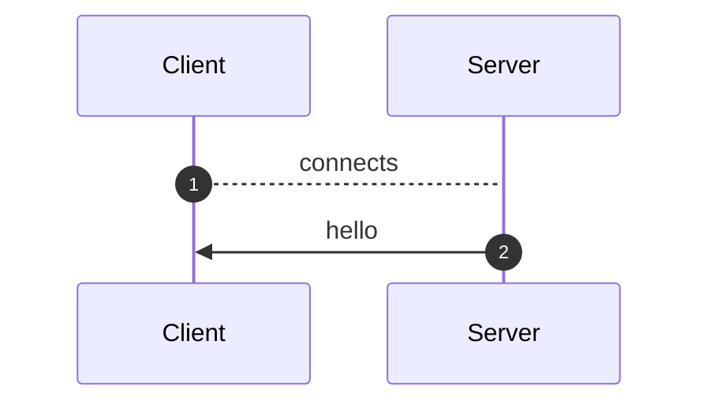
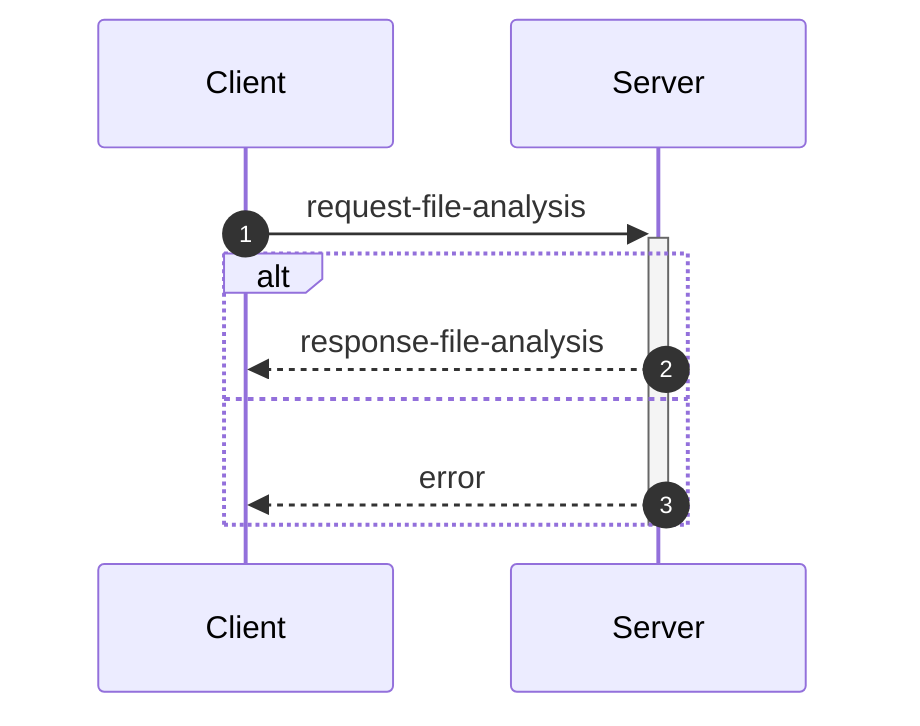
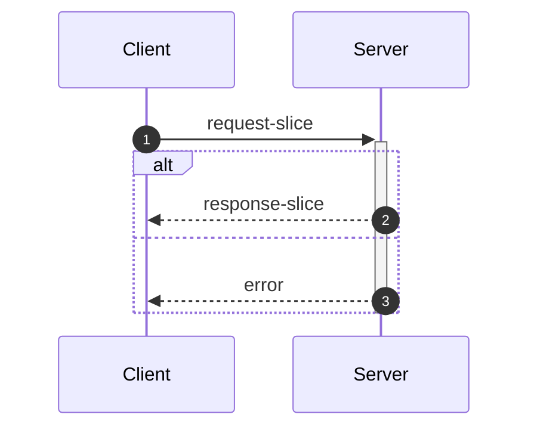
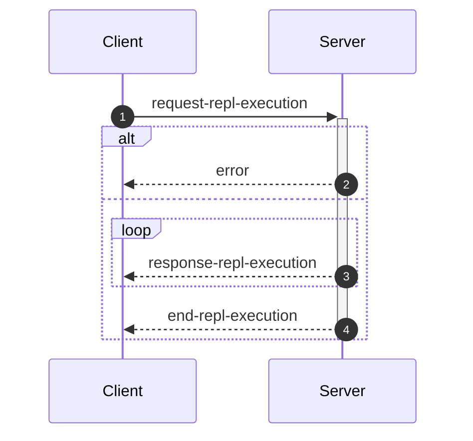

_This document was generated from '[src/documentation/wiki-interface.ts](https://github.com/flowr-analysis/flowr/tree/main//src/documentation/wiki-interface.ts)' on 2026-06-20, 13:19:24 UTC presenting an overview of flowR's interface (v2.10.9, using R v4.6.0). Please do not edit this file/wiki page directly._

Although far from being as detailed as the in-depth explanation of [_flowR_](https://github.com/flowr-analysis/flowr/wiki/core),
this wiki page explains how to interface with _flowR_ in more detail.
In general, command line arguments and other options provide short descriptions on hover over.

* [💻 Using the REPL](#using-the-repl)
* [⚙️ Configuring FlowR](#configuring-flowr)
* [⚒️ Writing Code](#writing-code)
* [💬 Communicating with the Server](#communicating-with-the-server)

<a id='using-the-repl'></a>
## 💻 Using the REPL


> [!NOTE]
> To execute arbitrary R commands with a repl request, _flowR_ has to be started explicitly with <span title="Description (Command Line Argument): Allow to access the underlying R session when using flowR (security warning: this allows the execution of arbitrary R code!)">`--r-session-access`</span>.
> Please be aware that this introduces a security risk and note that this relies on the [`r-shell` engine](https://github.com/flowr-analysis/flowr/wiki/engines) .

Although primarily meant for users to explore,
there is nothing which forbids simply calling _flowR_ as a subprocess to use standard-in, -output, and -error
for communication (although you can access the REPL using the server as well,
with the [REPL Request](#message-request-repl-execution) message).

The read-eval-print loop&nbsp;(REPL) works relatively simple.
You can submit an expression (using <kbd>Enter</kbd>),
which is interpreted as an R&nbsp;expression by default but interpreted as a *command* if it starts with a colon (`:`).
The best command to get started with the REPL is <span title="Description (Repl Command): Show help information (aliases: :h, :?)">`:help`</span>.
Besides, you can leave the REPL either with the command <span title="Description (Repl Command): End the repl (aliases: :q, :exit)">`:quit`</span> or by pressing <kbd>Ctrl</kbd>+<kbd>C</kbd> twice.
When writing a *command*, you may press <kbd>Tab</kbd> to get a list of completions, if available.
Multiple commands can be entered in a single line by separating them with a semicolon (`;`), e.g. `:parse "x<-2"; :df*`.
If a command is given without R code, the REPL will re-use R code given in a previous command.
The prior example will hence return first the parsed AST of the program and then the dataflow graph for `"x <- 2"`.

> [!NOTE]
> If you develop flowR, you may want to launch the repl using the `npm run main-dev` command, this way, you get a non-minified version of flowR with debug information and hot-reloading of source files.

<details>
<summary>Available Commands</summary>

We currently offer the following commands (this with a `[*]` suffix are available with and without the star):


| Command | Description |
| ------- | ----------- |
| **<span title="Description (Repl Command): End the repl (aliases: :q, :exit)">:quit</span>** | End the repl (aliases: **:<span title="Alias of ':quit'. End the repl">q</span>**, **:<span title="Alias of ':quit'. End the repl">exit</span>**) |
| **<span title="Description (Repl Command): Execute the given code as R code. This requires the `--r-session-access` flag to be set and requires the r-shell engine. (aliases: :e, :r)">:execute</span>** | Execute the given code as R code. This requires the `--r-session-access` flag to be set and requires the r-shell engine. (aliases: **:<span title="Alias of ':execute'. Execute the given code as R code. This requires the `--r-session-access` flag to be set and requires the r-shell engine.">e</span>**, **:<span title="Alias of ':execute'. Execute the given code as R code. This requires the `--r-session-access` flag to be set and requires the r-shell engine.">r</span>**) |
| **<span title="Description (Repl Command): Get mermaid code for the control-flow graph of R code, start with 'file://' to indicate a file (aliases: :cfg, :cf)">:controlflow[*]</span>** | Get mermaid code for the control-flow graph of R code, start with 'file://' to indicate a file (star: Returns the URL to mermaid.live) (aliases: **:<span title="Alias of ':controlflow'. Get mermaid code for the control-flow graph of R code, start with 'file://' to indicate a file">cfg</span>**, **:<span title="Alias of ':controlflow'. Get mermaid code for the control-flow graph of R code, start with 'file://' to indicate a file">cf</span>**) |
| **<span title="Description (Repl Command): Get mermaid code for the control-flow graph with basic blocks, start with 'file://' to indicate a file (aliases: :cfgb, :cfb)">:controlflowbb[*]</span>** | Get mermaid code for the control-flow graph with basic blocks, start with 'file://' to indicate a file (star: Returns the URL to mermaid.live) (aliases: **:<span title="Alias of ':controlflowbb'. Get mermaid code for the control-flow graph with basic blocks, start with 'file://' to indicate a file">cfgb</span>**, **:<span title="Alias of ':controlflowbb'. Get mermaid code for the control-flow graph with basic blocks, start with 'file://' to indicate a file">cfb</span>**) |
| **<span title="Description (Repl Command): Get mermaid code for the dataflow graph, start with 'file://' to indicate a file (aliases: :d, :df)">:dataflow[*]</span>** | Get mermaid code for the dataflow graph, start with 'file://' to indicate a file (star: Returns the URL to mermaid.live) (aliases: **:<span title="Alias of ':dataflow'. Get mermaid code for the dataflow graph, start with 'file://' to indicate a file">d</span>**, **:<span title="Alias of ':dataflow'. Get mermaid code for the dataflow graph, start with 'file://' to indicate a file">df</span>**) |
| **<span title="Description (Repl Command): Get mermaid code for the normalized AST of R code, start with 'file://' to indicate a file (aliases: :n)">:normalize[*]</span>** | Get mermaid code for the normalized AST of R code, start with 'file://' to indicate a file (star: Returns the URL to mermaid.live) (alias: **:<span title="Alias of ':normalize'. Get mermaid code for the normalized AST of R code, start with 'file://' to indicate a file">n</span>**) |
| **<span title="Description (Repl Command): Get mermaid code for the simplified dataflow graph, start with 'file://' to indicate a file (aliases: :ds, :dfs)">:dataflowsimple[*]</span>** | Get mermaid code for the simplified dataflow graph, start with 'file://' to indicate a file (star: Returns the URL to mermaid.live) (aliases: **:<span title="Alias of ':dataflowsimple'. Get mermaid code for the simplified dataflow graph, start with 'file://' to indicate a file">ds</span>**, **:<span title="Alias of ':dataflowsimple'. Get mermaid code for the simplified dataflow graph, start with 'file://' to indicate a file">dfs</span>**) |
| **<span title="Description (Repl Command): Just calculates the DFG, but only prints summary info (aliases: :d#, :df#)">:dataflowsilent</span>** | Just calculates the DFG, but only prints summary info (aliases: **:<span title="Alias of ':dataflowsilent'. Just calculates the DFG, but only prints summary info">d#</span>**, **:<span title="Alias of ':dataflowsilent'. Just calculates the DFG, but only prints summary info">df#</span>**) |
| **<span title="Description (Repl Command): Prints ASCII Art of the parsed, unmodified AST, start with 'file://' to indicate a file (aliases: :p)">:parse</span>** | Prints ASCII Art of the parsed, unmodified AST, start with 'file://' to indicate a file (alias: **:<span title="Alias of ':parse'. Prints ASCII Art of the parsed, unmodified AST, start with 'file://' to indicate a file">p</span>**) |
| **<span title="Description (Repl Command): Prints the version of flowR as well as the current version of R">:version</span>** | Prints the version of flowR as well as the current version of R
| **<span title="Description (Repl Command): Query the given R code, start with 'file://' to indicate a file. The query is to be a valid query in json format (use 'help' to get more information).">:query[*]</span>** | Query the given R code, start with 'file://' to indicate a file. The query is to be a valid query in json format (use 'help' to get more information). (star: Similar to query, but returns the output in json format.)
| **<span title="Description (Repl Command): Returns an ASCII representation of the dataflow graph (aliases: :df!)">:dataflowascii</span>** | Returns an ASCII representation of the dataflow graph (alias: **:<span title="Alias of ':dataflowascii'. Returns an ASCII representation of the dataflow graph">df!</span>**) |
| **<span title="Description (Repl Command): Returns summarization stats for the normalized AST (aliases: :n#)">:normalize#</span>** | Returns summarization stats for the normalized AST (alias: **:<span title="Alias of ':normalize#'. Returns summarization stats for the normalized AST">n#</span>**) |
| **<span title="Description (Repl Command): Show help information (aliases: :h, :?)">:help</span>** | Show help information (aliases: **:<span title="Alias of ':help'. Show help information">h</span>**, **:<span title="Alias of ':help'. Show help information">?</span>**) |


</details>


> [!TIP]
> 
> As indicated by the examples before, all REPL commands that operate on code keep track of the state.
> Hence, if you run a command like <span title="Description (Repl Command, starred version): Returns the URL to mermaid.live; Base Command: Get mermaid code for the dataflow graph, start with 'file://' to indicate a file (aliases: :d*, :df*)">`:dataflow*`</span> without providing R code,
> the REPL will re-use the R code provided in a previous command.
> Likewise, doing this will benefit from incrementality!
> If you request the dataflow graph with `:df* x <- 2 * y` and then want to see the parsed AST with `:parse`,
> the REPL will re-use previously obtained information and not re-parse the code again.
> 		


Generally, many commands offer shortcut versions in the REPL. Many queries, for example, offer a shortened format (see the example below).
Of special note, the [Config Query](https://github.com/flowr-analysis/flowr/wiki/query-api#Config-Query)
can be used to also modify the currently active configuration of _flowR_ within the REPL (see the [wiki page](https://github.com/flowr-analysis/flowr/wiki/query-api#Config-Query) for more information).

### Example: Retrieving the Dataflow Graph

To retrieve a URL to the [mermaid](https://mermaid.js.org/) diagram of the dataflow of a given expression,
use <span title="Description (Repl Command, starred version): Returns the URL to mermaid.live; Base Command: Get mermaid code for the dataflow graph, start with 'file://' to indicate a file (aliases: :d*, :df*)">`:dataflow*`</span> (or <span title="Description (Repl Command): Get mermaid code for the dataflow graph, start with 'file://' to indicate a file (aliases: :d, :df)">`:dataflow`</span> to get the mermaid code in the cli):


```shell
$ docker run -it --rm eagleoutice/flowr # or npm run flowr 
flowR repl using flowR v2.10.9, R grammar v14 (tree-sitter engine)
R> :dataflow* y <- 1 + x
```

<details>
<summary style='color:gray'>Output</summary>


```text
https://mermaid.live/view#base64:eyJjb2RlIjoiZmxvd2NoYXJ0IEJUXG4gICAgMXt7XCJgIzkxO1JOdW1iZXIjOTM7IDFcbiAgICAgICgxKVxuICAgICAgKjEuNipgXCJ9fVxuICAgJSUgTm8gZWRnZXMgZm91bmQgZm9yIDFcbiAgICAyKFtcImAjOTE7UlN5bWJvbCM5MzsgeFxuICAgICAgKDIpXG4gICAgICAqMS4xMCpgXCJdKVxuICAgJSUgTm8gZWRnZXMgZm91bmQgZm9yIDJcbiAgICAzW1tcImAjOTE7UkJpbmFyeU9wIzkzOyAjNDM7XG4gICAgICAoMylcbiAgICAgICoxLjYtMTAqXG4gICAgKDEsIDIpYFwiXV1cbiAgICBidWlsdC1pbjpfW1wiYEJ1aWx0LUluOlxuIzQzO2BcIl1cbiAgICBzdHlsZSBidWlsdC1pbjpfIHN0cm9rZTpncmF5LGZpbGw6Z3JheSxzdHJva2Utd2lkdGg6MnB4LG9wYWNpdHk6Ljg7XG4gICAgMFtcImAjOTE7UlN5bWJvbCM5MzsgeVxuICAgICAgKDAsIHNvdXJjZXM6IFszXSlcbiAgICAgICoxLjEqYFwiXVxuICAgIDRbW1wiYCM5MTtSQmluYXJ5T3AjOTM7ICM2MDsjNDU7XG4gICAgICAoNClcbiAgICAgICoxLjEtMTAqXG4gICAgKDAsIDMpYFwiXV1cbiAgICBidWlsdC1pbjpfLVtcImBCdWlsdC1JbjpcbiM2MDsjNDU7YFwiXVxuICAgIHN0eWxlIGJ1aWx0LWluOl8tIHN0cm9rZTpncmF5LGZpbGw6Z3JheSxzdHJva2Utd2lkdGg6MnB4LG9wYWNpdHk6Ljg7XG4gICAgMyAtLT58XCJyZWFkcywgYXJndW1lbnRcInwgMVxuICAgIDMgLS0+fFwicmVhZHMsIGFyZ3VtZW50XCJ8IDJcbiAgICAzIC0uLT58XCJyZWFkcywgY2FsbHNcInwgYnVpbHQtaW46X1xuICAgIGxpbmtTdHlsZSAyIHN0cm9rZTpncmF5O1xuICAgIDAgLS0+fFwiZGVmaW5lZC1ieVwifCAzXG4gICAgMCAtLT58XCJkZWZpbmVkLWJ5XCJ8IDRcbiAgICA0IC0tPnxcInJlYWRzLCBhcmd1bWVudFwifCAzXG4gICAgNCAtLT58XCJyZXR1cm5zLCBhcmd1bWVudFwifCAwXG4gICAgNCAtLi0+fFwicmVhZHMsIGNhbGxzXCJ8IGJ1aWx0LWluOl8tXG4gICAgbGlua1N0eWxlIDcgc3Ryb2tlOmdyYXk7IiwibWVybWFpZCI6eyJhdXRvU3luYyI6dHJ1ZX19
```


Retrieve the dataflow graph of the expression `y <- 1 + x`. It looks like this:


```mermaid
flowchart LR
    1{{"`#91;RNumber#93; 1
      (1)
      *1.6*`"}}
   %% No edges found for 1
    2(["`#91;RSymbol#93; x
      (2)
      *1.10*`"])
   %% No edges found for 2
    3[["`#91;RBinaryOp#93; #43;
      (3)
      *1.6-10*
    (1, 2)`"]]
    built-in:_["`Built-In:
#43;`"]
    style built-in:_ stroke:gray,fill:gray,stroke-width:2px,opacity:.8;
    0["`#91;RSymbol#93; y
      (0, sources: [3])
      *1.1*`"]
    4[["`#91;RBinaryOp#93; #60;#45;
      (4)
      *1.1-10*
    (0, 3)`"]]
    built-in:_-["`Built-In:
#60;#45;`"]
    style built-in:_- stroke:gray,fill:gray,stroke-width:2px,opacity:.8;
    3 -->|"reads, argument"| 1
    3 -->|"reads, argument"| 2
    3 -.->|"reads, calls"| built-in:_
    linkStyle 2 stroke:gray;
    0 -->|"defined-by"| 3
    0 -->|"defined-by"| 4
    4 -->|"reads, argument"| 3
    4 -->|"returns, argument"| 0
    4 -.->|"reads, calls"| built-in:_-
    linkStyle 7 stroke:gray;
```

	
<details>

<summary style="color:gray">R Code of the Dataflow Graph</summary>

The analysis required _0.5 ms_ (including parse and normalize, using the [tree-sitter](https://github.com/flowr-analysis/flowr/wiki/Engines) engine) within the generation environment. 
We encountered no unknown side effects during the analysis.


```r
y <- 1 + x
```


</details>


</details>


For small graphs like this, <span title="Description (Repl Command): Returns an ASCII representation of the dataflow graph (aliases: :df!)">`:dataflowascii`</span> also provides an ASCII representation directly in the REPL:


```shell
$ docker run -it --rm eagleoutice/flowr # or npm run flowr 
flowR repl using flowR v2.10.9, R grammar v14 (tree-sitter engine)
R> :df! y <- 1 + x
```

<details open>
<summary style='color:gray'>Output</summary>


```text
                        0<1>0
                   ┌────| 1 |
    ┌────────┐     │    0---0
 c<4>c       └──c<3>c
 |<- |  v<0>v┌──| + |
 c---c──| y |┘  c---c   u<2>u
        v---v      └────| x |
                        u---u
Edges:
3 -> 1: reads, argument  3 -> 2: reads, argument
4 -> 3: reads, argument  4 -> 0: returns, argument
0 -> 3: defined-by       0 -> 4: defined-by
```


Retrieve the dataflow graph of the expression `y <- 1 + x` as ASCII art.

</details>


For the slicing with <span title="Description (Repl Command): Static backwards executable slicer for R">`:slicer`</span>, you have access to the same [magic comments](#slice-magic-comments) as with the [slice request](#message-request-slice).

### Example: Interfacing with the File System

Many commands that allow for an R-expression (like <span title="Description (Repl Command, starred version): Returns the URL to mermaid.live; Base Command: Get mermaid code for the dataflow graph, start with 'file://' to indicate a file (aliases: :d*, :df*)">`:dataflow*`</span>) allow for a file as well
if the argument starts with `file://`.
If you are working from the root directory of the _flowR_ repository, the following gives you the parsed AST of the example file using the <span title="Description (Repl Command): Prints ASCII Art of the parsed, unmodified AST, start with 'file://' to indicate a file (aliases: :p)">`:parse`</span> command:


```shell
$ docker run -it --rm eagleoutice/flowr # or npm run flowr 
flowR repl using flowR v2.10.9, R grammar v14 (tree-sitter engine)
R> :parse file://test/testfiles/example.R
```

<details>
<summary style='color:gray'>Output</summary>


```text
File: test/testfiles/example.R

program
├ binaryoperator
│ ├ identifier "sum" (1:1─4)
│ ├ <- "<-" (1:5─7)
│ ╰ float "0" (1:8─9)
├ binaryoperator
│ ├ identifier "product" (2:1─8)
│ ├ <- "<-" (2:9─11)
│ ╰ float "1" (2:12─13)
├ binaryoperator
│ ├ identifier "w" (3:1─2)
│ ├ <- "<-" (3:3─5)
│ ╰ float "7" (3:6─7)
├ binaryoperator
│ ├ identifier "N" (4:1─2)
│ ├ <- "<-" (4:3─5)
│ ╰ float "10" (4:6─8)
├ forstatement
│ ├ for "for" (6:1─4)
│ ├ ( "(" (6:5─6)
│ ├ identifier "i" (6:6─7)
│ ├ in "in" (6:8─10)
│ ├ binaryoperator
│ │ ├ float "1" (6:11─12)
│ │ ├ : ":" (6:12─13)
│ │ ╰ parenthesizedexpression
│ │   ├ ( "(" (6:13─14)
│ │   ├ binaryoperator
│ │   │ ├ identifier "N" (6:14─15)
│ │   │ ├ - "-" (6:15─16)
│ │   │ ╰ float "1" (6:16─17)
│ │   ╰ ) ")" (6:17─18)
│ ├ ) ")" (6:18─19)
│ ╰ bracedexpression
│   ├ { "{" (6:20─21)
│   ├ binaryoperator
│   │ ├ identifier "sum" (7:3─6)
│   │ ├ <- "<-" (7:7─9)
│   │ ╰ binaryoperator
│   │   ├ binaryoperator
│   │   │ ├ identifier "sum" (7:10─13)
│   │   │ ├ + "+" (7:14─15)
│   │   │ ╰ identifier "i" (7:16─17)
│   │   ├ + "+" (7:18─19)
│   │   ╰ identifier "w" (7:20─21)
│   ├ binaryoperator
│   │ ├ identifier "product" (8:3─10)
│   │ ├ <- "<-" (8:11─13)
│   │ ╰ binaryoperator
│   │   ├ identifier "product" (8:14─21)
│   │   ├  "" (8:22─23)
│   │   ╰ identifier "i" (8:24─25)
│   ╰ } "}" (9:1─2)
├ call
│ ├ identifier "cat" (11:1─4)
│ ╰ arguments
│   ├ ( "(" (11:4─5)
│   ├ argument
│   │ ╰ string
│   │   ├ " "\"" (11:5─6)
│   │   ├ stringcontent "Sum:" (11:6─10)
│   │   ╰ " "\"" (11:10─11)
│   ├ comma "," (11:11─12)
│   ├ argument
│   │ ╰ identifier "sum" (11:13─16)
│   ├ comma "," (11:16─17)
│   ├ argument
│   │ ╰ string
│   │   ├ " "\"" (11:18─19)
│   │   ├ stringcontent
│   │   │ ╰ escapesequence "\\n" (11:19─21)
│   │   ╰ " "\"" (11:21─22)
│   ╰ ) ")" (11:22─23)
╰ call
  ├ identifier "cat" (12:1─4)
  ╰ arguments
    ├ ( "(" (12:4─5)
    ├ argument
    │ ╰ string
    │   ├ " "\"" (12:5─6)
    │   ├ stringcontent "Product:" (12:6─14)
    │   ╰ " "\"" (12:14─15)
    ├ comma "," (12:15─16)
    ├ argument
    │ ╰ identifier "product" (12:17─24)
    ├ comma "," (12:24─25)
    ├ argument
    │ ╰ string
    │   ├ " "\"" (12:26─27)
    │   ├ stringcontent
    │   │ ╰ escapesequence "\\n" (12:27─29)
    │   ╰ " "\"" (12:29─30)
    ╰ ) ")" (12:30─31)
```


Retrieve the parsed AST of the example file.

<details>

<summary>File Content</summary>


```r
sum <- 0
product <- 1
w <- 7
N <- 10

for (i in 1:(N-1)) {
  sum <- sum + i + w
  product <- product * i
}

cat("Sum:", sum, "\n")
cat("Product:", product, "\n")
```


</details>

As _flowR_ directly transforms this AST the output focuses on being human-readable instead of being machine-readable.
		

</details>


### Example: Run a Query

You can run any query supported by _flowR_ using the <span title="Description (Repl Command): Query the given R code, start with 'file://' to indicate a file. The query is to be a valid query in json format (use 'help' to get more information).">`:query`</span> command.
For example, to obtain the shapes of all data frames in a given piece of code, you can run:


```shell
$ docker run -it --rm eagleoutice/flowr # or npm run flowr 
flowR repl using flowR v2.10.9, R grammar v14 (tree-sitter engine)
R> :query @df-shape "x <- data.frame(a = 1:10, b = 1:10)\ny <- x$a"
```

<details open>
<summary style='color:gray'>Output</summary>


```text
Query: df-shape (3 ms)
   ╰ 12: (colnames: [{"a", "b"}, {}], cols: [2, 2], rows: [10, 10])
   ╰ 0: (colnames: [{"a", "b"}, {}], cols: [2, 2], rows: [10, 10])
All queries together required ≈4 ms (1ms accuracy, total 5 ms)
```


Retrieve the shapes of all data frames in the given code.

</details>


To run the linter on a file, you can use (in this example, we just issue the `dead-code` linter on a small piece of code):


```shell
$ docker run -it --rm eagleoutice/flowr # or npm run flowr 
flowR repl using flowR v2.10.9, R grammar v14 (tree-sitter engine)
R> :query @linter rules:dead-code "if(FALSE) x <- 2"
```

<details open>
<summary style='color:gray'>Output</summary>


```text
Query: linter (2 ms)
   ╰ Dead Code (dead-code):
       ╰ certain:
           ╰ Code at 1.11-16
       ╰ Metadata: searchTimeMs: 1, processTimeMs: 0
All queries together required ≈2 ms (1ms accuracy, total 2 ms)
```


Run the linter on the given code, with only the `dead-code` rule enabled.

</details>


For more information on the available queries, please check out the [Query API](https://github.com/flowr-analysis/flowr/wiki/query-api).


<a id='configuring-flowr'></a>
## ⚙️ Configuring FlowR


When running _flowR_, you may want to specify some behaviors with a dedicated configuration file.
By default, flowR looks for a file named `flowr.json` in the current working directory (or any higher directory).
You can also specify a different file with <span title="Description (Command Line Argument): The name of the configuration file to use">`--config-file`</span> or pass the configuration inline using <span title="Description (Command Line Argument): The flowR configuration to use, as a JSON string">`--config-json`</span>.
To inspect the current configuration, you can run flowr with the <span title="Description (Command Line Argument): Run with verbose logging (will be passed to the corresponding script)">`--verbose`</span> flag, or use the `config` [Query](https://github.com/flowr-analysis/flowr/wiki/query-api).
Within the REPL this works by running the following:


```shell
:query @config
```


To work with the <a href="https://github.com/flowr-analysis/flowr/tree/main/src/config.ts#L109"><code><span title="The configuration file format for flowR.">FlowrConfig</span></code></a> you can use the provided helper objects alongside its methods like
<a href="https://github.com/flowr-analysis/flowr/tree/main/src/config.ts#L457"><code><span title="Creates a new flowr config that has the updated values.">FlowrConfig::<b>amend</b></span></code></a>.
The following summarizes the configuration options:

- `ignoreSourceCalls`: If set to `true`, _flowR_ will ignore source calls when analyzing the code, i.e., ignoring the inclusion of other files.
- `semantics`: allows to configure the way _flowR_ handles R, although we currently only support `semantics/environment/overwriteBuiltIns`.
  You may use this to overwrite _flowR_'s handling of built-in function and even completely clear the preset definitions shipped with flowR.
  See [Configure BuiltIn Semantics](#configure-builtin-semantics) for more information.
- `solver`: allows to configure how _flowR_ resolves variables and their values (currently we support: `disabled`, `alias`, `builtin`), as well as if pointer analysis should be active.
- `engines`: allows to configure the engines used by _flowR_ to interact with R code. See the [Engines wiki page](https://github.com/flowr-analysis/flowr/wiki/engines) for more information.
- `defaultEngine`: allows to specify the default engine to use for interacting with R code. If not set, an arbitrary engine from the specified list will be used.
- `abstractInterpretation`: allows to configure how _flowR_ performs abstract interpretation, although we currently only support data frame shape inference through abstract interpretation.
- `defaultPlugins`: allows to configure which plugins to load by default when creating a new <a href="https://github.com/flowr-analysis/flowr/tree/main/src/project/flowr-analyzer.ts#L162"><code><span title="Central class for conducting analyses with FlowR. Use the FlowrAnalyzerBuilder to create a new instance. If you want the original pattern of creating a pipeline and running all steps, you can still do this with FlowrAnalyzer#runFull . To inspect the context of the analyzer, use FlowrAnalyzer#inspectContext (if you are a plugin and need to modify it, use FlowrAnalyzer#context instead).">FlowrAnalyzer</span></code></a> instance.
- `repl.plugins`: allows to configure which plugins to load in the _flowR_ REPL. Use `flowr:default` to reference the plugins specified by `defaultPlugins`.

So you can configure _flowR_ by adding a file like the following:

<details>

<summary>Example Configuration File</summary>


```json
{
  "ignoreSourceCalls": true,
  "semantics": {
    "environment": {
      "overwriteBuiltIns": {
        "definitions": [
          {
            "type": "function",
            "names": [
              "foo"
            ],
            "processor": "builtin:assign",
            "config": {}
          }
        ]
      }
    }
  },
  "defaultPlugins": [
    "file:description",
    "versions:description"
  ],
  "repl": {
    "quickStats": false,
    "dfProcessorHeat": false,
    "plugins": [
      "flowr:default"
    ]
  },
  "project": {
    "resolveUnknownPathsOnDisk": true
  },
  "engines": [
    {
      "type": "r-shell"
    }
  ],
  "solver": {
    "variables": "alias",
    "evalStrings": true,
    "trackEnvironments": true,
    "resolveSource": {
      "dropPaths": "no",
      "ignoreCapitalization": true,
      "inferWorkingDirectory": "active-script",
      "searchPath": []
    },
    "instrument": {},
    "slicer": {
      "threshold": 50
    }
  },
  "abstractInterpretation": {
    "wideningThreshold": 4,
    "dataFrame": {
      "maxColNames": 20,
      "readLoadedData": {
        "readExternalFiles": true,
        "maxReadLines": 1000000
      }
    }
  },
  "gas": {
    "thresholds": {
      "memory": {
        "problematic": 0.7,
        "critical": 0.9
      },
      "timeMs": {
        "problematic": 100000,
        "critical": 120000
      }
    },
    "features": {}
  }
}
```


</details>

<details>
<a id='configure-builtin-semantics'></a>
<summary>Configure Built-In Semantics</summary>


`semantics/environment/overwriteBuiltins` accepts two keys:

- `loadDefaults` (boolean, initially `true`): If set to `true`, the default built-in definitions are loaded before applying the custom definitions. Setting this flag to `false` explicitly disables the loading of the default definitions.
- `definitions` (array, initially empty): Allows to overwrite or define new built-in elements. Each object within must have a `type` which is one of the below. Furthermore, they may define a string array of `names` which specifies the identifiers to bind the definitions to. You may use `assumePrimitive` to specify whether _flowR_ should assume that this is a primitive non-library definition (so you probably just do not want to specify the key).

  | Type            | Description                                                                                                                                                                                                                                                                                              | Example                                                                                                    |
  | --------------- | -------------------------------------------------------------------------------------------------------------------------------------------------------------------------------------------------------------------------------------------------------------------------------------------------------- | ---------------------------------------------------------------------------------------------------------- |
  | `constant`    | Additionally allows for a `value` this should resolve to.                                                                                                                                                                                                                                                | `{ type: 'constant', names: ['NULL', 'NA'],  value: null }`                                                |
  | `function`    | Is a rather flexible way to define and bind built-in functions. For the time, we do not have extensive documentation to cover all the cases, so please either consult the sources with the `default-builtin-config.ts` or open a [new issue](https://github.com/flowr-analysis/flowr/issues/new/choose). | `{ type: 'function', names: ['next'], processor: 'builtin:d', config: { cfg: ExitPointType.Next } }` |
  | `replacement` | A comfortable way to specify replacement functions like `$<-` or `names<-`. `suffixes` describes the... suffixes to attach automatically. | `{ type: 'replacement', suffixes: ['<-', '<<-'], names: ['[', '[['] }` |


</details>

<details>

<summary style='color:gray'>Full Configuration-File Schema</summary>

- _The configuration file format for flowR._ (object)
    - **ignoreSourceCalls** [optional] _Whether source calls should be ignored, causing {@link processSourceCall}'s behavior to be skipped._ (boolean)
    - **semantics** _Configure language semantics and how flowR handles them._ (object)
        - **environment** [optional] _Semantics regarding how to handle the R environment._ (object)
            - **overwriteBuiltIns** [optional] _Do you want to overwrite (parts) of the builtin definition?_ (object)
                - **loadDefaults** [optional] _Should the default configuration still be loaded?_ (boolean)
                - **definitions** [optional] _The definitions to load/overwrite._ (array)
                Valid item types:
                    - (object)
    - **defaultPlugins** [optional] _The default plugins to load when creating a new instance of FlowrAnalyzer_ (array)
    Valid item types:
        - (alternatives)
            - (string)
            - (array)
    - **repl** _Configuration options for the REPL._ (object)
        - **quickStats** [optional] _Whether to show quick stats in the REPL after each evaluation._ (boolean)
        - **dfProcessorHeat** [optional] _This instruments the dataflow processors to count how often each processor is called._ (boolean)
        - **plugins** [optional] _The plugins to load in REPL mode_ (array)
        Valid item types:
            - (alternatives)
                - (string)
                - (array)
    - **project** _Project specific configuration options._ (object)
        - **resolveUnknownPathsOnDisk** [optional] _Whether to resolve unknown paths loaded by the r project disk when trying to source/analyze files._ (boolean)
    - **engines** _The engine or set of engines to use for interacting with R code. An empty array means all available engines will be used._ (array)
    Valid item types:
        - (alternatives)
            - _The configuration for the tree sitter engine._ (object)
                - **type** [required] _Use the tree sitter engine._ (string)
                    Only allows: 'tree-sitter'
                - **wasmPath** [optional] _The path to the tree-sitter-r WASM binary to use. If this is undefined, this uses the default path._ (string)
                - **treeSitterWasmPath** [optional] _The path to the tree-sitter WASM binary to use. If this is undefined, this uses the default path._ (string)
                - **lax** [optional] _Whether to use the lax parser for parsing R code (allowing for syntax errors). If this is undefined, the strict parser will be used._ (boolean)
            - _The configuration for the R shell engine._ (object)
                - **type** [required] _Use the R shell engine._ (string)
                    Only allows: 'r-shell'
                - **rPath** [optional] _The path to the R executable to use. If this is undefined, this uses the default path._ (string)
    - **defaultEngine** [optional] _The default engine to use for interacting with R code. If this is undefined, an arbitrary engine from the specified list will be used._ (string)
        Only allows: 'tree-sitter', 'r-shell'
    - **solver** _How to resolve constants, constraints, cells, ..._ (object)
        - **variables** _How to resolve variables and their values._ (string)
            Only allows: 'disabled', 'alias', 'builtin'
        - **evalStrings** _Should we include eval(parse(text="...")) calls in the dataflow graph?_ (boolean)
        - **trackEnvironments** [optional] _Track user-created environments (new.env, assign/get/local with envir=, dollar-assign, attach). When false, all envir-style calls fall through conservatively._ (boolean)
        - **instrument** (object)
            - **dataflowExtractors** [optional] _These keys are only intended for use within code, allowing to instrument the dataflow analyzer!_ (any)
        - **resolveSource** [optional] _If lax source calls are active, flowR searches for sourced files much more freely, based on the configurations you give it. This option is only in effect if `ignoreSourceCalls` is set to false._ (object)
            - **dropPaths** _Allow to drop the first or all parts of the sourced path, if it is relative._ (string)
                Only allows: 'no', 'once', 'all'
            - **ignoreCapitalization** _Search for filenames matching in the lowercase._ (boolean)
            - **inferWorkingDirectory** _Try to infer the working directory from the main or any script to analyze._ (string)
                Only allows: 'no', 'main-script', 'active-script', 'any-script'
            - **searchPath** _Additionally search in these paths._ (array)
            Valid item types:
                - (string)
            - **repeatedSourceLimit** [optional] _How often the same file can be sourced within a single run? Please be aware: in case of cyclic sources this may not reach a fixpoint so give this a sensible limit._ (number)
            - **applyReplacements** _Provide name replacements for loaded files_ (array)
            Valid item types:
                - (object)
        - **slicer** [optional] _The configuration for the slicer._ (object)
            - **threshold** [optional] _The maximum number of iterations to perform on a single function call during slicing._ (number)
            - **autoExtend** [optional] _If set, the slicer will gain an additional post-pass._ (boolean)
    - **abstractInterpretation** _The configuration options for abstract interpretation._ (object)
        - **wideningThreshold** _The threshold for the number of visitations of a node at which widening should be performed to ensure the termination of the fixpoint iteration._ (number)
        - **dataFrame** _The configuration of the shape inference for data frames._ (object)
            - **maxColNames** _The maximum number of columns names to infer for data frames before over-approximating the column names to top._ (number)
            - **readLoadedData** _Configuration options for reading data frame shapes from loaded external data files, such as CSV files._ (object)
                - **readExternalFiles** _Whether data frame shapes should be extracted from loaded external files, such as CSV files._ (boolean)
                - **maxReadLines** _The maximum number of lines to read when extracting data frame shapes from loaded files, such as CSV files._ (number)
    - **gas** [optional] _Resource-usage guard (gas) configuration. All feature factors default to 0 (disabled). See https://github.com/flowr-analysis/flowr/wiki/Core#gas-resource-guard._ (object)
        - **thresholds** [optional] _Shared thresholds for all gas checks (scaled by per-feature factor)._ (object)
            - **memory** [optional] _Heap-usage fraction thresholds (0-1)._ (object)
                - **problematic** [optional] _Heap fraction (0-1) above which Problematic is returned._ (number)
                - **critical** [optional] _Heap fraction (0-1) above which Critical is returned._ (number)
            - **timeMs** [optional] _Elapsed analysis time thresholds in milliseconds._ (object)
                - **problematic** [optional] _Elapsed ms above which Problematic is returned._ (number)
                - **critical** [optional] _Elapsed ms above which Critical is returned._ (number)
        - **features** [optional] _Per-feature sensitivity factors. 0 or absent disables gas checking for that feature. A factor of 2 makes the feature twice as sensitive. Recognised keys: `source`, `side-effect-linking`._ (object)

</details>

	

<a id='writing-code'></a>
## ⚒️ Writing Code

_flowR_ can be used as a [module](https://www.npmjs.com/package/@eagleoutice/flowr) and offers several main classes and interfaces that are interesting for extension writers 
(see the [Visual Studio Code extension](https://marketplace.visualstudio.com/items?itemName=code-inspect.vscode-flowr) or the [Core](https://github.com/flowr-analysis/flowr/wiki/core) wiki page for more information).

### Creating Analyses with _flowR_

Nowadays, instances of the <a href="https://github.com/flowr-analysis/flowr/tree/main/src/project/flowr-analyzer.ts#L162"><code><span title="Central class for conducting analyses with FlowR. Use the FlowrAnalyzerBuilder to create a new instance. If you want the original pattern of creating a pipeline and running all steps, you can still do this with FlowrAnalyzer#runFull . To inspect the context of the analyzer, use FlowrAnalyzer#inspectContext (if you are a plugin and need to modify it, use FlowrAnalyzer#context instead).">FlowrAnalyzer</span></code></a> should be used as central frontend to get analysis results from _flowR_.
For example, a program slice can be created like this:


```ts
const analyzer = await new FlowrAnalyzerBuilder()
    .setEngine('tree-sitter')
    .build();
analyzer.addRequest('x <- 1\ny <- x\nx');
const result = await analyzer.query([
    {
        type:     'static-slice',
        criteria: ['3@x']
    }
]);
//console.log(result['static-slice']);
```


For more information, please have a look at the [Analyzer](https://github.com/flowr-analysis/flowr/wiki/analyzer) wiki page, which explains how to construct and use the <a href="https://github.com/flowr-analysis/flowr/tree/main/src/project/flowr-analyzer.ts#L162"><code><span title="Central class for conducting analyses with FlowR. Use the FlowrAnalyzerBuilder to create a new instance. If you want the original pattern of creating a pipeline and running all steps, you can still do this with FlowrAnalyzer#runFull . To inspect the context of the analyzer, use FlowrAnalyzer#inspectContext (if you are a plugin and need to modify it, use FlowrAnalyzer#context instead).">FlowrAnalyzer</span></code></a> in more detail.
To work with specific perspectives, you can also consult the respective pages like the [Dataflow Graph](https://github.com/flowr-analysis/flowr/wiki/dataflow-graph) or the [Abstract Interpretation](https://github.com/flowr-analysis/flowr/wiki/abstract-interpretation) wiki pages.
        
### The Pipeline Executor (Low-Level Interface)

Once, in the beginning, _flowR_ was meant to produce a dataflow graph merely to provide *program slices*. 
However, with continuous updates, the [Dataflow Graph](https://github.com/flowr-analysis/flowr/wiki/dataflow-graph) repeatedly proves to be the more interesting part.
With this, we restructured _flowR_'s originally *hardcoded* pipeline to be far more flexible. 
Now, it can be theoretically extended or replaced with arbitrary steps, optional steps, and what we call 'decorations' of these steps. 
In short, a slicing pipeline using the <a href="https://github.com/flowr-analysis/flowr/tree/main/src/core/pipeline-executor.ts#L97"><code><span title="**Please note:** The PipelineExecutor is now considered to be a rather low-level API for flowR. While it still works and is the basis for all other layers, we strongly recommend using the FlowrAnalyzer and its builder to create and use an analyzer instance that is pre-configured for your use-case. The pipeline executor allows to execute arbitrary pipelines in a step-by-step fashion. If you are not...">PipelineExecutor</span></code></a> looks like this:


```ts

const slicer = new PipelineExecutor(DEFAULT_SLICING_PIPELINE, {
  parser:    new RShell(),
  request:   requestFromInput('x <- 1\nx + 1'),
  criterion: ['2@x']
})
const slice = await slicer.allRemainingSteps()
// console.log(slice.reconstruct.code)
```


<details><summary>More Information</summary>


If you compare this, with what you would have done with the old (and removed) `SteppingSlicer`, 
this essentially just requires you to replace the `SteppingSlicer` with the <a href="https://github.com/flowr-analysis/flowr/tree/main/src/core/pipeline-executor.ts#L97"><code><span title="**Please note:** The PipelineExecutor is now considered to be a rather low-level API for flowR. While it still works and is the basis for all other layers, we strongly recommend using the FlowrAnalyzer and its builder to create and use an analyzer instance that is pre-configured for your use-case. The pipeline executor allows to execute arbitrary pipelines in a step-by-step fashion. If you are not...">PipelineExecutor</span></code></a>
and to pass the <a href="https://github.com/flowr-analysis/flowr/tree/main/src/core/steps/pipeline/default-pipelines.ts#L18"><code>DEFAULT_SLICING_PIPELINE</code></a> as the first argument.
The <a href="https://github.com/flowr-analysis/flowr/tree/main/src/core/pipeline-executor.ts#L97"><code><span title="**Please note:** The PipelineExecutor is now considered to be a rather low-level API for flowR. While it still works and is the basis for all other layers, we strongly recommend using the FlowrAnalyzer and its builder to create and use an analyzer instance that is pre-configured for your use-case. The pipeline executor allows to execute arbitrary pipelines in a step-by-step fashion. If you are not...">PipelineExecutor</span></code></a>...

1. Provides structures to investigate the results of all intermediate steps
2. Can be executed step-by-step
3. Can repeat steps (e.g., to calculate multiple slices on the same input)

See the in-code documentation for more information.

	

</details>
    

### Using the <a href="https://github.com/flowr-analysis/flowr/tree/main/src/r-bridge/shell.ts#L143"><code><span title="The RShell represents an interactive session with the R interpreter. You can configure it by RShellOptions . At the moment we are using a live R session (and not networking etc.) to communicate with R easily, which allows us to install packages etc. However, this might and probably will change in the future (leaving this as a legacy mode :D)">RShell</span></code></a> to Interact with R

The <a href="https://github.com/flowr-analysis/flowr/tree/main/src/r-bridge/shell.ts#L143"><code><span title="The RShell represents an interactive session with the R interpreter. You can configure it by RShellOptions . At the moment we are using a live R session (and not networking etc.) to communicate with R easily, which allows us to install packages etc. However, this might and probably will change in the future (leaving this as a legacy mode :D)">RShell</span></code></a> class allows interfacing with the `R`&nbsp;ecosystem installed on the host system.
Please have a look at [flowR's Engines](https://github.com/flowr-analysis/flowr/wiki/engines) for more information on alternatives (for example, the <a href="https://github.com/flowr-analysis/flowr/tree/main/src/r-bridge/lang-4.x/tree-sitter/tree-sitter-executor.ts#L18"><code><span title="Synchronous and (way) faster alternative to the RShell using tree-sitter.">TreeSitterExecutor</span></code></a>).


> [!IMPORTANT]
> 
> Each <a href="https://github.com/flowr-analysis/flowr/tree/main/src/r-bridge/shell.ts#L143"><code><span title="The RShell represents an interactive session with the R interpreter. You can configure it by RShellOptions . At the moment we are using a live R session (and not networking etc.) to communicate with R easily, which allows us to install packages etc. However, this might and probably will change in the future (leaving this as a legacy mode :D)">RShell</span></code></a> controls a new instance of the R&nbsp;interpreter, 
> make sure to call <code><a href="https://github.com/flowr-analysis/flowr/tree/main/src/r-bridge/shell.ts#L317"><span title="Close the current R session, makes the object effectively invalid (can no longer be reopened etc.)">RShell::<i>close</i></span></a>()</code> when you are done.


You can start a new "session" simply by constructing a new object with <code>new <a href="https://github.com/flowr-analysis/flowr/tree/main/src/r-bridge/shell.ts#L143"><span title="The RShell represents an interactive session with the R interpreter. You can configure it by RShellOptions . At the moment we are using a live R session (and not networking etc.) to communicate with R easily, which allows us to install packages etc. However, this might and probably will change in the future (leaving this as a legacy mode :D)">RShell</span></a>()</code>.

However, there are several options that may be of interest 
(e.g., to automatically revive the shell in case of errors or to control the name location of the R process on the system).

With a shell object (let's call it `shell`), you can execute R code by using <a href="https://github.com/flowr-analysis/flowr/tree/main/src/r-bridge/shell.ts#L195"><code><span title="sends the given command directly to the current R session will not do anything to alter input markers!">RShell::<i>sendCommand</i></span></code></a>, 
for example <code>shell.<a href="https://github.com/flowr-analysis/flowr/tree/main/src/r-bridge/shell.ts#L195"><span title="sends the given command directly to the current R session will not do anything to alter input markers!">sendCommand</span></a>("1 + 1")</code>. 
However, this does not return anything, so if you want to collect the output of your command, use
<a href="https://github.com/flowr-analysis/flowr/tree/main/src/r-bridge/shell.ts#L261"><code><span title="Send a command and collect the output">RShell::<i>sendCommandWithOutput</i></span></code></a> instead.

Besides that, the command <a href="https://github.com/flowr-analysis/flowr/tree/main/src/r-bridge/shell.ts#L233"><code>RShell::<b>tryToInjectHomeLibPath</b></code></a> may be of interest, as it enables all libraries available on the host system.


### Generate Statistics (No longer a Focus of flowR)


<details>

<summary>Adding a New Feature to Extract</summary>

In this example, we construct a new feature to extract, with the name "*example*".
Whenever this name appears, you may substitute this with whatever name fits your feature best (as long as the name is unique).

1. **Create a new file in `src/statistics/features/supported`**\
   Create the file `example.ts`, and add its export to the `index.ts` file in the same directory (if not done automatically).

2. **Create the basic structure**\
   To get a better feel of what a feature must have, let's look
   at the basic structure (of course, due to TypeScript syntax,
   there are other ways to achieve the same goal):

   ```ts
   const initialExampleInfo = {
       /* whatever start value is good for you */
       someCounter: 0
   }

   export type ExampleInfo = Writable<typeof initialExampleInfo>

   export const example: Feature<ExampleInfo> = {
    name:        'Example Feature',
    description: 'A longer example description',

    process(existing: ExampleInfo, input: FeatureProcessorInput): ExampleInfo {
      /* perform analysis on the input */
      return existing
    },

    initialValue: initialExampleInfo
   }
   ```

   The `initialExampleInfo` type holds the initial values for each counter that you want to maintain during the feature extraction (they will usually be initialized with 0). The resulting `ExampleInfo` type holds the structure of the data that is to be counted. Due to the vast amount of data processed, information like the name and location of a function call is not stored here, but instead written to disk (see below).

   Every new feature must be of the `Feature<Info>` type, with `Info` referring to a `FeatureInfo` (like `ExampleInfo` in this example). Next to a `name` and a `description`, each Feature must provide:

   - a processor that extracts the information from the input, adding it to the existing information.
   - a function returning the initial value of the information (in this case, `initialExampleInfo`).

3. **Add it to the feature-mapping**\
   Now, in the `feature.ts` file in `src/statistics/features`, add your feature to the `ALL_FEATURES` object.

Now, we want to extract something. For the *example* feature created in the previous steps, we choose to count the amount of `COMMENT` tokens.
So we define a corresponding [XPath](https://developer.mozilla.org/en-US/docs/Web/XPath) query:

```ts
const commentQuery: Query = xpath.parse('//COMMENT')
```

Within our feature's `process` function, running the query is as simple as:

```ts
const comments = commentQuery.select({ node: input.parsedRAst })
```

Now we could do a lot of further processing, but for simplicity, we only record every comment found this way:

```ts
appendStatisticsFile(example.name, 'comments', comments, input.filepath)
```

We use `example.name` to avoid duplication with the name that we’ve assigned to the feature. It corresponds to the name of the folder in the statistics output.
`'comments'` refers to a freely chosen (but unique) name, that will be used as the name for the output file within the folder. The `comments` variable holds the result of the query, which is an array of nodes. Finally, we pass the `filepath` of the file that was analyzed (if known), so that it can be added to the statistics file (as additional information).

</details>
	

<a id='communicating-with-the-server'></a>
## 💬 Communicating with the Server


As explained in the [Overview](https://github.com/flowr-analysis/flowr/wiki/overview), you can simply run the [TCP](https://de.wikipedia.org/wiki/Transmission_Control_Protocol)&nbsp;server by adding the <span title="Description (Command Line Argument): Do not drop into a repl, but instead start a server on the given port (default: 1042) and listen for messages.">`--server`</span> flag (and, due to the interactive mode, exit with the conventional <kbd>CTRL</kbd>+<kbd>C</kbd>).
Currently, every connection is handled by the same underlying `RShell` - so the server is not designed to handle many clients at a time.
Additionally, the server is not well guarded against attacks (e.g., you can theoretically spawn an arbitrary number of&nbsp;RShell sessions on the target machine).

Every message has to be given in a single line (i.e., without a newline in-between) and end with a newline character. Nevertheless, we will pretty-print example given in the following segments for the ease of reading.


> [!NOTE]
> 
> The default <span title="Description (Command Line Argument): Do not drop into a repl, but instead start a server on the given port (default: 1042) and listen for messages.">`--server`</span> uses a simple [TCP](https://de.wikipedia.org/wiki/Transmission_Control_Protocol)
> connection. If you want _flowR_ to expose a [WebSocket](https://de.wikipedia.org/wiki/WebSocket) server instead, add the <span title="Description (Command Line Argument): If the server flag is set, use websocket for messaging">`--ws`</span> flag (i.e., <span title="Description (Command Line Argument): Do not drop into a repl, but instead start a server on the given port (default: 1042) and listen for messages.">`--server`</span> <span title="Description (Command Line Argument): If the server flag is set, use websocket for messaging">`--ws`</span>) when starting _flowR_ from the command line.
> 			


<ul><li>
<a id="message-hello"></a>
<b>Hello</b> Message (<code>hello</code>) 
<details>

<summary style="color:gray"> View Details. <i>The server informs the client about the successful connection and provides Meta-Information.</i> </summary>


```mermaid
sequenceDiagram
    autonumber
    participant Client
    participant Server

    
    Client-->Server: connects
    Server->>Client: hello
	
```


	
After launching _flowR_, for example, with <code>docker run -it --rm eagleoutice/flowr <span title="Description (Command Line Argument): Do not drop into a repl, but instead start a server on the given port (default: 1042) and listen for messages.">-<span/>-server</span></code>&nbsp;(🐳️), simply connecting should present you with a `hello` message, that amongst others should reveal the versions of&nbsp;_flowR_ and&nbsp;R, using the [semver 2.0](https://semver.org/spec/v2.0.0.html) versioning scheme.
The message looks like this:


```json
{
  "type": "hello",
  "clientName": "client-0",
  "versions": {
    "flowr": "2.10.9",
    "r": "4.6.0",
    "engine": "r-shell"
  }
}
```


There are currently a few messages that you can send after the hello message.
If you want to _slice_ a piece of R code you first have to send an [analysis request](#message-request-file-analysis), so that you can send one or multiple slice requests afterward.
Requests for the [REPL](#message-request-repl) are independent of that.
	

<hr>


<details>
<summary style="color:gray">Message schema (<code>hello</code>)</summary>

For the definition of the hello message, please see it's implementation at [`./src/cli/repl/server/messages/message-hello.ts`](https://github.com/flowr-analysis/flowr/tree/main/./src/cli/repl/server/messages/message-hello.ts).

- [required] (object)
    - **type** [required] _The type of the hello message._ (string)
        Only allows: 'hello'
    - **id** [forbidden] _The id of the message is always undefined (as it is the initial message and not requested)._ (any)
    - **clientName** [required] _A unique name that is assigned to each client. It has no semantic meaning and is only used/useful for debugging._ (string)
    - **versions** [required] (object)
        - **flowr** [required] _The version of the flowr server running in semver format._ (string)
        - **r** [required] _The version of the underlying R shell running in semver format._ (string)
        - **engine** [required] _The parser backend that is used to parse the R code._ (string)

</details>


<hr>

</details>
	</li>

<li>
<a id="message-request-file-analysis"></a>
<b>Analysis</b> Message (<code>request-file-analysis</code>) 
<details>

<summary style="color:gray"> View Details. <i>The server builds the dataflow graph for a given input file (or a set of files).</i> </summary>


```mermaid
sequenceDiagram
    autonumber
    participant Client
    participant Server

    
    Client->>+Server: request-file-analysis
    alt
        Server-->>Client: response-file-analysis
    else
        Server-->>Client: error
    end
    deactivate  Server
	
```


	
The request allows the server to analyze a file and prepare it for slicing.
The message can contain a `filetoken`, which is used to identify the file in later slice or query requests (if you do not add one, the request will not be stored and therefore, it is not available for subsequent requests).

> **Please note!**\
> If you want to send and process a lot of analysis requests, but do not want to slice them, please do not pass the `filetoken` field. This will save the server a lot of memory allocation.

Furthermore, the request must contain either a `content` field to directly pass the file's content or a `filepath` field which contains the path to the file (this path must be accessible for the server to be useful).
If you add the `id` field, the answer will use the same `id` so you can match requests and the corresponding answers.
See the implementation of the request-file-analysis message for more information.


<details>
<summary>Example of the <code>request-file-analysis</code> Message</summary>

_Note:_ even though we pretty-print these messages, they are sent as a single line, ending with a newline.

The following lists all messages that were sent and received in case you want to reproduce the scenario:

<ol>
<li> <code>hello</code> (response)
<details> 

<summary> Show Details </summary>

The first message is always a hello message.


```json
{
  "type": "hello",
  "clientName": "client-0",
  "versions": {
    "flowr": "2.10.9",
    "r": "4.6.0",
    "engine": "r-shell"
  }
}
```


</details>
</li>

<li> <b><code>request-file-analysis</code> (request)</b>
<details open> 

<summary> Show Details </summary>

Let's suppose you simply want to analyze the following script:
 
```r
x <- 1
x + 1
```

 For this, you can send the following request:


```json
{
  "type": "request-file-analysis",
  "id": "1",
  "filetoken": "x",
  "content": "x <- 1\nx + 1"
}
```


</details>
</li>

<li> <code>response-file-analysis</code> (response)
<details> 

<summary> Show Details </summary>


The `results` field of the response effectively contains three keys of importance:

- `parse`: which contains 1:1 the parse result in CSV format that we received from the `RShell` (i.e., the AST produced by the parser of the R interpreter).
- `normalize`: which contains the normalized AST, including ids (see the `info` field and the [Normalized AST](https://github.com/flowr-analysis/flowr/wiki/normalized-ast) wiki page).
- `dataflow`: especially important is the `graph` field which contains the dataflow graph as a set of root vertices (see the [Dataflow Graph](https://github.com/flowr-analysis/flowr/wiki/dataflow-graph) wiki page).
			


_As the code is pretty long, we inhibit pretty printing and syntax highlighting (JSON, hiding built-in):_

```text
{"type":"response-file-analysis","format":"json","id":"1","results":{"parse":{"files":[{"parsed":"[1,1,1,6,7,0,\"expr\",false,\"x <- 1\"],[1,1,1,1,1,3,\"SYMBOL\",true,\"x\"],[1,1,1,1,3,7,\"expr\",false,\"x\"],[1,3,1,4,2,7,\"LEFT_ASSIGN\",true,\"<-\"],[1,6,1,6,4,5,\"NUM_CONST\",true,\"1\"],[1,6,1,6,5,7,\"expr\",false,\"1\"],[2,1,2,5,16,0,\"expr\",false,\"x + 1\"],[2,1,2,1,10,12,\"SYMBOL\",true,\"x\"],[2,1,2,1,12,16,\"expr\",false,\"x\"],[2,3,2,3,11,16,\"'+'\",true,\"+\"],[2,5,2,5,13,14,\"NUM_CONST\",true,\"1\"],[2,5,2,5,14,16,\"expr\",false,\"1\"]","filePath":"/tmp/tmp-1625766-zeI4S6nplxg0-.R"}],".meta":{"timing":1}},"normalize":{"ast":{"type":"RProject","files":[{"root":{"type":"RExpressionList","children":[{"type":"RBinaryOp","location":[1,3,1,4],"lhs":{"type":"RSymbol","location":[1,1,1,1],"content":"x","lexeme":"x","info":{"fullRange":[1,1,1,1],"adToks":[],"id":0,"parent":2,"role":"bin-l","index":0,"nest":0,"file":"/tmp/tmp-1625766-zeI4S6nplxg0-.R"}},"rhs":{"location":[1,6,1,6],"lexeme":"1","info":{"fullRange":[1,6,1,6],"adToks":[],"id":1,"parent":2,"role":"bin-r","index":1,"nest":0,"file":"/tmp/tmp-1625766-zeI4S6nplxg0-.R"},"type":"RNumber","content":{"num":1,"complexNumber":false,"markedAsInt":false}},"operator":"<-","lexeme":"<-","info":{"fullRange":[1,1,1,6],"adToks":[],"id":2,"parent":6,"nest":0,"file":"/tmp/tmp-1625766-zeI4S6nplxg0-.R","index":0,"role":"el-c"}},{"type":"RBinaryOp","location":[2,3,2,3],"lhs":{"type":"RSymbol","location":[2,1,2,1],"content":"x","lexeme":"x","info":{"fullRange":[2,1,2,1],"adToks":[],"id":3,"parent":5,"role":"bin-l","index":0,"nest":0,"file":"/tmp/tmp-1625766-zeI4S6nplxg0-.R"}},"rhs":{"location":[2,5,2,5],"lexeme":"1","info":{"fullRange":[2,5,2,5],"adToks":[],"id":4,"parent":5,"role":"bin-r","index":1,"nest":0,"file":"/tmp/tmp-1625766-zeI4S6nplxg0-.R"},"type":"RNumber","content":{"num":1,"complexNumber":false,"markedAsInt":false}},"operator":"+","lexeme":"+","info":{"fullRange":[2,1,2,5],"adToks":[],"id":5,"parent":6,"nest":0,"file":"/tmp/tmp-1625766-zeI4S6nplxg0-.R","index":1,"role":"el-c"}}],"info":{"adToks":[],"id":6,"nest":0,"file":"/tmp/tmp-1625766-zeI4S6nplxg0-.R","role":"root","index":0}},"filePath":"/tmp/tmp-1625766-zeI4S6nplxg0-.R"}],"info":{"id":7}},".meta":{"timing":1}},"dataflow":{"unknownReferences":[],"in":[{"nodeId":2,"name":"<-","type":2},{"nodeId":5,"name":"+","type":2}],"out":[{"nodeId":0,"name":"x","type":4,"definedAt":2,"value":[1]}],"environment":{"current":{"id":180,"parent":"<BuiltInEnvironment>","memory":[["x",[{"nodeId":0,"name":"x","type":4,"definedAt":2,"value":[1]}]]]},"level":0},"graph":{"rootVertices":[1,0,2,3,4,5],"vertexInformation":[[1,{"tag":"value","id":1}],[0,{"tag":"vdef","id":0,"source":[1]}],[2,{"tag":"fcall","id":2,"name":"<-","onlyBuiltin":true,"args":[{"nodeId":0,"type":32},{"nodeId":1,"type":32}],"origin":["builtin:assign"]}],[3,{"tag":"use","id":3}],[4,{"tag":"value","id":4}],[5,{"tag":"fcall","id":5,"name":"+","onlyBuiltin":true,"args":[{"nodeId":3,"type":32},{"nodeId":4,"type":32}],"origin":["builtin:d"]}]],"edgeInformation":[[2,[[1,{"types":65}],[0,{"types":72}],["built-in:<-",{"types":5}]]],[0,[[1,{"types":2}],[2,{"types":2}]]],[3,[[0,{"types":1}]]],[5,[[3,{"types":65}],[4,{"types":65}],["built-in:+",{"types":5}]]]],"_unknownSideEffects":[]},"entryPoint":2,"exitPoints":[{"type":0,"nodeId":5}],"hooks":[],".meta":{"timing":0}}}}
```


</details>
</li>
</ol>

The complete round-trip took 4.5 ms (including time required to validate the messages, start, and stop the internal mock server).

</details>


You receive an error if, for whatever reason, the analysis fails (e.g., the message or code you sent contained syntax errors).
It contains a human-readable description *why* the analysis failed (see the error message implementation for more details).


<details>
<summary>Example Error Message</summary>

_Note:_ even though we pretty-print these messages, they are sent as a single line, ending with a newline.

The following lists all messages that were sent and received in case you want to reproduce the scenario:

<ol>
<li> <code>hello</code> (response)
<details> 

<summary> Show Details </summary>

The first message is always a hello message.


```json
{
  "type": "hello",
  "clientName": "client-0",
  "versions": {
    "flowr": "2.10.9",
    "r": "4.6.0",
    "engine": "r-shell"
  }
}
```


</details>
</li>

<li> <code>request-file-analysis</code> (request)
<details> 

<summary> Show Details </summary>


```json
{
  "type": "request-file-analysis",
  "id": "1",
  "filename": "sample.R",
  "content": "x <-"
}
```


</details>
</li>

<li> <b><code>error</code> (response)</b>
<details open> 

<summary> Show Details </summary>


```json
{
  "id": "1",
  "type": "error",
  "fatal": false,
  "reason": "Error while analyzing file sample.R: GuardError: unable to parse R code (see the log for more information) for request {\"request\":\"text\",\"content\":\"x <-\"}}\n Report a Bug: https://github.com/flowr-analysis/flowr/issues/new?body=%3C!%2D%2D%20Please%20describe%20your%20issue%20in%20more%20detail%20below!%20%2D%2D%3E%0A%0A%0A%3C!%2D%2D%20Automatically%20generated%20issue%20metadata%2C%20please%20do%20not%20edit%20or%20delete%20content%20below%20this%20line%20%2D%2D%3E%0A%2D%2D%2D%0A%0AflowR%20version%3A%202.10.9%0Anode%20version%3A%20v24.16.0%0Anode%20arch%3A%20x64%0Anode%20platform%3A%20linux%0Amessage%3A%20%60unable%20to%20parse%20R%20code%20%28see%20the%20log%20for%20more%20information%29%20for%20request%20%7B%22request%22%3A%22text%22%2C%22content%22%3A%22x%20%3C%2D%22%7D%7D%60%0Astack%20trace%3A%0A%60%60%60%0A%20%20%20%20at%20guard%20%28%3C%3E%2Fsrc%2Futil%2Fassert.ts%3A128%3A9%29%0A%20%20%20%20at%20guardRetrievedOutput%20%28%3C%3E%2Fsrc%2Fr%2Dbridge%2Fretriever.ts%3A221%3A7%29%0A%20%20%20%20at%20%2Fhome%2Fostwind%2Fgit%2Fphd%2Fflowr%2Dfield%2Fflowr%2Fsrc%2Fr%2Dbridge%2Fretriever.ts%3A182%3A4%0A%20%20%20%20at%20processTicksAndRejections%20%28node%3Ainternal%2Fprocess%2Ftask_queues%3A104%3A5%29%0A%20%20%20%20at%20async%20Object.parseRequests%20%5Bas%20processor%5D%20%28%3C%3E%2Fsrc%2Fr%2Dbridge%2Fparser.ts%3A104%3A19%29%0A%20%20%20%20at%20async%20PipelineExecutor.nextStep%20%28%3C%3E%2Fsrc%2Fcore%2Fpipeline%2Dexecutor.ts%3A192%3A25%29%0A%20%20%20%20at%20async%20FlowrAnalyzerCache.runTapeUntil%20%28%3C%3E%2Fsrc%2Fproject%2Fcache%2Fflowr%2Danalyzer%2Dcache.ts%3A92%3A4%29%0A%20%20%20%20at%20async%20FlowRServerConnection.sendFileAnalysisResponse%20%28%3C%3E%2Fsrc%2Fcli%2Frepl%2Fserver%2Fconnection.ts%3A163%3A52%29%0A%60%60%60%0A%0A%2D%2D%2D%0A%09"
}
```


</details>
</li>
</ol>

The complete round-trip took 3.0 ms (including time required to validate the messages, start, and stop the internal mock server).

</details>


&nbsp;

<a id="analysis-include-cfg"></a>
**Including the Control Flow Graph**

While _flowR_ does (for the time being) not use an explicit control flow graph but instead relies on control-dependency edges within the dataflow graph, 
the respective structure can still be exposed using the server (note that, as this feature is not needed within _flowR_, it is tested significantly less - 
so please create a [new issue](https://github.com/flowr-analysis/flowr/issues/new/choose) for any bug you may encounter).
For this, the analysis request may add `cfg: true` to its list of options.


<details>
<summary>Requesting a Control Flow Graph</summary>

_Note:_ even though we pretty-print these messages, they are sent as a single line, ending with a newline.

The following lists all messages that were sent and received in case you want to reproduce the scenario:

<ol>
<li> <code>hello</code> (response)
<details> 

<summary> Show Details </summary>

The first message is always a hello message.


```json
{
  "type": "hello",
  "clientName": "client-0",
  "versions": {
    "flowr": "2.10.9",
    "r": "4.6.0",
    "engine": "r-shell"
  }
}
```


</details>
</li>

<li> <b><code>request-file-analysis</code> (request)</b>
<details open> 

<summary> Show Details </summary>


```json
{
  "type": "request-file-analysis",
  "id": "1",
  "filetoken": "x",
  "content": "if(unknown > 0) { x <- 2 } else { x <- 5 }\nfor(i in 1:x) { print(x); print(i) }",
  "cfg": true
}
```


</details>
</li>

<li> <code>response-file-analysis</code> (response)
<details> 

<summary> Show Details </summary>


The response looks basically the same as a response sent without the `cfg` flag. However, additionally it contains a `cfg` field. 
If you are interested in a visual representation of the control flow graph, see the 
[visualization with mermaid](https://mermaid.live/view#base64:eyJjb2RlIjoiZmxvd2NoYXJ0IEJUXG4gICAgbjMyKFtcImBSRXhwcmVzc2lvbkxpc3QgKDMyKWBcIl0pXG4gICAgbjE1W1wiYFJJZlRoZW5FbHNlICgxNSlcbiMzNDtpZih1bmtub3duICM2MjsgMCkgIzEyMzsgeCAjNjA7IzQ1OyAyICMxMjU7IGVsc2UgIzEyMzsgeCAjNjA7IzQ1OyA1ICMxMjU7IzM0O2BcIl1cbiAgICBuMTUtZVtbMTUtZV1dXG4gICAgbjAoW1wiYFJTeW1ib2wgKDApXG4jMzQ7dW5rbm93biMzNDtgXCJdKVxuICAgIG4xKFtcImBSTnVtYmVyICgxKVxuIzM0OzAjMzQ7YFwiXSlcbiAgICBuMihbXCJgUkJpbmFyeU9wICgyKVxuIzM0O3Vua25vd24gIzYyOyAwIzM0O2BcIl0pXG4gICAgbjItZVtbMi1lXV1cbiAgICBuOChbXCJgUkV4cHJlc3Npb25MaXN0ICg4KWBcIl0pXG4gICAgbjUoW1wiYFJTeW1ib2wgKDUpXG4jMzQ7eCMzNDtgXCJdKVxuICAgIG42KFtcImBSTnVtYmVyICg2KVxuIzM0OzIjMzQ7YFwiXSlcbiAgICBuNyhbXCJgUkJpbmFyeU9wICg3KVxuIzM0O3ggIzYwOyM0NTsgMiMzNDtgXCJdKVxuICAgIG43LWVbWzctZV1dXG4gICAgbjgtZVtbOC1lXV1cbiAgICBuMTQoW1wiYFJFeHByZXNzaW9uTGlzdCAoMTQpYFwiXSlcbiAgICBuMTEoW1wiYFJTeW1ib2wgKDExKVxuIzM0O3gjMzQ7YFwiXSlcbiAgICBuMTIoW1wiYFJOdW1iZXIgKDEyKVxuIzM0OzUjMzQ7YFwiXSlcbiAgICBuMTMoW1wiYFJCaW5hcnlPcCAoMTMpXG4jMzQ7eCAjNjA7IzQ1OyA1IzM0O2BcIl0pXG4gICAgbjEzLWVbWzEzLWVdXVxuICAgIG4xNC1lW1sxNC1lXV1cbiAgICBuMTYoW1wiYFJTeW1ib2wgKDE2KVxuIzM0O2kjMzQ7YFwiXSlcbiAgICBuMzFbXCJgUkZvckxvb3AgKDMxKVxuIzM0O2ZvcihpIGluIDEjNTg7eCkgIzEyMzsgcHJpbnQoeCk7IHByaW50KGkpICMxMjU7IzM0O2BcIl1cbiAgICBuMTcoW1wiYFJOdW1iZXIgKDE3KVxuIzM0OzEjMzQ7YFwiXSlcbiAgICBuMTgoW1wiYFJTeW1ib2wgKDE4KVxuIzM0O3gjMzQ7YFwiXSlcbiAgICBuMTkoW1wiYFJCaW5hcnlPcCAoMTkpXG4jMzQ7MSM1ODt4IzM0O2BcIl0pXG4gICAgbjE5LWVbWzE5LWVdXVxuICAgIG4zMChbXCJgUkV4cHJlc3Npb25MaXN0ICgzMClgXCJdKVxuICAgIG4yMihbXCJgUlN5bWJvbCAoMjIpXG4jMzQ7cHJpbnQoeCkjMzQ7YFwiXSlcbiAgICBuMjVbXCJgUkZ1bmN0aW9uQ2FsbCAoMjUpXG4jMzQ7cHJpbnQoeCkjMzQ7YFwiXVxuICAgIG4yNS1lW1syNS1lXV1cbiAgICBuMjQoW1wiYFJBcmd1bWVudCAoMjQpXG4jMzQ7eCMzNDtgXCJdKVxuICAgIG4yMyhbXCJgUlN5bWJvbCAoMjMpXG4jMzQ7eCMzNDtgXCJdKVxuICAgIG4yNC1lW1syNC1lXV1cbiAgICBuMjYoW1wiYFJTeW1ib2wgKDI2KVxuIzM0O3ByaW50KGkpIzM0O2BcIl0pXG4gICAgbjI5W1wiYFJGdW5jdGlvbkNhbGwgKDI5KVxuIzM0O3ByaW50KGkpIzM0O2BcIl1cbiAgICBuMjktZVtbMjktZV1dXG4gICAgbjI4KFtcImBSQXJndW1lbnQgKDI4KVxuIzM0O2kjMzQ7YFwiXSlcbiAgICBuMjcoW1wiYFJTeW1ib2wgKDI3KVxuIzM0O2kjMzQ7YFwiXSlcbiAgICBuMjgtZVtbMjgtZV1dXG4gICAgbjMwLWVbWzMwLWVdXVxuICAgIG4zMS1lW1szMS1lXV1cbiAgICBuMzItZVtbMzItZV1dXG4gICAgbjE1IC0uLT58XCJGRFwifCBuMzJcbiAgICBuMSAtLi0+fFwiRkRcInwgbjBcbiAgICBuMCAtLi0+fFwiRkRcInwgbjJcbiAgICBuMi1lIC0uLT58XCJGRFwifCBuMVxuICAgIG43IC0uLT58XCJGRFwifCBuOFxuICAgIG42IC0uLT58XCJGRFwifCBuNVxuICAgIG41IC0uLT58XCJGRFwifCBuN1xuICAgIG43LWUgLS4tPnxcIkZEXCJ8IG42XG4gICAgbjgtZSAtLi0+fFwiRkRcInwgbjctZVxuICAgIG4xMyAtLi0+fFwiRkRcInwgbjE0XG4gICAgbjEyIC0uLT58XCJGRFwifCBuMTFcbiAgICBuMTEgLS4tPnxcIkZEXCJ8IG4xM1xuICAgIG4xMy1lIC0uLT58XCJGRFwifCBuMTJcbiAgICBuMTQtZSAtLi0+fFwiRkRcInwgbjEzLWVcbiAgICBuOCAtLT58XCJDRCAoVFJVRSlcInwgbjItZVxuICAgIG4xNCAtLT58XCJDRCAoRkFMU0UpXCJ8IG4yLWVcbiAgICBuMiAtLi0+fFwiRkRcInwgbjE1XG4gICAgbjE1LWUgLS4tPnxcIkZEXCJ8IG44LWVcbiAgICBuMTUtZSAtLi0+fFwiRkRcInwgbjE0LWVcbiAgICBuMzEgLS4tPnxcIkZEXCJ8IG4xNS1lXG4gICAgbjMxIC0uLT58XCJGRFwifCBuMzAtZVxuICAgIG4xOCAtLi0+fFwiRkRcInwgbjE3XG4gICAgbjE3IC0uLT58XCJGRFwifCBuMTlcbiAgICBuMTktZSAtLi0+fFwiRkRcInwgbjE4XG4gICAgbjI1IC0uLT58XCJGRFwifCBuMzBcbiAgICBuMjIgLS4tPnxcIkZEXCJ8IG4yNVxuICAgIG4yMyAtLi0+fFwiRkRcInwgbjI0XG4gICAgbjI0LWUgLS4tPnxcIkZEXCJ8IG4yM1xuICAgIG4yNCAtLi0+fFwiRkRcInwgbjIyXG4gICAgbjI1LWUgLS4tPnxcIkZEXCJ8IG4yNC1lXG4gICAgbjI5IC0uLT58XCJGRFwifCBuMjUtZVxuICAgIG4yNiAtLi0+fFwiRkRcInwgbjI5XG4gICAgbjI3IC0uLT58XCJGRFwifCBuMjhcbiAgICBuMjgtZSAtLi0+fFwiRkRcInwgbjI3XG4gICAgbjI4IC0uLT58XCJGRFwifCBuMjZcbiAgICBuMjktZSAtLi0+fFwiRkRcInwgbjI4LWVcbiAgICBuMzAtZSAtLi0+fFwiRkRcInwgbjI5LWVcbiAgICBuMTkgLS4tPnxcIkZEXCJ8IG4zMVxuICAgIG4xNiAtLi0+fFwiRkRcInwgbjE5LWVcbiAgICBuMzAgLS0+fFwiQ0QgKFRSVUUpXCJ8IG4xNlxuICAgIG4zMS1lIC0tPnxcIkNEIChGQUxTRSlcInwgbjE2XG4gICAgbjMyLWUgLS4tPnxcIkZEXCJ8IG4zMS1lXG4gICAgc3R5bGUgbjMyIHN0cm9rZTpjeWFuLHN0cm9rZS13aWR0aDo2LjVweDsgICAgc3R5bGUgbjMyLWUgc3Ryb2tlOmdyZWVuLHN0cm9rZS13aWR0aDo2LjVweDsiLCJtZXJtYWlkIjp7ImF1dG9TeW5jIjp0cnVlfX0=).
			


_As the code is pretty long, we inhibit pretty printing and syntax highlighting (JSON, hiding built-in):_

```text
{"type":"response-file-analysis","format":"json","id":"1","cfg":{"returns":[],"entryPoints":[32],"exitPoints":["32-e"],"breaks":[],"nexts":[],"graph":{"roots":[32,15,"15-e",0,1,2,"2-e",8,5,6,7,"7-e","8-e",14,11,12,13,"13-e","14-e",16,31,17,18,19,"19-e",30,22,25,"25-e",24,23,"24-e",26,29,"29-e",28,27,"28-e","30-e","31-e","32-e"],"vtxInfos":[[32,[2,32,null,["32-e"]]],[15,[1,15,["2-e"],["15-e"]]],["15-e","15-e"],[0,[2,0]],[1,[2,1]],[2,[2,2,null,["2-e"]]],["2-e","2-e"],[8,[2,8,null,["8-e"]]],[5,[2,5]],[6,[2,6]],[7,[2,7,null,["7-e"]]],["7-e","7-e"],["8-e","8-e"],[14,[2,14,null,["14-e"]]],[11,[2,11]],[12,[2,12]],[13,[2,13,null,["13-e"]]],["13-e","13-e"],["14-e","14-e"],[16,[2,16]],[31,[1,31,[16],["31-e"]]],[17,[2,17]],[18,[2,18]],[19,[2,19,null,["19-e"]]],["19-e","19-e"],[30,[2,30,null,["30-e"]]],[22,[2,22]],[25,[1,25,[22],["25-e"]]],["25-e","25-e"],[24,[2,24,[24],["24-e"]]],[23,[2,23]],["24-e","24-e"],[26,[2,26]],[29,[1,29,[26],["29-e"]]],["29-e","29-e"],[28,[2,28,[28],["28-e"]]],[27,[2,27]],["28-e","28-e"],["30-e","30-e"],["31-e","31-e"],["32-e","32-e"]],"bbChildren":[],"edgeInfos":[[15,[[32,0]]],[1,[[0,0]]],[0,[[2,0]]],["2-e",[[1,0]]],[7,[[8,0]]],[6,[[5,0]]],[5,[[7,0]]],["7-e",[[6,0]]],["8-e",[["7-e",0]]],[13,[[14,0]]],[12,[[11,0]]],[11,[[13,0]]],["13-e",[[12,0]]],["14-e",[["13-e",0]]],[8,[["2-e",[15,"TRUE"]]]],[14,[["2-e",[15,"FALSE"]]]],[2,[[15,0]]],["15-e",[["8-e",0],["14-e",0]]],[31,[["15-e",0],["30-e",0]]],[18,[[17,0]]],[17,[[19,0]]],["19-e",[[18,0]]],[25,[[30,0]]],[22,[[25,0]]],[23,[[24,0]]],["24-e",[[23,0]]],[24,[[22,0]]],["25-e",[["24-e",0]]],[29,[["25-e",0]]],[26,[[29,0]]],[27,[[28,0]]],["28-e",[[27,0]]],[28,[[26,0]]],["29-e",[["28-e",0]]],["30-e",[["29-e",0]]],[19,[[31,0]]],[16,[["19-e",0]]],[30,[[16,[31,"TRUE"]]]],["31-e",[[16,[31,"FALSE"]]]],["32-e",[["31-e",0]]]],"revEdgeInfos":[[32,[[15,0]]],[0,[[1,0]]],[2,[[0,0]]],[1,[["2-e",0]]],[8,[[7,0]]],[5,[[6,0]]],[7,[[5,0]]],[6,[["7-e",0]]],["7-e",[["8-e",0]]],[14,[[13,0]]],[11,[[12,0]]],[13,[[11,0]]],[12,[["13-e",0]]],["13-e",[["14-e",0]]],["2-e",[[8,[15,"TRUE"]],[14,[15,"FALSE"]]]],[15,[[2,0]]],["8-e",[["15-e",0]]],["14-e",[["15-e",0]]],["15-e",[[31,0]]],[17,[[18,0]]],[19,[[17,0]]],[18,[["19-e",0]]],[30,[[25,0]]],[25,[[22,0]]],[24,[[23,0]]],[23,[["24-e",0]]],[22,[[24,0]]],["24-e",[["25-e",0]]],["25-e",[[29,0]]],[29,[[26,0]]],[28,[[27,0]]],[27,[["28-e",0]]],[26,[[28,0]]],["28-e",[["29-e",0]]],["29-e",[["30-e",0]]],[31,[[19,0]]],["19-e",[[16,0]]],[16,[[30,[31,"TRUE"]],["31-e",[31,"FALSE"]]]],["30-e",[[31,0]]],["31-e",[["32-e",0]]]],"_mayBB":false}},"results":{"parse":{"files":[{"parsed":"[1,1,1,42,38,0,\"expr\",false,\"if(unknown > 0) { x <- 2 } else { x <- 5 }\"],[1,1,1,2,1,38,\"IF\",true,\"if\"],[1,3,1,3,2,38,\"'('\",true,\"(\"],[1,4,1,14,9,38,\"expr\",false,\"unknown > 0\"],[1,4,1,10,3,5,\"SYMBOL\",true,\"unknown\"],[1,4,1,10,5,9,\"expr\",false,\"unknown\"],[1,12,1,12,4,9,\"GT\",true,\">\"],[1,14,1,14,6,7,\"NUM_CONST\",true,\"0\"],[1,14,1,14,7,9,\"expr\",false,\"0\"],[1,15,1,15,8,38,\"')'\",true,\")\"],[1,17,1,26,22,38,\"expr\",false,\"{ x <- 2 }\"],[1,17,1,17,12,22,\"'{'\",true,\"{\"],[1,19,1,24,19,22,\"expr\",false,\"x <- 2\"],[1,19,1,19,13,15,\"SYMBOL\",true,\"x\"],[1,19,1,19,15,19,\"expr\",false,\"x\"],[1,21,1,22,14,19,\"LEFT_ASSIGN\",true,\"<-\"],[1,24,1,24,16,17,\"NUM_CONST\",true,\"2\"],[1,24,1,24,17,19,\"expr\",false,\"2\"],[1,26,1,26,18,22,\"'}'\",true,\"}\"],[1,28,1,31,23,38,\"ELSE\",true,\"else\"],[1,33,1,42,35,38,\"expr\",false,\"{ x <- 5 }\"],[1,33,1,33,25,35,\"'{'\",true,\"{\"],[1,35,1,40,32,35,\"expr\",false,\"x <- 5\"],[1,35,1,35,26,28,\"SYMBOL\",true,\"x\"],[1,35,1,35,28,32,\"expr\",false,\"x\"],[1,37,1,38,27,32,\"LEFT_ASSIGN\",true,\"<-\"],[1,40,1,40,29,30,\"NUM_CONST\",true,\"5\"],[1,40,1,40,30,32,\"expr\",false,\"5\"],[1,42,1,42,31,35,\"'}'\",true,\"}\"],[2,1,2,36,84,0,\"expr\",false,\"for(i in 1:x) { print(x); print(i) }\"],[2,1,2,3,41,84,\"FOR\",true,\"for\"],[2,4,2,13,53,84,\"forcond\",false,\"(i in 1:x)\"],[2,4,2,4,42,53,\"'('\",true,\"(\"],[2,5,2,5,43,53,\"SYMBOL\",true,\"i\"],[2,7,2,8,44,53,\"IN\",true,\"in\"],[2,10,2,12,51,53,\"expr\",false,\"1:x\"],[2,10,2,10,45,46,\"NUM_CONST\",true,\"1\"],[2,10,2,10,46,51,\"expr\",false,\"1\"],[2,11,2,11,47,51,\"':'\",true,\":\"],[2,12,2,12,48,50,\"SYMBOL\",true,\"x\"],[2,12,2,12,50,51,\"expr\",false,\"x\"],[2,13,2,13,49,53,\"')'\",true,\")\"],[2,15,2,36,81,84,\"expr\",false,\"{ print(x); print(i) }\"],[2,15,2,15,54,81,\"'{'\",true,\"{\"],[2,17,2,24,64,81,\"expr\",false,\"print(x)\"],[2,17,2,21,55,57,\"SYMBOL_FUNCTION_CALL\",true,\"print\"],[2,17,2,21,57,64,\"expr\",false,\"print\"],[2,22,2,22,56,64,\"'('\",true,\"(\"],[2,23,2,23,58,60,\"SYMBOL\",true,\"x\"],[2,23,2,23,60,64,\"expr\",false,\"x\"],[2,24,2,24,59,64,\"')'\",true,\")\"],[2,25,2,25,65,81,\"';'\",true,\";\"],[2,27,2,34,77,81,\"expr\",false,\"print(i)\"],[2,27,2,31,68,70,\"SYMBOL_FUNCTION_CALL\",true,\"print\"],[2,27,2,31,70,77,\"expr\",false,\"print\"],[2,32,2,32,69,77,\"'('\",true,\"(\"],[2,33,2,33,71,73,\"SYMBOL\",true,\"i\"],[2,33,2,33,73,77,\"expr\",false,\"i\"],[2,34,2,34,72,77,\"')'\",true,\")\"],[2,36,2,36,78,81,\"'}'\",true,\"}\"]","filePath":"/tmp/tmp-1625766-8aPFmpK2TieQ-.R"}],".meta":{"timing":1}},"normalize":{"ast":{"type":"RProject","files":[{"root":{"type":"RExpressionList","children":[{"type":"RIfThenElse","condition":{"type":"RBinaryOp","location":[1,12,1,12],"lhs":{"type":"RSymbol","location":[1,4,1,10],"content":"unknown","lexeme":"unknown","info":{"fullRange":[1,4,1,10],"adToks":[],"id":0,"parent":2,"role":"bin-l","index":0,"nest":1,"file":"/tmp/tmp-1625766-8aPFmpK2TieQ-.R"}},"rhs":{"location":[1,14,1,14],"lexeme":"0","info":{"fullRange":[1,14,1,14],"adToks":[],"id":1,"parent":2,"role":"bin-r","index":1,"nest":1,"file":"/tmp/tmp-1625766-8aPFmpK2TieQ-.R"},"type":"RNumber","content":{"num":0,"complexNumber":false,"markedAsInt":false}},"operator":">","lexeme":">","info":{"fullRange":[1,4,1,14],"adToks":[],"id":2,"parent":15,"nest":1,"file":"/tmp/tmp-1625766-8aPFmpK2TieQ-.R","role":"if-c"}},"then":{"type":"RExpressionList","children":[{"type":"RBinaryOp","location":[1,21,1,22],"lhs":{"type":"RSymbol","location":[1,19,1,19],"content":"x","lexeme":"x","info":{"fullRange":[1,19,1,19],"adToks":[],"id":5,"parent":7,"role":"bin-l","index":0,"nest":1,"file":"/tmp/tmp-1625766-8aPFmpK2TieQ-.R"}},"rhs":{"location":[1,24,1,24],"lexeme":"2","info":{"fullRange":[1,24,1,24],"adToks":[],"id":6,"parent":7,"role":"bin-r","index":1,"nest":1,"file":"/tmp/tmp-1625766-8aPFmpK2TieQ-.R"},"type":"RNumber","content":{"num":2,"complexNumber":false,"markedAsInt":false}},"operator":"<-","lexeme":"<-","info":{"fullRange":[1,19,1,24],"adToks":[],"id":7,"parent":8,"nest":1,"file":"/tmp/tmp-1625766-8aPFmpK2TieQ-.R","index":0,"role":"el-c"}}],"grouping":[{"type":"RSymbol","location":[1,17,1,17],"content":"{","lexeme":"{","info":{"fullRange":[1,17,1,26],"adToks":[],"id":3,"role":"el-g","index":0,"nest":1,"file":"/tmp/tmp-1625766-8aPFmpK2TieQ-.R"}},{"type":"RSymbol","location":[1,26,1,26],"content":"}","lexeme":"}","info":{"fullRange":[1,17,1,26],"adToks":[],"id":4,"role":"el-g","index":0,"nest":1,"file":"/tmp/tmp-1625766-8aPFmpK2TieQ-.R"}}],"info":{"adToks":[],"id":8,"parent":15,"nest":1,"file":"/tmp/tmp-1625766-8aPFmpK2TieQ-.R","index":1,"role":"if-then"}},"location":[1,1,1,2],"lexeme":"if","info":{"fullRange":[1,1,1,42],"adToks":[],"id":15,"parent":32,"nest":1,"file":"/tmp/tmp-1625766-8aPFmpK2TieQ-.R","index":0,"role":"el-c"},"otherwise":{"type":"RExpressionList","children":[{"type":"RBinaryOp","location":[1,37,1,38],"lhs":{"type":"RSymbol","location":[1,35,1,35],"content":"x","lexeme":"x","info":{"fullRange":[1,35,1,35],"adToks":[],"id":11,"parent":13,"role":"bin-l","index":0,"nest":1,"file":"/tmp/tmp-1625766-8aPFmpK2TieQ-.R"}},"rhs":{"location":[1,40,1,40],"lexeme":"5","info":{"fullRange":[1,40,1,40],"adToks":[],"id":12,"parent":13,"role":"bin-r","index":1,"nest":1,"file":"/tmp/tmp-1625766-8aPFmpK2TieQ-.R"},"type":"RNumber","content":{"num":5,"complexNumber":false,"markedAsInt":false}},"operator":"<-","lexeme":"<-","info":{"fullRange":[1,35,1,40],"adToks":[],"id":13,"parent":14,"nest":1,"file":"/tmp/tmp-1625766-8aPFmpK2TieQ-.R","index":0,"role":"el-c"}}],"grouping":[{"type":"RSymbol","location":[1,33,1,33],"content":"{","lexeme":"{","info":{"fullRange":[1,33,1,42],"adToks":[],"id":9,"role":"el-g","index":0,"nest":1,"file":"/tmp/tmp-1625766-8aPFmpK2TieQ-.R"}},{"type":"RSymbol","location":[1,42,1,42],"content":"}","lexeme":"}","info":{"fullRange":[1,33,1,42],"adToks":[],"id":10,"role":"el-g","index":0,"nest":1,"file":"/tmp/tmp-1625766-8aPFmpK2TieQ-.R"}}],"info":{"adToks":[],"id":14,"parent":15,"nest":1,"file":"/tmp/tmp-1625766-8aPFmpK2TieQ-.R","index":2,"role":"if-other"}}},{"type":"RForLoop","variable":{"type":"RSymbol","location":[2,5,2,5],"content":"i","lexeme":"i","info":{"adToks":[],"id":16,"parent":31,"role":"for-var","index":0,"nest":1,"file":"/tmp/tmp-1625766-8aPFmpK2TieQ-.R"}},"vector":{"type":"RBinaryOp","location":[2,11,2,11],"lhs":{"location":[2,10,2,10],"lexeme":"1","info":{"fullRange":[2,10,2,10],"adToks":[],"id":17,"parent":19,"role":"bin-l","index":0,"nest":1,"file":"/tmp/tmp-1625766-8aPFmpK2TieQ-.R"},"type":"RNumber","content":{"num":1,"complexNumber":false,"markedAsInt":false}},"rhs":{"type":"RSymbol","location":[2,12,2,12],"content":"x","lexeme":"x","info":{"fullRange":[2,12,2,12],"adToks":[],"id":18,"parent":19,"role":"bin-r","index":1,"nest":1,"file":"/tmp/tmp-1625766-8aPFmpK2TieQ-.R"}},"operator":":","lexeme":":","info":{"fullRange":[2,10,2,12],"adToks":[],"id":19,"parent":31,"nest":1,"file":"/tmp/tmp-1625766-8aPFmpK2TieQ-.R","index":1,"role":"for-vec"}},"body":{"type":"RExpressionList","children":[{"type":"RFunctionCall","named":true,"location":[2,17,2,21],"lexeme":"print","functionName":{"type":"RSymbol","location":[2,17,2,21],"content":"print","lexeme":"print","info":{"fullRange":[2,17,2,24],"adToks":[],"id":22,"parent":25,"role":"call-name","index":0,"nest":1,"file":"/tmp/tmp-1625766-8aPFmpK2TieQ-.R"}},"arguments":[{"type":"RArgument","location":[2,23,2,23],"lexeme":"x","value":{"type":"RSymbol","location":[2,23,2,23],"content":"x","lexeme":"x","info":{"fullRange":[2,23,2,23],"adToks":[],"id":23,"parent":24,"role":"arg-v","index":0,"nest":1,"file":"/tmp/tmp-1625766-8aPFmpK2TieQ-.R"}},"info":{"fullRange":[2,23,2,23],"adToks":[],"id":24,"parent":25,"nest":1,"file":"/tmp/tmp-1625766-8aPFmpK2TieQ-.R","index":1,"role":"call-arg"}}],"info":{"fullRange":[2,17,2,24],"adToks":[],"id":25,"parent":30,"nest":1,"file":"/tmp/tmp-1625766-8aPFmpK2TieQ-.R","index":0,"role":"el-c"}},{"type":"RFunctionCall","named":true,"location":[2,27,2,31],"lexeme":"print","functionName":{"type":"RSymbol","location":[2,27,2,31],"content":"print","lexeme":"print","info":{"fullRange":[2,27,2,34],"adToks":[],"id":26,"parent":29,"role":"call-name","index":0,"nest":1,"file":"/tmp/tmp-1625766-8aPFmpK2TieQ-.R"}},"arguments":[{"type":"RArgument","location":[2,33,2,33],"lexeme":"i","value":{"type":"RSymbol","location":[2,33,2,33],"content":"i","lexeme":"i","info":{"fullRange":[2,33,2,33],"adToks":[],"id":27,"parent":28,"role":"arg-v","index":0,"nest":1,"file":"/tmp/tmp-1625766-8aPFmpK2TieQ-.R"}},"info":{"fullRange":[2,33,2,33],"adToks":[],"id":28,"parent":29,"nest":1,"file":"/tmp/tmp-1625766-8aPFmpK2TieQ-.R","index":1,"role":"call-arg"}}],"info":{"fullRange":[2,27,2,34],"adToks":[],"id":29,"parent":30,"nest":1,"file":"/tmp/tmp-1625766-8aPFmpK2TieQ-.R","index":1,"role":"el-c"}}],"grouping":[{"type":"RSymbol","location":[2,15,2,15],"content":"{","lexeme":"{","info":{"fullRange":[2,15,2,36],"adToks":[],"id":20,"role":"el-g","index":0,"nest":1,"file":"/tmp/tmp-1625766-8aPFmpK2TieQ-.R"}},{"type":"RSymbol","location":[2,36,2,36],"content":"}","lexeme":"}","info":{"fullRange":[2,15,2,36],"adToks":[],"id":21,"role":"el-g","index":0,"nest":1,"file":"/tmp/tmp-1625766-8aPFmpK2TieQ-.R"}}],"info":{"adToks":[],"id":30,"parent":31,"nest":1,"file":"/tmp/tmp-1625766-8aPFmpK2TieQ-.R","index":2,"role":"for-b"}},"lexeme":"for","info":{"fullRange":[2,1,2,36],"adToks":[],"id":31,"parent":32,"nest":1,"file":"/tmp/tmp-1625766-8aPFmpK2TieQ-.R","index":1,"role":"el-c"},"location":[2,1,2,3]}],"info":{"adToks":[],"id":32,"nest":0,"file":"/tmp/tmp-1625766-8aPFmpK2TieQ-.R","role":"root","index":0}},"filePath":"/tmp/tmp-1625766-8aPFmpK2TieQ-.R"}],"info":{"id":33}},".meta":{"timing":0}},"dataflow":{"unknownReferences":[],"in":[{"nodeId":15,"name":"if","type":2},{"nodeId":0,"name":"unknown","type":1},{"nodeId":2,"name":">","type":2},{"nodeId":7,"name":"<-","cds":[{"id":15,"when":true}],"type":2},{"nodeId":13,"name":"<-","cds":[{"id":15,"when":false}],"type":2},{"nodeId":8,"name":"{","cds":[{"id":15,"when":true}],"type":2},{"nodeId":14,"name":"{","cds":[{"id":15,"when":false}],"type":2},{"nodeId":31,"name":"for","type":2},{"nodeId":27,"name":"i","type":4},{"nodeId":19,"name":":","type":2},{"nodeId":25,"name":"print","type":2},{"nodeId":29,"name":"print","type":2}],"out":[{"nodeId":5,"name":"x","type":4,"definedAt":7,"cds":[{"id":15,"when":true}],"value":[6]},{"nodeId":11,"name":"x","type":4,"definedAt":13,"cds":[{"id":15,"when":true},{"id":15,"when":false}],"value":[12]},{"nodeId":16,"name":"i","type":1}],"environment":{"current":{"id":266,"parent":"<BuiltInEnvironment>","memory":[["x",[{"nodeId":5,"name":"x","type":4,"definedAt":7,"cds":[{"id":15,"when":true},{"id":15,"when":false}],"value":[6]},{"nodeId":11,"name":"x","type":4,"definedAt":13,"cds":[{"id":15,"when":true},{"id":15,"when":false}],"value":[12]}]],["i",[{"nodeId":16,"name":"i","type":4,"definedAt":31}]]]},"level":0},"graph":{"rootVertices":[0,1,2,6,5,7,8,12,11,13,14,15,16,17,18,19,23,25,27,29,30,31],"vertexInformation":[[0,{"tag":"use","id":0}],[1,{"tag":"value","id":1}],[2,{"tag":"fcall","id":2,"name":">","onlyBuiltin":true,"args":[{"nodeId":0,"type":32},{"nodeId":1,"type":32}],"origin":["builtin:d"]}],[6,{"tag":"value","id":6}],[5,{"tag":"vdef","id":5,"cds":[{"id":15,"when":true}],"source":[6]}],[7,{"tag":"fcall","id":7,"name":"<-","onlyBuiltin":true,"cds":[{"id":15,"when":true}],"args":[{"nodeId":5,"type":32},{"nodeId":6,"type":32}],"origin":["builtin:assign"]}],[8,{"tag":"fcall","id":8,"name":"{","onlyBuiltin":true,"cds":[{"id":15,"when":true}],"args":[{"nodeId":7,"type":32}],"origin":["builtin:el"]}],[12,{"tag":"value","id":12}],[11,{"tag":"vdef","id":11,"cds":[{"id":15,"when":false}],"source":[12]}],[13,{"tag":"fcall","id":13,"name":"<-","onlyBuiltin":true,"cds":[{"id":15,"when":false}],"args":[{"nodeId":11,"type":32},{"nodeId":12,"type":32}],"origin":["builtin:assign"]}],[14,{"tag":"fcall","id":14,"name":"{","onlyBuiltin":true,"cds":[{"id":15,"when":false}],"args":[{"nodeId":13,"type":32}],"origin":["builtin:el"]}],[15,{"tag":"fcall","id":15,"name":"if","onlyBuiltin":true,"args":[{"nodeId":2,"type":32},{"nodeId":8,"type":32},{"nodeId":14,"type":32}],"origin":["builtin:ite"]}],[16,{"tag":"vdef","id":16,"source":[19]}],[17,{"tag":"value","id":17}],[18,{"tag":"use","id":18}],[19,{"tag":"fcall","id":19,"name":":","onlyBuiltin":true,"args":[{"nodeId":17,"type":32},{"nodeId":18,"type":32}],"origin":["builtin:d"]}],[23,{"tag":"use","id":23,"cds":[{"id":31,"when":true}]}],[25,{"tag":"fcall","id":25,"name":"print","onlyBuiltin":true,"cds":[{"id":31,"when":true}],"args":[{"nodeId":23,"type":32}],"origin":["builtin:d"]}],[27,{"tag":"use","id":27,"cds":[{"id":31,"when":true}]}],[29,{"tag":"fcall","id":29,"name":"print","onlyBuiltin":true,"cds":[{"id":31,"when":true}],"args":[{"nodeId":27,"type":32}],"origin":["builtin:d"]}],[30,{"tag":"fcall","id":30,"name":"{","onlyBuiltin":true,"cds":[{"id":31,"when":true}],"args":[{"nodeId":25,"type":32},{"nodeId":29,"type":32}],"origin":["builtin:el"]}],[31,{"tag":"fcall","id":31,"name":"for","onlyBuiltin":true,"args":[{"nodeId":16,"type":32},{"nodeId":19,"type":32},{"nodeId":30,"type":32}],"origin":["builtin:fl"]}]],"edgeInformation":[[2,[[0,{"types":65}],[1,{"types":65}],["built-in:>",{"types":5}]]],[7,[[6,{"types":65}],[5,{"types":72}],["built-in:<-",{"types":5}]]],[5,[[6,{"types":2}],[7,{"types":2}]]],[8,[[7,{"types":72}],["built-in:{",{"types":5}]]],[15,[[8,{"types":72}],[14,{"types":72}],[2,{"types":65}],["built-in:if",{"types":5}]]],[13,[[12,{"types":65}],[11,{"types":72}],["built-in:<-",{"types":5}]]],[11,[[12,{"types":2}],[13,{"types":2}]]],[14,[[13,{"types":72}],["built-in:{",{"types":5}]]],[19,[[17,{"types":65}],[18,{"types":65}],["built-in::",{"types":5}]]],[18,[[5,{"types":1}],[11,{"types":1}]]],[25,[[23,{"types":73}],["built-in:print",{"types":5}]]],[23,[[5,{"types":1}],[11,{"types":1}]]],[29,[[27,{"types":73}],["built-in:print",{"types":5}]]],[27,[[16,{"types":1}]]],[30,[[25,{"types":64}],[29,{"types":72}],["built-in:{",{"types":5}]]],[16,[[19,{"types":2}]]],[31,[[16,{"types":64}],[19,{"types":65}],[30,{"types":320}],["built-in:for",{"types":5}]]]],"_unknownSideEffects":[{"id":25,"linkTo":{"type":"link-to-last-call","callName":{}}},{"id":29,"linkTo":{"type":"link-to-last-call","callName":{}}}]},"entryPoint":15,"exitPoints":[{"type":0,"nodeId":31}],"hooks":[],"cfgQuick":{"graph":{"roots":[32,15,"15-e",0,1,2,"2-e",8,5,6,7,"7-e","8-e",14,11,12,13,"13-e","14-e",16,31,17,18,19,"19-e",30,22,25,"25-e",24,23,"24-e",26,29,"29-e",28,27,"28-e","30-e","31-e","32-e"],"vtxInfos":[[32,[2,32,null,["32-e"]]],[15,[1,15,["2-e"],["15-e"]]],["15-e","15-e"],[0,[2,0]],[1,[2,1]],[2,[2,2,null,["2-e"]]],["2-e","2-e"],[8,[2,8,null,["8-e"]]],[5,[2,5]],[6,[2,6]],[7,[2,7,null,["7-e"]]],["7-e","7-e"],["8-e","8-e"],[14,[2,14,null,["14-e"]]],[11,[2,11]],[12,[2,12]],[13,[2,13,null,["13-e"]]],["13-e","13-e"],["14-e","14-e"],[16,[2,16]],[31,[1,31,[16],["31-e"]]],[17,[2,17]],[18,[2,18]],[19,[2,19,null,["19-e"]]],["19-e","19-e"],[30,[2,30,null,["30-e"]]],[22,[2,22]],[25,[1,25,[22],["25-e"]]],["25-e","25-e"],[24,[2,24,[24],["24-e"]]],[23,[2,23]],["24-e","24-e"],[26,[2,26]],[29,[1,29,[26],["29-e"]]],["29-e","29-e"],[28,[2,28,[28],["28-e"]]],[27,[2,27]],["28-e","28-e"],["30-e","30-e"],["31-e","31-e"],["32-e","32-e"]],"bbChildren":[],"edgeInfos":[[15,[[32,0]]],[1,[[0,0]]],[0,[[2,0]]],["2-e",[[1,0]]],[7,[[8,0]]],[6,[[5,0]]],[5,[[7,0]]],["7-e",[[6,0]]],["8-e",[["7-e",0]]],[13,[[14,0]]],[12,[[11,0]]],[11,[[13,0]]],["13-e",[[12,0]]],["14-e",[["13-e",0]]],[8,[["2-e",[15,"TRUE"]]]],[14,[["2-e",[15,"FALSE"]]]],[2,[[15,0]]],["15-e",[["8-e",0],["14-e",0]]],[31,[["15-e",0],["30-e",0]]],[18,[[17,0]]],[17,[[19,0]]],["19-e",[[18,0]]],[25,[[30,0]]],[22,[[25,0]]],[23,[[24,0]]],["24-e",[[23,0]]],[24,[[22,0]]],["25-e",[["24-e",0]]],[29,[["25-e",0]]],[26,[[29,0]]],[27,[[28,0]]],["28-e",[[27,0]]],[28,[[26,0]]],["29-e",[["28-e",0]]],["30-e",[["29-e",0]]],[19,[[31,0]]],[16,[["19-e",0]]],[30,[[16,[31,"TRUE"]]]],["31-e",[[16,[31,"FALSE"]]]],["32-e",[["31-e",0]]]],"revEdgeInfos":[[32,[[15,0]]],[0,[[1,0]]],[2,[[0,0]]],[1,[["2-e",0]]],[8,[[7,0]]],[5,[[6,0]]],[7,[[5,0]]],[6,[["7-e",0]]],["7-e",[["8-e",0]]],[14,[[13,0]]],[11,[[12,0]]],[13,[[11,0]]],[12,[["13-e",0]]],["13-e",[["14-e",0]]],["2-e",[[8,[15,"TRUE"]],[14,[15,"FALSE"]]]],[15,[[2,0]]],["8-e",[["15-e",0]]],["14-e",[["15-e",0]]],["15-e",[[31,0]]],[17,[[18,0]]],[19,[[17,0]]],[18,[["19-e",0]]],[30,[[25,0]]],[25,[[22,0]]],[24,[[23,0]]],[23,[["24-e",0]]],[22,[[24,0]]],["24-e",[["25-e",0]]],["25-e",[[29,0]]],[29,[[26,0]]],[28,[[27,0]]],[27,[["28-e",0]]],[26,[[28,0]]],["28-e",[["29-e",0]]],["29-e",[["30-e",0]]],[31,[[19,0]]],["19-e",[[16,0]]],[16,[[30,[31,"TRUE"]],["31-e",[31,"FALSE"]]]],["30-e",[[31,0]]],["31-e",[["32-e",0]]]],"_mayBB":false},"breaks":[],"nexts":[],"returns":[],"exitPoints":["32-e"],"entryPoints":[32]},".meta":{"timing":1}}}}
```


</details>
</li>
</ol>

The complete round-trip took 4.1 ms (including time required to validate the messages, start, and stop the internal mock server).

</details>


&nbsp;

<a id="analysis-format-n-quads"></a>
**Retrieve the Output as RDF N-Quads**

The default response is formatted as JSON.
However, by specifying `format: "n-quads"`, you can retrieve the individual results (e.g., the [Normalized AST](https://github.com/flowr-analysis/flowr/wiki/normalized-ast)),
as [RDF N-Quads](https://www.w3.org/TR/n-quads/).
This works with and without the control flow graph as described [above](#analysis-include-cfg).


<details>
<summary>Requesting RDF N-Quads</summary>

_Note:_ even though we pretty-print these messages, they are sent as a single line, ending with a newline.

The following lists all messages that were sent and received in case you want to reproduce the scenario:

<ol>
<li> <code>hello</code> (response)
<details> 

<summary> Show Details </summary>

The first message is always a hello message.


```json
{
  "type": "hello",
  "clientName": "client-0",
  "versions": {
    "flowr": "2.10.9",
    "r": "4.6.0",
    "engine": "r-shell"
  }
}
```


</details>
</li>

<li> <b><code>request-file-analysis</code> (request)</b>
<details open> 

<summary> Show Details </summary>


```json
{
  "type": "request-file-analysis",
  "id": "1",
  "filetoken": "x",
  "content": "x <- 1\nx + 1",
  "format": "n-quads",
  "cfg": true
}
```


</details>
</li>

<li> <code>response-file-analysis</code> (response)
<details> 

<summary> Show Details </summary>


Please note, that the base message format is still JSON. Only the individual results get converted. 
While the context is derived from the `filename`, we currently offer no way to customize other parts of the quads 
(please open a [new issue](https://github.com/flowr-analysis/flowr/issues/new/choose) if you require this).

			


_As the code is pretty long, we inhibit pretty printing and syntax highlighting (JSON, hiding built-in):_

```text
{"type":"response-file-analysis","format":"n-quads","id":"1","cfg":"<https://uni-ulm.de/r-ast/unknown/0> <https://uni-ulm.de/r-ast/rootIds> \"6\"^^<http://www.w3.org/2001/XMLSchema#integer> <unknown> .\n<https://uni-ulm.de/r-ast/unknown/0> <https://uni-ulm.de/r-ast/rootIds> \"0\"^^<http://www.w3.org/2001/XMLSchema#integer> <unknown> .\n<https://uni-ulm.de/r-ast/unknown/0> <https://uni-ulm.de/r-ast/rootIds> \"1\"^^<http://www.w3.org/2001/XMLSchema#integer> <unknown> .\n<https://uni-ulm.de/r-ast/unknown/0> <https://uni-ulm.de/r-ast/rootIds> \"2\"^^<http://www.w3.org/2001/XMLSchema#integer> <unknown> .\n<https://uni-ulm.de/r-ast/unknown/0> <https://uni-ulm.de/r-ast/rootIds> \"2-e\" <unknown> .\n<https://uni-ulm.de/r-ast/unknown/0> <https://uni-ulm.de/r-ast/rootIds> \"3\"^^<http://www.w3.org/2001/XMLSchema#integer> <unknown> .\n<https://uni-ulm.de/r-ast/unknown/0> <https://uni-ulm.de/r-ast/rootIds> \"4\"^^<http://www.w3.org/2001/XMLSchema#integer> <unknown> .\n<https://uni-ulm.de/r-ast/unknown/0> <https://uni-ulm.de/r-ast/rootIds> \"5\"^^<http://www.w3.org/2001/XMLSchema#integer> <unknown> .\n<https://uni-ulm.de/r-ast/unknown/0> <https://uni-ulm.de/r-ast/rootIds> \"5-e\" <unknown> .\n<https://uni-ulm.de/r-ast/unknown/0> <https://uni-ulm.de/r-ast/rootIds> \"6-e\" <unknown> .\n<https://uni-ulm.de/r-ast/unknown/0> <https://uni-ulm.de/r-ast/vertices> <https://uni-ulm.de/r-ast/unknown/1> <unknown> .\n<https://uni-ulm.de/r-ast/unknown/1> <https://uni-ulm.de/r-ast/next> <https://uni-ulm.de/r-ast/unknown/2> <unknown> .\n<https://uni-ulm.de/r-ast/unknown/1> <https://uni-ulm.de/r-ast/id> \"6\"^^<http://www.w3.org/2001/XMLSchema#integer> <unknown> .\n<https://uni-ulm.de/r-ast/unknown/0> <https://uni-ulm.de/r-ast/vertices> <https://uni-ulm.de/r-ast/unknown/2> <unknown> .\n<https://uni-ulm.de/r-ast/unknown/2> <https://uni-ulm.de/r-ast/next> <https://uni-ulm.de/r-ast/unknown/3> <unknown> .\n<https://uni-ulm.de/r-ast/unknown/2> <https://uni-ulm.de/r-ast/id> \"0\"^^<http://www.w3.org/2001/XMLSchema#integer> <unknown> .\n<https://uni-ulm.de/r-ast/unknown/0> <https://uni-ulm.de/r-ast/vertices> <https://uni-ulm.de/r-ast/unknown/3> <unknown> .\n<https://uni-ulm.de/r-ast/unknown/3> <https://uni-ulm.de/r-ast/next> <https://uni-ulm.de/r-ast/unknown/4> <unknown> .\n<https://uni-ulm.de/r-ast/unknown/3> <https://uni-ulm.de/r-ast/id> \"1\"^^<http://www.w3.org/2001/XMLSchema#integer> <unknown> .\n<https://uni-ulm.de/r-ast/unknown/0> <https://uni-ulm.de/r-ast/vertices> <https://uni-ulm.de/r-ast/unknown/4> <unknown> .\n<https://uni-ulm.de/r-ast/unknown/4> <https://uni-ulm.de/r-ast/next> <https://uni-ulm.de/r-ast/unknown/5> <unknown> .\n<https://uni-ulm.de/r-ast/unknown/4> <https://uni-ulm.de/r-ast/id> \"2\"^^<http://www.w3.org/2001/XMLSchema#integer> <unknown> .\n<https://uni-ulm.de/r-ast/unknown/0> <https://uni-ulm.de/r-ast/vertices> <https://uni-ulm.de/r-ast/unknown/5> <unknown> .\n<https://uni-ulm.de/r-ast/unknown/5> <https://uni-ulm.de/r-ast/next> <https://uni-ulm.de/r-ast/unknown/6> <unknown> .\n<https://uni-ulm.de/r-ast/unknown/5> <https://uni-ulm.de/r-ast/id> \"2-e\" <unknown> .\n<https://uni-ulm.de/r-ast/unknown/0> <https://uni-ulm.de/r-ast/vertices> <https://uni-ulm.de/r-ast/unknown/6> <unknown> .\n<https://uni-ulm.de/r-ast/unknown/6> <https://uni-ulm.de/r-ast/next> <https://uni-ulm.de/r-ast/unknown/7> <unknown> .\n<https://uni-ulm.de/r-ast/unknown/6> <https://uni-ulm.de/r-ast/id> \"3\"^^<http://www.w3.org/2001/XMLSchema#integer> <unknown> .\n<https://uni-ulm.de/r-ast/unknown/0> <https://uni-ulm.de/r-ast/vertices> <https://uni-ulm.de/r-ast/unknown/7> <unknown> .\n<https://uni-ulm.de/r-ast/unknown/7> <https://uni-ulm.de/r-ast/next> <https://uni-ulm.de/r-ast/unknown/8> <unknown> .\n<https://uni-ulm.de/r-ast/unknown/7> <https://uni-ulm.de/r-ast/id> \"4\"^^<http://www.w3.org/2001/XMLSchema#integer> <unknown> .\n<https://uni-ulm.de/r-ast/unknown/0> <https://uni-ulm.de/r-ast/vertices> <https://uni-ulm.de/r-ast/unknown/8> <unknown> .\n<https://uni-ulm.de/r-ast/unknown/8> <https://uni-ulm.de/r-ast/next> <https://uni-ulm.de/r-ast/unknown/9> <unknown> .\n<https://uni-ulm.de/r-ast/unknown/8> <https://uni-ulm.de/r-ast/id> \"5\"^^<http://www.w3.org/2001/XMLSchema#integer> <unknown> .\n<https://uni-ulm.de/r-ast/unknown/0> <https://uni-ulm.de/r-ast/vertices> <https://uni-ulm.de/r-ast/unknown/9> <unknown> .\n<https://uni-ulm.de/r-ast/unknown/9> <https://uni-ulm.de/r-ast/next> <https://uni-ulm.de/r-ast/unknown/10> <unknown> .\n<https://uni-ulm.de/r-ast/unknown/9> <https://uni-ulm.de/r-ast/id> \"5-e\" <unknown> .\n<https://uni-ulm.de/r-ast/unknown/0> <https://uni-ulm.de/r-ast/vertices> <https://uni-ulm.de/r-ast/unknown/10> <unknown> .\n<https://uni-ulm.de/r-ast/unknown/10> <https://uni-ulm.de/r-ast/id> \"6-e\" <unknown> .\n<https://uni-ulm.de/r-ast/unknown/0> <https://uni-ulm.de/r-ast/edges> <https://uni-ulm.de/r-ast/unknown/11> <unknown> .\n<https://uni-ulm.de/r-ast/unknown/11> <https://uni-ulm.de/r-ast/next> <https://uni-ulm.de/r-ast/unknown/12> <unknown> .\n<https://uni-ulm.de/r-ast/unknown/11> <https://uni-ulm.de/r-ast/from> \"2\"^^<http://www.w3.org/2001/XMLSchema#integer> <unknown> .\n<https://uni-ulm.de/r-ast/unknown/11> <https://uni-ulm.de/r-ast/to> \"6\"^^<http://www.w3.org/2001/XMLSchema#integer> <unknown> .\n<https://uni-ulm.de/r-ast/unknown/11> <https://uni-ulm.de/r-ast/type> \"0\"^^<http://www.w3.org/2001/XMLSchema#integer> <unknown> .\n<https://uni-ulm.de/r-ast/unknown/0> <https://uni-ulm.de/r-ast/edges> <https://uni-ulm.de/r-ast/unknown/12> <unknown> .\n<https://uni-ulm.de/r-ast/unknown/12> <https://uni-ulm.de/r-ast/next> <https://uni-ulm.de/r-ast/unknown/13> <unknown> .\n<https://uni-ulm.de/r-ast/unknown/12> <https://uni-ulm.de/r-ast/from> \"1\"^^<http://www.w3.org/2001/XMLSchema#integer> <unknown> .\n<https://uni-ulm.de/r-ast/unknown/12> <https://uni-ulm.de/r-ast/to> \"0\"^^<http://www.w3.org/2001/XMLSchema#integer> <unknown> .\n<https://uni-ulm.de/r-ast/unknown/12> <https://uni-ulm.de/r-ast/type> \"0\"^^<http://www.w3.org/2001/XMLSchema#integer> <unknown> .\n<https://uni-ulm.de/r-ast/unknown/0> <https://uni-ulm.de/r-ast/edges> <https://uni-ulm.de/r-ast/unknown/13> <unknown> .\n<https://uni-ulm.de/r-ast/unknown/13> <https://uni-ulm.de/r-ast/next> <https://uni-ulm.de/r-ast/unknown/14> <unknown> .\n<https://uni-ulm.de/r-ast/unknown/13> <https://uni-ulm.de/r-ast/from> \"0\"^^<http://www.w3.org/2001/XMLSchema#integer> <unknown> .\n<https://uni-ulm.de/r-ast/unknown/13> <https://uni-ulm.de/r-ast/to> \"2\"^^<http://www.w3.org/2001/XMLSchema#integer> <unknown> .\n<https://uni-ulm.de/r-ast/unknown/13> <https://uni-ulm.de/r-ast/type> \"0\"^^<http://www.w3.org/2001/XMLSchema#integer> <unknown> .\n<https://uni-ulm.de/r-ast/unknown/0> <https://uni-ulm.de/r-ast/edges> <https://uni-ulm.de/r-ast/unknown/14> <unknown> .\n<https://uni-ulm.de/r-ast/unknown/14> <https://uni-ulm.de/r-ast/next> <https://uni-ulm.de/r-ast/unknown/15> <unknown> .\n<https://uni-ulm.de/r-ast/unknown/14> <https://uni-ulm.de/r-ast/from> \"2-e\" <unknown> .\n<https://uni-ulm.de/r-ast/unknown/14> <https://uni-ulm.de/r-ast/to> \"1\"^^<http://www.w3.org/2001/XMLSchema#integer> <unknown> .\n<https://uni-ulm.de/r-ast/unknown/14> <https://uni-ulm.de/r-ast/type> \"0\"^^<http://www.w3.org/2001/XMLSchema#integer> <unknown> .\n<https://uni-ulm.de/r-ast/unknown/0> <https://uni-ulm.de/r-ast/edges> <https://uni-ulm.de/r-ast/unknown/15> <unknown> .\n<https://uni-ulm.de/r-ast/unknown/15> <https://uni-ulm.de/r-ast/next> <https://uni-ulm.de/r-ast/unknown/16> <unknown> .\n<https://uni-ulm.de/r-ast/unknown/15> <https://uni-ulm.de/r-ast/from> \"5\"^^<http://www.w3.org/2001/XMLSchema#integer> <unknown> .\n<https://uni-ulm.de/r-ast/unknown/15> <https://uni-ulm.de/r-ast/to> \"2-e\" <unknown> .\n<https://uni-ulm.de/r-ast/unknown/15> <https://uni-ulm.de/r-ast/type> \"0\"^^<http://www.w3.org/2001/XMLSchema#integer> <unknown> .\n<https://uni-ulm.de/r-ast/unknown/0> <https://uni-ulm.de/r-ast/edges> <https://uni-ulm.de/r-ast/unknown/16> <unknown> .\n<https://uni-ulm.de/r-ast/unknown/16> <https://uni-ulm.de/r-ast/next> <https://uni-ulm.de/r-ast/unknown/17> <unknown> .\n<https://uni-ulm.de/r-ast/unknown/16> <https://uni-ulm.de/r-ast/from> \"4\"^^<http://www.w3.org/2001/XMLSchema#integer> <unknown> .\n<https://uni-ulm.de/r-ast/unknown/16> <https://uni-ulm.de/r-ast/to> \"3\"^^<http://www.w3.org/2001/XMLSchema#integer> <unknown> .\n<https://uni-ulm.de/r-ast/unknown/16> <https://uni-ulm.de/r-ast/type> \"0\"^^<http://www.w3.org/2001/XMLSchema#integer> <unknown> .\n<https://uni-ulm.de/r-ast/unknown/0> <https://uni-ulm.de/r-ast/edges> <https://uni-ulm.de/r-ast/unknown/17> <unknown> .\n<https://uni-ulm.de/r-ast/unknown/17> <https://uni-ulm.de/r-ast/next> <https://uni-ulm.de/r-ast/unknown/18> <unknown> .\n<https://uni-ulm.de/r-ast/unknown/17> <https://uni-ulm.de/r-ast/from> \"3\"^^<http://www.w3.org/2001/XMLSchema#integer> <unknown> .\n<https://uni-ulm.de/r-ast/unknown/17> <https://uni-ulm.de/r-ast/to> \"5\"^^<http://www.w3.org/2001/XMLSchema#integer> <unknown> .\n<https://uni-ulm.de/r-ast/unknown/17> <https://uni-ulm.de/r-ast/type> \"0\"^^<http://www.w3.org/2001/XMLSchema#integer> <unknown> .\n<https://uni-ulm.de/r-ast/unknown/0> <https://uni-ulm.de/r-ast/edges> <https://uni-ulm.de/r-ast/unknown/18> <unknown> .\n<https://uni-ulm.de/r-ast/unknown/18> <https://uni-ulm.de/r-ast/next> <https://uni-ulm.de/r-ast/unknown/19> <unknown> .\n<https://uni-ulm.de/r-ast/unknown/18> <https://uni-ulm.de/r-ast/from> \"5-e\" <unknown> .\n<https://uni-ulm.de/r-ast/unknown/18> <https://uni-ulm.de/r-ast/to> \"4\"^^<http://www.w3.org/2001/XMLSchema#integer> <unknown> .\n<https://uni-ulm.de/r-ast/unknown/18> <https://uni-ulm.de/r-ast/type> \"0\"^^<http://www.w3.org/2001/XMLSchema#integer> <unknown> .\n<https://uni-ulm.de/r-ast/unknown/0> <https://uni-ulm.de/r-ast/edges> <https://uni-ulm.de/r-ast/unknown/19> <unknown> .\n<https://uni-ulm.de/r-ast/unknown/19> <https://uni-ulm.de/r-ast/from> \"6-e\" <unknown> .\n<https://uni-ulm.de/r-ast/unknown/19> <https://uni-ulm.de/r-ast/to> \"5-e\" <unknown> .\n<https://uni-ulm.de/r-ast/unknown/19> <https://uni-ulm.de/r-ast/type> \"0\"^^<http://www.w3.org/2001/XMLSchema#integer> <unknown> .\n<https://uni-ulm.de/r-ast/unknown/0> <https://uni-ulm.de/r-ast/entryPoints> \"6\"^^<http://www.w3.org/2001/XMLSchema#integer> <unknown> .\n<https://uni-ulm.de/r-ast/unknown/0> <https://uni-ulm.de/r-ast/exitPoints> \"6-e\" <unknown> .\n","results":{"parse":"<https://uni-ulm.de/r-ast/unknown/0> <https://uni-ulm.de/r-ast/token> \"exprlist\" <unknown> .\n<https://uni-ulm.de/r-ast/unknown/0> <https://uni-ulm.de/r-ast/text> \"\" <unknown> .\n<https://uni-ulm.de/r-ast/unknown/0> <https://uni-ulm.de/r-ast/id> \"0\"^^<http://www.w3.org/2001/XMLSchema#integer> <unknown> .\n<https://uni-ulm.de/r-ast/unknown/0> <https://uni-ulm.de/r-ast/parent> \"0\"^^<http://www.w3.org/2001/XMLSchema#integer> <unknown> .\n<https://uni-ulm.de/r-ast/unknown/0> <https://uni-ulm.de/r-ast/line1> \"1\"^^<http://www.w3.org/2001/XMLSchema#integer> <unknown> .\n<https://uni-ulm.de/r-ast/unknown/0> <https://uni-ulm.de/r-ast/col1> \"1\"^^<http://www.w3.org/2001/XMLSchema#integer> <unknown> .\n<https://uni-ulm.de/r-ast/unknown/0> <https://uni-ulm.de/r-ast/line2> \"2\"^^<http://www.w3.org/2001/XMLSchema#integer> <unknown> .\n<https://uni-ulm.de/r-ast/unknown/0> <https://uni-ulm.de/r-ast/col2> \"5\"^^<http://www.w3.org/2001/XMLSchema#integer> <unknown> .\n<https://uni-ulm.de/r-ast/unknown/0> <https://uni-ulm.de/r-ast/children> <https://uni-ulm.de/r-ast/unknown/1> <unknown> .\n<https://uni-ulm.de/r-ast/unknown/1> <https://uni-ulm.de/r-ast/next> <https://uni-ulm.de/r-ast/unknown/2> <unknown> .\n<https://uni-ulm.de/r-ast/unknown/1> <https://uni-ulm.de/r-ast/line1> \"1\"^^<http://www.w3.org/2001/XMLSchema#integer> <unknown> .\n<https://uni-ulm.de/r-ast/unknown/1> <https://uni-ulm.de/r-ast/col1> \"1\"^^<http://www.w3.org/2001/XMLSchema#integer> <unknown> .\n<https://uni-ulm.de/r-ast/unknown/1> <https://uni-ulm.de/r-ast/line2> \"1\"^^<http://www.w3.org/2001/XMLSchema#integer> <unknown> .\n<https://uni-ulm.de/r-ast/unknown/1> <https://uni-ulm.de/r-ast/col2> \"6\"^^<http://www.w3.org/2001/XMLSchema#integer> <unknown> .\n<https://uni-ulm.de/r-ast/unknown/1> <https://uni-ulm.de/r-ast/id> \"7\"^^<http://www.w3.org/2001/XMLSchema#integer> <unknown> .\n<https://uni-ulm.de/r-ast/unknown/1> <https://uni-ulm.de/r-ast/parent> \"0\"^^<http://www.w3.org/2001/XMLSchema#integer> <unknown> .\n<https://uni-ulm.de/r-ast/unknown/1> <https://uni-ulm.de/r-ast/token> \"expr\" <unknown> .\n<https://uni-ulm.de/r-ast/unknown/1> <https://uni-ulm.de/r-ast/terminal> \"false\"^^<http://www.w3.org/2001/XMLSchema#boolean> <unknown> .\n<https://uni-ulm.de/r-ast/unknown/1> <https://uni-ulm.de/r-ast/text> \"x <- 1\" <unknown> .\n<https://uni-ulm.de/r-ast/unknown/1> <https://uni-ulm.de/r-ast/children> <https://uni-ulm.de/r-ast/unknown/3> <unknown> .\n<https://uni-ulm.de/r-ast/unknown/3> <https://uni-ulm.de/r-ast/next> <https://uni-ulm.de/r-ast/unknown/4> <unknown> .\n<https://uni-ulm.de/r-ast/unknown/3> <https://uni-ulm.de/r-ast/line1> \"1\"^^<http://www.w3.org/2001/XMLSchema#integer> <unknown> .\n<https://uni-ulm.de/r-ast/unknown/3> <https://uni-ulm.de/r-ast/col1> \"1\"^^<http://www.w3.org/2001/XMLSchema#integer> <unknown> .\n<https://uni-ulm.de/r-ast/unknown/3> <https://uni-ulm.de/r-ast/line2> \"1\"^^<http://www.w3.org/2001/XMLSchema#integer> <unknown> .\n<https://uni-ulm.de/r-ast/unknown/3> <https://uni-ulm.de/r-ast/col2> \"1\"^^<http://www.w3.org/2001/XMLSchema#integer> <unknown> .\n<https://uni-ulm.de/r-ast/unknown/3> <https://uni-ulm.de/r-ast/id> \"3\"^^<http://www.w3.org/2001/XMLSchema#integer> <unknown> .\n<https://uni-ulm.de/r-ast/unknown/3> <https://uni-ulm.de/r-ast/parent> \"7\"^^<http://www.w3.org/2001/XMLSchema#integer> <unknown> .\n<https://uni-ulm.de/r-ast/unknown/3> <https://uni-ulm.de/r-ast/token> \"expr\" <unknown> .\n<https://uni-ulm.de/r-ast/unknown/3> <https://uni-ulm.de/r-ast/terminal> \"false\"^^<http://www.w3.org/2001/XMLSchema#boolean> <unknown> .\n<https://uni-ulm.de/r-ast/unknown/3> <https://uni-ulm.de/r-ast/text> \"x\" <unknown> .\n<https://uni-ulm.de/r-ast/unknown/3> <https://uni-ulm.de/r-ast/children> <https://uni-ulm.de/r-ast/unknown/5> <unknown> .\n<https://uni-ulm.de/r-ast/unknown/5> <https://uni-ulm.de/r-ast/line1> \"1\"^^<http://www.w3.org/2001/XMLSchema#integer> <unknown> .\n<https://uni-ulm.de/r-ast/unknown/5> <https://uni-ulm.de/r-ast/col1> \"1\"^^<http://www.w3.org/2001/XMLSchema#integer> <unknown> .\n<https://uni-ulm.de/r-ast/unknown/5> <https://uni-ulm.de/r-ast/line2> \"1\"^^<http://www.w3.org/2001/XMLSchema#integer> <unknown> .\n<https://uni-ulm.de/r-ast/unknown/5> <https://uni-ulm.de/r-ast/col2> \"1\"^^<http://www.w3.org/2001/XMLSchema#integer> <unknown> .\n<https://uni-ulm.de/r-ast/unknown/5> <https://uni-ulm.de/r-ast/id> \"1\"^^<http://www.w3.org/2001/XMLSchema#integer> <unknown> .\n<https://uni-ulm.de/r-ast/unknown/5> <https://uni-ulm.de/r-ast/parent> \"3\"^^<http://www.w3.org/2001/XMLSchema#integer> <unknown> .\n<https://uni-ulm.de/r-ast/unknown/5> <https://uni-ulm.de/r-ast/token> \"SYMBOL\" <unknown> .\n<https://uni-ulm.de/r-ast/unknown/5> <https://uni-ulm.de/r-ast/terminal> \"true\"^^<http://www.w3.org/2001/XMLSchema#boolean> <unknown> .\n<https://uni-ulm.de/r-ast/unknown/5> <https://uni-ulm.de/r-ast/text> \"x\" <unknown> .\n<https://uni-ulm.de/r-ast/unknown/1> <https://uni-ulm.de/r-ast/children> <https://uni-ulm.de/r-ast/unknown/4> <unknown> .\n<https://uni-ulm.de/r-ast/unknown/4> <https://uni-ulm.de/r-ast/next> <https://uni-ulm.de/r-ast/unknown/6> <unknown> .\n<https://uni-ulm.de/r-ast/unknown/4> <https://uni-ulm.de/r-ast/line1> \"1\"^^<http://www.w3.org/2001/XMLSchema#integer> <unknown> .\n<https://uni-ulm.de/r-ast/unknown/4> <https://uni-ulm.de/r-ast/col1> \"3\"^^<http://www.w3.org/2001/XMLSchema#integer> <unknown> .\n<https://uni-ulm.de/r-ast/unknown/4> <https://uni-ulm.de/r-ast/line2> \"1\"^^<http://www.w3.org/2001/XMLSchema#integer> <unknown> .\n<https://uni-ulm.de/r-ast/unknown/4> <https://uni-ulm.de/r-ast/col2> \"4\"^^<http://www.w3.org/2001/XMLSchema#integer> <unknown> .\n<https://uni-ulm.de/r-ast/unknown/4> <https://uni-ulm.de/r-ast/id> \"2\"^^<http://www.w3.org/2001/XMLSchema#integer> <unknown> .\n<https://uni-ulm.de/r-ast/unknown/4> <https://uni-ulm.de/r-ast/parent> \"7\"^^<http://www.w3.org/2001/XMLSchema#integer> <unknown> .\n<https://uni-ulm.de/r-ast/unknown/4> <https://uni-ulm.de/r-ast/token> \"LEFT_ASSIGN\" <unknown> .\n<https://uni-ulm.de/r-ast/unknown/4> <https://uni-ulm.de/r-ast/terminal> \"true\"^^<http://www.w3.org/2001/XMLSchema#boolean> <unknown> .\n<https://uni-ulm.de/r-ast/unknown/4> <https://uni-ulm.de/r-ast/text> \"<-\" <unknown> .\n<https://uni-ulm.de/r-ast/unknown/1> <https://uni-ulm.de/r-ast/children> <https://uni-ulm.de/r-ast/unknown/6> <unknown> .\n<https://uni-ulm.de/r-ast/unknown/6> <https://uni-ulm.de/r-ast/line1> \"1\"^^<http://www.w3.org/2001/XMLSchema#integer> <unknown> .\n<https://uni-ulm.de/r-ast/unknown/6> <https://uni-ulm.de/r-ast/col1> \"6\"^^<http://www.w3.org/2001/XMLSchema#integer> <unknown> .\n<https://uni-ulm.de/r-ast/unknown/6> <https://uni-ulm.de/r-ast/line2> \"1\"^^<http://www.w3.org/2001/XMLSchema#integer> <unknown> .\n<https://uni-ulm.de/r-ast/unknown/6> <https://uni-ulm.de/r-ast/col2> \"6\"^^<http://www.w3.org/2001/XMLSchema#integer> <unknown> .\n<https://uni-ulm.de/r-ast/unknown/6> <https://uni-ulm.de/r-ast/id> \"5\"^^<http://www.w3.org/2001/XMLSchema#integer> <unknown> .\n<https://uni-ulm.de/r-ast/unknown/6> <https://uni-ulm.de/r-ast/parent> \"7\"^^<http://www.w3.org/2001/XMLSchema#integer> <unknown> .\n<https://uni-ulm.de/r-ast/unknown/6> <https://uni-ulm.de/r-ast/token> \"expr\" <unknown> .\n<https://uni-ulm.de/r-ast/unknown/6> <https://uni-ulm.de/r-ast/terminal> \"false\"^^<http://www.w3.org/2001/XMLSchema#boolean> <unknown> .\n<https://uni-ulm.de/r-ast/unknown/6> <https://uni-ulm.de/r-ast/text> \"1\" <unknown> .\n<https://uni-ulm.de/r-ast/unknown/6> <https://uni-ulm.de/r-ast/children> <https://uni-ulm.de/r-ast/unknown/7> <unknown> .\n<https://uni-ulm.de/r-ast/unknown/7> <https://uni-ulm.de/r-ast/line1> \"1\"^^<http://www.w3.org/2001/XMLSchema#integer> <unknown> .\n<https://uni-ulm.de/r-ast/unknown/7> <https://uni-ulm.de/r-ast/col1> \"6\"^^<http://www.w3.org/2001/XMLSchema#integer> <unknown> .\n<https://uni-ulm.de/r-ast/unknown/7> <https://uni-ulm.de/r-ast/line2> \"1\"^^<http://www.w3.org/2001/XMLSchema#integer> <unknown> .\n<https://uni-ulm.de/r-ast/unknown/7> <https://uni-ulm.de/r-ast/col2> \"6\"^^<http://www.w3.org/2001/XMLSchema#integer> <unknown> .\n<https://uni-ulm.de/r-ast/unknown/7> <https://uni-ulm.de/r-ast/id> \"4\"^^<http://www.w3.org/2001/XMLSchema#integer> <unknown> .\n<https://uni-ulm.de/r-ast/unknown/7> <https://uni-ulm.de/r-ast/parent> \"5\"^^<http://www.w3.org/2001/XMLSchema#integer> <unknown> .\n<https://uni-ulm.de/r-ast/unknown/7> <https://uni-ulm.de/r-ast/token> \"NUM_CONST\" <unknown> .\n<https://uni-ulm.de/r-ast/unknown/7> <https://uni-ulm.de/r-ast/terminal> \"true\"^^<http://www.w3.org/2001/XMLSchema#boolean> <unknown> .\n<https://uni-ulm.de/r-ast/unknown/7> <https://uni-ulm.de/r-ast/text> \"1\" <unknown> .\n<https://uni-ulm.de/r-ast/unknown/0> <https://uni-ulm.de/r-ast/children> <https://uni-ulm.de/r-ast/unknown/2> <unknown> .\n<https://uni-ulm.de/r-ast/unknown/2> <https://uni-ulm.de/r-ast/line1> \"2\"^^<http://www.w3.org/2001/XMLSchema#integer> <unknown> .\n<https://uni-ulm.de/r-ast/unknown/2> <https://uni-ulm.de/r-ast/col1> \"1\"^^<http://www.w3.org/2001/XMLSchema#integer> <unknown> .\n<https://uni-ulm.de/r-ast/unknown/2> <https://uni-ulm.de/r-ast/line2> \"2\"^^<http://www.w3.org/2001/XMLSchema#integer> <unknown> .\n<https://uni-ulm.de/r-ast/unknown/2> <https://uni-ulm.de/r-ast/col2> \"5\"^^<http://www.w3.org/2001/XMLSchema#integer> <unknown> .\n<https://uni-ulm.de/r-ast/unknown/2> <https://uni-ulm.de/r-ast/id> \"16\"^^<http://www.w3.org/2001/XMLSchema#integer> <unknown> .\n<https://uni-ulm.de/r-ast/unknown/2> <https://uni-ulm.de/r-ast/parent> \"0\"^^<http://www.w3.org/2001/XMLSchema#integer> <unknown> .\n<https://uni-ulm.de/r-ast/unknown/2> <https://uni-ulm.de/r-ast/token> \"expr\" <unknown> .\n<https://uni-ulm.de/r-ast/unknown/2> <https://uni-ulm.de/r-ast/terminal> \"false\"^^<http://www.w3.org/2001/XMLSchema#boolean> <unknown> .\n<https://uni-ulm.de/r-ast/unknown/2> <https://uni-ulm.de/r-ast/text> \"x + 1\" <unknown> .\n<https://uni-ulm.de/r-ast/unknown/2> <https://uni-ulm.de/r-ast/children> <https://uni-ulm.de/r-ast/unknown/8> <unknown> .\n<https://uni-ulm.de/r-ast/unknown/8> <https://uni-ulm.de/r-ast/next> <https://uni-ulm.de/r-ast/unknown/9> <unknown> .\n<https://uni-ulm.de/r-ast/unknown/8> <https://uni-ulm.de/r-ast/line1> \"2\"^^<http://www.w3.org/2001/XMLSchema#integer> <unknown> .\n<https://uni-ulm.de/r-ast/unknown/8> <https://uni-ulm.de/r-ast/col1> \"1\"^^<http://www.w3.org/2001/XMLSchema#integer> <unknown> .\n<https://uni-ulm.de/r-ast/unknown/8> <https://uni-ulm.de/r-ast/line2> \"2\"^^<http://www.w3.org/2001/XMLSchema#integer> <unknown> .\n<https://uni-ulm.de/r-ast/unknown/8> <https://uni-ulm.de/r-ast/col2> \"1\"^^<http://www.w3.org/2001/XMLSchema#integer> <unknown> .\n<https://uni-ulm.de/r-ast/unknown/8> <https://uni-ulm.de/r-ast/id> \"12\"^^<http://www.w3.org/2001/XMLSchema#integer> <unknown> .\n<https://uni-ulm.de/r-ast/unknown/8> <https://uni-ulm.de/r-ast/parent> \"16\"^^<http://www.w3.org/2001/XMLSchema#integer> <unknown> .\n<https://uni-ulm.de/r-ast/unknown/8> <https://uni-ulm.de/r-ast/token> \"expr\" <unknown> .\n<https://uni-ulm.de/r-ast/unknown/8> <https://uni-ulm.de/r-ast/terminal> \"false\"^^<http://www.w3.org/2001/XMLSchema#boolean> <unknown> .\n<https://uni-ulm.de/r-ast/unknown/8> <https://uni-ulm.de/r-ast/text> \"x\" <unknown> .\n<https://uni-ulm.de/r-ast/unknown/8> <https://uni-ulm.de/r-ast/children> <https://uni-ulm.de/r-ast/unknown/10> <unknown> .\n<https://uni-ulm.de/r-ast/unknown/10> <https://uni-ulm.de/r-ast/line1> \"2\"^^<http://www.w3.org/2001/XMLSchema#integer> <unknown> .\n<https://uni-ulm.de/r-ast/unknown/10> <https://uni-ulm.de/r-ast/col1> \"1\"^^<http://www.w3.org/2001/XMLSchema#integer> <unknown> .\n<https://uni-ulm.de/r-ast/unknown/10> <https://uni-ulm.de/r-ast/line2> \"2\"^^<http://www.w3.org/2001/XMLSchema#integer> <unknown> .\n<https://uni-ulm.de/r-ast/unknown/10> <https://uni-ulm.de/r-ast/col2> \"1\"^^<http://www.w3.org/2001/XMLSchema#integer> <unknown> .\n<https://uni-ulm.de/r-ast/unknown/10> <https://uni-ulm.de/r-ast/id> \"10\"^^<http://www.w3.org/2001/XMLSchema#integer> <unknown> .\n<https://uni-ulm.de/r-ast/unknown/10> <https://uni-ulm.de/r-ast/parent> \"12\"^^<http://www.w3.org/2001/XMLSchema#integer> <unknown> .\n<https://uni-ulm.de/r-ast/unknown/10> <https://uni-ulm.de/r-ast/token> \"SYMBOL\" <unknown> .\n<https://uni-ulm.de/r-ast/unknown/10> <https://uni-ulm.de/r-ast/terminal> \"true\"^^<http://www.w3.org/2001/XMLSchema#boolean> <unknown> .\n<https://uni-ulm.de/r-ast/unknown/10> <https://uni-ulm.de/r-ast/text> \"x\" <unknown> .\n<https://uni-ulm.de/r-ast/unknown/2> <https://uni-ulm.de/r-ast/children> <https://uni-ulm.de/r-ast/unknown/9> <unknown> .\n<https://uni-ulm.de/r-ast/unknown/9> <https://uni-ulm.de/r-ast/next> <https://uni-ulm.de/r-ast/unknown/11> <unknown> .\n<https://uni-ulm.de/r-ast/unknown/9> <https://uni-ulm.de/r-ast/line1> \"2\"^^<http://www.w3.org/2001/XMLSchema#integer> <unknown> .\n<https://uni-ulm.de/r-ast/unknown/9> <https://uni-ulm.de/r-ast/col1> \"3\"^^<http://www.w3.org/2001/XMLSchema#integer> <unknown> .\n<https://uni-ulm.de/r-ast/unknown/9> <https://uni-ulm.de/r-ast/line2> \"2\"^^<http://www.w3.org/2001/XMLSchema#integer> <unknown> .\n<https://uni-ulm.de/r-ast/unknown/9> <https://uni-ulm.de/r-ast/col2> \"3\"^^<http://www.w3.org/2001/XMLSchema#integer> <unknown> .\n<https://uni-ulm.de/r-ast/unknown/9> <https://uni-ulm.de/r-ast/id> \"11\"^^<http://www.w3.org/2001/XMLSchema#integer> <unknown> .\n<https://uni-ulm.de/r-ast/unknown/9> <https://uni-ulm.de/r-ast/parent> \"16\"^^<http://www.w3.org/2001/XMLSchema#integer> <unknown> .\n<https://uni-ulm.de/r-ast/unknown/9> <https://uni-ulm.de/r-ast/token> \"+\" <unknown> .\n<https://uni-ulm.de/r-ast/unknown/9> <https://uni-ulm.de/r-ast/terminal> \"true\"^^<http://www.w3.org/2001/XMLSchema#boolean> <unknown> .\n<https://uni-ulm.de/r-ast/unknown/9> <https://uni-ulm.de/r-ast/text> \"+\" <unknown> .\n<https://uni-ulm.de/r-ast/unknown/2> <https://uni-ulm.de/r-ast/children> <https://uni-ulm.de/r-ast/unknown/11> <unknown> .\n<https://uni-ulm.de/r-ast/unknown/11> <https://uni-ulm.de/r-ast/line1> \"2\"^^<http://www.w3.org/2001/XMLSchema#integer> <unknown> .\n<https://uni-ulm.de/r-ast/unknown/11> <https://uni-ulm.de/r-ast/col1> \"5\"^^<http://www.w3.org/2001/XMLSchema#integer> <unknown> .\n<https://uni-ulm.de/r-ast/unknown/11> <https://uni-ulm.de/r-ast/line2> \"2\"^^<http://www.w3.org/2001/XMLSchema#integer> <unknown> .\n<https://uni-ulm.de/r-ast/unknown/11> <https://uni-ulm.de/r-ast/col2> \"5\"^^<http://www.w3.org/2001/XMLSchema#integer> <unknown> .\n<https://uni-ulm.de/r-ast/unknown/11> <https://uni-ulm.de/r-ast/id> \"14\"^^<http://www.w3.org/2001/XMLSchema#integer> <unknown> .\n<https://uni-ulm.de/r-ast/unknown/11> <https://uni-ulm.de/r-ast/parent> \"16\"^^<http://www.w3.org/2001/XMLSchema#integer> <unknown> .\n<https://uni-ulm.de/r-ast/unknown/11> <https://uni-ulm.de/r-ast/token> \"expr\" <unknown> .\n<https://uni-ulm.de/r-ast/unknown/11> <https://uni-ulm.de/r-ast/terminal> \"false\"^^<http://www.w3.org/2001/XMLSchema#boolean> <unknown> .\n<https://uni-ulm.de/r-ast/unknown/11> <https://uni-ulm.de/r-ast/text> \"1\" <unknown> .\n<https://uni-ulm.de/r-ast/unknown/11> <https://uni-ulm.de/r-ast/children> <https://uni-ulm.de/r-ast/unknown/12> <unknown> .\n<https://uni-ulm.de/r-ast/unknown/12> <https://uni-ulm.de/r-ast/line1> \"2\"^^<http://www.w3.org/2001/XMLSchema#integer> <unknown> .\n<https://uni-ulm.de/r-ast/unknown/12> <https://uni-ulm.de/r-ast/col1> \"5\"^^<http://www.w3.org/2001/XMLSchema#integer> <unknown> .\n<https://uni-ulm.de/r-ast/unknown/12> <https://uni-ulm.de/r-ast/line2> \"2\"^^<http://www.w3.org/2001/XMLSchema#integer> <unknown> .\n<https://uni-ulm.de/r-ast/unknown/12> <https://uni-ulm.de/r-ast/col2> \"5\"^^<http://www.w3.org/2001/XMLSchema#integer> <unknown> .\n<https://uni-ulm.de/r-ast/unknown/12> <https://uni-ulm.de/r-ast/id> \"13\"^^<http://www.w3.org/2001/XMLSchema#integer> <unknown> .\n<https://uni-ulm.de/r-ast/unknown/12> <https://uni-ulm.de/r-ast/parent> \"14\"^^<http://www.w3.org/2001/XMLSchema#integer> <unknown> .\n<https://uni-ulm.de/r-ast/unknown/12> <https://uni-ulm.de/r-ast/token> \"NUM_CONST\" <unknown> .\n<https://uni-ulm.de/r-ast/unknown/12> <https://uni-ulm.de/r-ast/terminal> \"true\"^^<http://www.w3.org/2001/XMLSchema#boolean> <unknown> .\n<https://uni-ulm.de/r-ast/unknown/12> <https://uni-ulm.de/r-ast/text> \"1\" <unknown> .\n<https://uni-ulm.de/r-ast/unknown/0> <https://uni-ulm.de/r-ast/terminal> \"false\"^^<http://www.w3.org/2001/XMLSchema#boolean> <unknown> .\n","normalize":"<https://uni-ulm.de/r-ast/unknown/0> <https://uni-ulm.de/r-ast/type> \"RExpressionList\" <unknown> .\n<https://uni-ulm.de/r-ast/unknown/0> <https://uni-ulm.de/r-ast/children> <https://uni-ulm.de/r-ast/unknown/1> <unknown> .\n<https://uni-ulm.de/r-ast/unknown/1> <https://uni-ulm.de/r-ast/next> <https://uni-ulm.de/r-ast/unknown/2> <unknown> .\n<https://uni-ulm.de/r-ast/unknown/1> <https://uni-ulm.de/r-ast/type> \"RBinaryOp\" <unknown> .\n<https://uni-ulm.de/r-ast/unknown/1> <https://uni-ulm.de/r-ast/location> \"1\"^^<http://www.w3.org/2001/XMLSchema#integer> <unknown> .\n<https://uni-ulm.de/r-ast/unknown/1> <https://uni-ulm.de/r-ast/location> \"3\"^^<http://www.w3.org/2001/XMLSchema#integer> <unknown> .\n<https://uni-ulm.de/r-ast/unknown/1> <https://uni-ulm.de/r-ast/location> \"1\"^^<http://www.w3.org/2001/XMLSchema#integer> <unknown> .\n<https://uni-ulm.de/r-ast/unknown/1> <https://uni-ulm.de/r-ast/location> \"4\"^^<http://www.w3.org/2001/XMLSchema#integer> <unknown> .\n<https://uni-ulm.de/r-ast/unknown/1> <https://uni-ulm.de/r-ast/lhs> <https://uni-ulm.de/r-ast/unknown/3> <unknown> .\n<https://uni-ulm.de/r-ast/unknown/3> <https://uni-ulm.de/r-ast/type> \"RSymbol\" <unknown> .\n<https://uni-ulm.de/r-ast/unknown/3> <https://uni-ulm.de/r-ast/location> \"1\"^^<http://www.w3.org/2001/XMLSchema#integer> <unknown> .\n<https://uni-ulm.de/r-ast/unknown/3> <https://uni-ulm.de/r-ast/location> \"1\"^^<http://www.w3.org/2001/XMLSchema#integer> <unknown> .\n<https://uni-ulm.de/r-ast/unknown/3> <https://uni-ulm.de/r-ast/location> \"1\"^^<http://www.w3.org/2001/XMLSchema#integer> <unknown> .\n<https://uni-ulm.de/r-ast/unknown/3> <https://uni-ulm.de/r-ast/location> \"1\"^^<http://www.w3.org/2001/XMLSchema#integer> <unknown> .\n<https://uni-ulm.de/r-ast/unknown/3> <https://uni-ulm.de/r-ast/content> \"x\" <unknown> .\n<https://uni-ulm.de/r-ast/unknown/3> <https://uni-ulm.de/r-ast/lexeme> \"x\" <unknown> .\n<https://uni-ulm.de/r-ast/unknown/1> <https://uni-ulm.de/r-ast/rhs> <https://uni-ulm.de/r-ast/unknown/4> <unknown> .\n<https://uni-ulm.de/r-ast/unknown/4> <https://uni-ulm.de/r-ast/location> \"1\"^^<http://www.w3.org/2001/XMLSchema#integer> <unknown> .\n<https://uni-ulm.de/r-ast/unknown/4> <https://uni-ulm.de/r-ast/location> \"6\"^^<http://www.w3.org/2001/XMLSchema#integer> <unknown> .\n<https://uni-ulm.de/r-ast/unknown/4> <https://uni-ulm.de/r-ast/location> \"1\"^^<http://www.w3.org/2001/XMLSchema#integer> <unknown> .\n<https://uni-ulm.de/r-ast/unknown/4> <https://uni-ulm.de/r-ast/location> \"6\"^^<http://www.w3.org/2001/XMLSchema#integer> <unknown> .\n<https://uni-ulm.de/r-ast/unknown/4> <https://uni-ulm.de/r-ast/lexeme> \"1\" <unknown> .\n<https://uni-ulm.de/r-ast/unknown/4> <https://uni-ulm.de/r-ast/type> \"RNumber\" <unknown> .\n<https://uni-ulm.de/r-ast/unknown/4> <https://uni-ulm.de/r-ast/content> <https://uni-ulm.de/r-ast/unknown/5> <unknown> .\n<https://uni-ulm.de/r-ast/unknown/5> <https://uni-ulm.de/r-ast/num> \"1\"^^<http://www.w3.org/2001/XMLSchema#integer> <unknown> .\n<https://uni-ulm.de/r-ast/unknown/1> <https://uni-ulm.de/r-ast/operator> \"<-\" <unknown> .\n<https://uni-ulm.de/r-ast/unknown/1> <https://uni-ulm.de/r-ast/lexeme> \"<-\" <unknown> .\n<https://uni-ulm.de/r-ast/unknown/0> <https://uni-ulm.de/r-ast/children> <https://uni-ulm.de/r-ast/unknown/2> <unknown> .\n<https://uni-ulm.de/r-ast/unknown/2> <https://uni-ulm.de/r-ast/type> \"RBinaryOp\" <unknown> .\n<https://uni-ulm.de/r-ast/unknown/2> <https://uni-ulm.de/r-ast/location> \"2\"^^<http://www.w3.org/2001/XMLSchema#integer> <unknown> .\n<https://uni-ulm.de/r-ast/unknown/2> <https://uni-ulm.de/r-ast/location> \"3\"^^<http://www.w3.org/2001/XMLSchema#integer> <unknown> .\n<https://uni-ulm.de/r-ast/unknown/2> <https://uni-ulm.de/r-ast/location> \"2\"^^<http://www.w3.org/2001/XMLSchema#integer> <unknown> .\n<https://uni-ulm.de/r-ast/unknown/2> <https://uni-ulm.de/r-ast/location> \"3\"^^<http://www.w3.org/2001/XMLSchema#integer> <unknown> .\n<https://uni-ulm.de/r-ast/unknown/2> <https://uni-ulm.de/r-ast/lhs> <https://uni-ulm.de/r-ast/unknown/6> <unknown> .\n<https://uni-ulm.de/r-ast/unknown/6> <https://uni-ulm.de/r-ast/type> \"RSymbol\" <unknown> .\n<https://uni-ulm.de/r-ast/unknown/6> <https://uni-ulm.de/r-ast/location> \"2\"^^<http://www.w3.org/2001/XMLSchema#integer> <unknown> .\n<https://uni-ulm.de/r-ast/unknown/6> <https://uni-ulm.de/r-ast/location> \"1\"^^<http://www.w3.org/2001/XMLSchema#integer> <unknown> .\n<https://uni-ulm.de/r-ast/unknown/6> <https://uni-ulm.de/r-ast/location> \"2\"^^<http://www.w3.org/2001/XMLSchema#integer> <unknown> .\n<https://uni-ulm.de/r-ast/unknown/6> <https://uni-ulm.de/r-ast/location> \"1\"^^<http://www.w3.org/2001/XMLSchema#integer> <unknown> .\n<https://uni-ulm.de/r-ast/unknown/6> <https://uni-ulm.de/r-ast/content> \"x\" <unknown> .\n<https://uni-ulm.de/r-ast/unknown/6> <https://uni-ulm.de/r-ast/lexeme> \"x\" <unknown> .\n<https://uni-ulm.de/r-ast/unknown/2> <https://uni-ulm.de/r-ast/rhs> <https://uni-ulm.de/r-ast/unknown/7> <unknown> .\n<https://uni-ulm.de/r-ast/unknown/7> <https://uni-ulm.de/r-ast/location> \"2\"^^<http://www.w3.org/2001/XMLSchema#integer> <unknown> .\n<https://uni-ulm.de/r-ast/unknown/7> <https://uni-ulm.de/r-ast/location> \"5\"^^<http://www.w3.org/2001/XMLSchema#integer> <unknown> .\n<https://uni-ulm.de/r-ast/unknown/7> <https://uni-ulm.de/r-ast/location> \"2\"^^<http://www.w3.org/2001/XMLSchema#integer> <unknown> .\n<https://uni-ulm.de/r-ast/unknown/7> <https://uni-ulm.de/r-ast/location> \"5\"^^<http://www.w3.org/2001/XMLSchema#integer> <unknown> .\n<https://uni-ulm.de/r-ast/unknown/7> <https://uni-ulm.de/r-ast/lexeme> \"1\" <unknown> .\n<https://uni-ulm.de/r-ast/unknown/7> <https://uni-ulm.de/r-ast/type> \"RNumber\" <unknown> .\n<https://uni-ulm.de/r-ast/unknown/7> <https://uni-ulm.de/r-ast/content> <https://uni-ulm.de/r-ast/unknown/8> <unknown> .\n<https://uni-ulm.de/r-ast/unknown/8> <https://uni-ulm.de/r-ast/num> \"1\"^^<http://www.w3.org/2001/XMLSchema#integer> <unknown> .\n<https://uni-ulm.de/r-ast/unknown/2> <https://uni-ulm.de/r-ast/operator> \"+\" <unknown> .\n<https://uni-ulm.de/r-ast/unknown/2> <https://uni-ulm.de/r-ast/lexeme> \"+\" <unknown> .\n","dataflow":"<https://uni-ulm.de/r-ast/unknown/0> <https://uni-ulm.de/r-ast/rootIds> \"1\"^^<http://www.w3.org/2001/XMLSchema#integer> <unknown> .\n<https://uni-ulm.de/r-ast/unknown/0> <https://uni-ulm.de/r-ast/rootIds> \"0\"^^<http://www.w3.org/2001/XMLSchema#integer> <unknown> .\n<https://uni-ulm.de/r-ast/unknown/0> <https://uni-ulm.de/r-ast/rootIds> \"2\"^^<http://www.w3.org/2001/XMLSchema#integer> <unknown> .\n<https://uni-ulm.de/r-ast/unknown/0> <https://uni-ulm.de/r-ast/rootIds> \"3\"^^<http://www.w3.org/2001/XMLSchema#integer> <unknown> .\n<https://uni-ulm.de/r-ast/unknown/0> <https://uni-ulm.de/r-ast/rootIds> \"4\"^^<http://www.w3.org/2001/XMLSchema#integer> <unknown> .\n<https://uni-ulm.de/r-ast/unknown/0> <https://uni-ulm.de/r-ast/rootIds> \"5\"^^<http://www.w3.org/2001/XMLSchema#integer> <unknown> .\n<https://uni-ulm.de/r-ast/unknown/0> <https://uni-ulm.de/r-ast/vertices> <https://uni-ulm.de/r-ast/unknown/1> <unknown> .\n<https://uni-ulm.de/r-ast/unknown/1> <https://uni-ulm.de/r-ast/next> <https://uni-ulm.de/r-ast/unknown/2> <unknown> .\n<https://uni-ulm.de/r-ast/unknown/1> <https://uni-ulm.de/r-ast/tag> \"value\" <unknown> .\n<https://uni-ulm.de/r-ast/unknown/1> <https://uni-ulm.de/r-ast/id> \"1\"^^<http://www.w3.org/2001/XMLSchema#integer> <unknown> .\n<https://uni-ulm.de/r-ast/unknown/0> <https://uni-ulm.de/r-ast/vertices> <https://uni-ulm.de/r-ast/unknown/2> <unknown> .\n<https://uni-ulm.de/r-ast/unknown/2> <https://uni-ulm.de/r-ast/next> <https://uni-ulm.de/r-ast/unknown/3> <unknown> .\n<https://uni-ulm.de/r-ast/unknown/2> <https://uni-ulm.de/r-ast/tag> \"vdef\" <unknown> .\n<https://uni-ulm.de/r-ast/unknown/2> <https://uni-ulm.de/r-ast/id> \"0\"^^<http://www.w3.org/2001/XMLSchema#integer> <unknown> .\n<https://uni-ulm.de/r-ast/unknown/2> <https://uni-ulm.de/r-ast/source> \"1\"^^<http://www.w3.org/2001/XMLSchema#integer> <unknown> .\n<https://uni-ulm.de/r-ast/unknown/0> <https://uni-ulm.de/r-ast/vertices> <https://uni-ulm.de/r-ast/unknown/3> <unknown> .\n<https://uni-ulm.de/r-ast/unknown/3> <https://uni-ulm.de/r-ast/next> <https://uni-ulm.de/r-ast/unknown/4> <unknown> .\n<https://uni-ulm.de/r-ast/unknown/3> <https://uni-ulm.de/r-ast/tag> \"fcall\" <unknown> .\n<https://uni-ulm.de/r-ast/unknown/3> <https://uni-ulm.de/r-ast/id> \"2\"^^<http://www.w3.org/2001/XMLSchema#integer> <unknown> .\n<https://uni-ulm.de/r-ast/unknown/3> <https://uni-ulm.de/r-ast/name> \"<-\" <unknown> .\n<https://uni-ulm.de/r-ast/unknown/3> <https://uni-ulm.de/r-ast/onlyBuiltin> \"true\"^^<http://www.w3.org/2001/XMLSchema#boolean> <unknown> .\n<https://uni-ulm.de/r-ast/unknown/3> <https://uni-ulm.de/r-ast/args> <https://uni-ulm.de/r-ast/unknown/5> <unknown> .\n<https://uni-ulm.de/r-ast/unknown/5> <https://uni-ulm.de/r-ast/next> <https://uni-ulm.de/r-ast/unknown/6> <unknown> .\n<https://uni-ulm.de/r-ast/unknown/5> <https://uni-ulm.de/r-ast/nodeId> \"0\"^^<http://www.w3.org/2001/XMLSchema#integer> <unknown> .\n<https://uni-ulm.de/r-ast/unknown/5> <https://uni-ulm.de/r-ast/type> \"32\"^^<http://www.w3.org/2001/XMLSchema#integer> <unknown> .\n<https://uni-ulm.de/r-ast/unknown/3> <https://uni-ulm.de/r-ast/args> <https://uni-ulm.de/r-ast/unknown/6> <unknown> .\n<https://uni-ulm.de/r-ast/unknown/6> <https://uni-ulm.de/r-ast/nodeId> \"1\"^^<http://www.w3.org/2001/XMLSchema#integer> <unknown> .\n<https://uni-ulm.de/r-ast/unknown/6> <https://uni-ulm.de/r-ast/type> \"32\"^^<http://www.w3.org/2001/XMLSchema#integer> <unknown> .\n<https://uni-ulm.de/r-ast/unknown/3> <https://uni-ulm.de/r-ast/origin> \"builtin:assign\" <unknown> .\n<https://uni-ulm.de/r-ast/unknown/0> <https://uni-ulm.de/r-ast/vertices> <https://uni-ulm.de/r-ast/unknown/4> <unknown> .\n<https://uni-ulm.de/r-ast/unknown/4> <https://uni-ulm.de/r-ast/next> <https://uni-ulm.de/r-ast/unknown/7> <unknown> .\n<https://uni-ulm.de/r-ast/unknown/4> <https://uni-ulm.de/r-ast/tag> \"use\" <unknown> .\n<https://uni-ulm.de/r-ast/unknown/4> <https://uni-ulm.de/r-ast/id> \"3\"^^<http://www.w3.org/2001/XMLSchema#integer> <unknown> .\n<https://uni-ulm.de/r-ast/unknown/0> <https://uni-ulm.de/r-ast/vertices> <https://uni-ulm.de/r-ast/unknown/7> <unknown> .\n<https://uni-ulm.de/r-ast/unknown/7> <https://uni-ulm.de/r-ast/next> <https://uni-ulm.de/r-ast/unknown/8> <unknown> .\n<https://uni-ulm.de/r-ast/unknown/7> <https://uni-ulm.de/r-ast/tag> \"value\" <unknown> .\n<https://uni-ulm.de/r-ast/unknown/7> <https://uni-ulm.de/r-ast/id> \"4\"^^<http://www.w3.org/2001/XMLSchema#integer> <unknown> .\n<https://uni-ulm.de/r-ast/unknown/0> <https://uni-ulm.de/r-ast/vertices> <https://uni-ulm.de/r-ast/unknown/8> <unknown> .\n<https://uni-ulm.de/r-ast/unknown/8> <https://uni-ulm.de/r-ast/tag> \"fcall\" <unknown> .\n<https://uni-ulm.de/r-ast/unknown/8> <https://uni-ulm.de/r-ast/id> \"5\"^^<http://www.w3.org/2001/XMLSchema#integer> <unknown> .\n<https://uni-ulm.de/r-ast/unknown/8> <https://uni-ulm.de/r-ast/name> \"+\" <unknown> .\n<https://uni-ulm.de/r-ast/unknown/8> <https://uni-ulm.de/r-ast/onlyBuiltin> \"true\"^^<http://www.w3.org/2001/XMLSchema#boolean> <unknown> .\n<https://uni-ulm.de/r-ast/unknown/8> <https://uni-ulm.de/r-ast/args> <https://uni-ulm.de/r-ast/unknown/9> <unknown> .\n<https://uni-ulm.de/r-ast/unknown/9> <https://uni-ulm.de/r-ast/next> <https://uni-ulm.de/r-ast/unknown/10> <unknown> .\n<https://uni-ulm.de/r-ast/unknown/9> <https://uni-ulm.de/r-ast/nodeId> \"3\"^^<http://www.w3.org/2001/XMLSchema#integer> <unknown> .\n<https://uni-ulm.de/r-ast/unknown/9> <https://uni-ulm.de/r-ast/type> \"32\"^^<http://www.w3.org/2001/XMLSchema#integer> <unknown> .\n<https://uni-ulm.de/r-ast/unknown/8> <https://uni-ulm.de/r-ast/args> <https://uni-ulm.de/r-ast/unknown/10> <unknown> .\n<https://uni-ulm.de/r-ast/unknown/10> <https://uni-ulm.de/r-ast/nodeId> \"4\"^^<http://www.w3.org/2001/XMLSchema#integer> <unknown> .\n<https://uni-ulm.de/r-ast/unknown/10> <https://uni-ulm.de/r-ast/type> \"32\"^^<http://www.w3.org/2001/XMLSchema#integer> <unknown> .\n<https://uni-ulm.de/r-ast/unknown/8> <https://uni-ulm.de/r-ast/origin> \"builtin:d\" <unknown> .\n<https://uni-ulm.de/r-ast/unknown/0> <https://uni-ulm.de/r-ast/edges> <https://uni-ulm.de/r-ast/unknown/11> <unknown> .\n<https://uni-ulm.de/r-ast/unknown/11> <https://uni-ulm.de/r-ast/next> <https://uni-ulm.de/r-ast/unknown/12> <unknown> .\n<https://uni-ulm.de/r-ast/unknown/11> <https://uni-ulm.de/r-ast/from> \"2\"^^<http://www.w3.org/2001/XMLSchema#integer> <unknown> .\n<https://uni-ulm.de/r-ast/unknown/11> <https://uni-ulm.de/r-ast/to> \"1\"^^<http://www.w3.org/2001/XMLSchema#integer> <unknown> .\n<https://uni-ulm.de/r-ast/unknown/11> <https://uni-ulm.de/r-ast/type> \"reads\" <unknown> .\n<https://uni-ulm.de/r-ast/unknown/11> <https://uni-ulm.de/r-ast/type> \"argument\" <unknown> .\n<https://uni-ulm.de/r-ast/unknown/0> <https://uni-ulm.de/r-ast/edges> <https://uni-ulm.de/r-ast/unknown/12> <unknown> .\n<https://uni-ulm.de/r-ast/unknown/12> <https://uni-ulm.de/r-ast/next> <https://uni-ulm.de/r-ast/unknown/13> <unknown> .\n<https://uni-ulm.de/r-ast/unknown/12> <https://uni-ulm.de/r-ast/from> \"2\"^^<http://www.w3.org/2001/XMLSchema#integer> <unknown> .\n<https://uni-ulm.de/r-ast/unknown/12> <https://uni-ulm.de/r-ast/to> \"0\"^^<http://www.w3.org/2001/XMLSchema#integer> <unknown> .\n<https://uni-ulm.de/r-ast/unknown/12> <https://uni-ulm.de/r-ast/type> \"returns\" <unknown> .\n<https://uni-ulm.de/r-ast/unknown/12> <https://uni-ulm.de/r-ast/type> \"argument\" <unknown> .\n<https://uni-ulm.de/r-ast/unknown/0> <https://uni-ulm.de/r-ast/edges> <https://uni-ulm.de/r-ast/unknown/13> <unknown> .\n<https://uni-ulm.de/r-ast/unknown/13> <https://uni-ulm.de/r-ast/next> <https://uni-ulm.de/r-ast/unknown/14> <unknown> .\n<https://uni-ulm.de/r-ast/unknown/13> <https://uni-ulm.de/r-ast/from> \"2\"^^<http://www.w3.org/2001/XMLSchema#integer> <unknown> .\n<https://uni-ulm.de/r-ast/unknown/13> <https://uni-ulm.de/r-ast/to> \"built-in:<-\" <unknown> .\n<https://uni-ulm.de/r-ast/unknown/13> <https://uni-ulm.de/r-ast/type> \"reads\" <unknown> .\n<https://uni-ulm.de/r-ast/unknown/13> <https://uni-ulm.de/r-ast/type> \"calls\" <unknown> .\n<https://uni-ulm.de/r-ast/unknown/0> <https://uni-ulm.de/r-ast/edges> <https://uni-ulm.de/r-ast/unknown/14> <unknown> .\n<https://uni-ulm.de/r-ast/unknown/14> <https://uni-ulm.de/r-ast/next> <https://uni-ulm.de/r-ast/unknown/15> <unknown> .\n<https://uni-ulm.de/r-ast/unknown/14> <https://uni-ulm.de/r-ast/from> \"0\"^^<http://www.w3.org/2001/XMLSchema#integer> <unknown> .\n<https://uni-ulm.de/r-ast/unknown/14> <https://uni-ulm.de/r-ast/to> \"1\"^^<http://www.w3.org/2001/XMLSchema#integer> <unknown> .\n<https://uni-ulm.de/r-ast/unknown/14> <https://uni-ulm.de/r-ast/type> \"defined-by\" <unknown> .\n<https://uni-ulm.de/r-ast/unknown/0> <https://uni-ulm.de/r-ast/edges> <https://uni-ulm.de/r-ast/unknown/15> <unknown> .\n<https://uni-ulm.de/r-ast/unknown/15> <https://uni-ulm.de/r-ast/next> <https://uni-ulm.de/r-ast/unknown/16> <unknown> .\n<https://uni-ulm.de/r-ast/unknown/15> <https://uni-ulm.de/r-ast/from> \"0\"^^<http://www.w3.org/2001/XMLSchema#integer> <unknown> .\n<https://uni-ulm.de/r-ast/unknown/15> <https://uni-ulm.de/r-ast/to> \"2\"^^<http://www.w3.org/2001/XMLSchema#integer> <unknown> .\n<https://uni-ulm.de/r-ast/unknown/15> <https://uni-ulm.de/r-ast/type> \"defined-by\" <unknown> .\n<https://uni-ulm.de/r-ast/unknown/0> <https://uni-ulm.de/r-ast/edges> <https://uni-ulm.de/r-ast/unknown/16> <unknown> .\n<https://uni-ulm.de/r-ast/unknown/16> <https://uni-ulm.de/r-ast/next> <https://uni-ulm.de/r-ast/unknown/17> <unknown> .\n<https://uni-ulm.de/r-ast/unknown/16> <https://uni-ulm.de/r-ast/from> \"3\"^^<http://www.w3.org/2001/XMLSchema#integer> <unknown> .\n<https://uni-ulm.de/r-ast/unknown/16> <https://uni-ulm.de/r-ast/to> \"0\"^^<http://www.w3.org/2001/XMLSchema#integer> <unknown> .\n<https://uni-ulm.de/r-ast/unknown/16> <https://uni-ulm.de/r-ast/type> \"reads\" <unknown> .\n<https://uni-ulm.de/r-ast/unknown/0> <https://uni-ulm.de/r-ast/edges> <https://uni-ulm.de/r-ast/unknown/17> <unknown> .\n<https://uni-ulm.de/r-ast/unknown/17> <https://uni-ulm.de/r-ast/next> <https://uni-ulm.de/r-ast/unknown/18> <unknown> .\n<https://uni-ulm.de/r-ast/unknown/17> <https://uni-ulm.de/r-ast/from> \"5\"^^<http://www.w3.org/2001/XMLSchema#integer> <unknown> .\n<https://uni-ulm.de/r-ast/unknown/17> <https://uni-ulm.de/r-ast/to> \"3\"^^<http://www.w3.org/2001/XMLSchema#integer> <unknown> .\n<https://uni-ulm.de/r-ast/unknown/17> <https://uni-ulm.de/r-ast/type> \"reads\" <unknown> .\n<https://uni-ulm.de/r-ast/unknown/17> <https://uni-ulm.de/r-ast/type> \"argument\" <unknown> .\n<https://uni-ulm.de/r-ast/unknown/0> <https://uni-ulm.de/r-ast/edges> <https://uni-ulm.de/r-ast/unknown/18> <unknown> .\n<https://uni-ulm.de/r-ast/unknown/18> <https://uni-ulm.de/r-ast/next> <https://uni-ulm.de/r-ast/unknown/19> <unknown> .\n<https://uni-ulm.de/r-ast/unknown/18> <https://uni-ulm.de/r-ast/from> \"5\"^^<http://www.w3.org/2001/XMLSchema#integer> <unknown> .\n<https://uni-ulm.de/r-ast/unknown/18> <https://uni-ulm.de/r-ast/to> \"4\"^^<http://www.w3.org/2001/XMLSchema#integer> <unknown> .\n<https://uni-ulm.de/r-ast/unknown/18> <https://uni-ulm.de/r-ast/type> \"reads\" <unknown> .\n<https://uni-ulm.de/r-ast/unknown/18> <https://uni-ulm.de/r-ast/type> \"argument\" <unknown> .\n<https://uni-ulm.de/r-ast/unknown/0> <https://uni-ulm.de/r-ast/edges> <https://uni-ulm.de/r-ast/unknown/19> <unknown> .\n<https://uni-ulm.de/r-ast/unknown/19> <https://uni-ulm.de/r-ast/from> \"5\"^^<http://www.w3.org/2001/XMLSchema#integer> <unknown> .\n<https://uni-ulm.de/r-ast/unknown/19> <https://uni-ulm.de/r-ast/to> \"built-in:+\" <unknown> .\n<https://uni-ulm.de/r-ast/unknown/19> <https://uni-ulm.de/r-ast/type> \"reads\" <unknown> .\n<https://uni-ulm.de/r-ast/unknown/19> <https://uni-ulm.de/r-ast/type> \"calls\" <unknown> .\n"}}
```


</details>
</li>
</ol>

The complete round-trip took 2.9 ms (including time required to validate the messages, start, and stop the internal mock server).

</details>


<a id="analysis-format-compact"></a>
**Retrieve the Output in a Compacted Form**

The default response is formatted as JSON. But this can get very big quickly.
By specifying `format: "compact"`, you can retrieve the results heavily compacted (using [lz-string](https://www.npmjs.com/package/lz-string)).
This works with and without the control flow graph as described [above](#analysis-include-cfg).


<details>
<summary>Requesting Compacted Results</summary>

_Note:_ even though we pretty-print these messages, they are sent as a single line, ending with a newline.

The following lists all messages that were sent and received in case you want to reproduce the scenario:

<ol>
<li> <code>hello</code> (response)
<details> 

<summary> Show Details </summary>

The first message is always a hello message.


```json
{
  "type": "hello",
  "clientName": "client-0",
  "versions": {
    "flowr": "2.10.9",
    "r": "4.6.0",
    "engine": "r-shell"
  }
}
```


</details>
</li>

<li> <b><code>request-file-analysis</code> (request)</b>
<details open> 

<summary> Show Details </summary>


```json
{
  "type": "request-file-analysis",
  "id": "1",
  "filetoken": "x",
  "content": "x <- 1\nx + 1",
  "format": "compact",
  "cfg": true
}
```


</details>
</li>

<li> <code>response-file-analysis</code> (response)
<details> 

<summary> Show Details </summary>


Please note, that the base message format is still JSON. Only the individual results are printed as binary objects.
			


_As the code is pretty long, we inhibit pretty printing and syntax highlighting (JSON, hiding built-in):_

```text
{"type":"response-file-analysis","format":"compact","id":"1","cfg":"ᯡ࠳䅬̀坐ᶡ乀஠洢琣℥犸ŜHߐএ妔Ǔ㗠ߙ⣬啕㑡偍ȱ琢᩠ѐې矏ġ巊☼Ćモ<M⥡䊵ᖻ■ƫCଠጮ᧾ၸƸ堠壐ː獞姣柾䀻䨣D帠ڊ℃⃱ヰᚱ砸-幊ᗭャ╥ස܉㑳ᚑ䝂斱㎬❅ⷜ㥀઻㖊⩞斻㇪㦄Დ⹹坲劇ᷲ嶧椑З禲廕ਔ䠠䁠ె均䐠䵁炒稨㋢䈨ᨾੈ䞄猒桦͔愆⭂畳⪭朾ݛᴗ寡歺ỽ烰綑紬簧䧠ӄ䃔ဳ㏝瑨ߠʫ㛛࡬Ꮁะ䖠໚䰠懼瓙⋇ᵨധ渰翿ଛůᑥ眘⦿ࣣ攦䘯ᡊ೛栠㺠஌ሰA㽕ثԑ∢\"籅† ","results":"ᯡࠣ䄬Ԁ朥ᢠ⹰ڀ■㚑䤦檲ⲐŒ≎ĸó⻀ᬵǸ吠拀ຨ㠠禥Ꮚᐰᨀ㢦瀠‣怫₱⧠ᝪ劭᫺⨡䲂ƴŔƄ¤Ȅ„Ƞ峀˙憮牲凃㮓✾㸢䉧溔㤦⫋㗈L⨠ጳ౬怪ဣࠠ吡稠䄽ຠበเβ嫹籡㉮唦㴵᱀૦ᗨˈ඲â፼仂⃎晀吮㥳䰚呕睎⽟аⱊᔁ甥⏈兕ਦᬧ䲛敔Ⲱͳ敫玱畖Դ㎿Ⲏ㔊瀍吮❔ٕ垤柺㹃㻲䒦椾†犍倅㦩嬻䛈声←厯⩔ⵖ䏁᭸崹䰸㥍憅䱩玭፿ᯄ偬ₔଠH₶\"晠ȉᘠ᛬φᥒ㋢ዊᢔᴦ‣┈Q䀦灨偆≳ፓ楒.䀢⢠㊤ڷ榐▢ɢ䂶ᨾ䭠–Y䤡⁊૊Я吡癰㵘⍠~ђȠ䂀䬶判堠佐᧲˫Ⓢ૰Ź愜䟂楇゘⠸᫔㵎俏歂旑᣻ơ偶绌捣嵤罒䳣ࡰ᰿ⶭ㷞翖⩐෰㟄挡सᗟ䣇㌵戸፲䋪䘲䧡Ᏽ檇✗椠ᆵ冡㛻໮㞡㢈斟Ꮌ姫䔘䋹焀㕹෢ርᐵ娉₌దୈ䂭枊䌆⩀扂█nj䏼᥶䊱ࡖᰭŽ䠴℡䆶̀Ꭱ冰㎥偕䐯ɡ㿞囡৏皭㒣ኅ梋Ꮑ泇ᜄ粰儴护労狂坕䂀甕ⷛㇴௗド瑟ㇼ篂Ġᑁ矵䟉睝៕瑕㞣ဈླ疝濇眝吿獍竂㈢₟圣窬䊠᲌࡝ࡄ䱢֯犭ᡟ嚄ᡫᎄᲷᘄː垩⋘咴㋜坃䦭㗨㙄玠⩥啼㉠ক竓䥕湵咄塗ʒ⹪䱡⽝䄠皴Ɯ⑊↡᤬䩠ᅹ僔嚿加ᒭ十㉖省㯟嗫傇ड़⺹烜垭瑽樰䣕࿓玜硘䰢ᛁ̒౅剣炎䴣ⱡ䡒塮൓硥䫓䒍䵲灮丣叟厠ᠬ䠄摵۴⏋෍疴ҍ䶥囃玷㗠彁擱緅฼⧚欽Ꮤ疼㒇㏠ݜ慼殷䫽㮓နߑ⬂敯ೋ籣淙䮽⤳඗㚋ࡖ䊲幭↻㵨ѳႄ潲ࡷ⺻⡿⽢Α䷢晡೒䑭䵃⥥਽‾淂ݤᑸ䲞⦂汧ਛ⠿氃㟕ᨹ䉣⬳傗眩僲ⱡㄜ䬢ၻ䤠ぴ泲棪௲梃ᛧ塩䯣暁໒⑽䣔ຊㄪᏋ䱌⽠崠㺝ᐒ⁊琪㰮寷憆惕册⹁熂ⱬ⦙ཫ⹶⬪⁖揪չȗ徉⺆ᖋᰦଧᤦ峳⨆䡌ᮊ˧⫳䡯⿲夆১䍪塆櫤湊檉帷Ⲝ決撇煋ờⴳ刘弝ਔ奮猁䬡Ͳ寧⎁ὶ䓁㦺৒ᾢ└㝄哃㡶䎒忦捱ᯒ旳᧎䡃Ň⫚哴䧎偕䚯煇䐥Ⴀ⡋〡溾䛧橏嫷瀚噳䁈ᗯ᜜䙗ϥ㋖嫐㍆繠㽰䄔棊嘷≇ᩦ櫰志狣ࠗ匠爞杧绪䖈㘱ᨐዲ|˟㝴婯甚≥嚨߭ぽİ出撥刪ィ塥摰╡㔅䡈核ᨕ൲ඹ壸ᐦ䥤攠⿨ȠǤ̑拢珺㑇ۢぅ䉅Ⱨ橡≠摩ઊ佨㚻椐ᜠ䁝↸ᦠ䲘ೡ㨭䅷悈煳㨘つ搡剀⊮⣢แ杣爷䆉⁖破⻁ᑱၮᯀ₅⚞␽簨恂ᠲ戔㽲಍䝈勂Х൨ᔺ娷⻂ᚧ˔㼥䂧䖘䆭撀䥑ఢ↨ຂᠲ拰⼡ʝ䙘潠⃀঩㴿ৡဲ⨡≀ᝀ䉤Հ㡩h䯡咣凑ḃق助ࢧቹ䔑٩㆙෨㚱㐮ἠ祅掰㖪璇䓔罬哲䰉咬䠦仙籪Ʋૅ呦䜀皬ᓩ义ֹ狫᫒䥅ዲ⟇Ɫ☌勭㥣䡦岼熨ᙓ湈劜㴆ᙼ<拄⡠余㋬Ⴇ᫂歶吊⮇䚓✌俨悋䤉掽槈᯲䅙ᇡ㬅ٳ䙸緫㢩䮩枿ᦨ划彞㏭䰡ʿ暤珄˭ࢉ⚴禦ᾪŰ䪘ሶ䱲¼汋Ჺ⣖渤䗗᪪Մૉ㴄ॱᜂ奯狪⚠ࠡ౷ᛒÃ㋂㇇㚆ᝲ牢ᙑ⢵ᖾ榬媲ナ拒⑴喚燊惪猜䶑祵ᨘ婋᥵⭶㚄啖⋖Ψ怱଱ᔢ╕ፊᓔ樬㩱浵做叏⫮䪅⵹䧽䮋盘∝ヷٽ攒揩沿༕烸痂ᑋ牚⢬ᇧ空僠␣彨瀙ゾ痠场૝᭓ⴤ玘嗠⒉H⬉ଲ敹ᙻ瀫ᯐ᝗⭪㕦䩎ᪧ䣥ᚼ涐ૻᗏᩳ⛴ޞ㛚戣ይ亩广ඨ๛ᷖ婕㦷㖈㙎珉崈漅፷᷅冻瀿檍ㅂ攽⋤ᓌᚨ佅拷洦ኚ柀ᩲ≦乶⟾稊皱䭥佳熏媺‱၏㒵஌璶䭨ǃ五柸淁带寛学㴶䅯瘞籥⑓ǰ矰ⵠ㖚㏎⬗◆儚࿞猌ڻ㟤桟ᆤㆦ㥛㪛ㄭ⥵྾䷏䑠ᮕᱛᖴ彚Ⲃ޲囸⣨Α尼绸淝ἲ捖墴⠵䛇㠭焈స撼㼚潩繘匿医㯞⚜ㅬ浸ǀ㒾亮Ἕ䐧卪㒡ᨺ⡈ᑀ⠵†✤⇰ᕤ桊䞁存惖㔬毞⍬絬瞏㕁䦿榻⮨䒨䣑ୈ㨠构玬ᕨⶥ䑻᧭⢍⽒‘㸷ᆗ月磭勢⳺嘤墝⧠᝽⥒㻦ởج㽎ଂ⻎䢏䣊嶒⋔ጺ䀆品垀ဗ⑬䩲㓀䀩悼⣖⭗倶嶊䦚翌欐㗢棹痞堻䳐䏦㍗掀㚍㦏㖑⿌價DZᱠ痙䥜㒶⪅᠖澐ᛷ瑵侭ᶤǕ'皳Ꭾ懻㝇㮞砜厩倦笠㤱◗庋㽟␓徖㛀᳐擰∳淴瘉涠弡ཎ䁿㐖疛沈縬⻶乀࿑媹›࢜筑㋲㤝瘱歱ᇼᔳ翺旫屠Დ㔠ի䞰琪ㄊ䨹碾㼉᳞梋㏪㱻檐杖卩ടྫྷ桿娂ᶓ粫௾㽧巔᝖倠竢甯㢀丬⥿䘇‑䛙䮱ᠫ▟➌瘮ᩯ๵棯积ΰ䝞⁒㻑㪓柨屇᪗㠍瀔A᥿᧫氥䟜殻㲷ါ矚紎㼏稠ᾳ濁篽⥤㸛矸߸礠堹䁘˷ā⩃更O୞␊弹亟欯墷繘〇㟎哐庍ⷾ理淍⏹ఊ㧏⌒⠞翧东幣檷ᯭ吠Ἶ㾻䙟矘緗Ⲽῡ竷珟庍⩠࠙ⲃ洙ྠ籿ਞ位᭞縖徭懝东缍澝埓㇬土လゟ⤉潇慷俬綏攉濏㭷ἵႧ疎★ᙿ挝向亟䷈r’柸㙴倠䮛ⷴ繉㔠枙⿥勀ဟൂN帷₟ᒙ῱Ÿ灠堧忹ุౠ欛೷Ɵ吟ᵚၛ㻆璟Ĥ䡋ź璠唧⁍㸦ᙀ性翠棄࿟㤦偀䇌ເ定⁛䈔଀练ᡓ犅ᖂሧᴥș盇ᢥ࿸幔๧ದ᷻绲ఝᦀ皬䅬甀留呇䄰๧຤ћ←ڌ෋怠®
㏜痬ᯁ刕ڭ䌬ᆮᬭ᡼ìᲰⰠ噘䏡槁⤪㢋䏼Ṹ嬨ߙ䈢ᨁ簮厨≜᠚Ⴎ࠮ㆭ؁᎑碀綖挱团ᨰ␘檱㢪羠ᶬ斱璩㡹䏅࣒䬮䟕䍼ᱱⓂ⿆≊ቱ䜩⒍⊲䎊᭥䄻䡔᣾಑㑾姊኶⺫ଲ䎒ᵮ㺫绁傀΀秗㒎綠὚冯౦≲歑秗Ѧᴶ᠚䠧㨢2᥁撨ך揷ད撓沆掶ᯖ⎫ⱻ凷ˠ劫ⁱ拎Ᏹ䎨屼Ďኑ嶬㱵抍⿈敳㒛ʲ៞Ô籥吮ᜪn䀮⋉憮ၩ⥉䋬ᔠ䣤䱥ɂጩ䣥䡩紌ὂᠢ≸ጙ攁䱩媿Ⲫ漩⴨揞ኡᶂቯ呠Ⱪᎊ惦ὉÖᇡ弭涭ᐕݩᑯzኆ䭩Ɑ䮠ⶹ᩠᭳漵凒佩微䱢唥᱉㙮恼ᑅ῱⍶抎涅᠚㰄恚秎ᲆᕨ怺后ᜪ䵮橫拉⟉ʩ࢚፞濈㐢䦨剚኱㍨媉ዒ▸䍧᪅刭ᶁ孪䦭喱਑畮厷劶䏉欳窗ቋ潚⃫斵刂ᡩ䙨׋㈂ᕉ礫䋌㎣ᗾ秲⚘㌭Š㮪䙮拺愹䳯媈㖃Ᾱ੭晦㏾኉ဥ䙤₝ᆮ⫨᚝ⱃᵹይ⚃㏂ᰄ⭪䱵䈵♑ᎀ٣叻ᬉ滭示洀඘᫭涺僧៹僴乸∦ḩ৭๥ヶ悈燩්珇ὂ㵣亜劙ᕪ淬疤Þ䶹㾯湱琋ᔴ珮㙢唍˜᭱غ*深Ꮻ੫␿ᔙㆃ㾢㏌⼙絲ቛ偉ા䆨描猕䈑杅㤺ȝጙ⻩㓑奀怉磭炒Ḁ唠⡎♬Ȭ⪥瑋扬Džؑ煳繧㈱ᱩ㱈ᆊ呏ᜈ籈嫁௚ᡙᚲ写ଟᮥ䪬峗扪淑可亵୾Ⳓ䩋憏ଈ彙լ剠䰖☥૪册㋀局㗪労䩃ፅ⡂ⅾ䌁⃅䍢⥦ਸᐂ界楫ௐ崥ᾮ媈䯅…繍ᥤ૰墥態溗ଐ嚅ᙋ婕䃰ಙ⍌癹∵╥❋ⅷ桴凩⽈刯䫔岆Î㥽獄垥渀橔偰঴㏑䅧䨸夵ḁ䕼⮮ᘙ摋⦒⯂嬵ϗ兡䓈唵ࠥ▆⒍Ⲝ㐣ᡩ֨呩巗ᖅ⯲岞癨޽⫊徵ἱ㕭汋ᬒ∠䘼䰇ⷵ砥疆珥䨄Ỏ≭䩣჊Ǐا公ṑ砣䉻䩨励秏⨥狦ᅘ׎դ⍶孕૪㥱ㄚ厙੤ᶐ樮嵨毩㓙欟⿜拥ᵢ⫰ᮕ⡈嵿䨣攕友㖂Ǿ嵨㱯橌䗊崹祋綅஡妕ˎ;ⷫ࢈戀ͮ㍳ᔭᢍ㶟౜ᴭៈ䵪㈵⊭戁媮ᅓྔ墊煢喑匠Ⳡ⹐殩婭ᷭ冨䫉Ⅽ節ઁ஥ᄕ捒ࠤㅅᆵ啎壋ᭌॉ璌慯䗙嶴ᗩ᎖厹嵮㵡ச⋮徸Ⳣ䮇橅孍捡媱⩪張◉啠Ⱶ宵㏒⍪ⳕ嚵淈揞孪忕䃉㥱櫎嚍彈獧Ꮬ庍り嶵宵ᣄ㩫୦ḙ̍௨筬भ寖澉㊊䍝偭埨ᢴ£寍累ݿᯔ墠ㄉ箒宕ƍ̶၂㮦劽廬続㬟⿈惤ὐ㮀喥崈幮㫍޽俉ខ硞᫘⡃㮎浞᎔懏垒䯃岆✋绚㫌⁩疌Μ瑛兺௫瞖㖝姍嵤瞊䍫噝紌█㩇忽懍构筞僝缈籼箋怑㨈䞐ፗ勽檓཭嘙Ơ㝢睧ਹᜭմᾑ竝咝኎ཱྀ劏厠᭷春䩏ҽἶ㽺⑏ምṃ徟Ⰼ吝橭ຑȐ匠杷⽵ᒞⰣ繥å獀㈣䷶➨䅏挽㠾䃸䕷嵈Ä㹻筲Ⱶⰾ≭娣戜䰻橒ሠ妀⁈⹦穨㶣嵖၅叠㽚〧僥玸㌉䍢䀠d瀥⅛牰暺䱒戛昚ቓ巾㻗撨挒↩ᆫₐ箧㱓ಅҡ㉧㪅ᛦొ䰠狸∞᪈湒牓懈ᙈ砫✼㓠䰏ة◲㻬ઑ⑚㹎ㆶ♸挓癜⁧໨殦ٗ戄༹姧๛卋⏚ء粦䋐ɍ㔛⊰⺿ঠῦᑔ৔¤疧兘਀佂㽦੟懻ᒈ煇ㅟ঻⮐Ҽ叶䃜䲓墊䕗列හ毧唊⧟殡ưီ僑ำ◅㕗㐽冏㫤ⵟ⧂⋄烧楙ᬆ乞㗆欵̕拙ⱇ䙵╝ᡪ嫻ൽᔋ६璇嵞⧾乴挼ୗȣ瑠᪤嚬䡖ഀ緑孛妶༭ℇ䆤㨖ཌ珦䩗盍䶼澇☸ᑱྫྷ緪栺ǘ枈敌潔娙ೌ笆ƅ离⡮ᆰ㡔ז䲜礽⃝禯സ檦哉ׯ⑺↧൛㇤ĊԠ⺾ט⧂挆㽕㨃థ嬶翀-ԣ墠另ㅅ奏媋ኴ媥䕭纊䫔姕╷′怮䇡䭎慝䯣ⴅ孍榗琘嫅⽏妙ⵜᵒ尡珝⍍ᖢ⃃䖌嶸廑್斟䮘嶥澕䖑ҵ棌疣暫⦱⺥丬疂磯榵憬⽈殚庴⧍澥場䇴෌ᦔᦅ䙕绌ᒕ↯ॹữ䦛ℾ彙氮綋毠ℕ廮ᶁ⪹⃸柍Ғ▦䑔῏㶘䥑宭畎䍢©尭晰掕㏛㕭沏溋喖䠂㉠㢞匷⪵䆪电ᮐɍ晱䀥甪嫩֎஘寕婄ƍ⃅硹堫⎍⮙孟⿭斏ሴ堰ҵ牌⊑ý尽晳斖㏿䢍䆍⮈㮅殍罀㮔᭍Ⴝ挍罴᏶᭞卬ౠ䍓峪悆翁⪛Ⱙ㵮岷妅姲䙰㏞孉川䨌ᣑ篴䫝椏⟇拖䖡䚖矃๿庈䡮㬪搕痽䩏劲䱭ㄆ䠢䕦•Şᨓ甧ⁿ䛍㩌曈㡰㙜ᐡ澵ၰԸ夣Ц㠼伣倽ᾀ拤㧬␖䷌¤堚瘍盾協㷰䣵咤恈ި㈐⌾瓳⋑⬿夓熴懣懀⃀Ⱒ㏈೨ϵ厬㢖紿⤃ÒᇕƠᤎ❘ᱳ沿绅◬㨀⼼㤒䱈ሃ嬼甓墢㸳會戬➪䀯⪽┘䡚㨴刭垀扶㹳幹ᔖ䠏孠刕唉䜲最㚿礋䞺⍡ι㤇ᣦ㯁⦿䴃䦾㻓瀎盺៮㣌䰢崇ͩ㬓岚㔗朦䀓崲̍⣡㠳渼䴌䂆㼳晧ጚ⟉㲃䷉࡭ប㧋疽ℇ栙㠫槫ᬔឥ㼫煾⌀ἕ㹳璾笞✵䭐㥽椘㞉㣳卽㌄᝽䗫尡嬟⢁㶚ॼⴟ䚃㻓娃礎枝ᣦ䭩圁ឡᇰࣿ崘暧㼻捼奋❳㷳䚲嬊睦㤋勿㬟䛇㽻涿✻㠜池௿県删Ͳḓ架倶翛ḁ睸↗䳛爔潭俇⢘ᗰ佚竤旘牨὾秗矜盵ᕱ琗礰Ϯ矢㈛䐧ᗤ湁罗ᛁ㋜漶片撘ߑᾂ祩⽜穾Ṡ灯㐨橈ἄገ䧛䏷࿿䐷㯟㗢Ἶ穷ᓗ㏬⾗ῳ緾☑疹粡偛༂↩纗ᙘ௷ㄙ瞷喚古⹥粮䖟෦滹冯ݙ绔幋០㪫则廊ᇇ㋤塃̠ؕ岢制幰⦧汝懰煽ଝୡ䇼཯䅝⑝䅌ⅰ焸㊁ᗅ㈭̘ᤡ玄ࡎᣔɜᘡཻ⩮ኁ▵忦兏ᷘᣚ㽚榸䫹愖㒲瀬瓝尝弽紏ߘପࢍ༏㱝ㄢ㺝眈㾘∀㹰綜儜穆у犜椚婌㿽༿澛ᬲ㹣⸖唞⏁䀓絇䨘̭嘗䴠獫⤑濉潟⠤〛曡簤畣៳彉̏璁埼Ĥ稏ܞ䇳䀀瀿摞ࠛ㹈㧿㗆矴㺃玝⼷㘰罿熠攙寘缁⫟瘝ᇽ䘷獴亞ؘ炋羳໅秏湿Ἕᘖ✸䡣綯矣䢞徘『㹋㻷私枟װပ矿強絯瞟吞㈘㥆e僒䍪ࢣ߼ㇳI綒爃㗻ऐᏠ䰍忄Ǜ簏浿ᘼ䠐篱ąᖰဗ唡Ⱈ䐋㿙椞䆊⏿ᐜ爗㿱Ἣ愨୔βئ它'ڸ簕⹼ഢ呂昢㡰ᄈ଍呤糡倩偣⪼秦ೠ䏝Ⱙ䁕澘˘࿏嘚㤦琱偶䆿⠺ເ纣⁥榵墍汹点䦦眥ᤆ矇ƕ禛揠稜簬⇠₻糣猏呡䠙簌翀绪⠰᩟Ⲣ崇'惡ⷜฎ෡ӣᖍ傄朎ބᇇᾢ࠮塈ჸᱰന⡞䄤∿㾴⅘ۤ᥀箰␑ㄨ䄄䌩⋨㍶≠ҁ冾∍܄掺⢣ᬳ击䁞䋔☐㋡¦個恫㺁Ҁ᱀夠㔯ࡀ㾚䎧皰ㅁ瀚㺬ᢂ࠽҄拲უӁ్㙎䲒྽ࢆ瓛‧⿈ò䏉ฯ㺑岑ڥ⡛旨䆪台὘戇㡳戄↺⎈㖩劣瀢ᥒ憏十ɮ䎧䀨愳Ӫܽ⊁օ粤グ⠡䎷瞖䘱䌤俧gťؤᆢ࿩ᘧ䔾ႝ₺o䳈⫲Ⱝⶻҥ䨕䯋ố«ῴ傰䋰ೈ㌡ᄦ␋⡤䈘ٔᴈ㍣傀オx⋖ಷ䟤桥㤹櫀⓽夀汈穽Ԫ塝࣭ㅑ໤㜱籦倨⒑ᇿ䏵䙨䘀ᒯᄲル籊༨㺱㦦ᤰ塾Ə竒኿ᶥ拧仧䣌緿協〶⭢砪䡽๳䋺᯼ᣂ挩Ῠ㼽ⱉƴ⼱堈ष㸱ᄼᢲ᳈滑⪩⤲䢭␘૴⚁䧳〿呼ⅲҟ櫐䧂ອ㑙८䎺㇔㥑眈ጥ碧䆒竓沆஭ᘦ晔ヴ≅ࢸ㡁⦤⌱濌懌⏬ጰ獃کⱉ僄䉙ࡌ⣑㒤ᕪ汥咇妴䙑✰ߥ㤣ᣃ䊧ᐌ㓚Ǧ到⡫凼Բظ祢渔䙜ὺ掐ඬ⇁䛥夼決瑀̖ᡉ㼐措㩍⮁揗෼㯑礰ᱥ@爖䝠ࡘ䔂▯్椉⊀Ǥ⯱᧠紾呂兹ᄿ␸嘠↯⩜壭⌇ૌ⩑䗥樲撊燦䝄᪘嘃⦨ᢢҿȮ೐ᴑ硤❁␵煰㮪ᮘ犵溪扁磹⏝ྴ㟱㟦䤹籺冭筲ᅸ耂䈬ŏ⣚挶ढ㹑⛥嘶″䪰➌ႂጳと噸堢悧উᎩϹల䒍㻎䒴᳿ 栨Ł㣊኷੸⅁穄䴻抙冿㯩᪁㬀濔ϣⵊ⡖Ꮭ厞㑅ҽ᲏爁䞱ᕰ嘢䁯噞Ⴣ⋟煔㍩Մ揅㊈嘮穞✇᪲㷰癜塌悝ٌど⧤䢲ቡ䦂⑱ᅄ墣周ᩌ擰ቌ乨㘨筇岾沔囎⑙ᴱ㒨ত刧›Ⴈ參䘠Ӆ⤬䩽嚔⫁ᥘ煢穭ᅔⓚ⏋ຬ⡉旧ᘷ≺焬⛑ິ僅ᥩ╎䕈ኜ◊ㅉⳄ㽌咺灐Ꮡ⾯អ៴畑䈯ᐜෲ㯩㊦椽呩⥆⓱ჸ敲恨牃搾㐦亪⃤秅㪶壃Ⱝᥙṃ㚝歬്࣒挪丒㣉䩆ʵኍ॒ݵḠ໲䭬䓧㒻⢩㏰ᒰ㭦Ⴐଢ଼榯☎᮴七䍪則擹挜䩒↱Ꮗ½᪙楆䛝Ṙ即ࠣ̓Ⴊ旘ؔਉ䷅瞃煌᥈➉឴擃彭൚ㄑፂಲ⠹Ⴤ暶੧ᇨ枣ዤ剒烮䍐ኗ↢ぢℹᑹ⦷প᨜┉ᘄ䙒㒪损撼㌡䵒⹑ႇሿ⚌些䑣Ῥ䚃×漦䲾剾㙓ʐㆇ䜱窇䨙⒭᛬斂ᳮ呗എ㉷ࡆ㶱෧▼抏ᆨċỤ恨֫㵇ᢩ؅瑇壹妆冹穫ᥓ䖭὘杓儭ᵘತ揢䡬ӹ歇猾皁妅ံṌ枣ዮ厯泋㊹䭦㾉ῇ涽䚊奼敭ᾬ潒ⶨ☷ⲫ⌰خ⊹㊲碱皗दႇሼ牃䳨⭕䳒ጞ䧴⛑㖆掳暋夼䔇ᡌ楓ࠦ坘磈㥂伔ፙ㩘⊶犓㧙枠⁄僳㛯楗瓃刢䪖⼹ଆ撾ઌ⥞䊇Ῐ䱲䷨筙䬶玾䨵劙㦄箰⹽娌栝ᯈ䲓䅩ཊ咳⋬ᒾ∹縄綿ᄹ䊆ఛ᮸潲ⵅὑ䳜狣䩠⿙䤄喼㉹㧻撋Ἴ䜃埩ፏ⳯狳䥞⤙❥椊㹲秶柫Ậ嬓䫨潔峍珪䦲㞙撥u纒㤨ᜟႬස班卌㬧⎠⴮⛹嘄ι幩㧅❛᜼斓嫫⃑˯峐⹞ℸ帠䆋↓凘ᖠ徢䐫ь䵕粪叿䯘⊐稵➽ʍט⣠۸㨒曫晚亃璤ⴎⰌ漅皿㹡樝枭Ე儓櫨烔䋛䏤〄ख़俛呲᚞欞ᦌ懂籒ዪϿ㥝ી凞⯙紅ᡷᆃ禰ᔰ屜尓⩏区≄峬⣁♚朷瑳内᧮⦠۸婲㹋㙚磰௣䳦▥ৄ徳ƙ䥺旼Ῥ恪䋨Ӌ壟榯ҁᤐణࠬᆗ䊷搸䲲吡⥏ⓒ⋳意串㑅䍆塱ঔ䥱៎ថ乪祌棆ᴺ䯇ߩ┥擦⸸牱䘊⟄ᦀ⭫㭭ᙖ⊨爨⼩㨥શ䊽ঝᡍᛣᨌ留捌෰ሶ䭐矄ᴐ䵡㎹া∓ᙌ史稲կ瓌ዥહཎ⇥刄㤷ᥭ倫ᔿ⥒嫭⭉᳝㋬䋚⧡Ƞ珢䶹䦀㤷ᖄធ䏪ᭊ絜˲䬦⩱㾅ᔶ๱屫▏ᚘ互槤礮ˁ峀⯐͔䜦⡶ᵆ࣒祒᜴哌矫㭉䙘㋭㋊⬹㰵桵ᵊ֎托埢崱ۀᶆⳑ ᕩ⨩▙⬷㙺䖀禛័嬢泲ᮨ勉嚘䯀Ӄ偄嗠㔡ᰦ▩঄埨䊀綇ᣊ⋫੢⥥㣙ᾴ᥹२數堚෪烊湈橨⫾⯈ⷍ咒㪸㚾榓䥍Ꮚ全ৢ哊⋋㊲䭅⭥ⳉ౶㡶ᦅ်吺儬廋ᫎ䑯♤ᄙ⧑䲖ᳱ㑢ᖁ▬ឪ呼䄓໮䫂櫧ఝޕ㧵╴≄疑䋴ᒻᦴก䂐彙狽姃ⶆሮ့⥳畱⤪៲庪姲䇋ဩ᫸民⫅ὕ繂㥶⤹〼᪆ࠐ栐㡗ᛟ烡஫㋲✥悵穲㕿嗱朜壪敪᝭囒媦欫⾽ߕ኉⭲㙕兹䙂ራᵳ粮牁䌆殱⸕㍕罷㍲癠ᕼ᙮幚痳竫⻀⣼総ƕ㳹㐪杉畹⡥᜺兊宋俪ೇ᪵檼⩼仅◒潽ⅵԉ∸值熫珂㻈竴oⱶ㺕އ孰൵疐ᒒሚ墊ᤁǙ勻䴃⤱⁵ፒ⃱福㧶ᐬ嚊焪㯮㋎烨Lj⎅㛙౔㫠㻚⣳䀠僜紉⮢䓠匃毝⦍ⴕ׷罴嵩׷埪徦栺维㇅˾Ꭷ⧡䶭㻴杶䶅ෟ啧ᆚ䞊㋌拂瓮ᬂ堍ⅴ兗⭺ニ⇊➊嗔獲㊏䇏ˤ᪖⫭㳵䁕僿☿℡⎩勲㚺⏈噫}爒懡䣭㸁囍捱啟咆堚䂺Ž⻈ڭ括楓⎕杕囉瓝ჩà੊઀擈㈫暿࣑᪱㰕䌄泿捠ᦢ㘦彦夡纎秂筽ᰗ㔓⹍ᓠ湾炻●咔嗰䊀榊⧆䫶毈毓㚭呖স֛䅙㒎岸乺㝊ت栴ēč䲵擤櫷⭺-㘺寲崊憊㽂᜛ᬈ沓㴭眧᫿⭢ⵋ៛᰸୺᷑峉ݳ䩉ŀጘⳣࠣ〴惐埘ᵖ拫殦ှ㛏悶橡勭໖佷掗ⶻ晥准䥺Έ☭㛃瑖櫻ㆍ旔⫺宎儋㗭崪淺䡑峖㥈᪾⮝⭍١ᝂ䵳㕜㚕墔䅺㶊ᗀ猞寑⡬Ѝᇔ䳮炔ᷭૢᚘ䰋燎緅剋ℱ洝㩥緗⳼ލ䷀矉儆暻级⏈碸㩩橧┥羥㼧嶈䖟壝妮壋㲊痖拖ત法㿰⪕ᩲ䲍㦼疘庼䷋畖䨩奚᷍⿵ぽ⛫嫹奮Ḓᘃ岖潻䖍೟桱㭕⨷☽斖媊坾ⲡ⁆౎儻᣶毒怩㬱⻧㑍岗䋷᝸ḟᑣ剀䇚ገ䍃{㯂ᒯ䚽ᡖ旂簣ᵁ㖜媊媺⢏ψ仒ý毝≂林⡺᧜২睡傺䅌㰧ߝ瓴櫌浗♽玕⁲㮁ᶇ㟳ؾ傚ᤄ柚䋄揼෷⌥䊙珳垎⸉喻咖䪛猋篝ấᇳ࿯☽挖෶壘渕㕔রⱊ⸍㗍廲窹潏▽状仸坹ßѭ巾䕻ḉ㸻庤ⴞ冗⩝⩰産όൿ呱吮劚ᘋ壙⋆⪋榫⃰犇㧷噢綛痌∪捺⠌䯓猆ଉⱽ₽㻗緺扁ᔛ睇ᄞ䣥ڥ俕ຣࢃㄗ▝ϗ᧶⦅疉甯嫤⠚䲈ָƴૠ᳐࿎㩘⁗毙紨㛲帎瘛㼊寎纰€έ䈹琬忸収༕䃷⟎䭨㇑悃┯爂ྯ⓽⾗使䞒ͻ瘠㚡懁䐻悆ໂۮ઀更᣺圤愻綹㘰㢈✦ᔋ煖紏篅槑〝唖濽彰Μ೺A猧刺炚䊸渀Δݐ測畱羈拃䨨忈᠛㏉翏廑ۋ楠牣稯ᑝ僶㷛ㅈ㗁檧਼ᨢᓲ懸歅♖笯̥捼Ϫ㑀㕡䗚㠈⯎⫒ƼὌǣ㜮し㄀⏎ඩ峫ৣH᫘滉㬳洰橵䮖桗焋ࢆૺ孼婦嵖㋭∙ᬰ͞⦝ⲕ扙⃨᷾೰㗺弒ᘸֿᆴ୊垍䝃䒅牐ᄪ盚ร忁嬛縏翂⇚ފẈ搣ⅹᩞ瞕ؗᔓ⽱䩍䌾㻎Ạ㨳湈白䬕቞⤒∃๴㽅Ⱘጸ㝟椀වƭ㣞栭僉壳Ӂ戍呱昛࠹凇戊笈᣸矌έ⪡嵵捻ວIᔨລ泽墄䇠䔸沖ᐣṚ磤ď෤恱捛Ⰸ⒙ܛ஬ᯀ簃䝢繟礒搓剢㌑澪缸粚䌘➞᧡唳䑬篼Ӳ൞疢㲱䗲ᢿ㘦໢❕ʘ樳䑭癪皡Ϲᔜㅩ俔䜸必⛋竮ᭈ癵ɮ楖礝Ꮬᐫ⇩忧燰噤䨄䂨✊⍍甬神⓻揢䶂㛱䡇㢼濁ㆮ⌥᪴掕╮䅆⓫捩᧠ऺ愻؋⁵৭⟕ᰰ硍愯打䓲Θ䱊㇘细䅒檖਑⒞ᡔ澽礲兟␻揨䴊㝆䍦⺻㪀৩䚤ᯰ摣㍬契㓻ፆ䞚㒩濇ဌ緼ᦸ♱ᨘ痳▵椎ഔ厡仉庉糇↾⑙ᦵ⠃ᩄ絳撠ፙ┚Ꮩ丒〽͇瀿旖ㆭ笞⿤汓ይ୓䳴Ꭵ倒㠲ಇ䪺⚞娅⟼ᯫ⪭⫮姵க嶄ǖ㨩⎆⼼ᚊ⨜术凐ɖ拭⅕ᳬ琅䲘㥹犛喼盓᧥⚞ᾼ梪湯䊩崒⑓倆㾁洆⼺ẑ㦾朮椈籣弯奕ԉ獛仂㒙笧㌲牓燢㲴ᦤ◃榬乕烼搇ྡྷ㊱榦Ά璆ㆇ朥ʔ簠⭢ᙩ箟ᖓ畐椥䲱羏窕凉≕ⴔ⹱扠ᔱ夛煊䖞ᠰဂ䲽Ა囟枋ᦈ㸫尘⫶⌉㗘窈ቐ奊綇瑅᧏∏ಜ㴫嚊張䌁਄䞞᪹獆䑽㊘⚳␈巂枓ⅎ㘶嬸㴥硩㚙樝ᡫ↗Ҭ᠐䤂灑⹍烓持௴ದぅ牣璢䦇㦽ᚃ氝῁桎嵸➱䮬⻩㶤吃➤憏㈌ᚨ伂瓳㓯͑䳶䬼䖹㬆嚨呺稠旟᪜弌晫晌炼籾਌⻹㧥炃⩼㦗䖭ᙼ徇♍㽌↱ጄᬜ↶㝧ᘠ⥽㉶ᇏ剌如繫㙍紶଒䬱⺦ḙ䥧㾿熎ᖺ拾␨昽瓌櫐䗄ΐ䜊㲆ແൿᦐᗋᙿࡊ恑䫨烜≴Ⰺ⺴㧅敶庤㹡惤囦尴Ⳅ⏫猣䆬殨⼺〹匷⡼妕䖻ᚚ夜╫ዌ࣓紊玌眆彿㜡㍸滞㗕䗇ܔჰ㊊⸎㬅欨垰㜱乶䅾妑◢垚忒牋᦬坟洀素⺱冕奔㮻綖痓圄璠غ毎䇑␽㜗⾅ㇵ嫶⽸涏喧᝞彿㰋.绞㫸᭏⧺妭呗䍒㖓榴ⴔ戫㑵ზộ櫨⯽ⵊ᜕囷硼碌嗝嘧ᵠ碻ᢔ姘ư檔㦶ѕ㾶瞩⶗ᘀ嘴崪焻矏㛟⛿㌣矃㷺䳴ㄊ玁崘ĭܫ士緵牆祂對⸓㔕坶Ѫᖗױ㞷ᵦ扻⺬ß᛺嬻咻㇘ា嬽㣮䝋㠗䁺璻፯䧟۰寴溍㱵嵗竼庈憲ᙙූ欭㶅緝ࣘ灳䌍嚴炖ᤖ䦗䶯⍶寪綋垍ᇑ笉Ⰲ溔㶙斳懽淇㦸dz嬒甙ٍ䥻伐䭹ⳓᔍ沖ࣿ䞄⶯㞛ᬚ烻唏恶ゾ㭛䰷㙅䖅⟮娫箜盬ᎎ燕⑌Ᏺ⻠尙⾋㍭篖橽涍ස㙎䶎攅ᢖ⟟綥㌁尊䦰ᧂ擏侕摥盇爆挩㢎䯒盽䯔沯ロ夗㗸牅㷈÷幏䞓ᐍ俕ᬜ䑚䈲䋈勗㔍涶緗㠍嬕⦋㼏ồ弘⯚湷㆙憧猿⺃㤇砏妧㠧⃥㳛〳暤涮椣竗凿玓緊㞗帾悋刌毑㣠ௐ᲎嬣笧㙺㢏έ癑ࣶ抻䆍ႝ缟⭈涛〣殶᮪憎燻៍ହ娧⌔洷Ƕनᶋ㓅儖㿿澙᷋晐㣚⇱ܖ墐㺶剺嚪㮱戔煓ㄎ☞眃幡枧吼࿞䈟猷╨盳ѓ橜ṾӪᘫ癢㝧䤎㟜∓宄ᴋㅣ劗嗹➀⎳⊸䡑潫紽⃝创䮔㥙⼅愮⡿䄓ⷪ㜧宖照䨿翜⌅厗ۘ稅䱚⅚椤ㅘ\"䉵ؤ⪫⁕ਇ䷋䌿҉䏗濺澎⏒瘴㽑枋攽Ⲛ凩刜⍤璳痝ᠸ┆ᐄ佂㺩煨撠∥┓⯴爴稆畯㕙䤆ᶬ仟孑礻଼෗䧯寔ᶴ糳歅╚唀栺候჌凇⽕⊋ਮڳᴆ䬘ॖ濾↙㗯๨㠾殧弿㊖ᜅ䠜 粰峯卞ᱸ㏄嬮㳉班ᵡ㐿ਔ✷Ṍ繦婯䙞澔搎໖㴖恇ૌ໖䃹❗ὐ㘓泑氻ᔖⷹ両㺶烧∾嚒㇯䜩渋㕽佯㭛甎烩伡㯘砷廋纝ৡ廚㥘㙳䙏磷㤅㐖ໜ㵁爷଎碓娗孡ῳ॓乎þᴙႊ⾷Ⴙ泇₻粃I煠崴簸॔泝̃探⻶㾱粧⺼犗戙ហ᱂瓫杏ⳙງ㧩侹㬅浳䙿⊖湣䥍ᶂ瓋礓庥⬏ய睘㶚率ⅿ㚛؈坔ᾪ绋厒嫝匙⮿⁺㭥班兌৑ᇣ⎳Ὼ竳䜯幘洊௿瞟汨灇ㅾ⦖⧫埨彤猋淏䤥㤸ᡐ瑧᫙班烼洭昖堉Ṁ籫弖䩙ଚ䎱坆㶭牗ㆂ榕䷻េ帆素⦍咹碳ᯆः㩍痷䉿嚗嘇埄崺纻䟮旘䜔礌㞋亍拗⠡箈ॄ柀⢪㊮伦​ᔏ寊瀙㳩灷䔏֖☃㟱㔠㱛搅宽匄㯰漓庭緢䌌懜⼂㟚弫㊻羮㻟㴖㯯係㢎皷َ䎕㘚ⴣ嶪㢠⓯៝༂ய⹩㵭窗彼䶟痹堍攜稛屳⇙㋦⑹ヵ㴓䀗澼禟䘌䝩嵞矛睮呛㼃ᯒ习簣晷ѝᛰЋ䆪弡熁ဿ䤥ὁ篧侳㥡羗偮拔淢ླྀ㽁紳渾翛㡵㮲澏㭃綗䶥䄓嘛埕彞瑧峆㖸匟桩佯䲃椇盼ᤞ㷦ཾ㛋〤㘿曾寨嶢牸穅樯䉜愖稐毄㽤祇咆ㇳ䴌⟆䑤箖綷佖甜搖矌㼎烇唎ෛ䈅⠝ṵ༝櫯⃥亘ᶦ垃ḉ焇厒亜ᨁ琖亾㿵犗䍾愘㸀玓崞琈ᮾᒜ秒篇ὣ㪝㑡杝⌑岢㜾㹡盧琾暛稙⟃潆㶫求婾㌟㏪榫◎瞷栅ᯙ䨈柙Ẳ絓矯╜䤞䯳᠝┆硇兮疟娑弇Ṻ羓簷籟攗爂伧巅瀷爎䵛埆峝㍆㦋瑗欋ᴑᰛ⾜幞繷睾⦚嘋䟟⺘緋祪婼✚ฆ䇷䁕四图⟣戓枢 糋矏櫟笚ᯱ笛㴦瓳旿ᎉ਒⛹ᬽ㥥劇ߜ༘䯩俧㻜窗勿濙⸚᏷忎繨ᘏ僾⤫␝❋঴稯䜎匹ᯖ➺湞禙昷哝会䃫濇展稆呟䷹眀ᮿ䦼耜অ磜㬘㯷⾨縟㸗嬇㾟碗࿱撌繨¿筜怢䁒⁲ⷎ瓯䭞繾䨝೘㸥㴉柯⿟ओ簜࿊㽓篅浏洚▄➶叡寃溇ೇ⇓ߣ毅㿣繽牾➜ఒ倁㺲澷溿榟㮖⥄柌绫瘓束䖞琙⿾㾾㡕恿乞㘙㏧ῼω粆⇞ٸ弃⯺伉㳠ଠ㪿ᢖ䂽砎缰ਏ櫃᥻ᰀᖤ店㵷拏ᮟ協᠝德岛牨㟞生䠐ῤ繨ߓ洪绑⻜㠔➹絮ޕ拟ヿ࠘柨罞穧熏㮜欛倞䈙緳瞿䌁⇚㐙柆翆碣扟ⲿ⸞⿥‛⵷璶䯅挘穤⟴猾⦢縝勽䪜Ώ瀍籮紫神ᬙ砜瞩缳丢慴㯿᠞Ėច䆿ẕ玿ㅵ㡯痉繫礏羿⼟栔曩䍴嶏炟恞簞瀇༡廜潼ᱧ毾牗᧳羧綵炯枞琝封㿴㻪㣸䇃䌿␞挩皙≑栉獦ᇈ㽈癓㵚秭獇渋䴟࿶௅፛剑ฆ⧨㍆漣⃊嶖简य桿䮗㆞倝☘ဨᢍ濼翅挡亘̉穉Ǖ扇䬧ᬎⰼ䔚怩ᐏ[翂ÿ縴Ƞ婂燐ܹᚷฮ稢ồᴑᾁ翥⿑罹縼ʃ穷瑿殿䡠恞ᄣ⇙⊄ⲭ壡殫罇⺅ᲴөŰᩀ㋿㞾ढ搥ာ䮀⧣⁹஍Ơ絔ݸҘ扇䋠玾ᬣ⸙媗㸂⁝䁡䃮Ǩάݤ珐ᨷ垆ᤶ筝囉ᢒ㸆ᶥ瞼࢛Ǝ嶨ިକ挀⩠怞ఝᄛȪ砷灗ួ⽀繩緐稵癨ế䑀疎崢痘得ᨏ珿翃⼹ၽ◲Ԭ瘠ᚰⵟ㣮Ნ啙⎐䀾磺⮷ὐ绤紼ޤ࿍沯噟⾞㪣疛倮吵Ҥ⟀偐㻞綽禴砈ᴯ䟛ⱞ஝揙稗栾棢忔⃪DZᱦՑ猐ᣐ㬛О纤春垗ⰸ㣹䁻㽃繓籂Ӭཀᜀ㾇᥮ⶣ㜹㰫᰻ᾤ➴畵Ʊ瓧篱牉滚䞀䎡樜匤อ䪅ࡋ䁪Æ⹯϶箮呰ឭ嬯ᙖᴣጥ⸑ 翳炑悮⊳ᶡ޸௦检✋㚞炝ᘸ䰫䧬۳ၸ眮亀䏆Ҝຒ滰♠枺₌㓛*ሰ旪偿㾗Ӷ㱄筓灓洐㑀墡綣⴦昪簾灂䢍Ⴁ纴䌌秛疓悿䯿١㗽憚礮ࠂыࡾ䄗䅡䴘娕灈ᘷ凯Ⴡᒢ带ԭ⠇摒偡弩绮√挊暓棖劐⠂ᅢ庘爨爉ш恩情⼊䎕أ直ᇈ⛡ࢾ封呂࿅尵筰㯘羈他䋐灘ႈጠ㞀塡䙣㤥娮䠽ᑌᯇ扛∃ⶠۚ࿔ᱪ䊰㥮㢼璛䢂䘲䧩㏏㬩䇂䈭ԕ瑐ṝ勩ۀ≥䕙Ḑ䑩䱎ᡤヂ⌗峩⫦ੌᝨ⭀桁ㅢ䲥ฮᨱ摤塦圸㪕䊻䠶ဘ濈࠿ち缵ᆧ⪐␱䑖㞷羐↲̑ࠚॐ欸⯐屡癴䒪䜯խ煳墈朼ő䌓ج珴ᒗ咠懡㓢䟸奰⸻᱔偾失慻䎻Ԗ⚪จא䩼㳢ޤᬦḳ汎ゼℲ䊂専ൠ欸ⴐ困௣᧺伮㤨㱘碒䥨懨㠠祥ᄌᑨ䠐歶畘ấಒ㐺硛࢘僇ᚲ䉱笮௬ᠤ⹉᧖㡂ᅩ®㘻䏸塾ピᆅ䍑ࠊྃ檸㗠䶁෣ᆦクำ䏢愷炩愦䇛ࠞঌ᷸⬨澁✣綦∬ืᡘ淆焝⃔≨䙉hṤ㸃ჾሜ♺庀⸷扉㢉ᾇNj䐐䟆ఆ⑄ㇱກ✩剧䃕䘿◤碄ヅᆷ䍸ݾಢᴵ䢋ఱ㨭੦ആሳ屏ᡲ䢾ሖ䄑⯁ಬ᪄⃟ᣡ▜䐤ᤫ㰵ⱍ㢕䝉ᄶ⋕ᆹගጄ☵༱犣䪧ᒪ昴䡂偨䣖Ƭ⏤䔺ಲ᭸⽐瞱慣ࡦ⌬䔴俧䑳烃憓䎱ࠜ掜ὨА囎၂惘堮㐳瑐梓ࢶ⇮⊩ࡅफ扤㣈崡槢䒩礐రࡐ佌ナ凃̶孌爇慸═䋾櫢慦ࢬ唳⏸▩च凸粛ࡥઋ溄⿨兡䗄瑥⼨ㄳ㱊ѽ烁懚⌦䚭ଈ᲼噐慾曣庡ମ儶婞塺䢼刖⎝ݒત᧴㥀⛱⛣入शᴵ緾ᒛ焓慴␇٦๊᭤㍈潎⽢癤₨㤱ቝ㡬╴儿䉘䛷ᒜᖔ㨐眱䓘彤ᬢ┸ᡗ᡽椟冺帐ݹ੏昤⾀滱㳃偧漭䄱ٍᑨᤍ慫⎡䖍݊ၔ⼈獞嗠ⴳ欧⸠绵滉焜ㅢ䣀Ç℞౬え䚱㟃Ⅴ㺪槆♆Ꮑᤊㅑ䅮䖙坆᫬㚍ា䛣淩䚑ᐻ牅柟ᣙℹϦ䟉಺ᧄる㥶⥢⣦ଭ䨴告ᒛ䤙ㅜ䌵䗥ਦប❿ヱ⽔嫧䖩洺穏㒛⣦㇡啯܋ൊᏏ䞨䪞ↂ囧㚯Ĺⱐ沃䣝企⍃ӻ๶᱌╷ુ瑨禧䌦᳭≇汦ᚈǀ⏒䗻ඊỏ师厱枂䒫綨㘽癟䠴㘪冼报䓗珶ሼ㜨孱䞃烙ᦫ挳๛ᱯࣤặᶎ䙵ൣ樧䕘籑΃ࣤ暩ㄱ㩮咑㣄ờ⎋䟁灮ᇵࡸ玑宂旧涨圽剙౼棨懍拽䝗ೖ჌㫸儑㜃庤ᆫ愰時ᲁ棥⅙扵䒫ഖ᧘寸燌〡䍃㖭櫧঵㲉㣑爅扇䠅࡚ᨔ㉐笑ᘂʚಬἼ幘㉅棔ㅻ₳䙣ෆ᥌㺸弑ɂߥભ弱晁ᒓゴ红揕䚟ࠪᩜ☈䞑市䣦暭ㄲ癀ᾷ磗ㅟ抜䔑౲ь☤怑沢槥䎬伴癐瑼ӗㅐፏ䓿༎棴ㅐ涱в欛␔㼱橙籷䴡擅⎧ႋ੊᪓學糮ᦽ灄媬₸ⅈɵ㢬憗⏈◛ශ᫐㞐绀傂㕦ҩ丳慚౮ԑ䆘ሸ␰䵟渼┤䤩娢ᣦ㼆炳䙐ᢩ᣸ᚸ槩ᆏသᨼ⦤斑˂湺呯寅Ⓕ⭕啕⁢䵀夛琁ድ僤喌䅠♅澩㐰癒⊆㤟⁴䀪䌸䮁ǚ䧤冩⬲求㵀墱柫䒽ທॵ妩䟦௙擴⥐丱焲Ⴅ࡮ᬳ୧扰⓰໑ዚ䎘云ᷙ˖㸦擃琈籩Ⓑ㐬䆡²廂Ꮃِ䢱Ტ⇤䱩撲ڢ副䒶⥜楖Ⓧ汞፼䙲ࠂ᳍埲ᵩ俐ൄ汭攸ŋ⊞碬積ጭǔ䮑᯲ⷄ剩㖉楆䍀墾楜㲚㤛ৼ㵪┋⑪湒㢄侌୕繄籯焬ख़㻝杘ㇻ戠╬义ፒ㖨i⋸ᚈ睔Ჶ奖劓䔂汷崎՚൥䫒㍈〱䄂奧ắ悵࿨剴Ⓣ熗ծ⟼䳉ᒂ㌄秩⌳寠护᫣煐੻ⵧ刀㱾ߗࣱᜒ㦤皩‼⃇‣㗏ᥙ抈ᔟ䥵奏傫⑒䩒㔖ྩ౲妢Ⴧʼ橀剤⒡懐叚♘䷥ᄝᴪé朲磄烀ᢼ煟僆癟ᩍጐⅮ悹Ꮬ㞄篩⤲㵆ᥪ䒮敆䩱䓆⨌匶❄ǐೣᚍぉ朳担⋅崁奔ኞ┐䧏ፂ▲䪞ᯪ⣤䳉䥳˅⮄檿墴⩺䉃瑖塹❘䡕ᕺδ仩␳峄䩨Ჳ煔橱咳䧖千⦺䴵ᅺ䬄揁᯼彅怠㲻䥜濂唅憂⎑ۊ乁Ị⟖ᦀభ㗪㵩䳆⤰犔奉⥦ᎃ⟰久᳊㒴坩㕲ᓇᱨ⚰畃᩶噠䢧ግ烀߸䲊⣤纉䋲橄幫᠂啕᪐㔔槥劌6䥞᲼佔嶉㵲೅౫౥摻㥓牚ầᏻ☪ԍᑷ䟴捡愂僆੬嚵湘ɥ椾楐䘛├䫍䯺⚔䍔籅῱䥰ྌ嵌婸䔄楬⊣❤䶂૚⠚૆եῲᝩ澂嵞⏂㓅⤵剳➮䦁ᖹ䴔縆礽䟅ष漣ⶽঢ冇槠䔩▤倕ᰴご喉ᷲ䓛彪7噠㷀೟棼_ऀ朣៶᳴瑉ㇲ㋤璨ƅ͉ㄤ᥄ᦀ㋕ቝ獰ካᰬ檔痲䧆⽪溷絃犝ᢌ᤹桰柁䰝จȬ奊䩓傇佮纵ᩋ⒜എ焠Ⲉ杁䷎⫦⊬礹橒岆烨庲屗窕瓘⦗Ո攁䢦≆⃭╒堘嗓稷ᣬ‪䡒₎ㆉዡ䕘⊳ῧ噬粹䕒ゆ䝪庴捂㪅䥵ᥒ㋟‰䳆ᓡ䳻ƹⴱ檆⤠⦲㍔䇔≵ᦩ籠ӏ५來⯿⎹堌ⅆ灪沾兛♡ೡᨄ刣棙䣜܆⇐恹ࡱ&禭⦽⺦桕㙧悈W7噳኱ቌ䄺ᖱ䗐叇䖵卄䪏䳽ᥗ压݅䶌શ㍈㩹᥀眊纯施୍ᙼⲲ妖㎤Ǯ䲔ջ໰ྰ奉䖦哪昤琠姕瀽媹㍗⒥૕ῒ㎑⭹竒ᶅ᫫⸆⭖噷䵁妭㋚暸❋ᣢ႖㺀ׅ᭭劵䶲夥ᵆ卲榿匝⚩ਝᮘ⿬媉Ó掅⋫䶶孑㙣㓙ो㐆柍䬁Ṷ▄㰱㿢ㆤ滨Ⲭ䉁ҏചᥲ拰㬔砋ᠳᄌ䩹⟒ᮠ廪ୈ筎癴㔔Ⓛ㌉㩾惼׺㬴庺ん埢洤䎰ᵆಁÏᨅ吘服䧫ᑆ⭭ⱙ࢓⍰䋯ධ獎ຘ⸩ᒲ㏦木׍䠑䪌獹旓┄〧Ꮌᭋ噽഍夬㏅䙓㠓፴啬奙共甇᫬极杖乷ᳪ㦤㤲熣䳋ṇ媼嘠撢ㆇ૯Ⲹ⣶ಐ甍䧐㊔曓俻Ữ㼼殹冒╙䛨䮰獃⹼孡娍㎅❙伻ᛶ↖ᛉ埒䴇廭攇׫皞峳㧅匡朻䨻ᢎ⚌嫙⃒呁癗昮磨準峷ᨎ狟ʛ䩸䧖┼䜉籓㶇㝪ᆼ൬๿峕奾独曛䢥ാ⁜䵹঒᳀甡ಸ䭟獊䳴秚䄅⛫乧὎㯬噹ㄓ҄祬䞾᭛Ṽ操㥵塋杽伻῰䇨㝙╒晄≇ᦸ䈡庀崎姁爤撃䮇ၖ⻜嚨眓ᶄ秨㮱᝞底て秩狋㊓䢬濈༤㟙⨓約柫侸杈ᒓᲯ姶玶砽䢷ᵞ◐猙庒㔅槬⤧ὅ湤峈妥㋝⟯䦩恶㫖ؙᘒ瓥汫油录⺉糿姎匑擟仟᜞├穉ɔ玆痬徴㭐嚌ⴑἆ獷晻䭭憇䤗㟹ဓ䔧翫䞳Ï繱Ⳋ妚琛暊打ᖆー䭹吪ዓ偌໦㝈ṡ㳴㤡叱杋仍ᗞ㩬䖹尫ᠷ短ྐྵ⃎♦˩⧿狏来伫Ⴖ㧜䪹ΐ堆塌瞶䝚㑾泒ׯ犟斐⪟挠ᓌ企䟓尵ᡋᾴᓺ䉟岸Ñ珥攨⺫ᢾ㹢悙䞲佦Ⅸ⮳獘废̟槰઴ᓌ䅰嬾⚢䆥ᤪἆ呌侱᭝噱紞ℯ㌽杸⡔ߞ₢珩ᄓ㰶ᣭၷ僖溎糑ㅃ猊摘⶿ế䩢瀙‫匆㱄⡼惑Ɛʹၶ⎤⓹ฯឦⷢ䭙䐌ሇ䡈䑲ࣙŶ⽊禉ૅ撄Ⳑ墆㺢䔙Ⱛ㐵偈ᑱ潎纝碧禝㊿昗么厡㓂儙凓户が妱Ὁ䅣䳃ո剓撉ኯᭁ♜䅉甪Ⴧ椪ၳ孏䅯㲵㥕ો㏔⸈娎ㄪ⾥䦒ᴶⱈ㦶⣜ᅲ抦䕜நᚬ⤐励ぢ擙㊪☶癋ⱴࣚ繢拂䗆੮ᚠ⿟᧼Ⲃ䂥ফ䰶౎䱿ზㅶ⌉ԫૺᛙ䥛ᮏǰ椞᮳稶◨籾吷Ṱፇ䦺ଫ攕伏ᗑ㓜橥ݓ缷淪摽Ӂ㚇拫Ն獎暽䳟Ჩ☲恅㊌忄ⷨ㼾དྷ८挔┨䨡៟䰐僛ࢲ䮉ኒ㼅˩塺ㅓٻ啐㥔䯶ᒬ⾐岱㼲淥ݓಷ恌䱺獑䥻拗㤯ଧ㉿䪸庁ひ祥嬲圴ⅎ媾擗湠勹ॖ⒚ᒪ⡾ᰑ〢硙碓㤆乎摸❁๳ዕ祶玭㢭㙴就㕲兙䗃枆㡎ᐵ哗๱挅ג䨠᜝䩐呂㕇ˉ碪粄㙉㉲凪⦁匃䗖䫙ᗼ⭐坁ひ匥๱㋅只籰቏ᄶ㳜؋䅣ᔊ⼠嬛彀焁䣪↴珩ቼ䠸ᦌ洸敬றᜣ䭤呖❒壅າ峅煌穵烟ᦞ挌旯㏼䥐⿨彆㽒硥᫪嚅䭎㡲Әㆎ动ԩ䮔䛗䯈孹㋒碉⚫㔴婉晵䳐ᛕ䳊ㅴ猌ᑫ乫╻፬䆅䦳ᛇ୉宼㝄㥬猒旫䪌曩⛌坡㹬䙅䰒ප兌≻᳓䪜犲祅䮺ᕰ⽄嚖㹲娅ʪ㮵祈䊣᳅ㆋ䲵旭䪦ᛘ⮔咱⏲挅⩫瞷坌㑴婌ຆ䳆է䊃ᒊ⸢効ㄒ䗉䴳㨷㙍屶˒废㋊沐⮋擠⥹ę⊒榥柪̵७㩼擃禇洊䕾䯂擎⮸嵁〪烙笫厶罍晾歓ր瓯⅍䫿ᜁ⽿Έ␇⿥摫䑵㉏ㅵ⋚榑洜怷ᶐ墊⥴囖㾪乲ⱋ墵䁍扲㳋祲䋾ᘎ䄙ں⫝̸傡㖌張祊礵㝈ぽ೜֝㌕ᕱ䯵Ρ⣘共≲歅只ε⡈晿勎ㅾ猄斛䂸ᔏ䯌庥㺿⌙㿓㾧㵪⎷䥅楻泩ᗰ⫹᜜⯒对㕒徵習喷䣉ⅼ୐▏洐姑䫜坼ⴐ庉▄⑵彫制⋍奴狇㥦劽禉⨬垪ⴉḅ⓪䌙㪓᥵晈敱㳑㆛拍⦯䪢杰⦜幸⅂簅晊㏛笕籽ӌ湼挆唴䪛੦⭌ࢮ喘硥๰嵶᫤扸盼▅押啑⪀圜Ⰺ口Š檅䧋嵷჎牴ୗ⹸⊧ᕚ犰ᒎƨ唉㏬愥䙊涷捍䬹泞Ṯ⌕嗉䭶啤Ⳑ٨⏊䔵嵊⁷䉏≾㋇ⵕ⬌ᆾ⭊ᑎ⡂嘁㫪昅࣪坴㻌塴㱞㒡倻PႴ⟼ธ堕ⶐU₊兴廊䥶竜㙸᪠Ṟ⅁圚⾦僞债甆䬪⪴ዏѹ䛄ⅴ᫃ᖿ䮁啉⬪忑✺熤࣒煶⻩ॿ淺牭睢ᗪ⬄呥ア壎㭌擅楊纷Ӎ⥸䫗癧᪨噜⭰啱⼪嫸ຌ洵㝋㻄㳉扽ۗᕻ᪵┼⨰垄⭂奩ㄪ痵ⵊ๵༩絴曛↘ጃᖌ櫵埽ⴚ勾⸺狕ᭊⅴ⡋㞾Ὅᖖ䫓㖞䈗ᜲ⣶呾⭺䅕⪜㬵䟮學⫋ᅫ嫒╷㉑唺⩐兑Ǫ䫅徊磶䛍㍸⛆▝抱▌㌅吧⠴嫖Ӻ掵ˊ競⿨數从浸ኲ׺正埧⬇ọ㾂犕䵋䛶ᗉ䔀䛍ග䌛ᗰ爬∺⹎吭㧪䨱唊帇双㭰㓙ᙵ㬉晕模杜⼦墭㗚儅㤊Ჵ䬡湍⛝檎⍆啜䰛嚩⯂吼◢浵♊窴᫈㸰擌㵢䫏嗿䯾ᩏ⩤剙Ⳛ坥欩ⶄ㟏祷⻑ᆝ⫨֭⪗呾掎唴喒樕Ἃ׷⑈孿盛䵩⬝疕⮇唿⾾六ⷺ咕簊廵秏穷棎楰嬐甡䰚ᑯ⸤嬙㪚滵㲣筷ැ嶾㣄䕯媡╫⅗ᕻ⫍䧝㶢剹氪ฅᭋॵ孂▄嫑啞⫛ᒀ毾忑⏺娕႓㜴啌別⪻൱勪ඣ⭖➍⬡圹∦䈹欂ឆ梍♱⇄䉂܎敶㍙ᙻ⨁币ㇲ䊁ᄳ拴炏捿䋉涍拝於䮨㔉⸄圽㩢笭䆋内ᒊ數Ⳙ祴嫬疪᭺勠滟ợ㢒樕翊巷lj籲㻚浱䚲畡檫ᓣⲱ囥⒒䖭⒊៷䲌睹㇛絣募痥ϼ㙟⦾廹㈦欭獪玅㲉፷Ǒ⥲዁央ᯱ咊⹤儳㷬糉ⷊ叴烏÷瑗ᙫᕏՑ᭳ᝤ榑夭㫲䫨斪矷⿫汸竞䒖⬋යᮌ㙝䯸寃㩌䞙ᓊ৵ᛨ㥷从䎓劦ඩ᪸㝄泧ᙾ㮜橵ᛊ夶᪍絵獳ैડ䷐䣌㒈毡垵⤈热奂桔◪ḱ䒤㍡䜋㖜ᨼ啮ⰱ婓⨪磭㚋⭔撋䱽姑憀⋘畆珈啔澩僥ㆦ瑵ᄋ敔⣈擿⭛涕糫◉☒㝥䢙幝㑺儉һ佷䒈澵㧔ᕫ曅甦殞㔃亂䃃≊䢥旋旷᪰䡶ם㍬ᒻ൭橉垥䳨初㡢奕ோ℅⻈㐅ৈ㚆ᛕඓ䩖㙼澥奙㬶幞彫䢴ᨒŶ姈㍬䛂䴳≪㖬桅嫥㕬刁ᶺ夷ᦏ泴哉䭭嬚䴰審⪒泪卫≸嵍籺᧴纊⭾统禁嫻斑檗柄潪唅㙶湍⏫䋖ᯌ㋰㽋乢囂嘒嫒㟃⯜命㔺剕૊Ⴠᖈ૿噒֌ᛒ䶤娶唺滵怍䉶䬕璻屔ᯭ䫿應歭嚸ⶐ㈹㕠⡁幞⍶篕Ȓ㻕嶎罽惙⍼洀涪嫭㒚椵妋㭂墍⪻⇔䑎噭绝ⶕܟ畦橮㒨榉娓㡚咍啺䓴珋䛺孑ᶗ竗祁寯曙ⶨ坎␆䓕⾺Ⱶ㶈Ӷⷃ䍱勏禑橙ℶ⋬䄅㗖庄枨⛖厯孰滂⎔㛮涅䢆埘⌍妁㡒䐕廊峗压䑹䷚宖㚵ⶕ婳杮椽啋㬚濹杺佔噦᫵䇔⍨櫲䶻᫔㒎殕嗭㬜䏍㤊嫠㕌廾ෙ䵮䋣淂婹碮ؔ嗌ʶ罵∡᠅༫㻹幇孨瓞涻ઓ㕎橶嘛㽺䜥妺ࣁ⛏㻼ⷍ㖕Ⳳ浧⪀瓾泶忻㰆璍ᕫ㬅䑋嫶໎ݳ㴼䶉婜㘶濮卛㋖姭嚺᝔Ďὶ绅ᶐ✋祟⪐皀⥭崶⫊漍㧺扔ឈ໻䷔憕ˊ丘㰆嗆⯵儭㉆唍᷻䁔㑍ò⏗·園ᷫ宝㗫⤅ປ㶖檍㲺㳖࣋䶸⧉䝵㚶ᴧ婄盟⩆女⏚䊽䎫㷷嗮䇴潣⦉欉㥦瓴眱櫭姇Ⲯ皽⭺増儋ᩲ廍މ⫥喁劥ᔹ淟Ⴇ〖篅㙛–◩᛿壕㕥糀淰宀療澕哎㛮抅竺溅ᆈ懳ේ஗笅䵪㩎杲泓婇㫮絍棚ݵ৉㋼䗘傜䜙ᷱ㉲疏⼌䤖㵎炽䆪㕵䔉囷Ệឈ⬜崩㯄ᔵ泚娵⦊帽ⱚ᭷ҍ仾叟㮖⻥液㭬ᒕ浝其㣮婍爺䚵椊㳼㭟Ŧ⺺嵹㮵㘙樻嶱㎮庽抣伆ഌ啲勑䶁囪㖼毜症〝塗⻮忥ᷚɵ̏㱾㯘乻⼁左㭚痠ⱛ彽㤎狽叛制Ἂ燵䏍╩⌙ᦻ孲睾⸛力⨎䈕栊ᶵ₈ϵ㍚❢⻝斒㮎琥垫┳き⑽ᚊ㦗䈌乴䟔䭲ỽ⵪ᬖ盈樝嗁⟮帵摛沖◭⣺櫕暞䛘甾殗᠚渓Ⱟ⨚澭ᘻ窇傊㻻ᇉͽ朂䅈ᬉᛵࣛᦣ⫎瘵䗛曗澉⇴㓌奡㛲බੑᘴ⼨問㕮罝懋ٶ夎᏿珖⽺拿◊穦曙梥ׯ⚺焕を紕序兹䯞㭭亳崭㰌疫殤嬆⬚屝⏢淔㾍໼ᷛ捲✝刃ୡ噛湌俑⻾复䝻搆䬍⃹佅佲朖ⷨ笏㖉潗忧䇜卽❛⛷唣篲࿋ᥰ沺☔籩㛽⩯廫╞浞枚浖帉屶拝ὠ⋠繘宖㐷毡ি㒳Ვ嶋峕䬉䎹ᗎ㞜弌ฝ㪶睋楻啿␮䳭ㅻఴ完勵᷒垁廩當㩭琭涛儿⎴㒝䕋嘅嚌⳹盕ংỳ瘜将畝⨿峿㛖䫽喻拔搏䏺盄喒⻕痐㩇ȏ濇吃⾊卝㺄榖ဏ௰㿂⬭演ⷫ密砝毟彿㿞䠭כ䰕؏߻䯒㽺溹ᷚ⭅瑾⢷凉⩾䇝ૻ稅笌⯺㟄㾇缉洠ࠖᔠ‒孳㑴ን䘓∔᷌䁖䟟ᖂǿ◳狕痙䮀巯㘆ᡙ・礖䅎㷻珅徉溧᧑嫍甥䲰别㬜嘝ȋᶔᠽ㳲斓ໆ縏筱砘沋冟㶎䫨昧㴦ோ㕷勝Ṡ㼎䖧⪓地ᶌ县⣸磵ん秗⠸䊣⏐獨狥ᵕ穋喸梋ᛏ⤞䯝大硕ᝍύ収ⶊ暺䶔ު؝潰㤫㙎傽栚⊖怈槼῜䃤㺵╰筗瓘ᰭ嵋⧪娵ࠚᠭ繑୺悌⶛Ȑήݷ皽槿᭍ⅎ硣湊唗哉右篁⿍䈊嵫稼೏濋唠懒檅ದ䆵⚌徱放㍬峀▖޲ಐᲭ嚏⨡幣䆻笴⨸⳵富ᙸ⻝崱㯓皱歈㺠牼捣䯚㐭ጋ䝴䃀❣䪾䏑ᬓ旐ᬠ㑋㎡䭣渦嗓稽♹ᢚ䤰喕悩ƒ椲懍⭐渠㳣䞝ଭᨿ৵悄棐ぬ態ض೫㙸㫐狠⋣䀹剂愶搧壽ㄇ᭽恄瑎ඞݸ㏀晡䚑绒斡主䀧㢘䀣憨㋏ގ๼ᵰ䎐紁廦㴠㗈Ŀ㱔҅ò໰䍆ಞยᬜన笧⡃ྦྷ䂮丽籚煚烻憯䌰䙾畘ᯀ挨氱殩఍ࢬᢒ䉁♐῅䂧㴛ᥩ೓熭⁐烁剣抻橖刹㽲ム䲅ᤊ⏷䆍㚝斄㙨暱䝲ᚩ৥䥶牐ᒑ焓⇔Ί᳉ཇೱ慈炟ᝊ⩧涢慆䋅Ხ䜰则⏤拰Ůℴ㧐沁䧂ᕧⳒᔿ䗵撎⣾凌悃䤐氒ὠྴᚲ滝ڬ䊬ⴻଵႇ㕳戉䧵஍೙∐孼嗱旃㹦沭瞦䤈ᒊ䤏凐ⲫ稹ข洸㙈東䂃ㄼㄊ洺䙖㒍䣯⌷愀ʙ㔪ᡬ㔠⇞弍悦䲭䈏੟撕ᤐᅉ⏙䘦᪀ॄ㿨痢͙敦咭䬹现璜獶刐揩ҥ൶ᰜ墈瓑䭌↓㊯示♙ゑ0凔掩إ痟浈㽸溉ᕃ㐣䧪笺撂ⲍ䤉ഺ䇩䛉೮ᱧူ縆愝ᒦ憬焸Ƅᒁ㤔㈙揳䀵㢖ᮄヒ䀲╃仦Აሺ⹔㟞惩⇈巺䘻ຮᵜ㷘攑刃㣧ș၏๷Ჟ䤋熼䨝䘵璬ᨼ㻘村孃俦ྮ½䖱峒╌紅䎓ⱀ伌᫤㙠樱崦毡嚠悹ᶍʋ徙癴Ꮄ悵⍮㈆䆦㫱壦ేᶡタ㨣卣ヽ⼆⌨☨䴆ɂ㎤昽∳妧ѯℶᅑፚ㗅৶慂̈嫑ᡥ݀㍱夳泧ɺ㢿ㅒዠ⓰䃿周⠖䂕亟枤沖ᴳ䳣ѭ笿ṐῘ澊營搐☠壩ἲ㙘步✳拧桭䒼慛ಾ歃⠮᎚✨䰹ᾍ䭨欲掝䳦殮咸嵎功ⓤ㉣Ꮌ䚃叹ᵒ㤄糩䵬㺨♔澒丩♑噌ূ㷖✳ঙḱ栄眭Ӯ梉፺暔䕖櫴䓲廀君ᲂ䲦ऻ撴疀枠๧磱椇╟㉠තㇺ帑⛲డ㛪㥭ؽㅳ窈ᖳ㊼ࠎ䍑祗䧼䚵⟷㪰惒㑕⫩瀃毧䎬㜷啝⪜䖮獮压憏焃☀඘ၟ㺥᰹畬䚻䕑Ÿ磩兑卲㍪中ᦄ䘆嚉符ıぢ檺㬂媝䱯ঢ各⟘ҍẒ㴏侉䷴᫹漹嵮米㷰٩榠厧欘佄ლㅘ࿒犒㯆摔筮並䒛婯䓡੺䢤㒙䣭屐熱䶳䋇Ꮔ㺽㵗ᓜ抓䓯卾፻╶擄ৱⱡ壩朲ロ⺽Ϸ燄棁擤㏺务础檦㘻宠Ḑࡱ洩୪団怯ഒ•㍻❆䱅ᤄ⢒㢹糰劆ዒ杩捒⚇僖ᨋ灃墙㘼䶆㒬熾猹₇乆㦸捙暔⪝僅␏➉┹國吔矎䬃⯦⤔漺卙╉㤣ᨁ㌳㬮◻ㄬܺ⫖᫓⺆⠔禽⍓煋⳦᧍㍢枤ˣῠ㘬棤氜※徬媿絒劐೾姺⥆暵䵛ᴵᡠ͹滬窣䆮榍孖檊㔒Ⅳ䦎晑䷛ᴵᨖᰄ慓ְ罄⚹џ㚟泯䓰猰>亝摙Ἴ稉灓␈桱ᴤࠇ䂊━ḷ吉栊文Ỷ㳣㝹沓炇㮬㎹ဣ⧡䴇樈%曋亪䧆㓾⳹獩朳෭ி㓻潚䴎ᨙ倬曻䱗ᤒ֣࿤棓⌳憠猤ཐ⢒擦ㇶ叒柺亜䨑ᩜ竰Ӕ榺ӓ枸པ庍ઃ缽焎柨㈳珪㡏⻹仳庆淆㌬ᐌ䕘糶秱⥽䜁䴂乩ሚ⯹惍ᾆ㏭綿䭛㺈ڃ㓬䦳䞓┘你ନ䪰㔨ὠ瀢婬㒸绥㳿᧔ß枫ˢ✔ࠢ濄䔓曆叮Άߵ墔峱䒿琊䅀Ⱐ娡レ津怓⠶きٮ捐府㴒⁇哵篏䳔䛆㛜澪䤫拠ᮇ澽᫻㷕ē稘⧍曈⿚ǁ㤙ᷞ栫ሆ汍Ὥ僚塆᪎⒐玮烃䶆ᥦ㊢櫖ࢫⳳ燆牥઼䥥䥞梗㐒ᛂ匂現㡘矹敓ᘷ⡎抑⣐㉝糿ᦽபᙽⓘ暡伌滣ᮀ⛇瑕纽ِ㺆瓫秿䥆᠖䳗ᢑㆂ掙搠௙ϵ亽撀ຈ㓫ǭ嗟⟅佹᷑㹂绥喌眷ⴰᦿӓ㿋栺㧺玹柗侷ᡎ㻼睞耉㴆煏崸Ήং峧ᚣ϶檙⤹凐ک⒒繫凩Վ䑸͘㺙侚ỳ畅᠎⢄湉㽥哅丣⢷ṏ䍈˿㏅匒◝̳ᨼ暔帔寲知患㢛⭗禽嵲᳟䴙ᨈ玵ᛯ眄岸彬猾樕䆆昭曬㝗⚍䴗㈅ᵋᅶⶳ᭱㳄捥䲓㳓㆗㙿䳕⏘傑於榐穈㚻᧮だ癎穓䦶扎倌᳔⛞猘廤㏚婢し⏻娒民䊳᠛䔭ɿ泝ᦙ狧▾㓭䙇癫䨙㎠洮䭞䚶畎䴊᧶㫂၌ᖣ̐嘾ⱴ寑㪳ㄊ䱋媶敌㨸䊣䖎ଁ☉絪傽䷯潑噪紵火➶壏⩸勑䀩熑䈛ൎ枊ຏᣴȇ㏁圓犷哌䮹˖梄糩櫷ᥛ晙痭䷥㈃㑵克⺷伭ྍ⛶ᖔ㝤嗴⯤垶⾎楫፥啋೽ᕶօ啾絗ীዲ䦹㍨ᜅ仲峣嚞㭵掍哻⛎䐱據૘⬒䜘唢埙ⴢ峥㌲䨶坋厷盌⾾⫖෷䌘嗍䭞圽ⵟᳱ㌊椅翋厶⭌絽櫹㚃䫱囪⯛ᘭⵐ娭㖮ㄊ咋纷⺅⍽櫻坅ૡ☈歸㫓ⵔ堭㢊皙劋杛䚕獻⋞⟍杹櫒歪圫囌濔ᬨ匏ᗃ∊ഹ沌ᣵ䀡嫰槉⯮䘿㗶徍㽔Ꮥ䋫猺緎᭸珹疰㌇⻞䭴嚽Ⲥ幕㠉㊕柽亷念穿凷᭒㫼㗠⮡嘮⻮奴彚綎欋燶㢔灸惝Ƌ˽嗯㸰᠟䲾嶡㗺爜䐍椪䟎⽿惜府ℏ朐ఈ᜿ⶀ姣傌纮䫨Ά収㝾˝嶗癿痯嵦晴຿ⷕ㙒戭䏋翷׏᡾ۗ▎㩬෽䵃䮥⼶沑㰊棖ػ˶্㝸⇙䏜按䘙⯉㉐洁榩嵺珎礻㥷ゎ烼ǟ䎏極෩⯃㩵ⳗ⾰噊睶宓Ѷ䆆㣹凙ҏܑ㘛ᵜ㙋Ɫ䐎㚀斄⣫ⷻ愇➇♔࢚㳼෤殽᭬ᑬ崛哒烚䤭䡖๷哹䇞嶎✍ง⬢㝃瞯䷕㛯⹞痕㑗悍牽㱖吩峭昅疓厪⵹娎㎦澭崻͗⭔疃┴玉掀ⓧᰍ䝎⼝䮵㐚抭玻汦઎剎䡽⎓瞛ෑᮗ૭ⶾ峕㗩䝭戫㵖㏏棾䡰䮌姛嗸孶嚐ಅ媍㘂旕塙㳖㟍⩈㻰獘圊㗀姥㝢疒好㈊綵䡻㡇粎ᓼ◶疜⾙䷁ώ㏟ⳍ⬋㌠ᵹ捻䃇䶍⅍痟殟૩מ孂埗㖲寋㩪憵䥻埊矍൉⛖ඊ㛼渏甯圐⺾妻㇖猥瘋Ǘ坮勸᧒哇㛵瘞䥋㟯⿞峻㶚笾痫曶瓩䇯峔䮆挔疺Ⱄ㘼曜屰㦬続憭惣ᩃ㸂䇞㇗眂㾙宐婩痶娧㘏廅俻㝢羍糽忸᎛崞ᨙ䮛㯮ⲣ壕副⇬橛䫖⊎ᇻⳚᶋ曂☘䮇嚋侄孧㱏Ⓘ創䊖᥏ᬈ䕵➚欉䋮᭡㚘浝婵冪焍䭻椪䊍砼㍓溛綃ᶭ⭜瞞〘媶㿊掕粻⇖㬴啊珐⯅㌂ᶼΡ㚚津仃㋮扖䯻幷㏌ᳬ䗙箚ᜑ⻵殀坐浢忻㲬瘍击⍫܏仺䋝绝塈䑤昢矍洰䍇㈟㗁䮣毠༏ࣽዓ㞟༁ᗥ⬯㮬睂幷㽢矖函⛗⺌㧽㾷瞘ᛶ⸏㯹嚣㗳峣㉮楅凛溆窄智፰侈伙渔笧ᮕ濄⾫ᰶ暍璛糷㲎䋸䯙ᯕᮁ㸒殛垓沵䣃㤺痽淛ἧጇ淽潘ྗ箐㷡寁瞦浵忏㡊篝柛ᱛ܍˿ᯒ垑䋫丝ᮁ矏枻塽㿎朮噛⚗㤌白㟐⟝廡涳㬳矂斃嫫㪮皝翋⚗⇌䟼⇲⾓弄巿奤៷佑引㙜継䜻帗ଌ䓿濔径䃨ἄ等᫾滙䭟㟥㟝縛Ⱇ‎疉ᷔ綇ᬟ緳毥癣澯嬏ㄪࠣ廻㇗ြࡹ柛䶁⼃㷴᷅嘣泩廑㫮枵䪛㹶䠽⭺毓រ廱ᄽ㰞㝳㑩屠璉⊅䈛䊛Ⰿ嗻◖℄猘廵᭤࿂擆娫㳖抣䬛掗吾䷻ỹ▓瞚㗶⭄๖⾃亳㶌愥珻V怼癈Ꮇℓ監И㬡㯐渍汃㦂秆娧喗房姿•䎕挖᷍߆ᚐ矃ᨫ㤖爝璣內炍㡙⣸斆仾䛌㏥㩨澈㨫㓁燽爫Ⱟ〇ヺ䟚⎆ᜓ㷪᭝皳洋᳠琦箣柛ఖ帼焌曐䄐⇥᫐䝬㙠Თ墰百沎丧梯ᾕ≙篛嗋἞ⷖ䯀㰌矄㪐璊渝䴣㤖㨼牜䛓㗟ỽ緞ᷦᭃ淐㵀㬱捣撧㓷┾灘◾⮑刄嘏痽㝨Ệ氝㵱稝徧堗昽曩Ǖ⾜㜚姼๵囯曬畍ㅑ矣熓缮ࣙ♙▼惡㇡ⲷ竝半橞ɏ怖癿⠶疯䐢㙚௓毈䞈巽ᮃ眊ḡ㆜晶䎃掵灷优癜岗多爑紤悃畍珘ጿ⌱檣峧䢕ᘣ幛嫆礝廀ᙁ叏䳰ၘ䆄䨙併昃㆖⦍埻Ĥԅ㿓♘❈ᒀ䢷卅ⲩ擮䟧ฮ弼ᒤ幏⽣㪺Ꮴ洵䨘␕䋠఩橹㣤̥悼䗼䊒㤈综⏂✴倁ὡᝄ物監㍉栬瘸ը槥咢㠮ᆑࢥÃʛ固㜱秣❇Ⴍᯐ崇ペ┚乓繽䰥ෙἒ㵥俩炁稆㖖墽昰屫ᔘ㟒㤹⠀⴯欌㣨瓲㭝⼚絮䲓敚瘡䎰⧥᧲箚倎ảḔ䲉盳爚≤ᬼ囶㪗夔樞䄥✶乭ᬑ᭘焞庿㯇篔溼ឨ们絓䋨写汄ᛰ凰怂⚉澳坠敮昋䗾῟ᄴᨔ㐃䓫奷ゎ卬縹樚⒇盠⅒ᡣٸ㔞䃞㐚䲖磫š㨄纉楳嵃彮ゾ䍠仠ⴂ姦㏴洍姡௎捌硹狓棌她䶽୙惤喿娅㐔岑伵᱆㯌瑉滃粨⇯於ݛ㣫䖦ତ᥹柽佶Պ旋⒫޶笇瑸喽㵝嚙㔊㋤䎹枂塗᳊扼筼宓䳃㊰ ⢐㋾㪀ⅹ瓡֜↘嘐䴷库島稘㉧悯໩⫖ܜ羠厞㼎潯狪瀠䢩⑥ᘿ琝䝤䂅ㄓ≗䬆䫰䀇正ᓫ唧漠㔄˦䤴᝚圭䜡㥾⨥烀㠷撐୲僟翮╳ؔ⊕⃲䈀˸⩳入檫嘷⁏箾灳憗〠䗼ᐥ咴⻕᫒⟇䆥毅ᴷ佇䐢亼撛嬪㠠䯆ᰬ⹇ḅᚂ眠ᖫ䝬䀱檓㣟亢ጌ䎜敛婩䱮⧽僳久版㺒⥎㉽㉡⦑仡☘劕ត㑊伈ᇁ৷ವ┨涹㑀䁊䇥匀⧳ௐ᜼䧌屹㤠咅旄⮷᳡ᶑ䝢妆╺⠿䯭᝝㲐崴ᗲ瑰紫w籤槀በᠮ㴹⡔傔愚册柎䆪眵拰w⛱⥽牦䨯ࠦ桙ᇬ埉Ƃ币㄄䤵梞޷⽰噹䝤▚父暟䰊型秋ม㸪磥搫堷烏牺䫞㹍ଐ嗺⮵ℕ⾲徕㩊缵槀ŷ⇏楾狝䉣൴㗼Ⰺ劉刚崓佊為ẋ屛ᕠ⍿糛ⶔ଍周⯋ʁ〉ಕ㴊桕矋䉷䞜㕾擁▓欛ᗨ氓垃⹵m㿪綕暋䥷ා୼ᝡඖᴮ痴氟᜿⹕࿹㺊煅槫縷盎˺㫞䶝䬙㘈ᰁ地濦帅㪺焕磋䂘᳎ー㔹㶘䜒㘉冪匽ᅦ亃㽫䂈ઓⰰẘ㦢㫒䆦ᢺ䜾⮢㞺汲䀧䈁䃕獞⟼檎⭿槚᱕䜘″ᮼ㞿ল␃㿲᧍墻磉⢹コ䧚᎘⠥旧⑶㝀”źԁ䰲᣾∠䚏⼙ℰ刯妡ⷸྚ枼࿌⃱ł绍瓢㦬䋥䗙ᔎ殑窺⟎䮮⑐ȕ巃◆玄哻翣䟮₯ⷘ㺓徹秱⺉儜䁰Ҳ൙䤞ఠ᫔籒Ѳ笡䔴ᴩ䄵尻䑀࠺ᥡ䀽祩㩰Ꮲᇿ匇㮟ਫ清㕿㟑။咬㑌̍椠ὐᵏ梩瓟塬伂坒㯜ⓞ➠ⳡ吋޵榮ಗ侏䆣㷞攧崩ᷴ㯓ド滐≙㤢禽翪Ɨ⼁លദ䮜⼆僷ᕍ└絻帪Ḏ痽晼妗㤎䏈Ꮬࢣ⼌ଢ଼㰔瞲⾻尧䊱柽擛箰⵨ᶿᚴྚ漛扱㨶⥻湔炯㣎缽繴┗ᔎᯠ柚㆗἟䘵ွ瞄ҥዏ㨑ঝ瓚ㅊ瓀甥䤺㻿煩緣䐷瞔竀爏㮌竛獲ᴎ痼俜㞛䌜縇昱䛯漿㗳欠ਨ䑑∱砏徼徊̰䈐῜栢偒⃀㼶㽢綁ȧ䠗ー堣䌄愚⼞L㰝瞃漯尠緎納砧惣岙⿱㏚笲䈟Кޢߌ窀㵐䎡笘⦧娯䈾䡟㱶焐∃㡈≴㒱滠ɠ稁瑃欺ᨃ⤴㿾⯟ྙ焨縛䢉着ὢ嶠籂箣簓䒯ా剝धㄖѺ⸑৑྘Ổ㴲ᇱ稉ᬘ徺ା᪒㐳㘡涨尸恝ቌ䣟঳ֺ瓥幫秗ᛍ埧䲞稧䑧⸁噍僞ḭ序懑狛ಠเ䜿䐣Ნ稥䷬ᐙ㝑ヘဨ狨䗽ឡ姮݄欠㹜仃ᮝ⚢᩠⟬佻妒㴋㭐Ĺῧ䙯䊿䕟匁ԗ㈔〿(佱ṽä穎ܳ械ɯ௠䥟ड┟ᎭᏡ⟂恥ἃᏄ簩票ះ渗䕯╜窞ᔞ༏☪DᏂṍ፬縺䢃皇异៎ଢ଼⚙⃌㺵搡ϱ⢥澴╅➠଩ֿᛯ繈筞㚚⮚琤䴦柊‪潛徼翹禓懙ᘝࠠ㮙椐㴖Փ㽌䟟睅净䤜䌥ώ瀘㠲澾จƘ籣狮䝂ࡧ㹬㧈㾹䅔☫稕紈᡾翂䀣ወ䘙ᬨ„⼰敠ʸ⌊⒊ⵉᙏ崓㣼㧛䀠ᜟࢮ௼圷䀿嶱䞠಍眷䤷䄵ీ涁媯ᄬ䫃ឭᲸ┲䃇␁伴ݠ㎴璨ᓝ怡ᩌ昂೜䐦⾬弈猀څ甧ᖷ䭄庹᳟㦘漩✃䢸垸㪪庍†Ł惦嘝ᝄ堖⿸…㷁∅煂ӱۏᷬ櫜浠 ᇡ事獷時㙿勜怢猗嘃㰡堄䊶店ᮺ窞䧙篑巄槩拣簕均㒽氜栾喔㱍ሦ緯ᚐ䱞ް㜰煄⴦䃙瞶᯶慒ö䆶䐑䄭簀ҫ檏ంʸ㎚愓ͽU硔濇ӌઠҭ缵䮩ࠠ磿Ᵽ掝⊨丄硋䟜濁忀峅ⅉ㱓绗媏ॐ⠢戠᜗⎳ဧ㞢漺㧣㺚ō炒⯈ಏ簁旞㚺✚戩ᯥ椾澽彗䑣ᖽ盻毊㍞۾擈ⵇ愝緓㼠瞷⁣径Ⴧⓥ湛現Ҩӿ㯆㘦✒䬽㰊矚䡔㥘㱣ᓝ瓛朿㛯箢杇ہ㼙窬牠劀惘✎涜㌝熙ᙊळ卤糼㴦䮐Й䔝ⲝʹ⁌㷅㒣烸̒㝇⡟湟㊛歀䐎ࠀٺ䙃俎ಁ箵ᇩட¨ᇮ䯱䬾傪塈吽ຏ灰㧍洸Πজ༛Ḑ䒘仜㤶缡ٷᑖ㰼೏煗牱练甊⺯垰᮪ٞ࿠䍋伦橂[硜婤籾✳焲ৗ捫憿抜ѱ䋇⋤ⴻ䢩⾇׵Н换䍇粓撨Ԇ ⑀ˢၐؐ䣁ᐸ⽏㙼撤০ਜ昀㰄㣧栴纝◓瞪䗢■翘彬Ⴋ╆吞桞砒浲ᑩ⧌佳终惡㲇浟庡甘ᨔ㐊悩倓៾⹗y穎և磻䞿坟柵唢刨IJ䂪宇ι㾟㩅杴€ᴥ怨ᓙ㦟猚憛球柦俠彺㸺ఊ˃獧烴䬯幑撂䬙炥簥శ㌵峔幘ଡ଼ᙀໄᵾ㿀窱ླ槃嬨䄡碭倥⠈䥢ɥ㔙䑷畏歄ᓟᒡ匞ഐ媯៬瀖甝埀⹛ɳ縫㯑氰␉殟抢ዎ䮲唢じĂ漉㹡䉴瓷翯暿㹟䤀眘❗ਲ਼㟩௛徛㼾糯䕃睧䩠㤿丘⓾岧渖㒾䟲叮῕㻋‣篐ʈ吏䕘晞Ⲝ⭁䠬Ἦ䝌ῆ᱆瀊㊽絤⋩ᅾ⸼㗉ᖟࠆ嘕搖䠝⿍὆䐱粎偧綮ៜᱟ㩝ㄟ䟢䇣簊?濇Ⓚ罂䅃笠ʯ笮᩟啟ড⃢Н搟࿭瀚ゴ纁氓秕 ನ⿮ر㿆乀Zɩ犇揄Ⳁ䇠#嗍⣶㬧瀾᱿璼熟䌝䘘䰕᠈៥ѹ㼪纵紥礄䩏絿怈 㺆纐ほ绷絏楳絗㦞〢ᘜѫ昃䥕怉ᳶ纍≻筅☏殳擟实ি渘ᰜ砞⯪ⰿ㽏⽍纛罇珫⳿啟丘突紤㵅ⴾ㟺╷Ⴟ硠ͺ䙨⌿昽᚟耑㸁塁狷缯ῳຘ羐ij緿ٯ竱ൟ瓀⼁ΠఢÕ␊琨㭃㼡焫縀⁍䴹章ワ圞䐱巢᠖╯繏㿜Ѱ㡫綷箠ſ畟寢ᬞ〡氝䃐瀝ᷓ㾮∣缛紎㉿籁၄‘⤠縝椀瀜怘㿼♲羕㿧絠ˏ瑨ǯ満㏀傁㮖借〄砜羢㽍罗緗絭䇿眗涒Ḟ氝䩣羨䠫㿽ཏ翛缃耏窯礿碿硺̧㦸祊㥿磯硔䧯筽͞ጓ筸䈟祟簚ဵ䋟程ᅀؾ↨碀Ⱥù夞稳拔揘℀Ց掎硼ᅼႅ戉懜ၜᏅ㥩䆓恣拜ᏳϜ፡Ś↜ᅖ䌜ၶ倢ዻ⏴戰݉∈秀݇ူހӍ㠰ѻ懱猨թ熎礶篼፜ᇰۼၐհӊðݼቫ̈́ቐޫ͐ٶ㯎䇐׶剭硯憐״₢႐第禨їူܰʈለ熨禸м㣚°ը۰Ӽ၁ɰ݆祜ᏸ݈Ғወڜႈ׆䆈چĈݭ䆐ո܈章礸Ф޸мᆨ礶˔墶㢭䆐٤ܰ٨ټ፨јӈߨӘՈ߉˭憰˜߈ޜᄘҐԢၤٲƫ̐ҤشԬ宙䅿᭗᧌揩ᥨ勸ݪ+ボየࠚϴݘوްӽ揘Қ⅐ח㌄ޤ㌘ѐ箠:傴ݫ㦠ĉᦴ䊬֐بۢ倨԰ض箼჊TӨ٘ѐر扜ᇔٔڄۑ΄ԔېؔࠄԈ惬ԐܤҬؼ׌⌸ݬ؈ިࠑᇴٌ݄ߘیݰՄטҎᎌӐڈ،ۇ䂒֨簈ܬѵ厼܉䊸޸ٕ儢ݸڠü՜ە篼۔٢߰ݔ֔׈Ԍߜ؜ᐔ֜ڢԤظҼڤӍ㮜Պ䄴Ѽִߤ߬ӔۘբӜќшۢҔӜтژܔӂࠌׇ怰פە̼ࠜۤࠂޤއᨀо叴恹歼фְٔ݌ݔ׾⏅㥄範עքڔ穜ڲ޳惲Ӎ懲܌ђڜдѫ刜߸熠2㨤䋔捂奬ֲ匊ސԲ֧扄תՔք֪ӊjߔڌպӢֺܕ禄۲Ԅ݊ߐۊࠑ䈺ࠊиࠈ碎劚԰֒Ѽ䁸݂專ա懴ԪՌӄӍ捪ͺҌӈӪٲњӈݚՂޘҜؘݸ䈺ܜגڊܦމ焊ؒخ挢Ә瀶ؤ׬Һަ׼ӜٺݦղۺӶُόӨٚ֌݆לۆӊ߆ք䈺ڶޚؐڝ掖֤ձ捂壒ܶ֊؂َ᫴تղҪѺզӦӨ׶ߦׄߔݖٲҜლ݂ךږӮ‶Ӓܖڴܮڒ܈僇⃀ȩ㭤Ҹ傾ޙ硷ŮֺӮ֌ۄٖӼᇶۖ֘Ьݨ䉾҂Ԛ؉㈠䁺↰權ĞھѦ㠡վӸӾ٪޺߾ߺޡݞيҎҞǨᏞܞڞؖӧ␞Ҟ؆㨼ᇱ恶愦ᠪܲѶխǾըі۶ՆۡӆЬށ݁ܬ穱ҁր۬ցڼֶښʺޡرلֺܱӡߎޱс٬۬ࠎݫ㮁Ժ۱ئ׎箼ՑӚÑߔבўұڔֱזѱީЩކ㠢ࠖ扸Զܦ篂ѩڰݮ٦ґݡڱޑىܑ҉Լڂۉނ؞䄩Ү։ҒѮݾ؁؉ߘ۩ڑԹޔҹЧ䃹ࠂےѹԎ㎙޴ںᆐۢዽ堵壂愩ҥܺݑࠁֲ՘йӺߙقڙӆ砰٥ܙ֞׾竅ަȹ㉴۹孪㣴ٙ޶ݙնաхߩܹ۞ե愬ކ߻冬֎⌡ޒ֥֮扁ھࠒ݂ᆦܵץުשӜՎٞխˎۜٵѩ恕ձݫ㣕ڊ犀߳煞磼䠰ڼ窦֡ݩࠉ߅㡋㧙ߘы㯥ٔحӞ߲֎מ֐ڼ碊ѣᇭҸܡݭз憽߭Ѩՙ۾ݍӊˍعߍۭ⇌ղލщ֘ӊȄߚҽ䉽݂ℽ۷ၭ޽֋倽ӭӾ灛傣ե٩ӥѰרզѝֵӜҍӝن޵ҙܭ݃₽֭ۙ劃ޤь䂚箰嫑ለЧଁԵ۽әզݖǍӜҸ⍃ޡםѵޜၖ簍ԜӚ␝؋ጨվ㯵پ؃ѽޓ֚簖積ܪ׽Ԝᄕלჳ۪׳مՊߎ䅓ۻ↽ࠓדࠐ߫ړٶₓڹ凋ԉ׸ۑܫٳٝݳڵ֍իסӊ˫Ч䎣ӓփԎ㎻ԓܠႀŜ礒毯懻٣܉ֳҵڍюԻӆڝ׆̧݊㫥礱ם⌨Ǖ剋ڝ扛׽焪ᆧҪቧڋթԫ޳ߛ՞ڛىڠҸᐛߑ֙ݧӉ࠙٧܉䍧ٻ抇эܲۼбӈѲݎۦۃՅҝԜᄛӇٞ㧇ر性䆠ʇҧӧ⍗ԧӽ℧ٕԩ㠥䆧ו֗႕ۛ֕׺ճלሕ۝Շݷ֝؄䈛܁拮ܰᆗٻѣሗխׅڮԪ㎅ӧݣѡԱ۳уלᄍۚވ߅㢤悮͓ҏف⋗Ս䌥ޅآӿڥԗ٬憅ջᠯфܷۥӌлқٷݫߖ֎ҿ֋,܂ׅև׺卟խۡ¤挋㮖᪸ܸ≃∷ڳދߧ߅㩠䜯ÃӜۀ䔝∏ػԟܻݪ†搑˒⌴⏨⣘䎎֎․נ䓝ⅿޫ⁰䕠䚕䆽ڀ䜓ܞљ燰䖏ڕۣٜቐ䟀䗜ቐ䑇Эٯޜူ䖫ର䚳ᩀ䆰䕥P䙰䕏У٨䗰䐦׏ڨжҠ䑀䝥ߐ䚪׮ګѐޯސ䑐ؿڎܿڝؠ䚐֮Ҡ䝰䒃䈺٥؂⇪燍᦬㍸䝛֋Սߘݷ≟⎀䞟ӲѲᡓՖ䉏⎰ᄈ㎪䋎搙⇸䑤䃾第箪䉪煄刨䅣䮖ᢲΎト䕣׈䖄Ե↟هߘݪͷ窘䟎䏽ᤲ÷ހ˙Βာݤ䗱␄厚Áӓ⁤䘥д䛁⫠䏂ㆴ䑉䥴䗐䔯ѐل䘐䒄ӈۄ䟝ޜኄ䒿ࠜጄ䕘䂒⁴䛴䝂₦;ɞ⎅ʡ磴䓠䁗፩ǀ䂰婞⍠䐳ڞ掶ͬ䞋㭨稵ۈ䑔䝔Ք䛘䝄䟘䟔䕖䍘䞨䕬䔸䭌䝡㬤䝫㨼䚋᫬䕄冓㯂㍼䞚竉௾㍼䓺䏐(DZ捜䐶₠ǜ䒎凜䝒戣⦰奴܍䄽磦㭂ሢ䠘Ⴙ扛竬䗒砱Ғ₢䒱㣢䘢惢䛂㡂䒉悢䖋探䕲ɢ䓃’ł䓝㮂䜜䖐䯭⋕㋠䄆礌硷⨲䙞⌲䕑惂䓠ᇂ䙲‚䓀䉰䈩揲䒉̻㮲䗻抶䭌秒䙲䔃␊Ľ窭ᬒ䘣⥲䠂䛂䟫硢䑦ѧ捶㡏磅䎶Ȓ䚠ߗ㬬磪䘪䔒䔽磸䖮扊䠘愪䜽碪䖪䗼֮㡀ք䏊䕕䅠Ϫ䝫㨺䘞䋪䘠刪䘽笪䓲䚪䟂䞪䘊䔫㠧䋪䜡º䒎划䔜䒊䠇㈣⠬᭲䓞㡰懺䗲䑚䚚㭋稒筚䔚䗗㨑̬磊䔧㎞祕۵மʊ䟎Ί䟺䜊䒦䕪䘱㩆䗪䕦䐸穆䚸⎮ˊ䑆䟲̚䓺䠚䛲䝒䜞ɚ䓋窄‶䙦䟄⌆䜶䘞䋙ᆆ䖅ᡛ憆䝂䚶䖢䘦䑶䜍φ䟿簑䍖䒇⌺䔆䒎刮䕖䗖䙖䕹㡮䒶䖊䛺䔊䒷Ѫ䘎㭶䝪䝮䗶䒗㪮䛎䐭ᣴ祹㡘筺䛮䖶䞖䜦䙪䠖䝪䜎䛚䒮䔕ᡘ禎䚲内᦬î䝆䗮䛆䑎䕶䖦䐮䗾䗎䑊䟞䚚䚳ᠽ䉺䔌悍䂖䠎䖖䟮䕢Ӟ䝢䘣⤞䔋⌮䟶䟚䑡䞊䌁≡䒲䟼৚Ɂ䕆䚢䙋㈾䗆䜾䠊䓆悰䘅⍡䟎䒩㈁䐷⭭㏨⠹烻ㆱ䕲ਡ䑞䐾䒡䓀䆡䛳扱䗹玆䓡䔱䚒ଓ塥≟灚秭㏨⯳ᆈ抏戚䜡䕞䚡䘖䔁䜃挑䛪碞䝼禑䔠Ꮻ㡾Η޾ܱ倱搗ը僞䕶ॡ䌿¢䞳㢆䜊⍉䕩䒎叟掊ִ䄎_ى䔳␅ßۉ䚩䕊㡙㥇䀪䜽箉䒾䝃䂹䠉䙾䛿֕⊨䁌炪ኙ䗰䦒㭹䑆㫹䚉䠂䙙䖩䒭ⅸ䬙䖸䟰ᄙ䛌क़၌灩ᮙ䞥䖈ᤁ݂ᇉ䞁㥊㤥䑙䝼䕙䗢䋥䛥ϥ䟅Ҵ䝳䌅䕅䘹㇮̀ߦ䒙憵䟸䙰䉹篛䤲Τ篸磴竘稍͗ₘ筪㥵䗯扼䖲匼䜭ℕ䚝⌼䚕䘟ᦍ篬䖝⋬䗥現揨䍌䗥烝㥭䑭檊捪õ䖲叭䙍䝆揨䍍䕎䃝㯍䟀恶⊊戦௛䭥筦ऒ欍䚹穹㫍䚕Џȍ䓹㪽䐱䜬笽䕥禹篌ㅆ䉍䝠ㅝ䕎䁭䗀㋝䚎䃝㤀ܚ䋵䪮䈲㩘䍝䝜稣䗝䖣憂䒣䖝䗕䒃䍂䃵䔃≒ 媖䆅ᯣ䝠媣䔸კ㭃䓍䓝㬎ʿۣ䖻搞éM䙃䗱玐䈳䚎䏝䒳䚃䕣䚼␃䖔匃䛬僳䛋⅁䓼䢳䞋℁祗ѓ䛓䒱㣓䐻ℒ䠍䑝䝇慮䘓䞥怫䖽䒽䒎«䖃䟽䜫䒻⎾戁↫䘽䞖ᥱ⏫䟌䰙⇫䕫䟙㥳䒹⍋䖽㈁ℓ⊳䛢吘捪ȋ䓍䞳䘻䜻䒍䚋䙬憻䕺Ћ䠆䘁⊓䜶சϻ䐻⏬祛䙓䓲秛䚓䗻䙓䘶䛜抛䗅⋤欻㰛䔏≻䝸⌧䔯⊚⏛ij䟓ᥧ䖳䖣䐧䂬㉳䝁穖䫧䚵䙞ʹ偁㯱㨝㫞䑡㪇䒱㩡㧇䘧犪ᇅ㊇䑌䅏㊍㢽焁䙶⊷䚪ᅻӷ䕺ቩ‵䎪䇬䠜䙲⅗䔤秃䛳揗䖄秃䀧㎗䕄兓⇱犁揜䜯䓊ㄫ⇯㌸₊傢ᨚŽڗ䜿㉯䚼箜ᡏ䑗ᅝ‷࡛ܶϚ௧䒒ዏ䖐奲䄏䚆ᐁ⁗拗჻䝩኏掓憅䜞…䟎¥䕚䠑䃘房䖵㪧䒖Ⴟ䑇惺䇴Ϡ͍篭私㣡叟䗠ʟ䐵窋Ӆぁ⍳牁ŹℲ̚䆦̕⋑`❫㋘笟䠟䖑㥟䓔䏠✵稞䌄ç偀─揀♛犀☠➶̠◮犠❲䢠à╠⒰⑮ɠ⛭⎝˙Ϥƞ祔˖ϖ䮽筎䝃䎀♸̀⚝⋐⚀✢硽䔠■╍䑪愼䤰♹䛌䞙Ǽအ䗍䦣ㄶЛѨ⚄磇樁慦̿Į㉈⛘笍䜐✰┈ɐ˽䐨◈⓸㤖Ꮚ΄Ѐ☐⟙穸8┨⟸䒎အ䒍慈❎⁅碸☸✰◭硍砸簈⟸✈⟨䂈♽䩨ⓗ䘅҃䂘ⓨ☘窮㰙䔇䝃䈘⠆Ƙ┲ˆ✬窤♶䈘禮䄦ȕ᧞夀捪Ϥ⚰扄◓㣋扙䙿䟹䝿䖅䙿简ͮˢጨ䏋䒩愝䑚䍹秢䍄◁⋄❮劝≴⑄➒ᆮ䍛ʽ㮵䙟߮䍪Ŕ⑕㦢҅憳捭ſ䘲笄♠ࠄ⒀ȴ⠊Ś䅽䛝ʴ⒎⡃㢔⛵㫴⓬□ᤪክ⇣䫿œ䓾玕⍌⚜⌇䨔⓿䑆㫣憓㰏掠̦Ț˙猑⃦勒⁑䓆祌⓿ʌ♓˙Œ⑚掆㥼❩ϲ硶∌㥩拗ᄴ䚷㮄⠔➅抦䘇ɽ扙䜕穳掸ზو✖䞁䛿䘋⊜⛕ǩ戵䔻⊜★䊟嬞㥂▽䘊悇捇䚝懂☞䉿ϴᇱ愂␡㫦㤤⒒␂♟䒂ⓧ₲Ⓧ㦇㏻䛼䖧㍲✜✎㨜◹䒤ႸЊ̄Ć Ɗ岡ⴢ挚䋥⥄拂湦㻁祇಩ℳ皁㷀㗛ᕂᤡⱆԺ╅䅄渀䰱‱堰㥃礠故滒ᤡ璡慅緀啄㪱啅埧㬸ॡᄑ℃Ϙᕄ䅄堡ᕆ楠േ䵆痐೦ⵆ嘪⃛ᕆⒸ礧ೡ浇ƃ匁㓙⌂㏧浇疠畄⤳惚ἢ㵅ᴚ⟃ెៀ⤛⼠欛㨚ሀ⊢㖣娙⼘⬚⍆⽂抢ᔃ㴢疢瘚⽀䌛甙翧䌙氂祇唢ៀ嗃ᮛ᱇仈埀猚Ⱑݢଘ䭆㟀䍄爛Ș礘֡捆⼚殺㔙捅洠ፄᎻፅ㈙洡卅䌙䬣ചⅆࣛ唢䭄⬃筅େლⰢ抡伧゛㭃唡䝄↚䍆爙欘⍅磣歇䬚窡ᭆẙ翦孅ᡇ̚䌘㍇㭄⌚筅壙❅㴉獄攘େ❅ᴙ䝅䂀挪ཇ㴡揧碱㨙爘ᝆᬛ⍄ᭆ捅磣ᭇ坅ፆ㝅涢甛卆ച睅㍇睇Ⱡᛀ⽆ᮛ⋃獅䷓⽇㛤䝄帳଩瓉栧匃潇杅㲡歇὇ᝇᴢ坄孆㽄卄㭇㝅罄垳㍄៳玡┙䃄佄⃆ࣄ㚃ୄ紂⽄棛䣇㠢潇ᄲჄ䈛჆ᝆ僄̘坅彅坆ፅ孅⃠烆罆㍇儂Äᵁ情咢㝣ཆ̘୅⣇䣚㌪㰚惇ⓄᲤ瞚杇⭇爘僄㈚㌙僄ᬚ䐣捄㽇㣅ᕚ磅㭇烆Ӈ汃អ倦䃇ૃ䃆㏓ೆ㰛㷤猠ᛥ໒䆧߉巤泄砣も嵇㏥ϥ烁᳅泄㷤㳇產泆梁燥∤❆畲㶻碱嵇姥䖢箁⃃匙♱眻⍪λ籪θ⯥㼒䋧悳▐浚箣◚勆ʥ巰匂␁䓙峇Ɂ狄⬁狇儛焚ݠ⭣孠䄻ㄙݢ⫆峅㛚ೇ摡焛घ櫅䵫━᫅䬠嫄幆ɢ⃚㫆噆牐竄⫆嫅ዅ㰒䋤ۇ㍢櫆㻁䛅季ᵪᯤ㔡ଢ竅曓㯤ᛅ櫆⯤᫆崡ᛆۇ浨廙涃ᯤᛆ烃ᛄ⣧ᛇۇ䨒䋥崡໇㛆Ḃ㛆嘫巘炀滄囇ዅ囅滆㻀滅䫂柪罥椓ྠæ绛櫇ᡅ慢㻅狀廛组䣤杚櫹椒ቧ滄䛅囇䇅Ꮰ⺓⋅ෂ㵹ඳ⡣烂ㄱ竄ᩐ叁‣ᇄ㕲珩䋅濥ᇄ浑䷨廛准㇅傺綳⡡ᕠ准ݙ䧇燅ť㮰燅痁⧄⧅⌡懆監凇䧅㇅罡䜡䣂⤣弤炂㧇⣀秄⇄仅囅秅ଠ׆㻀䗇㧄ଚ廅∲滇甠旆ׇ㶒䋧ྣ旇ễ旄䫅㎙〣灦䄻⩦㗅焻狄织Ʉ敁璡㗅常䣛⌠䷄䧳䉦痆ᙦ䐺寥⥣䷇乧痆囆绅㧃ෆ᷇─᷄淆嘫䷄䣳䝆玛ෆ緅᷄Ễ巇瓘χ务ᄚ篧Ꮀ緇䏅ⷅ怣樥ૅፓහ嗇㻇᷆ෆ巆㗄嗄廛䷄旄Ճහᤀ櫐坩珇⤀ேໆᗅ囇䷇珆㋹㏅ேไឩ秄䌠楅椓毄Մ叇υ叅㉣ᯇ楇│㯇∃⟳㴠ɪං矰߄ᗅ䠩⃠⹆䘁߇䙪㖠ᵘ㋅屪⟅綢䕩㛃䎹ំ䯆䟅ᕛ䟇ᇠ筫๨⁓⭂㋄㺻峰䤺㲣䆛紹࿄旪泤㟆畀庣࿇㳓崡溛ڛ暱旛㫆愙㚡ⶃ㴢䁢䳳ῇ㴢忇忄䟆ษ䟅ॅ䶦㿇㿇⭳│儘忄ӛ忄栰À⼠縱籦⮂緧ೠണ₄〢悄垃悅φ⇄ፘ⿇ⱡႄ㔠悆獠弣傄ⴠ⠳⢤ḁ炄傄ࢇ傅₇䢇㳧ႄゅׅや†⹅梅⽢Ԣ惛洂ṅ梇⢄ँஂ晥晁垙䢄碄㓁⤣碆埅翇埅ᢄ⾚҆ᛉ碅ᙀ惙㜂䢇ႆ碄䒆揊ᙅᒇ҅⣩ェ⒄ॹ䛒棩䒄ቓ翄⅄䏆᭛㒇ᒅ⣩⇡墄ᒆҦ䲄㒇⃫㢇⥊ὃ硠垃ᙫΚ䲆檁ᲆ抡俇㏧䅅ᝧ寄䲅ᒇ岄氣ᲇᅃ撅惛粥岆ᲅʆ㲇Ⲧ䲆ᡠ婅䳧垂抇൧梅䯆ᢅಅ粆卙ኇᓂ䊄㢇䊅ᒅ抄抇咄峅㒅અ㲄හ粆䍦氲䪇⃘碃墇ᧄ琳⪇沅䋪ԣۥ淄吱ᒆ䂀►䀣俆⒇ᇢ炄碆㪄檆ⲅ䊅澚䲆څ᪆䞊怂梇䢆⚆᫚䋇㲆ᝦ⪅㲦䲄嫥څ檆ᒄ暆嚄⚇㫊㊺岅ᒄ皆犹᫛䪆ᚄ瓤炆䲄຅䉀犇檅⥣窅巪᫣䪺ɢ畩䉹悄䭲滄╫圠㶹傆庆翄಄⒇劄㥁Ẇ㺆ࢇ㺄ⲇ嚇◚Ɔ⢆庇ᩂ糇᳇泄ᩒ㳄峆㓙Ձ⪙⚘搢憆倚␤᫦塣㬘憥暡⽤䆣㼣ㆄ婦緒͘嗣湰䅰帙檣歩䊡ই攥味⦄檅У幰ਚ岘ᆇ兆⏆㼁妅罢瀣弘禈禄⧢൅€涚㲁㈙倛䌁ᬠ㶠私㶣㾣彅㣆㝇禙ᖛ√ɠ禆禇㬸善ֆ㠂₃և澡⃡䖄㜠▆㊡▄犠斆㣄㝆亅䠠֚殳喇㦇禄炁䖙㼛碱㖅▘䖆疆㜛䖄㊢㶠犠⧢斅䶇㋧索ᖘ㝳涆槠⭃涆善䛦䎄㖆ᶅևᶄ疅ᕙ疄撠ආ㶆墠√宂䶅ヅ綄ⶆⶅ疰⎇㏀⭡䎅媄ᕢ㯀ᶇᄱᶇ㖘ӄ፛掆Ⱒᎅඇᎇ㶅厄瓇ಅ囤䏥䥆寁率Άɡஇ玄籅毁率அ㮲䮄嚂䖅嶇疄㶄殇ਠ䶆ツᮄ㊄奡᫢㛦箇宆䧇椡அৢ宲䟁宇䀳⎅䮄卆⮇⮅⯛ਡ殆➇斄Ϣ߂㚺৅垇㍡ᖆឆ㮄垅䇇侇〠厅ᠲἣ㖇䮆⊠瞆䞅瞄ᾅ㓅文䶆䍠來枅၇Ꮑ澄怠厅煂倧琳१Ą澄禉涂㐐℅箅⑰ބ嶅掇ބᎇ徇▄྇㓅྇磠愇䄄榫─焇硣প⾆爁䄆इ澅㮆ᵅ䑲䤅愇愆㴢ᄆ掄⮄儅⮅儇඄ㄇ㾄㎄厃⤅焇洙㤇䤄ង䤇Ⱐ⤄⫤䋂倦椄崣椄待檡ᤆ瞇儆历྄羄ԅ敀宅⤆ԇ礇囆ԅԆ婆㳂䔅䔇ఱᾄ掆┅些慳嶆▄㾄➆㄄ᔇ唅ᔄ㦄岸甅唅煪㔄ኅ埛࿂甅㠃甅㞅އഄ䞆䴆攇㽇攄㤇摡煨㗘ῃअ䶠䌆ᴅˇᴄ䧂㾆և崆ކ嶅㴆億紆夅攄ⴄ̅䌅⿃─ᴆ䌇ݺ℆䳱⛈䐢崄┇㞇┄夆殆匇夆䛄ଇ羇ᔆ歃⬄猇欄⌄惲猄挆㖆㞇指ᄆጇᤇጇᎇ䴆⬅囆猇珦ᬅ唇ៀ⾅ℇ㬺䜇澆⎄䮇嬅ᄆᤅ㬄攅㶄⬆綆䋦✄欄洇ೡ圆䌅㜅ᬆ䥦㾂柀⾅ଆ朄ᤆ徆䬄笇䞅处圅囅圄䣘眇洇✣ឆ⤸〢ἆᾇࠣᾄ䬄ᜅ䬇瞇ᜇ历䋧⯂ៀ廛缇垅烳ἇ枅ἇ⾄㞅挅朆伆㼇伆㾄綆缅囅ȅ߁㌄ἅ䈇ⴰӚ眇温ᓙ༅∄伅┆戆඄㾆⼆ሆᮆ偲䓛─爅唄爅㈄湨樇✇箇༆അ待戅笅⼅䨅ᓘ䣛樇䝥פ㜢樄澓ᗦ爅弄ഄ㼇缛㴅ਆ紅㾇娇➇㗧│؅唆؇稅檻੆Ⱒ嬅⎅爇ᨅ伄☄包紅匆䋦昆㻂ᘅ唄೙猄坨䳚丅敄㘆䘇樛䘅ᎇ㼆瘇笅䨄丅䷇丆䌄丄ᾅ哚洡☡嘄朅⸆㴅䘅ጇ㘆笄䨅➅穧丄帅㸆ଆ䌆᱇ࠡᘄᩐ搅؇弅㈘㲡⦱ʇ䭅㓲㑄਄Ї㬅Ї清☆䨇➄搄≆㑇䚧ଛ␅䰅搄冀ᐆᐄ䘇ᐄ⤃ᄠ⌡吘怢㐅ഇ㐆ᜇЄ缆䐄│偄ⴢ≆䰄朘䄄⭀喚Ⰵ䞃ࠄᨄᄅᨄ㓄戅尅㼅娄ఆ඘懱䠅罣ࠄ䠆਀堇䠅椆⠆禙㐄渆Ѕ渇戇殅㄄㜱඘↳堅罢䶚堅偀〄㠇䔅㠅捄娆琅栅㰄㤰嶘↳〇倄㸅椐〄氄㴇瀅㘇砅 စ渲怆殳䀇宆⤱①摡摡庣恡秢ࢦ糂っ⋣䨁止䡠ɢ⤳ݻ管岀䮁椅檲缀㚚ކ吡堡ຣ⨣ᔢᇲ䚂ⓣ哛⼁䖛⠣㔢厁䠠倴掠奥ȡ堢栴㞢歠灢༣㼢缠㬘涃梡䡡映嚡㴡栶睩ᘰ䤲圧㾠猡攁ఢᏚ᥇㞚怴⻢缢ぢ㐡纘`祢⒡ᐵ⁡务僀䡑㉡緘瓂Ἓ破吣㐢堵䠡Ễ䤲㐣䡢瀣䈠䰶墠ᠶ硢䈢ⰴ樠氷ढ䐷cሳ䁢␷㴣␴⟚搴盚吶睡↠㐷羡⧡禡ȷ⁣㐶坂䍡琴厱烐䑁㠣ࠣ碠⠵㸅⠶ຠ吢吠䥡ܢ᳢ⰴ場⁡ܢᠢ㐴估ˡઠ㈶採倴吡堣⠶дᲡܠਵ∠䨶အ⁠䵃㐡䖘爷⨴䴡䨶瀠模䖛శ爴橡⨢ⰷⰶ稵❣稶ɢ盠Σ樴䘶㹣ᔡ䕩㼓悤⡡㐫᮰簨ᨴ⡡泆䤢璓㬢❠Ⴀ⻠䘴縃ᆇ㦠唠匘垣㔡垠禚䴡䴡  "}
```


</details>
</li>
</ol>

The complete round-trip took 25.0 ms (including time required to validate the messages, start, and stop the internal mock server).

</details>

	

<hr>

<details>
<summary style="color:gray">Message schema (<code>request-file-analysis</code>)</summary>

For the definition of the hello message, please see it's implementation at [`./src/cli/repl/server/messages/message-analysis.ts`](https://github.com/flowr-analysis/flowr/tree/main/./src/cli/repl/server/messages/message-analysis.ts).

- (object)
    - **type** [required] _The type of the message._ (string)
        Only allows: 'request-file-analysis'
    - **id** [optional] _You may pass an id to link requests with responses (they get the same id)._ (string)
    - **filetoken** [optional] _A unique token to identify the file for subsequent requests. Only use this if you plan to send more queries!_ (string)
    - **filename** [optional] _A human-readable name of the file, only for debugging purposes._ (string)
    - **content** [optional] _The content of the file or an R expression (either give this or the filepath)._ (string)
    - **filepath** [optional] _The path to the file(s) on the local machine (either give this or the content)._ (alternatives)
        - (string)
        - (array)
        Valid item types:
            - (string)
    - **cfg** [optional] _If you want to extract the control flow information of the file._ (boolean)
    - **format** [optional] _The format of the results, if missing we assume json._ (string)
        Only allows: 'json', 'n-quads', 'compact'

</details>

<details>
<summary style="color:gray">Message schema (<code>response-file-analysis</code>)</summary>

For the definition of the hello message, please see it's implementation at [`./src/cli/repl/server/messages/message-analysis.ts`](https://github.com/flowr-analysis/flowr/tree/main/./src/cli/repl/server/messages/message-analysis.ts).

- [required] _The response to a file analysis request (based on the `format` field)._ (alternatives)
    - _The response in JSON format._ (object)
        - **type** [required] _The type of the message._ (string)
            Only allows: 'response-file-analysis'
        - **id** [optional] _The id of the message, if you passed one in the request._ (string)
        - **format** [required] _The format of the results in json format._ (string)
            Only allows: 'json'
        - **results** [required] _The results of the analysis (one field per step)._ (object)
        - **cfg** [optional] _The control flow information of the file, only present if requested._ (object)
    - _The response as n-quads._ (object)
        - **type** [required] _The type of the message._ (string)
            Only allows: 'response-file-analysis'
        - **id** [optional] _The id of the message, if you passed one in the request._ (string)
        - **format** [required] _The format of the results in n-quads format._ (string)
            Only allows: 'n-quads'
        - **results** [required] _The results of the analysis (one field per step). Quads are presented as string._ (object)
        - **cfg** [optional] _The control flow information of the file, only present if requested._ (string)
    - (object)
        - **type** [required] _The type of the message._ (string)
            Only allows: 'response-file-analysis'
        - **id** [optional] _The id of the message, if you passed one in the request._ (string)
        - **format** [required] _The format of the results in bson format._ (string)
            Only allows: 'bson'
        - **results** [required] _The results of the analysis (one field per step)._ (string)
        - **cfg** [optional] _The control flow information of the file, only present if requested._ (string)

</details>


<hr>

</details>
	</li>

<li>
<a id="message-request-slice"></a>
<b>Slice</b> Message (<code>request-slice</code>) 
<details>

<summary style="color:gray"> View Details. <i>(<a href="https://github.com/flowr-analysis/flowr/wiki/Query%20API">deprecated</a>) The server slices a file based on the given criteria.</i> </summary>


```mermaid
sequenceDiagram
    autonumber
    participant Client
    participant Server

    
    Client->>+Server: request-slice

    alt
        Server-->>Client: response-slice
    else
        Server-->>Client: error
    end
    deactivate  Server
	
```


**We deprecated the slice request in favor of the `static-slice` [Query](https://github.com/flowr-analysis/flowr/wiki/query-api).**

To slice, you have to send a file analysis request first. The `filetoken` you assign is of use here as you can re-use it to repeatedly slice the same file.
Besides that, you only need to add an array of slicing criteria, using one of the formats described on the [terminology wiki page](https://github.com/flowr-analysis/flowr/wiki/Terminology#slicing-criterion) 
(however, instead of using `;`, you can simply pass separate array elements).
See the implementation of the request-slice message for more information.

Additionally, you may pass `"noMagicComments": true` to disable the automatic selection of elements based on magic comments (see below).


<details>
<summary>Example of the <code>request-slice</code> Message</summary>

_Note:_ even though we pretty-print these messages, they are sent as a single line, ending with a newline.

The following lists all messages that were sent and received in case you want to reproduce the scenario:

<ol>
<li> <code>hello</code> (response)
<details> 

<summary> Show Details </summary>

The first message is always a hello message.


```json
{
  "type": "hello",
  "clientName": "client-0",
  "versions": {
    "flowr": "2.10.9",
    "r": "4.6.0",
    "engine": "r-shell"
  }
}
```


</details>
</li>

<li> <code>request-file-analysis</code> (request)
<details> 

<summary> Show Details </summary>

Let's assume you want to slice the following script:

```r
x <- 1
x + 1
```


For this we first request the analysis, using a `filetoken` of `x` to slice the file in the next request.


```json
{
  "type": "request-file-analysis",
  "id": "1",
  "filetoken": "x",
  "content": "x <- 1\nx + 1"
}
```


</details>
</li>

<li> <code>response-file-analysis</code> (response)
<details> 

<summary> Show Details </summary>


See [above](#message-request-file-analysis) for the general structure of the response.
			


_As the code is pretty long, we inhibit pretty printing and syntax highlighting (JSON, hiding built-in):_

```text
{"type":"response-file-analysis","format":"json","id":"1","results":{"parse":{"files":[{"parsed":"[1,1,1,6,7,0,\"expr\",false,\"x <- 1\"],[1,1,1,1,1,3,\"SYMBOL\",true,\"x\"],[1,1,1,1,3,7,\"expr\",false,\"x\"],[1,3,1,4,2,7,\"LEFT_ASSIGN\",true,\"<-\"],[1,6,1,6,4,5,\"NUM_CONST\",true,\"1\"],[1,6,1,6,5,7,\"expr\",false,\"1\"],[2,1,2,5,16,0,\"expr\",false,\"x + 1\"],[2,1,2,1,10,12,\"SYMBOL\",true,\"x\"],[2,1,2,1,12,16,\"expr\",false,\"x\"],[2,3,2,3,11,16,\"'+'\",true,\"+\"],[2,5,2,5,13,14,\"NUM_CONST\",true,\"1\"],[2,5,2,5,14,16,\"expr\",false,\"1\"]","filePath":"/tmp/tmp-1625766-LW66YXzxpNPU-.R"}],".meta":{"timing":1}},"normalize":{"ast":{"type":"RProject","files":[{"root":{"type":"RExpressionList","children":[{"type":"RBinaryOp","location":[1,3,1,4],"lhs":{"type":"RSymbol","location":[1,1,1,1],"content":"x","lexeme":"x","info":{"fullRange":[1,1,1,1],"adToks":[],"id":0,"parent":2,"role":"bin-l","index":0,"nest":0,"file":"/tmp/tmp-1625766-LW66YXzxpNPU-.R"}},"rhs":{"location":[1,6,1,6],"lexeme":"1","info":{"fullRange":[1,6,1,6],"adToks":[],"id":1,"parent":2,"role":"bin-r","index":1,"nest":0,"file":"/tmp/tmp-1625766-LW66YXzxpNPU-.R"},"type":"RNumber","content":{"num":1,"complexNumber":false,"markedAsInt":false}},"operator":"<-","lexeme":"<-","info":{"fullRange":[1,1,1,6],"adToks":[],"id":2,"parent":6,"nest":0,"file":"/tmp/tmp-1625766-LW66YXzxpNPU-.R","index":0,"role":"el-c"}},{"type":"RBinaryOp","location":[2,3,2,3],"lhs":{"type":"RSymbol","location":[2,1,2,1],"content":"x","lexeme":"x","info":{"fullRange":[2,1,2,1],"adToks":[],"id":3,"parent":5,"role":"bin-l","index":0,"nest":0,"file":"/tmp/tmp-1625766-LW66YXzxpNPU-.R"}},"rhs":{"location":[2,5,2,5],"lexeme":"1","info":{"fullRange":[2,5,2,5],"adToks":[],"id":4,"parent":5,"role":"bin-r","index":1,"nest":0,"file":"/tmp/tmp-1625766-LW66YXzxpNPU-.R"},"type":"RNumber","content":{"num":1,"complexNumber":false,"markedAsInt":false}},"operator":"+","lexeme":"+","info":{"fullRange":[2,1,2,5],"adToks":[],"id":5,"parent":6,"nest":0,"file":"/tmp/tmp-1625766-LW66YXzxpNPU-.R","index":1,"role":"el-c"}}],"info":{"adToks":[],"id":6,"nest":0,"file":"/tmp/tmp-1625766-LW66YXzxpNPU-.R","role":"root","index":0}},"filePath":"/tmp/tmp-1625766-LW66YXzxpNPU-.R"}],"info":{"id":7}},".meta":{"timing":0}},"dataflow":{"unknownReferences":[],"in":[{"nodeId":2,"name":"<-","type":2},{"nodeId":5,"name":"+","type":2}],"out":[{"nodeId":0,"name":"x","type":4,"definedAt":2,"value":[1]}],"environment":{"current":{"id":292,"parent":"<BuiltInEnvironment>","memory":[["x",[{"nodeId":0,"name":"x","type":4,"definedAt":2,"value":[1]}]]]},"level":0},"graph":{"rootVertices":[1,0,2,3,4,5],"vertexInformation":[[1,{"tag":"value","id":1}],[0,{"tag":"vdef","id":0,"source":[1]}],[2,{"tag":"fcall","id":2,"name":"<-","onlyBuiltin":true,"args":[{"nodeId":0,"type":32},{"nodeId":1,"type":32}],"origin":["builtin:assign"]}],[3,{"tag":"use","id":3}],[4,{"tag":"value","id":4}],[5,{"tag":"fcall","id":5,"name":"+","onlyBuiltin":true,"args":[{"nodeId":3,"type":32},{"nodeId":4,"type":32}],"origin":["builtin:d"]}]],"edgeInformation":[[2,[[1,{"types":65}],[0,{"types":72}],["built-in:<-",{"types":5}]]],[0,[[1,{"types":2}],[2,{"types":2}]]],[3,[[0,{"types":1}]]],[5,[[3,{"types":65}],[4,{"types":65}],["built-in:+",{"types":5}]]]],"_unknownSideEffects":[]},"entryPoint":2,"exitPoints":[{"type":0,"nodeId":5}],"hooks":[],".meta":{"timing":0}}}}
```


</details>
</li>

<li> <b><code>request-slice</code> (request)</b>
<details open> 

<summary> Show Details </summary>

Of course, the second slice criterion `2:1` is redundant for the input, as they refer to the same variable. It is only for demonstration purposes.


```json
{
  "type": "request-slice",
  "id": "2",
  "filetoken": "x",
  "criterion": [
    "2@x",
    "2:1"
  ]
}
```


</details>
</li>

<li> <code>response-slice</code> (response)
<details> 

<summary> Show Details </summary>


The `results` field of the response contains two keys of importance:

- `slice`: which contains the result of the slicing (e.g., the ids included in the slice in `result`).
- `reconstruct`: contains the reconstructed code, as well as additional meta information. 
                   The automatically selected lines correspond to additional filters (e.g., magic comments) which force the unconditiojnal inclusion of certain elements.


```json
{
  "type": "response-slice",
  "id": "2",
  "results": {}
}
```


</details>
</li>
</ol>

The complete round-trip took 3.6 ms (including time required to validate the messages, start, and stop the internal mock server).

</details>


The semantics of the error message are similar. If, for example, the slicing criterion is invalid or the `filetoken` is unknown, _flowR_ will respond with an error.

&nbsp;

<a id="slice-magic-comments"></a>
**Magic Comments**


Within a document that is to be sliced, you can use magic comments to influence the slicing process:

- `# flowr@include_next_line` will cause the next line to be included, independent of if it is important for the slice.
- `# flowr@include_this_line` will cause the current line to be included, independent of if it is important for the slice.
- `# flowr@include_start` and `# flowr@include_end` will cause the lines between them to be included, independent of if they are important for the slice. These magic comments can be nested but should appear on a separate line.

	

<hr>

<details>
<summary style="color:gray">Message schema (<code>request-slice</code>)</summary>

For the definition of the hello message, please see it's implementation at [`./src/cli/repl/server/messages/message-slice.ts`](https://github.com/flowr-analysis/flowr/tree/main/./src/cli/repl/server/messages/message-slice.ts).

- (object)
    - **type** [required] _The type of the message._ (string)
        Only allows: 'request-slice'
    - **id** [optional] _The id of the message, if you passed one in the request._ (string)
    - **filetoken** [required] _The filetoken of the file to slice must be the same as with the analysis request._ (string)
    - **criterion** [required] _The slicing criteria to use._ (array)
    Valid item types:
        - (string)
    - **direction** _The direction to slice in. Defaults to backward slicing if unset._ (string)
        Only allows: 'backward', 'forward'

</details>

<details>
<summary style="color:gray">Message schema (<code>response-slice</code>)</summary>

For the definition of the hello message, please see it's implementation at [`./src/cli/repl/server/messages/message-slice.ts`](https://github.com/flowr-analysis/flowr/tree/main/./src/cli/repl/server/messages/message-slice.ts).

- _The response to a slice request._ (object)
    - **type** [required] _The type of the message._ (string)
        Only allows: 'response-slice'
    - **id** [optional] _The id of the message, if you passed one in the request._ (string)
    - **results** [required] _The results of the slice (one field per step slicing step)._ (object)

</details>


<hr>

</details>
	</li>

<li>
<a id="message-request-repl-execution"></a>
<b>REPL</b> Message (<code>request-repl-execution</code>) 
<details>

<summary style="color:gray"> View Details. <i>Access the read evaluate print loop of flowR.</i> </summary>


```mermaid
sequenceDiagram
    autonumber
    participant Client
    participant Server

    
    Client->>+Server: request-repl-execution

    alt
        Server-->>Client: error
    else

    loop
        Server-->>Client: response-repl-execution
    end
        Server-->>Client: end-repl-execution

    end

    deactivate  Server
	
```


> [!WARNING]
> To execute arbitrary R commands with a request, the server has to be started explicitly with <span title="Description (Command Line Argument): Allow to access the underlying R session when using flowR (security warning: this allows the execution of arbitrary R code!)">`--r-session-access`</span>.
> Please be aware that this introduces a security risk.


The REPL execution message allows to send a REPL command to receive its output. 
For more on the REPL, see the [introduction](https://github.com/flowr-analysis/flowr/wiki/overview#the-read-eval-print-loop-repl), or the [description below](#using-the-repl).
You only have to pass the command you want to execute in the `expression` field. 
Furthermore, you can set the `ansi` field to `true` if you are interested in output formatted using [ANSI escape codes](https://en.wikipedia.org/wiki/ANSI_escape_code).
We strongly recommend you to make use of the `id` field to link answers with requests as you can theoretically request the execution of multiple scripts at the same time, which then happens in parallel.

> [!WARNING]
> There is currently no automatic sandboxing or safeguarding against such requests. They simply execute the respective&nbsp;R code on your machine. 
> Please be very careful (and do not use <span title="Description (Command Line Argument): Allow to access the underlying R session when using flowR (security warning: this allows the execution of arbitrary R code!)">`--r-session-access`</span> if you are unsure).


The answer on such a request is different from the other messages as the `response-repl-execution` message may be sent multiple times. 
This allows to better handle requests that require more time but already output intermediate results.
You can detect the end of the execution by receiving the `end-repl-execution` message.

The semantics of the error message are similar to that of the other messages.

<details>
<summary>Example of the <code>request-slice</code> Message</summary>

_Note:_ even though we pretty-print these messages, they are sent as a single line, ending with a newline.

The following lists all messages that were sent and received in case you want to reproduce the scenario:

<ol>
<li> <code>hello</code> (response)
<details> 

<summary> Show Details </summary>

The first message is always a hello message.


```json
{
  "type": "hello",
  "clientName": "client-0",
  "versions": {
    "flowr": "2.10.9",
    "r": "4.6.0",
    "engine": "r-shell"
  }
}
```


</details>
</li>

<li> <b><code>request-repl-execution</code> (request)</b>
<details open> 

<summary> Show Details </summary>


```json
{
  "type": "request-repl-execution",
  "id": "1",
  "expression": ":help"
}
```


</details>
</li>

<li> <code>response-repl-execution</code> (response)
<details> 

<summary> Show Details </summary>


The `stream` field (either `stdout` or `stderr`) informs you of the output's origin: either the standard output or the standard error channel. After this message follows the end marker.


<details>
<summary>Pretty-Printed Result</summary>


```text

If enabled ('--r-session-access' and if using the 'r-shell' engine), you can just enter R expressions which get evaluated right away:
R> 1 + 1
[1] 2

Besides that, you can use the following commands. The scripts can accept further arguments. In general, those ending with [*] may be called with and without the star. 
There are the following basic commands:
  :controlflow[*]     Get mermaid code for the control-flow graph of R code, start with 'file://' to indicate a file (star: Returns the URL to mermaid.live) (aliases: :cfg, :cf)
  :controlflowbb[*]   Get mermaid code for the control-flow graph with basic blocks, start with 'file://' to indicate a file (star: Returns the URL to mermaid.live) (aliases: :cfgb, :cfb)
  :dataflow[*]        Get mermaid code for the dataflow graph, start with 'file://' to indicate a file (star: Returns the URL to mermaid.live) (aliases: :d, :df)
  :dataflowascii      Returns an ASCII representation of the dataflow graph (alias: :df!)
  :dataflowsilent     Just calculates the DFG, but only prints summary info (aliases: :d#, :df#)
  :dataflowsimple[*]  Get mermaid code for the simplified dataflow graph, start with 'file://' to indicate a file (star: Returns the URL to mermaid.live) (aliases: :ds, :dfs)
  :execute            Execute the given code as R code. This requires the `--r-session-access` flag to be set and requires the r-shell engine. (aliases: :e, :r)
  :help               Show help information (aliases: :h, :?)
  :normalize#         Returns summarization stats for the normalized AST (alias: :n#)
  :normalize[*]       Get mermaid code for the normalized AST of R code, start with 'file://' to indicate a file (star: Returns the URL to mermaid.live) (alias: :n)
  :parse              Prints ASCII Art of the parsed, unmodified AST, start with 'file://' to indicate a file (alias: :p)
  :query[*]           Query the given R code, start with 'file://' to indicate a file. The query is to be a valid query in json format (use 'help' to get more information). (star: Similar to query, but returns the output in json format.)
  :quit               End the repl (aliases: :q, :exit)
  :version            Prints the version of flowR as well as the current version of R

Furthermore, you can directly call the following scripts which accept arguments. If you are unsure, try to add --help after the command.
  :benchmark          Benchmark the static backwards slicer
  :export-quads       Export quads of the normalized AST of a given R code file
  :slicer             Static backwards executable slicer for R
  :stats              Generate usage Statistics for R scripts
  :summarizer         Summarize the results of the benchmark

You can combine commands by separating them with a semicolon ;.
```


</details>
				


```json
{
  "type": "response-repl-execution",
  "id": "1",
  "result": "\nIf enabled ('--r-session-access' and if using the 'r-shell' engine), you can just enter R expressions which get evaluated right away:\nR> 1 + 1\n[1] 2\n\nBesides that, you can use the following commands. The scripts can accept further arguments. In general, those ending with [*] may be called with and without the star. \nThere are the following basic commands:\n  :controlflow[*]     Get mermaid code for the control-flow graph of R code, start with 'file://' to indicate a file (star: Returns the URL to mermaid.live) (aliases: :cfg, :cf)\n  :controlflowbb[*]   Get mermaid code for the control-flow graph with basic blocks, start with 'file://' to indicate a file (star: Returns the URL to mermaid.live) (aliases: :cfgb, :cfb)\n  :dataflow[*]        Get mermaid code for the dataflow graph, start with 'file://' to indicate a file (star: Returns the URL to mermaid.live) (aliases: :d, :df)\n  :dataflowascii      Returns an ASCII representation of the dataflow graph (alias: :df!)\n  :dataflowsilent     Just calculates the DFG, but only prints summary info (aliases: :d#, :df#)\n  :dataflowsimple[*]  Get mermaid code for the simplified dataflow graph, start with 'file://' to indicate a file (star: Returns the URL to mermaid.live) (aliases: :ds, :dfs)\n  :execute            Execute the given code as R code. This requires the `--r-session-access` flag to be set and requires the r-shell engine. (aliases: :e, :r)\n  :help               Show help information (aliases: :h, :?)\n  :normalize#         Returns summarization stats for the normalized AST (alias: :n#)\n  :normalize[*]       Get mermaid code for the normalized AST of R code, start with 'file://' to indicate a file (star: Returns the URL to mermaid.live) (alias: :n)\n  :parse              Prints ASCII Art of the parsed, unmodified AST, start with 'file://' to indicate a file (alias: :p)\n  :query[*]           Query the given R code, start with 'file://' to indicate a file. The query is to be a valid query in json format (use 'help' to get more information). (star: Similar to query, but returns the output in json format.)\n  :quit               End the repl (aliases: :q, :exit)\n  :version            Prints the version of flowR as well as the current version of R\n\nFurthermore, you can directly call the following scripts which accept arguments. If you are unsure, try to add --help after the command.\n  :benchmark          Benchmark the static backwards slicer\n  :export-quads       Export quads of the normalized AST of a given R code file\n  :slicer             Static backwards executable slicer for R\n  :stats              Generate usage Statistics for R scripts\n  :summarizer         Summarize the results of the benchmark\n\nYou can combine commands by separating them with a semicolon ;.\n",
  "stream": "stdout"
}
```


</details>
</li>

<li> <code>end-repl-execution</code> (response)
<details> 

<summary> Show Details </summary>


```json
{
  "type": "end-repl-execution",
  "id": "1"
}
```


</details>
</li>
</ol>

The complete round-trip took 0.6 ms (including time required to validate the messages, start, and stop the internal mock server).

</details>

	

<hr>

<details>
<summary style="color:gray">Message schema (<code>request-repl-execution</code>)</summary>

For the definition of the hello message, please see it's implementation at [`./src/cli/repl/server/messages/message-repl.ts`](https://github.com/flowr-analysis/flowr/tree/main/./src/cli/repl/server/messages/message-repl.ts).

- (object)
    - **type** [required] _The type of the message._ (string)
        Only allows: 'request-repl-execution'
    - **id** [optional] _The id of the message, will be the same for the request._ (string)
    - **ansi** [optional] _Should ansi formatting be enabled for the response? Is `false` by default._ (boolean)
    - **expression** [required] _The expression to execute._ (string)

</details>

<details>
<summary style="color:gray">Message schema (<code>response-repl-execution</code>)</summary>

For the definition of the hello message, please see it's implementation at [`./src/cli/repl/server/messages/message-repl.ts`](https://github.com/flowr-analysis/flowr/tree/main/./src/cli/repl/server/messages/message-repl.ts).

- (object)
    - **type** [required] _The type of the message._ (string)
        Only allows: 'response-repl-execution'
    - **id** [optional] _The id of the message, will be the same for the request._ (string)
    - **stream** [required] _The stream the message is from._ (string)
        Only allows: 'stdout', 'stderr'
    - **result** [required] _The output of the execution._ (string)

</details>

<details>
<summary style="color:gray">Message schema (<code>end-repl-execution</code>)</summary>

For the definition of the hello message, please see it's implementation at [`./src/cli/repl/server/messages/message-repl.ts`](https://github.com/flowr-analysis/flowr/tree/main/./src/cli/repl/server/messages/message-repl.ts).

- (object)
    - **type** [required] _The type of the message._ (string)
        Only allows: 'end-repl-execution'
    - **id** [optional] _The id of the message, will be the same for the request._ (string)

</details>


<hr>

</details>
	</li>

<li>
<a id="message-request-query"></a>
<b>Query</b> Message (<code>request-query</code>) 
<details>

<summary style="color:gray"> View Details. <i>Query an analysis result for specific information.</i> </summary>


```mermaid
sequenceDiagram
    autonumber
    participant Client
    participant Server

    
    Client->>+Server: request-query

    alt
        Server-->>Client: response-query
    else
        Server-->>Client: error
    end
    deactivate  Server
	
```


To send queries, you have to send an [analysis request](#message-request-file-analysis) first. The `filetoken` you assign is of use here as you can re-use it to repeatedly query the same file.
This message provides direct access to _flowR_'s Query API. Please consult the [Query API documentation](https://github.com/flowr-analysis/flowr/wiki/query-api) for more information.


<details>
<summary>Example of the <code>request-query</code> Message</summary>

_Note:_ even though we pretty-print these messages, they are sent as a single line, ending with a newline.

The following lists all messages that were sent and received in case you want to reproduce the scenario:

<ol>
<li> <code>hello</code> (response)
<details> 

<summary> Show Details </summary>

The first message is always a hello message.


```json
{
  "type": "hello",
  "clientName": "client-0",
  "versions": {
    "flowr": "2.10.9",
    "r": "4.6.0",
    "engine": "r-shell"
  }
}
```


</details>
</li>

<li> <code>request-file-analysis</code> (request)
<details> 

<summary> Show Details </summary>

Let's assume you want to query the following script:

```r
library(ggplot)
library(dplyr)
library(readr)

# read data with read_csv
data <- read_csv('data.csv')
data2 <- read_csv('data2.csv')

m <- mean(data$x) 
print(m)

data %>%
	ggplot(aes(x = x, y = y)) +
	geom_point()
	
plot(data2$x, data2$y)
points(data2$x, data2$y)
	
print(mean(data2$k))
```
.

For this we first request the analysis, using a dummy `filetoken` of `x` to slice the file in the next request.


```json
{
  "type": "request-file-analysis",
  "id": "1",
  "filetoken": "x",
  "content": "library(ggplot)\nlibrary(dplyr)\nlibrary(readr)\n\n# read data with read_csv\ndata <- read_csv('data.csv')\ndata2 <- read_csv('data2.csv')\n\nm <- mean(data$x) \nprint(m)\n\ndata %>%\n\tggplot(aes(x = x, y = y)) +\n\tgeom_point()\n\t\nplot(data2$x, data2$y)\npoints(data2$x, data2$y)\n\t\nprint(mean(data2$k))"
}
```


</details>
</li>

<li> <code>response-file-analysis</code> (response)
<details> 

<summary> Show Details </summary>


See [above](#message-request-file-analysis) for the general structure of the response.
			


_As the code is pretty long, we inhibit pretty printing and syntax highlighting (JSON, hiding built-in):_

```text
{"type":"response-file-analysis","format":"json","id":"1","results":{"parse":{"files":[{"parsed":"[1,1,1,15,10,0,\"expr\",false,\"library(ggplot)\"],[1,1,1,7,1,3,\"SYMBOL_FUNCTION_CALL\",true,\"library\"],[1,1,1,7,3,10,\"expr\",false,\"library\"],[1,8,1,8,2,10,\"'('\",true,\"(\"],[1,9,1,14,4,6,\"SYMBOL\",true,\"ggplot\"],[1,9,1,14,6,10,\"expr\",false,\"ggplot\"],[1,15,1,15,5,10,\"')'\",true,\")\"],[2,1,2,14,23,0,\"expr\",false,\"library(dplyr)\"],[2,1,2,7,14,16,\"SYMBOL_FUNCTION_CALL\",true,\"library\"],[2,1,2,7,16,23,\"expr\",false,\"library\"],[2,8,2,8,15,23,\"'('\",true,\"(\"],[2,9,2,13,17,19,\"SYMBOL\",true,\"dplyr\"],[2,9,2,13,19,23,\"expr\",false,\"dplyr\"],[2,14,2,14,18,23,\"')'\",true,\")\"],[3,1,3,14,36,0,\"expr\",false,\"library(readr)\"],[3,1,3,7,27,29,\"SYMBOL_FUNCTION_CALL\",true,\"library\"],[3,1,3,7,29,36,\"expr\",false,\"library\"],[3,8,3,8,28,36,\"'('\",true,\"(\"],[3,9,3,13,30,32,\"SYMBOL\",true,\"readr\"],[3,9,3,13,32,36,\"expr\",false,\"readr\"],[3,14,3,14,31,36,\"')'\",true,\")\"],[5,1,5,25,42,-59,\"COMMENT\",true,\"# read data with read_csv\"],[6,1,6,28,59,0,\"expr\",false,\"data <- read_csv('data.csv')\"],[6,1,6,4,45,47,\"SYMBOL\",true,\"data\"],[6,1,6,4,47,59,\"expr\",false,\"data\"],[6,6,6,7,46,59,\"LEFT_ASSIGN\",true,\"<-\"],[6,9,6,28,57,59,\"expr\",false,\"read_csv('data.csv')\"],[6,9,6,16,48,50,\"SYMBOL_FUNCTION_CALL\",true,\"read_csv\"],[6,9,6,16,50,57,\"expr\",false,\"read_csv\"],[6,17,6,17,49,57,\"'('\",true,\"(\"],[6,18,6,27,51,53,\"STR_CONST\",true,\"'data.csv'\"],[6,18,6,27,53,57,\"expr\",false,\"'data.csv'\"],[6,28,6,28,52,57,\"')'\",true,\")\"],[7,1,7,30,76,0,\"expr\",false,\"data2 <- read_csv('data2.csv')\"],[7,1,7,5,62,64,\"SYMBOL\",true,\"data2\"],[7,1,7,5,64,76,\"expr\",false,\"data2\"],[7,7,7,8,63,76,\"LEFT_ASSIGN\",true,\"<-\"],[7,10,7,30,74,76,\"expr\",false,\"read_csv('data2.csv')\"],[7,10,7,17,65,67,\"SYMBOL_FUNCTION_CALL\",true,\"read_csv\"],[7,10,7,17,67,74,\"expr\",false,\"read_csv\"],[7,18,7,18,66,74,\"'('\",true,\"(\"],[7,19,7,29,68,70,\"STR_CONST\",true,\"'data2.csv'\"],[7,19,7,29,70,74,\"expr\",false,\"'data2.csv'\"],[7,30,7,30,69,74,\"')'\",true,\")\"],[9,1,9,17,98,0,\"expr\",false,\"m <- mean(data$x)\"],[9,1,9,1,81,83,\"SYMBOL\",true,\"m\"],[9,1,9,1,83,98,\"expr\",false,\"m\"],[9,3,9,4,82,98,\"LEFT_ASSIGN\",true,\"<-\"],[9,6,9,17,96,98,\"expr\",false,\"mean(data$x)\"],[9,6,9,9,84,86,\"SYMBOL_FUNCTION_CALL\",true,\"mean\"],[9,6,9,9,86,96,\"expr\",false,\"mean\"],[9,10,9,10,85,96,\"'('\",true,\"(\"],[9,11,9,16,91,96,\"expr\",false,\"data$x\"],[9,11,9,14,87,89,\"SYMBOL\",true,\"data\"],[9,11,9,14,89,91,\"expr\",false,\"data\"],[9,15,9,15,88,91,\"'$'\",true,\"$\"],[9,16,9,16,90,91,\"SYMBOL\",true,\"x\"],[9,17,9,17,92,96,\"')'\",true,\")\"],[10,1,10,8,110,0,\"expr\",false,\"print(m)\"],[10,1,10,5,101,103,\"SYMBOL_FUNCTION_CALL\",true,\"print\"],[10,1,10,5,103,110,\"expr\",false,\"print\"],[10,6,10,6,102,110,\"'('\",true,\"(\"],[10,7,10,7,104,106,\"SYMBOL\",true,\"m\"],[10,7,10,7,106,110,\"expr\",false,\"m\"],[10,8,10,8,105,110,\"')'\",true,\")\"],[12,1,14,20,158,0,\"expr\",false,\"data %>%\\n\\tggplot(aes(x = x, y = y)) +\\n\\tgeom_point()\"],[12,1,13,33,149,158,\"expr\",false,\"data %>%\\n\\tggplot(aes(x = x, y = y))\"],[12,1,12,4,116,118,\"SYMBOL\",true,\"data\"],[12,1,12,4,118,149,\"expr\",false,\"data\"],[12,6,12,8,117,149,\"SPECIAL\",true,\"%>%\"],[13,9,13,33,147,149,\"expr\",false,\"ggplot(aes(x = x, y = y))\"],[13,9,13,14,120,122,\"SYMBOL_FUNCTION_CALL\",true,\"ggplot\"],[13,9,13,14,122,147,\"expr\",false,\"ggplot\"],[13,15,13,15,121,147,\"'('\",true,\"(\"],[13,16,13,32,142,147,\"expr\",false,\"aes(x = x, y = y)\"],[13,16,13,18,123,125,\"SYMBOL_FUNCTION_CALL\",true,\"aes\"],[13,16,13,18,125,142,\"expr\",false,\"aes\"],[13,19,13,19,124,142,\"'('\",true,\"(\"],[13,20,13,20,126,142,\"SYMBOL_SUB\",true,\"x\"],[13,22,13,22,127,142,\"EQ_SUB\",true,\"=\"],[13,24,13,24,128,130,\"SYMBOL\",true,\"x\"],[13,24,13,24,130,142,\"expr\",false,\"x\"],[13,25,13,25,129,142,\"','\",true,\",\"],[13,27,13,27,134,142,\"SYMBOL_SUB\",true,\"y\"],[13,29,13,29,135,142,\"EQ_SUB\",true,\"=\"],[13,31,13,31,136,138,\"SYMBOL\",true,\"y\"],[13,31,13,31,138,142,\"expr\",false,\"y\"],[13,32,13,32,137,142,\"')'\",true,\")\"],[13,33,13,33,143,147,\"')'\",true,\")\"],[13,35,13,35,148,158,\"'+'\",true,\"+\"],[14,9,14,20,156,158,\"expr\",false,\"geom_point()\"],[14,9,14,18,151,153,\"SYMBOL_FUNCTION_CALL\",true,\"geom_point\"],[14,9,14,18,153,156,\"expr\",false,\"geom_point\"],[14,19,14,19,152,156,\"'('\",true,\"(\"],[14,20,14,20,154,156,\"')'\",true,\")\"],[16,1,16,22,184,0,\"expr\",false,\"plot(data2$x, data2$y)\"],[16,1,16,4,163,165,\"SYMBOL_FUNCTION_CALL\",true,\"plot\"],[16,1,16,4,165,184,\"expr\",false,\"plot\"],[16,5,16,5,164,184,\"'('\",true,\"(\"],[16,6,16,12,170,184,\"expr\",false,\"data2$x\"],[16,6,16,10,166,168,\"SYMBOL\",true,\"data2\"],[16,6,16,10,168,170,\"expr\",false,\"data2\"],[16,11,16,11,167,170,\"'$'\",true,\"$\"],[16,12,16,12,169,170,\"SYMBOL\",true,\"x\"],[16,13,16,13,171,184,\"','\",true,\",\"],[16,15,16,21,179,184,\"expr\",false,\"data2$y\"],[16,15,16,19,175,177,\"SYMBOL\",true,\"data2\"],[16,15,16,19,177,179,\"expr\",false,\"data2\"],[16,20,16,20,176,179,\"'$'\",true,\"$\"],[16,21,16,21,178,179,\"SYMBOL\",true,\"y\"],[16,22,16,22,180,184,\"')'\",true,\")\"],[17,1,17,24,209,0,\"expr\",false,\"points(data2$x, data2$y)\"],[17,1,17,6,188,190,\"SYMBOL_FUNCTION_CALL\",true,\"points\"],[17,1,17,6,190,209,\"expr\",false,\"points\"],[17,7,17,7,189,209,\"'('\",true,\"(\"],[17,8,17,14,195,209,\"expr\",false,\"data2$x\"],[17,8,17,12,191,193,\"SYMBOL\",true,\"data2\"],[17,8,17,12,193,195,\"expr\",false,\"data2\"],[17,13,17,13,192,195,\"'$'\",true,\"$\"],[17,14,17,14,194,195,\"SYMBOL\",true,\"x\"],[17,15,17,15,196,209,\"','\",true,\",\"],[17,17,17,23,204,209,\"expr\",false,\"data2$y\"],[17,17,17,21,200,202,\"SYMBOL\",true,\"data2\"],[17,17,17,21,202,204,\"expr\",false,\"data2\"],[17,22,17,22,201,204,\"'$'\",true,\"$\"],[17,23,17,23,203,204,\"SYMBOL\",true,\"y\"],[17,24,17,24,205,209,\"')'\",true,\")\"],[19,1,19,20,235,0,\"expr\",false,\"print(mean(data2$k))\"],[19,1,19,5,215,217,\"SYMBOL_FUNCTION_CALL\",true,\"print\"],[19,1,19,5,217,235,\"expr\",false,\"print\"],[19,6,19,6,216,235,\"'('\",true,\"(\"],[19,7,19,19,230,235,\"expr\",false,\"mean(data2$k)\"],[19,7,19,10,218,220,\"SYMBOL_FUNCTION_CALL\",true,\"mean\"],[19,7,19,10,220,230,\"expr\",false,\"mean\"],[19,11,19,11,219,230,\"'('\",true,\"(\"],[19,12,19,18,225,230,\"expr\",false,\"data2$k\"],[19,12,19,16,221,223,\"SYMBOL\",true,\"data2\"],[19,12,19,16,223,225,\"expr\",false,\"data2\"],[19,17,19,17,222,225,\"'$'\",true,\"$\"],[19,18,19,18,224,225,\"SYMBOL\",true,\"k\"],[19,19,19,19,226,230,\"')'\",true,\")\"],[19,20,19,20,231,235,\"')'\",true,\")\"]","filePath":"/tmp/tmp-1625766-cGl4LZRCHbvp-.R"}],".meta":{"timing":2}},"normalize":{"ast":{"type":"RProject","files":[{"root":{"type":"RExpressionList","children":[{"type":"RFunctionCall","named":true,"location":[1,1,1,7],"lexeme":"library","functionName":{"type":"RSymbol","location":[1,1,1,7],"content":"library","lexeme":"library","info":{"fullRange":[1,1,1,15],"adToks":[],"id":0,"parent":3,"role":"call-name","index":0,"nest":0,"file":"/tmp/tmp-1625766-cGl4LZRCHbvp-.R"}},"arguments":[{"type":"RArgument","location":[1,9,1,14],"lexeme":"ggplot","value":{"type":"RSymbol","location":[1,9,1,14],"content":"ggplot","lexeme":"ggplot","info":{"fullRange":[1,9,1,14],"adToks":[],"id":1,"parent":2,"role":"arg-v","index":0,"nest":0,"file":"/tmp/tmp-1625766-cGl4LZRCHbvp-.R"}},"info":{"fullRange":[1,9,1,14],"adToks":[],"id":2,"parent":3,"nest":0,"file":"/tmp/tmp-1625766-cGl4LZRCHbvp-.R","index":1,"role":"call-arg"}}],"info":{"fullRange":[1,1,1,15],"adToks":[],"id":3,"parent":90,"nest":0,"file":"/tmp/tmp-1625766-cGl4LZRCHbvp-.R","index":0,"role":"el-c"}},{"type":"RFunctionCall","named":true,"location":[2,1,2,7],"lexeme":"library","functionName":{"type":"RSymbol","location":[2,1,2,7],"content":"library","lexeme":"library","info":{"fullRange":[2,1,2,14],"adToks":[],"id":4,"parent":7,"role":"call-name","index":0,"nest":0,"file":"/tmp/tmp-1625766-cGl4LZRCHbvp-.R"}},"arguments":[{"type":"RArgument","location":[2,9,2,13],"lexeme":"dplyr","value":{"type":"RSymbol","location":[2,9,2,13],"content":"dplyr","lexeme":"dplyr","info":{"fullRange":[2,9,2,13],"adToks":[],"id":5,"parent":6,"role":"arg-v","index":0,"nest":0,"file":"/tmp/tmp-1625766-cGl4LZRCHbvp-.R"}},"info":{"fullRange":[2,9,2,13],"adToks":[],"id":6,"parent":7,"nest":0,"file":"/tmp/tmp-1625766-cGl4LZRCHbvp-.R","index":1,"role":"call-arg"}}],"info":{"fullRange":[2,1,2,14],"adToks":[],"id":7,"parent":90,"nest":0,"file":"/tmp/tmp-1625766-cGl4LZRCHbvp-.R","index":1,"role":"el-c"}},{"type":"RFunctionCall","named":true,"location":[3,1,3,7],"lexeme":"library","functionName":{"type":"RSymbol","location":[3,1,3,7],"content":"library","lexeme":"library","info":{"fullRange":[3,1,3,14],"adToks":[],"id":8,"parent":11,"role":"call-name","index":0,"nest":0,"file":"/tmp/tmp-1625766-cGl4LZRCHbvp-.R"}},"arguments":[{"type":"RArgument","location":[3,9,3,13],"lexeme":"readr","value":{"type":"RSymbol","location":[3,9,3,13],"content":"readr","lexeme":"readr","info":{"fullRange":[3,9,3,13],"adToks":[],"id":9,"parent":10,"role":"arg-v","index":0,"nest":0,"file":"/tmp/tmp-1625766-cGl4LZRCHbvp-.R"}},"info":{"fullRange":[3,9,3,13],"adToks":[],"id":10,"parent":11,"nest":0,"file":"/tmp/tmp-1625766-cGl4LZRCHbvp-.R","index":1,"role":"call-arg"}}],"info":{"fullRange":[3,1,3,14],"adToks":[],"id":11,"parent":90,"nest":0,"file":"/tmp/tmp-1625766-cGl4LZRCHbvp-.R","index":2,"role":"el-c"}},{"type":"RBinaryOp","location":[6,6,6,7],"lhs":{"type":"RSymbol","location":[6,1,6,4],"content":"data","lexeme":"data","info":{"fullRange":[6,1,6,4],"adToks":[],"id":12,"parent":17,"role":"bin-l","index":0,"nest":0,"file":"/tmp/tmp-1625766-cGl4LZRCHbvp-.R"}},"rhs":{"type":"RFunctionCall","named":true,"location":[6,9,6,16],"lexeme":"read_csv","functionName":{"type":"RSymbol","location":[6,9,6,16],"content":"read_csv","lexeme":"read_csv","info":{"fullRange":[6,9,6,28],"adToks":[],"id":13,"parent":16,"role":"call-name","index":0,"nest":0,"file":"/tmp/tmp-1625766-cGl4LZRCHbvp-.R"}},"arguments":[{"type":"RArgument","location":[6,18,6,27],"lexeme":"'data.csv'","value":{"type":"RString","location":[6,18,6,27],"content":{"str":"data.csv","quotes":"'"},"lexeme":"'data.csv'","info":{"fullRange":[6,18,6,27],"adToks":[],"id":14,"parent":15,"role":"arg-v","index":0,"nest":0,"file":"/tmp/tmp-1625766-cGl4LZRCHbvp-.R"}},"info":{"fullRange":[6,18,6,27],"adToks":[],"id":15,"parent":16,"nest":0,"file":"/tmp/tmp-1625766-cGl4LZRCHbvp-.R","index":1,"role":"call-arg"}}],"info":{"fullRange":[6,9,6,28],"adToks":[],"id":16,"parent":17,"nest":0,"file":"/tmp/tmp-1625766-cGl4LZRCHbvp-.R","index":1,"role":"bin-r"}},"operator":"<-","lexeme":"<-","info":{"fullRange":[6,1,6,28],"adToks":[{"type":"RComment","location":[5,1,5,25],"lexeme":"# read data with read_csv","info":{"fullRange":[6,1,6,28],"adToks":[]}}],"id":17,"parent":90,"nest":0,"file":"/tmp/tmp-1625766-cGl4LZRCHbvp-.R","index":3,"role":"el-c"}},{"type":"RBinaryOp","location":[7,7,7,8],"lhs":{"type":"RSymbol","location":[7,1,7,5],"content":"data2","lexeme":"data2","info":{"fullRange":[7,1,7,5],"adToks":[],"id":18,"parent":23,"role":"bin-l","index":0,"nest":0,"file":"/tmp/tmp-1625766-cGl4LZRCHbvp-.R"}},"rhs":{"type":"RFunctionCall","named":true,"location":[7,10,7,17],"lexeme":"read_csv","functionName":{"type":"RSymbol","location":[7,10,7,17],"content":"read_csv","lexeme":"read_csv","info":{"fullRange":[7,10,7,30],"adToks":[],"id":19,"parent":22,"role":"call-name","index":0,"nest":0,"file":"/tmp/tmp-1625766-cGl4LZRCHbvp-.R"}},"arguments":[{"type":"RArgument","location":[7,19,7,29],"lexeme":"'data2.csv'","value":{"type":"RString","location":[7,19,7,29],"content":{"str":"data2.csv","quotes":"'"},"lexeme":"'data2.csv'","info":{"fullRange":[7,19,7,29],"adToks":[],"id":20,"parent":21,"role":"arg-v","index":0,"nest":0,"file":"/tmp/tmp-1625766-cGl4LZRCHbvp-.R"}},"info":{"fullRange":[7,19,7,29],"adToks":[],"id":21,"parent":22,"nest":0,"file":"/tmp/tmp-1625766-cGl4LZRCHbvp-.R","index":1,"role":"call-arg"}}],"info":{"fullRange":[7,10,7,30],"adToks":[],"id":22,"parent":23,"nest":0,"file":"/tmp/tmp-1625766-cGl4LZRCHbvp-.R","index":1,"role":"bin-r"}},"operator":"<-","lexeme":"<-","info":{"fullRange":[7,1,7,30],"adToks":[],"id":23,"parent":90,"nest":0,"file":"/tmp/tmp-1625766-cGl4LZRCHbvp-.R","index":4,"role":"el-c"}},{"type":"RBinaryOp","location":[9,3,9,4],"lhs":{"type":"RSymbol","location":[9,1,9,1],"content":"m","lexeme":"m","info":{"fullRange":[9,1,9,1],"adToks":[],"id":24,"parent":32,"role":"bin-l","index":0,"nest":0,"file":"/tmp/tmp-1625766-cGl4LZRCHbvp-.R"}},"rhs":{"type":"RFunctionCall","named":true,"location":[9,6,9,9],"lexeme":"mean","functionName":{"type":"RSymbol","location":[9,6,9,9],"content":"mean","lexeme":"mean","info":{"fullRange":[9,6,9,17],"adToks":[],"id":25,"parent":31,"role":"call-name","index":0,"nest":0,"file":"/tmp/tmp-1625766-cGl4LZRCHbvp-.R"}},"arguments":[{"type":"RArgument","location":[9,11,9,16],"lexeme":"data$x","value":{"type":"RAccess","location":[9,15,9,15],"lexeme":"$","accessed":{"type":"RSymbol","location":[9,11,9,14],"content":"data","lexeme":"data","info":{"fullRange":[9,11,9,14],"adToks":[],"id":26,"parent":29,"role":"acc","index":0,"nest":0,"file":"/tmp/tmp-1625766-cGl4LZRCHbvp-.R"}},"operator":"$","access":[{"type":"RArgument","location":[9,16,9,16],"lexeme":"x","value":{"type":"RSymbol","location":[9,16,9,16],"content":"x","lexeme":"x","info":{"fullRange":[9,11,9,16],"adToks":[],"id":27,"parent":28,"role":"arg-v","index":0,"nest":0,"file":"/tmp/tmp-1625766-cGl4LZRCHbvp-.R"}},"info":{"fullRange":[9,16,9,16],"adToks":[],"id":28,"parent":29,"nest":0,"file":"/tmp/tmp-1625766-cGl4LZRCHbvp-.R","index":1,"role":"idx-acc"}}],"info":{"fullRange":[9,11,9,16],"adToks":[],"id":29,"parent":30,"nest":0,"file":"/tmp/tmp-1625766-cGl4LZRCHbvp-.R","index":0,"role":"arg-v"}},"info":{"fullRange":[9,11,9,16],"adToks":[],"id":30,"parent":31,"nest":0,"file":"/tmp/tmp-1625766-cGl4LZRCHbvp-.R","index":1,"role":"call-arg"}}],"info":{"fullRange":[9,6,9,17],"adToks":[],"id":31,"parent":32,"nest":0,"file":"/tmp/tmp-1625766-cGl4LZRCHbvp-.R","index":1,"role":"bin-r"}},"operator":"<-","lexeme":"<-","info":{"fullRange":[9,1,9,17],"adToks":[],"id":32,"parent":90,"nest":0,"file":"/tmp/tmp-1625766-cGl4LZRCHbvp-.R","index":5,"role":"el-c"}},{"type":"RFunctionCall","named":true,"location":[10,1,10,5],"lexeme":"print","functionName":{"type":"RSymbol","location":[10,1,10,5],"content":"print","lexeme":"print","info":{"fullRange":[10,1,10,8],"adToks":[],"id":33,"parent":36,"role":"call-name","index":0,"nest":0,"file":"/tmp/tmp-1625766-cGl4LZRCHbvp-.R"}},"arguments":[{"type":"RArgument","location":[10,7,10,7],"lexeme":"m","value":{"type":"RSymbol","location":[10,7,10,7],"content":"m","lexeme":"m","info":{"fullRange":[10,7,10,7],"adToks":[],"id":34,"parent":35,"role":"arg-v","index":0,"nest":0,"file":"/tmp/tmp-1625766-cGl4LZRCHbvp-.R"}},"info":{"fullRange":[10,7,10,7],"adToks":[],"id":35,"parent":36,"nest":0,"file":"/tmp/tmp-1625766-cGl4LZRCHbvp-.R","index":1,"role":"call-arg"}}],"info":{"fullRange":[10,1,10,8],"adToks":[],"id":36,"parent":90,"nest":0,"file":"/tmp/tmp-1625766-cGl4LZRCHbvp-.R","index":6,"role":"el-c"}},{"type":"RBinaryOp","location":[13,35,13,35],"lhs":{"type":"RFunctionCall","named":true,"infixSpecial":true,"lexeme":"data %>%\n\tggplot(aes(x = x, y = y))","location":[12,6,12,8],"functionName":{"type":"RSymbol","location":[12,6,12,8],"lexeme":"%>%","content":"%>%","info":{"id":37,"parent":52,"role":"call-name","index":0,"nest":0,"file":"/tmp/tmp-1625766-cGl4LZRCHbvp-.R"}},"arguments":[{"type":"RArgument","location":[12,1,12,4],"value":{"type":"RSymbol","location":[12,1,12,4],"content":"data","lexeme":"data","info":{"fullRange":[12,1,12,4],"adToks":[],"id":38,"parent":39,"role":"arg-v","index":0,"nest":0,"file":"/tmp/tmp-1625766-cGl4LZRCHbvp-.R"}},"lexeme":"data","info":{"id":39,"parent":52,"nest":0,"file":"/tmp/tmp-1625766-cGl4LZRCHbvp-.R","index":1,"role":"call-arg"}},{"type":"RArgument","location":[13,9,13,14],"value":{"type":"RFunctionCall","named":true,"location":[13,9,13,14],"lexeme":"ggplot","functionName":{"type":"RSymbol","location":[13,9,13,14],"content":"ggplot","lexeme":"ggplot","info":{"fullRange":[13,9,13,33],"adToks":[],"id":40,"parent":50,"role":"call-name","index":0,"nest":0,"file":"/tmp/tmp-1625766-cGl4LZRCHbvp-.R"}},"arguments":[{"type":"RArgument","location":[13,16,13,32],"lexeme":"aes(x = x, y = y)","value":{"type":"RFunctionCall","named":true,"location":[13,16,13,18],"lexeme":"aes","functionName":{"type":"RSymbol","location":[13,16,13,18],"content":"aes","lexeme":"aes","info":{"fullRange":[13,16,13,32],"adToks":[],"id":41,"parent":48,"role":"call-name","index":0,"nest":0,"file":"/tmp/tmp-1625766-cGl4LZRCHbvp-.R"}},"arguments":[{"type":"RArgument","location":[13,20,13,20],"lexeme":"x","name":{"type":"RSymbol","location":[13,20,13,20],"content":"x","lexeme":"x","info":{"fullRange":[13,20,13,20],"adToks":[],"id":42,"parent":44,"role":"arg-n","index":0,"nest":0,"file":"/tmp/tmp-1625766-cGl4LZRCHbvp-.R"}},"value":{"type":"RSymbol","location":[13,24,13,24],"content":"x","lexeme":"x","info":{"fullRange":[13,24,13,24],"adToks":[],"id":43,"parent":44,"role":"arg-v","index":1,"nest":0,"file":"/tmp/tmp-1625766-cGl4LZRCHbvp-.R"}},"info":{"fullRange":[13,20,13,20],"adToks":[],"id":44,"parent":48,"nest":0,"file":"/tmp/tmp-1625766-cGl4LZRCHbvp-.R","index":1,"role":"call-arg"}},{"type":"RArgument","location":[13,27,13,27],"lexeme":"y","name":{"type":"RSymbol","location":[13,27,13,27],"content":"y","lexeme":"y","info":{"fullRange":[13,27,13,27],"adToks":[],"id":45,"parent":47,"role":"arg-n","index":0,"nest":0,"file":"/tmp/tmp-1625766-cGl4LZRCHbvp-.R"}},"value":{"type":"RSymbol","location":[13,31,13,31],"content":"y","lexeme":"y","info":{"fullRange":[13,31,13,31],"adToks":[],"id":46,"parent":47,"role":"arg-v","index":1,"nest":0,"file":"/tmp/tmp-1625766-cGl4LZRCHbvp-.R"}},"info":{"fullRange":[13,27,13,27],"adToks":[],"id":47,"parent":48,"nest":0,"file":"/tmp/tmp-1625766-cGl4LZRCHbvp-.R","index":2,"role":"call-arg"}}],"info":{"fullRange":[13,16,13,32],"adToks":[],"id":48,"parent":49,"nest":0,"file":"/tmp/tmp-1625766-cGl4LZRCHbvp-.R","index":0,"role":"arg-v"}},"info":{"fullRange":[13,16,13,32],"adToks":[],"id":49,"parent":50,"nest":0,"file":"/tmp/tmp-1625766-cGl4LZRCHbvp-.R","index":1,"role":"call-arg"}}],"info":{"fullRange":[13,9,13,33],"adToks":[],"id":50,"parent":51,"nest":0,"file":"/tmp/tmp-1625766-cGl4LZRCHbvp-.R","index":0,"role":"arg-v"}},"lexeme":"ggplot","info":{"id":51,"parent":52,"nest":0,"file":"/tmp/tmp-1625766-cGl4LZRCHbvp-.R","index":2,"role":"call-arg"}}],"info":{"adToks":[],"id":52,"parent":55,"nest":0,"file":"/tmp/tmp-1625766-cGl4LZRCHbvp-.R","role":"bin-l"}},"rhs":{"type":"RFunctionCall","named":true,"location":[14,9,14,18],"lexeme":"geom_point","functionName":{"type":"RSymbol","location":[14,9,14,18],"content":"geom_point","lexeme":"geom_point","info":{"fullRange":[14,9,14,20],"adToks":[],"id":53,"parent":54,"role":"call-name","index":0,"nest":0,"file":"/tmp/tmp-1625766-cGl4LZRCHbvp-.R"}},"arguments":[],"info":{"fullRange":[14,9,14,20],"adToks":[],"id":54,"parent":55,"nest":0,"file":"/tmp/tmp-1625766-cGl4LZRCHbvp-.R","index":1,"role":"bin-r"}},"operator":"+","lexeme":"+","info":{"fullRange":[12,1,14,20],"adToks":[],"id":55,"parent":90,"nest":0,"file":"/tmp/tmp-1625766-cGl4LZRCHbvp-.R","index":7,"role":"el-c"}},{"type":"RFunctionCall","named":true,"location":[16,1,16,4],"lexeme":"plot","functionName":{"type":"RSymbol","location":[16,1,16,4],"content":"plot","lexeme":"plot","info":{"fullRange":[16,1,16,22],"adToks":[],"id":56,"parent":67,"role":"call-name","index":0,"nest":0,"file":"/tmp/tmp-1625766-cGl4LZRCHbvp-.R"}},"arguments":[{"type":"RArgument","location":[16,6,16,12],"lexeme":"data2$x","value":{"type":"RAccess","location":[16,11,16,11],"lexeme":"$","accessed":{"type":"RSymbol","location":[16,6,16,10],"content":"data2","lexeme":"data2","info":{"fullRange":[16,6,16,10],"adToks":[],"id":57,"parent":60,"role":"acc","index":0,"nest":0,"file":"/tmp/tmp-1625766-cGl4LZRCHbvp-.R"}},"operator":"$","access":[{"type":"RArgument","location":[16,12,16,12],"lexeme":"x","value":{"type":"RSymbol","location":[16,12,16,12],"content":"x","lexeme":"x","info":{"fullRange":[16,6,16,12],"adToks":[],"id":58,"parent":59,"role":"arg-v","index":0,"nest":0,"file":"/tmp/tmp-1625766-cGl4LZRCHbvp-.R"}},"info":{"fullRange":[16,12,16,12],"adToks":[],"id":59,"parent":60,"nest":0,"file":"/tmp/tmp-1625766-cGl4LZRCHbvp-.R","index":1,"role":"idx-acc"}}],"info":{"fullRange":[16,6,16,12],"adToks":[],"id":60,"parent":61,"nest":0,"file":"/tmp/tmp-1625766-cGl4LZRCHbvp-.R","index":0,"role":"arg-v"}},"info":{"fullRange":[16,6,16,12],"adToks":[],"id":61,"parent":67,"nest":0,"file":"/tmp/tmp-1625766-cGl4LZRCHbvp-.R","index":1,"role":"call-arg"}},{"type":"RArgument","location":[16,15,16,21],"lexeme":"data2$y","value":{"type":"RAccess","location":[16,20,16,20],"lexeme":"$","accessed":{"type":"RSymbol","location":[16,15,16,19],"content":"data2","lexeme":"data2","info":{"fullRange":[16,15,16,19],"adToks":[],"id":62,"parent":65,"role":"acc","index":0,"nest":0,"file":"/tmp/tmp-1625766-cGl4LZRCHbvp-.R"}},"operator":"$","access":[{"type":"RArgument","location":[16,21,16,21],"lexeme":"y","value":{"type":"RSymbol","location":[16,21,16,21],"content":"y","lexeme":"y","info":{"fullRange":[16,15,16,21],"adToks":[],"id":63,"parent":64,"role":"arg-v","index":0,"nest":0,"file":"/tmp/tmp-1625766-cGl4LZRCHbvp-.R"}},"info":{"fullRange":[16,21,16,21],"adToks":[],"id":64,"parent":65,"nest":0,"file":"/tmp/tmp-1625766-cGl4LZRCHbvp-.R","index":1,"role":"idx-acc"}}],"info":{"fullRange":[16,15,16,21],"adToks":[],"id":65,"parent":66,"nest":0,"file":"/tmp/tmp-1625766-cGl4LZRCHbvp-.R","index":0,"role":"arg-v"}},"info":{"fullRange":[16,15,16,21],"adToks":[],"id":66,"parent":67,"nest":0,"file":"/tmp/tmp-1625766-cGl4LZRCHbvp-.R","index":2,"role":"call-arg"}}],"info":{"fullRange":[16,1,16,22],"adToks":[],"id":67,"parent":90,"nest":0,"file":"/tmp/tmp-1625766-cGl4LZRCHbvp-.R","index":8,"role":"el-c"}},{"type":"RFunctionCall","named":true,"location":[17,1,17,6],"lexeme":"points","functionName":{"type":"RSymbol","location":[17,1,17,6],"content":"points","lexeme":"points","info":{"fullRange":[17,1,17,24],"adToks":[],"id":68,"parent":79,"role":"call-name","index":0,"nest":0,"file":"/tmp/tmp-1625766-cGl4LZRCHbvp-.R"}},"arguments":[{"type":"RArgument","location":[17,8,17,14],"lexeme":"data2$x","value":{"type":"RAccess","location":[17,13,17,13],"lexeme":"$","accessed":{"type":"RSymbol","location":[17,8,17,12],"content":"data2","lexeme":"data2","info":{"fullRange":[17,8,17,12],"adToks":[],"id":69,"parent":72,"role":"acc","index":0,"nest":0,"file":"/tmp/tmp-1625766-cGl4LZRCHbvp-.R"}},"operator":"$","access":[{"type":"RArgument","location":[17,14,17,14],"lexeme":"x","value":{"type":"RSymbol","location":[17,14,17,14],"content":"x","lexeme":"x","info":{"fullRange":[17,8,17,14],"adToks":[],"id":70,"parent":71,"role":"arg-v","index":0,"nest":0,"file":"/tmp/tmp-1625766-cGl4LZRCHbvp-.R"}},"info":{"fullRange":[17,14,17,14],"adToks":[],"id":71,"parent":72,"nest":0,"file":"/tmp/tmp-1625766-cGl4LZRCHbvp-.R","index":1,"role":"idx-acc"}}],"info":{"fullRange":[17,8,17,14],"adToks":[],"id":72,"parent":73,"nest":0,"file":"/tmp/tmp-1625766-cGl4LZRCHbvp-.R","index":0,"role":"arg-v"}},"info":{"fullRange":[17,8,17,14],"adToks":[],"id":73,"parent":79,"nest":0,"file":"/tmp/tmp-1625766-cGl4LZRCHbvp-.R","index":1,"role":"call-arg"}},{"type":"RArgument","location":[17,17,17,23],"lexeme":"data2$y","value":{"type":"RAccess","location":[17,22,17,22],"lexeme":"$","accessed":{"type":"RSymbol","location":[17,17,17,21],"content":"data2","lexeme":"data2","info":{"fullRange":[17,17,17,21],"adToks":[],"id":74,"parent":77,"role":"acc","index":0,"nest":0,"file":"/tmp/tmp-1625766-cGl4LZRCHbvp-.R"}},"operator":"$","access":[{"type":"RArgument","location":[17,23,17,23],"lexeme":"y","value":{"type":"RSymbol","location":[17,23,17,23],"content":"y","lexeme":"y","info":{"fullRange":[17,17,17,23],"adToks":[],"id":75,"parent":76,"role":"arg-v","index":0,"nest":0,"file":"/tmp/tmp-1625766-cGl4LZRCHbvp-.R"}},"info":{"fullRange":[17,23,17,23],"adToks":[],"id":76,"parent":77,"nest":0,"file":"/tmp/tmp-1625766-cGl4LZRCHbvp-.R","index":1,"role":"idx-acc"}}],"info":{"fullRange":[17,17,17,23],"adToks":[],"id":77,"parent":78,"nest":0,"file":"/tmp/tmp-1625766-cGl4LZRCHbvp-.R","index":0,"role":"arg-v"}},"info":{"fullRange":[17,17,17,23],"adToks":[],"id":78,"parent":79,"nest":0,"file":"/tmp/tmp-1625766-cGl4LZRCHbvp-.R","index":2,"role":"call-arg"}}],"info":{"fullRange":[17,1,17,24],"adToks":[],"id":79,"parent":90,"nest":0,"file":"/tmp/tmp-1625766-cGl4LZRCHbvp-.R","index":9,"role":"el-c"}},{"type":"RFunctionCall","named":true,"location":[19,1,19,5],"lexeme":"print","functionName":{"type":"RSymbol","location":[19,1,19,5],"content":"print","lexeme":"print","info":{"fullRange":[19,1,19,20],"adToks":[],"id":80,"parent":89,"role":"call-name","index":0,"nest":0,"file":"/tmp/tmp-1625766-cGl4LZRCHbvp-.R"}},"arguments":[{"type":"RArgument","location":[19,7,19,19],"lexeme":"mean(data2$k)","value":{"type":"RFunctionCall","named":true,"location":[19,7,19,10],"lexeme":"mean","functionName":{"type":"RSymbol","location":[19,7,19,10],"content":"mean","lexeme":"mean","info":{"fullRange":[19,7,19,19],"adToks":[],"id":81,"parent":87,"role":"call-name","index":0,"nest":0,"file":"/tmp/tmp-1625766-cGl4LZRCHbvp-.R"}},"arguments":[{"type":"RArgument","location":[19,12,19,18],"lexeme":"data2$k","value":{"type":"RAccess","location":[19,17,19,17],"lexeme":"$","accessed":{"type":"RSymbol","location":[19,12,19,16],"content":"data2","lexeme":"data2","info":{"fullRange":[19,12,19,16],"adToks":[],"id":82,"parent":85,"role":"acc","index":0,"nest":0,"file":"/tmp/tmp-1625766-cGl4LZRCHbvp-.R"}},"operator":"$","access":[{"type":"RArgument","location":[19,18,19,18],"lexeme":"k","value":{"type":"RSymbol","location":[19,18,19,18],"content":"k","lexeme":"k","info":{"fullRange":[19,12,19,18],"adToks":[],"id":83,"parent":84,"role":"arg-v","index":0,"nest":0,"file":"/tmp/tmp-1625766-cGl4LZRCHbvp-.R"}},"info":{"fullRange":[19,18,19,18],"adToks":[],"id":84,"parent":85,"nest":0,"file":"/tmp/tmp-1625766-cGl4LZRCHbvp-.R","index":1,"role":"idx-acc"}}],"info":{"fullRange":[19,12,19,18],"adToks":[],"id":85,"parent":86,"nest":0,"file":"/tmp/tmp-1625766-cGl4LZRCHbvp-.R","index":0,"role":"arg-v"}},"info":{"fullRange":[19,12,19,18],"adToks":[],"id":86,"parent":87,"nest":0,"file":"/tmp/tmp-1625766-cGl4LZRCHbvp-.R","index":1,"role":"call-arg"}}],"info":{"fullRange":[19,7,19,19],"adToks":[],"id":87,"parent":88,"nest":0,"file":"/tmp/tmp-1625766-cGl4LZRCHbvp-.R","index":0,"role":"arg-v"}},"info":{"fullRange":[19,7,19,19],"adToks":[],"id":88,"parent":89,"nest":0,"file":"/tmp/tmp-1625766-cGl4LZRCHbvp-.R","index":1,"role":"call-arg"}}],"info":{"fullRange":[19,1,19,20],"adToks":[],"id":89,"parent":90,"nest":0,"file":"/tmp/tmp-1625766-cGl4LZRCHbvp-.R","index":10,"role":"el-c"}}],"info":{"adToks":[],"id":90,"nest":0,"file":"/tmp/tmp-1625766-cGl4LZRCHbvp-.R","role":"root","index":0}},"filePath":"/tmp/tmp-1625766-cGl4LZRCHbvp-.R"}],"info":{"id":91}},".meta":{"timing":1}},"dataflow":{"unknownReferences":[],"in":[{"nodeId":3,"name":"library","type":2},{"nodeId":7,"name":"library","type":2},{"nodeId":11,"name":"library","type":2},{"nodeId":17,"name":"<-","type":2},{"nodeId":23,"name":"<-","type":2},{"nodeId":32,"name":"<-","type":2},{"nodeId":16,"name":"read_csv","type":2},{"nodeId":22,"name":"read_csv","type":2},{"nodeId":29,"name":"$","type":2},{"nodeId":60,"name":"$","type":2},{"nodeId":65,"name":"$","type":2},{"nodeId":72,"name":"$","type":2},{"nodeId":77,"name":"$","type":2},{"nodeId":85,"name":"$","type":2},{"nodeId":31,"name":"mean","type":2},{"nodeId":87,"name":"mean","type":2},{"nodeId":36,"name":"print","type":2},{"nodeId":89,"name":"print","type":2},{"nodeId":43,"name":"x","type":1},{"nodeId":46,"name":"y","type":1},{"nodeId":48,"name":"aes","type":2},{"nodeId":50,"name":"ggplot","type":2},{"nodeId":52,"name":"%>%","type":2},{"nodeId":54,"name":"geom_point","type":2},{"nodeId":55,"name":"+","type":2},{"nodeId":67,"name":"plot","type":2},{"nodeId":79,"name":"points","type":2}],"out":[{"nodeId":12,"name":"data","type":1,"definedAt":17,"value":[]},{"nodeId":18,"name":"data2","type":1,"definedAt":23,"value":[]},{"nodeId":24,"name":"m","type":1,"definedAt":32,"value":[31]}],"environment":{"current":{"id":336,"parent":"<BuiltInEnvironment>","memory":[["data",[{"nodeId":12,"name":"data","type":1,"definedAt":17,"value":[]}]],["data2",[{"nodeId":18,"name":"data2","type":1,"definedAt":23,"value":[]}]],["m",[{"nodeId":24,"name":"m","type":1,"definedAt":32,"value":[31]}]]]},"level":0},"graph":{"rootVertices":[1,3,5,7,9,11,14,16,12,17,20,22,18,23,26,27,29,31,24,32,34,36,38,43,44,46,47,48,50,52,54,55,57,58,60,62,63,65,67,69,70,72,74,75,77,79,82,83,85,87,89],"vertexInformation":[[1,{"tag":"value","id":1}],[3,{"tag":"fcall","id":3,"name":"library","onlyBuiltin":true,"args":[{"nodeId":1,"type":32}],"origin":["builtin:lib"]}],[5,{"tag":"value","id":5}],[7,{"tag":"fcall","id":7,"name":"library","onlyBuiltin":true,"args":[{"nodeId":5,"type":32}],"origin":["builtin:lib"]}],[9,{"tag":"value","id":9}],[11,{"tag":"fcall","id":11,"name":"library","onlyBuiltin":true,"args":[{"nodeId":9,"type":32}],"origin":["builtin:lib"]}],[14,{"tag":"value","id":14}],[16,{"tag":"fcall","id":16,"environment":{"current":{"id":312,"parent":"<BuiltInEnvironment>","memory":[]},"level":0},"name":"read_csv","onlyBuiltin":false,"args":[{"nodeId":14,"type":32}],"origin":["function"]}],[12,{"tag":"vdef","id":12,"source":[16]}],[17,{"tag":"fcall","id":17,"name":"<-","onlyBuiltin":true,"args":[{"nodeId":12,"type":32},{"nodeId":16,"type":32}],"origin":["builtin:assign"]}],[20,{"tag":"value","id":20}],[22,{"tag":"fcall","id":22,"environment":{"current":{"id":320,"parent":"<BuiltInEnvironment>","memory":[["data",[{"nodeId":12,"name":"data","type":1,"definedAt":17,"value":[]}]]]},"level":0},"name":"read_csv","onlyBuiltin":false,"args":[{"nodeId":20,"type":32}],"origin":["function"]}],[18,{"tag":"vdef","id":18,"source":[22]}],[23,{"tag":"fcall","id":23,"name":"<-","onlyBuiltin":true,"args":[{"nodeId":18,"type":32},{"nodeId":22,"type":32}],"origin":["builtin:assign"]}],[26,{"tag":"use","id":26}],[27,{"tag":"value","id":27}],[29,{"tag":"fcall","id":29,"name":"$","onlyBuiltin":true,"args":[{"nodeId":26,"type":32},{"nodeId":27,"type":32}],"origin":["builtin:acc"]}],[31,{"tag":"fcall","id":31,"name":"mean","onlyBuiltin":true,"args":[{"nodeId":29,"type":32}],"origin":["builtin:d"]}],[24,{"tag":"vdef","id":24,"source":[31]}],[32,{"tag":"fcall","id":32,"name":"<-","onlyBuiltin":true,"args":[{"nodeId":24,"type":32},{"nodeId":31,"type":32}],"origin":["builtin:assign"]}],[34,{"tag":"use","id":34}],[36,{"tag":"fcall","id":36,"name":"print","onlyBuiltin":true,"args":[{"nodeId":34,"type":32}],"origin":["builtin:d"]}],[38,{"tag":"use","id":38}],[43,{"tag":"use","id":43}],[44,{"tag":"use","id":44}],[46,{"tag":"use","id":46}],[47,{"tag":"use","id":47}],[48,{"tag":"fcall","id":48,"environment":{"current":{"id":353,"parent":"<BuiltInEnvironment>","memory":[["data",[{"nodeId":12,"name":"data","type":1,"definedAt":17,"value":[]}]],["data2",[{"nodeId":18,"name":"data2","type":1,"definedAt":23,"value":[]}]],["m",[{"nodeId":24,"name":"m","type":1,"definedAt":32,"value":[31]}]]]},"level":0},"name":"aes","onlyBuiltin":false,"args":[{"nodeId":44,"valueId":43,"name":"x","type":32},{"nodeId":47,"valueId":46,"name":"y","type":32}],"origin":["function"]}],[50,{"tag":"fcall","id":50,"name":"ggplot","onlyBuiltin":true,"args":[{"nodeId":38,"type":2},{"nodeId":48,"type":32}],"origin":["builtin:d"]}],[52,{"tag":"fcall","id":52,"name":"%>%","onlyBuiltin":true,"args":[{"nodeId":38,"type":32},{"nodeId":50,"type":32}],"origin":["builtin:pipe"]}],[54,{"tag":"fcall","id":54,"name":"geom_point","onlyBuiltin":true,"args":[],"origin":["builtin:d"]}],[55,{"tag":"fcall","id":55,"name":"+","onlyBuiltin":true,"args":[{"nodeId":52,"type":32},{"nodeId":54,"type":32}],"origin":["builtin:d"]}],[57,{"tag":"use","id":57}],[58,{"tag":"value","id":58}],[60,{"tag":"fcall","id":60,"name":"$","onlyBuiltin":true,"args":[{"nodeId":57,"type":32},{"nodeId":58,"type":32}],"origin":["builtin:acc"]}],[62,{"tag":"use","id":62}],[63,{"tag":"value","id":63}],[65,{"tag":"fcall","id":65,"name":"$","onlyBuiltin":true,"args":[{"nodeId":62,"type":32},{"nodeId":63,"type":32}],"origin":["builtin:acc"]}],[67,{"tag":"fcall","id":67,"name":"plot","onlyBuiltin":true,"args":[{"nodeId":60,"type":32},{"nodeId":65,"type":32}],"origin":["builtin:d"]}],[69,{"tag":"use","id":69}],[70,{"tag":"value","id":70}],[72,{"tag":"fcall","id":72,"name":"$","onlyBuiltin":true,"args":[{"nodeId":69,"type":32},{"nodeId":70,"type":32}],"origin":["builtin:acc"]}],[74,{"tag":"use","id":74}],[75,{"tag":"value","id":75}],[77,{"tag":"fcall","id":77,"name":"$","onlyBuiltin":true,"args":[{"nodeId":74,"type":32},{"nodeId":75,"type":32}],"origin":["builtin:acc"]}],[79,{"tag":"fcall","id":79,"name":"points","onlyBuiltin":true,"args":[{"nodeId":72,"type":32},{"nodeId":77,"type":32}],"origin":["builtin:d"]}],[82,{"tag":"use","id":82}],[83,{"tag":"value","id":83}],[85,{"tag":"fcall","id":85,"name":"$","onlyBuiltin":true,"args":[{"nodeId":82,"type":32},{"nodeId":83,"type":32}],"origin":["builtin:acc"]}],[87,{"tag":"fcall","id":87,"name":"mean","onlyBuiltin":true,"args":[{"nodeId":85,"type":32}],"origin":["builtin:d"]}],[89,{"tag":"fcall","id":89,"name":"print","onlyBuiltin":true,"args":[{"nodeId":87,"type":32}],"origin":["builtin:d"]}]],"edgeInformation":[[3,[[1,{"types":64}],["built-in:library",{"types":5}]]],[7,[[5,{"types":64}],["built-in:library",{"types":5}]]],[11,[[9,{"types":64}],["built-in:library",{"types":5}]]],[16,[[14,{"types":64}]]],[17,[[16,{"types":65}],[12,{"types":72}],["built-in:<-",{"types":5}]]],[12,[[16,{"types":2}],[17,{"types":2}]]],[22,[[20,{"types":64}]]],[23,[[22,{"types":65}],[18,{"types":72}],["built-in:<-",{"types":5}]]],[18,[[22,{"types":2}],[23,{"types":2}]]],[26,[[12,{"types":1}]]],[29,[[26,{"types":73}],[27,{"types":65}],["built-in:$",{"types":5}]]],[31,[[29,{"types":65}],["built-in:mean",{"types":5}]]],[32,[[31,{"types":65}],[24,{"types":72}],["built-in:<-",{"types":5}]]],[24,[[31,{"types":2}],[32,{"types":2}]]],[36,[[34,{"types":73}],["built-in:print",{"types":5}]]],[34,[[24,{"types":1}]]],[38,[[12,{"types":1}]]],[52,[[38,{"types":64}],[50,{"types":72}],["built-in:%>%",{"types":5}]]],[44,[[43,{"types":1}]]],[48,[[43,{"types":1}],[44,{"types":64}],[46,{"types":1}],[47,{"types":64}]]],[47,[[46,{"types":1}]]],[50,[[48,{"types":65}],[38,{"types":65}],["built-in:ggplot",{"types":5}]]],[55,[[52,{"types":65}],[54,{"types":65}],["built-in:+",{"types":5}]]],[54,[["built-in:geom_point",{"types":5}],[50,{"types":1}]]],[57,[[18,{"types":1}]]],[60,[[57,{"types":73}],[58,{"types":65}],["built-in:$",{"types":5}]]],[67,[[60,{"types":65}],[65,{"types":65}],["built-in:plot",{"types":5}]]],[62,[[18,{"types":1}]]],[65,[[62,{"types":73}],[63,{"types":65}],["built-in:$",{"types":5}]]],[69,[[18,{"types":1}]]],[72,[[69,{"types":73}],[70,{"types":65}],["built-in:$",{"types":5}]]],[79,[[72,{"types":65}],[77,{"types":65}],["built-in:points",{"types":5}],[67,{"types":1}]]],[74,[[18,{"types":1}]]],[77,[[74,{"types":73}],[75,{"types":65}],["built-in:$",{"types":5}]]],[82,[[18,{"types":1}]]],[85,[[82,{"types":73}],[83,{"types":65}],["built-in:$",{"types":5}]]],[87,[[85,{"types":65}],["built-in:mean",{"types":5}]]],[89,[[87,{"types":73}],["built-in:print",{"types":5}]]]],"_unknownSideEffects":[3,7,11,{"id":36,"linkTo":{"type":"link-to-last-call","callName":{}}},{"id":50,"linkTo":{"type":"link-to-last-call","callName":{}}},{"id":67,"linkTo":{"type":"link-to-last-call","callName":{}}},{"id":89,"linkTo":{"type":"link-to-last-call","callName":{}}}]},"entryPoint":3,"exitPoints":[{"type":0,"nodeId":89}],"hooks":[],"cfgQuick":{"graph":{"roots":[90,0,3,"3-e",2,1,"2-e",4,7,"7-e",6,5,"6-e",8,11,"11-e",10,9,"10-e",12,13,16,"16-e",15,14,"15-e",17,"17-e",18,19,22,"22-e",21,20,"21-e",23,"23-e",24,25,31,"31-e",30,26,29,28,27,"28-e","29-e","30-e",32,"32-e",33,36,"36-e",35,34,"35-e",37,52,"52-e",39,38,"39-e",51,40,50,"50-e",49,41,48,"48-e",44,42,43,"44-e",47,45,46,"47-e","49-e","51-e",53,54,"54-e",55,"55-e",56,67,"67-e",61,57,60,59,58,"59-e","60-e","61-e",66,62,65,64,63,"64-e","65-e","66-e",68,79,"79-e",73,69,72,71,70,"71-e","72-e","73-e",78,74,77,76,75,"76-e","77-e","78-e",80,89,"89-e",88,81,87,"87-e",86,82,85,84,83,"84-e","85-e","86-e","88-e","90-e"],"vtxInfos":[[90,[2,90,null,["90-e"]]],[0,[2,0]],[3,[1,3,[0],["3-e"]]],["3-e","3-e"],[2,[2,2,[2],["2-e"]]],[1,[2,1]],["2-e","2-e"],[4,[2,4]],[7,[1,7,[4],["7-e"]]],["7-e","7-e"],[6,[2,6,[6],["6-e"]]],[5,[2,5]],["6-e","6-e"],[8,[2,8]],[11,[1,11,[8],["11-e"]]],["11-e","11-e"],[10,[2,10,[10],["10-e"]]],[9,[2,9]],["10-e","10-e"],[12,[2,12]],[13,[2,13]],[16,[2,16,[13],["16-e"]]],["16-e","16-e"],[15,[2,15,[15],["15-e"]]],[14,[2,14]],["15-e","15-e"],[17,[2,17,null,["17-e"]]],["17-e","17-e"],[18,[2,18]],[19,[2,19]],[22,[2,22,[19],["22-e"]]],["22-e","22-e"],[21,[2,21,[21],["21-e"]]],[20,[2,20]],["21-e","21-e"],[23,[2,23,null,["23-e"]]],["23-e","23-e"],[24,[2,24]],[25,[2,25]],[31,[2,31,[25],["31-e"]]],["31-e","31-e"],[30,[2,30,[30],["30-e"]]],[26,[2,26]],[29,[2,29,[26],["29-e"]]],[28,[2,28,[28],["28-e"]]],[27,[2,27]],["28-e","28-e"],["29-e","29-e"],["30-e","30-e"],[32,[2,32,null,["32-e"]]],["32-e","32-e"],[33,[2,33]],[36,[1,36,[33],["36-e"]]],["36-e","36-e"],[35,[2,35,[35],["35-e"]]],[34,[2,34]],["35-e","35-e"],[37,[2,37]],[52,[2,52,[37],["52-e"]]],["52-e","52-e"],[39,[2,39,[39],["39-e"]]],[38,[2,38]],["39-e","39-e"],[51,[2,51,[51],["51-e"]]],[40,[2,40]],[50,[2,50,[40],["50-e"]]],["50-e","50-e"],[49,[2,49,[49],["49-e"]]],[41,[2,41]],[48,[2,48,[41],["48-e"]]],["48-e","48-e"],[44,[2,44,[42],["44-e"]]],[42,[2,42]],[43,[2,43]],["44-e","44-e"],[47,[2,47,[45],["47-e"]]],[45,[2,45]],[46,[2,46]],["47-e","47-e"],["49-e","49-e"],["51-e","51-e"],[53,[2,53]],[54,[2,54,[53],["54-e"]]],["54-e","54-e"],[55,[2,55,null,["55-e"]]],["55-e","55-e"],[56,[2,56]],[67,[1,67,[56],["67-e"]]],["67-e","67-e"],[61,[2,61,[61],["61-e"]]],[57,[2,57]],[60,[2,60,[57],["60-e"]]],[59,[2,59,[59],["59-e"]]],[58,[2,58]],["59-e","59-e"],["60-e","60-e"],["61-e","61-e"],[66,[2,66,[66],["66-e"]]],[62,[2,62]],[65,[2,65,[62],["65-e"]]],[64,[2,64,[64],["64-e"]]],[63,[2,63]],["64-e","64-e"],["65-e","65-e"],["66-e","66-e"],[68,[2,68]],[79,[1,79,[68],["79-e"]]],["79-e","79-e"],[73,[2,73,[73],["73-e"]]],[69,[2,69]],[72,[2,72,[69],["72-e"]]],[71,[2,71,[71],["71-e"]]],[70,[2,70]],["71-e","71-e"],["72-e","72-e"],["73-e","73-e"],[78,[2,78,[78],["78-e"]]],[74,[2,74]],[77,[2,77,[74],["77-e"]]],[76,[2,76,[76],["76-e"]]],[75,[2,75]],["76-e","76-e"],["77-e","77-e"],["78-e","78-e"],[80,[2,80]],[89,[1,89,[80],["89-e"]]],["89-e","89-e"],[88,[2,88,[88],["88-e"]]],[81,[2,81]],[87,[2,87,[81],["87-e"]]],["87-e","87-e"],[86,[2,86,[86],["86-e"]]],[82,[2,82]],[85,[2,85,[82],["85-e"]]],[84,[2,84,[84],["84-e"]]],[83,[2,83]],["84-e","84-e"],["85-e","85-e"],["86-e","86-e"],["88-e","88-e"],["90-e","90-e"]],"bbChildren":[],"edgeInfos":[[3,[[90,0]]],[0,[[3,0]]],[1,[[2,0]]],["2-e",[[1,0]]],[2,[[0,0]]],["3-e",[["2-e",0]]],[7,[["3-e",0]]],[4,[[7,0]]],[5,[[6,0]]],["6-e",[[5,0]]],[6,[[4,0]]],["7-e",[["6-e",0]]],[11,[["7-e",0]]],[8,[[11,0]]],[9,[[10,0]]],["10-e",[[9,0]]],[10,[[8,0]]],["11-e",[["10-e",0]]],[17,[["11-e",0]]],[13,[[16,0]]],[14,[[15,0]]],["15-e",[[14,0]]],[15,[[13,0]]],["16-e",[["15-e",0]]],[16,[[12,0]]],[12,[[17,0]]],["17-e",[["16-e",0]]],[23,[["17-e",0]]],[19,[[22,0]]],[20,[[21,0]]],["21-e",[[20,0]]],[21,[[19,0]]],["22-e",[["21-e",0]]],[22,[[18,0]]],[18,[[23,0]]],["23-e",[["22-e",0]]],[32,[["23-e",0]]],[25,[[31,0]]],[26,[[29,0]]],[27,[[28,0]]],["28-e",[[27,0]]],[28,[[26,0]]],["29-e",[["28-e",0]]],[29,[[30,0]]],["30-e",[["29-e",0]]],[30,[[25,0]]],["31-e",[["30-e",0]]],[31,[[24,0]]],[24,[[32,0]]],["32-e",[["31-e",0]]],[36,[["32-e",0]]],[33,[[36,0]]],[34,[[35,0]]],["35-e",[[34,0]]],[35,[[33,0]]],["36-e",[["35-e",0]]],[55,[["36-e",0]]],[37,[[52,0]]],[38,[[39,0]]],["39-e",[[38,0]]],[39,[[37,0]]],[40,[[50,0]]],[41,[[48,0]]],[42,[[44,0]]],[43,[[42,0]]],["44-e",[[43,0]]],[44,[[41,0]]],[45,[[47,0]]],[46,[[45,0]]],["47-e",[[46,0]]],[47,[["44-e",0]]],["48-e",[["47-e",0]]],[48,[[49,0]]],["49-e",[["48-e",0]]],[49,[[40,0]]],["50-e",[["49-e",0]]],[50,[[51,0]]],["51-e",[["50-e",0]]],[51,[["39-e",0]]],["52-e",[["51-e",0]]],[53,[[54,0]]],["54-e",[[53,0]]],[54,[["52-e",0]]],[52,[[55,0]]],["55-e",[["54-e",0]]],[67,[["55-e",0]]],[56,[[67,0]]],[57,[[60,0]]],[58,[[59,0]]],["59-e",[[58,0]]],[59,[[57,0]]],["60-e",[["59-e",0]]],[60,[[61,0]]],["61-e",[["60-e",0]]],[61,[[56,0]]],[62,[[65,0]]],[63,[[64,0]]],["64-e",[[63,0]]],[64,[[62,0]]],["65-e",[["64-e",0]]],[65,[[66,0]]],["66-e",[["65-e",0]]],[66,[["61-e",0]]],["67-e",[["66-e",0]]],[79,[["67-e",0]]],[68,[[79,0]]],[69,[[72,0]]],[70,[[71,0]]],["71-e",[[70,0]]],[71,[[69,0]]],["72-e",[["71-e",0]]],[72,[[73,0]]],["73-e",[["72-e",0]]],[73,[[68,0]]],[74,[[77,0]]],[75,[[76,0]]],["76-e",[[75,0]]],[76,[[74,0]]],["77-e",[["76-e",0]]],[77,[[78,0]]],["78-e",[["77-e",0]]],[78,[["73-e",0]]],["79-e",[["78-e",0]]],[89,[["79-e",0]]],[80,[[89,0]]],[81,[[87,0]]],[82,[[85,0]]],[83,[[84,0]]],["84-e",[[83,0]]],[84,[[82,0]]],["85-e",[["84-e",0]]],[85,[[86,0]]],["86-e",[["85-e",0]]],[86,[[81,0]]],["87-e",[["86-e",0]]],[87,[[88,0]]],["88-e",[["87-e",0]]],[88,[[80,0]]],["89-e",[["88-e",0]]],["90-e",[["89-e",0]]]],"revEdgeInfos":[[90,[[3,0]]],[3,[[0,0]]],[2,[[1,0]]],[1,[["2-e",0]]],[0,[[2,0]]],["2-e",[["3-e",0]]],["3-e",[[7,0]]],[7,[[4,0]]],[6,[[5,0]]],[5,[["6-e",0]]],[4,[[6,0]]],["6-e",[["7-e",0]]],["7-e",[[11,0]]],[11,[[8,0]]],[10,[[9,0]]],[9,[["10-e",0]]],[8,[[10,0]]],["10-e",[["11-e",0]]],["11-e",[[17,0]]],[16,[[13,0]]],[15,[[14,0]]],[14,[["15-e",0]]],[13,[[15,0]]],["15-e",[["16-e",0]]],[12,[[16,0]]],[17,[[12,0]]],["16-e",[["17-e",0]]],["17-e",[[23,0]]],[22,[[19,0]]],[21,[[20,0]]],[20,[["21-e",0]]],[19,[[21,0]]],["21-e",[["22-e",0]]],[18,[[22,0]]],[23,[[18,0]]],["22-e",[["23-e",0]]],["23-e",[[32,0]]],[31,[[25,0]]],[29,[[26,0]]],[28,[[27,0]]],[27,[["28-e",0]]],[26,[[28,0]]],["28-e",[["29-e",0]]],[30,[[29,0]]],["29-e",[["30-e",0]]],[25,[[30,0]]],["30-e",[["31-e",0]]],[24,[[31,0]]],[32,[[24,0]]],["31-e",[["32-e",0]]],["32-e",[[36,0]]],[36,[[33,0]]],[35,[[34,0]]],[34,[["35-e",0]]],[33,[[35,0]]],["35-e",[["36-e",0]]],["36-e",[[55,0]]],[52,[[37,0]]],[39,[[38,0]]],[38,[["39-e",0]]],[37,[[39,0]]],[50,[[40,0]]],[48,[[41,0]]],[44,[[42,0]]],[42,[[43,0]]],[43,[["44-e",0]]],[41,[[44,0]]],[47,[[45,0]]],[45,[[46,0]]],[46,[["47-e",0]]],["44-e",[[47,0]]],["47-e",[["48-e",0]]],[49,[[48,0]]],["48-e",[["49-e",0]]],[40,[[49,0]]],["49-e",[["50-e",0]]],[51,[[50,0]]],["50-e",[["51-e",0]]],["39-e",[[51,0]]],["51-e",[["52-e",0]]],[54,[[53,0]]],[53,[["54-e",0]]],["52-e",[[54,0]]],[55,[[52,0]]],["54-e",[["55-e",0]]],["55-e",[[67,0]]],[67,[[56,0]]],[60,[[57,0]]],[59,[[58,0]]],[58,[["59-e",0]]],[57,[[59,0]]],["59-e",[["60-e",0]]],[61,[[60,0]]],["60-e",[["61-e",0]]],[56,[[61,0]]],[65,[[62,0]]],[64,[[63,0]]],[63,[["64-e",0]]],[62,[[64,0]]],["64-e",[["65-e",0]]],[66,[[65,0]]],["65-e",[["66-e",0]]],["61-e",[[66,0]]],["66-e",[["67-e",0]]],["67-e",[[79,0]]],[79,[[68,0]]],[72,[[69,0]]],[71,[[70,0]]],[70,[["71-e",0]]],[69,[[71,0]]],["71-e",[["72-e",0]]],[73,[[72,0]]],["72-e",[["73-e",0]]],[68,[[73,0]]],[77,[[74,0]]],[76,[[75,0]]],[75,[["76-e",0]]],[74,[[76,0]]],["76-e",[["77-e",0]]],[78,[[77,0]]],["77-e",[["78-e",0]]],["73-e",[[78,0]]],["78-e",[["79-e",0]]],["79-e",[[89,0]]],[89,[[80,0]]],[87,[[81,0]]],[85,[[82,0]]],[84,[[83,0]]],[83,[["84-e",0]]],[82,[[84,0]]],["84-e",[["85-e",0]]],[86,[[85,0]]],["85-e",[["86-e",0]]],[81,[[86,0]]],["86-e",[["87-e",0]]],[88,[[87,0]]],["87-e",[["88-e",0]]],[80,[[88,0]]],["88-e",[["89-e",0]]],["89-e",[["90-e",0]]]],"_mayBB":false},"breaks":[],"nexts":[],"returns":[],"exitPoints":["90-e"],"entryPoints":[90]},".meta":{"timing":3}}}}
```


</details>
</li>

<li> <b><code>request-query</code> (request)</b>
<details open> 

<summary> Show Details </summary>


```json
{
  "type": "request-query",
  "id": "2",
  "filetoken": "x",
  "query": [
    {
      "type": "compound",
      "query": "call-context",
      "commonArguments": {
        "kind": "visualize",
        "subkind": "text",
        "callTargets": "global"
      },
      "arguments": [
        {
          "callName": "^mean$"
        },
        {
          "callName": "^print$",
          "callTargets": "local"
        }
      ]
    }
  ]
}
```


</details>
</li>

<li> <code>response-query</code> (response)
<details> 

<summary> Show Details </summary>


```json
{
  "type": "response-query",
  "id": "2",
  "results": {
    "call-context": {
      ".meta": {
        "timing": 0
      },
      "kinds": {
        "visualize": {
          "subkinds": {
            "text": [
              {
                "id": 31,
                "name": "mean",
                "calls": [
                  "built-in"
                ]
              },
              {
                "id": 87,
                "name": "mean",
                "calls": [
                  "built-in"
                ]
              }
            ]
          }
        }
      }
    },
    ".meta": {
      "timing": 0
    }
  }
}
```


</details>
</li>
</ol>

The complete round-trip took 13.1 ms (including time required to validate the messages, start, and stop the internal mock server).

</details>


	

<hr>

<details>
<summary style="color:gray">Message schema (<code>request-query</code>)</summary>

For the definition of the hello message, please see it's implementation at [`./src/cli/repl/server/messages/message-query.ts`](https://github.com/flowr-analysis/flowr/tree/main/./src/cli/repl/server/messages/message-query.ts).

- _Request a query to be run on the file analysis information._ (object)
    - **type** [required] _The type of the message._ (string)
        Only allows: 'request-query'
    - **id** [optional] _If you give the id, the response will be sent to the client with the same id._ (string)
    - **filetoken** [required] _The filetoken of the file/data retrieved from the analysis request._ (string)
    - **query** [required] _The query to run on the file analysis information._ (array)
    Valid item types:
        - _A virtual or an active query!_ (alternatives)
            - _Supported queries_ (alternatives)
                - _Call context query used to find calls in the dataflow graph_ (object)
                    - **type** [required] _The type of the query._ (string)
                        Only allows: 'call-context'
                    - **callName** [required] _Regex regarding the function name!_ (string)
                    - **callNameExact** [optional] _Should we automatically add the `^` and `$` anchors to the regex to make it an exact match?_ (boolean)
                    - **kind** [optional] _The kind of the call, this can be used to group calls together (e.g., linking `plot` to `visualize`). Defaults to `.`_ (string)
                    - **subkind** [optional] _The subkind of the call, this can be used to uniquely identify the respective call type when grouping the output (e.g., the normalized name, linking `ggplot` to `plot`). Defaults to `.`_ (string)
                    - **callTargets** [optional] _Call targets the function may have. This defaults to `any`. Request this specifically to gain all call targets we can resolve._ (string)
                        Only allows: 'global', 'must-include-global', 'local', 'must-include-local', 'any'
                    - **ignoreParameterValues** [optional] _Should we ignore default values for parameters in the results?_ (boolean)
                    - **includeAliases** [optional] _Consider a case like `f <- function_of_interest`, do you want uses of `f` to be included in the results?_ (boolean)
                    - **fileFilter** [optional] _Filter that, when set, a node's file attribute must match to be considered_ (object)
                        - **fileFilter** [required] _Regex that a node's file attribute must match to be considered_ (string)
                        - **includeUndefinedFiles** [optional] _If `fileFilter` is set, but a nodes `file` attribute is `undefined`, should we include it in the results? Defaults to `true`._ (boolean)
                    - **linkTo** [optional] _Links the current call to the last call of the given kind. This way, you can link a call like `points` to the latest graphics plot etc._ (alternatives)
                        - (alternatives)
                            - _Links the current call to the last call of the given kind. This way, you can link a call like `points` to the latest graphics plot etc._ (object)
                                - **type** [required] _The type of the linkTo sub-query._ (string)
                                    Only allows: 'link-to-last-call'
                                - **callName** [required] _Test regarding the function name of the last call. Similar to `callName`, strings are interpreted as a regular expression, and string arrays are checked for containment._ (alternatives)
                                    - (string)
                                    - (array)
                                    Valid item types:
                                        - (string)
                                - **ignoreIf** [optional] _Should we ignore this (source) call? Currently, there is no well working serialization for this._ (function)
                                - **cascadeIf** [optional] _Should we continue searching after the link was created? Currently, there is no well working serialization for this._ (function)
                                - **attachLinkInfo** [optional] _Additional information to attach to the link._ (object)
                            - _Allows to link nested calls to their parent calls. This way, you can link an `assert_equal` call to the parent `test_that` call etc._ (object)
                                - **type** [required] _The type of the linkTo sub-query._ (string)
                                    Only allows: 'link-to-nested-call'
                                - **callName** [required] _Test regarding the function name of the last call. Similar to `callName`, strings are interpreted as a regular expression, and string arrays are checked for containment._ (alternatives)
                                    - (string)
                                    - (array)
                                    Valid item types:
                                        - (string)
                                - **ignoreIf** [optional] _Should we ignore this (source) call? Currently, there is no well working serialization for this._ (function)
                                - **attachLinkInfo** [optional] _Additional information to attach to the link._ (object)
                        - (array)
                        Valid item types:
                            - (alternatives)
                                - _Links the current call to the last call of the given kind. This way, you can link a call like `points` to the latest graphics plot etc._ (object)
                                    - **type** [required] _The type of the linkTo sub-query._ (string)
                                        Only allows: 'link-to-last-call'
                                    - **callName** [required] _Test regarding the function name of the last call. Similar to `callName`, strings are interpreted as a regular expression, and string arrays are checked for containment._ (alternatives)
                                        - (string)
                                        - (array)
                                        Valid item types:
                                            - (string)
                                    - **ignoreIf** [optional] _Should we ignore this (source) call? Currently, there is no well working serialization for this._ (function)
                                    - **cascadeIf** [optional] _Should we continue searching after the link was created? Currently, there is no well working serialization for this._ (function)
                                    - **attachLinkInfo** [optional] _Additional information to attach to the link._ (object)
                                - _Allows to link nested calls to their parent calls. This way, you can link an `assert_equal` call to the parent `test_that` call etc._ (object)
                                    - **type** [required] _The type of the linkTo sub-query._ (string)
                                        Only allows: 'link-to-nested-call'
                                    - **callName** [required] _Test regarding the function name of the last call. Similar to `callName`, strings are interpreted as a regular expression, and string arrays are checked for containment._ (alternatives)
                                        - (string)
                                        - (array)
                                        Valid item types:
                                            - (string)
                                    - **ignoreIf** [optional] _Should we ignore this (source) call? Currently, there is no well working serialization for this._ (function)
                                    - **attachLinkInfo** [optional] _Additional information to attach to the link._ (object)
                - _The config query retrieves the current configuration of the flowR instance and optionally also updates it._ (object)
                    - **type** [required] _The type of the query._ (string)
                        Only allows: 'config'
                    - **update** [optional] _An optional partial configuration to update the current configuration with before returning it. Only the provided fields will be updated, all other fields will remain unchanged._ (object)
                - _The control flow query provides the control flow graph of the analysis, optionally simplified._ (object)
                    - **type** [required] _The type of the query._ (string)
                        Only allows: 'control-flow'
                    - **config** [optional] _Optional configuration for the control flow query._ (object)
                        - **simplificationPasses** _The simplification passes to apply to the control flow graph. If unset, the default simplification order will be used._ (array)
                        Valid item types:
                            - (string)
                                Only allows: 'unique-cf-sets', 'analyze-dead-code', 'remove-dead-code', 'to-basic-blocks'
                - _A query to compute the Call Graph of the analyzed project._ (object)
                    - **type** [required] _The type of the query._ (string)
                        Only allows: 'call-graph'
                - _The dataflow query simply returns the dataflow graph, there is no need to pass it multiple times!_ (object)
                    - **type** [required] _The type of the query._ (string)
                        Only allows: 'dataflow'
                - _Either returns all function definitions alongside whether they are recursive, or just those matching the filters._ (object)
                    - **type** [required] _The type of the query._ (string)
                        Only allows: 'does-call'
                    - **queryId** [optional] _An optional unique identifier for this query, to identify it in the output._ (string)
                    - **call** _The function from which calls are being made. This is a slicing criterion that resolves to a function definition node._ (string)
                    - **calls** [required] _The constraints on which functions are being called. This can be a combination of name-based or id-based constraints, combined with logical operators (and, or, one-of)._ (object)
                - _The dataflow-lens query returns a simplified view on the dataflow graph_ (object)
                    - **type** [required] _The type of the query._ (string)
                        Only allows: 'dataflow-lens'
                - _The df-shape query retrieves information on the shape of dataframes_ (object)
                    - **type** [required] _The type of the query._ (string)
                        Only allows: 'df-shape'
                    - **criterion** [optional] _The slicing criterion of the node to get the dataframe shape for._ (string)
                - _The file query finds files in the project based on their roles and path patterns._ (object)
                    - **type** [required] _The type of the query._ (string)
                        Only allows: 'files'
                    - **roles** [optional] _Optional roles of the files to query. If not provided, all roles are considered._ (array)
                    Valid item types:
                        - (string)
                            Only allows: 'description', 'namespace', 'news', 'vignette', 'test', 'data', 'license', 'source', 'other'
                    - **matchesPathRegex** [optional] _An optional regular expression to match the file paths against._ (string)
                - _The id map query retrieves the id map from the normalized AST._ (object)
                    - **type** [required] _The type of the query._ (string)
                        Only allows: 'id-map'
                - _The normalized AST query simply returns the normalized AST, there is no need to pass it multiple times!_ (object)
                    - **type** [required] _The type of the query._ (string)
                        Only allows: 'normalized-ast'
                - _The cluster query calculates and returns all clusters in the dataflow graph._ (object)
                    - **type** [required] _The type of the query._ (string)
                        Only allows: 'dataflow-cluster'
                - _Slice query used to slice the dataflow graph_ (object)
                    - **type** [required] _The type of the query._ (string)
                        Only allows: 'static-slice'
                    - **criteria** [required] _The slicing criteria to use._ (array)
                    Valid item types:
                        - (string)
                    - **noReconstruction** [optional] _Do not reconstruct the slice into readable code._ (boolean)
                    - **noMagicComments** [optional] _Should the magic comments (force-including lines within the slice) be ignored?_ (boolean)
                    - **direction** [optional] _The direction to slice in. Defaults to backward slicing if unset._ (string)
                        Only allows: 'backward', 'forward'
                - _Provenance query definition_ (object)
                    - **type** [required] _The type of the query._ (string)
                        Only allows: 'provenance'
                    - **criterion** [required] _The slicing criterion to use._ (string)
                    - **restrictFdef** [required] _Whether to stop on fdef boundaries._ (boolean)
                - _Input Sources query definition_ (object)
                    - **type** [required] _The type of the query._ (string)
                        Only allows: 'input-sources'
                    - **criterion** [required] _The slicing criterion or array of criteria to use._ (alternatives)
                        - (string)
                        - (array)
                        Valid item types:
                            - (string)
                    - **config** [optional] (object)
                        - **pure** [optional] _Deterministic/pure functions: functions that preserve constantness of their inputs (e.g., arithmetic, parse)._ (array)
                        Valid item types:
                            - (string)
                        - **file** [optional] _Functions that read from the filesystem and produce data (e.g., read.csv, readRDS)._ (array)
                        Valid item types:
                            - (string)
                        - **tempfile** [optional] _Functions that produce temporary file paths (sub-type of File; e.g., tempfile, tempdir)._ (array)
                        Valid item types:
                            - (string)
                        - **net** [optional] _Functions that fetch data from the network (e.g., download.file, url connections)._ (array)
                        Valid item types:
                            - (string)
                        - **rand** [optional] _Functions that produce randomness (e.g., runif, rnorm)._ (array)
                        Valid item types:
                            - (string)
                        - **system** [optional] _Functions that execute system commands (e.g., system, system2, shell, pipe)._ (array)
                        Valid item types:
                            - (string)
                        - **ffi** [optional] _Functions that call native code via the R FFI (.C, .Call, .Fortran, .External, dyn.load)._ (array)
                        Valid item types:
                            - (string)
                        - **lang** [optional] _Functions that produce language objects (e.g., substitute, quote, bquote, expression)._ (array)
                        Valid item types:
                            - (string)
                        - **options** [optional] _Functions that access or set global options (e.g., options, getOption)._ (array)
                        Valid item types:
                            - (string)
                        - **user** [optional] _Functions that read interactive user input (e.g., file.choose, readline, menu, askYesNo)._ (array)
                        Valid item types:
                            - (string)
                - _The dependencies query retrieves and returns the set of all dependencies in the dataflow graph, which includes libraries, sourced files, read data, and written data._ (object)
                    - **type** [required] _The type of the query._ (string)
                        Only allows: 'dependencies'
                    - **ignoreDefaultFunctions** [optional] _Should the set of functions that are detected by default be ignored/skipped? Defaults to false._ (boolean)
                    - **libraryFunctions** [optional] _The set of library functions to search for._ (array)
                    Valid item types:
                        - (object)
                            - **name** [required] _The name of the library function._ (string)
                            - **package** [optional] _The package name of the library function_ (string)
                            - **argIdx** [optional] _The index of the argument that contains the library name._ (number)
                            - **argName** [optional] _The name of the argument that contains the library name._ (string)
                    - **sourceFunctions** [optional] _The set of source functions to search for._ (array)
                    Valid item types:
                        - (object)
                            - **name** [required] _The name of the library function._ (string)
                            - **package** [optional] _The package name of the library function_ (string)
                            - **argIdx** [optional] _The index of the argument that contains the library name._ (number)
                            - **argName** [optional] _The name of the argument that contains the library name._ (string)
                    - **readFunctions** [optional] _The set of read functions to search for._ (array)
                    Valid item types:
                        - (object)
                            - **name** [required] _The name of the library function._ (string)
                            - **package** [optional] _The package name of the library function_ (string)
                            - **argIdx** [optional] _The index of the argument that contains the library name._ (number)
                            - **argName** [optional] _The name of the argument that contains the library name._ (string)
                    - **writeFunctions** [optional] _The set of write functions to search for._ (array)
                    Valid item types:
                        - (object)
                            - **name** [required] _The name of the library function._ (string)
                            - **package** [optional] _The package name of the library function_ (string)
                            - **argIdx** [optional] _The index of the argument that contains the library name._ (number)
                            - **argName** [optional] _The name of the argument that contains the library name._ (string)
                    - **visualizeFunctions** [optional] _The set of visualize functions to search for._ (array)
                    Valid item types:
                        - (object)
                            - **name** [required] _The name of the library function._ (string)
                            - **package** [optional] _The package name of the library function_ (string)
                            - **argIdx** [optional] _The index of the argument that contains the library name._ (number)
                            - **argName** [optional] _The name of the argument that contains the library name._ (string)
                    - **testFunctions** [optional] _The set of test functions to search for._ (array)
                    Valid item types:
                        - (object)
                            - **name** [required] _The name of the library function._ (string)
                            - **package** [optional] _The package name of the library function_ (string)
                            - **argIdx** [optional] _The index of the argument that contains the library name._ (number)
                            - **argName** [optional] _The name of the argument that contains the library name._ (string)
                    - **enabledCategories** [optional] _A set of flags that determines what types of dependencies are searched for. If unset, all dependency types are searched for._ (array)
                    Valid item types:
                        - (string)
                    - **additionalCategories** [optional] _A set of additional, user-supplied dependency categories, whose results will be included in the query return value._ (object)
                        Only allows: '[object Object]'
                - _The location map query retrieves the location of every id in the ast._ (object)
                    - **type** [required] _The type of the query._ (string)
                        Only allows: 'location-map'
                    - **ids** [optional] _Optional list of ids to filter the results by._ (array)
                    Valid item types:
                        - (string)
                - _The search query searches the normalized AST and dataflow graph for nodes that match the given search query._ (object)
                    - **type** [required] _The type of the query._ (string)
                        Only allows: 'search'
                    - **search** [required] _The search query to execute._ (object)
                - _Happens-Before tracks whether a always happens before b._ (object)
                    - **type** [required] _The type of the query._ (string)
                        Only allows: 'happens-before'
                    - **a** [required] _The first slicing criterion._ (string)
                    - **b** [required] _The second slicing criterion._ (string)
                - _Query to inspect which functions throw exceptions._ (object)
                    - **type** [required] _The type of the query._ (string)
                        Only allows: 'inspect-exception'
                    - **filter** [optional] _If given, only function definitions that match one of the given slicing criteria are considered. Each criterion can be either `line:column`, `line@variable-name`, or `$id`, where the latter directly specifies the node id of the function definition to be considered._ (array)
                    Valid item types:
                        - [required] (string)
                - _Either returns all function definitions alongside whether they are higher-order functions, or just those matching the filters._ (object)
                    - **type** [required] _The type of the query._ (string)
                        Only allows: 'inspect-higher-order'
                    - **filter** [optional] _If given, only function definitions that match one of the given slicing criteria are considered. Each criterion can be either `line:column`, `line@variable-name`, or `$id`, where the latter directly specifies the node id of the function definition to be considered._ (array)
                    Valid item types:
                        - [required] (string)
                - _Either returns all function definitions alongside whether they are recursive, or just those matching the filters._ (object)
                    - **type** [required] _The type of the query._ (string)
                        Only allows: 'inspect-recursion'
                    - **filter** [optional] _If given, only function definitions that match one of the given slicing criteria are considered. Each criterion can be either `line:column`, `line@variable-name`, or `$id`, where the latter directly specifies the node id of the function definition to be considered._ (array)
                    Valid item types:
                        - [required] (string)
                - _The resolve value query used to get definitions of an identifier_ (object)
                    - **type** [required] _The type of the query._ (string)
                        Only allows: 'resolve-value'
                    - **criteria** [required] _The slicing criteria to use._ (array)
                    Valid item types:
                        - (string)
                - _The project query provides information on the analyzed project._ (object)
                    - **type** [required] _The type of the query._ (string)
                        Only allows: 'project'
                    - **withDf** [optional] _Whether to include Dataflow information in the result._ (boolean)
                - _The resolve value query used to get definitions of an identifier_ (object)
                    - **type** [required] _The type of the query._ (string)
                        Only allows: 'origin'
                    - **criterion** [required] _The slicing criteria to use_ (string)
                - _The linter query lints for the given set of rules and returns the result._ (object)
                    - **type** [required] _The type of the query._ (string)
                        Only allows: 'linter'
                    - **rules** _The rules to lint for. If unset, all rules will be included._ (array)
                    Valid item types:
                        - (string)
                            Only allows: 'deprecated-functions', 'file-path-validity', 'seeded-randomness', 'absolute-file-paths', 'unused-definitions', 'naming-convention', 'network-functions', 'dataframe-access-validation', 'dead-code', 'useless-loop', 'problematic-inputs', 'stop-call', 'roxygen-arguments', 'software-has-license', 'software-has-tests', 'no-leaked-credentials'
                        - (object)
                            - **name** [required] (string)
                                Only allows: 'deprecated-functions', 'file-path-validity', 'seeded-randomness', 'absolute-file-paths', 'unused-definitions', 'naming-convention', 'network-functions', 'dataframe-access-validation', 'dead-code', 'useless-loop', 'problematic-inputs', 'stop-call', 'roxygen-arguments', 'software-has-license', 'software-has-tests', 'no-leaked-credentials'
                            - **config** (object)
            - _Virtual queries (used for structure)_ (alternatives)
                - _Compound query used to combine queries of the same type_ (object)
                    - **type** [required] _The type of the query._ (string)
                        Only allows: 'compound'
                    - **query** [required] _The query to run on the file analysis information._ (string)
                    - **commonArguments** [required] _Common arguments for all queries._ (object)
                    - **arguments** [required] _Arguments for each query._ (array)
                    Valid item types:
                        - (object)

</details>

<details>
<summary style="color:gray">Message schema (<code>response-query</code>)</summary>

For the definition of the hello message, please see it's implementation at [`./src/cli/repl/server/messages/message-query.ts`](https://github.com/flowr-analysis/flowr/tree/main/./src/cli/repl/server/messages/message-query.ts).

- _The response to a query request._ (object)
    - **type** [required] (string)
        Only allows: 'response-query'
    - **id** [optional] _The id of the message, will be the same for the request._ (string)
    - **results** [required] _The results of the query._ (object)

</details>


<hr>

</details>
	</li>

</ul>

### 📡 Ways of Connecting

If you are interested in clients that communicate with _flowR_, please check out the [R adapter](https://github.com/flowr-analysis/flowr-r-adapter)
as well as the [Visual Studio Code extension](https://github.com/flowr-analysis/vscode-flowr).

<ol>

<li>
<a id="using-netcat-without-websocket"></a>Using Netcat

<details>

<summary>Without Websocket</summary>

Suppose, you want to launch the server using a docker container. Then, start the server by (forwarding the internal default port):


```shell
docker run -p1042:1042 -it --rm eagleoutice/flowr --server
```


Now, using a tool like [_netcat_](https://linux.die.net/man/1/nc) to connect:


```shell
nc 127.0.0.1 1042
```


Within the started session, type the following message (as a single line) and press enter to see the response:


```json
{"type":"request-file-analysis","content":"x <- 1","id":"1"}
```


</details>
</li>

<li> Using Python
<details>
<summary>Without Websocket</summary>

In Python, a similar process would look like this. After starting the server as with using [netcat](#using-netcat-without-websocket), you can use the following script to connect:


```python

import socket

with socket.socket(socket.AF_INET, socket.SOCK_STREAM) as s:
    s.connect(('127.0.0.1', 1042))
    print(s.recv(4096))  # for the hello message

    s.send(b'{"type":"request-file-analysis","content":"x <- 1","id":"1"}\n')

    print(s.recv(65536))  # for the response (please use a more sophisticated mechanism)
```


</details>
</li>

</ol>


