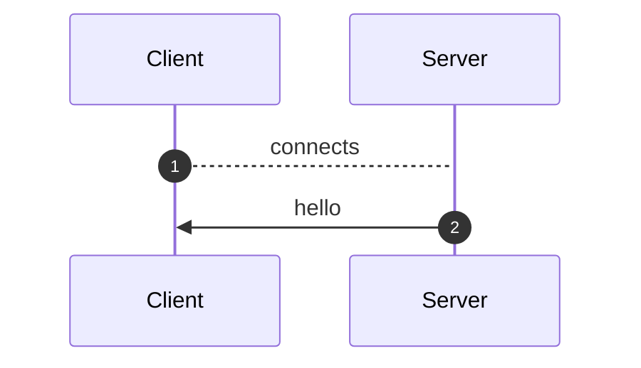
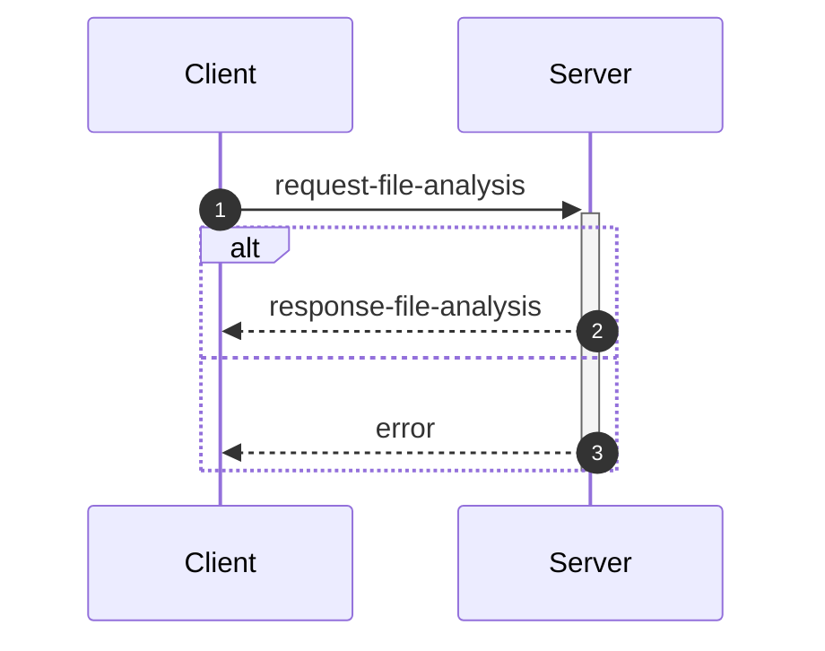
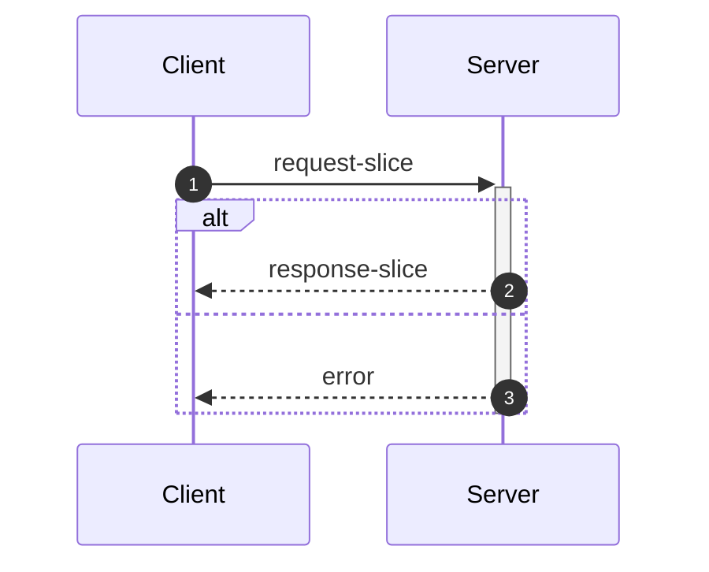
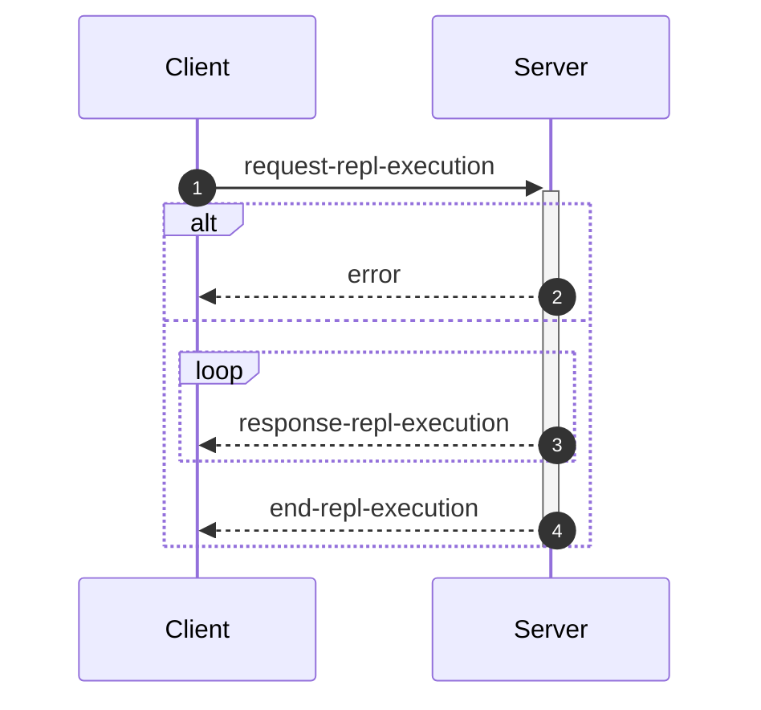

_<span title="an overview of flowR's interface">Generated</span> from '[wiki-interface.ts](https://github.com/flowr-analysis/flowr/tree/main/src/documentation/wiki-interface.ts "src/documentation/wiki-interface.ts")' on 2026-09-08, 08:11:27 UTC (v2.15.8, R v4.6.1), do not edit directly._


Although far from being as detailed as the in-depth explanation of [_flowR_](https://github.com/flowr-analysis/flowr/wiki/Core),
this wiki page explains how to interface with _flowR_ in more detail.
In general, command line arguments and other options provide short descriptions on hover over.

* [💻 Using the REPL](#using-the-repl)
* [⚙️ Configuring FlowR](#configuring-flowr)
* [⚒️ Writing Code](#writing-code)
* [💬 Communicating with the Server](#communicating-with-the-server)

<a id='using-the-repl'></a>
## 💻 Using the REPL


> [!NOTE]
> To execute arbitrary R commands with a repl request, _flowR_ has to be started explicitly with <span title="Description (Command Line Argument): Allow to access the underlying R session when using flowR (security warning: this allows the execution of arbitrary R code!)">`--r-session-access`</span>.
> Please be aware that this introduces a security risk and note that this relies on the [`r-shell` engine](https://github.com/flowr-analysis/flowr/wiki/Engines) .

Although primarily meant for users to explore,
there is nothing which forbids simply calling _flowR_ as a subprocess to use standard-in, -output, and -error
for communication (although you can access the REPL using the server as well,
with the [REPL Request](#message-request-repl-execution) message).

The read-eval-print loop&nbsp;(REPL) works relatively simple.
You can submit an expression (using <kbd>Enter</kbd>),
which is interpreted as an R&nbsp;expression by default but interpreted as a *command* if it starts with a colon (`:`).
The best command to get started with the REPL is <span title="Description (Repl Command): Show help information (aliases: :h, :?)">`:help`</span>.
Besides, you can leave the REPL either with the command <span title="Description (Repl Command): End the repl (aliases: :q, :exit)">`:quit`</span> or by pressing <kbd>Ctrl</kbd>+<kbd>C</kbd> twice.
When writing a *command*, you may press <kbd>Tab</kbd> to get a list of completions, if available.
Multiple commands can be entered in a single line by separating them with a semicolon (`;`), e.g. `:parse "x<-2"; :df*`.
If a command is given without R code, the REPL will re-use R code given in a previous command.
The prior example will hence return first the parsed AST of the program and then the dataflow graph for `"x <- 2"`.

> [!NOTE]
> If you develop flowR, you may want to launch the repl using the `npm run main-dev` command, this way, you get a non-minified version of flowR with debug information and hot-reloading of source files.

<details>
<summary>Available Commands</summary>

We currently offer the following commands (this with a `[*]` suffix are available with and without the star):


| Command | Description |
| ------- | ----------- |
| **<span title="Description (Repl Command): End the repl (aliases: :q, :exit)">:quit</span>** | End the repl (aliases: **:<span title="Alias of ':quit'. End the repl">q</span>**, **:<span title="Alias of ':quit'. End the repl">exit</span>**) |
| **<span title="Description (Repl Command): Execute the given code as R code. This requires the `--r-session-access` flag to be set and requires the r-shell engine. (aliases: :e, :r)">:execute</span>** | Execute the given code as R code. This requires the `--r-session-access` flag to be set and requires the r-shell engine. (aliases: **:<span title="Alias of ':execute'. Execute the given code as R code. This requires the `--r-session-access` flag to be set and requires the r-shell engine.">e</span>**, **:<span title="Alias of ':execute'. Execute the given code as R code. This requires the `--r-session-access` flag to be set and requires the r-shell engine.">r</span>**) |
| **<span title="Description (Repl Command): Get mermaid code for the control-flow graph of R code (aliases: :cfg, :cf)">:controlflow[*]</span>** | Get mermaid code for the control-flow graph of R code (star: Returns the URL to mermaid.live) (aliases: **:<span title="Alias of ':controlflow'. Get mermaid code for the control-flow graph of R code">cfg</span>**, **:<span title="Alias of ':controlflow'. Get mermaid code for the control-flow graph of R code">cf</span>**) |
| **<span title="Description (Repl Command): Get mermaid code for the control-flow graph with basic blocks (aliases: :cfgb, :cfb)">:controlflowbb[*]</span>** | Get mermaid code for the control-flow graph with basic blocks (star: Returns the URL to mermaid.live) (aliases: **:<span title="Alias of ':controlflowbb'. Get mermaid code for the control-flow graph with basic blocks">cfgb</span>**, **:<span title="Alias of ':controlflowbb'. Get mermaid code for the control-flow graph with basic blocks">cfb</span>**) |
| **<span title="Description (Repl Command): Get mermaid code for the dataflow graph (aliases: :d, :df)">:dataflow[*]</span>** | Get mermaid code for the dataflow graph (star: Returns the URL to mermaid.live) (aliases: **:<span title="Alias of ':dataflow'. Get mermaid code for the dataflow graph">d</span>**, **:<span title="Alias of ':dataflow'. Get mermaid code for the dataflow graph">df</span>**) |
| **<span title="Description (Repl Command): Get mermaid code for the normalized AST of R code (aliases: :n)">:normalize[*]</span>** | Get mermaid code for the normalized AST of R code (star: Returns the URL to mermaid.live) (alias: **:<span title="Alias of ':normalize'. Get mermaid code for the normalized AST of R code">n</span>**) |
| **<span title="Description (Repl Command): Get mermaid code for the simplified dataflow graph (aliases: :ds, :dfs)">:dataflowsimple[*]</span>** | Get mermaid code for the simplified dataflow graph (star: Returns the URL to mermaid.live) (aliases: **:<span title="Alias of ':dataflowsimple'. Get mermaid code for the simplified dataflow graph">ds</span>**, **:<span title="Alias of ':dataflowsimple'. Get mermaid code for the simplified dataflow graph">dfs</span>**) |
| **<span title="Description (Repl Command): Inspect and extend the signature database: `query` (identical to :query @signature), `info <name>` for where a function comes from (identical to :query @function-info), `add <path>` to mount another database/source, `download` to fetch the full-history database. (aliases: :sig)">:signature</span>** | Inspect and extend the signature database: `query` (identical to :query @signature), `info <name>` for where a function comes from (identical to :query @function-info), `add <path>` to mount another database/source, `download` to fetch the full-history database. (alias: **:<span title="Alias of ':signature'. Inspect and extend the signature database: `query` (identical to :query @signature), `info <name>` for where a function comes from (identical to :query @function-info), `add <path>` to mount another database/source, `download` to fetch the full-history database.">sig</span>**) |
| **<span title="Description (Repl Command): Just calculates the DFG, but only prints summary info (aliases: :d#, :df#)">:dataflowsilent</span>** | Just calculates the DFG, but only prints summary info (aliases: **:<span title="Alias of ':dataflowsilent'. Just calculates the DFG, but only prints summary info">d#</span>**, **:<span title="Alias of ':dataflowsilent'. Just calculates the DFG, but only prints summary info">df#</span>**) |
| **<span title="Description (Repl Command): Prints ASCII Art of the parsed, unmodified AST (aliases: :p)">:parse</span>** | Prints ASCII Art of the parsed, unmodified AST (alias: **:<span title="Alias of ':parse'. Prints ASCII Art of the parsed, unmodified AST">p</span>**) |
| **<span title="Description (Repl Command): Prints the version of flowR as well as the current version of R">:version</span>** | Prints the version of flowR as well as the current version of R
| **<span title="Description (Repl Command): Query the given R code (use 'help' for more information)">:query[*]</span>** | Query the given R code (use 'help' for more information) (star: Similar to query, but returns the output in json format.)
| **<span title="Description (Repl Command): Returns an ASCII representation of the dataflow graph (aliases: :df!)">:dataflowascii</span>** | Returns an ASCII representation of the dataflow graph (alias: **:<span title="Alias of ':dataflowascii'. Returns an ASCII representation of the dataflow graph">df!</span>**) |
| **<span title="Description (Repl Command): Returns summarization stats for the normalized AST (aliases: :n#)">:normalize#</span>** | Returns summarization stats for the normalized AST (alias: **:<span title="Alias of ':normalize#'. Returns summarization stats for the normalized AST">n#</span>**) |
| **<span title="Description (Repl Command): Show help information (aliases: :h, :?)">:help</span>** | Show help information (aliases: **:<span title="Alias of ':help'. Show help information">h</span>**, **:<span title="Alias of ':help'. Show help information">?</span>**) |


</details>


> [!TIP]
> 
> As indicated by the examples before, all REPL commands that operate on code keep track of the state.
> Hence, if you run a command like <span title="Description (Repl Command, starred version): Returns the URL to mermaid.live; Base Command: Get mermaid code for the dataflow graph (aliases: :d*, :df*)">`:dataflow*`</span> without providing R code,
> the REPL will re-use the R code provided in a previous command.
> Likewise, doing this will benefit from incrementality!
> If you request the dataflow graph with `:df* x <- 2 * y` and then want to see the parsed AST with `:parse`,
> the REPL will re-use previously obtained information and not re-parse the code again.
> 		


Generally, many commands offer shortcut versions in the REPL. Many queries, for example, offer a shortened format (see the example below).
Of special note, the [Config Query](https://github.com/flowr-analysis/flowr/wiki/%5BQuery%5D-Config)
can be used to also modify the currently active configuration of _flowR_ within the REPL (see the [wiki page](https://github.com/flowr-analysis/flowr/wiki/%5BQuery%5D-Config) for more information).

### Example: Retrieving the Dataflow Graph

To retrieve a URL to the [mermaid](https://mermaid.js.org/) diagram of the dataflow of a given expression,
use <span title="Description (Repl Command, starred version): Returns the URL to mermaid.live; Base Command: Get mermaid code for the dataflow graph (aliases: :d*, :df*)">`:dataflow*`</span> (or <span title="Description (Repl Command): Get mermaid code for the dataflow graph (aliases: :d, :df)">`:dataflow`</span> to get the mermaid code in the cli):


```shell
$ docker run -it --rm eagleoutice/flowr # or npm run flowr 
flowR repl v2.15.8, R grammar v14 (tree-sitter engine)
R> :dataflow* y <- 1 + x
```

<details>
<summary style='color:gray'>Output</summary>


```text
https://mermaid.live/view#base64:eyJjb2RlIjoiZmxvd2NoYXJ0IFREXG4gICAgMXt7XCJgKiM5MTtSTnVtYmVyIzkzOyogKioxKipcbiAgICAgICoxLjYqICgqKmlkOiAxKiopYFwifX1cbiAgICAyKFtcImAqIzkxO1JTeW1ib2wjOTM7KiAqKngqKlxuICAgICAgKjEuMTAqICgqKmlkOiAyKiopYFwiXSlcbiAgICAzW1tcImAqIzkxO1JCaW5hcnlPcCM5MzsqIGJhc2UjNTg7IzU4OyoqIzQzOyoqXG4gICAgICAqMS42LTEwKiAoKippZDogMyoqKVxuICAgIGFyZzogKDEsIDIpYFwiXV1cbiAgICBidWlsdC1pbjpfW1wiYEJ1aWx0LUluOlxuIzQzO2BcIl1cbiAgICBzdHlsZSBidWlsdC1pbjpfIHN0cm9rZTpncmF5LGZpbGw6Z3JheSxzdHJva2Utd2lkdGg6MnB4LG9wYWNpdHk6Ljg7XG4gICAgMFtcImAqIzkxO1JTeW1ib2wjOTM7KiAqKnkqKlxuICAgICAgKjEuMSogKCoqaWQ6IDAqKiwgdjogMylgXCJdXG4gICAgNFtbXCJgKiM5MTtSQmluYXJ5T3AjOTM7KiBiYXNlIzU4OyM1ODsqKiM2MDsjNDU7KipcbiAgICAgICoxLjEtMTAqICgqKmlkOiA0KiopXG4gICAgYXJnOiAoMCwgMylgXCJdXVxuICAgIGJ1aWx0LWluOl8tW1wiYEJ1aWx0LUluOlxuIzYwOyM0NTtgXCJdXG4gICAgc3R5bGUgYnVpbHQtaW46Xy0gc3Ryb2tlOmdyYXksZmlsbDpncmF5LHN0cm9rZS13aWR0aDoycHgsb3BhY2l0eTouODtcbiAgICAxIC0uLT58XCJmbG93XCJ8IDJcbiAgICBsaW5rU3R5bGUgMCBzdHJva2U6Z3JheSxjb2xvcjpncmF5O1xuICAgIDIgLS4tPnxcImZsb3dcInwgM1xuICAgIGxpbmtTdHlsZSAxIHN0cm9rZTpncmF5LGNvbG9yOmdyYXk7XG4gICAgMyAtLT58XCJyZWFkcywgYXJnXCJ8IDFcbiAgICAzIC0tPnxcInJlYWRzLCBhcmdcInwgMlxuICAgIDMgLS4tPnxcImZsb3dcInwgMFxuICAgIGxpbmtTdHlsZSA0IHN0cm9rZTpncmF5LGNvbG9yOmdyYXk7XG4gICAgMyAtLi0+fFwicmVhZHMsIGNhbGxzXCJ8IGJ1aWx0LWluOl9cbiAgICBsaW5rU3R5bGUgNSBzdHJva2U6Z3JheTtcbiAgICAwIC0tPnxcImRlZmluZWQtYnksIGZsb3dcInwgNFxuICAgIDAgLS0+fFwiZGVmaW5lZC1ieVwifCAzXG4gICAgNCAtLT58XCJyZWFkcywgYXJnXCJ8IDNcbiAgICA0IC0tPnxcInJldHVybnMsIGFyZ1wifCAwXG4gICAgNCAtLi0+fFwicmVhZHMsIGNhbGxzXCJ8IGJ1aWx0LWluOl8tXG4gICAgbGlua1N0eWxlIDEwIHN0cm9rZTpncmF5OyIsIm1lcm1haWQiOnsiYXV0b1N5bmMiOnRydWV9fQ==
```


Retrieve the dataflow graph of the expression `y <- 1 + x`. It looks like this:


```mermaid
flowchart LR
    1{{"`*#91;RNumber#93;* **1**
      *1.6* (**id: 1**)`"}}
    2(["`*#91;RSymbol#93;* **x**
      *1.10* (**id: 2**)`"])
    3[["`*#91;RBinaryOp#93;* base#58;#58;**#43;**
      *1.6-10* (**id: 3**)
    arg: (1, 2)`"]]
    built-in:_["`Built-In:
#43;`"]
    style built-in:_ stroke:gray,fill:gray,stroke-width:2px,opacity:.8;
    0["`*#91;RSymbol#93;* **y**
      *1.1* (**id: 0**, v: 3)`"]
    4[["`*#91;RBinaryOp#93;* base#58;#58;**#60;#45;**
      *1.1-10* (**id: 4**)
    arg: (0, 3)`"]]
    built-in:_-["`Built-In:
#60;#45;`"]
    style built-in:_- stroke:gray,fill:gray,stroke-width:2px,opacity:.8;
    1 -.->|"flow"| 2
    linkStyle 0 stroke:gray,color:gray;
    2 -.->|"flow"| 3
    linkStyle 1 stroke:gray,color:gray;
    3 -->|"reads, arg"| 1
    3 -->|"reads, arg"| 2
    3 -.->|"flow"| 0
    linkStyle 4 stroke:gray,color:gray;
    3 -.->|"reads, calls"| built-in:_
    linkStyle 5 stroke:gray;
    0 -->|"defined-by, flow"| 4
    0 -->|"defined-by"| 3
    4 -->|"reads, arg"| 3
    4 -->|"returns, arg"| 0
    4 -.->|"reads, calls"| built-in:_-
    linkStyle 10 stroke:gray;
```

	
<details>

<summary style="color:gray">R Code of the Dataflow Graph</summary>

The analysis ran (including parse and normalize, using the [tree-sitter](https://github.com/flowr-analysis/flowr/wiki/Engines) engine) within the generation environment. No [signature database](https://github.com/flowr-analysis/flowr/wiki/Signature-Database) is mounted for these generated graphs, so `library()` calls attach no package exports; base-R names are still qualified via the generated base-package store (e.g. `acf` as `stats::acf`). 
We encountered no unknown side effects during the analysis.


```r
y <- 1 + x
```


</details>


</details>


For small graphs like this, <span title="Description (Repl Command): Returns an ASCII representation of the dataflow graph (aliases: :df!)">`:dataflowascii`</span> also provides an ASCII representation directly in the REPL:


```shell
$ docker run -it --rm eagleoutice/flowr # or npm run flowr 
flowR repl v2.15.8, R grammar v14 (tree-sitter engine)
R> :df! y <- 1 + x
```

<details open>
<summary style='color:gray'>Output</summary>


```text
           ┌────────────u<2>u
        c<3>c   0<1>0   | x |
    ┌───| + |───| 1 |───u---u
    │   c---c   0---0
 c<4>c     │
 |<- |     └────────────v<0>v
 c---c──────────────────| y |
                        v---v
Edges:
3 -> 1: reads, arg          3 -> 2: reads, arg
3 -> 0: flows-to            1 -> 2: flows-to
2 -> 3: flows-to            4 -> 3: reads, arg
4 -> 0: returns, arg        0 -> 4: defined-by, flows-to
0 -> 3: defined-by
```


Retrieve the dataflow graph of the expression `y <- 1 + x` as ASCII art.

</details>


For the slicing with <span title="Description (Repl Command): Static backwards executable slicer for R">`:slicer`</span>, you have access to the same [magic comments](#slice-magic-comments) as with the [slice request](#message-request-slice).
Pass `--inline` to splice resolvable `source()` calls into the reconstruction so the slice is a single self-contained R text (the same as the static slice query's `inlineSources` flag).
See `--help` for more flags!

### Example: Interfacing with the File System

Many commands that allow for an R-expression (like <span title="Description (Repl Command, starred version): Returns the URL to mermaid.live; Base Command: Get mermaid code for the dataflow graph (aliases: :d*, :df*)">`:dataflow*`</span>) allow for a file as well
if the argument starts with `file://`.
If you are working from the root directory of the _flowR_ repository, the following gives you the parsed AST of the example file using the <span title="Description (Repl Command): Prints ASCII Art of the parsed, unmodified AST (aliases: :p)">`:parse`</span> command:

> **Watch mode**: Replace `file://` with `watch://` to enter watch mode.
> flowR runs the command immediately and then re-runs it every time the file (or any file inside the folder) changes.
> Enter any other command to leave watch mode.
> For example: `:df watch://analysis.R`


```shell
$ docker run -it --rm eagleoutice/flowr # or npm run flowr 
flowR repl v2.15.8, R grammar v14 (tree-sitter engine)
R> :parse file://test/testfiles/example.R
```

<details>
<summary style='color:gray'>Output</summary>


```text
File: test/testfiles/example.R

program
├ binaryoperator
│ ├ identifier "sum" (1:1─4)
│ ├ <- "<-" (1:5─7)
│ ╰ float "0" (1:8─9)
├ binaryoperator
│ ├ identifier "product" (2:1─8)
│ ├ <- "<-" (2:9─11)
│ ╰ float "1" (2:12─13)
├ binaryoperator
│ ├ identifier "w" (3:1─2)
│ ├ <- "<-" (3:3─5)
│ ╰ float "7" (3:6─7)
├ binaryoperator
│ ├ identifier "N" (4:1─2)
│ ├ <- "<-" (4:3─5)
│ ╰ float "10" (4:6─8)
├ forstatement
│ ├ for "for" (6:1─4)
│ ├ ( "(" (6:5─6)
│ ├ identifier "i" (6:6─7)
│ ├ in "in" (6:8─10)
│ ├ binaryoperator
│ │ ├ float "1" (6:11─12)
│ │ ├ : ":" (6:12─13)
│ │ ╰ parenthesizedexpression
│ │   ├ ( "(" (6:13─14)
│ │   ├ binaryoperator
│ │   │ ├ identifier "N" (6:14─15)
│ │   │ ├ - "-" (6:15─16)
│ │   │ ╰ float "1" (6:16─17)
│ │   ╰ ) ")" (6:17─18)
│ ├ ) ")" (6:18─19)
│ ╰ bracedexpression
│   ├ { "{" (6:20─21)
│   ├ binaryoperator
│   │ ├ identifier "sum" (7:3─6)
│   │ ├ <- "<-" (7:7─9)
│   │ ╰ binaryoperator
│   │   ├ binaryoperator
│   │   │ ├ identifier "sum" (7:10─13)
│   │   │ ├ + "+" (7:14─15)
│   │   │ ╰ identifier "i" (7:16─17)
│   │   ├ + "+" (7:18─19)
│   │   ╰ identifier "w" (7:20─21)
│   ├ binaryoperator
│   │ ├ identifier "product" (8:3─10)
│   │ ├ <- "<-" (8:11─13)
│   │ ╰ binaryoperator
│   │   ├ identifier "product" (8:14─21)
│   │   ├  "" (8:22─23)
│   │   ╰ identifier "i" (8:24─25)
│   ╰ } "}" (9:1─2)
├ call
│ ├ identifier "cat" (11:1─4)
│ ╰ arguments
│   ├ ( "(" (11:4─5)
│   ├ argument
│   │ ╰ string
│   │   ├ " "\"" (11:5─6)
│   │   ├ stringcontent "Sum:" (11:6─10)
│   │   ╰ " "\"" (11:10─11)
│   ├ comma "," (11:11─12)
│   ├ argument
│   │ ╰ identifier "sum" (11:13─16)
│   ├ comma "," (11:16─17)
│   ├ argument
│   │ ╰ string
│   │   ├ " "\"" (11:18─19)
│   │   ├ stringcontent
│   │   │ ╰ escapesequence "\\n" (11:19─21)
│   │   ╰ " "\"" (11:21─22)
│   ╰ ) ")" (11:22─23)
╰ call
  ├ identifier "cat" (12:1─4)
  ╰ arguments
    ├ ( "(" (12:4─5)
    ├ argument
    │ ╰ string
    │   ├ " "\"" (12:5─6)
    │   ├ stringcontent "Product:" (12:6─14)
    │   ╰ " "\"" (12:14─15)
    ├ comma "," (12:15─16)
    ├ argument
    │ ╰ identifier "product" (12:17─24)
    ├ comma "," (12:24─25)
    ├ argument
    │ ╰ string
    │   ├ " "\"" (12:26─27)
    │   ├ stringcontent
    │   │ ╰ escapesequence "\\n" (12:27─29)
    │   ╰ " "\"" (12:29─30)
    ╰ ) ")" (12:30─31)
```


Retrieve the parsed AST of the example file.

<details>

<summary>File Content</summary>


```r
sum <- 0
product <- 1
w <- 7
N <- 10

for (i in 1:(N-1)) {
  sum <- sum + i + w
  product <- product * i
}

cat("Sum:", sum, "\n")
cat("Product:", product, "\n")
```


</details>

As _flowR_ directly transforms this AST the output focuses on being human-readable instead of being machine-readable.
		

</details>


### Example: Run a Query

You can run any query supported by _flowR_ using the <span title="Description (Repl Command): Query the given R code (use 'help' for more information)">`:query`</span> command.
For example, to obtain the shapes of all data frames in a given piece of code, you can run:


```shell
$ docker run -it --rm eagleoutice/flowr # or npm run flowr 
flowR repl v2.15.8, R grammar v14 (tree-sitter engine)
R> :query @absint df-shape "x <- data.frame(a = 1:10, b = 1:10)\ny <- x$a"
```

<details open>
<summary style='color:gray'>Output</summary>


```text
Query: absint (1 ms)
```


Retrieve the shapes of all data frames in the given code.

</details>


To run the linter on a file, you can use (in this example, we just issue the `dead-code` linter on a small piece of code):


```shell
$ docker run -it --rm eagleoutice/flowr # or npm run flowr 
flowR repl v2.15.8, R grammar v14 (tree-sitter engine)
R> :query @linter rules:dead-code "if(FALSE) x <- 2"
```

<details open>
<summary style='color:gray'>Output</summary>


```text
Query: linter (0 ms)
   ╰ Dead Code (dead-code):
       ╰ certain:
           ╰ Code at 1.11-16
```


Run the linter on the given code, with only the `dead-code` rule enabled.

</details>


For more information on the available queries, please check out the [Query API](https://github.com/flowr-analysis/flowr/wiki/Query-API).


<a id='configuring-flowr'></a>
## ⚙️ Configuring FlowR


When running _flowR_, you may want to specify some behaviors with a dedicated configuration file.
By default, flowR looks for a file named `flowr.json` in the current working directory (or any higher directory).
You can also specify a different file with <span title="Description (Command Line Argument): The name of the configuration file to use">`--config-file`</span> or pass the configuration inline using <span title="Description (Command Line Argument): The flowR configuration to use, as a JSON string">`--config-json`</span>.
To inspect the current configuration, you can run flowr with the <span title="Description (Command Line Argument): Run with verbose logging (will be passed to the corresponding script)">`--verbose`</span> flag, or use the `config` [Query](https://github.com/flowr-analysis/flowr/wiki/Query-API).
Within the REPL this works by running the following:


```shell
:query @config
```


To work with the <a href="https://github.com/flowr-analysis/flowr/tree/main/src/config.ts#L107"><code><span title="The configuration file format for flowR.">FlowrConfig</span></code></a> you can use the provided helper objects alongside its methods like
<a href="https://github.com/flowr-analysis/flowr/tree/main/src/config.ts#L856"><code><span title="Creates a new flowr config that has the updated values.">FlowrConfig::<b>amend</b></span></code></a>.
The schema below documents every option; the ones you most likely want are:

- <a href="https://github.com/flowr-analysis/flowr/wiki/Interface#configuring-flowr" title="Configuration Option (boolean): Whether source calls should be ignored, causing {@link processSourceCall}&#39;s behavior to be skipped.">ignoreSourceCalls</a>: ignore source calls when analyzing the code, i.e., ignore the inclusion of other files.
- <a href="https://github.com/flowr-analysis/flowr/wiki/Interface#configuring-flowr" title="Configuration Option (boolean): Whether load calls should be ignored, causing {@link processLoadCall}&#39;s behavior to be skipped.">ignoreLoadCalls</a>: ignore load calls when analyzing the code, i.e., ignore the loading of r-data files.
- <a href="https://github.com/flowr-analysis/flowr/wiki/Interface#configuring-flowr" title="Configuration Option (object): Do you want to overwrite (parts) of the builtin definition?">semantics.environment.overwriteBuiltIns</a>: overwrite _flowR_'s handling of built-in functions, or clear the preset definitions entirely.
  See [Configure BuiltIn Semantics](#configure-builtin-semantics) for more information.
- <a href="https://github.com/flowr-analysis/flowr/wiki/Interface#configuring-flowr" title="Configuration Option (string): How to resolve variables and their values. (one of &quot;disabled&quot;, &quot;alias&quot;, &quot;builtin&quot;)">solver.variables</a>: how to resolve variables and their values (`disabled`, `alias`, `builtin`).
- <a href="https://github.com/flowr-analysis/flowr/wiki/Interface#configuring-flowr" title="Configuration Option (array): The engine or set of engines to use for interacting with R code. An empty array means all available engines will be used.">engines</a> and <a href="https://github.com/flowr-analysis/flowr/wiki/Interface#configuring-flowr" title="Configuration Option (string): The default engine to use for interacting with R code. If this is undefined, an arbitrary engine from the specified list will be used. (one of &quot;tree-sitter&quot;, &quot;r-shell&quot;)">defaultEngine</a>: the engines used to interact with R code, see the [Engines wiki page](https://github.com/flowr-analysis/flowr/wiki/Engines).
- <a href="https://github.com/flowr-analysis/flowr/wiki/Interface#configuring-flowr" title="Configuration Option (array): Files a framework loads on its own, without any source() call (e.g. global.R in a shiny app), in the order they are loaded; flowR orders the matching project files accordingly and analyzes them as one program. Entries are case-insensitive globs matched against the file path, a plain name matches any file with that name, and entries matching no project file are warned about. Usually set per project kind via specializeConfig.">project.implicitSources</a>: the files a framework loads without any `source()` call, in the order in which they are
  loaded. Entries are globs (e.g. `R/*.R`) matched against the file path ignoring capitalization; one matching no file is reported.
- <a href="https://github.com/flowr-analysis/flowr/wiki/Interface#configuring-flowr" title="Configuration Option (object): Overwrite (parts of) the configuration depending on the project kind flowR detects, e.g. to give a shiny app its implicit sources.">specializeConfig</a>: overwrite (parts of) the configuration depending on the kind of project _flowR_ detects
  (e.g. `shiny-app`), which is how a shiny app gets its implicit sources by default. What you configure directly wins.
- <a href="https://github.com/flowr-analysis/flowr/wiki/Interface#configuring-flowr" title="Configuration Option (string): Overwrite the project kind flowR would otherwise infer from the analyzed files, e.g. when auto-detection guesses wrong. (one of &quot;package&quot;, &quot;script&quot;, &quot;shiny-app&quot;, &quot;notebook&quot;, &quot;project&quot;, &quot;unknown&quot;)">project.useProjectType</a>: skip that detection and force a project kind yourself, when auto-detection guesses wrong.
- <a href="https://github.com/flowr-analysis/flowr/wiki/Interface#configuring-flowr" title="Configuration Option (array): The default plugins to load when creating a new instance of FlowrAnalyzer">defaultPlugins</a> and <a href="https://github.com/flowr-analysis/flowr/wiki/Interface#configuring-flowr" title="Configuration Option (array): The plugins to load in REPL mode">repl.plugins</a>: the plugins to load for a new <a href="https://github.com/flowr-analysis/flowr/tree/main/src/project/flowr-analyzer.ts#L202"><code><span title="Central class for conducting analyses with FlowR. Use the FlowrAnalyzerBuilder to create a new instance. If you want the original pattern of creating a pipeline and running all steps, you can still do this with FlowrAnalyzer#runFull . To inspect the context of the analyzer, use FlowrAnalyzer#inspectContext (if you are a plugin and need to modify it, use FlowrAnalyzer#context instead).">FlowrAnalyzer</span></code></a> and in the REPL
  (use `flowr:default` to reference the former).

So you can configure _flowR_ by adding a file like the following:

<details>

<summary>Example Configuration File</summary>


```json
{
  "ignoreSourceCalls": true,
  "ignoreLoadCalls": true,
  "semantics": {
    "environment": {
      "overwriteBuiltIns": {
        "definitions": [
          {
            "type": "function",
            "names": [
              "foo"
            ],
            "processor": "builtin:assign",
            "config": {}
          }
        ]
      }
    }
  },
  "defaultPlugins": [
    "file:description",
    "versions:description"
  ],
  "repl": {
    "quickStats": false,
    "dfProcessorHeat": false,
    "hints": true,
    "plugins": [
      "flowr:default"
    ]
  },
  "project": {
    "resolveUnknownPathsOnDisk": true,
    "implicitSources": [
      "global.R",
      "app.R"
    ]
  },
  "linter": {
    "disabledRules": []
  },
  "specializeConfig": {
    "shiny-app": {
      "project": {
        "implicitSources": [
          "global.R",
          "ui.R",
          "server.R",
          "app.R"
        ]
      }
    }
  },
  "engines": [
    {
      "type": "r-shell"
    }
  ],
  "solver": {
    "variables": "alias",
    "evalStrings": true,
    "trackEnvironments": true,
    "sigdb": {
      "enabled": true,
      "loadProjectDependencies": true,
      "eagerlyLoad": false,
      "eagerlyLoadExports": false,
      "linkBaseR": false,
      "linkDescriptionDependencies": false
    },
    "resolveSource": {
      "dropPaths": "no",
      "ignoreCapitalization": true,
      "inferWorkingDirectory": "active-script",
      "searchPath": []
    },
    "instrument": {},
    "slicer": {
      "threshold": 50
    }
  },
  "abstractInterpretation": {
    "wideningThreshold": 4,
    "followCalls": true,
    "dataFrame": {
      "maxColNames": 20,
      "readLoadedData": {
        "readExternalFiles": true,
        "maxReadLines": 1000000
      }
    }
  },
  "incremental": {
    "alwaysIncremental": false,
    "parsing": {
      "activated": false,
      "heuristics": {
        "activated": true,
        "mtime": true,
        "linesFrom": 500,
        "bytesFrom": 50000,
        "alwaysWithEdits": false,
        "minFiles": 1
      }
    }
  },
  "gas": {
    "thresholds": {
      "memory": {
        "problematic": 0.7,
        "critical": 0.9
      },
      "timeMs": {
        "problematic": 100000,
        "critical": 120000
      }
    },
    "features": {}
  }
}
```


</details>

<details>
<a id='configure-builtin-semantics'></a>
<summary>Configure Built-In Semantics</summary>


`semantics/environment/overwriteBuiltins` accepts two keys:

- `loadDefaults` (boolean, initially `true`): If set to `true`, the default built-in definitions are loaded before applying the custom definitions. Setting this flag to `false` explicitly disables the loading of the default definitions.
- `definitions` (array, initially empty): Allows to overwrite or define new built-in elements. Each object within must have a `type` which is one of the below. Furthermore, they may define a string array of `names` which specifies the identifiers to bind the definitions to. You may use `assumePrimitive` to specify whether _flowR_ should assume that this is a primitive non-library definition (so you probably just do not want to specify the key).

  | Type            | Description                                                                                                                                                                                                                                                                                              | Example                                                                                                    |
  | --------------- | -------------------------------------------------------------------------------------------------------------------------------------------------------------------------------------------------------------------------------------------------------------------------------------------------------- | ---------------------------------------------------------------------------------------------------------- |
  | `constant`    | Additionally allows for a `value` this should resolve to.                                                                                                                                                                                                                                                | `{ type: 'constant', names: ['NULL', 'NA'],  value: null }`                                                |
  | `function`    | Is a rather flexible way to define and bind built-in functions. For the time, we do not have extensive documentation to cover all the cases, so please either consult the sources with the `default-builtin-config.ts` or open a [new issue](https://github.com/flowr-analysis/flowr/issues/new/choose). | `{ type: 'function', names: ['next'], processor: 'builtin:d', config: { cfg: ExitPointType.Next } }` |
  | `replacement` | A comfortable way to specify replacement functions like `$<-` or `names<-`. `suffixes` describes the... suffixes to attach automatically. | `{ type: 'replacement', suffixes: ['<-', '<<-'], names: ['[', '[['] }` |


</details>

<details>

<summary style='color:gray'>Full Configuration-File Schema</summary>

- _The configuration file format for flowR._ (object)
    - **logLevel** [optional] _flowR's global minimum log level, applied when the config is loaded._ (string)
        Only allows: 'silly', 'trace', 'debug', 'info', 'warn', 'error', 'fatal'
    - **ignoreSourceCalls** [optional] _Whether source calls should be ignored, causing {@link processSourceCall}'s behavior to be skipped._ (boolean)
    - **ignoreLoadCalls** [optional] _Whether load calls should be ignored, causing {@link processLoadCall}'s behavior to be skipped._ (boolean)
    - **semantics** _Configure language semantics and how flowR handles them._ (object)
        - **environment** [optional] _Semantics regarding how to handle the R environment._ (object)
            - **overwriteBuiltIns** [optional] _Do you want to overwrite (parts) of the builtin definition?_ (object)
                - **loadDefaults** [optional] _Should the default configuration still be loaded?_ (boolean)
                - **definitions** [optional] _The definitions to load/overwrite._ (array)
                Valid item types:
                    - (object)
    - **defaultPlugins** [optional] _The default plugins to load when creating a new instance of FlowrAnalyzer_ (array)
    Valid item types:
        - (alternatives)
            - (string)
            - (array)
    - **repl** _Configuration options for the REPL._ (object)
        - **quickStats** [optional] _Whether to show quick stats in the REPL after each evaluation._ (boolean)
        - **dfProcessorHeat** [optional] _This instruments the dataflow processors to count how often each processor is called._ (boolean)
        - **hints** [optional] _Whether to show dim inline hints on the empty prompt (automatically disabled on non-interactive terminals)._ (boolean)
        - **plugins** [optional] _The plugins to load in REPL mode_ (array)
        Valid item types:
            - (alternatives)
                - (string)
                - (array)
        - **autoUseFileProtocol** [optional] _Prepend the file protocol to a repl input that looks like a path, instead of only warning about it._ (boolean)
        - **queryStats** [optional] _Whether `:query` closes with the line stating how long the queries took (`:query*` never prints it)._ (boolean)
        - **showPlugins** [optional] _Whether `:version` grays out the plugins that did not activate during the last analysis._ (boolean)
    - **project** _Project specific configuration options._ (object)
        - **resolveUnknownPathsOnDisk** [optional] _Whether to resolve unknown paths loaded by the r project disk when trying to source/analyze files._ (boolean)
        - **failOnInaccessiblePath** [optional] _Whether a directory that cannot be traversed during file discovery (e.g. due to permissions) aborts the analysis; when false (the default) such paths are logged and skipped._ (boolean)
        - **basePackages** [optional] _The packages considered part of R itself (base and recommended); if unset, flowR uses its built-in list._ (array)
        Valid item types:
            - (string)
        - **implicitSources** [optional] _Files a framework loads on its own, without any source() call (e.g. global.R in a shiny app), in the order they are loaded; flowR orders the matching project files accordingly and analyzes them as one program. Entries are case-insensitive globs matched against the file path, a plain name matches any file with that name, and entries matching no project file are warned about. Usually set per project kind via specializeConfig._ (array)
        Valid item types:
            - (string)
        - **useProjectType** [optional] _Overwrite the project kind flowR would otherwise infer from the analyzed files, e.g. when auto-detection guesses wrong._ (string)
            Only allows: 'package', 'script', 'shiny-app', 'notebook', 'project', 'unknown'
        - **assumeImplicitEcho** [optional] _Whether the top level of the analyzed code is echoed, so that every visible result printed there is collected as an output by the dependencies query (default true, false for a package)._ (boolean)
        - **discovery** [optional] _Scoping options for the default project discovery._ (object)
            - **full** [optional] _Collect every file below the project root (greedy) instead of only the files the detected project kind needs (default false)._ (boolean)
            - **perKind** [optional] _Per-kind include/exclude glob overrides layered on the default scoping._ (object)
            - **ignore** [optional] _Case-insensitive globs that drop matching files from the intelligent discovery, regardless of kind (e.g. .Renviron to ignore environment files)._ (array)
            Valid item types:
                - (string)
        - **classification** [optional] _Overrides for the signals flowR uses to classify the project kind._ (object)
            - **shinyDescriptionTypes** [optional] _DESCRIPTION Type: values that mark a shiny app._ (array)
            Valid item types:
                - (string)
            - **shinyEntryFiles** [optional] _File names a shiny app is assembled from._ (array)
            Valid item types:
                - (string)
            - **shinyUsagePattern** [optional] _Regex source evidencing shiny usage in an entry file._ (string)
            - **notebookExtensions** [optional] _File extensions marking a notebook._ (array)
            Valid item types:
                - (string)
    - **linter** _Linter configuration options._ (object)
        - **disabledRules** _Linting rule names excluded from the default rule set (a rule requested explicitly via a linter query still runs). Usually set per project kind via specializeConfig._ (array)
        Valid item types:
            - (string)
    - **inputSources** [optional] _Further frameworks the input-sources analysis should know about; entries are added to flowR's defaults._ (object)
        - **pure** [optional] _Functions that only pass the constantness of their arguments on._ (array)
        Valid item types:
            - (string)
        - **param** [optional] _Functions whose result is a 'param' input._ (array)
        Valid item types:
            - (string)
        - **file** [optional] _Functions whose result is a 'file' input._ (array)
        Valid item types:
            - (string)
        - **tempfile** [optional] _Functions whose result is a 'tempfile' input._ (array)
        Valid item types:
            - (string)
        - **glob** [optional] _Functions whose result is a 'glob' input._ (array)
        Valid item types:
            - (string)
        - **net** [optional] _Functions whose result is a 'net' input._ (array)
        Valid item types:
            - (string)
        - **rand** [optional] _Functions whose result is a 'rand' input._ (array)
        Valid item types:
            - (string)
        - **system** [optional] _Functions whose result is a 'system' input._ (array)
        Valid item types:
            - (string)
        - **ffi** [optional] _Functions whose result is a 'ffi' input._ (array)
        Valid item types:
            - (string)
        - **lang** [optional] _Functions whose result is a 'lang' input._ (array)
        Valid item types:
            - (string)
        - **options** [optional] _Functions whose result is a 'options' input._ (array)
        Valid item types:
            - (string)
        - **cmdline** [optional] _Functions whose result is a 'cmdline' input._ (array)
        Valid item types:
            - (string)
        - **user** [optional] _Functions whose result is a 'user' input._ (array)
        Valid item types:
            - (string)
        - **const** [optional] _Functions whose result is a 'const' input._ (array)
        Valid item types:
            - (string)
        - **scope** [optional] _Functions whose result is a 'scope' input._ (array)
        Valid item types:
            - (string)
        - **dconst** [optional] _Functions whose result is a 'dconst' input._ (array)
        Valid item types:
            - (string)
        - **unknown** [optional] _Functions whose result is a 'unknown' input._ (array)
        Valid item types:
            - (string)
        - **linkedObjects** [optional] _Objects a framework provides without a definition in the code, e.g. shiny's input._ (array)
        Valid item types:
            - (object)
        - **linkedEntryPoints** [optional] _Calls that hand a function to a framework, which binds its objects to the parameters by position._ (array)
        Valid item types:
            - (object)
    - **specializeConfig** [optional] _Overwrite (parts of) the configuration depending on the project kind flowR detects, e.g. to give a shiny app its implicit sources._ (object)
    - **engines** _The engine or set of engines to use for interacting with R code. An empty array means all available engines will be used._ (array)
    Valid item types:
        - (alternatives)
            - _The configuration for the tree sitter engine._ (object)
                - **type** [required] _Use the tree sitter engine._ (string)
                    Only allows: 'tree-sitter'
                - **wasmPath** [optional] _The path to the tree-sitter-r WASM binary to use. If this is undefined, this uses the default path._ (string)
                - **treeSitterWasmPath** [optional] _The path to the tree-sitter WASM binary to use. If this is undefined, this uses the default path._ (string)
                - **lax** [optional] _Whether to use the lax parser for parsing R code (allowing for syntax errors). If this is undefined, the strict parser will be used._ (boolean)
            - _The configuration for the R shell engine._ (object)
                - **type** [required] _Use the R shell engine._ (string)
                    Only allows: 'r-shell'
                - **rPath** [optional] _The path to the R executable to use. If this is undefined, this uses the default path._ (string)
                - **pipeBind** [optional] _Whether to enable R's experimental pipe-bind operator "=>" by setting _R_USE_PIPEBIND_ for the R session (default false); R itself keeps this off by default, as it is experimental and has never shipped in a release version of R._ (boolean)
    - **defaultEngine** [optional] _The default engine to use for interacting with R code. If this is undefined, an arbitrary engine from the specified list will be used._ (string)
        Only allows: 'tree-sitter', 'r-shell'
    - **solver** _How to resolve constants, constraints, cells, ..._ (object)
        - **variables** _How to resolve variables and their values._ (string)
            Only allows: 'disabled', 'alias', 'builtin'
        - **evalStrings** _Should we include eval(parse(text="...")) calls in the dataflow graph?_ (boolean)
        - **trackEnvironments** [optional] _Track user-created environments (new.env, assign/get/local with envir=, dollar-assign, attach). When false, all envir-style calls fall through conservatively._ (boolean)
        - **sigdb** _Resolving library exports from a signature database._ (object)
            - **enabled** [optional] _Resolve library()/use() exports from a signature database (default true); when false no database is consulted._ (boolean)
            - **loadProjectDependencies** [optional] _Load the project's declared dependencies from its metadata files (DESCRIPTION Imports/Depends, rproject.toml, uvr.toml, renv.lock, rv.lock, uvr.lock) (default true); when false these files are not read for dependencies._ (boolean)
            - **eagerlyLoad** [optional] _Parse the database up front rather than on the first package load (default false, ignored if disabled)._ (boolean)
            - **eagerlyLoadExports** [optional] _Add a vertex for every export on load rather than on demand (default false); keeps the dataflow graph small._ (boolean)
            - **assumedRVersion** [optional] _R version assumed when resolving versioned (base-R) exports: a pin like "4.5" or "auto" to detect the installed R (default "auto")._ (string)
            - **linkBaseR** [optional] _Eagerly attach base-R namespaces so bare base calls resolve without library() (default false)._ (boolean)
            - **linkBaseRCalls** [optional] _Add a lightweight Reads edge from a bare base-R call to its signature-database function vertex (default false; base-R qualification is edge-free otherwise)._ (boolean)
            - **linkPackageCalls** [optional] _Add a lightweight Reads edge from a resolved package call to its signature-database function vertex (default false)._ (boolean)
            - **linkDescriptionDependencies** [optional] _Eagerly attach the namespaces of the project's declared DESCRIPTION dependencies (Imports/Depends) so their exports resolve without an explicit library() (default false)._ (boolean)
            - **warmInBackground** [optional] _Decompress the hot shards (base + most-downloaded) in a background task on startup so the first library() lookup is warm (default false; for long-running servers/REPLs)._ (boolean)
            - **additionalPaths** [optional] _Extra directories or bundle/manifest files searched for signature databases (alongside the shipped default and $FLOWR_SIGDB_DIR); a downloaded full-history bundle placed here is mounted automatically._ (array)
            Valid item types:
                - (string)
            - **downloadRepo** [optional] _GitHub owner/repo the full-history bundle is downloaded from via ":signature download" (default "flowr-analysis/flowr", release tag "sigdb-v<flowR-version>")._ (string)
            - **autoSync** [optional] _On startup, re-download shards whose committed sigdb.remote.json hash no longer matches the cache, in the background (default false; opt-in network sync after a git pull)._ (boolean)
            - **installedLibrary** [optional] _Recovering packages no signature database knows from the copy installed on this machine._ (object)
                - **enabled** [required] _Recover packages no signature database knows from their installed copy (default false)._ (boolean)
                - **paths** [optional] _Library directories to search; when empty they are discovered from the environment and the project._ (array)
                Valid item types:
                    - (string)
                - **useEnvironment** [optional] _Search the libraries R_LIBS_USER/R_LIBS/R_LIBS_SITE name (default true)._ (boolean)
                - **useProjectLibrary** [optional] _Search a project-local renv/packrat library (default true)._ (boolean)
                - **maxDepth** [optional] _How far to descend into the nested layout of a project-local library (default 3)._ (number)
                - **packages** [optional] _Only recover packages whose name matches one of these regular expressions; empty means any._ (array)
                Valid item types:
                    - (string)
            - **blobCacheBudgetMb** [optional] _How many MiB of decoded package blobs every open bundle may hold together (default 16)._ (number)
            - **versionSelection** [optional] _When a project constrains a dependency, resolve to the newest (default), oldest, or system-installed version satisfying it; system needs R and falls back to newest. Base-R packages always resolve against the assumed R version._ (string)
                Only allows: 'newest', 'oldest', 'system'
            - **versionOverrides** [optional] _Force an exact version for specific packages (name -> version), overriding both the project constraint and the versionSelection policy (default {})._ (object)
        - **versionManagement** _Policies for reasoning about dependency versions._ (object)
            - **linkedVersionGroups** [optional] _Groups of packages that must resolve to the same version; version guessing intersects each group so its members stay mutually compatible (default [])._ (array)
            Valid item types:
                - (array)
                Valid item types:
                    - (string)
        - **assumeAttachedPackages** [optional] _Packages to treat as attached without a `library()` call, so what the built-in configuration states about them applies to the analyzed code. The base packages R attaches on startup already resolve without it._ (array)
        Valid item types:
            - (string)
        - **transitiveSideEffectRounds** [optional] _How many rounds the transitive side-effect fixpoint may run before it is cut off (default 32); the propagation stops on its own as soon as a round adds nothing._ (number)
        - **instrument** (object)
            - **dataflowExtractors** [optional] _These keys are only intended for use within code, allowing to instrument the dataflow analyzer!_ (any)
        - **resolveSource** [optional] _If lax source calls are active, flowR searches for sourced files much more freely, based on the configurations you give it. This option is only in effect if `ignoreSourceCalls` is set to false._ (object)
            - **dropPaths** _Allow to drop the first or all parts of the sourced path, if it is relative._ (string)
                Only allows: 'no', 'once', 'all'
            - **ignoreCapitalization** _Search for filenames matching in the lowercase._ (boolean)
            - **inferWorkingDirectory** _Try to infer the working directory from the main or any script to analyze._ (string)
                Only allows: 'no', 'main-script', 'active-script', 'any-script'
            - **searchPath** _Additionally search in these paths._ (array)
            Valid item types:
                - (string)
            - **repeatedSourceLimit** [optional] _How often the same file can be sourced within a single run? Please be aware: in case of cyclic sources this may not reach a fixpoint so give this a sensible limit._ (number)
            - **applyReplacements** _Provide name replacements for loaded files_ (array)
            Valid item types:
                - (object)
            - **assumeFilesExist** [optional] _Assume a sourced file is always there, making what it defines certain instead of conditional on the source call._ (boolean)
        - **slicer** [optional] _The configuration for the slicer._ (object)
            - **threshold** [optional] _The maximum number of iterations to perform on a single function call during slicing._ (number)
            - **autoExtend** [optional] _If set, the slicer will gain an additional post-pass._ (boolean)
    - **abstractInterpretation** _The configuration options for abstract interpretation._ (object)
        - **wideningThreshold** _The threshold for the number of visitations of a node at which widening should be performed to ensure the termination of the fixpoint iteration._ (number)
        - **followCalls** _Whether the abstract interpretation is interprocedural, i.e. whether it steps into the functions a call may dispatch to._ (boolean)
        - **dataFrame** _The configuration of the shape inference for data frames._ (object)
            - **maxColNames** _The maximum number of columns names to infer for data frames before over-approximating the column names to top._ (number)
            - **readLoadedData** _Configuration options for reading data frame shapes from loaded external data files, such as CSV files._ (object)
                - **readExternalFiles** _Whether data frame shapes should be extracted from loaded external files, such as CSV files._ (boolean)
                - **maxReadLines** _The maximum number of lines to read when extracting data frame shapes from loaded files, such as CSV files._ (number)
    - **incremental** (object)
        - **alwaysIncremental** _Always take the incremental path, regardless of heuristics._ (boolean)
        - **parsing** (object)
            - **activated** _If set, incremental parsing will be used._ (boolean)
            - **heuristics** (object)
                - **activated** [optional] _If set, the heuristics for incremental parsing will be used._ (boolean)
                - **mtime** [optional] _Skip reparsing entirely if the file's modification time is unchanged since the last parse._ (boolean)
                - **linesFrom** [optional] _Only consider incremental parsing for files with at least this many lines._ (number)
                - **bytesFrom** [optional] _Only consider incremental parsing for files with at least this many bytes._ (number)
                - **alwaysWithEdits** [optional] _Always take the incremental path whenever there is a computed edit region, regardless of the other thresholds._ (boolean)
                - **minFiles** [optional] _Only apply these heuristics once the project has at least this many files loaded._ (number)
    - **gas** [optional] _Resource-usage guard (gas) configuration. All feature factors default to 0 (disabled). See https://github.com/flowr-analysis/flowr/wiki/Core#gas-resource-guard._ (object)
        - **thresholds** [optional] _Thresholds for all gas checks (scaled by per-feature factor), boundable per feature._ (object)
            - **memory** [optional] _Heap-usage fraction thresholds (0-1), either shared or given per feature key (with `default` covering the rest)._ (object)
                - **problematic** [optional] _Heap fraction (0-1) above which Problematic is returned, for every feature without an entry of its own._ (number)
                - **critical** [optional] _Heap fraction (0-1) above which Critical is returned, for every feature without an entry of its own._ (number)
            - **timeMs** [optional] _Elapsed analysis time thresholds in milliseconds, either shared or given per feature key (with `default` covering the rest)._ (object)
                - **problematic** [optional] _Elapsed ms above which Problematic is returned, for every feature without an entry of its own._ (number)
                - **critical** [optional] _Elapsed ms above which Critical is returned, for every feature without an entry of its own._ (number)
            - **steps** [optional] _Processed-AST-node thresholds, counted rather than sampled; only a key that arms a budget (`dataflow`) reads them._ (object)
                - **problematic** [optional] _Processed AST nodes above which Problematic is returned, for every feature without an entry of its own._ (number)
                - **critical** [optional] _Processed AST nodes above which the extraction is cut short, for every feature without an entry of its own._ (number)
            - **vertices** [optional] _Created-dataflow-vertex thresholds, counted like `steps`._ (object)
                - **problematic** [optional] _Created dataflow vertices above which Problematic is returned, for every feature without an entry of its own._ (number)
                - **critical** [optional] _Created dataflow vertices above which the extraction is cut short, for every feature without an entry of its own._ (number)
        - **features** [optional] _Per-feature sensitivity factors. 0 or absent disables gas checking for that feature. A factor of 2 makes the feature twice as sensitive. Recognised keys: `source`, `side-effect-linking`, `linter`, `slicer`, `dataflow`._ (object)
        - **countedCheckEvery** [optional] _How many counted steps pass between two clock reads while an armed budget also carries a timeMs bound (default 64); trades overshoot against the cost of reading the clock._ (number)
        - **heapProvider** [optional] _Custom heap statistics source (programmatic configs only), overriding the built-in v8/performance.memory detection._ (function)

</details>

	

<a id='writing-code'></a>
## ⚒️ Writing Code

_flowR_ can be used as a [module](https://www.npmjs.com/package/@eagleoutice/flowr) and offers several main classes and interfaces that are interesting for extension writers 
(see the [Visual Studio Code extension](https://marketplace.visualstudio.com/items?itemName=code-inspect.vscode-flowr) or the [Core](https://github.com/flowr-analysis/flowr/wiki/Core) wiki page for more information).

### Creating Analyses with _flowR_

Nowadays, instances of the <a href="https://github.com/flowr-analysis/flowr/tree/main/src/project/flowr-analyzer.ts#L202"><code><span title="Central class for conducting analyses with FlowR. Use the FlowrAnalyzerBuilder to create a new instance. If you want the original pattern of creating a pipeline and running all steps, you can still do this with FlowrAnalyzer#runFull . To inspect the context of the analyzer, use FlowrAnalyzer#inspectContext (if you are a plugin and need to modify it, use FlowrAnalyzer#context instead).">FlowrAnalyzer</span></code></a> should be used as central frontend to get analysis results from _flowR_.
The entry points an analysis is written against are re-exported from the package root (`import { FlowrAnalyzerBuilder } from '@eagleoutice/flowr'`);
everything else stays reachable under its own path, as in `@eagleoutice/flowr/dataflow/graph/graph`.
For example, a program slice can be created like this:


```ts
const analyzer = await new FlowrAnalyzerBuilder()
    .setEngine('tree-sitter')
    .build();
analyzer.addRequest('x <- 1\ny <- x\nx');
const result = await analyzer.query([
    {
        type:     'static-slice',
        criteria: ['3@x']
    }
]);
//console.log(result['static-slice']);
```


For more information, please have a look at the [Analyzer](https://github.com/flowr-analysis/flowr/wiki/Analyzer) wiki page, which explains how to construct and use the <a href="https://github.com/flowr-analysis/flowr/tree/main/src/project/flowr-analyzer.ts#L202"><code><span title="Central class for conducting analyses with FlowR. Use the FlowrAnalyzerBuilder to create a new instance. If you want the original pattern of creating a pipeline and running all steps, you can still do this with FlowrAnalyzer#runFull . To inspect the context of the analyzer, use FlowrAnalyzer#inspectContext (if you are a plugin and need to modify it, use FlowrAnalyzer#context instead).">FlowrAnalyzer</span></code></a> in more detail.
To work with specific perspectives, you can also consult the respective pages like the [Dataflow Graph](https://github.com/flowr-analysis/flowr/wiki/Dataflow-Graph) or the [Abstract Interpretation](https://github.com/flowr-analysis/flowr/wiki/Abstract-Interpretation) wiki pages.
### The Pipeline Executor (Low-Level Interface)

Once, in the beginning, _flowR_ was meant to produce a dataflow graph merely to provide *program slices*. 
However, with continuous updates, the [Dataflow Graph](https://github.com/flowr-analysis/flowr/wiki/Dataflow-Graph) repeatedly proves to be the more interesting part.
With this, we restructured _flowR_'s originally *hardcoded* pipeline to be far more flexible. 
Now, it can be theoretically extended or replaced with arbitrary steps, optional steps, and what we call 'decorations' of these steps. 
In short, a slicing pipeline using the <a href="https://github.com/flowr-analysis/flowr/tree/main/src/core/pipeline-executor.ts#L97"><code><span title="**Please note:** The PipelineExecutor is now considered to be a rather low-level API for flowR. While it still works and is the basis for all other layers, we strongly recommend using the FlowrAnalyzer and its builder to create and use an analyzer instance that is pre-configured for your use-case. The pipeline executor allows to execute arbitrary pipelines in a step-by-step fashion. If you are not...">PipelineExecutor</span></code></a> looks like this:


```ts

const slicer = new PipelineExecutor(DEFAULT_SLICING_PIPELINE, {
  parser:    new RShell(),
  request:   requestFromInput('x <- 1\nx + 1'),
  criterion: ['2@x']
})
const slice = await slicer.allRemainingSteps()
// console.log(slice.reconstruct.code)
```


<details><summary>More Information</summary>


If you compare this, with what you would have done with the old (and removed) `SteppingSlicer`, 
this essentially just requires you to replace the `SteppingSlicer` with the <a href="https://github.com/flowr-analysis/flowr/tree/main/src/core/pipeline-executor.ts#L97"><code><span title="**Please note:** The PipelineExecutor is now considered to be a rather low-level API for flowR. While it still works and is the basis for all other layers, we strongly recommend using the FlowrAnalyzer and its builder to create and use an analyzer instance that is pre-configured for your use-case. The pipeline executor allows to execute arbitrary pipelines in a step-by-step fashion. If you are not...">PipelineExecutor</span></code></a>
and to pass the <a href="https://github.com/flowr-analysis/flowr/tree/main/src/core/steps/pipeline/default-pipelines.ts#L18"><code>DEFAULT_SLICING_PIPELINE</code></a> as the first argument.
The <a href="https://github.com/flowr-analysis/flowr/tree/main/src/core/pipeline-executor.ts#L97"><code><span title="**Please note:** The PipelineExecutor is now considered to be a rather low-level API for flowR. While it still works and is the basis for all other layers, we strongly recommend using the FlowrAnalyzer and its builder to create and use an analyzer instance that is pre-configured for your use-case. The pipeline executor allows to execute arbitrary pipelines in a step-by-step fashion. If you are not...">PipelineExecutor</span></code></a>...

1. Provides structures to investigate the results of all intermediate steps
2. Can be executed step-by-step
3. Can repeat steps (e.g., to calculate multiple slices on the same input)

See the in-code documentation for more information.


</details>

### Using the <a href="https://github.com/flowr-analysis/flowr/tree/main/src/r-bridge/shell.ts#L145"><code><span title="The RShell represents an interactive session with the R interpreter. You can configure it by RShellOptions . At the moment we are using a live R session (and not networking etc.) to communicate with R easily, which allows us to install packages etc. However, this might and probably will change in the future (leaving this as a legacy mode :D)">RShell</span></code></a> to Interact with R

The <a href="https://github.com/flowr-analysis/flowr/tree/main/src/r-bridge/shell.ts#L145"><code><span title="The RShell represents an interactive session with the R interpreter. You can configure it by RShellOptions . At the moment we are using a live R session (and not networking etc.) to communicate with R easily, which allows us to install packages etc. However, this might and probably will change in the future (leaving this as a legacy mode :D)">RShell</span></code></a> class allows interfacing with the `R`&nbsp;ecosystem installed on the host system.
Please have a look at [flowR's Engines](https://github.com/flowr-analysis/flowr/wiki/Engines) for more information on alternatives (for example, the <a href="https://github.com/flowr-analysis/flowr/tree/main/src/r-bridge/lang-4.x/tree-sitter/tree-sitter-executor.ts#L20"><code><span title="Synchronous and (way) faster alternative to the RShell using tree-sitter.">TreeSitterExecutor</span></code></a>).


> [!IMPORTANT]
> 
> Each <a href="https://github.com/flowr-analysis/flowr/tree/main/src/r-bridge/shell.ts#L145"><code><span title="The RShell represents an interactive session with the R interpreter. You can configure it by RShellOptions . At the moment we are using a live R session (and not networking etc.) to communicate with R easily, which allows us to install packages etc. However, this might and probably will change in the future (leaving this as a legacy mode :D)">RShell</span></code></a> controls a new instance of the R&nbsp;interpreter, 
> make sure to call <code><a href="https://github.com/flowr-analysis/flowr/tree/main/src/r-bridge/shell.ts#L356"><span title="Close the current R session, makes the object effectively invalid (can no longer be reopened etc.)">RShell::<i>close</i></span></a>()</code> when you are done.


You can start a new "session" simply by constructing a new object with <code>new <a href="https://github.com/flowr-analysis/flowr/tree/main/src/r-bridge/shell.ts#L145"><span title="The RShell represents an interactive session with the R interpreter. You can configure it by RShellOptions . At the moment we are using a live R session (and not networking etc.) to communicate with R easily, which allows us to install packages etc. However, this might and probably will change in the future (leaving this as a legacy mode :D)">RShell</span></a>()</code>.

However, there are several options that may be of interest 
(e.g., to automatically revive the shell in case of errors or to control the name location of the R process on the system).

With a shell object (let's call it `shell`), you can execute R code by using <a href="https://github.com/flowr-analysis/flowr/tree/main/src/r-bridge/shell.ts#L214"><code><span title="sends the given command directly to the current R session will not do anything to alter input markers!">RShell::<i>sendCommand</i></span></code></a>,
for example <code>shell.<a href="https://github.com/flowr-analysis/flowr/tree/main/src/r-bridge/shell.ts#L214"><span title="sends the given command directly to the current R session will not do anything to alter input markers!">sendCommand</span></a>("1 + 1")</code>.
However, this does not return anything, so if you want to collect the output of your command, use
<a href="https://github.com/flowr-analysis/flowr/tree/main/src/r-bridge/shell.ts#L297"><code><span title="Send a command and collect the output">RShell::<i>sendCommandWithOutput</i></span></code></a> instead.


<a id='communicating-with-the-server'></a>
## 💬 Communicating with the Server


As explained in the [Overview](https://github.com/flowr-analysis/flowr/wiki/Overview), you can simply run the [TCP](https://de.wikipedia.org/wiki/Transmission_Control_Protocol)&nbsp;server by adding the <span title="Description (Command Line Argument): Do not drop into a repl, but instead start a server on the given port (default: 1042) and listen for messages.">`--server`</span> flag (and, due to the interactive mode, exit with the conventional <kbd>CTRL</kbd>+<kbd>C</kbd>).
Currently, every connection is handled by the same underlying `RShell` - so the server is not designed to handle many clients at a time.
Additionally, the server is not well guarded against attacks (e.g., you can theoretically spawn an arbitrary number of&nbsp;RShell sessions on the target machine).

Every message has to be given in a single line (i.e., without a newline in-between) and end with a newline character. Nevertheless, we will pretty-print example given in the following segments for the ease of reading.


> [!NOTE]
> 
> The default <span title="Description (Command Line Argument): Do not drop into a repl, but instead start a server on the given port (default: 1042) and listen for messages.">`--server`</span> uses a simple [TCP](https://de.wikipedia.org/wiki/Transmission_Control_Protocol)
> connection. If you want _flowR_ to expose a [WebSocket](https://de.wikipedia.org/wiki/WebSocket) server instead, add the <span title="Description (Command Line Argument): If the server flag is set, use websocket for messaging">`--ws`</span> flag (i.e., <span title="Description (Command Line Argument): Do not drop into a repl, but instead start a server on the given port (default: 1042) and listen for messages.">`--server`</span> <span title="Description (Command Line Argument): If the server flag is set, use websocket for messaging">`--ws`</span>) when starting _flowR_ from the command line.


<ul><li>
<a id="message-hello"></a>
<b>Hello</b> Message (<code>hello</code>) 
<details>

<summary style="color:gray"> View Details. <i>The server informs the client about the successful connection and provides Meta-Information.</i> </summary>


```mermaid
sequenceDiagram
    autonumber
    participant Client
    participant Server

    
    Client-->Server: connects
    Server->>Client: hello
	
```


	
After launching _flowR_, for example, with <code>docker run -it --rm eagleoutice/flowr <span title="Description (Command Line Argument): Do not drop into a repl, but instead start a server on the given port (default: 1042) and listen for messages.">-<span/>-server</span></code>&nbsp;(🐳️), simply connecting should present you with a `hello` message, that amongst others should reveal the versions of&nbsp;_flowR_ and&nbsp;R, using the [semver 2.0](https://semver.org/spec/v2.0.0.html) versioning scheme.
The message looks like this:


```json
{
  "type": "hello",
  "clientName": "client-0",
  "versions": {
    "flowr": "2.15.8",
    "r": "4.6.1",
    "engine": "r-shell"
  }
}
```


There are currently a few messages that you can send after the hello message.
If you want to _slice_ a piece of R code you first have to send an [analysis request](#message-request-file-analysis), so that you can send one or multiple slice requests afterward.
Requests for the [REPL](#message-request-repl-execution) are independent of that.
	

<hr>


<details>
<summary style="color:gray">Message schema (<code>hello</code>)</summary>

For the definition of the hello message, please see it's implementation at [`./src/cli/repl/server/messages/message-hello.ts`](https://github.com/flowr-analysis/flowr/tree/main/src/cli/repl/server/messages/message-hello.ts).

- [required] (object)
    - **type** [required] _The type of the hello message._ (string)
        Only allows: 'hello'
    - **id** [forbidden] _The id of the message is always undefined (as it is the initial message and not requested)._ (any)
    - **clientName** [required] _A unique name that is assigned to each client. It has no semantic meaning and is only used/useful for debugging._ (string)
    - **versions** [required] (object)
        - **flowr** [required] _The version of the flowr server running in semver format._ (string)
        - **r** [required] _The version of the underlying R shell running in semver format._ (string)
        - **engine** [required] _The parser backend that is used to parse the R code._ (string)

</details>


<hr>

</details>
	</li>

<li>
<a id="message-request-file-analysis"></a>
<b>Analysis</b> Message (<code>request-file-analysis</code>) 
<details>

<summary style="color:gray"> View Details. <i>The server builds the dataflow graph for a given input file (or a set of files).</i> </summary>


```mermaid
sequenceDiagram
    autonumber
    participant Client
    participant Server

    
    Client->>+Server: request-file-analysis
    alt
        Server-->>Client: response-file-analysis
    else
        Server-->>Client: error
    end
    deactivate  Server
	
```


	
The request allows the server to analyze a file and prepare it for slicing.
The message can contain a `filetoken`, which is used to identify the file in later slice or query requests (if you do not add one, the request will not be stored and therefore, it is not available for subsequent requests).

> **Please note!**\
> If you want to send and process a lot of analysis requests, but do not want to slice them, please do not pass the `filetoken` field. This will save the server a lot of memory allocation.

Furthermore, the request must contain either a `content` field to directly pass the file's content or a `filepath` field which contains the path to the file (this path must be accessible for the server to be useful).
If you add the `id` field, the answer will use the same `id` so you can match requests and the corresponding answers.
See the implementation of the request-file-analysis message for more information.

You can drop one or more stored file tokens by adding the `invalidateToken` field (a single token or an array of tokens).
The server frees the corresponding analyses _after_ it has answered the request.

> **Tip!**\
> If you only want to drop tokens, you do not need a separate message: send a `request-file-analysis` that contains _just_ the `invalidateToken` field (and no `content` or `filepath`).
> Such a request behaves like an empty file analysis and the server replies with an empty `results` object.
> Because invalidation happens after the response, you may even pass the _current_ `filetoken` in `invalidateToken` to analyze a file once and have the server forget it right after you received the results.


<details>
<summary>Example of the <code>request-file-analysis</code> Message</summary>

_Note:_ even though we pretty-print these messages, they are sent as a single line, ending with a newline.

The following lists all messages that were sent and received in case you want to reproduce the scenario:

<ol>
<li> <code>hello</code> (response)
<details> 

<summary> Show Details </summary>

The first message is always a hello message.


```json
{
  "type": "hello",
  "clientName": "client-0",
  "versions": {
    "flowr": "2.15.8",
    "r": "4.6.1",
    "engine": "r-shell"
  }
}
```


</details>
</li>

<li> <b><code>request-file-analysis</code> (request)</b>
<details open> 

<summary> Show Details </summary>

Let's suppose you simply want to analyze the following script:
 
```r
x <- 1
x + 1
```

 For this, you can send the following request:


```json
{
  "type": "request-file-analysis",
  "id": "1",
  "filetoken": "x",
  "content": "x <- 1\nx + 1"
}
```


</details>
</li>

<li> <code>response-file-analysis</code> (response)
<details> 

<summary> Show Details </summary>


The `results` field of the response effectively contains three keys of importance:

- `parse`: which contains 1:1 the parse result in CSV format that we received from the `RShell` (i.e., the AST produced by the parser of the R interpreter).
- `normalize`: which contains the normalized AST, including ids (see the `info` field and the [Normalized AST](https://github.com/flowr-analysis/flowr/wiki/Normalized-AST) wiki page).
- `dataflow`: especially important is the `graph` field which contains the dataflow graph as a set of root vertices (see the [Dataflow Graph](https://github.com/flowr-analysis/flowr/wiki/Dataflow-Graph) wiki page).
			


_As the code is pretty long, we inhibit pretty printing and syntax highlighting (JSON, hiding built-in):_

```text
{"type":"response-file-analysis","format":"json","id":"1","results":{"parse":{"files":[{"parsed":"[1,1,1,6,7,0,\"expr\",false,\"x <- 1\"],[1,1,1,1,1,3,\"SYMBOL\",true,\"x\"],[1,1,1,1,3,7,\"expr\",false,\"x\"],[1,3,1,4,2,7,\"LEFT_ASSIGN\",true,\"<-\"],[1,6,1,6,4,5,\"NUM_CONST\",true,\"1\"],[1,6,1,6,5,7,\"expr\",false,\"1\"],[2,1,2,5,16,0,\"expr\",false,\"x + 1\"],[2,1,2,1,10,12,\"SYMBOL\",true,\"x\"],[2,1,2,1,12,16,\"expr\",false,\"x\"],[2,3,2,3,11,16,\"'+'\",true,\"+\"],[2,5,2,5,13,14,\"NUM_CONST\",true,\"1\"],[2,5,2,5,14,16,\"expr\",false,\"1\"]","filePath":"/tmp/tmp-62401-7fvKn4hn6p0W-.R"}],".meta":{}},"normalize":{"ast":{"type":"RProject","files":[{"root":{"type":"RExpressionList","children":[{"type":"RBinaryOp","location":[1,3,1,4],"lhs":{"type":"RSymbol","location":[1,1,1,1],"content":"x","lexeme":"x","info":{"fullRange":[1,1,1,1],"adToks":[],"id":0,"parent":2,"role":"bin-l","index":0,"nest":0,"file":"/tmp/tmp-62401-7fvKn4hn6p0W-.R"}},"rhs":{"location":[1,6,1,6],"lexeme":"1","info":{"fullRange":[1,6,1,6],"adToks":[],"id":1,"parent":2,"role":"bin-r","index":1,"nest":0,"file":"/tmp/tmp-62401-7fvKn4hn6p0W-.R"},"type":"RNumber","content":{"num":1,"complexNumber":false,"markedAsInt":false}},"operator":"<-","lexeme":"<-","info":{"fullRange":[1,1,1,6],"adToks":[],"id":2,"parent":6,"nest":0,"file":"/tmp/tmp-62401-7fvKn4hn6p0W-.R","index":0,"role":"el-c"}},{"type":"RBinaryOp","location":[2,3,2,3],"lhs":{"type":"RSymbol","location":[2,1,2,1],"content":"x","lexeme":"x","info":{"fullRange":[2,1,2,1],"adToks":[],"id":3,"parent":5,"role":"bin-l","index":0,"nest":0,"file":"/tmp/tmp-62401-7fvKn4hn6p0W-.R"}},"rhs":{"location":[2,5,2,5],"lexeme":"1","info":{"fullRange":[2,5,2,5],"adToks":[],"id":4,"parent":5,"role":"bin-r","index":1,"nest":0,"file":"/tmp/tmp-62401-7fvKn4hn6p0W-.R"},"type":"RNumber","content":{"num":1,"complexNumber":false,"markedAsInt":false}},"operator":"+","lexeme":"+","info":{"fullRange":[2,1,2,5],"adToks":[],"id":5,"parent":6,"nest":0,"file":"/tmp/tmp-62401-7fvKn4hn6p0W-.R","index":1,"role":"el-c"}}],"info":{"adToks":[],"id":6,"nest":0,"file":"/tmp/tmp-62401-7fvKn4hn6p0W-.R","role":"root","index":0}},"filePath":"/tmp/tmp-62401-7fvKn4hn6p0W-.R"}],"info":{"id":7}},".meta":{}},"dataflow":{"unknownReferences":[],"in":[{"nodeId":2,"name":"<-","type":2},{"nodeId":5,"name":"+","type":2}],"out":[{"nodeId":0,"name":"x","type":4,"definedAt":2,"value":[1]}],"environment":{"current":{"id":1317,"parent":"<BuiltInEnvironment>","memory":[["x",[{"nodeId":0,"name":"x","type":4,"definedAt":2,"value":[1]}]]],"globalEnv":true},"level":0},"graph":{"rootVertices":[1,0,2,3,4,5],"vertexInformation":[[1,{"tag":"value","id":1}],[0,{"tag":"vdef","id":0,"source":[1]}],[2,{"tag":"fcall","id":2,"name":"<-","onlyBuiltin":true,"args":[{"nodeId":0,"type":32},{"nodeId":1,"type":32}],"origin":["builtin:assign"]}],[3,{"tag":"use","id":3}],[4,{"tag":"value","id":4}],[5,{"tag":"fcall","id":5,"name":"+","onlyBuiltin":true,"args":[{"nodeId":3,"type":32},{"nodeId":4,"type":32}],"origin":["builtin:d"]}]],"edgeInformation":[[2,[[1,{"types":65}],[0,{"types":72}],["built-in:<-",{"types":5}],[3,{"types":4096}]]],[1,[[0,{"types":4096}]]],[0,[[2,{"types":4098}],[1,{"types":2}]]],[5,[[3,{"types":65}],[4,{"types":65}],["built-in:+",{"types":5}]]],[3,[[0,{"types":1}],[4,{"types":4096}]]],[4,[[5,{"types":4096}]]]],"_unknownSideEffects":[]},"entryPoint":2,"cfgEntry":1,"exitPoints":[{"type":0,"nodeId":5}],"hooks":[],".meta":{}}}}
```


</details>
</li>
</ol>

The complete round-trip covers validating the messages as well as starting and stopping the internal mock server.

</details>


You receive an error if, for whatever reason, the analysis fails (e.g., the message or code you sent contained syntax errors).
It contains a human-readable description *why* the analysis failed (see the error message implementation for more details).


<details>
<summary>Example Error Message</summary>

_Note:_ even though we pretty-print these messages, they are sent as a single line, ending with a newline.

The following lists all messages that were sent and received in case you want to reproduce the scenario:

<ol>
<li> <code>hello</code> (response)
<details> 

<summary> Show Details </summary>

The first message is always a hello message.


```json
{
  "type": "hello",
  "clientName": "client-0",
  "versions": {
    "flowr": "2.15.8",
    "r": "4.6.1",
    "engine": "r-shell"
  }
}
```


</details>
</li>

<li> <code>request-file-analysis</code> (request)
<details> 

<summary> Show Details </summary>


```json
{
  "type": "request-file-analysis",
  "id": "1",
  "filename": "sample.R",
  "content": "x <-"
}
```


</details>
</li>

<li> <b><code>error</code> (response)</b>
<details open> 

<summary> Show Details </summary>


```json
{
  "id": "1",
  "type": "error",
  "fatal": false,
  "reason": "Error while analyzing file sample.R: GuardError: unable to parse R code (see the log for more information) for request {\"request\":\"text\",\"content\":\"x <-\"}}\n Report a Bug: https://github.com/flowr-analysis/flowr/issues/new?body=%3C!%2D%2D%20Please%20describe%20your%20issue%20in%20more%20detail%20below!%20%2D%2D%3E%0A%0A%0A%3C!%2D%2D%20Automatically%20generated%20issue%20metadata%2C%20please%20do%20not%20edit%20or%20delete%20content%20below%20this%20line%20%2D%2D%3E%0A%2D%2D%2D%0A%0AflowR%20version%3A%202.15.8%0Anode%20version%3A%20v22.13.1%0Anode%20arch%3A%20x64%0Anode%20platform%3A%20linux%0Amessage%3A%20%60unable%20to%20parse%20R%20code%20%28see%20the%20log%20for%20more%20information%29%20for%20request%20%7B%22request%22%3A%22text%22%2C%22content%22%3A%22x%20%3C%2D%22%7D%7D%60%0Astack%20trace%3A%0A%60%60%60%0A%20%20%20%20at%20guard%20%28%3C%3E%2Fsrc%2Futil%2Fassert.ts%3A128%3A9%29%0A%20%20%20%20at%20guardRetrievedOutput%20%28%3C%3E%2Fsrc%2Fr%2Dbridge%2Fretriever.ts%3A235%3A7%29%0A%20%20%20%20at%20%2Fhome%2Fhappy%2Dfeet%2Fgit%2Fphd%2Fflowr%2Dfield%2Fflowr%2Fsrc%2Fr%2Dbridge%2Fretriever.ts%3A191%3A4%0A%20%20%20%20at%20processTicksAndRejections%20%28node%3Ainternal%2Fprocess%2Ftask_queues%3A105%3A5%29%0A%20%20%20%20at%20async%20Object.parseRequests%20%5Bas%20processor%5D%20%28%3C%3E%2Fsrc%2Fr%2Dbridge%2Fparser.ts%3A108%3A19%29%0A%20%20%20%20at%20async%20PipelineExecutor.nextStep%20%28%3C%3E%2Fsrc%2Fcore%2Fpipeline%2Dexecutor.ts%3A192%3A25%29%0A%20%20%20%20at%20async%20FlowrAnalyzerCache.stepTapeUntil%20%28%3C%3E%2Fsrc%2Fproject%2Fcache%2Fflowr%2Danalyzer%2Dcache.ts%3A117%3A4%29%0A%20%20%20%20at%20async%20FlowRServerConnection.sendFileAnalysisResponse%20%28%3C%3E%2Fsrc%2Fcli%2Frepl%2Fserver%2Fconnection.ts%3A216%3A53%29%0A%60%60%60%0A%0A%2D%2D%2D%0A%09"
}
```


</details>
</li>
</ol>

The complete round-trip covers validating the messages as well as starting and stopping the internal mock server.

</details>


&nbsp;

<a id="analysis-include-cfg"></a>
**Including the Control Flow Graph**

The control flow graph is a view on the dataflow graph: the dataflow analysis records the control flow while it walks
the program, and the graph projects those edges on demand. The server can expose that structure as well (please create
a [new issue](https://github.com/flowr-analysis/flowr/issues/new/choose) for any bug you may encounter).
For this, the analysis request may add `cfg: true` to its list of options.


<details>
<summary>Requesting a Control Flow Graph</summary>

_Note:_ even though we pretty-print these messages, they are sent as a single line, ending with a newline.

The following lists all messages that were sent and received in case you want to reproduce the scenario:

<ol>
<li> <code>hello</code> (response)
<details> 

<summary> Show Details </summary>

The first message is always a hello message.


```json
{
  "type": "hello",
  "clientName": "client-0",
  "versions": {
    "flowr": "2.15.8",
    "r": "4.6.1",
    "engine": "r-shell"
  }
}
```


</details>
</li>

<li> <b><code>request-file-analysis</code> (request)</b>
<details open> 

<summary> Show Details </summary>


```json
{
  "type": "request-file-analysis",
  "id": "1",
  "filetoken": "x",
  "content": "if(unknown > 0) { x <- 2 } else { x <- 5 }\nfor(i in 1:x) { print(x); print(i) }",
  "cfg": true
}
```


</details>
</li>

<li> <code>response-file-analysis</code> (response)
<details> 

<summary> Show Details </summary>


The response looks basically the same as a response sent without the `cfg` flag. However, additionally it contains a `cfg` field. 
If you are interested in a visual representation of the control flow graph, see the 
[visualization with mermaid](https://mermaid.live/view#base64:eyJjb2RlIjoiZmxvd2NoYXJ0IFREXG4gICAgbjAoW1wiYFJTeW1ib2wgKDApXG4qKnVua25vd24qKmBcIl0pXG4gICAgbjEoW1wiYFJOdW1iZXIgKDEpXG4qKjAqKmBcIl0pXG4gICAgbjIoW1wiYFJCaW5hcnlPcCAoMilcbioqdW5rbm93biAjNjI7IDAqKmBcIl0pXG4gICAgbjYoW1wiYFJOdW1iZXIgKDYpXG4qKjIqKmBcIl0pXG4gICAgbjUoW1wiYFJTeW1ib2wgKDUpXG4qKngqKmBcIl0pXG4gICAgbjdbXCJgUkJpbmFyeU9wICg3KVxuKip4ICM2MDsjNDU7IDIqKmBcIl1cbiAgICBuOChbXCJgUkV4cHJlc3Npb25MaXN0ICg4KWBcIl0pXG4gICAgbjEyKFtcImBSTnVtYmVyICgxMilcbioqNSoqYFwiXSlcbiAgICBuMTEoW1wiYFJTeW1ib2wgKDExKVxuKip4KipgXCJdKVxuICAgIG4xM1tcImBSQmluYXJ5T3AgKDEzKVxuKip4ICM2MDsjNDU7IDUqKmBcIl1cbiAgICBuMTQoW1wiYFJFeHByZXNzaW9uTGlzdCAoMTQpYFwiXSlcbiAgICBuMTVbXCJgUklmVGhlbkVsc2UgKDE1KVxuKippZih1bmtub3duICM2MjsgMCkgIzEyMzsgeCAjNjA7IzQ1OyAyICMxMjU7IGVsc2UgIzEyMzsgeCAjNjA7IzQ1OyA1ICMxMjU7KipgXCJdXG4gICAgbjE2KFtcImBSU3ltYm9sICgxNilcbioqaSoqYFwiXSlcbiAgICBuMTcoW1wiYFJOdW1iZXIgKDE3KVxuKioxKipgXCJdKVxuICAgIG4xOChbXCJgUlN5bWJvbCAoMTgpXG4qKngqKmBcIl0pXG4gICAgbjE5KFtcImBSQmluYXJ5T3AgKDE5KVxuKioxIzU4O3gqKmBcIl0pXG4gICAgbjIzKFtcImBSU3ltYm9sICgyMylcbioqeCoqYFwiXSlcbiAgICBuMjVbXCJgUkZ1bmN0aW9uQ2FsbCAoMjUpXG4qKnByaW50KHgpKipgXCJdXG4gICAgbjI3KFtcImBSU3ltYm9sICgyNylcbioqaSoqYFwiXSlcbiAgICBuMjlbXCJgUkZ1bmN0aW9uQ2FsbCAoMjkpXG4qKnByaW50KGkpKipgXCJdXG4gICAgbjMwKFtcImBSRXhwcmVzc2lvbkxpc3QgKDMwKWBcIl0pXG4gICAgbjMxW1wiYFJGb3JMb29wICgzMSlcbioqZm9yKGkgaW4gMSM1ODt4KSAjMTIzOyBwcmludCh4KTsgcHJpbnQoaSkgIzEyNTsqKmBcIl1cbiAgICBuMiAtLi0+fFwiYnJhbmNoIG9uIHVua25vd24gIzYyOyAwICgyKSBpZiBUXCJ8IG42XG4gICAgbjIgLS4tPnxcImJyYW5jaCBvbiB1bmtub3duICM2MjsgMCAoMikgaWYgRlwifCBuMTJcbiAgICBuMCAtLT58XCJmbG93cyB0b1wifCBuMVxuICAgIG4xIC0tPnxcImZsb3dzIHRvXCJ8IG4yXG4gICAgbjcgLS0+fFwiZmxvd3MgdG9cInwgbjhcbiAgICBuNiAtLT58XCJmbG93cyB0b1wifCBuNVxuICAgIG41IC0tPnxcImZsb3dzIHRvXCJ8IG43XG4gICAgbjggLS0+fFwiZmxvd3MgdG9cInwgbjE1XG4gICAgbjE1IC0tPnxcImZsb3dzIHRvXCJ8IG4xN1xuICAgIG4xMyAtLT58XCJmbG93cyB0b1wifCBuMTRcbiAgICBuMTIgLS0+fFwiZmxvd3MgdG9cInwgbjExXG4gICAgbjExIC0tPnxcImZsb3dzIHRvXCJ8IG4xM1xuICAgIG4xNCAtLT58XCJmbG93cyB0b1wifCBuMTVcbiAgICBuMTkgLS0+fFwiZmxvd3MgdG9cInwgbjE2XG4gICAgbjE4IC0tPnxcImZsb3dzIHRvXCJ8IG4xOVxuICAgIG4xNyAtLT58XCJmbG93cyB0b1wifCBuMThcbiAgICBuMjUgLS0+fFwiZmxvd3MgdG9cInwgbjI3XG4gICAgbjIzIC0tPnxcImZsb3dzIHRvXCJ8IG4yNVxuICAgIG4yOSAtLT58XCJmbG93cyB0b1wifCBuMzBcbiAgICBuMjcgLS0+fFwiZmxvd3MgdG9cInwgbjI5XG4gICAgbjMwIC0tPnxcImZsb3dzIHRvXCJ8IG4xNlxuICAgIG4xNiAtLi0+fFwiYnJhbmNoIG9uIGkgKDE2KSBpZiBUXCJ8IG4yM1xuICAgIG4xNiAtLi0+fFwiYnJhbmNoIG9uIGkgKDE2KSBpZiBGXCJ8IG4zMVxuICAgIHN0eWxlIG4wIHN0cm9rZTpjeWFuLHN0cm9rZS13aWR0aDo2LjVweDsgICAgc3R5bGUgbjMxIHN0cm9rZTpncmVlbixzdHJva2Utd2lkdGg6Ni41cHg7IiwibWVybWFpZCI6eyJhdXRvU3luYyI6dHJ1ZX19).
			


_As the code is pretty long, we inhibit pretty printing and syntax highlighting (JSON, hiding built-in):_

```text
{"type":"response-file-analysis","format":"json","id":"1","cfg":{"graph":{"roots":[0,1,2,6,5,7,8,12,11,13,14,15,16,17,18,19,23,25,27,29,30,31],"vtxInfos":[[0,[2,0]],[1,[2,1]],[2,[2,2]],[6,[2,6]],[5,[2,5]],[7,[1,7]],[8,[2,8]],[12,[2,12]],[11,[2,11]],[13,[1,13]],[14,[2,14]],[15,[1,15]],[16,[2,16]],[17,[2,17]],[18,[2,18]],[19,[2,19]],[23,[2,23]],[25,[1,25]],[27,[2,27]],[29,[1,29]],[30,[2,30]],[31,[1,31]]],"bbChildren":[],"edgeInfos":[[2,[[6,{"id":15,"when":true}],[12,{"id":15,"when":false}]]],[0,[[1,0]]],[1,[[2,0]]],[7,[[8,0]]],[6,[[5,0]]],[5,[[7,0]]],[8,[[15,0]]],[15,[[17,0]]],[13,[[14,0]]],[12,[[11,0]]],[11,[[13,0]]],[14,[[15,0]]],[19,[[16,0]]],[18,[[19,0]]],[17,[[18,0]]],[25,[[27,0]]],[23,[[25,0]]],[29,[[30,0]]],[27,[[29,0]]],[30,[[16,0]]],[16,[[23,{"id":31,"when":true}],[31,{"id":31,"when":false}]]]],"mayHaveBasicBlocks":false},"entryPoints":[0],"exitPoints":[31],"returns":[],"breaks":[],"nexts":[]},"results":{"parse":{"files":[{"parsed":"[1,1,1,42,38,0,\"expr\",false,\"if(unknown > 0) { x <- 2 } else { x <- 5 }\"],[1,1,1,2,1,38,\"IF\",true,\"if\"],[1,3,1,3,2,38,\"'('\",true,\"(\"],[1,4,1,14,9,38,\"expr\",false,\"unknown > 0\"],[1,4,1,10,3,5,\"SYMBOL\",true,\"unknown\"],[1,4,1,10,5,9,\"expr\",false,\"unknown\"],[1,12,1,12,4,9,\"GT\",true,\">\"],[1,14,1,14,6,7,\"NUM_CONST\",true,\"0\"],[1,14,1,14,7,9,\"expr\",false,\"0\"],[1,15,1,15,8,38,\"')'\",true,\")\"],[1,17,1,26,22,38,\"expr\",false,\"{ x <- 2 }\"],[1,17,1,17,12,22,\"'{'\",true,\"{\"],[1,19,1,24,19,22,\"expr\",false,\"x <- 2\"],[1,19,1,19,13,15,\"SYMBOL\",true,\"x\"],[1,19,1,19,15,19,\"expr\",false,\"x\"],[1,21,1,22,14,19,\"LEFT_ASSIGN\",true,\"<-\"],[1,24,1,24,16,17,\"NUM_CONST\",true,\"2\"],[1,24,1,24,17,19,\"expr\",false,\"2\"],[1,26,1,26,18,22,\"'}'\",true,\"}\"],[1,28,1,31,23,38,\"ELSE\",true,\"else\"],[1,33,1,42,35,38,\"expr\",false,\"{ x <- 5 }\"],[1,33,1,33,25,35,\"'{'\",true,\"{\"],[1,35,1,40,32,35,\"expr\",false,\"x <- 5\"],[1,35,1,35,26,28,\"SYMBOL\",true,\"x\"],[1,35,1,35,28,32,\"expr\",false,\"x\"],[1,37,1,38,27,32,\"LEFT_ASSIGN\",true,\"<-\"],[1,40,1,40,29,30,\"NUM_CONST\",true,\"5\"],[1,40,1,40,30,32,\"expr\",false,\"5\"],[1,42,1,42,31,35,\"'}'\",true,\"}\"],[2,1,2,36,84,0,\"expr\",false,\"for(i in 1:x) { print(x); print(i) }\"],[2,1,2,3,41,84,\"FOR\",true,\"for\"],[2,4,2,13,53,84,\"forcond\",false,\"(i in 1:x)\"],[2,4,2,4,42,53,\"'('\",true,\"(\"],[2,5,2,5,43,53,\"SYMBOL\",true,\"i\"],[2,7,2,8,44,53,\"IN\",true,\"in\"],[2,10,2,12,51,53,\"expr\",false,\"1:x\"],[2,10,2,10,45,46,\"NUM_CONST\",true,\"1\"],[2,10,2,10,46,51,\"expr\",false,\"1\"],[2,11,2,11,47,51,\"':'\",true,\":\"],[2,12,2,12,48,50,\"SYMBOL\",true,\"x\"],[2,12,2,12,50,51,\"expr\",false,\"x\"],[2,13,2,13,49,53,\"')'\",true,\")\"],[2,15,2,36,81,84,\"expr\",false,\"{ print(x); print(i) }\"],[2,15,2,15,54,81,\"'{'\",true,\"{\"],[2,17,2,24,64,81,\"expr\",false,\"print(x)\"],[2,17,2,21,55,57,\"SYMBOL_FUNCTION_CALL\",true,\"print\"],[2,17,2,21,57,64,\"expr\",false,\"print\"],[2,22,2,22,56,64,\"'('\",true,\"(\"],[2,23,2,23,58,60,\"SYMBOL\",true,\"x\"],[2,23,2,23,60,64,\"expr\",false,\"x\"],[2,24,2,24,59,64,\"')'\",true,\")\"],[2,25,2,25,65,81,\"';'\",true,\";\"],[2,27,2,34,77,81,\"expr\",false,\"print(i)\"],[2,27,2,31,68,70,\"SYMBOL_FUNCTION_CALL\",true,\"print\"],[2,27,2,31,70,77,\"expr\",false,\"print\"],[2,32,2,32,69,77,\"'('\",true,\"(\"],[2,33,2,33,71,73,\"SYMBOL\",true,\"i\"],[2,33,2,33,73,77,\"expr\",false,\"i\"],[2,34,2,34,72,77,\"')'\",true,\")\"],[2,36,2,36,78,81,\"'}'\",true,\"}\"]","filePath":"/tmp/tmp-62401-rHc6zB2qWN2U-.R"}],".meta":{}},"normalize":{"ast":{"type":"RProject","files":[{"root":{"type":"RExpressionList","children":[{"type":"RIfThenElse","condition":{"type":"RBinaryOp","location":[1,12,1,12],"lhs":{"type":"RSymbol","location":[1,4,1,10],"content":"unknown","lexeme":"unknown","info":{"fullRange":[1,4,1,10],"adToks":[],"id":0,"parent":2,"role":"bin-l","index":0,"nest":1,"file":"/tmp/tmp-62401-rHc6zB2qWN2U-.R"}},"rhs":{"location":[1,14,1,14],"lexeme":"0","info":{"fullRange":[1,14,1,14],"adToks":[],"id":1,"parent":2,"role":"bin-r","index":1,"nest":1,"file":"/tmp/tmp-62401-rHc6zB2qWN2U-.R"},"type":"RNumber","content":{"num":0,"complexNumber":false,"markedAsInt":false}},"operator":">","lexeme":">","info":{"fullRange":[1,4,1,14],"adToks":[],"id":2,"parent":15,"nest":1,"file":"/tmp/tmp-62401-rHc6zB2qWN2U-.R","role":"if-c"}},"then":{"type":"RExpressionList","children":[{"type":"RBinaryOp","location":[1,21,1,22],"lhs":{"type":"RSymbol","location":[1,19,1,19],"content":"x","lexeme":"x","info":{"fullRange":[1,19,1,19],"adToks":[],"id":5,"parent":7,"role":"bin-l","index":0,"nest":1,"file":"/tmp/tmp-62401-rHc6zB2qWN2U-.R"}},"rhs":{"location":[1,24,1,24],"lexeme":"2","info":{"fullRange":[1,24,1,24],"adToks":[],"id":6,"parent":7,"role":"bin-r","index":1,"nest":1,"file":"/tmp/tmp-62401-rHc6zB2qWN2U-.R"},"type":"RNumber","content":{"num":2,"complexNumber":false,"markedAsInt":false}},"operator":"<-","lexeme":"<-","info":{"fullRange":[1,19,1,24],"adToks":[],"id":7,"parent":8,"nest":1,"file":"/tmp/tmp-62401-rHc6zB2qWN2U-.R","index":0,"role":"el-c"}}],"grouping":[{"type":"RSymbol","location":[1,17,1,17],"content":"{","lexeme":"{","info":{"fullRange":[1,17,1,26],"adToks":[],"id":3,"role":"el-g","index":0,"nest":1,"file":"/tmp/tmp-62401-rHc6zB2qWN2U-.R"}},{"type":"RSymbol","location":[1,26,1,26],"content":"}","lexeme":"}","info":{"fullRange":[1,17,1,26],"adToks":[],"id":4,"role":"el-g","index":0,"nest":1,"file":"/tmp/tmp-62401-rHc6zB2qWN2U-.R"}}],"info":{"adToks":[],"id":8,"parent":15,"nest":1,"file":"/tmp/tmp-62401-rHc6zB2qWN2U-.R","index":1,"role":"if-then"}},"location":[1,1,1,2],"lexeme":"if","info":{"fullRange":[1,1,1,42],"adToks":[],"id":15,"parent":32,"nest":1,"file":"/tmp/tmp-62401-rHc6zB2qWN2U-.R","index":0,"role":"el-c"},"otherwise":{"type":"RExpressionList","children":[{"type":"RBinaryOp","location":[1,37,1,38],"lhs":{"type":"RSymbol","location":[1,35,1,35],"content":"x","lexeme":"x","info":{"fullRange":[1,35,1,35],"adToks":[],"id":11,"parent":13,"role":"bin-l","index":0,"nest":1,"file":"/tmp/tmp-62401-rHc6zB2qWN2U-.R"}},"rhs":{"location":[1,40,1,40],"lexeme":"5","info":{"fullRange":[1,40,1,40],"adToks":[],"id":12,"parent":13,"role":"bin-r","index":1,"nest":1,"file":"/tmp/tmp-62401-rHc6zB2qWN2U-.R"},"type":"RNumber","content":{"num":5,"complexNumber":false,"markedAsInt":false}},"operator":"<-","lexeme":"<-","info":{"fullRange":[1,35,1,40],"adToks":[],"id":13,"parent":14,"nest":1,"file":"/tmp/tmp-62401-rHc6zB2qWN2U-.R","index":0,"role":"el-c"}}],"grouping":[{"type":"RSymbol","location":[1,33,1,33],"content":"{","lexeme":"{","info":{"fullRange":[1,33,1,42],"adToks":[],"id":9,"role":"el-g","index":0,"nest":1,"file":"/tmp/tmp-62401-rHc6zB2qWN2U-.R"}},{"type":"RSymbol","location":[1,42,1,42],"content":"}","lexeme":"}","info":{"fullRange":[1,33,1,42],"adToks":[],"id":10,"role":"el-g","index":0,"nest":1,"file":"/tmp/tmp-62401-rHc6zB2qWN2U-.R"}}],"info":{"adToks":[],"id":14,"parent":15,"nest":1,"file":"/tmp/tmp-62401-rHc6zB2qWN2U-.R","index":2,"role":"if-other"}}},{"type":"RForLoop","variable":{"type":"RSymbol","location":[2,5,2,5],"content":"i","lexeme":"i","info":{"adToks":[],"id":16,"parent":31,"role":"for-var","index":0,"nest":1,"file":"/tmp/tmp-62401-rHc6zB2qWN2U-.R"}},"vector":{"type":"RBinaryOp","location":[2,11,2,11],"lhs":{"location":[2,10,2,10],"lexeme":"1","info":{"fullRange":[2,10,2,10],"adToks":[],"id":17,"parent":19,"role":"bin-l","index":0,"nest":1,"file":"/tmp/tmp-62401-rHc6zB2qWN2U-.R"},"type":"RNumber","content":{"num":1,"complexNumber":false,"markedAsInt":false}},"rhs":{"type":"RSymbol","location":[2,12,2,12],"content":"x","lexeme":"x","info":{"fullRange":[2,12,2,12],"adToks":[],"id":18,"parent":19,"role":"bin-r","index":1,"nest":1,"file":"/tmp/tmp-62401-rHc6zB2qWN2U-.R"}},"operator":":","lexeme":":","info":{"fullRange":[2,10,2,12],"adToks":[],"id":19,"parent":31,"nest":1,"file":"/tmp/tmp-62401-rHc6zB2qWN2U-.R","index":1,"role":"for-vec"}},"body":{"type":"RExpressionList","children":[{"type":"RFunctionCall","named":true,"location":[2,17,2,21],"lexeme":"print","functionName":{"type":"RSymbol","location":[2,17,2,21],"content":"print","lexeme":"print","info":{"fullRange":[2,17,2,24],"adToks":[],"id":22,"parent":25,"role":"call-name","index":0,"nest":1,"file":"/tmp/tmp-62401-rHc6zB2qWN2U-.R"}},"arguments":[{"type":"RArgument","location":[2,23,2,23],"lexeme":"x","value":{"type":"RSymbol","location":[2,23,2,23],"content":"x","lexeme":"x","info":{"fullRange":[2,23,2,23],"adToks":[],"id":23,"parent":24,"role":"arg-v","index":0,"nest":1,"file":"/tmp/tmp-62401-rHc6zB2qWN2U-.R"}},"info":{"fullRange":[2,23,2,23],"adToks":[],"id":24,"parent":25,"nest":1,"file":"/tmp/tmp-62401-rHc6zB2qWN2U-.R","index":1,"role":"call-arg"}}],"info":{"fullRange":[2,17,2,24],"adToks":[],"id":25,"parent":30,"nest":1,"file":"/tmp/tmp-62401-rHc6zB2qWN2U-.R","index":0,"role":"el-c"}},{"type":"RFunctionCall","named":true,"location":[2,27,2,31],"lexeme":"print","functionName":{"type":"RSymbol","location":[2,27,2,31],"content":"print","lexeme":"print","info":{"fullRange":[2,27,2,34],"adToks":[],"id":26,"parent":29,"role":"call-name","index":0,"nest":1,"file":"/tmp/tmp-62401-rHc6zB2qWN2U-.R"}},"arguments":[{"type":"RArgument","location":[2,33,2,33],"lexeme":"i","value":{"type":"RSymbol","location":[2,33,2,33],"content":"i","lexeme":"i","info":{"fullRange":[2,33,2,33],"adToks":[],"id":27,"parent":28,"role":"arg-v","index":0,"nest":1,"file":"/tmp/tmp-62401-rHc6zB2qWN2U-.R"}},"info":{"fullRange":[2,33,2,33],"adToks":[],"id":28,"parent":29,"nest":1,"file":"/tmp/tmp-62401-rHc6zB2qWN2U-.R","index":1,"role":"call-arg"}}],"info":{"fullRange":[2,27,2,34],"adToks":[],"id":29,"parent":30,"nest":1,"file":"/tmp/tmp-62401-rHc6zB2qWN2U-.R","index":1,"role":"el-c"}}],"grouping":[{"type":"RSymbol","location":[2,15,2,15],"content":"{","lexeme":"{","info":{"fullRange":[2,15,2,36],"adToks":[],"id":20,"role":"el-g","index":0,"nest":1,"file":"/tmp/tmp-62401-rHc6zB2qWN2U-.R"}},{"type":"RSymbol","location":[2,36,2,36],"content":"}","lexeme":"}","info":{"fullRange":[2,15,2,36],"adToks":[],"id":21,"role":"el-g","index":0,"nest":1,"file":"/tmp/tmp-62401-rHc6zB2qWN2U-.R"}}],"info":{"adToks":[],"id":30,"parent":31,"nest":1,"file":"/tmp/tmp-62401-rHc6zB2qWN2U-.R","index":2,"role":"for-b"}},"lexeme":"for","info":{"fullRange":[2,1,2,36],"adToks":[],"id":31,"parent":32,"nest":1,"file":"/tmp/tmp-62401-rHc6zB2qWN2U-.R","index":1,"role":"el-c"},"location":[2,1,2,3]}],"info":{"adToks":[],"id":32,"nest":0,"file":"/tmp/tmp-62401-rHc6zB2qWN2U-.R","role":"root","index":0}},"filePath":"/tmp/tmp-62401-rHc6zB2qWN2U-.R"}],"info":{"id":33}},".meta":{}},"dataflow":{"unknownReferences":[],"in":[{"nodeId":15,"name":"if","type":2},{"nodeId":0,"name":"unknown","type":1024},{"nodeId":2,"name":">","type":2},{"nodeId":7,"name":"<-","cds":[{"id":15,"when":true}],"type":2},{"nodeId":13,"name":"<-","cds":[{"id":15,"when":false}],"type":2},{"nodeId":8,"name":"{","cds":[{"id":15,"when":true}],"type":2},{"nodeId":14,"name":"{","cds":[{"id":15,"when":false}],"type":2},{"nodeId":31,"name":"for","type":2},{"nodeId":19,"name":":","type":2},{"nodeId":25,"name":"print","type":2},{"nodeId":29,"name":"print","type":2}],"out":[{"nodeId":5,"name":"x","type":4,"definedAt":7,"cds":[{"id":15,"when":true}],"value":[6]},{"nodeId":11,"name":"x","type":4,"definedAt":13,"cds":[{"id":15,"when":false}],"value":[12]},{"nodeId":16,"name":"i","type":1}],"environment":{"current":{"id":1339,"parent":"<BuiltInEnvironment>","memory":[["x",[{"nodeId":5,"name":"x","type":4,"definedAt":7,"cds":[{"id":15,"when":true}],"value":[6]},{"nodeId":11,"name":"x","type":4,"definedAt":13,"cds":[{"id":15,"when":false}],"value":[12]}]],["i",[{"nodeId":16,"name":"i","type":4,"definedAt":31,"value":[19],"iterated":true}]]],"globalEnv":true},"level":0},"graph":{"rootVertices":[0,1,2,6,5,7,8,12,11,13,14,15,16,17,18,19,23,25,27,29,30,31],"vertexInformation":[[0,{"tag":"use","id":0}],[1,{"tag":"value","id":1}],[2,{"tag":"fcall","id":2,"name":">","onlyBuiltin":true,"args":[{"nodeId":0,"type":32},{"nodeId":1,"type":32}],"origin":["builtin:d"]}],[6,{"tag":"value","id":6}],[5,{"tag":"vdef","id":5,"cds":[{"id":15,"when":true}],"source":[6]}],[7,{"tag":"fcall","id":7,"name":"<-","onlyBuiltin":true,"cds":[{"id":15,"when":true}],"args":[{"nodeId":5,"type":32},{"nodeId":6,"type":32}],"origin":["builtin:assign"]}],[8,{"tag":"fcall","id":8,"name":"{","onlyBuiltin":true,"cds":[{"id":15,"when":true}],"args":[{"nodeId":7,"type":32}],"origin":["builtin:el"]}],[12,{"tag":"value","id":12}],[11,{"tag":"vdef","id":11,"cds":[{"id":15,"when":false}],"source":[12]}],[13,{"tag":"fcall","id":13,"name":"<-","onlyBuiltin":true,"cds":[{"id":15,"when":false}],"args":[{"nodeId":11,"type":32},{"nodeId":12,"type":32}],"origin":["builtin:assign"]}],[14,{"tag":"fcall","id":14,"name":"{","onlyBuiltin":true,"cds":[{"id":15,"when":false}],"args":[{"nodeId":13,"type":32}],"origin":["builtin:el"]}],[15,{"tag":"fcall","id":15,"name":"if","onlyBuiltin":true,"args":[{"nodeId":2,"type":32},{"nodeId":8,"type":32},{"nodeId":14,"type":32}],"origin":["builtin:ite"]}],[16,{"tag":"vdef","id":16,"source":[19]}],[17,{"tag":"value","id":17}],[18,{"tag":"use","id":18}],[19,{"tag":"fcall","id":19,"name":":","onlyBuiltin":true,"args":[{"nodeId":17,"type":32},{"nodeId":18,"type":32}],"origin":["builtin:d"]}],[23,{"tag":"use","id":23,"cds":[{"id":31,"when":true}]}],[25,{"tag":"fcall","id":25,"name":"print","onlyBuiltin":true,"cds":[{"id":31,"when":true}],"args":[{"nodeId":23,"type":32}],"origin":["builtin:d"]}],[27,{"tag":"use","id":27,"cds":[{"id":31,"when":true}]}],[29,{"tag":"fcall","id":29,"name":"print","onlyBuiltin":true,"cds":[{"id":31,"when":true}],"args":[{"nodeId":27,"type":32}],"origin":["builtin:d"]}],[30,{"tag":"fcall","id":30,"name":"{","onlyBuiltin":true,"cds":[{"id":31,"when":true}],"args":[{"nodeId":25,"type":32},{"nodeId":29,"type":32}],"origin":["builtin:el"]}],[31,{"tag":"fcall","id":31,"name":"for","onlyBuiltin":true,"args":[{"nodeId":16,"type":32},{"nodeId":19,"type":32},{"nodeId":30,"type":32}],"origin":["builtin:fl"]}]],"edgeInformation":[[2,[[0,{"types":65}],[1,{"types":65}],[6,{"types":8192,"cd":{"id":15,"when":true}}],[12,{"types":8192,"cd":{"id":15,"when":false}}],["built-in:>",{"types":5}]]],[0,[[1,{"types":4096}]]],[1,[[2,{"types":4096}]]],[7,[[6,{"types":65}],[5,{"types":72}],["built-in:<-",{"types":5}],[8,{"types":4096}]]],[6,[[5,{"types":4096}]]],[5,[[7,{"types":4098}],[6,{"types":2}]]],[8,[[7,{"types":72}],["built-in:{",{"types":5}],[15,{"types":4096}]]],[15,[[8,{"types":72}],[14,{"types":72}],[2,{"types":65}],["built-in:if",{"types":5}],[17,{"types":4096}]]],[13,[[12,{"types":65}],[11,{"types":72}],["built-in:<-",{"types":5}],[14,{"types":4096}]]],[12,[[11,{"types":4096}]]],[11,[[13,{"types":4098}],[12,{"types":2}]]],[14,[[13,{"types":72}],["built-in:{",{"types":5}],[15,{"types":4096}]]],[19,[[17,{"types":65}],[18,{"types":65}],[16,{"types":4096}],["built-in::",{"types":5}]]],[18,[[5,{"types":1}],[11,{"types":1}],[19,{"types":4096}]]],[17,[[18,{"types":4096}]]],[25,[[23,{"types":73}],["built-in:print",{"types":5}],[27,{"types":4096}]]],[23,[[5,{"types":1}],[11,{"types":1}],[25,{"types":4096}]]],[29,[[27,{"types":73}],["built-in:print",{"types":5}],[30,{"types":4096}]]],[27,[[16,{"types":1}],[29,{"types":4096}]]],[30,[[25,{"types":64}],[29,{"types":72}],["built-in:{",{"types":5}],[16,{"types":4096}]]],[16,[[19,{"types":2}],[23,{"types":8192,"cd":{"id":31,"when":true}}],[31,{"types":8192,"cd":{"id":31,"when":false}}]]],[31,[[16,{"types":64}],[19,{"types":65}],[30,{"types":320}],["built-in:for",{"types":5}]]]],"_unknownSideEffects":[{"id":25,"linkTo":{"type":"link-to-last-call","callName":{}}},{"id":29,"linkTo":{"type":"link-to-last-call","callName":{}}}]},"entryPoint":15,"cfgEntry":0,"exitPoints":[{"type":0,"nodeId":31}],"hooks":[],".meta":{}}}}
```


</details>
</li>
</ol>

The complete round-trip covers validating the messages as well as starting and stopping the internal mock server.

</details>


&nbsp;

<a id="analysis-format-n-quads"></a>
**Retrieve the Output as RDF N-Quads**

The default response is formatted as JSON.
However, by specifying `format: "n-quads"`, you can retrieve the individual results (e.g., the [Normalized AST](https://github.com/flowr-analysis/flowr/wiki/Normalized-AST)),
as [RDF N-Quads](https://www.w3.org/TR/n-quads/).
This works with and without the control flow graph as described [above](#analysis-include-cfg).


<details>
<summary>Requesting RDF N-Quads</summary>

_Note:_ even though we pretty-print these messages, they are sent as a single line, ending with a newline.

The following lists all messages that were sent and received in case you want to reproduce the scenario:

<ol>
<li> <code>hello</code> (response)
<details> 

<summary> Show Details </summary>

The first message is always a hello message.


```json
{
  "type": "hello",
  "clientName": "client-0",
  "versions": {
    "flowr": "2.15.8",
    "r": "4.6.1",
    "engine": "r-shell"
  }
}
```


</details>
</li>

<li> <b><code>request-file-analysis</code> (request)</b>
<details open> 

<summary> Show Details </summary>


```json
{
  "type": "request-file-analysis",
  "id": "1",
  "filetoken": "x",
  "content": "x <- 1\nx + 1",
  "format": "n-quads",
  "cfg": true
}
```


</details>
</li>

<li> <code>response-file-analysis</code> (response)
<details> 

<summary> Show Details </summary>


Please note, that the base message format is still JSON. Only the individual results get converted. 
While the context is derived from the `filename`, we currently offer no way to customize other parts of the quads 
(please open a [new issue](https://github.com/flowr-analysis/flowr/issues/new/choose) if you require this).

			


_As the code is pretty long, we inhibit pretty printing and syntax highlighting (JSON, hiding built-in):_

```text
{"type":"response-file-analysis","format":"n-quads","id":"1","cfg":"<https://uni-ulm.de/r-ast/unknown/0> <https://uni-ulm.de/r-ast/rootIds> \"1\"^^<http://www.w3.org/2001/XMLSchema#integer> <unknown> .\n<https://uni-ulm.de/r-ast/unknown/0> <https://uni-ulm.de/r-ast/rootIds> \"0\"^^<http://www.w3.org/2001/XMLSchema#integer> <unknown> .\n<https://uni-ulm.de/r-ast/unknown/0> <https://uni-ulm.de/r-ast/rootIds> \"2\"^^<http://www.w3.org/2001/XMLSchema#integer> <unknown> .\n<https://uni-ulm.de/r-ast/unknown/0> <https://uni-ulm.de/r-ast/rootIds> \"3\"^^<http://www.w3.org/2001/XMLSchema#integer> <unknown> .\n<https://uni-ulm.de/r-ast/unknown/0> <https://uni-ulm.de/r-ast/rootIds> \"4\"^^<http://www.w3.org/2001/XMLSchema#integer> <unknown> .\n<https://uni-ulm.de/r-ast/unknown/0> <https://uni-ulm.de/r-ast/rootIds> \"5\"^^<http://www.w3.org/2001/XMLSchema#integer> <unknown> .\n<https://uni-ulm.de/r-ast/unknown/0> <https://uni-ulm.de/r-ast/vertices> <https://uni-ulm.de/r-ast/unknown/1> <unknown> .\n<https://uni-ulm.de/r-ast/unknown/1> <https://uni-ulm.de/r-ast/next> <https://uni-ulm.de/r-ast/unknown/2> <unknown> .\n<https://uni-ulm.de/r-ast/unknown/1> <https://uni-ulm.de/r-ast/id> \"1\"^^<http://www.w3.org/2001/XMLSchema#integer> <unknown> .\n<https://uni-ulm.de/r-ast/unknown/0> <https://uni-ulm.de/r-ast/vertices> <https://uni-ulm.de/r-ast/unknown/2> <unknown> .\n<https://uni-ulm.de/r-ast/unknown/2> <https://uni-ulm.de/r-ast/next> <https://uni-ulm.de/r-ast/unknown/3> <unknown> .\n<https://uni-ulm.de/r-ast/unknown/2> <https://uni-ulm.de/r-ast/id> \"0\"^^<http://www.w3.org/2001/XMLSchema#integer> <unknown> .\n<https://uni-ulm.de/r-ast/unknown/0> <https://uni-ulm.de/r-ast/vertices> <https://uni-ulm.de/r-ast/unknown/3> <unknown> .\n<https://uni-ulm.de/r-ast/unknown/3> <https://uni-ulm.de/r-ast/next> <https://uni-ulm.de/r-ast/unknown/4> <unknown> .\n<https://uni-ulm.de/r-ast/unknown/3> <https://uni-ulm.de/r-ast/id> \"2\"^^<http://www.w3.org/2001/XMLSchema#integer> <unknown> .\n<https://uni-ulm.de/r-ast/unknown/0> <https://uni-ulm.de/r-ast/vertices> <https://uni-ulm.de/r-ast/unknown/4> <unknown> .\n<https://uni-ulm.de/r-ast/unknown/4> <https://uni-ulm.de/r-ast/next> <https://uni-ulm.de/r-ast/unknown/5> <unknown> .\n<https://uni-ulm.de/r-ast/unknown/4> <https://uni-ulm.de/r-ast/id> \"3\"^^<http://www.w3.org/2001/XMLSchema#integer> <unknown> .\n<https://uni-ulm.de/r-ast/unknown/0> <https://uni-ulm.de/r-ast/vertices> <https://uni-ulm.de/r-ast/unknown/5> <unknown> .\n<https://uni-ulm.de/r-ast/unknown/5> <https://uni-ulm.de/r-ast/next> <https://uni-ulm.de/r-ast/unknown/6> <unknown> .\n<https://uni-ulm.de/r-ast/unknown/5> <https://uni-ulm.de/r-ast/id> \"4\"^^<http://www.w3.org/2001/XMLSchema#integer> <unknown> .\n<https://uni-ulm.de/r-ast/unknown/0> <https://uni-ulm.de/r-ast/vertices> <https://uni-ulm.de/r-ast/unknown/6> <unknown> .\n<https://uni-ulm.de/r-ast/unknown/6> <https://uni-ulm.de/r-ast/id> \"5\"^^<http://www.w3.org/2001/XMLSchema#integer> <unknown> .\n<https://uni-ulm.de/r-ast/unknown/0> <https://uni-ulm.de/r-ast/edges> <https://uni-ulm.de/r-ast/unknown/7> <unknown> .\n<https://uni-ulm.de/r-ast/unknown/7> <https://uni-ulm.de/r-ast/next> <https://uni-ulm.de/r-ast/unknown/8> <unknown> .\n<https://uni-ulm.de/r-ast/unknown/7> <https://uni-ulm.de/r-ast/from> \"2\"^^<http://www.w3.org/2001/XMLSchema#integer> <unknown> .\n<https://uni-ulm.de/r-ast/unknown/7> <https://uni-ulm.de/r-ast/to> \"3\"^^<http://www.w3.org/2001/XMLSchema#integer> <unknown> .\n<https://uni-ulm.de/r-ast/unknown/7> <https://uni-ulm.de/r-ast/type> \"0\"^^<http://www.w3.org/2001/XMLSchema#integer> <unknown> .\n<https://uni-ulm.de/r-ast/unknown/0> <https://uni-ulm.de/r-ast/edges> <https://uni-ulm.de/r-ast/unknown/8> <unknown> .\n<https://uni-ulm.de/r-ast/unknown/8> <https://uni-ulm.de/r-ast/next> <https://uni-ulm.de/r-ast/unknown/9> <unknown> .\n<https://uni-ulm.de/r-ast/unknown/8> <https://uni-ulm.de/r-ast/from> \"1\"^^<http://www.w3.org/2001/XMLSchema#integer> <unknown> .\n<https://uni-ulm.de/r-ast/unknown/8> <https://uni-ulm.de/r-ast/to> \"0\"^^<http://www.w3.org/2001/XMLSchema#integer> <unknown> .\n<https://uni-ulm.de/r-ast/unknown/8> <https://uni-ulm.de/r-ast/type> \"0\"^^<http://www.w3.org/2001/XMLSchema#integer> <unknown> .\n<https://uni-ulm.de/r-ast/unknown/0> <https://uni-ulm.de/r-ast/edges> <https://uni-ulm.de/r-ast/unknown/9> <unknown> .\n<https://uni-ulm.de/r-ast/unknown/9> <https://uni-ulm.de/r-ast/next> <https://uni-ulm.de/r-ast/unknown/10> <unknown> .\n<https://uni-ulm.de/r-ast/unknown/9> <https://uni-ulm.de/r-ast/from> \"0\"^^<http://www.w3.org/2001/XMLSchema#integer> <unknown> .\n<https://uni-ulm.de/r-ast/unknown/9> <https://uni-ulm.de/r-ast/to> \"2\"^^<http://www.w3.org/2001/XMLSchema#integer> <unknown> .\n<https://uni-ulm.de/r-ast/unknown/9> <https://uni-ulm.de/r-ast/type> \"0\"^^<http://www.w3.org/2001/XMLSchema#integer> <unknown> .\n<https://uni-ulm.de/r-ast/unknown/0> <https://uni-ulm.de/r-ast/edges> <https://uni-ulm.de/r-ast/unknown/10> <unknown> .\n<https://uni-ulm.de/r-ast/unknown/10> <https://uni-ulm.de/r-ast/next> <https://uni-ulm.de/r-ast/unknown/11> <unknown> .\n<https://uni-ulm.de/r-ast/unknown/10> <https://uni-ulm.de/r-ast/from> \"3\"^^<http://www.w3.org/2001/XMLSchema#integer> <unknown> .\n<https://uni-ulm.de/r-ast/unknown/10> <https://uni-ulm.de/r-ast/to> \"4\"^^<http://www.w3.org/2001/XMLSchema#integer> <unknown> .\n<https://uni-ulm.de/r-ast/unknown/10> <https://uni-ulm.de/r-ast/type> \"0\"^^<http://www.w3.org/2001/XMLSchema#integer> <unknown> .\n<https://uni-ulm.de/r-ast/unknown/0> <https://uni-ulm.de/r-ast/edges> <https://uni-ulm.de/r-ast/unknown/11> <unknown> .\n<https://uni-ulm.de/r-ast/unknown/11> <https://uni-ulm.de/r-ast/from> \"4\"^^<http://www.w3.org/2001/XMLSchema#integer> <unknown> .\n<https://uni-ulm.de/r-ast/unknown/11> <https://uni-ulm.de/r-ast/to> \"5\"^^<http://www.w3.org/2001/XMLSchema#integer> <unknown> .\n<https://uni-ulm.de/r-ast/unknown/11> <https://uni-ulm.de/r-ast/type> \"0\"^^<http://www.w3.org/2001/XMLSchema#integer> <unknown> .\n<https://uni-ulm.de/r-ast/unknown/0> <https://uni-ulm.de/r-ast/entryPoints> \"1\"^^<http://www.w3.org/2001/XMLSchema#integer> <unknown> .\n<https://uni-ulm.de/r-ast/unknown/0> <https://uni-ulm.de/r-ast/exitPoints> \"5\"^^<http://www.w3.org/2001/XMLSchema#integer> <unknown> .\n","results":{"parse":"<https://uni-ulm.de/r-ast/unknown/0> <https://uni-ulm.de/r-ast/token> \"exprlist\" <unknown> .\n<https://uni-ulm.de/r-ast/unknown/0> <https://uni-ulm.de/r-ast/text> \"\" <unknown> .\n<https://uni-ulm.de/r-ast/unknown/0> <https://uni-ulm.de/r-ast/id> \"0\"^^<http://www.w3.org/2001/XMLSchema#integer> <unknown> .\n<https://uni-ulm.de/r-ast/unknown/0> <https://uni-ulm.de/r-ast/parent> \"0\"^^<http://www.w3.org/2001/XMLSchema#integer> <unknown> .\n<https://uni-ulm.de/r-ast/unknown/0> <https://uni-ulm.de/r-ast/line1> \"1\"^^<http://www.w3.org/2001/XMLSchema#integer> <unknown> .\n<https://uni-ulm.de/r-ast/unknown/0> <https://uni-ulm.de/r-ast/col1> \"1\"^^<http://www.w3.org/2001/XMLSchema#integer> <unknown> .\n<https://uni-ulm.de/r-ast/unknown/0> <https://uni-ulm.de/r-ast/line2> \"2\"^^<http://www.w3.org/2001/XMLSchema#integer> <unknown> .\n<https://uni-ulm.de/r-ast/unknown/0> <https://uni-ulm.de/r-ast/col2> \"5\"^^<http://www.w3.org/2001/XMLSchema#integer> <unknown> .\n<https://uni-ulm.de/r-ast/unknown/0> <https://uni-ulm.de/r-ast/children> <https://uni-ulm.de/r-ast/unknown/1> <unknown> .\n<https://uni-ulm.de/r-ast/unknown/1> <https://uni-ulm.de/r-ast/next> <https://uni-ulm.de/r-ast/unknown/2> <unknown> .\n<https://uni-ulm.de/r-ast/unknown/1> <https://uni-ulm.de/r-ast/line1> \"1\"^^<http://www.w3.org/2001/XMLSchema#integer> <unknown> .\n<https://uni-ulm.de/r-ast/unknown/1> <https://uni-ulm.de/r-ast/col1> \"1\"^^<http://www.w3.org/2001/XMLSchema#integer> <unknown> .\n<https://uni-ulm.de/r-ast/unknown/1> <https://uni-ulm.de/r-ast/line2> \"1\"^^<http://www.w3.org/2001/XMLSchema#integer> <unknown> .\n<https://uni-ulm.de/r-ast/unknown/1> <https://uni-ulm.de/r-ast/col2> \"6\"^^<http://www.w3.org/2001/XMLSchema#integer> <unknown> .\n<https://uni-ulm.de/r-ast/unknown/1> <https://uni-ulm.de/r-ast/id> \"7\"^^<http://www.w3.org/2001/XMLSchema#integer> <unknown> .\n<https://uni-ulm.de/r-ast/unknown/1> <https://uni-ulm.de/r-ast/parent> \"0\"^^<http://www.w3.org/2001/XMLSchema#integer> <unknown> .\n<https://uni-ulm.de/r-ast/unknown/1> <https://uni-ulm.de/r-ast/token> \"expr\" <unknown> .\n<https://uni-ulm.de/r-ast/unknown/1> <https://uni-ulm.de/r-ast/terminal> \"false\"^^<http://www.w3.org/2001/XMLSchema#boolean> <unknown> .\n<https://uni-ulm.de/r-ast/unknown/1> <https://uni-ulm.de/r-ast/text> \"x <- 1\" <unknown> .\n<https://uni-ulm.de/r-ast/unknown/1> <https://uni-ulm.de/r-ast/children> <https://uni-ulm.de/r-ast/unknown/3> <unknown> .\n<https://uni-ulm.de/r-ast/unknown/3> <https://uni-ulm.de/r-ast/next> <https://uni-ulm.de/r-ast/unknown/4> <unknown> .\n<https://uni-ulm.de/r-ast/unknown/3> <https://uni-ulm.de/r-ast/line1> \"1\"^^<http://www.w3.org/2001/XMLSchema#integer> <unknown> .\n<https://uni-ulm.de/r-ast/unknown/3> <https://uni-ulm.de/r-ast/col1> \"1\"^^<http://www.w3.org/2001/XMLSchema#integer> <unknown> .\n<https://uni-ulm.de/r-ast/unknown/3> <https://uni-ulm.de/r-ast/line2> \"1\"^^<http://www.w3.org/2001/XMLSchema#integer> <unknown> .\n<https://uni-ulm.de/r-ast/unknown/3> <https://uni-ulm.de/r-ast/col2> \"1\"^^<http://www.w3.org/2001/XMLSchema#integer> <unknown> .\n<https://uni-ulm.de/r-ast/unknown/3> <https://uni-ulm.de/r-ast/id> \"3\"^^<http://www.w3.org/2001/XMLSchema#integer> <unknown> .\n<https://uni-ulm.de/r-ast/unknown/3> <https://uni-ulm.de/r-ast/parent> \"7\"^^<http://www.w3.org/2001/XMLSchema#integer> <unknown> .\n<https://uni-ulm.de/r-ast/unknown/3> <https://uni-ulm.de/r-ast/token> \"expr\" <unknown> .\n<https://uni-ulm.de/r-ast/unknown/3> <https://uni-ulm.de/r-ast/terminal> \"false\"^^<http://www.w3.org/2001/XMLSchema#boolean> <unknown> .\n<https://uni-ulm.de/r-ast/unknown/3> <https://uni-ulm.de/r-ast/text> \"x\" <unknown> .\n<https://uni-ulm.de/r-ast/unknown/3> <https://uni-ulm.de/r-ast/children> <https://uni-ulm.de/r-ast/unknown/5> <unknown> .\n<https://uni-ulm.de/r-ast/unknown/5> <https://uni-ulm.de/r-ast/line1> \"1\"^^<http://www.w3.org/2001/XMLSchema#integer> <unknown> .\n<https://uni-ulm.de/r-ast/unknown/5> <https://uni-ulm.de/r-ast/col1> \"1\"^^<http://www.w3.org/2001/XMLSchema#integer> <unknown> .\n<https://uni-ulm.de/r-ast/unknown/5> <https://uni-ulm.de/r-ast/line2> \"1\"^^<http://www.w3.org/2001/XMLSchema#integer> <unknown> .\n<https://uni-ulm.de/r-ast/unknown/5> <https://uni-ulm.de/r-ast/col2> \"1\"^^<http://www.w3.org/2001/XMLSchema#integer> <unknown> .\n<https://uni-ulm.de/r-ast/unknown/5> <https://uni-ulm.de/r-ast/id> \"1\"^^<http://www.w3.org/2001/XMLSchema#integer> <unknown> .\n<https://uni-ulm.de/r-ast/unknown/5> <https://uni-ulm.de/r-ast/parent> \"3\"^^<http://www.w3.org/2001/XMLSchema#integer> <unknown> .\n<https://uni-ulm.de/r-ast/unknown/5> <https://uni-ulm.de/r-ast/token> \"SYMBOL\" <unknown> .\n<https://uni-ulm.de/r-ast/unknown/5> <https://uni-ulm.de/r-ast/terminal> \"true\"^^<http://www.w3.org/2001/XMLSchema#boolean> <unknown> .\n<https://uni-ulm.de/r-ast/unknown/5> <https://uni-ulm.de/r-ast/text> \"x\" <unknown> .\n<https://uni-ulm.de/r-ast/unknown/1> <https://uni-ulm.de/r-ast/children> <https://uni-ulm.de/r-ast/unknown/4> <unknown> .\n<https://uni-ulm.de/r-ast/unknown/4> <https://uni-ulm.de/r-ast/next> <https://uni-ulm.de/r-ast/unknown/6> <unknown> .\n<https://uni-ulm.de/r-ast/unknown/4> <https://uni-ulm.de/r-ast/line1> \"1\"^^<http://www.w3.org/2001/XMLSchema#integer> <unknown> .\n<https://uni-ulm.de/r-ast/unknown/4> <https://uni-ulm.de/r-ast/col1> \"3\"^^<http://www.w3.org/2001/XMLSchema#integer> <unknown> .\n<https://uni-ulm.de/r-ast/unknown/4> <https://uni-ulm.de/r-ast/line2> \"1\"^^<http://www.w3.org/2001/XMLSchema#integer> <unknown> .\n<https://uni-ulm.de/r-ast/unknown/4> <https://uni-ulm.de/r-ast/col2> \"4\"^^<http://www.w3.org/2001/XMLSchema#integer> <unknown> .\n<https://uni-ulm.de/r-ast/unknown/4> <https://uni-ulm.de/r-ast/id> \"2\"^^<http://www.w3.org/2001/XMLSchema#integer> <unknown> .\n<https://uni-ulm.de/r-ast/unknown/4> <https://uni-ulm.de/r-ast/parent> \"7\"^^<http://www.w3.org/2001/XMLSchema#integer> <unknown> .\n<https://uni-ulm.de/r-ast/unknown/4> <https://uni-ulm.de/r-ast/token> \"LEFT_ASSIGN\" <unknown> .\n<https://uni-ulm.de/r-ast/unknown/4> <https://uni-ulm.de/r-ast/terminal> \"true\"^^<http://www.w3.org/2001/XMLSchema#boolean> <unknown> .\n<https://uni-ulm.de/r-ast/unknown/4> <https://uni-ulm.de/r-ast/text> \"<-\" <unknown> .\n<https://uni-ulm.de/r-ast/unknown/1> <https://uni-ulm.de/r-ast/children> <https://uni-ulm.de/r-ast/unknown/6> <unknown> .\n<https://uni-ulm.de/r-ast/unknown/6> <https://uni-ulm.de/r-ast/line1> \"1\"^^<http://www.w3.org/2001/XMLSchema#integer> <unknown> .\n<https://uni-ulm.de/r-ast/unknown/6> <https://uni-ulm.de/r-ast/col1> \"6\"^^<http://www.w3.org/2001/XMLSchema#integer> <unknown> .\n<https://uni-ulm.de/r-ast/unknown/6> <https://uni-ulm.de/r-ast/line2> \"1\"^^<http://www.w3.org/2001/XMLSchema#integer> <unknown> .\n<https://uni-ulm.de/r-ast/unknown/6> <https://uni-ulm.de/r-ast/col2> \"6\"^^<http://www.w3.org/2001/XMLSchema#integer> <unknown> .\n<https://uni-ulm.de/r-ast/unknown/6> <https://uni-ulm.de/r-ast/id> \"5\"^^<http://www.w3.org/2001/XMLSchema#integer> <unknown> .\n<https://uni-ulm.de/r-ast/unknown/6> <https://uni-ulm.de/r-ast/parent> \"7\"^^<http://www.w3.org/2001/XMLSchema#integer> <unknown> .\n<https://uni-ulm.de/r-ast/unknown/6> <https://uni-ulm.de/r-ast/token> \"expr\" <unknown> .\n<https://uni-ulm.de/r-ast/unknown/6> <https://uni-ulm.de/r-ast/terminal> \"false\"^^<http://www.w3.org/2001/XMLSchema#boolean> <unknown> .\n<https://uni-ulm.de/r-ast/unknown/6> <https://uni-ulm.de/r-ast/text> \"1\" <unknown> .\n<https://uni-ulm.de/r-ast/unknown/6> <https://uni-ulm.de/r-ast/children> <https://uni-ulm.de/r-ast/unknown/7> <unknown> .\n<https://uni-ulm.de/r-ast/unknown/7> <https://uni-ulm.de/r-ast/line1> \"1\"^^<http://www.w3.org/2001/XMLSchema#integer> <unknown> .\n<https://uni-ulm.de/r-ast/unknown/7> <https://uni-ulm.de/r-ast/col1> \"6\"^^<http://www.w3.org/2001/XMLSchema#integer> <unknown> .\n<https://uni-ulm.de/r-ast/unknown/7> <https://uni-ulm.de/r-ast/line2> \"1\"^^<http://www.w3.org/2001/XMLSchema#integer> <unknown> .\n<https://uni-ulm.de/r-ast/unknown/7> <https://uni-ulm.de/r-ast/col2> \"6\"^^<http://www.w3.org/2001/XMLSchema#integer> <unknown> .\n<https://uni-ulm.de/r-ast/unknown/7> <https://uni-ulm.de/r-ast/id> \"4\"^^<http://www.w3.org/2001/XMLSchema#integer> <unknown> .\n<https://uni-ulm.de/r-ast/unknown/7> <https://uni-ulm.de/r-ast/parent> \"5\"^^<http://www.w3.org/2001/XMLSchema#integer> <unknown> .\n<https://uni-ulm.de/r-ast/unknown/7> <https://uni-ulm.de/r-ast/token> \"NUM_CONST\" <unknown> .\n<https://uni-ulm.de/r-ast/unknown/7> <https://uni-ulm.de/r-ast/terminal> \"true\"^^<http://www.w3.org/2001/XMLSchema#boolean> <unknown> .\n<https://uni-ulm.de/r-ast/unknown/7> <https://uni-ulm.de/r-ast/text> \"1\" <unknown> .\n<https://uni-ulm.de/r-ast/unknown/0> <https://uni-ulm.de/r-ast/children> <https://uni-ulm.de/r-ast/unknown/2> <unknown> .\n<https://uni-ulm.de/r-ast/unknown/2> <https://uni-ulm.de/r-ast/line1> \"2\"^^<http://www.w3.org/2001/XMLSchema#integer> <unknown> .\n<https://uni-ulm.de/r-ast/unknown/2> <https://uni-ulm.de/r-ast/col1> \"1\"^^<http://www.w3.org/2001/XMLSchema#integer> <unknown> .\n<https://uni-ulm.de/r-ast/unknown/2> <https://uni-ulm.de/r-ast/line2> \"2\"^^<http://www.w3.org/2001/XMLSchema#integer> <unknown> .\n<https://uni-ulm.de/r-ast/unknown/2> <https://uni-ulm.de/r-ast/col2> \"5\"^^<http://www.w3.org/2001/XMLSchema#integer> <unknown> .\n<https://uni-ulm.de/r-ast/unknown/2> <https://uni-ulm.de/r-ast/id> \"16\"^^<http://www.w3.org/2001/XMLSchema#integer> <unknown> .\n<https://uni-ulm.de/r-ast/unknown/2> <https://uni-ulm.de/r-ast/parent> \"0\"^^<http://www.w3.org/2001/XMLSchema#integer> <unknown> .\n<https://uni-ulm.de/r-ast/unknown/2> <https://uni-ulm.de/r-ast/token> \"expr\" <unknown> .\n<https://uni-ulm.de/r-ast/unknown/2> <https://uni-ulm.de/r-ast/terminal> \"false\"^^<http://www.w3.org/2001/XMLSchema#boolean> <unknown> .\n<https://uni-ulm.de/r-ast/unknown/2> <https://uni-ulm.de/r-ast/text> \"x + 1\" <unknown> .\n<https://uni-ulm.de/r-ast/unknown/2> <https://uni-ulm.de/r-ast/children> <https://uni-ulm.de/r-ast/unknown/8> <unknown> .\n<https://uni-ulm.de/r-ast/unknown/8> <https://uni-ulm.de/r-ast/next> <https://uni-ulm.de/r-ast/unknown/9> <unknown> .\n<https://uni-ulm.de/r-ast/unknown/8> <https://uni-ulm.de/r-ast/line1> \"2\"^^<http://www.w3.org/2001/XMLSchema#integer> <unknown> .\n<https://uni-ulm.de/r-ast/unknown/8> <https://uni-ulm.de/r-ast/col1> \"1\"^^<http://www.w3.org/2001/XMLSchema#integer> <unknown> .\n<https://uni-ulm.de/r-ast/unknown/8> <https://uni-ulm.de/r-ast/line2> \"2\"^^<http://www.w3.org/2001/XMLSchema#integer> <unknown> .\n<https://uni-ulm.de/r-ast/unknown/8> <https://uni-ulm.de/r-ast/col2> \"1\"^^<http://www.w3.org/2001/XMLSchema#integer> <unknown> .\n<https://uni-ulm.de/r-ast/unknown/8> <https://uni-ulm.de/r-ast/id> \"12\"^^<http://www.w3.org/2001/XMLSchema#integer> <unknown> .\n<https://uni-ulm.de/r-ast/unknown/8> <https://uni-ulm.de/r-ast/parent> \"16\"^^<http://www.w3.org/2001/XMLSchema#integer> <unknown> .\n<https://uni-ulm.de/r-ast/unknown/8> <https://uni-ulm.de/r-ast/token> \"expr\" <unknown> .\n<https://uni-ulm.de/r-ast/unknown/8> <https://uni-ulm.de/r-ast/terminal> \"false\"^^<http://www.w3.org/2001/XMLSchema#boolean> <unknown> .\n<https://uni-ulm.de/r-ast/unknown/8> <https://uni-ulm.de/r-ast/text> \"x\" <unknown> .\n<https://uni-ulm.de/r-ast/unknown/8> <https://uni-ulm.de/r-ast/children> <https://uni-ulm.de/r-ast/unknown/10> <unknown> .\n<https://uni-ulm.de/r-ast/unknown/10> <https://uni-ulm.de/r-ast/line1> \"2\"^^<http://www.w3.org/2001/XMLSchema#integer> <unknown> .\n<https://uni-ulm.de/r-ast/unknown/10> <https://uni-ulm.de/r-ast/col1> \"1\"^^<http://www.w3.org/2001/XMLSchema#integer> <unknown> .\n<https://uni-ulm.de/r-ast/unknown/10> <https://uni-ulm.de/r-ast/line2> \"2\"^^<http://www.w3.org/2001/XMLSchema#integer> <unknown> .\n<https://uni-ulm.de/r-ast/unknown/10> <https://uni-ulm.de/r-ast/col2> \"1\"^^<http://www.w3.org/2001/XMLSchema#integer> <unknown> .\n<https://uni-ulm.de/r-ast/unknown/10> <https://uni-ulm.de/r-ast/id> \"10\"^^<http://www.w3.org/2001/XMLSchema#integer> <unknown> .\n<https://uni-ulm.de/r-ast/unknown/10> <https://uni-ulm.de/r-ast/parent> \"12\"^^<http://www.w3.org/2001/XMLSchema#integer> <unknown> .\n<https://uni-ulm.de/r-ast/unknown/10> <https://uni-ulm.de/r-ast/token> \"SYMBOL\" <unknown> .\n<https://uni-ulm.de/r-ast/unknown/10> <https://uni-ulm.de/r-ast/terminal> \"true\"^^<http://www.w3.org/2001/XMLSchema#boolean> <unknown> .\n<https://uni-ulm.de/r-ast/unknown/10> <https://uni-ulm.de/r-ast/text> \"x\" <unknown> .\n<https://uni-ulm.de/r-ast/unknown/2> <https://uni-ulm.de/r-ast/children> <https://uni-ulm.de/r-ast/unknown/9> <unknown> .\n<https://uni-ulm.de/r-ast/unknown/9> <https://uni-ulm.de/r-ast/next> <https://uni-ulm.de/r-ast/unknown/11> <unknown> .\n<https://uni-ulm.de/r-ast/unknown/9> <https://uni-ulm.de/r-ast/line1> \"2\"^^<http://www.w3.org/2001/XMLSchema#integer> <unknown> .\n<https://uni-ulm.de/r-ast/unknown/9> <https://uni-ulm.de/r-ast/col1> \"3\"^^<http://www.w3.org/2001/XMLSchema#integer> <unknown> .\n<https://uni-ulm.de/r-ast/unknown/9> <https://uni-ulm.de/r-ast/line2> \"2\"^^<http://www.w3.org/2001/XMLSchema#integer> <unknown> .\n<https://uni-ulm.de/r-ast/unknown/9> <https://uni-ulm.de/r-ast/col2> \"3\"^^<http://www.w3.org/2001/XMLSchema#integer> <unknown> .\n<https://uni-ulm.de/r-ast/unknown/9> <https://uni-ulm.de/r-ast/id> \"11\"^^<http://www.w3.org/2001/XMLSchema#integer> <unknown> .\n<https://uni-ulm.de/r-ast/unknown/9> <https://uni-ulm.de/r-ast/parent> \"16\"^^<http://www.w3.org/2001/XMLSchema#integer> <unk
... [23500 more characters cut, run the example to see the whole response]
```


</details>
</li>
</ol>

The complete round-trip covers validating the messages as well as starting and stopping the internal mock server.

</details>


<a id="analysis-format-compact"></a>
**Retrieve the Output in a Compacted Form**

The default response is formatted as JSON. But this can get very big quickly.
By specifying `format: "compact"`, you can retrieve the results heavily compacted (using [lz-string](https://www.npmjs.com/package/lz-string)).
This works with and without the control flow graph as described [above](#analysis-include-cfg).


<details>
<summary>Requesting Compacted Results</summary>

_Note:_ even though we pretty-print these messages, they are sent as a single line, ending with a newline.

The following lists all messages that were sent and received in case you want to reproduce the scenario:

<ol>
<li> <code>hello</code> (response)
<details> 

<summary> Show Details </summary>

The first message is always a hello message.


```json
{
  "type": "hello",
  "clientName": "client-0",
  "versions": {
    "flowr": "2.15.8",
    "r": "4.6.1",
    "engine": "r-shell"
  }
}
```


</details>
</li>

<li> <b><code>request-file-analysis</code> (request)</b>
<details open> 

<summary> Show Details </summary>


```json
{
  "type": "request-file-analysis",
  "id": "1",
  "filetoken": "x",
  "content": "x <- 1\nx + 1",
  "format": "compact",
  "cfg": true
}
```


</details>
</li>

<li> <code>response-file-analysis</code> (response)
<details> 

<summary> Show Details </summary>


Please note, that the base message format is still JSON. Only the individual results are printed as binary objects.
			


_As the code is pretty long, we inhibit pretty printing and syntax highlighting (JSON, hiding built-in):_

```text
{"type":"response-file-analysis","format":"compact","id":"1","cfg":"ᯡ࡙䂼ࢀܠ墠⹰ₛ⨢灓䤦栱䀭&℡ᤨ೨‶™堥樲Wؠ㰤䠧〬檧ᅎŢ尵礻ᬅᜲ╌⋈夥峴獊嗳䧊彬⢳ʰfጡ䊐ŌŒlဢ䲙獑җ㘱瞠傱▊祵ᄨ咸䕍ᖳ䮦嗵㢔ᤉ㛎άᜀג䀢㰠ተ噧0䨫րٔᓺ僪ö⅞ᐭ䬱怫熆㢀⃒*呋བ༲⻱拐挗笧䉬ᙇؠᗢϧ玑ᥙℋ⹌ṧܴ眱䋴  ","results":"ᯡࠣ䄬Ԁ朥ᢠ⹰ڀ■㚑䤦檲ⲐŒ≎ĸó⻀ᬵǸ吠拀ຨ㠠禥Ꮚᐰᨀ㢦瀠‣怫₱⧠ᝪ劭᫺⨡䲂ƴŔƄ¤Ȅ„Ƞ峀˙憮牲凃㮓✾㸢䉧溔㤦⫋㗈L⨠ጳ౬怪ဣࠠ吡稠䄽ຠበเβ嫹籡㉮唦㴵᱀૦ᗨˈ඲â፼仂⃎晀吮㥳䰚呕睎⽟аⱊᔁ甥⏈兕ਦᬧ䲛敔Ⲱͳ敫玱畖Դ㎿Ⲏ㔊瀍吮❔ٕ垤柺㹃㻲䒦椾†犍倅㦩嬻䛈声←厯⩔ⵖ䏁᭸崹䰸㥍憅䱩玭፿ᯄ偬ₔଠH₶\"晠ȉᘠ᛬φᥒᴢᔨ場ಳ⛨഑ච˰ŜC$†䠠盤ಠπ´†៹℡昔尲悡Ⴠ▭߅偲䀼撠䖵敵Ȣ䨠筈ẼᇀOȹĠ⁐▷⤢Ɫ堵椠ᗄ否校ⴀQ䯵㒳塜ᐢ೺廗㟿疰૸䲍䃠栻⩶㇁Ể≙⚁䑈ล៦㻟⁐唸䜈ࡲㆠ䒬۱౳㧊焬৉⅕〈─⧺絓儫璱⛱䇖᷎潗䃘㑕≗乹ᘄ籦洐灭ⲭ愲䚴۽瓀㘬̠呠⛷㕢燊ႂᅃ㐡噃渭⭢䢨ᬼڢ㝓█䍌٠䕃⍂杋⒋࠾ҡ罉ⶣ፟欺椦⓫僶⻪㦎⯫禁⹋╹⣈啫∡₁渋孮濊᝾慳桡毛睤Ƞ⡃效体憙⼻沉漦ῲᾇ朘㽏搛⢟慹▄攳䢹总䃉⍁‮ᬦཤॆჂ氘捬;᤬ዩ央◨神⡊䕩⍋故♦博殰汉朢哋⛘擠ᜉ▇ᒢⓕ棩ゎԄ峵ᢢ庛Ƞᵈଘ䡴䌢㈹ᒠ⊫█涟┠⥛♢搽淡眠殷⃮᪙嶓榛⽻擛呁ᖉἷ漙炑ᐥⓏუⵄἥ瓰᫦ೣᖦ䳼ᆄऋᱥᖂ廅㬙Ᏽ㠬̀⍲ᕡ畑櫧武攣᭶斋⢥揺灏䢒㑡楦䝔櫔❉捙机᷹瀣佒垕昇㞍峤ͣ汵㣒另⬞ព渵杴䓦寻᫤ෂ嫄墠檉壄⃈ሠ惘ᯄ㪽ኧ瓔ᣫ窳Ꭷ䴜ᖅࣻᣗ䢳娠盺។Ⅵ䓧状ᛤ㣏媠绞យ⧁䱄᫑ᴤ羐䤯ጸ㈥戅ᜆᆹⲭ㓮劮僾座㈌ᚅ烫ᡤ沲ᾄ因戴䕷ᱹỈ㨠級⠇岻⠴硭㷏䋭䖋⋸屣拤岸勒Ặ峌嘴䂍䞴૒਎㻲哬⪶䀔ᚖ㐮㧆巭း㡡嫋⷇ᄎ傆旬Ꭼᘁ偬嘑婎⛭ᰤᓒܡ暥冉㼲帋櫱ᄾᆿ滷揉嵌䁞势旁徯ᗑ呪גࢻ⎌粬塴屫甒╪㇃ᘠۼ㣌䛢㫎䯦㵽ၦ࡜㕍⏈匣⒊䵿桟ࠪ℠傖怣川ඥᕿⷄ㻅ˇp⮹ⱃᲊު疋㖀晣約品ĉ关ⳮ秂ⶋ⇔砃籐渜瓷渟嗳䴺僺ඦ⚜ء倵ᨰἔ䒡撰ឺ惚Ɂᷕ䥋†㞁ϐ◨僊䖉ᖰ䋰ё╆刋ࠠ䘻ʠ楌䳀ธ繳Ⅲȸ掣Ґ䩑਻Ӡ䬨䫑ՉщƱቊ㕝ᇺჃ恼Ġ窦ゆŐ䡓̰ຣろ示ᱲ湡ัᤤ㒨ೃ⩈䉨㗰糅燧ဓ幅ைᔴ⑂䈈࠭⣿丠㾸न䘤塃઴ጰ燊᫈䄩⍲൧ᚹ榈嗁惽࿡⼸㇦᮰慜扐ᒧ္ী帥Ӈ঑庬䄾ᐘ†抜⿤䱸✤䪥Ԅ䉔෯扰ಱ慚ʰ੄䀬☀橧椏ฑ䒺䣵ᨄ畁割ⵇ&⛸噪ⓞ䷉坈ᥥ᮲湄Ȫ㹄䩯♬尠ವ⑰Ⴑᤵ䱁͝≶䗅婾䕌睯礍䮠嶴ⓤ᪳⺤㊌▪ᒙ晼嗆㤘ϩ眹燌ⱳ❌厲ބ〣⑴揭璠匠⃇失ᬉ݇⏺㏄ቹ撢䧓ʾƹ殼ᧃᄒ啔௡❅府擀埪瓲䢹汲䔻ᗒ⃒䧀ȡ⍔晔䚮䋼๙䉿ןቹ哖䰊⬄Ⲏ傂嶩ዊ⳪乳᧏ᬂ燡㍞⣅४柒僈湎⨥┱Ùཪݛ⊹⹄妒於狎犻䩠⬱䄗Ύ㫅猆㱴ॴ囒湥櫥⮴沮泮ᆠ扂≴ሷ᪚囤䝩ᳲ俕䝼၎埋棘櫒⿴洳嘦始披ⱹ⵳禁儻扜䭊⹱ఫ䓺曁䁨Ҟ䣿妱ᨋデ殬㕗厍䖆䵋䁨椠㑻㦜娺槞S㬣㎅㕆咋ଜ䲵澻甭圠䷜媓⥕涏㜆篌梢溅⭽喨ɻ瀪媋㞴䎏㏊ऋ㛹亭仸⧽屻⯂⌵ㅀᔽ⋤⫏月䦥䧽帞ႚ䟈᭽੥គ䝾爏㜗䢵ⷽᕷ墛䟟㩯⨴➆啮俬⑻沱䊠絀ద⿟ஃ〮䪐๊籥⑓ǰ柷䶟嚚᫛欃㓆ᄒཞ疉狫㟤武᧫宦⢗ਜ਼␇律ឱ砌泪侨忱甸㘊烚㪸梆崤⮡朿⻊ᮝ⋿煬㣋॥Ƹ粖夁㞁熫রᱠ䍾Β㔦㇋婟ㄡ攂哨㊻↶ᶉ珰η墡媓䘄煬䤆ᒹ碹⧭樳捙匬㣂怭D熵壽余粼桙⃀傡⁵!ᰱݠ唳⃊ 㠢熠ˤ᪄猌离ểདྷ玪圱ऱᆂŰ瑋倞嘽䈃୫ೕ䰒㣃䥄¬ࢱᨱᆪᅇ懞Ứ≡ᑤ䦰䒠Ä䒠DŽ䒬扠áप啺ঢቲ≄(剄ⴍ䭶䤦‮傩!咩#咩 㒩ཡठ叜椼⣢峫⧟描妊䚟㞪煵ぅ䏪丣㫆䲳絙䐌㐓រ癪緱Ბㄲ⤤僂⛓ဪ㑶䵩偨䥣ࢲ弻ㄲ⇓䝂╜⭥婀!ຽ摨㞇梩ۡ⹱Ⴟᗀ細ޱ⭤瑛㦪⾕敱瑷໬ഹ䥝䂄汱夳ኴ䝈ဤ⡥ݍⓥ矉絚剆㦇㟚歗䑩焮Ź櫰౔IJ⩣灂⌷粒Í㚜涂硅曠ǨĈᰧ䎳ʬ结㓎删抲ᢩ滥㨃ὓ䣚Ḉ᭳噲㝜端૆潒㜌ᦎⵝ楨㯑䬃ⲿ杞⓹̘⾌៾䘔¶ӛ灬ڷࠫ᠒碥ଃƅ畀嗭䄶ᗇ⯐ü僄⑺禁懛ⳍᝂ痾熋࣐ᯧ烯㜻孱⻙഑湍畬椔矛缄⪠А䦳䜫皘㐊㫿䛳䓰ᮚ䀭嫄ᐦᨸު㆓Ö晡䈡ಓᮚ灂䠃䬡ӹජ⡁ࠬ㸠↬gᦂ㑘⺤ᶎ⺾総孓ᐞ᫿૆Œѳ恔㌉暰䐮碛睞㾨ඟ㠋⢕俜ߴ⭠Ⰶ࿈緧戈⨕ㄬ粄ࡂ強⁌ƛ䟠瓅濓`ݞԱ㵘Ɫ❈న䰺Ϩ⸦ဓ必౉斎槳恷紵ⶀᯡ䀩爍۾⠔瞾Ⲭ湡⥤偽僁棢㳧⁏粧扞㈑䀤絠Ἀ䯠䁢҄ഡ攒濜̜䢡搭療䑞䚡ᓴ恵ǐᒞ䔴んψᢶ䅓㾺䋈ᢌ䕵笣緻条垖ᢴќ䇡潣䁮紜䗂乢婔䈷无癄吥xհႳ䀤⁆ࠆ㜬沪䉝䁡䮗垯敝䗆ᨮ㾱擛櫪ᤦ羥䋽ց帕墄䠼ᣂ㠦㡯䏼ᥲ伮碋䏼Ꭱ୓墬⍔ኖ畑䒂吠ծः׹勃㸇ࢢΏ元♯ㄞ磀ⵂ㤻烌䖘◣㸿䣘婈囃⠄䭗穴ㅴ㒥⢷筩彍繎ᣚ䛔㹃ളㄆ䕀㺃฾梾䚄㕃崱䣟ޡ嚂䌵儉䙀ᲃી]Ӧ≞䈊㝘峦翡ᅫௐ䫧柵ሉ෨䞧㙍熝࣏෤ไ凌坘拈4䠩நᦵ捹Ⱙ墯䱣≄ᧄ⒩㒓押ᇱ䶪瀧掚 䡮ᒅᷴ椩⁩刨ኽ拔⌬䱧᱁ᾩ⡫岂持᳑ᒪ≦揾Ჩ嶨ᑶ┡ṩⱪၯ敹ሩભ咁䎈ቩ⢮仙⌦ẁ桯࢕䎓䔑㚭㲇⋖ᣩ⾬拐匢᝾᪭ಃ䱠 席⚢㈌皅咪♸⪳䬣⓵䓜ㆲ崿ᔟࠊ㶳䄺⦝♊䀡Ӻ䱄姳॒煆ထᏄു㇐乔揦楝ㅛࣔ組ᕎ找䧔嶹㵑⨠Ё檋粮ᬹ宬᪏吁ᕉᤫ剰㌅ሹ缬⚏揑᫪壬⪴䄃ᕑ⍖ᙲ㊝ᅉ㽮⒉剓ᜑ惩沈㋒⹹㳨犉▫ጹ杫牤⋡ሉ䐦䚓勸ᐞ擪嚊㈣ፉᑮ撖㏠恙敫ᾢ㏕ᑹ⻫ົ厛ឆ⤤ຈ卉ኹ፬⊀㐋ᖹ䛯硦猇᱑⎩ṰᏪၩ滮呻紡ᖙ潩䊈琗挬婨素Ɫ⾮࿪㚒瘏ၩ园媑䔟᭮ဤɱ减ዙ繯㩽䳠啈翪湨玗悩ᐯ㹨◕Ɉ偂偗牑ḥ召ᱱ䶀巩畭ㄫ卽૙嵫㾩ધά煬⑫现庹ᐡشᵓᐈ墒ẘೈ幮₫始ऽቹ剮亣匿᭥ީ嚂቞䇥普⻐䩃᜞慌⪠Șɸᒿ䭉⋓‮Ჩ䁤ી琠擨䌉⦳紲•ᒠĥᠣ䀾ᗟ奪ញⲃ⊯ᒪ繥˕旟䬠⚠猊ᖪ㼃咸礍⊯䭅忢愻ℿؠ㈭Ÿᗊฒጡ⁦Ĺ⋜湿㋀㠡⻬ॺṥ⬰ð⩾ԉ梅㖢ࡹⳆ䜙∡繼嵠咦ъ慽惜䥥⚡ㅳ糥ଅ⼪缳䫬噊僐᪡⑈ǀЈ㞰ᔌ唜巊ອゎ咩㯫喵㑟ᒞҬ䅱⬐噹↫ั稸嗥㌵͹檱嗩⤂歼᫣懕☠犠㙷ᇀƉ๸缾摱⮋筸㫎咽㏫宺ᴅ䙭⁋倮⫰嗭㫋㖴嫚堘㷋坼㫆堆㪕㽼牃圷ᵳ⥹≳垱㹒唇㋊⋃彊侷⌐壣਋╲笀嗝⫋ᅹ笈囥㋄䨇#営䊁ᨤ㪚咠Ⱥ攎㖙曣㷫ᑧ媣唑୊綼۫抭⣲琯⊿⌵⪊敹䛪呥↋㈷䚵嗸䶺࣭抵◟䉺⁾櫢੦᭜湫欈ᓫ㾊૵ಌ傉㑪炽曔㙈徻㍽䜁㓝ᦊᓿᛥ㖋㥊櫷ᐭ㕋⹻筻ᔺ⯪䖺皎櫇㚒䎺⦷图㝝⚊壴ᛔ晍㑻書盡⭛㝝囹㫙ₛ◻೾沃⌽㡡⻳㚤畇ℹࣳ囝磃⊋㻾䜟㘫㺊䇲᛺喫⭅浶仮扫⚺枴㌪瓺ᅚ嗰盙⎾ੰ冫㩈㝙⌊痿嫶矗㆑嫶ᫎ㔇➺╰㚬㔻ず㕶㚿圗ⴙ緵Ɑ唗◛珱⚆璀ბ砉̓哣㵬ᗹ廏㝞⒛竽᫷嘷␊ቲ໹痪Κ戵᛺㘏㾋㟵瑥⥪᳊⧴㣗眥ㄚ䡺Ở㑯⁚䗽Ἇ垡䰛夅ໃᦠ搪淵㩮甏㓓檃Ƭ矐⯪䚻仑皿⁻潳䛫皷⊺䡐ۖ朸䂧ો䠥₸֌灛㳃䖰抦㿴㙟瘛ⴛ塒㛏喷㦕㑙↨࿉厦⁻䠶䆸䕺⹳↡࿰牲⟸㛠౿┪埾ΞྸႧv㥱๓⡡᫼圍睰禚機㛡痀熧秼戃㜷㓺⁝ዥ௕❦囿㻺癟◛份䩦㘏᭰ⷹ䪝慰濋⳿嬇ౠᗦἇ㫤ᑐ扦^㺼೨漧埳營࿘箧Ⳏ櫈䵑ⲅ楰㑔ࣽ䡧巾卼囄汧捲㇖౳⭆⓴廬䳄撻⿴⨔伏㖵套冽栚㜺ᅚǂ令窕奘唨悀ϰ楙凯෹䏆嵓䨁盞⇆㏾Ξ䳠᪺ᯋㇶ⮬朡૎⪺乴愧Ⳁ娆亇ⲋⱛሓ࿩ଙ䵓㈜៉喇ᧂ˕悀ᆆ㵚囃䚼曆Ő⪦༠綧੍㧝䳷℆㍓᱖俊ⷛˁ绨໪傆㻱䇩຤率◹⥬ঁ⑄㐌ૄ䪳⤉ᕋਭ㫢歡擿焏侫壇啟稛㨶ݐ⚫秮㬂殘ÒἉ瓐ᶱཕੂ。猶ญ◳≊䪴搂ἢ⻒䦷3䦳㙛嗢ᓑ✖Ⳓ竸媩␰ष㪇叏斦⿊㬜億姡ᔜ婷͛岴Ҁ⹰ጭ䋼ܙᚷ狛牥⧠㰍㋚勲䨊煷畘䒵ⷊ犷䛕嗃Ⲧᒠ㣘庣〕ⷼ䚢㘑ᝊ煣櫝姣≏◆㽍疰ᑚߊ᝜ᇃᨦ痶⛾㗨ⱳⱗ囜ㅐ濬桘ṙ㧃᪅ૉ㕐竳⿚當凟烴渝ᙗ繇䶤ϔ楩竜ඬ䳬瓗懒㇨溚磪ᆥⶢ湀ǖぢˈɖ燶綾淶濆烊滞䳺湲篖㊨凛ᬮ滷檶Ÿⵆ摗檅ᶷ⼖曣峻ⓡ汳㺖㻟娆唜嶖⁵ᶨĦ漍僼娉樎眽歙朅滶㖗縺㷱淟圗ે㑸ႈ焖巵⨉楞牛柝盲⵾揷ᓙ綱㊎瀺㽈ΰᓾἽᷗ㌨Ჲ碆曟綪㓡槖ゞ䬝獤愠㏑ⶼ嗁煆ㅝ緊摦愯縰䧗ಁ矷╂⏄乮揰᮪斳泱沯碜䛘ᶆ拷ᕏM凶拝ဩ瑒ἡ梧繃揺Ἂ憮Ⱗ␍溩瘯ҝ䶯柑捼ᛖ巩ᵖ桮瀦Ꮵ⫦๱ဠ狈ᷟ䍮媔䫆ᵎ砗炓Ꮀ䣀ήટ烝ᱲो粔刐吉፮㚒㨇၊猯濓祆௲෯㝔䛑ᚢ癯੍㷑仙獷撜ㅏ᱊緇乥㖽ᵼ晏㛝ⶺ嘥絰䒒௦≅槖府㘈忲ٖ熔㍏᳦矮姶Ღ䳅硏孔Ⱍ淾繎禓⯼彮惏檄⮥沵梚䫞䳴ᑈ㓮ᓺ殭滜殗╏氐ᶧ⎴⻾球洜䏰ㇾ໯㙎柫緜໨ⴕ狯悃᯸癧⻯傖ᯙ⮋ᅴ㎓⥕䬇姏Ⳉ㰞䦞攧睷涠忀ⵏ孞㯉䤡炎ₚ⥧弽畨ޔ约矇㱮澝篦睇↏㥜䯛引翢㎙⻀㾥翥ᄓ篆疝榻᪣㫟弸䚎罻㫣ṍ眏⮓丕嵽␺⤜䎢㽃耋ङ䪌㪽窔㎑⟄徵氾殐簝図碾犫⟤㼰Ḥᡱ䏊㽭篦崙䌖库㏏䮑Ⱋ弹⚏ᴓ㽡㾍渝ጐ᠂濊⎎䣄ੴ㻣燺⬗ʀ㶵眦挞ࠜ㳧㍿㤋ៃ䝋瓹㭾哭‫劎狖眫䤚款ㅳ䟀徫拜圐ᯉ䷜懝眒ʬ哀᫭㴑⏔Л杆刿⟼㶑猴缗笳㴹婞⁳[↏㘗灛㠃ੇ模㷨矐缋摅ちఽ䨂怼擰柜㾌损㷫ပᡷ淖瀪畠缸䋐笍倇㻅罿孔濺峆滞⁶㹔C咤㜘㘃ਗ悟ಕ㯠争ݟ慒䯃⊢媵崓㭝㹓磫␘Ᾰ㹀ඟଗ侻Ƣ䥚ᮦⶴ綈獇㰑庺Ⴐᑟ⸗ῄ⡏欠䰚⿨緸墡⠟徫絖稞簞㾩淁⵿ࠥ侩緼敟⮝ᖖᥲ強尤琟咎່盋羬湣⦕⚛\"纒Oፖᱽ瞏䉾緋怱媦纐ߍ↏ᑍ幑懴䝸ʨ঑圮爛݈s廈Ӎ棂㥵䓶ᳮ䂰Dz䃆࠾ጘ␉◄廤࠘敿᧼搭磢䃈ο啀✚Ћȍᾷ⺈ח拟֙ᄗࡗÇ琯呧䘊䤒䐺傌屍竰᳟ᦝᠪ㎥䉕͹烰␪䩠⹨㾦䑧姇瀂⦢侤忻₧絉㇐㰌㍋產၁̖㥘ሥ㛁戂࿩殃ড়๡䪡搤栺߇Ĵ栤Ắ⮣⋒篧爨䐍慀ഠ殘ᰏ煆倹⭻摏⿅ር௤኏烹犧Ρ琦搹䕊↩Ԛ樈Ձ優෮ᬤ䈥摵žᯢ尳柙㘾㪴佰䲰ᣠ䡘÷㵑⎈㇁ᒓ㔩ぅ⇏㬸䯰䙑ऒ壥笫˿㊻怎笻咉旝䆁ѣ毽έ侔篪儕㴆࿖嵮喦老ᡢ懁شᯀ䖙笪㛿ュ⦨Ⓒ⢲榥ⰸ䁅愧ާ撐搜奇属愡䊦ࢠ㼁Ⱃ䰽㢊㻣簘䌠㎣༒瑃ª礡ဈ⋁眥泮҃᫿挟氕ແ嬔㵯ᶑ琫冁廡儋৅澽䚐䛈撈ᨡ㒕硋挶瘑ౄ⍁೺⒬঺ᇦ᪣榨渨ҫ燼ěᵌ㕄㮞䪳嫌㱋ሐ䠍⧨哀ಮ囪䣃ೇ埇匱幧礴涧ᆝ爒᱇㫄ࢨ㫹傹䎬⎴ⁱᑦらẰق䝿⸜ߜʀ汑…⍿劔 ≥泥ᐱ兟ᮋ栫䀕咮੗ᾜ෭ࣥ䎞㍧ㆅᖢᲹ笟挠ᯃ耒є圱㱫嚘㦔佧崴涰ㅏ楋殞Ⱒᆪ≓ᭉή೥ᦼ䦺甼ᢌḱ䟉滸ᛕ䤯Խᢱㄽ燷䚞䩺ྣ㑕䙬䗹䡸掭檴㼳‚Ɑடዑจ榎⑭游䠘❸疂ᰕ㙟୒֌Ύ堞摠笽౲漞䙲柸淴簮交㢰ᕜ؟䪑Ǧ漁⚬焻祮ᖞ㾙犪ῷ南礇悗䤡勚⾇㒟䊻䞂᫪ȃૄ砾䢇Փ൜㧢䛥ം揌ㄡ䛄⯠ᨃޮ亲碰ᐳ圈卑知┌沘౿䕖昘䗸෵㡷缤疠䳔㣮糤⧊ɸ伟䔡ᛇ㡔䁪洳磤Ꮯහ㿢假懦Დ汈❎᫘哢缫础ࣖ嶓෼㈩緥嬅䊉⒘墼授㝬殮⛥坺፰䳴Ⲇ♅㌄批ɩъᮐ盀宩穈㵲ጏ฼㵁䩇簻⡲廴⓶᪏⒳垭止Ӂጰ熲㑩疘嶀㮺炔⠁Ჟ᧽橮ㅏ㤕岔乣䝩Ϛ碻i䨀⛾ᶰ戼晭恄擼ኡ擬⼶͛㜰ኜ䦶➱ᕈⶼ▨湈梊⇺㗂㻩湇縼淟䧚▱᫤䰡ṯⱙᤀ剂䬐✐Ç梻᷋ᓜ╙ῤ䘍⹪๜ᄘ县ඨ㭉⿘粺⁡⨆◮᳐关ਨᕍ⒰勄䩓ڴ⫆撽亥䦹④滄摲䦨䁖哸厬仪㫉畓瞡犈⤪④抴乲澖൞㎘ࡧ㈊▆৅ļ犐幑䞄ᥲٵ৴ై僛ࡣ͞᧡敆အ婨盫䜺ߨ䂝Ŭᅝ縵掣珇坞◇篠⒝縴檎Ẕ䢂杯রҠ㦰䵷ᝑ㽤庢䯙Ბ䗸䂽ࣳ䙇経䄹憢兛変㻫㏬㹅溉┞棴埳䎩͈籍峜䩘刹傆㼎哖㳛碅௸簨怡捘咿揖㋦㼹撅⊱iᥘ斖ႈࡵ㶪畾䡺㎡疏䤘勠䏢䖨⑌摒ၚؽ瞩稾䳦㉗瘺䆹㦻啊ᕃ岹䖫 ल᥯縡敾㍅䦩安օ夰檭Ԃ枣ឆٴ倡垺Ⳙ㐔獺⭄ⶄ毭婱奴㢤䎜〜᛬ፖ䥢㦞䫩ૹธⶺጬ嘺旟䦰Ṵ獭䍄浻㎙侖‹缱綸唡䁀ጟ氼泲リὮಿ㍉㌮㿹䐢掸唧ᙳ❮䒼絲䍖筀洅楳仺⎶䕱ᨧ䱈ᳩ攜侼品׫❐ⓧ׃䣆䓙㌇㚳⺔ڤ簝⑼楨ᤐ൑愨㕓䡖凙凤冹Ǘ㥇᧭慗⚃ᮑ晓注牭儎⻹旰䞷๬祏✝泼恓焖䏷ⲩ猁刧ឹ⢛⯎⚝乻旫↗ᗣ⺱屈ᓃ崊⎎ㅤ䨆禺㹹ᦍ❒ႜ濜କ翪⾎㷯䳆嶙伆婨纛纯摆楯⯒䜱㏼岹㍏䨽䈠瀻㚾枷曞ᢻh瀝㤩䃛梺ᓦ勨ㅤ烳䌭坓ŀѷ伢懁㷧ᑕ㓋ᕟ嚡㜥Ꮈ䌡᧌⼟昵晢嚉ᦒÎഎ崷愞⃞婄桲๶⻴ᔅ榬猫摌旳ᣫǘⶁ㱙␷势↔䅿䬮၂嗍ˬ䣑ᝥ⧘ì㊥畓摺Ṥ㧟樼ឮࠓ䩋䝋⋖啜䉀̥䳥༏冂׈ᬚ⫿㢫曳棞,੗牑㫥ヤ䉧澠窹䕘埤炪晌ⱑ䋉猴░⹙張⿥呜㺫搢ᠲ炜羆ɓ抭௜⩠呅ᄘ䌻ও榶硲۬暂䍳㍎䌔෍਴⍱䯆呌杆੉㫺ڲ䜒ⅆ忱䡻紃ک㣅㤇⩻嗕◡ᙀߛ㼫⥯㣜㲣൱໩㩦ⅇ䆏䥯ᦶ寴凟፪∇㓰⪚䮧䴹㥅ᚶ䱶榀典ᣲᤐ佔⿮䓖⨡䯖䥹㊅朊஠⨲⠭៕◒紨♎巨፵⎡㝤⁒⡀匏䃔▛ᖀ’岒㝎況拪䦪⿰㘉䔷ⷩᦋ攫۬廈坫ืպ₲悍ٚ勅ࢠ堪ࡏ᥏ᐢ哻ᑊⳒ畊⠯揾⻇垩溨㉲㇘䖵዁▄丁⣎浏哏Ե✢ዠ␂利ᩤ夤䒲奔婋㒴≛璯犩ⳅ⮉弇哠斉ᗿ穴䃪䦡߫ᅸ粳卙⥱㗅晘䷋╨⑂珫ᅪ坊燯狄Ԧ⭶恱ㅉⱘ繫ᕵ嫋撸扊䝋瓈勎⫕䎏䯓᥵ಆ䕱╮䃅䃀ঀ€䣊⫈檳⫭⶞㵵Ί㕼░嗡磺哻͊仍᫈ቱ㋍⺕㲈牶ᵽ㕶㣊哲嵀挕拏竇櫉⯝ⵕ⻨⽷ॿ佒㺺⟎ᒑ͋燍嫁櫃煳ⶕ⊵哶ᕬ㐥む匟枺䛙Ĭ૆磬䪸㎹㛱ᐩ㔏ᕈ㕁ၐ墬Dz皢፳塗䧹䳉͈⡀਴Ṟ⣿㎖塭ᆠ䊠渦瘲籉前⃕⛻䝻ᰵ糺䊇挠ዸҨ║᪦ኯලめ״㳊啯敲ᦤ淲厸ᖧ‫ଝ拷⾽㆕㤇䨷ᵦ痞⟊⥸ㄡ⟎槢櫲䦏⿝⪅⎵撺䚩敁ᦼ僒瘙缐海䴇櫏⮮〭㏴ɴ䜣☐Ρ彴猑㠳䀪܍區桯䚐ֈ㴼䎅Dž啯濘娻柎懀眬偽䡵◁㒛烺ྤṄ㝁扦窼ⰰ刯ㄊᬮⲿ䑁ֵべ䕎䉔㖼ᝦ涜䡬㻑徙ᷬ䷭垭ป獹捼偕ጟ澺䢺㭋僟䛐D欠➙ㇸ㗫።㺐㕉儦䪻⊋燖ڤ㥴棿刭╕精㟏组剀᫂丂ⶪ᯶㲫ᰍ柠㠞氤䳱䍣⥆椘戺簕䰨ჹ䂱₥֓㯕䊹ᠹխ䵐哹傗ƣ႖燖༰宀炧䉍摘⋷牦Z˙撆䴀঎秲ᛶᐂ汫㶩ೖ勾ᩱ硉㒉ᰐ嚳叇ᕿᛔ婛瘪响⛸䫸䭼⴦ϻ恶划ѫ癴獚婈ፋ㻖᧢嫴情䴸ƕ剌䡩敳痌✀咦泳㳍␂䛸፨渕㙮῾▁厫䷍按䮸砐丠䗗þ宎㕢㑔幚氒㗍㤮嫬⯄ॼ㧕ᤊ牮浳䳎↖弫⊨ீ巇嫗縛⾠႕懵憊⦘䓎⍦ਗ਼羥㮌仈⛋碏愔〽殆歏宖姲ࠆ姳⦙fぁ媳婋͛ⷕ滶㭶箅⒧噝厖妵侊໒匏婕㝗ĭ䂖獱罁㕄璣墩ᡛޏ偘媪椎⶧㤍⛴ᇺ浦໨畽媮抩椋盓ມ檑椽㔶灒䟬ݦ红痻䕋นẦ狉敆寁༷㫠堄᭱㶔シជ䧧╌砳䯄᣹㨭⾃䭽櫤᲻坣ㅡ囶⇘㜠䬋᧦䊄硲甉勽㖔෺坁ᷗ猭⧸响嘢暣㴤欪橭⣬ক巻ƙḙ䟑柟᧚椎畣ະ䡱濛➽埗妷㪋嵡瞾圾篚ਖ堻㚧ታ栳㝹援塠።ฉ盖ɒ琠ᬏ೐庡⮶歓Ⲇ䅰㗾沅㷺癈䅎皘⺀䇚怦簅溰⠉庇毼բ㶹禗当ㇼ挣য়廉㣦湒䋐繀ߵ⭰緕砝䙞乁׍係㻉ᨥ桿㢝憔埽ὢ綦灔姞晜揩ⷜؽ笃䱟⬜ㄐ撤㪁ඪ䐢᪞斡態濌媳౰߄ᡝ➥嗽㽬㻬唾᜞䠵Ⲍ堪嘦䪟氟⦝涸W๨Θ㠚٪塻ࠠ䀴䳊⬽獃∣♷擷៌Ќ嘄哒弫㵉擿憔ᒅ焟㲑Ⱞ疍弼僘ൔᆞ淢嘱ႋȀ㲏㙀璣㤆⡟ℚ⩿灔嬤㴻吮ᇥ䆭糸᷏声抶⩹䱸縜ృ➞暱粋炒㋪䬤歹ᡣᩆ◶㪱ⶾ㣊婁䔡暉ିʯ䐌獼᪝㗣氅Ď䏸໑៎ڦ傭噗⸰ᕭ桬㠞䬭⌿⪟䉖ໃ䊁愪䚀㢜ݻ↨■㷣䑧⃾ⶀㄣڏⲕ▴ᄒ碂ࢢ௅啗䑃ϙᡍ:Dຕò䔤ㄻ䒌⅍ɯ埡⁃࣡ɞ寔⍽⭄㞢篣☸䒆D䞧⪙ㅤ朲㐂笾⏟硴㦀ᕧ┻塍ሟݝШ灀缪機⤜⍨࠴㴁䭋،璈塟ዀۈ懅洬䙓焛◽ඖ˱晦洽ㅘㆦ䛾ತ㟃瞸ᙙ樺ㅋ䛙ɑ暃ߤ沍ㆴ䙴ᱠ䧃榯甫ᣥ᫛ఽᗑ拦医ҁ絶⡎ᱢᾃ㊯थ檩.䅪ෑ否䱳‭熻懦ᵨ畱璬晕䤐Ϗ༰༑磦丿҈暏䞞ᤘ懃䕲弫い糢ʜ㹡偲䢺➵硴⟎ᠤ挦乒ԑ䪸䳂ㆠ⑆㴾䊝☲⟑᭄愳畫弦䔒畩❮䃩湇ܽ碎弆䜩᮸箆噭㩕ӽ捌倍❩䬘အ堤塘礹ᴗ▕ܑ䕑ᓰ償࿒㥑䅇ⴾ䛮⧪ⅅỘ恳ㅹ綎唆吋๻摸焠劼㗑⇗㢭ᱴ瓭ᐧ๟呐፜伹⭂ࠩ撾Ⲓ䨋㡍ᤴ狄窦悢㓯ᗲ痟䘉兔沺媆䂻♒ᩄ拜ïᵛ㣮反ӸԘ₆ڻⅧ槉㫭‐㋳ݕ๘ӷᏊ䴀㔹暦的堺初梌֪ࡰॠ琣⬣▩¶㜠ᦆᖼ㒋ᦳ䚓ἣ᫓勯䭙Ⳮ搙䷟䫹涇涹Ų焄昴ᬗ㵬ǭ͑䳧ፗඦ㾉䖙⎿犂䧡⚞▼炃畩ྩ䀺烼Ȯ㦀偳⮸怽㨔曫滔燓孯㥑⚮玛䶊㽙䲇䙃Ẇ栭晝ᱱȠ猬ቔ紝⤳䳊㚑䑜⾾檆თ巬᱅⣰ᎂ㝛敿㉪∡㙙䈇ᒪẊ㦪㕠忄ན䊭೫˱㐊䤸ங倶纺ᱵכ曚ᢩ㑓㭬⧅䌜ୋ཮䡥縇౅ᘳ椔ᝳ‑Ӑ䋣㓾˻疰。㶹䠆ᘋ冈䗷⟇◂犫㉏倡ੵ搑ഌ㡸⦢伾糊؜ᛌ瘲恫ㄫ㽗呿ୂ⽁㩉䡦൏㲗⺏ސ弲攓缪哑烲揱䴞㜻฀橸ۡ僢烉Ⓦફ懬㹹爰瀰yュ䌺澹㆜ᨂ䍬巒绫㧬嵐峻岎⾹㼩抇佈䘱҈兌妴濶⃍眭^玬ⵙ㓹欶廐䖄ᖫ曜嫜敁䓍⋖⋾ゐĿा⡷䲽DZм嘵ᢒ窡壏ཛྷ洖晹ⴵ㇥瞷䙂喗ᗒᝀǁᖓ砢㔇℀䭰ൕ㔠୶䓴ょֵ۪庢朖ࠣ᫘ⱏⰍ⳩㦙䆷ʑඛ嗑固彪ᅫ໶曓櫩Ι⹊咋૷獼ᚄ嘀䌦墲簬⻎囓嬇䰚⸊ᒕ盶䭺㦫㗶嚏Ợ祜䳤⻛㫺玈⼍㖽㻶婼ᶆ痂㔎姊畋䚷㻗ᑏ殭⼢兓ẁ歺ᇐ❰㜳砒愃惬㻑⬑䪀ͣ㸭牶松䕙෼⵱堪煤剢䤡܅綨ȃ㴵掷䪾㦚㧬⦩学毓⎩⧓䜘判汰ㅕ符筻ᎎᖷᜌ␊犋ᓏ⛘榓ᯛ姰㵄㇇଼㶐ⷻ橩嵊涻狏拔䛸孒䈝㯭挦䋺嶉Ŋ⦼愬ᆻ⃄⊳íі䁫㫭帷὿៭ⷽ㘵寴㭻疍痖⌇᥉ᕠ㎍氊ಏ❒ㇳ䯑堐廻㤇巘啝嬽⠾擩䛷垽㍑亂峗ⴝ⛱ຍ㉭眑⻻♧ヷଇǸ模㭬捃幂╣➏㝺঻少潮懟㊖喣Ǚၗᑝண⃛秖া伖ܛ䜷㡽籪ँត᷉ⶫ帰ཐ㞷兒㪄෩ŗ㢎檖嚨囗狛医後Ǒєߜ漎癔婝㗽嗇倁ὼ塐ୢ叭☣嚆凪䈵偧憕⬖漋ี䘱渰塙伜๹Ⴒ䰿潅ჯ瓨ᴲ堠ණ曀溊ि䇆棬ఎ▂ैㄞ䃗㠍摗ࠦ㾍㉑෇嵴㚛ૈ៖2篟ゔሠᬖ峫糃伝႗奤喓戠࿙⤱篦䂿㵀猺癄羕⹋看焥⼛畓傓ᖃၕర烗ဖᡓ羞㷬儠㶈煘ⲓ埗ె箰ᷙ∎⼗ᕅ䄞ϥर㹡猥溥汢ᐱݓ睿㶣䈶Ⳉᄌ䅐䮛଱碧৭䢓ဠݠὰ竝洮㥉⁻㷆຀㿾擅н围䈉篈ᶄ俈ᱫ籚愖緁ྲ䬱欜䈲忝ᔞ⭴⑸縝咮ᔗᄑ㷊ວ䐷䰧ฌ䷂创䛬Ṉ䫣䚯汚椓䎽ɛ淑櫰䰼濗∇ఒ嫸绳⳶㚦␬‚ǯ殞炻仢痟ਂ➖Ṭ㵃沯乙⾔ϥเ㦑狐唽矗ǿ䝀珃眮奅┄ᢔ伞挩灧扎㴋ਝ⟛墄烲䉯㠊侞揙的㣁湧⊼梞ȝݣ—ʩь⦔唚⃿๰㻉繌຾ಞ৮ߌ冔篛ⴳ̨៭T禟癦珰ᠡ㚓娄䝹᱘翳厯㌿䤟Ꮁ乜㤈㯧⚳ᠽᨓǓᶐ稨晈筜洋啃亶㪉片⍸㚐㨇柯ྐƁͫ䃝㑸玹睮㧩指ㆽ⺞燣緗ᱬ癘Ϯŝᾙ珀佉㌥挧⠠Ҝ㈓⟅ᆂ獊䅂ຢ燕嶰ឩ㦠獇䡽窝ؒ筀ᷘ焳䉏ᡳ崒㏣睱㦹絧㦾库懥᠐牔瞫濯䙂ዄ䯽涮兗㞇ㅽ㘋ቩݳ⮄灓湯瓘ᔔ㎵癹㹥檇白ẙ旫朿杙䭪⹙糜㌟痽⿥㱵ᖌਣ伵ù坷䚇⵫耗狙䮂幋⺩U文槱ᶕ盬ࢸ欟櫙䳀廞歶毧཈㢕猴὾㨀ᙫ坆Ὦ䨻城甫䚓ύ㍓࿈㹗ᅈΖ㧰㠁潎䒻斡㛮紀⯺堜⋭炼昮ࡠ㫖⭯旷橻砬㛝羊ఛ⹓㢊䋗䋏ᶓ䗱䞦弓㬤঎䷛矉砸璀ϰ沷Ք箙䤓㻻䒿➳仨矌ᔅ⮴Ⓖ෯ᯕ୛ᠰᾲゝᕍᗞ䩼⒦巄ሠ倮ⶻ䌶౼⧁ḏ㞚玹✀繎㲊༏室絛Ϣ⫧羌Ľ㷪㟊䞮皀橘‵հ䵵ᆵ㱥玜ᝆ࿫䂣睁䑞緻燇䐠䘩ᏻ濿屝琯溼棆ᷨܳ嵈磥㠎愫䎽ᓟ湛獐⹰桝࿹䐖࿠㳗⒜㠿⚺妘囬Ṱу爗఻ᾔ籂ཻ潁猞䈎撘刊栳潽㨙ᄗ牞ተ᭹䅗推䯍丏䒛֔利澘绁ᚤ䩝⛍␄矃​ṓ䎢檥缟䛇慤考术敝⡪吞࿆坰㡁夿琿笉簘ṿ㪽纯㐎禱搞侽书继庿п⩹罂ན࢓縼櫽⤘嘕杆ᢨ᳠甏犝∇箔ᾬ嚓湙⃟唁桰䮢站畕ௐ䰱䠪䨹℥犳甼پ椐淠៻᷏❇䊾梜䦏Ȅڮᕢ᝕❠埙䲑健㲠礷噩冝ծ᠂2穓暯憿憛Ⓦࢉ㷇䇽⼖妟稇盒徒緵⸜勜ଚᙯ⾄ང箐䣁䎘䨒垨ߊ秜ᛏ㉚ጘ氃៭㾀࢓䙾ᶛ稈素幋朻潇▄✗ᅤ激帽牷ਔ喝䘖㟚弥灣熏ᓟ瓪毺澙ࢍ粭᛿ᣆ瀸砍勾簻燥㍦耆㸮㜵㽎䚗䵿លᇺ瞥๜繻缏盞ἓ屡紞ਝ砂俿↚焿缀綁慛畱ₜ⼟ᰝ⾳徣瓷涄⶝⸚྿濒缣ᴠᒜ㠁⠉炪卐䔤ப倡ᛌ⥳忆罛繏㉚Ⴌ╽儀猡ಇ森䔜̄修彖羧熿㼵䘕㼧パ⌟垸∰௵⇂ᢉ㹫䮷捏ಜゅ䠛ὤ䊓璜㝟ᷣ琄涁ⶳ杻瘿៝汨係彺䍋磍ޕ㪊䰒濹㿍籼E⠠ᗅ.䂖粛塇疯樕㤵瀗㹍禆犃ඝ朕埶做糥ߏ䍿⍜ᰚᢃ㼴綣◿坃縝᠙痞絇爏垢㰡䰊⠵㹛吁⭟⮟昐㐚忌缣燺ⵄ桌⭡❇庬畗潧̜Ḕ　夭紇礏綖΋Ð徬弤ᴏ營喜Ț䆉㿸縴祿䘫徱堎ⓚ羷⃇䯟ᮜ⁻瀋䀒翔滸ᮋ䏩〝ڣ柹¼揆婇〦柨㿃Კ֡Ԡㆇ䨅夕羇䣟禟帞利㱌羙䁕尉男䷗〖羬ȏ缋∷啤砟,澺縕欟伟ᾞ满ফⴖ෨]翐§绕碿6۲࡞嘠溨ᄬ㺩愒帏埤挱罙ẵ჉棐ሇ淺䝋㡚篔࿠䁦噉㥵硖杇Ⴛ嶥筝牳池ภ咦࠴昫栯痉⤢㮣〡ṯ籨磹犜໠㊏㌈ם࠘߃䠆⟣ޯªጘෘܰ؀ᰧ䧀ׂ嵜侢搬㩀ῶ௕潡ƫ榤֕灟⚀兠今〣柛ࠡ栳X䀢偑⁳㈄ܸ൐០↧⡞琣㒰紖倻⿶䁩䃣墬δ穸ଖ正妠矎伢䠤Ƃ֡ᳯᏒ⽂⃷疎碻啞榠⼇̎ᓘ刊燷珍妡䮷䃆氩ΜҘࢄ⯠⇅͎璣旫簬䲈ࡉ⮩婱缁ʤ؄⎖正䭀璖㊣⩨坕儈ぃၭ₫⋹̄䋀ୃ䐰㒇Ⅱ䁵䔦⦀㌋⡇ᷝℑ㡷灀K⚐ለ傀尠憣ᚨ爮㐳㯤㾨傔ે渌ࠎᔸṐ㝭ዡ眢勒䘩ల䍢び⃣ỎḒӶ栝䥲௯㬎濼睨㘩ف塀ぢ娱ᨮ䈓すᔸ᎐㣊ܞ㟴㋙㉣搱߶夢惼ЯȭŜཝ␐㜀䫒嚰怠ၢ㽂ѐᾠ䥩䇛ɺд畣捲ᜏΊ⾣孓ࠧȼ௵ࢊ⃢≩消㥲皤ᵐ⸰䲰ѣ利ᄮᥠ旣淖ႬⅤ槐秴ࢄ▧䰯แ㝜笤㸭擆᧣埉₺ⅴ䎚ߒ௄ᅨ⪣ئ㮍㑚礨䘊ჵ炟ėḤ綹ԙ瓉̡儣㭚䒐㘣ផ䨵ࡋ偠僫Ọ㴔࠘䂅案⠰曁懽帤椭樵翡䡬჆℡痌ѬքḦݰ明ᙜ儫唬‥㑏㩕ℝ↝崱⠮玟Ĉ㔵ᙜᅢ暧爒⸀奸䡥㰯↱ь出ਬᾧ彯㦡ⵢ嘤吭堹硔炍È慖䉣־瑍䦧䦣㫄⡝ע㋆濋䏫ᡧ头ǘ䎙祧燙泫䓀嚡Ỽ氃㌩㡌䱐⯊オ憙䊬Ծ疔ᩗ䡉∎懽Ầ䞔ᘾ∶ᢂሠ憸僻Ӛฬ᪛囐仲䱝润ᬬ嘿␹塤ར㚹䉗兮ຬ၀ⓐ䘼ୣ∤䄓昺䕭⡪ヱ戕䐇в埓氵ੰ㮀ỽ䖙⁓܄㱆栩焒庽䊡ㆧ痷榓嗀䧔㪝暤允㘃㽴柆偊₌ᑲ瀯战昖匽⬘ᗼ佐楥ᡂ〫嘱ó㪹⇄૮燇෋婅㨁揣䚹犒渲᱁҅烄ᆃ׵ኦD⑜䨣㘱⯑僪愕⩊䶳佁塱丿⁗懃嗸⫠ਸ਼Ⲩ㐁冣០卯䉂㜦纆ማ㣅〺ÜŨҏഁ室㦣椢然⑹⁩ࢳ゙Ⴇ厱ဲ᧳ಱⲶ棅籦Ҫȼ⣴汊䶛䅪≔構犺䉄Ⲩ䔞洈吙毱缬䔧⚢ඝᅸȔ毌ൖɐ㳨熞ൃ㎚䒫᰹㉅゙䤙䲝碨窐ਲ਼棿᧨璁䵂ᓻ嚰礷勭䟐伯ሓᦍˆ␰水㽐儱స幤ྒྷԺࣿ撃㸸刓ᦀ妩剪ᖄ⭄ᑱ峸⥥ⴖ渼ᶴ⒜晬㚯米ᦐำ澴㏨䶱㉃㧐䪫礷㑊)⣞竜ħ毵൪ᵟ䳈瞱㓂ந撨䁁ⰾ咜暃 怽Ʃ嘊ίᓈ濎狂ࠊگ电⩛ᒘ梽₩⋷䍅஺ᓴ㺡ୱϼ嫣㔥䔽⩕㑬梬憽䇥ᩲԫ✈‥໱ዡᨨ漮夲ᩕ咔罃军⏶䞅૚ὂẆ㜶灕ȺẮഺ≂璝ķ决≧ՠƚᏴ⸠⢱渕籠Ư⤶䩙㒎㙀㇌࡚䟹愿န⽢ځ㷂Ӫѐ⌸≙俑࣐ㄧ疱䟈㊺柈䊨ⶀด材塃ী♃ℨᤆ切∯㬳ದᶬ㩉⍞ӂᦥ叀ᔴ᳭撁㘦㇏⎌䜆斆ᘔ㽗໲嚃獒⒯樤⥬⛟ᢠᜁ⍱䙥སᇿᡸ惑⺃罻洠帠ᙗᑦド⁉⍢䚅าᅌ㒝㋑ᆂ㝧㺪欸ᙞ㍆煴汜紤ᨻড়ϯ咸勱犃㧒䶯ἣ噛䲌5扦拻㊛疒ḏ僖₞ᐉ楤࿷撃曧ಓ捈N〉䝓৺⌧䱸姱㟂ߙ绢䌶ᶫ䟋Ä㊈Ĥ⏓⛿⼼ㅘ卞怑Ụ㖨垭櫭㛊㣛㇒扳䝓➹䞕䱭㆑䗃摢㎯瘺⹋ᒗ椂燡㖞תࠂᬠ庹⾬䜂日㶨㷬湁屵ㄈ熒祛䙗౤漏ᆸ圆Ꮕ⾢ޫ㌺ᩗ䦸碹㇜浧䓭兜▸ʆẞ⠬㢣㌡專瞠繆䁙။头ቑൻ⃜❐Ĕ䗥篦溣猴ᙑ⭎䪉ᰳƷ愼༰⶜⧬ᬲ㰂尡礓㤨繇撱橵剔∯㫐₡✬⑄⬢ဣ䀓羮䀽嚩䬽ₓ炷情Ĉܜॺ῾⋔ᇡ矁㏄〬堯硖礌水 燕瘡ᇟࠤ睺䕰Ꭳ盃徥ℷ罞Ҧ煺䂨⒠䤔آ⌘∁⠳ぢ戥䂵ాɸ౲尡㇡⩿ॼŭҤ愩㗱孩㡫Ⴔᴽ⤩ӓ烼ᐛ㣖ग़⑂⦢㼩ᇼ㺪䁯³⅚ʝӛ炬፠憔Ɓᛢ℀娩䩸ቄ䑫䝍兊≨ਫ਼কงʁ⓬⢂➈Ⴡᤳᑅ摪弫ⅆɲ䓵功禸┯▁ᯬᔤ瑴ⴲ䊠ࡪ樮ㅑ䢾⽃ᢆᎬ┢ुḨ㲤榩伳᪐ၧႲ⮶⊕һपሸ⑘䡡ḅીᡊ瘳框㡯Ҳे䉤䃲䣡ፂ␨䤩ࢂⳠἰ㣬眥⁒ᒲ⥏灥Ҹtቀ⛸䱱ᜢ╤摰撳⥄㑯㢱䥋批啪䨙塗灴䥔ੲ⠰䥎ぱ筥䑫癤᥎Ḩ䩄ーlÀࠄ۽ක੐㐰㍅晨⽨¤ഴᠰđĊ-䍒䕈গ܀ᖲ୅ቯ╎樶䤶撡塵nʷ晰並ᲄ泘淄睅弶䨱᥁勇⚜㉏ቪ煬乹᫝ᜈⓄ△㍄繫昦奎狋࢓䨈焖⟪࡙ᠪ⟐㇩Ό❆歇ⶤ傤ሸᓁ䁷᎑烼仹䜒㢄岒Ⱳፄ⸶㲲ᥗ䑰⦂एቮ䔚ጙဪ㺄濩ⵁ㙃㹪労Մ㹚操恈厖⠌䮠࢒㠄汉␉烆ᅄ⊿Ⴑ∪ᓫ䦴∥➌䮴བबจޡ坆⦁ኽ䕉孌哜⨋ͩ⒬๵᷍ʴ䝉㩀㓆㔣劺契䩨ᓭ䧻Ꮱ◒䣵ጪ⧤啄⸂ࣅう⊸㕕ઐ哓瘸厬匴㕵ዐ㥴砦ឳᦨ६䲶ᘺ㊅ᔙ㺨ß䋲丕ᅬᠴ珰ᙲ柣൮䊴楂㾥哾⧺⥫猏ཻ䴊⼵⯉䲅Ễ᩶樬畓ᵚ哨樞厭ℊ中៊㑔䷉噳Ⴧ奩暵敄㠬㒴Ҩ匍♦恭ᱬ䵔惒佲䇪⦐㓆ᜥ柖熌樔力AЭኊ⑔䛩㿑懆䭩᪵േⴵ㓦ᐳ¥❪䣆仺⹙ᴉё䉁䆰ᴴ㌾ဲ瓲竟烛☚不᷊⡔瞀Dz审ݨ䊼巴㪃䓵৾⡇▏㊽ᚪⓚωଐ毄籡彇㑁穼㪕⒋區ᣎ佳༚⡥ᣄⷲୄ睫䀯䵟㪁㓡楦剧➶䭕ᬩጔ䝚毲盅摀෌㻫皽哂䨻ᒱ⑳✝᜼䌬拈剡㑨ल⼹絕䨮಼愝絛➚䨣ᝤ,礹⥠߅䠢ằ൛婸璫椾ᶀ柶動᫠ㄬ楔摒⛢僫庹⛷ڊ徍剤㌐敛睴䎜᨞␐䮄␣䕖㰽琯窏擪ᦛ刹✺ʅ᭦Ⱜ䨉ࡓ柇䵮ㆻ㕒䬸䴉ᦑ攔摩䡭䫊⟟⚉剓橡⣨ワ祟婨ೣ榊㋁⑑䭝ᳲ┄䅡妢嘚∣᧧൒剌晪䪯抐℘䋞ᢝ尚റ岙痆䟴㚿ῥ᪘㵎呛ᕥ姉೮䢫ఠȉጡ₥ᳬΥㅖኄԘ䨖ቧƮ䓆䒈ᘐಠ洑ၠ椇䴣Ἰ堬籆棜僨䁾丆ʝр慮࿀⢲璗䖣୎⚿⽃䓷瑠倰ఄ⹝任㐠廓潫㜴▼䭕ᙢҸ䦕Ꮢ晔䵚8ốⅹ拓圊籢坡亲嚉ఱ䡕㉏ㅢ࣡䃶㒇⒌㋣焤۫㙍໰皓崵磹䃊⛄坛Ᏺ⅌尠එ⎇ጧන䭒㙽Ҥ䧙㌎搅佞Ѷ⛰ॹ你斅Ꭼオ孅䑚沩绾䋗揢౉柖㊶⚈抬㵄Ṫ嶴ш桕м悜䈨攣␃沮⋤䴴ᇓ㚄勨㶹͙礬Ɒⴛ㎬剃䱌¼㟏᷁劒ᤅĪ偡፟纽做㥅㧑杉䡙⮮ㆬ纬᫉䔄丰㎻煃噬ጾ㦒榀䏔ᘔ༨䡼绀ᆓ嫳᧪㊶杍᚛歺ɼ獶冫䡄⾒❄勂▒⌆疇㘢癈ᱻ壦䩺牤偭侱጖❌矀രᾇ曮綸孏癪泫恵㏲⏹Ǎ捫仗љ䔩楇㒫倣㶿⹫瑜ℐǗ֢䉬ݍူ籂ℓ绘癤堯ਾဴ偆䄅㋪䁶䓐ರཕ㼨అ䴂஢怩緬䑁峘䧦珆昅䮻ᘖ⠌勹狓湢ǭ嚠睔䏍㞓仗㵃㇛䵋䐕ќ䴚䬒⼢㘦渻硏瑁ᕻ朞珕敓෷ᵘហ៙Ꮬ戄⏪䞳ཕ<㲤祽⢟͇䫶ঘ᭸㹤䴒妇㏮⢳ᭌ䀾㲥姅㎶摵䷗ᛖ゘⪎婼⼆㑨㠷ҽ冧㴞禛犝无ۼ᯾㏜䊜㐁֩ᆱ唵睟⻇ࡈ㈯爣杴䷉ᒎ⻤亙矓Ⰶⷯ⾴⽀๶糀㥛猽旺璏ᯖ㗼楞ᓩ箪濩㾽㽔Ꮣ崓移䏏损佦⶞サ㐠砪ዪく瞳㗰㹬h秱珹勧䲞༾ㅜ攙䪈⨄柯➾䭆劕䒥祿犷朇䡋ι⫼䜙挒䀶䯭甆Ýᯞ紖䨎珺ᤀ⮟ჾ㞢別ᇢᔻ偏⩡⋫庐磞擲ਭ敝䴟ჲ⦢候ᘪ氆绯へÃ=崀㥇Ჽ枠⭩ᔡ㒒㾤礪࠶ᯫࡽ晞↓͆Ӫ珫㣸⢷ᴲㅢ嚙䘪็ᡌ綾僐废洅奚੠ិ俰寡∢䈙ī悁׮ᆻᜤ憥䌟囁஌ᘙᆲ༢ṣⲥ㺹殣扈⡷⃓᚝⓷姆珵䌟䡏ᶎ㎜皥渒昆斐垰࣐憁紅䄆㔂ᝐ䚍溁≈㜁ཀ士⟰攥䴷㏉ᰮ榶ዲ᝝䦐圖⳼乥㘪7㱌ᑽ惐᮰ݠ䘜஋昽㎈危㑢嵥ᇣ䴷珴᪌⣸甶ˈےႶᑦޠ夁㏂劥䲫䰆墣瑿罋慩㴊姣૳㪬⭈就⯶ⴲᇌᬶ俬⁻ᣛ䱺抻䖲੢囹歊٢瀶桥䍱䀠籺䣃纓䌅׎୴៘Ⱏᇁ₂燥箓✵矫౱慒熃咿䖟૬ᓬ⺏ቘ⸂濥䬔ਓ᳤™壕ຜ嚌◥喤ᚇ➿ᆱ⓼廥玓ⰶ้宰⣘ű⋣㉅௮ᗔ䮤兑㳞Ņ䶪栄ṏ綅䴷∫挅嘶疖㫭㙠፥Ҳ哹ᔫ㴵呋ɹ烚䥯䋚◫儅㠸⪄卾㱨埶繫䢵撔牸困⦎癍㦵嶖㤊⪍漞㺢楅瀓抶䅍摹僐ㆍገ◮玁ោ䴗ᒸᝲ嫅⨼᪷仗橶ⷮ⋏崸磀嵝ᓩ䮔ɉ㆜灅卪ᜇ䵈䉹惄煾䊾֬䫼⒐俐搉㪂竅呫峧㠣䙽றᾱ䶆ࡻȧ摼䜯ၡ㢜焥刓␷䟪➹⃚㹺㲾✞䯚ᖄ⭚ũ⏢幥ส㒵㡈䙲ᣕ⦹⊶戹䫨炒ⱬ怕䦤᪅瓈䦡ᅊ㨏泓ঁ匔䗂䬣ង⢴刹⤂墅⡪䶵义㙸哒䭇Ẇ䪥瘃᝚⬌廻䢒欅歕ᘢ煍ಷ㌨㕆拜׹䪧攰ⶼɡ⭰ᆅਫᵒ䭍侱佉慣ˀ╝ੇᖺ〈嵙⇒碅帒㚶孍岱␽䦝抭斚䔯᠋䦽⟘ϱ㪘羪䚵䝎㹽Ⳁ熘጗敒䯍ᑊ⺬垉㜢е❪᝘嵍䤱ˊ繃半⁚ˆ䌁௤啤伪敀Ɋᒠ墮ተ糘楸劷旡䫿ᝪ⨸坙☲倅猙⑷䣈ᄲᘳ妏䂄،⬨埑ऩ®ļἅ≲❩ӊṽ屢女狊旓㍇ᑑ⿨墥㦪砅䗪ᓳ䓏瞱࣋դŕᔡ猩⩕ࢶ⣴⮂䁅䟫㬵屏兵Ⓛ╳૏旨⬟〿侈悅㮪濙焫嵤Ⓑᰂዋ澽瞈ڀ涎ᔲⲲ嵥㨪䲵ᘒ牷䳏噸勊斉⊵ᗫռ嗼ⷈ堥㩉ᝬ໡㲴㧷䑲㰣*ყ祿඲哮ͪ吅⏂况ᩋ掶惊տˑ䕵勅ᗶ⩬珔䫓䦵㕊者ᣊ㱴䜩Ḭ愥ᖖ⬇䚽猅ΐхἅ㸛᭵໋ၶ䝈ٳ˖▋猀啺ୢ嚠⺌嚑喪剖ᵫ㵴ド嶩勞术⬛决墕ᜈ⌂៉⇲嫵亸絵㩎䥾Ⓨմ劫ᗅ⫢啦⧒奵ㄋ⫵ᘩ歵曊㞿⫛䱻⫍啻⏣椊⧡ى䁌杮់㟡廌ࠅዄ敨ዓᗥ⪮噖⥚僙┪旌俊䈣斫⹹䋖ᕤŖ嗏⫁嚋䢔勷䖑۵䋬⣴ັ浳壌䦉䫪■橢噹⼺彙㊊䑵ோ䣷〥⍳㫒ᆂ孯嗧䑽歠Ⱦᘑ⎑ⴊⅪ抲绉捿竏ඁ檢㗧⪩哑ⵆ广ֺ瑕秋ヷ洀廂恉獚⢔嗤⩂煫⧪屉⿪䃵Ë笵૎獺᫐䵿䋨旀櫮哦ⶂ⭵┲巵滪狶嫎ˀ⑗㏉媯煹䩉ʾ⤿ᱨಜ礥Ⲱ㞶叫幻⃏ᖟ䬝嗊欋់⸆姍⊊喙䠫攴㷬ᶁ㛕ร䪫禓੣嗞ᘐᬒ㩚嗕ᳫж淋⣩㳁涒瑇㗴௫ᙋⳌ刍㢊繕澋䃵秎⥶ېᶚॸ疁毗߶Ꭼ١ୟ⾂欋∄位晶㳌硝媩禮櫈ᖶ⮿ᦽ⾊湕嫪ᚶ⅍桲ۄ䵱㬘┵烢ܫⷚ夅㮸椕㪤ऀ抨㓄ዖ㵼㪻㘙䬍嘶⥮啞㧺䴥ઽ᷵绊ٵ曋涅匜痞殩堛⨨勩㣪㴕䊂啧⧋橁㻚䄡測ᓚᅃࡷ⥭澡⅚猕┊搴寍❶滅浶笍䖠䪗嗱⯾寽⚒羕̋敶夅歰管絷励ԩ䬭圓㟩⤝㻼⤕ᕍ⡖ៈ㝸仙嶑㋔瘍氏᠟⹒凭㞚侕僪ᾶ杈ི㻜畷嚔අ橧՟囎宅ᾨࠉ緫⹳༃䂊᷵絾㌓攥䮳喟⽾庽⏚䄭糋Ͷˉ杶囀綇猐ก⪫埁ᎁ崀嚦睑Ⱐ䱕偑稠⑤扴Α㦸玹窐沎写㐚中​᯷姉ᩴDŽ䍢ભ㗥జᚽ⣊唣㐡᪭໪tႋ橉凈࢞癢惐טϘ毎嶍㌦簕氻垶ಈ杴ᇝ涗㫩☛欛團ⳑ嗍゚仕告ྒ㲍ݸ燂㶟歗ല毠îȴಈ᧥❶಺奕ᛷ✳凋Ί竞൅䩗唤殖响㭚䁕焺ᅖ效㕠擛⵭䛘䵨涒㘿ࡱ咋嗆箞໴ᥖ攔㶃槙杗䜘畼᪻圴桑宙⣦眕∻♕䊉ö⇌ͱ笞㕒ᮣ嗧䖳朣㶒厭಍絕勄代磢⯏勝₥ᬜ㚬栩幓㳆吵䪻⅕❉ᕸ㻊፿嫞זᯘ猌櫆僕㥌၁ૠى⁗㳱癐玗ڵ痜᫦㖴氱关⭚旭祊㳴溏創㇑厄܆䵹揼旌榦凓㏈喞´簺㜤㍱䋻溬䎔ⵏ氋嗟⸙初⬒殕厺䃗争˹曌掕曩ഫᬫ囤歷ⶫ⳺班冋储ᦍⵌ୵申㢮ⶣ᪷吲瀑屫〶縭恺巴⦉䳺⇌㕭ᚨണ堣啥包傫⑺前筘Pᐄ中ᰭ悤വⵓ䅹吴毥屓⽦免瀊ⓖ֋ዼᗘ䎈圓൞殎㜿⿙嬫㌴ఠൺ櫕斏ཾ໛䱽囫傎ׇ坟⮾傮᏶䘭籺⍗纉ᳰᗕ涑因ඥ⫤㞤洡夳㈶瑭䨺པ稶竸绊絫期☩媃恆昃䔠᷹׹侺ಒ㎏垼㳇捿囝ⶋ歪㐨橕念㲶槍⮺䃷⦌嫸姎䭡睼浹媚⟔渆榴͖玍㞺⬁䓶盽旗掏ᜃ东嫫㜦棍劋㪆疍灻㗗⎋峻㓈㭏㛧ⷷ檉䞖櫻⇢ލக㻺䗔碏棸ෘ㭿竁ⷁ媦坴梭坓⩖峅ںㅕ᪌勠盉䭢四ᠮ毻望㔲別圓⹍䋻㫕㞏櫿懏ͨ盽唧孤㔾涹幋⻖浍䯺へ徉廼䧗䷏㲳䰻楩㣐櫙䬧㘖僭崺῔䮍惻绘掍ૐ洠㫥㑸溽喋㚖䀡涼揶ឈ䁁榸䝮独㚬孲⨞Ⲯ凛㸖忭淺䏗㾋滲්㎖ༀෘ㩍㠁濍娧㭫ⴽ炒႗ᶏ綈㳒ᵮ犪甸宿礭₳咧➶翍♚ە΍ㇺ᷏筪嬐涠㬐疾檥军☶呙੠㊕Ԏ渽Ꮕႝ伪溽䃳捐䈂ᗵセގ㏔ᚔ⬡ॡ庤⡄㳑榸㨪嘾洃庋∶嚽᣻囕ᝋ᧳ò恅伆滘峻㨊ᗓ庇⡎䎽拼犠洣䓄珢宼⻰營炼瓙涷ᜇ⑦媽ᱚ底➉秷㧝摚罟繁簿ࠌ੹岨ㅎ䆮ࣽ宦洊◲ʶ䯌⼘嵰ช盵滶䪷㓴檩೛䫴歋᫵◜䍴䛡也紗禷瘡棨㱰溽ㇴ痘ᬈ㔂淹㎽儆嵁礵†Å翬寒⺍泄奘狦栃䨵⭠䂐ငအ⮗㦮ⷰॸ䪯憋ᶜ⋣礞丟৷㙼爪搲予桠罇㼨簲͞㧵祎睉呌漠พβⵡ⑅怄᥶揚㙥㒻юቇᥥॖ丗㰌ޚ㿚儖吒緻㭅⎔炂½⭽䒙⹧噪ⅺ灭䪺№㒠漽͘䠢岈䨸竅⢠䙺嚇᪭ᫍᶭᔕ㖎稣㯗ཥœ㴾Ჩ眓ᖃℋ㮉᭝㒺᪚档叁㱹籾ず㪠穴疲⡡ᑀ儠㐘㬢䔗䋡‎⚽溞籽ᅯ拤砫榧⣘徾崨䁀盂ᯈ㓇ᐫ⽰廿浂箸Ⓨ扩€ᨔ㤞䀐ㅢA灧悢罋ࡱӝ懌Ċ楣廈ᝦ偼掛䟁唣䨩䰶嫒㪅梒䃽瘄䇷娺῾䟝碠䨒厂ߺ䠤潯ᎄ਼䇢搘⇷倡㮉ʝ皈盁㸈᷄޳ᣇ廳㬉竳䗳油尯ヾ嘌羚凓⶧義㟘ń簻㵣悀ႀ䈙师ᥞ稅垛ሗ帊娥俛澃㼕⃡筻畵䘗嗿㵰⢝䴙或簎㟽࿈楃x縑竳瞋ᚧ䒿⪞砐槵檲Ў毸ê䖖Ọ用ክ璯楏序•㜤ଛ簱渍埸矖浣㺨統穝痯樗哿㴞瞝㐚⸗簋߰᜸㾙纭妹ч瞡䉿凟ၞ巈țల考䨫翜Ὠ猝㴥筴⚏檯巟⮢ဤ帨‱Ⰼ῱᪮彻偳緯簏痗槯垟⁞依氛⠮:㿽䂔㽻纶‘穟眀᧴➈‡搝⺻⤳⹦乃₍⩻㩴䣐✈棿嶬䥞㌣ᤒ㲀䀤▲甿䞨ᒤे椋獇┹杞䭠Ѡ䘠ሬ㱆㼽ၡ簪羊繆絶槰ᱼ⍠晇⟥䱺ⶑ壳毽䛄捧໪ⵕ宇ᙢ৸ᒈ⼰塙㎋ゴ中ᘹ▦䑌示᩷煷᭔儔⾀絅⚔愡弗甠⭩㟞ၓਦತ樂䌦Čමᭈᲈ甘中዁㥇ٶ၊汲℃⁛檤Ὕ✰濝ᑽย㬄㳈嘤䢄┸ྍ炲⃅曓䫻嫂㟡䰠缧㟸㐁Უ捽ჼ庹㊗㔖甿䜌Ṱ绸囀昰启㩗┮˅儖娢䍥ܢ࿛ܙ຿սㆀᐡ寢禡㥁េ宑畖䏚㔚ඖᕧ劰縛㖠䲚抰ヂ䰀⸱㺹㼺㤉ၭ动᭗弿墹۰㤄猭㰰洭ཁ愚㓣䏈㉪牌ᱷ泐疝⫣㟓⹠䌧㬧㢊济й礒ᆍ癖Ӝྔ⎁䔚ᴥ叄䏷俲祇┾䩠瘒窐᪼Ṙ㡌䰱烪ᗭ௉佊漡ᐻ࿌ࣄ癐䚇懢ᡤ㭯ⷰף炑Ɫ䐿㨭ᰮ㫒⡋ほ毹秌ᯙʃᎁ榜槳䂭戔娼䒒硊ሂ⏀ϗ߸᳄ନ擰㱃٧䨋劦߫㐭ℓ罯⁼䙰Ē᧩䁯⻔䞤ㆠ㞁浩戢〭晦՛⨆ጢ曧倴㑈摑૚湦㩶䖱沬㙊ƨ偭⍂⡚ದو㐰瀬჎嵧湠ع㔭墎ᘱ⑳⏼投౼䜧ଝᛚ暂䑁✈㈿ᩞآ僴缮僎䙧Ӛẘ樠Džƒ橴㫵䋭ᆢ(᤟歰²綸⇳䢒⼱ㆼ嚉ئ㘡ᠾ䊲悙䊍ᴖ⥓䆯䀲ṃࢀ恀湞寝ኤ⾶ᢻᑒᡐ噗媗☃༓䯔ᢿّ䊱炳㖬纪姶䟝綽嚢ॵ䛑吠桗姆㘲⡙◢䳘圬乭ႆ䀤‮稭䙛ದ᜼㝸搪⊨ڵ㎭揌┡䪶緜⠽n痗䆐ᤋ䃔圔䴉ᪧ环绔⢨唱愼爙挥婤⃪ۡ拘涑亃儡嶦᐀怠嚭㪁㠿怬笓૦᠅ᾊ㶦㤠㷧㳺᱄⪠$䰟)惭䗦ឬ急⹓୛㰢Ҫ悗䘿ജ㕪廮⻆ℂ吨㤨㷤ə粈ԗᢠᎪ倠*者慜ʜ礒燐፷䞅条᭣⤘縩淽ᄵ⃓弼㮦䊟㞞਎㇘✵≀ł䦸喩埉眛垮⊥剦5砠ᲄᧈ⚬ᓰ੽Ҡપ㿶ๆⱬ㢸㓊把䕂㇎Ꮢ玘們ᬓṝᷦܘ⩦庮撺氋曫⓻⩠燽牜呝ᅋ䭩Ϩ㟸㭲ṣ盅ࡗ㕕惼偱ά⍝೴ᩒ䀕崉ẳ䌁Ⱉ⁖ߦ犟㎛偊咎䅬䶰ۘ摈ਘṘ⤭㚡䠣՚翀䜩䙥䚖劢䱪᧨⬮ᵩ俴㰁㸣湱╖礷᪫̲幼ౣ墀戰㭘Შ朹ध磳澩້ᒘ㣪⹠ᇒ䋿䟏㐇▛⮣㛲繁伹᪹䅍䪒怬॔⪢ڈีᬰ㱴橡墾椤啯滱啓㩺唀凄悭⭆䬓ᆊ㜼䚉䗸䥚䕦Ʒ≜ࡩ淍ቧ㡉㤖㪑倊㤗㦡ഘ䘥㤉浬叆捎庲㹧婩➟੒᤼Ἃ㵲Ⅱׇ䇦溽㽎媜ẻ७燻⛼䃅揺㍳ᘉ狶之௳弸埦㪀ܬ凫㗻␾䱽䓾䄰ᑄ否栉ჭ坠絊ࠤㄓᄎ㷱⢿扲憦㔲㮉㩓ʳ佉᪽始䚌巊农厭㊪乨᫨䅴斜˨㇆㲮⚾䏾筤◈榸竺⸑䲏柄஬纘朔㯇㬄砠獒ክᄃ↸ēㄨ悎Ể㥑䢹佳丂絬墑ং杼哠樏ṄӤ౳ᶢ൴揩㰑㫇玨኉͚坟扗᨝乆ⶺ⣏♨や縛௪圈批犾畒㚥੤姲㏉㴿䉭ᖚ㛉䃹姓䃕们ᗣ矋籁杮ワ㏾♚灿॑䶺ᬳ㺌嫲㯥ރ䇄ᄫ洔䌿㍱檕ว䔜₼㍈⻣יఠ਌ݕ⥄ᴖ㙰揤瀳丧䃿䔇ㅙ祝⥢垀䂯皢洴擖倲情晋₄᰾⬄Ӡሁ垦⾮䈧策媞ᔗ⚻增㉕捞含ᖱᮠݬ擦ᢑ浫俨悈䴾〠⍼֫乷᭍ټ礮┓䩠嗭೨显ຆ䈿㒉珵柝䱧ᵾ㦺ڙ䥼咸ⷃ殸䲻ᝄ㲡秦珻㪶თᴧ⍪࡙愓磲懬綸⽝ⲛᒒ禪怯替ுඞ㬒㸙嬓ӧ宩瞸嚢㺌㪑禦猨☾偿ᣇ▜絙渓⡄忯㞿⽗了̓㒊珔緼䳫】࡭Ѫ⾙㪠潁⢽䉢椷䓤؀琏㘛侚㌾㾮ᴉ盬琶䷓偺ᙤ⢳ᢿ硬瓷岬Ƭে⴮䨸᎓〷慑浫巎↊棿碟囙ℵ⍎╡㢠᎒㜂䘷䱍䅥叅爽䋯ᓮୁᇘ⺞᰼倕冒வ䪊Ệឬ捰㏦ಅ䁡㍽⣐᫫䢔ٹ咀炒ૡ᜕䝮珼埆␧ᚌ⏣䞝࢐宜㽂枴቉眆孭䦻䭞漮䳺姍厪␯ଳ揆嬑⭰⃓จᥰ◭緳冑栨☙䏟烚ノᄥៈ᱊᢭穌ၬᣟҁ⴩䗘†ច摸彷喂斶ණdž摢暁ឫ种壤૶ၐŢƋ痑ං綤ㄠീ…䠢㐭㝮㍏Ὁᇟረ挤妨兟䕙䧔暶͐㳮㳄ᖭ䊽咶㌗怵๷㜩㗲懢栁慹劙兌ⓝᦐ峽㵍₹ř䲙⯟ے捁䭫኷庡䩻ű⦊匑呺䯵怺⺩ᶹ令ࣅ笀ᇌ䰰乾縡别⩠べ䰤哺⼍̀༃㉉䤀庶ᠤ婾㡮㊅北≛⦫ി䗎֒ݮ㈘摚瘇࿦㳱睓燺ⴌᗦ࡛ត䁂嫯楸Ę哀楦猤ᅼ珯乴汁ᅌ玆絶⻃䖹㉋ۑ克俚疉㼫ᷲ沐䶽籪⮓ᙤ僤塚ₒ䃐Ɒ厒ॏ䉻棒繨糭灆ୗ慄⻐岖ࡨ皕⹓㝡睎偣ٜ穾愧㇑Ⱅᙺ䅺ᮉె⽛㗐ְе洣◷⽪匞≆ව椎ⷪ屹᥊数Ž⺸奍ၧ૗祌ᤆ焪⃡㩈 兲㔑ᰘᑽౙᷯ椰昊ᦞ૨⳻娶ሚⱬ恥㼠ᡠᰜɶ奁楾೜灤䬜斷⵺䈉ⲧᛓ⬴ᕀ㮔։氤㋃疼ᆁ格㖤殐³ⷖᛍ淂睥扢湶⥎⏣ⓗ#ዶ▤৫㋠䳪塡Ꮂ愅㖫䖛䄧؇壘炵殑槢㶫榞ໄ⎍Ȃ浳㪋眧᧌悢ᶽ嚑:㗬䬹囓⺽䵽槳ࡉ巐ശ䛮ቋ㾦弲Ḽ⡹歂⣹⟛皼㭎⑵扫⹶㵠摽˥憉挄刋䣖⛻≟અ㈑岤傋㥫ס᝹仛熛䆭瘉民∜⹴䊰Ѵລ紫淥堀㊦㻛চ⌓ԑజ囁橜儡㓱৕䦔Ϸ竀㳯淶綈兗᣸ᭀ⢄Ɇ⓬⒦摪ఠ᳌怣坺㙖敱ဧᗠ௜噄⼡怀㚜焠㟫婨੍໶䇓⢕ۨ烴᭺㇃ፁ媠撦睒⚔濷⹢罾㋟綌æ෌ᮯ悐渁娅㕈ྵ䬫ၖ㡌╃ᇛⲢ䛤෯揬㟔上ᖳ㪧ඈ欦縀梎砇㇛ᶘ䛸ư捁ნ穟୮㾻መ厽ᰈᶠᅽ㰍ᰭ嫃礄㎾噸૛畄᨜㢮઻ⓣ䎧㦮㧈唠9෭瀜བྷດ•㨪㺕⊞⦥⃣䂶抸ឋ崆⯹ⴢ壆燄⧆秔涻朂吠^ӗ䀑ዹ秗玜挕摀尓啢澑ᣈ㩂傅垪Ḷᘂ勺㛪䮝曷䷔寏ޥ乁᣸㠒罪ᅻ䱱ẍ拹Ŭ䮁勋ⶲ岽᧲洱䇜㧘椩竤䥧Î⦇㗝婹ᜂⷦᯢᘲ泑庒ⷓ丠⥀恗䋒勍㤧㝄,撓殆n䆐ᰆ㷌嶍䤀⸧㒱ܡ嶮粂䐭沊䏂❆淩庪⺖栲τ棨ၳѼɣ㮞Ք渟ₓ㙋⁍庝䳖策㯀姶㮎狽员梗眗ⷨ僧㘬Ɂ䪁㆔ᕶ変緗ჱ໼䍪㮚╈੧嬷㙀࡝巛㸞剔耚ಗ䙮歇ի厌⤐綕ጮ❤丗╷瀕䒽䨑畩氠Ф晅➍ۮᶱ碘瞛䰳崜㭮撐浛壼થ柍ᚺ嶔婡璷檫䠛䅺Ȁ㛏㍭硻⫨䴕䤸俏⊟愻ᓘ狒眩⫫墉≈ᅽ䥼㙲納⽰௖㦄婢像䡊瞥测淩㞮⟑䓄ぴ࣭㸸Ꮨ㊦֪巅㌒盥橛偄⤲⠽㷛⃚䉧㜳⯛㍟众哉側ᄠኋ墁俎澡圻㆗㰀◸٥ថ攻䗋⦗▅桛孄ℎ䗃௛⁣犮㾺㝭嚽画偂थᚖ京ʷඨ悝ᤰㄗ䐉ܿ㣚䚚̊㸘ନ私౞嘱㳨溽扄杕Ⴂ⳺䯕Ƙ㵨㝓橩͠楷嵌ݚ榺凤晦⧸紶㘈玂䁆䁆篬睢朩᧐䜍冕㢡㼳檃篺㑘⫤笈䓇淆䗒孏寏㊡শၘ㵖`癴㼳䰥栢凂㯻ᢷ沃ᨽ㚞笹䫫䬠㟠倡竞妕壶偻簗矖ⶔ旹㜈ᾅ懐噀㽧⩼樧喋⻵冷筷ᚄ䃼庅䧚㽵䂉㪀ശ䁚᫕ਰ幛෿ᎆ堕⹜巃ᜤ漿㐨柧Ԣⴣ哑制ᘸ㈐毤坣ⵐ䯐ૈÝ涄᠖֍ޢ㹑溋㯕旃⁔຦⵲墀眪粅疻ᇇᘣ䤤Ⰵ⥑粈刞癗瞏䁰㮠瓡沵缧㰖ⵍ欏窦犥㼙滀勦䅄ᵤ亶⃏⹣碈÷奅柽㊬儉樱Ҭ׿㫻⎀ⷰ終⇭ㄔ֛⋃俿⢝ᴴ懵緎¬䆝ţḱ㟘൜ၳ㢇巻⤾泠焖懺䏗巌凼ᵘ㲔Ḿ依憆㬯炗濐ґ徜Ң廾ࢡཛྷ᷺ನ燞摮⬨瑘ʴቚࡎघ㗒⎥㎣ᕢᴨᅜ≎玐ᕹڴ㗍牚䭂焁⾁⎹ᄙཱུ琻塙╶ㄾᥧ幧୮㘳咒□⽬湆䟌確Ἂ旂≡佻ၧ嘗矑㩞枦ईʤ⎡䝝࿂ḛ䴸眱猹㑾椮㓌碱䲜椇Ƣ揆汊痔ᵪ朩኱懩ۧಯ᧱䘎㾩㒌ࣖ揾ɣ囻ไ㫟ґ榡ᛧ弉⒓ᚹ㲊⌿㇨䃧⤷ุҼ㺘皳ㄨ䠲瑃柧媢䰴ⱂ᫽䃻伐瞬傜㶢⮀壩֓◴紾七余徝ᤫᥖᪧ☿䓁ᾑ䤜⟌懜栒拘桘楔ᩢৼ㤪ᕀ⏟毪嘨细ઢⱇ䜩⼩浬⇉ℊ攄緩繕ݩ᱕⽌ⷧ忰ᬺ嵜ⲾД៖爰仢䇱ᐙ嗓ᝃ度ᗼ盡岖ボ盺䬢棻缤擾こᐘ盙Ỳ㧲፰玹⃜翌䪽Ĭ珦㭩ᲀ犭⟙童ⶱ䱳ᏺ▯㈉ݒ组弿澣礐䴅妳ഐ借՟䝡ᕈ⫊㰱㶍ᨴ䶲㪞⭑⨶ֲ毁垟炚㺭㖗㳘⾳倠㫌刅ㄤഉ岫ƀ㎄Ǻڜ墘䊢㛒⢇Ꮘ盇娪凞̧槷叆泉仉⸐拯氉砞⹠泮榼䬇⟘ഒ塈ᩒđ亁恦㶂Թ琈⮰⼦⛣᩽兌ௌ✁⩸枨䧫ό婬珡瑙䕔㳯✈獚㛫洒怮㎳巹kᴳ挩㩙爃ᢇᜦƼᇹ垦㚖澛妷䡐↨ᴑ᷌䝤潞㉋歖秉熵᧝疜∕䷑䭾林涐㡓㬑░㗋揯๋性䔠㜲ඛ櫧爑佧❹怂Ცᅈ㵓幅࿠|缺澐䬅䁩柅伥㌨㹠嗈+䩜䝦翫Ѹᩲ⮶㍉喼ܲ圉䄠㴹慡捙䓫倸旙Û䳗੟户㞕⑭♈ᷕᰰ烢旅尷厶ࡼ̢↓筲澡珁ݸ⼆睱㠹䦴砝ቋ絇珍็憒挕绤晲᠆场⻑ӂ灎䆫䓬㯯ᄁ࡟农挍缒ᗆ᝚Õ摟屆擴晫劀宯まၟ䆐㖑ؘ䏲ޢ⽌ɉ㳖偡籫溷㒺〡㗯皡瑤旺晑ୄ⽴嶱㽲煥獫已獎䰪棝ዜ䃑昅㫹∢暈℥渰e揩枷䴘熻怑农⌄欕䯾ែ☤後摌བ௫恷䄯穼寯禝猈ᘃ௅珒ဵ匙㸱ㅸᵋ尠≏ᙾ䋛ས匏䗨h埃甗7䞪癅標乷⑏岙濤斜┅㍖A៪⻌帵㧒籵瓋屍竎㑼ዞ紼欂☏嗆ᝡ៟˸⧻⣒璋䎥჏屽䋟櫙欞旵௉䮳⾅戕㼆ᓴ撋摫凙␩㣛‘簭◪О᠖⽼斂峀犥瘂烴ఴ丌ᢪ灈℘ר炯‮槙ऍ㨂粡紅䁋න䝿峯糕榰㜈㩱ភ⿙䒜墎掹⣛ࡗ消⩿嫟֐䞉䕂壾㺩桓㖠㶳ᬕ愽皘堮瘧㰼傚䜒䇮қ⮰埡ⲓᄕ㖚笝籰翎瑼䃙Ξ暟㏟㎫抺枘ံ㳮伹耝礷啒䕍嫛涓㌀痣嗫枪秔晲㣜甊愵漧㸂ᳯ筞㦑ඟ痎姡䋣仄ᒚۆ甡䦶⣗ڎ掿ໂ㎛㌅丑喹垰澱嵺᫕き盵嶡筷㫿̎委᜜آ客柋〞宻㳬瓥湻炫⛇૿㜴㎟䦈嘑᷸ܰ濹徺崆璍穎狎䎏糿ේ皙亞哰玫㝵⹧ћ㬔瀲䬠ᒀ㮏ൿࡂ泋༞䷳尅㜱䅵張㪵㢪惋柗涏ᛌϝ箛朜秡榎㞢濛ṷㆮ稽獓昷ᝎୌ⯞䮝揧ᗼ㯈⟽礻彇㨔ⴍ簣䀧䍷⳿㏞嘥眔⓯宾㞖坈ḯ㵎簽熯⮗⬎拿ポูἁ䫩溦埭濾瘭㷘畴灑ᛋඎ〣忼楩煜勲Ƀ䬥৳履㳲篾ᯡⷫណए 傛Ć∱㰷圯យ᲋䚢㧘ฅ䓴嫡ᠼ䡚£圖◦җ睭ᎍⷠ⛯Ąᕻ搧á]ጣศḶ䤹毶ů澺岠㣫柆摐ု摼⃍桜耈繚牒殤⭔冪ూ婜紊繥楘༈ࠌ⹢怭笤稕禤⭚ŔЉ㦜琝祓禜ᛏ⓼毜䛒弓瞝緐ਘ㐃忪憊痣焘暔㘏ᫍ牦ᓙఴ匎箣䰛澟溄壞甭櫱晨㉁⹊嗜玛㼔乑ᡕ卢⚦⺥ڀ稣傻絍ᘏ籜綄宛曧嗷♣ཹ侚䚂ઠ枹狧瞳㘌〹緹⌡妸㸅ሟіῘ䗧ទ獈䑄㳸䮈嵱࿸㓋爝⍓偛༴ᴼ㸞ڑ皒⛴殯灐䅝ᗁԗ๮ᏽ値侖冣ʏЍ䀟ⵇ渪㐡ᦶጸ妿唊㑐甕᦮㋀侀ͣ⩂ᝃ䛩䴯儐๜抧ᐫ᏾೬敩稺㲄篕Čᴡ盝皿吔畟ェ唔穿灂俦亮❐䭂㾘揤ᓀ带㴗Ầ唐䘶叽䑙⁽ 痧ၹ矂䦇硓ߍ僬ᐲᯃ㇗䙿椥ʸ枴઩䲬Ѿ㍑ฐ୫宩嬊䏝厛ਘ౓侩窧ⷼ祯廑溚̹畺⽝ᰔ杩㨖⹹硬娕栓慪4଄۰㖫ښግ䘌ɒ㚽淝䷼л໑汁喥烦㷆ᆺ௅ၖ皙唋ṳ瞉䯕᪶Ñ㻞ㅑ䒹烅ᑘᢚ㣜庇ᢛ戄䰑暓䠛⧡宓Ὲ簼㔃䵏伺㽷琊⾺㔕懳搊⼷嚹㾾圩ᣫ瘥៼ဇ橌㾺桕沔ü…䋢弑⣠֞㭯䝟ߘ᜴狝焅祶忏㕴䒘㺪弿䲮୞Ã绯നᤈ戇ᬹ䱓㏏⯡㺌旾⠉睐丘眫冷ᳯ䎄⛜ඞ؏㘌毡䔐䥅䅷挰䶕票᷷瀣洧Ⳟ⶚瘸籇䨖昲঎廸⬔䴕缋癷峹応䞤૬癘⇌Ⱎㇱ嵖弾ᱷ䍞഻檥沏它↘䲮斐⼯ッ乜濙᾵䀎漌㤴૷悏孿⊦玟ᖔ樈㫦乂潔猫㼴瞑丷䢺㒰抯㥵ȋ笚兂尞惊濶˹烖糵緬⇗焏瀕ຑ圣-ᢘ洁ᬭᱳ廂⸇極篑⁡䂏绿⧜壴伞䨥⹹៲䤓志㱮祒ᆻ淗墢宂㻞䖙眞⸍㯧伡潥ᵯ㾻इ备ᩗ亏⊉劦潰ᜒ㉍簛ێ濢笳㼄଴ኻ獠瀦䝘忞弋娱厴߫堝品䁑涤亣疮疞榏㿾緜䚗硢ⅆࠋ栐瀐㼱㲑ଢ଼焄乗稏ӿ៝昊涹Ꮰࠁ㇠➊琨缉厭缱楃粏愺揄⢏峸繖栰矇惄ᛰ後摀ٝ⿼罡炈㧬㚢戄ᐢȨॡἪ䱱皩籃磧發埯ป㖰䬠溜嫴秭离煂䆬汆㩁绻សɋ൙㗵Ϛ爜Ԝ⠐俉ᾙ枬繩稞࿜峁☀❘⪝擝屏ℛ⠭倝᭲ര羖籩᳢⹯䤻傓嬛漭䌊桇申ɇᾄ䱼练䅢ᠭ桏廳僞ⁱ禛匛坖១峂扸䞩͉ׅ瑨࣓些チ⻼ᇻ俆∩砯炝埂⠒綝䌚唭⠽广却ᛡ哝ĝἲ埨堤㔡㊼敠緌䞄樶ㄠਾ僑欞῔ธ攢⿆氩䀂᳀威秕䢠Ⱂ欓ᛐᧉ༔㗲㟴㫯⁄䔏熩箻笸ᜃ嗏ゝ羂ᵤᔋᏣ⁨彿抻樆糜㷽砬侏狿徘㭭ᴖ柜偁㟈✭归㰦㞍礲㲨㭝䧒䟛歟凍⩿ຎ㟶夵彽䋶纈㳻瞗昿⸏栈墚啋ᨙ簟䥾Ԑ䦟㸺⢰产熌♐䍾毟懃缟䍢籞⨑䏔ὰ繖絖斧燗盃爑治䉎婘ᐟ䧒㼸ᕜ௃ح烏౾ᢜ⩷涳ኞ❐亟梀ᣅ⇈㷪㽵㨎㸽秂有扩㛇儥束͓㐗揀潓叁欻㢙縰៺㩀䝹⭟渰⊯█ᯬ㙬⿵橓㉲䈨⟺洰⬋㈽灜↟掗ᘰ㜱堕伶忋僡㘜偄ゔ罴坿响孋殐⸛担⪹䇁A彫潹⋡ʗ簌棲ᗟ䜩掜઀殣ᰝ缿忱彙༵渓楷㖯ᓽ打㶟悂⬦寔ᶆ‗ᷤ㲽ᨚ➆橇甝ᯄ䟟⡓惊␞尕⇏₲䀅᥵ጴࣿ❯簏ၟ簠୽䉍帜丝㗴↤㿉唵烋細˜⊌䳟筤ᷪ□稙⦉祠⿣䵐⽄؝➡孞掋㣼㞟亞帾敐᭑彊䰇㿋䞽罍緫禬࿿户䃕๾琟憜㭡᠝䝋垹礖㻕宏糜஑沊ᾟ剑䰝䬍】ⶇ䯦羣翰᧾偔吪䚏纟朑䘟⒀禅㢾栘敝翫叼损罊櫚䧑樣⧧✰໧ⳟᐟᷧରⰟ㶟ⷍ㡩ဠ燧᝟㰘㐠癧ዜើ߉ើⲲᶟፅ㓛㫼⨠幊ࢢਂ㗨Ᏹ㌑㸠乬ӛᝳィ㧛᮰ᥔ㥌Ā᮫໳:ᄠ厌㹳ቘḠ橆⑧ⴣଠ䁧៉ㄫᦉ㞉᪃ᠣᬣ⚜ܣㄥᜣ›ᓯᑐ܃㕈⠁ዻ॔㌈ใᖀʾgឣ⤸⹝㨠椠䅳㤠䥓ॳ㗀ࠒ㹳Ꮌ⬨〺㈋⬠穴ࢿㆻⶢ⬦ㆠ䡇㐺ⲝ␠吜㦠埧㰜ⶠ塇ḷᛀ෈ᾋћഀᢸⱘ᭳஠乯ᰠᮠ䘠ޠ梜ᖠ䬟֘፳㞠䋔ᾠ䁠攊㎠垀㡠緍`匷஀㞞፽ᛀ≠嬑⪖ⶤ㖠器፳⩠浟ᄋ㙠昩፣ⱟ㺩౟ᑟㅠ媒٠灠晈ᅠ䜀㣧ँ㕠嫧Ⅹ㡩㈀➠祩፠妐㛜ՠ娟֘ऩ㍠溩᭠地⑟㻴፳㎸㕋ᇏⷢ㕠䣠惬❠簟㝠楠漅⬍ᘿ᳀ム䜨ጷ௽↊߽ݠ䝀♠猈፳᫠呠槽࠴ˀᣉㄯ⅟ヿㆨᇠ澯ϑ¯㩠因敠嶨נ䧠夣㜁Ϡ嗠慠硩㻀⮏⭠烆ǀڟ⤄㓠烟わ㯠俠彠矠厘₩၀曀Ꮐᙶߏ⡀尠ᑀ氭⺂㿠咟⁀汀籀哿⽖ऩߠ局瑀抻⇏ⴏⷢ㎬⿠扤ቀ亟᲍ᐜޯ㰜ޯᄦހद぀杮ǃⵀ勏ゆᴠी矟˟㜿̀噀䌦❀灀溪㳈㏔ྠ籂ẪÀ熏㍀歀凢ㄟ㦔ダ䚋㷪㓀歯Ꭰ丛⯞㩋㫠拀揠墬⨟ೠ晈፳ˀዀ崞Ṡ君⻀䢹⍠维ᣀՀ尿᳀⧀毛ᗆۀ䁀熴ऩ◀穀廂㷀啀䖂৐㯦᷐χㄒᯀ泾ᦫ⛠怀ਔ㜎⳾␰␕ℽ㦺㵼ೀ⿀箂㟀䒀䏟㏯㨵ᗧ㨵㱟ᰤḯ₡㢀徊㢣ⷓ⣐ⶊ㕳⍚ᅔ⟀ᓜ䀁⥪⺀䎑■㐌Ԡ晚๶Ὶ㞊ᇀ⩁㌢ѲぴⱽȨ㡁ⱽߦֳ㺐⋓㏪㹂⇀ீ㪀篺቙㥙೓ᨴ࿠簨᧚෯㦜ү㠑⯧⼼】ᜟ㔀甁ಧᮖԀ䞁Ɓ㛹ǃ㚀Ⅾ₀䏓ڀ暠渟ී⚠纀䤀璢㺀巣ሀ榀䌌㰃඀桁㌢㤩੼▀憀枀彂㞀恓㭂㩙Ā殫⪤㄀嘀団܏᧞ጀ星㪘㼁⯥⦢⛇ 瀰佯ⓦ㊀笀戞㵀㪀擓ᶚᠰ允❬Xⴜ⫯ⳁḀ況᪤ᒱ୚1ኘ■ዸ㸁㟳̾㼂Ȱ䢂Ȱ嘘ᠰ絟᜚β԰漀⼚଀哴␰濋᠎☴✑㡸Ṛ㇖⪙┰侒ᰠ缶඿ⴰ棎᪀❮೻㒁ゞ⃜⌰淾Þ㩾ޔ⬰瞊㑾⦃బ㊋㈰穟ࡃ⇶グ犼グ瀾⟍㦡࿍㊡ᰎಠࠎ᾽ᤀ奷᐀࿍⮡⵾㈭㫄㴏ヌ຿⩞঱၊ධ籟Ằ䆰愽ਛㆴᖰ冂ᮊᕞ┏㖰䙳ҲⰀẠ㘠㺘⤢㾰恰穞⺰攘㰎㰠⠎㛠䐆┘p瓏㩞㡿੭ᱰ桰䄒ް兔৿⣦ྰ䙰纰㟿جᎰ呰憰䮂㙰绿᡿ⷁ㵥॰䧿࣪㩰䡟ɥ⾛ⅼ॰囒㒁Ű洙౰礶൰印去ഗ㶰歶፰籢ྰⶺ▀٘ᦑ୰瑰巠器㴨ヰ疁㎻ࢽჰ犺֗ᢢۯカ㰠˰樠硰簀㺰慰梀氺⫰䊢ተ䦯⊗ↆ⸠瑃ᓀᣀ≢ʔ㠳Ớᷖᇀ᧰厖㇀◰攖ѱᓴ⣰兰䵃⧰称䎔ϰ櫘㻰廂࿎ⷰ䗰嘃ߎ㯰巰矎෰䟰價㴰器௰盰籡ᡐ䡐坰梁᱐偒♒Χ⨁カ㪘ᠠṮ㊡ِ䢤ِர使क⩐䠮㛲ِ埾㡌Χ❰纞⍀❰籟๐樰㹐渏ِ䵐䥐䕐䯿㫄⸠㰋ᐦݐ尻⚔Ԏ࠳ㆮ㎇Ẹ㨋⭙ٰᯐ๰᰻ऋ೘ᛐ䀗⢳㠃Ể㝐䴃Ȼᴃዐ䥼ὐ愳ᐐ⹝୨バ最஀⯐㷔⬰ૐ擐撘㓐卿Ⳑ䃇ᶸݐ䂫㭐䋐爃⠋࿂᫐匃ې䤻ᛐ䚻໐棐绐煠Ӑ䐠Ɒᓐ师ᘧⳐ峐瑲̘ᗐ䡨ゐ材炫ᢐ佐眂ϐ悮⃐緸㛐䲰⻐晰ߐ懐矐䦋㇐忐栗ɛሃ㝑⒐丟⚈㢐姠丷ᦈ᷐䴴ಐ䃐曐潐ʐ斠ነ壐䇐埐俐䚐䳐樛⥏㤟࿨⩬࢐瘡ঐ憐䯟⭬㞐咐緐妢㽐叐燛ऀௐ朂࣐廐凃⪐掐检⚐磏፬Ꮇ㛲ސ析櫒㵀ސ洫ᨁ⥬Ɛ䄐妐儐竐欇Ԟ㤐怋⊐篐甐䎐窐崐玐恾㜐䇿ᮐ傜㬐䦐奤⻏␐䆐侐䌀径⾺㘠ૐ潐缐提成仔㈐朻⨐唐篐ഐ昐䧐嫏ࡥ⸐堟ᑥన䈻㡇᝴␤㠐朐兟ᗸረ摩ఠ⦐壄㦐䤐炛ა毐䠨犐稐摘᪐濐瘐岢㨨䊑☨幇ᔨ爨嘨琐呌ᴨ昨勐䟉㌨焊တ璐怐沐斐嵰ℨ䶐娐堨怐ᇐ嘐槐䏼㬨帐巁Եب䜨欐節㨨簐峧ၲ㒨瘨瀘⸨䀨瞴ဨ懛ⶐ䪐䘐礨墨䓜㨨洨疠Შ䪨抨壠犨䊨檨矀㪨栻Ĩ䔐寐栨买エ夨厐䆨攨喚Ṋᖨ挨瞹୫㦨繀偲ⳬ㖨寀ⶨ岐嚨攐焨堨庨宨吨啼ഷ᫪ᾨ侨召ᾨ羨嬷ⅼ੨漐丨眨䖐珐喐缨亨甐䮨洐搨翐屨䃫㮂٨専ᶜ᮳⩨絰窸ᘠ˔ࢠと䊀㙨帨刐幨䎨儨嶐某椨煨紐沭⍨氨潖ͨ䵨剨尒⃨欨瑓㕨卨獨瞁᐀ㄐ䚨啄㡨推摨玨瑨梨汨灇㓨僨廂ࣨ䳨壨凬ਨ烺⻬༐潓⭨拨渫ݨ䨐䂨厨綐潨䐨罨䈚∁⮐畱㏨槨湺ଐ樨冐仲ᯨ砐注桨漨矻❨䷨櫨䇐全䏨䔨羁⿨仨䵑㑈䈨毀姬ᐐ剺≈槨盔H湨弨灈䅨周編纨曨䖘㏬ጐ儋ⅈ凨屺⟨版祈婈秨嶨粐繨您嫨湈䱨楨䝺ੈ撨絥߬㾐攂╯■⵨窣㞧㝈翨畈塨嗨瀨䡈睨硈幈獈䖘᭧╧ₛರᲨ嵧ⓨ綧È惈糨䈐䵈狨坨䪐䓈午嚐熴ೈ盲⋈岨䑔⽈琞ৈ晨媨僈恈疐癈磐捈䛨哈煘㰒䀂㬒㇈毈槈䍧∠ৈ櫈焠˨䛈䣈皨絈塈竨䥨廈籴㏈库㯈壨湴߈炑ಈ䗈䶨嗈䙈偈痨淈巨榝Ὠ摈吜ᖁ㏿㵀Შ䲈沈滙ƈ䊈䡨劈椐綨檈傈煠່䏈墈咜ຈ儋ㆈ䳊ᥝↈ穝ஈ䦈䭨嫈耐䵈䑠㧎Ჰ෈喈䶈梈䌐盬ढ़⯊㮈玈䩝ወ矨䙝✨愐垈伨䤻⾈締ઈ棈媈疈䢈揨椈奝⥝ᔈ岨杝⮈簖Ȉ䞈峨濈竈岐猈羈嵈淨佨䚈䑈箨䬺൝⠦൝㼈䰈戈崏ᰈ䨈穈禈翉ᾈ晈斈丈砨擈嶈嶨❝㐈緀ᓠ㱈䡨 㰈淢స堈僈畻ӄ⛈壈溨緈焈䵣س㿶㰸䠴స永偲Ḹ䈸䌈䃐券夐䂈䑨磈儈圈嗃ᘸ潖ℸ䠴㘳㸸䧲⌸儸娈瞈偛㭨耈嬈愈月嚈夠⌳㿶ସ䌸甈澐俨⌸俈忈䜸怨礸䫨攸漸䐈䂀¸潖㢸壨䥀ᄵ㟨媸䩑౶⑪⚸篳᧹ᖗ㴎㐩㸜㞹നጨ❬㦀篺Ὶ⭝㬉ẑ⽖⺸犚⼺᪚ښ⧱ᙨ໹⟷ᤞ⯥ᔏေሤᖔ㞸囒ᮞذ僈㘰秷ۘㆸ抨ཞޚ܀㱘ྑᇤ⼼˥ࡨ ǀቖীሢⲏ縲ⱪⱺⱹ㢻忛曗ࣉ^溦Ⲋⲙ塻籁ⱺⲐ⑞∬䐼䑘☲ѐ扑⯎ᰦ䐫尫⠢瑝࡙ц携倬柀㐸䑾撜࠹ࡌ䜭䑱ㄮ䗇浌㢊䀻!桕›偋弩崧䁤ౢ撢籕\\◖硇◚繟ъ䌰※\"汹AЮᯄ㠪ᡃㆤ䲫ⱥў栰п䩍ೆ䋟Э⿚㑫ģ㦱䀷␫噌峚㶭ⱶ䉟偪框磖ι籅ᄫ沌к⠷⩂㨾桑凚帡煋ⱪ䁖䀦沋ࡅׂ硘ᡁ沘⁈ᱲ汹๟с簰‭‬ᱪ9汸ш䦴щ֭沐䐽汢ң沞堶䈤ᠦ䑋汷箶䈽ⳇ沍嗒⟏汶␯⇟䑞ⱥ␷Q_ࡔ汰橏撢簴‼沑沍〸硵⁁沚沔з斷沙⍚䰱⡄ᐨ瀯ᱰ
ᲟᱶЫ Ⱗ岻Ɀ•簿ᱣ䠨瀧၌岙ⱪ䀻;ᲇᲟ倪屬屼㺰⁜汴岟哚岎-•籄岒岓⑘屪䁔ᱱ屨ⱁ汱扏塈屴㠩岖䁂岖屳硊汭屧岎屺岜岎X•簲ᱱ岊屼岜屪涯枨Ʋ糇瀹ࡆ瀦栮ೈ䵎㓃Р憸䑞懄前អ㱹嫏〸琢࠶䉕履✲⾷ᡚ假烚砾偆硞ᘸ䌥倰  "}
```


</details>
</li>
</ol>

The complete round-trip covers validating the messages as well as starting and stopping the internal mock server.

</details>

	

<hr>

<details>
<summary style="color:gray">Message schema (<code>request-file-analysis</code>)</summary>

For the definition of the hello message, please see it's implementation at [`./src/cli/repl/server/messages/message-analysis.ts`](https://github.com/flowr-analysis/flowr/tree/main/src/cli/repl/server/messages/message-analysis.ts).

- (object)
    - **type** [required] _The type of the message._ (string)
        Only allows: 'request-file-analysis'
    - **id** [optional] _You may pass an id to link requests with responses (they get the same id)._ (string)
    - **filetoken** [optional] _A unique token to identify the file for subsequent requests. Only use this if you plan to send more queries!_ (string)
    - **filename** [optional] _A human-readable name of the file, only for debugging purposes._ (string)
    - **content** [optional] _The content of the file or an R expression (either give this or the filepath)._ (string)
    - **filepath** [optional] _The path to the file(s) on the local machine (either give this or the content)._ (alternatives)
        - (string)
        - (array)
        Valid item types:
            - (string)
    - **cfg** [optional] _If you want to extract the control flow information of the file._ (boolean)
    - **format** [optional] _The format of the results, if missing we assume json._ (string)
        Only allows: 'json', 'n-quads', 'compact'
    - **invalidateToken** [optional] _One or more file tokens to drop from the server store after this request has been answered._ (alternatives)
        - (string)
        - (array)
        Valid item types:
            - (string)

</details>

<details>
<summary style="color:gray">Message schema (<code>response-file-analysis</code>)</summary>

For the definition of the hello message, please see it's implementation at [`./src/cli/repl/server/messages/message-analysis.ts`](https://github.com/flowr-analysis/flowr/tree/main/src/cli/repl/server/messages/message-analysis.ts).

- [required] _The response to a file analysis request (based on the `format` field)._ (alternatives)
    - _The response in JSON format._ (object)
        - **type** [required] _The type of the message._ (string)
            Only allows: 'response-file-analysis'
        - **id** [optional] _The id of the message, if you passed one in the request._ (string)
        - **format** [required] _The format of the results in json format._ (string)
            Only allows: 'json'
        - **results** [required] _The results of the analysis (one field per step)._ (object)
        - **cfg** [optional] _The control flow information of the file, only present if requested._ (object)
    - _The response as n-quads._ (object)
        - **type** [required] _The type of the message._ (string)
            Only allows: 'response-file-analysis'
        - **id** [optional] _The id of the message, if you passed one in the request._ (string)
        - **format** [required] _The format of the results in n-quads format._ (string)
            Only allows: 'n-quads'
        - **results** [required] _The results of the analysis (one field per step). Quads are presented as string._ (object)
        - **cfg** [optional] _The control flow information of the file, only present if requested._ (string)
    - (object)
        - **type** [required] _The type of the message._ (string)
            Only allows: 'response-file-analysis'
        - **id** [optional] _The id of the message, if you passed one in the request._ (string)
        - **format** [required] _The format of the results in bson format._ (string)
            Only allows: 'bson'
        - **results** [required] _The results of the analysis (one field per step)._ (string)
        - **cfg** [optional] _The control flow information of the file, only present if requested._ (string)

</details>


<hr>

</details>
	</li>

<li>
<a id="message-request-slice"></a>
<b>Slice</b> Message (<code>request-slice</code>) 
<details>

<summary style="color:gray"> View Details. <i>(<a href="https://github.com/flowr-analysis/flowr/wiki/Query%20API">deprecated</a>) The server slices a file based on the given criteria.</i> </summary>


```mermaid
sequenceDiagram
    autonumber
    participant Client
    participant Server

    
    Client->>+Server: request-slice

    alt
        Server-->>Client: response-slice
    else
        Server-->>Client: error
    end
    deactivate  Server
	
```


**We deprecated the slice request in favor of the `static-slice` [Query](https://github.com/flowr-analysis/flowr/wiki/Query-API).**

To slice, you have to send a file analysis request first. The `filetoken` you assign is of use here as you can re-use it to repeatedly slice the same file.
Besides that, you only need to add an array of slicing criteria, using one of the formats described on the [terminology wiki page](https://github.com/flowr-analysis/flowr/wiki/Terminology#slicing-criterion) 
(however, instead of using `;`, you can simply pass separate array elements).
See the implementation of the request-slice message for more information.

Additionally, you may pass `"noMagicComments": true` to disable the automatic selection of elements based on magic comments (see below).


<details>
<summary>Example of the <code>request-slice</code> Message</summary>

_Note:_ even though we pretty-print these messages, they are sent as a single line, ending with a newline.

The following lists all messages that were sent and received in case you want to reproduce the scenario:

<ol>
<li> <code>hello</code> (response)
<details> 

<summary> Show Details </summary>

The first message is always a hello message.


```json
{
  "type": "hello",
  "clientName": "client-0",
  "versions": {
    "flowr": "2.15.8",
    "r": "4.6.1",
    "engine": "r-shell"
  }
}
```


</details>
</li>

<li> <code>request-file-analysis</code> (request)
<details> 

<summary> Show Details </summary>

Let's assume you want to slice the following script:

```r
x <- 1
x + 1
```


For this we first request the analysis, using a `filetoken` of `x` to slice the file in the next request.


```json
{
  "type": "request-file-analysis",
  "id": "1",
  "filetoken": "x",
  "content": "x <- 1\nx + 1"
}
```


</details>
</li>

<li> <code>response-file-analysis</code> (response)
<details> 

<summary> Show Details </summary>


See [above](#message-request-file-analysis) for the general structure of the response.
			


_As the code is pretty long, we inhibit pretty printing and syntax highlighting (JSON, hiding built-in):_

```text
{"type":"response-file-analysis","format":"json","id":"1","results":{"parse":{"files":[{"parsed":"[1,1,1,6,7,0,\"expr\",false,\"x <- 1\"],[1,1,1,1,1,3,\"SYMBOL\",true,\"x\"],[1,1,1,1,3,7,\"expr\",false,\"x\"],[1,3,1,4,2,7,\"LEFT_ASSIGN\",true,\"<-\"],[1,6,1,6,4,5,\"NUM_CONST\",true,\"1\"],[1,6,1,6,5,7,\"expr\",false,\"1\"],[2,1,2,5,16,0,\"expr\",false,\"x + 1\"],[2,1,2,1,10,12,\"SYMBOL\",true,\"x\"],[2,1,2,1,12,16,\"expr\",false,\"x\"],[2,3,2,3,11,16,\"'+'\",true,\"+\"],[2,5,2,5,13,14,\"NUM_CONST\",true,\"1\"],[2,5,2,5,14,16,\"expr\",false,\"1\"]","filePath":"/tmp/tmp-62401-hoaY7U21r53c-.R"}],".meta":{}},"normalize":{"ast":{"type":"RProject","files":[{"root":{"type":"RExpressionList","children":[{"type":"RBinaryOp","location":[1,3,1,4],"lhs":{"type":"RSymbol","location":[1,1,1,1],"content":"x","lexeme":"x","info":{"fullRange":[1,1,1,1],"adToks":[],"id":0,"parent":2,"role":"bin-l","index":0,"nest":0,"file":"/tmp/tmp-62401-hoaY7U21r53c-.R"}},"rhs":{"location":[1,6,1,6],"lexeme":"1","info":{"fullRange":[1,6,1,6],"adToks":[],"id":1,"parent":2,"role":"bin-r","index":1,"nest":0,"file":"/tmp/tmp-62401-hoaY7U21r53c-.R"},"type":"RNumber","content":{"num":1,"complexNumber":false,"markedAsInt":false}},"operator":"<-","lexeme":"<-","info":{"fullRange":[1,1,1,6],"adToks":[],"id":2,"parent":6,"nest":0,"file":"/tmp/tmp-62401-hoaY7U21r53c-.R","index":0,"role":"el-c"}},{"type":"RBinaryOp","location":[2,3,2,3],"lhs":{"type":"RSymbol","location":[2,1,2,1],"content":"x","lexeme":"x","info":{"fullRange":[2,1,2,1],"adToks":[],"id":3,"parent":5,"role":"bin-l","index":0,"nest":0,"file":"/tmp/tmp-62401-hoaY7U21r53c-.R"}},"rhs":{"location":[2,5,2,5],"lexeme":"1","info":{"fullRange":[2,5,2,5],"adToks":[],"id":4,"parent":5,"role":"bin-r","index":1,"nest":0,"file":"/tmp/tmp-62401-hoaY7U21r53c-.R"},"type":"RNumber","content":{"num":1,"complexNumber":false,"markedAsInt":false}},"operator":"+","lexeme":"+","info":{"fullRange":[2,1,2,5],"adToks":[],"id":5,"parent":6,"nest":0,"file":"/tmp/tmp-62401-hoaY7U21r53c-.R","index":1,"role":"el-c"}}],"info":{"adToks":[],"id":6,"nest":0,"file":"/tmp/tmp-62401-hoaY7U21r53c-.R","role":"root","index":0}},"filePath":"/tmp/tmp-62401-hoaY7U21r53c-.R"}],"info":{"id":7}},".meta":{}},"dataflow":{"unknownReferences":[],"in":[{"nodeId":2,"name":"<-","type":2},{"nodeId":5,"name":"+","type":2}],"out":[{"nodeId":0,"name":"x","type":4,"definedAt":2,"value":[1]}],"environment":{"current":{"id":1345,"parent":"<BuiltInEnvironment>","memory":[["x",[{"nodeId":0,"name":"x","type":4,"definedAt":2,"value":[1]}]]],"globalEnv":true},"level":0},"graph":{"rootVertices":[1,0,2,3,4,5],"vertexInformation":[[1,{"tag":"value","id":1}],[0,{"tag":"vdef","id":0,"source":[1]}],[2,{"tag":"fcall","id":2,"name":"<-","onlyBuiltin":true,"args":[{"nodeId":0,"type":32},{"nodeId":1,"type":32}],"origin":["builtin:assign"]}],[3,{"tag":"use","id":3}],[4,{"tag":"value","id":4}],[5,{"tag":"fcall","id":5,"name":"+","onlyBuiltin":true,"args":[{"nodeId":3,"type":32},{"nodeId":4,"type":32}],"origin":["builtin:d"]}]],"edgeInformation":[[2,[[1,{"types":65}],[0,{"types":72}],["built-in:<-",{"types":5}],[3,{"types":4096}]]],[1,[[0,{"types":4096}]]],[0,[[2,{"types":4098}],[1,{"types":2}]]],[5,[[3,{"types":65}],[4,{"types":65}],["built-in:+",{"types":5}]]],[3,[[0,{"types":1}],[4,{"types":4096}]]],[4,[[5,{"types":4096}]]]],"_unknownSideEffects":[]},"entryPoint":2,"cfgEntry":1,"exitPoints":[{"type":0,"nodeId":5}],"hooks":[],".meta":{}}}}
```


</details>
</li>

<li> <b><code>request-slice</code> (request)</b>
<details open> 

<summary> Show Details </summary>

Of course, the second slice criterion `2:1` is redundant for the input, as they refer to the same variable. It is only for demonstration purposes.


```json
{
  "type": "request-slice",
  "id": "2",
  "filetoken": "x",
  "criterion": [
    "2@x",
    "2:1"
  ]
}
```


</details>
</li>

<li> <code>response-slice</code> (response)
<details> 

<summary> Show Details </summary>


The `results` field of the response contains two keys of importance:

- `slice`: which contains the result of the slicing (e.g., the ids included in the slice in `result`).
- `reconstruct`: contains the reconstructed code, as well as additional meta information. 
                   The automatically selected lines correspond to additional filters (e.g., magic comments) which force the unconditional inclusion of certain elements.


```json
{
  "type": "response-slice",
  "id": "2",
  "results": {}
}
```


</details>
</li>
</ol>

The complete round-trip covers validating the messages as well as starting and stopping the internal mock server.

</details>


The semantics of the error message are similar. If, for example, the slicing criterion is invalid or the `filetoken` is unknown, _flowR_ will respond with an error.

&nbsp;

<a id="slice-magic-comments"></a>
**Magic Comments**


Within a document that is to be sliced, you can use magic comments to influence the slicing process:

- `# flowr@include_next_line` will cause the next line to be included, independent of if it is important for the slice.
- `# flowr@include_this_line` will cause the current line to be included, independent of if it is important for the slice.
- `# flowr@include_start` and `# flowr@include_end` will cause the lines between them to be included, independent of if they are important for the slice. These magic comments can be nested but should appear on a separate line.

	

<hr>

<details>
<summary style="color:gray">Message schema (<code>request-slice</code>)</summary>

For the definition of the hello message, please see it's implementation at [`./src/cli/repl/server/messages/message-slice.ts`](https://github.com/flowr-analysis/flowr/tree/main/src/cli/repl/server/messages/message-slice.ts).

- (object)
    - **type** [required] _The type of the message._ (string)
        Only allows: 'request-slice'
    - **id** [optional] _The id of the message, if you passed one in the request._ (string)
    - **filetoken** [required] _The filetoken of the file to slice must be the same as with the analysis request._ (string)
    - **criterion** [required] _The slicing criteria to use._ (array)
    Valid item types:
        - (string)
    - **direction** _The direction to slice in. Defaults to backward slicing if unset._ (string)
        Only allows: 'backward', 'forward'

</details>

<details>
<summary style="color:gray">Message schema (<code>response-slice</code>)</summary>

For the definition of the hello message, please see it's implementation at [`./src/cli/repl/server/messages/message-slice.ts`](https://github.com/flowr-analysis/flowr/tree/main/src/cli/repl/server/messages/message-slice.ts).

- _The response to a slice request._ (object)
    - **type** [required] _The type of the message._ (string)
        Only allows: 'response-slice'
    - **id** [optional] _The id of the message, if you passed one in the request._ (string)
    - **results** [required] _The results of the slice (one field per step slicing step)._ (object)

</details>


<hr>

</details>
	</li>

<li>
<a id="message-request-repl-execution"></a>
<b>REPL</b> Message (<code>request-repl-execution</code>) 
<details>

<summary style="color:gray"> View Details. <i>Access the read evaluate print loop of flowR.</i> </summary>


```mermaid
sequenceDiagram
    autonumber
    participant Client
    participant Server

    
    Client->>+Server: request-repl-execution

    alt
        Server-->>Client: error
    else

    loop
        Server-->>Client: response-repl-execution
    end
        Server-->>Client: end-repl-execution

    end

    deactivate  Server
	
```


> [!WARNING]
> To execute arbitrary R commands with a request, the server has to be started explicitly with <span title="Description (Command Line Argument): Allow to access the underlying R session when using flowR (security warning: this allows the execution of arbitrary R code!)">`--r-session-access`</span>.
> Please be aware that this introduces a security risk.


The REPL execution message allows to send a REPL command to receive its output. 
For more on the REPL, see the [introduction](https://github.com/flowr-analysis/flowr/wiki/Overview#the-read-eval-print-loop-repl), or the [description below](#using-the-repl).
You only have to pass the command you want to execute in the `expression` field. 
Furthermore, you can set the `ansi` field to `true` if you are interested in output formatted using [ANSI escape codes](https://en.wikipedia.org/wiki/ANSI_escape_code).
We strongly recommend you to make use of the `id` field to link answers with requests as you can theoretically request the execution of multiple scripts at the same time, which then happens in parallel.

> [!WARNING]
> There is currently no automatic sandboxing or safeguarding against such requests. They simply execute the respective&nbsp;R code on your machine. 
> Please be very careful (and do not use <span title="Description (Command Line Argument): Allow to access the underlying R session when using flowR (security warning: this allows the execution of arbitrary R code!)">`--r-session-access`</span> if you are unsure).


The answer on such a request is different from the other messages as the `response-repl-execution` message may be sent multiple times. 
This allows to better handle requests that require more time but already output intermediate results.
You can detect the end of the execution by receiving the `end-repl-execution` message.

The semantics of the error message are similar to that of the other messages.

<details>
<summary>Example of the <code>request-slice</code> Message</summary>

_Note:_ even though we pretty-print these messages, they are sent as a single line, ending with a newline.

The following lists all messages that were sent and received in case you want to reproduce the scenario:

<ol>
<li> <code>hello</code> (response)
<details> 

<summary> Show Details </summary>

The first message is always a hello message.


```json
{
  "type": "hello",
  "clientName": "client-0",
  "versions": {
    "flowr": "2.15.8",
    "r": "4.6.1",
    "engine": "r-shell"
  }
}
```


</details>
</li>

<li> <b><code>request-repl-execution</code> (request)</b>
<details open> 

<summary> Show Details </summary>


```json
{
  "type": "request-repl-execution",
  "id": "1",
  "expression": ":help"
}
```


</details>
</li>

<li> <code>response-repl-execution</code> (response)
<details> 

<summary> Show Details </summary>


The `stream` field (either `stdout` or `stderr`) informs you of the output's origin: either the standard output or the standard error channel. After this message follows the end marker.


<details>
<summary>Pretty-Printed Result</summary>


```text

If enabled ('--r-session-access' and if using the 'r-shell' engine), you can just enter R expressions which get evaluated right away:
R> 1 + 1
[1] 2

Besides that, you can use the following commands. The scripts can accept further arguments. In general, those ending with [*] may be called with and without the star. 
There are the following basic commands:
  :controlflow[*]     Get mermaid code for the control-flow graph of R code (star: Returns the URL to mermaid.live) (aliases: :cfg, :cf)
     variants: :controlflowbb[*] (:cfgb, :cfb)
  :dataflow[*]        Get mermaid code for the dataflow graph (star: Returns the URL to mermaid.live) (aliases: :d, :df)
     variants: :dataflowascii (:df!), :dataflowsilent (:d#, :df#), :dataflowsimple[*] (:ds, :dfs)
  :execute            Execute the given code as R code. This requires the `--r-session-access` flag to be set and requires the r-shell engine. (aliases: :e, :r)
  :help               Show help information (aliases: :h, :?)
  :normalize[*]       Get mermaid code for the normalized AST of R code (star: Returns the URL to mermaid.live) (alias: :n)
     variants: :normalize# (:n#)
  :parse              Prints ASCII Art of the parsed, unmodified AST (alias: :p)
  :query[*]           Query the given R code (use 'help' for more information) (star: Similar to query, but returns the output in json format.)
  :quit               End the repl (aliases: :q, :exit)
  :signature          Inspect and extend the signature database: `query` (identical to :query @signature), `info <name>` for where a function comes from (identical to :query @function-info), `add <path>` to mount another database/source, `download` to fetch the full-history database. (alias: :sig)
  :version            Prints the version of flowR as well as the current version of R

Furthermore, you can directly call the following scripts which accept arguments. If you are unsure, try to add --help after the command.
  :benchmark          Benchmark the static backwards slicer
  :slicer             Static backwards executable slicer for R
  :summarizer         Summarize the results of the benchmark

You can combine commands by separating them with a semicolon ;.

Commands that accept a file path support two path prefixes:
  file://<path>   run the command once on the given file or folder
  watch://<path>  re-run the command whenever the file (or any file in the folder) changes
                     Press Ctrl+C or enter any other command to leave watch mode.

You are running flowR v2.15.8 (use :version for details). Check for newer releases and per-install upgrade steps (Docker, npm, source) at:
  https://github.com/flowr-analysis/flowr/releases
```


</details>
				


```json
{
  "type": "response-repl-execution",
  "id": "1",
  "result": "\nIf enabled ('--r-session-access' and if using the 'r-shell' engine), you can just enter R expressions which get evaluated right away:\nR> 1 + 1\n[1] 2\n\nBesides that, you can use the following commands. The scripts can accept further arguments. In general, those ending with [*] may be called with and without the star. \nThere are the following basic commands:\n  :controlflow[*]     Get mermaid code for the control-flow graph of R code (star: Returns the URL to mermaid.live) (aliases: :cfg, :cf)\n     variants: :controlflowbb[*] (:cfgb, :cfb)\n  :dataflow[*]        Get mermaid code for the dataflow graph (star: Returns the URL to mermaid.live) (aliases: :d, :df)\n     variants: :dataflowascii (:df!), :dataflowsilent (:d#, :df#), :dataflowsimple[*] (:ds, :dfs)\n  :execute            Execute the given code as R code. This requires the `--r-session-access` flag to be set and requires the r-shell engine. (aliases: :e, :r)\n  :help               Show help information (aliases: :h, :?)\n  :normalize[*]       Get mermaid code for the normalized AST of R code (star: Returns the URL to mermaid.live) (alias: :n)\n     variants: :normalize# (:n#)\n  :parse              Prints ASCII Art of the parsed, unmodified AST (alias: :p)\n  :query[*]           Query the given R code (use 'help' for more information) (star: Similar to query, but returns the output in json format.)\n  :quit               End the repl (aliases: :q, :exit)\n  :signature          Inspect and extend the signature database: `query` (identical to :query @signature), `info <name>` for where a function comes from (identical to :query @function-info), `add <path>` to mount another database/source, `download` to fetch the full-history database. (alias: :sig)\n  :version            Prints the version of flowR as well as the current version of R\n\nFurthermore, you can directly call the following scripts which accept arguments. If you are unsure, try to add --help after the command.\n  :benchmark          Benchmark the static backwards slicer\n  :slicer             Static backwards executable slicer for R\n  :summarizer         Summarize the results of the benchmark\n\nYou can combine commands by separating them with a semicolon ;.\n\nCommands that accept a file path support two path prefixes:\n  file://<path>   run the command once on the given file or folder\n  watch://<path>  re-run the command whenever the file (or any file in the folder) changes\n                     Press Ctrl+C or enter any other command to leave watch mode.\n\nYou are running flowR v2.15.8 (use :version for details). Check for newer releases and per-install upgrade steps (Docker, npm, source) at:\n  https://github.com/flowr-analysis/flowr/releases\n",
  "stream": "stdout"
}
```


</details>
</li>

<li> <code>end-repl-execution</code> (response)
<details> 

<summary> Show Details </summary>


```json
{
  "type": "end-repl-execution",
  "id": "1"
}
```


</details>
</li>
</ol>

The complete round-trip covers validating the messages as well as starting and stopping the internal mock server.

</details>

	

<hr>

<details>
<summary style="color:gray">Message schema (<code>request-repl-execution</code>)</summary>

For the definition of the hello message, please see it's implementation at [`./src/cli/repl/server/messages/message-repl.ts`](https://github.com/flowr-analysis/flowr/tree/main/src/cli/repl/server/messages/message-repl.ts).

- (object)
    - **type** [required] _The type of the message._ (string)
        Only allows: 'request-repl-execution'
    - **id** [optional] _The id of the message, will be the same for the request._ (string)
    - **ansi** [optional] _Should ansi formatting be enabled for the response? Is `false` by default._ (boolean)
    - **expression** [required] _The expression to execute._ (string)

</details>

<details>
<summary style="color:gray">Message schema (<code>response-repl-execution</code>)</summary>

For the definition of the hello message, please see it's implementation at [`./src/cli/repl/server/messages/message-repl.ts`](https://github.com/flowr-analysis/flowr/tree/main/src/cli/repl/server/messages/message-repl.ts).

- (object)
    - **type** [required] _The type of the message._ (string)
        Only allows: 'response-repl-execution'
    - **id** [optional] _The id of the message, will be the same for the request._ (string)
    - **stream** [required] _The stream the message is from._ (string)
        Only allows: 'stdout', 'stderr'
    - **result** [required] _The output of the execution._ (string)

</details>

<details>
<summary style="color:gray">Message schema (<code>end-repl-execution</code>)</summary>

For the definition of the hello message, please see it's implementation at [`./src/cli/repl/server/messages/message-repl.ts`](https://github.com/flowr-analysis/flowr/tree/main/src/cli/repl/server/messages/message-repl.ts).

- (object)
    - **type** [required] _The type of the message._ (string)
        Only allows: 'end-repl-execution'
    - **id** [optional] _The id of the message, will be the same for the request._ (string)

</details>


<hr>

</details>
	</li>

<li>
<a id="message-request-query"></a>
<b>Query</b> Message (<code>request-query</code>) 
<details>

<summary style="color:gray"> View Details. <i>Query an analysis result for specific information.</i> </summary>


```mermaid
sequenceDiagram
    autonumber
    participant Client
    participant Server

    
    Client->>+Server: request-query

    alt
        Server-->>Client: response-query
    else
        Server-->>Client: error
    end
    deactivate  Server
	
```


To send queries, you have to send an [analysis request](#message-request-file-analysis) first. The `filetoken` you assign is of use here as you can re-use it to repeatedly query the same file.
This message provides direct access to _flowR_'s Query API. Please consult the [Query API documentation](https://github.com/flowr-analysis/flowr/wiki/Query-API) for more information.


<details>
<summary>Example of the <code>request-query</code> Message</summary>

_Note:_ even though we pretty-print these messages, they are sent as a single line, ending with a newline.

The following lists all messages that were sent and received in case you want to reproduce the scenario:

<ol>
<li> <code>hello</code> (response)
<details> 

<summary> Show Details </summary>

The first message is always a hello message.


```json
{
  "type": "hello",
  "clientName": "client-0",
  "versions": {
    "flowr": "2.15.8",
    "r": "4.6.1",
    "engine": "r-shell"
  }
}
```


</details>
</li>

<li> <code>request-file-analysis</code> (request)
<details> 

<summary> Show Details </summary>

Let's assume you want to query the following script:

```r
library(ggplot)
library(dplyr)
library(readr)

# read data with read_csv
data <- read_csv('data.csv')
data2 <- read_csv('data2.csv')

m <- mean(data$x) 
print(m)

data %>%
	ggplot(aes(x = x, y = y)) +
	geom_point()
	
plot(data2$x, data2$y)
points(data2$x, data2$y)
	
print(mean(data2$k))
```
.

For this we first request the analysis, using a dummy `filetoken` of `x` to slice the file in the next request.


```json
{
  "type": "request-file-analysis",
  "id": "1",
  "filetoken": "x",
  "content": "library(ggplot)\nlibrary(dplyr)\nlibrary(readr)\n\n# read data with read_csv\ndata <- read_csv('data.csv')\ndata2 <- read_csv('data2.csv')\n\nm <- mean(data$x) \nprint(m)\n\ndata %>%\n\tggplot(aes(x = x, y = y)) +\n\tgeom_point()\n\t\nplot(data2$x, data2$y)\npoints(data2$x, data2$y)\n\t\nprint(mean(data2$k))"
}
```


</details>
</li>

<li> <code>response-file-analysis</code> (response)
<details> 

<summary> Show Details </summary>


See [above](#message-request-file-analysis) for the general structure of the response.
			


_As the code is pretty long, we inhibit pretty printing and syntax highlighting (JSON, hiding built-in):_

```text
{"type":"response-file-analysis","format":"json","id":"1","results":{"parse":{"files":[{"parsed":"[1,1,1,15,10,0,\"expr\",false,\"library(ggplot)\"],[1,1,1,7,1,3,\"SYMBOL_FUNCTION_CALL\",true,\"library\"],[1,1,1,7,3,10,\"expr\",false,\"library\"],[1,8,1,8,2,10,\"'('\",true,\"(\"],[1,9,1,14,4,6,\"SYMBOL\",true,\"ggplot\"],[1,9,1,14,6,10,\"expr\",false,\"ggplot\"],[1,15,1,15,5,10,\"')'\",true,\")\"],[2,1,2,14,23,0,\"expr\",false,\"library(dplyr)\"],[2,1,2,7,14,16,\"SYMBOL_FUNCTION_CALL\",true,\"library\"],[2,1,2,7,16,23,\"expr\",false,\"library\"],[2,8,2,8,15,23,\"'('\",true,\"(\"],[2,9,2,13,17,19,\"SYMBOL\",true,\"dplyr\"],[2,9,2,13,19,23,\"expr\",false,\"dplyr\"],[2,14,2,14,18,23,\"')'\",true,\")\"],[3,1,3,14,36,0,\"expr\",false,\"library(readr)\"],[3,1,3,7,27,29,\"SYMBOL_FUNCTION_CALL\",true,\"library\"],[3,1,3,7,29,36,\"expr\",false,\"library\"],[3,8,3,8,28,36,\"'('\",true,\"(\"],[3,9,3,13,30,32,\"SYMBOL\",true,\"readr\"],[3,9,3,13,32,36,\"expr\",false,\"readr\"],[3,14,3,14,31,36,\"')'\",true,\")\"],[5,1,5,25,42,-59,\"COMMENT\",true,\"# read data with read_csv\"],[6,1,6,28,59,0,\"expr\",false,\"data <- read_csv('data.csv')\"],[6,1,6,4,45,47,\"SYMBOL\",true,\"data\"],[6,1,6,4,47,59,\"expr\",false,\"data\"],[6,6,6,7,46,59,\"LEFT_ASSIGN\",true,\"<-\"],[6,9,6,28,57,59,\"expr\",false,\"read_csv('data.csv')\"],[6,9,6,16,48,50,\"SYMBOL_FUNCTION_CALL\",true,\"read_csv\"],[6,9,6,16,50,57,\"expr\",false,\"read_csv\"],[6,17,6,17,49,57,\"'('\",true,\"(\"],[6,18,6,27,51,53,\"STR_CONST\",true,\"'data.csv'\"],[6,18,6,27,53,57,\"expr\",false,\"'data.csv'\"],[6,28,6,28,52,57,\"')'\",true,\")\"],[7,1,7,30,76,0,\"expr\",false,\"data2 <- read_csv('data2.csv')\"],[7,1,7,5,62,64,\"SYMBOL\",true,\"data2\"],[7,1,7,5,64,76,\"expr\",false,\"data2\"],[7,7,7,8,63,76,\"LEFT_ASSIGN\",true,\"<-\"],[7,10,7,30,74,76,\"expr\",false,\"read_csv('data2.csv')\"],[7,10,7,17,65,67,\"SYMBOL_FUNCTION_CALL\",true,\"read_csv\"],[7,10,7,17,67,74,\"expr\",false,\"read_csv\"],[7,18,7,18,66,74,\"'('\",true,\"(\"],[7,19,7,29,68,70,\"STR_CONST\",true,\"'data2.csv'\"],[7,19,7,29,70,74,\"expr\",false,\"'data2.csv'\"],[7,30,7,30,69,74,\"')'\",true,\")\"],[9,1,9,17,98,0,\"expr\",false,\"m <- mean(data$x)\"],[9,1,9,1,81,83,\"SYMBOL\",true,\"m\"],[9,1,9,1,83,98,\"expr\",false,\"m\"],[9,3,9,4,82,98,\"LEFT_ASSIGN\",true,\"<-\"],[9,6,9,17,96,98,\"expr\",false,\"mean(data$x)\"],[9,6,9,9,84,86,\"SYMBOL_FUNCTION_CALL\",true,\"mean\"],[9,6,9,9,86,96,\"expr\",false,\"mean\"],[9,10,9,10,85,96,\"'('\",true,\"(\"],[9,11,9,16,91,96,\"expr\",false,\"data$x\"],[9,11,9,14,87,89,\"SYMBOL\",true,\"data\"],[9,11,9,14,89,91,\"expr\",false,\"data\"],[9,15,9,15,88,91,\"'$'\",true,\"$\"],[9,16,9,16,90,91,\"SYMBOL\",true,\"x\"],[9,17,9,17,92,96,\"')'\",true,\")\"],[10,1,10,8,110,0,\"expr\",false,\"print(m)\"],[10,1,10,5,101,103,\"SYMBOL_FUNCTION_CALL\",true,\"print\"],[10,1,10,5,103,110,\"expr\",false,\"print\"],[10,6,10,6,102,110,\"'('\",true,\"(\"],[10,7,10,7,104,106,\"SYMBOL\",true,\"m\"],[10,7,10,7,106,110,\"expr\",false,\"m\"],[10,8,10,8,105,110,\"')'\",true,\")\"],[12,1,14,20,158,0,\"expr\",false,\"data %>%\\n\\tggplot(aes(x = x, y = y)) +\\n\\tgeom_point()\"],[12,1,13,33,149,158,\"expr\",false,\"data %>%\\n\\tggplot(aes(x = x, y = y))\"],[12,1,12,4,116,118,\"SYMBOL\",true,\"data\"],[12,1,12,4,118,149,\"expr\",false,\"data\"],[12,6,12,8,117,149,\"SPECIAL\",true,\"%>%\"],[13,9,13,33,147,149,\"expr\",false,\"ggplot(aes(x = x, y = y))\"],[13,9,13,14,120,122,\"SYMBOL_FUNCTION_CALL\",true,\"ggplot\"],[13,9,13,14,122,147,\"expr\",false,\"ggplot\"],[13,15,13,15,121,147,\"'('\",true,\"(\"],[13,16,13,32,142,147,\"expr\",false,\"aes(x = x, y = y)\"],[13,16,13,18,123,125,\"SYMBOL_FUNCTION_CALL\",true,\"aes\"],[13,16,13,18,125,142,\"expr\",false,\"aes\"],[13,19,13,19,124,142,\"'('\",true,\"(\"],[13,20,13,20,126,142,\"SYMBOL_SUB\",true,\"x\"],[13,22,13,22,127,142,\"EQ_SUB\",true,\"=\"],[13,24,13,24,128,130,\"SYMBOL\",true,\"x\"],[13,24,13,24,130,142,\"expr\",false,\"x\"],[13,25,13,25,129,142,\"','\",true,\",\"],[13,27,13,27,134,142,\"SYMBOL_SUB\",true,\"y\"],[13,29,13,29,135,142,\"EQ_SUB\",true,\"=\"],[13,31,13,31,136,138,\"SYMBOL\",true,\"y\"],[13,31,13,31,138,142,\"expr\",false,\"y\"],[13,32,13,32,137,142,\"')'\",true,\")\"],[13,33,13,33,143,147,\"')'\",true,\")\"],[13,35,13,35,148,158,\"'+'\",true,\"+\"],[14,9,14,20,156,158,\"expr\",false,\"geom_point()\"],[14,9,14,18,151,153,\"SYMBOL_FUNCTION_CALL\",true,\"geom_point\"],[14,9,14,18,153,156,\"expr\",false,\"geom_point\"],[14,19,14,19,152,156,\"'('\",true,\"(\"],[14,20,14,20,154,156,\"')'\",true,\")\"],[16,1,16,22,184,0,\"expr\",false,\"plot(data2$x, data2$y)\"],[16,1,16,4,163,165,\"SYMBOL_FUNCTION_CALL\",true,\"plot\"],[16,1,16,4,165,184,\"expr\",false,\"plot\"],[16,5,16,5,164,184,\"'('\",true,\"(\"],[16,6,16,12,170,184,\"expr\",false,\"data2$x\"],[16,6,16,10,166,168,\"SYMBOL\",true,\"data2\"],[16,6,16,10,168,170,\"expr\",false,\"data2\"],[16,11,16,11,167,170,\"'$'\",true,\"$\"],[16,12,16,12,169,170,\"SYMBOL\",true,\"x\"],[16,13,16,13,171,184,\"','\",true,\",\"],[16,15,16,21,179,184,\"expr\",false,\"data2$y\"],[16,15,16,19,175,177,\"SYMBOL\",true,\"data2\"],[16,15,16,19,177,179,\"expr\",false,\"data2\"],[16,20,16,20,176,179,\"'$'\",true,\"$\"],[16,21,16,21,178,179,\"SYMBOL\",true,\"y\"],[16,22,16,22,180,184,\"')'\",true,\")\"],[17,1,17,24,209,0,\"expr\",false,\"points(data2$x, data2$y)\"],[17,1,17,6,188,190,\"SYMBOL_FUNCTION_CALL\",true,\"points\"],[17,1,17,6,190,209,\"expr\",false,\"points\"],[17,7,17,7,189,209,\"'('\",true,\"(\"],[17,8,17,14,195,209,\"expr\",false,\"data2$x\"],[17,8,17,12,191,193,\"SYMBOL\",true,\"data2\"],[17,8,17,12,193,195,\"expr\",false,\"data2\"],[17,13,17,13,192,195,\"'$'\",true,\"$\"],[17,14,17,14,194,195,\"SYMBOL\",true,\"x\"],[17,15,17,15,196,209,\"','\",true,\",\"],[17,17,17,23,204,209,\"expr\",false,\"data2$y\"],[17,17,17,21,200,202,\"SYMBOL\",true,\"data2\"],[17,17,17,21,202,204,\"expr\",false,\"data2\"],[17,22,17,22,201,204,\"'$'\",true,\"$\"],[17,23,17,23,203,204,\"SYMBOL\",true,\"y\"],[17,24,17,24,205,209,\"')'\",true,\")\"],[19,1,19,20,235,0,\"expr\",false,\"print(mean(data2$k))\"],[19,1,19,5,215,217,\"SYMBOL_FUNCTION_CALL\",true,\"print\"],[19,1,19,5,217,235,\"expr\",false,\"print\"],[19,6,19,6,216,235,\"'('\",true,\"(\"],[19,7,19,19,230,235,\"expr\",false,\"mean(data2$k)\"],[19,7,19,10,218,220,\"SYMBOL_FUNCTION_CALL\",true,\"mean\"],[19,7,19,10,220,230,\"expr\",false,\"mean\"],[19,11,19,11,219,230,\"'('\",true,\"(\"],[19,12,19,18,225,230,\"expr\",false,\"data2$k\"],[19,12,19,16,221,223,\"SYMBOL\",true,\"data2\"],[19,12,19,16,223,225,\"expr\",false,\"data2\"],[19,17,19,17,222,225,\"'$'\",true,\"$\"],[19,18,19,18,224,225,\"SYMBOL\",true,\"k\"],[19,19,19,19,226,230,\"')'\",true,\")\"],[19,20,19,20,231,235,\"')'\",true,\")\"]","filePath":"/tmp/tmp-62401-yxqwWMXPI00x-.R"}],".meta":{}},"normalize":{"ast":{"type":"RProject","files":[{"root":{"type":"RExpressionList","children":[{"type":"RFunctionCall","named":true,"location":[1,1,1,7],"lexeme":"library","functionName":{"type":"RSymbol","location":[1,1,1,7],"content":"library","lexeme":"library","info":{"fullRange":[1,1,1,15],"adToks":[],"id":0,"parent":3,"role":"call-name","index":0,"nest":0,"file":"/tmp/tmp-62401-yxqwWMXPI00x-.R"}},"arguments":[{"type":"RArgument","location":[1,9,1,14],"lexeme":"ggplot","value":{"type":"RSymbol","location":[1,9,1,14],"content":"ggplot","lexeme":"ggplot","info":{"fullRange":[1,9,1,14],"adToks":[],"id":1,"parent":2,"role":"arg-v","index":0,"nest":0,"file":"/tmp/tmp-62401-yxqwWMXPI00x-.R"}},"info":{"fullRange":[1,9,1,14],"adToks":[],"id":2,"parent":3,"nest":0,"file":"/tmp/tmp-62401-yxqwWMXPI00x-.R","index":1,"role":"call-arg"}}],"info":{"fullRange":[1,1,1,15],"adToks":[],"id":3,"parent":90,"nest":0,"file":"/tmp/tmp-62401-yxqwWMXPI00x-.R","index":0,"role":"el-c"}},{"type":"RFunctionCall","named":true,"location":[2,1,2,7],"lexeme":"library","functionName":{"type":"RSymbol","location":[2,1,2,7],"content":"library","lexeme":"library","info":{"fullRange":[2,1,2,14],"adToks":[],"id":4,"parent":7,"role":"call-name","index":0,"nest":0,"file":"/tmp/tmp-62401-yxqwWMXPI00x-.R"}},"arguments":[{"type":"RArgument","location":[2,9,2,13],"lexeme":"dplyr","value":{"type":"RSymbol","location":[2,9,2,13],"content":"dplyr","lexeme":"dplyr","info":{"fullRange":[2,9,2,13],"adToks":[],"id":5,"parent":6,"role":"arg-v","index":0,"nest":0,"file":"/tmp/tmp-62401-yxqwWMXPI00x-.R"}},"info":{"fullRange":[2,9,2,13],"adToks":[],"id":6,"parent":7,"nest":0,"file":"/tmp/tmp-62401-yxqwWMXPI00x-.R","index":1,"role":"call-arg"}}],"info":{"fullRange":[2,1,2,14],"adToks":[],"id":7,"parent":90,"nest":0,"file":"/tmp/tmp-62401-yxqwWMXPI00x-.R","index":1,"role":"el-c"}},{"type":"RFunctionCall","named":true,"location":[3,1,3,7],"lexeme":"library","functionName":{"type":"RSymbol","location":[3,1,3,7],"content":"library","lexeme":"library","info":{"fullRange":[3,1,3,14],"adToks":[],"id":8,"parent":11,"role":"call-name","index":0,"nest":0,"file":"/tmp/tmp-62401-yxqwWMXPI00x-.R"}},"arguments":[{"type":"RArgument","location":[3,9,3,13],"lexeme":"readr","value":{"type":"RSymbol","location":[3,9,3,13],"content":"readr","lexeme":"readr","info":{"fullRange":[3,9,3,13],"adToks":[],"id":9,"parent":10,"role":"arg-v","index":0,"nest":0,"file":"/tmp/tmp-62401-yxqwWMXPI00x-.R"}},"info":{"fullRange":[3,9,3,13],"adToks":[],"id":10,"parent":11,"nest":0,"file":"/tmp/tmp-62401-yxqwWMXPI00x-.R","index":1,"role":"call-arg"}}],"info":{"fullRange":[3,1,3,14],"adToks":[],"id":11,"parent":90,"nest":0,"file":"/tmp/tmp-62401-yxqwWMXPI00x-.R","index":2,"role":"el-c"}},{"type":"RBinaryOp","location":[6,6,6,7],"lhs":{"type":"RSymbol","location":[6,1,6,4],"content":"data","lexeme":"data","info":{"fullRange":[6,1,6,4],"adToks":[],"id":12,"parent":17,"role":"bin-l","index":0,"nest":0,"file":"/tmp/tmp-62401-yxqwWMXPI00x-.R"}},"rhs":{"type":"RFunctionCall","named":true,"location":[6,9,6,16],"lexeme":"read_csv","functionName":{"type":"RSymbol","location":[6,9,6,16],"content":"read_csv","lexeme":"read_csv","info":{"fullRange":[6,9,6,28],"adToks":[],"id":13,"parent":16,"role":"call-name","index":0,"nest":0,"file":"/tmp/tmp-62401-yxqwWMXPI00x-.R"}},"arguments":[{"type":"RArgument","location":[6,18,6,27],"lexeme":"'data.csv'","value":{"type":"RString","location":[6,18,6,27],"content":{"str":"data.csv","quotes":"'"},"lexeme":"'data.csv'","info":{"fullRange":[6,18,6,27],"adToks":[],"id":14,"parent":15,"role":"arg-v","index":0,"nest":0,"file":"/tmp/tmp-62401-yxqwWMXPI00x-.R"}},"info":{"fullRange":[6,18,6,27],"adToks":[],"id":15,"parent":16,"nest":0,"file":"/tmp/tmp-62401-yxqwWMXPI00x-.R","index":1,"role":"call-arg"}}],"info":{"fullRange":[6,9,6,28],"adToks":[],"id":16,"parent":17,"nest":0,"file":"/tmp/tmp-62401-yxqwWMXPI00x-.R","index":1,"role":"bin-r"}},"operator":"<-","lexeme":"<-","info":{"fullRange":[6,1,6,28],"adToks":[{"type":"RComment","location":[5,1,5,25],"lexeme":"# read data with read_csv","info":{"fullRange":[6,1,6,28],"adToks":[]}}],"id":17,"parent":90,"nest":0,"file":"/tmp/tmp-62401-yxqwWMXPI00x-.R","index":3,"role":"el-c"}},{"type":"RBinaryOp","location":[7,7,7,8],"lhs":{"type":"RSymbol","location":[7,1,7,5],"content":"data2","lexeme":"data2","info":{"fullRange":[7,1,7,5],"adToks":[],"id":18,"parent":23,"role":"bin-l","index":0,"nest":0,"file":"/tmp/tmp-62401-yxqwWMXPI00x-.R"}},"rhs":{"type":"RFunctionCall","named":true,"location":[7,10,7,17],"lexeme":"read_csv","functionName":{"type":"RSymbol","location":[7,10,7,17],"content":"read_csv","lexeme":"read_csv","info":{"fullRange":[7,10,7,30],"adToks":[],"id":19,"parent":22,"role":"call-name","index":0,"nest":0,"file":"/tmp/tmp-62401-yxqwWMXPI00x-.R"}},"arguments":[{"type":"RArgument","location":[7,19,7,29],"lexeme":"'data2.csv'","value":{"type":"RString","location":[7,19,7,29],"content":{"str":"data2.csv","quotes":"'"},"lexeme":"'data2.csv'","info":{"fullRange":[7,19,7,29],"adToks":[],"id":20,"parent":21,"role":"arg-v","index":0,"nest":0,"file":"/tmp/tmp-62401-yxqwWMXPI00x-.R"}},"info":{"fullRange":[7,19,7,29],"adToks":[],"id":21,"parent":22,"nest":0,"file":"/tmp/tmp-62401-yxqwWMXPI00x-.R","index":1,"role":"call-arg"}}],"info":{"fullRange":[7,10,7,30],"adToks":[],"id":22,"parent":23,"nest":0,"file":"/tmp/tmp-62401-yxqwWMXPI00x-.R","index":1,"role":"bin-r"}},"operator":"<-","lexeme":"<-","info":{"fullRange":[7,1,7,30],"adToks":[],"id":23,"parent":90,"nest":0,"file":"/tmp/tmp-62401-yxqwWMXPI00x-.R","index":4,"role":"el-c"}},{"type":"RBinaryOp","location":[9,3,9,4],"lhs":{"type":"RSymbol","location":[9,1,9,1],"content":"m","lexeme":"m","info":{"fullRange":[9,1,9,1],"adToks":[],"id":24,"parent":32,"role":"bin-l","index":0,"nest":0,"file":"/tmp/tmp-62401-yxqwWMXPI00x-.R"}},"rhs":{"type":"RFunctionCall","named":true,"location":[9,6,9,9],"lexeme":"mean","functionName":{"type":"RSymbol","location":[9,6,9,9],"content":"mean","lexeme":"mean","info":{"fullRange":[9,6,9,17],"adToks":[],"id":25,"parent":31,"role":"call-name","index":0,"nest":0,"file":"/tmp/tmp-62401-yxqwWMXPI00x-.R"}},"arguments":[{"type":"RArgument","location":[9,11,9,16],"lexeme":"data$x","value":{"type":"RAccess","location":[9,15,9,15],"lexeme":"$","accessed":{"type":"RSymbol","location":[9,11,9,14],"content":"data","lexeme":"data","info":{"fullRange":[9,11,9,14],"adToks":[],"id":26,"parent":29,"role":"acc","index":0,"nest":0,"file":"/tmp/tmp-62401-yxqwWMXPI00x-.R"}},"operator":"$","access":[{"type":"RArgument","location":[9,16,9,16],"lexeme":"x","value":{"type":"RSymbol","location":[9,16,9,16],"content":"x","lexeme":"x","info":{"fullRange":[9,16,9,16],"adToks":[],"id":27,"parent":28,"role":"arg-v","index":0,"nest":0,"file":"/tmp/tmp-62401-yxqwWMXPI00x-.R"}},"info":{"fullRange":[9,16,9,16],"adToks":[],"id":28,"parent":29,"nest":0,"file":"/tmp/tmp-62401-yxqwWMXPI00x-.R","index":1,"role":"idx-acc"}}],"info":{"fullRange":[9,11,9,16],"adToks":[],"id":29,"parent":30,"nest":0,"file":"/tmp/tmp-62401-yxqwWMXPI00x-.R","index":0,"role":"arg-v"}},"info":{"fullRange":[9,11,9,16],"adToks":[],"id":30,"parent":31,"nest":0,"file":"/tmp/tmp-62401-yxqwWMXPI00x-.R","index":1,"role":"call-arg"}}],"info":{"fullRange":[9,6,9,17],"adToks":[],"id":31,"parent":32,"nest":0,"file":"/tmp/tmp-62401-yxqwWMXPI00x-.R","index":1,"role":"bin-r"}},"operator":"<-","lexeme":"<-","info":{"fullRange":[9,1,9,17],"adToks":[],"id":32,"parent":90,"nest":0,"file":"/tmp/tmp-62401-yxqwWMXPI00x-.R","index":5,"role":"el-c"}},{"type":"RFunctionCall","named":true,"location":[10,1,10,5],"lexeme":"print","functionName":{"type":"RSymbol","location":[10,1,10,5],"content":"print","lexeme":"print","info":{"fullRange":[10,1,10,8],"adToks":[],"id":33,"parent":36,"role":"call-name","index":0,"nest":0,"file":"/tmp/tmp-62401-yxqwWMXPI00x-.R"}},"arguments":[{"type":"RArgument","location":[10,7,10,7],"lexeme":"m","value":{"type":"RSymbol","location":[10,7,10,7],"content":"m","lexeme":"m","info":{"fullRange":[10,7,10,7],"adToks":[],"id":34,"parent":35,"role":"arg-v","index":0,"nest":0,"file":"/tmp/tmp-62401-yxqwWMXPI00x-.R"}},"info":{"fullRange":[10,7,10,7],"adToks":[],"id":35,"parent":36,"nest":0,"file":"/tmp/tmp-62401-yxqwWMXPI00x-.R","index":1,"role":"call-arg"}}],"info":{"fullRange":[10,1,10,8],"adToks":[],"id":36,"parent":90,"nest":0,"file":"/tmp/tmp-62401-yxqwWMXPI00x-.R","index":6,"role":"el-c"}},{"type":"RBinaryOp","location":[13,35,13,35],"lhs":{"type":"RFunctionCall","named":true,"infixSpecial":true,"lexeme":"data %>%\n\tggplot(aes(x = x, y = y))","location":[12,6,12,8],"functionName":{"type":"RSymbol","location":[12,6,12,8],"lexeme":"%>%","content":"%>%","info":{"id":37,"parent":52,"role":"call-name","index":0,"nest":0,"file":"/tmp/tmp-62401-yxqwWMXPI00x-.R"}},"arguments":[{"type":"RArgument","location":[12,1,12,4],"value":{"type":"RSymbol","location":[12,1,12,4],"content":"data","lexeme":"data","info":{"fullRange":[12,1,12,4],"adToks":[],"id":38,"parent":39,"role":"arg-v","index":0,"nest":0,"file":"/tmp/tmp-62401-yxqwWMXPI00x-.R"}},"lexeme":"data","info":{"id":39,"parent":52,"nest":0,"file":"/tmp/tmp-62401-yxqwWMXPI00x-.R","index":1,"role":"call-arg"}},{"type":"RArgument","location":[13,9,13,14],"value":{"type":"RFunctionCall","named":true,"location":[13,9,13,14],"lexeme":"ggplot","functionName":{"type":"RSymbol","location":[13,9,13,14],"content":"ggplot","lexeme":"ggplot","info":{"fullRange":[13,9,13,33],"adToks":[],"id":40,"parent":50,"role":"call-name","index":0,"nest":0,"file":"/tmp/tmp-62401-yxqwWMXPI00x-.R"}},"arguments":[{"type":"RArgument","location":[13,16,13,32],"lexeme":"aes(x = x, y = y)","value":{"type":"RFunctionCall","named":true,"location":[13,16,13,18],"lexeme":"aes","functionName":{"type":"RSymbol","location":[13,16,13,18],"content":"aes","lexeme":"aes","info":{"fullRange":[13,16,13,32],"adToks":[],"id":41,"parent":48,"role":"call-name","index":0,"nest":0,"file":"/tmp/tmp-62401-yxqwWMXPI00x-.R"}},"arguments":[{"type":"RArgument","location":[13,20,13,20],"lexeme":"x","name":{"type":"RSymbol","location":[13,20,13,20],"content":"x","lexeme":"x","info":{"fullRange":[13,20,13,20],"adToks":[],"id":42,"parent":44,"role":"arg-n","index":0,"nest":0,"file":"/tmp/tmp-62401-yxqwWMXPI00x-.R"}},"value":{"type":"RSymbol","location":[13,24,13,24],"content":"x","lexeme":"x","info":{"fullRange":[13,24,13,24],"adToks":[],"id":43,"parent":44,"role":"arg-v","index":1,"nest":0,"file":"/tmp/tmp-62401-yxqwWMXPI00x-.R"}},"info":{"fullRange":[13,20,13,20],"adToks":[],"id":44,"parent":48,"nest":0,"file":"/tmp/tmp-62401-yxqwWMXPI00x-.R","index":1,"role":"call-arg"}},{"type":"RArgument","location":[13,27,13,27],"lexeme":"y","name":{"type":"RSymbol","location":[13,27,13,27],"content":"y","lexeme":"y","info":{"fullRange":[13,27,13,27],"adToks":[],"id":45,"parent":47,"role":"arg-n","index":0,"nest":0,"file":"/tmp/tmp-62401-yxqwWMXPI00x-.R"}},"value":{"type":"RSymbol","location":[13,31,13,31],"content":"y","lexeme":"y","info":{"fullRange":[13,31,13,31],"adToks":[],"id":46,"parent":47,"role":"arg-v","index":1,"nest":0,"file":"/tmp/tmp-62401-yxqwWMXPI00x-.R"}},"info":{"fullRange":[13,27,13,27],"adToks":[],"id":47,"parent":48,"nest":0,"file":"/tmp/tmp-62401-yxqwWMXPI00x-.R","index":2,"role":"call-arg"}}],"info":{"fullRange":[13,16,13,32],"adToks":[],"id":48,"parent":49,"nest":0,"file":"/tmp/tmp-62401-yxqwWMXPI00x-.R","index":0,"role":"arg-v"}},"info":{"fullRange":[13,16,13,32],"adToks":[],"id":49,"parent":50,"nest":0,"file":"/tmp/tmp-62401-yxqwWMXPI00x-.R","index":1,"role":"call-arg"}}],"info":{"fullRange":[13,9,13,33],"adToks":[],"id":50,"parent":51,"nest":0,"file":"/tmp/tmp-62401-yxqwWMXPI00x-.R","index":0,"role":"arg-v"}},"lexeme":"ggplot","info":{"id":51,"parent":52,"nest":0,"file":"/tmp/tmp-62401-yxqwWMXPI00x-.R","index":2,"role":"call-arg"}}],"info":{"adToks":[],"id":52,"parent":55,"nest":0,"file":"/tmp/tmp-62401-yxqwWMXPI00x-.R","role":"bin-l"}},"rhs":{"type":"RFunctionCall","named":true,"location":[14,9,14,18],"lexeme":"geom_point","functionName":{"type":"RSymbol","location":[14,9,14,18],"content":"geom_point","lexeme":"geom_point","info":{"fullRange":[14,9,14,20],"adToks":[],"id":53,"parent":54,"role":"call-name","index":0,"nest":0,"file":"/tmp/tmp-62401-yxqwWMXPI00x-.R"}},"arguments":[],"info":{"fullRange":[14,9,14,20],"adToks":[],"id":54,"parent":55,"nest":0,"file":"/tmp/tmp-62401-yxqwWMXPI00x-.R","index":1,"role":"bin-r"}},"operator":"+","lexeme":"+","info":{"fullRange":[12,1,14,20],"adToks":[],"id":55,"parent":90,"nest":0,"file":"/tmp/tmp-62401-yxqwWMXPI00x-.R","index":7,"role":"el-c"}},{"type":"RFunctionCall","named":true,"location":[16,1,16,4],"lexeme":"plot","functionName":{"type":"RSymbol","location":[16,1,16,4],"content":"plot","lexeme":"plot","info":{"fullRange":[16,1,16,22],"adToks":[],"id":56,"parent":67,"role":"call-name","index":0,"nest":0,"file":"/tmp/tmp-62401-yxqwWMXPI00x-.R"}},"arguments":[{"type":"RArgument","location":[16,6,16,12],"lexeme":"data2$x","value":{"type":"RAccess","location":[16,11,16,11],"lexeme":"$","accessed":{"type":"RSymbol","location":[16,6,16,10],"content":"data2","lexeme":"data2","info":{"fullRange":[16,6,16,10],"adToks":
... [679081 more characters cut, run the example to see the whole response]
```


</details>
</li>

<li> <b><code>request-query</code> (request)</b>
<details open> 

<summary> Show Details </summary>


```json
{
  "type": "request-query",
  "id": "2",
  "filetoken": "x",
  "query": [
    {
      "type": "compound",
      "query": "call-context",
      "commonArguments": {
        "kind": "visualize",
        "subkind": "text",
        "callTargets": "global"
      },
      "arguments": [
        {
          "callName": "^mean$"
        },
        {
          "callName": "^print$",
          "callTargets": "local"
        }
      ]
    }
  ]
}
```


</details>
</li>

<li> <code>response-query</code> (response)
<details> 

<summary> Show Details </summary>


```json
{
  "type": "response-query",
  "id": "2",
  "results": {
    "call-context": {
      ".meta": {},
      "kinds": {
        "visualize": {
          "subkinds": {
            "text": [
              {
                "id": 31,
                "name": "mean",
                "calls": [
                  "built-in"
                ]
              },
              {
                "id": 87,
                "name": "mean",
                "calls": [
                  "built-in"
                ]
              }
            ]
          }
        }
      }
    },
    ".meta": {}
  }
}
```


</details>
</li>
</ol>

The complete round-trip covers validating the messages as well as starting and stopping the internal mock server.

</details>


	

<hr>

<details>
<summary style="color:gray">Message schema (<code>request-query</code>)</summary>

For the definition of the hello message, please see it's implementation at [`./src/cli/repl/server/messages/message-query.ts`](https://github.com/flowr-analysis/flowr/tree/main/src/cli/repl/server/messages/message-query.ts).

- _Request a query to be run on the file analysis information._ (object)
    - **type** [required] _The type of the message._ (string)
        Only allows: 'request-query'
    - **id** [optional] _If you give the id, the response will be sent to the client with the same id._ (string)
    - **filetoken** [required] _The filetoken of the file/data retrieved from the analysis request._ (string)
    - **query** [required] _The query to run on the file analysis information._ (array)
    Valid item types:
        - _A virtual or an active query!_ (alternatives)
            - _Supported queries_ (alternatives)
                - _Call context query used to find calls in the dataflow graph_ (object)
                    - **type** [required] _The type of the query._ (string)
                        Only allows: 'call-context'
                    - **callName** [required] _Regex regarding the function name!_ (string)
                    - **callNameExact** [optional] _Should we automatically add the `^` and `$` anchors to the regex to make it an exact match?_ (boolean)
                    - **kind** [optional] _The kind of the call, this can be used to group calls together (e.g., linking `plot` to `visualize`). Defaults to `.`_ (string)
                    - **subkind** [optional] _The subkind of the call, this can be used to uniquely identify the respective call type when grouping the output (e.g., the normalized name, linking `ggplot` to `plot`). Defaults to `.`_ (string)
                    - **callTargets** [optional] _Call targets the function may have. This defaults to `any`. Request this specifically to gain all call targets we can resolve._ (string)
                        Only allows: 'global', 'must-include-global', 'local', 'must-include-local', 'any'
                    - **callTargetNamespace** [optional] _Only keep calls that resolve to (or are explicitly qualified with) this package (e.g. `bar` to find `bar::foo`)._ (string)
                    - **ignoreParameterValues** [optional] _Should we ignore default values for parameters in the results?_ (boolean)
                    - **includeAliases** [optional] _Consider a case like `f <- function_of_interest`, do you want uses of `f` to be included in the results?_ (boolean)
                    - **fileFilter** [optional] _Filter that, when set, a node's file attribute must match to be considered_ (object)
                        - **fileFilter** [required] _Regex that a node's file attribute must match to be considered_ (string)
                        - **includeUndefinedFiles** [optional] _If `fileFilter` is set, but a nodes `file` attribute is `undefined`, should we include it in the results? Defaults to `true`._ (boolean)
                    - **linkTo** [optional] _Links the current call to the last call of the given kind. This way, you can link a call like `points` to the latest graphics plot etc._ (alternatives)
                        - (alternatives)
                            - _Links the current call to the last call of the given kind. This way, you can link a call like `points` to the latest graphics plot etc._ (object)
                                - **type** [required] _The type of the linkTo sub-query._ (string)
                                    Only allows: 'link-to-last-call'
                                - **callName** [required] _Test regarding the function name of the last call. Similar to `callName`, strings are interpreted as a regular expression, and string arrays are checked for containment._ (alternatives)
                                    - (string)
                                    - (array)
                                    Valid item types:
                                        - (string)
                                - **ignoreIf** [optional] _Should we ignore this (source) call? Currently, there is no well working serialization for this._ (function)
                                - **cascadeIf** [optional] _Should we continue searching after the link was created? Currently, there is no well working serialization for this._ (function)
                                - **attachLinkInfo** [optional] _Additional information to attach to the link._ (object)
                            - _Allows to link nested calls to their parent calls. This way, you can link an `assert_equal` call to the parent `test_that` call etc._ (object)
                                - **type** [required] _The type of the linkTo sub-query._ (string)
                                    Only allows: 'link-to-nested-call'
                                - **callName** [required] _Test regarding the function name of the last call. Similar to `callName`, strings are interpreted as a regular expression, and string arrays are checked for containment._ (alternatives)
                                    - (string)
                                    - (array)
                                    Valid item types:
                                        - (string)
                                - **ignoreIf** [optional] _Should we ignore this (source) call? Currently, there is no well working serialization for this._ (function)
                                - **attachLinkInfo** [optional] _Additional information to attach to the link._ (object)
                        - (array)
                        Valid item types:
                            - (alternatives)
                                - _Links the current call to the last call of the given kind. This way, you can link a call like `points` to the latest graphics plot etc._ (object)
                                    - **type** [required] _The type of the linkTo sub-query._ (string)
                                        Only allows: 'link-to-last-call'
                                    - **callName** [required] _Test regarding the function name of the last call. Similar to `callName`, strings are interpreted as a regular expression, and string arrays are checked for containment._ (alternatives)
                                        - (string)
                                        - (array)
                                        Valid item types:
                                            - (string)
                                    - **ignoreIf** [optional] _Should we ignore this (source) call? Currently, there is no well working serialization for this._ (function)
                                    - **cascadeIf** [optional] _Should we continue searching after the link was created? Currently, there is no well working serialization for this._ (function)
                                    - **attachLinkInfo** [optional] _Additional information to attach to the link._ (object)
                                - _Allows to link nested calls to their parent calls. This way, you can link an `assert_equal` call to the parent `test_that` call etc._ (object)
                                    - **type** [required] _The type of the linkTo sub-query._ (string)
                                        Only allows: 'link-to-nested-call'
                                    - **callName** [required] _Test regarding the function name of the last call. Similar to `callName`, strings are interpreted as a regular expression, and string arrays are checked for containment._ (alternatives)
                                        - (string)
                                        - (array)
                                        Valid item types:
                                            - (string)
                                    - **ignoreIf** [optional] _Should we ignore this (source) call? Currently, there is no well working serialization for this._ (function)
                                    - **attachLinkInfo** [optional] _Additional information to attach to the link._ (object)
                - _The config query retrieves the current configuration of the flowR instance and optionally also updates it._ (object)
                    - **type** [required] _The type of the query._ (string)
                        Only allows: 'config'
                    - **update** [optional] _An optional partial configuration to update the current configuration with before returning it. Only the provided fields will be updated, all other fields will remain unchanged._ (object)
                    - **inspect** [optional] _An optional `.`-separated path (as a string array) to read a single configuration value instead of returning the whole configuration._ (array)
                    Valid item types:
                        - (string)
                    - **reset** [optional] _If true, discard every prior update and revert to the config the analyzer was created with, before returning it._ (boolean)
                - _The control flow query provides the control flow graph of the analysis, optionally simplified._ (object)
                    - **type** [required] _The type of the query._ (string)
                        Only allows: 'control-flow'
                    - **config** [optional] _Optional configuration for the control flow query._ (object)
                        - **simplificationPasses** _The simplification passes to apply to the control flow graph. If unset, the default simplification order will be used._ (array)
                        Valid item types:
                            - (string)
                                Only allows: 'unique-cf-sets', 'analyze-dead-code', 'remove-dead-code', 'to-basic-blocks'
                - _A query to compute the Call Graph of the analyzed project._ (object)
                    - **type** [required] _The type of the query._ (string)
                        Only allows: 'call-graph'
                    - **expandLibraryInternals** [optional] _Expand library/built-in leaf calls into their internal callees via the signature database (default false)._ (boolean)
                    - **reportUnreachable** [optional] _Also report the calls that top-level execution never reaches (default false)._ (boolean)
                - _The dataflow query simply returns the dataflow graph, there is no need to pass it multiple times!_ (object)
                    - **type** [required] _The type of the query._ (string)
                        Only allows: 'dataflow'
                - _Either returns all function definitions alongside whether they are recursive, or just those matching the filters._ (object)
                    - **type** [required] _The type of the query._ (string)
                        Only allows: 'does-call'
                    - **queryId** [optional] _An optional unique identifier for this query, to identify it in the output._ (string)
                    - **call** _The function from which calls are being made. This is a slicing criterion that resolves to a function definition node._ (string)
                    - **calls** [required] _The constraints on which functions are being called. This can be a combination of name-based or id-based constraints, combined with logical operators (and, or, one-of)._ (object)
                    - **expandLibraryInternals** [optional] _Expand a reached library/built-in leaf call into its internal callees via the signature database and match constraints against those too (default false)._ (boolean)
                - _The dataflow-lens query returns a simplified view on the dataflow graph_ (object)
                    - **type** [required] _The type of the query._ (string)
                        Only allows: 'dataflow-lens'
                - _The abstract interpretation query retrieves inferred abstract values_ (object)
                    - **type** [required] _The type of the query._ (string)
                        Only allows: 'absint'
                    - **inference** [required] _The type of abstract interpretation inference._ (string)
                        Only allows: 'df-shape'
                    - **criteria** [optional] _The slicing criteria of the nodes to get the inferred abstract values for._ (array)
                    Valid item types:
                        - (string)
                - _The file query finds files in the project based on their roles and path patterns._ (object)
                    - **type** [required] _The type of the query._ (string)
                        Only allows: 'files'
                    - **roles** [optional] _Optional roles of the files to query. If not provided, all roles are considered._ (array)
                    Valid item types:
                        - (string)
                            Only allows: 'description', 'namespace', 'news', 'vignette', 'test', 'install', 'data', 'documentation', 'license', 'virtual-env', 'manifest', 'startup', 'environment', 'source', 'other'
                    - **matchesPathRegex** [optional] _An optional regular expression to match the file paths against._ (string)
                - _The id map query retrieves the id map from the normalized AST._ (object)
                    - **type** [required] _The type of the query._ (string)
                        Only allows: 'id-map'
                - _The normalized AST query simply returns the normalized AST, there is no need to pass it multiple times!_ (object)
                    - **type** [required] _The type of the query._ (string)
                        Only allows: 'normalized-ast'
                - _The cluster query calculates and returns all clusters in the dataflow graph._ (object)
                    - **type** [required] _The type of the query._ (string)
                        Only allows: 'dataflow-cluster'
                - _Slice query used to slice the dataflow graph_ (object)
                    - **type** [required] _The type of the query._ (string)
                        Only allows: 'static-slice'
                    - **criteria** [required] _The slicing criteria to use._ (array)
                    Valid item types:
                        - (string)
                    - **direction** [optional] _The direction to slice in. Defaults to backward slicing if unset._ (string)
                        Only allows: 'backward', 'forward'
                    - **name** [optional] _What to call this slice: the results are keyed by it instead of by the serialized query._ (string)
                    - **noReconstruction** [optional] _Do not reconstruct the slice into readable code._ (boolean)
                    - **noMagicComments** [optional] _Should the magic comments (force-including lines within the slice) be ignored?_ (boolean)
                    - **inlineSources** [optional] _Inline resolvable source() calls into the reconstruction so the result is a single self-contained R text._ (boolean)
                    - **inlineFull** [optional] _Inline all files into the reconstruction, in flowR's loading order and independent of whether they are sourced explicitly; "banner" precedes every file with a banner comment naming it._ (alternatives)
                        - (boolean)
                        - (string)
                            Only allows: 'banner'
                    - **includeCallees** [optional] _If set (and slicing backward), continue the slice past a function-definition boundary, also including the definition's binding and call sites._ (boolean)
                    - **perFile** [optional] _Reconstruct the slice as the project's files, reported in `reconstruct.files` in loading order with their paths, instead of only the entry file._ (boolean)
                    - **reportPackages** [optional] _Also report the packages the slice calls into, i.e. what this selection needs installed rather than what the whole program loads._ (boolean)
                - _Provenance query definition_ (object)
                    - **type** [required] _The type of the query._ (string)
                        Only allows: 'provenance'
                    - **criterion** [required] _The slicing criterion to use._ (string)
                    - **restrictFdef** [required] _Whether to stop on fdef boundaries._ (boolean)
                - _Input Sources query definition_ (object)
                    - **type** [required] _The type of the query._ (string)
                        Only allows: 'input-sources'
                    - **criterion** [required] _The slicing criterion or array of criteria to use._ (alternatives)
                        - (string)
                        - (array)
                        Valid item types:
                            - (string)
                    - **config** [optional] (object)
                        - **pure** [optional] _Deterministic/pure functions: functions that preserve constantness of their inputs (e.g., arithmetic, parse)._ (array)
                        Valid item types:
                            - (string)
                        - **file** [optional] _Functions that read from the filesystem and produce data (e.g., read.csv, readRDS)._ (array)
                        Valid item types:
                            - (string)
                        - **tempfile** [optional] _Functions that produce a temporary file path, which on its own touches no file system (e.g., tempfile, tempdir)._ (array)
                        Valid item types:
                            - (string)
                        - **glob** [optional] _Functions that answer with the paths they match at run time (e.g., list.files, Sys.glob)._ (array)
                        Valid item types:
                            - (string)
                        - **net** [optional] _Functions that fetch data from the network (e.g., download.file, url connections)._ (array)
                        Valid item types:
                            - (string)
                        - **rand** [optional] _Functions that produce randomness (e.g., runif, rnorm)._ (array)
                        Valid item types:
                            - (string)
                        - **system** [optional] _Functions that execute system commands (e.g., system, system2, shell, pipe)._ (array)
                        Valid item types:
                            - (string)
                        - **ffi** [optional] _Functions that call native code via the R FFI (.C, .Call, .Fortran, .External, dyn.load)._ (array)
                        Valid item types:
                            - (string)
                        - **lang** [optional] _Functions that produce language objects (e.g., substitute, quote, bquote, expression)._ (array)
                        Valid item types:
                            - (string)
                        - **options** [optional] _Functions that access or set global options (e.g., options, getOption)._ (array)
                        Valid item types:
                            - (string)
                        - **cmdline** [optional] _Functions that hand back what the program was invoked with (e.g., commandArgs)._ (array)
                        Valid item types:
                            - (string)
                        - **user** [optional] _Functions that read interactive user input (e.g., file.choose, readline, menu, askYesNo)._ (array)
                        Valid item types:
                            - (string)
                        - **linkedObjects** [optional] _Objects a framework provides without a definition in the code, e.g. shiny's input._ (array)
                        Valid item types:
                            - (object)
                                - **name** [required] _Name of the object, e.g. input._ (string)
                                - **type** [required] _How reads of the object (or of its fields) are classified._ (string)
                                    Only allows: 'param', 'file', 'tempfile', 'glob', 'net', 'rand', 'system', 'ffi', 'lang', 'options', 'cmdline', 'user', 'const', 'scope', 'dconst', 'unknown'
                                - **withParams** [optional] _Only link the object if the function binding it declares all of these parameters as well._ (array)
                                Valid item types:
                                    - (string)
                        - **linkedEntryPoints** [optional] _Calls that hand a function to a framework, which binds its objects to the parameters by position._ (array)
                        Valid item types:
                            - (object)
                                - **call** [required] _The call taking the function, e.g. shiny::shinyApp._ (string)
                                - **argName** [required] _Name of the argument holding the function._ (string)
                                - **argIdx** [required] _Index of that argument when it is passed positionally._ (number)
                                - **params** [required] _Which linkedObject the framework binds to each parameter, by position._ (array)
                                Valid item types:
                                    - (string)
                                        Only allows: 'null'
                - _The dependencies query retrieves and returns the set of all dependencies in the dataflow graph, which includes libraries, sourced files, read data, and written data._ (object)
                    - **type** [required] _The type of the query._ (string)
                        Only allows: 'dependencies'
                    - **ignoreDefaultFunctions** [optional] _Should the set of functions that are detected by default be ignored/skipped? Defaults to false._ (boolean)
                    - **libraryFunctions** [optional] _The set of library functions to search for._ (array)
                    Valid item types:
                        - (object)
                            - **name** [required] _The name of the library function._ (string)
                            - **package** [optional] _The package name of the library function_ (string)
                            - **argIdx** [optional] _The index of the argument that contains the library name._ (number)
                            - **argName** [optional] _The name of the argument that contains the library name._ (string)
                    - **remoteFunctions** [optional] _The set of remote functions to search for._ (array)
                    Valid item types:
                        - (object)
                            - **name** [required] _The name of the library function._ (string)
                            - **package** [optional] _The package name of the library function_ (string)
                            - **argIdx** [optional] _The index of the argument that contains the library name._ (number)
                            - **argName** [optional] _The name of the argument that contains the library name._ (string)
                    - **sourceFunctions** [optional] _The set of source functions to search for._ (array)
                    Valid item types:
                        - (object)
                            - **name** [required] _The name of the library function._ (string)
                            - **package** [optional] _The package name of the library function_ (string)
                            - **argIdx** [optional] _The index of the argument that contains the library name._ (number)
                            - **argName** [optional] _The name of the argument that contains the library name._ (string)
                    - **readFunctions** [optional] _The set of read functions to search for._ (array)
                    Valid item types:
                        - (object)
                            - **name** [required] _The name of the library function._ (string)
                            - **package** [optional] _The package name of the library function_ (string)
                            - **argIdx** [optional] _The index of the argument that contains the library name._ (number)
                            - **argName** [optional] _The name of the argument that contains the library name._ (string)
                    - **writeFunctions** [optional] _The set of write functions to search for._ (array)
                    Valid item types:
                        - (object)
                            - **name** [required] _The name of the library function._ (string)
                            - **package** [optional] _The package name of the library function_ (string)
                            - **argIdx** [optional] _The index of the argument that contains the library name._ (number)
                            - **argName** [optional] _The name of the argument that contains the library name._ (string)
                    - **visualizeFunctions** [optional] _The set of visualize functions to search for._ (array)
                    Valid item types:
                        - (object)
                            - **name** [required] _The name of the library function._ (string)
                            - **package** [optional] _The package name of the library function_ (string)
                            - **argIdx** [optional] _The index of the argument that contains the library name._ (number)
                            - **argName** [optional] _The name of the argument that contains the library name._ (string)
                    - **testFunctions** [optional] _The set of test functions to search for._ (array)
                    Valid item types:
                        - (object)
                            - **name** [required] _The name of the library function._ (string)
                            - **package** [optional] _The package name of the library function_ (string)
                            - **argIdx** [optional] _The index of the argument that contains the library name._ (number)
                            - **argName** [optional] _The name of the argument that contains the library name._ (string)
                    - **statisticsFunctions** [optional] _The set of statistics functions to search for._ (array)
                    Valid item types:
                        - (object)
                            - **name** [required] _The name of the library function._ (string)
                            - **package** [optional] _The package name of the library function_ (string)
                            - **argIdx** [optional] _The index of the argument that contains the library name._ (number)
                            - **argName** [optional] _The name of the argument that contains the library name._ (string)
                    - **enabledCategories** [optional] _A set of flags that determines what types of dependencies are searched for. If unset, all dependency types are searched for._ (array)
                    Valid item types:
                        - (string)
                    - **assumedPackages** [optional] _Also report the base packages R attaches on startup (e.g. `stats` for a bare `sd()`) that the code uses but never asks for explicitly, as `library` entries marked `implicit`. `base` is reported too, additionally marked `alwaysAttached`. Defaults to false._ (boolean)
                    - **additionalCategories** [optional] _A set of additional, user-supplied dependency categories, whose results will be included in the query return value. Using the name of a built-in category extends it instead of replacing it._ (object)
                        Only allows: '[object Object]'
                - _The location map query retrieves the location of every id in the ast._ (object)
                    - **type** [required] _The type of the query._ (string)
                        Only allows: 'location-map'
                    - **ids** [optional] _Optional list of ids to filter the results by._ (array)
                    Valid item types:
                        - (string)
                    - **span** [optional] _How much of the source the reported range covers: the token itself (default), the whole subtree of the node, or the top-level statement it belongs to._ (string)
                        Only allows: 'token', 'full', 'statement'
                - _The search query searches the normalized AST and dataflow graph for nodes that match the given search query._ (object)
                    - **type** [required] _The type of the query._ (string)
                        Only allows: 'search'
                    - **search** [required] _The search query to execute._ (object)
                - _Happens-Before tracks whether a always happens before b._ (object)
                    - **type** [required] _The type of the query._ (string)
                        Only allows: 'happens-before'
                    - **a** [required] _The first slicing criterion._ (string)
                    - **b** [required] _The second slicing criterion._ (string)
                - _Query to inspect which functions throw exceptions._ (object)
                    - **type** [required] _The type of the query._ (string)
                        Only allows: 'inspect-exception'
                    - **filter** [optional] _If given, only function definitions that match one of the given slicing criteria are considered. Each criterion can be either `line:column`, `line@variable-name`, or `$id`, where the latter directly specifies the node id of the function definition to be considered._ (array)
                    Valid item types:
                        - [required] (string)
                - _Either returns all function definitions alongside whether they are higher-order functions, or just those matching the filters._ (object)
                    - **type** [required] _The type of the query._ (string)
                        Only allows: 'inspect-higher-order'
                    - **filter** [optional] _If given, only function definitions that match one of the given slicing criteria are considered. Each criterion can be either `line:column`, `line@variable-name`, or `$id`, where the latter directly specifies the node id of the function definition to be considered._ (array)
                    Valid item types:
                        - [required] (string)
                - _Either returns all function definitions alongside whether they are recursive, or just those matching the filters._ (object)
                    - **type** [required] _The type of the query._ (string)
                        Only allows: 'inspect-recursion'
                    - **filter** [optional] _If given, only function definitions that match one of the given slicing criteria are considered. Each criterion can be either `line:column`, `line@variable-name`, or `$id`, where the latter directly specifies the node id of the function definition to be considered._ (array)
                    Valid item types:
                        - [required] (string)
                - _Either returns all function definitions alongside what they and their formals do, or just those matching the filters._ (object)
                    - **type** [required] _The type of the query._ (string)
                        Only allows: 'inspect-fn-props'
                    - **filter** [optional] _If given, only function definitions that match one of the given slicing criteria are considered. Each criterion can be either `line:column`, `line@variable-name`, or `$id`, where the latter directly specifies the node id of the function definition to be considered._ (array)
                    Valid item types:
                        - [required] (string)
                    - **maxDepth** [optional] _How far a value is followed back through names and calls when deciding what a formal stands for (default 6)._ (number)
                    - **only** [optional] _Infer only what the formals do, or only what the function itself does; both are inferred when this is left out._ (string)
                        Only allows: 'arguments', 'function'
                    - **formals** [optional] _Keep only the formals written as one of these names._ (array)
                    Valid item types:
                        - (string)
                    - **props** [optional] _Keep only these properties, named as the ArgProp/CallProp/SemanticCallTag members they are._ (array)
                    Valid item types:
                        - (string)
                            Only allows: 'Forced', 'NoDefault', 'Alias', 'Value', 'Shape', 'Flag', 'Resource', 'Written', 'Nse', 'Callee', 'Presence', 'Bounds', 'Atomic', 'Handle', 'Lazy', 'Injectable', 'Pure', 'MayPure', 'Throws', 'Invisible', 'Generic', 'Method', 'Scope', 'NonDet', 'Ambient', 'Configures', 'Ffi', 'Lang', 'Strict', 'Concurrent', 'Primitive', 'Random', 'File', 'TempFile', 'Network', 'Process', 'User', 'CommandLine', 'Glob', 'Graphics', 'Database', 'Opens', 'Closes', 'Reads', 'Writes', 'Prints', 'Narrows', 'Statistics', 'Deprecated', 'Eval', 'Html', 'JavaScript'
                - _The resolve value query used to get definitions of an identifier_ (object)
                    - **type** [required] _The type of the query._ (string)
                        Only allows: 'resolve-value'
                    - **criteria** [required] _The slicing criteria to use._ (array)
                    Valid item types:
                        - (string)
                - _The project query provides information on the analyzed project._ (object)
                    - **type** [required] _The type of the query._ (string)
                        Only allows: 'project'
                    - **withDf** [optional] _Whether to include Dataflow information in the result._ (boolean)
                - _Inspects the loaded signature database(s): loaded databases, a package, a function, or wildcard matches (optionally filtered by parameter name or required-parameter count). Names no database records are answered from flowR's own built-in configuration instead and marked as such._ (object)
                    - **type** [required] _The type of the query._ (string)
                        Only allows: 'signature'
                    - **package** [optional] _The package to inspect (glob wildcards allowed); omit for a summary of the loaded databases._ (string)
                    - **function** [optional] _A function/symbol to inspect (glob wildcards allowed)._ (string)
                    - **version** [optional] _A version spec: an exact version, a glob (3.*), a semver range (>=3.0.0, 3.x), or a release-date bound (<=2026, >=2021.05 in YYYY.MM.DD)._ (string)
                    - **parameters** [optional] _Keep only functions that have a parameter matching every one of these names (glob wildcards allowed, position-independent)._ (array)
                    Valid item types:
                        - (string)
                    - **requiredParameters** [optional] _Keep only functions with exactly this many required (no-default) parameters, excluding `...`._ (number)
                    - **callGraph** [optional] _For a single function, also render its transitive call graph as a mermaid.live link (`--cg`)._ (boolean)
                    - **callGraphMaxNodes** [optional] _How many nodes the rendered call graph may hold before the expansion stops (default 300, `--cg-max <n>`)._ (number)
                - _The resolve value query used to get definitions of an identifier_ (object)
                    - **type** [required] _The type of the query._ (string)
                        Only allows: 'origin'
                    - **criterion** [required] _The slicing criteria to use_ (string)
                - _The linter query lints for the given set of rules and returns the result._ (object)
                    - **type** [required] _The type of the query._ (string)
                        Only allows: 'linter'
                    - **format** [optional] _Print the findings in a machine-readable format instead of the human-readable summary._ (string)
                        Only allows: 'text', 'sarif', 'github'
                    - **rules** _The rules to lint for. If unset, all rules will be included._ (array)
                    Valid item types:
                        - (string)
                            Only allows: 'deprecated-functions', 'file-path-validity', 'seeded-randomness', 'absolute-file-paths', 'unused-definitions', 'naming-convention', 'network-functions', 'dataframe-access-validation', 'dead-code', 'useless-loop', 'problematic-inputs', 'stop-call', 'roxygen-arguments', 'software-has-license', 'software-has-tests', 'no-leaked-credentials', 'undefined-symbol', 'unused-import', 'syntactically-valid', 'unclosed-connection', 'unescaped-arguments', 'namespace-access'
                        - (object)
                            - **name** [required] (string)
                                Only allows: 'deprecated-functions', 'file-path-validity', 'seeded-randomness', 'absolute-file-paths', 'unused-definitions', 'naming-convention', 'network-functions', 'dataframe-access-validation', 'dead-code', 'useless-loop', 'problematic-inputs', 'stop-call', 'roxygen-arguments', 'software-has-license', 'software-has-tests', 'no-leaked-credentials', 'undefined-symbol', 'unused-import', 'syntactically-valid', 'unclosed-connection', 'unescaped-arguments', 'namespace-access'
                            - **config** (object)
                - _Dice query: selects only paths from the given start nodes that reach the given end nodes._ (object)
                    - **type** [required] _The type of the query._ (string)
                        Only allows: 'dice'
                    - **from** [required] _Slicing criteria for the start of the dice (forward slice seeds)._ (array)
                    Valid item types:
                        - (string)
                    - **to** [required] _Slicing criteria for the end of the dice (backward slice seeds)._ (array)
                    Valid item types:
                        - (string)
                    - **name** [optional] _What to call this slice: the results are keyed by it instead of by the serialized query._ (string)
                    - **noReconstruction** [optional] _Do not reconstruct the slice into readable code._ (boolean)
                    - **noMagicComments** [optional] _Should the magic comments (force-including lines within the slice) be ignored?_ (boolean)
                    - **inlineSources** [optional] _Inline resolvable source() calls into the reconstruction so the result is a single self-contained R text._ (boolean)
                    - **inlineFull** [optional] _Inline all files into the reconstruction, in flowR's loading order and independent of whether they are sourced explicitly; "banner" precedes every file with a banner comment naming it._ (alternatives)
                        - (boolean)
                        - (string)
                            Only allows: 'banner'
                    - **includeCallees** [optional] _If set (and slicing backward), continue the slice past a function-definition boundary, also including the definition's binding and call sites._ (boolean)
                    - **perFile** [optional] _Reconstruct the slice as the project's files, reported in `reconstruct.files` in loading order with their paths, instead of only the entry file._ (boolean)
                    - **reportPackages** [optional] _Also report the packages the slice calls into, i.e. what this selection needs installed rather than what the whole program loads._ (boolean)
                - _Guesses the possible version range of every dependency from declared constraints and signature-database usage._ (object)
                    - **type** [required] _The type of the query._ (string)
                        Only allows: 'guess-dep-versions'
                    - **packages** [optional] _Restrict the guess to these packages; omit to guess for every declared and used dependency._ (array)
                    Valid item types:
                        - (string)
                    - **date** [optional] _Only consider versions released on or before this day, written YYYY.MM.DD (also YYYY or YYYY.MM)._ (string)
                    - **maxCandidates** [optional] _Cap the number of candidate versions listed per dependency._ (number)
                    - **maxIterations** [optional] _Bound both fixpoint loops (mutual transitive refinement and arc consistency)._ (number)
                    - **clean** [optional] _Ignore the project declared constraints (DESCRIPTION/lockfile/transitive); guess purely from code usage and the date/R bounds._ (boolean)
                    - **disabled** [optional] _Exclude these evidence sources from consideration entirely (repl: --disabled followed by their one-letter codes, e.g. --disabled ds for declared+signature)._ (array)
                    Valid item types:
                        - (string)
                            Only allows: 'declared', 'transitive', 'signature', 'date', 'base-r', 'available', 'indirect'
                    - **explode** [optional] _Also explode the guessed space into concrete per-dependency version assignments._ (object)
                        - **order** [optional] _Iterate each dependency newest-first (default) or oldest-first._ (string)
                            Only allows: 'newest', 'oldest'
                        - **prefer** [optional] _A version to prefer per dependency when it survives the constraints._ (object)
                        - **limit** [optional] _Cap the number of version combinations considered. Combinations whose versions cannot be loaded together are skipped, so fewer assignments may come out._ (number)
                - _Reports which packages export a function name, its signature/details in each, and whether flowR itself carries a built-in definition for it._ (object)
                    - **type** [required] _The type of the query._ (string)
                        Only allows: 'function-info'
                    - **name** [required] _The bare function/symbol name to look up._ (string)
                    - **packages** [optional] _Restrict the package list to these names; every exporting package is considered when omitted._ (array)
                    Valid item types:
                        - (string)
            - _Virtual queries (used for structure)_ (alternatives)
                - _Compound query used to combine queries of the same type_ (object)
                    - **type** [required] _The type of the query._ (string)
                        Only allows: 'compound'
                    - **query** [required] _The query to run on the file analysis information._ (string)
                    - **commonArguments** [required] _Common arguments for all queries._ (object)
                    - **arguments** [required] _Arguments for each query._ (array)
                    Valid item types:
                        - (object)

</details>

<details>
<summary style="color:gray">Message schema (<code>response-query</code>)</summary>

For the definition of the hello message, please see it's implementation at [`./src/cli/repl/server/messages/message-query.ts`](https://github.com/flowr-analysis/flowr/tree/main/src/cli/repl/server/messages/message-query.ts).

- _The response to a query request._ (object)
    - **type** [required] (string)
        Only allows: 'response-query'
    - **id** [optional] _The id of the message, will be the same for the request._ (string)
    - **results** [required] _The results of the query._ (object)

</details>


<hr>

</details>
	</li>

</ul>

### 📡 Ways of Connecting

If you are interested in clients that communicate with _flowR_, please check out the [R adapter](https://github.com/flowr-analysis/flowr-r-adapter)
as well as the [Visual Studio Code extension](https://github.com/flowr-analysis/vscode-flowr).

<ol>

<li>
<a id="using-netcat-without-websocket"></a>Using Netcat

<details>

<summary>Without Websocket</summary>

Suppose, you want to launch the server using a docker container. Then, start the server by (forwarding the internal default port):


```shell
docker run -p1042:1042 -it --rm eagleoutice/flowr --server
```


Now, using a tool like [_netcat_](https://linux.die.net/man/1/nc) to connect:


```shell
nc 127.0.0.1 1042
```


Within the started session, type the following message (as a single line) and press enter to see the response:


```json
{"type":"request-file-analysis","content":"x <- 1","id":"1"}
```


</details>
</li>

<li> Using Python
<details>
<summary>Without Websocket</summary>

In Python, a similar process would look like this. After starting the server as with using [netcat](#using-netcat-without-websocket), you can use the following script to connect:


```python

import socket

with socket.socket(socket.AF_INET, socket.SOCK_STREAM) as s:
    s.connect(('127.0.0.1', 1042))
    print(s.recv(4096))  # for the hello message

    s.send(b'{"type":"request-file-analysis","content":"x <- 1","id":"1"}\n')

    print(s.recv(65536))  # for the response (please use a more sophisticated mechanism)
```


</details>
</li>

</ol>


