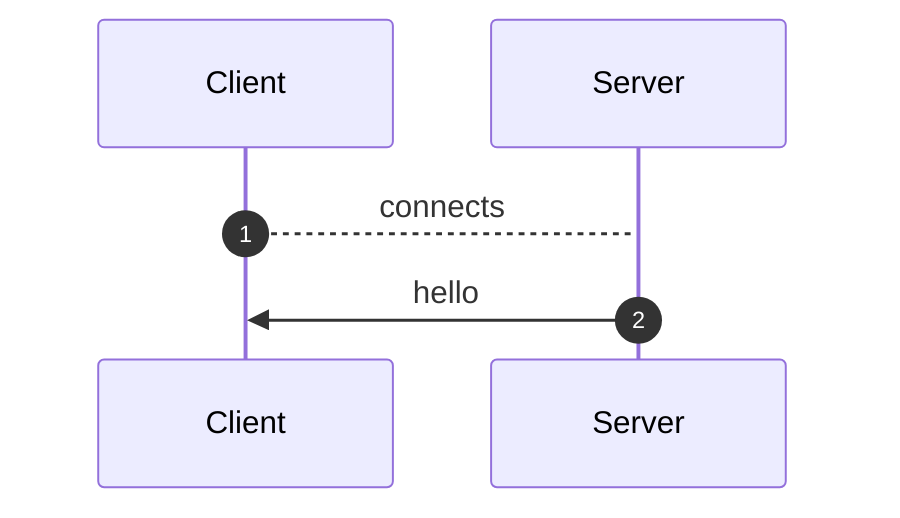
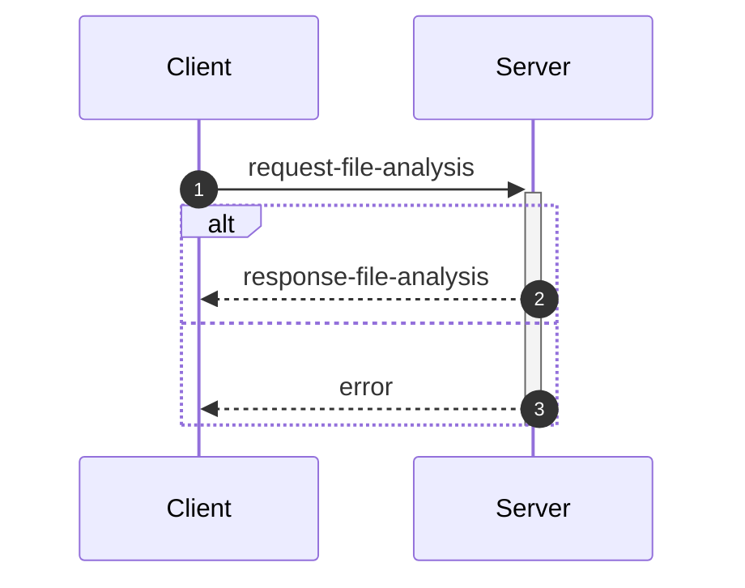
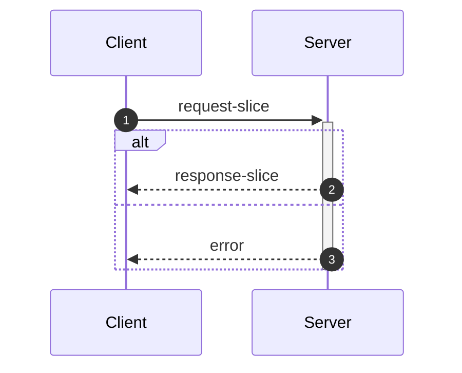
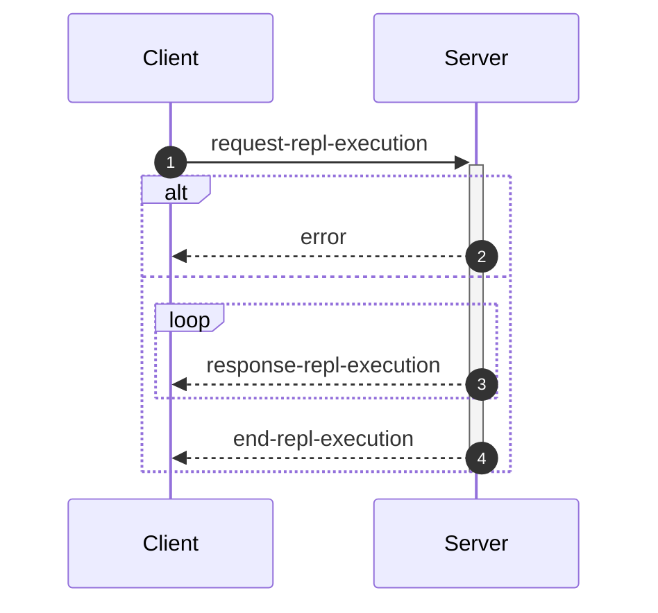

_<span title="an overview of flowR's interface">Generated</span> from '[wiki-interface.ts](https://github.com/flowr-analysis/flowr/tree/main/src/documentation/wiki-interface.ts "src/documentation/wiki-interface.ts")' on 2026-09-08, 07:39:20 UTC (v2.15.8, R v4.6.1), do not edit directly._


Although far from being as detailed as the in-depth explanation of [_flowR_](https://github.com/flowr-analysis/flowr/wiki/Core),
this wiki page explains how to interface with _flowR_ in more detail.
In general, command line arguments and other options provide short descriptions on hover over.

* [💻 Using the REPL](#using-the-repl)
* [⚙️ Configuring FlowR](#configuring-flowr)
* [⚒️ Writing Code](#writing-code)
* [💬 Communicating with the Server](#communicating-with-the-server)

<a id='using-the-repl'></a>
## 💻 Using the REPL


> [!NOTE]
> To execute arbitrary R commands with a repl request, _flowR_ has to be started explicitly with <span title="Description (Command Line Argument): Allow to access the underlying R session when using flowR (security warning: this allows the execution of arbitrary R code!)">`--r-session-access`</span>.
> Please be aware that this introduces a security risk and note that this relies on the [`r-shell` engine](https://github.com/flowr-analysis/flowr/wiki/Engines) .

Although primarily meant for users to explore,
there is nothing which forbids simply calling _flowR_ as a subprocess to use standard-in, -output, and -error
for communication (although you can access the REPL using the server as well,
with the [REPL Request](#message-request-repl-execution) message).

The read-eval-print loop&nbsp;(REPL) works relatively simple.
You can submit an expression (using <kbd>Enter</kbd>),
which is interpreted as an R&nbsp;expression by default but interpreted as a *command* if it starts with a colon (`:`).
The best command to get started with the REPL is <span title="Description (Repl Command): Show help information (aliases: :h, :?)">`:help`</span>.
Besides, you can leave the REPL either with the command <span title="Description (Repl Command): End the repl (aliases: :q, :exit)">`:quit`</span> or by pressing <kbd>Ctrl</kbd>+<kbd>C</kbd> twice.
When writing a *command*, you may press <kbd>Tab</kbd> to get a list of completions, if available.
Multiple commands can be entered in a single line by separating them with a semicolon (`;`), e.g. `:parse "x<-2"; :df*`.
If a command is given without R code, the REPL will re-use R code given in a previous command.
The prior example will hence return first the parsed AST of the program and then the dataflow graph for `"x <- 2"`.

> [!NOTE]
> If you develop flowR, you may want to launch the repl using the `npm run main-dev` command, this way, you get a non-minified version of flowR with debug information and hot-reloading of source files.

<details>
<summary>Available Commands</summary>

We currently offer the following commands (this with a `[*]` suffix are available with and without the star):


| Command | Description |
| ------- | ----------- |
| **<span title="Description (Repl Command): End the repl (aliases: :q, :exit)">:quit</span>** | End the repl (aliases: **:<span title="Alias of ':quit'. End the repl">q</span>**, **:<span title="Alias of ':quit'. End the repl">exit</span>**) |
| **<span title="Description (Repl Command): Execute the given code as R code. This requires the `--r-session-access` flag to be set and requires the r-shell engine. (aliases: :e, :r)">:execute</span>** | Execute the given code as R code. This requires the `--r-session-access` flag to be set and requires the r-shell engine. (aliases: **:<span title="Alias of ':execute'. Execute the given code as R code. This requires the `--r-session-access` flag to be set and requires the r-shell engine.">e</span>**, **:<span title="Alias of ':execute'. Execute the given code as R code. This requires the `--r-session-access` flag to be set and requires the r-shell engine.">r</span>**) |
| **<span title="Description (Repl Command): Get mermaid code for the control-flow graph of R code (aliases: :cfg, :cf)">:controlflow[*]</span>** | Get mermaid code for the control-flow graph of R code (star: Returns the URL to mermaid.live) (aliases: **:<span title="Alias of ':controlflow'. Get mermaid code for the control-flow graph of R code">cfg</span>**, **:<span title="Alias of ':controlflow'. Get mermaid code for the control-flow graph of R code">cf</span>**) |
| **<span title="Description (Repl Command): Get mermaid code for the control-flow graph with basic blocks (aliases: :cfgb, :cfb)">:controlflowbb[*]</span>** | Get mermaid code for the control-flow graph with basic blocks (star: Returns the URL to mermaid.live) (aliases: **:<span title="Alias of ':controlflowbb'. Get mermaid code for the control-flow graph with basic blocks">cfgb</span>**, **:<span title="Alias of ':controlflowbb'. Get mermaid code for the control-flow graph with basic blocks">cfb</span>**) |
| **<span title="Description (Repl Command): Get mermaid code for the dataflow graph (aliases: :d, :df)">:dataflow[*]</span>** | Get mermaid code for the dataflow graph (star: Returns the URL to mermaid.live) (aliases: **:<span title="Alias of ':dataflow'. Get mermaid code for the dataflow graph">d</span>**, **:<span title="Alias of ':dataflow'. Get mermaid code for the dataflow graph">df</span>**) |
| **<span title="Description (Repl Command): Get mermaid code for the normalized AST of R code (aliases: :n)">:normalize[*]</span>** | Get mermaid code for the normalized AST of R code (star: Returns the URL to mermaid.live) (alias: **:<span title="Alias of ':normalize'. Get mermaid code for the normalized AST of R code">n</span>**) |
| **<span title="Description (Repl Command): Get mermaid code for the simplified dataflow graph (aliases: :ds, :dfs)">:dataflowsimple[*]</span>** | Get mermaid code for the simplified dataflow graph (star: Returns the URL to mermaid.live) (aliases: **:<span title="Alias of ':dataflowsimple'. Get mermaid code for the simplified dataflow graph">ds</span>**, **:<span title="Alias of ':dataflowsimple'. Get mermaid code for the simplified dataflow graph">dfs</span>**) |
| **<span title="Description (Repl Command): Inspect and extend the signature database: `query` (identical to :query @signature), `info <name>` for where a function comes from (identical to :query @function-info), `add <path>` to mount another database/source, `download` to fetch the full-history database. (aliases: :sig)">:signature</span>** | Inspect and extend the signature database: `query` (identical to :query @signature), `info <name>` for where a function comes from (identical to :query @function-info), `add <path>` to mount another database/source, `download` to fetch the full-history database. (alias: **:<span title="Alias of ':signature'. Inspect and extend the signature database: `query` (identical to :query @signature), `info <name>` for where a function comes from (identical to :query @function-info), `add <path>` to mount another database/source, `download` to fetch the full-history database.">sig</span>**) |
| **<span title="Description (Repl Command): Just calculates the DFG, but only prints summary info (aliases: :d#, :df#)">:dataflowsilent</span>** | Just calculates the DFG, but only prints summary info (aliases: **:<span title="Alias of ':dataflowsilent'. Just calculates the DFG, but only prints summary info">d#</span>**, **:<span title="Alias of ':dataflowsilent'. Just calculates the DFG, but only prints summary info">df#</span>**) |
| **<span title="Description (Repl Command): Prints ASCII Art of the parsed, unmodified AST (aliases: :p)">:parse</span>** | Prints ASCII Art of the parsed, unmodified AST (alias: **:<span title="Alias of ':parse'. Prints ASCII Art of the parsed, unmodified AST">p</span>**) |
| **<span title="Description (Repl Command): Prints the version of flowR as well as the current version of R">:version</span>** | Prints the version of flowR as well as the current version of R
| **<span title="Description (Repl Command): Query the given R code (use 'help' for more information)">:query[*]</span>** | Query the given R code (use 'help' for more information) (star: Similar to query, but returns the output in json format.)
| **<span title="Description (Repl Command): Returns an ASCII representation of the dataflow graph (aliases: :df!)">:dataflowascii</span>** | Returns an ASCII representation of the dataflow graph (alias: **:<span title="Alias of ':dataflowascii'. Returns an ASCII representation of the dataflow graph">df!</span>**) |
| **<span title="Description (Repl Command): Returns summarization stats for the normalized AST (aliases: :n#)">:normalize#</span>** | Returns summarization stats for the normalized AST (alias: **:<span title="Alias of ':normalize#'. Returns summarization stats for the normalized AST">n#</span>**) |
| **<span title="Description (Repl Command): Show help information (aliases: :h, :?)">:help</span>** | Show help information (aliases: **:<span title="Alias of ':help'. Show help information">h</span>**, **:<span title="Alias of ':help'. Show help information">?</span>**) |


</details>


> [!TIP]
> 
> As indicated by the examples before, all REPL commands that operate on code keep track of the state.
> Hence, if you run a command like <span title="Description (Repl Command, starred version): Returns the URL to mermaid.live; Base Command: Get mermaid code for the dataflow graph (aliases: :d*, :df*)">`:dataflow*`</span> without providing R code,
> the REPL will re-use the R code provided in a previous command.
> Likewise, doing this will benefit from incrementality!
> If you request the dataflow graph with `:df* x <- 2 * y` and then want to see the parsed AST with `:parse`,
> the REPL will re-use previously obtained information and not re-parse the code again.
> 		


Generally, many commands offer shortcut versions in the REPL. Many queries, for example, offer a shortened format (see the example below).
Of special note, the [Config Query](https://github.com/flowr-analysis/flowr/wiki/%5BQuery%5D-Config)
can be used to also modify the currently active configuration of _flowR_ within the REPL (see the [wiki page](https://github.com/flowr-analysis/flowr/wiki/%5BQuery%5D-Config) for more information).

### Example: Retrieving the Dataflow Graph

To retrieve a URL to the [mermaid](https://mermaid.js.org/) diagram of the dataflow of a given expression,
use <span title="Description (Repl Command, starred version): Returns the URL to mermaid.live; Base Command: Get mermaid code for the dataflow graph (aliases: :d*, :df*)">`:dataflow*`</span> (or <span title="Description (Repl Command): Get mermaid code for the dataflow graph (aliases: :d, :df)">`:dataflow`</span> to get the mermaid code in the cli):


```shell
$ docker run -it --rm eagleoutice/flowr # or npm run flowr 
flowR repl v2.15.8, R grammar v14 (tree-sitter engine)
R> :dataflow* y <- 1 + x
```

<details>
<summary style='color:gray'>Output</summary>


```text
https://mermaid.live/view#base64:eyJjb2RlIjoiZmxvd2NoYXJ0IFREXG4gICAgMXt7XCJgKiM5MTtSTnVtYmVyIzkzOyogKioxKipcbiAgICAgICoxLjYqICgqKmlkOiAxKiopYFwifX1cbiAgICAyKFtcImAqIzkxO1JTeW1ib2wjOTM7KiAqKngqKlxuICAgICAgKjEuMTAqICgqKmlkOiAyKiopYFwiXSlcbiAgICAzW1tcImAqIzkxO1JCaW5hcnlPcCM5MzsqIGJhc2UjNTg7IzU4OyoqIzQzOyoqXG4gICAgICAqMS42LTEwKiAoKippZDogMyoqKVxuICAgIGFyZzogKDEsIDIpYFwiXV1cbiAgICBidWlsdC1pbjpfW1wiYEJ1aWx0LUluOlxuIzQzO2BcIl1cbiAgICBzdHlsZSBidWlsdC1pbjpfIHN0cm9rZTpncmF5LGZpbGw6Z3JheSxzdHJva2Utd2lkdGg6MnB4LG9wYWNpdHk6Ljg7XG4gICAgMFtcImAqIzkxO1JTeW1ib2wjOTM7KiAqKnkqKlxuICAgICAgKjEuMSogKCoqaWQ6IDAqKiwgdjogMylgXCJdXG4gICAgNFtbXCJgKiM5MTtSQmluYXJ5T3AjOTM7KiBiYXNlIzU4OyM1ODsqKiM2MDsjNDU7KipcbiAgICAgICoxLjEtMTAqICgqKmlkOiA0KiopXG4gICAgYXJnOiAoMCwgMylgXCJdXVxuICAgIGJ1aWx0LWluOl8tW1wiYEJ1aWx0LUluOlxuIzYwOyM0NTtgXCJdXG4gICAgc3R5bGUgYnVpbHQtaW46Xy0gc3Ryb2tlOmdyYXksZmlsbDpncmF5LHN0cm9rZS13aWR0aDoycHgsb3BhY2l0eTouODtcbiAgICAxIC0uLT58XCJmbG93XCJ8IDJcbiAgICBsaW5rU3R5bGUgMCBzdHJva2U6Z3JheSxjb2xvcjpncmF5O1xuICAgIDIgLS4tPnxcImZsb3dcInwgM1xuICAgIGxpbmtTdHlsZSAxIHN0cm9rZTpncmF5LGNvbG9yOmdyYXk7XG4gICAgMyAtLT58XCJyZWFkcywgYXJnXCJ8IDFcbiAgICAzIC0tPnxcInJlYWRzLCBhcmdcInwgMlxuICAgIDMgLS4tPnxcImZsb3dcInwgMFxuICAgIGxpbmtTdHlsZSA0IHN0cm9rZTpncmF5LGNvbG9yOmdyYXk7XG4gICAgMyAtLi0+fFwicmVhZHMsIGNhbGxzXCJ8IGJ1aWx0LWluOl9cbiAgICBsaW5rU3R5bGUgNSBzdHJva2U6Z3JheTtcbiAgICAwIC0tPnxcImRlZmluZWQtYnksIGZsb3dcInwgNFxuICAgIDAgLS0+fFwiZGVmaW5lZC1ieVwifCAzXG4gICAgNCAtLT58XCJyZWFkcywgYXJnXCJ8IDNcbiAgICA0IC0tPnxcInJldHVybnMsIGFyZ1wifCAwXG4gICAgNCAtLi0+fFwicmVhZHMsIGNhbGxzXCJ8IGJ1aWx0LWluOl8tXG4gICAgbGlua1N0eWxlIDEwIHN0cm9rZTpncmF5OyIsIm1lcm1haWQiOnsiYXV0b1N5bmMiOnRydWV9fQ==
```


Retrieve the dataflow graph of the expression `y <- 1 + x`. It looks like this:


```mermaid
flowchart LR
    1{{"`*#91;RNumber#93;* **1**
      *1.6* (**id: 1**)`"}}
    2(["`*#91;RSymbol#93;* **x**
      *1.10* (**id: 2**)`"])
    3[["`*#91;RBinaryOp#93;* base#58;#58;**#43;**
      *1.6-10* (**id: 3**)
    arg: (1, 2)`"]]
    built-in:_["`Built-In:
#43;`"]
    style built-in:_ stroke:gray,fill:gray,stroke-width:2px,opacity:.8;
    0["`*#91;RSymbol#93;* **y**
      *1.1* (**id: 0**, v: 3)`"]
    4[["`*#91;RBinaryOp#93;* base#58;#58;**#60;#45;**
      *1.1-10* (**id: 4**)
    arg: (0, 3)`"]]
    built-in:_-["`Built-In:
#60;#45;`"]
    style built-in:_- stroke:gray,fill:gray,stroke-width:2px,opacity:.8;
    1 -.->|"flow"| 2
    linkStyle 0 stroke:gray,color:gray;
    2 -.->|"flow"| 3
    linkStyle 1 stroke:gray,color:gray;
    3 -->|"reads, arg"| 1
    3 -->|"reads, arg"| 2
    3 -.->|"flow"| 0
    linkStyle 4 stroke:gray,color:gray;
    3 -.->|"reads, calls"| built-in:_
    linkStyle 5 stroke:gray;
    0 -->|"defined-by, flow"| 4
    0 -->|"defined-by"| 3
    4 -->|"reads, arg"| 3
    4 -->|"returns, arg"| 0
    4 -.->|"reads, calls"| built-in:_-
    linkStyle 10 stroke:gray;
```

	
<details>

<summary style="color:gray">R Code of the Dataflow Graph</summary>

The analysis required _0.7 ms_ and ran (including parse and normalize, using the [tree-sitter](https://github.com/flowr-analysis/flowr/wiki/Engines) engine) within the generation environment. No [signature database](https://github.com/flowr-analysis/flowr/wiki/Signature-Database) is mounted for these generated graphs, so `library()` calls attach no package exports; base-R names are still qualified via the generated base-package store (e.g. `acf` as `stats::acf`). 
We encountered no unknown side effects during the analysis.


```r
y <- 1 + x
```


</details>


</details>


For small graphs like this, <span title="Description (Repl Command): Returns an ASCII representation of the dataflow graph (aliases: :df!)">`:dataflowascii`</span> also provides an ASCII representation directly in the REPL:


```shell
$ docker run -it --rm eagleoutice/flowr # or npm run flowr 
flowR repl v2.15.8, R grammar v14 (tree-sitter engine)
R> :df! y <- 1 + x
```

<details open>
<summary style='color:gray'>Output</summary>


```text
           ┌────────────u<2>u
        c<3>c   0<1>0   | x |
    ┌───| + |───| 1 |───u---u
    │   c---c   0---0
 c<4>c     │
 |<- |     └────────────v<0>v
 c---c──────────────────| y |
                        v---v
Edges:
3 -> 1: reads, arg          3 -> 2: reads, arg
3 -> 0: flows-to            1 -> 2: flows-to
2 -> 3: flows-to            4 -> 3: reads, arg
4 -> 0: returns, arg        0 -> 4: defined-by, flows-to
0 -> 3: defined-by
```


Retrieve the dataflow graph of the expression `y <- 1 + x` as ASCII art.

</details>


For the slicing with <span title="Description (Repl Command): Static backwards executable slicer for R">`:slicer`</span>, you have access to the same [magic comments](#slice-magic-comments) as with the [slice request](#message-request-slice).
Pass `--inline` to splice resolvable `source()` calls into the reconstruction so the slice is a single self-contained R text (the same as the static slice query's `inlineSources` flag).
See `--help` for more flags!

### Example: Interfacing with the File System

Many commands that allow for an R-expression (like <span title="Description (Repl Command, starred version): Returns the URL to mermaid.live; Base Command: Get mermaid code for the dataflow graph (aliases: :d*, :df*)">`:dataflow*`</span>) allow for a file as well
if the argument starts with `file://`.
If you are working from the root directory of the _flowR_ repository, the following gives you the parsed AST of the example file using the <span title="Description (Repl Command): Prints ASCII Art of the parsed, unmodified AST (aliases: :p)">`:parse`</span> command:

> **Watch mode**: Replace `file://` with `watch://` to enter watch mode.
> flowR runs the command immediately and then re-runs it every time the file (or any file inside the folder) changes.
> Enter any other command to leave watch mode.
> For example: `:df watch://analysis.R`


```shell
$ docker run -it --rm eagleoutice/flowr # or npm run flowr 
flowR repl v2.15.8, R grammar v14 (tree-sitter engine)
R> :parse file://test/testfiles/example.R
```

<details>
<summary style='color:gray'>Output</summary>


```text
File: test/testfiles/example.R

program
├ binaryoperator
│ ├ identifier "sum" (1:1─4)
│ ├ <- "<-" (1:5─7)
│ ╰ float "0" (1:8─9)
├ binaryoperator
│ ├ identifier "product" (2:1─8)
│ ├ <- "<-" (2:9─11)
│ ╰ float "1" (2:12─13)
├ binaryoperator
│ ├ identifier "w" (3:1─2)
│ ├ <- "<-" (3:3─5)
│ ╰ float "7" (3:6─7)
├ binaryoperator
│ ├ identifier "N" (4:1─2)
│ ├ <- "<-" (4:3─5)
│ ╰ float "10" (4:6─8)
├ forstatement
│ ├ for "for" (6:1─4)
│ ├ ( "(" (6:5─6)
│ ├ identifier "i" (6:6─7)
│ ├ in "in" (6:8─10)
│ ├ binaryoperator
│ │ ├ float "1" (6:11─12)
│ │ ├ : ":" (6:12─13)
│ │ ╰ parenthesizedexpression
│ │   ├ ( "(" (6:13─14)
│ │   ├ binaryoperator
│ │   │ ├ identifier "N" (6:14─15)
│ │   │ ├ - "-" (6:15─16)
│ │   │ ╰ float "1" (6:16─17)
│ │   ╰ ) ")" (6:17─18)
│ ├ ) ")" (6:18─19)
│ ╰ bracedexpression
│   ├ { "{" (6:20─21)
│   ├ binaryoperator
│   │ ├ identifier "sum" (7:3─6)
│   │ ├ <- "<-" (7:7─9)
│   │ ╰ binaryoperator
│   │   ├ binaryoperator
│   │   │ ├ identifier "sum" (7:10─13)
│   │   │ ├ + "+" (7:14─15)
│   │   │ ╰ identifier "i" (7:16─17)
│   │   ├ + "+" (7:18─19)
│   │   ╰ identifier "w" (7:20─21)
│   ├ binaryoperator
│   │ ├ identifier "product" (8:3─10)
│   │ ├ <- "<-" (8:11─13)
│   │ ╰ binaryoperator
│   │   ├ identifier "product" (8:14─21)
│   │   ├  "" (8:22─23)
│   │   ╰ identifier "i" (8:24─25)
│   ╰ } "}" (9:1─2)
├ call
│ ├ identifier "cat" (11:1─4)
│ ╰ arguments
│   ├ ( "(" (11:4─5)
│   ├ argument
│   │ ╰ string
│   │   ├ " "\"" (11:5─6)
│   │   ├ stringcontent "Sum:" (11:6─10)
│   │   ╰ " "\"" (11:10─11)
│   ├ comma "," (11:11─12)
│   ├ argument
│   │ ╰ identifier "sum" (11:13─16)
│   ├ comma "," (11:16─17)
│   ├ argument
│   │ ╰ string
│   │   ├ " "\"" (11:18─19)
│   │   ├ stringcontent
│   │   │ ╰ escapesequence "\\n" (11:19─21)
│   │   ╰ " "\"" (11:21─22)
│   ╰ ) ")" (11:22─23)
╰ call
  ├ identifier "cat" (12:1─4)
  ╰ arguments
    ├ ( "(" (12:4─5)
    ├ argument
    │ ╰ string
    │   ├ " "\"" (12:5─6)
    │   ├ stringcontent "Product:" (12:6─14)
    │   ╰ " "\"" (12:14─15)
    ├ comma "," (12:15─16)
    ├ argument
    │ ╰ identifier "product" (12:17─24)
    ├ comma "," (12:24─25)
    ├ argument
    │ ╰ string
    │   ├ " "\"" (12:26─27)
    │   ├ stringcontent
    │   │ ╰ escapesequence "\\n" (12:27─29)
    │   ╰ " "\"" (12:29─30)
    ╰ ) ")" (12:30─31)
```


Retrieve the parsed AST of the example file.

<details>

<summary>File Content</summary>


```r
sum <- 0
product <- 1
w <- 7
N <- 10

for (i in 1:(N-1)) {
  sum <- sum + i + w
  product <- product * i
}

cat("Sum:", sum, "\n")
cat("Product:", product, "\n")
```


</details>

As _flowR_ directly transforms this AST the output focuses on being human-readable instead of being machine-readable.
		

</details>


### Example: Run a Query

You can run any query supported by _flowR_ using the <span title="Description (Repl Command): Query the given R code (use 'help' for more information)">`:query`</span> command.
For example, to obtain the shapes of all data frames in a given piece of code, you can run:


```shell
$ docker run -it --rm eagleoutice/flowr # or npm run flowr 
flowR repl v2.15.8, R grammar v14 (tree-sitter engine)
R> :query @absint df-shape "x <- data.frame(a = 1:10, b = 1:10)\ny <- x$a"
```

<details open>
<summary style='color:gray'>Output</summary>


```text
Query: absint (0 ms)
All queries together required ≈0 ms (1ms accuracy, total 0 ms)
```


Retrieve the shapes of all data frames in the given code.

</details>


To run the linter on a file, you can use (in this example, we just issue the `dead-code` linter on a small piece of code):


```shell
$ docker run -it --rm eagleoutice/flowr # or npm run flowr 
flowR repl v2.15.8, R grammar v14 (tree-sitter engine)
R> :query @linter rules:dead-code "if(FALSE) x <- 2"
```

<details open>
<summary style='color:gray'>Output</summary>


```text
Query: linter (0 ms)
   ╰ Dead Code (dead-code):
       ╰ certain:
           ╰ Code at 1.11-16
       ╰ Metadata: searchTimeMs: 0, processTimeMs: 0
All queries together required ≈0 ms (1ms accuracy, total 0 ms)
```


Run the linter on the given code, with only the `dead-code` rule enabled.

</details>


For more information on the available queries, please check out the [Query API](https://github.com/flowr-analysis/flowr/wiki/Query-API).


<a id='configuring-flowr'></a>
## ⚙️ Configuring FlowR


When running _flowR_, you may want to specify some behaviors with a dedicated configuration file.
By default, flowR looks for a file named `flowr.json` in the current working directory (or any higher directory).
You can also specify a different file with <span title="Description (Command Line Argument): The name of the configuration file to use">`--config-file`</span> or pass the configuration inline using <span title="Description (Command Line Argument): The flowR configuration to use, as a JSON string">`--config-json`</span>.
To inspect the current configuration, you can run flowr with the <span title="Description (Command Line Argument): Run with verbose logging (will be passed to the corresponding script)">`--verbose`</span> flag, or use the `config` [Query](https://github.com/flowr-analysis/flowr/wiki/Query-API).
Within the REPL this works by running the following:


```shell
:query @config
```


To work with the <a href="https://github.com/flowr-analysis/flowr/tree/main/src/config.ts#L107"><code><span title="The configuration file format for flowR.">FlowrConfig</span></code></a> you can use the provided helper objects alongside its methods like
<a href="https://github.com/flowr-analysis/flowr/tree/main/src/config.ts#L856"><code><span title="Creates a new flowr config that has the updated values.">FlowrConfig::<b>amend</b></span></code></a>.
The schema below documents every option; the ones you most likely want are:

- <a href="https://github.com/flowr-analysis/flowr/wiki/Interface#configuring-flowr" title="Configuration Option (boolean): Whether source calls should be ignored, causing {@link processSourceCall}&#39;s behavior to be skipped.">ignoreSourceCalls</a>: ignore source calls when analyzing the code, i.e., ignore the inclusion of other files.
- <a href="https://github.com/flowr-analysis/flowr/wiki/Interface#configuring-flowr" title="Configuration Option (boolean): Whether load calls should be ignored, causing {@link processLoadCall}&#39;s behavior to be skipped.">ignoreLoadCalls</a>: ignore load calls when analyzing the code, i.e., ignore the loading of r-data files.
- <a href="https://github.com/flowr-analysis/flowr/wiki/Interface#configuring-flowr" title="Configuration Option (object): Do you want to overwrite (parts) of the builtin definition?">semantics.environment.overwriteBuiltIns</a>: overwrite _flowR_'s handling of built-in functions, or clear the preset definitions entirely.
  See [Configure BuiltIn Semantics](#configure-builtin-semantics) for more information.
- <a href="https://github.com/flowr-analysis/flowr/wiki/Interface#configuring-flowr" title="Configuration Option (string): How to resolve variables and their values. (one of &quot;disabled&quot;, &quot;alias&quot;, &quot;builtin&quot;)">solver.variables</a>: how to resolve variables and their values (`disabled`, `alias`, `builtin`).
- <a href="https://github.com/flowr-analysis/flowr/wiki/Interface#configuring-flowr" title="Configuration Option (array): The engine or set of engines to use for interacting with R code. An empty array means all available engines will be used.">engines</a> and <a href="https://github.com/flowr-analysis/flowr/wiki/Interface#configuring-flowr" title="Configuration Option (string): The default engine to use for interacting with R code. If this is undefined, an arbitrary engine from the specified list will be used. (one of &quot;tree-sitter&quot;, &quot;r-shell&quot;)">defaultEngine</a>: the engines used to interact with R code, see the [Engines wiki page](https://github.com/flowr-analysis/flowr/wiki/Engines).
- <a href="https://github.com/flowr-analysis/flowr/wiki/Interface#configuring-flowr" title="Configuration Option (array): Files a framework loads on its own, without any source() call (e.g. global.R in a shiny app), in the order they are loaded; flowR orders the matching project files accordingly and analyzes them as one program. Entries are case-insensitive globs matched against the file path, a plain name matches any file with that name, and entries matching no project file are warned about. Usually set per project kind via specializeConfig.">project.implicitSources</a>: the files a framework loads without any `source()` call, in the order in which they are
  loaded. Entries are globs (e.g. `R/*.R`) matched against the file path ignoring capitalization; one matching no file is reported.
- <a href="https://github.com/flowr-analysis/flowr/wiki/Interface#configuring-flowr" title="Configuration Option (object): Overwrite (parts of) the configuration depending on the project kind flowR detects, e.g. to give a shiny app its implicit sources.">specializeConfig</a>: overwrite (parts of) the configuration depending on the kind of project _flowR_ detects
  (e.g. `shiny-app`), which is how a shiny app gets its implicit sources by default. What you configure directly wins.
- <a href="https://github.com/flowr-analysis/flowr/wiki/Interface#configuring-flowr" title="Configuration Option (string): Overwrite the project kind flowR would otherwise infer from the analyzed files, e.g. when auto-detection guesses wrong. (one of &quot;package&quot;, &quot;script&quot;, &quot;shiny-app&quot;, &quot;notebook&quot;, &quot;project&quot;, &quot;unknown&quot;)">project.useProjectType</a>: skip that detection and force a project kind yourself, when auto-detection guesses wrong.
- <a href="https://github.com/flowr-analysis/flowr/wiki/Interface#configuring-flowr" title="Configuration Option (array): The default plugins to load when creating a new instance of FlowrAnalyzer">defaultPlugins</a> and <a href="https://github.com/flowr-analysis/flowr/wiki/Interface#configuring-flowr" title="Configuration Option (array): The plugins to load in REPL mode">repl.plugins</a>: the plugins to load for a new <a href="https://github.com/flowr-analysis/flowr/tree/main/src/project/flowr-analyzer.ts#L202"><code><span title="Central class for conducting analyses with FlowR. Use the FlowrAnalyzerBuilder to create a new instance. If you want the original pattern of creating a pipeline and running all steps, you can still do this with FlowrAnalyzer#runFull . To inspect the context of the analyzer, use FlowrAnalyzer#inspectContext (if you are a plugin and need to modify it, use FlowrAnalyzer#context instead).">FlowrAnalyzer</span></code></a> and in the REPL
  (use `flowr:default` to reference the former).

So you can configure _flowR_ by adding a file like the following:

<details>

<summary>Example Configuration File</summary>


```json
{
  "ignoreSourceCalls": true,
  "ignoreLoadCalls": true,
  "semantics": {
    "environment": {
      "overwriteBuiltIns": {
        "definitions": [
          {
            "type": "function",
            "names": [
              "foo"
            ],
            "processor": "builtin:assign",
            "config": {}
          }
        ]
      }
    }
  },
  "defaultPlugins": [
    "file:description",
    "versions:description"
  ],
  "repl": {
    "quickStats": false,
    "dfProcessorHeat": false,
    "hints": true,
    "plugins": [
      "flowr:default"
    ]
  },
  "project": {
    "resolveUnknownPathsOnDisk": true,
    "implicitSources": [
      "global.R",
      "app.R"
    ]
  },
  "linter": {
    "disabledRules": []
  },
  "specializeConfig": {
    "shiny-app": {
      "project": {
        "implicitSources": [
          "global.R",
          "ui.R",
          "server.R",
          "app.R"
        ]
      }
    }
  },
  "engines": [
    {
      "type": "r-shell"
    }
  ],
  "solver": {
    "variables": "alias",
    "evalStrings": true,
    "trackEnvironments": true,
    "sigdb": {
      "enabled": true,
      "loadProjectDependencies": true,
      "eagerlyLoad": false,
      "eagerlyLoadExports": false,
      "linkBaseR": false,
      "linkDescriptionDependencies": false
    },
    "resolveSource": {
      "dropPaths": "no",
      "ignoreCapitalization": true,
      "inferWorkingDirectory": "active-script",
      "searchPath": []
    },
    "instrument": {},
    "slicer": {
      "threshold": 50
    }
  },
  "abstractInterpretation": {
    "wideningThreshold": 4,
    "followCalls": true,
    "dataFrame": {
      "maxColNames": 20,
      "readLoadedData": {
        "readExternalFiles": true,
        "maxReadLines": 1000000
      }
    }
  },
  "incremental": {
    "alwaysIncremental": false,
    "parsing": {
      "activated": false,
      "heuristics": {
        "activated": true,
        "mtime": true,
        "linesFrom": 500,
        "bytesFrom": 50000,
        "alwaysWithEdits": false,
        "minFiles": 1
      }
    }
  },
  "gas": {
    "thresholds": {
      "memory": {
        "problematic": 0.7,
        "critical": 0.9
      },
      "timeMs": {
        "problematic": 100000,
        "critical": 120000
      }
    },
    "features": {}
  }
}
```


</details>

<details>
<a id='configure-builtin-semantics'></a>
<summary>Configure Built-In Semantics</summary>


`semantics/environment/overwriteBuiltins` accepts two keys:

- `loadDefaults` (boolean, initially `true`): If set to `true`, the default built-in definitions are loaded before applying the custom definitions. Setting this flag to `false` explicitly disables the loading of the default definitions.
- `definitions` (array, initially empty): Allows to overwrite or define new built-in elements. Each object within must have a `type` which is one of the below. Furthermore, they may define a string array of `names` which specifies the identifiers to bind the definitions to. You may use `assumePrimitive` to specify whether _flowR_ should assume that this is a primitive non-library definition (so you probably just do not want to specify the key).

  | Type            | Description                                                                                                                                                                                                                                                                                              | Example                                                                                                    |
  | --------------- | -------------------------------------------------------------------------------------------------------------------------------------------------------------------------------------------------------------------------------------------------------------------------------------------------------- | ---------------------------------------------------------------------------------------------------------- |
  | `constant`    | Additionally allows for a `value` this should resolve to.                                                                                                                                                                                                                                                | `{ type: 'constant', names: ['NULL', 'NA'],  value: null }`                                                |
  | `function`    | Is a rather flexible way to define and bind built-in functions. For the time, we do not have extensive documentation to cover all the cases, so please either consult the sources with the `default-builtin-config.ts` or open a [new issue](https://github.com/flowr-analysis/flowr/issues/new/choose). | `{ type: 'function', names: ['next'], processor: 'builtin:d', config: { cfg: ExitPointType.Next } }` |
  | `replacement` | A comfortable way to specify replacement functions like `$<-` or `names<-`. `suffixes` describes the... suffixes to attach automatically. | `{ type: 'replacement', suffixes: ['<-', '<<-'], names: ['[', '[['] }` |


</details>

<details>

<summary style='color:gray'>Full Configuration-File Schema</summary>

- _The configuration file format for flowR._ (object)
    - **logLevel** [optional] _flowR's global minimum log level, applied when the config is loaded._ (string)
        Only allows: 'silly', 'trace', 'debug', 'info', 'warn', 'error', 'fatal'
    - **ignoreSourceCalls** [optional] _Whether source calls should be ignored, causing {@link processSourceCall}'s behavior to be skipped._ (boolean)
    - **ignoreLoadCalls** [optional] _Whether load calls should be ignored, causing {@link processLoadCall}'s behavior to be skipped._ (boolean)
    - **semantics** _Configure language semantics and how flowR handles them._ (object)
        - **environment** [optional] _Semantics regarding how to handle the R environment._ (object)
            - **overwriteBuiltIns** [optional] _Do you want to overwrite (parts) of the builtin definition?_ (object)
                - **loadDefaults** [optional] _Should the default configuration still be loaded?_ (boolean)
                - **definitions** [optional] _The definitions to load/overwrite._ (array)
                Valid item types:
                    - (object)
    - **defaultPlugins** [optional] _The default plugins to load when creating a new instance of FlowrAnalyzer_ (array)
    Valid item types:
        - (alternatives)
            - (string)
            - (array)
    - **repl** _Configuration options for the REPL._ (object)
        - **quickStats** [optional] _Whether to show quick stats in the REPL after each evaluation._ (boolean)
        - **dfProcessorHeat** [optional] _This instruments the dataflow processors to count how often each processor is called._ (boolean)
        - **hints** [optional] _Whether to show dim inline hints on the empty prompt (automatically disabled on non-interactive terminals)._ (boolean)
        - **plugins** [optional] _The plugins to load in REPL mode_ (array)
        Valid item types:
            - (alternatives)
                - (string)
                - (array)
        - **autoUseFileProtocol** [optional] _Prepend the file protocol to a repl input that looks like a path, instead of only warning about it._ (boolean)
        - **queryStats** [optional] _Whether `:query` closes with the line stating how long the queries took (`:query*` never prints it)._ (boolean)
        - **showPlugins** [optional] _Whether `:version` grays out the plugins that did not activate during the last analysis._ (boolean)
    - **project** _Project specific configuration options._ (object)
        - **resolveUnknownPathsOnDisk** [optional] _Whether to resolve unknown paths loaded by the r project disk when trying to source/analyze files._ (boolean)
        - **failOnInaccessiblePath** [optional] _Whether a directory that cannot be traversed during file discovery (e.g. due to permissions) aborts the analysis; when false (the default) such paths are logged and skipped._ (boolean)
        - **basePackages** [optional] _The packages considered part of R itself (base and recommended); if unset, flowR uses its built-in list._ (array)
        Valid item types:
            - (string)
        - **implicitSources** [optional] _Files a framework loads on its own, without any source() call (e.g. global.R in a shiny app), in the order they are loaded; flowR orders the matching project files accordingly and analyzes them as one program. Entries are case-insensitive globs matched against the file path, a plain name matches any file with that name, and entries matching no project file are warned about. Usually set per project kind via specializeConfig._ (array)
        Valid item types:
            - (string)
        - **useProjectType** [optional] _Overwrite the project kind flowR would otherwise infer from the analyzed files, e.g. when auto-detection guesses wrong._ (string)
            Only allows: 'package', 'script', 'shiny-app', 'notebook', 'project', 'unknown'
        - **assumeImplicitEcho** [optional] _Whether the top level of the analyzed code is echoed, so that every visible result printed there is collected as an output by the dependencies query (default true, false for a package)._ (boolean)
        - **discovery** [optional] _Scoping options for the default project discovery._ (object)
            - **full** [optional] _Collect every file below the project root (greedy) instead of only the files the detected project kind needs (default false)._ (boolean)
            - **perKind** [optional] _Per-kind include/exclude glob overrides layered on the default scoping._ (object)
            - **ignore** [optional] _Case-insensitive globs that drop matching files from the intelligent discovery, regardless of kind (e.g. .Renviron to ignore environment files)._ (array)
            Valid item types:
                - (string)
        - **classification** [optional] _Overrides for the signals flowR uses to classify the project kind._ (object)
            - **shinyDescriptionTypes** [optional] _DESCRIPTION Type: values that mark a shiny app._ (array)
            Valid item types:
                - (string)
            - **shinyEntryFiles** [optional] _File names a shiny app is assembled from._ (array)
            Valid item types:
                - (string)
            - **shinyUsagePattern** [optional] _Regex source evidencing shiny usage in an entry file._ (string)
            - **notebookExtensions** [optional] _File extensions marking a notebook._ (array)
            Valid item types:
                - (string)
    - **linter** _Linter configuration options._ (object)
        - **disabledRules** _Linting rule names excluded from the default rule set (a rule requested explicitly via a linter query still runs). Usually set per project kind via specializeConfig._ (array)
        Valid item types:
            - (string)
    - **inputSources** [optional] _Further frameworks the input-sources analysis should know about; entries are added to flowR's defaults._ (object)
        - **pure** [optional] _Functions that only pass the constantness of their arguments on._ (array)
        Valid item types:
            - (string)
        - **param** [optional] _Functions whose result is a 'param' input._ (array)
        Valid item types:
            - (string)
        - **file** [optional] _Functions whose result is a 'file' input._ (array)
        Valid item types:
            - (string)
        - **tempfile** [optional] _Functions whose result is a 'tempfile' input._ (array)
        Valid item types:
            - (string)
        - **glob** [optional] _Functions whose result is a 'glob' input._ (array)
        Valid item types:
            - (string)
        - **net** [optional] _Functions whose result is a 'net' input._ (array)
        Valid item types:
            - (string)
        - **rand** [optional] _Functions whose result is a 'rand' input._ (array)
        Valid item types:
            - (string)
        - **system** [optional] _Functions whose result is a 'system' input._ (array)
        Valid item types:
            - (string)
        - **ffi** [optional] _Functions whose result is a 'ffi' input._ (array)
        Valid item types:
            - (string)
        - **lang** [optional] _Functions whose result is a 'lang' input._ (array)
        Valid item types:
            - (string)
        - **options** [optional] _Functions whose result is a 'options' input._ (array)
        Valid item types:
            - (string)
        - **cmdline** [optional] _Functions whose result is a 'cmdline' input._ (array)
        Valid item types:
            - (string)
        - **user** [optional] _Functions whose result is a 'user' input._ (array)
        Valid item types:
            - (string)
        - **const** [optional] _Functions whose result is a 'const' input._ (array)
        Valid item types:
            - (string)
        - **scope** [optional] _Functions whose result is a 'scope' input._ (array)
        Valid item types:
            - (string)
        - **dconst** [optional] _Functions whose result is a 'dconst' input._ (array)
        Valid item types:
            - (string)
        - **unknown** [optional] _Functions whose result is a 'unknown' input._ (array)
        Valid item types:
            - (string)
        - **linkedObjects** [optional] _Objects a framework provides without a definition in the code, e.g. shiny's input._ (array)
        Valid item types:
            - (object)
        - **linkedEntryPoints** [optional] _Calls that hand a function to a framework, which binds its objects to the parameters by position._ (array)
        Valid item types:
            - (object)
    - **specializeConfig** [optional] _Overwrite (parts of) the configuration depending on the project kind flowR detects, e.g. to give a shiny app its implicit sources._ (object)
    - **engines** _The engine or set of engines to use for interacting with R code. An empty array means all available engines will be used._ (array)
    Valid item types:
        - (alternatives)
            - _The configuration for the tree sitter engine._ (object)
                - **type** [required] _Use the tree sitter engine._ (string)
                    Only allows: 'tree-sitter'
                - **wasmPath** [optional] _The path to the tree-sitter-r WASM binary to use. If this is undefined, this uses the default path._ (string)
                - **treeSitterWasmPath** [optional] _The path to the tree-sitter WASM binary to use. If this is undefined, this uses the default path._ (string)
                - **lax** [optional] _Whether to use the lax parser for parsing R code (allowing for syntax errors). If this is undefined, the strict parser will be used._ (boolean)
            - _The configuration for the R shell engine._ (object)
                - **type** [required] _Use the R shell engine._ (string)
                    Only allows: 'r-shell'
                - **rPath** [optional] _The path to the R executable to use. If this is undefined, this uses the default path._ (string)
                - **pipeBind** [optional] _Whether to enable R's experimental pipe-bind operator "=>" by setting _R_USE_PIPEBIND_ for the R session (default false); R itself keeps this off by default, as it is experimental and has never shipped in a release version of R._ (boolean)
    - **defaultEngine** [optional] _The default engine to use for interacting with R code. If this is undefined, an arbitrary engine from the specified list will be used._ (string)
        Only allows: 'tree-sitter', 'r-shell'
    - **solver** _How to resolve constants, constraints, cells, ..._ (object)
        - **variables** _How to resolve variables and their values._ (string)
            Only allows: 'disabled', 'alias', 'builtin'
        - **evalStrings** _Should we include eval(parse(text="...")) calls in the dataflow graph?_ (boolean)
        - **trackEnvironments** [optional] _Track user-created environments (new.env, assign/get/local with envir=, dollar-assign, attach). When false, all envir-style calls fall through conservatively._ (boolean)
        - **sigdb** _Resolving library exports from a signature database._ (object)
            - **enabled** [optional] _Resolve library()/use() exports from a signature database (default true); when false no database is consulted._ (boolean)
            - **loadProjectDependencies** [optional] _Load the project's declared dependencies from its metadata files (DESCRIPTION Imports/Depends, rproject.toml, uvr.toml, renv.lock, rv.lock, uvr.lock) (default true); when false these files are not read for dependencies._ (boolean)
            - **eagerlyLoad** [optional] _Parse the database up front rather than on the first package load (default false, ignored if disabled)._ (boolean)
            - **eagerlyLoadExports** [optional] _Add a vertex for every export on load rather than on demand (default false); keeps the dataflow graph small._ (boolean)
            - **assumedRVersion** [optional] _R version assumed when resolving versioned (base-R) exports: a pin like "4.5" or "auto" to detect the installed R (default "auto")._ (string)
            - **linkBaseR** [optional] _Eagerly attach base-R namespaces so bare base calls resolve without library() (default false)._ (boolean)
            - **linkBaseRCalls** [optional] _Add a lightweight Reads edge from a bare base-R call to its signature-database function vertex (default false; base-R qualification is edge-free otherwise)._ (boolean)
            - **linkPackageCalls** [optional] _Add a lightweight Reads edge from a resolved package call to its signature-database function vertex (default false)._ (boolean)
            - **linkDescriptionDependencies** [optional] _Eagerly attach the namespaces of the project's declared DESCRIPTION dependencies (Imports/Depends) so their exports resolve without an explicit library() (default false)._ (boolean)
            - **warmInBackground** [optional] _Decompress the hot shards (base + most-downloaded) in a background task on startup so the first library() lookup is warm (default false; for long-running servers/REPLs)._ (boolean)
            - **additionalPaths** [optional] _Extra directories or bundle/manifest files searched for signature databases (alongside the shipped default and $FLOWR_SIGDB_DIR); a downloaded full-history bundle placed here is mounted automatically._ (array)
            Valid item types:
                - (string)
            - **downloadRepo** [optional] _GitHub owner/repo the full-history bundle is downloaded from via ":signature download" (default "flowr-analysis/flowr", release tag "sigdb-v<flowR-version>")._ (string)
            - **autoSync** [optional] _On startup, re-download shards whose committed sigdb.remote.json hash no longer matches the cache, in the background (default false; opt-in network sync after a git pull)._ (boolean)
            - **installedLibrary** [optional] _Recovering packages no signature database knows from the copy installed on this machine._ (object)
                - **enabled** [required] _Recover packages no signature database knows from their installed copy (default false)._ (boolean)
                - **paths** [optional] _Library directories to search; when empty they are discovered from the environment and the project._ (array)
                Valid item types:
                    - (string)
                - **useEnvironment** [optional] _Search the libraries R_LIBS_USER/R_LIBS/R_LIBS_SITE name (default true)._ (boolean)
                - **useProjectLibrary** [optional] _Search a project-local renv/packrat library (default true)._ (boolean)
                - **maxDepth** [optional] _How far to descend into the nested layout of a project-local library (default 3)._ (number)
                - **packages** [optional] _Only recover packages whose name matches one of these regular expressions; empty means any._ (array)
                Valid item types:
                    - (string)
            - **blobCacheBudgetMb** [optional] _How many MiB of decoded package blobs every open bundle may hold together (default 16)._ (number)
            - **versionSelection** [optional] _When a project constrains a dependency, resolve to the newest (default), oldest, or system-installed version satisfying it; system needs R and falls back to newest. Base-R packages always resolve against the assumed R version._ (string)
                Only allows: 'newest', 'oldest', 'system'
            - **versionOverrides** [optional] _Force an exact version for specific packages (name -> version), overriding both the project constraint and the versionSelection policy (default {})._ (object)
        - **versionManagement** _Policies for reasoning about dependency versions._ (object)
            - **linkedVersionGroups** [optional] _Groups of packages that must resolve to the same version; version guessing intersects each group so its members stay mutually compatible (default [])._ (array)
            Valid item types:
                - (array)
                Valid item types:
                    - (string)
        - **assumeAttachedPackages** [optional] _Packages to treat as attached without a `library()` call, so what the built-in configuration states about them applies to the analyzed code. The base packages R attaches on startup already resolve without it._ (array)
        Valid item types:
            - (string)
        - **transitiveSideEffectRounds** [optional] _How many rounds the transitive side-effect fixpoint may run before it is cut off (default 32); the propagation stops on its own as soon as a round adds nothing._ (number)
        - **instrument** (object)
            - **dataflowExtractors** [optional] _These keys are only intended for use within code, allowing to instrument the dataflow analyzer!_ (any)
        - **resolveSource** [optional] _If lax source calls are active, flowR searches for sourced files much more freely, based on the configurations you give it. This option is only in effect if `ignoreSourceCalls` is set to false._ (object)
            - **dropPaths** _Allow to drop the first or all parts of the sourced path, if it is relative._ (string)
                Only allows: 'no', 'once', 'all'
            - **ignoreCapitalization** _Search for filenames matching in the lowercase._ (boolean)
            - **inferWorkingDirectory** _Try to infer the working directory from the main or any script to analyze._ (string)
                Only allows: 'no', 'main-script', 'active-script', 'any-script'
            - **searchPath** _Additionally search in these paths._ (array)
            Valid item types:
                - (string)
            - **repeatedSourceLimit** [optional] _How often the same file can be sourced within a single run? Please be aware: in case of cyclic sources this may not reach a fixpoint so give this a sensible limit._ (number)
            - **applyReplacements** _Provide name replacements for loaded files_ (array)
            Valid item types:
                - (object)
            - **assumeFilesExist** [optional] _Assume a sourced file is always there, making what it defines certain instead of conditional on the source call._ (boolean)
        - **slicer** [optional] _The configuration for the slicer._ (object)
            - **threshold** [optional] _The maximum number of iterations to perform on a single function call during slicing._ (number)
            - **autoExtend** [optional] _If set, the slicer will gain an additional post-pass._ (boolean)
    - **abstractInterpretation** _The configuration options for abstract interpretation._ (object)
        - **wideningThreshold** _The threshold for the number of visitations of a node at which widening should be performed to ensure the termination of the fixpoint iteration._ (number)
        - **followCalls** _Whether the abstract interpretation is interprocedural, i.e. whether it steps into the functions a call may dispatch to._ (boolean)
        - **dataFrame** _The configuration of the shape inference for data frames._ (object)
            - **maxColNames** _The maximum number of columns names to infer for data frames before over-approximating the column names to top._ (number)
            - **readLoadedData** _Configuration options for reading data frame shapes from loaded external data files, such as CSV files._ (object)
                - **readExternalFiles** _Whether data frame shapes should be extracted from loaded external files, such as CSV files._ (boolean)
                - **maxReadLines** _The maximum number of lines to read when extracting data frame shapes from loaded files, such as CSV files._ (number)
    - **incremental** (object)
        - **alwaysIncremental** _Always take the incremental path, regardless of heuristics._ (boolean)
        - **parsing** (object)
            - **activated** _If set, incremental parsing will be used._ (boolean)
            - **heuristics** (object)
                - **activated** [optional] _If set, the heuristics for incremental parsing will be used._ (boolean)
                - **mtime** [optional] _Skip reparsing entirely if the file's modification time is unchanged since the last parse._ (boolean)
                - **linesFrom** [optional] _Only consider incremental parsing for files with at least this many lines._ (number)
                - **bytesFrom** [optional] _Only consider incremental parsing for files with at least this many bytes._ (number)
                - **alwaysWithEdits** [optional] _Always take the incremental path whenever there is a computed edit region, regardless of the other thresholds._ (boolean)
                - **minFiles** [optional] _Only apply these heuristics once the project has at least this many files loaded._ (number)
    - **gas** [optional] _Resource-usage guard (gas) configuration. All feature factors default to 0 (disabled). See https://github.com/flowr-analysis/flowr/wiki/Core#gas-resource-guard._ (object)
        - **thresholds** [optional] _Thresholds for all gas checks (scaled by per-feature factor), boundable per feature._ (object)
            - **memory** [optional] _Heap-usage fraction thresholds (0-1), either shared or given per feature key (with `default` covering the rest)._ (object)
                - **problematic** [optional] _Heap fraction (0-1) above which Problematic is returned, for every feature without an entry of its own._ (number)
                - **critical** [optional] _Heap fraction (0-1) above which Critical is returned, for every feature without an entry of its own._ (number)
            - **timeMs** [optional] _Elapsed analysis time thresholds in milliseconds, either shared or given per feature key (with `default` covering the rest)._ (object)
                - **problematic** [optional] _Elapsed ms above which Problematic is returned, for every feature without an entry of its own._ (number)
                - **critical** [optional] _Elapsed ms above which Critical is returned, for every feature without an entry of its own._ (number)
            - **steps** [optional] _Processed-AST-node thresholds, counted rather than sampled; only a key that arms a budget (`dataflow`) reads them._ (object)
                - **problematic** [optional] _Processed AST nodes above which Problematic is returned, for every feature without an entry of its own._ (number)
                - **critical** [optional] _Processed AST nodes above which the extraction is cut short, for every feature without an entry of its own._ (number)
            - **vertices** [optional] _Created-dataflow-vertex thresholds, counted like `steps`._ (object)
                - **problematic** [optional] _Created dataflow vertices above which Problematic is returned, for every feature without an entry of its own._ (number)
                - **critical** [optional] _Created dataflow vertices above which the extraction is cut short, for every feature without an entry of its own._ (number)
        - **features** [optional] _Per-feature sensitivity factors. 0 or absent disables gas checking for that feature. A factor of 2 makes the feature twice as sensitive. Recognised keys: `source`, `side-effect-linking`, `linter`, `slicer`, `dataflow`._ (object)
        - **countedCheckEvery** [optional] _How many counted steps pass between two clock reads while an armed budget also carries a timeMs bound (default 64); trades overshoot against the cost of reading the clock._ (number)
        - **heapProvider** [optional] _Custom heap statistics source (programmatic configs only), overriding the built-in v8/performance.memory detection._ (function)

</details>

	

<a id='writing-code'></a>
## ⚒️ Writing Code

_flowR_ can be used as a [module](https://www.npmjs.com/package/@eagleoutice/flowr) and offers several main classes and interfaces that are interesting for extension writers 
(see the [Visual Studio Code extension](https://marketplace.visualstudio.com/items?itemName=code-inspect.vscode-flowr) or the [Core](https://github.com/flowr-analysis/flowr/wiki/Core) wiki page for more information).

### Creating Analyses with _flowR_

Nowadays, instances of the <a href="https://github.com/flowr-analysis/flowr/tree/main/src/project/flowr-analyzer.ts#L202"><code><span title="Central class for conducting analyses with FlowR. Use the FlowrAnalyzerBuilder to create a new instance. If you want the original pattern of creating a pipeline and running all steps, you can still do this with FlowrAnalyzer#runFull . To inspect the context of the analyzer, use FlowrAnalyzer#inspectContext (if you are a plugin and need to modify it, use FlowrAnalyzer#context instead).">FlowrAnalyzer</span></code></a> should be used as central frontend to get analysis results from _flowR_.
The entry points an analysis is written against are re-exported from the package root (`import { FlowrAnalyzerBuilder } from '@eagleoutice/flowr'`);
everything else stays reachable under its own path, as in `@eagleoutice/flowr/dataflow/graph/graph`.
For example, a program slice can be created like this:


```ts
const analyzer = await new FlowrAnalyzerBuilder()
    .setEngine('tree-sitter')
    .build();
analyzer.addRequest('x <- 1\ny <- x\nx');
const result = await analyzer.query([
    {
        type:     'static-slice',
        criteria: ['3@x']
    }
]);
//console.log(result['static-slice']);
```


For more information, please have a look at the [Analyzer](https://github.com/flowr-analysis/flowr/wiki/Analyzer) wiki page, which explains how to construct and use the <a href="https://github.com/flowr-analysis/flowr/tree/main/src/project/flowr-analyzer.ts#L202"><code><span title="Central class for conducting analyses with FlowR. Use the FlowrAnalyzerBuilder to create a new instance. If you want the original pattern of creating a pipeline and running all steps, you can still do this with FlowrAnalyzer#runFull . To inspect the context of the analyzer, use FlowrAnalyzer#inspectContext (if you are a plugin and need to modify it, use FlowrAnalyzer#context instead).">FlowrAnalyzer</span></code></a> in more detail.
To work with specific perspectives, you can also consult the respective pages like the [Dataflow Graph](https://github.com/flowr-analysis/flowr/wiki/Dataflow-Graph) or the [Abstract Interpretation](https://github.com/flowr-analysis/flowr/wiki/Abstract-Interpretation) wiki pages.
### The Pipeline Executor (Low-Level Interface)

Once, in the beginning, _flowR_ was meant to produce a dataflow graph merely to provide *program slices*. 
However, with continuous updates, the [Dataflow Graph](https://github.com/flowr-analysis/flowr/wiki/Dataflow-Graph) repeatedly proves to be the more interesting part.
With this, we restructured _flowR_'s originally *hardcoded* pipeline to be far more flexible. 
Now, it can be theoretically extended or replaced with arbitrary steps, optional steps, and what we call 'decorations' of these steps. 
In short, a slicing pipeline using the <a href="https://github.com/flowr-analysis/flowr/tree/main/src/core/pipeline-executor.ts#L97"><code><span title="**Please note:** The PipelineExecutor is now considered to be a rather low-level API for flowR. While it still works and is the basis for all other layers, we strongly recommend using the FlowrAnalyzer and its builder to create and use an analyzer instance that is pre-configured for your use-case. The pipeline executor allows to execute arbitrary pipelines in a step-by-step fashion. If you are not...">PipelineExecutor</span></code></a> looks like this:


```ts

const slicer = new PipelineExecutor(DEFAULT_SLICING_PIPELINE, {
  parser:    new RShell(),
  request:   requestFromInput('x <- 1\nx + 1'),
  criterion: ['2@x']
})
const slice = await slicer.allRemainingSteps()
// console.log(slice.reconstruct.code)
```


<details><summary>More Information</summary>


If you compare this, with what you would have done with the old (and removed) `SteppingSlicer`, 
this essentially just requires you to replace the `SteppingSlicer` with the <a href="https://github.com/flowr-analysis/flowr/tree/main/src/core/pipeline-executor.ts#L97"><code><span title="**Please note:** The PipelineExecutor is now considered to be a rather low-level API for flowR. While it still works and is the basis for all other layers, we strongly recommend using the FlowrAnalyzer and its builder to create and use an analyzer instance that is pre-configured for your use-case. The pipeline executor allows to execute arbitrary pipelines in a step-by-step fashion. If you are not...">PipelineExecutor</span></code></a>
and to pass the <a href="https://github.com/flowr-analysis/flowr/tree/main/src/core/steps/pipeline/default-pipelines.ts#L18"><code>DEFAULT_SLICING_PIPELINE</code></a> as the first argument.
The <a href="https://github.com/flowr-analysis/flowr/tree/main/src/core/pipeline-executor.ts#L97"><code><span title="**Please note:** The PipelineExecutor is now considered to be a rather low-level API for flowR. While it still works and is the basis for all other layers, we strongly recommend using the FlowrAnalyzer and its builder to create and use an analyzer instance that is pre-configured for your use-case. The pipeline executor allows to execute arbitrary pipelines in a step-by-step fashion. If you are not...">PipelineExecutor</span></code></a>...

1. Provides structures to investigate the results of all intermediate steps
2. Can be executed step-by-step
3. Can repeat steps (e.g., to calculate multiple slices on the same input)

See the in-code documentation for more information.


</details>

### Using the <a href="https://github.com/flowr-analysis/flowr/tree/main/src/r-bridge/shell.ts#L141"><code><span title="The RShell represents an interactive session with the R interpreter. You can configure it by RShellOptions . At the moment we are using a live R session (and not networking etc.) to communicate with R easily, which allows us to install packages etc. However, this might and probably will change in the future (leaving this as a legacy mode :D)">RShell</span></code></a> to Interact with R

The <a href="https://github.com/flowr-analysis/flowr/tree/main/src/r-bridge/shell.ts#L141"><code><span title="The RShell represents an interactive session with the R interpreter. You can configure it by RShellOptions . At the moment we are using a live R session (and not networking etc.) to communicate with R easily, which allows us to install packages etc. However, this might and probably will change in the future (leaving this as a legacy mode :D)">RShell</span></code></a> class allows interfacing with the `R`&nbsp;ecosystem installed on the host system.
Please have a look at [flowR's Engines](https://github.com/flowr-analysis/flowr/wiki/Engines) for more information on alternatives (for example, the <a href="https://github.com/flowr-analysis/flowr/tree/main/src/r-bridge/lang-4.x/tree-sitter/tree-sitter-executor.ts#L20"><code><span title="Synchronous and (way) faster alternative to the RShell using tree-sitter.">TreeSitterExecutor</span></code></a>).


> [!IMPORTANT]
> 
> Each <a href="https://github.com/flowr-analysis/flowr/tree/main/src/r-bridge/shell.ts#L141"><code><span title="The RShell represents an interactive session with the R interpreter. You can configure it by RShellOptions . At the moment we are using a live R session (and not networking etc.) to communicate with R easily, which allows us to install packages etc. However, this might and probably will change in the future (leaving this as a legacy mode :D)">RShell</span></code></a> controls a new instance of the R&nbsp;interpreter, 
> make sure to call <code><a href="https://github.com/flowr-analysis/flowr/tree/main/src/r-bridge/shell.ts#L352"><span title="Close the current R session, makes the object effectively invalid (can no longer be reopened etc.)">RShell::<i>close</i></span></a>()</code> when you are done.


You can start a new "session" simply by constructing a new object with <code>new <a href="https://github.com/flowr-analysis/flowr/tree/main/src/r-bridge/shell.ts#L141"><span title="The RShell represents an interactive session with the R interpreter. You can configure it by RShellOptions . At the moment we are using a live R session (and not networking etc.) to communicate with R easily, which allows us to install packages etc. However, this might and probably will change in the future (leaving this as a legacy mode :D)">RShell</span></a>()</code>.

However, there are several options that may be of interest 
(e.g., to automatically revive the shell in case of errors or to control the name location of the R process on the system).

With a shell object (let's call it `shell`), you can execute R code by using <a href="https://github.com/flowr-analysis/flowr/tree/main/src/r-bridge/shell.ts#L210"><code><span title="sends the given command directly to the current R session will not do anything to alter input markers!">RShell::<i>sendCommand</i></span></code></a>,
for example <code>shell.<a href="https://github.com/flowr-analysis/flowr/tree/main/src/r-bridge/shell.ts#L210"><span title="sends the given command directly to the current R session will not do anything to alter input markers!">sendCommand</span></a>("1 + 1")</code>.
However, this does not return anything, so if you want to collect the output of your command, use
<a href="https://github.com/flowr-analysis/flowr/tree/main/src/r-bridge/shell.ts#L293"><code><span title="Send a command and collect the output">RShell::<i>sendCommandWithOutput</i></span></code></a> instead.


<a id='communicating-with-the-server'></a>
## 💬 Communicating with the Server


As explained in the [Overview](https://github.com/flowr-analysis/flowr/wiki/Overview), you can simply run the [TCP](https://de.wikipedia.org/wiki/Transmission_Control_Protocol)&nbsp;server by adding the <span title="Description (Command Line Argument): Do not drop into a repl, but instead start a server on the given port (default: 1042) and listen for messages.">`--server`</span> flag (and, due to the interactive mode, exit with the conventional <kbd>CTRL</kbd>+<kbd>C</kbd>).
Currently, every connection is handled by the same underlying `RShell` - so the server is not designed to handle many clients at a time.
Additionally, the server is not well guarded against attacks (e.g., you can theoretically spawn an arbitrary number of&nbsp;RShell sessions on the target machine).

Every message has to be given in a single line (i.e., without a newline in-between) and end with a newline character. Nevertheless, we will pretty-print example given in the following segments for the ease of reading.


> [!NOTE]
> 
> The default <span title="Description (Command Line Argument): Do not drop into a repl, but instead start a server on the given port (default: 1042) and listen for messages.">`--server`</span> uses a simple [TCP](https://de.wikipedia.org/wiki/Transmission_Control_Protocol)
> connection. If you want _flowR_ to expose a [WebSocket](https://de.wikipedia.org/wiki/WebSocket) server instead, add the <span title="Description (Command Line Argument): If the server flag is set, use websocket for messaging">`--ws`</span> flag (i.e., <span title="Description (Command Line Argument): Do not drop into a repl, but instead start a server on the given port (default: 1042) and listen for messages.">`--server`</span> <span title="Description (Command Line Argument): If the server flag is set, use websocket for messaging">`--ws`</span>) when starting _flowR_ from the command line.


<ul><li>
<a id="message-hello"></a>
<b>Hello</b> Message (<code>hello</code>) 
<details>

<summary style="color:gray"> View Details. <i>The server informs the client about the successful connection and provides Meta-Information.</i> </summary>


```mermaid
sequenceDiagram
    autonumber
    participant Client
    participant Server

    
    Client-->Server: connects
    Server->>Client: hello
	
```


	
After launching _flowR_, for example, with <code>docker run -it --rm eagleoutice/flowr <span title="Description (Command Line Argument): Do not drop into a repl, but instead start a server on the given port (default: 1042) and listen for messages.">-<span/>-server</span></code>&nbsp;(🐳️), simply connecting should present you with a `hello` message, that amongst others should reveal the versions of&nbsp;_flowR_ and&nbsp;R, using the [semver 2.0](https://semver.org/spec/v2.0.0.html) versioning scheme.
The message looks like this:


```json
{
  "type": "hello",
  "clientName": "client-0",
  "versions": {
    "flowr": "2.15.8",
    "r": "4.6.1",
    "engine": "r-shell"
  }
}
```


There are currently a few messages that you can send after the hello message.
If you want to _slice_ a piece of R code you first have to send an [analysis request](#message-request-file-analysis), so that you can send one or multiple slice requests afterward.
Requests for the [REPL](#message-request-repl-execution) are independent of that.
	

<hr>


<details>
<summary style="color:gray">Message schema (<code>hello</code>)</summary>

For the definition of the hello message, please see it's implementation at [`./src/cli/repl/server/messages/message-hello.ts`](https://github.com/flowr-analysis/flowr/tree/main/src/cli/repl/server/messages/message-hello.ts).

- [required] (object)
    - **type** [required] _The type of the hello message._ (string)
        Only allows: 'hello'
    - **id** [forbidden] _The id of the message is always undefined (as it is the initial message and not requested)._ (any)
    - **clientName** [required] _A unique name that is assigned to each client. It has no semantic meaning and is only used/useful for debugging._ (string)
    - **versions** [required] (object)
        - **flowr** [required] _The version of the flowr server running in semver format._ (string)
        - **r** [required] _The version of the underlying R shell running in semver format._ (string)
        - **engine** [required] _The parser backend that is used to parse the R code._ (string)

</details>


<hr>

</details>
	</li>

<li>
<a id="message-request-file-analysis"></a>
<b>Analysis</b> Message (<code>request-file-analysis</code>) 
<details>

<summary style="color:gray"> View Details. <i>The server builds the dataflow graph for a given input file (or a set of files).</i> </summary>


```mermaid
sequenceDiagram
    autonumber
    participant Client
    participant Server

    
    Client->>+Server: request-file-analysis
    alt
        Server-->>Client: response-file-analysis
    else
        Server-->>Client: error
    end
    deactivate  Server
	
```


	
The request allows the server to analyze a file and prepare it for slicing.
The message can contain a `filetoken`, which is used to identify the file in later slice or query requests (if you do not add one, the request will not be stored and therefore, it is not available for subsequent requests).

> **Please note!**\
> If you want to send and process a lot of analysis requests, but do not want to slice them, please do not pass the `filetoken` field. This will save the server a lot of memory allocation.

Furthermore, the request must contain either a `content` field to directly pass the file's content or a `filepath` field which contains the path to the file (this path must be accessible for the server to be useful).
If you add the `id` field, the answer will use the same `id` so you can match requests and the corresponding answers.
See the implementation of the request-file-analysis message for more information.

You can drop one or more stored file tokens by adding the `invalidateToken` field (a single token or an array of tokens).
The server frees the corresponding analyses _after_ it has answered the request.

> **Tip!**\
> If you only want to drop tokens, you do not need a separate message: send a `request-file-analysis` that contains _just_ the `invalidateToken` field (and no `content` or `filepath`).
> Such a request behaves like an empty file analysis and the server replies with an empty `results` object.
> Because invalidation happens after the response, you may even pass the _current_ `filetoken` in `invalidateToken` to analyze a file once and have the server forget it right after you received the results.


<details>
<summary>Example of the <code>request-file-analysis</code> Message</summary>

_Note:_ even though we pretty-print these messages, they are sent as a single line, ending with a newline.

The following lists all messages that were sent and received in case you want to reproduce the scenario:

<ol>
<li> <code>hello</code> (response)
<details> 

<summary> Show Details </summary>

The first message is always a hello message.


```json
{
  "type": "hello",
  "clientName": "client-0",
  "versions": {
    "flowr": "2.15.8",
    "r": "4.6.1",
    "engine": "r-shell"
  }
}
```


</details>
</li>

<li> <b><code>request-file-analysis</code> (request)</b>
<details open> 

<summary> Show Details </summary>

Let's suppose you simply want to analyze the following script:
 
```r
x <- 1
x + 1
```

 For this, you can send the following request:


```json
{
  "type": "request-file-analysis",
  "id": "1",
  "filetoken": "x",
  "content": "x <- 1\nx + 1"
}
```


</details>
</li>

<li> <code>response-file-analysis</code> (response)
<details> 

<summary> Show Details </summary>


The `results` field of the response effectively contains three keys of importance:

- `parse`: which contains 1:1 the parse result in CSV format that we received from the `RShell` (i.e., the AST produced by the parser of the R interpreter).
- `normalize`: which contains the normalized AST, including ids (see the `info` field and the [Normalized AST](https://github.com/flowr-analysis/flowr/wiki/Normalized-AST) wiki page).
- `dataflow`: especially important is the `graph` field which contains the dataflow graph as a set of root vertices (see the [Dataflow Graph](https://github.com/flowr-analysis/flowr/wiki/Dataflow-Graph) wiki page).
			


_As the code is pretty long, we inhibit pretty printing and syntax highlighting (JSON, hiding built-in):_

```text
{"type":"response-file-analysis","format":"json","id":"1","results":{"parse":{"files":[{"parsed":"[1,1,1,6,7,0,\"expr\",false,\"x <- 1\"],[1,1,1,1,1,3,\"SYMBOL\",true,\"x\"],[1,1,1,1,3,7,\"expr\",false,\"x\"],[1,3,1,4,2,7,\"LEFT_ASSIGN\",true,\"<-\"],[1,6,1,6,4,5,\"NUM_CONST\",true,\"1\"],[1,6,1,6,5,7,\"expr\",false,\"1\"],[2,1,2,5,16,0,\"expr\",false,\"x + 1\"],[2,1,2,1,10,12,\"SYMBOL\",true,\"x\"],[2,1,2,1,12,16,\"expr\",false,\"x\"],[2,3,2,3,11,16,\"'+'\",true,\"+\"],[2,5,2,5,13,14,\"NUM_CONST\",true,\"1\"],[2,5,2,5,14,16,\"expr\",false,\"1\"]","filePath":"/tmp/tmp-593689-sPuaKMSYx04X-.R"}],".meta":{"timing":1}},"normalize":{"ast":{"type":"RProject","files":[{"root":{"type":"RExpressionList","children":[{"type":"RBinaryOp","location":[1,3,1,4],"lhs":{"type":"RSymbol","location":[1,1,1,1],"content":"x","lexeme":"x","info":{"fullRange":[1,1,1,1],"adToks":[],"id":0,"parent":2,"role":"bin-l","index":0,"nest":0,"file":"/tmp/tmp-593689-sPuaKMSYx04X-.R"}},"rhs":{"location":[1,6,1,6],"lexeme":"1","info":{"fullRange":[1,6,1,6],"adToks":[],"id":1,"parent":2,"role":"bin-r","index":1,"nest":0,"file":"/tmp/tmp-593689-sPuaKMSYx04X-.R"},"type":"RNumber","content":{"num":1,"complexNumber":false,"markedAsInt":false}},"operator":"<-","lexeme":"<-","info":{"fullRange":[1,1,1,6],"adToks":[],"id":2,"parent":6,"nest":0,"file":"/tmp/tmp-593689-sPuaKMSYx04X-.R","index":0,"role":"el-c"}},{"type":"RBinaryOp","location":[2,3,2,3],"lhs":{"type":"RSymbol","location":[2,1,2,1],"content":"x","lexeme":"x","info":{"fullRange":[2,1,2,1],"adToks":[],"id":3,"parent":5,"role":"bin-l","index":0,"nest":0,"file":"/tmp/tmp-593689-sPuaKMSYx04X-.R"}},"rhs":{"location":[2,5,2,5],"lexeme":"1","info":{"fullRange":[2,5,2,5],"adToks":[],"id":4,"parent":5,"role":"bin-r","index":1,"nest":0,"file":"/tmp/tmp-593689-sPuaKMSYx04X-.R"},"type":"RNumber","content":{"num":1,"complexNumber":false,"markedAsInt":false}},"operator":"+","lexeme":"+","info":{"fullRange":[2,1,2,5],"adToks":[],"id":5,"parent":6,"nest":0,"file":"/tmp/tmp-593689-sPuaKMSYx04X-.R","index":1,"role":"el-c"}}],"info":{"adToks":[],"id":6,"nest":0,"file":"/tmp/tmp-593689-sPuaKMSYx04X-.R","role":"root","index":0}},"filePath":"/tmp/tmp-593689-sPuaKMSYx04X-.R"}],"info":{"id":7}},".meta":{"timing":0}},"dataflow":{"unknownReferences":[],"in":[{"nodeId":2,"name":"<-","type":2},{"nodeId":5,"name":"+","type":2}],"out":[{"nodeId":0,"name":"x","type":4,"definedAt":2,"value":[1]}],"environment":{"current":{"id":1446,"parent":"<BuiltInEnvironment>","memory":[["x",[{"nodeId":0,"name":"x","type":4,"definedAt":2,"value":[1]}]]],"globalEnv":true},"level":0},"graph":{"rootVertices":[1,0,2,3,4,5],"vertexInformation":[[1,{"tag":"value","id":1}],[0,{"tag":"vdef","id":0,"source":[1]}],[2,{"tag":"fcall","id":2,"name":"<-","onlyBuiltin":true,"args":[{"nodeId":0,"type":32},{"nodeId":1,"type":32}],"origin":["builtin:assign"]}],[3,{"tag":"use","id":3}],[4,{"tag":"value","id":4}],[5,{"tag":"fcall","id":5,"name":"+","onlyBuiltin":true,"args":[{"nodeId":3,"type":32},{"nodeId":4,"type":32}],"origin":["builtin:d"]}]],"edgeInformation":[[2,[[1,{"types":65}],[0,{"types":72}],["built-in:<-",{"types":5}],[3,{"types":4096}]]],[1,[[0,{"types":4096}]]],[0,[[2,{"types":4098}],[1,{"types":2}]]],[5,[[3,{"types":65}],[4,{"types":65}],["built-in:+",{"types":5}]]],[3,[[0,{"types":1}],[4,{"types":4096}]]],[4,[[5,{"types":4096}]]]],"_unknownSideEffects":[]},"entryPoint":2,"cfgEntry":1,"exitPoints":[{"type":0,"nodeId":5}],"hooks":[],".meta":{"timing":1}}}}
```


</details>
</li>
</ol>

The complete round-trip took 5.7 ms (including time required to validate the messages, start, and stop the internal mock server).

</details>


You receive an error if, for whatever reason, the analysis fails (e.g., the message or code you sent contained syntax errors).
It contains a human-readable description *why* the analysis failed (see the error message implementation for more details).


<details>
<summary>Example Error Message</summary>

_Note:_ even though we pretty-print these messages, they are sent as a single line, ending with a newline.

The following lists all messages that were sent and received in case you want to reproduce the scenario:

<ol>
<li> <code>hello</code> (response)
<details> 

<summary> Show Details </summary>

The first message is always a hello message.


```json
{
  "type": "hello",
  "clientName": "client-0",
  "versions": {
    "flowr": "2.15.8",
    "r": "4.6.1",
    "engine": "r-shell"
  }
}
```


</details>
</li>

<li> <code>request-file-analysis</code> (request)
<details> 

<summary> Show Details </summary>


```json
{
  "type": "request-file-analysis",
  "id": "1",
  "filename": "sample.R",
  "content": "x <-"
}
```


</details>
</li>

<li> <b><code>error</code> (response)</b>
<details open> 

<summary> Show Details </summary>


```json
{
  "id": "1",
  "type": "error",
  "fatal": false,
  "reason": "Error while analyzing file sample.R: GuardError: unable to parse R code (see the log for more information) for request {\"request\":\"text\",\"content\":\"x <-\"}}\n Report a Bug: https://github.com/flowr-analysis/flowr/issues/new?body=%3C!%2D%2D%20Please%20describe%20your%20issue%20in%20more%20detail%20below!%20%2D%2D%3E%0A%0A%0A%3C!%2D%2D%20Automatically%20generated%20issue%20metadata%2C%20please%20do%20not%20edit%20or%20delete%20content%20below%20this%20line%20%2D%2D%3E%0A%2D%2D%2D%0A%0AflowR%20version%3A%202.15.8%0Anode%20version%3A%20v26.7.0%0Anode%20arch%3A%20x64%0Anode%20platform%3A%20linux%0Amessage%3A%20%60unable%20to%20parse%20R%20code%20%28see%20the%20log%20for%20more%20information%29%20for%20request%20%7B%22request%22%3A%22text%22%2C%22content%22%3A%22x%20%3C%2D%22%7D%7D%60%0Astack%20trace%3A%0A%60%60%60%0A%20%20%20%20at%20guard%20%28%3C%3E%2Fsrc%2Futil%2Fassert.ts%3A128%3A9%29%0A%20%20%20%20at%20guardRetrievedOutput%20%28%3C%3E%2Fsrc%2Fr%2Dbridge%2Fretriever.ts%3A235%3A7%29%0A%20%20%20%20at%20%2Fhome%2Fostwind%2Fgit%2Fphd%2Fflowr%2Dfield%2Fflowr%2Fsrc%2Fr%2Dbridge%2Fretriever.ts%3A191%3A4%0A%20%20%20%20at%20processTicksAndRejections%20%28node%3Ainternal%2Fprocess%2Ftask_queues%3A104%3A5%29%0A%20%20%20%20at%20async%20Object.parseRequests%20%5Bas%20processor%5D%20%28%3C%3E%2Fsrc%2Fr%2Dbridge%2Fparser.ts%3A108%3A19%29%0A%20%20%20%20at%20async%20PipelineExecutor.nextStep%20%28%3C%3E%2Fsrc%2Fcore%2Fpipeline%2Dexecutor.ts%3A192%3A25%29%0A%20%20%20%20at%20async%20FlowrAnalyzerCache.stepTapeUntil%20%28%3C%3E%2Fsrc%2Fproject%2Fcache%2Fflowr%2Danalyzer%2Dcache.ts%3A117%3A4%29%0A%20%20%20%20at%20async%20FlowRServerConnection.sendFileAnalysisResponse%20%28%3C%3E%2Fsrc%2Fcli%2Frepl%2Fserver%2Fconnection.ts%3A216%3A53%29%0A%60%60%60%0A%0A%2D%2D%2D%0A%09"
}
```


</details>
</li>
</ol>

The complete round-trip took 4.1 ms (including time required to validate the messages, start, and stop the internal mock server).

</details>


&nbsp;

<a id="analysis-include-cfg"></a>
**Including the Control Flow Graph**

The control flow graph is a view on the dataflow graph: the dataflow analysis records the control flow while it walks
the program, and the graph projects those edges on demand. The server can expose that structure as well (please create
a [new issue](https://github.com/flowr-analysis/flowr/issues/new/choose) for any bug you may encounter).
For this, the analysis request may add `cfg: true` to its list of options.


<details>
<summary>Requesting a Control Flow Graph</summary>

_Note:_ even though we pretty-print these messages, they are sent as a single line, ending with a newline.

The following lists all messages that were sent and received in case you want to reproduce the scenario:

<ol>
<li> <code>hello</code> (response)
<details> 

<summary> Show Details </summary>

The first message is always a hello message.


```json
{
  "type": "hello",
  "clientName": "client-0",
  "versions": {
    "flowr": "2.15.8",
    "r": "4.6.1",
    "engine": "r-shell"
  }
}
```


</details>
</li>

<li> <b><code>request-file-analysis</code> (request)</b>
<details open> 

<summary> Show Details </summary>


```json
{
  "type": "request-file-analysis",
  "id": "1",
  "filetoken": "x",
  "content": "if(unknown > 0) { x <- 2 } else { x <- 5 }\nfor(i in 1:x) { print(x); print(i) }",
  "cfg": true
}
```


</details>
</li>

<li> <code>response-file-analysis</code> (response)
<details> 

<summary> Show Details </summary>


The response looks basically the same as a response sent without the `cfg` flag. However, additionally it contains a `cfg` field. 
If you are interested in a visual representation of the control flow graph, see the 
[visualization with mermaid](https://mermaid.live/view#base64:eyJjb2RlIjoiZmxvd2NoYXJ0IFREXG4gICAgbjAoW1wiYFJTeW1ib2wgKDApXG4qKnVua25vd24qKmBcIl0pXG4gICAgbjEoW1wiYFJOdW1iZXIgKDEpXG4qKjAqKmBcIl0pXG4gICAgbjIoW1wiYFJCaW5hcnlPcCAoMilcbioqdW5rbm93biAjNjI7IDAqKmBcIl0pXG4gICAgbjYoW1wiYFJOdW1iZXIgKDYpXG4qKjIqKmBcIl0pXG4gICAgbjUoW1wiYFJTeW1ib2wgKDUpXG4qKngqKmBcIl0pXG4gICAgbjdbXCJgUkJpbmFyeU9wICg3KVxuKip4ICM2MDsjNDU7IDIqKmBcIl1cbiAgICBuOChbXCJgUkV4cHJlc3Npb25MaXN0ICg4KWBcIl0pXG4gICAgbjEyKFtcImBSTnVtYmVyICgxMilcbioqNSoqYFwiXSlcbiAgICBuMTEoW1wiYFJTeW1ib2wgKDExKVxuKip4KipgXCJdKVxuICAgIG4xM1tcImBSQmluYXJ5T3AgKDEzKVxuKip4ICM2MDsjNDU7IDUqKmBcIl1cbiAgICBuMTQoW1wiYFJFeHByZXNzaW9uTGlzdCAoMTQpYFwiXSlcbiAgICBuMTVbXCJgUklmVGhlbkVsc2UgKDE1KVxuKippZih1bmtub3duICM2MjsgMCkgIzEyMzsgeCAjNjA7IzQ1OyAyICMxMjU7IGVsc2UgIzEyMzsgeCAjNjA7IzQ1OyA1ICMxMjU7KipgXCJdXG4gICAgbjE2KFtcImBSU3ltYm9sICgxNilcbioqaSoqYFwiXSlcbiAgICBuMTcoW1wiYFJOdW1iZXIgKDE3KVxuKioxKipgXCJdKVxuICAgIG4xOChbXCJgUlN5bWJvbCAoMTgpXG4qKngqKmBcIl0pXG4gICAgbjE5KFtcImBSQmluYXJ5T3AgKDE5KVxuKioxIzU4O3gqKmBcIl0pXG4gICAgbjIzKFtcImBSU3ltYm9sICgyMylcbioqeCoqYFwiXSlcbiAgICBuMjVbXCJgUkZ1bmN0aW9uQ2FsbCAoMjUpXG4qKnByaW50KHgpKipgXCJdXG4gICAgbjI3KFtcImBSU3ltYm9sICgyNylcbioqaSoqYFwiXSlcbiAgICBuMjlbXCJgUkZ1bmN0aW9uQ2FsbCAoMjkpXG4qKnByaW50KGkpKipgXCJdXG4gICAgbjMwKFtcImBSRXhwcmVzc2lvbkxpc3QgKDMwKWBcIl0pXG4gICAgbjMxW1wiYFJGb3JMb29wICgzMSlcbioqZm9yKGkgaW4gMSM1ODt4KSAjMTIzOyBwcmludCh4KTsgcHJpbnQoaSkgIzEyNTsqKmBcIl1cbiAgICBuMiAtLi0+fFwiYnJhbmNoIG9uIHVua25vd24gIzYyOyAwICgyKSBpZiBUXCJ8IG42XG4gICAgbjIgLS4tPnxcImJyYW5jaCBvbiB1bmtub3duICM2MjsgMCAoMikgaWYgRlwifCBuMTJcbiAgICBuMCAtLT58XCJmbG93cyB0b1wifCBuMVxuICAgIG4xIC0tPnxcImZsb3dzIHRvXCJ8IG4yXG4gICAgbjcgLS0+fFwiZmxvd3MgdG9cInwgbjhcbiAgICBuNiAtLT58XCJmbG93cyB0b1wifCBuNVxuICAgIG41IC0tPnxcImZsb3dzIHRvXCJ8IG43XG4gICAgbjggLS0+fFwiZmxvd3MgdG9cInwgbjE1XG4gICAgbjE1IC0tPnxcImZsb3dzIHRvXCJ8IG4xN1xuICAgIG4xMyAtLT58XCJmbG93cyB0b1wifCBuMTRcbiAgICBuMTIgLS0+fFwiZmxvd3MgdG9cInwgbjExXG4gICAgbjExIC0tPnxcImZsb3dzIHRvXCJ8IG4xM1xuICAgIG4xNCAtLT58XCJmbG93cyB0b1wifCBuMTVcbiAgICBuMTkgLS0+fFwiZmxvd3MgdG9cInwgbjE2XG4gICAgbjE4IC0tPnxcImZsb3dzIHRvXCJ8IG4xOVxuICAgIG4xNyAtLT58XCJmbG93cyB0b1wifCBuMThcbiAgICBuMjUgLS0+fFwiZmxvd3MgdG9cInwgbjI3XG4gICAgbjIzIC0tPnxcImZsb3dzIHRvXCJ8IG4yNVxuICAgIG4yOSAtLT58XCJmbG93cyB0b1wifCBuMzBcbiAgICBuMjcgLS0+fFwiZmxvd3MgdG9cInwgbjI5XG4gICAgbjMwIC0tPnxcImZsb3dzIHRvXCJ8IG4xNlxuICAgIG4xNiAtLi0+fFwiYnJhbmNoIG9uIGkgKDE2KSBpZiBUXCJ8IG4yM1xuICAgIG4xNiAtLi0+fFwiYnJhbmNoIG9uIGkgKDE2KSBpZiBGXCJ8IG4zMVxuICAgIHN0eWxlIG4wIHN0cm9rZTpjeWFuLHN0cm9rZS13aWR0aDo2LjVweDsgICAgc3R5bGUgbjMxIHN0cm9rZTpncmVlbixzdHJva2Utd2lkdGg6Ni41cHg7IiwibWVybWFpZCI6eyJhdXRvU3luYyI6dHJ1ZX19).
			


_As the code is pretty long, we inhibit pretty printing and syntax highlighting (JSON, hiding built-in):_

```text
{"type":"response-file-analysis","format":"json","id":"1","cfg":{"graph":{"roots":[0,1,2,6,5,7,8,12,11,13,14,15,16,17,18,19,23,25,27,29,30,31],"vtxInfos":[[0,[2,0]],[1,[2,1]],[2,[2,2]],[6,[2,6]],[5,[2,5]],[7,[1,7]],[8,[2,8]],[12,[2,12]],[11,[2,11]],[13,[1,13]],[14,[2,14]],[15,[1,15]],[16,[2,16]],[17,[2,17]],[18,[2,18]],[19,[2,19]],[23,[2,23]],[25,[1,25]],[27,[2,27]],[29,[1,29]],[30,[2,30]],[31,[1,31]]],"bbChildren":[],"edgeInfos":[[2,[[6,{"id":15,"when":true}],[12,{"id":15,"when":false}]]],[0,[[1,0]]],[1,[[2,0]]],[7,[[8,0]]],[6,[[5,0]]],[5,[[7,0]]],[8,[[15,0]]],[15,[[17,0]]],[13,[[14,0]]],[12,[[11,0]]],[11,[[13,0]]],[14,[[15,0]]],[19,[[16,0]]],[18,[[19,0]]],[17,[[18,0]]],[25,[[27,0]]],[23,[[25,0]]],[29,[[30,0]]],[27,[[29,0]]],[30,[[16,0]]],[16,[[23,{"id":31,"when":true}],[31,{"id":31,"when":false}]]]],"mayHaveBasicBlocks":false},"entryPoints":[0],"exitPoints":[31],"returns":[],"breaks":[],"nexts":[]},"results":{"parse":{"files":[{"parsed":"[1,1,1,42,38,0,\"expr\",false,\"if(unknown > 0) { x <- 2 } else { x <- 5 }\"],[1,1,1,2,1,38,\"IF\",true,\"if\"],[1,3,1,3,2,38,\"'('\",true,\"(\"],[1,4,1,14,9,38,\"expr\",false,\"unknown > 0\"],[1,4,1,10,3,5,\"SYMBOL\",true,\"unknown\"],[1,4,1,10,5,9,\"expr\",false,\"unknown\"],[1,12,1,12,4,9,\"GT\",true,\">\"],[1,14,1,14,6,7,\"NUM_CONST\",true,\"0\"],[1,14,1,14,7,9,\"expr\",false,\"0\"],[1,15,1,15,8,38,\"')'\",true,\")\"],[1,17,1,26,22,38,\"expr\",false,\"{ x <- 2 }\"],[1,17,1,17,12,22,\"'{'\",true,\"{\"],[1,19,1,24,19,22,\"expr\",false,\"x <- 2\"],[1,19,1,19,13,15,\"SYMBOL\",true,\"x\"],[1,19,1,19,15,19,\"expr\",false,\"x\"],[1,21,1,22,14,19,\"LEFT_ASSIGN\",true,\"<-\"],[1,24,1,24,16,17,\"NUM_CONST\",true,\"2\"],[1,24,1,24,17,19,\"expr\",false,\"2\"],[1,26,1,26,18,22,\"'}'\",true,\"}\"],[1,28,1,31,23,38,\"ELSE\",true,\"else\"],[1,33,1,42,35,38,\"expr\",false,\"{ x <- 5 }\"],[1,33,1,33,25,35,\"'{'\",true,\"{\"],[1,35,1,40,32,35,\"expr\",false,\"x <- 5\"],[1,35,1,35,26,28,\"SYMBOL\",true,\"x\"],[1,35,1,35,28,32,\"expr\",false,\"x\"],[1,37,1,38,27,32,\"LEFT_ASSIGN\",true,\"<-\"],[1,40,1,40,29,30,\"NUM_CONST\",true,\"5\"],[1,40,1,40,30,32,\"expr\",false,\"5\"],[1,42,1,42,31,35,\"'}'\",true,\"}\"],[2,1,2,36,84,0,\"expr\",false,\"for(i in 1:x) { print(x); print(i) }\"],[2,1,2,3,41,84,\"FOR\",true,\"for\"],[2,4,2,13,53,84,\"forcond\",false,\"(i in 1:x)\"],[2,4,2,4,42,53,\"'('\",true,\"(\"],[2,5,2,5,43,53,\"SYMBOL\",true,\"i\"],[2,7,2,8,44,53,\"IN\",true,\"in\"],[2,10,2,12,51,53,\"expr\",false,\"1:x\"],[2,10,2,10,45,46,\"NUM_CONST\",true,\"1\"],[2,10,2,10,46,51,\"expr\",false,\"1\"],[2,11,2,11,47,51,\"':'\",true,\":\"],[2,12,2,12,48,50,\"SYMBOL\",true,\"x\"],[2,12,2,12,50,51,\"expr\",false,\"x\"],[2,13,2,13,49,53,\"')'\",true,\")\"],[2,15,2,36,81,84,\"expr\",false,\"{ print(x); print(i) }\"],[2,15,2,15,54,81,\"'{'\",true,\"{\"],[2,17,2,24,64,81,\"expr\",false,\"print(x)\"],[2,17,2,21,55,57,\"SYMBOL_FUNCTION_CALL\",true,\"print\"],[2,17,2,21,57,64,\"expr\",false,\"print\"],[2,22,2,22,56,64,\"'('\",true,\"(\"],[2,23,2,23,58,60,\"SYMBOL\",true,\"x\"],[2,23,2,23,60,64,\"expr\",false,\"x\"],[2,24,2,24,59,64,\"')'\",true,\")\"],[2,25,2,25,65,81,\"';'\",true,\";\"],[2,27,2,34,77,81,\"expr\",false,\"print(i)\"],[2,27,2,31,68,70,\"SYMBOL_FUNCTION_CALL\",true,\"print\"],[2,27,2,31,70,77,\"expr\",false,\"print\"],[2,32,2,32,69,77,\"'('\",true,\"(\"],[2,33,2,33,71,73,\"SYMBOL\",true,\"i\"],[2,33,2,33,73,77,\"expr\",false,\"i\"],[2,34,2,34,72,77,\"')'\",true,\")\"],[2,36,2,36,78,81,\"'}'\",true,\"}\"]","filePath":"/tmp/tmp-593689-7px7E41ODmjz-.R"}],".meta":{"timing":1}},"normalize":{"ast":{"type":"RProject","files":[{"root":{"type":"RExpressionList","children":[{"type":"RIfThenElse","condition":{"type":"RBinaryOp","location":[1,12,1,12],"lhs":{"type":"RSymbol","location":[1,4,1,10],"content":"unknown","lexeme":"unknown","info":{"fullRange":[1,4,1,10],"adToks":[],"id":0,"parent":2,"role":"bin-l","index":0,"nest":1,"file":"/tmp/tmp-593689-7px7E41ODmjz-.R"}},"rhs":{"location":[1,14,1,14],"lexeme":"0","info":{"fullRange":[1,14,1,14],"adToks":[],"id":1,"parent":2,"role":"bin-r","index":1,"nest":1,"file":"/tmp/tmp-593689-7px7E41ODmjz-.R"},"type":"RNumber","content":{"num":0,"complexNumber":false,"markedAsInt":false}},"operator":">","lexeme":">","info":{"fullRange":[1,4,1,14],"adToks":[],"id":2,"parent":15,"nest":1,"file":"/tmp/tmp-593689-7px7E41ODmjz-.R","role":"if-c"}},"then":{"type":"RExpressionList","children":[{"type":"RBinaryOp","location":[1,21,1,22],"lhs":{"type":"RSymbol","location":[1,19,1,19],"content":"x","lexeme":"x","info":{"fullRange":[1,19,1,19],"adToks":[],"id":5,"parent":7,"role":"bin-l","index":0,"nest":1,"file":"/tmp/tmp-593689-7px7E41ODmjz-.R"}},"rhs":{"location":[1,24,1,24],"lexeme":"2","info":{"fullRange":[1,24,1,24],"adToks":[],"id":6,"parent":7,"role":"bin-r","index":1,"nest":1,"file":"/tmp/tmp-593689-7px7E41ODmjz-.R"},"type":"RNumber","content":{"num":2,"complexNumber":false,"markedAsInt":false}},"operator":"<-","lexeme":"<-","info":{"fullRange":[1,19,1,24],"adToks":[],"id":7,"parent":8,"nest":1,"file":"/tmp/tmp-593689-7px7E41ODmjz-.R","index":0,"role":"el-c"}}],"grouping":[{"type":"RSymbol","location":[1,17,1,17],"content":"{","lexeme":"{","info":{"fullRange":[1,17,1,26],"adToks":[],"id":3,"role":"el-g","index":0,"nest":1,"file":"/tmp/tmp-593689-7px7E41ODmjz-.R"}},{"type":"RSymbol","location":[1,26,1,26],"content":"}","lexeme":"}","info":{"fullRange":[1,17,1,26],"adToks":[],"id":4,"role":"el-g","index":0,"nest":1,"file":"/tmp/tmp-593689-7px7E41ODmjz-.R"}}],"info":{"adToks":[],"id":8,"parent":15,"nest":1,"file":"/tmp/tmp-593689-7px7E41ODmjz-.R","index":1,"role":"if-then"}},"location":[1,1,1,2],"lexeme":"if","info":{"fullRange":[1,1,1,42],"adToks":[],"id":15,"parent":32,"nest":1,"file":"/tmp/tmp-593689-7px7E41ODmjz-.R","index":0,"role":"el-c"},"otherwise":{"type":"RExpressionList","children":[{"type":"RBinaryOp","location":[1,37,1,38],"lhs":{"type":"RSymbol","location":[1,35,1,35],"content":"x","lexeme":"x","info":{"fullRange":[1,35,1,35],"adToks":[],"id":11,"parent":13,"role":"bin-l","index":0,"nest":1,"file":"/tmp/tmp-593689-7px7E41ODmjz-.R"}},"rhs":{"location":[1,40,1,40],"lexeme":"5","info":{"fullRange":[1,40,1,40],"adToks":[],"id":12,"parent":13,"role":"bin-r","index":1,"nest":1,"file":"/tmp/tmp-593689-7px7E41ODmjz-.R"},"type":"RNumber","content":{"num":5,"complexNumber":false,"markedAsInt":false}},"operator":"<-","lexeme":"<-","info":{"fullRange":[1,35,1,40],"adToks":[],"id":13,"parent":14,"nest":1,"file":"/tmp/tmp-593689-7px7E41ODmjz-.R","index":0,"role":"el-c"}}],"grouping":[{"type":"RSymbol","location":[1,33,1,33],"content":"{","lexeme":"{","info":{"fullRange":[1,33,1,42],"adToks":[],"id":9,"role":"el-g","index":0,"nest":1,"file":"/tmp/tmp-593689-7px7E41ODmjz-.R"}},{"type":"RSymbol","location":[1,42,1,42],"content":"}","lexeme":"}","info":{"fullRange":[1,33,1,42],"adToks":[],"id":10,"role":"el-g","index":0,"nest":1,"file":"/tmp/tmp-593689-7px7E41ODmjz-.R"}}],"info":{"adToks":[],"id":14,"parent":15,"nest":1,"file":"/tmp/tmp-593689-7px7E41ODmjz-.R","index":2,"role":"if-other"}}},{"type":"RForLoop","variable":{"type":"RSymbol","location":[2,5,2,5],"content":"i","lexeme":"i","info":{"adToks":[],"id":16,"parent":31,"role":"for-var","index":0,"nest":1,"file":"/tmp/tmp-593689-7px7E41ODmjz-.R"}},"vector":{"type":"RBinaryOp","location":[2,11,2,11],"lhs":{"location":[2,10,2,10],"lexeme":"1","info":{"fullRange":[2,10,2,10],"adToks":[],"id":17,"parent":19,"role":"bin-l","index":0,"nest":1,"file":"/tmp/tmp-593689-7px7E41ODmjz-.R"},"type":"RNumber","content":{"num":1,"complexNumber":false,"markedAsInt":false}},"rhs":{"type":"RSymbol","location":[2,12,2,12],"content":"x","lexeme":"x","info":{"fullRange":[2,12,2,12],"adToks":[],"id":18,"parent":19,"role":"bin-r","index":1,"nest":1,"file":"/tmp/tmp-593689-7px7E41ODmjz-.R"}},"operator":":","lexeme":":","info":{"fullRange":[2,10,2,12],"adToks":[],"id":19,"parent":31,"nest":1,"file":"/tmp/tmp-593689-7px7E41ODmjz-.R","index":1,"role":"for-vec"}},"body":{"type":"RExpressionList","children":[{"type":"RFunctionCall","named":true,"location":[2,17,2,21],"lexeme":"print","functionName":{"type":"RSymbol","location":[2,17,2,21],"content":"print","lexeme":"print","info":{"fullRange":[2,17,2,24],"adToks":[],"id":22,"parent":25,"role":"call-name","index":0,"nest":1,"file":"/tmp/tmp-593689-7px7E41ODmjz-.R"}},"arguments":[{"type":"RArgument","location":[2,23,2,23],"lexeme":"x","value":{"type":"RSymbol","location":[2,23,2,23],"content":"x","lexeme":"x","info":{"fullRange":[2,23,2,23],"adToks":[],"id":23,"parent":24,"role":"arg-v","index":0,"nest":1,"file":"/tmp/tmp-593689-7px7E41ODmjz-.R"}},"info":{"fullRange":[2,23,2,23],"adToks":[],"id":24,"parent":25,"nest":1,"file":"/tmp/tmp-593689-7px7E41ODmjz-.R","index":1,"role":"call-arg"}}],"info":{"fullRange":[2,17,2,24],"adToks":[],"id":25,"parent":30,"nest":1,"file":"/tmp/tmp-593689-7px7E41ODmjz-.R","index":0,"role":"el-c"}},{"type":"RFunctionCall","named":true,"location":[2,27,2,31],"lexeme":"print","functionName":{"type":"RSymbol","location":[2,27,2,31],"content":"print","lexeme":"print","info":{"fullRange":[2,27,2,34],"adToks":[],"id":26,"parent":29,"role":"call-name","index":0,"nest":1,"file":"/tmp/tmp-593689-7px7E41ODmjz-.R"}},"arguments":[{"type":"RArgument","location":[2,33,2,33],"lexeme":"i","value":{"type":"RSymbol","location":[2,33,2,33],"content":"i","lexeme":"i","info":{"fullRange":[2,33,2,33],"adToks":[],"id":27,"parent":28,"role":"arg-v","index":0,"nest":1,"file":"/tmp/tmp-593689-7px7E41ODmjz-.R"}},"info":{"fullRange":[2,33,2,33],"adToks":[],"id":28,"parent":29,"nest":1,"file":"/tmp/tmp-593689-7px7E41ODmjz-.R","index":1,"role":"call-arg"}}],"info":{"fullRange":[2,27,2,34],"adToks":[],"id":29,"parent":30,"nest":1,"file":"/tmp/tmp-593689-7px7E41ODmjz-.R","index":1,"role":"el-c"}}],"grouping":[{"type":"RSymbol","location":[2,15,2,15],"content":"{","lexeme":"{","info":{"fullRange":[2,15,2,36],"adToks":[],"id":20,"role":"el-g","index":0,"nest":1,"file":"/tmp/tmp-593689-7px7E41ODmjz-.R"}},{"type":"RSymbol","location":[2,36,2,36],"content":"}","lexeme":"}","info":{"fullRange":[2,15,2,36],"adToks":[],"id":21,"role":"el-g","index":0,"nest":1,"file":"/tmp/tmp-593689-7px7E41ODmjz-.R"}}],"info":{"adToks":[],"id":30,"parent":31,"nest":1,"file":"/tmp/tmp-593689-7px7E41ODmjz-.R","index":2,"role":"for-b"}},"lexeme":"for","info":{"fullRange":[2,1,2,36],"adToks":[],"id":31,"parent":32,"nest":1,"file":"/tmp/tmp-593689-7px7E41ODmjz-.R","index":1,"role":"el-c"},"location":[2,1,2,3]}],"info":{"adToks":[],"id":32,"nest":0,"file":"/tmp/tmp-593689-7px7E41ODmjz-.R","role":"root","index":0}},"filePath":"/tmp/tmp-593689-7px7E41ODmjz-.R"}],"info":{"id":33}},".meta":{"timing":0}},"dataflow":{"unknownReferences":[],"in":[{"nodeId":15,"name":"if","type":2},{"nodeId":0,"name":"unknown","type":1024},{"nodeId":2,"name":">","type":2},{"nodeId":7,"name":"<-","cds":[{"id":15,"when":true}],"type":2},{"nodeId":13,"name":"<-","cds":[{"id":15,"when":false}],"type":2},{"nodeId":8,"name":"{","cds":[{"id":15,"when":true}],"type":2},{"nodeId":14,"name":"{","cds":[{"id":15,"when":false}],"type":2},{"nodeId":31,"name":"for","type":2},{"nodeId":19,"name":":","type":2},{"nodeId":25,"name":"print","type":2},{"nodeId":29,"name":"print","type":2}],"out":[{"nodeId":5,"name":"x","type":4,"definedAt":7,"cds":[{"id":15,"when":true}],"value":[6]},{"nodeId":11,"name":"x","type":4,"definedAt":13,"cds":[{"id":15,"when":false}],"value":[12]},{"nodeId":16,"name":"i","type":1}],"environment":{"current":{"id":1468,"parent":"<BuiltInEnvironment>","memory":[["x",[{"nodeId":5,"name":"x","type":4,"definedAt":7,"cds":[{"id":15,"when":true}],"value":[6]},{"nodeId":11,"name":"x","type":4,"definedAt":13,"cds":[{"id":15,"when":false}],"value":[12]}]],["i",[{"nodeId":16,"name":"i","type":4,"definedAt":31,"value":[19],"iterated":true}]]],"globalEnv":true},"level":0},"graph":{"rootVertices":[0,1,2,6,5,7,8,12,11,13,14,15,16,17,18,19,23,25,27,29,30,31],"vertexInformation":[[0,{"tag":"use","id":0}],[1,{"tag":"value","id":1}],[2,{"tag":"fcall","id":2,"name":">","onlyBuiltin":true,"args":[{"nodeId":0,"type":32},{"nodeId":1,"type":32}],"origin":["builtin:d"]}],[6,{"tag":"value","id":6}],[5,{"tag":"vdef","id":5,"cds":[{"id":15,"when":true}],"source":[6]}],[7,{"tag":"fcall","id":7,"name":"<-","onlyBuiltin":true,"cds":[{"id":15,"when":true}],"args":[{"nodeId":5,"type":32},{"nodeId":6,"type":32}],"origin":["builtin:assign"]}],[8,{"tag":"fcall","id":8,"name":"{","onlyBuiltin":true,"cds":[{"id":15,"when":true}],"args":[{"nodeId":7,"type":32}],"origin":["builtin:el"]}],[12,{"tag":"value","id":12}],[11,{"tag":"vdef","id":11,"cds":[{"id":15,"when":false}],"source":[12]}],[13,{"tag":"fcall","id":13,"name":"<-","onlyBuiltin":true,"cds":[{"id":15,"when":false}],"args":[{"nodeId":11,"type":32},{"nodeId":12,"type":32}],"origin":["builtin:assign"]}],[14,{"tag":"fcall","id":14,"name":"{","onlyBuiltin":true,"cds":[{"id":15,"when":false}],"args":[{"nodeId":13,"type":32}],"origin":["builtin:el"]}],[15,{"tag":"fcall","id":15,"name":"if","onlyBuiltin":true,"args":[{"nodeId":2,"type":32},{"nodeId":8,"type":32},{"nodeId":14,"type":32}],"origin":["builtin:ite"]}],[16,{"tag":"vdef","id":16,"source":[19]}],[17,{"tag":"value","id":17}],[18,{"tag":"use","id":18}],[19,{"tag":"fcall","id":19,"name":":","onlyBuiltin":true,"args":[{"nodeId":17,"type":32},{"nodeId":18,"type":32}],"origin":["builtin:d"]}],[23,{"tag":"use","id":23,"cds":[{"id":31,"when":true}]}],[25,{"tag":"fcall","id":25,"name":"print","onlyBuiltin":true,"cds":[{"id":31,"when":true}],"args":[{"nodeId":23,"type":32}],"origin":["builtin:d"]}],[27,{"tag":"use","id":27,"cds":[{"id":31,"when":true}]}],[29,{"tag":"fcall","id":29,"name":"print","onlyBuiltin":true,"cds":[{"id":31,"when":true}],"args":[{"nodeId":27,"type":32}],"origin":["builtin:d"]}],[30,{"tag":"fcall","id":30,"name":"{","onlyBuiltin":true,"cds":[{"id":31,"when":true}],"args":[{"nodeId":25,"type":32},{"nodeId":29,"type":32}],"origin":["builtin:el"]}],[31,{"tag":"fcall","id":31,"name":"for","onlyBuiltin":true,"args":[{"nodeId":16,"type":32},{"nodeId":19,"type":32},{"nodeId":30,"type":32}],"origin":["builtin:fl"]}]],"edgeInformation":[[2,[[0,{"types":65}],[1,{"types":65}],[6,{"types":8192,"cd":{"id":15,"when":true}}],[12,{"types":8192,"cd":{"id":15,"when":false}}],["built-in:>",{"types":5}]]],[0,[[1,{"types":4096}]]],[1,[[2,{"types":4096}]]],[7,[[6,{"types":65}],[5,{"types":72}],["built-in:<-",{"types":5}],[8,{"types":4096}]]],[6,[[5,{"types":4096}]]],[5,[[7,{"types":4098}],[6,{"types":2}]]],[8,[[7,{"types":72}],["built-in:{",{"types":5}],[15,{"types":4096}]]],[15,[[8,{"types":72}],[14,{"types":72}],[2,{"types":65}],["built-in:if",{"types":5}],[17,{"types":4096}]]],[13,[[12,{"types":65}],[11,{"types":72}],["built-in:<-",{"types":5}],[14,{"types":4096}]]],[12,[[11,{"types":4096}]]],[11,[[13,{"types":4098}],[12,{"types":2}]]],[14,[[13,{"types":72}],["built-in:{",{"types":5}],[15,{"types":4096}]]],[19,[[17,{"types":65}],[18,{"types":65}],[16,{"types":4096}],["built-in::",{"types":5}]]],[18,[[5,{"types":1}],[11,{"types":1}],[19,{"types":4096}]]],[17,[[18,{"types":4096}]]],[25,[[23,{"types":73}],["built-in:print",{"types":5}],[27,{"types":4096}]]],[23,[[5,{"types":1}],[11,{"types":1}],[25,{"types":4096}]]],[29,[[27,{"types":73}],["built-in:print",{"types":5}],[30,{"types":4096}]]],[27,[[16,{"types":1}],[29,{"types":4096}]]],[30,[[25,{"types":64}],[29,{"types":72}],["built-in:{",{"types":5}],[16,{"types":4096}]]],[16,[[19,{"types":2}],[23,{"types":8192,"cd":{"id":31,"when":true}}],[31,{"types":8192,"cd":{"id":31,"when":false}}]]],[31,[[16,{"types":64}],[19,{"types":65}],[30,{"types":320}],["built-in:for",{"types":5}]]]],"_unknownSideEffects":[{"id":25,"linkTo":{"type":"link-to-last-call","callName":{}}},{"id":29,"linkTo":{"type":"link-to-last-call","callName":{}}}]},"entryPoint":15,"cfgEntry":0,"exitPoints":[{"type":0,"nodeId":31}],"hooks":[],".meta":{"timing":1}}}}
```


</details>
</li>
</ol>

The complete round-trip took 4.1 ms (including time required to validate the messages, start, and stop the internal mock server).

</details>


&nbsp;

<a id="analysis-format-n-quads"></a>
**Retrieve the Output as RDF N-Quads**

The default response is formatted as JSON.
However, by specifying `format: "n-quads"`, you can retrieve the individual results (e.g., the [Normalized AST](https://github.com/flowr-analysis/flowr/wiki/Normalized-AST)),
as [RDF N-Quads](https://www.w3.org/TR/n-quads/).
This works with and without the control flow graph as described [above](#analysis-include-cfg).


<details>
<summary>Requesting RDF N-Quads</summary>

_Note:_ even though we pretty-print these messages, they are sent as a single line, ending with a newline.

The following lists all messages that were sent and received in case you want to reproduce the scenario:

<ol>
<li> <code>hello</code> (response)
<details> 

<summary> Show Details </summary>

The first message is always a hello message.


```json
{
  "type": "hello",
  "clientName": "client-0",
  "versions": {
    "flowr": "2.15.8",
    "r": "4.6.1",
    "engine": "r-shell"
  }
}
```


</details>
</li>

<li> <b><code>request-file-analysis</code> (request)</b>
<details open> 

<summary> Show Details </summary>


```json
{
  "type": "request-file-analysis",
  "id": "1",
  "filetoken": "x",
  "content": "x <- 1\nx + 1",
  "format": "n-quads",
  "cfg": true
}
```


</details>
</li>

<li> <code>response-file-analysis</code> (response)
<details> 

<summary> Show Details </summary>


Please note, that the base message format is still JSON. Only the individual results get converted. 
While the context is derived from the `filename`, we currently offer no way to customize other parts of the quads 
(please open a [new issue](https://github.com/flowr-analysis/flowr/issues/new/choose) if you require this).

			


_As the code is pretty long, we inhibit pretty printing and syntax highlighting (JSON, hiding built-in):_

```text
{"type":"response-file-analysis","format":"n-quads","id":"1","cfg":"<https://uni-ulm.de/r-ast/unknown/0> <https://uni-ulm.de/r-ast/rootIds> \"1\"^^<http://www.w3.org/2001/XMLSchema#integer> <unknown> .\n<https://uni-ulm.de/r-ast/unknown/0> <https://uni-ulm.de/r-ast/rootIds> \"0\"^^<http://www.w3.org/2001/XMLSchema#integer> <unknown> .\n<https://uni-ulm.de/r-ast/unknown/0> <https://uni-ulm.de/r-ast/rootIds> \"2\"^^<http://www.w3.org/2001/XMLSchema#integer> <unknown> .\n<https://uni-ulm.de/r-ast/unknown/0> <https://uni-ulm.de/r-ast/rootIds> \"3\"^^<http://www.w3.org/2001/XMLSchema#integer> <unknown> .\n<https://uni-ulm.de/r-ast/unknown/0> <https://uni-ulm.de/r-ast/rootIds> \"4\"^^<http://www.w3.org/2001/XMLSchema#integer> <unknown> .\n<https://uni-ulm.de/r-ast/unknown/0> <https://uni-ulm.de/r-ast/rootIds> \"5\"^^<http://www.w3.org/2001/XMLSchema#integer> <unknown> .\n<https://uni-ulm.de/r-ast/unknown/0> <https://uni-ulm.de/r-ast/vertices> <https://uni-ulm.de/r-ast/unknown/1> <unknown> .\n<https://uni-ulm.de/r-ast/unknown/1> <https://uni-ulm.de/r-ast/next> <https://uni-ulm.de/r-ast/unknown/2> <unknown> .\n<https://uni-ulm.de/r-ast/unknown/1> <https://uni-ulm.de/r-ast/id> \"1\"^^<http://www.w3.org/2001/XMLSchema#integer> <unknown> .\n<https://uni-ulm.de/r-ast/unknown/0> <https://uni-ulm.de/r-ast/vertices> <https://uni-ulm.de/r-ast/unknown/2> <unknown> .\n<https://uni-ulm.de/r-ast/unknown/2> <https://uni-ulm.de/r-ast/next> <https://uni-ulm.de/r-ast/unknown/3> <unknown> .\n<https://uni-ulm.de/r-ast/unknown/2> <https://uni-ulm.de/r-ast/id> \"0\"^^<http://www.w3.org/2001/XMLSchema#integer> <unknown> .\n<https://uni-ulm.de/r-ast/unknown/0> <https://uni-ulm.de/r-ast/vertices> <https://uni-ulm.de/r-ast/unknown/3> <unknown> .\n<https://uni-ulm.de/r-ast/unknown/3> <https://uni-ulm.de/r-ast/next> <https://uni-ulm.de/r-ast/unknown/4> <unknown> .\n<https://uni-ulm.de/r-ast/unknown/3> <https://uni-ulm.de/r-ast/id> \"2\"^^<http://www.w3.org/2001/XMLSchema#integer> <unknown> .\n<https://uni-ulm.de/r-ast/unknown/0> <https://uni-ulm.de/r-ast/vertices> <https://uni-ulm.de/r-ast/unknown/4> <unknown> .\n<https://uni-ulm.de/r-ast/unknown/4> <https://uni-ulm.de/r-ast/next> <https://uni-ulm.de/r-ast/unknown/5> <unknown> .\n<https://uni-ulm.de/r-ast/unknown/4> <https://uni-ulm.de/r-ast/id> \"3\"^^<http://www.w3.org/2001/XMLSchema#integer> <unknown> .\n<https://uni-ulm.de/r-ast/unknown/0> <https://uni-ulm.de/r-ast/vertices> <https://uni-ulm.de/r-ast/unknown/5> <unknown> .\n<https://uni-ulm.de/r-ast/unknown/5> <https://uni-ulm.de/r-ast/next> <https://uni-ulm.de/r-ast/unknown/6> <unknown> .\n<https://uni-ulm.de/r-ast/unknown/5> <https://uni-ulm.de/r-ast/id> \"4\"^^<http://www.w3.org/2001/XMLSchema#integer> <unknown> .\n<https://uni-ulm.de/r-ast/unknown/0> <https://uni-ulm.de/r-ast/vertices> <https://uni-ulm.de/r-ast/unknown/6> <unknown> .\n<https://uni-ulm.de/r-ast/unknown/6> <https://uni-ulm.de/r-ast/id> \"5\"^^<http://www.w3.org/2001/XMLSchema#integer> <unknown> .\n<https://uni-ulm.de/r-ast/unknown/0> <https://uni-ulm.de/r-ast/edges> <https://uni-ulm.de/r-ast/unknown/7> <unknown> .\n<https://uni-ulm.de/r-ast/unknown/7> <https://uni-ulm.de/r-ast/next> <https://uni-ulm.de/r-ast/unknown/8> <unknown> .\n<https://uni-ulm.de/r-ast/unknown/7> <https://uni-ulm.de/r-ast/from> \"2\"^^<http://www.w3.org/2001/XMLSchema#integer> <unknown> .\n<https://uni-ulm.de/r-ast/unknown/7> <https://uni-ulm.de/r-ast/to> \"3\"^^<http://www.w3.org/2001/XMLSchema#integer> <unknown> .\n<https://uni-ulm.de/r-ast/unknown/7> <https://uni-ulm.de/r-ast/type> \"0\"^^<http://www.w3.org/2001/XMLSchema#integer> <unknown> .\n<https://uni-ulm.de/r-ast/unknown/0> <https://uni-ulm.de/r-ast/edges> <https://uni-ulm.de/r-ast/unknown/8> <unknown> .\n<https://uni-ulm.de/r-ast/unknown/8> <https://uni-ulm.de/r-ast/next> <https://uni-ulm.de/r-ast/unknown/9> <unknown> .\n<https://uni-ulm.de/r-ast/unknown/8> <https://uni-ulm.de/r-ast/from> \"1\"^^<http://www.w3.org/2001/XMLSchema#integer> <unknown> .\n<https://uni-ulm.de/r-ast/unknown/8> <https://uni-ulm.de/r-ast/to> \"0\"^^<http://www.w3.org/2001/XMLSchema#integer> <unknown> .\n<https://uni-ulm.de/r-ast/unknown/8> <https://uni-ulm.de/r-ast/type> \"0\"^^<http://www.w3.org/2001/XMLSchema#integer> <unknown> .\n<https://uni-ulm.de/r-ast/unknown/0> <https://uni-ulm.de/r-ast/edges> <https://uni-ulm.de/r-ast/unknown/9> <unknown> .\n<https://uni-ulm.de/r-ast/unknown/9> <https://uni-ulm.de/r-ast/next> <https://uni-ulm.de/r-ast/unknown/10> <unknown> .\n<https://uni-ulm.de/r-ast/unknown/9> <https://uni-ulm.de/r-ast/from> \"0\"^^<http://www.w3.org/2001/XMLSchema#integer> <unknown> .\n<https://uni-ulm.de/r-ast/unknown/9> <https://uni-ulm.de/r-ast/to> \"2\"^^<http://www.w3.org/2001/XMLSchema#integer> <unknown> .\n<https://uni-ulm.de/r-ast/unknown/9> <https://uni-ulm.de/r-ast/type> \"0\"^^<http://www.w3.org/2001/XMLSchema#integer> <unknown> .\n<https://uni-ulm.de/r-ast/unknown/0> <https://uni-ulm.de/r-ast/edges> <https://uni-ulm.de/r-ast/unknown/10> <unknown> .\n<https://uni-ulm.de/r-ast/unknown/10> <https://uni-ulm.de/r-ast/next> <https://uni-ulm.de/r-ast/unknown/11> <unknown> .\n<https://uni-ulm.de/r-ast/unknown/10> <https://uni-ulm.de/r-ast/from> \"3\"^^<http://www.w3.org/2001/XMLSchema#integer> <unknown> .\n<https://uni-ulm.de/r-ast/unknown/10> <https://uni-ulm.de/r-ast/to> \"4\"^^<http://www.w3.org/2001/XMLSchema#integer> <unknown> .\n<https://uni-ulm.de/r-ast/unknown/10> <https://uni-ulm.de/r-ast/type> \"0\"^^<http://www.w3.org/2001/XMLSchema#integer> <unknown> .\n<https://uni-ulm.de/r-ast/unknown/0> <https://uni-ulm.de/r-ast/edges> <https://uni-ulm.de/r-ast/unknown/11> <unknown> .\n<https://uni-ulm.de/r-ast/unknown/11> <https://uni-ulm.de/r-ast/from> \"4\"^^<http://www.w3.org/2001/XMLSchema#integer> <unknown> .\n<https://uni-ulm.de/r-ast/unknown/11> <https://uni-ulm.de/r-ast/to> \"5\"^^<http://www.w3.org/2001/XMLSchema#integer> <unknown> .\n<https://uni-ulm.de/r-ast/unknown/11> <https://uni-ulm.de/r-ast/type> \"0\"^^<http://www.w3.org/2001/XMLSchema#integer> <unknown> .\n<https://uni-ulm.de/r-ast/unknown/0> <https://uni-ulm.de/r-ast/entryPoints> \"1\"^^<http://www.w3.org/2001/XMLSchema#integer> <unknown> .\n<https://uni-ulm.de/r-ast/unknown/0> <https://uni-ulm.de/r-ast/exitPoints> \"5\"^^<http://www.w3.org/2001/XMLSchema#integer> <unknown> .\n","results":{"parse":"<https://uni-ulm.de/r-ast/unknown/0> <https://uni-ulm.de/r-ast/token> \"exprlist\" <unknown> .\n<https://uni-ulm.de/r-ast/unknown/0> <https://uni-ulm.de/r-ast/text> \"\" <unknown> .\n<https://uni-ulm.de/r-ast/unknown/0> <https://uni-ulm.de/r-ast/id> \"0\"^^<http://www.w3.org/2001/XMLSchema#integer> <unknown> .\n<https://uni-ulm.de/r-ast/unknown/0> <https://uni-ulm.de/r-ast/parent> \"0\"^^<http://www.w3.org/2001/XMLSchema#integer> <unknown> .\n<https://uni-ulm.de/r-ast/unknown/0> <https://uni-ulm.de/r-ast/line1> \"1\"^^<http://www.w3.org/2001/XMLSchema#integer> <unknown> .\n<https://uni-ulm.de/r-ast/unknown/0> <https://uni-ulm.de/r-ast/col1> \"1\"^^<http://www.w3.org/2001/XMLSchema#integer> <unknown> .\n<https://uni-ulm.de/r-ast/unknown/0> <https://uni-ulm.de/r-ast/line2> \"2\"^^<http://www.w3.org/2001/XMLSchema#integer> <unknown> .\n<https://uni-ulm.de/r-ast/unknown/0> <https://uni-ulm.de/r-ast/col2> \"5\"^^<http://www.w3.org/2001/XMLSchema#integer> <unknown> .\n<https://uni-ulm.de/r-ast/unknown/0> <https://uni-ulm.de/r-ast/children> <https://uni-ulm.de/r-ast/unknown/1> <unknown> .\n<https://uni-ulm.de/r-ast/unknown/1> <https://uni-ulm.de/r-ast/next> <https://uni-ulm.de/r-ast/unknown/2> <unknown> .\n<https://uni-ulm.de/r-ast/unknown/1> <https://uni-ulm.de/r-ast/line1> \"1\"^^<http://www.w3.org/2001/XMLSchema#integer> <unknown> .\n<https://uni-ulm.de/r-ast/unknown/1> <https://uni-ulm.de/r-ast/col1> \"1\"^^<http://www.w3.org/2001/XMLSchema#integer> <unknown> .\n<https://uni-ulm.de/r-ast/unknown/1> <https://uni-ulm.de/r-ast/line2> \"1\"^^<http://www.w3.org/2001/XMLSchema#integer> <unknown> .\n<https://uni-ulm.de/r-ast/unknown/1> <https://uni-ulm.de/r-ast/col2> \"6\"^^<http://www.w3.org/2001/XMLSchema#integer> <unknown> .\n<https://uni-ulm.de/r-ast/unknown/1> <https://uni-ulm.de/r-ast/id> \"7\"^^<http://www.w3.org/2001/XMLSchema#integer> <unknown> .\n<https://uni-ulm.de/r-ast/unknown/1> <https://uni-ulm.de/r-ast/parent> \"0\"^^<http://www.w3.org/2001/XMLSchema#integer> <unknown> .\n<https://uni-ulm.de/r-ast/unknown/1> <https://uni-ulm.de/r-ast/token> \"expr\" <unknown> .\n<https://uni-ulm.de/r-ast/unknown/1> <https://uni-ulm.de/r-ast/terminal> \"false\"^^<http://www.w3.org/2001/XMLSchema#boolean> <unknown> .\n<https://uni-ulm.de/r-ast/unknown/1> <https://uni-ulm.de/r-ast/text> \"x <- 1\" <unknown> .\n<https://uni-ulm.de/r-ast/unknown/1> <https://uni-ulm.de/r-ast/children> <https://uni-ulm.de/r-ast/unknown/3> <unknown> .\n<https://uni-ulm.de/r-ast/unknown/3> <https://uni-ulm.de/r-ast/next> <https://uni-ulm.de/r-ast/unknown/4> <unknown> .\n<https://uni-ulm.de/r-ast/unknown/3> <https://uni-ulm.de/r-ast/line1> \"1\"^^<http://www.w3.org/2001/XMLSchema#integer> <unknown> .\n<https://uni-ulm.de/r-ast/unknown/3> <https://uni-ulm.de/r-ast/col1> \"1\"^^<http://www.w3.org/2001/XMLSchema#integer> <unknown> .\n<https://uni-ulm.de/r-ast/unknown/3> <https://uni-ulm.de/r-ast/line2> \"1\"^^<http://www.w3.org/2001/XMLSchema#integer> <unknown> .\n<https://uni-ulm.de/r-ast/unknown/3> <https://uni-ulm.de/r-ast/col2> \"1\"^^<http://www.w3.org/2001/XMLSchema#integer> <unknown> .\n<https://uni-ulm.de/r-ast/unknown/3> <https://uni-ulm.de/r-ast/id> \"3\"^^<http://www.w3.org/2001/XMLSchema#integer> <unknown> .\n<https://uni-ulm.de/r-ast/unknown/3> <https://uni-ulm.de/r-ast/parent> \"7\"^^<http://www.w3.org/2001/XMLSchema#integer> <unknown> .\n<https://uni-ulm.de/r-ast/unknown/3> <https://uni-ulm.de/r-ast/token> \"expr\" <unknown> .\n<https://uni-ulm.de/r-ast/unknown/3> <https://uni-ulm.de/r-ast/terminal> \"false\"^^<http://www.w3.org/2001/XMLSchema#boolean> <unknown> .\n<https://uni-ulm.de/r-ast/unknown/3> <https://uni-ulm.de/r-ast/text> \"x\" <unknown> .\n<https://uni-ulm.de/r-ast/unknown/3> <https://uni-ulm.de/r-ast/children> <https://uni-ulm.de/r-ast/unknown/5> <unknown> .\n<https://uni-ulm.de/r-ast/unknown/5> <https://uni-ulm.de/r-ast/line1> \"1\"^^<http://www.w3.org/2001/XMLSchema#integer> <unknown> .\n<https://uni-ulm.de/r-ast/unknown/5> <https://uni-ulm.de/r-ast/col1> \"1\"^^<http://www.w3.org/2001/XMLSchema#integer> <unknown> .\n<https://uni-ulm.de/r-ast/unknown/5> <https://uni-ulm.de/r-ast/line2> \"1\"^^<http://www.w3.org/2001/XMLSchema#integer> <unknown> .\n<https://uni-ulm.de/r-ast/unknown/5> <https://uni-ulm.de/r-ast/col2> \"1\"^^<http://www.w3.org/2001/XMLSchema#integer> <unknown> .\n<https://uni-ulm.de/r-ast/unknown/5> <https://uni-ulm.de/r-ast/id> \"1\"^^<http://www.w3.org/2001/XMLSchema#integer> <unknown> .\n<https://uni-ulm.de/r-ast/unknown/5> <https://uni-ulm.de/r-ast/parent> \"3\"^^<http://www.w3.org/2001/XMLSchema#integer> <unknown> .\n<https://uni-ulm.de/r-ast/unknown/5> <https://uni-ulm.de/r-ast/token> \"SYMBOL\" <unknown> .\n<https://uni-ulm.de/r-ast/unknown/5> <https://uni-ulm.de/r-ast/terminal> \"true\"^^<http://www.w3.org/2001/XMLSchema#boolean> <unknown> .\n<https://uni-ulm.de/r-ast/unknown/5> <https://uni-ulm.de/r-ast/text> \"x\" <unknown> .\n<https://uni-ulm.de/r-ast/unknown/1> <https://uni-ulm.de/r-ast/children> <https://uni-ulm.de/r-ast/unknown/4> <unknown> .\n<https://uni-ulm.de/r-ast/unknown/4> <https://uni-ulm.de/r-ast/next> <https://uni-ulm.de/r-ast/unknown/6> <unknown> .\n<https://uni-ulm.de/r-ast/unknown/4> <https://uni-ulm.de/r-ast/line1> \"1\"^^<http://www.w3.org/2001/XMLSchema#integer> <unknown> .\n<https://uni-ulm.de/r-ast/unknown/4> <https://uni-ulm.de/r-ast/col1> \"3\"^^<http://www.w3.org/2001/XMLSchema#integer> <unknown> .\n<https://uni-ulm.de/r-ast/unknown/4> <https://uni-ulm.de/r-ast/line2> \"1\"^^<http://www.w3.org/2001/XMLSchema#integer> <unknown> .\n<https://uni-ulm.de/r-ast/unknown/4> <https://uni-ulm.de/r-ast/col2> \"4\"^^<http://www.w3.org/2001/XMLSchema#integer> <unknown> .\n<https://uni-ulm.de/r-ast/unknown/4> <https://uni-ulm.de/r-ast/id> \"2\"^^<http://www.w3.org/2001/XMLSchema#integer> <unknown> .\n<https://uni-ulm.de/r-ast/unknown/4> <https://uni-ulm.de/r-ast/parent> \"7\"^^<http://www.w3.org/2001/XMLSchema#integer> <unknown> .\n<https://uni-ulm.de/r-ast/unknown/4> <https://uni-ulm.de/r-ast/token> \"LEFT_ASSIGN\" <unknown> .\n<https://uni-ulm.de/r-ast/unknown/4> <https://uni-ulm.de/r-ast/terminal> \"true\"^^<http://www.w3.org/2001/XMLSchema#boolean> <unknown> .\n<https://uni-ulm.de/r-ast/unknown/4> <https://uni-ulm.de/r-ast/text> \"<-\" <unknown> .\n<https://uni-ulm.de/r-ast/unknown/1> <https://uni-ulm.de/r-ast/children> <https://uni-ulm.de/r-ast/unknown/6> <unknown> .\n<https://uni-ulm.de/r-ast/unknown/6> <https://uni-ulm.de/r-ast/line1> \"1\"^^<http://www.w3.org/2001/XMLSchema#integer> <unknown> .\n<https://uni-ulm.de/r-ast/unknown/6> <https://uni-ulm.de/r-ast/col1> \"6\"^^<http://www.w3.org/2001/XMLSchema#integer> <unknown> .\n<https://uni-ulm.de/r-ast/unknown/6> <https://uni-ulm.de/r-ast/line2> \"1\"^^<http://www.w3.org/2001/XMLSchema#integer> <unknown> .\n<https://uni-ulm.de/r-ast/unknown/6> <https://uni-ulm.de/r-ast/col2> \"6\"^^<http://www.w3.org/2001/XMLSchema#integer> <unknown> .\n<https://uni-ulm.de/r-ast/unknown/6> <https://uni-ulm.de/r-ast/id> \"5\"^^<http://www.w3.org/2001/XMLSchema#integer> <unknown> .\n<https://uni-ulm.de/r-ast/unknown/6> <https://uni-ulm.de/r-ast/parent> \"7\"^^<http://www.w3.org/2001/XMLSchema#integer> <unknown> .\n<https://uni-ulm.de/r-ast/unknown/6> <https://uni-ulm.de/r-ast/token> \"expr\" <unknown> .\n<https://uni-ulm.de/r-ast/unknown/6> <https://uni-ulm.de/r-ast/terminal> \"false\"^^<http://www.w3.org/2001/XMLSchema#boolean> <unknown> .\n<https://uni-ulm.de/r-ast/unknown/6> <https://uni-ulm.de/r-ast/text> \"1\" <unknown> .\n<https://uni-ulm.de/r-ast/unknown/6> <https://uni-ulm.de/r-ast/children> <https://uni-ulm.de/r-ast/unknown/7> <unknown> .\n<https://uni-ulm.de/r-ast/unknown/7> <https://uni-ulm.de/r-ast/line1> \"1\"^^<http://www.w3.org/2001/XMLSchema#integer> <unknown> .\n<https://uni-ulm.de/r-ast/unknown/7> <https://uni-ulm.de/r-ast/col1> \"6\"^^<http://www.w3.org/2001/XMLSchema#integer> <unknown> .\n<https://uni-ulm.de/r-ast/unknown/7> <https://uni-ulm.de/r-ast/line2> \"1\"^^<http://www.w3.org/2001/XMLSchema#integer> <unknown> .\n<https://uni-ulm.de/r-ast/unknown/7> <https://uni-ulm.de/r-ast/col2> \"6\"^^<http://www.w3.org/2001/XMLSchema#integer> <unknown> .\n<https://uni-ulm.de/r-ast/unknown/7> <https://uni-ulm.de/r-ast/id> \"4\"^^<http://www.w3.org/2001/XMLSchema#integer> <unknown> .\n<https://uni-ulm.de/r-ast/unknown/7> <https://uni-ulm.de/r-ast/parent> \"5\"^^<http://www.w3.org/2001/XMLSchema#integer> <unknown> .\n<https://uni-ulm.de/r-ast/unknown/7> <https://uni-ulm.de/r-ast/token> \"NUM_CONST\" <unknown> .\n<https://uni-ulm.de/r-ast/unknown/7> <https://uni-ulm.de/r-ast/terminal> \"true\"^^<http://www.w3.org/2001/XMLSchema#boolean> <unknown> .\n<https://uni-ulm.de/r-ast/unknown/7> <https://uni-ulm.de/r-ast/text> \"1\" <unknown> .\n<https://uni-ulm.de/r-ast/unknown/0> <https://uni-ulm.de/r-ast/children> <https://uni-ulm.de/r-ast/unknown/2> <unknown> .\n<https://uni-ulm.de/r-ast/unknown/2> <https://uni-ulm.de/r-ast/line1> \"2\"^^<http://www.w3.org/2001/XMLSchema#integer> <unknown> .\n<https://uni-ulm.de/r-ast/unknown/2> <https://uni-ulm.de/r-ast/col1> \"1\"^^<http://www.w3.org/2001/XMLSchema#integer> <unknown> .\n<https://uni-ulm.de/r-ast/unknown/2> <https://uni-ulm.de/r-ast/line2> \"2\"^^<http://www.w3.org/2001/XMLSchema#integer> <unknown> .\n<https://uni-ulm.de/r-ast/unknown/2> <https://uni-ulm.de/r-ast/col2> \"5\"^^<http://www.w3.org/2001/XMLSchema#integer> <unknown> .\n<https://uni-ulm.de/r-ast/unknown/2> <https://uni-ulm.de/r-ast/id> \"16\"^^<http://www.w3.org/2001/XMLSchema#integer> <unknown> .\n<https://uni-ulm.de/r-ast/unknown/2> <https://uni-ulm.de/r-ast/parent> \"0\"^^<http://www.w3.org/2001/XMLSchema#integer> <unknown> .\n<https://uni-ulm.de/r-ast/unknown/2> <https://uni-ulm.de/r-ast/token> \"expr\" <unknown> .\n<https://uni-ulm.de/r-ast/unknown/2> <https://uni-ulm.de/r-ast/terminal> \"false\"^^<http://www.w3.org/2001/XMLSchema#boolean> <unknown> .\n<https://uni-ulm.de/r-ast/unknown/2> <https://uni-ulm.de/r-ast/text> \"x + 1\" <unknown> .\n<https://uni-ulm.de/r-ast/unknown/2> <https://uni-ulm.de/r-ast/children> <https://uni-ulm.de/r-ast/unknown/8> <unknown> .\n<https://uni-ulm.de/r-ast/unknown/8> <https://uni-ulm.de/r-ast/next> <https://uni-ulm.de/r-ast/unknown/9> <unknown> .\n<https://uni-ulm.de/r-ast/unknown/8> <https://uni-ulm.de/r-ast/line1> \"2\"^^<http://www.w3.org/2001/XMLSchema#integer> <unknown> .\n<https://uni-ulm.de/r-ast/unknown/8> <https://uni-ulm.de/r-ast/col1> \"1\"^^<http://www.w3.org/2001/XMLSchema#integer> <unknown> .\n<https://uni-ulm.de/r-ast/unknown/8> <https://uni-ulm.de/r-ast/line2> \"2\"^^<http://www.w3.org/2001/XMLSchema#integer> <unknown> .\n<https://uni-ulm.de/r-ast/unknown/8> <https://uni-ulm.de/r-ast/col2> \"1\"^^<http://www.w3.org/2001/XMLSchema#integer> <unknown> .\n<https://uni-ulm.de/r-ast/unknown/8> <https://uni-ulm.de/r-ast/id> \"12\"^^<http://www.w3.org/2001/XMLSchema#integer> <unknown> .\n<https://uni-ulm.de/r-ast/unknown/8> <https://uni-ulm.de/r-ast/parent> \"16\"^^<http://www.w3.org/2001/XMLSchema#integer> <unknown> .\n<https://uni-ulm.de/r-ast/unknown/8> <https://uni-ulm.de/r-ast/token> \"expr\" <unknown> .\n<https://uni-ulm.de/r-ast/unknown/8> <https://uni-ulm.de/r-ast/terminal> \"false\"^^<http://www.w3.org/2001/XMLSchema#boolean> <unknown> .\n<https://uni-ulm.de/r-ast/unknown/8> <https://uni-ulm.de/r-ast/text> \"x\" <unknown> .\n<https://uni-ulm.de/r-ast/unknown/8> <https://uni-ulm.de/r-ast/children> <https://uni-ulm.de/r-ast/unknown/10> <unknown> .\n<https://uni-ulm.de/r-ast/unknown/10> <https://uni-ulm.de/r-ast/line1> \"2\"^^<http://www.w3.org/2001/XMLSchema#integer> <unknown> .\n<https://uni-ulm.de/r-ast/unknown/10> <https://uni-ulm.de/r-ast/col1> \"1\"^^<http://www.w3.org/2001/XMLSchema#integer> <unknown> .\n<https://uni-ulm.de/r-ast/unknown/10> <https://uni-ulm.de/r-ast/line2> \"2\"^^<http://www.w3.org/2001/XMLSchema#integer> <unknown> .\n<https://uni-ulm.de/r-ast/unknown/10> <https://uni-ulm.de/r-ast/col2> \"1\"^^<http://www.w3.org/2001/XMLSchema#integer> <unknown> .\n<https://uni-ulm.de/r-ast/unknown/10> <https://uni-ulm.de/r-ast/id> \"10\"^^<http://www.w3.org/2001/XMLSchema#integer> <unknown> .\n<https://uni-ulm.de/r-ast/unknown/10> <https://uni-ulm.de/r-ast/parent> \"12\"^^<http://www.w3.org/2001/XMLSchema#integer> <unknown> .\n<https://uni-ulm.de/r-ast/unknown/10> <https://uni-ulm.de/r-ast/token> \"SYMBOL\" <unknown> .\n<https://uni-ulm.de/r-ast/unknown/10> <https://uni-ulm.de/r-ast/terminal> \"true\"^^<http://www.w3.org/2001/XMLSchema#boolean> <unknown> .\n<https://uni-ulm.de/r-ast/unknown/10> <https://uni-ulm.de/r-ast/text> \"x\" <unknown> .\n<https://uni-ulm.de/r-ast/unknown/2> <https://uni-ulm.de/r-ast/children> <https://uni-ulm.de/r-ast/unknown/9> <unknown> .\n<https://uni-ulm.de/r-ast/unknown/9> <https://uni-ulm.de/r-ast/next> <https://uni-ulm.de/r-ast/unknown/11> <unknown> .\n<https://uni-ulm.de/r-ast/unknown/9> <https://uni-ulm.de/r-ast/line1> \"2\"^^<http://www.w3.org/2001/XMLSchema#integer> <unknown> .\n<https://uni-ulm.de/r-ast/unknown/9> <https://uni-ulm.de/r-ast/col1> \"3\"^^<http://www.w3.org/2001/XMLSchema#integer> <unknown> .\n<https://uni-ulm.de/r-ast/unknown/9> <https://uni-ulm.de/r-ast/line2> \"2\"^^<http://www.w3.org/2001/XMLSchema#integer> <unknown> .\n<https://uni-ulm.de/r-ast/unknown/9> <https://uni-ulm.de/r-ast/col2> \"3\"^^<http://www.w3.org/2001/XMLSchema#integer> <unknown> .\n<https://uni-ulm.de/r-ast/unknown/9> <https://uni-ulm.de/r-ast/id> \"11\"^^<http://www.w3.org/2001/XMLSchema#integer> <unknown> .\n<https://uni-ulm.de/r-ast/unknown/9> <https://uni-ulm.de/r-ast/parent> \"16\"^^<http://www.w3.org/2001/XMLSchema#integer> <unk
... [23500 more characters cut, run the example to see the whole response]
```


</details>
</li>
</ol>

The complete round-trip took 9.8 ms (including time required to validate the messages, start, and stop the internal mock server).

</details>


<a id="analysis-format-compact"></a>
**Retrieve the Output in a Compacted Form**

The default response is formatted as JSON. But this can get very big quickly.
By specifying `format: "compact"`, you can retrieve the results heavily compacted (using [lz-string](https://www.npmjs.com/package/lz-string)).
This works with and without the control flow graph as described [above](#analysis-include-cfg).


<details>
<summary>Requesting Compacted Results</summary>

_Note:_ even though we pretty-print these messages, they are sent as a single line, ending with a newline.

The following lists all messages that were sent and received in case you want to reproduce the scenario:

<ol>
<li> <code>hello</code> (response)
<details> 

<summary> Show Details </summary>

The first message is always a hello message.


```json
{
  "type": "hello",
  "clientName": "client-0",
  "versions": {
    "flowr": "2.15.8",
    "r": "4.6.1",
    "engine": "r-shell"
  }
}
```


</details>
</li>

<li> <b><code>request-file-analysis</code> (request)</b>
<details open> 

<summary> Show Details </summary>


```json
{
  "type": "request-file-analysis",
  "id": "1",
  "filetoken": "x",
  "content": "x <- 1\nx + 1",
  "format": "compact",
  "cfg": true
}
```


</details>
</li>

<li> <code>response-file-analysis</code> (response)
<details> 

<summary> Show Details </summary>


Please note, that the base message format is still JSON. Only the individual results are printed as binary objects.
			


_As the code is pretty long, we inhibit pretty printing and syntax highlighting (JSON, hiding built-in):_

```text
{"type":"response-file-analysis","format":"compact","id":"1","cfg":"ᯡ࡙䂼ࢀܠ墠⹰ₛ⨢灓䤦栱䀭&℡ᤨ೨‶™堥樲Wؠ㰤䠧〬檧ᅎŢ尵礻ᬅᜲ╌⋈夥峴獊嗳䧊彬⢳ʰfጡ䊐ŌŒlဢ䲙獑җ㘱瞠傱▊祵ᄨ咸䕍ᖳ䮦嗵㢔ᤉ㛎άᜀג䀢㰠ተ噧0䨫րٔᓺ僪ö⅞ᐭ䬱怫熆㢀⃒*呋བ༲⻱拐挗笧䉬ᙇؠᗢϧ玑ᥙℋ⹌ṧܴ眱䋴  ","results":"ᯡࠣ䄬Ԁ朥ᢠ⹰ڀ■㚑䤦檲ⲐŒ≎ĸó⻀ᬵǸ吠拀ຨ㠠禥Ꮚᐰᨀ㢦瀠‣怫₱⧠ᝪ劭᫺⨡䲂ƴŔƄ¤Ȅ„Ƞ峀˙憮牲凃㮓✾㸢䉧溔㤦⫋㗈L⨠ጳ౬怪ဣࠠ吡稠䄽ຠበเβ嫹籡㉮唦㴵᱀૦ᗨˈ඲â፼仂⃎晀吮㥳䰚呕睎⽟аⱊᔁ甥⏈兕ਦᬧ䲛敔Ⲱͳ敫玱畖Դ㎿Ⲏ㔊瀍吮❔ٕ垤柺㹃㻲䒦椾†犍倅㦩嬻䛈声←厯⩔ⵖ䏁᭸崹䰸㥍憅䱩玭፿ᯄ偬ₔଠH₶\"晠ȉᘠ᛬φᥒᕠԄ椈'ඳᏳ⤠ૠڰÔgƬ捠r䓗̀ĈEࠠؖ⡠֝ᜤ塀⑈ঃ∉㐠ހιဴ⫕⫀䁆䀾攧厤㐠؀䍀
ة㐊)猠㵀ዔ䪣洢尠ٕ箍ኖޥC箏娌ޣ㈲嬳ැᠺྉ᫅άᴼ卐戴ܡ᪳罰㈺⪬厔9ᣠ≦ྎ䙉˭㢦Ӵ傦冤劐甝㖹栣穠ҏ㒀᷎柘⸀⸺ͽืᚊ浞႖㱘᭶⎐䓳┯㘚⠻̡䅊႓⏺僘᪨ᢨ䯺‹ᤗõ僄∭䎠栧㥀⢤fⰬ䃮卦⁎孴欰ḩȡ፻dž䁁᫲٩䮁噣䮒广䬪煲⣪㥱⣊歶楠凯檖滰棎绢台懠社䐤p古殾䯺竾篬橞ᙟ僞㟳箞忿筰⁊墺㓬ѡჺҺᤪđ䑄穀奕Ҷ^᪀ჹ䤁ᙽ䪒ṯ䨪兢⥪奾⭊㕶梆۷ჸ姮‰孳㡉ၓ梺睒殙筱䦀渭撙൑˜笤͚⠣碰咦ʄՉå⩄Ϻ惪r䝬䋨緻䈾ჰ埡幂窚⯦秾ߵ㯈ㅖ櫞矫稀楔ۺ䈯摐㭭݁䍒ڑፄ昁୐䝹቎枱䝜喉络߮ხ€᤺᧊᭠桮乑孖⠵寖孾䝎㻷Ɯ䎳⌮婜㪆淊㫮秱㡑廯<禣㦎㽏㨽癄ᢾ狏䕵Ŗ圩៖珎⛂⛕绽噀洮☙᪡㘭ဵ⛡䵉й廟⒁⍋ْᇜ搱⭘䛹㉁晱᭼ս倨癑Ꮒੌ㙘咑⹇䐣吨ഩ䟡䴬煅啩硟箤碍ᙀ䒙╡ᡋ撠у༉㻓ກ⇛г籒攱᭔䟹੉时ᯔᡥ᧳暶࿔⺠Þ䤥ဳ㪥Ḱ漻棓㋺磑ᜰ擕ᗆ೒侅住ᕥျㄵዌ䈧習咓᫋亣ַ䱣纍嘫␱ඕ冇嘉瑀㜹ᖗس疂㚳涆㓫፮㔉橑㖰旕㟍忢嘚曒⑇ᦟ秇ևགྷ懇᷋燄䶋槅⮷撅᧦挔峐䳁᮲⩯ູ〴㔳ඒ㖳ᶝ⦧㽯祀䘳ᖊᵯ⯆⍴桺Sᜰ੢À仠ϙ紻ʈ㼧⦜䵅✠偯ᵻ⍤洯䫺愊წ候䂩偠୓ᕝㄔࢡ媖侈翿礱䠤姈㦠栵⽌凐㓯䁰ጣ獾Ξ䢰岲̫∷⁴᎖䕋㐠܌႖૙ਥϋᲥ値ズ㛃ᮋ㇐⠯኉䨠ᯧ╢ᆡ䂪㦐玗䴹懐䰩ド⬰⚼䊰ᤲ拖史⏀ٜנု⢆ڀጣАㄡ桁ӟ⧂╽攱焳჆䢡橓≈⪤㴠⣾ⷁ惜ͱ㪡兤䍙庡U᠙恟祡ᢨ恫͑፡ㅎᧃ檨ჴ㕁㒆棽ậ婂౑刷燆ẃ㤪Ꮜ⌣⢒ɳ⎯癨䮑༻梸ᐃ羥ผう剴➤䪤䔄䕔淬ተಱ光Δ㽧ࡱ䝄䁪ҫ൨㪻犭ᳲ᥋Ꭰ݇ƒ狴絫䁡䡉砤⧾ᰃᱤ揚㋇穣⚙㍮哵୩撥Ⳣѓ婋㔂␠ቩۄㆯᒾ䧹㶱䁣ሡᑓቝᒄᲘ敘痫䂝䶹估燰ቲ嵂厢㸆㹶更䷓P偙ᢱ瓧᪓ᵉ㍎㖅䅤ᔲϩ೑䤂涷楨叠睝挆⯦纂斴䩬ˌ⤪灳䖊䣀ᅇ㋫ᨠ⁌れ䭩梸⡑㎱㥄寳䤮䮒况ᩪᓸ织⊩䷅䩯▜宫Հ䫐㸶㦈垪眇犰ⷨࠫ䣬咓浑Ꮾ䀅⺊吪揪⁛࣠ឱ䖊់㚯௞㣅঒搢䖫檰⡴沩洎ᆠ剆≴ਵ။ᒔ剭䪵丩❲痢་竍੭⊅Ν勚梈嫉⨙᥼┡墠准ᯄ⪴≢儸ީ⬍↠䠡绑墓ㅓ⯹❷䱶㔆磯暦⮠壿㦢嶲ᇉ捋㸢玖6嶏⛘濥ӷ稞型ⷎǻ⛖ச㙚皏䁂欕㚿ঌ圪䧐㭇⯔㵣㐺压婷䯩⇿ⶶ当Ӕ厍⟄瞘睲䵬⑅⏈墮啅坛㻛⨧⟄⽵疦䟃䤆毩柽㵝喊୐稱㡅㽦㞾与䋲桽⏾ㆩଛ㉐偟㕧⃯砎抌䇠ḣ唿ࣉڀ㨻箫Ⱝ潶咒犌戌Ἕ㗵䥑⼦․䚐氇ᄟ㙎佩刋椥碪Ͼ带绑䟬⶯٧剱服᫾ᥦ磽㘟姪沄୲䔣夌璼紊燴ᱠ楓ΨҊ咅⚰穴ᣲ䳉䡉䡭ᯣ๐⎅夛晀枘啯唀䱬䖹䧍ᰍ᭰Ψއ梜ðᙬ綁ྶ火/ᰃ␩倪䅡™䇹Ɂ栵⊈ᕡ牦Ą⩗玔㷆亓䬲搵扂≄Ɫ⨽ԓ乐緼㰲ᦋᚒ畮咚⒠ᆢቆ䉄\"ቄ㉜ᏹѨ\"⑩ᤨ䧅ࢱԱᅸ䠠ᡂ⍵孢つ䩨䒠Ĵ䒠㱠ᝎ浂ಠᵢሠͲሠݲሠòቝɄᅯ᥻嫃䖛ឆ摮筸䴙戢ᷲ夥Ⱙオ厡ổ勜瓮ଂ˽緻ᗏ⎑勤Ⓞஈ࠾ᢩ˲浕Ꮱᅀੂℜ໤Ⓐ愂䒢祚䢱䔱፫Ͽ穂⇐ᑴ⓷殈罤ƴ㛲嵞溺篼祔㯽擞Ꮹ婯〭朴Ⅺ⤢偠ഁ乜奓࡜琔畨䴅佞穳漱Ꮴᰥ㏻⁐栤Ⓣߠ䒬⸩搣╍窕瘀䮻ا᧗'∠☶ᤦ绲垍⳦ㅘ䳎㲇暒ះ㰚߂瞭枾姨᝻掬㶶⿫≗㘖笒Əᐙ恈孀弫涡篱㺠㋡វড匂ƅ繾僂岀ⳝ␵㧐ያ㑚໏宲ᒩ୾ⱔ㜻ⷅ摽㱜⎍᜚爝樋戮湉㝃ᱛ租冴幭㞔㱀倠绒㊐岽伴秬尐⬑ᨢὰƖ咥†䌡䥬⺀ᗹ䡐䇡ࠧ晃痠唰❌ijੑԀ䉁侘fᠣ຅䓰⹪࣢唃帆彉挌寨ᓠඡ亘ά⍓刱໿犞穽柅⿭紊৕砞箪校籣牞㈖穄絘䵞ᤥࣀ◰ଠሃ灖⦗泠娓瞪䓞䗨䳰⨢偆ડ娲凛綏撶䝒厽喐᨞ၶ塝炀ຘ❥㟃籛恶╓ၩ偈ᤈ墖孁ㇰО䈖࿈粀๞ဪ稭燠ᚢᤢ䁲㳗朡䭠⁼綰᠔吩哚ɐᕠⰪι␸ᓡ⨨㧙泬氲唬傅塡⨼簓㟍Ϳ溂䐱祛̝ଡḔ娾䑸ୄ⤯癊䔀෤䪠倫ÊIJ㠠䐤慢漁橶⢊䔰ⅮȨ巀㨔浡⠕䋇㵙⍀【墇僌ᯞ嬯塲̼ᗠᜭ硧䊊☁Ἣ㡧䏐ᎆ✵䑦䌟↖墩ʠÈᄼカ奴⟝焰₍祄㑀瘻㐧я嵃㤷焌䞘㗢縰⣼䫈仃⠂࣍ـૂ⃃⒊䝟寬挵ᤚ䛄㇃戳劄䗔㕂ᴼ烎䖄⧣㴹䤟ձ庂⌹僷奬␴'嚸呥桙昷ࡸ倚ቆ慍२紙᱃ᆙഐ滧幀㈅痘処䩌ㄷथ\"䢡ᦑՖ岇ᑡᜱ䖫࢕䉶ᔑ㖩㲇⌚᷑⸤粟∢ሠ⡩ᒅ峦ᔩ恩剈ጽ旔〈䱫沴搩䉮䊝抺ᤑ嚬⁲ፖኩྪ沞挪ឲ䩪ቿ掑ᬖ乫㦥⌊ᢁᨫቧᵙ⁉橬墍ያ䃩搪㉾抚᫩澭᫘劑ኦ杗੨ᐠ௩哐ⓟ䌍媱ᒤ䕪㦀ࢳᓔ䗪㸂઼擅⑬䃳⪳厇ᠺ␴(⇴煄溴䥷ॐ灪嵐楫த䧇楝减඄嗅癆楮ᘔ緅毮櫞䤥!禕᭑埔♽捅᳑䃮㲌勾ᷱᶬ⪆፳ᷩ㕬狂㉡╀⓯ና䷫ᚹ⍨暊拭ᇑ᳭≮⏍ᦩ櫪ᙣ卙⹹ӫ㩰卂ḩ潬⁜㋽᫡瀗♠㐋᰹摯䩾㍻ᕦ懯悑抴惙㋭癬畝ၙ௒䠨珬ጩޯ䉰㏶ሹ晫ٷ拻቙悪⹵㊕ᰩપቿ㊊ឩ㯫窌ኲ῞䒂乿棹IJʖ繤㉙ᴙ棬ၯ⒡ᴙ恭ᩝ珷᱉⽨嶰ቀ匙緪智⋟ᄲ嵡乄ࣈ࠙䱫䅩僙ᦙ羭犜੡⧤睨稦猕ᙑቍ๣⍿ᎁ矬⊒ɰĸ墑亟倱渹䱪冞ઙᓆ乁㩥㍥Ჺ杨↑升ᒙ⿀煵ඤ吥௖२ᐠ࿠ገ䝆兪㖺I敒≀唧‶♤᭪沸ᢰˉ␠桉䀼ƿ䲃ੳ㮊憺᪙⑹㒈ᚎⲂ堮㑛᝱⾓≺㓽₯䧤䁁憛≿ؠ㈭?ᒊᐒጡ⁦9㳜⹻㋰㢖♒㵋ଉ炢墠䚤动❆䵊ⰻ岺◶⯪ဣ狜䨙≑ż૎Դ届㐥ଟ曈孋ர⋅᯵␴栣M⁲ਠ栧稧撪㥪益欖坸ொ≿䬚➙㰑ᯏ狒咥㳪౼䊨哵㌲ͼ瑁嘃宫䖼䶅咕㢊⵶檫㊙ഠ歯㊧簖⊫⾀ᬝ嚕⤋湷䪩搵⣋⩂⪠唥⚋ᕾዟ剥㩋⛁㬗ွ㬋歹泭嘍㠊坶玄囱ᤋ摼䳅ᮣⴽ㥾᳗斒ᄹ捻猈ʵ☊ᕶଗ呍≅ਇ%℀䈍ᨡ㩺咠ᘺ൳指᮳㞊Ӱሬ嘮⠊㞢᪩柱㿱ձ᫇坭㌺獱梯噍⪭ೳἠ㙅㳥˶猡垰䙐娅爾員Ⲃድ᜜凉㚪⬺暴㜵ⴻ佾⫰唓㕤糵窩䡋㙐䫰䬀ᚫⷋዼ㚭ჳ➴ೈ喚㑽䂋㛷斆㙃㤻泺䛉咃❺භ嚼㚳⧺拋斛㓩㹺浼眛㓳㏐暨㬁[ⱚભ໸瓯帻㖲曄㝙Ϻ᫵眍㛭㟺彩窠痕⥛嶤ᛱᩕ㧬Ͳ⻘瓳⬐⚫ಇ剣㇪杴匡嗷⇚⮬囤ᗰൺ姸竭㖓⟺啸⻅嗕㷚瓡⚭堕ⲛ㟡溺慧㗊砅˳坣㋛䗸廷㗱⍚泰竩埃㝚潴䔝㔷ㅚ᯺༓埏ⓐ⃂㑲埧㘌㟰૭睪㵻緳价喃⤛绹䒧甃哺ឃ绗᯷∈䷲廪暒䠦⧶悯ᒆ㍛㯹朏㘇㢛糾擧嚎೚极⼐ව淭㤤吳ύ䐧ྺ筼က樛㉢绝疋㸛㫰⼄ู⒦ї绑䑐朦ⴥㅹ㕙㢦汖⇸ಓₚࡘ㼉֟⪭㤭戓畉呧昮ᛑ痻⥺᱒滕瑊ࡠ図憽瘐減峿伃皯⥧㉝ᚁ㖻㡄混刉ొᔙ㪤凼儾Ⴇ㵹䬉疸洙ᙞ眻呃⫸ᑟƣ璟⡧啰㛇࠭㳦ဤ爋൐挚๑㇆ᛜ啊䚨⛛畕㩇嗆⇑᚟⟧⓽䪸侨秬楐䨋瑄曦狿㻼䳘浛䴸㴄䲯⪭楒৅ᣤ搵冡䂏⁝幧⯹敚䱔煇⳴䇿ค嗆〮➒癳◇畛槗᪵㵆䵖Ȅ檬烇⧿瓽磰筦咅᧜橯〺盄姤拴纐捜廂൉䴧ᕓᦵ㕁㞻䉒䇶Ҁ዆ّ㮝侄洕⡔໸余廚ཕ滱᜗⸧籙爙䴃⛅硉䊨䭯䁊楁ᢂ㑤光欌׍³㰚㳂妱㜤娇指㝶堆ᳱཙ斃⌔焙浝弁瓐ɀ䎪⛬⻂畼坖ᤂ⾂搴拊ᾁ篂祕哐õ൮⇼渰◎仈䆷㓜瘽≲ᨤ秹䈚⾚ᆷ᠈ੜ亐楬堃䫈໽Ⓡ䝚写Ѭପ㠺ᗊ余剶溋ß宬灪盉嗤人⪒૟秲㘊捇⦁౲͂曐拐冬⺺ί╜䃃ⵊ洇䚭㗵ⷺ纚睛美唌盧μ瑜㨼篚۞ጇ⿒柶烘㇤Ȧ撆凣㘆乬繖䕛᧚◪獱核喨漅່曔䷚勴畨嫗瘜丌棖ໞ丐溳㩑旗䷛⣶愨⍛⸍⸕⟄倫ⶴ洼楆仙七⺂㷗෗ⷖ澶搴怦痚⼊粗⽗Ⲯ䶦矖⻘㋑濺梗晄巏Ɽ䲖ါ痶䥣⊇Ꮥ嶼Ⲟ⺖ਰ帒窎涋絕Ế䮾淭ຨ䈹㒶籷亇㶼窖篛㏔䓊溂☗穙㷵䴔䠖溏㰢㣖滦㵌ϣ泰氖咁ε漤䈯⥸熨佸琯ΰী䰣丗䚵Й汦累䢙䏒⻝弮噐䁱澚ᮐᏝ㶪ẁ硖潛䘃涆曅瀠㩳溺删㺨⏟濢焠Კ␒ẑ斠咚嶺ᴩ窗槴㷯漁禯欅䶳⺩橖ជ揘ĩ搴ঠ周ǹ㔮ណ叭ῥ⺮㏐揉Ჾ扄⠢揙Ẃ㝮ᒯૂᵉ䫮⥽瘈揙ᵶৗ嶾䥙纰⺕䏱埆攪爻䐊潙敷㚜猯Ὴ盇湪㘍ᶬ⏯⛝珛噚纋罟玳ḥ熰ᛘ厸幥捎ᆟ⑸滙杷溞犜忥癷彜䰙Ⱕ猲Ẓ⮰峔磎ߛ䯉潥瘌㖜已巆糏徲䮫ᵱ䷏滗Ⰴ氕栯懴໛㔇䗎䪍琥⁧㘖ڐ䯿ᵑ狏⦙䔉廭砖ᡐᨄ槍沎⻲։嵬凅䊟ϖ嘽溏勚熣晍拎᧒宸ẽ悅⿘ᯛ⠽爏国瘉彷⸩᎜獯忺ٛ◱ⷎ巀⼎杗箠㷧ⸯ࠮ࠄ璭皻媪ڢ廖糥厙㫣唣武䮛㯾嶣砺ञ䟈㻃搻椟寖圅ܼ㾙斉徳挾啽氅崃烫唑睝簮攒柘㼰ự堁䋪㾍淋崛柺ᱽ磇ᶙ䞻彡眾晓栔ᖑ玎埒䟡㻫爩┓ᰒ⦥ᤏ儞ອ㵁ᱮ斑᠚㾃濗瞞埻ま慿翔埓㱲䔐省禋〓痼༖⇩ރ㉾喕⎍‫䨿弞嶺䧅┡的瞾䨧绬ᶓ剗㽄棾匘㋐纅碮栤࿗ᣠᇰ䯳帆癆梢樚砀㰧晐筂▰ⱽߎ✖㧴絠Ҙ洞ㄪ缚д喡田羸䇟㨘㞰㹓糜⸕޶粢團栦ᒊृ氯晇澡粫沒挙࿜终哰惏╙㱝䙟἖㧱縯揷䧊忒ᾚ碠㘮ո瞎ᣖᨚǢ徸䞞簐戲˗溾ᅋ‒⯯次ఞ濒緧瞞ᠯ快絣洞瀑㿫⾚絞㩋嶩绺ॿ漏ጝ℔ᥪ徎᷃㏏䐎㛈囉櫖瘠ڇ朇㗝瀮ൿ⼩ׇ癗䶮঳✆䁥帶牋抗⃴ࠪ珩ݲ᳕皻䒮朻朏¶Dž⠳⮳ᇝ奣匲཰⵫燠⧤⨧䠼燕㻤ݰ᣾Ⱓ⟲➩徂˿田嚡䰥封恤㚿㦿⻟௽៱䁀ୖ哱傯ኡ唤㡮偦ų筨ჯ㐝昆䷭⃹㤘໷䦼ⴧᑥ▧撧祀Ჟ㉝䅄刺悰σ犟厡㲲᰺簦Ღ䂨୾㒌ḭ翵Ԩã房傒嵣ȱ࿄⩸ۧ湾ᡢ㐅ᥧ悫ᕾ斨⺼ሡ倣矈䅑嫄ᐏѢ刖磨潀࠵ݰ嶡紥尺兖傉⮄ᐈՁ糒淹漪䐝畱ž篣㰰ܦⅭщ஬ຣᄫ桛¨淺ঈ⢰⪦Ⱓ⡱ƨДᮬ᫝䩖䭣⃽౴㌈⩁昙ᨃᆼ愪ߓ歐瓢檑ᣤႽ᳖ࢨↁ瀧䯥ᡩ嫆Լ἗ѩᑀ㻨罽䶼惘⦶倦就෍憍ଊ౐澢ច屒縻ɩᙠ⠡䐠性笾慝ݤ᪊㿣̩㱄ニ㶢┤⚺‱㘁㪾偽߶⼃⟭呓㟤絸⋁瞤㓦戱倩⏖愩椂ឨ䑢䢫睲䍡田㟘┚䉧昈₄ᆨǗ⪈⹂少忡瞊⌁඄ㆱ≦␵㯏ھ氏⪨瘜⟳ḳ䢺⋾࡮塱፡᤺ㆰҮ穞残ၕయ㫻䣬料໮徱䴺Գ冬儩竗⟕Ù埵㨶ஜ␏呔☆执庎凚兣橲ḝ⧃挂䏤桛⋮຃䱰䬙㘃K元捊᷻ች┭侳梽⋵〬㾎ᰒ⠺ಂᇁ壘ᩭ㍘絔寧䜸拼惞Ự㤹攵侯⑩䒻⸈撂礨䛣᢭嶉ਃ佑㝐㾩䁖ᛦ䘌朠⦂棐䙑ᜳ䰬ൕӑ㠛⬺墙䒭䙲栟ⶡ痲毹ࡎ抋໛俱ủ绅e沣䗙䨀ᛝ掫癘ི㕇ঌ㡄燦⿧潌具ࠚ憖ᴘ䪭௵᭵㒬燬㒺痦̹敞煀劘ཨதᤩṅ憓⊗ด≖௤༼䴽煗㐝毱٣凵瑪磩ᶗ೤丑篥浣米熆䇘●㒔䁬≃筏拈愢Ɱ㧥廯箰ठ⑰”Ⰲ灨殻椐኏െ䐩ඒ䰵䉪㻫墄᪫␼梬扰䓈㴨䳹准哤值ॆ炐檎ᗻ㨲疫穖䓿揼矔ܠ别刵⊏懚䂎ᅟᜂ簆幉䒨涘䶂㳤兆䨏䊗ਖދ滷ᨲ䉫签壼ͨ䦢㯰筻眂抙㇟㪉መ甃⮑楔悦⧸䨣呩ⵅ⨊㊎䧤ⓡ憄憲ቮ竵୰㠨䵔Ὦ穇往剷梞䑙ᙄ呃乮ᙝ䓧Ꮔ丿䚩罅ࢹ呿⹁╣此畁ᱩᨠᒵ捫㚓ឩᝇ碰抛䥈⪳⒴瞳ࠤ敒⓸剔ฒⰩ㓄㰊㔺䦙☳昄䚲ᅨ摈撸Ʋ䧂䷩俤タ剤⧊╥ኄ縀煭塚焓ቚ䴪⛱歆窸➮⧾塦ஜ២ằ籆⓱剫䗇弁ę篫䒃组歭ဨ榢⭫慌桩⎣琪を痥ᐋᩫ䈓ⓧ⬐劲乃浜έϮ䬦怎恄溵ᱯ↛劽ឲ㒔奩㵔䆙怢傻䞉ᇤ㺹㹙湉⑕ោ唸娂弩瞁拦ᄦ㐉杦呥低繙⎖Ꮿᠡ烬ᕑ唁ቒ䱦㤹ᡆ憴䚑壄ક⽨⁵嶯捐䴙䊚ೞ᳐愑ↁख़ᥬ䚮䀮ă䓭䙀夈̹䮓ዴސ㈾晭ǎ⟱檬檨窖ᕂ㉎㎢㕐㡹晧暵'᧿▬⚵ⓓ峨͗䲺థ䪚⻊䘳⯪れ妮Ⴂ䴜ᛜ㫩⍆䍂㡵䴬ᑱ䒥ᓣ噴䳐炄ᦰᓌ૬᧯䲰ĭ䰔㫹ⳇᶲԡ䃰ᆋ漌䁃牯孑沨泝䫪⁙ၲᦆ㊒㑁晹ᕙΐ⓷ݔ愁ⷝ㊈ა࢒䎷㔢㥆䅇ᄼ碴凬扵ᴔ獬৮〦抙ແ䡺ỷ⤛፣㡕˭祰峌剫乌㞎ᄈ㈾宿⥨䡷ᒌ厓ᅯ块ഏⳞ痚∾䠺涱Ꮩ㥖⧹⠈侒儑睅啗崁ા㽹紊宷瑹漙䖪ẕᔓ⥱⯵儉㎨睾㧙搫枷䏖禿箏὿❝䧫㛤粬牻举㐼㽤樍濇ṙᡊȴ⹂嬐ᑉ糏⊙䣬坁㒫⍥ౖ尾砼᪊Ⱃ䚡༨エ⊘爡㨙媸⌫榴⺻昌洢纈ᦕ佚缺䦟Ⴍ婐е挊て،♀刌椤㡉䃉ʬ䍌с⼥澄㾸ṯↈᒅᙢ嘫惪⑎䊼川㜀Ց磅ᾉ敋ײ捊ᖠ䴫ᢲ烋ᒡେ俛੺樄䑷纀ᅈᙏ䥼幨卂ဢ⋳̄⾠᭼弚┹溦↝窗⥂峳削᭓⊡尸⩳ὥᔘ甯࿉祕窸咿㢜㱎僆⋵এ捑☩ܵⱷ✥Ⴔ撄ዕ╓᙮≃⎋⌮䦦㦼ో爲਻䗷擿搣⍁研☨泯ઌ瑑㎼傴㖋ॶ庻媰坴琬呉磊梪␜⮆乾㬷䀬䥴ỉᜧ䭳႔䕌㝜勤䮇䫩⪦൤瑷䥰☈ᕴ嚲噲㳆Ⓠ䶅偪䍪᳥⌹嫅楫ԏ搯ᝓ᪬粫哏拹─䉗伢⎄ۀᥨࢸ䠔喠⃫⹋ⓜ愀㡜⴩㶅唺橾⒀䚉ࢥ▯ᦁ皤ᵺከ䁸Ԩ࿱墷㙻瞶斧᠍毤䰂灍緱犽狲፡⛄瓆圊祰樗䎘∪㐱ᘤ張္厚Ⱡဵ恶䅱㺒Ȩ䔻扎ῂ჉˕㔘䭙⑥⚉v焹㸩䂷֕᫘壤჎拍犮䖁⢩ḵࣸॴ庉姮ひ囬晊ᮃプત危⯅㍑䨵巃↩ᕕᆲ婭ы瓌勔ㅷ妙⿪̵⁴琮Ⱚ¶ϐ洒獋⋏૒⫂⭴┅㈊ʴⅶᕲ㼒啣櫊峊慆竫⬕⨧䔆㌵㕴╽ᬹ㨙楊垈૊䛋䫚㙱㏍⿵㚵⁵珯翗憖ԥḪ晋仈⫋癃㉁⬕㍵佶匦猹偵䎢䗏ࢋ欇睞哥㍦⭴㲅Ჷ၉参哶夻标ഝ᭬㨿ඎ愆⋆⛄᳁悬⢑ၽ⢟桺幔䘠ػ㡂㗁㋃ɕヵ∋ⵢ炷猊ॿడ⮅打哷⯚乭ુᛵ孶犹嗛ᐨ昃ข秊嘽O䪐ᚍ㢁㻵扷ಔ㙝坮建夂◥㛉㫐⯋ـᖕ绵奵廛娿ᬘ傺䤋癉堨ᾔ̝ࣽ⮕姷ᦱ㬥畓咸岮ᡋ瀠㻇Ⴒጀڝ㌉㟴吏᱄嬎䞞幟㒋Ῡᅏ竌即烠ࠕ緘犩㚔嗻㩡嬏⫽れ᏶ەᶸჄ୾崪僵桷秢ⓨᩭ㨻ါ仇✴᮴৉ᑕ⶚䣲䚟㛒㮗歇㶝欀⨾剒ᬈ梃⊭䖹ᣳ楬ু埱嚴☘濊燅檩勽ⷺ㞭晔㼺絸傜㒡屆眻ຕ毱î欑ⶋ噭䏻⬄厄⥪㗻䷕Ჺʊ盕湭ᯝ⠩䬾8漁ƶṓ䀦஝⺋⫯刽ፋ䬔淙㖊⁘ⰹ⁳䵌㖣挆檲二泣=Ƽ狷䴦ὖ㴌厘⧾㜙囆䡻Ə埠ᔠ孈侁㹱㖹⋺ஈ䶫ᡅ堶瞜⦈煆⚬,—䙍䙴㡴ᯜ烹㞰␶姬桒ᗑ䅖䬪槫⒆Ë䫻䮜䵬噬歶畻⺌ᥴ啚嫒例㫍揥篭Ⱔ燝㘑ဦ䒽ᢴ噘␣ਨ欸咍㻔䅫⶘㘄㝢嚱ኋṡ⛂ቔ檅䃭⫐᧚੩㎘¾‶剿⪩⣀ΰ嬑橫⡛⓪砣䭹ⶑ㼁ᙫ✈啓⓵䷞嫲ᩥㄷ©氓㵴宄奸窦彳ঘ୍⛋ཅ捓⫻❕䋷獳㭭Ⓡ㘝䩺旺ᗎ䓔ଢ଼扞歂␍᧗忮කᷨឩ☖䫺⒌䛖娵䪎獻㠽䷗㍼㮙洰甍崮摛⩃ᛞ໊橃ㄿ᤽ᡅ᧻㝝䧷焚Ϊ䍻禊ၣ伋ǝ⭻↕Ⲙ紭䨡◘ఓ劮丙納㷓仒揾檷㏊曥䵵᳖烼Ǧҏࢥ欈䒨㍍㪱桷ⳑ✵秸坥偭因ߟ㼺摴䵝櫮㰓⎟䢅⇗女梍巯擽浮任ᔍ䏎K娱滍㳞欣᷿䎕疃ࣻ庎䪝嘧ᇀ䔐竈橫⿽ำ⏹㩴㸍䆴崠ӛᕉ⟛䊽毗ૈᫎ℈◳ɯᓲ矹ᶀᚙ纄䟒弳䨥浓㮍佇௱⽹৕璙䭦炰挤㇙廉㥺洏媄ᱢ㫵潫㵓㕶۾坛媈⧉☨欧楋リ㈗㯼箏㵲煗傘ᆓ傋⳷庣㡛浕ؔ篼潡岷犧䃄㛳ㆋ♆彝筌ۑ㍝䅇液䁝ၺ甁剤䨚ᝩ⋛嬛笳੃⛌ふ烶罬㶦⢟喴倚ႎشଊ劑䪥㥱硔\\䕤淏だడ䁣㽔Ӄ㳣篈仪㸣㈺ㅆ䊦੸擀㩛㜘ધ₁ǜ嬂滝䜣㰮偐䭑͈༴幡繫⥴羬૤ል棩㞜䱫桕䩫ͭ盤崲䙢Ј炎䔁䭍Ӄ⳰ḭ㟴ᄆ晣登塆痭ⳋ炇␵᭱朤㦙㶻ճᎃ㹫痑᫚⠧慭⺴ʥݢ痷෬㖔ጶա䐁䑤ῢ娴椆梊䫮௬ᨣ䇰䨲⠷モᅙۊᾂ䯣௴ᵼ敵崼ᬤ㫁ᴭ⨍焞溬ୠڠ⸦絣˜䆀䝢ᢰ㴝Ш⢄ᢛ䏱䊘㌧ၧᵲ䒄̙یỻ䕃Ⴎ⭼⎊䔎ቷ漖ᩦ嬐ᒒ恂䞒ᶏ乃㜬紡焀₸䪴㹱塧㐀撀⫅ᠺ᧴ዠ抮䑜⣸ᖻ䅠ϱ玧㇍㢇堺䜲ᯈ籉纬⩜碏䎹࿶椈ᝧ廐弩㣯ႚᣨ⦃䷄噕ᤀ捵ಬ㢈ᣧ㢋㿣㇩䚺᳐痃杓噚䉑捷橌㧵ड亡ᨵㇵ߬⊂䴠㮯漠ᤒ凑າἱ棦䤻᳥燗䘾᫸甃⯪㥠ԑėౌ㘫ⶠᐆ࠱燤ޞजس࿡慕备捎པ㯑浧⓲⊑Ḵ♐8搳Ź浫䔌ጤ䱴㈪᠁炸ႈ缀䣉᭤晃౬繗壿掦⯲㊑䭧₾⚽䨋䙷悠۠㋢揭┗ᶤྸ䴈Çᒢઁ䨉ߚ৸烰徯䙚痟Ꭲ䰦ࡩ杇䒹璼⦵⛁ᧉᅤ栳՜ᾃⷎ獆ᱠߧ಺ಓਙ♹ᱴ烪㵮䵜Ԛ叕ڊ㊉仇ഩ堵碜㓆ᮈ㷳䑁䵓ᓷ換歒㶩晄䴭突榹䛮ᴅᑓ佭窪₡吂ഉ史❧劸㯊⃙☲ᶄ晁㕬⍕擽哩仦㸋≠㘤┠ᠶ墔ߋవ⋬䭖⳥㏻ྜ㵱症⓲嚎r柫ᨐ瘁妭ὬⳫ㍕䷙䆐粆๰䢌㆞晳ᲀ浓竭ㅟ夆ቃ䲒㎹䛇晁亗䦺䥏䓠᎐渠ݒ㫂㐆჎ㆠᬆ纽⚗℔昵ᵆ䞓㷯䍑洄㏩劾㾈㬆ᒸ緯∐䘿ᰤ⤓䛮圄糱፮䳃柁䙊ວ刣㧠ʄ䵲ш緭䝜纤獶伦㕦ံ羿Ẍ̈淀嶔狌ᯯ罕㞀牦́㩙䳌湗ƃᦻ⟫杢眓姬⽛䳯␤⹁㙸⭵把窉熺ᏫĔ␫ⱍ䃘ೣ㎰⺵坥唶䑻䆚玖ᜰ彠ᛉ䶭䉖夋⪮ռメ挷摑憘秫ᶤ堲瑢࿮䘷拨䮨⿼㯎Ƀ᭎碔䲷杸巔缐問孕挙ᛚ⿸㇆澰⎠䀺場ᚧᶛἃ淡䳑㌆ஷ㡩㳥攇ᦽ᪦昅僥⟒玫㼯毬桧䰆ⴢべ䬙冥ℾᑫᛗḩẰ჎༭#மⵒ㋥唆弖䖌ᗸ᚜嶗Ջ壍潑ुゐɿľ㡶␎㻵Ҝ坵ᢒ犞❌⛄ೲ⮇ᬅ㩵皇䑿亘ቚ嘪廪潕₥•崜:㬰㡅䴷㲐疋嘜㓌Ꭺ拋ӌ峗䌛ຣ⻕ⱕ潶牼㪔ヨĸ∺柋泂ე嬇⭓⼀㡵凇咖ⶋ㘜柂ᦴ粋ࡌ櫘巔毽⸽㺱崇᾽禢痯⟶忚慰毮࣒႟⬻ⳍ㌕棶ɩᶗؙḖ弊氋㓎㭒Ꭰᰘ椣㐵床❍瓰堽嚙滝娻唚˔㫡玵ⶽᢵ殶ፃ1෸㞡峜睶᲏ᇗ䣨Ä䊲ܭ棇䅅᎛痃䶞媲檬⪍燒⌙䐬湣㿬島ᜌຂᗾ᷹姹㉫埭䡖嬃᭭⾓㡍歗サ悞⒛✚塤晩ᇏⰡ嶕ᮨ⫳㿭姬狼䮁喣᝾捶慻㛏汶ᔿ䰱䎳㭩忣竼ゾ桥㟐烔立䲍人㜁孢滽㊍琦曼ↆ䴗చ宖絅煌篍廀疾᪂⨍噳ǹʳ渖哔桬棋乲䏒⮠痄䒘漝–ᓬ㎶坧笍⚮燎潻⏕ቬ導喇㡖栶᠈択ᷬ㔳屚奛盚䰷伝痩Ù⼈尊㗻痆勘癱ॎ朢笎毖⊛㯳㟹ώ炡֠泟嗇殲Ў楽琔緗嶅刑噭ㅒᄖ⏽ድᷗ禛崌ശ击⬱䡸Ã潨㔞ԭᖡ㏨ᔰ毀ᣆⴼ䱂洩㹇⫷㜮凱ʀ༄䖺䳟恧䢩ᇡ㼒⤣㽩ℱ墏㫎ࢋ笀ィ籭㚴愞淬ţ̠Ữ㮣䤠絒ᐕ寽቗㷒启嬠छ≠俒9篔栌喝冰㟽≥㨂?姉ਛ㍠忕䟐ᄳᎠ稝吡忽᳏縇ᥨ㮆ㆰክ梓側ߛ棠翝湱灝咓᲌㧯屬ጛ唳⿞睍篫俿㘲帯⎌ᄟ粵⨸㤠ఛ㠠翓戞᭝ხݣ椤⹋ː梄紸㣤斧ᤡ悐䈇߇澐碚種⹰ऋЁ໑矡籧〤੾刘㹒ᷨ畣杉㙙⟼䈰ຉ᩠映圾ₕ则Ọḿ㇣冊ᠹℂ綺ธ㻑偧唳゛䇧ᚂở㯰异幝娾揪࿲実௧媸㫟㑒₀̰ž箯㼮瘬渌侒㼑拳派璐৲ߡῨ羽ᡮĀ䔙Гຎ瓑湇戽ᱨ⧤ュ᷸繣沮⥙Ά䓬仚㣵䓇ぴ犖㽶筞ḏ㏃嬮穜ԓފ京㰁珁ڽ纄㞫❸祤牃尖⛑ച⎾丼㵩疖ኾ䞎抐愸ᗀؠݗᮼ䞙᪌㚝Ơᴇ䮾䪓式䟳‘癑纯䡜ᤍυ乐兹抐暾抑姳⟶ᴻន姯ᵲ㴉ᐝ会㡱疖厼ẙؑ᯼x⒁橎ሒ㄂㖒了㳉珁⾾傛懼朳М禸⁏俻䔓㏂༶ཏԷ␫↑∏箧ἤ䭫䧛㫍扙桄ᐚ尥⎷枿ₚ秥✿ᴲ炃䅏⅞ⴕॵ伿娥朎䩼⒛疛៰ണ䌫捏絘竁䠥⽧㑚啽ᒶ㖗垦ឳỠ玫惎啞紐䮳癩㿆㉷牿Ɠ䇶树Ẃ⠆⍈礆┙⯘⾜懵滾潸㛡‹爝⶚禘懬⽚䴀⮻㜒␕煷ټ檜ᛸ㝁汁കᛜ⮹ᜮᰅ㔣㡕縇ჾ⊛෩ᦛᱦ礃嘇᧘旂ቆ䍋瑖㯳ᔖඹ涪㞞ῐ皕禘䗜堼將⽃㲖滗⊐桞℡᪙ⶋ梤㮎╹㹲寗俋㽭繬Ỿ㮟☏❎嵓㰲㞎ᷞ弶䛷悆甑熭秾቞儝ऴ᥀矒✊㽚ଁ吟ʓ摍㳮ᯘࠊ䰥堙礽⇎昡箈䒦污䪆熙吷ᰇⰰ帊甑܆糞猏௜徻墅搒㦲∇沤Κ⑦矶׃䰡ၴ磰椴毑⽗排ㄜᰫ㾒͢ྒྷ庺㱠㒀祙ઘ淭滬㍣濗⁝熙市杛廂╻❱璓䈌獌ὰ碟㈣╒⤓䐒ཪ᩿ວ懇烾㟩箴¸緣瞚恞弨⏹埤㽲绞笿Ო娵篆⼰ˣ掯ᥓᄜ織䒆洞熧刧ᯝ䨁䉆ࣘ確䞯ⷾজ噣❄㻅ṧ孻嘩⨞➾筿ٓ浯ٜ╱⃷Ќ㲰㲻帾ᠸማ㰞Ḿ๺㛯ਮⵖ緻㜎㽰㷟⑼巟稞栎ἑ㡹算焥抒珮හ㸹悇禘㰒䤃ⴟỴ甈⡫మě庯墬ࣨيঐᠼ樍๰弩㱢ᄷ஼⟏桞⋱㿇⬷槈䡙᱂ㄏⳭ֔ԛದᬔ䈚⼳⪅琵๿䐣星ްỘ㤵罚拞ẖⰍ笺䋡禩⭾磝ᡊ㟵㶕⪋敏⹼᜖䯺矄䚕綷縀㶜懿ឡ幢㨻笠ᇞᯆᰅ⾨歵瑌狾⛭㬜ફ怔᧛棣㯜⮖寠ͽ㺍篷掿綞ଏ㟉斦穥椏૟生慣濆ސΗ檪◟疖粒濺窑ᶏ滝弙䎳便㳴縗䇿㾜睸瞠㻈撧歉沟጗扛絩硃䤗䙿侘渗᠍弚縃瞏撟䓃簉⾟㳡癧璷礙䅝^ᆛ犠ᰎ࢞㨞召ῄ緣禧⨰䃌㨪ຊሚ穋甿窟刟篤潸紓甯㬩ා奋塤兌ծ㔨㨊罽ొ怊絫⣽ㅞᶟ琕矡㺕Ӟѿᒓ䘓⇏ᙩ炃筏禜⬙樷⿭㻨䢗浿䋠㘑ắ൰ǽ叀⯞痾簓摿㿕緀惿㺟⬢簙ὤ䄫皏䉰᜚吐䰋㼃ח榿㜌Е0㿊繩嚿䚞␳翧䁗㹭ė燚ሷ琔矹⿁縄䬯營寙罔⌃Ɱ竾䴏✲嗰⿱㽺ᚸዿ妟佦ὒ籎翴《精㼟珓缥ٵ繧硫涞翫繡怍抻篩႟瞝瘞濢篭磓摟熃ᶡ曑峭耟ⴢ悶౭檎抖„綍緛侱ᠰ倣䡷Ὴ燿淅尞檃怊⁗䄯罶䬾ᓼ‰耘¿磠؟幾矉耑缡㻳淺㩟皟棟亚ፒ煜'䀕而䏪⠾䡅滤Ȁݤ像氓䄿◞紉栛䬐䒫䝵≇瀺㫨᷀ͺ摍⼜ᨤᦂ榴ᾠ⺓㤥㷼㞪㼪Ỷְ٠ॵ槛冠䣬欤䶠ᔓ䀉䏽䁼䥵廡㷾篧燁䖠㥟౾䩕⾠㠭ᨌ•ₒཆ䁏ᢌ竞ְᾈ唠僎灀ᠥ❆࠳៮䂁伥Ɔ䓶䭸ᑰᴬ啠妾嫑㎃搮ဤ吤悏὜䡛㳀稜瓰ᩀ㖭ㆡᏐ稥ᰫ㦭⧵䁸ᖗƦᆘ᫃㈎䛨న㬎ო彚䤗咨⏥徱斉㸱ᄯ㤻揇ⶖ䈍–渼Ḥ悲砰䁄ᷗܩƾϲܐ঴栀⁀䎾禼⛘梄倇ৣ⁤㚊丹βք࢈⾫宐ơ磽屙樫ŏ灃৑坡平䦪Ѥ໕䙗䅀卂䚣ᔦ稨㳩㼢D娫dž̧嬬஠੐㷆㍡୭ⴥ㼗ॡ桕滔ཝ戳ˆֱᕸᦀ⢀倊䟴ጧ☫搿恀偻⃦᱗㧢禃憓拐㮀厪嶢嬧燂ᨨ⪿ǂ使䉐F߱嚔Ȭ፧ⳡ₢䜥ᅇᰲ≥災愗䅷ͅ勜࿘ᜆᢠᠠ㐰巘Åঈ狷ၫ⃏䆑˗护໽曖堀唸灣Ⴆ䀆䈶灛䏝⃉∿̢Ԥ瘨ᒨⅨℾ呣䬤稪቉⻷ࡺ⃆⋸㶸硧㗺淙宧㵁䀜᪘ᄩ吋䥭ࡹ暊仌䋁猒ૃ推⺰嶾ಥ㲥洓欉硈䢗悼扰痀磴䚠渡䂠爎㱤ߙ⣳穆ᑃ枸伵⸺䎜筳ᆄዛ估眀柼沥ᱣ䰹摆⡺Ă⼙ॉֆ命橇寡ើ晢璤ഭ刴㑅㮳数ื㆙ߚ॔ᶀ⎰奁㎢ᒥ⣦稹燽碶僋幁䏨␜儺┛䑰䄞壢ẛ∓稰။⟈坛ǹ堳ࠄ埔ᚅᱯᘾሬಙ埧╦ղ䟒桂懪ʌ׆࿉消㇠䨾勢ⰳ䌬企Ꮹ篁ポё䉟㥦ౠᴛ帑ኁ䭢挚Э唄౞䂛バ愮䎓՞爔ၸ⻐䟁忽滈䬫㿯␻塿Ėⅉ䌘種໰᭸㺐䤁᳣䰧ᬪ丶рᔩ偮愓嶺簕㜇䤜ऐ槆㛜䮦糅ᰎ㟳珁⼺ಪ糍Ѥ䙋檞买奢Ṹứྒྷࢫ⃰嫊米滊ᇛƶΠʀߌ໺紝㥠Ⲗ塆✪䮠ԩ䢇䌯ߺٜឫ䇐烖тឥᒇ嘁ठ⡎ᄦ猝Ⲑ䗽䠚⍥ʦຌ溙ᛢও紡弪ຶ憅礒䌴⋿άೞᒺıᄈと墪睅ࡈ桕瀪 ˘Ҙ猂έற㘁稝ᮘ䊢ᒭ溤䒠䢾ሚⷤ簆߄෤㾮㶲怰ᓀ⓱氻㘵⒒䃲ᆂ⎈јཏ䳄⬠ڱ䯅穦渮䧅ࡘ撛冓ᅡ㱆冉ག᠐㛸࠺獃瘑簀㈹曦玺暇ᅶʹ⃹ภὟ䏨瓦䛍໺㬷浏⾡桚䉎ہ⊍䬱ൄ⸄㦉ѱ᥃䰥抯埭ˬ䛒⣋ᅮႂ䠖敪ᨇ坐牱笙壺嫃ᇏ䩇恬ሲᇂ⎌䙌扊ἴ⬏ᐠ䫃㒊砤㇏⩍ᑨ䣤漅␈ٕ໪Ꮨ㻈綜㍡䁃ᴣᇃ橏ᜳ䌾戀⃪䔙଒ၔ⿈羱䝣䅃ߥ男吩ᒎ破冫⊺䖙ഺ᳔䣸⻀⫃ට宄ⴿ⾻堤匰ᰣ縖䖶ַ౔⍈括揃ᒢ旧䦇⑪E棫Ƀ⑈墚ፃ└㨕᧱㗃緒庪洼ᛮ璛଱䳢⃤䜶ࠦᤴⓈ瑱࿃୓Ʈ紸੒ಝ㹋凨擘᧣ੂᨬ㞚㧱੝ࣥ摑嶊ᡦ䑝っƼ紂䜶ࣙ䳡Ꮸ䣱ᛂ捧䂤ጾ傣咕⢪㇍䉂⊓砛䁴₸䍑拂␙䆭ጼ婩ᴥ䌥囗⍙䒬枲ဲᓰ⁑⸭糦ഥ續♕౻ⴱㆢ扸ჽਃ䔈ᬐ⣑ㅂⅦ劯Ե䩝璛ᤞ汆䃒䛫ອ䥌坈䣲痤㧒䘒炈㙞硈彭ሀ扈窻௞Ԭ⬸痑⢑瘑⺐Ƌ᱆࢚ざㆄ⋩䟽勆ᷔ㢻ᐠᝃ坙ᤩ䴾᧪ᑪᣫㆍ㗣焋ࣛࠌ⒆ῲ㐡≁ᧆᘻ๞ᱴ㖄ㇶ⋣䚗扮᝭ઈ溁䴂䳳氁㶆⍠屪梲ㄾ掶䤷༖ᐔ⃘综粅ő撮㧇㡁⠽㤂焲挬ࣷಎᙸ㉘壤悭亣宭匳⤣砿幷纬䍸秲㐾Ṍ㵘槈Ȃⶈ⮬㮅Ṙ囑煼恸娛窚಻⣜㽐ᚪ敤ࠂ㐣Ĩ㖷嬳ࢱ媋搕窸ᇤ޸ᯟࣲ⡔⯦廤匵䱻┮ลӔ⍴⊼඀Ǜᣩ㐑沨犙㲠㼼⸤◂椩䄛挶バ⍺⟼⼠旮廠䏦岬ܸ䀥䂸ҷ擴夊ǿžʈݠ 㫰䈑◃ฮ紨獃…䂠↗䑈⃀Ļᨤ憀☢垙ࡨ嗂Ԫ㠻⩻礔ვ牰䲎Ꮘڤ狔㠲ࡄ༮₸䈶်Ӹ怸ጀ憖掄ƒ优䑴ࣸ瑇⡮皣ɸ≣ӳ栱ᄈ⛿ı዁匘劸椳ర⑭⼂䩹䊝硶ैቘ⛟́ᬦீ⼩縳秱඀Ⴚ⚱⊌䓌勆Ꮄ◙䜱ᙱ䦐὜绍噅ມ⸊兛桜ԕয惸⛀仱ᬐ孉༩漈籇֣悸ᅄ扠おग़䄼♽璌ᄂ㛤磒唰瑇ℬケ䡮ቺѦঽ壴♀䤑ᗂ㴤溩壁箱⨧᳀ᅝ㡐ⓖ唑፤⚸ቩᷘቤ䵨欲昡ҧ㪎硑ቨ┚ল喊⚢ઁጂ▤箩䴳᱇㱬悻䥟ኁ䓾泦ፑ፴䦉ᠨⳄ捩尐㕇䴣咳ॗ縲᥸硺硙㮢䕚ὤ噸㜠ጠ⠣戥佡ẳమЭ䥻ᐋ凳 䰕ᑸ㔸㪠䎀䳁ᨬ呎!擭㹞ጔ◙ሊՙṀ㧩ঠ唠丢㿤傫漢傥䧗ᘆ⑝໷␒ㄈ粩⪈䃄彃ⲿ奛㊓梉⒛ፖ╢䱌ಒ▅✰ឲᝆ澦岻㥇㊏┚ᱯᏤ再䑰䄲Դ審ླ☑㹫ᳯ⦿犋楐⥀先⁲䬥⍪㦄硉ጀ㰢ⅬᲽ՗⑘搶⦓椱⚝хᩇ䬄䶠ᏼᣇⅪ抸㎧ੲቜ⧒ࡐ拜䨸౪⩴湠ՠ䮁メ㺠砳犃慐⥰稉⑌䨸᭪₩㫉仸Ⴥ慭㊴戽䪖偮⥧Ꭷ悼䷼௪㌄穉硲綠䕫䉣幗આȢ⧲叾╱࿰⩪リ㏡婲圤⥯翋祈ƣᔅ㐦劥║СǪヴ坉୲䣅乭⊿敐⩽唌䥓粽➪䢸Ȋ㣾䀑゙㻆ಷ窷羽⩩՝⦧ᥣ╆䱠ĺ㓴咉獲暢⵫ိ㕍੠唍悁名✘䪴䪺㤢ṉೲ䛑㍨䁇啃徵ᔏⲂ煙㢢䴅࡚ㆴ嚰㍳僄傤䚴浛䪉攐紕匳┺亍ᄒ㗔桮≳᷆箂窾⼴㩴ṱ槌㇤↝ᘽᱦĔ䚚ᓄ◅ᝮ悭ᵎ檌瓽愓刳♖䵍ᄊⲐᮉ㒩皃嵭ⷂ畔䵜″楹◟␤䄂፲ᰔ怦绌䂄⡳Ẵ敝㊅㓩椱假⑂䦭ᨔ༔淉௳睄牭⺻⧽㩧甜⥄㓍㦈íᰙ嫅ᜉ⅑ϐ悵ƶ猴䡛ॼ⋥縚宱俬๿壔䐹塒綡❨嚳ᵞټ璬㤗劎♞䦍᳑ؔ嘖౓Ὀ嵮憰⇮ᡖ碼ŁᕺⰂ䵆䍦㊬猞ᩝ亀擬簍疹簮縯烚摨*㗿搞ᴔ巩晒⁥⃫䆽ⵖ᪂ದ楼㎰敞䤊຦♴䜘劈⪆㓪敇㍍⚑礽⤣粫⛌䢃ႆ⿐৉絓ⲅ೨↱捉ٽ撫᧻䓥❀⑸ᆺ㻬ډẹ瀠Ợ缴℠ሿ磧皯棿䠈ᜍ᧿។䬞ᧃ緄㞄⯄癕ֲ乼奏䧡ㆠǝኀሰ䨹႑浅屪₵楋扸瀹梄業žư־ᘨԼ嗁吂䬦侮洨⩅ᢝ攛籍ᢿ倬ᬼᮇ㷎䋓ᐸᣱބ⁎⺧安妻沈匵䵋Ṷ㌤婩ള汇㩯喺椱噽砶娖䃺攚ċႼ㫸㝹ⷱ⍁竫㳣ᡂ䌰洍湦始Ԓ஻Ὕ幬咖ߒ⤪窅㒱煯ᡋ⓮沫㋸晸͋ᚸ֌啹璳㖅㉮崢఩壓⳶奚甮擇⅛ᇤഌ䴞䱼乃⻬ጋ㭂ᬾ㒇䆃ፒ暄᎛ሬኙ̨糠妤㈵ᨠ❎ᱳ䒥妐ǵ慍䠧Ꮶ►㱸ঘ瞆ುᎺ檬乤━㛬猩旭畓䤈൬簚Ẓ媅紡綷獁⑟洄楔氹朆᠇ᰞ䩼䭴䑀ᴪ̣䉇ᝐ栢崅㑢獍⚫䣋Ṏ⫊⍙猐⡇早ᡍ䝏⺒岠⦙啛ȅ䫒瀝䳼氩ₒ殆㱭ΰ歂ຎ洝妡ᅫ勣䧜϶㭄═绽䇘滬ಸ柮奝坋㥨ㄑϠŵ渪ࡕ୴㞣㱧ޯ䀀р⺚そ䢶Ʋ䏤ŔӰᏌ啰嫱ᘣሡۃ愱粓ᲅ偸ŀ穳ջ᧲㶌嵹㽠㩃㛬䎷孚຋峎娎獮暅ܗᢋ傯ᆩ羒Ꮁᛂ䞸嗭᮫恭䁊崃旓ᇜ渾㳼坖㧡㰡Ϩ圈余Ẋ㴔秈œ枇䴊倘ཛྷ凐ᯡ䛠ੁឳ⭌庝峍妮狁柕䯏Ḅ฼叨✒糙Α㞻睟ʛ㳄䔕ಧ摯䨗ሾ⸠૎㈓䐄吅弤䱯璭⣀稏㖘䊣ᔟᐺ䷄䰠圳䄅㟩梶݌䁎粺稛獚昿䢏Ἦ├献繽栆凫箳剃庒嘿祰摿杢爏ᄞ╷ᘘప 忨ˍ+ƇᤲԳ爣㥯䦠ʾⵜ協ഒῡ㏩枴彌䵞㳵祥獊映⤉᧞⻼栥ޒ䶅ᷭ垽Ø皌̃祾獯曆琽憞⡄䴞斡画䡏羷姧Ŭ⡇稒ன姱ㄿᜄ⟄㪥殓᰷⫨撱孂并桊礢ીᔽ䶗ሎℼ奮䐪㸇၌徺䃚繵಍׸ୄᜀ⫛淁⚣⌤履䃄末⇮࿫慮䋀ז獒✐⧿ῡ⾜䇹Г䈴〠塿Ë௕䋩ז௄ᖖ暀栁╼癱圫ඥ旭冲㝐Ѷ瀾㲂ీ⒯ट枱㶤e⸫稷䯫y戢Ɠ岸㨕珂ᙗ䬰傡ⴜ䶥ʳ䙄摋倢卡⑞⌎祎ழᕽ爒ବ僠买糰⥉䧥⅏≣㹥⌍禵犊ᘨ⭐咞㟌绎⫼࡚ቌᒱ棞毘拾䖚Ḛᙖस咾寶⊨枣ݲ䡏疄㣈ეが׉ኍ暷䨀市⾢仹炪⼅яᡸ棙ㅠ睵䖍૏擸ⓤ云│帙琒ᤷד籹㣊溉崫严痽भ⌠ऩ•恥宫䄷湍Ѹ磒Ť⊷䖫ଢ଼柜⨗ᛑ㷂牥䧵ლ慌⡷棏幵潹㩐䮓棇搓તᔂ刉∨咶⍰⡸㦪ㅨᲰ䗓ૢᛂ⺘僑③勥⬪ⴴቊ籿デ煮ʚ╷ఏ朌⸶澺ფᄥ潸᭻䁨ܴ⣖⥹⋝Ռ䪱ᗒ⥤孱㉂毥㠪䴵手特磀㉽䊭䔩ず姃䌴剩⾂䧅൸朄枑Ⓧ㓗宼ጒ䕊䭖旊⻏ᇉ㴲睅䱫㲴⑏橸ॐ劀㳴恖䮼ᔌ⽔屍墜䷅ၱ尣᷶䞤リᦜ㳰ì䩠ᛊ⩐坑㓢寙ګ媵ㅊ⁰ᓟ䋌㌍䔼ᷥᙛ㒬域ᩜѼĜ纋塤尹⃃爲㴊Փ猈ᗯ䢀僞㝜䬥ᘓ؆ᕐ♷㣙榒㌖▎䫙ំⴰ妹㗂䇅₳喐⭌懦㓗怪均ᲅ䫷䧄兯◻啐ⅅ♪㜷㡌≵泟Ⱚ㋔▝䪂ᔊ⪑ණ䢒濅↳梦ᝈ剴೟ᥨ㋧㛼礇ᗚჳ⦀ڲ侥⮐ᒡ⹊噱␺㺍ʥ愔કŖ⺀彳ᗒ嬙挒⮷♍㉽泝⦜拔敛䬧᠒⸼堉㰄帅j䨴⽍ూ媺⥴⃔硰䬯Ŋ⸠姹モ䜅Ừ恷橈䅵瓅㆖ᎌ斳呐喾⤙恹㒁✼怳㐁畒刣倡䐾ࣺ▏爈噲҂全ᖨ猅崪塵坉慾ݏ֊㊢ᖏન咜⥂崥⤒禜㙊ᱶࢮ䬡᳔ẉጉᕬ⨠晔ጴྙ㈀䲲ㅠ橴⡌䱸ˉ榟ଐ֢⫗ឡ⤲峾ℒ燡䥋ٱ㓊屽僨ও㞍ᔱ玕⩕ആ⻴㮪籅嗪ص⩎ᡴ磎公̞敜䫬啡ⱜ幪巈粵䠒垘朢画uὈጟ秵⒁嫥ⶖἹ⽪抅痪ɶ䃊ॷ狐䖀⪿┶⮄ࡅⴴ堩⪪嵂ڸ嶠僊䏏䣜砦ⅿ琚宾ށյ⛊捅嵊㱵Ɍ祰磕榞ૌ嗆⯤ᜱ⿸橥䀃╵秠䵴䞣ղ嗾啿夁嘅Ⱉ䭺⼀ก⍪篊リ獶ニ㕹⣃啩䌃ᗢ⩓ᚩ⻤偕㆖⳵妐捵⼒⵳䣜U勽Ӽ⎍ᐦ⣚彳֊䉅盋䢶㫌敵ࣛᖏ⫑ᘝ⩄域㝚峡ጊ䔵ߑ䕴礃ٳ㫞㑬匋╤ሙᡅ䴹昭☘ѕⓊ†㭋煵狓㦇ኳᗻ⪒垩⸪劋ᨺ傠ւ禶⣌ⅷ⑬ᦘ᫼㗃姁堎ኦ倹㣏ጂ㯊ṵ囌㵱嫅൶檡敛⫓᚝⫦奭㬠㕕㿋㸆❎ᵶ⛚䵳㖈’䮽䜍ᚍ⋬⿰ɕߊ⺴᧍祲竇喓⌏┸欒嘎ጶ垭䀊䅕Ṙ㷈஑咩尽╿ࢢ仹ₔ坘䶊徕⺺瓕Ὃ᪴ㅌ塾䛃疆᪵᪥⨰圓Ⲍᯍⰲ䳅Ꮅ⒤剷㭲㩲㺕㋗旓玩ϯ䪀唂᠒䆙翪᰷峊Ŵ䳗զ⫭嗽⫱嗝ⷺ园⣲櫖⾋⚵ૈ歽඿ᑧ媻壾Π䬇⹭敡⚢翕攸徵ώ㵊惍妚粴嗸⪱唹Ⲇ圽㦺䷕園⠷Ꮜᥤ汥q櫦戍毕哣៯淸俚䆕律㖷彌帨໑㺐㪪疁氁坷ⱦ廕⋺篅罋ẵᯊ䡾壏ॹ暐䇼欌嚬ᜨሪ୪繑㚤抣熩筺糘㶑㫑痭䩣嗐⾌卝⩺䠵⟋ㇵ族䝰囏喓㫣▋櫌嘿⩆ᶼ⮚嵂㸊䓤䌷㝶౰΀窳略氋ᐧⲌ噽㦜梕瘫叴䷍即ᣎ絬嫫㔾䯍呇ⶆ垍☮㨴䌰櫴秈⥸汐ኮۛ㠻橜⢏⹞卹Ⱖ䠅۫◷䟏᝷糖΄嫓㕨ᰇ垎⾶寉ㅺ淕斋㼵䢌睼Ӈ㶗㥎章㉸垸䋠ٖ䰬焱䌊疵⢈䃳⇂綄窦ൗ檸㝧⿞彽㈚掕琻晷ഁ๹ɰ⍠ᅾථ浤㒎厓೎⻤炭洩㢫䧩ᔹᇄ㶇狦הᯀ㕿⫎弣㉚婵䍊ㇶ咊橾凙綛櫷痺᯷呸漼庽⧺烖ጻ㍅㞄㌽⩻䁃ᤒඞ毠㒷⯑坃㺦瘕朻究每㣻ᛓ捠⪭ൡ⫘㓡抩嚽ㇺ縭憍慔篏/ᰠᠹ傅焯䫦ᎃ㖯ॳ㢟֙欺柶₏売泆Β⚨痉ᬇ咒⣩喍㙂弅碫㥵㒉䅲从卶䖝ණⷪ㟴棵乳㥹㬖妻嚑箒㓷ড়絯猙ഽᬽᛅ⡒嵱⻚潭吻絕牧湳䧘㎅䫓氫᫼偬汆库㩉೅垭嫙捏稬姚⎜✏攳檲㕘洉嗓ⵆ䪭㶻௵傎磸仓Ί孛䶻模嚇⯙学候඾ऴ⾴⢊䣺ễ厂✖䴿᭖㓷⼉对㔺垭瘺⿴埍᳴Ꮲ⋅曙㇂ᒘ樨ㇼ్㽌炚榱͋䗈➴Ồ䍢᛹උ᯾㐡⥩嘓㴶坵㔺奔ƈ惻䧜張ᛒⷘ᪟嚋々嶽␎។杕棱ᚋ勿ז掋曚෨婹㚜步彭▦晍⹻壔粍拻ၼ⮈ᚬ男㈘デ暼ݘߡ␊⍻玠榈ᨤ私䭢⛆⴪寣囂涾勋⟆䨭㾺ݕ櫄೴囄獤㘸†婭㔲⸬尳ㇻ࿍節㸪矋ਬǀ綐ڸ䷇橶㙂淕夃ㅶ䏍尋䩗ႈ⽺竛䮆䚾沖੣ᮦ槡帝ⰶ䗸ⵋWྴ燥:泛泷ᧅ寫㘢ඥ嬳㨆櫭㞺盕悊⫸痜涓囔涌ᨦ㘊ⴕ喻⿦孺ᩘ旕㯭櫸෋ౠ眊淓ᎌǘ灺塙ኖ响债㋗⢉嫸淁ᮝ圅▌媽㒂檆廋⯖䜭强⍕嫱⮨ᗀ學批渝瑗䆢刮刣⸶䶭䗺狔᲌坸䷍㮒囖涻娻垎汙刋㎦埍䟕揷ފᓸ盨ᵠᔻ晅ච畾母嶋⼖孭ᗻ䷕ᎊ⣾䫇獫圔洺嬡㜒汒䙞⤖廍籵䂔‐崇獭缤抴匒渇㓾榱哛㹶琽䘻ࡔ厍⫵巉㶖⛁䷝尗㞷䏉䮧〖硵枋碖噲杲㩳㊽狴疓寏㝔沅峛∖欍幋䧗愍⛺應綒຾ⷿ实ᕞ〃囧╷㈵繛㞷㯌ⲱ␣❸ຸ渕嬃㒩檾奧㠪甽盻劕ㆉ滳䗇চ᳍ḙ氝㞾⤽坨䖊ڽ㛼宊⺗キཐ军羉滽䃼當Ɯ䜟ڐઙ㆒䚕⏌䧳⏍筽ຬ淧ᬸ瘂澢ᭃ嗮斠睛懛䞒㜊᡻枔ͤ嶞㩼矺ñ憰媗๽愂グ̊׹坄ឋ䚽三ᬰ皖椝巻ぷ!झ⠛漬ᐶ曅ᆛ㜢巩㨮㣊矫岿῝᪎䠅㦗竖܏毐坯粂巫厂䆵滹帅㓮嫍䣛㊔灎嬣忡垜ᾊ㺛宂畘䈻廷ⲗ❽⯝ᮔ笎章\"䗏ऎ櫙䪒▆绨殼୐嶤幢⳪ࡠ½沌ᒗ➭၊燄㈇෕復㸼⍬ቩ嶺猰厀䯀஢㚿⌨㆕✘⁒ߊ笣瞌Λਗ਼䈈⒟恂⌯㸠ࠜ殫Ⳕ毊巷‿扦ጸ兔ᤱ瘝䔒₯㊼塝奃礖。Ǽ‾㖞嫠ᛰၶ✻⦍娅⬎圑㹒籘ᗥ竅⟋ᒼ灒㵏璽Ŭͣ⊦俶宵塛ℇ樍Э幔Ꮣở⌈㔝㒼ᘇ婳㺤㲾䊕枨㾬ᘨ❹ྍỪ䖸ረ煀ʟՙ໚؞Ⱍʶ树෈埙䈢攸ዒ窸⃌咕ɝⰵˀ⮚⬔؍y䅐欺␣ÿ凇笟䁪!ᮢ⼤䰙ᱢ㗳悥㗓栭弔稒妽睾䃴Èݐ㊊㤉寂䐊ᒣ㟅婌㼐縑ó焆息媰׾拆㿚ⴱ㤤扤࿈皉䅜絪絓≧湻⤯́ҝ㖕☔厩羣篑潸㙸縕緽砟䌀䐡ʜ࿝⋵倳縎䫲⏐彺㺬縁穫痫ᄜ刿㵞墝孡爔損࿷࿙ᾅ㹴綳簛瞽䴞⶿㝞愝‱桓䈊⦡⿊ά㻙ҏ痫皟堇唛ㄺ嶝俸ต希灨§䅐ʖ綞箼䀧洠௿㺞夝䵡Ⱇ␉࿿濜㽭ⱇ緳穳琫䜟偱୞䬠ᴚ咃搊䏯࿑樬约Ѻ砵ɠᵯ儉⤞嵝Ḳ伕⠌㟱㿋澕绲䣗笾㞗瀖够㸞琝⸚嘕簈ၕ翟ï绹綟竨ఠṔ䣠ᦞ䠣堧夨ఈそ⡖⎹㼞囌ߋ矏ߎ䦲ᄨᎉᬻ༕憳⟧悝Ṡ䲂娎儅瘙ӡᅣΡ眎樕實ᠠ⡙炣籶ẗ炻約炔⿿ݟ䧢ϨⳄ㈬㊐桹Ł䐭᪷൳㮱圜求弛ጌ繡嗚䒠凨ᒱ㷽ᢕ㘬ᬙ異橿䅼楆₩㮣⼵ݓТ䟸㐲ⵇ弘䃬⣍䈃♪ุௐẀ糀π氂硟રೞ㩸䀻ㅩ/Ԓ⬰搭ᩣ婕ᦖ㠫㷴叧⡛Ц䶾䃰礿ֲێゅ◽ḳℬ性ћ绢彟摖ṹތ೦劼䒖䟢ᝬ唢യ⪫摝筩嫈嵧橹瀨瓱Ⓢ㵰牁翐孰㘓稽ᘢ䀨籐塗ቺ筰瞷䄷ⶤ嬼拣挺筡শ右⊽Ԫ彪灍畊枳症ǚͪ⻣㞚眘″ⱕ޺恉櫫䎉牜ပ㛘㵲取ᛣ涜㬯寶使墓㚇䠨愞慞಻♁൞ᥤ⿝曠㞢ⰱ僭ὴ௛瓹↋箞▉⇲俏どᚣ䞺Ơ渺磁濯㑒ᆻ䶗泉Ϟⱞ˶᣿ⵘ伣淋ㄿᨫ䒝烫片䍰煘䍯匔ݘו㩰➀漭㜐ᱜ礿ᴸᇇ紏匁ഛつ㼀犰ᅃ㍠⒮᤹Ⴘ汛䤏ሞ⎥獪㙌ᩯ䄈á入०⠡┻შ染᪇䉑䀯こ│Ő͘᠙ᲀೳๆዩ⭽䨲⣢䊤稦䜅๙ⵅ⟒᣸坎୦⾱ظ䘣⢊ᄂ璓ࡓ䇍ྙʸ㦆㔁圈ᒀ⺮ᬮ㩑礡沗噴ႊ瑿䠯ⴍ䑰灌ڣА瞖̹༬᛺᣻䱰€吳్儈䗺ⷁ劃憍•⿧摻杀䓖ㆧ䷓碘ඹ䮾俠枤攤ခ䨔漤㽨瘿ࠣो̧̃竆࠼Ẹ⛄⻃灃䝈滳湇䲄ڷ㇫砳ዛ຺櫁Ὸ滾䈣㖛㔅䜢⎼䱝Ÿㄍ㸏䋘͈ᧀİᏩᾃ瘱㴅ᱶ⹗㩖㊊䑐⩻䟨㛅ͪ䰝奈ຠ⇈棓⬽ࠥ涻ᢲ⹩⧦礨撦Ǽ㱍啤ࡈຩ宬眽䋷岒䏁爃捧怤慶ԣ⥍ᰔ狰翠椔⼻噅㲈欭燒o䜻Ҕ℥ ҫ⼼ো涏䘯ೠɜ㲎䱼倃㿵羯⫋லබ壂䥋挮炁ුᡢ㣸⸩䡈 ɺ祈乁᥎༘攩栃瑇堢ソ㲍䊗睳∗㰤⟽愱“䈠᪩掁䩇䑰䣀摈䀪䕝഍綔䚋൮⌠Șᠼḹ⹇弴จ纤䀪䕐嬱ᎎつ䴩 懄熴碳䶒剬撿⚳䁞ⓧᇭΗ㯔䵽盲㋵Ὸ䣕䞈⎕紧⠸Ⱟ瘴ⴂप䇇梆丐㬄瞁匱ࣦ琘斧߮杚⟗噄糫⃗簕㘪㰀ؒ⯴䊧๭䠢沀ళ籞ᰴĮ䃨ͅ᱿倹ڦᓦೳ煮唿স㊀ᵋ砨厸䐪䷬䆻⭡䗏࢞复㯰搸儲֢ဢ䇈呰沩凊ᾼ㒏‐䄡杄ݰ亴⏉ᯤᾬ潼縱ᆤ䉸̳乴梉儲椦㨬檽憿⪉ℊ佌㲍⚖梕὞惮䛄⇃吔㴒䅳穈᪚ҿ⧱南㇩㑻䫆䆋㕉㷒ސ䜑溕啓᪘཭溉碬ֶ㌁䣽䧥㦍Ⴙ笴樐䭱妽籰⤐孰淾妪ࠍᬆ气篵⧳᠂䵮⺺礤㞦甚♑ᨍⶄ坺拜㭿ฉ愩䵦奅∀͓仇栤․䨝ⷢ碃ᴱᖸ呀᳣岴朔⋄㾡ර೪Ⓖካ梑䳨䏗ࡔ熄浓✌啬⚿ᗯ႑ℛ磹南㨆丶啺㽵⎉硪 嵮緵媏⚆ӝၺ㌫挷初ᳰ庂ޠӓ៨喡㈹䀤嬱娠䲘䐃✃剭ᦆヴ片ࢶ揕䵯妸毁⁾甎卿䤍➂䪕ᢇ⍘彆矕搂囮䪎峃埌૝娆㷯䵩୵ᧁ䯪㍹䰁Ϝ䙗溺ዥ奡注娟㌪熈栯撁ȇ㹲簞⫡⇭紈䙋㹟ᴡ㐴✏ɗ⟿࣬ᴼ涼恱㟴扁㌎睇๗ᑙ懷拙昣恧栁ӌ䆴⊓‘䧭甾繈⺜烬ठ嶙杮嚑⢅२Ҕ➈䨤瞃ᮽ㝛ⴥ祚渳§䈡ഡᮮ㳫݉捳䓓稓䁕䖼咎匭䁤Ⴆ♶侐ᦾ㾭ა㑃夤ᷭ䬢睚岖擎傕珵僻䲧᫮㱚យ瞓拣᧭䎸潐秐䵇㑞猫ፕ朗‎㎤珪ᄓ沔旮婬坜繍枺㨓獝畟䴿᪓᷼䤨焠〆惈⼪Ù液納㒋猣暘◿᧞㡜瑌拺᠆䧭 ▲✠ּ̈ኈស们䯦䗏ܥ狔㈒甡晣ㅜ墸爴䧤ଵ柢⭯Ḕ泜悼㯳Ⲝ㧈悱惖Ⲹ儦ⅰࢧ᧟㤸Ҹᾮ怍⣐㠷斐㍩㑙࠭儈ҁ㚥⃕ᆋ懼佤䎥圫灰Ԋ␻๘碩紒☡஢傤ⴑ᤼䱍䜒㑵⺋煷䧌㸌ἧ⠲姮呈ൕ杚Ռ慐㷹ᖀ侚挅上⯳就䭅ሙ搇䚴⾘拜㡂欑秳⎆丳朻㞧暜泥樈扸奖䦅ႉ䁍⟛■▆瀑勁⮿߂ያ傈䬻ځኤ峺⒪⃰ࡴ䌷䄸䱼悶㆗ऄ婫ஐnj⺋䷑㲏ⅨΫ㧧㍮⦦䖼⼺⍯嚺ᖄ€ʤʯ湒ǥ眨戡婡瓫ဤ栨㌧॑㺢⏁◎䐜ခⵉ夀ጇ秱㩻㓤ᆗ⧇烇Ᏼ撕䵷ᮎ朲橅羥湸咡禂ᏸ妐㋢崇嶹Ņ习䷟ϒ柙睫檷癬䉫ⅹ戡勳☍⁍ុ䏔婲㴶㮨╫ⷠ䄪ᡆ峗簻⑗䳒ñ㐞⬔幚٠È烫丁ય湻佘ɛ匏∬楳೟䚎Ԓ௮Ⱈ濺搆忥䳳ཝ嚍籒ᗥ崭ᨕ揹䌞᾿俢憀൦媭兾珠乶氾ᄴ୓沕<她㯫ᇑ䓅੷抬甦旊妕瞇众崬埆⹥ᨩ㉲牵ᨠ䓀ᘇ剻䓜㆟ው稛悼ឿ䋨威㨌ằ玊媇ạ幼庲昺➻≎插固⹹䷩٩ᙬ純极㽃⡌㨢⯞拃▢䒃㔞勜嵵㯒㏱拋瑷㵒੸悧ᖆઇ刕戴䂲瓀䛷刪憲ဨ䳚ā拫㊩喍欙ᥴ⭉㏨懠ܹ㱓ၕ簠愠‑䥻ᵆ斉䫬Ᲊ䯳⌞ࣦ廅㬂先⩠܉ደ㠫╦廬煤t氉囝桁W⠧䃥䃋㒤䋏㉸䞫䦎^◢䮸፽擁ṵ㦢㣅惪㊶⥄䎁㣖䢸ᮓ樂⃬穁྘夕ం濹庋缦׎梾㙊べ桐痔9圫ⳏ㛿䳔ɜተ乶巘᝿䕖瘹㬒媋䧞籷ෞ䈁ᵊ捅惋䇀籌☁⣐㔲㌖䇘⚬ዟ䝄墘斚漮⬋◶穌㖰㻞嶈磗噉…ⅸⷐ忂▞݈㉰痤䣅歹૓ᆏ盗┺㥋吒傖富⪚炞ᴫ癩䔠䑼㮁綜兗嘹É䡒ু妜䌠Ὃᠠ淶ᮭᅴ␯斌⺔䗑⯀㜠汈屠੒私檫ೳᑥ娼懕㯳ܞ䲘攈㠚姁屌䢓᠕枰翶䮫䣻梽䎚ƾද瀤㚨漪奔੊箥堻ࠇ䬱⣿२ᆖ䛾⧛希㛃穛㙳㢧ᎈ崦㐀墎砆燙斏䜌⡿╿抿䖟࡮㫲⣭岑䔈嶡养巇ᰧ᫖ᘙ捿搓投㗤Ἔ禣ᚻ波ऩ⼐ᧂԠ9߭囜㽗纔‥㨥Ə≧Dž⃃䅶托᜻儸绹ᴻ吵ઍ⣤וްᛨᐠ^㓖嬐㋺גஆ拣搨寍嗂汩᭜㼰櫊ᙳ䓖杓㋺䏭䮗曠ⶼ嬠䙵亙⏢㲩൱硋ࣹ續勻㦩䮌૗ⷮ洕ᦒ溾ᵣᐇᐱ䮤囖ᖎ೅痚び᜚ⷶᮆᬰDž夃㬄䌇ᰠ剡₎禆啹爣湨[䡗囬Žܜ㗰棐㻻穦厰䜠㶥㲆䐣汻嵪☶泉崸⮖砲㏄磩ၱ曺ɤ箋䥐㚅寋㞋⏍忝䗖慢ៀ乶箍䜠ᷕ䢘༑ⷸ傷㘬β甁㞔᣶壙取ჰ⻸䍭㮞ۻ渇宗㜉௃崤䛇॔簚㲗᷑❁լ㎙⤛㴻ᥞ✎瞯⟷汍䪽䬀ၱ氠Р摀枋ܘ䪂㮇槑⼌ᮣ㻊禽嗾暗㯶䳪毭㥅祕撻榷唗ಃТـ棾纻ᤪഖ䄼珟労䴰巈㱢瘡⭋崆Ⳏ珖ࣛ忒挌⃯䴠嵒䜲摭㭲睴秸币ㅦ紅㹓禖攎ᗿ咉垔Ⳋ帖㩲疑ୄ侔⟮䗽傱ᓅ嬏׬⻅␼⼍昒䬠ਝ浻ŗㅀ糽䐻è猌夸⯓劭䴇璲ጎ眲畲๸㢾痽吂䂙䁎汬䕑⪳栭ӧఌ杦ū䓄㟾嫽垰ᶓ⡌㏻坕來᮶丯㚋唩滳瞓㛈玽爫Շ㈷̯埙⻩㪭㸒惹ٹⵀ㜄㶰⚪㟾✗┍㲣㽝犝継㱡簃㑗睙䆿㠣ཋ⮳滱䗩៹Ⓓ掜╕ᙰ㡆㞠䄔匞Ᾰᷰểખᕑ埽ᒽ䝄嗒縊㐁ឿ䃀ĭ㯒晱什ᰖ砎๸拓ద匉斬ᖼℎ䙼塉㭫յ䂛畷倎Ṹ⤬禆䭖䳓Ⰵ剣Ȭⴠ篌Ť↘᭷ⵏ幺⥞䀠Ӻ᰷Ⴀ✪ɠ䏕㜬ᵵ盀♶椁灞勝慎恚偪び䦿澾婍⪡洵琧卡Ꮽ♿悖䖟櫬㧏熫➑ல۷暆痝异䠖⿠⡛䔯ඝ㋳縎䯡喣⃙⎱ᵳ㘌ᧀㄯ氍䟕ᥓⵦ⇹緇姩凄ὦ䂭㥲㽃ި䲆玎ⵥ䢓䡞⇹晽ݪ༇滂勰燁殠⍀䃡娾⑚⦨㰲珜⧼㎒གྷ൱䏐疁磣碾圮฽⿸㵙愲绪╽箽ഔἘࡐ纕埣祓沓Ɂ籟ᇫ焃⾈朠䜸㢑あᲨ笱昩㉧ਥ䞫◹渣歝㫆⎥ჹ໏ࡂẍ㖱瞡㙙⊮社⊂ࡆ⤚⤛羉屵༲ọ栉⮱灝㢾媮䴼暋㕥伯戈枖ዘ෭夤㡎槨绷ཧ亯愿ᑘᎁ椏则䐞䏶࿇㔝ဠ拂㡃玧瘋ᦚ坠砂夐歸穣㌤┺Ⓞ㱙䇏ㄠᐘས₨癜᭖岓㇥⏈䅇ྒ㎌㽘瞔珖㻧䎮娤ᘺ岗㤒璫掭䴟杜ઇ嬘籨呀Დ䉢厮ᬹ乗秵໻㪠௏◡ᱜ图ㇺ䊾篊✇帬罿८♣ڦ㓯୿戽憟࿪楌嵾မ䵽Ꮼ䲺Ⲕ枭㳵甶䟤余甓浝ᱞ湭緂ೲ俉嵻㥖澐㈒γ㑔皴᧳ཷ൹ㆭむ朦ᰎ᥁㟐┗攈㕮➽ߙἳ㇆⪃⛣紛狡ᙔ翠㥚չ廹ᷦ❁ཝྪ㰷植啳缁ⷔ৥猏ᮉ哝暘瓯ᨚ睘敖亳㺽߈᫓סӛᅝঽ幋䠡ԙℵ⢭䮓拴统㱯㏇㬒⃂ࡾ回斌ષ另⯩垵入ᴠಊ琺✰ხԑ㊢⍝圳䐧₠⬧䤡畂✬璕͔硹ࣸ纼絙䅎䴖ᬒ咜缞仟҄ᗨஹ捓侣ᴗ䆿⬣給
᨜᱈柛䆃”Ԓа摈ᝫ癄䦗ࡸ◠䴙ĵ㏠殫˟䛆ᵆ䡹浽ẇ䊚⫘ݜ堤ᴄ担䂌䄅伱狤媼禑䉓䦇⋉曢㴾垣埗澐㦫⠨↨᰹弲䡤毹噋LJ⍨ຢ缴㭢䈆Ꮩ䮡坬濜࿿㓘䧵䬧岈怘怤招ۍ૲㎳➁嚭r䕪࿬缐ࠐ䠶䠍⟹Ƀ吮㧥㏊⮋ᜐᜡ㺼牯Q椎嘗㿳塾瓐䄆猜喰恠༩㡰㢿ㄻỲ䂧䘮⫚箕ᕖ埤⇥盧㹤⽣แ㧯㮊泵䝫乀桼窼ᆑᦇױБả⛰尭᥂笞竩䕍⤯汾窄拒羚櫥௤݈⽚Ⲩ㵀獺䞫吇᠀燎烝深ጏ䗡஽†琏濟琺㣅畐ᇳ棒䡽浾冒6䘘䯫Š⿝嘰㼢筅惫劷ᔘ朄䝧㩉㌚㌴䘒ᜯ⢤徺妆߅糞භ㮯䙼楺۶猃燫ᅅ墬ᄲ眨À籮ㅹ羷睬䀚䣘←榫◵௅ፎ⺹撥㳏䘵羣䞷ӷ⵱糜▘ଔ◬ュࢲ梢忦৪簺手嶷⣏ɿლ㦚䌋ᘅഢ埩⼤ᴎ໊疵綳渘㳎玌缸䦟挌ȗ灧᝚⼂店劊穥敋夁㻎浐ࣜ䓙妜佮⇿䊣❦屄徊紵怣柃ỏ⛁⛟䓜妑䗩䯦懫⺶ⶌ嶠⇀嚋楷㭶Ὄ棚斔⡆姻喬ៈ⫎剑๴㖕灅璷♎⫛㴦䣮摯㗣䯒垧⻍Ⳡڬን悵攧⾷掎痨ႛ⬊矟昐䯩ℋ壶⦚秵泋亷♈䫤㔠࿈庬义嗄ࠐ㛓挋۷尰犣婗䨮䑁嵿䋛֖㋠㗈殙ᆏ憣㬢稅窪什わ拯溗ພ嵶泽ᯮ汩侱弩㸗富፫绷㍷潾ᵼ竕┭㪅ξ㝩㬣⸖㡞ᅌ熻䃷ᕼ㋮槟㋕▻栽ᮬ䋴夹帼暆砞毋爧皏白⇘ᶔ劐⸖㨞㟔侏ἓ㸶矜≖⋗೮ዽ屋䮓ᜁ垲㘜枣㮍嶝樟ˍ簣糷ն᫼䫝㶝圞܎寍級潘䚍Ꮬ瘊箣崷熎䃼㛘㮒ㅫL゙㞣泚⭧㹌罤姻笐ᣏ炎⵸玙看䷮寣㟮坭㧚娖皪摻宖⤎掿䷛ޛ▘帘珺ᨥ⺃峕㱜྾ॻ抗⡏冠姟ᖖ‭Ḇ寺恾濵〇㦕㹅ቌ翗ྲྀ䋾筙ᮖ珺帉㮹៻⌋帄廖田ⷋ搊㨏᷑媹᎘㖛搱旗筇ᜊ⾼岉ㄺכ睷兎㸁䈱㳚圞܍Вৼ奂䇭㫖໊瑕⭷ု昛偞撹Ļ帙䰇ᄕ䁐Ჰ㧲ᖾר஗䠮搢恂羑ᰳᑙς᜹劏往Ǽఒ猓䒀?ⓙⅺ㳗ℚ曪段㧷埃ô᪀熙攓奘䜉簌㹢性笧㼇Ћ杲ፔ-㬭㌝殽䋣؎᛾ᬪගᦹ睽縘ॴ㌆滰紀忏儆጗Ͷ䕁⩿⾙琶勹旹磻溌挏㩲㗌侴澀ᜏ潽恙䄴ȗ㨜䧉䮱∈᳂応珡纫潬䘾婋⢝勚刕䏽ḏⲥ亚䘂၌絒ᩨ狔㐍倻ϼ挤囪暛ᇬ┚Ṭ㳡Ꮡ磄≄ዸ䖉ᵲ࿻˂爊活倧䶆Ỡx簢փ稄寉ླ⓲㲞䭭爋ᒸ⟧‱Ἵ⎦^ɚ稡屯怵叏猸禲㔓డ巂掸劘⒁ᬣ␂Ӱ㢣玛ὢ呝㪨梗⒁䨥⁩Ὀ晼ࡏ啳慇揈ྀ䐯⸌㔔ῌ㪓ᓣ✹ᾭᾑ䯱᮳牺⒨㚮憽䑛ᔕ⯷Ὣ⟕絹␵Ƭ秎䎼渋᳻⠃䦮㵭፟ၢ䳲獵࣯怯撄᝹猑㺩᣽җ䜦⟺Ბᤫ㐞㼌㧧ẗ矸凸瞮會劬ʗݒ皜殻㸺噿㧜硆䁥ʙߔĂ桾䣝扠ᐩ䭪䇝嚌巜昒粷ṏ▱ᄥ秏囆Ὰυಗ䂾瓦楢㧵䰙瞶ı㾈剤䣐㽁ⱘ㲛䣞઀绍䘙㍏㇖哐沅佴㾛売⢷呭㢋㘔⣿䉒≬䰍疪⽀㔉㺙Ს⬠䠥籵倷ࠗ䔍๒℞睚،㧾䃟仈劶❖眘㖘乿⭶،悕䟰復⏑䝝ᅥ㱼㢶⍗ᅜ碓ᭆ㋪ᡦ⬝ⳁ獵៝ठ二ప㺀懋挥ᛏ嘬䛜喚墸楌塊籺শ彉ͺ羠㗫牷滏欦䤙珄ᴔ焮䉵埏憂ᎍ㽺統℮㜥戁⛓䘮劊䡒瘆偭➗⾙ᆏ䀦硷搻書牾͂喠૛⇄㈰傴簍⾪᪽㻥ϵ笋籨叧᫜槟᎟枫罨實㟤抅徥㹪㬤楻繹ഴᵾ㧟䎘㸹䟿燍㞱㋸珴珩ѵ皠㵾ᠠ燏縎縷⧫囑ይ㻌漮笗ⵖ纋唻柗焏勾٦果✟䚶ᰊ⽅濡帽㱪缽紋绑序;咃唅䜚柭ᯠ㟥潬炀᫆硒჈⟹焃䝿ᯞᮞ漑ญ毡㞩䤊㥏㵢友憛洗䔩䚲ʡ⺟墽縖珫⫵㷹态ժࣞ汒䀗桏὾浰羘庸屦沃畕濷幗㴔仅眨㉰懡禢㼧ᚕʐ墑ࠅ榀濱လṲ㼛噛支圏秛冕剅♓⤡桚㟷恔ᚡ㺤㷡嘾⤶ຓ杦ⶡ䲀دįᶛ࿝傼㿘翎絖尧燌恽ᣗᠦ⤣溞櫰䏥ֶ挶㠈䇚姓㒟䴵窼ȋ䏼厼慃⺕⦹ạᾕ杔耑縡ํᆢ⻀ᯠ᪓䡾⦜㛮䈑侢♷买ު稳箛焈Ბዛ䆄✼㵫㱖ᾳ⺢⹫⢬糽᧓皮ᔨ揖䭟㺝䴝廯★溦→⽎畲❆Ⴤ㱨൨ㅏ≠䆾௺䔦圞ܗ㵪ハ䈟ə㾚禷砌ౕ岋Ό㌘䫀瘱昏篰ӥ㿅䌳⡫ኦ♧彇眕埏ࠧ愐֢埠ఉ潹⃢罔㥵椷碻℠僆玎笘㳺⮞ヴ歂y␦綣⑾䦤∞ẕὠ厞洞ऻ汈恶睄乎凗㤉矐ቓ爩⓿ӡὬಎ渔㈴厌奎湷⟫ٳ登絃喏皾䖻堦瞛᳤㰓罐Ổ㎽අ䮹穠渷䳦⌨⏇㧝᜝᩹㰔峽䨱ƻ㻩♭禛笔䐿柿୾浰䪙嬕ࠕ㠑㢽幋㿃⇍结䄖ဿ槾灟ㄝሚ䏧⅚࿺帳煫挛汧Ṗ歱焘䜑䴕杊䡾ผ剳擿s熒㉬ᰫ懇琘綘畡඿絹留䪅ྈ஁䩨䗸ᕚ旋掇睖涎㛯亟䌖ᔻ㞸অ槨☐甜纤ॶ綸痼⽱ぬ丂挝盌ᡄ堝ᴈ慴㳽弡湗ต卐塖籛⺤崝⨚灅⅟〙⥝㽁嬼椙✨椉扁য়祚ん渜᥁⪦䇘濚܊炥嘭織䤏晎縋ྞなႧฑ䤝⼛Ǯ᥯楍氳‗獘䉟呜櫡༌吴❪ᥕ⯷௉峥桳繧磙ⴿ檯䨥گ䨟♪綸㉣ 㿜㨓嘦級玻㰿篿翎犟娝嘝᪭〈䁅熇欵罶⦶ʷ礌殅ݟ和刏癙䉐瀈湗㿁Գ垧縇࿒⦋稢痯἞׹簝紐 坮ɩ罇ἅ㳷晿纓皜㬟埞伥㠛ყ​㨢耎㿯຅糾׻絥㞟乬䝯䗪廆ᰚ堇珶瑶Ⱑ፭羇◗猤俪ྴɾӲ扞崛戴燪怏倛ຯ纣纇⒭ዟ绒帬繤ࣀĺ笛㡯拵┓Ỽ䑱縥ዼ⛋㤓ẦⓇ˧䐯ု唇䒸ƛ纗縶仒ۛۤ椘塣䂌晷✇员ȑ繘ĸƐ䲢ဳ䐯჆㺼Ⴌ剴ᙹờ䁅䜜㚢ڵ磢ڔૂڇ㪥Ẇ皲噕䚤ăႪ偶⺙ၴ䙕䄃㰡๡ٻ僡㊨Ķ䲎曱眍璾晔㸥ᐼجņ竧挔ǔlj⡼㺶㙿ນ㫚ķ䋎磹章Ƨ᪦Ȁ亿礆ƾФ⹊偃嚐眓䃲〨灃⛖ʼn἖ĸ®ǦŠۆNJႣ♎Ʋ梎ľȕ呚䂞Ɛ!ƕ怤⺍䂅㱃⚱ƌẃ泖ࣾDzᱚ䁑Ȕ绬⹩ǀዚṲክኣ♓໐亣䡘纶ከ䔑ƫ纇ᤙĵዋ໸狅Ŕቿ廌䑮Ɵ幕Ʃᡥŧ细傔ኇ䁤紃ጕǵĪ䂣⚞レ噤繨೅ŝĭōࠩģȇ婰㹽Ś䂣Ĥ⺿㬁哀穣Ľ仙绹嬚⹓šŏ㪎な䀪剸ṵᨪ经〻ŎỐÑřʭǯ纋ẻħʼnŊ岛Żǵʔኦ䁈㢕ǘ౦䁞纕䣧Ů繅ƭኗƺ纔䓗ůư纯Ǻ䃎䃙ⱐ缟Ɛ 䇱䫤䓏ő縸繀䆀䅿Ŝ㡟Ġ䅠䈊㛉縧⚼儆ᣯij䢰䆫Ɲ媑㴖Ḻ擲⋸౽䁀䅉ᒖ䛤䆥ǣǥƫ壄䆿ƃ㻴䇟Ǣᓞ愙嚂ᒬ䄩ἄ䄫ʼn䚙縢棞⃡桉ṹ⒒ᒖ棜䄤⹪䂗㑌结ƶâ䇷Ʊ缟Ủ礋㪙Ⴃ☲䈇Ǔ盉Ȃ䅂䆇抹ƍ⣕うḭሺ䈖ḨDz䄲绰䆺䇩盋绡႔ቦ䇓቗岻㳶ᛝు℗ಎ愖绾䑥Ĵᢶ䅅惐⁘᩶㫵壖䅶䅎绸牎䈖䄿縳纕ᘣ䚈⫥拐࢈Ấ岞䇕⛳✓曩唍☻㔘桞䁢硖乗礑䆭抶ė塾₥唙ⱎ瑼晆䃸䉗㣕␡⢯撈ჰ䊯搯౞⃀㓚晋炬䓦䄎䁐琹刼狌爷⛟ᡯŜ磚瓧盠幡䆇ຈ⨤庉烳䉛IJ堿瘫䋤抁䆙䂇籾䇀哪ƪ咮乳䇭౩䇢甉䆿ث䅹国囆䄙䅦碬ቦ磹䇩䇚䱕䇾ἕ䇗㑌特䉰晐操䆸䉇ٯ幀Ŕ⬏䒏໷䅉碮Ӻ亣氯䆼ڎ招棃䇣ᠱ䈔䄕䇱䆚氥犇̕ᣠ灦碒ᓤ̇㓻䄤ˊࢢ⌄瑋炩炶Ë゗䉇䆖屘࣯䅀㓨↷烯䆾⛋琤┈↻瓁䆖䚃䇖˚晼䃽♨℥爸Ⅳ䑆䅆泄↻琺峄崋泫㛤抃粭㪂ँ䅔ᢔ紉Ǥʯ炥咹㰤˄ɹ嚠Ⅺ交亇夔⇥ᔔ⇨㰱嬑䋏䁱嫣⊀㱒0㱺嫗㼋䉱婎ɝ㱤᪫ಉ廧ᑪ㸤紓廜墺⇪ɒ→ℾ䄽䇿甊⅚ℬᜏ幹哆ↁᨳ炚ø™瀺п䁖⅐–⇥挚∐°㰩Ǡࢮ⇮ⅆ⣃䈯⻶⇖ℷ䂅ᓩ䓽ⱛ㺞㒶↓㹿㻄䓎↋爩ĺ⅁℧㹾ӻ䈣ଁ⇁ⅡⅧ簿㸥ઝĥᴁ∗㺚ℳ焀㲎−⅙瓡∘棙℡㻃ґ⇅↯㺧૵䂸炮曕⇤拱∎↴䈅灌႕⅞Ⅹ↭䊍↱湲棢ф帾Ბ溽ഐī㺠癿䃒↥ℾ䇏哥溝↩↾㙔ả⅓⅑屆䃕らӱ棈♓㊓㘩屋↝沆䄋∓㋉抆纃Ω℩Ż⇋∟㢛⇊焅↔䓇⅛ℷ↎ˆ䃻⅏␤䛫ↇ⇊烲∙∃⅑⅍⇆偗Ⅿℽ↓⇢泟⅗Ⓞ࢖็䊓㚉炀w䊤㫄䐰懢ࣘ悦⅍帰Ӏ懳㳸爰憸⁀憬䄗㹅粸慇㻣⋐憸
憍㸰懙ℽ粖๧㺯䚿圝Ⳙÿ噉Ⓕ屨⚿惡㋧ၗ嚅ٙ₞急⃥ࣟ炩⁒灦悯湪⚗䚮泴慈㘱ჴ憴憓㙂愼憧ᢔ懔⚬岍亃䁬憚㙛䂍䃞想Ҽ⃨㙐烙囵嘱灜慕㺜憸癜㤂憎〫烂懵廩偦愲戔⑲戛䘬愴㜒愠㚪懌慊懥<憳嚺愡䃺憒႗㪰✗䚢憦愦懯䚊懪梶慉᳒懦゠皖慂爮愮䘡憼懎戎慲弐㙾愢愦慙ᢙ僦愣䅯ᣵ偔慔⡡慒憬懢惬或懪慱懮愺懼懛噜庇ᢷᤇ皹慢慔㺹憉懙ȟ椕戆懔懶Ԕ懻乓糖懜㚥懙₮懱慎憅懜憵慘廵應憂᛻礑ᣉ慌ᛇ䊳懸y慐䡙懶愱皒戙愪愱慥戞惀ဣ慺戅憐¦延㑃愴ⅹᡳ憀䋓慐!憙㪇懱憲憍懲慫慣㚐䡽慉ᙝ憌懊慻懅慛慣憑碇懆帧憃懕憪咗ソ⠰࢓懳慢繠ᆑ择ጇ慍懹懗慶愽慊桯慼噪懝懥戊慼憿慚憀砰ᅀᆇ繅⩘ᅰሃ愠堤ᆵ吷戝Ⲽ⫠ᆤሓ慟炫愨ማ䡨ᅌ愻愥ℏ愸ᆎ懛懿ᑣ⣘ᅁᙄᆓ慤ሒ䉠ᄭ愳⹒␴ᇴᆞ䃔ᇆ之慭₋憟㊱憻慅懌ᆑ愵慤亙瑻晰œᆠᇶ„ሀᆺᇂᆾ䄂ᅁ憒〥戋懈ᆻ慌ᇑ戌ᇶ⑊ሜ帢ሊᄿ⺢ᄣ幒⓱㋚ᇩ䂐ᇡ憙慲ሁ慒ᅬᇊ戒ሆᅿ懬㫄⻸ᓽᛖᅮሖᅹ↮ᇡᇮᅫ㼍愲ᇁ慦ᅾᅆᇬᇞᆣ慸ᅜ纡ᇞ䆱ᄠᆄ棒᱁⚁ᆊ廏へ²桂qሚሎᆁ懽懦ᇏ慮戈ᆞᇉᅑ⡙ᆲ竸犥ᇙᅹᇭᇥᆙᆉ繴栭ሇ慅ᇎᇙ慖懋憾ᅈᅵም愿憌ሞᅄ烽ᇏ⓽ᆊ憱㒯恕憄㐧䈫ᆡ憝ሗ憽憣ᄵᄩᅃᇩᆸᄾ懩㔓ᇏ໸猋ᣰᅕ㐧ᇜᆀᅆ我㒇ᅝᅐᄫ懋ᆔᅲ䠬ᅏ憝憆ᅉᆛᄴ㱫ᆧᄴ⇧ᇓᆹ㒤栽ᇈ䄥㐷ᣫᆽ壅ᄣᄾᆻᇣᆝ慛ሃᆕᄭ䑻ᢧ愰ƌⓠ兇慾㔟ᄠ兼汗᤟憒朗ᇑᆦᇲᅰ共懏ᇛሑ慜縨兿ᅨ凍䔄切ᇫ哆發嘸兲朓䑭ໝᇏ䁑ᄦᅯᆵᇰ兕ᆏᇄ刅炕༑绬兹ᅵ๺ᆷᅝტ兌凤Œ内ሑᆤ准ᅐ冪ᆛ慎ຍย冔冣ᓟᇺ瑷搬冰ጀ栲兲刀刅ᇯ憼冈ᇮ悃ᄪ凿䑷擳ᇎ⢴䃖ᅚ兺入૖凗ᅔᇘ刌儻ᆦ养ᅏሒ儶ᆄ制刃撺凖ᇹ⢖兾㩦䃚冗愯ᅄᛎ凨ᇒሌ懼兄兪ᆑ㲅䈺擡兹ᄡ冡処汉冮冂ᇮ凲儤共冏憾儳ሐ∩凸猉冣犄竉全ഌ稡䁁刐ᆘ儱þ岀⁒凙凵ᅆ優ᅾ冈㫌窺呴竖ᆵ兂刉懈命凵冎ᄶ眕儰冎凒兩ᅑ凐刏ል儼窽内凖ᄲ穇ᆜ牼童ᄹ冚ᅹ凣列&冱凾ᇭ兑慜冑兕㳲竲牋兇ᇨ㓇凝冭憃ࢫ凷愶愻凫懀⁃击冬ᆩᆙ决円军廧兰硗凖ᅐ✅凟ҟ冋兎ᇌ凁儰看ᇃ兛减军击慳凜兌恄⛢沠ㆎゟ刟兒⑈ㅠㇱᇀㆣ㜀㇯凯ᅤ则冐允䀨ㆮ洈ㆎ㄄⛈㈎唄ㄸ㈚ᆭ㜁儰ㅏ击ሏ再冾䚜⛢汴ㆄㆷ兢ᆴ㇗凍慀ㅕ凸ㆨᄱ儬ㄾ公ㄥ冄Ìㆮ洄ㄫ兟剺ⅼ⬇瑸ф䁁棍♞丧屈ኯ硚檬ၮ㤕ᢹ䈇㒼䐥ᒪ㇏墽拏〦ㆦʼ㡣勂刃۱瓣⊖ܙ椈幱˚樠⋓烅梮㇒摫籀⇈⣜偰⇬㣻䃶ࡗ㣂籕瓱瑦ㄲ塞ㆎ〠&⁨牆⁨僑⶘烑䣑棑挂愞⫠‘ὂဠ壑⣑㶁棸㓑棑炰ʨ԰┰漸ర羨ᵎ㲐ᴰ析䭒ᚦ晀娰橰ൠኾჰ瓰ⰱ㚱摀䪀崼ㄱ擤ࢶ佀㶬倀唠㘠㏀檠ൠ㯔喔䜡⺚ᶲؐ樠㒶␀⃶叠᥀嘀尠㘠燑㈠爰岎䔀䲀唘᷶ᨰ᧑⢠科徚䢪Ḱ㋞㷱ᨶ⌠犰筸䶒⣆䋑屨䁀ᴰ渂⠎屨爸ⷀ⯑ൠ梾ᤈᏀ䝦Ꮨ緤⫑ᔠ洠ⷑ௔䱘Ḱ䴠᧑炠⿑䄶愰䐠䐐₠᪠⿑ᐠ᷑堰╆䐰ϑ⏑ㅞ发玀屨㢀䯑࠰⨠⒑ᥰ憀咑ᐰ䟑揑粬碑䐠删⫑ൠሠ慀⇑ᗈ桲ؐ⢠凑璑〰㦁洔₠㧑㪑䁶᧑埐㋀⡰㇠ڑ࿑媑ᝀ㇠ᚨ㙠亪櫑㺠ؐ⚑庑ȰᘠƑ᳑ᔠ㘠⪑ẑ章㺑঑ᴚ₠㇑暑㋲⦑尠᪠ؐ俑喑䣐翑㦑惠窑嚑═儀ຑ─疑洠ᆑ綑倀⭠₠‘喑纑䆑㮸炠ؐ炑箑঑䞑丐撠䞾᯾漲ῠ䪀ᷠ㷀牒ٔ㋲坦㍠⤰䮦⮀找ℑྊ绠᧰ᑀ屨⺑碊ᣞƀ䵠㰮㸀͠ЀᏦ爀歠†  "}
```


</details>
</li>
</ol>

The complete round-trip took 20.7 ms (including time required to validate the messages, start, and stop the internal mock server).

</details>

	

<hr>

<details>
<summary style="color:gray">Message schema (<code>request-file-analysis</code>)</summary>

For the definition of the hello message, please see it's implementation at [`./src/cli/repl/server/messages/message-analysis.ts`](https://github.com/flowr-analysis/flowr/tree/main/src/cli/repl/server/messages/message-analysis.ts).

- (object)
    - **type** [required] _The type of the message._ (string)
        Only allows: 'request-file-analysis'
    - **id** [optional] _You may pass an id to link requests with responses (they get the same id)._ (string)
    - **filetoken** [optional] _A unique token to identify the file for subsequent requests. Only use this if you plan to send more queries!_ (string)
    - **filename** [optional] _A human-readable name of the file, only for debugging purposes._ (string)
    - **content** [optional] _The content of the file or an R expression (either give this or the filepath)._ (string)
    - **filepath** [optional] _The path to the file(s) on the local machine (either give this or the content)._ (alternatives)
        - (string)
        - (array)
        Valid item types:
            - (string)
    - **cfg** [optional] _If you want to extract the control flow information of the file._ (boolean)
    - **format** [optional] _The format of the results, if missing we assume json._ (string)
        Only allows: 'json', 'n-quads', 'compact'
    - **invalidateToken** [optional] _One or more file tokens to drop from the server store after this request has been answered._ (alternatives)
        - (string)
        - (array)
        Valid item types:
            - (string)

</details>

<details>
<summary style="color:gray">Message schema (<code>response-file-analysis</code>)</summary>

For the definition of the hello message, please see it's implementation at [`./src/cli/repl/server/messages/message-analysis.ts`](https://github.com/flowr-analysis/flowr/tree/main/src/cli/repl/server/messages/message-analysis.ts).

- [required] _The response to a file analysis request (based on the `format` field)._ (alternatives)
    - _The response in JSON format._ (object)
        - **type** [required] _The type of the message._ (string)
            Only allows: 'response-file-analysis'
        - **id** [optional] _The id of the message, if you passed one in the request._ (string)
        - **format** [required] _The format of the results in json format._ (string)
            Only allows: 'json'
        - **results** [required] _The results of the analysis (one field per step)._ (object)
        - **cfg** [optional] _The control flow information of the file, only present if requested._ (object)
    - _The response as n-quads._ (object)
        - **type** [required] _The type of the message._ (string)
            Only allows: 'response-file-analysis'
        - **id** [optional] _The id of the message, if you passed one in the request._ (string)
        - **format** [required] _The format of the results in n-quads format._ (string)
            Only allows: 'n-quads'
        - **results** [required] _The results of the analysis (one field per step). Quads are presented as string._ (object)
        - **cfg** [optional] _The control flow information of the file, only present if requested._ (string)
    - (object)
        - **type** [required] _The type of the message._ (string)
            Only allows: 'response-file-analysis'
        - **id** [optional] _The id of the message, if you passed one in the request._ (string)
        - **format** [required] _The format of the results in bson format._ (string)
            Only allows: 'bson'
        - **results** [required] _The results of the analysis (one field per step)._ (string)
        - **cfg** [optional] _The control flow information of the file, only present if requested._ (string)

</details>


<hr>

</details>
	</li>

<li>
<a id="message-request-slice"></a>
<b>Slice</b> Message (<code>request-slice</code>) 
<details>

<summary style="color:gray"> View Details. <i>(<a href="https://github.com/flowr-analysis/flowr/wiki/Query%20API">deprecated</a>) The server slices a file based on the given criteria.</i> </summary>


```mermaid
sequenceDiagram
    autonumber
    participant Client
    participant Server

    
    Client->>+Server: request-slice

    alt
        Server-->>Client: response-slice
    else
        Server-->>Client: error
    end
    deactivate  Server
	
```


**We deprecated the slice request in favor of the `static-slice` [Query](https://github.com/flowr-analysis/flowr/wiki/Query-API).**

To slice, you have to send a file analysis request first. The `filetoken` you assign is of use here as you can re-use it to repeatedly slice the same file.
Besides that, you only need to add an array of slicing criteria, using one of the formats described on the [terminology wiki page](https://github.com/flowr-analysis/flowr/wiki/Terminology#slicing-criterion) 
(however, instead of using `;`, you can simply pass separate array elements).
See the implementation of the request-slice message for more information.

Additionally, you may pass `"noMagicComments": true` to disable the automatic selection of elements based on magic comments (see below).


<details>
<summary>Example of the <code>request-slice</code> Message</summary>

_Note:_ even though we pretty-print these messages, they are sent as a single line, ending with a newline.

The following lists all messages that were sent and received in case you want to reproduce the scenario:

<ol>
<li> <code>hello</code> (response)
<details> 

<summary> Show Details </summary>

The first message is always a hello message.


```json
{
  "type": "hello",
  "clientName": "client-0",
  "versions": {
    "flowr": "2.15.8",
    "r": "4.6.1",
    "engine": "r-shell"
  }
}
```


</details>
</li>

<li> <code>request-file-analysis</code> (request)
<details> 

<summary> Show Details </summary>

Let's assume you want to slice the following script:

```r
x <- 1
x + 1
```


For this we first request the analysis, using a `filetoken` of `x` to slice the file in the next request.


```json
{
  "type": "request-file-analysis",
  "id": "1",
  "filetoken": "x",
  "content": "x <- 1\nx + 1"
}
```


</details>
</li>

<li> <code>response-file-analysis</code> (response)
<details> 

<summary> Show Details </summary>


See [above](#message-request-file-analysis) for the general structure of the response.
			


_As the code is pretty long, we inhibit pretty printing and syntax highlighting (JSON, hiding built-in):_

```text
{"type":"response-file-analysis","format":"json","id":"1","results":{"parse":{"files":[{"parsed":"[1,1,1,6,7,0,\"expr\",false,\"x <- 1\"],[1,1,1,1,1,3,\"SYMBOL\",true,\"x\"],[1,1,1,1,3,7,\"expr\",false,\"x\"],[1,3,1,4,2,7,\"LEFT_ASSIGN\",true,\"<-\"],[1,6,1,6,4,5,\"NUM_CONST\",true,\"1\"],[1,6,1,6,5,7,\"expr\",false,\"1\"],[2,1,2,5,16,0,\"expr\",false,\"x + 1\"],[2,1,2,1,10,12,\"SYMBOL\",true,\"x\"],[2,1,2,1,12,16,\"expr\",false,\"x\"],[2,3,2,3,11,16,\"'+'\",true,\"+\"],[2,5,2,5,13,14,\"NUM_CONST\",true,\"1\"],[2,5,2,5,14,16,\"expr\",false,\"1\"]","filePath":"/tmp/tmp-593689-4bJC6mfVyHzg-.R"}],".meta":{"timing":1}},"normalize":{"ast":{"type":"RProject","files":[{"root":{"type":"RExpressionList","children":[{"type":"RBinaryOp","location":[1,3,1,4],"lhs":{"type":"RSymbol","location":[1,1,1,1],"content":"x","lexeme":"x","info":{"fullRange":[1,1,1,1],"adToks":[],"id":0,"parent":2,"role":"bin-l","index":0,"nest":0,"file":"/tmp/tmp-593689-4bJC6mfVyHzg-.R"}},"rhs":{"location":[1,6,1,6],"lexeme":"1","info":{"fullRange":[1,6,1,6],"adToks":[],"id":1,"parent":2,"role":"bin-r","index":1,"nest":0,"file":"/tmp/tmp-593689-4bJC6mfVyHzg-.R"},"type":"RNumber","content":{"num":1,"complexNumber":false,"markedAsInt":false}},"operator":"<-","lexeme":"<-","info":{"fullRange":[1,1,1,6],"adToks":[],"id":2,"parent":6,"nest":0,"file":"/tmp/tmp-593689-4bJC6mfVyHzg-.R","index":0,"role":"el-c"}},{"type":"RBinaryOp","location":[2,3,2,3],"lhs":{"type":"RSymbol","location":[2,1,2,1],"content":"x","lexeme":"x","info":{"fullRange":[2,1,2,1],"adToks":[],"id":3,"parent":5,"role":"bin-l","index":0,"nest":0,"file":"/tmp/tmp-593689-4bJC6mfVyHzg-.R"}},"rhs":{"location":[2,5,2,5],"lexeme":"1","info":{"fullRange":[2,5,2,5],"adToks":[],"id":4,"parent":5,"role":"bin-r","index":1,"nest":0,"file":"/tmp/tmp-593689-4bJC6mfVyHzg-.R"},"type":"RNumber","content":{"num":1,"complexNumber":false,"markedAsInt":false}},"operator":"+","lexeme":"+","info":{"fullRange":[2,1,2,5],"adToks":[],"id":5,"parent":6,"nest":0,"file":"/tmp/tmp-593689-4bJC6mfVyHzg-.R","index":1,"role":"el-c"}}],"info":{"adToks":[],"id":6,"nest":0,"file":"/tmp/tmp-593689-4bJC6mfVyHzg-.R","role":"root","index":0}},"filePath":"/tmp/tmp-593689-4bJC6mfVyHzg-.R"}],"info":{"id":7}},".meta":{"timing":0}},"dataflow":{"unknownReferences":[],"in":[{"nodeId":2,"name":"<-","type":2},{"nodeId":5,"name":"+","type":2}],"out":[{"nodeId":0,"name":"x","type":4,"definedAt":2,"value":[1]}],"environment":{"current":{"id":1474,"parent":"<BuiltInEnvironment>","memory":[["x",[{"nodeId":0,"name":"x","type":4,"definedAt":2,"value":[1]}]]],"globalEnv":true},"level":0},"graph":{"rootVertices":[1,0,2,3,4,5],"vertexInformation":[[1,{"tag":"value","id":1}],[0,{"tag":"vdef","id":0,"source":[1]}],[2,{"tag":"fcall","id":2,"name":"<-","onlyBuiltin":true,"args":[{"nodeId":0,"type":32},{"nodeId":1,"type":32}],"origin":["builtin:assign"]}],[3,{"tag":"use","id":3}],[4,{"tag":"value","id":4}],[5,{"tag":"fcall","id":5,"name":"+","onlyBuiltin":true,"args":[{"nodeId":3,"type":32},{"nodeId":4,"type":32}],"origin":["builtin:d"]}]],"edgeInformation":[[2,[[1,{"types":65}],[0,{"types":72}],["built-in:<-",{"types":5}],[3,{"types":4096}]]],[1,[[0,{"types":4096}]]],[0,[[2,{"types":4098}],[1,{"types":2}]]],[5,[[3,{"types":65}],[4,{"types":65}],["built-in:+",{"types":5}]]],[3,[[0,{"types":1}],[4,{"types":4096}]]],[4,[[5,{"types":4096}]]]],"_unknownSideEffects":[]},"entryPoint":2,"cfgEntry":1,"exitPoints":[{"type":0,"nodeId":5}],"hooks":[],".meta":{"timing":1}}}}
```


</details>
</li>

<li> <b><code>request-slice</code> (request)</b>
<details open> 

<summary> Show Details </summary>

Of course, the second slice criterion `2:1` is redundant for the input, as they refer to the same variable. It is only for demonstration purposes.


```json
{
  "type": "request-slice",
  "id": "2",
  "filetoken": "x",
  "criterion": [
    "2@x",
    "2:1"
  ]
}
```


</details>
</li>

<li> <code>response-slice</code> (response)
<details> 

<summary> Show Details </summary>


The `results` field of the response contains two keys of importance:

- `slice`: which contains the result of the slicing (e.g., the ids included in the slice in `result`).
- `reconstruct`: contains the reconstructed code, as well as additional meta information. 
                   The automatically selected lines correspond to additional filters (e.g., magic comments) which force the unconditional inclusion of certain elements.


```json
{
  "type": "response-slice",
  "id": "2",
  "results": {}
}
```


</details>
</li>
</ol>

The complete round-trip took 4.0 ms (including time required to validate the messages, start, and stop the internal mock server).

</details>


The semantics of the error message are similar. If, for example, the slicing criterion is invalid or the `filetoken` is unknown, _flowR_ will respond with an error.

&nbsp;

<a id="slice-magic-comments"></a>
**Magic Comments**


Within a document that is to be sliced, you can use magic comments to influence the slicing process:

- `# flowr@include_next_line` will cause the next line to be included, independent of if it is important for the slice.
- `# flowr@include_this_line` will cause the current line to be included, independent of if it is important for the slice.
- `# flowr@include_start` and `# flowr@include_end` will cause the lines between them to be included, independent of if they are important for the slice. These magic comments can be nested but should appear on a separate line.

	

<hr>

<details>
<summary style="color:gray">Message schema (<code>request-slice</code>)</summary>

For the definition of the hello message, please see it's implementation at [`./src/cli/repl/server/messages/message-slice.ts`](https://github.com/flowr-analysis/flowr/tree/main/src/cli/repl/server/messages/message-slice.ts).

- (object)
    - **type** [required] _The type of the message._ (string)
        Only allows: 'request-slice'
    - **id** [optional] _The id of the message, if you passed one in the request._ (string)
    - **filetoken** [required] _The filetoken of the file to slice must be the same as with the analysis request._ (string)
    - **criterion** [required] _The slicing criteria to use._ (array)
    Valid item types:
        - (string)
    - **direction** _The direction to slice in. Defaults to backward slicing if unset._ (string)
        Only allows: 'backward', 'forward'

</details>

<details>
<summary style="color:gray">Message schema (<code>response-slice</code>)</summary>

For the definition of the hello message, please see it's implementation at [`./src/cli/repl/server/messages/message-slice.ts`](https://github.com/flowr-analysis/flowr/tree/main/src/cli/repl/server/messages/message-slice.ts).

- _The response to a slice request._ (object)
    - **type** [required] _The type of the message._ (string)
        Only allows: 'response-slice'
    - **id** [optional] _The id of the message, if you passed one in the request._ (string)
    - **results** [required] _The results of the slice (one field per step slicing step)._ (object)

</details>


<hr>

</details>
	</li>

<li>
<a id="message-request-repl-execution"></a>
<b>REPL</b> Message (<code>request-repl-execution</code>) 
<details>

<summary style="color:gray"> View Details. <i>Access the read evaluate print loop of flowR.</i> </summary>


```mermaid
sequenceDiagram
    autonumber
    participant Client
    participant Server

    
    Client->>+Server: request-repl-execution

    alt
        Server-->>Client: error
    else

    loop
        Server-->>Client: response-repl-execution
    end
        Server-->>Client: end-repl-execution

    end

    deactivate  Server
	
```


> [!WARNING]
> To execute arbitrary R commands with a request, the server has to be started explicitly with <span title="Description (Command Line Argument): Allow to access the underlying R session when using flowR (security warning: this allows the execution of arbitrary R code!)">`--r-session-access`</span>.
> Please be aware that this introduces a security risk.


The REPL execution message allows to send a REPL command to receive its output. 
For more on the REPL, see the [introduction](https://github.com/flowr-analysis/flowr/wiki/Overview#the-read-eval-print-loop-repl), or the [description below](#using-the-repl).
You only have to pass the command you want to execute in the `expression` field. 
Furthermore, you can set the `ansi` field to `true` if you are interested in output formatted using [ANSI escape codes](https://en.wikipedia.org/wiki/ANSI_escape_code).
We strongly recommend you to make use of the `id` field to link answers with requests as you can theoretically request the execution of multiple scripts at the same time, which then happens in parallel.

> [!WARNING]
> There is currently no automatic sandboxing or safeguarding against such requests. They simply execute the respective&nbsp;R code on your machine. 
> Please be very careful (and do not use <span title="Description (Command Line Argument): Allow to access the underlying R session when using flowR (security warning: this allows the execution of arbitrary R code!)">`--r-session-access`</span> if you are unsure).


The answer on such a request is different from the other messages as the `response-repl-execution` message may be sent multiple times. 
This allows to better handle requests that require more time but already output intermediate results.
You can detect the end of the execution by receiving the `end-repl-execution` message.

The semantics of the error message are similar to that of the other messages.

<details>
<summary>Example of the <code>request-slice</code> Message</summary>

_Note:_ even though we pretty-print these messages, they are sent as a single line, ending with a newline.

The following lists all messages that were sent and received in case you want to reproduce the scenario:

<ol>
<li> <code>hello</code> (response)
<details> 

<summary> Show Details </summary>

The first message is always a hello message.


```json
{
  "type": "hello",
  "clientName": "client-0",
  "versions": {
    "flowr": "2.15.8",
    "r": "4.6.1",
    "engine": "r-shell"
  }
}
```


</details>
</li>

<li> <b><code>request-repl-execution</code> (request)</b>
<details open> 

<summary> Show Details </summary>


```json
{
  "type": "request-repl-execution",
  "id": "1",
  "expression": ":help"
}
```


</details>
</li>

<li> <code>response-repl-execution</code> (response)
<details> 

<summary> Show Details </summary>


The `stream` field (either `stdout` or `stderr`) informs you of the output's origin: either the standard output or the standard error channel. After this message follows the end marker.


<details>
<summary>Pretty-Printed Result</summary>


```text

If enabled ('--r-session-access' and if using the 'r-shell' engine), you can just enter R expressions which get evaluated right away:
R> 1 + 1
[1] 2

Besides that, you can use the following commands. The scripts can accept further arguments. In general, those ending with [*] may be called with and without the star. 
There are the following basic commands:
  :controlflow[*]     Get mermaid code for the control-flow graph of R code (star: Returns the URL to mermaid.live) (aliases: :cfg, :cf)
     variants: :controlflowbb[*] (:cfgb, :cfb)
  :dataflow[*]        Get mermaid code for the dataflow graph (star: Returns the URL to mermaid.live) (aliases: :d, :df)
     variants: :dataflowascii (:df!), :dataflowsilent (:d#, :df#), :dataflowsimple[*] (:ds, :dfs)
  :execute            Execute the given code as R code. This requires the `--r-session-access` flag to be set and requires the r-shell engine. (aliases: :e, :r)
  :help               Show help information (aliases: :h, :?)
  :normalize[*]       Get mermaid code for the normalized AST of R code (star: Returns the URL to mermaid.live) (alias: :n)
     variants: :normalize# (:n#)
  :parse              Prints ASCII Art of the parsed, unmodified AST (alias: :p)
  :query[*]           Query the given R code (use 'help' for more information) (star: Similar to query, but returns the output in json format.)
  :quit               End the repl (aliases: :q, :exit)
  :signature          Inspect and extend the signature database: `query` (identical to :query @signature), `info <name>` for where a function comes from (identical to :query @function-info), `add <path>` to mount another database/source, `download` to fetch the full-history database. (alias: :sig)
  :version            Prints the version of flowR as well as the current version of R

Furthermore, you can directly call the following scripts which accept arguments. If you are unsure, try to add --help after the command.
  :benchmark          Benchmark the static backwards slicer
  :slicer             Static backwards executable slicer for R
  :summarizer         Summarize the results of the benchmark

You can combine commands by separating them with a semicolon ;.

Commands that accept a file path support two path prefixes:
  file://<path>   run the command once on the given file or folder
  watch://<path>  re-run the command whenever the file (or any file in the folder) changes
                     Press Ctrl+C or enter any other command to leave watch mode.

You are running flowR v2.15.8 (use :version for details). Check for newer releases and per-install upgrade steps (Docker, npm, source) at:
  https://github.com/flowr-analysis/flowr/releases
```


</details>
				


```json
{
  "type": "response-repl-execution",
  "id": "1",
  "result": "\nIf enabled ('--r-session-access' and if using the 'r-shell' engine), you can just enter R expressions which get evaluated right away:\nR> 1 + 1\n[1] 2\n\nBesides that, you can use the following commands. The scripts can accept further arguments. In general, those ending with [*] may be called with and without the star. \nThere are the following basic commands:\n  :controlflow[*]     Get mermaid code for the control-flow graph of R code (star: Returns the URL to mermaid.live) (aliases: :cfg, :cf)\n     variants: :controlflowbb[*] (:cfgb, :cfb)\n  :dataflow[*]        Get mermaid code for the dataflow graph (star: Returns the URL to mermaid.live) (aliases: :d, :df)\n     variants: :dataflowascii (:df!), :dataflowsilent (:d#, :df#), :dataflowsimple[*] (:ds, :dfs)\n  :execute            Execute the given code as R code. This requires the `--r-session-access` flag to be set and requires the r-shell engine. (aliases: :e, :r)\n  :help               Show help information (aliases: :h, :?)\n  :normalize[*]       Get mermaid code for the normalized AST of R code (star: Returns the URL to mermaid.live) (alias: :n)\n     variants: :normalize# (:n#)\n  :parse              Prints ASCII Art of the parsed, unmodified AST (alias: :p)\n  :query[*]           Query the given R code (use 'help' for more information) (star: Similar to query, but returns the output in json format.)\n  :quit               End the repl (aliases: :q, :exit)\n  :signature          Inspect and extend the signature database: `query` (identical to :query @signature), `info <name>` for where a function comes from (identical to :query @function-info), `add <path>` to mount another database/source, `download` to fetch the full-history database. (alias: :sig)\n  :version            Prints the version of flowR as well as the current version of R\n\nFurthermore, you can directly call the following scripts which accept arguments. If you are unsure, try to add --help after the command.\n  :benchmark          Benchmark the static backwards slicer\n  :slicer             Static backwards executable slicer for R\n  :summarizer         Summarize the results of the benchmark\n\nYou can combine commands by separating them with a semicolon ;.\n\nCommands that accept a file path support two path prefixes:\n  file://<path>   run the command once on the given file or folder\n  watch://<path>  re-run the command whenever the file (or any file in the folder) changes\n                     Press Ctrl+C or enter any other command to leave watch mode.\n\nYou are running flowR v2.15.8 (use :version for details). Check for newer releases and per-install upgrade steps (Docker, npm, source) at:\n  https://github.com/flowr-analysis/flowr/releases\n",
  "stream": "stdout"
}
```


</details>
</li>

<li> <code>end-repl-execution</code> (response)
<details> 

<summary> Show Details </summary>


```json
{
  "type": "end-repl-execution",
  "id": "1"
}
```


</details>
</li>
</ol>

The complete round-trip took 1.1 ms (including time required to validate the messages, start, and stop the internal mock server).

</details>

	

<hr>

<details>
<summary style="color:gray">Message schema (<code>request-repl-execution</code>)</summary>

For the definition of the hello message, please see it's implementation at [`./src/cli/repl/server/messages/message-repl.ts`](https://github.com/flowr-analysis/flowr/tree/main/src/cli/repl/server/messages/message-repl.ts).

- (object)
    - **type** [required] _The type of the message._ (string)
        Only allows: 'request-repl-execution'
    - **id** [optional] _The id of the message, will be the same for the request._ (string)
    - **ansi** [optional] _Should ansi formatting be enabled for the response? Is `false` by default._ (boolean)
    - **expression** [required] _The expression to execute._ (string)

</details>

<details>
<summary style="color:gray">Message schema (<code>response-repl-execution</code>)</summary>

For the definition of the hello message, please see it's implementation at [`./src/cli/repl/server/messages/message-repl.ts`](https://github.com/flowr-analysis/flowr/tree/main/src/cli/repl/server/messages/message-repl.ts).

- (object)
    - **type** [required] _The type of the message._ (string)
        Only allows: 'response-repl-execution'
    - **id** [optional] _The id of the message, will be the same for the request._ (string)
    - **stream** [required] _The stream the message is from._ (string)
        Only allows: 'stdout', 'stderr'
    - **result** [required] _The output of the execution._ (string)

</details>

<details>
<summary style="color:gray">Message schema (<code>end-repl-execution</code>)</summary>

For the definition of the hello message, please see it's implementation at [`./src/cli/repl/server/messages/message-repl.ts`](https://github.com/flowr-analysis/flowr/tree/main/src/cli/repl/server/messages/message-repl.ts).

- (object)
    - **type** [required] _The type of the message._ (string)
        Only allows: 'end-repl-execution'
    - **id** [optional] _The id of the message, will be the same for the request._ (string)

</details>


<hr>

</details>
	</li>

<li>
<a id="message-request-query"></a>
<b>Query</b> Message (<code>request-query</code>) 
<details>

<summary style="color:gray"> View Details. <i>Query an analysis result for specific information.</i> </summary>


```mermaid
sequenceDiagram
    autonumber
    participant Client
    participant Server

    
    Client->>+Server: request-query

    alt
        Server-->>Client: response-query
    else
        Server-->>Client: error
    end
    deactivate  Server
	
```


To send queries, you have to send an [analysis request](#message-request-file-analysis) first. The `filetoken` you assign is of use here as you can re-use it to repeatedly query the same file.
This message provides direct access to _flowR_'s Query API. Please consult the [Query API documentation](https://github.com/flowr-analysis/flowr/wiki/Query-API) for more information.


<details>
<summary>Example of the <code>request-query</code> Message</summary>

_Note:_ even though we pretty-print these messages, they are sent as a single line, ending with a newline.

The following lists all messages that were sent and received in case you want to reproduce the scenario:

<ol>
<li> <code>hello</code> (response)
<details> 

<summary> Show Details </summary>

The first message is always a hello message.


```json
{
  "type": "hello",
  "clientName": "client-0",
  "versions": {
    "flowr": "2.15.8",
    "r": "4.6.1",
    "engine": "r-shell"
  }
}
```


</details>
</li>

<li> <code>request-file-analysis</code> (request)
<details> 

<summary> Show Details </summary>

Let's assume you want to query the following script:

```r
library(ggplot)
library(dplyr)
library(readr)

# read data with read_csv
data <- read_csv('data.csv')
data2 <- read_csv('data2.csv')

m <- mean(data$x) 
print(m)

data %>%
	ggplot(aes(x = x, y = y)) +
	geom_point()
	
plot(data2$x, data2$y)
points(data2$x, data2$y)
	
print(mean(data2$k))
```
.

For this we first request the analysis, using a dummy `filetoken` of `x` to slice the file in the next request.


```json
{
  "type": "request-file-analysis",
  "id": "1",
  "filetoken": "x",
  "content": "library(ggplot)\nlibrary(dplyr)\nlibrary(readr)\n\n# read data with read_csv\ndata <- read_csv('data.csv')\ndata2 <- read_csv('data2.csv')\n\nm <- mean(data$x) \nprint(m)\n\ndata %>%\n\tggplot(aes(x = x, y = y)) +\n\tgeom_point()\n\t\nplot(data2$x, data2$y)\npoints(data2$x, data2$y)\n\t\nprint(mean(data2$k))"
}
```


</details>
</li>

<li> <code>response-file-analysis</code> (response)
<details> 

<summary> Show Details </summary>


See [above](#message-request-file-analysis) for the general structure of the response.
			


_As the code is pretty long, we inhibit pretty printing and syntax highlighting (JSON, hiding built-in):_

```text
{"type":"response-file-analysis","format":"json","id":"1","results":{"parse":{"files":[{"parsed":"[1,1,1,15,10,0,\"expr\",false,\"library(ggplot)\"],[1,1,1,7,1,3,\"SYMBOL_FUNCTION_CALL\",true,\"library\"],[1,1,1,7,3,10,\"expr\",false,\"library\"],[1,8,1,8,2,10,\"'('\",true,\"(\"],[1,9,1,14,4,6,\"SYMBOL\",true,\"ggplot\"],[1,9,1,14,6,10,\"expr\",false,\"ggplot\"],[1,15,1,15,5,10,\"')'\",true,\")\"],[2,1,2,14,23,0,\"expr\",false,\"library(dplyr)\"],[2,1,2,7,14,16,\"SYMBOL_FUNCTION_CALL\",true,\"library\"],[2,1,2,7,16,23,\"expr\",false,\"library\"],[2,8,2,8,15,23,\"'('\",true,\"(\"],[2,9,2,13,17,19,\"SYMBOL\",true,\"dplyr\"],[2,9,2,13,19,23,\"expr\",false,\"dplyr\"],[2,14,2,14,18,23,\"')'\",true,\")\"],[3,1,3,14,36,0,\"expr\",false,\"library(readr)\"],[3,1,3,7,27,29,\"SYMBOL_FUNCTION_CALL\",true,\"library\"],[3,1,3,7,29,36,\"expr\",false,\"library\"],[3,8,3,8,28,36,\"'('\",true,\"(\"],[3,9,3,13,30,32,\"SYMBOL\",true,\"readr\"],[3,9,3,13,32,36,\"expr\",false,\"readr\"],[3,14,3,14,31,36,\"')'\",true,\")\"],[5,1,5,25,42,-59,\"COMMENT\",true,\"# read data with read_csv\"],[6,1,6,28,59,0,\"expr\",false,\"data <- read_csv('data.csv')\"],[6,1,6,4,45,47,\"SYMBOL\",true,\"data\"],[6,1,6,4,47,59,\"expr\",false,\"data\"],[6,6,6,7,46,59,\"LEFT_ASSIGN\",true,\"<-\"],[6,9,6,28,57,59,\"expr\",false,\"read_csv('data.csv')\"],[6,9,6,16,48,50,\"SYMBOL_FUNCTION_CALL\",true,\"read_csv\"],[6,9,6,16,50,57,\"expr\",false,\"read_csv\"],[6,17,6,17,49,57,\"'('\",true,\"(\"],[6,18,6,27,51,53,\"STR_CONST\",true,\"'data.csv'\"],[6,18,6,27,53,57,\"expr\",false,\"'data.csv'\"],[6,28,6,28,52,57,\"')'\",true,\")\"],[7,1,7,30,76,0,\"expr\",false,\"data2 <- read_csv('data2.csv')\"],[7,1,7,5,62,64,\"SYMBOL\",true,\"data2\"],[7,1,7,5,64,76,\"expr\",false,\"data2\"],[7,7,7,8,63,76,\"LEFT_ASSIGN\",true,\"<-\"],[7,10,7,30,74,76,\"expr\",false,\"read_csv('data2.csv')\"],[7,10,7,17,65,67,\"SYMBOL_FUNCTION_CALL\",true,\"read_csv\"],[7,10,7,17,67,74,\"expr\",false,\"read_csv\"],[7,18,7,18,66,74,\"'('\",true,\"(\"],[7,19,7,29,68,70,\"STR_CONST\",true,\"'data2.csv'\"],[7,19,7,29,70,74,\"expr\",false,\"'data2.csv'\"],[7,30,7,30,69,74,\"')'\",true,\")\"],[9,1,9,17,98,0,\"expr\",false,\"m <- mean(data$x)\"],[9,1,9,1,81,83,\"SYMBOL\",true,\"m\"],[9,1,9,1,83,98,\"expr\",false,\"m\"],[9,3,9,4,82,98,\"LEFT_ASSIGN\",true,\"<-\"],[9,6,9,17,96,98,\"expr\",false,\"mean(data$x)\"],[9,6,9,9,84,86,\"SYMBOL_FUNCTION_CALL\",true,\"mean\"],[9,6,9,9,86,96,\"expr\",false,\"mean\"],[9,10,9,10,85,96,\"'('\",true,\"(\"],[9,11,9,16,91,96,\"expr\",false,\"data$x\"],[9,11,9,14,87,89,\"SYMBOL\",true,\"data\"],[9,11,9,14,89,91,\"expr\",false,\"data\"],[9,15,9,15,88,91,\"'$'\",true,\"$\"],[9,16,9,16,90,91,\"SYMBOL\",true,\"x\"],[9,17,9,17,92,96,\"')'\",true,\")\"],[10,1,10,8,110,0,\"expr\",false,\"print(m)\"],[10,1,10,5,101,103,\"SYMBOL_FUNCTION_CALL\",true,\"print\"],[10,1,10,5,103,110,\"expr\",false,\"print\"],[10,6,10,6,102,110,\"'('\",true,\"(\"],[10,7,10,7,104,106,\"SYMBOL\",true,\"m\"],[10,7,10,7,106,110,\"expr\",false,\"m\"],[10,8,10,8,105,110,\"')'\",true,\")\"],[12,1,14,20,158,0,\"expr\",false,\"data %>%\\n\\tggplot(aes(x = x, y = y)) +\\n\\tgeom_point()\"],[12,1,13,33,149,158,\"expr\",false,\"data %>%\\n\\tggplot(aes(x = x, y = y))\"],[12,1,12,4,116,118,\"SYMBOL\",true,\"data\"],[12,1,12,4,118,149,\"expr\",false,\"data\"],[12,6,12,8,117,149,\"SPECIAL\",true,\"%>%\"],[13,9,13,33,147,149,\"expr\",false,\"ggplot(aes(x = x, y = y))\"],[13,9,13,14,120,122,\"SYMBOL_FUNCTION_CALL\",true,\"ggplot\"],[13,9,13,14,122,147,\"expr\",false,\"ggplot\"],[13,15,13,15,121,147,\"'('\",true,\"(\"],[13,16,13,32,142,147,\"expr\",false,\"aes(x = x, y = y)\"],[13,16,13,18,123,125,\"SYMBOL_FUNCTION_CALL\",true,\"aes\"],[13,16,13,18,125,142,\"expr\",false,\"aes\"],[13,19,13,19,124,142,\"'('\",true,\"(\"],[13,20,13,20,126,142,\"SYMBOL_SUB\",true,\"x\"],[13,22,13,22,127,142,\"EQ_SUB\",true,\"=\"],[13,24,13,24,128,130,\"SYMBOL\",true,\"x\"],[13,24,13,24,130,142,\"expr\",false,\"x\"],[13,25,13,25,129,142,\"','\",true,\",\"],[13,27,13,27,134,142,\"SYMBOL_SUB\",true,\"y\"],[13,29,13,29,135,142,\"EQ_SUB\",true,\"=\"],[13,31,13,31,136,138,\"SYMBOL\",true,\"y\"],[13,31,13,31,138,142,\"expr\",false,\"y\"],[13,32,13,32,137,142,\"')'\",true,\")\"],[13,33,13,33,143,147,\"')'\",true,\")\"],[13,35,13,35,148,158,\"'+'\",true,\"+\"],[14,9,14,20,156,158,\"expr\",false,\"geom_point()\"],[14,9,14,18,151,153,\"SYMBOL_FUNCTION_CALL\",true,\"geom_point\"],[14,9,14,18,153,156,\"expr\",false,\"geom_point\"],[14,19,14,19,152,156,\"'('\",true,\"(\"],[14,20,14,20,154,156,\"')'\",true,\")\"],[16,1,16,22,184,0,\"expr\",false,\"plot(data2$x, data2$y)\"],[16,1,16,4,163,165,\"SYMBOL_FUNCTION_CALL\",true,\"plot\"],[16,1,16,4,165,184,\"expr\",false,\"plot\"],[16,5,16,5,164,184,\"'('\",true,\"(\"],[16,6,16,12,170,184,\"expr\",false,\"data2$x\"],[16,6,16,10,166,168,\"SYMBOL\",true,\"data2\"],[16,6,16,10,168,170,\"expr\",false,\"data2\"],[16,11,16,11,167,170,\"'$'\",true,\"$\"],[16,12,16,12,169,170,\"SYMBOL\",true,\"x\"],[16,13,16,13,171,184,\"','\",true,\",\"],[16,15,16,21,179,184,\"expr\",false,\"data2$y\"],[16,15,16,19,175,177,\"SYMBOL\",true,\"data2\"],[16,15,16,19,177,179,\"expr\",false,\"data2\"],[16,20,16,20,176,179,\"'$'\",true,\"$\"],[16,21,16,21,178,179,\"SYMBOL\",true,\"y\"],[16,22,16,22,180,184,\"')'\",true,\")\"],[17,1,17,24,209,0,\"expr\",false,\"points(data2$x, data2$y)\"],[17,1,17,6,188,190,\"SYMBOL_FUNCTION_CALL\",true,\"points\"],[17,1,17,6,190,209,\"expr\",false,\"points\"],[17,7,17,7,189,209,\"'('\",true,\"(\"],[17,8,17,14,195,209,\"expr\",false,\"data2$x\"],[17,8,17,12,191,193,\"SYMBOL\",true,\"data2\"],[17,8,17,12,193,195,\"expr\",false,\"data2\"],[17,13,17,13,192,195,\"'$'\",true,\"$\"],[17,14,17,14,194,195,\"SYMBOL\",true,\"x\"],[17,15,17,15,196,209,\"','\",true,\",\"],[17,17,17,23,204,209,\"expr\",false,\"data2$y\"],[17,17,17,21,200,202,\"SYMBOL\",true,\"data2\"],[17,17,17,21,202,204,\"expr\",false,\"data2\"],[17,22,17,22,201,204,\"'$'\",true,\"$\"],[17,23,17,23,203,204,\"SYMBOL\",true,\"y\"],[17,24,17,24,205,209,\"')'\",true,\")\"],[19,1,19,20,235,0,\"expr\",false,\"print(mean(data2$k))\"],[19,1,19,5,215,217,\"SYMBOL_FUNCTION_CALL\",true,\"print\"],[19,1,19,5,217,235,\"expr\",false,\"print\"],[19,6,19,6,216,235,\"'('\",true,\"(\"],[19,7,19,19,230,235,\"expr\",false,\"mean(data2$k)\"],[19,7,19,10,218,220,\"SYMBOL_FUNCTION_CALL\",true,\"mean\"],[19,7,19,10,220,230,\"expr\",false,\"mean\"],[19,11,19,11,219,230,\"'('\",true,\"(\"],[19,12,19,18,225,230,\"expr\",false,\"data2$k\"],[19,12,19,16,221,223,\"SYMBOL\",true,\"data2\"],[19,12,19,16,223,225,\"expr\",false,\"data2\"],[19,17,19,17,222,225,\"'$'\",true,\"$\"],[19,18,19,18,224,225,\"SYMBOL\",true,\"k\"],[19,19,19,19,226,230,\"')'\",true,\")\"],[19,20,19,20,231,235,\"')'\",true,\")\"]","filePath":"/tmp/tmp-593689-IMJSQAtnxvOt-.R"}],".meta":{"timing":3}},"normalize":{"ast":{"type":"RProject","files":[{"root":{"type":"RExpressionList","children":[{"type":"RFunctionCall","named":true,"location":[1,1,1,7],"lexeme":"library","functionName":{"type":"RSymbol","location":[1,1,1,7],"content":"library","lexeme":"library","info":{"fullRange":[1,1,1,15],"adToks":[],"id":0,"parent":3,"role":"call-name","index":0,"nest":0,"file":"/tmp/tmp-593689-IMJSQAtnxvOt-.R"}},"arguments":[{"type":"RArgument","location":[1,9,1,14],"lexeme":"ggplot","value":{"type":"RSymbol","location":[1,9,1,14],"content":"ggplot","lexeme":"ggplot","info":{"fullRange":[1,9,1,14],"adToks":[],"id":1,"parent":2,"role":"arg-v","index":0,"nest":0,"file":"/tmp/tmp-593689-IMJSQAtnxvOt-.R"}},"info":{"fullRange":[1,9,1,14],"adToks":[],"id":2,"parent":3,"nest":0,"file":"/tmp/tmp-593689-IMJSQAtnxvOt-.R","index":1,"role":"call-arg"}}],"info":{"fullRange":[1,1,1,15],"adToks":[],"id":3,"parent":90,"nest":0,"file":"/tmp/tmp-593689-IMJSQAtnxvOt-.R","index":0,"role":"el-c"}},{"type":"RFunctionCall","named":true,"location":[2,1,2,7],"lexeme":"library","functionName":{"type":"RSymbol","location":[2,1,2,7],"content":"library","lexeme":"library","info":{"fullRange":[2,1,2,14],"adToks":[],"id":4,"parent":7,"role":"call-name","index":0,"nest":0,"file":"/tmp/tmp-593689-IMJSQAtnxvOt-.R"}},"arguments":[{"type":"RArgument","location":[2,9,2,13],"lexeme":"dplyr","value":{"type":"RSymbol","location":[2,9,2,13],"content":"dplyr","lexeme":"dplyr","info":{"fullRange":[2,9,2,13],"adToks":[],"id":5,"parent":6,"role":"arg-v","index":0,"nest":0,"file":"/tmp/tmp-593689-IMJSQAtnxvOt-.R"}},"info":{"fullRange":[2,9,2,13],"adToks":[],"id":6,"parent":7,"nest":0,"file":"/tmp/tmp-593689-IMJSQAtnxvOt-.R","index":1,"role":"call-arg"}}],"info":{"fullRange":[2,1,2,14],"adToks":[],"id":7,"parent":90,"nest":0,"file":"/tmp/tmp-593689-IMJSQAtnxvOt-.R","index":1,"role":"el-c"}},{"type":"RFunctionCall","named":true,"location":[3,1,3,7],"lexeme":"library","functionName":{"type":"RSymbol","location":[3,1,3,7],"content":"library","lexeme":"library","info":{"fullRange":[3,1,3,14],"adToks":[],"id":8,"parent":11,"role":"call-name","index":0,"nest":0,"file":"/tmp/tmp-593689-IMJSQAtnxvOt-.R"}},"arguments":[{"type":"RArgument","location":[3,9,3,13],"lexeme":"readr","value":{"type":"RSymbol","location":[3,9,3,13],"content":"readr","lexeme":"readr","info":{"fullRange":[3,9,3,13],"adToks":[],"id":9,"parent":10,"role":"arg-v","index":0,"nest":0,"file":"/tmp/tmp-593689-IMJSQAtnxvOt-.R"}},"info":{"fullRange":[3,9,3,13],"adToks":[],"id":10,"parent":11,"nest":0,"file":"/tmp/tmp-593689-IMJSQAtnxvOt-.R","index":1,"role":"call-arg"}}],"info":{"fullRange":[3,1,3,14],"adToks":[],"id":11,"parent":90,"nest":0,"file":"/tmp/tmp-593689-IMJSQAtnxvOt-.R","index":2,"role":"el-c"}},{"type":"RBinaryOp","location":[6,6,6,7],"lhs":{"type":"RSymbol","location":[6,1,6,4],"content":"data","lexeme":"data","info":{"fullRange":[6,1,6,4],"adToks":[],"id":12,"parent":17,"role":"bin-l","index":0,"nest":0,"file":"/tmp/tmp-593689-IMJSQAtnxvOt-.R"}},"rhs":{"type":"RFunctionCall","named":true,"location":[6,9,6,16],"lexeme":"read_csv","functionName":{"type":"RSymbol","location":[6,9,6,16],"content":"read_csv","lexeme":"read_csv","info":{"fullRange":[6,9,6,28],"adToks":[],"id":13,"parent":16,"role":"call-name","index":0,"nest":0,"file":"/tmp/tmp-593689-IMJSQAtnxvOt-.R"}},"arguments":[{"type":"RArgument","location":[6,18,6,27],"lexeme":"'data.csv'","value":{"type":"RString","location":[6,18,6,27],"content":{"str":"data.csv","quotes":"'"},"lexeme":"'data.csv'","info":{"fullRange":[6,18,6,27],"adToks":[],"id":14,"parent":15,"role":"arg-v","index":0,"nest":0,"file":"/tmp/tmp-593689-IMJSQAtnxvOt-.R"}},"info":{"fullRange":[6,18,6,27],"adToks":[],"id":15,"parent":16,"nest":0,"file":"/tmp/tmp-593689-IMJSQAtnxvOt-.R","index":1,"role":"call-arg"}}],"info":{"fullRange":[6,9,6,28],"adToks":[],"id":16,"parent":17,"nest":0,"file":"/tmp/tmp-593689-IMJSQAtnxvOt-.R","index":1,"role":"bin-r"}},"operator":"<-","lexeme":"<-","info":{"fullRange":[6,1,6,28],"adToks":[{"type":"RComment","location":[5,1,5,25],"lexeme":"# read data with read_csv","info":{"fullRange":[6,1,6,28],"adToks":[]}}],"id":17,"parent":90,"nest":0,"file":"/tmp/tmp-593689-IMJSQAtnxvOt-.R","index":3,"role":"el-c"}},{"type":"RBinaryOp","location":[7,7,7,8],"lhs":{"type":"RSymbol","location":[7,1,7,5],"content":"data2","lexeme":"data2","info":{"fullRange":[7,1,7,5],"adToks":[],"id":18,"parent":23,"role":"bin-l","index":0,"nest":0,"file":"/tmp/tmp-593689-IMJSQAtnxvOt-.R"}},"rhs":{"type":"RFunctionCall","named":true,"location":[7,10,7,17],"lexeme":"read_csv","functionName":{"type":"RSymbol","location":[7,10,7,17],"content":"read_csv","lexeme":"read_csv","info":{"fullRange":[7,10,7,30],"adToks":[],"id":19,"parent":22,"role":"call-name","index":0,"nest":0,"file":"/tmp/tmp-593689-IMJSQAtnxvOt-.R"}},"arguments":[{"type":"RArgument","location":[7,19,7,29],"lexeme":"'data2.csv'","value":{"type":"RString","location":[7,19,7,29],"content":{"str":"data2.csv","quotes":"'"},"lexeme":"'data2.csv'","info":{"fullRange":[7,19,7,29],"adToks":[],"id":20,"parent":21,"role":"arg-v","index":0,"nest":0,"file":"/tmp/tmp-593689-IMJSQAtnxvOt-.R"}},"info":{"fullRange":[7,19,7,29],"adToks":[],"id":21,"parent":22,"nest":0,"file":"/tmp/tmp-593689-IMJSQAtnxvOt-.R","index":1,"role":"call-arg"}}],"info":{"fullRange":[7,10,7,30],"adToks":[],"id":22,"parent":23,"nest":0,"file":"/tmp/tmp-593689-IMJSQAtnxvOt-.R","index":1,"role":"bin-r"}},"operator":"<-","lexeme":"<-","info":{"fullRange":[7,1,7,30],"adToks":[],"id":23,"parent":90,"nest":0,"file":"/tmp/tmp-593689-IMJSQAtnxvOt-.R","index":4,"role":"el-c"}},{"type":"RBinaryOp","location":[9,3,9,4],"lhs":{"type":"RSymbol","location":[9,1,9,1],"content":"m","lexeme":"m","info":{"fullRange":[9,1,9,1],"adToks":[],"id":24,"parent":32,"role":"bin-l","index":0,"nest":0,"file":"/tmp/tmp-593689-IMJSQAtnxvOt-.R"}},"rhs":{"type":"RFunctionCall","named":true,"location":[9,6,9,9],"lexeme":"mean","functionName":{"type":"RSymbol","location":[9,6,9,9],"content":"mean","lexeme":"mean","info":{"fullRange":[9,6,9,17],"adToks":[],"id":25,"parent":31,"role":"call-name","index":0,"nest":0,"file":"/tmp/tmp-593689-IMJSQAtnxvOt-.R"}},"arguments":[{"type":"RArgument","location":[9,11,9,16],"lexeme":"data$x","value":{"type":"RAccess","location":[9,15,9,15],"lexeme":"$","accessed":{"type":"RSymbol","location":[9,11,9,14],"content":"data","lexeme":"data","info":{"fullRange":[9,11,9,14],"adToks":[],"id":26,"parent":29,"role":"acc","index":0,"nest":0,"file":"/tmp/tmp-593689-IMJSQAtnxvOt-.R"}},"operator":"$","access":[{"type":"RArgument","location":[9,16,9,16],"lexeme":"x","value":{"type":"RSymbol","location":[9,16,9,16],"content":"x","lexeme":"x","info":{"fullRange":[9,16,9,16],"adToks":[],"id":27,"parent":28,"role":"arg-v","index":0,"nest":0,"file":"/tmp/tmp-593689-IMJSQAtnxvOt-.R"}},"info":{"fullRange":[9,16,9,16],"adToks":[],"id":28,"parent":29,"nest":0,"file":"/tmp/tmp-593689-IMJSQAtnxvOt-.R","index":1,"role":"idx-acc"}}],"info":{"fullRange":[9,11,9,16],"adToks":[],"id":29,"parent":30,"nest":0,"file":"/tmp/tmp-593689-IMJSQAtnxvOt-.R","index":0,"role":"arg-v"}},"info":{"fullRange":[9,11,9,16],"adToks":[],"id":30,"parent":31,"nest":0,"file":"/tmp/tmp-593689-IMJSQAtnxvOt-.R","index":1,"role":"call-arg"}}],"info":{"fullRange":[9,6,9,17],"adToks":[],"id":31,"parent":32,"nest":0,"file":"/tmp/tmp-593689-IMJSQAtnxvOt-.R","index":1,"role":"bin-r"}},"operator":"<-","lexeme":"<-","info":{"fullRange":[9,1,9,17],"adToks":[],"id":32,"parent":90,"nest":0,"file":"/tmp/tmp-593689-IMJSQAtnxvOt-.R","index":5,"role":"el-c"}},{"type":"RFunctionCall","named":true,"location":[10,1,10,5],"lexeme":"print","functionName":{"type":"RSymbol","location":[10,1,10,5],"content":"print","lexeme":"print","info":{"fullRange":[10,1,10,8],"adToks":[],"id":33,"parent":36,"role":"call-name","index":0,"nest":0,"file":"/tmp/tmp-593689-IMJSQAtnxvOt-.R"}},"arguments":[{"type":"RArgument","location":[10,7,10,7],"lexeme":"m","value":{"type":"RSymbol","location":[10,7,10,7],"content":"m","lexeme":"m","info":{"fullRange":[10,7,10,7],"adToks":[],"id":34,"parent":35,"role":"arg-v","index":0,"nest":0,"file":"/tmp/tmp-593689-IMJSQAtnxvOt-.R"}},"info":{"fullRange":[10,7,10,7],"adToks":[],"id":35,"parent":36,"nest":0,"file":"/tmp/tmp-593689-IMJSQAtnxvOt-.R","index":1,"role":"call-arg"}}],"info":{"fullRange":[10,1,10,8],"adToks":[],"id":36,"parent":90,"nest":0,"file":"/tmp/tmp-593689-IMJSQAtnxvOt-.R","index":6,"role":"el-c"}},{"type":"RBinaryOp","location":[13,35,13,35],"lhs":{"type":"RFunctionCall","named":true,"infixSpecial":true,"lexeme":"data %>%\n\tggplot(aes(x = x, y = y))","location":[12,6,12,8],"functionName":{"type":"RSymbol","location":[12,6,12,8],"lexeme":"%>%","content":"%>%","info":{"id":37,"parent":52,"role":"call-name","index":0,"nest":0,"file":"/tmp/tmp-593689-IMJSQAtnxvOt-.R"}},"arguments":[{"type":"RArgument","location":[12,1,12,4],"value":{"type":"RSymbol","location":[12,1,12,4],"content":"data","lexeme":"data","info":{"fullRange":[12,1,12,4],"adToks":[],"id":38,"parent":39,"role":"arg-v","index":0,"nest":0,"file":"/tmp/tmp-593689-IMJSQAtnxvOt-.R"}},"lexeme":"data","info":{"id":39,"parent":52,"nest":0,"file":"/tmp/tmp-593689-IMJSQAtnxvOt-.R","index":1,"role":"call-arg"}},{"type":"RArgument","location":[13,9,13,14],"value":{"type":"RFunctionCall","named":true,"location":[13,9,13,14],"lexeme":"ggplot","functionName":{"type":"RSymbol","location":[13,9,13,14],"content":"ggplot","lexeme":"ggplot","info":{"fullRange":[13,9,13,33],"adToks":[],"id":40,"parent":50,"role":"call-name","index":0,"nest":0,"file":"/tmp/tmp-593689-IMJSQAtnxvOt-.R"}},"arguments":[{"type":"RArgument","location":[13,16,13,32],"lexeme":"aes(x = x, y = y)","value":{"type":"RFunctionCall","named":true,"location":[13,16,13,18],"lexeme":"aes","functionName":{"type":"RSymbol","location":[13,16,13,18],"content":"aes","lexeme":"aes","info":{"fullRange":[13,16,13,32],"adToks":[],"id":41,"parent":48,"role":"call-name","index":0,"nest":0,"file":"/tmp/tmp-593689-IMJSQAtnxvOt-.R"}},"arguments":[{"type":"RArgument","location":[13,20,13,20],"lexeme":"x","name":{"type":"RSymbol","location":[13,20,13,20],"content":"x","lexeme":"x","info":{"fullRange":[13,20,13,20],"adToks":[],"id":42,"parent":44,"role":"arg-n","index":0,"nest":0,"file":"/tmp/tmp-593689-IMJSQAtnxvOt-.R"}},"value":{"type":"RSymbol","location":[13,24,13,24],"content":"x","lexeme":"x","info":{"fullRange":[13,24,13,24],"adToks":[],"id":43,"parent":44,"role":"arg-v","index":1,"nest":0,"file":"/tmp/tmp-593689-IMJSQAtnxvOt-.R"}},"info":{"fullRange":[13,20,13,20],"adToks":[],"id":44,"parent":48,"nest":0,"file":"/tmp/tmp-593689-IMJSQAtnxvOt-.R","index":1,"role":"call-arg"}},{"type":"RArgument","location":[13,27,13,27],"lexeme":"y","name":{"type":"RSymbol","location":[13,27,13,27],"content":"y","lexeme":"y","info":{"fullRange":[13,27,13,27],"adToks":[],"id":45,"parent":47,"role":"arg-n","index":0,"nest":0,"file":"/tmp/tmp-593689-IMJSQAtnxvOt-.R"}},"value":{"type":"RSymbol","location":[13,31,13,31],"content":"y","lexeme":"y","info":{"fullRange":[13,31,13,31],"adToks":[],"id":46,"parent":47,"role":"arg-v","index":1,"nest":0,"file":"/tmp/tmp-593689-IMJSQAtnxvOt-.R"}},"info":{"fullRange":[13,27,13,27],"adToks":[],"id":47,"parent":48,"nest":0,"file":"/tmp/tmp-593689-IMJSQAtnxvOt-.R","index":2,"role":"call-arg"}}],"info":{"fullRange":[13,16,13,32],"adToks":[],"id":48,"parent":49,"nest":0,"file":"/tmp/tmp-593689-IMJSQAtnxvOt-.R","index":0,"role":"arg-v"}},"info":{"fullRange":[13,16,13,32],"adToks":[],"id":49,"parent":50,"nest":0,"file":"/tmp/tmp-593689-IMJSQAtnxvOt-.R","index":1,"role":"call-arg"}}],"info":{"fullRange":[13,9,13,33],"adToks":[],"id":50,"parent":51,"nest":0,"file":"/tmp/tmp-593689-IMJSQAtnxvOt-.R","index":0,"role":"arg-v"}},"lexeme":"ggplot","info":{"id":51,"parent":52,"nest":0,"file":"/tmp/tmp-593689-IMJSQAtnxvOt-.R","index":2,"role":"call-arg"}}],"info":{"adToks":[],"id":52,"parent":55,"nest":0,"file":"/tmp/tmp-593689-IMJSQAtnxvOt-.R","role":"bin-l"}},"rhs":{"type":"RFunctionCall","named":true,"location":[14,9,14,18],"lexeme":"geom_point","functionName":{"type":"RSymbol","location":[14,9,14,18],"content":"geom_point","lexeme":"geom_point","info":{"fullRange":[14,9,14,20],"adToks":[],"id":53,"parent":54,"role":"call-name","index":0,"nest":0,"file":"/tmp/tmp-593689-IMJSQAtnxvOt-.R"}},"arguments":[],"info":{"fullRange":[14,9,14,20],"adToks":[],"id":54,"parent":55,"nest":0,"file":"/tmp/tmp-593689-IMJSQAtnxvOt-.R","index":1,"role":"bin-r"}},"operator":"+","lexeme":"+","info":{"fullRange":[12,1,14,20],"adToks":[],"id":55,"parent":90,"nest":0,"file":"/tmp/tmp-593689-IMJSQAtnxvOt-.R","index":7,"role":"el-c"}},{"type":"RFunctionCall","named":true,"location":[16,1,16,4],"lexeme":"plot","functionName":{"type":"RSymbol","location":[16,1,16,4],"content":"plot","lexeme":"plot","info":{"fullRange":[16,1,16,22],"adToks":[],"id":56,"parent":67,"role":"call-name","index":0,"nest":0,"file":"/tmp/tmp-593689-IMJSQAtnxvOt-.R"}},"arguments":[{"type":"RArgument","location":[16,6,16,12],"lexeme":"data2$x","value":{"type":"RAccess","location":[16,11,16,11],"lexeme":"$","accessed":{"type":"RSymbol","location":[16,6,16,10],"content"
... [679204 more characters cut, run the example to see the whole response]
```


</details>
</li>

<li> <b><code>request-query</code> (request)</b>
<details open> 

<summary> Show Details </summary>


```json
{
  "type": "request-query",
  "id": "2",
  "filetoken": "x",
  "query": [
    {
      "type": "compound",
      "query": "call-context",
      "commonArguments": {
        "kind": "visualize",
        "subkind": "text",
        "callTargets": "global"
      },
      "arguments": [
        {
          "callName": "^mean$"
        },
        {
          "callName": "^print$",
          "callTargets": "local"
        }
      ]
    }
  ]
}
```


</details>
</li>

<li> <code>response-query</code> (response)
<details> 

<summary> Show Details </summary>


```json
{
  "type": "response-query",
  "id": "2",
  "results": {
    "call-context": {
      ".meta": {
        "timing": 1
      },
      "kinds": {
        "visualize": {
          "subkinds": {
            "text": [
              {
                "id": 31,
                "name": "mean",
                "calls": [
                  "built-in"
                ]
              },
              {
                "id": 87,
                "name": "mean",
                "calls": [
                  "built-in"
                ]
              }
            ]
          }
        }
      }
    },
    ".meta": {
      "timing": 1
    }
  }
}
```


</details>
</li>
</ol>

The complete round-trip took 26.0 ms (including time required to validate the messages, start, and stop the internal mock server).

</details>


	

<hr>

<details>
<summary style="color:gray">Message schema (<code>request-query</code>)</summary>

For the definition of the hello message, please see it's implementation at [`./src/cli/repl/server/messages/message-query.ts`](https://github.com/flowr-analysis/flowr/tree/main/src/cli/repl/server/messages/message-query.ts).

- _Request a query to be run on the file analysis information._ (object)
    - **type** [required] _The type of the message._ (string)
        Only allows: 'request-query'
    - **id** [optional] _If you give the id, the response will be sent to the client with the same id._ (string)
    - **filetoken** [required] _The filetoken of the file/data retrieved from the analysis request._ (string)
    - **query** [required] _The query to run on the file analysis information._ (array)
    Valid item types:
        - _A virtual or an active query!_ (alternatives)
            - _Supported queries_ (alternatives)
                - _Call context query used to find calls in the dataflow graph_ (object)
                    - **type** [required] _The type of the query._ (string)
                        Only allows: 'call-context'
                    - **callName** [required] _Regex regarding the function name!_ (string)
                    - **callNameExact** [optional] _Should we automatically add the `^` and `$` anchors to the regex to make it an exact match?_ (boolean)
                    - **kind** [optional] _The kind of the call, this can be used to group calls together (e.g., linking `plot` to `visualize`). Defaults to `.`_ (string)
                    - **subkind** [optional] _The subkind of the call, this can be used to uniquely identify the respective call type when grouping the output (e.g., the normalized name, linking `ggplot` to `plot`). Defaults to `.`_ (string)
                    - **callTargets** [optional] _Call targets the function may have. This defaults to `any`. Request this specifically to gain all call targets we can resolve._ (string)
                        Only allows: 'global', 'must-include-global', 'local', 'must-include-local', 'any'
                    - **callTargetNamespace** [optional] _Only keep calls that resolve to (or are explicitly qualified with) this package (e.g. `bar` to find `bar::foo`)._ (string)
                    - **ignoreParameterValues** [optional] _Should we ignore default values for parameters in the results?_ (boolean)
                    - **includeAliases** [optional] _Consider a case like `f <- function_of_interest`, do you want uses of `f` to be included in the results?_ (boolean)
                    - **fileFilter** [optional] _Filter that, when set, a node's file attribute must match to be considered_ (object)
                        - **fileFilter** [required] _Regex that a node's file attribute must match to be considered_ (string)
                        - **includeUndefinedFiles** [optional] _If `fileFilter` is set, but a nodes `file` attribute is `undefined`, should we include it in the results? Defaults to `true`._ (boolean)
                    - **linkTo** [optional] _Links the current call to the last call of the given kind. This way, you can link a call like `points` to the latest graphics plot etc._ (alternatives)
                        - (alternatives)
                            - _Links the current call to the last call of the given kind. This way, you can link a call like `points` to the latest graphics plot etc._ (object)
                                - **type** [required] _The type of the linkTo sub-query._ (string)
                                    Only allows: 'link-to-last-call'
                                - **callName** [required] _Test regarding the function name of the last call. Similar to `callName`, strings are interpreted as a regular expression, and string arrays are checked for containment._ (alternatives)
                                    - (string)
                                    - (array)
                                    Valid item types:
                                        - (string)
                                - **ignoreIf** [optional] _Should we ignore this (source) call? Currently, there is no well working serialization for this._ (function)
                                - **cascadeIf** [optional] _Should we continue searching after the link was created? Currently, there is no well working serialization for this._ (function)
                                - **attachLinkInfo** [optional] _Additional information to attach to the link._ (object)
                            - _Allows to link nested calls to their parent calls. This way, you can link an `assert_equal` call to the parent `test_that` call etc._ (object)
                                - **type** [required] _The type of the linkTo sub-query._ (string)
                                    Only allows: 'link-to-nested-call'
                                - **callName** [required] _Test regarding the function name of the last call. Similar to `callName`, strings are interpreted as a regular expression, and string arrays are checked for containment._ (alternatives)
                                    - (string)
                                    - (array)
                                    Valid item types:
                                        - (string)
                                - **ignoreIf** [optional] _Should we ignore this (source) call? Currently, there is no well working serialization for this._ (function)
                                - **attachLinkInfo** [optional] _Additional information to attach to the link._ (object)
                        - (array)
                        Valid item types:
                            - (alternatives)
                                - _Links the current call to the last call of the given kind. This way, you can link a call like `points` to the latest graphics plot etc._ (object)
                                    - **type** [required] _The type of the linkTo sub-query._ (string)
                                        Only allows: 'link-to-last-call'
                                    - **callName** [required] _Test regarding the function name of the last call. Similar to `callName`, strings are interpreted as a regular expression, and string arrays are checked for containment._ (alternatives)
                                        - (string)
                                        - (array)
                                        Valid item types:
                                            - (string)
                                    - **ignoreIf** [optional] _Should we ignore this (source) call? Currently, there is no well working serialization for this._ (function)
                                    - **cascadeIf** [optional] _Should we continue searching after the link was created? Currently, there is no well working serialization for this._ (function)
                                    - **attachLinkInfo** [optional] _Additional information to attach to the link._ (object)
                                - _Allows to link nested calls to their parent calls. This way, you can link an `assert_equal` call to the parent `test_that` call etc._ (object)
                                    - **type** [required] _The type of the linkTo sub-query._ (string)
                                        Only allows: 'link-to-nested-call'
                                    - **callName** [required] _Test regarding the function name of the last call. Similar to `callName`, strings are interpreted as a regular expression, and string arrays are checked for containment._ (alternatives)
                                        - (string)
                                        - (array)
                                        Valid item types:
                                            - (string)
                                    - **ignoreIf** [optional] _Should we ignore this (source) call? Currently, there is no well working serialization for this._ (function)
                                    - **attachLinkInfo** [optional] _Additional information to attach to the link._ (object)
                - _The config query retrieves the current configuration of the flowR instance and optionally also updates it._ (object)
                    - **type** [required] _The type of the query._ (string)
                        Only allows: 'config'
                    - **update** [optional] _An optional partial configuration to update the current configuration with before returning it. Only the provided fields will be updated, all other fields will remain unchanged._ (object)
                    - **inspect** [optional] _An optional `.`-separated path (as a string array) to read a single configuration value instead of returning the whole configuration._ (array)
                    Valid item types:
                        - (string)
                    - **reset** [optional] _If true, discard every prior update and revert to the config the analyzer was created with, before returning it._ (boolean)
                - _The control flow query provides the control flow graph of the analysis, optionally simplified._ (object)
                    - **type** [required] _The type of the query._ (string)
                        Only allows: 'control-flow'
                    - **config** [optional] _Optional configuration for the control flow query._ (object)
                        - **simplificationPasses** _The simplification passes to apply to the control flow graph. If unset, the default simplification order will be used._ (array)
                        Valid item types:
                            - (string)
                                Only allows: 'unique-cf-sets', 'analyze-dead-code', 'remove-dead-code', 'to-basic-blocks'
                - _A query to compute the Call Graph of the analyzed project._ (object)
                    - **type** [required] _The type of the query._ (string)
                        Only allows: 'call-graph'
                    - **expandLibraryInternals** [optional] _Expand library/built-in leaf calls into their internal callees via the signature database (default false)._ (boolean)
                    - **reportUnreachable** [optional] _Also report the calls that top-level execution never reaches (default false)._ (boolean)
                - _The dataflow query simply returns the dataflow graph, there is no need to pass it multiple times!_ (object)
                    - **type** [required] _The type of the query._ (string)
                        Only allows: 'dataflow'
                - _Either returns all function definitions alongside whether they are recursive, or just those matching the filters._ (object)
                    - **type** [required] _The type of the query._ (string)
                        Only allows: 'does-call'
                    - **queryId** [optional] _An optional unique identifier for this query, to identify it in the output._ (string)
                    - **call** _The function from which calls are being made. This is a slicing criterion that resolves to a function definition node._ (string)
                    - **calls** [required] _The constraints on which functions are being called. This can be a combination of name-based or id-based constraints, combined with logical operators (and, or, one-of)._ (object)
                    - **expandLibraryInternals** [optional] _Expand a reached library/built-in leaf call into its internal callees via the signature database and match constraints against those too (default false)._ (boolean)
                - _The dataflow-lens query returns a simplified view on the dataflow graph_ (object)
                    - **type** [required] _The type of the query._ (string)
                        Only allows: 'dataflow-lens'
                - _The abstract interpretation query retrieves inferred abstract values_ (object)
                    - **type** [required] _The type of the query._ (string)
                        Only allows: 'absint'
                    - **inference** [required] _The type of abstract interpretation inference._ (string)
                        Only allows: 'df-shape'
                    - **criteria** [optional] _The slicing criteria of the nodes to get the inferred abstract values for._ (array)
                    Valid item types:
                        - (string)
                - _The file query finds files in the project based on their roles and path patterns._ (object)
                    - **type** [required] _The type of the query._ (string)
                        Only allows: 'files'
                    - **roles** [optional] _Optional roles of the files to query. If not provided, all roles are considered._ (array)
                    Valid item types:
                        - (string)
                            Only allows: 'description', 'namespace', 'news', 'vignette', 'test', 'install', 'data', 'documentation', 'license', 'virtual-env', 'manifest', 'startup', 'environment', 'source', 'other'
                    - **matchesPathRegex** [optional] _An optional regular expression to match the file paths against._ (string)
                - _The id map query retrieves the id map from the normalized AST._ (object)
                    - **type** [required] _The type of the query._ (string)
                        Only allows: 'id-map'
                - _The normalized AST query simply returns the normalized AST, there is no need to pass it multiple times!_ (object)
                    - **type** [required] _The type of the query._ (string)
                        Only allows: 'normalized-ast'
                - _The cluster query calculates and returns all clusters in the dataflow graph._ (object)
                    - **type** [required] _The type of the query._ (string)
                        Only allows: 'dataflow-cluster'
                - _Slice query used to slice the dataflow graph_ (object)
                    - **type** [required] _The type of the query._ (string)
                        Only allows: 'static-slice'
                    - **criteria** [required] _The slicing criteria to use._ (array)
                    Valid item types:
                        - (string)
                    - **direction** [optional] _The direction to slice in. Defaults to backward slicing if unset._ (string)
                        Only allows: 'backward', 'forward'
                    - **name** [optional] _What to call this slice: the results are keyed by it instead of by the serialized query._ (string)
                    - **noReconstruction** [optional] _Do not reconstruct the slice into readable code._ (boolean)
                    - **noMagicComments** [optional] _Should the magic comments (force-including lines within the slice) be ignored?_ (boolean)
                    - **inlineSources** [optional] _Inline resolvable source() calls into the reconstruction so the result is a single self-contained R text._ (boolean)
                    - **inlineFull** [optional] _Inline all files into the reconstruction, in flowR's loading order and independent of whether they are sourced explicitly; "banner" precedes every file with a banner comment naming it._ (alternatives)
                        - (boolean)
                        - (string)
                            Only allows: 'banner'
                    - **includeCallees** [optional] _If set (and slicing backward), continue the slice past a function-definition boundary, also including the definition's binding and call sites._ (boolean)
                    - **perFile** [optional] _Reconstruct the slice as the project's files, reported in `reconstruct.files` in loading order with their paths, instead of only the entry file._ (boolean)
                    - **reportPackages** [optional] _Also report the packages the slice calls into, i.e. what this selection needs installed rather than what the whole program loads._ (boolean)
                - _Provenance query definition_ (object)
                    - **type** [required] _The type of the query._ (string)
                        Only allows: 'provenance'
                    - **criterion** [required] _The slicing criterion to use._ (string)
                    - **restrictFdef** [required] _Whether to stop on fdef boundaries._ (boolean)
                - _Input Sources query definition_ (object)
                    - **type** [required] _The type of the query._ (string)
                        Only allows: 'input-sources'
                    - **criterion** [required] _The slicing criterion or array of criteria to use._ (alternatives)
                        - (string)
                        - (array)
                        Valid item types:
                            - (string)
                    - **config** [optional] (object)
                        - **pure** [optional] _Deterministic/pure functions: functions that preserve constantness of their inputs (e.g., arithmetic, parse)._ (array)
                        Valid item types:
                            - (string)
                        - **file** [optional] _Functions that read from the filesystem and produce data (e.g., read.csv, readRDS)._ (array)
                        Valid item types:
                            - (string)
                        - **tempfile** [optional] _Functions that produce a temporary file path, which on its own touches no file system (e.g., tempfile, tempdir)._ (array)
                        Valid item types:
                            - (string)
                        - **glob** [optional] _Functions that answer with the paths they match at run time (e.g., list.files, Sys.glob)._ (array)
                        Valid item types:
                            - (string)
                        - **net** [optional] _Functions that fetch data from the network (e.g., download.file, url connections)._ (array)
                        Valid item types:
                            - (string)
                        - **rand** [optional] _Functions that produce randomness (e.g., runif, rnorm)._ (array)
                        Valid item types:
                            - (string)
                        - **system** [optional] _Functions that execute system commands (e.g., system, system2, shell, pipe)._ (array)
                        Valid item types:
                            - (string)
                        - **ffi** [optional] _Functions that call native code via the R FFI (.C, .Call, .Fortran, .External, dyn.load)._ (array)
                        Valid item types:
                            - (string)
                        - **lang** [optional] _Functions that produce language objects (e.g., substitute, quote, bquote, expression)._ (array)
                        Valid item types:
                            - (string)
                        - **options** [optional] _Functions that access or set global options (e.g., options, getOption)._ (array)
                        Valid item types:
                            - (string)
                        - **cmdline** [optional] _Functions that hand back what the program was invoked with (e.g., commandArgs)._ (array)
                        Valid item types:
                            - (string)
                        - **user** [optional] _Functions that read interactive user input (e.g., file.choose, readline, menu, askYesNo)._ (array)
                        Valid item types:
                            - (string)
                        - **linkedObjects** [optional] _Objects a framework provides without a definition in the code, e.g. shiny's input._ (array)
                        Valid item types:
                            - (object)
                                - **name** [required] _Name of the object, e.g. input._ (string)
                                - **type** [required] _How reads of the object (or of its fields) are classified._ (string)
                                    Only allows: 'param', 'file', 'tempfile', 'glob', 'net', 'rand', 'system', 'ffi', 'lang', 'options', 'cmdline', 'user', 'const', 'scope', 'dconst', 'unknown'
                                - **withParams** [optional] _Only link the object if the function binding it declares all of these parameters as well._ (array)
                                Valid item types:
                                    - (string)
                        - **linkedEntryPoints** [optional] _Calls that hand a function to a framework, which binds its objects to the parameters by position._ (array)
                        Valid item types:
                            - (object)
                                - **call** [required] _The call taking the function, e.g. shiny::shinyApp._ (string)
                                - **argName** [required] _Name of the argument holding the function._ (string)
                                - **argIdx** [required] _Index of that argument when it is passed positionally._ (number)
                                - **params** [required] _Which linkedObject the framework binds to each parameter, by position._ (array)
                                Valid item types:
                                    - (string)
                                        Only allows: 'null'
                - _The dependencies query retrieves and returns the set of all dependencies in the dataflow graph, which includes libraries, sourced files, read data, and written data._ (object)
                    - **type** [required] _The type of the query._ (string)
                        Only allows: 'dependencies'
                    - **ignoreDefaultFunctions** [optional] _Should the set of functions that are detected by default be ignored/skipped? Defaults to false._ (boolean)
                    - **libraryFunctions** [optional] _The set of library functions to search for._ (array)
                    Valid item types:
                        - (object)
                            - **name** [required] _The name of the library function._ (string)
                            - **package** [optional] _The package name of the library function_ (string)
                            - **argIdx** [optional] _The index of the argument that contains the library name._ (number)
                            - **argName** [optional] _The name of the argument that contains the library name._ (string)
                    - **remoteFunctions** [optional] _The set of remote functions to search for._ (array)
                    Valid item types:
                        - (object)
                            - **name** [required] _The name of the library function._ (string)
                            - **package** [optional] _The package name of the library function_ (string)
                            - **argIdx** [optional] _The index of the argument that contains the library name._ (number)
                            - **argName** [optional] _The name of the argument that contains the library name._ (string)
                    - **sourceFunctions** [optional] _The set of source functions to search for._ (array)
                    Valid item types:
                        - (object)
                            - **name** [required] _The name of the library function._ (string)
                            - **package** [optional] _The package name of the library function_ (string)
                            - **argIdx** [optional] _The index of the argument that contains the library name._ (number)
                            - **argName** [optional] _The name of the argument that contains the library name._ (string)
                    - **readFunctions** [optional] _The set of read functions to search for._ (array)
                    Valid item types:
                        - (object)
                            - **name** [required] _The name of the library function._ (string)
                            - **package** [optional] _The package name of the library function_ (string)
                            - **argIdx** [optional] _The index of the argument that contains the library name._ (number)
                            - **argName** [optional] _The name of the argument that contains the library name._ (string)
                    - **writeFunctions** [optional] _The set of write functions to search for._ (array)
                    Valid item types:
                        - (object)
                            - **name** [required] _The name of the library function._ (string)
                            - **package** [optional] _The package name of the library function_ (string)
                            - **argIdx** [optional] _The index of the argument that contains the library name._ (number)
                            - **argName** [optional] _The name of the argument that contains the library name._ (string)
                    - **visualizeFunctions** [optional] _The set of visualize functions to search for._ (array)
                    Valid item types:
                        - (object)
                            - **name** [required] _The name of the library function._ (string)
                            - **package** [optional] _The package name of the library function_ (string)
                            - **argIdx** [optional] _The index of the argument that contains the library name._ (number)
                            - **argName** [optional] _The name of the argument that contains the library name._ (string)
                    - **testFunctions** [optional] _The set of test functions to search for._ (array)
                    Valid item types:
                        - (object)
                            - **name** [required] _The name of the library function._ (string)
                            - **package** [optional] _The package name of the library function_ (string)
                            - **argIdx** [optional] _The index of the argument that contains the library name._ (number)
                            - **argName** [optional] _The name of the argument that contains the library name._ (string)
                    - **statisticsFunctions** [optional] _The set of statistics functions to search for._ (array)
                    Valid item types:
                        - (object)
                            - **name** [required] _The name of the library function._ (string)
                            - **package** [optional] _The package name of the library function_ (string)
                            - **argIdx** [optional] _The index of the argument that contains the library name._ (number)
                            - **argName** [optional] _The name of the argument that contains the library name._ (string)
                    - **enabledCategories** [optional] _A set of flags that determines what types of dependencies are searched for. If unset, all dependency types are searched for._ (array)
                    Valid item types:
                        - (string)
                    - **assumedPackages** [optional] _Also report the base packages R attaches on startup (e.g. `stats` for a bare `sd()`) that the code uses but never asks for explicitly, as `library` entries marked `implicit`. `base` is reported too, additionally marked `alwaysAttached`. Defaults to false._ (boolean)
                    - **additionalCategories** [optional] _A set of additional, user-supplied dependency categories, whose results will be included in the query return value. Using the name of a built-in category extends it instead of replacing it._ (object)
                        Only allows: '[object Object]'
                - _The location map query retrieves the location of every id in the ast._ (object)
                    - **type** [required] _The type of the query._ (string)
                        Only allows: 'location-map'
                    - **ids** [optional] _Optional list of ids to filter the results by._ (array)
                    Valid item types:
                        - (string)
                    - **span** [optional] _How much of the source the reported range covers: the token itself (default), the whole subtree of the node, or the top-level statement it belongs to._ (string)
                        Only allows: 'token', 'full', 'statement'
                - _The search query searches the normalized AST and dataflow graph for nodes that match the given search query._ (object)
                    - **type** [required] _The type of the query._ (string)
                        Only allows: 'search'
                    - **search** [required] _The search query to execute._ (object)
                - _Happens-Before tracks whether a always happens before b._ (object)
                    - **type** [required] _The type of the query._ (string)
                        Only allows: 'happens-before'
                    - **a** [required] _The first slicing criterion._ (string)
                    - **b** [required] _The second slicing criterion._ (string)
                - _Query to inspect which functions throw exceptions._ (object)
                    - **type** [required] _The type of the query._ (string)
                        Only allows: 'inspect-exception'
                    - **filter** [optional] _If given, only function definitions that match one of the given slicing criteria are considered. Each criterion can be either `line:column`, `line@variable-name`, or `$id`, where the latter directly specifies the node id of the function definition to be considered._ (array)
                    Valid item types:
                        - [required] (string)
                - _Either returns all function definitions alongside whether they are higher-order functions, or just those matching the filters._ (object)
                    - **type** [required] _The type of the query._ (string)
                        Only allows: 'inspect-higher-order'
                    - **filter** [optional] _If given, only function definitions that match one of the given slicing criteria are considered. Each criterion can be either `line:column`, `line@variable-name`, or `$id`, where the latter directly specifies the node id of the function definition to be considered._ (array)
                    Valid item types:
                        - [required] (string)
                - _Either returns all function definitions alongside whether they are recursive, or just those matching the filters._ (object)
                    - **type** [required] _The type of the query._ (string)
                        Only allows: 'inspect-recursion'
                    - **filter** [optional] _If given, only function definitions that match one of the given slicing criteria are considered. Each criterion can be either `line:column`, `line@variable-name`, or `$id`, where the latter directly specifies the node id of the function definition to be considered._ (array)
                    Valid item types:
                        - [required] (string)
                - _Either returns all function definitions alongside what they and their formals do, or just those matching the filters._ (object)
                    - **type** [required] _The type of the query._ (string)
                        Only allows: 'inspect-fn-props'
                    - **filter** [optional] _If given, only function definitions that match one of the given slicing criteria are considered. Each criterion can be either `line:column`, `line@variable-name`, or `$id`, where the latter directly specifies the node id of the function definition to be considered._ (array)
                    Valid item types:
                        - [required] (string)
                    - **maxDepth** [optional] _How far a value is followed back through names and calls when deciding what a formal stands for (default 6)._ (number)
                    - **only** [optional] _Infer only what the formals do, or only what the function itself does; both are inferred when this is left out._ (string)
                        Only allows: 'arguments', 'function'
                    - **formals** [optional] _Keep only the formals written as one of these names._ (array)
                    Valid item types:
                        - (string)
                    - **props** [optional] _Keep only these properties, named as the ArgProp/CallProp/SemanticCallTag members they are._ (array)
                    Valid item types:
                        - (string)
                            Only allows: 'Forced', 'NoDefault', 'Alias', 'Value', 'Shape', 'Flag', 'Resource', 'Written', 'Nse', 'Callee', 'Presence', 'Bounds', 'Atomic', 'Handle', 'Lazy', 'Injectable', 'Pure', 'MayPure', 'Throws', 'Invisible', 'Generic', 'Method', 'Scope', 'NonDet', 'Ambient', 'Configures', 'Ffi', 'Lang', 'Strict', 'Concurrent', 'Primitive', 'Random', 'File', 'TempFile', 'Network', 'Process', 'User', 'CommandLine', 'Glob', 'Graphics', 'Database', 'Opens', 'Closes', 'Reads', 'Writes', 'Prints', 'Narrows', 'Statistics', 'Deprecated', 'Eval', 'Html', 'JavaScript'
                - _The resolve value query used to get definitions of an identifier_ (object)
                    - **type** [required] _The type of the query._ (string)
                        Only allows: 'resolve-value'
                    - **criteria** [required] _The slicing criteria to use._ (array)
                    Valid item types:
                        - (string)
                - _The project query provides information on the analyzed project._ (object)
                    - **type** [required] _The type of the query._ (string)
                        Only allows: 'project'
                    - **withDf** [optional] _Whether to include Dataflow information in the result._ (boolean)
                - _Inspects the loaded signature database(s): loaded databases, a package, a function, or wildcard matches (optionally filtered by parameter name or required-parameter count). Names no database records are answered from flowR's own built-in configuration instead and marked as such._ (object)
                    - **type** [required] _The type of the query._ (string)
                        Only allows: 'signature'
                    - **package** [optional] _The package to inspect (glob wildcards allowed); omit for a summary of the loaded databases._ (string)
                    - **function** [optional] _A function/symbol to inspect (glob wildcards allowed)._ (string)
                    - **version** [optional] _A version spec: an exact version, a glob (3.*), a semver range (>=3.0.0, 3.x), or a release-date bound (<=2026, >=2021.05 in YYYY.MM.DD)._ (string)
                    - **parameters** [optional] _Keep only functions that have a parameter matching every one of these names (glob wildcards allowed, position-independent)._ (array)
                    Valid item types:
                        - (string)
                    - **requiredParameters** [optional] _Keep only functions with exactly this many required (no-default) parameters, excluding `...`._ (number)
                    - **callGraph** [optional] _For a single function, also render its transitive call graph as a mermaid.live link (`--cg`)._ (boolean)
                    - **callGraphMaxNodes** [optional] _How many nodes the rendered call graph may hold before the expansion stops (default 300, `--cg-max <n>`)._ (number)
                - _The resolve value query used to get definitions of an identifier_ (object)
                    - **type** [required] _The type of the query._ (string)
                        Only allows: 'origin'
                    - **criterion** [required] _The slicing criteria to use_ (string)
                - _The linter query lints for the given set of rules and returns the result._ (object)
                    - **type** [required] _The type of the query._ (string)
                        Only allows: 'linter'
                    - **format** [optional] _Print the findings in a machine-readable format instead of the human-readable summary._ (string)
                        Only allows: 'text', 'sarif', 'github'
                    - **rules** _The rules to lint for. If unset, all rules will be included._ (array)
                    Valid item types:
                        - (string)
                            Only allows: 'deprecated-functions', 'file-path-validity', 'seeded-randomness', 'absolute-file-paths', 'unused-definitions', 'naming-convention', 'network-functions', 'dataframe-access-validation', 'dead-code', 'useless-loop', 'problematic-inputs', 'stop-call', 'roxygen-arguments', 'software-has-license', 'software-has-tests', 'no-leaked-credentials', 'undefined-symbol', 'unused-import', 'syntactically-valid', 'unclosed-connection', 'unescaped-arguments', 'namespace-access'
                        - (object)
                            - **name** [required] (string)
                                Only allows: 'deprecated-functions', 'file-path-validity', 'seeded-randomness', 'absolute-file-paths', 'unused-definitions', 'naming-convention', 'network-functions', 'dataframe-access-validation', 'dead-code', 'useless-loop', 'problematic-inputs', 'stop-call', 'roxygen-arguments', 'software-has-license', 'software-has-tests', 'no-leaked-credentials', 'undefined-symbol', 'unused-import', 'syntactically-valid', 'unclosed-connection', 'unescaped-arguments', 'namespace-access'
                            - **config** (object)
                - _Dice query: selects only paths from the given start nodes that reach the given end nodes._ (object)
                    - **type** [required] _The type of the query._ (string)
                        Only allows: 'dice'
                    - **from** [required] _Slicing criteria for the start of the dice (forward slice seeds)._ (array)
                    Valid item types:
                        - (string)
                    - **to** [required] _Slicing criteria for the end of the dice (backward slice seeds)._ (array)
                    Valid item types:
                        - (string)
                    - **name** [optional] _What to call this slice: the results are keyed by it instead of by the serialized query._ (string)
                    - **noReconstruction** [optional] _Do not reconstruct the slice into readable code._ (boolean)
                    - **noMagicComments** [optional] _Should the magic comments (force-including lines within the slice) be ignored?_ (boolean)
                    - **inlineSources** [optional] _Inline resolvable source() calls into the reconstruction so the result is a single self-contained R text._ (boolean)
                    - **inlineFull** [optional] _Inline all files into the reconstruction, in flowR's loading order and independent of whether they are sourced explicitly; "banner" precedes every file with a banner comment naming it._ (alternatives)
                        - (boolean)
                        - (string)
                            Only allows: 'banner'
                    - **includeCallees** [optional] _If set (and slicing backward), continue the slice past a function-definition boundary, also including the definition's binding and call sites._ (boolean)
                    - **perFile** [optional] _Reconstruct the slice as the project's files, reported in `reconstruct.files` in loading order with their paths, instead of only the entry file._ (boolean)
                    - **reportPackages** [optional] _Also report the packages the slice calls into, i.e. what this selection needs installed rather than what the whole program loads._ (boolean)
                - _Guesses the possible version range of every dependency from declared constraints and signature-database usage._ (object)
                    - **type** [required] _The type of the query._ (string)
                        Only allows: 'guess-dep-versions'
                    - **packages** [optional] _Restrict the guess to these packages; omit to guess for every declared and used dependency._ (array)
                    Valid item types:
                        - (string)
                    - **date** [optional] _Only consider versions released on or before this day, written YYYY.MM.DD (also YYYY or YYYY.MM)._ (string)
                    - **maxCandidates** [optional] _Cap the number of candidate versions listed per dependency._ (number)
                    - **maxIterations** [optional] _Bound both fixpoint loops (mutual transitive refinement and arc consistency)._ (number)
                    - **clean** [optional] _Ignore the project declared constraints (DESCRIPTION/lockfile/transitive); guess purely from code usage and the date/R bounds._ (boolean)
                    - **disabled** [optional] _Exclude these evidence sources from consideration entirely (repl: --disabled followed by their one-letter codes, e.g. --disabled ds for declared+signature)._ (array)
                    Valid item types:
                        - (string)
                            Only allows: 'declared', 'transitive', 'signature', 'date', 'base-r', 'available', 'indirect'
                    - **explode** [optional] _Also explode the guessed space into concrete per-dependency version assignments._ (object)
                        - **order** [optional] _Iterate each dependency newest-first (default) or oldest-first._ (string)
                            Only allows: 'newest', 'oldest'
                        - **prefer** [optional] _A version to prefer per dependency when it survives the constraints._ (object)
                        - **limit** [optional] _Cap the number of version combinations considered. Combinations whose versions cannot be loaded together are skipped, so fewer assignments may come out._ (number)
                - _Reports which packages export a function name, its signature/details in each, and whether flowR itself carries a built-in definition for it._ (object)
                    - **type** [required] _The type of the query._ (string)
                        Only allows: 'function-info'
                    - **name** [required] _The bare function/symbol name to look up._ (string)
                    - **packages** [optional] _Restrict the package list to these names; every exporting package is considered when omitted._ (array)
                    Valid item types:
                        - (string)
            - _Virtual queries (used for structure)_ (alternatives)
                - _Compound query used to combine queries of the same type_ (object)
                    - **type** [required] _The type of the query._ (string)
                        Only allows: 'compound'
                    - **query** [required] _The query to run on the file analysis information._ (string)
                    - **commonArguments** [required] _Common arguments for all queries._ (object)
                    - **arguments** [required] _Arguments for each query._ (array)
                    Valid item types:
                        - (object)

</details>

<details>
<summary style="color:gray">Message schema (<code>response-query</code>)</summary>

For the definition of the hello message, please see it's implementation at [`./src/cli/repl/server/messages/message-query.ts`](https://github.com/flowr-analysis/flowr/tree/main/src/cli/repl/server/messages/message-query.ts).

- _The response to a query request._ (object)
    - **type** [required] (string)
        Only allows: 'response-query'
    - **id** [optional] _The id of the message, will be the same for the request._ (string)
    - **results** [required] _The results of the query._ (object)

</details>


<hr>

</details>
	</li>

</ul>

### 📡 Ways of Connecting

If you are interested in clients that communicate with _flowR_, please check out the [R adapter](https://github.com/flowr-analysis/flowr-r-adapter)
as well as the [Visual Studio Code extension](https://github.com/flowr-analysis/vscode-flowr).

<ol>

<li>
<a id="using-netcat-without-websocket"></a>Using Netcat

<details>

<summary>Without Websocket</summary>

Suppose, you want to launch the server using a docker container. Then, start the server by (forwarding the internal default port):


```shell
docker run -p1042:1042 -it --rm eagleoutice/flowr --server
```


Now, using a tool like [_netcat_](https://linux.die.net/man/1/nc) to connect:


```shell
nc 127.0.0.1 1042
```


Within the started session, type the following message (as a single line) and press enter to see the response:


```json
{"type":"request-file-analysis","content":"x <- 1","id":"1"}
```


</details>
</li>

<li> Using Python
<details>
<summary>Without Websocket</summary>

In Python, a similar process would look like this. After starting the server as with using [netcat](#using-netcat-without-websocket), you can use the following script to connect:


```python

import socket

with socket.socket(socket.AF_INET, socket.SOCK_STREAM) as s:
    s.connect(('127.0.0.1', 1042))
    print(s.recv(4096))  # for the hello message

    s.send(b'{"type":"request-file-analysis","content":"x <- 1","id":"1"}\n')

    print(s.recv(65536))  # for the response (please use a more sophisticated mechanism)
```


</details>
</li>

</ol>


