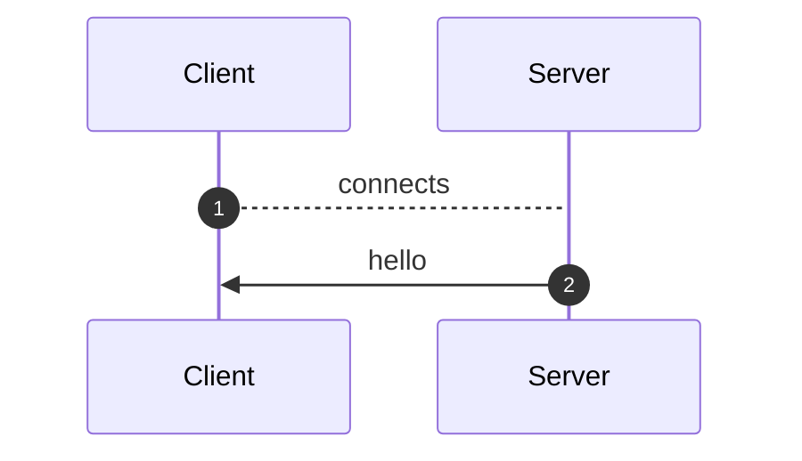
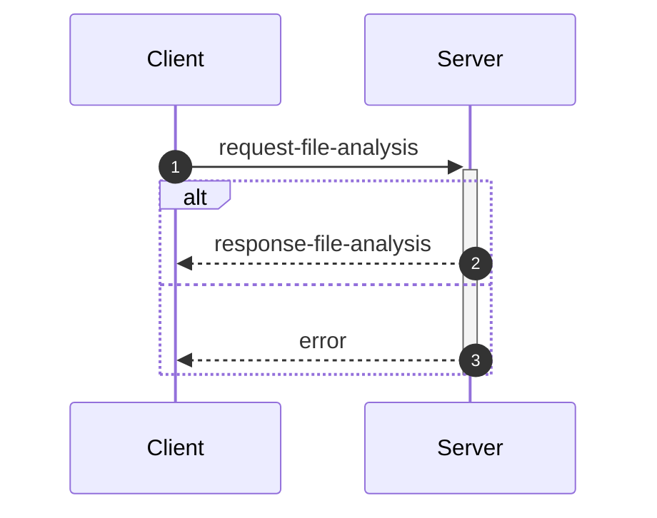
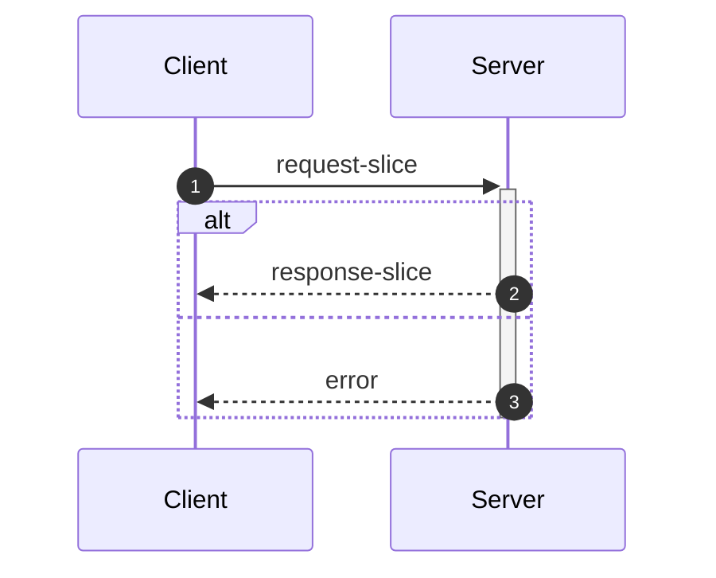
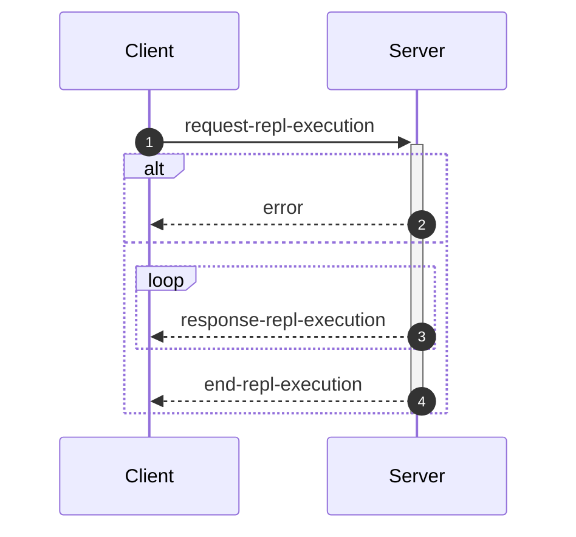

_<span title="an overview of flowR's interface">Generated</span> from '[wiki-interface.ts](https://github.com/flowr-analysis/flowr/tree/main/src/documentation/wiki-interface.ts "src/documentation/wiki-interface.ts")' on 2026-09-17, 20:16:52 UTC (v2.15.9, R v4.5.0), do not edit directly._

Although far from being as detailed as the in-depth explanation of [_flowR_](https://github.com/flowr-analysis/flowr/wiki/Core),
this wiki page explains how to interface with _flowR_ in more detail.
In general, command line arguments and other options provide short descriptions on hover over.

* [💻 Using the REPL](#using-the-repl)
* [⚙️ Configuring FlowR](#configuring-flowr)
* [⚒️ Writing Code](#writing-code)
* [💬 Communicating with the Server](#communicating-with-the-server)

<a id='using-the-repl'></a>
## 💻 Using the REPL

> [!NOTE]
> To execute arbitrary R commands with a repl request, _flowR_ has to be started explicitly with <span title="Description (Command Line Argument): Allow to access the underlying R session when using flowR (security warning: this allows the execution of arbitrary R code!)">`--r-session-access`</span>.
> Please be aware that this introduces a security risk and note that this relies on the [`r-shell` engine](https://github.com/flowr-analysis/flowr/wiki/Engines) .

Although primarily meant for users to explore,
there is nothing which forbids simply calling _flowR_ as a subprocess to use standard-in, -output, and -error
for communication (although you can access the REPL using the server as well,
with the [REPL Request](#message-request-repl-execution) message).

The read-eval-print loop&nbsp;(REPL) works relatively simple.
You can submit an expression (using <kbd>Enter</kbd>),
which is interpreted as an R&nbsp;expression by default but interpreted as a *command* if it starts with a colon (`:`).
The best command to get started with the REPL is <span title="Description (Repl Command): Show help information (aliases: :h, :?)">`:help`</span>.
Besides, you can leave the REPL either with the command <span title="Description (Repl Command): End the repl (aliases: :q, :exit)">`:quit`</span> or by pressing <kbd>Ctrl</kbd>+<kbd>C</kbd> twice.
When writing a *command*, you may press <kbd>Tab</kbd> to get a list of completions, if available.
Multiple commands can be entered in a single line by separating them with a semicolon (`;`), e.g. `:parse "x<-2"; :df*`.
If a command is given without R code, the REPL will re-use R code given in a previous command.
The prior example will hence return first the parsed AST of the program and then the dataflow graph for `"x <- 2"`.

> [!NOTE]
> If you develop flowR, you may want to launch the repl using the `npm run main-dev` command, this way, you get a non-minified version of flowR with debug information and hot-reloading of source files.

<details>
<summary>Available Commands</summary>

We currently offer the following commands (this with a `[*]` suffix are available with and without the star):

| Command | Description |
| ------- | ----------- |
| **<span title="Description (Repl Command): End the repl (aliases: :q, :exit)">:quit</span>** | End the repl (aliases: **:<span title="Alias of ':quit'. End the repl">q</span>**, **:<span title="Alias of ':quit'. End the repl">exit</span>**) |
| **<span title="Description (Repl Command): Execute the given code as R code. This requires the `--r-session-access` flag to be set and requires the r-shell engine. (aliases: :e, :r)">:execute</span>** | Execute the given code as R code. This requires the `--r-session-access` flag to be set and requires the r-shell engine. (aliases: **:<span title="Alias of ':execute'. Execute the given code as R code. This requires the `--r-session-access` flag to be set and requires the r-shell engine.">e</span>**, **:<span title="Alias of ':execute'. Execute the given code as R code. This requires the `--r-session-access` flag to be set and requires the r-shell engine.">r</span>**) |
| **<span title="Description (Repl Command): Get mermaid code for the control-flow graph of R code (aliases: :cfg, :cf)">:controlflow[*]</span>** | Get mermaid code for the control-flow graph of R code (star: Returns the URL to mermaid.live) (aliases: **:<span title="Alias of ':controlflow'. Get mermaid code for the control-flow graph of R code">cfg</span>**, **:<span title="Alias of ':controlflow'. Get mermaid code for the control-flow graph of R code">cf</span>**) |
| **<span title="Description (Repl Command): Get mermaid code for the control-flow graph with basic blocks (aliases: :cfgb, :cfb)">:controlflowbb[*]</span>** | Get mermaid code for the control-flow graph with basic blocks (star: Returns the URL to mermaid.live) (aliases: **:<span title="Alias of ':controlflowbb'. Get mermaid code for the control-flow graph with basic blocks">cfgb</span>**, **:<span title="Alias of ':controlflowbb'. Get mermaid code for the control-flow graph with basic blocks">cfb</span>**) |
| **<span title="Description (Repl Command): Get mermaid code for the dataflow graph (aliases: :d, :df)">:dataflow[*]</span>** | Get mermaid code for the dataflow graph (star: Returns the URL to mermaid.live) (aliases: **:<span title="Alias of ':dataflow'. Get mermaid code for the dataflow graph">d</span>**, **:<span title="Alias of ':dataflow'. Get mermaid code for the dataflow graph">df</span>**) |
| **<span title="Description (Repl Command): Get mermaid code for the normalized AST of R code (aliases: :n)">:normalize[*]</span>** | Get mermaid code for the normalized AST of R code (star: Returns the URL to mermaid.live) (alias: **:<span title="Alias of ':normalize'. Get mermaid code for the normalized AST of R code">n</span>**) |
| **<span title="Description (Repl Command): Get mermaid code for the simplified dataflow graph (aliases: :ds, :dfs)">:dataflowsimple[*]</span>** | Get mermaid code for the simplified dataflow graph (star: Returns the URL to mermaid.live) (aliases: **:<span title="Alias of ':dataflowsimple'. Get mermaid code for the simplified dataflow graph">ds</span>**, **:<span title="Alias of ':dataflowsimple'. Get mermaid code for the simplified dataflow graph">dfs</span>**) |
| **<span title="Description (Repl Command): Inspect and extend the signature database: `query` (identical to :query @signature), `info <name>` for where a function comes from (identical to :query @function-info), `add <path>` to mount another database/source, `download` to fetch the full-history database. (aliases: :sig)">:signature</span>** | Inspect and extend the signature database: `query` (identical to :query @signature), `info <name>` for where a function comes from (identical to :query @function-info), `add <path>` to mount another database/source, `download` to fetch the full-history database. (alias: **:<span title="Alias of ':signature'. Inspect and extend the signature database: `query` (identical to :query @signature), `info <name>` for where a function comes from (identical to :query @function-info), `add <path>` to mount another database/source, `download` to fetch the full-history database.">sig</span>**) |
| **<span title="Description (Repl Command): Just calculates the DFG, but only prints summary info (aliases: :d#, :df#)">:dataflowsilent</span>** | Just calculates the DFG, but only prints summary info (aliases: **:<span title="Alias of ':dataflowsilent'. Just calculates the DFG, but only prints summary info">d#</span>**, **:<span title="Alias of ':dataflowsilent'. Just calculates the DFG, but only prints summary info">df#</span>**) |
| **<span title="Description (Repl Command): Prints ASCII Art of the parsed, unmodified AST (aliases: :p)">:parse</span>** | Prints ASCII Art of the parsed, unmodified AST (alias: **:<span title="Alias of ':parse'. Prints ASCII Art of the parsed, unmodified AST">p</span>**) |
| **<span title="Description (Repl Command): Prints the version of flowR as well as the current version of R">:version</span>** | Prints the version of flowR as well as the current version of R
| **<span title="Description (Repl Command): Query the given R code (use 'help' for more information)">:query[*]</span>** | Query the given R code (use 'help' for more information) (star: Similar to query, but returns the output in json format.)
| **<span title="Description (Repl Command): Returns an ASCII representation of the dataflow graph (aliases: :df!)">:dataflowascii</span>** | Returns an ASCII representation of the dataflow graph (alias: **:<span title="Alias of ':dataflowascii'. Returns an ASCII representation of the dataflow graph">df!</span>**) |
| **<span title="Description (Repl Command): Returns summarization stats for the normalized AST (aliases: :n#)">:normalize#</span>** | Returns summarization stats for the normalized AST (alias: **:<span title="Alias of ':normalize#'. Returns summarization stats for the normalized AST">n#</span>**) |
| **<span title="Description (Repl Command): Show help information (aliases: :h, :?)">:help</span>** | Show help information (aliases: **:<span title="Alias of ':help'. Show help information">h</span>**, **:<span title="Alias of ':help'. Show help information">?</span>**) |

</details>

> [!TIP]
> 
> As indicated by the examples before, all REPL commands that operate on code keep track of the state.
> Hence, if you run a command like <span title="Description (Repl Command, starred version): Returns the URL to mermaid.live; Base Command: Get mermaid code for the dataflow graph (aliases: :d*, :df*)">`:dataflow*`</span> without providing R code,
> the REPL will re-use the R code provided in a previous command.
> Likewise, doing this will benefit from incrementality!
> If you request the dataflow graph with `:df* x <- 2 * y` and then want to see the parsed AST with `:parse`,
> the REPL will re-use previously obtained information and not re-parse the code again.
> 		

Generally, many commands offer shortcut versions in the REPL. Many queries, for example, offer a shortened format (see the example below).
Of special note, the [Config Query](https://github.com/flowr-analysis/flowr/wiki/%5BQuery%5D-Config)
can be used to also modify the currently active configuration of _flowR_ within the REPL (see the [wiki page](https://github.com/flowr-analysis/flowr/wiki/%5BQuery%5D-Config) for more information).

### Example: Retrieving the Dataflow Graph

To retrieve a URL to the [mermaid](https://mermaid.js.org/) diagram of the dataflow of a given expression,
use <span title="Description (Repl Command, starred version): Returns the URL to mermaid.live; Base Command: Get mermaid code for the dataflow graph (aliases: :d*, :df*)">`:dataflow*`</span> (or <span title="Description (Repl Command): Get mermaid code for the dataflow graph (aliases: :d, :df)">`:dataflow`</span> to get the mermaid code in the cli):

```shell
$ docker run -it --rm eagleoutice/flowr # or npm run flowr 
flowR repl v2.15.9, R grammar v14 (tree-sitter engine)
R> :dataflow* y <- 1 + x
```

<details>
<summary style='color:gray'>Output</summary>

```text
https://mermaid.live/view#base64:eyJjb2RlIjoiZmxvd2NoYXJ0IFREXG4gICAgMXt7XCJgKiM5MTtSTnVtYmVyIzkzOyogKioxKipcbiAgICAgICoxLjYqICgqKmlkOiAxKiopYFwifX1cbiAgICAyKFtcImAqIzkxO1JTeW1ib2wjOTM7KiAqKngqKlxuICAgICAgKjEuMTAqICgqKmlkOiAyKiopYFwiXSlcbiAgICAzW1tcImAqIzkxO1JCaW5hcnlPcCM5MzsqIGJhc2UjNTg7IzU4OyoqIzQzOyoqXG4gICAgICAqMS42LTEwKiAoKippZDogMyoqKVxuICAgIGFyZzogKDEsIDIpYFwiXV1cbiAgICBidWlsdC1pbjpfW1wiYEJ1aWx0LUluOlxuIzQzO2BcIl1cbiAgICBzdHlsZSBidWlsdC1pbjpfIHN0cm9rZTpncmF5LGZpbGw6Z3JheSxzdHJva2Utd2lkdGg6MnB4LG9wYWNpdHk6Ljg7XG4gICAgMFtcImAqIzkxO1JTeW1ib2wjOTM7KiAqKnkqKlxuICAgICAgKjEuMSogKCoqaWQ6IDAqKiwgdjogMylgXCJdXG4gICAgNFtbXCJgKiM5MTtSQmluYXJ5T3AjOTM7KiBiYXNlIzU4OyM1ODsqKiM2MDsjNDU7KipcbiAgICAgICoxLjEtMTAqICgqKmlkOiA0KiopXG4gICAgYXJnOiAoMCwgMylgXCJdXVxuICAgIGJ1aWx0LWluOl8tW1wiYEJ1aWx0LUluOlxuIzYwOyM0NTtgXCJdXG4gICAgc3R5bGUgYnVpbHQtaW46Xy0gc3Ryb2tlOmdyYXksZmlsbDpncmF5LHN0cm9rZS13aWR0aDoycHgsb3BhY2l0eTouODtcbiAgICAxIC0uLT58XCJmbG93XCJ8IDJcbiAgICBsaW5rU3R5bGUgMCBzdHJva2U6Z3JheSxjb2xvcjpncmF5O1xuICAgIDIgLS4tPnxcImZsb3dcInwgM1xuICAgIGxpbmtTdHlsZSAxIHN0cm9rZTpncmF5LGNvbG9yOmdyYXk7XG4gICAgMyAtLT58XCJyZWFkcywgYXJnXCJ8IDFcbiAgICAzIC0tPnxcInJlYWRzLCBhcmdcInwgMlxuICAgIDMgLS4tPnxcImZsb3dcInwgMFxuICAgIGxpbmtTdHlsZSA0IHN0cm9rZTpncmF5LGNvbG9yOmdyYXk7XG4gICAgMyAtLi0+fFwicmVhZHMsIGNhbGxzXCJ8IGJ1aWx0LWluOl9cbiAgICBsaW5rU3R5bGUgNSBzdHJva2U6Z3JheTtcbiAgICAwIC0tPnxcImRlZmluZWQtYnksIGZsb3dcInwgNFxuICAgIDAgLS0+fFwiZGVmaW5lZC1ieVwifCAzXG4gICAgNCAtLT58XCJyZWFkcywgYXJnXCJ8IDNcbiAgICA0IC0tPnxcInJldHVybnMsIGFyZ1wifCAwXG4gICAgNCAtLi0+fFwicmVhZHMsIGNhbGxzXCJ8IGJ1aWx0LWluOl8tXG4gICAgbGlua1N0eWxlIDEwIHN0cm9rZTpncmF5OyIsIm1lcm1haWQiOnsiYXV0b1N5bmMiOnRydWV9fQ==
```

Retrieve the dataflow graph of the expression `y <- 1 + x`. It looks like this:


```mermaid
flowchart LR
    1{{"`*#91;RNumber#93;* **1**
      *1.6* (**id: 1**)`"}}
    2(["`*#91;RSymbol#93;* **x**
      *1.10* (**id: 2**)`"])
    3[["`*#91;RBinaryOp#93;* base#58;#58;**#43;**
      *1.6-10* (**id: 3**)
    arg: (1, 2)`"]]
    built-in:_["`Built-In:
#43;`"]
    style built-in:_ stroke:gray,fill:gray,stroke-width:2px,opacity:.8;
    0["`*#91;RSymbol#93;* **y**
      *1.1* (**id: 0**, v: 3)`"]
    4[["`*#91;RBinaryOp#93;* base#58;#58;**#60;#45;**
      *1.1-10* (**id: 4**)
    arg: (0, 3)`"]]
    built-in:_-["`Built-In:
#60;#45;`"]
    style built-in:_- stroke:gray,fill:gray,stroke-width:2px,opacity:.8;
    1 -.->|"flow"| 2
    linkStyle 0 stroke:gray,color:gray;
    2 -.->|"flow"| 3
    linkStyle 1 stroke:gray,color:gray;
    3 -->|"reads, arg"| 1
    3 -->|"reads, arg"| 2
    3 -.->|"flow"| 0
    linkStyle 4 stroke:gray,color:gray;
    3 -.->|"reads, calls"| built-in:_
    linkStyle 5 stroke:gray;
    0 -->|"defined-by, flow"| 4
    0 -->|"defined-by"| 3
    4 -->|"reads, arg"| 3
    4 -->|"returns, arg"| 0
    4 -.->|"reads, calls"| built-in:_-
    linkStyle 10 stroke:gray;
```

<details>

<summary style="color:gray">R Code of the Dataflow Graph</summary>

The analysis ran (including parse and normalize, using the [tree-sitter](https://github.com/flowr-analysis/flowr/wiki/Engines) engine) within the generation environment. No [signature database](https://github.com/flowr-analysis/flowr/wiki/Signature-Database) is mounted for these generated graphs, so `library()` calls attach no package exports; base-R names are still qualified via the generated base-package store (e.g. `acf` as `stats::acf`). 
We encountered no unknown side effects during the analysis.

```r
y <- 1 + x
```

</details>

</details>

For small graphs like this, <span title="Description (Repl Command): Returns an ASCII representation of the dataflow graph (aliases: :df!)">`:dataflowascii`</span> also provides an ASCII representation directly in the REPL:

```shell
$ docker run -it --rm eagleoutice/flowr # or npm run flowr 
flowR repl v2.15.9, R grammar v14 (tree-sitter engine)
R> :df! y <- 1 + x
```

<details open>
<summary style='color:gray'>Output</summary>

```text
                        v<0>v
 c<4>c──────────────────| y |
 |<- |     ┌────────────v---v
 c---c     │
    │   c<3>c   0<1>0
    └───| + |───| 1 |───u<2>u
        c---c   0---0   | x |
           └────────────u---u
Edges:
3 -> 1: reads, arg          3 -> 2: reads, arg
3 -> 0: flows-to            1 -> 2: flows-to
2 -> 3: flows-to            4 -> 3: reads, arg
4 -> 0: returns, arg        0 -> 4: defined-by, flows-to
0 -> 3: defined-by
```

Retrieve the dataflow graph of the expression `y <- 1 + x` as ASCII art.

</details>

For the slicing with <span title="Description (Repl Command): Static backwards executable slicer for R">`:slicer`</span>, you have access to the same [magic comments](#slice-magic-comments) as with the [slice request](#message-request-slice).
Pass `--inline` to splice resolvable `source()` calls into the reconstruction so the slice is a single self-contained R text (the same as the static slice query's `inlineSources` flag).
See `--help` for more flags!

### Example: Interfacing with the File System

Many commands that allow for an R-expression (like <span title="Description (Repl Command, starred version): Returns the URL to mermaid.live; Base Command: Get mermaid code for the dataflow graph (aliases: :d*, :df*)">`:dataflow*`</span>) allow for a file as well
if the argument starts with `file://`.
If you are working from the root directory of the _flowR_ repository, the following gives you the parsed AST of the example file using the <span title="Description (Repl Command): Prints ASCII Art of the parsed, unmodified AST (aliases: :p)">`:parse`</span> command:

> **Watch mode**: Replace `file://` with `watch://` to enter watch mode.
> flowR runs the command immediately and then re-runs it every time the file (or any file inside the folder) changes.
> Enter any other command to leave watch mode.
> For example: `:df watch://analysis.R`

```shell
$ docker run -it --rm eagleoutice/flowr # or npm run flowr 
flowR repl v2.15.9, R grammar v14 (tree-sitter engine)
R> :parse file://test/testfiles/example.R
```

<details>
<summary style='color:gray'>Output</summary>

```text
File: test/testfiles/example.R

program
├ binaryoperator
│ ├ identifier "sum" (1:1─4)
│ ├ <- "<-" (1:5─7)
│ ╰ float "0" (1:8─9)
├ binaryoperator
│ ├ identifier "product" (2:1─8)
│ ├ <- "<-" (2:9─11)
│ ╰ float "1" (2:12─13)
├ binaryoperator
│ ├ identifier "w" (3:1─2)
│ ├ <- "<-" (3:3─5)
│ ╰ float "7" (3:6─7)
├ binaryoperator
│ ├ identifier "N" (4:1─2)
│ ├ <- "<-" (4:3─5)
│ ╰ float "10" (4:6─8)
├ forstatement
│ ├ for "for" (6:1─4)
│ ├ ( "(" (6:5─6)
│ ├ identifier "i" (6:6─7)
│ ├ in "in" (6:8─10)
│ ├ binaryoperator
│ │ ├ float "1" (6:11─12)
│ │ ├ : ":" (6:12─13)
│ │ ╰ parenthesizedexpression
│ │   ├ ( "(" (6:13─14)
│ │   ├ binaryoperator
│ │   │ ├ identifier "N" (6:14─15)
│ │   │ ├ - "-" (6:15─16)
│ │   │ ╰ float "1" (6:16─17)
│ │   ╰ ) ")" (6:17─18)
│ ├ ) ")" (6:18─19)
│ ╰ bracedexpression
│   ├ { "{" (6:20─21)
│   ├ binaryoperator
│   │ ├ identifier "sum" (7:3─6)
│   │ ├ <- "<-" (7:7─9)
│   │ ╰ binaryoperator
│   │   ├ binaryoperator
│   │   │ ├ identifier "sum" (7:10─13)
│   │   │ ├ + "+" (7:14─15)
│   │   │ ╰ identifier "i" (7:16─17)
│   │   ├ + "+" (7:18─19)
│   │   ╰ identifier "w" (7:20─21)
│   ├ binaryoperator
│   │ ├ identifier "product" (8:3─10)
│   │ ├ <- "<-" (8:11─13)
│   │ ╰ binaryoperator
│   │   ├ identifier "product" (8:14─21)
│   │   ├  "" (8:22─23)
│   │   ╰ identifier "i" (8:24─25)
│   ╰ } "}" (9:1─2)
├ call
│ ├ identifier "cat" (11:1─4)
│ ╰ arguments
│   ├ ( "(" (11:4─5)
│   ├ argument
│   │ ╰ string
│   │   ├ " "\"" (11:5─6)
│   │   ├ stringcontent "Sum:" (11:6─10)
│   │   ╰ " "\"" (11:10─11)
│   ├ comma "," (11:11─12)
│   ├ argument
│   │ ╰ identifier "sum" (11:13─16)
│   ├ comma "," (11:16─17)
│   ├ argument
│   │ ╰ string
│   │   ├ " "\"" (11:18─19)
│   │   ├ stringcontent
│   │   │ ╰ escapesequence "\\n" (11:19─21)
│   │   ╰ " "\"" (11:21─22)
│   ╰ ) ")" (11:22─23)
╰ call
  ├ identifier "cat" (12:1─4)
  ╰ arguments
    ├ ( "(" (12:4─5)
    ├ argument
    │ ╰ string
    │   ├ " "\"" (12:5─6)
    │   ├ stringcontent "Product:" (12:6─14)
    │   ╰ " "\"" (12:14─15)
    ├ comma "," (12:15─16)
    ├ argument
    │ ╰ identifier "product" (12:17─24)
    ├ comma "," (12:24─25)
    ├ argument
    │ ╰ string
    │   ├ " "\"" (12:26─27)
    │   ├ stringcontent
    │   │ ╰ escapesequence "\\n" (12:27─29)
    │   ╰ " "\"" (12:29─30)
    ╰ ) ")" (12:30─31)
```

Retrieve the parsed AST of the example file.

<details>

<summary>File Content</summary>

```r
sum <- 0
product <- 1
w <- 7
N <- 10

for (i in 1:(N-1)) {
  sum <- sum + i + w
  product <- product * i
}

cat("Sum:", sum, "\n")
cat("Product:", product, "\n")
```

</details>

As _flowR_ directly transforms this AST the output focuses on being human-readable instead of being machine-readable.
		
</details>

### Example: Run a Query

You can run any query supported by _flowR_ using the <span title="Description (Repl Command): Query the given R code (use 'help' for more information)">`:query`</span> command.
For example, to obtain the shapes of all data frames in a given piece of code, you can run:

```shell
$ docker run -it --rm eagleoutice/flowr # or npm run flowr 
flowR repl v2.15.9, R grammar v14 (tree-sitter engine)
R> :query @absint df-shape "x <- data.frame(a = 1:10, b = 1:10)\ny <- x$a"
```

<details open>
<summary style='color:gray'>Output</summary>

```text
Query: absint (1 ms)
```

Retrieve the shapes of all data frames in the given code.

</details>

To run the linter on a file, you can use (in this example, we just issue the `dead-code` linter on a small piece of code):

```shell
$ docker run -it --rm eagleoutice/flowr # or npm run flowr 
flowR repl v2.15.9, R grammar v14 (tree-sitter engine)
R> :query @linter rules:dead-code "if(FALSE) x <- 2"
```

<details open>
<summary style='color:gray'>Output</summary>

```text
Query: linter (1 ms)
   ╰ Dead Code (dead-code):
       ╰ certain:
           ╰ Code at 1.11-16
```

Run the linter on the given code, with only the `dead-code` rule enabled.

</details>

For more information on the available queries, please check out the [Query API](https://github.com/flowr-analysis/flowr/wiki/Query-API).

<a id='configuring-flowr'></a>
## ⚙️ Configuring FlowR

When running _flowR_, you may want to specify some behaviors with a dedicated configuration file.
By default, flowR looks for a file named `flowr.json` in the current working directory (or any higher directory).
You can also specify a different file with <span title="Description (Command Line Argument): The name of the configuration file to use">`--config-file`</span> or pass the configuration inline using <span title="Description (Command Line Argument): The flowR configuration to use, as a JSON string">`--config-json`</span>.
To inspect the current configuration, you can run flowr with the <span title="Description (Command Line Argument): Run with verbose logging (will be passed to the corresponding script)">`--verbose`</span> flag, or use the `config` [Query](https://github.com/flowr-analysis/flowr/wiki/Query-API).
Within the REPL this works by running the following:

```shell
:query @config
```

To work with the <a href="https://github.com/flowr-analysis/flowr/tree/main/src/config.ts#L108"><code><span title="The configuration file format for flowR.">FlowrConfig</span></code></a> you can use the provided helper objects alongside its methods like
<a href="https://github.com/flowr-analysis/flowr/tree/main/src/config.ts#L862"><code><span title="Creates a new flowr config that has the updated values.">FlowrConfig::<b>amend</b></span></code></a>.
The schema below documents every option; the ones you most likely want are:

- <a href="https://github.com/flowr-analysis/flowr/wiki/Interface#configuring-flowr" title="Configuration Option (boolean): Whether source calls should be ignored, causing {@link processSourceCall}&#39;s behavior to be skipped.">ignoreSourceCalls</a>: ignore source calls when analyzing the code, i.e., ignore the inclusion of other files.
- <a href="https://github.com/flowr-analysis/flowr/wiki/Interface#configuring-flowr" title="Configuration Option (boolean): Whether load calls should be ignored, causing {@link processLoadCall}&#39;s behavior to be skipped.">ignoreLoadCalls</a>: ignore load calls when analyzing the code, i.e., ignore the loading of r-data files.
- <a href="https://github.com/flowr-analysis/flowr/wiki/Interface#configuring-flowr" title="Configuration Option (object): Do you want to overwrite (parts) of the builtin definition?">semantics.environment.overwriteBuiltIns</a>: overwrite _flowR_'s handling of built-in functions, or clear the preset definitions entirely.
  See [Configure BuiltIn Semantics](#configure-builtin-semantics) for more information.
- <a href="https://github.com/flowr-analysis/flowr/wiki/Interface#configuring-flowr" title="Configuration Option (string): How to resolve variables and their values. (one of &quot;disabled&quot;, &quot;alias&quot;, &quot;builtin&quot;)">solver.variables</a>: how to resolve variables and their values (`disabled`, `alias`, `builtin`).
- <a href="https://github.com/flowr-analysis/flowr/wiki/Interface#configuring-flowr" title="Configuration Option (array): The engine or set of engines to use for interacting with R code. An empty array means all available engines will be used.">engines</a> and <a href="https://github.com/flowr-analysis/flowr/wiki/Interface#configuring-flowr" title="Configuration Option (string): The default engine to use for interacting with R code. If this is undefined, an arbitrary engine from the specified list will be used. (one of &quot;tree-sitter&quot;, &quot;r-shell&quot;)">defaultEngine</a>: the engines used to interact with R code, see the [Engines wiki page](https://github.com/flowr-analysis/flowr/wiki/Engines).
- <a href="https://github.com/flowr-analysis/flowr/wiki/Interface#configuring-flowr" title="Configuration Option (array): Files a framework loads on its own, without any source() call (e.g. global.R in a shiny app), in the order they are loaded; flowR orders the matching project files accordingly and analyzes them as one program. Entries are case-insensitive globs matched against the file path, a plain name matches any file with that name, and entries matching no project file are warned about. Usually set per project kind via specializeConfig.">project.implicitSources</a>: the files a framework loads without any `source()` call, in the order in which they are
  loaded. Entries are globs (e.g. `R/*.R`) matched against the file path ignoring capitalization; one matching no file is reported.
- <a href="https://github.com/flowr-analysis/flowr/wiki/Interface#configuring-flowr" title="Configuration Option (object): Overwrite (parts of) the configuration depending on the project kind flowR detects, e.g. to give a shiny app its implicit sources.">specializeConfig</a>: overwrite (parts of) the configuration depending on the kind of project _flowR_ detects
  (e.g. `shiny-app`), which is how a shiny app gets its implicit sources by default. What you configure directly wins.
- <a href="https://github.com/flowr-analysis/flowr/wiki/Interface#configuring-flowr" title="Configuration Option (string): Overwrite the project kind flowR would otherwise infer from the analyzed files, e.g. when auto-detection guesses wrong. (one of &quot;package&quot;, &quot;script&quot;, &quot;shiny-app&quot;, &quot;notebook&quot;, &quot;project&quot;, &quot;unknown&quot;)">project.useProjectType</a>: skip that detection and force a project kind yourself, when auto-detection guesses wrong.
- <a href="https://github.com/flowr-analysis/flowr/wiki/Interface#configuring-flowr" title="Configuration Option (array): The default plugins to load when creating a new instance of FlowrAnalyzer">defaultPlugins</a> and <a href="https://github.com/flowr-analysis/flowr/wiki/Interface#configuring-flowr" title="Configuration Option (array): The plugins to load in REPL mode">repl.plugins</a>: the plugins to load for a new <a href="https://github.com/flowr-analysis/flowr/tree/main/src/project/flowr-analyzer.ts#L202"><code><span title="Central class for conducting analyses with FlowR. Use the FlowrAnalyzerBuilder to create a new instance. If you want the original pattern of creating a pipeline and running all steps, you can still do this with FlowrAnalyzer#runFull . To inspect the context of the analyzer, use FlowrAnalyzer#inspectContext (if you are a plugin and need to modify it, use FlowrAnalyzer#context instead).">FlowrAnalyzer</span></code></a> and in the REPL
  (use `flowr:default` to reference the former).

So you can configure _flowR_ by adding a file like the following:

<details>

<summary>Example Configuration File</summary>

```json
{
  "ignoreSourceCalls": true,
  "ignoreLoadCalls": true,
  "semantics": {
    "environment": {
      "overwriteBuiltIns": {
        "definitions": [
          {
            "type": "function",
            "names": [
              "foo"
            ],
            "processor": "builtin:assign",
            "config": {}
          }
        ]
      }
    }
  },
  "defaultPlugins": [
    "file:description",
    "versions:description"
  ],
  "repl": {
    "quickStats": false,
    "dfProcessorHeat": false,
    "hints": true,
    "plugins": [
      "flowr:default"
    ]
  },
  "project": {
    "resolveUnknownPathsOnDisk": true,
    "implicitSources": [
      "global.R",
      "app.R"
    ]
  },
  "linter": {
    "disabledRules": []
  },
  "specializeConfig": {
    "shiny-app": {
      "project": {
        "implicitSources": [
          "global.R",
          "ui.R",
          "server.R",
          "app.R"
        ]
      }
    }
  },
  "engines": [
    {
      "type": "r-shell"
    }
  ],
  "solver": {
    "variables": "alias",
    "evalStrings": true,
    "trackEnvironments": true,
    "sigdb": {
      "enabled": true,
      "loadProjectDependencies": true,
      "eagerlyLoad": false,
      "eagerlyLoadExports": false,
      "linkBaseR": false,
      "linkDescriptionDependencies": false
    },
    "resolveSource": {
      "dropPaths": "no",
      "ignoreCapitalization": true,
      "inferWorkingDirectory": "active-script",
      "searchPath": []
    },
    "instrument": {},
    "slicer": {
      "threshold": 50
    }
  },
  "abstractInterpretation": {
    "wideningThreshold": 4,
    "followCalls": true,
    "dataFrame": {
      "maxColNames": 20,
      "readLoadedData": {
        "readExternalFiles": true,
        "maxReadLines": 1000000
      }
    }
  },
  "incremental": {
    "alwaysIncremental": false,
    "parsing": {
      "activated": false,
      "heuristics": {
        "activated": true,
        "mtime": true,
        "linesFrom": 500,
        "bytesFrom": 50000,
        "alwaysWithEdits": false,
        "minFiles": 1
      }
    }
  },
  "gas": {
    "thresholds": {
      "memory": {
        "problematic": 0.7,
        "critical": 0.9
      },
      "timeMs": {
        "problematic": 100000,
        "critical": 120000
      }
    },
    "features": {}
  }
}
```

</details>

<details>
<a id='configure-builtin-semantics'></a>
<summary>Configure Built-In Semantics</summary>

`semantics/environment/overwriteBuiltins` accepts two keys:

- `loadDefaults` (boolean, initially `true`): If set to `true`, the default built-in definitions are loaded before applying the custom definitions. Setting this flag to `false` explicitly disables the loading of the default definitions.
- `definitions` (array, initially empty): Allows to overwrite or define new built-in elements. Each object within must have a `type` which is one of the below. Furthermore, they may define a string array of `names` which specifies the identifiers to bind the definitions to. You may use `assumePrimitive` to specify whether _flowR_ should assume that this is a primitive non-library definition (so you probably just do not want to specify the key).

  | Type            | Description                                                                                                                                                                                                                                                                                              | Example                                                                                                    |
  | --------------- | -------------------------------------------------------------------------------------------------------------------------------------------------------------------------------------------------------------------------------------------------------------------------------------------------------- | ---------------------------------------------------------------------------------------------------------- |
  | `constant`    | Additionally allows for a `value` this should resolve to.                                                                                                                                                                                                                                                | `{ type: 'constant', names: ['NULL', 'NA'],  value: null }`                                                |
  | `function`    | Is a rather flexible way to define and bind built-in functions. For the time, we do not have extensive documentation to cover all the cases, so please either consult the sources with the `default-builtin-config.ts` or open a [new issue](https://github.com/flowr-analysis/flowr/issues/new/choose). | `{ type: 'function', names: ['next'], processor: 'builtin:d', config: { cfg: ExitPointType.Next } }` |
  | `replacement` | A comfortable way to specify replacement functions like `$<-` or `names<-`. `suffixes` describes the... suffixes to attach automatically. | `{ type: 'replacement', suffixes: ['<-', '<<-'], names: ['[', '[['] }` |

</details>

<details>

<summary style='color:gray'>Full Configuration-File Schema</summary>

- _The configuration file format for flowR._ (object)
    - **logLevel** [optional] _flowR's global minimum log level, applied when the config is loaded._ (string)
        Only allows: 'silly', 'trace', 'debug', 'info', 'warn', 'error', 'fatal'
    - **ignoreSourceCalls** [optional] _Whether source calls should be ignored, causing {@link processSourceCall}'s behavior to be skipped._ (boolean)
    - **ignoreLoadCalls** [optional] _Whether load calls should be ignored, causing {@link processLoadCall}'s behavior to be skipped._ (boolean)
    - **semantics** _Configure language semantics and how flowR handles them._ (object)
        - **environment** [optional] _Semantics regarding how to handle the R environment._ (object)
            - **overwriteBuiltIns** [optional] _Do you want to overwrite (parts) of the builtin definition?_ (object)
                - **loadDefaults** [optional] _Should the default configuration still be loaded?_ (boolean)
                - **definitions** [optional] _The definitions to load/overwrite._ (array)
                Valid item types:
                    - (object)
    - **defaultPlugins** [optional] _The default plugins to load when creating a new instance of FlowrAnalyzer_ (array)
    Valid item types:
        - (alternatives)
            - (string)
            - (array)
    - **repl** _Configuration options for the REPL._ (object)
        - **quickStats** [optional] _Whether to show quick stats in the REPL after each evaluation._ (boolean)
        - **dfProcessorHeat** [optional] _This instruments the dataflow processors to count how often each processor is called._ (boolean)
        - **hints** [optional] _Whether to show dim inline hints on the empty prompt (automatically disabled on non-interactive terminals)._ (boolean)
        - **plugins** [optional] _The plugins to load in REPL mode_ (array)
        Valid item types:
            - (alternatives)
                - (string)
                - (array)
        - **autoUseFileProtocol** [optional] _Prepend the file protocol to a repl input that looks like a path, instead of only warning about it._ (boolean)
        - **queryStats** [optional] _Whether `:query` closes with the line stating how long the queries took (`:query*` never prints it)._ (boolean)
        - **showPlugins** [optional] _Whether `:version` grays out the plugins that did not activate during the last analysis._ (boolean)
    - **project** _Project specific configuration options._ (object)
        - **resolveUnknownPathsOnDisk** [optional] _Whether to resolve unknown paths loaded by the r project disk when trying to source/analyze files._ (boolean)
        - **failOnInaccessiblePath** [optional] _Whether a directory that cannot be traversed during file discovery (e.g. due to permissions) aborts the analysis; when false (the default) such paths are logged and skipped._ (boolean)
        - **basePackages** [optional] _The packages considered part of R itself (base and recommended); if unset, flowR uses its built-in list._ (array)
        Valid item types:
            - (string)
        - **implicitSources** [optional] _Files a framework loads on its own, without any source() call (e.g. global.R in a shiny app), in the order they are loaded; flowR orders the matching project files accordingly and analyzes them as one program. Entries are case-insensitive globs matched against the file path, a plain name matches any file with that name, and entries matching no project file are warned about. Usually set per project kind via specializeConfig._ (array)
        Valid item types:
            - (string)
        - **useProjectType** [optional] _Overwrite the project kind flowR would otherwise infer from the analyzed files, e.g. when auto-detection guesses wrong._ (string)
            Only allows: 'package', 'script', 'shiny-app', 'notebook', 'project', 'unknown'
        - **assumeImplicitEcho** [optional] _Whether the top level of the analyzed code is echoed, so that every visible result printed there is collected as an output by the dependencies query (default true, false for a package)._ (boolean)
        - **discovery** [optional] _Scoping options for the default project discovery._ (object)
            - **full** [optional] _Collect every file below the project root (greedy) instead of only the files the detected project kind needs (default false)._ (boolean)
            - **perKind** [optional] _Per-kind include/exclude glob overrides layered on the default scoping._ (object)
            - **ignore** [optional] _Case-insensitive globs that drop matching files from the intelligent discovery, regardless of kind (e.g. .Renviron to ignore environment files)._ (array)
            Valid item types:
                - (string)
        - **classification** [optional] _Overrides for the signals flowR uses to classify the project kind._ (object)
            - **shinyDescriptionTypes** [optional] _DESCRIPTION Type: values that mark a shiny app._ (array)
            Valid item types:
                - (string)
            - **shinyEntryFiles** [optional] _File names a shiny app is assembled from._ (array)
            Valid item types:
                - (string)
            - **shinyUsagePattern** [optional] _Regex source evidencing shiny usage in an entry file._ (string)
            - **notebookExtensions** [optional] _File extensions marking a notebook._ (array)
            Valid item types:
                - (string)
    - **linter** _Linter configuration options._ (object)
        - **disabledRules** _Linting rule names excluded from the default rule set (a rule requested explicitly via a linter query still runs). Usually set per project kind via specializeConfig._ (array)
        Valid item types:
            - (string)
    - **inputSources** [optional] _Further frameworks the input-sources analysis should know about; entries are added to flowR's defaults._ (object)
        - **pure** [optional] _Functions that only pass the constantness of their arguments on._ (array)
        Valid item types:
            - (string)
        - **param** [optional] _Functions whose result is a 'param' input._ (array)
        Valid item types:
            - (string)
        - **file** [optional] _Functions whose result is a 'file' input._ (array)
        Valid item types:
            - (string)
        - **tempfile** [optional] _Functions whose result is a 'tempfile' input._ (array)
        Valid item types:
            - (string)
        - **glob** [optional] _Functions whose result is a 'glob' input._ (array)
        Valid item types:
            - (string)
        - **net** [optional] _Functions whose result is a 'net' input._ (array)
        Valid item types:
            - (string)
        - **rand** [optional] _Functions whose result is a 'rand' input._ (array)
        Valid item types:
            - (string)
        - **system** [optional] _Functions whose result is a 'system' input._ (array)
        Valid item types:
            - (string)
        - **ffi** [optional] _Functions whose result is a 'ffi' input._ (array)
        Valid item types:
            - (string)
        - **lang** [optional] _Functions whose result is a 'lang' input._ (array)
        Valid item types:
            - (string)
        - **options** [optional] _Functions whose result is a 'options' input._ (array)
        Valid item types:
            - (string)
        - **cmdline** [optional] _Functions whose result is a 'cmdline' input._ (array)
        Valid item types:
            - (string)
        - **user** [optional] _Functions whose result is a 'user' input._ (array)
        Valid item types:
            - (string)
        - **const** [optional] _Functions whose result is a 'const' input._ (array)
        Valid item types:
            - (string)
        - **scope** [optional] _Functions whose result is a 'scope' input._ (array)
        Valid item types:
            - (string)
        - **dconst** [optional] _Functions whose result is a 'dconst' input._ (array)
        Valid item types:
            - (string)
        - **unknown** [optional] _Functions whose result is a 'unknown' input._ (array)
        Valid item types:
            - (string)
        - **linkedObjects** [optional] _Objects a framework provides without a definition in the code, e.g. shiny's input._ (array)
        Valid item types:
            - (object)
        - **linkedEntryPoints** [optional] _Calls that hand a function to a framework, which binds its objects to the parameters by position._ (array)
        Valid item types:
            - (object)
    - **specializeConfig** [optional] _Overwrite (parts of) the configuration depending on the project kind flowR detects, e.g. to give a shiny app its implicit sources._ (object)
    - **engines** _The engine or set of engines to use for interacting with R code. An empty array means all available engines will be used._ (array)
    Valid item types:
        - (alternatives)
            - _The configuration for the tree sitter engine._ (object)
                - **type** [required] _Use the tree sitter engine._ (string)
                    Only allows: 'tree-sitter'
                - **wasmPath** [optional] _The path to the tree-sitter-r WASM binary to use. If this is undefined, this uses the default path._ (string)
                - **treeSitterWasmPath** [optional] _The path to the tree-sitter WASM binary to use. If this is undefined, this uses the default path._ (string)
                - **lax** [optional] _Whether to use the lax parser for parsing R code (allowing for syntax errors). If this is undefined, the strict parser will be used._ (boolean)
            - _The configuration for the R shell engine._ (object)
                - **type** [required] _Use the R shell engine._ (string)
                    Only allows: 'r-shell'
                - **rPath** [optional] _The path to the R executable to use. If this is undefined, this uses the default path._ (string)
                - **pipeBind** [optional] _Whether to enable R's experimental pipe-bind operator "=>" by setting _R_USE_PIPEBIND_ for the R session (default false); R itself keeps this off by default, as it is experimental and has never shipped in a release version of R._ (boolean)
    - **defaultEngine** [optional] _The default engine to use for interacting with R code. If this is undefined, an arbitrary engine from the specified list will be used._ (string)
        Only allows: 'tree-sitter', 'r-shell'
    - **solver** _How to resolve constants, constraints, cells, ..._ (object)
        - **variables** _How to resolve variables and their values._ (string)
            Only allows: 'disabled', 'alias', 'builtin'
        - **evalStrings** _Should we include eval(parse(text="...")) calls in the dataflow graph?_ (boolean)
        - **trackEnvironments** [optional] _Track user-created environments (new.env, assign/get/local with envir=, dollar-assign, attach). When false, all envir-style calls fall through conservatively._ (boolean)
        - **sigdb** _Resolving library exports from a signature database._ (object)
            - **enabled** [optional] _Resolve library()/use() exports from a signature database (default true); when false no database is consulted._ (boolean)
            - **loadProjectDependencies** [optional] _Load the project's declared dependencies from its metadata files (DESCRIPTION Imports/Depends, rproject.toml, uvr.toml, renv.lock, rv.lock, uvr.lock) (default true); when false these files are not read for dependencies._ (boolean)
            - **eagerlyLoad** [optional] _Parse the database up front rather than on the first package load (default false, ignored if disabled)._ (boolean)
            - **eagerlyLoadExports** [optional] _Add a vertex for every export on load rather than on demand (default false); keeps the dataflow graph small._ (boolean)
            - **assumedRVersion** [optional] _R version assumed when resolving versioned (base-R) exports: a pin like "4.5" or "auto" to detect the installed R (default "auto")._ (string)
            - **linkBaseR** [optional] _Eagerly attach base-R namespaces so bare base calls resolve without library() (default false)._ (boolean)
            - **linkBaseRCalls** [optional] _Add a lightweight Reads edge from a bare base-R call to its signature-database function vertex (default false; base-R qualification is edge-free otherwise)._ (boolean)
            - **linkPackageCalls** [optional] _Add a lightweight Reads edge from a resolved package call to its signature-database function vertex (default false)._ (boolean)
            - **linkDescriptionDependencies** [optional] _Eagerly attach the namespaces of the project's declared DESCRIPTION dependencies (Imports/Depends) so their exports resolve without an explicit library() (default false)._ (boolean)
            - **warmInBackground** [optional] _Decompress the hot shards (base + most-downloaded) in a background task on startup so the first library() lookup is warm (default false; for long-running servers/REPLs)._ (boolean)
            - **additionalPaths** [optional] _Extra directories or bundle/manifest files searched for signature databases (alongside the shipped default and $FLOWR_SIGDB_DIR); a downloaded full-history bundle placed here is mounted automatically._ (array)
            Valid item types:
                - (string)
            - **downloadRepo** [optional] _GitHub owner/repo the full-history bundle is downloaded from via ":signature download" (default "flowr-analysis/flowr", release tag "sigdb-v<flowR-version>")._ (string)
            - **autoSync** [optional] _On startup, re-download shards whose committed sigdb.remote.json hash no longer matches the cache, in the background (default false; opt-in network sync after a git pull)._ (boolean)
            - **installedLibrary** [optional] _Recovering packages no signature database knows from the copy installed on this machine._ (object)
                - **enabled** [required] _Recover packages no signature database knows from their installed copy (default false)._ (boolean)
                - **paths** [optional] _Library directories to search; when empty they are discovered from the environment and the project._ (array)
                Valid item types:
                    - (string)
                - **useEnvironment** [optional] _Search the libraries R_LIBS_USER/R_LIBS/R_LIBS_SITE name (default true)._ (boolean)
                - **useProjectLibrary** [optional] _Search a project-local renv/packrat library (default true)._ (boolean)
                - **maxDepth** [optional] _How far to descend into the nested layout of a project-local library (default 3)._ (number)
                - **packages** [optional] _Only recover packages whose name matches one of these regular expressions; empty means any._ (array)
                Valid item types:
                    - (string)
            - **blobCacheBudgetMb** [optional] _How many MiB of decoded package blobs every open bundle may hold together (default 16)._ (number)
            - **versionSelection** [optional] _When a project constrains a dependency, resolve to the newest (default), oldest, or system-installed version satisfying it; system needs R and falls back to newest. Base-R packages always resolve against the assumed R version._ (string)
                Only allows: 'newest', 'oldest', 'system'
            - **versionOverrides** [optional] _Force an exact version for specific packages (name -> version), overriding both the project constraint and the versionSelection policy (default {})._ (object)
        - **versionManagement** _Policies for reasoning about dependency versions._ (object)
            - **linkedVersionGroups** [optional] _Groups of packages that must resolve to the same version; version guessing intersects each group so its members stay mutually compatible (default [])._ (array)
            Valid item types:
                - (array)
                Valid item types:
                    - (string)
        - **assumeAttachedPackages** [optional] _Packages to treat as attached without a `library()` call, so what the built-in configuration states about them applies to the analyzed code. The base packages R attaches on startup already resolve without it._ (array)
        Valid item types:
            - (string)
        - **transitiveSideEffectRounds** [optional] _How many rounds the transitive side-effect fixpoint may run before it is cut off (default 32); the propagation stops on its own as soon as a round adds nothing._ (number)
        - **maxOverlayDepth** [optional] _How many binding overlays may stack on one environment frame before a write flattens them (default 4); a pure performance knob, trading lookup cost against copy cost without changing any result._ (number)
        - **instrument** (object)
            - **dataflowExtractors** [optional] _These keys are only intended for use within code, allowing to instrument the dataflow analyzer!_ (any)
        - **resolveSource** [optional] _If lax source calls are active, flowR searches for sourced files much more freely, based on the configurations you give it. This option is only in effect if `ignoreSourceCalls` is set to false._ (object)
            - **dropPaths** _Allow to drop the first or all parts of the sourced path, if it is relative._ (string)
                Only allows: 'no', 'once', 'all'
            - **ignoreCapitalization** _Search for filenames matching in the lowercase._ (boolean)
            - **inferWorkingDirectory** _Try to infer the working directory from the main or any script to analyze._ (string)
                Only allows: 'no', 'main-script', 'active-script', 'any-script'
            - **searchPath** _Additionally search in these paths._ (array)
            Valid item types:
                - (string)
            - **repeatedSourceLimit** [optional] _How often the same file can be sourced within a single run? Please be aware: in case of cyclic sources this may not reach a fixpoint so give this a sensible limit._ (number)
            - **applyReplacements** _Provide name replacements for loaded files_ (array)
            Valid item types:
                - (object)
            - **assumeFilesExist** [optional] _Assume a sourced file is always there, making what it defines certain instead of conditional on the source call._ (boolean)
        - **slicer** [optional] _The configuration for the slicer._ (object)
            - **threshold** [optional] _The maximum number of iterations to perform on a single function call during slicing._ (number)
            - **autoExtend** [optional] _If set, the slicer will gain an additional post-pass._ (boolean)
    - **abstractInterpretation** _The configuration options for abstract interpretation._ (object)
        - **wideningThreshold** _The threshold for the number of visitations of a node at which widening should be performed to ensure the termination of the fixpoint iteration._ (number)
        - **followCalls** _Whether the abstract interpretation is interprocedural, i.e. whether it steps into the functions a call may dispatch to._ (boolean)
        - **dataFrame** _The configuration of the shape inference for data frames._ (object)
            - **maxColNames** _The maximum number of columns names to infer for data frames before over-approximating the column names to top._ (number)
            - **readLoadedData** _Configuration options for reading data frame shapes from loaded external data files, such as CSV files._ (object)
                - **readExternalFiles** _Whether data frame shapes should be extracted from loaded external files, such as CSV files._ (boolean)
                - **maxReadLines** _The maximum number of lines to read when extracting data frame shapes from loaded files, such as CSV files._ (number)
    - **incremental** (object)
        - **alwaysIncremental** _Always take the incremental path, regardless of heuristics._ (boolean)
        - **parsing** (object)
            - **activated** _If set, incremental parsing will be used._ (boolean)
            - **heuristics** (object)
                - **activated** [optional] _If set, the heuristics for incremental parsing will be used._ (boolean)
                - **mtime** [optional] _Skip reparsing entirely if the file's modification time is unchanged since the last parse._ (boolean)
                - **linesFrom** [optional] _Only consider incremental parsing for files with at least this many lines._ (number)
                - **bytesFrom** [optional] _Only consider incremental parsing for files with at least this many bytes._ (number)
                - **alwaysWithEdits** [optional] _Always take the incremental path whenever there is a computed edit region, regardless of the other thresholds._ (boolean)
                - **minFiles** [optional] _Only apply these heuristics once the project has at least this many files loaded._ (number)
    - **gas** [optional] _Resource-usage guard (gas) configuration. All feature factors default to 0 (disabled). See https://github.com/flowr-analysis/flowr/wiki/Core#gas-resource-guard._ (object)
        - **thresholds** [optional] _Thresholds for all gas checks (scaled by per-feature factor), boundable per feature._ (object)
            - **memory** [optional] _Heap-usage fraction thresholds (0-1), either shared or given per feature key (with `default` covering the rest)._ (object)
                - **problematic** [optional] _Heap fraction (0-1) above which Problematic is returned, for every feature without an entry of its own._ (number)
                - **critical** [optional] _Heap fraction (0-1) above which Critical is returned, for every feature without an entry of its own._ (number)
            - **timeMs** [optional] _Elapsed analysis time thresholds in milliseconds, either shared or given per feature key (with `default` covering the rest)._ (object)
                - **problematic** [optional] _Elapsed ms above which Problematic is returned, for every feature without an entry of its own._ (number)
                - **critical** [optional] _Elapsed ms above which Critical is returned, for every feature without an entry of its own._ (number)
            - **steps** [optional] _Processed-AST-node thresholds, counted rather than sampled; only a key that arms a budget (`dataflow`) reads them._ (object)
                - **problematic** [optional] _Processed AST nodes above which Problematic is returned, for every feature without an entry of its own._ (number)
                - **critical** [optional] _Processed AST nodes above which the extraction is cut short, for every feature without an entry of its own._ (number)
            - **vertices** [optional] _Created-dataflow-vertex thresholds, counted like `steps`._ (object)
                - **problematic** [optional] _Created dataflow vertices above which Problematic is returned, for every feature without an entry of its own._ (number)
                - **critical** [optional] _Created dataflow vertices above which the extraction is cut short, for every feature without an entry of its own._ (number)
        - **features** [optional] _Per-feature sensitivity factors. 0 or absent disables gas checking for that feature. A factor of 2 makes the feature twice as sensitive. Recognised keys: `source`, `side-effect-linking`, `linter`, `slicer`, `dataflow`._ (object)
        - **countedCheckEvery** [optional] _How many counted steps pass between two accountings of an armed check, be it a dataflow budget or the slicer's traversal (default 128); trades overshoot against the cost of the check._ (number)
        - **heapProvider** [optional] _Custom heap statistics source (programmatic configs only), overriding the built-in v8/performance.memory detection._ (function)

</details>

<a id='writing-code'></a>
## ⚒️ Writing Code

_flowR_ can be used as a [module](https://www.npmjs.com/package/@eagleoutice/flowr) and offers several main classes and interfaces that are interesting for extension writers 
(see the [Visual Studio Code extension](https://marketplace.visualstudio.com/items?itemName=code-inspect.vscode-flowr) or the [Core](https://github.com/flowr-analysis/flowr/wiki/Core) wiki page for more information).

### Creating Analyses with _flowR_

Nowadays, instances of the <a href="https://github.com/flowr-analysis/flowr/tree/main/src/project/flowr-analyzer.ts#L202"><code><span title="Central class for conducting analyses with FlowR. Use the FlowrAnalyzerBuilder to create a new instance. If you want the original pattern of creating a pipeline and running all steps, you can still do this with FlowrAnalyzer#runFull . To inspect the context of the analyzer, use FlowrAnalyzer#inspectContext (if you are a plugin and need to modify it, use FlowrAnalyzer#context instead).">FlowrAnalyzer</span></code></a> should be used as central frontend to get analysis results from _flowR_.
The entry points an analysis is written against are re-exported from the package root (`import { FlowrAnalyzerBuilder } from '@eagleoutice/flowr'`);
everything else stays reachable under its own path, as in `@eagleoutice/flowr/dataflow/graph/graph`.
For example, a program slice can be created like this:

```ts
const analyzer = await new FlowrAnalyzerBuilder()
    .setEngine('tree-sitter')
    .build();
analyzer.addRequest('x <- 1\ny <- x\nx');
const result = await analyzer.query([
    {
        type:     'static-slice',
        criteria: ['3@x']
    }
]);
//console.log(result['static-slice']);
```

For more information, please have a look at the [Analyzer](https://github.com/flowr-analysis/flowr/wiki/Analyzer) wiki page, which explains how to construct and use the <a href="https://github.com/flowr-analysis/flowr/tree/main/src/project/flowr-analyzer.ts#L202"><code><span title="Central class for conducting analyses with FlowR. Use the FlowrAnalyzerBuilder to create a new instance. If you want the original pattern of creating a pipeline and running all steps, you can still do this with FlowrAnalyzer#runFull . To inspect the context of the analyzer, use FlowrAnalyzer#inspectContext (if you are a plugin and need to modify it, use FlowrAnalyzer#context instead).">FlowrAnalyzer</span></code></a> in more detail.
To work with specific perspectives, you can also consult the respective pages like the [Dataflow Graph](https://github.com/flowr-analysis/flowr/wiki/Dataflow-Graph) or the [Abstract Interpretation](https://github.com/flowr-analysis/flowr/wiki/Abstract-Interpretation) wiki pages.
### The Pipeline Executor (Low-Level Interface)

Once, in the beginning, _flowR_ was meant to produce a dataflow graph merely to provide *program slices*. 
However, with continuous updates, the [Dataflow Graph](https://github.com/flowr-analysis/flowr/wiki/Dataflow-Graph) repeatedly proves to be the more interesting part.
With this, we restructured _flowR_'s originally *hardcoded* pipeline to be far more flexible. 
Now, it can be theoretically extended or replaced with arbitrary steps, optional steps, and what we call 'decorations' of these steps. 
In short, a slicing pipeline using the <a href="https://github.com/flowr-analysis/flowr/tree/main/src/core/pipeline-executor.ts#L97"><code><span title="**Please note:** The PipelineExecutor is now considered to be a rather low-level API for flowR. While it still works and is the basis for all other layers, we strongly recommend using the FlowrAnalyzer and its builder to create and use an analyzer instance that is pre-configured for your use-case. The pipeline executor allows to execute arbitrary pipelines in a step-by-step fashion. If you are not...">PipelineExecutor</span></code></a> looks like this:

```ts

const slicer = new PipelineExecutor(DEFAULT_SLICING_PIPELINE, {
  parser:    new RShell(),
  request:   requestFromInput('x <- 1\nx + 1'),
  criterion: ['2@x']
})
const slice = await slicer.allRemainingSteps()
// console.log(slice.reconstruct.code)
```

<details><summary>More Information</summary>

If you compare this, with what you would have done with the old (and removed) `SteppingSlicer`, 
this essentially just requires you to replace the `SteppingSlicer` with the <a href="https://github.com/flowr-analysis/flowr/tree/main/src/core/pipeline-executor.ts#L97"><code><span title="**Please note:** The PipelineExecutor is now considered to be a rather low-level API for flowR. While it still works and is the basis for all other layers, we strongly recommend using the FlowrAnalyzer and its builder to create and use an analyzer instance that is pre-configured for your use-case. The pipeline executor allows to execute arbitrary pipelines in a step-by-step fashion. If you are not...">PipelineExecutor</span></code></a>
and to pass the <a href="https://github.com/flowr-analysis/flowr/tree/main/src/core/steps/pipeline/default-pipelines.ts#L18"><code>DEFAULT_SLICING_PIPELINE</code></a> as the first argument.
The <a href="https://github.com/flowr-analysis/flowr/tree/main/src/core/pipeline-executor.ts#L97"><code><span title="**Please note:** The PipelineExecutor is now considered to be a rather low-level API for flowR. While it still works and is the basis for all other layers, we strongly recommend using the FlowrAnalyzer and its builder to create and use an analyzer instance that is pre-configured for your use-case. The pipeline executor allows to execute arbitrary pipelines in a step-by-step fashion. If you are not...">PipelineExecutor</span></code></a>...

1. Provides structures to investigate the results of all intermediate steps
2. Can be executed step-by-step
3. Can repeat steps (e.g., to calculate multiple slices on the same input)

See the in-code documentation for more information.

</details>

### Using the <a href="https://github.com/flowr-analysis/flowr/tree/main/src/r-bridge/shell.ts#L143"><code><span title="The RShell represents an interactive session with the R interpreter. You can configure it by RShellOptions . At the moment we are using a live R session (and not networking etc.) to communicate with R easily, which allows us to install packages etc. However, this might and probably will change in the future (leaving this as a legacy mode :D)">RShell</span></code></a> to Interact with R

The <a href="https://github.com/flowr-analysis/flowr/tree/main/src/r-bridge/shell.ts#L143"><code><span title="The RShell represents an interactive session with the R interpreter. You can configure it by RShellOptions . At the moment we are using a live R session (and not networking etc.) to communicate with R easily, which allows us to install packages etc. However, this might and probably will change in the future (leaving this as a legacy mode :D)">RShell</span></code></a> class allows interfacing with the `R`&nbsp;ecosystem installed on the host system.
Please have a look at [flowR's Engines](https://github.com/flowr-analysis/flowr/wiki/Engines) for more information on alternatives (for example, the <a href="https://github.com/flowr-analysis/flowr/tree/main/src/r-bridge/lang-4.x/tree-sitter/tree-sitter-executor.ts#L20"><code><span title="Synchronous and (way) faster alternative to the RShell using tree-sitter.">TreeSitterExecutor</span></code></a>).

> [!IMPORTANT]
> 
> Each <a href="https://github.com/flowr-analysis/flowr/tree/main/src/r-bridge/shell.ts#L143"><code><span title="The RShell represents an interactive session with the R interpreter. You can configure it by RShellOptions . At the moment we are using a live R session (and not networking etc.) to communicate with R easily, which allows us to install packages etc. However, this might and probably will change in the future (leaving this as a legacy mode :D)">RShell</span></code></a> controls a new instance of the R&nbsp;interpreter, 
> make sure to call <code><a href="https://github.com/flowr-analysis/flowr/tree/main/src/r-bridge/shell.ts#L353"><span title="Close the current R session, makes the object effectively invalid (can no longer be reopened etc.)">RShell::<i>close</i></span></a>()</code> when you are done.

You can start a new "session" simply by constructing a new object with <code>new <a href="https://github.com/flowr-analysis/flowr/tree/main/src/r-bridge/shell.ts#L143"><span title="The RShell represents an interactive session with the R interpreter. You can configure it by RShellOptions . At the moment we are using a live R session (and not networking etc.) to communicate with R easily, which allows us to install packages etc. However, this might and probably will change in the future (leaving this as a legacy mode :D)">RShell</span></a>()</code>.

However, there are several options that may be of interest 
(e.g., to automatically revive the shell in case of errors or to control the name location of the R process on the system).

With a shell object (let's call it `shell`), you can execute R code by using <a href="https://github.com/flowr-analysis/flowr/tree/main/src/r-bridge/shell.ts#L212"><code><span title="sends the given command directly to the current R session will not do anything to alter input markers!">RShell::<i>sendCommand</i></span></code></a>,
for example <code>shell.<a href="https://github.com/flowr-analysis/flowr/tree/main/src/r-bridge/shell.ts#L212"><span title="sends the given command directly to the current R session will not do anything to alter input markers!">sendCommand</span></a>("1 + 1")</code>.
However, this does not return anything, so if you want to collect the output of your command, use
<a href="https://github.com/flowr-analysis/flowr/tree/main/src/r-bridge/shell.ts#L295"><code><span title="Send a command and collect the output">RShell::<i>sendCommandWithOutput</i></span></code></a> instead.

<a id='communicating-with-the-server'></a>
## 💬 Communicating with the Server

As explained in the [Overview](https://github.com/flowr-analysis/flowr/wiki/Overview), you can simply run the [TCP](https://de.wikipedia.org/wiki/Transmission_Control_Protocol)&nbsp;server by adding the <span title="Description (Command Line Argument): Do not drop into a repl, but instead start a server on the given port (default: 1042) and listen for messages.">`--server`</span> flag (and, due to the interactive mode, exit with the conventional <kbd>CTRL</kbd>+<kbd>C</kbd>).
Currently, every connection is handled by the same underlying `RShell` - so the server is not designed to handle many clients at a time.
Additionally, the server is not well guarded against attacks (e.g., you can theoretically spawn an arbitrary number of&nbsp;RShell sessions on the target machine).

Every message has to be given in a single line (i.e., without a newline in-between) and end with a newline character. Nevertheless, we will pretty-print example given in the following segments for the ease of reading.

> [!NOTE]
> 
> The default <span title="Description (Command Line Argument): Do not drop into a repl, but instead start a server on the given port (default: 1042) and listen for messages.">`--server`</span> uses a simple [TCP](https://de.wikipedia.org/wiki/Transmission_Control_Protocol)
> connection. If you want _flowR_ to expose a [WebSocket](https://de.wikipedia.org/wiki/WebSocket) server instead, add the <span title="Description (Command Line Argument): If the server flag is set, use websocket for messaging">`--ws`</span> flag (i.e., <span title="Description (Command Line Argument): Do not drop into a repl, but instead start a server on the given port (default: 1042) and listen for messages.">`--server`</span> <span title="Description (Command Line Argument): If the server flag is set, use websocket for messaging">`--ws`</span>) when starting _flowR_ from the command line.

<ul><li>
<a id="message-hello"></a>
<b>Hello</b> Message (<code>hello</code>) 
<details>

<summary style="color:gray"> View Details. <i>The server informs the client about the successful connection and provides Meta-Information.</i> </summary>


```mermaid
sequenceDiagram
    autonumber
    participant Client
    participant Server

    
    Client-->Server: connects
    Server->>Client: hello
	
```

After launching _flowR_, for example, with <code>docker run -it --rm eagleoutice/flowr <span title="Description (Command Line Argument): Do not drop into a repl, but instead start a server on the given port (default: 1042) and listen for messages.">-<span/>-server</span></code>&nbsp;(🐳️), simply connecting should present you with a `hello` message, that amongst others should reveal the versions of&nbsp;_flowR_ and&nbsp;R, using the [semver 2.0](https://semver.org/spec/v2.0.0.html) versioning scheme.
The message looks like this:

```json
{
  "type": "hello",
  "clientName": "client-0",
  "versions": {
    "flowr": "2.15.9",
    "r": "4.5.0",
    "engine": "r-shell"
  }
}
```

There are currently a few messages that you can send after the hello message.
If you want to _slice_ a piece of R code you first have to send an [analysis request](#message-request-file-analysis), so that you can send one or multiple slice requests afterward.
Requests for the [REPL](#message-request-repl-execution) are independent of that.
	
<hr>

<details>
<summary style="color:gray">Message schema (<code>hello</code>)</summary>

For the definition of the hello message, please see it's implementation at [`./src/cli/repl/server/messages/message-hello.ts`](https://github.com/flowr-analysis/flowr/tree/main/src/cli/repl/server/messages/message-hello.ts).

- [required] (object)
    - **type** [required] _The type of the hello message._ (string)
        Only allows: 'hello'
    - **id** [forbidden] _The id of the message is always undefined (as it is the initial message and not requested)._ (any)
    - **clientName** [required] _A unique name that is assigned to each client. It has no semantic meaning and is only used/useful for debugging._ (string)
    - **versions** [required] (object)
        - **flowr** [required] _The version of the flowr server running in semver format._ (string)
        - **r** [required] _The version of the underlying R shell running in semver format._ (string)
        - **engine** [required] _The parser backend that is used to parse the R code._ (string)

</details>

<hr>

</details>
	</li>

<li>
<a id="message-request-file-analysis"></a>
<b>Analysis</b> Message (<code>request-file-analysis</code>) 
<details>

<summary style="color:gray"> View Details. <i>The server builds the dataflow graph for a given input file (or a set of files).</i> </summary>


```mermaid
sequenceDiagram
    autonumber
    participant Client
    participant Server

    
    Client->>+Server: request-file-analysis
    alt
        Server-->>Client: response-file-analysis
    else
        Server-->>Client: error
    end
    deactivate  Server
	
```

The request allows the server to analyze a file and prepare it for slicing.
The message can contain a `filetoken`, which is used to identify the file in later slice or query requests (if you do not add one, the request will not be stored and therefore, it is not available for subsequent requests).

> **Please note!**\
> If you want to send and process a lot of analysis requests, but do not want to slice them, please do not pass the `filetoken` field. This will save the server a lot of memory allocation.

Furthermore, the request must contain either a `content` field to directly pass the file's content or a `filepath` field which contains the path to the file (this path must be accessible for the server to be useful).
If you add the `id` field, the answer will use the same `id` so you can match requests and the corresponding answers.
See the implementation of the request-file-analysis message for more information.

You can drop one or more stored file tokens by adding the `invalidateToken` field (a single token or an array of tokens).
The server frees the corresponding analyses _after_ it has answered the request.

> **Tip!**\
> If you only want to drop tokens, you do not need a separate message: send a `request-file-analysis` that contains _just_ the `invalidateToken` field (and no `content` or `filepath`).
> Such a request behaves like an empty file analysis and the server replies with an empty `results` object.
> Because invalidation happens after the response, you may even pass the _current_ `filetoken` in `invalidateToken` to analyze a file once and have the server forget it right after you received the results.

<details>
<summary>Example of the <code>request-file-analysis</code> Message</summary>

_Note:_ even though we pretty-print these messages, they are sent as a single line, ending with a newline.

The following lists all messages that were sent and received in case you want to reproduce the scenario:

<ol>
<li> <code>hello</code> (response)
<details> 

<summary> Show Details </summary>

The first message is always a hello message.

```json
{"type":"hello","clientName":"client-0","versions":{"flowr":"2.15.9","r":"4.5.0","engine":"r-shell"}}
```

</details>
</li>

<li> <b><code>request-file-analysis</code> (request)</b>
<details open> 

<summary> Show Details </summary>

Let's suppose you simply want to analyze the following script:
 
```r
x <- 1
x + 1
```

 For this, you can send the following request:

```json
{"type":"request-file-analysis","id":"1","filetoken":"x","content":"x <- 1\nx + 1"}
```

</details>
</li>

<li> <code>response-file-analysis</code> (response)
<details> 

<summary> Show Details </summary>

The `results` field of the response effectively contains three keys of importance:

- `parse`: which contains 1:1 the parse result in CSV format that we received from the `RShell` (i.e., the AST produced by the parser of the R interpreter).
- `normalize`: which contains the normalized AST, including ids (see the `info` field and the [Normalized AST](https://github.com/flowr-analysis/flowr/wiki/Normalized-AST) wiki page).
- `dataflow`: especially important is the `graph` field which contains the dataflow graph as a set of root vertices (see the [Dataflow Graph](https://github.com/flowr-analysis/flowr/wiki/Dataflow-Graph) wiki page).
			
_As the code is pretty long, we inhibit pretty printing and syntax highlighting (JSON, hiding built-in):_

```text
{"type":"response-file-analysis","format":"json","id":"1","results":{"parse":{"files":[{"parsed":"[1,1,1,6,7,0,\"expr\",false,\"x <- 1\"],[1,1,1,1,1,3,\"SYMBOL\",true,\"x\"],[1,1,1,1,3,7,\"expr\",false,\"x\"],[1,3,1,4,2,7,\"LEFT_ASSIGN\",true,\"<-\"],[1,6,1,6,4,5,\"NUM_CONST\",true,\"1\"],[1,6,1,6,5,7,\"expr\",false,\"1\"],[2,1,2,5,16,0,\"expr\",false,\"x + 1\"],[2,1,2,1,10,12,\"SYMBOL\",true,\"x\"],[2,1,2,1,12,16,\"expr\",false,\"x\"],[2,3,2,3,11,16,\"'+'\",true,\"+\"],[2,5,2,5,13,14,\"NUM_CONST\",true,\"1\"],[2,5,2,5,14,16,\"expr\",false,\"1\"]","filePath":"/tmp/tmp-12825-TcVOzP2I6BeG-.R"}],".meta":{}},"normalize":{"ast":{"type":"RProject","files":[{"root":{"type":"RExpressionList","children":[{"type":"RBinaryOp","location":[1,3,1,4],"lhs":{"type":"RSymbol","location":[1,1,1,1],"content":"x","lexeme":"x","info":{"fullRange":[1,1,1,1],"adToks":[],"id":0,"parent":2,"role":"bin-l","index":0,"nest":0,"file":"/tmp/tmp-12825-TcVOzP2I6BeG-.R"}},"rhs":{"location":[1,6,1,6],"lexeme":"1","info":{"fullRange":[1,6,1,6],"adToks":[],"id":1,"parent":2,"role":"bin-r","index":1,"nest":0,"file":"/tmp/tmp-12825-TcVOzP2I6BeG-.R"},"type":"RNumber","content":{"num":1,"complexNumber":false,"markedAsInt":false}},"operator":"<-","lexeme":"<-","info":{"fullRange":[1,1,1,6],"adToks":[],"id":2,"parent":6,"nest":0,"file":"/tmp/tmp-12825-TcVOzP2I6BeG-.R","index":0,"role":"el-c"}},{"type":"RBinaryOp","location":[2,3,2,3],"lhs":{"type":"RSymbol","location":[2,1,2,1],"content":"x","lexeme":"x","info":{"fullRange":[2,1,2,1],"adToks":[],"id":3,"parent":5,"role":"bin-l","index":0,"nest":0,"file":"/tmp/tmp-12825-TcVOzP2I6BeG-.R"}},"rhs":{"location":[2,5,2,5],"lexeme":"1","info":{"fullRange":[2,5,2,5],"adToks":[],"id":4,"parent":5,"role":"bin-r","index":1,"nest":0,"file":"/tmp/tmp-12825-TcVOzP2I6BeG-.R"},"type":"RNumber","content":{"num":1,"complexNumber":false,"markedAsInt":false}},"operator":"+","lexeme":"+","info":{"fullRange":[2,1,2,5],"adToks":[],"id":5,"parent":6,"nest":0,"file":"/tmp/tmp-12825-TcVOzP2I6BeG-.R","index":1,"role":"el-c"}}],"info":{"adToks":[],"id":6,"nest":0,"file":"/tmp/tmp-12825-TcVOzP2I6BeG-.R","role":"root","index":0}},"filePath":"/tmp/tmp-12825-TcVOzP2I6BeG-.R"}],"info":{"id":7}},".meta":{}},"dataflow":{"unknownReferences":[],"in":[{"nodeId":2,"name":"<-","type":2},{"nodeId":5,"name":"+","type":2}],"out":[{"nodeId":0,"name":"x","type":4,"definedAt":2,"value":[1]}],"environment":{"current":{"id":686,"parent":"<BuiltInEnvironment>","memory":[["x",[{"nodeId":0,"name":"x","type":4,"definedAt":2,"value":[1]}]]],"globalEnv":true},"level":0},"graph":{"rootVertices":[1,0,2,3,4,5],"vertexInformation":[[1,{"tag":"value","id":1}],[0,{"tag":"vdef","id":0,"source":[1]}],[2,{"tag":"fcall","id":2,"name":"<-","onlyBuiltin":true,"args":[{"nodeId":0,"type":32},{"nodeId":1,"type":32}],"origin":["builtin:assign"]}],[3,{"tag":"use","id":3}],[4,{"tag":"value","id":4}],[5,{"tag":"fcall","id":5,"name":"+","onlyBuiltin":true,"args":[{"nodeId":3,"type":32},{"nodeId":4,"type":32}],"origin":["builtin:d"]}]],"edgeInformation":[[2,[[1,{"types":65}],[0,{"types":72}],["built-in:<-",{"types":5}],[3,{"types":4096}]]],[1,[[0,{"types":4096}]]],[0,[[2,{"types":4098}],[1,{"types":2}]]],[5,[[3,{"types":65}],[4,{"types":65}],["built-in:+",{"types":5}]]],[3,[[0,{"types":1}],[4,{"types":4096}]]],[4,[[5,{"types":4096}]]]],"_unknownSideEffects":[]},"entryPoint":2,"cfgEntry":1,"exitPoints":[{"type":0,"nodeId":5}],"hooks":[],".meta":{}}}}
```

</details>
</li>
</ol>

The complete round-trip covers validating the messages as well as starting and stopping the internal mock server.

</details>

You receive an error if, for whatever reason, the analysis fails (e.g., the message or code you sent contained syntax errors).
It contains a human-readable description *why* the analysis failed (see the error message implementation for more details).

<details>
<summary>Example Error Message</summary>

_Note:_ even though we pretty-print these messages, they are sent as a single line, ending with a newline.

The following lists all messages that were sent and received in case you want to reproduce the scenario:

<ol>
<li> <code>hello</code> (response)
<details> 

<summary> Show Details </summary>

The first message is always a hello message.

```json
{"type":"hello","clientName":"client-0","versions":{"flowr":"2.15.9","r":"4.5.0","engine":"r-shell"}}
```

</details>
</li>

<li> <code>request-file-analysis</code> (request)
<details> 

<summary> Show Details </summary>

```json
{"type":"request-file-analysis","id":"1","filename":"sample.R","content":"x <-"}
```

</details>
</li>

<li> <b><code>error</code> (response)</b>
<details open> 

<summary> Show Details </summary>

```json
{
  "id": "1",
  "type": "error",
  "fatal": false,
  "reason": "Error while analyzing file sample.R: GuardError: unable to parse R code (see the log for more information) for request {\"request\":\"text\",\"content\":\"x <-\"}}\n Report a Bug: https://github.com/flowr-analysis/flowr/issues/new?body=%3C!%2D%2D%20Please%20describe%20your%20issue%20in%20more%20detail%20below!%20%2D%2D%3E%0A%0A%0A%3C!%2D%2D%20Automatically%20generated%20issue%20metadata%2C%20please%20do%20not%20edit%20or%20delete%20content%20below%20this%20line%20%2D%2D%3E%0A%2D%2D%2D%0A%0AflowR%20version%3A%202.15.9%0Anode%20version%3A%20v25.6.1%0Anode%20arch%3A%20x64%0Anode%20platform%3A%20linux%0Amessage%3A%20%60unable%20to%20parse%20R%20code%20%28see%20the%20log%20for%20more%20information%29%20for%20request%20%7B%22request%22%3A%22text%22%2C%22content%22%3A%22x%20%3C%2D%22%7D%7D%60%0Astack%20trace%3A%0A%60%60%60%0A%20%20%20%20at%20guard%20%28%3C%3E%2Fsrc%2Futil%2Fassert.ts%3A128%3A9%29%0A%20%20%20%20at%20guardRetrievedOutput%20%28%3C%3E%2Fsrc%2Fr%2Dbridge%2Fretriever.ts%3A167%3A7%29%0A%20%20%20%20at%20%2Fhome%2Frunner%2Fwork%2Fflowr%2Fflowr%2Fsrc%2Fr%2Dbridge%2Fretriever.ts%3A123%3A4%0A%20%20%20%20at%20processTicksAndRejections%20%28node%3Ainternal%2Fprocess%2Ftask_queues%3A104%3A5%29%0A%20%20%20%20at%20async%20Object.parseRequests%20%5Bas%20processor%5D%20%28%3C%3E%2Fsrc%2Fr%2Dbridge%2Fparser.ts%3A108%3A19%29%0A%20%20%20%20at%20async%20PipelineExecutor.nextStep%20%28%3C%3E%2Fsrc%2Fcore%2Fpipeline%2Dexecutor.ts%3A192%3A25%29%0A%20%20%20%20at%20async%20FlowrAnalyzerCache.stepTapeUntil%20%28%3C%3E%2Fsrc%2Fproject%2Fcache%2Fflowr%2Danalyzer%2Dcache.ts%3A117%3A4%29%0A%20%20%20%20at%20async%20FlowRServerConnection.sendFileAnalysisResponse%20%28%3C%3E%2Fsrc%2Fcli%2Frepl%2Fserver%2Fconnection.ts%3A216%3A53%29%0A%60%60%60%0A%0A%2D%2D%2D%0A%09"
}
```

</details>
</li>
</ol>

The complete round-trip covers validating the messages as well as starting and stopping the internal mock server.

</details>

&nbsp;

<a id="analysis-include-cfg"></a>
**Including the Control Flow Graph**

The control flow graph is a view on the dataflow graph: the dataflow analysis records the control flow while it walks
the program, and the graph projects those edges on demand. The server can expose that structure as well (please create
a [new issue](https://github.com/flowr-analysis/flowr/issues/new/choose) for any bug you may encounter).
For this, the analysis request may add `cfg: true` to its list of options.

<details>
<summary>Requesting a Control Flow Graph</summary>

_Note:_ even though we pretty-print these messages, they are sent as a single line, ending with a newline.

The following lists all messages that were sent and received in case you want to reproduce the scenario:

<ol>
<li> <code>hello</code> (response)
<details> 

<summary> Show Details </summary>

The first message is always a hello message.

```json
{"type":"hello","clientName":"client-0","versions":{"flowr":"2.15.9","r":"4.5.0","engine":"r-shell"}}
```

</details>
</li>

<li> <b><code>request-file-analysis</code> (request)</b>
<details open> 

<summary> Show Details </summary>

```json
{
  "type": "request-file-analysis",
  "id": "1",
  "filetoken": "x",
  "content": "if(unknown > 0) { x <- 2 } else { x <- 5 }\nfor(i in 1:x) { print(x); print(i) }",
  "cfg": true
}
```

</details>
</li>

<li> <code>response-file-analysis</code> (response)
<details> 

<summary> Show Details </summary>

The response looks basically the same as a response sent without the `cfg` flag. However, additionally it contains a `cfg` field. 
If you are interested in a visual representation of the control flow graph, see the 
[visualization with mermaid](https://mermaid.live/view#base64:eyJjb2RlIjoiZmxvd2NoYXJ0IFREXG4gICAgbjAoW1wiYFJTeW1ib2wgKDApXG4qKnVua25vd24qKmBcIl0pXG4gICAgbjEoW1wiYFJOdW1iZXIgKDEpXG4qKjAqKmBcIl0pXG4gICAgbjIoW1wiYFJCaW5hcnlPcCAoMilcbioqdW5rbm93biAjNjI7IDAqKmBcIl0pXG4gICAgbjYoW1wiYFJOdW1iZXIgKDYpXG4qKjIqKmBcIl0pXG4gICAgbjUoW1wiYFJTeW1ib2wgKDUpXG4qKngqKmBcIl0pXG4gICAgbjdbXCJgUkJpbmFyeU9wICg3KVxuKip4ICM2MDsjNDU7IDIqKmBcIl1cbiAgICBuOChbXCJgUkV4cHJlc3Npb25MaXN0ICg4KWBcIl0pXG4gICAgbjEyKFtcImBSTnVtYmVyICgxMilcbioqNSoqYFwiXSlcbiAgICBuMTEoW1wiYFJTeW1ib2wgKDExKVxuKip4KipgXCJdKVxuICAgIG4xM1tcImBSQmluYXJ5T3AgKDEzKVxuKip4ICM2MDsjNDU7IDUqKmBcIl1cbiAgICBuMTQoW1wiYFJFeHByZXNzaW9uTGlzdCAoMTQpYFwiXSlcbiAgICBuMTVbXCJgUklmVGhlbkVsc2UgKDE1KVxuKippZih1bmtub3duICM2MjsgMCkgIzEyMzsgeCAjNjA7IzQ1OyAyICMxMjU7IGVsc2UgIzEyMzsgeCAjNjA7IzQ1OyA1ICMxMjU7KipgXCJdXG4gICAgbjE2KFtcImBSU3ltYm9sICgxNilcbioqaSoqYFwiXSlcbiAgICBuMTcoW1wiYFJOdW1iZXIgKDE3KVxuKioxKipgXCJdKVxuICAgIG4xOChbXCJgUlN5bWJvbCAoMTgpXG4qKngqKmBcIl0pXG4gICAgbjE5KFtcImBSQmluYXJ5T3AgKDE5KVxuKioxIzU4O3gqKmBcIl0pXG4gICAgbjIzKFtcImBSU3ltYm9sICgyMylcbioqeCoqYFwiXSlcbiAgICBuMjVbXCJgUkZ1bmN0aW9uQ2FsbCAoMjUpXG4qKnByaW50KHgpKipgXCJdXG4gICAgbjI3KFtcImBSU3ltYm9sICgyNylcbioqaSoqYFwiXSlcbiAgICBuMjlbXCJgUkZ1bmN0aW9uQ2FsbCAoMjkpXG4qKnByaW50KGkpKipgXCJdXG4gICAgbjMwKFtcImBSRXhwcmVzc2lvbkxpc3QgKDMwKWBcIl0pXG4gICAgbjMxW1wiYFJGb3JMb29wICgzMSlcbioqZm9yKGkgaW4gMSM1ODt4KSAjMTIzOyBwcmludCh4KTsgcHJpbnQoaSkgIzEyNTsqKmBcIl1cbiAgICBuMiAtLi0+fFwiYnJhbmNoIG9uIHVua25vd24gIzYyOyAwICgyKSBpZiBUXCJ8IG42XG4gICAgbjIgLS4tPnxcImJyYW5jaCBvbiB1bmtub3duICM2MjsgMCAoMikgaWYgRlwifCBuMTJcbiAgICBuMCAtLT58XCJmbG93cyB0b1wifCBuMVxuICAgIG4xIC0tPnxcImZsb3dzIHRvXCJ8IG4yXG4gICAgbjcgLS0+fFwiZmxvd3MgdG9cInwgbjhcbiAgICBuNiAtLT58XCJmbG93cyB0b1wifCBuNVxuICAgIG41IC0tPnxcImZsb3dzIHRvXCJ8IG43XG4gICAgbjggLS0+fFwiZmxvd3MgdG9cInwgbjE1XG4gICAgbjE1IC0tPnxcImZsb3dzIHRvXCJ8IG4xN1xuICAgIG4xMyAtLT58XCJmbG93cyB0b1wifCBuMTRcbiAgICBuMTIgLS0+fFwiZmxvd3MgdG9cInwgbjExXG4gICAgbjExIC0tPnxcImZsb3dzIHRvXCJ8IG4xM1xuICAgIG4xNCAtLT58XCJmbG93cyB0b1wifCBuMTVcbiAgICBuMTkgLS0+fFwiZmxvd3MgdG9cInwgbjE2XG4gICAgbjE4IC0tPnxcImZsb3dzIHRvXCJ8IG4xOVxuICAgIG4xNyAtLT58XCJmbG93cyB0b1wifCBuMThcbiAgICBuMjUgLS0+fFwiZmxvd3MgdG9cInwgbjI3XG4gICAgbjIzIC0tPnxcImZsb3dzIHRvXCJ8IG4yNVxuICAgIG4yOSAtLT58XCJmbG93cyB0b1wifCBuMzBcbiAgICBuMjcgLS0+fFwiZmxvd3MgdG9cInwgbjI5XG4gICAgbjMwIC0tPnxcImZsb3dzIHRvXCJ8IG4xNlxuICAgIG4xNiAtLi0+fFwiYnJhbmNoIG9uIGkgKDE2KSBpZiBUXCJ8IG4yM1xuICAgIG4xNiAtLi0+fFwiYnJhbmNoIG9uIGkgKDE2KSBpZiBGXCJ8IG4zMVxuICAgIHN0eWxlIG4wIHN0cm9rZTpjeWFuLHN0cm9rZS13aWR0aDo2LjVweDsgICAgc3R5bGUgbjMxIHN0cm9rZTpncmVlbixzdHJva2Utd2lkdGg6Ni41cHg7IiwibWVybWFpZCI6eyJhdXRvU3luYyI6dHJ1ZX19).
			
_As the code is pretty long, we inhibit pretty printing and syntax highlighting (JSON, hiding built-in):_

```text
{"type":"response-file-analysis","format":"json","id":"1","cfg":{"graph":{"roots":[0,1,2,6,5,7,8,12,11,13,14,15,16,17,18,19,23,25,27,29,30,31],"vtxInfos":[[0,[2,0]],[1,[2,1]],[2,[2,2]],[6,[2,6]],[5,[2,5]],[7,[1,7]],[8,[2,8]],[12,[2,12]],[11,[2,11]],[13,[1,13]],[14,[2,14]],[15,[1,15]],[16,[2,16]],[17,[2,17]],[18,[2,18]],[19,[2,19]],[23,[2,23]],[25,[1,25]],[27,[2,27]],[29,[1,29]],[30,[2,30]],[31,[1,31]]],"bbChildren":[],"edgeInfos":[[2,[[6,{"id":15,"when":true}],[12,{"id":15,"when":false}]]],[0,[[1,0]]],[1,[[2,0]]],[7,[[8,0]]],[6,[[5,0]]],[5,[[7,0]]],[8,[[15,0]]],[15,[[17,0]]],[13,[[14,0]]],[12,[[11,0]]],[11,[[13,0]]],[14,[[15,0]]],[19,[[16,0]]],[18,[[19,0]]],[17,[[18,0]]],[25,[[27,0]]],[23,[[25,0]]],[29,[[30,0]]],[27,[[29,0]]],[30,[[16,0]]],[16,[[23,{"id":31,"when":true}],[31,{"id":31,"when":false}]]]],"mayHaveBasicBlocks":false},"entryPoints":[0],"exitPoints":[31],"returns":[],"breaks":[],"nexts":[]},"results":{"parse":{"files":[{"parsed":"[1,1,1,42,38,0,\"expr\",false,\"if(unknown > 0) { x <- 2 } else { x <- 5 }\"],[1,1,1,2,1,38,\"IF\",true,\"if\"],[1,3,1,3,2,38,\"'('\",true,\"(\"],[1,4,1,14,9,38,\"expr\",false,\"unknown > 0\"],[1,4,1,10,3,5,\"SYMBOL\",true,\"unknown\"],[1,4,1,10,5,9,\"expr\",false,\"unknown\"],[1,12,1,12,4,9,\"GT\",true,\">\"],[1,14,1,14,6,7,\"NUM_CONST\",true,\"0\"],[1,14,1,14,7,9,\"expr\",false,\"0\"],[1,15,1,15,8,38,\"')'\",true,\")\"],[1,17,1,26,22,38,\"expr\",false,\"{ x <- 2 }\"],[1,17,1,17,12,22,\"'{'\",true,\"{\"],[1,19,1,24,19,22,\"expr\",false,\"x <- 2\"],[1,19,1,19,13,15,\"SYMBOL\",true,\"x\"],[1,19,1,19,15,19,\"expr\",false,\"x\"],[1,21,1,22,14,19,\"LEFT_ASSIGN\",true,\"<-\"],[1,24,1,24,16,17,\"NUM_CONST\",true,\"2\"],[1,24,1,24,17,19,\"expr\",false,\"2\"],[1,26,1,26,18,22,\"'}'\",true,\"}\"],[1,28,1,31,23,38,\"ELSE\",true,\"else\"],[1,33,1,42,35,38,\"expr\",false,\"{ x <- 5 }\"],[1,33,1,33,25,35,\"'{'\",true,\"{\"],[1,35,1,40,32,35,\"expr\",false,\"x <- 5\"],[1,35,1,35,26,28,\"SYMBOL\",true,\"x\"],[1,35,1,35,28,32,\"expr\",false,\"x\"],[1,37,1,38,27,32,\"LEFT_ASSIGN\",true,\"<-\"],[1,40,1,40,29,30,\"NUM_CONST\",true,\"5\"],[1,40,1,40,30,32,\"expr\",false,\"5\"],[1,42,1,42,31,35,\"'}'\",true,\"}\"],[2,1,2,36,84,0,\"expr\",false,\"for(i in 1:x) { print(x); print(i) }\"],[2,1,2,3,41,84,\"FOR\",true,\"for\"],[2,4,2,13,53,84,\"forcond\",false,\"(i in 1:x)\"],[2,4,2,4,42,53,\"'('\",true,\"(\"],[2,5,2,5,43,53,\"SYMBOL\",true,\"i\"],[2,7,2,8,44,53,\"IN\",true,\"in\"],[2,10,2,12,51,53,\"expr\",false,\"1:x\"],[2,10,2,10,45,46,\"NUM_CONST\",true,\"1\"],[2,10,2,10,46,51,\"expr\",false,\"1\"],[2,11,2,11,47,51,\"':'\",true,\":\"],[2,12,2,12,48,50,\"SYMBOL\",true,\"x\"],[2,12,2,12,50,51,\"expr\",false,\"x\"],[2,13,2,13,49,53,\"')'\",true,\")\"],[2,15,2,36,81,84,\"expr\",false,\"{ print(x); print(i) }\"],[2,15,2,15,54,81,\"'{'\",true,\"{\"],[2,17,2,24,64,81,\"expr\",false,\"print(x)\"],[2,17,2,21,55,57,\"SYMBOL_FUNCTION_CALL\",true,\"print\"],[2,17,2,21,57,64,\"expr\",false,\"print\"],[2,22,2,22,56,64,\"'('\",true,\"(\"],[2,23,2,23,58,60,\"SYMBOL\",true,\"x\"],[2,23,2,23,60,64,\"expr\",false,\"x\"],[2,24,2,24,59,64,\"')'\",true,\")\"],[2,25,2,25,65,81,\"';'\",true,\";\"],[2,27,2,34,77,81,\"expr\",false,\"print(i)\"],[2,27,2,31,68,70,\"SYMBOL_FUNCTION_CALL\",true,\"print\"],[2,27,2,31,70,77,\"expr\",false,\"print\"],[2,32,2,32,69,77,\"'('\",true,\"(\"],[2,33,2,33,71,73,\"SYMBOL\",true,\"i\"],[2,33,2,33,73,77,\"expr\",false,\"i\"],[2,34,2,34,72,77,\"')'\",true,\")\"],[2,36,2,36,78,81,\"'}'\",true,\"}\"]","filePath":"/tmp/tmp-12825-5koASxZzfhvy-.R"}],".meta":{}},"normalize":{"ast":{"type":"RProject","files":[{"root":{"type":"RExpressionList","children":[{"type":"RIfThenElse","condition":{"type":"RBinaryOp","location":[1,12,1,12],"lhs":{"type":"RSymbol","location":[1,4,1,10],"content":"unknown","lexeme":"unknown","info":{"fullRange":[1,4,1,10],"adToks":[],"id":0,"parent":2,"role":"bin-l","index":0,"nest":1,"file":"/tmp/tmp-12825-5koASxZzfhvy-.R"}},"rhs":{"location":[1,14,1,14],"lexeme":"0","info":{"fullRange":[1,14,1,14],"adToks":[],"id":1,"parent":2,"role":"bin-r","index":1,"nest":1,"file":"/tmp/tmp-12825-5koASxZzfhvy-.R"},"type":"RNumber","content":{"num":0,"complexNumber":false,"markedAsInt":false}},"operator":">","lexeme":">","info":{"fullRange":[1,4,1,14],"adToks":[],"id":2,"parent":15,"nest":1,"file":"/tmp/tmp-12825-5koASxZzfhvy-.R","role":"if-c"}},"then":{"type":"RExpressionList","children":[{"type":"RBinaryOp","location":[1,21,1,22],"lhs":{"type":"RSymbol","location":[1,19,1,19],"content":"x","lexeme":"x","info":{"fullRange":[1,19,1,19],"adToks":[],"id":5,"parent":7,"role":"bin-l","index":0,"nest":1,"file":"/tmp/tmp-12825-5koASxZzfhvy-.R"}},"rhs":{"location":[1,24,1,24],"lexeme":"2","info":{"fullRange":[1,24,1,24],"adToks":[],"id":6,"parent":7,"role":"bin-r","index":1,"nest":1,"file":"/tmp/tmp-12825-5koASxZzfhvy-.R"},"type":"RNumber","content":{"num":2,"complexNumber":false,"markedAsInt":false}},"operator":"<-","lexeme":"<-","info":{"fullRange":[1,19,1,24],"adToks":[],"id":7,"parent":8,"nest":1,"file":"/tmp/tmp-12825-5koASxZzfhvy-.R","index":0,"role":"el-c"}}],"grouping":[{"type":"RSymbol","location":[1,17,1,17],"content":"{","lexeme":"{","info":{"fullRange":[1,17,1,26],"adToks":[],"id":3,"role":"el-g","index":0,"nest":1,"file":"/tmp/tmp-12825-5koASxZzfhvy-.R"}},{"type":"RSymbol","location":[1,26,1,26],"content":"}","lexeme":"}","info":{"fullRange":[1,17,1,26],"adToks":[],"id":4,"role":"el-g","index":0,"nest":1,"file":"/tmp/tmp-12825-5koASxZzfhvy-.R"}}],"info":{"adToks":[],"id":8,"parent":15,"nest":1,"file":"/tmp/tmp-12825-5koASxZzfhvy-.R","index":1,"role":"if-then"}},"location":[1,1,1,2],"lexeme":"if","info":{"fullRange":[1,1,1,42],"adToks":[],"id":15,"parent":32,"nest":1,"file":"/tmp/tmp-12825-5koASxZzfhvy-.R","index":0,"role":"el-c"},"otherwise":{"type":"RExpressionList","children":[{"type":"RBinaryOp","location":[1,37,1,38],"lhs":{"type":"RSymbol","location":[1,35,1,35],"content":"x","lexeme":"x","info":{"fullRange":[1,35,1,35],"adToks":[],"id":11,"parent":13,"role":"bin-l","index":0,"nest":1,"file":"/tmp/tmp-12825-5koASxZzfhvy-.R"}},"rhs":{"location":[1,40,1,40],"lexeme":"5","info":{"fullRange":[1,40,1,40],"adToks":[],"id":12,"parent":13,"role":"bin-r","index":1,"nest":1,"file":"/tmp/tmp-12825-5koASxZzfhvy-.R"},"type":"RNumber","content":{"num":5,"complexNumber":false,"markedAsInt":false}},"operator":"<-","lexeme":"<-","info":{"fullRange":[1,35,1,40],"adToks":[],"id":13,"parent":14,"nest":1,"file":"/tmp/tmp-12825-5koASxZzfhvy-.R","index":0,"role":"el-c"}}],"grouping":[{"type":"RSymbol","location":[1,33,1,33],"content":"{","lexeme":"{","info":{"fullRange":[1,33,1,42],"adToks":[],"id":9,"role":"el-g","index":0,"nest":1,"file":"/tmp/tmp-12825-5koASxZzfhvy-.R"}},{"type":"RSymbol","location":[1,42,1,42],"content":"}","lexeme":"}","info":{"fullRange":[1,33,1,42],"adToks":[],"id":10,"role":"el-g","index":0,"nest":1,"file":"/tmp/tmp-12825-5koASxZzfhvy-.R"}}],"info":{"adToks":[],"id":14,"parent":15,"nest":1,"file":"/tmp/tmp-12825-5koASxZzfhvy-.R","index":2,"role":"if-other"}}},{"type":"RForLoop","variable":{"type":"RSymbol","location":[2,5,2,5],"content":"i","lexeme":"i","info":{"adToks":[],"id":16,"parent":31,"role":"for-var","index":0,"nest":1,"file":"/tmp/tmp-12825-5koASxZzfhvy-.R"}},"vector":{"type":"RBinaryOp","location":[2,11,2,11],"lhs":{"location":[2,10,2,10],"lexeme":"1","info":{"fullRange":[2,10,2,10],"adToks":[],"id":17,"parent":19,"role":"bin-l","index":0,"nest":1,"file":"/tmp/tmp-12825-5koASxZzfhvy-.R"},"type":"RNumber","content":{"num":1,"complexNumber":false,"markedAsInt":false}},"rhs":{"type":"RSymbol","location":[2,12,2,12],"content":"x","lexeme":"x","info":{"fullRange":[2,12,2,12],"adToks":[],"id":18,"parent":19,"role":"bin-r","index":1,"nest":1,"file":"/tmp/tmp-12825-5koASxZzfhvy-.R"}},"operator":":","lexeme":":","info":{"fullRange":[2,10,2,12],"adToks":[],"id":19,"parent":31,"nest":1,"file":"/tmp/tmp-12825-5koASxZzfhvy-.R","index":1,"role":"for-vec"}},"body":{"type":"RExpressionList","children":[{"type":"RFunctionCall","named":true,"location":[2,17,2,21],"lexeme":"print","functionName":{"type":"RSymbol","location":[2,17,2,21],"content":"print","lexeme":"print","info":{"fullRange":[2,17,2,24],"adToks":[],"id":22,"parent":25,"role":"call-name","index":0,"nest":1,"file":"/tmp/tmp-12825-5koASxZzfhvy-.R"}},"arguments":[{"type":"RArgument","location":[2,23,2,23],"lexeme":"x","value":{"type":"RSymbol","location":[2,23,2,23],"content":"x","lexeme":"x","info":{"fullRange":[2,23,2,23],"adToks":[],"id":23,"parent":24,"role":"arg-v","index":0,"nest":1,"file":"/tmp/tmp-12825-5koASxZzfhvy-.R"}},"info":{"fullRange":[2,23,2,23],"adToks":[],"id":24,"parent":25,"nest":1,"file":"/tmp/tmp-12825-5koASxZzfhvy-.R","index":1,"role":"call-arg"}}],"info":{"fullRange":[2,17,2,24],"adToks":[],"id":25,"parent":30,"nest":1,"file":"/tmp/tmp-12825-5koASxZzfhvy-.R","index":0,"role":"el-c"}},{"type":"RFunctionCall","named":true,"location":[2,27,2,31],"lexeme":"print","functionName":{"type":"RSymbol","location":[2,27,2,31],"content":"print","lexeme":"print","info":{"fullRange":[2,27,2,34],"adToks":[],"id":26,"parent":29,"role":"call-name","index":0,"nest":1,"file":"/tmp/tmp-12825-5koASxZzfhvy-.R"}},"arguments":[{"type":"RArgument","location":[2,33,2,33],"lexeme":"i","value":{"type":"RSymbol","location":[2,33,2,33],"content":"i","lexeme":"i","info":{"fullRange":[2,33,2,33],"adToks":[],"id":27,"parent":28,"role":"arg-v","index":0,"nest":1,"file":"/tmp/tmp-12825-5koASxZzfhvy-.R"}},"info":{"fullRange":[2,33,2,33],"adToks":[],"id":28,"parent":29,"nest":1,"file":"/tmp/tmp-12825-5koASxZzfhvy-.R","index":1,"role":"call-arg"}}],"info":{"fullRange":[2,27,2,34],"adToks":[],"id":29,"parent":30,"nest":1,"file":"/tmp/tmp-12825-5koASxZzfhvy-.R","index":1,"role":"el-c"}}],"grouping":[{"type":"RSymbol","location":[2,15,2,15],"content":"{","lexeme":"{","info":{"fullRange":[2,15,2,36],"adToks":[],"id":20,"role":"el-g","index":0,"nest":1,"file":"/tmp/tmp-12825-5koASxZzfhvy-.R"}},{"type":"RSymbol","location":[2,36,2,36],"content":"}","lexeme":"}","info":{"fullRange":[2,15,2,36],"adToks":[],"id":21,"role":"el-g","index":0,"nest":1,"file":"/tmp/tmp-12825-5koASxZzfhvy-.R"}}],"info":{"adToks":[],"id":30,"parent":31,"nest":1,"file":"/tmp/tmp-12825-5koASxZzfhvy-.R","index":2,"role":"for-b"}},"lexeme":"for","info":{"fullRange":[2,1,2,36],"adToks":[],"id":31,"parent":32,"nest":1,"file":"/tmp/tmp-12825-5koASxZzfhvy-.R","index":1,"role":"el-c"},"location":[2,1,2,3]}],"info":{"adToks":[],"id":32,"nest":0,"file":"/tmp/tmp-12825-5koASxZzfhvy-.R","role":"root","index":0}},"filePath":"/tmp/tmp-12825-5koASxZzfhvy-.R"}],"info":{"id":33}},".meta":{}},"dataflow":{"unknownReferences":[],"in":[{"nodeId":15,"name":"if","type":2},{"nodeId":0,"name":"unknown","type":1024},{"nodeId":2,"name":">","type":2},{"nodeId":7,"name":"<-","cds":[{"id":15,"when":true}],"type":2},{"nodeId":13,"name":"<-","cds":[{"id":15,"when":false}],"type":2},{"nodeId":8,"name":"{","cds":[{"id":15,"when":true}],"type":2},{"nodeId":14,"name":"{","cds":[{"id":15,"when":false}],"type":2},{"nodeId":31,"name":"for","type":2},{"nodeId":19,"name":":","type":2},{"nodeId":25,"name":"print","type":2},{"nodeId":29,"name":"print","type":2}],"out":[{"nodeId":5,"name":"x","type":4,"definedAt":7,"cds":[{"id":15,"when":true}],"value":[6]},{"nodeId":11,"name":"x","type":4,"definedAt":13,"cds":[{"id":15,"when":false}],"value":[12]},{"nodeId":16,"name":"i","type":1}],"environment":{"current":{"id":708,"parent":"<BuiltInEnvironment>","memory":[["x",[{"nodeId":5,"name":"x","type":4,"definedAt":7,"cds":[{"id":15,"when":true}],"value":[6]},{"nodeId":11,"name":"x","type":4,"definedAt":13,"cds":[{"id":15,"when":false}],"value":[12]}]],["i",[{"nodeId":16,"name":"i","type":4,"definedAt":31,"value":[19],"iterated":true}]]],"globalEnv":true},"level":0},"graph":{"rootVertices":[0,1,2,6,5,7,8,12,11,13,14,15,16,17,18,19,23,25,27,29,30,31],"vertexInformation":[[0,{"tag":"use","id":0}],[1,{"tag":"value","id":1}],[2,{"tag":"fcall","id":2,"name":">","onlyBuiltin":true,"args":[{"nodeId":0,"type":32},{"nodeId":1,"type":32}],"origin":["builtin:d"]}],[6,{"tag":"value","id":6}],[5,{"tag":"vdef","id":5,"cds":[{"id":15,"when":true}],"source":[6]}],[7,{"tag":"fcall","id":7,"name":"<-","onlyBuiltin":true,"cds":[{"id":15,"when":true}],"args":[{"nodeId":5,"type":32},{"nodeId":6,"type":32}],"origin":["builtin:assign"]}],[8,{"tag":"fcall","id":8,"name":"{","onlyBuiltin":true,"cds":[{"id":15,"when":true}],"args":[{"nodeId":7,"type":32}],"origin":["builtin:el"]}],[12,{"tag":"value","id":12}],[11,{"tag":"vdef","id":11,"cds":[{"id":15,"when":false}],"source":[12]}],[13,{"tag":"fcall","id":13,"name":"<-","onlyBuiltin":true,"cds":[{"id":15,"when":false}],"args":[{"nodeId":11,"type":32},{"nodeId":12,"type":32}],"origin":["builtin:assign"]}],[14,{"tag":"fcall","id":14,"name":"{","onlyBuiltin":true,"cds":[{"id":15,"when":false}],"args":[{"nodeId":13,"type":32}],"origin":["builtin:el"]}],[15,{"tag":"fcall","id":15,"name":"if","onlyBuiltin":true,"args":[{"nodeId":2,"type":32},{"nodeId":8,"type":32},{"nodeId":14,"type":32}],"origin":["builtin:ite"]}],[16,{"tag":"vdef","id":16,"source":[19]}],[17,{"tag":"value","id":17}],[18,{"tag":"use","id":18}],[19,{"tag":"fcall","id":19,"name":":","onlyBuiltin":true,"args":[{"nodeId":17,"type":32},{"nodeId":18,"type":32}],"origin":["builtin:d"]}],[23,{"tag":"use","id":23,"cds":[{"id":31,"when":true}]}],[25,{"tag":"fcall","id":25,"name":"print","onlyBuiltin":true,"cds":[{"id":31,"when":true}],"args":[{"nodeId":23,"type":32}],"origin":["builtin:d"]}],[27,{"tag":"use","id":27,"cds":[{"id":31,"when":true}]}],[29,{"tag":"fcall","id":29,"name":"print","onlyBuiltin":true,"cds":[{"id":31,"when":true}],"args":[{"nodeId":27,"type":32}],"origin":["builtin:d"]}],[30,{"tag":"fcall","id":30,"name":"{","onlyBuiltin":true,"cds":[{"id":31,"when":true}],"args":[{"nodeId":25,"type":32},{"nodeId":29,"type":32}],"origin":["builtin:el"]}],[31,{"tag":"fcall","id":31,"name":"for","onlyBuiltin":true,"args":[{"nodeId":16,"type":32},{"nodeId":19,"type":32},{"nodeId":30,"type":32}],"origin":["builtin:fl"]}]],"edgeInformation":[[2,[[0,{"types":65}],[1,{"types":65}],[6,{"types":8192,"cd":{"id":15,"when":true}}],[12,{"types":8192,"cd":{"id":15,"when":false}}],["built-in:>",{"types":5}]]],[0,[[1,{"types":4096}]]],[1,[[2,{"types":4096}]]],[7,[[6,{"types":65}],[5,{"types":72}],["built-in:<-",{"types":5}],[8,{"types":4096}]]],[6,[[5,{"types":4096}]]],[5,[[7,{"types":4098}],[6,{"types":2}]]],[8,[[7,{"types":72}],["built-in:{",{"types":5}],[15,{"types":4096}]]],[15,[[8,{"types":72}],[14,{"types":72}],[2,{"types":65}],["built-in:if",{"types":5}],[17,{"types":4096}]]],[13,[[12,{"types":65}],[11,{"types":72}],["built-in:<-",{"types":5}],[14,{"types":4096}]]],[12,[[11,{"types":4096}]]],[11,[[13,{"types":4098}],[12,{"types":2}]]],[14,[[13,{"types":72}],["built-in:{",{"types":5}],[15,{"types":4096}]]],[19,[[17,{"types":65}],[18,{"types":65}],[16,{"types":4096}],["built-in::",{"types":5}]]],[18,[[5,{"types":1}],[11,{"types":1}],[19,{"types":4096}]]],[17,[[18,{"types":4096}]]],[25,[[23,{"types":73}],["built-in:print",{"types":5}],[27,{"types":4096}]]],[23,[[5,{"types":1}],[11,{"types":1}],[25,{"types":4096}]]],[29,[[27,{"types":73}],["built-in:print",{"types":5}],[30,{"types":4096}]]],[27,[[16,{"types":1}],[29,{"types":4096}]]],[30,[[25,{"types":64}],[29,{"types":72}],["built-in:{",{"types":5}],[16,{"types":4096}]]],[16,[[19,{"types":2}],[23,{"types":8192,"cd":{"id":31,"when":true}}],[31,{"types":8192,"cd":{"id":31,"when":false}}]]],[31,[[16,{"types":64}],[19,{"types":65}],[30,{"types":320}],["built-in:for",{"types":5}]]]],"_unknownSideEffects":[{"id":25,"linkTo":{"type":"link-to-last-call","callName":{}}},{"id":29,"linkTo":{"type":"link-to-last-call","callName":{}}}]},"entryPoint":15,"cfgEntry":0,"exitPoints":[{"type":0,"nodeId":31}],"hooks":[],".meta":{}}}}
```

</details>
</li>
</ol>

The complete round-trip covers validating the messages as well as starting and stopping the internal mock server.

</details>

&nbsp;

<a id="analysis-format-n-quads"></a>
**Retrieve the Output as RDF N-Quads**

The default response is formatted as JSON.
However, by specifying `format: "n-quads"`, you can retrieve the individual results (e.g., the [Normalized AST](https://github.com/flowr-analysis/flowr/wiki/Normalized-AST)),
as [RDF N-Quads](https://www.w3.org/TR/n-quads/).
This works with and without the control flow graph as described [above](#analysis-include-cfg).

<details>
<summary>Requesting RDF N-Quads</summary>

_Note:_ even though we pretty-print these messages, they are sent as a single line, ending with a newline.

The following lists all messages that were sent and received in case you want to reproduce the scenario:

<ol>
<li> <code>hello</code> (response)
<details> 

<summary> Show Details </summary>

The first message is always a hello message.

```json
{"type":"hello","clientName":"client-0","versions":{"flowr":"2.15.9","r":"4.5.0","engine":"r-shell"}}
```

</details>
</li>

<li> <b><code>request-file-analysis</code> (request)</b>
<details open> 

<summary> Show Details </summary>

```json
{"type":"request-file-analysis","id":"1","filetoken":"x","content":"x <- 1\nx + 1","format":"n-quads","cfg":true}
```

</details>
</li>

<li> <code>response-file-analysis</code> (response)
<details> 

<summary> Show Details </summary>

Please note, that the base message format is still JSON. Only the individual results get converted. 
While the context is derived from the `filename`, we currently offer no way to customize other parts of the quads 
(please open a [new issue](https://github.com/flowr-analysis/flowr/issues/new/choose) if you require this).

_As the code is pretty long, we inhibit pretty printing and syntax highlighting (JSON, hiding built-in):_

```text
{"type":"response-file-analysis","format":"n-quads","id":"1","cfg":"<https://uni-ulm.de/r-ast/unknown/0> <https://uni-ulm.de/r-ast/rootIds> \"1\"^^<http://www.w3.org/2001/XMLSchema#integer> <unknown> .\n<https://uni-ulm.de/r-ast/unknown/0> <https://uni-ulm.de/r-ast/rootIds> \"0\"^^<http://www.w3.org/2001/XMLSchema#integer> <unknown> .\n<https://uni-ulm.de/r-ast/unknown/0> <https://uni-ulm.de/r-ast/rootIds> \"2\"^^<http://www.w3.org/2001/XMLSchema#integer> <unknown> .\n<https://uni-ulm.de/r-ast/unknown/0> <https://uni-ulm.de/r-ast/rootIds> \"3\"^^<http://www.w3.org/2001/XMLSchema#integer> <unknown> .\n<https://uni-ulm.de/r-ast/unknown/0> <https://uni-ulm.de/r-ast/rootIds> \"4\"^^<http://www.w3.org/2001/XMLSchema#integer> <unknown> .\n<https://uni-ulm.de/r-ast/unknown/0> <https://uni-ulm.de/r-ast/rootIds> \"5\"^^<http://www.w3.org/2001/XMLSchema#integer> <unknown> .\n<https://uni-ulm.de/r-ast/unknown/0> <https://uni-ulm.de/r-ast/vertices> <https://uni-ulm.de/r-ast/unknown/1> <unknown> .\n<https://uni-ulm.de/r-ast/unknown/1> <https://uni-ulm.de/r-ast/next> <https://uni-ulm.de/r-ast/unknown/2> <unknown> .\n<https://uni-ulm.de/r-ast/unknown/1> <https://uni-ulm.de/r-ast/id> \"1\"^^<http://www.w3.org/2001/XMLSchema#integer> <unknown> .\n<https://uni-ulm.de/r-ast/unknown/0> <https://uni-ulm.de/r-ast/vertices> <https://uni-ulm.de/r-ast/unknown/2> <unknown> .\n<https://uni-ulm.de/r-ast/unknown/2> <https://uni-ulm.de/r-ast/next> <https://uni-ulm.de/r-ast/unknown/3> <unknown> .\n<https://uni-ulm.de/r-ast/unknown/2> <https://uni-ulm.de/r-ast/id> \"0\"^^<http://www.w3.org/2001/XMLSchema#integer> <unknown> .\n<https://uni-ulm.de/r-ast/unknown/0> <https://uni-ulm.de/r-ast/vertices> <https://uni-ulm.de/r-ast/unknown/3> <unknown> .\n<https://uni-ulm.de/r-ast/unknown/3> <https://uni-ulm.de/r-ast/next> <https://uni-ulm.de/r-ast/unknown/4> <unknown> .\n<https://uni-ulm.de/r-ast/unknown/3> <https://uni-ulm.de/r-ast/id> \"2\"^^<http://www.w3.org/2001/XMLSchema#integer> <unknown> .\n<https://uni-ulm.de/r-ast/unknown/0> <https://uni-ulm.de/r-ast/vertices> <https://uni-ulm.de/r-ast/unknown/4> <unknown> .\n<https://uni-ulm.de/r-ast/unknown/4> <https://uni-ulm.de/r-ast/next> <https://uni-ulm.de/r-ast/unknown/5> <unknown> .\n<https://uni-ulm.de/r-ast/unknown/4> <https://uni-ulm.de/r-ast/id> \"3\"^^<http://www.w3.org/2001/XMLSchema#integer> <unknown> .\n<https://uni-ulm.de/r-ast/unknown/0> <https://uni-ulm.de/r-ast/vertices> <https://uni-ulm.de/r-ast/unknown/5> <unknown> .\n<https://uni-ulm.de/r-ast/unknown/5> <https://uni-ulm.de/r-ast/next> <https://uni-ulm.de/r-ast/unknown/6> <unknown> .\n<https://uni-ulm.de/r-ast/unknown/5> <https://uni-ulm.de/r-ast/id> \"4\"^^<http://www.w3.org/2001/XMLSchema#integer> <unknown> .\n<https://uni-ulm.de/r-ast/unknown/0> <https://uni-ulm.de/r-ast/vertices> <https://uni-ulm.de/r-ast/unknown/6> <unknown> .\n<https://uni-ulm.de/r-ast/unknown/6> <https://uni-ulm.de/r-ast/id> \"5\"^^<http://www.w3.org/2001/XMLSchema#integer> <unknown> .\n<https://uni-ulm.de/r-ast/unknown/0> <https://uni-ulm.de/r-ast/edges> <https://uni-ulm.de/r-ast/unknown/7> <unknown> .\n<https://uni-ulm.de/r-ast/unknown/7> <https://uni-ulm.de/r-ast/next> <https://uni-ulm.de/r-ast/unknown/8> <unknown> .\n<https://uni-ulm.de/r-ast/unknown/7> <https://uni-ulm.de/r-ast/from> \"2\"^^<http://www.w3.org/2001/XMLSchema#integer> <unknown> .\n<https://uni-ulm.de/r-ast/unknown/7> <https://uni-ulm.de/r-ast/to> \"3\"^^<http://www.w3.org/2001/XMLSchema#integer> <unknown> .\n<https://uni-ulm.de/r-ast/unknown/7> <https://uni-ulm.de/r-ast/type> \"0\"^^<http://www.w3.org/2001/XMLSchema#integer> <unknown> .\n<https://uni-ulm.de/r-ast/unknown/0> <https://uni-ulm.de/r-ast/edges> <https://uni-ulm.de/r-ast/unknown/8> <unknown> .\n<https://uni-ulm.de/r-ast/unknown/8> <https://uni-ulm.de/r-ast/next> <https://uni-ulm.de/r-ast/unknown/9> <unknown> .\n<https://uni-ulm.de/r-ast/unknown/8> <https://uni-ulm.de/r-ast/from> \"1\"^^<http://www.w3.org/2001/XMLSchema#integer> <unknown> .\n<https://uni-ulm.de/r-ast/unknown/8> <https://uni-ulm.de/r-ast/to> \"0\"^^<http://www.w3.org/2001/XMLSchema#integer> <unknown> .\n<https://uni-ulm.de/r-ast/unknown/8> <https://uni-ulm.de/r-ast/type> \"0\"^^<http://www.w3.org/2001/XMLSchema#integer> <unknown> .\n<https://uni-ulm.de/r-ast/unknown/0> <https://uni-ulm.de/r-ast/edges> <https://uni-ulm.de/r-ast/unknown/9> <unknown> .\n<https://uni-ulm.de/r-ast/unknown/9> <https://uni-ulm.de/r-ast/next> <https://uni-ulm.de/r-ast/unknown/10> <unknown> .\n<https://uni-ulm.de/r-ast/unknown/9> <https://uni-ulm.de/r-ast/from> \"0\"^^<http://www.w3.org/2001/XMLSchema#integer> <unknown> .\n<https://uni-ulm.de/r-ast/unknown/9> <https://uni-ulm.de/r-ast/to> \"2\"^^<http://www.w3.org/2001/XMLSchema#integer> <unknown> .\n<https://uni-ulm.de/r-ast/unknown/9> <https://uni-ulm.de/r-ast/type> \"0\"^^<http://www.w3.org/2001/XMLSchema#integer> <unknown> .\n<https://uni-ulm.de/r-ast/unknown/0> <https://uni-ulm.de/r-ast/edges> <https://uni-ulm.de/r-ast/unknown/10> <unknown> .\n<https://uni-ulm.de/r-ast/unknown/10> <https://uni-ulm.de/r-ast/next> <https://uni-ulm.de/r-ast/unknown/11> <unknown> .\n<https://uni-ulm.de/r-ast/unknown/10> <https://uni-ulm.de/r-ast/from> \"3\"^^<http://www.w3.org/2001/XMLSchema#integer> <unknown> .\n<https://uni-ulm.de/r-ast/unknown/10> <https://uni-ulm.de/r-ast/to> \"4\"^^<http://www.w3.org/2001/XMLSchema#integer> <unknown> .\n<https://uni-ulm.de/r-ast/unknown/10> <https://uni-ulm.de/r-ast/type> \"0\"^^<http://www.w3.org/2001/XMLSchema#integer> <unknown> .\n<https://uni-ulm.de/r-ast/unknown/0> <https://uni-ulm.de/r-ast/edges> <https://uni-ulm.de/r-ast/unknown/11> <unknown> .\n<https://uni-ulm.de/r-ast/unknown/11> <https://uni-ulm.de/r-ast/from> \"4\"^^<http://www.w3.org/2001/XMLSchema#integer> <unknown> .\n<https://uni-ulm.de/r-ast/unknown/11> <https://uni-ulm.de/r-ast/to> \"5\"^^<http://www.w3.org/2001/XMLSchema#integer> <unknown> .\n<https://uni-ulm.de/r-ast/unknown/11> <https://uni-ulm.de/r-ast/type> \"0\"^^<http://www.w3.org/2001/XMLSchema#integer> <unknown> .\n<https://uni-ulm.de/r-ast/unknown/0> <https://uni-ulm.de/r-ast/entryPoints> \"1\"^^<http://www.w3.org/2001/XMLSchema#integer> <unknown> .\n<https://uni-ulm.de/r-ast/unknown/0> <https://uni-ulm.de/r-ast/exitPoints> \"5\"^^<http://www.w3.org/2001/XMLSchema#integer> <unknown> .\n","results":{"parse":"<https://uni-ulm.de/r-ast/unknown/0> <https://uni-ulm.de/r-ast/token> \"exprlist\" <unknown> .\n<https://uni-ulm.de/r-ast/unknown/0> <https://uni-ulm.de/r-ast/text> \"\" <unknown> .\n<https://uni-ulm.de/r-ast/unknown/0> <https://uni-ulm.de/r-ast/id> \"0\"^^<http://www.w3.org/2001/XMLSchema#integer> <unknown> .\n<https://uni-ulm.de/r-ast/unknown/0> <https://uni-ulm.de/r-ast/parent> \"0\"^^<http://www.w3.org/2001/XMLSchema#integer> <unknown> .\n<https://uni-ulm.de/r-ast/unknown/0> <https://uni-ulm.de/r-ast/line1> \"1\"^^<http://www.w3.org/2001/XMLSchema#integer> <unknown> .\n<https://uni-ulm.de/r-ast/unknown/0> <https://uni-ulm.de/r-ast/col1> \"1\"^^<http://www.w3.org/2001/XMLSchema#integer> <unknown> .\n<https://uni-ulm.de/r-ast/unknown/0> <https://uni-ulm.de/r-ast/line2> \"2\"^^<http://www.w3.org/2001/XMLSchema#integer> <unknown> .\n<https://uni-ulm.de/r-ast/unknown/0> <https://uni-ulm.de/r-ast/col2> \"5\"^^<http://www.w3.org/2001/XMLSchema#integer> <unknown> .\n<https://uni-ulm.de/r-ast/unknown/0> <https://uni-ulm.de/r-ast/children> <https://uni-ulm.de/r-ast/unknown/1> <unknown> .\n<https://uni-ulm.de/r-ast/unknown/1> <https://uni-ulm.de/r-ast/next> <https://uni-ulm.de/r-ast/unknown/2> <unknown> .\n<https://uni-ulm.de/r-ast/unknown/1> <https://uni-ulm.de/r-ast/line1> \"1\"^^<http://www.w3.org/2001/XMLSchema#integer> <unknown> .\n<https://uni-ulm.de/r-ast/unknown/1> <https://uni-ulm.de/r-ast/col1> \"1\"^^<http://www.w3.org/2001/XMLSchema#integer> <unknown> .\n<https://uni-ulm.de/r-ast/unknown/1> <https://uni-ulm.de/r-ast/line2> \"1\"^^<http://www.w3.org/2001/XMLSchema#integer> <unknown> .\n<https://uni-ulm.de/r-ast/unknown/1> <https://uni-ulm.de/r-ast/col2> \"6\"^^<http://www.w3.org/2001/XMLSchema#integer> <unknown> .\n<https://uni-ulm.de/r-ast/unknown/1> <https://uni-ulm.de/r-ast/id> \"7\"^^<http://www.w3.org/2001/XMLSchema#integer> <unknown> .\n<https://uni-ulm.de/r-ast/unknown/1> <https://uni-ulm.de/r-ast/parent> \"0\"^^<http://www.w3.org/2001/XMLSchema#integer> <unknown> .\n<https://uni-ulm.de/r-ast/unknown/1> <https://uni-ulm.de/r-ast/token> \"expr\" <unknown> .\n<https://uni-ulm.de/r-ast/unknown/1> <https://uni-ulm.de/r-ast/terminal> \"false\"^^<http://www.w3.org/2001/XMLSchema#boolean> <unknown> .\n<https://uni-ulm.de/r-ast/unknown/1> <https://uni-ulm.de/r-ast/text> \"x <- 1\" <unknown> .\n<https://uni-ulm.de/r-ast/unknown/1> <https://uni-ulm.de/r-ast/children> <https://uni-ulm.de/r-ast/unknown/3> <unknown> .\n<https://uni-ulm.de/r-ast/unknown/3> <https://uni-ulm.de/r-ast/next> <https://uni-ulm.de/r-ast/unknown/4> <unknown> .\n<https://uni-ulm.de/r-ast/unknown/3> <https://uni-ulm.de/r-ast/line1> \"1\"^^<http://www.w3.org/2001/XMLSchema#integer> <unknown> .\n<https://uni-ulm.de/r-ast/unknown/3> <https://uni-ulm.de/r-ast/col1> \"1\"^^<http://www.w3.org/2001/XMLSchema#integer> <unknown> .\n<https://uni-ulm.de/r-ast/unknown/3> <https://uni-ulm.de/r-ast/line2> \"1\"^^<http://www.w3.org/2001/XMLSchema#integer> <unknown> .\n<https://uni-ulm.de/r-ast/unknown/3> <https://uni-ulm.de/r-ast/col2> \"1\"^^<http://www.w3.org/2001/XMLSchema#integer> <unknown> .\n<https://uni-ulm.de/r-ast/unknown/3> <https://uni-ulm.de/r-ast/id> \"3\"^^<http://www.w3.org/2001/XMLSchema#integer> <unknown> .\n<https://uni-ulm.de/r-ast/unknown/3> <https://uni-ulm.de/r-ast/parent> \"7\"^^<http://www.w3.org/2001/XMLSchema#integer> <unknown> .\n<https://uni-ulm.de/r-ast/unknown/3> <https://uni-ulm.de/r-ast/token> \"expr\" <unknown> .\n<https://uni-ulm.de/r-ast/unknown/3> <https://uni-ulm.de/r-ast/terminal> \"false\"^^<http://www.w3.org/2001/XMLSchema#boolean> <unknown> .\n<https://uni-ulm.de/r-ast/unknown/3> <https://uni-ulm.de/r-ast/text> \"x\" <unknown> .\n<https://uni-ulm.de/r-ast/unknown/3> <https://uni-ulm.de/r-ast/children> <https://uni-ulm.de/r-ast/unknown/5> <unknown> .\n<https://uni-ulm.de/r-ast/unknown/5> <https://uni-ulm.de/r-ast/line1> \"1\"^^<http://www.w3.org/2001/XMLSchema#integer> <unknown> .\n<https://uni-ulm.de/r-ast/unknown/5> <https://uni-ulm.de/r-ast/col1> \"1\"^^<http://www.w3.org/2001/XMLSchema#integer> <unknown> .\n<https://uni-ulm.de/r-ast/unknown/5> <https://uni-ulm.de/r-ast/line2> \"1\"^^<http://www.w3.org/2001/XMLSchema#integer> <unknown> .\n<https://uni-ulm.de/r-ast/unknown/5> <https://uni-ulm.de/r-ast/col2> \"1\"^^<http://www.w3.org/2001/XMLSchema#integer> <unknown> .\n<https://uni-ulm.de/r-ast/unknown/5> <https://uni-ulm.de/r-ast/id> \"1\"^^<http://www.w3.org/2001/XMLSchema#integer> <unknown> .\n<https://uni-ulm.de/r-ast/unknown/5> <https://uni-ulm.de/r-ast/parent> \"3\"^^<http://www.w3.org/2001/XMLSchema#integer> <unknown> .\n<https://uni-ulm.de/r-ast/unknown/5> <https://uni-ulm.de/r-ast/token> \"SYMBOL\" <unknown> .\n<https://uni-ulm.de/r-ast/unknown/5> <https://uni-ulm.de/r-ast/terminal> \"true\"^^<http://www.w3.org/2001/XMLSchema#boolean> <unknown> .\n<https://uni-ulm.de/r-ast/unknown/5> <https://uni-ulm.de/r-ast/text> \"x\" <unknown> .\n<https://uni-ulm.de/r-ast/unknown/1> <https://uni-ulm.de/r-ast/children> <https://uni-ulm.de/r-ast/unknown/4> <unknown> .\n<https://uni-ulm.de/r-ast/unknown/4> <https://uni-ulm.de/r-ast/next> <https://uni-ulm.de/r-ast/unknown/6> <unknown> .\n<https://uni-ulm.de/r-ast/unknown/4> <https://uni-ulm.de/r-ast/line1> \"1\"^^<http://www.w3.org/2001/XMLSchema#integer> <unknown> .\n<https://uni-ulm.de/r-ast/unknown/4> <https://uni-ulm.de/r-ast/col1> \"3\"^^<http://www.w3.org/2001/XMLSchema#integer> <unknown> .\n<https://uni-ulm.de/r-ast/unknown/4> <https://uni-ulm.de/r-ast/line2> \"1\"^^<http://www.w3.org/2001/XMLSchema#integer> <unknown> .\n<https://uni-ulm.de/r-ast/unknown/4> <https://uni-ulm.de/r-ast/col2> \"4\"^^<http://www.w3.org/2001/XMLSchema#integer> <unknown> .\n<https://uni-ulm.de/r-ast/unknown/4> <https://uni-ulm.de/r-ast/id> \"2\"^^<http://www.w3.org/2001/XMLSchema#integer> <unknown> .\n<https://uni-ulm.de/r-ast/unknown/4> <https://uni-ulm.de/r-ast/parent> \"7\"^^<http://www.w3.org/2001/XMLSchema#integer> <unknown> .\n<https://uni-ulm.de/r-ast/unknown/4> <https://uni-ulm.de/r-ast/token> \"LEFT_ASSIGN\" <unknown> .\n<https://uni-ulm.de/r-ast/unknown/4> <https://uni-ulm.de/r-ast/terminal> \"true\"^^<http://www.w3.org/2001/XMLSchema#boolean> <unknown> .\n<https://uni-ulm.de/r-ast/unknown/4> <https://uni-ulm.de/r-ast/text> \"<-\" <unknown> .\n<https://uni-ulm.de/r-ast/unknown/1> <https://uni-ulm.de/r-ast/children> <https://uni-ulm.de/r-ast/unknown/6> <unknown> .\n<https://uni-ulm.de/r-ast/unknown/6> <https://uni-ulm.de/r-ast/line1> \"1\"^^<http://www.w3.org/2001/XMLSchema#integer> <unknown> .\n<https://uni-ulm.de/r-ast/unknown/6> <https://uni-ulm.de/r-ast/col1> \"6\"^^<http://www.w3.org/2001/XMLSchema#integer> <unknown> .\n<https://uni-ulm.de/r-ast/unknown/6> <https://uni-ulm.de/r-ast/line2> \"1\"^^<http://www.w3.org/2001/XMLSchema#integer> <unknown> .\n<https://uni-ulm.de/r-ast/unknown/6> <https://uni-ulm.de/r-ast/col2> \"6\"^^<http://www.w3.org/2001/XMLSchema#integer> <unknown> .\n<https://uni-ulm.de/r-ast/unknown/6> <https://uni-ulm.de/r-ast/id> \"5\"^^<http://www.w3.org/2001/XMLSchema#integer> <unknown> .\n<https://uni-ulm.de/r-ast/unknown/6> <https://uni-ulm.de/r-ast/parent> \"7\"^^<http://www.w3.org/2001/XMLSchema#integer> <unknown> .\n<https://uni-ulm.de/r-ast/unknown/6> <https://uni-ulm.de/r-ast/token> \"expr\" <unknown> .\n<https://uni-ulm.de/r-ast/unknown/6> <https://uni-ulm.de/r-ast/terminal> \"false\"^^<http://www.w3.org/2001/XMLSchema#boolean> <unknown> .\n<https://uni-ulm.de/r-ast/unknown/6> <https://uni-ulm.de/r-ast/text> \"1\" <unknown> .\n<https://uni-ulm.de/r-ast/unknown/6> <https://uni-ulm.de/r-ast/children> <https://uni-ulm.de/r-ast/unknown/7> <unknown> .\n<https://uni-ulm.de/r-ast/unknown/7> <https://uni-ulm.de/r-ast/line1> \"1\"^^<http://www.w3.org/2001/XMLSchema#integer> <unknown> .\n<https://uni-ulm.de/r-ast/unknown/7> <https://uni-ulm.de/r-ast/col1> \"6\"^^<http://www.w3.org/2001/XMLSchema#integer> <unknown> .\n<https://uni-ulm.de/r-ast/unknown/7> <https://uni-ulm.de/r-ast/line2> \"1\"^^<http://www.w3.org/2001/XMLSchema#integer> <unknown> .\n<https://uni-ulm.de/r-ast/unknown/7> <https://uni-ulm.de/r-ast/col2> \"6\"^^<http://www.w3.org/2001/XMLSchema#integer> <unknown> .\n<https://uni-ulm.de/r-ast/unknown/7> <https://uni-ulm.de/r-ast/id> \"4\"^^<http://www.w3.org/2001/XMLSchema#integer> <unknown> .\n<https://uni-ulm.de/r-ast/unknown/7> <https://uni-ulm.de/r-ast/parent> \"5\"^^<http://www.w3.org/2001/XMLSchema#integer> <unknown> .\n<https://uni-ulm.de/r-ast/unknown/7> <https://uni-ulm.de/r-ast/token> \"NUM_CONST\" <unknown> .\n<https://uni-ulm.de/r-ast/unknown/7> <https://uni-ulm.de/r-ast/terminal> \"true\"^^<http://www.w3.org/2001/XMLSchema#boolean> <unknown> .\n<https://uni-ulm.de/r-ast/unknown/7> <https://uni-ulm.de/r-ast/text> \"1\" <unknown> .\n<https://uni-ulm.de/r-ast/unknown/0> <https://uni-ulm.de/r-ast/children> <https://uni-ulm.de/r-ast/unknown/2> <unknown> .\n<https://uni-ulm.de/r-ast/unknown/2> <https://uni-ulm.de/r-ast/line1> \"2\"^^<http://www.w3.org/2001/XMLSchema#integer> <unknown> .\n<https://uni-ulm.de/r-ast/unknown/2> <https://uni-ulm.de/r-ast/col1> \"1\"^^<http://www.w3.org/2001/XMLSchema#integer> <unknown> .\n<https://uni-ulm.de/r-ast/unknown/2> <https://uni-ulm.de/r-ast/line2> \"2\"^^<http://www.w3.org/2001/XMLSchema#integer> <unknown> .\n<https://uni-ulm.de/r-ast/unknown/2> <https://uni-ulm.de/r-ast/col2> \"5\"^^<http://www.w3.org/2001/XMLSchema#integer> <unknown> .\n<https://uni-ulm.de/r-ast/unknown/2> <https://uni-ulm.de/r-ast/id> \"16\"^^<http://www.w3.org/2001/XMLSchema#integer> <unknown> .\n<https://uni-ulm.de/r-ast/unknown/2> <https://uni-ulm.de/r-ast/parent> \"0\"^^<http://www.w3.org/2001/XMLSchema#integer> <unknown> .\n<https://uni-ulm.de/r-ast/unknown/2> <https://uni-ulm.de/r-ast/token> \"expr\" <unknown> .\n<https://uni-ulm.de/r-ast/unknown/2> <https://uni-ulm.de/r-ast/terminal> \"false\"^^<http://www.w3.org/2001/XMLSchema#boolean> <unknown> .\n<https://uni-ulm.de/r-ast/unknown/2> <https://uni-ulm.de/r-ast/text> \"x + 1\" <unknown> .\n<https://uni-ulm.de/r-ast/unknown/2> <https://uni-ulm.de/r-ast/children> <https://uni-ulm.de/r-ast/unknown/8> <unknown> .\n<https://uni-ulm.de/r-ast/unknown/8> <https://uni-ulm.de/r-ast/next> <https://uni-ulm.de/r-ast/unknown/9> <unknown> .\n<https://uni-ulm.de/r-ast/unknown/8> <https://uni-ulm.de/r-ast/line1> \"2\"^^<http://www.w3.org/2001/XMLSchema#integer> <unknown> .\n<https://uni-ulm.de/r-ast/unknown/8> <https://uni-ulm.de/r-ast/col1> \"1\"^^<http://www.w3.org/2001/XMLSchema#integer> <unknown> .\n<https://uni-ulm.de/r-ast/unknown/8> <https://uni-ulm.de/r-ast/line2> \"2\"^^<http://www.w3.org/2001/XMLSchema#integer> <unknown> .\n<https://uni-ulm.de/r-ast/unknown/8> <https://uni-ulm.de/r-ast/col2> \"1\"^^<http://www.w3.org/2001/XMLSchema#integer> <unknown> .\n<https://uni-ulm.de/r-ast/unknown/8> <https://uni-ulm.de/r-ast/id> \"12\"^^<http://www.w3.org/2001/XMLSchema#integer> <unknown> .\n<https://uni-ulm.de/r-ast/unknown/8> <https://uni-ulm.de/r-ast/parent> \"16\"^^<http://www.w3.org/2001/XMLSchema#integer> <unknown> .\n<https://uni-ulm.de/r-ast/unknown/8> <https://uni-ulm.de/r-ast/token> \"expr\" <unknown> .\n<https://uni-ulm.de/r-ast/unknown/8> <https://uni-ulm.de/r-ast/terminal> \"false\"^^<http://www.w3.org/2001/XMLSchema#boolean> <unknown> .\n<https://uni-ulm.de/r-ast/unknown/8> <https://uni-ulm.de/r-ast/text> \"x\" <unknown> .\n<https://uni-ulm.de/r-ast/unknown/8> <https://uni-ulm.de/r-ast/children> <https://uni-ulm.de/r-ast/unknown/10> <unknown> .\n<https://uni-ulm.de/r-ast/unknown/10> <https://uni-ulm.de/r-ast/line1> \"2\"^^<http://www.w3.org/2001/XMLSchema#integer> <unknown> .\n<https://uni-ulm.de/r-ast/unknown/10> <https://uni-ulm.de/r-ast/col1> \"1\"^^<http://www.w3.org/2001/XMLSchema#integer> <unknown> .\n<https://uni-ulm.de/r-ast/unknown/10> <https://uni-ulm.de/r-ast/line2> \"2\"^^<http://www.w3.org/2001/XMLSchema#integer> <unknown> .\n<https://uni-ulm.de/r-ast/unknown/10> <https://uni-ulm.de/r-ast/col2> \"1\"^^<http://www.w3.org/2001/XMLSchema#integer> <unknown> .\n<https://uni-ulm.de/r-ast/unknown/10> <https://uni-ulm.de/r-ast/id> \"10\"^^<http://www.w3.org/2001/XMLSchema#integer> <unknown> .\n<https://uni-ulm.de/r-ast/unknown/10> <https://uni-ulm.de/r-ast/parent> \"12\"^^<http://www.w3.org/2001/XMLSchema#integer> <unknown> .\n<https://uni-ulm.de/r-ast/unknown/10> <https://uni-ulm.de/r-ast/token> \"SYMBOL\" <unknown> .\n<https://uni-ulm.de/r-ast/unknown/10> <https://uni-ulm.de/r-ast/terminal> \"true\"^^<http://www.w3.org/2001/XMLSchema#boolean> <unknown> .\n<https://uni-ulm.de/r-ast/unknown/10> <https://uni-ulm.de/r-ast/text> \"x\" <unknown> .\n<https://uni-ulm.de/r-ast/unknown/2> <https://uni-ulm.de/r-ast/children> <https://uni-ulm.de/r-ast/unknown/9> <unknown> .\n<https://uni-ulm.de/r-ast/unknown/9> <https://uni-ulm.de/r-ast/next> <https://uni-ulm.de/r-ast/unknown/11> <unknown> .\n<https://uni-ulm.de/r-ast/unknown/9> <https://uni-ulm.de/r-ast/line1> \"2\"^^<http://www.w3.org/2001/XMLSchema#integer> <unknown> .\n<https://uni-ulm.de/r-ast/unknown/9> <https://uni-ulm.de/r-ast/col1> \"3\"^^<http://www.w3.org/2001/XMLSchema#integer> <unknown> .\n<https://uni-ulm.de/r-ast/unknown/9> <https://uni-ulm.de/r-ast/line2> \"2\"^^<http://www.w3.org/2001/XMLSchema#integer> <unknown> .\n<https://uni-ulm.de/r-ast/unknown/9> <https://uni-ulm.de/r-ast/col2> \"3\"^^<http://www.w3.org/2001/XMLSchema#integer> <unknown> .\n<https://uni-ulm.de/r-ast/unknown/9> <https://uni-ulm.de/r-ast/id> \"11\"^^<http://www.w3.org/2001/XMLSchema#integer> <unknown> .\n<https://uni-ulm.de/r-ast/unknown/9> <https://uni-ulm.de/r-ast/parent> \"16\"^^<http://www.w3.org/2001/XMLSchema#integer> <unk
... [23500 more characters cut, run the example to see the whole response]
```

</details>
</li>
</ol>

The complete round-trip covers validating the messages as well as starting and stopping the internal mock server.

</details>

<a id="analysis-format-compact"></a>
**Retrieve the Output in a Compacted Form**

The default response is formatted as JSON. But this can get very big quickly.
By specifying `format: "compact"`, you can retrieve the results heavily compacted (using [lz-string](https://www.npmjs.com/package/lz-string)).
This works with and without the control flow graph as described [above](#analysis-include-cfg).

<details>
<summary>Requesting Compacted Results</summary>

_Note:_ even though we pretty-print these messages, they are sent as a single line, ending with a newline.

The following lists all messages that were sent and received in case you want to reproduce the scenario:

<ol>
<li> <code>hello</code> (response)
<details> 

<summary> Show Details </summary>

The first message is always a hello message.

```json
{"type":"hello","clientName":"client-0","versions":{"flowr":"2.15.9","r":"4.5.0","engine":"r-shell"}}
```

</details>
</li>

<li> <b><code>request-file-analysis</code> (request)</b>
<details open> 

<summary> Show Details </summary>

```json
{"type":"request-file-analysis","id":"1","filetoken":"x","content":"x <- 1\nx + 1","format":"compact","cfg":true}
```

</details>
</li>

<li> <code>response-file-analysis</code> (response)
<details> 

<summary> Show Details </summary>

Please note, that the base message format is still JSON. Only the individual results are printed as binary objects.
			
_As the code is pretty long, we inhibit pretty printing and syntax highlighting (JSON, hiding built-in):_

```text
{"type":"response-file-analysis","format":"compact","id":"1","cfg":"ᯡ࡙䂼ࢀܠ墠⹰ₛ⨢灓䤦栱䀭&℡ᤨ೨‶™堥樲Wؠ㰤䠧〬檧ᅎŢ尵礻ᬅᜲ╌⋈夥峴獊嗳䧊彬⢳ʰfጡ䊐ŌŒlဢ䲙獑җ㘱瞠傱▊祵ᄨ咸䕍ᖳ䮦嗵㢔ᤉ㛎άᜀג䀢㰠ተ噧0䨫րٔᓺ僪ö⅞ᐭ䬱怫熆㢀⃒*呋བ༲⻱拐挗笧䉬ᙇؠᗢϧ玑ᥙℋ⹌ṧܴ眱䋴  ","results":"ᯡࠣ䄬Ԁ朥ᢠ⹰ڀ■㚑䤦檲ⲐŒ≎ĸó⻀ᬵǸ吠拀ຨ㠠禥Ꮚᐰᨀ㢦瀠‣怫₱⧠ᝪ劭᫺⨡䲂ƴŔƄ¤Ȅ„Ƞ峀˙憮牲凃㮓✾㸢䉧溔㤦⫋㗈L⨠ጳ౬怪ဣࠠ吡稠䄽ຠበเβ嫹籡㉮唦㴵᱀૦ᗨˈ඲â፼仂⃎晀吮㥳䰚呕睎⽟аⱊᔁ甥⏈兕ਦᬧ䲛敔Ⲱͳ敫玱畖Դ㎿Ⲏ㔊瀍吮❔ٕ垤柺㹃㻲䒦椾†犍倅㦩嬻䛈声←厯⩔ⵖ䏁᭸崹䰸㥍憅䱩玭፿ᯄ偬ₔଠH₶\"晠ȉᘠ᛬φᥒৠĀ䓊᥈⌠Ŝᠠᣠʹ奒̼ʃ咄=$儠Þ攨൏匀䬤ҥŌ㑝ᚠȓሢ䁴ᕴ࠿⠣泀窐䚠ÜࢄСáᙍ␩㌒悇␫ᚲ偋‥㎠Ծ䗄仡烀ႊ椔巾濌䖶抃㘦͡⸚妭ޕढ敓فₐ㻆ᬔ綞泈恗⃜䦬Ʉぶ䃂䫯䮨ね┫ᔸ╇ѭ⭉亷俄f⭦೽㟻泾́况Ɩ㦃ᘳ煓㏣䃵㉗Ѩᩰ⮇务塐ౌ儢ᮽ唫䳈䆨䒵倦娯㢅⴪≀沐ᨮ嵀儨Ȭ堹ܼڬ䚼ᚡ噀㰲ȝ竖l㾴㗄ಳ፣Ⲥ℄岯᠅䋈圵ኬ垴暥加χ册涮垼嶥⟀緖痽ࠨÀߞ剜➹烜埁凝璟⟝ྫ玜ᾷ盁㿉㟴ীย纸࿴㈴ނゞ瑠ቢ࿭忄㓠结ᝢⳛᔅ岿ᐴ⊸傴劼呴ᚲ㛍㤭䂼灒䣔⯔倜⻞咒⛋䫕ಶ܀๳乳ࡋ某‽务侩ըう⚲䠸ⵂ‵嘔倥ᇔ摌䋽尮琕奴ः䞫啝柅盜௚䐲ᚣ犝⾾̲e呀ṣӕࡼ৲࿳窆໢♾ནѵ侵֊䴊䁴琔瀦ư˂坕嫐熂㖽㊠ඳピ呼甍㠷摙ᨿヂ䏒㕻⎤犼㏕ऌ砡枹䯊焓ᯖ檂绞瑋ᱩ⼃敿௛㜲燋䊝⬍ං۱ቧ䧈厗⤠੤ॳゖ侊媒ෳ⢃ᐊ䙮൓硥䩃嚒⽃ψǺ㑾梥ୃ෫䲋ྂ徊ț㱭瓆䌰䯋≴ଝ慄ᡫࡔ᮳ₘ঒⁔੦ᩧ⹦⡯⭢壶๓㡹䡃ᚑ৓ᖹ瀔䆘皒ֳ氇‷俄㹨Ž繯˶㬈⳸ᛄ⺫䑌⾪ল⽔⥺⣪Ⅸ۸㥾⭀弇湋೹⺇罢掆䃧ᢊ峲ڦ⵿ᮋᩲଊ窌壣夀橷礈汦橤䰶Ⲍ澻୧牋ọ⤳ለ嬝爄孧ㄏⵯ狮ᨻ䫡ᬺヿ厬ᇈ忴᎗癪凙ዄᣡ䬡絢巧䍪屇䗣᳎䡃٫⫚哵ৎ偕䚿㦗䐥Ⴀ⠫〡溾䛧櫯嫷瀚噳䁈᧫ᘢ婕Υ⋖婐㍂纠㽰䃔惏⯮䉂ⶶ䫰德獣ࠕ卟㈞D吶䖈㘡ᨐ%„檠篲ቛበẃ̈¥盦⑍!嶤໠ᝂ䅠圧橜ୠ⃯咊俌⛦惀੨ፈʞ㴗屾㊁㨌䜃䎁ᠴ⨕ᙃ䡲͂㡳⪚⇔幧䃘ȡ甬惬ʃ恺ـᴠ惋灔ᣁ峼ᯢ㈠椰٥撞ذ珂禓惔搷䃲᝱㉈䧧෰ၒ卟ᰥ㽰ሁ఩ヺΈ㩒挄⥱ɔ䛄㲮ⵓ噱୩䆊Ꭳ之⊔㝃籡䒀ᄮ‷㍑⻧燶ᮃ㴡̼Ⱁ憫䗘呯碿॰㼼䠦䛘籪ƲD⁲䓈嘯⢨䶑眻凉౳湬削㙇抐Ʉ树幂䥉㠦槉ἡ楁押▪㑣☄䭭ᔇ჉ʵᇱᲱ▸⇺Ⅴ囐⒠⡮惴䃱Ჸ榫᳒ᠽ剠¥抓冔榩甓࡙㠢奣ឃ♐͒㻆牧䓼巯䳂䵖〠ોᠳ亣㋖⻇䙾敬短糂╙亽槬⃓䵜ઘᤄ沐柸叫ഌ䲩㞿֞␓࣑⤴៦ᚁ㍠Чٹ䳉䔸׊ᷓ㭓઺㥃চ⦲祬䋣૴᡻楤奨ⓙ䪱ⵆ冂Ң嵊犾⭼ᙹ秙ġ㤢䯶⛅䉮擜绪䫶⭙␬ㄸওペ⎵⋳ᅣ撄穈䳷䷱敹秲䶰ⶦ扐e灬唤峉勥⧱獹㗢Ί⫚୕㟄嵵兺篍欞ⲙ䅱䖳ሂ㻏欤⳵్䙪嫁䁨Ϟ罶娖刳哘੣㣷╔㟠Ⲏ怤殠署㦌傲廜拓♔窜㚲䆌ࢠ楥⃼祢娻࠼媓㋗玛啦涪✟䩠⩻⨁ᓻ᧛᪋㛴㪙撒妉໢毵ᆶ䕹ᒋൕ孧㼶粂⋪ᵥ䑛⠥ݾ䶫參毓㩝㧳҉㝄戊滚濵冰巀刂៕㬪ㅃ㝿㜎愈曦亝燴ᆥښ剋笁偔ඍ痲琌紘䕨㌣傷岺㯕ᨧⅵރ②吼廂浵⮏䒶䖓䥅߀缅析㠎䞫懍漣៽⨐㽋㓙専ᤖዕ宁囋凋汃䛱絚ᝧ὞ᑰʯ箕൚䞩爚ᱠ畷絀ేⲀ⯸碮ၐ亜䲤䧸ᶝ⩘畨㏃ઃ䑤汭ᤏ⚉漺䦦汕㯸䄚㤚剌ðྭ徂಑䞬妱ᳰ楡⃁Š唠Řᄮ䃊፡⨻Ꮩ挧㦨㉩୕㎦㰧ʑ<琅扂≄ⱥ䨽ۓ啗嵆㬷熑ᙤ橤扨ĸᅂ㑂†ᅂ⍣ᙒùѨ\"⑩ᤨ䠠੨䠠ᩨ䨔␠ఱ፪䗁ᡂ╄≠ª≦湩ㆈŽ傩ࡱठωठ‰ा䄲\"梬为䤔填懘Е儷檃揶獎㹶ɸᣉ怵؍䩙妉弛㊈癮歎嵕䐶ᅅါ⁠䣤ⓦ䆉咪ҩᡑ॓獖ᅂ᭳੄揬橤䀡๤䉍➋梩ۢⅱሿ׀細±ୠ瑋㗋㞙斁皗┑䷲九䂓ᢪ嗩⓲䄡掼㦲猌ჭ༺墮䤪㫇᪝緩᝶垨䨂ม姻⽠ᅅ⑞Ʉ̡Ĉ爠疘縊洒׭䊝䠡桘˺ဢ㄁䇶嚬㩠Ⴭ䌶ἔ博剪㻇ɐ❀㳻笅亭琇且冸姺唞᭳㭘䃶箏梞ዄ㎽㳝㎓潝墏㣔冕¥䡎簳e汿◢୫䘧௴䎷ᬯ䰶䣎怭㦢䢲嘅䌚仐婼䃷ᷭ噂淎短‌㖍䨓᳻嗯ֻ沫ផ㦿ဠ縴㻨⦚癬槞粧ীܕ{㕨⠨㑐ଵ⌆č䲣фࢠ⚀潼ʱ璙撔ం扆Հ厱夡᝕ႃa晸䴦擁ज़䥃廖笗构ⵗ柩䀻ܼ砡೪㻄塵後癭⿭翊⻒瞾碪栬紝硟䐍梃熂Ԙ搻䊎ᝠⰡ㮯䃉⇿㌡⟻庲ᆚ㬚੺⣈ࢸ㬘䡼⛏痟㇙೴滦因簚㹺恷䆠ሂ洹庯珇º盱D࿴ᤤ洸ๆ曬㨡㿯帣爿ఠ䟨ǎ䝜⠦恦‰౯㠡㟶Ķ䚿∤㺹Ųᕠ瓃偀䪧犱㴦ᡂ䇵獟ⴤ呜䅦攙ΐ濥廴ಗⲻ䁭撌ഔ㐧㟤棪ᆀҲ⑋塲Ꭰᬲ⨢䁌ˈ⾩怢ဳ֓⮦ᑜ✀៧Ḧ⋫氪㓀孁ῡ亭ᆰ࠙䱅栶৿㖦汁Ȗ଀Ꭷ㱍憥ᄐ垤屍憸ෳ㦩≝Ⅴㅓᑦ㹠t傯҄ⷪ᧾ᢨး䋌ᨰᬨ䡲⎇抱ⲩ硦⍜ᴁἭ摨Ⱡ൱ᐓ㇁ᶻ⹱侱別⌬᪶㩷౭⊲᝱ᠨ㑳␀፞ܭ⒖⏼ᗱ㒭硾⎲⍑䆩ᯄⷦᨒ#桬⠴渇╳䛬Ⱌ焸壤䓌ⷃ崾䢧ڌ㶃㴶⽋䠌ぃ㐺㣯䠠ᒯ熇૛㐘䳠ৱஸ梤ᙝ␩ຈ䏦ᱝ凯଀⯤穉⅀̤慤擴ঠ倘䵂Ŏ溪ၐ秤䅎䪟෤硄湞凰䲈緦ၞ९ࣸ䉇㙏凄䯤埤盩湌䵇⥧⩟ⅴ੄䑤瑻䨄佐敄楙ᆔ䫸杦ᥝ煺刴䙇٘橢䴙\"禵ᐩ窔䗊厥ᬱ兩䊒掉ᛑຩ㲔危ᗉ祯悃ⓕᨒ$ᇊ㼲⭨─␪⏥㚽唙䙸⪲䬷ヶ䑪㶂势Ⓓ✔嗳暹୷⚜䀠紊䧀叚⍚煂䪤狣⥖द䲄翅㙐ᨆᖬ孄毶䆱䴙ᒡ⍈慆が岄畁ᦚ伔櫦単椡䵤䦇㍃Ⅾ灌䒅浗䦁ಸ䗧᭼ᦖ䦀栛捃榩䬔䭥⭞䦉䮘橇㭗Ȍ䶳┇獕娇㒔䛆桊⁝䵐䑆湓概䨔懆ᅓᇕ伳ଅ❇ᥭ䭴翦䩏঍䳈津繜禎䲤䄅栯㻰擌䯳峷挈玜䚇ቦ秌䠨甆䅖稟ࡔ؄ᝏ䥮䲫ῧÎ礻䫼咨㺭禥ჴ㤀䂪䂿䵤搷男祠㙜沸ホऻ犱ଳ浌璫京油ࣗ姕࿜籥Ὑ᧩ॠႃDz⧪ଧ㪆兂䖟䧢䦸墦榥䪸王ⵚך䩬织ቃ璌⼳₴䍖䆢ⴙ#礘姹捰⦉㍠̙㩨⾣ፂհ䘒繴䑴删場怮.᭡Ռᶹㄭќ扎㩉ફᑮ䭎妅௷᱅▨橀緬∜ز婞碀̀栠禒偿ሔਤ〳ያ斠⍢㦇଻᎖䝎則斨ை䕎ና㒲峡㗨劙㉤弅㟦懗䮜怅丯ⓐ⩆ਵ烊櫚⪯ᬵፒ喇攓ૈ੢䀺^䦙໭░吺垈次㕰䯒圅ࠠ禒ⓜ吸䋈թ䬈嫱჋վ䭥䌠䛉疊ᲂ呱㩲畳⮚彵秌᭓䣰Ôᭉᨸષᔎێ涓⬖崅Ⳉ㹮⬦垵ᇉ祿䯦創懩㵙⮆劕䝁涙殶妩嗊浧櫮婮䣊奥ਖ儞盯犄ⲡ啨墔斟㊈囨梅文䯀੕ߎᕰ⮾嵕弰➼ŋ机ত栱榆唭ႈ㙪殻≭ᰤ浭巘䊵杬⁛毯ߵ߭具傎岭ˋ⎀⭆圥㋉䶊ጹ奞濈⪃┥婮ۋ悸ㅓ挄㛈䎍Ʌ啍䳅⦕ૌ᫭⒎൪ᰎ呵溍ॴ欙兵庰⮘サ噭῎㚱寅幍秌㋉ᓥ❭䣐㕭容Ⳮ碌⎛ᩕ姭消䶎宙占纏ৃ寙⓪㮎䦑母吽安歕᩻࢈巎࡝尅录ᤋ䞄綁噹ᚈ⎍䧽啂㯋ක᪙匕羉汴䐺岽㛢஖ઊ尕楣វ㯉媘絧ٍ楡垅繌疜樻哽秦⭬ିᦽ㚊൮㭕垽ᶍᕿ娭庂ی瞙᧊幭眎䩔箎䴽㳣忈௡帥䔉坪穽嫍缏⭰筝夕ಈ㱶᫾咽渍ތ䵫川檎ာְ圖妈潸㯅ޝ民Ⅵ欁寝㞌ྞ⭱嘍⟉ᾞ嫯嬝簈羐婍Ꮒۋ㽣竍嵈纳ᒢ㩿傣洔羚㭽喽怍杷ᯝ噝埈ஜ橰㉌࠸㮁ݺ┽ɋ䶔倱⫵㘊幫窈㏝桫⮖㬟嗍␈ញ稨㵣ᱰՌ竭彝䘾厚⦱攝⏊徜橤㓣帓澋ߐ〣搊䢐ߘ㕃䰉ᦣ⫄㵭䳢ᨪ૤㙥甿䶖䜭ȝ㔏㩦ا宕戉愀ڴ㹝်ᤘ݋坝册ᤚ硠䨒絥൲ބ樃὎䤆݌㢝紉箁㩇展⼻⣽ᖜ㢜༹⹄औ㾅更㝵梛婉¸玟穘㈳⸿৒♋巖⹊䓼❩殰奡ᡔ汻墕紾હ♊㚣㌾᭞竸㉝尼排䟤橳犿烨嫂⭳ኹ㑞䐲㛽綰ട䙌ㆳ瘾Ӿګ埱岥ഄ➻❓猣䃰䆭卍㨿㖝᫇宍ᎍᣪ寴亳ྌ擴曺㞃渽ⴅ娶㽝஼敍窗䃝瓅湅⟷幃̽㾝昸啾窿泤䢺㽃Ⲿ䳸♫录渀樣曞㉣不ˤǡ㯘檉娬५̖↺⥫䟅«ᰁ㷗暀墓Ўᴈ筮㾣ď䵦ᚱ㷳䠸碣⭩㉠劗▒ծ披໌㒽ᝋⵃ૬ዬ曫拫粊崓ផཫ劐ଓ栈㐃噽┟⮀娳姊ଉ媚㈂ż粠偐܈ٸ泼媽擋ᕻ㌋ᬡ㭕䵹䀾᲼ぃ䚷櫵ᭈ㩕ⅼ㌝ᩍ㙋汻┖⟺㱽⧇Ὅ坁㔎᭿掂囇ঋ㕾㾌䴂㍋㶹拣囮㹆ý㫱圅㢠烼笅ܻ吽漹᧜㘥湋ഉ羀⠑㫳‿ྂ஧થ弰侯䯂⏄ᓔ⢵汻ⴢᎊᎳ㱣䣸匈䴹⩮㵠ᬚ礳㝪᛺ᤖ堛垣ᘠ䑏ㆆ姻㛽狮䒧㒈劖犰簧滻更仿糦㌙宑㢟㚡㈠㧾仭姵२䀶箁➇㜈秼志䦥㧓䣒徦⭸ጅॸ᝼䉆ڥⰮἌ嘻㺛劖䂒ឝ㬓㩳㻻ᙤ匙寿朌毟㉛筒ىÍ悈᧼㎤ཱི㼱忾㶟砏㔋㵧ᙐ྽愧⮐䁍ۊ⫽命༆ຟ㑙ި∊眍ӕ竽埞ཞ⺴ુἚ垄浧㿁䇽抏㚡]≣໾攛䣐爉ᰥÄ矾懵✲㲊㹞䄡ཅ㱧㵿爙ᝂ橇ἅᎴDŽ筧㽹ᧂ令瓧䷩㈜䋸繆㕟䨊༔瘧䨻Rཀ磲፞䇽埫Ꮛ硝㈂༚ᆇᑚ爍̼笛剛᧮䑬羧൙䤓玌緇筛ិ仨灳⬎㛐⽩橫མ碴⺜矽㽚ᇽ佷㬷杚㮴⽞▘璒嬄ⵒ緻Ӝ₄佱᮷呝昂⩞㤓䠈缕⛲幷⾺ܝ土㒷姎䌌᝘看契㘇朁㲇㝣⹔⻂毷也嘕些䀇㯽磜Ö䠷⵴䁛僺繧᝜ซ眦狠绝䷺煶眷᭜◠⹆瓎燜Ǫ溄磗㧝⸇擃ൈ䠦妖⾈ᆗ⯞綵仳㗇燜ᒪņ炗呫工ှ绷ፒ緰礵㤄៾⨇瞻⁈ₜ㼐滎塧嬸↌䊺窩炟剐ὲ耋࢙梅ڱ琧ᯘ欃䢠礗塙䏸䩾缯巛櫾ὠ粗岜㉅ἡ罨睙Е⹤礄ژᐓ๣㜯ᕠ⏸㙹縇咙ᦲῼ睯卜㐐乭㋯䭚䐁ὅ㼥弴ᗯ 禇忛勀忰祣㝦僤㮽婏憹梦庽刽㚜槧ἅ緯❿毶弭糏曰專呈ほ㈹䳚朤猓⚜㒦庨㹇丹᏷ứ瑷䞘ೊߍ粊ྟᄒ䡒璽⭥䞙㰚燏嬍➅睎嵏澟曪˭矱㤚䟪㫉筆䴞䟽㯵砕㕠ͮ徐爂ඝᶎ櫝犏㔛簘䱋耕⬙ᗱ㽞婮ඝ⣮ᾓ祃ࠦ⎱弧ፏᾟ䰙忛篿感㯨绻爫〼嗫幥㊆඙䃩䜳瘝掛྇ầ熿⨟㾜潢紃㶚瀌ك珣㎂懡ኤ篏猞宏ހ䜷㡞朚翳百綞忨⽯柟䰞‎ᘗ֎宱∇㹬曈᝘㺓䁭㽳㴋牣堞ᴘ9‚⪈À†䀜瓂╾ĉౠ൙䈞瀥穌䁡䴜祀ᜠ漹᠁娵㵹絯㗀䘠∦倲俇Ṑ‪೒ឌ嗓C睌шൣ岡⠠㴥⎼ƒ剀ᳺ⦁ᬂ䯤桔Џ璀❮❹砵}ᔂڜ䲜ᨠᄂႴ彆Ⲕ↰⹡⇛᠎䇀䅴ܘ䂈㟨Ⓚ㽴瘬ʸક奡礦瀼浑䄨Ʌ⎀࿨燳⸠❓絽猷䝤戡ⰱ䀭䅔嬠ᧀ慩娩抷⃌Ȕर㪎庳᰽ゕऎڸᲊっ⸭ш板ন࿐⺞㩱㮠ႚ䡢ۣ怰欌巣࿧∮̫灺姊吘ᵎ㾹㺨‹淵㹣ᐩ埴佣͗珨㟊朚樽翎↽㡵欿ࡍ㖒㳯彴䎩畯䩤凉燍య⇎掳༽̣㘖呉罖䋡㌋䞞㠛ඏ忛晳Ӕᒟ⮣ਁ灄ᾓ瑤ᙨ㑊伥⨺ၭ⅋ڄთᏘ爑彷Ⴔ㑃恰㺺ඛ举᜶慽؋⡐䜜ጬ厡䈫䏢༿䘁瓀⑤㾣䙓篤᩠燣⹑棵⃞旴२➁徛䘵唦廟Ѩᎏ၃䙐塒䍪↎⏐チܤ〈䀪ᄯ䁴ᨠ壢笫ុ࣌Ⲭ儰ࢂ۹ऺ✦傁牼ᤶᕂਕɁ厐⍊ತ₱⵱椿ܮ僄䚹┎㭂䀒╨Õ䌺⍴ᾱ❙渱ѧ磲䇈⡭㩣ϑိ@ˇ惴ዠ巹䌈朼兼犜䝀嘁Ძ籝ࢤ䎻⋴㩨璀㰼摳慺刺Ꮘ允溠別⤗細Ô㴸␘溌矟憔㯯懽໬⋢求࣓⎚⃷姱㡧嘰廇凄瀦፨淼↩秧棧糕⌬㸁ᴰ̴㿕ᚈ䒱⑰抢‖♁㮔ʅဗ崶⠢ᆆࡶℹ䠆ᦫ⥘с㩏⢠⎄杌⭑愧焸࢙䑕䑨Ⓢ淂猨碦士硳ි䵑窈急䗗准䓦᯲ᾂ嚩㙌䣓沂ଐ⮊䵣䌲级磵稜斃ʭᨩþ㣴ᱮ哴Ớ͡倧毌焲ᡏⷘ漂縓橱㣀䰩㘰␦ⰰ眳ᢘ熻楾៷㕕ޤṗ⣴扑่⇊⟧甭㱢熒᥎ါ㚂⁔繛礕拨㟜⤱ⴧ✷羵⺮ٲ椤倂塓繄猫揘ㄞ৮⋤ᧇɧ䘮䅖柘劍塨⛫㝹ర䭜⭖㒧▏䉪㜑䟪慤碝ᑑ䀢ຖК矂ㆩ尙਀硣㇩ፑᢐ漜涬‫䓖粏斯偩噄ࠊ摿凢╱ተ悳枑㘩ⵡ∳඲⯱㔦᤿澪熿㩉ᠸ捨篢娶獬㴀Ӡᢖ祄㱧㸡䨃墩ᛄ墍穭㡌擩ቬ仒㣰截氨滟⻨䍙Ẅ䧝㍵㥋畃䎄挒㒼伣笀છ䧀ۭ␴撲Ŭ徻幈ቨஔ⺴樒䔼副朑㡹ᔋ㱳ᩩ梭ᓯ䥜߄ৢ⍆ိ䩳䋧䞍晤橄կ╃扒匮抯䯂㳄揅梱⧃㭁Ṇᵳ敬‥哊匭Ɛ忎ᤉ㪸⊞⻽ґᕂཱིᮔ䥘㓠㓃烀ஈ嫄⚼圶懩⒙᪩ཱི䬇ⅉ㓲㧔㊂㉾䓆篌⩠構寍᫠嫝㹁⸵⬸剴煷䫰ᢉ㚻咮樌⛎沔歳睮ၠ⤈ፑࣴʼn٥ኳ㪏媣◓⚤侲⚃㵒㾈ᴒ䮔ᎉ࿇㚸橩⨕簍᥄桓斠旾瓼ጉ╅̉㳘励係᧐晝ỏ⁒䣩寷ದ吚䷚㚊ḁ纳扴㛄旍ႈ㟸祮棡睙勞䶜侉檆媷⚏ื⓳ጔ煣䝯半璱岩会⼉ຄẼᙳ樚䊓᪔桝䛃㵗䴐㏎䲦㞉佅⼣篟榩݋ᐬ磓⴩㍏唔㉆໶㘹㚄ᆼᙾ᥁礓ᚬ䋳瘓᭄坓㉒熶㙞㮄疱㚙帮曣ឌ唼ぇ槯ᓀ憯䠌⾹梚䒽ₗ㱛䠘᭕㟓窔䥌ᳩ拄➪⸡ෆഥ籮Ɠ◿暰慨䥵䝹⣈⎧પ㙙χ掻๧⧽╧浿Ṃ剅京┓ࢃ喊㋙戩✣狖㲙⚇䂜⨬೨⭘䳴┻䯎⻖犄ᮁ溞礖穁⌢ᠠ楡㥐㴁猽䤪㷙刅Њ嚓㒹煸ᱜ掳㪥祥攆嘉پ⩑晧瞤ⱐ㳃ը䗜瘂嗃弳ᴓ࢚卾ヶ漆椺庒禿ሊ䮎ṳ㟫嗯洓౿៛夙撰ᾱ梚ि枡᪼攨矪獝ᣤ²加ᗼᜄֻ籕䩟✠嬎㨳偏垲䍫爚瑡㲙柊㇮⺒ⓨᙩᢢ眹䄃敓ါ洅倆⃚㐴线䆋⦄᚜䂀
綒僗波ા焩䒥嗺桺橫ֿᏮ抌捨᱌ፘ䋗珒惽剩䏺⢄桖ゟ㊐参ࢫ窣ࣇ䋦ଘ⤠ብ椷傰冀嚭稍➴斝杳À崲㔄⣱㗉㴶ᖉ㟝㤠៳₏㎒修罻⌘唄⭑⯙妥⎋㆘標篤抂摔娑䟥ʧ䒔⽡⢉眴䘺᩿䗳䏵☿㽽ἔ磑Əઞ䬩㉩侚ው῟⺫碢ᕥѓ恌䓕㭤䭺䣩⪮Ἓ笊冬䕏䧄娼乪ڑ擒ᔀ≖佉⎙ʷⱳ熜ʵᙩᬨ柩ዳ⳿垆䭎㟩㨊昑廭ᒁ⒥ᛂ⛲䧕桨ೖ䓅硉Ϭ㩰暷笍櫘斳ᕴ崕➬㼓㥇甉䪍¹❼员噵:攫ℿ汒正孏㓋⌆⋚⥍喖඙癿⡾於֠ರ⑵㥊⮶狒懭䥎␠ኋ冋ļ䗅䃼垒䆼ཋ峃挸ⴜ䇼㿎॥Ŵ䡥䕬䓞Ⰺ⢀欄㱈㤄㗱㏴௘此㎽撈嚨圢壋ႀۖ揵拺ֈࣚ㹔䪛䉻媁␿䧽ᶪ克呍⇠䪼⮉瓁勠婵⥵污檏䘠壪敋礒᳅猒⭜䪅㼾瑄㥸▗皿᎐݄幊伃ૉ┚ગ悤㞵呩╺檂嗡ᒽ䕍⡫湢ံ૞紅⮱㿄䵷㢿ㅣ㚚埠ێ㒢微睯ᒹϛ囵㦱祷䓥㕹ᦦ噥䄊嫳檦恉䓗Ⱀ෌╙㨑摻㽛嗌ښ加䘽ೈ䭕棓勭惄ޙᤶ伹䶭䛄坈╮ਵᴖ娻唽獙眐ㆰ弤ؼ奴㕊摿᭡᪊ॶ᧨嫕嵫Ⲗ㙕䦻伳畻᫐᫴嘇⢋⵨㛘ṣீݍ⽉䙳䭳ඏ煄⟦宔戴䧋㶧瓮欓⢚⡚勷⧋ᨾ⠩⎨嬤瓀叉傼હ⬺㈍⹕䔻䕉ɇṘ૴僵̋羡Ş㫌ķ⺍何ឦ㻧䩱㖇喬楺䭬緊䢠ᔿ㴫˔ដƤ∢恈⃙嚦喚䛫⟈㻖泋悊䢵㝞㟇檽斓欄嘴䭏॒₍㕔䳯ҏ䧼㾘咢㶴ͩ䲀≸Ҧ碒悈㱦㣮㳹戚㴭䱕ㆅ纂෨㕧ᜬ∺☠噕礝⎭⑃⪭枷ị䎏䔘㛎潦嶫㞪㮽䛲㤨榻ᱵ䦅布兏ෛᡢ將ƕ䲌ᒵ䛹喤椃ⴵ㑖ჷ捨斲㙁叀ᆀ⠤堰㍴ᬉ⑃㕭㠤㓸据ණᗨ叆媻窍⇤曝ᯜⓁ䋭畕䚯㹪䷆㗗ඦ戤኉杸暧ᬔ殎ҭౖ瓻㍯ඨ㜇䜰斃ㅮ㚰䛠娬榓㷭౗䋾㍠⸑䊳䢈៪⹈৆ӤIJ橷ằ撷斾䶤曗城嫱ᗼ拁⇳佹㳜ྮ⛰岉嬬᥎稀͙तཪ則‷ᐷ堺汒帠⌢礦屉泲䛭⺶俩⵫痈ዚቕހ☠䧐眶ඐⴱ吰≖狃掊㥨犻毌㟫べ䊱砪儴෈䭺ᩖ系秊㫌䃹嫦梻㿩ἁ໽㮶䷭冶ౠ᧻㋪旈䌑䲮㋍㒩ӵ⟣ぜƕԝᖖ䷻⵪緗㛕勇Ҷ䦩•ት㶠爫捐ᆠ⁛Ⱞύ彔冐⣛⑞㢖倴⮲ᵅ㥃店ጤᒧ痻⅌㩭ঙ㟱猰燰㖇ිㄳ僇㻽㏌‫狜巸烇≙緛⹿Ƭ畾敋䓮匊瞋⛶仐ù涊Ⰵẖ⿧$ᱜ癳张ლ╁友š㮥梉⩽熕㶂㿟⺬ᨕ᢯జ⋨⯄ᬒ䍉歈⻁ິṍׂ攱ᣆ屳⃣接爢፶寙㇭⒮痊怂❠Ŗ痗欐噼ए㯩溩㯭玗Ⓨ㞕㶁䀮䁠穋啘Ί䤗㯏兘䲣潞㾍ൺϿ瞛娛控宲侵爎⯗❤簝桓啝愔緾ᑉȡ璀඾䌤∋ឮ᎜穃毗㴉㴖耆㗏䓃⢷傾缑㘎⟌₿ᐻ梮㧝䬗粽漳斴砉៤㯲ᴍ㭴哮笽⭏㌍∔ዽ➅ᶝ㑥岱ⅻ书ᗗ扲婫坋㓐樹剣⭺⤕㚶敂ᑉ嵊濘䠶嗼උ✺໕㫺㥷䈄ፙĸཻ⢲俕݉窯㎇ᚹ氓⟰⭥ၥ㔛撶疉䟌౑㻱ㆷ泋⶝囔㟶㾃ⴧ瓕埞爛ᶈౚ级洙杢㘜ӔၙὲϚ癀⭞䠪 旋缝橪樗䩉૖埽⭰Ε㒠㿞獻␼䂔约Κ楠紩䈓῰羛僴㞖ᛪ澃堂ゅ绵寃䶻⟾睢劧疛϶˓ᡁ劻凩࢐撷㩒估曩杗ቆ屗1䊓汁⊧㹆⫱ḿ叐ሊ䛩砯⑐犐淐͸ᐶ䴺喩ᦩ䈘楼྇㐽标㌸⥙䏠嘬ᓶ戚簎†囪߀ọ䬢次汜❼䶑▘㢁嫳嘠俖䳀䜉次⮍傯ᚳṬ洬ၓ妯႔䈼发䩤䜩䱧䅃套㹁嗚⎡࿐ᴚ匳嘤枬ᙴپ歎⍣ʭ牚悙⍶㊐៤ᣡ睍咘⹦笚ᕌǃಯ罉ႀ㺕ຜ亶歧綑璇ࡢ竕⠈滃㰔婐ᣭ⏻䇈奁䞨挽攳⋱ᰂ症㛃疷槼壮斔⚧䵄ȣ医煓㇫ij䡸熹ᐣ椢儝㆛☌㎠簦᜽ٓ໫*擇⢽箮剞ፃ揍⛜ㆷᄒ垍䟳燌᭤楧㟰焇傱/搄㕁⯃໦悹ωἳ⇻䰽㗉䡮待彔倨乳冁㉆点秵॔♱Ჲ㬳㡮ዎ罅ᵐ≸㴩窱⢶ናዂ׭〹ࣕƤ姸㑍Ꮇ❎噩溼㒻曀ヵ䜹ᾆ㦣噶棲㖨䷬人ػ৔⣍㙁拽ኮ䣷]縥繜ᔆ峂䲯則ᓇ⋊Ⅴ甐櫅䲉ţ⪑ᥟ潬ᐂㆊㅄ䋇㸾㚠槊笪⋜ͼ᧤䆽㐡еՔ抪䬕㭱ᥨ圻⚇౴⛱䕯帊瓻㸬ୠڠ㉆ᵤ叔䅟☣᳸㑭㠫浔咃匢䍚㽿⿇䵵ڙ૑掭᤯幓罭㫳䡫෰ɸ஖⊇綑墽䃼晓ᯔ疦ݯ崤甀⃈䠶㎹竁ᘣ暙墯♳Ᲊ᫓⋬㪥疶日䵄㫒枇ᴭ拽榽⇫᦬狓慬㭘ട㎂䱖拘⤇禡䥊ᔇላᯪ⾘㧯❒⓪绻ѝ巡箁ν䚉歅栃侼染⍮㉚➋䈛䳎㨸獴␣娿⠥暖ᢂ䴠⯭⼯ⴏ㌻倖㴹伆紷庑离术Ṭ礓㿚⽜⁕玙亜䴘ⶡ␆࠶禴孑ଢ慜柢⃓泸减䶶㏈ᄇ㍵䆂֬ƿᩜ緃曰ミ˶௥亡㽕➆祭㸹秄ᝃ᫼甫࿭䯮⌏玭倞㝪㴶涼僮栻īƯਫ畮ӱ煛஼⼒ť碆綹ↂ姡汀Ă犰⹌ᣚ䕳ற噩㵅欶䰁楘䂎ᛆ棴璖ᕍӘᓤ㏅䵦㷙焆䢒榆▩枋晒楫䊱㔳Ⱥ䯦ಥ岊ᖷ㣴↘☄᠔姂烫㺨᳝䋿珘⿹㎀Ё๸妙℻ᙸᰄ筁济畔摵ଣ䷙㨄垷౹禑剚暨峁兀ᬣ⊫摅ⱚ̵䥮橷楼斛ᖷ曂徜緫㌒狗&⭹⺮ἵ弍䛃ᖂ嘂墺⺠ᡋ幬䱗╙㈁⵸㇀䮷呻ট勆噬崔杤盏ዛ煞碸Î෠㍶惵փ扑圥˔ኋ❌瓒ጋ䯝⾩䝕䓶煽䦁ᖽࡖ塺搫疙╔ೱ歖唵ゅ䥒❹憆嘗㶵ồ⃰㽁⛓䏀Ԫ⁝㓕䑷㽓榇嗔ᛋῚ纰ⷎ䳛₫殟ⲭ㡲ᆡ筽ᆇ㇐㜶嬼悑㏌拚䒴ᰟ⸭㈂≖⃺䢰塜悥梦稫溅ଯ≧⯄䲝㰝⢷彻ۯ෌㛧᫚畱፻䧐㬏䔈àʨ稆༻昩䶢㛷᥺氋婎挺曡玴澙㶕䊃㳿ẃޏ⛕棔盳ฅ懖嫲า淚㕭巃垼媄笗ማ ೐䟌笱⏊导傋㜕杶ݖ疚ᖹ㜚ᛜ涐㖍痟朕⯴渁揍竖㾼ւᐡ‰䒪፻嘮毬目焝ⳣ㩆杗䛽ᎉݯ㝽堺槓凹ϝ盬玴ᮆܠ㼐挃㮆㗤ǃ嶮火綎ৗ眑⯓⥇㜽䢖牾᪫ᶴ眽岠ኤ㇏怩㮲ᏸ洑㪶冖倡ភඌ⚝尴絛珍ㅑQ㮙䇷㹽嗗孼ஞ晶皋徎泛品槖孿㯕潂㼽歷憕ྀ㷄嘻徚槛碏䓭⻸篓沨⃍漳䯹侘㶫ᧇ嵎澋梎嘳夆箛澭㸭崖ۺᎏᔲ㟙帉ᤛ岋矔䜈㯝淗㊝糶߼暍㜇樭㛬ʛ㭏䴅缙Į润㣽凖᧺技ο皓姺绬࠽‘维䓄䊲ఝ瓻ൄℝ䷐⍏彑ᬛው㕦䇴ݝ湀ޣ憗᷼ᾇ෠ఋ帡纛倿ᯔ廩ݩ佻㞈䔯灟幹৉ᅴ壎絫幍⋮⻻ࠈ᳉ო䧖䆑焊盧瞓当塧ἃ㟕ὗᒶㄦಣ䚶Ṅ㎘৪࣍Ё栆ļϗ梲䟒Ỉ羣䷗ਖ਼䤅⏉ဗ䧾⽉ጾ滱㼜楫㑈檩㦯⵫夓犓༺偈㛫ᐾ盝幥᳌積嫚叺㡝璩揶㷰䠩犮䨸ʜٮ掁ḗ妃䬭䑫⻖掯ཱུɷ婃䚲⊚畤Ჯᝥ᥽晃⌈攜洋ຯ勻ぽ岾;䨟斔┴籀㚁柉沇Ꮺ亄᱘梩೺粛ᫍ❍䎈㲳䙲ᕛ㔏⇝峁愷ぽ履䜋⦈巌搬稒ᠠ晫敂㐙㦲ྌ䧆ዠ簇狂ⷠ侏ᬮਰᚧ漹啳究濿㉊⬓㳪ᬇ炰᜘䊨瞙ᒥᲗタ叆㤛ਠ涐⡧㸠᭮獼稒め㺦唌䐚㕾㠹দ㦾墀威⫫ᶠ૓允歙3㎣猏ⷹ泐綾ᅆᬑçḴ䪓懁杜࿾଄䣞㾷ᅍ㮼彸稌䰸崑壨㺇Ә槷珿瘞㩹絈⁼⭔串ᱻὦϓ咁㜀ᴐ剘⸱㪱षᑽ慹䁹㴃䌲爠ᙎ尩挙෤ƙ㪌ᢢ⽶⧳吪ń帖㹫䲡Þ̆䮭伉㺛㗂䙼憘㨜៿㊓懫䗮ⲩ絊⮼ȥ㿙纷ㄿ㈵疅粘Ꮬ疳煢〢嬇珹⹤ヅ文橽↛◤ᜬ弉ӫ汎䝞欄玾筙㡐㢇筼⴬㗰坯渑ᾋ拌緺娹ၐƨ۸搇奘掗෢㜮廞㝋䋏⻝̜఍丫坵樆晽瞻痯廚廂緫囈涡⤕ᯃ⾎㰵戇慽⮔భ㟏姆窩宎䜕ጏᕬ潉㱵混敼㶟丑入屠䡐妏̭㌏毓䜠焍汗ۼ⎟෡Ǧ㡽᳈洢校➭㜵満ͽ掗᥼㎔瘜埝徆粈塎⫝̸䌝㎱滰⌽恗㵾➞ⷼ䖀Ǝ珛垐珝ᬚψ墿㺊䎗兵䱉➗ß庖礋拯ߙ㬈㧅⽯㰽摆௾ᅅ㷮块崛枛坎牏缁Ű漋㥕眷ፐ儓樒䴬䌢㾹伂皥䵂૎濬∍琯㖼供䷻睏䭡笰庌炛ᴖ箲溰緉㴭≜溝䘜瞆岘仧縿捝浾⇕崤租倯緿ĕ䷸ဝ屡瞻吿䏙䈁䠟⺸硣斯⃽⺒ᐊ᳏庁瘛ڿ━䶢䁼劖ῳ烉㶻暐㸄佗澸䲇朿痛㼀䐋Ἴ㺢Ἂ给䛓湓俪榹煇刏ᩛ឵柛痷倅累烼礘䀿修㺊᠅笢桋敋⣈式ᔓ怷潞ⴜ䥌⾶ǀ堷圾皟椞棨廲緅䮡ᮐ提䥡⼨⌗檇忯暚☏插Ṫ穋洯䳟㔖䫍⽑᭲ㄘ㔬盟峍垸暅ᤚ⧆偿᙭㮙砒䀚者䮱ⶏ㷰ベЃȽ㟤ᨤ縂⑆網俳滘⛜⧓⨕㬡忺糷ұ䛟൩尗⾋◖঳术⦎漁⤒徟堋由墒G犮᫪⊚犥ǯ䪠䍀繌Ү綆␏严嬜†傩峺砢替㾘Თ埶೎碜ᕷ倭Ἐ䓄亻炭朗墣⢭㽯矾㪱縧粽㛜倯幟潇㺂᧗噞ℚ兯垳渦粧翗ᇼৼ䥞Ὸ粒ᲅハ唚⼚廴⍏䝁է揞岐凵ᷬ綶Ţᔩ熛Є個彁㶞㿀ᢝᬇߦ㨨罔㷯歞紝糁砶㾙羼ᰏ問哱䓫ᶸ紂㆗幵愜ฑ矗塉筥矁⒝嘗⶘琔粻炩斣䓛教惞⿕籇⪯㏼皐㢜濣㽮煏籔匚狯ཬ䮝罛壱䗬侐砒Ⓣ↶ࠅ㝈㷠罷⿸㧈筇昨淽㾓Ỉ弻犝῞⟼⟟ⅅҎ䘽ݹ潉䍢琜ဂ⥭ᦧ烡ಡሞ်ῡ㹁羕癯៨ᐜ縓㫯㺛篝㟞䌼᠑挢檽恏筟歔㰒籨⮳深忿罟㿵᠂Ή態紃䙟嬜検窣㽩絗玱ட䱗⠜⚑恧罓⒟其㠗䪗»羜承䁆ᐚ䠚䀊缦砽滟稟〨瀗㫭緇盿潩簝̝ԇ缽ು夘棜癙耈羙⮯繿攞⬜ῲ䨕倏࿦翂罛绫簿竂∟檧ࠟž乀⳺ာ 憿羥㽀Ƽ㡠ٿ玿柎尠笎攝砚弐栌䁋ᾼƃ惲Ӏͅ倧潭Ấ♺ࡨ䠛䐐:㿨䠢ࠬᩖ䀡憱ȷ揓䆟㸡☝⨙࠯嫉⁕响ğ娢䇂䇼㛬¤௚㭞䈜翸㊵㘮ၒ⊴䄄繈˧笿犀ᕟ䖠竀縁氧⇢瀰⺻㭂㱢Ȓ政禀灰Ỉॠ哔月ോ䰨䠿吹⁲窒买Ņ兠ǰ஀⏵㎡杀渥䐬ኊ偏翚䄔Ƽ㥸Ԉપ߀⛟໮䌢ᆣయ䐈⧳悋䄗ơ唂ޘ༰ᥨ䞠ᶡܢᛈ⅓␹ず₏羓࢈̠ࠊ䊥⹘صદៜ☧家搹၊悕啡⩵ЌӴྦ⺋ߞ๡攜廨娮吻䡃柊 䆥́㭢卵‧֟ಬ匢唘㨨㐵桂᳘悬䅭ʮ䣖ۋ⇺庀呆ᘙ緑筒⫡㩻&䂰ၛ᳼䏀⃀жݑᢌ▢ཫฬ⫤塕ၙ灶䄽䃵ᬃ眆⺐㌀条犀㪸෕ሌ䤽゜3纺̕㏼࣠֐㭐⦚ࣽ漥怠尻硑炕悬㻤Ɠʉԋ椨ⵤ㏡】䔛/栲ষな㽢䤓甪⃞Հ欽䌣ൺ封Cނ滌簽㮣䡥弅ʂے゜Ԩ⎳㨲ǝ咥䵖ᰀ簶堬䂶嚒ʆ᫂ᚄឰ㥄ഞᶣဧ砨吹⑘䁇ᄙ㹢䌮䨴䀻擰©۞戡ኦ⢱ࠅ߳’Ⴗ擈䏂٫症℘ᙰ学ȼኤᎁⰋᐰ噐沉√䍖揪ຳ戠㽿Ӡ啢弛售ာ㑕ྡྷ弣⇄燈篲ও杫䗰囼佐綸玓Ἁ弤刹ᾙښ屵ق₻槯෣㝺༬仓ᴫ䈿㇭梔ョດ嶥ָ灬ᘬ帋␄佣⾻㴬䈌⡔傃畞⇓⧈笪ಲ⁸Ɒ弒㩽᪦崮幎ⱃ梀ࡤ↼㤃簔ैᡐ㎾ႁ嗹咙⬪ᘶⱗ⡽न²植ҫ刌ᜠ࿐兲瓣㖦䀨㘳䱁懐漶丣䊧ߠㆼᤈ㌜ā♄䮧⬪稴矫ᡰ杮㳎絇ݣ珺⋘⇅ጁ䗣ዳ悃娨掶䲠炳憣⦶֢ᖘ჈Ⲑ䗁ᔝ厧༭樥㱕䲥炷憟Ⅎ冠ę⑩尐欆఼榤欨ఁ纾墏儉ႄ綟槱皋䠘㍅ఱ磣䁩ጮņᏴ㢖ø㢛ీ䗛痼Ᾰ⺷ಁ濥灥圦␃䟣侷ފẤ⏳㣁঳掠⛕ᐱ嬼瓙䢭⇪≝࿞ࣧᜊ籂㧱૷执䶐䠱果Ⴉ椗᪂Ӵ䆴潽挃㱉椝ᕂᎩ䞏ノ煃確䊓儰㯲仉ङᇨ⎠䗶ਂ᳨䚨競㥂ᶘⴤ䤱෱⑧⾆ᅻ㴠楆痀俄⼤⠺乂ᦧ圪怇Ɱ碃烺ᇷ䒬䛳猄∷䳨簺囝汚墩᤾疩ྦྷࣰ㺷㷯禳烲᢯䷏ұ乥㮚ᩤ清㟣撋穹僩⥉椣玪ၢ䢿઱ア笙ޒ愳㑖ᒋ䆆Ӛ≢穅৪ᄨ⧨䉱⒝嶘ⲯ礳埰ᑰ潬冢䎪䘹✪ᆏ䯏᷎睂䴘缒┼㉚䂗๔㼍⋙׹ਢӈ㨊ぱ榜浤犯啇䩝管⣽⁍⍳䤙⟴˸ጿ₞ᶭ纙暪娠婉㼥⣯ᓺΔޡ矌Ꮣ䑠婁⤰ਛ癗㰅ᄭ⠵ႊ⪼礄࡞㋟⟞䔅⃢㛡֠┦㖧䑁⇚⡲滈䖑揾痉Ⳕ㺈櫞ᏽ捤࢑紺婏璛䙪ೡ䂗ࢧ⏪⸬㤌㦪ෂ挥崒ᬣ姣琤ₚ㚱䑸6挱ಜɐ㩑姉僥⸀甁焯ಟ㦈狚䃯r?櫨ⷧ⊮劃䫑༵ᨽ⎮終ᤁ䆔Ö棳ཆᕵ寛㙾䳡璡䦨㹍汌汐嶓愢揥殔พ䃬⿨㩨ģ⥪㾥抭ᝮ㢐墤傫䋭䍎๶ᩌ⽊㣑䒂守斬砉ཥ繖墿狝҄ऱධᕬ⪽ᇑ廂䁢⠐䬺๼汣㍮㆖䒼䰇᝕䶈ൢ្ឃ䥧栭メ噚垵ᾗㄼ扂䔈䄡ⓡŮၖ岵⇥喯᢭癔᳘㤓㸱崔火ૃ䤛佐⹪┃炦㴢㓥๝䝊㤟㈔緓䚐ᘀྒ䃘䒑碃೤綮ᰄ⹖Პ⢨匆夭ʟϔல囘絜㝭瓥ⶬ欻厱岝㣛ㄡ抆ᢗ೼⺋᭸ۀ㄃䯠ⶬ朻厠㲜嬡㛹㴴猯ૃ䛸ቫ㏚潃璑枬ᘫ㡸德壶熅抠䍏ೄ๎ᶛᒌℐቸ垨⧡䛾䓎┳熝ᴜ٧ࣾᨼ崘云㤃㟥⤃無ᙁᑳ碯ㄨ䏷䑃೾ၞภ㐑䬂፦徨⧣幌㲷奀৐扲䖫ໞủᐤ䱘䨂໧⁨⧡䀯汢⣤ৡ掫䜔ᒡᯇԤ媤䀃媥と揭⽹ᴭ愂ᇉ㕈և据ᢸИ榑儅х澯攳⅊䜯᣷ࣟⶒ⩐䧴઺䒘䘩ㄥⱇᡪ眿⟻䊛ӊᴚ䇣䗛মዼ㐘梒Ⅎ㱄灪伹ᅀ⊙嚘勴㡘֛ၱᖘΠ昑ጃ囧夁⢲㸶䉤植ठ烈焸ㅖ᧯䖩㪩琳扇备儏㙗䓃ॊ᳦捉䒸䱇樌∤䖩嵘㠩瞨㛥1俘僞犈ǘ⅓ᰂ㿤崡砂⹅⡯㇤ॖ䵏Ә熱ኹ共柾殲䅄娩䮃⹅䐲Ⓗᅁ汢⒬峋撁㎓ද䎲㩰ṩ撳⏤㷱㸸⥞ᑦ⓾ኞ䴍δ信ᙻအƚ䪕侠ᩯႽ吲䊆䔑ᣭᏻ此䤫旲❝ᙲ瓡ⷒ㈬⼲㌧ࠦるŻؗ抈Тࣷ᭮๑勅͆㌥吰♟ᓂ擧ǵ瘁梬䲰✜ⶓ㊨ᵉ侒堥⢁㺽ಇ筳塇ሼያ炸ຒ㯘ፖ愄坄㜖に⑎剴䑴偯К狜伤᳍ኖᵠ᐀柣甡栩簠婜ʼn㒣䅯ℜ撀೐ࠐ⳩㋉䦐古粹ባ犟惲㣃䄬㏊ȇ濷Դ慩㑳㗃㺆粻祖㑠ᒸბơ➦ԥᰚॉ㮸矴݄⠥⻩䕖繚ᓴᲔ发⛺䔙প㤘㵉嫰祩奨ぬ敎社ᓳ瀤匡✲仞੪⠔ᝠੲ哄䊇绣╖㕗ᒮ⦺燰䧪丅᫪㞰⩉᳭㎣䅒沼洩䪚唒瓷䍠В䰙ᡪ⠴䣉ഄ琳䥭睩╇䱔ᓅ惒卵▂䷵᱀ܑҎᵲ㭢䆭碩䕏硣ᓎ⨖勝│䯹䢊ぴ光ቲ曅䅨湥⠭竕ᓺ⧞厀⁒䲲⨊㙔撈䨸㫅䰥焧独确挴榉卿֜䮔В⁴稐捳䋄䅫ા਼᪄㓉⧌㢅⛂⋭ᒈᵔ珉ო㗆ധ嚲㵨㲬㱉䫠䲞⋏च♌ᮠঠᐡ焣ྥ搼䘹ɟ㓡榭槩䈟䄚䟬Р㱠㪡ᶂೇ樤቎X甁榁吅䧕Ɯ䝚㏌ᕠᎠ∨ぅ≤⏫媋⥃樍匮抖侍᥮奶ᮉ滲呲筫ິᵆ㵁孱椣匿⒖ʽᲚ䖨㜉碐䯄氦上嵉窚璱岻厾凭䋀́ᚔ紉ড㯄冯所㵙咥甑㡋┰斶ᅣ᥮䂤ฉ㯩矆彨亻㨹穯␧様㏓ž亚บ❨瀉翲濆梢Ʊ交٣扐ᤰ㋨擡丑ේ㩰Ⴠ䡐䟀ḧ溺嶣ڑ瓴᳜㋯➖ೣῸ㡬矬汒…烨椠⍇ڔ䂲ᥓ勨晎乽ᅆ㪬䗉䩨㍆䃨⡨⤩䙾瓘ᦛ䍤旮ೣሑ侬䡒兒筓䓪冹氽籔䴅ᨚ䄄撎sᲜ६䖹勲Ⱋ哯冱ᠶڎ憙䨕稔擌䥣ᔔ塬䎒㑒抄管瀨⍘㩵䳕℁㍇␯䚽ᾆ⨬礹❒䒆㬡冸ᰭ暂ɐᦾ㉹ங䪕䇈៬垞彅纆⢅஥ᩧㆩⳌᧁ㌛ⓩ䪝ἤ᫬䖹㭒搠瀴㦷絍㠭䲷ᨛ᧲柱⚣Ꮖ㞁㰹❹斆儇ᖾ̷䉑䕍⧦刂­亵➚㋌瑹㱓㖅⋮喾絖ᚇ甂 劲旎䵳ᔩᏌ嫎滒妇⑅⻡᭕扔礢奆ㄮ旻☻ኦ䲌爸畘ↆ咥䶻∾㙤健姤㎶杝ʋᅦ㗌玹獳拄㝆涸歷㙢絭᧝ִ禈˫᪺咕㠹ϒ㞇傰䶿Ꮃ牉ါ剛䖻刅ၧᦸՠ妹᧓來㬤㶿㭖暋油樏㏶昡䳻ሉဌ櫹↠㶅၆埂ݚ㊏䒐㦭啁曭╧ᒮ㦄䧹㩱䴄柄粩㸹悱祪㫼牘尊伎ޖ⬼刨㫓䦄᫩ㄨ❅噪瓏姉㊺䅡瀧᭕ᾼ潙ⰴ␠ר⧦䍝傉䳤匆㎲朻Ɲᎆ≼祙䕓包嫮綶ⵃ㩡㨡䇐哒搹䋫᪋㗩䰱⹃湬⌇熰犞ᄼ姭ජ曲ੋᰂྃ᫼曈㏋㺇ᛦ.晩䀯䬆狞戆俥᡺⡴䢉ኀ啂幰ᨬ簦⁆㰨ო㨆䁯䁌Ş᝔㭈ខ㾄禢㓮䉒஧桑㸵嶏大䨐户䁜掮栠循⚐䔏⽘㬨㳘j燣晧䬥ᠺ⹜炉即ਆᑦ➲㸭ṵ倬税䃓搤䥖ா✬ᝨ̓坨䜭モ⽇㏟瘼䓖ᶻ柔率ᳺܰ䎙ᱝ❤㌡暱㵯㺃๶稍琑晸¯Ⴘ௜䲙˳罇揫瞾久㑀糴稉狴᧘䝎䪽જ猰ᨒⰚ漭ࡧ瑒௒粲Ყ爻⟞玭̠ᘐ灪਱ᦡ歳敀㐲ſ䔕兴⥣撗䣟ቮ⚪ၸᔘⰄυ㐅ÇⲐ坸֙䈀ᐻไΈូ挆ራ̅၍ι㽝嚐㙑璸஗᮰⮘棡㻊ర⍥庢䉵び吽䆒婪׭匷⭰⪯ể䑖㴥㺩Å塊↲奌ⅷ̏䋦㡻ĸ䢑ᗣ䠄㱺峲〣獪᪻㽄媉桟⃶Ⓙ撯䦟Ṟ㸜稀㴒ी嶠☌痪䮺ୈ樄䈿ᆂ㎰偦༰㰠׼瘷櫅ḱ♚㖰罱㓎ం筌䓐଴Ṁ㻀⚡娄䪦嚩〹၂ⴶࣩᆵ㎋ݜόᝂ㞙ᰓ㸆㑏ᶨ罘㺈糷秹獼䂟䢽ઁ⋏ើ੝者⭯爾Ⲡⴷ䋔Ἑ਼ᗠ­战⢢攀帠瘶⧵呴僟碖倿֞ਢᔤⵠȱⱂ獴⿠䍩⧥䴥䀡瞫墘䕥刳柿䣶ρ㕂纥㠒㨅౎侼䨬慨༫ք緅┴⧐廟䆋፥ᮽ攵䊠䜈棙慽ঃ烺┛䥠˸剎䤂厒厫甶煪徾僑ᆈ响քņ᝟䳯ፑ㍂峥倒ଶ牌☏䣉㺁⌋ؑࣖ桼ⴎ⚑く໥䶠ᇙ⿠焩㣋ㅭ禈‡ఏ䯢⻘媇嗂䰠缫ĵᧆѷ㸴ᆘ⋾䗏ᘚᓤ⨸崾㕢沙Ҫ⛅ቊ➼磏↋抬䖳牞ង⨣搑㦂䅥浘㋇ᦪ嚄䓙ⅸጆ┵ଖᚒ⺁枭幢箥㙢墨⿁屲ⓚ纈招禯੸䅲⭨傁㚂䘠挪怇䔒㉼ׯ熋ዕ䖠䯤截⻸叩㞂䡾嵪Ҹᡁ湀幓咍ɶֈ玏③ℸ凁∂牥㥫匶楋㾼哋煹ᝪ廟ૌ្⼳উ㓲云幪↚絏ふ疺␬о⛢䭭䗙ξ╖⛲淥⃳撷浌割佊ㅭኩ祎䰆ᔄ⾔垱㦲䛅ᡲµⱁ⯊ೞ䈾勥⸦䯿㥦⬬嬛᜼⥹⯓ẓ⭋犷ೇ幢㋓⤮䮳ᓜ⬿ᜑ⺲勅೫ಷ䱏⩵瓉ᒶ᎚斅కᑢ⧏ό⫼ײ圌ʠᅉ沆ᄬƎ橰┡医ᖲ⹍ᢹₜ揅哫ط㭌籹䳛宧劼攣䮛刾䪼壙㬂䖾ហ掴䁍ṳ᳀煤渾咀Ʋᰄ㌝攙╢媥磪殴孊♴Ὕ妚⋔敹ఓ朖⩸忹㋔曅糫傰≑㹰䣤妕ᝒ攤Ჸᯎ犜妞ዬȰ姫㖶ᒑⅱ䭫䦒犩▗஻᠗䢟᧙⏒珅J☵È幻䳖檗勴劸⭡ᑾ⠬弛幔᪨塪㶒⡢Ⴜㅑⅿ㭶䦋塷ᕪ⣄凙ⷒ畅手羷楌ź哏奸䭃旚䡻姑⦢嘧个百欌ಧ䀣䡸⯴⌱筵ᗅ㰻ᜁ⤜噑♲䩥忪ષ幉湰擜▐૩ᗀ⬓ᛸ⾬ۅ⹪槸Ջౚ㓊ᘊᕮ憴㱟滎⬥曺⿘嘙倅⅊羷㝍㩷峌䞡犰ᕖ友⠊ㄒ垅㌒澠ࣽ尡⋌ϩ灑⻝ш㪧統ែ⤈屨ூ湅଄Ҷٌᦅ狟֘挍֢Ⰵᚖ⽬寙㲪啾䩊ᅵᶇϤ䫄㦉㋋攤Ḋ嘣厩⨺孓ɪ磡⾷䕏㹴泓祡઩䗅⪽ᒩ⥒噅ㆂ䔵⬫撻㫎䅸櫖֓⬌店桚囸䮂慨പ秅➑嵱ᝎ᠎䫝円ዮ䗸䯚ᑤⰈ崱㽊履幊皴糌ᅼ᫋㦂勀啵⭝ᙹⷕᢚⶊ稅⫝̸౴࢒海㳖懊㲜䙛䇔嘕⵼埅㗒徵㋊⑶䓋ᅶ㋒㕳櫺啺ᶞ嗭⾲僕⻱᳼枲吁䑧䘩␧⁕ࡨㅕᷱ啲˦圞䰤沅ᵋ絷ǎ繻僌ඈ欛啰毊啭⫠䞭㌺癕吹瑴᳍煃!䵡᪸㇂ౠc䂧໕㜀怪庋孴㺴ᕰ᫘啳抻嗢⬢唖⧆夕㱊欌↋圴ᕐ絽䯱⶜ⴻ牥搏䡷ৢ堭⾪笅毋⃴䛎䭹⫖ⶁ犸㖌㑋䓓⩦寤岐Ƒङ搪潎⡲ٻ緃嬆䕜⩩唣⺴刭⊺凕㯊㋴⛍卾㛄䲫嫚ᘏ⭹味ᄮ帕㇍ᢅ⏠ᠣࠧ獼⅓ࢱ炚࣑氃坂ⱪ⩍Ⲻ澵ᾋ㝷೎印໎⵰杸㖅熳喘䪼ڽ⮲嗕壊↚䯍❲拟溊䬎†䨥埳⊈嵈৚䁕剪竵⻊൸㛗ᵷ㌜痿੄噸⨮嶅⻓ޕҋ癷ⷊ䛦滃嶘杵ᗺࣩ䗍恾員চ尅⼋᝶ۉᕷ滊⵿媳㔥櫭埫Ⱓ䋝㛰ᬕ湪䵷⯏㼆滑㶒噷泊⭐⁩㆗᪩弚嘐䠊滶㏊签⛅ᦎ竜瘞檧垹⤾咝Ⲛ汱℠枠従ݽề嬻㪧疀ᬏ哹⡯攴妚簭氡ࡗ埌䩹廜ⶌ勩㔡⬗嚹⡞嘵⣚欌栺⡗掶䕲囑斒۬勣㗀ϑ⡰媗䒍㜵ဋ籴෉杳绀㵿竌斊䩌唠洐捣Ⲧ碕柸౗妰❱拕ᚪ炁㕴⢸㠋⸎嫣✦瀕縋翷⇉烷⫕ᐻ欐▷橺囈潶峛倜橆柵恧㱍岫烍ॾ欉恸䯵Ľ⯤唱₂汥憪᝷㳊潱ᛇ㵼䜖പ᭘㜯⥸怑㪪䎼紺᧪⟉䕸烆序䜅ᗶ┉ᤌ㔩工㫠ᆭ㚪ᢵ䲈ᵱ㇇ᖄ⋜嗖ᮩᜋ⣡必⢪䮭૊硖ᒌݴ㻛捤⪈戞ᯨ㜑Ⴉ媰Ⅳல㒣ٔ⤡䓹䫕㌢⚾䗙⭮哄澖嚳⇦昭͋繵್㣳䧝捠ۯ඀⨪㗒ዉ屳⁦浂⪻᪨⇢₳௪㎊Ӕ嗱ᩬ㛤楜ඵ㇆剭暺䒶媈潾槃᎖܎䷹᯦圄汎受དྷ僭庱㳵ၯᰂ⧊᭙最焹㦰凈䈲⨳㫆熭ೋ筵㋌ᵸ䧄畭䚭䵲᪛垏ⶱ埓㒪䫅簻屖ࢉፏ㧍料笙唺ᯒ祆備喎P哪䑺ẚ益⳾㇇ঊ曏䶤䨪埸橊叓㧦恍ࢋ䃖ຌὶא窒ᛈⶨ檁㙋㑥内៝୊࣫ᴙ〧勼秖卻朚䴸宮堂⽹厫⏺瞕䜺塔এᕴ׍榞猌攤ᮮ㝝⺊⠿᱙ᖕ䂻濛ᦊ粎ᗦ妫䤽戨ఈۂ毉勓⮶疭汻杵福⓽盛絶⚱ⷡ⮲⎱畅奋㣚孂㕻Ბ斌呲௫䆛唓⛼Ƴ䔦㖕夳㍶筍浺噗኉系䗌⶞ᚠⷢ媩㚪椪幋㐶嗍㎴ỗ碌䃳䮦ᮘ杉惜䄭̬䣺孆ሗಘᓺ兘ᄪ竷ঢ়獣⚽⶞宙㗔毥咋リ䢍㇋ჴ䆌ö◉㶲㛌淑寉㒏㟍峏妗ಘᆜ卙ᎉఏᧆ厂曍ⴿ᭑㞒漙屻⮆榍》旗䇌囼●卲䛺浮塓㔚ܛ䣻㹶䄮׻⿨ԓ㡴竵嵣獶⶝寝㐮汍叫㽶䦍䃺旕㪈囸Ệ㭾⛙洮㢗㚬殭匇ޖ朢塴ⴉ㕱≰姕獾㚮ⶶ᪺㜮湝婛㔖礍珻Ꮦ⾋૵懆孴㛰犣͉㕯⪍応⵵Ú٭殢梌㋵懾2ຣൈ婟㚸湹傛㟶刍㬺ۗ㚋ỹ⛘涏⛐ᴾ᩹ᕹⲷ↧⿦䰽º໖ᣉ劌䏑滊᪜䦌㫐眖洝宧⃖總㿻Ҕ侊杲懘殁ᛉ涁寭㚥ⲭ偷 兼争䯖ᤈᄅㆭ㒸灩惄䑥棉檼਋㬮婍碻᳕礋櫰Ꮐݰ亹ൂ㩏㒐棃忳⪮响哄᪕唏凵㧙筍伅ᗜ檾㙳冓儓㎮䯭ᱛ棔羋⳿揕፱仯痹歬璡潓帻㰮䃭橚仓崌䋼囌㎍ȸ嵤௲䇭抠ྡྷ徜仦據拁匊ι緋䞗份ᷞ㫑㖽ⱓ庣㢮倽剛㡔ຊ廴㧚❸ଖᲣ㥲皴⿓強㷶ͽ泚䦕日擉毓杻ᛏ浞実㐹栫婷Ⲗ災৺哵䌈䧱ෂލ⻈巭ේ睕條弋Ꮞ睦䚻ᐊ圉盵珇➞㛝ᴣ㮪甭毢堧㒎瀽燚湔ⴍ仹φ绚漛ⴱ岒哿ၺ澹弎佽㷺綕焍淲槗獠囮䴵㰄㞱漫奧⛊嬺䟚க愈㛫⣗䝋䄺斉娥灣淽巧⟮柭⇻Ζ㚎෸㯘❸滒ᵵ㫮睾棛咐㶗㲽䁢ㄔ䍲✹䏂窺欀䷐簒瞍汋墯⾎牝ϛ䚗纉ײ㯗瞄溨嵶㯍㘋䍇寃㠾䬍泜孷䨉ۆ⧜ⶮ㍂䴻㮚甑槻堇⤾䟽ົᥖ䔍Ƿ篒杠ἑᙂ篁߾椧內ᕾ璀ɬ硂埱➯ℳ㭶嬫┥㳻Ћ浌ޙᗡ㤀缫涄昊۴柃ཱུ㚲ⴲ媆睹櫠⊏㠳■Κ㚘ㄖଃȷ⾉廯㸆窕矂暵殏䃏ᗀ楽归⸎寸ზ潩໿㕟㭑癋濂劌ঀ柡ణ瞥槊㫧矄ᾍ㜦廞篣眦品䆇坞彦ⓝ☗ᗆ䟲䭜䩼㼒崩窚㕇涇奧㗨᪝ⶢ栛㢨渳䟉欩㺨継箌算୫⹿㟞楘 ᔝ㣧甐⮏ᘾ⪢枙含ᙋыӢ\"㾛睑索瑐桒櫽嚛᭠崪䤺Ǖ瓋䮲䡲੡㪀ઞ嗗皬睿嬊仓㰠眥㓫唢抶ࡧⶀ⻭ԧ箶ź䰌攼⃚㘝័ᨹ瀊翾㿞羙൩惤ƻ噇⹈␠竲堘定〕♫Ꮀ溸曀ЩԻ猈桀᧘殈઀㙚䲔皖 ⏿忎㾚䠸Й峅拴凧➇⭟☣敊㴙娖翇䩲䃵ҏ竝⪿瑜⬥ᵐ䤠㮄婜䐭大水⚹䱾籱䄷ኵ筰䟽⸴噿㚀援曁ᚌ反ᐢ⃣Ƽϲ䫡☞暩€ጔ⠄ᮀ䀁翢灣悦䭄峖ᕽ惂㘅櫻啀桂沤䔦寃ᔦ䨦䰨囜㪄䣲䁬࿄䊰㙺ᛡ妣碠䐫⤀㡚䠩℁䬸ᒬĺᇒդ䢀抜稲缦䎉昀塗ὤゾ⦓̪ೢತ䴔Ԡ粴䊣眧䨮吐灯缻䅀ɍЛ畀ዀ䗭娈ࡁ宣༦昮䈹Å゘愂⇛̥㇌๘ᣔൈ᧡笢圧ᔭ䨽摥炇惿䇂䌿戒㌋॓र狡灣ᐩ眸∺㲍䂞佼䈘䐐㦌ബ༟Դᵡ䀤刐᤯ᑖ摝叓ᕾ↦䌥ߊු᥈㋈ુ䫀ધ┮嘹⨫⢞䅞⇳ϓ爳᎘ᦀఀ籬㶣呙瘭䵠ᱚ炒⃽戓帹欗璬ἵႰ握䓣ᒦᨯ刺撯ᢖ搮↷⃫ޖຸ᭸㔰磁妭恧攭฻塘碏㑆懦䍇ۡ棔᳘㬨痉ൣᜦ᪪⢂灎ࢇ㇖ᆸ䍎䇔৤䆢Άⴶ粣稄䐨䤺Ѷਢ案㲻⡴ٜ䆢䪉䞨爷æ傓ణ夿㡩㥐ネ碙䄧㢘ා犕䳨甮㍃棼䊶㠏拋䝦ℐ戆െ㯱癵沦巔府䁱༚吺翨᣹⋉↴烤㲲䟰䭱ͺ♕䆼浒ͧ凉皆ࠩょ⡄媕Бĸ医Ǧ䬴ၐ⮀ೡᥡݠ敌㒁眪┢瓑†抲̺ǁ䷱歒罧ᰪЉ㈺䏄䊚傚ࣹ孝ȝ烾ńអ屹Ī情洹䀠璁玻ķ䢡揣༂୯渢䞝㐹䘛▣̹〵ṓᤌ悿嘜౥檇䙃戔䥑䪃❦ỡൠ敉Ⲁ堪-灜恁䧐᧝噾ྣᑦ␧ൃ㬼剁娥㲤ǯ⃨⠴ְք㏥㔟क़ደ⅒夹⡝\\♕䁤νܲਮᲒ⯨၂懃࡬᭢㜹ᩘ䩴㣸䄑捃േ൯皼㨠᧨ႀྀឬ䷂悡ἢ≖䈖䎇别凮ᤰ⳦㘎ᶀ珡琀瓂橺濽岮熨㦲Ⓑ༎ṍ⢓䪰Ɑ瘁ᖂ਩Ꭰ剂㛘ৃ₰⛇ྑ⡜〮὘㈃⪐䐪ܦ剒㲐ㅩᠷㄊ⡦ᤦ皃ḥ⒀涮塆᐀₺䅐ѕ摹ਓ怴✰两㕪ܠ嫰ᣃ⎚伃㬺ㅝ䋔⚹ᴟ泷ኑʽ䋫ᎨӠ⎁ᮓ⨸㕯岲槲壧ਊ禬⭄䳀ڂ㏦妄ኩᶭ探ᒻ幣Ⲉᡊ㈇⌹傤櫉ᶒ˸繼哑⒰烢璿㼂劖爡䓘汃᯴⢬漙䴸椠ѐ䍆㢃媠哲௡Х⛯䣀ʼn檙Ṉ櫱ީ挝潆њ䀤၏ℴ䅭❐敊牑敊懐౨括楃牳搱澦㡞㰯捆౱¿⒵๵੤Ḱ⍈䇞䑨滆䡓ح嶴犫➐叠ఀ嚵ṳ境ˉ窽⫆Ⅾ㳉㱜翏ï精⅙❍܎⌄㊐ͣ㷉爤畮妶畑⪓爴䑪㩣♖知ɪ䄓噈ຠ⴬ᯡソ睬乥盟癞奦♦䰰犱ࡔ梉干嚩ẕ䚹按᪚㓣ౌᣅ䇨੣兽ᄙ乚䴥坈ǫ㣪繮‥㔖⽶䒿ဠ³笆㵝媇屎榸s⚣撏̥ᒔ砽ӹ姀徠怏㋫㉏ᅖ䩽ᒧ灠˝ᾝ洔琄 ƞ尨曾侭Ỡߔ簉筹㿆❬ƿᵘჃ椓ᅻ㢺⢎䵃ᾝ悬琄∠≈祫䦸喳梀瓺⦷狯䅞憣䫏ʬ㢩徔冢䠠⣀ᄅ⚌䳵᧪㬄晈傃䧆㡁㺹捓㪓䳬缽『暟䳱㇛⋲栊司䴬㦨䝙㟬散妠廤㑮猹墟愙橃೒斺᧶㣱䜸罃皇䫬࢒㬵偺籏䁰䪶柊殜撚䌈෨ᙨử㲣澣⎡擺根/㎨䞅⢤攌斶◹缳㪒愀妸ୣ㚌唖⽘˓↦⎔㑄澿埠瞮怉䲭ᆨ፡࠽䣸⩳䥉杙༓爗䞔㗍㕒᷈織恖矻灎䆵፿࢜⅌ʍ掮㥼潇⬬┆⨓♫❕互䈮㧇䣄ณ䶌眬ᆌ禩犕絘㽨⮹ൊ⺆崁水Ḃ䚽憀ᢉ渢囼❜䟽嶈Һ牙枢㹟⅙琞猩圂ࢣᛠ囡⚓抈呬ᖎ⥽㝏捾⤣珼⬑乎拏͜甹⡙朆⹢ឿḬ库᳨筎㕈㡗䴰ᑟ∼籬㈓囅΅໡⽡࠻檘⛿玑劳䪤Č㨬皡奴ⱁ⯐ำ罓䕅㓀ׄ楫灋䵬剡ㅺ仙槨匒⧭᮸摠庙▬࢖玒⠃̗἟嗀屹Ɠ⼇ϐ偼䥏␩ˠ撵瓃杸仩䈀ݢ漒ƃࣦ〡Ԧᚫ᪛ᚿ㎚獁夻䲒ᦅ擭寅㴓洆ุ娲彘⤷᳾紮玗Ꮘᡌ亁㱈揶䚒ჵ֠ែၚ⟋窼lj㚈᠃儌獃ῢ絙懱ᰜ弹⾹⯺冋⋵׳檐ݘॽབྷ剴㛥惙㧇筄䊀⚯˱䜶ⳟ፰㨼⻃眑㐜敩翘嫄繇劤๑厱䀹᳷୙剜⻑挗ᡳ㿥䡫凄䅏㷥孁吰塎㑣犦篽嫰⎟⩪ኰᩫ糰瞲汱ᠧᩞ礐᧰䃮᜷㈧ᣮ㈎⣥䁆ఝ㱯㠢䕗䆒ဩצ䯘槓ɾ侞㴌䕅湫盱嗂惶ᶣ䦏ዿ▻ଡ଼ᅫĬ崪㺥⮿Ϋ熷̇榇暤⦝媀䋢䯥ᙎ侅❉㴕Ʌ箫ᄤㅍ㕥ᘭᦗ勪峺↢畦ⷠƹ㹔䈐᧫⯳䃦⹾糧ᦚ娢斲䰄厶⹌嵉㻒戂⛫㟐免晪䃝㦀猘㧛⋟⋮⽨ၸḟ囹廬媪産٥捙⒣㈫祲⢎᝞Ⳕ婄㛲斅獫姈㣳Ю䝙↠吾⦏炛᢮礸мᖡ壜̓㰧঱幽壥䭗ᣳe緿怨㮅Ŵ俷ᖒ≲ɶ䓌繦悇昵狽೪⯞ᇉ⺒旆Ϲ§⨄䌘楩͕㛪⇛傗磫<ឺ凢㐰垈͋ā⨵▣吿㖻ₔℚ炙洙惙൅ፉ㷪篁й橶ႆ枸㽟悅峭hఇ疎☷ᴉ㧟ᑵ䇒⨺箓╿娤䪻䆍缇⯎ս⼮ᦔˋ੉⠉㚲勌敿䩋ƾ⫸屨Ꮂ榵⼢๊䡁㵵患楀嫍䡦杒瘴欱㱜涜䁱喰Ơਰ֠佨⵷䱃ࠣ⤨筌䀳⁕ٴ楘۳௣Ầᐐ῅澇珡䧩ᛕ喹匄䗍泴哒斏ᇞไ烇ߋ櫷尴⊡㛞䩉䞗㗏⮷筒ϰ峩㛤絰⤋ʷ◎卼種䶗畫ࡌ歙囵Ȇ峎ࡺ洔⪝ᕸ汣፽⸪满䅊痯恙恗⺺枣⹺瞈ᤠ攃㗎ဣӐ⺴欳䊛㧅囚ᆅ䴌涒▐㎰库坆㿰绒捽๕攖殖᝿ⳮ嫞଎⇢ᑣ፫妡Ҹ临睊栨䕓ホ䒖⼮ᒽ㬮ഈ県Ƿ灵ჼ忾ᐼ瑦约ெ෵Ɓ嵣㞙៵粒䗵㦣⊧✰ઽ⠰㗙⮀卹⹿ޅ㉪澸ᘳᇔ䡌सᛚ᝖䰡ĩе⛸淉ҫ᠈஄୙碄㛡ṣ≳㐦ᾔ㦌毙ছ檝⁝㻦撔厳⹗ᯌඅ⫕氿᫱疽䓫࡟䈧橤⾻䏬䓼⣄ᒡ㸎哘エ✞䷡ଽ噬洏傍るЭ唘宰堠廠⇕䇿ܟ㗀㤝嘧盿䁃㵢䌮㑰咠䷲◆㈴䪱庄旛₞㘢淠ȫ㋾㳏₋㽬㒏䥨⫞ඎD㗵ᯔ㙇抝ᨃ㘪㙕挊Ӷ燅᱿櫚梯䡐ᰨ᥺᛿တᢡ㓔泜᡻恢ᆍ⋿⾲岒᫘ⶫ⎱㟀䇖恄泋׹緐煶↭䞸痫ᨬ⸬⢎宗䦷◘ช㡁▭唻㣖⇍㥹⟥▍䩖䨨ᦘ䠇⫶䛙ᱦ朓͉杗曗竼痛ਾ欌֍宣㜽⸴䊰Ϊ枃৻ʨ⫭ⰶ㤫宏欉ᘑ⦔㞩⽮兠吖㡪Ջ溤玎啡勓㪜盬姾቟㘴拦⏪⍀୒Ửᠡㇹ䀥ු༸࡯㡤䂴㞾澥›ユ樍櫫ཨ㟌䊃狘ݍ଄ᨀ㯟㛃㄃堧㠮枃せ႗३⿣┣㮄䛽渐傀瞡ᩣ寞٦嘽哋盓एᖄ㇟ޅ㾺ᶷ搸着氉姚㱮眽䎌纖斒ުኃ帮礹ḋ寽㝟⟨ᨹ涒㮐痩ྶ皎⸉坪氮曫䃩惵㖘䶒ộើۛั䎳䶑䗹椰橂ᯞ嵯䠠é朏笄寑㟂#偧䰂匑໪<ॖԱ㖝ៗ瞉䟀歙枽ฦ姪孺傍滁懗㨒 ྨ㸞岁瞍濻孵㪒᧽壺㞗㓬ⷬ篚㦻漛牏ьǼ搛帉ा甮⒛஗圍⏿幕憚筌燣⒦ᚱᏔ⠅㯲૽傛劑戎⧷埕࿎滱㷦ᢓ⛸䢮✐乾澒➛嗹ฏ傷ߚྐ伄新筄矡䯎玠੨ᖽ尠淸燷Ღᡲ8爺淓G⃐仐夡Ⳟ猩挸ʴ⃮⃰ጥ炱㽨綡㮱ㄯ瀜⛔丹Ъ⓫㾨栎奂ۮᾒ㼕㐹箨娇澉斔෶掝抛丣䆯忽╞ਸ䰡䁆Ấ噎䋉澋ᷞ甌⼛ႈϒ↺忞㾈缕犋篁䖼摜㑠狌榭Ę淣ᩰ㉅歗猢⳩ভ殫槍⠰矠穸橤㬠Ġ祪䡟௚䄘挥稬߀㜺᧏䑿兡摏ԧࣝ厛笆⺼ᮚ⹽䲻媃⚱䄞ׄ㉀湕筛ᾸЮ机悑ڜ☧ϴ᰼ຏ䥨㿞╁簆㌉港㮊硟⻒㝍䈘搥ܢฤཫ寠㜚䐥球焮沈ᑚ罃ᄐ煭籎ב劸䨨ㇼ▁祺ኧ吒㰾⫬䴣柯繊䐃ヺဉຒ孅㩁缩紧濧塍䝢柕䇦戇廃扚ౌỸ㰆ᩄ揥㓲༴盯⍿Ṙᄻ⬈䗱䃢煰伫䏢㴕ᖱ筳儷沠繿䒒婬┃侓媳ᘭ౸猟ཿ䣽䔠䴡畏桞泓䄅䲚殃娬⎮梴㩌϶眭嵈犮⦤⅂咒ឆ函⎷ၿ៤亼潑ϱ碝ằ৔▧媧漬宛䂮捲弓཈ᱜⒽ世Ž怀᧵坆㌢㨪ᤁ㣳噅䞑台䨼㡡㮁嵰☐ᐠ㚍䝸➋㼢燵搉歊妇Ⳛ޽䀕▨႘时凍㿤ố掏桝掽毲℗⵮挘罆羭夠⣫½喥ࢠ⼵✜ҏ䠘㍘涽ᣟ搜࠹慠耀炿ˢ㥒䎇㭛丌ᮄ匌Ŋ˨焑ἃ压倭í乬䪀Ԁ桙ᐆ毘伌瀞宛ඒ♥斠牠戤獮岹熋嫽揲歘佰溙彘疜ဃ熝坱ᅰᙜ䳜ㆷ樳唟⤭ᴘဒ瘴璑斄磇⭱棅慎忹教┍䑀௲乙ᛊ㡵ዒ⽴㋇Ⱨಣ㴧罙ᦇ㠪㰷㍲伥᧓ᵊ⒉拳滇廦㩁䵞᪚㤇㷃҅䟈䵖᷶㓴疉瞡䮖㝯犼ᵝ瞏甅樛Ѷ岋㥝ᶦ㱂⍉癘ᶆᘧ⢐捛ڕ䩰∂畜秽疳῎լ烴䙳登೮ა噩暝ሯṱ縢杌⟧⶗枸瘁淺掳桥獰䭝䇋ⴝᨂ夅湄⵴㢺㪧嘛̉㉆囯ᚾ匭窗ⷅ娛叼⚽体捌㧎
味箇娅☘笕皐ᒏ充ㆠ札㟅䭮㳊㤹皹㷉㣯彐堼‮沺娐焭栂ᘺ⠾㾡⅗ᤓ佌痮ᷰ⬆煽崗㧠傻ᶷ乃㈦㰂⚙签攬心ר焵忬熂䒙僶吝ŀὕᘦᕼ䠫牫Ჷ盫㩹Ⲙ䂫㳎ᵌ奆噬滻䐝㽾➦㑅䅝撾妻皕榌ש⸡䭍啈㎰⃠㌹㋃珴⛤ఽ乛甇彵䣫ᨃ㎰栐峷⢴湈⥼ᆭ箵㺢┽ϝ䤄㇗ȝ䝦⛞⥑㫎ዥ禧㼒䵳Ꮏ൤ঘ᝕ⴞ乴箸ည῁㮼甄瑫氧➑牽扵⿀ॖ濊䞒啚獑斻䨜೶㊬廙桷䂄硿⃓姺׭棌ၔ叭ᬵ✚ễ皲氪᭎煆⢄䋜䮍朅ᵇ៾㚗瑢⟖㨠٭䁔ᙀ㹽ᰁ┬ኃ㠡秕ろ盁❝⠒矕ୌ䡷ⲗ抁峙㦙ቾᘖ඲䲉ϼ怕旨વ態槃䒯糙䬥㟧猏ᗩ㹠坙䉸䂥㦖࢘᧨㗃㽀◌⺲篰㌚མ⮧䒱⼌泥㾄紲疖ٷԬ楾億疙〭ᗺ缌䂥⺻珚尺炤࣋癷⇈ۡᲽ㮧’⹴尷ㄜ㤑έ徹⹌留〻ፗঊ޳⯘ㄸ䧿痁஖㜵油循⒆怭癔砡ㅣ㗥ô绚犄⯖奧⾕̂䞪ඊ欐Ḑ޶笿ཌ䯉〴㘋㹭泔佁៊ܚ瀭Ϧᵾ歆斘好ᛓԝ⛯搂毼佨⃞♄牑惽䶌㫜緍绝㥜狘彥䄎➳瓑幖巒ㄭ穕汇祖䗌墤ઓ㽷ญ䷿埜侥㡷ᰴ繼抻䰠䯎紸᧚㎜嚴歄ᯕ毰潩廣㸋⋭綋橗檎㞕秞碵ᄢ峮䁙׷๜ᔈ䌶煍戃䪻䊎僼ᓽ匦✜☬尘惨㙜泳㽴ํ絻嫲㤪楍ᢷ殛㖿ૡᯡ璪湩忨分痖䣻佌Ə墾ⅉ定紂Ұ偪ࢾ箤̲㦠廢痻徶徣壿燙⫡朎৥宵㝮夓Û㾀␍碳巗㑖ᇭ㷘䞞眇䷳ὑࢲ桝岅槼޾ਜ਼䧗Ď૾㧚⮛礊渋ᎄ瞐Ã嶂㦮焌㵛䪗䔎౾濥➙ᦈ瓣ᯙ㝠仿λ㣽㈽穿඗㾏◼ࠏ垗㣪师審宾圝ᔃ㨽㑝翻糗㎏㧿Ϙវ⺄㸏㗎睺澇峨⢗䫰凛悗祖劇ᗙ玕㝈ᘙ䷉ࠨ瀏ᖽ⛦ἁש曻篴᫽凟㼆琪浈▎ᘌ溓巢㣾砈ԕ繈渎Ꭴό⫤綕㬻圈眣筏⾴癑刊䀧字厏䷾⟛悓㒔䈫⌵瓘焄沉婒㦾൸ⴾ᭦Ⓗ㴦ݛ᯽㗶ⳏ欬佦對㩦稕癈ཇ箎↚濠ᄛ↝桗ȷ᝔ڴⱰ繪糍ቋ氯⺏⮇፹đⰡ緦瘃坚㙿屋䥡燣磭孷澷Ⅻ⢞疓缘⮳ؒဝ⾱৚܊瞴劖ク㶹瑟➅燘戉⛽箩瞌ὔ漐稯僫垛嚻Ꮟ塞㷭⻫ሁᘜ箨湦ᾲ峧ᰊ祣枃֓㤿२ᒞʖ儈擪䞶ྊ㞓幟㳭㢆玧屗䇂㩞㒟椕獕㬭䠃ྺ溥幸网繳䬠㢀椾㕙❲䔕䬎揰殡‬ἓ幕䭶ૃ琧窯⍆繝㢝刋爓揿ަ䝍ᶂ㶤籃㕭梧匽䢾╜糾劄⼚ᏽ㮪矮⾈㾜柑稈࡛帧㒾⹝৛䄔犛ᐗ䞧䒖爬濧Ᏹ瞆掳憗㴑䉜䲚圻⨍曺绺矢⼛౗㹶䊒厩ᒻ᜛༽䌣⛚啁㫴粌歾冲㵯㫵們檱㼋䔾卾榧ʕ┒ਞ㲋尗濷岎嬙⽽怳䪡㭀⢿煚倦㨏栬y㟖⃋˜箠੢ᨢ⚘㭁䥞䅙ㄨ؞ᡐ炄儐濑庀穷ओ橓㞔֖䆡ƛ曪綗㬅柋᭎嚧廍場સ溳港殲⸥ᙩ⇭夁望䄭䟌伸獼䧰ীẛ凷澿㛍㬼ⴒሟ瘏㯣借滎ᴜ乧ጳ涷䇌⹿囉皆ⴙ᎝ሪ㖭侓囖㻜㧹爑羇䜋㌰⻠ᵶ┞爅䐴Ꮿ兰并嵜拫ዋ稩廷䭗⟿泽猒ⓚ悄柡殼忭⬰㺱Rᶸ敚೏㗥榬╉姸৛䐄ピજ㱳䲅痊۷嗏䥅ở≜ᒤᐱⵓ⩽䞴瘝㷌撔ࡎ⇷堠❾㾠嶘㱭卝氏␰濲棣㻕ᑭ玈ᥗ姈䃠毣᫿痭ᐳ᯲ᕔÉ⩑末仲碶㓼泙牳ᣮ◇䔧⒎䄓桥⠞ᔗᶶ䏭璮㕊恣替姝䵤㬭ࢇ᯷㠐⌵㎫㶝䧲爖♼纷忇堣Ƕ團洃㡝㟩碭忌༖羈㚨憗䆜⎳⑛暙梭屇攏Ⳉஂ䬀⹧㘑জข干䏿亶ኲ埲Ė⼃⎬ឝ࡯㰤᥹ᮛ矁璒෯࠼⽛⣗坒彿䒸綩䝩ᔴ巯࿈ᆌ㎰⭠嫏‽ЭᥒᠫⅤ+瀫凸珡羙渗擡砭保痬⫨坸岰枀䞏Ⱦ䩿桖翳勠฿᭵妥ᬫ厼ܧ罾࿻ⰾ዗疱維䪙撶㫻坻▼湟媳绩䌛窦卬۩⽺㫠䓧溯綦⏯㒜疼拈⾲猓媻䭣ޔ囜’紬䜅偆ᠠ䃌䀗堵⼲檢侮䊂㽩呩禠᳇者漲搀狞⢆Í↧慦▤眚㾈स濊㑧⼶捃哃⡦▫底䁲䈡俓Ᾱᐼ纹羆ዊ㱚㌘౳盆ତ稖䇚⤛ထ⤴⎖䝱㼳প⟯畊磳庞⤤稖㕧↟⺃炑㼜義粊㠷端攱澈珝①☒佘⁼梼弡糐ɪႉ綮坨ᅿ⌏᷶搹☞ਨ៺䣬彰峪縇䎘橷瓐㥿˟㣱⒤⨗㳹堔᜵`ٌ縦櫓糈畨搾㫞ថ㬜罂奌㟯⿂Է㧤㒠ᴱ咽㓏峿૟纞䍯ኳⰄ㟽侲畫㽲䍎ḵ歗瞏梂募ঝДᘘ䰊⤒⾠念㻲缥笂緗洏乿员ទ挛㘙✠⑫᭢徽剬ⱽ筳畷殨烿奝⎞䬚縘Ӳ㠐ᾡሎ㿅̦Ɲ禺㻴瑟矾㾞㷋縕㉅⤝᜺榐羰Ṋ䣧粧溩⏿媅ྞሟ狲䞍Űࣁ徹笄祝瀢窴䂿簦糞㶓䍍痒㌰䀪濫律㽲罵法匏㬄痀⋞ྣ婽绔⇒䓔᫵洢焜⼤尲氠琤㝲䒶᭢必爥᠉᠏濋忻⅟㿛幺焑აœ嘇ᓞᅽ瓇煅⻴⯾⯮⁕瀘翋牓㾧枋曄㌜☟䰙縪峕忙㽲羢⭺Ꮮ㈒牻䣅⩮᪢帟䋕㱑䍻࿖䀁⇯㿵㰼О㡀盱楝㭤׀づ砋ֻ怇ᇟ濃絏ᮯ稒᦯紿瞲㲟忉楂䊘䡂䠶ὤ䃜巄㤪˽獭磦₀徢ᗚ⬚琸䀶ᘸൎ犟泛׾ލ१搿෷พ傅堟ލ⯼ሱ䛋㟋緹宏猄ࣹ巿⵱⨞礟⅊’䏁0⮳ᛇ繘弁㩝⦛ഭⵞ㏵᠜͢庠碿䆉䀎䁗粒㕔፟呗◈憜䯖Ἡؔ疠炮翽猤ᷯ給ٲ功⢳㧋㌲暥ؐ‛用耕䩋⇟䚝ᑟ綡⋼栙真怵漝⛥栜\"ᛥ簝㊽〜㭘⌘”ይ୩氜‣⢑䀣㉵ᄝ઼庝獰⠣䥄怢⠣ဣ徑➁倣㠼仑ᣅ栣ᆜ栣ࠝ䖼歅⧔ⷴ㦑㖽搣ᆬ您濉ネᶬ㖼۬䝭䓝疽䰣捅ⷔ䝨ᤴ᷉⟝ʹ㸽ణ㵁ᶵ㪭娄䠐䟜㬹笑㰣潹簢帔㔨䈢纅困∣㤩翩ፌᘑ࿨簣₝屬㊕僩紨氣㪜༑Յ㚕筈䖍䀼㺑刢⼔ᴕ晀ォأ甩䘢坡奄Ṱ䆸噼縐昣䤱⬴ⓨ丢䂹䕰ҹ㐝䖘㸣☢ᨢ娔演縣ቨだ㸢䦼爽㢭䏜䱑稽⁍昣⯐斠☽禼儣帢䰝ڙፍ℣⤣儣濉ㄣ⸢娣娔䬁ᤣ⢐ᤢ䐡寍⭴忈戣↍⟈᩽樢悝䒠ႜ傜ఝ㋹攣㙼⭅ៈ㌵᠁庝尢㕙ᴢ榵⊉∽宼ണ䩔婘㴢ᴭ䋙槌⩽࿜吀⌣#ᴙ挢瀄⟭⊱紣產澍㹬礣䌢ਣ枡᠜峥匣ˑཱᔈ幰ร丢Ģ產㢁䯑囄Ȣᳱܣ䜽཰ᴢ孰熽⿜ᱡ޽ፅ䜣宼朣Ģ嶭盅༢禼侽挢弣嶐ב室⃩ᯝ䤨ㄢ݅Ӭ䖑ᯜ䂹⼘奩❀絘㐭ィ剑∼䲭䙽ؽഹӰ緑㶡Ľ曍ᾈࢣ䊬ࢢィၸㆽũ❁ទẼᖅⵍᒭᢴ撬䏨ᒭㅬ咭ಁḽ㗜䲍⸌Ⓚ杤琍ⳑ䥀Ꭽ斠⾙ẽ嚬㢀ࠕ₣⾹㱌縼掙⧬Ɍ溉㕈䮌䒢碣Ң撣ॱ猜⬍᾽㜘ણ澽䀨㸭漣ᕰ⪢䁼䔢媢㢨ᙝ዁䶌䀼厠㲀愁嗬ڢל瀠䚢ᠠ⚣⠩檣ഢ細ᗭ暣ደ嚢㚢砉檠亣ᚣ㚔㚢ᙝච津噝檡㺢ፄହ嘰᪣㵀ᗭƣⴄ䮽ു憢烅ᰣՁУ㳅ᔈঢ殠㶽ᙘ↣皢昁䦣஽䋘妢↽ᣅޡ⚣ㄝ⁨愁䞩榢䌣ᦣ盄֣⵩禢◡䠣檡 㢌於⚁䦢ජ泐斢ᜣ䥀ⶢⱁ೅盄ᗭⶢᙝ篡ජ৸ᗭ΢涣റ↣晀⎣䒈઼栔崄沅㤁峝ፍ㊡玣〠䆢嚽涢㈢昁䮣绝⮣ᆣ䋙客஢熢剁ᣄ㪠佐㻄⑹㪠琝新ᮢ焢盄អ᎜侼➣ឣ䣅盅➢瀠ມ凹⠣䢹អᾣე獨㞣㤢疕↝⾢㾣ᾢ㶣瞣澣ᾣ䌌䚜勼ṁ⃐垢ྰc⬢䁣娔廝え溝䚐ᩭ徢枢䟸塢澢掣ൽ㞢墸硣侣熼④缣栈拁㛰ᚣ櫈呢ᆌѢᎣ䥀竉呣ⷝሴ᫈Ɫ䐴ᗭ㊠䓝ண毜Ṁ屢㱢˜჉̢ᶣ緽ᘡ屣ޣጼ↘ɣቢ⾣獱ր囝枣加੢盝䲸≣ᮢ嫁ᣄ⩣䰜ැ婢ᡢ䮙垹盠噼᷈繡٣⫌熑榢䵑⛡٢ၠཕ䬔⬈䷤㷡晣㙩♣ᐙ⫍㜣烴ួ烵ဝ倰磝㲥๢ⶈ抣昌竈⢐秭耉Յᘠ濰㝤娩慣溡࣐掘簉ㇹ瘸秭窠づ̩೸㹱潉ᘠ羥棐㞸湡䝭䉌䰁宨窠亡Ţ⑌瀴痉㔅ࡱអ぀攥⠝欣幣࢜᧌Ṣ㮠ᵥᐢ搨ዝ璡敥恄祱㹢ᦡკ噣ᐙᡍ抣⺠噼ٍ瞴兣㰹ᅢឬ卣䆌䄅巠楣ᴐ೅ᴐ䥣兣ቍ䕢懜散栈ᕢ⡰啣䨰㕢㾥玬疜⼼嵢絬⣵卥凨⢩⩼㕘坣碬浅㿰絣㚌㬥璡Ţ塍ᝢ̵玙䫑ᾀᧈ᫉Ⅳॣⷸ正䨱咐彜囝ⶈ㳥溡ᎁ孤筣竘筩㝣⳨烣᠁㝢㫭歉㓨䣣ጸᛥར䅥䚩卄沠䗬婘棢猹烢̵䣣欹缅損䊙䦡䥄ԥ䰤焘繣䠔砥ㆣⅢ塡ⶉ☘խ䥑䆍形埝㉼㎑擣熽擢⬙⺕劥⺕ဝ㞘㈡瞙洔峢㊼Ι䋢䝌ྠ何⾜俈ᬤ▝֝ૢ惌毥㿱⋣拣䬕畣瞝ᖉ寐䫢侜䮝竢壌༑侠稡堡㨁⴨曢ᛢ▣⚥᫣瀠ྙౢ柽団㊜▢åフ␁曣⻣㲑䛣㣰㠝ଉ㻢᠜ᛥ監ㄴ仢⛡ǣ绣䜌甙¤ᇣ㩡䩵⫣㣰砜᷉Ǣ砜⋣␀瞘໢ዢ竐⧢ဝ滢皨ৣ⿱䀜汸斠ऀ嬈◣䇣槢拣᧣癣技㑁◣略凢↘痣⻉ᕜ寰毝浢Ꮝⷣ䂣櫢祰⇣໢ᦢ嫁瀠巢抴秢泵䕜淢ɼڡց犨ㇰ彬ሸ攼叢㏢刐珣畘烥仢᧣⇢ϣ繙௣ᕙڠ⯣猁⏢凑⺙口㯣篢交㯣ᗨね窠⟣២槣⾠嗣ᯣ斢嫁䟢䯢ߢ✍呭埣⿣⤥ಠ稘夤㿢䘘毢庠暼䈱棡嫣䐝㵁⨀怠〘⭅၃㸙ㄨ暼䧢翣燘ဝ⚥၂⁃嬤剴ᒥ㦄ࡃ怜あ㡃峵㠡➍ፍтឌ筐Θ㭬ෙ䈜⪁」煩簴满ᛰⱡ忡喍⌁㲡嫡◅წ睬皨⑃━т䑂籢嶠㾍䫱摃潭ᑂࠔᭀ殌瑃乡滠奠䱂အ兠ⱂ汃朄᱂੽㊁㱂┱ᑑ㐀籂ᷣ⩃层䉃⢨ᑃ矠扂㳠ቃ殡ච剂ృ䔠ឍ䱂持੃䉀᱃᱃㱩ᩃ橃㹁ᩂ婃‭I⹃⑃३䉂⣬䭼Ⱉ扂匍♃瑂婭Ƀ态牂㙂⟁⢼ᯌ孭濙ṃ㬢燀湂஝䔩瓐磍幃穂≃ق砬Ń㑂䅃時⅂噂牃䦌ᅃ汃㥑ྼ冢㩀⥃乃梥ᗁɃ橈㕃⥂Ὠ㹂䋘呂ក♃剠晃楠ᙃ⅃噃ⱃᅂ潜ܼ敃䋘⥂ೌ窝糐㕂Ա㜘捂ू幃ൃ楃㹃䔝呂浂栅䅂ỡ㉃慃㵂╃娔卂㒤⭅ᜈ〠⍃㎙孃筃ू瑕ᢨ筃⅂摂獃䵂䙂㕡Ń浂⭂㉂Ճ歃㙂兂孃璠㋐䀝潃畂啃矉䞁䵰怱堠❃૭䔨瀉罃㇅筂㍂呰䵃≂奃䙂睃䭂祃⭂佂䕂ᭂ䩃瘐罂繅惃経㵰ÂჂ渐ᣃ㣃㕃戢Ӄ惂ᝂ楂ྠق繃筑奃㞍睃ࣃག䄁Ղੂ絃ኜ嵌惃⪬䂸Ⓜ嶉羌㣩嘠䃃ഝ䣨罂ൂ僂坂ヂἌẰ㓃ᔌ瓃ᵃ祃ೃ佂Ⳃ䖐罃壂倠݃暸䋃糂崽磨糃䋂Ⴑ僃᥃拃Ρዂ䈼ᵃ剃ూ歂⣂⽃終ᨐ䫃塽嫂㽃䪌磂䤹◌㫂怀竂哂᮰䛃ቂ㋂䣂狂ᛂૂ䜤磽㪭仃盃⛐䓃ፍ⇂⻃Ạ滂ୃⵃ烂⛂嵃曃䳃ᭃ∈综䇂⫐㳃⨸尨凬᫂䶢๱ደ∡ᇂ⺡凂ⵃể㥃廂奡䣂䧂棂栜姃␬⭄堡秂磂ᙱෂ懃籂ස姃׃ㆡ⋃竂䨌ዂ烂㥃勃⛃䔡ৃ䕃嗂紱淂痂侼Ꮓ䝃盂ốÂፂᦕ㍥捂ⱍ巃滂ネ緃㓂ࣃ旃ృᗃ⏂療⨈⻑㛽㒤䯃卂ઐ⟃Â㧂৸珂㏂⯂ᓂ᥂毂傱◃ςৃ㯃⣃篂三߂㭂侽埂ᧃՀ㇑珃㨉ᕃ㟃䐡ᓂ㇂係寂䏂⏂濃⽃∉廑̓¤炃⟂㼉䍂௃懃ࢂៃჃ㫃⯂悂ᯂ勂ႂ⿃㻂嗃濃ゃࡅ炂↙翂㟂䦼㨽殡ៃっ票叝᷃絤矃獂◃㢃䛂ག㯃҂篂も昀疽䊬ಃ盂▽ⷃ婃⍄ಃಃ䗂㝂㑃ᯃ燂⅂傃ᛃⳂ細粃䈭咃剡㿂䍩煱㒂⊴⓱抃境ⲃ㝂σ碃㋃⨭狃䧂ᅰ㕉⍨᪃盃媃᪂䀢᪂㪃䲃坃ッ窃劂ᲃ䏃⿃犃୩暂⭨皃盃楰㚃ᴘ纃ᢃ⻃㪃ኂ䭂㊂㻃䚂练⚃ᕰᕅὃ⫃ݥ㪡䊃湃瓰纃皂₃矂㢃亂碃憂ೃᆂ䒂㲂ㆃཅ㭃ঃ熂烠࠭纂屙怬榃₂ⵂᄠڙ`憃⺂犃绂仑怭⵨喃盂喂ᖃ⦈嶂䆂凂ↂ稽疂妃沃瓂曃溂ⶂ細涃暉斃▂␭ໂ搴栬ׂ綂䗂΂ۂ`䎂劃如䶃掃冃㵀玂䰵ஂ䷂硽搬䦂䥃H玂擃㍂ຂ拃㷂榄ᮃඃ⎂溂岃傂囂◵搬ނ皠׃▃཭嶃ᢨ㾃䮂巃垃矡䘌緃䎂廃ႂ㮂揂乭僬љ羃─㾃㾃䔨ंĂ䲃概Ⲃ℃ۂ沃愂҂禃岃⾃㓠㄃妙䤃─热ःI│⤃䗂ᤃୂ燃它侂Ẃᯍ䓬јᔂ┃➃❃䔩┃喂ᦂ䀍繂夂旃ႃ䶃㮂搠䴃妙ᴃ盂⒠㣵ፌጂ䓴槹橥ᎄ㧬⹽掙Å縨翃ᑁ愑䫐ॢ⑍瘸㽩匂いౙ㱩㬃ĸᔈℸ愸㷣晁అ⿼䒝㘹扔㎙圂仄㼑䁉ഥ␸␱㴅掘殡ᘱ̨ᰤ攸甈ᒜވ焹㹀 ڟ࢐暟ࠡ爝㡡煁熁燩዁Dž䃱ў所1燁煊ᅆォ熁煞კࣂᄂზᤐၙ䠶滈炪ၖヘႎ焜⁄ဤ僪䁓弎僵儳冐⁎怪山党⓲嚷瓭ᇊŒ'⃵ê䁎̒ె䆈ٯ勓烴ėↄô嚼჆䁡Œ#煌ₘႸဧ䁿䁰剜㚴Å煊qă燤䂽䨱ી庶ᇀ烥ᙦYူ㢢ଖ晙焺࡟䂪ჳጟ恙䣟ᡋ⁇燪䂉廑梐䘭䚷碉␫燘úë焸噱愀恰იāë煣焱ਧ灡Uë煈Ë燠ျ圀ᄜ绻燜მ熀匛焦怺࠰惧熟意ṛづ爷熟恷燭⡗爆႗煠ᒵ䳉籄œ⃽燽⢘㋓灱煨খ₦兵?熃煟患䂁ᘿ煭䠥टႣ䁴ॡï燔ਈ္癌抅熝Ó灔ऴ়਎ーत⢌D਄ॵ䂣䂞瘿爝焼র㼉煊UÓ焌ढ४჌ॊ燒৾〬০࠳ìৱ愒९煊ØĜलॐ䱡:ॊऺ曢ਆ०ठ৒ॶਉ燪䃩ç悵㸯ଏ䁎愋䀻
猂瑍繆恍䘢ၫ䛦恌㻾दᫎẪᄐ›ࢊঋ塹纼恊䂇≋惺䂋愃墄䲆䁠  "}
```

</details>
</li>
</ol>

The complete round-trip covers validating the messages as well as starting and stopping the internal mock server.

</details>

<hr>

<details>
<summary style="color:gray">Message schema (<code>request-file-analysis</code>)</summary>

For the definition of the hello message, please see it's implementation at [`./src/cli/repl/server/messages/message-analysis.ts`](https://github.com/flowr-analysis/flowr/tree/main/src/cli/repl/server/messages/message-analysis.ts).

- (object)
    - **type** [required] _The type of the message._ (string)
        Only allows: 'request-file-analysis'
    - **id** [optional] _You may pass an id to link requests with responses (they get the same id)._ (string)
    - **filetoken** [optional] _A unique token to identify the file for subsequent requests. Only use this if you plan to send more queries!_ (string)
    - **filename** [optional] _A human-readable name of the file, only for debugging purposes._ (string)
    - **content** [optional] _The content of the file or an R expression (either give this or the filepath)._ (string)
    - **filepath** [optional] _The path to the file(s) on the local machine (either give this or the content)._ (alternatives)
        - (string)
        - (array)
        Valid item types:
            - (string)
    - **cfg** [optional] _If you want to extract the control flow information of the file._ (boolean)
    - **format** [optional] _The format of the results, if missing we assume json._ (string)
        Only allows: 'json', 'n-quads', 'compact'
    - **invalidateToken** [optional] _One or more file tokens to drop from the server store after this request has been answered._ (alternatives)
        - (string)
        - (array)
        Valid item types:
            - (string)

</details>

<details>
<summary style="color:gray">Message schema (<code>response-file-analysis</code>)</summary>

For the definition of the hello message, please see it's implementation at [`./src/cli/repl/server/messages/message-analysis.ts`](https://github.com/flowr-analysis/flowr/tree/main/src/cli/repl/server/messages/message-analysis.ts).

- [required] _The response to a file analysis request (based on the `format` field)._ (alternatives)
    - _The response in JSON format._ (object)
        - **type** [required] _The type of the message._ (string)
            Only allows: 'response-file-analysis'
        - **id** [optional] _The id of the message, if you passed one in the request._ (string)
        - **format** [required] _The format of the results in json format._ (string)
            Only allows: 'json'
        - **results** [required] _The results of the analysis (one field per step)._ (object)
        - **cfg** [optional] _The control flow information of the file, only present if requested._ (object)
    - _The response as n-quads._ (object)
        - **type** [required] _The type of the message._ (string)
            Only allows: 'response-file-analysis'
        - **id** [optional] _The id of the message, if you passed one in the request._ (string)
        - **format** [required] _The format of the results in n-quads format._ (string)
            Only allows: 'n-quads'
        - **results** [required] _The results of the analysis (one field per step). Quads are presented as string._ (object)
        - **cfg** [optional] _The control flow information of the file, only present if requested._ (string)
    - (object)
        - **type** [required] _The type of the message._ (string)
            Only allows: 'response-file-analysis'
        - **id** [optional] _The id of the message, if you passed one in the request._ (string)
        - **format** [required] _The format of the results in bson format._ (string)
            Only allows: 'bson'
        - **results** [required] _The results of the analysis (one field per step)._ (string)
        - **cfg** [optional] _The control flow information of the file, only present if requested._ (string)

</details>

<hr>

</details>
	</li>

<li>
<a id="message-request-slice"></a>
<b>Slice</b> Message (<code>request-slice</code>) 
<details>

<summary style="color:gray"> View Details. <i>(<a href="https://github.com/flowr-analysis/flowr/wiki/Query%20API">deprecated</a>) The server slices a file based on the given criteria.</i> </summary>


```mermaid
sequenceDiagram
    autonumber
    participant Client
    participant Server

    
    Client->>+Server: request-slice

    alt
        Server-->>Client: response-slice
    else
        Server-->>Client: error
    end
    deactivate  Server
	
```

**We deprecated the slice request in favor of the `static-slice` [Query](https://github.com/flowr-analysis/flowr/wiki/Query-API).**

To slice, you have to send a file analysis request first. The `filetoken` you assign is of use here as you can re-use it to repeatedly slice the same file.
Besides that, you only need to add an array of slicing criteria, using one of the formats described on the [terminology wiki page](https://github.com/flowr-analysis/flowr/wiki/Terminology#slicing-criterion) 
(however, instead of using `;`, you can simply pass separate array elements).
See the implementation of the request-slice message for more information.

Additionally, you may pass `"noMagicComments": true` to disable the automatic selection of elements based on magic comments (see below).

<details>
<summary>Example of the <code>request-slice</code> Message</summary>

_Note:_ even though we pretty-print these messages, they are sent as a single line, ending with a newline.

The following lists all messages that were sent and received in case you want to reproduce the scenario:

<ol>
<li> <code>hello</code> (response)
<details> 

<summary> Show Details </summary>

The first message is always a hello message.

```json
{"type":"hello","clientName":"client-0","versions":{"flowr":"2.15.9","r":"4.5.0","engine":"r-shell"}}
```

</details>
</li>

<li> <code>request-file-analysis</code> (request)
<details> 

<summary> Show Details </summary>

Let's assume you want to slice the following script:

```r
x <- 1
x + 1
```

For this we first request the analysis, using a `filetoken` of `x` to slice the file in the next request.

```json
{"type":"request-file-analysis","id":"1","filetoken":"x","content":"x <- 1\nx + 1"}
```

</details>
</li>

<li> <code>response-file-analysis</code> (response)
<details> 

<summary> Show Details </summary>

See [above](#message-request-file-analysis) for the general structure of the response.
			
_As the code is pretty long, we inhibit pretty printing and syntax highlighting (JSON, hiding built-in):_

```text
{"type":"response-file-analysis","format":"json","id":"1","results":{"parse":{"files":[{"parsed":"[1,1,1,6,7,0,\"expr\",false,\"x <- 1\"],[1,1,1,1,1,3,\"SYMBOL\",true,\"x\"],[1,1,1,1,3,7,\"expr\",false,\"x\"],[1,3,1,4,2,7,\"LEFT_ASSIGN\",true,\"<-\"],[1,6,1,6,4,5,\"NUM_CONST\",true,\"1\"],[1,6,1,6,5,7,\"expr\",false,\"1\"],[2,1,2,5,16,0,\"expr\",false,\"x + 1\"],[2,1,2,1,10,12,\"SYMBOL\",true,\"x\"],[2,1,2,1,12,16,\"expr\",false,\"x\"],[2,3,2,3,11,16,\"'+'\",true,\"+\"],[2,5,2,5,13,14,\"NUM_CONST\",true,\"1\"],[2,5,2,5,14,16,\"expr\",false,\"1\"]","filePath":"/tmp/tmp-12825-6BQLKu7DslzN-.R"}],".meta":{}},"normalize":{"ast":{"type":"RProject","files":[{"root":{"type":"RExpressionList","children":[{"type":"RBinaryOp","location":[1,3,1,4],"lhs":{"type":"RSymbol","location":[1,1,1,1],"content":"x","lexeme":"x","info":{"fullRange":[1,1,1,1],"adToks":[],"id":0,"parent":2,"role":"bin-l","index":0,"nest":0,"file":"/tmp/tmp-12825-6BQLKu7DslzN-.R"}},"rhs":{"location":[1,6,1,6],"lexeme":"1","info":{"fullRange":[1,6,1,6],"adToks":[],"id":1,"parent":2,"role":"bin-r","index":1,"nest":0,"file":"/tmp/tmp-12825-6BQLKu7DslzN-.R"},"type":"RNumber","content":{"num":1,"complexNumber":false,"markedAsInt":false}},"operator":"<-","lexeme":"<-","info":{"fullRange":[1,1,1,6],"adToks":[],"id":2,"parent":6,"nest":0,"file":"/tmp/tmp-12825-6BQLKu7DslzN-.R","index":0,"role":"el-c"}},{"type":"RBinaryOp","location":[2,3,2,3],"lhs":{"type":"RSymbol","location":[2,1,2,1],"content":"x","lexeme":"x","info":{"fullRange":[2,1,2,1],"adToks":[],"id":3,"parent":5,"role":"bin-l","index":0,"nest":0,"file":"/tmp/tmp-12825-6BQLKu7DslzN-.R"}},"rhs":{"location":[2,5,2,5],"lexeme":"1","info":{"fullRange":[2,5,2,5],"adToks":[],"id":4,"parent":5,"role":"bin-r","index":1,"nest":0,"file":"/tmp/tmp-12825-6BQLKu7DslzN-.R"},"type":"RNumber","content":{"num":1,"complexNumber":false,"markedAsInt":false}},"operator":"+","lexeme":"+","info":{"fullRange":[2,1,2,5],"adToks":[],"id":5,"parent":6,"nest":0,"file":"/tmp/tmp-12825-6BQLKu7DslzN-.R","index":1,"role":"el-c"}}],"info":{"adToks":[],"id":6,"nest":0,"file":"/tmp/tmp-12825-6BQLKu7DslzN-.R","role":"root","index":0}},"filePath":"/tmp/tmp-12825-6BQLKu7DslzN-.R"}],"info":{"id":7}},".meta":{}},"dataflow":{"unknownReferences":[],"in":[{"nodeId":2,"name":"<-","type":2},{"nodeId":5,"name":"+","type":2}],"out":[{"nodeId":0,"name":"x","type":4,"definedAt":2,"value":[1]}],"environment":{"current":{"id":714,"parent":"<BuiltInEnvironment>","memory":[["x",[{"nodeId":0,"name":"x","type":4,"definedAt":2,"value":[1]}]]],"globalEnv":true},"level":0},"graph":{"rootVertices":[1,0,2,3,4,5],"vertexInformation":[[1,{"tag":"value","id":1}],[0,{"tag":"vdef","id":0,"source":[1]}],[2,{"tag":"fcall","id":2,"name":"<-","onlyBuiltin":true,"args":[{"nodeId":0,"type":32},{"nodeId":1,"type":32}],"origin":["builtin:assign"]}],[3,{"tag":"use","id":3}],[4,{"tag":"value","id":4}],[5,{"tag":"fcall","id":5,"name":"+","onlyBuiltin":true,"args":[{"nodeId":3,"type":32},{"nodeId":4,"type":32}],"origin":["builtin:d"]}]],"edgeInformation":[[2,[[1,{"types":65}],[0,{"types":72}],["built-in:<-",{"types":5}],[3,{"types":4096}]]],[1,[[0,{"types":4096}]]],[0,[[2,{"types":4098}],[1,{"types":2}]]],[5,[[3,{"types":65}],[4,{"types":65}],["built-in:+",{"types":5}]]],[3,[[0,{"types":1}],[4,{"types":4096}]]],[4,[[5,{"types":4096}]]]],"_unknownSideEffects":[]},"entryPoint":2,"cfgEntry":1,"exitPoints":[{"type":0,"nodeId":5}],"hooks":[],".meta":{}}}}
```

</details>
</li>

<li> <b><code>request-slice</code> (request)</b>
<details open> 

<summary> Show Details </summary>

Of course, the second slice criterion `2:1` is redundant for the input, as they refer to the same variable. It is only for demonstration purposes.

```json
{"type":"request-slice","id":"2","filetoken":"x","criterion":["2@x","2:1"]}
```

</details>
</li>

<li> <code>response-slice</code> (response)
<details> 

<summary> Show Details </summary>

The `results` field of the response contains two keys of importance:

- `slice`: which contains the result of the slicing (e.g., the ids included in the slice in `result`).
- `reconstruct`: contains the reconstructed code, as well as additional meta information. 
                   The automatically selected lines correspond to additional filters (e.g., magic comments) which force the unconditional inclusion of certain elements.

```json
{"type":"response-slice","id":"2","results":{}}
```

</details>
</li>
</ol>

The complete round-trip covers validating the messages as well as starting and stopping the internal mock server.

</details>

The semantics of the error message are similar. If, for example, the slicing criterion is invalid or the `filetoken` is unknown, _flowR_ will respond with an error.

&nbsp;

<a id="slice-magic-comments"></a>
**Magic Comments**

Within a document that is to be sliced, you can use magic comments to influence the slicing process:

- `# flowr@include_next_line` will cause the next line to be included, independent of if it is important for the slice.
- `# flowr@include_this_line` will cause the current line to be included, independent of if it is important for the slice.
- `# flowr@include_start` and `# flowr@include_end` will cause the lines between them to be included, independent of if they are important for the slice. These magic comments can be nested but should appear on a separate line.

<hr>

<details>
<summary style="color:gray">Message schema (<code>request-slice</code>)</summary>

For the definition of the hello message, please see it's implementation at [`./src/cli/repl/server/messages/message-slice.ts`](https://github.com/flowr-analysis/flowr/tree/main/src/cli/repl/server/messages/message-slice.ts).

- (object)
    - **type** [required] _The type of the message._ (string)
        Only allows: 'request-slice'
    - **id** [optional] _The id of the message, if you passed one in the request._ (string)
    - **filetoken** [required] _The filetoken of the file to slice must be the same as with the analysis request._ (string)
    - **criterion** [required] _The slicing criteria to use._ (array)
    Valid item types:
        - (string)
    - **direction** _The direction to slice in. Defaults to backward slicing if unset._ (string)
        Only allows: 'backward', 'forward'

</details>

<details>
<summary style="color:gray">Message schema (<code>response-slice</code>)</summary>

For the definition of the hello message, please see it's implementation at [`./src/cli/repl/server/messages/message-slice.ts`](https://github.com/flowr-analysis/flowr/tree/main/src/cli/repl/server/messages/message-slice.ts).

- _The response to a slice request._ (object)
    - **type** [required] _The type of the message._ (string)
        Only allows: 'response-slice'
    - **id** [optional] _The id of the message, if you passed one in the request._ (string)
    - **results** [required] _The results of the slice (one field per step slicing step)._ (object)

</details>

<hr>

</details>
	</li>

<li>
<a id="message-request-repl-execution"></a>
<b>REPL</b> Message (<code>request-repl-execution</code>) 
<details>

<summary style="color:gray"> View Details. <i>Access the read evaluate print loop of flowR.</i> </summary>


```mermaid
sequenceDiagram
    autonumber
    participant Client
    participant Server

    
    Client->>+Server: request-repl-execution

    alt
        Server-->>Client: error
    else

    loop
        Server-->>Client: response-repl-execution
    end
        Server-->>Client: end-repl-execution

    end

    deactivate  Server
	
```

> [!WARNING]
> To execute arbitrary R commands with a request, the server has to be started explicitly with <span title="Description (Command Line Argument): Allow to access the underlying R session when using flowR (security warning: this allows the execution of arbitrary R code!)">`--r-session-access`</span>.
> Please be aware that this introduces a security risk.

The REPL execution message allows to send a REPL command to receive its output. 
For more on the REPL, see the [introduction](https://github.com/flowr-analysis/flowr/wiki/Overview#the-read-eval-print-loop-repl), or the [description below](#using-the-repl).
You only have to pass the command you want to execute in the `expression` field. 
Furthermore, you can set the `ansi` field to `true` if you are interested in output formatted using [ANSI escape codes](https://en.wikipedia.org/wiki/ANSI_escape_code).
We strongly recommend you to make use of the `id` field to link answers with requests as you can theoretically request the execution of multiple scripts at the same time, which then happens in parallel.

> [!WARNING]
> There is currently no automatic sandboxing or safeguarding against such requests. They simply execute the respective&nbsp;R code on your machine. 
> Please be very careful (and do not use <span title="Description (Command Line Argument): Allow to access the underlying R session when using flowR (security warning: this allows the execution of arbitrary R code!)">`--r-session-access`</span> if you are unsure).

The answer on such a request is different from the other messages as the `response-repl-execution` message may be sent multiple times. 
This allows to better handle requests that require more time but already output intermediate results.
You can detect the end of the execution by receiving the `end-repl-execution` message.

The semantics of the error message are similar to that of the other messages.

<details>
<summary>Example of the <code>request-slice</code> Message</summary>

_Note:_ even though we pretty-print these messages, they are sent as a single line, ending with a newline.

The following lists all messages that were sent and received in case you want to reproduce the scenario:

<ol>
<li> <code>hello</code> (response)
<details> 

<summary> Show Details </summary>

The first message is always a hello message.

```json
{"type":"hello","clientName":"client-0","versions":{"flowr":"2.15.9","r":"4.5.0","engine":"r-shell"}}
```

</details>
</li>

<li> <b><code>request-repl-execution</code> (request)</b>
<details open> 

<summary> Show Details </summary>

```json
{"type":"request-repl-execution","id":"1","expression":":help"}
```

</details>
</li>

<li> <code>response-repl-execution</code> (response)
<details> 

<summary> Show Details </summary>

The `stream` field (either `stdout` or `stderr`) informs you of the output's origin: either the standard output or the standard error channel. After this message follows the end marker.

<details>
<summary>Pretty-Printed Result</summary>

```text

If enabled ('--r-session-access' and if using the 'r-shell' engine), you can just enter R expressions which get evaluated right away:
R> 1 + 1
[1] 2

Besides that, you can use the following commands. The scripts can accept further arguments. In general, those ending with [*] may be called with and without the star. 
There are the following basic commands:
  :controlflow[*]     Get mermaid code for the control-flow graph of R code (star: Returns the URL to mermaid.live) (aliases: :cfg, :cf)
     variants: :controlflowbb[*] (:cfgb, :cfb)
  :dataflow[*]        Get mermaid code for the dataflow graph (star: Returns the URL to mermaid.live) (aliases: :d, :df)
     variants: :dataflowascii (:df!), :dataflowsilent (:d#, :df#), :dataflowsimple[*] (:ds, :dfs)
  :execute            Execute the given code as R code. This requires the `--r-session-access` flag to be set and requires the r-shell engine. (aliases: :e, :r)
  :help               Show help information (aliases: :h, :?)
  :normalize[*]       Get mermaid code for the normalized AST of R code (star: Returns the URL to mermaid.live) (alias: :n)
     variants: :normalize# (:n#)
  :parse              Prints ASCII Art of the parsed, unmodified AST (alias: :p)
  :query[*]           Query the given R code (use 'help' for more information) (star: Similar to query, but returns the output in json format.)
  :quit               End the repl (aliases: :q, :exit)
  :signature          Inspect and extend the signature database: `query` (identical to :query @signature), `info <name>` for where a function comes from (identical to :query @function-info), `add <path>` to mount another database/source, `download` to fetch the full-history database. (alias: :sig)
  :version            Prints the version of flowR as well as the current version of R

Furthermore, you can directly call the following scripts which accept arguments. If you are unsure, try to add --help after the command.
  :benchmark          Benchmark the static backwards slicer
  :slicer             Static backwards executable slicer for R
  :summarizer         Summarize the results of the benchmark

You can combine commands by separating them with a semicolon ;.

Commands that accept a file path support two path prefixes:
  file://<path>   run the command once on the given file or folder
  watch://<path>  re-run the command whenever the file (or any file in the folder) changes
                     Press Ctrl+C or enter any other command to leave watch mode.

You are running flowR v2.15.9 (use :version for details). Check for newer releases and per-install upgrade steps (Docker, npm, source) at:
  https://github.com/flowr-analysis/flowr/releases
```

</details>
				
```json
{
  "type": "response-repl-execution",
  "id": "1",
  "result": "\nIf enabled ('--r-session-access' and if using the 'r-shell' engine), you can just enter R expressions which get evaluated right away:\nR> 1 + 1\n[1] 2\n\nBesides that, you can use the following commands. The scripts can accept further arguments. In general, those ending with [*] may be called with and without the star. \nThere are the following basic commands:\n  :controlflow[*]     Get mermaid code for the control-flow graph of R code (star: Returns the URL to mermaid.live) (aliases: :cfg, :cf)\n     variants: :controlflowbb[*] (:cfgb, :cfb)\n  :dataflow[*]        Get mermaid code for the dataflow graph (star: Returns the URL to mermaid.live) (aliases: :d, :df)\n     variants: :dataflowascii (:df!), :dataflowsilent (:d#, :df#), :dataflowsimple[*] (:ds, :dfs)\n  :execute            Execute the given code as R code. This requires the `--r-session-access` flag to be set and requires the r-shell engine. (aliases: :e, :r)\n  :help               Show help information (aliases: :h, :?)\n  :normalize[*]       Get mermaid code for the normalized AST of R code (star: Returns the URL to mermaid.live) (alias: :n)\n     variants: :normalize# (:n#)\n  :parse              Prints ASCII Art of the parsed, unmodified AST (alias: :p)\n  :query[*]           Query the given R code (use 'help' for more information) (star: Similar to query, but returns the output in json format.)\n  :quit               End the repl (aliases: :q, :exit)\n  :signature          Inspect and extend the signature database: `query` (identical to :query @signature), `info <name>` for where a function comes from (identical to :query @function-info), `add <path>` to mount another database/source, `download` to fetch the full-history database. (alias: :sig)\n  :version            Prints the version of flowR as well as the current version of R\n\nFurthermore, you can directly call the following scripts which accept arguments. If you are unsure, try to add --help after the command.\n  :benchmark          Benchmark the static backwards slicer\n  :slicer             Static backwards executable slicer for R\n  :summarizer         Summarize the results of the benchmark\n\nYou can combine commands by separating them with a semicolon ;.\n\nCommands that accept a file path support two path prefixes:\n  file://<path>   run the command once on the given file or folder\n  watch://<path>  re-run the command whenever the file (or any file in the folder) changes\n                     Press Ctrl+C or enter any other command to leave watch mode.\n\nYou are running flowR v2.15.9 (use :version for details). Check for newer releases and per-install upgrade steps (Docker, npm, source) at:\n  https://github.com/flowr-analysis/flowr/releases\n",
  "stream": "stdout"
}
```

</details>
</li>

<li> <code>end-repl-execution</code> (response)
<details> 

<summary> Show Details </summary>

```json
{"type":"end-repl-execution","id":"1"}
```

</details>
</li>
</ol>

The complete round-trip covers validating the messages as well as starting and stopping the internal mock server.

</details>

<hr>

<details>
<summary style="color:gray">Message schema (<code>request-repl-execution</code>)</summary>

For the definition of the hello message, please see it's implementation at [`./src/cli/repl/server/messages/message-repl.ts`](https://github.com/flowr-analysis/flowr/tree/main/src/cli/repl/server/messages/message-repl.ts).

- (object)
    - **type** [required] _The type of the message._ (string)
        Only allows: 'request-repl-execution'
    - **id** [optional] _The id of the message, will be the same for the request._ (string)
    - **ansi** [optional] _Should ansi formatting be enabled for the response? Is `false` by default._ (boolean)
    - **expression** [required] _The expression to execute._ (string)

</details>

<details>
<summary style="color:gray">Message schema (<code>response-repl-execution</code>)</summary>

For the definition of the hello message, please see it's implementation at [`./src/cli/repl/server/messages/message-repl.ts`](https://github.com/flowr-analysis/flowr/tree/main/src/cli/repl/server/messages/message-repl.ts).

- (object)
    - **type** [required] _The type of the message._ (string)
        Only allows: 'response-repl-execution'
    - **id** [optional] _The id of the message, will be the same for the request._ (string)
    - **stream** [required] _The stream the message is from._ (string)
        Only allows: 'stdout', 'stderr'
    - **result** [required] _The output of the execution._ (string)

</details>

<details>
<summary style="color:gray">Message schema (<code>end-repl-execution</code>)</summary>

For the definition of the hello message, please see it's implementation at [`./src/cli/repl/server/messages/message-repl.ts`](https://github.com/flowr-analysis/flowr/tree/main/src/cli/repl/server/messages/message-repl.ts).

- (object)
    - **type** [required] _The type of the message._ (string)
        Only allows: 'end-repl-execution'
    - **id** [optional] _The id of the message, will be the same for the request._ (string)

</details>

<hr>

</details>
	</li>

<li>
<a id="message-request-query"></a>
<b>Query</b> Message (<code>request-query</code>) 
<details>

<summary style="color:gray"> View Details. <i>Query an analysis result for specific information.</i> </summary>


```mermaid
sequenceDiagram
    autonumber
    participant Client
    participant Server

    
    Client->>+Server: request-query

    alt
        Server-->>Client: response-query
    else
        Server-->>Client: error
    end
    deactivate  Server
	
```

To send queries, you have to send an [analysis request](#message-request-file-analysis) first. The `filetoken` you assign is of use here as you can re-use it to repeatedly query the same file.
This message provides direct access to _flowR_'s Query API. Please consult the [Query API documentation](https://github.com/flowr-analysis/flowr/wiki/Query-API) for more information.

<details>
<summary>Example of the <code>request-query</code> Message</summary>

_Note:_ even though we pretty-print these messages, they are sent as a single line, ending with a newline.

The following lists all messages that were sent and received in case you want to reproduce the scenario:

<ol>
<li> <code>hello</code> (response)
<details> 

<summary> Show Details </summary>

The first message is always a hello message.

```json
{"type":"hello","clientName":"client-0","versions":{"flowr":"2.15.9","r":"4.5.0","engine":"r-shell"}}
```

</details>
</li>

<li> <code>request-file-analysis</code> (request)
<details> 

<summary> Show Details </summary>

Let's assume you want to query the following script:

```r
library(ggplot)
library(dplyr)
library(readr)

# read data with read_csv
data <- read_csv('data.csv')
data2 <- read_csv('data2.csv')

m <- mean(data$x) 
print(m)

data %>%
	ggplot(aes(x = x, y = y)) +
	geom_point()
	
plot(data2$x, data2$y)
points(data2$x, data2$y)
	
print(mean(data2$k))
```
.

For this we first request the analysis, using a dummy `filetoken` of `x` to slice the file in the next request.

```json
{
  "type": "request-file-analysis",
  "id": "1",
  "filetoken": "x",
  "content": "library(ggplot)\nlibrary(dplyr)\nlibrary(readr)\n\n# read data with read_csv\ndata <- read_csv('data.csv')\ndata2 <- read_csv('data2.csv')\n\nm <- mean(data$x) \nprint(m)\n\ndata %>%\n\tggplot(aes(x = x, y = y)) +\n\tgeom_point()\n\t\nplot(data2$x, data2$y)\npoints(data2$x, data2$y)\n\t\nprint(mean(data2$k))"
}
```

</details>
</li>

<li> <code>response-file-analysis</code> (response)
<details> 

<summary> Show Details </summary>

See [above](#message-request-file-analysis) for the general structure of the response.
			
_As the code is pretty long, we inhibit pretty printing and syntax highlighting (JSON, hiding built-in):_

```text
{"type":"response-file-analysis","format":"json","id":"1","results":{"parse":{"files":[{"parsed":"[1,1,1,15,10,0,\"expr\",false,\"library(ggplot)\"],[1,1,1,7,1,3,\"SYMBOL_FUNCTION_CALL\",true,\"library\"],[1,1,1,7,3,10,\"expr\",false,\"library\"],[1,8,1,8,2,10,\"'('\",true,\"(\"],[1,9,1,14,4,6,\"SYMBOL\",true,\"ggplot\"],[1,9,1,14,6,10,\"expr\",false,\"ggplot\"],[1,15,1,15,5,10,\"')'\",true,\")\"],[2,1,2,14,23,0,\"expr\",false,\"library(dplyr)\"],[2,1,2,7,14,16,\"SYMBOL_FUNCTION_CALL\",true,\"library\"],[2,1,2,7,16,23,\"expr\",false,\"library\"],[2,8,2,8,15,23,\"'('\",true,\"(\"],[2,9,2,13,17,19,\"SYMBOL\",true,\"dplyr\"],[2,9,2,13,19,23,\"expr\",false,\"dplyr\"],[2,14,2,14,18,23,\"')'\",true,\")\"],[3,1,3,14,36,0,\"expr\",false,\"library(readr)\"],[3,1,3,7,27,29,\"SYMBOL_FUNCTION_CALL\",true,\"library\"],[3,1,3,7,29,36,\"expr\",false,\"library\"],[3,8,3,8,28,36,\"'('\",true,\"(\"],[3,9,3,13,30,32,\"SYMBOL\",true,\"readr\"],[3,9,3,13,32,36,\"expr\",false,\"readr\"],[3,14,3,14,31,36,\"')'\",true,\")\"],[5,1,5,25,42,-59,\"COMMENT\",true,\"# read data with read_csv\"],[6,1,6,28,59,0,\"expr\",false,\"data <- read_csv('data.csv')\"],[6,1,6,4,45,47,\"SYMBOL\",true,\"data\"],[6,1,6,4,47,59,\"expr\",false,\"data\"],[6,6,6,7,46,59,\"LEFT_ASSIGN\",true,\"<-\"],[6,9,6,28,57,59,\"expr\",false,\"read_csv('data.csv')\"],[6,9,6,16,48,50,\"SYMBOL_FUNCTION_CALL\",true,\"read_csv\"],[6,9,6,16,50,57,\"expr\",false,\"read_csv\"],[6,17,6,17,49,57,\"'('\",true,\"(\"],[6,18,6,27,51,53,\"STR_CONST\",true,\"'data.csv'\"],[6,18,6,27,53,57,\"expr\",false,\"'data.csv'\"],[6,28,6,28,52,57,\"')'\",true,\")\"],[7,1,7,30,76,0,\"expr\",false,\"data2 <- read_csv('data2.csv')\"],[7,1,7,5,62,64,\"SYMBOL\",true,\"data2\"],[7,1,7,5,64,76,\"expr\",false,\"data2\"],[7,7,7,8,63,76,\"LEFT_ASSIGN\",true,\"<-\"],[7,10,7,30,74,76,\"expr\",false,\"read_csv('data2.csv')\"],[7,10,7,17,65,67,\"SYMBOL_FUNCTION_CALL\",true,\"read_csv\"],[7,10,7,17,67,74,\"expr\",false,\"read_csv\"],[7,18,7,18,66,74,\"'('\",true,\"(\"],[7,19,7,29,68,70,\"STR_CONST\",true,\"'data2.csv'\"],[7,19,7,29,70,74,\"expr\",false,\"'data2.csv'\"],[7,30,7,30,69,74,\"')'\",true,\")\"],[9,1,9,17,98,0,\"expr\",false,\"m <- mean(data$x)\"],[9,1,9,1,81,83,\"SYMBOL\",true,\"m\"],[9,1,9,1,83,98,\"expr\",false,\"m\"],[9,3,9,4,82,98,\"LEFT_ASSIGN\",true,\"<-\"],[9,6,9,17,96,98,\"expr\",false,\"mean(data$x)\"],[9,6,9,9,84,86,\"SYMBOL_FUNCTION_CALL\",true,\"mean\"],[9,6,9,9,86,96,\"expr\",false,\"mean\"],[9,10,9,10,85,96,\"'('\",true,\"(\"],[9,11,9,16,91,96,\"expr\",false,\"data$x\"],[9,11,9,14,87,89,\"SYMBOL\",true,\"data\"],[9,11,9,14,89,91,\"expr\",false,\"data\"],[9,15,9,15,88,91,\"'$'\",true,\"$\"],[9,16,9,16,90,91,\"SYMBOL\",true,\"x\"],[9,17,9,17,92,96,\"')'\",true,\")\"],[10,1,10,8,110,0,\"expr\",false,\"print(m)\"],[10,1,10,5,101,103,\"SYMBOL_FUNCTION_CALL\",true,\"print\"],[10,1,10,5,103,110,\"expr\",false,\"print\"],[10,6,10,6,102,110,\"'('\",true,\"(\"],[10,7,10,7,104,106,\"SYMBOL\",true,\"m\"],[10,7,10,7,106,110,\"expr\",false,\"m\"],[10,8,10,8,105,110,\"')'\",true,\")\"],[12,1,14,20,158,0,\"expr\",false,\"data %>%\\n\\tggplot(aes(x = x, y = y)) +\\n\\tgeom_point()\"],[12,1,13,33,149,158,\"expr\",false,\"data %>%\\n\\tggplot(aes(x = x, y = y))\"],[12,1,12,4,116,118,\"SYMBOL\",true,\"data\"],[12,1,12,4,118,149,\"expr\",false,\"data\"],[12,6,12,8,117,149,\"SPECIAL\",true,\"%>%\"],[13,9,13,33,147,149,\"expr\",false,\"ggplot(aes(x = x, y = y))\"],[13,9,13,14,120,122,\"SYMBOL_FUNCTION_CALL\",true,\"ggplot\"],[13,9,13,14,122,147,\"expr\",false,\"ggplot\"],[13,15,13,15,121,147,\"'('\",true,\"(\"],[13,16,13,32,142,147,\"expr\",false,\"aes(x = x, y = y)\"],[13,16,13,18,123,125,\"SYMBOL_FUNCTION_CALL\",true,\"aes\"],[13,16,13,18,125,142,\"expr\",false,\"aes\"],[13,19,13,19,124,142,\"'('\",true,\"(\"],[13,20,13,20,126,142,\"SYMBOL_SUB\",true,\"x\"],[13,22,13,22,127,142,\"EQ_SUB\",true,\"=\"],[13,24,13,24,128,130,\"SYMBOL\",true,\"x\"],[13,24,13,24,130,142,\"expr\",false,\"x\"],[13,25,13,25,129,142,\"','\",true,\",\"],[13,27,13,27,134,142,\"SYMBOL_SUB\",true,\"y\"],[13,29,13,29,135,142,\"EQ_SUB\",true,\"=\"],[13,31,13,31,136,138,\"SYMBOL\",true,\"y\"],[13,31,13,31,138,142,\"expr\",false,\"y\"],[13,32,13,32,137,142,\"')'\",true,\")\"],[13,33,13,33,143,147,\"')'\",true,\")\"],[13,35,13,35,148,158,\"'+'\",true,\"+\"],[14,9,14,20,156,158,\"expr\",false,\"geom_point()\"],[14,9,14,18,151,153,\"SYMBOL_FUNCTION_CALL\",true,\"geom_point\"],[14,9,14,18,153,156,\"expr\",false,\"geom_point\"],[14,19,14,19,152,156,\"'('\",true,\"(\"],[14,20,14,20,154,156,\"')'\",true,\")\"],[16,1,16,22,184,0,\"expr\",false,\"plot(data2$x, data2$y)\"],[16,1,16,4,163,165,\"SYMBOL_FUNCTION_CALL\",true,\"plot\"],[16,1,16,4,165,184,\"expr\",false,\"plot\"],[16,5,16,5,164,184,\"'('\",true,\"(\"],[16,6,16,12,170,184,\"expr\",false,\"data2$x\"],[16,6,16,10,166,168,\"SYMBOL\",true,\"data2\"],[16,6,16,10,168,170,\"expr\",false,\"data2\"],[16,11,16,11,167,170,\"'$'\",true,\"$\"],[16,12,16,12,169,170,\"SYMBOL\",true,\"x\"],[16,13,16,13,171,184,\"','\",true,\",\"],[16,15,16,21,179,184,\"expr\",false,\"data2$y\"],[16,15,16,19,175,177,\"SYMBOL\",true,\"data2\"],[16,15,16,19,177,179,\"expr\",false,\"data2\"],[16,20,16,20,176,179,\"'$'\",true,\"$\"],[16,21,16,21,178,179,\"SYMBOL\",true,\"y\"],[16,22,16,22,180,184,\"')'\",true,\")\"],[17,1,17,24,209,0,\"expr\",false,\"points(data2$x, data2$y)\"],[17,1,17,6,188,190,\"SYMBOL_FUNCTION_CALL\",true,\"points\"],[17,1,17,6,190,209,\"expr\",false,\"points\"],[17,7,17,7,189,209,\"'('\",true,\"(\"],[17,8,17,14,195,209,\"expr\",false,\"data2$x\"],[17,8,17,12,191,193,\"SYMBOL\",true,\"data2\"],[17,8,17,12,193,195,\"expr\",false,\"data2\"],[17,13,17,13,192,195,\"'$'\",true,\"$\"],[17,14,17,14,194,195,\"SYMBOL\",true,\"x\"],[17,15,17,15,196,209,\"','\",true,\",\"],[17,17,17,23,204,209,\"expr\",false,\"data2$y\"],[17,17,17,21,200,202,\"SYMBOL\",true,\"data2\"],[17,17,17,21,202,204,\"expr\",false,\"data2\"],[17,22,17,22,201,204,\"'$'\",true,\"$\"],[17,23,17,23,203,204,\"SYMBOL\",true,\"y\"],[17,24,17,24,205,209,\"')'\",true,\")\"],[19,1,19,20,235,0,\"expr\",false,\"print(mean(data2$k))\"],[19,1,19,5,215,217,\"SYMBOL_FUNCTION_CALL\",true,\"print\"],[19,1,19,5,217,235,\"expr\",false,\"print\"],[19,6,19,6,216,235,\"'('\",true,\"(\"],[19,7,19,19,230,235,\"expr\",false,\"mean(data2$k)\"],[19,7,19,10,218,220,\"SYMBOL_FUNCTION_CALL\",true,\"mean\"],[19,7,19,10,220,230,\"expr\",false,\"mean\"],[19,11,19,11,219,230,\"'('\",true,\"(\"],[19,12,19,18,225,230,\"expr\",false,\"data2$k\"],[19,12,19,16,221,223,\"SYMBOL\",true,\"data2\"],[19,12,19,16,223,225,\"expr\",false,\"data2\"],[19,17,19,17,222,225,\"'$'\",true,\"$\"],[19,18,19,18,224,225,\"SYMBOL\",true,\"k\"],[19,19,19,19,226,230,\"')'\",true,\")\"],[19,20,19,20,231,235,\"')'\",true,\")\"]","filePath":"/tmp/tmp-12825-AZgZWFPZrGLG-.R"}],".meta":{}},"normalize":{"ast":{"type":"RProject","files":[{"root":{"type":"RExpressionList","children":[{"type":"RFunctionCall","named":true,"location":[1,1,1,7],"lexeme":"library","functionName":{"type":"RSymbol","location":[1,1,1,7],"content":"library","lexeme":"library","info":{"fullRange":[1,1,1,15],"adToks":[],"id":0,"parent":3,"role":"call-name","index":0,"nest":0,"file":"/tmp/tmp-12825-AZgZWFPZrGLG-.R"}},"arguments":[{"type":"RArgument","location":[1,9,1,14],"lexeme":"ggplot","value":{"type":"RSymbol","location":[1,9,1,14],"content":"ggplot","lexeme":"ggplot","info":{"fullRange":[1,9,1,14],"adToks":[],"id":1,"parent":2,"role":"arg-v","index":0,"nest":0,"file":"/tmp/tmp-12825-AZgZWFPZrGLG-.R"}},"info":{"fullRange":[1,9,1,14],"adToks":[],"id":2,"parent":3,"nest":0,"file":"/tmp/tmp-12825-AZgZWFPZrGLG-.R","index":1,"role":"call-arg"}}],"info":{"fullRange":[1,1,1,15],"adToks":[],"id":3,"parent":90,"nest":0,"file":"/tmp/tmp-12825-AZgZWFPZrGLG-.R","index":0,"role":"el-c"}},{"type":"RFunctionCall","named":true,"location":[2,1,2,7],"lexeme":"library","functionName":{"type":"RSymbol","location":[2,1,2,7],"content":"library","lexeme":"library","info":{"fullRange":[2,1,2,14],"adToks":[],"id":4,"parent":7,"role":"call-name","index":0,"nest":0,"file":"/tmp/tmp-12825-AZgZWFPZrGLG-.R"}},"arguments":[{"type":"RArgument","location":[2,9,2,13],"lexeme":"dplyr","value":{"type":"RSymbol","location":[2,9,2,13],"content":"dplyr","lexeme":"dplyr","info":{"fullRange":[2,9,2,13],"adToks":[],"id":5,"parent":6,"role":"arg-v","index":0,"nest":0,"file":"/tmp/tmp-12825-AZgZWFPZrGLG-.R"}},"info":{"fullRange":[2,9,2,13],"adToks":[],"id":6,"parent":7,"nest":0,"file":"/tmp/tmp-12825-AZgZWFPZrGLG-.R","index":1,"role":"call-arg"}}],"info":{"fullRange":[2,1,2,14],"adToks":[],"id":7,"parent":90,"nest":0,"file":"/tmp/tmp-12825-AZgZWFPZrGLG-.R","index":1,"role":"el-c"}},{"type":"RFunctionCall","named":true,"location":[3,1,3,7],"lexeme":"library","functionName":{"type":"RSymbol","location":[3,1,3,7],"content":"library","lexeme":"library","info":{"fullRange":[3,1,3,14],"adToks":[],"id":8,"parent":11,"role":"call-name","index":0,"nest":0,"file":"/tmp/tmp-12825-AZgZWFPZrGLG-.R"}},"arguments":[{"type":"RArgument","location":[3,9,3,13],"lexeme":"readr","value":{"type":"RSymbol","location":[3,9,3,13],"content":"readr","lexeme":"readr","info":{"fullRange":[3,9,3,13],"adToks":[],"id":9,"parent":10,"role":"arg-v","index":0,"nest":0,"file":"/tmp/tmp-12825-AZgZWFPZrGLG-.R"}},"info":{"fullRange":[3,9,3,13],"adToks":[],"id":10,"parent":11,"nest":0,"file":"/tmp/tmp-12825-AZgZWFPZrGLG-.R","index":1,"role":"call-arg"}}],"info":{"fullRange":[3,1,3,14],"adToks":[],"id":11,"parent":90,"nest":0,"file":"/tmp/tmp-12825-AZgZWFPZrGLG-.R","index":2,"role":"el-c"}},{"type":"RBinaryOp","location":[6,6,6,7],"lhs":{"type":"RSymbol","location":[6,1,6,4],"content":"data","lexeme":"data","info":{"fullRange":[6,1,6,4],"adToks":[],"id":12,"parent":17,"role":"bin-l","index":0,"nest":0,"file":"/tmp/tmp-12825-AZgZWFPZrGLG-.R"}},"rhs":{"type":"RFunctionCall","named":true,"location":[6,9,6,16],"lexeme":"read_csv","functionName":{"type":"RSymbol","location":[6,9,6,16],"content":"read_csv","lexeme":"read_csv","info":{"fullRange":[6,9,6,28],"adToks":[],"id":13,"parent":16,"role":"call-name","index":0,"nest":0,"file":"/tmp/tmp-12825-AZgZWFPZrGLG-.R"}},"arguments":[{"type":"RArgument","location":[6,18,6,27],"lexeme":"'data.csv'","value":{"type":"RString","location":[6,18,6,27],"content":{"str":"data.csv","quotes":"'"},"lexeme":"'data.csv'","info":{"fullRange":[6,18,6,27],"adToks":[],"id":14,"parent":15,"role":"arg-v","index":0,"nest":0,"file":"/tmp/tmp-12825-AZgZWFPZrGLG-.R"}},"info":{"fullRange":[6,18,6,27],"adToks":[],"id":15,"parent":16,"nest":0,"file":"/tmp/tmp-12825-AZgZWFPZrGLG-.R","index":1,"role":"call-arg"}}],"info":{"fullRange":[6,9,6,28],"adToks":[],"id":16,"parent":17,"nest":0,"file":"/tmp/tmp-12825-AZgZWFPZrGLG-.R","index":1,"role":"bin-r"}},"operator":"<-","lexeme":"<-","info":{"fullRange":[6,1,6,28],"adToks":[{"type":"RComment","location":[5,1,5,25],"lexeme":"# read data with read_csv","info":{"fullRange":[6,1,6,28],"adToks":[]}}],"id":17,"parent":90,"nest":0,"file":"/tmp/tmp-12825-AZgZWFPZrGLG-.R","index":3,"role":"el-c"}},{"type":"RBinaryOp","location":[7,7,7,8],"lhs":{"type":"RSymbol","location":[7,1,7,5],"content":"data2","lexeme":"data2","info":{"fullRange":[7,1,7,5],"adToks":[],"id":18,"parent":23,"role":"bin-l","index":0,"nest":0,"file":"/tmp/tmp-12825-AZgZWFPZrGLG-.R"}},"rhs":{"type":"RFunctionCall","named":true,"location":[7,10,7,17],"lexeme":"read_csv","functionName":{"type":"RSymbol","location":[7,10,7,17],"content":"read_csv","lexeme":"read_csv","info":{"fullRange":[7,10,7,30],"adToks":[],"id":19,"parent":22,"role":"call-name","index":0,"nest":0,"file":"/tmp/tmp-12825-AZgZWFPZrGLG-.R"}},"arguments":[{"type":"RArgument","location":[7,19,7,29],"lexeme":"'data2.csv'","value":{"type":"RString","location":[7,19,7,29],"content":{"str":"data2.csv","quotes":"'"},"lexeme":"'data2.csv'","info":{"fullRange":[7,19,7,29],"adToks":[],"id":20,"parent":21,"role":"arg-v","index":0,"nest":0,"file":"/tmp/tmp-12825-AZgZWFPZrGLG-.R"}},"info":{"fullRange":[7,19,7,29],"adToks":[],"id":21,"parent":22,"nest":0,"file":"/tmp/tmp-12825-AZgZWFPZrGLG-.R","index":1,"role":"call-arg"}}],"info":{"fullRange":[7,10,7,30],"adToks":[],"id":22,"parent":23,"nest":0,"file":"/tmp/tmp-12825-AZgZWFPZrGLG-.R","index":1,"role":"bin-r"}},"operator":"<-","lexeme":"<-","info":{"fullRange":[7,1,7,30],"adToks":[],"id":23,"parent":90,"nest":0,"file":"/tmp/tmp-12825-AZgZWFPZrGLG-.R","index":4,"role":"el-c"}},{"type":"RBinaryOp","location":[9,3,9,4],"lhs":{"type":"RSymbol","location":[9,1,9,1],"content":"m","lexeme":"m","info":{"fullRange":[9,1,9,1],"adToks":[],"id":24,"parent":32,"role":"bin-l","index":0,"nest":0,"file":"/tmp/tmp-12825-AZgZWFPZrGLG-.R"}},"rhs":{"type":"RFunctionCall","named":true,"location":[9,6,9,9],"lexeme":"mean","functionName":{"type":"RSymbol","location":[9,6,9,9],"content":"mean","lexeme":"mean","info":{"fullRange":[9,6,9,17],"adToks":[],"id":25,"parent":31,"role":"call-name","index":0,"nest":0,"file":"/tmp/tmp-12825-AZgZWFPZrGLG-.R"}},"arguments":[{"type":"RArgument","location":[9,11,9,16],"lexeme":"data$x","value":{"type":"RAccess","location":[9,15,9,15],"lexeme":"$","accessed":{"type":"RSymbol","location":[9,11,9,14],"content":"data","lexeme":"data","info":{"fullRange":[9,11,9,14],"adToks":[],"id":26,"parent":29,"role":"acc","index":0,"nest":0,"file":"/tmp/tmp-12825-AZgZWFPZrGLG-.R"}},"operator":"$","access":[{"type":"RArgument","location":[9,16,9,16],"lexeme":"x","value":{"type":"RSymbol","location":[9,16,9,16],"content":"x","lexeme":"x","info":{"fullRange":[9,16,9,16],"adToks":[],"id":27,"parent":28,"role":"arg-v","index":0,"nest":0,"file":"/tmp/tmp-12825-AZgZWFPZrGLG-.R"}},"info":{"fullRange":[9,16,9,16],"adToks":[],"id":28,"parent":29,"nest":0,"file":"/tmp/tmp-12825-AZgZWFPZrGLG-.R","index":1,"role":"idx-acc"}}],"info":{"fullRange":[9,11,9,16],"adToks":[],"id":29,"parent":30,"nest":0,"file":"/tmp/tmp-12825-AZgZWFPZrGLG-.R","index":0,"role":"arg-v"}},"info":{"fullRange":[9,11,9,16],"adToks":[],"id":30,"parent":31,"nest":0,"file":"/tmp/tmp-12825-AZgZWFPZrGLG-.R","index":1,"role":"call-arg"}}],"info":{"fullRange":[9,6,9,17],"adToks":[],"id":31,"parent":32,"nest":0,"file":"/tmp/tmp-12825-AZgZWFPZrGLG-.R","index":1,"role":"bin-r"}},"operator":"<-","lexeme":"<-","info":{"fullRange":[9,1,9,17],"adToks":[],"id":32,"parent":90,"nest":0,"file":"/tmp/tmp-12825-AZgZWFPZrGLG-.R","index":5,"role":"el-c"}},{"type":"RFunctionCall","named":true,"location":[10,1,10,5],"lexeme":"print","functionName":{"type":"RSymbol","location":[10,1,10,5],"content":"print","lexeme":"print","info":{"fullRange":[10,1,10,8],"adToks":[],"id":33,"parent":36,"role":"call-name","index":0,"nest":0,"file":"/tmp/tmp-12825-AZgZWFPZrGLG-.R"}},"arguments":[{"type":"RArgument","location":[10,7,10,7],"lexeme":"m","value":{"type":"RSymbol","location":[10,7,10,7],"content":"m","lexeme":"m","info":{"fullRange":[10,7,10,7],"adToks":[],"id":34,"parent":35,"role":"arg-v","index":0,"nest":0,"file":"/tmp/tmp-12825-AZgZWFPZrGLG-.R"}},"info":{"fullRange":[10,7,10,7],"adToks":[],"id":35,"parent":36,"nest":0,"file":"/tmp/tmp-12825-AZgZWFPZrGLG-.R","index":1,"role":"call-arg"}}],"info":{"fullRange":[10,1,10,8],"adToks":[],"id":36,"parent":90,"nest":0,"file":"/tmp/tmp-12825-AZgZWFPZrGLG-.R","index":6,"role":"el-c"}},{"type":"RBinaryOp","location":[13,35,13,35],"lhs":{"type":"RFunctionCall","named":true,"infixSpecial":true,"lexeme":"data %>%\n\tggplot(aes(x = x, y = y))","location":[12,6,12,8],"functionName":{"type":"RSymbol","location":[12,6,12,8],"lexeme":"%>%","content":"%>%","info":{"id":37,"parent":52,"role":"call-name","index":0,"nest":0,"file":"/tmp/tmp-12825-AZgZWFPZrGLG-.R"}},"arguments":[{"type":"RArgument","location":[12,1,12,4],"value":{"type":"RSymbol","location":[12,1,12,4],"content":"data","lexeme":"data","info":{"fullRange":[12,1,12,4],"adToks":[],"id":38,"parent":39,"role":"arg-v","index":0,"nest":0,"file":"/tmp/tmp-12825-AZgZWFPZrGLG-.R"}},"lexeme":"data","info":{"id":39,"parent":52,"nest":0,"file":"/tmp/tmp-12825-AZgZWFPZrGLG-.R","index":1,"role":"call-arg"}},{"type":"RArgument","location":[13,9,13,14],"value":{"type":"RFunctionCall","named":true,"location":[13,9,13,14],"lexeme":"ggplot","functionName":{"type":"RSymbol","location":[13,9,13,14],"content":"ggplot","lexeme":"ggplot","info":{"fullRange":[13,9,13,33],"adToks":[],"id":40,"parent":50,"role":"call-name","index":0,"nest":0,"file":"/tmp/tmp-12825-AZgZWFPZrGLG-.R"}},"arguments":[{"type":"RArgument","location":[13,16,13,32],"lexeme":"aes(x = x, y = y)","value":{"type":"RFunctionCall","named":true,"location":[13,16,13,18],"lexeme":"aes","functionName":{"type":"RSymbol","location":[13,16,13,18],"content":"aes","lexeme":"aes","info":{"fullRange":[13,16,13,32],"adToks":[],"id":41,"parent":48,"role":"call-name","index":0,"nest":0,"file":"/tmp/tmp-12825-AZgZWFPZrGLG-.R"}},"arguments":[{"type":"RArgument","location":[13,20,13,20],"lexeme":"x","name":{"type":"RSymbol","location":[13,20,13,20],"content":"x","lexeme":"x","info":{"fullRange":[13,20,13,20],"adToks":[],"id":42,"parent":44,"role":"arg-n","index":0,"nest":0,"file":"/tmp/tmp-12825-AZgZWFPZrGLG-.R"}},"value":{"type":"RSymbol","location":[13,24,13,24],"content":"x","lexeme":"x","info":{"fullRange":[13,24,13,24],"adToks":[],"id":43,"parent":44,"role":"arg-v","index":1,"nest":0,"file":"/tmp/tmp-12825-AZgZWFPZrGLG-.R"}},"info":{"fullRange":[13,20,13,20],"adToks":[],"id":44,"parent":48,"nest":0,"file":"/tmp/tmp-12825-AZgZWFPZrGLG-.R","index":1,"role":"call-arg"}},{"type":"RArgument","location":[13,27,13,27],"lexeme":"y","name":{"type":"RSymbol","location":[13,27,13,27],"content":"y","lexeme":"y","info":{"fullRange":[13,27,13,27],"adToks":[],"id":45,"parent":47,"role":"arg-n","index":0,"nest":0,"file":"/tmp/tmp-12825-AZgZWFPZrGLG-.R"}},"value":{"type":"RSymbol","location":[13,31,13,31],"content":"y","lexeme":"y","info":{"fullRange":[13,31,13,31],"adToks":[],"id":46,"parent":47,"role":"arg-v","index":1,"nest":0,"file":"/tmp/tmp-12825-AZgZWFPZrGLG-.R"}},"info":{"fullRange":[13,27,13,27],"adToks":[],"id":47,"parent":48,"nest":0,"file":"/tmp/tmp-12825-AZgZWFPZrGLG-.R","index":2,"role":"call-arg"}}],"info":{"fullRange":[13,16,13,32],"adToks":[],"id":48,"parent":49,"nest":0,"file":"/tmp/tmp-12825-AZgZWFPZrGLG-.R","index":0,"role":"arg-v"}},"info":{"fullRange":[13,16,13,32],"adToks":[],"id":49,"parent":50,"nest":0,"file":"/tmp/tmp-12825-AZgZWFPZrGLG-.R","index":1,"role":"call-arg"}}],"info":{"fullRange":[13,9,13,33],"adToks":[],"id":50,"parent":51,"nest":0,"file":"/tmp/tmp-12825-AZgZWFPZrGLG-.R","index":0,"role":"arg-v"}},"lexeme":"ggplot","info":{"id":51,"parent":52,"nest":0,"file":"/tmp/tmp-12825-AZgZWFPZrGLG-.R","index":2,"role":"call-arg"}}],"info":{"adToks":[],"id":52,"parent":55,"nest":0,"file":"/tmp/tmp-12825-AZgZWFPZrGLG-.R","role":"bin-l"}},"rhs":{"type":"RFunctionCall","named":true,"location":[14,9,14,18],"lexeme":"geom_point","functionName":{"type":"RSymbol","location":[14,9,14,18],"content":"geom_point","lexeme":"geom_point","info":{"fullRange":[14,9,14,20],"adToks":[],"id":53,"parent":54,"role":"call-name","index":0,"nest":0,"file":"/tmp/tmp-12825-AZgZWFPZrGLG-.R"}},"arguments":[],"info":{"fullRange":[14,9,14,20],"adToks":[],"id":54,"parent":55,"nest":0,"file":"/tmp/tmp-12825-AZgZWFPZrGLG-.R","index":1,"role":"bin-r"}},"operator":"+","lexeme":"+","info":{"fullRange":[12,1,14,20],"adToks":[],"id":55,"parent":90,"nest":0,"file":"/tmp/tmp-12825-AZgZWFPZrGLG-.R","index":7,"role":"el-c"}},{"type":"RFunctionCall","named":true,"location":[16,1,16,4],"lexeme":"plot","functionName":{"type":"RSymbol","location":[16,1,16,4],"content":"plot","lexeme":"plot","info":{"fullRange":[16,1,16,22],"adToks":[],"id":56,"parent":67,"role":"call-name","index":0,"nest":0,"file":"/tmp/tmp-12825-AZgZWFPZrGLG-.R"}},"arguments":[{"type":"RArgument","location":[16,6,16,12],"lexeme":"data2$x","value":{"type":"RAccess","location":[16,11,16,11],"lexeme":"$","accessed":{"type":"RSymbol","location":[16,6,16,10],"content":"data2","lexeme":"data2","info":{"fullRange":[16,6,16,10],"adToks":
... [679531 more characters cut, run the example to see the whole response]
```

</details>
</li>

<li> <b><code>request-query</code> (request)</b>
<details open> 

<summary> Show Details </summary>

```json
{
  "type": "request-query",
  "id": "2",
  "filetoken": "x",
  "query": [
    {
      "type": "compound",
      "query": "call-context",
      "commonArguments": {"kind":"visualize","subkind":"text","callTargets":"global"},
      "arguments": [{"callName":"^mean$"},{"callName":"^print$","callTargets":"local"}]
    }
  ]
}
```

</details>
</li>

<li> <code>response-query</code> (response)
<details> 

<summary> Show Details </summary>

```json
{
  "type": "response-query",
  "id": "2",
  "results": {
    "call-context": {".meta":{},"kinds":{"visualize":{"subkinds":{"text":[{"id":31,"name":"mean","calls":["built-in"]},{"id":87,"name":"mean","calls":["built-in"]}]}}}},
    ".meta": {}
  }
}
```

</details>
</li>
</ol>

The complete round-trip covers validating the messages as well as starting and stopping the internal mock server.

</details>

<hr>

<details>
<summary style="color:gray">Message schema (<code>request-query</code>)</summary>

For the definition of the hello message, please see it's implementation at [`./src/cli/repl/server/messages/message-query.ts`](https://github.com/flowr-analysis/flowr/tree/main/src/cli/repl/server/messages/message-query.ts).

- _Request a query to be run on the file analysis information._ (object)
    - **type** [required] _The type of the message._ (string)
        Only allows: 'request-query'
    - **id** [optional] _If you give the id, the response will be sent to the client with the same id._ (string)
    - **filetoken** [required] _The filetoken of the file/data retrieved from the analysis request._ (string)
    - **query** [required] _The query to run on the file analysis information._ (array)
    Valid item types:
        - _A virtual or an active query!_ (alternatives)
            - _Supported queries_ (alternatives)
                - _Call context query used to find calls in the dataflow graph_ (object)
                    - **type** [required] _The type of the query._ (string)
                        Only allows: 'call-context'
                    - **callName** [required] _Regex regarding the function name!_ (string)
                    - **callNameExact** [optional] _Should we automatically add the `^` and `$` anchors to the regex to make it an exact match?_ (boolean)
                    - **kind** [optional] _The kind of the call, this can be used to group calls together (e.g., linking `plot` to `visualize`). Defaults to `.`_ (string)
                    - **subkind** [optional] _The subkind of the call, this can be used to uniquely identify the respective call type when grouping the output (e.g., the normalized name, linking `ggplot` to `plot`). Defaults to `.`_ (string)
                    - **callTargets** [optional] _Call targets the function may have. This defaults to `any`. Request this specifically to gain all call targets we can resolve._ (string)
                        Only allows: 'global', 'must-include-global', 'local', 'must-include-local', 'any'
                    - **callTargetNamespace** [optional] _Only keep calls that resolve to (or are explicitly qualified with) this package (e.g. `bar` to find `bar::foo`)._ (string)
                    - **ignoreParameterValues** [optional] _Should we ignore default values for parameters in the results?_ (boolean)
                    - **includeAliases** [optional] _Consider a case like `f <- function_of_interest`, do you want uses of `f` to be included in the results?_ (boolean)
                    - **fileFilter** [optional] _Filter that, when set, a node's file attribute must match to be considered_ (object)
                        - **fileFilter** [required] _Regex that a node's file attribute must match to be considered_ (string)
                        - **includeUndefinedFiles** [optional] _If `fileFilter` is set, but a nodes `file` attribute is `undefined`, should we include it in the results? Defaults to `true`._ (boolean)
                    - **linkTo** [optional] _Links the current call to the last call of the given kind. This way, you can link a call like `points` to the latest graphics plot etc._ (alternatives)
                        - (alternatives)
                            - _Links the current call to the last call of the given kind. This way, you can link a call like `points` to the latest graphics plot etc._ (object)
                                - **type** [required] _The type of the linkTo sub-query._ (string)
                                    Only allows: 'link-to-last-call'
                                - **callName** [required] _Test regarding the function name of the last call. Similar to `callName`, strings are interpreted as a regular expression, and string arrays are checked for containment._ (alternatives)
                                    - (string)
                                    - (array)
                                    Valid item types:
                                        - (string)
                                - **ignoreIf** [optional] _Should we ignore this (source) call? Currently, there is no well working serialization for this._ (function)
                                - **cascadeIf** [optional] _Should we continue searching after the link was created? Currently, there is no well working serialization for this._ (function)
                                - **attachLinkInfo** [optional] _Additional information to attach to the link._ (object)
                            - _Allows to link nested calls to their parent calls. This way, you can link an `assert_equal` call to the parent `test_that` call etc._ (object)
                                - **type** [required] _The type of the linkTo sub-query._ (string)
                                    Only allows: 'link-to-nested-call'
                                - **callName** [required] _Test regarding the function name of the last call. Similar to `callName`, strings are interpreted as a regular expression, and string arrays are checked for containment._ (alternatives)
                                    - (string)
                                    - (array)
                                    Valid item types:
                                        - (string)
                                - **ignoreIf** [optional] _Should we ignore this (source) call? Currently, there is no well working serialization for this._ (function)
                                - **attachLinkInfo** [optional] _Additional information to attach to the link._ (object)
                        - (array)
                        Valid item types:
                            - (alternatives)
                                - _Links the current call to the last call of the given kind. This way, you can link a call like `points` to the latest graphics plot etc._ (object)
                                    - **type** [required] _The type of the linkTo sub-query._ (string)
                                        Only allows: 'link-to-last-call'
                                    - **callName** [required] _Test regarding the function name of the last call. Similar to `callName`, strings are interpreted as a regular expression, and string arrays are checked for containment._ (alternatives)
                                        - (string)
                                        - (array)
                                        Valid item types:
                                            - (string)
                                    - **ignoreIf** [optional] _Should we ignore this (source) call? Currently, there is no well working serialization for this._ (function)
                                    - **cascadeIf** [optional] _Should we continue searching after the link was created? Currently, there is no well working serialization for this._ (function)
                                    - **attachLinkInfo** [optional] _Additional information to attach to the link._ (object)
                                - _Allows to link nested calls to their parent calls. This way, you can link an `assert_equal` call to the parent `test_that` call etc._ (object)
                                    - **type** [required] _The type of the linkTo sub-query._ (string)
                                        Only allows: 'link-to-nested-call'
                                    - **callName** [required] _Test regarding the function name of the last call. Similar to `callName`, strings are interpreted as a regular expression, and string arrays are checked for containment._ (alternatives)
                                        - (string)
                                        - (array)
                                        Valid item types:
                                            - (string)
                                    - **ignoreIf** [optional] _Should we ignore this (source) call? Currently, there is no well working serialization for this._ (function)
                                    - **attachLinkInfo** [optional] _Additional information to attach to the link._ (object)
                - _The config query retrieves the current configuration of the flowR instance and optionally also updates it._ (object)
                    - **type** [required] _The type of the query._ (string)
                        Only allows: 'config'
                    - **update** [optional] _An optional partial configuration to update the current configuration with before returning it. Only the provided fields will be updated, all other fields will remain unchanged._ (object)
                    - **inspect** [optional] _An optional `.`-separated path (as a string array) to read a single configuration value instead of returning the whole configuration._ (array)
                    Valid item types:
                        - (string)
                    - **reset** [optional] _If true, discard every prior update and revert to the config the analyzer was created with, before returning it._ (boolean)
                - _The control flow query provides the control flow graph of the analysis, optionally simplified._ (object)
                    - **type** [required] _The type of the query._ (string)
                        Only allows: 'control-flow'
                    - **config** [optional] _Optional configuration for the control flow query._ (object)
                        - **simplificationPasses** _The simplification passes to apply to the control flow graph. If unset, the default simplification order will be used._ (array)
                        Valid item types:
                            - (string)
                                Only allows: 'unique-cf-sets', 'analyze-dead-code', 'remove-dead-code', 'to-basic-blocks'
                - _A query to compute the Call Graph of the analyzed project._ (object)
                    - **type** [required] _The type of the query._ (string)
                        Only allows: 'call-graph'
                    - **expandLibraryInternals** [optional] _Expand library/built-in leaf calls into their internal callees via the signature database (default false)._ (boolean)
                    - **reportUnreachable** [optional] _Also report the calls that top-level execution never reaches (default false)._ (boolean)
                - _The dataflow query simply returns the dataflow graph, there is no need to pass it multiple times!_ (object)
                    - **type** [required] _The type of the query._ (string)
                        Only allows: 'dataflow'
                - _Either returns all function definitions alongside whether they are recursive, or just those matching the filters._ (object)
                    - **type** [required] _The type of the query._ (string)
                        Only allows: 'does-call'
                    - **queryId** [optional] _An optional unique identifier for this query, to identify it in the output._ (string)
                    - **call** _The function from which calls are being made. This is a slicing criterion that resolves to a function definition node._ (string)
                    - **calls** [required] _The constraints on which functions are being called. This can be a combination of name-based or id-based constraints, combined with logical operators (and, or, one-of)._ (object)
                    - **expandLibraryInternals** [optional] _Expand a reached library/built-in leaf call into its internal callees via the signature database and match constraints against those too (default false)._ (boolean)
                - _The dataflow-lens query returns a simplified view on the dataflow graph_ (object)
                    - **type** [required] _The type of the query._ (string)
                        Only allows: 'dataflow-lens'
                - _The abstract interpretation query retrieves inferred abstract values_ (object)
                    - **type** [required] _The type of the query._ (string)
                        Only allows: 'absint'
                    - **inference** [required] _The type of abstract interpretation inference._ (string)
                        Only allows: 'df-shape'
                    - **criteria** [optional] _The slicing criteria of the nodes to get the inferred abstract values for._ (array)
                    Valid item types:
                        - (string)
                - _The file query finds files in the project based on their roles and path patterns._ (object)
                    - **type** [required] _The type of the query._ (string)
                        Only allows: 'files'
                    - **roles** [optional] _Optional roles of the files to query. If not provided, all roles are considered._ (array)
                    Valid item types:
                        - (string)
                            Only allows: 'description', 'namespace', 'news', 'vignette', 'test', 'install', 'data', 'documentation', 'license', 'virtual-env', 'manifest', 'startup', 'environment', 'source', 'other'
                    - **matchesPathRegex** [optional] _An optional regular expression to match the file paths against._ (string)
                - _The id map query retrieves the id map from the normalized AST._ (object)
                    - **type** [required] _The type of the query._ (string)
                        Only allows: 'id-map'
                - _The normalized AST query simply returns the normalized AST, there is no need to pass it multiple times!_ (object)
                    - **type** [required] _The type of the query._ (string)
                        Only allows: 'normalized-ast'
                - _The cluster query calculates and returns all clusters in the dataflow graph._ (object)
                    - **type** [required] _The type of the query._ (string)
                        Only allows: 'dataflow-cluster'
                - _Slice query used to slice the dataflow graph_ (object)
                    - **type** [required] _The type of the query._ (string)
                        Only allows: 'static-slice'
                    - **criteria** [required] _The slicing criteria to use._ (array)
                    Valid item types:
                        - (string)
                    - **direction** [optional] _The direction to slice in. Defaults to backward slicing if unset._ (string)
                        Only allows: 'backward', 'forward'
                    - **name** [optional] _What to call this slice: the results are keyed by it instead of by the serialized query._ (string)
                    - **noReconstruction** [optional] _Do not reconstruct the slice into readable code._ (boolean)
                    - **noMagicComments** [optional] _Should the magic comments (force-including lines within the slice) be ignored?_ (boolean)
                    - **inlineSources** [optional] _Inline resolvable source() calls into the reconstruction so the result is a single self-contained R text._ (boolean)
                    - **inlineFull** [optional] _Inline all files into the reconstruction, in flowR's loading order and independent of whether they are sourced explicitly; "banner" precedes every file with a banner comment naming it._ (alternatives)
                        - (boolean)
                        - (string)
                            Only allows: 'banner'
                    - **includeCallees** [optional] _If set (and slicing backward), continue the slice past a function-definition boundary, also including the definition's binding and call sites._ (boolean)
                    - **perFile** [optional] _Reconstruct the slice as the project's files, reported in `reconstruct.files` in loading order with their paths, instead of only the entry file._ (boolean)
                    - **reportPackages** [optional] _Also report the packages the slice calls into, i.e. what this selection needs installed rather than what the whole program loads._ (boolean)
                - _Provenance query definition_ (object)
                    - **type** [required] _The type of the query._ (string)
                        Only allows: 'provenance'
                    - **criterion** [required] _The slicing criterion to use._ (string)
                    - **restrictFdef** [required] _Whether to stop on fdef boundaries._ (boolean)
                - _Input Sources query definition_ (object)
                    - **type** [required] _The type of the query._ (string)
                        Only allows: 'input-sources'
                    - **criterion** [required] _The slicing criterion or array of criteria to use._ (alternatives)
                        - (string)
                        - (array)
                        Valid item types:
                            - (string)
                    - **config** [optional] (object)
                        - **pure** [optional] _Deterministic/pure functions: functions that preserve constantness of their inputs (e.g., arithmetic, parse)._ (array)
                        Valid item types:
                            - (string)
                        - **file** [optional] _Functions that read from the filesystem and produce data (e.g., read.csv, readRDS)._ (array)
                        Valid item types:
                            - (string)
                        - **tempfile** [optional] _Functions that produce a temporary file path, which on its own touches no file system (e.g., tempfile, tempdir)._ (array)
                        Valid item types:
                            - (string)
                        - **glob** [optional] _Functions that answer with the paths they match at run time (e.g., list.files, Sys.glob)._ (array)
                        Valid item types:
                            - (string)
                        - **net** [optional] _Functions that fetch data from the network (e.g., download.file, url connections)._ (array)
                        Valid item types:
                            - (string)
                        - **rand** [optional] _Functions that produce randomness (e.g., runif, rnorm)._ (array)
                        Valid item types:
                            - (string)
                        - **system** [optional] _Functions that execute system commands (e.g., system, system2, shell, pipe)._ (array)
                        Valid item types:
                            - (string)
                        - **ffi** [optional] _Functions that call native code via the R FFI (.C, .Call, .Fortran, .External, dyn.load)._ (array)
                        Valid item types:
                            - (string)
                        - **lang** [optional] _Functions that produce language objects (e.g., substitute, quote, bquote, expression)._ (array)
                        Valid item types:
                            - (string)
                        - **options** [optional] _Functions that access or set global options (e.g., options, getOption)._ (array)
                        Valid item types:
                            - (string)
                        - **cmdline** [optional] _Functions that hand back what the program was invoked with (e.g., commandArgs)._ (array)
                        Valid item types:
                            - (string)
                        - **user** [optional] _Functions that read interactive user input (e.g., file.choose, readline, menu, askYesNo)._ (array)
                        Valid item types:
                            - (string)
                        - **linkedObjects** [optional] _Objects a framework provides without a definition in the code, e.g. shiny's input._ (array)
                        Valid item types:
                            - (object)
                                - **name** [required] _Name of the object, e.g. input._ (string)
                                - **type** [required] _How reads of the object (or of its fields) are classified._ (string)
                                    Only allows: 'param', 'file', 'tempfile', 'glob', 'net', 'rand', 'system', 'ffi', 'lang', 'options', 'cmdline', 'user', 'const', 'scope', 'dconst', 'unknown'
                                - **withParams** [optional] _Only link the object if the function binding it declares all of these parameters as well._ (array)
                                Valid item types:
                                    - (string)
                        - **linkedEntryPoints** [optional] _Calls that hand a function to a framework, which binds its objects to the parameters by position._ (array)
                        Valid item types:
                            - (object)
                                - **call** [required] _The call taking the function, e.g. shiny::shinyApp._ (string)
                                - **argName** [required] _Name of the argument holding the function._ (string)
                                - **argIdx** [required] _Index of that argument when it is passed positionally._ (number)
                                - **params** [required] _Which linkedObject the framework binds to each parameter, by position._ (array)
                                Valid item types:
                                    - (string)
                                        Only allows: 'null'
                - _The dependencies query retrieves and returns the set of all dependencies in the dataflow graph, which includes libraries, sourced files, read data, and written data._ (object)
                    - **type** [required] _The type of the query._ (string)
                        Only allows: 'dependencies'
                    - **ignoreDefaultFunctions** [optional] _Should the set of functions that are detected by default be ignored/skipped? Defaults to false._ (boolean)
                    - **libraryFunctions** [optional] _The set of library functions to search for._ (array)
                    Valid item types:
                        - (object)
                            - **name** [required] _The name of the library function._ (string)
                            - **package** [optional] _The package name of the library function_ (string)
                            - **argIdx** [optional] _The index of the argument that contains the library name._ (number)
                            - **argName** [optional] _The name of the argument that contains the library name._ (string)
                    - **remoteFunctions** [optional] _The set of remote functions to search for._ (array)
                    Valid item types:
                        - (object)
                            - **name** [required] _The name of the library function._ (string)
                            - **package** [optional] _The package name of the library function_ (string)
                            - **argIdx** [optional] _The index of the argument that contains the library name._ (number)
                            - **argName** [optional] _The name of the argument that contains the library name._ (string)
                    - **sourceFunctions** [optional] _The set of source functions to search for._ (array)
                    Valid item types:
                        - (object)
                            - **name** [required] _The name of the library function._ (string)
                            - **package** [optional] _The package name of the library function_ (string)
                            - **argIdx** [optional] _The index of the argument that contains the library name._ (number)
                            - **argName** [optional] _The name of the argument that contains the library name._ (string)
                    - **readFunctions** [optional] _The set of read functions to search for._ (array)
                    Valid item types:
                        - (object)
                            - **name** [required] _The name of the library function._ (string)
                            - **package** [optional] _The package name of the library function_ (string)
                            - **argIdx** [optional] _The index of the argument that contains the library name._ (number)
                            - **argName** [optional] _The name of the argument that contains the library name._ (string)
                    - **writeFunctions** [optional] _The set of write functions to search for._ (array)
                    Valid item types:
                        - (object)
                            - **name** [required] _The name of the library function._ (string)
                            - **package** [optional] _The package name of the library function_ (string)
                            - **argIdx** [optional] _The index of the argument that contains the library name._ (number)
                            - **argName** [optional] _The name of the argument that contains the library name._ (string)
                    - **visualizeFunctions** [optional] _The set of visualize functions to search for._ (array)
                    Valid item types:
                        - (object)
                            - **name** [required] _The name of the library function._ (string)
                            - **package** [optional] _The package name of the library function_ (string)
                            - **argIdx** [optional] _The index of the argument that contains the library name._ (number)
                            - **argName** [optional] _The name of the argument that contains the library name._ (string)
                    - **testFunctions** [optional] _The set of test functions to search for._ (array)
                    Valid item types:
                        - (object)
                            - **name** [required] _The name of the library function._ (string)
                            - **package** [optional] _The package name of the library function_ (string)
                            - **argIdx** [optional] _The index of the argument that contains the library name._ (number)
                            - **argName** [optional] _The name of the argument that contains the library name._ (string)
                    - **statisticsFunctions** [optional] _The set of statistics functions to search for._ (array)
                    Valid item types:
                        - (object)
                            - **name** [required] _The name of the library function._ (string)
                            - **package** [optional] _The package name of the library function_ (string)
                            - **argIdx** [optional] _The index of the argument that contains the library name._ (number)
                            - **argName** [optional] _The name of the argument that contains the library name._ (string)
                    - **enabledCategories** [optional] _A set of flags that determines what types of dependencies are searched for. If unset, all dependency types are searched for._ (array)
                    Valid item types:
                        - (string)
                    - **assumedPackages** [optional] _Also report the base packages R attaches on startup (e.g. `stats` for a bare `sd()`) that the code uses but never asks for explicitly, as `library` entries marked `implicit`. `base` is reported too, additionally marked `alwaysAttached`. Defaults to false._ (boolean)
                    - **additionalCategories** [optional] _A set of additional, user-supplied dependency categories, whose results will be included in the query return value. Using the name of a built-in category extends it instead of replacing it._ (object)
                        Only allows: '[object Object]'
                - _The location map query retrieves the location of every id in the ast._ (object)
                    - **type** [required] _The type of the query._ (string)
                        Only allows: 'location-map'
                    - **ids** [optional] _Optional list of ids to filter the results by._ (array)
                    Valid item types:
                        - (string)
                    - **span** [optional] _How much of the source the reported range covers: the token itself (default), the whole subtree of the node, or the top-level statement it belongs to._ (string)
                        Only allows: 'token', 'full', 'statement'
                - _The search query searches the normalized AST and dataflow graph for nodes that match the given search query._ (object)
                    - **type** [required] _The type of the query._ (string)
                        Only allows: 'search'
                    - **search** [required] _The search query to execute._ (object)
                - _Happens-Before tracks whether a always happens before b._ (object)
                    - **type** [required] _The type of the query._ (string)
                        Only allows: 'happens-before'
                    - **a** [required] _The first slicing criterion._ (string)
                    - **b** [required] _The second slicing criterion._ (string)
                - _Query to inspect which functions throw exceptions._ (object)
                    - **type** [required] _The type of the query._ (string)
                        Only allows: 'inspect-exception'
                    - **filter** [optional] _If given, only function definitions that match one of the given slicing criteria are considered. Each criterion can be either `line:column`, `line@variable-name`, or `$id`, where the latter directly specifies the node id of the function definition to be considered._ (array)
                    Valid item types:
                        - [required] (string)
                - _Either returns all function definitions alongside whether they are higher-order functions, or just those matching the filters._ (object)
                    - **type** [required] _The type of the query._ (string)
                        Only allows: 'inspect-higher-order'
                    - **filter** [optional] _If given, only function definitions that match one of the given slicing criteria are considered. Each criterion can be either `line:column`, `line@variable-name`, or `$id`, where the latter directly specifies the node id of the function definition to be considered._ (array)
                    Valid item types:
                        - [required] (string)
                - _Either returns all function definitions alongside whether they are recursive, or just those matching the filters._ (object)
                    - **type** [required] _The type of the query._ (string)
                        Only allows: 'inspect-recursion'
                    - **filter** [optional] _If given, only function definitions that match one of the given slicing criteria are considered. Each criterion can be either `line:column`, `line@variable-name`, or `$id`, where the latter directly specifies the node id of the function definition to be considered._ (array)
                    Valid item types:
                        - [required] (string)
                - _Either returns all function definitions alongside what they and their formals do, or just those matching the filters._ (object)
                    - **type** [required] _The type of the query._ (string)
                        Only allows: 'inspect-fn-props'
                    - **filter** [optional] _If given, only function definitions that match one of the given slicing criteria are considered. Each criterion can be either `line:column`, `line@variable-name`, or `$id`, where the latter directly specifies the node id of the function definition to be considered._ (array)
                    Valid item types:
                        - [required] (string)
                    - **maxDepth** [optional] _How far a value is followed back through names and calls when deciding what a formal stands for (default 6)._ (number)
                    - **only** [optional] _Infer only what the formals do, or only what the function itself does; both are inferred when this is left out._ (string)
                        Only allows: 'arguments', 'function'
                    - **formals** [optional] _Keep only the formals written as one of these names._ (array)
                    Valid item types:
                        - (string)
                    - **props** [optional] _Keep only these properties, named as the ArgProp/CallProp/SemanticCallTag members they are._ (array)
                    Valid item types:
                        - (string)
                            Only allows: 'Forced', 'NoDefault', 'Alias', 'Value', 'Shape', 'Flag', 'Resource', 'Written', 'Nse', 'Callee', 'Presence', 'Bounds', 'Atomic', 'Handle', 'Lazy', 'Injectable', 'Pure', 'MayPure', 'Throws', 'Invisible', 'Generic', 'Method', 'Scope', 'NonDet', 'Ambient', 'Configures', 'Ffi', 'Lang', 'Strict', 'Concurrent', 'Primitive', 'Random', 'File', 'TempFile', 'Network', 'Process', 'User', 'CommandLine', 'Glob', 'Graphics', 'Database', 'Opens', 'Closes', 'Reads', 'Writes', 'Prints', 'Narrows', 'Statistics', 'Deprecated', 'Eval', 'Html', 'JavaScript'
                - _The resolve value query used to get definitions of an identifier_ (object)
                    - **type** [required] _The type of the query._ (string)
                        Only allows: 'resolve-value'
                    - **criteria** [required] _The slicing criteria to use._ (array)
                    Valid item types:
                        - (string)
                - _The project query provides information on the analyzed project._ (object)
                    - **type** [required] _The type of the query._ (string)
                        Only allows: 'project'
                    - **withDf** [optional] _Whether to include Dataflow information in the result._ (boolean)
                - _Inspects the loaded signature database(s): loaded databases, a package, a function, or wildcard matches (optionally filtered by parameter name or required-parameter count). Names no database records are answered from flowR's own built-in configuration instead and marked as such._ (object)
                    - **type** [required] _The type of the query._ (string)
                        Only allows: 'signature'
                    - **package** [optional] _The package to inspect (glob wildcards allowed); omit for a summary of the loaded databases._ (string)
                    - **function** [optional] _A function/symbol to inspect (glob wildcards allowed)._ (string)
                    - **version** [optional] _A version spec: an exact version, a glob (3.*), a semver range (>=3.0.0, 3.x), or a release-date bound (<=2026, >=2021.05 in YYYY.MM.DD)._ (string)
                    - **parameters** [optional] _Keep only functions that have a parameter matching every one of these names (glob wildcards allowed, position-independent)._ (array)
                    Valid item types:
                        - (string)
                    - **requiredParameters** [optional] _Keep only functions with exactly this many required (no-default) parameters, excluding `...`._ (number)
                    - **callGraph** [optional] _For a single function, also render its transitive call graph as a mermaid.live link (`--cg`)._ (boolean)
                    - **callGraphMaxNodes** [optional] _How many nodes the rendered call graph may hold before the expansion stops (default 300, `--cg-max <n>`)._ (number)
                - _The resolve value query used to get definitions of an identifier_ (object)
                    - **type** [required] _The type of the query._ (string)
                        Only allows: 'origin'
                    - **criterion** [required] _The slicing criteria to use_ (string)
                - _The linter query lints for the given set of rules and returns the result._ (object)
                    - **type** [required] _The type of the query._ (string)
                        Only allows: 'linter'
                    - **format** [optional] _Print the findings in a machine-readable format instead of the human-readable summary._ (string)
                        Only allows: 'text', 'sarif', 'github'
                    - **rules** _The rules to lint for. If unset, all rules will be included._ (array)
                    Valid item types:
                        - (string)
                            Only allows: 'deprecated-functions', 'file-path-validity', 'seeded-randomness', 'absolute-file-paths', 'unused-definitions', 'naming-convention', 'network-functions', 'dataframe-access-validation', 'dead-code', 'useless-loop', 'problematic-inputs', 'stop-call', 'roxygen-arguments', 'software-has-license', 'software-has-tests', 'no-leaked-credentials', 'undefined-symbol', 'unused-import', 'syntactically-valid', 'unclosed-connection', 'unescaped-arguments', 'namespace-access'
                        - (object)
                            - **name** [required] (string)
                                Only allows: 'deprecated-functions', 'file-path-validity', 'seeded-randomness', 'absolute-file-paths', 'unused-definitions', 'naming-convention', 'network-functions', 'dataframe-access-validation', 'dead-code', 'useless-loop', 'problematic-inputs', 'stop-call', 'roxygen-arguments', 'software-has-license', 'software-has-tests', 'no-leaked-credentials', 'undefined-symbol', 'unused-import', 'syntactically-valid', 'unclosed-connection', 'unescaped-arguments', 'namespace-access'
                            - **config** (object)
                - _Dice query: selects only paths from the given start nodes that reach the given end nodes._ (object)
                    - **type** [required] _The type of the query._ (string)
                        Only allows: 'dice'
                    - **from** [required] _Slicing criteria for the start of the dice (forward slice seeds)._ (array)
                    Valid item types:
                        - (string)
                    - **to** [required] _Slicing criteria for the end of the dice (backward slice seeds)._ (array)
                    Valid item types:
                        - (string)
                    - **name** [optional] _What to call this slice: the results are keyed by it instead of by the serialized query._ (string)
                    - **noReconstruction** [optional] _Do not reconstruct the slice into readable code._ (boolean)
                    - **noMagicComments** [optional] _Should the magic comments (force-including lines within the slice) be ignored?_ (boolean)
                    - **inlineSources** [optional] _Inline resolvable source() calls into the reconstruction so the result is a single self-contained R text._ (boolean)
                    - **inlineFull** [optional] _Inline all files into the reconstruction, in flowR's loading order and independent of whether they are sourced explicitly; "banner" precedes every file with a banner comment naming it._ (alternatives)
                        - (boolean)
                        - (string)
                            Only allows: 'banner'
                    - **includeCallees** [optional] _If set (and slicing backward), continue the slice past a function-definition boundary, also including the definition's binding and call sites._ (boolean)
                    - **perFile** [optional] _Reconstruct the slice as the project's files, reported in `reconstruct.files` in loading order with their paths, instead of only the entry file._ (boolean)
                    - **reportPackages** [optional] _Also report the packages the slice calls into, i.e. what this selection needs installed rather than what the whole program loads._ (boolean)
                - _Guesses the possible version range of every dependency from declared constraints and signature-database usage._ (object)
                    - **type** [required] _The type of the query._ (string)
                        Only allows: 'guess-dep-versions'
                    - **packages** [optional] _Restrict the guess to these packages; omit to guess for every declared and used dependency._ (array)
                    Valid item types:
                        - (string)
                    - **date** [optional] _Only consider versions released on or before this day, written YYYY.MM.DD (also YYYY or YYYY.MM)._ (string)
                    - **maxCandidates** [optional] _Cap the number of candidate versions listed per dependency._ (number)
                    - **maxIterations** [optional] _Bound both fixpoint loops (mutual transitive refinement and arc consistency)._ (number)
                    - **clean** [optional] _Ignore the project declared constraints (DESCRIPTION/lockfile/transitive); guess purely from code usage and the date/R bounds._ (boolean)
                    - **disabled** [optional] _Exclude these evidence sources from consideration entirely (repl: --disabled followed by their one-letter codes, e.g. --disabled ds for declared+signature)._ (array)
                    Valid item types:
                        - (string)
                            Only allows: 'declared', 'transitive', 'signature', 'date', 'base-r', 'available', 'indirect'
                    - **explode** [optional] _Also explode the guessed space into concrete per-dependency version assignments._ (object)
                        - **order** [optional] _Iterate each dependency newest-first (default) or oldest-first._ (string)
                            Only allows: 'newest', 'oldest'
                        - **prefer** [optional] _A version to prefer per dependency when it survives the constraints._ (object)
                        - **limit** [optional] _Cap the number of version combinations considered. Combinations whose versions cannot be loaded together are skipped, so fewer assignments may come out._ (number)
                - _Reports which packages export a function name, its signature/details in each, and whether flowR itself carries a built-in definition for it._ (object)
                    - **type** [required] _The type of the query._ (string)
                        Only allows: 'function-info'
                    - **name** [required] _The bare function/symbol name to look up._ (string)
                    - **packages** [optional] _Restrict the package list to these names; every exporting package is considered when omitted._ (array)
                    Valid item types:
                        - (string)
            - _Virtual queries (used for structure)_ (alternatives)
                - _Compound query used to combine queries of the same type_ (object)
                    - **type** [required] _The type of the query._ (string)
                        Only allows: 'compound'
                    - **query** [required] _The query to run on the file analysis information._ (string)
                    - **commonArguments** [required] _Common arguments for all queries._ (object)
                    - **arguments** [required] _Arguments for each query._ (array)
                    Valid item types:
                        - (object)

</details>

<details>
<summary style="color:gray">Message schema (<code>response-query</code>)</summary>

For the definition of the hello message, please see it's implementation at [`./src/cli/repl/server/messages/message-query.ts`](https://github.com/flowr-analysis/flowr/tree/main/src/cli/repl/server/messages/message-query.ts).

- _The response to a query request._ (object)
    - **type** [required] (string)
        Only allows: 'response-query'
    - **id** [optional] _The id of the message, will be the same for the request._ (string)
    - **results** [required] _The results of the query._ (object)

</details>

<hr>

</details>
	</li>

</ul>

### 📡 Ways of Connecting

If you are interested in clients that communicate with _flowR_, please check out the [R adapter](https://github.com/flowr-analysis/flowr-r-adapter)
as well as the [Visual Studio Code extension](https://github.com/flowr-analysis/vscode-flowr).

<ol>

<li>
<a id="using-netcat-without-websocket"></a>Using Netcat

<details>

<summary>Without Websocket</summary>

Suppose, you want to launch the server using a docker container. Then, start the server by (forwarding the internal default port):

```shell
docker run -p1042:1042 -it --rm eagleoutice/flowr --server
```

Now, using a tool like [_netcat_](https://linux.die.net/man/1/nc) to connect:

```shell
nc 127.0.0.1 1042
```

Within the started session, type the following message (as a single line) and press enter to see the response:

```json
{"type":"request-file-analysis","content":"x <- 1","id":"1"}
```

</details>
</li>

<li> Using Python
<details>
<summary>Without Websocket</summary>

In Python, a similar process would look like this. After starting the server as with using [netcat](#using-netcat-without-websocket), you can use the following script to connect:

```python

import socket

with socket.socket(socket.AF_INET, socket.SOCK_STREAM) as s:
    s.connect(('127.0.0.1', 1042))
    print(s.recv(4096))  # for the hello message

    s.send(b'{"type":"request-file-analysis","content":"x <- 1","id":"1"}\n')

    print(s.recv(65536))  # for the response (please use a more sophisticated mechanism)
```

</details>
</li>

</ol>
