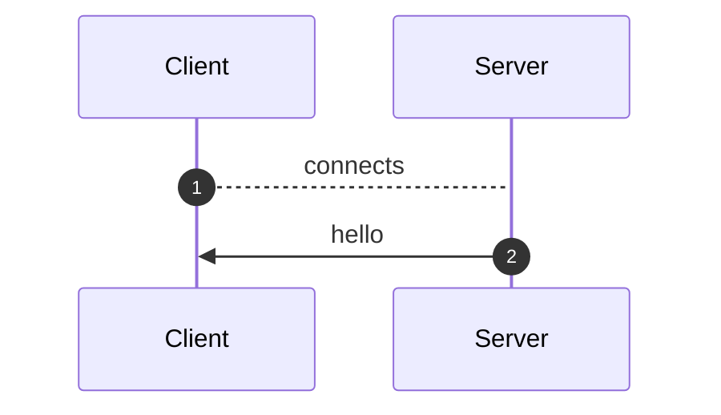
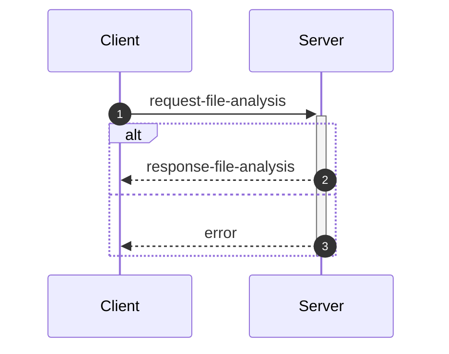
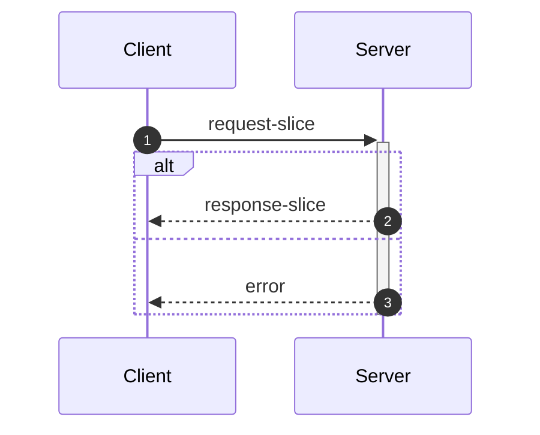
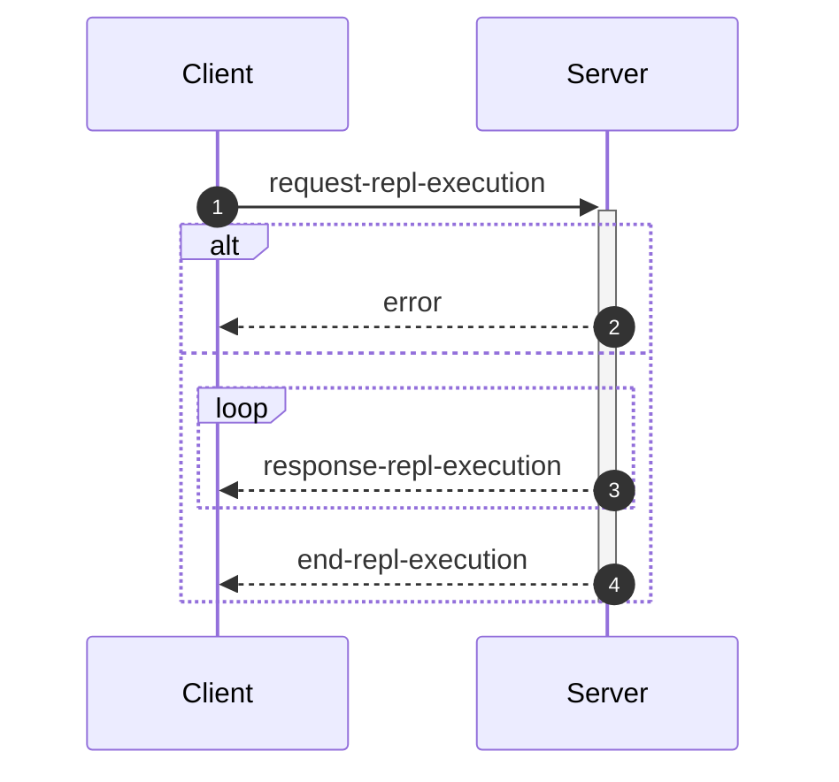

_<span title="an overview of flowR's interface">Generated</span> from '[wiki-interface.ts](https://github.com/flowr-analysis/flowr/tree/main/src/documentation/wiki-interface.ts "src/documentation/wiki-interface.ts")' on 2026-09-17, 20:51:27 UTC (v2.15.9, R v4.6.1), do not edit directly._

Although far from being as detailed as the in-depth explanation of [_flowR_](https://github.com/flowr-analysis/flowr/wiki/Core),
this wiki page explains how to interface with _flowR_ in more detail.
In general, command line arguments and other options provide short descriptions on hover over.

* [💻 Using the REPL](#using-the-repl)
* [⚙️ Configuring FlowR](#configuring-flowr)
* [⚒️ Writing Code](#writing-code)
* [💬 Communicating with the Server](#communicating-with-the-server)

<a id='using-the-repl'></a>
## 💻 Using the REPL

> [!NOTE]
> To execute arbitrary R commands with a repl request, _flowR_ has to be started explicitly with <span title="Description (Command Line Argument): Allow to access the underlying R session when using flowR (security warning: this allows the execution of arbitrary R code!)">`--r-session-access`</span>.
> Please be aware that this introduces a security risk and note that this relies on the [`r-shell` engine](https://github.com/flowr-analysis/flowr/wiki/Engines) .

Although primarily meant for users to explore,
there is nothing which forbids simply calling _flowR_ as a subprocess to use standard-in, -output, and -error
for communication (although you can access the REPL using the server as well,
with the [REPL Request](#message-request-repl-execution) message).

The read-eval-print loop&nbsp;(REPL) works relatively simple.
You can submit an expression (using <kbd>Enter</kbd>),
which is interpreted as an R&nbsp;expression by default but interpreted as a *command* if it starts with a colon (`:`).
The best command to get started with the REPL is <span title="Description (Repl Command): Show help information (aliases: :h, :?)">`:help`</span>.
Besides, you can leave the REPL either with the command <span title="Description (Repl Command): End the repl (aliases: :q, :exit)">`:quit`</span> or by pressing <kbd>Ctrl</kbd>+<kbd>C</kbd> twice.
When writing a *command*, you may press <kbd>Tab</kbd> to get a list of completions, if available.
Multiple commands can be entered in a single line by separating them with a semicolon (`;`), e.g. `:parse "x<-2"; :df*`.
If a command is given without R code, the REPL will re-use R code given in a previous command.
The prior example will hence return first the parsed AST of the program and then the dataflow graph for `"x <- 2"`.

> [!NOTE]
> If you develop flowR, you may want to launch the repl using the `npm run main-dev` command, this way, you get a non-minified version of flowR with debug information and hot-reloading of source files.

<details>
<summary>Available Commands</summary>

We currently offer the following commands (this with a `[*]` suffix are available with and without the star):

| Command | Description |
| ------- | ----------- |
| **<span title="Description (Repl Command): End the repl (aliases: :q, :exit)">:quit</span>** | End the repl (aliases: **:<span title="Alias of ':quit'. End the repl">q</span>**, **:<span title="Alias of ':quit'. End the repl">exit</span>**) |
| **<span title="Description (Repl Command): Execute the given code as R code. This requires the `--r-session-access` flag to be set and requires the r-shell engine. (aliases: :e, :r)">:execute</span>** | Execute the given code as R code. This requires the `--r-session-access` flag to be set and requires the r-shell engine. (aliases: **:<span title="Alias of ':execute'. Execute the given code as R code. This requires the `--r-session-access` flag to be set and requires the r-shell engine.">e</span>**, **:<span title="Alias of ':execute'. Execute the given code as R code. This requires the `--r-session-access` flag to be set and requires the r-shell engine.">r</span>**) |
| **<span title="Description (Repl Command): Get mermaid code for the control-flow graph of R code (aliases: :cfg, :cf)">:controlflow[*]</span>** | Get mermaid code for the control-flow graph of R code (star: Returns the URL to mermaid.live) (aliases: **:<span title="Alias of ':controlflow'. Get mermaid code for the control-flow graph of R code">cfg</span>**, **:<span title="Alias of ':controlflow'. Get mermaid code for the control-flow graph of R code">cf</span>**) |
| **<span title="Description (Repl Command): Get mermaid code for the control-flow graph with basic blocks (aliases: :cfgb, :cfb)">:controlflowbb[*]</span>** | Get mermaid code for the control-flow graph with basic blocks (star: Returns the URL to mermaid.live) (aliases: **:<span title="Alias of ':controlflowbb'. Get mermaid code for the control-flow graph with basic blocks">cfgb</span>**, **:<span title="Alias of ':controlflowbb'. Get mermaid code for the control-flow graph with basic blocks">cfb</span>**) |
| **<span title="Description (Repl Command): Get mermaid code for the dataflow graph (aliases: :d, :df)">:dataflow[*]</span>** | Get mermaid code for the dataflow graph (star: Returns the URL to mermaid.live) (aliases: **:<span title="Alias of ':dataflow'. Get mermaid code for the dataflow graph">d</span>**, **:<span title="Alias of ':dataflow'. Get mermaid code for the dataflow graph">df</span>**) |
| **<span title="Description (Repl Command): Get mermaid code for the normalized AST of R code (aliases: :n)">:normalize[*]</span>** | Get mermaid code for the normalized AST of R code (star: Returns the URL to mermaid.live) (alias: **:<span title="Alias of ':normalize'. Get mermaid code for the normalized AST of R code">n</span>**) |
| **<span title="Description (Repl Command): Get mermaid code for the simplified dataflow graph (aliases: :ds, :dfs)">:dataflowsimple[*]</span>** | Get mermaid code for the simplified dataflow graph (star: Returns the URL to mermaid.live) (aliases: **:<span title="Alias of ':dataflowsimple'. Get mermaid code for the simplified dataflow graph">ds</span>**, **:<span title="Alias of ':dataflowsimple'. Get mermaid code for the simplified dataflow graph">dfs</span>**) |
| **<span title="Description (Repl Command): Inspect and extend the signature database: `query` (identical to :query @signature), `info <name>` for where a function comes from (identical to :query @function-info), `add <path>` to mount another database/source, `download` to fetch the full-history database. (aliases: :sig)">:signature</span>** | Inspect and extend the signature database: `query` (identical to :query @signature), `info <name>` for where a function comes from (identical to :query @function-info), `add <path>` to mount another database/source, `download` to fetch the full-history database. (alias: **:<span title="Alias of ':signature'. Inspect and extend the signature database: `query` (identical to :query @signature), `info <name>` for where a function comes from (identical to :query @function-info), `add <path>` to mount another database/source, `download` to fetch the full-history database.">sig</span>**) |
| **<span title="Description (Repl Command): Just calculates the DFG, but only prints summary info (aliases: :d#, :df#)">:dataflowsilent</span>** | Just calculates the DFG, but only prints summary info (aliases: **:<span title="Alias of ':dataflowsilent'. Just calculates the DFG, but only prints summary info">d#</span>**, **:<span title="Alias of ':dataflowsilent'. Just calculates the DFG, but only prints summary info">df#</span>**) |
| **<span title="Description (Repl Command): Prints ASCII Art of the parsed, unmodified AST (aliases: :p)">:parse</span>** | Prints ASCII Art of the parsed, unmodified AST (alias: **:<span title="Alias of ':parse'. Prints ASCII Art of the parsed, unmodified AST">p</span>**) |
| **<span title="Description (Repl Command): Prints the version of flowR as well as the current version of R">:version</span>** | Prints the version of flowR as well as the current version of R
| **<span title="Description (Repl Command): Query the given R code (use 'help' for more information)">:query[*]</span>** | Query the given R code (use 'help' for more information) (star: Similar to query, but returns the output in json format.)
| **<span title="Description (Repl Command): Returns an ASCII representation of the dataflow graph (aliases: :df!)">:dataflowascii</span>** | Returns an ASCII representation of the dataflow graph (alias: **:<span title="Alias of ':dataflowascii'. Returns an ASCII representation of the dataflow graph">df!</span>**) |
| **<span title="Description (Repl Command): Returns summarization stats for the normalized AST (aliases: :n#)">:normalize#</span>** | Returns summarization stats for the normalized AST (alias: **:<span title="Alias of ':normalize#'. Returns summarization stats for the normalized AST">n#</span>**) |
| **<span title="Description (Repl Command): Show help information (aliases: :h, :?)">:help</span>** | Show help information (aliases: **:<span title="Alias of ':help'. Show help information">h</span>**, **:<span title="Alias of ':help'. Show help information">?</span>**) |

</details>

> [!TIP]
> 
> As indicated by the examples before, all REPL commands that operate on code keep track of the state.
> Hence, if you run a command like <span title="Description (Repl Command, starred version): Returns the URL to mermaid.live; Base Command: Get mermaid code for the dataflow graph (aliases: :d*, :df*)">`:dataflow*`</span> without providing R code,
> the REPL will re-use the R code provided in a previous command.
> Likewise, doing this will benefit from incrementality!
> If you request the dataflow graph with `:df* x <- 2 * y` and then want to see the parsed AST with `:parse`,
> the REPL will re-use previously obtained information and not re-parse the code again.
> 		

Generally, many commands offer shortcut versions in the REPL. Many queries, for example, offer a shortened format (see the example below).
Of special note, the [Config Query](https://github.com/flowr-analysis/flowr/wiki/%5BQuery%5D-Config)
can be used to also modify the currently active configuration of _flowR_ within the REPL (see the [wiki page](https://github.com/flowr-analysis/flowr/wiki/%5BQuery%5D-Config) for more information).

### Example: Retrieving the Dataflow Graph

To retrieve a URL to the [mermaid](https://mermaid.js.org/) diagram of the dataflow of a given expression,
use <span title="Description (Repl Command, starred version): Returns the URL to mermaid.live; Base Command: Get mermaid code for the dataflow graph (aliases: :d*, :df*)">`:dataflow*`</span> (or <span title="Description (Repl Command): Get mermaid code for the dataflow graph (aliases: :d, :df)">`:dataflow`</span> to get the mermaid code in the cli):

```shell
$ docker run -it --rm eagleoutice/flowr # or npm run flowr 
flowR repl v2.15.9, R grammar v14 (tree-sitter engine)
R> :dataflow* y <- 1 + x
```

<details>
<summary style='color:gray'>Output</summary>

```text
https://mermaid.live/view#base64:eyJjb2RlIjoiZmxvd2NoYXJ0IFREXG4gICAgMXt7XCJgKiM5MTtSTnVtYmVyIzkzOyogKioxKipcbiAgICAgICoxLjYqICgqKmlkOiAxKiopYFwifX1cbiAgICAyKFtcImAqIzkxO1JTeW1ib2wjOTM7KiAqKngqKlxuICAgICAgKjEuMTAqICgqKmlkOiAyKiopYFwiXSlcbiAgICAzW1tcImAqIzkxO1JCaW5hcnlPcCM5MzsqIGJhc2UjNTg7IzU4OyoqIzQzOyoqXG4gICAgICAqMS42LTEwKiAoKippZDogMyoqKVxuICAgIGFyZzogKDEsIDIpYFwiXV1cbiAgICBidWlsdC1pbjpfW1wiYEJ1aWx0LUluOlxuIzQzO2BcIl1cbiAgICBzdHlsZSBidWlsdC1pbjpfIHN0cm9rZTpncmF5LGZpbGw6Z3JheSxzdHJva2Utd2lkdGg6MnB4LG9wYWNpdHk6Ljg7XG4gICAgMFtcImAqIzkxO1JTeW1ib2wjOTM7KiAqKnkqKlxuICAgICAgKjEuMSogKCoqaWQ6IDAqKiwgdjogMylgXCJdXG4gICAgNFtbXCJgKiM5MTtSQmluYXJ5T3AjOTM7KiBiYXNlIzU4OyM1ODsqKiM2MDsjNDU7KipcbiAgICAgICoxLjEtMTAqICgqKmlkOiA0KiopXG4gICAgYXJnOiAoMCwgMylgXCJdXVxuICAgIGJ1aWx0LWluOl8tW1wiYEJ1aWx0LUluOlxuIzYwOyM0NTtgXCJdXG4gICAgc3R5bGUgYnVpbHQtaW46Xy0gc3Ryb2tlOmdyYXksZmlsbDpncmF5LHN0cm9rZS13aWR0aDoycHgsb3BhY2l0eTouODtcbiAgICAxIC0uLT58XCJmbG93XCJ8IDJcbiAgICBsaW5rU3R5bGUgMCBzdHJva2U6Z3JheSxjb2xvcjpncmF5O1xuICAgIDIgLS4tPnxcImZsb3dcInwgM1xuICAgIGxpbmtTdHlsZSAxIHN0cm9rZTpncmF5LGNvbG9yOmdyYXk7XG4gICAgMyAtLT58XCJyZWFkcywgYXJnXCJ8IDFcbiAgICAzIC0tPnxcInJlYWRzLCBhcmdcInwgMlxuICAgIDMgLS4tPnxcImZsb3dcInwgMFxuICAgIGxpbmtTdHlsZSA0IHN0cm9rZTpncmF5LGNvbG9yOmdyYXk7XG4gICAgMyAtLi0+fFwicmVhZHMsIGNhbGxzXCJ8IGJ1aWx0LWluOl9cbiAgICBsaW5rU3R5bGUgNSBzdHJva2U6Z3JheTtcbiAgICAwIC0tPnxcImRlZmluZWQtYnksIGZsb3dcInwgNFxuICAgIDAgLS0+fFwiZGVmaW5lZC1ieVwifCAzXG4gICAgNCAtLT58XCJyZWFkcywgYXJnXCJ8IDNcbiAgICA0IC0tPnxcInJldHVybnMsIGFyZ1wifCAwXG4gICAgNCAtLi0+fFwicmVhZHMsIGNhbGxzXCJ8IGJ1aWx0LWluOl8tXG4gICAgbGlua1N0eWxlIDEwIHN0cm9rZTpncmF5OyIsIm1lcm1haWQiOnsiYXV0b1N5bmMiOnRydWV9fQ==
```

Retrieve the dataflow graph of the expression `y <- 1 + x`. It looks like this:


```mermaid
flowchart LR
    1{{"`*#91;RNumber#93;* **1**
      *1.6* (**id: 1**)`"}}
    2(["`*#91;RSymbol#93;* **x**
      *1.10* (**id: 2**)`"])
    3[["`*#91;RBinaryOp#93;* base#58;#58;**#43;**
      *1.6-10* (**id: 3**)
    arg: (1, 2)`"]]
    built-in:_["`Built-In:
#43;`"]
    style built-in:_ stroke:gray,fill:gray,stroke-width:2px,opacity:.8;
    0["`*#91;RSymbol#93;* **y**
      *1.1* (**id: 0**, v: 3)`"]
    4[["`*#91;RBinaryOp#93;* base#58;#58;**#60;#45;**
      *1.1-10* (**id: 4**)
    arg: (0, 3)`"]]
    built-in:_-["`Built-In:
#60;#45;`"]
    style built-in:_- stroke:gray,fill:gray,stroke-width:2px,opacity:.8;
    1 -.->|"flow"| 2
    linkStyle 0 stroke:gray,color:gray;
    2 -.->|"flow"| 3
    linkStyle 1 stroke:gray,color:gray;
    3 -->|"reads, arg"| 1
    3 -->|"reads, arg"| 2
    3 -.->|"flow"| 0
    linkStyle 4 stroke:gray,color:gray;
    3 -.->|"reads, calls"| built-in:_
    linkStyle 5 stroke:gray;
    0 -->|"defined-by, flow"| 4
    0 -->|"defined-by"| 3
    4 -->|"reads, arg"| 3
    4 -->|"returns, arg"| 0
    4 -.->|"reads, calls"| built-in:_-
    linkStyle 10 stroke:gray;
```

<details>

<summary style="color:gray">R Code of the Dataflow Graph</summary>

The analysis ran (including parse and normalize, using the [tree-sitter](https://github.com/flowr-analysis/flowr/wiki/Engines) engine) within the generation environment. No [signature database](https://github.com/flowr-analysis/flowr/wiki/Signature-Database) is mounted for these generated graphs, so `library()` calls attach no package exports; base-R names are still qualified via the generated base-package store (e.g. `acf` as `stats::acf`). 
We encountered no unknown side effects during the analysis.

```r
y <- 1 + x
```

</details>

</details>

For small graphs like this, <span title="Description (Repl Command): Returns an ASCII representation of the dataflow graph (aliases: :df!)">`:dataflowascii`</span> also provides an ASCII representation directly in the REPL:

```shell
$ docker run -it --rm eagleoutice/flowr # or npm run flowr 
flowR repl v2.15.9, R grammar v14 (tree-sitter engine)
R> :df! y <- 1 + x
```

<details open>
<summary style='color:gray'>Output</summary>

```text
                        v<0>v
 c<4>c──────────────────| y |
 |<- |     ┌────────────v---v
 c---c     │
    │   c<3>c   0<1>0
    └───| + |───| 1 |───u<2>u
        c---c   0---0   | x |
           └────────────u---u
Edges:
3 -> 1: reads, arg          3 -> 2: reads, arg
3 -> 0: flows-to            1 -> 2: flows-to
2 -> 3: flows-to            4 -> 3: reads, arg
4 -> 0: returns, arg        0 -> 4: defined-by, flows-to
0 -> 3: defined-by
```

Retrieve the dataflow graph of the expression `y <- 1 + x` as ASCII art.

</details>

For the slicing with <span title="Description (Repl Command): Static backwards executable slicer for R">`:slicer`</span>, you have access to the same [magic comments](#slice-magic-comments) as with the [slice request](#message-request-slice).
Pass `--inline` to splice resolvable `source()` calls into the reconstruction so the slice is a single self-contained R text (the same as the static slice query's `inlineSources` flag).
See `--help` for more flags!

### Example: Interfacing with the File System

Many commands that allow for an R-expression (like <span title="Description (Repl Command, starred version): Returns the URL to mermaid.live; Base Command: Get mermaid code for the dataflow graph (aliases: :d*, :df*)">`:dataflow*`</span>) allow for a file as well
if the argument starts with `file://`.
If you are working from the root directory of the _flowR_ repository, the following gives you the parsed AST of the example file using the <span title="Description (Repl Command): Prints ASCII Art of the parsed, unmodified AST (aliases: :p)">`:parse`</span> command:

> **Watch mode**: Replace `file://` with `watch://` to enter watch mode.
> flowR runs the command immediately and then re-runs it every time the file (or any file inside the folder) changes.
> Enter any other command to leave watch mode.
> For example: `:df watch://analysis.R`

```shell
$ docker run -it --rm eagleoutice/flowr # or npm run flowr 
flowR repl v2.15.9, R grammar v14 (tree-sitter engine)
R> :parse file://test/testfiles/example.R
```

<details>
<summary style='color:gray'>Output</summary>

```text
File: test/testfiles/example.R

program
├ binaryoperator
│ ├ identifier "sum" (1:1─4)
│ ├ <- "<-" (1:5─7)
│ ╰ float "0" (1:8─9)
├ binaryoperator
│ ├ identifier "product" (2:1─8)
│ ├ <- "<-" (2:9─11)
│ ╰ float "1" (2:12─13)
├ binaryoperator
│ ├ identifier "w" (3:1─2)
│ ├ <- "<-" (3:3─5)
│ ╰ float "7" (3:6─7)
├ binaryoperator
│ ├ identifier "N" (4:1─2)
│ ├ <- "<-" (4:3─5)
│ ╰ float "10" (4:6─8)
├ forstatement
│ ├ for "for" (6:1─4)
│ ├ ( "(" (6:5─6)
│ ├ identifier "i" (6:6─7)
│ ├ in "in" (6:8─10)
│ ├ binaryoperator
│ │ ├ float "1" (6:11─12)
│ │ ├ : ":" (6:12─13)
│ │ ╰ parenthesizedexpression
│ │   ├ ( "(" (6:13─14)
│ │   ├ binaryoperator
│ │   │ ├ identifier "N" (6:14─15)
│ │   │ ├ - "-" (6:15─16)
│ │   │ ╰ float "1" (6:16─17)
│ │   ╰ ) ")" (6:17─18)
│ ├ ) ")" (6:18─19)
│ ╰ bracedexpression
│   ├ { "{" (6:20─21)
│   ├ binaryoperator
│   │ ├ identifier "sum" (7:3─6)
│   │ ├ <- "<-" (7:7─9)
│   │ ╰ binaryoperator
│   │   ├ binaryoperator
│   │   │ ├ identifier "sum" (7:10─13)
│   │   │ ├ + "+" (7:14─15)
│   │   │ ╰ identifier "i" (7:16─17)
│   │   ├ + "+" (7:18─19)
│   │   ╰ identifier "w" (7:20─21)
│   ├ binaryoperator
│   │ ├ identifier "product" (8:3─10)
│   │ ├ <- "<-" (8:11─13)
│   │ ╰ binaryoperator
│   │   ├ identifier "product" (8:14─21)
│   │   ├  "" (8:22─23)
│   │   ╰ identifier "i" (8:24─25)
│   ╰ } "}" (9:1─2)
├ call
│ ├ identifier "cat" (11:1─4)
│ ╰ arguments
│   ├ ( "(" (11:4─5)
│   ├ argument
│   │ ╰ string
│   │   ├ " "\"" (11:5─6)
│   │   ├ stringcontent "Sum:" (11:6─10)
│   │   ╰ " "\"" (11:10─11)
│   ├ comma "," (11:11─12)
│   ├ argument
│   │ ╰ identifier "sum" (11:13─16)
│   ├ comma "," (11:16─17)
│   ├ argument
│   │ ╰ string
│   │   ├ " "\"" (11:18─19)
│   │   ├ stringcontent
│   │   │ ╰ escapesequence "\\n" (11:19─21)
│   │   ╰ " "\"" (11:21─22)
│   ╰ ) ")" (11:22─23)
╰ call
  ├ identifier "cat" (12:1─4)
  ╰ arguments
    ├ ( "(" (12:4─5)
    ├ argument
    │ ╰ string
    │   ├ " "\"" (12:5─6)
    │   ├ stringcontent "Product:" (12:6─14)
    │   ╰ " "\"" (12:14─15)
    ├ comma "," (12:15─16)
    ├ argument
    │ ╰ identifier "product" (12:17─24)
    ├ comma "," (12:24─25)
    ├ argument
    │ ╰ string
    │   ├ " "\"" (12:26─27)
    │   ├ stringcontent
    │   │ ╰ escapesequence "\\n" (12:27─29)
    │   ╰ " "\"" (12:29─30)
    ╰ ) ")" (12:30─31)
```

Retrieve the parsed AST of the example file.

<details>

<summary>File Content</summary>

```r
sum <- 0
product <- 1
w <- 7
N <- 10

for (i in 1:(N-1)) {
  sum <- sum + i + w
  product <- product * i
}

cat("Sum:", sum, "\n")
cat("Product:", product, "\n")
```

</details>

As _flowR_ directly transforms this AST the output focuses on being human-readable instead of being machine-readable.
		
</details>

### Example: Run a Query

You can run any query supported by _flowR_ using the <span title="Description (Repl Command): Query the given R code (use 'help' for more information)">`:query`</span> command.
For example, to obtain the shapes of all data frames in a given piece of code, you can run:

```shell
$ docker run -it --rm eagleoutice/flowr # or npm run flowr 
flowR repl v2.15.9, R grammar v14 (tree-sitter engine)
R> :query @absint df-shape "x <- data.frame(a = 1:10, b = 1:10)\ny <- x$a"
```

<details open>
<summary style='color:gray'>Output</summary>

```text
Query: absint (1 ms)
```

Retrieve the shapes of all data frames in the given code.

</details>

To run the linter on a file, you can use (in this example, we just issue the `dead-code` linter on a small piece of code):

```shell
$ docker run -it --rm eagleoutice/flowr # or npm run flowr 
flowR repl v2.15.9, R grammar v14 (tree-sitter engine)
R> :query @linter rules:dead-code "if(FALSE) x <- 2"
```

<details open>
<summary style='color:gray'>Output</summary>

```text
Query: linter (1 ms)
   ╰ Dead Code (dead-code):
       ╰ certain:
           ╰ Code at 1.11-16
```

Run the linter on the given code, with only the `dead-code` rule enabled.

</details>

For more information on the available queries, please check out the [Query API](https://github.com/flowr-analysis/flowr/wiki/Query-API).

<a id='configuring-flowr'></a>
## ⚙️ Configuring FlowR

When running _flowR_, you may want to specify some behaviors with a dedicated configuration file.
By default, flowR looks for a file named `flowr.json` in the current working directory (or any higher directory).
You can also specify a different file with <span title="Description (Command Line Argument): The name of the configuration file to use">`--config-file`</span> or pass the configuration inline using <span title="Description (Command Line Argument): The flowR configuration to use, as a JSON string">`--config-json`</span>.
To inspect the current configuration, you can run flowr with the <span title="Description (Command Line Argument): Run with verbose logging (will be passed to the corresponding script)">`--verbose`</span> flag, or use the `config` [Query](https://github.com/flowr-analysis/flowr/wiki/Query-API).
Within the REPL this works by running the following:

```shell
:query @config
```

To work with the <a href="https://github.com/flowr-analysis/flowr/tree/main/src/config.ts#L108"><code><span title="The configuration file format for flowR.">FlowrConfig</span></code></a> you can use the provided helper objects alongside its methods like
<a href="https://github.com/flowr-analysis/flowr/tree/main/src/config.ts#L871"><code><span title="Creates a new flowr config that has the updated values.">FlowrConfig::<b>amend</b></span></code></a>.
The schema below documents every option; the ones you most likely want are:

- <a href="https://github.com/flowr-analysis/flowr/wiki/Interface#configuring-flowr" title="Configuration Option (boolean): Whether source calls should be ignored, causing {@link processSourceCall}&#39;s behavior to be skipped.">ignoreSourceCalls</a>: ignore source calls when analyzing the code, i.e., ignore the inclusion of other files.
- <a href="https://github.com/flowr-analysis/flowr/wiki/Interface#configuring-flowr" title="Configuration Option (boolean): Whether load calls should be ignored, causing {@link processLoadCall}&#39;s behavior to be skipped.">ignoreLoadCalls</a>: ignore load calls when analyzing the code, i.e., ignore the loading of r-data files.
- <a href="https://github.com/flowr-analysis/flowr/wiki/Interface#configuring-flowr" title="Configuration Option (object): Do you want to overwrite (parts) of the builtin definition?">semantics.environment.overwriteBuiltIns</a>: overwrite _flowR_'s handling of built-in functions, or clear the preset definitions entirely.
  See [Configure BuiltIn Semantics](#configure-builtin-semantics) for more information.
- <a href="https://github.com/flowr-analysis/flowr/wiki/Interface#configuring-flowr" title="Configuration Option (string): How to resolve variables and their values. (one of &quot;disabled&quot;, &quot;alias&quot;, &quot;builtin&quot;)">solver.variables</a>: how to resolve variables and their values (`disabled`, `alias`, `builtin`).
- <a href="https://github.com/flowr-analysis/flowr/wiki/Interface#configuring-flowr" title="Configuration Option (array): The engine or set of engines to use for interacting with R code. An empty array means all available engines will be used.">engines</a> and <a href="https://github.com/flowr-analysis/flowr/wiki/Interface#configuring-flowr" title="Configuration Option (string): The default engine to use for interacting with R code. If this is undefined, an arbitrary engine from the specified list will be used. (one of &quot;tree-sitter&quot;, &quot;r-shell&quot;)">defaultEngine</a>: the engines used to interact with R code, see the [Engines wiki page](https://github.com/flowr-analysis/flowr/wiki/Engines).
- <a href="https://github.com/flowr-analysis/flowr/wiki/Interface#configuring-flowr" title="Configuration Option (array): Files a framework loads on its own, without any source() call (e.g. global.R in a shiny app), in the order they are loaded; flowR orders the matching project files accordingly and analyzes them as one program. Entries are case-insensitive globs matched against the file path, a plain name matches any file with that name, and entries matching no project file are warned about. Usually set per project kind via specializeConfig.">project.implicitSources</a>: the files a framework loads without any `source()` call, in the order in which they are
  loaded. Entries are globs (e.g. `R/*.R`) matched against the file path ignoring capitalization; one matching no file is reported.
- <a href="https://github.com/flowr-analysis/flowr/wiki/Interface#configuring-flowr" title="Configuration Option (object): Overwrite (parts of) the configuration depending on the project kind flowR detects, e.g. to give a shiny app its implicit sources.">specializeConfig</a>: overwrite (parts of) the configuration depending on the kind of project _flowR_ detects
  (e.g. `shiny-app`), which is how a shiny app gets its implicit sources by default. What you configure directly wins.
- <a href="https://github.com/flowr-analysis/flowr/wiki/Interface#configuring-flowr" title="Configuration Option (string): Overwrite the project kind flowR would otherwise infer from the analyzed files, e.g. when auto-detection guesses wrong. (one of &quot;package&quot;, &quot;script&quot;, &quot;shiny-app&quot;, &quot;notebook&quot;, &quot;project&quot;, &quot;unknown&quot;)">project.useProjectType</a>: skip that detection and force a project kind yourself, when auto-detection guesses wrong.
- <a href="https://github.com/flowr-analysis/flowr/wiki/Interface#configuring-flowr" title="Configuration Option (array): The default plugins to load when creating a new instance of FlowrAnalyzer">defaultPlugins</a> and <a href="https://github.com/flowr-analysis/flowr/wiki/Interface#configuring-flowr" title="Configuration Option (array): The plugins to load in REPL mode">repl.plugins</a>: the plugins to load for a new <a href="https://github.com/flowr-analysis/flowr/tree/main/src/project/flowr-analyzer.ts#L202"><code><span title="Central class for conducting analyses with FlowR. Use the FlowrAnalyzerBuilder to create a new instance. If you want the original pattern of creating a pipeline and running all steps, you can still do this with FlowrAnalyzer#runFull . To inspect the context of the analyzer, use FlowrAnalyzer#inspectContext (if you are a plugin and need to modify it, use FlowrAnalyzer#context instead).">FlowrAnalyzer</span></code></a> and in the REPL
  (use `flowr:default` to reference the former).

So you can configure _flowR_ by adding a file like the following:

<details>

<summary>Example Configuration File</summary>

```json
{
  "ignoreSourceCalls": true,
  "ignoreLoadCalls": true,
  "semantics": {
    "environment": {
      "overwriteBuiltIns": {
        "definitions": [
          {
            "type": "function",
            "names": [
              "foo"
            ],
            "processor": "builtin:assign",
            "config": {}
          }
        ]
      }
    }
  },
  "defaultPlugins": [
    "file:description",
    "versions:description"
  ],
  "repl": {
    "quickStats": false,
    "dfProcessorHeat": false,
    "hints": true,
    "plugins": [
      "flowr:default"
    ]
  },
  "project": {
    "resolveUnknownPathsOnDisk": true,
    "implicitSources": [
      "global.R",
      "app.R"
    ]
  },
  "linter": {
    "disabledRules": []
  },
  "specializeConfig": {
    "shiny-app": {
      "project": {
        "implicitSources": [
          "global.R",
          "ui.R",
          "server.R",
          "app.R"
        ]
      }
    }
  },
  "engines": [
    {
      "type": "r-shell"
    }
  ],
  "solver": {
    "variables": "alias",
    "evalStrings": true,
    "trackEnvironments": true,
    "sigdb": {
      "enabled": true,
      "loadProjectDependencies": true,
      "eagerlyLoad": false,
      "eagerlyLoadExports": false,
      "linkBaseR": false,
      "linkDescriptionDependencies": false
    },
    "resolveSource": {
      "dropPaths": "no",
      "ignoreCapitalization": true,
      "inferWorkingDirectory": "active-script",
      "searchPath": []
    },
    "instrument": {},
    "slicer": {
      "threshold": 50
    }
  },
  "abstractInterpretation": {
    "wideningThreshold": 4,
    "followCalls": true,
    "dataFrame": {
      "maxColNames": 20,
      "readLoadedData": {
        "readExternalFiles": true,
        "maxReadLines": 1000000
      }
    }
  },
  "incremental": {
    "alwaysIncremental": false,
    "parsing": {
      "activated": false,
      "heuristics": {
        "activated": true,
        "mtime": true,
        "linesFrom": 500,
        "bytesFrom": 50000,
        "alwaysWithEdits": false,
        "minFiles": 1
      }
    }
  },
  "gas": {
    "thresholds": {
      "memory": {
        "problematic": 0.7,
        "critical": 0.9
      },
      "timeMs": {
        "problematic": 100000,
        "critical": 120000
      }
    },
    "features": {}
  }
}
```

</details>

<details>
<a id='configure-builtin-semantics'></a>
<summary>Configure Built-In Semantics</summary>

`semantics/environment/overwriteBuiltins` accepts two keys:

- `loadDefaults` (boolean, initially `true`): If set to `true`, the default built-in definitions are loaded before applying the custom definitions. Setting this flag to `false` explicitly disables the loading of the default definitions.
- `definitions` (array, initially empty): Allows to overwrite or define new built-in elements. Each object within must have a `type` which is one of the below. Furthermore, they may define a string array of `names` which specifies the identifiers to bind the definitions to. You may use `assumePrimitive` to specify whether _flowR_ should assume that this is a primitive non-library definition (so you probably just do not want to specify the key).

  | Type            | Description                                                                                                                                                                                                                                                                                              | Example                                                                                                    |
  | --------------- | -------------------------------------------------------------------------------------------------------------------------------------------------------------------------------------------------------------------------------------------------------------------------------------------------------- | ---------------------------------------------------------------------------------------------------------- |
  | `constant`    | Additionally allows for a `value` this should resolve to.                                                                                                                                                                                                                                                | `{ type: 'constant', names: ['NULL', 'NA'],  value: null }`                                                |
  | `function`    | Is a rather flexible way to define and bind built-in functions. For the time, we do not have extensive documentation to cover all the cases, so please either consult the sources with the `default-builtin-config.ts` or open a [new issue](https://github.com/flowr-analysis/flowr/issues/new/choose). | `{ type: 'function', names: ['next'], processor: 'builtin:d', config: { cfg: ExitPointType.Next } }` |
  | `replacement` | A comfortable way to specify replacement functions like `$<-` or `names<-`. `suffixes` describes the... suffixes to attach automatically. | `{ type: 'replacement', suffixes: ['<-', '<<-'], names: ['[', '[['] }` |

</details>

<details>

<summary style='color:gray'>Full Configuration-File Schema</summary>

- _The configuration file format for flowR._ (object)
    - **logLevel** [optional] _flowR's global minimum log level, applied when the config is loaded._ (string)
        Only allows: 'silly', 'trace', 'debug', 'info', 'warn', 'error', 'fatal'
    - **ignoreSourceCalls** [optional] _Whether source calls should be ignored, causing {@link processSourceCall}'s behavior to be skipped._ (boolean)
    - **ignoreLoadCalls** [optional] _Whether load calls should be ignored, causing {@link processLoadCall}'s behavior to be skipped._ (boolean)
    - **semantics** _Configure language semantics and how flowR handles them._ (object)
        - **environment** [optional] _Semantics regarding how to handle the R environment._ (object)
            - **overwriteBuiltIns** [optional] _Do you want to overwrite (parts) of the builtin definition?_ (object)
                - **loadDefaults** [optional] _Should the default configuration still be loaded?_ (boolean)
                - **definitions** [optional] _The definitions to load/overwrite._ (array)
                Valid item types:
                    - (object)
    - **defaultPlugins** [optional] _The default plugins to load when creating a new instance of FlowrAnalyzer_ (array)
    Valid item types:
        - (alternatives)
            - (string)
            - (array)
    - **repl** _Configuration options for the REPL._ (object)
        - **quickStats** [optional] _Whether to show quick stats in the REPL after each evaluation._ (boolean)
        - **dfProcessorHeat** [optional] _This instruments the dataflow processors to count how often each processor is called._ (boolean)
        - **hints** [optional] _Whether to show dim inline hints on the empty prompt (automatically disabled on non-interactive terminals)._ (boolean)
        - **plugins** [optional] _The plugins to load in REPL mode_ (array)
        Valid item types:
            - (alternatives)
                - (string)
                - (array)
        - **autoUseFileProtocol** [optional] _Prepend the file protocol to a repl input that looks like a path, instead of only warning about it._ (boolean)
        - **queryStats** [optional] _Whether `:query` closes with the line stating how long the queries took (`:query*` never prints it)._ (boolean)
        - **showPlugins** [optional] _Whether `:version` grays out the plugins that did not activate during the last analysis._ (boolean)
    - **project** _Project specific configuration options._ (object)
        - **resolveUnknownPathsOnDisk** [optional] _Whether to resolve unknown paths loaded by the r project disk when trying to source/analyze files._ (boolean)
        - **failOnInaccessiblePath** [optional] _Whether a directory that cannot be traversed during file discovery (e.g. due to permissions) aborts the analysis; when false (the default) such paths are logged and skipped._ (boolean)
        - **basePackages** [optional] _The packages considered part of R itself (base and recommended); if unset, flowR uses its built-in list._ (array)
        Valid item types:
            - (string)
        - **implicitSources** [optional] _Files a framework loads on its own, without any source() call (e.g. global.R in a shiny app), in the order they are loaded; flowR orders the matching project files accordingly and analyzes them as one program. Entries are case-insensitive globs matched against the file path, a plain name matches any file with that name, and entries matching no project file are warned about. Usually set per project kind via specializeConfig._ (array)
        Valid item types:
            - (string)
        - **useProjectType** [optional] _Overwrite the project kind flowR would otherwise infer from the analyzed files, e.g. when auto-detection guesses wrong._ (string)
            Only allows: 'package', 'script', 'shiny-app', 'notebook', 'project', 'unknown'
        - **assumeImplicitEcho** [optional] _Whether the top level of the analyzed code is echoed, so that every visible result printed there is collected as an output by the dependencies query (default true, false for a package)._ (boolean)
        - **discovery** [optional] _Scoping options for the default project discovery._ (object)
            - **full** [optional] _Collect every file below the project root (greedy) instead of only the files the detected project kind needs (default false)._ (boolean)
            - **perKind** [optional] _Per-kind include/exclude glob overrides layered on the default scoping._ (object)
            - **ignore** [optional] _Case-insensitive globs that drop matching files from the intelligent discovery, regardless of kind (e.g. .Renviron to ignore environment files)._ (array)
            Valid item types:
                - (string)
        - **classification** [optional] _Overrides for the signals flowR uses to classify the project kind._ (object)
            - **shinyDescriptionTypes** [optional] _DESCRIPTION Type: values that mark a shiny app._ (array)
            Valid item types:
                - (string)
            - **shinyEntryFiles** [optional] _File names a shiny app is assembled from._ (array)
            Valid item types:
                - (string)
            - **shinyUsagePattern** [optional] _Regex source evidencing shiny usage in an entry file._ (string)
            - **notebookExtensions** [optional] _File extensions marking a notebook._ (array)
            Valid item types:
                - (string)
    - **linter** _Linter configuration options._ (object)
        - **disabledRules** _Linting rule names excluded from the default rule set (a rule requested explicitly via a linter query still runs). Usually set per project kind via specializeConfig._ (array)
        Valid item types:
            - (string)
    - **inputSources** [optional] _Further frameworks the input-sources analysis should know about; entries are added to flowR's defaults._ (object)
        - **pure** [optional] _Functions that only pass the constantness of their arguments on._ (array)
        Valid item types:
            - (string)
        - **param** [optional] _Functions whose result is a 'param' input._ (array)
        Valid item types:
            - (string)
        - **file** [optional] _Functions whose result is a 'file' input._ (array)
        Valid item types:
            - (string)
        - **tempfile** [optional] _Functions whose result is a 'tempfile' input._ (array)
        Valid item types:
            - (string)
        - **glob** [optional] _Functions whose result is a 'glob' input._ (array)
        Valid item types:
            - (string)
        - **net** [optional] _Functions whose result is a 'net' input._ (array)
        Valid item types:
            - (string)
        - **rand** [optional] _Functions whose result is a 'rand' input._ (array)
        Valid item types:
            - (string)
        - **system** [optional] _Functions whose result is a 'system' input._ (array)
        Valid item types:
            - (string)
        - **ffi** [optional] _Functions whose result is a 'ffi' input._ (array)
        Valid item types:
            - (string)
        - **lang** [optional] _Functions whose result is a 'lang' input._ (array)
        Valid item types:
            - (string)
        - **options** [optional] _Functions whose result is a 'options' input._ (array)
        Valid item types:
            - (string)
        - **cmdline** [optional] _Functions whose result is a 'cmdline' input._ (array)
        Valid item types:
            - (string)
        - **user** [optional] _Functions whose result is a 'user' input._ (array)
        Valid item types:
            - (string)
        - **const** [optional] _Functions whose result is a 'const' input._ (array)
        Valid item types:
            - (string)
        - **scope** [optional] _Functions whose result is a 'scope' input._ (array)
        Valid item types:
            - (string)
        - **dconst** [optional] _Functions whose result is a 'dconst' input._ (array)
        Valid item types:
            - (string)
        - **unknown** [optional] _Functions whose result is a 'unknown' input._ (array)
        Valid item types:
            - (string)
        - **linkedObjects** [optional] _Objects a framework provides without a definition in the code, e.g. shiny's input._ (array)
        Valid item types:
            - (object)
        - **linkedEntryPoints** [optional] _Calls that hand a function to a framework, which binds its objects to the parameters by position._ (array)
        Valid item types:
            - (object)
    - **specializeConfig** [optional] _Overwrite (parts of) the configuration depending on the project kind flowR detects, e.g. to give a shiny app its implicit sources._ (object)
    - **engines** _The engine or set of engines to use for interacting with R code. An empty array means all available engines will be used._ (array)
    Valid item types:
        - (alternatives)
            - _The configuration for the tree sitter engine._ (object)
                - **type** [required] _Use the tree sitter engine._ (string)
                    Only allows: 'tree-sitter'
                - **wasmPath** [optional] _The path to the tree-sitter-r WASM binary to use. If this is undefined, this uses the default path._ (string)
                - **treeSitterWasmPath** [optional] _The path to the tree-sitter WASM binary to use. If this is undefined, this uses the default path._ (string)
                - **lax** [optional] _Whether to use the lax parser for parsing R code (allowing for syntax errors). If this is undefined, the strict parser will be used._ (boolean)
            - _The configuration for the R shell engine._ (object)
                - **type** [required] _Use the R shell engine._ (string)
                    Only allows: 'r-shell'
                - **rPath** [optional] _The path to the R executable to use. If this is undefined, this uses the default path._ (string)
                - **pipeBind** [optional] _Whether to enable R's experimental pipe-bind operator "=>" by setting _R_USE_PIPEBIND_ for the R session (default false); R itself keeps this off by default, as it is experimental and has never shipped in a release version of R._ (boolean)
    - **defaultEngine** [optional] _The default engine to use for interacting with R code. If this is undefined, an arbitrary engine from the specified list will be used._ (string)
        Only allows: 'tree-sitter', 'r-shell'
    - **solver** _How to resolve constants, constraints, cells, ..._ (object)
        - **variables** _How to resolve variables and their values._ (string)
            Only allows: 'disabled', 'alias', 'builtin'
        - **evalStrings** _Should we include eval(parse(text="...")) calls in the dataflow graph?_ (boolean)
        - **trackEnvironments** [optional] _Track user-created environments (new.env, assign/get/local with envir=, dollar-assign, attach). When false, all envir-style calls fall through conservatively._ (boolean)
        - **sigdb** _Resolving library exports from a signature database._ (object)
            - **enabled** [optional] _Resolve library()/use() exports from a signature database (default true); when false no database is consulted._ (boolean)
            - **loadProjectDependencies** [optional] _Load the project's declared dependencies from its metadata files (DESCRIPTION Imports/Depends, rproject.toml, uvr.toml, renv.lock, rv.lock, uvr.lock) (default true); when false these files are not read for dependencies._ (boolean)
            - **eagerlyLoad** [optional] _Parse the database up front rather than on the first package load (default false, ignored if disabled)._ (boolean)
            - **eagerlyLoadExports** [optional] _Add a vertex for every export on load rather than on demand (default false); keeps the dataflow graph small._ (boolean)
            - **assumedRVersion** [optional] _R version assumed when resolving versioned (base-R) exports: a pin like "4.5" or "auto" to detect the installed R (default "auto")._ (string)
            - **linkBaseR** [optional] _Eagerly attach base-R namespaces so bare base calls resolve without library() (default false)._ (boolean)
            - **linkBaseRCalls** [optional] _Add a lightweight Reads edge from a bare base-R call to its signature-database function vertex (default false; base-R qualification is edge-free otherwise)._ (boolean)
            - **linkPackageCalls** [optional] _Add a lightweight Reads edge from a resolved package call to its signature-database function vertex (default false)._ (boolean)
            - **linkDescriptionDependencies** [optional] _Eagerly attach the namespaces of the project's declared DESCRIPTION dependencies (Imports/Depends) so their exports resolve without an explicit library() (default false)._ (boolean)
            - **warmInBackground** [optional] _Decompress the hot shards (base + most-downloaded) in a background task on startup so the first library() lookup is warm (default false; for long-running servers/REPLs)._ (boolean)
            - **additionalPaths** [optional] _Extra directories or bundle/manifest files searched for signature databases (alongside the shipped default and $FLOWR_SIGDB_DIR); a downloaded full-history bundle placed here is mounted automatically._ (array)
            Valid item types:
                - (string)
            - **downloadRepo** [optional] _GitHub owner/repo the full-history bundle is downloaded from via ":signature download" (default "flowr-analysis/flowr", release tag "sigdb-v<flowR-version>")._ (string)
            - **autoSync** [optional] _On startup, re-download shards whose committed sigdb.remote.json hash no longer matches the cache, in the background (default false; opt-in network sync after a git pull)._ (boolean)
            - **installedLibrary** [optional] _Recovering packages no signature database knows from the copy installed on this machine._ (object)
                - **enabled** [required] _Recover packages no signature database knows from their installed copy (default false)._ (boolean)
                - **paths** [optional] _Library directories to search; when empty they are discovered from the environment and the project._ (array)
                Valid item types:
                    - (string)
                - **useEnvironment** [optional] _Search the libraries R_LIBS_USER/R_LIBS/R_LIBS_SITE name (default true)._ (boolean)
                - **useProjectLibrary** [optional] _Search a project-local renv/packrat library (default true)._ (boolean)
                - **maxDepth** [optional] _How far to descend into the nested layout of a project-local library (default 3)._ (number)
                - **packages** [optional] _Only recover packages whose name matches one of these regular expressions; empty means any._ (array)
                Valid item types:
                    - (string)
            - **blobCacheBudgetMb** [optional] _How many MiB of decoded package blobs every open bundle may hold together (default 16)._ (number)
            - **versionSelection** [optional] _When a project constrains a dependency, resolve to the newest (default), oldest, or system-installed version satisfying it; system needs R and falls back to newest. Base-R packages always resolve against the assumed R version._ (string)
                Only allows: 'newest', 'oldest', 'system'
            - **versionOverrides** [optional] _Force an exact version for specific packages (name -> version), overriding both the project constraint and the versionSelection policy (default {})._ (object)
        - **versionManagement** _Policies for reasoning about dependency versions._ (object)
            - **linkedVersionGroups** [optional] _Groups of packages that must resolve to the same version; version guessing intersects each group so its members stay mutually compatible (default [])._ (array)
            Valid item types:
                - (array)
                Valid item types:
                    - (string)
        - **assumeAttachedPackages** [optional] _Packages to treat as attached without a `library()` call, so what the built-in configuration states about them applies to the analyzed code. The base packages R attaches on startup already resolve without it._ (array)
        Valid item types:
            - (string)
        - **transitiveSideEffectRounds** [optional] _How many rounds the transitive side-effect fixpoint may run before it is cut off (default 32); the propagation stops on its own as soon as a round adds nothing._ (number)
        - **maxOverlayDepth** [optional] _How many binding overlays may stack on one environment frame before a write flattens them (default 4); a pure performance knob, trading lookup cost against copy cost without changing any result._ (number)
        - **instrument** (object)
            - **dataflowExtractors** [optional] _These keys are only intended for use within code, allowing to instrument the dataflow analyzer!_ (any)
        - **resolveSource** [optional] _If lax source calls are active, flowR searches for sourced files much more freely, based on the configurations you give it. This option is only in effect if `ignoreSourceCalls` is set to false._ (object)
            - **dropPaths** _Allow to drop the first or all parts of the sourced path, if it is relative._ (string)
                Only allows: 'no', 'once', 'all'
            - **ignoreCapitalization** _Search for filenames matching in the lowercase._ (boolean)
            - **inferWorkingDirectory** _Try to infer the working directory from the main or any script to analyze._ (string)
                Only allows: 'no', 'main-script', 'active-script', 'any-script'
            - **searchPath** _Additionally search in these paths._ (array)
            Valid item types:
                - (string)
            - **repeatedSourceLimit** [optional] _How often the same file can be sourced within a single run? Please be aware: in case of cyclic sources this may not reach a fixpoint so give this a sensible limit._ (number)
            - **applyReplacements** _Provide name replacements for loaded files_ (array)
            Valid item types:
                - (object)
            - **assumeFilesExist** [optional] _Assume a sourced file is always there, making what it defines certain instead of conditional on the source call._ (boolean)
        - **slicer** [optional] _The configuration for the slicer._ (object)
            - **threshold** [optional] _The maximum number of iterations to perform on a single function call during slicing._ (number)
            - **autoExtend** [optional] _If set, the slicer will gain an additional post-pass._ (boolean)
    - **abstractInterpretation** _The configuration options for abstract interpretation._ (object)
        - **wideningThreshold** _The threshold for the number of visitations of a node at which widening should be performed to ensure the termination of the fixpoint iteration._ (number)
        - **followCalls** _Whether the abstract interpretation is interprocedural, i.e. whether it steps into the functions a call may dispatch to._ (boolean)
        - **dataFrame** _The configuration of the shape inference for data frames._ (object)
            - **maxColNames** _The maximum number of columns names to infer for data frames before over-approximating the column names to top._ (number)
            - **readLoadedData** _Configuration options for reading data frame shapes from loaded external data files, such as CSV files._ (object)
                - **readExternalFiles** _Whether data frame shapes should be extracted from loaded external files, such as CSV files._ (boolean)
                - **maxReadLines** _The maximum number of lines to read when extracting data frame shapes from loaded files, such as CSV files._ (number)
    - **incremental** (object)
        - **alwaysIncremental** _Always take the incremental path, regardless of heuristics._ (boolean)
        - **parsing** (object)
            - **activated** _If set, incremental parsing will be used._ (boolean)
            - **heuristics** (object)
                - **activated** [optional] _If set, the heuristics for incremental parsing will be used._ (boolean)
                - **mtime** [optional] _Skip reparsing entirely if the file's modification time is unchanged since the last parse._ (boolean)
                - **linesFrom** [optional] _Only consider incremental parsing for files with at least this many lines._ (number)
                - **bytesFrom** [optional] _Only consider incremental parsing for files with at least this many bytes._ (number)
                - **alwaysWithEdits** [optional] _Always take the incremental path whenever there is a computed edit region, regardless of the other thresholds._ (boolean)
                - **minFiles** [optional] _Only apply these heuristics once the project has at least this many files loaded._ (number)
    - **gas** [optional] _Resource-usage guard (gas) configuration. All feature factors default to 0 (disabled). See https://github.com/flowr-analysis/flowr/wiki/Core#gas-resource-guard._ (object)
        - **thresholds** [optional] _Thresholds for all gas checks (scaled by per-feature factor), boundable per feature._ (object)
            - **memory** [optional] _Heap-usage fraction thresholds (0-1), either shared or given per feature key (with `default` covering the rest)._ (object)
                - **problematic** [optional] _Heap fraction (0-1) above which Problematic is returned, for every feature without an entry of its own._ (number)
                - **critical** [optional] _Heap fraction (0-1) above which Critical is returned, for every feature without an entry of its own._ (number)
            - **timeMs** [optional] _Elapsed analysis time thresholds in milliseconds, either shared or given per feature key (with `default` covering the rest)._ (object)
                - **problematic** [optional] _Elapsed ms above which Problematic is returned, for every feature without an entry of its own._ (number)
                - **critical** [optional] _Elapsed ms above which Critical is returned, for every feature without an entry of its own._ (number)
            - **steps** [optional] _Processed-AST-node thresholds, counted rather than sampled; only a key that arms a budget (`dataflow`) reads them._ (object)
                - **problematic** [optional] _Processed AST nodes above which Problematic is returned, for every feature without an entry of its own._ (number)
                - **critical** [optional] _Processed AST nodes above which the extraction is cut short, for every feature without an entry of its own._ (number)
            - **vertices** [optional] _Created-dataflow-vertex thresholds, counted like `steps`._ (object)
                - **problematic** [optional] _Created dataflow vertices above which Problematic is returned, for every feature without an entry of its own._ (number)
                - **critical** [optional] _Created dataflow vertices above which the extraction is cut short, for every feature without an entry of its own._ (number)
        - **features** [optional] _Per-feature sensitivity factors. 0 or absent disables gas checking for that feature. A factor of 2 makes the feature twice as sensitive. Recognised keys: `source`, `side-effect-linking`, `linter`, `slicer`, `dataflow`._ (object)
        - **countedCheckEvery** [optional] _How many counted steps pass between two accountings of an armed check, be it a dataflow budget or the slicer's traversal (default 128); trades overshoot against the cost of the check._ (number)
        - **heapProvider** [optional] _Custom heap statistics source (programmatic configs only), overriding the built-in v8/performance.memory detection._ (function)

</details>

<a id='writing-code'></a>
## ⚒️ Writing Code

_flowR_ can be used as a [module](https://www.npmjs.com/package/@eagleoutice/flowr) and offers several main classes and interfaces that are interesting for extension writers 
(see the [Visual Studio Code extension](https://marketplace.visualstudio.com/items?itemName=code-inspect.vscode-flowr) or the [Core](https://github.com/flowr-analysis/flowr/wiki/Core) wiki page for more information).

### Creating Analyses with _flowR_

Nowadays, instances of the <a href="https://github.com/flowr-analysis/flowr/tree/main/src/project/flowr-analyzer.ts#L202"><code><span title="Central class for conducting analyses with FlowR. Use the FlowrAnalyzerBuilder to create a new instance. If you want the original pattern of creating a pipeline and running all steps, you can still do this with FlowrAnalyzer#runFull . To inspect the context of the analyzer, use FlowrAnalyzer#inspectContext (if you are a plugin and need to modify it, use FlowrAnalyzer#context instead).">FlowrAnalyzer</span></code></a> should be used as central frontend to get analysis results from _flowR_.
The entry points an analysis is written against are re-exported from the package root (`import { FlowrAnalyzerBuilder } from '@eagleoutice/flowr'`);
everything else stays reachable under its own path, as in `@eagleoutice/flowr/dataflow/graph/graph`.
For example, a program slice can be created like this:

```ts
const analyzer = await new FlowrAnalyzerBuilder()
    .setEngine('tree-sitter')
    .build();
analyzer.addRequest('x <- 1\ny <- x\nx');
const result = await analyzer.query([
    {
        type:     'static-slice',
        criteria: ['3@x']
    }
]);
//console.log(result['static-slice']);
```

For more information, please have a look at the [Analyzer](https://github.com/flowr-analysis/flowr/wiki/Analyzer) wiki page, which explains how to construct and use the <a href="https://github.com/flowr-analysis/flowr/tree/main/src/project/flowr-analyzer.ts#L202"><code><span title="Central class for conducting analyses with FlowR. Use the FlowrAnalyzerBuilder to create a new instance. If you want the original pattern of creating a pipeline and running all steps, you can still do this with FlowrAnalyzer#runFull . To inspect the context of the analyzer, use FlowrAnalyzer#inspectContext (if you are a plugin and need to modify it, use FlowrAnalyzer#context instead).">FlowrAnalyzer</span></code></a> in more detail.
To work with specific perspectives, you can also consult the respective pages like the [Dataflow Graph](https://github.com/flowr-analysis/flowr/wiki/Dataflow-Graph) or the [Abstract Interpretation](https://github.com/flowr-analysis/flowr/wiki/Abstract-Interpretation) wiki pages.
### The Pipeline Executor (Low-Level Interface)

Once, in the beginning, _flowR_ was meant to produce a dataflow graph merely to provide *program slices*. 
However, with continuous updates, the [Dataflow Graph](https://github.com/flowr-analysis/flowr/wiki/Dataflow-Graph) repeatedly proves to be the more interesting part.
With this, we restructured _flowR_'s originally *hardcoded* pipeline to be far more flexible. 
Now, it can be theoretically extended or replaced with arbitrary steps, optional steps, and what we call 'decorations' of these steps. 
In short, a slicing pipeline using the <a href="https://github.com/flowr-analysis/flowr/tree/main/src/core/pipeline-executor.ts#L97"><code><span title="**Please note:** The PipelineExecutor is now considered to be a rather low-level API for flowR. While it still works and is the basis for all other layers, we strongly recommend using the FlowrAnalyzer and its builder to create and use an analyzer instance that is pre-configured for your use-case. The pipeline executor allows to execute arbitrary pipelines in a step-by-step fashion. If you are not...">PipelineExecutor</span></code></a> looks like this:

```ts

const slicer = new PipelineExecutor(DEFAULT_SLICING_PIPELINE, {
  parser:    new RShell(),
  request:   requestFromInput('x <- 1\nx + 1'),
  criterion: ['2@x']
})
const slice = await slicer.allRemainingSteps()
// console.log(slice.reconstruct.code)
```

<details><summary>More Information</summary>

If you compare this, with what you would have done with the old (and removed) `SteppingSlicer`, 
this essentially just requires you to replace the `SteppingSlicer` with the <a href="https://github.com/flowr-analysis/flowr/tree/main/src/core/pipeline-executor.ts#L97"><code><span title="**Please note:** The PipelineExecutor is now considered to be a rather low-level API for flowR. While it still works and is the basis for all other layers, we strongly recommend using the FlowrAnalyzer and its builder to create and use an analyzer instance that is pre-configured for your use-case. The pipeline executor allows to execute arbitrary pipelines in a step-by-step fashion. If you are not...">PipelineExecutor</span></code></a>
and to pass the <a href="https://github.com/flowr-analysis/flowr/tree/main/src/core/steps/pipeline/default-pipelines.ts#L18"><code>DEFAULT_SLICING_PIPELINE</code></a> as the first argument.
The <a href="https://github.com/flowr-analysis/flowr/tree/main/src/core/pipeline-executor.ts#L97"><code><span title="**Please note:** The PipelineExecutor is now considered to be a rather low-level API for flowR. While it still works and is the basis for all other layers, we strongly recommend using the FlowrAnalyzer and its builder to create and use an analyzer instance that is pre-configured for your use-case. The pipeline executor allows to execute arbitrary pipelines in a step-by-step fashion. If you are not...">PipelineExecutor</span></code></a>...

1. Provides structures to investigate the results of all intermediate steps
2. Can be executed step-by-step
3. Can repeat steps (e.g., to calculate multiple slices on the same input)

See the in-code documentation for more information.

</details>

### Using the <a href="https://github.com/flowr-analysis/flowr/tree/main/src/r-bridge/shell.ts#L143"><code><span title="The RShell represents an interactive session with the R interpreter. You can configure it by RShellOptions . At the moment we are using a live R session (and not networking etc.) to communicate with R easily, which allows us to install packages etc. However, this might and probably will change in the future (leaving this as a legacy mode :D)">RShell</span></code></a> to Interact with R

The <a href="https://github.com/flowr-analysis/flowr/tree/main/src/r-bridge/shell.ts#L143"><code><span title="The RShell represents an interactive session with the R interpreter. You can configure it by RShellOptions . At the moment we are using a live R session (and not networking etc.) to communicate with R easily, which allows us to install packages etc. However, this might and probably will change in the future (leaving this as a legacy mode :D)">RShell</span></code></a> class allows interfacing with the `R`&nbsp;ecosystem installed on the host system.
Please have a look at [flowR's Engines](https://github.com/flowr-analysis/flowr/wiki/Engines) for more information on alternatives (for example, the <a href="https://github.com/flowr-analysis/flowr/tree/main/src/r-bridge/lang-4.x/tree-sitter/tree-sitter-executor.ts#L20"><code><span title="Synchronous and (way) faster alternative to the RShell using tree-sitter.">TreeSitterExecutor</span></code></a>).

> [!IMPORTANT]
> 
> Each <a href="https://github.com/flowr-analysis/flowr/tree/main/src/r-bridge/shell.ts#L143"><code><span title="The RShell represents an interactive session with the R interpreter. You can configure it by RShellOptions . At the moment we are using a live R session (and not networking etc.) to communicate with R easily, which allows us to install packages etc. However, this might and probably will change in the future (leaving this as a legacy mode :D)">RShell</span></code></a> controls a new instance of the R&nbsp;interpreter, 
> make sure to call <code><a href="https://github.com/flowr-analysis/flowr/tree/main/src/r-bridge/shell.ts#L353"><span title="Close the current R session, makes the object effectively invalid (can no longer be reopened etc.)">RShell::<i>close</i></span></a>()</code> when you are done.

You can start a new "session" simply by constructing a new object with <code>new <a href="https://github.com/flowr-analysis/flowr/tree/main/src/r-bridge/shell.ts#L143"><span title="The RShell represents an interactive session with the R interpreter. You can configure it by RShellOptions . At the moment we are using a live R session (and not networking etc.) to communicate with R easily, which allows us to install packages etc. However, this might and probably will change in the future (leaving this as a legacy mode :D)">RShell</span></a>()</code>.

However, there are several options that may be of interest 
(e.g., to automatically revive the shell in case of errors or to control the name location of the R process on the system).

With a shell object (let's call it `shell`), you can execute R code by using <a href="https://github.com/flowr-analysis/flowr/tree/main/src/r-bridge/shell.ts#L212"><code><span title="sends the given command directly to the current R session will not do anything to alter input markers!">RShell::<i>sendCommand</i></span></code></a>,
for example <code>shell.<a href="https://github.com/flowr-analysis/flowr/tree/main/src/r-bridge/shell.ts#L212"><span title="sends the given command directly to the current R session will not do anything to alter input markers!">sendCommand</span></a>("1 + 1")</code>.
However, this does not return anything, so if you want to collect the output of your command, use
<a href="https://github.com/flowr-analysis/flowr/tree/main/src/r-bridge/shell.ts#L295"><code><span title="Send a command and collect the output">RShell::<i>sendCommandWithOutput</i></span></code></a> instead.

<a id='communicating-with-the-server'></a>
## 💬 Communicating with the Server

As explained in the [Overview](https://github.com/flowr-analysis/flowr/wiki/Overview), you can simply run the [TCP](https://de.wikipedia.org/wiki/Transmission_Control_Protocol)&nbsp;server by adding the <span title="Description (Command Line Argument): Do not drop into a repl, but instead start a server on the given port (default: 1042) and listen for messages.">`--server`</span> flag (and, due to the interactive mode, exit with the conventional <kbd>CTRL</kbd>+<kbd>C</kbd>).
Currently, every connection is handled by the same underlying `RShell` - so the server is not designed to handle many clients at a time.
Additionally, the server is not well guarded against attacks (e.g., you can theoretically spawn an arbitrary number of&nbsp;RShell sessions on the target machine).

Every message has to be given in a single line (i.e., without a newline in-between) and end with a newline character. Nevertheless, we will pretty-print example given in the following segments for the ease of reading.

> [!NOTE]
> 
> The default <span title="Description (Command Line Argument): Do not drop into a repl, but instead start a server on the given port (default: 1042) and listen for messages.">`--server`</span> uses a simple [TCP](https://de.wikipedia.org/wiki/Transmission_Control_Protocol)
> connection. If you want _flowR_ to expose a [WebSocket](https://de.wikipedia.org/wiki/WebSocket) server instead, add the <span title="Description (Command Line Argument): If the server flag is set, use websocket for messaging">`--ws`</span> flag (i.e., <span title="Description (Command Line Argument): Do not drop into a repl, but instead start a server on the given port (default: 1042) and listen for messages.">`--server`</span> <span title="Description (Command Line Argument): If the server flag is set, use websocket for messaging">`--ws`</span>) when starting _flowR_ from the command line.

<ul><li>
<a id="message-hello"></a>
<b>Hello</b> Message (<code>hello</code>) 
<details>

<summary style="color:gray"> View Details. <i>The server informs the client about the successful connection and provides Meta-Information.</i> </summary>


```mermaid
sequenceDiagram
    autonumber
    participant Client
    participant Server

    
    Client-->Server: connects
    Server->>Client: hello
	
```

After launching _flowR_, for example, with <code>docker run -it --rm eagleoutice/flowr <span title="Description (Command Line Argument): Do not drop into a repl, but instead start a server on the given port (default: 1042) and listen for messages.">-<span/>-server</span></code>&nbsp;(🐳️), simply connecting should present you with a `hello` message, that amongst others should reveal the versions of&nbsp;_flowR_ and&nbsp;R, using the [semver 2.0](https://semver.org/spec/v2.0.0.html) versioning scheme.
The message looks like this:

```json
{
  "type": "hello",
  "clientName": "client-0",
  "versions": {
    "flowr": "2.15.9",
    "r": "4.6.1",
    "engine": "r-shell"
  }
}
```

There are currently a few messages that you can send after the hello message.
If you want to _slice_ a piece of R code you first have to send an [analysis request](#message-request-file-analysis), so that you can send one or multiple slice requests afterward.
Requests for the [REPL](#message-request-repl-execution) are independent of that.
	
<hr>

<details>
<summary style="color:gray">Message schema (<code>hello</code>)</summary>

For the definition of the hello message, please see it's implementation at [`./src/cli/repl/server/messages/message-hello.ts`](https://github.com/flowr-analysis/flowr/tree/main/src/cli/repl/server/messages/message-hello.ts).

- [required] (object)
    - **type** [required] _The type of the hello message._ (string)
        Only allows: 'hello'
    - **id** [forbidden] _The id of the message is always undefined (as it is the initial message and not requested)._ (any)
    - **clientName** [required] _A unique name that is assigned to each client. It has no semantic meaning and is only used/useful for debugging._ (string)
    - **versions** [required] (object)
        - **flowr** [required] _The version of the flowr server running in semver format._ (string)
        - **r** [required] _The version of the underlying R shell running in semver format._ (string)
        - **engine** [required] _The parser backend that is used to parse the R code._ (string)

</details>

<hr>

</details>
	</li>

<li>
<a id="message-request-file-analysis"></a>
<b>Analysis</b> Message (<code>request-file-analysis</code>) 
<details>

<summary style="color:gray"> View Details. <i>The server builds the dataflow graph for a given input file (or a set of files).</i> </summary>


```mermaid
sequenceDiagram
    autonumber
    participant Client
    participant Server

    
    Client->>+Server: request-file-analysis
    alt
        Server-->>Client: response-file-analysis
    else
        Server-->>Client: error
    end
    deactivate  Server
	
```

The request allows the server to analyze a file and prepare it for slicing.
The message can contain a `filetoken`, which is used to identify the file in later slice or query requests (if you do not add one, the request will not be stored and therefore, it is not available for subsequent requests).

> **Please note!**\
> If you want to send and process a lot of analysis requests, but do not want to slice them, please do not pass the `filetoken` field. This will save the server a lot of memory allocation.

Furthermore, the request must contain either a `content` field to directly pass the file's content or a `filepath` field which contains the path to the file (this path must be accessible for the server to be useful).
If you add the `id` field, the answer will use the same `id` so you can match requests and the corresponding answers.
See the implementation of the request-file-analysis message for more information.

You can drop one or more stored file tokens by adding the `invalidateToken` field (a single token or an array of tokens).
The server frees the corresponding analyses _after_ it has answered the request.

> **Tip!**\
> If you only want to drop tokens, you do not need a separate message: send a `request-file-analysis` that contains _just_ the `invalidateToken` field (and no `content` or `filepath`).
> Such a request behaves like an empty file analysis and the server replies with an empty `results` object.
> Because invalidation happens after the response, you may even pass the _current_ `filetoken` in `invalidateToken` to analyze a file once and have the server forget it right after you received the results.

<details>
<summary>Example of the <code>request-file-analysis</code> Message</summary>

_Note:_ even though we pretty-print these messages, they are sent as a single line, ending with a newline.

The following lists all messages that were sent and received in case you want to reproduce the scenario:

<ol>
<li> <code>hello</code> (response)
<details> 

<summary> Show Details </summary>

The first message is always a hello message.

```json
{"type":"hello","clientName":"client-0","versions":{"flowr":"2.15.9","r":"4.6.1","engine":"r-shell"}}
```

</details>
</li>

<li> <b><code>request-file-analysis</code> (request)</b>
<details open> 

<summary> Show Details </summary>

Let's suppose you simply want to analyze the following script:
 
```r
x <- 1
x + 1
```

 For this, you can send the following request:

```json
{"type":"request-file-analysis","id":"1","filetoken":"x","content":"x <- 1\nx + 1"}
```

</details>
</li>

<li> <code>response-file-analysis</code> (response)
<details> 

<summary> Show Details </summary>

The `results` field of the response effectively contains three keys of importance:

- `parse`: which contains 1:1 the parse result in CSV format that we received from the `RShell` (i.e., the AST produced by the parser of the R interpreter).
- `normalize`: which contains the normalized AST, including ids (see the `info` field and the [Normalized AST](https://github.com/flowr-analysis/flowr/wiki/Normalized-AST) wiki page).
- `dataflow`: especially important is the `graph` field which contains the dataflow graph as a set of root vertices (see the [Dataflow Graph](https://github.com/flowr-analysis/flowr/wiki/Dataflow-Graph) wiki page).
			
_As the code is pretty long, we inhibit pretty printing and syntax highlighting (JSON, hiding built-in):_

```text
{"type":"response-file-analysis","format":"json","id":"1","results":{"parse":{"files":[{"parsed":"[1,1,1,6,7,0,\"expr\",false,\"x <- 1\"],[1,1,1,1,1,3,\"SYMBOL\",true,\"x\"],[1,1,1,1,3,7,\"expr\",false,\"x\"],[1,3,1,4,2,7,\"LEFT_ASSIGN\",true,\"<-\"],[1,6,1,6,4,5,\"NUM_CONST\",true,\"1\"],[1,6,1,6,5,7,\"expr\",false,\"1\"],[2,1,2,5,16,0,\"expr\",false,\"x + 1\"],[2,1,2,1,10,12,\"SYMBOL\",true,\"x\"],[2,1,2,1,12,16,\"expr\",false,\"x\"],[2,3,2,3,11,16,\"'+'\",true,\"+\"],[2,5,2,5,13,14,\"NUM_CONST\",true,\"1\"],[2,5,2,5,14,16,\"expr\",false,\"1\"]","filePath":"/tmp/tmp-1241066-so6SxPVCh04O-.R"}],".meta":{}},"normalize":{"ast":{"type":"RProject","files":[{"root":{"type":"RExpressionList","children":[{"type":"RBinaryOp","location":[1,3,1,4],"lhs":{"type":"RSymbol","location":[1,1,1,1],"content":"x","lexeme":"x","info":{"fullRange":[1,1,1,1],"adToks":[],"id":0,"parent":2,"role":"bin-l","index":0,"nest":0,"file":"/tmp/tmp-1241066-so6SxPVCh04O-.R"}},"rhs":{"location":[1,6,1,6],"lexeme":"1","info":{"fullRange":[1,6,1,6],"adToks":[],"id":1,"parent":2,"role":"bin-r","index":1,"nest":0,"file":"/tmp/tmp-1241066-so6SxPVCh04O-.R"},"type":"RNumber","content":{"num":1,"complexNumber":false,"markedAsInt":false}},"operator":"<-","lexeme":"<-","info":{"fullRange":[1,1,1,6],"adToks":[],"id":2,"parent":6,"nest":0,"file":"/tmp/tmp-1241066-so6SxPVCh04O-.R","index":0,"role":"el-c"}},{"type":"RBinaryOp","location":[2,3,2,3],"lhs":{"type":"RSymbol","location":[2,1,2,1],"content":"x","lexeme":"x","info":{"fullRange":[2,1,2,1],"adToks":[],"id":3,"parent":5,"role":"bin-l","index":0,"nest":0,"file":"/tmp/tmp-1241066-so6SxPVCh04O-.R"}},"rhs":{"location":[2,5,2,5],"lexeme":"1","info":{"fullRange":[2,5,2,5],"adToks":[],"id":4,"parent":5,"role":"bin-r","index":1,"nest":0,"file":"/tmp/tmp-1241066-so6SxPVCh04O-.R"},"type":"RNumber","content":{"num":1,"complexNumber":false,"markedAsInt":false}},"operator":"+","lexeme":"+","info":{"fullRange":[2,1,2,5],"adToks":[],"id":5,"parent":6,"nest":0,"file":"/tmp/tmp-1241066-so6SxPVCh04O-.R","index":1,"role":"el-c"}}],"info":{"adToks":[],"id":6,"nest":0,"file":"/tmp/tmp-1241066-so6SxPVCh04O-.R","role":"root","index":0}},"filePath":"/tmp/tmp-1241066-so6SxPVCh04O-.R"}],"info":{"id":7}},".meta":{}},"dataflow":{"unknownReferences":[],"in":[{"nodeId":2,"name":"<-","type":2},{"nodeId":5,"name":"+","type":2}],"out":[{"nodeId":0,"name":"x","type":4,"definedAt":2,"value":[1]}],"environment":{"current":{"id":823,"parent":"<BuiltInEnvironment>","memory":[["x",[{"nodeId":0,"name":"x","type":4,"definedAt":2,"value":[1]}]]],"globalEnv":true},"level":0},"graph":{"rootVertices":[1,0,2,3,4,5],"vertexInformation":[[1,{"tag":"value","id":1}],[0,{"tag":"vdef","id":0,"source":[1]}],[2,{"tag":"fcall","id":2,"name":"<-","onlyBuiltin":true,"args":[{"nodeId":0,"type":32},{"nodeId":1,"type":32}],"origin":["builtin:assign"]}],[3,{"tag":"use","id":3}],[4,{"tag":"value","id":4}],[5,{"tag":"fcall","id":5,"name":"+","onlyBuiltin":true,"args":[{"nodeId":3,"type":32},{"nodeId":4,"type":32}],"origin":["builtin:d"]}]],"edgeInformation":[[2,[[1,{"types":65}],[0,{"types":72}],["built-in:<-",{"types":5}],[3,{"types":4096}]]],[1,[[0,{"types":4096}]]],[0,[[2,{"types":4098}],[1,{"types":2}]]],[5,[[3,{"types":65}],[4,{"types":65}],["built-in:+",{"types":5}]]],[3,[[0,{"types":1}],[4,{"types":4096}]]],[4,[[5,{"types":4096}]]]],"_unknownSideEffects":[]},"entryPoint":2,"cfgEntry":1,"exitPoints":[{"type":0,"nodeId":5}],"hooks":[],".meta":{}}}}
```

</details>
</li>
</ol>

The complete round-trip covers validating the messages as well as starting and stopping the internal mock server.

</details>

You receive an error if, for whatever reason, the analysis fails (e.g., the message or code you sent contained syntax errors).
It contains a human-readable description *why* the analysis failed (see the error message implementation for more details).

<details>
<summary>Example Error Message</summary>

_Note:_ even though we pretty-print these messages, they are sent as a single line, ending with a newline.

The following lists all messages that were sent and received in case you want to reproduce the scenario:

<ol>
<li> <code>hello</code> (response)
<details> 

<summary> Show Details </summary>

The first message is always a hello message.

```json
{"type":"hello","clientName":"client-0","versions":{"flowr":"2.15.9","r":"4.6.1","engine":"r-shell"}}
```

</details>
</li>

<li> <code>request-file-analysis</code> (request)
<details> 

<summary> Show Details </summary>

```json
{"type":"request-file-analysis","id":"1","filename":"sample.R","content":"x <-"}
```

</details>
</li>

<li> <b><code>error</code> (response)</b>
<details open> 

<summary> Show Details </summary>

```json
{
  "id": "1",
  "type": "error",
  "fatal": false,
  "reason": "Error while analyzing file sample.R: GuardError: unable to parse R code (see the log for more information) for request {\"request\":\"text\",\"content\":\"x <-\"}}\n Report a Bug: https://github.com/flowr-analysis/flowr/issues/new?body=%3C!%2D%2D%20Please%20describe%20your%20issue%20in%20more%20detail%20below!%20%2D%2D%3E%0A%0A%0A%3C!%2D%2D%20Automatically%20generated%20issue%20metadata%2C%20please%20do%20not%20edit%20or%20delete%20content%20below%20this%20line%20%2D%2D%3E%0A%2D%2D%2D%0A%0AflowR%20version%3A%202.15.9%0Anode%20version%3A%20v26.8.1%0Anode%20arch%3A%20x64%0Anode%20platform%3A%20linux%0Amessage%3A%20%60unable%20to%20parse%20R%20code%20%28see%20the%20log%20for%20more%20information%29%20for%20request%20%7B%22request%22%3A%22text%22%2C%22content%22%3A%22x%20%3C%2D%22%7D%7D%60%0Astack%20trace%3A%0A%60%60%60%0A%20%20%20%20at%20guard%20%28%3C%3E%2Fsrc%2Futil%2Fassert.ts%3A128%3A9%29%0A%20%20%20%20at%20guardRetrievedOutput%20%28%3C%3E%2Fsrc%2Fr%2Dbridge%2Fretriever.ts%3A167%3A7%29%0A%20%20%20%20at%20%2Fhome%2Fostwind%2Fgit%2Fphd%2Fflowr%2Dfield%2Fflowr%2Fsrc%2Fr%2Dbridge%2Fretriever.ts%3A123%3A4%0A%20%20%20%20at%20processTicksAndRejections%20%28node%3Ainternal%2Fprocess%2Ftask_queues%3A104%3A5%29%0A%20%20%20%20at%20async%20Object.parseRequests%20%5Bas%20processor%5D%20%28%3C%3E%2Fsrc%2Fr%2Dbridge%2Fparser.ts%3A108%3A19%29%0A%20%20%20%20at%20async%20PipelineExecutor.nextStep%20%28%3C%3E%2Fsrc%2Fcore%2Fpipeline%2Dexecutor.ts%3A192%3A25%29%0A%20%20%20%20at%20async%20FlowrAnalyzerCache.stepTapeUntil%20%28%3C%3E%2Fsrc%2Fproject%2Fcache%2Fflowr%2Danalyzer%2Dcache.ts%3A117%3A4%29%0A%20%20%20%20at%20async%20FlowRServerConnection.sendFileAnalysisResponse%20%28%3C%3E%2Fsrc%2Fcli%2Frepl%2Fserver%2Fconnection.ts%3A216%3A53%29%0A%60%60%60%0A%0A%2D%2D%2D%0A%09"
}
```

</details>
</li>
</ol>

The complete round-trip covers validating the messages as well as starting and stopping the internal mock server.

</details>

&nbsp;

<a id="analysis-include-cfg"></a>
**Including the Control Flow Graph**

The control flow graph is a view on the dataflow graph: the dataflow analysis records the control flow while it walks
the program, and the graph projects those edges on demand. The server can expose that structure as well (please create
a [new issue](https://github.com/flowr-analysis/flowr/issues/new/choose) for any bug you may encounter).
For this, the analysis request may add `cfg: true` to its list of options.

<details>
<summary>Requesting a Control Flow Graph</summary>

_Note:_ even though we pretty-print these messages, they are sent as a single line, ending with a newline.

The following lists all messages that were sent and received in case you want to reproduce the scenario:

<ol>
<li> <code>hello</code> (response)
<details> 

<summary> Show Details </summary>

The first message is always a hello message.

```json
{"type":"hello","clientName":"client-0","versions":{"flowr":"2.15.9","r":"4.6.1","engine":"r-shell"}}
```

</details>
</li>

<li> <b><code>request-file-analysis</code> (request)</b>
<details open> 

<summary> Show Details </summary>

```json
{
  "type": "request-file-analysis",
  "id": "1",
  "filetoken": "x",
  "content": "if(unknown > 0) { x <- 2 } else { x <- 5 }\nfor(i in 1:x) { print(x); print(i) }",
  "cfg": true
}
```

</details>
</li>

<li> <code>response-file-analysis</code> (response)
<details> 

<summary> Show Details </summary>

The response looks basically the same as a response sent without the `cfg` flag. However, additionally it contains a `cfg` field. 
If you are interested in a visual representation of the control flow graph, see the 
[visualization with mermaid](https://mermaid.live/view#base64:eyJjb2RlIjoiZmxvd2NoYXJ0IFREXG4gICAgbjAoW1wiYFJTeW1ib2wgKDApXG4qKnVua25vd24qKmBcIl0pXG4gICAgbjEoW1wiYFJOdW1iZXIgKDEpXG4qKjAqKmBcIl0pXG4gICAgbjIoW1wiYFJCaW5hcnlPcCAoMilcbioqdW5rbm93biAjNjI7IDAqKmBcIl0pXG4gICAgbjYoW1wiYFJOdW1iZXIgKDYpXG4qKjIqKmBcIl0pXG4gICAgbjUoW1wiYFJTeW1ib2wgKDUpXG4qKngqKmBcIl0pXG4gICAgbjdbXCJgUkJpbmFyeU9wICg3KVxuKip4ICM2MDsjNDU7IDIqKmBcIl1cbiAgICBuOChbXCJgUkV4cHJlc3Npb25MaXN0ICg4KWBcIl0pXG4gICAgbjEyKFtcImBSTnVtYmVyICgxMilcbioqNSoqYFwiXSlcbiAgICBuMTEoW1wiYFJTeW1ib2wgKDExKVxuKip4KipgXCJdKVxuICAgIG4xM1tcImBSQmluYXJ5T3AgKDEzKVxuKip4ICM2MDsjNDU7IDUqKmBcIl1cbiAgICBuMTQoW1wiYFJFeHByZXNzaW9uTGlzdCAoMTQpYFwiXSlcbiAgICBuMTVbXCJgUklmVGhlbkVsc2UgKDE1KVxuKippZih1bmtub3duICM2MjsgMCkgIzEyMzsgeCAjNjA7IzQ1OyAyICMxMjU7IGVsc2UgIzEyMzsgeCAjNjA7IzQ1OyA1ICMxMjU7KipgXCJdXG4gICAgbjE2KFtcImBSU3ltYm9sICgxNilcbioqaSoqYFwiXSlcbiAgICBuMTcoW1wiYFJOdW1iZXIgKDE3KVxuKioxKipgXCJdKVxuICAgIG4xOChbXCJgUlN5bWJvbCAoMTgpXG4qKngqKmBcIl0pXG4gICAgbjE5KFtcImBSQmluYXJ5T3AgKDE5KVxuKioxIzU4O3gqKmBcIl0pXG4gICAgbjIzKFtcImBSU3ltYm9sICgyMylcbioqeCoqYFwiXSlcbiAgICBuMjVbXCJgUkZ1bmN0aW9uQ2FsbCAoMjUpXG4qKnByaW50KHgpKipgXCJdXG4gICAgbjI3KFtcImBSU3ltYm9sICgyNylcbioqaSoqYFwiXSlcbiAgICBuMjlbXCJgUkZ1bmN0aW9uQ2FsbCAoMjkpXG4qKnByaW50KGkpKipgXCJdXG4gICAgbjMwKFtcImBSRXhwcmVzc2lvbkxpc3QgKDMwKWBcIl0pXG4gICAgbjMxW1wiYFJGb3JMb29wICgzMSlcbioqZm9yKGkgaW4gMSM1ODt4KSAjMTIzOyBwcmludCh4KTsgcHJpbnQoaSkgIzEyNTsqKmBcIl1cbiAgICBuMiAtLi0+fFwiYnJhbmNoIG9uIHVua25vd24gIzYyOyAwICgyKSBpZiBUXCJ8IG42XG4gICAgbjIgLS4tPnxcImJyYW5jaCBvbiB1bmtub3duICM2MjsgMCAoMikgaWYgRlwifCBuMTJcbiAgICBuMCAtLT58XCJmbG93cyB0b1wifCBuMVxuICAgIG4xIC0tPnxcImZsb3dzIHRvXCJ8IG4yXG4gICAgbjcgLS0+fFwiZmxvd3MgdG9cInwgbjhcbiAgICBuNiAtLT58XCJmbG93cyB0b1wifCBuNVxuICAgIG41IC0tPnxcImZsb3dzIHRvXCJ8IG43XG4gICAgbjggLS0+fFwiZmxvd3MgdG9cInwgbjE1XG4gICAgbjE1IC0tPnxcImZsb3dzIHRvXCJ8IG4xN1xuICAgIG4xMyAtLT58XCJmbG93cyB0b1wifCBuMTRcbiAgICBuMTIgLS0+fFwiZmxvd3MgdG9cInwgbjExXG4gICAgbjExIC0tPnxcImZsb3dzIHRvXCJ8IG4xM1xuICAgIG4xNCAtLT58XCJmbG93cyB0b1wifCBuMTVcbiAgICBuMTkgLS0+fFwiZmxvd3MgdG9cInwgbjE2XG4gICAgbjE4IC0tPnxcImZsb3dzIHRvXCJ8IG4xOVxuICAgIG4xNyAtLT58XCJmbG93cyB0b1wifCBuMThcbiAgICBuMjUgLS0+fFwiZmxvd3MgdG9cInwgbjI3XG4gICAgbjIzIC0tPnxcImZsb3dzIHRvXCJ8IG4yNVxuICAgIG4yOSAtLT58XCJmbG93cyB0b1wifCBuMzBcbiAgICBuMjcgLS0+fFwiZmxvd3MgdG9cInwgbjI5XG4gICAgbjMwIC0tPnxcImZsb3dzIHRvXCJ8IG4xNlxuICAgIG4xNiAtLi0+fFwiYnJhbmNoIG9uIGkgKDE2KSBpZiBUXCJ8IG4yM1xuICAgIG4xNiAtLi0+fFwiYnJhbmNoIG9uIGkgKDE2KSBpZiBGXCJ8IG4zMVxuICAgIHN0eWxlIG4wIHN0cm9rZTpjeWFuLHN0cm9rZS13aWR0aDo2LjVweDsgICAgc3R5bGUgbjMxIHN0cm9rZTpncmVlbixzdHJva2Utd2lkdGg6Ni41cHg7IiwibWVybWFpZCI6eyJhdXRvU3luYyI6dHJ1ZX19).
			
_As the code is pretty long, we inhibit pretty printing and syntax highlighting (JSON, hiding built-in):_

```text
{"type":"response-file-analysis","format":"json","id":"1","cfg":{"graph":{"roots":[0,1,2,6,5,7,8,12,11,13,14,15,16,17,18,19,23,25,27,29,30,31],"vtxInfos":[[0,[2,0]],[1,[2,1]],[2,[2,2]],[6,[2,6]],[5,[2,5]],[7,[1,7]],[8,[2,8]],[12,[2,12]],[11,[2,11]],[13,[1,13]],[14,[2,14]],[15,[1,15]],[16,[2,16]],[17,[2,17]],[18,[2,18]],[19,[2,19]],[23,[2,23]],[25,[1,25]],[27,[2,27]],[29,[1,29]],[30,[2,30]],[31,[1,31]]],"bbChildren":[],"edgeInfos":[[2,[[6,{"id":15,"when":true}],[12,{"id":15,"when":false}]]],[0,[[1,0]]],[1,[[2,0]]],[7,[[8,0]]],[6,[[5,0]]],[5,[[7,0]]],[8,[[15,0]]],[15,[[17,0]]],[13,[[14,0]]],[12,[[11,0]]],[11,[[13,0]]],[14,[[15,0]]],[19,[[16,0]]],[18,[[19,0]]],[17,[[18,0]]],[25,[[27,0]]],[23,[[25,0]]],[29,[[30,0]]],[27,[[29,0]]],[30,[[16,0]]],[16,[[23,{"id":31,"when":true}],[31,{"id":31,"when":false}]]]],"mayHaveBasicBlocks":false},"entryPoints":[0],"exitPoints":[31],"returns":[],"breaks":[],"nexts":[]},"results":{"parse":{"files":[{"parsed":"[1,1,1,42,38,0,\"expr\",false,\"if(unknown > 0) { x <- 2 } else { x <- 5 }\"],[1,1,1,2,1,38,\"IF\",true,\"if\"],[1,3,1,3,2,38,\"'('\",true,\"(\"],[1,4,1,14,9,38,\"expr\",false,\"unknown > 0\"],[1,4,1,10,3,5,\"SYMBOL\",true,\"unknown\"],[1,4,1,10,5,9,\"expr\",false,\"unknown\"],[1,12,1,12,4,9,\"GT\",true,\">\"],[1,14,1,14,6,7,\"NUM_CONST\",true,\"0\"],[1,14,1,14,7,9,\"expr\",false,\"0\"],[1,15,1,15,8,38,\"')'\",true,\")\"],[1,17,1,26,22,38,\"expr\",false,\"{ x <- 2 }\"],[1,17,1,17,12,22,\"'{'\",true,\"{\"],[1,19,1,24,19,22,\"expr\",false,\"x <- 2\"],[1,19,1,19,13,15,\"SYMBOL\",true,\"x\"],[1,19,1,19,15,19,\"expr\",false,\"x\"],[1,21,1,22,14,19,\"LEFT_ASSIGN\",true,\"<-\"],[1,24,1,24,16,17,\"NUM_CONST\",true,\"2\"],[1,24,1,24,17,19,\"expr\",false,\"2\"],[1,26,1,26,18,22,\"'}'\",true,\"}\"],[1,28,1,31,23,38,\"ELSE\",true,\"else\"],[1,33,1,42,35,38,\"expr\",false,\"{ x <- 5 }\"],[1,33,1,33,25,35,\"'{'\",true,\"{\"],[1,35,1,40,32,35,\"expr\",false,\"x <- 5\"],[1,35,1,35,26,28,\"SYMBOL\",true,\"x\"],[1,35,1,35,28,32,\"expr\",false,\"x\"],[1,37,1,38,27,32,\"LEFT_ASSIGN\",true,\"<-\"],[1,40,1,40,29,30,\"NUM_CONST\",true,\"5\"],[1,40,1,40,30,32,\"expr\",false,\"5\"],[1,42,1,42,31,35,\"'}'\",true,\"}\"],[2,1,2,36,84,0,\"expr\",false,\"for(i in 1:x) { print(x); print(i) }\"],[2,1,2,3,41,84,\"FOR\",true,\"for\"],[2,4,2,13,53,84,\"forcond\",false,\"(i in 1:x)\"],[2,4,2,4,42,53,\"'('\",true,\"(\"],[2,5,2,5,43,53,\"SYMBOL\",true,\"i\"],[2,7,2,8,44,53,\"IN\",true,\"in\"],[2,10,2,12,51,53,\"expr\",false,\"1:x\"],[2,10,2,10,45,46,\"NUM_CONST\",true,\"1\"],[2,10,2,10,46,51,\"expr\",false,\"1\"],[2,11,2,11,47,51,\"':'\",true,\":\"],[2,12,2,12,48,50,\"SYMBOL\",true,\"x\"],[2,12,2,12,50,51,\"expr\",false,\"x\"],[2,13,2,13,49,53,\"')'\",true,\")\"],[2,15,2,36,81,84,\"expr\",false,\"{ print(x); print(i) }\"],[2,15,2,15,54,81,\"'{'\",true,\"{\"],[2,17,2,24,64,81,\"expr\",false,\"print(x)\"],[2,17,2,21,55,57,\"SYMBOL_FUNCTION_CALL\",true,\"print\"],[2,17,2,21,57,64,\"expr\",false,\"print\"],[2,22,2,22,56,64,\"'('\",true,\"(\"],[2,23,2,23,58,60,\"SYMBOL\",true,\"x\"],[2,23,2,23,60,64,\"expr\",false,\"x\"],[2,24,2,24,59,64,\"')'\",true,\")\"],[2,25,2,25,65,81,\"';'\",true,\";\"],[2,27,2,34,77,81,\"expr\",false,\"print(i)\"],[2,27,2,31,68,70,\"SYMBOL_FUNCTION_CALL\",true,\"print\"],[2,27,2,31,70,77,\"expr\",false,\"print\"],[2,32,2,32,69,77,\"'('\",true,\"(\"],[2,33,2,33,71,73,\"SYMBOL\",true,\"i\"],[2,33,2,33,73,77,\"expr\",false,\"i\"],[2,34,2,34,72,77,\"')'\",true,\")\"],[2,36,2,36,78,81,\"'}'\",true,\"}\"]","filePath":"/tmp/tmp-1241066-nJk8Q4Hal83I-.R"}],".meta":{}},"normalize":{"ast":{"type":"RProject","files":[{"root":{"type":"RExpressionList","children":[{"type":"RIfThenElse","condition":{"type":"RBinaryOp","location":[1,12,1,12],"lhs":{"type":"RSymbol","location":[1,4,1,10],"content":"unknown","lexeme":"unknown","info":{"fullRange":[1,4,1,10],"adToks":[],"id":0,"parent":2,"role":"bin-l","index":0,"nest":1,"file":"/tmp/tmp-1241066-nJk8Q4Hal83I-.R"}},"rhs":{"location":[1,14,1,14],"lexeme":"0","info":{"fullRange":[1,14,1,14],"adToks":[],"id":1,"parent":2,"role":"bin-r","index":1,"nest":1,"file":"/tmp/tmp-1241066-nJk8Q4Hal83I-.R"},"type":"RNumber","content":{"num":0,"complexNumber":false,"markedAsInt":false}},"operator":">","lexeme":">","info":{"fullRange":[1,4,1,14],"adToks":[],"id":2,"parent":15,"nest":1,"file":"/tmp/tmp-1241066-nJk8Q4Hal83I-.R","role":"if-c"}},"then":{"type":"RExpressionList","children":[{"type":"RBinaryOp","location":[1,21,1,22],"lhs":{"type":"RSymbol","location":[1,19,1,19],"content":"x","lexeme":"x","info":{"fullRange":[1,19,1,19],"adToks":[],"id":5,"parent":7,"role":"bin-l","index":0,"nest":1,"file":"/tmp/tmp-1241066-nJk8Q4Hal83I-.R"}},"rhs":{"location":[1,24,1,24],"lexeme":"2","info":{"fullRange":[1,24,1,24],"adToks":[],"id":6,"parent":7,"role":"bin-r","index":1,"nest":1,"file":"/tmp/tmp-1241066-nJk8Q4Hal83I-.R"},"type":"RNumber","content":{"num":2,"complexNumber":false,"markedAsInt":false}},"operator":"<-","lexeme":"<-","info":{"fullRange":[1,19,1,24],"adToks":[],"id":7,"parent":8,"nest":1,"file":"/tmp/tmp-1241066-nJk8Q4Hal83I-.R","index":0,"role":"el-c"}}],"grouping":[{"type":"RSymbol","location":[1,17,1,17],"content":"{","lexeme":"{","info":{"fullRange":[1,17,1,26],"adToks":[],"id":3,"role":"el-g","index":0,"nest":1,"file":"/tmp/tmp-1241066-nJk8Q4Hal83I-.R"}},{"type":"RSymbol","location":[1,26,1,26],"content":"}","lexeme":"}","info":{"fullRange":[1,17,1,26],"adToks":[],"id":4,"role":"el-g","index":0,"nest":1,"file":"/tmp/tmp-1241066-nJk8Q4Hal83I-.R"}}],"info":{"adToks":[],"id":8,"parent":15,"nest":1,"file":"/tmp/tmp-1241066-nJk8Q4Hal83I-.R","index":1,"role":"if-then"}},"location":[1,1,1,2],"lexeme":"if","info":{"fullRange":[1,1,1,42],"adToks":[],"id":15,"parent":32,"nest":1,"file":"/tmp/tmp-1241066-nJk8Q4Hal83I-.R","index":0,"role":"el-c"},"otherwise":{"type":"RExpressionList","children":[{"type":"RBinaryOp","location":[1,37,1,38],"lhs":{"type":"RSymbol","location":[1,35,1,35],"content":"x","lexeme":"x","info":{"fullRange":[1,35,1,35],"adToks":[],"id":11,"parent":13,"role":"bin-l","index":0,"nest":1,"file":"/tmp/tmp-1241066-nJk8Q4Hal83I-.R"}},"rhs":{"location":[1,40,1,40],"lexeme":"5","info":{"fullRange":[1,40,1,40],"adToks":[],"id":12,"parent":13,"role":"bin-r","index":1,"nest":1,"file":"/tmp/tmp-1241066-nJk8Q4Hal83I-.R"},"type":"RNumber","content":{"num":5,"complexNumber":false,"markedAsInt":false}},"operator":"<-","lexeme":"<-","info":{"fullRange":[1,35,1,40],"adToks":[],"id":13,"parent":14,"nest":1,"file":"/tmp/tmp-1241066-nJk8Q4Hal83I-.R","index":0,"role":"el-c"}}],"grouping":[{"type":"RSymbol","location":[1,33,1,33],"content":"{","lexeme":"{","info":{"fullRange":[1,33,1,42],"adToks":[],"id":9,"role":"el-g","index":0,"nest":1,"file":"/tmp/tmp-1241066-nJk8Q4Hal83I-.R"}},{"type":"RSymbol","location":[1,42,1,42],"content":"}","lexeme":"}","info":{"fullRange":[1,33,1,42],"adToks":[],"id":10,"role":"el-g","index":0,"nest":1,"file":"/tmp/tmp-1241066-nJk8Q4Hal83I-.R"}}],"info":{"adToks":[],"id":14,"parent":15,"nest":1,"file":"/tmp/tmp-1241066-nJk8Q4Hal83I-.R","index":2,"role":"if-other"}}},{"type":"RForLoop","variable":{"type":"RSymbol","location":[2,5,2,5],"content":"i","lexeme":"i","info":{"adToks":[],"id":16,"parent":31,"role":"for-var","index":0,"nest":1,"file":"/tmp/tmp-1241066-nJk8Q4Hal83I-.R"}},"vector":{"type":"RBinaryOp","location":[2,11,2,11],"lhs":{"location":[2,10,2,10],"lexeme":"1","info":{"fullRange":[2,10,2,10],"adToks":[],"id":17,"parent":19,"role":"bin-l","index":0,"nest":1,"file":"/tmp/tmp-1241066-nJk8Q4Hal83I-.R"},"type":"RNumber","content":{"num":1,"complexNumber":false,"markedAsInt":false}},"rhs":{"type":"RSymbol","location":[2,12,2,12],"content":"x","lexeme":"x","info":{"fullRange":[2,12,2,12],"adToks":[],"id":18,"parent":19,"role":"bin-r","index":1,"nest":1,"file":"/tmp/tmp-1241066-nJk8Q4Hal83I-.R"}},"operator":":","lexeme":":","info":{"fullRange":[2,10,2,12],"adToks":[],"id":19,"parent":31,"nest":1,"file":"/tmp/tmp-1241066-nJk8Q4Hal83I-.R","index":1,"role":"for-vec"}},"body":{"type":"RExpressionList","children":[{"type":"RFunctionCall","named":true,"location":[2,17,2,21],"lexeme":"print","functionName":{"type":"RSymbol","location":[2,17,2,21],"content":"print","lexeme":"print","info":{"fullRange":[2,17,2,24],"adToks":[],"id":22,"parent":25,"role":"call-name","index":0,"nest":1,"file":"/tmp/tmp-1241066-nJk8Q4Hal83I-.R"}},"arguments":[{"type":"RArgument","location":[2,23,2,23],"lexeme":"x","value":{"type":"RSymbol","location":[2,23,2,23],"content":"x","lexeme":"x","info":{"fullRange":[2,23,2,23],"adToks":[],"id":23,"parent":24,"role":"arg-v","index":0,"nest":1,"file":"/tmp/tmp-1241066-nJk8Q4Hal83I-.R"}},"info":{"fullRange":[2,23,2,23],"adToks":[],"id":24,"parent":25,"nest":1,"file":"/tmp/tmp-1241066-nJk8Q4Hal83I-.R","index":1,"role":"call-arg"}}],"info":{"fullRange":[2,17,2,24],"adToks":[],"id":25,"parent":30,"nest":1,"file":"/tmp/tmp-1241066-nJk8Q4Hal83I-.R","index":0,"role":"el-c"}},{"type":"RFunctionCall","named":true,"location":[2,27,2,31],"lexeme":"print","functionName":{"type":"RSymbol","location":[2,27,2,31],"content":"print","lexeme":"print","info":{"fullRange":[2,27,2,34],"adToks":[],"id":26,"parent":29,"role":"call-name","index":0,"nest":1,"file":"/tmp/tmp-1241066-nJk8Q4Hal83I-.R"}},"arguments":[{"type":"RArgument","location":[2,33,2,33],"lexeme":"i","value":{"type":"RSymbol","location":[2,33,2,33],"content":"i","lexeme":"i","info":{"fullRange":[2,33,2,33],"adToks":[],"id":27,"parent":28,"role":"arg-v","index":0,"nest":1,"file":"/tmp/tmp-1241066-nJk8Q4Hal83I-.R"}},"info":{"fullRange":[2,33,2,33],"adToks":[],"id":28,"parent":29,"nest":1,"file":"/tmp/tmp-1241066-nJk8Q4Hal83I-.R","index":1,"role":"call-arg"}}],"info":{"fullRange":[2,27,2,34],"adToks":[],"id":29,"parent":30,"nest":1,"file":"/tmp/tmp-1241066-nJk8Q4Hal83I-.R","index":1,"role":"el-c"}}],"grouping":[{"type":"RSymbol","location":[2,15,2,15],"content":"{","lexeme":"{","info":{"fullRange":[2,15,2,36],"adToks":[],"id":20,"role":"el-g","index":0,"nest":1,"file":"/tmp/tmp-1241066-nJk8Q4Hal83I-.R"}},{"type":"RSymbol","location":[2,36,2,36],"content":"}","lexeme":"}","info":{"fullRange":[2,15,2,36],"adToks":[],"id":21,"role":"el-g","index":0,"nest":1,"file":"/tmp/tmp-1241066-nJk8Q4Hal83I-.R"}}],"info":{"adToks":[],"id":30,"parent":31,"nest":1,"file":"/tmp/tmp-1241066-nJk8Q4Hal83I-.R","index":2,"role":"for-b"}},"lexeme":"for","info":{"fullRange":[2,1,2,36],"adToks":[],"id":31,"parent":32,"nest":1,"file":"/tmp/tmp-1241066-nJk8Q4Hal83I-.R","index":1,"role":"el-c"},"location":[2,1,2,3]}],"info":{"adToks":[],"id":32,"nest":0,"file":"/tmp/tmp-1241066-nJk8Q4Hal83I-.R","role":"root","index":0}},"filePath":"/tmp/tmp-1241066-nJk8Q4Hal83I-.R"}],"info":{"id":33}},".meta":{}},"dataflow":{"unknownReferences":[],"in":[{"nodeId":15,"name":"if","type":2},{"nodeId":0,"name":"unknown","type":1024},{"nodeId":2,"name":">","type":2},{"nodeId":7,"name":"<-","cds":[{"id":15,"when":true}],"type":2},{"nodeId":13,"name":"<-","cds":[{"id":15,"when":false}],"type":2},{"nodeId":8,"name":"{","cds":[{"id":15,"when":true}],"type":2},{"nodeId":14,"name":"{","cds":[{"id":15,"when":false}],"type":2},{"nodeId":31,"name":"for","type":2},{"nodeId":19,"name":":","type":2},{"nodeId":25,"name":"print","type":2},{"nodeId":29,"name":"print","type":2}],"out":[{"nodeId":5,"name":"x","type":4,"definedAt":7,"cds":[{"id":15,"when":true}],"value":[6]},{"nodeId":11,"name":"x","type":4,"definedAt":13,"cds":[{"id":15,"when":false}],"value":[12]},{"nodeId":16,"name":"i","type":1}],"environment":{"current":{"id":845,"parent":"<BuiltInEnvironment>","memory":[["x",[{"nodeId":5,"name":"x","type":4,"definedAt":7,"cds":[{"id":15,"when":true}],"value":[6]},{"nodeId":11,"name":"x","type":4,"definedAt":13,"cds":[{"id":15,"when":false}],"value":[12]}]],["i",[{"nodeId":16,"name":"i","type":4,"definedAt":31,"value":[19],"iterated":true}]]],"globalEnv":true},"level":0},"graph":{"rootVertices":[0,1,2,6,5,7,8,12,11,13,14,15,16,17,18,19,23,25,27,29,30,31],"vertexInformation":[[0,{"tag":"use","id":0}],[1,{"tag":"value","id":1}],[2,{"tag":"fcall","id":2,"name":">","onlyBuiltin":true,"args":[{"nodeId":0,"type":32},{"nodeId":1,"type":32}],"origin":["builtin:d"]}],[6,{"tag":"value","id":6}],[5,{"tag":"vdef","id":5,"cds":[{"id":15,"when":true}],"source":[6]}],[7,{"tag":"fcall","id":7,"name":"<-","onlyBuiltin":true,"cds":[{"id":15,"when":true}],"args":[{"nodeId":5,"type":32},{"nodeId":6,"type":32}],"origin":["builtin:assign"]}],[8,{"tag":"fcall","id":8,"name":"{","onlyBuiltin":true,"cds":[{"id":15,"when":true}],"args":[{"nodeId":7,"type":32}],"origin":["builtin:el"]}],[12,{"tag":"value","id":12}],[11,{"tag":"vdef","id":11,"cds":[{"id":15,"when":false}],"source":[12]}],[13,{"tag":"fcall","id":13,"name":"<-","onlyBuiltin":true,"cds":[{"id":15,"when":false}],"args":[{"nodeId":11,"type":32},{"nodeId":12,"type":32}],"origin":["builtin:assign"]}],[14,{"tag":"fcall","id":14,"name":"{","onlyBuiltin":true,"cds":[{"id":15,"when":false}],"args":[{"nodeId":13,"type":32}],"origin":["builtin:el"]}],[15,{"tag":"fcall","id":15,"name":"if","onlyBuiltin":true,"args":[{"nodeId":2,"type":32},{"nodeId":8,"type":32},{"nodeId":14,"type":32}],"origin":["builtin:ite"]}],[16,{"tag":"vdef","id":16,"source":[19]}],[17,{"tag":"value","id":17}],[18,{"tag":"use","id":18}],[19,{"tag":"fcall","id":19,"name":":","onlyBuiltin":true,"args":[{"nodeId":17,"type":32},{"nodeId":18,"type":32}],"origin":["builtin:d"]}],[23,{"tag":"use","id":23,"cds":[{"id":31,"when":true}]}],[25,{"tag":"fcall","id":25,"name":"print","onlyBuiltin":true,"cds":[{"id":31,"when":true}],"args":[{"nodeId":23,"type":32}],"origin":["builtin:d"]}],[27,{"tag":"use","id":27,"cds":[{"id":31,"when":true}]}],[29,{"tag":"fcall","id":29,"name":"print","onlyBuiltin":true,"cds":[{"id":31,"when":true}],"args":[{"nodeId":27,"type":32}],"origin":["builtin:d"]}],[30,{"tag":"fcall","id":30,"name":"{","onlyBuiltin":true,"cds":[{"id":31,"when":true}],"args":[{"nodeId":25,"type":32},{"nodeId":29,"type":32}],"origin":["builtin:el"]}],[31,{"tag":"fcall","id":31,"name":"for","onlyBuiltin":true,"args":[{"nodeId":16,"type":32},{"nodeId":19,"type":32},{"nodeId":30,"type":32}],"origin":["builtin:fl"]}]],"edgeInformation":[[2,[[0,{"types":65}],[1,{"types":65}],[6,{"types":8192,"cd":{"id":15,"when":true}}],[12,{"types":8192,"cd":{"id":15,"when":false}}],["built-in:>",{"types":5}]]],[0,[[1,{"types":4096}]]],[1,[[2,{"types":4096}]]],[7,[[6,{"types":65}],[5,{"types":72}],["built-in:<-",{"types":5}],[8,{"types":4096}]]],[6,[[5,{"types":4096}]]],[5,[[7,{"types":4098}],[6,{"types":2}]]],[8,[[7,{"types":72}],["built-in:{",{"types":5}],[15,{"types":4096}]]],[15,[[8,{"types":72}],[14,{"types":72}],[2,{"types":65}],["built-in:if",{"types":5}],[17,{"types":4096}]]],[13,[[12,{"types":65}],[11,{"types":72}],["built-in:<-",{"types":5}],[14,{"types":4096}]]],[12,[[11,{"types":4096}]]],[11,[[13,{"types":4098}],[12,{"types":2}]]],[14,[[13,{"types":72}],["built-in:{",{"types":5}],[15,{"types":4096}]]],[19,[[17,{"types":65}],[18,{"types":65}],[16,{"types":4096}],["built-in::",{"types":5}]]],[18,[[5,{"types":1}],[11,{"types":1}],[19,{"types":4096}]]],[17,[[18,{"types":4096}]]],[25,[[23,{"types":73}],["built-in:print",{"types":5}],[27,{"types":4096}]]],[23,[[5,{"types":1}],[11,{"types":1}],[25,{"types":4096}]]],[29,[[27,{"types":73}],["built-in:print",{"types":5}],[30,{"types":4096}]]],[27,[[16,{"types":1}],[29,{"types":4096}]]],[30,[[25,{"types":64}],[29,{"types":72}],["built-in:{",{"types":5}],[16,{"types":4096}]]],[16,[[19,{"types":2}],[23,{"types":8192,"cd":{"id":31,"when":true}}],[31,{"types":8192,"cd":{"id":31,"when":false}}]]],[31,[[16,{"types":64}],[19,{"types":65}],[30,{"types":320}],["built-in:for",{"types":5}]]]],"_unknownSideEffects":[{"id":25,"linkTo":{"type":"link-to-last-call","callName":{}}},{"id":29,"linkTo":{"type":"link-to-last-call","callName":{}}}]},"entryPoint":15,"cfgEntry":0,"exitPoints":[{"type":0,"nodeId":31}],"hooks":[],".meta":{}}}}
```

</details>
</li>
</ol>

The complete round-trip covers validating the messages as well as starting and stopping the internal mock server.

</details>

&nbsp;

<a id="analysis-format-n-quads"></a>
**Retrieve the Output as RDF N-Quads**

The default response is formatted as JSON.
However, by specifying `format: "n-quads"`, you can retrieve the individual results (e.g., the [Normalized AST](https://github.com/flowr-analysis/flowr/wiki/Normalized-AST)),
as [RDF N-Quads](https://www.w3.org/TR/n-quads/).
This works with and without the control flow graph as described [above](#analysis-include-cfg).

<details>
<summary>Requesting RDF N-Quads</summary>

_Note:_ even though we pretty-print these messages, they are sent as a single line, ending with a newline.

The following lists all messages that were sent and received in case you want to reproduce the scenario:

<ol>
<li> <code>hello</code> (response)
<details> 

<summary> Show Details </summary>

The first message is always a hello message.

```json
{"type":"hello","clientName":"client-0","versions":{"flowr":"2.15.9","r":"4.6.1","engine":"r-shell"}}
```

</details>
</li>

<li> <b><code>request-file-analysis</code> (request)</b>
<details open> 

<summary> Show Details </summary>

```json
{"type":"request-file-analysis","id":"1","filetoken":"x","content":"x <- 1\nx + 1","format":"n-quads","cfg":true}
```

</details>
</li>

<li> <code>response-file-analysis</code> (response)
<details> 

<summary> Show Details </summary>

Please note, that the base message format is still JSON. Only the individual results get converted. 
While the context is derived from the `filename`, we currently offer no way to customize other parts of the quads 
(please open a [new issue](https://github.com/flowr-analysis/flowr/issues/new/choose) if you require this).

_As the code is pretty long, we inhibit pretty printing and syntax highlighting (JSON, hiding built-in):_

```text
{"type":"response-file-analysis","format":"n-quads","id":"1","cfg":"<https://uni-ulm.de/r-ast/unknown/0> <https://uni-ulm.de/r-ast/rootIds> \"1\"^^<http://www.w3.org/2001/XMLSchema#integer> <unknown> .\n<https://uni-ulm.de/r-ast/unknown/0> <https://uni-ulm.de/r-ast/rootIds> \"0\"^^<http://www.w3.org/2001/XMLSchema#integer> <unknown> .\n<https://uni-ulm.de/r-ast/unknown/0> <https://uni-ulm.de/r-ast/rootIds> \"2\"^^<http://www.w3.org/2001/XMLSchema#integer> <unknown> .\n<https://uni-ulm.de/r-ast/unknown/0> <https://uni-ulm.de/r-ast/rootIds> \"3\"^^<http://www.w3.org/2001/XMLSchema#integer> <unknown> .\n<https://uni-ulm.de/r-ast/unknown/0> <https://uni-ulm.de/r-ast/rootIds> \"4\"^^<http://www.w3.org/2001/XMLSchema#integer> <unknown> .\n<https://uni-ulm.de/r-ast/unknown/0> <https://uni-ulm.de/r-ast/rootIds> \"5\"^^<http://www.w3.org/2001/XMLSchema#integer> <unknown> .\n<https://uni-ulm.de/r-ast/unknown/0> <https://uni-ulm.de/r-ast/vertices> <https://uni-ulm.de/r-ast/unknown/1> <unknown> .\n<https://uni-ulm.de/r-ast/unknown/1> <https://uni-ulm.de/r-ast/next> <https://uni-ulm.de/r-ast/unknown/2> <unknown> .\n<https://uni-ulm.de/r-ast/unknown/1> <https://uni-ulm.de/r-ast/id> \"1\"^^<http://www.w3.org/2001/XMLSchema#integer> <unknown> .\n<https://uni-ulm.de/r-ast/unknown/0> <https://uni-ulm.de/r-ast/vertices> <https://uni-ulm.de/r-ast/unknown/2> <unknown> .\n<https://uni-ulm.de/r-ast/unknown/2> <https://uni-ulm.de/r-ast/next> <https://uni-ulm.de/r-ast/unknown/3> <unknown> .\n<https://uni-ulm.de/r-ast/unknown/2> <https://uni-ulm.de/r-ast/id> \"0\"^^<http://www.w3.org/2001/XMLSchema#integer> <unknown> .\n<https://uni-ulm.de/r-ast/unknown/0> <https://uni-ulm.de/r-ast/vertices> <https://uni-ulm.de/r-ast/unknown/3> <unknown> .\n<https://uni-ulm.de/r-ast/unknown/3> <https://uni-ulm.de/r-ast/next> <https://uni-ulm.de/r-ast/unknown/4> <unknown> .\n<https://uni-ulm.de/r-ast/unknown/3> <https://uni-ulm.de/r-ast/id> \"2\"^^<http://www.w3.org/2001/XMLSchema#integer> <unknown> .\n<https://uni-ulm.de/r-ast/unknown/0> <https://uni-ulm.de/r-ast/vertices> <https://uni-ulm.de/r-ast/unknown/4> <unknown> .\n<https://uni-ulm.de/r-ast/unknown/4> <https://uni-ulm.de/r-ast/next> <https://uni-ulm.de/r-ast/unknown/5> <unknown> .\n<https://uni-ulm.de/r-ast/unknown/4> <https://uni-ulm.de/r-ast/id> \"3\"^^<http://www.w3.org/2001/XMLSchema#integer> <unknown> .\n<https://uni-ulm.de/r-ast/unknown/0> <https://uni-ulm.de/r-ast/vertices> <https://uni-ulm.de/r-ast/unknown/5> <unknown> .\n<https://uni-ulm.de/r-ast/unknown/5> <https://uni-ulm.de/r-ast/next> <https://uni-ulm.de/r-ast/unknown/6> <unknown> .\n<https://uni-ulm.de/r-ast/unknown/5> <https://uni-ulm.de/r-ast/id> \"4\"^^<http://www.w3.org/2001/XMLSchema#integer> <unknown> .\n<https://uni-ulm.de/r-ast/unknown/0> <https://uni-ulm.de/r-ast/vertices> <https://uni-ulm.de/r-ast/unknown/6> <unknown> .\n<https://uni-ulm.de/r-ast/unknown/6> <https://uni-ulm.de/r-ast/id> \"5\"^^<http://www.w3.org/2001/XMLSchema#integer> <unknown> .\n<https://uni-ulm.de/r-ast/unknown/0> <https://uni-ulm.de/r-ast/edges> <https://uni-ulm.de/r-ast/unknown/7> <unknown> .\n<https://uni-ulm.de/r-ast/unknown/7> <https://uni-ulm.de/r-ast/next> <https://uni-ulm.de/r-ast/unknown/8> <unknown> .\n<https://uni-ulm.de/r-ast/unknown/7> <https://uni-ulm.de/r-ast/from> \"2\"^^<http://www.w3.org/2001/XMLSchema#integer> <unknown> .\n<https://uni-ulm.de/r-ast/unknown/7> <https://uni-ulm.de/r-ast/to> \"3\"^^<http://www.w3.org/2001/XMLSchema#integer> <unknown> .\n<https://uni-ulm.de/r-ast/unknown/7> <https://uni-ulm.de/r-ast/type> \"0\"^^<http://www.w3.org/2001/XMLSchema#integer> <unknown> .\n<https://uni-ulm.de/r-ast/unknown/0> <https://uni-ulm.de/r-ast/edges> <https://uni-ulm.de/r-ast/unknown/8> <unknown> .\n<https://uni-ulm.de/r-ast/unknown/8> <https://uni-ulm.de/r-ast/next> <https://uni-ulm.de/r-ast/unknown/9> <unknown> .\n<https://uni-ulm.de/r-ast/unknown/8> <https://uni-ulm.de/r-ast/from> \"1\"^^<http://www.w3.org/2001/XMLSchema#integer> <unknown> .\n<https://uni-ulm.de/r-ast/unknown/8> <https://uni-ulm.de/r-ast/to> \"0\"^^<http://www.w3.org/2001/XMLSchema#integer> <unknown> .\n<https://uni-ulm.de/r-ast/unknown/8> <https://uni-ulm.de/r-ast/type> \"0\"^^<http://www.w3.org/2001/XMLSchema#integer> <unknown> .\n<https://uni-ulm.de/r-ast/unknown/0> <https://uni-ulm.de/r-ast/edges> <https://uni-ulm.de/r-ast/unknown/9> <unknown> .\n<https://uni-ulm.de/r-ast/unknown/9> <https://uni-ulm.de/r-ast/next> <https://uni-ulm.de/r-ast/unknown/10> <unknown> .\n<https://uni-ulm.de/r-ast/unknown/9> <https://uni-ulm.de/r-ast/from> \"0\"^^<http://www.w3.org/2001/XMLSchema#integer> <unknown> .\n<https://uni-ulm.de/r-ast/unknown/9> <https://uni-ulm.de/r-ast/to> \"2\"^^<http://www.w3.org/2001/XMLSchema#integer> <unknown> .\n<https://uni-ulm.de/r-ast/unknown/9> <https://uni-ulm.de/r-ast/type> \"0\"^^<http://www.w3.org/2001/XMLSchema#integer> <unknown> .\n<https://uni-ulm.de/r-ast/unknown/0> <https://uni-ulm.de/r-ast/edges> <https://uni-ulm.de/r-ast/unknown/10> <unknown> .\n<https://uni-ulm.de/r-ast/unknown/10> <https://uni-ulm.de/r-ast/next> <https://uni-ulm.de/r-ast/unknown/11> <unknown> .\n<https://uni-ulm.de/r-ast/unknown/10> <https://uni-ulm.de/r-ast/from> \"3\"^^<http://www.w3.org/2001/XMLSchema#integer> <unknown> .\n<https://uni-ulm.de/r-ast/unknown/10> <https://uni-ulm.de/r-ast/to> \"4\"^^<http://www.w3.org/2001/XMLSchema#integer> <unknown> .\n<https://uni-ulm.de/r-ast/unknown/10> <https://uni-ulm.de/r-ast/type> \"0\"^^<http://www.w3.org/2001/XMLSchema#integer> <unknown> .\n<https://uni-ulm.de/r-ast/unknown/0> <https://uni-ulm.de/r-ast/edges> <https://uni-ulm.de/r-ast/unknown/11> <unknown> .\n<https://uni-ulm.de/r-ast/unknown/11> <https://uni-ulm.de/r-ast/from> \"4\"^^<http://www.w3.org/2001/XMLSchema#integer> <unknown> .\n<https://uni-ulm.de/r-ast/unknown/11> <https://uni-ulm.de/r-ast/to> \"5\"^^<http://www.w3.org/2001/XMLSchema#integer> <unknown> .\n<https://uni-ulm.de/r-ast/unknown/11> <https://uni-ulm.de/r-ast/type> \"0\"^^<http://www.w3.org/2001/XMLSchema#integer> <unknown> .\n<https://uni-ulm.de/r-ast/unknown/0> <https://uni-ulm.de/r-ast/entryPoints> \"1\"^^<http://www.w3.org/2001/XMLSchema#integer> <unknown> .\n<https://uni-ulm.de/r-ast/unknown/0> <https://uni-ulm.de/r-ast/exitPoints> \"5\"^^<http://www.w3.org/2001/XMLSchema#integer> <unknown> .\n","results":{"parse":"<https://uni-ulm.de/r-ast/unknown/0> <https://uni-ulm.de/r-ast/token> \"exprlist\" <unknown> .\n<https://uni-ulm.de/r-ast/unknown/0> <https://uni-ulm.de/r-ast/text> \"\" <unknown> .\n<https://uni-ulm.de/r-ast/unknown/0> <https://uni-ulm.de/r-ast/id> \"0\"^^<http://www.w3.org/2001/XMLSchema#integer> <unknown> .\n<https://uni-ulm.de/r-ast/unknown/0> <https://uni-ulm.de/r-ast/parent> \"0\"^^<http://www.w3.org/2001/XMLSchema#integer> <unknown> .\n<https://uni-ulm.de/r-ast/unknown/0> <https://uni-ulm.de/r-ast/line1> \"1\"^^<http://www.w3.org/2001/XMLSchema#integer> <unknown> .\n<https://uni-ulm.de/r-ast/unknown/0> <https://uni-ulm.de/r-ast/col1> \"1\"^^<http://www.w3.org/2001/XMLSchema#integer> <unknown> .\n<https://uni-ulm.de/r-ast/unknown/0> <https://uni-ulm.de/r-ast/line2> \"2\"^^<http://www.w3.org/2001/XMLSchema#integer> <unknown> .\n<https://uni-ulm.de/r-ast/unknown/0> <https://uni-ulm.de/r-ast/col2> \"5\"^^<http://www.w3.org/2001/XMLSchema#integer> <unknown> .\n<https://uni-ulm.de/r-ast/unknown/0> <https://uni-ulm.de/r-ast/children> <https://uni-ulm.de/r-ast/unknown/1> <unknown> .\n<https://uni-ulm.de/r-ast/unknown/1> <https://uni-ulm.de/r-ast/next> <https://uni-ulm.de/r-ast/unknown/2> <unknown> .\n<https://uni-ulm.de/r-ast/unknown/1> <https://uni-ulm.de/r-ast/line1> \"1\"^^<http://www.w3.org/2001/XMLSchema#integer> <unknown> .\n<https://uni-ulm.de/r-ast/unknown/1> <https://uni-ulm.de/r-ast/col1> \"1\"^^<http://www.w3.org/2001/XMLSchema#integer> <unknown> .\n<https://uni-ulm.de/r-ast/unknown/1> <https://uni-ulm.de/r-ast/line2> \"1\"^^<http://www.w3.org/2001/XMLSchema#integer> <unknown> .\n<https://uni-ulm.de/r-ast/unknown/1> <https://uni-ulm.de/r-ast/col2> \"6\"^^<http://www.w3.org/2001/XMLSchema#integer> <unknown> .\n<https://uni-ulm.de/r-ast/unknown/1> <https://uni-ulm.de/r-ast/id> \"7\"^^<http://www.w3.org/2001/XMLSchema#integer> <unknown> .\n<https://uni-ulm.de/r-ast/unknown/1> <https://uni-ulm.de/r-ast/parent> \"0\"^^<http://www.w3.org/2001/XMLSchema#integer> <unknown> .\n<https://uni-ulm.de/r-ast/unknown/1> <https://uni-ulm.de/r-ast/token> \"expr\" <unknown> .\n<https://uni-ulm.de/r-ast/unknown/1> <https://uni-ulm.de/r-ast/terminal> \"false\"^^<http://www.w3.org/2001/XMLSchema#boolean> <unknown> .\n<https://uni-ulm.de/r-ast/unknown/1> <https://uni-ulm.de/r-ast/text> \"x <- 1\" <unknown> .\n<https://uni-ulm.de/r-ast/unknown/1> <https://uni-ulm.de/r-ast/children> <https://uni-ulm.de/r-ast/unknown/3> <unknown> .\n<https://uni-ulm.de/r-ast/unknown/3> <https://uni-ulm.de/r-ast/next> <https://uni-ulm.de/r-ast/unknown/4> <unknown> .\n<https://uni-ulm.de/r-ast/unknown/3> <https://uni-ulm.de/r-ast/line1> \"1\"^^<http://www.w3.org/2001/XMLSchema#integer> <unknown> .\n<https://uni-ulm.de/r-ast/unknown/3> <https://uni-ulm.de/r-ast/col1> \"1\"^^<http://www.w3.org/2001/XMLSchema#integer> <unknown> .\n<https://uni-ulm.de/r-ast/unknown/3> <https://uni-ulm.de/r-ast/line2> \"1\"^^<http://www.w3.org/2001/XMLSchema#integer> <unknown> .\n<https://uni-ulm.de/r-ast/unknown/3> <https://uni-ulm.de/r-ast/col2> \"1\"^^<http://www.w3.org/2001/XMLSchema#integer> <unknown> .\n<https://uni-ulm.de/r-ast/unknown/3> <https://uni-ulm.de/r-ast/id> \"3\"^^<http://www.w3.org/2001/XMLSchema#integer> <unknown> .\n<https://uni-ulm.de/r-ast/unknown/3> <https://uni-ulm.de/r-ast/parent> \"7\"^^<http://www.w3.org/2001/XMLSchema#integer> <unknown> .\n<https://uni-ulm.de/r-ast/unknown/3> <https://uni-ulm.de/r-ast/token> \"expr\" <unknown> .\n<https://uni-ulm.de/r-ast/unknown/3> <https://uni-ulm.de/r-ast/terminal> \"false\"^^<http://www.w3.org/2001/XMLSchema#boolean> <unknown> .\n<https://uni-ulm.de/r-ast/unknown/3> <https://uni-ulm.de/r-ast/text> \"x\" <unknown> .\n<https://uni-ulm.de/r-ast/unknown/3> <https://uni-ulm.de/r-ast/children> <https://uni-ulm.de/r-ast/unknown/5> <unknown> .\n<https://uni-ulm.de/r-ast/unknown/5> <https://uni-ulm.de/r-ast/line1> \"1\"^^<http://www.w3.org/2001/XMLSchema#integer> <unknown> .\n<https://uni-ulm.de/r-ast/unknown/5> <https://uni-ulm.de/r-ast/col1> \"1\"^^<http://www.w3.org/2001/XMLSchema#integer> <unknown> .\n<https://uni-ulm.de/r-ast/unknown/5> <https://uni-ulm.de/r-ast/line2> \"1\"^^<http://www.w3.org/2001/XMLSchema#integer> <unknown> .\n<https://uni-ulm.de/r-ast/unknown/5> <https://uni-ulm.de/r-ast/col2> \"1\"^^<http://www.w3.org/2001/XMLSchema#integer> <unknown> .\n<https://uni-ulm.de/r-ast/unknown/5> <https://uni-ulm.de/r-ast/id> \"1\"^^<http://www.w3.org/2001/XMLSchema#integer> <unknown> .\n<https://uni-ulm.de/r-ast/unknown/5> <https://uni-ulm.de/r-ast/parent> \"3\"^^<http://www.w3.org/2001/XMLSchema#integer> <unknown> .\n<https://uni-ulm.de/r-ast/unknown/5> <https://uni-ulm.de/r-ast/token> \"SYMBOL\" <unknown> .\n<https://uni-ulm.de/r-ast/unknown/5> <https://uni-ulm.de/r-ast/terminal> \"true\"^^<http://www.w3.org/2001/XMLSchema#boolean> <unknown> .\n<https://uni-ulm.de/r-ast/unknown/5> <https://uni-ulm.de/r-ast/text> \"x\" <unknown> .\n<https://uni-ulm.de/r-ast/unknown/1> <https://uni-ulm.de/r-ast/children> <https://uni-ulm.de/r-ast/unknown/4> <unknown> .\n<https://uni-ulm.de/r-ast/unknown/4> <https://uni-ulm.de/r-ast/next> <https://uni-ulm.de/r-ast/unknown/6> <unknown> .\n<https://uni-ulm.de/r-ast/unknown/4> <https://uni-ulm.de/r-ast/line1> \"1\"^^<http://www.w3.org/2001/XMLSchema#integer> <unknown> .\n<https://uni-ulm.de/r-ast/unknown/4> <https://uni-ulm.de/r-ast/col1> \"3\"^^<http://www.w3.org/2001/XMLSchema#integer> <unknown> .\n<https://uni-ulm.de/r-ast/unknown/4> <https://uni-ulm.de/r-ast/line2> \"1\"^^<http://www.w3.org/2001/XMLSchema#integer> <unknown> .\n<https://uni-ulm.de/r-ast/unknown/4> <https://uni-ulm.de/r-ast/col2> \"4\"^^<http://www.w3.org/2001/XMLSchema#integer> <unknown> .\n<https://uni-ulm.de/r-ast/unknown/4> <https://uni-ulm.de/r-ast/id> \"2\"^^<http://www.w3.org/2001/XMLSchema#integer> <unknown> .\n<https://uni-ulm.de/r-ast/unknown/4> <https://uni-ulm.de/r-ast/parent> \"7\"^^<http://www.w3.org/2001/XMLSchema#integer> <unknown> .\n<https://uni-ulm.de/r-ast/unknown/4> <https://uni-ulm.de/r-ast/token> \"LEFT_ASSIGN\" <unknown> .\n<https://uni-ulm.de/r-ast/unknown/4> <https://uni-ulm.de/r-ast/terminal> \"true\"^^<http://www.w3.org/2001/XMLSchema#boolean> <unknown> .\n<https://uni-ulm.de/r-ast/unknown/4> <https://uni-ulm.de/r-ast/text> \"<-\" <unknown> .\n<https://uni-ulm.de/r-ast/unknown/1> <https://uni-ulm.de/r-ast/children> <https://uni-ulm.de/r-ast/unknown/6> <unknown> .\n<https://uni-ulm.de/r-ast/unknown/6> <https://uni-ulm.de/r-ast/line1> \"1\"^^<http://www.w3.org/2001/XMLSchema#integer> <unknown> .\n<https://uni-ulm.de/r-ast/unknown/6> <https://uni-ulm.de/r-ast/col1> \"6\"^^<http://www.w3.org/2001/XMLSchema#integer> <unknown> .\n<https://uni-ulm.de/r-ast/unknown/6> <https://uni-ulm.de/r-ast/line2> \"1\"^^<http://www.w3.org/2001/XMLSchema#integer> <unknown> .\n<https://uni-ulm.de/r-ast/unknown/6> <https://uni-ulm.de/r-ast/col2> \"6\"^^<http://www.w3.org/2001/XMLSchema#integer> <unknown> .\n<https://uni-ulm.de/r-ast/unknown/6> <https://uni-ulm.de/r-ast/id> \"5\"^^<http://www.w3.org/2001/XMLSchema#integer> <unknown> .\n<https://uni-ulm.de/r-ast/unknown/6> <https://uni-ulm.de/r-ast/parent> \"7\"^^<http://www.w3.org/2001/XMLSchema#integer> <unknown> .\n<https://uni-ulm.de/r-ast/unknown/6> <https://uni-ulm.de/r-ast/token> \"expr\" <unknown> .\n<https://uni-ulm.de/r-ast/unknown/6> <https://uni-ulm.de/r-ast/terminal> \"false\"^^<http://www.w3.org/2001/XMLSchema#boolean> <unknown> .\n<https://uni-ulm.de/r-ast/unknown/6> <https://uni-ulm.de/r-ast/text> \"1\" <unknown> .\n<https://uni-ulm.de/r-ast/unknown/6> <https://uni-ulm.de/r-ast/children> <https://uni-ulm.de/r-ast/unknown/7> <unknown> .\n<https://uni-ulm.de/r-ast/unknown/7> <https://uni-ulm.de/r-ast/line1> \"1\"^^<http://www.w3.org/2001/XMLSchema#integer> <unknown> .\n<https://uni-ulm.de/r-ast/unknown/7> <https://uni-ulm.de/r-ast/col1> \"6\"^^<http://www.w3.org/2001/XMLSchema#integer> <unknown> .\n<https://uni-ulm.de/r-ast/unknown/7> <https://uni-ulm.de/r-ast/line2> \"1\"^^<http://www.w3.org/2001/XMLSchema#integer> <unknown> .\n<https://uni-ulm.de/r-ast/unknown/7> <https://uni-ulm.de/r-ast/col2> \"6\"^^<http://www.w3.org/2001/XMLSchema#integer> <unknown> .\n<https://uni-ulm.de/r-ast/unknown/7> <https://uni-ulm.de/r-ast/id> \"4\"^^<http://www.w3.org/2001/XMLSchema#integer> <unknown> .\n<https://uni-ulm.de/r-ast/unknown/7> <https://uni-ulm.de/r-ast/parent> \"5\"^^<http://www.w3.org/2001/XMLSchema#integer> <unknown> .\n<https://uni-ulm.de/r-ast/unknown/7> <https://uni-ulm.de/r-ast/token> \"NUM_CONST\" <unknown> .\n<https://uni-ulm.de/r-ast/unknown/7> <https://uni-ulm.de/r-ast/terminal> \"true\"^^<http://www.w3.org/2001/XMLSchema#boolean> <unknown> .\n<https://uni-ulm.de/r-ast/unknown/7> <https://uni-ulm.de/r-ast/text> \"1\" <unknown> .\n<https://uni-ulm.de/r-ast/unknown/0> <https://uni-ulm.de/r-ast/children> <https://uni-ulm.de/r-ast/unknown/2> <unknown> .\n<https://uni-ulm.de/r-ast/unknown/2> <https://uni-ulm.de/r-ast/line1> \"2\"^^<http://www.w3.org/2001/XMLSchema#integer> <unknown> .\n<https://uni-ulm.de/r-ast/unknown/2> <https://uni-ulm.de/r-ast/col1> \"1\"^^<http://www.w3.org/2001/XMLSchema#integer> <unknown> .\n<https://uni-ulm.de/r-ast/unknown/2> <https://uni-ulm.de/r-ast/line2> \"2\"^^<http://www.w3.org/2001/XMLSchema#integer> <unknown> .\n<https://uni-ulm.de/r-ast/unknown/2> <https://uni-ulm.de/r-ast/col2> \"5\"^^<http://www.w3.org/2001/XMLSchema#integer> <unknown> .\n<https://uni-ulm.de/r-ast/unknown/2> <https://uni-ulm.de/r-ast/id> \"16\"^^<http://www.w3.org/2001/XMLSchema#integer> <unknown> .\n<https://uni-ulm.de/r-ast/unknown/2> <https://uni-ulm.de/r-ast/parent> \"0\"^^<http://www.w3.org/2001/XMLSchema#integer> <unknown> .\n<https://uni-ulm.de/r-ast/unknown/2> <https://uni-ulm.de/r-ast/token> \"expr\" <unknown> .\n<https://uni-ulm.de/r-ast/unknown/2> <https://uni-ulm.de/r-ast/terminal> \"false\"^^<http://www.w3.org/2001/XMLSchema#boolean> <unknown> .\n<https://uni-ulm.de/r-ast/unknown/2> <https://uni-ulm.de/r-ast/text> \"x + 1\" <unknown> .\n<https://uni-ulm.de/r-ast/unknown/2> <https://uni-ulm.de/r-ast/children> <https://uni-ulm.de/r-ast/unknown/8> <unknown> .\n<https://uni-ulm.de/r-ast/unknown/8> <https://uni-ulm.de/r-ast/next> <https://uni-ulm.de/r-ast/unknown/9> <unknown> .\n<https://uni-ulm.de/r-ast/unknown/8> <https://uni-ulm.de/r-ast/line1> \"2\"^^<http://www.w3.org/2001/XMLSchema#integer> <unknown> .\n<https://uni-ulm.de/r-ast/unknown/8> <https://uni-ulm.de/r-ast/col1> \"1\"^^<http://www.w3.org/2001/XMLSchema#integer> <unknown> .\n<https://uni-ulm.de/r-ast/unknown/8> <https://uni-ulm.de/r-ast/line2> \"2\"^^<http://www.w3.org/2001/XMLSchema#integer> <unknown> .\n<https://uni-ulm.de/r-ast/unknown/8> <https://uni-ulm.de/r-ast/col2> \"1\"^^<http://www.w3.org/2001/XMLSchema#integer> <unknown> .\n<https://uni-ulm.de/r-ast/unknown/8> <https://uni-ulm.de/r-ast/id> \"12\"^^<http://www.w3.org/2001/XMLSchema#integer> <unknown> .\n<https://uni-ulm.de/r-ast/unknown/8> <https://uni-ulm.de/r-ast/parent> \"16\"^^<http://www.w3.org/2001/XMLSchema#integer> <unknown> .\n<https://uni-ulm.de/r-ast/unknown/8> <https://uni-ulm.de/r-ast/token> \"expr\" <unknown> .\n<https://uni-ulm.de/r-ast/unknown/8> <https://uni-ulm.de/r-ast/terminal> \"false\"^^<http://www.w3.org/2001/XMLSchema#boolean> <unknown> .\n<https://uni-ulm.de/r-ast/unknown/8> <https://uni-ulm.de/r-ast/text> \"x\" <unknown> .\n<https://uni-ulm.de/r-ast/unknown/8> <https://uni-ulm.de/r-ast/children> <https://uni-ulm.de/r-ast/unknown/10> <unknown> .\n<https://uni-ulm.de/r-ast/unknown/10> <https://uni-ulm.de/r-ast/line1> \"2\"^^<http://www.w3.org/2001/XMLSchema#integer> <unknown> .\n<https://uni-ulm.de/r-ast/unknown/10> <https://uni-ulm.de/r-ast/col1> \"1\"^^<http://www.w3.org/2001/XMLSchema#integer> <unknown> .\n<https://uni-ulm.de/r-ast/unknown/10> <https://uni-ulm.de/r-ast/line2> \"2\"^^<http://www.w3.org/2001/XMLSchema#integer> <unknown> .\n<https://uni-ulm.de/r-ast/unknown/10> <https://uni-ulm.de/r-ast/col2> \"1\"^^<http://www.w3.org/2001/XMLSchema#integer> <unknown> .\n<https://uni-ulm.de/r-ast/unknown/10> <https://uni-ulm.de/r-ast/id> \"10\"^^<http://www.w3.org/2001/XMLSchema#integer> <unknown> .\n<https://uni-ulm.de/r-ast/unknown/10> <https://uni-ulm.de/r-ast/parent> \"12\"^^<http://www.w3.org/2001/XMLSchema#integer> <unknown> .\n<https://uni-ulm.de/r-ast/unknown/10> <https://uni-ulm.de/r-ast/token> \"SYMBOL\" <unknown> .\n<https://uni-ulm.de/r-ast/unknown/10> <https://uni-ulm.de/r-ast/terminal> \"true\"^^<http://www.w3.org/2001/XMLSchema#boolean> <unknown> .\n<https://uni-ulm.de/r-ast/unknown/10> <https://uni-ulm.de/r-ast/text> \"x\" <unknown> .\n<https://uni-ulm.de/r-ast/unknown/2> <https://uni-ulm.de/r-ast/children> <https://uni-ulm.de/r-ast/unknown/9> <unknown> .\n<https://uni-ulm.de/r-ast/unknown/9> <https://uni-ulm.de/r-ast/next> <https://uni-ulm.de/r-ast/unknown/11> <unknown> .\n<https://uni-ulm.de/r-ast/unknown/9> <https://uni-ulm.de/r-ast/line1> \"2\"^^<http://www.w3.org/2001/XMLSchema#integer> <unknown> .\n<https://uni-ulm.de/r-ast/unknown/9> <https://uni-ulm.de/r-ast/col1> \"3\"^^<http://www.w3.org/2001/XMLSchema#integer> <unknown> .\n<https://uni-ulm.de/r-ast/unknown/9> <https://uni-ulm.de/r-ast/line2> \"2\"^^<http://www.w3.org/2001/XMLSchema#integer> <unknown> .\n<https://uni-ulm.de/r-ast/unknown/9> <https://uni-ulm.de/r-ast/col2> \"3\"^^<http://www.w3.org/2001/XMLSchema#integer> <unknown> .\n<https://uni-ulm.de/r-ast/unknown/9> <https://uni-ulm.de/r-ast/id> \"11\"^^<http://www.w3.org/2001/XMLSchema#integer> <unknown> .\n<https://uni-ulm.de/r-ast/unknown/9> <https://uni-ulm.de/r-ast/parent> \"16\"^^<http://www.w3.org/2001/XMLSchema#integer> <unk
... [23500 more characters cut, run the example to see the whole response]
```

</details>
</li>
</ol>

The complete round-trip covers validating the messages as well as starting and stopping the internal mock server.

</details>

<a id="analysis-format-compact"></a>
**Retrieve the Output in a Compacted Form**

The default response is formatted as JSON. But this can get very big quickly.
By specifying `format: "compact"`, you can retrieve the results heavily compacted (using [lz-string](https://www.npmjs.com/package/lz-string)).
This works with and without the control flow graph as described [above](#analysis-include-cfg).

<details>
<summary>Requesting Compacted Results</summary>

_Note:_ even though we pretty-print these messages, they are sent as a single line, ending with a newline.

The following lists all messages that were sent and received in case you want to reproduce the scenario:

<ol>
<li> <code>hello</code> (response)
<details> 

<summary> Show Details </summary>

The first message is always a hello message.

```json
{"type":"hello","clientName":"client-0","versions":{"flowr":"2.15.9","r":"4.6.1","engine":"r-shell"}}
```

</details>
</li>

<li> <b><code>request-file-analysis</code> (request)</b>
<details open> 

<summary> Show Details </summary>

```json
{"type":"request-file-analysis","id":"1","filetoken":"x","content":"x <- 1\nx + 1","format":"compact","cfg":true}
```

</details>
</li>

<li> <code>response-file-analysis</code> (response)
<details> 

<summary> Show Details </summary>

Please note, that the base message format is still JSON. Only the individual results are printed as binary objects.
			
_As the code is pretty long, we inhibit pretty printing and syntax highlighting (JSON, hiding built-in):_

```text
{"type":"response-file-analysis","format":"compact","id":"1","cfg":"ᯡ࡙䂼ࢀܠ墠⹰ₛ⨢灓䤦栱䀭&℡ᤨ೨‶™堥樲Wؠ㰤䠧〬檧ᅎŢ尵礻ᬅᜲ╌⋈夥峴獊嗳䧊彬⢳ʰfጡ䊐ŌŒlဢ䲙獑җ㘱瞠傱▊祵ᄨ咸䕍ᖳ䮦嗵㢔ᤉ㛎άᜀג䀢㰠ተ噧0䨫րٔᓺ僪ö⅞ᐭ䬱怫熆㢀⃒*呋བ༲⻱拐挗笧䉬ᙇؠᗢϧ玑ᥙℋ⹌ṧܴ眱䋴  ","results":"ᯡࠣ䄬Ԁ朥ᢠ⹰ڀ■㚑䤦檲ⲐŒ≎ĸó⻀ᬵǸ吠拀ຨ㠠禥Ꮚᐰᨀ㢦瀠‣怫₱⧠ᝪ劭᫺⨡䲂ƴŔƄ¤Ȅ„Ƞ峀˙憮牲凃㮓✾㸢䉧溔㤦⫋㗈L⨠ጳ౬怪ဣࠠ吡稠䄽ຠበเβ嫹籡㉮唦㴵᱀૦ᗨˈ඲â፼仂⃎晀吮㥳䰚呕睎⽟аⱊᔁ甥⏈兕ਦᬧ䲛敔Ⲱͳ敫玱畖Դ㎿Ⲏ㔊瀍吮❔ٕ垤柺㹃㻲䒦椾†犍倅㦩嬻䛈声←厯⩔ⵖ䏁᭸崹䰸㥍憅䱩玭፿ᯄ偬ₔଠH₶\"晠ȉᘠ᛬φᥒ৴Ⴠ墔ᴦ⏲勹*憠Y䐠᫦ 㐠䝓٠ǰjဠఌ傠猚⸩だ䡰ዦ䏲栠໠ݒ⁈斒啡­]䨯✨栠௡٠䀰ల旴䂶3昣㩠։ᔥ尙㠠಍睺┌༪Ƨ㜏㷿瘦搥㙆ᮀごᛴ㖸桏⢹๳ᢂਧĺ৿⁔ొ䚃㨧璸恂⌫㙦ᓜ竘䌤橰䵱䉲㡴滑䴈缚․㗔ㄍ枛忭灎ഭⲯ玶ᖅἳ孜ᰳ⭃㡤燅ה絈ඣàᔰ⧍浰岊䐸䑪渂席⭢䢨ᬼڣ㝄԰䁐斡䢉沈撙涋ංϡၟ撋〴栙捺⃩᤬᫨⊖⧫㥾⁋Ց⥈料Ⓤⶋ┠䜿⇹㮝ⳙ笪佡ޝ梚ူŠ佃⚘⽋掙漳ℙᤞ䴚得橚灏搛⢟楹ഴ氦䃀愥ഹԡ㣘Ლ္ᒧ୿欺぀泪ザ⛨㥎⏩祡≋䖉⭊ᔵⶉ厚殰氹朣唋⇛擠Ἁൗẉ㳻⣩ゎଇ崕ᢢ庛Ȣᵈੈ䡴䌢㊙ᒣ⊪ሢ浠攠⦛♢摝淠ཀ恴愎ẛ嵫涚澛招吱ᶈ彗戙等ᐧⵢఄᠻⲤႣᘧ夃ᲇーᆄऋᱥ泒ᇇ愝ሥ杀朠〹स啋⟋䞖ჹᭈ˹宋⭥᝾殡㹣䧁ފᙛ卍奘杙惙梾枠ນ仚㝿ᯘ໶ᐻདྷ另⫞፶ԇ宑坦噄嫩ጤ羍୆粺佔ڰ˅₹嗆ჾ坕僡冧ۓឦⳢᎄ䤛ṥⴰᦖ䁣彧ຨ⣐壂囤㣎‖偠い὚㑒䔆充嫤ั懴墠ᇅḦ⃯ሢ惹叆ㇴᢇ僦➬焓ᾥⳂᮆ䢧ṯᲬ渷✯ቻ弁㨣級⠴䀭戴碝㢍⋭䶉护屡ኴ劻匒㖴㳼头䂍䡷૒ဍ纪囯⪮㈬ᚎ㸮积洭ဤ㧷؎寄儞咆燌ᾭ䜕㱭⚧ᙶ㒫㙏壅動囏湴絆幅揉㐘叙㺾ᖳᘠ䛵㡬⛭㩭ल罗ፔイ㋘湩⤶糎䛕㑮⛍㹦⯶㽽ၦƴ㕍⏊匣ⲉ䶍ᆷࠪ℠倮怣岝ඤ㕥᷄㺭ˇp޵ⵃ㲊櫪䶇㔀晣綠凁¹楻ⷎ䑧ⴻ◔砃簨渜䳸ḟ䷲z勺ඡ⚜ء倷橖䐜㽨䦕䁻ⴼீሱ㬥ᛔ&瘰㬢岪ૉ嚪墨ⴡ䌱劊৔嬻ʠ㥂䳀ธ䠨⥢\"㡚䀪ᡧ׭㔁塬Ӑᓋࡦ䑢䠹ࢂ即楝刚ḥ怰߈㌦〳Ң塎䄥圧ൂ⤎キࢹٔ䐪刊ᱣ⑍樜嬓ⴤўફ呕੄槩琨ۈ濮_尨䑦ɸㆪᩳ಑町呡˃⤣≖嬋㑮ۿẨᄏੑጻ䤁ᆂᠬ䎰Ჹ汾Ƥ玭㣾䙡伳糨搂繉Ꮲ⑄吸❄㇂湡አ撡ৰᒡ兄Ɣ㼦刡䒴羭ᣴ䛉὇⤭᪳楘Œ㴧㊒☔浨祡书㲾煀ᡲॗ揚⊄橼,䫄⡰䢹䫬Ⴃᧃ᭥勺㽥ᚉ␤仫䁝䩄ሶ䦎䉓㙌㌛૆癦ì䮯䂜䤑⼾抦᳒教ၾ⇄⪒䑬嗓p培䢶瑧ᬳ浓匲㴆穸ᑢ痬壽┹㙂ը尵惇䃾⺆汢果煨⊾乨摷䖻᷒䣒䧀ȣ⍔晔嚩棸⥙᾵樟᩸瓁䰊㔶溚ᑜ晊哎⧪ṿ䔿ὒ⡝䭩㐶榈喎⽎ʵࢠ岤斧ዪ硍䩩〇乪嘒穮墬е笻䢚嶉潍挩⩷㕹暸廊⫙⛨໢焸ł剅⃁㧄㕼⒔槮瓧⺕愦瘚垒ᣞ戣㛰嶐㞺䅈ᔂ⸙孱൱奂哒包࣢岉嚊త䁧皭ε৾圪组揳㍗偮㟲尦䚰Ǚ憶෹ᙻ瀫ᯐ᝗⭪㓦䓊嫥亵ᵸ䁭圠ⷒ嬓╔ᵦ㟠㺌竤ƥ䵿ঢ়墻揝寽㛕兦✺掌⺺棕侴╥Ⴛ结㭧⮆⪂⁊ᵥ䑕ⱍᢻᷞ彛嵔篯⑗⒁⏎叨㺫洍䭷ඛ凪ŝ筳㥦ቅ睢冊欝楑⁔ᦎ䍃⿐ޒ⯗㽩㘞䀹˜䕨㌣倿偺ₚ窝㸵筺ಁ䠉⼞⿖籦䅢塧ᢞ۟Ⰴ羉ᕱ䘊⬘䘣⽻䏥垚♅䛀浈ᶥ࿸眽䲤ᯃ⑘䁌㓊⥥Ÿ窖䃼瓺睬䧇池䍻̀ࣇῇ㯍㰬ʂ䵊䲧⨌ᮃ嚺斒㷇࠿⟘䥬唟྄䖺䦭Ჵỿፆឆ⢌ðᩬ松ຩ箺⧭δਮ摵෢ᄮ䃊፡⨰厐挦烸㋩➻献㷻燗笰៭ᕼ≄≥䐥⇰佛Ꮧ崆œ្睍ᔒ䓄䠢ᡂ⊈≠B≬⎢㶰䒠D䒳Ⴉ!⒩#⒩᳤䀡䄲⫎娳Ʉ剤␠ࣄ⑪䶈禚楀搡樱ဠ᪱ဠ㪱ၪᅃ桂†ⵯ䲙攲⭙ブ䊖䞗㑮仹ⵊ嘤堥⧠ུ楒㻦悕᠎爏䫧単䦂ቲˁ≯㍀ډ嚺䢀䢳礱ኪ㮂ና㗑≮㰽⑨劷岩਎紱ჸ㗪ሳ盔忂ªᶉ亨皥㐌㲦ᾎ掹◲⽇堢䐒ὅᒮ⡀᪓❞ⷝ榽◦㫄ᚖ柿㗶瞨䨂ร娕倸㐢ቴ䐀≡ᝤ爠嶌線欑◭䊣䠡桘ߺဢヱ䉗㚹㬊橒䨝䔓獝㏑㣛䵔玆㚎紝亵⻽㊓潒杜ᗻ㳼暜睄㺳䩐〜姓؈廸₟ఈՌ⦗悸୎ှ⼵椫ᗦϫ橣⮻ٌ秕坻䄴䒷⽌ቖ෕匄ǘḣ㒶⎘绹缃䞖ᕝ湳㷵ὅ紻盇㬹╰ž楒㡢䜏碖橛桋㢺Ώ⠢㭴䊠፣iⅎ〹注ᡣ₨̆㜕悅ੇࢥ⢔ਲ਼牎׀嶝Ց瞠ᢃq晸䴥愭唓縊濉槝篪ೠඦ亘Ƭ䍝刱෿䚆箛範ῳ綊ᇔ࿐綂䴠兣ྤ糇樈娗ㅜ粄ూ㼷⁌ƒ࢞ⳁΐķ摞┴絞糳❈㥠䱞籈⫆怖㾭෍据㻶႟粵ⶀ㯡䀹瀽৾砑矈䲈ᒈ㨯婜ᵍ侸琢ˆ緧楞ᠦ侴ɝ඘堨€䀰Ế搮Ῑ僰ᓞ䰭絖δ⮡㰪倡ɏ泂嘯っʲ梦乐Ҷ䐈Ẍ╶݋糛泡紬‴ל䏡ὣ瀪ϭෂᘡ䥜䌛ೂ㠤煅⁙հ傳䀤⁆தἬၭ䲾┢ܓ桱Ⳍኦᤤで綮◮剱䑠綌Ἀ笩䢖䢼ጁఫ㡷Ŝᠱ弯硷䉸бഩ2⏏棾兑䑲吠իࢫ٤⻃䤽䢢Ŀ䔝᤽㑷ӏ坂Ľ炢䜔㣂孊⣆䑴≂暇⣅⣲ể‍獫լ㧂䀶䤖䚤᧣ᴽ䤎䒘₂㸹⥟֌⢃⪏ᣱ䒩亂⢀]㓧扝滉㝘䋥汍冮ॸ噧៽憙ఈ仦੟ᇡྫ㊨湈煷㓐秥ᕠÄ⁨屩䳎ᩪၨj⍺ᄁಬ㱺掾Ᏹ⊮沛䉞៱⾮垴᎔Ბ䢪䊐኉਩ប浙䊆ᇦ㱬ኔቺᵁ断Ⲛʱ᧑ᑯ瑳ፑᑊ剮ᐞᅩ偭味⋬ᓡ㉯㷉ᒊቑᬮ割才䗱ឫ沛挖᫩笱ઉʏ橆䕪⪠Ƙ檶ӏ窩䍲咸夛䟢⺲劼䔜䛪△┻哮▉啍㪴唠Ȳ㕘䧷╄旧㿤戮䯴工慙〨俄昦ᥔ榈䮴楤㵊楖畫߅ᕠœ⵭䲄⊃ᮑ咨ᩯ劭ố楪㉹卞ᩱӫ粕卩⌹╲䡌㏩ᚆ⋬⚌Ᏺኹ➯窋挦ᦹ౭ᑹ㎓ḹ割ᚔ㌽Ῡ㢯ɻ刢┹䝪炀˝᥹ຫ穮∣ᜑ⃯᪊䴛ᓉ䪬塬猫ᇹ⧱㪗㍤敀绫ઞ叝቙捯๽㍇ᖹ啗⺌狦᪶揮ɭ⊩᧹ګᦰፏᨉ⓮湹簱䲉忆烈⒩漙祮撽犩᳹爭嫏牰搩换庒爥ᬉ兑ű償᧙⇩ῂሴᅐ矬哖凇ؤ⨢纉⏀堙炭抍獠劦療㩻偷᷉䬮ᅠ犁፩䜮㺂઒አョ䏀㎝Ү䏩Ғ䕈垥⹫᧛਍ᱹⅫ皽刿ᅹ婮噮⎞以澩P䫣ဥ溶ॲ吠࿠ኤ䘖䕫斺Ჭ䚘㶝ᰆ㓽᠌⎪‡劰@匠㠬哫Ӊ⼌喢㑑炱㳰ၺ峫րᓱ癵⌑❆⒓媡ᾌ䮟֥㚤㸸èᨡ㹶呷摬ʡన㌉ᛙ⻫意系箔乊揤喂:ᕪႷ涔嚐⸫ྼ᳿┙≨桀ી咥㾣祁઺ͥ㰒佃䪳栁㕍畴啂悊ʰ倦䁿卾ひ橻㕶噚᫡ᵲኺᘺ♨䕷猈Ʀೋⅱ㌚ប㠈关ଊ簕㷊䍷ዄ咸䖋ͼ㰶哠ໜ湡牔ˍǪ瀅洒ᙤ㗊曨㬃咙⮒շ┑啜忪卼હ噵ⵓὨ嫺坈匊ݱ檻垑⽒緋竭␝┬⥽∳喱⹒暁ڬ㨅㑫㑴ᐤ㉝㥥佸૷呵㱊ὰ嬈噴䵜瀧⼪桬፡杭窰ǣ⇊㱱筻ᕲܡ㭿嬋抅⟓ࠫ竆㚉≲ᤷ⋿⁠៪佹᪬㞵ⱊ獼兼㕍⡴泰彠㓖㠺筸㔴᫕⢤冧佯᎕㈫ᘸ圅㘅κ幽更㒵☊䋻ᫍᚫ㉊㕺⣭㝦᭻ॺ፫㓋ⅺ筲ᖚ⡊妻㛸盙⭛⃝㝿˄㓃㞻䕾䜉喃⑻὾㛵᫕⧺㳅⛀㘕㷻峂皦㒖Ӱ䝼ၷ㒋⾊䧲亥硃⒋⠌䛇ᐛ⊋╹䜁㒻㑛拿ㅶ嚇⯐勻൦嚲䫛㚬人瑛⹱ឤ㒈慝਺乾㫓᫕㷛᷼尽㕞㽚㳷曔㐫⡛◵⫏呻⾊ϳ⚈瓫㙚淶㹡睶ᅚ䖢羐ᖽ☻⦅⻍眭㎺秷眑琻ぺ潽䛄▫㲺ߵᄉ㟩㎊᧸㺦㜰ḥ桰䂎眏ⓓ篷嫗癟䌫廿䬖䘋ホ糼⻃㟝㬚曱⼌䫕䀚ῴ廧琤帧濶Ȧ㗌仄槱㫝嚀毺㧼㻚ʠ洛Dz⼃㓯ⱚ䙺櫜๫Ț᭲䇼န僸ೱ╎唏✓㿷ᑶി㝻⏿囲๠欚䡽⫸൜䉚㣊੄࿰疻໱መၓ❈礆圇ᔀ湱੓憱皿⁛᏶⇈༨皛懷嬕࿍ⷺ橑3灓㝑⚡䌅༗㎦噒㑠ర瞦婔⻣㙿⑚㟷ộ⁘瀦瑚ㇿీॴ䚥ᬌඹ䑇ű凪搷⒦㩘ᇯೠ粺ᅗ䜻㙸㥆⢁漛冟⎧Ⓣ䨌瞐㏫庳਍ౠ揦旵燵ᨄ橧⊅⧅⬄Ű☥完䴕⭋㛏⧦䵤愪揲⨗༧㳇ग़⤖䵔畇ᄴᦴᬄׁ晋㇝瓪劇ᵑ㚞෤泆ᑚᆰ⧬擧ᘱᨓ˗⡠固圖೔斻緼看㝘棇嵖熫瘔文㟿ẳ仰滛哰滛丌痚篭呖甅ᄑ䵞囵࿜戡ὖᦁ睤指恛樉甃₇ٗᒟ丢簆⍗滟砏ึ䅜㴿嘍㻰灩Ⱐ㭬栛佗ᑬ⿿<䁘䜍ጴ猆叾⇨Ⲩ眆ӕLⲰ᫇槷▦⺰ൊڧㅇ嬂火㛃䫮⿬璊॓◲䘒確᭙ࣱ⾆䍆拝旾垔德䃖዁ⰸ棪ૐ䗴尒極ᆡ䁯→愇㽖㎍⼊恶⟼嗪ཀྵ⣶〩❧䳧㯅ᛟ⛔⿭ଘ㋟喵ඹ䪊櫖㦰⳼瓂Ỗᘕ⺲俶動嗙恊癷ⵗ㗰瀚毶嵓痵ᢎ̠櫟燫ц獷໑滙⦤捶⋂㗂ฐ氦ᏺ⨋佲熋⡾ᱬᚤ庝ż䤲㞽ዄ॥场消಻┱䷩㮪籆㧘睂恘歗Ⓢ㑋ⶏ᝗峳Ặāᖇㅣ淁沖箼叚㐴᫲劝搇淞橎氢⛒༇㢒Თ擶帅湛ୱᒢƃ㟷㖗Ắ巅⡟帽懒曋漆石䚲億ᑮ漖㏚╛浊廢㣚痛າ䰗矚䳄╞拗擿緗渖怗川ⰿ䷚皗傒◼甎␋䂕䋵ᨺḯ䧙औ᱓䈠汒箈㘂秝㢐Бប┮Ꮨ琢㪁盽䒔唼勵د㿗涚ἣᅶ༸Ϭޱ粺ⲙ纠潑托嫒劏瀁柚㍗浨愩撮⇵揲䑩瘨䳙ࣙᴺභ໕iṑ汯㛆吙᷑灶旳Ᏽᮉ祮ઞ痩ẞ笮᪘⏻⦠ˮ࢘↱潁眣俚ϻά界㚜㑗ᩱ斗嚝珽Ẻ置互ϲ䓹碯悛珺Ṛ炷筒ᐏ甒篅农ᷱ癞桏⢔㋤徥慏瓜懧ⷾࢼ㟚፜嵅易ບ僔彩⣏ᦒㅂ巅㤷౴֢幸㘷疟ָ湪㓏互ᗚ嶜瞮溚▆崕淭ấ尿ᾔ删庫揖嶓㥎ᶑⷪ䯠ᾉ斝⾑岭櫎ł寴⺤䎎Ⱚ᮳஍磏劚䯰䡍珏⪏寕巅墎瀣寅⧦๱ု㋦幤⼎ྐ䫉尥敎斚ऴ½硏⪂箪⁅⿎緀ߴ噚牐湪緇帺爾ů珄ὠ溏䨴㰒㑣纱⿗揻⧃搗愖牐ὣ界椖ϛᶙ∗哒䌄㶝甾礖ಂ⼣款㔒Ĵᧃ濮Ԛ┶㶥撿家⟤㱳絰⤛Ꮧሙ猾盔៨庤䖿ẙ㐘岸剿炞箤㼨澾ڔ㋙㲹炾䌙珅⪚஦ỵ༉㷪竎燿ᖜఴ漊䫟槄䀓檿┳埨瓛⌎眗垤眅熦千ௌ࠱晾Ń垺൩狿䬐៵ᬛ榦ཛྷፇ世䑟漒䌽㽷㕚ܑස㷪๟祘ᴀ࿑璯⛵㞵㱵捚䷵伕㺲噟稒漍㷫《䝻宿㾷琻ᘟ޾㵋瑄㨝⼽㵽ⰻ༓》哧棧晕⿤ċ磦崟㫬纝ၞ㜜྾糄线嵀῾綷昶桙绖㹧瀛ట矊喯甎䙳垤ธ曷䯳῵簠玏ᕇ㟙ก珿⊕㏣綐紟氞⟆紧箟㉝㙊‏礧縒翼⤍ㇷ᪤ᜤ糓⠟㳜朑筻⑙п燠岞⍉8⿓㲷ႏ⤋㩴⠧妹㽾⳰٠⓶瀦稈羴Dz⥀ᰮ㔜♇恞纛⇗喫䝆ਪ䠹䁰嚜秡स⻩㷖㛧Í緄冠ડ௙堵W傔㧠༊⨣嵄嘹㪗峐ಏ刡ᘧ⯨ႌź㬐ኦᨐ栢䨬䈠ͤ掰Ⅱ䧘䀾侸Ŕڤ䲈ᡈ瓀罩癭紞牒䕡䔤䘂ㄩ䅇筈䱠ඡ惁❫㢁ᵏ玫僾³ⰻぽࢬ尙所䒵俔咧₼⤔ૠá春ష䁭䄸Ǹሀ妢⸫тႵᵢ⍀㇡ਦ浤䃐䅺֨ሰ疘䠴၀憎糺固俞ᶘہ檡᳉Ч氰勼䋄ᑕ㕗緣痕䥞⊥ۏᾠ渭㤞槇ฝ䴭㗽⃲Ⳃ卨㥤⧉৅ᖵ幹⃳༿⥕攨仧㾎岡㊨㐞᡹☸㱜缁߇俠劜䬩⑋僼瓜ྺ䟡䪛䐹⢓笗毟浃Ⲝ⿵㯥丶ঃ恈⾊䧊⸹炏⇶稌ᾂໜ㜯䮻ჹ䉾෨う⮤粅帳䘻ܿ◐嚝ب呉烝哞ए䠁欺ⰲEႷၘቩᘝ弔‶ࢷ懈ୈ㵁ၧ㉢䒑ᚆ⢨١㒭墩↻⢈碴೐墱唛⣀ҝ懭礪乨噙窣扒敨䔉ಗҠ㐣耂塠Ⓔ䏅〟ᄝ⠷屛籕ก挸⌱ਖ਼夻摷倴䂾愿ⷉ岯㉁ð䠴௜Ʊ☚娽㾩䑪䟩Ìᷣ梭汃Ⴡ⥕ॴ㴼浢Ⱝᑽ℡ሺ჌㴝㭗孴䣨䒕燔㔆羧ፍ⑳给秗⾓ᒢ㠔㩝⑻嵝௔ⳬὤ㞋呣戚䟸䐸䗼䆯俺ᜯ͙ම♑扻弊璎ō碂涷㙌庪⟡ᢴᡨ℗䄱✦᐀ॎ㇡䒏湐祕䖬瑤棓∯煑ᣑ䯻愼瓂ᇮـ̠⊃亯᳴壱⏩喌㣱⥧焺ጯㄬ殟߿◴㪧埡產淯哅佦漥䌷Ƽ媃䓬ᩘ仭䚣‵㝘搛啼㖎㹤㐎▸ᙷᡢ涠浌硃⹗坃䍬ㅜ⒎఺ߤ㑉煃䙐榘媢樖瑛敩戤㙹䈞婺伥屹燕Ӷუ᳁徭幊磧ⵧຣ䎑ק<粂ລ⧞ᓓㆌ䞮磻簬ᷯ຅天಻ᴣ䶠ㄺ媁ᦻ㱝䑑瓠磊ⴰ䳉圩相昴㐹৞䙚挠ᓀ尫矶䔚Ꮷि丒៹梵䢊঱ੑᷠ湼倀ᑏ䔆ዔཆ喼歹缱羨䥈㈿ஈ㛔熪䥉椈ጨわ嚑䱥ṧቸ㺷㎺ᔴހ祢櫮lLJ㎬㈘絇枈ቹ⇈稉Ḱ䦲㌪ᥒ擓⇈ᗐϚ㼛ᄨ犉䧅䞳ⴄ䁕ᱫᦣ撴ᥜЏ俩坆㼺⢠⥓ؙᦛᄙ恫⩉ࣅ磀䳄◦ⅆ䩃આㄡᅅᓊ➡璤确ᤔ卜ᇼ㪎ዘ䢴㋖⧩♀Ѵ巸䷴ᑮᣄ甪ᗪ␎⃆哥⪑⤭▵ኈ݀縒❵唜ኆ灊㙊✈㪳ᢛ⥗㩚滴绱ᕭ畛⸥㰼眊㫜懆᪶᪝籲秦ᖃǼ晬╊⼹䊶䤭佶爦ຊጦ焐毖᱙⓳ต⏶桱ቔ倜ㄠ㷅ऱ摴⧭䞊଴慭ݪ畘瓲䘎乊⸉㌘ᚻ㪁ㆿ种ᅔ珳䩨䱉㒮糕痫䬉汅ఎ٭⦙尅ጔ炜僫㱞䩳劃玚∹䤚冽ٱ榠朩ᆬ扒Ὡ兘梐㤶䱆㦉㝆嚴㐰Ṿ⛅䖃㕁᭪፛璶㔖䮛䄉းƽ塼煯ᅓᱴ坓吳帾䴍刭㕫Ἁ暄ᒿ੪槊㌫ἔ当帑ፍ೻⥝ֶ㌹㚅Ĵڂ妨擳ጿᝒ狩俫ⳅ㎁仦㛾嶆ᆳ暎⺲枋ᵷ᧒竨╘Ὣ㌑亶⺮砳എ㙠⒁䆿۸棓崐燰೪䧲噮哱䞧㉪癳奓ԧᜰ糼ᅯ⁁䒨玡恷䥩皆栴Ἲ煡ޖᴼ煲ㅬ䝙哖劻域嬡䪳㝡暒䑩櫭ង揌稆ἠ幘拫䰪哾྅ế嚜㤳奷ᒜ។漪㝇ម䐀⌠ᭈ❆㮽溇⨕擋ἄ澒ⷪ協䩜碌༎㻩͡˄牧⬔䃯 㷢䟣ᘢṆ͊♾㔑懲㿂劆䊓摏ፐ惵珨㫴ራ⦽掬㔙榧纰ẟ焖⤏ᆖ㶙⏫皢粥䌰ශങچ䓮䪴þ煿ሽ⯼ǫ啭紉䋾ଞ⭄╰澧澤؝撧≮Ɠ䆥繜璯籀⢳ᬖဆⱉ䡎⩌望⌢䀫䩀惘唜વ⁐া枆ာ↛妑⚈探尫摎ᕖ䋅⧷㕁ㆥ⮅䯋Ž秬ᗜᆛ⏌䴧昪๲ઘ⩔ྥᘷെ慤瘢ᔨ圐碪ᥐ埸畘拻珏塥࿈⇋䅭偒᜵ὂ櫰嫖㯢峔଴盱㉸怅䯌兼ؖ碯ᙄ璭♎兔ሴ糓于幞䔵ᅌㅽ祖ᑽ掂䭵∑ใ挈બⷆ尼㰅縁㮿庉⧏橢漜侬僎岰璼⢽䱅拆扷⏏㻄ᘯ梂燅兎燱ኰ猇灆⨱⤄牸幯䖎⨘匛⿢ࡏ癒慏䊵≶嘆刵⩻㑣䖸ஏ䨝ࣃ׭磅⋺䯍厘㷅⬶⩠᪽ᚒ䅴埿⽫皧瓘溜䮭ᄩ䞁᭣໇㹰数¬娄禫⊅䳞㋼䋚⼘ⶅ漶㬼元◕夣ὒ嵫櫯泇⓵᳕晨ᗪ㼚⬦9敵䊳ᄠ䭫Ոዡȵ୎⻙┩䖶ⱂ禙旡ᠢ水ᬂ縔੗猕䎋倄Ⳛ䣰⌧坖㺎䝷䀪懀䠴䩟泆⏢㈙㘵暙䌥㗞Ớᘺ暪争㔕峗ᳵ硴⿀㔉ᱴ䡽㊖ᖰ㪷ᑪ穋㣍გ恊⩩⣁㈉嚇⾺抅Ⓙ䩗Ὢ煝ⷬ狗ૅ⧘Ʋ㌵哓祰ㅶք墦Ừ祕䋎ᕊ⬗ା晶句㥴ⅳ⪝愲呻␄ᄠ䫋㱍㈭⪘䴩๡∉挿啣樆篕澪慘⩊᫘哫⭏㋴ᢡ刷ῧ㖒嘂哈儊稢Ь㽖橷⩐ಗʰ嘅挰᫊祌ᙌ摻∃∬桵丬ᔙ珔U⊶簹䧃အߦܢ䲋䕩⛜板Ⱉ䱨➉䬪䌇╨失ᝒ埘憍惖ᅌ᪾㔰㎡㝕䃵帵ⶍᨀ秪䊺椪⋄㛈᫘ባⵍ㯹烴⭷㺓㔹垓ჺ徊ೲⴸ呴全ⶊ墕رŰⵢ暍咶単䛥偣珤䅘௧⫠ን拆坲ᶎ啝ᒆ庐桙绍滔ᖀ掣⮽⡦Ჩཱུ㟉ブ䄽Ⓔ䑠Ⱑ炢䝣気ㆸ♕㷴冷㰥⦢唷澔畲⥈絽䫪䥸䧦␕拇瞤㑟䉪偡ঀሑ⤢㭜糕技渮〕⑩䜷枸岗敡墦嵜Ỏ璳۸᫣乱ጭጡ猸污ㅌ椱削灋塋᝵ڳ牴⣃㣉ٖ⃰䍤倢含ᬧ⥉ᢍ㇒䜉欒䤮嚭㴇棲捧╘㒸䗦燪⟨⇇⁒恰Ӑઆ⿵᾵፬䶒㘂妡º棲৚܉ᯰॳ⌎䱗㓻᎐⒮尉峆峹炊槔曵ᯯⲹ㨮ౕᓳ卼汓ҹ儆䨹ᢊឡᄜ抲෣ℭ睕⳽棍ค槙停Ẻ㺈༩⨳ⅎ⺢๑ࣕ㗡⑳ᗴ㒾呤紋䩀㷡⩻᭢▅⠊፡洩ⰷڙᇏ኶䞱偦㓘䡮呜ो₺⌡紥尳沃޳⌶硉䕨㗞㡫淕̀☠ෑ圹䶇䷹喑ᛶ槃ᶏ㥰拤寇ଢ଼⇙䪱砫रඩ⠕凶坺槭䷐㛚殜ᙳ亍䟘ᓻ㔵ヤǍ徺籺粍˸嫄嫦楶㺎ᬣံ媽祻㔍屴嗺䮉၃E㐸䮼ል伦ኼ箉▨坳἖䲝奥⃝䛆ḅ丛㌡宙Ǹ瞰ᷗ㢐Ⅸᾜ䘲䏇⣍䭣௞☽็幼範᷻嘔ᗎ׫ᤏ睗殌㩣䳧➡〢ºᵼㆷᜳ啚建⟵揈人䦪䭇㚽᭵┮❣ঐœ孮乚䐵㏙亮˙梇㰾㰙᭰᝾姒㤫圐眬㻏摔䊦䉪വ㛉⑫纃㎈♶祴斏㔀红⯄囩ⲳ⦹㫁哶痽垥戙㢍卟⇛䖕寴滧㵭椭䌠ᴢ∇澢㛖矃暎粌玤㯌瓒䬴疗⻽ޅྦ睥斡⨛凮冴却߄Რ篝瀇⌠̣怵婶㖢染杘㒛㐶㯕⽤窃漆ⵝ攔練佻̞甿ξ绲咋敗歠含毇㓝甕労Ἥ旄ᘉᡄ㇋‪叕♚窋洪㫝զ⩠歿㹽皌刕⩺ṧ◐۩䩂俔Ⴚ⻠㹠⮘e㜌奲ᶈ䵋囹⊔ª䀧ˍ砡⫳⭬絟⩨䈄ಀ疍ᑧ庹䋛泝刜ل俻潲ጝ瞟ᥒ摺嗇⻊潬嫅䛫㒝㳔⟲⮖⣥㑏婶猛ᰍᥭ㼊媳⯿⢢㐗嚲㾘⷟玗帡稛ᠴ忐㺬㯡◟〨簗ߴ美⸃矯嗗㔛ᐊ⿜囯筊瀟㛍᛺員ὐΏܰㄎളဂ稤䛲ᒻਚ㢢次糲㮒䒲䕑ᓚ庙஑㻲䆦٘଀篅昮硐㊑嵆Ᏸㇵᖳ䢌恫㢎ƒЇ剢椯ⱼ᮫唢൹ᜐ䢦䏕㗖{ɜ浃⯭愯Ⱓ䵘ℴ璺忖籛稻糊澌ٷ洟㸝―灑彳ǽ䘈㧁䋺ᨸᢞ纋Ŏ⢂㷣㲕⾳᭫Ҙ瓈㘁宀婎䀻䇣ጅ✀硽磻䉞剧嶦孤㜁圣埌碑ᆯᣀᴍ⫼㠵⡗佊␋❸න䨹ᖤबが㪪ᦷ࡝楊੓䐽ḋᅴ㸶敧䔽჆ᛲ䚘泇☹縗橖⤁紽ฐ㈤൦䕥䣈↷㌚ᴹ㉃愗ِ如ײ᯴㲎☌切䤥á䙻ஸ狠ᤆ旳٨㩈ϲ݁垃८ⲝ檴㫬懥⛄⥐⇰琥ვ㊰咮䗧⌾䥪爂匎ỷ䯙ⷔ਴磲ි璣堸ん࣭㲀䜒檌㑸洪㾥௱㐤失咝坙㍂悻㦨繙℡ᵴ䀍㚥眃Ӽፆ墥沩呆ន⑶ৈ⛲堟ᑅ㱬檲ᖡፀᕰ⊒䧀㇊⛔伕䡉ᱏ㞭ၭ䙞ⓦ㕩堃壩庋熡ۺ䇧ᓨ淺㹩㩬䗹ᙜᗵ䒟懘སᮣ灑㇑❱ᦗ㦔䅮托➡屈ㅨㅄ椪䪸ॐ䧵᥵ᣧᙳ俖䥩哬㺖䂰䁰䇇஭ᑟ⶘⫗剚䋪宛൛汢ᔰ䶹䞘ǘ㪦毭䆈ð֤矈制框瓧卲઺㥘秆庤媐ႋ⚀Ȕ曍㡵⬷ᓱ㻎䲕Ⰹ穛㍂灓皘望熑॓ⵢⰢ䳮円䲺ᆉ撀嚽⦭᧫Ƴ᢬盳Ⅿ⒄⳩㏝ₒ㖹憳䍍᚛ᦠ枓ᨬ罓წ巷ᥣ㎫煦㏉碽疾嚑正灂䤒ᛓ䖮ݝ䮐玽倚㚝₇窥㚜䵑暰䄌珳⻭笳洍含䱮㿹矼ᵱေ桃⁧ᡤ統²ᣆ䁎玗䆆㍴娤㦾瘥妢暬兜洓緮㭝唝叉ぞ㱠ἆ⦺⪴⡻‡昰ē㤔㣷洯玉犪မ攇㌊庉妻枇ᯜ穪၍网䀥獏亾⩪ȶ恺↔娏朖傌湑煠⽕ᴑ⩓伦㹭㸷侾皕秔ᚐ嫼枕ᬢ䬤传ଢ଼㟧呧ᴷᒠㆂ؀⛀庼秓塍孝dÌ⿑㳙䨷⟕䩀☚᜝̜砞楇ࠨ挖䏝㒛䈢ķၺᛅ㨝↏ᰂ穪礱ᓞ⌊玴⽗䍅咷઩堥硢㖐屸楱㡃ᓙ挊䯤ⷮ㩱▶晾ং䗴᜛⒒棫呉擓℗ᎄ䝹㝩圶䑹熄䗷厰妒瑫溲㍕䌃嚩ø´῁ⶁ校噲ં宪態Ⓨ⽛㋰Ⱆ⻉䊵尡煼▌娈望◪罋ے⩽7䭼䴈㑸䕶᱿禓ᖸអ嵳ᝑ働瓚猍呍ⵥ㨲ሑᠠ渻䁪坮囊焠Ọ〧櫿䮴琥㶲ᶶ灾垤㗑垔寔緋溱曛㑟⭽⺿惉埇᭺㫚稕ម帲㮋ᅌ攳ᾢ召㝦偕埝䶩⤸ᒑ嚬ᬺ娫㷍᫔㋕气䋕㣕硶抎ᨦ瘕垴≐ᖋ௎桒暿残⽎㒸䇺橻暆㗁⦡定糓児懓笅墅䋱ိ侶穊ᘩ仚坉梊爋泎嘌䜆ᯮⷕ㈕䁩■掃日窫֤⦓斦䝕✆玞仫厭摗᩾垽8lj嶦棋痯槓⛢㎛䵚㡒揇ڿ擗㖶㟩倶摻㕍懙ツ寮伟泈勱㓂嘵ශ圗᫼ᢐࠠ嗕䛽毬沉ㅍ拗᫾殈丗垮契ᵻ▍㗔糭௻ᙦҤᱱ⫸⦛乛㘯׊琻⚏䇝ᬋ᭢史̍䏖୹䮋ݟ㛽幌ॴ糡怤㹌㲮潑㮊㢗ᇼ䦇ⷦ笕忺瓂㤍⏐༗ᬩ㥁༽䕗羥傧嘘Ȏ癤珳㣦 仱イ概㢽䚣睾熑嗜㟄华樠̎⯜⻴䉧⺉ᓽ䮖䗺攷᷎癋嶤穛⁏ⴁY㮥湥㼍灇䧺㶑己瞻堾抛眍䋖㜚溓澗㣝䊇緼ច㖰㞉屜椱⸎ৃ弍歩溛㖵呗癄ᾎ⢃癓孼沎㘌ߓ㻭尀;喋㺀䏸ό㝷相໖熻⨍俟⻥篹ᆠฝ簗㟿榚杰ྟ塬環剠㿘䓠ⓐᲿ㍽甖෾垩Аຶ契̧栍⯒⼂掘ḟ㝩樮䁘▭巨枩奾浌爿⅛漕䁻㟠璙甮瑛䤶☊矚ु篻䰏ᅚ懷ᮗ浂㋣䌯ࣸ玂—ᣣҁ穉婱䒛㑒ܼᰠ箭椯䰺䤖䈹ཐ㥆旑政䒘䛦禞噌㏃滺睿Ⲝท拑啈彧拇䲔啞䞍⡿擥焗䭹⽙亁㶦涽⤍㌾Დ㇥䜾ᾙ斃瞮彯澙夋ྌ熑癆盵㢝䤰➋◜ᤳ䞛䰽㏕状㫅i篥ᇖ璍沜⠇ᔓ咳埪㑯䔘ₜ戗ⱸ縠Ⓙ犖ჺ挤⑲暳扲祘瘹⇱ᩲ䧉惇簒姸䧺ᆿ㣚勳噮溁ᥔ巒享椟ὺૣ䲌તⷂ᳏ᆮᨱ嚢ἣ唭箮测㗪⁹䋭欗烗暤䬨儙ᒦ沏⣛狠˒≍⎐桨繀㮆㌌牼桩粤ذ厠亞䣙綄Ÿڙᱰ枅⪬瘠㣮䄆橄‰佗乫㺇⫢ᚚ䓇杋Ủ峂㫮⚤洒㊺␌◙絼綾砳㶑柉㍢笆捁⦹⌗✧仯劙撇᳂府ഓ㡳ᳬ缸ᳮ熦㮩㐕犡㲹㐷灾ⅲ䱰哳䇂爮ᐠݟ䌓᷑ᩱ㻀䷵❆㦞䘊䭸峨̓寯磜紐䮮毚ᅅ耇斿ࠪ娅⑴嶌炮掓峜㌙䯃佹㡐厷䯹ࡥ㨀ி漨㧋緯㳜⣻௑休㸙眼ᅼ纞ᘗ暄彈䏵哏䃙䉎弊⾡ঝ佷止憘㧱ᜰᴟ䟋囌珽娹ၐƨx笇䚅綐෰㠚徣㟫䃎⛜䴘Ⰿ侩㱒ᒷ~涝ᗨឮ巪礫癨嶡⤜ᰀ㧽㦅羧劍䎘෩掮媶矿֎㳚䜐氞⺑㰵瓷ɼ᎑外凶嵔䖏ⳏፍ✞毌渲悭混♽憒嗱㞉て稛⧳⚯偍PÔἒ梋ွ㴣4睓幦硓涎㇝㚈⯏來㦍挪㛾疡淦㝽屲獫䪪௜伃唵渧㹵珷ⰿ圁ᷲ瞷屆㷠ⶤ⪽㼗ᒬ⾪嚭绗壼㺝帍矦䩬翛禌純眊澎湁㪥⡴៼き㷰矗忈猧姮秫⹑栱匶᪣⴯嗾ẞ巯瞻幖缻伎旲Ȁண潠穝簯᏿ᶘஊ࿂ᴲ{焎廜綁䡚Ὗ㉚剣䫿够ɕ㞋弬睻燏碛䜟篱⽉寽璯ၝ嚑⏿Ḱ㺾祺圾Ԁ㈁ߊ࿼悅ࠞ傰┡⁆⦫ಉ玴井㲞㴏ߥ๠dz纯䇼㶐䘉ᑆ㵸笤ٔ縑疙❻ὔ埳棷屽傔ᕝ侏氏ᣇ䖾緀稖柅⢵଀㘥㣦̙がԨ㭙翧殾䚝؜᠏ή㱠ᙏᑑ悤ℽ㰱渗抷婾⥓樇ߞṗ㩓獏洎䴓㷯俜嬐ᖷ䅦炪烦‘♣㴳ង奏獔ၦ戚槦烷䢿ෛ㜛ࢢ硪減侾ԧጭ庈⒔٬剨ࠚ጖Բ㫽㷻㛃眽៣⬜嵎ᇅ㰨ᕷ卿砂瘲ᓚ忪⣻碊囜㺞毱Ⴐଥ㪱৛਀纛ᷯ所䞏ฤ眓悜濤ɦ఻盎࡜‡垸Ⲿ緻犑㛝愱毩྅䒕௣⡠玝䦑砝䝆Ή櫏ゞ⬟ᯪg捝瞃从䌽䐞࿏廯创昐㿞宐؏㜸瓃簮ዾট㸎࿒潢₋朘䤰咙寫潬ᾳ絢ᕞ椞ᕣဍ媞䀞㿀Ნ刈ߨ章縹木䕞㑃傺冷戙碇缏奎擱䓵Ꮠ糂㔇矿箝縂氌㻫ध淚ᦟ◔⟵⼲繀暵Ṝᦝ氖〔㼟㽕溇㖦䜔執ㅼ絝Ꮿ况嘨㌄˽㾎直㙩ྼ猖㺷墌ࣨ୪㊽V㐃ກẞ㮢ሗ槾៎查潠纴✻寢桧י桩係涯旿ᛞ✾砐⩾缰Џ糟ᤛᬙ寒産繽摟▽唩㰕忲⢺¿弜ܽ▬怈羬潏縳᪝ᄽ᰽㾬羄䊿柞瞧⠗䝿㿓穃磲㴝ᾕ滁㾶结ቿ疘东䠞古ǧ竔ㇶ渣ᰒ唜缱㽇稑檞Ḙ栐̣庻㸏搊缟И῰⋣絃⩟琿ఛ㱎㾺缕Ⳃ⿞㐃䌚砑⪍緇统漽ᰜሀ޽翐߯羟ㄟ㨚⢭罶啿礏䞨◦琤䤁᠓㰂忽志彎纹籹福玟潎䐟Ğ∈䐚ᄃᾬ㿼ᢨě䚸ʵ⍐䊫⣑圠䮞➰မ堕燤䈺۝倸㢴‵秬痿捛䰟ᆞ焝⪀ࠨ巠⁒筇〤傶$⥁ݾ䔖剐ܡ⸣䫱㯃?㿢ƒ署ź䂯䁰ฎൠ⑚ሌ甐⠧ఓ㷇恋⠠䂾ļ׸ӈ࿬෠㆚්⠠䫱‡校偖㮵⭇㜏塜䐈౐᳀ャ࿀綉䐥‪ሦ⁒ₜ⢉Ź紆㧨বÀㆠ冴砠稤㲤報恍᳙䃟ŦʩऐԀᗀだ䇊l愦吩ࠌၕ忈䂲ş᳡⯪儣䢟媎㨡沱ሻ䈪ᨭ偈₋㤸䄱ʘф剞ର⯚⥚猸攥߇䐴⁑ႝ䃙义Ɂ⦞❨ួፀ叨䔸唥幰䐁祲偱₽Ȁ硛o呒⡐㱅Ỻ᱁⩻㖅ᵍ䀲‡㼿仾∐ၰ֫೏幖࣡溅⬥㖁఺䠺硇⃸窨絾穬ྠא⌠໡汜柰ฮ䰶ၜᏇᥭ䇻̚Ԗޗ≛崀凡Ꭲ挚ଥ椥䝥砻愆⚗緒⎗玹潐㑟╨堭ᥢ⠩ᗉ໪组紧灀ᇇㅎ唴൛嗨㣾آ䀚稔簷儡灳྄㻤Þܿᓉ÷凐㕞㶣㔙愷戸⁔⟓缹ƅ校ژ๤ᙑ䘐ु௘碦䆳ᐇѩ倾ॉ㻤Źޱመ᫄䘠䝾⩢ࠚ倪帋⑃䡾জ㩏䅙Ԕ㝇杶ƌ㭁ա劦䤨ሀ㯬矇窊ⅶ籡秪ཛܐ䩰幸⬽ӛㄫ娇呍࢐瘰壊Ⲥ箺琧捲Ϗ㙡䦵粧༆揇架憠͢٦⨟㰊ࣛ䬈⣰滁句璥挷缏⑓಩儐㚆䊓笺⒈ᝋ困祔㽢党⠒䘻৵群傣⇇䐳ࠁᐬៗ倦㿞ڣ厣䅷ؼ䁄兊䲟滩䊆࠶೭䦛Ƞዔൢ౩䬫䀡ⱅᢐࡔ懜㡓ҧ⌬ᚏ崏㞂⫢㖧嚷㘿ᑔ填浥創䎭׶ஷ溸㣿⇼⿙ᕂ丗ᢄ埭填浮憯㒛س⁔௭ở⅁棄喦´㨪掣築僃㹁䉞吝皼ი⎐硆㯼ⶩ圬⸼حᔸG䫁ᓏݸৎ摣ᕐ儁ۣ暦࿤娳秡绞炱ⳗ䌂⮞ଔỘ佧ⅎ厢䴘眫墊籞␧⼯慳䋬㨡ྔᠤ【慔條⑋羐縊壿取焁懛䋭⪞࿬ᡫ䔨䖮屃儛悮抁⵷梎ࣕ㹳㥟㬜ढἠⳕ㿾吘㼸翰ช宷埝傩注⋵稳焽滤✳⏌摂殙Ⴍ愿手㡰ㄊᄰ≻ӊ௬ገと䵾穥晰ጓ焳ቈ䑳⽯橻㵂၉ੁచ呵┱Ṣᡧ㠒愵ɇ҉焥廵╘䒂ฺ浄⍨䱞㘽ጚᙗ㸎≉῁弭縴䌠砹ิᱤ〦⦱Ꮲ癤碮㈰篩㐦⩄䩰縜䚀嚢⽸◠䭞敢ጢ఑Ⰳ张ᒉ䨦⋫㱬⏝疪ᲁԅ㳾敂ἦᬑ嘉剔ᑳ焐典絻Ӌ烪ᶈᏨ窮矜ᥥ䘑䋬੅④㾆择⏊䑊ఘᯛ䉨䔌竃愫椡ᤰ䩃⾿䤖儰㔰ਥ≔ǸᘿᏞ䖭ẚڭ娬ᩈ৕ઞల˄֎焼ᙽᦠ宎䄜⬻世泈㶤䋟⼱࢘䱪椌哝⽪ᘱঠ绑Ⴅ⑑攩◮ࢥᱨỔ希↭਺ṏ䐇⥱⨽㝤⚯崾䆱歟ၕ戮礃࢛࢝ͼ媈攂穘濳䶣䴋稢ၗ溟≌ŋ㏨䍞̸ሸ祔ῂ༐昰⌾湼᳝။怴䆷ߩㆮ搞ð㩑淥岥稰砌ਿቁٵ劈投㎎ᄎ憔坐㥑ಃ砀羥抭杯墕墎㩕̩䑙瘦ደ⽖᭡昬೥〥㌲僯䱢烴僅䏍䉶ଶႏ壊⁑抂涤▬瘶ᙎ䜼䄤㹸搌㥅੶჈㩸灑役櫦⬴儉剡撦㥵᱙㔞櫵ਚ⸜䎢ۑ⊂嫦ആᬸ⫤㯙墦Ҕ㡾塼嚖᥌すᗑ⮢紪嶯Ⰿ㙙汽ะ๥䁎⠧හ浩ὺ⛑侂⁣Ϋ嬶㉊4㢾˜Ñ桇஖Ự⏸眼Ⴤ哤䀄嘠乎䜩倿炮䁎⬇࿄ྼ㥘筑₂ᇧ䟣朸屣ᱴ换爙抽䗏Ɩჼⓘ䠰唃㻐ඦ樭๋撛㤙㚄糛ˑ㉗⫄㷶ᾑ勡猀঩㜱晜岐磪ℒ燋䟵犾ᣂຮᥖ婄ᝉឭ⎬湜Თ๵熽拪䖏৮ᜠᢸ剪䅀ߥ妯༶⹛䜱磮ӓ扞⡿ࡈ浜⿙⥚㰂罦䎨̺湐权碡⛫渕䟟ࡈ梻˸剪怂㨰侨漻疠ʅ磯焷Ⓚʠ䨞᾿ក䫑⒜澚㏁ܴ¬᲋礀窨Ꮧ䕰璡ጢ⃃㥑絡凈⹵悵竤ᒟ棓瓠ጬ爰信ᯌ㓻㻑ਲ਼䓥椂ᨪ癔亣ӂশ扇䞑暁ᥢ⟸䲑า瑆唁䕏⎲䂉ᶞগ䅈Ԡ䵡ᅱ塤稐ళ竦⑩䎧⎸悀歳Ǭ㤏؊ƞᛢ㟶Ԯ樲၄ፒ䀬噎㮲䓍᳈≨╫༱ᅀ堼ᘑ䢩㩄੖㝆䀸≛ᩲ㩖ጌ◥噡ᛂⴘ濌䜲籣⑨䂱煉䴽฽瘷ᘜ⟏൑ᑊẛ⣶嗌幆㎯碰㝱㡯愳ㅋ䎻৚㒔ଲ㖤宩愘珨Ɓ匱क़烚┄䧿䲠ૠ俱ᶬⓤ⣀粲⥄断ᑢ⥝ẵӤ儡ᅊ▇咕䎨ݐ㥡䖭െކ吾箫䉆䂀ᄍᵸn斉᮸ᫀ寢纲佡椃䒷ŕ矀Ӹ爻照ѬҦṘㄚ⽩৕䣪ᙯ㡩⟳搼操竴河䫬䶊᧡୰橱傱䌫渫矤㥟ᠲҿ₫夊οӞ҈ݠ㠀櫱䠫ᗅร̳ヒ恟恝ቈn教ᮾ䌎㟩ᱣ䩂✣Ʌ吺䈿㹠⥞ᦡ⒖䁣䦒㬄䃱㮲灢戤㲽హ牫瑤᳼ሏ⣬䭼๭ఴ琘ၲនㅨ䊵ᄩ⨸ᓓ灘剛⇦ᙅᛡ´烴桲២慯岰䕎簲ᔇ桽ű⟂䰫䫁ᐄ噉㽠筰䥪劷䕛䩼偾⥻䂯⊤䟥ᱹ冐㿦䈃⦁䕬ᴥᩚ䤭ᒻ䦐刾♒倖⢠؄愬㑳ˠ㹨代ᕂ⪑焕໚劋卢ጥᮘ㜴祉ų⛆Ⅹ杠啎䪜ᓤ⧊叵␺⋈ޚ䌴杉动⛄ၥ抳ᡣ檐哢⦮壥▸2ʅ單㧉⁲犉ͪ⸽╓栵擺⥷悵⑒䪙ᳪ♈❔杳潆會㪺匠ᩤ㓭憏ӓ⚺حᴨ䴯㡈ȃ⛦5ऌⵘ㕔墎FpϤ;䣝ຈᶨ᫲痄㯁匦 畐塴ᢕŦ抹≔Ӥ⸠உḢ櫄公帍樸楜₎椳ʼب⻁മ㦉┐笉㮴⺷㬡㩩㔘䥟⒕㍎䴾ᇐ䫔玉竲佡䕲㚻ⵀ窞ゖ樋嗸䁮䨍᚜῔愉۳ໄ䟃ັ窧㘺䉰䡷勇⓮佨❚⣪ᜉ૳⹉坩晀͆劰ತᲛ副⛖䱝Ꮔᴤ㼉ࡒ柇䟠皳尽穩⣞楖Ħ秾䱝ᄚ⨉ᐉ⑨⿅ᑂ皺ᬺ㩸ᣪ䡷包ˍ䝣चȀⴉ৸⑃㝮ᕃ⍂媉ヺᨖ呠攇⌣Ầ↨ᐹ䵠ょ埇ằ稩ڏ㓻槇厛ʁ䴼ෲ㨔縤㟳Ꮕؤ纷呻窋İᦢ授晜㐝᜸䖬漉敘㰣㣨㚵縺ژಾᨐ㉏⠁䫧ʦ⴬傹⓳椥䓩憱ᠨ䙾兘ㄿഷ▣傃᩼䠬斒㕓偩士ᦸ䀧♷ೝᦍ刬昑䪳၆㔬圀癓䊄䝨ᩩ㍓ī璻ᧁ䔌暢㊃ႜ䀬優㩝⑈◧ൎ卓␶䳣榨↔暥七᧺₿হდẄ䓯㔬⏣穬ⴀᲒ㏋懅䯁⫧凶㱠儰㩉╨ㆤ歅冰ȯ᧐㎛ą䨓ា㿬䅹捓ʅ㫯ᦲ᪲ᙣਪ夹㑄枳⒋ᰂ೥㝡䢨㎄布㺳厮ᣃⳗ䜎㉔杶专ᶶ㣴ᙹ㡒⚠ძဨ⭈㙰瓲奾㉖ᡭ䨿⬚㜰䛮帔ㆇ⍳益絚㙮丹䊋㎞᪲՚⛘姄䭹㻰ᾆ猣䐺捓㙾洎姛㏖栍䱛Ụᤌ灹Dz▇䋫䉦ᭌ⯅泌粘㉚冢珛ᨲȌ床⧓┱绪綸ᥒ㿎ᴞ䇁ႏ䍸ᒞढ䒠ᴶ冢ᶅǫβݟ䙐ᴜ奛䃁暹主ᱚ▴杔ғఈ⛯።❒云⥾㦄爲⥑䣈Ⴖ〼晹媒ᛣཫ疰㭐暓ᴂ姌狮昇⛣ᦡ᧐摠濙嚄☁櫥㖩᪦擯磞႖⓪璩䋒㙌歱Փᐘ熒㦵宴↢䓫噟▶ᬭ₍䘠ᆼ䦠➴洄抡媷൞䪝哱恳偉区Դ̀ཛྷᐰ懘⭣柡ᘯἥ婚ᒒ〼猥䐋♸晄㩘㛮৹眆ㅖ宲䌼ࢍ焾亚᷀ʇ佷νᇼ珙垒⽄㷭岵睅⩯岷增珯䈧䷔ా⯰⢙皉ᛠ⏬㲢᤺Ẏ婧憇樃攜瘣䥄㩪ڙ槸䖤珫⢋羧ᡄ㓉㫃獗ࠇ䮠׎ნ䪀挓凄慬箷㕜幭䃭偵爣攧䫷᠂ۚ㚔朒汢寯␽剅ᛕ岮幝狥ॺ挿ጚ䊜瑂捠㑂猡ᄸ壶繱ほ঒加့個ᦀ׼崙㢓ݪ拢૫潙㕅ᾛ礵縆昗∠匞㨱㴤㊓᜻洦䁰䎽繬崍恿牦朿⠟ᅛਢ绉⨼ᠴᗃ䄥呿栨煼ؚ䈐ᚉ⁠傦㤢寙ᚢ栶濄ၶ屵烄羛䦘਷䞶焌Ύ〻ྸᘪ凄怡䚸啌庂㓋偡䅌䢏䷏ᗞ⇜漙毡ሄ㉡欫䯠枠佳祡㥙▓फ䇡⍬Ṁ砠⏛䅣׊ɨ硨熍ծ㶖≸ɪ༰ࣰ፠ㄓᕡ⭤堬䠢ᛀ䑢狌炶䆀՛湬Ӝ粉澓Ⰷ⺧⾳⽎庖糐祾℗暦䊰妫圯ⲥ漓爷䀖๡㚷Ↄᝀ䗊଀®睜ᴨ嚐⼠攫柪囐桲兗桞䋣צ୬ᛀݐ妁⏊ကᬪۣ⼤ᬬࢩ憏ˆ⨜૨Ȩ⤐剁➜碙焪⸄㊤䘏䯸ᅧᓰ䘍४၄⵨媇䩂瑰ᇼ崴㡎῍戼峌㣄䕥ᳯ䅩ᚎ⩑㡍ᑉؓ㇆䯮⾷惗溕⋭祁猊ᔘ⢈忞⧂璥᝜潙暖Ǡ僑݂⤩䕃௚ᐮ瘈姐җИ憫嗫♈⚆䳬熙禈‡ੂ碄⦠ҁⓢ協㌫࿠ⱊ塰⣂䵍䌂䔮ૡ懬⨀壑⋂狥羒㔵噎硴潓ㅿ䊣⺙㴬竔Ⲫ仱㇢❥枫䨶≎䘂砲煹䢧䖣ଽ㍃㖀嚭䳬ㅅ丫尶浮⪴壒幪持Ր䬻攏䢰傞⛗ቅ₫笴䉊∶ࣕ♙ጓ䕘䯂ᒮ睄宩䶢ⴥ೜喣绩溽ɬ冘ድ⦰䯋曌⿏ố⸲䘠晫嬴ɋ㉳䓃䥻⋎┽୴挀⢴塵䁲妱絫⊴䎇䤯ij䧂䓂䧄浗z⣄壞ↂ畅࡫㒵ⅈ⩵烑䦏䋈禨䪄ᚊⶕᚩ⍂ࣚ獫䱀穏牷棌撗䢑牝ි䄆䓍慮ᵌ哅偪咴፮㩵䄽慻勱ؕੵᙔ【嘛偂濅癳⢴畏≶㮮ᥨ㋡⺁䩯ݦ⨨浅䱓ᇴ䞫଻摥噹థ熕哤敫犽ᛪ⦔彉㺲担塪䲷㍎穻壄䖿勂攡䫰犽ᔾ泹⬲䭥⍪➦ᭌ乽棝⇔眱⡄䪦奰㙼帱廲糥未Ⰶ⩏ㄧⓓ慦㊭䕹䫖ᔆ⻩ป嶲䤅䔪䐲ۃ\"峌奾ᜪ昊᷷ᗾ⳼孑佤㶅ΐị峢™泃ピ劮攵獳ᐾⷈ培㏲撥䇪写癊年㣈䄯狸婓ઇᕞ⫁掺В慅ⷘ珸੩ᠽ㓒睍ғ䨎䀠坆ⴌ尥㗲侅睪戴佈≺擇榔ઢ斸叏ᔹ⊎憮प幅䫫ᡵ峡ぱ⯴䋊⋎ᗓ૘ᑚ⧼卩⒪瞅䏪䪷筍ṹ˅其勢敪ள̑⦂尀ᵢ朵⋜糊䱐➢哭╵Ძ䦍䬽ᔱ⨢回␪䍅ੋ⪵佋啧䳖䖖哩⪺⨿ᚎ癢姄宠㖵⵹䱂笨䪌狋▊し䔿௒ᜲר堑㭄໌⊫瘵磔ᅲ烏㥺㋒ᕧ䮵ᒹⲲ岩㩪晉䆙㸤泊㶧㋂璤Ṥ嗡ᔓ⢤ル沸ἒ暴჋㮵敊ࡺዌ֜ዏ◴⪧ᗮㄼ剋݊朅㹫斶壏⤆纳ᖝऩ㪿䭫╌僄࠙㑈枵Ⲫ弴牉籷䣚慠ዠ啅଼ᔉⰲ効⃪椵拊Ặ䫈䅾⫊֐狚ᔹ吘婸Ƙ僅ⵢ妱ljழ梲枩烠砶狐■⭼ᐨ⺺娥㚊攵㋋䴶拊啳㳀畽⫧攭⩰嘍ⳝ䷅䪰ຠ㩀彥ઓ㵹␣略ၤ㇍䰘垎⽈履⪊䢵珋䙴݈⵵ዖ疗䂿喟⮞䙫ú匱⳨䰠碋ὴ冮⢥ᐪ⠻⪭楌槑喕⻂侵⡪塕⋊ჶ㍎䕽ۆ疒檩氤櫑ᛪ㖼廃人暥ᐄ䧧侲✷拒䦛㋝ᕇ⫊ᖽ⩒六⨺痵䯪㓶˰獼䛟冖㣷㲌Ӈᜥ啳᜝噺婥抋፵屌᥻泂疅ᬁ㘙䭌囻恶廕㤲捕⨽㫒㬡浽箢楹瀬äƑ垬䪁暘ᦤו⮊墶NJ獻勔ᖁ⬈☊歁呩⫆前❺翼玊玢᷌ⅰ㛅ᕧ繛㗚ጣ嚻⢻⧥㮠㬉ᮊ߸揌䩴⛜㕨ᬝᗊ氙嚛ⰶ帍⭺䖵瓳䨆Ꮚ╻䓑╹䢾ᗑ橘嗩⩐京㋗✵䬊㫒໊♶盋她᪡㗧䭕唌ⱺ奵㑺沵䳭㗶ᜰ䭲⻆嵧Ɋ疿奘圀䀲濎㮪椕封揵ᗉ❳ᓍᶉ欐㕍櫂唫⾎匭⯚姼⨊䈡⼢滒奶窹瘅歓ᨧ炪⵽⹪䨕法痷㧌㝼ዙ嶆㫶痋毵ᓱ⩺堍ㆪ唕Ⓞྲྀ泊㵹滽綉競嫰Ð啺⵶ኴ䷍㸵倡䫶䇏❴廞絪笌疋毉囟ⶀ⨣ペ懕䵄ⰻ繪灭㛐劐۫剹₽堞⮾岕ⱊ嫕牊姵⣉杲经ᵩ榝㔷஫咾ࣼԽ╍㘊灃ᗛᢏ筇僒爡䌗䗝ⰇΜ⫴ࡕ䀂䁵㬫⍴䅊ʹ㫇䶑ڬ痄ᨿ嗠檞兵⹢盅ً෹墎ㅲ໛絥椠煌ᬎ愺ു⦄尀䭾ịἶ碏畿懏敳摁ൠ䮢嘰梱弍㵒墵灊Ⲵ⢌睹㋉⎔椽෸䰊嗰潱柃⌦痁婴愦眔᣽狗㍉䜜䘞⬡ᔥⵈ嶃✚楕ྋ剖悏ჿǗ浵۷ු䐢㚟⹪廃␞㗁Ü劢涭Ⴭ䛟ᎋ拮ඹબ㑾ؒ嘳㳦䑭ᄺカ⊈ᕴ滎ᎄ⬑ᖩᬄ㒗⡱塹㕆綨䊺翧嘕⃱㩻厃壾ኚᰘ䬬椁全ᓆ灭઺䍴Ⲍ䓶ᫌ⍣㬚䷗欺㟸殺夃⥆盕⨻㜓僃梢䇔ᶑ憍䴩焽战瀕⠃㣆磭渺敕碍籹⧐冐䜀◕ᰆ㝿ⱹ嬳⻦䥵䯋獵᲏㓿્݉曝瘊᳖ᠤ槒佾䇑㘭砲堣ƌӲ⧂玄暡喆ᮎ㙸檩夓㗺班⠺矷抎㓵㫝㎎㫀᲼䭪Ꭲ溘憳⣚曵Ꮳ磗ഀ猌ⳳಈᛷ幤୿擸਩埵⟪汍ᮻ䍵溊壴䗂㖄ۥ疈媺㑘歴容⍲癍乙㣔△⹈Ư獵ܺⷰ䖐爧ଔ淠ٶ姭⸺年ᦉӽ㧚㎕✛䴰ᨷ嘓⺡庫㞶榵⬥晶⢉拽哖漼囵ුᮩ㟈皵冣␧ኘ፠儥㽊羇㗝剡䛈⵪宬㙒洩囋⒊䛍㪺⓶冎⳶种嶋✕疨᮶燮Дྋ㸮㣍伌ᇕ⎋㦡෍俉㭤涠祁㞼澕平⦶矍噻ࣔ巈狵嗟㥴䚾ⷋᬙ㞾ⱕ崃㎆姼ᓻ湰授棽ⷙ㚤浳暼㷼嘊߅刋╶䂭為㻕妋曺仗䶁㚽ⷥ対㗌椭傣㋖挵⛻ӕ窈翮猺ࣅ〨⩴䲵⨉玍妻⯶悭畺㷔Ӌ盹ᇐ㭪朁淅嫬吪橕呋⓶潞╵㗖㎯䫃㕼䧖灠ූ玏㍲㗝嚻ㅶ伭嗻⫗垎盻䷋㮜笞渁⪆喛⦉快㨚䖍捺㉶㧱廲懊㭾暡抯嫔㜅晎䁰䄮壭៻᝔䲏㻵淇᭼曾浟媗㞒毽尻⠮粭ᑫ彗㠂⇱燑畷䛃㔨㭏ㅮּި廵ⴽ㧠恗剋㫺緊率㛊䶿嫐瞞橁它≊總䠋ҕ媎ᇲ嫕䃃༚Ḅ㫟噱歡幇⌦癕冺↙┥೰嗂㎒囉䴿子皨滣寧⇆毭උʕ䮊Ỳτ筸ໃᔒ㪖㝴䩅劭┐禽䎻⪑⼂䀡䅬㹥₩岮㩂ᝎ涃媧㏶稽乛᪔Ẏ槳㇗➟ເ洦㬯㜡欙婇≡ν❛ᮤ⾊䲍௛ↂ壍⺘氊秋䚝嫇㷖窽ౚࣗ㤎ͳ䏏䞟盒ම孧㝄洣剧⋃᩽⡚奕♓◷⣣䉃⍐䷨㩒痞椃弫㚆嚽ṛƕᚋ槰Ϙ坰仰渃孫穕河妳㩮䗲㽋ႋ䉭Ⴠ䣝បᛕᵹ婔甅椋垷❮睽惛窖撏痶᷌垄⻚⹳㩦畹瀈帲⎀甎箕愫捎䴲川䝼ᚶ⵫㰜皕榩倻⟎兽ྺ壗ྉ摠㣂㭖噳嵵㫦眪㝛厧ඊ䪭↌䄕弪㗷ᯓᝢ漌帍㰎瓍欋匓㶎潽埚▔㚉淸絴྄ຣ巳寄㎍⸧兎䟦䡝ʛ愔㎎巼旆㍭⛭⷟婨㔮桃墇㱎䢽璚䔕㈎䇻ᛢ䠡Ỽ⛉㳛î皁५㬪中䳜崖Ⱑ珼᪼ე灃Ճ㍉省氭凗〮嵝≚煶眉崾⯰⾐廘ἆ㰲砫洱摏㋐㉾狝㚠〷把䯿⽱䔊Ⓜ篥瑰⶧幃㈎坍榚䤔䞊淵࣒氨惵编І䚁॓幷㫜♾掛䖛愑咸䀻澗啧ⴙ㰩〻溫⢇呞䧝
朕䋩㊹ៀ垙᪹ි竢由欒ഏ⚀吞Ἔ㑤㼎૴㊤Ὧ廕㶥峬䠇樯娲 Կ㸪組ே敛䤟ṡㅼ冮⫈5ᦢ埲㱂彭喈ᩀ嬙矠亟Ҝᆵဤ䦛ଆᠣ㲲ຫ粧❮綡ɇ璗漥ᬸ䣇ᛀᨛ縗㓏㋽巁徆哵ᘻ扣叠Đ➜娜̝䨚簖✎ဧ໊䭳ݹ恧竏坂氀壎㏄杙扠䬁恳ῷ⃒忇ര࡬૭喼㟃孄刽ҽ枊ྖ睎忺ࠫ剦掛綨痟矂ड़ጮ伱ᩲ㖳禡濲敃ž䉂ͮ㖟竏瓂䦋䜈М‾簚䊢ᘫ፥晍⤤Η畢䤰ᰢĊೆ椪㥠ᐯျ䏺ૅ犃的䠦_⍔ภ伴ఢ¤℩೒⇫慴䂾䏚㛖᷀Èຸ⹰䣠挔ᫀ㥠妡勵❤礮⡈䈜䡴ܻ⇨ἰ㼰ᒡ㴼䔧⤡ᠻ熀ѥ㄰偲䑢ܻ旜៰㋶凶ң⤬Ћ搃䙊りℓ䓅紡㬈ೂ䢀㇀禡䈘㸩怲ф䁥悔囂ɬࡷ㬤๼椰㔀繡撣猧㱔ȼ桞႖嘬䇅϶䄅Èᬀ⛀橁恣悩娬堥桚匪惨∂刹ߟ䫇❀㟿š幵㽺ᔷ栾⇧ႍႋǰԜࡀჯ䔐㭁䟡枽潊䘯吿ѓ࢘ხ⇰䐊䇂࿊Ҩ㘰污䱣㢧ⰳᨻࡖ潛楃=Κߎᨸ᷋Ċ媣䨧㌮礵翻₟罣䇲䎡ߪ໘ᤀ㈀棄ᵣ❁㸯㨾࡙梉ᄋ⇓Ѝڦ࿨ᨈ㒐旁竀֧䝡⸾౒桌ㄊ⇝ϗےໜ᭪⎒Ῡ⟣䵈㨩剣䄪୒玝Ʃ狄Сຸ⺪ඈᇼ寈⪜ោ幯歫恵ᴼ杊䙺Bɐդ㋖䁿⓪ࠁ̧ᴇ恔ᑚ╜ᇺ瓯笛′ẇ䬮僩ⱚᨦ圔冉导築ό⬛᰽玠䜉ຄ旾⹊䲦坂ᛐ⤻௅ݲ笯⭌㨖唙ฦ凮䱀੡绀▉氯戢ㅡ㘠䴲⡰悽䂓ȅ޽ు偱䉴䯝埪戠䨪␮㘮纵⎉斕ഐᛷ偨㹚嵱ⵡ䱀᯷㨤篻㰬䡲ֳ嘋瓂䦴㌠๱凮严❁ክᩑѐ⢕祙穳卤㌔㑔㄀㌤篃㣢庡㊤碊ಓ┣凇〉䞝䁆䗰游狸ਠ渁ˢ⼔恘ᯚ帨㈍㠡ൣ࿹ᙟ巿㪶滰應桳堫ဤ䒖却Ě㢋僫兂ᦀ㣀≹ƃ௙嘡怍Ⅻ娤憟ᇪ牍䜾摁扌㟠ⓑ䍦㋧Ḙ⬽!爬ᡏ墁揶椐⏯䑱෠簘㘀؂⇳⬾ш⍛眳べ揶㉗搚ⶈᬔ䏑罃Ѕ宬⏦娅␨捶硶塄Љ慁ଋ⒘瓰ਃ狧䲗㬹䎪ⸯ夋ᱲ˃䇡ဖῐ后㲸⼄ڭة᜽๹岟ᡥ爙磧䝯ྠά柨犰☃፡垬ܸ惱䲝½偵攦ኟ提㞢㍑㸎⸝恙㬄焢㶣େࠩ䁌應ʂ曪䧹ᄁ䭈⨳撕‷⦱⅒䀡ԋ䵽䢢ቐ篱Ḻ䤸汐㏃䕦㛁䓲ㅕ爱᣹⳺捁঱䆑ᥜᵘ঩灬璺牋劈⇩㒉Lᡞᐑ゚䅨〬㧄䤨ʳ╱•䡳⥟⥧ᾊ䉘娜♔俈甠۠㦤㐥䗄ᚵ恌ν喦恟懁ᦠ䛰໠⠽᝘ᤘ⼸牐ಮܬ㤾⑕悓⣈儠嶨乢૝⯒寑⦳䰪桖ʿ徠ᕍ䂱䧾㵠᪛疥ᤪ㡰禞丽㏒䠆ᔮ㤷屍㑷U䦱⡂ď榪ㄴ浙๳⠡̆ᶆ⢪ⅸ哢嚴儉⢮㥅ǰࡕẖᤸ儠ど㶷෋ፗ椉⨕໪Ⴕ⎔⅊㩴揮䕀狇烙⪹啝帵礅ざȯ㐧⚾㓖务㒾⍳☭↫⫪㌩檄碗≅⠠h縑嚾⇷檒哬Š参෗䃜䤺㼖凌勰ῠต掵䵜眠敍⨰;♯׍᩵ o弳槭只㨚䴍᰺㉖ㄉ壳揇፬⸋⩐ᑨଵ榫础~䲾ચ㓊ᄠㄴ㣤僮⭯⫃Ᲊ攝⨃⒀ťʣ䟛ᐬ掑睑ႇロ䲭䍙ڇ೬ᦼ㏀㐁佨᥈㆞唹䛙⁢ᣭ缺捚紩1ᨕ๰朘务Ᏹី榧⒒䵉䚳㲠΢墻䈿ẏႛ⢱೥䤴㝈ऱ屑屦津▦ή凰沖䅛烞g௫ᢿ₧ช׃糠䕂㭓稤縰乓፛₄ĕ䲬ἕ䈕Ǔ౹ⶆ㡬㇪⎦ٖ紲姀匷◰्ęึ伳㑺ɬ⅛ુቒل䴪ᇔ⍫ᎊ欁ᣪ㖏ྈ䥺䊅ݳ墌‡俘䧄罡ဩ䷃䴍撈旈๙殊㐈ửւ璺䒏ൊ撬⎡昶℟儮㍓䂣᳓ц盵ᶳ彋ຉ嚢㨐㒗嫸ᓙ⚃倬泚㏘㺘௙㶿≛Ⅎ㋜簡䈠ಂ擠コὗᒡ㥺⮆磖䂺儅Šᜡ৆⧄ᓣ۷ᬶ⹒䠶⎓斲嵄宼礧枽峢嘥猳㘞启刎㳡俙䬚ȇ⪂➾ᕀ㺛⍷倨䂆匶᧌ᕞ㖊ⶃ⡠傡⦭䵷吉爫帤瘫獾勾ࣟᤵᏲ婙惪〆⥚✱❙㞭ᳯ姬珍染䷡׮㍤祐㆓紑玾沿ヴ兝ဿ獏哟䷅ፕ廣⭉ᨫ晛ᖢഹ䀪嬵㩋燚玐䝞ປṤ㺼篋㕖⚵续㎹䢈᮹ࣶ簼玳疀⶧Ẕᾨ猥䷺㘶ጊ䬥⽤㒄署ᅷ欍榯⨟ṁ㈽ब怫ഇ䚁ថደ庀涾㖎ச疄Ⱘ娀⃀嚤⑳篻ᄛᑹ毿⾺㉹㩼梀⵸牵䨫䏄拃⭚ᄱᩏ燰棝Ѵ⽮⢚掵▌❸婮埖冠⸝崶搄౾楜纎挈㲞劾ᘫྋ悛”⢔ᮈʥ繎䬤ӕⴸ㕅䔳£⋇ලự㹒峹濓Β嘩㗢巄䦔〥䧐ஊ猃⢄屆侸Ǭ弓渘ⅎ⤣ӗÏೖ偰䬵傢ⵈ嵑㡚ዅ硫䃂ᙌ䩹㛿挫㲴◥椶筂⽤媺㷯ๅ徚穰穎㿃㣒⊗ໃ◚䯅៭撸奱㓲簺௱榷㩖晻೜榓䬻㑖䭑ᙱ⚔徉㬲祼乤᜷穏Ȳᣝᩡ㌖㑀䯎ᒮ⻖䜩㎠⢀縡斆㧰ቋ吡礿瓡制䣨栚⻘廰⇽ခ湫⺶欇䧀፥㕱洃噲傑䔟䄇⃻撀᫐決Э䋡㙺ૣ୛棳⎟懴㠵ݴ䟿Βۢぶ჏恐垫爦ଅ幘⮈倱⽽‌仃卲ᦜဋ狴㿊『Ἣ⠾֮呰䱍癚ު數㢥▀瘦⎄᾽䁝尽㭉㠠獐▚⹃揣Ἢ漬厓㨶㬰κ㽗൫㉸㦢䯙磉⿋ᕪ⮳勠ḫ炥楳ࡌⵋ▉栺喧ୠকづო᫂⚵狋㝬ೌ幪㋒㲉ⵋᗘČ噍皒屠㽄޵穳౧擣涇ឡ痆Wᓝ嘌₀ʤẢ޵笨戡棡榺㐥坞䴵ªㆧ剨掞Ք庰⧥䢔僷䛑㉿ⴵ␤䊬ⴅ猗憦⺓噕㫊瑲䈌哶ᅦ凌櫛䶟ŧ㻬䁵杩ᝳዴ๺扅墋㝶㺠㵸䷮㘻欏嘃⠡堋䌦怂㾋Ꭸோ䷡⏹塇㛝簫⑇ೀ愖塀桦婚٠ၘ懓凡燎⤫ۓ劳⺎噢䑑㈻ᬋ䣼Ȅᨢ滙ᰔ富侲Ꭻ坃ᬆ䘕殕垏䇄嬨ṉ⟐㸳波楍忁烍㘵㜡旁⣯炋〆婝䡺攐琋塆媣⏰ᛒ杲怯痗毣⤕⾅咽⡸ňඡ僉᫏楼⃡榎硘ᖻ烸囗⩃ᦪ۶䰙節⇷⡁撹Ᲊ梤ᔚව殅㌄䷔䏧ᇝᇸ˨瞫皣与る疘ᅝ㶋咣堐湖䲙౨ᇨᏝ嵸㛍ၠ懔㵉䛬⤪⃢筈⎵乭㽩ᰘ㛝倉㬅ࣹࠎ䶂䋺◙窩囍㇄徠ీϡ␋笱倀ýዉ吠嬟廵ᬻ⎞ᩚjરᏚዔ籣楱㏬㫾㛢^䷣ᮐƬ氯䧫撊溵筂ᡖ曎揠嫗*櫭喷䥛犖企妙ដ犕⏋⽳੨ռ恡疞฾ಡ௲㋈⺅Ὰ㪎˭痋⭖㚍檒ቖዲ書刋ᯐ↧札牺ାᅈℌ䰋碸疂歒瘯᜙凰ĝ匬܅ᣗ媦樭掻ǀ磍⫀ዟ攲၄Ɀїᅥ䲖䗷ᰦ羓⹉敗枷㋺ᗔ䨾⬄缽硙㞪湊崩Հ࠵拦䧗攰珀㾭䨰㜞嗼Ⰻᜀ涂姵䎪稵候斩䆎朴㗘偼欳ඹ宪♎䤽寳¹๑ಠ᳨玎⏓!⮀唕嘅Ჩŀ澟䦅ᦪ愭竻⑗ཌྷ慃仜㒾ଘ䗰㇞䝎漽够䐮洍移䖭ឍ⻸汏ᮃ摂涰ᯫ㙹ⓠǛ㞖爘㸺⟖䛌䛫㷙փ㛫渄椦䢞沝␛㥖⠅䡓䢗䄏⒃Ꮫ⮣岈▝烣⢁浠Χ㾊眽䙉嶒Ꭶ痭泚᎚拍䔄粽䇄沙ּŞ䬩䂓嶓䘃ᯑ䄻殎啍ᶲ兽≧㡋創 ಾ⻿㹥㭂穀͚͹㋪₱䋀ᇠᮂ愵䟷䞊䋅幾㎜碩挓ᦫ㶲ս䗼ᖖ䫀!磻小䞎畽竛๶㝃㗸症垙܎ᆶ⨡ࡸȓᤜ䐎箤㧛➱༌⼄㯐垙⻳巉挤ំ䲯揼乂瞂ᅤϖ䋁ᗺ寒䌾漉֔笨㢕㍛寊ゎ碞㴃嫩爏允〤侞扆㷗䌖瞍澣孓〲۽呛Յ叙急ሡ箈筅媯ဲ੠ì䌋㚀ገン⃦㸌弻熪䥲പ᳨㒣䇎䷷彇㩆ኝ灄㭨冱䃁埘䀨़緸ᔟԻ潗嫍૾欶ޛ唨Ạ䫸࿙瞏棹冣篙睈䂮P஖㰵淰㩚⎇ߺ㶪ᾉ癘綰㏫砇浯峐䌞枲Ć㍓᜻㿸⇬㒴ᔤ炣ᑛ࠺ᨏ䓦だ溹䌔℣橚⁞⸤唽䀠䁘挐༉沝†烒⠣箤ီⶏ⺺ₖ㉉Ǡ⾈㦝稛✭⠍ᣮ➍㥳姀羢ℽၙ宝互㈻縓䝐ẏ䝆䑡挎ᄧ䡔ⰿ侱ゐ䎤䇧糒޻㍰⃾䡀琒ண唧Ɯ峌桛柚፞窽稟⒬็㍮̀眐䅣䄧搔倁ࡌ窺㽭⇺焭޺⢘Ṁ⼢ᓖ岣枋樰怱ౘ嬪ᄚ࣢ᷩࠆ䈈ᵶ᮰繊練ႛ縬娽؎湂僫䇖䎰ዶᑅ▇ᆎ䧅ᕹ儃ᓱ㳍㎽ణᜡ磬屯挿⢱ఢ炞㴶稙侧厷☒碯䷎㲈㛔ᶽ繲癈ʈˢ㈡羅晓㌼⤽ଯ䷀㲌堯ז㍨䗠丝ᝨ罎千癧弩㤿刷୛˅桷ⶈ懩㞶嫔㮬ᶽ巍浾益楐⏑璜䄉ू皐㤌砘⋣๛䌈Ꮍ䵓瀯⫐ٝ㽙Ώ凨ᒮ絗恰˩壍㛙⭰⫧疯㗎疇回琱嫷喰ၗ⤌⏱崍㝄枃澋祁緍ក疰掛暈痞毦䇣⻥ŏମ拊ᾀ䃷䏌⁘䵛Zɉ槢䁠ᅘ淥䊃㇆渕䙘は䟑፭⨩उम握ᰈn䵝䝽㔑栄滙䡯〤ེ䧜㝉䌙ၞƃ玕暁ᦝ䗑眘㱇垯᪌጖㾭夌᫪౧ಱ儴液䱸杩旴៉翄㳤䇤ڪ犹㩉ͮ⟫ྫྷ櫘䍞㣞拴⭇犼碭䠐ઙՉ⇤叟⧞हКд矱牂Ȁ᧼嫭⾾ʋ⚐咼叵⟼佇筊㾴爜敍㣧䆯屵൙ઞ唖㈌筶ࣦ了ेӬ柩挪嗇琧ᗙ൚㪙橽䨍厴⳥⑝ᵚ㺠㙁榽撙嬕吾Ⱐڔ噽䧿不恁亦┦㲯Ὗ᱓䥚䖬㬑捛⑻ን᢯⏫߃咆੆㨬炻✫ಮծ⦔獵ᵋӯ᧺叚☺侴㜆㻔獺䣓庘䆯吳帕璐ⴙ䢣㏄崌俸ᡌ㾈犂ᷓ䇇䘐ˆ嵜ⵇ洖䋢็➨_惆㪝㡙砥┞䛷Ẽ椏佣殣ㇲਁڳ伦ମ㰻䩙批扲ᗯ䲸呖溑䇎瑶㥴≺៚䆥ીሄ碯⮎⠗畨庭䵊䑯挙☎嫦䚞䰝⡚ᑑ猢㌒墔巯᙭殼眠竮㳻糣௸筂㬠癉狁ᅫ偕恾乖䏋擺䥏渖泀ဆ犔生⑌搫擓稨瀎凴䨲䦌䤍䤌ញ૟ප㏠㡈㉹旪为᡿嶃憞佌塄哥➆し䫲桘爕᮹䂛㺘⡼晝Ɣా䘉Ê๼⾲磨睸圸业Ṻ䙪ᦆ㓨䮷ᨰ⇫ᳳ奻㚱傾㨱エ摚ࠇ帔嵄瀼囡⪮ʰ䯅╀ᘘ嶧䩵ྒ淭亻㼙穽哼⿾琠ᇨ᱊恽秸䋱徏䦴ಙ伀曢㏏夃⚴䒦旽㸸姊玅⽷䙒碅挎ྷ忶畑䈩ᦗ澷ူ⯿ᝊ晞ẠΒ竔᫫斷孏䶧墤㦗稣摄刀僁坮䬫欛㾕׫昤棎楎嗬ኘㆂ㭈⯉ۡ⹎炵䀝㢅揞癠㣎瘐㕼堣⬑㦢䖁⎱〘供䀱㤮⥼㥐⅙䣆ᇸ絩㪋᜝䱽㤱㕛䭩峑༩欳暋排ᴏ擸䕋授竾啣䅐­掏⢾展盋撀僓㍿ⶡ┭ᖎ硃硵䭄❚㕭㋴ࣵ毞Ⰻ⡮圶付涑䦽៉Ղ庺⨍㏑嬘禦榭旧㦽炽ٽ璴䦮瘙ᐐ✩㱴圧楰፩繙朡ႏቭ䍾㶑涕痳ᢗ堛疡嵆尚禕磞䉗㥖仭䇛沚㶔บ掵埛ໍㅣ㴃㏶⡐᱗∭⣿ᛚ掔䜝笚䞈獘潯⿃㧰ˡ㆓丵椆೿ጦㇴ笃燧ඦ᭤滨³㢮㦀ᖻ笭䪏缔姜㎟㼥䅰琦ሲ濃も岦秭昋挻墎㒼慚ၭ᜕㧦Ꮝᮊ濹᪡ᗡ㭢ࡾ炠确ၪ団殒㋸炘ᯰ⮒濧偋㨆绤ྻ璴⋡䛽㠵ᮖ┃ⷢ⼧㝆渭彋㥙⽂ॺ⇗屎㻽怣ኑ㜍䜜專㞪澩嶛㷧‽旻亻羛ᖣ⏚箜摙縿寥筃⛩布㷘煄᫻䢋䤏㴛ᏟΚ眞沖”砈湵⳦彵㓩磕禗ᵶ㺠㧚宖༆淨[㟵燃䶷㻵㜮ᙛ䉾圎嫎䵍㯥㡣ᷡᮦᭃ垙嶛㪌ᾅ犹犨俏䞒ۀ䋃䤂㈐䤨➽湧㪚–侘䂛梗乗䏿墣໙夬㸕痡᭛湩游愎煩療堋⸺翍ኧ⾟⼐䷤ω␜㜪ᦏ⃇ڑ牼医㴐ⲎĒ䩘᎝縀䷼࠳澚ᩁ孩㢚窃畮ఎ᝽⧙ⅵ吪縊׍璢জ岀嶡癵愮㑷᠏懽໩㇗⼋᷸㯍睢㠆廂惛ᡆ枭䢻㒶䒿䧁瀨䈜ᘁ㯓ሄἷ㬥㩵ࣛೋ岂ؿ慼珁ℜ嶯ܙ揆᯸㝸瀃㣾瑝溹儯㹗䓛翜ऐ嬑凤皆࿟埠䀛沱砦紻振䬏ᕽ⒞ℑ嬕Ѓ㰎ྸẋʏ㠱睕碧缻䁜≞璝⯸⬝挝ⶏ殴ặ峃㩱睃睇ᘠ棠ਫ਼៿䀧㈚搉ᕶ࿊Ὸ㾇䀂㇃狻嘯洿籮䒟愐ᎆᙠ➲ཥ⿲㭘穡畣搕焊笾啿㷞ហ爖䘊Ⲙ眩Ṹ㲌ᎁ瞑玧卐漾⇼濟焟爈揮弝ྛ䌬㾅叡稳瓧咗咿䩝⊛ᔰ㰺叭䟛ℸ漄濺坮秅ޅᏨί祂嵺䘮疓櫡檶殞坕Lj秮粋ଃ煂Ƕṝ㭽⊒礎≉㱡矿ဘ乼卮綑湀现n瘡c䥓,ⷳ䡚总ἀБ忐䞾᧨⨯ޮ搣ພ☮ᰣᑑ剉矘䋕惌緬摝ᶽ墀Ꮏ旐兞岜礌㗩㘝段奃͚ᨡ綩睼纡Ƴ傒痨⧕䀠ุ搜⟌㦕攈Ӱ଍磼仯㚎ᬇ劖㔘弔緱㘔⿭ᷱ㵼伛ᒳ泠湏寤⻗₰甕⎛叩瘍Ⱝ堚㽖屿ૺ羬࣯㛏⸃ჩ瘪䈇ϼ柫兗‚岃ᨉ✑洑擷׎棟噛挝⡖各߂⽃ጽ㊥㷮‘㆝瓏㪃ᩳ⚕आㄎ㑊ʡᯟ䜦㏌䁵獐幷垧䪱⮁㗀番琯弡埝䱳ྦ兊笠ˋ瀐᫏燲劄㖝⦪㘅ⵙ垫屮怍κ碕ਸ᎘᩻粦廞慳‣᱌⹸䯍圲⺪擣䡷ኪ㰉勔焱妿Ⳝ犔␼㨘㑟⽿㊇ظṭ琋懴ᯐ䲧ᐭ㎛᱓碆乨㟟悲々杩㦅ᔻ珤ᇀ⡦瑂೮㊟ㅱᰃ㑼漨晎燪ҍ箰梉˩嬶䑚婒捆⎨ᜳ䏟㦧՛ᰤ䕗渢䩐㞥㣤㟡䓈汃࿖缌湆䠕庾≮綤圐䦗澩ᩄ綿㿸ຟặ绮㨹漶端䏬⪩㑾ࣰ㻸ཁ㚠祸T˜䡚珽ᒪ⼼㦆弐ᇛ碌䜢⟿䔧䈇寃乣澟㞩䘩㵔⥊岶竳硓䳗耍↧䟞⯏ܧ㽶倠ὼᏂ㴡縭仛挶㝻㥻࡬烉亞综䐌笘卤ᨻ瑺㽬お㴯爿㳇࢞䖼ሖ⾮㌜嫙䮴䘶㛀᳹煟ኯ竒榶㠦爩㑈後簯礢൸㹄㓨䘟泧縶ᯢ㙟⸂徳䳏⁳䎊䘊猲妈←柰峲炞䩉可〛ව⼕ひ⟨倍⽀ᑴ罩祣ت㓐㜘偲˄甝㤑搎惪憶⨒㼻ܱ㾕ῇ犰⺿繳滲甚㈘ლ翀椟㤷簓㒭䭓烔⥯澉䝞Ⱗᴚ䢸矿䱪➷ᖫ眎焥禳瑰懴岿㳂瀦ᔚ砻㣰携䚚俉彇窥穫礡⅏岰ᙞӜ䈀昗秳傢㋮‖ݬ罥硳牬⹏孖峞࿩ޚ䔩Ⱀ⠒爞ㄬᮓ൥ᶛ林ᇏ殿ᘚ冝岺査ఆ䢜⾦役₿癱ᵅ૷悏撲Ӟ㺟ḗ猳琊䟳暺Ὀ㙪羹笓瞗᪏咞燞⺜̜፮ⵀ䮄濭弬⌂伹箻纤㨐亞◞ঝ㜚粂䰌矣ࣂ⤢吙ʎ籸昪⼏琏᧟᠗਼瘔撘砌杫ᾛ⢾緈༕ᮗ泬硲⤳盈崟渒䂍砍χ撬䛈䝒ᡊወ⬓瞡傟歫土ᜎ涴嶷Ⴣ 罂缵祧塋⭩婫㭡জ弣擛稔ݙক瘊ᴨΣ∑㥅䤞䐨㛄㔜憃稯⠌ဒ懣從狥砋央䩸‹笓᡿͍㧾丣枘甼ᘞ㭳˲ⷽ杩劃戗汴䚞甜群㕇᠙俢怗લ䗏Ͻ料㡄঻中枯媣嘘珜揖⟫ᓝ澩❴婘஺ၧ䍐嫊㖞䡸ฝ䤸摬撎怖玖绣奁筐朸䂯妦⡳剫漾ሪ刣ࠁ潶坵ౘ㳣㱺౱岸ఀῠૼ炜䠟笺㵮笄ᬱ羄槻v纓稢㊟䦀援ᐛ㮵昁䤣⍮寤Á㹶惯璕拯缓㞞ᑬጔ簙廠͸俪殟妋繐㔬⣏㠧⎟䱭ฟྐྵ睸㈻⿸ᛍ璍槛繕คὧ姴⭞哻∛壟㊖塿怀Ⅵ㽾䇇羋㸻戢火䠫ᐃ帙嶑ဗ᧭俊傱繂塷翉稈敟氙ྟ埝ࠝ烌န牋Ὶ翨棃而厏穟枫⿟刟娟䟵候帗媹䧾倗罃羻䗏礄綟玟恜ᏸḟ١㟿᳀ࠟ⶿ᠠ䤟ⲇ㚀᭩ᥧ㍿ጮ⊇ఠ桏ÌḊ㏫᪃㻢ि⓺Ⱐ栺⃓ሠ擏Ӝ㤏ӆᾅⳚ⶧ᢍ჈ᚷ┞ᵥ㴜·ʇ⏔ㄠ灆⤠稠桂シ⅃ჿଜଠ湢㰒⌛⮜☒ठ怣س⺝㯂ᕿᬠ糒̂ఒ▌ᡂ㢽㟢⡻ป㾼⌠婝̗ྫྷᒠ䑂ಠ緰ǚ⾴ំ㪷൲㲠䟝டᏨ᯴◚⾴⹆℠ᗫ⌛ᰰঠ獫㈔ຠ繟⟝჈㦠実ೢ㶠儠⾲ᢏ㾲⮠溼Ḋ⸓ⱕ㹃㮠䤣ᬧ∢ᛘ⶟ᚾᦠ恠儠⺾⣊➠䲧ච庠牫֠乲ॆᱠ恝ᜫഠ挛Ⰺᔏ̠缠沀ฏ໻⾏⨍⫵㉠猏┞᩠溷ȿܠ䌽ᴠ䢷٠嘏इ⸏ܕ␏ՠ欠敇㺿ॠ燼㍠瘀㈟ጮഇុৌ⶧ൠ习廂ౠ澇͠儓ಽム瓌㪷ᲪƠ皠晠瘏⏨㜌ᛉጠ冔ڠ䔲᯴ᴇᶘ㾇ᅮÉ㜰ᄇݩೠ䤇㳠瞠帿᳔⯇㫲ᛠ俇⹼ԁ⪹ԁ⹲①䙉こ゜㗠扒एͩ෨ᬑᙲ⯠你䳠儫ʷᶧℷ㙧㤌Χࠫ◺ߠ䗼Ń⩘ߣ䀆⷇៣⑀磧᱓๫⡃៥၃ធࡃ㖳ᡃἸ֧㖏⾰īᵈڻ㮛ㅔᏨ⦃㖀ᆞ㣧Ⓝ⏨᧹ⷠ硖䀓ķ➰᢫ٙપŃ۟⬨෺᭻ᑀ婴㍟ཛሇ₷㭀䈇➢ຣ⇠嶠着万׼ᵟ݀濦㒓⧈᩻㘛ᴀⒸቘ௓ဿⓀ碽ೀ昢ὀ嵠榞ᐿ㞀ዔᓀ䘠ዀ䗼㣀䛀尠ᛀ勀穗⮀࢞᳀䧀傡˜Ꭴ㽀綨㒓㧀繙㕿ⷀ崡Ⱗ㿉É㒓㺇ᐇ୔ᡉᯀ榇⭦ᗀ櫀疘ៀ彉㿿㰟ᕉᰟㅚအ⢉㢀校◀䫤㗀癨ᡉ⨀⠡⺉É⊀嚿⯀囀㮸ឝ㰠剂₀嫵㵽㑒῀夠綨⺀暀煲ঀ䜨㩗ᾝ㞚ҡ⦷ంↀ拠叨㒓ᖀ滀䶀䨸ˀ⤹՘㹏ᎇᦸ㮀䇏Ⱐ׀嫦㶀䊠楤⾀枀緀䢠睨⤀羀珀棉É㻀㟬⒀紀斠垴ᄀ溠仉ᴀ䇀ⷓࠜᡉጀ媀丶✀珀㢖⠟ⱆȀ刀籜⬀瑠笀缀曀∀窵む䨀一刀啛ᶟჶ㯬㌀眄؀湠榽Ḣᪿ・ᵑ⠌⬳Ѐ䰀匇㫼‰漀稀沀翀僈㶤⒀ူ埇ᠰ最䋔㫊㏔〰丵㛊ਰ悏℀搰冀尬㈰喻܊㸰䚏ၗ■ˀࡏក䟀梸㒓ᤰ夀楻⣹㽠玟Ԍ㔰礰礀垗ᛧର岁ᡉᵸˏ⒀眰繑Ѡ䌰柽ᝉỴἰ圀璬ᜰ耀罚ᆑޞ㭋⃚㒰犼Ⲱ䆀搰绔ᗐἆㄠᐰ໭˝៽⓾ರ嚠壚ະ䊰䕴ᴇỵ㥠䦰䨑ర亀᳡ư漓ᤫᲊ᩺⺓ਦ⅔ៀ䀔㊷㚢⎰侬■ᙌീ栚⒖ᦦんᇀ㠁ᗜݖ⁴⏪᫵ȨŌ㼆Ó˰㎓ཪ⬂⇀⯀⼓㯫ḙХ౰暤✀簨Ღԟᜇᎋᄿ௵ȿᚘ൱㞀畒൏๱ㆩ〮⬳▰翡㖰埓ⶰ犨Ơ浀糼➰䙰擪㎰焃୰枰哜ḹ㇀⁰欷ވ㒾⤖⮰汰渂㱰羓ተ琙֊ᬓᩰ曀㍰祣ឿ⇧Ȁ㕲⼇ᎋάㇼⱂ㶩ᅮ᫰䶣⪀│ְ岻㿡㵀ධ倫⌘⛰棾໌⡘ఫ㱓ယ⾰惰漒ⴤՑ㨦ཪ᪘■۸ᳱ⓰糎㞂ৰ䜢ৰ昌⛰䤿⣪⋲⿰缀෴ᤑ⻰屟៓Ⴠ㢓⬢⁐罦᪒㑐䳦㦎⎛✾㪀㎑ᶡⳡ᝞Oഡ∡἞ᄔષॺ㯞ယᑁ঻㧰樷ࡼ≐晆≐壞ʽ⸷ఀ㊽ᤑᇾಠ৾͝ᙰ䩁㪞ֽᣁ⭐嶽㵿ᤚሌ㣟〡Ϳཐ䷫αㅴ㵐捐嚰獐縆ɿᘊ⽐䳢⭿Ð响ഘẠ㘠ᆘᗢ⣀⋐䰠㋐玑࣐価ፐ滕⫐勐校⏱⚲␤᫐狐嚪㒲↖ᲀݠ剂ᓐ䗐䄟⛐䴘ㇾ㛐壐沼᳐紟٘⇐橵⯐旐獜⯐夝ᎊ⿐䬟ᵐ䏐䍐叐岀杒擐ߐ烆Ґ䍘ᖀ㙘㤙㾰ˁᛐ䥥ᢐ竱⊐瓛Ჱऎ̨㙘්㎯㊜ޏᴝẐ痠傐磀࢐䪐吰䪻౯⚆㗠咐璬Ꭿ㋔㺐梖㉧ᇀᵸ㭂ኔ⻳₦⌛㶾⮐繮ীސ彮ᥰ纠炐棐檐恎ஐ宐厔㾐竘ⶐ梸㞐䔐徐柳㖾㤐澐嶾㇀ྐ冒㷐榐䤐䖐䑮ᬐ紐緟㿝ᴐ䬐甤㋇Პ㑡⍀᲎ᤑᚘᮐᨰᣐ朇Ӓ⨐䟮šؐ䴞㱢㋇ῐ斒㰐悐僐噡㋇ҤːḐ妟ᆴ㘐忐䈒᠐佦⸠ᓻ⌛␨泻ۢ;ᛳᐐ᧹୨᝻ⷃ㙰࿐㹰㥤ẻᮻⲘǐ㑇ᵓ⭳ᔮన䨸␨吨癿ⷈन氨琲㰨寳૎ᙷ⤀㈨䥻⨨矐㷔㬰ᇻ⏐ᱻ᳘⸨亟㸨礷⩸Ԩ焨儨坳ࡋᰨ层Ȩ潷㖧⯸Ἓ౲ጨ买ନ煠☨䜨丨琸⁇㸨䄨暲ଘੋᅳ㼨储炨唨梨䴨戨䲷⒨䨨別ᨨ岨嬨瀤ɰ✨犨洿㼳⋳᭳㼨矪㚈⤨兰湬ֈ⺨甴㔨䕳↨摟㩤̨璨榨猨笳‐ᘨ疨帨櫌㿌ᯢ❌⚨䙙㮨䮨攰婬ᱨ攨枨纨瞨碨穡㾨勻㲰⮀ၨ濐֨桨动硨璴ኌ⋧ቨ牾݌㮨剤㌟㵀㑨牨畄ឨ䭎ᴨ冸ন癨妨灨䊨喨慨眨䷞ը欇㪿൨敨票䃨玨籨漫㎂ᛚఠ֨五ͨ洨刨惐୨栙᭨幨䡨抨忀ᜨ眿ễ⽨伇・ᛨ擨䱨樜ϸݴᰤ㘠⣨祧ɩ⇨涩⟉ⓨ嵨値೨侨䒨晨籛⭨湨䘨屘⫨竨䪨慫⃴㇨䣠䗲㿵ᇨ嗨绨嵰䗨俨嬨檹ࡈ恈䞨絨橨捨峨捰⌨恨沨灨䫨杨嫨䶨懯ි㟨嗨䐷ᙈ䵺⧻⧒㖠⧨皀秨慈䷨俀ᷨ穨䣴⏨卛๨剈幨䝨瘨婈全䮜⇨么吠၈䟀⇨塈䊇ᝈ呈淨䱈注冨畈䲨稨欨䩈捈䟨涨䕼⭈揜⽈畤á⻌ᅈ媫ઌᢋὈ祈䃈編䙨糨䉈珨嵈毨笨橈擈䙈櫜㡗ᣚ⫈糈匋ᗌ㝈挛㷌ᓨ䢨䰀ᢨ睫ᾨ盈䁨滈棈煠㣈塨睨䗌⧈攠櫈䝈嘠ዔࢠወ碿ⱔ⼢ϓ᫈節Ո又紨䯈器拨䯨欨䍈埈䛨倉㢈䒽ᰓ㪈痨硔ᚈ痈夨牴⺈撈技ۈ效杔ト扈篈繨篨穈幍ᚈ捲ↈ䗈湁ñ⃨剪㎈玨奈咈䦈䲈獨仈䊈廈劈寨懈䶈憼ᮈ盨畿ႌ২授形⤈廨啨涱ഈ巈庨䏈䆨榈叫ᲈ叨很斈柈坨檈䕦ഈ禚㏌ࣨ唈圤⊌ஈ嶆⨈箈烴㒈卨熨澈浈斈犈伈柨䗌ᒌὨ攠氈攈獜ࠈ洈線㠈挈䩨猈婨瞈済毈月禨眈午矈疘⪌⑨簈䘈䧨䝈劇࢈綟ㅃႇᆈ潦‸汈僈笈䵈勨终斨䓈焈慲㚇⡀娸爈券爸僶Ը䞈熈昸惈澨沈籈核縈砸搈搸漈疘ኇ෺ᨸ䂈澪┸䠰戠є㨸瘈屈咨粈䬸筨愈愸獈奘⭪⮪Ἰ爈傸缸丵ኸ䴸䘸焠⏈丈禈寈欸咸䪈琈瓲Ჸ署Ἰ䝈乴㊸罝ǀジ垈嚸丸䣈禨嬸凈漟ứ໨絀⦸斸禸簩ᦸ喸崸曈啈涸䖈溸䇈璸吸嶠山㽨繈䨒Ⱍ޸毾␝㞸䚸䬈瀸䑠⚾〰˨䒸絈庸合哈夞Ⱍ⌺ᑸ爈汸瑸樝ᑸ屸暸祀牸匸碸常壈䎸儸璴␝⹸初Ѹ敨␣㚈䰥ࠝ⭸䈼ࢸ冨剸締ᢸ䜈婸縸䅨笸䆸僈୸緦ᠣ݈䭸庈殨䡜Ӹ䥸䉸丈佸䩸师啸䟈䵸䲸碂ᠣ㣸筸卸犨૳ⅸ剂㻸媸瘈璛᱄㚸堸撸偸纸噸卐ⷳ㪮ᇸ䨸㻸䇸玂ᏸ燸疸槸珈䕸罸櫸喈儈䛸夠᷸售⯸䨸ϳ㏸俲⡘寸侸愛㎳ᬈ埸游抈粨䙸烸䷸傀ᡓ㪮ј䡘瓸䉨摤⡘糸倸樛Ᾰ屘嶸版竸䡸橘漨楈⹘爈䥀៵ࡿ᭹ংᷪ㳮Ϝ὜هယ⺀₞ශ⴨ќ໌㞰篫ᦦ≚㵘施ऎ൘晕ឆ㙚⋲ᜀ׽㐑➙ਙ㉡ᠿጊ̭ჾ㳼ᇉ⓪᠒②㐼ॺത㐥⽾ⓘ偢㶌ொⓘ噩Ă⇘勈 ưሣ榰቉屿㹙岅岕岓㣙䂜皦ᣉU槍屵履᱿㐻岕屨⑐∼䐢䑐䘲ё扃㮡ᰶСⱁЯ尰䠥ж携偍㟋吰⏊㒀㑲栰砽⫙ᒔ䥒單絃⒊䀻I桕›偞䃄䌬偹挣㒪籕J䓖砤㱩灔䡅ю;9㱹1п篜㠼桘⧝淙ѕ㱴‽㲄Ჲ勀䐺㿂Ვ倩ᾱ䀩⑇严廊姀㲟房瀶зⒶ柟戸橆栴籼ъ᳐粁ര粕㸲⤴㱪䁖䁇㲏絏เ䑆䁕㲘‶粜ᗂ砠塕㱭‶籪W㱸нᦴР籪籨泈粉塟扌ᡄ粀еC籴呌㲼粌џ㲂籽懌ㆫ䄨㌡簩@䡁㱠橁璪簴
㱻粔ѝѵ⁕㲍㱬ɲ硗粒粋㈲∴ᑈ瀼ɰ⁆粂ɠ塏嶽/屿‪簢ʓ䡈灏᧞ʔ㱪䀻$ʔɩɲ9巕㲉㱮ʌкᘭ‪籖ʍʔ瑆ɪ䀡籮ɸⱕ㲄≐㡚ɢ㠡ʎV䀱ɭɽ〩籞籤䊀ぉɾɨ䊘‪簹籮ɹɯ屺偒‡瞵ᆿ˄䡙ᡖ灎栧泍ᵙ沢ㆩ値䑃ㆥ堦ྡ䉫ۇ掫求࡟户ɬᄯ徿ᠬ↦䷚砾偆硍⦥偅倰  "}
```

</details>
</li>
</ol>

The complete round-trip covers validating the messages as well as starting and stopping the internal mock server.

</details>

<hr>

<details>
<summary style="color:gray">Message schema (<code>request-file-analysis</code>)</summary>

For the definition of the hello message, please see it's implementation at [`./src/cli/repl/server/messages/message-analysis.ts`](https://github.com/flowr-analysis/flowr/tree/main/src/cli/repl/server/messages/message-analysis.ts).

- (object)
    - **type** [required] _The type of the message._ (string)
        Only allows: 'request-file-analysis'
    - **id** [optional] _You may pass an id to link requests with responses (they get the same id)._ (string)
    - **filetoken** [optional] _A unique token to identify the file for subsequent requests. Only use this if you plan to send more queries!_ (string)
    - **filename** [optional] _A human-readable name of the file, only for debugging purposes._ (string)
    - **content** [optional] _The content of the file or an R expression (either give this or the filepath)._ (string)
    - **filepath** [optional] _The path to the file(s) on the local machine (either give this or the content)._ (alternatives)
        - (string)
        - (array)
        Valid item types:
            - (string)
    - **cfg** [optional] _If you want to extract the control flow information of the file._ (boolean)
    - **format** [optional] _The format of the results, if missing we assume json._ (string)
        Only allows: 'json', 'n-quads', 'compact'
    - **invalidateToken** [optional] _One or more file tokens to drop from the server store after this request has been answered._ (alternatives)
        - (string)
        - (array)
        Valid item types:
            - (string)

</details>

<details>
<summary style="color:gray">Message schema (<code>response-file-analysis</code>)</summary>

For the definition of the hello message, please see it's implementation at [`./src/cli/repl/server/messages/message-analysis.ts`](https://github.com/flowr-analysis/flowr/tree/main/src/cli/repl/server/messages/message-analysis.ts).

- [required] _The response to a file analysis request (based on the `format` field)._ (alternatives)
    - _The response in JSON format._ (object)
        - **type** [required] _The type of the message._ (string)
            Only allows: 'response-file-analysis'
        - **id** [optional] _The id of the message, if you passed one in the request._ (string)
        - **format** [required] _The format of the results in json format._ (string)
            Only allows: 'json'
        - **results** [required] _The results of the analysis (one field per step)._ (object)
        - **cfg** [optional] _The control flow information of the file, only present if requested._ (object)
    - _The response as n-quads._ (object)
        - **type** [required] _The type of the message._ (string)
            Only allows: 'response-file-analysis'
        - **id** [optional] _The id of the message, if you passed one in the request._ (string)
        - **format** [required] _The format of the results in n-quads format._ (string)
            Only allows: 'n-quads'
        - **results** [required] _The results of the analysis (one field per step). Quads are presented as string._ (object)
        - **cfg** [optional] _The control flow information of the file, only present if requested._ (string)
    - (object)
        - **type** [required] _The type of the message._ (string)
            Only allows: 'response-file-analysis'
        - **id** [optional] _The id of the message, if you passed one in the request._ (string)
        - **format** [required] _The format of the results in bson format._ (string)
            Only allows: 'bson'
        - **results** [required] _The results of the analysis (one field per step)._ (string)
        - **cfg** [optional] _The control flow information of the file, only present if requested._ (string)

</details>

<hr>

</details>
	</li>

<li>
<a id="message-request-slice"></a>
<b>Slice</b> Message (<code>request-slice</code>) 
<details>

<summary style="color:gray"> View Details. <i>(<a href="https://github.com/flowr-analysis/flowr/wiki/Query%20API">deprecated</a>) The server slices a file based on the given criteria.</i> </summary>


```mermaid
sequenceDiagram
    autonumber
    participant Client
    participant Server

    
    Client->>+Server: request-slice

    alt
        Server-->>Client: response-slice
    else
        Server-->>Client: error
    end
    deactivate  Server
	
```

**We deprecated the slice request in favor of the `static-slice` [Query](https://github.com/flowr-analysis/flowr/wiki/Query-API).**

To slice, you have to send a file analysis request first. The `filetoken` you assign is of use here as you can re-use it to repeatedly slice the same file.
Besides that, you only need to add an array of slicing criteria, using one of the formats described on the [terminology wiki page](https://github.com/flowr-analysis/flowr/wiki/Terminology#slicing-criterion) 
(however, instead of using `;`, you can simply pass separate array elements).
See the implementation of the request-slice message for more information.

Additionally, you may pass `"noMagicComments": true` to disable the automatic selection of elements based on magic comments (see below).

<details>
<summary>Example of the <code>request-slice</code> Message</summary>

_Note:_ even though we pretty-print these messages, they are sent as a single line, ending with a newline.

The following lists all messages that were sent and received in case you want to reproduce the scenario:

<ol>
<li> <code>hello</code> (response)
<details> 

<summary> Show Details </summary>

The first message is always a hello message.

```json
{"type":"hello","clientName":"client-0","versions":{"flowr":"2.15.9","r":"4.6.1","engine":"r-shell"}}
```

</details>
</li>

<li> <code>request-file-analysis</code> (request)
<details> 

<summary> Show Details </summary>

Let's assume you want to slice the following script:

```r
x <- 1
x + 1
```

For this we first request the analysis, using a `filetoken` of `x` to slice the file in the next request.

```json
{"type":"request-file-analysis","id":"1","filetoken":"x","content":"x <- 1\nx + 1"}
```

</details>
</li>

<li> <code>response-file-analysis</code> (response)
<details> 

<summary> Show Details </summary>

See [above](#message-request-file-analysis) for the general structure of the response.
			
_As the code is pretty long, we inhibit pretty printing and syntax highlighting (JSON, hiding built-in):_

```text
{"type":"response-file-analysis","format":"json","id":"1","results":{"parse":{"files":[{"parsed":"[1,1,1,6,7,0,\"expr\",false,\"x <- 1\"],[1,1,1,1,1,3,\"SYMBOL\",true,\"x\"],[1,1,1,1,3,7,\"expr\",false,\"x\"],[1,3,1,4,2,7,\"LEFT_ASSIGN\",true,\"<-\"],[1,6,1,6,4,5,\"NUM_CONST\",true,\"1\"],[1,6,1,6,5,7,\"expr\",false,\"1\"],[2,1,2,5,16,0,\"expr\",false,\"x + 1\"],[2,1,2,1,10,12,\"SYMBOL\",true,\"x\"],[2,1,2,1,12,16,\"expr\",false,\"x\"],[2,3,2,3,11,16,\"'+'\",true,\"+\"],[2,5,2,5,13,14,\"NUM_CONST\",true,\"1\"],[2,5,2,5,14,16,\"expr\",false,\"1\"]","filePath":"/tmp/tmp-1241066-vloAwurCKj3F-.R"}],".meta":{}},"normalize":{"ast":{"type":"RProject","files":[{"root":{"type":"RExpressionList","children":[{"type":"RBinaryOp","location":[1,3,1,4],"lhs":{"type":"RSymbol","location":[1,1,1,1],"content":"x","lexeme":"x","info":{"fullRange":[1,1,1,1],"adToks":[],"id":0,"parent":2,"role":"bin-l","index":0,"nest":0,"file":"/tmp/tmp-1241066-vloAwurCKj3F-.R"}},"rhs":{"location":[1,6,1,6],"lexeme":"1","info":{"fullRange":[1,6,1,6],"adToks":[],"id":1,"parent":2,"role":"bin-r","index":1,"nest":0,"file":"/tmp/tmp-1241066-vloAwurCKj3F-.R"},"type":"RNumber","content":{"num":1,"complexNumber":false,"markedAsInt":false}},"operator":"<-","lexeme":"<-","info":{"fullRange":[1,1,1,6],"adToks":[],"id":2,"parent":6,"nest":0,"file":"/tmp/tmp-1241066-vloAwurCKj3F-.R","index":0,"role":"el-c"}},{"type":"RBinaryOp","location":[2,3,2,3],"lhs":{"type":"RSymbol","location":[2,1,2,1],"content":"x","lexeme":"x","info":{"fullRange":[2,1,2,1],"adToks":[],"id":3,"parent":5,"role":"bin-l","index":0,"nest":0,"file":"/tmp/tmp-1241066-vloAwurCKj3F-.R"}},"rhs":{"location":[2,5,2,5],"lexeme":"1","info":{"fullRange":[2,5,2,5],"adToks":[],"id":4,"parent":5,"role":"bin-r","index":1,"nest":0,"file":"/tmp/tmp-1241066-vloAwurCKj3F-.R"},"type":"RNumber","content":{"num":1,"complexNumber":false,"markedAsInt":false}},"operator":"+","lexeme":"+","info":{"fullRange":[2,1,2,5],"adToks":[],"id":5,"parent":6,"nest":0,"file":"/tmp/tmp-1241066-vloAwurCKj3F-.R","index":1,"role":"el-c"}}],"info":{"adToks":[],"id":6,"nest":0,"file":"/tmp/tmp-1241066-vloAwurCKj3F-.R","role":"root","index":0}},"filePath":"/tmp/tmp-1241066-vloAwurCKj3F-.R"}],"info":{"id":7}},".meta":{}},"dataflow":{"unknownReferences":[],"in":[{"nodeId":2,"name":"<-","type":2},{"nodeId":5,"name":"+","type":2}],"out":[{"nodeId":0,"name":"x","type":4,"definedAt":2,"value":[1]}],"environment":{"current":{"id":851,"parent":"<BuiltInEnvironment>","memory":[["x",[{"nodeId":0,"name":"x","type":4,"definedAt":2,"value":[1]}]]],"globalEnv":true},"level":0},"graph":{"rootVertices":[1,0,2,3,4,5],"vertexInformation":[[1,{"tag":"value","id":1}],[0,{"tag":"vdef","id":0,"source":[1]}],[2,{"tag":"fcall","id":2,"name":"<-","onlyBuiltin":true,"args":[{"nodeId":0,"type":32},{"nodeId":1,"type":32}],"origin":["builtin:assign"]}],[3,{"tag":"use","id":3}],[4,{"tag":"value","id":4}],[5,{"tag":"fcall","id":5,"name":"+","onlyBuiltin":true,"args":[{"nodeId":3,"type":32},{"nodeId":4,"type":32}],"origin":["builtin:d"]}]],"edgeInformation":[[2,[[1,{"types":65}],[0,{"types":72}],["built-in:<-",{"types":5}],[3,{"types":4096}]]],[1,[[0,{"types":4096}]]],[0,[[2,{"types":4098}],[1,{"types":2}]]],[5,[[3,{"types":65}],[4,{"types":65}],["built-in:+",{"types":5}]]],[3,[[0,{"types":1}],[4,{"types":4096}]]],[4,[[5,{"types":4096}]]]],"_unknownSideEffects":[]},"entryPoint":2,"cfgEntry":1,"exitPoints":[{"type":0,"nodeId":5}],"hooks":[],".meta":{}}}}
```

</details>
</li>

<li> <b><code>request-slice</code> (request)</b>
<details open> 

<summary> Show Details </summary>

Of course, the second slice criterion `2:1` is redundant for the input, as they refer to the same variable. It is only for demonstration purposes.

```json
{"type":"request-slice","id":"2","filetoken":"x","criterion":["2@x","2:1"]}
```

</details>
</li>

<li> <code>response-slice</code> (response)
<details> 

<summary> Show Details </summary>

The `results` field of the response contains two keys of importance:

- `slice`: which contains the result of the slicing (e.g., the ids included in the slice in `result`).
- `reconstruct`: contains the reconstructed code, as well as additional meta information. 
                   The automatically selected lines correspond to additional filters (e.g., magic comments) which force the unconditional inclusion of certain elements.

```json
{"type":"response-slice","id":"2","results":{}}
```

</details>
</li>
</ol>

The complete round-trip covers validating the messages as well as starting and stopping the internal mock server.

</details>

The semantics of the error message are similar. If, for example, the slicing criterion is invalid or the `filetoken` is unknown, _flowR_ will respond with an error.

&nbsp;

<a id="slice-magic-comments"></a>
**Magic Comments**

Within a document that is to be sliced, you can use magic comments to influence the slicing process:

- `# flowr@include_next_line` will cause the next line to be included, independent of if it is important for the slice.
- `# flowr@include_this_line` will cause the current line to be included, independent of if it is important for the slice.
- `# flowr@include_start` and `# flowr@include_end` will cause the lines between them to be included, independent of if they are important for the slice. These magic comments can be nested but should appear on a separate line.

<hr>

<details>
<summary style="color:gray">Message schema (<code>request-slice</code>)</summary>

For the definition of the hello message, please see it's implementation at [`./src/cli/repl/server/messages/message-slice.ts`](https://github.com/flowr-analysis/flowr/tree/main/src/cli/repl/server/messages/message-slice.ts).

- (object)
    - **type** [required] _The type of the message._ (string)
        Only allows: 'request-slice'
    - **id** [optional] _The id of the message, if you passed one in the request._ (string)
    - **filetoken** [required] _The filetoken of the file to slice must be the same as with the analysis request._ (string)
    - **criterion** [required] _The slicing criteria to use._ (array)
    Valid item types:
        - (string)
    - **direction** _The direction to slice in. Defaults to backward slicing if unset._ (string)
        Only allows: 'backward', 'forward'

</details>

<details>
<summary style="color:gray">Message schema (<code>response-slice</code>)</summary>

For the definition of the hello message, please see it's implementation at [`./src/cli/repl/server/messages/message-slice.ts`](https://github.com/flowr-analysis/flowr/tree/main/src/cli/repl/server/messages/message-slice.ts).

- _The response to a slice request._ (object)
    - **type** [required] _The type of the message._ (string)
        Only allows: 'response-slice'
    - **id** [optional] _The id of the message, if you passed one in the request._ (string)
    - **results** [required] _The results of the slice (one field per step slicing step)._ (object)

</details>

<hr>

</details>
	</li>

<li>
<a id="message-request-repl-execution"></a>
<b>REPL</b> Message (<code>request-repl-execution</code>) 
<details>

<summary style="color:gray"> View Details. <i>Access the read evaluate print loop of flowR.</i> </summary>


```mermaid
sequenceDiagram
    autonumber
    participant Client
    participant Server

    
    Client->>+Server: request-repl-execution

    alt
        Server-->>Client: error
    else

    loop
        Server-->>Client: response-repl-execution
    end
        Server-->>Client: end-repl-execution

    end

    deactivate  Server
	
```

> [!WARNING]
> To execute arbitrary R commands with a request, the server has to be started explicitly with <span title="Description (Command Line Argument): Allow to access the underlying R session when using flowR (security warning: this allows the execution of arbitrary R code!)">`--r-session-access`</span>.
> Please be aware that this introduces a security risk.

The REPL execution message allows to send a REPL command to receive its output. 
For more on the REPL, see the [introduction](https://github.com/flowr-analysis/flowr/wiki/Overview#the-read-eval-print-loop-repl), or the [description below](#using-the-repl).
You only have to pass the command you want to execute in the `expression` field. 
Furthermore, you can set the `ansi` field to `true` if you are interested in output formatted using [ANSI escape codes](https://en.wikipedia.org/wiki/ANSI_escape_code).
We strongly recommend you to make use of the `id` field to link answers with requests as you can theoretically request the execution of multiple scripts at the same time, which then happens in parallel.

> [!WARNING]
> There is currently no automatic sandboxing or safeguarding against such requests. They simply execute the respective&nbsp;R code on your machine. 
> Please be very careful (and do not use <span title="Description (Command Line Argument): Allow to access the underlying R session when using flowR (security warning: this allows the execution of arbitrary R code!)">`--r-session-access`</span> if you are unsure).

The answer on such a request is different from the other messages as the `response-repl-execution` message may be sent multiple times. 
This allows to better handle requests that require more time but already output intermediate results.
You can detect the end of the execution by receiving the `end-repl-execution` message.

The semantics of the error message are similar to that of the other messages.

<details>
<summary>Example of the <code>request-slice</code> Message</summary>

_Note:_ even though we pretty-print these messages, they are sent as a single line, ending with a newline.

The following lists all messages that were sent and received in case you want to reproduce the scenario:

<ol>
<li> <code>hello</code> (response)
<details> 

<summary> Show Details </summary>

The first message is always a hello message.

```json
{"type":"hello","clientName":"client-0","versions":{"flowr":"2.15.9","r":"4.6.1","engine":"r-shell"}}
```

</details>
</li>

<li> <b><code>request-repl-execution</code> (request)</b>
<details open> 

<summary> Show Details </summary>

```json
{"type":"request-repl-execution","id":"1","expression":":help"}
```

</details>
</li>

<li> <code>response-repl-execution</code> (response)
<details> 

<summary> Show Details </summary>

The `stream` field (either `stdout` or `stderr`) informs you of the output's origin: either the standard output or the standard error channel. After this message follows the end marker.

<details>
<summary>Pretty-Printed Result</summary>

```text

If enabled ('--r-session-access' and if using the 'r-shell' engine), you can just enter R expressions which get evaluated right away:
R> 1 + 1
[1] 2

Besides that, you can use the following commands. The scripts can accept further arguments. In general, those ending with [*] may be called with and without the star. 
There are the following basic commands:
  :controlflow[*]     Get mermaid code for the control-flow graph of R code (star: Returns the URL to mermaid.live) (aliases: :cfg, :cf)
     variants: :controlflowbb[*] (:cfgb, :cfb)
  :dataflow[*]        Get mermaid code for the dataflow graph (star: Returns the URL to mermaid.live) (aliases: :d, :df)
     variants: :dataflowascii (:df!), :dataflowsilent (:d#, :df#), :dataflowsimple[*] (:ds, :dfs)
  :execute            Execute the given code as R code. This requires the `--r-session-access` flag to be set and requires the r-shell engine. (aliases: :e, :r)
  :help               Show help information (aliases: :h, :?)
  :normalize[*]       Get mermaid code for the normalized AST of R code (star: Returns the URL to mermaid.live) (alias: :n)
     variants: :normalize# (:n#)
  :parse              Prints ASCII Art of the parsed, unmodified AST (alias: :p)
  :query[*]           Query the given R code (use 'help' for more information) (star: Similar to query, but returns the output in json format.)
  :quit               End the repl (aliases: :q, :exit)
  :signature          Inspect and extend the signature database: `query` (identical to :query @signature), `info <name>` for where a function comes from (identical to :query @function-info), `add <path>` to mount another database/source, `download` to fetch the full-history database. (alias: :sig)
  :version            Prints the version of flowR as well as the current version of R

Furthermore, you can directly call the following scripts which accept arguments. If you are unsure, try to add --help after the command.
  :benchmark          Benchmark the static backwards slicer
  :slicer             Static backwards executable slicer for R
  :summarizer         Summarize the results of the benchmark

You can combine commands by separating them with a semicolon ;.

Commands that accept a file path support two path prefixes:
  file://<path>   run the command once on the given file or folder
  watch://<path>  re-run the command whenever the file (or any file in the folder) changes
                     Press Ctrl+C or enter any other command to leave watch mode.

You are running flowR v2.15.9 (use :version for details). Check for newer releases and per-install upgrade steps (Docker, npm, source) at:
  https://github.com/flowr-analysis/flowr/releases
```

</details>
				
```json
{
  "type": "response-repl-execution",
  "id": "1",
  "result": "\nIf enabled ('--r-session-access' and if using the 'r-shell' engine), you can just enter R expressions which get evaluated right away:\nR> 1 + 1\n[1] 2\n\nBesides that, you can use the following commands. The scripts can accept further arguments. In general, those ending with [*] may be called with and without the star. \nThere are the following basic commands:\n  :controlflow[*]     Get mermaid code for the control-flow graph of R code (star: Returns the URL to mermaid.live) (aliases: :cfg, :cf)\n     variants: :controlflowbb[*] (:cfgb, :cfb)\n  :dataflow[*]        Get mermaid code for the dataflow graph (star: Returns the URL to mermaid.live) (aliases: :d, :df)\n     variants: :dataflowascii (:df!), :dataflowsilent (:d#, :df#), :dataflowsimple[*] (:ds, :dfs)\n  :execute            Execute the given code as R code. This requires the `--r-session-access` flag to be set and requires the r-shell engine. (aliases: :e, :r)\n  :help               Show help information (aliases: :h, :?)\n  :normalize[*]       Get mermaid code for the normalized AST of R code (star: Returns the URL to mermaid.live) (alias: :n)\n     variants: :normalize# (:n#)\n  :parse              Prints ASCII Art of the parsed, unmodified AST (alias: :p)\n  :query[*]           Query the given R code (use 'help' for more information) (star: Similar to query, but returns the output in json format.)\n  :quit               End the repl (aliases: :q, :exit)\n  :signature          Inspect and extend the signature database: `query` (identical to :query @signature), `info <name>` for where a function comes from (identical to :query @function-info), `add <path>` to mount another database/source, `download` to fetch the full-history database. (alias: :sig)\n  :version            Prints the version of flowR as well as the current version of R\n\nFurthermore, you can directly call the following scripts which accept arguments. If you are unsure, try to add --help after the command.\n  :benchmark          Benchmark the static backwards slicer\n  :slicer             Static backwards executable slicer for R\n  :summarizer         Summarize the results of the benchmark\n\nYou can combine commands by separating them with a semicolon ;.\n\nCommands that accept a file path support two path prefixes:\n  file://<path>   run the command once on the given file or folder\n  watch://<path>  re-run the command whenever the file (or any file in the folder) changes\n                     Press Ctrl+C or enter any other command to leave watch mode.\n\nYou are running flowR v2.15.9 (use :version for details). Check for newer releases and per-install upgrade steps (Docker, npm, source) at:\n  https://github.com/flowr-analysis/flowr/releases\n",
  "stream": "stdout"
}
```

</details>
</li>

<li> <code>end-repl-execution</code> (response)
<details> 

<summary> Show Details </summary>

```json
{"type":"end-repl-execution","id":"1"}
```

</details>
</li>
</ol>

The complete round-trip covers validating the messages as well as starting and stopping the internal mock server.

</details>

<hr>

<details>
<summary style="color:gray">Message schema (<code>request-repl-execution</code>)</summary>

For the definition of the hello message, please see it's implementation at [`./src/cli/repl/server/messages/message-repl.ts`](https://github.com/flowr-analysis/flowr/tree/main/src/cli/repl/server/messages/message-repl.ts).

- (object)
    - **type** [required] _The type of the message._ (string)
        Only allows: 'request-repl-execution'
    - **id** [optional] _The id of the message, will be the same for the request._ (string)
    - **ansi** [optional] _Should ansi formatting be enabled for the response? Is `false` by default._ (boolean)
    - **expression** [required] _The expression to execute._ (string)

</details>

<details>
<summary style="color:gray">Message schema (<code>response-repl-execution</code>)</summary>

For the definition of the hello message, please see it's implementation at [`./src/cli/repl/server/messages/message-repl.ts`](https://github.com/flowr-analysis/flowr/tree/main/src/cli/repl/server/messages/message-repl.ts).

- (object)
    - **type** [required] _The type of the message._ (string)
        Only allows: 'response-repl-execution'
    - **id** [optional] _The id of the message, will be the same for the request._ (string)
    - **stream** [required] _The stream the message is from._ (string)
        Only allows: 'stdout', 'stderr'
    - **result** [required] _The output of the execution._ (string)

</details>

<details>
<summary style="color:gray">Message schema (<code>end-repl-execution</code>)</summary>

For the definition of the hello message, please see it's implementation at [`./src/cli/repl/server/messages/message-repl.ts`](https://github.com/flowr-analysis/flowr/tree/main/src/cli/repl/server/messages/message-repl.ts).

- (object)
    - **type** [required] _The type of the message._ (string)
        Only allows: 'end-repl-execution'
    - **id** [optional] _The id of the message, will be the same for the request._ (string)

</details>

<hr>

</details>
	</li>

<li>
<a id="message-request-query"></a>
<b>Query</b> Message (<code>request-query</code>) 
<details>

<summary style="color:gray"> View Details. <i>Query an analysis result for specific information.</i> </summary>


```mermaid
sequenceDiagram
    autonumber
    participant Client
    participant Server

    
    Client->>+Server: request-query

    alt
        Server-->>Client: response-query
    else
        Server-->>Client: error
    end
    deactivate  Server
	
```

To send queries, you have to send an [analysis request](#message-request-file-analysis) first. The `filetoken` you assign is of use here as you can re-use it to repeatedly query the same file.
This message provides direct access to _flowR_'s Query API. Please consult the [Query API documentation](https://github.com/flowr-analysis/flowr/wiki/Query-API) for more information.

<details>
<summary>Example of the <code>request-query</code> Message</summary>

_Note:_ even though we pretty-print these messages, they are sent as a single line, ending with a newline.

The following lists all messages that were sent and received in case you want to reproduce the scenario:

<ol>
<li> <code>hello</code> (response)
<details> 

<summary> Show Details </summary>

The first message is always a hello message.

```json
{"type":"hello","clientName":"client-0","versions":{"flowr":"2.15.9","r":"4.6.1","engine":"r-shell"}}
```

</details>
</li>

<li> <code>request-file-analysis</code> (request)
<details> 

<summary> Show Details </summary>

Let's assume you want to query the following script:

```r
library(ggplot)
library(dplyr)
library(readr)

# read data with read_csv
data <- read_csv('data.csv')
data2 <- read_csv('data2.csv')

m <- mean(data$x) 
print(m)

data %>%
	ggplot(aes(x = x, y = y)) +
	geom_point()
	
plot(data2$x, data2$y)
points(data2$x, data2$y)
	
print(mean(data2$k))
```
.

For this we first request the analysis, using a dummy `filetoken` of `x` to slice the file in the next request.

```json
{
  "type": "request-file-analysis",
  "id": "1",
  "filetoken": "x",
  "content": "library(ggplot)\nlibrary(dplyr)\nlibrary(readr)\n\n# read data with read_csv\ndata <- read_csv('data.csv')\ndata2 <- read_csv('data2.csv')\n\nm <- mean(data$x) \nprint(m)\n\ndata %>%\n\tggplot(aes(x = x, y = y)) +\n\tgeom_point()\n\t\nplot(data2$x, data2$y)\npoints(data2$x, data2$y)\n\t\nprint(mean(data2$k))"
}
```

</details>
</li>

<li> <code>response-file-analysis</code> (response)
<details> 

<summary> Show Details </summary>

See [above](#message-request-file-analysis) for the general structure of the response.
			
_As the code is pretty long, we inhibit pretty printing and syntax highlighting (JSON, hiding built-in):_

```text
{"type":"response-file-analysis","format":"json","id":"1","results":{"parse":{"files":[{"parsed":"[1,1,1,15,10,0,\"expr\",false,\"library(ggplot)\"],[1,1,1,7,1,3,\"SYMBOL_FUNCTION_CALL\",true,\"library\"],[1,1,1,7,3,10,\"expr\",false,\"library\"],[1,8,1,8,2,10,\"'('\",true,\"(\"],[1,9,1,14,4,6,\"SYMBOL\",true,\"ggplot\"],[1,9,1,14,6,10,\"expr\",false,\"ggplot\"],[1,15,1,15,5,10,\"')'\",true,\")\"],[2,1,2,14,23,0,\"expr\",false,\"library(dplyr)\"],[2,1,2,7,14,16,\"SYMBOL_FUNCTION_CALL\",true,\"library\"],[2,1,2,7,16,23,\"expr\",false,\"library\"],[2,8,2,8,15,23,\"'('\",true,\"(\"],[2,9,2,13,17,19,\"SYMBOL\",true,\"dplyr\"],[2,9,2,13,19,23,\"expr\",false,\"dplyr\"],[2,14,2,14,18,23,\"')'\",true,\")\"],[3,1,3,14,36,0,\"expr\",false,\"library(readr)\"],[3,1,3,7,27,29,\"SYMBOL_FUNCTION_CALL\",true,\"library\"],[3,1,3,7,29,36,\"expr\",false,\"library\"],[3,8,3,8,28,36,\"'('\",true,\"(\"],[3,9,3,13,30,32,\"SYMBOL\",true,\"readr\"],[3,9,3,13,32,36,\"expr\",false,\"readr\"],[3,14,3,14,31,36,\"')'\",true,\")\"],[5,1,5,25,42,-59,\"COMMENT\",true,\"# read data with read_csv\"],[6,1,6,28,59,0,\"expr\",false,\"data <- read_csv('data.csv')\"],[6,1,6,4,45,47,\"SYMBOL\",true,\"data\"],[6,1,6,4,47,59,\"expr\",false,\"data\"],[6,6,6,7,46,59,\"LEFT_ASSIGN\",true,\"<-\"],[6,9,6,28,57,59,\"expr\",false,\"read_csv('data.csv')\"],[6,9,6,16,48,50,\"SYMBOL_FUNCTION_CALL\",true,\"read_csv\"],[6,9,6,16,50,57,\"expr\",false,\"read_csv\"],[6,17,6,17,49,57,\"'('\",true,\"(\"],[6,18,6,27,51,53,\"STR_CONST\",true,\"'data.csv'\"],[6,18,6,27,53,57,\"expr\",false,\"'data.csv'\"],[6,28,6,28,52,57,\"')'\",true,\")\"],[7,1,7,30,76,0,\"expr\",false,\"data2 <- read_csv('data2.csv')\"],[7,1,7,5,62,64,\"SYMBOL\",true,\"data2\"],[7,1,7,5,64,76,\"expr\",false,\"data2\"],[7,7,7,8,63,76,\"LEFT_ASSIGN\",true,\"<-\"],[7,10,7,30,74,76,\"expr\",false,\"read_csv('data2.csv')\"],[7,10,7,17,65,67,\"SYMBOL_FUNCTION_CALL\",true,\"read_csv\"],[7,10,7,17,67,74,\"expr\",false,\"read_csv\"],[7,18,7,18,66,74,\"'('\",true,\"(\"],[7,19,7,29,68,70,\"STR_CONST\",true,\"'data2.csv'\"],[7,19,7,29,70,74,\"expr\",false,\"'data2.csv'\"],[7,30,7,30,69,74,\"')'\",true,\")\"],[9,1,9,17,98,0,\"expr\",false,\"m <- mean(data$x)\"],[9,1,9,1,81,83,\"SYMBOL\",true,\"m\"],[9,1,9,1,83,98,\"expr\",false,\"m\"],[9,3,9,4,82,98,\"LEFT_ASSIGN\",true,\"<-\"],[9,6,9,17,96,98,\"expr\",false,\"mean(data$x)\"],[9,6,9,9,84,86,\"SYMBOL_FUNCTION_CALL\",true,\"mean\"],[9,6,9,9,86,96,\"expr\",false,\"mean\"],[9,10,9,10,85,96,\"'('\",true,\"(\"],[9,11,9,16,91,96,\"expr\",false,\"data$x\"],[9,11,9,14,87,89,\"SYMBOL\",true,\"data\"],[9,11,9,14,89,91,\"expr\",false,\"data\"],[9,15,9,15,88,91,\"'$'\",true,\"$\"],[9,16,9,16,90,91,\"SYMBOL\",true,\"x\"],[9,17,9,17,92,96,\"')'\",true,\")\"],[10,1,10,8,110,0,\"expr\",false,\"print(m)\"],[10,1,10,5,101,103,\"SYMBOL_FUNCTION_CALL\",true,\"print\"],[10,1,10,5,103,110,\"expr\",false,\"print\"],[10,6,10,6,102,110,\"'('\",true,\"(\"],[10,7,10,7,104,106,\"SYMBOL\",true,\"m\"],[10,7,10,7,106,110,\"expr\",false,\"m\"],[10,8,10,8,105,110,\"')'\",true,\")\"],[12,1,14,20,158,0,\"expr\",false,\"data %>%\\n\\tggplot(aes(x = x, y = y)) +\\n\\tgeom_point()\"],[12,1,13,33,149,158,\"expr\",false,\"data %>%\\n\\tggplot(aes(x = x, y = y))\"],[12,1,12,4,116,118,\"SYMBOL\",true,\"data\"],[12,1,12,4,118,149,\"expr\",false,\"data\"],[12,6,12,8,117,149,\"SPECIAL\",true,\"%>%\"],[13,9,13,33,147,149,\"expr\",false,\"ggplot(aes(x = x, y = y))\"],[13,9,13,14,120,122,\"SYMBOL_FUNCTION_CALL\",true,\"ggplot\"],[13,9,13,14,122,147,\"expr\",false,\"ggplot\"],[13,15,13,15,121,147,\"'('\",true,\"(\"],[13,16,13,32,142,147,\"expr\",false,\"aes(x = x, y = y)\"],[13,16,13,18,123,125,\"SYMBOL_FUNCTION_CALL\",true,\"aes\"],[13,16,13,18,125,142,\"expr\",false,\"aes\"],[13,19,13,19,124,142,\"'('\",true,\"(\"],[13,20,13,20,126,142,\"SYMBOL_SUB\",true,\"x\"],[13,22,13,22,127,142,\"EQ_SUB\",true,\"=\"],[13,24,13,24,128,130,\"SYMBOL\",true,\"x\"],[13,24,13,24,130,142,\"expr\",false,\"x\"],[13,25,13,25,129,142,\"','\",true,\",\"],[13,27,13,27,134,142,\"SYMBOL_SUB\",true,\"y\"],[13,29,13,29,135,142,\"EQ_SUB\",true,\"=\"],[13,31,13,31,136,138,\"SYMBOL\",true,\"y\"],[13,31,13,31,138,142,\"expr\",false,\"y\"],[13,32,13,32,137,142,\"')'\",true,\")\"],[13,33,13,33,143,147,\"')'\",true,\")\"],[13,35,13,35,148,158,\"'+'\",true,\"+\"],[14,9,14,20,156,158,\"expr\",false,\"geom_point()\"],[14,9,14,18,151,153,\"SYMBOL_FUNCTION_CALL\",true,\"geom_point\"],[14,9,14,18,153,156,\"expr\",false,\"geom_point\"],[14,19,14,19,152,156,\"'('\",true,\"(\"],[14,20,14,20,154,156,\"')'\",true,\")\"],[16,1,16,22,184,0,\"expr\",false,\"plot(data2$x, data2$y)\"],[16,1,16,4,163,165,\"SYMBOL_FUNCTION_CALL\",true,\"plot\"],[16,1,16,4,165,184,\"expr\",false,\"plot\"],[16,5,16,5,164,184,\"'('\",true,\"(\"],[16,6,16,12,170,184,\"expr\",false,\"data2$x\"],[16,6,16,10,166,168,\"SYMBOL\",true,\"data2\"],[16,6,16,10,168,170,\"expr\",false,\"data2\"],[16,11,16,11,167,170,\"'$'\",true,\"$\"],[16,12,16,12,169,170,\"SYMBOL\",true,\"x\"],[16,13,16,13,171,184,\"','\",true,\",\"],[16,15,16,21,179,184,\"expr\",false,\"data2$y\"],[16,15,16,19,175,177,\"SYMBOL\",true,\"data2\"],[16,15,16,19,177,179,\"expr\",false,\"data2\"],[16,20,16,20,176,179,\"'$'\",true,\"$\"],[16,21,16,21,178,179,\"SYMBOL\",true,\"y\"],[16,22,16,22,180,184,\"')'\",true,\")\"],[17,1,17,24,209,0,\"expr\",false,\"points(data2$x, data2$y)\"],[17,1,17,6,188,190,\"SYMBOL_FUNCTION_CALL\",true,\"points\"],[17,1,17,6,190,209,\"expr\",false,\"points\"],[17,7,17,7,189,209,\"'('\",true,\"(\"],[17,8,17,14,195,209,\"expr\",false,\"data2$x\"],[17,8,17,12,191,193,\"SYMBOL\",true,\"data2\"],[17,8,17,12,193,195,\"expr\",false,\"data2\"],[17,13,17,13,192,195,\"'$'\",true,\"$\"],[17,14,17,14,194,195,\"SYMBOL\",true,\"x\"],[17,15,17,15,196,209,\"','\",true,\",\"],[17,17,17,23,204,209,\"expr\",false,\"data2$y\"],[17,17,17,21,200,202,\"SYMBOL\",true,\"data2\"],[17,17,17,21,202,204,\"expr\",false,\"data2\"],[17,22,17,22,201,204,\"'$'\",true,\"$\"],[17,23,17,23,203,204,\"SYMBOL\",true,\"y\"],[17,24,17,24,205,209,\"')'\",true,\")\"],[19,1,19,20,235,0,\"expr\",false,\"print(mean(data2$k))\"],[19,1,19,5,215,217,\"SYMBOL_FUNCTION_CALL\",true,\"print\"],[19,1,19,5,217,235,\"expr\",false,\"print\"],[19,6,19,6,216,235,\"'('\",true,\"(\"],[19,7,19,19,230,235,\"expr\",false,\"mean(data2$k)\"],[19,7,19,10,218,220,\"SYMBOL_FUNCTION_CALL\",true,\"mean\"],[19,7,19,10,220,230,\"expr\",false,\"mean\"],[19,11,19,11,219,230,\"'('\",true,\"(\"],[19,12,19,18,225,230,\"expr\",false,\"data2$k\"],[19,12,19,16,221,223,\"SYMBOL\",true,\"data2\"],[19,12,19,16,223,225,\"expr\",false,\"data2\"],[19,17,19,17,222,225,\"'$'\",true,\"$\"],[19,18,19,18,224,225,\"SYMBOL\",true,\"k\"],[19,19,19,19,226,230,\"')'\",true,\")\"],[19,20,19,20,231,235,\"')'\",true,\")\"]","filePath":"/tmp/tmp-1241066-miwKV9vLYCcg-.R"}],".meta":{}},"normalize":{"ast":{"type":"RProject","files":[{"root":{"type":"RExpressionList","children":[{"type":"RFunctionCall","named":true,"location":[1,1,1,7],"lexeme":"library","functionName":{"type":"RSymbol","location":[1,1,1,7],"content":"library","lexeme":"library","info":{"fullRange":[1,1,1,15],"adToks":[],"id":0,"parent":3,"role":"call-name","index":0,"nest":0,"file":"/tmp/tmp-1241066-miwKV9vLYCcg-.R"}},"arguments":[{"type":"RArgument","location":[1,9,1,14],"lexeme":"ggplot","value":{"type":"RSymbol","location":[1,9,1,14],"content":"ggplot","lexeme":"ggplot","info":{"fullRange":[1,9,1,14],"adToks":[],"id":1,"parent":2,"role":"arg-v","index":0,"nest":0,"file":"/tmp/tmp-1241066-miwKV9vLYCcg-.R"}},"info":{"fullRange":[1,9,1,14],"adToks":[],"id":2,"parent":3,"nest":0,"file":"/tmp/tmp-1241066-miwKV9vLYCcg-.R","index":1,"role":"call-arg"}}],"info":{"fullRange":[1,1,1,15],"adToks":[],"id":3,"parent":90,"nest":0,"file":"/tmp/tmp-1241066-miwKV9vLYCcg-.R","index":0,"role":"el-c"}},{"type":"RFunctionCall","named":true,"location":[2,1,2,7],"lexeme":"library","functionName":{"type":"RSymbol","location":[2,1,2,7],"content":"library","lexeme":"library","info":{"fullRange":[2,1,2,14],"adToks":[],"id":4,"parent":7,"role":"call-name","index":0,"nest":0,"file":"/tmp/tmp-1241066-miwKV9vLYCcg-.R"}},"arguments":[{"type":"RArgument","location":[2,9,2,13],"lexeme":"dplyr","value":{"type":"RSymbol","location":[2,9,2,13],"content":"dplyr","lexeme":"dplyr","info":{"fullRange":[2,9,2,13],"adToks":[],"id":5,"parent":6,"role":"arg-v","index":0,"nest":0,"file":"/tmp/tmp-1241066-miwKV9vLYCcg-.R"}},"info":{"fullRange":[2,9,2,13],"adToks":[],"id":6,"parent":7,"nest":0,"file":"/tmp/tmp-1241066-miwKV9vLYCcg-.R","index":1,"role":"call-arg"}}],"info":{"fullRange":[2,1,2,14],"adToks":[],"id":7,"parent":90,"nest":0,"file":"/tmp/tmp-1241066-miwKV9vLYCcg-.R","index":1,"role":"el-c"}},{"type":"RFunctionCall","named":true,"location":[3,1,3,7],"lexeme":"library","functionName":{"type":"RSymbol","location":[3,1,3,7],"content":"library","lexeme":"library","info":{"fullRange":[3,1,3,14],"adToks":[],"id":8,"parent":11,"role":"call-name","index":0,"nest":0,"file":"/tmp/tmp-1241066-miwKV9vLYCcg-.R"}},"arguments":[{"type":"RArgument","location":[3,9,3,13],"lexeme":"readr","value":{"type":"RSymbol","location":[3,9,3,13],"content":"readr","lexeme":"readr","info":{"fullRange":[3,9,3,13],"adToks":[],"id":9,"parent":10,"role":"arg-v","index":0,"nest":0,"file":"/tmp/tmp-1241066-miwKV9vLYCcg-.R"}},"info":{"fullRange":[3,9,3,13],"adToks":[],"id":10,"parent":11,"nest":0,"file":"/tmp/tmp-1241066-miwKV9vLYCcg-.R","index":1,"role":"call-arg"}}],"info":{"fullRange":[3,1,3,14],"adToks":[],"id":11,"parent":90,"nest":0,"file":"/tmp/tmp-1241066-miwKV9vLYCcg-.R","index":2,"role":"el-c"}},{"type":"RBinaryOp","location":[6,6,6,7],"lhs":{"type":"RSymbol","location":[6,1,6,4],"content":"data","lexeme":"data","info":{"fullRange":[6,1,6,4],"adToks":[],"id":12,"parent":17,"role":"bin-l","index":0,"nest":0,"file":"/tmp/tmp-1241066-miwKV9vLYCcg-.R"}},"rhs":{"type":"RFunctionCall","named":true,"location":[6,9,6,16],"lexeme":"read_csv","functionName":{"type":"RSymbol","location":[6,9,6,16],"content":"read_csv","lexeme":"read_csv","info":{"fullRange":[6,9,6,28],"adToks":[],"id":13,"parent":16,"role":"call-name","index":0,"nest":0,"file":"/tmp/tmp-1241066-miwKV9vLYCcg-.R"}},"arguments":[{"type":"RArgument","location":[6,18,6,27],"lexeme":"'data.csv'","value":{"type":"RString","location":[6,18,6,27],"content":{"str":"data.csv","quotes":"'"},"lexeme":"'data.csv'","info":{"fullRange":[6,18,6,27],"adToks":[],"id":14,"parent":15,"role":"arg-v","index":0,"nest":0,"file":"/tmp/tmp-1241066-miwKV9vLYCcg-.R"}},"info":{"fullRange":[6,18,6,27],"adToks":[],"id":15,"parent":16,"nest":0,"file":"/tmp/tmp-1241066-miwKV9vLYCcg-.R","index":1,"role":"call-arg"}}],"info":{"fullRange":[6,9,6,28],"adToks":[],"id":16,"parent":17,"nest":0,"file":"/tmp/tmp-1241066-miwKV9vLYCcg-.R","index":1,"role":"bin-r"}},"operator":"<-","lexeme":"<-","info":{"fullRange":[6,1,6,28],"adToks":[{"type":"RComment","location":[5,1,5,25],"lexeme":"# read data with read_csv","info":{"fullRange":[6,1,6,28],"adToks":[]}}],"id":17,"parent":90,"nest":0,"file":"/tmp/tmp-1241066-miwKV9vLYCcg-.R","index":3,"role":"el-c"}},{"type":"RBinaryOp","location":[7,7,7,8],"lhs":{"type":"RSymbol","location":[7,1,7,5],"content":"data2","lexeme":"data2","info":{"fullRange":[7,1,7,5],"adToks":[],"id":18,"parent":23,"role":"bin-l","index":0,"nest":0,"file":"/tmp/tmp-1241066-miwKV9vLYCcg-.R"}},"rhs":{"type":"RFunctionCall","named":true,"location":[7,10,7,17],"lexeme":"read_csv","functionName":{"type":"RSymbol","location":[7,10,7,17],"content":"read_csv","lexeme":"read_csv","info":{"fullRange":[7,10,7,30],"adToks":[],"id":19,"parent":22,"role":"call-name","index":0,"nest":0,"file":"/tmp/tmp-1241066-miwKV9vLYCcg-.R"}},"arguments":[{"type":"RArgument","location":[7,19,7,29],"lexeme":"'data2.csv'","value":{"type":"RString","location":[7,19,7,29],"content":{"str":"data2.csv","quotes":"'"},"lexeme":"'data2.csv'","info":{"fullRange":[7,19,7,29],"adToks":[],"id":20,"parent":21,"role":"arg-v","index":0,"nest":0,"file":"/tmp/tmp-1241066-miwKV9vLYCcg-.R"}},"info":{"fullRange":[7,19,7,29],"adToks":[],"id":21,"parent":22,"nest":0,"file":"/tmp/tmp-1241066-miwKV9vLYCcg-.R","index":1,"role":"call-arg"}}],"info":{"fullRange":[7,10,7,30],"adToks":[],"id":22,"parent":23,"nest":0,"file":"/tmp/tmp-1241066-miwKV9vLYCcg-.R","index":1,"role":"bin-r"}},"operator":"<-","lexeme":"<-","info":{"fullRange":[7,1,7,30],"adToks":[],"id":23,"parent":90,"nest":0,"file":"/tmp/tmp-1241066-miwKV9vLYCcg-.R","index":4,"role":"el-c"}},{"type":"RBinaryOp","location":[9,3,9,4],"lhs":{"type":"RSymbol","location":[9,1,9,1],"content":"m","lexeme":"m","info":{"fullRange":[9,1,9,1],"adToks":[],"id":24,"parent":32,"role":"bin-l","index":0,"nest":0,"file":"/tmp/tmp-1241066-miwKV9vLYCcg-.R"}},"rhs":{"type":"RFunctionCall","named":true,"location":[9,6,9,9],"lexeme":"mean","functionName":{"type":"RSymbol","location":[9,6,9,9],"content":"mean","lexeme":"mean","info":{"fullRange":[9,6,9,17],"adToks":[],"id":25,"parent":31,"role":"call-name","index":0,"nest":0,"file":"/tmp/tmp-1241066-miwKV9vLYCcg-.R"}},"arguments":[{"type":"RArgument","location":[9,11,9,16],"lexeme":"data$x","value":{"type":"RAccess","location":[9,15,9,15],"lexeme":"$","accessed":{"type":"RSymbol","location":[9,11,9,14],"content":"data","lexeme":"data","info":{"fullRange":[9,11,9,14],"adToks":[],"id":26,"parent":29,"role":"acc","index":0,"nest":0,"file":"/tmp/tmp-1241066-miwKV9vLYCcg-.R"}},"operator":"$","access":[{"type":"RArgument","location":[9,16,9,16],"lexeme":"x","value":{"type":"RSymbol","location":[9,16,9,16],"content":"x","lexeme":"x","info":{"fullRange":[9,16,9,16],"adToks":[],"id":27,"parent":28,"role":"arg-v","index":0,"nest":0,"file":"/tmp/tmp-1241066-miwKV9vLYCcg-.R"}},"info":{"fullRange":[9,16,9,16],"adToks":[],"id":28,"parent":29,"nest":0,"file":"/tmp/tmp-1241066-miwKV9vLYCcg-.R","index":1,"role":"idx-acc"}}],"info":{"fullRange":[9,11,9,16],"adToks":[],"id":29,"parent":30,"nest":0,"file":"/tmp/tmp-1241066-miwKV9vLYCcg-.R","index":0,"role":"arg-v"}},"info":{"fullRange":[9,11,9,16],"adToks":[],"id":30,"parent":31,"nest":0,"file":"/tmp/tmp-1241066-miwKV9vLYCcg-.R","index":1,"role":"call-arg"}}],"info":{"fullRange":[9,6,9,17],"adToks":[],"id":31,"parent":32,"nest":0,"file":"/tmp/tmp-1241066-miwKV9vLYCcg-.R","index":1,"role":"bin-r"}},"operator":"<-","lexeme":"<-","info":{"fullRange":[9,1,9,17],"adToks":[],"id":32,"parent":90,"nest":0,"file":"/tmp/tmp-1241066-miwKV9vLYCcg-.R","index":5,"role":"el-c"}},{"type":"RFunctionCall","named":true,"location":[10,1,10,5],"lexeme":"print","functionName":{"type":"RSymbol","location":[10,1,10,5],"content":"print","lexeme":"print","info":{"fullRange":[10,1,10,8],"adToks":[],"id":33,"parent":36,"role":"call-name","index":0,"nest":0,"file":"/tmp/tmp-1241066-miwKV9vLYCcg-.R"}},"arguments":[{"type":"RArgument","location":[10,7,10,7],"lexeme":"m","value":{"type":"RSymbol","location":[10,7,10,7],"content":"m","lexeme":"m","info":{"fullRange":[10,7,10,7],"adToks":[],"id":34,"parent":35,"role":"arg-v","index":0,"nest":0,"file":"/tmp/tmp-1241066-miwKV9vLYCcg-.R"}},"info":{"fullRange":[10,7,10,7],"adToks":[],"id":35,"parent":36,"nest":0,"file":"/tmp/tmp-1241066-miwKV9vLYCcg-.R","index":1,"role":"call-arg"}}],"info":{"fullRange":[10,1,10,8],"adToks":[],"id":36,"parent":90,"nest":0,"file":"/tmp/tmp-1241066-miwKV9vLYCcg-.R","index":6,"role":"el-c"}},{"type":"RBinaryOp","location":[13,35,13,35],"lhs":{"type":"RFunctionCall","named":true,"infixSpecial":true,"lexeme":"data %>%\n\tggplot(aes(x = x, y = y))","location":[12,6,12,8],"functionName":{"type":"RSymbol","location":[12,6,12,8],"lexeme":"%>%","content":"%>%","info":{"id":37,"parent":52,"role":"call-name","index":0,"nest":0,"file":"/tmp/tmp-1241066-miwKV9vLYCcg-.R"}},"arguments":[{"type":"RArgument","location":[12,1,12,4],"value":{"type":"RSymbol","location":[12,1,12,4],"content":"data","lexeme":"data","info":{"fullRange":[12,1,12,4],"adToks":[],"id":38,"parent":39,"role":"arg-v","index":0,"nest":0,"file":"/tmp/tmp-1241066-miwKV9vLYCcg-.R"}},"lexeme":"data","info":{"id":39,"parent":52,"nest":0,"file":"/tmp/tmp-1241066-miwKV9vLYCcg-.R","index":1,"role":"call-arg"}},{"type":"RArgument","location":[13,9,13,14],"value":{"type":"RFunctionCall","named":true,"location":[13,9,13,14],"lexeme":"ggplot","functionName":{"type":"RSymbol","location":[13,9,13,14],"content":"ggplot","lexeme":"ggplot","info":{"fullRange":[13,9,13,33],"adToks":[],"id":40,"parent":50,"role":"call-name","index":0,"nest":0,"file":"/tmp/tmp-1241066-miwKV9vLYCcg-.R"}},"arguments":[{"type":"RArgument","location":[13,16,13,32],"lexeme":"aes(x = x, y = y)","value":{"type":"RFunctionCall","named":true,"location":[13,16,13,18],"lexeme":"aes","functionName":{"type":"RSymbol","location":[13,16,13,18],"content":"aes","lexeme":"aes","info":{"fullRange":[13,16,13,32],"adToks":[],"id":41,"parent":48,"role":"call-name","index":0,"nest":0,"file":"/tmp/tmp-1241066-miwKV9vLYCcg-.R"}},"arguments":[{"type":"RArgument","location":[13,20,13,20],"lexeme":"x","name":{"type":"RSymbol","location":[13,20,13,20],"content":"x","lexeme":"x","info":{"fullRange":[13,20,13,20],"adToks":[],"id":42,"parent":44,"role":"arg-n","index":0,"nest":0,"file":"/tmp/tmp-1241066-miwKV9vLYCcg-.R"}},"value":{"type":"RSymbol","location":[13,24,13,24],"content":"x","lexeme":"x","info":{"fullRange":[13,24,13,24],"adToks":[],"id":43,"parent":44,"role":"arg-v","index":1,"nest":0,"file":"/tmp/tmp-1241066-miwKV9vLYCcg-.R"}},"info":{"fullRange":[13,20,13,20],"adToks":[],"id":44,"parent":48,"nest":0,"file":"/tmp/tmp-1241066-miwKV9vLYCcg-.R","index":1,"role":"call-arg"}},{"type":"RArgument","location":[13,27,13,27],"lexeme":"y","name":{"type":"RSymbol","location":[13,27,13,27],"content":"y","lexeme":"y","info":{"fullRange":[13,27,13,27],"adToks":[],"id":45,"parent":47,"role":"arg-n","index":0,"nest":0,"file":"/tmp/tmp-1241066-miwKV9vLYCcg-.R"}},"value":{"type":"RSymbol","location":[13,31,13,31],"content":"y","lexeme":"y","info":{"fullRange":[13,31,13,31],"adToks":[],"id":46,"parent":47,"role":"arg-v","index":1,"nest":0,"file":"/tmp/tmp-1241066-miwKV9vLYCcg-.R"}},"info":{"fullRange":[13,27,13,27],"adToks":[],"id":47,"parent":48,"nest":0,"file":"/tmp/tmp-1241066-miwKV9vLYCcg-.R","index":2,"role":"call-arg"}}],"info":{"fullRange":[13,16,13,32],"adToks":[],"id":48,"parent":49,"nest":0,"file":"/tmp/tmp-1241066-miwKV9vLYCcg-.R","index":0,"role":"arg-v"}},"info":{"fullRange":[13,16,13,32],"adToks":[],"id":49,"parent":50,"nest":0,"file":"/tmp/tmp-1241066-miwKV9vLYCcg-.R","index":1,"role":"call-arg"}}],"info":{"fullRange":[13,9,13,33],"adToks":[],"id":50,"parent":51,"nest":0,"file":"/tmp/tmp-1241066-miwKV9vLYCcg-.R","index":0,"role":"arg-v"}},"lexeme":"ggplot","info":{"id":51,"parent":52,"nest":0,"file":"/tmp/tmp-1241066-miwKV9vLYCcg-.R","index":2,"role":"call-arg"}}],"info":{"adToks":[],"id":52,"parent":55,"nest":0,"file":"/tmp/tmp-1241066-miwKV9vLYCcg-.R","role":"bin-l"}},"rhs":{"type":"RFunctionCall","named":true,"location":[14,9,14,18],"lexeme":"geom_point","functionName":{"type":"RSymbol","location":[14,9,14,18],"content":"geom_point","lexeme":"geom_point","info":{"fullRange":[14,9,14,20],"adToks":[],"id":53,"parent":54,"role":"call-name","index":0,"nest":0,"file":"/tmp/tmp-1241066-miwKV9vLYCcg-.R"}},"arguments":[],"info":{"fullRange":[14,9,14,20],"adToks":[],"id":54,"parent":55,"nest":0,"file":"/tmp/tmp-1241066-miwKV9vLYCcg-.R","index":1,"role":"bin-r"}},"operator":"+","lexeme":"+","info":{"fullRange":[12,1,14,20],"adToks":[],"id":55,"parent":90,"nest":0,"file":"/tmp/tmp-1241066-miwKV9vLYCcg-.R","index":7,"role":"el-c"}},{"type":"RFunctionCall","named":true,"location":[16,1,16,4],"lexeme":"plot","functionName":{"type":"RSymbol","location":[16,1,16,4],"content":"plot","lexeme":"plot","info":{"fullRange":[16,1,16,22],"adToks":[],"id":56,"parent":67,"role":"call-name","index":0,"nest":0,"file":"/tmp/tmp-1241066-miwKV9vLYCcg-.R"}},"arguments":[{"type":"RArgument","location":[16,6,16,12],"lexeme":"data2$x","value":{"type":"RAccess","location":[16,11,16,11],"lexeme":"$","accessed":{"t
... [679717 more characters cut, run the example to see the whole response]
```

</details>
</li>

<li> <b><code>request-query</code> (request)</b>
<details open> 

<summary> Show Details </summary>

```json
{
  "type": "request-query",
  "id": "2",
  "filetoken": "x",
  "query": [
    {
      "type": "compound",
      "query": "call-context",
      "commonArguments": {"kind":"visualize","subkind":"text","callTargets":"global"},
      "arguments": [{"callName":"^mean$"},{"callName":"^print$","callTargets":"local"}]
    }
  ]
}
```

</details>
</li>

<li> <code>response-query</code> (response)
<details> 

<summary> Show Details </summary>

```json
{
  "type": "response-query",
  "id": "2",
  "results": {
    "call-context": {".meta":{},"kinds":{"visualize":{"subkinds":{"text":[{"id":31,"name":"mean","calls":["built-in"]},{"id":87,"name":"mean","calls":["built-in"]}]}}}},
    ".meta": {}
  }
}
```

</details>
</li>
</ol>

The complete round-trip covers validating the messages as well as starting and stopping the internal mock server.

</details>

<hr>

<details>
<summary style="color:gray">Message schema (<code>request-query</code>)</summary>

For the definition of the hello message, please see it's implementation at [`./src/cli/repl/server/messages/message-query.ts`](https://github.com/flowr-analysis/flowr/tree/main/src/cli/repl/server/messages/message-query.ts).

- _Request a query to be run on the file analysis information._ (object)
    - **type** [required] _The type of the message._ (string)
        Only allows: 'request-query'
    - **id** [optional] _If you give the id, the response will be sent to the client with the same id._ (string)
    - **filetoken** [required] _The filetoken of the file/data retrieved from the analysis request._ (string)
    - **query** [required] _The query to run on the file analysis information._ (array)
    Valid item types:
        - _A virtual or an active query!_ (alternatives)
            - _Supported queries_ (alternatives)
                - _Call context query used to find calls in the dataflow graph_ (object)
                    - **type** [required] _The type of the query._ (string)
                        Only allows: 'call-context'
                    - **callName** [required] _Regex regarding the function name!_ (string)
                    - **callNameExact** [optional] _Should we automatically add the `^` and `$` anchors to the regex to make it an exact match?_ (boolean)
                    - **kind** [optional] _The kind of the call, this can be used to group calls together (e.g., linking `plot` to `visualize`). Defaults to `.`_ (string)
                    - **subkind** [optional] _The subkind of the call, this can be used to uniquely identify the respective call type when grouping the output (e.g., the normalized name, linking `ggplot` to `plot`). Defaults to `.`_ (string)
                    - **callTargets** [optional] _Call targets the function may have. This defaults to `any`. Request this specifically to gain all call targets we can resolve._ (string)
                        Only allows: 'global', 'must-include-global', 'local', 'must-include-local', 'any'
                    - **callTargetNamespace** [optional] _Only keep calls that resolve to (or are explicitly qualified with) this package (e.g. `bar` to find `bar::foo`)._ (string)
                    - **ignoreParameterValues** [optional] _Should we ignore default values for parameters in the results?_ (boolean)
                    - **includeAliases** [optional] _Consider a case like `f <- function_of_interest`, do you want uses of `f` to be included in the results?_ (boolean)
                    - **fileFilter** [optional] _Filter that, when set, a node's file attribute must match to be considered_ (object)
                        - **fileFilter** [required] _Regex that a node's file attribute must match to be considered_ (string)
                        - **includeUndefinedFiles** [optional] _If `fileFilter` is set, but a nodes `file` attribute is `undefined`, should we include it in the results? Defaults to `true`._ (boolean)
                    - **linkTo** [optional] _Links the current call to the last call of the given kind. This way, you can link a call like `points` to the latest graphics plot etc._ (alternatives)
                        - (alternatives)
                            - _Links the current call to the last call of the given kind. This way, you can link a call like `points` to the latest graphics plot etc._ (object)
                                - **type** [required] _The type of the linkTo sub-query._ (string)
                                    Only allows: 'link-to-last-call'
                                - **callName** [required] _Test regarding the function name of the last call. Similar to `callName`, strings are interpreted as a regular expression, and string arrays are checked for containment._ (alternatives)
                                    - (string)
                                    - (array)
                                    Valid item types:
                                        - (string)
                                - **ignoreIf** [optional] _Should we ignore this (source) call? Currently, there is no well working serialization for this._ (function)
                                - **cascadeIf** [optional] _Should we continue searching after the link was created? Currently, there is no well working serialization for this._ (function)
                                - **attachLinkInfo** [optional] _Additional information to attach to the link._ (object)
                            - _Allows to link nested calls to their parent calls. This way, you can link an `assert_equal` call to the parent `test_that` call etc._ (object)
                                - **type** [required] _The type of the linkTo sub-query._ (string)
                                    Only allows: 'link-to-nested-call'
                                - **callName** [required] _Test regarding the function name of the last call. Similar to `callName`, strings are interpreted as a regular expression, and string arrays are checked for containment._ (alternatives)
                                    - (string)
                                    - (array)
                                    Valid item types:
                                        - (string)
                                - **ignoreIf** [optional] _Should we ignore this (source) call? Currently, there is no well working serialization for this._ (function)
                                - **attachLinkInfo** [optional] _Additional information to attach to the link._ (object)
                        - (array)
                        Valid item types:
                            - (alternatives)
                                - _Links the current call to the last call of the given kind. This way, you can link a call like `points` to the latest graphics plot etc._ (object)
                                    - **type** [required] _The type of the linkTo sub-query._ (string)
                                        Only allows: 'link-to-last-call'
                                    - **callName** [required] _Test regarding the function name of the last call. Similar to `callName`, strings are interpreted as a regular expression, and string arrays are checked for containment._ (alternatives)
                                        - (string)
                                        - (array)
                                        Valid item types:
                                            - (string)
                                    - **ignoreIf** [optional] _Should we ignore this (source) call? Currently, there is no well working serialization for this._ (function)
                                    - **cascadeIf** [optional] _Should we continue searching after the link was created? Currently, there is no well working serialization for this._ (function)
                                    - **attachLinkInfo** [optional] _Additional information to attach to the link._ (object)
                                - _Allows to link nested calls to their parent calls. This way, you can link an `assert_equal` call to the parent `test_that` call etc._ (object)
                                    - **type** [required] _The type of the linkTo sub-query._ (string)
                                        Only allows: 'link-to-nested-call'
                                    - **callName** [required] _Test regarding the function name of the last call. Similar to `callName`, strings are interpreted as a regular expression, and string arrays are checked for containment._ (alternatives)
                                        - (string)
                                        - (array)
                                        Valid item types:
                                            - (string)
                                    - **ignoreIf** [optional] _Should we ignore this (source) call? Currently, there is no well working serialization for this._ (function)
                                    - **attachLinkInfo** [optional] _Additional information to attach to the link._ (object)
                - _The config query retrieves the current configuration of the flowR instance and optionally also updates it._ (object)
                    - **type** [required] _The type of the query._ (string)
                        Only allows: 'config'
                    - **update** [optional] _An optional partial configuration to update the current configuration with before returning it. Only the provided fields will be updated, all other fields will remain unchanged._ (object)
                    - **inspect** [optional] _An optional `.`-separated path (as a string array) to read a single configuration value instead of returning the whole configuration._ (array)
                    Valid item types:
                        - (string)
                    - **reset** [optional] _If true, discard every prior update and revert to the config the analyzer was created with, before returning it._ (boolean)
                - _The control flow query provides the control flow graph of the analysis, optionally simplified._ (object)
                    - **type** [required] _The type of the query._ (string)
                        Only allows: 'control-flow'
                    - **config** [optional] _Optional configuration for the control flow query._ (object)
                        - **simplificationPasses** _The simplification passes to apply to the control flow graph. If unset, the default simplification order will be used._ (array)
                        Valid item types:
                            - (string)
                                Only allows: 'unique-cf-sets', 'analyze-dead-code', 'remove-dead-code', 'to-basic-blocks'
                - _A query to compute the Call Graph of the analyzed project._ (object)
                    - **type** [required] _The type of the query._ (string)
                        Only allows: 'call-graph'
                    - **expandLibraryInternals** [optional] _Expand library/built-in leaf calls into their internal callees via the signature database (default false)._ (boolean)
                    - **reportUnreachable** [optional] _Also report the calls that top-level execution never reaches (default false)._ (boolean)
                - _The dataflow query simply returns the dataflow graph, there is no need to pass it multiple times!_ (object)
                    - **type** [required] _The type of the query._ (string)
                        Only allows: 'dataflow'
                - _Either returns all function definitions alongside whether they are recursive, or just those matching the filters._ (object)
                    - **type** [required] _The type of the query._ (string)
                        Only allows: 'does-call'
                    - **queryId** [optional] _An optional unique identifier for this query, to identify it in the output._ (string)
                    - **call** _The function from which calls are being made. This is a slicing criterion that resolves to a function definition node._ (string)
                    - **calls** [required] _The constraints on which functions are being called. This can be a combination of name-based or id-based constraints, combined with logical operators (and, or, one-of)._ (object)
                    - **expandLibraryInternals** [optional] _Expand a reached library/built-in leaf call into its internal callees via the signature database and match constraints against those too (default false)._ (boolean)
                - _The dataflow-lens query returns a simplified view on the dataflow graph_ (object)
                    - **type** [required] _The type of the query._ (string)
                        Only allows: 'dataflow-lens'
                - _The abstract interpretation query retrieves inferred abstract values_ (object)
                    - **type** [required] _The type of the query._ (string)
                        Only allows: 'absint'
                    - **inference** [required] _The type of abstract interpretation inference._ (string)
                        Only allows: 'df-shape'
                    - **criteria** [optional] _The slicing criteria of the nodes to get the inferred abstract values for._ (array)
                    Valid item types:
                        - (string)
                - _The file query finds files in the project based on their roles and path patterns._ (object)
                    - **type** [required] _The type of the query._ (string)
                        Only allows: 'files'
                    - **roles** [optional] _Optional roles of the files to query. If not provided, all roles are considered._ (array)
                    Valid item types:
                        - (string)
                            Only allows: 'description', 'namespace', 'news', 'vignette', 'test', 'install', 'data', 'documentation', 'license', 'virtual-env', 'manifest', 'startup', 'environment', 'source', 'other'
                    - **matchesPathRegex** [optional] _An optional regular expression to match the file paths against._ (string)
                - _The id map query retrieves the id map from the normalized AST._ (object)
                    - **type** [required] _The type of the query._ (string)
                        Only allows: 'id-map'
                - _The normalized AST query simply returns the normalized AST, there is no need to pass it multiple times!_ (object)
                    - **type** [required] _The type of the query._ (string)
                        Only allows: 'normalized-ast'
                - _The cluster query calculates and returns all clusters in the dataflow graph._ (object)
                    - **type** [required] _The type of the query._ (string)
                        Only allows: 'dataflow-cluster'
                - _Slice query used to slice the dataflow graph_ (object)
                    - **type** [required] _The type of the query._ (string)
                        Only allows: 'static-slice'
                    - **criteria** [required] _The slicing criteria to use._ (array)
                    Valid item types:
                        - (string)
                    - **direction** [optional] _The direction to slice in. Defaults to backward slicing if unset._ (string)
                        Only allows: 'backward', 'forward'
                    - **name** [optional] _What to call this slice: the results are keyed by it instead of by the serialized query._ (string)
                    - **noReconstruction** [optional] _Do not reconstruct the slice into readable code._ (boolean)
                    - **noMagicComments** [optional] _Should the magic comments (force-including lines within the slice) be ignored?_ (boolean)
                    - **inlineSources** [optional] _Inline resolvable source() calls into the reconstruction so the result is a single self-contained R text._ (boolean)
                    - **inlineFull** [optional] _Inline all files into the reconstruction, in flowR's loading order and independent of whether they are sourced explicitly; "banner" precedes every file with a banner comment naming it._ (alternatives)
                        - (boolean)
                        - (string)
                            Only allows: 'banner'
                    - **includeCallees** [optional] _If set (and slicing backward), continue the slice past a function-definition boundary, also including the definition's binding and call sites._ (boolean)
                    - **perFile** [optional] _Reconstruct the slice as the project's files, reported in `reconstruct.files` in loading order with their paths, instead of only the entry file._ (boolean)
                    - **reportPackages** [optional] _Also report the packages the slice calls into, i.e. what this selection needs installed rather than what the whole program loads._ (boolean)
                - _Provenance query definition_ (object)
                    - **type** [required] _The type of the query._ (string)
                        Only allows: 'provenance'
                    - **criterion** [required] _The slicing criterion to use._ (string)
                    - **restrictFdef** [required] _Whether to stop on fdef boundaries._ (boolean)
                - _Input Sources query definition_ (object)
                    - **type** [required] _The type of the query._ (string)
                        Only allows: 'input-sources'
                    - **criterion** [required] _The slicing criterion or array of criteria to use._ (alternatives)
                        - (string)
                        - (array)
                        Valid item types:
                            - (string)
                    - **config** [optional] (object)
                        - **pure** [optional] _Deterministic/pure functions: functions that preserve constantness of their inputs (e.g., arithmetic, parse)._ (array)
                        Valid item types:
                            - (string)
                        - **file** [optional] _Functions that read from the filesystem and produce data (e.g., read.csv, readRDS)._ (array)
                        Valid item types:
                            - (string)
                        - **tempfile** [optional] _Functions that produce a temporary file path, which on its own touches no file system (e.g., tempfile, tempdir)._ (array)
                        Valid item types:
                            - (string)
                        - **glob** [optional] _Functions that answer with the paths they match at run time (e.g., list.files, Sys.glob)._ (array)
                        Valid item types:
                            - (string)
                        - **net** [optional] _Functions that fetch data from the network (e.g., download.file, url connections)._ (array)
                        Valid item types:
                            - (string)
                        - **rand** [optional] _Functions that produce randomness (e.g., runif, rnorm)._ (array)
                        Valid item types:
                            - (string)
                        - **system** [optional] _Functions that execute system commands (e.g., system, system2, shell, pipe)._ (array)
                        Valid item types:
                            - (string)
                        - **ffi** [optional] _Functions that call native code via the R FFI (.C, .Call, .Fortran, .External, dyn.load)._ (array)
                        Valid item types:
                            - (string)
                        - **lang** [optional] _Functions that produce language objects (e.g., substitute, quote, bquote, expression)._ (array)
                        Valid item types:
                            - (string)
                        - **options** [optional] _Functions that access or set global options (e.g., options, getOption)._ (array)
                        Valid item types:
                            - (string)
                        - **cmdline** [optional] _Functions that hand back what the program was invoked with (e.g., commandArgs)._ (array)
                        Valid item types:
                            - (string)
                        - **user** [optional] _Functions that read interactive user input (e.g., file.choose, readline, menu, askYesNo)._ (array)
                        Valid item types:
                            - (string)
                        - **linkedObjects** [optional] _Objects a framework provides without a definition in the code, e.g. shiny's input._ (array)
                        Valid item types:
                            - (object)
                                - **name** [required] _Name of the object, e.g. input._ (string)
                                - **type** [required] _How reads of the object (or of its fields) are classified._ (string)
                                    Only allows: 'param', 'file', 'tempfile', 'glob', 'net', 'rand', 'system', 'ffi', 'lang', 'options', 'cmdline', 'user', 'const', 'scope', 'dconst', 'unknown'
                                - **withParams** [optional] _Only link the object if the function binding it declares all of these parameters as well._ (array)
                                Valid item types:
                                    - (string)
                        - **linkedEntryPoints** [optional] _Calls that hand a function to a framework, which binds its objects to the parameters by position._ (array)
                        Valid item types:
                            - (object)
                                - **call** [required] _The call taking the function, e.g. shiny::shinyApp._ (string)
                                - **argName** [required] _Name of the argument holding the function._ (string)
                                - **argIdx** [required] _Index of that argument when it is passed positionally._ (number)
                                - **params** [required] _Which linkedObject the framework binds to each parameter, by position._ (array)
                                Valid item types:
                                    - (string)
                                        Only allows: 'null'
                - _The dependencies query retrieves and returns the set of all dependencies in the dataflow graph, which includes libraries, sourced files, read data, and written data._ (object)
                    - **type** [required] _The type of the query._ (string)
                        Only allows: 'dependencies'
                    - **ignoreDefaultFunctions** [optional] _Should the set of functions that are detected by default be ignored/skipped? Defaults to false._ (boolean)
                    - **libraryFunctions** [optional] _The set of library functions to search for._ (array)
                    Valid item types:
                        - (object)
                            - **name** [required] _The name of the library function._ (string)
                            - **package** [optional] _The package name of the library function_ (string)
                            - **argIdx** [optional] _The index of the argument that contains the library name._ (number)
                            - **argName** [optional] _The name of the argument that contains the library name._ (string)
                    - **remoteFunctions** [optional] _The set of remote functions to search for._ (array)
                    Valid item types:
                        - (object)
                            - **name** [required] _The name of the library function._ (string)
                            - **package** [optional] _The package name of the library function_ (string)
                            - **argIdx** [optional] _The index of the argument that contains the library name._ (number)
                            - **argName** [optional] _The name of the argument that contains the library name._ (string)
                    - **sourceFunctions** [optional] _The set of source functions to search for._ (array)
                    Valid item types:
                        - (object)
                            - **name** [required] _The name of the library function._ (string)
                            - **package** [optional] _The package name of the library function_ (string)
                            - **argIdx** [optional] _The index of the argument that contains the library name._ (number)
                            - **argName** [optional] _The name of the argument that contains the library name._ (string)
                    - **readFunctions** [optional] _The set of read functions to search for._ (array)
                    Valid item types:
                        - (object)
                            - **name** [required] _The name of the library function._ (string)
                            - **package** [optional] _The package name of the library function_ (string)
                            - **argIdx** [optional] _The index of the argument that contains the library name._ (number)
                            - **argName** [optional] _The name of the argument that contains the library name._ (string)
                    - **writeFunctions** [optional] _The set of write functions to search for._ (array)
                    Valid item types:
                        - (object)
                            - **name** [required] _The name of the library function._ (string)
                            - **package** [optional] _The package name of the library function_ (string)
                            - **argIdx** [optional] _The index of the argument that contains the library name._ (number)
                            - **argName** [optional] _The name of the argument that contains the library name._ (string)
                    - **visualizeFunctions** [optional] _The set of visualize functions to search for._ (array)
                    Valid item types:
                        - (object)
                            - **name** [required] _The name of the library function._ (string)
                            - **package** [optional] _The package name of the library function_ (string)
                            - **argIdx** [optional] _The index of the argument that contains the library name._ (number)
                            - **argName** [optional] _The name of the argument that contains the library name._ (string)
                    - **testFunctions** [optional] _The set of test functions to search for._ (array)
                    Valid item types:
                        - (object)
                            - **name** [required] _The name of the library function._ (string)
                            - **package** [optional] _The package name of the library function_ (string)
                            - **argIdx** [optional] _The index of the argument that contains the library name._ (number)
                            - **argName** [optional] _The name of the argument that contains the library name._ (string)
                    - **statisticsFunctions** [optional] _The set of statistics functions to search for._ (array)
                    Valid item types:
                        - (object)
                            - **name** [required] _The name of the library function._ (string)
                            - **package** [optional] _The package name of the library function_ (string)
                            - **argIdx** [optional] _The index of the argument that contains the library name._ (number)
                            - **argName** [optional] _The name of the argument that contains the library name._ (string)
                    - **enabledCategories** [optional] _A set of flags that determines what types of dependencies are searched for. If unset, all dependency types are searched for._ (array)
                    Valid item types:
                        - (string)
                    - **assumedPackages** [optional] _Also report the base packages R attaches on startup (e.g. `stats` for a bare `sd()`) that the code uses but never asks for explicitly, as `library` entries marked `implicit`. `base` is reported too, additionally marked `alwaysAttached`. Defaults to false._ (boolean)
                    - **additionalCategories** [optional] _A set of additional, user-supplied dependency categories, whose results will be included in the query return value. Using the name of a built-in category extends it instead of replacing it._ (object)
                        Only allows: '[object Object]'
                - _The location map query retrieves the location of every id in the ast._ (object)
                    - **type** [required] _The type of the query._ (string)
                        Only allows: 'location-map'
                    - **ids** [optional] _Optional list of ids to filter the results by._ (array)
                    Valid item types:
                        - (string)
                    - **span** [optional] _How much of the source the reported range covers: the token itself (default), the whole subtree of the node, or the top-level statement it belongs to._ (string)
                        Only allows: 'token', 'full', 'statement'
                - _The search query searches the normalized AST and dataflow graph for nodes that match the given search query._ (object)
                    - **type** [required] _The type of the query._ (string)
                        Only allows: 'search'
                    - **search** [required] _The search query to execute._ (object)
                - _Happens-Before tracks whether a always happens before b._ (object)
                    - **type** [required] _The type of the query._ (string)
                        Only allows: 'happens-before'
                    - **a** [required] _The first slicing criterion._ (string)
                    - **b** [required] _The second slicing criterion._ (string)
                - _Query to inspect which functions throw exceptions._ (object)
                    - **type** [required] _The type of the query._ (string)
                        Only allows: 'inspect-exception'
                    - **filter** [optional] _If given, only function definitions that match one of the given slicing criteria are considered. Each criterion can be either `line:column`, `line@variable-name`, or `$id`, where the latter directly specifies the node id of the function definition to be considered._ (array)
                    Valid item types:
                        - [required] (string)
                - _Either returns all function definitions alongside whether they are higher-order functions, or just those matching the filters._ (object)
                    - **type** [required] _The type of the query._ (string)
                        Only allows: 'inspect-higher-order'
                    - **filter** [optional] _If given, only function definitions that match one of the given slicing criteria are considered. Each criterion can be either `line:column`, `line@variable-name`, or `$id`, where the latter directly specifies the node id of the function definition to be considered._ (array)
                    Valid item types:
                        - [required] (string)
                - _Either returns all function definitions alongside whether they are recursive, or just those matching the filters._ (object)
                    - **type** [required] _The type of the query._ (string)
                        Only allows: 'inspect-recursion'
                    - **filter** [optional] _If given, only function definitions that match one of the given slicing criteria are considered. Each criterion can be either `line:column`, `line@variable-name`, or `$id`, where the latter directly specifies the node id of the function definition to be considered._ (array)
                    Valid item types:
                        - [required] (string)
                - _Either returns all function definitions alongside what they and their formals do, or just those matching the filters._ (object)
                    - **type** [required] _The type of the query._ (string)
                        Only allows: 'inspect-fn-props'
                    - **filter** [optional] _If given, only function definitions that match one of the given slicing criteria are considered. Each criterion can be either `line:column`, `line@variable-name`, or `$id`, where the latter directly specifies the node id of the function definition to be considered._ (array)
                    Valid item types:
                        - [required] (string)
                    - **maxDepth** [optional] _How far a value is followed back through names and calls when deciding what a formal stands for (default 6)._ (number)
                    - **only** [optional] _Infer only what the formals do, or only what the function itself does; both are inferred when this is left out._ (string)
                        Only allows: 'arguments', 'function'
                    - **formals** [optional] _Keep only the formals written as one of these names._ (array)
                    Valid item types:
                        - (string)
                    - **props** [optional] _Keep only these properties, named as the ArgProp/CallProp/SemanticCallTag members they are._ (array)
                    Valid item types:
                        - (string)
                            Only allows: 'Forced', 'NoDefault', 'Alias', 'Value', 'Shape', 'Flag', 'Resource', 'Written', 'Nse', 'Callee', 'Presence', 'Bounds', 'Atomic', 'Handle', 'Lazy', 'Injectable', 'Pure', 'MayPure', 'Throws', 'Invisible', 'Generic', 'Method', 'Scope', 'NonDet', 'Ambient', 'Configures', 'Ffi', 'Lang', 'Strict', 'Concurrent', 'Primitive', 'Random', 'File', 'TempFile', 'Network', 'Process', 'User', 'CommandLine', 'Glob', 'Graphics', 'Database', 'Opens', 'Closes', 'Reads', 'Writes', 'Prints', 'Narrows', 'Statistics', 'Deprecated', 'Eval', 'Html', 'JavaScript'
                - _The resolve value query used to get definitions of an identifier_ (object)
                    - **type** [required] _The type of the query._ (string)
                        Only allows: 'resolve-value'
                    - **criteria** [required] _The slicing criteria to use._ (array)
                    Valid item types:
                        - (string)
                - _The project query provides information on the analyzed project._ (object)
                    - **type** [required] _The type of the query._ (string)
                        Only allows: 'project'
                    - **withDf** [optional] _Whether to include Dataflow information in the result._ (boolean)
                - _Inspects the loaded signature database(s): loaded databases, a package, a function, or wildcard matches (optionally filtered by parameter name or required-parameter count). Names no database records are answered from flowR's own built-in configuration instead and marked as such._ (object)
                    - **type** [required] _The type of the query._ (string)
                        Only allows: 'signature'
                    - **package** [optional] _The package to inspect (glob wildcards allowed); omit for a summary of the loaded databases._ (string)
                    - **function** [optional] _A function/symbol to inspect (glob wildcards allowed)._ (string)
                    - **version** [optional] _A version spec: an exact version, a glob (3.*), a semver range (>=3.0.0, 3.x), or a release-date bound (<=2026, >=2021.05 in YYYY.MM.DD)._ (string)
                    - **parameters** [optional] _Keep only functions that have a parameter matching every one of these names (glob wildcards allowed, position-independent)._ (array)
                    Valid item types:
                        - (string)
                    - **requiredParameters** [optional] _Keep only functions with exactly this many required (no-default) parameters, excluding `...`._ (number)
                    - **callGraph** [optional] _For a single function, also render its transitive call graph as a mermaid.live link (`--cg`)._ (boolean)
                    - **callGraphMaxNodes** [optional] _How many nodes the rendered call graph may hold before the expansion stops (default 300, `--cg-max <n>`)._ (number)
                - _The resolve value query used to get definitions of an identifier_ (object)
                    - **type** [required] _The type of the query._ (string)
                        Only allows: 'origin'
                    - **criterion** [required] _The slicing criteria to use_ (string)
                - _The linter query lints for the given set of rules and returns the result._ (object)
                    - **type** [required] _The type of the query._ (string)
                        Only allows: 'linter'
                    - **format** [optional] _Print the findings in a machine-readable format instead of the human-readable summary._ (string)
                        Only allows: 'text', 'sarif', 'github'
                    - **rules** _The rules to lint for. If unset, all rules will be included._ (array)
                    Valid item types:
                        - (string)
                            Only allows: 'deprecated-functions', 'file-path-validity', 'seeded-randomness', 'absolute-file-paths', 'unused-definitions', 'naming-convention', 'network-functions', 'dataframe-access-validation', 'dead-code', 'useless-loop', 'problematic-inputs', 'stop-call', 'roxygen-arguments', 'software-has-license', 'software-has-tests', 'no-leaked-credentials', 'undefined-symbol', 'unused-import', 'syntactically-valid', 'unclosed-connection', 'unescaped-arguments', 'namespace-access'
                        - (object)
                            - **name** [required] (string)
                                Only allows: 'deprecated-functions', 'file-path-validity', 'seeded-randomness', 'absolute-file-paths', 'unused-definitions', 'naming-convention', 'network-functions', 'dataframe-access-validation', 'dead-code', 'useless-loop', 'problematic-inputs', 'stop-call', 'roxygen-arguments', 'software-has-license', 'software-has-tests', 'no-leaked-credentials', 'undefined-symbol', 'unused-import', 'syntactically-valid', 'unclosed-connection', 'unescaped-arguments', 'namespace-access'
                            - **config** (object)
                - _Dice query: selects only paths from the given start nodes that reach the given end nodes._ (object)
                    - **type** [required] _The type of the query._ (string)
                        Only allows: 'dice'
                    - **from** [required] _Slicing criteria for the start of the dice (forward slice seeds)._ (array)
                    Valid item types:
                        - (string)
                    - **to** [required] _Slicing criteria for the end of the dice (backward slice seeds)._ (array)
                    Valid item types:
                        - (string)
                    - **name** [optional] _What to call this slice: the results are keyed by it instead of by the serialized query._ (string)
                    - **noReconstruction** [optional] _Do not reconstruct the slice into readable code._ (boolean)
                    - **noMagicComments** [optional] _Should the magic comments (force-including lines within the slice) be ignored?_ (boolean)
                    - **inlineSources** [optional] _Inline resolvable source() calls into the reconstruction so the result is a single self-contained R text._ (boolean)
                    - **inlineFull** [optional] _Inline all files into the reconstruction, in flowR's loading order and independent of whether they are sourced explicitly; "banner" precedes every file with a banner comment naming it._ (alternatives)
                        - (boolean)
                        - (string)
                            Only allows: 'banner'
                    - **includeCallees** [optional] _If set (and slicing backward), continue the slice past a function-definition boundary, also including the definition's binding and call sites._ (boolean)
                    - **perFile** [optional] _Reconstruct the slice as the project's files, reported in `reconstruct.files` in loading order with their paths, instead of only the entry file._ (boolean)
                    - **reportPackages** [optional] _Also report the packages the slice calls into, i.e. what this selection needs installed rather than what the whole program loads._ (boolean)
                - _Guesses the possible version range of every dependency from declared constraints and signature-database usage._ (object)
                    - **type** [required] _The type of the query._ (string)
                        Only allows: 'guess-dep-versions'
                    - **packages** [optional] _Restrict the guess to these packages; omit to guess for every declared and used dependency._ (array)
                    Valid item types:
                        - (string)
                    - **date** [optional] _Only consider versions released on or before this day, written YYYY.MM.DD (also YYYY or YYYY.MM)._ (string)
                    - **maxCandidates** [optional] _Cap the number of candidate versions listed per dependency._ (number)
                    - **maxIterations** [optional] _Bound both fixpoint loops (mutual transitive refinement and arc consistency)._ (number)
                    - **clean** [optional] _Ignore the project declared constraints (DESCRIPTION/lockfile/transitive); guess purely from code usage and the date/R bounds._ (boolean)
                    - **disabled** [optional] _Exclude these evidence sources from consideration entirely (repl: --disabled followed by their one-letter codes, e.g. --disabled ds for declared+signature)._ (array)
                    Valid item types:
                        - (string)
                            Only allows: 'declared', 'transitive', 'signature', 'date', 'base-r', 'available', 'indirect'
                    - **explode** [optional] _Also explode the guessed space into concrete per-dependency version assignments._ (object)
                        - **order** [optional] _Iterate each dependency newest-first (default) or oldest-first._ (string)
                            Only allows: 'newest', 'oldest'
                        - **prefer** [optional] _A version to prefer per dependency when it survives the constraints._ (object)
                        - **limit** [optional] _Cap the number of version combinations considered. Combinations whose versions cannot be loaded together are skipped, so fewer assignments may come out._ (number)
                - _Reports which packages export a function name, its signature/details in each, and whether flowR itself carries a built-in definition for it._ (object)
                    - **type** [required] _The type of the query._ (string)
                        Only allows: 'function-info'
                    - **name** [required] _The bare function/symbol name to look up._ (string)
                    - **packages** [optional] _Restrict the package list to these names; every exporting package is considered when omitted._ (array)
                    Valid item types:
                        - (string)
            - _Virtual queries (used for structure)_ (alternatives)
                - _Compound query used to combine queries of the same type_ (object)
                    - **type** [required] _The type of the query._ (string)
                        Only allows: 'compound'
                    - **query** [required] _The query to run on the file analysis information._ (string)
                    - **commonArguments** [required] _Common arguments for all queries._ (object)
                    - **arguments** [required] _Arguments for each query._ (array)
                    Valid item types:
                        - (object)

</details>

<details>
<summary style="color:gray">Message schema (<code>response-query</code>)</summary>

For the definition of the hello message, please see it's implementation at [`./src/cli/repl/server/messages/message-query.ts`](https://github.com/flowr-analysis/flowr/tree/main/src/cli/repl/server/messages/message-query.ts).

- _The response to a query request._ (object)
    - **type** [required] (string)
        Only allows: 'response-query'
    - **id** [optional] _The id of the message, will be the same for the request._ (string)
    - **results** [required] _The results of the query._ (object)

</details>

<hr>

</details>
	</li>

</ul>

### 📡 Ways of Connecting

If you are interested in clients that communicate with _flowR_, please check out the [R adapter](https://github.com/flowr-analysis/flowr-r-adapter)
as well as the [Visual Studio Code extension](https://github.com/flowr-analysis/vscode-flowr).

<ol>

<li>
<a id="using-netcat-without-websocket"></a>Using Netcat

<details>

<summary>Without Websocket</summary>

Suppose, you want to launch the server using a docker container. Then, start the server by (forwarding the internal default port):

```shell
docker run -p1042:1042 -it --rm eagleoutice/flowr --server
```

Now, using a tool like [_netcat_](https://linux.die.net/man/1/nc) to connect:

```shell
nc 127.0.0.1 1042
```

Within the started session, type the following message (as a single line) and press enter to see the response:

```json
{"type":"request-file-analysis","content":"x <- 1","id":"1"}
```

</details>
</li>

<li> Using Python
<details>
<summary>Without Websocket</summary>

In Python, a similar process would look like this. After starting the server as with using [netcat](#using-netcat-without-websocket), you can use the following script to connect:

```python

import socket

with socket.socket(socket.AF_INET, socket.SOCK_STREAM) as s:
    s.connect(('127.0.0.1', 1042))
    print(s.recv(4096))  # for the hello message

    s.send(b'{"type":"request-file-analysis","content":"x <- 1","id":"1"}\n')

    print(s.recv(65536))  # for the response (please use a more sophisticated mechanism)
```

</details>
</li>

</ol>
